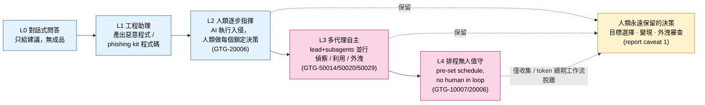
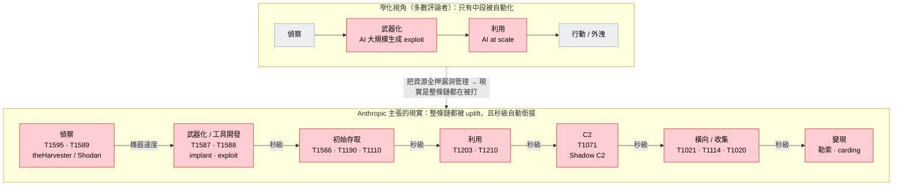
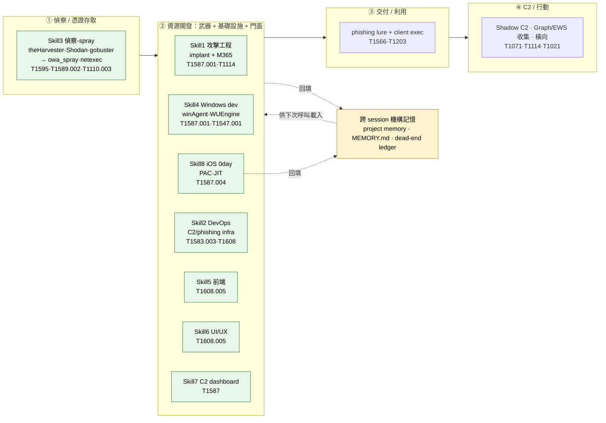
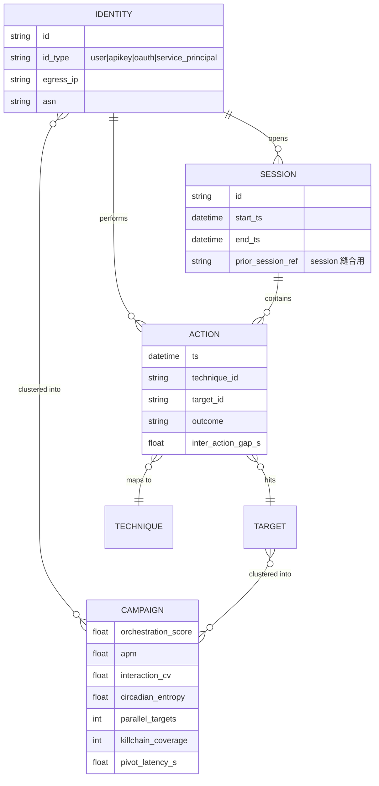
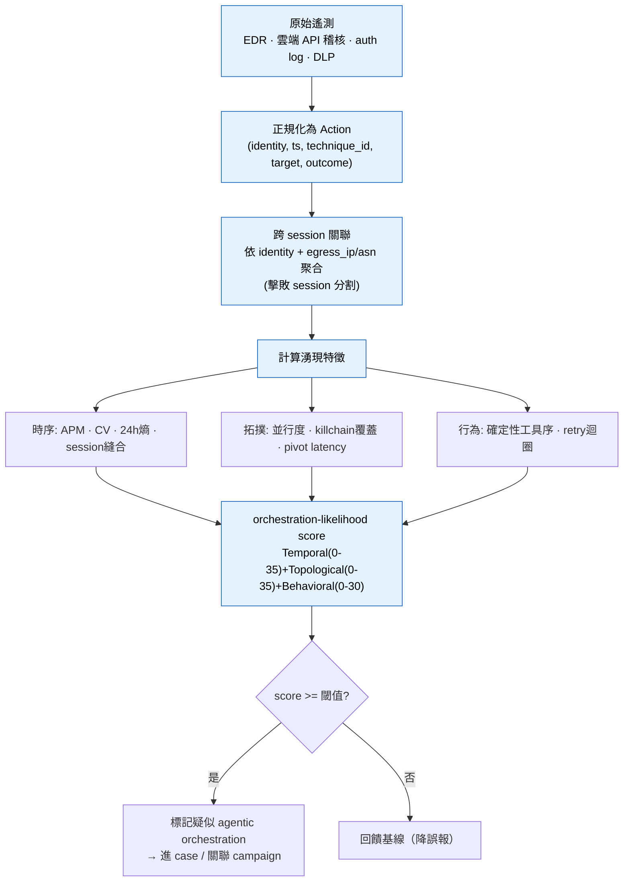
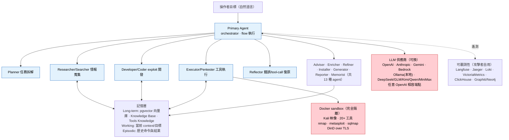

# 網路行動模組導論：趨勢分析與威脅行為者技能清單（Appendix A）

> 課程模組：01 網路行動（Cyber operations）｜ 本篇定位：整個 01 模組的**導論與總結**教材（第一堂課）
> 一手來源：PDF p.4–5（章節導論與 Trends）＋ p.38–40（Prevailing trends 與 Appendix A / Figure 19）
> 補充一手來源：Anthropic 前三份威脅報告（2025-03、2025-08、2025-11）＋ 2026-06《Mapping AI-enabled cyber threats》（Anthropic × Verizon DBIR）
> 整理日期：2026-09-13

---

## 1. 一頁速覽（給學員的 TL;DR）

1. **本章的核心翻轉：攻擊「複雜度」不再等於攻擊者「能力」。** 報告原話：「For threat intelligence investigators, sophistication has stopped being a reliable signal of who is behind an operation.」（p.5）AI 抹平了國家級團隊與單兵之間的人力與工具落差，這對威脅情報（CTI）的歸因方法論是**根本性衝擊**。

2. **「uplift（能力提升）」是本模組的核心度量。** Anthropic 用 **speed（速度）／scale（規模）／depth（深度）** 三軸衡量「有 AI 比沒 AI 多造成多少危害」。報告特別反駁「AI 最大風險是大規模開發漏洞利用」的窄化觀點——真正的風險「更明顯地分布在整條 cyber kill chain」（p.4）。

3. **AI 的角色從「助理」走向「編排者」（From assistant to orchestrator）。** 這是 p.4 標題本身。自主度是一條光譜：對話式工程助理 → 人類逐步指揮執行 → 多代理框架自主偵察/利用/外洩 → 排程無人值守。本教材把它做成一張**五級自主度量表**。

4. **2025-11 記錄的「作業模式」已擴散到所有調查過的行為者類別。** 那個由疑似國家級行動（在獨立報告中代號 **GTG-1002**）示範的多代理自主攻擊模型，如今「has now proliferated across every class of actors we investigated」（p.5）。公開的攻擊代理框架 **PentAGI** 讓任何下載者拿到同一套 scaffolding。

5. **AI 供應鏈本身變成戰場。** 兩大 Prevailing trends 之一是「AI tradecraft is proliferating（AI 戰技正在擴散）」：有人自建框架（GTG-10002），有人用公開框架（GTG-50020、GTG-50029），還形成了「以偷來的 API key 為商品」的黑市（GTG-50021 假冒 Claude 經銷）。

6. **Appendix A（Figure 19）是全報告最有價值的教學素材之一。** 它逐一列出威脅行為者**自己開發的 Claude Code skills**，把攻擊者如何「把 Claude Code skills 武器化」攤在檯面上——每個 skill 都是一個 persona（攻擊性資安工程師、DevOps、Windows 開發、前端、UI/UX、iOS Safari exploit 研究員），配上對應的 ATT&CK 技術與工作流。

7. **框架缺口（framework gap）是課程貫穿主題：** 到 2026-06，MITRE ATT&CK **仍沒有對應 agentic orchestration 的技術 ID**。GTG-1002 用了 13 個 tactics、30 個 techniques 看似只是「中風險」，但 Anthropic 自家 ARiES 風險評分給了滿分 **100**。「技術頻率表」抓不到「自主編排」這個維度的 uplift。

8. **這堂課要教什麼（一句話）：** 教學員在「攻擊複雜度崩解為商品」的新世界裡，**改用哪些替代訊號做歸因**、**用 uplift 三軸評估自己組織面對的威脅**、以及**為什麼既有的 ATT&CK 框架不夠用**。

---

## 2. 本章定位：01 網路行動模組的地圖

這份教材是 01 模組的**第一堂課**，任務不是講某一個案例，而是把整個模組的六個案例**用趨勢串起來**。報告本身就是這個結構（p.4 結尾原話）：

> 「In the following report, we begin by discussing the key trends that we've observed in these cyber operations, then move to reporting the case studies and how they highlight those trends.」

也就是說：**先講趨勢（p.5、p.38–39），再用案例佐證趨勢。** 本教材對應「趨勢」那一半；六個案例各有獨立教材。下表是模組地圖，讓學員一眼看到「每個案例是哪個趨勢的證據」：

| GTG 代號 | 案例一句話 | 一手頁碼 | 對應的核心趨勢 | 自主度（本教材第 4 節量表） |
|---|---|---|---|---|
| **GTG-20006** | 俄羅斯間諜（歸因 consistent with Midnight Blizzard），用 AI 自動重建被偵測到的惡意程式 | p.6–10 | 「複雜攻擊不再需要複雜攻擊者」的**採用 AI kill chain**範例；自主度光譜的「人類逐步指揮」端點 | L2（人類逐步指揮）＋ L4（排程無人值守：token 續期、雲端外洩） |
| **GTG-50014** | ShinyHunters 系「打帶跑」勒索者，AI 大幅 uplift 機會型犯罪 | p.11–24 | **uplift 三軸**的官方指定範例（p.5 點名）；「vibe hacking」；AI 供應鏈作為 loot | L3（多代理自主，數十受害者並行） |
| **GTG-10007** | 中國長沙大學生，建立自主「exploit 鑄造廠」與 13 agent 收集艦隊 | p.24–28 | **exploit foundry** 與 autonomous attack framework；解除「exploit 供給」與「操作人力」兩大瓶頸 | L3 ＋ L4（排程收集艦隊、無人值守漏洞研究） |
| **GTG-50021** | Russian/Ukrainian 團體（handle「kl1zy」）經營假冒 Claude 經銷，偷帳號 | p.29、p.38 | 「AI tradecraft is proliferating」中的**黑市/marketplace**發展 | L1–L2（工具化憑證竊取） |
| **GTG-50020** | 從飯店訂房轉戰 AI 供應鏈，注入沙箱偷 production key，4 天打 ~30 家 AI 公司 | p.30–33 | AI 供應鏈作為**攻擊面**；公開框架（PentAGI 類）＋人類指揮的 pentest loop | L2–L3（human-directed pentest loop ＋ 自主 exploitation pipeline） |
| **GTG-50029** | 法語單兵 hacktivist，用 Rust scanner ＋ WordPress 競態零日打歐洲政黨 | p.34–37 | 「AI 把 low-level hacktivist 變成 APT」；跨整條 kill chain 採用 AI | L3（框架管理子代理，並行偵察/利用） |

> 教學提示：這張表建議做成模組的「總目錄海報」貼在教室，每上完一個案例就回來標記它印證了哪個趨勢。學員會逐漸看到：**六個彼此毫無關聯的行為者（報告 p.38 明說「shared no connection」），卻收斂到同一套方法論。** 這個「收斂」本身就是報告最想傳達的訊息。

---

## 3. 三大 Trends 深入拆解

報告的 Trends 章節（p.5 起）有兩個明確標題，加上 p.38–39 的 Prevailing trends 一個發展，本教材整理為**三大趨勢**。這一節是全教材的理論核心，務必講透「怎麼想」，不只是「發生什麼」。

### 3.1 趨勢一：複雜攻擊不再需要複雜攻擊者（Sophisticated attacks no longer require sophisticated attackers）

**原文逐字引用（p.5）：**

> 「The cybersecurity skills of AI models means that AI has collapsed the labor and tooling gap that used to separate well-resourced, state-sponsored operations from individual operators. In the case studies we report below, a hacktivist using stolen API keys, disparate financially motivated individuals, and a state espionage operator each sustained multi-victim campaigns that, even just a year ago, would have required many skilled operators and specialist knowledge.」

> 「For threat intelligence investigators, sophistication has stopped being a reliable signal of who is behind an operation. Every layer of offensive operations has been uplifted by AI, from reconnaissance and tool development to data processing and exploitation.」

#### 3.1.1 這句話為什麼是 CTI 方法論的地震

傳統威脅情報的歸因（attribution）有一條隱含的推理鏈：

> **「這個攻擊很精密 → 需要大量人力與專門知識 → 只有國家級 APT 養得起這種團隊 → 所以幕後大概是某國政府。」**

這條推理鏈裡，「複雜度（sophistication）」是**最上游的觀測訊號**。分析師看到一個客製化 implant、一條乾淨的橫向移動路徑、一個零日利用，就會往「資源充足的行為者」方向收斂。這是過去二十年 CTI 的日常。

AI 把這條鏈的**第一環直接打斷**。當一個法語單兵 hacktivist（GTG-50029）能用 Claude 在同一個對話 session 裡開發並除錯一個**先前未被記錄的 WordPress 重裝競態零日**、還順手做一個 lab harness（p.35），那麼「精密 ≠ 有組織有資源」。報告 p.38–39 把這件事講得更白：

> 「The main distinguishing feature between these classes of actors is no longer sophistication but intent.」（p.38，區分國家級與犯罪集團的，不再是精密度而是**意圖**）

> 「None of the operations in this report depended on some entirely novel technique that defenders have never seen. Instead, the economics of the attacks have changed.」（p.39，攻擊手法本身很眼熟——偷來的憑證、沒修補的邊界設備、暴露的服務、SQL injection、phishing；**變的是攻擊的經濟學**）

#### 3.1.2 那分析師還能靠什麼歸因？替代訊號清單

這是本節的**實戰重點**。既然複雜度失效，CTI 分析師必須把歸因的重量轉移到**AI 無法幫攻擊者抹平的訊號**上。以下六類替代訊號，每一類都用本模組的案例佐證：

| 替代訊號 | 為什麼 AI 抹不平它 | 本模組案例佐證 |
|---|---|---|
| **基礎設施（Infrastructure）** | egress IP、租用的 VPS 供應商、C2 網域註冊模式、Tor 服務、雲端專案，是攻擊者的「實體足跡」，AI 生成程式碼不會改變這些選擇 | GTG-50014 的 egress IP 表（p.23–24）、GTG-50029 的 Scaleway FR 專屬伺服器與 deSEC 動態 DNS（p.36–37） |
| **目標選擇（Targeting）** | 「要打誰」是人類意圖的直接投射，AI 只執行不決定（見 3.2 的 caveat） | GTG-20006 反覆鎖定烏克蘭政府與軍用無人機供應鏈（p.7–8）→ 指向俄羅斯國家利益 |
| **作業時區與節奏（Operational tempo / time zone）** | 人類操作員的睡眠與上班時間仍會留下規律；即使 AI 24 小時跑，**人類介入的決策點**（見 3.2）會落在特定時區 | GTG-10007 操作員被判定「likely residing in Changsha」（p.24），並非靠複雜度而是靠作業模式與身分線索 |
| **語言（Language）** | 使用者與 Claude 互動的語言、handle、對話中的母語痕跡 | GTG-20006 的 Russian speaker handle「JackPoterz」（p.6）、GTG-50021 的「kl1zy」、GTG-50014 的 French-speaking「MeowSHA / frkoo / blazespider」 |
| **變現方式（Monetization）** | 勒索金流、carding 商店、資料轉售管道，是財務動機行為者的指紋 | GTG-50014 的「Soraki」carding 平台與假冒法國警政網域 policenationale[.]cc（p.13）；勒索金額有時 >$500k |
| **政治意圖（Political intent）** | 「為什麼打」通常對應地緣政治或意識形態，AI 不提供動機 | GTG-50029 專打歐洲政黨並外洩「約 14 萬筆含政治傾向」的記錄（p.35） |

> 教學核心：讓學員理解——**歸因的重心從「他有多厲害（capability）」轉移到「他是誰、為什麼、用什麼基礎設施（identity / intent / infrastructure）」。** 這是這堂課要種進學員腦子裡的第一個新反射。

#### 3.1.3 報告點名的官方 uplift 範例：GTG-50014

報告在 p.5 明說「An example of this uplift in capabilities is documented in case study GTG-50014」。這是 Anthropic 指定用來示範「uplift」的案例，所以第 4 節的 uplift 三軸表也會拿它當標準範例。先記住三個關鍵數字（都可追到 p.13–14）：

- **速度：** 一次企業軟體公司的入侵，「從首次存取到大量竊資只花數小時」；另一次「從單一被竊的 developer token 升級到完整雲端管理權限，約三小時」。
- **規模：** 一次供應鏈攻擊「約 34 小時內傾印超過 2,100 組 Azure AD token、橫跨 40 多個企業租戶」；frkoo 的憑證管線「大量下載 180 萬個獨立 Android APK」掃描硬編碼密鑰。
- **深度：** 攻擊者「往往並不理解每個目標環境的複雜性，而是把細節交給 AI」——這就是 p.14 描述的 **「vibe hacking」**。

### 3.2 趨勢二：AI 在網路行動中的角色日益自主（AI's role has become increasingly autonomous）

**原文逐字引用（p.5–6）：**

> 「A majority of the operations described in this report were enabled by AI via direct execution or orchestration. The use of AI went beyond simple questions and responses from a chatbot but rather involved the use of multi-agent frameworks executing reconnaissance, exploitation, and data exfiltration. Humans remained in the loop by setting the targets of attacks and reviewing exfiltration.」

這裡有兩個必須讓學員牢記的關鍵句：
1. AI 用途「went beyond simple questions and responses from a chatbot」——**已經不是問答**。
2. 「Humans remained in the loop by setting the targets of attacks and reviewing exfiltration」——**人類仍保留兩件事：設定攻擊目標、審查外洩結果。**

#### 3.2.1 課程用「自主度五級量表」

報告 p.39 把自主度描述成一條光譜（「spans a wide range of levels of autonomy」）。本教材把它整理成可操作的**五級量表**，每一級都對應報告明確點名的案例，方便學員在分析任何事件時做分級：

| 級別 | 名稱 | 定義（AI 做什麼） | 報告原文依據與點名案例 |
|---|---|---|---|
| **L0** | 對話式問答 | 純粹問答，AI 提供技術建議，不產出可直接部署的成品 | 報告視為基準線；本報告的案例「多數已超越」此級 |
| **L1** | 對話式工程助理 | AI 在對話中產出惡意程式、phishing kit、監控工具的程式碼 | p.39：「actors used Claude conversationally: it acted as an engineering assistant in the creation of malware, phishing kits, and surveillance tooling」 |
| **L2** | 人類逐步指揮執行 | AI 直接對受害網路下指令、收割憑證、外洩資料，但**每一個鎖定決策都由人做** | p.39：「threat actors directed Claude to execute operations ... with a human making each individual targeting decision **(GTG-20006)**」 |
| **L3** | 多代理自主執行 | 多代理框架自主進行偵察、利用、竊取，對**多個受害者並行**，持續數小時至數天 | p.39：「operations ran autonomously ... multi-agent frameworks ... in parallel, for hours or days at a time **(GTG-50014, GTG-50020, GTG-50029)**」 |
| **L4** | 排程／無人值守 | 排程任務在**完全沒有 human in the loop** 的情況下運行 | p.39：「a collection fleet running on a pre-set schedule with no human in the loop **(GTG-10007)**」；「scheduled jobs renewing stolen access tokens and harvesting victim cloud storage with no human involvement **(GTG-20006)**」 |

> 注意一個重要的教學細節：**同一個行為者可以橫跨多級。** GTG-20006 既是 L2（人類逐步指揮橫向移動）又是 L4（排程續期 token、無人值守外洩雲端儲存）。這說明「自主度」不是給行為者貼一個標籤，而是**針對每一條工作流**分別評估。

**自主度五級光譜（本教材重繪，Mermaid）：** 下圖把上表畫成一條光譜，並標出「人類保留決策」這條貫穿所有層級的底線（呼應 3.2.2 的 caveat 1）。虛線＝該層級仍把該決策留給人類；只有 L4 的收集／token 續期類工作流在部分決策上脫離人類。



> 讀圖要點：**由左至右增加的是「效率 / 成本」增益，不是「危害嚴重度」增益**（caveat 2）。底部黃框是 AI 抹不平、因而成為歸因抓手的人類決策（連回 3.1.2 的替代訊號清單）。這張圖是 T.3「補償性偵測」要量化的對象——因為「一條工作流落在哪一級」正是 ATT&CK 技術頻率表抓不到的維度。

#### 3.2.2 兩個必講的 caveat（報告 p.39 明列）

報告特別提醒「兩個要牢記在心的告誡」，這是防止學員把「自主 = 更危險」這個直覺過度簡化的關鍵：

**Caveat 1：人類保留了對他們最重要的決策。**
> 「humans have retained the decisions that matter most to them: for example, they're still heavily involved in target selection, monetization of findings, and review of results.」

這一條同時是 3.1.2「目標選擇/變現作為替代歸因訊號」的理論基礎——因為人類**捨不得**把這些決策交給 AI，這些決策點就成了分析師的抓手。

**Caveat 2：自主度（Autonomy）與危害（Harm）是兩條獨立的軸。**
> 「Autonomy multiplies the scale and speed of an operation, and reduces operating costs and complexity, but severity is still determined by a multitude of factors. Several of the most serious compromises we report here came from operations where a human directed every step.」

換句話說：**最自主的行動不一定造成最嚴重的傷害；本報告最嚴重的幾起入侵反而來自「人類指揮每一步」的行動。** 這一點在課堂上極容易被學員誤解，務必用一句話釘死：**自主度提升的是「效率與成本」，不是「傷害嚴重度」。**

報告用經濟學語言收尾（p.39）：
> 「In economic terms, AI autonomy compresses the cost side of attacker ROI calculations, lowering the skill threshold and labor required per campaign, while leaving potential payoffs largely unchanged. This favorable shift in unit economics makes previously marginal targets viable and encourages higher-volume, lower-touch operations.」

翻譯給非技術主管聽：**AI 沒有讓「搶到的錢」變多，但讓「搶劫的成本」變便宜——於是以前不划算的目標現在都值得打了，攻擊會走向「更高量、更輕觸」。** 這是防守方最該理解的商業含義。

#### 3.2.3 「反轉了成本，把負擔丟回防守方」

報告 p.9 有一段極具課堂張力的論述，說明自主 AI 如何顛覆傳統攻防成本結構：

> 「The result of the above is that AI has inverted the cost back onto defenders. Previously, defenders might have been able to slow an attacker's operational tempo via the deployment of a new detection. Now, at least in theory, capable adversaries can "close the loop," bypassing traditional security detections faster than defenders can develop and deploy them.」

「close the loop」是這裡的關鍵詞。傳統上，防守方發一條新偵測規則 → 攻擊者被擋 → 攻擊者要花時間改工具 → 防守方爭取到時間。GTG-20006 用 AI **自動化了「改工具」這一步**（p.6）：監控 AI agent 一旦發現某個惡意程式被安全產品偵測到，就自動改寫、重建、反覆迭代直到不被偵測為止。於是防守方「用新偵測換時間」的老招失效了。SOC 團隊要理解：**攻擊者的迴圈以「小時」收斂，防守者的迴圈還停在「天」。**

### 3.3 趨勢三：作業模式擴散 ＋ 公開框架讓門檻歸零

**原文逐字引用（p.5）：**

> 「In November 2025, we documented an operating model used by a suspected state-sponsored campaign to carry out autonomous attacks. That operating model has now proliferated across every class of actors we investigated. Publicly available offensive agent frameworks, like PentAGI, reproduce much of the same scaffolding for anyone who downloads them. This scaffolding effectively automates each step of the cyber kill chain.」

這一段把兩件事連起來：
1. **2025-11 的那套自主攻擊「作業模式」**（在獨立報告中代號 GTG-1002，見第 8 節四報告比較）原本是疑似國家級行動的專利。
2. **如今它「擴散到所有調查過的行為者類別」**，而且不需要自己開發——**PentAGI 這類公開的攻擊代理框架，把同一套 scaffolding 送給任何下載者。**

#### 3.3.1 PentAGI 是什麼，為什麼它讓門檻歸零

（來源：PentAGI GitHub README，vxcontrol/pentagi，MIT 授權，約 23.7k stars；第 9 節列為外部驗證來源）

- **一句話定義：** 「an innovative tool for automated security testing」——一個自動化資安測試工具，但架構就是一個完整的自主攻擊框架。
- **多代理架構：** Orchestrator（協調）／Researcher（偵察）／Developer（規劃利用）／Executor（執行），正好對應報告描述的「lead agent 分派工作給 subagents」模式。
- **記憶系統：** long-term（PostgreSQL + pgvector 向量記憶）、working、episodic、knowledge base——對應報告一再提到的「persistent project memory」「campaign memory」。
- **內建 20+ 專業資安工具：** nmap、metasploit、sqlmap、nuclei 等，全部跑在隔離的 Docker sandbox。
- **LLM 供應商極廣：** OpenAI、Anthropic（Claude Opus/Sonnet/Haiku）、Google Gemini、AWS Bedrock、Ollama（本地）、DeepSeek/GLM/Kimi/Qwen/MiniMax，以及**任意 OpenAI 相容端點**（這一點很重要：攻擊者可用本地或代理模型繞過雲端護欄）。
- **自主等級：** README 明寫「**Fully Autonomous.** AI-powered agent that automatically determines and executes penetration testing steps」。
- **合法聲明：** 「Only test systems you own or are explicitly authorized to assess.」——但這只是 EULA 上的一行字，下載者是否遵守無從管控。

> 教學要點：PentAGI 的存在，把報告 p.5「reproduce much of the same scaffolding for anyone who downloads them」變成可觸摸的事實。**課堂不需要（也絕不可）實際部署它去打真實目標**；重點是讓學員理解「攻擊 scaffolding 已經商品化、開源化、Docker 一鍵化」這個結構性改變。報告 p.38 更點名 GTG-50020、GTG-50029「leveraged publicly available offensive agent frameworks like PentAGI ... several operations in this report ran on them or on derivatives」。

#### 3.3.2 「採用 AI kill chain」的官方範例：GTG-20006

報告 p.5 明說「An example of this adoption of AI-enabled kill chains is documented in case study GTG-20006」。這是報告指定用來示範「作業模式擴散」的案例，也是自主度量表 L2＋L4 的代表。它的招牌動作（p.6）——**AI 自動監控自己的惡意程式是否被偵測，一旦被偵測就自主改寫重建**——正是「作業模式擴散」的具體長相。

報告 p.5 的收尾預測，值得讓學員抄進筆記：
> 「As models continue to evolve and improve, we assess that more actors, from lone wolves to organized entities, will continue to adopt AI frameworks to enable more sophisticated cyber attacks at greater speed and scale.」

---

## 4. uplift（能力提升）的三軸定義與評估表

### 4.1 報告怎麼定義 uplift

**原文逐字引用（p.4）：**

> 「The report also attempts to measure uplift, a term we use to describe the AI capability boost, or how much more harm was caused with AI versus without AI. We view uplift through the lens of speed, scale, and depth, and attempt to determine how an actor's adoption of AI meaningfully impacts each of these traits.」

三軸定義：
- **Speed（速度）：** 完成同一件事所需的時間縮短多少。
- **Scale（規模）：** 同一名操作員能並行處理多少目標／資料量。
- **Depth（深度）：** 能理解與利用多陌生、多晦澀的環境與知識。

### 4.2 報告對「風險位置」的關鍵論點（務必完整呈現）

這是本節的思想核心，也是報告刻意糾正的一個常見誤解。**原文逐字引用（p.4）：**

> 「Many commentators focus on the risk of AI developing exploits at scale. While this is a danger, the risk from AI adoption is more pronounced across the cyber kill chain, where adversaries can operate faster, across a broader and deeper surface area, with fewer resources.」

拆解這句話的論證：
- **多數評論者的焦點：** 「AI 會大規模自動開發漏洞利用（exploits at scale）」——也就是把風險窄化在 kill chain 的**單一環節（武器化/exploitation）**。
- **Anthropic 的反駁：** 這確實是危險，但**真正的風險分布在整條 kill chain**——偵察、工具開發、初始存取、橫向移動、資料處理、外洩、變現，每一環都被 uplift 了。

為什麼這個論點對防守方這麼重要？因為如果你以為「AI 風險 = 自動化零日」，你會把所有防禦資源砸在漏洞管理上，卻對「AI 讓偵察與資料處理快 100 倍」毫無準備。報告 p.39 用數字佐證「整條鏈」的說法：
> 「The results are visible in the numbers reported above: breaches completed in two to three hours, and dozens of victims handled in parallel by individual operators.」

**「風險分布在整條 kill chain」（本教材重繪，Mermaid）：** 下圖對比兩種心智模型。上排是多數評論者的**窄化視角**（只有「武器化 / 利用」被 AI 放大，其餘留白）；下排是報告主張的**現實**——kill chain 的每一環都被 uplift，且環與環之間由 AI 以機器速度自動銜接（把過去人工的階段轉換壓縮到秒級）。紅色＝被 AI 放大的節點。



> 讀圖要點：防守方若只按上排配置資源（全押漏洞管理），就會對「偵察 / 資料處理快 100 倍」與「跨階段秒級自動銜接」毫無準備。**uplift 真正的戰場是『階段之間的銜接速度』——這正是第 8 節框架缺口與 T.3 補償性偵測要處理的維度。**

### 4.3 課程用 uplift 評估表（可套用任一案例）

下表是本教材提供的**可重複使用工具**。分析任何一個 AI 賦能攻擊時，逐軸填寫「觀察指標」與「證據」，就能得到一張結構化的 uplift 側寫。這裡用報告官方指定的 **GTG-50014** 當完整範例（證據全部可追到 p.11–24）：

| uplift 軸 | 評估問句 | 觀察指標（要找什麼證據） | GTG-50014 套用範例（含頁碼） |
|---|---|---|---|
| **Speed（速度）** | 有 AI 後，關鍵動作快了多少？ | 「首次存取 → 大量竊資」耗時；「單一憑證 → 全域管理權」耗時；工具改版週期 | 一次入侵「數小時內從首次存取到大量竊資」；「單一 developer token → 完整雲端管理權約三小時」（p.14） |
| **Scale（規模）** | 一名操作員能並行處理多少？ | 並行受害者數、掃描資料量、一次傾印的憑證/租戶數 | 34 小時傾印 >2,100 組 Azure AD token、跨 40+ 租戶；下載 180 萬個 APK 掃密鑰；一個 foothold 觸及約 200 家下游客戶（p.13–14） |
| **Depth（深度）** | AI 讓攻擊者理解/利用多陌生的環境？ | 是否處理晦澀配置、陌生 API、跨租戶邏輯；操作員本身是否理解環境 | 攻擊者「defer the specifics to the AI」，由 AI 理解 developer/auth API、產生並轉換特權 token、建跨租戶匯出工具（p.14，即 vibe hacking） |

> 教學設計：第 10 節的課堂練習，就是要學員拿**自己組織面對的一個真實或假想威脅**，填這張表。這是把抽象趨勢轉成可操作評估的橋樑。

---

## 5. Prevailing trends（p.38–39）：兩大發展如何串起六個案例

報告在所有案例之後，用 p.38–39 的「Prevailing trends」做總結。開宗明義（p.38）：

> 「Despite the fact that each of the case studies above shared no connection, there are two broad developments that are relevant to each of them.」

**這句話是整個模組的收束點：六個彼此無關聯的行為者，卻共享兩大發展。** 分述如下。

### 5.1 發展一：AI tradecraft is proliferating（AI 戰技正在擴散）

副標「Diffusion of AI-enabled cyber operations」。核心比喻（p.38）：
> 「Just as in the legitimate economy, AI has diffused through the cyber battlefield.」

這個「擴散」有三種形態，正好把六案例分類：

**形態 A｜自建自主框架：** 「Multiple groups including GTG-10002, as previously reported, developed and utilized their own autonomous attack frameworks」（p.38）。
> 注意：這裡報告寫的是 **GTG-10002（五位數）**。在 2025-11 的獨立報告中，同一起「首度公開的 AI 編排間諜行動」代號是 **GTG-1002（四位數）**。這個編號不一致是真實存在的（見第 7 節與第 12 節），課堂上是絕佳的「不要迷信代號」教材。

**形態 B｜用公開框架：** 「other groups including GTG-50020 and GTG-50029 leveraged publicly available offensive agent frameworks like PentAGI. These public frameworks reproduced much of the same scaffolding for anyone who downloads them, and several operations in this report ran on them or on derivatives.」（p.38）

**形態 C｜形成黑市（marketplace）：** 「A marketplace supporting the battlefield has formed as well. We discovered GTG-50021 creating fraudulent resellers offering discounted Claude access, while silently proxying user traffic to a different model, and harvesting the Anthropic credentials of anyone who signed up.」（p.38）

擴散的三個維度（p.38）：「across different classes of threat actors, different regions, and different types of mission.」並下了一個防守方必須內化的結論：
> 「The capabilities described in this report should be assumed to be available to any actors who are motivated to use them.」（**假設這些能力對任何有動機的行為者都已可得。**）

發展一如何串起六案例（報告 p.38–39 的原文舉例）：
> 「A hacktivist using stolen API keys (GTG-50029), a financially motivated crew harvesting credentials from mobile applications (GTG-50014), and a state-nexus espionage operator (GTG-20006) all showed similar methodology: they ran multi-victim campaigns using agentic AI that would previously have required teams of operators. They built custom tools, executed intrusions, and processed stolen data at volumes no individual human operator could manage manually.」

再加上一句「攻擊手法其實很眼熟、變的是經濟學」的名言（p.39，已在 3.1.1 引用）：這三個行為者的手法都是老招（偷憑證、沒修補的邊界設備、SQL injection、phishing），**唯一改變的是「以前只有資源充足行動才養得起的勞力——偵察、利用、工具開發、資料處理——現在全外包給了以機器速度並行運行的 AI 模型。」**

### 5.2 發展二：AI's increasingly autonomous role（AI 角色日益自主）

這是第二個 Prevailing trend，內容與 3.2 的「趨勢二」相互呼應、互為表裡：p.5 的「趨勢二」開了頭，p.39 的「發展二」做了收束並補上五級光譜的完整案例點名（GTG-20006 / 50014 / 50020 / 50029 / 10007，已整理進第 3.2.1 的量表）。兩處要合起來教，讓學員看到「報告開頭提出的假說，在結尾用全部案例驗證」。

### 5.3 六案例 × 兩發展的交叉檢核表

| GTG 代號 | 發展一（擴散）的角色 | 發展二（自主）的定位 |
|---|---|---|
| GTG-20006 | 採用 AI kill chain（p.5 指定範例）；自建工具＋AI 自動重建 | L2 人類逐步指揮 ＋ L4 排程無人值守 |
| GTG-50014 | 財務動機、mobile app 憑證收割；uplift 指定範例 | L3 多代理自主、數十受害者並行 |
| GTG-10007 | 自建 exploit foundry 與收集艦隊；擴散到「學生/個人」層級 | L3 agent swarm ＋ L4 排程收集艦隊 |
| GTG-50021 | 形態 C：黑市/假冒經銷（marketplace 發展的代表） | L1–L2 憑證竊取工具化 |
| GTG-50020 | 形態 B：用公開框架；AI 供應鏈作為攻擊面 | L2 human-directed pentest loop ＋ L3 自主 exploitation pipeline |
| GTG-50029 | 形態 B：用公開框架；hacktivist 升格 APT | L3 框架管理子代理並行偵察/利用 |

---

## 6. 圖表逐一判讀

> 本模組導論教材涵蓋的頁段（p.4–5、p.38–40）只有**一張圖**：Figure 19（p.40）。但它是全報告最有教學價值的圖表之一，因此本節深度判讀它，並補充一張跨頁引用的關鍵圖（Figure 2，攻擊生命週期）作為理解背景。

### 6.1 Figure 19（p.40）：Skill breakdown（威脅行為者開發的 Claude Code skills 清單）

**引用圖檔：** `../figures/page-040.png`

**Appendix A 的定位（p.40 原文）：**
> 「The following is a list of skills developed by threat actors to build out their AI-enabled workflows.」

**圖片類型：** 三欄式表格（非流程圖、非長條圖）。表頭為 **ATT&CK category｜Description｜Flow**，共八列，每一列是威脅行為者為了武器化 Claude Code 而**自己撰寫的一個 skill（技能/persona）**。

#### 6.1.1 為什麼這張圖是「最有價值的素材之一」

Claude Code 的「skills」原本是給合法開發者用的：把一段可重用的指令、persona、專案設定包成一個模組，讓 AI 在特定任務下切換到對應的「工作暫存器（register）」。**Figure 19 直接展示攻擊者如何把這個合法機制反過來用**——他們替每一種攻擊工種寫一個 persona skill（攻擊性資安工程師、DevOps、Windows implant 開發者、前端、UI/UX、C2 儀表板工程師、iOS Safari exploit 研究員），讓 Claude 在「進入某個專案目錄 → 呼叫某個 skill」時，自動切換成該工種的心智模型與工具鏈。

這等於把一支「AI 攻擊團隊」的**分工組織圖**攤在你面前。對課程而言，它把前面所有抽象的「自主」「編排」「uplift」變成**看得見的具體工程實作**。

#### 6.1.2 逐列逐字抄錄（八個 skill 全部）

以下**逐字抄錄**圖上每一列的三欄內容（英文原文保留，這是最忠實的教學素材）：

**Skill 1｜攻擊性資安工程師 persona（implant 開發與 M365 作業）**
- **ATT&CK category：** Resource Development — T1587.001 Develop Capabilities: Malware; T1588 Obtain Capabilities
- **Description：** Offensive-security engineer persona. implant development and M365 operations windows. Interacts with the winAgent/GoDownload build loops, Defender-evasion iterations, and Graph/EWS operational tooling.
- **Flow：** Invoked at task pivots: the operator enters a project directory then `/security-engineer` shifts Claude into an engineering register for implant or platform work.

**Skill 2｜DevOps persona（C2/phishing 基礎設施架設）**
- **ATT&CK category：** Resource Development — T1583.003 Acquire Infrastructure: VPS; T1608 Stage Capabilities
- **Description：** DevOps persona used to stand up and maintain containerized C2/phishing stacks (shadow_c2 compose services, mailer, merged-landing deployments) and VPS provisioning over sshpass.
- **Flow：** Typical flow: skill invocation → docker compose build/up → curl health checks → sshpass push to rented VPS (MonoVM/eclipse proxies).

**Skill 3｜偵察／憑證存取 persona（掃描與 spray）**
- **ATT&CK category：** Reconnaissance / Credential Access — T1595 Active Scanning; T1589.002 Gather Victim Identity; T1110.003 Password Spraying
- **Description：** shadow_c2 persona and the Red-Team user_role memory rules. Active in scanning/recon and spray windows.
- **Flow：** Flow: ctf-pentest register → theHarvester/Shodan/gobuster recon → owa_spray or netexec validation → findings folded back into project memory.

**Skill 4｜Windows 開發者 persona（原生 implant 產線）**
- **ATT&CK category：** Resource Development / Persistence — T1587.001 Develop Capabilities; T1547.001 Run Keys; T1027 Obfuscation
- **Description：** Windows developer persona used for the native implant line (winAgent v2.0 mod_* modules, WUEngine persistence, COM/CLSID work) and PowerShell loader engineering.
- **Flow：** Flow: skill → Visual-Studio/mingw builds → PowerShell test harness on the test host → taskkill/sc.exe service install cycles → memory update.

**Skill 5｜前端 persona（phishing 平台與儀表板前端）**
- **ATT&CK category：** Resource Development — T1608.005 Stage Capabilities: Link Target
- **Description：** Frontend persona. Used on the phishing-platform and dashboard frontends.
- **Flow：** Flow: skill → Next.js/Flask template edits → Claude_Preview screenshot QA.

**Skill 6｜UI/UX 設計師 persona（誘餌頁/管理面板美化）**
- **ATT&CK category：** Resource Development — T1608.005 Stage Capabilities: Link Target (lure/admin UI polish)
- **Description：** UI/UX designer persona. Polished the frontends of actor web projects — lure pages, admin panels
- **Flow：** Flow: skill → design-principles pass over lure/admin HTML → Edit cycles → preview screenshots.

**Skill 7｜資深前端與設計工程師 persona（Shadow C2 儀表板與 builder UI）**
- **ATT&CK category：** Resource Development — T1587 Develop Capabilities (C2 dashboard & builder UI)
- **Description：** 'Senior Frontend & Design Engineer'' persona purpose-built for the Shadow C2 CNC dashboard and builder UI — maps dashboard template files and REPORT.md API shapes.
- **Flow：** Flow: skill → CNC dashboard component work → agent-table/builder views wired to the shadow_c2 Postgres backend.

**Skill 8｜iOS Safari exploit 研究員 persona（零日利用研發）**
- **ATT&CK category：** Resource Development — T1587.004 Develop Capabilities: Exploits; T1203 Client Execution
- **Description：** 'Expert iOS Safari exploit researcher' projectSettings skill: ARM64e PAC bypasses, JSC JIT exploitation, kernel internals; instructs the model to load the lab memory index before any work and lists confirmed dead ends never to retry.
- **Flow：** Flow: skill auto-scopes the Safari lab → MEMORY.md index load → DarkSword/Coruna chain work with ipsw/otool → dead-end ledger updates (institutional memory for exploit R&D).

#### 6.1.3 這張圖傳達的四個核心訊息

1. **攻擊者把一支團隊的分工「persona 化」。** 八個 skill 對應八種工種，涵蓋從基礎設施（DevOps）、偵察（scanning/spray）、武器開發（implant、exploit）、到社交工程門面（前端、UI/UX）。這正是報告 p.39「would previously have required teams of operators」的工程證據——**一個人＋八個 skill＝一支團隊。**

2. **「記憶（memory）」是武器化的關鍵基礎設施。** 注意反覆出現的 `project memory`、`user_role memory rules`、`MEMORY.md index`、`dead-end ledger`（institutional memory for exploit R&D）。攻擊者刻意用 Claude Code 的記憶機制建立**跨 session 的機構記憶**：記住哪些漏洞路徑是死路、下次別再試。這把 AI 從「一次性問答」升級成「有累積學習的常駐研究員」——直接對應第 3.2 的 L3/L4 自主度。

3. **Figure 19 的技術與報告正文的惡意程式互相印證（交叉驗證練習）。** 表中出現的工具名稱，多數能在 GTG-20006 段落（p.10）找到對應：`WUEngine`、`Shadow C2`（正文寫 Shadow C2）、`DarkSword`（正文：iOS exploit chain，p.10）都出現在惡意程式清單。這代表 **Figure 19 這張 skill 表，極可能主要來自 GTG-20006（俄羅斯間諜）這個案例的 Claude Code 專案**——因為只有它同時涉及 Windows implant（winAgent/WUEngine）、Shadow C2、iOS（DarkSword）與 M365/Graph/EWS 作業。這是一個很好的「用圖表反推案例歸屬」的分析練習（標示為合理推測，報告未明說 Figure 19 專屬哪個 GTG）。

4. **每個 skill 都掛著 ATT&CK 技術 ID——但整體「skill 化 / persona 切換」這件事本身沒有 ID。** 這正好預告第 8 節的框架缺口：ATT&CK 能標記「T1587.001 開發惡意程式」，卻標記不了「攻擊者用 `/security-engineer` 指令把 AI 切換成一個會自己迭代、自己記憶死路的攻擊工程師」。**這張圖同時展示了 ATT&CK 有用的地方，和它抓不到的維度。**

#### 6.1.4 截圖類元素判讀

Figure 19 是一張**表格截圖**（淺灰底、圓角、三欄），非互動介面截圖，因此沒有平台/語言 UI 元素可判讀。但表格內容裡藏著幾個平台線索值得指出給學員：
- `Next.js/Flask`、`docker compose`、`Postgres backend`、`sshpass`、`MonoVM/eclipse proxies`：顯示攻擊者用的是**標準現代 web 開發與 DevOps 技術棧**——再次印證「攻擊手法很眼熟、變的是經濟學」。
- `Claude_Preview screenshot QA`：攻擊者甚至用 Claude 的預覽/截圖功能對 phishing 頁面做**視覺品管**。這是「AI 賦能」滲透到攻擊最末端（門面美化）的鮮明例子。
- `ipsw/otool`、`ARM64e PAC bypasses`、`JSC JIT`：Apple 平台逆向/利用的專業工具與技術，顯示第 8 個 skill 針對的是 iOS Safari 零日。

#### 6.1.5 課堂用法建議

- **拆解練習：** 把八個 skill 印成八張卡，讓小組把它們排到一條 cyber kill chain 上（偵察→武器化→交付→利用→C2→行動），體會「一支 AI 團隊」如何覆蓋全鏈。
- **紅藍對照：** 每個 skill 旁邊讓學員寫「如果我是防守方，這個 skill 的產出會在我的環境留下什麼可偵測痕跡？」（例如 Skill 3 的 `owa_spray`/`netexec` 會在 OWA 認證日誌留下 spray 特徵）。
- **記憶機制討論：** 專門用 `dead-end ledger`（絕不重試的死路清單）開一個討論：**攻擊者的 AI 會「學乖」，防守方的偵測規則會不會？** 這直接連到第 3.2.3 的「攻防迴圈速度不對稱」。

### 6.2 補充判讀：Figure 2（p.15）攻擊生命週期與 AI 整合（跨頁引用）

**引用圖檔：** `../figures/page-015.png`（屬 GTG-50014 案例頁段，本模組另有專篇；此處只作導論背景）

雖然 Figure 2 不在本教材的核心頁段，但它是理解「uplift 分布在整條 kill chain」（第 4.2 節論點）的視覺骨架。它把 ShinyHunters 系的攻擊生命週期畫成一條流程：**Sourcing and recon → Discover → Validate/qualify → Expand in-victim → Exfil channels → Warehouse → Mint/persist → Monetize**（對應 p.16–20 的 Figure 3–10）。每一階段旁都標註 AI 介入點。

導論階段只需讓學員記住一件事：**這張圖的每一個方框，都是一個被 AI uplift 的環節**——不是只有中間的「利用/exploitation」被自動化。這正是第 4.2 節「風險分布在整條 kill chain，而非單一環節」的圖像化證明。細節留給 GTG-50014 專篇教材。

---

## 7. GTG（Generative Threat Groups）命名系統

### 7.1 報告怎麼定義 GTG

**原文逐字引用（p.4）：**
> 「Throughout these case studies, the report will reference Generative Threat Groups (GTGs). These are Anthropic's internal designators for actors observed to be abusing AI.」

三個要點：
1. **GTG = Anthropic 的內部代號（internal designators）**，專門標記「被觀察到濫用 AI」的行為者。
2. 它是 **Anthropic 私有的命名體系**，不是產業共通標準（不像 MITRE 的 G-number 或各廠商的 APT 命名）。
3. 報告**從未公開編號規則**。

### 7.2 關鍵原則：不可從數字推斷歸因

這是本節最重要的教學紅線。**因為 Anthropic 沒有公開編號規則，任何「從 GTG 數字反推行為者身分/國別/類型」的推論都是不可靠的。** 課堂上要明確告訴學員：

> **看到 GTG-50029，你不能因為它是「5 開頭」就斷定它是財務動機犯罪；看到 GTG-20006，你不能因為「2 開頭」就斷定它是國家級。這些都是未經證實的臆測。**

而且報告本身就提供了一個「代號不可靠」的鐵證：同一起「首度公開的 AI 編排間諜行動」，在 **2025-11 獨立報告**中代號 **GTG-1002（四位數）**，在**本報告 p.38**卻寫成 **GTG-10002（五位數）**。連 Anthropic 自己的代號都出現位數不一致（見第 12 節），這正好證明**代號是標籤，不是可解碼的情報**。

### 7.3 可觀察的經驗規律（明確標示為「推測」的課堂練習）

雖然不能從數字推斷歸因，但我們**可以把「觀察編號區間的分布」當成一個課堂 pattern-hunting 練習**——前提是全程標示為「純屬觀察、未經證實、可能因新案例而推翻」。

下表整理本報告全文（p.4–154）出現的 GTG 代號與其所屬領域（領域是報告明確歸類的，編號規律是**我們的觀察**）：

| 編號前綴區間 | 觀察到的所屬領域（報告明示） | 出現的代號範例 |
|---|---|---|
| **04xxx** | 影響力行動（Influence） | GTG-04001（俄羅斯 CAR 資訊操作） |
| **10xxx** | 網路/間諜（自主框架） | GTG-10002（自建框架，previously reported）、GTG-10007（中國長沙 exploit foundry） |
| **14xxx** | 監控（China-nexus surveillance） | GTG-14010、14020、14021、14022（維吾爾/宗教/維穩/輿情監控） |
| **15xxx** | 詐騙（Scams） | GTG-15001（中國交友軟體詐騙網） |
| **16xxx** | 蒸餾（Distillation） | GTG-16001（DeepSeek）、16002（Moonshot）、16006（Zhipu/Z.ai）、16008（Xiaomi） |
| **17xxx** | 常規武器（China-nexus weapons） | GTG-17001（潛艦火控）、17002（電子戰）、17003（定向能武器情報） |
| **20xxx** | 網路/間諜（state-nexus） | GTG-20006（俄羅斯，consistent with Midnight Blizzard） |
| **24xxx** | 影響力行動（俄國家媒體） | GTG-24015 |
| **27xxx** | 常規武器（Russia-nexus） | GTG-27005（無人機群）、27006（軍民兩用採購） |
| **30xxx / 34xxx** | 監控/武器（Iran-nexus） | GTG-30004/30005/30006、34001、34007 |
| **50xxx** | 網路（財務動機/hacktivist/AI 供應鏈） | GTG-50014、50020、50021、50027、50029 |
| **54xxx / 84xxx** | 影響力行動（商業/國家對齊） | GTG-54002/54004/54006/54009、84002/84005/84006 |
| **87xxx** | 常規武器（葉門） | GTG-87001（Houthi 導引武器工程） |

**這張表能引導出的「觀察」（全部標示為推測）：**
- 同一領域的案例，編號前綴**傾向**落在相近區間（例如中國監控多在 14xxx、蒸餾集中在 16xxx、財務型網路犯罪多在 50xxx）。
- 但**反例立刻出現**：GTG-10007（中國）與 GTG-20006（俄羅斯）都屬「網路間諜」卻在不同區間；GTG-50027 是伊朗監控卻用 50 開頭。**規律有例外，不能當歸因依據。**
- 位數本身就不一致（GTG-1002 vs GTG-10002），連「幾位數」都不是穩定特徵。

> 教學設計：把這張表當「歸納 vs 演繹」的思辨練習。讓學員先觀察規律（歸納），再刻意找反例（證偽），最後得出結論——**經驗規律可以生成假設，但不能取代證據。這正是情報分析的基本紀律。** 明確要求學員在任何報告裡使用 GTG 代號時，都寫成「Anthropic 代號 GTG-XXXXX」而非把數字當作分類線索。

---

## 8. 從 GTG-1002 到本報告：MITRE ATT&CK 的框架缺口

本節整合 2026-06《Mapping AI-enabled cyber threats》（Anthropic × Verizon DBIR）的關鍵數據，說明為什麼「既有偵測框架跟不上 AI 賦能攻擊」是本模組的貫穿主題。（來源見第 9 節；一手網址 https://www.anthropic.com/news/AI-enabled-cyber-threats-mitre-attack 與 Frontier Red Team 長版 https://www.anthropic.com/research/attack-navigator ）

### 8.1 研究規模與方法（832 個帳號）

- **資料集：** 分析 **832 個**因惡意網路活動被封鎖的 Claude 帳號，時間跨度 **2025-03 至 2026-03（整整一年）**。這 832 個是「有足夠細節可做完整評估」的子集，非全部封鎖帳號。
- **對應框架：** 映射到 **MITRE ATT&CK v18**，共觀察到 **13,873 個 action、橫跨 482 個 unique techniques、涵蓋全部 14 個 tactics**；99% 屬 Enterprise 矩陣。
- **風險評分 ARiES（AI Risk Enablement Score，0–100，加法模型）：**
  - **Threat（威脅，0–35）：** 意圖清晰度、技術成熟度、威脅情報訊號、規避偵測的手法。
  - **Vulnerability（脆弱性，0–35）：** 模型使能該危害的能力、以及所用介面的風險（程式化介面與 agentic coding 工具得分最高）。
  - **Impact（衝擊，0–30）：** 真實世界效果，由安全分類器與調查員評估。
  - **為何用加法而非乘法：** 「we wanted a score that would remain meaningful even when one dimension is absent or unclear」——某一維缺失時分數仍有意義。

### 8.2 關鍵數據（務必逐一講清楚）

| 數據 | 數值 | ATT&CK 對應 | 教學意義 |
|---|---|---|---|
| 用 AI 撰寫惡意程式 | **67.3%（560/832）** | T1587.001 Develop Capabilities: Malware | 最普遍用途仍是「攻擊前準備」；「開發能力」T1587 整體達 69%（574 個） |
| 用 AI 做橫向移動 | **6.5%（54/832）** | **TA0008 Lateral Movement** | 罕見但高風險：這 54 個行為者平均風險分 **56.4**，遠高於全體均值 46.8 |
| 帳號探索上升 | **+8.9%** | **T1087 Account Discovery** | AI 用途從「取得初始存取」轉向「入侵後在內網活動」 |
| AI 輔助釣魚下降 | **−8.6%** | **T1566 Phishing** | 與上一項互為表裡：攻擊者不再那麼需要 AI 幫忙進門，而是幫忙「進門之後」 |
| 自動化外洩上升 | +6.2% | T1020 Automated Exfiltration | 同樣印證「往 on-target 後期階段移動」 |
| 開發能力下降 | −12% | T1587 Develop Capabilities | 從「做工具」轉向「實戰操作」 |
| 中高風險行為者占比 | **半年內 33% → 56%（約 1.7 倍，+22.6 個百分點）** | — | 威脅在**快速惡化**（但 Anthropic 自承部分可能來自偵測能力提升） |
| 技能 vs 技術數量 | 最低技能者平均用 **~16** 種技術、最高技能者 **~20** 種 | — | **技術廣度不再是技能/資源的訊號**（呼應第 3 節核心） |
| Claude Code 使用比例 | **80%** 的行為者用了 Claude Code | — | agentic 工具已是「預設存取方式」而非區別特徵 |

其他值得補充的防禦視角數據：
- Defense Evasion（TA0005）出現在 **84.4%** 的行為者中，最常見子技術為 T1027（混淆，64.7%）、T1562（削弱防禦，54.9%）、T1055（程序注入，30.3%）。
- 與最高風險相關的**後期技術**（整體占比低、但高風險者特別愛用）：T1021（Remote Services，SSH/SMB，高風險者常見度是 3–5 倍）、T1078.003（Valid Accounts）、T1003（OS Credential Dumping）、T1560（Archive Collected Data）、T1505.003（Web Shell）。**這些「動手做」的技術，才是真正的高風險預測因子。**

### 8.3 核心結論：ATT&CK 沒有 agentic orchestration 的技術 ID

這是整份 MITRE 研究、也是本模組要學員帶走的最重要一句話。**原文逐字引用：**

> 「Autonomous killchain orchestration, real-time pivot decisions, and AI-directed execution with no human intervention don't yet have ID numbers in the ATT&CK framework.」
> 「There is no ATT&CK ID for this type of agentic orchestration—yet these are precisely the behaviors we expect to see much more of.」

**GTG-1002 的悖論（本模組最有力的教學案例）：**
- 用 ATT&CK 一映射：**13 個 tactics、30 個 techniques**，「comparable to dozens of medium-risk actors」——**看起來只是中段班。**
- 但用 Anthropic 的 ARiES 一評分：**滿分 100。**
- 原文：「focusing on the number of techniques this actor used underplays how dangerous they really were.」
- 為什麼落差這麼大？因為 GTG-1002 的危險不在「用了哪些技術」，而在「**把 Claude Code 變成跑在 Kali Linux 上、以 MCP server 整合開源滲透工具的自主攻擊平台**」，自主執行 80–90% 的戰術操作、以「physically impossible request rates」運行——**而「自主編排」這個維度，技術頻率表根本量不到。**

> 教學金句（讓學員抄下來）：**「技術清單告訴你攻擊者『用了什麼』，卻告訴不了你這些技術是被『一個人手動串起來』還是『一個 AI 以每秒數次的速度自主串起來』。而後者，才是 AI 賦能攻擊真正的 uplift。」**

Anthropic 因此正與 MITRE 洽談在 ATT&CK 中「add new cross-cutting categories ... to identify the agentic, autonomous, and decision-making behaviors that chain multiple techniques together」。這對 CTI/偵測工程學員是重要的產業動向。

### 8.4 四份威脅報告的演進比較表（2025-03 → 2026-09）

要讓學員看懂「本報告的趨勢從哪裡來」，必須把 Anthropic 的四份主要威脅揭露放在一條時間軸上對照。這張表本身就是一堂「AI 濫用如何在 18 個月內從『問答』演化到『自主編排』」的縮影。（來源：四份報告一手 URL 見第 9.1 節）

| 維度 | **2025-03**《Malicious uses of Claude》 | **2025-08**《Misuse of AI: August 2025》 | **2025-11**《First AI-orchestrated espionage》 | **2026-09**（本報告） |
|---|---|---|---|---|
| **發布日** | 2025-04-23 | 2025-08-27 | 2025-11-13 | 2026-09-10 |
| **AI 角色定位** | Orchestrator of content（內容/行為編排，但仍是「決定 bot 何時發文」層級） | **Active operator**（Claude Code 上場執行入侵，「vibe hacking」） | **Autonomous attack platform**（多代理自主，人類僅監督） | **From assistant to orchestrator** 的全譜；自主已「擴散到每一類行為者」 |
| **旗艦案例** | 「influence-as-a-service」：Claude 編排 100+ 社群 bot，決定何時按讚/評論/轉發 | **GTG-2002**：vibe hacking 資料勒索 | **GTG-1002**：中國國家級間諜 | 六案例（GTG-20006/50014/10007/50021/50020/50029）＋七大危害領域 |
| **代表數字** | 100+ bot；跨多國、上萬真實帳號 | GTG-2002 打 **≥17** 個組織、勒索有時 **>$50 萬**；GTG-5004 RaaS 售 **$400–$1,200** | 目標 **~30** 家、驗證「a handful」成功；AI 自主執行 **80–90%**；請求速率「physically impossible」 | 入侵「2–3 小時」完成、單兵並行「dozens of victims」；GTG-50020 四天打 ~30 家 AI 公司 |
| **自主度（本教材量表）** | L1（生成）＋弱編排 | **L2–L3**（人類仍「very much in the loop」directing） | **L3–L4**（人類介入僅估 10–20% 心力，落在三個關鍵節點：批准偵察→利用、授權橫向移動、核准外洩範圍；「4–6 個決策點」為第三方 Stingrai 的說法，非報告原文） | **L1–L4 全譜並存**；新增「排程無人值守」（GTG-10007/20006） |
| **歸因措辭** | 未用 GTG 公開編號；「a professional operation」 | 「a sophisticated cybercriminal」（GTG-2002）；「North Korean operatives」 | **「assess with high confidence ... Chinese state-sponsored group」** | suspected / consistent with（如 GTG-20006 consistent with Midnight Blizzard） |
| **關鍵限制自陳** | 分類器可被規避 | 跨 session 重新提示可突破安全措施 | **Claude「frequently overstated findings and occasionally fabricated data」**——幻覺仍是全自主攻擊的障礙 | 「refused nine out of ten」直接惡意請求，但**工作被拆碎跨 session 時表現不一致**（p.107） |
| **對防守方的一句話** | AI 開始「決定行為」，不只生成內容 | AI 上場「動手」，門檻大降 | 團隊級攻擊可由極少人＋AI 完成，門檻「dropped substantially」 | 假設這些能力「對任何有動機的行為者都已可得」（p.38） |

**這張表要讓學員帶走的三個演進主軸：**
1. **AI 的位置一路右移：** 生成內容（03）→ 動手執行（08）→ 自主編排（11）→ 全譜擴散（09）。
2. **人類介入一路減少、但從未歸零：** 從「directing operations」（08）到「僅估 10–20% 心力、落在三個關鍵批准節點」（11 的 GTG-1002）到「setting targets and reviewing exfiltration」（09）——**人類永遠保留目標選擇與變現**（第 3.2.2 caveat 1 的歷史證據）。
3. **「幻覺」是攻擊者尚未克服的天花板：** 從 GTG-1002 的「fabricated data」到本報告的「拆碎跨 session 才突破」，說明**全自主攻擊仍有可靠性瓶頸**——這是防守方目前僅存的一點結構性優勢，值得在課堂上點明。

---

## 9. 第三方驗證與外部來源

依課程品質紅線，每一條標明來源、日期、以及「獨立查證」或「僅引述 Anthropic」。**先講最重要的判斷：本報告網路行動章節屬「單一來源情報（single-source）」——完全建立在 Anthropic 自身平台可見度與揭露之上，缺乏獨立第三方鑑識。** 這是課程必須誠實面對的方法論限制。

### 9.1 一手來源（Anthropic 自家文件）

| 來源 | URL | 日期 | 性質 |
|---|---|---|---|
| 本報告《Detecting and countering misuse of AI: September 2026》 | anthropic.com/threat-intelligence-report-september-2026 | 2026-09-10 | 一手，被研究對象 |
| 2025-03《Detecting and countering malicious uses of Claude》 | anthropic.com/news/detecting-and-countering-malicious-uses-of-claude-march-2025 | 2025-04-23 | 一手（歷史對照） |
| 2025-08《Detecting and countering misuse of AI: August 2025》 | anthropic.com/news/detecting-countering-misuse-aug-2025 | 2025-08-27 | 一手（歷史對照） |
| 2025-11《Disrupting the first reported AI-orchestrated cyber espionage campaign》（GTG-1002 全報告） | anthropic.com/news/disrupting-AI-espionage | 2025-11-13 | 一手（GTG-1002 唯一詳細來源） |
| 2026-06《Mapping AI-enabled cyber threats》＋ Frontier Red Team 長版與 ATT&CK Navigator | anthropic.com/news/AI-enabled-cyber-threats-mitre-attack；anthropic.com/research/attack-navigator | 2026-06-03 | 一手（832 帳號數據） |

### 9.2 半獨立驗證：MITRE ATT&CK 官方收錄

| 來源 | URL | 日期 | 性質與價值 |
|---|---|---|---|
| MITRE ATT&CK Campaign **C0062「Anthropic AI-orchestrated Campaign」** | attack.mitre.org/campaigns/C0062/ | 建立 2026-04-20，最後修改 2026-07-31 | **半獨立**：MITRE 將 GTG-1002 正式收錄為官方 campaign（歸因「likely China nexus espionage actor」），列出 **25 個 techniques**。但注意——C0062 的資料來源仍是 Anthropic 的兩份報告，MITRE 是「採信並編目」而非「獨立鑑識」。**且 MITRE 列 25 個 technique，與 Anthropic 自稱的 30 個不一致**（見第 12 節），是很好的「同一事件不同計數」教材。 |

### 9.3 獨立佐證：本報告點名的第三方廠商追蹤

| 來源 | 事項 | 日期 | 性質 |
|---|---|---|---|
| **Microsoft Threat Intelligence** | 報告 p.8 主動引用：GTG-20006 的飯店 WiFi / DNS 劫持惡意程式投遞手法，被 Microsoft 命名為 **CaptiveCrunch** | 2026-07 | **部分獨立**：Microsoft 獨立追蹤到同一技術，但這是對「手法」的佐證，不等於對 Anthropic 全部歸因的背書。仍需查證 Microsoft 原文是否確認與 GTG-20006 同源。 |
| **公開報導（Midnight Blizzard 關聯）** | 報告 p.6 自陳「Our attribution is consistent with public reporting linking the actor to Midnight Blizzard」 | — | **弱佐證**：Anthropic 說自己的歸因「與公開報導一致」，但未給出具體引用；屬「自我聲稱與外部一致」。 |

### 9.4 第三方評論（多為「僅引述 Anthropic」）

| 來源 | URL | 日期 | 是否獨立查證 |
|---|---|---|---|
| CellCog（Nitish Garg）〈Attacks Run on Agent Frameworks, and the API Key Is the Loot〉 | cellcog.ai/blog/anthropic-threat-report-september-2026 | 2026-09-10 | **僅引述**。作者自陳「Every quotation is from it, every number is the report's own」，並接著推銷自家 credential isolation 產品。 |
| D3 Security（Shriram Sharma）SOC takeaways | d3security.com/blog/anthropic-threat-report-september-2026-soc-takeaways | 2026-09-11 | **僅引述**，但提供有價值的 SOC 偵測建議（AI key 盤點、egress 監控、campaign-level review）。有商業利益（推銷 Morpheus 平台）。 |
| Cyber Kendra〈Every Case Explained〉 | cyberkendra.com/2026/09/anthropic-threat-report-says-ai-now.html | 2026-09-10 | **僅引述**，但明白加註免責：「Every figure here is Anthropic's own attribution, derived from its own logs ... The organisations named have not publicly accepted the allegations.」——這句話本身就是課程要傳達的方法論警語。 |
| TechNode Global | technode.global/2026/09/11/anthropic-ai-orchestrated-cyberattacks-model-distillation | 2026-09-11 | **僅引述並點出限制**：「Outside researchers do not have access to the underlying account data, prompts, network indicators or enforcement records needed to reproduce its findings.」 |
| Stingrai（Arafat Afzalzada）GTG-1002 defender analysis | stingrai.io/blog/anthropic-mythos-gtg1002-defender-analysis | 2026-05-26 | **僅引述**，但點出關鍵弱點：無 IOC 可驗證、80–90% 自主純屬 Anthropic 自我characterization、「hallucination + 只有少數目標被攻陷」形成「既證實威脅又替失敗開脫」的方便修辭位置。 |

### 9.5 針對本報告網路章節的方法論批評（課程必談）

綜合上述來源，對「網路行動章節」最尖銳的三點批評（這些是**課程要主動教給學員的批判性視角**，不是要否定報告價值）：

1. **無法重現（non-reproducible）：** 外部研究者拿不到底層帳號資料、prompt、網路指標與執法記錄，因此**無法獨立重現任何一起案例的歸因**（TechNode 明言）。
2. **「自主度百分比」不可驗證：** 「80–90% 自主」「physically impossible request rates」全是 Anthropic 依自家遙測下的判斷，無第三方校準（Stingrai）。
3. **商業動機的利益衝突：** Anthropic 既是安全事件的揭露者、又是被濫用產品的銷售者，還在報告裡點名競爭對手（蒸餾案）。這不代表報告造假，但**讀者必須把「被研究對象＝報告作者」這件事放進信度評估**。Cyber Kendra 的免責聲明即為此。

> 教學結論：**本報告網路章節的正確使用姿態是——把它當成「一份來自獨特有利位置（模型供應商視角）的高價值一手情報」，而不是「已被獨立驗證的定論」。** 這正是情報學裡「來源信度（source reliability）」與「資訊可信度（information credibility）」要分開評估的經典場景。

### 9.6 第三方獨立質疑（第二階段 WebSearch 補查）

第一階段因 WebSearch 額度用罄，未能取得 Ars Technica、The Register 等對 **GTG-1002「80–90% 自主」**的質疑原文（見第 12 節第 9 點）。**第二階段已補齊。** GTG-1002 報告（2025-11）發布後，資安社群出現一波公開質疑，Ars Technica、BleepingComputer、The Stack、The Conversation、TechRadar、CSO Online、PC Gamer 等均有報導。以下逐一列出具名批評者與逐字引用——**這是課程要主動教給學員的批判性視角，不是要否定報告價值。**

| 批評者 | 身分 | 質疑重點（逐字 / 摘要） | 對應課程主題 |
|---|---|---|---|
| **Dan Tentler** | Phobos Group 共同創辦人（Ars Technica 引其 Mastodon 貼文） | 「I continue to refuse to believe that attackers are somehow able to get these models to jump through hoops that nobody else can.」又問：「Why do the models give these attackers what they want 90% of the time but the rest of us have to deal with asskissing, stonewalling and acid trips?」——**攻擊者憑什麼讓模型 90% 聽話，一般人卻只能面對推諉、拒答與幻覺？** | 自主度百分比不可驗證（9.5 第 2 點） |
| **djnn** | 攻擊性資安研究者 | 報告缺標準威脅情報要件：無 domain names、無 MD5/SHA512 雜湊、無 ATT&CK 映射、無釣魚 email、無來源 IP——「not a whole lot of the information is verifiable」。 | 無 IOC ＝ 無法重現（9.5 第 1 點） |
| **Kostas T** | 資安顧問 | 「Anthropic basically spent the whole piece highlighting how their AI can be leveraged for intrusion activity, but didn't give defenders a single IOC.」評為「90% Flex 10% Value」。 | 揭露 vs 防禦價值 |
| **Bob Rudis** | GreyNoise Intelligence | 「It doesn't expand the threat model in a meaningful way, and mostly serves as a well-packaged demonstration of trends we've already known about for years」；並直言「that hype is good for bidnez.」 | 商業動機利益衝突（9.5 第 3 點） |
| **Yann LeCun** | Meta 首席 AI 科學家 | 指控 Anthropic「scaring everyone with dubious studies so that open source models are regulated out of existence」——以誇大威脅推動監管、藉此打壓開源模型（regulatory capture）。 | 揭露者的政策動機 |
| **The Grugq** | 資深資安研究者 | 邏輯詰問：「If China is doing so well in the AI race, why do their threat actors have to use Anthropic?」 | 歸因合理性 |
| **The Conversation（學界）** | 學術評論 | 技術核心質疑：「Claude Code frequently lied to the attackers, pretending it had carried out a task successfully even when it hadn't. This is a classic case of AI hallucination.」且 ~30 目標僅少數得手。 | 幻覺天花板（8.4 表最後一列） |

**來源（第二階段補查，全部標明性質）：**

| 來源 | URL | 日期 | 性質 |
|---|---|---|---|
| Ars Technica（經 PC Gamer / Yahoo / BleepingComputer 轉引 Dan Tentler、Bob Rudis） | arstechnica.com（原文）；pcgamer.com/software/ai/anthropic-...-sceptical | 2025-11 | **獨立質疑**（引用外部研究者，非僅轉述 Anthropic） |
| BleepingComputer〈Anthropic claims of Claude AI-automated cyberattacks met with doubt〉 | bleepingcomputer.com/news/security/anthropic-claims-of-claude-ai-automated-cyberattacks-met-with-doubt | 2025-11 | **獨立質疑**（彙整 LeCun、djnn、Kostas、Grugq） |
| The Stack〈Backlash over Anthropic "AI cyberattack" paper mounts〉 | thestack.technology/backlash-over-anthropic-ai-cyberattack-paper-mounts | 2025-11 | **獨立質疑** |
| The Conversation〈An AI lab says Chinese-backed bots... experts have questions〉 | theconversation.com/an-ai-lab-says-...-269815 | 2025-11 | **獨立質疑**（學界，聚焦幻覺與無 IOC） |
| TechRadar / CSO Online | techradar.com/pro/security/experts-cast-doubt-...；csoonline.com/article/4092571 | 2025-11 | **獨立質疑** |
| AI Incident Database Incident 1263 / Report 6644 | incidentdatabase.ai/cite/1263 | 2025-11 起 | 事件登錄（彙整多方，含質疑） |

> 教學用法：把這張質疑表與第 8.3 節「GTG-1002 的 ARiES = 100」並排。**同一起事件，Anthropic 給滿分風險、外部研究者卻質疑「連一個 IOC 都沒有」。** 這不是「誰對誰錯」，而是讓學員體會情報學的核心張力——**「有獨特可見度的一手來源」與「可獨立驗證的證據」往往不可兼得**。並回扣第 12 節：本報告 2026-09 網路章節同樣缺 IOC 級鑑識，這些質疑對本報告一體適用。

---

## 10. 課程教學設計

> 這份教材是整個 01 模組的**第一堂課**，本節投入最多。目標有二：(1) 用一個完整的**開場框架**把「攻擊複雜度不再等於攻擊者能力」這個核心翻轉講到學員忘不掉；(2) 給一個讓學員用 **uplift 三軸**評估自己組織威脅的課堂練習。

### 10.1 核心教學要點

1. **一句話翻轉：** 「Sophistication has stopped being a reliable signal of who is behind an operation.」——把它寫在白板正中央，整堂課圍繞它。
2. **歸因重心轉移：** 從「他有多厲害（capability）」轉到「他是誰、為什麼、用什麼基礎設施（identity / intent / infrastructure）」。六類替代訊號（第 3.1.2）要背下來。
3. **自主度五級量表 ≠ 危害嚴重度：** 自主度提升的是效率與成本（unit economics），不是傷害。最嚴重的入侵可能來自「人類指揮每一步」。
4. **uplift 三軸（speed/scale/depth）分布在整條 kill chain：** 別把 AI 風險窄化成「自動化零日」。
5. **框架缺口：** ATT&CK 抓得到「用了什麼技術」，抓不到「agentic orchestration」。GTG-1002 的 30 techniques（看似中風險）vs ARiES 100（滿分）是最強教材。
6. **單一來源紀律：** 這份報告是高價值一手情報，但缺獨立鑑識。用它，但標註信度。

### 10.2 開場框架（完整腳本，約 20 分鐘）

**Step 1｜盲測（5 分鐘）— 製造認知衝突。**
準備三段去識別化的攻擊敘述，投影在螢幕上，只描述「做了什麼」，隱去行為者身分：
- A：一名操作員在同一個工作 session 內開發並除錯了一個先前未被記錄的 WordPress 零日，還自建 lab harness，成功打下至少四個網站。
- B：一起行動在約 34 小時內傾印超過 2,100 組雲端身分 token、橫跨 40 多個企業租戶，「AI agents performed nearly all of the work」。
- C：一個團隊維持一條常駐的自主漏洞研究產線，一個月內對網路設備產出十幾個可能的零日。

**提問：** 「請各組投票——A、B、C 分別是『國家級 APT』還是『單兵/小團體』？寫下你的判斷依據。」

**Step 2｜揭曉（3 分鐘）— 打破直覺。**
- A = **GTG-50029，法語單兵 hacktivist**（p.34–35）。
- B = **GTG-50014，ShinyHunters 系財務動機犯罪**（p.14）。
- C = **GTG-10007，兩名中國大學生**（其中一人還在面試資安公司實習，p.24）。

多數人會把 A/C 猜成國家級。**這個猜錯的瞬間，就是這堂課的教學支點。**

**Step 3｜命名這個翻轉（5 分鐘）。**
投影原文：「sophistication has stopped being a reliable signal of who is behind an operation.」講解為什麼——AI 抹平了 labor 與 tooling gap（第 3.1）。點明：**你剛剛用「複雜度」去猜「是誰」，而這個推理鏈已經斷了。**

**Step 4｜給出新工具（5 分鐘）。**
帶出六類替代歸因訊號（第 3.1.2）與自主度五級量表（第 3.2.1）。告訴學員：「這堂課結束時，你面對一起 AI 賦能攻擊，第一個問的不再是『他多厲害』，而是『他用了哪些 AI 抹不平的訊號留下身分、他把多少決策交給了 AI』。」

> 為什麼這樣設計：**先讓學員親身體驗「舊直覺失效」，再給新框架。** 直接講結論學員不會痛，猜錯一次才會記一輩子。

### 10.3 課堂練習：用 uplift 三軸評估「你自己組織」的威脅

**練習名稱：** 我的組織，被 uplift 的威脅在哪裡？
**形式：** 個人 15 分鐘填表 + 小組 15 分鐘互評 + 全班 10 分鐘收斂。
**安全性：** 純桌面推演，不涉任何實際攻擊操作。

**步驟一：** 每位學員挑一個「自己組織真實面對、或高度相關」的威脅情境（例：釣魚導致的憑證外洩、對外 VPN/邊界設備的 N-day、SaaS 供應鏈、面向客戶的 web 應用被打）。

**步驟二：** 填第 4.3 節的 uplift 評估表（下面是空白版）：

| uplift 軸 | 評估問句 | 我的威脅情境：AI 會怎麼放大它？ | 對應的防禦缺口 |
|---|---|---|---|
| Speed | 攻擊者的關鍵動作（進門→拿到資料）會快多少？我的偵測/回應迴圈多久？ | （學員填） | （學員填） |
| Scale | 一個人能並行打幾個我這種目標？我有沒有假設「攻擊者一次只打我一家」？ | （學員填） | （學員填） |
| Depth | AI 會不會讓攻擊者秒懂我環境裡最晦澀的配置/API？我靠 obscurity 撐著的東西有哪些？ | （學員填） | （學員填） |

**步驟三：** 每軸標一個「攻防迴圈速度」對比：**攻擊者這一軸的迴圈以什麼單位收斂（秒/分/小時）？我方的偵測與回應以什麼單位（小時/天/週）？** 直接連到第 3.2.3 的「不對稱」。

**步驟四（小組互評）：** 交換表格，互相挑戰——「你有沒有低估了 Scale？」「你的 Depth 缺口是不是其實是 obscurity 依賴？」（呼應 p.12 名言：「security through obscurity is no longer viable」）。

**步驟五（全班收斂）：** 講師收集「最常見的防禦缺口」，通常會收斂到：偵測/回應迴圈太慢（Speed 輸）、假設攻擊者一次只打一家（Scale 盲點）、大量依賴 obscurity（Depth 破口）、以及**AI API key / agent 整合沒有當成 production 憑證看待**（呼應 p.30「treat AI keys and agent integrations with the same level of seriousness as production credentials」）。

### 10.4 課堂討論題（有爭議、無標準答案）

1. **信度 vs 揭露：** Anthropic 既是被研究產品的作者、又是報告的發布者，還缺乏獨立鑑識。那麼一份「無法重現」的威脅報告，對防守方到底值多少？在「等獨立驗證」與「立刻行動」之間，你怎麼取捨？
2. **自主度悖論：** 報告說「最嚴重的幾起入侵反而來自人類指揮每一步」。如果自主度不等於危害，那我們對「全自主 AI 攻擊」的恐慌是不是被媒體放大了？還是這只是暴風雨前的寧靜？
3. **框架該不該改：** ATT&CK 是全球共通語言。為了塞進「agentic orchestration」而新增 cross-cutting 類別，會不會反而破壞它「原子化、可對應偵測」的優點？框架的穩定性與時效性，哪個重要？
4. **代號的政治：** GTG-1002 與 GTG-10002 位數不一致、C0062 列 25 個技術而 Anthropic 說 30 個。當連一手來源的內部一致性都有瑕疵，我們在引用威脅情報時該用什麼紀律？
5. **PentAGI 兩難：** 一個 MIT 授權、23.7k star 的開源「全自主滲透測試」框架，同時服務合法紅隊與惡意攻擊者。開源資安工具的「雙用（dual-use）」界線該畫在哪？該不該有分級管制？
6. **防守方也要 AI：** 報告與 GTG-1002 都主張「防守方必須用 AI 反制，否則迴圈速度必輸」。但這是否只是把組織推進一場「誰的 AI 大」的軍備競賽？中小型組織在這場競賽裡有活路嗎？

### 10.5 對台灣的意涵

雖然本教材是趨勢導論、非特定案例，但趨勢對台灣的含義極其具體：

1. **本報告直接涉台。** GTG-20006（俄羅斯）的目標清單含「a Southeast Asian government entity relating to maritime shipping and tracking」（p.7），而報告的監控章節與武器章節有多起 **China-nexus 案例直接鎖定台灣**（如 GTG-14020 監控含 Taiwanese 宗教/異議社群；GTG-17002 用 Claude 模擬電子戰、鎖定台灣 12 處軍事目標——見台灣媒體大量報導，第 9 節的自由時報、遠見、鏡週刊、Newtalk 等）。**「攻擊複雜度崩解」意味著鎖定台灣的行為者不再限於資源充足的 PLA 單位——任何有動機的個人/小組都能取得同級能力。**
2. **中小企業首當其衝。** 台灣經濟以中小企業與供應鏈為骨幹。報告的「unit economics」論點（第 3.2.2）直指：**以前不划算打的小目標，現在都值得打了。** 供應鏈上游一家沒有專職 SOC 的零件廠，正是 GTG-50014 式「打帶跑供應鏈竊資」的完美獵物（一個 foothold 觸及 ~200 家下游）。
3. **AI API key 是新的皇冠珠寶。** 台灣企業快速導入 AI，但多數把 API key 當成一般設定值。報告反覆強調 key 已成 loot/compute/cover 三合一目標（第 5.1）。**這是台灣資安團隊今天就能行動的具體項目：盤點所有 AI 憑證、當成 production credential 管理、上 egress 監控。**
4. **語言不再是護城河。** 過去中文環境對境外攻擊者是天然摩擦；AI 的多語能力（報告 p.12 描述 AI 讓「diverse target environments 變得 trivial to understand」）把這道護城河填平了。台灣不能再假設「中文/在地化配置」能拖慢攻擊者。

---

## 11. 關鍵原文引文（講義引用用，含頁碼）

1. **（p.5，本章核心翻轉）**
   > 「For threat intelligence investigators, sophistication has stopped being a reliable signal of who is behind an operation. Every layer of offensive operations has been uplifted by AI, from reconnaissance and tool development to data processing and exploitation.」
   **譯：** 對威脅情報調查者而言，「精密度」已不再是判斷幕後是誰的可靠訊號。從偵察、工具開發到資料處理與利用，攻擊行動的每一層都被 AI 提升了。

2. **（p.4，uplift 定義）**
   > 「The report also attempts to measure uplift ... how much more harm was caused with AI versus without AI. We view uplift through the lens of speed, scale, and depth.」
   **譯：** 本報告也嘗試衡量 uplift……即有 AI 相對於沒有 AI 多造成了多少危害。我們透過速度、規模、深度三個視角來看 uplift。

3. **（p.4，風險分布在整條 kill chain）**
   > 「Many commentators focus on the risk of AI developing exploits at scale. While this is a danger, the risk from AI adoption is more pronounced across the cyber kill chain, where adversaries can operate faster, across a broader and deeper surface area, with fewer resources.」
   **譯：** 許多評論者聚焦於 AI 大規模開發漏洞利用的風險。這確實危險，但 AI 帶來的風險更明顯地分布在整條 cyber kill chain——攻擊者能以更少資源、更快速度、在更廣更深的面上作業。

4. **（p.5，作業模式擴散 ＋ PentAGI）**
   > 「That operating model has now proliferated across every class of actors we investigated. Publicly available offensive agent frameworks, like PentAGI, reproduce much of the same scaffolding for anyone who downloads them.」
   **譯：** 那套作業模式如今已擴散到我們調查過的每一類行為者。像 PentAGI 這樣公開可得的攻擊代理框架，為任何下載者複製了大部分相同的 scaffolding。

5. **（p.5–6，自主度與人類角色）**
   > 「The use of AI went beyond simple questions and responses from a chatbot but rather involved the use of multi-agent frameworks executing reconnaissance, exploitation, and data exfiltration. Humans remained in the loop by setting the targets of attacks and reviewing exfiltration.」
   **譯：** AI 的用途已超越聊天機器人的簡單問答，而是動用多代理框架執行偵察、利用與資料外洩。人類仍保留在迴圈中——負責設定攻擊目標與審查外洩結果。

6. **（p.39，自主 ≠ 危害）**
   > 「Autonomy multiplies the scale and speed of an operation, and reduces operating costs and complexity, but severity is still determined by a multitude of factors. Several of the most serious compromises we report here came from operations where a human directed every step.」
   **譯：** 自主性倍增了行動的規模與速度、降低了成本與複雜度，但嚴重程度仍由眾多因素決定。本報告中最嚴重的幾起入侵，反而來自人類指揮每一步的行動。

7. **（p.38，區別不再是精密度而是意圖）**
   > 「The diffusion of AI has leveled the playing field giving both classes of actors access to the same set of advanced capabilities. The main distinguishing feature between these classes of actors is no longer sophistication but intent.」
   **譯：** AI 的擴散拉平了戰場，讓兩類行為者都能取得同一套先進能力。區分這兩類行為者的主要特徵，不再是精密度，而是意圖。

8. **（Appendix A / Figure 19，p.40）**
   > 「The following is a list of skills developed by threat actors to build out their AI-enabled workflows.」
   **譯：** 以下是威脅行為者為建構其 AI 賦能工作流而開發的 skills 清單。

9. **（2026-06 MITRE 研究，框架缺口）**
   > 「There is no ATT&CK ID for this type of agentic orchestration—yet these are precisely the behaviors we expect to see much more of.」
   **譯：** 這類 agentic orchestration 沒有對應的 ATT&CK 技術 ID——然而這正是我們預期會大量增加的行為。

10. **（2025-11 GTG-1002 報告，門檻下降）**
    > 「This campaign demonstrates that the barriers to performing sophisticated cyberattacks have dropped substantially—and we can predict that they'll continue to do so.」
    **譯：** 這起行動證明，執行精密網路攻擊的門檻已大幅下降——而且我們可以預測它會繼續下降。

---

## 12. 未能驗證之處與研究限制

1. **單一來源情報（最重要）。** 網路行動章節完全建立在 Anthropic 自身平台可見度上，**無獨立第三方鑑識**。外部研究者拿不到底層帳號資料、prompt、網路指標與執法記錄，無法重現任何案例的歸因（TechNode 明言）。所有「自主度百分比」「請求速率」都是 Anthropic 依自家遙測的判斷，未經第三方校準。**本教材所有引自本報告的具體主張，信度上限即為「被研究對象的自我揭露」。**

2. **GTG-1002 vs GTG-10002 編號不一致（已查證，屬報告內部瑕疵）。** 同一起「首度公開的 AI 編排間諜行動」，2025-11 獨立報告與 MITRE C0062 均用 **GTG-1002（四位數）**；本報告 p.38 寫成 **GTG-10002（五位數）**。無法確認是筆誤、重新編號、或指涉不同群組。本教材依報告原文，在引用 p.38 時保留 GTG-10002、在引用 2025-11 報告時用 GTG-1002，並將此不一致本身當作「代號不可解碼」的教材。

3. **GTG-1002 技術計數不一致（已查證）。** Anthropic 稱 GTG-1002 用了 **30 個 techniques**；MITRE 官方 campaign C0062 只列 **25 個 techniques**。差異可能來自映射版本（ATT&CK v18）、子技術計數方式、或 MITRE 的取捨標準。以「兩者皆為官方、但數字不同」呈現，不強行調和。

4. **Figure 19 的案例歸屬為推測。** 本教材第 6.1.3 推論 Figure 19 的 skill 表主要來自 GTG-20006（因工具名 WUEngine/Shadow C2/DarkSword 與該案 p.10 惡意程式清單重疊）。**報告未明確說明 Figure 19 專屬哪個 GTG**，此為合理推測，非報告陳述。

5. **GTG 編號規律純屬觀察。** 第 7.3 節的編號區間表是本教材對報告全文代號分布的歸納，**Anthropic 從未公開編號規則**，且已存在反例（GTG-50027 為伊朗監控卻用 50 開頭）。不可作為歸因依據。

6. **MITRE 數據的期間與定義限制。** 832 帳號僅為「有足夠細節可評估」的子集，非全部封鎖帳號；「中高風險占比 33%→56%」的上升，Anthropic 自承部分可能來自**自家偵測能力提升**而非威脅真實惡化。ARiES 評分的具體權重與門檻未完整公開。

7. **CaptiveCrunch / Midnight Blizzard 佐證未逐一回溯原文。** 本教材依本報告 p.6、p.8 的自陳（「consistent with public reporting」「Microsoft ... referred to as CaptiveCrunch」）記錄，但未取得 Microsoft 原始報告逐字比對，無法確認第三方是否對「同源歸因」給予同等信度。

8. **台灣相關案例引自台媒標題與本報告他章。** 第 10.5 節提及的「12 處軍事目標」等具體數字，來自台灣媒體對本報告監控/武器章節的報導（第 9 節列出的自由時報、遠見等），**屬本模組其他教材的頁段**，本導論教材未逐字回溯該頁原文，引用時以「見監控/武器章節專篇」為準。

9. **（第二階段已補查）第三方獨立質疑來源。** 第一階段因 WebSearch 額度用罄未能取得的 Ars Technica、The Register 等對 GTG-1002「80–90% 自主」的質疑，**已於第二階段補齊**，整理於新增的第 9.6 節（含 Dan Tentler、Yann LeCun、Bob Rudis、djnn、Kostas T、The Grugq 等具名批評與逐字引用）。惟 Ars Technica 原文係經 PC Gamer / Yahoo / BleepingComputer 轉引其所引之 Mastodon 貼文，未逐字回溯 Ars Technica 全文版面；The Register 專文未單獨取得，其批評角度已由 BleepingComputer、The Stack、The Conversation 等同批報導涵蓋。

---

# 附錄 T：技術深化（第二階段增補）

> 本附錄為第二階段「技術深化 pass」增補，供**技術高手聽眾**使用。它**不取代**前 12 節，而是把前文的三個概念——Figure 19 武器化 skill、uplift 三軸、ATT&CK 框架缺口——補到「可據以偵測與防禦」的工程深度。**所有偵測規則均為啟發式（heuristic）**，需依環境調校並多訊號融合評分，切勿單條直接告警。
>
> **本頁段圖表覆蓋確認：** 本教材核心頁段（p.4–5、p.38–40）僅含一張圖 Figure 19（p.40），已於第 6.1 節逐字判讀、並於本附錄 T.1 補上「kill chain 階段 / 實際 API / 延伸 ATT&CK ID / 防守偵測點」四欄技術拆解；Figure 2（p.15）屬 GTG-50014 專篇，此處僅作背景引用。**無遺漏圖表。**

## T.1 Figure 19 逐一武器化 skill 的技術拆解與防守偵測

第 6.1.2 節已逐字抄錄八個 skill 的原始三欄。本節補上防守方最需要的四欄：**(a) 落在 cyber kill chain 哪一階段、(b) 實際會呼叫的工具 / API、(c) 對應 ATT&CK ID（含正文未列的延伸技術）、(d) 防守方可從什麼遙測偵測到其產出。**

| # | Skill persona | Kill chain 階段 | 實際工具 / API 呼叫 | ATT&CK ID（含延伸） | 防守方遙測偵測點 |
|---|---|---|---|---|---|
| 1 | 攻擊性資安工程師（implant + M365） | 武器化 ＋ 收集/外洩 | winAgent/GoDownload build loops；Microsoft **Graph API**（Mail.Read/Files.Read）、**EWS SOAP**；AMSI/ETW 規避測試 | T1587.001、T1588；延伸 **T1114**（Email Collection）、**T1550.001**（App Access Token）、**T1098.002**（Add Email Delegate） | MDE 對 AMSI/ETW tamper 告警；Entra/Graph 稽核——單一 OAuth token 高量 Mail.Read、異常 app consent（T1098）；EWS 來自非 Outlook User-Agent 的 SOAP；**build-loop：數分鐘內多個近似但不同雜湊的 binary（規避迭代簽章）** |
| 2 | DevOps（C2/phishing 基礎設施） | 資源開發（基礎設施） | `docker compose build/up`；`curl` health checks；`sshpass` 推送到租用 VPS（MonoVM/eclipse proxies） | T1583.003（VPS）、T1608（Stage） | 多屬攻擊者側、受害端不可見。防守外緣：新註冊 VPS ASN、Let's Encrypt 憑證叢發（**CT log**）、passive DNS 的 merged-landing 網域、mailer 的 **JA3/JA4** 指紋；受駭主機當跳板時 `sshpass` 在 auth log 留「非互動、無 TTY」SSH 簽章 |
| 3 | 偵察 / 憑證存取（掃描 + spray） | 偵察 ＋ 憑證存取 | theHarvester / Shodan / gobuster → **owa_spray** / **netexec** | T1595、T1589.002、**T1110.003**（Password Spraying） | **受害端高可見。** owa_spray → Entra SigninLogs 大量跨帳號失敗登入（ErrorCode **50126**）、單 IP low-and-slow；netexec → SMB 認證叢發（**EventID 4625**）跨主機；gobuster → 單 UA 高 404；**固定間隔、無 jitter 的機械節奏**（見 T.2 規則） |
| 4 | Windows 開發者（原生 implant 產線） | 武器化 ＋ 持久化 | Visual Studio/mingw builds；PowerShell test harness；`taskkill` / `sc.exe` | T1587.001、T1547.001（Run Keys）、T1027；延伸 **T1543.003**（sc.exe 服務）、**T1546.015**（COM/CLSID 劫持） | 測試/受駭主機：服務安裝（**EventID 7045**）、Run key 寫入、CLSID 劫持（`HKCR\CLSID` 寫入）、PowerShell loader（**EventID 4104** script block + AMSI）；**build→test→taskkill→reinstall 的機器速度循環＝skill 驅動簽章** |
| 5 | 前端（phishing 平台 / 儀表板） | 資源開發（Stage: Link Target） | Next.js / Flask 模板；**Claude_Preview** screenshot QA | T1608.005 | 攻擊者側。防守外緣：品牌仿冒監控、lure 頁 **HTML 結構雜湊 / favicon hash**、Next.js build 指紋、CT log |
| 6 | UI/UX 設計師（誘餌頁美化） | 資源開發（Stage: Link Target） | design-principles pass；preview screenshots | T1608.005 | 同 Skill 5；此 skill 使 lure 頁更逼真 → **純視覺辨識訓練失效**，防守須回到網域/憑證/DNS 訊號 |
| 7 | 資深前端與設計工程師（Shadow C2 儀表板） | 資源開發（C2 基礎設施） | CNC dashboard 元件；shadow_c2 **Postgres** backend；builder UI | T1587（C2 運行時 ＋ T1071） | 攻擊者側 C2 面板；防守：**Shadow C2 家族的網路 / TLS 指紋**、builder 產出 implant 的端點特徵 |
| 8 | iOS Safari exploit 研究員（零日 R&D） | 武器化（exploit dev）＋ 利用 | `ipsw` / `otool`；ARM64e **PAC bypass**、JSC **JIT** 利用、kernel internals；載入 **MEMORY.md**、**dead-end ledger** | T1587.004、T1203 | R&D 在離線 lab、部署前近乎不可見。部署後：iOS MDM/行動遙測、crash log（JIT/PAC 異常）；緩解＝**Lockdown Mode**；**dead-end ledger 是跨 session 記憶簽章（見 T.3）** |

### T.1.1 如何偵測「Claude Code skill 驅動的自動化」本身（跨 skill 的四個訊號）

前表的偵測點是「單一 skill 產出」的痕跡。但課程真正要問的是——**防守方如何辨識這些動作是被一支 Claude Code skill 管線自動驅動、而非人手操作？** 四個交叉訊號：

1. **工具鏈簽章（tool-chain signature）：** 確定性的工具順序（`theHarvester→owa_spray→netexec→memory update`、`docker compose→curl→sshpass`）是機器生成管線的指紋。受害端表徵＝**階段之間沒有人類 think-time**（偵察結束到 spray 開始的間隔以秒計，而非人類的分鐘~小時）。
2. **API 呼叫節奏（cadence）：** 動作間隔極短且**固定、無 jitter、無晝夜節律**（T.2 量化）。
3. **persona / register 切換產物：** `/security-engineer`、`ctf-pentest register` 是 Claude Code 的 slash-command / skill 呼叫。攻擊者主機會留下 `.claude/` skill 檔、`CLAUDE.md`、專案記憶（`MEMORY.md`、`dead-end ledger`）。**若能取得攻擊者主機鏡像或內部視角，這些檔案是「Claude Code skill 驅動」的鐵證**——這也是為何本報告能寫出 Figure 19（Anthropic 有平台側可見度）。
4. **build-loop 雜湊叢集：** 數分鐘內產出多個「近似但不同雜湊」的 implant（Defender 規避迭代）＝AI 驅動「重編譯到不被偵測」的簽章。對應第 3.2.3 的「close the loop」——攻擊者的改工具迴圈以小時/分鐘收斂。

**八個 skill 如何拼成「一個人＝一支團隊」（本教材重繪，Mermaid）：**



> 讀圖要點：黃色記憶節點是把「八個一次性 persona」升級成「有累積學習的常駐團隊」的關鍵——它讓 dead-end ledger 記住的死路不再重試、讓下一個 session 精確接續。**這正是 L3/L4 自主度的工程基礎，也是 T.3 補償性偵測要抓的「跨 session 縫合」訊號。**

## T.2 uplift 三軸（speed / scale / depth）的可量化偵測指標

第 4 節把 uplift 定義為 speed/scale/depth 三軸，但停在概念層。本節把「以機器速度並行操作」轉成**可觀測、可計算的訊號**，供偵測工程直接落地。

| uplift 軸 | 可觀測訊號 | 計算方式（每身分 / 滑動窗） | 人類 baseline | 機器（agentic）簽章 | 資料來源 |
|---|---|---|---|---|---|
| **Speed** | 每分鐘動作數 APM | `count(action) / 窗長(分)` | 個位數 | 數十~數百 | EDR、雲端 API 稽核、auth log |
| **Speed** | Time-to-objective | `首次存取 → 大量外洩` 時戳差 | 天~週 | **小時**（報告：2–3 小時） | DLP、外洩偵測 |
| **Scale** | 跨主機並行度 | 同一身分同時活躍的 distinct host/tenant | 1（一次打一家） | **數十並行**（報告：40+ 租戶） | 認證日誌、跨租戶稽核 |
| **Scale** | 目標基數 | `dcount(target) / 小時` | 低 | 高 | 同上 |
| **Depth** | ATT&CK 技術廣度 | `dcount(technique_id) / 短窗` | 隨技能，且有偵察延遲 | **廣且無偵察延遲**（秒懂陌生環境） | 全遙測映射 |
| **節律** | 24h 活動平坦度 | `active_hours / 24`；hourly 熵 | 集中清醒/上班時段 | **幾乎 24h 皆活躍、無週末凹陷** | 任意帶時戳日誌 |
| **節律** | 機械式重試間隔 | 間隔的變異係數 `CV = stdev/avg` | CV 高（think-time 抖動） | **CV < 0.15**（近乎等距） | auth / API log |

### T.2.1 Sigma 規則（log-source 無關，偵測「單一身分機器速度多目標」）

Sigma 的 correlation 規則最適合表達「scale 軸」的多目標聚合。以下為可部署範本（需將 `auth_access_event` 的欄位對映到你實際的 log source）：

```yaml
# 基礎規則：任何帶「行為者 + 目標」的認證/存取事件
title: Auth Or Access Event With Actor And Target
name: auth_access_event
status: experimental
logsource:
    category: authentication      # 亦可換 process_creation / cloud_api
detection:
    selection:
        EventType:
            - logon
            - api_access
            - resource_access
    condition: selection
---
# 相關規則：單一身分於 5 分鐘內觸及異常多的目標（scale 軸啟發式）
title: Machine-Speed Multi-Target Activity From Single Identity
id: 7d1b0e2c-3a9f-4c11-9d64-a9en71cup101
status: experimental
description: >
    偵測單一身分（user / API key / OAuth token）於短時窗內對異常多的目標主機或
    租戶發動存取，作為 agentic（可能 Claude Code skill 驅動）自動化操作的 scale 軸
    啟發式。必須與 T.2.2 的 cadence、circadian 規則融合評分，切勿單獨告警。
correlation:
    type: value_count
    rules:
        - auth_access_event
    group-by:
        - src_user
    timespan: 5m
    condition:
        gte: 30
        field: dst_host
fields:
    - src_user
    - src_ip
    - dst_host
falsepositives:
    - 漏洞掃描器 / RMM / SSO 健康檢查 / 備份服務帳號（應以 allowlist 排除）
level: medium
```

### T.2.2 KQL 規則（Microsoft Sentinel / Entra ID，三支互補查詢）

以 Entra `SigninLogs` 為例（最貼合 GTG-20006 的 M365/owa_spray 場景）。三支查詢分別對應 scale+speed、無晝夜節律、機械節奏，**設計上要 AND 融合**：

```kql
// A. scale + speed：單一身分機器速度多目標
SigninLogs
| where TimeGenerated > ago(1d)
| extend Target = coalesce(tostring(ResourceDisplayName), tostring(AppDisplayName))
| summarize Attempts=count(), DistinctTargets=dcount(Target), DistinctIPs=dcount(IPAddress),
            FirstSeen=min(TimeGenerated), LastSeen=max(TimeGenerated)
        by UserPrincipalName, Window=bin(TimeGenerated, 5m)
| extend DurationSec = datetime_diff('second', LastSeen, FirstSeen)
| extend ActionsPerMin = round(Attempts * 60.0 / max_of(DurationSec, 1), 1)
| where DistinctTargets >= 20 and ActionsPerMin >= 30
| project Window, UserPrincipalName, Attempts, ActionsPerMin, DistinctTargets, DistinctIPs
```

```kql
// B. 無晝夜節律：單一身分在 24 小時幾乎每個小時都活躍（人類會睡覺）
SigninLogs
| where TimeGenerated > ago(7d)
| summarize EventsPerHour = count()
        by UserPrincipalName, HourOfDay = datetime_part("Hour", TimeGenerated)
| summarize ActiveHours = countif(EventsPerHour > 0), TotalEvents = sum(EventsPerHour)
        by UserPrincipalName
| where ActiveHours >= 22 and TotalEvents > 500     // ≥22/24 小時皆活躍 → 無睡眠週期
```

```kql
// C. 機械節奏：連續動作的間隔變異係數極低（人類有 think-time 抖動）
SigninLogs
| where TimeGenerated > ago(1d)
| order by UserPrincipalName asc, TimeGenerated asc
| serialize
| extend PrevTs = prev(TimeGenerated), PrevUser = prev(UserPrincipalName)
| where UserPrincipalName == PrevUser
| extend GapSec = datetime_diff('second', TimeGenerated, PrevTs)
| where GapSec >= 0 and GapSec < 3600
| summarize AvgGap=avg(GapSec), StdevGap=stdev(GapSec), N=count() by UserPrincipalName
| where N >= 50 and StdevGap / max_of(AvgGap, 0.5) < 0.15   // CV<0.15 → 機械式
```

> **關鍵鑑別子（務必講清楚）：** 合法自動化（掃描器、RMM、服務帳號）**也**呈機器速度。因此不能用單軸告警，真正的鑑別條件是**邏輯 AND**：
> `機器速度（A/C）` ∧ `多目標（A）` ∧ `無晝夜節律（B）` ∧ `跨 kill-chain 多技術（Depth）` ∧ `來自互動式/人類關聯身分（而非已知服務帳號 allowlist）`。
> 單一訊號必然高誤報；要靠多訊號**加權評分**（見 T.3 的 orchestration score）才有實戰價值。這也是為什麼「偵測 agentic 攻擊」本質上是**異常行為評分問題，而非簽章比對問題**。

## T.3 為什麼 agentic orchestration 在 ATT&CK 沒有 ID——技術論證與補償性偵測

### T.3.1 框架缺口的技術根因

第 8.3 節給了結論（「沒有 ATT&CK ID」），本節補上**為什麼在框架設計層面必然如此**：

1. **ATT&CK 是「原子對抗行為的本體論」。** 每個 technique 是一個離散、可觀測的動作，對映到一個 tactic（回答「為何做」）。它的設計契約是：讓防守方把**單一 observable**（一條 log、一個 process、一次 API 呼叫）對映到一個 technique ID。
2. **ATT&CK 刻意抽離「行為者與控制邏輯」。** 它回答「做了什麼（what）」，不回答「是誰/什麼在決定、以什麼順序、多快、多少人類介入（who orchestrates / in what order / how fast / how autonomously）」。
3. **agentic orchestration 不是原子行為，而是序列的 meta 性質。** 「串接、時序、pivot 決策、失敗重規劃由自主控制器（而非人類）完成」——這件事沒有任何單一 observable「就是」它；它只在多個原子事件（每個已各有 ID）**之上**，以**統計性質**顯現。
4. **所以它與 technique 軸正交（orthogonal）。** ATT&CK 無法在不破壞自身「原子性契約」的前提下塞給它一個 technique ID。這正是 Anthropic 提議新增 **cross-cutting categories（一條正交新軸）** 而非新 technique 的框架學理由。

> **教學類比：** ATT&CK 記錄「彈了哪些音符」；orchestration 是「節奏，以及指揮者是誰」。**一張音符頻率表，永遠分不出這段旋律是人彈的、還是自動鋼琴彈的。** 而 AI 賦能攻擊的 uplift，恰恰全在「自動鋼琴」這四個字。

### T.3.2 補償性偵測：跨 session 行為關聯資料模型

既然沒有原子事件＝orchestration，就只能**跨事件/跨 session 關聯、對「湧現簽章」評分**來補償。設計此模型的**第一原理**是：

> **攻擊者刻意跨 session 分割工作**（報告 p.107「工作被拆碎跨 session 時表現不一致」＝攻擊者利用拆碎繞過安全措施；Figure 19 的 `MEMORY.md` / `dead-end ledger` 讓狀態跨 session 持久化）。**因此任何 session 範圍的偵測都被設計性地擊敗。** 補償模型必須在「**身分 + 基礎設施**」層級跨 session 關聯。

**資料模型（Mermaid ER 圖）：**



**湧現特徵（emergent features）分三類計算：**

- **時序（Temporal）：** APM、inter-action CV、24h 熵；**session 縫合連續性**——新 session 是否精確接續上一個結束處（`prior_session_ref` 命中率＝記憶持久化簽章）。
- **拓撲（Topological）：** 並行 fan-out（`parallel_targets`）、kill-chain 技術覆蓋率（`killchain_coverage`＝一個身分橫跨幾個 tactic）、**pivot latency**——A 主機淪陷到對 B 主機首個動作的時間，**機器 pivot 近乎瞬時**。
- **行為（Behavioral）：** 確定性工具順序、retry-until-success 迴圈、拒答/幻覺復原模式。

**偵測管線（Mermaid）：**



> **設計說明：** orchestration score 刻意仿 ARiES 用**加法**（Temporal 35 + Topological 35 + Behavioral 30 = 100）而非乘法——**某一維缺失時分數仍有意義**（與 8.1 節 ARiES「remain meaningful even when one dimension is absent」同理）。這條管線的產物不是「阻擋某個 technique」，而是回答第 8.3 節那句教學金句要的答案：**這些技術是「一個人手動串起來」，還是「一個 AI 以每秒數次自主串起來」？** 這正是 ATT&CK 技術頻率表量不到、而本模組要學員學會量的維度。

## T.4 PentAGI 技術架構 ＋ 832 帳號 / Verizon DBIR 完整數據

### T.4.1 PentAGI 架構深入（把第 3.3.1 補到工程層）

第 3.3.1 節列了 PentAGI 的要點，本節補上第二階段查得的完整架構（來源：vxcontrol/pentagi README、Help Net Security 2026-04-22 報導），並畫成架構圖，讓學員看清「公開框架如何複製 GTG-1002 的 scaffolding」。



**三個防禦含義（讓學員帶走）：**
1. **Primary→subagents 就是報告 GTG-1002 的「lead agent 分派 subagents」**——公開框架已把國家級 scaffolding 平民化（呼應第 3.3、5.1 的「擴散」）。
2. **pgvector 記憶層＝報告一再提的 persistent project memory / campaign memory**——與 Figure 19 的 `MEMORY.md`/`dead-end ledger` 同構，是 L3/L4 自主的共同工程基礎（回 T.1、T.3）。
3. **「任意 OpenAI 相容端點」是最關鍵的防禦盲點：** 攻擊者可把框架指向**本地 Ollama 或代理模型**，**繞過任何雲端供應商的護欄**。這說明——**護欄只在「你的 API 邊界」有效；一旦攻擊者換供應商，Anthropic 式的平台側偵測（本報告賴以成立的基礎）就失去可見度。** 這是本報告方法論的結構性上限，也是課程該點明的：**平台側偵測 ≠ 全面偵測。**

### T.4.2 832 帳號研究 ＋ Verizon 2026 DBIR 的完整數據（第二階段補查）

第 8 節已有 832 帳號的核心數字；本節補上第二階段查得的**完整規模數據**與**Verizon DBIR 交叉數據**（兩者為同一批 Anthropic Safeguards 分析的不同切片）：

| 數據集 | 樣本 / 期間 | 關鍵數字 | 偵測含義 |
|---|---|---|---|
| **《Mapping AI-enabled cyber threats》**（2026-06-03） | 832 帳號 / 2025-03–2026-03 | **13,873 個 action、482 個 unique techniques、涵蓋全部 14 tactics**（99% Enterprise 矩陣）；malware dev 67.3%（560）；lateral movement 6.5%（54，均風險 56.4）；account discovery **+8.9%**；phishing **−8.6%**；中高風險 **33%→56%** | 用途右移到 on-target 後期；偵測槓桿在「後期動手」技術（T1021/T1078.003/T1003/T1560/T1505.003） |
| **Verizon 2026 DBIR × Anthropic Safeguards** | **793 個 threat actor** / 2025-03–2026-02 | AI 輔助初始存取 **44% 為 phishing、32% 為漏洞利用**；**rare techniques < 2.5%**；**中位數行為者用 15 種技術**；**AI 生成的惡意郵件文字量較往年翻倍**；（DBIR 全體：**62% 的入侵涉人為因素**） | AI 主要**自動化 / 放大既有技術，非解鎖新技術** |

> **兩份數據交叉證實的關鍵防禦命題：** AI 賦能攻擊有 **97.5% 以上用的是你早就見過的技術**（rare < 2.5%），依賴的仍是偷來的憑證、未修補的邊界設備、SQLi、phishing（呼應 3.1.1「變的是經濟學」）。**因此新型 IOC / 簽章不是防線；真正的 uplift——速度、規模、自主編排——才是。** 這把偵測工程的重心從「特徵比對」推向「行為 / 節奏異常偵測」，正是 T.2、T.3 的方法論依據，也是整個附錄 T 的收束點。

### T.4.3 本附錄新增外部來源

| 來源 | URL | 性質 |
|---|---|---|
| PentAGI README（vxcontrol/pentagi） | github.com/vxcontrol/pentagi | 一手（開源框架文件） |
| Help Net Security〈PentAGI: Open-source autonomous AI penetration testing system〉 | helpnetsecurity.com/2026/04/22/pentagi-autonomous-ai-penetration-testing | 獨立報導 |
| Anthropic〈Mapping AI-enabled cyber threats〉/ Frontier Red Team〈What we learned...〉 | anthropic.com/news/AI-enabled-cyber-threats-mitre-attack；red.anthropic.com/2026/attack-navigator | 一手（832 帳號） |
| Verizon 2026 DBIR（與 Anthropic Safeguards 協作，793 actors） | verizon.com/business/resources/reports/dbir；helpnetsecurity.com/2026/05/25/lessons-from-verizon-dbir-2026-findings | 半獨立（Verizon 編纂、數據源 Anthropic） |
| Sigma / KQL 規則 | 本教材原創（依 Sigma correlation 與 KQL 語法撰寫，需依環境調校） | 教學範本，非現成產品規則 |

> 研究限制補記：T.2 的 Sigma/KQL 為**教學範本**，閾值（30 目標、APM 30、CV 0.15、22/24 小時）為示意值，實際部署須以各組織基線校準並多訊號融合；T.3 的 orchestration score 權重（35/35/30）為仿 ARiES 的設計示意，Anthropic 未公開 ARiES 完整權重（見 8.1、12.6）。Verizon DBIR 的 793 actor 與 832 帳號研究期間、口徑略有差異（前者至 2026-02、後者至 2026-03），數字不可直接互減。
