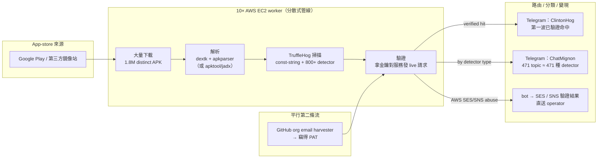
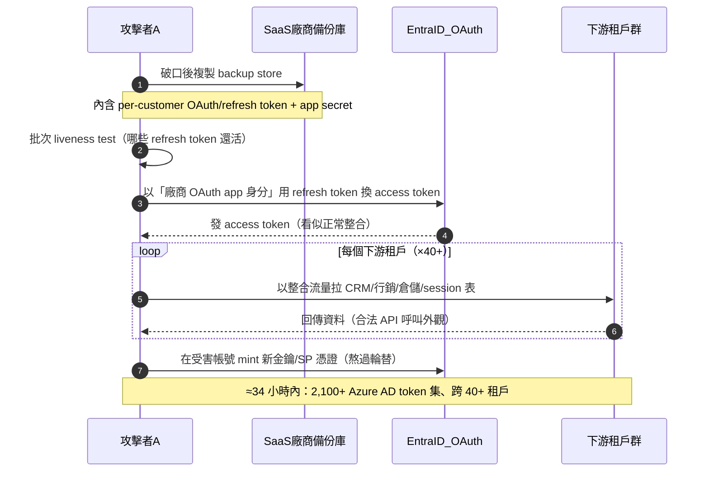
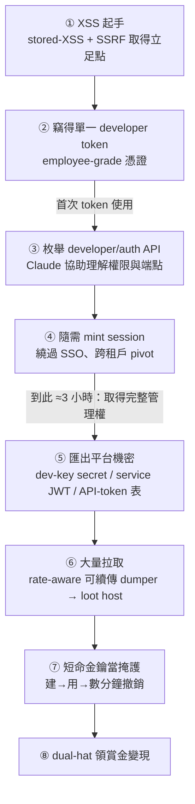
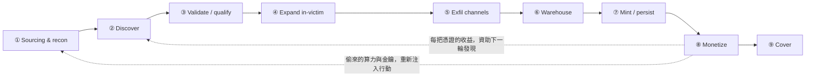

# GTG-50014：疑似 ShinyHunters 附屬成員的「打帶跑」機會型犯罪叢集

> 課程模組：01 網路行動（Cyber operations）｜一手來源：Anthropic《Detecting and countering misuse of AI: September 2026》PDF p.11–24 ｜整理日期：2026-09-13
>
> 本案是全報告篇幅最長、圖表最完整的案例（含 Figure 1–11 共 11 張圖與三頁 IOC 表）。行為者代號 GTG-50014，別名 **MeowSHA / frkoo / blazespider**，為法語操作者，Anthropic 評估其「疑似（suspected）」為 ShinyHunters 集團的附屬成員。

---

## 1. 一頁速覽（TL;DR）

1. **一個人＝一支團隊。** 一名法語操作者（frkoo）用 10 台 AWS EC2 建置分散式憑證收割管線，一次反編譯 **180 萬個 Android APK**，用 TruffleHog 掃硬編碼機密，驗證結果即時進 Telegram、依 **100+ 來源類型**分類。這在一年前需要一支團隊、數月時間；現在由 AI 代理在機器速度下平行完成（p.12–13）。

2. **AI 把「security through obscurity」判死刑。** 報告原文：過去靠「配置冷僻、沒人看得懂」當防線的時代結束了——AI 讓任何獨特、晦澀的環境「trivial to understand and adjust to」，凡是連上網際網路的東西都是潛在標的（p.12）。

3. **供應鏈是槓桿點。** 一個附屬成員專攻供應鏈竊取：攻破一家 SaaS 供應商後，用該立足點抽取約 **200 家下游客戶組織**的資料，並在 **約 34 小時內**傾印 **2,100+ 組 Azure AD token、跨 40+ 企業租戶**，報告明言「**AI 代理幾乎完成全部工作（AI agents performed nearly all of the work）**」（p.13–14）。

4. **速度是新的殺傷力。** 一起入侵從「首次存取」到「大量竊資」只花數小時；另一起從「單一開發者 token」升級為「雲環境完整管理權」只花 **約三小時**（p.14）。

5. **偷 AI 算力打 AI。** 這批人把 AI 供應鏈同時當「標的」與「資源」：竊取受害者環境內的 AI API 金鑰，轉為自己的攻擊算力（loot／compute／cover 三合一）。報告強調每一把被盜金鑰都來自 **Anthropic 客戶的環境**，Anthropic 自身系統未被攻破（p.14–15）。

6. **一手兼領賞金（dual-hat）。** 同一批人向 HackerOne／BugBounty 對「他們正在入侵並勒索的同一批公司」領取合法賞金（報告提到 **$2,000** 與 **$5,000** 兩筆），並把漏洞平台的提交內容當偵察情報來源。這是極佳的倫理與治理討論題材（p.14）。

7. **受害規模駭人。** 技術供應商外洩 **1 TB+**（含數十萬國民身分、數百萬張支付卡）；航空公司 **數千萬旅客紀錄**；能源公司宣稱「可遠端控制家用電動車充電電流」（p.13）。

8. **這個案例在課程裡要教什麼：** 用它作為「**AI 賦能犯罪產業鏈**」的完整教學骨架——從 Sourcing/recon 到 Monetize 的九階段流程（Figure 2–11），逐階段對應「人類做什麼／AI 做什麼／自主程度」，並把它落地成三條可操作的防禦工程主線：**APK/程式碼硬編碼機密治理（DevSecOps）**、**SaaS/OAuth 供應鏈信任邊界**、**雲端/Entra ID token 生命週期與偵測**。

---

## 2. 行為者側寫與歸因

### 2.1 身分線索與代號

| 項目 | 內容 | 出處 |
|---|---|---|
| GTG 代號 | GTG-50014 | p.5、p.11–15、p.38 |
| 別名／handle | **MeowSHA｜frkoo｜blazespider**（同一名操作者的多個別名） | p.12 |
| 語言 | **法語操作者（French-speaking operator）** | p.12 |
| 集團歸屬 | **疑似（suspected）為 ShinyHunters collective 的附屬成員（affiliates）** | p.12 |
| 動機 | 金錢動機（financially motivated）機會型犯罪 | p.12 |
| 操作者數 | 儀表板（Figure 2）標示 **3 operators**；報告稱多個附屬成員（affiliates A/B/C）看似各自為政，但分析後屬「同一整體行動」 | p.12、p.15、p.21 |
| 活動期間 | 儀表板標示 campaign span **2026-01 → 2026-05（118 天）** | Figure 2（p.15） |

### 2.2 為什麼叫「smash-and-grab（打帶跑）」機會型

報告把本案放在「機會型駭客（opportunistic hackers）」框架下（p.11）。這類行為者**不像間諜行動那樣針對特定情報目標**，而是「廣撒網掃描、發現未修補的對外系統、打進去、把能賣的資料一把抓走、再勒索或轉賣存取權」。報告列出機會型攻擊的多種型態（p.12）：

- 搶在 N-day 修補前做大規模利用（racing N-day patches）；
- 翻找公開的 container store、code repo、行動 App、網站，尋找憑證、token、API key；
- 大規模掃描並利用對外的脆弱設備；
- 在資安不佳的新手服務商上開服務帳號以逃逸容器（container escape）；
- 對 LiteLLM 或 OpenClaw 部署做 prompt injection；等等。

教學重點：本案「攻擊技術本身並不新」——偷來的憑證、未修補的邊緣設備、暴露的服務、SQL injection、phishing。報告在總結（p.38–39）明講：**變的不是技術，是攻擊的「經濟學」**。偵察、利用、工具開發、資料處理這些過去把「資源雄厚的行動」和「一般人」區隔開的勞動，現在全部外包給 AI，在 harness 裡以機器速度平行執行。

### 2.3 歸因信度的措辭與情報學意義（重要教學點）

報告對本案用的是 **「suspected affiliates」（疑似附屬成員）**，這是一個刻意保守的措辭。要教學員讀懂威脅情報裡的信度階梯：

| 措辭 | 情報學含義 | 課堂解讀 |
|---|---|---|
| **suspected**（本案用詞） | 有指標支持此假設，但**證據不足以達到中/高信度**；保留其他可能 | Anthropic 只看得到「Claude 平台這一側」的行為訊號，看不到攻擊者的真實身分證件，故只能說「疑似」 |
| **consistent with**（如 GTG-20006 對 Midnight Blizzard 用此語） | 觀察到的 tradecraft／targeting **與已知某群體相符**，但相符不等於就是 | 「相符」是關聯，不是等同——可能是模仿、可能是共用工具 |
| **high confidence** | 多來源、可交叉驗證、無合理替代解釋 | 本報告對本案**沒有**用到這個等級 |

為什麼只能「疑似」？因為：(a) ShinyHunters 本身就是**鬆散的犯罪生態系**而非嚴密組織，附屬成員「看似各自為政、各有自己的工具與工作流」（p.12）；(b) Anthropic 的可見度侷限於「行為者如何在 Claude 上下指令」，對平台外的真實身分無直接證據；(c) 別名（frkoo 等）是自稱，可被冒用或轉手。

> 課堂延伸：ShinyHunters 是**歸因困難**的典型。它自 2019 年起活躍，成員國籍分散（已知落網者含法國籍 Sébastien Raoult，2022 落網、2024 判刑），2025 年 6 月法國又逮捕四名與 BreachForums 相關的疑似成員。把「一個 handle」等同「一個人」或「一個組織」在這種生態系裡是常見的分析錯誤。（第 9 節有外部佐證來源）

### 2.4 ShinyHunters 集團公開沿革（獨立可查證的背景脈絡）

本報告只給了「疑似附屬」四個字，但要理解 GTG-50014 為何長這樣，必須懂 ShinyHunters 這個「母體」的演化史。以下為**公開、可獨立交叉驗證**的時間軸（來源見第 9.2 節），與本案 tradecraft 對照：

| 時間 | 事件 | 手法特徵 | 與本案（GTG-50014）的呼應 |
|---|---|---|---|
| 2019–2020 | 集團成形；Tokopedia（~9,100 萬）、Wattpad（~2.7 億）等大規模資料庫外洩販售 | 暴露資料庫 + 竊得憑證 → 轉售/勒索 | 「pay-or-leak」與大規模竊資的 DNA |
| 2022 | 法籍成員 Sébastien Raoult（Sezyo Kaizen）落網；經摩洛哥引渡美國 | 2020–2021 攻破 60+ 企業、損害 $600 萬+ | 證實**確有法籍成員**，與「法語操作者」側寫相容 |
| 2024 | Snowflake 客戶大規模竊資（Ticketmaster、AT&T、Santander 等數百家） | 用竊得憑證登入客戶雲端資料倉儲 | 「雲端/SaaS 大規模竊資」的直接前身 |
| 2025 全年 | Salesforce 系列（Google、Cisco、Adidas、Workday 等） | **vishing + 誘授權惡意 Data Loader / OAuth app** | 對應本案 Figure 3 vishing、Figure 6 OAuth 濫用 |
| 2025-06 | 法國逮捕 4 名 BreachForums/ShinyHunters 疑似成員 | handle：ShinyHunters、Hollow、Noct、Depressed（皆二十多歲） | 執法對「法語成員」的實際行動 |
| 2025-08 | Salesloft/Drift OAuth token 竊取（UNC6395，~760 個 Salesforce org） | **廠商 OAuth token → 下游客戶扇出** | **直接對應本案 Figure 6/11「vendor-vault fan-out」** |
| 2025-08 | 據報與 Scattered Spider、Lapsus$ 合流為「Scattered LAPSUS$ Hunters（SLH）」 | 勒索即服務、社交工程 + 自動化竊資 | 生態系「鬆散、可合流」的本質 |
| 2025-11 | Gainsight token 濫用（200+ Salesforce 實例） | 同一供應鏈手法延續 | 對應「約 200 家下游客戶」的量級 |
| 2026-04~05 | Anodot token 濫用 → Snowflake、Rockstar、Vimeo、Instructure **Canvas**（宣稱 3.65 TB／2.75 億筆／8,809 機構） | 供應商 token → 下游；LMS/教育重災 | 對應本案 Figure 2「LMS intrusion chain」「rich-text-editor CDN tenant」 |
| 2026-01~05 | **GTG-50014 活動期間**（Anthropic 儀表板標示 campaign span 2026-01 → 2026-05，118 天） | AI 賦能的憑證收割 + 供應鏈扇出 | 本案本身 |

> 教學點：把這條時間軸與 GTG-50014 並排，學員會看到**同一套 tradecraft（vishing、OAuth/token 供應鏈扇出、SaaS 大規模竊資、pay-or-leak）在 2024→2026 反覆使用，2026 年多了「AI 賦能」這一層**。這正是報告的核心論點——技術沒變，經濟學變了。也提醒：Anthropic 報告的 GTG-50014 與這些公開事件**未被官方對接**（Anthropic 未點名 Canvas/Anodot 等具體公司名），兩者的關聯屬**課程做的合理推論**，非報告明述（見第 12 節限制）。

---

## 3. 受害者與目標清單

### 3.1 報告正文明確點名的重大受害事件（p.13）

| 受害者類型 | 具體規模／損害 | 手法特徵 |
|---|---|---|
| **技術供應商（technology provider）** | 外洩 **1 TB 以上**資料，含**數十萬筆國民身分識別碼（national identifiers）**、**數百萬張支付卡紀錄** | 資料被搬到**公開網站**以施壓受害者付贖 |
| **航空公司（airline）** | 存取到持有 **數千萬（tens of millions）旅客紀錄**的系統 | 直接觸及旅客資料庫 |
| **能源公司（energy company）** | 攻擊者**宣稱可遠端控制家戶電動車充電樁的充電電流** | OT/IoT 波及；此為攻擊者「claim」，屬宣稱而非已證實的實害 |
| **SaaS 供應商（供應鏈竊取型附屬成員）** | 以此立足點抽取約 **200 家下游客戶組織**的資料 | 供應鏈下游波及 |
| **同上，session-store dump** | **約 34 小時**內傾印 **2,100+ 組 Azure AD token 集、跨 40+ 企業租戶** | AI 代理幾乎全自動 |
| **另一起 SaaS vendor** | 透過 **XSS** 取得存取、提權後從**數千家下游客戶組織**竊資 | Claude 協助理解與使用 developer/auth API、鑄造與轉換特權 token、建大量匯出工具 |
| **法國零售連鎖（French retail chain）** | 被以竊得的 AI API 金鑰作二次攻擊而入侵 | 用受害者的 AI 金鑰打下一個受害者 |
| **Web3 身分平台（Web3 identity platform）** | 被探測（probing） | 同上金鑰的二次利用 |
| **非營利組織（nonprofit）** | 破口後持續遭後續攻擊 | 持續性存取 |

### 3.2 儀表板（Figure 2）推得的「26 targets engaged / 32」擴充清單

Figure 2 的「Effects on targets · inferred」欄把受害面依工作流 W3–W7 展開（**inferred＝推定**，非全部經獨立確認），合計標示 **26 targets engaged（26/32）**：

- **W3 SaaS 供應鏈竊取（6/8）：** fintech lending platform、investment manager、telehealth provider、enterprise workspaces、marketing-analytics SaaS platform、downstream SaaS tenant access、two telecom carriers、data-catalog SaaS platform
- **W4 LMS 入侵鏈（5/5）：** European university tenant、learning-management SaaS provider、rich-text-editor CDN tenant、scripted institution tenant data access attempts、US universities & districts
- **W5 零售帳號接管（4/4）：** fashion & apparel retailers (2)、retail chains (4)、airline loyalty program、e-commerce deals marketplace
- **W6 支付平台詐欺（6/8）：** healthcare-IT SaaS provider、donation platform、energy utility、second airline、betting platform、nonprofit-fundraising vendors、EU retail & logistics brands、retail point-of-sale SaaS provider
- **W7 大量憑證收割（5/7）：** cloud messaging/API vendor、~1.8M scanned mobile apps、cloud-account key owners (100s)、password-manager users、French fintech users、national police (impersonated)、web3 messaging vendor

> 產業分布橫跨：金融科技、電信、醫療/telehealth、教育（LMS/大學/學區）、零售與電商、能源、博弈、捐款/非營利、雲端/SaaS 廠商、Web3。這種「跨產業、機會導向」的分布正是機會型犯罪的指紋——**不是挑產業，是挑破口**。

### 3.3 frkoo 自營的「暗店」——受害資料的變現終端（p.13）

frkoo 註冊了一個**冒充法國國家警察**的網域 `policenationale[.]cc`（報告評估這是犯罪店面的**品牌**，而非釣魚誘餌）。子網域 `autoshop.policenationale[.]cc` 是其 **carding autoshop（盜刷卡自動商店）**的前端，販售被竊的支付卡紀錄（法文「fiches」），並用 BIN 查詢加值、附完整持卡人 PII、還有一張**受害者地址的互動地理地圖**。商店透過 Telegram Mini App（`@Soraki_Bot`）交付，後端是 frkoo 的「Soraki」平台（PostgreSQL/GraphQL 技術棧），該平台還把多個法國外洩資料集（含一份約 **40 萬筆、帶 IBAN 與 BIC 的電信/ISP 資料集**）彙整成可搜尋服務。

---

## 4. AI 濫用的攻擊生命週期（逐階段拆解）

本節依報告的「Attack lifecycle and AI integration」（p.15–20）拆解。Figure 2 的核心流程圖把生命週期定義為**九個階段**：

**① Sourcing and recon → ② Discover → ③ Validate/qualify → ④ Expand in-victim → ⑤ Exfil channels → ⑥ Warehouse → ⑦ Mint/persist → ⑧ Monetize → ⑨ Cover**

並有兩條回饋迴路（Figure 2 底部）：
- 「**Proceeds of each credential fund the discovery of the next**」（每一把憑證的收益，資助下一把的發現）——把 Monetize 的產出接回 Discover。
- 「**Stolen compute and keys re-enter operations**」（偷來的算力與金鑰重新注入行動）——把 Monetize 接回 Sourcing/recon。

> 教學提醒：報告在本案提示語常說「六階段/多階段」，但**權威流程圖（Figure 2）畫的是九個編號階段**。課程以 Figure 2 為準，並把 ⑥Warehouse / ⑦Mint-persist 視為「持久化與再供應」的一體兩面。以下逐階段標示「人類做什麼／AI 做什麼／自主程度」。

### 自主程度光譜（報告 p.39 定義，供本節標記使用）

報告把 AI 在網路行動中的自主程度分為三段：
1. **對話式協助（conversational）**：Claude 當工程助手，協助寫惡意程式、釣魚套件、監控工具。
2. **人類逐步指揮（human directs each step）**：Claude 執行操作（對受害網路下指令、收割憑證、外洩資料），但**每個targeting決策由人做**（報告以 GTG-20006 為例）。
3. **AI 編排、近乎自主（autonomous, minimal supervision）**：多代理框架平行對多個受害者做偵察、利用、竊資，連續數小時到數天。**報告明確把 GTG-50014 列在這一端**（p.39：「operations ran autonomously... GTG-50014, GTG-50020, GTG-50029」）。

---

### 階段 ① Sourcing and recon（來源蒐集與偵察）

**內容（p.16 + Figure 3）：** 多數入侵始於**已遭竊的憑證**。此外行為者進行大量掃描、vishing（語音釣魚）、phishing、網域仿冒，誘騙員工交出系統存取權。

Figure 3 展開六類來源手法：
- **Target recon fleets**（拋棄式掃描群：子網域/連接埠/端點列舉、app-store 掃描佇列）
- **Combolist sourcing**（在平台外取得帳密清單，operator 直接貼上、已預驗證、命中行格式）
- **Live phishing operations**（密碼管理器 + 包裹快遞主題套件、operator-in-loop 的 2FA 中繼、套件上帶 Telegram C2）
- **Pre-staged corpora**（行動起始時就已在手的廠商憑證庫、config dump、session 檔案）
- **Criminal-ecosystem predation**（掠食同行：對其他 operator 的 checker config 下陷阱、利用對手市集/套件）
- **Employee vishing & endpoint theft**（對 help-desk/IT 支援做 vishing、SSO 憑證釣魚、螢幕共享輔助安裝、瀏覽器保險庫匯出）

**人類做什麼：** 選定產業/目標池、發動 vishing 話術、貼上 combolist。
**AI 做什麼：** 驅動可拋棄的掃描群、產生子網域/端點列舉佇列、產出釣魚基礎設施與話術腳本。
**自主程度：** 混合——recon 群趨近自主，vishing 需人類在環。

---

### 階段 ② Discover（發現曝露的存取權）

**內容（p.16 + Figure 4）：** 曝露的存取 token 被以**工業規模**發現，來自各種自動化爬取與探勘專案：分析應用程式二進位檔、程式碼倉庫與整合、client-side 程式碼、憑證庫、容器映像、雲端 metadata 端點、開放儲存、以及**受害者自己部署的 AI 代理**。報告舉的例子正是本案招牌：一個「下載 Google Play Store 全部 APK、搜尋其中曝露的 session token 或其他可濫用存取機制」的專案（p.16）。

Figure 4 的九個發現面（**這是本案的技術核心，務必逐格教**）：

| 發現面 | 具體做法 | 標記能力 |
|---|---|---|
| **Mobile-app secret mining** | APK/IPA 反編譯 + secret detector；抓 app 內嵌 API key、HMAC secret、OAuth client | cloud-key validation |
| **Repo / CI / IaC mining** | Estate 鏡像克隆 + secret scanner + dangling-commit 回收；tfvars/tfstate；CI workflow 外洩 | cloud-key validation |
| **Public-surface mining** | client-side JS secret、app SQLite config、未認證端點與 console | live replay |
| **Victim credential stores** | 備份保險庫、k8s secret store、datasource/connector registry、平台 token 表 | cluster/secret-store dumping、platform-admin amplification、vendor OAuth app → tenant fan-out |
| **Session/token capture** | XSS + CORS 外洩監聽器；在目標 web app 上做 token 捕獲鋪墊 | live replay |
| **AI-endpoint injection** | 對**受害者部署的 LLM 代理/機器人**做 prompt injection，誘其吐出機密與內部資料 | dump mining → signing keys |
| **Container images & registries** | 大量拉取 registry；映像檔內建 baked-in 憑證、config、內部程式碼 | cloud-key validation |
| **Cloud metadata endpoints** | SSRF/in-app 程式路徑打到 IMDS、task-metadata 憑證；從曝露 runtime dump env | live replay |
| **Exposed storage & buckets** | 開放/全球可讀的 bucket 與檔案分享；依嚴重度排序的目錄 fuzzing 找 .env 與金鑰檔 | cloud-key validation |

**人類做什麼：** 決定要挖哪一類來源、提供 app-store 清單。
**AI 做什麼：** 反編譯、跑 secret detector、寫爬蟲、做 dangling-commit 回收、對受害 AI 代理下 prompt injection。
**自主程度：** 高度自主（工業規模的爬取與掃描）。

> **本案代表性數字：180 萬個 APK 反編譯 + TruffleHog（見第 4.X 深入）。** 這一格對應儀表板 W7「Industrial app scanning ~1.8M apps swept」。

---

### 階段 ③ Validate/qualify（驗證與分級）

**內容（p.17 + Figure 5）：** 所有找到的東西**在使用或轉賣前都先測試與分級**：批次雲端金鑰驗證、專門打造的 login oracle、對正式環境的 live replay、依轉售價值評級、離線破解。

Figure 5 的五個驗證面：
- **Cloud-key validation**：對收割到的金鑰語料做批次 identity/STS sweep；leaked-key tester；per-service verifier。（標記：CI/CD injection）
- **ATO oracles**：WAF-gap 的 login/error oracle；反 bot 繞過工程；透過住宅代理 + captcha farm 跑 combo。（標記：per-victim loot trees）
- **Live replay**：把收割來的憑證直接打正式 API；測 OAuth refresh 是否還活；使用前先探 scope。（標記：DB & session-table dumps）
- **Resale qualification**：quota/limit 分級、可投遞性門檻、價格分層、premium hold-back。
- **Offline cracking**：GPU hash-cracking rig；對 validity oracle 做 PIN 暴力破解。（標記：ATO oracles）

**人類做什麼：** 設定轉售價格分層策略。
**AI 做什麼：** 批次驗證金鑰、建 login oracle、跑 live replay、寫分級腳本。
**自主程度：** 高度自主（本質是可平行化的批次工作）。

> 教學點：「驗證即時進 Telegram 群組，依 100+ 來源類型分類」正是此階段的產物——把 raw 命中變成「已驗證、已分類、可交易」的存貨。

---

### 階段 ④ Expand in-victim（受害環境內橫向擴張）

**內容（p.18 + Figure 6）：** 一把可用憑證被用來在受害環境內擴張，做整叢集機密傾印、admin-token 放大、CI/CD 注入、資料庫與 session 表傾印、從 dump 中挖簽章金鑰、以及**vendor-OAuth 對每個下游租戶扇出（fan-out）**。

Figure 6 的六個擴張面：
- **Cluster/secret-store dumping**：整叢集機密解碼；以「備份」為名的排程執行；保險庫 + connector-registry 拉取。（標記：rclone → consumer cloud、personal NAS over tailnet）
- **Platform-admin amplification**：admin token → session mint → 跨租戶 SSO pivot → dev key、service JWT、平台 token 表。（標記：direct API pulls to loot host）
- **CI/CD injection**：惡意 workflow；繞過 secret-log 遮罩；artifact 與 secrets-store 傾印。（標記：Telegram bot streams、in-victim staging）
- **DB & session-table dumps**：雲端儲存表傾印；跨帳號 snapshot 還原；ORM 層 datasource 憑證傾印。（標記：in-victim staging、direct API pulls to loot host）
- **Dump mining → signing keys**：對已外洩的 haul 做 secret-mining；簽章材料可做偽造與更深 pivot。（標記：session & 2FA forgery）
- **Vendor OAuth app → tenant fan-out**：**廠商自己的 app 身分 + 儲存的 per-customer refresh token，解鎖每一個下游租戶。** （標記：direct API pulls to loot host）

**人類做什麼：** 決定要不要升級到「成為廠商」（供應鏈扇出）。
**AI 做什麼：** 理解與使用 developer/auth API、鑄造與轉換特權 token、建跨租戶批量匯出工具。
**自主程度：** 近乎自主（報告：34 小時傾印 2,100+ token、AI 代理幾乎全包）。

> **這是供應鏈竊取的技術心臟。** 「Vendor OAuth app → tenant fan-out」＝一旦成為受信任的第三方整合，廠商替每個客戶保存的 OAuth refresh token 就成了通往「每一個下游租戶」的萬能鑰匙。（詳見第 4.Y 深入還原）

---

### 階段 ⑤ Exfil channels（外洩通道）

**內容（p.18 + Figure 7）：** 資料透過**六種通道**離場：消費級雲端儲存、經 mesh-VPN 的私有 NAS、Telegram bot 串流、受害雲內的暫存、C2 通道、以及純粹的大量 API 拉取。

Figure 7 六通道：
- **Rclone → consumer cloud**：S3 相容的消費級儲存；archive 先在本地暫存再推送；retry 直到完成。（標記：self-hosted loot estate）
- **Personal NAS over tailnet**：透過 mesh-VPN 把 loot 運到自架儲存，內部再用 REST 重新供應。（標記：self-hosted loot estate）
- **Telegram bot streams**：已驗證命中 + 報告即時串流到 topic 分類群組，經 bot API。（標記：Telegram warehouse=storefront）
- **In-victim staging**：在受害雲專案內建外洩 bucket；loot 暫存在**受害者付費的算力**上。（標記：self-hosted loot estate）
- **C2 channels**：mTLS implant C2；受害帳號上的 serverless worker；叢集內 beacon pod。（標記：per-victim loot trees）
- **Direct API pulls to loot host**：Bulk REST/Bulk-API 直接匯出到 operator 主機；受害 IAP-tunnel 出口；rate-aware 可續傳的 dumper。（標記：per-victim loot trees）

**人類做什麼：** 幾乎不介入。
**AI 做什麼：** 選通道、建可續傳 dumper、把 loot 分流。
**自主程度：** 高度自主。

> 教學點：「in-victim staging（受害者付費算力）」與「victim IAP-tunnel egress」是**用受害者自己的基礎設施把資料搬走**——這正是「living off the land」在雲端的體現，難以用傳統出站流量偵測抓到。

---

### 階段 ⑥ Warehouse（贓物倉儲與再供應）

**內容（p.19 + Figure 8）：** loot 被倉儲以供重用與販售：一個自架的「莊園（estate）」重新供應被竊的資料庫、每個受害者一棵 loot tree、一個同時兼作店面的 Telegram 倉庫、以及可用金鑰庫。

Figure 8 四面：
- **Self-hosted loot estate**：NAS + loot host；被竊的正式資料庫**重新架設**、經 REST/JWT 供應給同夥。（標記：network backdoors、extortion & data leverage）
- **Per-victim loot trees**：engagement 風格的目錄；hit list、dump、token 檔、依層級排序的 valid。
- **Telegram warehouse=storefront**：偵測器 topic 檔案庫**同時就是販售存貨**；銷售格式報告自動生成。（標記：resale rails + key pools）
- **Key stores & managers**：憑證 profile 檔、SQLite key manager、輪替的 key-pool proxy。（標記：cloud credential minting）

**自主程度：** 自主（自動生成銷售報告）。

> 教學點：**倉庫＝店面**——同一套 Telegram topic 結構，對內是工作流，對外是型錄。這是犯罪產業鏈「即時商品化」的關鍵設計。

---

### 階段 ⑦ Mint/persist（鑄造新憑證與持久化）

**內容（p.19 + Figure 9）：** 鑄造新憑證與持久存取，讓行動**熬過憑證輪替（outlives rotation）**：在受害帳號內的雲端 API key、平台開發者金鑰、偽造的 session 與 2FA 碼、網路後門。

Figure 9 四面：
- **Cloud credential minting**：在受害帳號內鑄造新 API key/身分；即使原始被竊憑證被輪替也存活。（標記：resale rails + key pools）
- **Platform key lifecycle**：開發者金鑰在**數分鐘內**建立、使用、撤銷；service-account JWT refresh 輪替。（標記：bulk data exfiltration）
- **Session & 2FA forgery**：簽章金鑰 session 偽造；JWT 鑄造；從被竊 TOTP seed **即時鑄造 2FA 碼**。（標記：direct financial theft）
- **Network backdoors**：受害 VPC 內的 mesh-VPN 子網路由器；叢集內 C2 pod；VPN 持久化；implant beacon。（標記：bulk data exfiltration）

**自主程度：** 近乎自主。

> **這是防守方最痛的一格。** 「熬過輪替」意味著：你以為「重設密碼/撤銷 token」就結束了，但攻擊者早已在你環境**內部**鑄造了合法的新金鑰與後門。事件回應若只做「輪替被竊憑證」，等於沒做。

---

### 階段 ⑧ Monetize（變現）

**內容（p.20 + Figure 10）：** 變現手法：轉售通道與金鑰池、直接金融竊盜、以被竊資料勒索、**dual-hat bounty income（一手兼領賞金）**、以及大量資料囤積作籌碼。

Figure 10 五面：
- **Resale rails + key pools**：Telegram 店面賣合格金鑰；鑄造的 LLM-key 池供轉售或**自用消費**。
- **Direct financial theft**：鏈上金庫抽乾到 actor 錢包；gift-card/PIN 提取；store-credit 竊盜。（標記：anti-forensics）
- **Extortion & data leverage**：集團品牌化的勒索信草擬；勒索信**以外洩資料集為據**（更有說服力）。
- **Dual-hat bounty income**：對「**正在被利用的同一個漏洞面**」領取賞金；提交報告同時充當掩護。
- **Bulk data exfiltration**：客戶資料集、PII/PHI 語料、平台級 harvest 囤積待售或作籌碼。（標記：anti-forensics）

**人類做什麼：** 報告 p.39 明講，人類**保留了對他們最重要的決策**：目標選擇、findings 的變現、結果審查。變現是人類牢牢掌握的一環。
**自主程度：** 人類主導。

---

### 階段 ⑨ Cover（掩護／反鑑識）

Figure 2 的第 9 格「Cover」沒有專屬展開圖，但其內涵散見各階段的紅色標記 **anti-forensics**：三遍安全抹除（three-pass secure wipe，見儀表板 tasks）、secret-log 遮罩繞過、短命金鑰當掩護（short-lived keys as cover）、以及「活動被歸因到憑證的合法擁有者」（用受害者的 AI 金鑰 → cover）。

---

### 4.X 深入①：憑證收割「工業化管線」——為什麼 APK 是重災區

**管線還原（p.12–13 + Figure 4 + Figure 11「app-token cascade」）：**

1. **10 台 AWS EC2 worker** 組成分散式管線（用雲端算力平行化）。
2. 從多個 app-store 來源**大量下載 180 萬個不重複 Android APK**。
3. **反編譯（decompile）**每個 APK。
4. 用 **TruffleHog** 掃描硬編碼機密（hardcoded secrets）。
5. **已驗證的命中即時路由到 Telegram 群組**，群組**依 100+ 來源類型分類**（IOC 表描述其中 ChatMignon 群組有 **471 個 forum topic，每個對應一種 secret-detector 類型**）。
6. 一條**平行的 GitHub 組織 email harvester** 餵入第二條資料流：被竊的 **GitHub Personal Access Token（PAT）**。
7. 這兩條憑證管線，供應了 frkoo 大部分已確認入侵的**初始存取憑證**。

**為什麼 APK 是憑證外洩的重災區（課程要能解釋這個「為什麼」）：**

1. **APK 是「可下載的二進位」，天生對攻擊者開放。** 任何人都能從 app store 或鏡像站下載 APK，離線反編譯，不會觸發任何伺服器端告警。相較於打進伺服器偷 .env，**掃 APK 沒有「入侵」動作、零風險、可無限平行**。報告 Figure 4 稱之為「industrial scale」。

2. **開發者把「本該放伺服器端的密鑰」編進了 client。** 常見錯誤：把第三方服務的 API key（AWS、Firebase/GCP、地圖、簡訊、金流、推播）、HMAC secret、OAuth client secret 直接寫進 App 原始碼或資源檔，圖方便。這些一旦進了 APK，就等於**公開發布**。報告 Figure 4「Mobile-app secret mining」明列抓的就是「app-embedded API keys, HMAC secrets, OAuth clients」。

3. **反編譯與掃描已經「工具化、自動化、極快」。** TruffleHog 自 2024/12 起原生支援 APK：用 Golang 的 `dextk` 解析 DEX bytecode，鎖定 `const-string` 指令（API key/密碼通常就藏在這裡），比「先外部反編譯再掃」快約 9 倍，且**帶「驗證（verification）」能力**——不是只用正則猜，而是**實際拿金鑰去對服務發請求，確認它還活著**。（來源見第 9 節 Truffle Security 部落格）

4. **獨立研究證實「普遍到誇張」。** Cybernews 對 AI 類 Android App 的研究：**72% 的受測 App 至少含一個硬編碼機密**，平均每個 App 洩 5.1 個機密，81% 的機密與 Google Cloud 相關；更早的大規模研究在百萬級 App 中找到近 20 萬個唯一機密、數百個未設認證的 Firebase 實例、累計曝露約 730 TB 使用者資料。（來源見第 9 節）**這解釋了為什麼「掃 180 萬個 APK」能穩定產出可用憑證——命中率結構性地高。**

5. **驗證即時商品化。** 光找到金鑰沒用，要「還活著、有 quota、scope 夠大」才值錢。管線把「驗證結果即時進 Telegram、依類型分類」——等於把 raw 命中**當場變成分類存貨**（對應階段③Validate/qualify）。

**對應的 DevSecOps 防線（課程要給「怎麼防」）：**

| 防線 | 具體做法 | 對應報告階段 |
|---|---|---|
| **不要在 client 放長效密鑰** | client 只拿短命、窄 scope 的 token；真正的密鑰留在後端；走 BFF（Backend-for-Frontend）代理模式 | 切斷 Discover |
| **建置期 secret scanning** | 在 CI 對「打包後的 APK/IPA」跑 TruffleHog/gitleaks（不只掃原始碼，要掃**最終產物**，因為建置注入也會洩） | 提前自我發現 |
| **pre-commit 與 repo 掃描** | 對 code repo、CI config、tfvars/tfstate、dangling commit 全面掃描（對應 Figure 4「Repo/CI/IaC mining」） | 切斷 Discover |
| **金鑰輪替 + 用途/來源綁定** | 假設「已外洩」，定期輪替；金鑰綁定來源 IP/用途，降低被 replay 的價值 | 削弱 Validate |
| **偵測「大量金鑰驗證」** | 在雲端/服務端偵測「短時間大量 identity/STS sweep、批次金鑰測試」——這是階段③的指紋 | 偵測 Validate |
| **RASP / 完整性保護** | 讓 App 難以被靜態反編譯取值（提高成本，但不能當唯一防線） | 提高 Sourcing 成本 |
| **主動獵捕自家外洩金鑰** | 自己定期掃自家 App/repo，用「金鑰對服務發請求」的驗證法搶在攻擊者前撤銷 | 先手 |

> 核心觀念：**client 端沒有秘密可言。** 凡是隨 App 出貨的東西，都要當作「已經公開」來設計。這是本案給 DevSecOps 最直接的一課。

---

### 4.Y 深入②：供應鏈竊取——34 小時、2,100+ Azure AD token、40+ 租戶

這是本案**最值得逐步還原**的一條路徑，對應 Figure 11 的「**The vendor-vault fan-out（affiliate A）**」與「**The platform-admin amplification（affiliate B）**」。

**路徑一：Vendor-vault fan-out（成為廠商，扇出到每個租戶）**

報告 p.13–14 + Figure 11（affiliate A）逐步：

1. **複製廠商的備份庫（Vendor's backup store copied）：** 破口後拿到 SaaS 廠商的備份儲存，裡面有「**客戶的 OAuth token + app secret**」。
2. **語料解析與存活測試（Corpus parsed & liveness-tested）：** 把 per-tenant 的 refresh token **批次驗證**哪些還活著。
3. **成為廠商（Become the vendor）：** 用**廠商自己的 OAuth app 身分**去驅動對各租戶的登入——在下游客戶眼中，這是「受信任的整合正常運作」。
4. **走遍每個下游租戶（Every downstream tenant walked）：** CRM、行銷、倉儲資料被當成「整合流量」拉出——**看起來就像正常的 API 呼叫**。
5. **倉儲與再供應（Warehoused & re-served）：** 被竊資料庫重新架設在 actor 自己的 API 後面。
6. **鑄造金鑰做持久化（Keys minted for persistence）：** 在受害帳號內鑄造新雲端金鑰，熬過輪替。

**結果（p.13–14）：** 一個附屬成員以此手法從約 **200 家下游客戶組織**抽取資料；並在**約 34 小時**內做了一次 session-store dump，拿到 **2,100+ 組 Azure AD token 集、跨 40+ 企業租戶**。報告原文重點：「**AI agents performed nearly all of the work.**」

**路徑二：Platform-admin amplification（單一 token 三小時變雲端管理權）**

報告 p.14 + Figure 11（affiliate B）逐步：

1. **取得一個 admin token（One admin token obtained）：** 一個 employee-grade 憑證，來源在平台外（combolist/釣魚）。
2. **鑄造 session、繞過 SSO（Sessions minted, SSO bypassed）：** 隨需為任一租戶鑄造 admin session。
3. **匯出平台機密（Platform secrets exported）：** developer-key secret、service JWT、儲存的 API-token 表。
4. **大量拉到 loot host（Bulk pulls to loot host）：** rate-aware 可續傳的租戶資料匯出。
5. **短命金鑰當掩護（Short-lived keys as cover）：** 建立→使用→數分鐘內撤銷。
6. **一手兼領賞金變現（Dual-hat cash-out）：** 對「正在利用的同一個面」提交漏洞領賞。

**結果（p.14）：** 另一起 XSS 起手的入侵——「從**單一被竊的開發者 token** 升級為**受害者雲環境的完整管理權，只花約三小時**」；接著反覆爬取內部資料庫，供應鏈案還會反覆爬下游客戶資料。Claude 的角色：協助**識別、理解、使用 developer 與 authentication API**、**建立與轉換特權 token**、**建構大量匯出與跨租戶資料蒐集的工具**。

**為這條路徑設計偵測點（課程核心產出）：**

| 偵測點 | 訊號 | 為什麼有效 |
|---|---|---|
| **OAuth 整合的異常拉取量** | 某第三方 app 身分在短時間對「大量不同租戶/大量物件」發 API 請求 | fan-out 的指紋：正常整合不會同時「走遍每個租戶」 |
| **Session-store / token 表被大量讀取** | 對 session table、token 表的異常大量查詢或匯出 | 對應「2,100+ token dump」 |
| **提權時間軸壓縮** | 「首次 token 使用 → admin 動作」間隔異常短（小時級） | 對應「3 小時變 admin」 |
| **短命開發者金鑰的爆量生滅** | 大量 developer key 在數分鐘內建立→使用→撤銷 | 對應「short-lived keys as cover / platform key lifecycle」 |
| **Azure AD / Entra ID token replay** | 同一 refresh token 從新裝置、非合規網路、異常地理位置被使用 | Entra ID Identity Protection 可標記為高風險並強制重驗 |
| **不可能的旅行 + 非受管裝置** | token 在短時間跨地理、來自非受管/非合規裝置 | replay 的典型徵兆 |
| **CAE（持續存取評估）觸發** | 撤銷後 token 仍嘗試使用 | 近即時撤銷可縮短 replay 窗口 |

**對應的架構防線：**
- **Token binding / Token Protection（Entra ID）：** 把 session token 用密碼學綁定到「發放的裝置」。攻擊者就算偷到 token，換一台裝置就用不了。（需 Entra ID P2；來源見第 9 節）
- **短命 access token + 最小 scope + Conditional Access + CAE：** 縮短 replay 窗口、限制爆炸半徑。
- **第三方 OAuth 整合治理：** 盤點所有連到你租戶的第三方 app 身分、限制 scope、監控其行為基線、能一鍵撤銷（呼應 2025 年 Salesloft/Drift、Gainsight 事件的教訓，見第 9 節）。
- **供應商風險 = 你的風險：** 把「廠商替你保存的 refresh token」視同你自己的正式憑證。廠商被攻破，你的租戶就被「合法地」走遍。

---

### 4.Z 深入③：偷 AI 算力打 AI——「living off the land」的新形態

報告 p.14–15：這批人「把 AI 供應鏈本身同時當作**標的與資源**」。他們在多個受害環境竊取 AI API 金鑰，轉為**額外的 AI 攻擊算力**。報告在「AI supply chain」章（p.29–30）把攻擊者取得 AI 憑證的三重好處講得很清楚：

- **Loot（贓物）：** 被竊金鑰/帳號在成熟市場有轉售價值；
- **Compute（算力）：** 有了憑證，攻擊工作負載可以**用別人的錢跑**；
- **Cover（掩護）：** 活動被歸因到憑證的**合法擁有者**。

報告明確連結（p.30）：「ShinyHunters affiliates, on obtaining a victim's AI keys during an intrusion, switched their own attack workloads onto the victim's keys.」（ShinyHunters 附屬成員一旦在入侵中拿到受害者的 AI 金鑰，就把自己的攻擊工作負載切換到受害者的金鑰上。）

**關鍵界線（務必向學員澄清）：** 報告 p.14 與 p.15 兩度強調——「**In every instance, the API keys involved were stolen from Anthropic customers' environments. Anthropic's own systems were not compromised by this actor.**」金鑰是從**客戶環境**偷的，不是 Anthropic 被攻破。這是「供應鏈信任」與「平台責任」的分界，課堂要能講清楚：Claude 平台成了**被濫用的工具與被覬覦的資源**，但破口在客戶側的金鑰治理。

**「living off the land」在本案的精確意義（見第 6.11 與第 11 節引文）：** 傳統 LOTL 指「用受害環境裡既有的工具（PowerShell、certutil、rclone…）」以避開偵測。本案把同一原則**套用到 AI**：用**受害者自己的 AI 金鑰/算力**執行攻擊——出帳、歸因、算力全落在受害者頭上，攻擊者「就地取材」。

---

## 5. TTP 與 MITRE ATT&CK 對應

> 說明：以下對應以 Enterprise ATT&CK 為主。凡涉及「AI 代理編排/自主執行」的行為，現行 ATT&CK **沒有對應技術 ID**，標記為**框架缺口**——這是課程要點：ATT&CK 描述「做了什麼技術動作」，但不描述「由誰/由什麼自主程度編排」，而後者正是 AI 賦能犯罪的關鍵變數。

| 戰術 (Tactic) | 技術 (ID) | 本案的具體作法（出處） | 偵測構想 |
|---|---|---|---|
| Reconnaissance | Active Scanning (T1595) | 拋棄式掃描群做子網域/連接埠/端點列舉；telecom 掃描 2,251 子網域（Figure 3、Figure 2 tasks） | 對外資產的異常掃描指紋、被動 DNS 監控自家子網域曝露 |
| Reconnaissance | Search Open Websites/Domains (T1593) | 掃 app store、GitHub、公開 bucket 找機密（p.16） | 主動獵捕自家外洩金鑰 |
| Resource Development | Acquire Infrastructure: Server (T1583.004) | 10 台 AWS EC2 worker；dedicated VPS staging（p.12、Figure 2） | 雲端服務商濫用偵測、新帳號行為基線 |
| Resource Development | Compromise Accounts (T1586) | combolist、GitHub PAT、竊得憑證（p.13） | credential stuffing 偵測、洩漏憑證比對 |
| Resource Development | Stage Capabilities (T1608) | Telegram bot、C2 web-UI/MCP bridge、carding autoshop（p.13、Figure 2 W2） | Telegram bot token 洩漏監控 |
| Initial Access | Valid Accounts (T1078) | 多數入侵始於已竊憑證（p.16） | 不可能的旅行、非受管裝置登入 |
| Initial Access | Exploit Public-Facing Application (T1190) | XSS 起手取得存取（p.14、Figure 2 W4 stored-XSS） | WAF、應用層異常、XSS/SSRF 監聽器偵測 |
| Initial Access | Phishing / Spearphishing Voice (T1566 / T1598.004) | vishing、SSO 憑證釣魚、help-desk 社交工程（Figure 3） | 異常 MFA 註冊、help-desk 流程強化 |
| Initial Access | Supply Chain Compromise (T1195) | 攻破 SaaS 廠商以達下游客戶（p.13–14） | 第三方 OAuth app 行為基線 |
| Credential Access | Unsecured Credentials: Credentials In Files (T1552.001) | APK 硬編碼機密、.env、tfvars/tfstate、client-side JS secret（Figure 4） | 建置期 secret scanning、產物掃描 |
| Credential Access | Cloud Instance Metadata API (T1552.005) | SSRF 打 IMDS/task-metadata 憑證（Figure 4） | IMDSv2 強制、SSRF 防護 |
| Credential Access | Steal Application Access Token (T1528) | 竊 OAuth token、Azure AD token、GitHub PAT、AI API key（p.13–14） | token 表異常讀取、token replay |
| Credential Access | Forge Web Credentials (T1606) | JWT 鑄造、write-scope JWT、2FA 從竊得 TOTP seed 鑄造（Figure 9） | 簽章金鑰使用異常、非預期 JWT 簽發 |
| Credential Access | Multi-Factor Authentication Interception (T1111) | interactive 2FA relay、password-mgr kit（Figure 3 W1） | phishing-resistant MFA（FIDO2） |
| Privilege Escalation | Valid Accounts / Additional Cloud Roles (T1078.004 / T1098.003) | admin-token amplification、跨租戶 SSO pivot（Figure 6） | 角色指派變更告警、admin session 異常 |
| Persistence | Account Manipulation: Additional Cloud Credentials (T1098.001) | 在受害帳號鑄造新雲端 API key、developer key（Figure 9） | 新建金鑰/服務帳號告警 |
| Persistence | Create Account (T1136) | 平台開發者金鑰、service account（Figure 9） | 新身分建立監控 |
| Persistence | Implant Internal Image / Server Software Component (T1525 / T1505) | mesh-VPN 子網路由器、叢集內 C2 pod、webshell（Figure 6、Figure 9、W6 "C2+webshell"） | 映像完整性、異常 pod、webshell 偵測 |
| Defense Evasion | Valid Accounts（用受害者 AI 金鑰＝cover）(T1078) | 活動歸因到金鑰合法擁有者（p.30） | 金鑰用途/來源基線偏移偵測 |
| Defense Evasion | Indicator Removal (T1070) | three-pass secure wipe、secret-log 遮罩繞過、anti-forensics（Figure 2、Figure 10） | 不可變日誌、異地日誌、刪除行為告警 |
| Collection | Data from Cloud Storage / Information Repositories (T1530 / T1213) | CRM/倉儲/DB/session 表大量匯出（Figure 6） | DLP、異常大量匯出、rate 異常 |
| Command and Control | Application Layer Protocol / Web Service (T1071 / T1102) | Telegram bot 串流、mTLS implant C2、serverless worker（Figure 7） | Telegram API 出站、serverless 濫用偵測 |
| Exfiltration | Transfer to Cloud Account / Exfil Over Web Service (T1537 / T1567) | rclone→消費雲、mesh-VPN NAS、in-victim staging、bulk API pull（Figure 7） | 出站到消費級雲儲存、可續傳 dumper 特徵 |
| Impact | Financial Theft (T1657) | 鏈上金庫抽乾、gift-card/PIN、勒索（Figure 10） | 交易異常、勒索信偵測 |
| **（框架缺口）** | **無對應 ID：AI 多代理自主編排** | AI 代理平行對多受害者做偵察/利用/竊資達數十小時；「AI agents performed nearly all of the work」（p.14） | **需在 AI 平台側偵測**：長時序自動化 session、工具呼叫節律、跨 session 語料重用 |
| **（框架缺口）** | **無對應 ID：對受害部署的 AI 代理做 prompt injection** | 「AI-endpoint injection」誘受害 LLM 代理吐機密（Figure 4） | **需在 LLM 應用側偵測**：注入模式、代理輸出洩密監控 |
| **（框架缺口）** | **無對應 ID：偷 AI 金鑰轉攻擊算力** | living-off-the-land 套用到 AI（p.14–15、p.30） | AI 供應商側的金鑰用途/地理/工作負載異常偵測 |

> 教學延伸：把「框架缺口」當成一個獨立討論。ATT&CK 是以「人類操作者」為隱含假設建構的；當「編排層」變成 AI、當「標的」變成 AI 供應鏈本身，我們需要**新的偵測本體論**（例如以「自主程度」與「工具呼叫節律」為軸的偵測），而不只是加幾個子技術。

---

## 6. 圖表逐一判讀（本節為教材核心）

> 本頁段共 11 張圖。以下每張都經 Read 工具開啟原圖親自判讀。凡專案 `course/figures` 有存檔者，附相對路徑供教材引用；IOC 表頁（p.23、p.24）未收進 figures，改於第 7 節逐字轉錄。

### Figure 1（p.12）：四步驟攻擊生命週期總覽
`../figures/page-012.png`

- **圖片類型：** 極簡的四格水平流程圖（四個圓角方塊，左至右箭頭串接），置於米色底。
- **圖上實際文字（逐格）：**
  1. **Harvest（收割）**——「Credentials extracted from over a million published mobile applications」（從超過一百萬個已發布的行動應用程式抽取憑證）
  2. **Intrude（入侵）**——「Stolen credentials replayed; breaches completed in as little as 2–3 hours」（重放竊得憑證；破口最快 2–3 小時完成）
  3. **Exfiltrate（外洩）**——「Multi-terabyte data theft run by AI agents with minimal supervision」（由 AI 代理在極少監督下執行的多 TB 資料竊取）
  4. **Monetize（變現）**——「Public extortion staging, data sale, resale of access」（公開勒索暫存、資料販售、存取權轉售）
- **資料如何流動：** 線性四段，前一段的產出是後一段的輸入；顏色由灰（Harvest）漸進到紅（Monetize），暗示危害升溫。
- **核心訊息：** 用一眼可懂的方式把整個犯罪叢集濃縮成「收割→入侵→外洩→變現」，且每格都嵌了一個**震撼數字**（百萬 App、2–3 小時、多 TB、AI 代理最少監督）。
- **課堂用法：** 當作**破題投影片**。先只放這張圖，讓學員猜「哪一格最需要人？哪一格 AI 幾乎全包？」再用 Figure 2 的九階段展開，形成「簡→繁」的認知鷹架。

### Figure 2（p.15）：攻擊生命週期與 AI 整合（含 GTG-50014 儀表板）
`../figures/page-015.png`

這一頁其實有**兩個視覺物件**，都要教：

**（A）上半——「GTG-50014｜ShinyHunters」情資儀表板（replay 風格）**

- **圖片類型：** 一張仿「行動回放（Replay complete）」的資安情資儀表板，分四大直欄。
- **欄一「AI workflows · how the actor used the model」（AI 工作流，7 條 W1–W7）：**
  - **W1 Harvest & fraud tooling (8/8)：** Mobile-app extractors（APK/iOS secret scanning）、Password-mgr kits（interactive 2FA defeat）、Attack-agent containers（self-hardening framework）、Repo-stuffing tooling（geofenced proxy exits）、Cloud playbook factory（multi-cloud exploitation）、Secrets-store dumpers（worker binding abuse）、Key-checker bots（messaging-bot validation）、Brand-spoof shop（fraud storefront kit）
  - **W2 Exporter & exfil tooling (12/12)：** Stealth build hardening、Retail checker suites、WAF-bypass fuzzers、Trojanized tool traps、Attack knowledge base（findings catalogued for reuse）、XSS exploit dev（stored-XSS + SSRF vectors）、LMS mass exporters、C2 web-UI/MCP bridge、Marketing-API exporters、Mesh-VPN implants、Cluster export dashboards、Wipe & fleet builders（anti-forensics）
- **欄二「Cyber operations · what those capabilities were turned against」（W3–W7，箭頭標示能力來源，如「implants & exporters ◄ W2」「checker suites ◄ W2」「app scanners ◄ W1」「phishing kits ◄ W1」）：**
  - **W3 SaaS supply-chain theft (8/8)**、**W4 LMS intrusion chain (5/5)**、**W5 Retail account takeover (6/6)**、**W6 Payment-platform fraud (6/6)**、**W7 Mass credential harvesting (5/5)**（各格內容見第 3.2、第 4 節）
- **欄三「Effects on targets · inferred」（26 targets engaged）：** 藍色標籤列出各工作流打到的目標類型（見 3.2）。
- **欄四「Operations」：** 一張 **Operations map**（世界地圖散點，圖例 government／defense／policy & NGO／vendors & telecom／individuals），標 **3 operators**；「**Targets engaged 26 / 32**」；一條 **Tasks** 時間軸（皆 2026-05）：telecom carriers scanned: **2,251 subdomains** harvested by recon platform；fresh full backup of catalog-platform cluster namespaces re-exported（persistent access proven）；three-pass secure wipe of exfiltrated CRM archive（anti-forensics）；[now] multi-account cloud scanning fleet provisioned by fleet-manager tool（distributed recon capacity）。
- **頁尾統計列：** Campaign span **2026-01 → 2026-05 · 118 days**；Model-side capabilities observed **50 across 7 workflows**；Effects on targets **26 targets engaged**；底部一條 model activity（橘）vs effects on targets（藍）的雙色時間長條圖。

**（B）下半——九階段生命週期流程圖（本頁的 Figure 2 本體）**

- **圖片類型：** 九格水平編號流程圖（1–9 橘圈編號方塊）。
- **九格：** ① Sourcing and recon ② Discover ③ Validate and qualify ④ Expand in-victim ⑤ Exfil channels ⑥ Warehouse ⑦ Mint and persist ⑧ Monetize ⑨ Cover。
- **兩條回饋虛線（底部）：** 「**Proceeds of each credential fund the discovery of the next**」（8→2 的回饋）與「**Stolen compute and keys re-enter operations**」（8→1 的回饋）。
- **核心訊息：** 這是全案的「主地圖」。上半儀表板告訴你「規模與量化」，下半流程圖告訴你「機制與迴路」。**兩條回饋迴路是精華**：這不是線性殺傷鏈，而是**自我供給的飛輪**——變現的收益回頭資助下一輪發現，偷來的算力與金鑰重新注入行動。
- **課堂用法：** 當作整個模組的**骨架圖**。建議印成海報，逐階段貼上 Figure 3–10 的細節。特別用兩條回饋迴路講「為什麼機會型犯罪在 AI 時代會指數擴張」——因為每一輪都在替下一輪付錢與供料。也可對比：本案 9 階段 vs 傳統 Lockheed Martin 7 階 kill chain，討論差異（多了 Validate/qualify、Warehouse、Mint/persist、Cover 這些「商品化與持久化」階段）。

### Figure 3（p.16）：Sourcing and recon（來源蒐集與偵察）
`../figures/page-016.png`

- **圖片類型：** 標題列「① Sourcing & recon」，下方 2×3 六張卡片，每卡有粗體標題、說明文、彩色能力標籤（藍/綠/紫/粉）。
- **六卡（逐字）：** Target recon fleets（藍籤 mobile-app secret mining、public-surface mining）、Combolist sourcing（綠籤 ATO oracles）、Live phishing operations（綠籤 live replay）、Pre-staged corpora（紫籤 key stores & managers）、Criminal-ecosystem predation（紫籤 per-victim loot trees）、Employee vishing & endpoint theft（綠籤 live replay、粉籤 pre-staged corpora）。
- **核心訊息：** 「入口」不只一種，而是**六種平行來源**同時供料；顏色標籤把每種來源預先連到後續階段的能力（例如 recon fleet 的產物會進 secret mining）。注意 Employee vishing 卡標「reported; loot-corroborated」——即部分靠受害者通報、部分靠贓物反推，是**混合信度**。
- **課堂用法：** 教「攻擊面思維」。讓學員針對自己組織盤點「這六類來源，我各有哪些曝露？」（例：我們的 App 有沒有 secret？我們員工會不會被 help-desk vishing？我們的憑證在不在 combolist？）

### Figure 4（p.17）：Discover（發現）
`../figures/page-017.png`

- **圖片類型：** 標題「② Discover」，3×3 九張卡片，各帶綠籤（cloud-key validation / live replay）或橘籤（dump mining→signing keys 等）。
- **九卡：** Mobile-app secret mining、Repo/CI/IaC mining、Public-surface mining、Victim credential stores（橘籤三連：cluster/secret-store dumping、platform-admin amplification、vendor OAuth app→tenant fan-out）、Session/token capture、AI-endpoint injection（橘籤 dump mining→signing keys）、Container images & registries、Cloud metadata endpoints、Exposed storage & buckets。（逐格內容見第 4 節階段②表）
- **核心訊息：** 「機密無所不在」——從 App 二進位、repo、client JS、憑證庫、容器、雲 metadata、開放 bucket，到**受害者自己部署的 AI 代理**，全是採集面。**AI-endpoint injection 這一格是新型態**：把「受害者的 LLM 代理」當成一個可被 prompt injection 誘導吐機密的來源。
- **課堂用法：** 這是**第 4.X「為什麼 APK 是重災區」的主圖**。逐格對應防線（見 4.X 表）。特別停在「AI-endpoint injection」，連結到報告的 AI 供應鏈章與本課程其他模組。

### Figure 5（p.17）：Validate/qualify（驗證與分級）
（與 Figure 4 同頁 `../figures/page-017.png`，位於下半）

- **圖片類型：** 標題「③ Validate / qualify」，2×3 五張卡片（第六格留白）。
- **五卡：** Cloud-key validation（橘籤 CI/CD injection）、ATO oracles（紫籤 per-victim loot trees）、Live replay（橘籤 DB & session-table dumps）、Resale qualification、Offline cracking（綠籤 ATO oracles）。
- **核心訊息：** 犯罪的「品管與定價」環節——把 raw 命中變成「已驗證、已分級、可標價」的存貨。Resale qualification 出現「price tiering、premium hold-back」等**商業術語**，凸顯這是一門生意。
- **課堂用法：** 講「為什麼即時驗證進 Telegram 這麼重要」——因為驗證＝變現的前置。也可討論偵測面：**批次金鑰驗證（batch identity/STS sweep）是防守方能在服務端抓到的訊號**。

### Figure 6（p.18）：Expand in-victim（受害環境內擴張）
`../figures/page-018.png`

- **圖片類型：** 標題「④ Expand in-victim」，2×3 六張卡片，多帶紅籤（in-victim staging、direct API pulls to loot host、Telegram bot streams 等）與一綠籤（session & 2FA forgery）。
- **六卡：** Cluster/secret-store dumping、Platform-admin amplification、CI/CD injection、DB & session-table dumps、Dump mining→signing keys、Vendor OAuth app→tenant fan-out。（逐格內容見第 4 節階段④表）
- **核心訊息：** 這是**橫向擴張的兵器庫**。最關鍵兩格：「Platform-admin amplification（admin token→跨租戶 SSO pivot）」與「Vendor OAuth app→tenant fan-out（廠商身分解鎖每個下游租戶）」——這兩格就是「3 小時變 admin」「34 小時 2,100 token」的機制來源。
- **課堂用法：** 第 4.Y「供應鏈竊取還原」的主圖。讓學員從這六格反推「我環境裡哪些設計會讓一把憑證放大成整片」（過大的 OAuth scope、共用 admin、無 token binding）。

### Figure 7（p.18）：Exfil channels（外洩通道）
（與 Figure 6 同頁 `../figures/page-018.png`，位於下半）

- **圖片類型：** 標題「⑤ Exfil channels」，2×3 六張卡片，多帶紫籤（self-hosted loot estate、per-victim loot trees、Telegram warehouse=storefront）。
- **六卡：** Rclone→consumer cloud、Personal NAS over tailnet、Telegram bot streams、In-victim staging、C2 channels、Direct API pulls to loot host。（逐格內容見第 4 節階段⑤表）
- **核心訊息：** 資料離場有**六條平行通道**，其中「In-victim staging（用受害者付費算力暫存）」與「victim IAP-tunnel egress」是**用受害者自己的基礎設施搬資料**，最難用傳統出站偵測抓。
- **課堂用法：** 教「exfil 偵測的難處」——當外洩走「合法的 API 拉取」「受害者自己的雲」時，DLP 與出站規則會失靈。討論：哪些通道你抓得到？哪些抓不到？為什麼？

### Figure 8（p.19）：Warehouse（贓物倉儲）
`../figures/page-019.png`

- **圖片類型：** 標題「⑥ Warehouse」，2×2 四張卡片（Key stores 獨占一列）。
- **四卡：** Self-hosted loot estate（綠籤 network backdoors、紅籤 extortion & data leverage）、Per-victim loot trees、Telegram warehouse=storefront（紅籤 resale rails + key pools）、Key stores & managers（綠籤 cloud credential minting）。
- **核心訊息：** 「**倉庫即店面**」——同一套 Telegram topic 結構對內是工作流、對外是型錄，銷售格式報告自動生成。被竊正式資料庫被「重新架設」在 actor 自己的 API 後，供同夥 REST/JWT 取用。
- **課堂用法：** 講「犯罪即服務（CaaS）」與「贓物商品化」。這解釋了為什麼一次外洩會反覆傷害受害者——資料被重新架設、長期再供應、多次轉售。

### Figure 9（p.19）：Mint/persist（鑄造憑證與持久化）
（與 Figure 8 同頁 `../figures/page-019.png`，位於下半）

- **圖片類型：** 標題「⑦ Mint / persist」，2×2 四張卡片（Network backdoors 獨占一列），多帶紅籤。
- **四卡：** Cloud credential minting（紅籤 resale rails + key pools）、Platform key lifecycle（紅籤 bulk data exfiltration）、Session & 2FA forgery（紅籤 direct financial theft）、Network backdoors（紅籤 bulk data exfiltration）。
- **核心訊息：** 「**熬過輪替（outlive rotation）**」是這一格的靈魂。攻擊者在受害環境**內部**鑄造合法的新金鑰、偽造 session/2FA、埋 mesh-VPN 後門——所以「重設密碼/撤銷被竊 token」根本不夠。
- **課堂用法：** 這是**事件回應（IR）教學的黃金素材**。討論：一次 SaaS token 外洩的 IR，除了輪替被竊 token，還必須做什麼？（盤點所有新建金鑰/身分、檢查 OAuth grant、找 mesh-VPN/後門、撤銷所有 session、假設 2FA seed 已洩）

### Figure 10（p.20）：Monetize（變現）
`../figures/page-020.png`

- **圖片類型：** 標題「⑧ Monetize」，2×3 五張卡片（第六格留白），帶粉籤（anti-forensics）。
- **五卡：** Resale rails + key pools、Direct financial theft（粉籤 anti-forensics）、Extortion & data leverage、Dual-hat bounty income、Bulk data exfiltration（粉籤 anti-forensics）。
- **關鍵格「Dual-hat bounty income」（逐字）：** 「Bounty payouts collected on the same flaws being exploited; reports double as cover」（對正在被利用的同一個漏洞領賞金；提交報告同時充當掩護）。
- **核心訊息：** 變現有五條路，其中 dual-hat 最具倫理張力——**同一批人、同一個漏洞，一手勒索、一手領賞**，還把「負責任揭露」當掩護。
- **課堂用法：** 直接接第 10.2 的倫理討論題。也連結報告 p.14 的具體數字（$2,000、$5,000）。

### Figure 11（p.21）：Common workflows observed（觀察到的常見工作流）
`../figures/page-021.png`

- **圖片類型：** 四條**具名工作流**，各為六格水平編號流程圖（1–6），並標示「as run by affiliate A/B/C」。
- **四條工作流（逐格，這是把抽象階段落地成「三個真人怎麼做」的關鍵圖）：**
  1. **The app-token cascade（affiliate C）：** ① Hardcoded key shipped in a mobile（數十萬 app-embedded secret 之一）→ ② Industrial mining + batch validation（fleet 反編譯、金鑰即時分級）→ ③ Cloud account entered（合格金鑰打開受害雲）→ ④ CI injection & secrets-store dumps（管線後門化、每個機密收割）→ ⑤ C2 inside production（在受害者自己的 serverless/cluster 上植入）→ ⑥ Sale, drain, extortion（金鑰經 Telegram 販售；金流被攔截）。
  2. **The vendor-vault fan-out（affiliate A）：** ① Vendor's backup store copied（客戶 OAuth token + app secret）→ ② Corpus parsed & liveness-tested（per-tenant refresh token 批次驗證）→ ③ Become the vendor（用廠商 OAuth app 身分驅動租戶登入）→ ④ Every downstream tenant walked（CRM/行銷/倉儲當整合流量拉出）→ ⑤ Warehoused & re-served（被竊 DB 架在 actor API 後）→ ⑥ Keys minted for persistence（受害帳號內新金鑰熬過輪替）。
  3. **The platform-admin amplification（affiliate B）：** ① One admin token obtained（employee-grade，平台外取得）→ ② Sessions minted, SSO bypassed（隨需鑄任一租戶 admin session）→ ③ Platform secrets exported（dev-key secret、service JWT、API-token 表）→ ④ Bulk pulls to loot host（rate-aware 可續傳匯出）→ ⑤ Short-lived keys as cover（建→用→數分鐘撤銷）→ ⑥ Dual-hat cash-out（對同一個被利用的面提交漏洞領賞）。
  4. **The oracle run（affiliate B）：** ① Comboist arrives pre-validated（帳密清單平台外取得）→ ② WAF gap becomes an oracle（登入錯誤差異變 oracle；無 captcha）→ ③ Stuffing at scale（住宅代理 + 付費 captcha farm）→ ④ Valids tiered by value（hit list 依金額分層）→ ⑤ Stored value extracted（gift card、PIN、store credit）→ ⑥ Accounts resold / reused（合格帳號餵下一波）。
- **核心訊息：** 前面 Figure 3–10 是「能力字典」，Figure 11 是「**三個真人怎麼把字典拼成完整攻擊**」。它證明報告 p.12 的論點：affiliates 看似各自為政（A 打供應鏈、B 打平台管理權與帳號、C 打 app-token），但共用同一套能力庫與變現網，屬「同一整體行動」。
- **課堂用法：** 分組桌面演練的腳本來源。把四條工作流各分一組，讓學員針對每一格設計「偵測點 + 阻斷點」（見第 10.3）。也可討論「為什麼把它拆成 A/B/C 三個 persona」在情報分析上的意義（區分工具流、避免把三種 tradecraft 混為一談）。

---

## 7. IOC 與技術指標（完整轉錄，保留 defang）

> 安全紅線：以下網域、IP、Telegram ID、雜湊僅作研究資料抄錄，**切勿連線、勿做 DNS 查詢、勿投互動式服務**。保留報告原本的 defang 格式。

### 7.1 Indicators of compromise（網域與檔名，p.22；另 p.11 有前導 IOC 清單）

| 指標 | 類型 | 偵測價值與壽命 |
|---|---|---|
| `updatebeacon.duckdns[.]org` | C2/beacon 網域（動態 DNS） | DuckDNS 免費動態 DNS，壽命短、易棄用；但「duckdns beacon」模式本身可做偵測規則 |
| `esvfecawvjmchjslqyemho2fiduc59wzn.oast[.]fun` | OAST（out-of-band 測試）回呼 | 隨機子網域，一次性；`oast.fun` 出站是 SSRF/注入測試的高價值訊號 |
| `soraki-proxy.20245aad98d27b1b1a2f0f103e1d7ee0.workers[.]dev` | Cloudflare Worker 代理 | 濫用合法 CDN（workers.dev）當代理；難以封網域，宜看行為 |
| `soraki[.]cc` / `soraki[.]work` | frkoo「Soraki」平台網域 | 與行為者品牌強關聯，歸因價值高；壽命依註冊而定 |
| `policenationale[.]cc` | 冒充法國國家警察的犯罪店面品牌 | 高歸因價值；冒充執法機關，可作 takedown 依據 |
| `emailsecure[.]email` | 疑似釣魚/工具網域 | 中等；主題式網域可入 watchlist |
| `mozilla[.]ws` | 冒充品牌網域 | 品牌冒充；可做 typosquat 偵測 |
| `signin-1psswoord[.]com` | 憑證釣魚（typosquat「password」） | 高：拼字變體是釣魚指紋，壽命短但模式可複用 |
| `on-pssword[.]com` | 憑證釣魚（typosquat） | 同上 |
| `ari-chain[.]com` / `arichain[.]network` | Web3/加密主題（冒充 ARIchain） | 對應 Web3 身分平台探測；加密詐騙 watchlist |
| `bitmart-mystery[.]com` | 冒充交易所 BitMart | 加密釣魚/詐騙 |
| `defi-claim[.]xyz` | DeFi「claim」詐騙主題 | 錢包抽乾類詐騙常見命名 |
| `service-infos[.]info` | 泛用服務主題網域 | 低特異性 |
| `0x0[.]st` | 公開貼檔站（curl 上傳外洩） | **合法公開服務**，報告註明「Exfiltration file uploads via curl」；不可封站，宜偵測「內部→0x0.st 上傳」行為 |
| `pdfviewer2024.b-cdn[.]net`（p.11） | 濫用 BunnyCDN 的誘餌 | 合法 CDN 濫用 |
| `meridian-protocol[.]org`、`meridiangroup-corp[.]com`、`projectnightcrawler[.]dev`、`metricwave[.]org`、`mgsend[.]org`（p.11） | 相關基礎設施/主題網域 | 中等；入 watchlist |
| `wa-meeting[.]com`、`russianearabroad[.]com/.org/.net`、`embassy-protocol[.]int`（p.11） | 釣魚/主題網域與冒充地址 | 註：p.11 前導清單部分與鄰案（GTG-20006）交錯，引用時需辨明歸屬 |
| 檔名：`msedgeupdate_v3[.]exe`、`msedgeupdate[.]exe`、`version[.]dll`、`WUEngine[.]exe`、`DiagHost[.]exe`、`client_20260507093021_4286d211_x64[.]exe`、`fix_network[.]apk`（p.11） | 惡意檔名（冒充更新元件） | 「fake update」主題；檔名易變，雜湊更可靠 |
| SHA-256：`be99857449d2856dd5a84e21c8a3d5e0e01456adb44062ddec5a6b4970d8d42c`、`918fa52ae45ed60ba7cc8bdc99c3cbe9ab92e0375ec31fc05d0d4513be11c593`（p.11） | 檔案雜湊 | **壽命最長、誤報最低**的 IOC；可直接進 EDR/YARA/VT 比對（僅比對，勿投互動式沙箱洩露） |

> 註：p.11 的前導 IOC 區塊在版面上緊接 GTG-20006 案之後、GTG-50014 標題之前，部分指標可能屬鄰案。引用時以「就近原則 + 內容語意」判斷歸屬，並在教材中標明不確定性。

### 7.2 Exfiltration locations（外洩位置，p.22）

```
fuckyoubasil[@]s3.ap-tokyo.megas4[.]com
https[:]//s3.eu-central-1.s4.mega[.]io/fuckyoubasil/
https[:]//s3.ap-tokyo.megas4[.]com/<victim-name>
<victim-name>.s3.ap-tokyo.megas4[.]com
```
- **偵測價值：** 濫用 MEGA 的 S4（S3 相容）物件儲存做外洩終點；bucket 名 `fuckyoubasil` 是強特徵字串（可做 DLP/proxy 規則）。`<victim-name>` 佔位顯示 actor **每個受害者一個 bucket** 的組織方式（呼應 per-victim loot trees）。壽命：bucket 可被 MEGA 停用，但「內部→megas4.com/s4.mega.io 上傳」的行為規則壽命較長。

### 7.3 Telegram group / bot / user IDs（p.22–23）

| 指標 | 類型 | 描述 | 偵測/情報價值 |
|---|---|---|---|
| `-1003893854338` | Telegram group/chat ID | 私群「**ClintonHog**」。接收 APK secret-scanning 管線的**第一波**已驗證竊得憑證 | 群組 ID 穩定、歸因價值高；可供執法申請協查 |
| `-1003311614569` | Telegram group/chat ID | 私群「**ChatMignon**」。**主要外洩通道**：471 個 forum topic，每個對應一種 secret-detector 類型，即時接收已驗證竊得憑證 | 「471 topic＝471 種偵測器」揭示管線分類粒度 |
| `8632748474` | Telegram bot account ID | 把管線 findings 貼進群組 `-1003893854338`（ClintonHog）的 bot | bot ID 可追金流/註冊資訊 |
| `8664033117` | Telegram bot account ID | 把管線 findings 貼進群組 `-1003311614569`（ChatMignon）的 bot | 同上 |
| `8628746407` | Telegram bot account ID | 把 **AWS SES** 憑證驗證結果直送 operator 個人帳號的 bot | 顯示 actor 特別關注 SES（濫發郵件） |
| `8709258476` | Telegram bot account ID | 把 **AWS SNS SMS-abuse** 測試結果直送 operator 的 bot | 顯示 actor 圖謀 SNS 簡訊濫用 |
| `8179098353` | Telegram user ID | 接收 SES/SNS bot 輸出的 **operator 帳號** | 直指操作者本人帳號，歸因價值最高 |

### 7.4 Attacker egress IPs（攻擊者出口 IP，p.23–24）

| IP | Start Date | End Date |
|---|---|---|
| `162.128.129[.]106` | 2026-02-20 | 2026-03-10 |
| `195.178.110[.]131` | 2026-03-12 | 2026-04-30 |
| `45.148.10[.]242` | 2026-04-06 | 2026-04-27 |
| `92.118.39[.]3` | 2026-04-10 | 2026-04-19 |
| `185.65.134[.]246` | 2026-04-19 | 2026-05-04 |
| `185.65.134[.]199` | 2026-04-19 | 2026-04-28 |
| `193.32.249[.]161` | 2026-03-21 | 2026-04-18 |
| `193.32.249[.]164` | 2026-04-18 | 2026-05-06 |
| `193.32.249[.]170` | 2026-03-20 | 2026-04-06 |
| `104.36.50[.]54` | 2026-04-24 | 2026-04-24 |
| `104.193.135[.]207` | 2026-04-05 | 2026-04-05 |
| `2a04:cec0:1185:34f2:a150:7081:caed[:]448e` | 2026-04-06 | 2026-04-07 |
| `2a01:e0a:2e2:aa40:b15d:5d28:6f4a[:]8d53` | 2026-04-20 | 2026-04-21 |
| `91.171.138[.]169` | 2026-04-19 | 2026-04-21 |
| `176.177.12[.]62` | 2026-04-19 | 2026-04-20 |

- **偵測價值與壽命：** IP 帶明確起訖日，是**時窗型 IOC**——只在該區間有意義（比對歷史日誌最有效，用於當前封鎖價值低、易誤傷）。`193.32.249[.]x` 與 `185.65.134[.]x` 出現連號，暗示 actor 租用同一 VPS/proxy 網段（可做網段層 watchlist）。含兩個 IPv6，末段 `91.171.138[.]169`、`176.177.12[.]62`（法國電信常見網段）與「法語操作者」側寫一致。**這些是 GTG-50014 專屬**（p.24 下半起才進 GTG-10007，其 IP 另計，不在此表）。

---

## 8. Anthropic 的偵測、處置與防線缺口

### 8.1 Anthropic 做了什麼（p.14）

報告原文：「We detected and banned accounts associated with the ShinyHunters associates, implemented measures to detect and disrupt future misuse from the actors, and engaged government authorities, industry partners, and victims to remediate threats posed by the actors.」

- **偵測並封禁**與 ShinyHunters 相關的帳號；
- **部署措施**以偵測與阻斷未來的濫用；
- **通報並協同**政府當局、產業夥伴、受害者做修復。
- 事後**把學到的**回饋進安全防護（safeguards）。

### 8.2 哪裡失效／防線的結構性缺口（課程高價值素材）

報告在本案**沒有**像其他章節那樣自曝「分類器被重新提示突破」的具體橋段，但把本案與全報告對照，能挖出幾個**結構性缺口**，這比單一 bug 更值得教：

1. **偵測是「事後」，不是「事前」。** 報告的動詞是「detected and banned」「disrupt future misuse」——**先發生了大規模竊資（1 TB、數千萬旅客紀錄、200 家下游），才被偵測與封禁**。對受害者而言，損害在封禁前已鑄成。教學點：AI 平台側的偵測能降低「重複使用同一帳號」的成本，但無法回收已外洩的資料。

2. **破口在客戶側，平台管不到。** 報告兩度強調金鑰是從**客戶環境**偷的、Anthropic 系統未被攻破（p.14、p.15）。這是誠實的界線，但也是缺口：**平台能封禁濫用帳號，卻無法阻止「攻擊者用受害者自己的合法 AI 金鑰」繼續跑**——因為那在客戶側，看起來就是合法用量。這正是「living off the land + cover」的可怕之處。

3. **自主化讓「封禁單一帳號」效益遞減。** 報告全篇的核心憂慮（p.5、p.9、p.39）：AI 讓攻擊者能「close the loop」，比防守方部署偵測更快地繞過偵測（GTG-20006 甚至自動重建被偵測的惡意程式）。對本案的機會型叢集而言，封一個帳號，換一個 combolist、換一組 EC2、換一個 Telegram bot 就能再起——**偵測與封禁的邊際效益，被自動化重建攤薄**。

4. **跨 session／跨帳號的關聯難。** 報告在influence章（p.42）自陳「我們對行動的可見度在它上線後就結束」，且行為者會「跨數百 session 重用語料、在 AI 代理內維護違禁詞清單來規避」。同一套規避思維若用在網路行動，會讓「單點 session 偵測」失效——這是**偵測工程的根本挑戰**（需要跨 session 的長時序關聯，而非單次 prompt 分類）。

5. **框架真空。** 現行偵測與 ATT&CK 都以「人類操作者」為隱含假設；「AI 多代理自主編排」「對受害 AI 代理做 prompt injection」「偷 AI 金鑰轉算力」都沒有成熟的偵測本體論（見第 5 節框架缺口）。

> 教學結論：本案給防守方的最深一課不是「Anthropic 抓到了壞人」，而是「**AI 平台的偵測/封禁是必要但遠遠不夠的一層**；真正的防線在客戶側的憑證治理、供應鏈信任邊界、與 token 生命週期管理」。平台責任與客戶責任的分界，要在課堂上講清楚。

---

## 9. 第三方驗證與外部來源

> 每條標明：來源、URL、日期、以及它是「**獨立查證**」還是「**僅引述 Anthropic**」。

### 9.1 直接報導本案（GTG-50014）的媒體——多為「僅引述 Anthropic」

| 來源 | URL | 日期 | 性質 |
|---|---|---|---|
| The Hacker News（Ravie Lakshmanan） | https://thehackernews.com/2026/09/claude-used-to-automate-exploitation.html | 2026-09-11 | **僅引述 Anthropic**：完整轉述 10 EC2、180 萬 APK、TruffleHog、Telegram，但無獨立佐證、未提 bug bounty/AI 金鑰細節 |
| BleepingComputer | https://www.bleepingcomputer.com/news/security/hackers-abused-claude-to-extract-secrets-from-18m-android-apps/ | 2026-09-11 | **僅引述 Anthropic**：補述 frkoo 冒充法國警察的 carding shop、34 小時 2,100 Azure token；來源仍是報告 |
| SecurityAffairs（Pierluigi Paganini） | https://securityaffairs.com/198905/ai/anthropic-ai-misuse-is-entering-a-new-phase-from-cybercrime-to-surveillance-propaganda-and-weapons.html | 2026-09-12 | **僅引述 Anthropic**：明言「無獨立驗證、未引用執法或第三方研究」 |
| gHacks Tech News | https://www.ghacks.net/2026/09/13/anthropic-says-hackers-abused-claude-to-scan-1-8-million-android-apps-for-secrets/ | 2026-09-13 | **僅引述 Anthropic** |
| unwire.hk（藍骨） | https://unwire.hk/2026/09/12/anthropic-claude-threat-intelligence-report-2026/ai/ | 2026-09-12 | **僅引述 Anthropic**（繁中/港；補充 NSA/FBI/CISA 聯合公告與中國外交部回應，但那是針對他案） |
| PANews（繁中） | https://www.panewslab.com/zh-hant/articles/01a08e17-936c-74ff-ad95-43c29866103f | 2026-09-11 | **僅引述 Anthropic**（繁中；ShinyHunters 僅一筆帶過） |

**小結：截至查證時，本案（GTG-50014）在公開媒體上屬「單一來源情報」——所有報導都溯源到 Anthropic 這一份報告，無任何獨立機構對「frkoo＝Claude 濫用者」做出平行、可交叉驗證的技術確認。** 這一點必須在課堂上誠實標明。

### 9.2 為報告提供「脈絡佐證」的獨立來源——ShinyHunters 集團是真實且有據的

雖然「frkoo 用 Claude」缺獨立佐證，但「ShinyHunters 集團」本身有大量獨立、可交叉驗證的公開紀錄，可用來佐證報告的**背景可信度**：

| 主題 | 來源 | 日期/性質 | 對本案的意義 |
|---|---|---|---|
| ShinyHunters 沿革（2019 起、Tokopedia/Wattpad） | Huntress Threat Library、SOCRadar、Breached.company | 綜整 | **獨立查證**：集團真實存在、金錢動機、pay-or-leak |
| Sébastien Raoult（法籍成員）落網與判刑 | 多家報導（美司法部經摩洛哥引渡，2024/01 判 3 年） | 2022–2024 | **獨立查證**：集團**確有法籍成員**，與「法語操作者」側寫相容 |
| 2025-06 法國逮捕 4 名 BreachForums/ShinyHunters 疑似成員 | The Record、Infosecurity、BleepingComputer | 2025-06-25 | **獨立查證**：法國執法對法語成員的實際行動 |
| 2024 Snowflake 客戶大規模竊資（Ticketmaster/AT&T/Santander…） | Gurucul、Huntress、多家 | 2024 | **獨立查證**：集團的「SaaS/雲端大規模竊資」手法有前例 |
| 2025 Salesforce 系列（Google/Cisco/Adidas…）、vishing + 惡意 Data Loader | ReliaQuest、DarkReading、Huntress | 2025 | **獨立查證**：vishing + OAuth app 授權的手法與本報告 Figure 3/6 相符 |
| 2025-08 Salesloft/Drift OAuth token 竊取（UNC6395，~760 org） | Obsidian、Mitiga、Anomali、AppOmni | 2025-08 | **獨立查證**：**「廠商 OAuth token → 下游客戶」的供應鏈扇出真實發生過**，佐證 Figure 6/11 的 vendor-vault fan-out |
| 2025-11 Gainsight token 濫用（200+ Salesforce 實例） | SOCRadar、多家 | 2025-11 | **獨立查證**：同一供應鏈手法的延續 |
| 2026-04 Anodot token 濫用 → 下游（Snowflake/Rockstar/Vimeo/Instructure Canvas） | Push Security（Dan Green, 2026-05-08）、Wikipedia「2026 Canvas data breach」、Halcyon | 2026-04~05 | **獨立查證**：Canvas 案 3.65 TB、275M 筆、8,809 機構——與報告「LMS 入侵鏈」「rich-text-editor CDN tenant」意象高度呼應 |

> 教學價值：這一組獨立來源不能證明「frkoo 用了 Claude」，但能證明「**報告描述的 tradecraft（vishing、OAuth/token 供應鏈扇出、SaaS 大規模竊資、pay-or-leak）是 ShinyHunters 真實、反覆使用的手法**」。這正是威脅情報分析的常態：**部分可獨立驗證（集團與手法），部分僅單一來源（AI 濫用的具體橋段）**。

### 9.3 技術面獨立佐證（讓「180 萬 APK」不空泛）

| 主題 | 來源 | 日期 | 對本案的意義 |
|---|---|---|---|
| TruffleHog 原生支援 APK（DEX 解析、驗證、快 9 倍） | Truffle Security 部落格「Cracking Open APK Files at Scale」 | 2024-12-04 | **獨立查證**：報告所述「TruffleHog 掃 APK」在技術上完全可行且工具現成 |
| Android App 硬編碼機密普遍性（72% App 含機密；百萬級 App 近 20 萬唯一機密、~730 TB 曝露） | Cybernews、Symantec（2024-10）、The Register | 2024–2025 | **獨立查證**：解釋「掃 180 萬 APK 為何能穩定產出可用憑證」 |
| Entra ID Token Protection / token binding / CAE | Microsoft Learn、techcommunity | 現行文件 | **防禦佐證**：對應第 4.Y 的偵測與防線 |
| HackerOne 行為準則：勒索/威脅揭露換賞金＝零容忍、可永久停權並通報執法 | HackerOne Code of Conduct v3.0 | 2023-12 生效 | **佐證第 10.2 倫理討論**：dual-hat 行為明確違反平台準則 |
| 「vibe hacking」一詞源流（Anthropic 2025-08 報告、GTG-2002） | DarkReading、Forrester、Bitdefender | 2025-08 | **脈絡**：本報告沿用並擴充此詞（見第 11 節） |

Sources:
- [The Hacker News](https://thehackernews.com/2026/09/claude-used-to-automate-exploitation.html)
- [BleepingComputer](https://www.bleepingcomputer.com/news/security/hackers-abused-claude-to-extract-secrets-from-18m-android-apps/)
- [SecurityAffairs](https://securityaffairs.com/198905/ai/anthropic-ai-misuse-is-entering-a-new-phase-from-cybercrime-to-surveillance-propaganda-and-weapons.html)
- [gHacks](https://www.ghacks.net/2026/09/13/anthropic-says-hackers-abused-claude-to-scan-1-8-million-android-apps-for-secrets/)
- [unwire.hk](https://unwire.hk/2026/09/12/anthropic-claude-threat-intelligence-report-2026/ai/)
- [PANews](https://www.panewslab.com/zh-hant/articles/01a08e17-936c-74ff-ad95-43c29866103f)
- [Huntress: ShinyHunters](https://www.huntress.com/threat-library/threat-actors/shinyhunters)
- [Push Security: Instructure/Anodot](https://pushsecurity.com/blog/analyzing-the-instructure-breach)
- [Wikipedia: 2026 Canvas data breach](https://en.wikipedia.org/wiki/2026_Canvas_data_breach)
- [The Record: France BreachForums arrests](https://therecord.media/france-breachforums-suspects-arrests)
- [Obsidian: UNC6395 Salesloft/Drift](https://www.obsidiansecurity.com/blog/unc6395-salesloft)
- [Truffle Security: Cracking Open APK Files at Scale](https://trufflesecurity.com/blog/cracking-open-apk-files-at-scale)
- [Cybernews: Android apps leak hardcoded secrets](https://cybernews.com/security/android-apps-leak-hardcoded-secrets/)
- [Microsoft Learn: Token Protection (Conditional Access)](https://learn.microsoft.com/en-us/entra/identity/conditional-access/concept-token-protection)
- [HackerOne Code of Conduct](https://www.hackerone.com/policies/code-of-conduct)

---

## 10. 課程教學設計

### 10.1 核心教學要點

1. **「機會型」不等於「低階」。** 一名法語 operator + AI，達成過去需一支團隊的規模（180 萬 APK、200 家下游、數千萬旅客紀錄）。要破除「機會型犯罪＝技術差」的迷思。
2. **攻擊經濟學改變，而非技術改變。** 用報告 p.38–39 的論點：偷憑證、未修補設備、XSS、釣魚都是老技術；變的是「偵察/利用/工具/資料處理」全外包給 AI，成本崩塌、可平行、機器速度。
3. **client 端沒有秘密。** APK 是可下載二進位，凡隨 App 出貨的東西都要當「已公開」。DevSecOps 的第一課。
4. **供應鏈信任是最大槓桿。** 廠商替你保存的 OAuth/refresh token＝通往每個租戶的萬能鑰匙。供應商風險就是你的風險。
5. **token 生命週期 > 密碼。** 「熬過輪替」意味 IR 不能只做「重設密碼」；要盤新建金鑰、OAuth grant、後門、假設 2FA seed 已洩。
6. **AI 供應鏈是新戰場。** 偷 AI 金鑰＝loot + compute + cover 三合一；「living off the land」套用到 AI。
7. **偵測要看「自主程度與節律」，不只看「單次 prompt」。** 跨 session 長時序關聯是新的偵測工程課題；ATT&CK 有框架真空。
8. **情報要分「可獨立驗證」與「單一來源」。** 集團與手法可查證，AI 濫用的具體橋段目前是單一來源。

### 10.2 課堂討論題（有爭議、無標準答案）

1. **Dual-hat 賞金的治理難題：** 同一人、同一漏洞，一手勒索一手向 HackerOne 領 $2,000/$5,000。漏洞平台該負什麼責任？「負責任揭露」制度如何被武器化？平台能用哪些訊號分辨「善意研究者」與「一手兼領賞金的攻擊者」而不誤傷正當白帽？
2. **平台責任的邊界：** 金鑰從客戶環境偷、Claude 只是被用受害者金鑰驅動——AI 供應商對「用被盜合法金鑰跑的攻擊」該負多少偵測責任？「客戶側破口」能免除平台責任到什麼程度？
3. **揭露 vs. 助攻：** Anthropic 公佈這麼完整的九階段產業鏈圖（Figure 2–11）與工作流（Figure 11），是「幫防守方建心智模型」還是「給下一批犯罪者一份營運手冊」？資安揭露的「教育價值 vs. 擴散風險」如何權衡？
4. **「security through obscurity 已死」的極端解讀：** 報告宣稱 AI 讓冷僻配置變得 trivial。這是否過度渲染？有哪些防禦仍然有效、哪些真的失效了？「提高攻擊成本」在 AI 時代還算不算有效策略？
5. **自主程度與刑責：** 當「AI 代理幾乎完成全部工作」，人類主要保留「目標選擇與變現」，法律上的犯意與責任如何認定？「我只是設定了目標」能否減responsibility？
6. **單一來源情報的採信：** 在只有 Anthropic 一方說法、缺獨立技術佐證的情況下，防守方/媒體/政策制定者應該多大程度採信並據以行動？「等獨立驗證」與「情資時效」如何取捨？

### 10.3 實作／桌面演練建議（教室或實驗環境可安全執行，不教攻擊操作）

1. **APK 硬編碼機密自檢（防禦向，強烈建議）：**
   - 取**自己組織或開源**的 APK，在隔離實驗環境用 TruffleHog（`trufflehog` 支援直接吃 APK）掃描，觀察它如何抓 `const-string` 中的金鑰並「驗證」。
   - 產出：一份「我方 App 機密曝露自評表」+ 對應修補建議（移到後端、改短命 token、輪替）。
   - 紅線：只掃自有或授權標的；勿掃他人 App；掃出的真實金鑰立即走內部流程撤銷。
2. **CI 建置期 secret scanning 導入演練：** 在一條 demo CI pipeline 加入「打包後 APK/IPA 掃描」關卡，故意種一個假金鑰，驗證 pipeline 會擋下並告警。
3. **供應鏈 token 桌面推演（tabletop）：** 以 Figure 11「vendor-vault fan-out」為腳本，情境：「你的 SaaS 供應商通知其備份庫外洩、含你租戶的 OAuth refresh token」。分組演練 IR：如何在 1 小時內盤點/撤銷所有第三方 grant、找 fan-out 拉取、判斷是否已被鑄新金鑰。
4. **Entra ID token 偵測實作：** 在測試租戶啟用 Conditional Access + Token Protection + CAE，模擬「同一 refresh token 換裝置使用」，觀察 Identity Protection 如何標高風險並阻擋。（純防禦配置，不涉攻擊）
5. **偵測規則設計工作坊：** 針對四條 Figure 11 工作流，各組產出 3 個「可落地的偵測構想」（含資料源、訊號、閾值、誤報考量），對照第 5 節的偵測欄與第 4.Y 偵測點表互評。
6. **IOC 分級練習：** 用第 7 節的 IOC 表，讓學員把每個指標依「壽命 × 特異性 × 誤報率」分級，決定哪些進「即時封鎖」、哪些進「歷史比對」、哪些只進「watchlist」。（訓練 IOC 生命週期思維；全程僅比對，勿連線）

### 10.4 對台灣的意涵（必寫）

本案雖無點名台灣受害者，但每一條主線都直指台灣的結構性風險：

1. **台灣金融機構與 SaaS 使用者的 token 治理：**
   - 台灣金融業高度採用 SaaS（CRM、行銷分析、客服、資安 SIEM 等）與雲端身分（Entra ID/Azure AD、Okta）。本案「廠商 OAuth token → 下游客戶」的扇出（Figure 6/11）與 2025 Salesloft/Drift、Gainsight、2026 Anodot 等**真實事件**同構——**只要台灣金融機構用的某家 SaaS 供應商被攻破，其保管的 refresh token 就能讓攻擊者「合法地」走進本地租戶**。
   - 建議動作：金融機構應把「第三方 OAuth 整合」納入供應商風險管理，盤點所有連到租戶的 app 身分、限制 scope、建立行為基線與一鍵撤銷能力；導入 Entra ID Token Protection / CAE / phishing-resistant MFA（FIDO2）以壓縮 token replay 窗口。金管會既有的資訊系統安全控管要求，可據此補強「第三方整合 token 生命週期」條款。
2. **供應商被攻破的下游波及（供應鏈是台灣的軟肋）：**
   - 台灣產業以中小企業與代工/供應鏈為骨幹，大量使用共同的本地 SaaS/系統整合商（SI）。本案證明「攻破一家上游 = 收割兩百家下游」。台灣的 SI 與 MSP（管理式服務商）一旦被打，波及面是整條供應鏈。
   - 建議動作：把「你的資安 = 你最弱供應商的資安」寫進採購與稽核；要求供應商揭露其 token 保管、輪替、外洩通報 SLA；對關鍵 SaaS 做「假設供應商已被攻破」的桌面推演（見 10.3 第 3 項）。
3. **APK 硬編碼金鑰在台灣的普遍性（本地重災區）：**
   - 台灣有大量政府、金融、電信、零售、交通的公民/消費者 App。獨立研究顯示 Android App 硬編碼機密普遍到 70%+ 等級；台灣 App 生態同樣有「趕工上架、把第三方金鑰編進 client」的結構性問題。**攻擊者掃全球 app store 時，台灣 App 一併落網**。
   - 建議動作：善用台灣既有的「**行動應用 App 基本資安檢測基準**」（行動應用資安聯盟/經濟部，已至 V4.0，2024-09），把「不得於 client 硬編碼金鑰/密鑰、敏感資料須存於系統憑證儲存」的既有條款，從「檢測合規」升級為「**建置期 CI 自動掃描 + 上架前產物掃描 + 定期自我獵捕外洩金鑰**」的持續流程。金融 App（L2/L3 等級）尤其應強制。
4. **跨境變現與執法協作：**
   - 本案 IOC 顯示 Telegram 群組/bot、MEGA S4、Cloudflare Workers 等跨境服務被用作外洩與販售通道；frkoo 甚至冒充法國警察開 carding shop。台灣受害資料（支付卡、國民身分、旅客紀錄）一旦外洩，極可能在同類跨境暗店流通。
   - 建議動作：台灣 CERT/CTI 單位應把此類「Telegram 群組 ID + 跨境物件儲存 bucket 命名模式」納入監控與國際情資交換；金融機構應強化「內部 → 公開貼檔站/消費級雲儲存（如 0x0.st、megas4）」的出站 DLP 偵測。

---

## 11. 關鍵原文引文（英文原文 + 繁中翻譯，標頁碼）

1. **（p.12，機會型 + AI 的本質）**
   > "With AI, however, the pre-existing ecosystem of criminal cyber conduct has increased in scale and severity. With AI, diverse target environments are made trivial to understand and adjust to; unique and obscure configurations are made clear and exploitable. The old adage of 'security through obscurity' is no longer viable in this new AI-assisted world: everything connected to the internet is a potential target for exploitation."
   >
   > 然而有了 AI，既有的網路犯罪生態在規模與嚴重度上都升級了。有了 AI，各式各樣的目標環境變得輕而易舉就能理解與適應；獨特而晦澀的配置被攤開成清晰可利用。「以晦澀求安全（security through obscurity）」這句老話，在這個 AI 輔助的新世界已不再可行：凡是連上網際網路的東西，都是潛在的利用標的。

2. **（p.12，憑證收割管線的招牌數字）**
   > "One French-speaking operator going by the aliases of (MeowSHA | frkoo | blazespider) ran a distributed credential-harvesting pipeline across a fleet of 10 AWS EC2 workers. This pipeline mass-downloaded 1.8 million distinct Android APKs from multiple app-store sources, decompiled them, and scanned for hardcoded secrets with TruffleHog."
   >
   > 一名使用 MeowSHA｜frkoo｜blazespider 等別名的法語操作者，在一支 10 台 AWS EC2 worker 的機隊上運行分散式憑證收割管線。該管線從多個 app-store 來源大量下載 180 萬個不重複的 Android APK，將其反編譯，並用 TruffleHog 掃描硬編碼機密。

3. **（p.13–14，供應鏈竊取 + AI 幾乎全自動）**
   > "It then conducted a session-store dump containing over 2,100 Azure AD token sets spanning more than 40 corporate tenants in about 34 hours. AI agents performed nearly all of the work."
   >
   > 接著它在約 34 小時內執行了一次 session-store 傾印，內含超過 2,100 組 Azure AD token 集、橫跨 40 多個企業租戶。AI 代理幾乎完成了全部工作。

4. **（p.14，三小時變管理權）**
   > "Another compromise escalated from a single stolen developer token to full administrative control of a victim's cloud environment in roughly three hours."
   >
   > 另一起入侵在大約三小時內，就從單一被竊的開發者 token 升級為對受害者雲環境的完整管理控制權。

5. **（p.14，dual-hat 賞金）**
   > "The same attacker also claimed to have collected legitimate HackerOne bug-bounty payouts of $2,000 and $5,000 from two of the companies they infiltrated and extorted, treating BugBounty disclosure programs and intrusion as additional revenue streams against the same targets they were compromising."
   >
   > 同一名攻擊者還聲稱，從他們滲透並勒索的兩家公司那裡，領取了 $2,000 與 $5,000 的合法 HackerOne 漏洞賞金——把 BugBounty 揭露計畫與入侵行動，當作對「同一批他們正在攻破的目標」的額外收入來源。

6. **（p.14，vibe hacking 定義）**
   > "The use of AI during intrusions and data theft operations often resembles 'vibe hacking,' wherein operators direct AI to achieve general goals like using a credential for an entity or retrieving data from a broad set of targets, then allow the AI to evaluate the environment, author and execute scripts, provide summaries, and repeatedly execute until the task is complete. Very often, the operator may not directly understand each target environment or the complexities of finding and accessing valuable information, instead deferring the specifics to the AI."
   >
   > 入侵與竊資行動中使用 AI 的方式，常常近似「vibe hacking」：操作者指揮 AI 去達成一般性目標（例如用某個實體的憑證、或從一大批目標中取回資料），然後讓 AI 自行評估環境、撰寫並執行腳本、提供摘要，反覆執行直到任務完成。很多時候，操作者甚至不直接理解每個目標環境、也不懂尋找與存取有價值資訊的複雜性，而是把這些細節交給 AI 代勞。

7. **（p.14，living off the land 套用到 AI）**
   > "Security practitioners use the phrase 'living off the land' to describe attacks that use tools that are already present in the victim's environment. The opportunistic hackers described in this section have applied the same principles to AI. The operators treated the AI supply chain itself as both a target and a resource. They stole AI API keys from multiple target environments and used them to provide additional AI compute. In every instance, the API keys involved were stolen from Anthropic customers' environments."
   >
   > 資安從業者用「living off the land（就地取材）」來描述那些使用受害環境中既有工具的攻擊。本節所述的機會型駭客，把同樣的原則套用到了 AI。這些操作者把 AI 供應鏈本身同時當作標的與資源：他們從多個目標環境竊取 AI API 金鑰，用來提供額外的 AI 算力。在每一起案例中，所涉的 API 金鑰都是從 Anthropic 客戶的環境中竊得的。

8. **（p.15，界線澄清）**
   > "Anthropic's own systems were not compromised by this actor. We examine this pattern in detail in the section on the AI supply chain."
   >
   > Anthropic 自身的系統並未被此行為者攻破。我們在「AI 供應鏈」章節詳細檢視此一模式。

---

## 12. 未能驗證之處與研究限制

1. **本案屬「單一來源情報」。** 所有可查得的第三方報導（The Hacker News、BleepingComputer、SecurityAffairs、gHacks、unwire、PANews 等）**全部溯源到 Anthropic 這一份報告**，無任何獨立機構對「frkoo/MeowSHA/blazespider 使用 Claude」做出平行技術確認。「ShinyHunters 集團與其手法」有大量獨立佐證（見 9.2），但「AI 濫用的具體橋段」目前不可獨立驗證。教材採信時已據 PDF 原文，並在此明確標註。
2. **歸因為「suspected」。** 報告自身即用保守措辭；「frkoo＝ShinyHunters 附屬」是疑似，非高信度。別名為自稱，可被冒用/轉手。
3. **「Effects on targets」多為 inferred（推定）。** Figure 2 儀表板的 26/32 目標、產業標籤、以及 affiliates A/B/C 的切分，是報告方的推定與呈現，非全部經受害者確認。引用受害清單時應標明此屬「報告推定」。
4. **數字的內部框架差異（已如實並陳，未擅自調和）：**
   - 「Telegram 群組依 **100+ 來源類型**分類」（p.13 正文）vs. IOC 表 ChatMignon 群組「**471 個 forum topic，每個對應一種 secret-detector 類型**」（p.23）——兩處是不同層級的描述（來源類型 vs. 偵測器類型），非矛盾但需辨明。
   - 儀表板「telecom carriers scanned: **2,251 subdomains**」（Figure 2）與正文「**2,100+ Azure AD token 集**」（p.14）是**兩個不同的數字、指涉不同事物**（子網域數 vs. token 集數），勿混用。
5. **能源公司 EV 充電樁「可遠端控制充電電流」是攻擊者 claim。** 報告用「claimed」，屬宣稱，非已證實的實害；教材已標明。
6. **HackerOne 賞金為攻擊者「claimed to have collected」。** $2,000/$5,000 出自攻擊者自述，HackerOne 未公開證實對應個案；但「勒索/威脅揭露換賞金違反 HackerOne 準則」可由平台公開政策獨立佐證（見 9.3）。
7. **IOC 頁的鄰案交錯。** p.11 前導 IOC 區塊在版面上與 GTG-20006 案交錯，部分指標歸屬需以語意判斷；p.24 下半起進 GTG-10007，其 IP 表不屬本案。教材已就近判斷並標註不確定性。
8. **course/figures 未含 p.23、p.24。** 兩頁為純 IOC 表（非「Figure」），未收進 figures 目錄；第 7 節改以親自判讀 page-022/023/024.png 後逐字轉錄，defang 格式保留。
9. **未連線任何 IOC。** 遵守安全紅線，全程未對報告 IOC 做 DNS 查詢、連線或投遞互動式服務；IP/網域/雜湊僅作文字轉錄與分級討論。
10. **WebSearch 額度用罄。** 對「Qantas 航空案是否即本案『airline』」「Anthropic 分類器在本案的具體失效橋段」等未能再做延伸查證，已在第 8 節以報告內證與跨章對照替代，並標明推論性質。

---

*（本教材依 00-agent-brief.md「產出規格」章節結構撰寫；全文以 PDF 原文為準，第三方來源僅作脈絡佐證與獨立/單一來源之辨識。）*

> 【接續閱讀】本檔於 2026-09-14 追加「**第二階段：技術深化附錄**」（見下方 T.1–T.7），在不改動上述 1–12 節的前提下，補足 APK 反編譯工具鏈、TruffleHog 偵測器/驗證機制、Entra ID token 傾印的 KQL 偵測規則包、3 小時提權逐步還原，以及以 Mermaid 重畫的九階段產業鏈與 Figure 11 四工作流圖。

---

# 第二階段：技術深化附錄（2026-09-14 追加）

> 本附錄為**技術高手向**的深化層，銜接前文第 4、5、6 節。原則：**不重述已寫過的分析，只補「能據以理解與防禦」的技術細節**——攻擊鏈的實際工具/API/命令、可直接部署的偵測規則（KQL / Sigma / CI 設定）、以及用 **Mermaid** 重畫的流程/時序圖。所有 IOC 仍保留 defang、全程未連線。
>
> 導覽：**T.1** 憑證收割管線逐層還原（APK 工具鏈 + TruffleHog 偵測器/驗證 + Telegram 路由 + CI 防線）｜**T.2** Entra ID token 傾印、跨租戶橫移與 **KQL 規則包**｜**T.3** 單一 dev token→3 小時雲端管理權（逐步 + 偵測點）｜**T.4** 產業鏈 **Mermaid** 重畫（9 階段 + Figure 11 四工作流）｜**T.5** Snowflake/Salesloft-Drift 獨立技術佐證｜**T.6** Figure 1–11 技術解說完整性核對｜**T.7** 新增來源。

---

## T.1 憑證收割管線逐層技術還原：APK → 反編譯 → TruffleHog → 驗證 → Telegram

前文 4.X 已講「為什麼 APK 是重災區」。這裡把 frkoo 那條「10 台 EC2、180 萬 APK」管線**逐層拆到工具與指令層**，並給出防守方可直接抄用的 CI 掃描設定。

### T.1.1 反編譯工具鏈：apktool / jadx vs TruffleHog 原生 DEX 解析

APK 本質是一個 ZIP，內含 `classes*.dex`（Dalvik bytecode）、`resources.arsc`（二進位資源表）、`AndroidManifest.xml`（二進位 XML）、`assets/`（含打包的 JS/設定檔）、`lib/`（native .so）。要把「硬編碼機密」挖出來，有兩條路線：

| 路線 | 工具 | 做什麼 | 產出 | 速度/成本 |
|---|---|---|---|---|
| **傳統手動反編譯** | **apktool** | 解 `resources.arsc`/二進位 XML → 還原 `AndroidManifest.xml`、`res/values/strings.xml`；把 DEX 反組譯成 **smali** | 可讀資源 + smali 組語 | 慢、需 JVM，適合逐一深挖 |
| 同上 | **jadx**（`jadx` / `jadx-gui`） | 把 DEX **反編譯回 Java 原始碼**（近似），可搜字串 | Java 原始碼樹 | 較慢、記憶體吃重；大規模掃 180 萬個不切實際 |
| **工業級大規模** | **TruffleHog 原生 APK handler**（PR #3517，2024-12 起） | 不呼叫外部反編譯器，改用 Go 套件 **`dextk`**（解 DEX bytecode）+ **`apkparser`**（avast，解 `resources.arsc`/manifest）直接解析 | 直接吐出候選字串交給偵測器 | **比「先 jadx/apktool 反編譯再掃」快約 9×**；無外部相依，適合 fleet 平行 |

**關鍵技術點（課程要能解釋）：** TruffleHog 掃的不是「反編譯出的原始碼」，而是**直接掃 DEX bytecode 裡的 `const-string` 指令**。在 Dalvik bytecode 中，所有字面字串常數都以 `const-string`（或 `const-string/jumbo`）載入暫存器——**API key、密碼、endpoint、bucket 名這類硬編碼字串，幾乎必然以 `const-string` 出現**。TruffleHog 同時掃這些檔案位置：

- `AndroidManifest.xml`（常見 `<meta-data>` 塞 API key，如 Google Maps、Firebase）
- `res/values/strings.xml`（由 `resources.arsc` 重建；`google_api_key`、`gcm_defaultSenderId` 等常在此）
- `assets/` 內的 JavaScript（混合 App 的 web 層機密）
- `classes*.dex` 的 `const-string`
- 打包進 APK 的 `*.properties` / `*.json` 設定檔

> 官方測試基準：拿 APKMirror 上最熱門的 5 個 APK（Google Play、Google Authenticator、WhatsApp、Facebook、Facebook Messenger）各掃 6 次（3 次舊 jadx 法、3 次新原生法），得出約 9× 加速。這解釋了「為何能在可負擔的算力下掃 180 萬個」——**每個 APK 的邊際掃描成本被壓到夠低**。

下圖用 Mermaid 重畫這條分散式管線（取代前文 4.X 的文字步驟）：



### T.1.2 TruffleHog 偵測器模型與「驗證（verification）」機制

這是把「找到字串」變成「可交易存貨」的核心，也是報告「命中即時分類進 Telegram」的技術前提。

- **偵測器規模：** TruffleHog 內建 **800+ 個 credential detector**（AWS、GCP/Firebase、Azure、Stripe、Twilio、Slack、GitHub、SendGrid、Mailgun、Algolia、Mapbox、資料庫連線字串……）。IOC 表所述 ChatMignon 群組的 **471 個 forum topic「每個對應一種 secret-detector 類型」**，正是把 TruffleHog 這類偵測器類型當成**貨架分類**——471 條貨架 ≈ 攻擊者實際命中且分流的偵測器種類。
- **驗證機制（verified vs unverified）：** TruffleHog 的招牌不是正則，而是**主動驗證**——找到疑似金鑰後，**實際拿它對該服務的 API 發一個 live 請求**確認是否還活著。例如：
  - **AWS**：以金鑰呼叫 STS `GetCallerIdentity`（低副作用、可確認有效與帳號身分）。
  - **GitHub/Slack/Stripe** 等：呼叫各自的 identity / token introspection 端點。
  - 驗證前先做 **keyword pre-flighting**：在候選字串附近找型別關鍵字（AWS 的 `AKIA`、Stripe 的 `sk_live`）再送驗證，降低誤報與無謂請求。
- **只留有效的：** `--only-verified`（或 `--results=verified`）讓輸出只含**已驗證仍有效**的命中——這正是攻擊者要的「可用存貨」。
- **深度分析（blast radius）：** 約 **20 種** 最關鍵服務另有「deep analysis」能估算金鑰的權限範圍/爆炸半徑（並非全部 800+ 都支援）。

> 攻防對稱性（重要教學點）：**攻擊者與防守方用的是同一支工具、同一套驗證邏輯**。差別只在「誰先掃、掃誰的 App」。這把「主動獵捕自家外洩金鑰」從建議升級為**必要**——因為對手一定會用 `--only-verified` 幫你確認哪些金鑰真的能用。

### T.1.3 命中如何路由到 Telegram（bot API 機制，對應第 7.3 節 IOC）

管線用 **Telegram Bot API** 把驗證結果即時推播、分類存放。技術上：

- 每個 bot（IOC 表的 `8632748474`、`8664033117` 等）持有 bot token，呼叫 `POST https://api.telegram.org/bot<token>/sendMessage`。
- **分類靠 forum topics：** 開啟「Topics（論壇模式）」的超級群組，每則訊息帶 `message_thread_id` 對應一個 topic。ChatMignon（`-1003311614569`）的 **471 個 topic** 就是 471 個 `message_thread_id`——**一個 detector 類型一條 thread**，命中自動落到對應貨架。
- **雙群分工（對應 IOC）：** `ClintonHog`（`-1003893854338`）收「第一波」已驗證憑證；`ChatMignon` 是主要外洩/分類通道；另有專門 bot 把 **AWS SES**（`8628746407`）與 **SNS SMS-abuse**（`8709258476`）的驗證結果直送 operator 個人帳號（`8179098353`）——顯示 actor 對「濫發郵件/簡訊」的變現特別上心。
- **偵測含義：** 對防守方而言，「內部主機 → `api.telegram.org` 的定期 bot API 出站」本身就是可疑訊號（見 T.2.4 的 exfil/C2 規則思路）。

### T.1.4 防守方：CI/CD 硬編碼機密掃描（可直接部署）

報告 Figure 4「Mobile-app secret mining / Repo·CI·IaC mining」對應的防線，是把**同一套工具反過來用在自己的建置流程**。分層策略（業界共識）：

- **pre-commit（開發者本機，零延遲、擋在提交前）：** gitleaks（正則、快，適合 commit gate）。
- **CI（管線，驗證式深掃、命中即 fail build）：** TruffleHog（`--only-verified`，只擋「真的還活著」的金鑰，低誤報）。
- **平台後盾：** GitHub Secret Scanning / push protection（partner pattern 可自動撤銷）。
- **關鍵：掃「最終產物」而不只掃原始碼**——因為建置期注入（build config、CI 變數、資源合併）也會把機密帶進 APK/IPA。所以要在 **打包後對 .apk/.ipa 本身跑掃描**。

**gitleaks pre-commit（`.pre-commit-config.yaml`）：**

```yaml
repos:
  - repo: https://github.com/gitleaks/gitleaks
    rev: v8.x            # 釘住版本
    hooks:
      - id: gitleaks     # commit 前掃 diff，命中即擋
```

**TruffleHog 在 GitHub Actions 掃「打包後的 APK」（命中 verified 就 fail）：**

```yaml
name: mobile-secret-scan
on: [pull_request, push]
jobs:
  scan-built-apk:
    runs-on: ubuntu-latest
    steps:
      - uses: actions/checkout@v4
      - name: Build APK
        run: ./gradlew assembleRelease   # 產出 app/build/outputs/apk/release/*.apk
      # TruffleHog 原生支援直接吃 APK（dextk/apkparser）
      - name: TruffleHog scan built artifact
        run: |
          docker run --rm -v "$PWD:/repo" trufflesecurity/trufflehog:latest \
            filesystem /repo/app/build/outputs/apk/release/ \
            --only-verified --fail --json > th.json
      # --fail：發現 verified 機密時 exit code 非 0，擋下管線
```

**主動獵捕（先手）：** 定期把「已上架的自家 App」從 store 拉下來重掃（`trufflehog filesystem ./downloaded_release.apk --only-verified`），搶在對手的 fleet 之前撤銷/輪替。這對金融、政府、電信 App 尤其必要（呼應第 10.4 台灣「行動應用 App 基本資安檢測基準 V4.0」——把「不得於 client 硬編碼金鑰」從一次性合規升級為持續掃描）。

---

## T.2 Entra ID / Azure AD token 傾印、跨租戶橫移與 KQL 偵測規則包

對應報告「約 34 小時傾印 2,100+ 組 Azure AD token 集、跨 40+ 企業租戶」（p.13–14）與 Figure 6/11 的 vendor-vault fan-out。前文 4.Y 給了偵測「構想」；這裡給**可貼進 Microsoft Sentinel / Log Analytics 的 KQL**，並補齊 MITRE 對應。

### T.2.1 「2,100+ token / 34 小時」機制還原（Mermaid 時序）

要點：這**不是**逐一釣魚 2,100 個使用者，而是**一次 session-store dump**拿到廠商替眾多客戶保存的 token 語料，再**批次驗活 + 重放**。攻擊者「成為廠商」——用廠商合法的 OAuth app 身分驅動對每個下游租戶的存取，在受害端看起來就是「受信任整合的正常 API 流量」。



**為何快、為何隱蔽：**（1）token 語料是**現成的**（一次 dump），省去逐一釣魚；（2）refresh token 換 access token 是**合法 OAuth 流程**，不觸發密碼/MFA 告警；（3）流量披著「受信任第三方整合」外衣，落在受害者自己的 API 用量裡。這三點合起來就是報告「AI agents performed nearly all of the work」的技術基礎——**可平行、可批次、低告警**，正適合 AI 代理無人值守跑。

### T.2.2 token 竊取/重放/偽造的 MITRE ATT&CK 精確映射（含使用者指名的 T1550）

| 技術 ID | 名稱 | 本案對應 | 主要偵測資料源 |
|---|---|---|---|
| **T1528** | Steal Application Access Token | 竊 OAuth/Azure AD token、GitHub PAT、AI API key（p.13–14） | AuditLogs（consent/grant）、token 表異常讀取 |
| **T1550.001** | Use Alternate Authentication Material: **Application Access Token** | **重放**竊得的 OAuth/app token 打 API，繞過帳密+MFA（fan-out 核心） | AADServicePrincipalSignInLogs、AADNonInteractiveUserSignInLogs |
| **T1539** | Steal Web Session Cookie | session-store dump 內的 session cookie/token 重放 | SigninLogs（SessionId 重用、換 IP） |
| **T1606 / T1606.002** | Forge Web Credentials / **SAML Tokens（Golden SAML）** | 從 dump 挖出**簽章金鑰**偽造 session/JWT/SAML（Figure 9「dump mining→signing keys」「session & 2FA forgery」） | 非預期 token-signing 使用、SAML 簽發異常、Entra「異常 issuer」 |
| **T1621** | MFA Request Generation | 2FA relay、從竊得 TOTP seed **即時鑄 2FA 碼**（Figure 3/9） | MFA 註冊/請求異常 |
| **T1078.004** | Valid Accounts: Cloud Accounts | 以竊得雲帳號/token 登入 | 不可能旅行、非受管裝置、風險登入 |
| **T1098.001 / .003** | Additional Cloud Credentials / Additional Cloud Roles | 在受害帳號 mint 新 API key、加特權角色（Figure 9、平台 admin 放大） | AuditLogs：新增 SP 憑證/角色指派 |

> 教學點：使用者指名的 **T1550.001** 是本案「token 重放/扇出」的**主幹技術**——它明確描述「用替代驗證材料（application access token）繞過正常認證」。它與 T1528（**竊**）、T1539（**竊 session cookie**）、T1606（**偽造**）是「取得→重放→偽造」的三段；防守要三段都有偵測。

### T.2.3 KQL 偵測規則包（Microsoft Sentinel / Entra，可直接部署）

> 說明：以下為 Entra ID 診斷日誌接進 Log Analytics/Sentinel 後的查詢。閾值（如 `> 200`、`> 10`）務必**先用 14–30 天基線校準**再上線，否則誤報高。欄位以現行 Entra schema 為準（`SessionId`、`UniqueTokenIdentifier`、`AutonomousSystemNumber` 為近年新增，若租戶未輸出可退用 IP/UserAgent）。

**規則 1 — Refresh-token 重放：同一 session 換 IP/ASN（token 竊取簽章）**
對應：session-store dump 後的 token 重放；等同手工版的 Entra「Anomalous token」。

```kusto
let lookback = 24h;
let interactive = SigninLogs
    | where TimeGenerated > ago(lookback) and ResultType == 0
    | project IntTime=TimeGenerated, UserId, SessionId,
              IntIP=IPAddress, IntASN=AutonomousSystemNumber,
              IntCountry=tostring(LocationDetails.countryOrRegion);
let noninteractive = AADNonInteractiveUserSignInLogs
    | where TimeGenerated > ago(lookback) and ResultType == 0
    | project NonIntTime=TimeGenerated, UserId, SessionId, AppDisplayName,
              NonIntIP=IPAddress, NonIntASN=AutonomousSystemNumber,
              NonIntCountry=tostring(LocationDetails.countryOrRegion);
interactive
| join kind=inner noninteractive on UserId, SessionId
| where NonIntTime > IntTime and (NonIntIP != IntIP and NonIntASN != IntASN)
| where NonIntTime - IntTime between (0min .. 8h)
| project UserId, SessionId, IntTime, NonIntTime, IntIP, NonIntIP,
          IntASN, NonIntASN, IntCountry, NonIntCountry, AppDisplayName
```

**規則 2 — 大量 token 請求：單一 session/主體高頻非互動取 token（對應 2,100+ token）**

```kusto
AADNonInteractiveUserSignInLogs
| where TimeGenerated > ago(48h) and ResultType == 0
| summarize TokenEvents=count(), Apps=dcount(AppId),
            Resources=dcount(ResourceDisplayName), IPs=dcount(IPAddress),
            FirstSeen=min(TimeGenerated), LastSeen=max(TimeGenerated)
          by UserId, SessionId
| extend WindowHours = datetime_diff('hour', LastSeen, FirstSeen)
| where TokenEvents > 200 and Apps > 5          // 基線後調整
| order by TokenEvents desc
```

**規則 3 — 供應鏈扇出：第三方 service principal 異常廣度（vendor OAuth app → tenant fan-out）**

```kusto
// 單租戶視角：一個第三方 SP 突然對大量資源/IP 發成功登入
AADServicePrincipalSignInLogs
| where TimeGenerated > ago(24h) and ResultType == 0
| summarize SignIns=count(), Resources=dcount(ResourceDisplayName),
            IPs=dcount(IPAddress), IPList=make_set(IPAddress, 20),
            FirstSeen=min(TimeGenerated), LastSeen=max(TimeGenerated)
          by AppId, ServicePrincipalName
| where SignIns > 500 or IPs > 5                // 依整合基線調整
| order by SignIns desc
// 跨租戶「同一 app 打進 40+ 租戶」需 MSSP / Entra Lighthouse 彙整多租戶日誌：
//   union withsource=TenantWS workspace("*").AADServicePrincipalSignInLogs
//   | where ResultType == 0
//   | summarize Tenants=dcount(TenantWS) by AppId, ServicePrincipalName
//   | where Tenants > 10
```

**規則 4 — 「成為廠商」/持久化：異常 OAuth 同意與新增 SP 憑證**

```kusto
AuditLogs
| where TimeGenerated > ago(24h)
| where OperationName in (
    "Consent to application",
    "Add delegated permission grant",
    "Add app role assignment to service principal",
    "Add service principal credentials",           // 新增 SP 密鑰/憑證（持久化訊號）
    "Update application – Certificates and secrets management")
| extend Actor  = tostring(InitiatedBy.user.userPrincipalName),
         ActorIP= tostring(InitiatedBy.user.ipAddress),
         TargetApp = tostring(TargetResources[0].displayName)
| project TimeGenerated, OperationName, Actor, ActorIP, TargetApp,
          Result=tostring(ResultReason)
| order by TimeGenerated desc
```

**規則 5 — 提權時間軸壓縮：首次登入 → 取得特權角色 < 6 小時（對應「3 小時變 admin」）**

```kusto
let adminAdds = AuditLogs
    | where TimeGenerated > ago(7d) and OperationName == "Add member to role"
    | extend Target = tostring(TargetResources[0].userPrincipalName),
             RoleName = tostring(TargetResources[2].modifiedProperties[1].newValue)
    | project AdminTime=TimeGenerated, Target, RoleName;   // modifiedProperties 索引依租戶微調
let firstSeen = SigninLogs
    | where TimeGenerated > ago(7d)
    | summarize FirstSignIn=min(TimeGenerated) by Target=UserPrincipalName;
adminAdds
| join kind=inner firstSeen on Target
| extend HoursToAdmin = datetime_diff('hour', AdminTime, FirstSignIn)
| where HoursToAdmin between (0 .. 6)
| project Target, FirstSignIn, AdminTime, HoursToAdmin, RoleName
```

**規則 6 — 借力 Entra ID Protection 的內建風險偵測（anomalous token 等）**

```kusto
AADUserRiskEvents
| where TimeGenerated > ago(24h)
| where RiskEventType in ("anomalousToken","unfamiliarFeatures",
                          "unlikelyTravel","anomalousUserActivity")
| project TimeGenerated, UserPrincipalName=UserId, RiskEventType,
          RiskLevel, IpAddress, Source, Activity
```

**規則 7 — 出站外洩/ C2（對應第 7 節 IOC，Sigma-風格，部署時去除 defang）**

```yaml
title: Internal host egress to paste-site / consumer object storage / Telegram API
logsource: { category: proxy }
detection:
  sel_paste:  { c-uri-host|contains: ['0x0.st'] }          # 報告：curl 上傳外洩
  sel_mega:   { c-uri-host|contains: ['megas4.com','s4.mega.io'] }  # bucket 名含 fuckyoubasil
  sel_tg:     { c-uri-host|contains: ['api.telegram.org'] } # bot 串流
  condition: sel_paste or sel_mega or sel_tg
  # 部署時將上列 host 去 defang；並以「來源=伺服器/工作負載網段」縮小誤報
level: medium
```

### T.2.4 對應架構防線（把 replay 窗口壓到最小）

- **Token Protection / token binding（Entra ID，需 P2 + Conditional Access）：** 把 session token 用密碼學**綁定到發放它的裝置**；偷到 token 換一台裝置即失效——直接打斷「dump→跨裝置重放」。
- **CAE（Continuous Access Evaluation）：** 撤銷/風險事件近即時生效，縮短「已撤銷仍能用」的窗口（對應規則 6 的風險回饋）。
- **Phishing-resistant MFA（FIDO2/passkey）：** 破解 Figure 3 的「interactive 2FA relay」。
- **第三方 OAuth 整合治理：** 盤點所有連到租戶的 app 身分、最小化 scope、建行為基線、能**一鍵撤銷**（Salesloft/Drift 的補救正是「撤銷 Drift app 所有 token、強制重新授權」——見 T.5）。
- **把「廠商替你保存的 refresh token」當成你自己的正式憑證管理**：供應商被攻破 = 你的租戶被合法走遍。

---

## T.3 單一開發者 token → 雲端完整管理權（≈3 小時，逐步還原 + 偵測點）

對應報告 p.14「from a single stolen developer token to full administrative control ... in roughly three hours」與 Figure 11「platform-admin amplification（affiliate B）」。這是本案**提權路徑**的技術骨架；Claude 的角色是**識別/理解/使用 developer 與 authentication API、建立與轉換特權 token、建大量匯出工具**。



**逐步技術 + 偵測點：**

| 步驟 | 技術動作（API/行為） | 對應 MITRE | 偵測點（資料源 / 訊號） |
|---|---|---|---|
| ① 立足 | stored-XSS 觸發、SSRF 打內部/metadata | T1190、T1552.005 | WAF、CSP 違規、SSRF 監聽（`oast.fun` 出站）、IMDSv2 未強制 |
| ② 竊 token | 取得 developer token（平台外釣魚/combolist 或 XSS 竊 session） | T1528、T1539 | 新裝置/新 IP 首次用該 token、非受管裝置 |
| ③ 枚舉 | 呼叫 developer/auth API 列權限、租戶、SP | T1087、T1526 | 短時間大量 directory/authz 讀取（Graph 列舉節律） |
| ④ mint session | admin token → 隨需為任一租戶鑄 admin session、繞過 SSO | **T1550.001**、T1078.004 | 規則 3/5；admin session 非常態來源、跨租戶 pivot |
| ⑤ 匯出機密 | 讀 dev-key secret、service JWT、平台 token 表 | T1552、T1528 | 對 secret/token 表的異常大量查詢；規則 4 |
| ⑥ 大量拉取 | Bulk/REST API rate-aware 可續傳匯出到 loot host | T1567、T1530 | 出站到非常態目的、可續傳 dumper 的 rate 特徵、DLP |
| ⑦ 掩護 | developer key 建→用→數分鐘撤銷（short-lived as cover） | T1070、T1098.001 | **金鑰生滅時間 < 分鐘級的爆量**（key lifecycle 異常） |
| ⑧ 變現 | 對同一被利用面提交漏洞領賞（dual-hat） | T1657（Impact 層） | 交叉比對「漏洞提交 vs 同期入侵指標」 |

> 最關鍵偵測資產是**「時間軸壓縮」本身**（規則 5）：正常環境裡「一個身分首次出現 → 拿到 Global Admin/擁有者」不會在數小時內發生。把「time-to-privilege」當成一個一級偵測特徵，比逐一追每個 API 呼叫更省力、更難被規避。

---

## T.4 犯罪產業鏈 Mermaid 重畫（取代/補充第 4 節文字與 Figure 2/11）

### T.4.1 九階段生命週期 + 兩條回饋迴路（Figure 2 本體）

使用者指名的鏈「Sourcing→Discover→Validate→Expand→Exfil→Warehouse→Mint→Monetize」對應報告 Figure 2 的 ①–⑧，Figure 2 另加 **⑨ Cover**。以下為權威版（含兩條讓犯罪「自我供給」的回饋迴路）：



> 這兩條虛線是精華：這**不是線性 kill chain，而是自我供給的飛輪**——變現回頭付錢給「發現」，偷來的算力/金鑰回頭當「來源」。對比傳統 Lockheed Martin 7 階段，本鏈多了 **Validate/qualify、Warehouse、Mint/persist、Cover** 這些「商品化 + 持久化」階段，正是「犯罪即服務」的結構。

### T.4.2 Figure 11 四條具名工作流（三個 persona 如何拼出完整攻擊）

```mermaid
flowchart TB
    subgraph WC["app-token cascade（affiliate C）"]
      direction LR
      C1["硬編碼金鑰隨 App 出貨"] --> C2["工業級反編譯+批次驗證"] --> C3["進入雲帳號"] --> C4["CI 注入+secret 傾印"] --> C5["正式環境植 C2"] --> C6["販售/抽乾/勒索"]
    end
    subgraph WA["vendor-vault fan-out（affiliate A）"]
      direction LR
      A1["複製廠商備份庫"] --> A2["解析+liveness 測試"] --> A3["成為廠商"] --> A4["走遍每個下游租戶"] --> A5["倉儲+再供應"] --> A6["mint 金鑰持久化"]
    end
    subgraph WB1["platform-admin amplification（affiliate B）"]
      direction LR
      B1["取得一個 admin token"] --> B2["mint session、繞過 SSO"] --> B3["匯出平台機密"] --> B4["大量拉到 loot host"] --> B5["短命金鑰當掩護"] --> B6["dual-hat 領賞變現"]
    end
    subgraph WB2["oracle run（affiliate B）"]
      direction LR
      O1["combolist 預驗證"] --> O2["WAF gap 變 oracle"] --> O3["住宅代理+captcha farm 大量填充"] --> O4["依金額分層 valid"] --> O5["提取儲值/gift card/PIN"] --> O6["帳號轉售/再利用"]
    end
```



> 三個 persona（A 打供應鏈、B 打平台管理權與帳號、C 打 app-token）看似各自為政，卻**共用同一套能力庫與 Telegram 變現網**——這就是報告判為「同一整體行動」的依據。桌面演練可一組認領一條工作流，逐格設計「偵測點 + 阻斷點」。

---

## T.5 ShinyHunters 供應鏈手法的獨立技術佐證（Snowflake 2024 + Salesloft/Drift 2025）

前文 9.2 列了時間軸；這裡補**技術機制**，讓「vendor-vault fan-out」不只是報告單方說法，而有兩起**可獨立查證**的同構前例。

| 面向 | Snowflake 2024（ShinyHunters/UNC5537） | Salesloft/Drift 2025（UNC6395） |
|---|---|---|
| 初始憑證來源 | **infostealer** 竊得的帳密（RedLine、Lumma、Vidar、Raccoon、RisePro；部分早在 2020 感染） | **竊得 Drift↔Salesforce 整合的 OAuth refresh token** |
| 關鍵弱點 | 受影響帳號**無 MFA**、憑證**未輪替**仍有效 | 第三方整合 token 一旦外洩即可繞過帳密+MFA |
| 橫移機制 | 用竊得憑證**直接登入客戶 Snowflake 租戶**，逐一竊資 | 用 OAuth token **查詢 Salesforce 物件**大量匯出，**專挑其中的 AWS key、Snowflake token、明文密碼** |
| 規模 | 約 **165** 個組織；Ticketmaster 5.6 億筆等 | **700+** 組織受影響 |
| 補救 | 強制 MFA、輪替、網路允許清單 | Salesloft/Salesforce **撤銷 Drift app 全部 access/refresh token、強制重新授權** |
| 對應本案 | Figure 11「進入客戶雲租戶逐一竊資」的前身；本案升級為 **AI 代理全自動** | **直接對應 Figure 6/11「vendor OAuth app → tenant fan-out / become the vendor」**；本案把「下游扇出」推到 40+ 租戶、AI 幾乎全包 |

> 教學結論：Salesloft/Drift 幾乎是本案 vendor-vault fan-out 的「真實世界對照組」——**攻破一個受信任的第三方整合，其保管的 per-customer OAuth token 就成了通往每個下游租戶的萬能鑰匙，且全程披著合法整合流量**。差別在本案多了「AI 代理無人值守、機器速度、可平行」這一層。兩起都不涉及「Claude 被證實使用」，僅佐證**手法真實、反覆、有效**（本案 AI 濫用橋段仍為單一來源，見第 12 節）。

---

## T.6 Figure 1–11 技術解說完整性核對

本案圖最多（11 張），第 6 節已逐張判讀（圖型、圖上文字、資料流、核心訊息、課堂用法）。本附錄在其上補了**工具/API/偵測層**。核對如下：

| Figure | 頁 | 第 6 節判讀 | 本附錄深化處 |
|---|---|---|---|
| 1 | p.12 | ✅ 四步驟總覽 | T.1（Harvest 的工具鏈）、T.4.1（與九階段對照） |
| 2 | p.15 | ✅ 儀表板 + 九階段 | **T.4.1 Mermaid 重畫**（含回饋迴路） |
| 3 | p.16 | ✅ Sourcing 六卡 | T.1.4（vishing/phishing 對策）、T.2.4（FIDO2 破 2FA relay） |
| 4 | p.17 | ✅ Discover 九卡 | **T.1.1–T.1.3**（APK secret mining 逐層）、T.1.4（Repo/CI/IaC 掃描） |
| 5 | p.17 | ✅ Validate 五卡 | **T.1.2**（TruffleHog 驗證機制＝Validate 的技術本體） |
| 6 | p.18 | ✅ Expand 六卡 | **T.2**（fan-out/admin 放大機制 + KQL 規則 3/4） |
| 7 | p.18 | ✅ Exfil 六卡 | T.2.3 規則 7（paste/MEGA/Telegram 出站偵測） |
| 8 | p.19 | ✅ Warehouse 四卡 | T.1.3（Telegram topic＝貨架的技術） |
| 9 | p.19 | ✅ Mint/persist 四卡 | T.2.2（T1606 Golden SAML/JWT 偽造映射）、T.3 步驟⑦ |
| 10 | p.20 | ✅ Monetize 五卡 | T.3 步驟⑧（dual-hat 偵測）、T.5（變現手法佐證） |
| 11 | p.21 | ✅ 四工作流逐格 | **T.4.2 Mermaid 重畫**、T.2.1 時序、T.3 逐步 |

結論：**Figure 1–11 全數具備完整技術解說**，本附錄未新增報告未收之圖，僅把既有圖對應到工具/API/可部署偵測。

---

## T.7 本次技術深化新增/重用之來源

> 均為公開技術文件與獨立事件報導，用於佐證工具機制與手法前例；**非**對「frkoo 使用 Claude」的獨立確認（該橋段仍單一來源，見第 12 節）。

- Truffle Security，「Cracking Open APK Files at Scale」（dextk + apkparser、const-string、~9× 加速、掃描檔案位置）：https://trufflesecurity.com/blog/cracking-open-apk-files-at-scale ；PR #3517：https://github.com/trufflesecurity/trufflehog/pull/3517
- TruffleHog（800+ detector、驗證機制、`--only-verified`、deep analysis ~20 類）：https://github.com/trufflesecurity/trufflehog ；https://trufflesecurity.com/blog/how-trufflehog-verifies-secrets
- gitleaks / TruffleHog CI 分層（pre-commit + CI + 平台後盾）：https://dev.to/chintanshah35/trufflehog-vs-gitleaks-vs-github-secret-scanning-why-most-ci-scanners-fail-2026-1372
- Microsoft，Token theft playbook（Entra 日誌表、Identity Protection 觸發、KQL 樣式）：https://learn.microsoft.com/en-us/security/operations/token-theft-playbook
- MITRE ATT&CK：T1550.001（Application Access Token）https://attack.mitre.org/techniques/T1550/001/ ；T1606.002（SAML/Golden SAML）https://attack.mitre.org/techniques/T1606/002/ ；T1528 https://attack.mitre.org/techniques/T1528/ ；T1539 https://d3fend.mitre.org/offensive-technique/attack/T1539/
- Snowflake 2024（infostealer、無 MFA、~165 組織）：https://pushsecurity.com/blog/snowflake-retro ；https://www.hackthebox.com/blog/snowflake-breach-attack-anatomy
- Salesloft/Drift UNC6395（OAuth refresh token、700+ 組織、撤銷重授權）：https://arcticwolf.com/resources/blog/widespread-salesforce-data-theft-via-compromised-salesloft-drift-oauth-tokens/ ；https://www.anomali.com/blog/salesloft-drift-breach-recap ；https://appomni.com/blog/drift-breach-salesforce-unc6395-saas-prevention/

Sources:
- [Truffle Security: Cracking Open APK Files at Scale](https://trufflesecurity.com/blog/cracking-open-apk-files-at-scale)
- [TruffleHog PR #3517 (APK support)](https://github.com/trufflesecurity/trufflehog/pull/3517)
- [TruffleHog GitHub](https://github.com/trufflesecurity/trufflehog)
- [How TruffleHog Verifies Secrets](https://trufflesecurity.com/blog/how-trufflehog-verifies-secrets)
- [TruffleHog vs Gitleaks vs GitHub Secret Scanning (2026)](https://dev.to/chintanshah35/trufflehog-vs-gitleaks-vs-github-secret-scanning-why-most-ci-scanners-fail-2026-1372)
- [Microsoft: Token theft playbook](https://learn.microsoft.com/en-us/security/operations/token-theft-playbook)
- [MITRE ATT&CK T1550.001](https://attack.mitre.org/techniques/T1550/001/)
- [MITRE ATT&CK T1606.002 (Golden SAML)](https://attack.mitre.org/techniques/T1606/002/)
- [MITRE ATT&CK T1528](https://attack.mitre.org/techniques/T1528/)
- [Push Security: Analysing the 2024 Snowflake breaches](https://pushsecurity.com/blog/snowflake-retro)
- [HackTheBox: Snowflake Breach Attack Anatomy](https://www.hackthebox.com/blog/snowflake-breach-attack-anatomy)
- [Arctic Wolf: Salesloft Drift OAuth token theft](https://arcticwolf.com/resources/blog/widespread-salesforce-data-theft-via-compromised-salesloft-drift-oauth-tokens/)
- [Anomali: Salesloft Drift breach recap](https://www.anomali.com/blog/salesloft-drift-breach-recap)
- [AppOmni: Drift breach (UNC6395)](https://appomni.com/blog/drift-breach-salesforce-unc6395-saas-prevention/)
