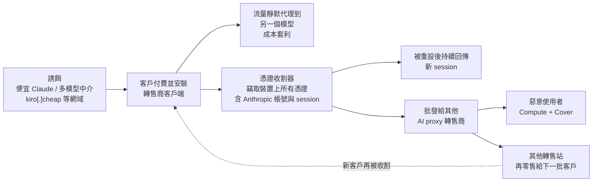
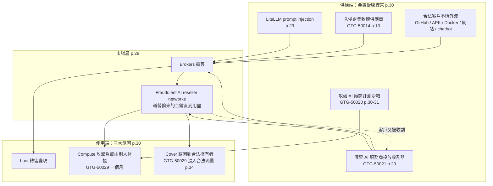
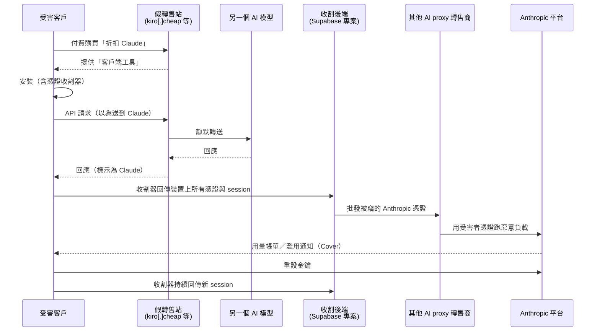
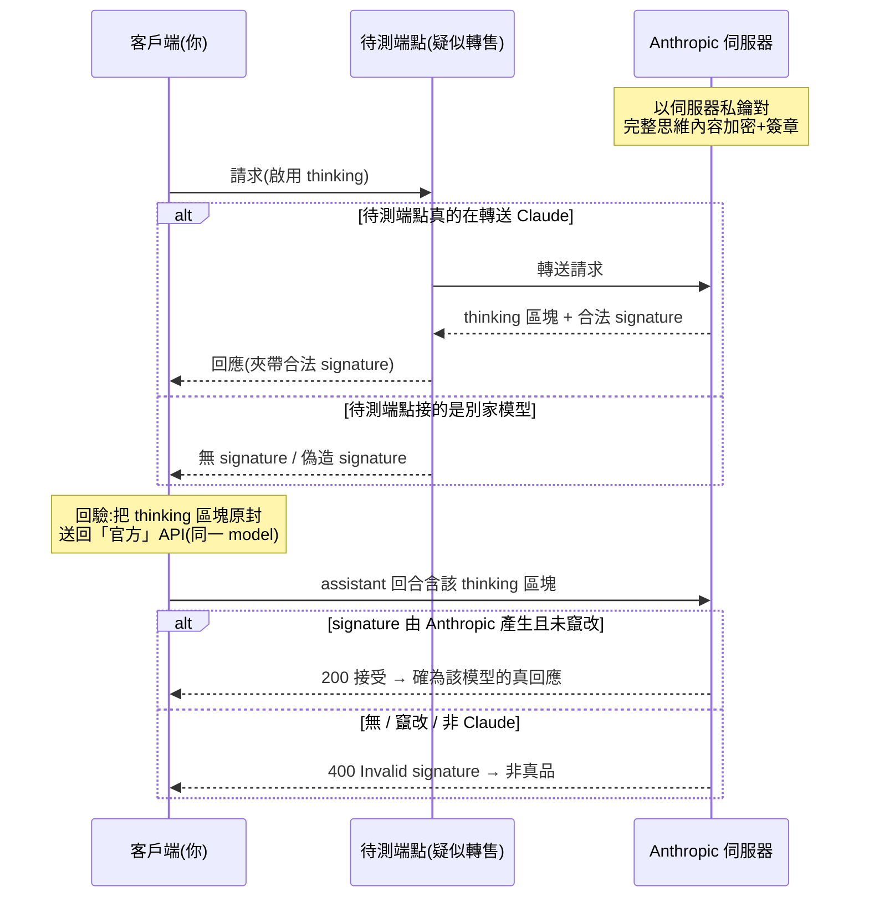
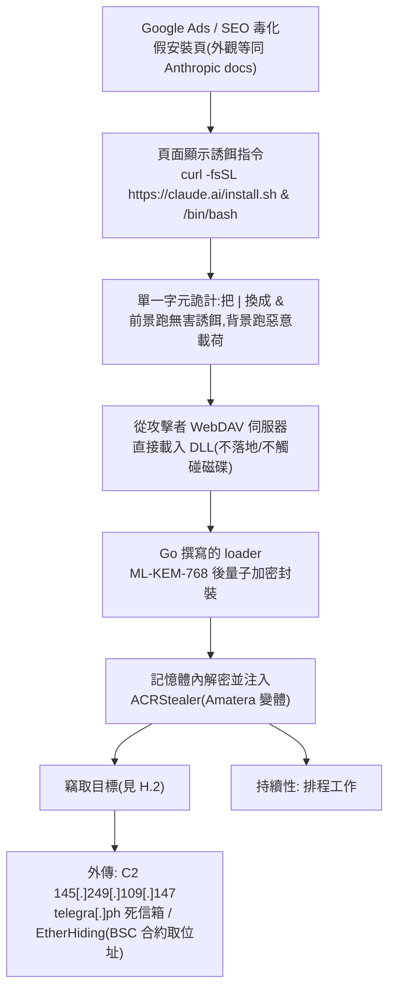
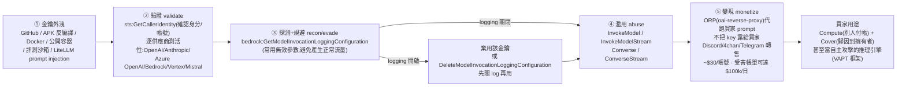

# GTG-50021：假冒 Claude 轉售商與憑證收割器——「AI 供應鏈」成為戰利品、算力與掩護

> 課程模組：01 網路行動（Cyber operations）→ 子章節「AI supply chain as target, loot, and attack compute」 ｜ 一手來源：PDF p.28–31（本案主體 p.29–30） ｜ 整理日期：2026-09-13
>
> 本教材的資料層次標示規則：
> - **［PDF］** ＝ Anthropic 報告原文可直接追溯的內容，一律附頁碼。
> - **［外部］** ＝ WebSearch 取得的第三方研究、媒體報導、產業工具，與 PDF 原文分開陳述，附 URL 與日期。
> - **［分析］** ＝ 本教材作者的推論或教學詮釋，報告沒有明說，學員應視為「可被挑戰的假設」。

---

## 1. 一頁速覽

1. **案子是什麼**：GTG-50021 是一個講俄語與烏克蘭語的犯罪團體（成員之一化名「kl1zy」），經營「便宜 Claude」的假冒轉售服務。報告用一句話總結它的本質：「turned out to be neither cheap nor actually Claude」——既不便宜，也根本不是 Claude。［PDF p.29］
2. **三層騙局疊在一起**：(i) 對外宣稱是「多模型中介／折扣轉售」；(ii) 客戶流量被**靜默代理到另一個 AI 模型**（客戶付 Claude 的錢，拿到別家模型的輸出）；(iii) 轉售商的工具在客戶裝置上**安裝憑證收割器**，竊取客戶的 Anthropic 帳號憑證，再**轉賣給其他 AI proxy 轉售商**作惡意用途。［PDF p.29］
3. **AI 本身是商品，不是工具**：本模組其他案例（GTG-20006、GTG-50014、GTG-50029）是「攻擊者用 Claude 打人」；本案是「攻擊者把 Claude 的存取權當貨賣」。報告把它放在「AI supply chain as target, loot, and attack compute」子章節，並在網路行動章節結語點名：「A marketplace supporting the battlefield has formed as well.」——戰場後方已經形成一個支撐攻擊的市場。［PDF p.28, p.38］
4. **三大誘因框架（Loot / Compute / Cover）**：拿到 AI 憑證的攻擊者一次獲得三樣東西——可轉售的戰利品、由別人付帳的算力、以及把行為歸因到合法金鑰擁有者身上的掩護。這是本案在課程裡最重要的抽象層。［PDF p.30］
5. **貨源在哪裡**：假轉售商的憑證供給「最常來自合法客戶不慎外洩的金鑰」——GitHub、行動 App 安裝檔、Docker 容器、網站、聊天機器人。攻擊者持續開採這些來源。［PDF p.30］
6. **IOC**：報告列出 7 個 defang 網域，其中包含仿冒 AWS 區域命名（`aws-us-east-3[.]com`——AWS 根本沒有這個區域）、仿冒 Amazon Kiro IDE（`kiro[.]cheap`）、以及一個 Supabase 專案子網域（推測為收割資料的後端）。［PDF p.29；區域與 Kiro 判讀為［分析］］
7. **報告的政策結論**：「AI access should be purchased only through authorized channels. An alleged discount that requires routing traffic and credentials through an unknown intermediary introduces tremendous risk to user data and systems.」［PDF p.30］
8. **這個案例在課程裡要教什麼**：教「AI 採購治理」與「AI 憑證等同正式環境憑證」的思維——當你的流量與金鑰必須經過一個不明中介才能拿到折扣時，你買到的不是折扣，是一個被別人控制的攻擊面。同時教學員把「假轉售商」放進 LLMjacking 生態鏈中理解：外洩金鑰 → 掮客 → 轉售商 → 惡意使用者，而 GTG-50021 同時扮演「轉售商」與「供貨者」兩個角色。

---

## 2. 行為者側寫與歸因

### 2.1 報告原文給的線索（逐項）

| 線索類型 | 報告原文 | 出處 | 情報分析上的意義 |
|---|---|---|---|
| 代號 | GTG-50021 | p.29 | Anthropic 內部的 Generative Threat Group 編號。報告 p.4 定義：「These are Anthropic's internal designators for actors observed to be abusing AI.」編號本身不代表國家或動機。 |
| 組織型態 | 「GTG-50021 is a group」 | p.29 | 明確說是**團體**而非個人；「one of whom went by the alias」暗示至少兩人以上。 |
| 語言 | 「a Russian and Ukrainian speaking group」 | p.29 | 語言特徵，**不是**國籍或所在地。俄語與烏克蘭語並列，表示團體內部同時使用兩種語言（或成員來自不同語言背景）。報告沒有說他們在哪裡。 |
| 別名／handle | 「one of whom went by the alias "kl1zy."」 | p.29 | 具體到 handle 通常代表 Anthropic 掌握了帳號註冊資料、對話內容、或基礎設施上的自我標識（例如管理面板、Telegram 名稱）。報告沒有說 handle 的來源。 |
| 動機 | 未明說；行為（賣折扣存取、轉賣憑證）指向**財務動機** | p.29 | ［分析］報告把 GTG-50020 明寫為「financially-motivated」，對 GTG-50021 則未加此標籤，但整段描述沒有任何意識形態或國家目標。 |
| 與其他集團的關聯 | 「selling them onward to other AI proxy resellers for malicious use」 | p.29 | 有**下游買家**——其他 AI proxy 轉售商。報告未點名這些下游是誰。 |
| 與前一段「假冒 AI 服務商投放惡意程式」行為者的關係 | 「GTG-50021 is a group that engaged in **similar** activity.」 | p.29 | **關鍵的措辭細節**：p.28–29 先描述一個（未命名的）「假冒真實 AI 服務商以投放惡意程式」的手法，然後說 GTG-50021 從事「類似」活動。這表示 (a) 前段描述可能是一個更廣的模式或另一個行為者，(b) GTG-50021 是該模式下**被具體命名的一個實例**。教材不應把前段的每一個細節（例如「spoofing as popular AI harnesses including Claude Code」）不加註記地直接套在 GTG-50021 身上。 |

### 2.2 歸因信度：報告用了什麼措辭、沒用什麼措辭

報告在其他案例裡有一套清楚的信度語言：

- 「**suspected** state-sponsored groups」（p.3、p.4）
- 「operators **suspected to be** affiliates of the ShinyHunters collective」（p.12）
- 「we **assess with high confidence** that the actors ultimately shared the outputs with Russian state-owned…」（p.58，影響力行動案例）；「We assess with high confidence that the units were associated with Iranian paramilitary…」（p.102）
- 「We **assess with medium confidence** that this operation was the work of a contractor…」（p.98，監控案例）
- 「We **assess with low confidence** that the actor was a contractor working on behalf of PRC state security」（p.86）

對 GTG-50021，報告用的是**直述句**：「GTG-50021 is a group that engaged in similar activity. They are a Russian and Ukrainian speaking group…」——**沒有**加任何信度修飾詞。

**這在情報學上怎麼讀？**［分析］

1. 直述句通常代表分析者對「行為」本身有第一手觀測（Anthropic 看得到自家平台上的帳號、流量與被竊憑證的流向），對「是誰」則只給了語言與 handle 這種**低層次、可直接觀測**的屬性，而**不做**國家歸因或組織歸因。這是一種「只說我看得到的」的保守做法。
2. 「Russian and Ukrainian speaking」是**語言學線索**（linguistic indicator），不是地理定位。在烏克蘭境內、俄羅斯境內、波羅的海、中亞、以及全球僑民社群都可能同時使用這兩種語言。課堂上務必提醒學員：**不要把「講俄語」自動翻譯成「俄羅斯政府」**。報告對 GTG-50020 用了同樣的「Russian-speaking, financially-motivated」寫法，也同樣沒有國家歸因。
3. 信度語言的階梯（以美國情報社群 ICD 203 的慣例類比）：
   - **high confidence**：多個獨立、可靠來源互相印證，且沒有合理的替代解釋。
   - **medium / moderate confidence**：來源可信但單薄、或有部分矛盾。
   - **low confidence**：來源零碎、可能有欺敵、或推論鏈很長。
   - **suspected / consistent with**：只表示「與某模式相符」，不對身分下結論。
   - **直述而無修飾**：分析者認為這是**觀測事實**而非**評估判斷**——但讀者要注意「事實」的邊界只到句子寫出來的地方為止。

4. 一個實務提醒：把 handle「kl1zy」公開，代表 Anthropic 判斷公開它的**干擾價值**（讓下游買家與合作者知道這個人已被盯上）高於**情蒐價值**（繼續默默觀察）。這是威脅情報「公開 vs. 保密」的典型取捨，可在課堂討論。

### 2.3 為什麼 Anthropic 把這類行為放在「網路行動」而不是「詐騙」章節？

報告有一個獨立的「Scams and fraud」章節（p.139 起），但 GTG-50021 被放在「Cyber operations」。［分析］理由可以從報告自己的結構讀出來：

1. **它的產出物是攻擊能力，不是被騙的錢**。詐騙章節的案例（例如 GTG-15001 的假交友 App）終點是受害者的錢包；本案的終點是「被竊的 Anthropic 憑證流向其他 AI proxy 轉售商供惡意使用」（p.29），也就是**下游的網路攻擊算力**。報告在 p.38 結語把它定性為「A marketplace supporting the battlefield」——支撐戰場的市場。
2. **它用的是惡意程式（credential harvester）**，這是傳統網路入侵的技術（憑證竊取、工作階段權杖竊取、持續性），而不是社交工程話術。
3. **它與同章節其他案例形成供應鏈閉環**：GTG-50029（駭客行動主義者）「ran for a month entirely on stolen API keys」（p.30）；ShinyHunters 關聯者「switched their own attack workloads onto the victim's keys」（p.30）；GTG-50020 攻破 AI 廠商評測沙箱後「took its production keys first」（p.30）。GTG-50021 是這條鏈的**供貨端**。把供貨端與消費端放在同一章，才能呈現「AI 供應鏈」這個完整概念。
4. **報告的章節邏輯是「傷害領域」而非「法律罪名」**。從法律看，本案同時構成詐欺（賣假貨）、電腦犯罪（植入惡意程式）、贓物買賣（轉賣憑證）；但從「傷害領域」看，它製造的傷害是**讓攻擊者更容易取得前沿 AI 算力與掩護**，這是網路行動的範疇。

課堂上可以反問：如果你是台灣的執法或司法單位，你會用哪一條法律追訴這種行為？（詐欺、《刑法》第 358–362 條電腦犯罪、《個資法》、還是《洗錢防制法》？）這個問題沒有單一答案，但能讓學員體會「情報分類」與「法律分類」是兩套不同的座標。

---

## 3. 受害者與目標清單

報告**沒有**給出本案的受害人數、金額、國別或產業。以下把報告文字中出現的受害者角色拆開，並標示每一層的損失。這是本案「三層手法」的受害者視角版本。

### 3.1 受害者層次表

| 層 | 受害者 | 他們以為自己在做什麼 | 實際發生什麼 | 損失 | 出處 |
|---|---|---|---|---|---|
| **第 1 層：買家（付費客戶）** | 向「便宜 Claude」轉售站付費的個人開發者、小團隊、可能包含企業 | 買到折扣的 Claude 存取 | 「their traffic was in fact silently proxied to a different AI model」——流量被靜默送到另一個模型 | (a) 金錢：付 Claude 的價格拿到別家模型；(b) 品質與行為不一致；(c) 資料：所有 prompt 與輸出都經過攻擊者的伺服器 | p.29 |
| **第 2 層：同一批買家（裝置被植入）** | 同上，但這一層的傷害發生在**裝置**上 | 安裝轉售商提供的「客戶端工具」 | 「the reseller's tooling installed a credential harvester, stealing their Anthropic account credentials」 | Anthropic 帳號憑證與工作階段權杖被竊；依 p.29 前段對同類手法的描述，收割器會蒐集裝置上**所有**憑證與已驗證的 session token，且在金鑰被重設後**持續**回傳新 session | p.29 |
| **第 3 層：憑證的合法擁有者（可能與第 2 層是同一人，也可能不是）** | 擁有被轉賣的 Anthropic 帳號／金鑰的人或組織 | 正常使用自己的帳號 | 憑證被「selling them onward to other AI proxy resellers for malicious use」 | (a) 帳單：別人的工作負載算在自己頭上（Compute）；(b) 歸因：惡意活動被記在自己名下（Cover）；(c) 帳號可能因濫用被停權 | p.29–30 |
| **第 4 層：下游攻擊的受害者** | 被「其他 AI proxy 轉售商」的客戶用這些憑證攻擊的任何組織 | — | 報告在 p.30 舉例：駭客行動主義者一個月的活動「entirely on stolen API keys」；ShinyHunters 關聯者把攻擊負載切到受害者金鑰上 | 傳統網路入侵的所有損失 | p.30（GTG-50029、GTG-50014 交叉引用） |
| **第 5 層：平台與生態** | Anthropic 及其他 AI 廠商、合法轉售／整合夥伴 | — | 品牌被冒用、濫用偵測負擔上升、合法客戶因「Cover」被誤判 | 信任成本、執法成本 | p.29–30、p.38 |

### 3.2 報告對「同類手法」受害面的描述（p.28–29，適用於整個模式，不一定逐項適用於 GTG-50021）

報告在介紹 GTG-50021 之前，先描述了一種「假冒真實 AI 服務商以投放惡意程式」的手法，其受害面包括：

- **網站訪客**：「Site visitors would be compromised in a variety of ways」（p.29）。
- **最持久的手法**：讓受害者下載並安裝惡意的客戶端應用程式，「often spoofing as popular AI harnesses including Claude Code」（p.29）。
- **收割範圍**：「gather all of the victim's credentials and authenticated session tokens on their device」——不只 AI 憑證，是裝置上**全部**憑證，再加上「any AI related session tokens or API keys」（p.29）。
- **重設也沒用**：「As the victim's API keys or account may be identified as compromised and reset, the credential harvester continued to identify any new sessions on the device and sent them to the actor.」（p.29）——這是本案最值得警惕的一句：**平台側的金鑰重設，無法解決端點側的持續性竊取**。

### 3.3 沒有數字，怎麼教？

［分析］報告對本案沒有給規模數字，這本身是一個教學點：

- Anthropic 能看到的是**自家平台**上的訊號（哪些帳號的憑證被非擁有者使用、哪些流量來自轉售基礎設施）。它**看不到**轉售站有多少付費客戶、收割器裝在多少台機器上、其他家 AI 廠商的憑證被偷了多少。
- 因此「沒有數字」不等於「規模小」，而是「觀測點的限制」。學員在讀任何廠商威脅報告時，都要問：**這家廠商的觀測點在哪裡？哪些東西它天生看不到？**
- 對照：Okta 在 2026-09-09 分析的一份 7 GB infostealer 資料集（5,871 台受感染機器、162 個國家）中，找到 561 個 Anthropic 的 session token（其中 164 個尚未過期）［外部，見第 9 節］。這給了「被竊 Anthropic 憑證在黑市中流通」一個**獨立的規模參照**——雖然不能直接歸到 GTG-50021。

---

## 4. AI 濫用的攻擊生命週期（逐階段拆解）

### 4.0 先校正座標：本案中「AI」扮演的角色與其他案例相反

本模組的標準拆解方式是「人類做什麼／Claude 做什麼」，並標示自主程度。但本案必須先做一個座標校正：

| 案例 | AI 的角色 | 自主程度 |
|---|---|---|
| GTG-20006（p.5、p.28 等） | AI 是**攻擊工具**：自主蒐集艦隊、多代理編排 | AI 編排多代理自主執行 |
| GTG-50014 ShinyHunters（p.11–15） | AI 是**攻擊工具**：「vibe hacking」、憑證管線 | 人類設定目標，AI 迭代執行 |
| GTG-50029 駭客行動主義者（p.34–35） | AI 是**攻擊工具**，且**跑在偷來的金鑰上** | 人類指揮、子代理分工 |
| **GTG-50021（本案）** | **AI 是商品、誘餌與戰利品**：Claude 的存取權是被賣的東西；被竊的 Anthropic 憑證是被轉賣的東西 | **報告沒有描述 GTG-50021 用 Claude 執行任何攻擊步驟** |

所以本案的「生命週期」不是 kill chain 的「偵察→武器化→投遞→…」而是一條**商品供應鏈**：誘餌 → 交付 → 收割 → 套利 → 轉售 → 下游濫用。下面先把報告提出的供應鏈框架完整鋪開（4.1–4.2），再把 GTG-50021 的三層手法放進去（4.3），最後才做逐階段拆解（4.4）。

### 4.1 報告的「AI 供應鏈」框架：為什麼攻擊者要偷 AI 憑證？

報告 p.28 開頭給了整個子章節的前提：

> 「Access to the uplift granted by AI is highly sought after by malicious actors and the broader criminal economy. Access to AI in the form of compromised API keys, session tokens, and devices has increasingly become **the sole objective** of multiple criminal groups.」（p.28）

注意「the sole objective」——對某些犯罪集團而言，偷 AI 存取權**本身就是目的**，不是入侵的副產品。接著 p.30 給出三大誘因：

> 「Operators who obtain AI credentials gain three things at once:
> • **Loot**: Stolen keys and accounts have resale value in established markets;
> • **Compute**: Having the credentials means that their attack workloads can run at someone else's expense;
> • **Cover**: The activity is attributed to the credential's legitimate owner.」（p.30）

#### 4.1.1 Loot（戰利品）：金鑰本身可以變現

- **報告怎麼說**：「resale value in established markets」——「established」這個字表示市場已經成熟，有掮客、有定價、有客服。p.28 描述了流向：犯罪集團偷到存取權 → 「sell that access through brokers」→ 掮客「feed into fraudulent AI reseller networks」→ 轉售網路「rotate in new stolen API keys and session tokens until they exhaust their usage」（p.28）。
- **變現的兩種形式**［分析］：
  1. **批發**：把金鑰／權杖賣給掮客或轉售商（GTG-50021 做的是這個——「selling them onward to other AI proxy resellers」）。
  2. **零售**：自己開轉售站，把偷來的額度切成小包賣給終端使用者（GTG-50021 **也**做這個——「fraudulent AI reseller operation」）。
- **為什麼 session token 跟 API key 一樣值錢**：API key 是長效憑證，可直接呼叫 API；session token（例如 claude.ai 網頁或 Claude Code 的 OAuth token）可以**重放**以繞過密碼與 MFA。Okta 2026-09 的研究直接用「Signing in without actually signing in」當標題［外部，第 9 節］。
- **外部定價參照**［外部，第 9 節詳列］：CSA 2026-06 研究筆記引述「一把被竊 API key 可能只賣 30 美元，卻能在一天內產生超過 46,000 美元的推論費用」；Pillar Security 的 Operation Bizarre Bazaar 研究指出黑市轉售價約為合法價格的 40–60% 折扣；中文灰市「中轉站」的 Claude 存取據報導可低至官方價的 10%。

#### 4.1.2 Compute（算力）：用別人的錢跑自己的攻擊

- **報告怎麼說**：「their attack workloads can run at someone else's expense」。報告在同一頁給了三個具體例子：
  - 「A hacktivist campaign (described later in this report) ran for a month entirely on stolen API keys.」（p.30，指 GTG-50029）
  - 「ShinyHunters affiliates, on obtaining a victim's AI keys during an intrusion, switched their own attack workloads onto the victim's keys.」（p.30）；p.13 補充：其中一把被竊金鑰被用了「roughly three weeks」進行次級攻擊，包括攻破一家法國零售連鎖與探測一個 Web3 身分平台。
  - 「GTG-50020, after compromising an AI vendor's evaluation sandbox, took its production keys first.」（p.30）；p.31：「when they obtained the target's API keys, they automatically switched to using the victim's keys instead of their own.」
- **為什麼算力這麼重要**［分析］：報告 p.5 的核心論點是「Sophisticated attacks no longer require sophisticated attackers」——AI 讓單人行為者能維持多受害者的行動。但前沿模型的 API 費用是真實的成本門檻（例如一個自主攻擊代理跑一個月可能燒掉數千到數萬美元）。**偷來的金鑰把這道門檻歸零**。這解釋了為什麼「AI 憑證」在 2026 年會變成犯罪集團的「唯一目標」。
- **對防守方的意義**：你的 API 帳單暴增，不只是財務問題，可能代表你的金鑰正在被用來攻擊第三方——你變成了攻擊基礎設施的一部分。

#### 4.1.3 Cover（掩護）：讓活動被歸因到合法擁有者

- **報告怎麼說**：「The activity is attributed to the credential's legitimate owner.」這一句在整份報告裡是最短的，但對威脅情報工作者最有殺傷力。
- **它如何運作**［分析，並引用報告其他段落佐證］：
  - AI 平台的濫用偵測是以**帳號／組織**為單位。當攻擊者用你的金鑰跑攻擊，平台看到的是「你的組織在做壞事」。第一波處置（停權、封鎖）打在**你**身上。
  - GTG-50029 甚至刻意設計工具來強化掩護：「the actor's tool was designed to rotate key usage across a local proxy layer. This enabled the actor to blend their traffic in with the traffic from the legitimate owner of the stolen API keys.」（p.34）——不只借用你的身分，還把攻擊流量**混進你的正常流量**裡，讓異常偵測更難。
  - 對執法與情報而言，「Cover」意味著**歸因鏈多了一個無辜的節點**。如果不先排除「金鑰被竊」的可能，就會把攻擊誤歸給受害者。
- **教學延伸**：這正是為什麼報告一再強調「In every instance, the API keys involved were stolen from Anthropic customers' environments. Anthropic's own systems were not compromised」（p.14–15，對 GTG-50014）與「the keys involved were customers' keys stolen from customers' environments. The actor never compromised Anthropic's own systems」（p.31，對 GTG-50020）——Anthropic 需要澄清歸因邊界，因為「Cover」機制會讓外界誤以為是平台本身出了問題。

### 4.2 供應關係：假轉售商的貨從哪裡來？

報告 p.30 第一段明確描述了供給端：

> 「Fraudulent resellers have increasingly been supplied by compromised access. Most commonly, this comes from **legitimate customers who have inadvertently exposed their API keys and session tokens** in their products, applications and public code such as GitHub, mobile application install files, Docker containers, websites, and chatbots. Malicious actors are constantly mining these sources for exposed keys and analyzing them for authentication abuse vectors.」（p.30）

把報告各處提到的**供給管道**整理成一張表（每一列都有頁碼）：

| 供給管道 | 報告原文 | 出處 | 誰在做 |
|---|---|---|---|
| 公開程式碼（GitHub） | 「public code such as GitHub」 | p.30 | 一般開採者 |
| 行動 App 安裝檔 | 「mobile application install files」；ShinyHunters 關聯者 frkoo 用 10 台 EC2 大量下載 180 萬個 Android APK，反編譯後用 TruffleHog 掃描硬編碼秘密 | p.30；p.12–13 | GTG-50014 |
| Docker 容器／公開容器儲存庫 | 「Docker containers」；GTG-50029 自建 Rust 掃描器「scan and validate public containers for exposed API keys」 | p.30；p.34 | GTG-50029 |
| 網站前端、聊天機器人 | 「websites, and chatbots」 | p.30 | 一般開採者 |
| 企業軟體供應商 | 「a target's AI API keys were stolen from the target's enterprise software vendors」 | p.13 | GTG-50014 |
| AI 廠商的評測沙箱 | 「injecting malicious instructions into an AI vendor's automated evaluation sandbox, the actor caused the sandbox to hand over the credentials it held—including the production AI API keys from multiple providers」 | p.30–31 | GTG-50020 |
| AI 包裝服務的 LiteLLM 部署 | 「multiple actors were observed compromising AI wrapper services' implementation of LiteLLM—they used prompt injection to exfiltrate the production API keys used in their cloud-hosted container environments」 | p.29 | 多個行為者 |
| LiteLLM 或 OpenClaw 部署的 prompt injection | 列在機會型攻擊的清單中 | p.12 | 機會型攻擊者 |
| **假冒 AI 服務商投放憑證收割器** | 「masquerading as real AI service providers to deliver malware」 | p.28–29 | 未命名行為者；GTG-50021「similar activity」 |
| 灰市／PRC 代理基礎設施 | 「PRC-based API reseller/proxy infrastructure to obtain and rotate AI model access at scale」 | p.139（GTG-15001） | 詐騙行為者 |
| 「轉運站」用偷來的金鑰與信用卡 | 「these proxy services create thousands of new accounts using false identities, fake or stolen credit cards, and stolen API keys」 | p.144 | 蒸餾用代理網路 |

**GTG-50021 在這張表裡的獨特位置**［分析］：

其他管道都是「去別人那裡挖」；GTG-50021 是「讓受害者**自己走進來、自己裝上收割器、被重設後還持續回傳**」。報告對這個模式的描述非常精準：

> 「In so doing the actor effectively **mimicked the same fraudulent reseller networks they were supplying compromised credentials to** but instead used this scheme to have victims **continuously feed** their credentials to the attacker and subsequently be sold to the fraudulent resellers.」（p.29）

也就是說，GTG-50021 同時是：
- **轉售商**（對客戶而言，它是「便宜 Claude」的賣家）；
- **供貨者**（對其他轉售商而言，它是被竊憑證的批發商）；
- **一台自動化的憑證養殖場**（對整個生態而言，它把「找金鑰」的成本轉嫁給受害者——受害者付錢、裝軟體、持續供貨）。

這是一種**垂直整合**的犯罪商業模式。課堂上可以用「養殖 vs. 狩獵」來比喻：其他人在野外獵金鑰，GTG-50021 蓋了一個魚池，魚會自己游進來。

### 4.3 三層手法的逐層解剖

報告對 GTG-50021 的核心描述只有一句話，但這一句話包含三個互相獨立、可分別成立的犯罪層：

> 「They ran a fraudulent AI reseller operation offering cheap Claude access—which turned out to be neither cheap nor actually Claude. Customers believed they were buying discounted Claude access, but their traffic was in fact silently proxied to a different AI model while the reseller's tooling installed a credential harvester, stealing their Anthropic account credentials and selling them onward to other AI proxy resellers for malicious use.」（p.29）

#### 第 (i) 層：門面——「多模型中介／折扣轉售」

- **報告依據**：p.29 對同類手法的描述：「websites that purported to be an intermediary service between multiple AI models and offered discounted access to frontier AI models」；對 GTG-50021：「offering cheap Claude access」。
- **它為什麼可信**［分析］：合法的「多模型閘道」是真實存在且流行的產品類型（OpenRouter、LiteLLM Proxy、各家企業的 AI gateway）。一個「幫你把多個模型統一成一個 API、還比較便宜」的服務，在開發者社群裡完全不突兀。這個門面**借用了合法產品類別的可信度**。
- **IOC 佐證**［分析］：`kiro[.]cheap`——網域名稱本身就是誘餌（「便宜的 Kiro」；Kiro 是 AWS 在 2025 年推出的代理式 IDE，官方網域是 kiro.dev，透過 Amazon Bedrock 提供 Claude 模型）。`awstore[.]cloud`、`aws-us-east-3[.]com` 借用 AWS 的命名慣例來營造「這是雲端基礎設施」的感覺。
- **受害者**：所有被「折扣」吸引的買家。
- **這一層的損失**：這一層本身還沒造成損失——它是誘餌。但它決定了受害者的**畫像**：會為了省錢而繞過官方通路的人，通常是預算緊、對合規要求低、技術上能自己接 API 的個人開發者與小團隊——正好是最不可能做供應商盡職調查的一群人。

#### 第 (ii) 層：靜默換模型——成本套利

- **報告依據**：「their traffic was in fact silently proxied to a different AI model」（p.29）；p.38 再述：「silently proxying user traffic to a different model」。報告**沒有說**換成了哪個模型。
- **經濟學**［分析］：轉售商收 Claude 的（折扣）價格，但實際呼叫一個更便宜的模型（可能是開源模型的自架推論、或另一家廠商的低價模型）。差價就是利潤。如果客戶付官方價的 30%，而後端成本是官方價的 5%，毛利仍然很可觀。這解釋了「為什麼假轉售商能長期維持折扣」——**折扣的來源不是規模採購，而是根本沒賣你要的東西**。
- **為什麼客戶察覺不了**［分析］：
  1. 多數應用場景（摘要、翻譯、簡單程式碼）不同前沿模型的輸出品質差異不足以被非專業使用者察覺。
  2. 轉售商可以在系統提示中要求後端模型「自稱是 Claude」。
  3. 客戶通常沒有基準測試，也沒有比對官方 API 回應結構的能力。
- **受害者**：付費客戶。
- **損失**：付了 A 的錢拿到 B；更嚴重的是**第 4.5 節**要談的：合規、資料落地、行為一致性、審計軌跡全部失效。
- **這一層與蒸餾章節的關聯**：報告 p.144 描述另一種方向的「靜默換模型」——未經授權的實驗室「rerouted requests from their users to Claude—without the knowledge or permission of those users—to harvest exchanges」。兩者合起來看：**在灰市裡，「你以為你在跟哪個模型講話」這件事完全不可信**。

#### 第 (iii) 層：憑證收割器——把客戶變成貨源

- **報告依據**：「the reseller's tooling installed a credential harvester, stealing their Anthropic account credentials and selling them onward to other AI proxy resellers for malicious use」（p.29）。
- **收割器的行為**（依 p.29 對同類手法的描述，適用性需標註為「類似活動」）：
  - 蒐集裝置上**所有**憑證與已驗證 session token；
  - 特別關注「any AI related session tokens or API keys」；
  - **持續運作**：金鑰被重設後，「continued to identify any new sessions on the device and sent them to the actor」。
- **投遞載體**：「the reseller's tooling」——也就是轉售商要客戶安裝的「客戶端」。同類手法「often spoofing as popular AI harnesses including Claude Code」（p.29）。［分析］一個「折扣 Claude」服務要求你安裝它的專用客戶端（而不是直接給你一個 base URL 和 key），本身就是紅旗；但對不熟悉的使用者而言，「要裝個東西才能用」是很自然的。
- **受害者**：客戶（裝置被植入）＋ 被轉賣憑證的合法擁有者（可能是客戶本人，也可能是客戶裝置上存有的**公司**憑證）。
- **損失**：這一層的損失最重，因為它**外溢**——如果客戶是某企業的員工，用公司電腦裝了這個客戶端，收割器拿走的是**公司的** Anthropic 企業帳號、公司的 AWS 憑證、公司的 GitHub token……報告說的「all of the victim's credentials」不分公私。
- **這一層與 Okta 研究的對照**［外部］：Okta 2026-09-09 分析的 infostealer 日誌裡，AI 相關的 session token 與 JWT 大量存在（Anthropic 561 個 session token；OpenAI 2,937 個 JWE），並觀察到 Telegram 上有名為「Poison Claude」的服務販售 Anthropic 多個模型的存取權，還有「24/7 客服、不滿意退款」。這表示「收割 → 轉賣」的下游市場是真實且成熟的。

#### 三層的關係：不是三選一，是疊加



［分析］這張圖的重點是右下角的虛線：**其他轉售站的客戶也可能是下一批受害者**。整個灰市是一個自我增強的迴圈——每一個為了省錢而走灰市的使用者，都在為灰市提供下一批貨源。這正是報告用「continuously feed」這個詞的原因。

### 4.4 逐階段拆解（供應鏈版 kill chain）

| 階段 | 攻擊者做什麼 | 受害者做什麼 | AI 的角色 | 報告依據 | 偵測機會 |
|---|---|---|---|---|---|
| **S1 基礎設施** | 註冊仿冒 AWS／Kiro／通用工具名稱的網域（7 個 IOC）；建立 Supabase 專案作為後端 | — | 無 | p.29 IOC | 網域註冊情資、品牌仿冒監控、憑證透明度日誌（CT logs） |
| **S2 誘餌與行銷** | 架設「多模型中介、折扣前沿模型」網站 | 搜尋「便宜 Claude」、「Claude 中轉」 | Claude 是**商品** | p.29 | 搜尋引擎廣告／SEO 監控、社群（Telegram、Discord、論壇）情蒐 |
| **S3 交付** | 提供「客戶端工具」下載（同類手法會仿冒 Claude Code 等 AI harness） | 下載並安裝 | — | p.29 | 端點防護（未簽章／異常簽章的安裝檔）、應用程式允許清單 |
| **S4 收割** | 收割器蒐集裝置上所有憑證與 session token，回傳給攻擊者 | 正常使用 | AI 憑證是**戰利品** | p.29 | EDR 對瀏覽器憑證庫／`~/.claude`／`~/.aws`／`~/.config` 等敏感路徑的存取監控；對 Supabase 專案子網域的異常外連 |
| **S5 套利** | 客戶流量被代理到另一個模型 | 以為在用 Claude | 另一個模型**冒充** Claude | p.29 | 模型驗真（第 5.3 節）、回應結構比對、延遲分布 |
| **S6 持續性** | 金鑰被重設後，收割器持續回傳新 session | 重設金鑰、以為已處理 | — | p.29 | **重設後**憑證仍被非擁有者使用＝端點仍被控制的強訊號 |
| **S7 批發** | 把憑證賣給其他 AI proxy 轉售商 | — | — | p.29 | 平台側：同一憑證從多個不相關的基礎設施發起請求 |
| **S8 下游濫用** | 其他轉售商的客戶用這些憑證跑攻擊（Compute）並讓活動歸因到合法擁有者（Cover） | 合法擁有者收到帳單／停權通知 | Claude 被用來**攻擊第三方** | p.30（交叉引用 GTG-50029、GTG-50014、GTG-50020） | 帳單異常、用量異常、平台濫用通知；歸因時先排除「金鑰被竊」 |

**自主程度標示**：本案在 S1–S7 各階段，**報告沒有描述任何「Claude 做了什麼」**。這與模組其他案例（AI 編排多代理自主執行）形成鮮明對比。若一定要標示，本案屬於「**AI 作為被交易的資源**」，自主程度欄位不適用。在 S8 下游，AI 的自主程度取決於買家——報告 p.30 所引用的 GTG-50029 是「人類指揮、子代理分工」；GTG-50014 是「vibe hacking」。

### 4.5 「靜默換模型」對企業的意義：AI 採購治理的最佳教案

這一節回答課程設計者指定的核心問題：如果一家企業（或政府機關）透過代理商買到的「Claude」其實是別的模型，會失去什麼？

#### 4.5.1 合規（Compliance）

- **你簽的合約與實際交付脫節**。你可能在資安評估、個資影響評估（PIA）、或供應商風險評估中寫了「使用 Anthropic Claude，資料處理符合 Anthropic 的商業條款與資料保留政策」。如果流量根本沒到 Anthropic，這些文件全部失實。
- **監管申報失實**。金融、醫療、政府機關若須向主管機關申報「使用了哪些 AI 服務、資料流向哪裡」，靜默換模型會讓申報內容變成不實陳述——而你**不知道**。
- **報告原文的定性**：「An alleged discount that requires routing traffic and credentials through an unknown intermediary introduces tremendous risk to user data and systems.」（p.30）

#### 4.5.2 資料落地與資料處理（Data residency & processing）

- 你的 prompt（可能含客戶個資、原始碼、商業機密）全部經過攻擊者的伺服器。報告在蒸餾章節說得很直白：代理服務「often save exchanges between users and US models without the knowledge or consent of those users」（p.144），而這些對話會被賣給第三方（p.152–153：SenseTime 從第三方資料供應商購買使用者與 Claude 的對話紀錄）。
- **零資料保留（ZDR）承諾失效**：即使你跟 Anthropic 談了 ZDR，經過中介的流量在中介那一端沒有任何保留限制。報告 p.132 的生物濫用案例正好是反例：一個平台「used a zero data retention (ZDR) service to hide content」——ZDR 被攻擊者拿來藏匿內容，而合法客戶的 ZDR 則被中介架空。
- **對台灣的個資法意義**：《個人資料保護法》要求對委外處理者的監督；若你連「誰在處理」都不知道，監督義務無從履行（第 10.4 節詳述）。

#### 4.5.3 模型行為一致性（Behavioral consistency）

- 你的產品的 prompt engineering、安全測試、紅隊測試、輸出品質評估，全部是針對 Claude 做的。換了模型，這些**全部失效**——而且是靜默失效。
- 安全防護層級不同：不同模型對有害請求的拒絕行為不同。報告 p.129–130 的案例正是「reseller platform … later routing refused prompts to models with more permissive safeguards」——轉售平台把被 Claude 拒絕的請求轉送到防護較寬鬆的模型。如果你的產品依賴 Claude 的安全行為來過濾使用者輸入，換模型後你的產品可能開始輸出你沒預期的內容。
- 版本鎖定失效：你以為鎖定了 `claude-opus-4-8`，實際後端隨時可換。

#### 4.5.4 審計軌跡（Audit trail）

- Anthropic 側的用量紀錄、request ID、組織層級的稽核日誌，對你而言**不存在**（因為請求不是你的組織發出的，或根本沒到 Anthropic）。
- 事故發生時（例如客戶資料外洩），你無法向 Anthropic 調閱紀錄證明「這筆請求是我發的、內容是什麼」。
- 對帳失效：你付給中介的錢，跟任何官方帳單對不上。這一點反過來也是**偵測機會**（第 5.3 節）。

#### 4.5.5 把四個失效合起來看

［分析］「靜默換模型」的本質是：**你把「信任錨點」從一家有合約、有法律責任、有稽核能力的廠商，換成了一個你連真名都不知道的中介**。折扣買到的不是便宜的 Claude，而是把整個 AI 供應鏈的信任根交給陌生人。

這正是報告要用「supply chain」這個詞的原因：AI 服務跟任何軟體供應鏈一樣，**中間每多一個節點，就多一個可被攻破或本身就是惡意的節點**。報告 p.30 的結論句：「AI API keys and session tokens are targets; the integrations customers build around AI such as sandboxes, proxies, and resellers are part of the attack surface.」


---

## 5. TTP 與 MITRE ATT&CK 對應

### 5.1 對應原則

本案的 TTP 分成兩組：**GTG-50021 自己做的事**（建站、投遞、收割、套利、轉賣）與**下游買家用被竊憑證做的事**（報告 p.30 交叉引用的 Compute／Cover 行為）。ATT&CK 是為「入侵企業網路」設計的框架，對「假冒服務商騙人裝軟體」與「AI 憑證轉售市場」覆蓋不完整；下表對每一列標示「ATT&CK 有對應」或「框架缺口」。技術 ID 以 ATT&CK v16–v17（2024-10 之後）為準；v16 把 Resource Hijacking（T1496）拆成子技術，其中 **T1496.004 Cloud Service Hijacking** 是最接近 LLMjacking 的項目。MITRE ATLAS（AI 系統的對抗框架）另有 **AML.T0040 ML Model Inference API Access** 可對應「透過 API 取得模型」的行為，但 ATLAS 目前沒有「模型替換詐欺」或「憑證轉售」的技術條目。

### 5.2 對應表

| 戰術 | 技術 ID | 本案的具體作法 | 出處 | 偵測構想 |
|---|---|---|---|---|
| Resource Development | T1583.001 Acquire Infrastructure: Domains | 註冊 `awstore[.]cloud`、`kiro[.]cheap`、`sys-tools[.]cfd`、`aws-us-east-3[.]com`、`holdboost[.]store`、`deltaclient[.]xyz`——仿冒 AWS 區域命名、Amazon Kiro、通用工具名 | p.29 IOC；命名判讀為［分析］ | 品牌仿冒監控（含「aws-」「kiro」「claude」前綴的新註冊網域）；CT log 監看；廉價 gTLD（`.cfd`、`.xyz`、`.cheap`、`.store`）＋ AI 關鍵字的組合評分 |
| Resource Development | T1583.006 Acquire Infrastructure: Web Services | 使用 Supabase 專案 `iymkjuzymkapovrntoxy.supabase[.]co`（推測作為收割資料的後端／C2） | p.29 IOC；用途為［分析］ | 合法 BaaS 平台濫用：無法封鎖整個 `supabase.co`，需以**專案識別碼**為單位；企業端點對未核准 Supabase 專案的外連告警 |
| Resource Development | T1608.001 Stage Capabilities: Upload Malware | 在網站上提供含收割器的「客戶端工具」下載 | p.29 | 下載檔的簽章與雜湊比對；沙箱引爆 |
| Resource Development | T1608.004 Stage Capabilities: Drive-by Target（部分對應） | 「Site visitors would be compromised in a variety of ways」——報告說訪客被以多種方式入侵，但「最持久的」是誘導安裝 | p.29 | 網站信譽服務；瀏覽器隔離 |
| Initial Access | **框架缺口**：「假冒服務商的付費訂閱誘餌」 | 受害者是**付費客戶**而非釣魚對象。ATT&CK 的 T1566 Phishing 假設受害者被欺騙點擊；本案受害者是主動搜尋折扣、主動付費、主動安裝。最接近的是 T1195 Supply Chain Compromise，但那假設攻擊者入侵了**合法**供應商，而本案供應商**本身就是**攻擊者 | p.29；［分析］ | 採購治理層面的控制（第 10.4 節），非技術偵測 |
| Defense Evasion | T1036.005 Masquerading: Match Legitimate Name or Location | 同類手法「spoofing as popular AI harnesses including Claude Code」；網域仿冒 AWS／Kiro | p.29 | 對比官方安裝路徑（Claude Code 官方安裝來源為 Anthropic 網域，Kiro 官方為 kiro.dev）；端點上出現「claude」「kiro」命名但簽章不是 Anthropic／Amazon 的執行檔 |
| Execution | T1204.002 User Execution: Malicious File | 受害者自行安裝轉售商的客戶端 | p.29 | 應用程式允許清單；未簽章安裝檔告警 |
| Persistence | **報告說有持續性，但機制未描述** | 「continued to identify any new sessions on the device」——表示收割器常駐或定期執行，但報告沒說用什麼機制（排程工作、登入啟動、服務、瀏覽器擴充套件都有可能） | p.29 | EDR 對新增的自動啟動項／排程工作／瀏覽器擴充套件的監控 |
| Credential Access | T1555.003 Credentials from Password Stores: Credentials from Web Browsers | 「gather all of the victim's credentials and authenticated session tokens on their device」 | p.29 | EDR 監控對瀏覽器 `Login Data`／`Cookies` 資料庫的非瀏覽器程序讀取 |
| Credential Access | T1552.001 Unsecured Credentials: Credentials In Files | AI 相關 API key 通常存在 `~/.claude/`、`~/.aws/credentials`、`.env`、IDE 設定（例如 Cline 的 `secrets.json`、Continue 的 `config.yaml`）——後兩者為 Straiker 2026-05 對假 Claude Code 安裝檔攻擊的觀察［外部］ | p.29；［外部］ | 檔案存取稽核；蜜罐金鑰（canary token）放在這些路徑 |
| Credential Access | T1539 Steal Web Session Cookie | 「authenticated session tokens」；金鑰重設後「continued to identify any new sessions」 | p.29 | 平台側：同一 session 從兩個不同裝置指紋／ASN 同時使用；Okta 建議的 Device-Bound Session Credentials［外部］ |
| Credential Access | T1528 Steal Application Access Token | 「any AI related session tokens or API keys」——含 OAuth token | p.29 | 短效權杖＋綁定裝置；token 使用地點與核發地點不一致 |
| Collection | T1005 Data from Local System | 收割裝置上所有憑證 | p.29 | 同上 |
| Exfiltration | T1567 Exfiltration Over Web Service（子技術 T1567.002 Exfiltration to Cloud Storage 為可能對應） | 推測經 Supabase 專案外傳（IOC 中的 `*.supabase[.]co`） | p.29；用途為［分析］ | 對 BaaS／雲端儲存的異常上傳；DNS 層對特定專案子網域的比對 |
| Impact / Fraud | **框架缺口**：「靜默模型替換（成本套利）」 | 「their traffic was in fact silently proxied to a different AI model」——收 Claude 的錢、給別的模型。ATT&CK 的 T1557 Adversary-in-the-Middle 假設攻擊者**插入**一條本來不經過他的通訊路徑；本案受害者**自願**把流量交給中介，中介再詐欺。T1657 Financial Theft（v14 新增）可勉強對應「詐欺獲利」，但沒有捕捉「替換交付物」的本質 | p.29；［分析］ | 第 5.3 節的模型驗真方法 |
| Impact | T1496.004 Resource Hijacking: Cloud Service Hijacking（下游） | 買家用被竊憑證跑攻擊負載（Compute） | p.30 | 用量與帳單異常；官方用量 API 對帳 |
| Defense Evasion（下游） | T1550.001 Use Alternate Authentication Material: Application Access Token；T1078.004 Valid Accounts: Cloud Accounts | 買家用合法擁有者的金鑰／帳號（Cover） | p.30 | 平台側：同一金鑰來自多個不相關 ASN／地理位置；金鑰使用模式與擁有者歷史基線不符 |
| Defense Evasion（下游） | **框架缺口**：「歸因洗白（attribution laundering）」 | GTG-50029 的工具「rotate key usage across a local proxy layer … blend their traffic in with the traffic from the legitimate owner」 | p.34 | 混入合法流量的攻擊很難用單一維度偵測；需要內容層（請求語意）＋行為層（時間、量）聯合 |
| — | **框架缺口**：「憑證作為商品的批發／零售鏈」 | 「sell that access through brokers, which often feed into fraudulent AI reseller networks that rotate in new stolen API keys」 | p.28 | 這是生態層面的問題，屬威脅情報與執法協作範疇 |

### 5.3 偵測構想：企業要如何發現自己買到的是假轉售商？

這一節把課程設計者要求的偵測面向（回應特徵、tokenizer 行為、模型自我識別、延遲分布、TLS／端點、發票與帳單對帳、官方授權清單查核）逐一展開，並依「可信度」排序。原則：**便宜的檢查先做，但只有結構性／密碼學的檢查才算證據**。

#### 5.3.1 官方授權清單查核（採購階段，成本最低、效力最高）

- **官方通路**（依 Anthropic 文件與公開資訊［外部］）：Anthropic 直接 API（Claude Platform）、Amazon Bedrock、Google Cloud Vertex AI、Microsoft Foundry、以及 Claude Platform on AWS。企業級服務夥伴列於 claude.com/partners。
- **報告的原則**：「AI access should be purchased only through authorized channels.」（p.30）
- **實務問題**：要求供應商出示 (a) 與 Anthropic 或雲端平台的合約／夥伴身分證明；(b) 你的用量將計在**哪一個組織**（Anthropic Organization ID、AWS 帳號、GCP 專案）之下；(c) 你能否自行登入該平台的主控台查看用量。**三個都答不出來的，不是授權通路**。
- **政策紅線**［外部］：Anthropic 於 2026-02-20 澄清，Claude Free／Pro／Max 訂閱的 OAuth token 不得用於 Claude Code 與 claude.ai 以外的任何產品或服務；商業條款禁止轉售或以「服務局」形式對第三方提供 API 存取。**任何以「Max 帳號池」「共享訂閱」為基礎的轉售，本身就違反條款**——這不是灰色地帶，是條款明文禁止的行為。

#### 5.3.2 發票與帳單對帳（財務階段）

- 你付給中介的錢，應該能對到**某個官方平台上的用量紀錄**。Anthropic 主控台與 Usage and Cost Admin API 可以拉出組織層級的用量；Bedrock／Vertex／Foundry 各有帳單明細。
- 紅旗：
  - 供應商無法提供官方用量報表，只給自己格式的「用量截圖」。
  - 收款方式是加密貨幣、Telegram、個人帳戶，或發票上沒有可查證的公司登記。
  - 價格**低於官方定價的成本結構**（例如低於 Bedrock 或 Vertex 的公開批發價）。合法經銷商的折扣來自數量承諾或雲端承諾折扣（例如 AWS 的 EDP），幅度有限；報告中的灰市價格（外部報導：官方價的 7–30%，甚至 10%）**在數學上不可能來自合法採購**。
- 報告原文對「折扣」的定性：「An alleged discount that requires routing traffic and credentials through an unknown intermediary introduces tremendous risk」（p.30）。

#### 5.3.3 TLS 與端點檢查（網路層）

- **base URL**：官方 SDK 允許以 `ANTHROPIC_BASE_URL` 或 `base_url` 覆蓋端點。任何要求你把 base URL 指向非官方主機的服務，都是「中介」。企業應在 SDK 設定與環境變數層面**稽核**這個值。
- **憑證與 SAN**：連線到官方端點時，TLS 憑證的主體應為 Anthropic／AWS／Google／Microsoft 的網域。中介的憑證通常是 Let's Encrypt 簽發給廉價 gTLD 的網域。
- **出口控制**：在企業防火牆／代理伺服器建立「已核准 AI 端點」允許清單；對其他主機上的 `/v1/messages`、`/v1/chat/completions` 路徑呼叫告警。D3 Security 對本報告的 SOC 建議［外部］：「Put egress monitoring on your AI calls. Unexpected volume against a model endpoint is now a compromise signal.」
- **客戶端軟體**：任何要求安裝專用客戶端才能使用的「API 轉售服務」都是紅旗——真正的 API 轉售只需要 base URL 與 key。

#### 5.3.4 回應結構與協定特徵（協定層，中等可信度）

［分析，並參考中文圈驗真工具的公開作法（外部）］Anthropic Messages API 的回應有大量**結構性細節**，一個把流量轉去 OpenAI 相容後端的假代理很難全部偽造正確：

| 特徵 | 真 Claude API 的行為 | 假代理常見破綻 |
|---|---|---|
| 訊息 ID | `id` 以 `msg_` 開頭 | 空白、隨機 UUID、或 `chatcmpl-` 前綴（OpenAI 格式） |
| `tool_use` 區塊 | `id` 以 `toolu_` 開頭；`input` 為符合 schema 的 JSON 物件 | 用 `call_` 前綴（OpenAI 格式）；`input` 是字串 |
| 串流事件序列 | `message_start` → `content_block_start` → `content_block_delta`（`text_delta`／`input_json_delta`／`thinking_delta`）→ `content_block_stop` → `message_delta` → `message_stop` | 事件缺漏、順序錯誤、`usage` 只在最後出現一次 |
| `usage` 欄位 | 含 `input_tokens`、`output_tokens`、`cache_creation_input_tokens`、`cache_read_input_tokens`，較新模型另有 `inference_geo`、`speed` 等 | 缺欄位、全為 0、或數字與提示長度不成比例 |
| Prompt caching | 同一長前綴重複送出時，第二次起 `cache_read_input_tokens` > 0 | 永遠為 0（後端不是 Claude，沒有 Anthropic 的快取） |
| `thinking` 區塊 | 附有伺服器產生的 `signature`；把區塊原封不動回傳給官方 API 會被接受，**竄改後會收到 400「Invalid `signature` in `thinking` block」** | 沒有 signature、signature 為固定字串、或回傳時被官方 API 拒絕 |
| `stop_reason` | `end_turn`／`max_tokens`／`tool_use`／`refusal`（含 `stop_details`） | 只有 `stop`／`length` |
| 文件輸入 | 接受 base64 PDF `document` 區塊並能引用頁碼（citations） | 回傳「無法讀取 PDF」或忽略 |
| 錯誤格式 | `{"type":"error","error":{"type":"invalid_request_error","message":...}}` | OpenAI 格式錯誤物件 |

- **最強的單一檢查是 `thinking` 區塊的 `signature`**。中文圈的中轉站驗真站 Veridrop 明確以「加密級簽名驗真」「checking `thinking_signature` server-side signatures」作為判定「是否真 Claude」的主要依據，並對超過 9,500 個中轉站持續測試，公布「簽名率」［外部］。原理：signature 由 Anthropic 伺服器產生，綁定模型（與較新模型的對話前綴），第三方無法偽造。**驗證方法**：從待測端點取得含 thinking 的回應，把該 thinking 區塊放進下一輪請求，送到**官方 API**（用你自己的官方金鑰）——若官方 API 接受，代表這個區塊確實來自 Anthropic 的模型；若回 400 invalid signature，代表待測端點的回應不是官方模型產生的（或已被竄改）。
- **注意**：這些檢查對「用真 Claude 但用偷來的金鑰」的轉售商**無效**——那種轉售商給你的確實是真 Claude 的回應。這時要靠 5.3.1–5.3.3（授權、對帳、端點）來判斷。也就是說：**協定檢查回答「是不是 Claude」，採購檢查回答「是不是合法取得的 Claude」**——兩個問題都要問。

#### 5.3.5 Tokenizer 行為（協定層，中等可信度）

- 對一段固定文字，官方 `count_tokens` 端點回傳的 token 數，應與待測端點回應的 `usage.input_tokens` 一致（同一模型）。不同廠商的 tokenizer 對中文、程式碼、特殊符號的切分差異很大，數字對不上就是替換的證據。
- 上下文長度探測：對宣稱是 Opus／Sonnet 4.6 以上（1M 上下文）的端點送一個 250K token 的提示；若回「超過上下文」錯誤，後端很可能是 200K 或更小的模型。
- 注意 Anthropic 不同世代模型的 tokenizer 不同（例如 Opus 4.7 之後的 tokenizer 與 4.6 不同），比對時要固定模型 ID。

#### 5.3.6 模型自我識別（行為層，低可信度，但便宜）

- 直接問「你是哪個模型」**不可靠**：系統提示可以要求後端模型自稱 Claude。
- 較可靠的是**能力探測**：只有真 Claude 才會有的行為與知識，例如對 Anthropic 特定 API 功能（structured outputs 的 `output_config.format`、server-side `web_search` 工具、`citations`）的正確反應；或以學術界的 LLM 指紋方法（USENIX Security 2025 的 LLMmap：8 次互動內以 95% 以上準確率識別 42 種模型版本［外部］）建立基準。
- 學術界對「模型替換稽核」的結論值得寫進講義［外部，arXiv 2504.04715《Are You Getting What You Pay For? Auditing Model Substitution in LLM APIs》］：純軟體方法（文字統計、log-prob 比對、基準測試）在「量化版本替換」「隨機部分替換」等對抗情境下**不可靠**，作者建議以可信執行環境（TEE）提供硬體級證明。對課程的意義：**偵測模型替換在技術上是開放問題，所以採購治理（不要走不明中介）比事後偵測更重要**。

#### 5.3.7 延遲分布（行為層，輔助訊號）

- 首 token 延遲（TTFT）與輸出速率（tokens/s）是每個模型／每個部署的指紋。多一層代理會增加固定延遲；後端換成不同模型會改變輸出速率分布。
- 做法：對官方端點與待測端點各跑 100 次相同請求，比較 TTFT 與 tokens/s 的分布（例如 KS 檢定）。這不是證據，但足以觸發進一步調查。
- 灰市驗真站也用「延遲」與「在線率」作為排名指標［外部］——這反映灰市的品質問題本身就是可觀測的。

#### 5.3.8 端點與平台側的持續監控（事後偵測）

- **端點**：EDR 規則——非瀏覽器程序讀取瀏覽器憑證庫；程序讀取 `~/.claude`、`~/.aws`、`~/.config/gcloud`、IDE 的 secrets 檔；新增排程工作／自動啟動項指向使用者目錄下的可執行檔；對本案 IOC（尤其 Supabase 專案子網域）的 DNS 查詢。
- **平台側（你自己的 Anthropic／雲端帳號）**：用量突增、來自新 ASN／國家的請求、非上班時間的高頻請求、模型組合改變（例如平常只用 Sonnet，突然大量 Opus）。報告的一個關鍵訊號：**重設金鑰之後，新金鑰在短時間內又出現在不明來源的請求中**——這代表端點仍被控制（p.29 描述的持續收割）。
- **蜜罐金鑰**：在常見路徑放置只用於偵測的 canary API key（例如一個用量上限為 0 的 key）；任何對它的使用都是憑證竊取的證據。

#### 5.3.9 把偵測構想整理成一張「可信度階梯」

| 階梯 | 檢查 | 回答的問題 | 可信度 | 成本 |
|---|---|---|---|---|
| 1 | 授權通路查核、組織歸屬、主控台可見性 | 是不是合法取得？ | 高（文件證據） | 極低 |
| 2 | 帳單對帳、價格合理性 | 是不是合法取得？ | 高 | 低 |
| 3 | base URL／TLS／出口允許清單 | 流量到哪裡？ | 高 | 低 |
| 4 | `thinking` signature 回驗 | 是不是 Claude？ | 高（密碼學） | 低 |
| 5 | 回應結構、prompt cache、tokenizer | 是不是 Claude？ | 中 | 中 |
| 6 | 能力探測、LLM 指紋 | 是不是 Claude？ | 中低 | 中 |
| 7 | 延遲分布 | 有沒有多一層？ | 低（輔助） | 中 |
| 8 | 自我識別問答 | — | 極低 | 極低 |

**教學重點**：多數企業只做第 8 階（問 AI「你是誰」），而它恰好是最不可靠的。

---

## 6. 圖表逐一判讀

**本案頁段（p.29–30）沒有編號的 Figure。** 兩頁都是純文字排版，但各有一個具視覺功能的元素：p.29 的 IOC 框、p.30 的 Loot／Compute／Cover 條列。以下依簡報要求逐一判讀，並說明鄰頁圖表的歸屬，避免學員誤把別案的圖套到本案。`course/figures/` 目錄中**沒有** page-029 / page-030（因為這兩頁沒有圖表），教材中若需要視覺輔助，請用第 4.3 節與第 6.3 節的 Mermaid 圖。

### 視覺元素 A（p.29）：「GTG-50021 indicators of compromise」框

- **類型**：灰底圓角方框（報告用來呈現 IOC 的標準版式），等寬字體，7 行，無表頭、無欄位、無日期範圍。
- **實際看到的內容**（逐字，保留 defang）：
  ```
  awstore[.]cloud
  kiro[.]cheap
  sys-tools[.]cfd
  aws-us-east-3[.]com
  holdboost[.]store
  deltaclient[.]xyz
  iymkjuzymkapovrntoxy.supabase[.]co
  ```
- **版面位置**：位於 GTG-50021 段落之後、「There are also groups that attempt to target the AI ecosystem…」段落之前，佔頁面約四分之一高度。
- **與其他案例 IOC 框的差異**：GTG-50020（p.33–34「Attacker egress IPs」）的 IOC 是「IP ＋ 起訖日期」的三欄表；GTG-15001（p.141）的 IOC 有「Network」等分類標籤與 ASN 註記。本案只有一欄網域，沒有 IP、沒有雜湊、沒有 Telegram 帳號、沒有時間範圍。［分析］這暗示 Anthropic 對本案的可見度主要在**網域層**（可能來自被害者裝置上的外連紀錄、或轉售站本身），而非惡意程式樣本層。
- **核心訊息**：7 個網域的命名分成三群——**仿冒 AWS**（`awstore[.]cloud`、`aws-us-east-3[.]com`）、**仿冒 Kiro／通用工具**（`kiro[.]cheap`、`sys-tools[.]cfd`、`deltaclient[.]xyz`、`holdboost[.]store`）、**合法 BaaS 濫用**（Supabase 專案）。這個組合本身就講了一個故事：門面用大廠名字取信，交付用「工具」「客戶端」命名，後端藏在合法雲服務裡。
- **課堂用法**：讓學員在**不查詢任何網域**的前提下，只從命名推論每個網域在攻擊鏈中的角色（門面／下載／後端），再對照第 7 節的判讀。這訓練「從 IOC 命名反推基礎設施設計」的能力。

### 視覺元素 B（p.30）：「Operators who obtain AI credentials gain three things at once」條列

- **類型**：三點條列，每點以粗體關鍵字開頭（**Loot**、**Compute**、**Cover**），後接一句說明。是整個子章節唯一的「概念圖」——雖然用文字呈現。
- **實際看到的內容**：
  - Loot: Stolen keys and accounts have resale value in established markets;
  - Compute: Having the credentials means that their attack workloads can run at someone else's expense;
  - Cover: The activity is attributed to the credential's legitimate owner.
- **資料如何流動**：這三點的順序不是隨意的——它對應被竊憑證的**三種用途**，也對應**三種不同的受害者**：Loot 傷害市場秩序與平台；Compute 傷害金鑰擁有者的錢包；Cover 傷害金鑰擁有者的名譽與整個歸因體系。
- **核心訊息**：一把金鑰同時是**商品、燃料與面具**。
- **課堂用法**：把這三個字做成投影片的三欄，讓學員把報告中的其他案例（GTG-50029、GTG-50014、GTG-50020、GTG-50021）分別填進「主要獲得了哪一項」。答案：GTG-50021 主要是 Loot（它賣憑證）；GTG-50029 是 Compute＋Cover（跑一個月＋混入合法流量）；GTG-50014 是 Compute（三週次級攻擊）；GTG-50020 是 Compute＋（企圖）取得預發布模型。

### 6.3 建議的教學用圖（教材自繪，非報告內容）

報告沒有為本子章節畫供應鏈圖，以下 Mermaid 圖把 p.28–30 的文字關係視覺化，供講師使用：





### 6.4 鄰頁圖表的歸屬（避免誤用）

- **p.28 Figure 14「Autonomous collection-fleet loop」**（`../figures/page-028.png`）：屬於 GTG-20006（中國國家背景行為者）的自主蒐集艦隊，與本案無關。它出現在同一頁只是因為「AI supply chain」子章節從 p.28 下半頁開始。
- **p.31 的流程圖**（`../figures/page-031.png`，圖說「Figure 15. Human-directed AI pentest loop」在 p.32）：屬於 GTG-50020（從飯店訂房平台轉向 AI 供應鏈的俄語行為者）。GTG-50020 與本案同屬「AI 供應鏈」主題，但它是**消費端**（偷 AI 廠商的正式金鑰來用），本案是**供給端**。兩案適合在課堂上並列比較，但圖不能混用。

---

## 7. IOC 與技術指標

### 7.1 報告 IOC 完整抄錄（p.29，保留 defang）

**安全紅線提醒**：以下網域只作研究資料抄錄。本教材製作過程**未**對任何一個網域進行連線、DNS 查詢或互動式查詢；課堂與實驗環境也不應這麼做。若需比對，只在**被動**資料（自家 DNS 日誌、代理伺服器日誌、EDR 遙測、威脅情資平台的歷史紀錄）中比對。

| # | 指標（defang） | 類型 | 命名判讀［分析］ | 推測角色［分析］ | 偵測價值 | 壽命評估 |
|---|---|---|---|---|---|---|
| 1 | `awstore[.]cloud` | 網域 | 「AWS store」——借用 AWS 品牌＋「商店」；`.cloud` gTLD 強化「雲端服務」印象 | 門面／販售站 | 中：可加入 DNS 黑名單與代理伺服器封鎖清單；可作為品牌仿冒監控的樣本 | 短：報告公開後行為者通常棄用；但命名模式（`aws*`＋廉價 gTLD）可長期作為狩獵規則 |
| 2 | `kiro[.]cheap` | 網域 | 「便宜的 Kiro」。Kiro 是 AWS 於 2025 年推出的代理式 IDE（官方網域 kiro.dev），透過 Amazon Bedrock 提供 Claude 模型；`.cheap` 是真實存在的 gTLD，網域名稱本身就是誘餌 | 門面／販售站（鎖定 Kiro 使用者） | 中高：命名極具辨識度；也提示本案不只鎖定 Claude 直接使用者，還鎖定透過 AWS 生態使用 Claude 的開發者 | 短（網域）；長（模式：「<AI 產品名>.cheap」） |
| 3 | `sys-tools[.]cfd` | 網域 | 「系統工具」＋ `.cfd`（CentralNic 營運的廉價 gTLD，長期被濫用於惡意程式散布） | 惡意客戶端／收割器的下載或更新來源 | 中：`.cfd` 在多數企業環境沒有合法用途，可整個 TLD 封鎖 | 短 |
| 4 | `aws-us-east-3[.]com` | 網域 | 仿冒 AWS 區域命名。**AWS 只有 us-east-1（北維吉尼亞）與 us-east-2（俄亥俄），沒有 us-east-3**——這個網域是設計來讓不熟 AWS 的人以為是合法區域端點 | 假 API 端點／代理端點（客戶端可能把 base URL 指向這裡） | 高：任何對「不存在的 AWS 區域」的連線都是確定的紅旗；可寫成通用規則（比對 `aws-<region>` 樣式但不在官方區域清單者） | 短（網域）；長（規則） |
| 5 | `holdboost[.]store` | 網域 | 通用行銷型名稱＋ `.store` | 門面或付款頁 | 低中：命名無特徵，只能靠精確比對 | 短 |
| 6 | `deltaclient[.]xyz` | 網域 | 「delta client」——「client」暗示這是客戶端軟體的下載或 C2；`.xyz` 為廉價 gTLD | 客戶端下載／更新／C2 | 中：與 #3 同類 | 短 |
| 7 | `iymkjuzymkapovrntoxy.supabase[.]co` | 網域（Supabase 專案子網域） | 20 字元隨機字串是 Supabase 專案的參考識別碼格式；Supabase 是合法的 BaaS（Postgres＋Storage＋Auth） | 收割資料的上傳後端／設定拉取／C2 死信箱。外部研究顯示 npm、NuGet 惡意套件與 infostealer 都曾用 Supabase 作為外洩後端［外部］ | 高（精確）：這個專案 ID 只屬於攻擊者；但**不能封鎖整個 supabase.co**（大量合法應用使用）。需以完整子網域比對 | 中：專案可能被 Supabase 停用，但攻擊者換一個專案只需幾分鐘；規則層面應監控「端點上非開發工具的程序對任何 `*.supabase.co` 的 POST」 |

### 7.2 IOC 之外的技術指標（報告文字中可抽取的行為指標）

| 行為指標 | 報告依據 | 可寫成的偵測邏輯 |
|---|---|---|
| 「折扣 Claude」服務要求安裝專用客戶端 | p.29 | 使用者教育規則；端點上出現非官方簽章、名稱含 claude／kiro／anthropic 的安裝檔 |
| 客戶端仿冒 Claude Code 等 AI harness | p.29（同類手法） | 比對執行檔簽章者（Anthropic 官方安裝為 Anthropic 網域提供的 script／套件）；Straiker 2026-05 記錄的假 Claude Code 攻擊使用 `curl -fsSL https://claude.ai/install.sh & /bin/bash`（把 `\|` 換成 `&` 讓惡意指令在背景執行）等技巧［外部］——可作為 shell 歷史／EDR 命令列稽核規則 |
| 收割裝置上所有憑證與 session token | p.29 | 非瀏覽器程序讀取瀏覽器憑證庫；程序讀取 `~/.claude`、`~/.aws`、`~/.config`、`.env` |
| 金鑰重設後持續回傳新 session | p.29 | 「重設後 N 小時內新憑證出現在不明來源」的關聯規則 |
| 憑證被多個不相關基礎設施使用 | p.28（轉售網路輪替金鑰） | 平台側：同一 key／session 的來源 ASN 數量、地理分散度 |
| 攻擊者用 local proxy 把流量混入合法擁有者流量 | p.34（GTG-50029） | 難以用來源偵測；改用內容層（請求語意分類）與時序（擁有者不活躍時段的請求） |

### 7.3 為什麼這份 IOC 的教學價值高於它的實戰價值

［分析］七個網域在報告發布（2026-09-10）後幾乎確定已失效或被棄用；它們的實戰價值是**回溯狩獵**（在歷史日誌中找曾經連過的主機——那些主機上可能還有收割器）。但它們的**教學價值**在於命名模式：一個 IOC 清單能告訴你攻擊者怎麼設計信任（借用 AWS／Kiro）、怎麼設計交付（「tools」「client」）、怎麼藏後端（合法 BaaS）。把 IOC 當成「攻擊者的架構圖」來讀，是威脅情報分析的基本功。

---

## 8. Anthropic 的偵測、處置與防線缺口

### 8.1 報告說了什麼（以及沒說什麼）

| 項目 | 報告內容 | 出處 |
|---|---|---|
| 發現 | 「We discovered GTG-50021 creating fraudulent resellers offering discounted Claude access, while silently proxying user traffic to a different model, and harvesting the Anthropic credentials of anyone who signed up.」 | p.38 |
| 處置 | **本案段落沒有寫任何具體處置**（沒有「we banned」「we disrupted」「we shared with law enforcement」等句子）。只有報告總則：「In each case we disrupted the activity involved, strengthened our AI safeguards based on what we learned, and shared intelligence with authorities and industry partners where appropriate.」 | p.4（總則）；p.29 無 |
| 偵測方法 | **未描述**。報告沒說是怎麼發現 GTG-50021 的（被害者通報？被竊憑證的異常使用模式？轉售站的公開廣告？） | — |
| 對「同類手法」的觀察 | 收割器會在金鑰重設後持續回傳新 session | p.29 |
| 對生態的處置原則（來自蒸餾章節，可類推） | 「Instead of banning proxy accounts individually, we work to attribute this suspicious activity to a specific organization, allowing us to take comprehensive enforcement actions」 | p.153 |
| 對客戶的建議 | 把 AI 金鑰與代理整合視同正式環境憑證；只透過授權通路購買 | p.30 |

### 8.2 防線在哪裡失效（課程高價值素材）

#### 缺口 1：平台看不到端點——金鑰重設無法對抗持續收割

報告 p.29 的這句話是整個子章節最重要的防線缺口自白：

> 「As the victim's API keys or account may be identified as compromised and reset, the credential harvester continued to identify any new sessions on the device and sent them to the actor.」

意義：Anthropic 的防線（偵測濫用 → 標記金鑰為外洩 → 重設）**每一步都正確**，但因為攻擊者控制的是**受害者的裝置**，重設只是讓收割器多回傳一把新金鑰。這是「平台側安全」的結構性極限：**平台只能保護它看得到的東西**。對防守方的教訓：憑證外洩事件的處置必須同時處理「憑證」與「洩漏憑證的端點」——只做前者等於沒做。

#### 缺口 2：Cover 機制讓第一波處置打在無辜者身上

當被竊憑證被用於濫用，平台的第一反應（依帳號停權）打在合法擁有者身上。報告沒有描述 Anthropic 如何區分「擁有者自己濫用」與「憑證被竊後被濫用」——這是一個困難的問題，且報告多次強調「Anthropic's own systems were not compromised」（p.14–15、p.31），正是因為 Cover 機制容易讓外界誤解。

#### 缺口 3：轉售網路的「輪替」策略讓單點封鎖無效

p.28：「fraudulent AI reseller networks that rotate in new stolen API keys and session tokens until they exhaust their usage.」——轉售網路把偷來的金鑰當耗材，用完就換。單一金鑰的停用對轉售網路只是耗材損耗。Anthropic 在蒸餾章節（p.153）採取的對策是「歸因到組織再整體處置」，但對於分散的犯罪轉售網路，「組織」可能根本不存在。

#### 缺口 4：客戶自建的整合是攻擊面，但不在平台的控制範圍

p.29 的 LiteLLM 案例：「multiple actors were observed compromising AI wrapper services' implementation of LiteLLM—they used prompt injection to exfiltrate the production API keys used in their cloud-hosted container environments.」以及 p.30：「the integrations customers build around AI such as sandboxes, proxies, and resellers are part of the attack surface.」

意義：即使客戶透過完全合法的通路購買，客戶**自己架的閘道**（LiteLLM、自寫的 proxy、評測沙箱）被打穿後，正式金鑰一樣外流。Anthropic 對這一層沒有控制力，只能建議。外部脈絡（第 9 節）：2026 年 2–6 月 LiteLLM 至少揭露六個 CVE，其中 CVE-2026-42208（金鑰驗證路徑的 SQL 注入）在公告後 36 小時內被實際利用；CSA 指出攻破 AI 閘道會一次暴露「每一把模型供應商金鑰、內部 API 金鑰、以及閘道代理過的所有對話紀錄」。

#### 缺口 5：政策收緊可能把使用者推向灰市（雙面刃）

［外部＋分析］Anthropic 於 2026-02-20 澄清禁止訂閱 OAuth token 用於第三方工具，並封鎖違規帳號。這是正確的反套利措施，但它同時意味著：想用便宜方式取得 Claude 的使用者，合法選項變少，灰市「Max 帳號池」「中轉站」的需求上升。中文圈的中轉站生態（外部報導：超過 9,500 個被追蹤的中轉站；一篇 2026 年的調查稱樣本中約 45% 提供假模型）正是這個需求的反映。**每一個灰市使用者都是下一個 GTG-50021 的潛在受害者**。這不是說政策錯了，而是說政策與執法必須搭配「讓合法通路對小型使用者足夠可及」——否則防線會被需求繞過。

#### 缺口 6：報告對本案的處置描述是空白

［分析］與 GTG-50014（p.14：「We detected and banned accounts… engaged government authorities, industry partners, and victims」）或生物濫用案例（p.132：「we banned all associated accounts, worked with partners to take down the relay networks… The operator re-established access within days」）相比，本案沒有任何處置細節。可能的原因：(a) 處置仍在進行（例如執法協作）；(b) 主要處置發生在 Anthropic 平台之外（網域下架、與 Supabase 協作）；(c) 篇幅取捨。課堂上應誠實告訴學員：**我們不知道 Anthropic 對 GTG-50021 做了什麼，也不知道它是否還在運作**。

### 8.3 從缺口推導的防守原則（給企業與機關）

1. **憑證事件＝端點事件**：任何 AI 金鑰外洩，都要問「洩漏的端點是哪一台、上面還有什麼」。
2. **AI 金鑰等同正式環境憑證**（p.30 原文）：納入秘密管理、輪替、最小權限、用量上限、IP 允許清單。Okta 的建議［外部］：短效 OAuth token、Device-Bound Session Credentials、對 API key 設用量上限與 IP 允許清單。
3. **自建閘道是你的責任**：LiteLLM 等閘道要當成正式環境的邊界設備管理（修補、認證、隔離、不放正式金鑰在容器環境變數中）。
4. **採購即防線**：報告 p.30 的「只透過授權通路購買」不是合規口號，而是**唯一能同時擋住三層手法**的控制——它讓誘餌無效、讓套利無從發生、讓收割器沒有投遞管道。

---

## 9. 第三方驗證與外部來源

本節分成兩部分：**9.1 對 GTG-50021 本身的報導**（回答「有沒有人獨立證實這個案子」），與 **9.2–9.10 外部脈絡**（回答「這個案子在更大的生態裡是什麼位置」）。所有外部材料都與 PDF 原文分開；若外部報導與 PDF 有出入，以 PDF 為準並在第 12 節註記。

### 9.1 對 GTG-50021 的報導（單一來源判定）

| 來源 | URL | 日期 | 提到本案的內容 | 性質 |
|---|---|---|---|---|
| The Hacker News（Ravie Lakshmanan） | https://thehackernews.com/2026/09/claude-used-to-automate-exploitation.html | 2026-09-11 | 一段話：俄語與烏克蘭語團體經營假 AI 轉售、流量被靜默代理到另一模型、安裝憑證收割器竊取 Anthropic 憑證轉賣。**未提** kl1zy、LiteLLM、Loot/Compute/Cover | 僅引述 Anthropic |
| D3 Security | https://d3security.com/blog/anthropic-threat-report-september-2026-soc-takeaways/ | 2026-09-11 | 一句話概述本案；完整轉述 Loot/Compute/Cover；給出四條 SOC 建議（盤點所有 AI 金鑰、視同正式資料庫憑證、AI 呼叫出口監控、只透過授權通路購買） | 僅引述 Anthropic，加少量框架性評論 |
| CellCog | https://cellcog.ai/blog/anthropic-threat-report-september-2026/ | 2026-09 | 標題即「the API Key Is the Loot」；概述本案 | 僅引述 Anthropic |
| Cyber Kendra | https://www.cyberkendra.com/2026/09/anthropic-threat-report-says-ai-now.html | 2026-09 | 「每一案解說」型整理 | 僅引述 Anthropic |
| beri.net（THE D*AI*LY BRIEF） | https://www.beri.net/article/anthropic-threat-report-eval-sandbox-litellm-prompt-injection-api-key-theft | 2026-09 | 聚焦 GTG-50020 評測沙箱與 LiteLLM 金鑰外洩，把「你的閘道也握著金鑰」作為論點 | 僅引述 Anthropic，加評論 |
| Anthropic 官方網頁版 | https://www.anthropic.com/threat-intelligence-report-september-2026 | 2026-09-10 | 一手來源 | — |
| 電腦王阿達（達小編） | https://www.kocpc.com.tw/archives/668684 | 2026-09-11 | 繁中整理，**未提及**假轉售商、憑證收割、GTG-50021；有提台灣長老教會、台灣政治人物被監控等段落 | 僅引述 Anthropic |
| iThome | https://www.ithome.com.tw/news/178864 | 2026-09 | 標題聚焦「7 家中國業者蒸餾 Claude」；抓取時回 HTTP 403，**無法確認**是否提及本案 | 僅引述 Anthropic（推測） |
| INSIDE | https://www.inside.com.tw/article/42371-anthropic-threat-intelligence-report-biological-weapons-taiwan | 2026-09 | 標題聚焦「中國帳號研究攻台灣防空、生物武器」 | 僅引述 Anthropic（推測） |
| unwire.hk | https://unwire.hk/2026/09/12/anthropic-claude-threat-intelligence-report-2026/ai/ | 2026-09-12 | 港媒，七大類別概述 | 僅引述 Anthropic（推測） |

**判定：GTG-50021 是單一來源情報。** 截至 2026-09-13，沒有任何第三方（資安廠商、執法機關、學術研究）獨立證實「kl1zy」這個 handle、七個網域、或「俄語／烏克蘭語團體」的歸因。所有媒體報導都是轉述 Anthropic 報告。台灣繁中媒體的報導重心是蒸餾、監控與武器，**沒有一篇把「假轉售商」當成主題**——這本身是課程可以填補的空白。

**但「模式」有大量獨立佐證**：假冒 Claude Code 安裝檔投放憑證竊取程式（Straiker、Push Security）、AI session token 在 infostealer 日誌與黑市流通（Okta）、假 AI 閘道轉售被竊存取（Pillar）、中轉站的模型替換（中文圈驗真工具）——每一項都由與 Anthropic 無關的團隊獨立記錄。以下逐項整理。

### 9.2 外部脈絡 A：「LLMjacking」——業界術語與研究史

**術語定義**：LLMjacking 由 Sysdig Threat Research Team 於 2024 年 5 月提出，定義為「an attacker using stolen credentials to gain access to a victim's large language model (LLM)」——用被竊憑證劫持受害者的 LLM 資源，類比 cryptojacking（偷算力挖礦）與 proxyjacking（偷頻寬轉售）。

| 時間 | 事件／研究 | 關鍵數字與發現 | 來源 |
|---|---|---|---|
| 2024-05 | Sysdig 首次記錄 LLMjacking | 攻擊者利用 Laravel 漏洞（CVE-2021-3129）取得雲端憑證後，嘗試存取 10 家雲端 LLM 服務（含 AWS Bedrock 上的 Claude v2/v3）；若未被發現，受害者每日 Bedrock 費用可達 **46,000 美元**；攻擊者意圖是**把 LLM 存取轉賣給其他犯罪者，帳單由雲端帳號擁有者付** | https://www.sysdig.com/blog/llmjacking-stolen-cloud-credentials-used-in-new-ai-attack |
| 2024-09 | Sysdig「The Growing Dangers of LLMjacking」 | Claude 3 Opus 讓每日成本超過 **100,000 美元**；OAI Reverse Proxy（ORP）是最常用的轉售工具；攻擊者的腳本會**先檢查 AWS Bedrock 的模型呼叫日誌是否開啟，開啟的帳號就跳過**（規避偵測）；也觀察到用於規避制裁的用途 | https://www.sysdig.com/blog/growing-dangers-of-llmjacking |
| 2025-01／02 | Microsoft 對 Storm-2139 提告 | 犯罪網路分「Creators／Providers／End Users」三層；用從公開來源取得的被竊 Azure OpenAI 金鑰建立「hacking-as-a-service」；自製工具 de3u 繞過內容安全過濾生成違規影像；涉及 Azure、OpenAI、AWS Bedrock、Anthropic、Google Vertex AI、Mistral 等多家 | https://www.darkreading.com/application-security/microsoft-openai-hackers-selling-illicit-access-azure-llm-services ；https://hackread.com/microsoft-storm-2139-llmjacking-azure-ai-exploitation/ |
| 2025-02 | Sysdig：DeepSeek 成為 LLMjacking 目標 | 一個 ORP 內有 55 把 DeepSeek 金鑰；被觀察的代理總 token 用量超過 **20 億**；黑市以每月約 **30 美元**出售存取 | https://hackread.com/hackers-monetize-llmjacking-selling-stolen-ai-access/ |
| 2025-12 至 2026-01 | Pillar Security「Operation Bizarre Bazaar」 | 35,000 個攻擊工作階段、平均每日 972 次；用 Shodan／Censys 找暴露端點，公開掃描後 2–8 小時內出現驗證嘗試；市場「silver.inc」自稱「The Unified LLM API Gateway」，透過 Discord／Telegram 轉售 **30 家以上**供應商的存取，接受加密貨幣與 PayPal，價格比合法低 **40–60%**；行為者別名 Hecker（Sakuya、LiveGamer101）；頂級模型帳號的受害者帳單可超過每日 100,000 美元 | https://www.pillar.security/blog/operation-bizarre-bazaar-first-attributed-llmjacking-campaign-with-commercial-marketplace-monetization |
| 2026-03 | CSA 研究筆記「LLMjacking: AI Model Hijacking Reaches Black Market Scale」 | 把 LLMjacking 定性為已達黑市規模的產業 | https://labs.cloudsecurityalliance.org/research/csa-research-note-llmjacking-black-market-ai-model-hijacking/ |
| 2026-06 | CSA 研究筆記「LLMjacking Evolves」 | LLMjacking 從「轉嫁成本」演化為「攻擊基元」：Sysdig 記錄的 VAPT 框架用劫持的推論能力作為自主攻擊的推理引擎（服務指紋、漏洞匹配、exploit 合成，階段間無人介入）；約 175,000 個公開暴露的 Ollama 實例；引述「一把 30 美元的被竊金鑰可產生每日 46,000 美元以上的推論費用」；建議監控 VAPT 標記字串（`VAPTb3gin`、`VAPTfin`、`__VAPTCMD__`） | https://labs.cloudsecurityalliance.org/research/csa-research-note-llmjacking-evolved-offensive-agentic-tools/ |

**與本案的對照**［分析］：Anthropic 報告的「Loot／Compute／Cover」框架與 Sysdig 兩年前的觀察完全一致——差別在於 2024 年的 LLMjacking 是「偷雲端憑證的副產品」，而 2026 年報告說 AI 存取已成為「the sole objective」（p.28）。GTG-50021 代表的是這個演化的**供給端創新**：不再依賴入侵取得憑證，而是用假服務讓受害者主動供貨。

### 9.3 外部脈絡 B：AI session token 黑市（Okta，2026-09）

| 項目 | 內容 | 來源 |
|---|---|---|
| 研究 | Okta 威脅情報總監 Jeremy Kirk，〈Signing in without actually signing in〉，2026-09-09 | https://www.okta.com/blog/threat-intelligence/signing_in_without_actually_signing_in/ |
| 資料集 | 2026-08-02 在 Telegram 免費釋出的 7 GB infostealer 日誌，5,871 台受感染機器，162 個國家 | 同上 |
| Session token（Netscape cookie 格式） | Google 9,829（9,213 未過期）；Microsoft 2,491（1,763 未過期）；**Anthropic 561（164 未過期）**；Amazon 349（254 未過期） | 同上 |
| JWT／JWE | 44,791 個唯一 JWT，其中 555 個與 AI 服務驗證相關；2,937 個 JWE（多為 OpenAI）；釋出當日 1,843 個尚未過期 | 同上 |
| API key | 只有 24 把有效（Google Gemini、OpenAI、Groq、OpenRouter）——**session token 遠多於 API key**，因為 infostealer 偷的是瀏覽器與桌面應用的登入狀態 | 同上 |
| 重放 | 「Once successfully replayed, a threat actor is effectively logged in to an LLM service without actually logging in.」——繞過密碼與 MFA；工具：Camoufox（反偵測瀏覽器）、SeleniumBase | 同上；https://gizmodo.com/theres-a-new-black-market-just-for-stolen-chatgpt-and-claude-logins-its-open-24-7-2000809840 |
| 黑市服務 | 「Poison Claude」宣稱提供 Anthropic Opus 4.8／4.7／4.6 與 Sonnet 4.6；其他賣家提供 Claude、Cursor、ChatGPT、Gemini 折扣存取，附「24/7 客服」與「不滿意退款」 | https://thehackernews.com/2026/09/infostealer-logs-expose-replayable-ai.html |
| 建議 | 偵測 session token 重用；Device-Bound Session Credentials；短效 OAuth token；API key 設用量上限與 IP 允許清單；端點應用程式允許清單 | Okta 原文 |

**與本案的對照**：報告 p.29 說收割器蒐集「authenticated session tokens」且「continued to identify any new sessions」——Okta 的數字證明這類 token 在黑市**大量、持續**流通，且「Poison Claude」這種品牌化的轉售服務正是報告所說的「other AI proxy resellers」。

### 9.4 外部脈絡 C：金鑰外洩的規模（GitGuardian，2026）

| 發現 | 數字 | 來源 |
|---|---|---|
| 2025 年公開 GitHub 新增秘密 | 28,649,024 個，較前一年 +34%，史上最大單年增幅，部分由 AI 輔助程式設計驅動 | https://blog.gitguardian.com/the-state-of-secrets-sprawl-2026/ |
| 成長最快的外洩秘密類型 | 前 10 名中有 8 種與 AI 生態直接相關；DeepSeek 一年新增 113,000 把金鑰 | 同上 |
| Claude Code 共同作者的 commit | 外洩秘密率 3.2%，是純人類 commit（1.5%）的兩倍以上；AI 輔助 commit 通常更大（行數約 2 倍） | 同上 |
| MCP 設定檔 | 首年偵測到 24,008 個唯一秘密，其中 2,117 個有效 | 同上 |
| 修復落後 | 2022 年外洩的有效秘密，到 2026 年仍有 64% 未撤銷 | 同上 |
| Anthropic 金鑰格式與掃描 | 金鑰以 `sk-ant-api03-` 開頭；Anthropic 是 GitHub secret scanning 合作夥伴，公開儲存庫中的金鑰會被轉送撤銷並通知——但**不涵蓋**私有儲存庫、前端 JS bundle、截圖、日誌、聊天貼文 | https://claude-codex.fr/en/content/leaked-api-key-recovery/ 等整理文（非官方） |

**與本案的對照**：報告 p.30 說假轉售商的貨源「most commonly」來自合法客戶不慎外洩——GitGuardian 的數字說明這個「不慎」的規模有多大，以及為什麼 AI 輔助開發（諷刺地包括 Claude Code）讓它更嚴重。

### 9.5 外部脈絡 D：假 Claude Code 安裝檔攻擊（Straiker、Push Security，2026-03 至 06）

這是與報告 p.29「spoofing as popular AI harnesses including Claude Code」**最直接對應**的獨立研究，但**沒有任何來源把它歸因給 GTG-50021**。

| 項目 | 內容 | 來源 |
|---|---|---|
| 時間與規模 | 2026-03 起，至 2026-05-14 仍活躍；88 個網域、至少 10 個代管平台；32 個仍回 HTTP 200；撰寫揭露期間（5/11–14）又出現 10 個新 GitHub Pages 網域 | https://www.straiker.ai/blog/acr-stealer-claude-code-impersonation-campaign |
| 投遞 | Google Ads（`claudedesktop-apps[.]squarespace.com`）與重導向式 SEO 毒化，讓惡意安裝頁排在官方文件之上 | 同上；https://pushsecurity.com/blog/installfix |
| 核心詭計 | 顯示的指令 `curl -fsSL https://claude.ai/install.sh & /bin/bash`——**一個字元**：把 `\|` 換成 `&`，讓誘餌指令正常執行、惡意載荷在背景執行；另有 base64 URL、`mshta.exe`、GitHub 代管腳本、JavaScript 注入等變體 | Straiker |
| 惡意程式 | ACRStealer（Amatera 變體），AhnLab ASEC 於 2025-02 首次記錄；2026 版有 ML-KEM-768 後量子加密、Hell's Gate 直接系統呼叫、22 種以上沙箱偵測 | Straiker |
| 竊取目標 | **AI 工具憑證為新目標**：Cline `.cline/data/secrets.json`（API 金鑰、供應商憑證、驗證 token）、Continue.dev `.continue/config.yaml`、Snowflake、Perplexity Comet；另有 65 種以上瀏覽器、175 種以上錢包擴充套件、100 種以上桌面錢包、密碼管理器；檔案抓取器掃描 `*seed*`、`*mnemonic*`、`*wallet*` | Straiker |
| 基礎設施 | C2 `145[.]249[.]109[.]147`；用 `telegra[.]ph` 作死信箱；EtherHiding（從 BSC 智慧合約取錢包位址）；持續性用排程工作 | Straiker |
| 媒體 | TechRepublic、eSecurity Planet、Hackread、TechTimes（2026-06-02「32 個活躍站點」） | https://www.techrepublic.com/article/news-fake-claude-code-install-sites-malware/ 等 |

**與本案的對照**［分析］：Straiker 記錄的攻擊是「假安裝頁」（受害者以為在裝官方 Claude Code）；GTG-50021 是「假轉售站」（受害者以為在買折扣 Claude，並安裝轉售商的客戶端）。兩者的載荷行為（收割 AI 工具憑證與瀏覽器 session）高度相似，投遞誘餌不同。這說明「AI 開發者的裝置」已是 infostealer 生態的標準目標——不論走哪個誘餌。

### 9.6 外部脈絡 E：LiteLLM 與 AI 閘道的部署風險（2026）

報告 p.29 點名 LiteLLM 部署被 prompt injection 竊取正式金鑰，p.12 把「prompt injection of LiteLLM or OpenClaw deployments」列為機會型攻擊的常見手法。外部脈絡：

| 項目 | 內容 | 來源 |
|---|---|---|
| 漏洞密度 | 2026-02 至 06 至少六個 CVE，涵蓋 MCP 測試端點的命令注入、欄位層級授權缺失導致的權限提升、**驗證前 SQL 注入**、上游 Web 框架的 Host header 繞過 | https://labs.cloudsecurityalliance.org/research/csa-research-note-litellm-ai-gateway-attack-chain-20260617-c/ |
| CVE-2026-42208 | 金鑰驗證路徑的 SQL 注入（LiteLLM proxy 的 API key 檢查）；**公告後 36 小時 7 分鐘**即觀察到針對性利用；攻擊者可在無使用者互動下取得驗證憑證 | https://www.sysdig.com/blog/cve-2026-42208-targeted-sql-injection-against-litellms-authentication-path-discovered-36-hours-following-vulnerability-disclosure ；https://thehackernews.com/2026/04/litellm-cve-2026-42208-sql-injection.html |
| CVE-2026-42271 | 命令注入（CVSS 8.7），影響 1.74.2 至 1.83.6；經 MCP 注入主動利用 | https://labs.cloudsecurityalliance.org/research/csa-research-note-litellm-cve-2026-42271-ai-gateway-exploita/ |
| 影響範圍 | 「successful exploitation of an AI gateway exposes a broader credential inventory: every model provider key, internal API key, and logged conversation the gateway proxies」 | CSA |
| 攻擊鏈 | KEV 列入的攻擊鏈可達完全接管 | CSA 2026-06-17 |

**課程意義**：AI 閘道是「一個節點握有所有供應商金鑰」的設計——它同時是效率工具與**單點失效**。企業自架閘道時，金鑰應放在秘密管理系統而非環境變數，閘道本身應視同正式環境的邊界設備（修補 SLA、認證、網段隔離、日誌）。

### 9.7 外部脈絡 F：中文圈「中轉站」灰市與驗真工具

這是與本案「靜默換模型」最相關的外部生態，且對台灣有直接意義（第 10.4 節）。

| 項目 | 內容 | 來源 |
|---|---|---|
| 灰市定價 | Tom's Hardware 報導：中國灰市以官方價 **10%** 轉售 Claude API；「Anthropic sells a million Claude Opus input tokens for fifteen dollars, while Taobao sellers sell the same thing for two or even one」；通路為 GitHub、淘寶、Telegram；手法為被竊金鑰、**模型替換**、記錄 prompt 與輸出作為訓練資料轉售 | https://www.tomshardware.com/tech-industry/artificial-intelligence/chinese-grey-market-sells-claude-api-access-at-90-percent-off-through-proxy-networks-that-harvest-user-data （付費牆，僅取得摘要） |
| 折扣區間 | explainx.ai（2026-06-25）：Hacker News 討論串中開發者報告 **70–93%** 折扣，即官方價的 7–30%；供給來源包括「pooled Claude Max 5x accounts」、支付詐欺、跨區免費額度收割；閘道軟體 newapi、sub2api；HN 留言：「I wonder how often the tokens are cut with other cheap models.」 | https://www.explainx.ai/blog/ai-token-black-market-claude-resellers-distillation-2026 |
| 帳號池經濟學 | 搜尋摘要轉述（原始出處疑為知乎調查文或排行網站，**未能核對原文**）：一個 200 美元/月的 Claude Max 帳號可產生約 1,500–2,000 美元的 API 等值消耗，切成小包轉賣即使帳號被封仍有利可圖 | 搜尋摘要；見第 12.3 節 |
| 假模型比例 | 知乎文章〈揭秘中转站：45% 假模型，9 个投毒，1 个偷币，还有一群活在中间层的人〉——標題稱樣本中 45% 提供假模型、9 個投毒、1 個偷加密貨幣（**抓取時回 403，無法讀取內文與方法**） | https://zhuanlan.zhihu.com/p/2032951488624977427 |
| 驗真工具 Veridrop | 追蹤 **9,528** 個中轉站；對 Claude 用「加密級簽名驗真」——檢查 `thinking_signature` 伺服器端簽章判斷是否真 Claude；對 OpenAI／Gemini 做協定層檢查（欄位、usage 計算、能力形狀）；公布中位分、在線率、延遲、簽名率；聲明「付費不改檢測分與紅黑榜」 | https://veridrop.org/ |
| 驗真工具 Ofox | 「7 項自動化檢測」，15 秒出結果，涵蓋 Claude／GPT／Gemini | https://ofox.ai/verify/ |
| 驗真／排行工具 API Ranking 等 | 搜尋摘要：有平台追蹤 227+ 個中轉站、每 6 小時自動測試；檢查項包括 base64 PDF 多模態解析、`tool_use` 的 `toolu_` ID 前綴與 schema 符合度、SSE 事件序列是否符合官方規格、usage token 計算；並指出「低價本身不代表詐欺，但低價＋來源不明＝模型降級風險高」（具體歸屬於哪一個站，搜尋摘要未明示） | https://apiranking.com/rankings/claude-api ；https://ofox.ai/verify/ |

**與本案的對照**［分析］：
1. 這個生態證明「靜默換模型」不是 GTG-50021 的獨門絕活，而是灰市的**常態**——常態到需要一整個「驗真」產業來對抗。
2. 驗真工具的存在也是雙面刃：它們讓灰市使用者「安心」繼續用灰市——但驗真只回答「是不是 Claude」，不回答「金鑰是不是偷來的」「你的 prompt 有沒有被記錄轉賣」「客戶端有沒有收割器」。
3. 報告 p.144 與 p.152–153 記錄的「代理服務記錄對話賣給實驗室做蒸餾」與這裡的「harvesting users' prompts and outputs for resale as AI training data」互相印證。

### 9.8 外部脈絡 G：模型替換稽核的學術研究

| 研究 | 結論 | 來源 |
|---|---|---|
| 《Are You Getting What You Pay For? Auditing Model Substitution in LLM APIs》（2025-04） | 形式化模型替換偵測問題；分析量化替換、隨機替換、基準規避等對抗情境；結論：**純軟體方法（文字統計檢定、log-prob 比對、基準測試）在細微替換與生產環境非確定性下不可靠**；建議 TEE 提供硬體級證明（Llama-3-8B 在 TEE 中首 token 延遲增加 9–16%，吞吐降 2.88%） | https://arxiv.org/abs/2504.04715 |
| LLMmap（USENIX Security 2025） | 主動指紋：8 次互動內以 >95% 準確率識別 42 種 LLM 版本；對未知系統提示、取樣參數、RAG／CoT 框架穩健 | https://www.semanticscholar.org/paper/d9939ed0d321e6ea3dce3004fe5a3a4c17c79937 |
| Rank-Based Uniformity Test（2025-06） | 用排序均勻性檢定稽核黑箱 API | https://arxiv.org/abs/2506.06975 |
| Predictive Auditing of Hidden Tokens（2025-08） | 稽核 API 回報的隱藏 token（推理長度）是否灌水——與「usage 欄位可信度」直接相關 | https://arxiv.org/abs/2508.00912 |

**課程意義**：把「偵測模型替換」誠實地教成**開放問題**。密碼學簽章（Anthropic 的 thinking signature）是目前最實用的解法，但它是廠商特定的；跨廠商的通用解法（TEE 證明）尚未普及。因此**採購治理先於技術偵測**。

### 9.9 外部脈絡 H：Anthropic 的政策與授權通路

| 項目 | 內容 | 來源 |
|---|---|---|
| 訂閱 token 禁用於第三方 | 2026-02-20 Anthropic 澄清：「Using OAuth tokens obtained through Claude Free, Pro, or Max accounts in any other product, tool, or service — including the Agent SDK — is not permitted.」僅限 Claude Code 與 claude.ai；已封鎖套利帳號；OpenCode 因「anthropic legal requests」移除 Claude 金鑰功能 | https://www.theregister.com/software/2026/02/20/anthropic-clarifies-ban-on-third-party-tool-access-to-claude/5014546 |
| 商業條款 | 禁止轉售、服務局形式、對第三方「提供」API 存取；「建產品用 API」與「轉售 API」的界線是合規關鍵 | https://www.sitepoint.com/end-wrapper-era-anthropic-api-terms-saas/ （第三方解讀） |
| 官方通路 | Claude Platform（直接 API）、Amazon Bedrock（含 GovCloud、FedRAMP High／DoD IL4-5）、Google Cloud Vertex AI、Microsoft Foundry；Claude Platform on AWS（同帳號、同控制、同帳單）；服務夥伴目錄 claude.com/partners | https://www.anthropic.com/news/claude-in-amazon-bedrock-fedramp-high ；https://claude.com/partners ；https://code.claude.com/docs/en/third-party-integrations |

### 9.10 台灣法規與政策脈絡（供第 10.4 節使用）

| 項目 | 內容 | 來源 |
|---|---|---|
| 行政院及所屬機關（構）使用生成式 AI 參考指引 | 2023-08-31 行政院院會通過，2023-10-03 函頒；機關人員不得將應保密資訊提供給生成式 AI；製作機密文書不得使用；**機關辦理採購時，應要求得標廠商遵循本指引及機關自訂規範** | https://www.ey.gov.tw/Page/448DE008087A1971/40c1a925-121d-4b6b-8f40-7e9e1a5401f2 ；https://www.sme.gov.tw/article-tw-2391-11626 |
| 公務機關禁用 DeepSeek | 數位發展部新聞稿：以資安風險為由禁止公務機關使用 DeepSeek AI 服務——**先例：政府可以基於資安理由對特定 AI 服務下禁令** | https://moda.gov.tw/press/press-releases/15104 |
| 人工智慧基本法 | 2025-12-23 立法院三讀，全文 20 條，主管機關為國科會；七大原則：永續發展與福祉、人類自主、隱私保護與資料治理、**資安與安全**、透明與可解釋、公平與不歧視、**問責** | https://moda.gov.tw/press/press-releases/18316 ；https://www.informationsecurity.com.tw/article/article_detail.aspx?aid=12583 |
| 生成式 AI 運用於政府採購 | 行政院公共工程委員會函示（新北市政府採購處轉知） | https://www.cop.ntpc.gov.tw/home.jsp?id=1ff6a7f00d6c498f&act=be4f48068b2b0031&dataserno=ecb936970b6da1dec401014de5d27a8c&datattype=i |

### 9.11 單一來源判定總表

| 主張 | 一手來源 | 獨立佐證 | 判定 |
|---|---|---|---|
| GTG-50021 存在、俄語／烏克蘭語、kl1zy | Anthropic p.29 | 無 | **單一來源** |
| 七個 IOC 網域 | Anthropic p.29 | 無（本教材未查詢） | **單一來源** |
| 假轉售＋靜默換模型＋收割器三層手法 | Anthropic p.29 | 模式層面：Pillar（假閘道轉售）、Veridrop／API Ranking（模型替換常態）、Straiker／Okta（AI 憑證收割與轉賣） | 案例單一來源；**模式多來源** |
| 假冒 Claude Code 的收割器 | Anthropic p.29（同類手法） | Straiker、Push Security、多家媒體（獨立記錄，未歸因 GTG-50021） | 模式多來源 |
| Loot／Compute／Cover | Anthropic p.30 | Sysdig 2024 起的 LLMjacking 研究、CSA、Microsoft Storm-2139 | 多來源 |
| 貨源主要來自合法客戶外洩 | Anthropic p.30 | GitGuardian 2026、Okta 2026 | 多來源 |
| LiteLLM 被 prompt injection 竊金鑰 | Anthropic p.29 | CVE-2026-42208／42271、CSA、Sysdig（漏洞層面獨立；「prompt injection 竊金鑰」的具體事件未見獨立報導） | 部分佐證 |

---

## 10. 課程教學設計

### 10.1 核心教學要點

1. **AI 存取權是商品**：本案讓學員看到「攻擊者不用 AI 攻擊你，而是把你的 AI 存取權當貨賣」。這是與本模組其他案例最大的對比，也是「AI 供應鏈」概念的入口。
2. **Loot／Compute／Cover 三分法**：一把金鑰同時是商品、燃料與面具。要求學員能把報告中的四個相關案例（50021、50029、50014、50020）分別對應到三者。
3. **供給端創新——「養殖」取代「狩獵」**：GTG-50021 讓受害者自己付錢、自己安裝、被重設後還持續供貨。理解這個商業模式，才能理解為什麼「折扣」本身就是攻擊面。
4. **三層手法、三種受害者、三種損失**：門面（誘餌）、換模型（詐欺＋合規失效）、收割器（憑證外流＋外溢到公司）。
5. **靜默換模型＝信任錨點轉移**：合規、資料落地、行為一致性、審計軌跡四項同時失效。這是 AI 採購治理的最佳教案。
6. **平台側防線的結構性極限**：金鑰重設擋不住端點上的持續收割；Cover 讓第一波處置打在無辜者身上；轉售網路把金鑰當耗材輪替。
7. **偵測的可信度階梯**：授權查核 → 帳單對帳 → 端點／TLS → 密碼學簽章 → 協定結構 → 能力探測 → 延遲 → 自我識別。多數企業只做最後一項。
8. **模型替換偵測是開放問題**：學術結論是純軟體方法不可靠；所以採購治理先於事後偵測。
9. **IOC 當架構圖讀**：從七個網域的命名推論門面／交付／後端的設計。
10. **情報寫作的信度語言**：本案用直述句、無信度修飾；學員要能辨識「觀測事實」與「評估判斷」的邊界，以及「講俄語」不等於「俄羅斯政府」。

### 10.2 課堂討論題（無標準答案）

1. **分類的政治**：Anthropic 把 GTG-50021 放在「網路行動」而非「詐騙」。如果放在詐騙章節，讀者對這個案子的理解會有什麼不同？章節分類是否影響了資源分配（誰該負責處理：資安團隊、法務、還是採購）？
2. **公開 handle 的代價**：報告公開了「kl1zy」。這對行為者、對下游買家、對 Anthropic 的後續偵測各有什麼影響？如果你是情報主管，你會公開嗎？公開的門檻應該是什麼？
3. **驗真工具的道德位置**：中文圈的中轉站驗真站（Veridrop、Ofox）幫使用者辨別「真假 Claude」，但它們服務的對象是灰市使用者，且以廣告位盈利。它們是在降低傷害，還是在讓灰市更可持續？Anthropic 應該把這些站視為對手還是盟友？
4. **政策的反效果**：Anthropic 2026-02 禁止訂閱 token 用於第三方工具，封鎖了套利，但也可能把價格敏感的使用者推向灰市（成為 GTG-50021 的獵物）。平台在「保護商業模式」與「減少使用者暴露於灰市」之間如何取捨？有沒有第三條路（例如更便宜的合法小額通路）？
5. **Cover 的歸因倫理**：當你的金鑰被偷來攻擊第三方，第三方的 SOC 看到的是「你」在攻擊。在沒有 Anthropic 協助的情況下，你如何自證清白？平台是否有義務提供「金鑰被竊證明」？這種證明本身會不會被濫用（真正的攻擊者聲稱金鑰被偷）？
6. **台灣的兩難**：台灣不少企業與個人透過中國中轉站取得便宜的 Claude／GPT——這些站被報告記錄為「記錄對話賣給中國實驗室做蒸餾」（p.144、p.152）。這是資安問題、個資問題、還是國安問題？誰該管？用什麼工具管（禁令、教育、還是提供更可及的合法通路）？

### 10.3 實作／桌面演練建議（可在教室或實驗環境安全執行）

所有演練**不涉及**對真實 IOC 的連線、不製作惡意程式、不對任何真實服務進行未授權測試。

#### 演練 A：採購委員會桌面演練（90 分鐘，4–6 人一組）

- **情境**：貴機關要為 200 名同仁採購 Claude 存取，年預算有限。收到三份報價：(1) 系統整合商透過 Amazon Bedrock 的共同供應契約，官方價；(2) 一家新創「AI 閘道」公司，宣稱多模型統一 API、比官方便宜 40%，需要把流量指向它的端點；(3) Telegram 上的賣家，官方價 10%，附「專用客戶端」與「24/7 客服、不滿意退款」。
- **任務**：以第 10.4 節的檢查清單逐項評估三份報價，寫一頁決策備忘錄，並為選項 (2) 設計一套「若要採用，必須通過的技術驗證」。
- **教學目標**：讓學員體會「折扣的來源」是採購中最重要的問題；並發現選項 (2) 這種**合法但引入中介**的架構才是真正困難的判斷（它不是詐騙，但它握有你所有的金鑰與對話）。

#### 演練 B：模型驗真試驗台（120 分鐘，需實驗環境）

- **環境**：講師提供 (a) 一把官方 Anthropic API 金鑰（用量上限設低）；(b) 講師自架的一個 LiteLLM 或簡易反向代理，後端接一個本地開源模型，系統提示要求它「自稱 Claude」，並把回應包裝成 Anthropic Messages API 格式。**這是教學用的「假轉售站」模擬，不連外、不涉及真實受害者。**
- **任務**：學員寫一個檢查腳本（任何語言），對兩個端點各跑：
  1. 問「你是誰」——記錄兩者都自稱 Claude（示範自我識別不可靠）；
  2. 檢查回應 `id` 前綴、`usage` 欄位完整性、`stop_reason` 取值；
  3. 送一個含工具定義的請求，檢查 `tool_use` 的 `id` 前綴與 `input` 型別；
  4. 用同一個長前綴連續送兩次，比較 `cache_read_input_tokens`；
  5. 開啟 thinking，取得 `signature`，把 thinking 區塊回傳給**官方**端點看是否被接受；
  6. 對固定文字比對 `count_tokens` 與待測端點的 `input_tokens`；
  7. 各跑 30 次量 TTFT 與 tokens/s，畫分布。
- **產出**：一份「驗真報告」，依第 5.3.9 節的可信度階梯標示每項檢查的結論。
- **教學目標**：親手體會「哪些檢查會被假代理騙過、哪些不會」。

#### 演練 C：秘密掃描與蜜罐金鑰（60 分鐘）

- **環境**：講師準備一個含「假的」`sk-ant-api03-…` 格式字串的示範儲存庫、一個 Docker 映像、一個反編譯後的 APK 目錄（全部是教學用假金鑰）。
- **任務**：用 TruffleHog 或 gitleaks 找出所有金鑰；討論每個外洩位置對應報告 p.30 的哪一類（GitHub、APK、Docker、網站、chatbot）；設計一套 canary key 部署方案（放哪裡、怎麼監控、觸發後的處置流程）。
- **教學目標**：把報告 p.30 的「貨源清單」變成可操作的掃描範圍。

#### 演練 D：IOC 回溯狩獵（45 分鐘）

- **環境**：講師提供合成的 DNS／代理伺服器日誌（數萬行），其中混入本案七個網域（以教學用假 IP 解析），以及一些「看起來像但不是」的網域（例如真正的 `us-east-1.amazonaws.com`、合法的 Supabase 專案）。
- **任務**：寫查詢找出命中主機；再寫一條**通用規則**（例如「`aws-<region>` 樣式但 region 不在官方清單」、「非開發工具程序對 `*.supabase.co` 的 POST」）並評估誤報。
- **教學目標**：從精確比對進到模式規則；體會 IOC 的壽命與規則的壽命差異。

#### 演練 E：情報寫作——加上信度語言（30 分鐘）

- **任務**：把報告 p.29 對 GTG-50021 的段落改寫成一份符合 ICD 203 風格的情報摘要：每個主張標示信度（high／medium／low）與依據類型（直接觀測／推論／單一來源），並補一節「Intelligence gaps」（我們不知道什麼）。
- **教學目標**：辨識報告直述句背後的證據邊界；練習誠實標註。

#### 演練 F：事件應變桌面演練——「重設之後」（60 分鐘）

- **情境**：週一 09:00 Anthropic 通知貴公司某金鑰疑似外洩並已停用；你重設金鑰、更新部署。週一 15:00 新金鑰又出現在來自陌生 ASN 的高頻請求中。
- **任務**：畫出事件時間線，回答：新金鑰是從哪裡再次外洩的？哪些端點需要隔離？哪些人的裝置要做鑑識？要不要通知哪些第三方（被你的金鑰攻擊的對象）？如何向 Anthropic 說明「這不是我們做的」（Cover 問題）？
- **教學目標**：把報告 p.29「重設後持續回傳新 session」的敘述變成應變肌肉記憶。

### 10.4 對台灣的意涵：AI 服務採購與稽核檢查清單

#### 10.4.1 為什麼本案對台灣特別重要

1. **採購結構**：台灣公部門與多數企業透過系統整合商、雲端經銷商、共同供應契約取得雲端與 AI 服務——**中介是常態**。這不是壞事（合法經銷商提供在地發票、支援與合規文件），但它意味著「透過中介買 AI」在台灣不會引起警覺，假中介更容易混入。
2. **語言與地緣**：中文圈的「中轉站」灰市（第 9.7 節）對台灣使用者是**零語言門檻**的。台灣個人開發者、新創、甚至企業內部團隊，為了省錢或繞過付款限制而使用中國中轉站的情況，在社群中並非罕見［分析，無量化證據］。報告 p.144 與 p.152–153 記錄這些代理服務「記錄使用者與 Claude 的對話賣給實驗室做蒸餾」——對台灣使用者而言，這意味著**原始碼、客戶資料、商業機密可能流向中國的 AI 實驗室**。
3. **法規已就位但缺乏 AI 供應鏈的具體條款**：《資通安全管理法》、《個人資料保護法》的委外監督義務、行政院生成式 AI 參考指引（要求得標廠商遵循）、2025-12 三讀的《人工智慧基本法》（七大原則含資安與問責）——框架都在，但**沒有任何一條具體說「AI 服務的授權通路要怎麼驗」**。這是本課程可以提供的實務補充。
4. **先例**：數位發展部曾以資安風險為由禁止公務機關使用 DeepSeek（第 9.10 節）。這證明政府有工具對「特定 AI 服務」下禁令；問題是「假轉售商」與「中轉站」沒有固定名字，禁令無從下手，只能靠**採購流程本身**擋。

#### 10.4.2 採購與稽核檢查清單

以下清單依「授權驗證、金鑰歸屬、資料流向、合約條款、技術驗證」五個面向設計，每一項標示適用對象（政府機關／企業／個人開發者）與對應的報告依據或外部依據。

**A. 授權驗證（採購前）**

| # | 檢查項 | 通過標準 | 適用 | 依據 |
|---|---|---|---|---|
| A1 | 供應商能否證明其為 Anthropic 或雲端平台（AWS／GCP／Azure）的正式合作夥伴或經銷商？ | 出示夥伴身分證明；可在 claude.com/partners 或雲端平台的夥伴目錄查到；或提供可向 Anthropic／雲端平台查證的聯絡窗口 | 政府／企業 | 報告 p.30「authorized channels」；第 9.9 節 |
| A2 | 服務的最終供給平台是哪一個？ | 明確回答「Anthropic 直接 API／Bedrock／Vertex／Foundry」四者之一，且能說明區域 | 全部 | 第 9.9 節 |
| A3 | 價格是否低於該平台的公開定價結構？ | 折扣幅度應可由數量承諾、雲端承諾折扣（如 AWS EDP）或夥伴利潤解釋；低於公開批發價 30% 以上者需要書面解釋 | 政府／企業 | 第 5.3.2 節；外部：灰市 7–30% |
| A4 | 是否要求安裝專用客戶端才能使用？ | 純 API 轉售不需要客戶端；要求安裝者不採購 | 全部 | 報告 p.29 |
| A5 | 收款方式與發票 | 可開立統一發票、公司登記可查、不接受加密貨幣／個人帳戶 | 政府／企業 | 第 5.3.2 節 |

**B. 金鑰歸屬（採購與上線）**

| # | 檢查項 | 通過標準 | 適用 | 依據 |
|---|---|---|---|---|
| B1 | 金鑰／組織是誰的？ | 用量計在**貴機關自己的** Anthropic Organization／AWS 帳號／GCP 專案／Azure 訂閱之下；或供應商以子帳號、專屬工作區方式提供且貴機關有主控台讀取權 | 政府／企業 | 第 5.3.1 節 |
| B2 | 貴機關能否自行登入官方主控台查看用量？ | 能 | 政府／企業 | 第 5.3.2 節 |
| B3 | 金鑰是否納入秘密管理系統、有輪替計畫、有用量上限與 IP 允許清單？ | 是 | 全部 | 報告 p.30「treat AI keys… as production credentials」；Okta 建議 |
| B4 | 金鑰是否出現在程式碼、容器映像、行動 App、前端、chatbot 設定中？ | 定期掃描（TruffleHog／gitleaks／GitGuardian）結果為零 | 全部 | 報告 p.30 貨源清單；GitGuardian 2026 |
| B5 | 是否部署 canary key？ | 至少一把只用於偵測的金鑰放在高風險路徑 | 企業 | 第 5.3.8 節 |
| B6 | 訂閱型帳號（Pro／Max）是否被用於第三方工具或共享？ | 否——這違反 Anthropic 條款，且是灰市「帳號池」的來源 | 全部 | 第 9.9 節 |

**C. 資料流向（合規）**

| # | 檢查項 | 通過標準 | 適用 | 依據 |
|---|---|---|---|---|
| C1 | prompt 與回應是否經過供應商的伺服器？ | 若是，供應商必須是有合約的資料處理者，且能說明保留期限、存取控制、所在地 | 政府／企業 | 報告 p.144（代理服務記錄對話）；《個資法》委外監督 |
| C2 | 是否與 Anthropic／雲端平台簽有資料處理協議（DPA）或零資料保留？ | 直接簽或透過經銷商 back-to-back | 政府／企業 | 第 4.5.2 節 |
| C3 | 機密／敏感資料是否禁止輸入？ | 依行政院生成式 AI 參考指引：應保密資訊不得提供給生成式 AI | 政府 | 第 9.10 節 |
| C4 | 資料是否可能流向中國境內的實驗室？ | 若供應鏈中有任何中國中轉站，視為高風險；報告記錄這類服務將對話賣給中國實驗室 | 全部 | 報告 p.144、p.152–153 |
| C5 | 出口監控 | 企業網路只允許連向核准的 AI 端點；對其他主機的 `/v1/messages`、`/v1/chat/completions` 告警 | 企業 | 第 5.3.3 節；D3 Security 建議 |

**D. 合約條款**

| # | 條款 | 內容 | 適用 |
|---|---|---|---|
| D1 | 模型真實性保證 | 供應商保證所交付的推論確由指定模型（含版本）產生，不得替換；違反視為重大違約 | 政府／企業 |
| D2 | 稽核權 | 貴機關有權以技術方法（第 5.3 節）驗證模型真實性與端點歸屬，供應商須配合 | 政府／企業 |
| D3 | 授權鏈揭露 | 供應商須揭露完整供應鏈（它從誰買、經過哪些平台），變更須事前通知 | 政府／企業 |
| D4 | 憑證處理 | 供應商不得要求貴機關提供 Anthropic／雲端帳號密碼或 session token；金鑰由貴機關自行產生與保管 | 全部 |
| D5 | 事件通報 | 供應商基礎設施被入侵（含閘道漏洞如 LiteLLM CVE）須於 24 小時內通報 | 政府／企業 |
| D6 | 遵循政府指引 | 依行政院生成式 AI 參考指引，得標廠商須遵循該指引與機關自訂規範 | 政府 |
| D7 | 資料不得用於訓練或轉售 | 明文禁止供應商記錄、保留、轉售對話內容 | 全部 |

**E. 技術驗證方法（上線前與定期）**

| # | 方法 | 頻率 | 依據 |
|---|---|---|---|
| E1 | base URL 與 TLS 憑證檢查：SDK 設定與環境變數中的端點必須是官方主機 | 上線前＋每次部署 | 第 5.3.3 節 |
| E2 | thinking signature 回驗：從供應商端點取得的 thinking 區塊，回傳官方 API 驗證 | 上線前＋每月 | 第 5.3.4 節 |
| E3 | 協定結構檢查：`msg_`／`toolu_` 前綴、usage 欄位、SSE 序列、prompt cache 行為 | 上線前＋每月 | 第 5.3.4 節 |
| E4 | tokenizer 比對：官方 `count_tokens` vs 供應商 `usage.input_tokens` | 上線前 | 第 5.3.5 節 |
| E5 | 帳單對帳：供應商發票 vs 官方主控台用量 | 每月 | 第 5.3.2 節 |
| E6 | 端點稽核：EDR 規則（憑證庫存取、AI 設定目錄存取、對 BaaS 的異常上傳、未簽章安裝檔） | 持續 | 第 5.3.8 節 |
| E7 | 金鑰使用基線：來源 ASN／國家、時段、模型組合的異常偵測；重設後短時間內再次異常＝端點仍被控制 | 持續 | 報告 p.29 |

#### 10.4.3 給個人開發者與小型團隊的簡版（五條）

1. 只從官方或雲端平台買；折扣超過三成就要問「錢從哪裡省的」。
2. 不裝任何「折扣 AI 服務」要你裝的客戶端。
3. 不把 Pro／Max 帳號的 token 給第三方工具，不共享帳號。
4. 金鑰不進 git、不進映像、不進 App；用 gitleaks 之類的工具在 commit 前掃。
5. 如果你曾經用過中轉站：假設你當時的所有 prompt 已被記錄、你裝置上的憑證已外流——重設所有金鑰與密碼，並檢查裝置。

#### 10.4.4 政策層面的建議（供課程延伸討論）

- 主管機關（數位發展部、國科會）可考慮發布「AI 服務採購的授權通路驗證指引」，把「A1–A5」變成共同供應契約與資安責任等級的具體要求。
- 對於「中轉站」問題，禁令難以執行；較可行的是**降低合法通路的門檻**（例如推動雲端平台提供小額、可用台灣付款方式的方案）＋**教育**（本課程）。
- 台灣的資安通報體系可以把「AI 金鑰外洩」納入通報類別，並建立與 Anthropic／雲端平台的協作窗口，處理「Cover」情境下的歸因澄清。

---

## 11. 關鍵原文引文

以下引文可直接用於講義投影片，英文逐字、繁中翻譯、頁碼。

**引文 1（p.28）——子章節的前提**
> 「Access to AI in the form of compromised API keys, session tokens, and devices has increasingly become the sole objective of multiple criminal groups. These groups then often sell that access through brokers, which often feed into fraudulent AI reseller networks that rotate in new stolen API keys and session tokens until they exhaust their usage.」
>
> 以被入侵的 API 金鑰、工作階段權杖與裝置形式取得的 AI 存取權，已日益成為多個犯罪集團的唯一目標。這些集團隨後往往透過掮客出售該存取權，而掮客又往往供貨給詐欺性的 AI 轉售網路——這些網路不斷輪替新的被竊 API 金鑰與工作階段權杖，直到用盡其額度為止。

**引文 2（p.29）——持續收割**
> 「As the victim's API keys or account may be identified as compromised and reset, the credential harvester continued to identify any new sessions on the device and sent them to the actor.」
>
> 由於受害者的 API 金鑰或帳號可能被識別為已遭入侵並重設，憑證收割器會持續識別該裝置上的任何新工作階段，並將其傳送給行為者。

**引文 3（p.29）——垂直整合的犯罪模式**
> 「In so doing the actor effectively mimicked the same fraudulent reseller networks they were supplying compromised credentials to but instead used this scheme to have victims continuously feed their credentials to the attacker and subsequently be sold to the fraudulent resellers.」
>
> 如此一來，該行為者實際上模仿了它所供應被竊憑證的那些詐欺性轉售網路，但改以此手法讓受害者持續把自己的憑證餵給攻擊者，隨後再被賣給詐欺性轉售商。

**引文 4（p.29）——本案核心描述**
> 「GTG-50021 is a group that engaged in similar activity. They are a Russian and Ukrainian speaking group, one of whom went by the alias "kl1zy." They ran a fraudulent AI reseller operation offering cheap Claude access—which turned out to be neither cheap nor actually Claude. Customers believed they were buying discounted Claude access, but their traffic was in fact silently proxied to a different AI model while the reseller's tooling installed a credential harvester, stealing their Anthropic account credentials and selling them onward to other AI proxy resellers for malicious use.」
>
> GTG-50021 是一個從事類似活動的團體。他們是一個講俄語與烏克蘭語的團體，其中一人使用化名「kl1zy」。他們經營一個詐欺性的 AI 轉售業務，提供廉價的 Claude 存取——結果既不廉價，也根本不是 Claude。客戶以為自己買到的是折扣的 Claude 存取，但他們的流量實際上被靜默代理到另一個 AI 模型，同時轉售商的工具安裝了憑證收割器，竊取他們的 Anthropic 帳號憑證並轉賣給其他 AI 代理轉售商作惡意用途。

**引文 5（p.30）——貨源**
> 「Fraudulent resellers have increasingly been supplied by compromised access. Most commonly, this comes from legitimate customers who have inadvertently exposed their API keys and session tokens in their products, applications and public code such as GitHub, mobile application install files, Docker containers, websites, and chatbots.」
>
> 詐欺性轉售商日益由被入侵的存取權供貨。最常見的來源，是合法客戶不慎在其產品、應用程式與公開程式碼中暴露了 API 金鑰與工作階段權杖——例如 GitHub、行動應用程式安裝檔、Docker 容器、網站與聊天機器人。

**引文 6（p.30）——三大誘因**
> 「Operators who obtain AI credentials gain three things at once: Loot: Stolen keys and accounts have resale value in established markets; Compute: Having the credentials means that their attack workloads can run at someone else's expense; Cover: The activity is attributed to the credential's legitimate owner.」
>
> 取得 AI 憑證的操作者一次獲得三樣東西：戰利品——被竊的金鑰與帳號在成熟的市場中有轉售價值；算力——握有憑證意味著他們的攻擊負載可以由別人付費運行；掩護——活動會被歸因到憑證的合法擁有者身上。

**引文 7（p.30）——政策結論**
> 「AI API keys and session tokens are targets; the integrations customers build around AI such as sandboxes, proxies, and resellers are part of the attack surface. Organizations should treat AI keys and agent integrations with the same level of seriousness as they do production credentials—because attackers treat them with the same level of seriousness, too. AI access should be purchased only through authorized channels. An alleged discount that requires routing traffic and credentials through an unknown intermediary introduces tremendous risk to user data and systems.」
>
> AI API 金鑰與工作階段權杖是目標；客戶圍繞 AI 建立的整合——例如沙箱、代理與轉售商——都是攻擊面的一部分。組織應以對待正式環境憑證同等的嚴肅態度對待 AI 金鑰與代理整合——因為攻擊者也是以同等的嚴肅態度對待它們。AI 存取應只透過授權通路購買。一個需要把流量與憑證經由不明中介轉送的所謂折扣，會為使用者資料與系統帶來極大風險。

**引文 8（p.38）——章節結語中的定位**
> 「A marketplace supporting the battlefield has formed as well. We discovered GTG-50021 creating fraudulent resellers offering discounted Claude access, while silently proxying user traffic to a different model, and harvesting the Anthropic credentials of anyone who signed up.」
>
> 一個支撐戰場的市場也已經形成。我們發現 GTG-50021 建立詐欺性轉售商提供折扣的 Claude 存取，同時將使用者流量靜默代理到另一個模型，並收割每一個註冊者的 Anthropic 憑證。

---

## 12. 未能驗證之處與研究限制

### 12.1 一手來源的限制

1. **篇幅極短**：報告對 GTG-50021 的專屬描述只有一段（p.29）加一句結語（p.38）。所有關於「手法細節」的延伸（例如收割器仿冒 Claude Code、蒐集裝置上所有憑證、重設後持續回傳）來自 p.28–29 對「同類手法」的描述，報告只說 GTG-50021「engaged in similar activity」。本教材已在各處標註這個區別，但學員應知道：**這些細節是否逐項適用於 GTG-50021，報告沒有明說**。
2. **沒有數字**：受害人數、收割的憑證數量、轉售金額、活動期間、下游買家身分——全部未揭露。
3. **沒有處置描述**：報告沒說 Anthropic 如何發現、做了什麼、行為者是否仍在活動。
4. **沒有惡意程式細節**：收割器的檔案名稱、雜湊、持續性機制、外洩協定——全部未揭露。IOC 只有網域。
5. **「silently proxied to a different AI model」**：報告沒說換成哪個模型、是否所有流量都被換、還是只換部分。
6. **歸因深度**：只有語言與一個 handle；無國家、無組織、無與其他 GTG 的關聯說明。

### 12.2 本教材的推論（已標示為［分析］，可被挑戰）

- 七個網域的角色判讀（門面／交付／後端）純粹基於命名，沒有任何查詢佐證。
- `kiro[.]cheap` 與 Amazon Kiro 的關聯是命名推論；報告沒有提到 Kiro。
- `aws-us-east-3[.]com` 「仿冒不存在的 AWS 區域」——「AWS 沒有 us-east-3」為公開事實（依 AWS 區域文件），但「行為者刻意仿冒區域命名」是推論。
- Supabase 子網域作為收割後端——基於 Supabase 的產品性質與外部案例（npm／NuGet 惡意套件用 Supabase 外洩），報告未說明用途。
- 「靜默換模型的經濟學」（成本套利）——報告沒有解釋動機，這是本教材依灰市外部報導的推論。
- 「Anthropic 政策收緊可能把使用者推向灰市」——這是本教材的因果推論，沒有量化證據。

### 12.3 外部來源的限制

- **Tom's Hardware**（中國灰市 90% 折扣）：付費牆，僅取得搜尋摘要與標題；具體數字（15 美元 vs 1–2 美元）來自搜尋引擎摘要，未能核對原文。
- **Cybernews**（轉運站報導）：HTTP 403，未讀取。
- **知乎〈揭秘中转站：45% 假模型〉**：HTTP 403，只有標題；「45%」的樣本與方法不明。
- **iThome**：HTTP 403，無法確認繁中媒體是否有任何一篇提到本案。
- **CSA「376% 成長」**：搜尋摘要提到「AI 服務憑證竊取在 2025 Q4 至 2026 Q1 成長 376%」，但未能定位到原始研究；本教材未在正文引用此數字。
- **Veridrop「9,528 個中轉站」**：來自該站首頁自述，未經第三方驗證。
- **MITRE ATT&CK 技術 ID**：T1496.004（Cloud Service Hijacking）為 ATT&CK v16 新增子技術，本教材未逐一核對最新版定義文字；使用前請對照 attack.mitre.org 當前版本。MITRE ATLAS 的 AML.T0040 同樣需核對。
- **Anthropic API 細節**（`msg_`／`toolu_` 前綴、thinking `signature`、`cache_read_input_tokens`）：依 Anthropic 官方 SDK 文件與本教材製作時可取得的參考資料；API 會演進，演練 B 執行前請以當時的官方文件為準。

### 12.4 與 PDF 有出入或無法對齊的外部說法

- 多家媒體把本案寫成「fake 'discounted Claude' resellers shipped credential harvesters disguised as Claude Code installers」——這把 p.28–29「同類手法」的 Claude Code 仿冒細節直接套在 GTG-50021 上。PDF 原文對 GTG-50021 只說「the reseller's tooling installed a credential harvester」，**沒有說**該工具仿冒 Claude Code。以 PDF 為準。
- 部分整理文把 Loot／Compute／Cover 描述為「GTG-50021 獲得的三樣東西」；PDF 原文是對「Operators who obtain AI credentials」的通則，GTG-50021 主要體現的是 Loot（它賣憑證）。

### 12.5 安全紅線遵循聲明

本教材製作過程中，未對第 7 節任何 IOC 進行連線、DNS 查詢、WHOIS 查詢、VirusTotal 以外的互動式查詢，也未在搜尋引擎中以這些網域作為查詢詞。所有對 IOC 的判讀僅基於字串本身與公開的命名慣例知識。

---

## 附錄 A：名詞解釋（給非開發背景的學員）

| 名詞 | 白話解釋 | 在本案中的角色 |
|---|---|---|
| **API key（API 金鑰）** | 一串長字元（Anthropic 的以 `sk-ant-api03-` 開頭），程式用它向 Anthropic 證明「我是某個付費組織」。長效、可被複製、誰拿到誰就能用、費用算在擁有者頭上 | 被收割與轉賣的主要標的之一；報告 p.30 貨源清單的核心 |
| **Session token（工作階段權杖）** | 你登入 claude.ai 或 Claude Code 之後，瀏覽器／程式拿到的一張「已登入證明」。它代表**已通過密碼與 MFA** 的狀態，所以拿到它的人可以直接「已登入」而不必再過 MFA | 報告 p.29 特別點名收割器蒐集「authenticated session tokens」；Okta 研究顯示黑市上 session token 遠多於 API key |
| **OAuth token** | 訂閱帳號（Free／Pro／Max）授權給 Claude Code 使用的權杖。Anthropic 條款禁止把它用在第三方工具 | 灰市「帳號池」的原料；Anthropic 2026-02 的政策澄清針對的就是它 |
| **JWT／JWE** | 一種常見的 token 格式（JSON Web Token／加密版）。內含有效期限、身分資訊 | Okta 在 infostealer 日誌中統計的對象 |
| **Reseller（轉售商）** | 合法情境：向 Anthropic 或雲端平台批量採購後轉售給終端客戶，提供在地發票與支援。非法情境：用偷來的金鑰、盜刷的信用卡、共享訂閱帳號提供「折扣」存取 | 本案主角自稱的身分 |
| **Proxy／Gateway／中轉站** | 一台伺服器，接收你的請求、轉送給真正的模型、把回應傳回給你。合法用途：統一多家模型的 API 格式、集中管理金鑰與配額（例如 LiteLLM）。非法用途：偷看／記錄你的對話、換掉後端模型、繞過區域限制 | 本案「靜默換模型」發生的地方；中文圈灰市把這類服務叫「中轉站」或「轉運站」（報告 p.144 用「transfer stations」） |
| **Credential harvester（憑證收割器）** | 一種惡意程式（infostealer 的一種），專門從裝置上蒐集帳號密碼、cookie、token、金鑰，傳給攻擊者 | 本案第三層手法的工具 |
| **LLMjacking** | Sysdig 2024 年提出的術語：用偷來的憑證劫持別人的 LLM 存取，讓受害者付帳（類比 cryptojacking） | 本案所處生態的業界名稱；報告用「Compute」描述同一件事 |
| **ORP（OAI Reverse Proxy）** | 一個開源的反向代理軟體，原本設計給社群共享 API 存取；被 LLMjacking 者拿來裝滿偷來的金鑰、對外提供服務 | 外部脈絡；報告未提及 |
| **BaaS（Backend as a Service）** | 像 Supabase、Firebase 這類「幫你代管資料庫、儲存與登入」的雲端服務；幾分鐘就能開一個專案，合法應用極多 | 本案 IOC 中的 `*.supabase[.]co`；攻擊者用合法服務藏後端，讓封鎖變困難 |
| **Defang** | 把網域或 IP 的「.」改寫成「[.]」，讓文件中的指標不會被自動變成可點擊的連結、不會被誤點 | 第 7 節 IOC 的寫法；課堂上必須維持 |
| **Prompt injection** | 在模型讀到的內容中藏入指令，讓模型做出設計者不想要的事（例如把它握有的金鑰吐出來） | 報告 p.29 LiteLLM 案例與 p.30–31 GTG-50020 評測沙箱案例的手法 |
| **Distillation（蒸餾）** | 用一個強模型的大量輸出來訓練另一個模型 | 報告 p.144、p.152–153：代理服務記錄的對話被賣給實驗室做蒸餾——這是「你的 prompt 經過中介」的另一種下場 |
| **Canary key（蜜罐金鑰）** | 一把故意放在顯眼位置、沒有實際用途、但一被使用就會告警的金鑰 | 第 5.3.8 節建議的偵測手段 |
| **Thinking signature** | Anthropic 在延伸思考（extended thinking）區塊附上的伺服器端簽章；第三方無法偽造；回傳給官方 API 時會被驗證 | 第 5.3.4 節：目前最強的「是不是真 Claude」判定方法 |

---

## 附錄 B：情報分析推理示範——從一段話能推出什麼、不能推出什麼

這個附錄示範「怎麼想」：拿報告 p.29 那一段話，用競爭假設分析（Analysis of Competing Hypotheses, ACH）的簡化版，逐一列出可以提出的問題、可能的假設、支持與反對的證據、以及誠實的結論。目的是讓學員看到**分析師的推理過程**，而不是只看結論。

### B.1 問題一：「Russian and Ukrainian speaking」代表什麼？

| 假設 | 支持證據 | 反對／缺乏證據 | 評估 |
|---|---|---|---|
| H1：成員分別來自俄羅斯與烏克蘭 | 兩種語言並列 | 報告沒說地理位置；兩種語言在同一地區（烏克蘭東部、摩爾多瓦、波羅的海、僑民社群）並用極常見 | 可能，但不能確定 |
| H2：成員在烏克蘭，日常雙語 | 烏克蘭多數人口俄烏雙語 | 同上 | 可能 |
| H3：俄語為主、烏克蘭語為偽裝（或反之） | 犯罪者有動機混淆語言線索 | 報告沒有討論偽裝 | 無法排除 |
| H4：與國家有關 | 無 | 報告對 GTG-50020 同樣寫「Russian-speaking, financially-motivated」，本案描述純為財務型行為；無任何國家指標 | **不支持** |

**結論**：語言線索只能得出「使用這兩種語言的人」；戰爭中的兩國語言同時出現，反而暗示這是**跨越政治界線的純犯罪合作**（東歐網路犯罪圈常態），而非國家行動。課堂重點：**不要從語言跳到國籍，更不要從國籍跳到政府**。

### B.2 問題二：為什麼報告先寫「同類手法」再寫 GTG-50021？

| 假設 | 支持 | 反對 | 評估 |
|---|---|---|---|
| H1：前段描述的是另一個（未命名）行為者，GTG-50021 是第二個例子 | 「GTG-50021 is a group that engaged in **similar** activity」；前段用「The actor」單數 | 報告沒有給前段行為者代號 | **最可能** |
| H2：前段是對整個模式的通則性描述，GTG-50021 是唯一實例 | 前段結構像通則（「One such approach involved…」） | 「The actor stood up websites」是具體行為描述，不像通則 | 可能 |
| H3：前段與 GTG-50021 是同一行為者的不同活動 | 兩者手法極相似 | 若相同，報告沒理由用「similar」區隔 | 較不可能 |

**結論與教學意義**：最可能的讀法是「至少有兩個行為者做同樣的事」——這使「假冒 AI 服務商收割憑證」成為一個**模式**而非孤例，也解釋了為什麼報告要用一整個子章節談「AI 供應鏈」。但這也意味著：把前段的細節（仿冒 Claude Code、蒐集所有憑證、重設後持續回傳）套用到 GTG-50021 時，要標註「同類手法」。本教材各處都做了這個標註。

### B.3 問題三：為什麼 IOC 裡有一個 Supabase 專案？

| 假設 | 支持 | 反對 | 評估 |
|---|---|---|---|
| H1：收割器把偷到的憑證上傳到 Supabase 的儲存或資料庫 | Supabase 提供 Postgres＋Storage＋REST API，幾分鐘可建；外部案例（npm `dom-utils-lite`、NuGet `StripeApi.Net`）用 Supabase 作外洩後端 | 報告未說明用途 | **最可能** |
| H2：轉售站的網站後端／使用者資料庫 | 假轉售站需要會員、付款、金鑰配發的後端 | 同上 | 可能（與 H1 不互斥） |
| H3：客戶端從 Supabase 拉取設定或更新（C2 死信箱） | 常見的合法服務濫用模式 | 同上 | 可能 |

**結論**：無法確定，但三個假設都指向同一個防守結論——**對合法 BaaS 的異常存取需要以專案識別碼為單位監控**，而不能只看網域。

### B.4 問題四：Anthropic 是怎麼發現的？

| 假設 | 支持 | 反對 | 評估 |
|---|---|---|---|
| H1：被竊憑證的異常使用模式（同一金鑰從多個不相關基礎設施發起請求） | 這是平台最自然的觀測點；p.28 描述轉售網路輪替金鑰 | 報告未說 | 可能 |
| H2：受害者通報（「我的帳號被停權但我沒做壞事」） | Cover 機制必然產生此類申訴 | 報告未說 | 可能 |
| H3：轉售站的公開廣告被威脅情報團隊主動發現 | 灰市廣告公開（Telegram、論壇） | 報告未說 | 可能 |
| H4：合作夥伴（例如 AWS、Supabase、其他 AI 廠商）通報 | 報告總則提到與產業夥伴分享情報 | 報告未說 | 可能 |

**結論**：全部未知。但列出這些假設本身有教學價值——它讓學員理解**每一種發現管道對應一種防守方可以參與的機制**（用量異常監控、申訴流程、公開情蒐、跨廠商協作）。

### B.5 問題五：這個團體還在運作嗎？

報告沒說。從外部脈絡推論［分析］：灰市對「便宜 Claude」的需求在報告發布後不會消失；七個網域極可能已棄用，但同一批人換一組網域、換一個 Supabase 專案的成本極低。報告 p.132 對另一個轉售平台的描述可作類比：「The operator re-established access within days」。**假設它仍在運作，只是換了名字**，是對防守方最安全的假設。

### B.6 這個示範要教的方法論

1. **把每一個形容詞當成一個待驗證的主張**（「Russian and Ukrainian speaking」不是結論，是線索）。
2. **對每個主張列出至少兩個競爭假設**，找支持與反對證據，而不是只找支持第一直覺的證據。
3. **誠實標示「報告未說」**——這不是分析失敗，而是分析的邊界。
4. **從「不知道」推導「該做什麼」**：即使無法確定 Supabase 的用途，也能推導出監控原則。

---

## 附錄 C：「AI 供應鏈」四個案例的比較表

報告 p.28–31 的子章節把四個案例綁在一起。這張表幫助學員一次看清它們在供應鏈中的位置。

| 面向 | GTG-50021（本案） | GTG-50020 | GTG-50029 | GTG-50014（ShinyHunters 關聯者） |
|---|---|---|---|---|
| 頁碼 | p.29、p.38 | p.30–32 | p.30、p.34–35 | p.11–15、p.30 |
| 語言／背景 | 俄語與烏克蘭語團體；kl1zy | 俄語；財務動機；原攻擊飯店訂房與金融科技平台 | 法語單人行為者；駭客行動主義 | 多個關聯者；其中一人法語（MeowSHA／frkoo／blazespider） |
| 在供應鏈中的位置 | **供給端**（收割並批發憑證）＋**零售端**（假轉售） | **消費端**（偷 AI 廠商正式金鑰自用）＋企圖取得預發布模型 | **消費端**（用偷來的金鑰跑一個月攻擊） | **消費端**（偷到金鑰後切換攻擊負載）＋**供給端**（大規模挖 APK 中的秘密） |
| 取得憑證的方式 | 假服務誘導受害者安裝收割器 | prompt injection 攻破評測沙箱 | 自建 Rust 掃描器掃公開容器 | 反編譯 180 萬個 APK＋GitHub token 收割＋入侵企業軟體供應商 |
| 主要獲得（Loot／Compute／Cover） | **Loot** | Compute（＋企圖：預發布模型存取） | **Compute＋Cover**（local proxy 混入合法流量） | Compute（三週次級攻擊） |
| AI 在行動中的角色 | 商品（未描述用 Claude 攻擊） | 攻擊工具（PentAGI 等框架、平行偵察與利用代理） | 攻擊工具（子代理分工、開發 WordPress 零時差利用程式） | 攻擊工具（「vibe hacking」、憑證管線） |
| 規模數字 | 無 | 26 GB 外洩、勒索 150–250 萬美元；約四天攻擊約三十家 AI 公司 | 約 140,000 筆含政治傾向的紀錄；至少四個網站 | 超過 1 TB 外洩；數千萬旅客紀錄；2,100 組 Azure AD token |
| Anthropic 處置描述 | **無** | 「The actor never gained access; every attempted path failed」 | 「investigated and disrupted」 | 「detected and banned accounts… engaged government authorities, industry partners, and victims」 |
| 對防守方的一句話教訓 | 折扣本身是攻擊面 | 你的評測沙箱握有正式金鑰 | 公開容器裡的金鑰會被自動化掃描 | APK 與 GitHub 裡的秘密會被工業化開採 |

**課堂用法**：把這張表投影出來，請學員畫出四個案例之間的**箭頭**——誰可能是誰的供貨者？（例如 GTG-50021 批發的憑證，可能流向像 GTG-50029 這樣的買家；GTG-50014 挖到的金鑰，可能流入報告 p.28 說的掮客網路。）報告沒有說這四者有實際關聯（p.38：「each of the case studies above shared no connection」），所以這是**生態邏輯**的練習，不是事實陳述。

---

## 附錄 D：常見誤解 FAQ

**Q1：用官方 API 就完全安全了嗎？**
不是。官方通路解決的是「你買到的是真的、合法取得的 Claude」（本案三層手法全部無效）。但你自己的金鑰仍可能外洩（報告 p.30 貨源清單），你自架的閘道仍可能被打穿（p.29 LiteLLM），你的裝置仍可能被其他管道的 infostealer 感染（第 9.5 節）。官方通路是**必要**條件，不是充分條件。

**Q2：透過 AWS Bedrock／Google Vertex／Microsoft Foundry 買，會不會也被「換模型」？**
這三個是 Anthropic 的正式合作平台，模型由平台直接提供，沒有中介換模型的問題。要注意的是**你跟這些平台之間**有沒有再多一層——例如系統整合商幫你代管、或你自己架了閘道。第 10.4 節的 B1／B2（用量計在誰的帳號下、你能不能自己登主控台）就是為了確認這一點。

**Q3：我只是個人開發者，金鑰額度很小，攻擊者看得上嗎？**
看得上。報告 p.28 說轉售網路「rotate in new stolen API keys and session tokens until they exhaust their usage」——小額度的金鑰是**耗材**，用完就換下一把。而且收割器拿的不只是你的 Anthropic 金鑰，是「all of the victim's credentials」（p.29）——你的 GitHub、AWS、密碼管理器都在裡面。

**Q4：中轉站驗真網站說某站是「真 Claude」，那用它安全嗎？**
不安全。驗真只回答「回應是不是 Claude 產生的」（第 5.3.4 節），不回答：(a) 金鑰是不是偷來的（你在用贓物）；(b) 你的 prompt 有沒有被記錄轉賣（報告 p.144、p.152–153）；(c) 中轉站要你裝的客戶端有沒有收割器。三個問題只要有一個是「有」，你就是受害者或共犯。

**Q5：Anthropic 的系統是不是被駭了？**
報告明確否認，且反覆強調：「In every instance, the API keys involved were stolen from Anthropic customers' environments. Anthropic's own systems were not compromised by this actor.」（p.14–15）；「The actor never compromised Anthropic's own systems.」（p.31）。本案的一切都發生在**客戶側**（客戶的裝置、客戶的金鑰、客戶的選擇）。

**Q6：如果我的金鑰被偷、被拿去攻擊別人，我要負責嗎？**
法律責任依司法管轄而異，本教材不提供法律意見。但實務上：(a) 你會先收到停權或帳單；(b) 被攻擊的第三方會把你當攻擊來源（Cover）；(c) 你需要能證明「金鑰被竊」的證據鏈——這就是為什麼第 10.4 節要求金鑰管理、用量基線、端點稽核要**事先**做好，事後才有證據。

**Q7：報告說 AI 金鑰要當正式環境憑證管，具體差在哪？**
多數組織對資料庫密碼會做：不進程式碼、放秘密管理系統、定期輪替、最小權限、存取日誌、異常告警。對 AI 金鑰，很多組織目前只做到「放在 `.env` 裡」。報告 p.30 的要求就是把前者的整套控制套到後者——因為「attackers treat them with the same level of seriousness, too」。

**Q8：為什麼報告不公布收割器的雜湊或更多 IOC？**
報告未解釋。可能原因［分析］：Anthropic 的觀測點在平台側，可能沒有取得惡意程式樣本；或樣本已交給執法／合作夥伴而不公開；或收割器是現成的 infostealer（如 Straiker 記錄的 ACRStealer 家族），公布雜湊價值有限。這是第 12 節列出的研究限制之一。

---

## 附錄 E：90 分鐘課堂流程建議

| 時間 | 段落 | 內容 | 使用的教材章節 |
|---|---|---|---|
| 0–5 分 | 開場 | 一句話：「今天的攻擊者不用 AI 打你，他把你的 AI 賣掉。」展示報告 p.29 的 IOC 框（投影），問學員「從這七個網域，你能猜出這是什麼生意嗎？」 | 第 6 節視覺元素 A |
| 5–20 分 | 案例敘述 | 逐句讀 p.29 的 GTG-50021 段落；拆成三層手法；每層問「受害者是誰、損失是什麼」 | 第 4.3 節、第 3.1 節 |
| 20–35 分 | 框架 | Loot／Compute／Cover 三分法；用四個案例填表；帶出「AI 供應鏈」概念與貨源清單 | 第 4.1、4.2 節、附錄 C |
| 35–45 分 | 歸因方法 | 「Russian and Ukrainian speaking」代表什麼？信度語言階梯；直述句的證據邊界 | 第 2.2 節、附錄 B.1 |
| 45–60 分 | 靜默換模型 | 四項失效（合規、資料落地、行為一致性、審計軌跡）；為什麼這是採購治理問題 | 第 4.5 節 |
| 60–75 分 | 偵測 | 可信度階梯；示範 thinking signature 回驗的原理；說明學術界為什麼說純軟體偵測不可靠 | 第 5.3 節、第 9.8 節 |
| 75–85 分 | 台灣 | 中轉站灰市與蒸餾的關聯；採購檢查清單 A–E 的重點項；DeepSeek 禁令先例 | 第 10.4 節、第 9.7 節 |
| 85–90 分 | 收尾 | 討論題 4（政策反效果）或 6（台灣兩難）擇一開放討論；指定演練 A 或 B 為課後作業 | 第 10.2、10.3 節 |

**進階班（180 分鐘）**：加入演練 B（模型驗真試驗台）與演練 F（重設之後）的實作。

**評量建議**：以演練 E（情報寫作）作為個人評量——看學員能否正確標示每個主張的信度與證據類型；以演練 A（採購委員會）作為小組評量——看決策備忘錄是否辨識出「合法但引入中介」的選項 (2) 才是最難的判斷。

---

## 附錄 F：模型驗真的可執行探測工具箱（runnable probes）

> 本附錄是第二階段技術深化新增，把第 5.3 節的「偵測構想」變成**可直接執行的探測腳本**。給技術聽眾用。
>
> **為什麼用 curl／`requests` 而不用官方 SDK**：SDK 會把回應解析成物件、幫你補正欄位、隱藏串流事件——這正好把你要檢查的「線材層破綻」抹平了。要驗真一個宣稱相容 Anthropic 的黑箱端點，必須看**原始 HTTP 與原始 SSE**，所以這裡一律用 curl／`jq`／Python `requests`。這與「寫 Claude 應用要用 SDK」不衝突：驗真是**逆向檢查**，不是建應用。
>
> **紅線**：只對「你有權測試的端點」跑這些探測——(a) 你自己的官方金鑰；(b) 你正在以買家身分評估、且對方端點是給你用的；(c) 演練 B 裡講師自架的模擬站。**不要**拿這些腳本去打第 7 節的 IOC 或任何未授權的第三方。

### F.0 探測環境

```bash
# 你自己的官方金鑰（回驗基準；務必是真的官方 key，用量上限設低）
export OFFICIAL_KEY="sk-ant-api03-...."
export OFFICIAL_URL="https://api.anthropic.com"

# 待測端點（你正在評估的「折扣 Claude」轉售站）
export SUSPECT_URL="https://<reseller-base-url>"
export SUSPECT_KEY="<reseller-issued-key>"

# 對方宣稱的模型 ID——回驗時必須用「同一個」ID（簽章綁定模型）
export CLAIM_MODEL="claude-opus-4-8"   # Okta 記錄「Poison Claude」宣稱提供 Opus 4.8/4.7/4.6、Sonnet 4.6
export ANTHROPIC_VERSION="2023-06-01"
```

### F.1 Probe A——協定結構指紋（協定層）

Anthropic Messages API 的回應有一批**結構性欄位**，OpenAI 相容後端很難全部偽造正確（對應第 5.3.4 節的表）：

```bash
curl -s "$SUSPECT_URL/v1/messages" \
  -H "x-api-key: $SUSPECT_KEY" \
  -H "anthropic-version: $ANTHROPIC_VERSION" \
  -H "content-type: application/json" \
  -d "{\"model\":\"$CLAIM_MODEL\",\"max_tokens\":64,
       \"messages\":[{\"role\":\"user\",\"content\":\"ping\"}]}" \
| jq '{
    id_ok:      (.id      | startswith("msg_")),
    type_ok:    (.type    == "message"),
    role_ok:    (.role    == "assistant"),
    model_echo: .model,
    stop_reason: .stop_reason,
    usage_keys: (.usage | keys),
    has_cache_fields: (.usage | has("cache_read_input_tokens"))
  }'
```

**判讀**：`id` 不以 `msg_` 開頭（例如 `chatcmpl-` 或空白）、`usage` 缺 `cache_read_input_tokens`／`cache_creation_input_tokens`、`stop_reason` 只有 `stop`／`length`（而非 `end_turn`／`max_tokens`／`tool_use`／`refusal`）——任何一項不符，強烈指向「這不是官方 Claude 的回應結構」。加測 `tool_use`：送一個含 `tools` 的請求，檢查回傳的 `content[].id` 是否以 `toolu_` 開頭、`input` 是否為 JSON 物件（OpenAI 格式會是 `call_` 前綴、`arguments` 是字串）。

### F.2 Probe B——thinking `signature` 回驗（**最強的單一檢查**）

原理見附錄 G。這裡給可跑的三步：從待測端點取得含 `thinking` 的回應 → 把該 `thinking` 區塊**原封**回送到**官方**端點（同一 model）→ 看官方 API 是否接受。

```bash
# 步驟 1：向待測端點要一個會觸發 thinking 的回應
SUSPECT_RESP=$(curl -s "$SUSPECT_URL/v1/messages" \
  -H "x-api-key: $SUSPECT_KEY" -H "anthropic-version: $ANTHROPIC_VERSION" \
  -H "content-type: application/json" \
  -d "{\"model\":\"$CLAIM_MODEL\",\"max_tokens\":1024,
       \"thinking\":{\"type\":\"adaptive\"},
       \"messages\":[{\"role\":\"user\",\"content\":\"9.11 和 9.9 哪個大？一步步想。\"}]}")

# 步驟 2：抽出 thinking 區塊（type/thinking/signature 三個欄位要一起帶）
THINK_BLOCK=$(echo "$SUSPECT_RESP" | jq -c '[.content[] | select(.type=="thinking")][0]')
echo "有沒有 signature：$(echo "$THINK_BLOCK" | jq 'has("signature")')"

# 步驟 3：把該 thinking 區塊放進一個 assistant 回合，送到「官方」端點回驗
curl -s -o /dev/null -w "官方回驗 HTTP=%{http_code}\n" \
  "$OFFICIAL_URL/v1/messages" \
  -H "x-api-key: $OFFICIAL_KEY" -H "anthropic-version: $ANTHROPIC_VERSION" \
  -H "content-type: application/json" \
  -d "$(jq -n --arg m "$CLAIM_MODEL" --argjson tb "$THINK_BLOCK" '{
        model:$m, max_tokens:64, thinking:{type:"adaptive"},
        messages:[
          {role:"user", content:"9.11 和 9.9 哪個大？一步步想。"},
          {role:"assistant", content:[ $tb, {type:"text", text:"(略)"} ]},
          {role:"user", content:"continue"}
        ]}')"
```

**判讀矩陣**：

| 步驟 2／3 結果 | 意義 |
|---|---|
| 回應根本沒有 `thinking` 區塊（你要了 adaptive thinking 卻沒給） | 後端多半不是 Claude，或只是個不支援 thinking 的 OpenAI 相容 proxy——**軟性負面** |
| 有 `thinking` 但**沒有** `signature` 欄位 | 不是官方模型產生的（官方一定附簽章）——**負面** |
| 有 `signature`，官方回驗 **HTTP 200** | 該區塊確實由 Anthropic 的該模型產生 → 待測端點**確實在轉送真 Claude**——**強正面** |
| 有 `signature`，官方回驗 **HTTP 400（invalid signature）** | 簽章是偽造的、被竄改的、或來自別的模型 → **非真品** |

**竄改對照測試**（證明這不是假陽性）：把 `THINK_BLOCK` 裡 `signature` 字串隨便改一個字元再回驗，官方 API 必須回 400。若「原始」與「竄改」都回 200，代表你連錯了端點（回驗沒真的送到官方）。

> **關鍵限制**（務必對學員講）：這個檢查回答「**是不是 Claude**」，**不**回答「**是不是合法取得的 Claude**」。用**偷來的官方金鑰**開的轉售站，給你的是**真** Claude、簽章**真的會通過**。要擋這種，得靠第 5.3.1／5.3.2（授權通路、帳單對帳）。兩個問題都要問。

### F.3 Probe C——prompt caching 探測（協定層）

真 Claude 對「重複的長前綴」會命中 Anthropic 的伺服器端快取；套殼的別家後端不會。

```bash
# 造一段夠長（>1024 token）的穩定前綴，加 cache_control，連送兩次
PREFIX=$(python -c "print('這是一段用於快取探測的固定前綴。'*400)")
BODY=$(jq -n --arg m "$CLAIM_MODEL" --arg p "$PREFIX" '{
  model:$m, max_tokens:16,
  system:[{type:"text", text:$p, cache_control:{type:"ephemeral"}}],
  messages:[{role:"user", content:"OK"}]}')

for i in 1 2; do
  curl -s "$SUSPECT_URL/v1/messages" -H "x-api-key: $SUSPECT_KEY" \
    -H "anthropic-version: $ANTHROPIC_VERSION" -H "content-type: application/json" \
    -H "anthropic-beta: prompt-caching-2024-07-31" \
    -d "$BODY" | jq "{run:$i, cache_read:.usage.cache_read_input_tokens,
                       cache_write:.usage.cache_creation_input_tokens}"
done
```

**判讀**：第 2 次的 `cache_read_input_tokens` 應該 `> 0`（第 1 次寫入、第 2 次讀取）。若兩次都是 `0` 或欄位不存在——後端不是 Anthropic。

### F.4 Probe D——tokenizer 指紋比對（協定層）

不同廠商的 tokenizer（BPE 詞表不同）對**中文、程式碼、emoji、連續符號**的切分差異最大。官方 `count_tokens` 端點給的數，應與待測端點 `usage.input_tokens` 一致（同一模型）。

```bash
# 一段刻意混中英數與符號的測試文字，放大 tokenizer 差異
TEXT='中文分詞測試：北京市長江大橋 def f(x):return x**2 🚀🚀 ——…「」'

# 官方基準
N_OFFICIAL=$(curl -s "$OFFICIAL_URL/v1/messages/count_tokens" \
  -H "x-api-key: $OFFICIAL_KEY" -H "anthropic-version: $ANTHROPIC_VERSION" \
  -H "content-type: application/json" \
  -d "{\"model\":\"$CLAIM_MODEL\",\"messages\":[{\"role\":\"user\",\"content\":\"$TEXT\"}]}" \
  | jq '.input_tokens')

# 待測端點回報的 input_tokens
N_SUSPECT=$(curl -s "$SUSPECT_URL/v1/messages" -H "x-api-key: $SUSPECT_KEY" \
  -H "anthropic-version: $ANTHROPIC_VERSION" -H "content-type: application/json" \
  -d "{\"model\":\"$CLAIM_MODEL\",\"max_tokens\":1,\"messages\":[{\"role\":\"user\",\"content\":\"$TEXT\"}]}" \
  | jq '.usage.input_tokens')

echo "official=$N_OFFICIAL  suspect=$N_SUSPECT"
```

**判讀**：兩數差距超過四捨五入誤差（例如差 >2 或差 >5%）＝ tokenizer 不同＝後端模型不同。**注意**：Anthropic 不同世代 tokenizer 不同（Opus 4.7 起換了 tokenizer，與 4.6 不同），比對時 `CLAIM_MODEL` 一定要固定成對方宣稱的那個。**上下文長度探測**同理：對宣稱 1M 上下文的端點送一個 ~250K token 的提示，若回「超過上下文」，後端很可能是 200K 級的別家模型。

### F.5 Probe E——SSE 串流事件序列（協定層）

真 Claude 的串流有嚴格的事件骨架；OpenAI 相容 proxy 會吐 `data: {choices:[{delta:...}]}` 這種完全不同的塊。

```bash
curl -sN "$SUSPECT_URL/v1/messages" -H "x-api-key: $SUSPECT_KEY" \
  -H "anthropic-version: $ANTHROPIC_VERSION" -H "content-type: application/json" \
  -d "{\"model\":\"$CLAIM_MODEL\",\"max_tokens\":128,\"stream\":true,
       \"thinking\":{\"type\":\"adaptive\"},
       \"messages\":[{\"role\":\"user\",\"content\":\"寫一句話\"}]}" \
| grep -o '^event: .*' | sort -u
```

**應看到的事件**（順序）：`message_start` → `content_block_start` → 多個 `content_block_delta`（其中 `thinking_delta`／`text_delta`／`input_json_delta`）→ **`signature_delta`（thinking 區塊結束前的最後一個 delta）** → `content_block_stop` → `message_delta`（帶 `usage`、`stop_reason`）→ `message_stop`。**破綻**：出現 `data: [DONE]`、`choices`、`delta.content`、或完全沒有 `signature_delta`（卻宣稱有 thinking）——都指向非官方後端。

### F.6 Probe F——延遲分布（行為層，輔助訊號）

TTFT（首 token 延遲）與 tokens/s 是每個模型／每個部署的指紋；多一層代理會加固定延遲。這**不是證據**，只夠觸發進一步調查。

```python
import time, statistics, requests
def sample(url, key, model, n=30):
    ttft, rate = [], []
    for _ in range(n):
        t0 = time.time(); first = None; toks = 0
        with requests.post(f"{url}/v1/messages",
              headers={"x-api-key":key,"anthropic-version":"2023-06-01"},
              json={"model":model,"max_tokens":200,"stream":True,
                    "messages":[{"role":"user","content":"數到一百"}]},
              stream=True, timeout=60) as r:
            for line in r.iter_lines():
                if not line: continue
                if first is None and b"content_block_delta" in line:
                    first = time.time()-t0
                if b"text_delta" in line: toks += 1
        ttft.append(first or 0); rate.append(toks/max(time.time()-t0,1e-6))
    return statistics.median(ttft), statistics.median(rate)
print("official:", sample(OFFICIAL_URL, OFFICIAL_KEY, CLAIM_MODEL))
print("suspect :", sample(SUSPECT_URL,  SUSPECT_KEY,  CLAIM_MODEL))
# 進階：對兩組 TTFT 分布做 KS 檢定（scipy.stats.ks_2samp），p 值極小＝分布不同
```

### F.7 Probe G——TLS 與憑證鏈（網路層）

```bash
# 從 base URL 取主機名，看 TLS 憑證主體/SAN/簽發者與鏈
HOST=$(echo "$SUSPECT_URL" | sed -E 's#https?://([^/:]+).*#\1#')
echo | openssl s_client -connect "$HOST:443" -servername "$HOST" 2>/dev/null \
  | openssl x509 -noout -subject -issuer -ext subjectAltName -dates
```

**判讀**：連官方端點時 SAN 應涵蓋 Anthropic／AWS／Google／Microsoft 的網域；中介端點通常是 Let's Encrypt 簽給廉價 gTLD 的憑證。**同時稽核 base URL 本身**：官方 SDK 允許用 `ANTHROPIC_BASE_URL` 或 `base_url` 覆蓋端點；企業應把「應用程式與環境變數裡的 base URL」納入設定稽核——任何指向非官方主機的值，本身就是「你在走中介」的確證。**紅旗**：一個「API 轉售服務」要求你安裝專用客戶端才能用——真正的 API 轉售只需要 base URL＋key。

### F.8 模型自我識別的（不）可靠性——可跑但要會讀

- **直接問「你是哪個模型」不可靠**：系統提示可以強制後端自稱 Claude。所以「它說它是 Claude」**沒有**證據價值。
- **但反向有價值**：若模型**承認**自己不是 Claude、或答出與 Claude 不符的知識截止／行為特徵，那是**負面證據**（假站有時忘了設人設）。
- **能力探測比自述可靠**：只有真 Claude 會正確反應的行為——例如 `output_config.format` 結構化輸出、server-side `web_search` 工具、`citations`（對 base64 PDF `document` 區塊引用頁碼）。假站接的是 OpenAI 相容後端時，這些要嘛報錯、要嘛忽略。學術界的主動指紋法（USENIX Security 2025 的 LLMmap，8 次互動內 >95% 準確率識別 42 種模型版本［外部，見 9.8］）是這條路的系統化版本。

### F.9 把七個 probe 合成一支腳本 + 判讀（可信度階梯）

```python
# verdict = 依第 5.3.9 節的可信度階梯，把各 probe 結果彙整成結論
checks = {
  "auth_channel":  None,   # 第 5.3.1（人工/採購）——最高可信，但非本腳本能測
  "billing_recon": None,   # 第 5.3.2（人工/財務）
  "tls_baseurl":   probe_G(),        # 高
  "thinking_sig":  probe_B(),        # 高（密碼學）——最強的自動化檢查
  "proto_struct":  probe_A(),        # 中
  "prompt_cache":  probe_C(),        # 中
  "tokenizer":     probe_D(),        # 中
  "sse_seq":       probe_E(),        # 中
  "latency":       probe_F(),        # 低（輔助）
  "self_id":       probe_selfid(),   # 極低
}
# 規則：thinking_sig 通過 → 「是 Claude」；但仍須 auth_channel+billing 才能判「合法取得」
# thinking_sig 失敗（有 thinking 卻簽章不過）→ 直接判「非真品」，其餘 probe 不必再看
```

**這支腳本的教學重點**：把「便宜的檢查」放前面、「密碼學檢查」當唯一算數的證據；並讓學員親手看到——**F.2 的簽章回驗會抓到「換模型」的假站，卻抓不到「用真 Claude＋偷來金鑰」的假站**。前者是協定問題，後者是採購問題。

---

## 附錄 G：Anthropic thinking block 簽章的技術原理

> 對應第 5.3.4 節與附錄 F.2。這裡講**為什麼**簽章回驗有效、它到底綁定了什麼、以及它的邊界。

### G.1 它是什麼：加密的推理內容 + 密碼學簽章

當你對 Claude 4.x 啟用延伸思考（extended thinking），回應會多出 `thinking` 型別的 content block，每一個都附一個 `signature` 欄位。依 Anthropic 官方文件［外部，platform.claude.com/docs］：

- **`signature` 欄位裡是「加密後的完整思維內容」**——不是純雜湊，而是把完整 chain-of-thought 加密封裝的密文（cryptography 圈稱之為 encrypted reasoning blob）。
- API 用這個 signature 來**驗證**：當你把 thinking 區塊回送作為對話歷史時，它確認這些區塊**確實由 Claude 產生、且未被竄改**。
- 對開發者而言，`display: "summarized"` 只給你「思維的摘要」，`"omitted"`（Opus 4.7/4.8 等的預設）連摘要都不給、`thinking` 文字為空——**但 `signature` 仍在**。也就是說：你拿不到原始推理，卻能拿到可回驗的簽章。**只有 Anthropic 能解密**完整推理。

### G.2 它綁定了什麼

［外部＋分析］簽章是**伺服器端**用 Anthropic 的金鑰產生的，並綁定：

1. **思維內容本身**——改動 thinking 文字任何一個字，回送就會被拒。
2. **產生它的模型**——thinking 區塊「綁定產生它的模型」（skill／migration 文件：跨模型回送會被**靜默丟棄**而非計費）。所以附錄 F.2 回驗時，`CLAIM_MODEL` 必須是對方宣稱的那個 ID；用錯模型回驗會是「丟棄」而非「400」，判讀就失準。
3. **對話前綴**（較新模型）——連續思考的完整性依賴前後文，編輯較早回合會使後面的 thinking 區塊失效（新帳號會收到 400；這是 preserved thinking 的行為）。

### G.3 為什麼第三方偽造不了、竄改會被抓

安全設計意圖很明確［外部，platform.claude.com/docs］：**Claude 在生成回應時高度依賴自己先前的思維；如果開發者能改思維文字，就能把 Claude 導向不安全的方向。簽章就是為了防止這件事。** 副作用正好是驗真：

- 假站若接的是**別家模型**，它根本產不出「Anthropic 私鑰簽發、且官方 API 認得」的 signature——它要嘛不給 signature（附錄 F.2 判為負面），要嘛給一個假的（官方回驗 400）。
- 假站若**竄改**了真 Claude 的 thinking（例如注入內容），簽章立刻對不上 → 400。



### G.4 `redacted_thinking`——被安全系統標記的思維

當某段思維被 Anthropic 的安全系統標記，回應會以 `redacted_thinking` 區塊形式返回**加密內容**（不是明文）。開發者一樣要把它**原封回送**，Claude 才能維持多回合連續性。對驗真的意義：出現 `redacted_thinking` 本身也是「這是官方管線」的旁證（假站通常不會實作這個型別）。

### G.5 串流時的簽章

串流模式下，思維以 `thinking_delta`（在 `content_block_delta` 事件內）逐步吐出，然後在該區塊 `content_block_stop` **之前**，會有**單一一個 `signature_delta` 事件**送出完整簽章（附錄 F.5 的檢查點）。假站若用 OpenAI 串流格式轉譯，就產不出這個事件。

### G.6 它是「最強單點」——但仍有邊界

| 面向 | 說明 |
|---|---|
| **為什麼最強** | 密碼學保證、伺服器端金鑰、第三方無法偽造或竄改；中文圈驗真站 Veridrop 明說以「檢查 `thinking_signature` server-side signatures」作為判定真假 Claude 的主要依據，並對 9,500+ 中轉站持續測、公布「簽名率」［外部，見 9.7］ |
| **廠商特定** | 這是 Anthropic 專有機制；OpenAI／Gemini 沒有等價物，驗真它們要靠協定層檢查。跨廠商的通用「防替換」解法（TEE 硬體證明）尚未普及［外部，見 9.8，arXiv 2504.04715］ |
| **抓不到「偷來的真 Claude」** | 用被竊官方金鑰的轉售站給的是真 Claude，簽章會通過——這時只有採購／帳單檢查有用（第 5.3.1／5.3.2） |
| **平台差異** | Amazon Bedrock 上的 Claude 也有等價的 thinking 加密機制（AWS「Thinking encryption」文件）；若你透過 Bedrock，回驗要對 Bedrock 端點做 |
| **會演進** | 簽章格式、`display` 預設、tokenizer 都會隨模型改版；演練 B／附錄 F 執行前以當時官方文件為準 |

［外部參考：platform.claude.com/docs（Thinking）；docs.aws.amazon.com（Bedrock Thinking encryption）；blog.cryptographyengineering.com「Let's talk about encrypted reasoning」2026-05-29——這篇密碼學評論把 Anthropic 的簽章稱為「encrypted reasoning blobs」，並討論其可驗證性與隱私取捨，適合當進階閱讀。］

---

## 附錄 H：憑證收割器的技術機制與 session token 重放

> 對應第 3.1 節（受害者層次）、第 4.3 節第 (iii) 層、第 7.2 節。報告 p.29 只說「the reseller's tooling installed a credential harvester」，機制未展開；本附錄用獨立的第三方技術研究（Straiker／Okta／VentureBeat／GitHub issues）把「收割 → 重放 → 為何重設無效」補到可防禦的深度。所有機制細節標［外部］，與 PDF 原文分開。

### H.1 投遞：兩條路徑，同一種載荷

報告 p.28–29 描述的同類手法有兩種投遞誘餌，最終都在**開發者的裝置**上落地收割器：

1. **假轉售站的「客戶端工具」**（GTG-50021 走這條）：受害者以為買了折扣 Claude，被要求安裝轉售商的專用客戶端——客戶端本體就是收割器。［PDF p.29］
2. **假安裝頁**（Straiker 2026-03～06 獨立記錄的平行手法，**未歸因 GTG-50021**）：Google Ads／SEO 毒化把仿冒 Anthropic 文件站的假安裝頁排到官方之上，誘導 `curl`＋管線安裝。［外部］

Straiker 記錄的技術鏈值得完整畫出來，因為它示範了 2026 年 infostealer 對「AI 開發者裝置」的**無檔案（fileless）**投遞：



［外部：straiker.ai／ACR-stealer-claude-code-impersonation-campaign；Ontinue、Cyderes、SOC Prime、eSecurity Planet、Forbes（2026-05-12）獨立分析。88 網域、32 個 5 月中仍活躍。ACRStealer 由 AhnLab ASEC 於 2025-02 首記。假安裝頁不只仿 Claude Code，還仿 NotebookLM、PyCharm、AtlasGPT、Cline、Comet、Snowflake。］

### H.2 磁碟上的目標：AI 憑證到底存在哪裡（收割器為什麼拿得到）

報告 p.29 說收割器蒐集「all of the victim's credentials and authenticated session tokens ... any AI related session tokens or API keys」。要理解「為什麼拿得到、以及該監控哪些路徑」，必須知道 AI 工具**把憑證存在哪**［外部整理，含 Claude Code 官方認證文件與社群逆向］：

| 憑證 | 存放位置 | 格式／內容 | 收割器行為 |
|---|---|---|---|
| **Claude Code OAuth token** | macOS：Keychain，service=`Claude Code-credentials`，account=`$USER`｜Linux／keychain 上鎖時：`~/.claude/.credentials.json`（mode 0600） | JSON blob，鍵 `claudeAiOauth` = `{accessToken, refreshToken, expiresAt, scopes}` | 直接讀檔或呼叫 `security find-generic-password`；macOS 上 Claude Code 會把 `.credentials.json` 刪除並遷入 Keychain，SSH／鎖定時回退為 `.credentials.json` |
| **Claude Code 帳號 metadata** | `~/.claude.json` | `oauthAccount` 等（**不含** token 本體） | 用於側寫受害者組織／email |
| **Anthropic API key** | `.env`、shell rc、CI 變數、程式碼 | `sk-ant-api03-...`（admin key 為 `sk-ant-admin...`） | 正規表達式掃描；長效、可直接呼叫 API |
| **IDE 內的 AI 供應商金鑰** | Cline：`~/.cline/data/secrets.json`｜Continue.dev：`~/.continue/config.yaml` | API 金鑰、供應商憑證、驗證 token | Straiker 記錄的**新增**目標——這是 2026 版針對 AI 開發者的差異化 |
| **claude.ai 網頁 session cookie** | 瀏覽器 cookie 庫（Chrome `Network\Cookies`／`Login Data`，受 App-Bound Encryption 保護） | 已通過密碼＋MFA 的登入狀態 | infostealer 解 ABE 後匯出為 Netscape cookie 格式（Okta 資料集即此格式） |
| **雲端／其他** | `~/.aws/credentials`、`~/.config/gcloud/`、密碼管理器、錢包擴充套件 | 各式長短效憑證 | 「all of the victim's credentials」——不分公私，公司電腦上就是公司憑證 |

**教學點**：報告說「不分 AI 與非 AI、全部收割」不是修辭。上表任何一列被拿走，都可能外溢到企業——員工用公司電腦裝了假客戶端，收割器拿走的是**公司的** Anthropic 企業金鑰、AWS 憑證、GitHub token。

### H.3 為什麼 session token／OAuth token 跟 API key 一樣值錢：重放（replay）

［外部：Okta 2026-09-09；VentureBeat 2026-09］session token 與 OAuth token 之所以是黑市主力（Okta 資料集裡 session token 數量**遠多於** API key），是因為它們可以**重放繞過密碼與 MFA**：

- **機制**：infostealer 複製瀏覽器 session cookie；攻擊者把 cookie 灌回自己的瀏覽器，服務端看到的是「一個已登入的使用者」——**完全不經過登入頁與 2FA**。Okta 的標題就叫「Signing in without actually signing in」。
- **反偵測工具鏈**：買家用 **Camoufox**（開源反偵測瀏覽器）＋ **SeleniumBase**（自動化框架）載入被竊 session，並**模仿原受害者的裝置指紋**，逼近到足以躲過 AI 供應商的詐欺偵測。［外部，Okta］
- **對應的 infostealer 家族**：Windows 上 Vidar、Lumma（LummaC2）、StealC、RedLine、Acreed；macOS 上 Atomic Stealer（AMOS）。［外部，Okta］
- **黑市化**：Telegram 上「Poison Claude」宣稱提供 Anthropic Opus 4.8/4.7/4.6 與 Sonnet 4.6，附「24/7 客服、不滿意退款」——這正是報告所稱的「other AI proxy resellers」的實體。［外部，Okta／The Hacker News］

### H.4 為什麼「重設金鑰」無效：兩個結構性缺口

報告 p.29 那句「重設後收割器持續回傳新 session」在技術上有**兩個**互相獨立的原因，防守方要分開處理：

1. **端點仍被控制**（報告明講的那個）：重設只是讓常駐的收割器多回傳一把新金鑰／新 session。**平台側的重設無法對抗端點側的持續性**——除非先清掉端點上的收割器（附錄 H.5 的偵測就是為此）。

2. **OAuth 授權（grant）在登出後存活**（報告沒講、但 2026-09 獨立揭露的新缺口）：［外部，VentureBeat；GitHub anthropics/claude-code issues #82074、#43801］
   - 登出 Claude（或「Log out all sessions」）會使**被竊的 session 失效**，但**不會撤銷** Claude 先前被授權去用的 **Google／Microsoft OAuth grant**。攻擊者透過那個尚存的 grant，仍可能觸及**企業 Gmail** 等已連接服務。
   - GitHub issue 實測：claude.ai 端「登出所有 session」＋撤銷 Claude Code 實例後，OAuth token **3～4 天後、甚至 VM 冷開機後仍有效**。
   - 受影響族群正是**卡片自助付費帳號**——沒有任何企業 IdP 治理、沒有 admin console 能替它登出。
   - **緩解**（VentureBeat／Okta 建議）：登出後，另外去 **Google 第三方應用授權**與 **Microsoft 企業應用同意**頁面，撤銷 sign-out 沒清掉的 live grants；把重度使用者移到**組織代管租戶**，由 owner 決定 connector 能否啟用。

> **Anthropic 的對應**（針對 2026-08 那波 session 劫持）：把使用者登出以作廢被竊 session、移除已存的付款方式、退還未授權費用。［外部，Okta／Help Net Security 2026-08-31］——注意這都是**平台側**動作，仍對抗不了端點側的持續收割（缺口 1）。

### H.5 可部署偵測規則（端點與身分層）

以下規則直接對應本案機制。**部署提醒**：規則裡出現的網域一律保留 defang，實際部署時把 `[.]` 還原為 `.`；且只用於**被動**遙測比對，不主動連線（安全紅線）。

**（1）Sigma——非瀏覽器程序讀取 AI／雲端憑證庫（Windows，Sysmon FileAccess/EID 11 或 EDR）**

```yaml
title: Non-Browser Process Accessing AI/Cloud Credential Stores
status: experimental
logsource:
  product: windows
  category: file_access
detection:
  target_paths:
    TargetFilename|contains:
      - '\.claude\.credentials.json'
      - '\.claude.json'
      - '\.aws\credentials'
      - '\.config\gcloud\'
      - '\.cline\data\secrets.json'
      - '\.continue\config.yaml'
      - '\Login Data'          # Chrome/Edge 憑證
      - '\Network\Cookies'     # Chrome/Edge cookie 庫
  legit_readers:
    Image|endswith:
      - '\chrome.exe'
      - '\msedge.exe'
      - '\claude.exe'
      - '\Code.exe'
      - '\aws.exe'
      - '\python.exe'          # 依環境調整白名單
  condition: target_paths and not legit_readers
level: high
```

**（2）macOS——EDR 監控對 Claude Code Keychain 項的非預期存取**

- 告警：**非** Claude Code／security 主程序呼叫 `security find-generic-password -s "Claude Code-credentials"`，或非預期程序讀取 `login.keychain-db`。
- 告警：對 `~/Library/Application Support` 下瀏覽器 cookie 庫的非瀏覽器讀取（AMOS 常見行為）。

**（3）YARA——狩獵「以 AI 開發者憑證為目標」的 infostealer（無樣本時的通用特徵）**

```yara
rule Infostealer_Targets_AI_Dev_Credentials
{
  meta:
    description = "Hunts stealers that enumerate AI coding-tool credential paths"
    reference   = "GTG-50021 教材附錄 H；Straiker ACRStealer 2026"
  strings:
    $p1 = ".claude/.credentials.json" ascii wide
    $p2 = "Claude Code-credentials"   ascii wide
    $p3 = ".cline/data/secrets.json"  ascii wide
    $p4 = ".continue/config.yaml"     ascii wide
    $k1 = "claudeAiOauth"             ascii wide
    $k2 = "sk-ant-api03-"             ascii wide
  condition:
    3 of them
}
```

> 註：我們沒有 GTG-50021 收割器的樣本（報告只給網域 IOC），此規則是**行為狩獵**用的通用特徵，不是對特定樣本的簽章。

**（4）KQL——被竊憑證重放：不可能行程（impossible travel）＋裝置指紋不符**

對你自己的 AI 閘道／代理存取日誌（自建 LiteLLM／proxy）或 IdP sign-in 日誌：

```kql
AIGatewayLogs
| where TimeGenerated > ago(24h)
| summarize geos=make_set(GeoCountry), asns=make_set(SourceASN),
            uas=make_set(UserAgent),
            first=min(TimeGenerated), last=max(TimeGenerated)
        by CredentialId
| extend spanMin = datetime_diff('minute', last, first)
| where array_length(geos) > 1 and array_length(asns) > 2 and spanMin < 60
// 同一憑證一小時內出現在多國/多 ASN = 疑似 session 被複製後重放
```

**（5）KQL——報告 p.29 的核心訊號：「重設後短時間內又從陌生來源出現」**

```kql
let resets = KeyLifecycle | where Action == "reset" | project CredentialId, ResetTime = TimeGenerated;
AIGatewayLogs
| join kind=inner resets on CredentialId
| where TimeGenerated between (ResetTime .. ResetTime + 6h)
| where SourceASN !in (KnownOwnerASNs)   // 你自己的出口 ASN 允許清單
// 重設後 6 小時內、新憑證又出現在非擁有者 ASN = 端點仍被控制的強訊號
```

**（6）蜜罐金鑰（canary）**：在 `~/.claude/`、`~/.aws/`、`.env` 放一把用量上限為 0、只用於偵測的 `sk-ant-api03-` 格式假金鑰；任何對它的使用＝憑證竊取的確證（零誤報）。

**（7）token 綁定（治本，非偵測）**：對抗重放的根本解是讓 token 綁裝置——**DBSC（Device Bound Session Credentials）**把 session 綁到 TPM（Windows）／Secure Enclave（macOS）裡的私鑰，私鑰不出硬體，偷到 cookie 也無法重放（需週期性證明持有金鑰）；Chrome 146（2026-04）在 Windows 上 GA，macOS 陸續推出。**DPoP（RFC 9449）**則以 sender-constrained token 把 access／refresh token 綁到公鑰。［外部：Corbado、SpyCloud、Google DBSC］

---

## 附錄 I：LLMjacking 的完整技術鏈（Sysdig 研究）

> 對應第 9.2 節（LLMjacking 研究史）。第 9.2 節給了時間軸與數字；本附錄給**技術鏈本身**——從金鑰外洩到變現，每一步的實際 API 呼叫與偵測點。這條鏈是「GTG-50021 供貨的憑證，到了買家手上會怎麼被用」的下游全貌。

### I.1 五階段技術鏈（Mermaid）



［外部：Sysdig「LLMjacking」2024-05 起系列；Abstract Security「Detecting AWS Bedrock Abuse」；CSA 研究筆記 2026-03／06；oai-reverse-proxy（git.evulid.cc）；Stratus Red Team `aws.impact.bedrock-invoke-model`。］

### I.2 各階段的實際呼叫與偵測

| 階段 | 攻擊者的實際動作 | 為什麼這樣做 | 偵測點 |
|---|---|---|---|
| ① 外洩 | 掃 GitHub／反編譯 APK／掃公開容器／打評測沙箱 | 取得可用金鑰（見第 4.2 節供給表） | 秘密掃描（TruffleHog/gitleaks）、canary key |
| ② 驗證 | `sts:GetCallerIdentity`；逐一對各供應商端點試呼叫 | 確認金鑰還活著、屬於哪個帳號、有哪些權限 | CloudTrail：陌生 principal 的 `GetCallerIdentity` 突增；短時間內對多個 AI 服務的失敗呼叫 |
| ③ 探測＋規避 | `bedrock:GetModelInvocationLoggingConfiguration`（**常用無效參數**探測，避免留下正常樣態流量）；若日誌開啟則 `DeleteModelInvocationLoggingConfiguration` | **在跑推論前先確認會不會被記錄**——這是 LLMjacking 的招牌動作 | **這是最強的偵測點**：`GetModelInvocationLoggingConfiguration` 對多數帳號是罕見管理呼叫；`DeleteModelInvocationLoggingConfiguration` 幾乎沒有合法理由 |
| ④ 濫用 | `InvokeModel`／`InvokeModelStream`／`Converse`／`ConverseStream` | 實際跑推論（自用或代買家跑） | 用量／帳單暴增；新區域／新 principal 的 InvokeModel；**但 CloudTrail 不記 prompt 內容**（見下） |
| ⑤ 變現 | 架 ORP，把偷來的 key 裝進去對外供服務；Discord／Telegram 轉售 | 讓買家用 key 但看不到 key；規模化收錢 | 平台側：同一 key 來自多個不相關 ASN；威脅情蒐（灰市廣告） |

### I.3 CloudTrail 的盲點，與對應的偵測規則

**盲點**：`InvokeModel` 的 CloudTrail 事件**不含 prompt 的輸入與輸出內容**。這正是攻擊者第 ③ 步要先查 logging 設定的原因——他們要確認「更詳細的記錄（Bedrock model-invocation logging 到 S3／CloudWatch）有沒有開」。**防守方的第一件事就是把這個記錄打開**（也就是攻擊者想關掉的那個）。

**Athena／SQL——撈出偵察與規避訊號：**

```sql
SELECT eventtime, useridentity.arn, sourceipaddress, awsregion, eventname, errorcode
FROM cloudtrail_logs
WHERE eventsource = 'bedrock.amazonaws.com'
  AND ( eventname IN ('GetModelInvocationLoggingConfiguration',
                      'DeleteModelInvocationLoggingConfiguration',
                      'ListFoundationModels')
     OR eventname LIKE 'InvokeModel%'
     OR eventname IN ('Converse','ConverseStream') )
ORDER BY eventtime DESC;
```

**Sigma——Bedrock 記錄設定被探測／竄改（高優先）：**

```yaml
title: Bedrock Model-Invocation Logging Recon or Tampering (LLMjacking)
status: experimental
logsource:
  product: aws
  service: cloudtrail
detection:
  recon:
    eventSource: bedrock.amazonaws.com
    eventName: 'GetModelInvocationLoggingConfiguration'
  tamper:
    eventSource: bedrock.amazonaws.com
    eventName: 'DeleteModelInvocationLoggingConfiguration'
  condition: recon or tamper
level: high
fields: [userIdentity.arn, sourceIPAddress, awsRegion]
```

**行為關聯**：真正高信度的偵測是把「③ 探測」與「④ 濫用」串起來——同一 principal 在**短時間內**先 `GetModelInvocationLoggingConfiguration`、再 `InvokeModel`，且來源是新 IP／新區域。單看 InvokeModel 量會被正常業務淹沒；先探測再濫用的**序列**才是 LLMjacking 的指紋。

### I.4 這條鏈與 GTG-50021 的接點

［分析］GTG-50021 是這條鏈的 **① 供給端**（它把收割到的憑證批發出去，甚至自己開零售站）；第 9.2 節的 Sysdig／Pillar 案例是 **④⑤ 消費端與變現端**。報告 p.30 明講買家拿到憑證後「switched their own attack workloads onto the victim's keys」「automatically switched to using the victim's keys」——那個「switch」在技術上就是把上面 ②→④ 的流程自動化。GTG-50021 的貢獻，是讓 ① 這一步不必再靠入侵，而是靠**受害者自己安裝、被重設後持續供貨**（第 4.2 節的「養殖」模式）。

---

## 附錄 J：可部署偵測規則彙整（IOC／行為 → 規則）

> 把第 7 節的 IOC 表與全教材的行為指標，收斂成一份**可複製部署**的規則索引。**紅線**：規則中的網域保留 defang，部署時把 `[.]` 還原為 `.`；一律**被動比對**（DNS 日誌、proxy 日誌、EDR 遙測、威脅情資歷史），**不主動連線**任何 IOC。

### J.1 網路層（Suricata／DNS）

```
# 本案 Supabase 收割後端專案子網域（精確比對；勿封整個 supabase.co）
alert dns any any -> any any (msg:"GTG-50021 harvester backend lookup (Supabase project)"; \
  dns.query; content:"iymkjuzymkapovrntoxy.supabase.co"; nocase; sid:5002101; rev:1;)

# 仿冒「不存在的 AWS 區域」——AWS 只有 us-east-1/us-east-2,沒有 us-east-3
alert dns any any -> any any (msg:"Fake AWS region domain (no such region)"; \
  dns.query; pcre:"/aws-us-(east|west)-[3-9]\./i"; sid:5002102; rev:1;)

# 本案其餘 IOC 網域(精確比對;部署時逐一列出)
alert dns any any -> any any (msg:"GTG-50021 IOC domain lookup"; dns.query; \
  content:"kiro.cheap"; nocase; sid:5002103; rev:1;)
# awstore.cloud / sys-tools.cfd / holdboost.store / deltaclient.xyz 比照
```

**通用狩獵規則（比 IOC 長壽）**：DNS 查詢符合 `aws[-.]` 或 `kiro`／`claude`／`anthropic` 前綴 **且** 落在廉價 gTLD（`.cheap`／`.cfd`／`.xyz`／`.store`／`.cloud`）——組合評分告警。這條規則抓的是**命名模式**，網域換了也還在。

### J.2 出口控制（企業防火牆／forward proxy）

- 建「已核准 AI 端點」允許清單（Anthropic 直接 API／Bedrock／Vertex／Foundry 的官方主機）。
- 對**其他**主機上的 `/v1/messages`、`/v1/chat/completions` 路徑呼叫告警。
- D3 Security 對本報告的 SOC 建議［外部，見 9.1］：「Put egress monitoring on your AI calls. Unexpected volume against a model endpoint is now a compromise signal.」——AI 呼叫的異常量本身就是入侵訊號。

### J.3 規則索引總表

| 指標／行為 | 出處 | 規則類型 | 位置 |
|---|---|---|---|
| 7 個 IOC 網域 | PDF p.29 | Suricata/DNS 精確比對；DNS 黑名單 | 附錄 J.1 |
| `aws-us-east-3` 假區域 | 分析 | Suricata pcre 通用規則 | J.1 |
| Supabase 專案外傳 | p.29／分析 | DNS 精確比對；EDR「非開發程序 POST 到 `*.supabase.co`」 | J.1、附錄 H.5 |
| 收割器讀憑證庫 | p.29 | Sigma（Windows 檔案存取）；macOS Keychain 監控 | H.5(1)(2) |
| infostealer 針對 AI 設定路徑 | 外部（Straiker） | YARA 行為狩獵 | H.5(3) |
| session 重放／不可能行程 | 外部（Okta） | KQL | H.5(4) |
| 重設後又從陌生來源出現 | **p.29 核心訊號** | KQL 關聯 | H.5(5) |
| 假冒 Claude Code 安裝 | p.29／外部 | EDR 命令列（`curl … & /bin/bash`）；未簽章安裝檔 | 7.2、H.1 |
| Bedrock logging 探測／竄改 | 外部（Sysdig） | Sigma（CloudTrail）；Athena | 附錄 I.3 |
| 探測→濫用序列 | 外部（Sysdig） | 行為關聯（同 principal、短時間、新來源） | I.3 |
| 用量／帳單暴增 | p.30 | 平台側用量基線告警 | 5.3.8 |
| 官方用量對帳差異 | 分析 | 財務對帳（供應商發票 vs 官方主控台） | 5.3.2 |

**教學收束**：這張表把整份教材的偵測面收成一頁。它同時暴露一個結構事實——**左半（網路／端點／雲端）你能自己部署；右半（平台側用量、跨組織歸因）你得靠 Anthropic／雲端平台**。GTG-50021 的三層手法之所以難纏，正因為它橫跨這條線：誘餌在你的採購流程、收割在你的端點、變現在別人的平台。**唯一能同時擋住三層的單一控制，仍是報告 p.30 那句「只透過授權通路購買」**——它讓左右兩半都不必單獨扛下全部。

---

## 操作手法族 × 地端 LLM 防護（2026-09-15 新增）

> 本節依 `../_shared/02-claude-safeguards-and-bypass-paths.md` 第九節的七大手法族（F1–F7）與四層地端防護 playbook，逐案標明本案疑似用到哪幾族、證據等級，並給自架開源 LLM 的防護重點。防禦視角，不含可複製的越獄字串。

**本案疑似用到的手法族**
- **路徑 A（存取層規避，本案主體）**：經營假 Claude 折扣轉售、把使用者流量靜默代理到別的模型、收割註冊者的 Anthropic 憑證；轉售網路把偷來的金鑰／session token 當耗材輪替到用盡 — 證據 一手（報告 p.29、p.38）。
- **F1–F7 幾乎不適用（誠實標記）**：報告未描述 GTG-50021 用 Claude 執行任何攻擊步驟——AI 是商品、誘餌與戰利品，攻擊者不操作模型推論，因此「怎麼操作模型」的提示手法族在本案著墨極少。唯一沾到提示操作的，是同章 p.29 對「同類手法」的通則觀察：多名行為者對客戶自建 LiteLLM 做 prompt injection 竊生產金鑰（**F5** 的 gateway 面向），但那未必逐項適用於 GTG-50021 本身 — 證據 ★☆☆（通則描述，非本案專屬）。

**對地端 LLM 的意義**　學員最可能踩的坑是「模型存取供應鏈」：為省成本走灰市／非授權轉售，等於把金鑰與流量交給可能靜默換模型、植入收割器的中間人；而你若自架閘道，它本身就是別人 prompt injection 竊金鑰的單一劫掠點。

**地端防護重點**（重心在存取層與架構層）
1. 架構層／採購：只透過授權通路取得模型存取；灰市轉售站可能靜默換模型——用協定層指紋（如 thinking 簽章回驗，見附錄 F／G）驗真，別靠模型自我宣稱。
2. 架構層：憑證事件＝端點事件——金鑰外洩要同時處理「金鑰」與「洩漏金鑰的端點」，否則收割器換一把新的照樣回傳。
3. 架構層：自建閘道（LiteLLM／OpenClaw）當正式邊界設備硬化（修補、認證、隔離、正式金鑰不放容器環境變數），避免一次倒出整排下游金鑰。
4. 存取層：AI 金鑰＝正式憑證（秘密管理、輪替、最小權限、用量上限、IP 允許清單），壓縮 loot／compute／cover。
