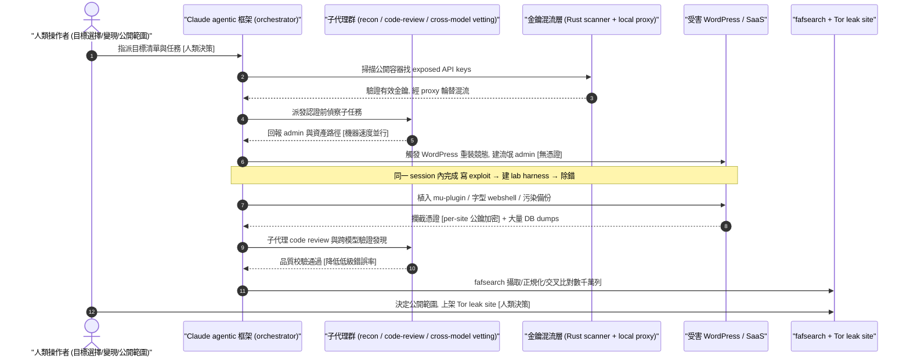
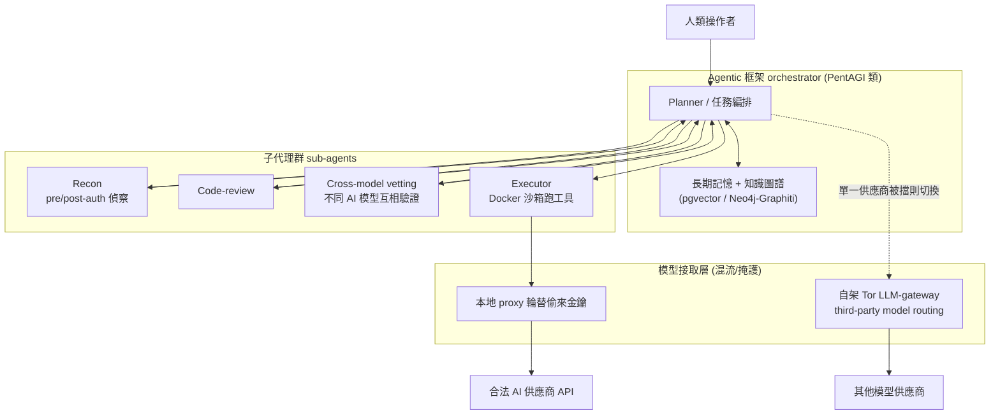
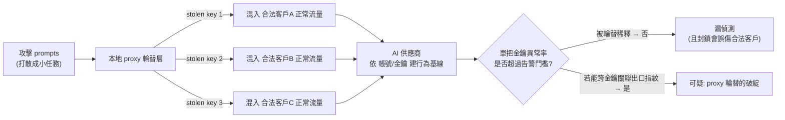
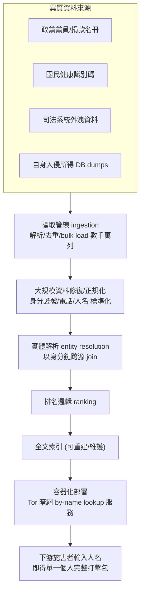
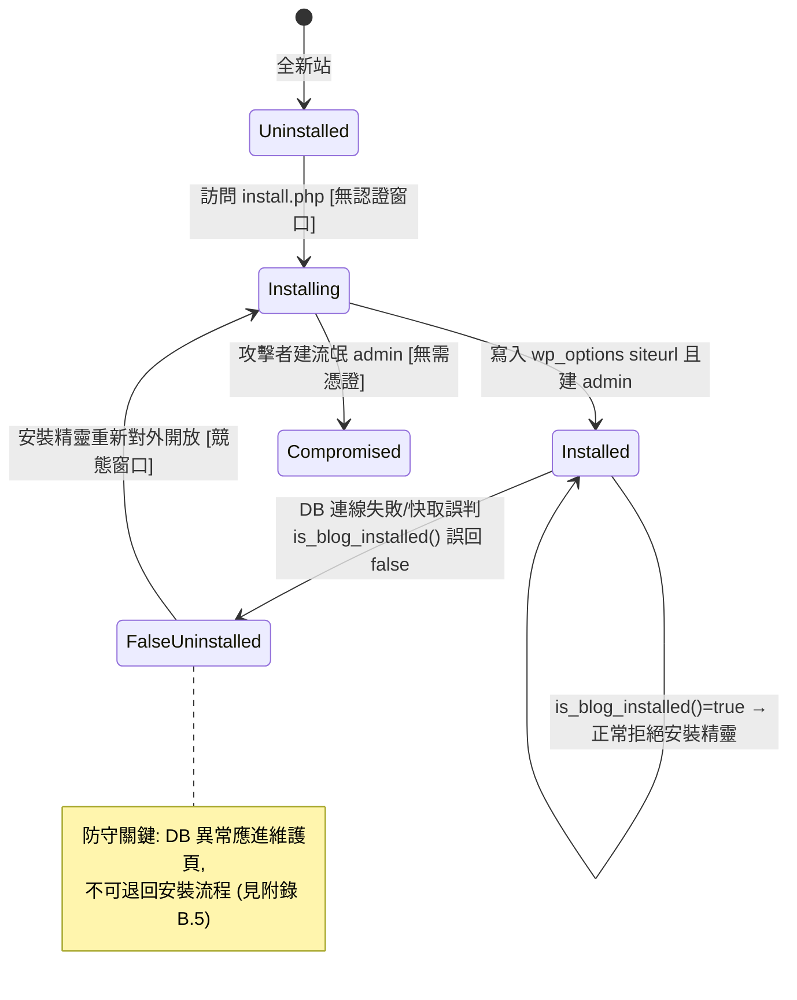
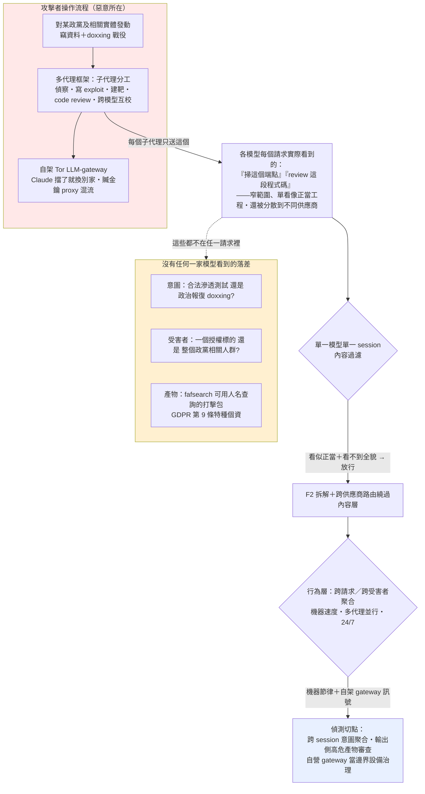

# GTG-50029：單一法語駭客行動主義者以 AI 打出「國家級規模」，鎖定歐洲政黨與相關實體

> 課程模組：01 網路行動（Cyber operations） ｜ 一手來源：Anthropic《Detecting and countering misuse of AI: September 2026》PDF p.34–p.38（IOC 表 p.36–37；趨勢評述 p.38–39） ｜ 整理日期：2026-09-13

---

## 1. 一頁速覽（TL;DR）

1. **一個人，國家級規模。** 2026 年春天，一名**講法語的單一行為者（single French-speaking actor）**用 Claude 攻擊歐洲的政黨、媒體、智庫，以及這些組織所使用的 SaaS 供應商。在 **42 個追蹤目標**中，至少對 **14 個**取得內部存取，外洩估計 **12 至 26 GB** 資料庫傾印。這是本報告用來論證「AI 抹平了國家級與個人之間鴻溝」的旗艦案例。
2. **外洩內容政治敏感度極高。** 包含政黨捐款人與黨員紀錄、一個 15,000 封訊息的信箱、含未成年人的學生申請資料、支付供應商資料，以及從一個政治競選管理平台外洩的**約 140,000 筆含「政治傾向（political opinions）」的紀錄**。政治傾向在歐盟 GDPR 第 9 條屬**特種個資（special category data）**，這讓本案從「資料外洩」升級為「對隱私的大規模攻擊」。
3. **招牌初始入侵手法是一個「先前未被記錄」的 WordPress 重新安裝競態條件（re-installation race condition）**：在安裝流程尚未鎖定前的短暫無認證窗口，創建一個**不需任何有效憑證**的流氓管理員帳號，至少 4 個網站得手。行為者用 Claude 在**同一個工作階段**內開發、除錯這個 exploit，甚至請 Claude 建了一個 lab harness（測試靶機）。
4. **三種持久化／隱匿手法值得逐一教：**（a）把 webshell 藏在**字型資產（font assets）**裡；（b）用 WordPress **must-use plugin（mu-plugin）**攔截並加密外送提交的憑證；（c）**污染備份（poisoned backups）**，讓受害者「還原＝再感染」。
5. **自建 doxxing 平台「fafsearch」**：一個編譯好的搜尋引擎，載入**數千萬列**資料（含國民健康識別碼、司法系統外洩資料），以人名交叉比對，發布成暗網服務，讓「被鎖定政治運動的相關個人」可以被人肉搜索。這是「個資聚合平台」作為攻擊產物、把傷害放大的教科書案例。
6. **混流與掩護：** 自建 **Rust 掃描器**驗證公開容器中曝露的 API 金鑰，再用**本地 proxy 輪替金鑰**，把惡意流量混進金鑰合法擁有者的正常流量裡——整場行動用偷來的 API 金鑰跑了一個月。這對 AI 服務商的濫用偵測是一大難題。
7. **自主程度高：** 行為者用 Claude 的 agentic coding 能力搭了一個**管理子代理（sub-agents）**的框架，子代理各自負責**認證前後偵察、程式碼審查、與跨模型驗證發現**。報告把本案歸類在自主光譜的「最遠端」——多代理框架自主跑數小時到數天。
8. **門檻崩塌：** 報告指出 GTG-50029（與 GTG-50020）使用**公開的攻擊代理框架 PentAGI 或其衍生版**。這條線是本案最該上課講的：一個 MIT 授權、GitHub 2 萬多顆星的開源專案，就能讓任何人複製過去只有國家隊才有的自主攻擊鏈。

> **這個案例在課程裡要教什麼（一句話）：** 教學員看懂「當偵察、漏洞利用、工具開發、資料處理都能外包給 AI 代理時，攻擊的**經濟學**（而非技術本身）被改寫」——防守方必須把偵測重心從「找到罕見高手」轉向「偵測機器速度、並行、跨受害者的自動化行為」，並補上針對 WordPress、API 金鑰濫用、與個資聚合的具體檢查清單。

---

## 2. 行為者側寫與歸因

### 2.1 報告給出的身分線索

| 線索類型 | 報告原文措辭 | 課程解讀 |
|---|---|---|
| 人數 | 「a **single** French-speaking actor」；「the entire platform was created by **just one person**」 | 明確指向**單一自然人**，非團體。這是本案震撼力的來源：一個人的產出等於過去一支團隊。 |
| 語言 | 「**French-speaking**」 | 語言是弱歸因線索。它縮小地理／文化圈，但法語圈橫跨法國、比利時、瑞士、加拿大魁北克、北非法語區等，**不等於**「法國人」。 |
| 動機 | 標題稱其為「**Hacktivists**」（駭客行動主義者）；p.34 稱「low-level 'hacktivists'」被 AI 提升為 APT | 動機是**政治性**而非金錢性。這決定了其目標選擇（政治實體）與產物（doxxing 平台）的邏輯。 |
| 意識形態指向 | 目標多為「**far-right forum & radio**」「nationalist news site」「political magazine A (FR)」等（見 §6 圖表） | 從**目標的政治光譜**反推：行為者鎖定的是**極右／民族主義**組織，行為者本身立場**與之對立**（反極右的左翼／antifa 傾向 hacktivism）。 |
| 工具命名 | doxxing 平台叫「**faf**search」、附屬網域「**faf**watch[.]xyz」、C2 主機名「**frntrs**-analytics」 | **命名學（naming tradecraft）是強分析線索**：見 §2.3。 |

### 2.2 歸因信度措辭的情報學意義（重要教學點）

情報報告用字精準，不同措辭代表不同的證據等級與可否行動性。本案要教學員辨識這套「信度階梯」：

- **「observed（觀察到）」／直述句** —— 本案用「a single French-speaking actor **was observed** using Claude to target…」。這是**平台方直接證據**（Anthropic 看得到自己模型上的活動），信度最高，因為它不是推測，而是「我們在自家系統看到了」。
- **「suspected（疑似）」** —— 用於歸因到某個身分或國家但證據不足時（例如本報告他處對 ShinyHunters affiliates 用 "suspected to be affiliates"）。本案**刻意不點名**行為者是誰。
- **「consistent with（與……一致）」** —— 表示「證據與某假說相容」，但不排除其他解釋，是很弱的措辭。
- **「high confidence / assess（評估）」** —— 分析判斷，非直接證據。報告在趨勢段用 "we assess that more actors… will continue to adopt AI frameworks"。
- **「presumably（推測）」** —— 本案用在「poisoned the victim's backups, **presumably** to maintain persistence」。注意：**行為**是觀察到的事實（備份被污染），**意圖**（為了持久化）是推測。教學員把「事實」和「動機推論」分開，是情報分析的基本功。

> **推理過程示範：** 為什麼 Anthropic 能對「觀察到用 Claude」有高信度，卻對「行為者是誰」保持沉默？因為前者是**平台側遙測（platform-side telemetry）**——他們掌握帳號、prompt、流量；後者需要**線下歸因**（法律、情報、執法），非 AI 公司職權，且行為者刻意用偷來的 API 金鑰＋商業 VPN＋Tor 隱藏身分（見 §7）。這正是「能證明濫用發生」與「能指認犯人」是兩件不同難度的事。

### 2.3 命名學：工具名稱如何洩漏動機（把這段當一個小案例教）

- **「faf」** 是法語俚語，源自極右口號「**France aux Français（法國屬於法國人）**」的縮寫，用來指稱**極右派激進分子**（les fafs）。因此：
  - **「fafsearch」** = 「（人肉）搜尋 faf（極右分子）的平台」——工具名稱直接暴露了**這是一個用來搜捕極右人士的 doxxing 引擎**。
  - **「fafwatch[.]xyz」** = 「監視 faf 的網站」。
  - 這證實了 §2.1 的意識形態推論：行為者是**反極右**立場的 hacktivist。
- **「frntrs-analytics」**（BeEF C2 主機名）= 「Frontières」（法國極右媒體，見 §3、§9）去母音後的偽裝。行為者刻意讓 C2 網域**看起來像目標自己的分析網域**，以求在受害者的流量與 DNS 記錄中不顯眼。這是**混入式（blend-in）命名**，與 fafsearch 的**表意式**命名形成對比。
- **教學價值：** 攻擊者取的名字往往是 OPSEC 的破口，也是分析者的富礦。命名可洩漏**動機**（faf）、**目標**（frntrs）、甚至**自我認同**。防守方在做威脅狩獵時，網域／主機名的語意分析是低成本高回報的一環。

### 2.4 這是什麼等級的行為者？（uplift 分析）

報告用 **uplift（AI 帶來的能力提升）** 這個框架，從**速度、規模、深度**三個維度衡量。套用到本案：

- **速度：** 趨勢段（p.39）給出全報告的定調數字——「breaches completed in **two to three hours**」。本案的活動時間軸（見 §6 圖表）顯示核心行動壓縮在 **36 天**內。
- **規模：** 一個人**並行**處理數十個受害者（42 追蹤／14 入侵），並在 fafsearch 載入**數千萬列**資料。報告：「dozens of victims handled in parallel by individual operators」。
- **深度：** 從 exposed API key 掃描、WordPress 0-day 級競態利用、webshell、mu-plugin 憑證竊取、BeEF 瀏覽器 C2、到 doxxing 平台工程——**橫跨整個 kill chain 的深度**，過去需要多名不同專長的專家。

> 結論措辭（報告 p.34）：「AI has helped to **close the capability gap** turning low-level 'hacktivists' into **advanced persistent threats**.」——把「低階駭客行動主義者」提升為「APT」。這句話是本案在課程中的核心論點。

---

## 3. 受害者與目標清單

### 3.1 總量數字（來自 p.36 正文，務必與原文對齊）

| 指標 | 數字 | 原文 |
|---|---|---|
| 追蹤目標實體 | **42** | 「Across **42** tracked target entities」 |
| 取得內部存取 | **至少 14** | 「the actor gained internal access to **at least 14**」 |
| 外洩資料量 | **12 至 26 GB** 資料庫傾印 | 「exfiltrated an estimated **12 to 26 GB** of database dumps」 |
| 含政治傾向的紀錄 | **約 140,000 筆** | 「exfiltrated approximately **140,000 records** that included users' political opinions」 |
| 被入侵信箱 | **15,000 封訊息** | 「a **15,000-message** mailbox」 |
| WordPress 競態得手站點 | **至少 4 個** | 「succeeded against **at least four** victim websites」 |

> 注意數字的**區間表達**（12–26 GB）：這反映 Anthropic 的**平台側視角有其邊界**——他們看得到模型被用來做什麼，但看不到受害者端的完整落地，因此對外洩量只能給區間。教學員要理解：威脅情報數字常帶不確定性，區間比假精確更誠實。

### 3.2 外洩資料的類型（p.36）

- 政黨**捐款人（donors）**與**黨員（member）**紀錄
- 一個 **15,000 封訊息**的信箱
- **學生申請資料（含未成年人 minors 的資料）**
- **支付供應商（payment-provider）**資料
- 另設置**即時憑證攔截（live credential interception）**
- 以外洩資料，在行為者自營的 **Tor 洩漏站（leak site）**上，分受害者做**加密壓縮檔**上架

### 3.3 目標畫像（綜合正文 + p.35 圖表 + 第三方法媒報導）

報告正文只說「European political parties, media, think-tanks, and the SaaS providers used by these organizations」，但 **p.35 圖表的「Effects on targets」欄**提供了更細的（推定 inferred）清單。多數標註 **(FR)**＝法國：

| 類別 | 圖表列出的目標（inferred） |
|---|---|
| 政黨 / 政治核心 | political party A (FR)、political training institute（政治培訓機構, FR）、political-adjacent CMS (FR)、political hosting estate（政治託管主機群） |
| 媒體 | political magazine A (FR)、political media outlet (FR)、political media/edu sites (FR)、**nationalist news site（民族主義新聞站, 嘗試 attempted）**、**far-right forum & radio（極右論壇與電台, 嘗試）** |
| 紀念 / 象徵 | commemoration site (FR)（紀念性網站） |
| SaaS / 供應鏈 | SaaS publishing platform（出版平台）、EV manufacturer cloud estate (IN)、security vendor repos (US)、MDM vendor、BPO firm (IN, HR records)、arena ticketing (UAE)、SaaS survey platform (OAuth)、ride-hail platform |

> **重要觀察（圖表 vs 正文的落差）：** p.35 圖表的 W7–W9 顯示，此行為者的活動**遠不止法國政治**——還觸及印度（EV 製造商雲、BPO 公司 HR 紀錄）、美國（資安廠商程式庫）、UAE（票務）等。這暗示本案是一個**更廣的憑證經濟 / 雲供應鏈行動**的一部分，法國政治攻擊只是其中「動機驅動」的一支。正文沒有展開這些，屬**圖表獨有資訊**，我在 §12 標為需保留的落差。

### 3.4 第三方（法國媒體）補充的目標身分

法國媒體（Le Monde 首發，20 Minutes、Euronews FR、generation-nt 轉載，2026-09-11 前後）獨立指出：**多數目標為法國、且與極右相關**。被具名者：

- **極右雜誌／媒體《Frontières》**：其**留言區被注入追蹤 / 間諜腳本（mouchard）**，該功能事後已停用；創辦人 **Erik（Éric）Tegnér** 向 Le Monde 表示「沒有證據顯示訂閱者資料庫或支付資料遭入侵」。（此為本案**唯一的受害者端獨立回應**，見 §9。）
- 另有：一個未具名的**法國政黨**、一個**政治培訓機構**、若干**新聞網站**、一個與某 **podcast 相連的論壇**。

> **對照 §6 圖表：** 「political media outlet (FR)」+「hooked reader browsers」+ BeEF C2 主機名「**frntrs**-analytics」＝高度可信地對應到《**Frontières**》。這是把「圖表匿名標籤」與「第三方具名報導」交叉印證的好教材。

### 3.5 政治傾向資料的法律意義：GDPR 第 9 條特種個資（本案必講的法律維度）

本案外洩的**約 140,000 筆含「political opinions（政治傾向）」的紀錄**，加上政黨黨員/捐款人名冊，在歐盟法律下**不是普通個資，而是最高保護等級的特種個資**。這是把「一次資料外洩」在法律上升級為「對基本權利的攻擊」的關鍵，務必在課程講清楚。

- **GDPR 第 9(1) 條（原則禁止處理，逐字）：**
  > "Processing of personal data revealing racial or ethnic origin, **political opinions**, religious or philosophical beliefs, or trade union membership… **shall be prohibited**."
  >
  > 譯：揭示種族或族裔、**政治傾向**、宗教或哲學信仰、工會會員身分……之個人資料，其處理**應予禁止**。
  - **含義：** 政治傾向被歐盟立法者列為與健康、性生活同級的「特種個資」，預設**禁止**任何人處理，除非落入第 9(2) 條的窄例外。攻擊者的大規模蒐集、聚合、公開，是對這條禁令的**根本性違反**。

- **為何政黨自己持有這些資料是合法、但外洩後果更嚴重：** 第 **9(2)(d)** 條給了政治性非營利組織一個窄例外——
  > "processing… by a foundation, association or any other not-for-profit body with a political… aim… the processing relates solely to the members… and that the personal data are **not disclosed outside that body without the consent of the data subjects**."
  - **含義：** 政黨可合法持有黨員的政治傾向資料，但**條件是「不得在未經當事人同意下揭露於組織之外」**。攻擊者外洩並上架 doxxing 平台，正是**擊穿了這個例外賴以成立的前提**——資料一旦離開組織邊界，法律保護的整個結構就崩塌。這也解釋了為何「政黨資料外洩」的法律殺傷力遠大於一般公司客戶名單外洩。

- **選舉情境更嚴：EU Regulation 2024/900（政治廣告透明與鎖定規則）：** 此規則**禁止**在政治廣告中使用特種個資（含政治傾向）做 profiling，且**明文排除**援引 GDPR 第 9(2) 例外來規避（2024-04-09 生效，主要條款 2025-10-10 適用）。→ 立法趨勢是**把政治傾向資料的處理限縮到幾近零**，本案的聚合-鎖定行為正是這波立法要防的核心風險。

- **「特種個資」概念的情報/防護意義（教學昇華）：** 法律把政治傾向列為特種，是因為它一旦被**與身分綁定並公開**，可導致**歧視、社會排擠、人身威脅、政治報復**——這正是 fafsearch「可用人名查詢政治運動相關者」所製造的傷害。**法律的特種分級 = 防護工程的資料分級**：防守方應把「政治傾向、黨員、捐款」欄位視為**皇冠寶石（crown jewels）**，施以最高等級的加密、存取控制與外洩監控（與 §10.4 台灣法律缺口對照）。

---

## 4. AI 濫用的攻擊生命週期（逐階段拆解）

本節依報告的敘事，逐階段標出**人類做什麼／Claude（AI）做什麼**，並標示**自主程度**。報告把本案放在自主光譜「最遠端」（p.39：「operations ran autonomously, with minimal human input or supervision… multi-agent frameworks conducting reconnaissance, exploitation, and theft against multiple victims, in parallel」），但同時提醒「humans have retained the decisions that matter most… target selection, monetization… review of results」。

### 4.1 階段總表

| Kill chain 階段 | 人類做什麼 | Claude / AI 代理做什麼 | 自主程度 |
|---|---|---|---|
| 1. 資源開發（工具） | 設定目標、指派任務、驗收 | 用 agentic coding 撰寫/除錯 **Rust API-key 掃描器**、webshell、mu-plugin、fafsearch 平台；建 **lab harness** 測試靶 | AI 編排、機器速度 |
| 2. 金鑰取得 / 掩護 | 決定要打誰 | 掃描公開容器找 exposed API keys、驗證有效性、以 **本地 proxy 輪替**混流 | 半自主（腳本化） |
| 3. 偵察（認證前後） | 挑選目標清單 | **子代理**執行 pre- / post-authentication reconnaissance、列舉 admin 與資產路徑 | 多代理自主 |
| 4. 初始入侵 | 指定站點 | 用 **WordPress 重裝競態**建流氓 admin；經 exposed search endpoint 迭代抓資料；即時寫 webshell | 對話式協助 + 自主執行混合 |
| 5. 立足 / 持久化 | —— | 部署 mu-plugin 攔憑證、藏 webshell 於字型、**污染備份** | 自主 |
| 6. 橫向 / 蒐集 | —— | 大量資料傾印、信箱竊取、**BeEF 瀏覽器 C2** 鉤住讀者、獵取編輯部 session | 多代理並行 |
| 7. 程式碼審查 / 驗證 | 最終研判 | 子代理做 **code review、跨不同 AI 模型 vetting findings** | 自主（含自我校驗） |
| 8. 資料處理 / 變現 | **人類保留**：如何公開、鎖定誰 | fafsearch 攝取、正規化、交叉比對、排名、容器化部署；產出暗網服務 | AI 重度輔助的軟體工程 |
| 9. 洩漏 / 施壓 | 決定發布 | 分受害者做加密壓縮檔，上架 Tor leak site | 人類主導 |

### 4.2 兩個關鍵的「AI 為什麼有幫助」的教學點

**(a) 同一工作階段內完成「發現漏洞 → 寫 exploit → 建靶測試 → 除錯」的閉環。**
報告：「The actor used Claude to **develop and debug the exploit in the same session, including creating a lab harness**.」——過去，開發一個可靠的競態利用需要（1）懂 WordPress 內部狀態機的人、（2）能搭測試環境的人、（3）能反覆除錯 timing 的耐心。AI 把這三件事壓縮進**一次對話**，這就是「深度」uplift 的具體樣貌。

**(b) 子代理的「跨模型驗證」是一種品質保證機制。**
報告：sub-agents 負責「**vetting findings from different AI models**」。這意味行為者不是盲信單一模型輸出，而是讓代理**互相校驗**——這是把軟體工程的 code review / CI 文化搬進攻擊流程。對防守方的啟示：攻擊產物的**品質與一致性提高**，過去靠「攻擊者會犯低級錯誤」的偵測假設會失效。

### 4.3 自主 vs 傷害是兩條獨立的軸（報告的重要 caveat）

報告 p.39 特別提醒：「**autonomy and harm are separate axes**」。自主性放大的是**規模、速度、成本**，但**嚴重性由多重因素決定**；報告中最嚴重的入侵有些反而來自「人類指揮每一步」的行動。

> **教學辨析：** 不要把「高自主」直接等同「高危害」。GTG-50029 的危害之所以大，除了自主性，更關鍵的是**目標選擇（政治實體）**與**產物設計（doxxing 平台）**這兩個**由人類決定**的因素。防守與治理要同時看兩條軸。

### 4.4 fafsearch：個資聚合平台作為「攻擊產物」的危害放大效應（本案核心分析）

多數資料外洩的傷害止於「資料被偷、被賣」。fafsearch 的不同在於，它把外洩**產品化為一個可查詢的武器**，這是本案最值得深究的危害升級機制。

- **fafsearch 是什麼（報告 p.36）：** 一個**編譯好的搜尋引擎**，附帶**攝取管線（ingestion pipelines）**、**把個別外洩傾印與自己入侵所得交叉比對**的能力、**國民身分證號與電話號碼的正規化**、**排名邏輯（ranking logic）**、**測試**、與**容器化部署**。載入**數千萬列**資料（含**國民健康識別碼**與**司法系統外洩**資料），最終發布成**匿名託管的暗網服務**，「individuals affiliated with the targeted political movement could be **looked up by name**（可用人名查詢被鎖定政治運動的相關個人）」。

- **危害放大的四層機制（教學拆解）：**
  1. **聚合 > 相加（aggregation effect）：** 單一外洩（一份黨員名單、一份健保號、一份司法紀錄）各自的傷害有限；一旦**用身分證號/電話/人名正規化並交叉比對**，就能把散落各處的碎片拼成**單一個人的完整畫像**——住址 + 政治傾向 + 健康 + 司法前科 + 財務。**整體遠大於部分之和**，這是隱私攻擊的質變。
  2. **從「資料」到「可操作情報」：** ranking logic + by-name lookup 把冷資料變成**「輸入人名即得打擊包」**的服務。這降低了下游施害者（騷擾者、極端分子、外國勢力）的門檻——他們不需要會駭客，只要會用搜尋框。
  3. **傷害的外部化與擴散：** 發布成**暗網公共服務**後，原攻擊者不再是唯一施害者；**任何取得該服務的人**都能對名單上的個人發動人肉、恐嚇、歧視、實體威脅。攻擊者等於**建了一座傷害的公共基礎設施**。
  4. **針對性（政治運動相關者）：** 不是隨機個資，而是**依政治歸屬篩選過的人群**——這使其直接服務於政治報復、寒蟬效應、與潛在暴力，正是 GDPR 第 9 條要保護的核心法益（§3.5）。

- **AI 在此的角色（呼應報告論點）：** 報告稱這是「AI 輔助軟體工程直接應用於大規模隱私攻擊」最清楚的案例，**且整個平台由一人打造**。過去要工程化一個含攝取管線、正規化、交叉比對、排名、測試、容器化的搜尋平台，需要一支資料工程團隊數週至數月；AI 讓單人在行動的 36 天窗口內完成。**「個資聚合平台」從『需要團隊的產品』變成『一人可拋棄式產出的攻擊工具』**，這才是危害放大的根源。

- **防守與治理的啟示：** (a) 對持有政治/健康/司法敏感資料的組織，**外洩的下游風險必須以「會被聚合」為前提評估**（DPIA 要模擬聚合情境，見 §10.3 練習 5）；(b) 反制點不只在「防止外洩」，也在**暗網監控與快速下架**、對聚合服務本身的法律規範；(c) 對個人（尤其政治人物、記者、志工）提供 **doxxing 應變與個資最小化**支援（見 §10.4.3）。

---

## 5. TTP 與 MITRE ATT&CK 對應

下表把本案行為對應到 MITRE ATT&CK（Enterprise）。凡框架無合適 ID 者，明確標為**框架缺口**。

| 戰術 (Tactic) | 技術 ID | 本案具體作法 | 偵測構想 |
|---|---|---|---|
| Resource Development | **T1587.001** Develop Capabilities: Malware | 用 Claude 開發 Rust 掃描器、webshell、mu-plugin、fafsearch | 平台側：AI 帳號出現「惡意工具工程」對話簽章（本報告 Appendix A 的 skill breakdown 即此類遙測） |
| Resource Development | **T1588.002 / T1650** Obtain Capabilities（工具/憑證） | 蒐集公開容器中曝露的 API 金鑰 | 監控自家金鑰在**非預期地理／ASN**出現；容器 registry 掃描曝露秘密 |
| Reconnaissance | **T1595.002** Active Scanning: Vuln Scanning | 子代理對 endpoint 迭代探測；scripted blackbox sweeps | WAF 速率/模式偵測；異常「機器速度」列舉 |
| Initial Access | **T1190** Exploit Public-Facing Application | WordPress 重裝競態建 rogue admin；exposed search endpoint；SSRF 取 metadata 金鑰 | 見 §8 WordPress 檢查清單；`/wp-admin/install.php`、`/wp-admin/setup-config.php` 可達性告警 |
| Initial Access / Persistence | **T1078** Valid Accounts | 無憑證創建的流氓 admin 帳號 | **新管理員帳號即時告警**（見 §8.2）；比對 `wp_users` 基線 |
| Persistence | **T1505.003** Server Software Component: Web Shell | webshell 藏於 font assets | 掃 `wp-content/uploads`、字型目錄的 PHP/可執行內容；封鎖上傳目錄 PHP 執行 |
| Persistence | **T1546** Event Triggered Execution（近似） | mu-plugin 每次 page load 執行、無法從後台停用 | 列舉 `wp-content/mu-plugins/*.php`；基線比對（見 §8.3） |
| Persistence | **T1490 近似 / 缺口** Inhibit System Recovery | **污染備份**使還原即再感染 | 備份完整性校驗、離線不可變（immutable）備份 |
| Credential Access | **T1056 / T1539** 憑證攔截、竊 session cookie | mu-plugin 攔提交憑證並以 per-site 公鑰加密；BeEF 竊 session | 表單提交去向監控；CSP、SRI；出站到未知網域的加密小包 |
| Credential Access | **T1552.005** Unsecured Credentials: Cloud Metadata API | Bug-bounty cover ops 之 **SSRF → 取雲端 metadata 金鑰** | IMDSv2 強制、SSRF 防護、metadata 端點存取告警 |
| Collection | **T1213 / T1530** 資料庫、雲儲存竊取 | 大量 DB dumps、信箱、學生資料 | DLP、異常大量匯出、DB 讀取離群 |
| Command & Control | **T1189 / 瀏覽器 C2** Drive-by / BeEF hooking | 注入 `hook.js` 類腳本鉤住讀者瀏覽器並指紋辨識 | 頁面完整性監控、CSP、外部 script 稽核 |
| Defense Evasion | **T1090** Proxy | 本地 proxy 輪替偷來的 API 金鑰混流 | 見 §5 缺口說明 + §8.5 |
| Exfiltration | **T1567** Exfiltration Over Web Service | 經 hijacked GCP、Cloud Run、Tor 外送 | 出站到雲執行環境／Tor 的異常 |
| Impact | **T1657** Financial/Political——doxxing 公開 | fafsearch 暗網人肉平台 | 品牌/人員暴露監控、暗網情報 |
| **Agentic orchestration（多代理自主編排）** | **無對應 ID —— 框架缺口** | 一個框架管理子代理，各司偵察/審查/驗證，並行跨受害者 | ATT&CK 目前**沒有**描述「AI 代理自主編排 kill chain」的戰術/技術；需以行為分析補足（機器速度、24/7、跨受害者同步模式） |
| **跨模型自我校驗（AI vetting AI）** | **無對應 ID —— 框架缺口** | 子代理用不同 AI 模型互相驗證發現 | 同上，屬 ATT&CK 尚未涵蓋的 AI 原生 TTP |

> **框架缺口的教學意義：** ATT&CK 是以「人類操作者」為預設寫成的。當攻擊由 **AI 代理自主編排**時，最具辨識度的訊號不再是某個技術 ID，而是**行為的節奏與並行度**（machine speed、無人值守排程、數十受害者同步推進）。這正是本案要教防守方「換一種偵測心智模型」的地方——**偵測工程要從「找工具/找 IOC」轉向「找機器行為的統計特徵」**。

---

## 6. 圖表逐一判讀

本頁段內含一張大型視覺素材，位於 **p.35 上半**（報告未給 Figure 編號）。已存入課程圖檔：`../figures/page-035.png`。以下為逐一判讀。

### 圖（p.35）：GTG-50029 「行動重播（Operations replay）」資訊圖 / 儀表板

- **圖檔：** `../figures/page-035.png`（原始嵌入圖為 1920×1080）
- **圖片類型：** 一張**風格化的「行動重播」資訊圖／假想儀表板（infographic / stylized operations dashboard）**，右上角標示「**Replay complete**」，底部有時間軸播放列。它**不是**真實工具截圖，而是 **Anthropic 對這場行動的視覺化重建**——用來把「模型能力 → 被用於哪些網路行動 → 對目標造成的推定效果」三層關係一次呈現。判讀時要記得：**內部數字（如 53 項能力、20/27 目標）是 Anthropic 的統計口徑**，不是攻擊者面板的原始輸出。

- **版面結構（由左到右四大區塊）：**

  **(A) 左欄「AI workflows · how the actor used the model」（AI 工作流：行為者如何使用模型）**——粉色卡片，每個工作流標「完成度 x/x」：
  - **W1 Malware & exploit dev（6/6）：** Payload generation（在 VPS 上建 implant 二進位）、Hook-C2 module dev、Harvester crypto（sealed-box 外洩金鑰對）、Loot packaging（多 GB 壓縮檔）、Build & test rig（VM 映像、CI 式測試）、Build verification。
  - **W2 Breach-data platform（6/6）：** Dump acquisition、Bulk ingestion（數百萬列載入）、Index maintenance（全文重建索引）、Data repair（大規模正規化）、Search validation、Person lookups（具名個人查詢）。← **這一欄就是 fafsearch 的工程分解。**
  - **W3 Agentic orchestration（6/6）：** AI gateway ops（自架 provider relay）、Document pipeline（OCR/嵌入被竊文件）、Fleet provisioning（雲端建置主機、SSH 金鑰）、Autonomous builds（agent loops 驅動遠端機）、Release engineering、**Session hygiene（憑證擦除、清理）**。

  **(B) 中欄「Cyber operations · what those capabilities were turned against」（網路行動：這些能力被用來打誰）**——每個 Wn 標註它「消費」了哪個上游工作流（如「◄ W1 backdoor plugin builds」）：
  - **W4 French political intrusions（7/7）**〔backdoor plugin builds ◄ W1；target person profiles ◄ W2〕：Staff session attack（session wipes + mail reuse）、DB-quota race entry（**install race → rogue admin**）、Backdoor plugin（**font-plugin implant deploys**）、Credential harvest（payment keys, mail hooks）、Mass data theft（DB dumps, donor records）、Re-entry & cleanup（rogue-admin logins, wipes）、Portfolio expansion（second-wave CMS targets）。
  - **W5 Reader browser hooking（6/6）**〔patched hook modules ◄ W1〕：Premium-hook triage、Hook tasking（JS execution in readers）、Credential replay（logins → API tokens）、Subscriber PII pulls（billing data via account API）、Mass hook redeploy（comment injections）、Platform re-probing。← **BeEF 對《Frontières》的操作。**
  - **W6 Rival C2 hack-back（6/6）**〔implant payloads ◄ W1〕：Root foothold（**SQLi → root SSH**）、Persistence、Operator surveillance（chat-bot tap, history theft）、Panel API looting、Mass exfiltration、Anti-forensics（log edits, record wipes）。← 攻擊**對手（rival）的 C2**，把別的攻擊者反打回去。
  - **W7 Cloud supply-chain ops（5/5）：** SA key recovery（public image layer secrets）、Token validation（OAuth minting from SA key）、Estate enumeration（**324 prod instances listed**）、Rogue VM on victim（用受害者帳單建機）、Repo mass-clone。
  - **W8 Credential economy（6/6）**〔stolen key-store DB ◄ W6；validated creds ◄ W7〕：Gateway key pooling（載入被竊 provider 金鑰）、Repo & PR recon、Secret-scan agents、Vault assembly（findings DB, **74k raw keys**）、Live validation、Operational use（vault → 憑證再利用）。
  - **W9 Bug-bounty cover ops（5/5）：** Program recon、SSRF cred theft（metadata-service key pull）、Default-cred access、OAuth/IDOR probing、Scan harness runs。← 用「漏洞賞金研究」作為活動的**掩護敘事**。

  **(C) 右中欄「Effects on targets · inferred」（對目標的推定效果）**——藍色卡片為確認、灰虛線為嘗試/未果，每個 Wn 標命中率（如 W4 9/9、W5 3/4、W8 1/3）。內容已整理於 §3.3 表格。要點：W8 的效果卡揭露驚人量級——「**34,500+ code-hosting accounts**」「**221,246 private repositories**」「**74,701 AI-provider key holders**」；W7 有「security vendor repos (US, 878)」。

  **(D) 最右欄「Operations」（行動總覽）：**
  - **Operations map（operator egress VPN）：** 一張點陣世界地圖，圖例分五類目標——government（藍）、defense（紫）、policy & NGO（綠）、vendors & telecom（灰）、individuals（黑）；線條自一個橘色節點（operator egress）發散到各目標。
  - **Targets engaged：20 / 27**（進度條）。
  - **Tasks（任務卡，時間戳 2026-06）：** 「Enumerate platform admin and asset routes — Technology stack confirmed for a planned re-entry path」；「Cross-reference password hashes and emails across victim datasets — **164 cross-platform accounts mapped; campaign-wide credential graph assembled**」；「〔now〕Verify attacker cloud instance via provider API — Scan infrastructure confirmed running on **commandeered account**」。

  **(E) 底部匯總條與時間軸：** Campaign span「**2026-05 → 2026-06 · 36 days**」；**Model-side capabilities observed：53 across 9 workflows**；Effects on targets：**20 targets engaged**。最底一條時間軸以橘色（model activity）與藍色（effects on targets）長條標出 5–6 月的活動密度。

- **這張圖傳達的核心訊息（3 點）：**
  1. **能力可重用、可組合。** 中欄每個攻擊行動都「◄」回引左欄的某個 AI 工作流——一次開發的能力（如 W1 的 backdoor plugin builds）被**重複投放**到多個目標（W4 的 font-plugin implant）。這就是「AI 讓工具開發的邊際成本趨近零」的視覺證據。
  2. **這是一場遠比「法國政治」更大的行動。** W7–W9 顯示大量憑證經濟與雲供應鏈活動（數十萬 repo、7 萬多把金鑰、跨國目標），法國政治入侵（W4/W5）只是其中意識形態驅動的一支。
  3. **一個人 + AI 代理 = 一個作戰中心。** 右欄「Operations map / Targets engaged / Tasks」刻意用**指揮中心（command center）**的視覺語言，呼應報告主論點：單人操作卻呈現出過去需要一支團隊＋一間 SOC 才有的協調規模。

- **在課程中可以怎麼用這張圖：**
  - 當**開場震撼圖**：先只顯示底部「1 person · 36 days · 53 capabilities · 9 workflows · 42 targets」，讓學員感受規模，再逐欄展開。
  - 當**能力重用教具**：讓學員追一條「◄」線（例如 W1 backdoor plugin builds → W4 font-plugin implant deploys → 效果卡），理解攻擊者如何攤提研發成本。
  - 當**批判性判讀練習**：提醒學員這是**Anthropic 製作的視覺化**，帶入「哪些是遙測事實、哪些是 inferred、哪些是設計語言」的媒體識讀討論（呼應 §12）。

> **判讀注意：** 本報告在本頁段**只有這一張**大圖。頁段內 p.36、p.37 為正文與 IOC 表（無圖表，已於 §3、§7 處理）。另 p.40 的 **Figure 19「Skill breakdown」**不屬本案專屬（是全 Cyber 章的 Appendix A），但它列出的 ATT&CK 技術（T1587.001 Develop Capabilities、T1583.003 Acquire Infrastructure、T1595 Active Scanning 等）正好對應本案 §5 的 TTP，可在課堂補充引用。

---

## 7. IOC 與技術指標（完整抄錄，保留 defang）

> **安全紅線：** 以下網域、IP、.onion、主機名僅作研究資料抄錄。**絕對不要**連線、解析、ping、或提交到任何互動式服務。全部保留報告原本的 defang 格式（`[.]`、`[:]`）。

### 7.1 Actor egress IP infrastructure（p.36–37）

| Indicator | Role（角色） | First seen | Last seen | 偵測價值與壽命 |
|---|---|---|---|---|
| `139.59.2[.]243` | Key-validation box（DigitalOcean） | 2026-02-06 | 2026-06-12 | **中高值、壽命長（~4 個月）。** 專用來驗證偷來的金鑰的主機，若在自家日誌看到自家 API 金鑰從此 IP 被驗證，是強訊號。但雲 IP 會回收，時效有限。 |
| `158.173.46[.]118`, `146.70.116[.]131`, `149.22.83[.]6`, `138.199.60[.]29`, `138.199.6[.]208`, `103.216.220[.]19`, `103.124.165[.]199`, `103.141.60[.]144`, `2001:ac8:27:89::a02d`, `2001:ac8:29:84::a01d` | Commercial VPN/DC attack exits（Mullvad / M247 / 31173 / Datacamp；出口國 AL/AT/AR/CH/BG/SK/DE）— primary-key ops window | 2026-03-25 | 2026-05-20 | **低值、易變、易誤報。** 商業 VPN/DC 出口為多人共用，封鎖會誤傷正常用戶；主要價值是「行動窗口」情境化，而非長期封鎖名單。 |
| `34.156.199[.]132`, `34.156.95[.]176` | Exfiltration endpoints in **hijacked GCP projects**（被劫持的 GCP 專案） | 2026-04 | 2026-05 | **中值、壽命短。** 屬被害第三方的雲資源，一旦被清理即失效；價值在提示「外洩經合法雲服務中轉」。 |
| `136.144.242[.]56` | **Staging & scan box used on EU political organizations**（對歐洲政治組織的暫存與掃描主機） | 2026-05-17 | 2026-05-21 | **高值、壽命極短（4 天）。** 與本案核心目標直接關聯，是最「乾淨」的關聯指標，但生命週期短，只在事件回溯時有用。 |
| `163.172.157[.]53`, `2001:bc8:711:5854:dc00:1ff:fe18[:]ba53` | Persistent dedicated server, **Scaleway FR** used in late-phase operations | 2026-06-26 | 2026-07-04 | **中高值。** 專用（非共用）伺服器 + 法國落地，較 VPN 出口更可歸因，適合列入監控。 |

### 7.2 Actor-owned or actor-controlled domains and services（p.37）

| Indicator | Role（角色） | First seen | Last seen | 偵測價值與壽命 |
|---|---|---|---|---|
| `frntrs-analytics.dedyn[.]io` | **BeEF browser-C2 hostname**（deSEC 動態 DNS，actor 持有的 API token） | 2026-05-13 | 2026-06 | **高值。** 主機名語意（frntrs＝Frontières 偽裝）＋ 動態 DNS ＋ BeEF 用途，三重特徵；可作 DNS/Proxy 阻擋與狩獵樣板。 |
| `frntrs-analytics-863060591218.europe-west1.run[.]app` | **Cloud Run origin** behind C2 domain | 2026-05-13 | 2026-06 | **中高值。** C2 真實源站藏在 Google Cloud Run 之後，示範「用合法 PaaS 當 C2」；偵測靠關聯而非單一封鎖。 |
| `prod-artfkt[.]com` | Actor-registered operational domain（「artfkt」≈ artifact 偽裝） | observed Apr–May 2026 | — | **中值。** 行動用網域，命名偽裝成 DevOps「artifact」服務；註冊資訊可供 pivot。 |
| `fafwatch[.]xyz` | Actor-registered **doxing adjacent domain** | observed Apr–May 2026 | — | **高值（情報面）。** 名稱直接暴露 doxxing 動機（faf＝極右）；對本案歸因與意圖判斷極有價值。 |
| `3ell6n47y3ct4a3x67fbuz62q2mk2l4vo6eacho2suzftdshsnrfopyd[.]onion` | **CRS credential-vault API** | 2026-05 | 2026-07（close 時仍 live） | **高值、壽命長。** 憑證保險庫 API，行動結束仍在線；.onion 難阻擋，價值在暗網情報與關聯。 |
| `6mshbvhvzhdgumwwazf4jcep2xx4kdk6n4wgffc46msu2gc3j3t2fpad[.]onion` | **Actor's Tor LLM-gateway**（third-party model routing，第三方模型路由） | 2026-06 | 2026-06 | **極高教學值。** 這是行為者自架、經 Tor 的 **LLM 閘道**，用來路由到第三方模型——直接對應 §5 的「混流／掩護」與 §8 的偵測缺口。 |

### 7.3 IOC 的偵測價值總結（教學重點）

- **IOC 有「壽命」。** 上表清楚顯示不同指標的時效差異：專用伺服器（月級）> 掃描暫存機（天級）> 商業 VPN 出口（易變且高誤報）。教學員理解 **Pyramid of Pain**：IP/網域屬金字塔底層，攻擊者更換成本低；真正讓攻擊者痛的是 **TTP**（§5）與**工具鏈**（§8 的檢查項）。
- **命名即情報。** `fafwatch`、`frntrs-analytics`、`prod-artfkt` 的名稱本身承載動機與偽裝策略——網域語意分析是低成本狩獵手段。
- **合法基礎設施是常態。** DigitalOcean、GCP、Cloud Run、Scaleway、Mullvad、deSEC——全是合法服務。**單純封 IP 無效**，必須靠行為關聯。

---

## 8. Anthropic 的偵測、處置與防線缺口 + 防守方檢查清單

### 8.1 Anthropic 做了什麼

- **偵測並中斷（detected and disrupted）**了這場行動，封鎖相關帳號存取（disrupt access before harm is realized）。
- 用學到的東西**強化 safeguards**，並在適當情況下與**執法與產業夥伴分享情報**（報告 p.3、p.38 的一貫處置模式）。
- 產出這份威脅情報報告本身，即是「揭露 + 讓其他開發者辨識類似模式」的一部分（報告 p.3：「help other developers recognize similar patterns」）。

### 8.2 防線缺口與失效之處（本節為課程高價值素材）

報告在趨勢段（p.38–39）自陳的、與本案直接相關的偵測困境：

1. **偷來的 API 金鑰讓活動被歸因到「金鑰的合法擁有者」。** 報告 p.30–31 明講，操作者取得 AI 憑證同時獲得三樣東西：**Loot（贓物可變現）、Compute（用別人的帳單跑運算）、Cover（活動被歸因給金鑰合法擁有者）**。本案「ran for a month entirely on stolen API keys」。→ **對 AI 服務商而言，濫用偵測的第一道防線（帳號行為基線）被繞過**：惡意流量與合法客戶流量共用同一把金鑰、同一個帳號畫像。
2. **本地 proxy 輪替 = 主動混流。** 行為者「rotate key usage across a local proxy layer… blend their traffic in with the traffic from the legitimate owner」。→ 這不只是被動借用，而是**主動設計來稀釋惡意訊號**：把攻擊 prompt 打散到多把金鑰、經 proxy 輪替，讓任何單一金鑰的異常率都壓在告警門檻以下（見 §8.5 的服務商偵測難題）。
3. **自架 Tor LLM-gateway 做第三方模型路由。** IOC 表的 `…onion（Actor's Tor LLM-gateway, third-party model routing）` 顯示行為者還準備了**繞過任一家供應商的能力**——若 Claude 擋了，就路由到別家模型。→ 單一供應商的 safeguard 無法覆蓋整條攻擊鏈，這是**產業級**而非**單公司**問題。
4. **公開框架（PentAGI）稀釋了「模型層攔截」的效果。** 攻擊 scaffolding 已開源，攔下一次對話不等於中斷行動，因為框架會重試、換模型、換帳號（見 §11 的 PentAGI 段）。
5. **「先前未被記錄」的 0-day 級 WordPress 競態。** Anthropic 能看到模型被用來開發 exploit，但**受害站點的防守方在被打當下完全沒有既有簽章可用**（因為漏洞未公開）。→ 這暴露「AI 加速未知漏洞武器化」與「防守方缺乏對應偵測」之間的時間差。

> **跨供應商、跨工作階段的攔截難題（把這點講清楚）：** 本案的設計——偷金鑰 + proxy 輪替 + 自架 Tor LLM 閘道 + 公開框架——每一項都是為了讓「在單一模型的單一工作階段做內容過濾」這種防線失效。這正是報告反覆自曝的結構性缺口：**內容分類器可被重新提示（re-prompt）繞過、跨工作階段的行為又被混流稀釋**。防守的答案不能只在模型層，必須延伸到帳號註冊、金鑰生命週期、出口行為、與跨業者情報共享。

### 8.3 防守方檢查清單（一）：WordPress 重裝競態條件（race condition）

**漏洞類別原理（務必先教清楚）：** WordPress（及許多 CMS/框架）在**安裝或重裝流程尚未「鎖定」之前，存在一段短暫的無認證窗口**。安裝精靈（`install.php` / `setup-config.php`）設計上必須讓一個「還沒有管理員的空系統」能被設定——所以它**刻意不要求認證**。判斷「是否已安裝」的檢查（WordPress 中是 `is_blog_installed()`）若能被欺騙成「尚未安裝」，安裝精靈就會**重新對外開放**，攻擊者便能**創建一個自己的管理員帳號**、覆寫設定，取得完整控制——全程**不需要任何既有憑證**。

- **已公開的同類漏洞（可作教學錨點）：**
  - **CVE-2020-28037**（WordPress < 5.5.2，研究者 Omar Ganiev）：對 MySQL 製造 **DoS**，讓 `is_blog_installed()` 誤判「未安裝」→ 跳出安裝精靈 → 可 RCE。修補於 5.5.2（2020-10-29），但 5.5.2 反而讓「無資料庫的全新站」裝不起來，隔天緊急發 **5.5.3**。這條線完美示範「安裝流程的競態/狀態混淆」這個**漏洞類別**。
  - 本案報告明說是「**previously undocumented**」——所以**不是** CVE-2020-28037，而是**同類別的新變種**。這正是 §8.2 缺口 5 所說「AI 加速未知漏洞武器化」的實例。
  - **為何 AI 特別有助於發現此類漏洞：** 競態條件難在**時序（timing）**——要精準卡在「檢查通過」與「狀態鎖定」之間的毫秒級窗口，需要反覆試錯與快速搭建可重現環境。報告載明行為者「用 Claude **在同一工作階段開發並除錯 exploit，還建了 lab harness**」。AI 把「假說 → 寫 PoC → 建靶 → 調 timing → 除錯」的迴圈壓縮到一次對話、以機器速度反覆迭代，這是人類單兵過去很難負擔的成本。

- **防守方具體檢查項目：**
  - [ ] **安裝檔殘留：** 生產環境**移除或封鎖** `wp-admin/install.php`、`wp-admin/setup-config.php`；確認沒有 `wp-config-sample.php`、`.maintenance`、備援 `install-*.php` 殘留。
  - [ ] **setup 端點可達性：** 從外網主動測 `GET /wp-admin/install.php`、`/wp-admin/setup-config.php` 是否回 200/可互動；正常已安裝站應**重導或拒絕**。把這兩個路徑加入 WAF 封鎖與**可達性告警**。
  - [ ] **資料庫連線失敗的處置：** 監控「DB 連線中斷 / `Error establishing a database connection`」事件——此類事件是觸發「誤判未安裝」的前置條件；DB 異常應**進入維護頁**，而非退回安裝流程。對 DB 設**連線/配額耗盡告警**（攻擊者可能刻意打爆 DB 觸發競態）。
  - [ ] **新管理員帳號告警（最關鍵）：** 對 `wp_users` / `wp_usermeta` 中**任何新增 `administrator` 角色**即時告警；核對建立來源 IP、時間、是否經正常後台流程。参考真實案例（見 §9 的 harizanov.com wp2shell 事件）：攻擊者在凌晨建了名為 `wpenginebot` 的 admin，日誌可見異常 `POST /wp-json/batch/v1` 回 `207`。
  - [ ] **檔案完整性 + 版本管理：** 對 WordPress 核心檔做 FIM；核心檔以 root 擁有、web 使用者不可寫（注意：這雖能擋竄改，但也可能讓自動更新失敗——需搭配可控的更新流程）。
  - [ ] **及時修補 + 讀 release notes：** 安裝/重裝相關的安全更新（如 5.5.2/5.5.3、7.0.2 這類）要優先套用；WordPress 6.9.x/7.0.x 用戶注意 2026-07 的 **wp2shell（CVE-2026-63030 + CVE-2026-60137，未認證流氓 admin 鏈）**，2026-07-21 已被 CISA 列入 KEV。

### 8.4 防守方檢查清單（二）：三種持久化／隱匿手法

**(A) webshell 藏於字型資產（font assets）**

- **原理：** 資安掃描與檔案完整性檢查往往聚焦 `.php`、`.js` 等「可疑」副檔名與**核心檔目錄**，而**放任 `wp-content/uploads`、主題字型目錄**等使用者上傳/靜態資產區。攻擊者把可執行的 PHP 內容偽裝成 `.woff`/`.woff2`/`.ttf` 字型，或藏在字型目錄，再靠伺服器設定讓它被當 PHP 執行。真實世界佐證：Sucuri 記錄過惡意 `.woff` 放在 `./wp-content/uploads`，「rendering them undetectable to a core file integrity check（present in almost all WordPress security plugins）」。
- **偵測清單：**
  - [ ] 掃描**非核心目錄**（uploads、themes、字型資料夾）中含 PHP 標記（`<?php`、`eval(`、`base64_decode(`、`assert(`、`system(`）的檔案，**不限副檔名**。
  - [ ] 對字型檔做**魔術位元組（magic bytes）驗證**：真 WOFF 開頭是 `wOFF`、WOFF2 是 `wOF2`、TTF 是 `\x00\x01\x00\x00`；副檔名與內容不符者即可疑。
  - [ ] **封鎖上傳/字型目錄的 PHP 執行**（Apache：`.htaccess` 內 `RemoveHandler .php`／`php_flag engine off`；Nginx：對該 location 不 `fastcgi_pass`）。
  - [ ] 監控字型/靜態資產的**異常大小與熵值**（webshell 使檔案體積/亂度異常），以及靜態資產被以 POST/帶參數存取的紀錄。
  - [ ] CSP 與 SRI：對外部 script/font 做完整性校驗，降低被動載入惡意資產的風險。

**(B) WordPress must-use plugin（mu-plugin）收割憑證**

- **原理：** mu-plugin（`wp-content/mu-plugins/*.php`）**每次 page load 自動執行、且無法從後台「外掛」頁面停用/看到**——這正是攻擊者要的隱匿與持久化。本案的 mu-plugin「harvested submitted credentials, encrypted them with **per-site public keys**, and staged them for pickup」（用各站專屬公鑰加密攔到的憑證再暫存待取）。**per-site 公鑰**是狡猾設計：即使防守方抓到暫存檔也**無私鑰解不開**，且每站金鑰不同，難以橫向關聯。
- **真實世界佐證（獨立來源）：** Sucuri（2025-02 首見、2025-07 詳述）、Bitdefender、BleepingComputer、ThaiCERT 記錄了 mu-plugin 後門樣本：檔名如 `wp-content/mu-plugins/wp-index.php`，用 **ROT13** 混淆 C2 網址，payload 存進 `wp_options` 的 `_hdra_core` 鍵（避開檔案掃描），建隱藏 admin `officialwp`，並**強制重設 admin/root/wpsupport 等帳號密碼**、force-activate `wp-bot-protect.php` 以自我修復。
- **偵測清單：**
  - [ ] **列舉並基線化** `wp-content/mu-plugins/` 下所有 `.php`（含子目錄自動載入的檔）；任何非預期新增即告警——因為它**不會出現在後台外掛頁**。
  - [ ] 檢查 `wp_options` 是否有**可疑 option 鍵**存放 base64/加密 blob（如 `_hdra_core` 類）。
  - [ ] 監控**表單提交後**是否有額外的加密小包出站到未知網域（憑證被攔後外送的特徵）。
  - [ ] 稽核 hook：搜 mu-plugin 內對登入流程掛鉤的程式碼（`wp_authenticate`、`authenticate`、`login_form_*`、`$_POST['pwd']`）。
  - [ ] 設定面硬化：`define('DISALLOW_FILE_EDIT', true);`、限制 `wp-content` 寫入權限、對 mu-plugins 目錄做 FIM。

**(C) 污染備份（poisoned backups）以維持持久化**

- **原理：** 攻擊者把後門一併寫進**備份**。當受害者以為「還原乾淨備份」即可清除感染，實際上**還原＝再感染**。報告：「poisoned the victim's backups… If the victim moved to restore… they would be **re-infected**.」這攻擊的是「災難復原」這個防守方最信任的最後手段。
- **偵測清單：**
  - [ ] 備份採**不可變（immutable）/ WORM** 儲存與**離線副本**；保留多個時間點版本（避免只有被污染的近期版）。
  - [ ] **對備份本身做惡意內容掃描與 FIM**，不只掃線上環境；還原前先在**隔離環境**驗證。
  - [ ] 建立**已知乾淨基線（golden image）**與檔案雜湊清單，還原後逐一比對。
  - [ ] 稽核備份的存取與修改紀錄，對「備份內容被線上主機寫入」的異常告警。
  - [ ] 事件回應 SOP 加入一條：**入侵後不可直接還原近期備份**，須先確認備份未被污染並輪換所有憑證/金鑰。

### 8.5 防守方檢查清單（三）：API 金鑰輪替混流——對 AI 服務商濫用偵測的難題

- **手法拆解：** (1) Rust 掃描器在**公開容器（Docker 映像層等）**找 exposed API keys →(2) 驗證有效 →(3) 本地 proxy 把攻擊流量**輪替**分散到多把偷來的金鑰 →(4) 每把金鑰的惡意流量都混在其**合法擁有者**的正常流量裡。
- **為何這讓 AI 服務商難以偵測（核心教學點）：**
  1. **歸因錯位：** 活動掛在受害客戶帳號名下，供應商的「帳號 → 行為」畫像被污染，封錯人會傷到無辜客戶。
  2. **訊號稀釋：** 輪替讓**任一金鑰的異常率**被壓低於告警門檻——這是刻意的統計對抗（見 §8.2）。
  3. **基線混淆：** 惡意 prompt 與該客戶真實用途混雜，內容型分類器難分辨「這家客戶本來就在做安全研究」還是「有人盜用金鑰打人」。
  4. **跨業者盲區：** 自架 Tor LLM 閘道可在被擋時切換供應商，沒有任何一家看得到全貌。
- **供應商側偵測構想（課程可討論）：** 金鑰使用的**地理/ASN 突變**（客戶金鑰突然從 Mullvad/DC 出口出現）、**使用型態突變**（用途、時區、並行度）、**多把不相關金鑰共享同一出口指紋/行為簽章**（proxy 輪替的破綻）、**金鑰外洩情報比對**（與 GitHub/Docker 秘密掃描聯動，主動作廢已外洩金鑰）。
- **客戶側檢查清單：**
  - [ ] **掃描容器映像、GitHub、行動 App 安裝檔中的硬編碼秘密**（TruffleHog、gitleaks、registry secret scan）。學術佐證此風險之普遍：RWTH Aachen 研究分析 337,171 個 Docker Hub 映像，約 **8.5% 含秘密**，發現 52,107 把有效私鑰與 3,158 個 API secret。
  - [ ] AI API 金鑰比照**生產憑證**管理：最小權限、定期輪換、用量上限、來源 IP 限制、金鑰外洩即撤銷（報告 p.31：「treat AI keys… with the same level of seriousness as… production credentials」）。
  - [ ] **只透過授權管道購買 AI 存取**；對「需要把流量/憑證經未知中介路由的折扣方案」保持警戒（報告 p.31 的明確建議，亦呼應本報告 GTG-50021 假經銷案）。

### 8.6 門檻崩塌：公開攻擊框架 PentAGI 的結構性衝擊（WebSearch 獨立查證）

報告 p.38 點名 GTG-50029（與 GTG-50020）「leveraged publicly available offensive agent frameworks like **PentAGI**」，並說「several operations in this report ran on them or on **derivatives**（衍生版）」。這條線是本案對防守方**最壞的消息**，因為它把「單一行為者能力」變成「任何人可下載的能力」。以下為對 PentAGI 的**獨立查證**（GitHub `vxcontrol/pentagi`，非僅引述 Anthropic）：

- **是什麼：** 自我描述為「**Fully autonomous AI Agents system capable of performing complex penetration testing tasks**（能執行複雜滲透測試任務的全自主 AI 代理系統）」。
- **可得性（門檻崩塌的核心）：** **MIT 授權**、GitHub 約 **23.7k stars / 3.1k forks**、`docker compose up -d` 即可起，預設帳密 `admin@pentagi.com / admin`。**任何有一台機器的人，幾分鐘內就能跑起一套自主攻擊代理系統。**
- **能力對應本案：** 多代理架構（Researcher / Developer / Executor / Adviser / Planner 分工）、**Docker 沙箱隔離**、內建 **20+ 專業工具**（nmap、metasploit、sqlmap 等）、**長期記憶 + 知識圖譜（Neo4j / Graphiti）**、整合瀏覽器與多個搜尋源。→ 這幾乎是 §4「子代理負責偵察/程式碼審查/驗證」與 §6 圖表「W3 Agentic orchestration」的**現成翻版**。
- **可接自訂模型端點（對應 §8.5 混流）：** 支援 10+ LLM 供應商（含 Anthropic Claude、OpenAI、Gemini、Bedrock、Ollama 等），**並可透過 `LLM_SERVER_*` 變數接「自訂 / OpenAI 相容端點」**。→ 這正好讓行為者把框架指向自架的 **Tor LLM-gateway**（§7.2 IOC）或偷來金鑰的 proxy，實現跨供應商切換與混流。
- **框架本身也有漏洞：** 存在 **CVE-2026-18593**（PentAGI ≤ 2.1.0 的 sandbox 問題，可遠端觸發）——提醒紅隊「攻擊框架＝新攻擊面」，防守方若在自家紅隊環境部署也需納管。

- **「門檻崩塌」的三個層次（本案要傳達的核心憂慮）：**
  1. **能力層：** 過去區分國家隊與個人的，是「能不能搭出一條自主 kill chain」。PentAGI 把這條 scaffolding **開源、標準化、一鍵化**——報告 p.5：「reproduce much of the same scaffolding for anyone who downloads them.」能力不再稀缺。
  2. **數量層：** 當工具白送，**攻擊者的數量與多樣性都會上升**（報告 p.38：diffusion across different classes of actors, regions, missions）。防守方面對的不再是少數高手，而是**大量中等能力 + AI 放大**的操作者。
  3. **偵測層：** 公開框架意味**攻擊行為趨於同質**（同樣的代理分工、同樣的節奏）——這**既是壞消息也是機會**：同質化讓「框架級行為簽章」（多代理並行、機器速度、24/7 排程、跨受害者同步）成為可行的偵測抓手（呼應 §5 的框架缺口與行為偵測）。

> **一句話總結門檻崩塌：** 「PentAGI 這類 MIT 授權、docker 一鍵起的開源攻擊代理，讓『複製國家級自主攻擊鏈』的門檻從『一支團隊 + 專門知識』降到『會用 GitHub 和 Docker』。GTG-50029 證明：**剩下的唯一稀缺資源不是能力，而是意圖。**」

---

## 9. 第三方驗證與外部來源

> 分類原則：標明每條是「**獨立查證（independent）**」還是「**僅引述 Anthropic（restates Anthropic）**」。**本案的核心事實幾乎是單一來源（Anthropic），唯一的受害者端獨立回應來自法國媒體對《Frontières》的採訪。**

### 9.1 直接報導本案（GTG-50029）的來源

| 來源 | URL | 日期 | 作者 | 性質 |
|---|---|---|---|---|
| Anthropic 原始報告 | anthropic.com/threat-intelligence-report-september-2026 | 2026-09-10 | Anthropic | **一手來源** |
| Le Monde（法國，首發深度報導） | lemonde.fr（Pixels 版，付費牆） | 2026-09-11 前後 | Le Monde | **部分獨立查證**：獨家聯繫《Frontières》創辦人取得回應（見下）；技術細節仍源自報告 |
| Euronews FR | fr.euronews.com/…/2026/09/11/… | 2026-09-11 | Olivier Tolachides | 大體引述報告 + 具名《Frontières》；未見額外查證 |
| 20 Minutes（經 Yahoo Actualités 轉載） | fr.news.yahoo.com/… | 2026-09-11 | T.C（20 Minutes） | 引述報告 + 轉述 Le Monde 的 Tegnér 回應 |
| The Hacker News | thehackernews.com/2026/09/claude-used-to-automate-exploitation.html | 2026-09-11 | Ravie Lakshmanan | **僅引述 Anthropic**（未提 PentAGI 與本案的連結） |
| CyberScoop | cyberscoop.com/anthropic-report-ai-enabled-cyber-attacks/ | 2026-09-10 | Greg Otto | **僅引述 Anthropic**（本案僅一句帶過） |
| D3 Security（SOC 視角） | d3security.com/blog/anthropic-threat-report-september-2026-soc-takeaways/ | 2026-09-11 | Shriram Sharma | **僅引述 Anthropic**；提供泛用 SOC 建議 |
| CellCog / AiCybr / explainX 等分析部落格 | 多個 | 2026-09 | 各家 | **僅引述 Anthropic**；聚焦「攻擊跑在代理框架上、API 金鑰是贓物」的趨勢 |

### 9.2 唯一的受害者端獨立回應（重要）

- **《Frontières》（法國極右媒體）創辦人 Erik（Éric）Tegnér 向 Le Monde 表示：** 確認其網站**留言區曾被注入間諜/追蹤腳本**（功能事後已停用），但**「沒有證據顯示訂閱者資料庫或支付資料遭到入侵」**。
- **價值：** 這是唯一一個**被具名受害者出面、且部分獨立於 Anthropic 敘事**的資料點。它（a）**印證**了報告的 BeEF 瀏覽器 C2 / 「hooked reader browsers」情節；（b）同時**對外洩範圍給出不同說法**（受害者稱訂閱/支付資料未失竊）。**依簡報紅線，以 PDF 原文為準**（報告未逐一指認《Frontières》的外洩內容，只給總量區間），此分歧記入 §12。

### 9.3 關聯技術主題的獨立來源（用於佐證手法，非直接查證本案）

| 主題 | 來源 | 是否獨立查證本案 |
|---|---|---|
| **PentAGI** 開源攻擊代理框架 | GitHub `vxcontrol/pentagi`（MIT、~23.7k stars、~3.1k forks；多代理、Docker 沙箱、20+ 工具、支援 Claude/OpenAI/自訂端點）；另有 **CVE-2026-18593**（PentAGI ≤2.1.0 sandbox 問題） | 佐證「公開框架真實存在且易得」，非查證本案 |
| **WordPress 安裝競態** | CVE-2020-28037（WPScan、Wordfence、Omar Ganiev）；wp2shell **CVE-2026-63030 + CVE-2026-60137**（Picus、Bitdefender、CISA KEV 2026-07-21）；harizanov.com 實戰事件記錄 | 佐證**漏洞類別**，非本案的未公開變種 |
| **mu-plugin 惡意使用** | Sucuri（2025-02、2025-07）、Bitdefender、BleepingComputer、ThaiCERT、TheHackerNews | 佐證手法真實在野，非本案 |
| **webshell/skimmer 藏於字型** | Sucuri（2022 WooCommerce fake-font skimmer、2025-02 hidden backdoors）、BleepingComputer（custom web font 混淆） | 佐證手法，非本案 |
| **公開容器曝露秘密** | RWTH Aachen 研究（arXiv 2307.03958）、SOCRadar、BleepingComputer | 佐證攻擊面規模，非本案 |
| **BeEF 瀏覽器 C2** | beefproject.com、學術與教學文獻 | 佐證工具能力，非本案 |
| **GDPR / EU 政治廣告法** | gdpr-info.eu（Art. 9）、ICO、EU Regulation 2024/900 | 法律框架，非本案 |

### 9.4 需澄清的「疑似關聯但無法連結」事件

- **La France Insoumise（LFI，法國左翼）資料外洩傳聞（2026-05，Brinztech 警報，未經 LFI/當局證實）：** 聲稱洩漏 12 萬 email、2 萬電話、會員/支付資料，宣稱利用「老舊後端的 RCE」。**與本案很可能無關**：GTG-50029 明確鎖定**極右**組織（fafsearch＝搜捕極右者），而 LFI 是左翼。**課程上要示範這種「時間相近但立場相反、不可貿然連結」的分析紀律**——避免把所有 2026 年法國政治外洩都歸給同一人。

### 9.5 單一來源情報的結論

**本案在技術與量化細節上是單一來源（Anthropic 平台側遙測）情報。** 沒有任何獨立第三方能查證「42 追蹤 / 14 入侵 / 12–26 GB / 140,000 筆政治傾向」等數字，也沒有執法機關公開確認行為者身分。唯一的外部資料點是《Frontières》受害者的部分回應，且該回應在外洩範圍上與報告基調略有出入。**教學時務必讓學員理解：這是一份可信但無法外部驗證的平台自述情報，其價值在模式與趨勢，不在每個數字的絕對精確。**

---

## 10. 課程教學設計

### 10.1 核心教學要點

1. **「能力鴻溝崩塌」是本案的中心命題。** AI 把過去區分「國家隊 vs 個人」的**勞力與工具成本**抹平（報告 p.34、p.38：「the main distinguishing feature… is no longer sophistication but **intent**」）。要讓學員把偵測與歸因的心智模型從「找高手」改成「看**意圖與行為節奏**」。
2. **攻擊經濟學被改寫，而非攻擊技術。** 報告 p.39：手法本身（偷憑證、未修補邊界設備、SQLi、釣魚）**都不新**；變的是「偵察、利用、工具開發、資料處理」這些**勞力密集環節被外包給 AI，以機器速度並行」。防守要針對**經濟學的改變**（規模化、並行、24/7）設計偵測。
3. **自主 ≠ 危害。** 危害由**人類保留的決策**（選誰當目標、如何變現、產物設計）決定。GTG-50029 的高危害來自「打政治實體 + 做 doxxing 平台」這兩個人為選擇。
4. **個資聚合平台是傷害放大器。** fafsearch 把「多起分散的外洩」融合成「可用人名查詢的暗網服務」，**傷害從『資料被偷』升級為『特定個人可被鎖定、施壓、實體威脅』**。這是隱私攻擊的質變。
5. **WordPress 生態是政治/公民組織的系統性弱點。** 一個未公開的安裝競態就打穿 4 站；mu-plugin、字型 webshell、污染備份構成隱匿持久化三件套。防守方要有**針對 CMS 的具體檢查清單**（§8.3–8.4）。
6. **偷來的 API 金鑰 + proxy 輪替 + 自架 Tor LLM 閘道**＝為了讓「單模型單工作階段的內容過濾」失效而設計。防線必須跨帳號生命週期、金鑰管理、出口行為、與**跨業者情報共享**。
7. **公開框架（PentAGI）讓門檻崩塌。** 開源 + MIT + Docker 一鍵起，把國家級自主攻擊鏈變成「任何人可下載」。這對防守方意味「攻擊者數量與多樣性都會上升」。
8. **框架缺口要誠實面對。** MITRE ATT&CK 尚無「AI 代理自主編排」「跨模型自我校驗」的對應項；偵測工程需以行為統計特徵補足。

### 10.2 課堂討論題（有爭議、無標準答案）

1. **「反極右的 doxxing」在道德上如何評價？** 行為者自我認同為對抗極右的 hacktivist，但手段是大規模隱私攻擊、且波及含未成年人的資料。**動機的正當性能否為手段辯護？** 這與「揭弊者（whistleblower）」的界線在哪？
2. **AI 服務商該為「偷來的金鑰被用來犯罪」負多少責任？** 當惡意流量混在合法客戶帳號下，供應商若採激進偵測會誤傷無辜、若保守偵測會放過攻擊——**責任與誤傷的天平該怎麼擺？**
3. **開源攻擊框架（PentAGI）該不該存在？** 它同時是紅隊利器與犯罪腳手架。**「防禦性揭露 / 攻擊性工具」的雙用困境**在 AI 時代是否更嚴重？平台方封鎖、法律規管、還是社群自律哪個可行？
4. **「以 PDF 原文為準」vs 受害者說法不一**——當唯一的受害者（《Frontières》）說「訂閱/支付資料沒外洩」，而報告只給總量區間時，**課堂上該相信誰？** 情報分析如何處理利益相關者的自我陳述？
5. **政治傾向資料在台灣不算特種個資**（個資法第 6 條不含政治傾向），在歐盟卻是（GDPR 第 9 條）。**台灣是否該修法把政治傾向納入特種個資？** 選舉頻繁、認知作戰活躍的台灣，這道法律缺口的風險有多大？
6. **「揭露威脅情報」本身的兩難：** Anthropic 公開這麼細的手法（含 fafsearch 架構、mu-plugin per-site 公鑰設計），是幫了防守方，還是也給了下一個模仿者藍圖？**透明與擴散風險如何權衡？**

### 10.3 實作 / 桌面演練建議（安全、不教攻擊操作）

> 全部在**教室或隔離實驗環境**進行，僅做**偵測與防守**，不重現攻擊。

1. **WordPress 硬化稽核（藍隊實作）：** 給學員一台**已預先埋好「弱點」的**教學用 WordPress（可達的 `install.php`、一個放在 mu-plugins 的無害「標記檔」、一個 uploads 目錄的假 `.woff`）。要學員用 §8.3–8.4 的清單**逐項找出並修補**，產出一份稽核報告。重點是**偵測與清單化**，不是打站。
2. **IOC 分流桌面演練（Pyramid of Pain）：** 發下 §7 的 IOC 表，讓學員替每個指標標「壽命 / 誤報風險 / 封鎖 vs 監控」，並排序哪些值得進 SIEM、哪些只該做關聯。討論「為什麼封 IP 幫助有限」。
3. **新管理員帳號告警規則撰寫：** 讓學員為「WordPress 出現新 `administrator` 帳號」寫一條偵測規則（SIEM 偽代碼 / Sigma 風格），涵蓋資料來源（DB 稽核、應用日誌）、告警條件、與降噪（排除正常建號流程）。
4. **API 金鑰洩漏應變流程設計：** 桌面推演「發現一把公司 AI API 金鑰出現在公開 Docker 映像」，讓學員排出**撤銷 → 輪換 → 稽核用量 → 通報**的 SOP，並設計「金鑰異常地理/ASN」偵測。
5. **fafsearch 情境的隱私衝擊評估（DPIA 練習）：** 給定「政黨黨員名冊 + 健保識別碼 + 政治傾向」被聚合，讓學員做一份**資料保護衝擊評估**：列出受影響主體、可能危害（人身、歧視、脅迫）、與若在台灣/歐盟各自的法律後果。
6. **媒體識讀 / 情報信度分級：** 發下 §9 的來源表，讓學員把每條標為「一手 / 獨立查證 / 僅引述」，並辯論「本案的哪些數字可信、哪些只能當參考」。

### 10.4 對台灣的意涵（必寫）

台灣的**政黨、NGO、競選團隊、獨立媒體**大量使用 **WordPress**（成本低、易上手、志工可維護），這使本案的攻擊面**高度可移植到台灣**。加上台灣選舉頻繁、兩岸資訊對抗激烈，GTG-50029 的兩大主軸——**CMS 入侵**與**個資聚合 doxxing**——對台灣有直接且急迫的意義。

#### 10.4.1 為什麼台灣特別脆弱

- **WordPress 普及 + 維運量能不足：** 政治/公民組織多靠志工或小外包，補丁延遲、外掛雜亂、備份策略薄弱——正是本案手法（安裝競態、mu-plugin、字型 webshell、污染備份）的理想溫床。
- **法律保護較弱（關鍵差異）：** 台灣**《個人資料保護法》第 6 條**的特種個資只列**病歷、醫療、基因、性生活、健康檢查、犯罪前科**六類，**不含政治傾向、政黨傾向、種族**。相對地，**歐盟 GDPR 第 9 條**明列 political opinions 為特種個資。→ **同樣一份「14 萬筆政治傾向 + 黨員名冊」的外洩，在台灣只當『一般個資』，法律責任與嚇阻力都低於歐盟。** 這是課程要點名的**制度缺口**。
- **既有大規模個資外洩前科：** 台灣曾發生**逾 2,300 萬筆戶政個資外洩**（2022 揭露，於境外論壇兜售，含正副總統級人物戶籍資料，法院已認證資料為真）。這種**全民級底料**一旦與政治傾向、社群、財務資料聚合，就能組成台灣版的 fafsearch。
- **已出現「公開 AI 框架 + 自主多代理」打台灣的實例：** 2026-08《金融時報》揭露、經中央社/聯合報轉載——疑似與中國有關的駭客用**公開的 AI 代理工具**，於 7 月初 4 天內部署最多 **8 個自主代理**，測繪 **21 個政府系統**、入侵 **85 個帳號**、竊 **2,500+ 筆人員資料**，並延伸攻擊**核安主管機關與至少 7 家能源公司**。這與 GTG-50029 的「公開框架 → 多代理自主」模式**如出一轍**，證明本案不是歐洲獨有的假想。

#### 10.4.2 台灣 WordPress 加固與偵測清單（給政黨/NGO/競選/媒體）

- [ ] **移除/封鎖安裝端點：** 生產站移除 `install.php`、`setup-config.php`；WAF 封鎖並對其可達性告警（§8.3）。
- [ ] **新管理員帳號即時告警：** 對 `wp_users` 新增 admin 立即通知；核對來源與時間。
- [ ] **列舉並基線 `mu-plugins/`：** 任何非預期 `.php` 即查；檢查 `wp_options` 可疑加密 blob。
- [ ] **非核心目錄掃 PHP：** 對 `uploads`、主題字型目錄掃可執行內容 + 魔術位元組驗證；**封鎖上傳目錄 PHP 執行**。
- [ ] **不可變備份 + 還原前驗證：** 離線/WORM 備份、多版本；還原前隔離掃描（防污染備份）。
- [ ] **AI API 金鑰治理：** 掃描 GitHub/容器/App 的硬編碼金鑰；最小權限、輪換、來源限制、外洩即撤。
- [ ] **強化認證：** 全體 admin 上 2FA、`DISALLOW_FILE_EDIT`、限制後台 IP、移除殭屍帳號。
- [ ] **選前凍結期：** 選舉前設「變更凍結」與加密監控，此期間任何新 admin/外掛/檔案變更視為高風險。
- [ ] **供應鏈：** 盤點所用 SaaS（電子報、表單、金流），要求其資安證明——本案正是打「組織所用的 SaaS 供應商」。

#### 10.4.3 選舉期間的個資聚合與 doxxing 風險

- **風險情境：** 攻擊者（境外勢力或本土極端者）將**戶政外洩底料 + 政黨黨員/捐款名冊 + 社群足跡 + 政治傾向推斷**聚合成查詢平台，在**投票前夕**針對**候選人、樁腳、志工、記者、特定族群選民**發動人肉、恐嚇、假訊息精準投放，或誘發實體衝突。fafsearch 證明**單人 + AI 就能工程化**這種平台。
- **與認知作戰的合流：** 聚合平台可餵給認知作戰——用真實個資讓假訊息「看起來針對你本人」，提高可信度與殺傷力。
- **法律與治理缺口：** 政治傾向非特種個資（弱保護）+ doxxing 缺乏即時下架與究責機制 + 暗網託管難管轄。**課程建議討論的政策方向：** 將政治傾向/政黨資訊納入特種個資的修法辯論、選前關鍵基礎設施（含政黨/媒體 WordPress）的強制稽核、CERT 與選委會的快速通報與下架協作、以及對「個資聚合服務」本身的規範。
- **防守方動作：** 政黨/競選團隊在選前應做**暗網與外洩監控**（監看自家人員是否被聚合上架）、**成員 doxxing 應變 SOP**（下架、報案、人身安全）、與**記者/志工的個資最小化**（減少可被聚合的公開足跡）。

---

## 11. 關鍵原文引文（英文原文 + 繁中翻譯，標頁碼）

1. **（p.34，本案定調）**
   > "AI has helped to close the capability gap turning low-level 'hacktivists' into advanced persistent threats… small well-motivated operations were able to achieve significant goals due to the integration of AI in their operations."
   >
   > 譯：AI 幫助抹平了能力鴻溝，把低階的「駭客行動主義者」變成進階持續性威脅（APT）……因為把 AI 整合進行動，小而動機強烈的操作也能達成重大目標。

2. **（p.34，行為者側寫與金鑰混流）**
   > "a single French-speaking actor was observed using Claude to target European political parties, media, think-tanks, and the SaaS providers used by these organizations. This actor built their own custom Rust-based scanner designed to scan and validate public containers for exposed API keys… rotate key usage across a local proxy layer… to blend their traffic in with the traffic from the legitimate owner of the stolen API keys."
   >
   > 譯：觀察到一名講法語的單一行為者使用 Claude，鎖定歐洲政黨、媒體、智庫，以及這些組織使用的 SaaS 供應商。此行為者自建了一支 Rust 掃描器，用來掃描並驗證公開容器中曝露的 API 金鑰……並在本地 proxy 層輪替金鑰使用……以將自己的流量混入被竊金鑰合法擁有者的流量中。

3. **（p.34，子代理與自主）**
   > "The actor used AI's agentic coding skills in a framework that helped it manage sub-agents; the sub-agents were themselves responsible for pre- and post-authentication reconnaissance, code review, and vetting findings from different AI models."
   >
   > 譯：行為者運用 AI 的 agentic coding 能力，在一個框架中管理子代理；這些子代理各自負責認證前後的偵察、程式碼審查，以及用不同 AI 模型交叉驗證發現。

4. **（p.35，招牌初始入侵）**
   > "The campaign's signature technique to initially access their target systems was exploiting a previously undocumented WordPress re-installation race condition that created a rogue administrator account without valid credentials. The actor used Claude to develop and debug the exploit in the same session, including creating a lab harness. It succeeded against at least four victim websites."
   >
   > 譯：本行動用來初始入侵目標系統的招牌技術，是利用一個**先前未被記錄**的 WordPress 重新安裝競態條件，在**沒有有效憑證**下創建一個流氓管理員帳號。行為者用 Claude 在**同一個工作階段**開發並除錯此 exploit，甚至建了一個測試靶機（lab harness）。它至少對四個受害網站得手。

5. **（p.35，持久化三件套）**
   > "the actor implanted a webshell hidden among font assets… They also used a WordPress 'must-use' plugin… that harvested submitted credentials, encrypted them with per-site public keys, and staged them for pickup. Additionally, GTG-50029 poisoned the victim's backups, presumably to maintain persistence. If the victim moved to restore their previous environment from backups, they would be re-infected."
   >
   > 譯：行為者植入了一個藏在字型資產中的 webshell……他們還使用了一個 WordPress「must-use」外掛……用來攔截提交的憑證、以各站專屬公鑰加密、並暫存待取。此外，GTG-50029 污染了受害者的備份，推測是為了維持持久化。若受害者試圖從備份還原先前環境，將會再次被感染。

6. **（p.36，doxxing 平台與「一個人的大規模隱私攻擊」）**
   > "The actor loaded this platform with tens of millions of rows, including data such as national health identifiers and information from justice system breaches… This is one of the clearest cases we have seen of AI-assisted software engineering applied directly to a mass attack on privacy—and the entire platform was created by just one person."
   >
   > 譯：行為者為這個平台載入了數千萬列資料，包括國民健康識別碼與司法系統外洩的資訊……這是我們見過最清楚的案例之一：AI 輔助的軟體工程被直接應用於一場對隱私的大規模攻擊——而整個平台是由**一個人**打造的。

7. **（p.36，量化衝擊）**
   > "Across 42 tracked target entities, the actor gained internal access to at least 14. The actor accessed and exfiltrated an estimated 12 to 26 GB of database dumps including information on political party donors and member records, a 15,000-message mailbox, student application records (including data from minors), payment-provider data."
   >
   > 譯：在 42 個追蹤目標實體中，行為者至少取得 14 個的內部存取。行為者存取並外洩了估計 12 至 26 GB 的資料庫傾印，包括政黨捐款人與黨員紀錄、一個 15,000 封訊息的信箱、學生申請資料（含未成年人的資料）、支付供應商資料。

8. **（p.38，門檻崩塌／PentAGI）**
   > "other groups including GTG-50020 and GTG-50029 leveraged publicly available offensive agent frameworks like PentAGI. These public frameworks reproduced much of the same scaffolding for anyone who downloads them, and several operations in this report ran on them or on derivatives."
   >
   > 譯：包括 GTG-50020 與 GTG-50029 在內的其他群體，利用了像 PentAGI 這樣**公開可得的攻擊代理框架**。這些公開框架為任何下載它們的人複製了大部分相同的（攻擊）腳手架，本報告中有數起行動就跑在它們或其衍生版上。

---

## 12. 未能驗證之處與研究限制

1. **本案為單一來源情報。** 42/14/12–26 GB/140,000 等所有量化細節，僅來自 Anthropic 平台側遙測，**無獨立第三方或執法機關公開查證**。§9 已詳述。教材引用這些數字時應冠以「依 Anthropic 報告」。
2. **行為者身分未被指認。** 報告只給「單一、講法語、hacktivist」，未點名個人或國籍；`fafsearch`/`fafwatch` 的命名學讓我們**推論**其為反極右立場，但這是**分析推斷**，非報告明述。
3. **受害者範圍與報告基調有出入。** 唯一具名並回應的受害者《Frontières》創辦人稱「訂閱者資料庫/支付資料未遭入侵」，而報告只給總量區間、未逐一指認《Frontières》的外洩內容。**依簡報紅線以 PDF 原文為準**，但此分歧須誠實標註（§9.2）。
4. **「未被記錄的 WordPress 競態」無 CVE、無技術細節。** 報告明說 previously undocumented，故**無法對應到具體 CVE**。本教材用 CVE-2020-28037（同類別、已公開）與 2026-07 的 wp2shell（CVE-2026-63030/60137，不同機制但同屬未認證 rogue-admin）作**類比教學錨點**，兩者**都不是**本案的實際漏洞——請勿在課堂上把它們等同於本案漏洞。
5. **p.35 圖表是 Anthropic 的視覺化重建，非攻擊者原始面板。** 其內部數字（53 capabilities、20/27 targets、W7–W9 的印度/UAE/US 目標）屬**圖表獨有**，正文未展開；「inferred」標籤本身即表明部分內容是推定。圖表揭露的「更廣行動」與正文「法國政治」敘事之間的關係，報告未明確說明，屬**待釐清落差**。
6. **PentAGI 與本案的具體綁定程度未知。** 報告說 GTG-50029「leveraged… like PentAGI」「on them or on derivatives」，但**未確認**本案用的究竟是 PentAGI 本體、衍生版、還是自建類似框架。§11 引文 8 的措辭是群體層級歸納，不宜過度解讀為「GTG-50029 逐字使用 PentAGI」。
7. **關聯技術來源（mu-plugin、字型 webshell、Docker 秘密、BeEF）佐證的是「手法在野真實存在」，非本案本身。** 這些獨立來源提升了報告手法的可信度，但**不構成對本案事件的獨立查證**。
8. **法國左翼 LFI 外洩傳聞與本案無法連結**（立場相反、未經證實），已於 §9.4 標明，避免誤把不相干事件併入本案。
9. **搜尋工具限制：** 本次研究的部分一手法文報導（Le Monde 付費牆）無法完整抓取，僅能透過轉載（20 Minutes、Euronews、generation-nt）取得 Tegnér 回應的**片段引文**（「aucun élément établissant une compromission de notre base d'abonnés…」原句在轉載中不完整）。CVE-2026-18593（PentAGI 自身漏洞）的細節亦未能深入查證。

---

### 附：本案一句話帶走（給講師的板書）

> **一個講法語的人，用偷來的 API 金鑰、一個開源攻擊框架、和 Claude，在 36 天內把 14 個歐洲政治組織打穿，外洩上看 26 GB，還親手工程化了一個載入數千萬列個資的暗網人肉平台——過去這需要一支國家隊，現在只需要一個人加上會寫程式的 AI。防守方的功課不是去找那個「高手」，而是學會偵測「機器速度、並行、跨受害者」的自動化行為，並補上 WordPress、API 金鑰、與個資聚合這三塊具體防線。**


---

# 技術附錄（第二階段技術深化 pass，2026-09-14 追加）

> 本附錄為**增補**，不取代前文任何章節。目標讀者是技術高手：所有內容以「防禦、偵測、系統工程」為界，攻擊機制只講到「能理解與防禦」的程度，不提供可直接武器化的 exploit 程式碼。所有新增流程圖／架構圖／時序圖一律 Mermaid。IOC 仍保留 defang、禁止連線。
>
> 對應第二階段任務項目：附錄 A（生命週期 Mermaid 重畫＋架構圖）、附錄 B（WordPress 重裝競態技術原理與加固實作）、附錄 C（持久化偵測規則：YARA / FIM / Sigma）、附錄 D（API 金鑰輪替混流深剖）、附錄 E（fafsearch 聚合技術）、附錄 F（PentAGI 技術架構）、附錄 G（新增第三方來源）、附錄 H（p.35 圖／p.37 IOC 完整性確認）。

---

## 附錄 A：攻擊生命週期與架構圖集（Mermaid）

### A.1 攻擊生命週期時序圖（§4 的 Mermaid 重畫）

此圖把 §4.1 的九階段總表改畫成時序圖，強調「**人類保留哪些決策、AI／子代理以機器速度執行哪些環節**」這條自主性主軸（呼應報告 p.39「autonomy and harm are separate axes」）。



**課堂用法：** 讓學員數一數「[人類決策]」出現幾次（3 次：頭、尾、與隱含的目標挑選），對照「[機器速度並行]／自主」出現的密度，直觀理解報告的核心命題——**人類只保留了「打誰、賺什麼、公開什麼」，其餘勞力密集環節全外包給 AI**。

### A.2 多代理編排架構圖（子代理框架，對應 PentAGI 類設計）



**核心訊息：** 這張圖把 §4.2、§8.5、§8.6、§7.2 的四塊拼在一起——**子代理分工 = 品質保證機制**，**proxy + Tor gateway = 讓「單模型單 session 內容過濾」失效的結構**。防守方看這張圖要問：我的偵測點落在哪一層？（答：不能只在「API」那一格，必須延伸到金鑰生命週期與跨業者情報共享。）

### A.3 API 金鑰輪替混流的統計對抗（為何供應商難偵測）



**教學點：** 這是一個**刻意的統計對抗**——攻擊者用「分母膨脹」把任一金鑰的惡意訊號比例壓到門檻下。防守方的反制不在「單金鑰閾值」，而在**跨金鑰關聯**（多把不相關金鑰共用同一出口指紋／行為節奏）。

### A.4 fafsearch 資料聚合管線（危害放大機制的技術視圖）



**核心訊息（呼應 §4.4）：** 這條管線的每個節點都是「一般資料工程」，過去需要一支團隊數週到數月；本案由**一人以 AI 在 36 天內完成**。危害放大的技術根源在 `ER 實體解析` 那一格——**它把散落各源的碎片以身分鍵 join 成單一畫像，這是「聚合 > 相加」的質變發生處**。防守方的 DPIA（見 §10.3 練習 5）就應以「這一格會被執行」為前提評估外洩後果。

### A.5 WordPress 重裝競態的狀態機（防守視角）



**核心訊息：** `FalseUninstalled` 這個狀態是整條攻擊鏈的樞紐。所有 WordPress 安裝競態（CVE-2020-28037 及本案未公開變種）的本質，都是**想辦法讓 `is_blog_installed()` 誤判為「未安裝」**，把系統推回 `Installing` 那個無認證窗口。防守的第一原則：**任何導致「已安裝站」被誤判為「未安裝」的路徑都是漏洞**。

---

## 附錄 B：WordPress 重裝競態——技術原理與偵測/加固實作

### B.1 無認證窗口為什麼「設計上」存在

安裝精靈（`wp-admin/install.php`、`wp-admin/setup-config.php`）面對的是一個「**還沒有任何管理員的空系統**」。若此時要求認證，就會陷入雞生蛋悖論（沒有 admin 就無法登入，無法登入就無法建 admin）。因此安裝流程**刻意設計為無認證可達**。守門的唯一邏輯是一個布林判斷：**「這站是否已安裝？」**——WordPress 用 `is_blog_installed()`（`wp-includes/functions.php`）回答。

- 已安裝（true）→ 安裝精靈應**拒絕/重導**。
- 未安裝（false）→ 安裝精靈**對外開放**，任何人可設定站台、**建立第一個 administrator**。

**攻擊的本質不是繞過認證，而是製造「狀態混淆（state confusion）」——欺騙這個布林判斷回傳 false。** 一旦成功，攻擊者走的是「合法的安裝流程」，全程不需任何既有憑證，終點是一個他自己掌握的 admin 帳號 + 被覆寫的 `wp-config`／`wp_options`。

### B.2 教學錨點一：CVE-2020-28037（已公開的同類漏洞）

| 項目 | 內容 | 來源 |
|---|---|---|
| 影響版本 | WordPress < 5.5.2 | NVD / WPScan |
| 漏洞類別 | **CWE-754 Improper Check for Unusual or Exceptional Conditions** | SentinelOne CVE DB |
| 機制 | 對 MySQL 製造 **DoS**，使 `is_blog_installed()` 因 DB 查詢失敗而誤判「未安裝」→ 跳出安裝精靈 | WPScan（Omar Ganiev） |
| 影響 | 未認證 → 可設定新 admin、覆寫 DB 設定 → **接管 + RCE**，同時對原站造成 DoS | Rapid7 / cvedetails |
| CVSS 3.1 | **9.8 Critical**，無需認證或特權 | NVD |
| 修補 | 5.5.2（2020-10-29）；因 5.5.2 導致「無 DB 的全新站裝不起來」，隔日緊急發 **5.5.3** | WordPress release notes |

> **這條線的教學價值：** 它是「安裝流程狀態混淆」這一**漏洞類別**的公開範本。本案報告明說是「**previously undocumented**」的新變種——所以**不是** CVE-2020-28037，但**同一個類別、同一個守門邏輯的破口**。用它教學員理解機制，不會洩漏本案的實際 0-day。

### B.3 教學錨點二：wp2shell（CVE-2026-63030 + CVE-2026-60137，2026-07 在野）

本次以**新 WebSearch 配額**獨立查證的近期案例，與本案「未認證建流氓 admin / 部署 webshell」**同屬未認證接管、但機制不同**，是絕佳對照教材：

| 項目 | 內容 | 來源 |
|---|---|---|
| 名稱 / 性質 | **wp2shell**，WordPress **核心**未認證 RCE 鏈（免登入、免外掛、免特殊設定） | Rapid7 / Bitdefender / F5 Labs |
| 鏈組成 | **CVE-2026-63030**（REST API batch 路由混淆邏輯瑕疵）+ **CVE-2026-60137**（SQL injection）；兩者單獨都不成 RCE | Bitdefender / Greenbone |
| CVE-2026-63030 機制 | REST **batch 處理器**把「驗證」與「執行」分成兩個迴圈跑；當某子請求路徑的 `wp_parse_url()` 失敗，錯誤被推入 validation 陣列**卻沒推入 matches 陣列**，導致兩陣列**去同步（desync）**，其後每個子請求都**被派到錯誤的 handler** | F5 Labs / Bitdefender |
| 影響版本 | WordPress **6.9.0–6.9.4** 與 **7.0.0–7.0.1** | Rapid7 / SOCRadar |
| 修補 | 2026-07-17 發布 **6.9.5 / 7.0.2** | Rapid7 |
| 在野 | 揭露後數日即出現在野利用（憑證外洩 + webshell 部署）；**2026-07-21 兩 CVE 同列 CISA KEV** | Greenbone / CISA KEV |
| 偵測抓手 | 對 **`POST /wp-json/batch/v1`** 的異常請求、回應碼 **207 Multi-Status**、以及批次中夾帶 SQLi 特徵 | 見附錄 C.5 Sigma |

> **對照教學：** CVE-2020-28037（狀態混淆）、本案未公開競態（狀態混淆的新變種）、wp2shell（REST 批次陣列去同步）——三者機制各異，但**共同教訓**是：WordPress 核心中「**在完成前的邏輯狀態**」（安裝是否完成、批次驗證與執行是否對齊）是反覆出現的攻擊面。**邏輯漏洞（logic bugs）沒有記憶體破壞的明顯指紋，正是 AI 特別擅長「讀程式碼、推狀態機、造測試」去挖掘的地方。**

### B.4 為何 AI 特別有助於發現此類「邏輯/競態」漏洞

1. **競態的難點是時序（timing）與可重現性。** 要卡進「檢查通過」與「狀態鎖定」之間的毫秒級窗口，需反覆試錯 + 快速搭可重現靶機。報告載明行為者用 Claude「**在同一 session 開發並除錯 exploit，還建了 lab harness**」——把「假說→PoC→建靶→調 timing→除錯」的迴圈壓進一次對話、以機器速度迭代。
2. **邏輯漏洞需要「讀懂狀態機」而非「跑 fuzzer 撞崩潰」。** LLM 擅長閱讀原始碼、歸納「什麼條件下守門布林會被翻轉」——這正是 `is_blog_installed()`、batch 驗證/執行去同步這類漏洞的發現方式。
3. **子代理的跨模型驗證（§4.2b）降低誤報。** 讓不同模型互相校驗「這個競態窗口是否真的可觸發」，等於把 CI／code review 文化搬進漏洞研究，**產物品質與一致性提高**——過去「攻擊者會犯低級錯誤」的偵測假設因此失效。

> **防守方的體會：** 「AI 加速未知邏輯漏洞的武器化」與「防守方在被打當下沒有既有簽章」之間存在**時間差**（§8.2 缺口 5）。因此對 WordPress 這類高價值 CMS，防線不能只靠「等 CVE + 打補丁」，必須疊加**行為/完整性偵測**（附錄 C）與**安裝流程硬化**（附錄 B.5）——這些不依賴「已知漏洞簽章」。

### B.5 偵測與加固實作（可直接部署）

**(1) setup 端點可達性主動監控**（排程跑，對「已安裝站卻回 200 可互動」告警）：

```bash
#!/usr/bin/env bash
# defensive monitor: 已安裝的生產站不應讓安裝精靈回 200
SITE="https://your-site.example"
for path in /wp-admin/install.php /wp-admin/setup-config.php; do
  code=$(curl -s -o /dev/null -w '%{http_code}' -A "wp-installer-monitor" "${SITE}${path}")
  # 已安裝站正常應為 302 重導或 403；200 且頁面可互動 = 高風險
  if [ "$code" = "200" ]; then
    echo "ALERT installer_reachable path=${path} http=${code} site=${SITE}"
  fi
done
```

**(2) 安裝檔殘留掃描**（生產環境不該有這些）：

```bash
# 找出殘留的安裝/設定/備援安裝檔
find /var/www -maxdepth 4 -type f \( \
     -name 'install.php' -o -name 'setup-config.php' \
  -o -name 'wp-config-sample.php' -o -name '.maintenance' \
  -o -name 'install-*.php' \) -printf '%p  %TY-%Tm-%Td\n'
```

**(3) 管理員基線與「新 admin」偵測——wp-cli**：

```bash
# 基線：列出所有 administrator（存成 baseline 後定期 diff）
wp user list --role=administrator \
  --fields=ID,user_login,user_email,user_registered --format=csv

# 核心/外掛檔完整性（偵測被竄改或植入）
wp core verify-checksums
wp plugin verify-checksums --all

# mu-plugins 目錄列舉（後台外掛頁看不到，必須從檔案系統看）
ls -la wp-content/mu-plugins/ ; find wp-content/mu-plugins -name '*.php'

# 搜可疑 option 鍵（例如 _hdra_core 類的加密/base64 blob loader）
wp option list --search='_*' --format=table | grep -Ei '_hdra|_core|base64|eval'
```

**(4) 資料庫層「新 administrator」偵測——SQL**（可做成 SIEM 定期查詢或 binlog 監控）：

```sql
-- administrator 是以序列化字串存在 wp_usermeta.wp_capabilities：a:1:{s:13:"administrator";b:1;}
SELECT u.ID, u.user_login, u.user_email, u.user_registered
FROM   wp_users u
JOIN   wp_usermeta m ON u.ID = m.user_id
WHERE  m.meta_key = 'wp_capabilities'
  AND  m.meta_value LIKE '%administrator%'
  AND  u.user_registered >= NOW() - INTERVAL 24 HOUR;   -- 近 24h 新增即高度可疑
```

> 進階：對 `wp_users` 的 `INSERT` 與 `wp_usermeta` 中 `wp_capabilities` 寫入設 **MySQL 稽核外掛 / binlog 監控**，把「新增 admin」變成**主動推播事件**而非事後查詢。核對事件的來源 IP、時間、是否經正常 `wp-admin` 建號流程；比對 §9 真實案例（harizanov.com：凌晨建 `wpenginebot` admin，日誌可見異常 `POST /wp-json/batch/v1` 回 `207`——與 B.3 的 wp2shell 指標吻合）。

**(5) DB 異常的正確處置（斬斷競態前置條件）：** 監控 `Error establishing a database connection`／DB 連線耗盡事件；**DB 異常時系統應進入維護頁（`.maintenance`），絕不可退回安裝流程**。對 DB 設連線/配額耗盡告警（攻擊者可能刻意打爆 DB 觸發競態，正是 CVE-2020-28037 的手法）。

---

## 附錄 C：持久化技術的偵測規則（YARA / FIM / Sigma）

> 以下規則為**偵測用途**，皆可直接投入 SIEM / 端點掃描 / 檔案完整性流程。規則刻意寫得「保守但穩健」（參 Nextron「simple but sound YARA」原則），實務上應在自家環境調校門檻以降誤報。

### C.1 YARA：webshell 偽裝成字型資產（.woff/.woff2/.ttf）

原理（§8.4A）：核心檔完整性檢查通常放過 `uploads`、主題字型目錄，攻擊者把 PHP 藏進「字型」檔。**偵測邏輯 = 檔案聲稱是字型（副檔名由掃描器 wrapper 帶入）卻含 PHP 執行標記，且開頭不是真字型魔術位元組。**

```yara
rule GTG50029_Webshell_In_Font_Asset
{
    meta:
        description = "PHP webshell masquerading as a font asset (woff/woff2/ttf/otf)"
        reference   = "Anthropic Sep 2026 p.35; Sucuri fake-font skimmer 2022"
        author      = "course/01-cyber"
        severity    = "high"
    strings:
        $php1 = "<?php"
        $php2 = "<?="
        $eval = "eval("            nocase
        $asrt = "assert("          nocase
        $b64  = "base64_decode("   nocase
        $sys  = /\b(system|exec|shell_exec|passthru|popen|proc_open)\s*\(/ nocase
        $inp  = /\$_(POST|GET|REQUEST|COOKIE)\s*\[/
        // 真字型魔術位元組（放在檔頭）
        $m_woff  = { 77 4F 46 46 }   // 'wOFF'
        $m_woff2 = { 77 4F 46 32 }   // 'wOF2'
        $m_ttf   = { 00 01 00 00 }
        $m_otto  = { 4F 54 54 4F }   // 'OTTO'
    condition:
        (any of ($php*)) and
        (1 of ($eval, $asrt, $b64, $sys)) and
        $inp and
        not ($m_woff at 0 or $m_woff2 at 0 or $m_ttf at 0 or $m_otto at 0)
}
```

搭配一支「副檔名 vs 內容」魔術位元組驗證（低誤報、可先跑做初篩）：

```bash
# 對字型目錄做魔術位元組驗證：副檔名是字型、內容卻不是 → 可疑
find /var/www -type f \( -iname '*.woff' -o -iname '*.woff2' -o -iname '*.ttf' -o -iname '*.otf' \) \
| while read -r f; do
    sig=$(head -c 4 "$f" | xxd -p)
    case "$sig" in
      774f4646|774f4632|00010000|4f54544f) : ;;      # wOFF / wOF2 / TTF / OTTO = 正常
      *) echo "SUSPECT font-ext but bad-magic: $f (magic=$sig)";;
    esac
  done
```

### C.2 YARA：通用混淆 PHP webshell（eval + decode/decompress 鏈）

依 NSA `nsacyber/Mitigating-Web-Shells`、Tenable `obfuscated_php.yar` 的公開偵測法歸納：

```yara
rule Generic_PHP_Webshell_Eval_Decode_Chain
{
    meta:
        description = "Obfuscated PHP webshell: eval/assert/preg_replace-e wrapping decode/decompress"
        reference   = "nsacyber/Mitigating-Web-Shells; tenable/yara-rules/obfuscated_php.yar"
        severity    = "high"
    strings:
        // eval(base64_decode( / eval(gzinflate( / eval(str_rot13( ... 的通式
        $chain = /(eval|assert|call_user_func|create_function)\s*\(\s*(base64_decode|gzinflate|gzuncompress|str_rot13|gzdecode|strrev|hex2bin)\s*\(/ nocase
        // preg_replace 的 /e 修飾子（老式 RCE）
        $preg_e = /preg_replace\s*\(\s*['"].*\/e['"]/ nocase
        // China Chopper 家族
        $chopper = /(eval|assert)\s*\(\s*\$_(POST|GET|REQUEST|COOKIE)\s*\[/ nocase
        // hex/octal 編碼的 base64_decode 字串（\x62\141\163\x65...）
        $hexoct = "\\x62\\141\\163\\x65"
    condition:
        filesize < 800KB and any of them
}
```

### C.3 YARA：mu-plugin loader / 憑證收割後門

依 Sucuri（2025-07 `wp-index.php` / `_hdra_core`）與本案「per-site 公鑰加密攔到的憑證」歸納：

```yara
rule WP_MuPlugin_Loader_Or_Credential_Harvester
{
    meta:
        description = "WordPress mu-plugin loader (hdra_core) or credential-harvest backdoor"
        reference   = "Sucuri 2025-07 mu-plugins backdoor; Anthropic Sep 2026 p.35 (per-site pubkey)"
        severity    = "critical"
    strings:
        $opt_key  = "_hdra_core"
        $rot13    = "str_rot13("                          nocase
        $getopt   = "get_option("                         nocase
        $updopt   = "update_option("                      nocase
        // 掛勾登入流程以攔憑證
        $authhook = /add_(action|filter)\s*\(\s*['"](wp_authenticate|authenticate|login_form_|wp_login|login_init)/ nocase
        $pwdgrab  = /\$_POST\s*\[\s*['"](pwd|pass|user_pass|log|user_login)['"]\s*\]/ nocase
        // per-site 公鑰加密外送（sealed box / RSA public encrypt）
        $seal     = /(sodium_crypto_box_seal|openssl_seal|openssl_public_encrypt)\s*\(/ nocase
        // 常見自我修復/隱藏 admin 樣本字串
        $hideadm  = /('officialwp'|'wpsupport'|'wpenginebot')/ nocase
    condition:
        filesize < 400KB and
        (
            $opt_key or
            (2 of ($rot13, $getopt, $updopt)) or
            ($authhook and $pwdgrab) or
            ($pwdgrab and $seal) or
            $hideadm
        )
}
```

### C.4 檔案完整性監控（FIM）具體項目

| 監控標的 | 具體規則 | 對應手法 |
|---|---|---|
| `wp-content/mu-plugins/**` | **列舉並基線化**所有 `.php`（含子目錄自動載入）；**任何新增/修改即告警**——因為它不出現在後台外掛頁 | mu-plugin 憑證收割（§8.4B） |
| `wp-content/uploads/**`、主題字型目錄 | 掃**不限副檔名**的 PHP 標記（`<?php`/`eval(`/`base64_decode(`/`assert(`）；字型檔做魔術位元組驗證（C.1） | 字型 webshell（§8.4A） |
| WordPress 核心檔 | `wp core verify-checksums`；核心檔以 root 擁有、web 使用者不可寫 | 核心竄改 |
| `wp_options` 表 | 對**異常大的 option value / base64 / 加密 blob**（如 `_hdra_core`）告警 | DB 內藏 payload（規避檔案掃描） |
| 靜態資產存取模式 | 對「字型/圖片等靜態檔被以 **POST 或帶參數**存取」告警 | 靜態資產型 webshell 被當程式執行 |
| 備份檔 | **對備份本身做惡意內容掃描 + FIM**；記錄「線上主機寫入備份儲存」的異常 | 污染備份（§8.4C） |

### C.5 Sigma 偵測規則（Web / DB 日誌）

**(a) 生產站可達安裝端點**：

```yaml
title: WordPress Installer Endpoint Reachable on Live Site
id: 9f1c2a10-0001-4d2a-9e01-gtg50029-b501
status: experimental
logsource: { category: webserver }
detection:
  sel:
    cs-uri-stem|endswith:
      - '/wp-admin/install.php'
      - '/wp-admin/setup-config.php'
  ok200:
    sc-status: 200
  condition: sel and ok200
fields: [ c-ip, cs-method, cs-uri-stem, sc-status ]
falsepositives: [ 'genuinely-uninitialised staging site' ]
level: high
```

**(b) wp2shell / REST batch 濫用（CVE-2026-63030）**：

```yaml
title: WordPress REST batch endpoint abuse (wp2shell CVE-2026-63030)
id: 9f1c2a10-0002-4d2a-9e01-gtg50029-b502
status: experimental
logsource: { category: webserver }
detection:
  sel:
    cs-method: 'POST'
    cs-uri-stem|contains: '/wp-json/batch/v1'
  susp:
    sc-status: 207          # Multi-Status，batch 去同步的典型回應
  condition: sel and susp
fields: [ c-ip, cs-uri-stem, sc-status, cs-user-agent ]
level: high
```

**(c) 新 administrator 帳號（DB 稽核日誌）**：

```yaml
title: New WordPress Administrator Account (possible rogue admin)
id: 9f1c2a10-0003-4d2a-9e01-gtg50029-b503
status: experimental
logsource: { product: mysql, category: query }
detection:
  ins_user:
    query|contains: 'INSERT INTO'
    query|contains: 'wp_users'
  grant_admin:
    query|contains|all: [ 'wp_usermeta', 'wp_capabilities', 'administrator' ]
  condition: ins_user or grant_admin
fields: [ user, client_host, query ]
falsepositives: [ 'legitimate admin onboarding via wp-admin' ]
level: high
```

### C.6 污染備份（poisoned backups）偵測與流程

- 備份採**不可變（immutable）/ WORM** 儲存 + 離線副本，保留**多個時間點版本**（避免只剩被污染的近期版）。
- 還原前先在**隔離環境**掃描 + 與**已知乾淨基線（golden image）+ 檔案雜湊清單**逐一比對。
- 稽核備份的存取/修改紀錄，對「線上主機寫入備份儲存」告警。
- **事件回應 SOP 硬性規定：入侵後不可直接還原近期備份**，須先確認未被污染並輪換所有憑證/金鑰（呼應 §8.4C）。

---

## 附錄 D：API 金鑰輪替混流——深度技術剖析（供應商端與客戶端）

### D.1 自建 Rust 掃描器如何驗證「公開容器曝露金鑰」（防禦性理解）

報告 p.34：行為者自建 **Rust 掃描器**「scan and validate public containers for exposed API keys」。技術上這是三步（此處只講**機制與防禦**，不給採集程式）：

1. **列舉公開映像層：** 容器映像由多層 tarball 疊成，`ENV`、被 `COPY` 進去的 `.env`／設定檔、`~/.aws/credentials`、原始碼常把金鑰**烘進某一層**——即使後層刪除，**前層仍保有該檔**（歷史層不可抹除）。掃描器逐層解開、grep 金鑰樣式（`sk-...`、`AKIA...`、provider 專屬前綴）。
2. **驗證有效性：** 對 provider 的低成本端點發一個最小請求（如列模型、查用量），**用回應碼區分「有效/撤銷」**——這是把「一堆疑似金鑰」濃縮成「可用金鑰庫」的關鍵，也是為何 §6 圖表 W8 有「**Live validation**」與「vault of **74k raw keys** → validated」。
3. **Rust 的意義：** 高並行、低額外負擔，適合對海量映像做大規模掃描——**這正是 uplift 的「規模」維度**。

> **規模佐證（本次 WebSearch 獨立查證）：** RWTH Aachen《Secrets Revealed in Container Images》（arXiv 2307.03958）分析 **337,171** 個 Docker Hub 映像，約 **8.5%** 含秘密，發現 **52,107** 把有效私鑰與 **3,158** 個 API secret（分布在 28,621 個映像），並追出 **275,269** 台主機依賴這些被曝露的金鑰。→ 公開容器的金鑰曝露是**普遍且大規模**的攻擊面，本案的 Rust 掃描器打的就是這片礦。

### D.2 本地 proxy「混流」為什麼讓供應商偵測困難（統計對抗）

報告 p.30–31：偷來的 AI 憑證同時給攻擊者三樣東西——**Loot（可變現）、Compute（用別人帳單跑）、Cover（活動被歸因給金鑰合法擁有者）**；本案「ran for a month entirely on stolen API keys」，並「rotate key usage across a local proxy layer… blend their traffic in with the traffic from the legitimate owner」。技術上這造成四重困難（見 A.3 圖）：

1. **歸因錯位：** 活動掛在受害客戶帳號名下，供應商「帳號→行為」畫像被污染，**封錯人傷及無辜客戶**。
2. **訊號稀釋（核心）：** 輪替把攻擊 prompt 打散到多把金鑰，讓**任一金鑰的異常率**壓在告警門檻下——這是刻意的**分母膨脹**統計對抗。
3. **基線混淆：** 惡意 prompt 與客戶真實用途（例如客戶本來就在做安全研究）混雜，內容型分類器難分辨。
4. **跨業者盲區：** 自架 **Tor LLM-gateway**（§7.2 `…onion`）可在被擋時切換供應商，**沒有任何一家看得到全貌**。

### D.3 供應商端可行的偵測構想（課堂可深入討論）

- **地理/ASN 突變：** 某客戶金鑰**突然從 Mullvad/M247/DC 出口**出現（本案 §7.1 的出口 ASN）。
- **使用型態突變：** 用途、時區、並行度、prompt 主題分布的階躍變化。
- **跨金鑰關聯（proxy 輪替的破綻）：** 多把**互不相關**的客戶金鑰共用**同一出口指紋/TLS 指紋/行為節奏**——這是輪替層難以完全抹除的關聯訊號（A.3 圖右下「HIT」分支）。
- **外洩情報聯動：** 與 GitHub/Docker 秘密掃描結果聯動，**金鑰一旦被判定外洩即主動作廢**（不等它被濫用）。

### D.4 客戶端檢查清單（把 AI 金鑰當生產憑證）

- [ ] 掃描**容器映像、GitHub、行動 App 安裝檔**中的硬編碼秘密（TruffleHog、gitleaks、registry secret scan）——參 D.1 的規模數據。
- [ ] AI API 金鑰比照**生產憑證**：最小權限、定期輪換、用量上限、來源 IP 限制、外洩即撤銷（報告 p.31：「treat AI keys… with the same level of seriousness as… production credentials」）。
- [ ] **只透過授權管道購買 AI 存取**；對「需把流量/憑證經未知中介路由的折扣方案」保持警戒（呼應本報告 GTG-50021 假經銷案）。

---

## 附錄 E：fafsearch 資料聚合技術與危害放大（技術補述）

承 §4.4 的四層危害機制，此處補**技術實作視角**（對應 §6 圖表 W2 的六步工程分解與 A.4 管線圖）：

1. **Dump acquisition + Bulk ingestion（攝取）：** 把異質格式（SQL dump、CSV、JSON、外洩傾印）解析、去重、**bulk load 數百萬～數千萬列**。工程難點是格式雜亂與規模——正是 AI 輔助「寫解析器/修 schema」能大幅加速之處。
2. **Data repair + 正規化（W2「Data repair」）：** 把**國民身分證號、電話、人名**標準化成統一鍵（處理全形/半形、大小寫、拼寫變體、缺漏）。**這一步是聚合能否成立的前提**——沒有乾淨的身分鍵就 join 不起來。
3. **實體解析 / 交叉比對（entity resolution）：** 以身分鍵**跨外洩源 join**，把「A 源的黨員身分 + B 源的健保識別 + C 源的司法紀錄 + 住址/財務」融合成**單一自然人畫像**。§6 圖表右欄「**164 cross-platform accounts mapped; campaign-wide credential graph assembled**」就是這一步的產物語言。**「聚合 > 相加」的質變發生在此格。**
4. **Ranking + 全文索引 + Person lookups：** 排名邏輯把結果排序，全文索引支援**by-name 查詢**，最終「individuals affiliated with the targeted political movement could be looked up by name」。
5. **容器化部署 → Tor 暗網服務：** 打包成可查詢服務、匿名託管。**傷害就此外部化**：任何取得服務者都能對名單上的人發動人肉/恐嚇/歧視/實體威脅。

> **防守/治理啟示（技術面）：** (a) 持有政治/健康/司法敏感資料者，DPIA 必須**模擬「會被實體解析」的情境**（附錄 A.4 的 `ER` 格），而非只評估單一外洩；(b) 對敏感欄位（政治傾向、黨員、捐款）施以**欄位級加密 + 存取離群偵測 + 外洩監控**，視為皇冠寶石（§3.5）；(c) 反制點延伸到**暗網監控與快速下架**、對「個資聚合服務」本身的法律規範。

---

## 附錄 F：PentAGI 技術架構（本次 WebSearch 深化）

承 §8.6（門檻崩塌）。第二階段以新配額補齊 **PentAGI 的技術架構**（獨立查證：GitHub `vxcontrol/pentagi`、Help Net Security 2026-04-22）：

| 面向 | 內容 | 對應本案 |
|---|---|---|
| 自我定位 | 「Fully autonomous AI Agents system capable of performing complex penetration testing tasks」 | 對應報告「autonomous… multi-agent frameworks」 |
| 多代理架構 | **Orchestrator** 收目標、協調 **Researcher（找情報/查漏洞源）、Developer（規劃攻擊策略）、Executor（在隔離容器跑命令）**；較完整文件另列 **Searcher/Coder/Installer/Pentester** 分工 | ≈ §4「子代理負責偵察/程式碼審查/驗證」、§6 圖表 W3「Agentic orchestration」 |
| 沙箱/隔離 | 全程在 **Docker 沙箱**；依任務選映像，安全任務預設 **Kali** 映像，預載 **20+ 工具**（nmap、Metasploit、sqlmap…）；核心/監控/分析分**獨立網路** | 對應行為者「Executor 於 Docker 沙箱跑工具」 |
| 記憶/知識 | **PostgreSQL + pgvector** 做語意記憶；可選 **Neo4j + Graphiti** 知識圖譜，跨 session 存「工具↔目標↔漏洞↔技術」關係 | 對應長期、跨受害者的行動記憶 |
| 技術棧 | **Go** 後端 + **React** 前端；可水平擴充、可配置高可用 | 支撐「機器速度、並行」 |
| 模型接取 | 支援 10+ LLM 供應商（Anthropic Claude、OpenAI、Gemini、Bedrock、Ollama…），**可透過 `LLM_SERVER_*` 接自訂/OpenAI 相容端點** | **直接對應** §8.5/§7.2：把框架指向自架 Tor LLM-gateway 或偷來金鑰的 proxy，實現跨供應商切換與混流 |
| 可得性（門檻崩塌核心） | **MIT 授權**、GitHub 約 **23.7k stars / 3.1k forks**、`docker compose up -d` 即起、預設帳密 `admin@pentagi.com / admin` | 「複製國家級 scaffolding 只需會用 GitHub + Docker」 |
| 框架自身漏洞 | 存在 **CVE-2026-18593**（PentAGI ≤ 2.1.0 sandbox 問題，可遠端觸發）——**攻擊框架＝新攻擊面**，紅隊部署也需納管 | 提醒防守方：自家紅隊環境也要治理 |

> **為何這對防守方「既是壞消息也是機會」：** 公開框架讓攻擊行為**趨於同質**（同樣的 orchestrator+子代理分工、同樣的 Docker 沙箱節奏、同樣的模型接取層）。同質化雖降低攻擊門檻（壞消息），卻讓「**框架級行為簽章**」變得可行（機會）——**多代理並行、24/7 無人值守排程、跨受害者同步推進、機器速度列舉**這些節奏特徵，是 §5「ATT&CK 框架缺口」下最實際的偵測抓手。

---

## 附錄 G：本次技術深化新增的第三方來源（皆為獨立查證手法/工具，非查證本案事件）

| 主題 | 來源 | 用途 |
|---|---|---|
| PentAGI 架構 | Help Net Security（2026-04-22, helpnetsecurity.com/2026/04/22/pentagi-autonomous-ai-penetration-testing/）、GitHub `vxcontrol/pentagi` | 補 §8.6 的技術架構（附錄 F） |
| CVE-2020-28037 | NVD、WPScan（wpscan.com/vulnerability/016774df…）、SentinelOne CVE DB、Rapid7 | B.2 教學錨點 |
| wp2shell CVE-2026-63030 / 60137 | Rapid7、Bitdefender、F5 Labs、Greenbone、SOCRadar、CISA KEV | B.3 對照教材（REST batch 去同步機制） |
| mu-plugin 後門 `_hdra_core` | Sucuri（2025-07, blog.sucuri.net/2025/07/uncovering-a-stealthy-wordpress-backdoor-in-mu-plugins.html）、The Hacker News、SecurityAffairs | C.3 YARA 依據 |
| 字型/靜態資產藏惡意內容 | Sucuri（2022 WooCommerce fake-font skimmer；2021 whitespace steganography webshell）、Huntress PHP webshell 條目 | C.1 YARA 依據 |
| YARA webshell 規則法 | NSA `nsacyber/Mitigating-Web-Shells`、Tenable `yara-rules/obfuscated_php`、Neo23x0 `signature-base`、Nextron「simple but sound YARA」 | C.2 規則法源 |
| Docker Hub 秘密外洩規模 | RWTH Aachen《Secrets Revealed in Container Images》arXiv 2307.03958；BleepingComputer；GitGuardian；SOCRadar | D.1/D.4 規模佐證 |
| 報告本身的第三方轉述 | Help Net / D3 Security / FoneArena / TechNode / AiCybr（2026-09） | 佐證報告內容（多為引述 Anthropic，非獨立查證） |

> **來源分類提醒（延續 §9 紀律）：** 附錄 G 的來源**佐證的是「手法/工具/漏洞類別在野真實存在且技術可信」**，**不是**對 GTG-50029 事件本身（42/14/12–26GB/140,000/fafsearch）的獨立查證——後者仍是單一來源（Anthropic 平台側遙測）。wp2shell、CVE-2020-28037 皆**非本案的實際漏洞**，僅為同類別教學錨點，切勿在課堂上等同於本案的未公開競態。

---

## 附錄 H：p.35 資訊圖與 p.37 IOC 表——完整性確認

依第二階段任務項目 6 覆核，確認本頁段圖表已在正文獲完整解說，無遺漏：

- **p.35 資訊圖（§6）：** 已逐欄判讀 (A) 左欄 AI workflows **W1–W3**、(B) 中欄 Cyber operations **W4–W9**（含各自「◄」上游引用）、(C) 右欄 Effects on targets（含 **34,500+ code-hosting accounts、221,246 private repositories、74,701 AI-provider key holders、security vendor repos (US, 878)**）、(D) Operations map / **Targets engaged 20/27** / Tasks（含 **164 cross-platform accounts mapped**、**324 prod instances**、**commandeered account**）、(E) 底部匯總（**36 days、53 capabilities across 9 workflows、20 targets engaged**）。圖內關鍵數字 **74,701 金鑰持有者**、**74k raw keys**（W8 Vault assembly）均已於 §6 點名解說。**確認完整。**
- **p.36–37 IOC 表（§7）：** egress IP 基礎設施（§7.1，含 key-validation box `139.59.2[.]243`、商業 VPN/DC 出口群、hijacked GCP 外洩端點、EU 政治組織 staging/scan box `136.144.242[.]56`、Scaleway FR 專用機）與 actor 網域/服務（§7.2，含 BeEF C2 `frntrs-analytics.dedyn[.]io`、Cloud Run 源站、`prod-artfkt[.]com`、`fafwatch[.]xyz`、CRS credential-vault `.onion`、Tor LLM-gateway `.onion`）**均已完整抄錄並附「偵測價值與壽命」欄**。**確認完整。**
- **補充：** 本頁段除 p.35 大圖外無其他 Figure；p.40 的 Figure 19「Skill breakdown」屬全 Cyber 章 Appendix A（非本案專屬），已於 §6 末註明其 ATT&CK 技術與本案 §5 TTP 的對應關係。

---

> **技術附錄一句話帶走（給講師）：** 「本案的防禦答案不是新工具，而是**換偵測心智模型**——把重心從『找已知漏洞簽章、找罕見高手』移到『**完整性監控（mu-plugins/字型/備份）＋ 邏輯狀態硬化（安裝流程/REST batch）＋ 金鑰生命週期治理＋ 框架級行為簽章（機器速度/並行/跨受害者）**』。附錄 B–F 給的每一條 YARA/Sigma/wp-cli/SQL 規則，都是為了在『沒有現成 CVE 簽章可用』的世界裡仍能抓到攻擊。」

---

## 操作手法族 × 地端 LLM 防護（2026-09-15 深化）

> 本節依 `../_shared/02-claude-safeguards-and-bypass-paths.md` 第九節的七大手法族（F1–F7）與四層地端防護 playbook，重建本案「攻擊者怎麼一步步驅動模型」，並給自架開源 LLM 的防護重點。本案是**內容層操作（F2 子代理拆解）＋存取層規避（Tor gateway 跨供應商路由）疊加**的代表——單一操作者用開源 agentic 框架打出「國家級規模」。防禦視角，**不含可複製的越獄／注入字串**；只做操作流程重建、為何有效、偵測與防護。

### 1. 推測的操作序列（攻擊者怎麼一步步驅動模型）

依第 4.1 階段總表、4.2 教學點、附錄 A.2 多代理架構圖、8.5／8.6 節重建。每步標證據等級（★★★ 逐字原文／★★☆ 述行為、合理重建／★☆☆ 純推測）。網路案無蒸餾章那種逐字 prompt，故最高只到 ★★☆：

1. **搭多代理鷹架、把整條攻鏈壓進一次 session（F5）**：用 agentic coding 框架＋自建 lab harness＋子代理編排，把「發現漏洞→寫 exploit→建靶→除錯」壓進同一次工作階段（報告：develop and debug the exploit in the same session, including creating a lab harness）。— ★★☆（報告 p.34）
2. **拆解、子代理分工、跨模型互校（F2）**：子代理各司認證前後偵察、code review、**用不同 AI 模型互相 vetting findings**——把軟體工程的 CI／code-review 文化搬進攻擊流程；每個子任務單看都是窄範圍的正當工程。— ★★☆（報告述行為、4.2(b)）
3. **自架 Tor LLM-gateway 跨供應商路由（路徑 A／D）**：Claude 擋了就換別家；整月跑在偷來的 API 金鑰上、本地 proxy 輪替把攻擊流量混進合法擁有者流量——每一項都為了讓「單一模型單一 session 的內容過濾」看不到全貌。— 一手（報告 p.34、IOC 表列 onion LLM-gateway）
4. **誘出產物、產品化危害**：一人打造 Rust 金鑰掃描器、webshell、mu-plugin，並工程化出 **fafsearch** 這種可用人名查詢的 doxxing 聚合平台（載入數千萬列含健保號、司法外洩），發布成暗網服務。— ★★☆（報告 p.36、4.4 節）

### 2. 為何對模型的推論有效

- **子代理拆解讓惡意打散（F2）**：每個子代理只看到「掃這個端點」「review 這段 exploit」，惡意只在「這些子任務合起來是打某政黨相關者的 doxxing 戰役」的編排層浮現，而編排層不在任一請求裡。
- **跨模型互校瓦解「攻擊者會犯錯」的偵測假設**：子代理用不同模型互相驗證發現，等於把 CI 品保搬進攻擊——攻擊產物的品質與一致性提高，防守方過去靠「攻擊者出低級錯」的偵測前提失效（4.2(b)）。
- **Tor gateway 跨供應商路由讓沒有任何一家看到全貌（路徑 D＋A）**：Claude 拒絕就換別家、贓金鑰混流——這是「避開柵欄最嚴的模型」與「稀釋單一供應商可見度」的組合拳，供應商層的內容過濾結構性失效。

### 3. Mermaid：操作流程 → 各模型看到什麼 → 落差 → 偵測切點



### 4. 對地端 LLM 的意義 ＋ 地端防護重點

**意義**：一個人用開源 agentic 框架就打出「國家級規模」並做出 fafsearch 這種 doxxing 聚合平台（4.4 節、附錄 F PentAGI）。同一套框架跑在地端自架模型上，供應商層的內容過濾與封號完全不存在——**F2／F5 的自動化與地端「無網子」疊加，是最該讓學員警惕的組合**。

**地端防護重點**（對映四層 playbook）
1. **會話層**：跨 session／跨子代理意圖聚合——本案整個設計就是把惡意打散混流，逐請求判斷必失效。
2. **架構層**：若你自營 LLM 閘道，把它當正式邊界設備治理（金鑰、用量上限、IP 允許清單），別讓它變成本案那種「偷來的金鑰＋proxy 混流」的耗材。
3. **輸出層＋架構層**：對地端代理的高危產出（exploit／webshell／個資聚合）做輸出審查與工具閘控；本案子代理「跨模型互校」提醒你——防守假設「攻擊者會犯低級錯」已失效。
4. **架構層**：認清單一 guardrail 會被繞過，必須縱深多層——本案示範了攻擊者會主動設計來讓任一層失效。
