# 影響力行動模組導論：定義、上游偵測方法論與 Breakout Scale 評估框架

> 課程模組：02 影響力行動（Influence operations）｜ 一手來源：PDF p.41–44 上半（章節導論），另掃讀 p.44–80 建立九案模組地圖 ｜ 整理日期：2026-09-13
>
> 教材性質：**非案例型（章節導論／方法論）**。個別案例（GTG-04001 至 GTG-84002）的深度研究由本模組的其他教材負責；本檔只負責「怎麼定義、怎麼偵測、怎麼衡量、九案怎麼放在一起看」。

---

## 1. 一頁速覽

1. **定義是整章的骨架。** 報告在 p.41 給了「影響力行動」一個五段式定義：操縱資訊環境 → 涵蓋政治／公民／公共論述 → 意圖是欺騙、扭曲或隱蔽地影響 → 對象是個人或群體的認知、信念、行為 → 通常隱匿來源、資助者與協調關係。九個案例每一個都可以拿這五個要件逐一「打勾」。
2. **AI 公司的觀測位置是「上游」。** 社群平台通常在內容已流傳後才看到行動；Anthropic 說「我們可能在行動仍在組裝時就在 Claude 上看到它」（p.42）。這是優勢（可在成形前瓦解），也是盲區（內容一離開平台，能見度就結束）。
3. **AI 建的不只是內容，還有「組織」。** 報告 p.42–43 列出行為者讓 Claude 產出的東西：doctrine manuals、opposition dossiers、ministerial portfolios、persona systems、target databases、**把編輯效忠寫進僱傭合約**、**用來給行動員工打分的 scoring rubrics**。這些原本「需要一整個編制化的計畫辦公室」。
4. **衡量影響用 Breakout Scale。** 這是 Brookings 研究員 Ben Nimmo 在 2020 年提出的六級量表：Category One（單一平台、單一社群、無突破）到 Category Six（引發政策回應或包含暴力號召）。它衡量的是「內容跨社群、跨平台、跨媒介的擴散證據」，**不是**「有多少人被說服」。
5. **九案評級：一個 Cat 4、三個 Cat 3、三個 Cat 2、一個 Cat 1、一個未評級。** 唯一的 Category Four 是俄羅斯在中非共和國透過 FM 電台廣播的 GTG-04001；唯一的 Category One 是肯亞的國內政治灌水 GTG-54004；俄羅斯國家媒體編輯管線 GTG-24015 **在 PDF 中沒有明示評級**（本檔 5.5 節逐一核對）。
6. **報告最誠實的一句話：多數內容「drew little or no authentic engagement」。** 觸及最廣的，是靠國家媒體既有通路（FM 廣播、衛星與短波電台、全球電視）分發的行動。「生產能力 ≠ 影響力」是本章對「AI 假訊息末日論」的節制劑——但這個結論本身也有倖存者偏差與利益衝突要提醒學員。
7. **這個章節在課程裡要教什麼：** 教學員用「定義五要件 → ABC 三向量 → 上游／下游能見度 → Breakout Scale 六級」這一組工具，把任何一則「AI 假訊息」新聞拆成可比較、可驗證的分析；並且學會在「恐慌」與「自滿」之間，用證據而不是直覺定位威脅。

---

## 2. 「影響力行動」的定義：逐句解析（p.41）

### 2.1 原文逐字引用

報告 p.41 開章第一段（PDF 原版以斜體排版，顯示這是刻意標示的「本章操作型定義」）：

> "In this section, we focus on influence operations, which we define as efforts to manipulate the information environment—including political, civic, and public discourse—with the intent to deceive, distort, or covertly influence the perceptions, beliefs, or behaviors of individuals or groups, typically while concealing the activity's origin, sponsorship, or coordination."（p.41）

繁中對譯（供講義使用）：

> 「在本節中，我們聚焦於影響力行動，我們將其定義為：**操縱資訊環境**（包括政治、公民與公共論述）的作為，**意圖**欺騙、扭曲或隱蔽地影響個人或群體的認知、信念或行為，且**通常隱匿**該活動的來源、資助者或協調關係。」

### 2.2 五個構成要件逐一拆解

把這句定義拆成五個可以「打勾」的要件，是本章所有分析的起點。下面每個要件都附上「為什麼這樣寫」的推理，以及「在九案中怎麼體現」。

| # | 要件（原文） | 白話 | 情報分析上的意義 | 九案中的典型體現 |
|---|---|---|---|---|
| 1 | *efforts to manipulate the information environment* | 目標物是「資訊環境」，不是某一則訊息 | 定義的單位是「行動」（operation），不是「一篇假新聞」。這決定了偵測要看**行為模式與基礎設施**，而非逐篇審內容。 | GTG-54002 用約 70 個假新聞網站＋70 個 X 帳號＋250 多個留言帳號（p.47）；GTG-84005 約 1,000 個假帳號＋一個假新聞站（p.53） |
| 2 | *including political, civic, and public discourse* | 範圍涵蓋政治、公民、公共論述 | 刻意寫得比「選舉」寬：宗教少數（巴哈伊）、人權問責機制（聯合國特別報告員）、地方電費議題都算。 | GTG-34001 針對巴哈伊（p.64）；GTG-84002 針對 UN 特別報告員（p.78）；GTG-54004 針對肯亞電價（p.75） |
| 3 | *with the intent to deceive, distort, or covertly influence* | 三種意圖：欺騙、扭曲、隱蔽地影響 | 注意第三種：**「隱蔽地影響」本身就構成要件，即使內容不是假的**。這把「洗白國家媒體出處」（內容可能屬實）也納入。 | GTG-84005 把 Xinhua、CGTN、Sputnik 的稿件去除國家出處後當「獨立馬來西亞報導」重發（p.55） |
| 4 | *the perceptions, beliefs, or behaviors of individuals or groups* | 對象是認知、信念、行為 | 「行為」被寫進去，代表影響力行動的終點可以是**線下動作**（投票、示威、舉報），這也是 Breakout Scale 第六級的判準之一。 | GTG-04001 最激進的請求是「點名真實人物為武裝分子以引來安全部門行動」（p.45，Claude 拒絕） |
| 5 | *typically while concealing the activity's origin, sponsorship, or coordination* | 通常隱匿來源、資助、協調 | 「typically」是留餘地的寫法：隱匿是常態而非必要條件。三個隱匿對象分別對應 ABC 框架的 A（誰）、資金鏈、B（協同行為）。 | GTG-84002 內部文件稱網路的「獨立性」是「最大戰略資產」（p.79）；GTG-54006 內部溝通寫「no one knows the news is fake」（p.67） |

**教學提示：** 要件 3 的「covertly influence」和要件 5 的「concealing」看似重複，其實層次不同——前者說的是**影響方式**隱蔽（受眾不知道自己被影響），後者說的是**行動主體**隱蔽（受眾不知道是誰在影響）。一個公開署名的國家媒體社論滿足前者不滿足後者；一個匿名帳號轉貼真實新聞滿足後者不滿足前者。兩者同時成立才是本章關注的核心型態。

### 2.3 與其他定義的比較

報告 p.41 「How we investigate」段落說：「An established community of journalists, researchers, and government agencies has studied these tactics, exposed them, and built the frameworks we use to understand them.」——原文的「frameworks」是超連結（本檔從 PDF 抽取連結目標確認），指向 **Camille François 2019 年的〈Actors, Behaviors, Content: A Disinformation ABC〉**（Transatlantic Working Group 工作論文，Annenberg Public Policy Center 出版）。把 Anthropic 的定義放到既有框架旁邊看，可以看出它的取捨：

| 來源 | 定義／框架要點 | 與 Anthropic 定義的差異 |
|---|---|---|
| **Nimmo（Brookings, 2020）**註 1 | 「'influence operations' are defined as efforts to influence public or political debate and decision-making processes that rely in part or in whole on covert activity」；並把「disinformation」另外定義為「the deliberate spreading of false information」 | Nimmo 把「隱蔽」寫成必要條件（rely in part or in whole on covert activity），Anthropic 用「typically」放寬。Nimmo 明確區分 disinformation（內容為假）與 IO（手段隱蔽）；Anthropic 的定義用「deceive, distort, or covertly influence」把兩者合併。 |
| **François ABC（2019）** | 三向量：**A** Manipulative Actors（「engage knowingly and with clear intent in viral deception campaigns. Their campaigns are covert」）、**B** Deceptive Behavior（「enable a small number of actors to have the perceived impact that a greater number of actors would have if the campaign were organic」）、**C** Harmful Content | Anthropic 的定義五要件對應：要件 1–2 偏 C（資訊環境／論述）、要件 3–4 偏 B（欺騙、扭曲的手段與效果）、要件 5 偏 A（誰、誰出錢、誰協調）。報告各案的「Disruption and mitigations」一律說「built detections around its behavioral signature」——這是 François 說的**產業收斂點：以行為（B）為執法基礎**。 |
| **Meta「Coordinated Inauthentic Behavior（CIB）」** | 以「協同」＋「不真實（假帳號、誤導身分）」的**行為**為下架依據，明文「based on their behavior, not the content they posted」（François 附錄引用 Meta 2019 菲律賓案的聲明） | Anthropic 的定義比 CIB 多了「意圖」與「影響認知／行為」的目的要件；CIB 是平台執法規則，Anthropic 的是情報分類定義。GTG-54004（肯亞）的標題直接用了「coordinated inauthentic behavior」一詞（p.75）。 |
| **EU「FIMI」（Foreign Information Manipulation and Interference）** | 歐盟對外事務部（EEAS）用語，強調「外國」＋「操弄」＋「干預」 | 報告只在 GTG-04001 標題用 FIMI（p.44），因為那是唯一「外國國家直接指揮、針對他國資訊空間」的乾淨案例。GTG-54004（肯亞國內）、GTG-54006（孟加拉在野黨）不是 FIMI，但仍是 IO——這正是 Anthropic 定義不限定「外國」的用意。 |

註 1：Nimmo 的定義出自 The Breakout Scale 論文註腳 1（Brookings, 2020 年 9 月）。本檔第 9 節列出來源與抓取方式。

### 2.4 定義的邊界案例：課堂上最值得辯論的四種

定義寫得再清楚，落到案例上都會遇到邊界。下面四種是九案中真實存在、學員最容易判斷分歧的情境：

**（a）國家媒體公開署名，但生產過程隱匿 AI 與外包（GTG-24015）。** Sputnik、RIA Novosti、RT 是公開的俄羅斯國家媒體，受眾「知道」出處。那還算隱匿嗎？報告的答案是：隱匿的不是媒體品牌，而是「**Actors used a chain of different outlets to make Russian-origin claims appear to be independently reported**」（p.58）——用「假的獨立驗證迴圈」（false verification loops，p.59）讓同一則故事看起來被多家獨立媒體確認。隱匿的對象是**協調關係**（要件 5 的第三項），不是來源。

**（b）在野黨支持者的國內行動（GTG-54006）。** 孟加拉的 Awami League 自 2024 年 7 月起在野，該行動「was on behalf of an opposition party rather than the government」（p.67）。沒有國家、沒有外國，只有一個人＋29 個帳號＋一支 `fake_news_3.py`。它符合定義嗎？符合：要件 1–5 全中（行為者自己說「no one knows the news is fake」）。這說明 Anthropic 的定義是**行為者中立（actor-agnostic）**的——Nimmo 的量表也是這樣設計。

**（c）廣告公司同時做正常生意與影響力行動（GTG-54002、GTG-54004）。** 報告 p.42 說「In two cases presented here, a working advertising or marketing firm ran the operations alongside ordinary commercial work」。法國數位廣告公司 LKM Company（p.47）與肯亞用「SHANKI / Elkins Marketer」行銷人格為零售品牌跑**同一套模板**（p.76）。「內容農場式的 SEO 行銷」和「影響力行動」的分界在哪？答案在要件 2（政治／公民／公共論述）＋要件 5（隱匿協調）：為零售品牌灌水不是 IO；用同一套流程為執政聯盟灌水就是。

**（d）流亡反對派運動（GTG-84006）。** MEK/NCRI 是伊朗流亡反對派，本身是威權政權的受害者。針對伊朗政府的內容算「操縱資訊環境」嗎？報告的判斷依據不是政治立場，而是**手段**：複製真實活動人士的 Telegram 帳號、以他的身分跟伊朗境內聯絡人對話而對方不知情（p.70）、建立含逮捕紀錄的人物檔案（p.71）。定義是手段中立的：反威權目的不豁免欺騙手段。

### 2.5 報告給的九案輪廓（p.41）

> "This report details nine of those cases. They originated in Russia, Iran, Turkey, and across the Gulf, South Asia, Africa and Europe, and targeted audiences on six continents. The actors behind these operations included governments, state-aligned propaganda institutions and state media, as well as private firms selling influence to paying clients, domestic political operators, and in one case an opposition movement in exile."（p.41）

拆解這段話的分類學：

- **來源地理**：俄羅斯（GTG-04001、GTG-24015）、伊朗（GTG-34001）、土耳其（GTG-84005 的 BBS Bilisim Teknolojileri 在伊斯坦堡）、波斯灣（GTG-84002 阿聯）、南亞（GTG-54006 孟加拉）、非洲（GTG-54004 肯亞；GTG-04001 的在地執行者在班吉）、歐洲（GTG-54002 法國 LKM Company；GTG-84006 的 NCRI 媒體屬性）。
- **行為者類型**（報告用語 → 對應案例）：
  - governments → GTG-04001（俄羅斯 SVR 控制的 Politology）、GTG-84002（「linked with high confidence to UAE government officials」p.78）
  - state-aligned propaganda institutions and state media → GTG-34001（ICCO、Khorasan Razavi 伊斯蘭宣傳辦公室、Bina 觀測站）、GTG-24015（Sputnik／RIA／RT）
  - private firms selling influence to paying clients → GTG-54002（LKM Company）、GTG-84005（BBS Bilisim）
  - domestic political operators → GTG-54006（孟加拉）、GTG-54004（肯亞）
  - an opposition movement in exile → GTG-84006（MEK/NCRI）
- **時機**：「several of these campaigns were timed to national elections」——摩爾多瓦 2025 年 9 月 28 日國會選舉（GTG-24015，p.59）、肯亞 2027 年大選（GTG-54004，p.76）、馬來西亞（GTG-84005，針對全部 222 個國會選區，p.54）。

**教學提示：** 這個分類最值得注意的是**沒有出現的類別**——沒有任何一案來自中華人民共和國。報告中的 PRC 行為者全部集中在「監控行動」章（p.81–82：宗教事務情報蒐集單位、國家安全局的 AI 監控手冊、針對敘利亞維吾爾人的滲透招募）。對台灣讀者而言，這是本章最需要警覺的結構性缺口，第 10.4 節討論。

---

## 3. 「上游偵測」：AI 公司的獨特觀測位置與其局限（p.41–42）

### 3.1 原文

> "Influence operations are neither new nor unique to the internet. An established community of journalists, researchers, and government agencies has studied these tactics, exposed them, and built the frameworks we use to understand them."（p.41）
>
> "However, while a social media site usually sees an operation once its content is already circulating, we may see it on Claude while the operation is still being built. Actors use AI to plan their campaign, choose their targets, and write the material. Those types of tasks produce signals that our systems are trained to detect, which often lets us disrupt an operation before it gets off the ground."（p.42）
>
> "Our visibility into these operations ends once it's live. To verify our findings and understand what happened after content left our platform, we rely on open-source research, cross-platform industry data, and public reporting. Each case explains how we found the activity and who else contributed to the investigation."（p.42）
>
> "Once we identify an operation, we ban the accounts involved and attribute the activity to the organization behind it. We use what we learn to sharpen our safeguards, feeding the findings from each investigation, including novel tactics and behaviors, back into our detection systems."（p.42）

第 43–44 頁的趨勢段落再補一句，把「上游」這個詞說得更明確：

> "Because we sit at the production stage of operations, upstream of platforms like social media platforms, we may detect and disrupt an operation while it is still being put together."（p.43–44）

### 3.2 上游 vs. 下游：誰看得到什麼

把影響力行動的生命週期攤開來，會發現不同的觀測者站在不同的位置，看到的是完全不同的切片。這張表是本章最核心的一張圖，建議直接投影：

| 生命週期階段 | 行為者在做什麼 | AI 公司（Anthropic）看得到嗎 | 社群平台看得到嗎 | 事實查核／OSINT 研究者看得到嗎 | 選委會／政府看得到嗎 |
|---|---|---|---|---|---|
| **規劃**（doctrine、目標受眾、敘事） | 寫教條手冊、選目標、建人格系統 | **看得到**（p.42：「plan their campaign, choose their targets」；p.43：doctrine 檔案跨數百個工作階段重用） | 看不到 | 看不到 | 看不到 |
| **生產**（文章、貼文、腳本、圖片提示） | 批次呼叫模型產內容 | **看得到**（這是主要偵測面） | 看不到（內容還沒上線） | 看不到 | 看不到 |
| **基礎設施建置**（假帳號、假網站、儀表板） | 用 Claude Code 寫儀表板、帳號暖機邏輯 | **部分看得到**（GTG-84005 的儀表板是在 Claude Code 上建的，p.54） | 看得到帳號註冊模式（例如 GTG-54002 的 250 多個帳號集中在 2025 年 6–7 月建立，p.49） | 看得到網域註冊（GTG-54002 十週內從法國註冊，p.48） | 看不到 |
| **分發**（貼文上線、電台播出、Telegram 轉發） | 內容離開 AI 平台 | **看不到**（p.42：「Our visibility into these operations ends once it's live」） | **看得到**（主要偵測面） | 看得到公開部分 | 偶爾（被通報時） |
| **擴散**（真實使用者轉發、媒體引用） | 不受行為者控制 | 看不到；只能靠 OSINT 與夥伴資料回推 | 看得到互動數據 | **看得到**（Breakout Scale 的主要證據來源） | 偶爾 |
| **影響**（信念、行為改變、政策回應） | — | 看不到 | 看不到（只有代理指標） | 很難（Nimmo：不可能即時量測 sentiment change） | **只有這裡看得到**（投票結果、政策變化） |

三個推論：

1. **上游偵測的優勢是「早」，代價是「窄」。** Anthropic 在 GTG-54002 說「We disrupted this operation early, before it could build an authentic audience」（p.48）——這是上游位置的典型戰果。但同一頁也承認「We are not able to independently confirm which customers commissioned this content」——**上游看得到生產者，看不到出資者**。
2. **上游位置天然無法回答「有沒有效」。** 這是為什麼報告要借用外部的 Breakout Scale，並在每案「Disruption and mitigations」段落交代「who else contributed to the investigation」。GTG-24015 的 2.09K 瀏覽數（Figure 9，p.60）、GTG-54004 的 Figure 17（p.77）幾十個瀏覽，都是 Anthropic 事後從公開平台**回推**的，不是它自己的遙測。
3. **偵測訊號是「任務型態」，不是「內容立場」。** 原文說 plan／choose targets／write the material「produce signals that our systems are trained to detect」。這句話的技術含義是：分類器不是在判斷「這篇文章是不是親俄」，而是在判斷「這個帳號的使用型態像不像影響力行動的生產線」。3.3 節展開。

### 3.3 為什麼「生產線」會留下訊號：從九案回推偵測工程

報告沒有揭露分類器的細節（合理——揭露就是教對手規避）。但九案的敘述已經足以讓學員反推出至少七類「上游可觀測的行為特徵」：

| 訊號類型 | 為什麼是訊號 | 案例證據 |
|---|---|---|
| **固定輸出結構** | 正常使用者不會要求每次都輸出同一個 JSON schema、固定字數、固定幾條內部連結 | GTG-54002：「All prompts given demanded a fixed JSON output structure, formatted HTML, exact character limits, and three to four internal links per article」（p.48）；GTG-54006：每批固定「15 headlines, 3 detailed fabricated stories, and 15 image-generation prompts」（p.67） |
| **持久記憶檔中的教條** | 一份 Markdown 教條在數百個工作階段幾乎逐字重用，是「組織」而非「個人」的痕跡 | p.43：「Markdown files containing doctrine were reused almost verbatim across hundreds of sessions」；GTG-84002：master doctrine file 指示「a coordinated transatlantic and regional operation to dismantle the Muslim Brotherhood globally」（p.78）；GTG-84006：SKILL.md / LEARNINGS.md 記憶檔（p.75） |
| **禁用詞、核准來源、規避規則** | 這些是「編輯規範」，只有制度化的內容生產才會有 | p.43：「Actors kept lists of banned words inside their AI agents, maintained shared files of approved sources and evasion rules」；GTG-84006：「MEK/NCRI mandatory source set hard-coded across actors」（p.74） |
| **要求「去 AI 味」** | 正常寫作不需要刻意「消除自動化文本的痕跡」 | GTG-04001：「pushed the model to strip away classic formatting habits, actively preventing the news feeds from reading like synthetic, AI-generated text」（p.44）；GTG-54004：「humanize and refine batches of 50 pre-drafted topics and tweets」（p.76） |
| **要求去除出處與警語** | 要模型「把國家出處拿掉」「把未經證實的警語拿掉」，本身就是意圖證據 | GTG-84005：「stripped out the state attribution to present them as independent Malaysian reporting」（p.55）；p.43：「instructed it to drop those caveats and present everything as confirmed」 |
| **帳號輪替與存取洗白** | 29 個帳號輪替、VPN、外國電話號碼、第三方 CI 服務遮 IP | GTG-54006：「rotating through 29 Claude accounts to evade platform limits and detection」（p.67）；GTG-34001：「used VPNs and foreign phone numbers to register and verify accounts」（p.63） |
| **對話中的自我揭露** | 行為者在對話裡直接說出機構、職稱、地點 | GTG-34001：「in conversation, they repeatedly named their locations, institutions, and roles. Those disclosures, as well as institutionally branded document footers... tied each operation to its Iranian state-aligned institution」（p.63） |

**偵測工程的推理：** 這七類訊號有一個共同點——它們是**組織化生產的副產品**，不是內容本身。一篇親俄社論本身不是訊號；「同一份教條檔在 300 個工作階段被載入、每次都要求輸出 15 則標題並去除 AI 痕跡」才是。這正是 François 說「產業收斂到以行為為執法基礎」的 AI 平台版本。學員應該記住：**上游偵測的本質是「行為指紋」（behavioral signature），報告每一案的處置段落都用了這個詞。**

### 3.4 上游偵測的四個結構性局限

報告自己承認了第一個；後三個是本檔從報告文本推出來的：

1. **能見度在內容上線時終止**（報告明說，p.42）。這意味 Anthropic 對「影響」的評估永遠是二手的、事後的、依賴他人的。
2. **看得到單一模型，看不到整條生產鏈。** GTG-54006 的 1,500 個圖片提示「were probably exported to other AI frontier models to create the visual content」（p.67）——Anthropic 看到提示詞，看不到圖片。All Eyes On Wagner 的獨立調查發現 GTG-04001 的行為者**同時訂閱 ChatGPT 與 Claude**（第 9 節）。任何單一 AI 公司都只看到拼圖的一片。
3. **看得到生產者，看不到委託者。** GTG-54002「not able to independently confirm which customers commissioned this content」（p.48）；GTG-54006「found no proof that the party itself was involved」（p.68）；GTG-54004「we have not identified the exact organization responsible」（p.76）。影響力即服務（influence-as-a-service）的商業模式正是為了製造這種斷點——報告 p.42 說它「gives plausible deniability to the ultimate commissioners」。
4. **看不到不用你的模型的行為者。** 這是最根本的盲區：上游偵測只對「選擇在你平台上生產」的行為者有效。伊朗被封鎖仍用 VPN 進來（p.63）是幸運的例外；對於使用本國模型或開源模型的行為者，上游偵測是零。第 10.4 節會把這一點連到台灣。

### 3.5 偵測之後：處置的標準流程

p.42 的三個動詞——**ban、attribute、feed back**——在九案中的實際落地，本檔第 8 節做跨案例歸納。這裡先指出一個常被忽略的細節：報告說「we ban the accounts involved **and attribute the activity to the organization behind it**」。歸因（attribution）被寫成處置的一部分，而不是研究的附帶產物。這與傳統網路威脅情報的做法一致（先 IOC、後歸因），但在影響力行動領域格外重要——因為**行為者的核心目標就是讓歸因失敗**（要件 5）。

---

## 4. AI 建的不只是內容：影響力行動的「組織基礎設施」（p.42–43）

### 4.1 原文

> "**AI helped to build the apparatus as well as the content.** Actors had the model produce doctrine manuals, opposition dossiers, ministerial portfolios, persona systems, target databases, employment contracts encoding editorial loyalty, and scoring rubrics that were used to rank staff who were part of the operation. This kind of work would otherwise need a staffed program office."（p.42–43）

### 4.2 清單逐項解析

這一段是整章最具原創性的觀察。過去對「AI 假訊息」的討論幾乎全部集中在**內容面**（假文章、深偽影片、AI 頭像）；報告指出 AI 同時在建**組織面**——把一個影響力行動當作一家公司來營運所需的一切文書。下表逐項整理，並對應回九案的具體證據：

| # | 報告列出的產出（原文） | 這是什麼 | 在「一家公司」裡對應的部門 | 案例證據（頁碼） |
|---|---|---|---|---|
| 1 | **doctrine manuals**（教條手冊） | 行動的意識形態基礎、敘事紅線、任務陳述 | 策略／企業文化 | GTG-34001：「guidebooks on how to manage and operate their digital operations which included the operating manuals」（p.64）；伊朗國家教條「Jihad al-Tabyin（explanatory jihad）」直接出現在工作階段中（p.63）；GTG-84006：一名行為者把 MEK 建黨教條載入記憶檔作為「strategic base data」供他人重用（p.72）；GTG-84002：「Deadshot」人格的 master doctrine file（p.78） |
| 2 | **opposition dossiers**（反對派檔案） | 針對政敵、記者、官員的人物側寫 | 競爭情報 | GTG-04001：「a recurring surveillance operation to track and update data on CAR opposition political figures」（p.45）；GTG-84005：「fabricated intelligence dossiers to spread false allegations against an opposition politician and civil-society organizations」（p.54）；GTG-84002：18 名歐洲議會議員與記者的個人檔案、UN 特別報告員的反問責檔案（p.78） |
| 3 | **ministerial portfolios**（部會級計畫書） | 給上級／部長的正式規劃文件 | 對董事會的報告 | GTG-34001：「ministerial deliverables carrying official ICCO branding... a nine-part international influence portfolio and complete organizational plans for the funeral of the Supreme Leader of Iran」（p.63）；GTG-84002：「several prepared for direct delivery to senior UAE officials」（p.79） |
| 4 | **persona systems**（人格系統） | 假身分的一致性管理：背景、語氣、平台分工 | 品牌／角色管理 | GTG-34001：「persona systems」（p.64）；GTG-84006：讀取活動人士約 8,400 則 Telegram 貼文以複製寫作風格（p.70）；GTG-54002：不存在的假記者署名（p.49） |
| 5 | **target databases**（目標資料庫） | 受眾切分與個人層級的目標清單 | 客戶關係管理（CRM） | GTG-84005：以真實普查與選舉資料建立 222 個選區的選民側寫（p.54）；GTG-84006：爬取 500 多個頻道，依城市、年齡、職業、政治傾向、**逮捕紀錄**分群（p.71）；GTG-34001：「target databases naming international officials and Iranian opposition figures」（p.64） |
| 6 | **employment contracts encoding editorial loyalty**（把編輯效忠寫進僱傭合約） | 用法律文件強制員工的政治立場 | 人資／法務 | GTG-04001：「it generated contracts mandating loyalty to the President of CAR and 'Russia and its contingent.'」（p.45） |
| 7 | **scoring rubrics that were used to rank staff**（給行動員工打分的評分表） | 以政治合規為指標的績效考核 | 人資／績效管理 | GTG-04001：「write job descriptions, scoring rubrics, and a three-strike dismissal process. The actors then scored staff articles against these criteria and used Claude to get recommendations on which employees to keep and which ones to fire.」（p.45） |

### 4.3 為什麼「組織面」比「內容面」更值得教

三個理由：

**第一，組織面的證據更難偽造、更能歸因。** 一篇文章可以宣稱是任何人寫的；一份寫著「效忠 CAR 總統與俄羅斯及其特遣隊」的僱傭合約、一份帶著 ICCO 官方頁尾（「a document footer naming the ICCO and the IQPC」，p.66）的部會計畫書，直接指向組織。報告在 GTG-34001 的歸因就是靠「institutionally branded document footers」（p.63）。

**第二，組織面揭示了「人力替代」的真實規模。** 報告說這些工作「would otherwise need a staffed program office」。對照監控章的說法：「AI is now being used in place of an engineering workforce」（p.81）。影響力行動章的等價說法是：AI 正在取代**行政與管理人力**——寫合約的法務、打考績的人資、寫計畫書的幕僚。GTG-24015 說 Claude「taking a single staffer's output well beyond what they could produce unaided」（p.59）；GTG-54006 是**一個人**在 Gaibandha 用 29 個帳號跑了約 16 個月（p.70）。

**第三，組織面是 Claude 拒絕機制最容易被繞過的地方。** GTG-04001 的行為者用 Claude 給員工的政治合規打分——「When Claude flagged the political weighting, the actor relabeled it in neutral terms and kept the scoring」（p.45）。一份「效忠合約」如果換成「編輯方針一致性評量」，內容一樣，模型的判斷卻可能不同。這是第 8 節「防線缺口」的重要素材。

### 4.4 九大趨勢全覽（p.42–44）

報告在 Breakout Scale 段落之後，用九個粗體標題列出趨勢。上面 4.1–4.3 處理的是第三項；這裡把全部九項按原文順序整理，每項附「案例對應」與「教學上的一句話」。

| # | 趨勢（原文標題） | 報告的核心陳述 | 對應案例 | 教學上的一句話 |
|---|---|---|---|---|
| 1 | **Influence sold as a service** | 商業行為者為付費者生產內容；「gives plausible deniability to the ultimate commissioners」；「In two cases presented here, a working advertising or marketing firm ran the operations alongside ordinary commercial work」（p.42） | GTG-54002（LKM Company，法國數位廣告公司，「shifted political stances... based on whoever was paying」p.47）；GTG-84005（BBS Bilisim，「sold access to the platform as a paid influence-as-a-service capability」p.53）；GTG-54004（同一模板同時服務零售品牌，p.76） | 影響力的「產能」已經商品化；買家不需要自己會做。 |
| 2 | **AI as a newsdesk** | 「Claude was slotted into a human-edited pipeline that was already up and running, playing the role of a sub-editor or content creator」（p.42） | GTG-24015（四個帳號各自嵌入 Sputnik／RIA／RT 的編輯流程，p.58–59）；GTG-04001（每日內容生產供電台播出，p.44）；GTG-84005（Malaysia Pulse 的 AI 改寫管線，p.54） | AI 不是取代編輯台，而是被「插進」既有編輯台——這代表下游分發通路早已存在。 |
| 3 | **AI helped to build the apparatus as well as the content** | 見 4.1–4.3 | GTG-04001、GTG-34001、GTG-84002、GTG-84006 | 看組織，不只看內容。 |
| 4 | **Complex tool use** | 教條 Markdown 跨數百工作階段重用；禁用詞清單；核准來源與規避規則；固定批次呼叫的自製軟體；「actors producing content never needed to coordinate with or even know one another」；「One actor was building a course to teach the workflow to others」；「a great deal is embedded within persistent memory files」（p.43） | GTG-84006（共用 AI 代理平台「Viktor」，每個工作區有自己的長期記憶檔，p.72）；GTG-54006（`fake_news_3.py`，p.67）；GTG-84002（Deadshot 私有平台，p.78）；GTG-54002（固定 JSON schema，p.48） | 行動的「大腦」搬進了記憶檔——偵測要看的是檔案與代理設定，不是單一提示。（註：「有人在做課程教別人」這句在九案正文中**找不到對應案例**，見第 12 節。） |
| 5 | **Laundering of attribution, sourcing, and certainty** | 讓國家／委託敘事看起來像獨立聲音；剝除國家出處；經由多家媒體鏈條讓聲稱「read as independently confirmed」；要求模型丟掉「未經證實」的警語（p.43） | GTG-24015（false verification loops，p.59）；GTG-84005（TV BRICS、Xinhua、Sputnik/RIA、CGTN 去出處重發，p.55）；GTG-34001（把假聲稱歸給 CSIS、Brookings、RAND，p.64） | 三種洗白：洗**來源**（誰說的）、洗**佐證**（誰確認的）、洗**確定性**（多確定）。 |
| 6 | **Increased operational security** | 要求模型去除自動化痕跡；帳號暖機與規避邏輯；交付前移除中繼資料與代號；VPN、外國電話、輪替帳號、第三方遮 IP 服務（p.43） | GTG-84005（帳號暖機、定期更新 cookie 與 IP，p.54）；GTG-54006（29 帳號輪替、第三方 CI 服務遮 IP，p.70）；GTG-34001（VPN＋外國電話，p.63） | OPSEC 從「內容」開始做——去 AI 味是第一道。 |
| 7 | **Fake personas (and impersonation of real personas)** | AI 生成頭像、假記者傳記、假政治發言人；冒充真實人物與機構（國家發言人、人權組織）；偽造政府文件（p.43） | GTG-54002（AI 頭像，Figure 2，p.49）；GTG-34001（以 IRGC 發言人官方口吻發文，p.64）；GTG-84002（複製一個真實瑞士組織的身分成立前線 NGO，p.78）；GTG-04001（偽造憲兵與國防部公文，p.45） | 從「假人」升級到「假機構」與「假公文」。 |
| 8 | **Targeting people and accountability mechanisms** | 複製真實活動人士帳號與伊朗境內聯絡人即時對話；逮捕紀錄側寫；在 UN 人權理事會現場宣讀的代筆證詞；UN 特別報告員的反檔案（p.43） | GTG-84006（p.70–71）；GTG-84002（第 62 屆 UNHRC，p.78） | 影響力行動的終點不一定是「輿論」，可能是**一個具體的人**或**一個問責機制**。 |
| 9 | **Influence operations often fail to reach a genuine audience** | 見第 7 節 | 全部九案 | 生產能力 ≠ 影響力。 |

---

## 5. Breakout Scale：六級量表的原始定義與本報告的用法

### 5.1 報告怎麼說（p.42）

> "**How we measure reach.** To accurately evaluate the impact of each influence operation, we apply the Breakout Scale, a six-category framework widely accepted by industry researchers. The scale categorizes impact based on cross-platform migration and reach. Category One represents content that is confined to a single community on a single platform, while Categories Two through Six measure increasingly higher levels of public exposure and distribution."（p.42）

「Breakout Scale」在 PDF 中是超連結，本檔從 PDF 抽取連結目標確認指向：
`https://www.brookings.edu/articles/the-breakout-scale-measuring-the-impact-of-influence-operations/`

在 GTG-54002 那一案，報告則寫了完整出處：「Using the **Brookings Institution's Breakout Scale**, which measures the impact of influence operations...」（p.48）。

**注意報告的簡化：** 報告只描述了 Category One，然後把 Two 到 Six 一句話帶過（「increasingly higher levels of public exposure and distribution」）。這是**不完整的**——原始量表的第四到第六級並不是「更多曝光」的線性延伸，而是**質變**：跨媒介（進入主流媒體）、名人背書、政策回應或暴力號召。教學時必須補上原始定義，否則學員會誤以為 Category Six 只是「傳播更廣」。

### 5.2 Ben Nimmo 的原始定義（Brookings, 2020 年 9 月）

論文全名：**《The Breakout Scale: Measuring the Impact of Influence Operations》**，作者 Ben Nimmo，Brookings Institution 的 Foreign Policy 計畫出版，2020 年 9 月。Nimmo 當時任職於社群網路分析公司 Graphika，後來成為 Meta 的全球威脅情報主管，再到 OpenAI 的情報與調查主管——**同一個人先後在社群平台與 AI 公司做同一件事**，這個履歷本身就是本章「上游／下游」討論的活教材。

#### 量表的設計原理

Nimmo 開宗明義說明為什麼需要這個量表（執行摘要）：

> "One of the greatest challenges in the study of disinformation and influence operations (IOs) is measuring their impact."

他列出四個為什麼「量測影響」極難的理由（p.2–3）：

1. **不知道對手想達成什麼。** 用 2016 年 5 月 IRA 在德州休士頓同時策動兩場對立集會的案例說明：出席人數極少（抗議方不到十幾人、反制方約 60 人），沒有人受傷。這到底是成功還是失敗？「Without knowing what the Russian trolls wanted to achieve, it is impossible to know whether they achieved it.」
2. **量測「情緒改變」需要前中後的重複民調**，而社群情緒分析只能看到「公開反應的人」，看不到「看了但沒反應的人」。
3. **地緣政治型 IO 針對的是大尺度議題**，因果鏈糾纏，研究者無法在行動進行中拆解各因素。
4. **調查者幾乎從不從頭看到行動**，多半是中途介入、資料集殘缺且持續變動。

他接著批評當時最常見的替代方案——用互動數當影響力代理指標：

> "traffic numbers on a single platform are a poor approximation for an IO's overall impact"

並用 IRA 在 Facebook 上「可能觸及 1.26 億美國使用者」這個被媒體大量引用的數字舉例：這個數字沒有計入 Twitter／Instagram／YouTube、沒有區分俄語與英語（IRA 2014–2017 發了 900 多萬則推文，俄語多過英語）、沒有扣除假帳號的人工放大、沒有考慮同一人被重複曝光、也沒有反映不上網的人。他的結論是：

> "The aggregate number of 126 million potential viewers confirms that the IRA was running a big operation, but it cannot be used to measure meaningful impact."

#### 核心概念：插入點與突破時刻

量表建立在兩個概念上（p.4）：

- **Insertion point（插入點）**：行為者把內容種進資訊生態系的位置。可以是「單一平台上的單一社群」（2017 年沙烏地針對卡達的推特行動）、可以是「跨多平台的一個社群」（IRA 從 2015 年起針對 Black Lives Matter，橫跨 Facebook、Twitter、Instagram、部落格）、也可以是「一個特定的人」（伊朗行動「Distinguished Impersonator」用假記者人格接觸真實個人邀訪）。
- **Breakout moment（突破時刻）**：行動的訊息**有機地**從插入點擴散到新社群。Nimmo 列出五種突破：
  1. **on-platform**（同平台新社群）：真正的 BLM 活動人士轉推 IRA 的迷因
  2. **cross-platform**（跨平台）：有人把 IRA 推文截圖貼到 Instagram
  3. **cross-medium**（跨媒介）：傳統媒體引用或嵌入
  4. **major influencers**（大影響者）：政治人物或名人複述，尤其是明確背書
  5. **policy impact / call to violence**（政策影響／暴力號召）

他用 2016 年 GRU 入侵民主黨全國委員會（DNC）的案例，示範**一個行動可以連續發生多次突破**：先建立「Guccifer 2.0」假駭客人格（插入點）→ 吸引追隨者（同平台突破＋跨平台突破）→ 主動聯繫記者推銷外洩資料（跨媒介突破）→ WikiLeaks 主動聯繫並提出代為托管（透過大影響者突破）→ 最終導致 DNC 主席 Debbie Wasserman Schultz 等高層辭職（政策影響）。

生態系比喻（p.4，引用研究者 Alicia Wanless 的概念）：

> "A story planted by a disinformation actor can be considered akin to a virus that is inserted into the ecosystem... The most dangerous influence operations will be those that show the greatest ability to spread to many different communities, across many platforms, and into real-life discourse."

#### 六級定義逐級解釋

下表是 Nimmo 論文中「THE BREAKOUT SCALE」那張圖上的標籤（原文大寫），加上正文的完整定義與他親自舉的例子：

| 級別 | 圖上標籤（原文） | 正文定義（原文逐字） | 判準白話 | Nimmo 舉的例子 |
|---|---|---|---|---|
| **Category One** | *one platform, no breakout* | "Category One operations exist on a single platform, and their messaging does not spread beyond the community at the insertion point." | 單一平台、單一社群、完全沒有外溢。內容可能在該社群內流傳，但接觸不到新受眾。 | 政治性的 clickbait 與垃圾內容；2017 年波蘭一個推特行動（幾分鐘內產生 15,000 則推文、沒紅起來、兩小時內歸零）；伊朗早期在 Facebook 上介入 2012 年美國共和黨初選與 2014 年蘇格蘭獨立公投的嘗試 |
| **Category Two** | *one platform, breakout OR many platforms, no breakout* | "Category Two operations either spread beyond the insertion point but stay on one platform, or feature insertion points on multiple platforms, but do not spread beyond them." | 二選一：（a）單一平台但有外溢到新社群；或（b）多平台鋪點但每一個都沒有外溢。 | （a）2019 年 IRA 的「IRACopyPasta」——幾乎只在 Instagram，但確實有非該行動關聯的使用者互動；（b）親中國政府的垃圾網路「Spamouflage Dragon」——橫跨 YouTube、Facebook、Twitter 數百個資產，但所有互動都來自網路內部成員 |
| **Category Three** | *multiple platforms, multiple breakouts* | "Category Three influence operations feature insertion points and breakout moments on multiple platforms, but do not spread onto mainstream media." | 多平台都有插入點**且都有外溢**，但還沒進入主流媒體。 | 主流媒體報導之前的「Pizzagate」與「QAnon」——從 4chan 等邊緣論壇起家，在多個社群平台吸引到真心相信的追隨者 |
| **Category Four** | *cross-medium breakout* | "Category Four operations manage to break out of the social media sphere entirely and are reported by the mainstream media, either as embedded posts or as reports." | **質變**：離開社群媒體，進入傳統媒體（被嵌入引用或被報導）。 | 伊朗行動「Endless Mayfly」（假網站散布卡達 2020 世界盃假故事，被路透社短暫報導）；IRA 多次——2017 年 1 月《洛杉磯時報》在星巴克僱用難民的報導中嵌入兩個 IRA 帳號的推文；IRA 人格 @SouthLoneStar 在 2017 年倫敦橋恐攻後的反穆斯林推文被英國各大小報引用。Nimmo 特別指出**跨媒介可以雙向**：2017 年俄羅斯國家電視台 Zvezda 播出「俄軍機用電子干擾癱瘓美軍神盾巡洋艦」的假消息（源自親克里姆林寫手的網路文章，是「電子→傳統」突破），之後又被英語部落格圈回流到社群媒體（「傳統→社群」突破） |
| **Category Five** | *celebrity amplification* | IO 到達此級是「if celebrities amplify their messages—especially if they explicitly endorse them. This gives the information operators a powerful external validation, effectively attaching the celebrity's seal of approval and personal credibility to the operation's message." | 名人／高知名度人物放大，尤其是**明確背書**。Nimmo 明說「celebrity」是廣義的：政治人物不是唯一的高衝擊放大器。 | 川普 2016 年 9 月 28 日競選演說宣稱 Google「壓制關於希拉蕊的壞消息」（該理論早在 6 月已被駁斥，但 Sputnik 在 9 月 12 日寫了長文，經 Breitbart 等親川普媒體放大）；音樂人 Roger Waters 指控白盔隊是「假的」；演員 Woody Harrelson 在 Instagram 分享 5G「可能加劇」COVID-19 傳播的假消息 |
| **Category Six** | *policy response OR call for violence* | "An IO reaches Category Six if it triggers a policy response or some other form of concrete action, or if it includes a call for violence." | **最高級，也是最罕見的一級**。兩條獨立路徑：引發政策回應／具體行動，**或**內含暴力號召。 | 2016 年 GRU 駭入 DNC（外洩導致多名高層辭職）；IRA 在 2016 年 5 月組織休士頓兩場對立示威並建議攜帶武器；Pizzagate（導致一名持槍美國人到華府披薩店「自行調查」）；反 5G 陰謀論（導致英國縱火犯攻擊行動電話基地台） |

#### 量表的四個使用規則（常被忽略）

Nimmo 在論文中明確寫下、但報告沒有轉述的四點，教學時必須補上：

1. **級別是「某一時刻的快照」，可升可降。** "Each category represents the influence operation at a specific moment in time, so operations can both rise up the scale and fall back down it." 他用 IRA 自己舉例：2014 年 9 月的 IRA（多平台、幾乎無有機外溢）、2016 年末的 IRA（多平台＋突破到政策影響）、2018 年 11 月的 IRA（多平台＋直接接觸，無突破）、2019 年 10 月的 IRA（單一平台、有限突破）是**四個不同的級別**。
2. **量表是行為者中立（actor-agnostic）的。** 可以用來比較影響力行動、陰謀論、一般性的錯誤資訊擴散，甚至「同一個政府的公開官方傳播 vs. 隱蔽行動」的相對衝擊。
3. **Category Three 是「過渡級」。** "More than most, Category Three is a transient category... They tend to either remain stuck in the lower categories or accelerate onwards into Category Four." 理由是：能在多平台有機擴散的故事，本身就會引起科技與社群媒體記者的注意，於是自然進入傳統媒體。**因此 Category Three 是防禦者的行動臨界點**——Nimmo 直說：「If researchers find an operation that they classify as Category Three, a timely exposure or other response will be crucial before the operation can break new ground.」
4. **級別≠實際效果。** "This does not necessarily equate to actual impact: For example, a policymaker may repeat an IO's message in a debate but have it rejected. Likewise, any actual impact may not necessarily be the result the IO wanted to achieve, given that the IO's intentions are unlikely to be known." 量表衡量的是**潛在影響的近似值（approximate potential impact）**，而且是**可即時、可複現、可驗證**地做出來的近似值。

#### 量表的政策意涵

Nimmo 的結論段落有一個常被引用的論點：這個量表同時是**給記者、政治人物與名人的警告**。因為第四、五級的突破完全取決於這些「特權且脆弱」的資訊消費者：

> "Mainstream journalists, politicians, and celebrities occupy a privileged and vulnerable position, because they have audiences far beyond the scope of the average citizen. Such influencers can make the difference between a weaponized leak or false story staying in the shadows and reaching a nationwide audience."

他的具體建議：「Politicians, journalists, and influencers should all beware direct outreach, and verify startling claims before they repeat them.」——這對第 10 節的媒體識讀設計有直接用途。

### 5.3 六級量表的判讀流程（課堂可用的決策樹）

把 Nimmo 的定義整理成一個可以實際套用的判斷順序：

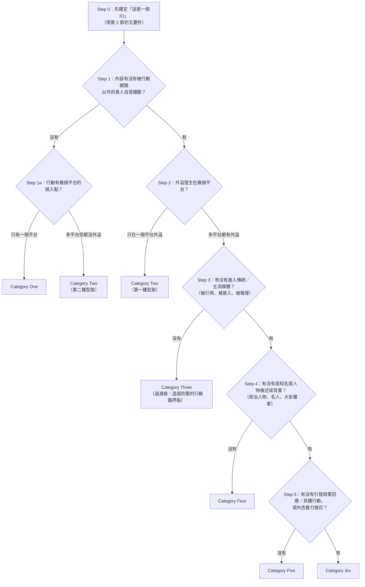

**兩個判讀陷阱：**

- **陷阱一：把「自家帳號互推」當外溢。** Spamouflage Dragon 就是典型：數百個資產、橫跨三平台，但「all of the reactions to its posts came from other members of the same network」。這正是報告給 GTG-54004 Category One 的理由（「completely isolated within the network of fake accounts」，p.76），以及給 GTG-54002 Category Two 的理由（「with no evidence of breakout beyond its own activity」，p.48）。
- **陷阱二：把「行為者自報的數字」當證據。** 報告在 GTG-84005 明確處理了這個問題：儀表板記錄某資深馬來西亞政府官員帳號獲得「數百萬」的互動，但「Because these figures are self-reported by the actor's own tools, we cannot independently verify them」（p.54）。這也是為什麼該案只給 Category Two——**自報的百萬瀏覽不能換成量表級別**。

### 5.4 兩個框架的分工：ABC 管「是什麼」、Breakout Scale 管「多嚴重」

課堂上最容易混淆的是這兩個框架的關係。一句話：

- **François 的 ABC** 回答「這是不是影響力行動、由誰、用什麼手段、散布什麼內容」——**分類問題**。
- **Nimmo 的 Breakout Scale** 回答「這個行動走多遠了、該不該現在動手」——**優先順序問題**。

兩者串起來就是一條完整的分析流程：ABC 決定**要不要處理**，Breakout Scale 決定**多急**。Nimmo 自己說量表的主要目的是「enabling a prioritization of resources, and a greater degree of coordination, in the response」。

補充第三個框架供進階學員參考：**DISARM**（DISARM Foundation 維護，前身為 AMITT）是影響力行動的 TTP 分類法，「DISARM's style is based on the MITRE ATT&CK framework」，分為 **DISARM Red**（造謠者的 TTP，依戰術階段排列）與 **DISARM Blue**（回應者的 TTP）。它提供 STIX 樣板（放在 DISARM_CTI repo）以便在 ISAO 之間交換資料，以 CC-BY 授權開放，且在 AMITT 時期（2020–2022）曾與 NATO、EU 及數個國家的反造謠單位試行。**DISARM 之於影響力行動，等於 ATT&CK 之於網路攻擊**——本報告沒有使用 DISARM 標註 TTP，這是課程可以補上的練習（第 10.3 節）。

### 5.5 九案的 Breakout Scale 評級對照表（逐一從 PDF 正文核對）

以下每一格的級別都回到 PDF 內文逐句確認，並抄錄報告給出的理由原文。**這是本教材最該被直接投影的一張表。**

| GTG 代號 | 級別 | 報告的原文理由（逐字） | 出處頁 | 判讀備註 |
|---|---|---|---|---|
| **GTG-04001**（俄羅斯 FIMI／中非共和國） | **Category Four** | "Using the Breakout Scale, we would assess this operation as Category Four (content broadcast daily through Radio Lengo Songo on 98.9 FM, amplified through Telegram channels and carried by local news outlets in CAR)." | p.45 | **全報告最高級**。理由是典型的 cross-medium breakout：內容離開網路，透過 FM 廣播與在地新聞媒體落地。注意報告沒有主張到達 Cat 5／6——沒有名人背書或政策回應的證據 |
| **GTG-54002**（商業影響力即服務／六大洲） | **Category Two** | "Using the Brookings Institution's Breakout Scale, which measures the impact of influence operations, we would assess this activity as Category Two: content distributed across the network's own websites and matching social media accounts, with no evidence of breakout beyond its own activity." | p.48 | 對應 Nimmo 的「多平台、無外溢」型態（Spamouflage Dragon 型）。**8,913 篇文章、約 20 種語言、70 個網站仍然只有 Cat 2**——這是「產量不等於級別」最有力的證據 |
| **GTG-84005**（商業選舉操縱平台／馬來西亞） | **Category Two** | "We rate this campaign as a Category Two on the Breakout Scale, meaning that the assets were distributed across multiple platforms, but without evidence of breakout into authentic communities." | p.54 | 同樣是「多平台、無外溢」。約 1,000 個假帳號、自報百萬瀏覽，但自報數字不算證據（p.54） |
| **GTG-24015**（俄羅斯國家媒體編輯管線） | **未給評級** | 報告在此案**沒有使用 Breakout Scale**。相關陳述是：「Unlike covert networks that struggle to reach real audiences, the content developed by these individual actors was distributed through media outlets' established channels. Where we matched individual Claude-produced output against published content, results ranged from a Telegram post with roughly 2,000 views to the aired broadcast copy. We're not able to determine what share of the outlets' total output passed through the pipelines that involved Claude.」 | p.58 | **本表最重要的一格**。這是九案中真實觸及最廣的一案（RT 全球廣播、Sputnik 多語系），卻**沒有**給級別。見 5.6 節的分析 |
| **GTG-34001**（伊朗國家對齊 ICCO 等三機構） | **Category Three** | "Using the Breakout Scale, we would assess this operation as Category Three (multiple platforms, with content observed disseminated by IRGC-aligned channels on Eitaa and other platforms.)" | p.63 | 判準是「多平台＋有觀察到擴散」。可討論：IRGC 關聯頻道的轉發算不算 Nimmo 定義的「有機外溢」？（見 5.6） |
| **GTG-54006**（孟加拉親 Awami League 自動化假新聞） | **Category Three** | "Using the Breakout Scale, we would assess this operation as Category Three (multiple platforms, with videos matching the operation's output observed on multiple Bangladesh focused channels and accounts across social media platforms.)" | p.68 | 同頁也說「We were unable to identify the specific channels that published the entire output」且「found no evidence that the content reached a wider audience outside of these accounts」——級別與證據之間有張力 |
| **GTG-84006**（MEK/NCRI 對齊的分散式行動） | **Category Two** | "Using the Breakout Scale, we would assess this operation as Category Two (multiple platforms, with distribution through the network's own NCRI media properties and amplifier accounts.)" | p.71 | 標準的「多平台但仍在自家資產內」。處置段落補充：「we are not able to independently confirm how much authentic engagement was drawn by the network's amplification accounts」（p.74）。注意 IOC 表列出的 Instagram 帳號追蹤數不小（@simaintv/@iranintv 約 708K、@javanane_shargt 約 299K、@tehranchekhabar19 約 173K、@faryade_mamnoo 約 89.5K，p.74–75）——**追蹤數大但仍是 Cat 2**，因為那是自家媒體資產 |
| **GTG-54004**（肯亞國內協同不實行為） | **Category One** | "We evaluated the impact of the network using the Breakout Scale and classified it as Category One. The activity was completely isolated within the network of fake accounts and local influences on a single platform, failing to reach or influence any real people." | p.76 | **全報告最低級**，也是唯一明確寫出「failing to reach or influence any real people」的一案 |
| **GTG-84002**（阿聯指揮／針對穆斯林兄弟會） | **Category Three** | "Using the Breakout Scale, we would assess this activity as Category Three, with the activity running across several social media platforms. **A higher category would require evidence of broad public attention or policy impact, which we are not able to confirm.**" | p.79 | **方法論上寫得最漂亮的一格**：明確說明「為什麼不是更高級」。這一案有代筆的 UN 人權理事會證詞（若成功宣讀就可能觸及政策層面），但報告說「We cannot confirm whether any of the testimonies or compiled target dossiers successfully reached their intended audiences」（p.78） |

#### 分布統計

| 級別 | 案數 | 案例 |
|---|---|---|
| Category One | 1 | GTG-54004 |
| Category Two | 3 | GTG-54002、GTG-84005、GTG-84006 |
| Category Three | 3 | GTG-34001、GTG-54006、GTG-84002 |
| Category Four | 1 | GTG-04001 |
| Category Five | 0 | — |
| Category Six | 0 | — |
| 未評級 | 1 | GTG-24015 |

**八案中有七案落在 Cat 1–3，沒有任何一案到達 Cat 5 或 Cat 6。** 這個分布本身就是本章最重要的量化發現，也是第 7 節「生產能力 ≠ 影響力」的證據基礎。

### 5.6 三個評級上的方法論疑點（課堂爭點）

**疑點一：GTG-24015 為什麼沒有評級？**

報告沒有解釋。可能的推論（全部是本檔的推測，非報告陳述）：

- **量表不適用於「公開的國家媒體」。** Nimmo 的量表是為「covert activity」設計的（他的 IO 定義要求 rely in part or in whole on covert activity）。RT 英語新聞台的全球廣播不是隱蔽插入點，它就是主流媒體本身——把它評為 Category Four（「進入主流媒體」）會是循環論證。
- **無法界定分母。** 報告自承「We're not able to determine what share of the outlets' total output passed through the pipelines that involved Claude」——如果不知道 Claude 生產的內容占該媒體產出的多少，就無法說「這個行動」擴散到哪裡。
- **這是本章 Breakout Scale 應用的邏輯邊界。** 值得在課堂上直接指出：**一個評估框架最誠實的時刻，是它承認自己不適用的時候。**

**疑點二：Cat 3 的「外溢」是不是真的有機外溢？**

Nimmo 的定義要求突破時刻是「spreads **organically** from the insertion point into new communities」。但：

- GTG-34001 的證據是「IRGC 關聯頻道」在 Eitaa 上散布該行動的內容（p.63）。IRGC 關聯頻道是**同盟資產**還是**新社群**？報告同頁又說該行動用了「paid campaigns across more than 100 Iranian platform channels」（p.64）——**付費放大不是有機外溢**。
- GTG-54006 的證據是「影片在多個孟加拉焦點頻道與帳號上被觀察到」，但報告也說找不到證據顯示內容觸及這些帳號以外的更廣受眾（p.68）。

這兩案若嚴格套用 Nimmo 的原始定義，**可能應該落在 Category Two**。課堂上這是很好的爭論題：Anthropic 是否對自己揭露的案例做了略微偏高的評級？（也可能只是「多平台」這個字面判準的合理應用——Nimmo 的 Cat 3 判準是「insertion points and breakout moments on multiple platforms」，若把 IRGC 頻道視為「不同社群」，則 Cat 3 成立。）

**疑點三：級別是誰評的、能不能複現？**

Nimmo 強調量表要基於「observable, replicable, verifiable」的資料。但報告的評級：

- 由**被濫用的平台本身**做出（有利益關係：級別越低，越能支持「我們早期攔截有效」的敘事）；
- **沒有公開底層資料**（GTG-54006 的頻道清單「unable to identify」、GTG-54002 的完整網域清單「available separately」、GTG-54006 的雲端資料夾識別碼「Withheld」）；
- **沒有第三方覆核**（第 9 節確認：目前沒有任何獨立研究機構複驗過這些級別）。

這不代表評級是錯的，但代表它們是**單一來源的自評**。教學上必須讓學員養成這個反射：看到任何 Breakout Scale 級別，先問「誰評的、根據什麼證據、能不能複現」。

### 5.7 對照組：其他 AI 公司與平台怎麼評估同類行動

| 機構 | 使用的衡量框架 | 觀測位置 | 對 AI 影響力行動的核心結論 |
|---|---|---|---|
| **Anthropic**（本報告，2026-09-10） | Brookings Breakout Scale（六級） | **上游**（生產階段） | 「Most of the content we discovered drew little or no authentic engagement」（p.44）；最高一案 Cat 4 |
| **OpenAI**（2024-05-30 首份影響力行動報告；其後 2025-06、2025-10 等） | 同樣使用 Brookings Breakout Scale（由 Ben Nimmo 領導的情報與調查團隊執行） | **上游**（生產階段） | 2024 年 5 月首報的著名結論：所揭露的五個行動**沒有一個超過 Category Two**。後續報告延續「威脅行為者把 AI 接到既有劇本上，不是獲得全新的攻擊能力」的論調（詳見第 9 節的來源標註與限制） |
| **Meta**（半年度 Adversarial Threat Report，最近一份 2026 年 8 月 H2 2026） | 「Coordinated Inauthentic Behavior（CIB）」政策＋資產數與追蹤數；**不使用 Breakout Scale** | **下游**（分發階段） | H2 2026 報告的關鍵陳述是：**生成式 AI 技術現在出現在 Meta 瓦解的幾乎每一個 CIB 網路中**。個案例如一個源自伊朗、針對美國受眾的網路：4 個 Facebook 帳號＋31 個 Instagram 帳號、超過 79,000 追蹤者，即使使用美加代理基礎設施與偽裝成美國活動人士／學生的人格，仍被主動偵測並歸因到伊朗 |
| **DISARM Foundation** | DISARM Red／Blue TTP 分類法（ATT&CK 風格），提供 STIX 樣板 | 框架提供者（不做偵測） | 不做影響評估，做的是 TTP 的共同語言 |

**三點對照觀察：**

1. **兩家 AI 公司都用 Breakout Scale，平台不用。** 這不是巧合：AI 公司在上游，看不到互動數據，**必須**借用一個以「擴散證據」而非「互動數字」為基礎的框架。Meta 在下游有完整的互動數據，反而不需要代理指標——它直接報「多少帳號、多少追蹤者、多少花費」。
2. **Nimmo 本人的職涯串起了這三個位置**（Graphika → Meta → OpenAI），這解釋了為什麼 Breakout Scale 會成為 AI 產業的共同語言。
3. **Meta 的「幾乎每一個 CIB 網路都有 AI」與 Anthropic 的「多數內容沒有真實互動」並不矛盾**：前者說的是**普及率**（AI 已是標配），後者說的是**效果**（標配了也不一定有用）。課堂上要讓學員同時握住這兩個事實，才不會倒向任何一端的極端結論。

---

## 6. 九案模組地圖

> **使用方式：** 這一節是整個 02 模組的導覽表。個別案例的深度研究（攻擊生命週期、IOC、圖表判讀、TTP 對應）由本模組的其他教材負責；本節只做「一頁看完九案」的定位與交叉比較。

### 6.1 主表：九案一覽

| GTG 代號 | 行為者類型 | 國別／來源 | 目標區域與受眾 | Breakout Scale | Claude 的主要用途 | PDF 頁碼 |
|---|---|---|---|---|---|---|
| **GTG-04001** | 國家（俄羅斯 SVR 控制的 Politology／Africa Corps 影響力分支）＋在地執行者 | 俄羅斯（操作者為班吉的俄語人士） | 中非共和國（CAR）國內聽眾；經 Radio Lengo Songo 98.9 FM 與國家廣播 Radio Centrafrique | **Category Four** | 每日新聞內容生產（嵌入親俄、反法論點）、去除 AI 文本痕跡、**僱傭合約／職務說明／評分表／三振解僱流程**、反對派人物監控資料庫、Russia House 發言人談話要點、偽造 CAR 憲兵與國防部公文 | p.44–47 |
| **GTG-54002** | 商業（影響力即服務）；法國數位廣告公司 LKM Company | 法國（網域十週內自法國註冊） | 六大洲；重點為美國、巴西、法國、剛果民主共和國（DRC） | **Category Two** | 撰寫原創假新聞、改寫真實記者的報導成政治傾斜版本、固定 JSON／HTML 輸出結構以利自動發佈、SEO 權重操作、假記者署名 | p.47–53 |
| **GTG-84005** | 商業（選舉操縱平台）；伊斯坦堡的 BBS Bilisim Teknolojileri | 土耳其（平台商）／目標在馬來西亞 | 馬來西亞全部 222 個國會選區；操作族群、宗教、王室三條敏感斷層線 | **Category Two** | 用真實普查與選民資料建選區目標系統、用 Claude Code 建管理假帳號的儀表板、約 1,000 個假帳號的暖機與規避邏輯、假新聞站「Malaysia Pulse」的改寫管線、偽造情報檔案 | p.53–58 |
| **GTG-24015** | 國家媒體（Sputnik／RIA Novosti／RT）的個別從業者，四個帳號 | 俄羅斯 | 摩爾多瓦（俄語）、拉丁美洲（西語）、非洲（英語）、RT 全球英語廣播 | **未評級**（報告未套用量表） | 當作「副編輯層」：把羅馬尼亞／摩爾多瓦新聞、民調、反對派社群貼文轉為俄語文章；西語在地化；依 40 條社規寫 Sputnik Africa 貼文；**逐字精算的電視跑馬燈、字卡與旁白稿** | p.58–62 |
| **GTG-34001** | 國家對齊宣傳機構（ICCO／文化與伊斯蘭指導部；呼羅珊拉扎維伊斯蘭宣傳辦公室；伊斯蘭宣傳組織 Bina 文化觀測站） | 伊朗 | 伊朗國內（波斯語）＋海外多語（阿拉伯語、烏爾都語、馬來語、西語、英語，計畫擴至 20 種語言） | **Category Three** | 建構教條與意識形態內容、操作手冊、人格系統、預警協定、擴散時程；把官方情報簡報轉為在地化內容；出處洗白（讓貼文看似外國作者或獨立媒體）；以 IRGC 發言人口吻發文；針對巴哈伊的反敘事 | p.62–67 |
| **GTG-54006** | 個人（親 Awami League 的單一行為者；該黨自 2024 年 7 月起在野） | 孟加拉（Gaibandha 縣） | 孟加拉國內鄉村、識字率較低的 Awami League 支持者 | **Category Three** | 透過自製程式 `fake_news_3.py` 呼叫 API，每批產出 15 則孟加拉語標題＋3 則詳細假故事＋15 個英文圖片生成提示；供 Facebook Live／YouTube／TikTok 直播循環使用 | p.67–70 |
| **GTG-84006** | 流亡反對派運動（MEK/PMOI 與其政治前沿 NCRI） | 伊朗流亡組織（至少四名參與者任職於官方 NCRI 媒體） | 伊朗境內民眾＋海外僑民 | **Category Two** | 共用 AI 代理平台「Viktor」＋持久記憶檔（SKILL.md／LEARNINGS.md）；複製真實活動人士的 Telegram 帳號並以其身分即時對話；爬取 500 多個頻道建立含**逮捕紀錄**的心理側寫；AI 生成的波斯語配音虛擬人像；多帳號 Instagram 協同排程 | p.70–75 |
| **GTG-54004** | 國內政治操作者（單一行為者；同時經營行銷人格「SHANKI／Elkins Marketer」） | 肯亞（無證據顯示政府涉入） | 肯亞國內；2027 年大選前的政治議題與電價議題 | **Category One** | 每次產出「正好 50 則」推文，明確要求看起來像自發的草根評論；把預先擬好的 50 個主題「人性化」；打包成可一鍵複製的互動小工具 | p.75–77 |
| **GTG-84002** | 國家（以高度信心連結到阿聯政府官員） | 阿拉伯聯合大公國 | 全球穆斯林兄弟會相關目標；蘇丹衝突敘事；聯合國問責機制；歐洲議會議員與記者 | **Category Three** | 維持私有平台上的 AI 人格「Deadshot」＋跨數百工作階段的主教條檔；約 300 個假影響者帳號；複製真實瑞士組織身分的前線 NGO；**為第 62 屆 UN 人權理事會代筆的兩份證詞**；18 名歐洲議會議員與記者的側寫；UN 特別報告員的反問責檔案 | p.78–80 |

### 6.2 交叉比較：五個切面

**（a）行為者類型 × 級別**

| 行為者類型 | 案例 | 級別 | 觀察 |
|---|---|---|---|
| 國家直接指揮 | GTG-04001（Cat 4）、GTG-84002（Cat 3） | 3–4 | **級別最高的兩案都是國家**——不是因為 AI 用得比較好，而是因為國家握有下游分發通路（FM 電台、外交管道、UN 場域） |
| 國家媒體從業者 | GTG-24015（未評級） | — | 真實觸及最廣，但量表不適用 |
| 國家對齊宣傳機構 | GTG-34001（Cat 3） | 3 | 有國內平台（Eitaa、Bale、Rubika）與付費放大 |
| 商業影響力即服務 | GTG-54002（Cat 2）、GTG-84005（Cat 2） | 2 | **產量最大、級別偏低**：8,913 篇文章、1,000 個帳號都換不到外溢 |
| 流亡反對派 | GTG-84006（Cat 2） | 2 | 有自家媒體資產（電視、衛星／短波廣播）但仍屬自家生態系 |
| 國內個人操作者 | GTG-54006（Cat 3）、GTG-54004（Cat 1） | 1–3 | 差異在於有沒有現成的下游頻道網路 |

**核心規律：級別的決定因素是「下游分發資產」，不是「上游生產能力」。** 這句話應該寫在黑板上。

**（b）自動化程度光譜**

| 自動化程度 | 案例 | 證據 |
|---|---|---|
| 對話式協助（人類逐則要求） | GTG-54004 | 「The actor supplied the topic, talking points, and hashtags」（p.76） |
| 人類逐步指揮＋模板重用 | GTG-04001、GTG-24015 | 「The reused templates and standing instructions show the planning was mostly done offline before any prompt was sent to Claude」（p.45） |
| 自製程式批次呼叫 API | GTG-54006、GTG-54002 | `fake_news_3.py` 固定批次（p.67）；固定 JSON schema（p.48） |
| 持久記憶檔驅動的代理 | GTG-84006、GTG-84002 | 「each workspace maintained its own long-term memory files... This allowed the agent to keep producing content without a human user directing each session」（p.72） |
| 自建平台＋儀表板 | GTG-84005 | 「used Claude Code to build custom dashboards for managing, running, and tracking the networks of fake accounts」（p.54） |

**（c）與選舉的時間關聯**

| 案例 | 選舉 | 日期 | 報告頁 |
|---|---|---|---|
| GTG-24015 | 摩爾多瓦國會選舉（針對總統 Maia Sandu 的抹黑） | 2025-09-28 | p.59 |
| GTG-54004 | 肯亞大選（宣稱在野聯盟分裂） | 2027（籌備中） | p.76 |
| GTG-84005 | 馬來西亞（222 個選區的選民微定向） | 未指明選舉日 | p.54 |
| GTG-54006 | 孟加拉（2024 年 7 月政變後的政治鬥爭） | 未指明選舉日 | p.67 |

**（d）「Claude 拒絕」的紀錄**（第 8 節詳述）

| 案例 | 拒絕了什麼 | 行為者怎麼繞過 | 頁 |
|---|---|---|---|
| GTG-04001 | 點名真實個人為武裝分子以引來安全部門行動 | 改用「匿名消息來源」框架 | p.45 |
| GTG-04001 | 標記出評分表的政治權重問題 | 用中性措辭重新標籤，保留評分機制 | p.45 |
| GTG-84005 | 辨識出某文件是政治誹謗素材而拒絕；對明示心理戰的措辭退卻 | 協商出「消毒過」的措辭，繼續朝同一能力建構 | p.55、p.57 |
| GTG-24015（趨勢段） | 對某些聲稱標記為未經證實 | 指示模型丟掉警語，全部當作已證實呈現 | p.43 |

**（e）跨組織情報交換的紀錄**

| 案例 | 情報從哪來／到哪去 | 頁 |
|---|---|---|
| GTG-04001 | **外部進來**：INPACT／All Eyes on Wagner 的線報啟動內部調查，並獨立確認涉案人身分 | p.47 |
| GTG-54004 | **外部進來**：**OpenAI** 分享其平台上累犯活動的線報 | p.77 |
| GTG-54002 | 對外分享：共用部署識別碼＋70 個假媒體的代表性樣本（完整清單另行提供） | p.52 |
| GTG-24015 | 對外分享：與產業及研究夥伴分享指標 | p.62 |
| GTG-34001 | 對外分享：與產業及研究夥伴分享相關指標 | p.66 |
| GTG-54006 | 對外分享：與相關分發平台及其他夥伴分享指標（部分指標標記為 Withheld／Held for partner share） | p.70 |
| GTG-84002 | 對外分享：分享指標以支持其他產業夥伴行動 | p.80 |

**這一格是本章最有政策意義的發現：AI 公司之間、AI 公司與 OSINT 調查組織之間，已經出現雙向的情報交換。** GTG-54004 是公開文獻中罕見的「OpenAI 給 Anthropic 線報」紀錄。

### 6.3 圖表地圖（本章頁段無圖；模組整體圖表索引）

**先講清楚一件事：本教材負責的頁段（p.41 至 p.44 上半）沒有任何圖表。** 影響力行動章的第一張圖是 p.46 的 Figure 1（屬於 GTG-04001）。整章 18 張圖全部落在個別案例中，深度判讀由各案例教材負責。這裡提供的是模組層級的索引，以及四張與「導論主題」直接相關的圖的判讀。

#### 模組圖表索引（p.46–80，共 18 張）

| Figure | 頁 | 所屬案例 | 圖片類型 | 課程圖檔 |
|---|---|---|---|---|
| Figure 1 | p.46 | GTG-04001 | Telegram 頻道截圖（兩欄） | `../figures/page-046.png` |
| Figure 2 | p.49 | GTG-54002 | 假帳號頭像陣列（AI 生成人臉） | `../figures/page-049.png` |
| Figure 3 | p.50 | GTG-54002 | 協同留言帳號叢集 | `../figures/page-050.png` |
| Figure 4 | p.51 | GTG-54002 | 協同留言帳號叢集（續） | `../figures/page-051.png` |
| Figure 5 | p.52 | GTG-54002 | 假新聞網站截圖 | `../figures/page-052.png` |
| Figure 6 | p.56 | GTG-84005 | 假留言帳號側寫 | `../figures/page-056.png` |
| Figure 7 | p.56 | GTG-84005 | 假新聞站「Malaysia Pulse」截圖 | `../figures/page-056.png` |
| Figure 8 | p.57 | GTG-84005 | 關聯的假 YouTube 頻道 | `../figures/page-057.png` |
| Figure 9 | p.60 | GTG-24015 | Telegram 貼文截圖（2.09K 瀏覽） | `../figures/page-060.png` |
| Figure 10 | p.61 | GTG-24015 | RIA Novosti 網頁截圖 | `../figures/page-061.png` |
| Figure 11 | p.61 | GTG-24015 | Sputnik Africa 的 X 貼文截圖 | `../figures/page-061.png` |
| Figure 12 | p.65 | GTG-34001 | Eitaa 平台搜尋結果截圖 | `../figures/page-065.png` |
| Figure 13 | p.66 | GTG-34001 | Threads 帳號截圖（攻擊 Nawapress） | `../figures/page-066.png` |
| Figure 14 | p.69 | GTG-54006 | Google Drive 資料夾截圖 | `../figures/page-069.png` |
| Figure 15 | p.73 | GTG-84006 | **網路關係圖（節點圖）** | `../figures/page-073.png` |
| Figure 16 | p.74 | GTG-84006 | Instagram 貼文截圖 | `../figures/page-074.png` |
| Figure 17 | p.77 | GTG-54004 | X 貼文截圖（六則協同貼文） | `../figures/page-077.png` |
| Figure 18 | p.80 | GTG-84002 | X 貼文截圖（#SudanIslamists 六則） | `../figures/page-080.png` |

**類型分布值得注意：18 張圖中有 17 張是「截圖」，只有 1 張（Figure 15）是分析性的架構圖。** 這反映了影響力行動情報的性質——證據是「在野外看到的東西」（seen in the wild），不是流程重建。對比網路行動章（p.12–33）有大量的攻擊生命週期流程圖（Figure 1–18），差異一目了然：網路行動可以重建攻擊鏈，影響力行動只能展示擴散證據。**這正是 Breakout Scale 存在的理由。**

#### 導論相關的四張圖判讀

##### Figure 15（p.73）：「Viktor」共用代理平台的網路圖 — 唯一的架構圖

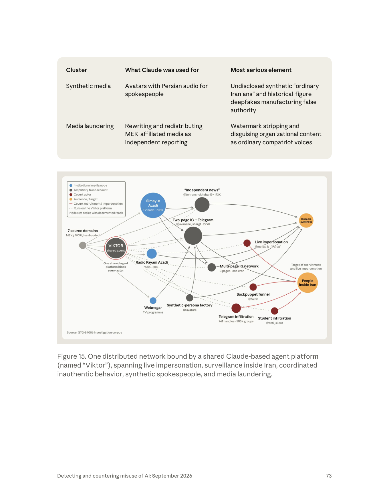

- **圖片類型**：節點連線圖（network graph），右下角標註來源「GTG-84006 investigation corpus」。
- **圖例（左上角）**：藍色圓＝機構媒體節點（Institutional media node）；深灰圓＝放大器／前線帳號（Amplifier / front account）；深紅圓＝隱蔽行為者（Covert actor）；橘色圓＝受眾／目標（Audience / target）；紅色實線＝隱蔽招募／冒充（Covert recruitment / impersonation）；灰色虛線＝在 Viktor 平台上運行（Runs on the Viktor platform）。圖例明說**節點大小依已記錄的觸及規模縮放**（Node size scales with documented reach）。
- **圖上實際看到的節點**：左側灰色小圓「7 source domains — MEK / NCRI, hard-coded」；中央粉紅描邊的「**VIKTOR shared agent**」，下方註記「One shared agent platform binds every actor」；藍色機構節點「Simay-e Azadi（TV node · 708K）」「Radio Payam Azadi（radio · 50K+）」「Webnegar（TV programme）」；深灰放大器節點「"Independent news" @tehranchekhabar19 · 173K」「Two-page IG + Telegram @javanane_shargt · 299K」「Multi-page IG network（3 pages · one cron）」「Synthetic-persona factory（10 avatars）」；深紅隱蔽節點「Live impersonation @mellat_b · "Parsa"」「Sockpuppet funnel @fwr.ir」「Telegram infiltration（741 handles · 500+ groups）」「Student infiltration @anti_silent」；右側兩個橘色目標「Diaspora audiences」與「People inside Iran」，後者被標註「Target of recruitment and live impersonation」。
- **資料怎麼流動**：七個硬編碼的來源網域 → Viktor 共用代理 → 三類下游（機構媒體節點、放大器／假獨立新聞、隱蔽滲透帳號）→ 兩類受眾。灰色虛線從 Viktor 發散到幾乎每一個節點，視覺化了「一個代理平台綁住所有行為者」；紅色實線只從三個隱蔽節點指向「People inside Iran」，把「冒充與招募」這條最危險的路徑單獨標出來。
- **核心訊息**：**協調不需要人與人之間的協調。** 報告文字說這些行為者「did not share account infrastructure or show visible signs of coordination」（p.70），但圖顯示他們共用一個代理平台與一套教條檔——**共用的 AI 代理本身就是協調基質（coordination substrate）**，這正是報告在表格中寫的「Cross-actor shared doctrine and evasion functioning as a coordination substrate」（p.72）。
- **課堂用法**：這是全章唯一可以用來講「AI 時代的協同不實行為長什麼樣」的圖。傳統 CIB 偵測靠「共用 IP、共用註冊時間、共用裝置指紋」；這張圖說明新的共用點是**記憶檔與代理設定**。可以讓學員畫出「如果沒有 Viktor，這張圖會變成什麼樣」——答案是十幾個看似無關的孤立節點。

##### Figure 1（p.46）：被匯出做風格分析與複製的親俄 Telegram 頻道

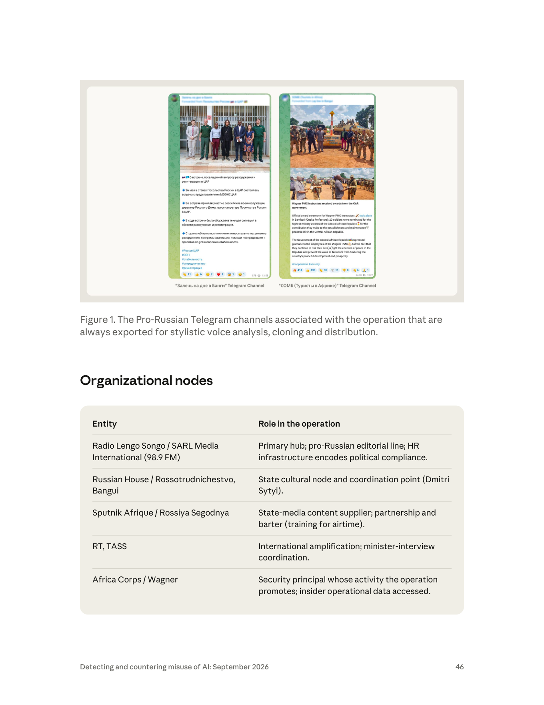

- **圖片類型**：兩欄並排的 Telegram 頻道截圖，底部有頻道名稱標籤。
- **畫面內容**：左欄標籤「"Залечь на дне в Банги"（意為「潛伏在班吉」）Telegram Channel」，內容是俄語貼文，配一張在俄羅斯駐 CAR 大使館前的合影（約十人，含穿軍裝者與西裝者），文字提到 5 月 26 日在俄羅斯大使館舉行的裁軍與重返社會會議、MINUSCA 代表出席、俄方軍人與 Russian House 主任、大使館新聞秘書參與；底部標籤 #РоссияЦАР #ООН #стабильность #сотрудничество #Кремлеград，並顯示表情反應數與瀏覽數。右欄標籤「"СОМБ（Туристы в Африке）"（「非洲的觀光客」）Telegram Channel」，是一則英語貼文配兩張照片（在紀念碑前列隊的武裝人員、頒獎場面），標題「Wagner PMC instructors received awards from the CAR government」，內文說在 Bambari（Ouaka 省）舉行官方頒獎典禮、30 名士兵獲提名中非共和國最高軍事榮譽，並感謝華格納 PMC 員工「冒著生命危險對抗和平的敵人」，標籤 #cooperation #security。
- **這張圖傳達的核心訊息**：圖說寫的是「**always exported for stylistic voice analysis, cloning and distribution**」——這兩個頻道不是行動的產出，而是行動的**輸入**。行為者把它們匯出，讓 Claude 分析語氣風格並複製。這是「去 AI 味」OPSEC 的具體技術路徑：不是要求模型「寫得像人」，而是餵給它真實的在地俄語宣傳語料當風格範本。
- **課堂用法**：講「風格複製（style cloning）」這個 TTP 時直接用。可延伸討論：偵測方是否能反過來用同一套風格分析找出被複製的來源？

##### Figure 5（p.52）：假新聞網站截圖 — 「獨立地方新聞編輯台」的外觀工程

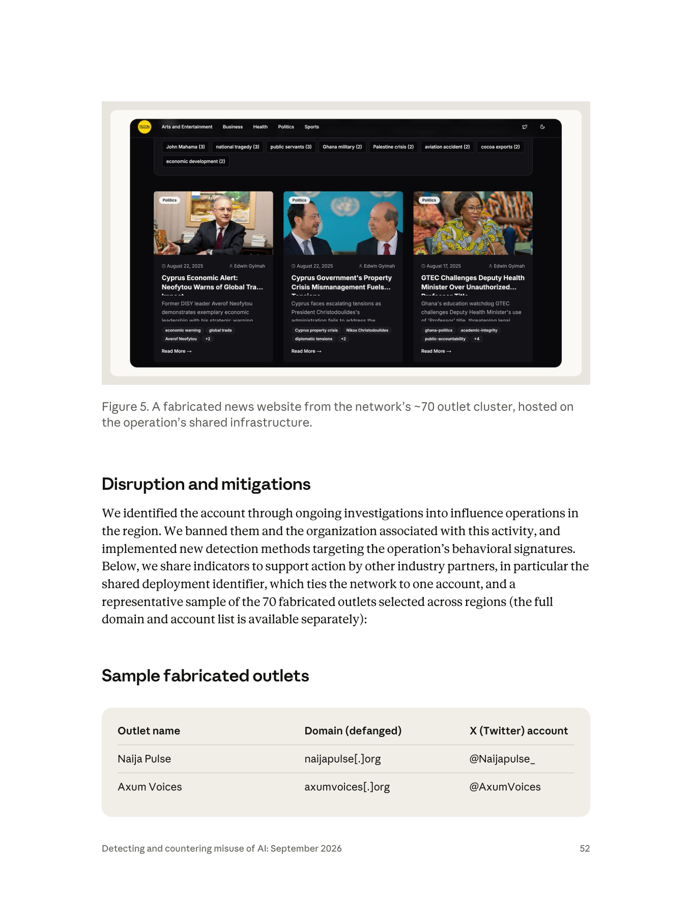

- **圖片類型**：深色主題的新聞網站首頁截圖。
- **畫面內容**：頂部導覽列有 Arts and Entertainment／Business／Health／Politics／Sports 五個分類；下方是一排主題標籤（附文章數）：John Mahama (3)、national tragedy (3)、public servants (3)、Ghana military (2)、Palestine crisis (2)、aviation accident (2)、cocoa exports (2)、economic development (2)。主體是三張卡片式文章預覽，全部標記 Politics 分類，日期為 2025 年 8 月 17 日與 22 日，**三篇的署名都是同一個人「Edwin Gyimah」**。三篇標題分別關於賽普勒斯的經濟警訊（前 DISY 領袖 Averof Neofytou）、賽普勒斯政府的財產危機（總統 Christodoulides）、迦納教育監理機關 GTEC 挑戰副衛生部長未經授權的「教授」頭銜。每張卡片下方有多個標籤（economic warning、global trade、Cyprus property crisis、ghana-politics、academic-integrity 等）。
- **核心訊息**：**這張圖同時展示了偽裝與破綻。** 偽裝：完整的分類導覽、標籤系統、卡片式版面、署名記者，看起來像一個有編制的地方新聞站。破綻有三個，都可以在圖上直接指出來——（1）**主題不一致**：一個以迦納為主的站（John Mahama、Ghana military、cocoa exports 都是迦納議題）同時大量產出賽普勒斯政治內容，這正是報告說的「laundering stories across borders into unrelated regions, stripped of their original context」（p.49）；（2）**署名單一**：三篇跨國、跨領域的報導出自同一位「Edwin Gyimah」，而報告確認「these writers did not actually exist」（p.49）；（3）**時間叢集**：三篇日期集中在五天內。
- **課堂用法**：這是媒體識讀教學的完美教材——**不需要查證任何一則內容的真假，光看網站結構就能判斷它不是真的新聞編輯台。** 第 10 節的實作演練直接用這張圖當起點。

##### Figure 9（p.60）與 Figure 11（p.61）：觸及率的兩個極端

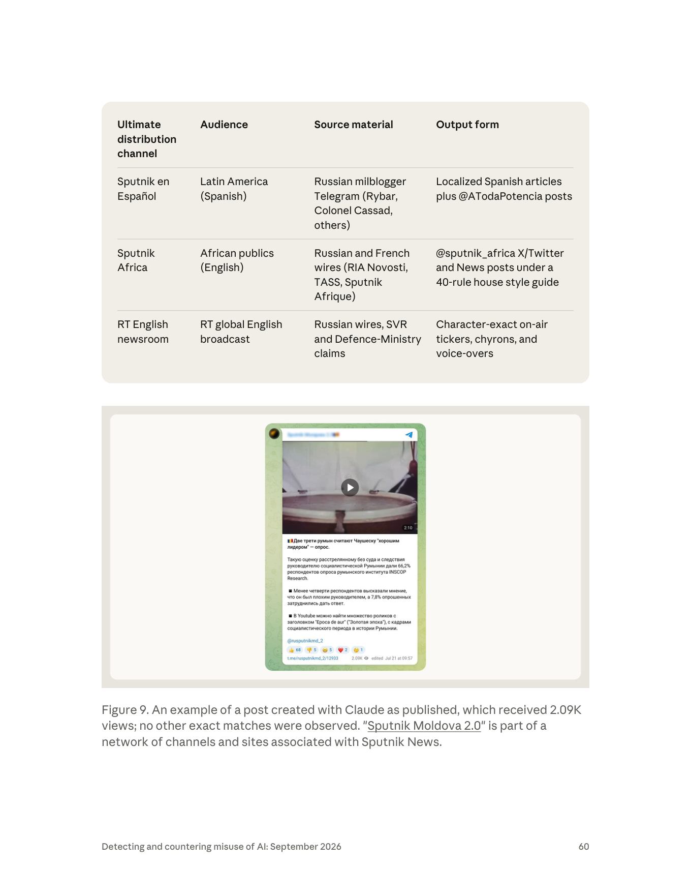

- **Figure 9 圖片類型**：Telegram 貼文截圖（手機比例），頻道名稱部分被遮蔽為「Sputnik Молдова」。
- **畫面內容**：頂部是一段 2 分 10 秒的影片（畫面是一個鼓面特寫）；下方俄語文字，標題為「兩三分之二的羅馬尼亞人認為齊奧塞斯庫是『好領導人』——民調」，內文引述羅馬尼亞 INSCOP Research 的民調結果（66.2% 受訪者給予這位未經審判即被槍決的羅馬尼亞社會主義領導人此評價；不到四分之一認為他是壞領導人，7.8% 無法回答），並提到 YouTube 上有大量標題為「Epoca de aur（黃金時代）」的社會主義時期影片。底部署名 `@rusputnikmd_2`，表情反應列（👍68、👎5、😁5、❤️2、😢1），以及 `t.me/rusputnikmd_2/12933`、**瀏覽數 2.09K**、編輯時間 Jul 21 at 09:57。
- **Figure 11 圖片類型**：Sputnik Africa 的 X／Twitter 貼文截圖。
- **畫面內容**：Sputnik Africa 品牌標頭；標題「Ayatollah Ali Khamenei's Residence Almost Completely Destroyed After US Missile Strike, Reports Say」；時間戳 12:23 28.02.2026（更新 12:24）；主體是一張建築群的衛星影像；下方有 Subscribe 按鈕（X 與 Telegram 圖示）、標題重複、「Subscribe to @sputnik_africa」、表情反應列（👍1、👎7、😊0、😮0、😢0、😡0）、以及一則「Follow us on Telegram to get the latest breaking & exclusive stories from Africa and around the globe」的推廣卡。圖說註明**完全符合 Claude 生成的文字**，並給了封存連結。
- **這兩張圖合起來傳達的核心訊息**：這是全報告對「觸及率」最誠實的視覺證據。Figure 9 的圖說明白寫著「received 2.09K views; **no other exact matches were observed**」——一則由國家媒體通路發出的內容，兩千次瀏覽，而且找不到任何轉載。Figure 11 的表情反應是「1 讚、7 踩」。**國家媒體的既有通路確實是九案中觸及最廣的分發機制（p.44），但「最廣」的絕對數字仍然很小。**
- **課堂用法**：把這兩張圖和 GTG-84005 自報的「百萬瀏覽」放在一起，問學員：哪一個數字比較可信？為什麼可信的那個小這麼多？這是「威脅情報中的數字懷疑論」最好的入門練習。

---

## 7. 「生產能力 ≠ 影響力」：報告對觸及率的誠實評估（p.43–44）

### 7.1 原文逐字

這是整章最重要的一段，也是最容易被媒體報導漏掉的一段：

> "**Influence operations often fail to reach a genuine audience.** Because we sit at the production stage of operations, upstream of platforms like social media platforms, we may detect and disrupt an operation while it is still being put together. **Most of the content we discovered drew little or no authentic engagement**, and in several cases we disrupted the operation before it could build an audience. **The widest authentic reach occurred where state media outlets were the distribution mechanism (including FM radio, satellite and shortwave radio, and global television).**"（p.43–44）

繁中對譯：

> 「**影響力行動經常無法觸及真實受眾。** 由於我們位於行動的生產階段、在社群媒體等平台的上游，我們可能在行動仍在組裝時就偵測並瓦解它。**我們發現的多數內容幾乎沒有、或完全沒有引發真實互動**，而且在好幾個案例中，我們在行動能建立起受眾之前就將其瓦解。**觸及率最廣的情況發生在以國家媒體作為分發機制時（包括 FM 廣播、衛星與短波廣播，以及全球電視）。**」

### 7.2 這段話由哪些證據支撐

把九案中所有關於「真實互動」的陳述蒐集起來，會發現這個結論有非常紮實的案例基礎：

| 案例 | 關於真實觸及的原文 | 頁 |
|---|---|---|
| GTG-54002 | 「We disrupted this operation early, before it could build an authentic audience. The network published at least 8,913 articles in about 20 languages, but **most of the content we identified generated little observable engagement from real audiences**.」 | p.48 |
| GTG-84005 | 「without evidence of breakout into authentic communities」；儀表板自報的百萬瀏覽「Because these figures are self-reported by the actor's own tools, **we cannot independently verify them**」 | p.54 |
| GTG-24015 | 「**Unlike covert networks that struggle to reach real audiences**, the content developed by these individual actors was distributed through media outlets' established channels」；實測結果「ranged from a Telegram post with roughly 2,000 views to the aired broadcast copy」 | p.58 |
| GTG-54006 | 「we found **no evidence that the content reached a wider audience** outside of these accounts」 | p.68 |
| GTG-84006 | 「At this point, **we are not able to independently confirm how much authentic engagement was drawn** by the network's amplification accounts」 | p.74 |
| GTG-54004 | 「The activity was **completely isolated** within the network of fake accounts and local influences on a single platform, **failing to reach or influence any real people**」 | p.76 |
| GTG-84002 | 「A higher category would require evidence of broad public attention or policy impact, **which we are not able to confirm**」；「**We cannot confirm whether any of the testimonies** or compiled target dossiers successfully reached their intended audiences」 | p.78–79 |

九案中有七案有明確的「觸及有限」或「無法確認觸及」陳述。**唯一被報告認定確實觸及了真實受眾的兩案（GTG-04001、GTG-24015），靠的都是國家媒體通路。**

### 7.3 「生產能力 ≠ 影響力」：把落差量化

把「生產面的數字」與「觸及面的數字」並排，落差之大令人印象深刻：

| 案例 | 生產面的數字（AI 使能） | 觸及面的證據 | 落差 |
|---|---|---|---|
| GTG-54002 | 8,913 篇文章、約 20 種語言、約 70 個網站、70 個對應 X 帳號、250+ 留言帳號 | 「little observable engagement from real audiences」；Cat 2 | 五位數的產出 → 零外溢 |
| GTG-84005 | 約 1,000 個假帳號、222 個選區的選民側寫、真實普查與選舉資料、百萬級的自報瀏覽 | 「without evidence of breakout into authentic communities」；Cat 2 | 千級帳號 → 零外溢 |
| GTG-54006 | 至少 1,500 則標題、300 則假敘事、1,500 個圖片提示、29 個輪替帳號、約 16 個月 | 影片出現在多個孟加拉焦點頻道，但「no evidence... reached a wider audience」；Cat 3 | 四位數產出 → 有限擴散 |
| GTG-84006 | 8,400 則貼文的風格複製、500+ 頻道爬取、51,944 則封存訊息的分析 | 「not able to independently confirm how much authentic engagement」；Cat 2 | 五位數的資料處理 → 無法確認效果 |
| GTG-54004 | 每批 50 則推文、多個工作階段 | 「failing to reach or influence any real people」；Cat 1 | 有產出 → 零觸及 |
| GTG-24015 | 四個帳號嵌入專業編輯流程 | RT 全球廣播、Sputnik 多語系；實測 2.09K 瀏覽到上電視 | **產出少 → 觸及最廣** |
| GTG-04001 | 每日內容生產 | 98.9 FM 每日播出、Telegram 放大、CAR 在地媒體轉載；Cat 4 | **產出中等 → 級別最高** |

**這張表要教的推理：** 影響力行動的產出與影響**不是線性關係，甚至可能是負相關**。GTG-24015 與 GTG-04001 的生產量在九案中屬中低，卻是唯二真正觸及群眾的；GTG-54002 與 GTG-84005 的生產量最大，卻停在 Cat 2。

原因不難理解：AI 大幅降低了**內容生產**的邊際成本，但完全沒有降低**受眾獲取**的成本。受眾獲取需要的是：既有的分發通路（FM 電台執照、衛星頻道、發行網路）、既有的信任關係（真實的追蹤者、社群連結）、或是能穿透演算法的真實互動。這三樣東西 AI 都造不出來。

### 7.4 對「AI 假訊息末日論」的節制意義

2023 年以來，「生成式 AI 將造成假訊息海嘯、摧毀民主選舉」是公共討論的主流敘事。本報告的證據對這個敘事有三層節制作用：

**第一層：產能爆炸是真的，效果爆炸不是。** 報告確認了 AI 確實讓低資源行為者做到「a scale well beyond what they could accomplish alone」（p.42）——一個人 16 個月產出上千則假新聞（GTG-54006）、一家廣告公司經營 70 個假新聞站（GTG-54002）。產能的指數成長是事實。但八個有評級的案例中沒有一個到達 Cat 5 或 Cat 6。

**第二層：瓶頸從「生產」移到了「分發」。** 這其實是一個**壞消息偽裝成好消息**。如果瓶頸在分發，那麼**已經握有分發通路的行為者**（國家媒體、既有政黨機器、擁有真實追蹤者的網紅）就是 AI 加持後最危險的一群——因為他們唯一缺的（廉價產能）剛好被補上了。GTG-24015 正是這個模式：Claude 被插進一個**已經在運轉的**專業編輯流程（「slotted into a human-edited pipeline that was already up and running」，p.42）。

**第三層：也要警惕「低估論」。** 報告的結論同樣有系統性偏誤，教學時必須誠實標示：

| 偏誤來源 | 說明 |
|---|---|
| **倖存者偏差（反向）** | Anthropic 只看得到**被它抓到的**行動。成功隱蔽、成功擴散的行動，很可能正是沒被上游偵測抓到的那些。用「我抓到的都沒效」推論「AI 影響力行動都沒效」是不成立的。 |
| **介入效應** | 報告自己說「in several cases we disrupted the operation before it could build an audience」（p.44）。**級別低有一部分是自己造成的**——這是防禦成功，不是威脅不存在。用被提早瓦解的行動去推論威脅的上限，邏輯上不成立。 |
| **利益衝突** | 做出評級的是被濫用的平台本身。「多數沒有效果」的敘事對 Anthropic 有利。這不代表評級造假，但代表需要外部覆核（第 9 節確認：目前沒有）。 |
| **量表本身的保守性** | Nimmo 強調量表衡量的是「potential impact」的近似，且「does not necessarily equate to actual impact」。反過來說，**低級別也不等於低實際影響**——Cat 1 的內容仍可能改變少數關鍵人物的看法。 |
| **時間窗口** | 報告涵蓋 2025-12 至 2026-08。行動被瓦解時可能仍在早期階段；若未被瓦解，幾個月後可能爬升級別（Nimmo：級別是快照，可升可降）。 |
| **多模型盲區** | GTG-54006 的圖片提示很可能輸出到別家模型（p.67）；GTG-04001 的行為者同時訂閱 ChatGPT 與 Claude（第 9 節）。單一平台的評估必然低估整體。 |

**教學上的平衡結論（建議寫成一頁投影片）：**

> AI 讓「做出一場影響力行動」變得便宜。它沒有讓「一場影響力行動變得有效」。
> 真正的風險不在於假訊息變多，而在於：
> （1）**已有分發力的行為者**成本歸零；
> （2）**組織化**的門檻消失——一個人可以是一整間宣傳公司；
> （3）行動可以**針對個人**（冒充、側寫、逮捕紀錄），這類傷害不需要「擴散」就能造成；
> （4）我們的偵測能力**恰好只覆蓋願意用西方商業模型的行為者**。

第（3）點值得特別強調：GTG-84006 冒充真實活動人士與伊朗境內的聯絡人對話（p.70）、建立含逮捕紀錄的側寫（p.71，報告註明這些人「face imprisonment or execution under Iranian law」）；GTG-84002 側寫 18 名歐洲議會議員與記者（p.78）。**這些行動的 Breakout Scale 級別可能很低，但對具體個人的傷害可能極高。** 量表衡量的是「擴散」，不是「傷害」——這是它最重要的盲區，教學時務必點出。

---

## 8. Anthropic 的偵測與處置模式（跨案例歸納）

### 8.1 五步標準流程

把九案的「Disruption and mitigations」段落並排，可以歸納出一套高度一致的流程：

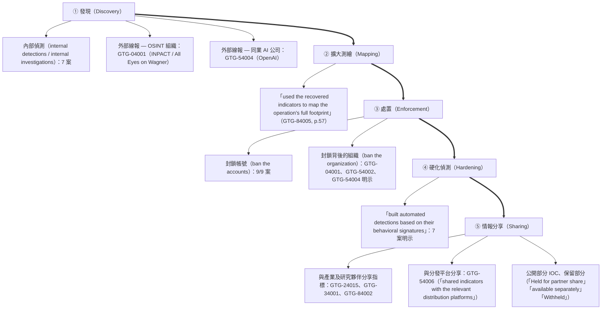

### 8.2 逐案處置紀錄

| 案例 | 如何發現 | 處置 | 硬化 | 分享 | 頁 |
|---|---|---|---|---|---|
| GTG-04001 | **INPACT／All Eyes on Wagner 的線報**；其報導「helped us start our internal review and independently confirmed the identities of the individuals involved」 | 移除帳號與背後組織 | 「built automated detections based on their behavioral signatures」 | 未明示 | p.47 |
| GTG-54002 | 「ongoing investigations into influence operations in the region」 | 封鎖帳號與關聯組織 | 「implemented new detection methods targeting the operation's behavioral signatures」 | **公開共用部署識別碼＋14 個代表性假媒體的網域與 X 帳號**；完整清單「available separately」 | p.52 |
| GTG-84005 | 內部偵測；以回收的指標測繪完整足跡 | 移除帳號 | 用於「disrupt future misuses」 | 公開 IOC 表（網域、Hetzner IP、GitHub 組織、12 個 sockpuppet、YouTube 頻道） | p.57–58 |
| GTG-24015 | 內部偵測 | 封鎖四個行動的帳號 | 未明示 | 「shared indicators with industry and research partners」 | p.62 |
| GTG-34001 | 內部調查 | 封鎖三個行動的帳號 | 未明示 | 「shared the relevant indicators with industry and research partners」 | p.66 |
| GTG-54006 | 內部調查 | 封鎖帳號 | 「we expect the actors... to try to create new accounts... so we've built detections around its behavioral signatures」 | 「shared indicators with the relevant distribution platforms and other partners」；部分指標標為 **Withheld / Held for partner share** | p.69–70 |
| GTG-84006 | 內部調查 | 封鎖帳號 | 未明示 | 未明示（IOC 表公開） | p.74 |
| GTG-54004 | **OpenAI 分享的線報**（其平台上的累犯活動） | 移除帳號與背後組織 | 「built detections around its behavioral signature」 | 未明示 | p.77 |
| GTG-84002 | 內部調查 | 封鎖帳號 | 「built detections around the documented behavioral signature」 | 「shared indicators to support action by the other industry partners」 | p.80 |

### 8.3 三個值得深挖的觀察

**觀察一：「行為指紋」是全章的偵測主軸。** 九案中有七案明確使用 behavioral signature(s) 一詞。這證實了第 3.3 節的推論：偵測的對象是**使用型態**，不是內容立場。這在政策上非常重要——它意味著 Anthropic 的偵測理論上是政治中立的（不論親俄、親美、親執政、親在野，只要生產型態符合，都會被抓）。九案的政治光譜確實很寬（俄羅斯、伊朗、阿聯、法國商業公司、孟加拉在野黨、肯亞執政聯盟、伊朗流亡反對派），支持這個說法。

**觀察二：IOC 的揭露是分層的。** 報告採取了三級揭露策略：
- **完全公開**：假媒體網域、X 帳號、IP、GitHub 組織、Telegram／Instagram 帳號（GTG-54002、GTG-84005、GTG-34001、GTG-84006）
- **部分公開**：「representative sample... the full domain and account list is available separately」（GTG-54002, p.52）
- **完全保留**：「Cloud-storage folder identifier; uploader script — **Withheld**」（GTG-54006, p.70）

保留的理由報告沒說，但可以推論：雲端資料夾識別碼與上傳腳本若公開，等於教別人怎麼做同樣的事，且可能妨礙平台方的後續處置。**這是威脅情報公開倫理的實例，值得在課堂上討論。**

> **安全紅線提醒（教學與研究皆適用）：** 本節與第 6 節抄錄的網域、IP、Telegram／Instagram／X 帳號、GitHub 路徑一律維持報告原本的 defang 格式（`example[.]com`、`hXXps[://]`）。這些只作為研究資料抄錄，**絕對不要連線、不要做 DNS 查詢、不要在課堂示範中開啟**。

**觀察三：「Claude 拒絕」的紀錄同時是防線證據與缺口證據。** 報告記錄了四次拒絕（見 6.2 節 d 表），但每一次拒絕之後，行為者都**成功繞過**：

| 拒絕 | 繞過方式 | 缺口的性質 |
|---|---|---|
| 拒絕點名真實個人為武裝分子（GTG-04001） | 改用「匿名消息來源」框架 | **語意層面的規避**：同樣的效果，換一種表述 |
| 標記出評分表的政治權重（GTG-04001） | 「relabeled it in neutral terms and kept the scoring」 | **標籤層面的規避**：換掉觸發詞，機制不變 |
| 辨識出誹謗素材而拒絕（GTG-84005） | 「the actor negotiated sanitized wording to keep building toward the same capability」 | **漸進式協商**：把一個被拒絕的請求拆成多個無害的子請求 |
| 標記聲稱為未經證實（GTG-24015 相關趨勢） | 「instructed it to drop those caveats and present everything as confirmed」 | **後處理規避**：讓模型先產出合規版本，再要求移除保護性措辭 |

**這四種規避模式構成了本章最有價值的防禦工程素材。** 共同結構是：模型的拒絕是**針對單一請求**的，而行動是**跨請求、跨工作階段**的。只要行為者願意多花幾輪對話，單點的拒絕就會被繞過。報告在 GTG-84005 的措辭尤其精確——「keep building toward **the same capability**」：被繞過的不是一句話，是一整個能力的建構。

對防禦設計的啟示（本檔的推論，非報告陳述）：
1. **拒絕必須有記憶。** 單次拒絕若不影響後續工作階段的評估，等於沒有拒絕。
2. **要偵測「請求序列」而非「單一請求」。** 「被拒絕 → 換措辭 → 再請求」這個序列本身就是高信號的行為指紋。
3. **持久記憶檔是新的攻擊面也是新的偵測面。** 行為者把教條放進記憶檔（p.43）以求持久；防禦方也應該把「拒絕紀錄」放進同樣的持久層。

### 8.4 報告沒有說的：處置的局限

四點誠實的觀察：

1. **封鎖帳號 ≠ 瓦解行動。** GTG-54006 的行為者已經輪替過 29 個帳號（p.67），報告自己預期「the actors behind this activity to try to create new accounts to continue their activity」（p.69）。封鎖是提高成本，不是終結。
2. **內容已經產出的部分無法追回。** GTG-24015 有內容「actually made it to Russian airwaves」（p.59）；GTG-04001 的內容每日播出。封鎖帳號阻止的是未來的產出。
3. **組織層級的歸因不等於問責。** 報告把行動歸因到 SVR 控制的 Politology、阿聯政府官員、伊朗 ICCO——但 Anthropic 能做的只有封鎖帳號。真正的問責（制裁、起訴、外交回應）需要國家機關，而報告沒有提到任何一案轉介給執法機關（對比網路行動章會提到與執法單位分享情報）。
4. **沒有揭露誤判率。** 報告沒有說有多少帳號被誤封、有多少申訴成功。這是 François 在 2019 年就指出的產業透明度缺口（「enforcement in this realm remains opaque throughout the major technology companies」），七年後在 AI 公司身上重現。

---

## 9. 第三方驗證與外部來源

> **判讀規則（本節的核心紀律）：** 每一條來源都標示它是「**獨立查證**」（有自己的一手資料、不依賴 Anthropic）還是「**僅引述 Anthropic**」（把報告內容重述一遍）。這個區分決定了一條資訊的證據價值。

### 9.1 框架的一手來源（獨立、可驗證）

| # | 來源 | URL | 日期 | 性質 | 本教材的用法 |
|---|---|---|---|---|---|
| 1 | **Ben Nimmo,《The Breakout Scale: Measuring the Impact of Influence Operations》**, Brookings Institution | `https://www.brookings.edu/articles/the-breakout-scale-measuring-the-impact-of-influence-operations/`（PDF：`https://www.brookings.edu/wp-content/uploads/2020/09/Nimmo_influence_operations_PDF.pdf`） | 2020 年 9 月 | **一手學術／政策論文，完全獨立於 Anthropic** | 第 5.2 節的六級定義、例子、四項使用規則全部逐字取自此 15 頁 PDF（本檔實際下載全文並解析文字層） |
| 2 | **Camille François,〈Actors, Behaviors, Content: A Disinformation ABC〉**, Transatlantic High Level Working Group on Content Moderation Online and Freedom of Expression（Annenberg Public Policy Center 出版） | `https://www.annenbergpublicpolicycenter.org/wp-content/uploads/ABC_Framework_TWG_Francois_Sept_2019.pdf` | 2019-09-20 | **一手框架論文，獨立** | 第 2.3、5.4 節。**這正是 Anthropic 報告 p.41「frameworks」超連結所指的文件**（本檔從 PDF 的連結物件確認 URL） |
| 3 | **DISARM Foundation**（框架官網與 GitHub） | `https://www.disarm.foundation/framework`、`https://github.com/DISARMFoundation/DISARMframeworks` | 持續更新（v2.0 原型階段） | **一手框架，獨立** | 第 5.4 節。確認：DISARM Red（造謠者 TTP）／Blue（回應者 TTP）分立、風格基於 MITRE ATT&CK、STIX 樣板放在 DISARM_CTI repo、CC-BY 授權、AMITT 時期（2020–2022）曾與 NATO／EU 試行 |

### 9.2 針對本報告案例的獨立調查（真正的外部查證）

| # | 來源 | URL | 日期 | 是獨立查證嗎 | 內容與關鍵差異 |
|---|---|---|---|---|---|
| 4 | **All Eyes On Wagner（AEOW／INPACT）,〈The SVR Arms Politology with ChatGPT and Claude in the Central African Republic〉** | `https://alleyesonwagner.org/2026/07/07/the-svr-arms-politology-with-chatgpt-and-claude-in-the-central-african-republic/` | 2026-07-07 | **是——獨立查證，且早於 Anthropic 報告兩個月** | 點名行為者為 **Artur "Mirzoian" Tevosyan**（1998 年生於克拉斯諾達爾，2011–2015 在里昂、2015–2025 在巴黎，後遷馬德里再到中非共和國），並取得 **2026 年 4–5 月的兩張發票**，顯示以馬德里 Gran Vía 45 號為帳單地址、每月約 €20 的 ChatGPT 與 Claude 基本訂閱。**OpenAI 向調查方確認**該帳號「primarily used for translation and summarisation... as well as for open-source research」並已停用；**Anthropic 僅確認收到通報、未提供細節**。<br>**與 PDF 的差異：** AEOW 的報導**沒有**記載僱傭合約、評分表、偽造公文、HR 管理等用途（那些只出現在 Anthropic 報告 p.45）。依簡報規則，**以 PDF 原文為準**，但必須標註：這部分目前是**單一來源情報**。 |
| 5 | **All Eyes On Wagner,〈Manufacturing Enemies: Politology's War on Civil Society in CAR〉** | `https://alleyesonwagner.org/2026/05/26/manufacturing-enemies-politologys-war-on-civil-society-in-car/` | 2026-05-26 | **是——獨立查證**（Anthropic 報告 p.44 直接引用此篇） | 獨立確認：**Radio Lengo Songo 於 2017 年由華格納集團創建並資助**；Politology 是華格納前影響力分支、於 2023 年 12 月起由 SVR 控制；2024 年 1–10 月分配給中非共和國影響力行動的預算為 **1,525,105 美元**；指認多名人物（Tevosyan、Jeremie Walanda、Denis Suprunov 等）與比利時－葡萄牙籍 NGO 顧問 Joseph Figueira 遭構陷拘留一案（2024-05-26 至 2026-04）。<br>與 Anthropic 報告的日期敘述有一處差異：Anthropic 寫 SVR 接管「in late 2023」（p.44），AEOW 寫 2023 年 12 月，兩者一致；但 AEOW 另一處提到「2026 年 2 月起 SVR 取得直接營運與財務控制」，屬於階段性描述，非矛盾。 |
| 6 | **Wired（意見投書），〈In Kenya, Influencers Are Hired to Spread Disinformation〉** | `https://www.wired.com/story/opinion-in-kenya-influencers-are-hired-to-spread-disinformation/` | 早於本報告 | **是——獨立背景報導**（Anthropic 報告 p.76 引用此文佐證「肯亞付費網紅操弄敘事」的既有模式） | 本檔**未能取回全文**（WebFetch 被該網域阻擋），僅能確認 Anthropic 引用了它作為「這是肯亞常見模式」的佐證。列為待補來源。 |

### 9.3 同業 AI 公司與平台的對照來源

| # | 來源 | URL | 日期 | 性質 | 對照價值 |
|---|---|---|---|---|---|
| 7 | **OpenAI,《Disrupting malicious uses of AI: October 2025》** | `https://openai.com/global-affairs/disrupting-malicious-uses-of-ai-october-2025/`（PDF 版：`https://cdn.openai.com/threat-intelligence-reports/...disrupting-malicious-uses-of-ai-october-2025.pdf`） | 2025-10 | 同業一手報告（**本檔未能取回全文**：網頁 403、PDF 超過抓取大小上限） | 經二手報導確認的要點：OpenAI 每月／定期發布同類報告；核心論調是「威脅行為者把 AI 接到既有劇本上以提速，而非從模型獲得全新的攻擊能力」；一個疑似俄羅斯、與 Rybar 軍事部落格相關的網路，為剛果民主共和國、蒲隆地、喀麥隆、馬達加斯加四國的選舉干預草擬商業計畫，單項預算達 60 萬美元。**與 Anthropic 的 GTG-24015 交集：Rybar 也出現在 Anthropic 的 IOC 表中（@rybar_america，p.62）** |
| 8 | **OpenAI,《Disrupting deceptive uses of AI by covert influence operations》**（首份影響力行動報告） | `https://openai.com/index/disrupting-deceptive-uses-of-AI-by-covert-influence-operations/` | 2024-05-30 | 同業一手報告（**本檔未能取回全文**：403） | 業界公認的對照點：該報告揭露五個行動（Bad Grammar、Doppelganger、Spamouflage、IUVM、Zero Zeno），並**明確使用 Brookings Breakout Scale**，結論是沒有一個超過 Category Two。調查由 **Ben Nimmo**（Breakout Scale 作者本人）領導。**本檔無法逐字驗證這段陳述，標示為待覆核。** |
| 9 | **SiliconANGLE 對 OpenAI 2025 年 10 月報告的報導**（Duncan Riley） | `https://siliconangle.com/2025/10/07/openai-details-expanding-efforts-disrupt-malicious-use-ai-new-report/` | 2025-10-07 | **僅引述 OpenAI** | 確認「威脅行為者把 AI 疊加到既有手法上」的論調；該文**沒有**提到 Breakout Scale 或觸及率評估 |
| 10 | **Campus Technology 對 OpenAI 2025 年 6 月報告的報導**（David Ramel） | `https://campustechnology.com/articles/2025/06/16/openai-report-identifies-malicious-use-of-ai-in-cloud-based-cyber-threats.aspx` | 2025-06-16 | **僅引述 OpenAI** | 確認 OpenAI 該期瓦解 10 起案件，含在 X、TikTok、Telegram、Facebook 散布 AI 生成貼文的影響力行動（例：中國關聯的「Uncle Spam」在 X 與 Bluesky 推送美國極化政治內容）；**未提及 Breakout Scale** |
| 11 | **Meta,《Semiannual Adversarial Threat Report, Second Half 2026》** | `https://transparency.meta.com/sr/H2-2026-adversarial-threat-report`（索引頁：`https://transparency.meta.com/metasecurity/threat-reporting/`） | 2026-08 | 平台方一手報告（**本檔未能取回全文**：檔案超過抓取大小上限；經索引頁與二手摘要確認存在與日期） | 關鍵對照：Meta 的報告涵蓋詐騙、CIB、AI 時代的安全、恐怖組織、監控代理五個領域；**AI 技術現在出現在 Meta 所瓦解的幾乎每一個 CIB 網路中**；個案例：源自伊朗、針對美國受眾的網路（4 個 Facebook 帳號＋31 個 Instagram 帳號、逾 79,000 追蹤者，使用美加代理基礎設施與偽裝成美國活動人士／學生的人格，仍被主動偵測並歸因）。**Meta 不使用 Breakout Scale**，改以資產數、追蹤數與 CIB 政策為報告單位 |
| 12 | **Anthropic 首份威脅情報報告**（本報告 p.41 的「first threat intelligence report」超連結） | `https://www.anthropic.com/news/detecting-and-countering-malicious-uses-of-claude-march-2025` | 2025-04-23（涵蓋 2025 年 3 月） | Anthropic 自身一手報告 | 該報告揭露的商業「影響力即服務」網路：**超過一百個社群機器人帳號**，橫跨 Twitter/X 與 Facebook，與**數萬個真實帳號**互動；最具新意的一點是 Claude 擔任「**orchestrator deciding what actions social media bot accounts should take based on politically motivated personas**」（決定何時按讚、分享、留言或忽略）。**該報告未使用 Breakout Scale**，只說沒有內容「achieved viral status」。<br>**對照本報告的意義**：p.41 說「Since then, we've discovered and disrupted larger, more sophisticated operations」——從「一百個帳號」到「約一千個帳號＋70 個新聞站＋部會級計畫書」，一年半的規模躍升有據可查 |

### 9.4 對本報告的媒體報導（全部僅引述 Anthropic）

| # | 來源 | URL | 日期 | 是獨立查證嗎 | 說明 |
|---|---|---|---|---|---|
| 13 | Anthropic 官方網頁版報告 | `https://www.anthropic.com/threat-intelligence-report-september-2026` | 2026-09-10 | 一手（同 PDF） | 網頁版與 PDF 內容一致；本檔已交叉確認定義原文、九案代號、三個 Breakout Scale 級別（GTG-04001 Cat 4、GTG-54002 Cat 2、GTG-84005 Cat 2）與「most of the content... generated little observable engagement」等陳述 |
| 14 | Unite.AI,〈Anthropic Details Disrupted Claude Misuse Across Seven Harm Areas〉（Miles Okada） | `https://www.unite.ai/anthropic-details-disrupted-claude-misuse-across-seven-harm-areas/` | 2026-09-10 | **僅引述 Anthropic** | 覆述九案；只引用一個級別（GTG-04001 Category Four）；**無外部專家引述、無獨立查證** |
| 15 | Cyber Kendra,〈Anthropic Threat Report 2026: Every Case Explained〉 | `https://www.cyberkendra.com/2026/09/anthropic-threat-report-says-ai-now.html` | 2026-09 | **僅引述 Anthropic** | 逐案列出九個 GTG 代號；只引用 GTG-04001 的 Category Four（稱其為報告中最高評級）；覆述「多數內容從未觸及真實受眾」；**無獨立分析** |
| 16 | TechNext24,〈Anthropic's report uncovers AI-powered propaganda, political manipulation in 4 African countries〉 | `https://technext24.com/reviews/anthropic-ai-propaganda-surveillance-africa/` | 2026-09 | **僅引述 Anthropic**（本檔抓取遭 403，僅能從搜尋摘要確認存在與主題） | 從非洲視角覆述中非共和國、肯亞、剛果民主共和國、馬利相關內容 |
| 17 | 其他二手報導：TechNode Global、AiCybr、Metaverse Post、Winzheng、CellCog、Undercode Testing 等 | 見第 9.6 節連結 | 2026-09-10/11 | **全部僅引述 Anthropic** | 內容高度重複，主要聚焦網路行動與蒸餾章節；影響力行動章的報導普遍只提 GTG-04001 的 Category Four |

**本節最重要的結論：**

> **除了 All Eyes On Wagner 對 GTG-04001 的獨立調查之外，本章的九個案例目前都是「單一來源情報」。**
> 沒有任何獨立研究機構複驗過 Breakout Scale 的級別；
> 沒有任何社群平台公開確認收到並處置了 Anthropic 分享的指標；
> 所有媒體報導都是重述。
> 這不表示報告有誤，但表示：**教學時必須把「Anthropic 說」和「已被證實」分開講。**

### 9.5 台灣相關的對照來源（供第 10.4 節使用）

| # | 來源 | URL | 日期 | 性質 | 要點 |
|---|---|---|---|---|---|
| 18 | **Doublethink Lab（台灣民主實驗室）** | `https://doublethinklab.org/` | 持續 | **獨立研究機構一手研究** | 三個團隊：Digital Intelligence（對外國資訊操弄的鑑識調查，明確包含「tracing **AI-generated influence operations** and election interference across the Indo-Pacific」）、Global Research（China Index，涵蓋 101 國、99 項指標）、Social Engagement（反造謠工具包與社群行動）。近期研究含〈**The Rise of AI in PRC Influence Operations: Nine Takeaways from the GoLaxy Documents**〉（2026-04-02，`https://medium.com/doublethinklab/the-rise-of-ai-in-prc-influence-operations-nine-takeaways-from-the-golaxy-documents-2d6617a753e5`，**本檔取回失敗／403，僅確認標題與日期**）、〈Assessing the Borderless Group's Activity on Threads〉（2026-04-28）、〈China Index 2024〉（2025-09-18）、〈Taiwan POWER: A Model for Resilience to FIMI〉 |
| 19 | **IORG（台灣資訊環境研究中心）** | `https://iorg.tw/` | 持續 | **獨立研究機構一手研究** | 2019 年成立，以資料驅動的方法研究針對台灣的資訊操弄。代表性研究〈**2024「疑美論」更新**〉（`https://iorg.tw/a/us-skepticism-253`，2025-03-10）：分析 2023-07 至 2024-12 的 40 個重大事件，識別出 **145 條疑美論述、九大類型**（亂源論 33、假朋友 22、棄子論 20、衰弱論 19、假民主 18、傀儡論 11、共謀論 10、反世界 9、毀滅論 5）；關鍵發現：**145 條中有 68 條源自台灣本地的評論者、媒體與政治人物**；108 條被中國放大、62 條由中國創造。另有〈Taiwan Counters FIMI – Governmental and Parliamentary Responses〉（2024-10-29，`https://iorg.tw/a/taiwan-counters-fimi-gov-parl`）、〈2024 台灣資訊環境調查〉、〈台灣失敗論和民主的信心危機〉（2025-09-23） |
| 20 | **台灣事實查核中心（TFC）** | `https://tfc-taiwan.org.tw/` | 持續 | **獨立事實查核機構** | 2026 年與 AI／認知作戰相關的查核與專題包括：〈手遊廣告為何搶電視版面？揭密 40 毫秒個資拍賣與 AI 流量陷阱！〉（2026-09-10）、〈俄羅斯如何利用「哈哈宣傳」操弄資訊〉（2026-08，記錄俄羅斯使用宣傳迷因與深偽）、〈社群流傳 AI 生成的尼泊爾聚落洪災前後對比圖〉（2026-08）、〈義大利政黨簽署自律條款 拒用深偽內容攻擊對手〉（2026-08）。另營運**台灣事實查核學苑（TFC Academy）** 媒體識讀教育平台 |

**重要限制：** 上述台灣機構**沒有任何一家**針對 Anthropic 本報告發表過分析或查核。本報告的九案**沒有一案與台灣或中國直接相關**。第 10.4 節的所有台灣應用都是**方法論的遷移**，不是案例的延伸——教學時必須講清楚這個界線。

### 9.6 來源清單（Markdown 連結）

**框架一手來源**
- [The Breakout Scale: Measuring the impact of influence operations（Brookings, Ben Nimmo, 2020-09）](https://www.brookings.edu/articles/the-breakout-scale-measuring-the-impact-of-influence-operations/)
- [Actors, Behaviors, Content: A Disinformation ABC（Camille François, TWG, 2019-09-20）](https://www.annenbergpublicpolicycenter.org/wp-content/uploads/ABC_Framework_TWG_Francois_Sept_2019.pdf)
- [DISARM Framework（DISARM Foundation）](https://www.disarm.foundation/framework)
- [DISARM Frameworks（GitHub）](https://github.com/DISARMFoundation/DISARMframeworks)

**本報告與同業報告**
- [Countering misuse of AI: September 2026（Anthropic）](https://www.anthropic.com/threat-intelligence-report-september-2026)
- [Detecting and countering malicious uses of Claude: March 2025（Anthropic 首份）](https://www.anthropic.com/news/detecting-and-countering-malicious-uses-of-claude-march-2025)
- [Disrupting malicious uses of AI: October 2025（OpenAI）](https://openai.com/global-affairs/disrupting-malicious-uses-of-ai-october-2025/)
- [Disrupting deceptive uses of AI by covert influence operations（OpenAI, 2024-05-30）](https://openai.com/index/disrupting-deceptive-uses-of-AI-by-covert-influence-operations/)
- [Meta Semiannual Adversarial Threat Report H2 2026](https://transparency.meta.com/sr/H2-2026-adversarial-threat-report)
- [Meta 威脅報告索引](https://transparency.meta.com/metasecurity/threat-reporting/)

**獨立調查**
- [The SVR Arms Politology with ChatGPT and Claude in the CAR（All Eyes On Wagner, 2026-07-07）](https://alleyesonwagner.org/2026/07/07/the-svr-arms-politology-with-chatgpt-and-claude-in-the-central-african-republic/)
- [Manufacturing Enemies: Politology's War on Civil Society in CAR（AEOW, 2026-05-26）](https://alleyesonwagner.org/2026/05/26/manufacturing-enemies-politologys-war-on-civil-society-in-car/)
- [In Kenya, Influencers Are Hired to Spread Disinformation（Wired）](https://www.wired.com/story/opinion-in-kenya-influencers-are-hired-to-spread-disinformation/)

**媒體報導（僅引述 Anthropic）**
- [Anthropic Details Disrupted Claude Misuse Across Seven Harm Areas（Unite.AI）](https://www.unite.ai/anthropic-details-disrupted-claude-misuse-across-seven-harm-areas/)
- [Anthropic Threat Report 2026: Every Case Explained（Cyber Kendra）](https://www.cyberkendra.com/2026/09/anthropic-threat-report-says-ai-now.html)
- [Anthropic's report uncovers AI-powered propaganda in 4 African countries（TechNext24）](https://technext24.com/reviews/anthropic-ai-propaganda-surveillance-africa/)
- [OpenAI details expanding efforts to disrupt malicious use of AI（SiliconANGLE, 2025-10-07）](https://siliconangle.com/2025/10/07/openai-details-expanding-efforts-disrupt-malicious-use-ai-new-report/)
- [OpenAI Report Identifies Malicious Use of AI（Campus Technology, 2025-06-16）](https://campustechnology.com/articles/2025/06/16/openai-report-identifies-malicious-use-of-ai-in-cloud-based-cyber-threats.aspx)

**台灣研究機構**
- [Doublethink Lab 台灣民主實驗室](https://doublethinklab.org/)
- [The Rise of AI in PRC Influence Operations: Nine Takeaways from the GoLaxy Documents（Doublethink Lab, 2026-04-02）](https://medium.com/doublethinklab/the-rise-of-ai-in-prc-influence-operations-nine-takeaways-from-the-golaxy-documents-2d6617a753e5)
- [IORG 台灣資訊環境研究中心](https://iorg.tw/)
- [IORG：2024「疑美論」更新（2025-03-10）](https://iorg.tw/a/us-skepticism-253)
- [IORG: Taiwan Counters FIMI – Governmental and Parliamentary Responses（2024-10-29）](https://iorg.tw/a/taiwan-counters-fimi-gov-parl)
- [台灣事實查核中心](https://tfc-taiwan.org.tw/)

---

## 10. 課程教學設計

### 10.1 核心教學要點

本章在整門課程中的定位是**方法論模組**：學員在這裡拿到的是工具，不是故事。九個案例是練習材料，工具才是帶得走的東西。

**要點一：定義先於分析。**
在判斷「這是不是影響力行動」之前，先把定義拆成可打勾的要件（第 2.2 節五要件）。實務上最常見的錯誤是「看到不喜歡的政治內容就叫它認知作戰」——定義的作用正是防止這件事。特別要教會學員：**內容為假不是必要條件**（要件 3 的「covertly influence」），**外國背景也不是必要條件**（GTG-54004、GTG-54006 都是國內行動）。

**要點二：偵測看行為，不看立場。**
七類上游可觀測訊號（第 3.3 節）沒有一類跟政治立場有關。這既是技術現實，也是政策必要——一個以「內容立場」為偵測基礎的系統，在民主社會中是不可接受的。這一點應該與 François 2019 年的觀察扣在一起：產業收斂到以行為（B）為執法基礎，是**技術可行性**與**言論自由**兩方面壓力共同的結果。

**要點三：觀測位置決定你能回答什麼問題。**
上游（AI 公司）能回答「誰在造、造什麼、怎麼造」，不能回答「有沒有效」；下游（平台）能回答「傳了多遠」，不能回答「誰在造」；只有選委會與政府能碰到「有沒有改變結果」，而那時已經來不及。**沒有任何一方能獨力完成一次完整的評估。** 這是第 10.3 節角色扮演的核心設計理由。

**要點四：用可複現的證據衡量嚴重性。**
Breakout Scale 的價值不在於六個級別本身，而在於它強迫分析者說出「我看到了什麼具體的擴散證據」。教會學員把「這個假訊息很嚴重」翻譯成「我觀察到它從 A 平台的 B 社群擴散到 C 平台的 D 社群，但沒有進入主流媒體，因此是 Category Three」。**這個翻譯動作本身就是專業與業餘的分界。**

**要點五：在恐慌與自滿之間。**
「多數內容沒有真實互動」（p.44）與「AI 出現在幾乎每一個 CIB 網路中」（Meta H2 2026）同時為真。前者防止恐慌，後者防止自滿。真正的風險轉移是：**瓶頸從生產移到了分發**，因此已握有分發力的行為者是最大受益者。

**要點六：低級別不等於低傷害。**
Breakout Scale 衡量擴散，不衡量傷害。GTG-84006 對伊朗境內人士的逮捕紀錄側寫（可能導致監禁或死刑）只評 Category Two。**教學上必須明確告訴學員量表的這個邊界**，否則會養成用級別代替風險判斷的壞習慣。

### 10.2 課堂討論題

以下六題都沒有標準答案，設計上都有足夠的正反材料可以支撐兩個小時的辯論。

**Q1：Anthropic 用 Breakout Scale 為自己揭露的案例評級，這算不算「球員兼裁判」？**
- 正方（可接受）：Nimmo 設計量表時就預期由「operational researchers, including at the platforms」使用；評級基於可觀察的擴散證據，不是主觀判斷；報告在 GTG-84002 明確說明「為什麼不是更高級」，顯示方法論自律。
- 反方（有問題）：低級別的結論對 Anthropic 有商業利益；底層資料未公開（完整網域清單「available separately」、雲端識別碼「Withheld」）；沒有第三方覆核；GTG-34001 與 GTG-54006 的 Cat 3 判定，若嚴格套用 Nimmo 的「有機外溢」定義可能站不住腳（第 5.6 節）。
- 延伸：如果要設計一個可信的第三方覆核機制，需要什麼？（資料存取權？NDA 下的研究者計畫？類似 DSA 第 40 條的法定資料存取？）

**Q2：GTG-24015 為什麼沒有 Breakout Scale 級別？這是方法論的誠實，還是逃避？**
- 支持「誠實」：量表為隱蔽行動設計，RT 全球廣播不是隱蔽插入點；報告自承無法界定分母（不知 Claude 產出占該媒體總產出的比例）。
- 支持「逃避」：這是九案中觸及最廣的一案（上了俄羅斯電視），若給級別必然是 Cat 4 以上，會破壞「多數沒效果」的整體敘事。
- 延伸：Breakout Scale 需不需要一個「公開國家媒體」的變體？如果一個行動的插入點本身就是主流媒體，量表要怎麼改？

**Q3：如果「拒絕」總是能被繞過（第 8.3 節的四種規避模式），那模型的拒絕還有意義嗎？**
- 有意義：提高成本與時間；留下高信號的行為證據（「被拒絕→換措辭→再請求」的序列本身就是偵測訊號）；擋掉能力不足或不夠有決心的行為者。
- 沒意義：報告記錄的四次拒絕**全部被繞過**；GTG-84005 的行為者「negotiated sanitized wording to keep building toward the same capability」。
- 延伸：如果拒絕有記憶（跨工作階段），會不會造成誤傷與言論寒蟬？怎麼設計才不會把「研究影響力行動的學者」誤判成「執行影響力行動的人」？**這一題對本課程的學員特別切身。**

**Q4：把「編輯效忠合約」與「員工評分表」交給 AI 產出，跟把「假新聞」交給 AI 產出，哪一個更值得擔心？**
- 支持「內容更嚴重」：假新聞直接觸及公眾，合約只影響組織內部少數人。
- 支持「組織更嚴重」：組織基礎設施讓行動**可持續、可擴張、可傳承**；內容是一次性的，組織是複利的；而且組織文件的產生更難被偵測為「有害」（一份僱傭合約在語意上是無害的）。
- 延伸：AI 使用政策應該禁止「協助建立強制政治效忠的僱傭關係」嗎？這條線要怎麼畫才不會誤傷正常的企業價值觀文件？

**Q5：Anthropic 從 OpenAI 收到線報（GTG-54004）、從 All Eyes On Wagner 收到線報（GTG-04001）。AI 公司之間、AI 公司與 NGO 之間的情報共享，應該制度化到什麼程度？**
- 支持深化：行為者跨平台操作（同時訂閱 ChatGPT 與 Claude）；單一平台的能見度必然不完整；網路安全領域已有成熟的 ISAC/ISAO 模式可借鑑。
- 反對深化：共享的是「使用者的對話特徵」，隱私與正當程序風險極高；沒有司法監督；可能形成事實上的跨平台黑名單，使用者無從申訴。
- 延伸：DISARM 的 STIX 樣板提供了技術上的共同語言，但治理框架呢？誰有權把一個帳號標記為「影響力行動」？

**Q6：報告的九案沒有一案來自中華人民共和國，而監控章有多個 PRC 案例。這說明什麼？**
- 可能解釋一：PRC 的影響力行動不用西方商用模型（用本國模型、開源模型），所以上游偵測看不到。
- 可能解釋二：偵測與抽樣偏誤（報告自承「The cases we share here aren't typical misuse, but rather examples of the most notable and novel threat activity」，p.3）。
- 可能解釋三：商業或政治考量。
- 延伸（對台灣最重要）：**如果台灣面對的主要威脅行為者恰好是上游偵測看不到的那一類，那麼本章的方法論對台灣還剩下多少價值？** 建議引導學員往「方法論可遷移、資料來源要自建」的方向收斂。

### 10.3 實作／桌面演練建議

> 全部演練都在教室或封閉環境進行，**不涉及任何攻擊操作、不連線任何 IOC、不建立任何假帳號**。所有材料來自報告 PDF 與公開的框架文件。

#### 演練 A（主演練）：Breakout Scale 評級與辯論 — 90 分鐘

**目標：** 讓學員親手做一次「把模糊的嚴重性判斷翻譯成可複現的級別」。

**材料準備（講師）：**
1. 一張 A3 的 Breakout Scale 判讀決策樹（第 5.3 節的流程圖）。
2. 三份「去級別化」的案例卡。從報告中抄錄各案的敘述，但**刪掉所有出現級別的句子**：
   - **案例卡 1：GTG-54002**（p.47–52）— 70 個假新聞站、8,913 篇文章、約 20 種語言、70 個對應 X 帳號、250+ 留言帳號、AI 生成頭像、2025-09-11 三分鐘內近乎同時發佈的 DRC 文章、一個自稱剛果平民「數位軍團」的帳號追蹤了該網路的多個帳號。
   - **案例卡 2：GTG-84002**（p.78–80）— 約 300 個假影響者帳號、複製真實瑞士組織的前線 NGO、為 UN 人權理事會第 62 屆會期代筆的兩份證詞、18 名歐洲議會議員與記者的側寫、UN 特別報告員的反問責檔案、2026-06-04 的 #SudanIslamists 協同貼文（Figure 18 顯示各貼文瀏覽數為 657、468、342、234、1,671、213）。
   - **案例卡 3：GTG-04001**（p.44–47）— Radio Lengo Songo 98.9 FM 每日播出、以節目時段換 SputnikPro 訓練名額、內容進入國家廣播 Radio Centrafrique、Telegram 頻道放大、在地媒體 Ndjoni Sango 與 Pravda RCA 轉載。

**流程：**
- **0–10 分**：講師講解決策樹與兩個判讀陷阱（自家帳號互推、行為者自報數字）。
- **10–35 分**：分三組，每組拿三張卡，各自評級並在白板上寫出「**我的證據是哪一句話**」。規定：每個級別判斷必須引用案例卡上的具體句子，不能說「感覺很嚴重」。
- **35–55 分**：三組交叉報告。刻意設計的爭點：
  - 案例卡 1：「一個自稱剛果平民數位軍團的帳號追蹤了該網路」算不算外溢？（報告的答案是不算，因為那可能也是操作的一部分，且報告說「no evidence of breakout beyond its own activity」）
  - 案例卡 2：Figure 18 的 1,671 次瀏覽算不算「多平台外溢」？代筆的 UN 證詞若成功宣讀，會是第幾級？（報告刻意說明「A higher category would require evidence of broad public attention or policy impact, which we are not able to confirm」）
  - 案例卡 3：「內容進入國家廣播電台」是 Category Four（跨媒介）還是 Category Six（政策影響）？
- **55–75 分**：揭曉報告的實際評級（Cat 2、Cat 3、Cat 4）與報告給的理由原文，讓學員比對自己的推理。
- **75–90 分**：辯論題——「如果你是選委會的官員，Category Two 的行動你要不要處理？」引導出「量表用於資源排序，不用於決定要不要在意」。

**評分標準（可作為課程作業）：**
| 面向 | 不及格 | 及格 | 優秀 |
|---|---|---|---|
| 證據引用 | 沒引用具體句子 | 每個級別都有引用 | 能指出哪些句子**不能**作為證據（自報數字、自家帳號互推） |
| 決策樹運用 | 跳步驟 | 依序走完 | 能說明在哪一步卡住、為什麼資訊不足 |
| 不確定性處理 | 硬給一個級別 | 標示不確定 | 能寫出「若 X 成立則為 Cat N，若 Y 成立則為 Cat M」的條件式判斷 |

#### 演練 B（主演練）：「上游 vs. 下游」三方角色扮演 — 120 分鐘

**目標：** 讓學員親身體會「觀測位置決定能回答什麼問題」，以及跨組織協作的摩擦。

**情境設定（虛構，但每個元素都對應報告中的真實作法）：**

> 距離某民主國家的全國大選還有 **six weeks**。
> 一個影響力行動正在運作：某商業公關公司為未具名客戶服務，使用 AI 產出多語政治內容，經約 300 個社群帳號分發，並餵給兩家小型線上新聞站。內容主題是「主要在野聯盟即將分裂」與「某候選人收受外國資金」（後者為捏造）。

**三個角色小組（各 4–6 人）：**

**【組 1】AI 公司信任與安全團隊（Trust & Safety）**
- **你看得到：** 該公關公司的帳號在過去六週要求模型「產出 50 則看起來像自發草根評論的貼文」共 37 次；有一份跨 200 個工作階段重用的 Markdown 教條檔；有一份禁用詞清單；有一次模型拒絕了「把某候選人描述為收受外國資金」的請求，行為者隨後改用「有消息人士指出」的框架並成功產出；帳號在一週內從三個不同國家的 IP 登入。
- **你看不到：** 這些內容有沒有被貼出去、貼到哪裡、有多少人看到、誰是客戶。
- **你的權限：** 封鎖帳號；建立行為指紋偵測；把指標分享給夥伴。
- **你的限制：** 法務要求你不能揭露使用者對話內容；公關部門擔心「AI 公司監控使用者」的新聞標題。

**【組 2】社群平台整合性團隊（Integrity）**
- **你看得到：** 約 300 個帳號在同一週建立、頭像有 AI 生成特徵、貼文時間高度同步、互動幾乎全部來自網路內部；其中 4 個帳號有真實的外部互動（被兩個各有 5 萬追蹤者的真實帳號轉推）；兩家新聞站的連結被大量分享。
- **你看不到：** 誰建立了這些帳號、內容是用哪個模型產的、幕後金主是誰。
- **你的權限：** 下架帳號（依 CIB 政策，「based on their behavior, not the content they posted」）；降低觸及；標示內容。
- **你的限制：** 選前下架政治帳號有極高的政治風險；你的 CIB 政策要求「協同」＋「不真實」兩個要件都成立才能行動；若誤判，你會上國會聽證會。

**【組 3】選舉委員會／主管機關**
- **你看得到：** 兩則民眾檢舉；一家報紙記者來詢問「某候選人收受外國資金」的傳聞是否屬實；候選人陣營要求你「立刻處理」。
- **你看不到：** 上游的一切、平台的內部資料。
- **你的權限：** 發布澄清；要求平台提供資料（需法律依據）；移送調查；在極端情況下依法處理。
- **你的限制：** 你不能對言論內容做事前審查；你的法律工具只能處理「境外資金」與「賄選」，處理不了「境內公關公司為匿名客戶造勢」；選前任何動作都會被指控為干預選舉。

**流程：**
- **0–20 分**：各組只讀自己的資訊卡，**不得交談**。各組獨立寫下：（a）我判斷這是不是影響力行動？（b）Breakout Scale 級別？（c）我要採取什麼行動？
- **20–30 分**：各組報告。刻意讓落差暴露——組 1 會說「明顯是行動但我不知道有沒有效」，組 2 會說「明顯是 CIB 但我不知道誰做的」，組 3 會說「我什麼都不知道但所有人都在要求我做事」。
- **30–60 分**：開放協商。**加入三個限制條件強迫真實的摩擦：**
  1. 組 1 分享對話內容給組 2 需要法務同意（講師扮演法務，第一次拒絕）。
  2. 組 2 分享帳號資料給組 3 需要法律依據（講師扮演法律顧問，要求具體法條）。
  3. 任何一方公開揭露，另外兩方必須在 24 小時內同步回應，否則會出現「互相矛盾的官方說法」。
- **60–85 分**：注入兩個轉折事件：
  - **T+1：** 一名擁有 200 萬追蹤者的名人轉發了「收受外國資金」的說法（**級別跳到 Category Five**）。三組重新評估。
  - **T+2：** 另一家 AI 公司私下通知組 1：同一個行為者在他們平台上也有帳號，而且產出了「選務系統不可信」的內容。組 1 要不要告訴組 2 和組 3？用什麼管道？
- **85–110 分**：各組提出「下次怎麼做得更好」的一頁備忘錄，必須具體到：要建立什麼常設管道、什麼觸發條件、什麼資料可以共享、什麼不能。
- **110–120 分**：講師講評，對照報告中的真實作法：GTG-54004 的 OpenAI→Anthropic 線報、GTG-04001 的 AEOW→Anthropic 線報、GTG-54006 的「shared indicators with the relevant distribution platforms」。

**教學重點（講師必須在講評時明說）：**
1. 三方的資訊完全互補，且**沒有任何一方的資訊足以獨立行動**。
2. 最快的協作路徑（AI 公司直接給平台指標）也是隱私風險最高的。
3. 選委會永遠是資訊最少、壓力最大、法律工具最不合用的一方——這是結構性的，不是能力問題。
4. 名人轉發那一刻（Cat 5），三方的處置成本全部暴增，而那一刻**沒有任何一方能阻止**。**防禦的黃金窗口在 Category Three 之前**（Nimmo：「a timely exposure or other response will be crucial before the operation can break new ground」）。

#### 演練 C（暖身，30 分鐘）：從網站結構判斷真偽

材料：報告 Figure 5（p.52，`../figures/page-052.png`）的假新聞網站截圖。
任務：不查證任何一則新聞的內容，只看網站結構，列出三個以上的可疑點。
標準答案（第 6.3 節）：主題地理不一致（迦納站產出大量賽普勒斯政治）、三篇跨國跨領域報導同一署名、發布時間叢集。
延伸：讓學員拿這套「結構檢查法」去看三個他們自己每天會滑到的內容農場。

#### 演練 D（進階，可作為期末作業）：用 DISARM 標註一個案例

材料：任選一個 GTG 案例的完整文字。
任務：用 DISARM Red Framework 的戰術階段，把該案例的每一個行為對應到一個戰術；找出至少兩個「DISARM 沒有對應技術」的行為，並為它們各寫一條技術描述（名稱、前置條件、觀測資料源、偵測邏輯、規避方式）。
教學目的：讓學員體會「框架是活的」，以及「AI 使能的影響力行動確實產生了既有框架未涵蓋的新 TTP」。預期的缺口包括：用商用 LLM 的固定批次呼叫放大單人產能、跨供應商的生產管線、把組織管理文書（合約、考績）交給模型產生。

---

### 10.4 對台灣的意涵

#### 10.4.1 先講清楚界線

**報告的九個案例沒有一案與台灣或中國直接相關。** 中國相關的案例全部集中在監控行動章（p.81–82：PRC 宗教事務情報蒐集單位、PRC 國安局的 AI 監控手冊、針對敘利亞維吾爾目標的滲透招募、對社群內容做「政治敏感度」評分並標記「control」目標）。

因此本節的一切都是**方法論遷移**，不是案例延伸。教學時必須讓學員清楚知道：我們拿的是工具，不是證據。

#### 10.4.2 為什麼這個缺口本身就是最重要的一課

報告有九個影響力行動案例、跨四大洲、涵蓋國家與商業行為者，卻**一個 PRC 案例都沒有**。三種可能的解釋，每一種對台灣都有不同的意涵：

| 解釋 | 對台灣的意涵 | 該怎麼辦 |
|---|---|---|
| **（A）PRC 行為者不用西方商用模型** — 用國產模型（DeepSeek、Qwen、Kimi 等）或自架開源模型 | **上游偵測對台灣主要威脅完全失效。** Anthropic 與 OpenAI 的威脅報告不會告訴我們台灣面對的事 | 台灣的偵測必須建立在**下游**（平台資料、開源情報）與**本土研究能量**上，不能外包給 AI 公司的透明度報告 |
| **（B）偵測與抽樣偏誤** — 報告自承「aren't typical misuse, but rather examples of the most notable and novel」（p.3） | 缺席不等於不存在；可能有案例但未被選入 | 持續追蹤後續報告；主動向 AI 公司提出台灣相關的查詢與線報 |
| **（C）商業或政治考量** | 無法驗證，但必須列入考量 | 建立不依賴單一廠商善意的情報來源 |

**無論哪一種解釋成立，結論都一樣：台灣不能把資訊環境的防護建立在外國 AI 公司的自願揭露上。** 這是本章對台灣最直接、也最硬的一課。

#### 10.4.3 台灣的威脅圖像與本章方法論的對接

台灣既有研究對威脅型態的描述，與本報告的九案模式有高度的結構相似性：

| 本報告的模式 | 台灣的對應現象（依台灣研究機構的公開研究） | 方法論怎麼用 |
|---|---|---|
| **AI as a newsdesk**（Claude 被插進既有的人工編輯管線，p.42） | IORG〈2024「疑美論」更新〉的關鍵發現：**145 條疑美論述中有 68 條源自台灣本地的評論者、媒體與政治人物**，108 條被中國放大、62 條由中國創造。——這正是「既有管線」的台灣版：**在地的媒體與評論生態就是分發通路** | 對台灣而言，AI 的風險不在於「產生新的假訊息」，而在於**餵養既有的在地放大結構**。防禦的槓桿點在放大端，不在生產端 |
| **Laundering of attribution**（去除國家出處、讓國家敘事看起來像獨立聲音，p.43） | 「疑美論」九大類型（亂源論、假朋友、棄子論、傀儡論、共謀論等）在台灣的流通，多數不掛中國出處，而是以本地評論、名嘴、匿名帳號的形式出現 | 用第 4.4 節的「三種洗白」（洗來源、洗佐證、洗確定性）作為分析架構，比單純的「這是不是假訊息」更能揭露結構 |
| **Influence sold as a service**（商業公司為付費者服務、提供可推諉性，p.42） | Doublethink Lab 對 PRC 影響力行動中商業 AI 供應商角色的研究（如 GoLaxy 文件分析，2026-04-02）指出 AI 在 PRC 影響力行動中的興起 | 把「誰是委託者」與「誰是執行者」分開追查；委託關係的斷點是刻意設計的 |
| **Breakout Scale 的級別分布**（八案有七案在 Cat 1–3） | 台灣的事實查核與研究社群同樣經常面對「這則假訊息到底傳多遠」的量化困難 | **引進 Breakout Scale 作為台灣反資訊操弄社群的共同語言**，讓不同機構的評估可以互相比較 |
| **Targeting people**（針對個人的冒充、側寫，p.43） | 冒充公眾人物、偽造官方公告、針對特定記者與研究者的騷擾，在台灣都有先例 | 提醒：這類傷害**不需要擴散就能造成**，量表看不到它 |

#### 10.4.4 選舉防護：五個可操作的建議

以本章方法論為基礎，針對台灣的選舉防護（中選會、政黨、平台、公民社會）提出五點。這些是**本教材的推論與建議**，不是報告的陳述。

**建議一：把「Breakout Scale 級別」寫進選舉期間的通報與分級標準。**
目前台灣各機構對資訊操弄事件的嚴重性判斷缺乏共同尺度，導致「A 機構說很嚴重、B 機構說還好」。引進六級量表可以做到三件事：（a）不同機構的評估可以並排比較；（b）資源可以依級別排序；（c）**把 Category Three 設為強制行動門檻**（Nimmo：這是內容進入主流媒體之前的最後一站）。
實作細節：中選會或行政院相關單位可以發布一份「台灣版 Breakout Scale 判讀指引」，把 Nimmo 的六級定義本地化（例如：Cat 4 的「主流媒體」在台灣要不要把 LINE 群組與 YouTube 政論節目算進去？這是一個必須明確回答的本地化問題）。

**建議二：對候選人、政黨發言人、記者、網紅做「放大者訓練」。**
這是 Nimmo 論文的核心政策建議：Cat 4 與 Cat 5 的突破**完全取決於這些人**。他的原話是「Politicians, journalists, and influencers should all beware direct outreach, and verify startling claims before they repeat them.」
實作細節：選前針對這四類人辦一場兩小時的工作坊，內容就是本章的演練 A 與 C。核心訊息只有一句：**你轉發的那一刻，一個 Category Two 的行動就變成 Category Five。**

**建議三：建立「上游線報」的接收管道，但不要依賴它。**
報告證實了兩種外部線報路徑：同業 AI 公司（OpenAI → Anthropic，GTG-54004）與 OSINT 組織（All Eyes On Wagner → Anthropic，GTG-04001）。台灣應該：
- （a）讓 Doublethink Lab、IORG、台灣事實查核中心等機構有明確的管道把線報送進 AI 公司與平台，並且**要求回報處置結果**（AEOW 的經驗顯示 OpenAI 會回覆細節、Anthropic 只確認收到——這個落差本身就值得談判）；
- （b）同時假設這個管道對 PRC 行為者無效（10.4.2 的解釋 A），所以**不能把它當主要防線**。

**建議四：把偵測重心放在「組織基礎設施」而非「內容真偽」。**
本章最有原創性的發現是 AI 在建組織（第 4 節）。對台灣的意涵：查核單則內容是打地鼠，追蹤組織結構才是治本。具體可查的結構性訊號（都是公開可觀測的，不需要平台內部資料）：
- 網域註冊的時間叢集（GTG-54002：十週內註冊約 70 個網域）
- 帳號建立的時間叢集（GTG-54002：250+ 帳號集中在 2025 年 6–7 月；GTG-84005：12 個 sockpuppet 共用同一個建立時間戳 2026-05-17）
- 共用託管基礎設施（GTG-54002 的「shared deployment identifier」把 70 個看似獨立的站綁到一個帳號）
- 跨站的重複內容與近乎同時的發佈（GTG-54002：2025-09-11 各站在三分鐘內發出幾乎相同的文章）
- 署名記者的真實性（GTG-54002、GTG-84005 的假署名）
- 主題地理的不一致（Figure 5 的迦納站產出賽普勒斯政治）

**建議五：把「量表看不到的傷害」另立通道。**
Breakout Scale 不衡量對個人的傷害。台灣需要一個平行的通報機制處理：冒充個人、偽造官方文件、針對記者與研究者的側寫與騷擾。這類事件即使是 Category One，也必須立即處理。
對應報告證據：GTG-84006 對伊朗境內人士的逮捕紀錄側寫只評 Cat 2；GTG-04001 偽造 CAR 憲兵與國防部公文（報告沒有把偽造公文計入級別判斷）。

#### 10.4.5 媒體識讀教育：三個可直接落地的教案

台灣事實查核中心已營運「台灣事實查核學苑（TFC Academy）」媒體識讀平台。本章的材料可以直接轉為三個教案：

**教案一：「不用查證也能判斷」（適合高中職與大學通識）**
材料：Figure 5（p.52）的假新聞網站截圖。
核心訊息：**判斷一個新聞站可不可信，不需要你有能力查證它的內容。** 看三件事就夠——主題地理一不一致、署名記者查不查得到、發布時間是不是叢集。
延伸活動：讓學生用同一套方法檢視自己 LINE 群組裡最常出現的三個連結來源。

**教案二：「你就是第四級」（適合意見領袖、社團幹部、教師研習）**
材料：Nimmo 的六級量表＋Cat 4／Cat 5 的例子（洛杉磯時報嵌入 IRA 推文；Roger Waters 指控白盔隊造假；Woody Harrelson 分享 5G 假消息）。
核心訊息：影響力行動最需要的不是更多假帳號，而是**一個有真實追蹤者的你**。
延伸活動：給學員五則真假混雜的「驚人消息」，要求他們在轉發前寫下「我要先確認什麼」。

**教案三：「AI 寫的不等於假的，真的畫面不等於真的故事」（適合所有層級）**
材料：報告的兩個事實——（a）GTG-04001 要求模型「strip away classic formatting habits」以免看起來像 AI 寫的（p.44）；（b）GTG-54006 的影片由真實畫面＋AI 旁白組成。
核心訊息：**「偵測 AI 生成內容」不是媒體識讀的答案。** 行為者刻意讓 AI 內容看起來不像 AI；而且最有效的假訊息用的是真畫面。識讀的重點應該回到**來源、動機、協調性**（ABC 三向量），而不是「這是不是 AI 做的」。
這一點對台灣特別重要：目前許多媒體識讀教材仍然在教「怎麼看出 AI 生成的圖片」（六根手指、耳環不對稱），而本報告的證據顯示**這個方向的投資報酬率正在快速下降**。

#### 10.4.6 給台灣資安專業社群的三個具體工作項目

1. **建立台灣版的 DISARM 標註實務。** DISARM 是 CC-BY 授權、提供 STIX 樣板、風格基於 MITRE ATT&CK。台灣的資安社群已經熟悉 ATT&CK，遷移成本低。建議由一個研究機構牽頭，把過去三年台灣的重大資訊操弄事件用 DISARM 標註，建立本土案例庫——**這會是台灣在國際反 FIMI 社群中最有價值的貢獻**。
2. **把影響力行動納入現有的資安情報交換機制。** 台灣已有資安通報與情資分享機制（如 TWCERT/CC、金融與關鍵基礎設施的 ISAC）。影響力行動的 IOC（網域、帳號、託管指紋）在技術性質上與網路威脅情報完全相容，可以共用同一套交換基礎設施。
3. **為「上游偵測」建立本土能力。** 如果台灣主要威脅行為者使用國產或開源模型，那麼台灣需要自己的上游觀測點。可能的方向包括：對公開的 API 濫用模式研究、對本土 AI 服務供應商的自願性透明度要求、學術界與產業界的聯合觀測計畫。這是一個長期工作，但缺口不會自己消失。

---

## 11. 關鍵原文引文（講義用）

以下八條是本章最適合直接放進投影片的原文，附逐字翻譯與頁碼。

**引文 1 — 影響力行動的定義（p.41）**
> "In this section, we focus on influence operations, which we define as efforts to manipulate the information environment—including political, civic, and public discourse—with the intent to deceive, distort, or covertly influence the perceptions, beliefs, or behaviors of individuals or groups, typically while concealing the activity's origin, sponsorship, or coordination."

> 「在本節中，我們聚焦於影響力行動，我們將其定義為：操縱資訊環境（包括政治、公民與公共論述）的作為，意圖欺騙、扭曲或隱蔽地影響個人或群體的認知、信念或行為，且通常隱匿該活動的來源、資助者或協調關係。」

**引文 2 — 一百個假公民的比喻（p.41）**
> "An actor might create a hundred social media accounts that appear to belong to ordinary citizens of a country, then have all of them post content amplifying the same political view over the course of a week. The accounts are not real and the opinions are not genuinely held. Nothing on the surface identifies who's actually behind this effort."

> 「一個行為者可能建立一百個看起來屬於某國一般公民的社群帳號，然後讓它們在一週內全部張貼放大同一個政治觀點的內容。這些帳號不是真的，這些意見也不是真心持有的。表面上沒有任何東西能指出誰真正在背後推動這件事。」

**引文 3 — 上游偵測（p.42）**
> "However, while a social media site usually sees an operation once its content is already circulating, we may see it on Claude while the operation is still being built. Actors use AI to plan their campaign, choose their targets, and write the material. Those types of tasks produce signals that our systems are trained to detect, which often lets us disrupt an operation before it gets off the ground."

> 「然而，社群媒體網站通常是在內容已經流傳之後才看到一場行動，而我們可能在行動仍在建置的過程中就在 Claude 上看到它。行為者用 AI 來規劃活動、選擇目標、撰寫素材。這類任務會產生我們的系統受訓去偵測的訊號，這讓我們經常能在一場行動還沒起飛之前就將其瓦解。」

**引文 4 — 能見度的終點（p.42）**
> "Our visibility into these operations ends once it's live. To verify our findings and understand what happened after content left our platform, we rely on open-source research, cross-platform industry data, and public reporting."

> 「我們對這些行動的能見度在它上線的那一刻結束。為了驗證我們的發現、理解內容離開我們平台之後發生了什麼，我們依賴開源研究、跨平台的產業資料，以及公開報導。」

**引文 5 — AI 建的是機器不只是內容（p.42–43）**
> "AI helped to build the apparatus as well as the content. Actors had the model produce doctrine manuals, opposition dossiers, ministerial portfolios, persona systems, target databases, employment contracts encoding editorial loyalty, and scoring rubrics that were used to rank staff who were part of the operation. This kind of work would otherwise need a staffed program office."

> 「AI 不只協助生產內容，也協助建造整套機器。行為者讓模型產出教條手冊、反對派檔案、部會級計畫書、人格系統、目標資料庫、把編輯效忠寫進去的僱傭合約，以及用來為參與行動的員工排名的評分表。這類工作在其他情況下需要一個有編制的計畫辦公室才做得出來。」

**引文 6 — 教條檔與去中心化協調（p.43）**
> "Markdown files containing doctrine were reused almost verbatim across hundreds of sessions... The central setup meant that actors producing content never needed to coordinate with or even know one another... Increasingly, operations are not run using individual prompts. Instead, a great deal is embedded within persistent memory files."

> 「包含教條的 Markdown 檔案在數百個工作階段中幾乎被逐字重複使用……這種中央化的設置意味著生產內容的行為者從來不需要互相協調、甚至不需要認識彼此……愈來愈多的行動不是用個別的提示來執行的。取而代之的是，大量的內容被嵌入在持久的記憶檔案中。」

**引文 7 — 洗白確定性（p.43）**
> "In one case, tied to a Russian state media operation, an actor produced claims the model flagged as unverified, then instructed it to drop those caveats and present everything as confirmed, so the material would read as established fact."

> 「在一個與俄羅斯國家媒體行動相關的案例中，一名行為者產出了被模型標記為未經證實的聲稱，接著指示模型丟掉那些但書、把一切都當作已證實的來呈現，好讓素材讀起來像是既定事實。」

**引文 8 — 觸及率的誠實評估（p.43–44）**
> "Influence operations often fail to reach a genuine audience. Because we sit at the production stage of operations, upstream of platforms like social media platforms, we may detect and disrupt an operation while it is still being put together. Most of the content we discovered drew little or no authentic engagement, and in several cases we disrupted the operation before it could build an audience. The widest authentic reach occurred where state media outlets were the distribution mechanism (including FM radio, satellite and shortwave radio, and global television)."

> 「影響力行動經常無法觸及真實受眾。由於我們位於行動的生產階段、在社群媒體等平台的上游，我們可能在行動仍在組裝時就偵測並瓦解它。我們發現的多數內容幾乎沒有、或完全沒有引發真實互動，而且在好幾個案例中，我們在行動能建立起受眾之前就將其瓦解。觸及率最廣的情況發生在以國家媒體作為分發機制時（包括 FM 廣播、衛星與短波廣播，以及全球電視）。」

**補充引文 A — Breakout Scale 的說明（p.42）**
> "To accurately evaluate the impact of each influence operation, we apply the Breakout Scale, a six-category framework widely accepted by industry researchers. The scale categorizes impact based on cross-platform migration and reach."

**補充引文 B — Nimmo 論文的核心限制聲明（Brookings, 2020）**
> "This does not necessarily equate to actual impact: For example, a policymaker may repeat an IO's message in a debate but have it rejected... the importance of the breakout scale is that it provides a way to approximate an operation's potential impact in close to real time."

> 「這不必然等同於實際影響：例如，一名決策者可能在辯論中複述了一個影響力行動的訊息，但那個訊息被駁回了……Breakout Scale 的重要性在於，它提供了一種在接近即時的情況下近似估計一場行動之潛在影響的方法。」

**補充引文 C — Nimmo 對放大者的警告（Brookings, 2020）**
> "Mainstream journalists, politicians, and celebrities occupy a privileged and vulnerable position, because they have audiences far beyond the scope of the average citizen. Such influencers can make the difference between a weaponized leak or false story staying in the shadows and reaching a nationwide audience."

> 「主流記者、政治人物與名人佔據了一個既特權又脆弱的位置，因為他們擁有遠超過一般公民範圍的受眾。這些影響者能夠決定一則被武器化的外洩資料或假故事，是留在陰影中，還是觸及全國性的受眾。」

---

## 12. 未能驗證之處與研究限制

### 12.1 本教材主張的來源分級

| 分級 | 說明 | 本教材中的比例 |
|---|---|---|
| **A：PDF 原文逐字** | 直接引用報告，附頁碼 | 第 2、3、4、5.1、5.5、7、8、11 節的所有引文 |
| **B：獨立一手來源** | Nimmo 論文、François 論文、DISARM 官方文件、AEOW 調查、IORG 研究 | 第 5.2、5.4、9.1、9.2、9.5 節 |
| **C：本教材的推論** | 從報告事實推出的分析，報告未明說 | 已在文中逐處標示（例如 3.3 節的七類訊號、3.4 節的後三個局限、5.6 節的疑點、7.4 節的六項偏誤、8.3 節的防禦啟示、10.4 節的全部建議） |
| **D：待覆核** | 未能取回全文的來源 | 見 12.2 |

### 12.2 本教材未能取得或驗證的內容

| # | 項目 | 狀況 | 影響 |
|---|---|---|---|
| 1 | **OpenAI 2024-05-30 首份影響力行動報告的原文** | WebFetch 遭 403 阻擋 | 第 5.7、9.3 節關於「OpenAI 明確使用 Breakout Scale、五個行動都沒超過 Cat 2」的陳述，**本檔無法逐字驗證**，標示為待覆核。這是業界廣為引用的說法，但教學時應註明來源未親驗 |
| 2 | **OpenAI 2025-10 報告全文** | 網頁 403、PDF 超過抓取大小上限 | 只能透過二手報導確認要點；關於 Rybar 相關的非洲選舉干預商業計畫（60 萬美元預算）等細節，來自二手報導 |
| 3 | **Meta H2 2026 對抗性威脅報告全文** | 檔案超過抓取大小上限 | 「AI 出現在幾乎每一個 CIB 網路中」與伊朗網路的資產數字，來自搜尋摘要，未親驗原文 |
| 4 | **Doublethink Lab 的 GoLaxy 研究全文** | Medium 遭 403 阻擋 | 只能確認標題與日期（2026-04-02）；第 10.4.3 節對該研究的引用僅限於「存在一份關於 AI 在 PRC 影響力行動中興起的研究」，未引用其內容細節 |
| 5 | **Wired 關於肯亞付費網紅的投書全文** | 網域被工具阻擋 | 只能確認 Anthropic 引用了它；未能核對其內容 |
| 6 | **本報告九案的任何第三方覆核** | **不存在** | 第 9.4 節的結論：除 GTG-04001 外，九案目前都是單一來源情報 |
| 7 | **WebSearch 配額** | 本次工作階段的 WebSearch 額度已用盡（200/200） | 針對台灣事實查核中心、Doublethink Lab、IORG 的搜尋改用 WebFetch 直接抓取官網完成；但無法做更廣的中文媒體搜尋，**因此「台灣媒體是否報導過本報告」未能確認** |

### 12.3 報告本身的內在限制（本教材發現的）

1. **「One actor was building a course to teach the workflow to others」（p.43）在九案正文中找不到對應。** 本檔逐頁核對 p.44–80，沒有任何一案提到「建立課程教別人」。這可能是：（a）該案未被選入九案；（b）出現在其他章節；（c）行文疏漏。**教學時若要引用這句話，必須註明無案例對應。**
2. **GTG-24015 沒有 Breakout Scale 級別，報告未說明原因**（第 5.6 節疑點一）。
3. **級別的底層資料不完整公開**：GTG-54002 的完整網域清單「available separately」、GTG-54006 的雲端資料夾識別碼與上傳腳本「Withheld」、GTG-54006 的發布頻道「unable to identify」。這使得級別無法被外部複現，與 Nimmo 強調的「replicable」原則有張力。
4. **報告沒有揭露誤判率或申訴機制**。
5. **報告沒有提到任何一案轉介執法機關**（對比：網路行動章有提到與執法單位分享情報）。
6. **九案的選擇標準是「most notable and novel」（p.3），不是隨機或全面抽樣。** 因此九案的級別分布**不能**用來推論「所有 AI 影響力行動的級別分布」。這是第 7.4 節「倖存者偏差」論點的報告內部依據。

### 12.4 本教材刻意不做的事

1. **不連線任何 IOC。** 第 6、8 節抄錄的網域、IP、帳號全部維持報告的 defang 格式，且未做任何 DNS 查詢或訪問。
2. **不推測報告未寫的歸因。** 例如報告說 GTG-54002「found no evidence of direction by any government」，本教材不加上「但可能是 X 國」之類的臆測。
3. **不把方法論遷移寫成案例事實。** 第 10.4 節的所有台灣內容都明確標示為建議與推論。
4. **不重複其他案例教材的工作。** 九案的攻擊生命週期、完整 IOC 表、逐圖深度判讀由各案教材負責；本檔只做模組層級的地圖與方法論。

### 12.5 建議的後續研究

1. 追蹤是否有任何獨立機構對本報告的 Breakout Scale 級別提出覆核或異議。
2. 追蹤 Anthropic 下一份威脅報告是否出現 PRC 相關的影響力行動案例——這會回答 10.4.2 的三種解釋哪一種較可能。
3. 取得並比對 OpenAI 與 Meta 最新報告的原文，把第 5.7 節的對照表補完。
4. 調查台灣是否有機構已在使用 Breakout Scale 或 DISARM，作為 10.4.6 建議一的現況基線。

---

## 附錄 A：本章術語對照表

| 英文 | 繁中 | 說明 |
|---|---|---|
| Influence operation (IO) | 影響力行動 | 本報告 p.41 的定義見第 2 節 |
| Breakout Scale | 突破量表 / 擴散量表 | 本教材保留英文原名，因為中文譯名尚未標準化 |
| Breakout moment | 突破時刻 | 內容有機擴散到新社群的那一刻 |
| Insertion point | 插入點 | 行為者最初種下內容的位置 |
| Coordinated Inauthentic Behavior (CIB) | 協同性不真實行為 | Meta 的政策用語 |
| FIMI (Foreign Information Manipulation and Interference) | 外國資訊操弄與干預 | 歐盟用語；本報告只用於 GTG-04001 |
| Influence-as-a-service | 影響力即服務 | 商業化的影響力行動代工 |
| Attribution laundering | 出處洗白 | 讓國家／委託敘事看起來像獨立聲音 |
| Behavioral signature | 行為指紋 / 行為簽章 | 本報告的偵測主軸 |
| Persona system | 人格系統 | 假身分的一致性管理架構 |
| Astroturfing | 人造草根 / 灌水造勢 | 讓協調行動看起來像自發民意 |
| Sockpuppet | 分身帳號 / 傀儡帳號 | — |
| Upstream detection | 上游偵測 | 本教材用語，指在內容生產階段的偵測 |
| GTG (Generative Threat Group) | 生成式威脅群組 | Anthropic 對濫用 AI 的行為者的內部代號（p.4） |
| Uplift | 能力提升 | Anthropic 用來描述「有 AI 比沒 AI 多造成多少危害」的術語（p.4） |

## 附錄 B：本章可直接投影的六張表

| # | 內容 | 位置 |
|---|---|---|
| 1 | 定義五要件對照表 | 第 2.2 節 |
| 2 | 上游 vs. 下游能見度表 | 第 3.2 節 |
| 3 | 影響力行動的組織基礎設施清單 | 第 4.2 節 |
| 4 | Breakout Scale 六級定義與例子 | 第 5.2 節 |
| 5 | 九案 Breakout Scale 評級對照表 | 第 5.5 節 |
| 6 | 九案模組地圖 | 第 6.1 節 |


---

# 技術深化附錄（第二階段增補，2026-09-14）

> **本附錄的定位：** 前面第 1–12 節與附錄 A、B 是「方法論導論」，回答「怎麼定義、怎麼衡量、九案怎麼放在一起看」。本附錄回答技術高手真正想問的下一個問題：**「這些偵測，工程上到底怎麼做？」** 內容分五個附錄：
> - **附錄 C**：協同不實行為（CIB）偵測的完整技術方法與可部署 pipeline。
> - **附錄 D**：DISARM 框架完整介紹，並用它把本報告九案逐案標註成 TTP。
> - **附錄 E**：把 Breakout Scale 從質性量表操作化成可計算指標。
> - **附錄 F**：上游／下游偵測能見度矩陣（Mermaid）。
> - **附錄 G**：本次技術深化 pass 新增的第三方技術來源。
>
> **來源紀律不變：** 凡屬報告原文一律附頁碼；凡屬第三方技術文獻一律附出處（附錄 G）；凡屬本教材的工程推論一律明確標示為「本教材設計／推論」。所有網域、IP、帳號沿用報告的 defang 格式，**僅作研究資料，絕不連線**。
>
> **為什麼 CIB 與 DISARM 要放在這一章的附錄，而不是各案例教材？** 因為這兩套是**跨全部九案共用**的分析基礎設施。第 3.2 節說明了 AI 公司在「上游」看生產、平台在「下游」看分發——**CIB 偵測正是「下游」那一格的核心武器**，而 DISARM 是把上下游觀察拼成同一張 TTP 地圖的共同語言。把它們補在導論的附錄，學員才能拿著同一組工具去讀後面每一個個案。

---

## 附錄 C：協同不實行為（CIB）偵測的完整技術方法

### C.1 問題定義：CIB 偵測要抓的到底是什麼

Meta 的 CIB 政策把執法基礎放在「**行為，而非內容**」（第 2.3 節、第 5.7 節）。但「協同不實行為」這句政策語言，落到工程上必須翻譯成一個可計算的問題。學界目前收斂的定義是（DISARM 之外的另一條技術脈絡，見附錄 G 的 Nizzoli/Cresci 等綜述）：

> **協同（coordination）＝一群帳號以「超乎偶然」的一致性，對相同的目標執行相同的動作。**

這句話裡有三個要素，每一個都對應一個可量測的量：

| 要素 | 白話 | 量測方式 | 對應報告證據 |
|---|---|---|---|
| **相同動作（same action）** | 轉推同一則、貼同一個連結、用同一個 hashtag、貼幾乎相同的文字 | co-action（共同動作）計數 | GTG-54002：2025-09-11 各站在**三分鐘內**發出幾乎相同的 DRC 文章（p.49） |
| **相同目標（same target/content）** | 動作指向同一個內容物或實體 | 內容相似度、URL/hashtag 集合重疊 | GTG-84002：#SudanIslamists 六則**近乎相同的圖卡**（Figure 18, p.80） |
| **超乎偶然（beyond chance）** | 一致性高到不可能是自然發生 | 統計顯著性、時間同步性 | GTG-54002：250+ 留言帳號集中在 2025 年 6–7 月建立（p.49）；GTG-84005：12 個 sockpuppet 共用同一建立時間戳 2026-05-17（p.57–58） |

**關鍵的工程洞見：** 「不真實（inauthentic）」很難直接量測（你無法證明某個帳號背後沒有真人），但「協同（coordinated）」可以。所以實務上偵測的主軸是**先抓協同、再驗不真實**——先用行為找出「動作一致到不像巧合」的帳號叢集，再用帳號屬性（頭像是否 AI 生成、註冊時間、profile 完整度、bot 分數）去佐證這個叢集是人造的。這與報告反覆使用的「behavioral signature（行為指紋）」是同一件事的兩個名字。

### C.2 標準偵測 pipeline：四階段

依據協同行為偵測的學界綜述（Cinus/Cresci/Trujillo 等，2024，附錄 G），一條 CIB 偵測 pipeline 標準拆成四個階段。**這是本附錄的骨架圖，後面每一節填一格。**

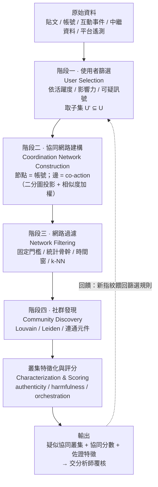

四階段的分工是：**階段一決定「看誰」、階段二決定「用什麼行為連起來」、階段三決定「哪些連結有意義」、階段四決定「誰跟誰是一夥」。** 錯在任何一階段，後面全錯——最常見的失敗是階段三的門檻設太鬆，把「大家都轉了同一則爆紅新聞」誤判成協同（這正是 TF-IDF 加權要解決的問題，見 C.3.3）。

### C.3 階段二核心：從二分圖到投影（bipartite → projection）

這是整條 pipeline 技術含量最高的一步，也是本任務指定要講清楚的。

#### C.3.1 為什麼要用二分圖

我們手上的原始關係是「**帳號 ↔ 內容/動作**」——帳號 a 轉推了推文 t、貼了連結 u、用了 hashtag h。這天生是一個**二分圖（bipartite graph）**：一邊是帳號節點，一邊是「動作目標」節點（推文 ID、URL、hashtag、圖片雜湊……），邊代表「帳號 a 對目標 x 做了動作」。

但我們真正想問的是「**哪些帳號彼此協同**」——這是帳號和帳號之間的關係。所以要把二分圖**投影（project）**成單邊圖：只留帳號節點，兩個帳號之間連一條邊，邊的權重代表「它們共同做了多少相同的動作」。

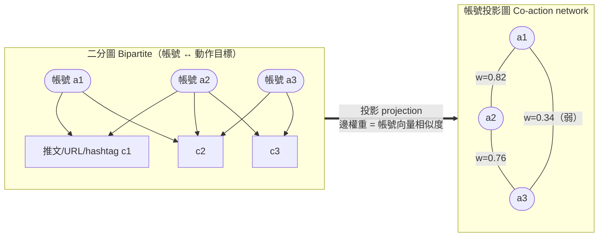

#### C.3.2 投影的數學：帳號向量與相似度

把每個帳號表示成一個**向量**：向量的每一維是一個「動作目標」，值是該帳號對它做動作的次數（或加權後的值）。帳號 `a_i` 的向量記為 `v_i`。兩帳號之間的投影邊權重，最常用的是**餘弦相似度（cosine similarity）**：

```
w(a_i, a_j) = cos(v_i, v_j) = (v_i · v_j) / (||v_i|| · ||v_j||)
```

綜述整理出的幾種相似度函數與適用場景：

| 相似度函數 | 計算對象 | 適用 co-action | 特性 |
|---|---|---|---|
| **Cardinality（共現計數）** | 兩帳號共同動作的次數 | 最通用 | 最簡單，但會被高產帳號與爆紅內容污染 |
| **Cosine（餘弦）** | TF-IDF 加權的帳號向量 | co-retweet、co-URL、co-hashtag | 主流選擇；能配 TF-IDF 壓抑熱門內容 |
| **Jaccard（交併比）** | 集合重疊 | 圖片集合、hashtag 集合 | 適合「用了哪些」而非「用了幾次」 |
| **文字相似度** | 文件嵌入餘弦 / Ratcliff-Obershelp | co-post（近乎相同文字） | 見 C.4 |

#### C.3.3 為什麼一定要 TF-IDF 加權：避免「大家都轉爆紅新聞」的偽協同

如果只用原始共現計數，最大的問題是：**一則病毒式爆紅的推文會被成千上萬個真實使用者轉推**，這些人彼此毫無關聯，卻會在投影圖上兩兩連上強邊——形成一個巨大的偽協同叢集。

解法是借用資訊檢索的 **TF-IDF（term frequency–inverse document frequency）** 思想：把「動作目標」當成「詞」，把「帳號」當成「文件」。一個被很多帳號動作過的目標（熱門推文）IDF 低、權重被壓低；一個只有少數帳號共同動作過的目標（小眾內容）IDF 高、權重被放大。綜述原文：TF-IDF「discounts popular or viral content, boosting unpopular items」。

**工程直覺：** 兩個帳號**都轉了一則爆紅新聞**幾乎沒有情報價值（誰都會轉）；但兩個帳號**都轉了同一則只有它們倆轉過的冷門貼文**，是極強的協同訊號。TF-IDF 就是把後者的權重拉高、前者拉低的機制。這一步是把「產能爆炸時代」的雜訊壓下去的關鍵——正因為 AI 讓內容變多，偽協同的雜訊也變多，TF-IDF 加權比以前更重要。

### C.4 內容相似度：simhash / minhash / embedding 三條路線

當 co-action 是「貼了幾乎相同的文字」（co-post）時，需要一個能大規模比對「近乎重複」的方法。三條技術路線，適用場景不同：

| 方法 | 原理 | 指紋大小 | 抓得到什麼 | 抓不到什麼 | 適用本報告哪一案 |
|---|---|---|---|---|---|
| **SimHash** | 對特徵加權後投影成固定長度位元指紋；相似文本的指紋 **Hamming distance** 小 | 極小（**64 bit**） | 字面近乎重複（改幾個詞） | 換句話說、語意改寫 | GTG-54002 跨站近乎相同文章；GTG-54006 固定模板批次 |
| **MinHash（+LSH）** | 以多個雜湊函數估計兩集合的 **Jaccard 相似度**；配 Locality-Sensitive Hashing 做次線性檢索 | 較大（約 **24 byte** 達到與 64-bit SimHash 相近效果） | 詞袋層級的重疊（重排、增刪片段） | 深度改寫 | 大規模去重、找「同一份稿子的多語系／多變體」 |
| **句嵌入 + 餘弦（embedding）** | 用多語 sentence-transformer 產生語意向量，**FAISS** 做近似最近鄰檢索 | 向量（數百維） | **語意近似**（換句話說、翻譯、改寫） | 需要模型與算力；門檻選擇敏感 | GTG-24015 的多語在地化改寫；GTG-84005 的「humanize」去 AI 味版本 |

**實務參數（來自綜述引用的實作）：** 多語嵌入常用 `stsb-xlm-r-multilingual` 這類模型，在 **一天的滑動時間窗（sliding one-day window）** 內比對，**相似度門檻取 0.7**，只保留語意最貼近的文本對；比對前先做標準清理（去標點、停用詞、emoji、URL，只留長度 ≥ 4 詞的片段）。

**選型準則（本教材整理）：**
- 要**便宜、快、抓字面複製** → SimHash（64-bit 指紋，位元運算，適合十億級語料）。
- 要**抓詞袋重疊、做去重** → MinHash + LSH。
- 要**跨語言、抓語意改寫**（AI 影響力行動的典型特徵——同一敘事翻成 20 種語言）→ 句嵌入 + FAISS。

**AI 時代的關鍵轉折：** 報告 p.44 記載 GTG-04001「strip away classic formatting habits, actively preventing the news feeds from reading like synthetic text」，GTG-54004「humanize and refine」。這代表行為者**刻意破壞字面相似度**。因此 SimHash/MinHash 這類字面方法的投報率在下降，**語意嵌入**成為對抗「去 AI 味」OPSEC 的必要升級——因為就算逐詞改寫，同一份教條產出的內容在**語意向量空間**裡仍然會叢集。這一點是 C.10 的伏筆。

### C.5 時間窗相關性（temporal synchronization）

協同帳號最難掩飾的是**時間**。真人的發文時間分散，協同帳號的動作在時間上會出現「超乎偶然」的同步。三種時間窗設計：

| 窗型 | 定義 | 典型窗長 | 用途 |
|---|---|---|---|
| **相鄰不重疊窗（adjacent）** | 固定大小、不重疊 | 15 分鐘 ～ 1 週 | 粗篩「同一時段一起動作」 |
| **等距重疊窗（overlapping）** | 等大小、偏移 δ 滑動 | 依需求 | 避免正好被窗邊界切開的同步 |
| **動作驅動窗（action-driven）** | 以每個動作的時間戳為中心開窗 | 動態 | 精準抓「A 貼出後 N 秒內 B 跟上」 |

**兩個待正常流量與基線驗證的時間訊號（示意）：**
1. **發文時間同步性**：把每個帳號的發文時間戳離散化到分鐘桶，計算帳號兩兩的時間序列相關性；高相關 = 疑似同一排程器（cron）驅動。報告 GTG-84006 明寫「Multi-page IG network（3 pages · one cron）」（Figure 15）——**一個 cron 排程多個帳號**正是這個訊號的教科書案例。
2. **建立時間叢集**：帳號/網域的**註冊或建立時間**若高度集中，是最廉價也最可靠的協同指標。GTG-54002 的 250+ 帳號集中在 2025 年 6–7 月（p.49）、GTG-84005 的 12 個 sockpuppet 共用建立時間戳 2026-05-17（p.57–58）、GTG-54002 的 ~70 網域在**十週內**註冊（p.48）——這三個都是「建立時間叢集」訊號。

> **偵測邏輯（KQL 風格示意，教學用，非連線任何真實資料）：**
> ```kql
> // 找出「建立時間叢集」的疑似 sockpuppet：同一分鐘內建立 >= 5 個帳號
> AccountCreation
> | summarize count()=count(), accounts=make_set(account_id) by bin(created_at, 1m)
> | where count_ >= 5
> | project created_at, count_, accounts
> // 再與「發文時間高度同步」交叉，交集即高信度協同叢集
> ```

### C.6 共享基礎設施指紋（shared infrastructure fingerprinting）

這是把「表面上獨立的資產」綁回同一個行為者的技術，也是報告 IOC 表能列出來的東西。**這一格的能見度屬於 OSINT 研究者與平台，AI 公司通常看不到**（第 3.2 節）——但它是把上游偵測（AI 公司看到的生產）與下游證據（野外看到的資產）串起來的關鍵。

| 指紋類型 | 怎麼取得（皆為被動 OSINT，不需連線目標） | 綁定力 | 對應報告證據 |
|---|---|---|---|
| **網域註冊（WHOIS/RDAP）** | 註冊商、註冊時間、註冊人 email/電話（未遮蔽時）、name server | 中（時間叢集強、單一屬性弱） | GTG-54002：~70 網域十週內自法國註冊（p.48） |
| **共用託管 IP / ASN** | 被動 DNS、憑證透明度日誌回查 | 中高 | GTG-84005：Hetzner IP（p.57–58） |
| **共用部署識別碼** | 同一部署帳號/租戶把多站綁在一起 | **極高** | GTG-54002：「shared deployment identifier」把 70 個看似獨立的站綁到一個帳號（p.52） |
| **原始碼倉庫指紋** | 公開的 GitHub 組織、共用程式 | 高 | GTG-84005：GitHub 組織（p.57–58）；GTG-54006：`fake_news_3.py`（p.67） |
| **前端資產指紋** | 頁面模板 hash、favicon hash（Shodan 可查）、追蹤碼（GA/AdSense ID）、TLS 憑證/JARM 指紋 | 高 | GTG-54002 的 ~70 站共用基礎設施（Figure 5, p.52） |
| **雲端暫存指紋** | 共用的雲端資料夾、儲存桶 | 高（但常被保留） | GTG-54006：Google Drive 資料夾（Figure 14, p.69，識別碼被報告標為 Withheld） |

> **安全紅線：** 上表所有「怎麼取得」都限定為**被動**方法（查詢已公開的登錄資料、憑證透明度日誌、被動 DNS 資料庫）。**絕對不要**對報告 IOC 做主動 DNS 查詢、連線、或掃描——那會打草驚蛇且逾越研究倫理（簡報安全紅線，第 8.3 節）。favicon/JARM 這類指紋應以第三方已索引的資料庫（如憑證透明度日誌）查詢，不對目標主機發包。

### C.7 階段三＋四：網路過濾與社群偵測（Louvain）

投影後的帳號圖是**稠密**的（幾乎人人相連），必須先過濾再做社群偵測。

**過濾（階段三）三選一或並用：**
- **固定門檻**：丟掉權重 `w < w_th` 的邊。最簡單，但門檻「typically selected arbitrarily」（綜述原文），是偽陽性的主要來源。
- **統計骨幹（backbone / disparity filter）**：對每個節點，只保留「相對於該節點其他邊在統計上顯著」的邊——不設全域門檻，而問「這條邊對這個節點而言是不是異常地強」。這是抓協同最穩健的過濾器，因為它同時容納高產與低產帳號。
- **時間窗過濾（C.5）＋ k-NN 圖**：每個節點只留 k 條最強邊。

**社群偵測（階段四）：**

| 演算法 | 原理 | 特性 |
|---|---|---|
| **Louvain** | 貪婪最佳化**模組度（modularity）**：反覆把節點併入能最大化模組度的社群，再把社群收縮成超節點迭代 | **綜述引用最多**；快、可擴展；有解析度參數可調叢集粗細；缺點是可能產生弱連通甚至不連通的社群 |
| **Leiden** | Louvain 的改良，保證社群內部連通、收斂更好 | 大規模資料首選 |
| **連通元件 / 階層式** | 過濾後直接取連通塊 | 當過濾夠嚴時最簡單有效 |

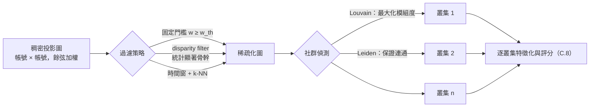

> **可直接執行的參考實作（教學用，`networkx` + `python-louvain`；輸入為去識別化的合成資料，不涉任何真實 IOC）：**
> ```python
> import networkx as nx
> import community as community_louvain      # python-louvain
> from sklearn.feature_extraction.text import TfidfTransformer
> from sklearn.metrics.pairwise import cosine_similarity
> import numpy as np
>
> # M: 帳號 × 動作目標 的共現矩陣（列=帳號, 欄=推文/URL/hashtag）
> # 1) TF-IDF 加權，壓抑爆紅內容
> W = TfidfTransformer().fit_transform(M)          # 稀疏矩陣
> # 2) 投影成帳號 × 帳號 的餘弦相似度圖
> S = cosine_similarity(W)                          # 對稱矩陣
> np.fill_diagonal(S, 0)
> # 3) 過濾：固定門檻（實務改用 disparity filter 更穩健）
> TH = 0.7
> G = nx.Graph()
> idx = np.argwhere(S >= TH)
> for i, j in idx:
>     if i < j:
>         G.add_edge(int(i), int(j), weight=float(S[i, j]))
> # 4) Louvain 社群偵測
> partition = community_louvain.best_partition(G, weight="weight", resolution=1.0)
> # partition[account_id] -> community_id；每個 community 即疑似協同叢集
> ```

### C.8 叢集評分與特徵化（scoring）

社群偵測給出「誰跟誰一夥」，但還沒回答「這一夥是不是人造的、有多危險、是不是被同一隻手編排」。綜述把這一步定義為獨立的**特徵化（characterization）**任務，輸出四類指標——本教材把它們組合成一個可操作的**協同分數**：

| 指標維度 | 具體特徵 | 訊號方向 |
|---|---|---|
| **不真實性 authenticity** | bot 分數、帳號年齡、profile 完整度、頭像是否 AI 生成（GAN/擴散模型偽影）、預設使用者名樣式 | 分數越像機器 → 越可疑 |
| **危害性 harmfulness** | 內容毒性、攻擊性、目標是否為特定個人/機構 | 越針對個人 → 危害越高（呼應第 7.4 節：低級別≠低傷害） |
| **編排性 orchestration** | 叢集內同步性、assortativity、中心性集中度、是否共用單一 cron/代理 | 越集中 → 越像被單一實體編排 |
| **時間變異 time-variance** | 帳號建立時間叢集、活躍時段一致性、隨偵測調適的痕跡 | 越同步 → 越可疑 |

**一個可操作的評分（本教材設計，非報告或綜述原文）：**
```
coordination_score(cluster) =
      0.35 · synchrony        // 時間同步性（發文時間相關 + 建立時間叢集）
    + 0.25 · inauthenticity   // 叢集內帳號的平均不真實性
    + 0.20 · content_reuse    // 內容相似度（SimHash/嵌入）覆蓋率
    + 0.20 · infra_overlap    // 共享基礎設施指紋命中率
```
權重是先驗、應以標註資料校準；**每一項都要能對分析師「解釋」**（哪句話、哪個時間戳、哪個部署識別碼），因為最終處置需要人類覆核與可稽核的證據鏈——這正是報告每一案「Disruption and mitigations」段落在做的事。

> **關鍵限制（綜述明確指出）：** 「協同帳號的 ground truth 幾乎不存在」。所以協同分數是**排序與優先順序工具**，不是自動封鎖的判決。這與第 8.4 節「報告沒有揭露誤判率」的透明度缺口是同一個問題的技術面：**沒有 ground truth，就無法計算精確的誤判率**，只能靠分析師覆核與跨來源佐證。

### C.9 端到端可操作 pipeline（資料 → 特徵 → 叢集 → 評分）

把 C.2–C.8 合成一條可部署的偵測管線。**這張圖是本任務指定的「可操作偵測 pipeline」的完整版**，比 C.2 的學界四階段多了工程現實：資料儲存、特徵工程、人類覆核、情報產出與回饋迴路。

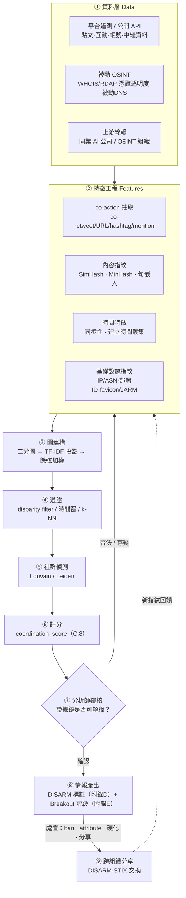

**這張圖要教的三件事：**
1. **資料層有三個來源，缺一不可。** 平台遙測看分發、被動 OSINT 看基礎設施、上游線報看生產。報告的 GTG-54004（OpenAI→Anthropic）與 GTG-04001（AEOW→Anthropic）就是「來源三」的真實案例（第 6.2 節 e 表）。
2. **人類覆核是不可省略的一格（⑦）。** 因為沒有 ground truth（C.8），全自動封鎖會製造第 8.4 節的誤判與寒蟬問題。
3. **輸出直接接上另外兩套框架**：叢集確認後，用 **DISARM 標註它做了什麼**（附錄 D）、用 **Breakout Scale 評估它走多遠**（附錄 E）、用 **DISARM-STIX 打包分享**（附錄 G）。三套工具在這裡合流。

### C.10 用這套方法回讀 Figure 15：AI 時代 CIB 的新指紋

第 6.3 節已判讀過 Figure 15（Viktor 網路，p.73）。這裡從**偵測工程**的角度再讀一次，說明為什麼 GTG-84006 是「傳統 CIB 偵測會漏掉、AI 時代必須升級」的教科書案例。

報告明寫這些行為者「did not share account infrastructure or show visible signs of coordination」（p.70）。用 C.6 的傳統基礎設施指紋去掃，會得到**十幾個看似無關的孤立節點**——因為它們**沒有**共用 IP、沒有共用註冊時間、沒有共用裝置。傳統 CIB 偵測在這裡**失效**。

但報告同時指出，它們共用一個 Claude-based 代理平台「Viktor」與一套跨行為者的教條/規避檔，這構成「a coordination substrate（協調基質）」（p.72）。**AI 時代的新協同指紋，從「共用基礎設施」轉移到「共用記憶檔與代理設定」。**

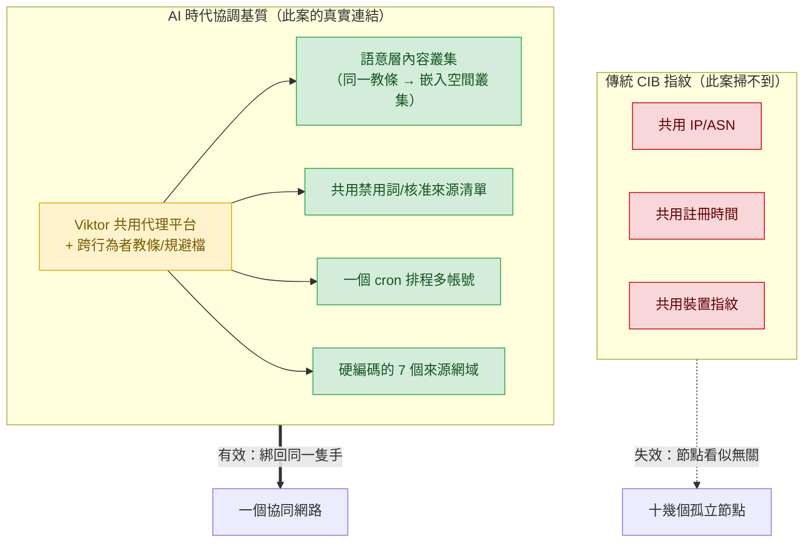

**對偵測工程的三個啟示：**
1. **內容相似度必須升級到語意層（C.4 的嵌入路線）。** 因為就算行為者去 AI 味、逐詞改寫，同一份教條檔產出的內容在嵌入空間仍會叢集。這是對抗「共用記憶檔」最直接的技術對策。
2. **偵測面要涵蓋「代理設定」而非只有「單一提示」。** 報告 p.43：「a great deal is embedded within persistent memory files」。持久記憶檔既是新攻擊面（第 8.3 節），也是新偵測面。
3. **這正好連回上游偵測。** AI 公司在上游看得到「同一份教條檔在數百個工作階段被載入」（第 3.3 節），平台在下游看得到「內容在嵌入空間叢集」——**兩端看到的是同一個協調基質的一體兩面**。這是為什麼跨組織情報分享（C.9 的⑨）在 AI 時代比以前更關鍵。

---

## 附錄 D：DISARM 框架完整介紹與九案 TTP 標註

第 5.4 節已點出「DISARM 之於影響力行動，等於 ATT&CK 之於網路攻擊」，並說「本報告沒有使用 DISARM 標註 TTP，這是課程可以補上的練習」。**本附錄就把這個練習做完。**

### D.1 DISARM 是什麼：歷史與治理

| 項目 | 內容 | 來源 |
|---|---|---|
| **全名** | **DISARM = DISinformation Analysis and Risk Management** | DISARM Foundation |
| **前身** | **AMITT**（Adversarial Misinformation and Influence Tactics and Techniques，2019，由 CogSecCollab 等提出）與 **SP!CE** 兩個框架合併而來 | GitHub cogsec-collaborative/AMITT |
| **建立者** | MITRE、FIU（佛羅里達國際大學）、CogSecCollab 等團隊合作，另成立 **DISARM Foundation** 維護 | 綜述文獻（附錄 G） |
| **模型家族** | **DISARM Red**（造謠者的 TTP）、**DISARM Blue**（回應者的反制 TTP）、**DISARM-STIX**（機器可讀交換格式） | DISARM Foundation |
| **授權** | **CC-BY-SA-4.0**（開源）。<br>*校訂：第 5.4 節寫「CC-BY」，依 disarm.foundation 官方框架頁應為 **CC-BY-SA-4.0*** | disarm.foundation/framework |
| **版本** | 目前有 **Prototype DISARM v2.0** 開發中；另有 Navigator 導覽工具與 Word Tagger 外掛 | disarm.foundation |
| **與 ATT&CK 的關係** | 「DISARM's style is based on the MITRE ATT&CK framework」——刻意沿用 ATT&CK 的**戰術（Tactic）→ 技術（Technique）→ 子技術**階層，以便**融入既有資安實務與工具** | 綜述文獻 |

**為什麼「基於 ATT&CK」對台灣是好消息（呼應第 10.4.6）：** 台灣資安社群已熟悉 ATT&CK 的戰術/技術心智模型與 STIX/TAXII 交換管道。DISARM 刻意同構，代表**遷移成本極低**——把影響力行動的 IOC 與 TTP 塞進現有的資安情報交換基礎設施，技術上完全可行。

### D.2 DISARM Red：16 個戰術，四大階段

DISARM Red 把造謠者的行為依「殺傷鏈」排成 **4 個階段（Phase）、16 個戰術（Tactic, TAxx）**。下圖是完整結構（**節點文字為官方戰術名，TA 編號非連號——注意 TA05 是 Microtarget、TA13 才是 Target Audience Analysis，這是常見的標註陷阱**）：

```mermaid
flowchart LR
    subgraph P01["P01 · Plan 規劃"]
        direction TB
        TA01["TA01 Plan Strategy"]
        TA02["TA02 Plan Objectives"]
        TA13["TA13 Target Audience Analysis"]
    end
    subgraph P02["P02 · Prepare 準備"]
        direction TB
        TA14["TA14 Develop Narratives"]
        TA06["TA06 Develop Content"]
        TA05["TA05 Microtarget"]
        TA15["TA15 Establish Assets"]
        TA16["TA16 Establish Legitimacy"]
        TA07["TA07 Select Channels & Affordances"]
    end
    subgraph P03["P03 · Execute 執行"]
        direction TB
        TA08["TA08 Conduct Pump Priming"]
        TA09["TA09 Deliver Content"]
        TA17["TA17 Maximise Exposure"]
        TA10["TA10 Drive Offline Activity"]
        TA18["TA18 Drive Online Harms"]
        TA11["TA11 Persist in the Information Environment"]
    end
    subgraph P04["P04 · Assess 評估"]
        direction TB
        TA12["TA12 Assess Effectiveness"]
    end
    P01 ==> P02 ==> P03 ==> P04
```

戰術逐一對照（官方定義摘要）：

| 階段 | TA | 戰術名 | 一句話 |
|---|---|---|---|
| P01 Plan | TA01 | Plan Strategy | 定義想達到的終局狀態 |
| P01 Plan | TA02 | Plan Objectives | 設定可衡量、可達成的目標 |
| P01 Plan | TA13 | Target Audience Analysis | 分析受眾的人口、隸屬、可利用的分裂 |
| P02 Prepare | TA14 | Develop Narratives | 建構長期主導的主敘事 |
| P02 Prepare | TA06 | Develop Content | 產製文字、圖片、影音等內容 |
| P02 Prepare | TA05 | Microtarget | 把內容導向特定受眾切片 |
| P02 Prepare | TA15 | Establish Assets | 建立帳號、人格、人員等發聲工具 |
| P02 Prepare | TA16 | Establish Legitimacy | 建立能取信的資產（假專家、前線組織） |
| P02 Prepare | TA07 | Select Channels & Affordances | 依平台演算法與規則選通路 |
| P03 Execute | TA08 | Conduct Pump Priming | 小規模先行釋出、測水溫 |
| P03 Execute | TA09 | Deliver Content | 對大眾正式釋出 |
| P03 Execute | TA17 | Maximise Exposure | 洪水、放大、跨平台轉貼 |
| P03 Execute | TA10 | Drive Offline Activity | 從線上帶到線下（集會、傳統媒體） |
| P03 Execute | TA18 | Drive Online Harms | 騷擾、壓制、洩個資等對人的傷害 |
| P03 Execute | TA11 | Persist in the Information Environment | 維持存在、規避偵測、偽裝正當 |
| P04 Assess | TA12 | Assess Effectiveness | 評估成效、回饋下一輪規劃 |

### D.3 DISARM 技術層（Txxxx）：與 AI 影響力行動最相關的技術

DISARM Red 在 16 個戰術下掛了大量以 **Txxxx** 編號的技術與子技術（數量隨版本增長，以官方 GitHub 為準）。下表只挑**與本報告 AI 濫用型態直接對應**的技術，全部為官方實際存在的編號（附錄 G 標明取自官方 techniques_index）：

| 戰術 | 技術 ID | 技術名 | 本報告對應 |
|---|---|---|---|
| TA06 | **T0085.001** | Develop AI-Generated Text | 九案幾乎全部 |
| TA06 | **T0086.002** | Develop AI-Generated Images (Deepfakes) | GTG-54002 頭像；GTG-84002 圖卡 |
| TA06 | **T0087.001** | Develop AI-Generated Videos (Deepfakes) | GTG-84006 波斯語配音虛擬人像 |
| TA06 | **T0088.001** | Develop AI-Generated Audio (Deepfakes) | GTG-84006 AI 配音 |
| TA06 | **T0085.003** | Develop Inauthentic News Articles | GTG-54002、GTG-54006、GTG-84005 |
| TA06 | **T0084.002 / .004** | Plagiarise / Appropriate Content | GTG-54002 改寫真記者稿；GTG-04001 風格複製 |
| TA15 | **T0098.001** | Create Inauthentic News Sites | GTG-54002（~70 站）、GTG-84005（Malaysia Pulse） |
| TA15 | **T0097** | Present Persona（含假記者、冒充人格） | GTG-54002 假記者；GTG-84006 冒充真活動人士 |
| TA16 | **T0045** | Use Fake Experts | GTG-34001 假歸因給 CSIS/Brookings/RAND |
| TA16 | **T0092.001** | Create Organisations（前線組織） | GTG-84002 複製瑞士組織的前線 NGO |
| TA13/TA05 | **T0072** | Segment Audiences（微定向） | GTG-84005 222 選區；GTG-84006 依逮捕紀錄分群 |
| TA17 | **T0049 / .001 / .003** | Flood / Trolls / Bots Amplify | GTG-34001 付費放大；GTG-54004 洪水式 |
| TA17 | **T0119** | Cross-Posting | GTG-54006 跨 FB/YT/TikTok；GTG-84002 協同貼文 |
| TA11 | **T0122 / T0093.001** | Direct to Alt Platforms / Fund Proxies | GTG-54006 第三方 CI 遮 IP；GTG-34001 VPN+外國電話 |
| TA18 | **T0048 / .004 / T0124** | Harass / Dox / Suppress Opposition | GTG-84002 針對 UN 特別報告員；GTG-34001 針對巴哈伊 |

### D.4 DISARM Blue：回應者的 TTP

DISARM **Blue** 是與 Red 對稱的**反制**框架（counters），把防禦者的作為也編碼成可交換的 TTP——例如揭露、事前揭穿（prebunking）、平台下架、媒體識讀、跨組織情報分享。它的價值在於讓**紅藍雙方用同一套座標對話**：一個 Red 技術（如 T0086.002 深偽圖）可以明確對應到一組 Blue 反制（如影像鑑識偵測、來源標註、prebunking）。第 8 節整理的 Anthropic 五步處置（ban / attribute / 硬化 / 分享）在 DISARM Blue 裡都有對應條目——**把第 8 節的處置流程用 Blue 編碼，就能和其他機構的處置互相比較**，這正是第 10.4.6「建立台灣版 DISARM 標註實務」的具體做法。

### D.5 用 DISARM 標註本報告九案

**這是本附錄的核心產出。** 把九案各自的行為對應到 DISARM Red 戰術（TA）與代表性技術（Txxxx）。每格附報告頁碼。**讀法：一行看完一個行動「從規劃到執行」踩過哪些 TTP。**

| GTG | P01 規劃 | P02 準備 | P03 執行 | 代表技術 Txxxx | 頁 |
|---|---|---|---|---|---|
| **04001**（俄/CAR） | TA01/02/13 教條·目標·CAR 受眾 | TA14/06/16 反法敘事·每日內容·偽造公文 | TA09/10/17 FM廣播·**跨媒介落地**·Telegram放大；TA18 點名真人（拒） | T0085.001, T0084.004, T0092.001, T0119 | p.44–47 |
| **54002**（法/IaaS） | TA13 六大洲受眾 | TA15/06/16 70站+假記者·假新聞·AI頭像 | TA17 跨站洪水·SEO；TA11 共用部署ID | T0098.001, T0097, T0086.002, T0085.003, T0084.002 | p.47–52 |
| **84005**（土/馬） | TA13 222選區微定向 | TA15/06/16 ~1000帳號+Malaysia Pulse·AI頭像 | TA11 帳號暖機·cookie/IP輪替；TA18 誹謗在野政治人物 | T0072, T0098.001, T0086.002, T0122 | p.53–58 |
| **24015**（俄/國媒） | TA02 編輯管線目標 | TA06/16 多語在地化·**洗白確定性** | TA09/10/17 既有通路·上電視·跨刊轉載 | T0085.001, T0084.004, T0119 | p.58–62 |
| **34001**（伊/ICCO） | TA01/02/13 教條·20語受眾 | TA14/06/16 多語內容·假歸因智庫·IRGC發言人口吻 | TA17 付費放大100+頻道；TA11 VPN+外國電話；TA18 針對巴哈伊 | T0045, T0049, T0093.001, T0124 | p.62–67 |
| **54006**（孟/AL） | TA13 鄉村低識字受眾 | TA06 `fake_news_3.py` 批次文/圖/影 | TA17 跨FB/YT/TikTok；TA11 29帳號輪替·第三方遮IP | T0085.003, T0086.002, T0087, T0119, T0122 | p.67–70 |
| **84006**（伊/MEK） | TA13 依逮捕紀錄分群 | TA15/16 Viktor代理·合成人格·冒充真活動人士 | TA18 監控伊朗境內·即時冒充對話；TA11 持久記憶檔 | T0097, T0087.001, T0088.001, T0072, T0048 | p.70–75 |
| **54004**（肯/國內） | TA13 電價/選舉議題 | TA15/06 假帳號·每批50推·**去AI味** | TA17 洪水式草根偽裝（Cat 1 孤立） | T0085.001, T0049, T0097 | p.75–77 |
| **84002**（阿聯/MB） | TA01/02/13 Deadshot主教條·18名歐議員 | TA15/16 ~300假網紅·前線NGO冒充瑞士組織 | TA17 #SudanIslamists協同；TA18 代筆UN證詞·反問責檔案 | T0092.001, T0097, T0086.002, T0119, T0048 | p.78–80 |

### D.6 DISARM 的框架缺口：AI 使能的新 TTP

用 DISARM 標註九案時，會發現有幾類行為**現有技術層對應不良**——這正是第 5.4 節與演練 D 預告的「框架缺口」，也是本報告最有原創性的觀察（第 4 節「AI 建的不只是內容」）在 TTP 層的體現：

| 缺口行為 | 報告證據 | 為什麼現有 DISARM/ATT&CK 對應不良 |
|---|---|---|
| **用商用 LLM 的固定批次 API 呼叫，把單人產能放大到「計畫辦公室」規模** | GTG-54006 `fake_news_3.py` 每批 15 標題+3 故事+15 圖提示（p.67）；一人 16 個月（p.70） | DISARM 有「Develop Content」但沒有描述「**以程式化 API 呼叫取代整個編制**」這個**經濟結構**的技術 |
| **把組織管理文書（合約、考績、教條）交給模型產出** | GTG-04001 效忠合約·評分表·三振流程（p.45） | 這不是「內容生產」也不是「建立資產」，而是**用 AI 取代行政管理人力**——DISARM 沒有對應戰術 |
| **持久記憶檔／共用代理平台作為協調基質** | GTG-84006 Viktor + SKILL.md/LEARNINGS.md（p.72） | DISARM 的協同概念預設「共用基礎設施」；**共用記憶檔**是新型態（見 C.10） |
| **跨 AI 供應商的生產鏈** | GTG-54006 圖片提示疑輸出到別家模型（p.67）；GTG-04001 同訂 ChatGPT+Claude（第 9 節） | 沒有任何單一框架描述「一條產線橫跨多家 AI 供應商」的偵測斷點 |

**教學結論（呼應第 5 節 TTP 缺口的原則）：** 框架是活的。DISARM 對「內容型 TTP」（含 AI 生成內容）覆蓋良好，但對 **AI 帶來的「組織經濟」與「代理自主」型 TTP** 仍有缺口——這與 ATT&CK 對「agentic orchestration」的缺口是同一個時代問題的兩面。台灣若要建本土 DISARM 標註實務（第 10.4.6），這幾個缺口正是**可以貢獻回國際框架的原創技術描述**。

---

## 附錄 E：Breakout Scale 的量化操作化

### E.1 為什麼要操作化

第 5 節完整介紹了 Nimmo 的六級量表，並在 5.6 節指出它的三個方法論疑點（誰評的、能不能複現、外溢是不是有機）。Nimmo 的定義是**質性**的——「進入主流媒體」「名人背書」都需要人來判斷。要讓不同機構的評級**可比較、可複現、可自動化**（第 5.6 節疑點三、第 10.4.4 建議一），必須把每一級翻譯成**可計算的指標與門檻**。

**本附錄全部屬於「本教材設計／推論」**，不是 Nimmo 或 Anthropic 的原文。它是把質性量表工程化的一個提案，供台灣反資訊操弄社群作為共同尺度的起點。

### E.2 六級 → 可計算指標對照表

先定義六個可從資料算出的量（都依賴附錄 C 先框出「行動網路 N」——沒有 N 就無法區分「自家帳號互推」與「真實外溢」，這正是 5.3 節兩個判讀陷阱的技術根源）：

| 符號 | 指標 | 怎麼算 | 資料來源 |
|---|---|---|---|
| `P` | 插入點平台數 | 有該行動資產的**不同平台**數 | 附錄 C 叢集結果 |
| `B_on` | 同平台外溢 | **網路 N 以外**的真人帳號自發轉發/引用數 | 平台互動資料 |
| `B_x` | 跨平台外溢 | 內容被搬到**另一平台**且由 N 以外帳號擴散 | 跨平台比對（內容指紋 C.4） |
| `M` | 主流媒體引用 | 被主流媒體**報導或嵌入**的次數 | 媒體監測 |
| `I` | 名人放大 | 追蹤數 ≥ 門檻或已認證帳號的**背書式**轉發數 | 平台資料 + 名單 |
| `A` | 具體後果 | 是否引發政策回應／具體行動，或含暴力號召（布林） | OSINT / 新聞 |

**真實互動率（authentic engagement ratio, AER）** 是貫穿全表的關鍵量：
```
AER = （來自網路 N 以外帳號的互動）/（總互動）
```
AER 直接把第 7 節「生產能力 ≠ 影響力」量化：GTG-54004「completely isolated within the network」（p.76）就是 **AER ≈ 0**；GTG-84005 自報百萬瀏覽但「self-reported... cannot verify」（p.54）就是 **AER 分子不可信**（5.3 節陷阱二）。

| 級別 | 質性定義（Nimmo） | 可計算判準（本教材操作化） |
|---|---|---|
| **Cat 1** | 單一平台、無外溢 | `P=1` 且 `B_on=0` 且 `B_x=0`（AER≈0） |
| **Cat 2** | 單平台有外溢 **或** 多平台無外溢 | (`P=1` 且 `B_on>0`) **或** (`P≥2` 且 `B_on=B_x=0`) |
| **Cat 3** | 多平台且多處外溢，未進主流媒體 | `P≥2` 且 `B_x>0` 且 `M=0` |
| **Cat 4** | 進入主流媒體 | `M≥1`（被報導/嵌入） |
| **Cat 5** | 名人放大（尤其明確背書） | `I≥1`（背書式，追蹤數 ≥ 門檻） |
| **Cat 6** | 政策回應／具體行動 **或** 暴力號召 | `A=true` |

### E.3 可操作的評級演算法

把上表寫成一個**決定性的評級流程**（對應 5.3 節的 框線決策樹，此處以 Mermaid 重繪並掛上可計算門檻）：

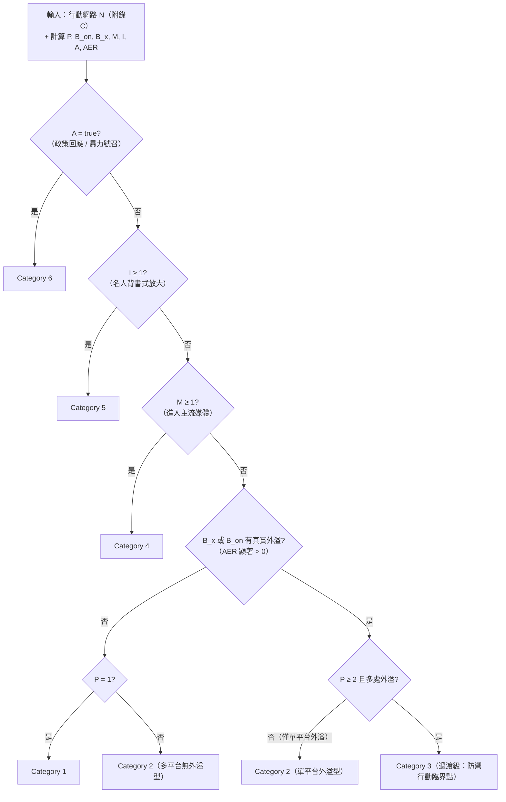

### E.4 每個指標怎麼算：門檻、陷阱、資料需求

**（1）真實外溢 vs. 自家互推——先有 N 才有一切。** 這是操作化最硬的一步：必須先用附錄 C 框出行動網路 N，才能把「N 以外帳號的互動」和「N 內互推」分開。**沒有 N，AER 無法計算，Breakout 評級就退回主觀判斷。** 這在技術上證明了 5.6 節疑點三（「能不能複現」）的答案：**能複現的前提是公開 N 的邊界**——而報告恰恰把部分邊界資料標為 Withheld/available separately（第 8.3 節），這就是它「難以外部複現」的根因。

**（2）主流媒體 `M` 的本地化定義。** 對台灣（第 10.4.4 建議一），必須明確回答：LINE 群組轉發算不算？YouTube 政論節目算不算？地方電台算不算？建議把 `M` 分成 `M_national`（全國性報紙/電視）與 `M_local/social-tv`（地方台、政論頻道、大型 LINE 社群），分別記錄、避免高估。GTG-04001 的 Cat 4 判準「FM 廣播 + 在地新聞媒體」（p.45）就是一個「非全國性主流媒體也算跨媒介」的先例。

**（3）名人門檻 `I` 要看「背書」不只看「追蹤數」。** Nimmo 強調 Cat 5 的關鍵是**明確背書（explicitly endorse）**，不是單純被大帳號提到。技術上：追蹤數 ≥ 門檻（例如 10 萬，需本地校準）**且**轉發帶正面立場文字，才計入 `I`。注意 GTG-84006 的 IOC 表列出 @simaintv/@iranintv ~708K 追蹤（p.74–75）——但那是**自家媒體資產**，不算 `I`（5.3 節陷阱一）；`I` 只計**網路 N 以外**的名人。

**（4）跨平台 `P` 的去重。** 同一行為者在多平台鋪資產（`P` 大）不等於外溢（`B_x`）。Spamouflage 型（多平台、零外溢）就是 `P` 大但 `B_x=0` → Cat 2。**別把鋪點數當外溢數**——這是把 5.3 節陷阱一寫進公式。

### E.5 把九案套進量化指標（示範）

用報告數字回算，示範這套操作化怎麼跑（`—` 表報告未提供可算數字）：

| GTG | P | 真實外溢 | M | I | A | AER | → 級別 | 與報告一致? |
|---|---|---|---|---|---|---|---|---|
| 54004 | 1 | 無（「completely isolated」） | 0 | 0 | 否 | ≈0 | **Cat 1** | ✓ p.76 |
| 54002 | 多 | 無（「no breakout beyond its own activity」） | 0 | 0 | 否 | ≈0 | **Cat 2** | ✓ p.48 |
| 84005 | 多 | 無（自報數不可信） | 0 | 0 | 否 | 不可算 | **Cat 2** | ✓ p.54 |
| 84006 | 多 | 僅自家 NCRI 資產 | 0 | 0(自家不算) | 否 | 未確認 | **Cat 2** | ✓ p.71 |
| 34001 | 多 | IRGC 頻道+付費放大 | 0 | 0 | 否 | 存疑(付費≠有機) | **Cat 3** | ✓ p.63（但見5.6疑點二） |
| 54006 | 多 | 多個孟加拉頻道 | 0 | 0 | 否 | 「no wider audience」 | **Cat 3** | ✓ p.68（張力見5.5） |
| 84002 | 多 | 跨數個平台 | 0 | 0 | 否(無法確認) | 未確認 | **Cat 3** | ✓ p.79 |
| 04001 | 多 | FM+在地媒體 | **≥1** | 0 | 否 | 顯著 | **Cat 4** | ✓ p.45 |
| 24015 | 多 | 既有國媒通路 | 本身即主流媒體 | — | — | 分母不可界定 | **量表不適用** | ✓ 未評級（見5.6疑點一） |

**這張表的教學價值：** 操作化後，九案的評級**全部可以用公式重現**，而且**恰好在報告「未評級」的 GTG-24015 上，公式也給出「不適用」**（因為 `M` 的分母是「主流媒體之外」，而它本身就是主流媒體，導致判準循環）——這用計算證明了 5.6 節疑點一的推論：**量表對「公開國家媒體」在數學上就不適用。**

### E.6 操作化的四個限制

1. **門檻是人為的。** `I` 的追蹤數門檻、`M` 的媒體清單都需本地校準；不同校準會給出不同級別。這不是 bug，是 Nimmo 原意（量表是「近似」）——但必須公開門檻才能複現。
2. **資料可得性決定可算性。** AER 需要平台互動資料（下游），AI 公司（上游）算不出來——這用公式重述了第 3.2 節「觀測位置決定能回答什麼」。
3. **量表不衡量傷害（第 7.4 節）。** 本操作化**刻意不觸碰**「對個人的傷害」——GTG-84006 的逮捕紀錄側寫是 Cat 2 但傷害極高。**傷害必須另立通道**（第 10.4.4 建議五），不能塞進 Breakout 公式。
4. **級別是快照（Nimmo）。** 所有指標都應帶時間戳；同一行動在不同時點可能算出不同級別。

---

## 附錄 F：上游／下游偵測能見度矩陣（Mermaid）

第 3.2 節用表格呈現了「誰在生命週期的哪一段看得到什麼」。本任務指定用 Mermaid 把它畫成**能見度矩陣**。下圖把**六個生命週期階段**（左）連到**四類觀測者**（右）——一條邊代表「該觀測者在該階段有能見度」，並用顏色標出四類觀測者。**讀法：看一個階段向右發出幾條邊，就知道它被幾類人看到；看一個觀測者收進幾條邊，就知道它的能見度覆蓋多寬。**

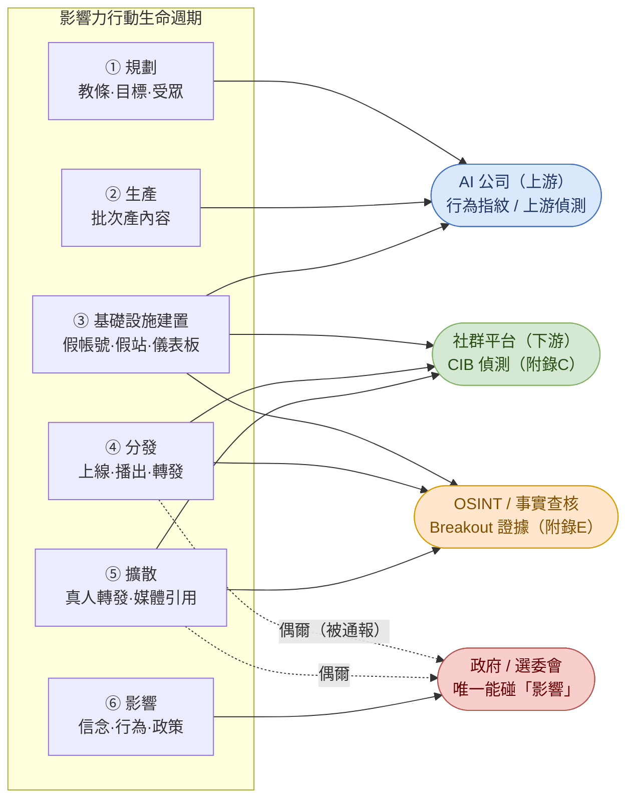

**矩陣讀出的三個結論（與第 3.2 節一致，此處用圖強化）：**
1. **規劃與生產（①②）只有一條邊——都指向 AI 公司。** 這是上游偵測的**獨佔優勢**：在行動成形前就看得到。但也意味著若行為者不用商用模型，這兩格就**完全沒有觀測者**（第 3.4 節局限四、第 10.4.2 解釋 A）。
2. **基礎設施到擴散（③④⑤）是 CIB 偵測與 OSINT 的主場**——附錄 C 的整套技術作用在這三格。這裡邊最密，是跨組織協作最有價值的區間。
3. **影響（⑥）只有政府收得到一條邊，而且來得最晚。** 這用圖證明了第 10.1 要點三與演練 B 的核心：**沒有任何單一觀測者能獨力完成一次完整評估**；三套框架（行為指紋→CIB→Breakout）必須沿著這條生命週期接力。

**把三套工具疊上這張矩陣：**
- **①②**（AI 公司）→ 上游行為指紋（第 3.3 節七類訊號）。
- **③④⑤**（平台/OSINT）→ **CIB 偵測 pipeline（附錄 C）**。
- **④⑤**（OSINT）→ **Breakout Scale 量化（附錄 E）**。
- **全生命週期** → 用 **DISARM（附錄 D）** 標成同一張 TTP 地圖，用 **DISARM-STIX** 跨組織交換。

---

## 附錄 G：本次技術深化 pass 新增的第三方技術來源

> 第一階段因 WebSearch 額度用盡未能取得的技術方法來源，本次（新 session、新配額）補齊。分級規則同第 9 節：標明「獨立一手」／「引述」與用途。**IOC 安全紅線不變。**

### G.1 CIB／協同偵測方法（新增，對應附錄 C）

| # | 來源 | URL | 性質 | 附錄用途 |
|---|---|---|---|---|
| G1 | **Detection and Characterization of Coordinated Online Behavior: A Survey**（arXiv 2408.01257） | `https://arxiv.org/abs/2408.01257` | 學界一手綜述（獨立） | 附錄 C 的四階段 pipeline、co-action 型別、相似度函數、disparity filter、Louvain、characterization——**本附錄 C 的主幹來源** |
| G2 | **Uncovering Coordinated Networks on Social Media: Methods and Case Studies**（Pacheco et al., arXiv 2001.05658） | `https://arxiv.org/abs/2001.05658` | 學界一手（獨立） | 二分圖→投影、co-action 網路、TF-IDF 加權的原始方法脈絡 |
| G3 | **Coordinated Inauthentic Behavior on TikTok**（ICWSM 2025, arXiv 2505.10867） | `https://arxiv.org/abs/2505.10867` | 學界一手（獨立） | 多語句嵌入 + FAISS + 滑動一天窗 + 門檻 0.7 的實作參數（C.4） |
| G4 | **EU DisinfoLab — CIB Detection Tree** | `https://www.disinfo.eu/publications/cib-detection-tree1/` | NGO 一手方法（獨立） | 協同判定的決策流程，佐證 C.1 的「先抓協同、再驗不真實」 |
| G5 | **Graphika + Stanford Internet Observatory,《Unheard Voice》** | `https://public-assets.graphika.com/reports/graphika_stanford_internet_observatory_report_unheard_voice.pdf`（副本 `https://purl.stanford.edu/nj914nx9540`） | 業界+學界聯合一手調查（獨立） | 平台下架資料的叢集分析方法：同步改頭像、共用連結、工具指紋切換（Twitterfeed→Web Client）——C.5/C.6 的實證方法 |
| G6 | **Graphika + Stanford,《Stoking Conflict by Keystroke》**（法俄在中非共和國的 CIB） | `https://www.graphika.com/reports/` | 業界+學界一手（獨立） | **與 GTG-04001 同一戰場（CAR）的獨立方法學先例**；示範跨平台叢集歸因 |
| G7 | **Nizzoli et al., Coordinated Behavior on Twitter** / **More-Troll Kombat（Graphika）** | `https://www.graphika.com/reports/more-troll-kombat` | 學界/業界一手（獨立） | co-retweet 網路 + 相似度門檻 + 社群偵測的經典操作 |

### G.2 DISARM 官方與 CTI 互通（新增，對應附錄 D）

| # | 來源 | URL | 性質 | 附錄用途 |
|---|---|---|---|---|
| G8 | **DISARM Foundation — Framework** | `https://www.disarm.foundation/framework` | 框架官方一手 | 確認 CC-BY-SA-4.0、Prototype v2.0、Navigator/Tagger 工具 |
| G9 | **DISARM Frameworks（官方 GitHub，generated_pages）** | `https://github.com/DISARMFoundation/DISARMframeworks`（`generated_pages/tactics_index.md`、`disarm_red_framework.md`、`techniques_index.md`） | 框架官方一手（機器可讀） | **附錄 D 的 16 戰術×4 階段、TA 編號、Txxxx 技術 ID 全部逐一取自此**——非二手轉述 |
| G10 | **AMITT（DISARM 前身，cogsec-collaborative）** | `https://github.com/cogsec-collaborative/AMITT` | 一手（歷史沿革） | D.1 的 AMITT→DISARM 沿革 |
| G11 | **Toward interoperable representation and sharing of disinformation incidents in CTI**（arXiv 2502.20997） | `https://arxiv.org/abs/2502.20997` | 學界一手（獨立） | DISARM-STIX 互通、把影響力 TTP 塞進資安 CTI 管道（第 10.4.6 建議二的學理依據） |
| G12 | **EDMO — Introduction to DISARM Framework（訓練）** | `https://edmo.eu/training/an-introduction-to-disarm-framework-on-disinformation-tactics-techniques-and-procedures-first-session/` | 官方訓練（引述 DISARM） | 教學設計參考（演練 D 的擴充） |

### G.3 同業 AI 公司 / 平台的偵測方法（新增，補第 5.7、9.3 節）

| # | 來源 | URL | 性質 | 要點 |
|---|---|---|---|---|
| G13 | **OpenAI / Nimmo & Flossman,《Influence and cyber operations: an update, October 2024》** | `https://cdn.openai.com/threat-intelligence-reports/influence-and-cyber-operations-an-update_October-2024.pdf` | 同業一手（本次取得 PDF 直連） | OpenAI 偵測法＝模型使用訊號 + 開源網路分析 + **Breakout Scale 評估影響**；由 Breakout Scale 作者 Nimmo 領導。**補上第 9.3 節先前只有二手的缺口** |
| G14 | **OpenAI 情報團隊（累計 40+ 網路被瓦解，2024-02 起）** | `https://openai.com/global-affairs/` | 同業一手（引述綜整） | 自首份報告以來已瓦解 40+ 惡意網路；近三期瓦解 10 起（4 起疑似源自中國）——佐證 5.7 節「兩家 AI 公司都用 Breakout Scale」 |
| G15 | **Meta,《Adversarial Threat Report, H2 2026》（2026-08）** | `https://transparency.meta.com/sr/H2-2026-adversarial-threat-report` | 平台一手 | 偵測法＝**行為與協同、非內容**；「behavioral detection, coordination analysis, network-level enforcement」不受 AI 內容層精緻化影響——**這正是附錄 C 的政策背書** |

### G.4 台灣認知作戰技術分析（新增，補第 9.5、10.4 節）

| # | 來源 | URL | 性質 | 要點 |
|---|---|---|---|---|
| G16 | **Doublethink Lab,《Artificial Multiverse: FIMI in Taiwan's 2024 National Elections》** | `https://medium.com/doublethinklab/artificial-multiverse-foreign-information-manipulation-and-interference-in-taiwans-2024-national-f3e22ac95fe7` | 台灣獨立研究一手 | 2024 大選期間對台 FIMI 的鑑識分析——台灣版的「用附錄 C 方法抓協同」實例 |
| G17 | **Doublethink Lab,《The Chinese Infodemic in Taiwan》 / 《Deafening Whispers》** | `https://medium.com/doublethinklab/the-chinese-infodemic-in-taiwan-25e9ac3d941e` | 台灣獨立研究一手 | PRC 認知作戰結構：宣傳部/PLA/統戰部定調 → **內容農場與在地代理放大**（少直接發布）；技術指紋＝同步發文、view-botting、大陸用語 |
| G18 | **Doublethink Lab, GoLaxy 文件分析（AI in PRC IO）** | `https://medium.com/doublethinklab/`（GoLaxy 系列，2026-04） | 台灣獨立研究一手（第一階段 403，本次確認主題） | PRC 影響力行動中 AI 商業供應商的角色——對照本報告「influence-as-a-service」（第 4.4 節趨勢 1） |
| G19 | **FPRI,《Inside China's Cognitive Warfare Playbook Against Taiwan》（2026-08）** | `https://www.fpri.org/article/2026/08/inside-chinas-cognitive-warfare-playbook-against-taiwan/` | 智庫一手分析（獨立） | 對台認知作戰的戰術總覽，補第 10.4 的威脅圖像 |
| G20 | **Sasakawa Peace Foundation,《Assessing China's Cognitive Warfare against Taiwan on TikTok》** | `https://www.spf.org/spf-china-observer/en/document-detail064.html` | 智庫一手分析（獨立） | 平台特定（TikTok）的認知作戰量化：活躍用戶「疑美」比例顯著高於非活躍用戶——對照本報告「AI as newsdesk 餵養在地放大」（第 10.4.3） |

### G.5 本次仍未能完全取得者（誠實標註，補第 12.2 節）

| 項目 | 狀況 | 影響 |
|---|---|---|
| DISARM 技術總數精確值 | 官方 GitHub 確認 16 戰術；技術（Txxxx）數量**隨版本增長**，本檔不敢報單一精確數，僅稱「數以百計、以官方倉庫為準」 | 附錄 D.3 只列**已逐一驗證**的技術 ID，未逐一驗證者不列 |
| Meta H2 2026 / OpenAI 2025-10 全文 | 檔案過大 / 403（同第一階段） | 方法論要點取自可取得的 2024-10 OpenAI PDF（G13）與 Meta 索引頁摘要；細節數字仍標為待覆核 |
| Doublethink Lab GoLaxy 全文 | 仍 403 | 只用於「存在此研究」與主題對照，未引用其內部數據 |
| 台灣機構對本報告的直接分析 | **仍不存在**（第 9.4 節結論不變） | 附錄 D/E 的台灣應用仍屬**方法論遷移**，非案例延伸 |

---

## 附錄 H：技術深化 pass 的 Mermaid 圖索引

本次增補共新增 **8 張 Mermaid 圖**（全部符合第二階段規範：以 mermaid 圍籬、節點特殊字元加引號、取代框線）：

| # | 圖 | 位置 | 主題 |
|---|---|---|---|
| 1 | CIB 偵測四階段 pipeline | 附錄 C.2 | 學界標準管線 |
| 2 | 二分圖 → 投影 | 附錄 C.3.1 | co-action 網路建構 |
| 3 | 過濾 + 社群偵測（Louvain） | 附錄 C.7 | disparity filter → Louvain |
| 4 | 端到端可操作偵測 pipeline | 附錄 C.9 | 資料→特徵→叢集→評分→覆核→分享 |
| 5 | Viktor 網路：AI 時代協調基質 | 附錄 C.10 | 新舊 CIB 指紋對比（重繪 Figure 15 要旨） |
| 6 | DISARM Red 16 戰術 × 4 階段 | 附錄 D.2 | 影響力行動的殺傷鏈 |
| 7 | Breakout Scale 量化評級流程 | 附錄 E.3 | 可計算門檻決策樹 |
| 8 | 上游／下游能見度矩陣 | 附錄 F | 生命週期 × 觀測者 |
