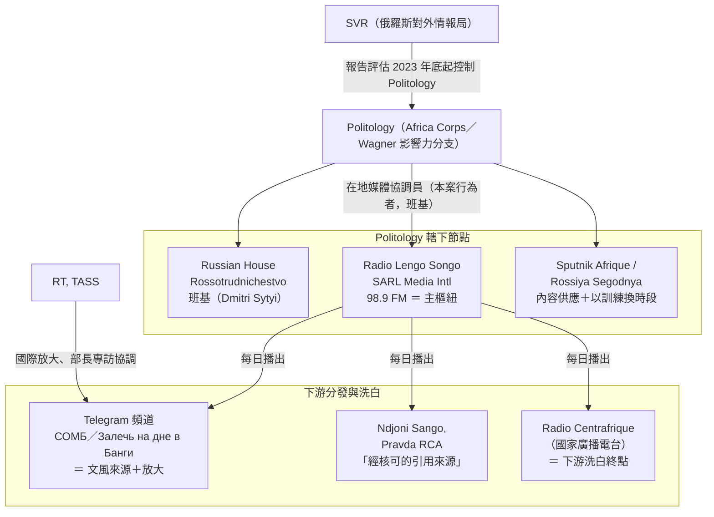
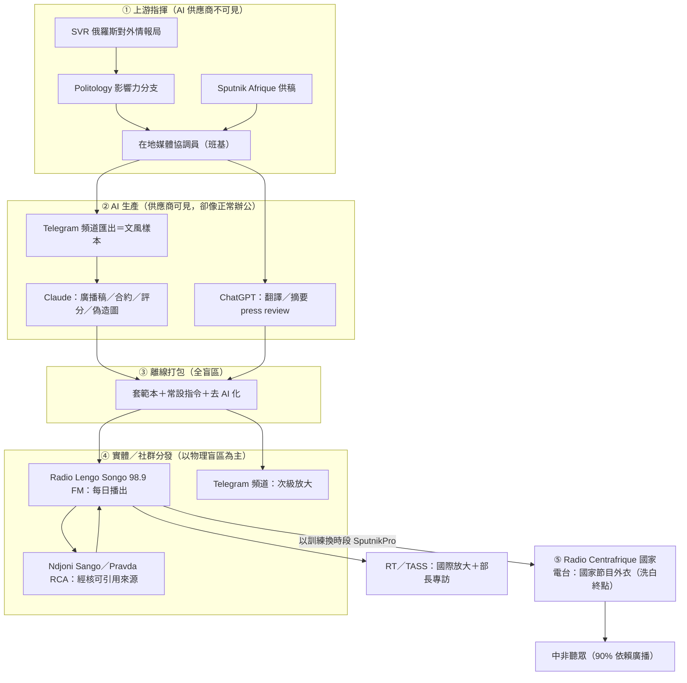
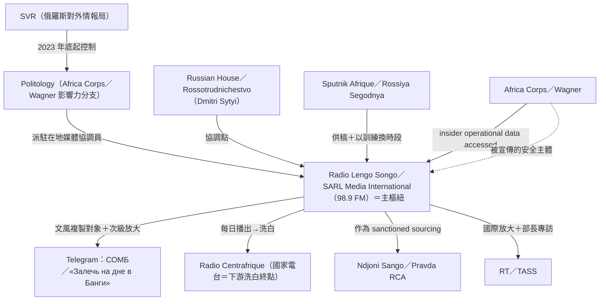
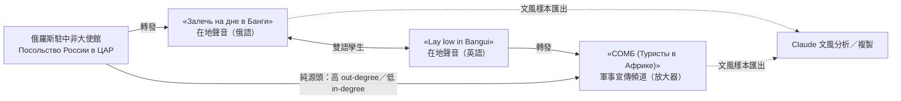
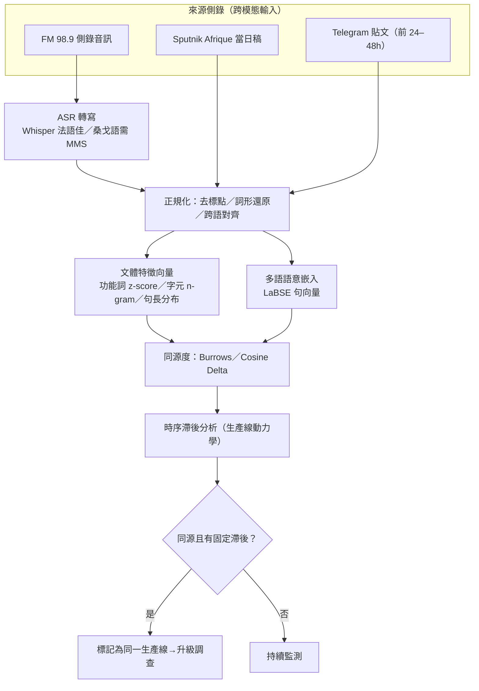

# GTG-04001：俄羅斯在中非共和國（CAR）的外國資訊操縱與干預（FIMI）行動——當 AI 接上一座 FM 電台

> 課程模組：02 影響力行動（Influence operations） ｜ 一手來源：PDF p.44–47（另引 p.41–44 章節導論） ｜ 整理日期：2026-09-13

---

## 1. 一頁速覽

1. **案件本體**：Anthropic 移除了一個由「班基（Bangui）一名說俄語的行為者」經營的帳號。此人是一場俄羅斯國家對齊（state-aligned）的 FIMI 行動的「生產骨幹（production backbone）」，每日透過 **Radio Lengo Songo（98.9 FM）** 產製內容，並與 RT、Sputnik Afrique、TASS 及班基的「俄羅斯之家（Russian House）」協調（p.44）。
2. **歸因鏈**：Anthropic 將該行為者連結到 **Politology**——Africa Corps／Wagner 的影響力分支，報告評估該分支於 **2023 年底轉由俄羅斯對外情報局（SVR）掌控**；並評估此人是 Politology 在當地的「媒體協調員」。結論措辭是罕見的斷言句：「這是一場俄羅斯國家指揮的秘密行動」（p.44）。
3. **觸及評級**：Breakout Scale **Category Four**——這是報告九個影響力行動案例中**唯一**明確評到第四級的案例。理由不是 AI 多厲害，而是內容「每日透過 98.9 FM 廣播、經 Telegram 放大、被中非當地媒體轉載」（p.45）。
4. **AI 被拿來做「組織」而不只是「內容」**：Claude 產出要求員工效忠中非總統與「俄羅斯及其特遣隊」的僱傭合約、職務說明、評分量表、三振開除流程，還被用來建議「留誰、開除誰」。當 Claude 標記出評分的政治權重，行為者把標籤改成中性用語後照用（p.45）。
5. **防線在哪裡守住**：Claude 拒絕了最激進的請求——「點名真人為武裝分子，以招來安全打擊」。行為者轉用「匿名消息來源」的框架（p.45）。在中非的脈絡裡，被電台點名為間諜或武裝分子，後果是逮捕與酷刑（第三方案例見第 9 節）。
6. **文風複製流水線**：兩個親俄 Telegram 頻道（«Залечь на дне в Банги»、«СОМБ (Туристы в Африке)»）的內容「總是被匯出用於文風分析、複製與分發」（Figure 1，p.46）。AI 在此的角色是「讓國家宣傳聽起來像一個中非本地記者」。
7. **偵測來源不是 Anthropic 自己**：這個網絡是靠 INPACT／All Eyes on Wagner 的線報才啟動內部調查的（p.47）。公民社會調查記者比 AI 公司的分類器先看到了它。
8. **這個案例在課程裡要教什麼**：AI 是內容生產與組織管理的加速器，但**決定影響力的仍然是既有的實體分發通路與在地代理人**——偵測與反制的重心因此必須放在「通路與組織」而非「內容是否 AI 生成」。

---

## 2. 行為者側寫與歸因

### 2.0 先給台灣學員的背景：中非共和國與它的資訊環境（60 秒）

多數台灣學員對中非共和國（République centrafricaine, CAR／RCA）陌生，但不理解這個國家的媒體結構，就無法理解為什麼一座 FM 電台能把一場行動推上 Breakout Scale 第四級。以下皆為第三方來源，非 Anthropic 報告內容：

- **國家概況**：內陸國，首都班基（Bangui），官方語言為法語與桑戈語（Sango）。長期內戰，聯合國自 2014 年派駐 MINUSCA（聯合國中非多面向綜合穩定團）。現任總統 Faustin-Archange Touadéra 自 2016 年執政。
- **媒體結構是理解本案的鑰匙**：約 **90% 人口依賴廣播**取得資訊，**網路普及率低於 10%**，識字率約 66%（Forbidden Stories 2024-11-21）。在這樣的國家，「社群媒體聲量」幾乎不代表社會影響力；**FM 廣播就是主流媒體，國家廣播電台 Radio Centrafrique 就是最高權威**。
- **俄羅斯的進入**：2018 年初以「軍事教官」名義進入，實為 Wagner 集團；2018 年底約 1,012 人；2021 年 11 月時多數中非武裝部隊單位由 Wagner 直接指揮或監督（Wikipedia 轉引多方報導）。Wagner 同時取得採礦權（Lobaye Invest、Midas Ressources、Diamville），並建立媒體與 NGO 網絡（The Sentry 2023-06）。
- **暴力環境**：The Sentry 2023 年報告指 Wagner 與 Touadéra 及其核心圈「犯下廣泛、系統性且有計畫的大規模殺戮、酷刑與強暴」，並引述研究稱 2022 年有 5.6% 的中非人口死亡，「超過任何其他國家估計值的兩倍」。
- **為什麼這些背景很重要**：當本案的行為者要求 Claude「點名真人為武裝分子以招來安全打擊」時，那不是修辭——在這個國家，「安全打擊」的執行者是上述武裝力量。第 3 節與第 9 節的 Figueira 案就是實例。

### 2.1 報告提供的身分線索（一手，PDF p.44–47）

| 線索類型 | 報告原文要點 | 頁碼 |
|---|---|---|
| 語言 | 「a Russian-speaking actor」（說俄語的行為者） | p.44 |
| 地理位置 | 位於中非共和國首都班基（Bangui） | p.44 |
| 帳號數 | 報告只提到「an account」（單一帳號），但處置時「移除了帳號**與其背後的組織**」 | p.44, p.47 |
| 角色定位 | 「provided the production backbone」（提供生產骨幹）；「acting as Politology's local media coordinator on the ground」（Politology 在地媒體協調員） | p.44 |
| 日常運作 | 「ran a daily content operation through Radio Lengo Songo (98.9 FM)」 | p.44 |
| 協調對象 | RT、Sputnik Afrique、TASS、班基俄羅斯之家（Russian House） | p.44 |
| 內容取向 | 「pro-CAR government, pro-Wagner, anti-France and anti-CAR opposition narratives」（親中非政府、親 Wagner、反法、反中非反對派） | p.44 |
| 偽裝手法 | 內容「看起來像一般中非記者寫的」；要求模型去除 AI 文本的格式習慣 | p.44 |
| 內線存取 | 組織節點表註明 Africa Corps／Wagner 一列：「insider operational data accessed」（曾存取內部作戰資料） | p.46 |
| 交付對象 | 部分產出「prepared for delivery to the Presidency's spokesperson and the Russian House director」（為總統府發言人與俄羅斯之家主任準備） | p.45 |

**課堂上要點出的分析推理**：這些線索合起來畫出的不是一個「網軍」，而是一個嵌在合法媒體機構內部的**編輯台**。此人不是在外部假冒中非記者，而是掌握一座真實電台的內容排程，讓真實的中非員工播出俄方擬定的稿子。這解釋了為什麼報告用「production backbone」而不是「persona network」來描述。

### 2.2 組織網絡（Organizational nodes，p.46–47 的逐列抄錄與解讀）

報告用一張兩欄表列出九個節點（完整逐列抄錄見第 6 節）。以下先做結構化解讀：



三個層次值得學員記住：

- **上游（指揮與供料）**：SVR → Politology → 在地協調員；Sputnik Afrique 供應內容；Africa Corps／Wagner 是「被宣傳的安全主體（security principal）」，同時也是內部資料的來源。
- **中游（生產）**：Radio Lengo Songo 及其法人 SARL Media International。這裡是 Claude 被使用的地方——寫稿、寫合約、打分數、做圖、偽造文件。
- **下游（分發與洗白）**：FM 電台每日播出 → Telegram 放大 → 對齊的當地媒體（Ndjoni Sango、Pravda RCA）當作「可引用來源」→ 最終目標是把內容送進國家廣播電台 Radio Centrafrique，使俄方素材「以一般國家節目的樣貌抵達本地聽眾」（p.44）。RT、TASS 負責國際放大與部長專訪協調。

### 2.3 歸因措辭的逐字分析——這個案例沒有寫「high confidence」

報告對本案的歸因句子（p.44）逐字如下：

> "On the surface, most of the content looked like it was written by a regular CAR journalist, but our investigation **linked** the actor to Politology, the Africa Corps/Wagner influence branch **assessed to have come under the control** of the Russian Foreign Intelligence Service (SVR) in late 2023. **We assess that** the individual was acting as Politology's local media coordinator on the ground. Ultimately, the actor distributed Russian state-aligned propaganda. **This was** a Russian state-directed covert operation built to manipulate and interfere with the Central African Republic's information space."

注意四個層次的措辭：

| 措辭 | 情報學上的意義 | 本案用在哪 |
|---|---|---|
| **linked（連結）** | 存在可觀察的關聯證據（人、基礎設施、文件），但不等於指揮關係已證實 | 行為者 ↔ Politology |
| **assessed to have come under the control（評估已受…控制）** | 分析判斷，通常依賴第三方或情報來源，而非 Anthropic 平台上的直接證據 | Politology ↔ SVR（2023 年底） |
| **We assess that（我們評估）** | 分析結論，未附信心等級 | 此人＝在地媒體協調員 |
| **This was（這是）** | 斷言句，無任何 hedge | 「俄羅斯國家指揮的秘密行動」 |

同一份報告的其他案例會明確寫出信心等級：GTG-24015（俄羅斯官媒編輯台）寫「we assess with **high confidence**」（p.58）；GTG-84002（UAE）寫「linked it with **high confidence**」（p.79）；GTG-14010（中國監控）寫「**low confidence** that the actor was a contractor」（p.85 附近）。本案**完全沒有信心等級字樣**，卻在結尾用了最強的斷言句。

**課堂上怎麼解讀這個矛盾？** 看 p.47 的處置段落：「The reporting from these organizations helped us start our internal review and **independently confirmed the identities of the individuals involved in the network**.」——Anthropic 在此案有一個外部、獨立、且已公開發表的身分確認來源（INPACT／All Eyes on Wagner，AEOW），因此可以用斷言句而不必標信心等級。這是情報寫作上的慣例：當歸因依賴**已公開的獨立調查**而非自家內部證據時，寫法會偏向「引述並確認」，而非「我們以 X 信心評估」。

在美國情報體系的標準（ICD 203）裡，「信心等級」（low / moderate / high confidence）描述的是**來源品質與佐證程度**，而「可能性用語」（likely / almost certainly）描述的是**事件機率**。「consistent with」比「linked to」弱，「suspected」比兩者都弱。教學上可以讓學員把本案與 GTG-24015、GTG-14010 的歸因段並排比較，練習分辨這些字眼。

### 2.4 Politology 是什麼——第三方調查提供的背景（非 Anthropic 一手）

Anthropic 報告對 Politology 只用了一句話定義。以下背景全部來自 All Eyes on Wagner（AEOW／INPACT）的公開調查，並非 Anthropic 的發現，引用時要標明：

- **Wagner 時期**：Politology（AEOW 稱「Africa Politology」或「The Company」）是 Prigozhin 旗下 Wagner 集團的影響力操作部門，承接 Prigozhin「Lakhta 計畫」在非洲的政治操作（AEOW 2026-02-20《Anatomy of Deception》）。
- **SVR 接管的時間點**：Prigozhin 於 2023 年 8 月 23 日墜機身亡後，AEOW 依據外洩文件指出：2023 年 12 月 15 日 Politology 負責人 Sergey Mashkevich 與 SVR 人員會面，**2023 年 12 月 20 日**簽署合約（透過 JSC Inter 與 Intertechtrade LLC 兩家財務載體掩飾 SVR 資金）。這與 Anthropic 所寫「late 2023」一致（AEOW 2026-02-20）。
- **SVR 端的監督者**：AEOW 指名 SVR 副局長 Dmitry Faddeev 領導非洲事務諮詢小組、SVR 官員 Ilya Savelyev 負責聯絡（同上）。
- **規模**：約 30 國營運、七個作業部門（政治、媒體／數位、分析、社會學、法務、翻譯、「保護國家價值基金會」）、約 60 名顧問（其中 17 人為 Prigozhin 時期舊人）；2024 年 7 月單月收到 9,000 萬盧布現金；2024 年 8 月以 34 萬美元下單 516 篇文章（同上）。
- **中非預算**：2024 年 1–10 月，中非是 Politology 預算最大的國家，達 **1,525,105 美元**（AEOW 2026-05-26《Manufacturing Enemies》）。
- **在地負責人**：AEOW 指名 Politology 在中非的「Media Manager」為 **Artur "Mirzoian" Tevosyan**（1998 年生，克拉斯諾達爾邊疆區；2011–2025 年旅居法國里昂與巴黎，曾在巴黎經營翻譯公司；網路化名「Arthur Nerimbaud」，活躍於俄羅斯極端民族主義圈）（AEOW 2026-05-26、2026-07-07）。

> **紅線提醒**：Anthropic 報告**沒有**點名任何個人。上述姓名是 AEOW 的調查結論。教材引用時必須寫「AEOW 指稱」，不能寫成「Anthropic 指出」。

### 2.5 AEOW 2026-07-07 報告：Anthropic 線報的來源，以及 OpenAI 端的平行事實

Anthropic 在 p.47 超連結的「reporting」指向 AEOW 於 **2026 年 7 月 7 日**發表的《The SVR arms Politology with ChatGPT and Claude in the Central African Republic》。這篇報告的關鍵事實：

- AEOW 取得了 Politology 中非負責人的 **AI 訂閱發票**（2026 年 4 月、5 月，每筆約 20 餘歐元，帳單地址為西班牙馬德里 Gran Vía 45 號），同時涵蓋 ChatGPT 與 Claude。
- **OpenAI 的回應**：確認帳號、提供活動分析（帳號「主要用於翻譯與摘要——特別是關於中非共和國的新聞回顧——以及開源研究」），並已停權。
- **Anthropic 的回應（當時）**：「確認收到資訊並表示正在調查，未提供更多細節。」——也就是說，2026 年 9 月 10 日的威脅報告就是這個調查的公開結果。
- AEOW 的專家評論：「雖然以反西方假訊息淹沒資訊空間是俄羅斯在非洲影響力機器的首要運作原則，生成式 AI 使這類內容得以工業化量產。」並強調翻譯、摘要這類日常任務**不會觸發平台的防護**，因此難以偵測。

**這對課程很重要**：同一個行為者同時是 OpenAI 與 Anthropic 的客戶。OpenAI 看到的是「翻譯與摘要」，Anthropic 看到的是「合約、評分、偽造文件、拒絕點名武裝分子」。**任何單一 AI 供應商都只看到行動的一個切面**——這是「多供應商盲區」，第 8 節會回來討論。

### 2.6 Wagner → Africa Corps 在中非的背景（第三方）

- **進駐**：俄羅斯 2018 年初以「5 名軍人與 170 名平民教官」名義進入中非，後證實為 Wagner；2018 年底約 1,012 名 Wagner 人員空運抵達；2021 年 11 月時多數中非武裝部隊（FACA）部署單位由 Wagner 直接指揮或監督（Wikipedia〈Wagner Group activities in the Central African Republic〉，轉引多方報導）。
- **Radio Lengo Songo 的來歷**：Anthropic 引述 AEOW 指該電台「由 Wagner 集團於 2017 年創立並資助」（p.44）。Forbidden Stories 2024 年 11 月的調查則寫「2018 年成立，緊接在俄羅斯人抵達之後」；維基百科（Dmitri Sytyi 條目）記載 Lobaye Invest 旗下擁有 Radio Lengo Songo、Aimons Notre Afrique、Le Monde en Vrai 等媒體。**成立年份有 2017／2018 之分歧**，見第 12 節。
- **Dmitri Sytyi（俄羅斯之家主任）**：組織節點表把他列為俄羅斯之家的「協調點」。第三方資料：1989 年生於明斯克；曾任 Internet Research Agency（IRA，即「聖彼得堡網軍工廠」）翻譯部門行銷專員；2017 年 9 月抵達中非；創辦 Lobaye Invest（美國財政部 2020-09-23 制裁公告稱該公司 2017 年 10 月在中非成立，「與 PMC Wagner 在中非的行動有關」，Sytyi 為「Prigozhin 的員工、Lobaye Invest 創辦人，亦曾為 IRA 工作」）；2021 年 6 月 3 日出任班基俄羅斯之家（Maison Russe）主任；2022 年 12 月 16 日遭郵包炸彈炸斷三指；Prigozhin 死後與 Vitaly Perfilev 被評估共同掌控 Wagner 在中非的運作（Washington Post 2023-09-18，經維基百科轉引）。
- **「Africa Corps／Wagner」這個斜線的含義**：俄羅斯國防部於 2023 年成立 Africa Corps（由副部長 Yunus-bek Yevkurov 主管、Andrey Averyanov 中將負責軍事事務），在馬利、布吉納法索、尼日、利比亞逐步取代 Wagner；但截至 2026 年 8 月，**中非是唯一 Wagner 仍保持獨立運作的國家**（Wikipedia〈Africa Corps (Russia)〉；另引 Wall Street Journal 2026 年 7 月報導：多達 500 名 Wagner 成員仍在中非，由 Prigozhin 之子 Pavel Prigozhin 領導）。Anthropic 用「Africa Corps/Wagner」的斜線寫法，正反映了這個「部分接管、部分殘留」的模糊現實。

---

## 3. 受害者與目標清單

本案的「受害者」不是被駭的伺服器，而是**一個國家的資訊空間**。報告原文用的是「built to manipulate and interfere with the Central African Republic's information space」（p.44）。可以分成七類：

| # | 目標／受害者 | 類型 | 報告依據 | 具體傷害或風險 |
|---|---|---|---|---|
| 1 | 中非共和國全體聽眾 | 一般公眾（國別：CAR） | p.44–45 | 每日經 98.9 FM 接收嵌入親俄、反法談話要點的「新聞」。第三方數據：中非約 90% 人口依賴廣播、網路普及率低於 10%、識字率約 66%（Forbidden Stories 2024-11-21）——廣播是這個國家**唯一**的大眾媒體 |
| 2 | 中非反對派政治人物 | 個人（政治） | p.45 | 「a recurring surveillance operation to track and update data on CAR opposition political figures」——被建檔、持續更新資料 |
| 3 | 差點被點名為「武裝分子」的真實個人 | 個人（人身安全） | p.45 | 「naming real individuals as militants to draw security action against them」——Claude 拒絕，但行為者改用匿名來源框架。在中非，「安全打擊」意味 Wagner／FACA 的逮捕與酷刑（見第 9 節 Figueira 案） |
| 4 | Radio Lengo Songo 的中非員工 | 個人（勞動） | p.45 | 被迫簽署效忠中非總統與「俄羅斯及其特遣隊」的合約；文章被 AI 依政治標準打分；三振開除制；Claude 被要求建議留誰開除誰 |
| 5 | 中非政府機構（憲兵隊、國防部） | 機構（被冒名） | p.45 | 「forged CAR government documents, including Gendarmerie and Ministry of Defense communications, built from original design files」——公文被偽造，機構公信力被劫持 |
| 6 | Radio Centrafrique（國家廣播電台） | 機構（被滲透的通路） | p.46–47 | 「targeted as the downstream laundering endpoint」——目標是讓俄方素材以國家節目樣貌播出 |
| 7 | 法國、MINUSCA（聯合國中非穩定團）、西方 NGO | 國家／國際組織（敘事攻擊對象） | p.44；第三方 | 反法敘事是報告明列的主軸；AEOW 文件顯示 Politology 的戰略目標包括驅逐美國私人軍事公司 Bancroft、削弱 MINUSCA、批判法國「新殖民主義」（AEOW 2026-05-26） |

**受害數字**：報告**沒有**給出任何量化數據——沒有稿件數、沒有播出時數、沒有聽眾人數、沒有被建檔的反對派人數、沒有偽造文件的份數。這與同章其他案例（例如 GTG-54002 的「8,913 篇文章、約 70 個假新聞網站、250 個以上假留言帳號」）形成對比。**課堂上要明說：本案的「規模」是以通路品質（每日 FM 廣播）而非產量計算的。**

**第三方提供的「代價」參考**（AEOW 2026-05-26，非 Anthropic 一手）：比利時－葡萄牙籍 NGO 工作者 Joseph Figueira 於 2024 年 5 月 26 日在 Zemio 被 Wagner 人員逮捕，Radio Lengo Songo 於 5 月 29 日刊出「一名美國間諜在 Zémio 被捕」的報導；他被關押在 Bria 的一處「完全不受國家控制的黑站」遭受毆打與注射不明藥物，2025 年 10 月被判 10 年苦役，2026 年 4 月 7 日因人道理由獲釋；AEOW 稱 Politology 為此宣傳行動編列 293,350 美元、委製 39 篇區域媒體文章（22,750 美元）。**這就是「點名真人為武裝分子／間諜」在這個國家的真實後果**，也是理解 Claude 那次拒絕的意義的必要脈絡。

---

## 4. AI 濫用的攻擊生命週期（逐階段拆解）

報告 p.45「Attack lifecycle and AI usage」段落只有四句話，但資訊密度很高。逐字：

> "The foreign actor supplied the topic and the talking points, and used Claude to turn them into briefings, contracts, scripts, graphics, and posts. Several were prepared for delivery to the Presidency's spokesperson and the Russian House director. The reused templates and standing instructions show the planning was mostly done offline before any prompt was sent to Claude."

結合 p.44–46 的其他段落，可以重建出七個階段。每一階段標示**人類做什麼／Claude 做什麼／自主程度**。

### 階段 0：離線規劃（人類）

- **人類**：決定主題、擬定談話要點（talking points）、建立可重複使用的範本（templates）與常設指令（standing instructions）。
- **Claude**：無。
- **自主程度**：純人類。報告特別強調「the planning was mostly done offline before any prompt was sent to Claude」——這是本案與「AI 編排型」行動的根本差異。
- **偵測意涵**：因為規劃在平台外完成，AI 供應商看到的永遠是「已經被切好的任務」，而非戰略意圖。反過來說，**範本與常設指令的重複出現**本身就是可偵測的行為特徵（同章導論 p.43 寫「Markdown files containing doctrine were reused almost verbatim across hundreds of sessions」——雖然那句是講整章趨勢，不專指本案）。

### 階段 1：素材擷取與文風分析（人類＋Claude）

- **人類**：從兩個親俄 Telegram 頻道（«Залечь на дне в Банги»、«СОМБ (Туристы в Африке)»）匯出內容；同時使用 Sputnik Afrique 供應的稿件、以及 Ndjoni Sango、Pravda RCA 等「經核可的引用來源」（sanctioned sourcing）。
- **Claude**：做「stylistic voice analysis」（文風分析）——Figure 1 圖說原文：「always exported for stylistic voice analysis, cloning and distribution」。
- **自主程度**：對話式協助／人類逐步指揮。
- **技術解讀**：這一步的目的是取得「親俄但本地」的語氣模板。«Залечь на дне в Банги» 在組織節點表中被標為「pro-Russian local-voice channel (style-cloned)」——也就是它的聲音被複製，用來讓官方俄羅斯素材聽起來像班基街頭的聲音。

### 階段 2：內容生產（Claude 為主、人類下指令）

- **人類**：每一次生成都「explicitly instructed Claude to embed the pro-Russia, anti-France talking points in the stories」（p.44）。
- **Claude**：產出簡報（briefings）、廣播稿（scripts）、貼文（posts）、圖像（graphics）。
- **反偵測指令**：「pushed the model to strip away classic formatting habits, actively preventing the news feeds from reading like synthetic, AI-generated text」（p.44）——去除條列、標題層級、制式開場白等 AI 文本特徵，讓稿子像人寫的。
- **自主程度**：對話式協助。
- **注意**：這裡 Claude 被當作「sub-editor」（副編輯）——章節導論 p.42「AI as a newsdesk」趨勢的典型。

### 階段 3：組織基礎設施——HR 與內部管理的 AI 化（Claude 為主）

這是本案最獨特的部分，逐字（p.45）：

> "The network used Claude to automate their human resources and internal management. They tasked the model and it generated contracts mandating loyalty to the President of CAR and 'Russia and its contingent.' They also used the model to write job descriptions, scoring rubrics, and a three-strike dismissal process. The actors then scored staff articles against these criteria and used Claude to get recommendations on which employees to keep and which ones to fire. When Claude flagged the political weighting, the actor relabeled it in neutral terms and kept the scoring."

- **人類**：提出需求、對員工文章套用評分、決定人事。
- **Claude**：起草效忠合約、職務說明、評分量表、三振開除流程；對員工文章打分並給出「留誰、開除誰」的建議。
- **防線互動**：Claude「標記了政治權重」（flagged the political weighting）——這是一次部分成功的防線；但行為者「把它改標成中性用語並保留評分」——這是一次成功的**語意繞道（semantic relabeling）**：把「是否支持俄羅斯」改寫成「是否符合編輯方針」之類的中性 KPI，模型就繼續配合。
- **自主程度**：人類逐步指揮，但 Claude 的產出直接影響真人的僱傭關係——這已經是「AI 參與決策」而非「AI 產出文本」。
- **與整章趨勢的對應**：p.42–43「AI helped to build the apparatus as well as the content... employment contracts encoding editorial loyalty, and scoring rubrics that were used to rank staff who were part of the operation. This kind of work would otherwise need a staffed program office.」——本案顯然是這段趨勢描述的來源案例之一。

### 階段 4：政治控制產品（人類＋Claude）

報告列出三項「aimed at political control and influence」的額外活動（p.45）：

| 活動 | 報告原文 | Claude 的可能角色（報告未逐項說明） |
|---|---|---|
| 反對派監控 | 「organized a recurring surveillance operation to track and update data on CAR opposition political figures」 | 資料整理、建檔更新、摘要（報告只說「organized」，未明寫 Claude 做了哪一步） |
| 俄羅斯之家的談話要點 | 「drafted strategic talking points and statements for spokespeople in the Russia House」 | 起草發言稿、談話要點（p.45 生命週期段落明列「briefings」與「prepared for delivery to... the Russian House director」） |
| 偽造政府公文 | 「produced forged CAR government documents, including Gendarmerie and Ministry of Defense communications, built from original design files」 | 生命週期段落列出「graphics」；報告未明寫偽造件的哪一環由 Claude 完成（見第 12 節） |

- **自主程度**：人類逐步指揮。
- **教學重點**：「built from original design files」——偽造不是憑空生成，而是拿到了真實公文的原始設計檔。這說明行為者與政府機構之間存在**實體接近性或內線**，與節點表的「insider operational data accessed」互相印證。

### 階段 5：分發與洗白（人類、通路為主；Claude 不參與）

- **第一層**：Radio Lengo Songo 98.9 FM 每日播出。
- **第二層**：Telegram 頻道放大；當地對齊媒體（Ndjoni Sango、Pravda RCA）轉載，形成「可引用的來源」。
- **第三層（目標）**：進入國家廣播電台 Radio Centrafrique。手段是「trading airtime for slots on SputnikPro, Rossiya Segodnya's media training program for foreign journalists」（p.44）——用電台時段交換 Sputnik 對外國記者的培訓名額，讓官方俄羅斯素材「以一般國家節目的樣貌抵達本地聽眾」。
- **第四層**：RT、TASS 做國際放大與部長專訪協調（p.46）。
- **Claude 的角色**：無。這一整層是實體通路與人際交換，AI 供應商完全看不到。

### 階段 6：被拒絕的請求與繞道（防線事件）

> "Claude refused to comply with the operation's most aggressive request, which involved naming real individuals as militants to draw security action against them. The actor pivoted to anonymous-source framing instead."（p.45）

- **人類**：要求點名真人為武裝分子。
- **Claude**：拒絕。
- **人類的繞道**：改用「匿名消息來源」框架。報告沒有說明是（a）由 Claude 產出不點名、但引述「匿名來源」指控「某些武裝分子」的稿子，還是（b）行為者自行在稿子裡填入姓名。兩種讀法的傷害程度差很多，見第 8 節。

### 自主程度總評

| 維度 | 本案 |
|---|---|
| 對話式協助 | ✔ 主要模式（寫稿、寫合約、打分、做圖） |
| 人類逐步指揮 | ✔ 每次生成皆附談話要點；範本與常設指令重複使用 |
| AI 編排多代理自主執行 | ✘ 報告未提及任何 agent、工具呼叫或批次自動化 |

**結論**：本案的 AI 使用「技術上不先進」——沒有 agent、沒有多代理、沒有 Claude Code——但**觸及是九案最高**。這正是課程要教的反直覺：影響力 ≠ AI 複雜度。

### 4.8 為什麼是 Category Four：分發決定影響力（本案的核心論點）

#### （a）Breakout Scale 的六級定義（Ben Nimmo，Brookings，2020-09）

| 級別 | 原文定義 | 中譯 |
|---|---|---|
| One | "only spread within one community on one platform" | 只在單一平台的單一社群內擴散 |
| Two | "spread in one community across multiple platforms, or spread across multiple communities on one platform" | 單一社群跨多平台，或單一平台跨多社群 |
| Three | "spread across multiple social media platforms and reach multiple communities" | 跨多個社群平台且觸及多個社群 |
| **Four** | **"break out from social media completely and are amplified by mainstream media"** | **完全突破社群媒體，被主流媒體放大** |
| Five | "amplified by high-profile individuals such as celebrities and political candidates" | 被名人、政治候選人等高知名度個人放大 |
| Six | triggers "a policy response or some other form of concrete action, or if it includes a call for violence" | 觸發政策回應或其他具體行動，或包含暴力號召 |

關鍵在於：**第四級的門檻是「離開社群媒體、進入主流媒體」，而不是「產量」或「技術水準」**。在中非，主流媒體就是 FM 廣播——這一級不是被 AI 推上去的，是被 1970 年代就存在的技術推上去的。

#### （b）九個影響力案例的評級對照（全部來自 PDF 原文，頁碼標於後）

| GTG | 案件 | 評級 | 分發機制 | AI 使用的「技術水準」 |
|---|---|---|---|---|
| **04001** | **俄羅斯／中非 FIMI（本案）** | **Category Four**（p.45） | **FM 電台每日廣播 → Telegram → 當地媒體 →（目標）國家電台** | 低：對話式寫稿、寫合約、打分 |
| 54002 | 商業「影響力即服務」跨六大洲（LKM Company） | Category Two（p.48） | 約 70 個假新聞網站＋70 個 X 帳號＋250 個以上假留言帳號 | 中：大量改寫、約 20 種語言、8,913 篇文章 |
| 84005 | 商業選舉操縱平台（馬來西亞） | Category Two（p.54） | 假帳號網絡 | **高：用 Claude Code 自建儀表板管理假帳號網絡**（p.54） |
| 24015 | 俄羅斯官媒編輯台（Sputnik Moldova／RIA／RT 等） | **未評級**（p.58–62） | **官媒既有頻道，內容確實播出上架** | 中：編輯台式流水線 |
| 34001 | 伊朗國家對齊三機構（ICCO 等） | Category Three（p.63） | IRGC 對齊頻道、Eitaa 等平台 | 中 |
| 54006 | 孟加拉親 Awami League 自動化假新聞 | Category Three（p.68） | 多個孟加拉導向社群頻道 | 中：自動化 |
| 84006 | MEK／NCRI 對齊、共用 AI agent 冒充真人 | Category Two（p.71） | 自有媒體資產與放大帳號 | **高：共用 AI agent、爬取 500 個以上社群頻道**（p.71） |
| 54004 | 肯亞境內協同不實行為 | Category One（p.76） | 單一平台的假帳號網絡 | 低－中 |
| 84002 | UAE 指揮、針對穆斯林兄弟會與聯合國問責機制 | Category Three（p.79） | 多個社群平台 | 中－高 |

**對照結果**（這是整份教材最值得上課講的一張表）：

> 補充事實：「Category Four」這個詞在全報告 154 頁中**只出現一次**（p.45，即本案）；「Category Five」與「Category Six」則完全沒有出現。也就是說，本案是 Anthropic 這一輪所有案例中觸及評級最高者。（GTG-54009 雖緊接其後，但屬於監控章節，不在九個影響力案例之列。）

- **技術水準最高的兩案（84005 用 Claude Code 建儀表板、84006 用共用 agent 爬 500 個頻道）只評到 Category Two。**
- **技術水準最低的本案評到 Category Four。**
- 產量最大的 54002（8,913 篇、20 種語言）只到 Category Two，報告直說「most of the content we identified generated little observable engagement from real audiences」（p.48）。
- 唯一沒被評級的 24015，其實是本案的孿生案例：報告寫「Unlike covert networks that struggle to reach real audiences, the content developed by these individual actors was distributed through media outlets' **established channels**」（p.58）——同樣是「既有通路」決定了觸及。

#### （c）章節導論早就給了答案

p.43–44 的趨勢段落：

> "Influence operations often fail to reach a genuine audience. Because we sit at the production stage of operations, upstream of platforms like social media platforms, we may detect and disrupt an operation while it is still being put together. Most of the content we discovered drew little or no authentic engagement... **The widest authentic reach occurred where state media outlets were the distribution mechanism (including FM radio, satellite and shortwave radio, and global television).**"

這句話是整章的結論句，而本案是它的最佳註腳。

#### （d）課程要導出的三個推論

1. **AI 解決的是「生產瓶頸」，不是「分發瓶頸」**。一個沒有通路的行動，即使用 AI 產出一萬篇文章，也只能在自己的網站上自言自語（54002）。一個有通路的行動，即使只用 AI 寫每日新聞稿，也能每天進入一個國家的耳朵。

2. **因此「AI 讓影響力行動變危險」的正確說法是**：AI 讓**既有的、已擁有通路的宣傳機器**用更少的人維持更高的產出品質與一致性——也就是讓「一個人＝一座電台」成為可能。對從零開始的新進者，AI 的邊際效益反而最小，因為他們缺的不是內容。

3. **對防禦方的資源配置含義**：若目標是降低實際傷害，投資順序應是（i）通路端的透明度與問責（誰擁有電台／粉專、資金從哪來、有沒有交換協議）、（ii）在地代理人的識別、（iii）內容端的同源性偵測，最後才是（iv）AI 文本偵測。本案中，第（iv）項被行為者主動廢掉了。

---

## 5. TTP 與 MITRE ATT&CK 對應

影響力行動的原生框架是 **DISARM**（Disinformation Analysis and Risk Management，Red Framework），MITRE ATT&CK 只能對應其中少數具技術性的行為。下表以 DISARM 為主、ATT&CK／ATLAS 為輔；**無對應者明確標示為框架缺口**。

> 注意：DISARM 技術編號隨版本演進，下列編號依 DISARM Red Framework 1.x 常見命名；授課前請對照 disarm.foundation 當前版本核對。

| 戰術階段 | 本案具體作法（頁碼） | DISARM 技術（近似） | MITRE ATT&CK／ATLAS | 偵測構想 |
|---|---|---|---|---|
| 規劃：決定戰略目的 | 親俄、反法、親政府、反反對派的固定敘事（p.44） | T0074 Determine Strategic Ends；T0082 Develop New Narratives | — | 敘事層：跨媒體監測反法／親 Wagner 敘事的同步出現 |
| 規劃：鎖定受眾 | 以 FM 廣播觸及不上網的多數人口（p.45；第三方數據） | T0073 Determine Target Audiences | — | 通路層：盤點一國「無網路人口的媒體依賴」 |
| 準備：取得／培養媒體資產 | Radio Lengo Songo／SARL Media International 作為主樞紐（p.46） | T0095 Develop Owned Media Assets | — | 所有權／資金鏈調查（Lobaye Invest → SARL Media International） |
| 準備：借用可信來源 | 以訓練換時段，把內容送進國家電台（p.44） | T0100 Co-opt Trusted Sources；T0117 Attract Traditional Media | — | 交換協議的公開痕跡（SputnikPro 學員名單、國家電台節目表變化） |
| 準備：重用既有內容 | 匯出 Telegram 頻道與 Sputnik 稿件（p.46） | T0084 Reuse Existing Content | — | 跨來源 n-gram／語意重疊率 |
| 準備：在地化與文風複製 | 「stylistic voice analysis, cloning」（p.46）；去除 AI 文本特徵（p.44） | T0101 Create Localized Content；T0154.002 AI Media Platform（AI 內容生成資產） | ATLAS：無精確對應（非對抗機器學習攻擊，而是使用 AI 作為生產工具） | 文體指紋（見第 8.4 節）；供應商端「去 AI 化」常設指令的行為特徵 |
| 準備：偽造合法機構文件 | 憲兵隊與國防部公文偽造（p.45） | T0099 Prepare Assets Impersonating Legitimate Entities | ATT&CK T1036 Masquerading（勉強類比，ATT&CK 指的是檔案／程序偽裝，非文件偽造）→ **框架缺口** | 公文防偽（數位簽章、QR 驗證）；「original design files」外流的內線調查 |
| 準備：情蒐 | 反對派政治人物資料建檔並持續更新（p.45） | T0089 Obtain Private Information | ATT&CK T1589 Gather Victim Identity Information（偵察戰術，原為網路攻擊前置，類比使用） | 供應商端：重複出現的「人物檔案更新」任務型態 |
| 準備：組織與人力 | AI 生成效忠合約、評分量表、三振制、人事建議（p.45） | **無對應**——DISARM 沒有「用 AI 管理內部人力」的技術 → **框架缺口** | **無對應** → **框架缺口** | 供應商端：HR 文件中出現政治效忠條款＋評分的組合 |
| 準備：隱匿 | 讓稿子像中非記者寫的；「絕對可否認性」（p.44） | T0128 Conceal People；T0129 Conceal Operational Activity | ATT&CK T1090 Proxy／VPN 僅在章節導論提到，本案未寫 | 供應商端：語言（俄語操作、法語輸出）與地理（班基）不一致 |
| 執行：投放 | 每日 FM 廣播（p.45） | T0111.003 Traditional Media: Radio | — | 廣播監聽＋ASR 轉寫比對（見第 8.4 節） |
| 執行：跨平台放大 | Telegram 頻道、當地媒體轉載（p.45–47） | T0119 Cross-Posting；T0118 Amplify Existing Narrative | — | Telegram 轉發圖分析（雙語孿生頻道） |
| 執行：國際放大 | RT、TASS、部長專訪協調（p.46） | T0111.001 Traditional Media: TV；T0117 | — | 專訪時序與 FM 稿件的敘事同步 |
| 執行：壓制反對 | 點名真人為武裝分子（被拒）→ 匿名來源框架（p.45） | T0124 Suppress Opposition；T0048 Harass（近似） | — | 「匿名來源＋武裝分子指控」的稿件模板偵測；供應商端的拒絕紀錄本身就是情報 |
| 評估 | 對員工文章打分（p.45）——但這是對「內部產出」而非「外部效果」的評估 | T0132 Measure Performance（內部）；T0133 Measure Effectiveness（**報告未見證據**） | — | — |

**框架缺口小結**（授課時明講）：

1. **「用 AI 管理影響力行動的人力」**在 DISARM 與 ATT&CK 都沒有位置。這是本案最新穎的行為，卻無法被現有框架編碼。
2. **「文件偽造」**在 ATT&CK 只能勉強類比為 Masquerading；DISARM 的 T0099 較貼近但偏向「網路資產冒名」。
3. **「AI 拒絕事件」**沒有任何框架把它視為可觀測指標，但對 AI 供應商而言，這是最強的行為訊號之一。

---

## 6. 圖表逐一判讀

本案頁段（p.44–47）只有一張編號圖（Figure 1，p.46）與一張跨頁表（Organizational nodes，p.46–47）。p.44、p.45、p.47 其餘部分為純文字（已用渲染圖逐頁核對，無隱藏圖表；p.44「investigative report」與 p.47「reporting」兩處為超連結，目標 URL 已從 PDF 抽出，見第 9 節）。

### Figure 1（p.46）：The Pro-Russian Telegram channels associated with the operation that are always exported for stylistic voice analysis, cloning and distribution

圖檔：`../figures/page-046.png`

**圖片類型**：兩張並排的 Telegram 手機 App 截圖（頻道貼文畫面），置於米色圓角底板上；每張截圖下方有一行灰色小字標示頻道名稱。介面為 Telegram 預設的綠色塗鴉圖樣聊天背景（可見貓、狗、房子等塗鴉），頻道頭像與頻道名稱列被**模糊處理**，但貼文正文清晰可讀。

#### 左圖：«Залечь на дне в Банги» Telegram Channel

- **頻道名稱**：«Залечь на дне в Банги»，直譯「在班基潛伏／躺平」。這是對電影《殺手沒有假期》（In Bruges）俄語片名«Залечь на дне в Брюгге»的諧仿——用一個黑色幽默的片名把班基包裝成「俄國人流放地」的自嘲人設。組織節點表稱它是「pro-Russian local-voice channel (style-cloned)」——**被文風複製的「在地聲音」頻道**。
- **轉發來源列**（模糊但可辨）：「Forwarded from Посольство России 🇷🇺 в ЦАР 🇨🇫」——**轉發自「俄羅斯駐中非大使館」官方頻道**。這是一個重要細節：這個「在地聲音」頻道的內容直接來自大使館。
- **照片**：七人在一棟建築物前合影，門上方可見俄羅斯國徽（雙頭鷹）。其中兩名男子身穿俄軍綠色制服（肩章可見），一名男子淺色西裝、一名黑衣女子、一名深藍西裝的非洲男子、一名藍色印花洋裝的非洲女子、一名白襯衫酒紅長褲的非洲男子。
- **正文（俄語，逐句）**：
  - 🇷🇺🇺🇳「О встрече, посвященной вопросу разоружения и реинтеграции в ЦАР」＝「關於一場討論中非解除武裝與重返社會（DDR）問題的會議」
  - 🔷「26 мая в стенах Посольства России в ЦАР состоялась встреча с представителями МООНСЦАР.」＝「5 月 26 日，在俄羅斯駐中非大使館內與 MINUSCA（聯合國中非穩定團）代表舉行會議。」（年份不可見）
  - 🔷「Во встрече приняли участие российские военнослужащие, директор Русского Дома, пресс-секретарь Посольства России в ЦАР.」＝「與會者包括俄羅斯軍人、**俄羅斯之家主任**、俄羅斯駐中非大使館新聞秘書。」
  - 🔷「В ходе встречи была обсуждена текущая ситуация в области разоружения и реинтеграции.」＝「會中討論了解除武裝與重返社會的現況。」
  - 🔷「Стороны обменялись мнениями относительно механизмов разоружения, программ адаптации, помощи пострадавшим и проектов по установлению стабильности.」＝「雙方就解除武裝機制、適應計畫、受害者援助與穩定計畫交換意見。」
  - 標籤：#РоссияЦАР（俄羅斯－中非）#ООН（聯合國）#стабильность（穩定）#сотрудничество（合作）#реинтеграция（重返社會）
- **互動數據**：👏 11、👍 6、🤝 2、❤️ 1、😱 1、🤣 1；**878 次瀏覽**；發文時間 13:58。
- **判讀**：這是典型的「外交公關體」——菱形 🔷 條列、國旗 emoji 開頭、結尾標籤。互動極低（878 次瀏覽、20 個反應），但這個頻道的價值**不在觸及，而在提供「俄語＋班基在地」的文體樣本**。注意「俄羅斯之家主任」出席會議——正是節點表中的 Dmitri Sytyi 所任職務。

#### 右圖：«СОМБ (Туристы в Африке)» Telegram Channel

- **頻道名稱**：«СОМБ (Туристы в Африке)»，直譯「СОМБ（非洲的遊客）」。「遊客（туристы）」是 Wagner 圈內對其非洲部署人員的自稱暗語（2021 年 Wagner 資助的電影就叫《The Tourist》）。組織節點表稱它是「Military-promotion channel」（**軍事宣傳頻道**）。
  - 研究者註：СОМБ 極可能是«Сообщество офицеров за международную безопасность»（國際安全軍官共同體，英文常譯 Officers Union for International Security，OUIS）的縮寫——這是 Wagner 在中非的前線組織之一。**Anthropic 報告未展開此縮寫，此為本教材的推論，授課時請標明。**
- **轉發來源列**（模糊但可辨）：「Forwarded from Lay low in Bangui」——**轉發自「Lay low in Bangui」**，即左圖俄語頻道«Залечь на дне в Банги»的**英文孿生頻道**。這揭示了一個雙語頻道對：同一「在地聲音」人設同時經營俄語與英語版本，而軍事宣傳頻道再轉發其英文版。
- **照片（三張）**：
  - 上：約十名持步槍、穿迷彩、部分蒙面的武裝人員，與兩名穿深色西裝的非洲官員站在一台黃色壓路機前；壓路機上噴有「Avenue RUSSIE ... BAMBARI」（俄羅斯大道，班巴里）字樣；背景有一輛沙色裝甲車與一根紅白相間的旗桿。
  - 下左、下右：一名穿灰色襯衫的非洲官員將獎章／證書交給一名蒙面、持步槍的迷彩士兵，後方為圍觀群眾與列隊士兵。
- **正文（英文，逐句）**：
  - 「**Wagner PMC instructors received awards from the CAR government.**」
  - 「Official award ceremony for Wagner PMC instructors 🪖 took place in Bambari (Ouaka Prefecture): 20 soldiers were nominated for the highest military awards of the Central African Republic 🎖️ for the contribution they make to the establishment and maintenance 🕊️ peaceful life in the Central African Republic.」＝「Wagner PMC 教官的正式授勳典禮在班巴里（瓦卡省）舉行：20 名士兵獲提名中非共和國最高軍事勳章，表彰他們對建立與維持中非和平生活的貢獻。」
  - 「The Government of the Central African Republic 🇨🇫 expressed gratitude to the employees of the Wagner PMC 👍, for the fact that they continue to risk their lives ⚔️ fight the enemies of peace in the Republic and prevent the wave of terrorism from hindering the country's peaceful development and prosperity.」＝「中非政府向 Wagner PMC 的員工表達感謝，因為他們持續冒著生命危險對抗共和國和平的敵人，防止恐怖主義浪潮阻礙國家的和平發展與繁榮。」
  - 標籤：#cooperation #security
- **互動數據**：🔥 414、👍 130、👏 38、🕊️ 11、👎 8、🤝 6、🙏 1；**24.3K 次瀏覽**；發文時間 13:27。
- **判讀**：與左圖相比，這個軍事宣傳頻道的瀏覽量是左圖的近 28 倍（24.3K vs 878）。文體特徵：每句夾帶 emoji（🪖🎖️🕊️🇨🇫👍⚔️）、英文帶有俄語母語者的介詞省略（「maintenance 🕊️ peaceful life」、「risk their lives ⚔️ fight」——emoji 取代了「of」與「to」）。這種「emoji 當連接詞」的習慣，正是文體指紋可以捕捉的東西。

#### 這張圖傳達的核心訊息

1. **兩種聲音、一條生產線**：左圖是「外交／機構體」，右圖是「軍事榮耀體」。行為者把兩者都匯出，讓 Claude 分析文風後複製——產出的稿子可以視需要「像大使館」或「像前線」。
2. **來源鏈是公開可見的**：左頻道轉自俄羅斯大使館；右頻道轉自左頻道的英文版。這條轉發鏈本身就是歸因證據。
3. **觸及在 Telegram 上其實不高**：878 與 24.3K 對一個國家級行動而言都是小數字。**真正的觸及來自 FM 電台**，Telegram 只是文體倉庫與次級放大器。這正是 Breakout Scale 評到第四級卻與 Telegram 數字不成比例的原因。

#### 課程中怎麼用這張圖

- **文體分析練習**：讓學員只看正文，分辨哪一篇是機構體、哪一篇是宣傳體，列出各自的 5 個文體特徵（emoji 位置、條列符號、標籤習慣、句長、介詞省略）。然後討論：如果一篇法語廣播稿具有右圖的「emoji 當連接詞」殘留，能推論什麼？
- **轉發鏈練習**：畫出「俄羅斯大使館 → Залечь на дне в Банги（俄）→ Lay low in Bangui（英）→ СОМБ」的轉發圖，討論「在地聲音」頻道的內容來源其實是官方。
- **觸及對照**：把 878／24.3K 與「中非 90% 人口聽廣播」並列，讓學員體會為什麼平台數據不能代表影響力。

### Organizational nodes 表（p.46–47）：Entity ／ Role in the operation

**圖片類型**：兩欄表格，跨 p.46 下半與 p.47 上半，米色底板。以下**逐列完整抄錄**原文並附中譯與解讀。

| # | Entity（原文） | Role in the operation（原文） | 中譯 | 解讀 |
|---|---|---|---|---|
| 1 | Radio Lengo Songo / SARL Media International (98.9 FM) | Primary hub; pro-Russian editorial line; HR infrastructure encodes political compliance. | 主樞紐；親俄編輯方針；人資基礎設施把政治服從寫進制度。 | 「SARL Media International」是電台的法人；「HR infrastructure encodes political compliance」呼應 p.45 的效忠合約與評分量表——**政治服從不是靠說服，而是靠合約與 KPI 結構化** |
| 2 | Russian House / Rossotrudnichestvo, Bangui | State cultural node and coordination point (Dmitri Sytyi). | 國家文化節點與協調點（Dmitri Sytyi）。 | Rossotrudnichestvo 是俄羅斯聯邦政府的海外文化交流機構；報告直接點名 Sytyi——全報告本案唯一被點名的個人 |
| 3 | Sputnik Afrique / Rossiya Segodnya | State-media content supplier; partnership and barter (training for airtime). | 官媒內容供應者；夥伴關係與以物易物（以訓練換時段）。 | Rossiya Segodnya 是 Sputnik 的母公司（俄國營國際新聞社）；「training for airtime」對應 p.44 的 SputnikPro 安排 |
| 4 | RT, TASS | International amplification; minister-interview coordination. | 國際放大；部長專訪協調。 | 說明行動能安排中非部長接受 RT／TASS 專訪——顯示與中非政府高層的接近性 |
| 5 | Africa Corps / Wagner | Security principal whose activity the operation promotes; insider operational data accessed. | 行動所宣傳的安全主體；曾存取其內部作戰資料。 | 「insider operational data accessed」是全表最敏感的一句：宣傳部門能拿到軍事行動的內部資料，代表兩者的組織距離極近 |
| 6 | Telegram: СОМБ («Туристы в Африке»), «Залечь на дне в Банги» | Military-promotion channel and pro-Russian local-voice channel (style-cloned). | 軍事宣傳頻道與親俄「在地聲音」頻道（被文風複製）。 | 對應 Figure 1；「style-cloned」明確指出 AI 文風複製的對象 |
| 7 | Radio Centrafrique | National broadcaster targeted as the downstream laundering endpoint. | 被鎖定為下游洗白終點的國家廣播電台。 | 「laundering endpoint」＝資訊洗白的最後一站：一旦國家電台播出，內容就取得「國家新聞」的身分 |
| 8 | Ndjoni Sango, Pravda RCA | Aligned local outlets used as sanctioned sourcing. | 用作「經核可引用來源」的對齊當地媒體。 | 「sanctioned sourcing」指行動內部的「允許引用清單」——讓稿子有「根據當地媒體報導」的外衣。Ndjoni Sango 在 Forbidden Stories 2024 與 AEOW 的調查中都被列為俄方付費／對齊的中非媒體 |

**這張表傳達的核心訊息**：一個 FIMI 行動的「組織圖」不是社群帳號清單，而是**機構清單**——電台、文化中心、官媒、軍事單位、國家廣播電台。AI 帳號在這張表上根本不是一個節點；它是節點 1 內部的一支筆。

**課程中怎麼用這張表**：讓學員用 EEAS 的「雙向資訊洗白」模型（見第 9 節）把八個節點分成「攻擊來源（attributed）」、「橋接（obfuscated）」、「在地放大（state-aligned local）」三層，並標出哪些節點是 AI 供應商看得到的（答案：幾乎沒有——只有透過使用者貼進 prompt 的內容間接看到）。

### 正文頁的視覺線索（p.44、p.45、p.47）

這三頁在 PDF 中是純文字排版（無圖表），但渲染後仍有兩個**視覺線索值得教**：

**（a）兩處底線＝超連結，而超連結的目標是本案的情報來源**

| 頁碼 | 畫面上的底線文字 | 連結目標（自 PDF 註解抽出） |
|---|---|---|
| p.44 | "A recent **investigative report** by the All Eyes On Wagner project..." 的 "investigative report" 二字帶底線 | `https://alleyesonwagner.org/2026/05/26/manufacturing-enemies-politologys-war-on-civil-society-in-car/` |
| p.47 | "The **reporting** from these organizations helped us start our internal review..." 的 "reporting" 一字帶底線 | `https://alleyesonwagner.org/2026/07/07/the-svr-arms-politology-with-chatgpt-and-claude-in-the-central-african-republic/` |

**教學價值**：純文字的 PDF 轉檔會丟掉超連結，只留下沒有指向的底線字。**用 PDF 註解抽取（PyMuPDF 的 `page.get_links()`）可以還原每個連結的 URI 與座標**，這是威脅情報報告分析的標準前處理步驟——它直接告訴你作者引用了誰、以及哪一段主張是外部來源而非自家證據。本案兩條連結各對應一件事：p.44 的連結支撐「電台由 Wagner 2017 年創立」，p.47 的連結支撐「身分獨立確認」。做這一步，就能把「哪些是 Anthropic 的原創發現、哪些是引述」分得乾乾淨淨——這正是第 9 節「獨立查證 vs 僅引述」判定的技術基礎。

**（b）版面本身透露的資訊結構**

- **p.44**：上方 6 行是上一節（趨勢）的續頁，其最後一句正是本案的解釋框架（「最廣的真實觸及發生在以國家媒體作為分發機制的案例」）。**Anthropic 把這句話放在本案標題的正上方，是有意的編排**——授課時應把這兩段連著念。
- **p.45**：由「Breakout Scale 評級」→「Key findings」（四個項目符號）→「Attack lifecycle and AI usage」構成。四個 key findings 的排序本身是論點順序：①偽裝成本地 → ②HR 自動化 → ③三項政治控制活動 → ④拒絕事件。**把「拒絕」放在最後，等於用它替整節收尾**。
- **p.47**：上半是 Organizational nodes 表的續頁（3 列）＋「Disruption and mitigations」一段，下半即轉入 GTG-54002。**本案在報告中只佔 3.5 頁**——相較於它是全報告觸及評級最高的影響力案例，篇幅其實偏短，顯示 Anthropic 對「平台外發生的事」能寫的有限。

---

## 7. IOC 與技術指標

**報告對本案沒有提供 IOC 表**（沒有網域、IP、雜湊值、Telegram handle 或帳號 ID）。這與同章 GTG-24015（p.62 有「Category／Indicator／Type」表）不同。本案可抄錄的「指標」全是**實體與命名實體**。以下整理並加註偵測價值與壽命：

| 指標 | 類型 | 來源頁碼 | 偵測價值 | 壽命評估 |
|---|---|---|---|---|
| Radio Lengo Songo，98.9 FM，班基 | 廣播頻率／媒體機構 | p.44–46 | 高——監聽該頻率即可取得行動的主要輸出 | 長（電台自 2017/2018 年運作至今；頻率不易更換） |
| SARL Media International | 法人名稱 | p.46 | 高——公司登記、股東、資金鏈調查的起點 | 長 |
| Russian House / Rossotrudnichestvo, Bangui（Dmitri Sytyi） | 機構＋人名 | p.46 | 中——公開機構，本身不是「指標」，但其發言稿與電台稿的敘事同步可作偵測 | 長 |
| Sputnik Afrique / Rossiya Segodnya；SputnikPro | 官媒＋訓練計畫 | p.44, p.46 | 中——比對 Sputnik Afrique 稿件與 FM 稿件的文字重疊 | 長 |
| RT、TASS | 官媒 | p.44, p.46 | 低（太泛） | — |
| Telegram 頻道 «Залечь на дне в Банги»（及英文孿生「Lay low in Bangui」） | 頻道名稱（無 handle） | p.46–47；Figure 1 | 高——文風來源；轉發鏈可追溯至俄羅斯大使館 | 中（頻道可改名、可刪除；但「在地聲音」人設有沉沒成本） |
| Telegram 頻道 «СОМБ (Туристы в Африке)» | 頻道名稱（無 handle） | p.46–47；Figure 1 | 高——軍事宣傳主頻道 | 中 |
| Radio Centrafrique | 國家廣播電台 | p.47 | 高——監測其節目是否出現與 Lengo Songo 同源的內容 | 長 |
| Ndjoni Sango、Pravda RCA | 當地媒體 | p.47 | 中——作為「被引用來源」出現時的異常頻率 | 中 |
| 「Politology」 | 組織代號 | p.44 | 高——跨案例（AEOW 多篇調查）與跨國（約 30 國）的關聯鍵 | 長 |
| 敘事指標：「Russia and its contingent」效忠條款 | 文件內容特徵 | p.45 | 高——出現在僱傭合約中即為強歸因訊號 | 長 |
| 行為指標：「去除 AI 格式習慣」常設指令＋每日批量稿件＋Telegram 匯出貼入 | 供應商端行為特徵 | p.44, p.46 | 高（對 AI 供應商） | 中——行為者可改變習慣，但整體工作流有慣性 |

**第三方公布、本教材選擇不抄錄的指標**：AEOW 2026-07-07 公布了訂閱發票上的兩個 Gmail 帳號與馬德里帳單地址。這些是特定自然人的個人識別資訊，且非 Anthropic 報告內容；教材中僅註明「見 AEOW 原文」，不轉錄，以免教材成為人肉搜索素材。

**安全紅線**：以上所有名稱僅供研究對照。**不要**在課堂上連線、訂閱或互動上述 Telegram 頻道；監聽 FM 廣播若在中非境外並不可行，課堂練習請改用公開的文字轉寫或第三方調查中已引用的片段。

---

## 8. Anthropic 的偵測、處置與防線缺口

### 8.1 做了什麼（p.47 逐字）

> "We first identified this network following a tip from the INPACT/All Eyes on Wagner. The reporting from these organizations helped us start our internal review and independently confirmed the identities of the individuals involved in the network. We removed the account and the organization behind this activity. We have also built automated detections based on their behavioral signatures to identify and block similar operations in the future."

拆解：

1. **偵測來源＝外部線報**（tip），不是內部分類器。
2. **身分確認＝外部獨立調查**（AEOW 的公開報導）。
3. **處置＝移除帳號與「其背後的組織」**——後者暗示同一組織的其他帳號（或組織帳號）也被處理，但報告未給數量。
4. **後續＝建立以行為特徵為基礎的自動化偵測**。

### 8.2 時間軸（整合一手與第三方）

| 日期 | 事件 | 來源 |
|---|---|---|
| 2023-08-23 | Prigozhin 墜機身亡 | 公開事實 |
| 2023-12-15／12-20 | Politology 與 SVR 會面、簽約（AEOW 依外洩文件） | AEOW 2026-02-20 |
| 2024-11-21 | Forbidden Stories 發表中非前宣傳員 Yalike 的揭露，指出 Lengo Songo 為俄方控制 | Forbidden Stories |
| 2026-02-20 | AEOW 發表 Politology 1,431 頁外洩文件分析 | AEOW |
| 2026-04／05 | AEOW 取得的 ChatGPT／Claude 訂閱發票所涵蓋月份 | AEOW 2026-07-07 |
| 2026-05-26 | AEOW《Manufacturing Enemies》——Anthropic p.44 超連結指向此篇 | PDF 連結抽取 |
| 2026-07-07 | AEOW《The SVR arms Politology with ChatGPT and Claude...》——Anthropic p.47 超連結指向此篇；OpenAI 已停權；Anthropic「確認收到、調查中」 | PDF 連結抽取；AEOW |
| 2026-09-10 | Anthropic 威脅報告公開本案 | PDF |

**推論**：Anthropic 的內部調查最早在 2026 年 5 月下旬至 7 月初之間啟動，至 9 月公開，歷時約 2–4 個月。報告**沒有**說明該帳號從何時開始活動、行動持續了多久、或帳號被移除的確切日期——這是「未能驗證」項目（第 12 節）。

### 8.3 哪裡有效——兩次防線事件

**事件 A：政治權重被標記（部分有效）**。Claude 在評分量表上「flagged the political weighting」。這代表模型辨識出「用政治立場給員工打分」的問題。但行為者「relabeled it in neutral terms and kept the scoring」——防線被**語意改標**繞過。教學意義：以「內容語意」為基礎的防線，對「把敏感意圖翻譯成中性 KPI」的攻擊天生脆弱；「是否忠於俄羅斯」和「是否符合本台編輯方針」在模型眼裡可能是兩件事，在電台員工的飯碗上卻是同一件事。

**事件 B：拒絕點名真人為武裝分子（有效，但被繞道）**。這是全案唯一一次「完全拒絕」。它有效的原因值得分析：

- 請求同時命中三個高風險特徵：**具名真人**、**指控犯罪／武裝**、**明示目的是引發安全行動**。這是「對真人造成實體傷害」的直接路徑，模型的政策邊界在此最清楚。
- 對比：寫反法新聞稿、寫效忠合約、寫評分量表——每一項單獨看都可能是「合法的新聞／HR 工作」。模型只有在請求本身就包含傷害意圖時才拒絕。

繞道的意義取決於「anonymous-source framing」的實際內容（報告未細說）：
- 讀法（a）：稿子改成「據匿名消息來源，某地有武裝分子活動」——不點名，傷害擴散但不精準；
- 讀法（b）：模型產出「據匿名來源指出，[某人] 涉入武裝活動」的框架，由人類填入姓名——那麼拒絕只是把「打字」的工作還給了人類，傷害不變。

無論哪種，**拒絕沒有阻止行動，只是移動了成本**。這是課程要反覆強調的：AI 防線是「摩擦」，不是「牆」。

### 8.4 哪裡失效——結構性缺口

**缺口 1：偵測靠外部線報**。同章導論 p.42 說「we may see it on Claude while the operation is still being built」，但本案並非如此——它被公民社會調查記者先看到。原因可推測：本案的大多數任務（寫新聞稿、翻譯、寫合約、打分）**單獨看都是合法的專業工作**，內容分類器沒有理由觸發。AEOW 對 OpenAI 帳號的描述（「主要用於翻譯與摘要」）也印證：這類行動的 AI 使用「看起來像正常辦公室」。

**缺口 2：生產端可見性在內容離開平台時終止**。p.42：「Our visibility into these operations ends once it's live.」本案的分發全部發生在 FM 廣播、國家電台、實體交換協議——沒有任何 AI 供應商或社群平台能看到。Breakout Scale 的評級因此完全依賴 OSINT 與第三方報導，而不是 Anthropic 自己的觀測。

**缺口 3：多供應商盲區**。同一行為者同時訂閱 ChatGPT 與 Claude（AEOW 發票）。OpenAI 停權後，行動並未停止；Anthropic 移除帳號後，行為者仍可轉向其他模型（包括開源模型）。**單一供應商的處置對行動的「產能」影響有限**；真正的瓶頸從來不是模型，而是電台。

**缺口 4：拒絕之後沒有「升級」**。報告顯示 Claude 拒絕了點名請求，但**沒有描述**這次拒絕是否觸發了帳號層級的審查。從時間軸看，帳號直到外部線報後才被調查。這意味「一次高風險拒絕」在當時並未被當成足以啟動調查的訊號。這是可以改進的偵測邏輯：**「拒絕點名真人＋同帳號長期產製政治新聞稿＋HR 文件含效忠條款」的組合**，應該比任何單一訊號都值得升級。

**缺口 5：報告未描述與分發平台的協作**。原任務要求整理「與分發平台的協作」——必須誠實指出：**報告對本案沒有寫任何與 Telegram、廣播主管機關、或中非當局的協作**，也沒有像 GTG-24015 那樣寫「shared indicators with industry and research partners」。唯一的外部協作對象是 INPACT／AEOW（線報與身分確認）。這可能反映：（a）中非沒有可協作的獨立監管機構；（b）Telegram 並非 Anthropic 常規的資訊分享對象；（c）報告篇幅限制。無論原因，這是教材必須標明的空白。

### 8.5 文體指紋與跨頻道相似度——給偵測工程的具體構想

本案的核心技術動作是「匯出 → 文風分析 → 複製」。反制它的偵測構想可以分三個觀測點：

**觀測點 A：AI 供應商端（生產階段）**
- 行為特徵而非內容特徵：同一帳號反覆貼入大量 Telegram 格式文本（含 🔷 條列、#標籤、俄語）→ 要求輸出法語新聞稿 → 附帶「不要像 AI」「去掉條列」「像中非記者」的常設指令。這三段式的工作流本身就是簽名。
- 語言－地理－主題不一致：俄語操作、法語輸出、中非在地主題。
- 「組織文件」訊號：HR 文件中出現「效忠特定國家／軍事單位」條款＋以政治標準評分——內容分類器要能辨識**文件類型與條款組合**，而非只看單句毒性。
- 拒絕事件升級：如 8.4 缺口 4 所述。

**觀測點 B：平台端（Telegram）**
- 轉發圖：官方大使館頻道 → 「在地聲音」頻道（俄／英孿生）→ 軍事宣傳頻道的固定路徑。
- 跨語言孿生偵測：同一內容的俄語與英語版本在相近時間出現、頭像／人設一致。
- 反應異常：軍事頻道的 🔥 反應比例異常高、👎 極低，可與其他中非公共議題頻道的反應分布比較。

**觀測點 C：廣播端（分發階段）**
- ASR 轉寫 FM 廣播（法語／桑戈語）→ 與 Sputnik Afrique 當日稿件、兩個 Telegram 頻道前 24–48 小時的貼文做 n-gram 與語意嵌入相似度比對。
- 時序滯後分析：Telegram 貼文 → FM 稿件的固定延遲（例如當晚或次日早間）可作為「生產線」的證據。
- 文體指紋（stylometry）：功能詞頻率、句長分布、標點習慣、連接詞省略、比喻庫；重點不是「是否 AI 寫的」（那個訊號已被行為者刻意抹除），而是「是否與特定頻道的文體同源」。
- 敘事同步：同一日 Radio Lengo Songo、Ndjoni Sango、Pravda RCA、Radio Centrafrique 出現相同角度的反法／親 Wagner 稿件。

**重要的認知**：行為者已明確要求「去 AI 化」。**「AI 文本偵測器」在本案幾乎無用**；有用的是「同源性偵測」與「通路行為偵測」。

---

## 9. 第三方驗證與外部來源

> 工具限制說明：本工作階段的 WebSearch 額度已用罄，改以 WebFetch 直接抓取已知權威 URL、Google News RSS（英文與繁中）、以及 PDF 內嵌超連結抽取完成查證。未能觸及的來源見第 12 節。

### 9.1 獨立查證（與 Anthropic 報告互相獨立、或早於報告的來源）

| # | 來源 | URL | 日期 | 性質 | 對本案的貢獻 |
|---|---|---|---|---|---|
| 1 | All Eyes on Wagner／INPACT，《The SVR arms Politology with ChatGPT and Claude in the Central African Republic》 | https://alleyesonwagner.org/2026/07/07/the-svr-arms-politology-with-chatgpt-and-claude-in-the-central-african-republic/ | 2026-07-07 | **獨立查證**（Anthropic p.47 超連結指向此篇；為線報來源） | 訂閱發票證實 ChatGPT 與 Claude 的使用；OpenAI 的帳號活動描述與停權；Anthropic 當時「確認收到、調查中」；指名 Politology 中非媒體負責人 |
| 2 | All Eyes on Wagner／INPACT，《Manufacturing Enemies: Politology's war on civil society in CAR》 | https://alleyesonwagner.org/2026/05/26/manufacturing-enemies-politologys-war-on-civil-society-in-car/ | 2026-05-26 | **獨立查證**（Anthropic p.44 超連結指向此篇） | Politology 2023 年 12 月轉由 SVR 控制；中非 2024 年預算 1,525,105 美元；Lengo Songo 由 Wagner 於 2017 年創立；Figueira 案（電台點名「美國間諜」→ 逮捕、酷刑、判刑） |
| 3 | All Eyes on Wagner／INPACT，《Anatomy of Deception: Engineering Covert Influence Operations》 | https://alleyesonwagner.org/2026/02/20/anatomy-of-deception-engineering-covert-influence-operations/ | 2026-02-20 | **獨立查證** | 1,431 頁 Politology 外洩文件；SVR 合約日期 2023-12-20；SVR 副局長 Faddeev；七個作業部門、約 30 國；「operate outlets like Lengo Songo」 |
| 4 | All Eyes on Wagner／INPACT，《SVR-controlled Politology labels non-Orthodox Christian groups as Western agents...》 | https://alleyesonwagner.org/2026/04/23/svr-controlled-politology-labels-non-orthodox-christian-groups-as-western-agents-to-undermine-the-west-in-africa/ | 2026-04-23 | **獨立查證** | Politology 在中非透過 CICAUSAC 等在地團體、Lengo Songo、Ndjoni Sango 等媒體，把美國牧師與 NGO 標為 CIA 特工；三個月至少 21 萬美元預算 |
| 5 | Forbidden Stories，《In the Central African Republic, a former propagandist lifts the veil on the inner workings of Russian disinformation》 | https://forbiddenstories.org/in-the-central-african-republic-a-former-propagandist-lifts-the-veil-on-the-inner-workings-of-russian-disinformation/ | 2024-11-21 | **獨立查證**（早於 Anthropic 報告近兩年） | 前宣傳員 Yalike 的第一手證詞；Lengo Songo 由莫斯科人員控制（該文記為 2018 年成立）；Africa Politology 為 Prigozhin 體系；付費記者制度（每篇 10,000 CFA）；**中非 90% 人口依賴廣播、網路普及率 <10%、識字率約 66%** |
| 6 | 歐盟對外事務部（EEAS），《3rd EEAS Report on Foreign Information Manipulation and Interference Threats》 | https://www.eeas.europa.eu/eeas/3rd-eeas-report-foreign-information-manipulation-and-interference-threats_en （PDF：EEAS-3nd-ThreatReport-March-2025-05-Digital-HD.pdf） | 2025-03-19 | **獨立框架**（FIMI 定義與非洲模式） | 「Following Yevgeny Prigozhin's death in 2023, most of the influence operations previously controlled by the Wagner Group were dismantled and taken over by different Russian state actors」（p.28–29）；非洲 FIMI 基礎設施的「雙向資訊洗白（Two-way information laundering）」模型（p.33）；Sputnik Afrique 為核心供料者；引用 Forbidden Stories 中非調查作為「付費在地放大」的證據（註 53） |
| 7 | Brookings Institution，Ben Nimmo，《The Breakout Scale: Measuring the impact of influence operations》 | https://www.brookings.edu/articles/the-breakout-scale-measuring-the-impact-of-influence-operations/ | 2020-09 | **獨立框架** | Category Four 的定義：「break out from social media completely and are amplified by mainstream media」 |
| 8 | 美國財政部（OFAC）新聞稿《Treasury Increases Pressure on Russian Financier》 | https://home.treasury.gov/news/press-releases/sm1133 | 2020-09-23 | **獨立查證**（官方制裁紀錄） | 制裁 Dmitry Sytii（「Prigozhin 的員工、Lobaye Invest 創辦人、曾為 IRA 工作」）與 Lobaye Invest（2017 年 10 月於中非成立，與 PMC Wagner 有關） |
| 9 | The Sentry，《Architects of Terror: The Wagner Group's Blueprint for State Capture in the Central African Republic》 | https://thesentry.org/reports/architects-of-terror/ | 2023-06 | **獨立查證**（Wagner 在中非的整體背景） | Wagner 對 Touadéra 政權的控制、系統性殺戮／酷刑／性暴力指控、Lobaye Invest／Midas／Diamville 採礦網絡 |
| 10 | Wikipedia，〈Dmitri Sytyi〉、〈Africa Corps (Russia)〉、〈Wagner Group activities in the Central African Republic〉 | https://en.wikipedia.org/wiki/Dmitri_Sytyi 等 | 讀取日 2026-09-13 | **二手彙整**（需回溯其引用） | Sytyi 生平與制裁；Africa Corps 的成立與各國部署；「中非為 Wagner 唯一仍獨立運作的國家」（轉引 WSJ 2026-07） |

### 9.2 僅引述 Anthropic 的報導

| # | 來源 | URL | 日期 | 語言 | 對本案的處理 |
|---|---|---|---|---|---|
| 11 | Technext（奈及利亞科技媒體），《Anthropic's report uncovers AI-powered propaganda, political manipulation in 4 African countries》 | https://technext24.com/reviews/anthropic-ai-propaganda-surveillance-africa/ | 2026-09-11 | 英 | **僅引述 Anthropic**。完整轉述本案（Lengo Songo 98.9 FM、RT／Sputnik Afrique／TASS、Politology–SVR、偽造憲兵隊與國防部公文、Category Four）；四國為中非、肯亞、馬利、剛果民主共和國。無新增事實 |
| 12 | Defense One，Patrick Tucker，《Russia is weaponizing US-built AI to make killer drones, cyberattack bots, and fake news》 | https://www.defenseone.com/technology/2026/09/russia-weaponizing-us-built-ai-make-killer-drones-cyberattack-bots-and-fake-news/415949/ | 2026-09-11 | 英 | **僅引述 Anthropic**。一句帶過：「The group even used AI to forge documents from the Central African Republic Gendarmerie and Ministry of Defense.」（注意：該文把此句放在俄羅斯網攻段落中，脈絡略有混淆） |
| 13 | 電腦王阿達，《Anthropic 九月威脅報告：AI網軍量產假新聞、七家中國AI實驗室聯手偷蒸餾模型，台灣也在清單上》 | https://www.kocpc.com.tw/archives/668684 | 2026-09-11 | 繁中（台灣） | **僅引述 Anthropic**。台灣媒體中唯一找到提及本案者：「中非共和國首都班基有一名說俄語的行動者，每天透過一家與瓦格納集團有關的電台生產親俄反法內容，還用 Claude 生成員工合約、考核標準與『三振出局』的開除流程，把『擁護俄羅斯』寫進契約，並要求模型去除 AI 寫作的痕跡」 |
| 14 | Anadolu Ajansı，《EXPLAINER - Anthropic threat intelligence report: What to know》 | https://www.aa.com.tr/en/features/explainer-anthropic-threat-intelligence-report-what-to-know/4054686 | 2026-09-11 | 英 | 僅引述（未逐篇核對是否提及本案） |
| 15 | Il Foglio，《Houthi missiles, Russian and Chinese espionage, propaganda. The report on the uses of Claude》 | https://www.ilfoglio.it/en/world/2026/09/12/news/houthi-missiles-russian-and-chinese-espionage-propaganda-the-report-on-the-uses-of-claude--407398 | 2026-09-12 | 英／義 | 僅引述（未逐篇核對） |
| 16 | 台灣主流科技／新聞媒體：iThome（https://www.ithome.com.tw/news/178864）、INSIDE（https://www.inside.com.tw/article/42371-anthropic-threat-intelligence-report-biological-weapons-taiwan）、TechNews（https://technews.tw/2026/09/11/anthropic-on-detecting-and-countering-misuse-of-ai/）、中央社、TVBS、遠見 | 各該 URL | 2026-09-11／12 | 繁中 | **皆未提及本案**。台灣媒體的報導重心集中在中國蒸餾、監控台灣政要、模擬攻台軍事目標等涉台涉中案例——這本身就是一個「台灣讀者的資訊環境」觀察點（見 10.4） |

### 9.3 單一來源判定

| 主張 | 來源數 | 判定 |
|---|---|---|
| Radio Lengo Songo 由 Wagner 創立、親俄、由俄方人員控制 | ≥4（Anthropic、AEOW、Forbidden Stories、Wikipedia／Lobaye Invest 資料） | **多源確認** |
| Politology 於 2023 年底轉由 SVR 控制 | 2（Anthropic 引述 AEOW；AEOW 依外洩文件）＋EEAS 的一般性描述 | **實質上單一調查來源（AEOW 外洩文件）**，Anthropic 是引述而非獨立驗證 |
| 該行為者同時使用 Claude 與 ChatGPT | 2（AEOW 發票；OpenAI 與 Anthropic 各自確認帳號） | **多源確認** |
| Claude 生成效忠合約、評分量表、三振制、人事建議 | 1（Anthropic） | **單一來源**——只有 Anthropic 看得到 prompt 內容 |
| Claude 拒絕點名真人為武裝分子；行為者改用匿名來源框架 | 1（Anthropic） | **單一來源** |
| 偽造憲兵隊與國防部公文 | 1（Anthropic；Defense One 僅轉述） | **單一來源** |
| 以訓練換時段（SputnikPro）把內容送進國家電台 | 1（Anthropic 敘述；AEOW 摘要中未見此細節） | **單一來源**（可能源自 AEOW 但未能在其摘要中確認） |
| Breakout Scale Category Four | 1（Anthropic 的評估） | **單一來源的評估**，但其依據（每日 FM 廣播）有多源支持 |
| 中非 90% 人口依賴廣播、網路 <10% | 1（Forbidden Stories） | 單一來源，但與一般對中非媒體環境的認知一致 |

**結論**：本案的「網絡存在」與「俄方控制電台」是多源確認的；但**所有關於 AI 具體用法的細節都是 Anthropic 單一來源**，因為只有平台方能看到對話內容。這是 AI 供應商威脅報告的普遍特性，課程應教學員如何在「相信平台方的可見性優勢」與「無法外部驗證」之間保持平衡。

---

## 10. 課程教學設計

### 10.1 核心教學要點

1. **影響力 ＝ 通路 × 在地代理人 × 內容；AI 只放大最後一項**（完整論證與九案評級對照表見 §4.8）。本案是九案唯一的 Category Four，靠的是 2017 年就建好的 FM 電台與國家廣播電台的洗白通路。Breakout Scale 第四級的定義是「完全脫離社群媒體、被主流媒體放大」——在一個 90% 人口靠廣播的國家，FM 就是主流媒體。對比：GTG-54002 用 AI 產了 8,913 篇文章、70 個假新聞網站，只到 Category Two。**產量不等於觸及**。

2. **AI 進入了「組織管理」層**。效忠合約、評分量表、三振制、人事建議——這些不是宣傳內容，而是讓一群中非員工持續生產宣傳內容的**制度**。報告的評語是「This kind of work would otherwise need a staffed program office」。意義有三：（a）行動的固定成本下降，一個俄語協調員可以管理一整座電台；（b）政治服從被寫進勞動契約與 KPI，從「個人選擇」變成「結構」；（c）對調查者而言，這些文件是最強的歸因證據——一份寫著「效忠俄羅斯及其特遣隊」的合約，比一百篇匿名新聞稿更難否認。

3. **AI 防線是摩擦，不是牆**。兩次防線事件（標記政治權重、拒絕點名武裝分子）都被繞過（改標中性用語、改用匿名來源）。但拒絕仍有價值：它增加了對真人造成實體傷害的成本，也留下了可升級的訊號。教學上要避免兩個極端——「AI 防線無用」與「AI 防線足夠」。

4. **偵測重心從「內容是否 AI 生成」移到「同源性與通路行為」**。行為者已明確要求去除 AI 特徵；AI 文本偵測器在此近乎無效。有效的是：文體同源性（電台稿 ↔ Telegram 頻道 ↔ Sputnik）、時序滯後、轉發鏈、機構資金鏈。

5. **AI 供應商只看得到切面**。OpenAI 看到翻譯與摘要；Anthropic 看到合約與拒絕；沒有人看到 FM 廣播。偵測本案的是公民社會調查記者（AEOW／INPACT）與外洩文件，不是任何一家 AI 公司的分類器。這是「多供應商盲區」與「生產端可見性終止於分發」的雙重限制。

6. **歸因語言要會讀**。本案沒有「high confidence」卻用了斷言句，因為身分確認來自外部獨立調查。學員要能分辨 suspected / consistent with / linked to / we assess / high confidence 的差別，以及「引述外部確認」與「自家證據」的寫法差異。

### 10.2 課堂討論題

1. **如果 Anthropic 早在 2026 年 4 月就自行偵測到這個帳號並移除，這場行動的觸及會下降多少？** 請以「電台仍在、Sputnik 仍供稿、Politology 仍付錢、ChatGPT 帳號仍在」為前提估算。這個估算對「AI 供應商應投入多少資源偵測影響力行動」有什麼含義？

2. **Claude 拒絕點名真人為武裝分子，但同意寫效忠合約與員工評分。這條線畫對了嗎？** 支持方：只有前者直接導向實體傷害。反對方：效忠合約與政治評分系統性地壓迫了一整批中非員工，傷害更廣。若你是政策制定者，會把「為外國影響力行動起草 HR 制度」列為拒絕項目嗎？代價是什麼（誤殺合法 HR 工作）？

3. **「去除 AI 格式習慣」的指令本身應該被視為濫用訊號嗎？** 大量合法使用者也會要求「不要條列、寫得自然」。如果不能，那什麼樣的「指令組合」才足以構成訊號？

4. **Breakout Scale 是為社群媒體時代設計的（2020）。它適合評估「FM 廣播為主、網路為輔」的資訊環境嗎？** 本案的 Telegram 數字很小（878／24.3K），若只看平台數據會評到 Category Two；Anthropic 靠 OSINT 才評到 Four。這種依賴外部資訊的評級是否可重複、可比較？

5. **同一行為者被 OpenAI 停權、被 Anthropic 移除後，最可能的下一步是什麼？** 討論開源模型、當地部署、以及「AI 供應商協同處置（類似金融業的 KYC 資訊分享）」的可行性與隱私風險。

6. **公民社會調查（AEOW、Forbidden Stories）先於 AI 公司發現這個網絡。** 這是偶然，還是結構性的？如果是結構性的，AI 公司的威脅情報團隊應該把資源投在「內部分類器」還是「外部關係與線報管道」？

### 10.3 實作／桌面演練建議

（皆為教室內可安全執行的分析練習，不涉及任何攻擊操作或與 IOC 的互動。）

**演練 A：Breakout Scale 評級工作坊（40 分鐘）**
- 發給每組九案的「Breakout Scale 評級段落」（不含評級結果），要求各組依 Nimmo 的六級定義自行評級並說明理由。
- 揭曉 Anthropic 的評級後，聚焦本案：討論「若不知道 90% 人口靠廣播」會評幾級？「若把 Radio Centrafrique 視為已成功洗白」會評幾級？
- 產出：一張「評級依據 → 需要哪些外部資訊」的對照表。

**演練 B：文體指紋實驗（60 分鐘，可用 Python 或試算表）**
- 素材：Figure 1 兩篇貼文的正文（教材已逐字抄錄）＋教師自備的 3–5 篇公開的法語／英語新聞稿（例如聯合國新聞稿、一般非洲媒體報導）。
- 任務：建立簡單的文體特徵向量（平均句長、emoji 密度與位置、條列符號、標籤數、功能詞比例、介詞省略率），計算彼此的相似度。
- 討論：哪些特徵在「翻譯成法語廣播稿」後仍會殘留？哪些會消失？如果只有 ASR 轉寫（沒有 emoji、沒有標籤），還剩什麼可用？
- 延伸：讓學員用任一 LLM 把右圖貼文「改寫成一則中非本地電台的法語新聞稿，去除 AI 痕跡」，再把產出交給另一組做同源性比對——體會「去 AI 化」與「同源性」是兩個不同的偵測問題。

**演練 C：組織文件即證據（45 分鐘）**
- 素材：報告 p.45 對效忠合約、評分量表、三振制的描述。
- 任務：假設你是調查記者，拿到一份電台員工合約與一份評分量表。列出 10 個問題，用來判斷這是「一般媒體的編輯方針」還是「外國影響力行動的控制工具」。
- 討論：「效忠中非總統」單獨看是否可疑？加上「俄羅斯及其特遣隊」呢？如果條款被改成「遵守本台編輯方針」（即行為者的改標手法），你還能從哪裡看出來？

**演練 D：洗白鏈圖繪製（30 分鐘）**
- 用 EEAS「雙向資訊洗白」模型，把本案八個組織節點分成「attributed（可歸因的俄方來源）」、「obfuscated（橋接）」、「state-aligned local（在地放大）」三層，畫出內容從 Sputnik Afrique 到 Radio Centrafrique 的路徑，並標出每一段誰看得到（AI 供應商／Telegram／廣播監聽者／當地記者）。
- 產出：一張「可見性地圖」。討論：哪一段是全盲區？

**演練 E：歸因語言改寫（20 分鐘）**
- 把 p.44 的歸因段落改寫成三個版本：（1）只有 Anthropic 內部證據、沒有 AEOW 線報時該怎麼寫；（2）加上 AEOW 但 AEOW 尚未公開時；（3）現在的版本。比較每個版本的信心用語。

### 10.4 對台灣的意涵

本案的結構——**外國指揮 → 在地代理人 → 既有實體／社群通路 → AI 產製並「在地化」內容 → 洗白進主流**——在台灣有直接的對應樣態。以下每一項都對照可查證的台灣公開資料。

#### （1）「在地代理人」：從班基的俄語協調員到台灣的「在地協力者」

- 中非案的核心是一名嵌在真實電台裡的外國協調員。台灣國安體系的對應概念是「在地協力者」。陸委會 2026 年 6 月引用無國界記者（RSF）調查，指中國數位行銷公司「無邊界集團」隱身幕後，「將娛樂內容、假資訊和政治訊息混合使用」，並稱這類粉專「平時餵養生，有事帶風向」；國安局的《2025 年中共對台認知作戰操作手法分析》已將無邊界集團列為協作者之一（自由時報 2026-06-09，https://news.ltn.com.tw/news/politics/breakingnews/5465607）。
- 差異：中非的代理人是「外國人在地」；台灣觀察到的多是「境外操作＋在地帳號」。中央社 2026-06-20 報導的協同洗版案例：163 個粉專、383 則貼文，其中 154 個（94.5%）由境外管理（香港 106、馬來西亞 82、中國 17），80 個粉專曾改名、部分原為成人或地方社群頁面（https://www.cna.com.tw/news/aipl/202606200060.aspx）。
- **教學問題**：如果中非模式（外國人親自坐鎮在地媒體）在台灣出現，會長什麼樣？「收購既有高粉絲數帳號再改名」是不是台灣版的「用訓練換電台時段」？

#### （2）「既有通路」：中非的 FM 電台 vs 台灣的 LINE 群組、粉專與談話性節目

- 中非 90% 人口靠廣播，所以行動綁定 FM。台灣網路普及率極高，對應的「既有通路」是：LINE 群組（長輩、社區、宗親）、Facebook 養生／親子／娛樂粉專、YouTube 政論頻道、有線電視政論節目、以及地方廣播。
- 關鍵相似點是**「非政治外衣」**：中非案讓內容「看起來像一般中非記者寫的」；台灣案例中，粉專「平時以親子、健康、娛樂及生活資訊吸引粉絲追蹤，關鍵時刻則可快速轉換為政治訊息傳播管道」，且「每逢選舉期間便明顯增加政治訊息投放」（中央社 2026-06-20）。
- 歷史脈絡：路透社 2019 年 8 月的特別報導曾記錄中國國台辦付費給台灣媒體置入內容（Reuters, "Paid 'news': China using Taiwan media to win hearts and minds on island", 2019-08-09；本工作階段未能重新開啟該頁面驗證 URL，引用時請自行核對）。這對應本案節點表的「partnership and barter（training for airtime）」——**用金錢或利益交換既有通路的時段**，是中俄共通的手法。

#### （3）「AI 在地化與去痕跡」：中非的文風複製 vs 台灣的繁體改寫

- 中非案：匯出親俄頻道 → 文風分析 → 複製 → 去除 AI 痕跡。
- 台灣案：思想坦克 2026-02-10 公布在中國內容農場粉專的貼文中發現忘了刪除的 AI 指令：「面向臺灣用戶，用繁體語言，重新編輯這個文章，字數控制在500，保留原文的開頭部分，不改變原文歷史真實性」；另一個育兒粉專的編輯紀錄中出現「面向臺灣用戶，用繁體語言，重新編輯這個文章，字數控制在300」（https://voicettank.org/20260210-1/）。該文指出：用 AI 改寫成繁體並重寫，「可避免因相同內容重複複製貼上而被抓到訊息源頭或被降觸及」。中央社 2026-06-20 亦指無邊界集團「導入人工智慧技術，將中國來源文章改寫為符合台灣用語與社群語境的繁體中文內容」。
- **這是本案與台灣最精確的對應**：兩邊都不是「AI 憑空捏造」，而是「AI 把上游素材改寫成在地聲音」。偵測策略也因此相同——**同源性比對**（簡體原文 ↔ 繁體改寫；Sputnik 稿 ↔ FM 稿）比「AI 文本偵測」有效。

#### （4）中俄合作：本案的俄方機器已出現在台灣的威脅圖景

- 中央社 2026-09-03 引述國安人士：中俄「已在島鏈間就訊息操作與資源運用達成合作共識，透過彼此媒體、組織與通路放大特定敘事」；「俄國官媒今日俄羅斯電視台（RT）等俄羅斯媒體，會響應中國的海外敘事」；甚至「不排除俄方協助中國與台灣在地協力者合作或提供資源」（https://www.cna.com.tw/news/aipl/202609030086.aspx）。
- 這意味本案的節點——RT、Sputnik、Rossotrudnichestvo 式的文化中心、Politology 式的外包影響力公司——**不是遙遠的非洲故事**。台灣的分析者應把「俄方通路替中方放大」納入監測模型，並研究 Politology「在地媒體協調員＋既有電台」的模式是否會經由中方代理人在台複製。

#### （5）媒體識讀教育：重點該放在「通路」還是「內容」？

本案給出的答案偏向**通路優先、內容為輔**，理由如下：

- **內容層的線索正在失效**。思想坦克明言：AI 出現後「將很難偵測到相同文字複製貼上的認知作戰，也將會越來越難透過繁體字簡體字轉換來偵測到對岸內容」，並呼籲讀者「更需要依賴社群網站透明化所提供的資訊，例如小編地理位置、廣告付費者地理位置、粉專追蹤者地理位置、粉專過去改名、以及內容農場連結的偵測」。中非案的行為者主動抹除 AI 痕跡，是同一個趨勢。
- **通路層的線索更耐久**：誰擁有這個電台／粉專？管理員在哪？改過幾次名？資金從哪來？內容和哪個上游同步？這些問題不會因為 AI 變強而失效。
- **但內容識讀不能放棄**——只是要換題目：不再教「這是不是 AI 寫的」，而是教「這篇的角度和誰同步」「這個『匿名消息來源』指控了誰、對誰有利」「這個效忠條款／KPI 背後是誰的利益」。也就是從「真偽判斷」轉向「利益與同源判斷」。
- **對台灣的具體建議**：（a）媒體識讀課程加入「通路溯源」實作（粉專透明度頁面、改名紀錄、管理員地區）；（b）事實查核機構與研究單位建立「同源性比對」工具，而非依賴 AI 文本偵測器；（c）針對 2026 年地方選舉前的「非政治粉專轉政治」模式建立時序監測；（d）把「俄方通路替中方放大」納入跨國協作的監測清單。

#### （6）一個必須誠實面對的對照

中非案的電台員工被迫簽效忠合約、被 AI 打分、被三振開除——這是外國勢力對一國新聞工作者的**勞動控制**。台灣若出現「外資或代理人控制的媒體以 KPI 與契約管理編輯立場」，法律上（例如反滲透法、勞動法規）與偵測上（HR 文件的政治條款）都應被視為指標。這是本案給台灣最不顯眼、卻最結構性的提醒：**影響力行動的組織管理也會被 AI 化，而管理文件是比新聞稿更強的證據。**

---

## 11. 關鍵原文引文

以下引文供講義直接引用；英文逐字，中文為本教材翻譯。

**引文 1（p.44）——案件定義**
> "We removed an account run by a Russian-speaking actor in Bangui who provided the production backbone for a Russian state-aligned Foreign Information Manipulation and Interference (FIMI) operation targeting the Central African Republic (CAR)."

「我們移除了一個由班基一名說俄語的行為者經營的帳號，此人為一場針對中非共和國、與俄羅斯國家對齊的外國資訊操縱與干預（FIMI）行動提供了生產骨幹。」

**引文 2（p.44）——去 AI 化與可否認性**
> "Whenever the user generated content, they explicitly instructed Claude to embed the pro-Russia, anti-France talking points in the stories. To ensure absolute deniability, they pushed the model to strip away classic formatting habits, actively preventing the news feeds from reading like synthetic, AI-generated text."

「每當該使用者生成內容，都明確指示 Claude 把親俄、反法的談話要點嵌入報導中。為確保絕對的可否認性，他們要求模型去除典型的格式習慣，主動防止新聞稿讀起來像合成的、AI 生成的文字。」

**引文 3（p.44）——通路洗白機制**
> "The actors designed a pipeline to channel their fabricated content through the station and straight onto the national broadcaster. They managed this by trading airtime for slots on SputnikPro, Rossiya Segodnya's media training program for foreign journalists. This setup ensured that official Russian state material would reach local listeners under the guise of ordinary national programming."

「行為者設計了一條管線，把捏造的內容經由該電台直接送進國家廣播電台。他們的做法是用電台時段交換 SputnikPro（Rossiya Segodnya 為外國記者開設的媒體訓練計畫）的名額。這套安排確保了俄羅斯官方素材能以一般國家節目的樣貌抵達本地聽眾。」

**引文 4（p.44）——歸因**
> "...our investigation linked the actor to Politology, the Africa Corps/Wagner influence branch assessed to have come under the control of the Russian Foreign Intelligence Service (SVR) in late 2023. We assess that the individual was acting as Politology's local media coordinator on the ground. ... This was a Russian state-directed covert operation built to manipulate and interfere with the Central African Republic's information space."

「……我們的調查將該行為者連結到 Politology——Africa Corps／Wagner 的影響力分支，經評估已於 2023 年底納入俄羅斯對外情報局（SVR）控制。我們評估此人是 Politology 在當地的媒體協調員。……這是一場俄羅斯國家指揮的秘密行動，旨在操縱並干預中非共和國的資訊空間。」

**引文 5（p.45）——Breakout Scale**
> "Using the Breakout Scale, we would assess this operation as Category Four (content broadcast daily through Radio Lengo Songo on 98.9 FM, amplified through Telegram channels and carried by local news outlets in CAR)."

「依 Breakout Scale，我們會將此行動評為第四級（內容每日透過 Radio Lengo Songo 98.9 FM 廣播、經 Telegram 頻道放大、並由中非當地新聞媒體轉載）。」

**引文 6（p.45）——HR 自動化與改標繞道**
> "The network used Claude to automate their human resources and internal management. They tasked the model and it generated contracts mandating loyalty to the President of CAR and 'Russia and its contingent.' They also used the model to write job descriptions, scoring rubrics, and a three-strike dismissal process. The actors then scored staff articles against these criteria and used Claude to get recommendations on which employees to keep and which ones to fire. When Claude flagged the political weighting, the actor relabeled it in neutral terms and kept the scoring."

「該網絡用 Claude 自動化其人力資源與內部管理。他們交付任務後，模型生成了要求效忠中非總統與『俄羅斯及其特遣隊』的合約。他們也用模型撰寫職務說明、評分量表與三振開除流程。行為者接著用這些標準為員工文章打分，並用 Claude 取得該留用與該開除哪些員工的建議。當 Claude 標記出其中的政治權重時，行為者將其改標為中性用語並保留了評分。」

**引文 7（p.45）——拒絕與繞道**
> "Claude refused to comply with the operation's most aggressive request, which involved naming real individuals as militants to draw security action against them. The actor pivoted to anonymous-source framing instead."

「Claude 拒絕配合該行動最激進的請求——點名真實個人為武裝分子，以招來針對他們的安全行動。行為者轉而改用匿名消息來源的框架。」

**引文 8（p.45）——生命週期與離線規劃**
> "The foreign actor supplied the topic and the talking points, and used Claude to turn them into briefings, contracts, scripts, graphics, and posts. Several were prepared for delivery to the Presidency's spokesperson and the Russian House director. The reused templates and standing instructions show the planning was mostly done offline before any prompt was sent to Claude."

「外國行為者提供主題與談話要點，並用 Claude 把它們轉成簡報、合約、廣播稿、圖像與貼文。其中數件是為交付總統府發言人與俄羅斯之家主任而準備。重複使用的範本與常設指令顯示，規劃大多在任何 prompt 送進 Claude 之前就已離線完成。」

**引文 9（p.47）——偵測來源**
> "We first identified this network following a tip from the INPACT/All Eyes on Wagner. The reporting from these organizations helped us start our internal review and independently confirmed the identities of the individuals involved in the network."

「我們最初是在 INPACT／All Eyes on Wagner 的線報後才辨識出這個網絡。這些組織的報導協助我們啟動內部審查，並獨立確認了網絡中相關個人的身分。」

**引文 10（p.44，章節導論；跨案例）——觸及的決定因素**
> "The widest authentic reach occurred where state media outlets were the distribution mechanism (including FM radio, satellite and shortwave radio, and global television)."

「最廣的真實觸及發生在以國家媒體作為分發機制的案例（包括 FM 廣播、衛星與短波廣播，以及全球電視）。」

**引文 11（p.42–43，章節導論；跨案例）——AI 建造機器本身**
> "AI helped to build the apparatus as well as the content. Actors had the model produce doctrine manuals, opposition dossiers, ministerial portfolios, persona systems, target databases, employment contracts encoding editorial loyalty, and scoring rubrics that were used to rank staff who were part of the operation. This kind of work would otherwise need a staffed program office."

「AI 不只協助產出內容，也協助建造機器本身。行為者讓模型產出教條手冊、反對派檔案、部長級資料夾、人設系統、目標資料庫、把編輯忠誠寫進去的僱傭合約，以及用來為行動內部員工排名的評分量表。這類工作原本需要一整個有人力編制的計畫辦公室。」

---

## 12. 未能驗證之處與研究限制

1. **行為者身分**：Anthropic 未點名。AEOW（2026-05-26、2026-07-07）指名 Politology 中非媒體負責人為 Artur "Mirzoian" Tevosyan，且 Anthropic 稱 AEOW「獨立確認了身分」，但 Anthropic 沒有明說其移除的帳號就是此人。本教材以「AEOW 指稱」處理，未做進一步比對。

2. **Radio Lengo Songo 成立年份**：Anthropic（引 AEOW）寫 2017 年由 Wagner 創立；Forbidden Stories 2024 寫 2018 年；美國財政部稱其母公司 Lobaye Invest 於 2017 年 10 月成立；維基百科（Sytyi 條目）寫 Lobaye Invest 於 2018 年成立。依品質紅線以 PDF 為準（2017），但差異應標明。

3. **「Africa Corps／Wagner」的實際歸屬**：維基百科（轉引 WSJ 2026-07）稱截至 2026 年 8 月中非是 Wagner 唯一仍獨立運作的國家，並由 Pavel Prigozhin 領導。Anthropic 用斜線並置兩者，未說明本案的「security principal」究竟是 Africa Corps 還是殘留的 Wagner。「insider operational data accessed」指的是哪一方的資料，亦不明。

4. **偽造公文的 AI 參與程度**：報告說行為者「produced forged CAR government documents... built from original design files」，並在生命週期列出「graphics」，但**沒有逐項說明** Claude 在偽造件中做了哪一步（版面、文字、還是僅潤稿）。Defense One 轉述為「used AI to forge documents」，屬轉述放大，應以 PDF 為準。

5. **「anonymous-source framing」的實際內容**：報告未說明改用匿名來源後，稿子是否仍含真實姓名。兩種讀法的傷害差異見第 8.3 節。

6. **反對派監控的 AI 角色**：報告用「organized a recurring surveillance operation」，未明寫 Claude 在其中的任務。

7. **SputnikPro 以訓練換時段**：此細節見於 Anthropic p.44；在本次取得的 AEOW 三篇摘要中未見同樣描述，無法確認是 Anthropic 自有發現或轉引 AEOW。

8. **無量化資料**：無帳號活動起訖日期、稿件數、播出時數、聽眾數、被建檔的反對派人數、偽造文件份數、被移除的「組織」帳號數。

9. **無 IOC 表**：無網域、IP、雜湊、Telegram handle。Telegram 頻道只有名稱；「Lay low in Bangui」英文孿生頻道之存在是本教材從 Figure 1 轉發列判讀而得，報告正文未提及。

10. **СОМБ 縮寫**：本教材推論為«Сообщество офицеров за международную безопасность»（OUIS），未在本工作階段取得直接證據（歐盟理事會 2021-12-13 制裁新聞稿抓取被拒 403）。

11. **Dmitri Sytyi 的歐盟制裁日期**：維基百科摘要記為 2024-02-25；筆者記憶中應為 2023-02-25。未能在本工作階段透過官方來源確認，教材中未斷言。

12. **Figure 1 的互動數據真實性**：878 與 24.3K 瀏覽數為截圖顯示值，無法驗證其中真實／機器人比例；貼文年份不可見。

13. **第三方報導覆蓋**：WebSearch 額度耗盡，改以 RSS 與直接抓取。Le Monde、RFI（法文）、Jeune Afrique、Corbeau News 等對 Lengo Songo 的既有報導未直接查閱；EEAS 第 4 版 FIMI 報告（若已於 2026 年發布）未查閱；路透社 2019 年台灣媒體報導的 URL 未能重新開啟（401）。

14. **GTG-24015 的 Breakout Scale 評級**：文本中未見明確評級句，故「本案為九案唯一 Category Four」的說法是以「明確寫出評級的八案」為比較基礎。

15. **DISARM 技術編號**：第 5 節的編號依常見版本填寫，授課前應對照 DISARM Foundation 當前版本核對。

---

## 附錄：名詞與縮寫對照（供講義發放）

| 縮寫／原文 | 全稱 | 說明 |
|---|---|---|
| FIMI | Foreign Information Manipulation and Interference | 外國資訊操縱與干預。歐盟 EEAS 推廣的術語，強調「行為」而非「內容真假」：重點是操縱手法、跨境性、隱匿來源，而不是判定某句話是否為假。相較「disinformation（假訊息）」更適合政策與情報語境 |
| CAR / RCA | Central African Republic／République centrafricaine | 中非共和國。首都班基（Bangui） |
| Bangui | — | 中非共和國首都，本案行為者所在地 |
| Radio Lengo Songo | — | 98.9 FM，本案的主樞紐電台。Lengo Songo 為桑戈語，意近「團結／共同的力量」 |
| SARL Media International | Société à responsabilité limitée | 電台的法人（法語體系的有限責任公司） |
| Politology | Политология／Africa Politology | 原 Wagner 集團影響力操作部門；報告評估 2023 年底轉由 SVR 控制 |
| SVR | Служба внешней разведки／Foreign Intelligence Service | 俄羅斯對外情報局（文人對外情報機關，相對於軍事情報機關 GRU） |
| GRU | Главное управление／Main Directorate | 俄羅斯軍事情報機關。Africa Corps 被指與其有關；本案指向的是 SVR 而非 GRU |
| Wagner Group | ЧВК «Вагнер» | 俄羅斯私人軍事公司，Prigozhin 掌控，2023 年 8 月其死後由國家機構接管多數海外業務 |
| Africa Corps | Африканский корпус | 俄羅斯國防部 2023 年成立，接手 Wagner 在非洲的業務；中非為 Wagner 仍部分獨立運作的例外 |
| Rossotrudnichestvo | Россотрудничество | 俄羅斯聯邦獨立國家國協事務、僑民與國際人文合作署。海外據點即「俄羅斯之家（Russian House／Maison Russe）」 |
| Rossiya Segodnya | Россия сегодня | 俄羅斯國營國際新聞通訊社，Sputnik 品牌的母公司 |
| Sputnik Afrique | — | Sputnik 的法語非洲頻道 |
| SputnikPro | — | Rossiya Segodnya 為外國記者開設的媒體訓練計畫。本案中被用來與電台交換播出時段 |
| TASS | ТАСС | 俄羅斯國家通訊社 |
| RT | Russia Today（ANO TV-Novosti） | 俄羅斯國際電視台 |
| СОМБ | 推測為 Сообщество офицеров за международную безопасность（Officers Union for International Security, OUIS） | Wagner 相關的「國際安全軍官共同體」。本案中為 Telegram 軍事宣傳頻道名稱的一部分。**此展開為本教材推論，報告未說明** |
| «Туристы в Африке» | "Tourists in Africa" | 「非洲的遊客」——Wagner 圈內對非洲部署人員的自稱 |
| «Залечь на дне в Банги» | "Lay low in Bangui" | 諧仿電影《殺手沒有假期》俄語片名的 Telegram 頻道名；報告列為「被文風複製的在地聲音頻道」 |
| Radio Centrafrique | — | 中非國家廣播電台，本案的「下游洗白終點」 |
| Ndjoni Sango, Pravda RCA | — | 中非當地對齊媒體，被用作「經核可的引用來源」 |
| MINUSCA | Mission multidimensionnelle intégrée des Nations Unies pour la stabilisation en Centrafrique | 聯合國中非多面向綜合穩定團（2014 年起） |
| Gendarmerie | — | 中非憲兵隊；其公文被本案偽造 |
| Breakout Scale | — | Ben Nimmo 於 Brookings（2020）提出的影響力行動觸及六級量表 |
| DISARM | Disinformation Analysis and Risk Management Framework | 影響力行動的 TTP 框架（Red Framework 描述攻擊、Blue Framework 描述防禦），影響力行動領域的「ATT&CK」 |
| AEOW / INPACT | All Eyes on Wagner／Investigations with Impact | 追蹤 Wagner 與 Politology 的調查記者組織；本案的線報來源 |
| GTG | Generative Threat Group | Anthropic 內部對「被觀察到濫用 AI 的行為者」的代號體系（報告 p.4 定義） |
| Uplift | — | Anthropic 用語：AI 帶來的能力提升，從速度（speed）、規模（scale）、深度（depth）三面向衡量（報告 p.4） |
| Stylometry／文體計量 | — | 以功能詞頻率、句長分布、標點與連接詞習慣等統計特徵辨識作者或來源同源性的方法 |
| Astroturfing | — | 人造草根：偽裝成自發民意的協同行為 |
| Information laundering | — | 資訊洗白：讓國家來源的主張經過多手轉載後，看起來像獨立來源的證實 |

---

## 附錄 B：技術深化 pass（防禦性技術附錄，2026-09-13 追加）

> 本附錄為第二階段「技術深化」增補，**不修改前 12 節與附錄 A 的任何主張**，只把既有的偵測構想（尤其 §8.5 的觀測點 A／B／C）落實成技術高手可據以理解與部署的演算法、工具鏈與規則。模組界線＝影響力行動，依簡報規定補到「最完整防禦性技術深度」。IOC 一律保留 defang、不連線。
>
> **圖表完整性複查**：本案頁段（p.44–47）只有一張編號圖（Figure 1，p.46）與一張跨頁表（Organizational nodes，p.46–47），兩者已於 §6 逐元素判讀（圖片類型、逐句原文與中譯、資料流、核心訊息、課堂用法），**無遺漏**。本附錄 B.3 另把 Figure 1 的轉發鏈形式化為有向圖，B.4 以 Mermaid 補繪。

### B.1 文風分析與複製（stylistic voice cloning）的完整技術鏈

Figure 1 的圖說一句話點破了本案的技術核心：這些頻道「**always exported for stylistic voice analysis, cloning and distribution**」。這不是「用 AI 寫假新聞」，而是一條**條件式風格轉移（conditioned style transfer）流水線**：匯出樣本 → 抽取文體特徵 → 用 LLM 複製 → 去 AI 化 → 分發。以下逐環拆解，並在每一環給出防守方的對應偵測。

#### B.1.1 為什麼是「文風複製」而不是「內容生成」

行為者的目標不是讓 Claude 從零編故事，而是「讓官方俄羅斯素材聽起來像一個班基本地記者」（p.44：「most of the content looked like it was written by a regular CAR journalist」）。因此技術重心在**風格**而非**內容**：內容由上游（Sputnik Afrique、談話要點）供給，AI 負責把它「穿上在地聲音的皮」。這帶來兩個防禦性推論：

1. **AI 文本偵測（AI-text detection）在本案是錯的靶**。p.44 的「strip away classic formatting habits」正是**反鑑識（anti-forensics）**——它針對的就是 AI 偵測器賴以判斷的統計特徵（低 burstiness、穩定句長、制式開場、功能詞分布）。攻擊者主動破壞這些特徵，偵測器的漏報幾乎是必然（統計論證見 B.2.4）。
2. **有用的是「同源性偵測（same-source / authorship attribution）」**——不問「這是不是 AI 寫的」，而問「這篇與哪個已知的俄方上游頻道／稿件同源」。這正是把 stylometry 從「作者辨識」重新定位為「生產線辨識」。

#### B.1.2 stylometry／作者歸屬的技術基礎（防守方的特徵工程）

文體計量（stylometry）的前提是：**作者（或生產線）的語言習慣會在與主題無關的低層特徵上留下穩定指紋**。可部署的特徵家族如下，依「抗改寫／抗翻譯」強度排序：

| 特徵家族 | 具體內容 | 抗改寫性 | 對本案的適用 |
|---|---|---|---|
| **功能詞頻率（function words）** | 介系詞、冠詞、連接詞、代名詞、助動詞等封閉類詞的相對頻率 | 高（與主題無關） | 同語言內最強（法語稿 ↔ 法語稿）；**跨語言（俄↔法）不可直接比** |
| **字元 n-gram（character n-grams, n=3~5）** | 字母／標點／空白的連續片段頻率 | 高；對 OCR／ASR 噪音相對穩健 | 同語言強；跨語言弱 |
| **詞性 n-gram（POS n-grams）** | 詞性標註後的 bigram／trigram，捕捉句法排列習慣 | 中高（比詞彙抗改寫） | 跨語言可近似比較（句法骨架殘留） |
| **句長分布** | 平均句長、變異數、分布形狀 | 中 | **語言無關**，可跨語言比 |
| **標點與排版習慣** | 破折號類型、引號樣式、emoji 位置、條列符號、標籤（#）習慣 | 中 | **語言無關**；Figure 1 右頻道「emoji 當連接詞」即可量化 |
| **可讀性／豐富度** | type-token ratio、hapax legomena 比例、平均詞長 | 低中 | 輔助 |

**Burrows's Delta——可直接實作的同源度量**（Burrows 2002，至今仍是 forensic stylometry 的基準）：

1. 取語料中最高頻的 N 個詞（自然由功能詞主導），N 典型取 150~1000。
2. 對每篇文本計算每個詞的相對頻率。
3. 對**每個詞**跨所有文本做 z-score 標準化（減均值、除標準差）——這一步是關鍵：壓抑「de／la」這類極高頻詞主宰距離，讓中頻功能詞也能發聲。
4. 兩文本的 Delta ＝ 各詞 z-score 差之絕對值的平均（本質是 z-score 空間的 L1／Manhattan 距離）。**Delta 越小＝文風越近**。
5. 常用變體 **Cosine Delta**（以 cosine 距離取代 L1）對文本長度更穩健，實務上優先。

可部署工具鏈：Python `faststylometry`（直接算 Burrows Delta）、R `stylo` 套件（含 bootstrap consensus tree）、或自組 `spaCy`（tokenize＋POS）＋`scikit-learn`（TF-IDF＋距離）。入門實作可對照 *Programming Historian*「Introduction to stylometry with Python」教程。

#### B.1.3 攻擊方如何用 LLM 複製文風（生產流水線拆解，防禦視角）

以下說明機制是為了**偵測**，非攻擊教學：

- **In-context 風格樣本（few-shot exemplars）**：把 Telegram 頻道貼文貼進 context 當「語氣樣本」，指示模型「以此聲音改寫下列素材」。這是**免微調**的 in-context style transfer——也解釋了為什麼行為者要「always export」頻道內容：那是每次對話要餵進去的風格燃料。
- **把 stylistic voice analysis 外包給模型自己**：先要模型「分析這些樣本的語氣、句長、用詞」，再要它套用。圖說的「stylistic voice analysis」很可能就是這一步——分析與複製都在同一個 LLM 內完成。
- **反鑑識指令（anti-forensics）**：p.44「strip away classic formatting habits」＝要求移除 LLM 的分布特徵——不要條列、不要「Here's…」開場、不要總結段、刻意變異句長、加入口語與在地俚語。技術上這是**人為拉高自身輸出的 stylometric dispersion**，去逼近人類的分散度（見 B.2.4）。
- **語言分層 prompt（AEOW 2026-07-07 新證據）**：AEOW 檢視同一操作者的訂閱後指出，prompts「primarily in English with detailed instructions or comments written in Russian—framed as coming from a superior」（任務用英文、夾帶俄文的上級指令）。這種**英文任務 + 俄文後設指令**的混層結構，是一個極強的行為指紋（見 B.1.4 的偵測規則）。
- **多供應商分工**：OpenAI 端＝翻譯／摘要（CAR press reviews）＋開源研究；Claude 端＝合約、評分、偽造圖、廣播稿。同一操作者跨模型切分任務，任一供應商都只看到半張臉（§8.4 缺口 3）。

#### B.1.4 防守方：跨頻道文體指紋比對（可部署的偵測設計）

把 §8.5 的三個觀測點落實成演算法。核心是**為每個頻道／媒體建立文體向量，再回答三個不同的比對問題**：

**問題一：同源性（是否同一支筆／同一生產線）**——主力偵測。
- 同語言（法語 FM 稿 ↔ 法語 Telegram／Sputnik 稿）：Burrows／Cosine Delta on 功能詞 z-scores ＋ 字元 n-gram cosine。
- 跨語言（俄語頻道 ↔ 法語廣播稿）：功能詞不可直接比；改用**語言無關特徵**（句長分布、標點／emoji／標籤習慣、段落與論述結構、命名實體重疊）＋**多語語意嵌入**（LaBSE／LASER 句向量的 cosine，可跨俄／法／英對齊語意）。
- 判定：多特徵加權後低於門檻 → 標記為同源候選，交人工複核。

**問題二：AI 生成性**——次要，因已被 anti-forensics 削弱，僅作旁證（句長變異、burstiness、POS bigram 穩定度）。

**問題三：時序滯後（生產線的動力學證據）**——Telegram／Sputnik 貼文 → FM 稿之間若存在**固定延遲**（例如當晚或次日早間），本身就是「同一條流水線」的強證據，且不依賴任何內容判讀。

**跨語言的誠實限制**：cross-lingual authorship attribution 的效能會隨語系／文字系統跨越而顯著下降（arxiv 2508.01656）；本案俄→法→桑戈的多跳翻譯會抹掉幾乎所有詞彙層特徵。因此跨語言比對**必須**靠結構特徵＋語意嵌入＋敘事同步＋通路行為補足，不能指望單一 stylometry 分數。

**供應商端的行為偵測規則（示意性 Sigma 風格，內容無關）**——把 B.1.3 的流水線寫成可觸發的邏輯。這裡的「logsource」是每工作階段的 prompt 遙測（非真實 Sigma logsource，僅示意可操作化的欄位）：

```yaml
title: 影響力行動-文風複製工作階段簽名（Influence-Ops Voice-Cloning Session）
status: experimental
description: 偵測「匯出頻道樣本→要求風格轉移→去 AI 化→語言分層」的組合工作流，內容無關、僅看行為
logsource:
  product: llm_prompt_telemetry
detection:
  sel_export:      # 貼入大量「頻道格式」文本（🔷 條列、#標籤、西里爾/拉丁混排）
    pasted_block_len: '>1500'
    pasted_features|contains: ['🔷', '#', 'cyrillic_latin_mixed']
  sel_style_transfer:   # 明示風格分析/轉移意圖
    prompt_intent|contains:
      - 'rewrite in the voice of'
      - 'analyze the tone/style'
      - 'sound like a local journalist'
  sel_anti_forensic:    # 去 AI 化意圖
    prompt_intent|contains:
      - "don't use bullet points"
      - "don't sound like AI / synthetic"
      - 'remove typical formatting habits'
  sel_lang_mismatch:    # 任務語言≠後設指令語言（英文任務+俄文上級指令）
    task_lang: 'en'
    meta_instruction_lang: 'ru'
  condition: sel_export and sel_style_transfer and (sel_anti_forensic or sel_lang_mismatch)
level: high
falsepositives:
  - 合法使用者要求「寫得自然、不要條列」（單獨 sel_anti_forensic 不應觸發，故 condition 要求同時命中匯出＋風格轉移）
  - 合法雙語使用者（單獨 sel_lang_mismatch 亦不足）
tags:
  - DISARM.T0101   # Create Localized Content
  - DISARM.T0084   # Reuse Existing Content
```

**設計重點**：規則刻意要求「匯出樣本」+「風格轉移」同時成立，才把「去 AI 化」或「語言分層」當作升級條件——這樣可避開課堂討論題 §10.2-Q3 指出的誤報陷阱（大量合法使用者也會說「不要條列、寫自然一點」）。**單一訊號永遠不足；組合才是簽名。**

### B.2 AI 生成內容 + 實體廣播（FM 電台）混合的偵測挑戰

#### B.2.1 為什麼 Category Four 靠的是實體通路（技術性論證）

Breakout Scale 第四級的門檻是「完全脫離社群媒體、被主流媒體放大」（§4.8）。在中非，主流媒體＝FM 廣播。從**可觀測性工程（observability engineering）**的角度看，FM 是一個近乎最惡劣的偵測環境：

| 屬性 | 數位通路（社群平台） | FM 廣播 |
|---|---|---|
| 是否有 API／日誌 | 有（貼文、轉發、帳號圖） | **無** |
| 內容是否可事後檢索 | 可（存檔、搜尋） | **否**（類比、瞬時、不留檔） |
| 是否可自動化監測 | 可（爬蟲、串流 API） | 需**物理側錄**＋ASR，且受地理／法律限制 |
| 內容審核介面 | 平台可下架 | **無任何審核層** |
| 觸及是否可由平台指標估計 | 可（views、reach） | **否**（聽眾數需獨立收視調查） |

這就是為什麼本案的 Telegram 數字（878／24.3K，§6）是雜訊級，真正的 reach 卻在電波上——而電波**無法被任何平台指標或 AI 供應商遙測捕捉**。90% 人口依賴廣播（Forbidden Stories／INA）意味著：把內容送上 98.9 FM，等於繞過了所有數位時代建立起來的偵測基礎設施。**AI 沒有讓行動更難偵測；1970 年代的類比技術才是。**

#### B.2.2 三段可見性斷點（跨模態盲區地圖）

| 階段 | 誰看得到 | 看到的是什麼 | 盲區成因 |
|---|---|---|---|
| **生產**（寫稿、翻譯、打分） | AI 供應商（Anthropic／OpenAI） | 「翻譯／摘要／HR 文件」——**像正常辦公室**，多數任務單獨看合法 | 任務被離線切碎（§4 階段 0），供應商只見片段 |
| **打包**（套範本、去 AI 化、決定播出順序） | 無人 | — | 完全離線，無任何數位足跡 |
| **實體分發**（FM 播出、國家電台、以訓練換時段） | 僅在地聽眾／實地 OSINT | 播出的音訊 | 類比通路，無 API、無存檔 |

**核心訊息**：三段之中，AI 供應商只覆蓋第一段的一部分，而且看到的是「去情境化」後最無害的一面。這就是本案**必須靠外部線報（AEOW／INPACT）才被發現**的結構性原因（§8.4 缺口 1、2）。

#### B.2.3 反制：跨模態同源偵測管線（ASR → 文本比對）

要把「電波盲區」重新拉回可分析範圍，唯一途徑是**跨模態**——把音訊轉回文字，再接上 B.1.4 的同源比對。可部署管線：

1. **擷取**：側錄 98.9 MHz → 音訊。**限制**：境外側錄物理上不可行（FM 覆蓋僅班基周邊約 100 km，INA），法律上亦受限。課堂／研究改用第三方已公開的轉寫或引用片段（§7 安全紅線）。
2. **ASR（自動語音辨識）**：法語用 Whisper large-v3 表現良好；**桑戈語（Sango）是低資源語言**，Whisper 支援差，需改用 Meta MMS（支援 1000+ 語言）或自建聲學模型。輸出帶時間戳的轉寫。
3. **正規化**：去標點、詞形還原（lemmatize）、跨語言對齊（俄／法／英）。
4. **比對**：轉寫文本 ↔ 當日 Sputnik Afrique 稿、前 24–48 小時 Telegram 貼文，做（a）表層重疊——n-gram／shingle 的 Jaccard 或 ROUGE；（b）語意相似——多語 sentence-transformers（LaBSE）cosine，跨語言仍有效。
5. **敘事同步**：同日 Radio Lengo Songo／Ndjoni Sango／Pravda RCA／Radio Centrafrique 是否出現同角度稿（反法／親 Wagner）。
6. **時序滯後**：Telegram → FM 的固定延遲（B.1.4 問題三）。

管線圖見 B.4 圖四。

#### B.2.4 為什麼「AI 文本偵測器」在本案幾乎無效（統計論證）

AI-text detector（無論是 perplexity 型如 GPTZero、DetectGPT，或 stylometry 分類器）本質上都在偵測**同一件事：AI 輸出的統計規律性**——低 perplexity、低 burstiness、穩定句長、可預測的功能詞分布。研究明確指出：能區分 human vs LLM，靠的是「**AI 輸出穩定／低分散，人類輸出高分散**」（Oxford DSH fqag064；arxiv 2507.00838：功能詞 unigram＋POS bigram＋片語型態三特徵可近乎完美區分**未經處理的**AI 文本）。

本案對這個訊號做了**三重破壞**：

1. **主動反鑑識**：p.44 的「strip away classic formatting habits」直接注入人為分散度，把 AI 輸出往人類分布推。
2. **翻譯**：俄→法的機器／人工翻譯是一次巨大的 distribution shift，源模型的指紋被譯者（或第二個模型）覆寫。
3. **語音化**：ASR 轉寫抹掉標點、排版、emoji、標籤——AI 偵測器賴以判斷的表層特徵大半消失。

三者疊加，AI 偵測器的漏報（false negative）近乎必然。**結論與 §8.5、§10.1-4 一致，但這裡給了統計理由**：偵測目標必須從「是不是 AI 寫的」轉為「是不是與已知俄方上游同源」——後者攻擊者無法靠「寫得更像人」來規避，因為同源性比的是「和誰一樣」，不是「像不像機器」。

### B.3 Telegram 頻道網絡的圖分析（Figure 1 的技術展開）

#### B.3.1 把 Figure 1 的轉發鏈形式化為有向圖

§6 已逐句判讀 Figure 1 的兩張截圖。這裡把截圖裡的**轉發列（Forwarded from）**當作現成的圖邊證據，形式化為有向圖 G=(V, E)：頂點 V＝頻道，有向邊 E＝一次轉發（由**來源**指向**放大者**），邊權＝轉發次數／時間戳。從 Figure 1 可直接讀出的邊：

- 俄羅斯駐中非大使館（Посольство России в ЦАР）**→** «Залечь на дне в Банги»（左圖轉發列）
- «Lay low in Bangui»（英文孿生）**→** «СОМБ (Туристы в Африке)»（右圖轉發列）
- 由上兩者推得**雙語孿生對**：«Залечь на дне в Банги»（俄）**↔** «Lay low in Bangui»（英）——同一「在地聲音」人設的俄／英兩版。

即使只有 Figure 1 這兩張截圖，就已經勾勒出「官方來源 → 在地聲音（洗來源）→ 軍事宣傳（放大）」的三層結構。這條轉發鏈是**公開、免費、可歸因**的證據——比拿到 prompt 更容易取得，且往往早於 AI 供應商可見（呼應 §8.4：公民社會比分類器先看到）。有向圖見 B.4 圖三。

#### B.3.2 建圖方法（可重現，DFRLab／學界標準管線）

- **採集**：用 Telethon（MTProto client）匯出頻道歷史訊息；每則轉發訊息帶 `fwd_from` 欄位（原始頻道 id／名稱）→ **直接產生一條有向邊**。覆蓋不足時以 TGStat 補全轉發關係。
- **DFRLab 的具體做法（可當本案模板）**：DFRLab（2023-03-01）以 56 個種子頻道出發，用 Telegram API 收 45,054 則轉發、TGStat 補 12,593 則，建出 **3,871 節點／57,646 邊**的圖；**節點大小＝incoming forwards（＝放大器）**；用 **Gephi 的 modularity（Louvain 類）** 分出 **9 個社群**；辨識出 @InfoDefense 為網絡樞紐、@surf_noise1 為最大放大器。
- **關鍵指標**：
  - **weighted in-degree**＝被放大程度（amplifier）。軍宣頻道 СОМБ 應為高 in-degree。
  - **out-degree**＝內容源。大使館頻道應是**高 out、低 in**（純源頭），這種「純源頭」特徵本身就是歸因線索。
  - **betweenness centrality**＝橋接節點（bridging node）：連接不同社群、是最佳干預點（arxiv 2411.05922「Bridging Nodes and Narrative Flows」把橋接節點定為介入標的）。本案的「在地聲音」孿生頻道正是連接「官方俄語圈」與「英語軍宣圈」的橋。
  - **community detection（Louvain／Leiden）**：自動分出「俄語外交圈／英語軍宣圈／在地聲音」等模組。
- **協同訊號（DFRLab 實證，可直接套用）**：同步的頻道建立日期（DFRLab 案例：35 個 Info Defense 頻道有 28 個共用建立日）、一致的命名模式、**跨語言同內容**（cross-language amplification hub）。本案的「俄／英孿生頻道」正是 cross-language hub 的縮影——同一內容近同時以兩種語言出現、頭像人設一致，是高價值 signature。
- **narrative-level 圖分析（進階）**：arxiv 2607.11894（UNLP 2026）把個別貼文先聚成「敘事叢集」，再看叢集在頻道間的擴散圖，結合弱監督與傳播圖——適合處理「同一反法敘事在多頻道／多語言的同步出現」。

#### B.3.3 本案圖的解讀與偵測價值

- 對應 EEAS「雙向資訊洗白」三層：**大使館＝attributed source（可歸因俄方）→ 在地聲音孿生頻道＝obfuscation layer（洗來源）→ 軍宣頻道＝amplifier**。圖結構直接把「洗白」畫成拓撲。
- **反應分布異常可量化**：右頻道 🔥414／👎8（24.3K views）vs 左頻道 👏11（878 views）。可用 **reaction/view 比**與 **reaction skew**（🔥 極高、👎 極低）當 inauthentic amplification 的特徵向量——真實公共議題頻道的反應分布通常更分散、負面反應占比更高。
- **偵測 payoff**：轉發圖不需要任何內部存取，靠公開資料即可重建，且能在內容還在 Telegram 層時就標記——這是本案少數「早於實體分發、仍可觀測」的窗口。

### B.4 Mermaid 圖（防禦視角）

以下四張圖以 Mermaid 繪製，取代／補充 §2.2 的 框線圖（正文對應圖亦已統一轉為 Mermaid）。圖一、圖二直接回應任務要求（「AI 內容生產 → 電台／國家媒體分發」的鏈與組織節點關係圖），圖三、圖四是防守方的技術延伸。

**圖一：AI 內容生產 → 電台／國家媒體分發鏈（含可見性分區）**——每一區標註「誰看得到」，把 §8.4 的盲區畫成拓撲。



**圖二：組織節點關係圖（Mermaid 版）**——把 §2.2、§6 的節點表畫成關係圖，主樞紐 HUB 是唯一同時連接「上游供料」與「下游分發」的節點，AI 帳號則內嵌在 HUB 之中（非獨立節點）。



**圖三：Telegram 轉發有向圖（Figure 1 形式化）**——實線＝截圖轉發列直接證據；虛線＝文風樣本外流到 AI；紅字節點為可歸因源頭（大使館），藍字為放大器（軍宣頻道）。



**圖四：跨頻道文體指紋 + 跨模態同源偵測管線（防守方）**——把 B.1.4、B.2.3 串成一條可實作的流程；決策點只問「同源且有固定滯後」，刻意不問「是不是 AI 寫的」。



### B.5 第二階段新查得的第三方技術來源（補齊第一階段額度用罄的缺口）

第一階段 §9 因 WebSearch 額度用罄，缺了法文一手報導、stylometry 技術文獻與 AEOW 技術方法的細節。本階段以全新配額補齊如下，一律標明「獨立查證／技術文獻／僅引述」。

#### B.5.1 法文與在地一手報導（補 §9.2「Le Monde／RFI 法文報導」缺口）

| # | 來源 | URL | 性質 | 對本案的貢獻（新增於第一階段之外者以**粗體**標） |
|---|---|---|---|---|
| B1 | INA《la revue des médias》，"En Centrafrique, la Russie externalise son influence médiatique" | https://larevuedesmedias.ina.fr/republique-centrafricaine-russie-sous-traitance-influence-information-radio-lengo-songo | **獨立查證**（法國國立視聽研究院） | Radio Lengo Songo 為俄羅斯在中非策略的「**分包商（sous-traitance）**」；**由 Lobaye Invest 大量資助，Dmitri Sytyi 為 Lobaye Invest SARL 股東**；**覆蓋班基周邊約 100 km、為首都最多人收聽的前五大電台**；法語＋桑戈語；2018 年成立 |
| B2 | RFI（經 Ephrem Yalike 證詞） | 見 Forbidden Stories 2024-11 轉引；RFI 為 Yalike 出逃後首度揭露的媒體 | **獨立查證** | **前宣傳員 Yalike 出逃後向 RFI 揭露** Wagner 總部如何系統性運作假訊息機器：付費給編輯植入假新聞、付費給電台主管安排「專家」發表親俄意見 |
| B3 | ADF Magazine（法文版），"La machine russe de désinformation est exposée en RCA" | https://adf-magazine.com/2024/12/russian-disinformation-machine-in-car-exposed/ | 僅引述／彙整 | 2024-12 對中非俄式假訊息機器的法文綜述，可作課堂法文閱讀材料 |
| B4 | Corbeau News Centrafrique（CNC，中非在地法文媒體） | https://corbeaunews-centrafrique.org/africa-politology-les-dessous-de-la-desinformation-en-rca/ 等 | **獨立查證（在地視角）** | Africa Politology 在中非的宗教撕裂行動、把天主教會與新教團體塑造成「外國干預載體」；點名 Ndjoni Sango 為對齊媒體 |
| B5 | allAfrica.fr（法文轉載） | https://fr.allafrica.com/stories/202605260355.html（Figueira 案）、/202603310136.html（Africa Corps 接手） | 轉載 | Figueira「instrumentalisation」案的法文版；Africa Corps 在班基接手 Wagner 的法文報導 |

> **founding-year 註**：INA、RFI 線（Forbidden Stories）與多數法文源都記 Radio Lengo Songo **2018 年**成立，與 Anthropic（引 AEOW）的 **2017 年**仍有一年之差。依品質紅線以 PDF 為準（2017），本差異不改變 §12-2 的既有判定，僅再添一筆法文佐證。

#### B.5.2 AEOW 的技術／OSINT 方法（補 §9「All Eyes on Wagner 的技術方法」缺口）

AEOW 2026-07-07《The SVR arms Politology with ChatGPT and Claude…》的**方法論**，比其結論更值得教偵測工程：

- **發票取證（invoice pivot）**：AEOW 取得 **2026 年 4 月與 5 月兩張訂閱發票，每張略高於 €20**，帳單地址為**馬德里 Gran Vía 45 號（觀光區的一處出租住宅）**。發票上的兩個 Gmail 位址（local-part 指向化名「Arthur Nerimbaud／Mirzoyan」，本教材依既有編輯政策不轉錄完整位址，見 §7）經交叉比對，鎖定操作者為 Politology 中非協調員 Artur "Mirzoian" Tevosyan。**這是一條典型的 OSINT pivot：金流憑證 → email → 化名 → 真人。**
- **平台雙軌回應（可作課堂對照）**：
  - **OpenAI**：確認帳號「主要用於翻譯與摘要——特別是關於中非的新聞回顧（press reviews）——以及開源研究」，並已停權。
  - **Anthropic**：確認收到資訊、「正在調查該帳號」，未提供更多細節。（即 2026-09-10 威脅報告就是此調查的公開結果。）
- **新技術指紋（本教材 B.1.3 已用於偵測規則）**：AEOW 指出 prompts「**primarily in English with detailed instructions or comments written in Russian—framed as coming from a superior**」（英文任務＋俄文的上級指令）。這是一個內容無關、跨模型可觀測的**語言分層行為簽名**。
- **偵測難點的來源方印證**：AEOW 明言翻譯、摘要這類「simple tasks…don't trigger safeguards」，卻能疊加成「industrial-scale production」——與 §8.4 缺口 1 完全一致。
- **文件驗證方法（consortium）**：Politology 外洩案由 Forbidden Stories／The Continent／All Eyes on Wagner／Dossier Centre／openDemocracy／iStories 等組成的**跨國記者聯盟**檢視 **76 份內部文件、共 1,431 頁俄文**（策略計畫、員工履歷、作業報告、帳務），並互相查證為真。AEOW 本身由法國 OSINT 非營利組織 **OpenFacto** 發起，由約 8 名志工維運。**這解釋了 §2.3 為何 Anthropic 能用斷言句而非信心等級——身分確認來自已公開、經聯盟交叉驗證的外部調查。**

#### B.5.3 stylometry／作者歸屬與 AI 文本偵測的技術文獻（補 B.1 的學理依據）

| # | 來源 | URL | 對本案技術段落的支撐 |
|---|---|---|---|
| B6 | Burrows, J. F., "'Delta': a Measure of Stylistic Difference and a Guide to Likely Authorship"（2002） | https://www.researchgate.net/publication/240956478 | Burrows's Delta 的原始定義；功能詞頻率作為作者指紋（B.1.2） |
| B7 | *Programming Historian*, "Introduction to stylometry with Python" | https://programminghistorian.org/en/lessons/introduction-to-stylometry-with-python | 可直接照做的 Python stylometry 管線（功能詞、z-score、Delta、cosine）——課堂演練 B 的技術底稿 |
| B8 | "Stylometry recognizes human and LLM-generated texts in short samples"（arxiv 2507.00838）；Oxford *DSH* fqag064 | https://arxiv.org/abs/2507.00838 | **AI 輸出穩定／人類分散**；功能詞 unigram＋POS bigram＋片語型態近乎完美區分未經處理的 AI 文本——B.2.4 統計論證的依據，也說明為何 anti-forensics（注入分散度）能瓦解此訊號 |
| B9 | "Authorship Attribution in Multilingual Machine-Generated Texts"（arxiv 2508.01656） | https://arxiv.org/pdf/2508.01656 | 跨語言作者歸屬效能隨語系／文字系統跨越而下降——B.1.4「跨語言限制」的依據（俄→法→桑戈多跳翻譯） |

#### B.5.4 Telegram 轉發網絡圖分析的方法文獻（補 B.3）

| # | 來源 | URL | 對本案技術段落的支撐 |
|---|---|---|---|
| B10 | DFRLab, "Networks of pro-Kremlin Telegram channels spread disinformation at a global scale"（2023-03-01） | https://dfrlab.org/2023/03/01/networks-of-pro-kremlin-telegram-channels-spread-disinformation-at-a-global-scale/ | 可重現的建圖管線：Telegram API＋TGStat → 56 種子頻道 → 3,871 節點／57,646 邊 → Gephi modularity → 9 社群；amplifier／bridging／cross-language hub 的判定（B.3.2） |
| B11 | Vistak et al., "Graph-Based Detection of Disinformation Narrative Diffusion between Russian and Ukrainian Telegram Channels"（arxiv 2607.11894, UNLP 2026） | https://arxiv.org/abs/2607.11894 | narrative-level 叢集＋傳播圖＋弱監督（B.3.2 進階） |
| B12 | "Bridging Nodes and Narrative Flows: Identifying Intervention Targets for Disinformation on Telegram"（arxiv 2411.05922） | https://arxiv.org/pdf/2411.05922 | 以 betweenness／橋接度定介入標的——本案「在地聲音」孿生頻道即橋接節點（B.3.2） |

#### B.5.5 本附錄的取得限制（誠實標註）

1. **INA 全文抓取失敗**（WebFetch 回 header overflow），INA 的具體數字（100 km、前五大、Lobaye Invest 股東）取自搜尋摘要並與既有 §2.6、Forbidden Stories 交叉核對，未逐字讀原文。
2. **RFI 原文 URL 未直接開啟**：Yalike 向 RFI 揭露一事係經 Forbidden Stories 與法文綜述轉引，未取得 RFI 原始報導頁。
3. **Le Monde 專文未浮現**：本輪搜尋未直接命中 Le Monde 對 Radio Lengo Songo 的單篇報導；已用 INA、RFI 線、Corbeau News、allAfrica.fr、ADF 等多個法文源覆蓋同一事實，惟仍以「未取得 Le Monde 單篇」誠實記錄。
4. **arxiv 2607.11894 僅取得摘要**（全文 PDF 未抓；header overflow 類問題），方法細節以摘要與同領域 DFRLab／2411.05922 佐證。
5. B.5.3–B.5.4 之技術文獻用於支撐**方法學**，非本案的事實主張；本案唯一能證實 AI 具體用法的仍是 Anthropic 一手（§9.3 單一來源判定不變）。

**本附錄結語**：技術深化 pass 未新增任何與 §1–§12 相抵觸的事實主張，只把偵測構想工程化。若要用一句話總結全附錄給技術聽眾：**本案的正確防禦問題不是「這段文字是不是 AI 生成的」，而是「這段文字、這支頻道、這節廣播，和哪一個已知的俄方上游同源」——AI 文本偵測會漏，同源性偵測與轉發圖不會。**

---

*本教材依 Anthropic《Detecting and countering misuse of AI: September 2026》p.41–47 與所列第三方來源整理；所有 Anthropic 引文均逐字核對 PDF 渲染頁面。圖檔引用：`../figures/page-046.png`。*

---

## 操作手法族 × 地端 LLM 防護（2026-09-15 新增）

> 本節依 `../_shared/02-claude-safeguards-and-bypass-paths.md` 第九節的七大手法族（F1–F7）與四層地端防護 playbook。防禦視角，不含可複製的越獄字串。

**本案疑似用到的手法族**

- **F7（輸出格式操縱）**：要求模型「去除制式格式習慣」，讓廣播稿讀起來不像 AI 生成、像中非本地記者手筆（§4 階段 2 的反 AI 化指令）— 證據等級 ★★☆
- **F4（良性／防禦性改框）**：Claude 標記出評分量表的「政治權重」後，行為者把標籤改成中性用語、保留同一套評分續用；被拒「點名武裝分子」後改用「匿名消息來源」框架（§4 階段 3、階段 6）— 證據等級 ★★☆
- **F2（任務拆解＋跨 session 分散）**：規劃在平台外完成，範本與常設指令跨大量會期重用，送進模型的永遠是已切好、單看無害的子任務（寫合約、打分、做圖）（§4 階段 0）— 證據等級 ★★☆

**對地端 LLM 的意義**

同一套手法搬到學員自架的地端 LLM 上更省事：沒有內容分類器會標記「政治權重」，也沒有事後調查會發現「效忠合約＋評分開除」的組合。裸模型會照單全收地把 HR 管理、評分建議、去 AI 化潤稿一次做完——你的模型會變成宣傳編輯台的「隱形副編輯」，而你完全看不到意圖，因為意圖藏在使用者離線寫好的範本裡。

**地端防護重點**（對映四層 playbook）

1. **輸出層（抗 F7）**：輸出分類器要獨立於使用者指定的格式——不因對方要求「去掉條列、去掉警語、模仿某人文風」就放行；把「要求移除 AI 痕跡／模仿特定真人語氣」本身列為可疑訊號。
2. **輸出層（抗 F4）**：判用途與下游，不判表面標籤。當評分量表被改成「中性 KPI」卻仍在對真人做去留裁決時，改標籤不該改變風險判定；對「輸出會直接影響特定個人權益」的請求（僱傭、點名、指控）獨立再審。
3. **會話層（抗 F2）**：不要每個請求都從零判斷；對同一主體跨會期重用的範本、常設指令做關聯與累計風險評分，把被切散的意圖重新縫起來。
4. **架構層**：雙重用途、涉及具名真人的產出（合約、人事、點名）走已驗證身分／授權閘，把判斷從「內容像不像正當」移到「這個主體有沒有權限這樣用」；並認清縱深多層——單一 guardrail 會被中性化改標籤繞過。
