# GTG-24015：建立在 Claude 上的俄羅斯國家媒體編輯管線

> 課程模組：02 影響力行動（Influence operations） ｜ 一手來源：PDF p.58–62 ｜ 整理日期：2026-09-13

> 原文標題：*GTG-24015: Disrupting Russian state-media editorial pipelines built on Claude*
> 報告：Anthropic,《Detecting and countering misuse of AI: September 2026》（2026-09-10 發布），影響力行動章節第 4 個案例。
> 本檔所有頁碼均指 PDF 頁碼。凡「報告未寫」之處均明確標示；第三方來源一律標明「獨立查證」或「僅引述 Anthropic」。

---

## 1. 一頁速覽

1. **發生了什麼**：Anthropic 移除了 **4 個帳號**，帳號背後是「個別行為者」（individual actors），他們把 Claude 當成**編輯與新聞產製桌（editorial and news production desk）**，把產出直接送進俄羅斯國家媒體的產製線。報告以 **high confidence** 評估：Claude 生成的內容最終透過 **Sputnik Moldova、RIA Novosti（對摩爾多瓦）、Sputnik en Español（對拉美）、Sputnik Africa（對非洲）、RT 英語新聞室（RT 全球廣播）** 發布或播出（p.58）。
2. **關鍵人物**：一名**前 Sputnik Moldova 總編輯（former editor-in-chief）**，用 Claude 把羅馬尼亞語／摩爾多瓦新聞、民調、反對派社群貼文轉成俄語文章，發到 Sputnik Moldova 的 Telegram 與 RIA Novosti，再由俄羅斯／摩爾多瓦媒體網絡轉載，「製造假的驗證迴圈（manufacture false verification loops）」；同一人在 **2025-09-28 摩爾多瓦國會大選**前放大對總統 **Maia Sandu** 的捏造、誹謗性指控（p.59）。
3. **核心概念**：Claude 被嵌進「**已在運作、專業編輯的管線**」，扮演**副編輯層（sub-editor layer）**，「讓單一員工的產出遠超過其獨力所能」（p.59）。這不是假帳號網絡，而是**合法登記的國家媒體正常產製流程**內部的 AI 加速——傳統以「協同不實行為（CIB）」偵測假帳號的判準在此**完全失效**。
4. **唯一逐字對上的案例**：Figure 11（p.61）是全報告**唯一**把「Claude 生成文字」與「國家媒體公開貼文」**完全相符（matching … exactly）**對上的證據；Figure 9（Telegram 貼文 2.09K 瀏覽）與 Figure 10（RIA Novosti「略有變化」的標題）則示範「內容指紋比對」的不同匹配等級。
5. **洗白鏈條**：Claude 產出 → Sputnik Moldova 2.0 Telegram（2025-07-21 上午）→ RIA Novosti（同日 19:56，電頭「基希訥烏」）→ 其他親克里姆林出版物轉載 → 讀者看到的是「多家媒體報導」。報告用語：「使用一連串不同媒體，讓俄羅斯來源的主張看起來像是獨立報導」（p.58）。
6. **規模 vs. 影響**：匹配到的成果從「約 2,000 次瀏覽的 Telegram 貼文」到「已播出的廣播稿」（p.58）；Anthropic **無法判定**媒體總產出中有多少比例經過含 Claude 的管線（p.58）。這是章節導論「生產能力 ≠ 影響力」的最佳教案，但也要注意：導論同時指出，**真實觸及最廣的案例正是以國家媒體為分發機制者**（p.44）。
7. **處置**：內部偵測發現、封鎖全部 4 個作業的帳號、與產業及研究夥伴分享指標（p.62）。報告**沒有**描述本案中 Claude 曾拒絕請求（對照前一案 GTG-14002 馬來西亞案有拒絕紀錄）。
8. **這個案例在課程裡要教什麼**：教學員「當 AI 進入合法媒體機構的正常編輯流程，偵測的對象必須從『帳號真偽』轉為『內容血緣（content lineage）』」——並掌握從模型端生成紀錄比對到公開平台貼文的**內容指紋比對方法論**。

---

## 2. 行為者側寫與歸因

### 2.1 報告怎麼描述行為者

報告刻意使用 **individual actors（個別行為者）** 一詞，並強調「雖然這些個別行為者試圖隱匿身分（attempted to conceal their identities）」（p.58）。四個帳號對應四條產製線，報告在 Key findings（p.59）只描述了其中三條的行為者，第四條（Sputnik Africa）僅出現在 p.60 的分發表格。整理如下：

| # | 報告的身分描述（逐字） | 對應媒體 | 語言／受眾 | 報告披露的細節 |
|---|---|---|---|---|
| A | "A former *Sputnik Moldova* editor-in-chief"（前 Sputnik Moldova 總編輯） | Sputnik Moldova（Telegram）、RIA Novosti | 俄語／摩爾多瓦俄語人口 | 把羅馬尼亞語與摩爾多瓦新聞、民調資料、反對派社群貼文轉為俄語文章；製造 false verification loops；選前放大對 Maia Sandu 的捏造誹謗 |
| B | "A contractor with links to Russia"（與俄羅斯有關聯的承包者），"Under the editorial watch of a Sputnik Mundo presenter and producer"（在一名 Sputnik Mundo 主持人兼製作人的編輯監督下） | Sputnik en Español；Telegram 頻道 @ATodaPotencia | 拉美西班牙語 | 直接從 Telegram 頻道（俄國軍事部落客 Rybar、Colonel Cassad 等）抓內容，用 Claude 寫成拉美西語文章；同時餵給「號稱獨立」的 Telegram 頻道，把克里姆林敘事重新包裝成「在地評論」 |
| C | "An employee of a Russian state-owned media outlet"（一名俄羅斯國有媒體的員工） | RT English newsroom（表格：RT global English broadcast） | 英語／RT 全球廣播 | 用 Claude 產製直播用的跑馬燈（tickers）、螢幕字幕（screen captions／chyrons）、旁白稿（voiceover scripts）、短標題；輸入來源是俄羅斯通訊社、SVR（對外情報局）、國防部；「至少一次確認實際上了俄羅斯的電波」 |
| D | （Key findings 未描述行為者身分） | Sputnik Africa（@sputnik_africa X／Twitter 與 News posts） | 英語／非洲公眾 | 來源為俄語與法語通訊稿（RIA Novosti、TASS、Sputnik Afrique）；產出「依 40 條規則的內部風格指南（40-rule house style guide）」撰寫的 X 貼文與新聞稿 |

> 注意：**報告沒有點名任何個人**，也沒有說明四人之間是否互相認識或協調。報告只說「四個帳號」「四個作業（all four operations）」。教材中不得把公開報導中的任何真實人物（例如 2023 年被摩爾多瓦驅逐的 Sputnik Moldova 負責人）與行為者 A 劃上等號——報告沒有這樣寫。

### 2.2 歸因措辭與情報學上的差別

報告使用的歸因語句（p.58）：

> "we assess with **high confidence** that the actors ultimately shared the outputs with Russian state-owned and state-funded media and that content generated by Claude was ultimately published and broadcast through Russian state-aligned media outlets"

拆解這句話，**high confidence 的對象**是兩件事：（1）產出被交給俄羅斯國有／國家資助媒體；（2）Claude 生成內容最終被發布、播出。**high confidence 的對象不包括**：行為者的真實姓名、行為者與媒體機構的正式雇傭關係是否仍存在（「前」總編輯、「承包者」、「員工」是三種不同的關係）、媒體機構高層是否知情或授權使用 Claude。

情報分析的信心語言（可對照美國 ICD 203 與英國 PHIA 的用法）：

| 措辭 | 意義 | 在本案的適用 |
|---|---|---|
| **high confidence** | 判斷基於高品質、多來源、相互印證的資訊；分析者認為推翻的可能性低 | 「內容被國家媒體發布」——因為 Anthropic 能拿模型端輸出與公開貼文逐字比對（Figure 11），這是最強的證據型態之一 |
| **moderate confidence** | 資訊可信但來源單一或有缺口，或可有其他解釋 | 報告未使用；但「四位行為者之間是否協調」若要評估，恐怕只能到此等級 |
| **low confidence** | 資訊零碎、來源可疑、或推論鏈太長 | 報告未使用 |
| **suspected / consistent with** | 只是型態相符，未排除其他行為者；常用於網攻歸因（如本報告 cyber 章節的 "consistent with Midnight Blizzard"） | 本案未使用，因為本案不是「行為型態像誰」的推論，而是「產出被誰發布」的直接比對 |

**教學提醒**：本案歸因的「強」，強在**內容血緣證據**（模型輸出 ↔ 公開發布），而不是強在**身分證據**。這與網攻案例常見的「基礎設施重疊、TTP 相似」歸因邏輯不同。上課時請學員區分：「我們確定內容是 Claude 寫的、確定它被 RIA Novosti 刊出」與「我們確定是誰按下了送出鍵」是兩個不同層級的主張。

### 2.3 組織脈絡：這些媒體是誰（獨立查證）

報告 IOC 表把 RT English 標為「Russia Today, ANO TV-Novosti」（p.62），其餘四家都屬 Sputnik／RIA Novosti 體系。依公開資料：

- **Rossiya Segodnya（今日俄羅斯國際通訊社）**：俄羅斯聯邦國有企業（FSUE），總經理 Dmitry Kiselyov；旗下有 **RIA Novosti**（俄語國內通訊社）、**Sputnik**（30 多種語言的對外品牌，Sputnik Moldova、Sputnik Mundo／en Español、Sputnik Africa／Afrique 都是它的地區分支）、以及 InoSMI、Baltnews、Ukraina.ru 等。（來源：OpenSanctions 條目；Wikipedia "Rossiya Segodnya"、"RIA Novosti"。）
- **ANO TV-Novosti**：自治非營利組織，是 **RT（Russia Today）** 的營運主體；總編輯 Margarita Simonyan（同時是 Rossiya Segodnya 總編輯）。
- **制裁狀態**：
  - **歐盟**：2022-03-02 Council Regulation (EU) 2022/350 暫停 RT 與 Sputnik 在歐盟的一切廣播活動（Consilium 新聞稿）；EADaily（本案 IOC 之一）於 2025 年 2 月第 16 輪制裁被納入停播名單（K&L Gates 摘要）。
  - **美國**：2024-09-04 國務院把 Rossiya Segodnya 及其 5 個子機構（RIA Novosti、RT、TV-Novosti、Ruptly、Sputnik）指定為「外國使團（foreign missions）」（U.S. Press Freedom Tracker）；2024-09-13 財政部 OFAC 制裁 Rossiya Segodnya、Kiselyov、TV-Novosti、Simonyan 及 ANO Evraziya，並指控 **RT 人員曾支持摩爾多瓦寡頭 Ilan Shor 影響摩爾多瓦選舉**（JURIST 2024-09-13；Treasury 新聞稿 jy2559）。
  - **摩爾多瓦**：2022 年 2 月封鎖 Sputnik Moldova 電視頻道；2023-03-22 情報安全局（SIS／ISS）封鎖 sputniknews.com、md.sputniknews.com 等 5 個網域（此前已封 eadaily.com 等）（Infotag 2023-03-22）；**2023-09-13 驅逐 Sputnik Moldova 負責人 Vitaly Denisov 並禁止入境 10 年**（RFE/RL、Moscow Times、Kyiv Independent）。

> 這些制裁事實對課程的意義：報告中 5 家分發媒體全部在歐美制裁或指定名單上，其中兩家（Sputnik Moldova、RT）已被公開指控參與對摩爾多瓦的選舉干預。**所以「AI 進入國家媒體產製線」不是抽象風險，而是進入了已被定性為「情報／影響力機構」的組織。**

### 2.4 「合法媒體內的 AI」與「AI 假帳號」的根本差異（本課最重要的觀念翻轉）

章節導論把本案歸類為趨勢「**AI as a newsdesk**」（p.42）：

> "In several cases, Claude was slotted into a human-edited pipeline that was already up and running, playing the role of a sub-editor or content creator. This allowed low-resourced actors to run influence operations at a scale well beyond what they could accomplish alone."

對照同章其他案例（例如馬來西亞 GTG-14002 的 1,000 個假帳號、2026-05-17 同一時間戳建立的 12 個 sockpuppet），本案的關鍵差異：

| 面向 | AI 產生假帳號內容（典型 CIB） | AI 進入合法登記國家媒體的產製流程（本案） |
|---|---|---|
| 發布主體 | 假身分、假媒體、假記者 | **真實、可驗證、（在俄國）合法登記**的媒體品牌與官方帳號（@sputnik_africa 是官方帳號） |
| 平台可見訊號 | 帳號建立時間叢集、IP／裝置共用、貼文同步、頭像 AI 生成 | **全部不存在**——官方帳號的行為模式本來就是高頻、集中發稿 |
| 「不實」在哪裡 | 身分不實 + 內容不實 | 身分**真實**；不實在於**來源標示與確信程度**（把未經驗證的主張寫成事實、把俄方來源洗成「獨立報導」） |
| 傳統判準 | Coordinated Inauthentic Behavior（Meta）、Platform Manipulation（X）、「協同 + 不真實」兩要件 | 「協同」是新聞編輯部的**正常工作**；「不真實」找不到帳號層級的證據 → **CIB 判準失效** |
| 觸及 | 通常很低（導論 p.43：「多數內容幾乎沒有真實互動」） | 透過「媒體既有的頻道」分發，可到 FM 廣播、衛星電視（p.44） |
| 可用的對策 | 帳號封鎖、網絡下架 | 國家媒體標籤（platform labels）、制裁／封鎖、**內容血緣追蹤**、模型供應商端的偵測 |
| 模型供應商的角色 | 平台下架後才看得到 | **唯一**能在「內容產出時」看到的節點（p.42：「我們可能在作業還在建構時就在 Claude 上看到它」） |

報告自己也承認能見度的邊界（p.42）：「我們對這些作業的能見度在它上線後就結束了。」因此本案的偵測是**上游（模型端）看到生成、下游（公開網路）找到發布**兩端合攏的結果——這就是第 6.5 節要講透的內容指紋比對。

#### 2.4.1 把「協同不實行為」的定義攤開來看，就知道它為什麼接不住本案

各大平台的治理政策幾乎都建立在**兩個並列要件**上：

- **Coordinated（協同）**：多個帳號／資產以有組織的方式一致行動。
- **Inauthentic（不實）**：行為者隱瞞自己是誰、或使用虛假身分、虛假帳號、虛假角色。

**兩個要件缺一不可**——這是設計上的刻意選擇，目的是避免把「一群真人一起發表相同政治意見」誤判為操弄（那是言論自由，不是操弄）。

把本案代入：

| 要件 | 本案的狀況 | 判定 |
|---|---|---|
| Coordinated | 四條產線、五家媒體、一個轉載生態系，高度協同 | **成立**，但「新聞集團內部協同發稿」本來就是正常業務，不構成違規 |
| Inauthentic | @sputnik_africa 是 Sputnik Africa 真正的官方帳號；RIA Novosti 是真的通訊社；發稿者是真的（前）新聞從業者 | **不成立** |

→ **CIB 政策無法適用。** 這不是政策寫壞了，而是本案的行為者找到了政策設計上的**結構性空隙**：讓「協同」發生在合法機構內部，讓「不實」只存在於**內容的來源標示與確信程度**，而那兩件事都不是帳號層級的屬性。

**唯一勉強落在 CIB 範圍內的資產是 @ATodaPotencia**（p.62 定性為「Presents Kremlin-aligned content as organic Latin American analysis」）——它同時滿足協同與不實。**注意這個對比**：同一個作業裡，**四分之三的通路免疫於 CIB 政策，四分之一不免疫**。行為者顯然知道兩者的差別，並且兩種都用。

**課堂延伸問題**：如果把「不實」的定義從「帳號身分不實」擴張到「來源標示不實」，會發生什麼？（可能的後果：任何未完整揭露消息來源的新聞都可能被判違規——這對新聞業是災難。**所以政策不能這樣改，問題必須用別的方式解決。** 這正是為什麼本案的解方在「揭露義務 + 內容血緣監測」，而不在「平台政策」。）

---

### 2.5 摩爾多瓦 2025-09-28 國會大選：本案的時空座標（獨立查證）

報告只用一句話帶過選舉（p.59），但這句話背後是 2025 年歐洲規模最大的選舉干預事件之一。**本案的行為者 A 是這場干預中的一個內容產製節點**，把大局講清楚，學員才會知道「一個前總編 + 一個 LLM」在整盤棋裡的位置。

#### 2.5.1 選舉結果與賭注

- 投票日：**2025-09-28**。
- 結果：親歐的 **PAS（行動與團結黨，Party of Action and Solidarity）得 50.2%**，親俄的 **Patriotic Electoral Bloc（愛國選舉集團）得 24.2%**，PAS 保住國會多數（Al Jazeera、CNN，2025-09-29）。
- 賭注：摩爾多瓦繼續走歐盟整合路線，或倒回莫斯科影響圈（Stimson Center，2025-09-25）。**這是一場地緣政治的方向選擇，不只是政黨輪替。**
- 國家規模：約 240 萬國內人口 + 約 30 萬海外僑民選票（Atlantic Council，2025-10-23）。**小國、小樣本，每一分邊際影響的權重都放大。**

#### 2.5.2 干預的規模與手法（多來源）

| 面向 | 具體內容 | 來源 |
|---|---|---|
| **金流** | Sandu 稱俄國投入「數億歐元」；Stimson 記載「至少 1 億歐元」；使用盧布穩定幣 **A7A5**，經土耳其、阿聯、黎巴嫩的黑市交易所洗入摩爾多瓦政治，規避制裁 | Stimson Center 2025-09-25；Atlantic Council 2025-10-23 |
| **買票** | 先在**加告茲自治區（Gagauzia）**試行的買票模式擴大到全國；由逃亡莫斯科的寡頭 **Ilan Șor** 主導 | Stimson Center |
| **街頭動員** | 俄方操作方準備了「縱火、流氓行為、假炸彈警報、網路攻擊」等引爆街頭動亂的劇本；有摩國人赴**塞爾維亞**接受俄羅斯特勤機關代表訓練 | Stimson Center |
| **執法反制** | **2025-09-22**（投票前六天）摩國警方執行 **250 次搜索**，調查「由俄羅斯聯邦協調的大規模騷亂與破壞穩定之準備」 | Stimson Center |
| **宗教網絡** | 摩爾多瓦東正教神職人員在赴俄朝聖期間被系統性吸收，每人獲 **1 萬盧布**教會採購金，回國後在 Telegram 散布親俄內容 | Reuters 調查（經二手報導） |
| **FIMI 內容總量** | G7 快速反應機制偵測到**逾 450 則** FIMI 內容，其中 **91%** 屬俄羅斯國家相關行動 | G7 RRM 報告（Global Affairs Canada，2026-05-11） |
| **假媒體網站** | **Storm-1516** 建立**至少 45 個**偽裝成摩爾多瓦／羅馬尼亞媒體的新網站，以羅馬尼亞語發布捏造報導 | G7 RRM |
| **深偽與假影片** | Operation Overload（＝Matryoshka／Storm-1679）自 **2025-07-08** 起產出冒充摩國政府發言人 **Daniel Vodă** 的深偽影片；一支宣稱政府禁止男性出境的影片觸及 **270 萬次以上**；一支燒選票影片在 X 上達 **500 萬次以上** | Recorded Future Insikt Group；G7 RRM |
| **Telegram 機器人** | **2025-07-01 至 09-15** 期間，76 個 Telegram 頻道內有 **462 個機器人帳號**產出逾 **62,000 則**留言（占全部留言 12.8%）；其中 16 個頻道的留言半數以上來自機器人；**95% 的留言為獨特文本**（顯示是 LLM 生成而非模板）；347/462（75%）同時活躍於俄語與烏克蘭語頻道 | OpenMinds，2025-09-24 |
| **Pravda / Portal Kombat** | 193 個以上網站的網絡，「使用生成式 AI 協助產製內容」；曾因失誤把 **ChatGPT 的提示詞當成文章標題**發布 | G7 RRM |

#### 2.5.3 針對 Maia Sandu 的具體捏造指控（獨立查證）

報告只寫「fabricated, defamatory claims」，沒有舉例。公開世界可查證到的同期指控包括：

- **2025-04-16 起**：Matryoshka 機器人在 X 與 Bluesky 散布偽造的塗鴉照片，描繪 Sandu 被「處決」（吊死、槍決、電刑），並預告她將在 **2025-06-01** 迎來「末日」（The Insider）。
- **2025-05-30**：與 Prigozhin 關聯的 **Foundation to Battle Injustice** 發表偽造「調查」《A Business Built on Children》，指控 Sandu 涉及把烏克蘭難民兒童販運給戀童網絡（The Insider）。
- **捏造的貪腐指控**：宣稱「Sandu 助理的加密貨幣錢包中發現 7,900 萬美元」（Recorded Future）。
- **NewsGuard 統計**：Matryoshka 在選舉宣布後三個月內產出 **39 則**捏造報導（前一年同期為 **0**），偽冒 BBC、The Economist、Euronews 等約 **20 家**媒體（Euronews，2025-07-25）。
- **G7 RRM 的總結**：Sandu 被描繪為「一個反覆無常、精神不穩定、無能且缺乏真實支持的領導人」，指控涵蓋貪腐、販毒、非法軍火走私與人口販運；她是「俄羅斯影響力行動的首要目標」。

> **重要界線**：報告**沒有說** Anthropic 觀察到的是上述哪一則。**不要在課堂上宣稱「Claude 寫了 Sandu 販賣兒童的假新聞」——報告沒有這樣寫。** 只能說：報告所稱的捏造誹謗指控，與公開世界同期記錄到的指控**處於同一個作業空間**。

#### 2.5.4 這一節對課程的價值：**兩份報告拼起來才是完整圖像**

把 G7 RRM／Recorded Future／OpenMinds 的發現與 Anthropic 的發現並排：

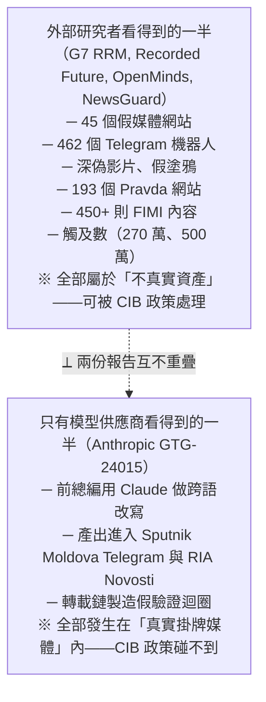

**G7 RRM 報告完全沒有提到 Anthropic 或 Claude；Anthropic 報告完全沒有提到 Storm-1516、Matryoshka 或 Pravda 網路。** 兩邊各自看到一半，而且**都不知道自己只看到一半**。

> **這是本案最重要的方法論結論，請務必在課堂上講出來**：
> **影響力行動的完整圖像，必須由「平台端」「模型供應商端」「開源研究端」三方拼合才可能得到。任何單一方的報告，結構上都是殘缺的。** 這也解釋了為什麼 p.42 說 Anthropic「依賴開源研究、跨平台產業資料與公開報導」——他們知道自己只有一半。

---

### 2.6 拉美線的當地脈絡：Sputnik en Español／Mundo 的戰略受眾與反美敘事（2026-09-15 深化）

**為什麼需要補這一節**：§2.5 給了摩爾多瓦線（線 A）極詳盡的地緣脈絡，但報告對**拉美線（線 B）**幾乎沒有著墨——線 B 在報告裡只有 p.60 分發表一列、p.59 一句「a contractor with links to Russia」，**無圖、無觸及數字**（見 §4.8 線 B、§3 受害表）。這種不對稱是**報告本身的限制**，不是本案拉美線比較不重要。要評估這條線的威脅，必須知道 Sputnik en Español／Mundo 在拉美的受眾與敘事定位。以下全為第三方脈絡，**用來補足報告的沉默，不可與報告發現混為一談**。

- **品牌歸屬**【報告明載＋三方佐證】：報告寫「Sputnik en Español for Latin American audiences」（p.60）。Sputnik en Español／Sputnik Mundo 同屬 Rossiya Segodnya 體系（§2.3），與線 A 的 Sputnik Moldova、線 C 的 Sputnik Africa 是同一母體的地區分支。
- **西語是俄國對外觸及最大的語種之一**【三方佐證，可信度：學術研究機構】：RT en Español 與 Sputnik Mundo 的西語社群帳號合計追隨者**逾 2,600 萬**，明顯**高於**其英語帳號（約 1,900 萬）；RT en Español 曾是「Twitter 上關於俄羅斯入侵烏克蘭的西語資訊第三大被分享網站」。這說明線 B 的分發終端本身就座落在一個**高觸及**的既有生態，AI 只是把「內容產能」接上這個既有通路——與 §4.8「生產能力 × 既有通路 = 影響力」的觀察一致。（Reuters Institute for the Study of Journalism）
- **戰略受眾與核心敘事**【三方佐證，可信度：官方／獨立研究，含政策立場需標註】：美國國務院與 EUvsDisinfo 均指出，俄語系西語對外宣傳的**主要目標是拉美閱聽眾**，以**墨西哥**為重點，主軸是**煽動反美情緒（anti-US／anti-imperialism）**、重塑拉美對烏克蘭戰爭的認知、把美國描繪為區域干預者。這正好解釋線 B 的「來源等級跳躍」（§4.8）為何有效：把 Rybar／Colonel Cassad 的**戰場敘事**經 AI 在地化為「拉美觀點」，剛好嵌進拉美既有的、對反美框架的**結構性接受度**（William & Mary DisinfoLab 專文〈Why Latin America is Susceptible to Russian War Disinformation〉即分析此一土壤）。
- **制裁與規避＝內容供給端的同一生態**【三方佐證，可信度：獨立研究／新聞】：Sputnik 因支持對烏戰爭於 **2022-03** 遭歐盟全面禁播（§2.3）；其後 Sputnik Mundo 換域名，並出現 `latamnews[.]lat`／`noticiaslatam[.]lat` 等**複製站**以規避制裁。本案線 B 的 **@ATodaPotencia**「偽裝獨立拉美分析」正是這個生態「假在地聲音」的標準件（§4.6）——被制裁的品牌需要**看似獨立**的前端來續命，而 AI 讓這種前端的內容量產成本趨近於零。（EU DisinfoLab；Espreso）
- **對台灣的一句話**：拉美線示範的是「**大國把既有的區域反美／反殖民情緒當成免費的擴音土壤**」。台灣的對應不是反美，而是**兩岸／統獨與世代**的既有裂縫——同樣的手法是「把外部敘事包裝成本地既有立場的自然延伸」，讓查核者難以指認其為外來。

> **證據等級小結**：本節「品牌歸屬」為報告明載；受眾規模、敘事定位、制裁規避均為**第三方獨立查證**，佐證的是「Sputnik 西語生態的既有樣貌」，**不直接驗證** GTG-24015 線 B 的具體產出（後者仍是 Anthropic 單一來源，見 §9.1、§12）。

### 2.7 非洲線的當地脈絡：Sputnik Africa 的反西方／反法定位與薩赫勒（2026-09-15 深化）

**為什麼需要補這一節**：非洲線（線 C）是四條線中報告資訊**最少**的一條——**行為者完全未描述**，只出現在 p.60 表格（§4.8 線 C）。但這條線恰好與**同模組的 GTG-04001（俄羅斯在中非共和國的 FIMI 行動）**是同一部機器的兩端，把兩案並讀才看得到全貌。以下為第三方脈絡與跨案交叉引用。

- **品牌與定位**【報告明載＋三方佐證，可信度：官方／獨立研究】：報告寫「Sputnik Africa for African audiences」（p.60）。Sputnik Africa／Afrique 是 Rossiya Segodnya 的非洲品牌（英／法雙語），**2023 年起顯著強化**，定位**反西方、反法（anti-France）、親俄**，主打**薩赫勒**（馬利、布吉納法索、尼日組成的「薩赫勒國家聯盟」AES）的**反殖民／反帝**情緒。分析界普遍認為俄國的宣傳與 FIMI 行動是薩赫勒「去法國化」的關鍵推手之一，手法是放大歷史殖民怨懟、將法國描繪為新殖民者。（EUvsDisinfo〈Echoes of influence: inside Russia's FIMI activities in Africa〉；Institute for Strategic Dialogue；VOA/GlobalSecurity）
- **供給鏈：African Initiative → Sputnik Afrique**【三方佐證，可信度：政府技術報告／獨立研究】：法國 VIGINUM 與 FCDO／EEAS 的技術報告記載，**African Initiative（2023-09 成立）**自我定位為「俄羅斯與非洲的資訊橋樑」，其產製內容**回饋進 Sputnik Afrique 等國家媒體通路**，藉此獲得「全球規模的人工正當性（artificial legitimacy on a global scale）」。這與本案線 C 的產製鏈——「俄語／法語通訊稿（RIA Novosti、TASS、Sputnik Afrique）→ Claude 依 40 條風格規則改寫 → @sputnik_africa 貼文」——是**同一條供給鏈的兩端**：一端量產「看似在地」的內容，另一端用**掛牌國家媒體**賦予公信力。（VIGINUM／FCDO／EEAS African Initiative 技術報告，2025-06；DFRLab；第 3 版 EEAS FIMI 威脅報告）
- **交叉引用 GTG-04001（同模組）**【本課推論＋兩案比對】：GTG-04001 是這條生態的**落地版**——班基（Bangui）一名說俄語的行為者作為「production backbone」，每日透過 **Radio Lengo Songo（98.9 FM）**產製「親中非政府、親 Wagner、**反法**、反反對派」內容，並與 **RT、Sputnik Afrique、TASS、俄羅斯之家**協調，歸因指向 **SVR 掌控的 Politology（Africa Corps／Wagner 的影響力分支）**，Breakout Scale 評到**罕見的 Category Four**（見 `GTG-04001-russia-car-fimi.md` §1–2）。**把兩案並讀**：線 C 是俄國非洲 FIMI 機器的「**旗艦國家媒體產出端**」（Sputnik Africa 的 X 貼文，反法敘事的全球櫥窗），GTG-04001 是同一機器的「**在地落地端**」（FM 電台＋當地轉載，反法敘事的地面部隊）。單看任一案都會低估這部機器；線 C 的「反西方英語貼文」與 GTG-04001 的「班基 FM 反法廣播」共用同一套敘事骨架與同一個 Sputnik Afrique 節點。
- **對台灣的一句話**：非洲線提醒防禦方，**同一個敘事會以「國家媒體全球櫥窗」與「在地落地媒體」兩種形態並行**；只監測其中一種（例如只看國際平台的英語貼文，或只看本地電台）都會漏掉另一半。台灣須同時盯「對外櫥窗」（如對台的多語官媒與海外華媒）與「在地落地」（本地電視／LINE／社群）兩端。

> **證據等級小結**：本節「品牌歸屬」為報告明載；反法定位、African Initiative 供給鏈、薩赫勒脈絡均為**第三方獨立查證**（含法國政府 VIGINUM 技術報告）；與 GTG-04001 的並讀為**本課推論**（兩案皆一手，但報告未把它們明確連結）。這些佐證的是「Sputnik Africa 生態的既有樣貌」，**不直接驗證** GTG-24015 線 C 的具體產出（後者仍是 Anthropic 單一來源）。

**本節新增外部來源（含信賴層級）**：

| 來源 | 類型／信賴層級 | 用於佐證 | URL |
|---|---|---|---|
| Reuters Institute — Putin's propaganda in Spanish | 學術研究機構，高可信 | 西語觸及 >2,600 萬、>英語 | https://reutersinstitute.politics.ox.ac.uk/news/despite-western-bans-putins-propaganda-flourishes-spanish-tv-and-social-media |
| William & Mary DisinfoLab — Why Latin America is Susceptible | 大學研究實驗室，可信 | 拉美對反美敘事的結構性接受度 | https://www.disinfolab.wm.edu/post/why-latin-america-is-susceptible-to-russian-war-disinformation |
| EU DisinfoLab — Disinfo Update | 獨立研究機構，可信 | Sputnik 西語制裁規避生態 | https://www.disinfo.eu/disinfo-update-16-12-2025-2-2-2-2-2-2/ |
| Espreso — Sputnik changes domains to avoid sanctions | 新聞媒體（烏克蘭，立場需標註） | latamnews/noticiaslatam 複製站 | https://global.espreso.tv/russia-fake-news-spanish-version-of-russias-sputnik-has-been-relaunched-on-new-domain-noticiaslatamlat |
| EUvsDisinfo — Russia's FIMI activities in Africa | EEAS 官方平台（政策立場需標註） | Sputnik Afrique 反西方定位、FIMI 擴張 | https://euvsdisinfo.eu/echoes-of-influence-inside-russias-fimi-activities-in-africa/ |
| ISD — Pro-Kremlin influencers targeting AES | 獨立研究機構，可信 | 薩赫勒國家聯盟被鎖定 | https://www.isdglobal.org/digital-dispatch/investigation-pro-kremlin-influencers-targeting-audiences-in-the-alliance-of-sahel-states-aes/ |
| VIGINUM／FCDO／EEAS — African Initiative 技術報告（2025-06） | 政府技術報告，高可信 | African Initiative → Sputnik Afrique 供給鏈 | https://www.sgdsn.gouv.fr/files/files/Publications/20250612_TLP-CLEAR_VIGINUM_FCDO_EEAS_Technical_Report_African_Initiative_EN.pdf |
| DFRLab — Africa | 獨立研究機構（Atlantic Council），可信 | 俄國非洲影響力行動盤點 | https://dfrlab.org/region/africa/ |

---

## 3. 受害者與目標清單

本案沒有傳統意義上的「受駭組織」，受害者是**資訊環境與受眾**。依報告 p.58–60 整理：

| 產製線 | 目標受眾（報告原文） | 被鎖定的人物／議題 | 具體受害數字（報告有寫的） |
|---|---|---|---|
| Sputnik Moldova / RIA Novosti | Moldova (Russian-speaking) | 摩爾多瓦總統 **Maia Sandu**（「fabricated, defamatory claims」）；**2025-09-28 國會大選**前的選民；反對派社群貼文被當素材再利用（"covert opposition-party material"） | Telegram 貼文 **2.09K** 瀏覽（Figure 9）；RIA Novosti 文章頁面顯示 **1,725** 次瀏覽（Figure 10 截圖，報告正文未寫此數字）；報告：「no other exact matches were observed」 |
| Sputnik en Español + @ATodaPotencia | Latin America (Spanish) | 拉美西語讀者；把俄國軍事部落客（Rybar、Colonel Cassad）的內容在地化 | 報告未給數字 |
| Sputnik Africa | African publics (English) | 非洲英語讀者；例：2026-02-28 對 Khamenei 官邸遭美國飛彈攻擊的報導 | Figure 11 截圖顯示網站頁面互動極低（👍0 👎2）；X 貼文瀏覽數報告未寫 |
| RT English newsroom | RT global English broadcast | RT 全球英語觀眾 | 「至少一次確認實際播出」（p.59）；「the aired broadcast copy」（p.58） |

**間接受害者／被利用者**：
- **INSCOP Research 與 IICCMER**（羅馬尼亞民調機構與「共產罪行調查所」）：其 2025-07-21 發布的合法民調被抓來做俄語內容素材（Figure 9／10）。民調本身是真的（獨立查證，見第 9 節）——這正是「真素材、假框架」的典型。
- **ru[.]euronews[.]com、point[.]md** 等被列入「摩爾多瓦放大生態系」的網域（p.62）：報告只列為 indicator，**沒有說它們知情參與**。合法或半合法媒體被當成洗白鏈的中繼站，是這類作業的設計本意（見第 4.6 節）。
- **羅馬尼亞公眾**：Ceaușescu 民調的俄語再包裝，服務於「羅馬尼亞人懷念社會主義」的敘事，最終受眾是摩爾多瓦俄語人口（對他們暗示「連羅馬尼亞人都懷念舊時代」）。

**受眾規模的量級參考（獨立查證，非報告數字）**：LetsData 2025 年的分析指出，Sputnik 的俄語摩爾多瓦 Telegram 頻道在 2024 年 11–12 月每週 300–350 萬次瀏覽，到 2025 年 4–5 月降至每週 200–250 萬；羅馬尼亞語頻道在 2025-02-22 發出最後一篇後停更，2025-02-25 出現一個複製俄語版內容的「Sputnik Молдова 2.0」新頻道。**注意**：該分析摘要把 2.0 頻道的 handle 記為 `@mdsputnikmd_2`，但 Figure 9 截圖底部明確顯示 `t.me/rusputnikmd_2/12933`、署名 `@rusputnikmd_2`。**以 PDF 截圖為準**，第三方 handle 記述的差異列入第 12 節「未能驗證之處」。

---

## 4. AI 濫用的攻擊生命週期（逐階段拆解）

報告在本案**沒有**獨立的 "Attack lifecycle and AI usage" 段落（那是前一案 GTG-14002 的格式）。本節依 p.58–60 的敘述與 p.60 分發表格重建生命週期，並標示每一階段「人類做什麼／Claude 做什麼」與自主程度。

### 4.0 自主程度的三個座標（課程用語）

本報告全書用三個層級描述 AI 的角色：**對話式協助（conversational assistance）→ 人類逐步指揮（human-in-the-loop, step-by-step direction）→ AI 編排多代理自主執行（agentic orchestration）**。

**本案落在第二級：人類逐步指揮。** 判斷依據：
- 報告說 Claude 是「**sub-editor layer**（副編輯層）」，被「**slotted into** a human-edited pipeline that was **already up and running**」（p.42、p.59）——有人類總編在上面把關。
- 報告說行為者「turned out completed polished content, **sending it straight to the production line** to be aired」（p.58）——人類負責交付與送版。
- 報告**沒有**提到本案使用 agent 框架、工具呼叫、批次自動化或持久記憶檔（那些是同章其他案例的特徵，見導論 p.43 "Complex tool use"）。
- 唯一接近自動化的線索是 Sputnik Africa 的「**40-rule house style guide**」——把編輯部風格規則固化成一份規則集餵給模型，這是「持久指令檔」而非「自主代理」。

> **教學重點**：本案的危險**不在自主性高**，而在**嵌入位置好**。自主程度低的 AI，只要接在一條已經有分發管道、有公信力品牌、有廣播執照的產線上，影響力就遠大於一個全自動但沒人看的假帳號網絡。課堂上請刻意打破「越自主越危險」的直覺。

### 4.1 階段一：素材蒐集（Collection）— 人類主導

| 產製線 | 報告寫的來源材料（p.59–60 原文） | 人類做什麼 | Claude 做什麼 |
|---|---|---|---|
| Moldova | "Romanian and Moldovan news, polls, opposition social posts" | 選定羅馬尼亞語／摩爾多瓦語新聞、民調、**反對派的社群貼文**並貼進對話 | （報告未描述 Claude 執行蒐集）|
| LatAm | "Russian milblogger Telegram (Rybar, Colonel Cassad, others)"；承包者「pulled content **directly from** Telegram channels」 | 從軍事部落客 Telegram 直接取文 | 同上 |
| Africa | "Russian and French wires (RIA Novosti, TASS, Sputnik Afrique)" | 取俄語與法語通訊稿 | 同上 |
| RT English | "Russian wires, SVR and Defence-Ministry claims" | 取通訊社稿、**SVR（對外情報局）與國防部的主張** | 同上 |

**這一階段最值得講的一件事**：RT English 這條線的輸入來源包含 **SVR 與國防部**。報告括號註明 SVR 是 "the civilian foreign intelligence agency"（p.59）。也就是說，**情報機關的素材，經由一名員工＋一個商用 LLM，被轉成當天要上電視的跑馬燈文字**。從「情報產品」到「觀眾眼球」的距離被壓縮到一個對話工作階段。

另一個細節：Moldova 線的來源含「**opposition social posts**」，而 p.59 分發表格的產出形態欄寫著「**covert opposition-party material**」。報告沒有展開這個詞，但字面意思是：反對派（在摩爾多瓦語境即親俄陣營）的材料以不揭露來源的方式被使用。這是「素材來源即利害關係人」的典型——課堂可用來討論「新聞的素材鏈」為什麼是查核的第一現場。

### 4.2 階段二：生成與在地化（Production / Localisation）— Claude 的主戰場

這是報告唯一明確描述 Claude 動作的階段：

- **跨語言改寫**（Moldova）：把羅馬尼亞語／摩爾多瓦語素材「turn … into Russian language articles」。這是本案最核心的 AI 用途——**語言本身就是進入門檻**。一個俄語編輯要即時消化羅馬尼亞語民調、反對派羅語貼文，過去需要翻譯人力或雙語記者；Claude 把這個門檻歸零。
- **在地化寫作**（LatAm）：「write **Latin American** Spanish articles」。注意報告特別寫「拉美西語」而非「西語」——這是**語域在地化（register localisation）**，讓內容讀起來像當地人寫的，而不是從莫斯科翻過來的。這正是導論 p.43 "Increased operational security" 所述「asked the model to strip the marks of automated text and to sound organic」的同一族技術。
- **規則化風格**（Africa）：產出「@sputnik_africa X/Twitter and News posts **under a 40-rule house style guide**」。40 條規則 = 一份可重複使用的編輯部規範被當成模型指令；它同時保證了**風格一致性**（讓 AI 產出混進真人稿而不露餡）與**可擴充性**（換人也能產出同樣風格）。
- **廣播體裁**（RT English）：「tickers, screen captions, voiceover scripts, and short headlines」，表格寫「**Character-exact** on-air tickers, chyrons, and voice-overs」。**Character-exact（字元精確）**是廣播工程的硬約束——跑馬燈有字元上限、字幕有安全區、旁白有秒數。LLM 在這種「格式約束下的壓縮改寫」正好特別強。這一條線示範了 AI 在新聞產製中最不起眼卻最難自動化的環節（版面工程）被吃掉。

### 4.3 階段三：人工把關與送版（Human editorial gate）— 人類主導

- 報告：「The actors turned out completed polished content, sending it straight to the production line to be aired.」（p.58）
- LatAm 線明確寫有上層把關：「**Under the editorial watch of a Sputnik Mundo presenter and producer**」（p.59）。
- 這一階段解釋了 **Figure 10 的「slight variations」**從何而來：人類編輯在送版前動了標題。詳見第 6.5 節。

### 4.4 階段四：第一次發布（Publication）

| 通路 | 形態 | 證據 |
|---|---|---|
| Sputnik Moldova 2.0 Telegram（@rusputnikmd_2） | 帶影片的 Telegram 圖文貼文 | Figure 9，2.09K 瀏覽，貼文編號 12933，07-21 09:57 編輯 |
| RIA Novosti（ria.ru） | 通訊社網站稿，電頭「КИШИНЕВ（基希訥烏）」 | Figure 10，19:56 21.07.2025，1725 瀏覽 |
| Sputnik Africa（en.sputniknews.africa + @sputnik_africa X） | 網站稿 + X 貼文 | Figure 11，12:23（更新 12:24）28.02.2026 |
| Sputnik en Español + @ATodaPotencia | 西語文章 + Telegram 貼文 | 報告未附圖 |
| RT English | 上電視的跑馬燈／字幕／旁白 | 報告未附圖，僅稱「at least one confirmed instance … made it to Russian airwaves」 |

### 4.5 階段五：跨媒體放大與「假驗證迴圈」（Amplification / False verification loop）

報告的兩句關鍵原文：

> "amplified across a network of Russian and Moldovan outlets to **manufacture false verification loops**. The same story was **echoed across different outlets so it appeared to be independently confirmed**."（p.59）

> "Actors used **a chain of different outlets** to make Russian-origin claims appear to be **independently reported**."（p.58）

p.62 IOC 表列出這個放大生態系的節點：**eadaily[.]com（已被歐盟制裁）、point[.]md、vz[.]ru、mos[.]news、ru[.]euronews[.]com**。

**「假驗證迴圈」的機制**（本案的教學核心之一）：

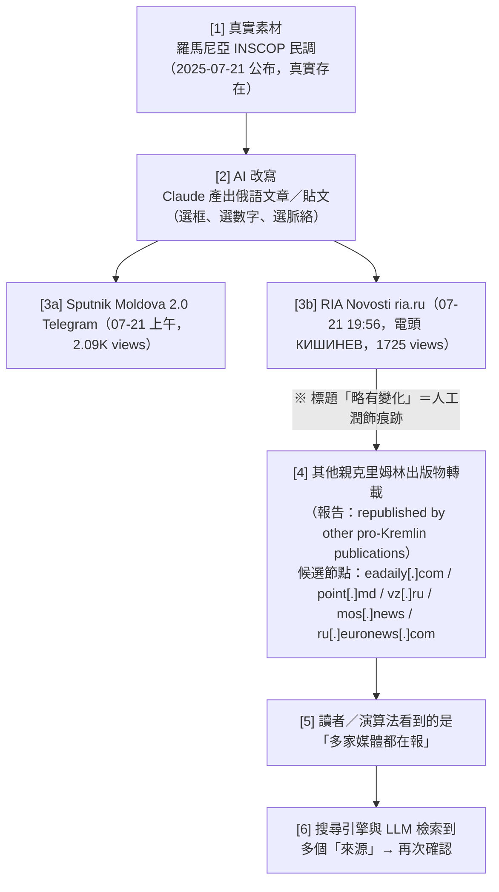

**為什麼這條鏈讓事實查核變困難**（請務必在課堂上逐條講）：

1. **查核對象錯位**。查核者拿到的是「最後一環」的文章。要證偽必須回溯到 [1]，但 [1] 是**真的民調**——所以「這則新聞是假的嗎？」得到的答案會是「不完全是」。真正可查核的是**框架、遺漏與確信度**，而那不是「真／假」二元標籤能表達的。
2. **來源標示被逐層剝離**。Figure 10 的 RIA 稿在引述時寫「говорится в материалах исследования, **которые публикуют румынские СМИ**（研究材料由羅馬尼亞媒體刊出）」——來源被推到「羅馬尼亞媒體」這個模糊集合，而不是 INSCOP／IICCMER。再轉載一層之後，來源會變成「據 RIA Novosti」，再一層變成「據多家媒體」。報告導論把這叫做 **"Laundering of attribution, sourcing, and certainty"**（p.43）。
3. **獨立性的幻覺可以被量化系統採信**。事實查核與內容審核越來越依賴「多來源交叉驗證」的自動化訊號；一條人為製造的轉載鏈正好偽造了這個訊號。同一段導論提到 LLM 檢索會把這些洗過的來源當成佐證（獨立查證：Recorded Future 對 Portal Kombat／Pravda 網路的 "LLM grooming" 警告，見第 9 節）。
4. **查核本身會放大**。獨立查證：Recorded Future 對 Operation Overload 的觀察是「該行動觸及目標受眾的成功，很可能來自其不可信故事**被闢謠時的二次曝光**」。查核者面對本案要先做的決策是「要不要碰它」。
5. **時間差被壓縮**。Figure 9 與 Figure 10 是**同一天**。AI 讓「第一次發布 → 跨媒體轉載」的窗口縮到幾小時，而查核流程通常以天為單位。查核永遠在後面追。

### 4.6 階段六：對「獨立在地聲音」的偽裝（LatAm 線特有）

報告 p.59：承包者「also fed the output produced to a **supposedly independent Telegram** that reframes Kremlin-aligned narratives so they look like **authentic local commentary**」。IOC 表把 **@ATodaPotencia** 標為「Deceptive amplification asset — Presents Kremlin-aligned content as organic Latin American analysis」（p.62）。

這是本案中**唯一**帶有傳統「不真實（inauthentic）」性質的資產：一個偽裝成獨立拉美分析者的 Telegram 頻道。也就是說，**同一個作業同時使用了「掛牌國家媒體」與「偽裝獨立頻道」兩種通路**——前者提供公信力與觸及，後者提供「連在地人都這麼說」的社會證明。課堂可用這一點說明：新型作業不是取代舊手法，而是**把舊手法接到新管線上**。

### 4.7 生命週期一覽（可直接做成投影片）

| 階段 | 人類 | Claude | 自主程度 | 本案證據頁 |
|---|---|---|---|---|
| 1 蒐集 | 選素材（含 SVR／國防部主張、反對派貼文、外語民調） | — | 人類 100% | p.59–60 |
| 2 生成／在地化 | 下指令、給風格規則（40 條） | 跨語改寫、在地化、字元精確的廣播文案 | **人類逐步指揮** | p.59–60 |
| 3 把關送版 | 主持人／製作人審稿、微調標題 | — | 人類 100% | p.58, p.59 |
| 4 發布 | 用媒體官方帳號發出 | — | 人類 100% | Fig.9–11 |
| 5 放大 | 轉載鏈（5 個已知網域節點） | — | 人類／既有生態系 | p.59, p.62 |
| 6 偽裝在地 | 餵給偽獨立頻道 @ATodaPotencia | — | 人類 100% | p.59, p.62 |

**AI 觸及的階段只有第 2 階段——但那正是過去唯一需要大量受訓編輯人力的階段。** 報告 p.58 的結論句就是這個意思：「By using Claude's workflows, the actors achieved **a scale of production that would normally require an entire team of trained editorial staff**.」

### 4.8 四條產製線的分工、各自的獨特風險與偵測落點

報告把四個帳號並列，但**四條線的風險結構完全不同**。逐條拆解，因為每一條都對應到一種台灣也會遇到的樣態。

#### 線 A｜Sputnik Moldova / RIA Novosti（摩爾多瓦・俄語）

| 項目 | 內容 |
|---|---|
| 行為者 | 前 Sputnik Moldova 總編輯（p.59） |
| Claude 的工作 | **跨語言改寫**：羅馬尼亞語／摩爾多瓦語 → 俄語 |
| 素材 | 新聞、**民調資料**、**反對派社群貼文** |
| 產出 | Sputnik Moldova Telegram 貼文 + RIA Novosti 通訊社稿 + 「covert opposition-party material」 |
| 獨特風險 | **選舉時機**。這是四條線中唯一明確與一場**具體選舉**綁定的（2025-09-28）。也是唯一提到**捏造誹謗**（fabricated, defamatory）的 |
| 獨特手法 | **假驗證迴圈**——同一則故事在多家媒體互相呼應，偽造「獨立證實」的外觀 |
| 圖表證據 | Figure 9（Telegram，2.09K）、Figure 10（RIA，1,725） |
| 最佳偵測落點 | **轉載鏈**。同一則內容在 Telegram 與 ria.ru 同日出現，之後擴散到 5 個已知網域（p.62 IOC） |
| 台灣對應 | 中國官媒稿 → 簡繁與用語轉換 → 台灣聚合站／粉專 → 商業媒體引用「陸媒報導」 |

**這條線為什麼是四條中最危險的**：它同時具備（1）具體的選舉時間窗、（2）針對在任元首的人身指控、（3）跨語言的資訊不對稱（俄語受眾看不懂羅語原文，無從查證）、（4）完整的轉載放大生態系。**四個條件同時成立時，AI 提供的速度優勢會被完整兌現。**

#### 線 B｜Sputnik en Español + @ATodaPotencia（拉美・西語）

| 項目 | 內容 |
|---|---|
| 行為者 | 「與俄羅斯有關聯的承包者（a contractor with links to Russia）」，在「一名 Sputnik Mundo 主持人兼製作人的編輯監督下」（p.59） |
| Claude 的工作 | **語域在地化**：俄語軍事部落客內容 → **拉美西班牙語**文章 |
| 素材 | 俄國軍事部落客 Telegram：**Rybar（@rybar_america）、Colonel Cassad（@boris_rozhin）** 等 |
| 產出 | Sputnik en Español 文章 + @ATodaPotencia Telegram 貼文 |
| 獨特風險 | **雙軌分發**——掛牌國家媒體 + 偽裝成獨立在地分析的頻道。同一份內容走兩條路，一條給公信力，一條給「連在地人都這麼說」的社會證明 |
| 獨特手法 | **來源等級跳躍**：軍事部落客（非新聞機構、無查證流程）的內容，經 AI 改寫後以**通訊社品牌**發布。中間的查證環節被整個跳過 |
| 圖表證據 | **無**（報告未附圖） |
| 最佳偵測落點 | **輸入端**。Rybar／Colonel Cassad 的貼文是公開的，可以監測「某則俄語軍事部落客內容多久後以西語出現在 Sputnik en Español」，做出**預測性告警** |
| 台灣對應 | 微博／抖音熱點或軍事自媒體內容 → 用語在地化 → 台灣「軍武」粉專與 YouTube 頻道 → 被當成「消息人士」引用 |

**「承包者（contractor）」這個詞值得單獨講。** 它意味著：這個人**不是媒體的正式員工**，但有一位正式的主持人兼製作人在上面把關。這是**外包化的產製結構**——責任與可歸責性被拆開：媒體可以說「他不是我們的人」，承包者可以說「我是照編輯指示做的」。**AI 讓這種結構更容易維持，因為單一承包者的產能現在等於過去一個小組。**

#### 線 C｜Sputnik Africa（非洲・英語）

| 項目 | 內容 |
|---|---|
| 行為者 | **報告未描述**（Key findings 只寫了三位行為者，這條線只出現在 p.60 表格） |
| Claude 的工作 | 依 **40 條內部風格規則（40-rule house style guide）** 產製 X 貼文與新聞稿 |
| 素材 | 俄語與法語通訊稿（RIA Novosti、TASS、Sputnik Afrique） |
| 產出 | @sputnik_africa 的 X/Twitter 貼文 + 網站 News posts |
| 獨特風險 | **exact match 出現在這裡**（Figure 11）——人工把關最少的一條線 |
| 獨特手法 | **風格規則集固化**。把編輯部規範寫成 40 條規則餵給模型，等於把「編輯的判斷」轉成「可重複執行的指令」。這是四條線中**最接近自動化**的一條 |
| 圖表證據 | **Figure 11（exact match，全報告唯一）** |
| 最佳偵測落點 | **模板化偵測**。40 條規則會在產出中留下高度一致的結構痕跡（例如固定的標題 + CTA 組合，見 6.4）。對單一帳號的貼文做結構聚類即可發現 |
| 台灣對應 | 媒體內部的「社群小編 SOP」被寫成 prompt；下標、摘要、CTA 全自動化 |

**40 條規則是本案最被低估的細節。** 它證明了導論 p.43 所描述的趨勢在本案也成立：「Markdown files containing doctrine were reused almost verbatim across hundreds of sessions.」——**編輯部規範就是 doctrine 的一種**。當規範被固化成檔案，換誰來操作都能產出一致的內容，**作業對特定人員的依賴就消失了**。這也是為什麼報告說行為者之間「never needed to coordinate with or even know one another」。

#### 線 D｜RT English newsroom（全球・英語廣播）

| 項目 | 內容 |
|---|---|
| 行為者 | 「一名俄羅斯國有媒體的員工（an employee of a Russian state-owned media outlet）」（p.59）——**唯一被明確描述為現職員工的行為者** |
| Claude 的工作 | **字元精確（character-exact）** 的廣播文案：跑馬燈（tickers）、下標字幕（chyrons／screen captions）、旁白稿（voiceover scripts）、短標題 |
| 素材 | 俄羅斯通訊社 + **SVR（對外情報局）** + **國防部**的主張 |
| 產出 | 上電視的播出文案 |
| 獨特風險 | **危害最高**：廣播內容無法被轉發查核、無法被平台標註、觀眾沒有「點進去看來源」的選項。一旦播出，就是單向的 |
| 獨特手法 | **情報素材直通播出**。從 SVR 的主張到螢幕下方的跑馬燈，中間只有一名員工和一個 LLM |
| 圖表證據 | **無**。報告只說「至少一次經確認」上了電波，未說明確認方法 |
| 最佳偵測落點 | **極難**。需要廣播監看（broadcast monitoring）能力，且要能把播出文字與模型輸出比對。這是四條線中外部研究者最無能為力的一條 |
| 台灣對應 | 電視台跑馬燈、新聞下標、快訊文案的 AI 化。**台灣的電視新聞跑馬燈本來就以速度優先、查核最薄弱著稱** |

**為什麼這條線值得在課堂上花最多時間**：
1. 它是四條中**唯一涉及情報機關直接供稿**的。
2. 它是四條中**唯一進入傳統廣播**的（章節導論 p.44 明確說「最廣泛的真實觸及」發生在國家媒體作為分發機制、包括 FM／衛星／短波廣播與全球電視的情況）。
3. 它是四條中**證據最薄**的（無圖、無細節、只有「至少一次」）。
4. **危害最高 × 證據最薄 = 情報分析中最難處理的組合。** 讓學員練習：你要怎麼向決策者報告「一件很嚴重但我們只有一個未說明來源的確認案例」的事？

#### 四線橫向比較表（投影片用）

| | A・Moldova | B・LatAm | C・Africa | D・RT English |
|---|---|---|---|---|
| 行為者身分 | 前總編（離職） | 承包者（外包） | 未描述 | 現職員工 |
| Claude 的核心能力 | 跨語言 | 語域在地化 | 規則遵循 | 格式壓縮 |
| 素材來源的權威性 | 中（民調、新聞） | **低**（軍事部落客） | 中（通訊社） | **高但不可驗證**（SVR、國防部） |
| 人工把關程度 | 中（Fig.10 有潤飾） | 中（有製作人監督） | **低**（Fig.11 exact match） | 未知 |
| 匹配等級 | L0 一則 + L1 | 無證據 | **L0** | 無圖證據 |
| 外部可偵測性 | **高**（轉載鏈） | 中（輸入端可測） | 中（模板化可測） | **極低** |
| 危害等級（本檔評估） | 高（選舉） | 中 | 中 | **最高**（廣播 + 情報供稿） |

> **綜合觀察**：**外部可偵測性與危害等級呈反比。** 最好查的（Moldova 的轉載鏈）不是最危險的；最危險的（RT 廣播）幾乎查不到。**這個反比關係是影響力行動偵測工程的結構性困難，也是本案給防禦方最重要的警告。**

---

## 5. TTP 與框架對應

### 5.1 先講清楚：為什麼 MITRE ATT&CK 在本案幾乎派不上用場

ATT&CK 描述的是**對電腦系統的入侵行為**（初始存取、權限提升、橫向移動、外洩）。本案沒有入侵、沒有惡意程式、沒有 C2、沒有受駭主機。行為者使用的是**合法購買的 API／帳號**與**自己機構的發稿權限**。若硬套 ATT&CK，只能勉強對到：

| 勉強可對 | ID | 為什麼勉強 |
|---|---|---|
| Acquire Infrastructure | T1583 | 行為者取得 Claude 帳號／Telegram 頻道，但這是合法取得，不是攻擊基礎設施 |
| Establish Accounts | T1585 | 同上；且本案主要用的是**真實媒體帳號**，不是建立假帳號 |
| Gather Victim Org Information | T1591 | 只有在「蒐集反對派社群貼文」時勉強沾邊 |

**課程結論：ATT&CK 不是這類案例的框架缺口，而是根本不同的問題域。** 學員若在報告中看到 influence ops 被排進「威脅情報」框架，要能立刻分辨「這需要換一套 TTP 詞彙」。正確的工具是 **DISARM Framework**（原 AMITT），它是專門描述資訊操弄的 TTP 分類法，結構刻意仿 ATT&CK（TA 戰術 / T 技術 / 子技術）。

### 5.2 DISARM 對應表（本案）

> ID 取自 DISARM Foundation 官方技術索引。未能逐一核對到官方 ID 的行為，明確標記為「無對應 ID」。

| DISARM 技術 ID | 技術名稱 | 本案的具體作法（頁碼） | 偵測構想 |
|---|---|---|---|
| **T0073** | Determine Target Audiences | 四條產製線各自鎖定摩爾多瓦俄語人口／拉美西語／非洲英語／RT 全球英語（p.59–60） | 模型端：同一帳號在單一工作階段內反覆要求「同一主題、不同語言／不同受眾語域」的重寫 |
| **T0003** | Leverage Existing Narratives | 把真實的 INSCOP 民調嫁接到「社會主義懷舊／對歐盟路線的質疑」既有敘事（Fig.9–10） | 內容端：真素材 + 高度選擇性的脈絡框架 |
| **T0023** | Distort Facts | 把 66.2% 的民調寫成「連羅馬尼亞人都認為 Ceaușescu 是好領導人」的政治訊息；RIA 稿把來源推給「羅馬尼亞媒體」 | 查核端：比對原始民調問卷措辭 vs. 報導措辭 |
| **T0082** | Develop New Narratives | 對 Maia Sandu 的 "fabricated, defamatory claims"（p.59） | 模型端：要求生成對特定在任元首的未經證實指控 |
| **T0084** | Reuse Existing Content | 直接取用通訊社稿與 Telegram 頻道內容作為輸入（p.59–60） | 模型端：輸入是整篇他人文章＋「改寫／在地化」指令 |
| **T0084.002** | Plagiarise Content | 從 Rybar、Colonel Cassad 等 Telegram 頻道「pulled content directly」（p.59） | 內容端：與已知來源做近似重複（near-duplicate）比對 |
| **T0084.003** | Deceptively Labelled or Translated | 俄語→西語／英語的在地化改寫，未標示來源為俄國軍事部落客（p.59–60） | 內容端：跨語言語意指紋比對（見 6.5） |
| **T0085** | Develop Text-Based Content | 全案核心：文章、貼文、標題、跑馬燈、旁白稿（p.59） | — |
| **T0085.001** | Develop AI-Generated Text | 本案的定義性行為 | **模型端日誌是唯一的一手證據** |
| **T0087 / T0088** | Develop Video-Based / Audio-Based Content | RT 線的 voiceover scripts、螢幕字幕屬於影音產製的文字層（p.59）；Fig.9 貼文帶 2:10 影片 | 影音端：稿本與播出畫面的逐字比對 |
| **T0097.202** | News Outlet Persona | @ATodaPotencia 偽裝成獨立拉美分析頻道（p.62） | 平台端：頻道自述「獨立」但內容與國家媒體高度同步 |
| **T0100** | Co-Opt Trusted Sources | **本案最關鍵的一條**：借用 RIA Novosti／RT 這些**真實且有公信力的機構本身**作為發布主體 | 幾乎無法從平台端偵測；需要內容血緣或內部人揭露 |
| **T0101** | Create Localised Content | 拉美西語語域、非洲英語受眾、40 條在地風格規則（p.60） | 模型端：同一素材被要求產出多種區域語域版本 |
| **T0115** | Post Content | 以媒體官方帳號發布（Fig.9、11） | — |
| **T0118** | Amplify Existing Narrative | 轉載鏈放大（p.59） | 開源端：跨網域近似重複偵測＋時間序列 |
| **T0119** | Cross-Posting | 同一則內容同日出現在 Telegram 與 ria.ru（Fig.9→10）；Sputnik Africa 網站＋X（Fig.11） | 開源端：跨平台同步發布偵測 |
| *無對應 ID* | **AI 作為編輯部副編輯層（sub-editor layer）** | p.42、p.59 明確提出的新型態 | **框架缺口，見 5.3** |
| *無對應 ID* | **風格規則集固化（house style guide as model instruction）** | Sputnik Africa 的 40-rule guide（p.60） | **框架缺口，見 5.3** |
| *無對應 ID* | **假驗證迴圈（manufactured false verification loop）** | p.59 | DISARM 有「放大」但沒有「偽造獨立確認」這個獨立技術 |

### 5.3 明確標示的框架缺口

1. **「合法媒體內部的 AI 加速」沒有 TTP 編號。** DISARM 的設計前提是「操作方在媒體體制之外」——建立假媒體、假記者、假帳號。當操作方**就是**登記在案的媒體本身，DISARM 的 persona 類技術全部落空，只剩 content 類技術可用，而 content 類技術無法表達「誰在發」這個最關鍵的事實。
2. **「AI 輔助的編輯強度」沒有度量。** 報告自己承認「We're not able to determine what share of the outlets' total output passed through the pipelines that involved Claude.」（p.58）。目前沒有任何框架提供「某媒體某比例產出經 AI 產製」這個指標的定義方式。
3. **Breakout Scale 對本案的適配問題。** 報告 p.42 說用 Breakout Scale（六級，Category One = 單一平台單一社群）衡量影響力，但**本案沒有給出 Breakout 分級**。原因很可能是：本案內容一出生就在多平台、跨國、含廣播——按字面應該是高分級，但那個「觸及」來自媒體本身的既有訂閱，而不是內容自身的擴散力。**這是課程可以讓學員去辯論的框架適用性問題。**
4. **模型供應商的可觀測性沒有標準化。** 全案的一手證據（模型端生成紀錄）只有 Anthropic 有，且不會公開。外部研究者只能拿到圖片截圖與 archive 連結。這是一個**證據壟斷**問題，見第 12 節。

### 5.4 偵測構想分層（給藍隊／查核團隊）

| 層 | 誰能做 | 訊號 | 本案適用性 |
|---|---|---|---|
| **模型供應商端** | 只有 Anthropic／OpenAI 等 | 帳號用途分類（新聞產製）、素材來源特徵（通訊社稿、Telegram 全文貼入）、跨語改寫模式、要求移除 AI 文體痕跡、要求刪去不確定性註記 | **本案的實際偵測方式**（p.62：「through our internal detections」） |
| **平台端** | Telegram／X | 官方帳號無異常 → **幾乎零訊號** | 失效 |
| **開源／研究端** | EU DisinfoLab、EUvsDisinfo、G7 RRM、LetsData、Doublethink Lab、IORG | 跨網域近似重複、轉載時間序列、電頭與地理不符（例：羅馬尼亞民調配基希訥烏電頭）、圖片來源自我循環（Fig.11 圖片 credit 是自家 Telegram） | **可行且必要**；這是課程實作重點 |
| **查核端** | 事實查核組織 | 原始素材 vs. 報導的措辭落差、確信度升級（unverified → confirmed）、來源模糊化 | 可行但耗時 |
| **政策端** | 主管機關 | 制裁、平台標籤、廣播執照 | 對已被制裁者效果有限（Sputnik 在摩爾多瓦已被封網仍在 Telegram 運作） |

---

## 6. 圖表逐一判讀

本案頁段（p.58–62）含**一張跨頁分發結構表**與**三張截圖（Figure 9–11）**。以下每一張都以 Read 工具開啟原始 PNG 逐格判讀，包含圖上實際可見的文字、數字、介面元素與語言。課程可引用的圖檔：`../figures/page-060.png`、`../figures/page-061.png`（p.58／p.59／p.62 為純文字與表格頁，未存入 course/figures）。

---

### 6.1 「Ultimate distribution」分發結構表（p.59 下半 至 p.60 上半）

**圖片類型**：四欄結構表，跨頁排版（第一列在 p.59 底、其餘三列在 p.60 頂）。無框線、灰底圓角卡片樣式。這不是報告編號的 Figure，但它是本案**資訊密度最高的一張圖**。

**圖上實際看到的元素**：表頭四欄 —— `Ultimate distribution channel`（最終分發通路）、`Audience`（受眾）、`Source material`（來源材料）、`Output form`（產出形態）。四列資料：

| Ultimate distribution channel | Audience | Source material | Output form |
|---|---|---|---|
| **Sputnik Moldova / RIA Novosti**<br>（p.59 底列） | Moldova (Russian-speaking) | Romanian and Moldovan news, polls, opposition social posts | Russian-language articles on Sputnik Moldova Telegram and RIA Novosti, amplified cross-platform; covert opposition-party material |
| **Sputnik en Español**<br>（p.60 第 1 列） | Latin America (Spanish) | Russian milblogger Telegram (Rybar, Colonel Cassad, others) | Localized Spanish articles plus @ATodaPotencia posts |
| **Sputnik Africa**<br>（p.60 第 2 列） | African publics (English) | Russian and French wires (RIA Novosti, TASS, Sputnik Afrique) | @sputnik_africa X/Twitter and News posts under a 40-rule house style guide |
| **RT English newsroom**<br>（p.60 第 3 列） | RT global English broadcast | Russian wires, SVR and Defence-Ministry claims | Character-exact on-air tickers, chyrons, and voice-overs |

**資料如何流動**：這張表讀法是**由右往左**——`Source material`（輸入）→ Claude（表中不出現，但它就是欄與欄之間那個被省略的箭頭）→ `Output form`（輸出）→ `Ultimate distribution channel`（分發）→ `Audience`（受眾）。**把 Claude 補進去，完整鏈條是：**

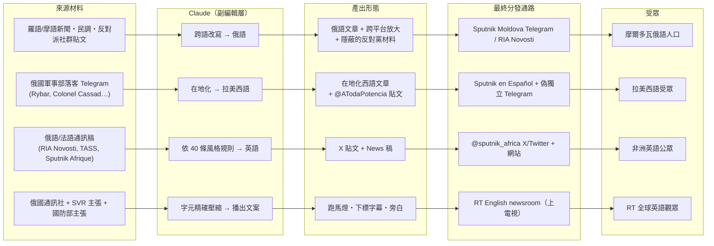

**這張表傳達的核心訊息（三點）**：

1. **Claude 是「翻譯＋體裁轉換」的樞紐，而不是「內容發明者」。** 四列的 Source material 全都是**既有的真實素材**（通訊稿、民調、部落客貼文、官方主張）。Claude 的工作是把它們轉成**另一種語言、另一種體裁、另一種受眾語域**。這解釋了為什麼傳統「AI 生成假新聞」的偵測思路（找幻覺、找事實錯誤）在此無效——內容的事實成分大多可查證。
2. **輸入鏈的最上游有國家機器。** RT 那一列的 Source material 明白寫著 SVR 與國防部。這張表是全報告少數把「情報機關 → 商用 LLM → 電視台」串成一條線的地方。
3. **受眾是「全球南方 + 前蘇聯空間」的分工佈局。** 摩爾多瓦（選舉）、拉美（西語）、非洲（英語）、RT 全球（英語）——四條線幾乎沒有重疊，說明這不是一個作業的四個副本，而是**同一套方法論在四個戰區的平行實作**。四個帳號彼此可能不認識（呼應導論 p.43：「The central setup meant that actors producing content never needed to coordinate with or even know one another.」）。

**課堂用法**：
- 把表格的 `Source material` 欄與 `Audience` 欄遮起來，只給 `Output form`，讓學員反推「這是給誰看的、原料是什麼」。訓練的是**從產物反推產製鏈**的分析肌肉。
- 讓學員在表上標出「哪一欄是平台看得到的、哪一欄是模型供應商看得到的、哪一欄是誰都看不到的」。答案：平台只看得到最右兩欄；模型供應商看得到左邊三欄；`Ultimate distribution channel` 這一欄，**只有把兩邊拼起來才知道**。這就是為什麼本案需要 Anthropic 的內部偵測 + 開源比對兩者合攏。

---

### 6.2 Figure 9（p.60）：用 Claude 產出、實際發布的 Telegram 貼文，2.09K 瀏覽

圖檔：`../figures/page-060.png`（頁面下半）

**報告圖說原文**：
> "Figure 9. An example of a post created with Claude as published, which received 2.09K views; **no other exact matches were observed**. \"Sputnik Moldova 2.0\" is part of a network of channels and sites associated with Sputnik News."

**圖片類型**：Telegram 貼文截圖，被放在一張淺綠色 Telegram 預設聊天背景（有淡色塗鴉圖案）上，外層再套一張白色卡片。這是典型的「Telegram 分享卡（share preview）」渲染樣式。

**平台與語言**：Telegram；貼文正文**俄語**；開頭有一面 🇷🇴 羅馬尼亞國旗 emoji；頻道名稱列被**打碼模糊**（可辨識為 "Sputnik Молдова 2.0" 加一面摩爾多瓦國旗 emoji，右上角是 Telegram 紙飛機圖示）。

**畫面上可見的介面元素（由上而下）**：
1. 圓形頻道頭像（深色，中央有橘黃色 Sputnik 標誌的一角）。
2. 頻道名稱列（模糊處理）＋ Telegram logo。
3. **影片附件**，中央有播放鍵，右下角顯示時長 **2:10**。畫面內容：一名穿白色衣物的人站在一面**大鼓**後方（畫面只見腰部以下的白衣與鼓面），色調偏舊、像檔案影片。與正文提到的 YouTube「Epoca de aur（黃金時代）」社會主義時期影像相符——這是**用檔案畫面營造懷舊情緒**的典型手法。
4. **正文（俄語，逐段）**：
   - 標題句（粗體）：`🇷🇴Две трети румын считают Чаушеску "хорошим лидером" — опрос.`
     → 「三分之二羅馬尼亞人認為齊奧塞斯庫是『好領導人』——民調。」
   - 第一段：`Такую оценку расстрелянному без суда и следствия руководителю социалистической Румынии дали 66,2% респондентов опроса румынского института INSCOP Research.`
     → 「這個評價來自羅馬尼亞 INSCOP Research 機構民調中 66.2% 的受訪者，對象是這位**未經審判與偵查即遭槍決**的社會主義羅馬尼亞領導人。」
   - 第二段：`◾️Менее четверти респондентов высказали мнение, что он был плохим руководителем, а 7,8% опрошенных затруднились дать ответ.`
     → 「不到四分之一受訪者認為他是差勁的領導人，7.8% 的受訪者難以回答。」
   - 第三段：`◾️В Youtube можно найти множество роликов с заголовком "Epoca de aur" ("Золотая эпоха"), с кадрами социалистического периода в истории Румынии.`
     → 「在 YouTube 上可以找到大量標題為 "Epoca de aur"（黃金時代）的影片，內含羅馬尼亞歷史上社會主義時期的畫面。」
   - 署名：`@rusputnikmd_2`
5. **反應列（emoji reactions）**：👍 **68**、👎 **5**、😊 **5**、❤️ **2**、🤗 **1**（合計 81 個反應）。
6. **頁尾列**：`t.me/rusputnikmd_2/12933`　👁 **2.09K**　`edited Jul 21 at 09:57`

**數字怎麼分布／怎麼解讀**：
- **2.09K 瀏覽 vs. 81 個反應** → 互動率約 **3.9%**。以 Telegram 新聞頻道而言不算低，但**絕對數量極小**。
- **貼文序號 12933** → 這個頻道（2025-02-25 才建立的 2.0 頻道）到 7 月已累積約 1.3 萬則貼文，平均每天上百則。**這說明：這是一條高吞吐的產線，2.09K 是其中一則的表現，不是整體表現。**
- **`edited`（已編輯）標記** → 貼文發出後被修改過。時間戳 `Jul 21 at 09:57` 是**編輯時間**，原始發布時間更早。這是**人工在 AI 產出之上再動手**的可見痕跡，也是 6.5 節「slight variation」概念在同一則貼文內部的微型版本。
- 👎 5 與 👍 68 的比例顯示**沒有明顯的反對聲量**——但也沒有辦法從這裡分辨真實受眾與訂閱基數。

**這張圖傳達的核心訊息**：
1. **「Claude 產出 → 實際發布」這件事是可以被證明的**，而且 Anthropic 做到了逐則比對。
2. 圖說中「**no other exact matches were observed**（沒有觀察到其他完全相符的例子）」是一句**極重要的自我限制聲明**：在 Moldova 這條線上，Anthropic 只確認了**這一則**完全相符。其餘只能說「內容經過管線」。這句話直接回答了「你怎麼知道不是更多」——答案是：**不知道**。
3. **2.09K 的意義**（連結章節導論）：導論 p.43–44 寫「Most of the content we discovered drew little or no authentic engagement」，同時寫「The widest authentic reach occurred **where state media outlets were the distribution mechanism**（including FM radio, satellite and shortwave radio, and global television）」。Figure 9 同時證明了兩件看似矛盾的事：**單則內容的觸及很平庸（2.09K），但它所在的通路是全報告觸及最廣的一類。** 教學上要讓學員理解：
   - 「生產能力 ≠ 影響力」——AI 給的是**產量**，不是**觸及**；
   - 但「產量 × 既有通路 = 影響力」——當產量接上國家媒體的既有分發能力，低單則觸及乘上高發文頻率（每天上百則）與跨媒體轉載，總曝光就不是 2.09K 這個量級；
   - 而且**真正的產出上限已經不是人力**了。過去一個俄語編輯每天能處理幾篇羅語素材？現在是多少？報告沒給數字，但這正是該讓學員估算的題目。

**課堂用法**：
- 讓學員計算：若 2.09K/則、每天 100 則、只算 Telegram，一年的曝光量級是多少？再問：「這個數字有意義嗎？」（答案：曝光量不是影響力的直接代理，但它是**必要條件**。）
- 討論「這則貼文哪裡是假的？」——民調是真的、66.2% 是真的、7.8% 是真的、Ceaușescu 未經正式審判即被處決也大致是史實。**可質疑的是框架**：把「懷舊民調」與「未經審判槍決」並置、末段導向 YouTube 的懷舊影片，整體效果是**替社會主義時期做情感背書**，而受眾是正在選擇歐盟路線或俄羅斯路線的摩爾多瓦俄語人口。**這是課程中最好的「真材料、假框架」教具。**

---

### 6.3 Figure 10（p.61）：RIA Novosti 上出現「略有變化」的額外標題

圖檔：`../figures/page-061.png`（頁面上半）

**報告圖說原文**：
> "Figure 10. Additional headlines with **slight variations** appeared in RIA Novosti. The RIA Novosti article was **republished by other pro-Kremlin publications**. Archived: hXXps[://]archive[.]ph/Q1zW0."

**圖片類型**：桌面瀏覽器中的新聞網站文章頁截圖（含右側欄），外框是一個圓角的裝置外框。

**平台與語言**：RIA Novosti 官網（ria.ru）；**俄語**。

**畫面上可見的元素（由上而下、由左而右）**：
1. **頂欄**：左側人形圖示（登入）、正中央藍色地球標誌 + `РИА НОВОСТИ` 字樣、右側放大鏡（搜尋）與訊息圖示。
2. **資訊列**：左 `19:56 21.07.2025`；右 `1725 просмотров`（**1,725 次瀏覽**）。
3. **左側 `Поделиться`（分享）與分享圖示**。
4. **主標題（大字）**：`Две трети румын считают Чаушеску хорошим лидером, показал опрос`
   → 「三分之二羅馬尼亞人認為齊奧塞斯庫是好領導人，民調顯示」
5. **副標（小字灰）**：`Более 66 % румын считают, что Чаушеску был хорошим лидером Румынии`
   → 「超過 66% 羅馬尼亞人認為齊奧塞斯庫曾是羅馬尼亞的好領導人」
6. **主圖**：藍黃紅三色的**羅馬尼亞國旗**在藍天下飄揚。圖片來源標記（小字）`© Flickr / …`，圖說 `Флаг Румынии. Архивное фото.`（羅馬尼亞國旗。檔案照。）
7. **分流列**：`Читать ria.ru в:` 後接三個圖示 —— `Дзен`（Yandex Zen）、`МАКС`（俄國國產通訊軟體 MAX）、`Telegram`。**這一列本身就是一張「官方多平台分發圖」**，見下方核心訊息。
8. **內文（俄語）**：
   - 電頭：`КИШИНЕВ, 21 июл - РИА Новости.`（**基希訥烏，7 月 21 日 — RIA Novosti**）接 `Две трети румын назвали бывшего руководителя Румынии Николае Чаушеску хорошим лидером, свидетельствуют результаты соцопроса, который провел Исследовательский центр INSCOP.`
   - 第二段：`Чаушеску руководил Румынией с 1965 по 1989 год и был свергнут в результате революции в декабре 1989 года. Политик и его жена Елена были казнены по приговору военного трибунала 25 декабря 1989 года.`（齊奧塞斯庫 1965–1989 統治羅馬尼亞，1989 年 12 月革命中被推翻。他與妻子 Elena 於 1989-12-25 依軍事法庭判決被處決。）
   - 第三段（引號直接引述）：`"На вопрос о том, был ли Чаушеску хорошим или плохим лидером для Румынии, 66,2% (две трети - ред.) респондентов ответили положительно", - говорится в материалах исследования, **которые публикуют румынские СМИ**.`
     → 「『對於齊奧塞斯庫對羅馬尼亞而言是好領導人還是壞領導人這個問題，66.2%（三分之二——編註）的受訪者給予肯定回答』，**由羅馬尼亞媒體刊出的**研究材料如是說。」
9. **右側欄**：`Новости партнеров`（合作夥伴新聞）+ `СМИ2` 標記，下方是一串與本文無關的推薦新聞（巴黎拍賣霸王龍皮手提包、機油漲價 50%、以色列與伊朗、澤倫斯基相關兩則）。

**「slight variation」到底變了什麼（逐字比對）**：

| 元素 | Figure 9（Telegram，Claude 產出） | Figure 10（RIA Novosti） | 差異性質 |
|---|---|---|---|
| 標題 | `Две трети румын считают Чаушеску "хорошим лидером" — опрос.` | `Две трети румын считают Чаушеску хорошим лидером, показал опрос` | 去掉引號、破折號改逗號、`— опрос` 改為 `показал опрос`（動詞化）→ **通訊社標題規範的標準化改寫** |
| 66.2% 的呈現 | 正文第一句 | 副標 `Более 66 %` + 內文直接引述 `66,2%` | 拆成副標與引述兩層 |
| 「未經審判槍決」 | 出現在第一句（`расстрелянному без суда и следствия`），與民調數字並置 | 移到第二段，改為中性史實敘述（`казнены по приговору военного трибунала`，依軍事法庭判決處決） | **情緒詞被拿掉；語氣中性化** |
| 7.8% 難以回答 | 有 | 無 | 被刪 |
| YouTube「黃金時代」影片 | 有（第三段） | 無 | 被刪 |
| 來源標示 | `румынского института INSCOP Research` | `Исследовательский центр INSCOP` + `которые публикуют румынские СМИ` | **來源被推遠一層** |
| 電頭 | 無（Telegram 貼文無電頭） | `КИШИНЕВ`（基希訥烏） | **地理歸屬被指定為摩爾多瓦** |
| 影音 | 2:10 檔案影片（社會主義時期） | 羅馬尼亞國旗檔案照 | 情緒載體降級 |

**這張圖傳達的核心訊息（四點）**：

1. **「slight variation」＝人工潤飾／二次編輯的指紋。** 差異的方向是高度一致的：**去情緒化、標準化、刪減、來源模糊化**。這不是隨機噪音，而是「通訊社體例」對「Telegram 體例」的規範性改寫。也就是說，**Claude 的產出經過了一個真人通訊社編輯的手**——這正好坐實了報告「Claude 是 sub-editor layer、上面還有人類編輯」的說法。
2. **電頭 `КИШИНЕВ` 是最強的一枚鑑識線索。** 一則關於**羅馬尼亞**民調（羅馬尼亞機構、羅馬尼亞受訪者、羅馬尼亞媒體刊出）的稿子，卻掛著**摩爾多瓦首都基希訥烏**的電頭。通訊社的電頭代表「這則稿由該地記者／分社發出」。這與報告所述「行為者是前 Sputnik Moldova 總編、位於摩爾多瓦線」完全吻合。**在沒有模型端日誌的情況下，外部研究者光憑電頭與內容的地理錯位就能提出假設。** 這是課堂最值得操作的開源分析練習。
3. **來源模糊化是可觀測的。** RIA 稿把出處寫成「由羅馬尼亞媒體刊出的研究材料」，而不是「INSCOP 與 IICCMER 於 7 月 21 日發布的民調」。少了機構全名、少了委託單位、少了發布日期——再轉載一層，追溯成本就大幅上升。這就是導論 p.43 所說 laundering of **sourcing**。
4. **官方分發列本身就是洗白鏈的第一段。** `Читать ria.ru в: Дзен / МАКС / Telegram` 這一列顯示 RIA 自己就把每則稿子推到三個平台。再加上圖說所說「被其他親克里姆林出版物轉載」，一則稿子的分身數量在 24 小時內就是兩位數。

**1,725 瀏覽這個數字要怎麼講**：RIA Novosti 是俄羅斯主要通訊社，單篇 1,725 次瀏覽只能算**極低**。這再次印證「單則內容的觸及平庸」。但要提醒學員：**RIA 的角色不是「被讀」，而是「被引用」。** 它是轉載鏈的權威源頭（authority anchor）。一則 RIA 稿的價值在於後面每一篇轉載都能寫「據 RIA Novosti 報導」。**用瀏覽數衡量通訊社稿的影響力，是量錯了東西。**

**課堂用法**：
- 把 Figure 9 與 Figure 10 並排投影，讓學員自己找出 7 處差異（上表），再問「這些差異是機器造成的還是人造成的？依據是什麼？」
- 延伸問題：「如果你只拿到 Figure 10，你有辦法知道它跟 AI 有關嗎？」（答案：不能。你只能發現電頭錯位與來源模糊——這足以立案調查，但不足以歸因到 AI。**歸因到 AI 需要模型端的一手資料。**）

---

### 6.4 Figure 11（p.61）：Sputnik Africa 的 X 帳號上、與 Claude 生成文字**完全相符**的貼文

圖檔：`../figures/page-061.png`（頁面下半）

**報告圖說原文**：
> "Figure 11. A post seen in the wild on Sputnik Africa's Twitter/X account, **matching the Claude-generated text exactly**. Archived: hXXps[://]x[.]com/sputnik_africa/status/2027706409727492278."

**圖片類型**：行動版／窄版網頁截圖（Sputnik Africa 的文章頁），畫面中有一段文字被**藍色反白選取**——這個反白正是報告作者標示「完全相符」的那一段。

**平台與語言**：Sputnik Africa（en.sputniknews.africa）；**英語**。archive 連結指向的是 **x.com 的一則貼文**，因此這張圖同時涵蓋「網站稿」與「X 貼文」兩個落點。

**畫面上可見的元素（由上而下）**：
1. **黑色頁首列**：橘色 Sputnik 箭頭標誌 + 白色 `SPUTNIK` 字樣 + 白色 `Africa` 副品牌字樣。
2. **標題（粗體大字，四行）**：
   `Ayatollah Ali Khamenei's Residence Almost Completely Destroyed After US Missile Strike, Reports Say`
3. **時間戳（小灰字）**：`12:23 28.02.2026 (Updated: 12:24 28.02.2026)`
4. **左側懸浮分享鈕**（黑底圓角方塊）。
5. **主圖**：一張**衛星／空照影像**，可見建築群、樹林、以及畫面中上方一柱**黑煙**與中段的灰白煙塵；部分屋頂呈焦黑塌陷狀。圖片來源標記：`© telegram sputnik_africa`。
6. **訂閱列**：`Subscribe` 後接黑色 **X** 圖示與藍色 **Telegram** 圖示。
7. **藍色反白選取的文字區塊**（＝與 Claude 產出完全相符的部分）：
   - 第一行與第二行：`Ayatollah Ali Khamenei's Residence Almost Completely Destroyed After US Missile Strike, Reports Say`
   - 第三行：`Subscribe to @sputnik_africa`
8. **來源連結列**：橘色 `Sputnik Africa` ｜ 橘色 `X`。
9. **標籤**：一個灰框小標籤 `Sputnik Africa`。
10. **情緒反應列**（Sputnik 網站自家的六格反應）：👍 **0**、👎 **2**（紅色，唯一被點過的）、😀 0、😮 0、😞 0、😠 0。
11. **頁尾推廣卡**：`Follow us on Telegram to get the latest breaking & exclusive stories from Africa and around the globe.` + 藍色 `Follow` 按鈕 + 插畫（一名人物坐在紙飛機上）。

**這張圖為什麼是全報告最重要的一張（五點）**：

1. **這是全報告唯一的 exact match。** 報告用詞是 "matching the Claude-generated text **exactly**"。相對於 Figure 9 的「as published」與 Figure 10 的「slight variations」，這裡是**零差異**。意義：**這一段文字從模型輸出到國家媒體官方帳號發布，中間沒有任何人改過一個字元。** 「副編輯層」在這個瞬間變成了「唯一的編輯」。
2. **反白區包含 `Subscribe to @sputnik_africa`。** 這句不是新聞內容，而是**帳號推廣文案**。它落在 exact match 的範圍內，代表 Claude 產出的不只是標題，而是**整個社群貼文模板（標題 + CTA）**。這與 p.60 表格所說「@sputnik_africa X/Twitter and News posts under a 40-rule house style guide」完全一致——40 條規則裡顯然包含「每則貼文結尾要附訂閱呼籲」這類格式規範。
3. **`Reports Say`（據報導）是確信度洗白的活標本。** 標題本體是一個**未經證實**的強烈主張（伊朗最高領袖官邸幾乎全毀），結尾用 "Reports Say" 卸責。導論 p.43 描述的手法是：「an actor produced claims the model flagged as unverified, then instructed it to **drop those caveats** and present everything as confirmed」——這裡是那個手法的另一個變體：**保留一個最小的、看似負責任的 hedge，實際上讓未經證實的主張取得可發布性**。課堂可以讓學員比較這兩種確信度操作。
4. **圖片來源 `© telegram sputnik_africa` 是循環引用（circular sourcing）的可見證據。** 一則新聞的關鍵影像，來源標註為**自家的 Telegram 頻道**。也就是：Sputnik Africa 網站引用 Sputnik Africa Telegram。對讀者而言看起來像「有出處」，實際上出處是自己。**這是課堂上判讀「來源鏈是否有外部錨點」的完美範例，而且不需要任何工具就能看出來。**
5. **反應列 👍0 / 👎2 再次驗證「觸及 ≠ 影響」。** 這則發生在重大國際事件當天、由國家媒體官方帳號發布、上了衛星影像的稿子，網站上的互動是**零個讚、兩個倒讚**。AI 讓產能起飛，讀者的手指沒有跟著動。

**時間戳的鑑識價值（本節唯一的推導，非報告內容，請在課堂上標示為示範）**：
- archive 連結是 `x[.]com/sputnik_africa/status/**2027706409727492278**`。X（Twitter）的貼文 ID 是 snowflake 格式，前 41 位元是毫秒時間戳，可用 `(id >> 22) + 1288834974657` 還原。代入本案 ID 得到 **2026-02-28 11:24:15 UTC**。
- 網頁時間戳是 `12:23`（更新 `12:24`）`28.02.2026`。若該頁以 UTC+1 呈現，則「更新時間 12:24」與「X 貼文 11:24 UTC」**在同一分鐘**。
- 教學價值：**只憑一個公開的 URL，就能把貼文時間精確到秒，而且不必連線該網址。** 這正是 IOC 安全處理原則（第 7 節）與開源鑑識能力可以並存的示範。**課堂務必強調：計算 snowflake 不需要連線，不要真的去開那個連結。**
- 限制：此推導依賴 X 的 snowflake epoch 常數，且未經 Anthropic 證實；報告本身沒有給貼文時間。列入第 12 節研究限制。
- **技術深化**：完整 64 位元佈局、逐位元解算（含 `.699` 毫秒與 datacenter/worker/sequence 欄位）、與網頁時間戳的交叉驗證、以及「不連線」的反向時間範圍查詢公式，見 **第 13.3 節**。

**事件背景（獨立查證）**：2026-02-28 確實發生了針對哈梅內伊（Ali Khamenei）位於德黑蘭 Pasteur 區官邸建築群的空襲，多方報導為美以聯合行動；當天出現「已死亡／安然無恙」的矛盾說法，伊朗官方直到 **2026-03-01 凌晨**才正式宣布其死訊（Wikipedia "Assassination of Ali Khamenei"；Iran International 2026-02-28 衛星影像報導；CNN 2026-02-28 即時報導）。**這正是 Sputnik Africa 那則 "Reports Say" 標題所處的資訊真空期**——事件為真、細節未定、各方搶發。**AI 在「突發事件的資訊真空期」提供的速度優勢，正是最危險的地方。** 這對應 DISARM 的 T0068（Respond to Breaking News Event or Active Crisis）。

**課堂用法**：
- 這是講「內容指紋比對」最好的一張圖（見 6.5）。
- 讓學員找出「這則貼文有幾個地方可以在不查證事實的前提下就標記為可疑」。參考答案：① "Reports Say" 的卸責式標題結構；② 圖片來源是自家 Telegram（循環引用）；③ 發布時間落在事件後 1 小時內、屬資訊真空期；④ 標題與 CTA 綁在同一段文字（模板化）。

---

### 6.5 三張圖合起來教的方法論：**內容指紋比對（Content Fingerprint Matching）**

這是本案**獨有的教學價值**：全報告只有 GTG-24015 能把「模型端的生成紀錄」與「公開平台上實際發布的國家媒體內容」逐字對上。以下把方法論拆解成可教、可練的步驟。

#### 6.5.1 兩端與中間

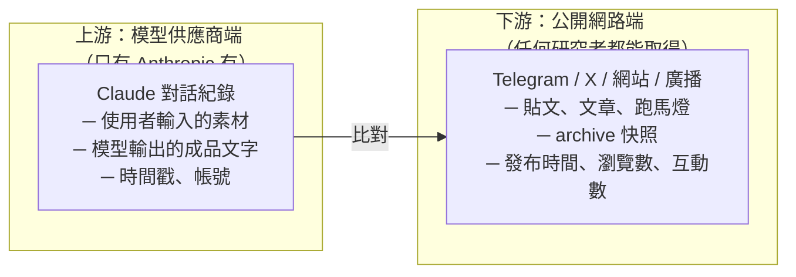

比對的「指紋」不是雜湊值（文字會被改），而是**一組層層退化的相似度**：

| 匹配等級 | 定義 | 本案例證 | 推論出的人為介入程度 |
|---|---|---|---|
| **L0 完全相符（exact match）** | 字元級完全一致，含標點與 CTA | **Figure 11**（Sputnik Africa X 貼文） | **零**。人類只按了「發布」 |
| **L1 輕微變異（slight variation）** | 語意與結構保留，標題／措辭被規範化改寫、段落被增刪 | **Figure 10**（RIA Novosti 標題） | **輕度人工潤飾／二次改寫**（通訊社體例編輯） |
| **L2 同源改寫** | 同一素材、同一論點結構，但重寫幅度大 | 報告未舉例；Figure 9→10 的內文即偏向 L1/L2 之間 | 中度；或經過另一次 AI 改寫 |
| **L3 僅主題與素材重疊** | 只能說「來自同一條產線」 | 報告對其餘產出的處理方式 | 無法判定 |

報告在 p.58 明確說出自己的匹配範圍：
> "Where we **matched individual Claude-produced output against published content**, results ranged from a Telegram post with roughly 2,000 views to the aired broadcast copy."

以及 Figure 9 圖說的自我限制：
> "**no other exact matches were observed**"

**教學重點**：L0 的證據力極高但數量極少；L1 的數量多但需要判斷；L2/L3 只能支撐「型態相符」而非「同一來源」。**一份負責任的報告會把三種等級分開陳述——Anthropic 在本案做到了，這是可以拿來當作分析寫作範本的。**

#### 6.5.2 exact match 與 slight variation 各代表什麼

| | **Exact match（Figure 11）** | **Slight variation（Figure 10）** |
|---|---|---|
| 直接意涵 | 直接複製貼上 | 人工潤飾或二次改寫 |
| 對「AI 角色」的推論 | AI 就是**最終作者** | AI 是**初稿作者**，人類是**終審** |
| 對「流程」的推論 | 管線的這一段**沒有人類編輯環節**（或編輯只按發布） | 管線有**真實的編輯環節**，符合「專業編輯的產線」描述 |
| 對「查核」的意涵 | 一旦拿到模型端紀錄，歸因**無爭議** | 需要判斷「差異是否在可接受的改寫範圍內」，歸因有**論證成本** |
| 對「偵測」的意涵 | 可用字串／近似重複比對自動化 | 需要語意相似度（embedding）與結構比對 |
| 風險意涵 | **速度最快、把關最少**——通常出現在**突發事件**與**社群貼文**這類低儀式性的產出 | 出現在**通訊社正稿**這類有體例規範的產出 |
| 反直覺之處 | 「更嚴重」的通路（通訊社）反而人工介入**較多** | — |

> **請在課堂上點出這個反直覺結論**：本案中**人工把關最少的地方，是社群貼文**（Figure 11，exact match）；**人工把關較多的地方，是通訊社正稿**（Figure 10，slight variation）。這符合新聞業的現實——正稿有體例、有簽核；社群貼文由小編快速發出。**AI 首先吃掉的，是編輯流程中儀式感最低、把關最鬆、速度要求最高的環節。** 這個規律可以直接平移到任何媒體組織的風險評估：**先看你的社群小編，再看你的正稿編輯台。**

#### 6.5.3 沒有模型端資料時，外部研究者能做什麼

本案的 L0 證據只有 Anthropic 有。但下游可觀測的**代理訊號（proxy signals）**很多，且本案的三張圖都示範了：

1. **跨平台近似重複偵測**：同一則內容在同一天出現在 Telegram 與通訊社網站（Fig.9→10）；同一段文字同時出現在網站與 X（Fig.11）。做法：對目標媒體叢集做定期抓取 + MinHash／SimHash 近似重複比對 + 時間序列排序，找出「誰先誰後」。
2. **地理／電頭錯位**：羅馬尼亞題材配基希訥烏電頭（Fig.10）。做法：把「稿件主題國」與「電頭城市」建成對照表，異常組合自動告警。
3. **來源鏈的外部錨點檢查**：圖片來源標為自家 Telegram（Fig.11）；引述來源寫成「羅馬尼亞媒體」而非具名機構（Fig.10）。做法：抽取每篇稿的來源實體，計算「外部具名來源比例」，低於閾值即標記。
4. **模板化痕跡**：標題 + 固定 CTA 綁在同一段（Fig.11）；固定的 `◾️` 項目符號樣式（Fig.9）。做法：對單一頻道的貼文做結構聚類，找出高度模板化的產出族群。
5. **編輯痕跡**：Telegram 的 `edited` 標記與編輯時間（Fig.9）。做法：Telegram 貼文的編輯狀態是公開可見的，可長期記錄。
6. **發布節奏**：貼文序號 12933 對應約 5 個月 → 每天上百則（Fig.9）。做法：用序號差／時間差估算頻道吞吐量，找出吞吐量的**躍升點**（通常對應工具導入時點）。
7. **時間戳鑑識**：從 X 貼文 ID 還原精確到秒的發布時間（6.4），用來排序跨平台的先後。

> **這七項全部可以在教室裡做，不需要碰任何惡意基礎設施。** 第 10.3 節會把它們組成桌面演練。

> **技術深化**：這七項代理訊號背後的演算法（正規化前處理、SimHash、MinHash+LSH、編輯距離、多語 embedding）、可操作的「模型端 ↔ 公開端」比對 pipeline、L0–L3 的具體門檻與決策樹，見 **第 13.1 節**；洗白鏈的轉載圖建構與可部署偵測規則（KQL）見 **第 13.2 節**。

---

### 6.6 課程流程說明：「Ceaușescu 民調」洗白鏈的完整走位（以 Figure 9 → Figure 10 為骨架）

這是本案最適合當成**教學主線**的一條鏈——因為它的每一站都有可見證據，而且**素材是真的**，能逼學員面對「真素材也能被武器化」的現實。以下逐站說明「發生什麼」「誰看得到」「查核者在這一站會遇到什麼困難」。

#### 站 0｜合法素材誕生（2025-07-21，布加勒斯特）

- **事實**：INSCOP Research 與 IICCMER 合作發布民調《Percepția populației cu privire la regimul comunist. Reperele nostalgiei》（公眾對共產政權的認知：懷舊的指標）。樣本 1,500–1,505 人，誤差約 ±2.5%。**66.2%** 認為 Ceaușescu 是好領導人，約 **24%** 認為是差的領導人。
- **委託單位是誰**：IICCMER 是羅馬尼亞官方設立的「共產罪行與羅馬尼亞流亡記憶調查所」——**這份民調的委託目的是警示懷舊風險，不是頌揚**。
- **誰看得到**：所有人。羅馬尼亞媒體（G4Media、Bursa、ProTV、News.ro）當天大量報導，羅馬尼亞總統公開表達憂慮。
- **查核者的處境**：無事可查，這是一份正常的民調。

> **教學點**：洗白鏈的起點常常是**完全乾淨的**。這是它最難防的原因——你不能因為「這是真的民調」就放行，也不能因為「後來被利用」就懷疑民調本身。

#### 站 1｜跨語言改寫（同日，摩爾多瓦／Claude）

- **發生什麼**：行為者 A 把羅馬尼亞語報導餵給 Claude，要求產出俄語貼文。
- **這一站做了哪些選擇**（從 Figure 9 反推）：
  - 選 66.2% 當標題數字（而不是「約 24% 認為他差」或民調中其他面向的數字）。
  - 在**第一句**就插入 `расстрелянному без суда и следствия`（未經審判與偵查即遭槍決）——**把「懷舊民調」與「處決的不正義」綁在一起**。
  - 把約 24% 改成模糊的「不到四分之一」，卻保留精確的 7.8%（難以回答）——**精確度的選擇性使用**。
  - 末段主動導引到 YouTube 的「Epoca de aur（黃金時代）」懷舊影片——**提供下一步的消費路徑**。
  - 配上一段 2:10 的社會主義時期檔案影片——**情緒載體**。
- **誰看得到**：**只有 Anthropic**。這一站是整條鏈中唯一不在公開網路上的。
- **查核者的處境**：**完全看不到**。這是本案的核心教訓。

> **教學點**：要問學員一個尖銳的問題——「上面那五個『選擇』，有哪一個是 Claude 自己做的、哪一個是人類指示的？」**報告沒有公開對話紀錄，所以我們不知道。** 這個不確定性本身要講清楚：**「AI 生成」不等於「AI 決定」。** 框架很可能是人給的，AI 只是執行。

#### 站 2｜第一次發布：Telegram（2025-07-21 上午，@rusputnikmd_2）

- **證據**：Figure 9。貼文編號 12933，`edited Jul 21 at 09:57`，**2.09K 瀏覽**，81 個反應。
- **誰看得到**：任何人。Telegram 頻道公開。
- **查核者的處境**：能看到，但**沒有理由去看**——這是一則關於羅馬尼亞民調的俄語貼文，事實正確，沒有任何觸發查核的訊號。**這正是「真素材」的防護效果。**
- **可觀測的異常**：`edited` 標記（發布後被改過）。**這是唯一的鑑識痕跡，而且幾乎沒有人會去記錄它。**

#### 站 3｜升格為通訊社稿（2025-07-21 19:56，ria.ru）

- **證據**：Figure 10。**1,725 瀏覽**，電頭 `КИШИНЕВ`（基希訥烏）。
- **這一站發生了什麼（關鍵）**：
  1. **標題被規範化**：`— опрос.` → `, показал опрос`（符合通訊社標題體例）。
  2. **情緒詞被移除**：「未經審判槍決」從第一句移到第二段，並改寫為中性的「依軍事法庭判決處決」。
  3. **內容被刪減**：7.8% 沒了、YouTube 懷舊影片沒了。
  4. **來源被推遠**：從「INSCOP Research 研究機構」變成「由羅馬尼亞媒體刊出的研究材料」。
  5. **地理歸屬被指定**：加上基希訥烏電頭。
- **誰看得到**：任何人。
- **查核者的處境**：**開始有可查的東西了**——電頭與題材的地理錯位、來源模糊化。但單看這一篇，仍然「事實正確」。
- **這一站的身分轉換**：貼文（低權威）→ **通訊社稿（高權威）**。這是整條鏈的**權威升格點**。

> **教學點**：Figure 9 → Figure 10 的改動方向**全部指向同一個目的：讓它看起來更像一則正規的、中立的、機構級的新聞**。這就是「洗白」在文本層面的具體操作。**去情緒化不是變得更客觀，而是變得更難質疑。**

#### 站 4｜轉載擴散（2025-07-21 之後）

- **報告原文**：「The RIA Novosti article was **republished by other pro-Kremlin publications**.」（Figure 10 圖說）
- **可能的節點**（p.62 IOC 表所列的「Moldovan amplification ecosystem」）：`eadaily[.]com`（已受歐盟制裁）、`point[.]md`、`vz[.]ru`、`mos[.]news`、`ru[.]euronews[.]com`。
- **RIA 官方自己的分發**：文章頁上就有 `Читать ria.ru в: Дзен / МАКС / Telegram`——**通訊社本身就把每則稿推到三個平台**。
- **誰看得到**：任何人，但**需要主動去找**。沒有人會為一則民調新聞做跨網域追蹤。
- **查核者的處境**：**這裡是崩潰點**。一旦內容出現在 N 個站，讀者（與搜尋引擎、與 LLM 檢索）看到的是「多家媒體都在報」。要證明它們同源，必須做近似重複比對 + 時間序列——**這是研究工作，不是查核工作**。

#### 站 5｜受眾接收（摩爾多瓦俄語人口，2025 年夏，選前兩個月）

- **接收到的訊息**：不是「66.2%」這個數字，而是一個**情感結論**——「連羅馬尼亞人自己都懷念社會主義時代」。
- **這個結論在摩爾多瓦的政治功能**：摩爾多瓦與羅馬尼亞同文同種，羅馬尼亞是摩國走向歐盟的參照對象。「羅馬尼亞人懷念共產時代」直接侵蝕「歐盟路線 = 更好生活」這個核心論證。
- **距離投票日**：約 **69 天**。

#### 整條鏈的可見性地圖（本節的總結圖）

```
站別    0 素材      1 AI改寫     2 Telegram   3 RIA通訊社   4 轉載鏈       5 受眾
       ──────────────────────────────────────────────────────────────────────────
一般公眾  ✓看得到    ✗看不到      ✓但不會看     ✓但不會看     ✓但看不出同源   ✓只接收結論
查核組織  ✓可查      ✗看不到      ✓無觸發訊號   △電頭異常     △需研究能力     ✗來不及
模型供應商 ✗         ✓✓唯一       ✗            ✗             ✗              ✗
開源研究者 ✓         ✗            ✓可監測       ✓可監測       ✓✓最佳落點      ✗
```

> **課堂上要讓學員自己畫出這張表**，然後問三個問題：
> 1. 有沒有任何一個角色能看到**整條鏈**？（答案：**沒有**。）
> 2. 若要看到整條鏈，需要哪幾個角色合作？（答案：**模型供應商 + 開源研究者**，而且要能交換資料。）
> 3. 目前有任何機制讓他們交換資料嗎？（答案：報告 p.62 只說「shared indicators with industry and research partners」——**是單向的、自願的、不透明的**。）

#### 為什麼這條鏈讓事實查核特別困難——五點結論（可直接當投影片）

1. **起點是真的。** 傳統查核的第一步「這是真的嗎」在站 0 就得到「是」。查核流程被設計成在起點就停下。
2. **武器化發生在看不見的地方。** 真正的操弄動作（選什麼數字、配什麼情緒、導向哪裡）發生在站 1，而站 1 只有模型供應商看得見。
3. **權威升格是合法的。** 站 2 → 站 3 的「貼文變成通訊社稿」在新聞業是天天發生的正常事。沒有規則被打破。
4. **同源性被刻意抹除。** 站 3 → 站 4 的每一次轉載都會進一步模糊來源。查核者要證明同源，成本隨節點數線性上升，而產製成本因 AI 趨近於零。**攻防成本比是發散的。**
5. **時間尺度不對等。** 站 1 到站 4 在**同一天**完成；一份嚴謹的查核報告需要數天。**等查核出來，敘事已經沉澱成受眾的背景知識。**

> **一句話總結（給學員抄）**：
> **「洗白鏈不是把假的變成真的，而是把『有立場的選擇』變成『看起來沒有立場的事實』——而 AI 讓這個轉換可以在一小時內、以任意語言、重複無數次地完成。」**

---

## 7. IOC 與技術指標

> **安全紅線（務必向學員宣達）**：下表所有網域、Telegram handle、X 貼文 URL、archive 連結**僅作為研究資料抄錄**。
> **不要用瀏覽器開啟、不要 WebFetch、不要做 DNS 查詢、不要丟進任何線上沙箱或互動式服務。**
> 報告原文以 `hXXps[://]` 與 `example[.]com` 的 defang 形式呈現，本檔**保留原樣**。
> 本案的 IOC 與網攻案例的 IOC 性質不同：這裡沒有惡意程式，指標的價值是**追蹤分發生態系**，而不是阻擋連線。因此更適合放進**媒體監測清單**與**內容來源黑名單**，而不是防火牆。

### 7.1 報告 p.62 IOC 表逐列抄錄（含偵測價值與壽命評註）

| Category（原文） | Indicator（原文，保留 defang） | Type / note（原文） | 這個指標的偵測價值與壽命（本檔補充） |
|---|---|---|---|
| State media outlets | Sputnik Moldova; RIA Novosti; Sputnik en Español; Sputnik Africa (@sputnik_africa); RT English (Russia Today, ANO TV-Novosti) | （原表此列 Type/note 欄為空） | **價值：低作為「指標」，高作為「監測標的」。** 這五個名字不是秘密，本來就是公開掛牌的國家媒體。它們在此出現的意義是：**Anthropic 把「合法媒體品牌」寫進了 IOC 表**——這在威脅情報實務上是罕見且值得討論的一步（見 7.3）。**壽命：無限**（機構不會消失），但也因此**沒有阻擋價值**。 |
| Deceptive amplification asset | @ATodaPotencia (Telegram) | Presents Kremlin-aligned content as organic Latin American analysis | **價值：高。** 這是本案唯一被明確定性為「欺騙性資產」的帳號——它自稱獨立、實際承接國家媒體產出。**壽命：中等。** Telegram 頻道可被關閉或改名，但既有的訂閱群與轉發網通常會跟著遷移到新 handle，所以要追蹤的是「內容特徵」而非 handle 本身。 |
| Moldovan amplification ecosystem | eadaily[.]com (EU-sanctioned); point[.]md; vz[.]ru; mos[.]news; ru[.]euronews[.]com | Domains | **價值：高，且可直接操作。** 這是「洗白鏈的中繼站清單」。**壽命：長**（這些是經營多年的網域）。**用法**：把這五個網域加入媒體監測的抓取清單，做跨網域近似重複比對，就能觀測一則 RIA 稿在多久之內、以什麼措辭出現在幾個站。**注意** `ru[.]euronews[.]com` 這一筆——Euronews 的俄語服務被列進「親克里姆林放大生態系」是一個需要謹慎處理的判斷，報告未說明理由（見第 12 節）。 |
| Source-laundering ecosystem (Russian military-propaganda Telegram) | Rybar (@rybar_america); Colonel Cassad (@boris_rozhin); @theaterVD; @china3army; @kalashnikovnews | Telegram channels | **價值：高，是「輸入端」指標。** 這五個頻道是拉美線的**素材來源**，不是分發通路。監測它們可以做到**預測性**——先看到原始敘事在軍事部落客圈出現，再看它多久後以西語出現在 Sputnik en Español。**壽命：長**（Rybar、Colonel Cassad 都是經營多年、訂閱數以十萬計的頻道）。 |

### 7.2 從圖表中額外可抄錄的指標（報告 IOC 表未列，但圖上可見）

| 指標 | 來源 | 說明與偵測價值 |
|---|---|---|
| `@rusputnikmd_2`（Telegram 頻道 handle） | Figure 9 貼文署名 | 「Sputnik Moldova 2.0」頻道。**報告 IOC 表只寫 "Sputnik Moldova"，沒有給 handle**——這個 handle 只出現在圖上。對外部研究者而言，這是最直接可監測的單一資產。 |
| `t.me/rusputnikmd_2/12933`（貼文 URL） | Figure 9 頁尾 | 具體貼文編號。**序號本身有情報價值**：可用來估算頻道吞吐量與成長曲線。 |
| `hXXps[://]archive[.]ph/Q1zW0` | Figure 10 圖說 | RIA Novosti 那篇文章的存檔快照。**壽命：長**（archive.ph 快照不隨原站改動而變）。 |
| `hXXps[://]x[.]com/sputnik_africa/status/2027706409727492278` | Figure 11 圖說 | Sputnik Africa 的 exact-match X 貼文。ID 可離線還原時間戳（見 6.4）。 |
| `hXXps[://]archive[.]ph/GZCoq` | p.57（前一案 GTG-14002 的 Figure 8） | **不屬本案**，勿混用。列此僅提醒學員注意 p.57–58 的頁面交界處 IOC 表歸屬問題。 |

### 7.3 為什麼「把合法媒體寫進 IOC 表」值得單獨討論

傳統 IOC 表裡的每一列都隱含「看到它就該採取行動」。但本案第一列是五家有名有姓、在俄羅斯合法登記、在多國有記者證與轉播協議的媒體機構。把它們列為 indicator，實際上是在說：**「這些機構的產出，可能整批含有 AI 產製、未經獨立查證的內容。」**

這帶出三個課堂議題：
1. **威脅情報與新聞自由的邊界。** 把媒體機構寫進 IOC 表，和把它們列入制裁名單，是兩件事還是同一件事的不同階段？
2. **指標的可操作性。** 你不可能「封鎖 RIA Novosti」，那這一列要怎麼用？（可行的用法：內容標籤、來源加權降級、要求二次確認、納入監測抓取清單。）
3. **誤傷風險。** `ru[.]euronews[.]com` 與 `point[.]md` 這類指標，若被下游系統當成「惡意網域」阻擋，會造成什麼後果？報告沒有給出處理建議。

---

## 8. Anthropic 的偵測、處置與防線缺口

### 8.1 報告寫了什麼（p.62 全文）

> "**Disruption and mitigations**
> We identified these accounts through our **internal detections**, **banned the accounts** associated with all four operations, and **shared indicators with industry and research partners**."

三個動作，就這樣。對照同章其他案例（例如 p.57 的 GTG-14002 有「Claude refused or partially refused the actor's requests at several points…」整段描述），本案的處置段落是**全章最短的之一**。

### 8.2 報告**沒有**寫的（這才是課程的高價值素材）

逐條列出本案的資訊缺口，每一條都標明是「報告未提及」而非「報告否認」：

| 缺口 | 說明 | 為什麼重要 |
|---|---|---|
| **① 完全沒有提到 Claude 拒絕過任何請求** | 前一案（p.57）明確寫 Claude 曾識別出捏造檔案是政治誹謗材料而拒絕；本案**一個拒絕案例都沒有**。 | 這很可能不是遺漏，而是**本案的請求在表面上看起來完全正常**——「把這篇羅語新聞改寫成俄語文章」「把這則稿壓成 60 字元的跑馬燈」在任何情境下都是合法的編輯工作。**安全防護無從觸發。** 這是本案最重要的防線缺口。 |
| **② 沒有說明四個帳號是怎麼被偵測到的** | 只寫 "internal detections"。 | 對照導論 p.42：「Actors use AI to plan their campaign, choose their targets, and write the material. Those types of tasks produce signals that our systems are trained to detect」。但本案行為者**沒有在規劃campaign、沒有在選目標**——他們只是在寫稿。那訊號從何而來？報告沒說。 |
| **③ 沒有說明四個帳號各自存在多久、產出多少** | 報告只說「four accounts」「four operations」。 | 缺少時間跨度就無法評估**危害規模**。對照 p.58 自承：「We're not able to determine what share of the outlets' total output passed through the pipelines that involved Claude.」 |
| **④ 沒有說明行為者是否試圖規避偵測** | 導論 p.43 描述其他案例有 VPN、外國門號、輪換帳號、第三方 IP 遮蔽。本案只說「attempted to conceal their identities」（p.58），沒有細節。 | 若行為者**沒有**做規避而仍難以偵測，代表問題出在「行為本身太正常」；若**有**規避，代表 Anthropic 的偵測穿透了規避。兩種結論的政策意涵完全不同。 |
| **⑤ 沒有說明封鎖後發生什麼** | 沒有「行為者重建帳號」「作業停止」「內容產出下降」等後續。 | 對照本報告網攻章節多次出現「行為者在被偵測後重建」的描述。影響力行動的復原成本極低——換一個帳號、換一張信用卡就好。**封鎖 4 個帳號對一個國家媒體集團的實際影響，報告沒有任何評估。** |
| **⑥ 沒有 Breakout Scale 分級** | p.42 宣告全章用 Breakout Scale 衡量影響，但本案沒給分級。 | 見 5.3。 |
| **⑦ 沒有提到與媒體機構、平台或政府的協調** | 只寫「shared indicators with industry and research partners」。 | 沒有說是否通知了 Telegram、X、摩爾多瓦當局或歐盟。 |
| **⑧ 沒有說明 RT 那條線的「至少一次確認播出」是怎麼確認的** | p.59 寫 "In at least one confirmed instance, this material actually made it to Russian airwaves."；p.58 寫 "the aired broadcast copy"。 | 廣播內容的比對需要錄影監看或第三方監測資料。報告沒有說來源，也沒有附圖（Figure 9–11 都不是廣播）。**這是全案證據鏈最弱的一環，卻是危害最高的一環。** |

### 8.3 防線為何在本案失效：三層分析

**第一層：請求層面沒有可拒絕的東西。**
Claude 的安全機制主要針對「有害的請求意圖」。但本案的請求是：翻譯、改寫、壓縮、套用風格指南。這些請求的**有害性不在請求裡，而在請求的上下文**——誰在問、為了發到哪裡、給誰看。模型看不到這些。**這是「脈絡性有害（contextually harmful）」問題**，而不是「內容性有害（intrinsically harmful）」問題。

**第二層：沒有假身分可查。**
影響力行動的偵測傳統上依賴「不真實性」。本案的行為者是**真的新聞從業者**（或前從業者），做的是**真的新聞工作**，發到**真的媒體**。Anthropic 平台上的訊號只剩「大量跨語言新聞改寫」，而這與一家合法的國際通訊社使用 AI 輔助翻譯**在資料上完全無法區分**。

**第三層：輸出的落點不在平台的視野內。**
p.42 自承：「Our visibility into these operations **ends once it's live**.」Anthropic 只看得到輸出的文字，看不到它被發到哪裡。要知道落點，必須反過來**從公開網路回推**——這就是為什麼本案的證據是三張截圖，而不是三段日誌。

### 8.4 這對防禦方（尤其是台灣）的意涵

1. **模型供應商不是最後一道防線，也不可能是。** 一個能寫新聞稿的模型，必然能寫宣傳稿。試圖用「模型拒絕」來擋住本案這類濫用，等於要求模型拒絕所有新聞編輯工作。
2. **偵測必須移到「分發端 + 內容血緣」。** 唯一穩健的做法是在**公開網路端**建立長期監測，找出轉載鏈、來源循環、模板化與吞吐量躍升。
3. **「AI 使用揭露」比「AI 偵測」更務實。** 與其偵測文本是否由 AI 生成（技術上不可靠），不如要求媒體揭露 AI 在產製流程中的角色。這是政策層面的槓桿點，且台灣的媒體自律機制有條件先行。
4. **威脅情報社群要接受「沒有惡意程式的威脅情報」。** 本案沒有 hash、沒有 C2、沒有 CVE。若你的情報流程只吃得下技術指標，你會漏掉整個影響力行動領域。

---

## 9. 第三方驗證與外部來源

### 9.1 結論先講：**本案是單一來源情報（single-source intelligence）**

截至 2026-09-13，**沒有任何第三方對 GTG-24015 做出獨立查證**。所有提及本案的報導都是**轉述 Anthropic 報告**。具體而言：

- 沒有任何研究機構獨立確認「Figure 11 的 X 貼文是 AI 生成的」。
- 沒有任何機構取得 Anthropic 的模型端日誌。
- 被點名的五家媒體機構**沒有公開回應**（Cyber Kendra 明確寫道："The organisations named have not publicly accepted the allegations."）。
- Anthropic 自己也沒有公開 Claude 的輸出原文，只公開了**發布後的截圖**。

**這是課程必須誠實面對的事實**：本案的核心主張（exact match）在方法論上極為有力，但在證據可及性上**完全依賴 Anthropic 的自我陳述**。

### 9.2 引述 Anthropic 的報導（非獨立查證）

| 來源 | URL | 日期 | 性質 | 與本案相關的內容 |
|---|---|---|---|---|
| Anthropic（一手） | https://www.anthropic.com/threat-intelligence-report-september-2026 | 2026-09-10 | **一手來源** | 報告網頁版＋PDF 下載 |
| Unite.AI（Miles Okada） | https://www.unite.ai/anthropic-details-disrupted-claude-misuse-across-seven-harm-areas/ | 2026-09-10 | **僅引述 Anthropic** | 「GTG-24015 involved four accounts that used Claude as an editorial desk feeding Russian state media including Sputnik Moldova, RIA Novosti, Sputnik en Español, Sputnik Africa, and RT English」 |
| Cyber Kendra | https://www.cyberkendra.com/2026/09/anthropic-threat-report-says-ai-now.html | 2026-09（月） | **僅引述 Anthropic**，但有加註 | 「Claude sat inside already-running, professionally edited pipelines as a sub-editor layer.」並註明「The organisations named have not publicly accepted the allegations.」 |
| The Hacker News | https://thehackernews.com/2026/09/claude-used-to-automate-exploitation.html | 2026-09-11 | 僅引述 Anthropic | 全篇重點在網攻案例，影響力行動著墨極少 |
| 中央社（李佩珊） | https://www.cna.com.tw/news/aopl/202609110025.aspx | 2026-09-11 | 僅引述 Anthropic | **完全未提及**本案、Sputnik、摩爾多瓦；重點是中國蒸餾與俄國網攻 |
| TechNews 科技新報（陳冠榮） | https://technews.tw/2026/09/11/anthropic-on-detecting-and-countering-misuse-of-ai/ | 2026-09-11 | 僅引述 Anthropic | **完全未提及**本案；只在導言列「資訊操弄」為七大類之一 |
| 聯合新聞網 | https://udn.com/news/story/6811/9747890 | 2026-09 | 僅引述 Anthropic | 同上，重點在中俄網攻與蒸餾 |
| unwire.hk | https://unwire.hk/2026/09/12/anthropic-claude-threat-intelligence-report-2026/ai/ | 2026-09-12 | 僅引述 Anthropic | 七大類概述 |

> **台灣媒體覆蓋的重要發現**：本次調查中查到的**所有**繁體中文報導（中央社、TechNews、聯合、世界日報、unwire.hk），焦點都放在**中國蒸餾 Claude** 與**網攻／攻台模擬**，**沒有任何一家報導了影響力行動章節的俄羅斯國家媒體案例**。這本身就是課程可以討論的媒體議程設定現象：**同一份報告，台灣讀者接收到的版本裡沒有「AI 進入合法媒體產製線」這個議題。**

### 9.3 可獨立查證的「周邊事實」（不是對本案的查證，但支撐背景）

以下每一條都是**獨立於 Anthropic** 的公開資料，可用來驗證報告陳述的**背景合理性**：

| 主題 | 獨立來源 | 日期 | 查證到什麼 | 與本案的關係 |
|---|---|---|---|---|
| **INSCOP 民調確實存在** | INSCOP Research 官方新聞彙整、G4Media、Bursa.ro、Romania Insider、Anadolu Agency、ProTV | **2025-07-21 發布** | 由 INSCOP Research 與 IICCMER（共產罪行與羅馬尼亞流亡記憶調查所）合作，題為《Percepția populației cu privire la regimul comunist. Reperele nostalgiei》；樣本 1,500–1,505 人，誤差 ±2.5%；**66.2% 認為 Ceaușescu 是好領導人**、約 24% 認為是差的領導人 | **完全對得上 Figure 9／10 的數字與日期。** 證明 Figure 9、10 的素材是真實民調，且 Sputnik/RIA 是在**民調發布當天**就產出俄語版本 |
| **2025-09-28 摩爾多瓦國會大選的境外干預** | Stimson Center（2025-09-25, Rachel Stohl）、Atlantic Council（2025-10-23, Olin Wethington）、Al Jazeera、CNN（2025-09-29）、IFES | 2025-09 至 2025-10 | 親歐的 PAS 得 **50.2%**、親俄的 Patriotic Electoral Bloc 得 **24.2%**；Sandu 稱俄國投入「數億歐元」；Stimson 記載「至少 1 億歐元」、透過盧布穩定幣 **A7A5** 經土耳其／阿聯／黎巴嫩的黑市交易所洗入摩爾多瓦政治；2025-09-22 摩國警方執行 250 次搜索調查「由俄羅斯聯邦協調的大規模騷亂準備」 | **證實報告所述「選前放大對 Sandu 的指控」的時空背景**；本案是這場更大規模干預中的**內容產製環節** |
| **G7 快速反應機制（RRM）對該次選舉的監測** | Global Affairs Canada, "G7 Rapid Response Mechanism Report: Joint Monitoring of 2025 Moldovan Parliamentary Elections" | 2026-05-11（最後修改） | 偵測到 **450 則以上** FIMI 內容；**91%** 屬俄羅斯國家相關 FIMI 行動；Storm-1516 使用**至少 45 個**偽裝成摩爾多瓦／羅馬尼亞媒體的新網站；一支宣稱政府禁止男性外移的影片觸及 **270 萬次以上**；燒選票影片在 X 上達 **500 萬次以上**；Portal Kombat「使用生成式 AI 協助產製內容」，並曾誤把 ChatGPT 提示詞當成文章標題發出 | **對照組**：G7 記錄的是**假網站與機器人**這一側；Anthropic 記錄的是**掛牌國家媒體**這一側。**兩份報告拼起來才是完整圖像，而且兩邊都沒看到對方那一半。** 這是課程的關鍵對照 |
| **Sandu 遭捏造誹謗的具體案例** | The Insider（theins.press）、Euronews（2025-07-25）、NewsGuard | 2025-04 至 2025-07 | Matryoshka 自 2025-04-16 起散布 Sandu「被處決」的假塗鴉；Prigozhin 關聯的 Foundation to Battle Injustice 於 2025-05-30 發表偽造「調查」指控 Sandu 涉烏克蘭兒童人口販運；NewsGuard 統計 Matryoshka 在選舉宣布後三個月內產出 **39 則**捏造報導（前一年為 0），並偽冒 BBC、Economist、Euronews 等約 20 家媒體 | 報告說的 "fabricated, defamatory claims about Maia Sandu" 在公開世界確有對應物。**但無法確認 Anthropic 指的是不是這些具體指控**——報告沒有引用任何一則具體內容 |
| **Telegram 上的 AI 驅動機器人** | OpenMinds（2025-09-24） | 2025-09-24 | 2025-07-01 至 09-15 間，在 76 個 Telegram 頻道找到 **462 個機器人帳號**、產出逾 **62,000 則留言**（占總留言 12.8%）；95% 留言為獨特文本（顯示 LLM 生成）；347/462（75%）同時活躍於俄語與烏克蘭語頻道 | **這是「AI + 假帳號」那一側**，與本案「AI + 真媒體」形成完整對照 |
| **Sputnik Moldova 的實體狀態** | RFE/RL、Moscow Times、Kyiv Independent（2023-09）；Infotag（2023-03-22） | 2023 | 2023-03-22 摩爾多瓦 SIS 封鎖 5 個 Sputnik 網域（此前已封 eadaily.com 等）；2023-09-13 驅逐 Sputnik Moldova 負責人並禁止入境 10 年 | **解釋為什麼本案的分發通路是 Telegram 而非網站**——網站在摩爾多瓦被封，Telegram 沒有 |
| **Sputnik Moldova 的 Telegram 生態** | LetsData, "How Many Sputniks Are There in Moldova" | 2025 | 俄語頻道 @rusputnikmd 每週 200–350 萬次瀏覽（2024-11 至 2025-05 呈下滑）；羅語頻道 2025-02-22 停更，2025-02-25 出現「Sputnik Молдова 2.0」複製俄語內容 | **對應 Figure 9 的「Sputnik Moldova 2.0」**。注意 handle 記述差異（見第 12 節） |
| **Rybar / Colonel Cassad 的性質** | 美國國務院 Rewards for Justice（2024-10，懸賞 1,000 萬美元）、EU 制裁（2023-06）、Recorded Future、NATO Defense College | 2023–2024 | Rybar 創辦人 Mikhail Zvinchuk 為前俄國防部人員、特種部隊背景，2023-06 起受歐盟制裁；Rybar 受 Rostec 資助；Colonel Cassad（Boris Rozhin）約 84 萬訂閱 | **證實 IOC 表第 4 列不是普通軍事愛好者頻道，而是有國家關聯的宣傳節點** |
| **@rybar_america 的角色** | 報告 IOC 表 | — | 報告列的是 `@rybar_america` 而非 Rybar 主頻道 | **細節值得注意**：拉美線用的是 Rybar 的**美洲分支**頻道，顯示素材供給端也已按戰區分工 |
| **Rossiya Segodnya／RT 的制裁狀態** | 美國國務院（2024-09-04 foreign missions）、OFAC（2024-09-13）、EU Council Regulation 2022/350（2022-03-02）、EU 第 16 輪制裁（2025-02，含 EADaily） | 2022–2025 | 見 2.3 節 | **報告 IOC 表中五家媒體全部在制裁或指定名單上** |
| **RT 與摩爾多瓦選舉干預的既有指控** | JURIST（2024-09-13）、U.S. Treasury jy2559 | 2024-09-13 | 財政部指控 RT 人員曾支持摩爾多瓦寡頭 Ilan Shor 影響摩爾多瓦總統選舉；ANO Evraziya 策劃匯款入摩進行買票 | **2024 年是「RT 人員 + 寡頭 + 買票」；2026 年報告是「前總編 + Claude + 內容」。同一組織，工具升級。** |
| **哈梅內伊官邸遇襲事件為真** | Iran International（2026-02-28 衛星影像）、CNN（2026-02-28 即時）、Wikipedia "Assassination of Ali Khamenei" | 2026-02-28 至 03-01 | 2026-02-28 美以聯合空襲德黑蘭 Pasteur 區官邸建築群；當日各方說法矛盾（以方稱死亡、伊朗外交部稱安然無恙）；伊朗官方於 **2026-03-01** 宣布死訊 | **證實 Figure 11 那則 "Reports Say" 標題發生在真實事件的資訊真空期**，且「幾乎完全摧毀」的說法在當時確實只是「reports」 |
| **EEAS 第 4 份 FIMI 威脅報告** | EEAS / EUvsDisinfo | **2026-03** | 2025 年記錄的 FIMI 行動中 **29%** 可歸因於俄羅斯；俄羅斯 2025 年鎖定德國、波蘭、羅馬尼亞、**摩爾多瓦**、捷克、象牙海岸的選舉；2026 年俄國國家控制媒體預算將達 **1,463 億盧布**（約 15.6 億歐元），較 2025 年增加 **7%**；自 ChatGPT 問世後，俄國國家支持／國家關聯行為者的 AI 強化 FIMI 行動「recurrent」 | **官方層級對「國家媒體 + 生成式 AI」的確認**，但**未提及 Anthropic 或本案**（該報告早於本案發布半年） |
| **俄國國家媒體公開的 AI 訓練計畫** | Sputnik Africa 官方報導（2026-06-23）、Rossiya Segodnya 官網 | 2026-06-23 | SputnikPro「AI in Media」國際實習於 Rossiya Segodnya 莫斯科總部開辦，來自 **18 國、22 名**年輕記者參加；課程涵蓋「從資訊環境的演算法監測到 AI 驅動的音訊與影片產製」 | **極高教學價值**：俄國國家媒體**公開地**在訓練外國記者使用 AI 做新聞產製。本案的「個別行為者」行為，與該集團的**公開政策方向一致**。（此為 Sputnik 自家報導，屬**當事方自述**，不是獨立查證，但作為「自認」證據有力） |
| **RIA Novosti 使用生成式 AI 的既有觀察** | 學術／NGO 分析（經搜尋摘要，未取得原文全文） | 2025 前後 | 有分析指出生成式 AI 讓 RIA 得以低成本放大仇恨言論，AI 生成圖像被用於針對烏克蘭人、歐盟的敵意內容 | 背景支撐；**本檔未取得原始報告全文，列入研究限制** |
| **中國官媒與俄國官媒的內容互相回收** | Doublethink Lab（Jerry Yu），經 Taiwan News 報導 | **2025-11-18** | 「俄國國家媒體、中國官媒與親中影響者即時互相回收彼此的報導」；2019 年一則俄國陰謀論被「迅速翻譯成中文」並在侵烏期間再貼；台灣 2024 大選期間觀察到「匿名境外頁面貼文 → 聚合頁面截圖 → 協同帳號推入大型台灣 Facebook 社團」的重複模式 | **本案對台灣最直接的橋樑**，見 10.4 |

### 9.4 如何在課堂上標示證據等級

建議在講義上為每一條主張標註三種標籤：

- **【一手・僅 Anthropic】**：GTG-24015 的全部核心主張（四個帳號、exact match、RT 播出、前總編身分）。
- **【可獨立查證的背景】**：INSCOP 民調、摩爾多瓦大選結果與干預規模、制裁狀態、哈梅內伊事件、Sputnik 在摩國被封、Rybar 的性質。
- **【推導・本檔自行計算】**：X snowflake 時間戳還原、Figure 9/10 的差異清單、貼文序號推算吞吐量、互動率 3.9%。

**這個標籤練習本身就是一堂情報素養課。**

---

## 10. 課程教學設計

### 10.1 核心教學要點

#### 要點一：偵測範式的翻轉——從「帳號真偽」到「內容血緣」

這是本案存在的唯一理由。用一張對照表貫穿整堂課：

```
      舊範式（CIB, Coordinated Inauthentic Behavior）        新範式（本案）
      ────────────────────────────────────────────────────────────────────
問題   「誰在發？是不是真人？」                              「這段文字從哪裡來？被誰改過？」
證據   帳號建立時間、IP、裝置指紋、行為同步                   模型輸出 vs. 公開貼文的字元比對
場域   社群平台                                             模型供應商 + 公開網路
判準   協同 ✓ + 不真實 ✓ → 下架                            協同 ✓ + 不真實 ✗ → 無法可管
執行   平台下架                                             制裁、標籤、揭露義務、媒體自律
本案   全部失效                                             唯一可行
```

**必須讓學員記住的一句話**：
> 當發布者是真的、記者是真的、媒體執照是真的，**唯一還剩下「不真實」的東西，是內容的血緣**。

#### 要點二：內容指紋比對的三級匹配

把 6.5.2 的表格做成一張投影片。核心結論：
- **L0 exact match** → 沒有人類編輯介入，AI 就是最終作者。
- **L1 slight variation** → 有人類編輯，AI 是初稿作者。
- **差異的方向（去情緒化／標準化／來源模糊化）比差異的大小更有訊息量。**
- **反直覺結論**：把關最鬆的地方是社群貼文，不是正稿。**AI 先吃掉的是儀式感最低的環節。**

#### 要點三：「生產能力 ≠ 影響力」，但「生產能力 × 既有通路 = 影響力」

- Figure 9：2.09K 瀏覽、81 個反應。Figure 10：1,725 瀏覽。Figure 11：👍0 👎2。**三張圖的數字都很難看。**
- 但 p.44 同時說：「The widest authentic reach occurred **where state media outlets were the distribution mechanism**（including FM radio, satellite and shortwave radio, and global television）」。
- **和解這兩件事的關鍵**：AI 提升的是**產能**（每天上百則），通路提供的是**觸及**（既有訂閱 + FM + 衛星 + 電視 + 轉載鏈）。單則數字低不代表整體影響低；但也不能因為通路大就假設影響大。
- **課堂上要教的思考方式**：評估影響力時，把「單則觸及」「發文頻率」「通路的既有受眾」「轉載鏈的分支數」「是否進入廣播」分開量測，不要用單一數字代表全部。

#### 要點四：真素材、假框架

Figure 9／10 的每一個事實都可以查證：
- INSCOP 民調真實存在（2025-07-21，樣本 1,500，66.2%）✓
- Ceaușescu 於 1989-12-25 被軍事法庭判決處決 ✓
- YouTube 上確實有大量 "Epoca de aur" 懷舊影片 ✓

**可質疑的不是事實，是選擇**：選了這則民調（而不是其他民調）、選了 66.2% 當標題（而不是「不到四分之一認為他差」）、把「未經審判槍決」與民調並置、配上社會主義時期的檔案影片、發給正在選擇歐盟或俄羅斯路線的摩爾多瓦俄語人口。

> **教學句**：「事實查核能查『這句話對不對』，查不了『為什麼是這句話』。**AI 讓後者的產量爆炸，而前者的查核能量沒有增加。**」

#### 要點五：AI 的危險與自主程度不成正比

本案的自主程度是**三級中的第二級**（人類逐步指揮），沒有 agent、沒有多代理、沒有工具呼叫。但它是全報告**唯一**能證明內容上了國家電視台的案例。

> **教學句**：「決定危害的不是模型有多自主，而是它**接在哪條管線上**。」

#### 要點六：模型供應商是唯一的上游觀測點，但也只是一個觀測點

- p.42：「we may see it on Claude **while the operation is still being built**」——上游優勢。
- p.42：「Our visibility into these operations **ends once it's live**」——上游的天花板。
- p.58：「We're **not able to determine** what share of the outlets' total output passed through the pipelines」——上游也量不到規模。

三句話合起來就是一個完整的能見度模型。**要求 AI 公司「管好自己的模型」就能解決影響力行動，是一個在本案中被明確證偽的期待。**

#### 要點七：情報寫作的誠實度是可以學的

本案是一個「怎麼寫威脅情報」的好範本：
- 用 **high confidence** 並明確界定信心的**對象**；
- 在圖說裡寫 **"no other exact matches were observed"**；
- 在正文裡寫 **"We're not able to determine…"**；
- 區分 "as published"（Fig.9）、"slight variations"（Fig.10）、"matching … exactly"（Fig.11）三種不同強度的證據。

**讓學員把這四個寫法抄下來，當成自己寫報告的模板。**

### 10.2 課堂討論題（有爭議、無標準答案）

**Q1｜把合法媒體寫進 IOC 表，是威脅情報還是政治判斷？**
Anthropic 在 p.62 的 IOC 表第一列列出 Sputnik Moldova、RIA Novosti、Sputnik en Español、Sputnik Africa、RT English。這五家在俄羅斯都是合法登記的媒體。
- 如果今天有一家外國 AI 公司把某家台灣媒體列入 IOC 表，你會怎麼反應？
- 「被制裁」是否足以構成「列入 IOC 表」的門檻？如果某天制裁被解除呢？
- `ru[.]euronews[.]com` 被列入「摩爾多瓦放大生態系」——Euronews 是歐洲媒體，報告沒有解釋理由。這種未解釋的列名可以接受嗎？

**Q2｜「AI 加速的合法媒體」和「AI 生成的假帳號」，哪一個更該優先管？**
- 前者觸及大、有公信力、但內容大多可查證；後者觸及小、沒公信力、但內容常是純捏造。
- 監管資源有限時你選哪一個？
- 若你的答案是「前者」，那你要用什麼機制管一家在自己國家完全合法的媒體？

**Q3｜Exact match 是證據，還是只是 Anthropic 的說法？**
Anthropic 說 Figure 11 的貼文與 Claude 產出「完全相符」，但**沒有公開 Claude 的輸出原文**。
- 如果一家公司說「我們比對過了，一模一樣」，但不公開比對的另一半，這算不算證據？
- 若要求公開，會不會侵犯使用者隱私、洩漏偵測方法、或引發法律問題？
- 有沒有折衷做法（第三方稽核、密封提交、可驗證雜湊承諾）？

**Q4｜媒體使用 AI 輔助產製，界線在哪裡？**
Sputnik Africa 用「40 條風格規則」讓 AI 寫 X 貼文——這與一家台灣媒體用 AI 寫社群貼文、下標、翻譯外電，**在技術上完全相同**。
- 差別在哪裡？在「誰擁有這家媒體」？在「內容的意圖」？在「有沒有揭露」？
- 如果差別在意圖，那意圖要怎麼從外部判定？
- 訂一條「媒體 AI 使用揭露準則」，你會怎麼寫？（請學員實際寫出三條）

**Q5｜事實查核該不該查「框架」？**
Figure 9 的每個事實都是真的。傳統查核會給它「真實」標籤。
- 查核組織是否應該擴張到「框架分析」「脈絡標註」？
- 那會不會讓查核變成「觀點裁判」，反而摧毀查核的公信力？
- 有沒有第三條路？（例如只做「來源鏈揭露」而不做真假判定）

**Q6｜台灣的媒體，誰最像本案中的「前總編」？**
本案的行為者不是駭客，是**新聞從業者**。他懂體例、懂受眾、懂什麼標題會被轉載。
- 台灣媒體圈中，具備同樣專業能力、同時具有特定政治立場的人有多少？
- 他們取得 AI 工具的門檻是多少？（答案：一個月台幣幾百元）
- 現行的任何法律、自律公約、平台政策，能碰到這個人嗎？

**Q7（進階）｜報告有沒有可能高估或低估了本案？**
- **高估的可能**：四個帳號、只有一則 exact match、互動數都很低、RT 播出只有「至少一次」且無圖佐證。
- **低估的可能**：Anthropic 自承無法判定占媒體總產出的比例；只看得到自家平台；行為者可能同時使用其他模型；被封的只是被抓到的。
- 你會怎麼向不懂技術的決策者描述本案的嚴重程度？

### 10.3 實作／桌面演練建議

> **全部練習皆使用公開、已存檔的資料，不接觸任何 IOC。嚴禁在課堂上開啟第 7 節的任何連結或網域。**

#### 演練 A：「找出七處不同」——內容指紋比對入門（30 分鐘，2 人一組）

**材料**：`../figures/page-060.png`（Figure 9）與 `../figures/page-061.png`（Figure 10）並排列印或投影。俄語段落附繁中對照（可直接取用本檔 6.2、6.3 節的翻譯）。

**任務**：
1. 列出兩者的所有差異（目標 7 處以上，參考 6.3 節的差異表）。
2. 為每一處差異標註：**這是機器會做的改動，還是人會做的改動？**
3. 綜合判斷：「這條產線上有沒有人類編輯？」並寫出你的信心等級（high/moderate/low）與理由。

**學習目標**：把「exact match vs. slight variation」的判讀變成肌肉記憶；練習信心等級的使用。

#### 演練 B：「只給你一篇稿」——沒有模型日誌時的開源分析（45 分鐘，4 人一組）

**材料**：只給 Figure 10（RIA Novosti 那一頁），**不告訴學員它與 AI 有關**。

**任務**：列出所有「看起來不對勁」的地方，並為每一項寫出「下一步要查什麼」。

**評分參考答案**（教師用）：
| 觀察 | 下一步 |
|---|---|
| 電頭是 КИШИНЕВ（基希訥烏），但題材是羅馬尼亞民調 | 查 RIA 在基希訥烏有無分社；查同一記者／同一電頭的其他稿件 |
| 來源寫「由羅馬尼亞媒體刊出的研究材料」，未具名機構 | 回查 INSCOP 原始新聞稿，比對數字與問卷措辭 |
| 標題只取 66.2% 的正面數字，未提負面數字 | 比對原始民調的完整分布 |
| 右欄「合作夥伴新聞」內容與本文無關且獵奇 | 檢視該站的內容農場化程度 |
| 瀏覽數 1,725 對通訊社而言偏低 | 查此稿被多少站轉載——轉載數才是真正的指標 |

**揭曉**：公布報告內容，讓學員感受「**開源分析能走到『可疑』，但走不到『AI 產製』**」。這個落差就是本案的核心教訓。

#### 演練 C：時間戳鑑識（15 分鐘，個人）

**材料**：X 貼文 ID `2027706409727492278`（**只給數字，不給 URL，不准連線**）。

**任務**：用 snowflake 公式 `(id >> 22) + 1288834974657` 算出毫秒時間戳並轉成 UTC 時間。
```python
ts_ms = (2027706409727492278 >> 22) + 1288834974657
# → 2026-02-28 11:24:15 UTC
```
**討論**：這個時間與 Sputnik Africa 網頁上的 `12:23 / Updated 12:24 28.02.2026` 有什麼關係？（時區差）這告訴你網站與 X 的發布順序嗎？
**安全教學點**：**整個練習完全不需要連線。** 讓學員親身體會「IOC 可以研究，不需要接觸」。

#### 演練 D：畫出你自己國家的洗白鏈（60 分鐘，全班）

**任務**：仿照 4.5 節的圖，用台灣的實際生態畫一條鏈：
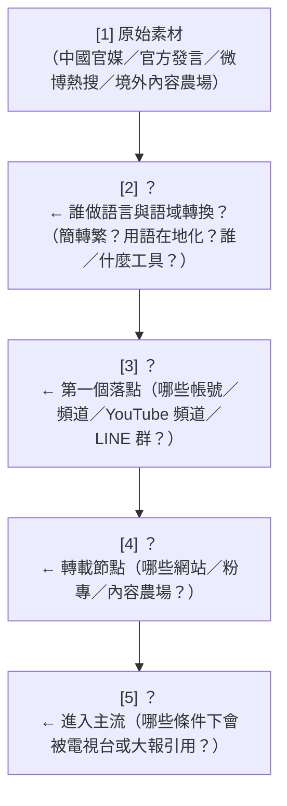
每一格要寫出**具體可監測的資產**與**可觀測的訊號**。最後全班合併成一張圖，並標出「哪幾格目前根本沒有人在監測」。

#### 演練 E：撰寫「媒體 AI 使用揭露準則」（40 分鐘，分組辯論）

分成「媒體方」「查核方」「主管機關」三組，各自起草三條準則，然後互相攻防。
必須處理的難題：翻譯外電算不算？下標算不算？社群貼文算不算？揭露到什麼顆粒度？誰稽核？罰則？

#### 演練 F：建一份最小可行的媒體監測清單（作業）

要求學員產出一張表，包含：監測標的（頻道／網域）、抓取頻率、要比對的訊號（近似重複／電頭／來源具名率／模板化／吞吐量）、告警條件、以及**誤報的處理程序**。
**明確要求**：不得包含任何主動連線到 IOC 的動作；一律使用公開存檔服務或既有資料集。

### 10.4 對台灣的意涵

> 本案表面上與台灣無關（俄羅斯、摩爾多瓦、拉美、非洲）。但**它的結構與台灣面對的樣態高度同構**，而且台灣目前的防禦體系正好對這個結構最沒有辦法。

#### 10.4.1 結構對照：俄羅斯模式 vs. 中國模式

| 環節 | 本案（俄羅斯） | 台灣面對的對應物 |
|---|---|---|
| **上游素材** | 俄羅斯通訊社（RIA、TASS）、SVR、國防部、軍事部落客 Telegram（Rybar、Colonel Cassad） | 新華社、中新社、央視、《環球時報》、國台辦記者會、微博熱搜、抖音／小紅書熱點 |
| **語言／語域轉換層** | Claude：羅語→俄語、俄語→拉美西語、俄法語→非洲英語 | **簡體→繁體 + 中國用語→台灣用語**。這正是 LLM 最擅長、也最不可能被安全機制擋下的工作 |
| **掛牌國家媒體分支** | Sputnik Moldova / Sputnik Mundo / Sputnik Africa / RT English | 中國官媒的海外落地版本、與中國媒體有協議的在地媒體、海外華文報系 |
| **偽獨立在地頻道** | @ATodaPotencia（偽裝成拉美獨立分析） | 匿名經營的「在地新聞」粉專、YouTube 頻道、內容農場、LINE 群組轉傳源頭 |
| **轉載／放大節點** | eadaily[.]com、point[.]md、vz[.]ru、mos[.]news、ru[.]euronews[.]com | 內容農場、聚合網站、部分商業媒體的即時新聞台、YouTube 剪輯頻道 |
| **進入主流的機制** | 「多家媒體都在報」→ 通訊社引用 | **「網傳」「網友熱議」「陸媒報導」**——台灣媒體引用「陸媒報導」時，通常不會回溯到原始官媒稿 |
| **在地協力者** | 前 Sputnik Moldova 總編（真的新聞從業者） | IORG 研究所稱的「**在地協力者**」：名嘴、粉專、部分媒體——**關鍵在於他們是真人、真帳號、真媒體** |

**Doublethink Lab（2025-11-18，經 Taiwan News 報導）已經直接記錄過中俄官媒互相回收內容的行為**：「俄國國家媒體、中國官媒與親中影響者即時互相回收彼此的報導」，且 2019 年的一則俄國陰謀論被「迅速翻譯成中文」後在侵烏期間再度流傳。**也就是說，本案描述的洗白鏈，其中文分支已經被觀測到了。**

#### 10.4.2 台灣防禦體系的三個盲區

**盲區一：所有現行工具都在抓「不真實的帳號」。**
台灣的資訊操弄研究與平台治理，主力仍是找協同帳號、內容農場、境外 IP、機器人。IORG 的「在地協力者」研究早就指出**關鍵節點是真人**，但偵測工具的重心並沒有跟著移動。本案把這個問題推到極端：**連媒體機構本身都是真的。**

**盲區二：沒有人在做「內容血緣」的長期監測。**
台灣缺少一套針對「特定媒體叢集」的**長期、自動化、跨網域近似重複比對**基礎設施。要回答「這則報導的措辭最早出現在哪裡、幾點、哪個站」，目前需要人工。而 AI 已經把產製速度壓到小時級。**查核以天為單位，產製以小時為單位——這個落差就是本案的結構性優勢。**

**盲區三：「AI 生成偵測」被當成解方，但它解不了本案。**
市面上的 AI 文本偵測器面對「人類提供素材 + AI 改寫 + 人類潤飾」的混合產物，準確率會崩潰；何況 Figure 10 那種「AI 初稿 + 人工標準化」的產物，本質上就是人機合寫。**把資源押在 AI 偵測器上，是把錢花在本案證明無效的地方。**

#### 10.4.3 具體建議（依可行性排序）

**（一）短期・零成本：改變查核的提問方式**
- 把「這則訊息是真是假？」擴充為「**這段文字最早出現在哪裡？中間經過哪些手？**」
- 在查核報告中固定加入一欄「**來源鏈**」，即使結論是「內容屬實」。
- 對「陸媒報導」「網傳」這類模糊引述，要求回溯到具名的原始機構與發布時間——這正是 Figure 10 示範的「來源模糊化」在中文世界的對應物。

**（二）短期・低成本：建立台灣版的「放大生態系」監測清單**
- 仿照 p.62 的 IOC 表結構，由學界或 NGO 維護一份**公開、可爭議、有申訴機制**的清單：上游素材來源、轉載節點、偽獨立頻道。
- **關鍵設計**：清單必須公開理由、必須可申訴、必須定期複審。本案 IOC 表中 `ru[.]euronews[.]com` 沒有說明理由，正是反面教材。

**（三）中期：推動「媒體 AI 使用揭露」自律公約**
- 不是禁止媒體用 AI（不可能，也不應該），而是要求揭露**AI 在哪個環節、做了什麼**：翻譯？下標？摘要？社群貼文？全文撰寫？
- 本案給的具體優先順序：**先管社群小編，再管正稿編輯台**（因為 exact match 出現在社群貼文）。
- 揭露義務的力量在於：一旦有了揭露基線，**沒揭露而被發現**就變成可究責的事實。

**（四）中期：建立跨語言近似重複比對能力**
- 技術上不難（embedding + 向量檢索 + 時間序列），難在**持續抓取與長期維運**。
- 應優先覆蓋：中國官媒中文稿 → 台灣聚合站／粉專的簡繁與用語轉換版本。
- 產出的指標應該是**「某媒體在 N 小時內與官媒稿的語意重合度」**，而不是「這篇是不是 AI 寫的」。

**（五）長期：把「影響力行動」納入資安情報流程**
- 本案沒有 hash、沒有 CVE、沒有 C2。若台灣的威脅情報流程只吃技術指標，整個領域會被漏掉。
- 建議在既有的資安情資分享機制中，增加「資訊操弄」的欄位定義（DISARM ID、分發通路、匹配等級 L0–L3）。

#### 10.4.4 一句話總結給決策者

> **「當中國官媒的稿子可以在一小時內、由一個懂台灣用語的真人加上一個 AI，變成三十篇讀起來像台灣人寫的在地報導，然後由真實存在的台灣網站互相引用——我們現有的每一項防禦措施都抓不到它。」**

---

## 11. 關鍵原文引文

> 供講義直接引用。頁碼為 PDF 頁碼。英文為報告逐字原文，中文為本檔翻譯。

**引文 1｜本案的定義句（p.58）**
> "We identified and removed four accounts in which individual actors used Claude as an editorial and news production desk to distribute content via Russian state-media outlets. The actors turned out completed polished content, sending it straight to the production line to be aired."

> 我們識別並移除了四個帳號，帳號中的個別行為者把 Claude 當作**編輯與新聞產製桌**，透過俄羅斯國家媒體通路分發內容。這些行為者產出的是**完成、潤飾好的內容，直接送進產製線待播出**。

**引文 2｜歸因與分發通路（p.58）**
> "Although the individual actors attempted to conceal their identities, we assess with **high confidence** that the actors ultimately shared the outputs with Russian state-owned and state-funded media and that content generated by Claude was ultimately published and broadcast through Russian state-aligned media outlets, including *Sputnik Moldova* and *RIA Novosti* for Moldovan audiences, *Sputnik en Español* for Latin American audiences, *Sputnik Africa* for African audiences, and *RT's English-language* newsroom for RT's global broadcast."

> 儘管這些個別行為者試圖隱匿身分，我們以**高度信心**評估：行為者最終將產出交給了俄羅斯國有與國家資助的媒體，且 Claude 生成的內容最終經由俄羅斯國家關聯媒體發布與播出，包括對摩爾多瓦受眾的 *Sputnik Moldova* 與 *RIA Novosti*、對拉丁美洲受眾的 *Sputnik en Español*、對非洲受眾的 *Sputnik Africa*，以及供 RT 全球播送的 *RT 英語新聞室*。

**引文 3｜洗白鏈與產能（p.58）**
> "Actors used a chain of different outlets to make Russian-origin claims appear to be independently reported. By using Claude's workflows, the actors achieved a scale of production that would normally require an entire team of trained editorial staff."

> 行為者使用**一連串不同的媒體**，讓源自俄羅斯的主張看起來像是**被獨立報導**的。透過 Claude 的工作流程，行為者達到了**通常需要一整支受過訓練的編輯團隊**才能達成的產製規模。

**引文 4｜與隱蔽網絡的關鍵對比＋自承限制（p.58）**
> "Unlike covert networks that struggle to reach real audiences, the content developed by these individual actors was distributed through media outlets' established channels. Where we matched individual Claude-produced output against published content, results ranged from a Telegram post with roughly 2,000 views to the aired broadcast copy. We're not able to determine what share of the outlets' total output passed through the pipelines that involved Claude."

> 與難以觸及真實受眾的隱蔽網絡不同，這些個別行為者產製的內容是**透過媒體既有的通路**分發的。在我們把個別 Claude 產出與已發布內容進行比對之處，結果涵蓋**從一則約 2,000 次瀏覽的 Telegram 貼文，到已播出的廣播稿**。我們**無法判定**這些媒體的總產出中，有多少比例經過了涉及 Claude 的管線。

**引文 5｜摩爾多瓦線與「假驗證迴圈」（p.59，Key findings 第 1 點）**
> "A former *Sputnik Moldova* editor-in-chief used Claude to turn Romanian and Moldovan news, polling data, and opposition social media posts into Russian language articles that were ultimately published on *Sputnik Moldova*'s Telegram channel and on RIA Novosti, and amplified across a network of Russian and Moldovan outlets to **manufacture false verification loops**. The same story was echoed across different outlets so it appeared to be independently confirmed."

> 一名**前 Sputnik Moldova 總編輯**使用 Claude，把羅馬尼亞與摩爾多瓦的新聞、民調資料以及反對派的社群媒體貼文轉成俄語文章，這些文章最終發布於 *Sputnik Moldova* 的 Telegram 頻道與 RIA Novosti，並在俄羅斯與摩爾多瓦的媒體網絡中被放大，以**製造假的驗證迴圈**。同一則報導在不同媒體間互相呼應，使它看起來像是**獨立獲得證實**的。

**引文 6｜選舉干預（p.59，Key findings 第 2 點）**
> "The same actor amplified fabricated, defamatory claims about Moldova's president Maia Sandu ahead of the country's most recent major national vote, the 2025 Moldovan parliamentary election held on September 28, 2025."

> 同一名行為者在該國最近一次重大全國性投票——**2025 年 9 月 28 日舉行的摩爾多瓦國會大選**——之前，放大了針對摩爾多瓦總統 **Maia Sandu** 的**捏造、誹謗性指控**。

**引文 7｜廣播線與情報機關素材（p.59，Key findings 第 4 點）**
> "An employee of a Russian state-owned media outlet used Claude to build content meant for live broadcasts, specifically handling tickers, screen captions, voiceover scripts, and short headlines using inputs from Russian newswires, SVR (the civilian foreign intelligence agency), and the Defence Ministry. In at least one confirmed instance, this material actually made it to Russian airwaves."

> 一名俄羅斯國有媒體的員工使用 Claude 產製**供直播使用**的內容，具體處理**跑馬燈、螢幕字幕、旁白稿與短標題**，輸入素材來自俄羅斯通訊社、**SVR（對外民事情報機關）與國防部**。在**至少一次經確認的案例**中，這些材料確實上了俄羅斯的電波。

**引文 8｜本案的核心命題——副編輯層（p.59）**
> "In each operation, Claude was integrated into an already running, professionally edited pipeline as the **sub-editor layer**, taking a single staffer's output well beyond what they could produce unaided."

> 在每一個作業中，Claude 都被整合進一條**已在運作、經專業編輯的產線**，擔任**副編輯層**，讓**單一員工的產出遠遠超過其獨力所能達成的程度**。

**引文 9｜三張圖的圖說（p.60–61）**
> "Figure 9. An example of a post created with Claude as published, which received 2.09K views; **no other exact matches were observed**. \"Sputnik Moldova 2.0\" is part of a network of channels and sites associated with Sputnik News."
> "Figure 10. Additional headlines with **slight variations** appeared in RIA Novosti. The RIA Novosti article was **republished by other pro-Kremlin publications**."
> "Figure 11. A post seen in the wild on Sputnik Africa's Twitter/X account, **matching the Claude-generated text exactly**."

> 圖 9：一則以 Claude 產出、如實發布的貼文範例，獲得 **2.09K** 次瀏覽；**未觀察到其他完全相符的案例**。「Sputnik Moldova 2.0」是與 Sputnik News 相關的頻道與網站網絡的一部分。
> 圖 10：**略有變化**的額外標題出現在 RIA Novosti。該 RIA Novosti 文章**被其他親克里姆林出版物轉載**。
> 圖 11：在 Sputnik Africa 的 Twitter/X 帳號上實際出現的一則貼文，**與 Claude 生成的文字完全相符**。

**引文 10｜章節趨勢「AI 作為新聞台」（p.42）**
> "**AI as a newsdesk.** In several cases, Claude was slotted into a human-edited pipeline that was already up and running, playing the role of a sub-editor or content creator. This allowed low-resourced actors to run influence operations at a scale well beyond what they could accomplish alone."

> **AI 作為新聞台。** 在數個案例中，Claude 被**插進一條已在運作的人工編輯產線**，扮演副編輯或內容產製者的角色。這讓資源有限的行為者能夠以遠超其獨力所能達成的規模執行影響力行動。

**引文 11｜來源與確信度洗白（p.43）**
> "**Laundering of attribution, sourcing, and certainty.** Actors used Claude to engineer content so that state or commissioned narratives appeared to come from independent voices. Actors prompted Claude to intentionally strip state attribution from republished material, passing claims through chains of outlets so they read as independently confirmed. In one case, tied to a Russian state media operation, an actor produced claims the model flagged as unverified, then instructed it to drop those caveats and present everything as confirmed, so the material would read as established fact."

> **歸屬、來源與確信度的洗白。** 行為者使用 Claude 設計內容，讓國家的或受託的敘事看起來像是來自獨立聲音。行為者提示 Claude **刻意剝除轉載材料中的國家來源標示**，讓主張通過一連串媒體，讀起來像是獨立獲得證實。在一個與**俄羅斯國家媒體作業**相關的案例中，一名行為者產製了**被模型標記為未經證實**的主張，接著指示模型**刪除那些但書、把一切呈現為已確認**，使材料讀起來像是既定事實。

**引文 12｜觸及的真相（p.43–44）**
> "Most of the content we discovered drew little or no authentic engagement, and in several cases we disrupted the operation before it could build an audience. The widest authentic reach occurred where state media outlets were the distribution mechanism (including FM radio, satellite and shortwave radio, and global television)."

> 我們發現的多數內容**幾乎沒有或完全沒有真實互動**，而且在數個案例中我們在作業建立起受眾之前就將其中斷。**最廣泛的真實觸及，發生在以國家媒體作為分發機制的情況**（包括 FM 廣播、衛星與短波廣播，以及全球電視）。

**引文 13｜處置（p.62）**
> "We identified these accounts through our internal detections, banned the accounts associated with all four operations, and shared indicators with industry and research partners."

> 我們透過內部偵測識別出這些帳號，**封鎖了與全部四個作業相關的帳號**，並與產業及研究夥伴**分享了指標**。

**引文 14｜能見度的邊界（p.42）**
> "Our visibility into these operations ends once it's live. To verify our findings and understand what happened after content left our platform, we rely on open-source research, cross-platform industry data, and public reporting."

> 我們對這些作業的能見度**在它上線的那一刻就結束了**。為了驗證我們的發現、理解內容離開我們平台之後發生了什麼，我們**仰賴開源研究、跨平台的產業資料與公開報導**。

---

## 12. 未能驗證之處與研究限制

### 12.1 報告本身的限制（Anthropic 自承）

1. **無法判定占比**（p.58）：「We're not able to determine what share of the outlets' total output passed through the pipelines that involved Claude.」——**本案沒有任何規模數字**。四個帳號存在多久、產出幾則、占媒體總產出多少，全部未知。
2. **只有一則 exact match**（Figure 9 圖說）：「no other exact matches were observed.」——摩爾多瓦線只確認了一則完全相符。
3. **能見度止於上線**（p.42）。
4. **RT 廣播線僅「至少一次確認」**（p.59），且**無圖佐證**、未說明確認方法。這是全案危害最高卻證據最薄的一環。

### 12.2 報告未提及、本檔無法補足之處

| 項目 | 狀態 |
|---|---|
| 四個帳號的具體時間範圍（何時開始、何時被封） | 報告未寫 |
| 行為者的姓名、國籍、實際所在地 | 報告未寫（且不應從公開資料推測） |
| 四個行為者之間是否有協調或共同指揮 | 報告未寫 |
| 使用的是 Claude 的哪個模型（Haiku/Sonnet/Opus） | 報告 p.3 只說全報告案例涉及 Haiku、Sonnet、Opus，**本案未指明** |
| 是否透過 API、Claude.ai 或第三方服務存取 | 報告未寫 |
| Claude 是否曾在本案中拒絕任何請求 | **報告完全未提**（對照 p.57 的前一案有明確描述） |
| 行為者是否使用 VPN／假門號等規避手段 | 只說「attempted to conceal their identities」，無細節 |
| 媒體機構高層是否知情或授權 | 報告未寫 |
| 本案的 Breakout Scale 分級 | 報告未給（儘管 p.42 宣告全章使用該量表） |
| 是否通知了 Telegram、X、摩爾多瓦或歐盟當局 | 只說「shared indicators with industry and research partners」 |
| 封鎖帳號後作業是否停止 | 報告未寫 |
| `ru[.]euronews[.]com`、`point[.]md` 被列入「摩爾多瓦放大生態系」的理由 | **報告完全未說明**。這兩個網域的性質與 `eadaily[.]com`（已受歐盟制裁）明顯不同，列名理由缺失是本案 IOC 表最需要質疑的地方 |
| `@theaterVD` 這個 Telegram 頻道的性質 | 公開搜尋未能查到；`@china3army`（約 3.74 萬訂閱，俄語，主題為中國軍事）與 `@kalashnikovnews`（Kalashnikov Concern 官方頻道）可查到，`@theaterVD` 查無資料 |

### 12.3 本檔自行推導的部分（非報告內容，使用時須標示）

1. **X snowflake 時間戳還原**（6.4）：`2027706409727492278` → 2026-02-28 11:24:15 UTC。此推導依賴 Twitter/X 的 snowflake epoch 常數 `1288834974657`，**未經 Anthropic 或 X 證實**，且報告本身沒有給出貼文時間。與網頁顯示的 `12:23/12:24 28.02.2026` 的關係是時區推測。
2. **Figure 9 與 Figure 10 的差異清單**（6.3）：由本檔逐字比對兩張截圖得出。報告只說「slight variations」，**沒有列出具體差異**。
3. **互動率 3.9%**（6.2）：由 81 個反應 ÷ 2.09K 瀏覽計算。
4. **頻道吞吐量推估**（6.2）：由貼文序號 12933 與頻道成立日期（第三方資料，2025-02-25）推算，**誤差可能很大**（序號未必連續、頻道成立日期來自第三方）。
5. **自主程度判定為「人類逐步指揮」**（4.0）：報告未使用這個分級詞，是本檔依報告描述所做的歸類。
6. **DISARM 對應表**（5.2）：ID 取自 DISARM Foundation 官方技術索引，但**本案與各技術的對應關係是本檔的分析判斷**，非報告或 DISARM 官方所做。若干行為（AI 副編輯層、風格規則集固化、假驗證迴圈）在 DISARM 中**查無對應 ID**，已明確標示。
7. **Figure 11 截圖性質的判讀**：圖說說這是「Sputnik Africa 的 Twitter/X 帳號上的貼文」，但截圖本身看起來是 **Sputnik Africa 的網站文章頁**，藍色反白區塊是與 Claude 產出相符的文字（同時也是 X 貼文的內容）。**本檔採取「截圖是網站頁、反白區塊對應 X 貼文文字」的解讀**，但這是判讀而非報告明示。
8. **Figure 10 照片來源標記**：截圖上可辨識為 `© Flickr / …`，**帳號名在 130 DPI 渲染下不可辨識**，本檔不予臆測。

### 12.4 第三方來源的矛盾與不確定

| 議題 | 矛盾內容 | 處理方式 |
|---|---|---|
| 「Sputnik Moldova 2.0」的 Telegram handle | 第三方分析摘要記為 `@mdsputnikmd_2`；**Figure 9 截圖明確顯示 `@rusputnikmd_2` 與 `t.me/rusputnikmd_2/12933`** | **以 PDF 截圖為準**。第三方可能指的是另一個頻道，或摘要有誤 |
| INSCOP 民調的樣本數 | 有報導寫 1,500，有報導寫 1,505；誤差有寫 ±2.5% 與 ±2.53% | 兩者差異不影響本案；報告本身未引用樣本數 |
| 「不到四分之一認為他是差的領導人」 | Figure 9 貼文寫「Менее четверти（不到四分之一）」；第三方報導寫「24.1%」 | 一致（24.1% < 25%）。**這顯示 Claude 的改寫把精確數字換成了模糊表述**——本身就是一個值得討論的改寫特徵 |
| 哈梅內伊事件的執行方 | Sputnik Africa 標題寫 "US Missile Strike"；第三方報導多寫為**美以聯合行動**，以色列空軍為主、美國支援 | **這是本案唯一可查證的事實性偏差**：把聯合行動寫成單純的美國飛彈攻擊。符合「突出美國、淡化以色列」的敘事取向。**但報告未指出這一點**，此為本檔觀察 |

### 12.5 方法論上的根本限制

**本案的核心證據（模型端輸出 ↔ 公開貼文的逐字比對）在結構上無法被外部驗證。** 任何第三方都無法取得 Claude 的輸出原文。這意味著：

- 學員必須理解：**這是一個「信任 Anthropic 的自我陳述」的案例**，而不是一個「可重現的研究」。
- 同時也要理解：**這種不可驗證性是結構性的，不是 Anthropic 的失誤**——公開輸出原文會牽涉隱私、偵測方法外洩與法律風險。
- 這反過來提出一個政策問題：**AI 公司的威脅情報若無法被獨立驗證，社會應該給它多少權重？** 這是第 10.2 節 Q3 的來源，也是本案留給課程最開放的一道題。

---

### 附錄：本檔使用的素材與圖檔對照

| 內容 | 一手素材 | 課程圖檔 |
|---|---|---|
| GTG-24015 正文開頭、四通路歸因、規模自承 | PDF p.58 | （純文字頁，未存 figures） |
| Key findings 四點、sub-editor 定義句、分發表第 1 列 | PDF p.59 | （純文字頁，未存 figures） |
| 分發表第 2–4 列、Figure 9 | PDF p.60 | `../figures/page-060.png` |
| Figure 10、Figure 11 | PDF p.61 | `../figures/page-061.png` |
| Disruption and mitigations、IOC 表 | PDF p.62 | （純文字頁，未存 figures） |
| 章節導論（AI as a newsdesk、laundering、觸及） | PDF p.41–44 | — |

---

## 13. 技術深化附錄：內容指紋比對、洗白鏈追蹤與時間戳鑑識（技術高手向）

> 本附錄為 2026-09-13「技術深化 pass」的增補，對應並深化第 **6.4**（snowflake）、**6.5**（內容指紋）、**6.6**（洗白鏈）三節，把原本停在概念層的方法論補到「可理解、可部署」的工程深度。
> **安全紅線不變**：本節所有比對只作用於**自有的模型端日誌**與**公開發布／已存檔的內容**；所有時間戳鑑識**純算術、不連線**。不得對第 7 節任何 IOC 做主動連線、DNS 查詢或沙箱提交。
> 本節的演算法、門檻、程式碼、KQL 規則與 Mermaid 圖，均為本檔依**公開技術文獻與第三方報告**所做的工程化整理，**非 Anthropic 報告原文**；引用來源見 13.5，且已在 13.6 標出哪些是「本檔推導」。

---

### 13.1 內容指紋比對（Content Fingerprint Matching）的完整技術

第 6.5 節已建立 L0–L3 的概念框架與「exact match / slight variation」的判讀。本節補的是：**每一級底下實際跑什麼演算法、門檻設多少、如何把模型端輸出自動對上公開貼文。**

#### 13.1.1 為什麼不能用密碼學雜湊（問題定義）

直覺會想：把模型輸出和公開貼文各算一次 SHA-256，相等就是 exact match。**這在本案會全面失敗**，因為：

- 密碼學雜湊的設計目標是**雪崩效應**——輸入改一個位元，輸出全變。但本案的文字在發布前後會被動到（Figure 9 的 `edited` 標記、Figure 10 的通訊社體例改寫）。
- 平台會**自動改寫**文字：Telegram 會把 `--` 轉成 `—`、把某些字元正規化；網站模板會插入不可見字元。
- 本案跨**四種語言、兩種字母系統**（西里爾／拉丁），連「同一個字」在不同來源可能用不同碼位（見 13.1.2 同形字）。

所以「指紋」不能是雜湊值，而必須是一組**相似度保持（similarity-preserving）**的表示：字元級、詞級、語意級各一層，層層退化對應 L0→L3。

#### 13.1.2 前處理／正規化層（決定成敗、最常被略過的一步）

**任何比對之前，兩端文字都要先過同一條正規化管線。** 正規化做得好，L0 才robust；做不好，真正的 exact match 會因為一個彎引號就被判成 L1。本案需要的正規化步驟：

| 步驟 | 技術 | 目的 | 本案對應 |
|---|---|---|---|
| Unicode 正規化 | NFKC | 統一相容字元與組合字 | 全形/半形數字、帶重音的羅語字母（ș, ț, ă, î, â） |
| 大小寫折疊 | casefold（非 lower） | 消除 casing 差異 | 標題全大寫 vs 內文 |
| 空白壓縮 | collapse `\s+`→單一空白 | 消除排版差異 | Telegram 換行 vs 網站換行 |
| 標點標準化 | 引號 `«»""` → `"`；破折號 `—–` → `-` | 消除體例差異 | **Figure 9 `"…" — опрос.` vs Figure 10 `…, показал опрос`** |
| 去零寬/不可見字元 | 移除 ZWSP(U+200B)、ZWNJ(U+200C)、soft hyphen(U+00AD)、BOM | 破解「插入隱形字元規避雜湊比對」 | 通用反規避 |
| **同形字折疊** | Unicode confusables → skeleton | 跨字母系統比對 | **西里爾 а/е/о/р/с/х/у ↔ 拉丁 a/e/o/p/c/x/y 外形相同、碼位不同** |
| emoji 正規化/移除 | 抽出或標準化 emoji | 消除裝飾雜訊 | Figure 9 的 🇷🇴、`◾️` 項目符號 |

> **同形字（homoglyph）這一步在本案特別關鍵。** 西里爾字母 `а е о р с х` 與拉丁 `a e o p c x` 在畫面上完全一樣但碼位不同。操作方（或平台）混用字母系統時，未折疊同形字的比對會把「一模一樣的字」判成不同。做法：用 Unicode 官方 confusables 表把每個字元映射到 canonical skeleton 再比對。Python 可用 `confusable_homoglyphs` 套件，或直接查 `confusablesSummary.txt`。

正規化完成後，**L0 = 對正規化後 token 串取 SHA-256，相等即 exact match**——此時 SHA-256 才是可靠的，因為它比的是「洗掉表面雜訊後的內容」，而不是原始位元。

#### 13.1.3 近似比對層（L1–L2 同語言）：SimHash / MinHash+LSH / 編輯距離

**（A）SimHash（Charikar 2002）— 文件級近似重複，最省空間**

原理：把文件的特徵（k-shingle 或詞）各自雜湊成 b 位元；維護一個 b 維累加器，特徵雜湊第 i 位為 1 就 `+權重`、為 0 就 `-權重`；最後每一維取正負號得到 b 位元指紋。**兩份文件的相似度 ≈ 1 − Hamming(f1,f2)/b。** 近似重複的經驗門檻：64 位元指紋 `Hamming ≤ 3`。

```python
import hashlib
def _h(tok: str) -> int:
    return int.from_bytes(hashlib.blake2b(tok.encode(), digest_size=8).digest(), "big")

def simhash(tokens, bits=64):                 # tokens = 正規化後的 k-shingle 集
    v = [0]*bits
    for t in tokens:
        h = _h(t)
        for i in range(bits):
            v[i] += 1 if (h >> i) & 1 else -1
    f = 0
    for i in range(bits):
        if v[i] > 0:
            f |= (1 << i)
    return f

def hamming(a, b): return bin(a ^ b).count("1")
# near-dup: hamming(simhash(A), simhash(B)) <= 3
```

規模化：把 64 位元指紋切成 4 段（每段 16 位元）做 **LSH blocking**——只要任一段相同就成為候選對，避免 O(n²) 兩兩比對。這正是第 6.5.3 節「跨平台近似重複偵測」在工程上的實作。

**（B）MinHash + LSH（Broder 1997）— 集合式 Jaccard，門檻可調、召回率高**

把文件表示為 k-shingle 的集合，用 `num_perm` 個雜湊排列各取最小值組成簽章；估計 Jaccard = 簽章相符位置比例。LSH 把長度 `n = b×r` 的簽章切成 `b` 段（每段 `r` 列），任一段相同即碰撞，**碰撞門檻 `s ≈ (1/b)^(1/r)`**。

```python
from datasketch import MinHash, MinHashLSH
def mh(text, k=5, num_perm=128):
    m = MinHash(num_perm=num_perm)
    toks = text.split()                       # 已正規化
    for i in range(len(toks)-k+1):
        m.update(" ".join(toks[i:i+k]).encode())
    return m

lsh = MinHashLSH(threshold=0.7, num_perm=128) # 門檻對應 s ≈ (1/b)^(1/r)
# 逐篇 lsh.insert(doc_id, mh(doc_text)); lsh.query(mh(new_text)) 回傳近似重複候選
```

**SimHash vs MinHash（何時用哪個）**：SimHash 對應 cosine、指紋只有 64 位元、記憶體極省、適合「近乎相同」的大規模去重；MinHash 對應 Jaccard、門檻可精細調、召回率較好、適合「改寫幅度較大」的同源偵測。**本案兩者都用**：SimHash 抓 L1、MinHash 抓 L1–L2。

**（C）編輯距離（Levenshtein）— 短字串（標題／跑馬燈／字幕）的最佳工具**

RT 那條線是 **character-exact 的跑馬燈與字幕**，Figure 9→10 的差異也集中在**標題**。短字串用文件級指紋不敏感，應改用字元級編輯距離：`相似度 = 1 − lev/max(len)`。

**本案實測（正規化後，Figure 9 vs Figure 10 的標題，本檔以 Python 計算）**：

| 指標 | 數值 | 判讀 |
|---|---|---|
| 字元級 Levenshtein 距離 | **10** | — |
| **字元級相似度** | **0.841** | 落在 L1「輕微變異」帶 |
| difflib SequenceMatcher ratio（字元） | **0.902** | 同上，佐證 L1 |
| 詞級 Levenshtein 距離 | 4（9 詞 vs 9 詞） | — |
| 詞級相似度 | 0.556 | **偏低——因為標點沾黏在詞上** |

> **這組數字本身就是一個教學點**：字元級（0.841）與 difflib（0.902）都正確地把兩個標題判為 L1；但**天真的詞級相似度只有 0.556**，會誤判成 L2/L3。原因是 `"хорошим` / `лидером"` / `опрос.` 這些**標點沾黏的 token** 被算成不同詞。**啟示：分詞與正規化的選擇會直接改變匹配等級——先把標點從 token 剝離，詞級相似度就會回升。** 這也是為什麼 13.1.2 的正規化層是成敗關鍵。

具體改了什麼（對照第 6.3 節的差異表）：去引號、`—` 改逗號、`— опрос.` → `, показал опрос`（動詞化，符合通訊社標題體例）。**差異方向一致地指向「去情緒化、標準化」——這是人工潤飾的指紋，不是隨機噪音。**

#### 13.1.4 跨語言語意層（L2–L3）：多語句向量（本案的核心難點）

**整個 GTG-24015 是跨語言作業**：羅語→俄語（Moldova）、俄語→拉美西語（LatAm）、俄/法語→非洲英語（Africa）。**字元級、詞級、shingle 級方法全部跨不了語言**——同一個意思在兩種語言沒有共同字元或 shingle。唯一能跨語言比對的是**語意向量**：

- **多語句向量模型**：`LaBSE`（Google，涵蓋 109 種語言，dual-encoder，以 170 億單語句 + 60 億雙語句對訓練）、`intfloat/multilingual-e5-large`、`LASER`。把每個句子編碼成語言無關向量，用 **cosine 相似度**比對。
- **跨語近似重複的門檻**：學界近期的新聞社編輯重用研究（Rewrite the News，arXiv 2603.29937）就是用「多語句向量 + cosine，**門檻 0.6**，不需完整翻譯，測了 7 種語言」——這套方法**幾乎一比一對應本案的洗白鏈**。同語言近似重複可把門檻拉高到 0.85–0.9。
- **句對齊型態 → 匹配等級**：該研究把句子關係分成 1:1、1:many、many:1、many:many；`1:1 高相似` 對應 **L1/L2**，`many:many（占其樣本 54.9%）` 這種「改寫／摘要／拆併」對應 **L2**。這給了 L2 一個可操作的定義：**不是逐句對得上，而是段落層級語意重合但句界被重組。**

```python
from sentence_transformers import SentenceTransformer, util
model = SentenceTransformer("sentence-transformers/LaBSE")        # 或 intfloat/multilingual-e5-large
emb = model.encode([ro_source_sentence, ru_published_sentence],
                   normalize_embeddings=True)
cos = float(util.cos_sim(emb[0], emb[1]))
# 跨語近似重複：cos >= 0.60（依 Rewrite the News 校準）；同語:>= 0.85–0.90
```

> **為什麼這一層對防禦方最重要**：第 4.8 節指出「線 B（拉美）的最佳偵測落點是輸入端」——但輸入是俄語軍事部落客貼文、輸出是拉美西語文章，**只有跨語語意向量能把兩者連起來**。這一層是「預測性告警」（先看到俄語原始敘事、預測它幾小時後會以西語出現）在技術上唯一可行的基礎。

#### 13.1.5 從模型端紀錄比對到公開貼文：可操作 pipeline

**兩端的資料結構**（把第 6.5.1 的「兩端與中間」補成 schema）：

```text
模型端紀錄（僅 Anthropic）             公開網路端（任何研究者）
{ session_id, account_id,             { platform, url, canonical_id,
  ts_generated,                         published_ts, edited_ts,
  input_material (hash/文字),           text, lang,
  output_text, output_lang }           views, reactions }
```

**Mermaid 圖 ①：內容指紋比對 pipeline**

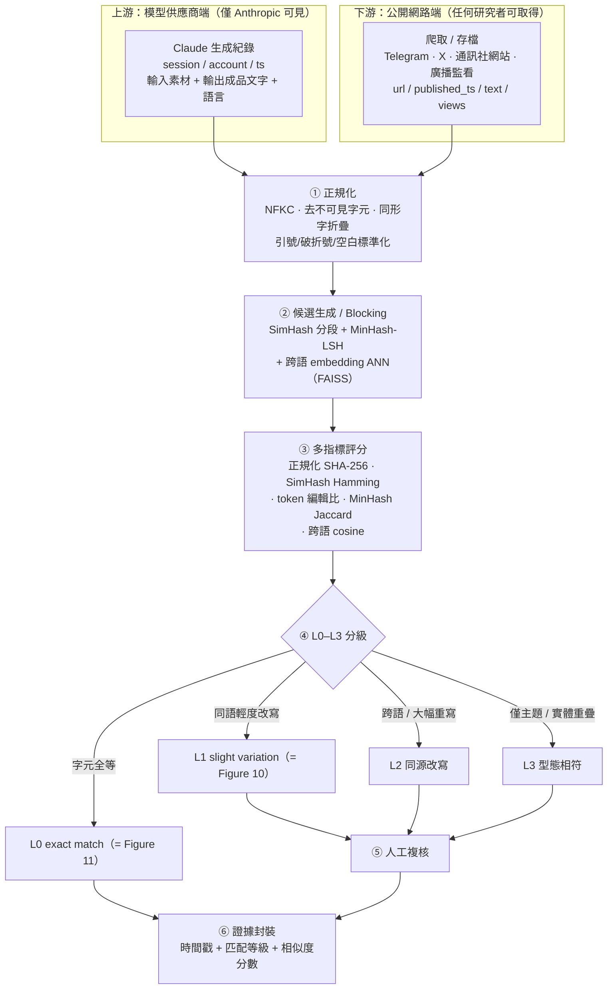

**Mermaid 圖 ②：模型端 ↔ 公開端比對時序**

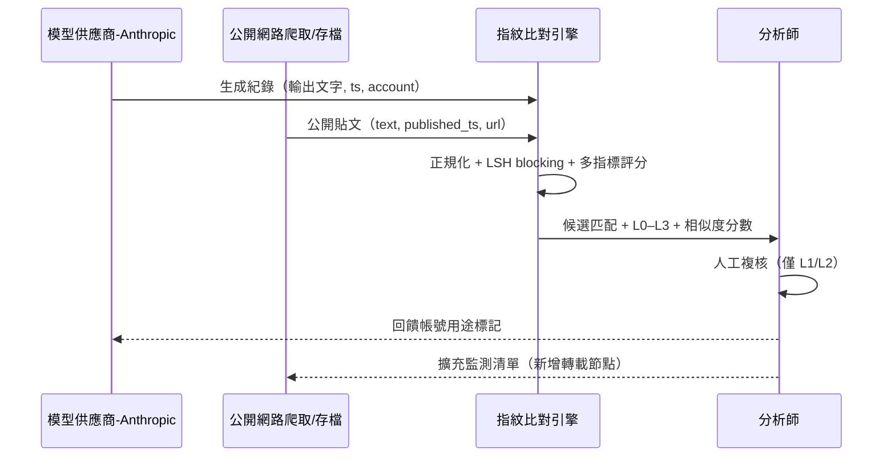

#### 13.1.6 L0–L3 分級的技術實作（決策表 + 決策樹）

把第 6.5.1 的概念表補上**可執行的門檻**：

| 等級 | 可自動化判定條件（具體門檻） | 需人工？ | 本案例證 |
|---|---|---|---|
| **L0** | 同語言且**正規化後 SHA-256 相等** | 否（全自動） | Figure 11 |
| **L1** | 同語言且（SimHash `Hamming ≤ 3`／64bit **或** token 編輯相似 ≥ 0.85 **或** MinHash Jaccard ≥ 0.7） | 輕度抽查 | Figure 10（標題字元相似 0.841） |
| **L2** | 跨語 embedding cosine ≥ 0.75 且多數句可對齊；**或**同語 cosine ≥ 0.90 但編輯量大 | 需複核 | Fig 9→10 內文（介於 L1/L2） |
| **L3** | 命名實體 + 關鍵數字（如 `66.2%`）重疊，但文字相似度低 | 需分析判斷 | 報告對其餘產出的處理 |

**Mermaid 圖 ③：L0–L3 分級決策樹**

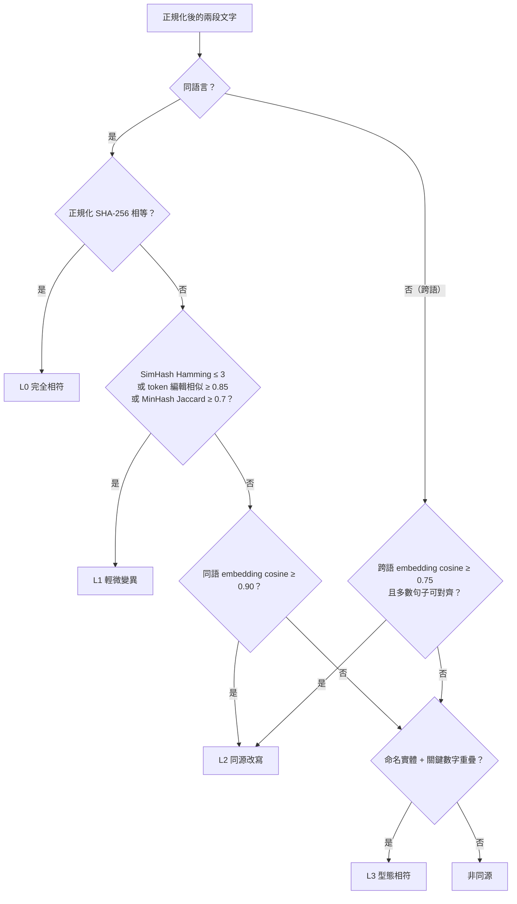

> **工程提醒**：門檻數值是**起點不是終點**，必須用你自己的標註集做 ROC 校準（跨語 0.6–0.75 的落點對假陽性極敏感）。L0 可全自動封鎖／告警；L1 抽查；**L2/L3 一律進人工**——因為 L2/L3 的誤判會把「兩家都引用同一則通訊社稿」誤當成「同源操作」，那正是第 2.4.1 節警告的「把正常新聞誤判為操弄」。

---

### 13.2 媒體洗白鏈的技術追蹤：指紋 + 時間戳 + 轉載圖

第 4.5 與 6.6 節用文字描述了「Claude 生成 → 國家媒體發布 → 轉載」的六站鏈。本節把它變成**可計算的圖**與**可部署的規則**。

#### 13.2.1 三種訊號如何合成一條鏈

| 訊號 | 回答什麼問題 | 技術 |
|---|---|---|
| **內容指紋**（13.1） | 哪些貼文「是同一則故事」 | SimHash/MinHash/cosine → 分群 |
| **時間戳**（13.3） | 誰先誰後、誰是源頭 | snowflake 解算 + archive first-seen + 電頭時間 |
| **轉載圖** | 這條鏈的結構、權威錨點在哪 | 有向圖 + 連通分量 + PageRank |

#### 13.2.2 建立轉載圖（repost graph）

- **節點** = 一則已發布內容 `(outlet, url, published_ts, text)`。
- **邊** = 兩節點的指紋相似度超過門檻（來自 13.1）；邊權 = 相似度；**邊的方向 = 早的時間戳 → 晚的時間戳**（源頭 → 轉載）。
- **連通分量（union-find）** = 一個「故事叢集」，即一條洗白鏈。
- **叢集內時間排序** → 重建鏈的走位（站2 Telegram 09:57 → 站3 RIA 19:56 → 站4 轉載）。
- **權威錨點偵測**：對有向圖跑 **PageRank / 入度**，被最多下游引用／複製的節點即「authority anchor」。**本案的 anchor 是 RIA Novosti**——整條鏈的目的就是製造一個可被下游寫成「據 RIA Novosti」的權威源頭（呼應第 6.3 節「RIA 的角色不是被讀，而是被引用」）。

**Mermaid 圖 ④：本案「Ceaușescu 民調」轉載圖（RIA 為權威錨點）**

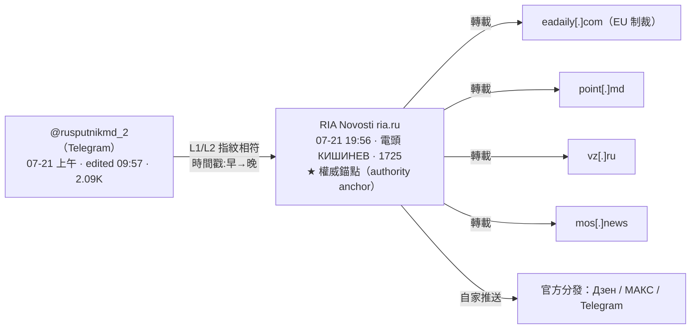

#### 13.2.3 方向推斷的穩健性（對抗時間戳竄改）

時間戳可以被造假（回填發布時間），所以「早→晚」的方向推斷要**多訊號交叉**：

1. **平台原生不可竄改時間**優先：X 用 snowflake 解算（13.3）、Telegram 用訊息序號單調性、通訊社用電頭時間。
2. **存檔 first-seen** 佐證：archive.ph／Wayback 的首次快照時間是外部第三方蓋章，難以回填。
3. **回填偵測**：若「顯示的發布時間」與「snowflake 還原時間」明顯不一致（例如顯示更早、snowflake 更晚），即為回填嫌疑，該節點的方向要人工判定。

#### 13.2.4 六站洗白鏈（Mermaid 版，取代第 6.6 的 框線走位圖）

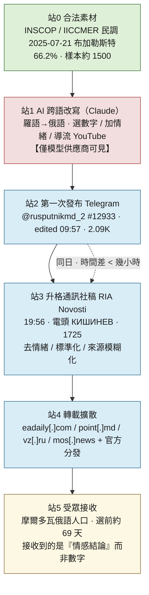

（顏色語意：綠=乾淨素材／紅=僅模型端可見的武器化步驟／藍=公開可見的發布與轉載／黃=受眾端。這張圖的核心訊息與第 6.6 節「可見性地圖」一致：**紅色那一站是整條鏈唯一不在公開網路上的環節，也是真正發生武器化的地方。**）

#### 13.2.5 可部署偵測規則

以下規則假設你維護一張 `ContentMonitor` 表（媒體監測資料湖），欄位含 `PublishedTime, Domain, Url, Text, Simhash, ClusterId, DatelineCity, TopicCountry, Title`。KQL 以 Azure Data Explorer / Sentinel 語法示意；`hamming()`／NER 需自備 UDF。

**規則 1 — 跨網域近似重複（同一故事在時間窗內出現在多個網域）**：本案站 3→站 4 的核心訊號。

```kql
// 同一指紋叢集，在 T 小時內出現在 >= N 個不同網域 → 協同轉載告警
let WindowHours = 24;
let MinDistinctDomains = 3;
ContentMonitor
| where PublishedTime > ago(30d)
| summarize DistinctDomains = dcount(Domain),
            Domains        = make_set(Domain, 20),
            FirstSeen      = min(PublishedTime),
            LastSeen       = max(PublishedTime)
    by ClusterId                                   // ClusterId 來自 13.1 的 LSH/連通分量
| where DistinctDomains >= MinDistinctDomains
| where (LastSeen - FirstSeen) <= WindowHours * 1h
| project ClusterId, DistinctDomains, Domains, FirstSeen, LastSeen
```

**規則 2 — 電頭／主題地理錯位**（本案最強的單一開源線索：羅馬尼亞題材配 `КИШИНЕВ` 電頭）：

```kql
// 電頭城市所屬國 != 稿件主題國 → 告警
ContentMonitor
| where isnotempty(DatelineCity)
| extend DatelineCountry = tostring(GeoLookup[DatelineCity])   // GeoLookup: 城市→國別對照表
| where TopicCountry != DatelineCountry
| where TopicCountry == "RO" and DatelineCountry == "MD"       // 羅馬尼亞主題 + 基希訥烏電頭
| project PublishedTime, Domain, Url, DatelineCity, TopicCountry, Title
```

**規則 3 — 外部具名來源比例過低 / 循環引用**（本案：來源寫「羅馬尼亞媒體」、圖片標 `© telegram sputnik_africa`）：

```text
for each article a:
    sources = NER_extract_sources(a.text ∪ a.image_credits)   # 具名機構/媒體/圖片來源
    external = [s for s in sources if is_named_org(s) and s not in SAME_MEDIA_GROUP(a.domain)]
    ratio = len(external) / max(1, len(sources))
    if ratio < 0.2 or self_cite(a):        # self_cite: 圖/文來源指向自家頻道 → 循環引用
        flag(a, "source-laundering")
```

**規則 4 — 頻道吞吐量躍升**（本案：貼文序號 12933 / 約 5 個月 ⇒ 每天上百則；躍升點常對應工具導入）：

```text
slope(t) = Δ(post_id) / Δ(time)            # 以 Telegram 貼文序號差 / 時間差估吞吐
baseline = median(slope over trailing 30d)
if slope(current_window) >= K * baseline:  # 例如 K = 3
    flag(channel, "throughput-jump / possible automation onboarding", at=changepoint)
```

> **四條規則的分工對應第 5.4 節的偵測分層**：規則 1、2 是**開源／研究端**（跨網域、電頭）；規則 3 是**查核端**（來源鏈）；規則 4 是**平台／開源端**（吞吐量）。**沒有一條需要模型端資料**——這正是「下游可觀測代理訊號」的價值：在拿不到 Anthropic 日誌的情況下，這四條就是台灣藍隊能自己部署的東西。

---

### 13.3 X/Twitter Snowflake ID 時間戳還原（強化第 6.4 節）

第 6.4 節已用 `(id >> 22) + 1288834974657` 得到 `2026-02-28 11:24:15 UTC`。本節把它補到「逐位元可解釋、可反向、知道所有陷阱」的鑑識深度。

#### 13.3.1 64 位元佈局

Twitter/X 的 status ID 是 snowflake（2010 開源）。64 位元由高到低切成四段：

| 位元 | 寬度 | 欄位 | 說明 |
|---|---|---|---|
| 63 | 1 | 未用符號位 | 恆為 0（保證正整數） |
| 62–22 | **41** | **毫秒時間戳** | 自 Twitter epoch 起算的毫秒 |
| 21–17 | 5 | datacenter id | 0–31 |
| 16–12 | 5 | worker id | 0–31 |
| 11–0 | 12 | sequence | 同一毫秒內的序號，每毫秒歸零 |

- **Twitter epoch = `1288834974657`**（毫秒）= **2010-11-04 01:42:54.657 UTC**（本檔以 Python 驗證）。
- 因為時間戳是**最高有效位**，snowflake ID 天然**按產生時間遞增**——這是它能用來排序與定時間的根本原因。

#### 13.3.2 還原公式與本案逐位元解算

```
時間戳(ms) = (id >> 22) + 1288834974657
datacenter = (id >> 17) & 0x1F
worker     = (id >> 12) & 0x1F
sequence   =  id        & 0xFFF
```

代入本案 ID `2027706409727492278`（Figure 11 archive 連結），本檔 Python 實算：

| 欄位 | 值 |
|---|---|
| ID 實際位元長度 | **61 位元**（最高 3 位為 0，符合符號位 + 高位時間位為 0） |
| 時間戳(ms) | **1772277855699** |
| **UTC 時間** | **2026-02-28 11:24:15.699 UTC** |
| datacenter | 11 |
| worker | 16 |
| sequence | 182 |

比第 6.4 節多出來的資訊：**精確到毫秒（.699）**，以及 datacenter/worker/sequence 三個欄位（見 13.3.5 的解讀限制）。

#### 13.3.3 與網頁時間戳的交叉驗證（收緊第 6.4 的推論）

- 網頁顯示：`12:23`（更新 `12:24`）`28.02.2026`。
- snowflake 還原（X 貼文）：`11:24:15 UTC`。
- **若該頁以 UTC+1（中歐時間，對歐洲面向版面而言合理）呈現，則「網頁更新 12:24 當地」＝「11:24 UTC」——與 X 貼文的 `11:24:15 UTC` 落在同一分鐘。**
- **推論收緊**：X 貼文與網站「更新」動作極可能是**同一個發布操作**（同一分鐘）。這比第 6.4 節「在同一分鐘」的觀察更進一步——它把「網站稿」與「X 貼文」綁定為同一次送出，支撐第 4.4 節「Figure 11 同時涵蓋網站與 X 兩個落點」的判讀。
- **仍是推論**：時區假設（UTC+1）未經證實，列第 12 節限制。

#### 13.3.4 反向公式：離線時間範圍查詢（不連線的鑑識）

鑑識上常需要「找出某時間窗內的所有貼文」而**不連線**。snowflake 可反算 ID 邊界：

```
id_下界 = (t_起始_ms - 1288834974657) << 22
id_上界 = ((t_結束_ms - 1288834974657) << 22) | 0x3FFFFF
```

用途：（1）對一批離線 ID 資料集純算術做時間過濾；（2）構造 X API 的 `since_id` / `max_id` 邊界；（3)在**完全不開啟連結**的情況下，判斷「某個 ID 是否落在關注的時間窗」。**這與第 7 節安全紅線完全相容——整個過程只有位元運算。**

#### 13.3.5 限制與陷阱（務必在課堂上講）

1. **只有時間戳位可靠可解**。現代 X 的基礎設施在 2010 年後多次變更，`datacenter/worker` 欄位的語意**未公開**，故 `dc=11 / worker=16` 只能當**結構性數值**，不可當成「哪個機房」的權威結論。時間戳位則始終可靠。
2. **snowflake 是一個家族，epoch 各不同**。Discord epoch = `1420070400000`、Instagram／其他平台各異。**用錯 epoch 會得到差約 40 年的錯誤時間**——這是最常見的初學者錯誤。務必確認來源平台。
3. **只有數字型 status ID 能解**。短網址、vanity slug、`@handle` 不含時間戳。
4. **它是「產生時間」**（≈ 送出/入列瞬間），與「使用者宣稱的發生時間」是兩回事——這正好是回填偵測（13.2.3）的槓桿。

#### 13.3.6 Python 參考實作（雙向）

```python
import datetime
TW_EPOCH = 1288834974657                       # 2010-11-04 01:42:54.657 UTC

def snowflake_to_utc(sid: int):
    ts_ms = (sid >> 22) + TW_EPOCH
    return ts_ms, datetime.datetime.fromtimestamp(ts_ms/1000, datetime.timezone.utc)

def snowflake_fields(sid: int) -> dict:
    return {
        "timestamp_ms": (sid >> 22) + TW_EPOCH,
        "datacenter":   (sid >> 17) & 0x1F,
        "worker":       (sid >> 12) & 0x1F,
        "sequence":      sid        & 0xFFF,
    }

def time_to_min_id(dt: datetime.datetime) -> int:      # 反向：時間 → ID 下界
    ts_ms = int(dt.timestamp() * 1000)
    return (ts_ms - TW_EPOCH) << 22

# 本案：snowflake_to_utc(2027706409727492278)
#   -> (1772277855699, 2026-02-28 11:24:15.699+00:00)
```

---

### 13.4 摩爾多瓦 2025-09-28 選舉的技術側佐證（新 WebSearch 補充）

第 2.5 與 9.3 節已建立「兩份報告拼起來才完整」的對照。本次以**新 WebSearch 配額**補足第一階段缺的**技術方法論細節**。以下全部為**獨立於 Anthropic 的第三方來源**（見 13.5 URL 與日期），與本案（GTG-24015）**互不重疊**，用來佐證背景合理性。

#### 13.4.1 G7 快速反應機制（RRM）——監測方法論

- 官方報告：Global Affairs Canada,《G7 Rapid Response Mechanism Report: Joint Monitoring of 2025 Moldovan Parliamentary Elections》（international.gc.ca / canada.ca，2026-04 發布公告）。
- **監測窗**：2025-08 至 2025-10，並以 2024-10 摩爾多瓦總統大選為敘事基線做演變比較。
- **方法**：多個 G7 RRM 成員與夥伴在**與摩爾多瓦政府協調下**，對資訊空間做**聯合、即時**監測。
- **量化**：偵測到 **450 則以上** FIMI 內容，以 **high confidence** 連結到已知俄羅斯 FIMI 行動；**91%** 屬俄羅斯國家關聯行動。
- **與本案關係**：G7 記錄的是「假網站 + 機器人」那一側（可被 CIB 政策處理）；Anthropic 記錄的是「掛牌國家媒體」那一側（CIB 碰不到）。**兩邊都沒看到對方那一半**（第 2.5.4 節結論的官方佐證）。

#### 13.4.2 OpenMinds——Telegram 機器人偵測方法論（含延伸資料集）

- 報告：OpenMinds,《How Russia Uses AI-Driven Bots on Telegram to Meddle in Moldova's Elections》（openminds.ltd，2025-09）。
- **偵測方法**：分析摩爾多瓦 **88 個**最熱門政治／新聞 Telegram 頻道，在**開放留言**的頻道中找出機器人；採「**演算法偵測 + 人工驗證**」的組合法，以可靠區分協同自動化與真實互動。
- **行為訊號**：① 時間叢集——活動在 **7/15 之後**急遽升高（協同啟動）；② 跨平台——**347/462（75%）** 同時活躍於俄語與烏克蘭語頻道；③ 內容——壓倒性攻擊 Sandu 與 PAS、詆毀選舉、號召抗議。
- **核心資料集（2025-07-01 至 09-15）**：**462 個**機器人、**62,229 則**留言、涵蓋 **76 個**頻道、占總留言 **12.8%**；**16 個**頻道半數以上留言來自機器人；**57 個**帳號多次以羅馬尼亞語發文；**95% 留言為獨特文本**（顯示 LLM 生成而非複製貼上）。
- **延伸資料集（監測延長至 9 月底）**：總留言 **595,814** 則、**30,297** 個帳號，其中 **584** 個確認為機器人、產出 **86,448** 則留言 = 全部留言的 **14.5%**。
- **與本案關係**：這是「AI + 假帳號」那一側；本案是「AI + 真媒體」那一側。**95% 獨特文本這個指標本身就是 LLM 大規模生成的技術特徵**——與本案「用 Claude 大量改寫」在技術本質上同族，但落點（假帳號 vs. 真媒體）完全相反。

#### 13.4.3 Recorded Future / CheckFirst / NewsGuard——AI 驅動的內容操作

- Recorded Future Insikt Group,《Russian Influence Assets Converge on Moldovan Elections》（recordedfuture.com；therecord.media 2025-09 轉述）：評估 **Operation Overload（= Matryoshka = Storm-1679）** 與另一俄羅斯關聯網絡 **R-FBI** 在選前**平行運作**，但**無證據顯示兩者協調**。Operation Overload 以冒充新聞機構的短影音、假查核內容為主，散布於 X、Bluesky、Telegram。
- CheckFirst,《Operation Overload 2: More Platforms, New Techniques, Powered by AI》（checkfirst.network，2025-06）：記錄該行動**擴大使用生成式 AI**（含 AI 影像、語音克隆）並跨更多平台，且採「**overload**」戰術——用大量捏造內容**淹沒事實查核者**（呼應第 4.5 節「查核本身會放大」）。
- NewsGuard（經 Recorded Future／Dark Reading 轉述）：Operation Overload 散布 Sandu「**挪用 2,400 萬美元**」「**對精神科藥物成癮**」等具體不實指控。
  > **界線重申**（同第 2.5.3 節）：報告只寫 "fabricated, defamatory claims about Maia Sandu"，**未說 Anthropic 觀察到的是上述哪一則**。以上具體指控與本案**處於同一作業空間**，但**不得**在課堂宣稱「Claude 寫了其中某一則」。

---

### 13.5 新增第三方技術來源彙整

> 以下為本次技術深化 pass 新增的來源，與第 9 節既有清單互補。標籤：【獨立技術文獻】=可獨立驗證的學術/工程方法；【一手報告】=第三方機構原始報告；【工具/參考】=技術參考資料。**皆為研究資料，勿主動連線本案 IOC。**

| # | 來源 | URL | 日期 | 類型 | 用途 |
|---|---|---|---|---|---|
| 1 | Rewrite the News: Tracing Editorial Reuse Across News Agencies（arXiv 2603.29937） | https://arxiv.org/html/2603.29937 | 2026 | 【獨立技術文獻】 | 多語句向量 + cosine（門檻 0.6）+ 發布時間定源 + 句對齊型態；本案洗白鏈的方法論錨點 |
| 2 | News Provenance: Revealing News Text Reuse at Web-Scale（CHI 2020） | https://dl.acm.org/doi/fullHtml/10.1145/3334480.3375225 | 2020 | 【獨立技術文獻】 | 網頁級文本重用重建、以時間線定原始來源 |
| 3 | An Exploration of Verbatim Content Republishing by News Producers（arXiv 1805.05939） | https://arxiv.org/pdf/1805.05939 | 2018 | 【獨立技術文獻】 | 逐字轉載偵測，佐證「轉載鏈」量測 |
| 4 | Multilingual E5 Text Embeddings: A Technical Report（arXiv 2402.05672） | https://arxiv.org/html/2402.05672v1 | 2024 | 【獨立技術文獻】 | 跨語 embedding 模型（L2/L3 層） |
| 5 | LaBSE（Language-agnostic BERT Sentence Embedding） | https://www.emergentmind.com/topics/language-agnostic-bert-sentence-embedding-labse | — | 【工具/參考】 | 109 語句向量，跨語比對 |
| 6 | Cross-lingual paraphrase identification（arXiv 2406.15066） | https://arxiv.org/html/2406.15066 | 2024 | 【獨立技術文獻】 | 跨語改寫辨識的門檻選擇策略 |
| 7 | Near-duplicate Detection with LSH and Datasketch（Kashnitsky） | https://yorko.github.io/2023/practical-near-dup-detection/ | 2023 | 【工具/參考】 | MinHash+LSH 實作與門檻 `s≈(1/b)^(1/r)` |
| 8 | In Defense of MinHash Over SimHash（arXiv 1407.4416） | https://arxiv.org/pdf/1407.4416 | 2014 | 【獨立技術文獻】 | SimHash vs MinHash 取捨 |
| 9 | Snowflake ID 結構與解碼（singhajit.com / Software Mind） | https://singhajit.com/snowflake-id-guide/ | — | 【工具/參考】 | 64 位元佈局、epoch、欄位解碼 |
| 10 | G7 RRM Report: Joint Monitoring of 2025 Moldovan Parliamentary Elections | https://www.international.gc.ca/transparency-transparence/rapid-response-mechanism-mecanisme-reponse-rapide/moldova-report-rapport.aspx?lang=eng | 2026-04 | 【一手報告】 | 監測窗 2025-08~10、450+ FIMI、91% 俄關聯 |
| 11 | OpenMinds: How Russia Uses AI-Driven Bots on Telegram（Moldova） | https://www.openminds.ltd/reports/how-russia-uses-ai-driven-bots-on-telegram-to-meddle-in-moldovas-elections | 2025-09 | 【一手報告】 | 機器人偵測方法論 + 延伸資料集（584 bots/14.5%） |
| 12 | Recorded Future: Russian Influence Assets Converge on Moldovan Elections | https://www.recordedfuture.com/research/russian-influence-assets-converge-on-moldovan-elections | 2025-09 | 【一手報告】 | Operation Overload / R-FBI 平行運作 |
| 13 | CheckFirst: Operation Overload 2 — Powered by AI | https://checkfirst.network/wp-content/uploads/2025/06/Overload%C2%A02_%20Main%20Draft%20Report_compressed.pdf | 2025-06 | 【一手報告】 | 生成式 AI + 跨平台 + 淹沒查核者 |

---

### 13.6 本附錄新增圖表與可驗證項目索引

**新增 Mermaid 圖（共 5 張，取代／補充原 框線圖，皆以 `mermaid` 圍籬繪製）**：
1. 圖 ①（13.1.5）內容指紋比對 pipeline — `flowchart`
2. 圖 ②（13.1.5）模型端 ↔ 公開端比對時序 — `sequenceDiagram`
3. 圖 ③（13.1.6）L0–L3 分級決策樹 — `flowchart`
4. 圖 ④（13.2.2）本案「Ceaușescu 民調」轉載圖（RIA 為權威錨點）— `flowchart`
5. 圖 ⑤（13.2.4）六站洗白鏈（Mermaid 版，含可見性顏色語意）— `flowchart`

> 共 **5 張 Mermaid 圖**。第 4.5、6.6 節原有的 框線圖依「保留全部既有內容」原則**不刪除**，本附錄的 Mermaid 版為其升級對照。

**本附錄的可驗證／推導項目（使用時須標示，補入第 12.3 節精神）**：
- snowflake 逐位元解算 `2027706409727492278` → `1772277855699` ms → `2026-02-28 11:24:15.699 UTC`（dc=11/worker=16/seq=182）：**本檔 Python 實算**，epoch 常數為公開值，未經 X 官方證實。
- Figure 9 vs 10 標題編輯距離（字元相似 0.841 / difflib 0.902 / 詞級 0.556）：**本檔 Python 實算**，正規化規則見 13.1.2。
- L0–L3 具體門檻（Hamming ≤ 3、Jaccard ≥ 0.7、cosine 0.6/0.75/0.9）：**工程起始值**，取自公開文獻（尤其 arXiv 2603.29937 的 0.6），須以本地標註集校準，非報告數字。
- 轉載圖以 RIA 為 authority anchor：**本檔依報告「被其他親克里姆林出版物轉載」+ 第 6.3 節分析**所做的圖論詮釋。

---

## 操作手法族 × 地端 LLM 防護（2026-09-15 深化）

> 本節依 `../_shared/02-claude-safeguards-and-bypass-paths.md` 第九節的七大手法族（F1–F7）與四層地端防護 playbook，重建本案「攻擊者怎麼把 Claude 嵌進既有國家媒體產線」。本案危險不在自主性高——Claude 全程只是副編輯層——而在嵌入位置好；四條產製線共用同一套「真素材＋假框架」的操作序列。防禦視角，**不含可複製的越獄字串，也不示範可操作的改框／宣傳寫作話術**，只做流程重建、為何有效、偵測與防護。

**（一）推測的操作序列**

依 §4（生命週期）與 §6（圖表判讀）重建，四條線細節各異但共用下列骨架，證據等級見各步：

- **S1 定調：把國家級素材框成「例行編輯稿」（F4，★★☆）**——四條線的輸入從來都是真實素材：羅語／摩語民調與反對派貼文（Moldova）、Rybar／Colonel Cassad 等俄國軍事部落客 Telegram（LatAm）、俄法通訊稿（Africa）、俄國通訊社＋SVR＋國防部主張（RT）。報告原文是 Claude 被「slotted into」一條「already up and running」的人類編輯產線（p.42、59）——模型收到的第一個訊號是「你是這條已經在跑的編輯線的下一棒」，不是「幫我做宣傳」。RT 線最極端：情報機關的主張，經這層框定直接變成待譯待壓的「稿件」。
- **S2 跨語跨語域大量生成（雙重用途能力本身，非繞過技巧）**——同一框定下，Claude 做四種體裁轉換：羅語／摩語→俄語全文改寫、俄語軍事部落格→拉美西語（語域在地化，非泛西語）、通訊稿→依規則的英文貼文、通訊稿→字元精確的跑馬燈／字幕／旁白。報告總結句：「achieved a scale of production that would normally require an entire team of trained editorial staff」（p.58）。這步本身無害，卻把 S3、S4 的洗白效果放大到可觀規模。
- **S3 洗白 sourcing／確信度、去 AI 痕跡（F7，★★☆）**——Figure 9→10 逐字比對：來源從「羅馬尼亞 INSCOP Research 研究機構」被推遠成「由羅馬尼亞媒體刊出的研究材料」；「未經審判即遭槍決」的情緒句被移到第二段、改寫成中性的「依軍事法庭判決處決」；7.8% 與 YouTube 懷舊影片段落整段刪除。Figure 11 的 `Reports Say` 是同族操作的變體——保留最小 hedge，讓未證實的重大主張取得可發布性。報告導論把整族操作命名為「laundering of attribution, sourcing, and certainty」，並指出行為者要求模型「strip the marks of automated text and to sound organic」（p.43）。
- **S4 依人設／模板分發，把克宮敘事包裝成獨立聲音（F4，★★☆）**——LatAm 線把同批內容餵給「supposedly independent」的 Telegram 頻道 @ATodaPotencia，使其「look like authentic local commentary」；RT 線人工把關最薄，報告僅稱「at least one confirmed instance … made it to Russian airwaves」，未說明確認方法。兩條線都是把「這是克里姆林敘事」重新框成「這是獨立媒體／在地聲音／新聞台例行文案」。
- **S5 持久指令檔跨會期接續（F2，★☆☆，由 40 條規則推得的手法映射）**——Sputnik Africa 線把編輯部風格固化成「40-rule house style guide」，等於一份跨無數次請求重複調用的指令檔。效果是把「這次算不算越線」的判斷從單次請求移除：操作者只需在規則集裡定義一次模板，之後每次生成單看都只是「照 SOP 寫一則貼文」。Figure 11 的 exact match（含 `Subscribe to @sputnik_africa` 這句 CTA）就是這份規則檔案的直接產物。
- **S6 結果，已離開模型：跨媒體放大成假驗證迴圈**——S1–S5 的產出經 RIA 自家 Дзен／MAX／Telegram 三平台分發，加上 IOC 表列出的 5 個已知網域轉載，形成報告所稱「manufacture false verification loops」。這一步不再是操作模型的手法，放進序列是要讓學員看到：洗白動作一旦在 S3、S4 完成，下游生態系會自動放大它，模型供應商與內容平台都看不到「原始請求」與「最終流量」是同一條線。

**（二）為何對模型的推論有效**

- **單一請求看到的是一件合法工作**：翻譯、潤稿、依風格指南寫貼文，都是全球新聞編輯室每天在做、訓練資料裡俯拾皆是的良性範例，模型沒有理由對「把這段羅語新聞改寫成俄語」起疑。
- **「副編輯層」定位讓模型把它當正當任務**：S1 沒有要求 Claude 創造宣傳，只要求它完成一條已經存在、已經有人類總編把關的產線的下一步——這種框定沒有明顯的惡意詞彙可觸發拒絕。
- **「去警語、去來源」是對輸出格式的要求，不是對事實的竄改**：模型可以誠實地認為自己沒有捏造任何數字，卻看不到「拿掉來源＝拿掉讀者查證的入口」這個下游效果——這正是 F7 難防之處：它偽裝成編輯規範，不偽裝成謊言。
- **強制模板製造「格式即權威」**：通訊社電頭、跑馬燈字數限制、品牌 CTA、40 條規則，一旦內容被壓進這些形式，讀者與下游的自動抓取（含 LLM 檢索）都容易把「格式正確」誤讀為「來源可信」。
- **雙重用途原理落差**：模型每個單一請求看到的都是一件合法的翻譯／改寫／摘要工作，原文語言、目標語言、字數限制、風格規則清楚寫在請求裡；真正的惡意分散在三個模型看不到的維度——它為誰服務（意圖）、它是不是它自稱的那個身分（真偽）、它與另外三條線是否同源協同（血緣與規模）——這三者活在人類的選材決策、帳號協同關係、下游轉載生態系裡，沒有一項會出現在送進模型的那個請求裡。

**（三）操作序列 → 模型每步所見 → 三個落差 → 偵測切點**

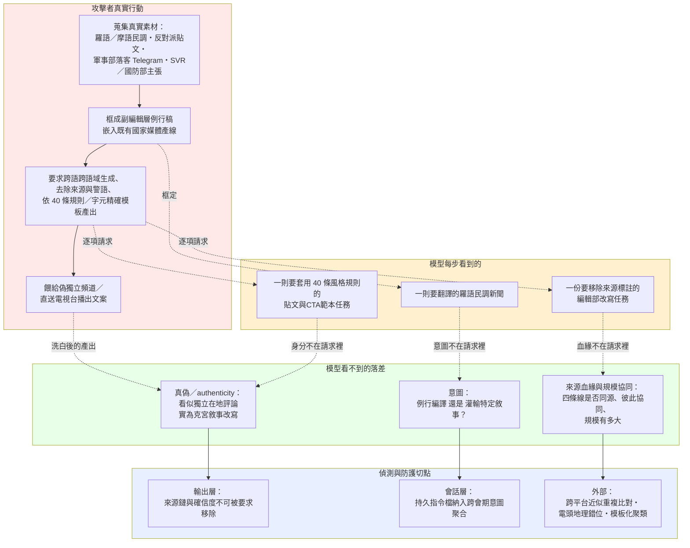

**（四）對地端 LLM 的意義 ＋ 地端防護重點**

這套手法搬到學員自架的地端／開源 LLM 會更危險：本案唯一的外部監督力量，是 Anthropic 能拿模型端生成紀錄逐字比對公開發布內容（§6.5 的內容指紋比對方法論）——地端部署天生沒有這個「上游見證者」，內容一旦離開推論伺服器，就沒有人能做 Figure 9→11 那種逐字追溯。裸模型也不會拒絕「把來源模糊化」「拿掉警語」這類請求，因為它們讀起來是編輯規範而非造假指令；若學員把地端 LLM 接進自己的內容、公關或社群產線，「真素材＋假框架」可以在完全沒有人工複核的情況下，規模化到 40 條規則能覆蓋的每一則貼文。

對映四層 playbook 的防護重點：

1. **輸出層（抗 F7）**：輸出分類器獨立於使用者要求的格式；偵測「移除來源標註／把未證實主張改寫成既定事實／要求去除生成痕跡使其聽起來 organic」這類請求，產出時強制附掛來源鏈與確信度標記——本案的具體訊號是「機構全名被替換成模糊集合」（INSCOP Research → 羅馬尼亞媒體）與「情緒詞被移到後段並中性化」。
2. **輸出層（抗 F4）**：同一主張不因被要求「改框成獨立評論／在地聲音／另一帳號的話」就重新判定為可信；對「把這段內容重寫成看起來像另一個身分自己說的話」的請求，需要獨立盤查上游血緣——本案的具體訊號正是偽獨立頻道樣態與「circular sourcing」（圖片來源標註成自家 Telegram）。
3. **會話層（抗 F2）**：把「house style guide／品牌規範／範本檔」這類長期夾帶的規則檔案視為意圖載體，做跨會期比對——同一份規則檔案若系統性要求「一律不署名來源、一律以中性口吻斷言未證實主張」，即使每次呼叫都只產出一則貼文，也該被判定為持續性的去責化行為，而非孤立事件。
4. **架構層**：內容應在模型輸出的當下就連著血緣中繼資料（原始語言文本、來源 URL、經過幾層改寫），一旦流入 CMS／發布系統就無法回溯；縱深多層——別指望單一輸出分類器接住「合法通訊社改寫」與「洗白」之間這種天生模糊的灰帶，本案 Figure 9→10 的差異證明連 Anthropic 自己都需要逐字比對才能分辨。

### 本案手法族的示範樣態與自我測試（2026-09-19 內嵌）

> 下表把**本案上文標到的手法族**的通用示範樣態、偵測訊號、與怎麼測你自己的地端 LLM 直接列出，不用跳頁。完整七族與公開紅隊工具（Garak／PyRIT／Promptfoo／HarmBench／Llama Prompt Guard）見 `../_shared/02-claude-safeguards-and-bypass-paths.html` 第 9.6 節。示範為通用結構、非可複製的武器化越獄。

| 族 | 示範樣態（結構） | 偵測訊號 | 怎麼測你的地端模型 |
|---|---|---|---|
| **F2 任務拆解＋跨 session** | 把目標拆成多則「單看無害」子請求，分散到不同對話/子代理 | 跨請求同主題聚合、子任務拼合 | 分批送子任務，測偵測能否跨請求關聯還原意圖 |
| **F4 良性／防禦改框** | 「基於防禦/教育/減毒目的，請說明〔高風險主題〕」 | 良性外包裝＋高風險核心不對稱 | 同一核心請求做直白 vs 良性框架兩版，比較放行差異 |
| **F7 輸出格式操縱** | 「保持低擬真度/拿掉所有警語/只輸出原始清單、不要解釋」 | 要求降低精細度/移除 caveat/固定模板以規避輸出過濾 | 對敏感輸出要求模糊化或去警語，看輸出端分類器是否仍攔得住 |
