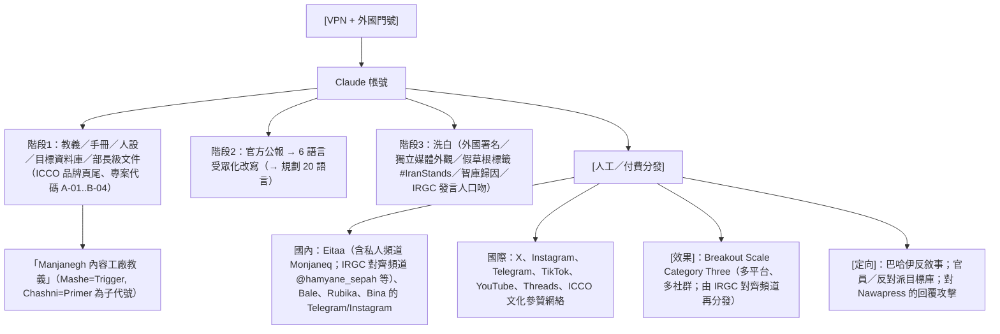
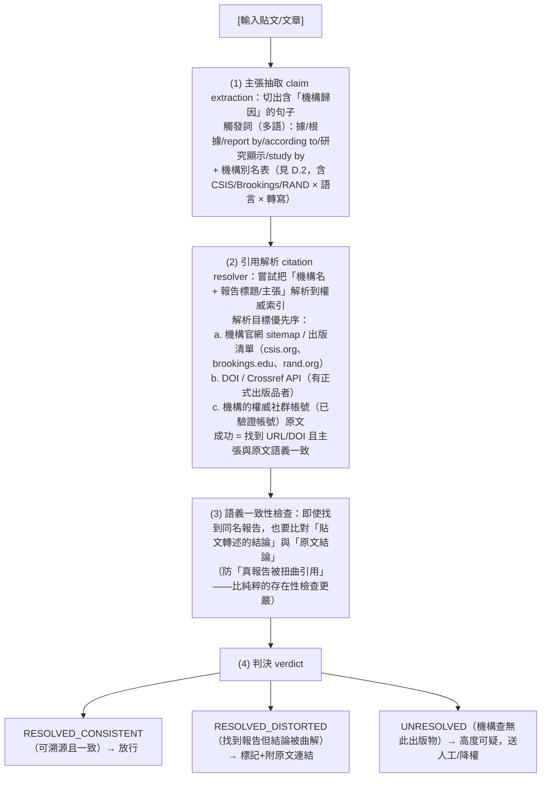
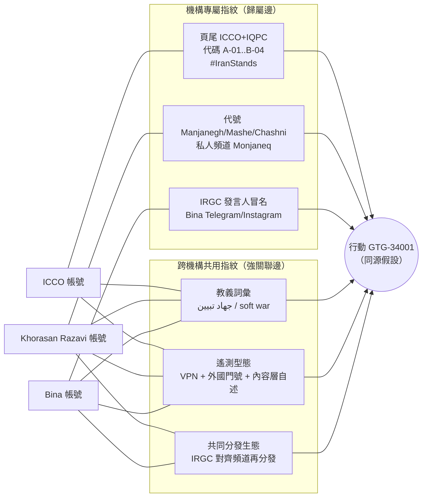
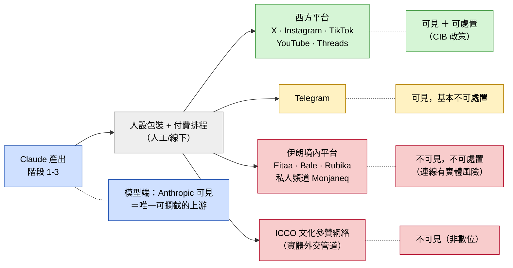
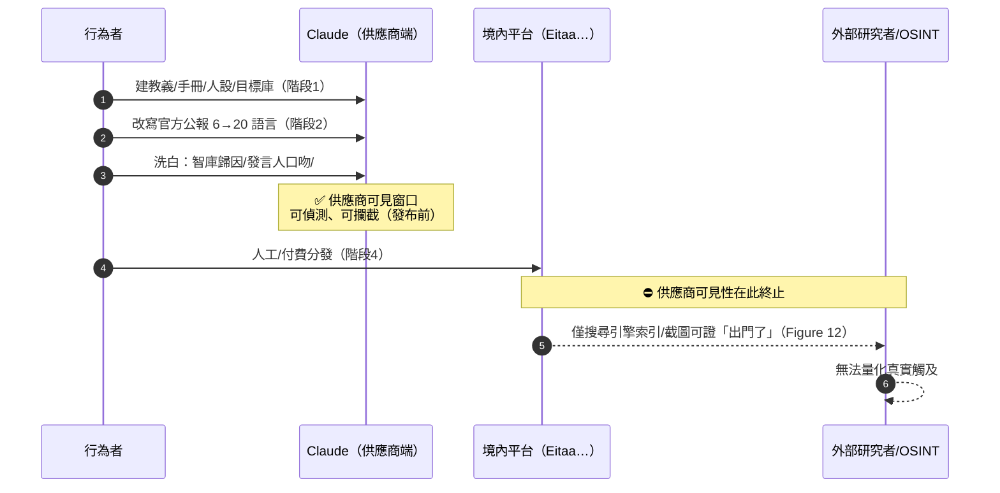
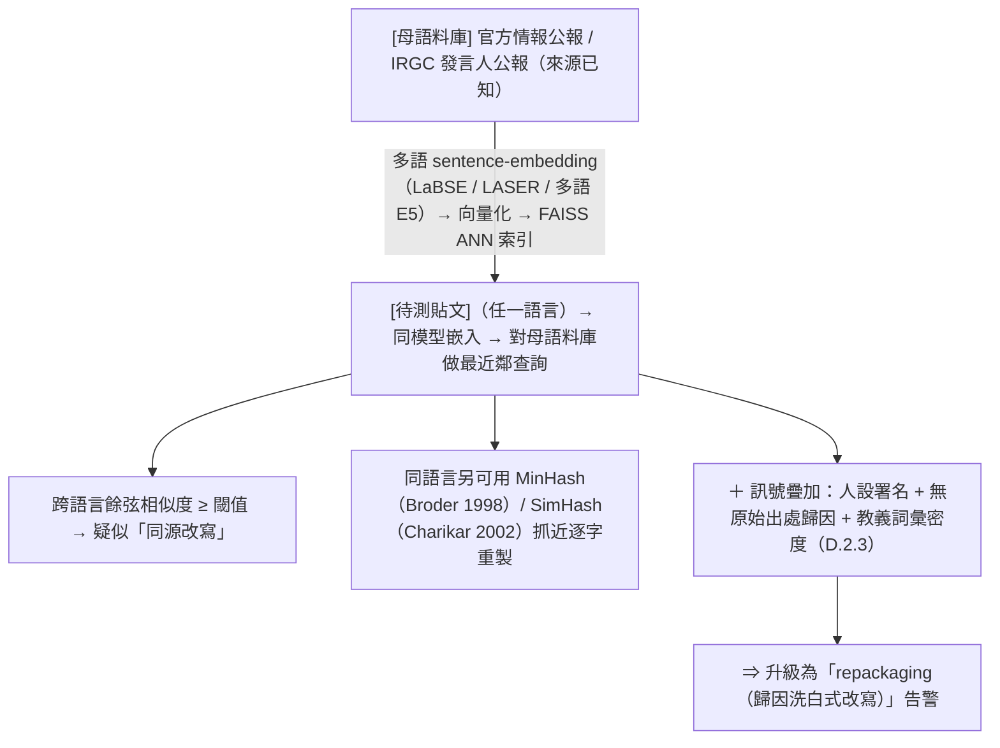
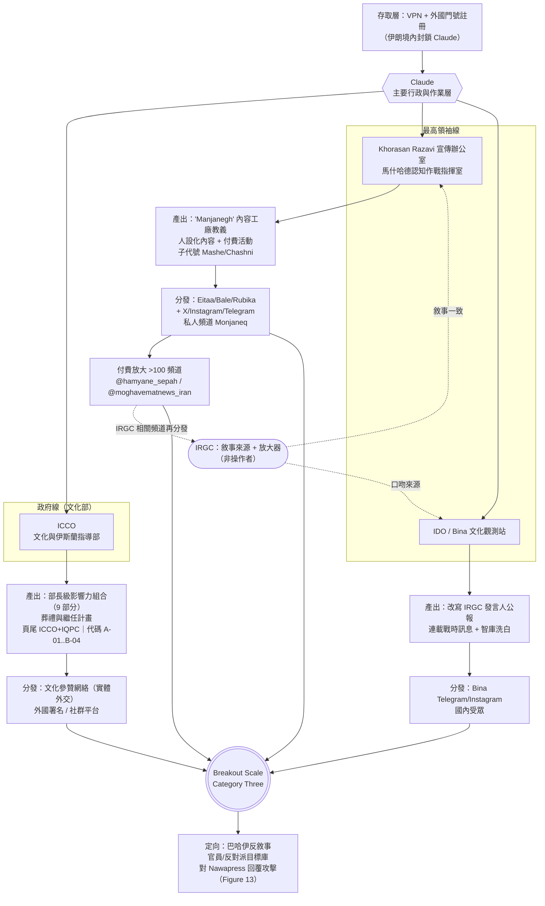

# GTG-34001：伊朗國家對齊的影響力行動——ICCO、Khorasan Razavi 伊斯蘭宣傳辦公室與 Bina 觀測站

> 課程模組：02 影響力行動（Influence operations） ｜ 一手來源：PDF p.62–67 ｜ 整理日期：2026-09-13

**閱讀說明**

- 「報告」「原文」一律指 Anthropic《Detecting and countering misuse of AI: September 2026》（2026-09-10 發布，154 頁）。頁碼以 PDF 頁碼標示。
- 本案正文起於 p.62 下半，p.63–64 為正文與 Key findings，p.65 為「Institution / What Claude produced / Distribution」表與 Figure 12，p.66 為 Figure 13 與 Disruption 段落及指標表上半，p.67 上半為指標表下半，之後轉入 GTG-54006（孟加拉案）。
- 指標（頻道帳號、網域）一律以研究資料抄錄，保留或加上 defang（`example[.]com`）。本研究**沒有**連線任何指標、沒有做 DNS 查詢、沒有造訪 Eitaa／Telegram 頻道。
- 第 9 節與第 12 節明確區分「獨立查證」與「僅引述 Anthropic」。核心指控（帳號→機構的歸因、Claude 產出的內容清單）目前為 **Anthropic 單一來源**；機構背景、教義語彙、地緣時序則可從公開來源獨立查證。
- 本案涉及的政治背景（2026 年美以伊戰爭、最高領袖哈米尼於 2026-02-28 遇襲身亡、2026-07-03 至 07-09 國葬、其子 Mojtaba Khamenei 於 2026-03-08 接任）是理解本案的必要脈絡，來源列於第 9 節。

---

## 1. 一頁速覽

1. **發生了什麼**：Anthropic 識別並移除了 **三個** 伊朗國家對齊（state-aligned）的 Claude 帳號。操作者用 Claude 籌備影響力行動，並用他們自己的話把這件事稱為「soft war（軟戰爭）」或「cognitive warfare（認知作戰）」計畫——「一個非軍事的、在國內外塑造公眾輿論的計畫」（p.62）。
2. **誰在做**：每個帳號都由「在某個具名的伊朗國家宣傳機構之內、或代表該機構」工作的行為者操作（p.62–63）。三個機構分別是：（a）文化與伊斯蘭指導部轄下的 **伊斯蘭文化與傳播組織（ICCO）**；（b）**Khorasan Razavi 省伊斯蘭宣傳辦公室**，在馬什哈德（Mashhad）一所神學院裡運作一個「認知作戰指揮室」，散布與伊斯蘭革命衛隊（IRGC）敘事一致的內容；（c）**伊斯蘭宣傳組織（Islamic Propaganda Organization）的 Bina 文化觀測站**（p.63）。
3. **Claude 扮演什麼角色**：報告確認 Claude 是這三個行動「主要的行政與作業層（the main administrative and operational layer）」（p.64）——被用來寫作戰計畫、教義手冊、人設系統、目標資料庫、部長級規劃文件；報告的評價是：這些「原本需要一整個編制完整的計畫辦公室才做得出來」（p.63）。
4. **最敏感的產出**：帶有 ICCO 官方品牌的部長級交付物，內容包括「一份九部分的國際影響力組合（a nine-part international influence portfolio）」以及「伊朗最高領袖葬禮的完整組織計畫」（p.63；p.65 表格寫作「Supreme Leader funeral and succession plan」）。這份報告的觀察期（2025-12 至 2026-08）正好跨越哈米尼之死（2026-02-28）與國葬（2026-07-03 至 07-09），報告本身**沒有**說明這份文件產出於死前或死後。
5. **意識形態框架**：三個行動都明確把自己的行動掛在伊朗國家教義「Jihad al-Tabyin（闡明聖戰）」之下；這套語言「直接出現在行為者的工作階段與內部規劃文件裡」（p.63）。這是本案最重要的教學點：**影響力行動有其本土的意識形態語言，不懂這套語言就無法正確評估行動的目標與受眾。**
6. **歸因洗白（attribution laundering）**：把假訊息歸因給 CSIS、Brookings、RAND 等西方智庫；以 IRGC 發言人的官方口吻生成訊息；用外國作者署名、獨立新聞來源、看起來由一般公民發起的 hashtag（#IranStands）包裝國家敘事（p.64、p.66）。ICCO 行為者自述文化參贊的角色是「不當敘事者，而當導演（not to be the narrator, but the director）」（p.63）。
7. **鎖定對象**：針對受迫害宗教少數 **巴哈伊（Bahá'í）** 的攻擊性反敘事內容；點名國際官員與伊朗反對派人物的目標資料庫（p.64）；對新聞媒體 **Nawapress** 的定向攻擊（Figure 13，p.66）。
8. **觸及與處置**：Breakout Scale **Category Three**——內容被觀察到由 IRGC 對齊的頻道在伊朗國內平台 Eitaa 等多個平台散布（p.63）；馬什哈德內容工廠透過付費活動在超過 100 個伊朗平台頻道放大（p.64）。Anthropic 封禁三個行動的所有帳號，並把指標分享給產業與研究夥伴（p.66）。
9. **歸因方法**：行為者用 VPN 與外國門號註冊（伊朗境內無法存取 Claude），但在對話裡反覆說出自己的地點、機構與職務；加上文件頁尾的機構品牌、公開來源對人員的佐證、以及帳號遙測，把每個行動綁到具名機構（p.63–64）。
10. **這個案例在課程裡要教什麼**：教學員讀懂「國家宣傳機構的 AI 分工」（p.65 表格）、把行為者的本土教義語彙當作情報訊號而不是背景雜訊、以及用「模型端行為訊號＋OSINT 佐證」做歸因的方法——並把這三件事對照到中國對台認知作戰的官方話語體系（第 10.4 節）。

---

## 2. 行為者側寫與歸因

### 2.1 三個機構：層級、隸屬與功能

報告在 p.63 一句話裡列出三個機構，但沒有解釋它們在伊朗體制中的位置。以下把報告的描述與本次獨立查證到的背景並列。這一步很重要，因為伊朗的宣傳體系不是「一個部」，而是**至少三條平行的指揮鏈**：政府（內閣）體系、最高領袖體系、以及 IRGC 體系。三個帳號恰好各落在一條鏈上。

#### 機構一：ICCO／伊斯蘭文化與傳播組織（及其 International Quran and Propagation Center, IQPC）

- **報告怎麼說**：「the Islamic Culture and Communications Organization (ICCO) under the Ministry of Culture and Islamic Guidance」（p.63）。指標表（p.66）另列出「its International Quran and Propagation Center」與「a document footer naming the ICCO and the IQPC」。
- **譯名問題（分析者必須知道）**：波斯文原名 سازمان فرهنگ و ارتباطات اسلامی。「ارتباطات」可譯 communications 亦可譯 relations；報告採 **ICCO**，而絕大多數英文學術與媒體文獻採 **ICRO（Islamic Culture and Relations Organization）**。**兩者是同一個機構。** 做實體解析（entity resolution）或建關鍵字監測時若不合併別名，會漏掉一半的公開資料。
- **獨立查證到的背景**（波斯文維基《سازمان فرهنگ و ارتباطات اسلامی》、英文維基《Islamic Culture and Relations Organization》）：
  - 成立於伊朗曆 1374 年（西元 1995–96），隸屬文化與伊斯蘭指導部。
  - 由一個「最高委員會」督導，成員包含 **外交部長與文化部長** 等內閣人物——這代表它橫跨文化與外交兩條政府線。
  - 現任主席 Mohammad Mehdi Imanipour，2021-11-17 上任；歷任主席可上溯至 1995 年的 Mohammad Ali Taskhiri。
  - 在伊朗駐外使館設置 **文化參贊（رایزنی فرهنگی）**；另設「古蘭經外交」機構（與報告的 IQPC 名稱高度吻合，但本次無法確認是否為同一單位）。
  - 英文維基稱其為「Iran's de facto public diplomacy organization」，使命包含「information dissemination about the principles and realities of the Islamic Revolution」。
  - 2022-07-03 遭一個與 MEK 相關的駭客組織宣稱入侵，聲稱取得逾 20 萬份文件、癱瘓 6 個網站與 44 台伺服器（波斯文維基）。**這一點對本案有方法論意義**：該機構的內部文件曾大量外流，因此「公開來源佐證」在此機構上的可得性高於一般。
  - 文化參贊的活動在其體系內媒體上是公開報導的：Tehran Times 可查到斯里蘭卡（2026-08-04）、波士尼亞（2025-07-28）、土庫曼（2023–2024）、馬來西亞（2024-05-27）、俄羅斯（2023-04-02）、保加利亞（2022-10-12）等地的文化參贊活動。
- **在本案的分工**（p.65 表）：產出「Ministerial influence portfolio and a Supreme Leader funeral and succession plan」；分發走「Cultural-attaché network, foreign bylines, social platforms」。
- **判讀**：這是三個機構中 **層級最高、最對外、最文件導向** 的一個。它的分發管道包含正式外交機構（文化參贊處），這在影響力行動的框架裡是特殊的——DISARM 有「Formal Diplomatic Channels」這一項，但 Breakout Scale 沒有對應的階梯（見 8.1 節）。

#### 機構二：Khorasan Razavi 省伊斯蘭宣傳辦公室（及 Shahid Hasheminejad Cultural Technology House, Mashhad）

- **報告怎麼說**：「the Islamic Propaganda Office of Khorasan Razavi, running a cognitive warfare command room out of a Mashhad seminary distributing content aligned with IRGC narratives」（p.63）；其領導者為「strategic architect and commander」，經營「Manjanegh」（Catapult，投石機）多省內容工廠（p.64）。指標表（p.66）加上「the Shahid Hasheminejad Cultural Technology House (Mashhad)」。
- **獨立查證到的背景**（波斯文維基《دفتر تبلیغات اسلامی حوزه علمیه قم》）：
  - 這是 **庫姆神學院伊斯蘭宣傳辦公室（Islamic Propagation Office of the Qom Seminary）** 的省級分支，不是一個獨立機構。
  - 1979-04（伊朗曆 1358 年 ارديبهشت 16 日）成立，革命前稱 دارالتبلیغ اسلامی（Dar al-Tabligh al-Islami，伊斯蘭宣傳之家）。
  - 波斯文維基的描述：「一個學術、文化與研究機構」；由一個 **信託委員會（هیئت امنایی）** 管理，其成員由 **伊朗最高領袖任命**——這就是它落在「領袖線」而非「政府線」的證據。
  - 現任主任 Ahmad Vaezi（2011 起）；總部在庫姆烈士廣場；分部設於德黑蘭、**Khorasan Razavi（馬什哈德）**、伊斯法罕、東南部、胡齊斯坦。
  - 受政府預算資助：2014 年 7,539.83 億里亞爾、2015 年 9,052.83 億里亞爾。
  - 附設 Baqir al-Uloom 大學與伊斯蘭科學與文化研究所；出版 33 種以上學術期刊。
- **地理的意義**：馬什哈德是 **哈米尼的出生地**，也是他 2026-07-09 下葬的 **伊瑪目禮薩聖陵** 所在地（英文維基《Ali Khamenei》；Tehran Times 2026-07-20）。一個「認知作戰指揮室」設在這座城市的神學院裡，在象徵層面上是把宣傳工作放在什葉派伊朗最神聖的空間旁邊。
- **在本案的分工**（p.65 表）：產出「"Manjanegh" content-factory doctrine and persona-tailored content; paid campaign; distributed content aligned with IRGC narratives」；分發走「Eitaa, Bale, Rubika plus X, Instagram, Telegram」。
- **判讀**：這是三個機構中 **最作業層、最對內、最量產** 的一個，也是唯一有「多省」規模與「數十名活動分子」人力的。它證明伊朗的宣傳產能已下沉到省級宗教機構。
- **未驗證**：「Shahid Hasheminejad Cultural Technology House」本次查無任何公開資料。Hasheminejad 為 1981 年在馬什哈德遇刺的什葉派教士（背景知識，未另行查證）。「Cultural Technology House（خانه فناوری فرهنگی）」這種命名在伊朗常用於青年創客／新媒體孵化空間——若屬實，這意味著宣傳辦公室把內容工廠包裝成「文化科技創新基地」。此為推論，非報告所述。

#### 機構三：伊斯蘭宣傳組織／Bina 文化觀測站（指標表另稱 Bina Monitoring Center）

- **報告怎麼說**：「the Islamic Propaganda Organization's Bina Cultural Observatory」（p.63）；行動連結到「a director-level official at the Bina Cultural Observatory in Iran」（p.64）；指標表列出「the Bina Monitoring Center Telegram and Instagram channels」（p.67）。
- **獨立查證到的背景**（英文維基《Islamic Development Organization》）：
  - 波斯文 سازمان تبلیغات اسلامی。英文維基條目名為 **Islamic Development Organization（IDO）**，別名 Islamic Ideology Dissemination Organization（IIDO）、Islamic Propagation Organization。報告用 Islamic Propaganda Organization，**同一機構、不同譯法**——又一個實體解析的陷阱。
  - 1982 年成立（1981 年下令）。
  - 「The organization is an independent legal entity **managed by the supreme leader of Iran**.」——直屬最高領袖。
  - **轄下媒體與機構**：Mehr 通訊社、**Tehran Times**（本教材第 2.6 節引用的英文報導即出自此）、Tebyan 文化機構、Soureh 國際大學等。
  - 英文維基把它歸在「Iranian propaganda organisations」分類下。
- **Bina 本身**：「Bina（بینا）」意為「有洞見的／看得見的」。本次在英文維基、波斯文維基與公開搜尋中 **均查無獨立條目**；其存在、隸屬與人事目前 **僅有 Anthropic 一個來源**。
- **在本案的分工**（p.65 表）：產出「Repackaged IRGC-spokesperson communiqués; serialized war-related public messaging campaign; think-tank laundering」；分發走「Bina Telegram and Instagram; domestic audiences」。
- **判讀**：這是三個機構中 **最貼近戰時、最貼近 IRGC 口吻、最直接從事洗白** 的一個。名稱裡的「觀測站／監測中心」暗示其原始職能可能是 **輿情監測**（觀察國內外對伊朗的論述），而本案顯示它從「觀測」跨到「生產」——這是一個值得注意的機構功能漂移（institutional mission creep）。此為推論，非報告所述。
- **一個未被報告討論的張力**：IDO 擁有 Mehr 與 Tehran Times 這類正式媒體；如果 Bina 產出的內容曾經流入這些媒體，依 Breakout Scale 定義就會構成 Category Four（被主流媒體放大）。報告沒有提到這一點，也沒有排除它（見 8.1 節）。

**三條指揮鏈的解讀**

- ICCO 走 **政府線**：文化部 → ICCO → 駐外使館文化參贊。它的天然出口是海外——這解釋了為什麼它的產出是「國際影響力組合」與「外國署名（foreign bylines）」。
- 伊斯蘭宣傳辦公室與伊斯蘭宣傳組織（IDO）都走 **最高領袖線**：前者的信託委員會由最高領袖任命，後者直接由最高領袖管理。它們的天然出口是國內宗教社群、神學院、以及 IDO 自己擁有的媒體（Mehr、Tehran Times）。
- IRGC 線在本案中不是操作者，而是 **敘事來源與放大器**：馬什哈德指揮室「散布與 IRGC 敘事一致的內容」、付費放大「包括 IRGC 附屬頻道」（p.64、p.67），Bina 則「以 IRGC 發言人的官方口吻」生成訊息（p.64）。

這就是為什麼報告的用詞是「state-aligned（國家對齊）」而不是「state-directed（國家指揮）」：三個機構都是國家機構，但報告**沒有**主張有一個統一的上級（例如最高領袖辦公室或 IRGC）在派任務。它主張的是機構歸屬與敘事一致性。

**「省級宣傳辦公室」代表什麼**：Khorasan Razavi 是省名，馬什哈德是省會。一個省級的神學院宣傳分部能夠（1）運作一個「認知作戰指揮室」，（2）經營一個「多省（multi-province）」內容工廠，動用「數十名活動分子（dozens of activists）」，（3）在超過 100 個平台頻道上付費放大（p.64）。這說明伊朗的宣傳能力已經 **下沉到省級宗教機構**，而不只是首都的部會。對分析者的意義是：監測對象不能只盯著德黑蘭的中央機構與國營媒體，省級神學院、文化技術之家（Cultural Technology House）這類名稱無害的單位，都可能是內容工廠的殼。

### 2.2 歸因證據鏈：報告怎麼把帳號綁到機構

報告在 p.63–64 交代了證據類型，我把它拆成五層，並標出每一層在 CTI 方法論中的性質：

| 層 | 報告原文（頁碼） | 證據性質 | 可靠度與限制 |
|---|---|---|---|
| 1. 對話中的自我揭露 | 「in conversation, they repeatedly named their locations, institutions, and roles」（p.63） | 內容衍生（content-derived）證據 | 強，但理論上可被偽造（假旗）；需要其他層交叉驗證 |
| 2. 文件頁尾的機構品牌 | 「institutionally branded document footers」（p.63）；指標表：「a document footer naming the ICCO and the IQPC」（p.66） | 人工製品（artifact）證據 | 中強；顯示產出物被設計成「官方文件」，而非私人試作 |
| 3. 公開來源對人員的佐證 | 「open-source corroboration of the individuals involved」（p.63）；「Publicly available sources corroborated the roles of the strategic architect and commander leading the Mashhad command room」（p.64） | OSINT 佐證 | 獨立於模型端的證據流；細節見 2.3 |
| 4. 帳號遙測 | 「verifying the connection through publicly available sources and account telemetry」（p.64） | 基礎設施／遙測證據 | 只有 Anthropic 看得到；外部無法重現 |
| 5. 野外分發觀察 | 「we observed content being distributed through distribution channels sympathetic to IRGC narratives」（p.63）；Figure 12、13 | 下游佐證 | 證明內容真的出了門，但不直接證明「誰」下的指令 |

**反證據**：行為者「採取刻意步驟隱藏自己的身分與來源」——「Access to Claude from within Iran is blocked, so they used VPNs and foreign phone numbers to register and verify accounts」（p.63）。教學重點：**他們在網路層做了 OPSEC，卻在內容層全面洩露**。這是本報告多個案例反覆出現的模式（p.43「Increased operational security」段）：行為者知道要遮 IP 與門號，卻不把「別在提示裡寫出自己的單位名稱」當一回事。原因很可能是他們把 Claude 當內部的文書工具，而不是當成一個會被審視的對外介面。

### 2.3 「以 OSINT 佐證模型端行為訊號」的方法示範（本案要點 6）

原文（p.64）：

> "Publicly available sources corroborated the roles of the strategic architect and commander leading the Mashhad command room. These leaders operated "Manjanegh" (Catapult), a multi-province content factory that used dozens of activists to repackage Iranian security services' public reporting under specific personas without links to Iran's security services. The network amplified this content through paid campaigns across more than 100 Iranian platform channels, including those tied to the IRGC."

繁中：「公開來源佐證了領導馬什哈德指揮室的戰略架構師與指揮官的角色。這些領導者經營『Manjanegh』（投石機），一個多省的內容工廠，動用數十名活動分子，把伊朗安全部門的公開通報以特定人設重新包裝，且不留下與伊朗安全部門的關聯。該網絡透過付費活動在超過 100 個伊朗平台頻道上放大這些內容，其中包括與 IRGC 相關的頻道。」

這段話示範的是 CTI 裡的 **證據收斂（convergent evidence）** 方法：

1. **模型端訊號**（只有 Anthropic 看得到）：使用者在 Claude 對話中自稱某人、某職務、某單位；產出的文件有某種頁尾；帳號遙測（註冊門號國別、登入模式、付款方式等，報告沒有細列）。
2. **OSINT**（任何人都能看到）：伊朗國內媒體、機構官網、神學院公告、活動報導裡，某人以「某某指揮室負責人」「某某內容中心主任」等身分露面。
3. **收斂**：當「對話裡自稱的角色」與「公開可查的角色」一致，而且「對話裡描述的計畫（多省內容工廠、付費放大）」與「公開可觀察的分發現象（Figure 12 的 IRGC 支持者頻道）」一致，歸因信度才上升。

為什麼這比單靠模型端訊號重要：

- **防假旗**：如果只有對話自述，反對派或第三國情報機構理論上可以假冒伊朗機構人員來「栽贓」。OSINT 佐證讓假旗的成本大幅提高——假旗者必須同時偽造公開世界裡的人物與職務。
- **可外部驗證**：Anthropic 的遙測無法被第三方重現，但「公開來源佐證」原則上可以。這也是報告在 p.42「How we investigate」段落強調的方法論：「To verify our findings and understand what happened after content left our platform, we rely on open-source research, cross-platform industry data, and public reporting.」
- **倫理與法律邊界**：報告雖說「佐證了人員角色」，卻**沒有點名任何個人**。這是負責任揭露的常見做法：對機構做公開歸因，對個人只做內部歸因。課堂上值得討論：在伊朗這種會對「洩密者」處以重刑的環境下，公開點名個人可能導致什麼後果（無論點名的是操作者還是被冒名者）。

**方法上的限制**：報告沒有說明「公開來源」是哪些（伊朗國營媒體的報導？機構官網的人事公告？社群帳號？）。分析者應注意，伊朗國營媒體本身就是宣傳體系的一部分，用國營媒體的報導佐證國營宣傳機構的人事，邏輯上是「體系內自證」——但這在這裡是可接受的，因為我們要證明的正是「此人確實在該體系內擔任該職」，而非該體系所說內容的真實性。

### 2.4 歸因措辭：報告怎麼說、沒怎麼說

本案用到的措辭（依出現順序）：

- 「three Iranian **state-aligned** accounts」（p.62）
- 「each operation was run by an actor **working within or on behalf of** a named Iranian state propaganda institution」（p.62–63）
- 「Those disclosures ... **tied** each operation to its Iranian state-aligned institution」（p.63）
- 「Publicly available sources **corroborated** the roles ...」（p.64）
- 「We **linked** the operation to a director-level official at the Bina Cultural Observatory in Iran, **verifying the connection through** publicly available sources and account telemetry」（p.64）

注意本案**沒有**出現「we assess with high/moderate/low confidence」這種估計語言。對照同一份報告的其他案例：

- GTG-34007（伊朗監控案，p.102）：「We assess **with high confidence** that the units were associated with Iranian paramilitary domestic security entities.」
- GTG-84006（MEK 案，p.71）：「we are **not able to verify** the level of centralized control.」
- GTG-54006（孟加拉案，p.68）：「our investigation **found no proof** that the party itself was involved in directing or funding the network's activity.」

情報學上的差別：

| 措辭 | 意義 | 在本案的對應 |
|---|---|---|
| **suspected** | 有跡象但尚未收斂；通常只有單一證據流 | 本案未使用 |
| **consistent with** | 觀察到的行為符合某假設，但不排除其他假設 | 「distributing content aligned with IRGC narratives」屬此類：敘事一致，不代表 IRGC 指揮 |
| **linked / tied to** | 有具體證據把 A 與 B 連起來，但未量化信度 | 本案主要措辭 |
| **corroborated / verified** | 至少兩條獨立證據流指向同一結論 | 馬什哈德指揮室的人員角色；Bina 的處長級官員 |
| **assess with high confidence** | 分析者對多源證據的品質與收斂程度給出正式的信度評級（參考美國 ICD 203 標準） | 本案未給；GTG-34007 有給 |
| **state-aligned** vs. **state-directed** | 前者：行為者屬於國家機構或推動國家敘事；後者：有證據顯示國家上級下達任務 | 本案為 state-aligned；但因為操作者本身就是國家機構人員，「aligned」在這裡的實質強度高於一般用法 |

為什麼本案沒給信度評級卻用「verified」「corroborated」？我的解讀（非報告所述）：當歸因對象是**機構**而且證據是**行為者自己在文件上蓋章**，分析者傾向直接陳述事實而不是給機率。信度評級通常用在需要推論的地方（例如「這個單位是不是準軍事情報機構」）。這也提醒學員：**沒有信度評級不代表信度低**，要看證據的性質。

### 2.5 人員側寫（報告有的與沒有的）

| 行動 | 報告描述的人員 | 報告沒有的 |
|---|---|---|
| ICCO | 以「文化參贊（cultural attachés）」自居的行為者；自述角色是「not to be the narrator, but the director」（p.63） | 姓名、職級、駐地 |
| Khorasan Razavi | 「strategic architect and commander」領導馬什哈德指揮室；「dozens of activists」（p.64） | 姓名；活動分子是志願者、神學院學生還是受雇者 |
| Bina | 「a director-level official」（p.64） | 姓名、部門 |

Figure 12 的 Google 搜尋摘要裡出現一個人名（見第 6 節），但報告沒有解釋，本教材不做任何推論。

### 2.6 意識形態語言：soft war、認知作戰、Jihad al-Tabyin（本案最重要的教學點）

報告只用了三句話交代這套語言：

- p.62：行為者「were planning and prepping content to support what they called a "soft war" or "cognitive warfare" program. In their own words, this was a non-military plan to shape public opinion at home and abroad.」
- p.63：「The actors across all the three operations explicitly tied their campaigns to Iran's state doctrine of "Jihad al-Tabyin," or explanatory jihad. Under this concept, Iranian institutions produce propaganda as both a religious and strategic duty. Language related to this state doctrine appeared directly inside the actor's sessions and internal planning documents.」

要教學員的是：這三個詞不是行為者隨口的修辭，而是伊朗官方話語體系裡有明確出處、有制度配套、有預算爭議的 **教義術語**。以下逐一拆解。

#### 2.6.1 「軟戰爭」（جنگ نرم，jang-e narm，soft war）

**定義**（波斯文維基《جنگ نرم》，本次擷取）：一種在傳統軍事與武器領域之外進行的國家間或群體間衝突，透過媒體與通訊社、網路與衛星、書籍與電影、網路與軟體工具進行。原文：「در فضای جنگ نرم صحبت از موشک و اسلحه … نیست بلکه صحبت از ماهواره، اینترنت」——「在軟戰爭的語境裡談的不是飛彈與槍砲，而是衛星與網際網路」；其執行者不是軍官，而是「روزنامه‌نگاران، سینماگرها، هنرمندان」——記者、電影人、藝術家。

**在伊朗官方話語中的位置**：軟戰爭在伊朗官方語言裡是**敵人對伊朗做的事**——西方（尤其美國）透過文化、媒體、網路來侵蝕伊斯蘭體制的正當性，最終目標是「天鵝絨革命」。英文維基《Propaganda in Iran》引述伊朗網路警察的說法：美國「is waging a 'soft war' against Iran by reaching out to Iranians online and inciting them to overthrow their leaders」。同一條目記載：在 IRGC 支持下，Basij 成員「接受宣傳與政治作戰技巧的訓練」，「約有 21,000 名志願『記者』」曾受 IRGC 訓練，IRGC 並宣布要為 Basij 建立 10,000 個部落格。一般學界共識是這個詞在 2009 年總統大選後的抗議潮之後由最高領袖哈米尼大力推廣（本次未能直接取得原始演講稿，列為研究限制）。

**2026 年的實際用法**（Tehran Times 搜尋結果，見第 9 節；Tehran Times 是伊斯蘭宣傳組織轄下媒體，因此這些引文本身就是「體系內」語彙的證據）：

- 2026-03-20〈IRGC spokesman martyred in terrorist US-Israeli attack〉：「"soft war"—the battle for public perception and influence—will continue to guide IRGC forces in their struggle against…」。
- 2026-01-28〈US will suffer greatly if it attacks Iran: admiral〉：「officials and our people are familiar with the concepts of softwar, hybrid war, and cognitive war」。
- 2026-09-06〈Top Iranian general hails armed forces' asymmetric response to US, Israel〉：伊朗正面對「an "all-out hybrid, soft and cognitive war"」。

**教學上的關鍵**：本案行為者把**自己的**行動稱為「soft war」計畫（p.62）。這是一種鏡像思維（mirror-imaging）：在他們的世界觀裡，敵人在打軟戰爭，所以自己的宣傳是「軟戰爭中的防禦與反擊」。分析者如果不知道這個詞在伊朗語境裡的「敵方行為」原意，會誤讀行為者的自我認知——他們不覺得自己在造假，他們覺得自己在守城。

#### 2.6.2 「認知作戰」（جنگ شناختی，jang-e shenakhti，cognitive war/warfare）

比「軟戰爭」更新的官方詞彙，2020 年代起在伊朗軍政高層發言中頻繁出現。Tehran Times 2025–2026 年的用例：

- 2026-08-17：IRGC 副司令稱記者是「the "commanders of the cognitive war"」，在戰場上占有關鍵位置。
- 2026-09-01：國會議長 Qalibaf 稱美國把「economic and cognitive warfare campaign」加進其行動。
- 2026-04-28：政府發言人稱其雙軌路線是對敵人「cognitive war」的回應。
- 2025-10-04：國防部長：「People must be alert to this cognitive war.」
- 2026-07-11〈The importance of cyberspace in martyred Leader's views〉：哈米尼曾警告「cognitive warfare, poor data governance, neglecting public opinion and users」。

同樣的鏡像結構：敵人在打認知戰，我們的宣傳是回應。報告 p.63 說馬什哈德的單位運作的是一個「cognitive warfare command room（認知作戰指揮室）」——這個名稱在伊朗語境裡是光榮的、公開的、可以掛在神學院門口的，不是需要遮掩的秘密作戰單位。

#### 2.6.3 「闡明聖戰」（جهاد تبیین，jihad-e tabyin；報告寫作 Jihad al-Tabyin，或譯 jihad of explanation／clarification，explanatory jihad）

這是本案的核心術語，也是報告說「直接出現在行為者的工作階段與內部規劃文件裡」的那套語言。

**出處與時間**：波斯文維基《جهاد تبیین》：最高領袖哈米尼在伊朗曆 1400 年 آذر 月（約 2021 年 11–12 月）的演說中提出此詞，內涵是「為追求哈米尼所稱的『崇高伊斯蘭概念』而進行的文化、宗教與政治宣傳」——信眾有責任在資訊空間**闡明、解釋、辯護**伊斯蘭體制的立場，對抗敵人的敘事。

**官方自己的定義**：Tehran Times 2022-02-08〈Leader underlines need to counter propaganda against Iran〉：「…the Leader then pointed to an important issue that is the Jihad of Explanation. Jihad is a sacred struggle by believers against enemies. And the Jihad of Explanation, therefore, means that believers should take on the sacred role of explaining…」

**制度化的軌跡**（同上兩個來源）：

- 出版專書《Jihad of Explanation in the Thought of Ayatollah Khamenei》（Tehran Times 2023-09-24 報導它在巴格達書展展出，由 Saeed Solh Mirzaei 編纂）。
- 農業聖戰部（Ministry of Agricultural Jihad）成立「闡明聖戰總部」。
- 國會在伊朗曆 1401 年（2022–23）預算中為文化與伊斯蘭指導部批准 1,000 億土曼「對抗軟戰爭與闡明聖戰」預算；**哈米尼本人反對**，稱這類預算「過去的經驗顯示常被浪費」，國會隨後刪除。
- 2022-11-18：總統 Raisi 在「闡明聖戰與藝術資訊全國會議（National Conference of Jihad of Explanation and Artistic Information）」上發言（Tehran Times）。
- 2023-09-22：情報部推出關於庫德組織 Komala 的書，稱此舉「aligns with the Jihad of Explanation」（Tehran Times）。
- 2024-06-22：外交部「1000 days of service」總結中列出「strengthening public diplomacy in line with the jihad of explanation」（Tehran Times）。
- 專家會議成員 Seyyed Baqer Seyyedi Bonabi：「The armed forces must strive in the Jihad of Explanation as they would in the military Jihad」（英文維基條目引 hawzahnews）。

**這套語言在本案裡的作用**：

1. **把宣傳變成義務**：「jihad」在什葉派法學裡是宗教義務的範疇。一旦宣傳被定義為聖戰，神學院、宣傳辦公室、IDO 這些宗教機構就成為天然的執行者——這解釋了為什麼一個「認知作戰指揮室」會設在馬什哈德的神學院裡，而不是在情報部或 IRGC 的建築裡。報告 p.63 的措辭「as both a religious and strategic duty」精準抓到這一點。
2. **打通政府線與領袖線**：上面的制度化軌跡顯示，外交部（政府線）、情報部、農業部、武裝部隊、神學院（領袖線）都用同一個詞來為自己的宣傳工作背書。ICCO 的文化參贊「公共外交」與馬什哈德神學院的「內容工廠」在教義上是同一件事。
3. **定義受眾**：闡明聖戰的首要對象是**國內**的信眾與「灰色地帶」的中間群眾——目標是鞏固信仰與體制認同，其次才是海外。所以本案內容大量出現在 Eitaa、Bale、Rubika 這些國內平台（p.64）不是「外溢失敗」，而是**設計如此**。
4. **定義敵人**：需要被「闡明」的，是「敵人的敘事」與「偏離的教派」——這是為什麼針對巴哈伊的「反敘事內容」（p.64）會與對外宣傳出現在同一套計畫裡。

#### 2.6.4 不懂這套語言會漏掉什麼（分析者的檢核清單）

| 如果只看內容表面 | 懂官方話語體系後會看到 |
|---|---|
| 「一批伊朗帳號在多平台發親政府內容」 | 三個不同指揮鏈的國家機構，各自履行同一個教義下的「義務」，分工明確（p.65 表） |
| 「內容大多在伊朗國內平台流通，觸及海外有限，威脅不大」 | 國內鞏固本來就是闡明聖戰的首要目標；Category Three 在國內平台達成，就是行動的成功指標 |
| 「反巴哈伊內容是仇恨言論的附帶現象」 | 它是教義框架的必然產物，且伊朗對巴哈伊有從仇恨宣傳到逮捕、沒收、處決的完整歷史鏈（第 3.2 節） |
| 「認知作戰指揮室＝秘密單位」 | 這個名稱在伊朗是公開的榮譽，指揮室可以掛牌、可以被國營媒體報導——所以 OSINT 佐證才做得到（第 2.3 節） |
| 「行為者稱自己在打 soft war，代表他們自認是攻擊方」 | 在伊朗語境裡 soft war 是敵方行為；自稱參與 soft war 是鏡像的「防禦」自我認知 |
| 「這些是宣傳內容」 | 教義詞彙本身就是**偵測特徵**：جهاد تبیین／تبیین／جنگ نرم／جنگ شناختی／روایت（敘事）／افسران جنگ نرم（軟戰爭軍官）等詞出現在提示與文件裡，是高價值的分類器訊號（第 8 節） |

#### 2.6.5 教義詞彙偵測清單（可直接用於監測工作流）

以下清單把第 2.6 節的術語整理成可操作的監測關鍵字，涵蓋波斯原文、常見拉丁轉寫變體與英文譯法。**單一詞彙不可作為告警條件**（學術、新聞、翻譯都會用到），必須與「共現條件」欄的訊號組合使用。

| 波斯原文 | 拉丁轉寫變體 | 英文常見譯法 | 共現條件（達到可告警強度所需的其他訊號） |
|---|---|---|---|
| جهاد تبیین | jihad-e tabyin / jihad al-tabyin / jihad tabyeen / jehad-e tabiin | jihad of explanation / clarification, explanatory jihad | ＋機構自稱／人設批量生成／專案代碼／「讓它看起來像獨立來源」 |
| تبیین | tabyin / tabyeen / tabiin | explanation, clarification | ＋「敘事」「受眾分群」「時程」等規劃語彙 |
| جنگ نرم | jang-e narm / jang narm / jange narm | soft war | ＋「我方」語境（把自己放在執行者位置而非受害者位置） |
| افسران جنگ نرم | afsaran-e jang-e narm | soft war officers | 幾乎不會出現在合法語境，單獨即為強訊號 |
| جنگ شناختی | jang-e shenakhti / jang shenakhti | cognitive war / cognitive warfare | ＋「指揮室」「قرارگاه（司令部／基地）」等組織語彙 |
| قرارگاه | gharargah / qarargah | headquarters, command room | ＋任一教義詞；伊朗機構命名常見，需組合判斷 |
| تهاجم فرهنگی | tahajom-e farhangi | cultural invasion | ＋「防禦／反制」語境 |
| روایت‌سازی | ravayat-sazi | narrative-building | ＋「人設」「署名」「hashtag」 |
| رایزنی فرهنگی | rayzani-ye farhangi | cultural attaché | ＋「內容分發」「在地化」 |
| منجنیق / ماشه / چاشنی | manjanegh / monjaneq；mashe；chashni | Catapult / Trigger / Primer | 本案專屬代號；一旦出現即高強度訊號 |

**使用說明**：

1. **轉寫覆蓋**：波斯文的拉丁轉寫沒有統一標準（同一字的 e／a、gh／q、ei／ey 變體都常見）。監測規則必須用模糊比對或窮舉變體，否則會漏。
2. **跨語言**：這套詞彙也會以阿拉伯文（جهاد التبيين）出現在對阿拉伯世界的內容中。
3. **誤報來源**：伊朗研究學者、波斯語新聞翻譯、宗教文本研究、記錄伊朗宣傳的反對派媒體——這些都是合法用途，且會頻繁使用全部詞彙。**因此本清單的正確用途是「排序與分流」，不是「自動封鎖」。**
4. **對台灣的類比**：同樣的方法可以建立中共對台話語的偵測清單（「融合發展」「以通促融」「心靈契合」「一家親」「頑固分子」等），共現條件則換成「帳號批量」「時段一致」「跨平台同文」。

---

## 3. 受害者與目標清單

報告沒有給出「受害者人數」這類數字（影響力行動案通常沒有），但可以把「受眾」「被鎖定者」「被冒名者」「被利用的平台與公報」分開列表。

### 3.0 總表

| 類別 | 具體對象 | 出處 |
|---|---|---|
| 受眾（國內） | 波斯語國內受眾，透過 Eitaa、Bale、Rubika（p.64）；Bina 的分發是「domestic audiences」（p.65）；Figure 12 圖說：「Persian-speaking domestic audiences」（p.65） | p.64–65 |
| 受眾（海外） | 透過 ICCO 文化參贊網絡、外國署名、社群平台（p.65）；工作語言 **Farsi, Arabic, Urdu, Malay, Spanish, English**，並有「a broader plan targeting 20 languages」 | p.64–65 |
| 被鎖定的群體 | **巴哈伊（Bahá'í）**——「aggressive counter-narrative content targeting the Bahá'í, a persecuted religious minority」 | p.64 |
| 目標資料庫 | 「target databases naming international officials and Iranian opposition figures」 | p.64 |
| 被借用權威的機構 | **CSIS、Brookings、RAND**（「attributed false claims to Western research institutions」） | p.64 |
| 被冒名的官方角色 | **IRGC 發言人**（「generated messaging in the official voice of an IRGC spokesperson across multiple conversational threads」；指標表：「IRGC-spokesperson impersonation」） | p.64、p.67 |
| 被定向攻擊的媒體 | **Nawapress**（Figure 13：「one of the directed attacks in the wild, here targeting the news outlet Nawapress」） | p.66 |
| 被「改寫」的官方素材 | 「official government intelligence bulletins」（p.64）；「Iranian security services' public reporting」（p.64）；「IRGC-spokesperson communiqués」（p.65） | p.64–65 |
| 被利用的平台 | Eitaa、Bale、Rubika、X/Twitter、Instagram、Telegram、TikTok、YouTube、ICCO 文化參贊網絡（p.64）；Threads（Figure 13） | p.64、p.66 |
| 被付費動員的放大器 | 超過 100 個伊朗平台頻道，含 IRGC 相關頻道；指標表點名 @hamyane_sepah 與 @moghavematnews_iran | p.64、p.67 |

**語言選擇透露的受眾地圖**（分析推論，非報告所述）：Urdu 指向巴基斯坦（南亞最大的什葉派人口之一）；Malay 指向馬來西亞與印尼（ICCO 在馬來西亞設有文化參贊，Tehran Times 2024-05-27）；Spanish 指向拉丁美洲（伊朗長期經營 HispanTV 等西語媒體）；Arabic 指向伊拉克、黎巴嫩、海灣；English 則是全球與智庫洗白的必要語言。20 種語言的擴張計畫則說明這是一個制度化的長期方案，而不是一次戰時應急。

**數字彙整**（全部來自報告）：3 個帳號；3 個機構；1 個「多省」內容工廠；「數十名」活動分子；>100 個付費放大頻道；6 種工作語言、20 種規劃語言；9 部分的國際影響力組合；專案代碼 A-01 至 B-04；Breakout Scale Category Three。報告**沒有**給本案任何觸及、瀏覽或互動數字（對照 GTG-24015 俄羅斯案 p.60 的「2.09K views」）。Figure 13 上可見的 127 個讚、19 則留言、5 次轉發，是**被攻擊的 Nawapress 貼文**的數據，不是行動的成效數據。

### 3.1 目標資料庫：影響力行動與監控行動的交界

報告用一個子句帶過：「as well as target databases naming international officials and Iranian opposition figures」（p.64）。這句話值得單獨討論，因為它標記了 **影響力行動與監控行動的交界**。

- **報告沒有說的**：資料庫有多少人、欄位是什麼、是否包含個人識別資訊、是否被用於線下行動。
- **可對照的線索**：同一份報告的監控章（p.81–82）描述了伊朗與其他國家的類似做法——「an actor uploaded batches of social media posts and directed Claude to produce structured records that outlined targets' locations, demographic data, and political leanings, along with confidence scores」；「an Iranian unit used Claude to analyze hundreds of thousands of social media posts and selected 39 opposition accounts to monitor」（p.81）；GTG-34007 的「Arman」案件管理系統中，一個對象的檔案包含「national ID, beliefs, criminal record, social accounts, and an 'action' tab」（p.102）。
- **為什麼交界重要**：影響力行動的目標資料庫與監控行動的目標資料庫在技術上是同一種東西——結構化的人物清單加上政治屬性。差別只在用途：前者用來決定「攻擊誰的敘事」，後者用來決定「逮捕誰」。當同一個國家的不同機構都在用同一個模型建這類清單時，**兩者之間的轉換成本趨近於零**。
- **對偵測的意義**：AI 供應商若只把「生成結構化人物清單」視為監控問題而不視為影響力問題（或反之），會在分類器設計上留下缺口。報告 p.102 的自述——「Claude refused explicit profiling and propaganda requests, but our safeguards did not refuse many of the surveillance software tooling requests」——顯示這種分類邊界確實存在，而且被行為者利用。
- **對被列名者的意義**：「international officials」與「Iranian opposition figures」被放進同一個資料庫。前者面對的是聲譽攻擊，後者面對的可能是跨境鎮壓（transnational repression）。報告沒有說資料庫是否被分享給安全部門，這是本案最令人不安的未知數之一。

### 3.2 巴哈伊：長期受迫害的背景，以及「影響力行動→實體風險」的連結

報告用一個定語交代了脈絡：「a persecuted religious minority」（p.64）。這句話背後是四十多年的系統性迫害（以下數據來自英文維基《Persecution of Baháʼís》，本次擷取；原始出處包括 Amnesty、BIC、UN 專家聲明與 AP）：

- 巴哈伊是伊朗**最大的非穆斯林宗教少數**，但伊斯蘭共和國憲法只承認瑣羅亞斯德教、猶太教與基督教三種少數宗教，巴哈伊**不受憲法保護**。
- 1979 年革命後最初幾年「well over 200 Baháʼís were killed, executed, or forcibly disappeared」；Amnesty 記錄「at least 201 Baháʼís had been executed, predominantly during the 1980s」。
- 1991 年 2 月一份由最高領袖哈米尼批准的秘密備忘錄指示，對巴哈伊的處置應使「their progress and development are blocked」，並要求把巴哈伊學生逐出大學、拒絕聘用公開身分的巴哈伊。
- 巴哈伊申請大學被「denied examination results, classified as having 'incomplete files', prevented from registering after admission, or expelled」；社群自辦的巴哈伊高等教育機構（BIHE）在 1998–2003 年間多次遭突襲。
- 2008-05-14 七名社群領袖（Yaran）被捕，2010-08 判處 20 年。
- 「At least 640 properties were seized between 1980 and 2026」；2016 年僅馬贊德蘭省就關閉至少 94 家巴哈伊企業。
- 2022 年 7–8 月新一波突襲數十戶住宅並拆除房屋；2024-12 聯合國專家指出針對巴哈伊女性的逮捕與強迫失蹤增加；2026-07 美聯社報導截至 6 月 11 日至少 63 名巴哈伊在押。
- 條目描述伊朗存在「systematic state-sponsored propaganda and incitement」針對巴哈伊。

**為什麼「反敘事內容」不是普通的仇恨言論**：

1. **仇恨宣傳是迫害鏈的前段**。伊朗對巴哈伊的逮捕、沒收、關店，在國營媒體上長期以「間諜」「異端」「以色列代理人」（巴哈伊世界中心位於以色列海法，這是政權長期用來指控其「通敵」的說法）等敘事鋪墊。國家機構用 AI 大量生產「aggressive counter-narrative content」，等於用工業方式擴充迫害鏈的前段。
2. **戰時放大器**。本案的一部分內容是「a specific campaign surrounding the 2026 US-Israel-Iran war」（p.64）。在對以色列作戰的語境下，把一個少數群體與敵國連結的敘事，會直接提高該群體遭到逮捕、暴力或私刑的風險。這是影響力行動與**實體安全**之間最短的一條連線。
3. **機構屬性**。生產這些內容的不是匿名網軍，而是最高領袖體系下的宗教宣傳機構。對巴哈伊社群而言，這意味著「國家立場」而非「網路噪音」。
4. **對防禦方的意義**：平台的仇恨言論政策通常以「內容」為單位審查；但本案顯示，要理解風險，必須把內容放回「誰生產、依什麼教義、在什麼戰爭脈絡下」的框架裡——這正是第 2.6 節的論點。

---

## 4. AI 濫用的攻擊生命週期（逐階段拆解）

報告 p.64「Attack lifecycle and AI usage」段以四個「First / Second / Third / Fourth」交代 Claude 的用途，並開宗明義：「We confirmed that the actors used Claude as the main administrative and operational layer of these three Iranian propaganda operations.」以下把它擴成六個階段，每階段標示人類與 Claude 的分工，以及自主程度（對話式協助／人類逐步指揮／AI 編排多代理自主執行）。

### 階段 0：取得存取與網路層 OPSEC

- **人類做什麼**：因為「Access to Claude from within Iran is blocked」，使用 VPN 與外國門號註冊並驗證帳號（p.63）。
- **Claude 做什麼**：無。
- **自主程度**：不適用。
- **偵測面**：帳號遙測（門號國別與登入地理不一致、VPN 出口特徵）是 Anthropic 歸因證據之一（p.64）。

### 階段 1：建構教義、組織與「作戰手冊」

- **報告原文**（p.64）：「First, they used Claude to build content related to doctrine and ideology. The actors made guidebooks on how to manage and operate their digital operations which included the operating manuals, coded project portfolios, persona systems, early warning protocols, and amplification timing schemes for the influence operation.」
- **人類做什麼**：定義目標、機構身分、教義框架（闡明聖戰）；提出「我們需要一份 X 手冊」的需求；把產出套上機構品牌與頁尾。
- **Claude 做什麼**：產出（a）作業手冊；（b）帶代碼的專案組合（指標表：Project codes A-01 through B-04，p.66）；（c）人設系統；（d）早期預警協議；（e）放大時程方案；（f）ICCO 的部長級交付物——九部分國際影響力組合與最高領袖葬禮／繼任計畫（p.63、p.65）；（g）馬什哈德的「Manjanegh」內容工廠教義（p.65）。
- **自主程度**：**對話式協助到人類逐步指揮**。報告沒有描述本案使用 Claude Code、自動化腳本或多代理編排（對照 GTG-54006 的 `fake_news_3.py` 批次呼叫、GTG-84006 的共享 AI agent、GTG-54002 的 Claude Code 儀表板）。本案的特徵是 **文書層的深度**，不是自動化的廣度。
- **上升（uplift）性質**：報告 p.63 的評語——「Using the model in this manner allowed them to generate complex organizational frameworks and assets that would otherwise have required a fully staffed program office to produce.」對照 p.4 報告定義的 uplift 三維度（speed、scale、depth），本案的 uplift 落在 **depth（把一個省級單位的規劃能力提升到部會等級）** 與 **scale（多語言、多平台的同步規劃）**。

**關於「葬禮與繼任計畫」的兩種讀法**（報告未說明時間，必須誠實標示）：

- 讀法 A（死前）：這是應變計畫。哈米尼在 2026-02-28 之前已 86 歲，政權對繼任的焦慮是公開的秘密；同一份報告的 GTG-34007（p.102）也記錄一個伊朗行為者「preparing narratives in advance for the Supreme Leader's succession」（**預先**準備繼任敘事）。若 ICCO 的計畫也是預先準備，則它揭示：政權把「領袖之死」視為最大的認知作戰脆弱窗口，而且**海外宣傳機構**要負責在那個窗口管理國際觀感。
- 讀法 B（死後）：哈米尼於 2026-02-28 遇襲身亡、2026-03-08 由其子 Mojtaba 接任、國葬於 2026-07-03 至 07-09 舉行並葬於馬什哈德（Wikipedia《Ali Khamenei》《Mojtaba Khamenei》；Tehran Times 2026-07-20）。RFE/RL 的報導（Frud Bezhan，2026-09-13，經 Eurasia Review 轉載）直接把報告的葬禮計畫連到「the state funeral of slain Supreme Leader Ayatollah Ali Khamenei that took place from July 3-9」。若如此，則這份文件是**真實國葬**的組織與宣傳計畫，是國家級的實務規劃文件——而它是用一家美國公司的模型寫的。
- 兩種讀法的共同點：無論死前死後，「用 AI 為最高領袖葬禮與繼任做規劃」都揭示政權對**正當性轉移**的焦慮——葬禮不只是儀式，而是一次必須被「導演」的全球敘事事件；「succession plan」與「influence portfolio」放在同一份部長級文件裡，說明政權把繼任視為輿論工程而非單純的憲政程序。
- 課堂提醒：報告只說「complete organizational plans for the funeral of the Supreme Leader of Iran」（p.63）與「Supreme Leader funeral and succession plan」（p.65）。**不要**在講義裡把它說成「Anthropic 說伊朗預知哈米尼會死」或「Anthropic 說葬禮是 AI 策劃的」，這兩種說法都超出原文。

### 階段 2：把官方公報「改寫」成受眾化內容

- **報告原文**（p.64）：「Second, the network used Claude to transform official government intelligence bulletins into tailored content. It worked in Farsi, Arabic, Urdu, Malay, Spanish, and English, with a broader plan targeting 20 languages.」
- **人類做什麼**：提供原始素材——政府情報公報、安全部門的公開通報（p.64）、IRGC 發言人公報（p.65）；指定目標受眾與人設。
- **Claude 做什麼**：翻譯、在地化、以特定人設改寫、產出「serialized war-related public messaging campaign」（p.65）。
- **自主程度**：**人類逐步指揮**——符合報告 p.42 所稱的「AI as a newsdesk」趨勢：Claude 被塞進一條既有的人工編輯管線，扮演副編輯／內容生產者。
- **偵測面**：「把公報改寫成看似獨立的內容」在單一請求層面幾乎不可能被判定為濫用（翻譯與改寫是合法用途）；只有在跨工作階段看到「同一批機構素材、同一套人設、同一套教義詞彙」時才會浮現。這正是報告 p.43 描述的「Markdown files containing doctrine were reused almost verbatim across hundreds of sessions」型態（該句是影響力行動章的總論，報告未明說是否包含本案）。

### 階段 3：歸因洗白（attribution laundering）

- **報告原文**（p.64）：「Third, they used Claude to launder attribution, making posts seem to come from foreign writers or independent news sources, and hashtag campaigns that appeared as though they were started by ordinary citizens.」
- **具體手法**（彙整 p.63–67）：
  1. 外國作者署名（foreign bylines）——ICCO 的分發欄位。
  2. 獨立新聞來源的外觀。
  3. 假草根 hashtag——指標表：「the #IranStands manufactured-grassroots hashtag」（p.66）。
  4. **智庫洗白**——「the network attributed false claims to Western research institutions (including CSIS, Brookings, and RAND)」（p.64）；p.65 表格稱之為「think-tank laundering」。
  5. **官方發言人冒名**——以 IRGC 發言人的官方口吻生成訊息（p.64）；指標表：「IRGC-spokesperson impersonation」（p.67）。
  6. 去除安全部門關聯——馬什哈德工廠把安全部門的公開通報「under specific personas without links to Iran's security services」重新包裝（p.64）。
- **人類做什麼**：決定要借誰的名（智庫、發言人、外國作者）、決定 hashtag 策略。
- **Claude 做什麼**：以指定口吻、指定署名風格、指定「引用來源」生成文本。
- **自主程度**：**人類逐步指揮**。
- **報告的總評**（p.64）：「Both of these tactics served to make state-backed messages appear more credible.」

**深入：「借用可信機構權威」的手法、損害與偵測**（本案要點 3）

*手法*：不是冒建假的智庫，而是把假主張掛在**真實且高信譽**的機構名下（CSIS、Brookings、RAND）。這比 2019 年 Citizen Lab 揭露的伊朗對齊行動「Endless Mayfly」更省成本——Endless Mayfly 需要註冊 72 個仿冒 The Guardian、Bloomberg、Haaretz、Reuters 等媒體的網域（typosquatting、punycode、TLD 變體），而「把假主張說成 RAND 的研究結論」只需要一句話。這是 AI 帶來的具體變化：**偽造「引用」比偽造「網站」便宜得多，而且不留基礎設施痕跡。**

*對被冒用機構的損害*：（1）信譽稀釋——當「RAND 說」被大量用在假主張上，真實的 RAND 研究在受眾眼中的可信度也下降；（2）政治風險——在戰時語境，被伊朗宣傳「引用」的美國智庫可能被美國國內的政治對手指為「被利用」或「立場可疑」；（3）反駁成本——智庫必須花資源澄清「我們沒有說過」，而澄清的觸及永遠低於原假訊息；（4）本案的特殊性：Brookings 正是 Breakout Scale 這個評估框架的出版者（Ben Nimmo，2020），報告自己用 Brookings 的框架評估一個冒用 Brookings 名義的行動——這是課堂上很好的諷刺素材。

*偵測構想*：

| 偵測者 | 方法 | 限制 |
|---|---|---|
| 智庫自身 | **品牌監控**：以自身機構名、研究員姓名、常見報告標題為關鍵字，跨語言（含波斯文、阿拉伯文、烏爾都文、馬來文、西班牙文）監測社群與新聞；建立「我們從未發表」的快速澄清機制 | 多語言覆蓋成本高；小語種平台（Eitaa）不可及 |
| 事實查核者 | **引文溯源**：任何「據 CSIS/Brookings/RAND 報告」的主張，要求能追到 DOI／原始 URL／發表日期；追不到即標記 | 受眾不一定看查核 |
| 平台 | 對「引用知名機構但無連結」的高傳播貼文做降權或加註 | 誤傷正常引用 |
| AI 供應商 | 在模型端偵測「以某機構名義撰寫該機構未發表的研究結論」的請求型態 | 與合法用途（模擬寫作、教學）難以區分；報告未說明 Anthropic 是否有此類分類器 |
| CTI 分析者 | 把「被冒用機構清單」當成行動指紋：同一行動傾向反覆借用同一批機構 | 需跨平台資料 |

### 階段 4：分發與付費放大

- **報告原文**（p.64）：「Fourth, the actors shared their content across several Iranian domestic platforms like Eitaa, Bale, and Rubika, as well as X/Twitter, Instagram, Telegram, TikTok, YouTube, and the ICCO cultural attaché network.」
- **人類做什麼**：發布；付費——「paid campaigns across more than 100 Iranian platform channels, including those tied to the IRGC」（p.64）；經營私人 Eitaa 頻道「Monjaneq」（p.67）。
- **Claude 做什麼**：無直接參與（Anthropic 的可見性在內容離開平台後即終止，p.42）。但階段 1 產出的「amplification timing schemes（放大時程方案）」在這裡被執行。
- **自主程度**：不適用（人工／付費）。
- **Eitaa 在分發鏈中的位置**（本案要點 7）：見第 6 節 Figure 12 判讀與第 8 節。

### 階段 5：定向攻擊與鎖定

- **報告依據**：目標資料庫（國際官員、伊朗反對派人物，p.64）；反巴哈伊內容（p.64）；Figure 13 的「directed attacks in the wild」對 Nawapress（p.66）。
- **人類做什麼**：選定目標；用人設帳號在目標貼文下回覆。
- **Claude 做什麼**：建立與整理目標資料庫；生成攻擊性回覆與反敘事文本（報告未明說 Figure 13 的回覆文字由 Claude 生成，只說它是「in the wild」觀察到的定向攻擊之一）。
- **自主程度**：**對話式協助／人類逐步指揮**。

### 生命週期總圖（文字版）



---

## 5. TTP 與 MITRE ATT&CK 對應

**框架說明**：MITRE ATT&CK 是為入侵行為設計的，對影響力行動的覆蓋極有限。本節做兩件事：（1）凡 ATT&CK 有對應的（帳號建立、代理、冒名、取得 AI 能力），標 ATT&CK ID；（2）其餘用影響力行動領域的標準框架 **DISARM（Red Framework）** 標示，並在 ATT&CK 欄明確寫「框架缺口」。DISARM 技術 ID 依 v1.x 公開版本標示，課堂使用時請以官方框架網站最新版為準。

| 戰術（階段） | ATT&CK 技術 ID | DISARM 技術（ID） | 本案的具體作法（頁碼） | 偵測構想 |
|---|---|---|---|---|
| 資源開發：取得 AI 能力 | **T1588.007** Obtain Capabilities: Artificial Intelligence | — | 用 VPN 與外國門號註冊 Claude 帳號（p.63）；把 Claude 當「main administrative and operational layer」（p.64） | 供應商端：註冊門號國別 vs. 登入地理／VPN 出口；同一付款或裝置指紋跨帳號重用 |
| 資源開發：建立帳號 | **T1585.001** Establish Accounts: Social Media Accounts | Create Inauthentic Accounts（T0090）；Create Personas（T0097） | 人設系統（p.64）；Figure 13 的 58 追蹤者小帳號 | 平台端：帳號建立時間叢集、頭像／簡介模板相似度；供應商端：批量生成人設簡介的請求 |
| 防禦規避：匿名化 | **T1090** Proxy（VPN） | Conceal Infrastructure（T0130）；Conceal People（T0128） | 「VPNs and foreign phone numbers」（p.63） | 遙測層；但本案顯示內容層自我揭露抵銷了網路層匿名 |
| 規劃：決定戰略目標與受眾 | 框架缺口 | Determine Strategic Ends（T0074）；Determine Target Audiences（T0073）；Segment Audiences（T0072） | 「soft war / cognitive warfare」計畫；6→20 語言受眾（p.62、p.64） | 供應商端：跨工作階段的「受眾分群＋語言矩陣」規劃文件型態 |
| 規劃：建立教義與作業手冊 | 框架缺口（ATT&CK 無「產生組織能力」概念） | 無直接對應；最接近 Develop New Narratives（T0082）＋Build Network（T0092） | 作業手冊、專案代碼組合、早期預警協議、放大時程（p.64）；「Manjanegh」教義（p.65） | 供應商端：教義詞彙（جهاد تبیین、جنگ نرم…）＋機構名＋專案代碼共現；同一 Markdown 文件跨數百工作階段重用（p.43 趨勢） |
| 內容：改寫既有素材 | 框架缺口 | Reuse Existing Content（T0084）；Develop Text-Based Content（T0085）；Create Localised Content（T0101） | 把政府情報公報、安全部門通報、IRGC 公報改寫成受眾化內容（p.64–65） | 文本指紋：改寫後內容與官方公報的語意重疊；跨語言同源偵測 |
| 內容：冒名真實實體 | **T1656** Impersonation | Prepare Assets Impersonating Legitimate Entities（T0099）；Co-Opt Trusted Sources（T0100） | 以 IRGC 發言人口吻發訊息（p.64）；把假主張歸因給 CSIS／Brookings／RAND（p.64） | 智庫品牌監控；引文溯源；「官方發言人 vs. 官方頻道」比對 |
| 內容：假草根 | 框架缺口 | Create Hashtags and Search Artefacts（T0015）；Fabricate Grassroots Movement（T0142，v1.4 新增，ID 請核對） | #IranStands（p.66）；「hashtag campaigns that appeared as though they were started by ordinary citizens」（p.64） | hashtag 首發帳號叢集分析；首發時間與機構文件中「放大時程」的吻合 |
| 內容：針對少數群體 | 框架缺口 | Distort（T0076）；Divide（T0079）；Develop New Narratives（T0082） | 反巴哈伊「aggressive counter-narrative content」（p.64） | 仇恨言論偵測＋來源機構屬性加權；與實體迫害事件的時間相關 |
| 鎖定：建立目標資料庫 | 框架缺口（最接近 T1589 Gather Victim Identity Information，但該技術指入侵前偵察） | Obtain Private Information（T0089）；Identify Social and Technical Vulnerabilities（T0081） | 「target databases naming international officials and Iranian opposition figures」（p.64） | 供應商端：結構化人物清單＋政治屬性欄位的生成請求（同報告 p.81 監控章的偵測邏輯） |
| 分發：多平台發布 | 框架缺口 | Post Content（T0115）；Cross-Posting（T0119）；Social Networks（T0104）；Formal Diplomatic Channels（T0110） | Eitaa／Bale／Rubika／X／Instagram／Telegram／TikTok／YouTube／文化參贊網絡（p.64） | 跨平台同文比對；文化參贊帳號與人設帳號的內容同步 |
| 放大：付費與代理放大 | 框架缺口 | Deliver Ads（T0114）；Amplify Existing Narrative（T0118）；Incentivize Sharing（T0120） | >100 個頻道的付費活動，含 @hamyane_sepah、@moghavematnews_iran（p.64、p.67） | 頻道群的同步發文時間；付費痕跡（僅平台可見；Eitaa 不會合作） |
| 定向攻擊 | 框架缺口 | Comment or Reply on Content（T0116）；Suppress Opposition（T0124） | 對 Nawapress 貼文的回覆攻擊（Figure 13，p.66） | 回覆帳號的追蹤者數／建立日期／回覆比例異常 |
| 隱匿：去除國家關聯 | 框架缺口 | Conceal Operational Activity（T0129） | 「without links to Iran's security services」（p.64）；「not to be the narrator, but the director」（p.63） | 只能靠上游（模型端）看到「去關聯」的指令本身 |
| 評估：衡量成效 | 框架缺口 | Measure Performance（T0132）；Measure Effectiveness（T0133） | 報告未描述本案的成效衡量（早期預警協議可能屬此類，p.64） | — |

**課堂結論**：14 列中只有 4 列能對到 ATT&CK ID，而且都在「資源開發／防禦規避／冒名」這種邊緣戰術；行動的核心（教義、受眾、內容、放大）全部落在框架缺口。這是為什麼影響力行動的 CTI 必須用 DISARM 這類專門框架，而 AI 供應商看到的「上游」階段（教義與組織文件的生成）在 DISARM 裡也只有鬆散的對應。

### 5.1 框架缺口的具體形狀：一條待補的技術

本案暴露的最大缺口是：**現有框架假設「行動的組織能力已經存在」，只描述它做了什麼；但本案裡，組織能力本身是 AI 產出的。** 以下是一條草擬的新技術定義，可供課堂討論與向框架維護者提案。

> **技術草案：以 AI 生成行動能力（AI-Generated Operational Capacity）**
>
> *定義*：行為者使用生成式 AI 產出影響力行動的組織與管理基礎——包括作業教義、人員手冊、人設體系、專案編碼、目標資料庫、放大時程、預警協議、以及可提交上級的機構級規劃文件——從而使一個人力與預算受限的單位取得原本需要專職團隊才能具備的行動能力。
>
> *與既有技術的差別*：Develop New Narratives（T0082）描述的是「內容」；Build Network（T0092）描述的是「資產」；本技術描述的是 **行動的作業系統本身**。
>
> *觀察指標*：（a）跨工作階段重複使用的教義／手冊文件；（b）機構品牌化的產出物（頁尾、封面、專案編碼）；（c）產出物的讀者是上級而非公眾；（d）同一組織的多個帳號共用同一套命名體系。
>
> *為何重要*：這個階段完全發生在內容發布 **之前**，因此只有 AI 供應商看得到。若框架不收錄，這段最有偵測價值的證據就沒有共同語言可以分享。
>
> *報告的對應敘述*：p.42–43「AI helped to build the apparatus as well as the content. Actors had the model produce doctrine manuals, opposition dossiers, ministerial portfolios, persona systems, target databases, employment contracts encoding editorial loyalty, and scoring rubrics that were used to rank staff who were part of the operation. This kind of work would otherwise need a staffed program office.」

**課堂練習**：讓學員用同樣的格式，為「以 AI 進行歸因洗白中的『借用真實機構權威』」寫一條技術定義（提示：它與 Co-Opt Trusted Sources T0100 的差別在於，本案沒有取得該機構的任何配合，純粹是捏造引用）。

---

## 6. 圖表逐一判讀

本案頁段內有四個視覺元素：p.65 的「Institution / What Claude produced / Distribution」表、p.65 的 Figure 12、p.66 的 Figure 13、p.66–67 的「Category / Indicator / Type-Note」表。前兩者在 `../figures/page-065.png`，後兩者在 `../figures/page-066.png`（p.67 未存入 course/figures，其表格文字已在第 7 節完整抄錄）。

### 表：Institution / What Claude produced / Distribution（p.65，`../figures/page-065.png` 上半）

**圖片類型**：三欄表格，淺灰底、無框線，位於頁面上方約三分之一處。

**完整抄錄**（逐字，含標點）：

| Institution | What Claude produced | Distribution |
|---|---|---|
| ICCO / Ministry of Culture and Islamic Guidance | Ministerial influence portfolio and a Supreme Leader funeral and succession plan | Cultural-attaché network, foreign bylines, social platforms |
| Islamic Propaganda Office of Khorasan Razavi | "Manjanegh" content-factory doctrine and persona-tailored content; paid campaign; distributed content aligned with IRGC narratives | Eitaa, Bale, Rubika plus X, Instagram, Telegram |
| Islamic Propaganda Organization / Bina Cultural Observatory | Repackaged IRGC-spokesperson communiqués; serialized war-related public messaging campaign; think-tank laundering | Bina Telegram and Instagram; domestic audiences |

**逐列判讀**：

- **第一列（ICCO）**：產出的是「部長級」文件——影響力組合與葬禮／繼任計畫；分發靠「文化參贊網絡」（實體的外交管道）、「外國署名」（洗白）、「社群平台」。這一列的特徵是 **高階、對外、文件型**。注意「foreign bylines」放在 Distribution 欄而不是 Produced 欄——意思是「用外國作者的名義發出去」是分發策略的一部分。
- **第二列（Khorasan Razavi）**：產出的是「內容工廠教義」＋「依人設量身的內容」＋「付費活動」＋「與 IRGC 敘事一致的內容」；分發是三個伊朗國內平台「plus」三個國際平台。這一列的特徵是 **作業層、對內為主、量產型**。「paid campaign」出現在 Produced 欄很值得注意：報告把「付費放大活動」視為 Claude 參與規劃的產出之一（對照 p.64 的「amplification timing schemes」）。
- **第三列（Bina）**：產出的是「重新包裝的 IRGC 發言人公報」＋「連載式的戰爭相關公共訊息活動」＋「智庫洗白」；分發是 Bina 自己的 Telegram 與 Instagram，受眾是國內。這一列的特徵是 **戰時、官方口吻、洗白型**。「serialized」（連載式）暗示這是一個有節奏、有系列編號的長期活動，而非零星貼文。

**這張表傳達的核心訊息**：三個國家機構對同一個模型的使用呈現清楚的 **分工**——ICCO 管「對外的高階文件與外交管道」，省級宣傳辦公室管「對內的量產與付費放大」，Bina 管「戰時的官方口吻與可信度洗白」。這不是三個孤立的濫用者，而是一個宣傳體系在不同層級同時採用同一種工具。這也是報告 p.42–43 所說「AI helped to build the apparatus as well as the content」的最具體例證。

**課堂用法**：（1）讓學員遮住 Institution 欄，只看 Produced 與 Distribution，猜測每列屬於政府線、領袖線還是 IRGC 線；（2）讓學員把每列對到第 5 節的 DISARM 技術；（3）討論：如果你是平台方，這三列裡哪一列的內容最難用內容審查偵測？（答案傾向第一列——部長級規劃文件根本不會出現在平台上。）

### Figure 12（p.65，`../figures/page-065.png` 下半）：IRGC-aligned channels on Eitaa, a domestic Iranian messaging platform, observed disseminating the operation's content to Persian-speaking domestic audiences.

**圖片類型**：截圖——不是 Eitaa 應用程式本身的畫面，而是 **Google 搜尋結果頁** 的截圖（介面元素：來源名稱列、網址列、藍色標題連結、「Translate this page」連結、三點選單、灰色日期與摘要文字、「Read more」連結）。截圖外有一層淺灰圓角框（報告排版）。

**畫面上實際看到的元素與文字**（放大判讀）：

- 兩筆搜尋結果，來源名稱均為波斯文「پیام رسان ایتا」（Payam-resan-e Eitaa，「Eitaa 通訊軟體」），旁有橘色 Eitaa 圓形標誌。
- 第一筆：網址 `hxxps://eitaa[.]com › hamyane_sepah`，標題「**ITA - Supporters of the Revolutionary Guards**」，日期 **Dec 30, 2025**，摘要：「. 598 views 4:41. Dec 9. IRGChamyane_sepah✌️Join the IRGC Supporters Channel @ Supporters · 0:36. 3.3M High media volume. View in ... Read more」。
- 第二筆：網址 `hxxps://eitaa[.]org › hamyane_sepah`，標題「**Supporters of the Revolutionary Guards**」，日期 **Dec 24, 2025**，摘要：「Saeed Jalalifar ✌️ Join the channel of supporters of the Revolutionary Guard @ . 237 views 9:27. 3 Dec. supporters of the Revolutionary Guard. Guided by propagandahamyane_sep…」。
- 兩筆都帶「Translate this page」，表示原頁面為波斯文，標題是 Google 自動翻譯後的英文。「hamyane_sepah」＝波斯文 حامیان سپاه（「聖戰者軍團／革命衛隊的支持者」；sepah 是伊朗人對 IRGC 的慣稱）。這個帳號與指標表（p.67）的「@hamyane_sepah」一致。

**資料如何流動**：這張圖證明的是分發鏈的 **末端**——行動內容出現在一個以「IRGC 支持者」為名的 Eitaa 公開頻道，而且該頻道的內容被 Google 索引（eitaa[.]com 與 eitaa[.]org 兩個網域各索引一筆）。日期（2025-12-03、12-09、12-24、12-30）落在報告觀察期的最前端（2025-12 起）。摘要中的「598 views」「237 views」是 Eitaa 頻道貼文的觀看數；「3.3M」與「High media volume」的語意不明（可能是頻道規模或是 Google 對媒體量的標註），教材不做推論。摘要中出現一個人名，報告未解釋，本教材不做推論。

**這張圖傳達的核心訊息**：（1）分發確實跨出了 Anthropic 的平台，落到伊朗國內的 Eitaa——這是報告評 Category Three 的依據之一（p.63「content observed disseminated by IRGC-aligned channels on Eitaa and other platforms」）；（2）Anthropic 用的是 **公開可重現的證據形式**（Google 索引頁面截圖），而不是需要登入 Eitaa 才能看到的內容，這符合 p.42「we rely on open-source research」的方法論；（3）「IRGC 支持者」頻道轉發「省級神學院宣傳辦公室」生產的內容，是「與 IRGC 敘事一致（aligned with IRGC narratives）」這個措辭的視覺證據——注意報告沒有說 IRGC 經營該頻道，只說「IRGC-aligned」。

**Eitaa 在分發鏈中的位置**（本案要點 7）：Eitaa（ایتا）是 2017 年推出的伊朗本土雲端即時通訊軟體，介面與 Telegram 高度相似；波斯文維基（2026-04/05 資料）稱其累計安裝超過 7,600 萬、日活躍約 3,050 萬；英文維基稱其用戶超過 4,000 萬、為西亞最大的本土通訊軟體，且於 2022 年被 Google Play 與 Apple App Store 下架（仍可經 Bazaar、Myket 等伊朗商店取得）。它在 2018 年伊朗封鎖 Telegram 後成為官方力推的替代品（此為一般背景知識；其開發商與國家或宗教機構的所有權關係在公開報導中常被提及，但本次未能以可引用來源驗證，列於第 12 節）。對分發鏈的意義：**Eitaa 是一個西方平台治理完全碰不到的空間**——沒有 Meta 或 X 式的協同不實行為（CIB）政策、不會回應外國研究者的下架請求、且用戶幾乎全是伊朗國內受眾。內容從 Claude 出來，經人設包裝，進入 Eitaa 頻道，再由「IRGC 支持者」這類頻道二次分發——這條鏈上唯一能被外部觸及的節點，是最上游的 AI 供應商。這是本案在課程裡的結構性教訓：**當分發平台在對手國境內，上游的模型存取就是唯一的干預點。**

**課堂用法**：讓學員練習「從一張 Google 搜尋截圖能推出什麼、不能推出什麼」——能推出：頻道名、平台、日期、被索引；不能推出：誰經營頻道、內容觸及多少真人、是否付費。

### Figure 13（p.66，`../figures/page-066.png` 上半）：Threads account showing one of the directed attacks in the wild, here targeting the news outlet Nawapress.

**圖片類型**：手機版 **Threads**（Meta 旗下）個人檔案頁的截圖，外框為淺灰圓角框。

**畫面上實際看到的介面元素**：

- 頂部：帳號顯示名稱與 handle（**均被模糊處理**，報告刻意遮蔽）；圓形頭像（模糊，隱約為人像）。
- 「58 followers」。
- 右側 Instagram 圖示與三點選單。
- 黑色「Follow」按鈕、白色「Mention」按鈕。
- 分頁列：Threads ／ **Replies（被選中，底線）** ／ Media ／ Reposts——也就是說，截圖顯示的是這個帳號的 **回覆** 清單，而非它自己的貼文。
- 一則被回覆的原始貼文：發文者「**nawapress**」（帶藍色方形頭像，內有白色的「ن」字形標誌），時間標記「4d」。
- 原貼文為 **波斯文**（低解析度，可辨識部分如下，可能有誤）：第一段「اسماعیل بقائی، سخنگوی وزارت امور خارجه ایران، می‌گوید: درخواست نخست‌وزیر آلمان از ایران مبنی بر پایان دادن به جنگ واقعاً مضحک است.」——「伊朗外交部發言人 Esmaeil Baghaei 說：德國總理要求伊朗結束戰爭的請求實在荒謬。」第二段大意：Baghaei 說 Friedrich Merz 應該去要求那些對伊朗發動無端軍事侵略、轟炸並殺害伊朗人的殘暴攻擊者，而不是要求伊朗。第三行似為口號「نوا: صدای حقیقت، صدای مردم」（「Nawa：真理之聲、人民之聲」）。末行為 hashtag，可辨識「#Iran」「#ایران」等。貼文下方有「Translate」連結，表示 Threads 提供翻譯。
- 原貼文附圖：藍色底的新聞卡片，中央為一名戴眼鏡、灰髮、深色西裝白襯衫（無領帶，伊朗官員典型裝束）的男性站在麥克風前，背景有波斯文書法「وزارت امور خارجه」（外交部）；卡片下方大字波斯文標題「وزارت خارجه ایران: درخواست آلمان واقعاً مضحک است」（「伊朗外交部：德國的請求實在荒謬」）；左下角有網址（可辨識為 www.nawapress[.]com，低解析度），右下角有社群平台圖示列。
- 原貼文互動數：**127 個讚、19 則留言、5 次轉發**（另有分享圖示）。
- 下方是本帳號的回覆（時間「3d」，帳號名再度模糊）：英文（Threads 的自動翻譯，末尾有「See original」）：「**Dear Baghayi, you are not funny, Trump, but if you had attacked ten big breaches in broad daylight in the Revolution Square, Trump and his seven companions would not dare attack Iran.**」
- 回覆下方為讚／留言／轉發／分享四個空白圖示（無數字，表示互動為零或極低）。

**資料如何流動**：Nawapress（一個波斯語新聞帳號）發布外交部發言人 Baghaei 回應德國總理的新聞 → 一個追蹤者僅 58 人的 Threads 帳號在該貼文下留下一則攻擊性回覆 → Anthropic 把這則回覆識別為行動「定向攻擊」在野外的實例（報告未說明識別依據——可能是回覆文本與 Claude 生成內容吻合，或該帳號在目標資料庫中；報告只說「showing one of the directed attacks in the wild」）。

**回覆內容的解讀**（標示為分析推論）：這段英文是機器翻譯，語意破碎。從波斯文語境合理還原：「親愛的 Baghaei，你不好笑（反諷發言人稱德國『荒謬』）……但如果你們當初在光天化日下於革命廣場（میدان انقلاب，德黑蘭市中心）[處決] 十個大[滲透者]，川普和他的七個同夥就不敢攻擊伊朗。」「breaches」極可能是「نفوذی（滲透者／內奸）」的誤譯。若此還原正確，這則回覆是一則 **強硬派對政府外交部門「軟弱」的攻擊**——要求公開處決「內奸」以嚇阻美國。這與本案「與 IRGC 敘事一致」的定位相符：在伊朗政治中，IRGC 陣營經常攻擊 Pezeshkian 政府與外交部的談判路線。**但報告只說攻擊的目標是「the news outlet Nawapress」**，沒有說內容是針對外交部；教材採報告說法，回覆內容的解讀僅供課堂討論。

**這張圖傳達的核心訊息**：（1）本案的「定向攻擊」型態是 **小號回覆攻擊（reply brigading）**——用低追蹤數的人設帳號在目標媒體的貼文下留言，而不是自建高流量帳號；（2）攻擊發生在 **Threads**，一個報告 p.64 平台清單裡沒有列出的平台，說明分發面比清單更廣；（3）攻擊的對象是波斯語媒體與伊朗國內政治人物，再次印證闡明聖戰的 **首要戰場在國內**；（4）Anthropic 對帳號名稱做了模糊處理但保留 Nawapress 名稱——這是「揭露行動、不揭露個人帳號」的負責任揭露原則（即使那是一個人設帳號，也可能連到真實個人）。

**課堂用法**：（1）讓學員列出從這張截圖能提取的所有結構化欄位（平台、語言、追蹤數、互動數、時間差、被回覆者）；（2）討論「一則 58 追蹤者帳號的回覆」為什麼值得寫進國家級威脅報告——答案在於它是 **上游證據（Claude 對話）與下游證據（野外貼文）的接點**，證明規劃沒有停留在文件；（3）討論機器翻譯在跨語言 IO 分析中的風險——這則英文譯文如果沒有波斯語能力校正，會被完全誤讀。

### 表：Category / Indicator / Type-Note（p.66 下半與 p.67 上半）

**圖片類型**：三欄指標表，橫跨兩頁（p.66 兩列、p.67 兩列），格式與報告其他案例的 IOC 表一致。

**完整抄錄與逐列判讀**見第 7 節。這裡只講這張表的 **設計訊息**：與其他案例（例如 p.62 上半 GTG-24015 的表列出網域與 Telegram 帳號）不同，本案的指標表 **幾乎沒有技術性指標**——沒有網域、沒有 IP、沒有雜湊；有的是機構名稱、專案代碼、頁尾、hashtag、內部代號、頻道名。這反映本案的本質：它是一個 **組織與文件層的行動**，其「指標」是組織識別碼而不是網路基礎設施。對防禦方的意義是：這類指標的價值在 **歸因與情境建構**，而不是在防火牆或 EDR 上落地。

---

## 7. IOC 與技術指標

**完整抄錄**（p.66–67，逐字）：

| Category | Indicator | Type / Note |
|---|---|---|
| Attributed institutions | Islamic Culture and Communications Organization (ICCO) and its International Quran and Propagation Center, under the Ministry of Culture and Islamic Guidance; Islamic Propaganda Office of Khorasan Razavi and the Shahid Hasheminejad Cultural Technology House (Mashhad); Islamic Propaganda Organization and its Bina Cultural Observatory | Institutions |
| ICCO portfolio | Project codes A-01 through B-04; a document footer naming the ICCO and the IQPC; the #IranStands manufactured-grassroots hashtag | Project codes, footer, hashtag |
| Mashhad content factory | Internal naming Manjanegh (Catapult), Mashe (Trigger), Chashni (Primer); private Eitaa channel "Monjaneq"; paid amplification including IRGC-affiliated channels @hamyane_sepah and @moghavematnews_iran | Codenames, channels |
| Bina | IRGC-spokesperson impersonation; the Bina Monitoring Center Telegram and Instagram channels | Channels, impersonation |

**逐項的偵測價值與壽命分析**（本教材補充，非報告內容）：

*第一列：Attributed institutions（機構）*

- **壽命：長（數年以上）**。機構不會因為被揭露而解散；它們是國家體制的一部分。
- **偵測價值**：這是 **歸因錨點（attribution anchor）**——把未來觀察到的內容、帳號、文件對回這三個機構的依據。
- **使用方式**：建立實體別名表，至少涵蓋 ICCO／ICRO／سازمان فرهنگ و ارتباطات اسلامی；Islamic Propaganda Organization／Islamic Development Organization／IIDO／سازمان تبلیغات اسلامی；Islamic Propagation Office／Daftar-e Tablighat／دفتر تبلیغات اسلامی。**不合併別名就會漏掉一半的公開資料。**
- **陷阱**：機構名稱本身在合法脈絡（學術、新聞、文化交流報導）中大量出現，不能單獨作為告警條件。

*第二列：ICCO portfolio（專案代碼、頁尾、hashtag）*

- **Project codes A-01 through B-04**：壽命中等。行為者被公開揭露後很可能改碼，但「用 A／B 兩組字母分類專案」這種 **編碼邏輯** 的改動成本較高，可能延續。偵測價值在於：若未來看到帶有同型編碼的文件，可作為同源假設的起點。
- **Document footer naming the ICCO and the IQPC**：壽命中等，**價值最高的一項**。頁尾是文件層的指紋——任何外流的 PDF／DOCX／簡報若帶有此頁尾，即可關聯到本案的產出鏈。對 AI 供應商而言，這也是「模型產出物溯源」的實例：行為者要求模型產生帶機構品牌的文件，等於在自己的產出上蓋章。
- **#IranStands**：壽命短。hashtag 極易棄用。但其真正價值不在 hashtag 本身，而在 **首發帳號叢集**——誰在同一時段首先使用它、這些帳號的建立時間與追蹤關係，是人設網絡的指紋。這也是報告稱其為「manufactured-grassroots」的依據。

*第三列：Mashhad content factory（內部代號與頻道）*

- **Manjanegh（منجنیق，投石機）／Mashe（ماشه，扳機）／Chashni（چاشنی，引信／底火）**：壽命中長。這是一組連貫的 **「發射」隱喻**——投石機發射、扳機擊發、引信引爆——反映該單位的組織文化與自我想像（把內容生產視為武器系統）。改名的成本高於改 hashtag，因為代號嵌在內部文件、人員口語與流程裡。
- **轉寫陷阱**：報告同時出現「Manjanegh」（p.64、p.67）與「Monjaneq」（p.67 的私人 Eitaa 頻道名）——**這是同一個波斯字的兩種拉丁轉寫**。建立監測關鍵字時必須同時涵蓋多種轉寫變體與波斯原文（منجنیق）。這是跨語言 CTI 的常見失誤點。
- **私人 Eitaa 頻道「Monjaneq」**：外部不可見（私人頻道），偵測價值僅在情報分享與未來的司法／制裁程序。
- **@hamyane_sepah（حامیان سپاه，「IRGC 支持者」）與 @moghavematnews_iran（مقاومت＝抵抗，「伊朗抵抗新聞」）**：壽命長。這類頻道是 **常設放大器**，本案的內容只是它們轉發的眾多內容之一。正確的使用方式是 **持續監測「該頻道近期轉發什麼」**，把它當成觀測站而非封鎖對象——封鎖它既不可行（在 Eitaa 上）也無意義（會再開一個）。

*第四列：Bina（冒名與頻道）*

- **IRGC-spokesperson impersonation**：壽命長，是 **TTP 層指紋** 而非技術指標。實務規則：任何「以 IRGC 發言人口吻發出、但不在 IRGC 官方管道（Sepah News 等）上的訊息」都應觸發人工核對。這條規則的價值在戰時尤其高——冒名發言人可以製造假的軍事聲明。
- **Bina Monitoring Center 的 Telegram 與 Instagram 頻道**：壽命中等。**治理落差在此最明顯**：Instagram 屬 Meta，理論上可依協同不實行為（CIB）政策處置；Telegram 則基本不回應此類請求。同一個行動的兩個分發節點，處置可能性天差地別。

**Figure 12 中可見的網址**（defang 後抄錄，非報告指標表內容）：`hxxps://eitaa[.]com/hamyane_sepah`、`hxxps://eitaa[.]org/hamyane_sepah`。

**Figure 13 中可見的媒體**：`www.nawapress[.]com`（被攻擊的媒體，非行動資產；列出僅為完整性）。

**使用紀律**（重申共用簡報的紅線）：以上所有頻道與網域僅供研究抄錄，**不要**造訪、不要訂閱、不要以任何自動化方式查詢。伊朗國內平台的頻道可能記錄訪客資訊，對研究者有實體安全風險。

**本案 IOC 表的結構性特徵**（延續第 6 節）：報告在其他影響力案例常見的「Domains」「Telegram channels」欄位在本案只出現兩個頻道 handle；主要指標是機構、代碼、頁尾、代號。這意味著：

1. **可分享性**：這些指標可以安全地分享給智庫、平台、學界，不涉及技術性攻擊資訊。
2. **可規避性**：代碼與 hashtag 極易更換；唯一難以更換的是機構本身與「冒名 IRGC 發言人」「借用西方智庫」這類 TTP 層指紋。
3. **偵測落點**：這些指標的正確落點是 **內容審核團隊的關鍵字庫、智庫的品牌監控、以及 AI 供應商的提示層分類器**，而不是網路安全設備。

---

## 8. Anthropic 的偵測、處置與防線缺口

### 8.1 做了什麼（報告明說的）

- **偵測**：「We identified these accounts through our internal investigations」（p.66）。對照 p.42 的方法論：「while a social media site usually sees an operation once its content is already circulating, we may see it on Claude while the operation is still being built. Actors use AI to plan their campaign, choose their targets, and write the material. Those types of tasks produce signals that our systems are trained to detect」。
- **處置**：「banned the accounts associated with all three operations, and shared the relevant indicators with industry and research partners」（p.66）。
- **歸因**：機構級公開歸因；個人級不公開（第 2 節）。
- **影響評估**：Breakout Scale Category Three（p.63）。依 Brookings 原始定義（Ben Nimmo，2020-09）：Category Two 是「either spread in one community across multiple platforms, or spread across multiple communities on one platform」；Category Three 是「spread across multiple social media platforms and reach multiple communities」；Category Four 是「break out from social media completely and are amplified by mainstream media」。報告給本案 Three 的理由：「multiple platforms, with content observed disseminated by IRGC-aligned channels on Eitaa and other platforms」（p.63）。
  - 對照同一份報告的其他影響力案例：GTG-04001（中非共和國，FM 電台每日播出）Four；GTG-54002、GTG-84005、GTG-84006（MEK）Two；GTG-54004（肯亞）One；GTG-54006（孟加拉）、GTG-84002（UAE）Three。本案的 Three 落在中段。
  - **評分的邊界問題**（課堂討論）：（a）Bina 的母機構 IDO 擁有 Mehr 通訊社與 Tehran Times——如果行動內容曾被這些「主流媒體」刊出，依定義應升到 Four；報告沒有此類觀察，也沒有說沒有。（b）ICCO 的「文化參贊網絡」是正式外交管道（DISARM T0110），這在 Breakout Scale 裡沒有對應的階梯。（c）Eitaa 上的「多社群」如何界定？IRGC 支持者頻道與一般宗教社群是不同社群嗎？報告未說明。

### 8.2 哪裡失效或未說明（課程的高價值素材）

報告在本案 **沒有** 像其他案例那樣自曝分類器被繞過的細節，但從文本可以推出以下缺口：

1. **地理封鎖形同虛設**。「Access to Claude from within Iran is blocked」，但三個國家機構的操作者都用 VPN 與外國門號註冊成功並持續使用到足以產出部長級文件（p.63）。地理封鎖只能擋住不想繞的人。
2. **「合法用途」的內容不會被單次請求層的分類器擋下**。翻譯公報、寫作業手冊、規劃葬禮流程、寫人設簡介、起草「據某智庫研究」的文稿——每一項單看都是常見的合法請求。報告 p.63 的措辭「Using the model in this manner allowed them to generate complex organizational frameworks」暗示這些請求大多順利完成。這與 GTG-34007 的自述形成對照：「Claude refused explicit profiling and propaganda requests, but our safeguards did not refuse many of the surveillance software tooling requests」（p.102）——**顯性的宣傳請求會被拒，但拆成「行政文書」的宣傳工程不會**。本案沒有記錄任何拒絕，也沒有記錄行為者用重新提示（re-prompting）繞過拒絕；報告對此沉默。
3. **偵測發生在什麼時間點？** 報告沒有說行動持續了多久、在哪個階段被發現。從 Figure 12 的日期（2025-12）與報告發布（2026-09）看，內容至少在野外流通了數月；「we may detect and disrupt an operation while it is still being put together」（p.44）在本案 **沒有** 完全實現——內容已經出門、已經被 IRGC 對齊頻道轉發、已經有 Threads 上的定向攻擊。
4. **可見性在內容離開平台後終止**。「Our visibility into these operations ends once it's live」（p.42）。本案的分發終點（Eitaa、Bale、Rubika、私人頻道 Monjaneq、文化參贊網絡）幾乎全在 Anthropic 與西方平台的可見範圍外。報告只能靠 Google 索引與 Threads 截圖證明「出門了」，無法量化觸及。
5. **「分享指標給產業與研究夥伴」的實效**。指標裡的機構名、代碼、頁尾對 Meta 或 X 的 CIB 團隊價值有限；真正有價值的（人設帳號清單、Claude 產出文本的指紋）報告未公開，是否私下分享未說明。而且 Eitaa／Bale／Rubika 不在任何分享圈裡。
6. **封禁的持久性**。三個帳號被封，但第 1 點說明重新註冊的成本極低。報告沒有說明是否採取了帳號以外的措施（例如裝置指紋、付款方式、文件指紋的持續監測）。
7. **跨案例的訊號未被連結（或未被說明）**。同一份報告的 GTG-34007（伊朗準軍事監控單位）記錄了「preparing narratives in advance for the Supreme Leader's succession」（p.102），本案的 ICCO 也做「succession plan」。兩個伊朗案例都涉及繼任敘事，報告沒有討論兩者之間是否有關聯、是否共享素材。這是分析上的一個開放問題。

### 8.3 對 AI 供應商偵測工程的啟示（教材推論）

- **教義詞彙作為訊號**：第 2.6 節的詞彙（جهاد تبیین、جنگ نرم、جنگ شناختی、افسران جنگ نرم、روایت‌سازی 等）在合法用途（學術研究、新聞報導）中也會出現，單獨不能觸發封禁；但與「機構自稱」「人設批量生成」「目標人物清單」「冒名官方發言人」共現時，是高精度的組合訊號。
- **文件層指紋**：頁尾、專案代碼、代號體系跨工作階段重用，是「同一組織」的強關聯訊號，比帳號更難更換。
- **「去關聯」指令本身是紅旗**：「不要留下與安全部門的關聯」「用外國作者的名義」「說成某智庫的研究」——這些指令在合法工作流中極少出現，是攔截點。
- **上游是唯一的干預點**：當分發平台在對手國境內（Eitaa），供應商端的偵測不只是「額外一層」，而是整條鏈上 **唯一** 可行的外部干預點。這反過來要求供應商對「非顯性」的宣傳工程投入比對「顯性」宣傳更多的偵測資源。

---

### 8.4 防禦者行動清單（依角色分）

本案的防線分散在五類行為者手上，沒有任何一方能單獨處理。以下把可行動項目按角色拆開（本節為教材推論，非報告內容）。

**AI 供應商（模型端）**

1. 把「組織能力生成」列為獨立的濫用型態，與「內容生成」分開建模：教義手冊、人設系統、目標資料庫、專案代碼組合、放大時程——這些請求型態在合法工作流中罕見組合出現。
2. 建立跨工作階段的實體關聯：同一頁尾、同一專案代碼、同一代號體系跨帳號出現時，視為同一組織。
3. 把「去關聯指令」（不要留下與某機構的關聯、用外國作者名義、說成某智庫的研究）列為獨立的紅旗特徵。
4. 檢討地理封鎖的實效：本案顯示它擋不住國家行為者，卻可能把守法的伊朗一般使用者排除在外。考慮以行為封鎖取代或補充。
5. 跨案例關聯：同一國家的不同案例（本案與 GTG-34007）若出現相同主題（繼任敘事），應觸發內部關聯分析。

**社群平台**

1. 對「引用知名研究機構但無可追溯連結」的高傳播內容，設計降權或加註機制。
2. 針對「低追蹤數帳號在特定媒體貼文下的集中回覆」（Figure 13 型態）建立偵測，這比偵測高流量假帳號更難但更貼近本案。
3. 接受 AI 供應商分享的 TTP 層指標（冒名官方發言人、假草根 hashtag 的首發叢集），而不只接受帳號／網域清單。
4. 承認治理落差：同一行動在 Instagram 可處置、在 Telegram 與 Eitaa 不可處置，應在公開報告中誠實揭露這個邊界。

**智庫與研究機構（被冒用的一方）**

1. 建立多語言品牌監控（至少涵蓋本案的六種工作語言），包含機構名、研究員姓名、常見報告標題的各語言譯法與轉寫變體。
2. 建立「我們沒有發表過」的快速澄清頁面與固定網址，讓事實查核者可直接引用。
3. 對研究產出加上可驗證的識別（DOI、固定 URL、發表日期），讓引文溯源變得容易。
4. 與同儕機構共享「被冒用事件」清單——本案顯示行動傾向同時借用多家機構的權威。

**政府與監理機關**

1. 把「國家宣傳機構使用外國 AI 服務」納入出口管制與制裁評估的討論範圍（本案的三個機構目前的制裁狀態本次未查證）。
2. 對本國智庫與媒體被冒用的情形建立通報管道。
3. 在跨境鎮壓的框架下處理「目標資料庫」問題（第 3.1 節）——被列名的國際官員與流亡異議者需要被告知。

**公民社會與受影響社群**

1. 少數群體組織（如巴哈伊社群）應把「國家機構以 AI 量產反敘事內容」納入風險評估，並建立與國際人權機制的通報路徑。
2. 事實查核組織應把「引文溯源」列為標準流程的一步，而不是只查核主張本身。
3. 教育工作者應把「官方話語體系」納入媒體素養課程——本案證明，不懂對手的教義語言，就讀不懂它的宣傳。

---

## 9. 第三方驗證與外部來源

**工具限制說明**：本工作階段的 WebSearch 額度在本案開始前已被整個專案用罄；第三方查證改以 WebFetch 直接擷取（Google News RSS、各媒體網站、維基百科、Tehran Times 站內搜尋、Brookings、美國財政部、Citizen Lab、Meta、Microsoft）。部分網站（Al Arabiya、IranWire、OHCHR、OpenAI、ISW 主站、美國國務院）回傳 403，僅能取得標題或改用替代來源。

### 9.1 本案的直接報導

| 來源 | URL | 日期 | 性質 | 內容摘要 |
|---|---|---|---|---|
| Anthropic，《Detecting and countering misuse of AI: September 2026》 | https://www.anthropic.com/threat-intelligence-report-september-2026 ；PDF：https://www-cdn.anthropic.com/e50be2e51e7695dc4b1366a37a245a597377d3b5/Anthropic-Detecting-and-countering-091026.pdf | 2026-09-10 | **一手來源** | 本教材全部核心事實的出處（p.62–67） |
| RFE/RL（Frud Bezhan），經 Eurasia Review 轉載，〈Anthropic Disrupts Iran's Use Of Claude To Spread Propaganda, Spy On Dissidents〉 | https://www.eurasiareview.com/13092026-anthropic-disrupts-irans-use-of-claude-to-spread-propaganda-spy-on-dissidents/ | 2026-09-13 | **僅引述 Anthropic**；附加脈絡 | 點名三個機構；把葬禮計畫連到「the state funeral of slain Supreme Leader Ayatollah Ali Khamenei that took place from July 3-9」；無獨立人員識別、無伊朗官方回應、無專家評論 |
| Iran International，〈Anthropic says Iran-linked accounts used Claude for propaganda, US naval targeting〉 | https://www.iranintl.com/en/202609115263 | 2026-09-11 | **僅引述 Anthropic** | 列出三機構、六語言、平台、智庫洗白、IRGC 發言人冒名；無獨立補充 |
| Iran International，〈Iran regime used Claude to expand surveillance of dissidents, Anthropic says〉 | https://www.iranintl.com/en/202609131676 | 2026-09-13 | 僅引述 Anthropic（主要談 GTG-34007） | 提及繼任敘事的語音克隆；未提本案機構 |
| Iran International，〈Iran state-aligned accounts used Claude to push IRGC narratives, Anthropic says〉 | （Google News 索引，未能取得直接 URL） | 2026-09-10 | 僅引述 Anthropic（依標題判斷） | — |
| Al-Monitor（Jack Dutton），〈Claude AI used for missile, influence projects in UAE, Iran, Yemen: Anthropic〉 | https://www.al-monitor.com/originals/2026/09/claude-ai-used-missile-influence-projects-uae-iran-yemen-anthropic | 2026-09-11 | 僅引述 Anthropic；**曾聯繫伊朗外交部，無回應** | 三機構描述與報告一致 |
| Al Arabiya English，〈Iran-linked groups used Claude for propaganda, supreme leader funeral plans: Anthropic〉 | （站點回傳 403，僅取得標題） | 2026-09-11 | 僅引述 Anthropic（依標題判斷） | 標題聚焦「葬禮計畫」 |
| IranWire，〈Anthropic Suspends Iranian Government Accounts Using Claude AI to Generate Fake News and Propaganda〉 | （站點回傳 403，僅取得標題） | 2026-09-11 | 僅引述 Anthropic（依標題判斷） | — |
| Moneycontrol，〈'Iran used Claude to target US naval bases, plan Ayatollah's funeral': Anthropic's explosive findings〉 | （Google News 索引） | 2026-09-11 | 僅引述 Anthropic | 標題顯示媒體對「葬禮」一詞的放大 |
| ISW／CTP《Iran Update, September 11, 2026》 | https://www.understandingwar.org/backgrounder/iran-update-september-11-2026 | 2026-09-11 | 引述 Anthropic，但**只涵蓋葉門胡塞武器案（GTG-87001）**，未提本案 | 說明主流地緣智庫對本案的關注低於武器案 |
| Reuters、Al Jazeera、WSJ、Washington Post、BBC、NYT、Axios、Politico 等 | （Google News 索引） | 2026-09-10 至 09-12 | 綜合報導，焦點在美軍艦鎖定、胡塞飛彈、生物武器 | 本案在英文主流媒體中屬次要段落 |

**結論**：本案的核心指控（三個帳號→三個機構；Claude 產出清單；智庫洗白；反巴哈伊內容；葬禮計畫）目前 **全部只有 Anthropic 一個來源**。所有媒體報導均為轉述；沒有任何一家提供獨立的人員識別、伊朗方面的回應、或對 Eitaa 頻道的獨立觀察。Al-Monitor 聯繫伊朗外交部未獲回應。這是 **單一來源情報**，教材中所有「報告指出」的句子都應如此理解。

### 9.2 台灣與華文媒體覆蓋

Google News 繁中（TW）RSS 對 2026-09 的檢索結果顯示，台灣媒體對這份報告的報導集中在三個題目：中國相關案例（蒸餾、對台防空目標研究、監控港台異議人士——鏡週刊、Newtalk、iThome、電腦王阿達、inside、中央社、TVBS）、葉門胡塞飛彈案（自由時報、ETtoday、NOWnews、TVBS、FTNN、梅花新聞網）、生物武器案（世界新聞網、紐約時報中文網、三立）。與伊朗相關的只有：蕃新聞〈伊朗動用 AI 監控異議帳號 Anthropic Claude 遭濫用〉（2026-09-13，談 GTG-34007）、udn／LINE TODAY〈Anthropic：中國、伊朗濫用AI監控少數族裔和異議人士〉（2026-09-11，監控章）、禁聞網／大紀元〈伊朗曾利用Claude AI模型定位美國海軍戰艦〉（2026-09-11/12）。**在本次抽樣中，沒有任何台灣媒體報導本案（伊朗國家宣傳機構的影響力行動）。** 這本身是課堂素材：台灣媒體的關注框架是「中國＋武器」，而本案對台灣最有價值的教訓（本土意識形態語言、宣傳體系分工、國內平台分發鏈）被完全略過。

### 9.3 機構與教義背景的獨立來源

| 主題 | 來源 | URL | 查證到的內容 |
|---|---|---|---|
| ICRO/ICCO | 波斯文維基《سازمان فرهنگ و ارتباطات اسلامی》 | https://fa.wikipedia.org/wiki/سازمان_فرهنگ_و_ارتباطات_اسلامی | 1374（1995–96）成立；文化與伊斯蘭指導部轄下；最高委員會含外交部長與文化部長；現任 Imanipour（2021-11）；駐外文化參贊；古蘭經外交機構；2022-07-03 遭 MEK 相關駭客組織入侵（稱取得 20 萬份文件） |
| ICRO/ICCO | 英文維基《Islamic Culture and Relations Organization》 | https://en.wikipedia.org/wiki/Islamic_Culture_and_Relations_Organization | 「Iran's de facto public diplomacy organization」；使命包含「information dissemination about the principles and realities of the Islamic Revolution」 |
| ICRO 文化參贊實例 | Tehran Times 站內搜尋 | https://www.tehrantimes.com/search?q=%22Islamic+Culture+and+Relations+Organization%22+attach%C3%A9 | 斯里蘭卡（2026-08-04）、波士尼亞（2025-07-28）、土庫曼（2023–2024）、馬來西亞（2024-05-27）、俄羅斯（2023-04-02）、保加利亞（2022-10-12） |
| 伊斯蘭宣傳辦公室 | 波斯文維基《دفتر تبلیغات اسلامی حوزه علمیه قم》 | https://fa.wikipedia.org/wiki/دفتر_تبلیغات_اسلامی_حوزه_علمیه_قم | 1979-04 成立；信託委員會由最高領袖任命；Ahmad Vaezi 主任；Khorasan Razavi（馬什哈德）分部；2014／2015 預算數字 |
| 伊斯蘭宣傳組織（IDO） | 英文維基《Islamic Development Organization》 | https://en.wikipedia.org/wiki/Islamic_Development_Organization | 1982 成立；「independent legal entity managed by the supreme leader」；轄下 Mehr News、Tehran Times、Tebyan、Soureh 大學；無 Bina 條目 |
| Jihad-e Tabyin | 波斯文維基《جهاد تبیین》 | https://fa.wikipedia.org/wiki/جهاد_تبیین | 哈米尼 1400 年 آذر 月提出；制度化；1,000 億土曼預算爭議與哈米尼的反對；引用 Iran International、BBC Persian、Radio Farda、ISNA 等 |
| Jihad of Explanation（官方定義） | Tehran Times 站內搜尋 | https://www.tehrantimes.com/search?q=%22jihad+of+explanation%22 | 2022-02-08 定義文；2022-11-18 全國會議；2023-09-22 情報部；2024-06-22 外交部；2023-09-24 專書 |
| Jihad of Explanation（武裝部隊） | 英文維基《Seyyed Baqer Seyyedi Bonabi》引 hawzahnews | https://en.wikipedia.org/wiki/Seyyed_Baqer_Seyyedi_Bonabi | 「The armed forces must strive in the Jihad of Explanation as they would in the military Jihad」 |
| Soft war 定義 | 波斯文維基《جنگ نرم》 | https://fa.wikipedia.org/wiki/جنگ_نرم | 定義與執行者；未涵蓋伊朗官方起源 |
| Soft war／Basij 宣傳 | 英文維基《Propaganda in Iran》 | https://en.wikipedia.org/wiki/Propaganda_in_Iran | 網路警察的 soft war 說法；21,000 名受訓志願「記者」；10,000 個 Basij 部落格 |
| Soft war／cognitive war（2025–26 用法） | Tehran Times 站內搜尋 | https://www.tehrantimes.com/search?q=%22soft+war%22+Leader ；https://www.tehrantimes.com/search?q=%22cognitive+war%22 ；https://www.tehrantimes.com/search?q=%22cognitive+warfare%22 | 第 2.6 節引用的各條 |
| Eitaa | 英文維基《Eitaa》；波斯文維基《ایتا (پیام‌رسان)》 | https://en.wikipedia.org/wiki/Eitaa ；https://fa.wikipedia.org/wiki/ایتا_(پیام‌رسان) | 2017 推出；開發商 اندیشه یاوران تمدن امروز；>4,000 萬用戶／7,600 萬安裝、3,050 萬日活（2026-04/05）；2022 被 Google Play 與 App Store 下架 |
| 巴哈伊迫害 | 英文維基《Persecution of Baháʼís》 | https://en.wikipedia.org/wiki/Persecution_of_Bah%C3%A1%27%C3%ADs | 第 3.2 節全部數據 |
| 哈米尼之死與國葬 | 英文維基《Ali Khamenei》 | https://en.wikipedia.org/wiki/Ali_Khamenei | 2026-02-28 遇襲身亡；國葬 07-03 至 07-09；葬於伊瑪目禮薩聖陵；生於馬什哈德 |
| Mojtaba 接任 | 英文維基《Mojtaba Khamenei》 | https://en.wikipedia.org/wiki/Mojtaba_Khamenei | 2026-03-08 專家會議「一致」選出；Iran International 稱 IRGC 施壓 |
| 2026 年戰爭 | 英文維基《2026 Iran war》 | https://en.wikipedia.org/wiki/2026_Iran_war | 2026-02-28 起；多次停火（04-08、06-17、06-28、07-08）；「Hostilities broke out after US–Israeli airstrikes killed several Iranian officials, including Supreme Leader Ali Khamenei」 |
| 國葬在馬什哈德 | Tehran Times 2026-07-20〈'A display of power and a call for revenge'〉（站內搜尋摘要） | https://www.tehrantimes.com/search?q=%22soft+war%22+Leader | 「laid to rest in the holy shrine of Imam Reza in the city of Mashhad on July 9」 |
| Breakout Scale | Brookings（Ben Nimmo） | https://www.brookings.edu/articles/the-breakout-scale-measuring-the-impact-of-influence-operations/ | 2020-09；六類定義 |

### 9.4 伊朗影響力行動的既有研究（用來定位本案的「新」在哪裡）

| 來源 | URL | 日期 | 要點 | 與本案的關係 |
|---|---|---|---|---|
| Meta，〈Removing Coordinated Inauthentic Behavior From Iran〉 | https://about.fb.com/news/2019/01/removing-cib-iran/ | 2019-01-31 | 移除 783 個頁面／帳號／群組，鎖定 28 國，「repurposed Iranian state media content」，約 200 萬帳號追蹤 | 「改寫國營媒體內容」的手法早已存在；本案的新意是用 AI 做改寫並把工程擴到組織層 |
| Citizen Lab，〈Burned After Reading: Endless Mayfly's Ephemeral Disinformation Campaign〉 | https://citizenlab.ca/2019/05/burned-after-reading-endless-mayflys-ephemeral-disinformation-campaign/ | 2019-05-14 | 72 個仿冒主流媒體的網域；以「moderate confidence」歸因伊朗或伊朗對齊行為者；「we find no evidence supporting the possibility that the operation was a false flag」 | 歸因洗白從「仿冒網站」演進到「借用智庫名義」；歸因信度語言的範例 |
| 美國財政部，〈Treasury Sanctions Iranian Entities for Attempted Election Interference〉 | https://home.treasury.gov/news/press-releases/sm1158 | 2020-10-22 | 制裁 IRGC-QF 控制的 Bayan Rasaneh Gostar、IRTVU、IUVM | 說明 IRGC 線有自己的 IO 前台機構；本案的機構則在政府線與領袖線——體系更廣 |
| Microsoft MTAC，〈Iran targeting 2024 US election〉 | https://blogs.microsoft.com/on-the-issues/2024/08/08/iran-targeting-2024-us-election/ | 2024-08-08 | 假新聞站（Nio Thinker、Savannah Time）「using AI-enabled services to plagiarize」；IRGC 相關魚叉式釣魚 | 伊朗 IO 使用生成式 AI 的既有紀錄；本案把 AI 從「內容抄襲」推進到「組織建構」 |
| OpenAI，〈Disrupting a covert Iranian influence operation〉（Storm-2035） | https://openai.com/index/disrupting-a-covert-iranian-influence-operation/ | 2024-08（站點回傳 403，未能擷取內容） | 依公開已知：ChatGPT 帳號被用來生成美國大選相關內容，觸及極低 | 同類「AI 供應商揭露伊朗 IO」的先例；本次未能取得原文，列為限制 |

**定位**：與 2019–2024 的既有研究相比，本案的三個「新」是：（1）操作者是 **具名的國家機構人員**，而非匿名網絡或承包商；（2）AI 被用於 **組織能力層**（教義、手冊、部長級文件、繼任計畫），而非只在內容層；（3）分發鏈的重心在 **對手國境內平台**（Eitaa／Bale／Rubika），使西方平台治理失效。

---

## 10. 課程教學設計

### 10.1 核心教學要點

1. **影響力行動有本土的意識形態語言**。soft war／cognitive warfare／Jihad al-Tabyin 不是修辭，是有出處、有制度、有預算爭議的教義術語。它們決定了行動的受眾（先國內後海外）、執行者（宗教機構而非情報機構）、以及自我認知（防禦而非攻擊）。分析者的第一步是建立目標國的官方話語詞典。
2. **讀懂國家宣傳機構的 AI 分工**。p.65 表格是本案最有價值的一頁：政府線做對外高階文件與外交管道，領袖線的省級單位做對內量產與付費放大，領袖線的中央觀測站做戰時官方口吻與可信度洗白。同一個工具，三種用法。
3. **AI 的上升在「組織能力」而不只在「內容量」**。「would otherwise have required a fully staffed program office」是報告對本案 uplift 的核心判斷。省級神學院用 AI 取得部會等級的規劃能力——這是 depth uplift。
4. **歸因是證據收斂，不是單一證據**。對話自述＋文件頁尾＋OSINT 人員佐證＋帳號遙測＋野外分發觀察。網路層 OPSEC 擋不住內容層洩露。
5. **借用可信機構權威比仿冒網站便宜**。從 Endless Mayfly 的 72 個仿冒網域到本案的「據 RAND 研究」，歸因洗白的成本曲線因 AI 而崩塌；智庫的品牌監控與引文溯源成為新的防線。
6. **影響力行動與實體風險的最短連線是少數群體**。反巴哈伊內容不是仇恨言論的附帶現象，而是四十年迫害鏈的前段，在戰時語境下直接提高逮捕與暴力風險。
7. **當分發平台在對手國境內，上游模型存取是唯一的外部干預點**。Eitaa 的存在改變了「平台治理」的整個邏輯。
8. **框架缺口是真的**。ATT&CK 對本案 14 列 TTP 只能對到 4 列；DISARM 也沒有「AI 生成組織能力」這一類。學員要習慣在框架之外思考。
9. **單一來源情報的紀律**。本案核心指控只有 Anthropic 一個來源；所有轉述媒體都沒有增加獨立證據。講義中每一句「報告指出」都是這個意思。
10. **政權的焦慮是可讀的**。「Supreme Leader funeral and succession plan」與「nine-part international influence portfolio」放在同一份部長級文件裡，加上 GTG-34007 的「預先準備繼任敘事」，說明政權把領袖之死視為最大的認知脆弱窗口，而且它真的在 2026 年發生了。

### 10.2 課堂討論題（沒有標準答案）

1. **鏡像問題**：伊朗官方說敵人在打「認知戰」，所以自己的宣傳是防禦；台灣官方也用「認知作戰」描述中國的行為。如果兩邊都認為自己在防禦，分析者要用什麼標準判斷誰在「發動」影響力行動？「刻意隱藏來源」（報告 p.41 對影響力行動的定義要素）這個標準是否足夠？
2. **葬禮計畫的評價**：一個國家用外國公司的 AI 為最高領袖的國葬做組織規劃——這是「濫用」嗎？如果同一份文件是伊朗國葬委員會用微軟 Word 寫的，我們會怎麼看？Anthropic 的使用政策禁止的究竟是「為國家做規劃」還是「隱藏來源的輿論操作」？兩者在這份文件裡如何切分？
3. **點名的代價**：報告點名機構但不點名個人，媒體則把「Ayatollah's funeral」放進標題。在一個對「洩密」處以重刑、且正處於戰時的國家，公開歸因到「馬什哈德指揮室的戰略架構師」這種可被反查的描述，會不會反而讓該人（或被誤認的人）面臨風險？負責任揭露的邊界在哪裡？
4. **Breakout Scale 的適用性**：Bina 的母機構擁有 Mehr 通訊社與 Tehran Times；ICCO 有正式外交管道。若行動內容經這些管道流出，該算 Category Four 還是應該有一個「國家自有媒體」的獨立類別？當「主流媒體」本身就是行動者時，Breakout Scale 還能衡量什麼？
5. **智庫的責任**：CSIS、Brookings、RAND 被冒名引用。它們有沒有義務建立多語言品牌監控？如果一家智庫的名字反覆被敵對國家借用，它應該公開反駁（提高假訊息能見度）還是沉默（放任信譽稀釋）？
6. **地理封鎖的意義**：伊朗境內無法存取 Claude，但三個國家機構都繞過了。地理封鎖是否只是把「守法的伊朗普通用戶」擋在外面，而對國家行為者毫無作用？供應商是否應該改用「行為封鎖」取代「地理封鎖」？

### 10.3 實作／桌面演練建議（教室或實驗環境內可安全執行）

1. **官方話語詞典建構（90 分鐘）**：分組，各組拿一個國家（伊朗、中國、俄羅斯、北韓），用公開來源（官方媒體英文版站內搜尋、維基百科、智庫報告）建立 15–20 條「官方教義術語」詞典，每條含：原文、拉丁轉寫、官方定義、首次提出者與時間、制度配套、在對外宣傳中的用法。伊朗組以 جنگ نرم／جنگ شناختی／جهاد تبیین／تهاجم فرهنگی 為起點。成果互評：哪些詞在內容表面看不出來、但一旦知道就改變解讀？
2. **p.65 表格反推（30 分鐘）**：遮住 Institution 欄，只給 Produced 與 Distribution，讓學員推論每列的機構屬性（政府線／領袖線／IRGC 線）與理由，再對答案。延伸：給一個虛構的第四列，讓學員設計「它會用 AI 產出什麼」。
3. **OSINT 佐證演練（60 分鐘，只用公開、非 IOC 的來源）**：以「伊斯蘭宣傳辦公室 Khorasan Razavi 分部」為題，用維基百科、機構英文官網（若有）、Tehran Times／Mehr 英文版站內搜尋，重建其組織層級、上級機構、主任任命方式、預算來源。**不得**造訪指標表中的頻道或任何社群帳號。目標是體驗「公開來源能佐證機構結構到什麼程度」，以及「體系內自證」的邏輯限制（第 2.3 節）。
4. **引文溯源桌演（45 分鐘）**：講師提供 10 則虛構的「據 CSIS/Brookings/RAND 報告指出…」貼文（教師自行編寫，不使用真實假訊息），學員需在 5 分鐘內判定每則能否追到真實出處，並設計一套智庫品牌監控的關鍵字與流程（多語言、含轉寫變體）。
5. **Breakout Scale 評分辯論（30 分鐘）**：給學員本案 p.63–66 的證據（不含報告的評級），各組獨立評級並辯護；再公布報告的 Category Three 與理由；討論 8.1 節的三個邊界問題。
6. **DISARM 對應（45 分鐘）**：用第 5 節的表格為底，讓學員上 DISARM 官方框架網站核對 ID、補齊漏掉的技術，並提出一條「AI 生成組織能力」的新技術定義草案。
7. **截圖情報提取（30 分鐘）**：用 `../figures/page-065.png` 與 `../figures/page-066.png`，讓學員列出每張截圖可提取的結構化欄位、能推出與不能推出的結論、以及機器翻譯的風險（Figure 13 的英文譯文）。
8. **供應商端偵測規則設計（60 分鐘，紙上作業）**：假設你是 AI 供應商的信任與安全團隊，設計三條「組合訊號」規則來抓本案型態的活動（例如：教義詞彙＋機構自稱＋人設批量；「去關聯」指令＋官方公報改寫；結構化人物清單＋政治屬性欄位），並評估各規則對合法用途（新聞、學術、翻譯）的誤報。

### 10.4 對台灣的意涵：把「本土意識形態語言」這個視角用在中國對台認知作戰

本案的核心方法論——**先讀懂行為者的官方話語體系，再評估行動的目標與受眾**——直接適用於台灣面對的中國認知作戰。以下是對應關係與分析者的檢核清單。

**（一）中國的官方話語體系與伊朗的對應**

| 伊朗（本案） | 中國對台 | 分析者要知道的 |
|---|---|---|
| Jihad al-Tabyin（把宣傳定義為宗教與戰略義務） | 「講好中國故事」「大外宣」「網絡意識形態工作責任制」；對台的「反獨促統」 | 宣傳在中共體系內同樣是**政治義務**而非公關選項；執行者包含黨務系統（中央宣傳部、統戰部）、政府系統（國台辦及各省市台辦）、軍隊系統（政治工作部門）——與伊朗的三條線結構類似 |
| soft war／cognitive warfare（敵人在對我打，我在防禦） | 「西方敵對勢力滲透」「顏色革命」「外部勢力干涉」；解放軍的「認知域作戰」與「三戰」（輿論戰、心理戰、法律戰） | 鏡像結構相同：中共論述把台灣與美國的資訊活動定義為攻擊，自身作為定義為反制。分析者不能採用任何一方的框架來判定「誰先動手」 |
| 「統一」相關的教義語彙 | 「統一大業」「祖國完全統一」「兩岸一家親」「心靈契合」「融合發展」「以通促融、以惠促融、以情促融」「九二共識」「台獨頑固分子」「疑美論」 | 這些詞各有政策出處（例如「融合發展」對應 2023 年福建「兩岸融合發展示範區」政策；「心靈契合」出自習近平對台論述），出現時通常標記著**特定政策線的推動期**，不只是情緒語言 |
| 省級宣傳辦公室（Khorasan Razavi） | 省市級台辦、對台工作單位、閩台／浙台交流機構 | 宣傳體系同樣**下沉到省級**；福建、廣東、浙江等省的對台單位有自己的內容與活動預算 |
| Eitaa／Bale／Rubika（對手國境內平台先發，再外溢） | 微信、微博、抖音、小紅書（境內先發），再經 TikTok、YouTube、Facebook、台灣本地內容農場與網紅外溢 | 分發鏈的第一段在西方平台治理之外；台灣能觀察到的往往只是外溢後的第二段 |
| 借用 CSIS／Brookings／RAND | 偽造或曲解台灣與國際民調、智庫報告；以「美國學者說」「日本媒體報導」包裝 | 同樣的「借用可信機構權威」；台灣智庫與媒體需要品牌監控 |
| 鎖定巴哈伊 | 鎖定特定群體（例如以宗教、族群、移民身分區隔的受眾），並把群體與「外部勢力」連結 | 群體鎖定與實體風險的連線在台灣同樣存在，但形態不同（社會分化而非國家迫害） |

**（二）只看內容表面會漏掉什麼**

1. **漏掉政策節奏**：「融合發展」「兩岸一家親」這類詞在特定時段密集出現，通常對應中共某次會議或文件的推動期。不懂詞彙出處的分析者會把它當成一般的親中內容，而不是「政策線啟動」的訊號。
2. **漏掉義務性動員**：與闡明聖戰類似，中共體系內的「網評員」與各級單位的輿論任務是義務而非自願；因此帳號行為會呈現「時段一致、口徑一致、互動低」的特徵——這在內容層看起來像「無效宣傳」，在制度層卻是「任務完成」。
3. **漏掉受眾優先序**：伊朗的闡明聖戰先對內；中國對台論述同樣有相當比例是 **對內宣傳**（向中國國內證明「台灣人心向統一」），外溢到台灣是次要效果。分析者若用「對台灣的觸及」衡量成效，會誤判行動目標。
4. **漏掉機構指紋**：伊朗案的指標是機構名、專案代碼、頁尾、代號；中國對台行動的對應指紋是特定的政策術語組合、固定的「台胞」「兩岸同胞」用語、以及對台辦體系的活動名稱（交流營、論壇、示範區）。這些都不是網路技術指標，但都是歸因線索。
5. **漏掉鏡像陷阱**：台灣政府使用「認知作戰」一詞，中共也用「認知域作戰」描述對手；如果台灣分析者只用自己的框架讀對方內容，會把對方的「防禦性自我認知」誤讀為「承認攻擊」，或反過來低估對方把自身行為正當化的能力。

**（三）給台灣防禦者的具體建議（教材推論）**

- **建立雙語官方話語詞典**：以中共中央文件、國台辦記者會、解放軍報為來源，維護一份「術語→政策出處→首見時間→典型用法」的詞典，並把它接進事實查核與內容監測工作流（台灣事實查核中心、IORG、Doublethink Lab 等民間單位已有部分基礎）。
- **從「機構分工」的角度建立監測模型**：參照 p.65 表格，畫出中國對台宣傳體系的「機構→產出型態→分發管道」矩陣，再據此分配監測資源，而不是只盯平台。
- **智庫與媒體的品牌監控**：台灣主要智庫、民調機構、媒體應建立「我們沒有說過」的快速澄清機制，並監測簡體中文平台上對自身名義的借用。
- **假設對手也用 AI 做「組織層」工作**：本案顯示 AI 的用途不只在內容，而在教義、手冊、人設系統、目標資料庫。台灣的威脅模型應納入「對手用 AI 產生對台工作的組織能力」，並與 AI 供應商建立指標分享管道——因為當分發平台在對手境內，上游供應商是唯一的外部干預點。
- **對少數群體的保護連線**：把「針對特定群體的敘事」列為高優先偵測項，並與該群體的實體安全單位建立通報機制，而不是只當仇恨言論處理。

---

### 10.5 課堂流程建議（90 分鐘版與 180 分鐘版）

**90 分鐘版（單堂）**

| 時間 | 內容 | 教具 |
|---|---|---|
| 0–10 | 破題：播放／展示 p.65 的三列表格，問「你能從『產出』欄推出這三個機構的性質嗎？」 | `../figures/page-065.png` |
| 10–25 | 講述案情：三機構、三條指揮鏈、Claude 的四個用途（第 2.1、4 節） | 本教材第 1、2.1、4 節 |
| 25–45 | **核心段**：本土意識形態語言——soft war／cognitive warfare／Jihad al-Tabyin 的出處、制度化與鏡像結構（第 2.6 節），並現場帶學員看 Tehran Times 的實際用例 | 第 2.6 節、第 9.3 節的 URL |
| 45–60 | 圖表判讀：Figure 12（Eitaa／分發鏈的終點與治理死角）、Figure 13（小號回覆攻擊與機器翻譯陷阱） | `../figures/page-065.png`、`../figures/page-066.png` |
| 60–75 | 歸因方法：證據收斂五層、措辭差異（suspected／consistent with／linked／corroborated／high confidence） | 第 2.2、2.3、2.4 節 |
| 75–90 | 對台意涵與討論題 1、3 | 第 10.4 節 |

**180 分鐘版（雙堂，加入實作）**

- 第一堂同上 90 分鐘版。
- 中場後：10.3 的演練 1（官方話語詞典建構，60 分鐘）＋演練 5（Breakout Scale 評分辯論，30 分鐘），最後 30 分鐘做 10.4 的對台對照表填空與全班討論。

**講師注意事項**

1. **不要把「葬禮計畫」講成「AI 預測領袖之死」**。報告只說產出了葬禮與繼任的組織計畫，沒有說時間點（第 4 節階段 1）。
2. **不要把「反巴哈伊內容」當作課堂上的內容展示**。教材只描述其存在與脈絡，不重現任何仇恨敘事。
3. **不要讓學員造訪任何指標**。第 7 節的頻道與網域僅供抄錄；伊朗國內平台可能記錄訪客資訊。
4. **要明確標示單一來源**。本案核心指控只有 Anthropic 一個來源，講義每一頁都應保留這個標註（第 9.1 節）。
5. **要處理鏡像問題**。討論題 1 會讓部分學員不安（「我們也用『認知作戰』這個詞」），這正是教學目標——讓學員意識到框架本身會影響判斷。

---

## 11. 關鍵原文引文

1. **p.62**
   > "We identified and removed three Iranian state-aligned accounts that were using Claude to set up influence operations campaigns. The people behind them were planning and prepping content to support what they called a "soft war" or "cognitive warfare" program. In their own words, this was a non-military plan to shape public opinion at home and abroad."

   「我們識別並移除了三個伊朗國家對齊的帳號，它們正在用 Claude 籌設影響力行動。背後的人正在規劃並準備內容，以支持他們所稱的『軟戰爭』或『認知作戰』計畫。用他們自己的話說，這是一個在國內外塑造公眾輿論的非軍事計畫。」

2. **p.63**
   > "In each case, the operation relied on Claude to build campaign plans, doctrine manuals, persona systems, target databases, and ministerial planning documentation. Using the model in this manner allowed them to generate complex organizational frameworks and assets that would otherwise have required a fully staffed program office to produce."

   「在每一個案例中，行動都依賴 Claude 來建構作戰計畫、教義手冊、人設系統、目標資料庫與部長級規劃文件。以這種方式使用模型，讓他們得以產出複雜的組織框架與資產——這些原本需要一個編制完整的計畫辦公室才做得出來。」

3. **p.63**
   > "The actors also focused heavily on attribution laundering; they engineered content so that state-backed narratives appeared as independent voices. As the ICCO actor put it, their role as cultural attachés was "not to be the narrator, but the director" of these narratives."

   「行為者也高度專注於歸因洗白；他們把內容設計成讓國家支持的敘事看起來像獨立的聲音。正如 ICCO 行為者所說，他們作為文化參贊的角色是『不當這些敘事的敘事者，而當導演』。」

4. **p.63**
   > "The actors across all the three operations explicitly tied their campaigns to Iran's state doctrine of "Jihad al-Tabyin," or explanatory jihad. Under this concept, Iranian institutions produce propaganda as both a religious and strategic duty. Language related to this state doctrine appeared directly inside the actor's sessions and internal planning documents."

   「三個行動的行為者都明確把他們的活動掛在伊朗國家教義『Jihad al-Tabyin』（闡明聖戰）之下。在這個概念下，伊朗機構把生產宣傳視為宗教與戰略上的雙重義務。與這套國家教義相關的語言，直接出現在行為者的工作階段與內部規劃文件裡。」

5. **p.63**
   > "The network produced ministerial deliverables carrying official ICCO branding. These deliverables detailed a nine-part international influence portfolio and complete organizational plans for the funeral of the Supreme Leader of Iran."

   「該網絡產出了帶有 ICCO 官方品牌的部長級交付物。這些交付物詳述了一份九部分的國際影響力組合，以及伊朗最高領袖葬禮的完整組織計畫。」

6. **p.64**
   > "Publicly available sources corroborated the roles of the strategic architect and commander leading the Mashhad command room. These leaders operated "Manjanegh" (Catapult), a multi-province content factory that used dozens of activists to repackage Iranian security services' public reporting under specific personas without links to Iran's security services. The network amplified this content through paid campaigns across more than 100 Iranian platform channels, including those tied to the IRGC."

   「公開來源佐證了領導馬什哈德指揮室的戰略架構師與指揮官的角色。這些領導者經營『Manjanegh』（投石機），一個多省的內容工廠，動用數十名活動分子，把伊朗安全部門的公開通報以特定人設重新包裝，且不留下與伊朗安全部門的關聯。該網絡透過付費活動在超過 100 個伊朗平台頻道上放大這些內容，其中包括與 IRGC 相關的頻道。」

7. **p.64**
   > "During a specific campaign surrounding the 2026 US-Israel-Iran war, the network attributed false claims to Western research institutions (including CSIS, Brookings, and RAND). Both of these tactics served to make state-backed messages appear more credible."

   「在一個圍繞 2026 年美以伊戰爭的特定活動中，該網絡把不實主張歸因給西方研究機構（包括 CSIS、Brookings 與 RAND）。這兩種手法（按：另一種是以 IRGC 發言人口吻發訊）都是為了讓國家支持的訊息看起來更可信。」

8. **p.64**
   > "The network deployed aggressive counter-narrative content targeting the Bahá'í, a persecuted religious minority, as well as target databases naming international officials and Iranian opposition figures."

   「該網絡部署了針對巴哈伊——一個受迫害的宗教少數——的攻擊性反敘事內容，以及點名國際官員與伊朗反對派人物的目標資料庫。」

9. **p.64**
   > "We confirmed that the actors used Claude as the main administrative and operational layer of these three Iranian propaganda operations"

   「我們確認行為者把 Claude 當作這三個伊朗宣傳行動的主要行政與作業層。」

---

## 12. 未能驗證之處與研究限制

1. **核心指控為單一來源**。三個帳號→三個機構的歸因、Claude 產出的內容清單、智庫洗白、反巴哈伊內容、葬禮／繼任計畫、目標資料庫——全部只有 Anthropic 的內部調查一個來源。所有第三方報導均為轉述（第 9.1 節）。Al-Monitor 聯繫伊朗外交部未獲回應；本次未見伊朗任何機構的公開回應。
2. **葬禮／繼任計畫的產出時間**。報告未說明該文件產出於哈米尼之死（2026-02-28）之前或之後；RFE/RL 把它連到 7 月的實際國葬，但這是媒體的推論。兩種讀法在第 4 節並列。
3. **「Bina Cultural Observatory」的存在與隸屬**。英、波文維基與公開搜尋均無獨立條目；其隸屬 IDO 的說法目前只有 Anthropic 一個來源。
4. **「Shahid Hasheminejad Cultural Technology House」**。本次未能取得任何公開資料；關於 Hasheminejad 其人的說明為背景知識，未另行查證。
5. **Eitaa 的所有權與國家關係**。公開報導常將其與宗教／國家機構連結，但本次能取得的維基條目只記載開發商名稱，未能以可引用來源驗證其所有權；第 6 節相關描述已標示為未驗證。
6. **soft war 一詞的官方起源**。「哈米尼在 2009 年後推廣」為一般學界共識，本次未能取得原始演講稿或權威二手分析（Iran Primer、Washington Institute、Wilson Center 等站點無法擷取或不存在對應頁面）。
7. **Jihad al-Tabyin 的首提日期**。波斯文維基記為 1400 年 آذر 月（約 2021-11/12），未能與 khamenei.ir 原始紀錄核對（該站回傳重定向錯誤）。
8. **Nawapress 是什麼媒體**。報告只稱其為「news outlet」；本次在英、波文維基均查無條目，無法確認其所在國、所有權與立場。Figure 13 的波斯文因解析度低，轉寫與翻譯可能有誤，已標示。
9. **Figure 13 回覆內容的解讀**。「攻擊外交部發言人的強硬派訊息」是本教材的分析推論，報告只說攻擊目標是 Nawapress。
10. **Figure 12 摘要中的「3.3M」「High media volume」與人名**。語意不明，未做推論。
11. **DISARM 技術 ID**。依 v1.x 公開版本標示，未逐一核對最新版；課堂使用前請核對官方框架。
12. **OpenAI Storm-2035 報告**。站點回傳 403，第 9.4 節的描述依公開已知資訊，未能引用原文。
13. **台灣媒體覆蓋**。僅依 Google News 繁中 RSS 抽樣，可能遺漏未被索引的報導；「沒有任何台灣媒體報導本案」的結論以此抽樣為限。
14. **WebSearch 額度**。本工作階段的搜尋額度在本案開始前已用罄，所有查證改以直接擷取特定 URL 完成，覆蓋面受限；若日後補做搜尋，優先補：（a）伊朗國內媒體對三機構人事的報導（作為第 2.3 節 OSINT 佐證的示範）；（b）BIC／OHCHR 對 2026 年戰時反巴哈伊宣傳的聲明；（c）Meta／Google 是否對 Bina 的 Instagram 或相關帳號採取行動。
15. **報告本身的沉默**：無行動起訖時間、無偵測時點、無工作階段數、無拒絕／繞過紀錄、無觸及數字、無個人姓名、無夥伴處置結果。這些不是研究限制，而是報告的資訊邊界，教材中凡涉及者均已標示「報告未說明」。

---

## 附錄 A：名詞對照表

| 波斯文 | 拉丁轉寫 | 英文（報告用法） | 繁中 | 說明 |
|---|---|---|---|---|
| جنگ نرم | jang-e narm | soft war | 軟戰爭 | 伊朗官方語彙中指敵方的文化／媒體攻勢 |
| جنگ شناختی | jang-e shenakhti | cognitive war / cognitive warfare | 認知戰／認知作戰 | 2020 年代起的官方新詞 |
| جهاد تبیین | jihad-e tabyin | Jihad al-Tabyin / jihad of explanation / explanatory jihad | 闡明聖戰 | 哈米尼 2021 年提出；信眾在資訊空間辯護體制的義務 |
| تهاجم فرهنگی | tahajom-e farhangi | cultural invasion | 文化入侵 | 較早期（1990 年代起）的官方語彙，soft war 的前身 |
| سازمان فرهنگ و ارتباطات اسلامی | Sazman-e Farhang va Ertebatat-e Eslami | ICCO（報告）／ICRO（常用） | 伊斯蘭文化與傳播（關係）組織 | 文化與伊斯蘭指導部轄下；駐外文化參贊 |
| رایزنی فرهنگی | rayzani-ye farhangi | cultural attaché (office) | 文化參贊（處） | ICCO 的海外節點 |
| دفتر تبلیغات اسلامی حوزه علمیه قم | Daftar-e Tablighat-e Eslami | Islamic Propaganda/Propagation Office | 庫姆神學院伊斯蘭宣傳辦公室 | 最高領袖任命信託委員會；有省級分部 |
| سازمان تبلیغات اسلامی | Sazman-e Tablighat-e Eslami | Islamic Propaganda Organization（報告）／Islamic Development Organization（維基） | 伊斯蘭宣傳組織 | 由最高領袖管理；轄 Mehr、Tehran Times、Tebyan |
| بینا | Bina | Bina Cultural Observatory / Bina Monitoring Center | Bina（意為「有洞見的」）文化觀測站 | 僅 Anthropic 一個來源 |
| منجنیق | Manjanegh / Monjaneq | Manjanegh (Catapult) | 投石機 | 馬什哈德內容工廠代號；私人 Eitaa 頻道名 |
| ماشه | Mashe | Mashe (Trigger) | 扳機 | 子代號 |
| چاشنی | Chashni | Chashni (Primer) | 引信／底火 | 子代號 |
| حامیان سپاه | hamyan-e sepah | Supporters of the Revolutionary Guards | IRGC 支持者 | Eitaa 頻道 @hamyane_sepah |
| مقاومت | moghavemat | resistance | 抵抗 | 頻道 @moghavematnews_iran 的字根 |
| ایتا／بله／روبیکا | Eitaa / Bale / Rubika | — | 伊朗本土通訊與社群平台 | 西方平台治理不可及 |
| سپاه پاسداران | Sepah-e Pasdaran | IRGC | 伊斯蘭革命衛隊 | 本案的敘事來源與放大器 |
| بسیج | Basij | Basij | 巴斯基（動員組織） | IRGC 轄下的民兵／志願組織；宣傳訓練體系 |
| بهائی | Bahá'í | Bahá'í | 巴哈伊 | 伊朗最大非穆斯林少數；不受憲法承認 |

## 附錄 B：九個影響力行動案例對照（本案的定位）

報告的影響力行動章共呈現九個案例（p.41：「This report details nine of those cases. They originated in Russia, Iran, Turkey, and across the Gulf, South Asia, Africa and Europe, and targeted audiences on six continents.」）。把本案放進九個案例的座標裡，才看得出它的特殊性。

| GTG | 頁碼 | 幕後性質 | 行為者類型 | 主要目標受眾 | AI 的角色 | Breakout Scale |
|---|---|---|---|---|---|---|
| **04001** | p.44–47 | 俄羅斯國家對齊（FIMI） | 班吉的俄語行為者，經 Radio Lengo Songo（98.9 FM，據 All Eyes On Wagner 調查為 2017 年 Wagner 集團設立並資助） | 中非共和國 | 每日新聞內容生產；被明確指示去除 AI 文體痕跡 | **Four**（每日電台播出＋Telegram＋本地新聞轉載） |
| **54002** | p.48–52 | 商業「影響力即服務」 | 法國數位廣告公司 LKM Company | 六大洲（美、巴西、法、剛果民主共和國等） | 大量產製與改寫；約 70 個假新聞站＋70 個 X 帳號＋250+ 假留言帳號；8,913 篇文章、約 20 種語言 | **Two** |
| **84005** | p.53–56 | 商業選舉操縱平台 | 伊斯坦堡 BBS Bilisim Teknolojileri；假新聞站「Malaysia Pulse」 | 馬來西亞 | 約 1,000 個假 X 帳號、假新聞媒體、捏造情報檔案；用 Claude Code 建假帳號管理儀表板 | **Two** |
| **24015** | p.57–62 | 俄羅斯國家媒體 | 四個帳號的個別行為者 → Sputnik Moldova、RIA Novosti、Sputnik en Español、Sputnik Africa、RT English | 摩爾多瓦、拉美、非洲、全球 | 編輯台／副編輯層；成品直接送上播出線（字幕條、旁白稿、標題） | **報告未給類別**；改以比對結果描述：從約 2,000 次瀏覽的 Telegram 貼文到實際播出的廣播稿 |
| **34001（本案）** | p.62–67 | **伊朗國家宣傳機構** | ICCO／Khorasan Razavi 宣傳辦公室／Bina 觀測站 | **伊朗國內為主 ＋ 6→20 語言的海外** | **主要行政與作業層**：教義、手冊、人設、目標庫、部長級文件 | **Three** |
| **54006** | p.67–70 | 孟加拉在野黨方向（無黨方介入證據） | Gaibandha 單一行為者，輪用 29 個帳號，自寫 `fake_news_3.py` | 孟加拉鄉村、低識字率的 Awami League 支持者 | 固定批次生成（15 標題＋3 假新聞＋15 圖像提示）；至少 1,500 標題、300 敘事、1,500 圖像提示 | **Three** |
| **84006** | p.70–74 | 流亡反對派（MEK/NCRI 對齊） | 分散式行為者，至少 4 人任職 NCRI 媒體 | 伊朗境內與海外伊朗人 | 共享 AI 代理；克隆真實運動者的 Telegram 帳號與文風（讀取約 8,400 篇貼文）；剖繪 500+ 頻道 | **Two** |
| **54004** | p.74–78 | 肯亞國內政治宣傳 | 單一行為者（行銷人設「SHANKI」） | 肯亞 | 每批 50 則推文，明確要求看起來像自發草根 | **One** |
| **84002** | p.78–80 | 阿聯酋指導 | 單一行為者，自建私有平台上的 AI 人設「Deadshot」 | 穆斯林兄弟會、蘇丹衝突、聯合國問責機制 | 主教義檔案跨數百工作階段重複同一任務；約 300 個假影響者帳號；冒名瑞士組織成立前台 NGO | **Three** |

**本案在九案中的三個特殊點**：

1. **唯一由「具名國家宣傳機構的在職人員」直接操作的案例**。俄羅斯兩案是國家對齊但經由個人或電台；UAE 案是「國家指導」但由單一行為者執行；本案是機構本身在用。
2. **唯一把 AI 用在「部會級行政文件」的案例**。其他案例的 AI 產出是內容（文章、推文、假新聞）或工具（腳本、儀表板）；本案的產出包含影響力組合、葬禮與繼任計畫、作業手冊、專案代碼體系——這是 p.42–43 所說「AI helped to build the apparatus as well as the content」的最極端形態。
3. **唯一以對手國境內平台為主要分發鏈的案例**。其他案例的分發都在西方平台或傳統媒體（因此平台治理有介入空間）；本案的 Eitaa／Bale／Rubika 完全在治理範圍外。

**教學用法**：把這張表印給學員，要求他們依「AI 介入的深度」（內容層 → 工具層 → 組織層）重新排序九個案例，並說明排序理由。這個練習會讓「uplift 的三個維度（speed／scale／depth）」變得具體。

---

## 附錄 C：本案在報告中的位置與交叉參照

- 影響力行動章總論：p.41（定義、九個案例、「state-aligned propaganda institutions」）、p.42（方法論、Breakout Scale、趨勢）、p.43（「AI helped to build the apparatus as well as the content」、「Laundering of attribution」、「Increased operational security」、「Fake personas... impersonation of ... a state spokesperson」）、p.43–44（「Influence operations often fail to reach a genuine audience」）。
- 同為伊朗的案例：GTG-34007（p.101–103，準軍事監控單位；「preparing narratives in advance for the Supreme Leader's succession」）；GTG-84006（p.70–71，MEK/NCRI，對伊朗受眾的反向影響力行動——可與本案對照「政權 vs. 流亡反對派」在同一資訊空間的鏡像）。
- 同為 Category Three 的案例：GTG-54006（孟加拉，p.67–69）、GTG-84002（UAE，p.78–79）。
- 冒名官方發言人的案例：p.43 總論提及「impersonation of real people and real institutions (including a state spokesperson...)」——本案的 IRGC 發言人冒名即為此例。

---

## 附錄 D：技術深化（防禦工程 pass，2026-09-14 追加）

> **本附錄的定位**：第一階段教材已把「發生了什麼、怎麼歸因、課堂怎麼教」寫透。本附錄是**第二階段技術深化 pass**，對象是能據以動手部署偵測的技術聽眾。它**不改動**前 12 節與附錄 A–C 的任何內容，只在檔尾補上四類新素材：（1）針對本案三個要點（權威冒用、多機構指紋、境內平台分發）的**可部署偵測工程**；（2）四張 **Mermaid** 圖（產出分工與分發鏈、實體關聯、可見性地圖、可見性時序）；（3）第二階段**新 WebSearch 配額**補到的第三方技術來源（ICCO 組織、Eitaa 平台、伊朗 IO 的 Mandiant／Meta／Google／Recorded Future 既有分析、Jihad al-Tabyin 權威來源）；（4）把上述來源回填到第 12 節研究限制的對照。
>
> **紅線重申**：以下所有規則均為**偵測／歸因用途**，不含任何攻擊操作；所有頻道與網域一律保留 defang，**不得連線**。影響力行動模組依簡報屬「補到最完整防禦性技術深度」之列，故本附錄不保留技術細節。規則中的機構名、代號、詞彙皆為**排序與分流**用途，**不可**作為自動封鎖的單一條件（誤報來源見各節說明）。

### D.1 冒用權威機構（CSIS／Brookings／RAND）與官方身分的偵測技術（第 4 節階段 3、要點 3 深化）

第一階段第 4 節已用一張表列出五類偵測者的方法與限制。本節把「權威冒用」拆成可操作的技術分型、給出引文溯源管線與品牌監控的實作，並解釋為什麼內容溯源（C2PA）在此類**純文字捏造**上幾乎無效。

#### D.1.1 「權威冒用」的三種技術分型

本案的「洗白」其實是三種不同的技術，偽造對象、基礎設施成本與留下的痕跡都不同，偵測落點也不同：

| 分型 | 本案實例（頁碼） | 偽造的是什麼 | 基礎設施成本 | 留下的可偵測痕跡 | 主要偵測落點 |
|---|---|---|---|---|---|
| **A. 捏造引用（fabricated citation）** | 把假主張歸因給 CSIS／Brookings／RAND（p.64） | 一句「據 X 機構研究」——**不觸碰該機構任何資產** | 近乎零（一句話） | **無基礎設施痕跡**；只在文本層（「機構名＋無可溯來源」）現形 | 被冒用機構的品牌監控、事實查核的引文溯源、模型端請求型態 |
| **B. 冒名官方發言人（spokesperson impersonation）** | 以 IRGC 發言人官方口吻跨多執行緒發訊（p.64、p.67） | 一個**真實在職者的身分與口吻** | 低（風格模仿） | 「官方口吻內容出現在非官方管道」的落差 | 官方管道白名單比對（Sepah News 等）、風格計量 |
| **C. 假草根（manufactured grassroots）** | #IranStands（p.66）、假外國署名、假獨立媒體外觀（p.64） | 一場**看似自發的公民運動**的存在 | 中（需人設帳號群） | 首發帳號叢集、建立時間、追蹤關係、發文時序 | 平台的協同不實行為（CIB）偵測、首發叢集分析 |

**教學核心**：三型裡最便宜、最難偵測的是 **A**。第一階段第 4 節已點出「偽造引用比偽造網站便宜」；技術上的原因是——A 型**不產生任何基礎設施**（無網域註冊、無 DNS、無憑證、無主機），因此傳統以基礎設施為錨的 CTI 完全抓不到它。這把偵測責任從「網路層」整個推到「內容層與模型層」。

#### D.1.2 引文溯源管線（citation-provenance pipeline）

事實查核者與平台可部署的自動化流程。核心觀念：**任何「據某權威機構」的主張，都必須能解析到該機構的可驗證出版物；解析不到即標記。**



*落地要點*：（a）步驟 2 的機構官網解析可用各機構的 **sitemap.xml 或站內搜尋 API** 建本地索引，離線比對，避免每次即時抓取；（b）UNRESOLVED 不等於造假（可能是內部備忘、口頭發言），但在「高傳播 + 低可信帳號 + 戰時語境」下，UNRESOLVED 的先驗機率大幅上升；（c）此管線對 A 型最有效，因為 A 型的致命弱點正是「主張存在但出版物不存在」。

#### D.1.3 智庫品牌監控（brand monitoring）的技術實作

被冒用機構（CSIS／Brookings／RAND，以及台灣的對應智庫）應主動監測自身名義的濫用。以下是把監測資料正規化落到 SIEM（如 Microsoft Sentinel / Log Analytics）後的偵測查詢範例——邏輯是**「提及本機構 + 無指向本機構的可溯連結 + 高傳播或低可信帳號 + 叢集」**：

```kql
// 假設社群/新聞監測資料已正規化進自訂表 BrandMentions_CL
// 欄位：Text_s, AccountId_s, Followers_d, Reshares_d, Lang_s, Platform_s, TimeGenerated
let TargetInstitutions = dynamic(["CSIS","Center for Strategic and International Studies",
    "Brookings","RAND","رند","بروکینگز","سی‌سی‌آی‌اس"]);   // 含波斯轉寫，實務需擴充各語
let TrustedHostRegex = @"https?://[^\s]*(csis\.org|brookings\.edu|rand\.org)";
BrandMentions_CL
| where Text_s has_any (TargetInstitutions)
| extend HasCanonicalLink = Text_s matches regex TrustedHostRegex
| where HasCanonicalLink == false                       // 提及機構卻不連向該機構
| extend LowCred = Followers_d < 200
| extend HighSpread = Reshares_d >= 50
| where LowCred or HighSpread
| summarize Mentions=count(), Accounts=dcount(AccountId_s),
            Langs=make_set(Lang_s), Platforms=make_set(Platform_s)
        by bin(TimeGenerated, 1h)
| where Accounts >= 5                                    // 同時段多帳號 = 疑似協同
| order by Accounts desc
```

*配套機制*（把偵測轉成防禦）：（1）建立**固定網址的「我們從未發表」澄清頁**（canonical debunk endpoint），讓事實查核者能直接引用、降低反駁成本；（2）對研究產出加上 **DOI／固定 URL／發表日期**，讓 D.1.2 的解析成功率上升；（3）跨機構共享「被冒用清單」——第一階段第 8.4 節已指出行動傾向**同時**借用多家機構，故一家的偵測可預警他家。

#### D.1.4 模型端（AI 供應商）偵測：以機構名義撰寫其未發表的結論

這是唯一能在**內容發布前**攔截 A 型的落點。難點在於與合法用途（教學模擬、寫作練習、紅隊演練）難以區分。可行的做法是**組合訊號**，而非單一請求判定。以下用 Sigma 風格表達（日誌源為抽象化的供應商 prompt 遙測；欄位名為示意）：

```yaml
title: State-IO Authority-Laundering Prompt Pattern (GTG-34001-like)
id: 6b9f2a10-34d0-4e21-9a1c-icco34001dd  # 佔位；部署時重生 UUID
status: experimental
description: >
  偵測「以權威機構名義生成該機構未發表結論」與「冒名官方發言人」之組合訊號，
  對應 GTG-34001 的 attribution laundering（Anthropic 2026-09 報告 p.64）。
logsource:
  product: ai_platform
  service: prompt_telemetry
detection:
  authority_voice:            # 要求以某權威實體的名義/口吻書寫
    prompt_text|contains:
      - 'in the voice of'
      - 'as if written by'
      - 'attribute this to'
      - 'cite as a finding by'
      - 'official spokesperson'
      - 'به نقل از'           # 波斯：「引述自」
  named_authority:            # 指名真實權威（智庫或官方發言人）
    prompt_text|contains:
      - 'CSIS'
      - 'Brookings'
      - 'RAND'
      - 'IRGC spokesperson'
      - 'Sepah'
  laundering_intent:          # 去關聯／偽獨立意圖
    prompt_text|contains:
      - 'without any link to'
      - 'appear independent'
      - 'look like a foreign writer'
      - 'seem like ordinary citizens'
      - 'grassroots hashtag'
  condition: (authority_voice and named_authority) or (named_authority and laundering_intent)
falsepositives:
  - 學術研究、新聞翻譯、宗教文本研究
  - 授權的紅隊／威脅情報模擬
  - 小說/劇本創作明確標示為虛構
level: high
```

*為什麼是組合*：`named_authority` 單獨命中率極高（合法討論智庫者眾），故必與 `authority_voice`（要求「以其名義寫」）或 `laundering_intent`（去關聯意圖）共現才升級。真正的高精度訊號是 **laundering_intent**——「不要留下與 X 的關聯」「讓它看起來像獨立來源」這類指令在合法工作流中**極少出現**，是第一階段第 8.3 節所稱的「去關聯指令＝紅旗」的機器化落地。

#### D.1.5 為什麼 C2PA／內容溯源在此**無效**（技術限制，供課堂澄清）

一個常見的錯誤直覺是「用 C2PA（Coalition for Content Provenance and Authenticity）內容憑證就能解決冒用」。對本案的 A 型（捏造引用），這**幾乎完全無效**，原因是技術性的：

1. **C2PA 保護的是「資產如何被製作與修改」，不是「文字主張的真偽」**。C2PA 附加可驗證的來源中繼資料（誰、何時、用什麼工具產生/編輯了這個檔案）。但 A 型偽造的不是檔案，而是**一句話的知識來源**——「RAND 說 X」。這句話可以出現在一個 C2PA 簽章完全正常（確實由某相機/某編輯器製作）的貼文裡。憑證是真的，主張是假的。
2. **對「捏造引用」而言沒有可簽章的原件**。C2PA 需要在製作端由可信工具簽章；捏造的「RAND 研究」根本不存在原件可供 RAND 簽章或否認。
3. **憑證生態一旦被濫用反而加深傷害**（arXiv 2604.24890《Why the C2PA Specifications Fall Short》）：若假資產被合法憑證背書，或憑證系統被誤用，公眾對「可信憑證」的信任本身會崩解，反而替假訊息開門。該研究明言 C2PA「should not yet be relied upon for high-stakes uses such as journalism or legal evidence」。

**結論**：對抗 A 型的正解不是「內容溯源」，而是 **D.1.2 的引文溯源 + D.1.3 的品牌監控 + D.1.4 的模型端組合訊號**——三者都作用在「主張與其宣稱來源之間的關係」，而不是「檔案的製作履歷」。這是本案在偵測工程上的一個乾淨教學點：**選錯防禦技術類別，投再多資源也擋不住。**

### D.2 多機構協同的基礎設施指紋與實體關聯（要點 2 深化）

第一階段第 6、7 節已指出本案指標表的結構性特徵：**幾乎沒有網域／IP／雜湊**，指標是機構名、專案代碼、頁尾、代號、頻道。本節回答技術聽眾最關心的問題：**在沒有傳統網路 IOC 的情況下，怎麼從技術指標把 ICCO、Khorasan Razavi、Bina 三個機構的產出關聯到同一行動？**

#### D.2.1 指紋分層：本案的「基礎設施」在文件與組織層

當網路層無指紋時，關聯錨點上移到四層。這是本案（以及所有「AI 生成組織能力」型行動）的通用指紋模型：

| 指紋層 | 本案的具體指紋 | 更換成本 | 誰看得到 | 對應偵測技術 |
|---|---|---|---|---|
| **文件層** | ICCO+IQPC 頁尾；專案代碼 A-01..B-04；代號 Manjanegh／Mashe／Chashni | 中高（嵌在文件、流程、口語） | 外流文件、上傳附件、供應商產出 | YARA（D.2.2） |
| **語言層** | 教義詞彙 جهاد تبیین／جنگ نرم／جنگ شناختی；「投石機」發射隱喻代號體系 | 高（是身分認同的一部分） | 內容、提示、文件 | 多語 regex + 共現（D.2.3） |
| **行為層** | 人設系統批量；放大時程方案；「去關聯」指令；官方口吻改寫 | 中 | 主要在供應商端（發布前） | 組合訊號（D.1.4、D.2.5） |
| **遙測層** | 註冊門號國別 vs 登入地理；VPN 出口；付款／裝置指紋；同一 Markdown 跨數百 session | 低（技術可換）但**行為慣性高** | 僅 AI 供應商 | Sigma/關聯（D.2.5） |

**與傳統 CTI 的對照**：Mandiant 2018 追蹤伊朗 Liberty Front Press／IUVM 時，關聯錨點是**網域註冊資料 + 綁定 +98 伊朗門號的社群帳號**（見 D.5.3）。本案是同一種「用可得的錨點做關聯」的方法論，只是錨點從**網路層**（whois、+98 門號）搬到了**文件層與內容層**（頁尾、代號、教義詞彙）——因為行動的重心從「架站」變成「用 AI 產文件」。教學點：**指紋會跟著行動的技術重心移動；偵測工程要跟著搬錨點。**

#### D.2.2 文件層指紋：YARA 規則

用途：掃描**外流文件庫、資料外洩集、平台上傳附件、或供應商端的產出物**，把任何帶有本案指紋的 PDF／DOCX／PPTX／Markdown 關聯回 GTG-34001。這是「模型產出物溯源」的實例——行為者要求模型產生帶機構品牌的文件，等於在自己的產出上蓋章。

```yara
rule GTG34001_Iran_ICCO_Influence_Artifacts
{
    meta:
        description = "Detects document artifacts linked to GTG-34001 (Iran state-aligned IO: ICCO / Khorasan Razavi / Bina)"
        reference   = "Anthropic, Detecting and countering misuse of AI: September 2026, p.62-67"
        author      = "course-defensive-research"
        tlp         = "CLEAR"
        usage       = "Attribution/detection only. Single string = low confidence; require condition below."
    strings:
        // --- 文件層：機構品牌頁尾 ---
        $b_icco   = "Islamic Culture and Communications Organization" nocase
        $b_iqpc1  = "International Quran and Propagation Center" nocase
        $b_iqpc2  = "IQPC" fullword
        // --- 專案代碼 A-01 .. B-04 ---
        $pc       = /\b[AB]-0[1-4]\b/
        // --- 代號（拉丁轉寫變體，涵蓋 Manjanegh/Monjaneq 同字異寫）---
        $cn_manj  = /\bm[oa]njane?gh?\b/ nocase
        $cn_mashe = "Mashe" fullword nocase
        $cn_chash = "Chashni" nocase
        // --- 代號（波斯原文）---
        $cn_fa    = "منجنیق"
        // --- 假草根 hashtag ---
        $ht       = "#IranStands" nocase
        // --- 語言層：教義詞彙（波斯 UTF-8）---
        $d_tabyin = "جهاد تبیین"
        $d_narm   = "جنگ نرم"
        $d_shen   = "جنگ شناختی"
    condition:
        // (i) 機構品牌頁尾自身即強關聯
        ( 1 of ($b_*) and ($b_iqpc1 or $b_iqpc2) ) or
        // (ii) 假草根 hashtag + 任一代號
        ( $ht and any of ($cn_*) ) or
        // (iii) 專案代碼 + 代號 + 教義詞彙三類齊發
        ( $pc and any of ($cn_*) and any of ($d_*) ) or
        // (iv) 任三個獨立指紋共現（跨類）
        3 of ($pc, $cn_manj, $cn_mashe, $cn_chash, $cn_fa, $ht, $d_tabyin, $d_narm, $d_shen)
}
```

*部署備註*：（a）波斯字串在 YARA 預設以 **UTF-8 位元組**比對，僅能命中 UTF-8 編碼的檔案；若目標文件可能是 UTF-16（部分 DOCX 內嵌），需另加 `wide` 修飾詞的複本字串。（b）`$cn_manj` 用正則同時涵蓋 Manjanegh／Monjaneq／Manjanegh／Monjaneq 等 e/a、gh/q 變體——**這是本案最容易漏抓的點**（第 7 節已警告 Manjanegh 與 Monjaneq 是同字兩寫）。（c）條件刻意要求「多指紋共現」以壓低誤報：單獨的 `#IranStands` 或單一教義詞在合法語境（新聞、學術）中都會出現。

#### D.2.3 語言層指紋：多語 regex（轉寫覆蓋）

把第一階段第 2.6.5 節的詞彙清單機器化。**單一詞不告警**；輸出的是「教義詞彙密度分數」，供 D.2.5 的關聯與 D.1.4 的組合訊號使用。

```regex
# 波斯/阿拉伯原文（\s* 容忍分詞與 ZWNJ）
جهاد\s*(ال)?تبیین            # jihad (al-)tabyin
جنگ\s*نرم                    # jang-e narm (soft war)
جنگ\s*شناختی                 # jang-e shenakhti (cognitive war)
افسران\s*جنگ\s*نرم           # afsaran-e jang-e narm (soft-war officers)
منجنیق|ماشه|چاشنی             # 代號：Catapult / Trigger / Primer

# 拉丁轉寫（大小寫不敏感；容忍 e/a、gh/q、ei/ey、i/ee 變體）
(?i)\bjih[aā]d[\s\-_]*(al[\s\-_]*)?tab[iy]{1,2}[ie]?n\b
(?i)\bjang[\s\-_]*[ea]?[\s\-_]*narm\b
(?i)\bafsaran[\s\-_]*[ea]?[\s\-_]*jang[\s\-_]*[ea]?[\s\-_]*narm\b
(?i)\bm[oa]njane?gh?\b
```

*誤報治理*：伊朗研究學者、波斯語新聞翻譯、宗教文本、記錄伊朗宣傳的反對派媒體都會頻繁使用**全部**這些詞（第 2.6.5 節已述）。故此 regex 的正確用途是**排序與分流**，達到告警強度必須疊加 D.2.5 的至少一個非語言訊號。

#### D.2.4 跨帳號／跨機構實體關聯（entity resolution）

把三個帳號、四層指紋、下游頻道建成一張圖，用「共用指紋」的邊把分屬三機構的產出收斂到同一行動。這正是報告 p.63 那句「Those disclosures, as well as institutionally branded document footers and open-source corroboration ... tied each operation to its institution」的圖論表達。



*關聯規則（可寫進圖資料庫或關聯引擎）*：

- **歸屬邊（機構專屬）**：頁尾／代號／私人頻道把某帳號綁到某機構——高特異性、低共享性。
- **強關聯邊（跨機構共用）**：教義詞彙、遙測型態、共同放大生態把不同機構的帳號收斂到同一行動——單一共用邊不足以斷定同源，需**至少兩類共用指紋**（例如「同一教義語彙 + 同一放大頻道」）才把同源信度從 *consistent with* 拉到 *linked*（措辭階梯見第一階段第 2.4 節）。
- **假旗防護**：純內容層的共用指紋（詞彙）理論上可被第三方偽造；遙測層（S2）不可被外部偽造，是收斂鏈上最抗假旗的一環——這也是為什麼報告特別點出「account telemetry」（p.64）。

#### D.2.5 供應商端遙測關聯（Sigma 風格）

遙測層是外部看不到、只有 AI 供應商能落地的關聯。核心是**跨欄位不一致**與**跨 session 重用**：

```yaml
title: Cross-Session State-IO Operator Correlation (GTG-34001-like)
id: 9c1e77aa-b2d4-4f66-8a30-icco34001te   # 佔位；部署時重生 UUID
status: experimental
description: >
  以遙測不一致與跨工作階段的教義文件重用，關聯疑似國家 IO 操作者帳號。
logsource:
  product: ai_platform
  service: account_telemetry
detection:
  geo_mismatch:                 # 註冊門號國別與登入地理不一致 + VPN 出口
    registration_phone_cc|not_equals_field: login_geo_cc
    login_via_known_vpn_exit: true
  doctrine_reuse:               # 同一教義 Markdown 近乎逐字跨數百 session（見報告 p.43）
    reused_doc_fingerprint_count|gte: 50
  capacity_artifacts:           # 產出組織能力而非單篇內容
    session_artifacts|contains:
      - 'doctrine manual'
      - 'persona system'
      - 'target database'
      - 'amplification timing'
      - 'project portfolio'
  condition: geo_mismatch and (doctrine_reuse or capacity_artifacts)
falsepositives:
  - 跨國團隊合法共用文件範本
  - 使用 VPN 的一般隱私意識使用者（故需與 doctrine_reuse/capacity 共現）
level: high
fields: [account_id, payment_fingerprint, device_fingerprint, reused_doc_fingerprint]
```

*為何有效*：第一階段第 2.2 節的關鍵發現是「行為者在網路層做了 OPSEC（VPN＋外國門號），卻在內容層全面洩露」。`geo_mismatch` 抓網路層 OPSEC 的**副作用**（不一致本身就是訊號），`doctrine_reuse`／`capacity_artifacts` 抓內容層的洩露。`payment_fingerprint`／`device_fingerprint` 則用來把「被封後重新註冊」的帳號（第 8.2 節第 6 點的缺口）重新縫合到同一操作者——這是把「封帳號」升級為「封操作者」的技術路徑。

### D.3 境內平台（Eitaa／Bale／Rubika）分發鏈的偵測限制與 OSINT 方法（要點 7 深化）

第一階段第 6 節 Figure 12 判讀已點出結構性教訓：「當分發平台在對手國境內，上游的模型存取就是唯一的干預點。」本節把這句話拆成技術聽眾要的細節：這些平台的技術背景、分發鏈上每個節點的**可觀測性**、以及在**不連線**前提下能做什麼 OSINT。

#### D.3.1 伊朗境內三平台的技術背景（第二階段 WebSearch 補）

| 平台 | 開發／背景 | 治理可及性 | 偵測意義 |
|---|---|---|---|
| **Eitaa（ایتا）** | 2017 推出；開發商 اندیشه یاوران تمدن امروز（Idea of Today's Civilization Supporters Co.）；**於 Qom 大學孵化中心（University of Qom Incubation Center）孵化**，與宗教／建制關係密切（英文維基、Open Tech Fund 審計）；2022 遭 Google Play／App Store 下架；用戶 >4,000 萬 | **不可及**：無 CIB 政策、不回應外國下架請求、伺服器在境內 | 分發鏈末端；西方治理完全碰不到 |
| **Bale（بله）** | 與銀行體系相關的境內即時通訊／支付超級 App（一般背景，所有權細節本次未逐一驗證，列研究限制） | 不可及 | 支付＋通訊整合，適合付費放大 |
| **Rubika（روبیکا）** | 與國營電信（MCI/Irancell 生態）相關的超級 App（同上，未逐一驗證） | 不可及 | 大用戶基數的境內外溢終點 |

*技術要點*：這三者的**共同特徵**是（a）非端到端加密的雲端架構（介面與資料模型近似 Telegram），（b）伺服器與法遵在伊朗境內，（c）已被納入政府力推的「境內替代」生態（2018 封鎖 Telegram 後）。對防禦方的**淨效果**：它們既不接受西方平台的協同不實行為（CIB）處置流程，其公開頻道又可能記錄訪客資訊——**既不可處置，連線又有實體安全風險**。Open Tech Fund 對伊朗境內通訊 App 的安全審計（見 D.5.2）是評估其資料收集風險的可引用起點。

#### D.3.2 分發鏈可見性地圖

把分發鏈上每個節點依「誰看得到、誰能處置」分層。這張圖解釋了為什麼本案的外部干預點只剩最上游一個：



**判讀**：五個下游節點裡，只有「西方平台」既可見又可處置；Telegram 可見不可處置；Eitaa／Bale／Rubika／私人頻道與文化參贊網絡則**既不可見也不可處置**。往上游走，模型端（藍）是**唯一**既可見又可攔截的節點——而且它在**內容發布之前**。這就是「上游是唯一干預點」的圖論證明。

**可見性時序**（把同一件事沿時間軸攤開，看供應商可見窗口何時關閉）：



#### D.3.3 合法 OSINT 方法（不連線前提）

Figure 12 本身就示範了合規的下游取證方式——用 **Google 搜尋結果頁截圖**，而非登入 Eitaa。以下把可安全執行的 OSINT 方法列成清單（全部**不**造訪、**不**訂閱、**不**自動化查詢指標本身）：

| 方法 | 怎麼做 | 能得到 | 不能得到／風險 |
|---|---|---|---|
| **搜尋引擎索引** | `site:` 運算子查公開頻道被索引的頁面；看快取與自動翻譯（Figure 12 即此法，eitaa[.]com 與 eitaa[.]org 各索引一筆） | 頻道名、平台、貼文日期、是否被索引 | 觸及真人數、誰經營、是否付費——皆不可得 |
| **第三方監測平台** | 用商業/學術的社群監測服務（如 Cyabra 之類追蹤不實帳號網絡者）取二手觀測，而非自己連線 | 帳號叢集、跨平台同文 | 覆蓋率受服務對境內平台的可及性限制 |
| **被動 metadata** | 從已公開的報導、截圖、他人研究中蒐集頻道 handle 與時間戳 | 建立時間線與別名表 | 不主動觸發任何伺服器端記錄 |
| **跨平台外溢比對** | 在**可及**的平台（X/Meta/Threads）上找同一內容的外溢版本 | 內容指紋、首發時序 | 只看得到外溢後的「第二段」，看不到境內「第一段」 |

**紅線**（重申並技術化）：伊朗境內平台的公開頻道可能記錄訪客 IP／裝置；對研究者（尤其在境外為異議社群工作者）有**實體安全**風險。正確姿勢是「透過搜尋引擎與第三方**間接**觀測」，讓查詢流量落在 Google／監測服務而非落在 eitaa[.]com。

#### D.3.4 跨語言重製內容偵測（對應階段 2 的 6→20 語言）

階段 2 把「官方公報」改寫成 6 種（規劃 20 種）語言的受眾化內容。要在下游把這些多語變體**收斂回同一份母公報**，需要跨語言近似重複偵測。技術路線：



*方法選型*：純字面雜湊（MinHash/SimHash）**跨語言會失效**（翻譯後 shingle 幾乎不重疊），故跨語言必用**多語語義嵌入 + 餘弦相似度**（cross-lingual semantic similarity；相關方法見 CL-ESA、word-embedding 對齊，以及 RETSim 等抗變異文字相似度研究，D.5.4）。同語言的「近乎逐字」重製（例如把一篇波斯文公報稍改就重貼）則 MinHash/SimHash 更省成本。**兩者互補**：語義嵌入抓「翻譯改寫」，字面雜湊抓「同語微調」。

*偵測價值*：這正是報告 p.43 所述「Markdown files containing doctrine were reused almost verbatim across hundreds of sessions」在**下游**的鏡像——上游用 `reused_doc_fingerprint`（D.2.5）抓文件重用，下游用跨語言語義相似度抓內容重用，兩端夾擊。

#### D.3.5 偵測限制的量化與「上游唯一干預點」的工程結論

把限制講成可決策的形狀：

- **可見性覆蓋率**：本案分發終點粗估五類，僅 1 類（西方平台）可處置、2 類（西方平台＋Telegram）可見；**≥ 3 類（Eitaa/Bale/Rubika、私人頻道、文化參贊）對外部完全不可見不可處置**。這是為什麼報告只能用 Google 索引與 Threads 截圖「證明出門」，卻**給不出任何觸及數字**（第一階段第 3.0 節已註記本案無觸及數據）。
- **工程結論**：當 ≥ 60% 的分發面在對手境內，把偵測資源投在「下游平台處置」的邊際效益趨近零；資源應前移到**模型端（發布前）**。這反過來要求供應商對「非顯性」的宣傳工程（行政文書化的濫用，第 8.2 節第 2 點）投入**比對顯性宣傳更多**的偵測資源——因為顯性宣傳下游還有平台可補刀，非顯性的組織能力生成則只有上游這一關。

### D.4 三機構產出分工與分發鏈（Mermaid 總圖，對應要點 4）

第一階段第 4 節「生命週期總圖」為 框線版；依第二階段規範，此處提供 **Mermaid** 版，並把第 6 節 p.65 表格的「機構→產出→分發」分工、指揮鏈歸屬、與下游放大／定向整合成一張圖：



**這張圖的三個教學指向**：（1）**分工**——三機構落在兩條指揮鏈（政府線／領袖線），IRGC 是敘事來源與放大器而非操作者（第 2.1 節），這解釋了報告用 *state-aligned* 而非 *state-directed*；（2）**同源**——三條產出線共用同一個 Claude 作業層，且共享教義語彙與遙測型態，故收斂為同一行動（D.2.4）；（3）**分發落差**——ICCO 走實體外交＋海外，KR 走境內量產＋付費放大，Bina 走境內官方口吻，三者的下游可觀測性天差地別（D.3.2）。

### D.5 第二階段 WebSearch 補查（新配額）

第一階段第 9 節與第 12 節多次註明「WebSearch 額度用罄」。第二階段以**新配額**補足四類缺口。**重要界定**：以下來源查證的是**機構背景、平台技術、教義出處、以及伊朗 IO 的既有第三方分析**；它們**不**獨立驗證本案的核心指控（三帳號→三機構、Claude 產出清單、智庫洗白、反巴哈伊內容、葬禮計畫）——那些**仍為 Anthropic 單一來源**（第 9.1、12 節不變）。

#### D.5.1 ICCO／ICRO 組織資訊

| 來源 | URL | 性質 | 補到的內容 |
|---|---|---|---|
| 英文維基《Islamic Culture and Communication Organization》 | https://en.wikipedia.org/wiki/Islamic_Culture_and_Communication_Organization | 獨立（機構背景） | **又一個譯名變體**：除 ICCO／ICRO 外，維基另有「Communication」（單數）條目名——別名表至少三式，實體解析必須全收（強化第 2.1、7 節的別名警告） |
| USC Center on Public Diplomacy〈Iran's Cultural Diplomacy and its Cultural Centers〉 | https://uscpublicdiplomacy.org/blog/iran%E2%80%99s-cultural-diplomacy-and-its-cultural-centers | 獨立（學術/公共外交） | ICRO 為伊朗實質公共外交機構；**「cultural attachés can provide cover for Iranian intelligence operations」**——文化參贊管道的情報掩護性質，強化第 3.1 節「影響力↔監控交界」與 D.3.2 對文化參贊節點的「不可見」判定 |
| CSIS〈The United States' Soft War with Iran〉 | https://www.csis.org/analysis/united-states-soft-war-iran | 獨立（且諷刺） | 被本案冒名的 CSIS 本身出版過「soft war」分析——課堂諷刺素材：真機構的真研究與被捏造的「CSIS 說」並存，正是 D.1.1 A 型偵測要區分的 |
| Tehran Times〈Head of ICRO outlines strategic cultural diplomacy goals … Najaf〉 | https://www.tehrantimes.com/news/528866/ | 體系內（IDO 轄下媒體） | ICRO 現任主席公開活動可被國營媒體索引——即第 2.3 節 OSINT 佐證「體系內自證」之實例 |

#### D.5.2 Eitaa 平台技術

| 來源 | URL | 性質 | 補到的內容 |
|---|---|---|---|
| 英文維基《Eitaa》 | https://en.wikipedia.org/wiki/Eitaa | 獨立 | 開發商 Idea of Today's Civilization Supporters Co.；**於 Qom 大學孵化中心孵化、與伊朗建制關係密切**；>4,000 萬用戶；2022 遭雙商店下架——部分回填第 12 節限制 #5（所有權仍非直接 IRGC，但建制/宗教關聯now可引用） |
| Open Tech Fund《Iranian Messaging Apps Security Audit》 | https://www.opentech.fund/security-safety-audits/iranian-messaging-apps-security-audit/ | 獨立（技術審計） | 對伊朗境內通訊 App 的資料收集與監控風險審計——D.3.1「連線有實體風險」與 D.3.3 紅線的技術依據（本次 WebFetch 回 403，僅取得書目，內容待日後補讀） |
| IFMAT〈IRGC's Involvement and Stake in the Iranian Telecommunications Sector〉 | https://www.ifmat.org/irgcs-involvement-and-stake-in-the-iranian-telecommunications-sector/ | 獨立（倡議組織） | IRGC 在伊朗電信基礎設施的持股脈絡——說明「境內平台生態」與安全機構的結構性接近（背景，非本案直接證據） |

#### D.5.3 伊朗影響力行動的既有 Mandiant／Meta／Google／Recorded Future 分析（定位本案的「新」）

這一組補足第一階段第 9.4 節缺的 Mandiant，並加上 2025–2026 的最新分析，用來精確定位「本案相對於既有伊朗 IO 的新意」。**全部是對其他伊朗 IO 的第三方分析，非本案的獨立佐證。**

| 來源 | URL | 日期 | 要點 | 與本案的關係 |
|---|---|---|---|---|
| Mandiant〈Suspected Iranian Influence Operation …〉（LFP／IUVM） | https://www.mandiant.com/resources/suspected-iranian-influence-operation | 2018–2022 追蹤 | Liberty Front Press／International Union of Virtual Media；**歸因錨點＝網域註冊資料 + 綁定 +98 伊朗門號的社群帳號**；IUVM「obscuring the original source」轉發 PressTV/Fars/Al Manar | 「來源洗白（source laundering）」與「以可得錨點歸因」的祖型；本案把錨點從**網路層**（whois、+98）搬到**文件層**（頁尾、代號）——D.2.1 的方法論對照 |
| 英文維基《International Union of Virtual Media》 | https://en.wikipedia.org/wiki/International_Union_of_Virtual_Media | — | IUVM 為伊朗國家對齊的內容聚合/再分發網絡 | 「機構化再分發」在 AI 之前就存在；本案新意是 AI 產「組織能力」而非只再分發 |
| Atlantic Council〈Iranian digital influence efforts: Guerrilla broadcasting …〉 | https://www.atlanticcouncil.org/in-depth-research-reports/report/iranian-digital-influence-efforts-guerrilla-broadcasting-for-the-twenty-first-century/ | 深度報告 | 伊朗數位影響力的體系性描述 | 提供「體系分工」的既有框架，可與 p.65 三機構表對讀 |
| Meta《Q1 2025 Adversarial Threat Report》 | https://transparency.meta.com/sr/Q1-2025-Adversarial-threat-report/ | 2025 | 移除伊朗相關網絡（如「Israel in a Minute」）；**使用市售 AI 工具生成假新聞主播與 AI 影片** | 伊朗 IO 用生成式 AI 的既有紀錄（內容層）；本案推進到**組織層** |
| Google GTIG《AI Threat Tracker》 | https://cloud.google.com/blog/topics/threat-intelligence/distillation-experimentation-integration-ai-adversarial-use | 2025 | 逾十個伊朗國家背景群組利用 Gemini；伊朗為「AI 賦能影響力行動最多產」的來源之一 | 說明伊朗把商用 LLM 當標配；本案是同一趨勢在 Claude 上的具名機構實例 |
| Recorded Future〈AI Has Enhanced Iran's Asymmetric Playbook During the 2026 Conflict〉 | https://www.recordedfuture.com/research/iran-ai-asymmetric-playbook | 2026 | **Storm-2035**：AI 生成頭像 + 精細人設 + 多語人設內容（引 OpenAI）；並指 GenAI 會**抹除傳統行為歸因指紋**（code similarity、時區、工作週、語言） | **回填第 12 節限制 #12（OpenAI Storm-2035）**：現由二手來源取得其人設/多語手法要旨；並提供 D.2.4「內容層可偽造、遙測層難偽造」的外部理論支持 |
| FDD〈A Year of Meming Dangerously …〉 | https://www.fdd.org/analysis/2025/08/28/a-year-of-meming-dangerously-iranian-influence-operations-targeting-israel-since-october-7/ | 2025-08-28 | 伊朗對以色列的迷因/影響力行動年度盤點 | 戰時 IO 的既有脈絡，與本案「2026 美以伊戰爭」campaign 對讀 |
| Brookings〈Generative AI as a weapon of war in Iran〉 | https://www.brookings.edu/articles/generative-ai-as-a-weapon-of-war-in-iran/ | — | 被本案冒名的 Brookings 本身分析伊朗的 GenAI 武器化 | 又一諷刺對照（同 CSIS）：真機構的真研究 vs 被捏造的「Brookings 說」 |

#### D.5.4 Jihad al-Tabyin 權威來源，與偵測方法學來源

| 來源 | URL | 性質 | 補到的內容 |
|---|---|---|---|
| MEMRI（哈米尼 soft power 報告） | https://www.memri.org/reports/iranian-supreme-leader-khamenei-irans-reliance-soft-power-has-been-its-main-strategy-past-45 | 獨立（監測機構） | 哈米尼把「soft power／explanatory jihad」定為 45 年主戰略；把 **soft war ↔ jihad tabyeen** 直接掛鉤（硬威脅用軍事聖戰、軟威脅用闡明聖戰） |
| IranWire〈Some Iranian Hardliners Demand Khamenei Declare Jihad〉 | https://iranwire.com/en/features/143315-some-iranian-hardliners-demand-khamenei-declare-jihad/ | 獨立（異議媒體） | 「Jihad of Tabyin」為革命以來的既定策略；強硬派的政治動態 |
| 學術〈Explanation jihad from the point of view of Ayatollah Khamenei and its jurisprudential foundations〉 | https://www.iabaj.ir/article_180733.html?lang=en | 學術（法學） | 闡明聖戰的**法學基礎**——把「宣傳＝宗教義務」的法源講清（強化第 2.6.3 節） |
| 《Tabyeen: The Neglected Obligation》（哈米尼言論輯，英文） | https://al-buraq.org/products/tabyeen-the-neglected-obligation-by-ayatollah-khamenei | 準一手（官方言論輯） | 官方把 jihad al-tabyin 制度化為專書的實證 |
| **起源日期回填** | （多來源收斂） | — | **回填第 12 節限制 #7**：英文來源（MEMRI／IranWire／學術）收斂於哈米尼 **2022-02-08 演說**為此詞的權威articulation，與第一階段已引的 Tehran Times 2022-02-08 一致；波斯文維基所記 1400 آذر（2021 末）為概念早期浮現，2022-02-08 為正式提出——兩者不衝突 |
| arXiv 2604.24890《Why the C2PA Specifications Fall Short》 | https://arxiv.org/abs/2604.24890 | 學術 | D.1.5 的依據：C2PA 對純文字捏造引用無效、且濫用會反噬信任生態 |
| arXiv 2301.04246《Generative Language Models and Automated Influence Operations》 | https://arxiv.org/abs/2301.04246 | 學術（Goldstein 等） | 「AI 降低 IO 成本、供應商端為關鍵干預點」的奠基論述，支持 D.3.5 結論 |
| arXiv 2311.17264《RETSim: Resilient and Efficient Text Similarity》＋ MinHash（Broder 1998）／SimHash（Charikar 2002） | https://arxiv.org/abs/2311.17264 | 學術 | D.3.4 跨語言/近逐字重製偵測的方法選型依據 |

#### D.5.5 回填第一階段第 12 節研究限制

| 第 12 節限制 | 第二階段狀態 | 依據 |
|---|---|---|
| #5 Eitaa 所有權與國家關係 | **部分解決**：Qom 大學孵化中心孵化、與建制關係密切、開發商具名；直接 IRGC 所有權仍未證實 | D.5.2 |
| #6 soft war 官方起源 | **部分解決**：MEMRI／jihad-tabyin 法學文獻把 soft war 定為哈米尼主戰略並與闡明聖戰掛鉤；原始演講稿仍未逐字取得 | D.5.4 |
| #7 Jihad al-Tabyin 首提日期 | **解決**：英文多源收斂於 2022-02-08 演說，與既引 Tehran Times 一致 | D.5.4 |
| #12 OpenAI Storm-2035 | **部分解決**：經 Recorded Future 二手取得人設/AI 頭像/多語手法；OpenAI 原文仍 403 | D.5.3 |
| 第 9.4 節缺 Mandiant | **解決**：補入 Mandiant LFP／IUVM，並新增 Google GTIG、Meta Q1 2025、Recorded Future 2026、FDD、Brookings、Atlantic Council | D.5.3 |
| 核心指控單一來源 | **未變**：仍為 Anthropic 單一來源；本附錄新增來源均為背景/既有分析，非本案獨立佐證 | 第 9.1、12 節 |

---

**附錄 D 小結（給講師）**：本技術深化 pass 新增四張 Mermaid 圖（實體關聯 D.2.4、可見性地圖與時序 D.3.2、產出分工與分發鏈總圖 D.4）、五類可部署偵測件（引文溯源管線、品牌監控 KQL、模型端與遙測 Sigma、文件層 YARA、多語 regex、跨語言重製偵測管線），並以新 WebSearch 配額補足 ICCO／Eitaa／伊朗 IO 既有分析（含 Mandiant）／Jihad al-Tabyin 四類來源，回填第 12 節五項限制。核心教學不變且被技術強化：**當分發鏈的多數落在對手境內、且冒用手法不留基礎設施痕跡時，防禦的重心必須前移到模型端與內容關係層——選對防禦技術類別，比投入資源多寡更決定成敗。**

---

## 操作手法族 × 地端 LLM 防護（2026-09-15 新增）

> 本節依 `../_shared/02-claude-safeguards-and-bypass-paths.md` 第九節的七大手法族（F1–F7）與四層地端防護 playbook。防禦視角，不含可複製的越獄字串。

**本案疑似用到的手法族**

- **F7（輸出格式操縱）**：歸因洗白——把假主張掛在真實高信譽機構名下（CSIS／Brookings／RAND 的「智庫洗白」）、製造假草根標籤 #IranStands、讓貼文看似出自外國作者或獨立媒體（§4 階段 3）— 證據等級 ★★☆
- **F2（任務拆解＋跨 session 分散）**：讓模型產出作業手冊、人設系統、專案代碼、目標資料庫、放大時程等組織骨架，跨數百會期重用同一批教義 Markdown，使一個省級單位取得部會級規劃能力（§4 階段 1、§5.1）— 證據等級 ★★☆
- **F4（良性／防禦性改框）**：以 IRGC 發言人口吻生成訊息、把安全部門通報「去除與伊朗安全機構的關聯」後重新包裝成中性人設內容（§4 階段 3）— 證據等級 ★★☆

**對地端 LLM 的意義**

本案示範 AI 最危險的用途不是寫單篇宣傳，而是「生成整個行動的作業系統」。學員自架地端 LLM 若沒有會話層聚合，看到的永遠是一則則合法的翻譯、改寫、摘要請求，卻拼不出「同一批教義＋同一套人設＋同一組專案代碼」的全貌——而這正是最有偵測價值、卻只有模型端看得到的階段。裸模型還會樂於幫忙把「据 RAND 研究」這種偽造引用寫得像真的。

**地端防護重點**（對映四層 playbook）

1. **會話層（抗 F2）**：對同一主體跨會期反覆出現的教義／手冊／人設檔做關聯與累計評分，把「產出物的讀者是上級而非公眾、帶機構品牌頁尾與專案編碼」當成高價值訊號——這是裸模型最缺的一層。
2. **輸出層（抗 F7）**：偵測「以某真實機構名義撰寫該機構未發表之結論」「大量產出同一標籤的擬草根貼文」的請求型態；產出端保留引文可溯源要求（要能追到 DOI／原始 URL），追不到就標記。
3. **輸出層（抗 F4）**：判用途與下游身分，不判口吻——模型被要求以「官方發言人／獨立外國作者」口吻發話、或刻意抹去某方關聯時，獨立再審其代表性宣稱。
4. **架構層**：把判斷從內容移到經驗證身分（雙重用途／代表機構發言的請求走授權閘）；縱深多層，別讓「翻譯＋改寫」這種天然合法的用途成為洗白的免檢通道。
