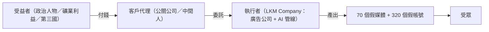
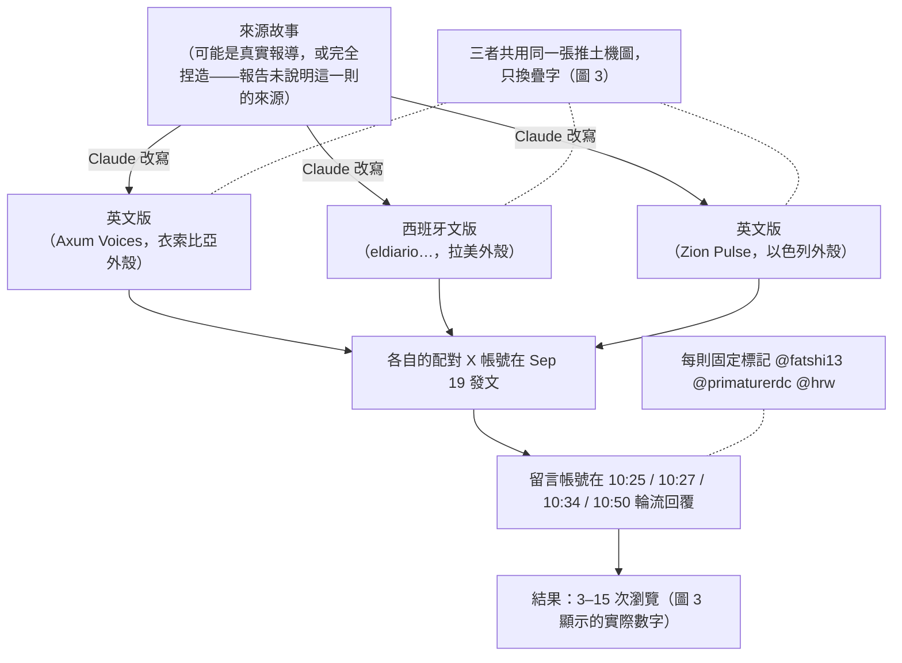
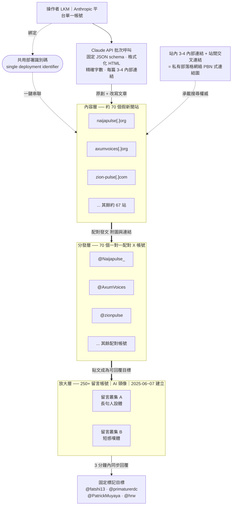
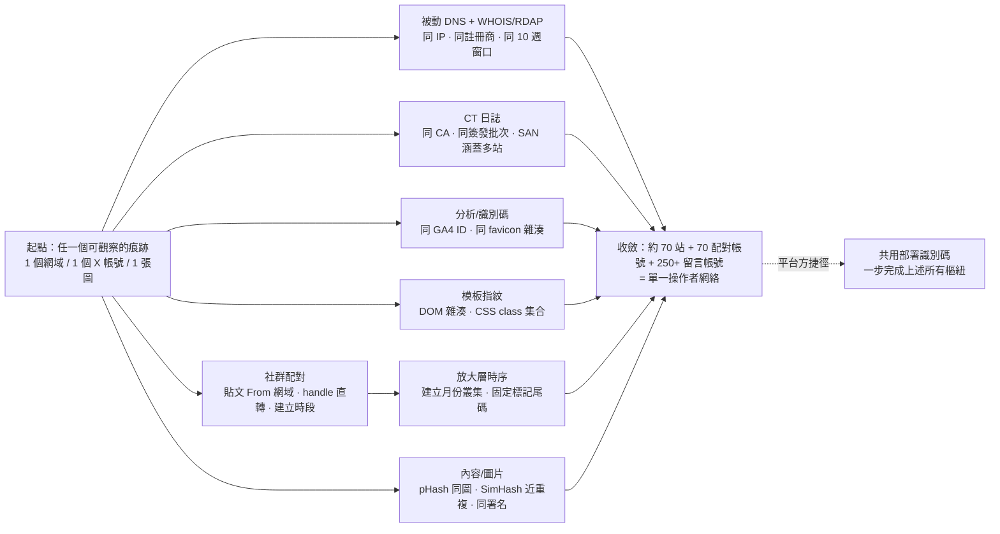
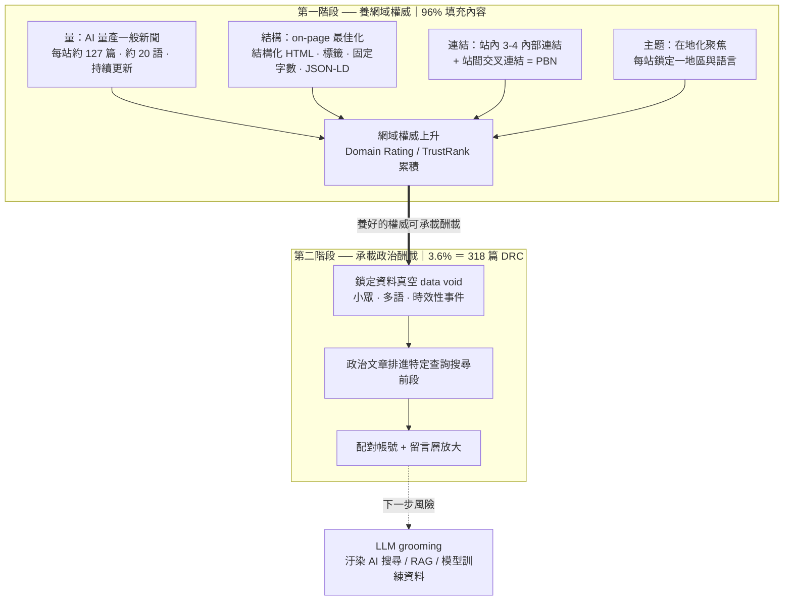
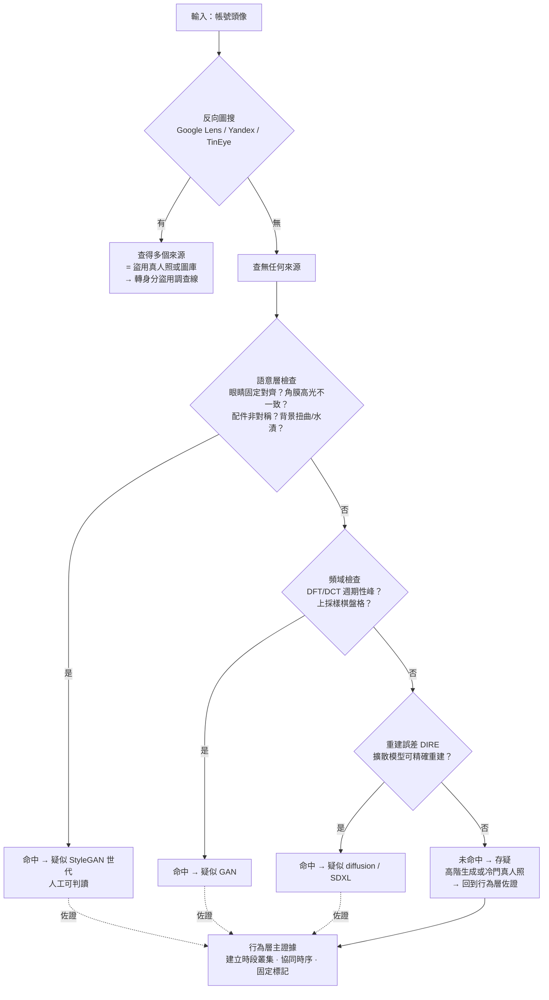
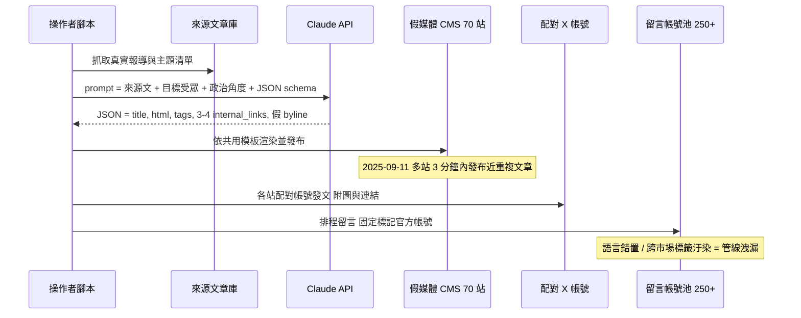
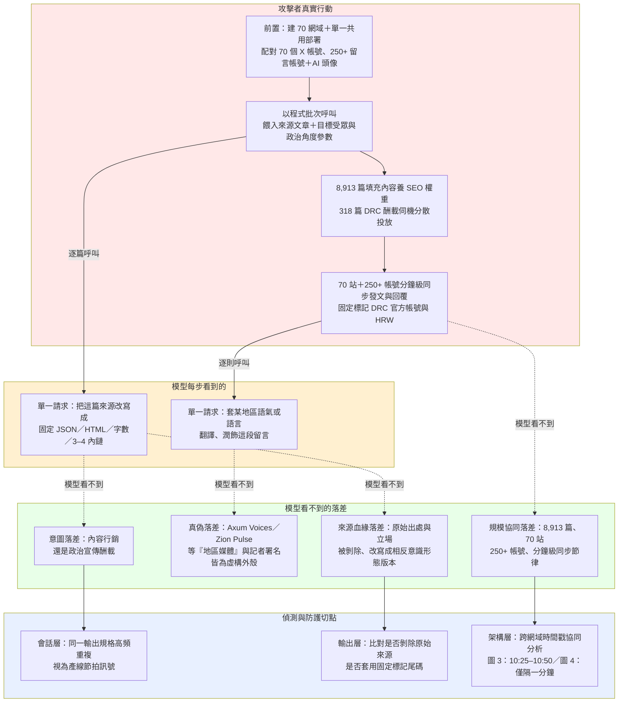

# GTG-54002：橫跨六大洲的商業「影響力即服務」行動——追溯至法國數位廣告公司 LKM Company

> 課程模組：02 影響力行動（Influence operations） ｜ 一手來源：PDF p.47–53（p.47 下半至 p.53 上半） ｜ 整理日期：2026-09-13

---

## 1. 一頁速覽

1. **是什麼**：一個以 Claude 大量產製與改寫政治新聞的商業網絡——約 70 個假新聞網站、70 個一對一配對的 X 帳號、250 個以上的假留言帳號；至少 8,913 篇文章、約 20 種語言，受眾遍及六大洲。Anthropic 將其歸因到法國數位廣告公司 **LKM Company**（p.47）。
2. **商業模式**：這個網絡「沒有固定的政治意識形態」，而是「依當時誰付錢，轉換政治立場去支持光譜上的不同陣營」——報告把這稱為商業「影響力即服務（influence-as-a-service）」模式（p.47–48）。
3. **AI 的角色**：Claude 被用來（a）為假媒體寫完全原創的文章，（b）把真實記者的真實報導改寫成帶政治傾向、針對特定國家受眾量身訂做的版本。所有提示詞都要求固定 JSON 結構、格式化 HTML、精確字數上限、每篇 3–4 個內部連結——一條標準化的自動產製與發布管線（p.48）。
4. **SEO 動機**：文章「專門設計來提升網站在搜尋引擎的權威排名」（p.49）——先用 AI 內容養網域權重，再用它承載政治內容。
5. **DRC 焦點**：8,913 篇文章中有 318 篇聚焦剛果民主共和國（DRC），立場支持 DRC 政府、聚焦區域礦產交易與對盧安達的緊張關係；早期追蹤者「絕大多數」與 DRC 有關（p.50）。報告只說「訊號顯示活動**可能**反映一位或多位在 DRC–盧安達衝突中有利害關係的客戶」，並明言「無法獨立確認是哪些客戶委託」、「未發現任何政府指揮的證據」（p.48）。
6. **觸及很低**：依 Brookings Breakout Scale 評為 **Category Two**——內容只在網絡自己的網站與配對社群帳號之間流通，「沒有突破自身活動的證據」（p.48）。圖 3、圖 4 的截圖顯示多數貼文只有個位數到數十次瀏覽。
7. **偵測線索**：法國境內十週內集中註冊網域、全部架在同一部署（single deployment）的共用基礎設施上、留言帳號在 2025 年 6–7 月同一時段建立、多站在三分鐘內發布近乎相同的 DRC–盧安達文章（p.48–49）。
8. **這個案例在課程裡要教什麼**：**「誰付錢」與「誰動手」是兩個不同的歸因問題**。商業化讓影響力行動的執行者（LKM）與客戶（未知）分離，情報分析必須把「操作者歸因」、「客戶歸因」、「國家指揮」三層分開評估；同時要學會用基礎設施與行為特徵（而非內容立場）去偵測一個「沒有固定立場」的網絡。

---

## 2. 行為者側寫與歸因

### 2.1 報告給出的身分線索

| 線索類型 | 報告內容 | 頁碼 |
|---|---|---|
| 組織 | **LKM Company**，「a France-based digital advertising agency」（法國數位廣告公司） | p.47 |
| 地理 | 網域「從法國註冊（registering the domains from France）」，在 2025 年中的十週窗口內完成 | p.48 |
| 基礎設施 | 全部網站「架設在單一部署後的共用基礎設施上（hosted all these properties on shared infrastructure behind a single deployment）」；一個「共用部署識別碼（shared deployment identifier）」把整個網絡綁到**同一個操作者帳號** | p.48, p.52 |
| 帳號 | Anthropic 平台上的**單一帳號**被移除；同時封禁「與此活動相關的組織」 | p.47, p.52 |
| 動機 | 商業：「shifted political stances to support different sides of the political spectrum based on whoever was paying at the time」 | p.47 |
| 語言能力 | 約 20 種語言的產出（由 AI 完成，不代表操作者本身多語） | p.48 |
| 偽裝 | 假記者署名（「these writers did not actually exist」）；每個假媒體配一個 X 帳號；留言帳號多用 AI 生成頭像 | p.49 |
| 時間 | 網域註冊：2025 年中十週內；假帳號：多數建立於 2025 年 6–7 月；協同行為偵測：2025-09-11 | p.48–49 |

報告**沒有**給出：LKM Company 的法人登記資料、負責人姓名、與客戶之間的合約或金流證據、LKM 是否知情（例如是否為員工私下接案）、以及 Anthropic 是否曾聯絡該公司。

### 2.2 歸因措辭的三個層次——本案最重要的教學點

報告在同一個案例裡用了三種明顯不同的措辭強度，正好對應影響力行動歸因的三個層次：

| 層次 | 報告原文 | 措辭強度 | 情報學解讀 |
|---|---|---|---|
| **A. 操作者（誰動手）** | 「we **traced** the operation to LKM Company, a France-based digital advertising agency.」（p.47） | **確定句**——沒有 suspected / likely / assess with moderate confidence 等限定詞 | Anthropic 對自家平台的帳號、付款資料、部署識別碼有一手可見性，因此可以用直陳語氣。這是「平台方歸因」的優勢：他們看到的是帳號層資料，不是只有內容層推論。 |
| **B. 客戶（誰付錢）** | 「Our investigation found **signals** that showed the activity **might** reflect the interests of one or more customers with a stake in the current DRC-Rwanda conflict. We are **not able to independently confirm** which customers commissioned this content」（p.48） | **低信度／可能性語氣**——signals、might、not able to confirm | 只有間接證據（內容立場、追蹤者地理分布、被標記的官方帳號）。這相當於 ICD 203 標準裡的「possible / low confidence」。注意：「有利害關係的客戶」不等於「DRC 政府」——可能是礦業公司、政治人物、遊說團體或第三國。 |
| **C. 國家指揮** | 「we **found no evidence of direction by any government**.」（p.48, p.50 重複兩次） | **負面發現（negative finding）** | 「沒有找到證據」≠「證明沒有」。Anthropic 的可見性只到內容離開自家平台為止（p.42），對客戶端的金流與指揮鏈沒有可見性。這句話在課堂上要教學員讀成「以 Anthropic 能看到的資料，無法支持國家指揮的假設」，而不是「已排除國家涉入」。 |

**為什麼要分三層**：在傳統國家級影響力行動（例如同章的 GTG-04001 俄羅斯案）裡，操作者、出資者與受益者通常是同一個體系，歸因可以一次到位。商業化把這條鏈拆開：



平台方（Anthropic、X）只看得到「執行者 → 產出」這一段。要往上追到客戶，需要金流、合約、內部通訊——這是記者（如 Forbidden Stories 的 Story Killers 臥底調查）或執法機關才有的工具。課程要讓學員理解：**同一個事件，不同的觀察位置能做出的歸因深度不同**，報告的措辭就是誠實地反映這個限制。

### 2.3 與情報界標準措辭的對照

美國情報界 ICD 203 的慣例把「可能性」（likelihood：almost no chance → very unlikely → unlikely → roughly even chance → likely → very likely → almost certainly）與「信心」（confidence：low / moderate / high，反映來源品質與證據充分度）分開表述。對照本案：

- 「traced to LKM Company」：可能性極高、信心高（來源是一手平台資料）。
- 「might reflect the interests of one or more customers」：可能性中等偏低、信心低（來源是內容與追蹤者分布的間接推論）。
- 「found no evidence of direction by any government」：這不是可能性陳述，而是「證據狀態」陳述。

課堂上可要求學員把這三句改寫成 ICD 203 格式，練習「不要把三句話讀成同一種確定度」。

### 2.4 與本章「趨勢」段落的呼應

報告在影響力行動章節導論（p.42）已預告本案的性質：

> 「Influence sold as a service. … commercial actors hired by entities (political, government, et cetera) produce content for whoever wishes to pay. This gives plausible deniability to the ultimate commissioners of the influence operations, and puts this capability within reach of actors who can't or do not want to build it themselves. **In two cases presented here, a working advertising or marketing firm ran the operations alongside ordinary commercial work.**」

本案就是「一家正常營業的廣告公司，在日常商業工作之外同時經營影響力行動」的兩個案例之一。這句話的情報意涵是：**這類網絡的基礎設施、人員、工具會與合法業務混用**，因此從基礎設施面去封鎖時會有附帶損害（例如同一部署平台上的合法客戶網站），而且公司本身有「我們只是做內容行銷」的辯解空間。

### 2.5 商業影響力行動的譜系（供課堂比較）

把本案放進「不實資訊承包業」的歷史裡，學員才能看出它新在哪裡、舊在哪裡。

| 案例 | 揭露時間 | 執行者 | 客戶 | 核心資產 | AI 角色 | 揭露者／證據型態 |
|---|---|---|---|---|---|---|
| Oxford Internet Institute 全球盤點 | 2021 | 2018 年起 65 家以上「提供計算宣傳即服務」的公司 | 政治行動者（48 起私人公司代操案例） | 帳號、廣告 | 尚未普及 | 學術彙整（公開報導與平台下架資料） |
| Doppelgänger（Social Design Agency） | 2022-09 起 | 俄羅斯民間承包商，受國家委託 | 俄羅斯政府 | 仿冒 Der Spiegel、Le Parisien、Fox News 等的克隆站 | 2024 年起使用 AI 產文與深偽 | EU DisinfoLab、Meta、美國司法部（2024-09 沒收網域） |
| Team Jorge（AIMS） | 2023-02 | 以色列私人團隊（Tal Hanan） | 政府、競選團隊、私人公司 | 集中操控數千假帳號的軟體；自稱介入 33 場總統選舉 | 無（規則式自動化） | Forbidden Stories 臥底錄影（記者假扮客戶） |
| Anthropic 首案（2025-03 報告） | 2025-04 | 未具名商業行動者 | 「多國、多政治目標」的客戶 | 100 多個 X／Facebook 人設帳號 | Claude 決定帳號要讚、轉、留言或忽略哪些貼文；產生多語回覆；為圖像工具寫提示 | Anthropic 平台端資料 |
| **GTG-54002（本案）** | 2026-09 | **LKM Company（法國數位廣告公司）** | 未知；DRC–盧安達衝突利害關係方（低信度） | 70 站 + 70 配對帳號 + 250+ 留言帳號；8,913 篇 | Claude 原創與改寫文章，固定 JSON 管線；AI 頭像 | Anthropic 平台端資料（部署識別碼） |
| GTG-84005（同報告下一案） | 2026-09 | BBS Bilisim Teknolojileri（伊斯坦堡技術公司） | 付費客戶（以「防禦性反假訊息工具」為幌子） | 約 1,000 個 X 假帳號、一個假媒體、偽造卷宗；目標馬來西亞 | Claude | Anthropic 平台端資料 |

**譜系的三個觀察**：

1. **揭露者的位置決定能揭露什麼**：記者臥底（Team Jorge）能拿到客戶名單與報價；平台方（Anthropic、Meta）能拿到帳號與基礎設施，但拿不到客戶。學術盤點只能統計已公開的案例。本案的「客戶未知」不是 Anthropic 調查不力，而是觀察位置的必然。
2. **AI 改變的是成本結構，不是商業模式**：從 Team Jorge 的規則式帳號農場，到本案的 LLM 內容管線，「賣影響力給付費者」的模式沒變；變的是一家廣告公司可以用極少人力同時經營 70 個「地方媒體」與 20 種語言——這在 2023 年需要一個翻譯與寫手團隊。
3. **從「帳號」升級到「媒體」**：早期承包商的主要資產是假帳號；本案的主要資產是假**媒體**（有網域、有署名、有 SEO 權重）。假帳號被封就沒了，假媒體的網域權重與搜尋排名可以持續存在，甚至被轉售。這是防禦方必須追蹤的新資產類別。

**國家級 vs 商業型影響力行動的特徵對照**（課堂速查）：

| 面向 | 國家級（例：同章 GTG-04001 俄羅斯案） | 商業型（本案） |
|---|---|---|
| 立場 | 一致、可預測、服務國家敘事 | 依客戶切換，可同時支持對立陣營 |
| 從內容歸因 | 可行（敘事指紋） | **不可行**（立場是商品） |
| 基礎設施 | 常與國家媒體、外交體系混用 | 常與合法商業客戶混用 |
| 失敗模式 | 敘事洩漏、資金鏈曝光 | 共用部署、帳號池交叉汙染（#AmericaFirst 出現在 DRC 留言） |
| 可推諉性 | 低（國家為最終受益者） | 高（「我們只是接案」） |
| 處置後果 | 換人設繼續 | 換 AI 供應商繼續；網域資產可能轉售 |
| 觸及 | 可借國家媒體（廣播、電視）突破 | 多停留在 Category Two，除非客戶本身有放大能力 |

---

## 3. 受害者與目標清單

本案沒有傳統意義的「受害者」（無入侵、無資料外洩），受害的是**資訊環境**與**被冒名／被改寫的真實記者**。可列表的目標如下：

### 3.1 目標受眾（依報告）

| 目標國家／區域 | 報告描述 | 頁碼 | 備註 |
|---|---|---|---|
| 美國 | 「highly contested democratic spaces」四國之一 | p.48 | 樣本媒體：Fifty States、Civic Pulse、Commonwealth Post（推測） |
| 巴西 | 同上 | p.48 | 樣本表中無葡文媒體；報告未提供巴西相關細節 |
| 法國 | 同上（同時也是操作者所在國） | p.48 | 圖 4 的 toutpourlapatrie[.]info 為法語 DRC 內容，非針對法國本土 |
| 剛果民主共和國（DRC） | 318 篇文章；立場支持 DRC 政府；早期追蹤者「絕大多數」與 DRC 有關 | p.50 | 詳見第 4.6 節 |
| 六大洲 | 「targeted global audiences across six continents」 | p.47 | 樣本表可辨識非洲、歐洲、中東、南亞、東亞、美洲；**大洋洲未見樣本** |

### 3.2 被冒用者

- **真實記者**：報告說網絡「rewrite real articles by legitimate journalists」（p.48）——真實報導被改寫成帶立場的版本，原作者未被列名，等於原始新聞的信譽被挪用。報告未點名任何被改寫的媒體或記者。
- **DRC 政府官方帳號**：圖 3、圖 4 顯示假留言帳號大量標記 @fatshi13、@Presidence_RDC、@PrimatureRDC、@PatrickMuyaya（見第 6 節）。這些官方帳號並非「受害者」，但被用作觸及與可信度的槓桿。
- **人權組織**：圖 3 四則留言全部標記 @hrw（Human Rights Watch）——把假新聞掛到人權組織的通知欄，試圖借用其公信力。

### 3.3 規模數字（逐一在 PDF 確認）

| 數字 | 內容 | 頁碼 |
|---|---|---|
| ~70 | 假新聞網站（「approximately 70 fabricated news websites」） | p.47 |
| 70 | 「linked and matching X/Twitter accounts」——與網站一對一配對 | p.47 |
| 250+ | 「a network of more than 250 inauthentic commenting X/Twitter accounts」 | p.47 |
| 8,913 | 「at least 8,913 articles」 | p.48 |
| ~20 | 「in about 20 languages」 | p.48 |
| 318 | DRC 相關文章（「318 articles across all its fake news sites」） | p.50 |
| 6 | 大洲數 | p.47 |
| 10 週 | 網域註冊窗口（2025 年中） | p.48 |
| 3 分鐘 | 2025-09-11 多站發布近乎相同 DRC–盧安達文章的時間差 | p.49 |
| 3–4 | 每篇文章要求的內部連結數 | p.48 |
| 14 | 報告公開的樣本媒體數（完整清單「另行提供」） | p.52–53 |

**一個值得課堂討論的比例**：318 ÷ 8,913 ≈ 3.6%。報告說 DRC 是「heavy focus」，但以篇數計只佔 3.6%。合理的解讀（本文推論，報告未明言）是：其餘 96% 的文章大多是「養權重」用的一般新聞（圖 5 的賽普勒斯經濟、迦納教育新聞即屬此類），真正的「政治酬載」只是一小部分。這正是「內容農場養網域權重、再承載政治內容」模式的數字特徵——**判斷一個網絡的真正意圖，不能看多數內容，要看放大層（留言帳號、追蹤者）集中在哪裡**。

### 3.4 影響評估：為什麼是 Category Two——「數量 ≠ 影響」

Breakout Scale（Ben Nimmo, Brookings, 2020-09）的六個類別依「跨平台遷移」與「觸及」分級：

| 類別 | Nimmo 的定義 | 白話 |
|---|---|---|
| Category One | 只在一個平台的一個社群裡流通 | 自言自語 |
| **Category Two** | **在一個社群裡跨多個平台流通，或在一個平台上跨多個社群流通** | **自己的地盤上迴響** |
| Category Three | 跨多個社群媒體平台且觸及多個社群 | 開始外溢 |
| Category Four | 完全跳出社群媒體，被主流媒體放大 | 進入公共討論 |
| Category Five | 被名人、政治候選人等高知名度個人放大 | 進入權力圈 |
| Category Six | 引發政策回應或其他具體行動，或包含暴力呼籲 | 造成現實後果 |

**本案的評級依據（p.48）**：「content distributed across the network's own websites and matching social media accounts, with no evidence of breakout beyond its own activity」——內容只在網絡自有的網站與配對帳號之間流通。技術上這符合 Category Two 的第一種情形（跨平台：網站 + X），但沒有進到第二種情形（跨社群）。

**規模與影響的落差有多大**：

| 維度 | 數字 | 對應的直覺 |
|---|---|---|
| 文章數 | 8,913 篇 | 相當於一家中型日報數年的產量 |
| 語言數 | ~20 種 | 相當於一家國際通訊社 |
| 站數 | ~70 個 | 相當於一個區域媒體集團 |
| 帳號數 | ~320 個 | 相當於一支社群小編大軍 |
| **實際觸及** | 圖 3：3、5、7、10 次瀏覽；圖 4 左欄：21 次瀏覽 | **相當於沒有人看** |
| 唯一例外 | 圖 4 右欄：2,721 次瀏覽、22 讚、9 轉發 | 仍是一則貼文的水準，且組成未拆分 |

**「數量 ≠ 影響」的三個教學層次**：

1. **不要用產出量當作威脅指標**。8,913 篇文章聽起來駭人，但影響力行動的價值不在產出，在**被真人看到、相信、轉述**。防禦資源若按產出量分配，會把預算花在最吵、最容易偵測、也最無效的網絡上，而漏掉一個「只發 20 則、但被國會議員轉推」的行動（那才是 Category Five）。
2. **但也不要把「現在沒影響」讀成「不構成威脅」**。本案有兩個潛在（latent）影響管道是 Breakout Scale 不度量的：
   - **搜尋引擎權重**：文章「specifically designed to boost their site's authority rankings」。一個 Category Two 的網絡，若再養一年，可能在特定查詢上排進前幾頁——那時的觸及不來自社群轉發，來自「有人主動搜尋」。
   - **AI 檢索與訓練**：Pravda／Portal Kombat 的案例證明，沒有人類讀者的網站仍可能被 AI 搜尋與 RAG 系統檢索、被模型訓練資料收錄（「LLM grooming」）。Breakout Scale 誕生於 2020 年，其六個類別沒有「被 AI 引用」這一格。
   
   課堂上可讓學員提議 Breakout Scale 的「第七維度」該怎麼設計。
3. **平台方的評級有觀察位置的偏差**。Anthropic 自承「Our visibility into these operations ends once it's live」（p.42），影響評估依賴公開可見的互動數與 OSINT。圖 4 右欄那 2,721 次瀏覽是不是自家 320 個帳號刷出來的，報告沒有拆分；反過來，若有內容被真人轉貼到 WhatsApp 群組或 LINE 群組（封閉管道），平台方與研究者都看不到。**Category Two 是「可觀察到的觸及」的評級，不是「實際影響」的評級。**

**一個對照**：同章的 GTG-04001（中非共和國，俄羅斯 FIMI）被評為 **Category Four**——內容每天透過 Radio Lengo Songo 98.9 FM 廣播、經 Telegram 放大、並被中非當地新聞媒體轉載（p.45）。兩案的 AI 使用強度相近，差別在**分發管道**：一個有實體電台與國家廣播公司，一個只有自己的網站。報告在趨勢段落也總結了這點——「The widest authentic reach occurred where state media outlets were the distribution mechanism (including FM radio, satellite and shortwave radio, and global television)」（p.44）。**教學結論：影響力行動的瓶頸不在內容生產（AI 已解決），在分發通路。**

---

## 4. AI 濫用的攻擊生命週期（逐階段拆解）

報告的「Attack lifecycle and AI usage」段落（p.48–49）沒有明確分階段，以下依內容重組為六個階段，並標示自主程度。

### 4.1 階段一：基礎設施建置（2025 年中）

| 人類做什麼 | Claude 做什麼 | 自主程度 |
|---|---|---|
| 在十週內從法國註冊約 70 個網域；全部部署在同一個共用基礎設施／單一部署上；為每個站建立配對的 X 帳號 | 報告未說明 Claude 參與此階段（例如產生站名、版型）。圖 5 的站台版型高度標準化（深色主題、分類導覽、標籤雲、卡片式文章、「Read More →」），符合模板化部署，但是否由 AI 產生版型，報告未提 | 人類主導 |

**原文**：「The operation launched its web infrastructure in a short burst, registering the domains from France within a ten-week window in mid-2025. They hosted all these properties on shared infrastructure behind a single deployment. This allowed our investigators to connect roughly 70 individual news sites, which appeared independent on the surface, to a single operator account.」（p.48）

**分析**：「短時間爆量註冊 + 共用部署」是操作者在**速度**與**隱匿**之間的取捨——他們選了速度。對偵測方而言，這是最有價值的失誤：一個部署識別碼就把 70 個「看起來獨立」的站全部串起來。

### 4.2 階段二：人設層建置（2025 年 6–7 月）

| 人類做什麼 | Claude 做什麼 | 自主程度 |
|---|---|---|
| 建立 250 個以上的留言帳號（與網站同期）；為帳號配置 AI 生成頭像；為每個假媒體配置假記者署名 | 報告未明言頭像由哪個工具生成（「AI-generated profile photos」，不一定是 Claude）。假記者姓名與人設是否由 Claude 產生，報告未提 | 人類主導、AI 輔助 |

**原文**：「These sites were then amplified by a layer of commenting accounts created during the exact same timeframe as the websites, with many using AI-generated profile photos. Most of these fake accounts were created in June and July 2025.」（p.49）

### 4.3 階段三：內容產製管線（核心 AI 濫用）

| 人類做什麼 | Claude 做什麼 | 自主程度 |
|---|---|---|
| 設計提示詞模板：固定 JSON 輸出、格式化 HTML、精確字數、每篇 3–4 個內部連結；提供來源文章與目標受眾／政治角度；以程式批次呼叫 | （a）撰寫完全原創的文章；（b）把真實記者的報導改寫成「politically slanted versions that were tailored to appeal to each specific national audience and political angle they wanted」；輸出可直接發布的結構化內容 | **人類設計管線、AI 批次自動執行**（介於「人類逐步指揮」與「自主執行」之間：每一篇不需人類介入，但整體流程由人類程式編排） |

**原文**：「The network used Claude to create a standardized content pipeline. All prompts given demanded a fixed JSON output structure, formatted HTML, exact character limits, and three to four internal links per article. This allowed the actors to automatically generate and publish the content at scale. The articles were specifically designed to boost their site's authority rankings on search engines.」（p.48–49）

**三種操縱手法**（p.49）：
1. 「rewriting the same source story in opposite ideological directions for different audiences」——同一則來源故事改寫成相反的意識形態方向給不同受眾；
2. 「adding political angles to stories that originally had none」——為原本沒有政治性的故事加上政治角度；
3. 「laundering stories across borders into unrelated regions, stripped of their original context」——把故事跨境洗到不相關的區域、剝除原始脈絡。

**分析——「AI 當副編輯」的自主程度判定**：報告在趨勢段落（p.42）把這類用法稱為「AI as a newsdesk」：Claude 被插進一條已在運轉的人工編輯管線，扮演副編輯或內容產製者。這不是「AI 自主編排多代理」（那是資安章節的 GTG 案例），而是**確定性的批次呼叫**——每個請求的形式都相同（JSON schema + 字數 + 連結數），差別只在輸入的來源文章與目標角度。從安全分類器的角度，這種請求單獨看起來就像任何一家內容行銷公司的日常工作，這是它能持續數月的原因（見第 8 節）。

### 4.4 階段四：SEO 權重養成

| 人類做什麼 | Claude 做什麼 | 自主程度 |
|---|---|---|
| 以高頻率發布大量一般新聞（圖 5：賽普勒斯、迦納、體育、健康、藝文），建立分類與標籤結構；透過內部連結建構站內／站間連結圖 | 產出符合 SEO 要求的文章（字數、結構、內部連結） | AI 批次執行 |

**原文**：「The articles were specifically designed to boost their site's authority rankings on search engines.」（p.49）

**手法說明——「用 AI 內容農場養網域權重，再承載政治內容」**：

搜尋引擎對網域的評價（俗稱「權威」）主要看三件事：內容量與更新頻率、內容主題的一致性、以及連結（站內結構與外部引用）。一個剛註冊的網域幾乎沒有權重，它發布的政治文章不會出現在搜尋結果的前幾頁。傳統做法要花數月至數年累積；AI 把「內容量與更新頻率」的成本壓到接近零：

1. **量**：8,913 篇 ÷ 70 站 ≈ 每站 127 篇。以圖 5 為例，8 月 17 日與 22 日各有文章，顯示持續更新。
2. **結構**：固定 JSON → 固定 HTML 結構 → 每篇都有標題、摘要、分類、標籤、3–4 個內部連結——這是 SEO 教科書的「on-page」最佳化清單。
3. **主題一致性**：每站有自己的地區與語言（Naija Pulse 對奈及利亞、Echo Berlin 對德國），讓搜尋引擎把它歸類為「某地區的地方新聞站」。
4. **酬載**：一旦權重養起來，318 篇 DRC 文章就有機會在「M23 taxes schools」「Rwanda cycling championships」這類查詢的搜尋結果中出現——特別是在**資料真空（data void）**的主題上（小眾、法語／史瓦希利語、時效性強的事件），競爭的正規媒體少，假站更容易排到前面。

**與「LLM grooming」的關係（延伸教學）**：俄羅斯 Pravda／Portal Kombat 網絡（VIGINUM 2024 年 2 月揭露，2024 年 4 月至少 224 個網域，2025 年擴展至 50 種以上語言，美國陽光計畫（American Sunlight Project）2025 年報告估計每日產出高達 10,000 篇）幾乎沒有人類讀者，其目標被研究者稱為「LLM grooming」——讓大量內容進入搜尋引擎與 AI 模型的檢索／訓練資料。本案的動機是「search engine authority」，但**同樣的基礎設施在下一步就可以被用來汙染 AI 搜尋與 RAG 系統的答案**。課程可以把兩案並列：一個養權重賣給客戶，一個養權重餵給模型。

### 4.5 階段五：分發與放大

| 人類做什麼 | Claude 做什麼 | 自主程度 |
|---|---|---|
| 以 70 個配對 X 帳號發文（附圖 + 連結）；由 250+ 留言帳號在數分鐘內回覆、標記官方帳號與 HRW；多語同步 | 圖 3、圖 4 的留言文字風格多樣（俏皮、憤怒、新聞簡訊體、口語），符合 LLM 依人設生成；報告未明言留言是否由 Claude 產生 | AI 輔助生成、程式化排程（推論） |

**原文**：「We detected signs of coordinated inauthentic behavior on September 11, 2025, when the network's websites published almost identical articles about the DRC-Rwanda conflict within three minutes of each other. The actors modified the tone of each article to fit different regional audiences, while simultaneously coordinating the distribution of these links across numerous X accounts.」（p.49）

### 4.6 階段六：DRC 聚焦活動（客戶訊號）

| 人類做什麼 | Claude 做什麼 | 自主程度 |
|---|---|---|
| 把 318 篇 DRC 文章分散到所有假站（包括與 DRC 無關的地區站）；讓 DRC 專屬新聞頁成為早期最受歡迎的帳號；留言帳號標記 DRC 總統府、總理府、發言人 | 改寫、翻譯、調整語氣（法語、英語、西班牙語版本並存） | AI 批次執行 |

**原文**：「A close look at the network's output revealed a heavy focus on the Democratic Republic of Congo, with 318 articles across all its fake news sites. These stories typically supported the DRC government's stance, specifically focusing on regional mineral deals and ongoing tensions with Rwanda. This strategy matched the network's audience growth; during its first few weeks, the vast majority of fake personas following their X accounts were tied to the DRC, and their DRC-specific news page became the most shared and popular account in the entire operation at that time. An X account presenting itself as a Congolese civilian "digital army" was also observed following several of the network's accounts. We found no evidence of direction by any government.」（p.50）

**為什麼是剛果民主共和國——背景與客戶動機推論**（以下背景為獨立查證的公開事實；動機部分**明確標示為推論**）：

*已查證的背景（來源見第 9 節）*：
- 2025 年 1 月 25–30 日，盧安達支持的 M23 攻陷北基伍省首府戈馬（Goma），約 3,000 人死亡；2 月 15–16 日攻陷南基伍省首府布卡武（Bukavu）。聯合國專家小組 2024 年估計東部剛果境內有 3,000–4,000 名盧安達國防軍。
- 2025 年 6 月 27 日，DRC 與盧安達外長在華府、美國國務卿 Rubio 見證下簽署和平協議（美國主導斡旋）；7 月 19 日 DRC 與 M23 在多哈簽署原則宣言；但 M23 持續作戰。2025 年 12 月 4 日再簽協議，12 月 8 日 Tshisekedi 即公開指控盧安達違反協議。
- 2025 年 9 月 21–28 日，UCI 世界公路自行車錦標賽在盧安達基加利舉行——非洲首次。圖 3 的四則貼文（9 月 19 日）攻擊「Rwanda's cycling championships」背後的「森林砍伐、貪腐、人權侵害」，正是賽前兩天。
- Patrick Muyaya 為 DRC 通訊與媒體部長兼政府發言人（2021 年 4 月起）；@Presidence_RDC、@PrimatureRDC 為總統府與總理府帳號；@fatshi13 依公開資訊為總統 Félix Tshisekedi 的帳號（本次未另行驗證）。

*推論——可能的客戶類型（本文推論，報告未指認）*：
1. **DRC 政府體系的公關承包**：內容支持政府立場、標記政府帳號、攻擊盧安達的國際形象工程（自行車賽）。金沙薩政府長期在國際上推動「盧安達侵略」敘事，委託外國公關公司並不罕見。但報告明言「no evidence of direction by any government」。
2. **礦產交易的利害關係方**：報告特別點出「regional mineral deals」；2025 年美國–DRC 關鍵礦產合作與和平協議掛鉤，圍繞東部鈳鉭鐵礦（coltan）等資源的商業與政治利益龐大。
3. **國內政治行動者**：以「愛國／反盧安達」立場經營聲量，服務國內政治目的。
4. **執行者自建樣品**：LKM 可能先用 DRC 內容「養」出一個有追蹤者的帳號當作向潛在客戶展示的作品集。報告用「might reflect the interests of one or more customers」保留了這種可能。

*為什麼標記官方帳號是一個「客戶訊號」*：影響力承包商常把客戶（或客戶希望取悅的人）的帳號標記在貼文裡——一方面試圖獲得官方轉發（那會是 Breakout Scale 的 Category Five：高知名度個人放大），另一方面讓客戶「看得到交付」。這是分析師從內容反推「誰是預期讀者」的常用線索，但只能到「訊號」層級，無法據以歸因。

*「Congolese civilian digital army」*：報告只說一個自稱剛果平民「數位軍隊」的 X 帳號追蹤了網絡的數個帳號。在 DRC 網路政治語境裡，「armée numérique」是親政府線上動員者的自稱（本文背景知識，未另行查證）。這個線索只能說明「有 DRC 親政府社群注意到這個網絡」，不能說明指揮關係。

### 4.7 生命週期總表

| 階段 | 時間 | 關鍵行為 | AI 參與 | 偵測面 |
|---|---|---|---|---|
| 1 基礎設施 | 2025 年中十週 | 70 網域、共用部署、70 X 帳號 | 未明 | 註冊爆量、共用部署識別碼 |
| 2 人設 | 2025-06～07 | 250+ 留言帳號、AI 頭像、假記者 | 頭像生成 | 帳號建立時段叢集、AI 頭像特徵 |
| 3 內容管線 | 2025 年中起 | 固定 JSON/HTML、原創 + 改寫 | **核心** | 平台端提示詞模式 |
| 4 SEO 養權重 | 持續 | 8,913 篇、一般新聞為主 | **核心** | 內容量／更新頻率異常、模板指紋 |
| 5 分發放大 | 持續 | 同步發文、留言標記官方帳號 | 留言生成（推論） | 三分鐘同步、留言時間叢集 |
| 6 DRC 酬載 | 2025-08 起可見 | 318 篇、追蹤者集中 DRC | 改寫、多語 | 放大層地理集中 |
| 7 處置 | 2025-12～2026-08 之間（報告涵蓋期） | Anthropic 封禁帳號與組織 | — | — |

---

## 5. TTP 與 MITRE ATT&CK 對應

影響力行動與 ATT&CK 的貼合度有限；以下同時對應 **ATT&CK（Resource Development）** 與 **DISARM Red Framework**（專為影響力行動設計，技術 ID 已對照 DISARM Foundation 的 GitHub 版本核對）。找不到對應 ID 的行為明確標示為框架缺口。

| 戰術 | 技術 ID | 本案的具體作法 | 偵測構想 |
|---|---|---|---|
| 資源開發：取得基礎設施 | ATT&CK **T1583.001** Acquire Infrastructure: Domains | 十週內從法國註冊約 70 個網域（p.48） | 監控同一註冊商／註冊國在短窗口內的「新聞類」網域爆量註冊；名稱模式（Pulse / Voices / Journal / Post / Daily） |
| 資源開發：取得基礎設施 | ATT&CK **T1583.004** Server ／ **T1583.006** Web Services | 全部架在共用基礎設施、單一部署（p.48） | 以部署識別碼、TLS 憑證、分析追蹤碼、favicon 雜湊、HTML 模板 DOM 指紋做叢集 |
| 資源開發：建立帳號 | ATT&CK **T1585.001** Establish Accounts: Social Media Accounts | 70 個配對 X 帳號 + 250+ 留言帳號，2025-06～07 建立（p.47, 49） | 帳號建立時間叢集；「Joined July 2025」+ 追蹤者個位數 + 高追蹤／被追蹤比 |
| 資源開發：取得能力 | ATT&CK **T1588.007** Obtain Capabilities: Artificial Intelligence | 以 Claude 產製與改寫內容（p.48） | 平台端：固定 JSON schema + 字數 + 內部連結數的重複請求模式；高頻多語改寫請求 |
| 資源開發：部署能力 | ATT&CK **T1608.006** Stage Capabilities: SEO Poisoning（**部分貼合**） | 文章「專門設計來提升搜尋引擎權威排名」（p.49） | ATT&CK 的 SEO Poisoning 原意是把受害者誘導到惡意酬載，本案是養權重承載敘事——**語意貼合度中等**。搜尋端：新網域在特定小眾查詢突然排名上升 |
| 建立不實媒體 | DISARM **T0098 / T0098.001** Establish / Create Inauthentic News Sites | 70 個偽裝成「獨立地方新聞室」的站（p.47, 49） | 站名／版型／署名模式；同一署名跨區域寫不相干新聞（圖 5：迦納站的「Edwin Gyimah」寫賽普勒斯政治） |
| 內容農場 | DISARM **T0096 / T0096.001** Leverage / Create Content Farms | 8,913 篇、每站約 127 篇的量產（p.48） | 內容量／人力比異常；NewsGuard 式四項準則（AI 產出證據、無人工監督、偽裝為人類新聞站、未揭露 AI） |
| 內容產製 | DISARM **T0085** Develop Text-Based Content；**T0154.001** AI LLM Platform | Claude 原創 + 改寫（p.48） | 文體一致性分析；跨站相同結構 |
| 內容再利用 | DISARM **T0084.002** Plagiarise Content；**T0084.003** Deceptively Labelled or Translated | 改寫真實記者的報導、跨語翻譯後換立場（p.48–49） | 與正規媒體的文本相似度比對（近重複偵測）；同一來源文的多語多立場版本 |
| 扭曲事實 | DISARM **T0023 / T0023.001** Distort Facts / Reframe Context | 為無政治性的故事加政治角度；跨境洗稿剝除脈絡（p.49） | 同一事件在網絡內出現互相矛盾的立場版本 |
| 在地化 | DISARM **T0101** Create Localised Content | 每篇依「specific national audience」調整語氣（p.48–49） | 同一故事的多地區版本在數分鐘內同步出現 |
| 人設 | DISARM **T0097.102** Journalist Persona；**T0143.002** Fabricated Persona；**T0145** Establish Account Imagery；**T0086.002** Develop AI-Generated Images | 假記者署名；AI 生成頭像（p.49；圖 2） | 頭像 GAN／擴散模型特徵；人設與頭像不一致（圖 2：兒童照片配「軍事情報分析師」） |
| 發布與回覆 | DISARM **T0115** Post Content；**T0116** Comment or Reply on Content | 配對帳號發文、留言帳號回覆（圖 3、4） | 同一留言帳號在數分鐘內回覆多個「不同」媒體的同一故事（圖 3：10:25／10:34） |
| 放大 | DISARM **T0118** Amplify Existing Narrative；**T0119** Cross-Posting；**T0049.003** Bots Amplify via Automated Forwarding and Reposting | 多站同步、留言帳號標記官方帳號（圖 3、4） | 標記目標集中度（@fatshi13 / @primaturerdc / @hrw 在所有留言中重複出現） |
| 平台演算法操縱 | DISARM **T0046** Use Search Engine Optimisation；**T0121** Manipulate Platform Algorithm | 內部連結、字數、結構化 HTML（p.48） | 站間連結圖的封閉性（private blog network 特徵） |
| 資料真空 | DISARM **T0102.003** Exploit Data Voids | 小眾多語的 DRC–盧安達議題（推論） | 監測特定查詢的搜尋結果新進網域 |
| 隱匿 | DISARM **T0129** Conceal Operational Activity；**T0130** Conceal Infrastructure | 表面獨立的站；假記者；不揭露 AI | 反向：共用部署識別碼是隱匿失敗點 |
| **客戶／執行者分離的商業模式** | **框架缺口** | 「whoever was paying at the time」（p.47） | ATT&CK 與 DISARM 都沒有描述「委託關係」的技術 ID；DISARM 的 actor 層可註記「commercial provider」，但無法表達「客戶未知」 |
| **標準化 AI 產製管線（JSON schema 驅動的批次生成）** | **框架缺口** | 固定 JSON／HTML／字數／連結數（p.48） | T1588.007 只涵蓋「取得 AI」，未涵蓋「以結構化輸出契約把 AI 嵌入自動發布管線」；DISARM T0154.001 亦僅指「使用 LLM 平台」 |
| **用一般內容養權重再承載政治酬載** | **框架缺口**（T1608.006 / T0046 只各涵蓋一半） | 3.6% 政治內容 vs 96% 填充內容（本文推論） | 需要「內容比例 + 放大層集中度」的複合指標 |

### 5.1 偵測構想的具體化：四條規則草案（教學用虛擬碼）

上表的「偵測構想」多為描述性；以下把其中四條寫成可討論的規則草案。**這些是防禦性偵測邏輯，不含任何攻擊操作**；欄位名稱為示意，實作時需對應各自的資料平台。課堂上的重點不是語法，而是**每條規則的參數選擇與誤報成本**。

**規則 1｜跨網域同步近重複（對應圖 4 的「一分鐘」）**
```
輸入：文章串流（domain, url, publish_ts, title, body, hero_image_phash）
邏輯：
  對每個時間窗 W = 5 分鐘：
    以 MinHash/SimHash 計算 body 的近重複叢集（Jaccard ≥ 0.85）
    若叢集中 distinct(domain) ≥ 3
       且 max(publish_ts) - min(publish_ts) ≤ 180 秒
       且 distinct(hero_image_phash) ≤ 1（同圖）
       且 叢集中沒有任何一篇標註通訊社來源（AP/Reuters/AFP/…）
    → 告警：疑似協同發布叢集
參數討論：
  - Jaccard 門檻太高（0.95）會被「換語氣」躲過；太低（0.7）會誤抓同題材報導
  - 「無通訊社標註」是關鍵的去誤報條件——正規媒體同步發稿一定會標來源
  - 跨語言時 body 相似度失效，需改用 hero_image_phash + 實體（人名地名）集合相似度
誤報來源：同一集團的地方報聯播、內容聯盟（syndication）
```

**規則 2｜留言帳號建立時段叢集（對應圖 2 的「Joined July 2025」）**
```
輸入：某則貼文的回覆帳號清單（account_id, created_month, followers, following, post_count）
邏輯：
  若 count(replies) ≥ 10
     且 top1(created_month) 的占比 ≥ 0.6        # 六成帳號同月建立
     且 median(followers) ≤ 20
     且 median(following)/median(followers) ≥ 2  # 追蹤人多、被追蹤少
  → 告警：疑似採購式放大層
參數討論：
  - created_month 是最耐久的訊號（不可竄改），應給最高權重
  - followers 門檻要隨平台調整；用中位數而非平均，避免單一真實用戶拉高
誤報來源：新開的興趣社群、活動期間的集中註冊、某網紅的新粉絲群
```

**規則 3｜固定標記尾碼（對應圖 3 的 @fatshi13 @primaturerdc @hrw）**
```
輸入：回覆文本串流
邏輯：
  抽取每則回覆結尾的 @mention 集合 M
  對時間窗 24 小時內的所有回覆做 M 的頻率統計
  若某個 M（size ≥ 2）出現次數 ≥ N（例如 20）
     且 distinct(author) / count ≥ 0.5     # 不是同一個人重複發
     且 這些 author 的 created_month 熵值低（規則 2 的訊號）
  → 告警：疑似協同標記行動
成本：極低，純字串比對，適合當第一層篩選
誤報來源：真實的公民陳情行動（例如網友集體標記市長帳號檢舉）
         ——因此本規則只能產生「待查」，不能自動處置
```

**規則 4｜假媒體站的靜態評分（對應圖 5）**
```
輸入：網站爬取結果
評分（每項 1 分，≥4 分列入人工複核）：
  [ ] 同一 byline 覆蓋 ≥3 個不相關的地理區域
  [ ] 文章字數的標準差 / 平均 ≤ 0.15（結構過度一致）
  [ ] 每篇內部連結數落在固定區間（如 3–4）的比例 ≥ 0.9
  [ ] 無實體地址、無電話、無更正政策、無編輯團隊頁
  [ ] 網域註冊 < 12 個月但文章數 > 100
  [ ] 與已知叢集共用 DOM 模板雜湊或 favicon 雜湊
  [ ] 未揭露 AI 生成（NewsGuard 第四項準則）
說明：這是「不需要連線互動、只靠靜態特徵」的評分表，適合課堂演練
```

**四條規則的分工**：規則 3 最便宜、最先跑（撈候選）；規則 2 確認放大層性質；規則 1 確認內容層協同；規則 4 確認網站層。**沒有任何一條單獨可以定案**——這是教學的重點：影響力行動的偵測是**多重弱訊號的疊加**，不是單一強指標的命中。這與資安領域「一個惡意雜湊就定案」的直覺非常不同，值得在課堂上明確對比。

---

## 6. 圖表逐一判讀

本節所有判讀均由作者用 Read 工具開啟頁面 PNG（130 DPI）並裁切放大後親自辨識；帳號名稱以圖上可辨識者為準，模糊處明確註記。
**抄錄慣例**：截圖中 X 介面顯示的來源網域在本文一律改為 defang 形式（例如截圖上的 `axumvoices` 網域寫成 `axumvoices[.]org`），以免課程文件中出現可點擊連結；截圖原樣為未 defang。

### Figure 2（p.49）：使用 AI 生成頭像的不實留言帳號側寫（取自該網絡 2025 年 6–7 月建立的 250+ 帳號）

圖檔：`../figures/page-049.png`

**圖片類型**：三張並排的 X（Twitter）個人資料頁截圖，淺色介面、英文版。每張都顯示標準的 X 個人頁元素：返回箭頭、顯示名稱、貼文數、封面圖、圓形頭像、「Follow」按鈕、@handle、自介、「Joined」日期、Following／Followers 數、「Not followed by anyone you're following」提示、以及 Posts／Replies／Media 分頁。

**圖上實際看到的元素**（由左至右）：

| 欄位 | 帳號 1 | 帳號 2 | 帳號 3 |
|---|---|---|---|
| 顯示名稱 | **Leontius Bramble** | **hyacinth gormley**（全小寫） | **euphemia blakeley**（全小寫） |
| Handle | @BrambleLeo37869 | @GormleyHyacint | @euphemiablakele |
| 貼文數 | 11 posts | 15 posts | 23 posts |
| 自介 | 「Military affairs & intelligence analyst \| From Horn of Africa to Eurasia.」 | 無 | 無 |
| 加入時間 | Joined July 2025 | Joined July 2025 | Joined July 2025 |
| Following / Followers | 24 / **1** | 35 / 6 | 30 / 16 |
| 頭像 | 一名約 5–7 歲男童的臉部特寫 | 一名戴眼鏡的東亞年長女性，背景為海邊 | 一名深色長髮的年輕白人女性 |
| 封面圖 | 預設灰色（未設定） | 預設灰色（未設定） | 法蘭克福歐洲央行前的藍色「€」雕塑與高樓 |

**這張圖傳達的核心訊息**——三個帳號合在一起就是一張「假帳號檢核表」：

1. **人設與頭像失配**：自稱「軍事與情報分析師、關注非洲之角到歐亞」的帳號，用的是**兒童**照片。這是自動化人設生成最典型的錯誤：文字人設與圖片人設由不同流程產生，沒有人工檢查。
2. **姓名像亂數產生器**：Leontius、Hyacinth、Euphemia 是罕見的維多利亞式英文名，配上 Bramble、Gormley、Blakeley 這類英國姓氏——三個「不同國籍人設」卻共用同一種命名分布，暗示同一個名字產生器。
3. **Handle 有截斷痕跡**：@GormleyHyacint、@euphemiablakele 都在 15 個字元處被截斷（X 的 handle 上限），說明 handle 是由「姓名直接轉換」的程式產生，沒有人手動調整；@BrambleLeo37869 則帶隨機數字尾碼。
4. **同期建立、幾乎沒有追蹤者**：三者都是 2025 年 7 月加入，追蹤者 1／6／16，卻已各有 11–23 篇貼文——「先發文、沒人看」是放大層帳號的常態。
5. **封面圖的區域暗示**：唯一設定封面的帳號用了法蘭克福的歐元雕塑，可能是為「歐洲人設」配置的素材。

**課程用法**：讓學員在不看講解的情況下先列出「這三個帳號哪裡不對」，再對照上述五點；接著討論——若操作者修掉這五個錯誤（人設一致、常見姓名、手動 handle、養帳號三個月再發文），**帳號層還剩下什麼可偵測的**？答案會把討論引向「建立時間叢集」與「行為協同」這類無法靠精修單一帳號消除的訊號。

### Figure 3（p.50）：放大 DRC 內容的不實留言帳號——行動內的協同叢集

圖檔：`../figures/page-050.png`

**圖片類型**：2×2 排列的四張 X 貼文頁截圖（英文介面），每張上半是網絡假媒體帳號的原始貼文（帳號名稱與 handle 已由報告模糊處理），下半是一則留言帳號的回覆。

**圖上實際看到的元素**：

| 位置 | 原始貼文（媒體帳號） | 回覆（留言帳號） |
|---|---|---|
| 左上 | 綠色頭像帳號，Sep 19。文字：「EXPOSED: The concerning reality behind Rwanda's cycling championships reveals deeper issues of sovereignty and development in Africa. Time for African solutions to African」；附圖為推土機在紅土林地開路的畫面，圖上疊字「Dark Reality Behind Rwanda's Cycling Championships Raises Global Concerns」；來源標示「From axumvoices[.]org」；2 則回覆、15 次瀏覽 | 橘色頭像帳號：「This cycling spectacle masks a chaotic tango of deforestation and dodgy deals, spinning Africa's sovereignty into a dizzying vortex. Time to pedal towards genuine progress, not this twisted race. **@fatshi13 @primaturerdc @hrw.**」10:25 AM · Sep 19, 2025 · 10 Views |
| 右上 | 藍色頭像帳號，Sep 19，**西班牙語**：「🚨 Investigación especial: Destapamos el lado oscuro del Mundial de Ciclismo en Kigali. Deforestación masiva, corrupción y graves violaciones éticas」；**同一張推土機圖**，疊字「Deforestación, Corrupción y Prostitución: El Lado Oscuro del Mundial de Cicli…」；來源「From eldiario…[.]com」（西語網域，截圖解析度不足無法確認完整拼寫）；2 則回覆、7 次瀏覽 | **同一個橘色頭像帳號**（與左上相同）：「This revelation about Kigali's cycling event exposes deep-rooted corruption and environmental harm that can't be overlooked. @fatshi13 @primaturerdc @hrw.」10:34 AM · Sep 19, 2025 · 7 Views——注意：在西語貼文下用**英文**回覆 |
| 左下 | 與左上相同的 Axum Voices 貼文（16 次瀏覽） | 深灰頭像帳號：「This Rwanda cycling farce is a total disaster!!! Corruption and deforestation everywhere, stripping Africa's sovereignty bare!!! We demand real African-led fixes immediately!!! @fatshi13 @primaturerdc @hrw.」10:27 AM · Sep 19, 2025 · 5 Views |
| 右下 | 帳號名可辨為 Zion Pulse，Sep 19：「EXPOSED: The dark truth behind Rwanda's Cycling Championships reveals a disturbing pattern of environmental damage and human rights violations. Our investigation uncovers the」；**同一張推土機圖**，疊字「Dark Reality Behind Rwanda Cycling Championships: A Global Warning」；來源「From zion-pulse[.]com」；2 則回覆、6 次瀏覽 | **同一個深灰頭像帳號**（與左下相同）：「This is insane!!! Rwanda's cycling farce hides massive environmental destruction and rights abuses!!! How long will this exploitation continue!!! @fatshi13 @primaturerdc @hrw.」10:50 AM · Sep 19, 2025 · 3 Views |

**資料如何流動**：一則「基加利自行車賽背後的森林砍伐與貪腐」故事 → 同一張圖 → 三個「不同國家」的假媒體（衣索比亞風格的 Axum Voices、西語站、以色列風格的 Zion Pulse）用三種標題／兩種語言發布 → 兩個留言帳號在 25 分鐘內（10:25、10:27、10:34、10:50）輪流回覆，每則都標記 DRC 總統、總理府與 HRW。

**這張圖傳達的核心訊息**：
1. **「跨境洗稿」的實證**：一個關於盧安達的故事，被掛在衣索比亞、拉美、以色列名字的媒體上——正是 p.49 說的「laundering stories across borders into unrelated regions」。對讀者而言，「連以色列和拉美媒體都在報」製造了多源印證的假象。
2. **同圖不同標題**：三站用同一張（很可能是 AI 生成的）推土機圖片，只改疊字——這是圖片層的協同指紋，反向圖搜可一次串起三站。
3. **留言帳號的「語言錯置」**：橘色帳號在西語貼文下留英文回覆，說明留言是由中央流程批次產生、沒有依貼文語言調整。
4. **標記模式固定**：四則留言全部以「@fatshi13 @primaturerdc @hrw」結尾——這種**固定的標記尾碼**是最容易寫成偵測規則的特徵。
5. **時效綁定**：9 月 19 日發文，賽事 9 月 21 日開幕——網絡在追熱點，這種「事件驅動」節奏也是行為特徵。
6. **觸及極低**：所有數字都是個位數到十幾——這就是 Category Two 的視覺證據。

**課程用法**：把四格截圖遮掉右側，讓學員先只看留言，問「這四則留言是幾個人寫的？」多數人會答四個（風格不同：詩意、憤怒、理性、驚嘆）；再揭示只有兩個帳號、25 分鐘內、相同標記——說明 LLM 生成的「風格多樣性」如何騙過憑直覺的「文風判斷」，而**帳號、時間、標記**這些中繼資料才是可靠的協同證據。

### Figure 4（p.51）：協同叢集中的不實留言帳號——放大 DRC 內容

圖檔：`../figures/page-051.png`

**圖片類型**：兩欄並排的 X 貼文串截圖（英文介面，內容為法語），每欄上方是假媒體的原始貼文，下方是多則留言帳號的回覆，**每則回覆都被報告用紅框標示**（左欄 5 則、右欄 7 則）。此頁幾乎全為此圖。

**左欄**：
- 原始貼文：紅藍頭像的帳號（名稱模糊，來源標示「From toutpourlapatrie[.]info」——法語「一切為了祖國」），介面顯示「Translated from French by Grok · Show original」，譯文：「ALERT: The M23 imposes an illegal tax on schools in eastern DRC to finance its terrorist activities. A flagrant violation that transforms education」。附圖：一名持槍士兵站在被洗劫的教室裡（黑板、翻倒的課桌椅、散落的紙張），疊字為法語「RDC : Le M23 rackette les écoles pour financer son terrorisme anti-congolais」。**6:16 AM · Sep 11, 2025 · 21 Views**；6 則回覆、1 次轉發、4 個讚。
- 五則法語回覆（皆 Sep 11）：
  1. 「Hihihi, mes petits trésors, c'est pas juste que le M23 embête nos écoles à l'Est ! Mais on sait que @Presidence_RDC et @PatrickMuyaya veillent sur nous comme des super-héros. Ensemble, on protège nos enfants et notre beau pays. La RDC, c'est une grande famille unie ! 🌟」（1 讚、6 次瀏覽）
  2. 「Le M23 taxe les écoles dans les zones qu'il occupe : un double crime contre l'enfance, car il vole à la fois leur éducation et leur avenir. **#M23 #Terrorism #AmericaFirst**」（4 次瀏覽）
  3. 「Yo les amis, c'est inadmissible ! 🛑 Le M23 ose taxer nos écoles à l'Est pour financer leurs crimes. Mais la RDC reste solide grâce à @Presidence_RDC et @PatrickMuyaya qui luttent pour notre avenir. On ne lâche rien, ensemble on protège nos enfants et notre patrie ! 🇨🇩💪」（6 次瀏覽）
  4. 「Brève : Le M23 continue ses exactions en taxant illégalement nos écoles à l'Est. Une honte ! Mais face à cela, @Presidence_RDC et @PrimatureRDC restent fermes. La RDC protège son avenir et ne cède pas. L'éducation de nos enfants est non négociable. Le Congo résiste !」（8 次瀏覽）
  5. 「Eeh, c'est grave ce que le M23 fait aux écoles de l'Est ! Mais je sais que @Presidence_RDC et @PatrickMuyaya ne vont pas laisser ça passer. La RDC reste forte, on protège notre éducation et notre avenir. Ensemble, on va mettre fin à ces injustices. Courage à nos frères là-bas !」（6 次瀏覽）

**右欄**：
- 原始貼文：來源「From tribunealpine[.]com」（「阿爾卑斯論壇報」——瑞士／阿爾卑斯風格站名），法語原文：「🚨 RDC : Le M23 impose des taxes illégales aux écoles pour financer le terrorisme. Une violation flagrante du droit qui transforme l'éducation en source de violence. #RDC #M23」；**同一張士兵教室圖**，疊字改為「RDC : Le M23 extorque les écoles pour financer ses actions terroristes」。**6:17 AM · Sep 11, 2025 · 2,721 Views**；7 則回覆、9 次轉發、22 個讚、2 次收藏。
- 七則法語回覆（皆 Sep 11）：「On a besoin que le monde parle de sujet」（7 讚、7 次瀏覽）；「La vérité doit être faite sur ce point」（6 讚、46 次瀏覽）；「Les informations relayées par **ce média suisse** sont d'une gravité extrême. Ces rebelles sèment la terreur et commettent des massacres atroces sur leur passage, plongeant les populations innocentes dans une souffrance indescriptible. Une telle barbarie est inacceptable et contraire… Show more」（1 轉發、3 讚、**257 次瀏覽**；此帳號名稱旁似有藍勾）；「Le M23 ne se contente plus de piller et de tuer : il s'en prend désormais aux écoles pour financer ses actions terroristes. L'article de **@Tribunealpine** est choquant, ce groupe armé impose des taxes illégales aux parents et aux établissements scolaires, détournant l'argent… Show more」（1 讚、30 次瀏覽）；「Lumière soit fait sur cette affaire」（5 次瀏覽）；「C'est triste」（5 次瀏覽）；「Inadmissible」（3 讚、8 次瀏覽）。

**資料如何流動**：同一則「M23 向學校徵收非法稅」故事 → 同一張士兵教室圖 → 兩個站（DRC 愛國風格的 toutpourlapatrie、瑞士風格的 tribunealpine）在 **6:16 與 6:17** 相隔一分鐘發布（對應 p.49 的「within three minutes of each other」，日期也正是報告說偵測到協同行為的 **2025-09-11**）→ 兩組風格不同的留言叢集分別跟進。

**這張圖傳達的核心訊息**：
1. **「一分鐘」是報告偵測的關鍵證據**：兩個「不同國家」的媒體在一分鐘內用同一張圖發同一故事，人類編輯部做不到，這是排程系統的特徵。
2. **借外國媒體之口**：右欄留言特別強調「ce média suisse（這家瑞士媒體）」——網絡自己造一個瑞士站，再用留言帳號說「連瑞士媒體都報了」。這是「laundering of attribution and certainty」（p.43）在留言層的操作：**把自家假站當作獨立第三方引用**。
3. **兩種留言模板**：左欄全是長句、人設鮮明（撒嬌體「Hihihi, mes petits trésors」、青年體「Yo les amis」、新聞簡訊體「Brève :」、口語「Eeh」）、固定標記政府帳號、固定結構「譴責 M23 → 讚美政府 → 團結口號」；右欄多為 2–6 個字的短感嘆（「C'est triste」「Inadmissible」）加兩則長評論。這暗示至少兩個不同的生成模板或帳號叢集——報告標題「coordinated clusters」的意思。
4. **模板洩漏**：左欄第 2 則在 DRC 議題下掛了 **#AmericaFirst**——一個為美國受眾設計的人設被錯用到剛果法語內容上，是「多客戶共用帳號池」的直接證據，也呼應 p.47「依付費者切換立場」。
5. **觸及的落差**：右欄原貼文有 2,721 次瀏覽、9 轉發、22 讚，是本案截圖中唯一「像是有人看」的貼文；但報告仍評為 Category Two——課堂可討論：這 2,721 次裡有多少是網絡自己的 320 個帳號？報告沒有拆分。

**課程用法**：這張圖適合做「寫一條偵測規則」的練習——給定條件「≥2 個網域在 ≤3 分鐘內發布相似度 >0.9 的文章 + 同一圖片雜湊 + 回覆帳號建立於同一月份 + 回覆固定標記同一組帳號」，讓學員討論每個條件的誤報來源（例如：正規媒體同時發布通訊社稿也會在數分鐘內出現相同內容——差別在於通訊社稿會標示來源）。

### Figure 5（p.52）：該網絡約 70 個假媒體叢集中的一個假新聞網站（架設在行動的共用基礎設施上）

圖檔：`../figures/page-052.png`

**圖片類型**：桌面瀏覽器的網站首頁截圖，深色主題（黑底白字），英文。

**圖上實際看到的元素**：
- **頂部導覽列**：左側為黃色圓形 logo（內有兩行極小文字，放大後仍無法確認，疑似以「GHANA」開頭）；導覽項目「Arts and Entertainment / Business / Health / Politics / Sports」；右側有 X（Twitter）圖示與深淺色切換（月亮）圖示。
- **標籤雲（含計數）**：「John Mahama (3)」「national tragedy (3)」「public servants (3)」「Ghana military (2)」「Palestine crisis (2)」「aviation accident (2)」「cocoa exports (2)」「economic development (2)」——John Mahama 為迦納總統，cocoa 為迦納主要出口品，可知這是**迦納定位**的站。
- **三張文章卡片**（全部標示分類「Politics」，全部署名 **Edwin Gyimah**——迦納風格姓名）：
  1. **August 22, 2025**——「Cyprus Economic Alert: Neofytou Warns of Global Tra… Impact」；摘要：「Former DISY leader Averof Neofytou demonstrates exemplary economic leadership with his strategic warning…」；標籤 economic warning / global trade / Averof Neofytou / +2；配圖為一名穿西裝的中年男性在辦公室（賽普勒斯政治人物 Neofytou）。
  2. **August 22, 2025**——「Cyprus Government's Property Crisis Mismanagement Fuels… Tensions」；摘要：「Cyprus faces escalating tensions as President Christodoulides's administration fails to address the…」；標籤 Cyprus property crisis / Nikos Christodoulides / diplomatic tensions / +2；配圖為兩名男性在聯合國旗幟前握手交談（疑似賽普勒斯總統 Christodoulides 與北賽領袖）。
  3. **August 17, 2025**——「GTEC Challenges Deputy Health Minister Over Unauthorized… Professor Title」；摘要：「Ghana's education watchdog GTEC challenges Deputy Health Minister's use of 'Professor' title, threatening legal…」；標籤 ghana-politics / academic-integrity / public-accountability / +4；配圖為一名穿非洲印花服飾的女性。
- 每張卡片底部有「Read More →」。

**這張圖傳達的核心訊息**：
1. **一個迦納站，寫賽普勒斯政治**：迦納定位的網站、迦納姓名的「記者」，在同一天發兩篇賽普勒斯內政文章——這就是「跨境洗稿到不相關區域」的網站層實證。對迦納讀者毫無意義，但對搜尋引擎而言是「多篇有連結、有標籤、有結構的內容」。
2. **賽普勒斯兩篇的立場是配套的**：一篇讚美前反對黨 DISY 領袖「exemplary economic leadership」，一篇批評現任總統「mismanagement」「fails to address」——同一天、同一署名、一褒一貶。這**可能**是某個賽普勒斯政治客戶的訂單（本文推論，報告完全未提賽普勒斯），也可能只是「加政治角度」手法的副產品。無論如何，它示範了「怎麼從內容反推客戶」的分析路徑與其限制。
3. **模板指紋**：分類導覽、帶計數的標籤雲、日期＋署名＋標題＋摘要＋標籤＋Read More 的卡片——這種一致的 DOM 結構，加上 p.48 說的固定 JSON 輸出，意味 70 個站很可能共用同一套前端模板；模板指紋（CSS 類別名、DOM 樹雜湊、favicon）是把它們串起來的技術手段。
4. **標籤即 JSON 欄位**：標籤雲的存在說明產製管線在 JSON 裡就輸出了 tags 陣列，前端直接渲染——「fixed JSON output structure」在畫面上的樣子。
5. **一位「記者」的產量**：單一署名同時負責迦納教育與賽普勒斯經濟——真實地方新聞室不會這樣分工；「署名 × 主題廣度」是假記者的量化指標。

**課程用法**：讓學員假設自己是搜尋引擎的品質團隊或 NewsGuard 的分析師，用 NewsGuard 的四項準則（大量 AI 產出證據、無人工監督、偽裝為人類新聞站、未揭露 AI）逐項檢視這張截圖，指出哪些準則可以從畫面直接判定、哪些需要抓文章全文。

### 樣本媒體表（p.52–53）：Outlet name / Domain (defanged) / X (Twitter) account

圖檔：`../figures/page-052.png`（表格前兩列）；p.53 無圖檔（純表格頁）。

**圖片類型**：三欄表格，淺米色底，共 14 列（p.52 末尾 2 列 + p.53 上半 12 列）。完整抄錄見第 7 節。

**核心訊息**：站名本身就是目標市場地圖——Naija（奈及利亞）、Axum（衣索比亞古城）、Jambo（史瓦希利語問候）、Zion（以色列）、Al Watan Al Akbar（阿拉伯語「更大的祖國」；X handle 帶沙烏地國碼 966）、Berlin、British、Russian、Pak Sarzameen（巴基斯坦國歌首句「純潔的土地」）、Voice of the Rejuvenation（X handle @fuxingmedia——「復興」，中共「民族偉大復興」語彙）、El Pulso Popular（西語）、Fifty States／Civic Pulse／Commonwealth Post（美國）。**一個網絡同時準備好對十幾個國家說話的「地方媒體」外殼**，這就是「影響力即服務」的庫存。

### 四張圖的交叉比對：拼出完整的行動架構

單看每張圖只能得到片段；四張圖合起來才是報告沒有畫出來的架構圖。這是本節最值得在課堂上花時間的部分。

**（一）三個層次的對應**

| 層次 | 由哪張圖呈現 | 數量 | 功能 |
|---|---|---|---|
| 內容層（假媒體網站） | **圖 5**（站台首頁）＋ 圖 3、4 貼文中的「From …」來源標示 | ~70 | 承載文章、累積搜尋權重、作為「可引用的獨立來源」 |
| 分發層（配對 X 帳號） | 圖 3、4 中每則貼文上方的媒體帳號（名稱經模糊處理） | 70 | 把文章推上社群、提供可回覆的目標 |
| 放大層（留言帳號） | **圖 2**（帳號側寫）＋ **圖 3、4**（實際留言） | 250+ | 製造「有人在討論」的假象、標記官方帳號爭取轉發 |

圖 2 給的是放大層的**靜態樣貌**（who），圖 3、4 給的是放大層的**動態行為**（what they do）。兩者合看，學員才會理解「250+ 帳號」不是抽象數字，而是圖 2 那種粗糙人設在圖 3、4 那樣機械地刷留言。

**（二）同一個故事在四張圖裡的旅程**

以圖 3 的「基加利自行車賽森林砍伐」為例，可以完整重建一次投放：



圖 4 是同一套流程的另一次投放（M23 學校稅，9/11，法語），差別在於：站的外殼換成 toutpourlapatrie（DRC 愛國）與 tribunealpine（瑞士），而且留言中出現「**ce média suisse**」——**網絡引用了自己**。把這條線畫出來，「laundering of attribution」就從抽象名詞變成可看見的操作。

**（三）四張圖共同指向的一個結論**

| 圖 | 單獨看得到的 | 四張合看才看得到的 |
|---|---|---|
| 圖 2 | 假帳號做得很粗糙 | 粗糙是**可接受的成本**——因為它們的工作只是製造回覆數，不是說服人 |
| 圖 3 | 三站報同一件事 | 「多源印證」是**製造出來的**，不是自然發生的 |
| 圖 4 | 兩站相隔一分鐘 | 分發是**排程的**，而且網絡會引用自己當作外部佐證 |
| 圖 5 | 一個迦納站寫賽普勒斯新聞 | 96% 的內容是**填充**，用來養那 3.6% 的酬載 |

**合起來的核心結論**：這不是一個「說服機器」，而是一個「**印象製造機**」——它生產的不是論證，是「很多地方都在說」「很多人都在討論」「連瑞士媒體都報了」的印象。而印象製造機的弱點正好在於：要製造「很多」，就必須批量；要批量，就必須自動化；要自動化，就會留下時間戳、模板、建立日期這些指紋。**這句話可以當作整個模組的收束。**

**課程用法**：把四張圖印成一頁講義，中間留白，讓學員自己畫出三層架構與資料流向；再對照上面的圖示。這比直接講解有效得多。

---

## 7. IOC 與技術指標

### 7.1 報告公開的樣本媒體（完整抄錄，保留 defang）

報告原文（p.52）：「Below, we share indicators to support action by other industry partners, in particular the shared deployment identifier, which ties the network to one account, and a representative sample of the 70 fabricated outlets selected across regions (the full domain and account list is available separately)」。**注意：PDF 中並未印出「shared deployment identifier」的值**，只有下表。

| # | Outlet name | Domain (defanged) | X (Twitter) account | 推測目標市場（本文推論） | 偵測價值與壽命 |
|---|---|---|---|---|---|
| 1 | Naija Pulse | naijapulse[.]org | @Naijapulse_ | 奈及利亞 | 網域：中等價值；封禁後可能過期被他人重新註冊，**六個月後應視為過期指標**。X 帳號：高價值但壽命短（X 封禁或改名即失效） |
| 2 | Axum Voices | axumvoices[.]org | @AxumVoices | 衣索比亞／非洲之角 | 同上；圖 3 可見其實際發文 |
| 3 | Jambo Journal | jambojournal[.]org | @journaljambo | 東非（史瓦希利語區） | 同上 |
| 4 | Zion Pulse | zion-pulse[.]com | @zionpulse | 以色列 | 同上；圖 3 可見其實際發文 |
| 5 | Al Watan Al Akbar | alwatanalakbar[.]com | @saudinews966 | 沙烏地阿拉伯／阿拉伯語區 | 同上；handle 與站名不一致（saudinews966 vs Al Watan Al Akbar）本身是弱指標 |
| 6 | Echo Berlin | echoberlin[.]info | @berlin_echo | 德國 | 同上 |
| 7 | The British Daily | british-daily[.]com | @britishdaily_ | 英國 | 同上 |
| 8 | Russian Way | russianway[.]info | @RussianWayMedia | 俄羅斯／俄語區 | 同上 |
| 9 | Pak Sarzameen | pakssarzameen[.]org | @PSarzameeninfo | 巴基斯坦 | 同上；注意網域拼寫為 pak**ss**arzameen（雙 s），抄錄時勿「更正」 |
| 10 | Voice of the Rejuvenation | voiceoftherejuvenation[.]com | @fuxingmedia | 中國／華語區 | 同上；**對台灣課程特別值得標記**（見 10.4） |
| 11 | El Pulso Popular | elpulsopopular[.]com | @elpulsopopular | 西語拉美 | 同上 |
| 12 | Fifty States | fiftystates[.]news | @Fiftystatesnews | 美國 | 同上；.news TLD |
| 13 | Civic Pulse | civicpulse[.]info | @Civicpulsemedia | 美國（推測） | 同上 |
| 14 | Commonwealth Post | commonwealth-post[.]com | @cmwthpost | 英國／大英國協或美國（推測） | 同上 |

### 7.2 從圖表截圖中辨識出的額外網域與帳號（報告正文未列入表格）

| 來源 | 指標（defanged） | 說明 | 偵測價值 |
|---|---|---|---|
| 圖 4 左欄 | toutpourlapatrie[.]info | 法語、DRC 愛國定位；2025-09-11 06:16 發布 M23 學校稅文章 | 中等；與 DRC 酬載直接相關 |
| 圖 4 右欄 | tribunealpine[.]com；X 帳號 @Tribunealpine（留言文字中可見） | 法語、瑞士風格定位；同日 06:17 發布同一故事；被留言稱為「média suisse」 | 中等；本案「借外國媒體之口」的代表 |
| 圖 3 右上 | eldiario…[.]com（完整拼寫無法辨識） | 西語站，發布基加利自行車賽故事 | 低（不完整） |
| 圖 5 | 迦納定位站（站名無法辨識） | 署名 Edwin Gyimah | 「Edwin Gyimah」作為假署名可用於全文檢索 |

### 7.3 行為與基礎設施指標（比網域更耐久）

| 指標 | 內容 | 壽命 | 用途 |
|---|---|---|---|
| 註冊爆量 | 約 70 個新聞類網域，法國，2025 年中十週內 | 歷史性（可回溯）；對未來行動則是**模式**而非值 | 威脅獵捕：對註冊資料做「同註冊國 + 同 TLD 集合 + 新聞類關鍵字 + 短窗口」叢集 |
| 共用部署識別碼 | 報告稱已提供給業界夥伴，**PDF 未公開** | 高價值；直到操作者換平台為止 | 平台方一鍵串聯 |
| 帳號建立時段 | 留言帳號多建於 2025-06～07；「Joined July 2025」 | 永久（帳號屬性不會變） | 對回覆某故事的帳號做建立月份直方圖 |
| 同步發布 | ≤3 分鐘內多站發布近乎相同文章（2025-09-11） | 永久（行為模式） | 跨網域近重複 + 時間窗規則 |
| 固定標記尾碼 | 「@fatshi13 @primaturerdc @hrw」／「@Presidence_RDC @PatrickMuyaya」 | 中等（換客戶就換） | 對留言做標記集合的頻率分析 |
| 圖片重用 | 同一張推土機圖／士兵教室圖跨站跨語重用 | 中等 | 感知雜湊（pHash）跨站比對 |
| 假署名 | 「Edwin Gyimah」等；一個署名跨不相關地區寫稿 | 中等 | 署名 × 主題廣度異常 |
| 模板指紋 | 深色主題、分類導覽、帶計數標籤雲、卡片式文章 | 中等（改版即失效） | DOM 結構雜湊、CSS 類別名集合 |
| 內容結構 | 固定字數區間、每篇 3–4 個內部連結、JSON 欄位對應的標籤 | 中等 | 站內文章長度分布過於集中、連結數恆定 |
| 語言錯置 | 西語貼文下的英文留言；DRC 議題掛 #AmericaFirst | 偶發 | 作為佐證，非主指標 |
| AI 頭像 | 人設／頭像失配；GAN 式特徵 | 中等 | 頭像分類器 + 人工複核 |

### 7.4 課程用偵測清單：商業型 AI 影響力網絡的十二項指標

本清單由本案的基礎設施與行為特徵歸納，依「資料來源」分組，供學員在課堂與實務中直接套用。每項標示**耐久度**（操作者要花多大代價才能規避）與**誤報風險**。

**A. 網域與基礎設施層（來源：被動 DNS、憑證透明度日誌、WHOIS、網站爬取）**

| # | 指標 | 本案證據 | 耐久度 | 誤報風險 |
|---|---|---|---|---|
| 1 | 短窗口新聞類網域爆量註冊（同註冊國／同註冊商／相近 TLD 集合） | 法國、十週、~70 個（p.48） | 中（可分散註冊，但會拖慢上線） | 中：媒體集團、網域投資客也會批次註冊——需搭配「無實體編輯部」佐證 |
| 2 | 共用託管／單一部署識別碼把多站綁到一個帳號 | Anthropic 的關鍵證據（p.48, 52） | **低**（換多雲部署即可規避），但一旦成立就是決定性證據 | 低：共享主機商也會多站同 IP——要看的是**部署層**識別碼，不只是 IP |
| 3 | 前端模板指紋一致（DOM 結構雜湊、CSS 類別名集合、favicon 雜湊、分析追蹤碼） | 圖 5 的深色主題、分類導覽、帶計數標籤雲、卡片式版型 | 中（改版即失效） | 中：同一 CMS 佈景主題的正常用戶也會撞版 |
| 4 | 站台無法驗證的編輯部：無地址、無電話、無更正政策、記者頁只有姓名 | 「these writers did not actually exist」（p.49） | 高（補上假地址仍可查證） | 低 |

**B. 內容層（來源：文章全文、中繼資料、圖片）**

| # | 指標 | 本案證據 | 耐久度 | 誤報風險 |
|---|---|---|---|---|
| 5 | 內容量／人力比異常：每站約 127 篇、單一署名跨不相關地區與主題 | 8,913 ÷ 70；圖 5「Edwin Gyimah」同時寫迦納教育與賽普勒斯政治 | **高**（要規避就必須降低產量，違背商業模式） | 低 |
| 6 | 結構過度一致：字數分布異常集中、每篇固定 3–4 個內部連結、標籤欄位齊整 | 固定 JSON／HTML／字數／連結數（p.48） | 中（可加入隨機化） | 中：正規 CMS 也有結構，但不會字數如此集中 |
| 7 | 跨站近重複：同一故事在多網域以高相似度出現，且來源互不標註 | 圖 3 三站同圖、圖 4 兩站相隔一分鐘（p.49） | **高**（分發要同步就會留下時間戳） | 中：通訊社稿也會同時出現——**差別在正規媒體會標註來源** |
| 8 | 圖片重用：同一張圖跨站跨語出現，只換疊字 | 圖 3 推土機圖、圖 4 士兵教室圖 | 中（可為每站生成不同圖） | 低：用感知雜湊（pHash）即可比對 |
| 9 | 立場矛盾：同一網絡內對同一事件出現相反立場的版本 | 「rewriting the same source story in opposite ideological directions」（p.49） | **高**（這是商業模式的必然） | 低：這是商業型行動最獨特的指紋 |

**C. 社群放大層（來源：平台 API、公開貼文）**

| # | 指標 | 本案證據 | 耐久度 | 誤報風險 |
|---|---|---|---|---|
| 10 | 帳號建立時間叢集：回覆／轉發某故事的帳號集中在同一兩個月建立 | 250+ 帳號建於 2025-06～07；圖 2 三個都是「Joined July 2025」（p.49） | **最高**（帳號建立日期不可竄改；規避要付出「提前一年養號」的成本） | 低 |
| 11 | 固定標記尾碼：留言結尾固定標記同一組官方／NGO 帳號 | 圖 3 的「@fatshi13 @primaturerdc @hrw」；圖 4 的「@Presidence_RDC @PatrickMuyaya」 | 低（換客戶就換） | 低：規則極廉價，適合做為第一層篩選 |
| 12 | 人設一致性缺陷：頭像與自介不符、handle 在 15 字元處被截斷、語言錯置、跨市場標籤汙染 | 圖 2 兒童照配「軍事情報分析師」；@GormleyHyacint 截斷；西語貼文下英文回覆；DRC 議題掛 #AmericaFirst | 中（人工複核可消除，但成本高） | 中：需人工判讀，不適合自動封禁 |

**優先順序建議**：先用 #10（帳號建立叢集）與 #11（標記尾碼）做低成本篩選 → 用 #7（跨站近重複 + 時間窗）與 #8（圖片雜湊）確認協同 → 用 #1、#2、#3 把網域叢集串起來 → 用 #5、#9 判定商業型 vs 國家型 → 最後用 #12 做人工佐證與報告舉例。

**規避後的殘餘指標（紅隊思維演練的答案）**：若操作者改為分散註冊、分散部署、提前養號、每站獨立模板、依語言生成留言，**#5（內容量／人力比）、#7（同步分發）、#9（立場矛盾）、#10（若未提前養號）仍然無法消除**——因為它們直接源自商業模式本身：要便宜、要快、要同時服務多個客戶。這是課程要傳達的核心：**選擇最貼近「商業邏輯必然性」的指標，而不是最容易寫規則的指標。**

### 7.5 安全提醒

上述網域與帳號僅作研究抄錄。**不要**連線、不要做 DNS 查詢、不要用互動式服務查詢；課堂演練一律用虛構資料。這些網域在封禁後可能已被無關第三方註冊，貿然封鎖會產生誤傷。

---

## 8. Anthropic 的偵測、處置與防線缺口

### 8.1 做了什麼（依報告）

- **發現途徑**：「We identified the account through ongoing investigations into influence operations in the region.」（p.52）——不是自動分類器直接命中，而是**區域性影響力行動調查的延伸**（同章 GTG-04001 中非共和國案是由 INPACT／All Eyes on Wagner 提供線索啟動，p.47；本案報告未提外部線索）。
- **關鍵證據**：共用部署識別碼把 70 個站綁到單一帳號（p.48, p.52）；2025-09-11 的三分鐘同步發布（p.49）；帳號建立時段叢集（p.49）。
- **處置**：「We banned them and the organization associated with this activity, and implemented new detection methods targeting the operation's behavioral signatures.」（p.52）
- **分享**：向業界夥伴提供部署識別碼與完整網域／帳號清單（p.52）；報告公開 14 個樣本。
- **影響評估**：Breakout Scale Category Two（p.48）。

### 8.2 哪裡失效——課程的高價值素材

1. **分類器對「合法形狀的請求」無感**：固定 JSON、HTML、字數、內部連結——這些請求與任何內容行銷公司的日常工作無法區分。報告承認網絡至少產出 8,913 篇文章，代表在被發現前，管線已運轉數月。**教學點**：對商業影響力行動而言，單一請求層級的內容審查幾乎注定失效，能抓到的是**跨請求的模式**（同一帳號高頻多語改寫、固定 schema、對特定衝突主題的方向性改寫）與**平台外的行為**（同步發布）。
2. **「早期」的定義值得質疑**：報告說「We disrupted this operation early, before it could build an authentic audience」（p.48），但網域在 2025 年中註冊、帳號 6–7 月建立、8 月已有文章（圖 5）、9 月已有協同行為（圖 3、4），而報告涵蓋的處置期是 2025 年 12 月至 2026 年 8 月（p.3）。也就是說，網絡至少運作了 **5 個月以上**才被封禁。「早」指的是「還沒建立真實受眾」，不是「剛開始就被抓」。
3. **可見性止於平台邊界**：「Our visibility into these operations ends once it's live.」（p.42）——Anthropic 無法看到客戶、金流、以及 X 上的真實觸及。Breakout Scale 評級依賴的是公開可觀察的互動數，而圖 4 右欄 2,721 次瀏覽的組成沒有拆分。
4. **封禁帳號 ≠ 瓦解網絡**：報告只說移除 Anthropic 上的帳號與組織。70 個網站與 320 個 X 帳號是否下線，報告未提；改寫新聞的工作換一個模型（包括開放權重模型）就能繼續。**真正持久的破壞力來自公開曝光基礎設施**，讓 X、註冊商、託管商、搜尋引擎能行動——這也是報告分享 IOC 的用意。
5. **客戶層完全不可見**：「not able to independently confirm which customers」——平台方的天然盲區，需要記者與執法機關補位。
6. **公開 IOC 的殘缺**：部署識別碼與完整清單「另行提供」；公眾與學術界只拿到 14 個樣本，無法獨立驗證「70」這個數字。
7. **時間線的不一致**：報告涵蓋期為 2025-12 至 2026-08，但本案敘述的偵測日期是 2025-09-11。合理解釋是「偵測到協同行為的資料日期」與「完成調查並處置的日期」不同，但報告未說明，讀者無法得知從發現到封禁花了多久。

### 8.3 對防禦方的啟示

- **平台方**（AI 供應商）：對「結構化輸出契約 + 新聞改寫 + 高頻多語」的組合建立帳號層風險評分，而非逐則審查；把「同一來源文改寫成相反立場」納入偵測特徵。
- **社群平台**：以「發布時間窗 + 近重複 + 圖片雜湊 + 回覆帳號建立時段」做叢集；固定標記尾碼是低成本高精度規則。
- **註冊商／託管商**：短窗口新聞類網域爆量註冊的風險標記；共用部署平台應能回應「同一帳號部署了哪些站」的查詢。
- **搜尋引擎**：對新網域在資料真空主題的排名上升做人工複核；NewsGuard 式 AI 內容農場標記。
- **事實查核與媒體**：「多家外國媒體都報了」要查是不是同一個網絡的分身——圖 3 的三站同圖就是教材。

### 8.4 分析師工作流重建：如果你是調查員，你會怎麼走

報告只給結論，不給過程。以下把 p.47–52 的線索重組成一條可教學的調查路徑，讓學員理解「情報產品」背後的推理順序。每一步標示**輸入**、**推論**、**這一步能得到與不能得到什麼**。

**第 0 步：起點（報告的說法）**
> 「We identified the account through ongoing investigations into influence operations in the region.」（p.52）

輸入：既有的區域性影響力行動調查（報告未說明是哪一個區域、哪一個既有案件）。
推論：本案不是由「內容違規分類器」直接命中，而是從既有案件的線索延伸。這是威脅情報最常見的起點——**新案件多半長在舊案件旁邊**。
限制：報告沒說觸發線索是什麼（帳號重疊？網域重疊？同一人？），這是本案調查方法論最大的黑箱。

**第 1 步：從一個帳號展開到一個部署**
輸入：Anthropic 平台上的單一帳號；其 API 用量與部署設定。
推論：這個帳號背後掛著一個「部署」（deployment），部署識別碼可以回答「這個帳號的內容被發到哪裡」。
產出：把 70 個表面獨立的站綁到同一個操作者（p.48）。
教學點：**這是平台方獨有的視角。** 外部研究者要達到同樣結論，必須從網域面反推（WHOIS、被動 DNS、憑證、模板指紋、分析追蹤碼），成本高出一個數量級。課堂上可以讓學員列出「沒有部署識別碼時，要用哪五種公開資料把 70 個站串起來」。

**第 2 步：從提示詞模式判斷這是管線而非人工**
輸入：帳號歷史請求。
觀察：每個請求都要求固定 JSON schema、格式化 HTML、精確字數、3–4 個內部連結（p.48）。
推論：這不是「有人在跟模型聊天寫稿」，而是「有程式在批次呼叫」。固定的輸出契約 = 下游有自動發布程式。
產出：確認為**自動化內容管線**，而非個別記者使用 AI 輔助。
教學點：這是區分「AI 輔助的合法媒體」與「AI 驅動的假媒體」最實用的平台端判準。一個真實記者不會每次都要求「每篇 3–4 個內部連結」——那是 SEO 需求，不是新聞需求。

**第 3 步：從內容比對發現「同源異向」**
輸入：管線的輸入（來源文章）與輸出（多個版本）。
觀察：同一則來源故事被改寫成相反的意識形態方向、給不同受眾（p.49）。
推論：操作者不在乎立場本身 → **商業動機**，不是意識形態動機。
產出：把案件從「某國宣傳」重新分類為「影響力即服務」。
教學點：**這一步決定了整份報告的敘事框架。** 如果分析師只看 DRC 相關的 318 篇，會得出「親剛果政府的宣傳行動」的結論；把 8,913 篇一起看，才會看到立場是商品。這是「取樣偏誤如何造成錯誤歸因」的絕佳案例。

**第 4 步：從發布時間戳確認協同**
輸入：網絡各站的公開發布時間。
觀察：2025-09-11，多站在三分鐘內發布近乎相同的 DRC–盧安達文章（p.49）；圖 4 實證為 06:16 與 06:17。
推論：中央排程。
產出：「協同不實行為（coordinated inauthentic behavior）」的成立。
教學點：協同的證明不需要看內容，只需要看**時間與相似度的聯合分布**。這是可以完全自動化的偵測。

**第 5 步：從帳號建立時間確認放大層屬於同一行動**
輸入：X 帳號的「Joined」月份。
觀察：250+ 留言帳號多建於 2025 年 6–7 月，與網站同期（p.49）；圖 2 三個樣本皆「Joined July 2025」。
推論：放大層是與內容層一起採購／建立的，不是自然聚集的讀者。
教學點：帳號建立日期是**不可竄改**的屬性（買來的老帳號除外）。這也是為什麼「買老帳號」在地下市場有價。

**第 6 步：從放大層的地理與標記模式推客戶**
輸入：追蹤者的地理關聯、留言中的標記對象。
觀察：早期追蹤者「絕大多數」與 DRC 有關；DRC 專屬頁成為網絡中最受歡迎的帳號（p.50）；留言固定標記 DRC 總統府、總理府、發言人與 HRW（圖 3、4）。
推論：**只到「訊號」等級**——可能有一位或多位在 DRC–盧安達衝突中有利害關係的客戶（p.48）。
限制：這一步跨不過去。平台方沒有金流、合約、通訊。報告誠實停在這裡。
教學點：讓學員練習「停下來的紀律」——什麼時候該說「到此為止，剩下的交給記者或執法」。過度延伸推論是情報產品最常見的失敗。

**第 7 步：影響評估與處置**
輸入：公開互動數。
產出：Breakout Scale Category Two；封禁帳號與組織；建立行為特徵偵測；分享 IOC（p.48, 52）。

**整條路徑的形狀**：帳號 → 部署 → 網站叢集 → 提示詞模式 → 內容比對 → 時間戳 → 放大層 → 客戶訊號（止步）→ 影響評估 → 處置。前六步每一步都把「可信度」往上推一級，第七步（客戶）則是**明確的信度斷崖**。課堂上把這條路徑畫成一張圖，標出斷崖位置，是本案最有價值的一頁投影片。

---

## 9. 第三方驗證與外部來源

**查證方法說明**：本工作階段的 WebSearch 額度已用盡，改以 WebFetch 直接抓取 Google News RSS、Bing News RSS、官方頁面與公開資料庫。部分報導（RFI、Jeune Afrique、Business Standard、Straits Times）只能取得標題，內文無法抓取，已如實標註。

### 9.1 對本案（GTG-54002）的直接報導

| 來源 | URL | 日期 | 性質 | 內容摘要 |
|---|---|---|---|---|
| Anthropic 報告網頁版 | https://www.anthropic.com/threat-intelligence-report-september-2026 | 2026-09-10 | **一手來源** | 與 PDF 一致：LKM Company、~70 站、250+ 帳號、8,913 篇、~20 語、Category Two |
| Brussels Signal（Carl Deconinck） | https://brusselssignal.eu/2026/09/anthropic-finds-its-chatbot-in-iranian-ministries-and-yemen-rockets/ | 2026-09-11 | **僅引述 Anthropic** | 完整轉述 LKM Company、70 站、8,913 篇、四國目標、法國十週註冊、Category Two；無獨立查證，無 LKM 回應 |
| AFP（經 France24 刊載） | https://www.france24.com/en/live-news/20260911-weapons-spyware-and-ai-scams-anthropic-exposes-claude-misuse | 2026-09-11 | **僅引述 Anthropic** | 稱 LKM Company 為「a French advertising agency」，描述為「propaganda as a service」；無 LKM、法國當局或任何政府的回應 |
| The420.in | https://the420.in/anthropic-ai-fake-newsrooms-dating-fraud-surveillance-cyberattacks/ | 2026-09-11 | **僅引述 Anthropic** | 轉述 70 站、70 X 帳號、250+ 留言帳號、8,913 篇、固定 HTML 結構、假記者；未提 DRC |
| RFI | 標題「L'IA d'Anthropic Claude a été utilisée pour des opérations d'influence dans plusieurs pays d'Afrique」（經 Google News RSS 取得，內文無法抓取） | 2026-09-12 | 未能讀取 | 依標題應涵蓋非洲多國案例；是否提及 LKM／DRC 不明 |
| Jeune Afrique | 標題「En Afrique, des propagandes russe et émiratie dopées à l'IA américaine」（內文無法抓取） | 2026-09-11 | 未能讀取 | 標題聚焦俄羅斯與阿聯案例 |
| technext24.com | 標題「Anthropic's report uncovers AI-powered propaganda, political manipulation in 4 African countries」（403，無法讀取） | 2026-09-10 | 未能讀取 | 「4 個非洲國家」可能含 DRC |
| 電腦王阿達（台灣） | https://www.kocpc.com.tw/archives/668684 | 2026-09-11 | **僅引述 Anthropic** | 台灣中文摘要；涵蓋台灣長老教會與政治人物被監控的案例，**未提及本案** |

**結論：本案在公開領域屬於單一來源情報（single-source）。** 所有第三方報導皆轉述 Anthropic，沒有任何媒體、研究機構或政府對 LKM Company 的歸因做出獨立確認或反駁；LKM Company 本身沒有可查得的公開回應。

**一個值得課堂討論的觀察：本案在媒體報導中被「淹沒」了。** 從 2026-09-10 至 09-13 的新聞聚合結果看，同一份報告的其他案例得到了針對性的在地報導與政治回應：

| 案例 | 在地報導 | 政治回應 |
|---|---|---|
| GTG-84005（馬來西亞選舉操縱平台） | Malaysiakini、The Star、星洲日報等多家馬國媒體 | **法律與體制部長 Azalina 要求公正調查**；馬華公會（MCA）要求政府介入調查 |
| 肯亞案（2027 大選前的假草根貼文） | ITWeb Africa、TechTrendsKE | 報導聚焦選舉風險 |
| 伊朗案 | 自由歐洲電台／自由電台（RFE/RL） | — |
| 阿聯案（針對穆斯林兄弟會） | theobserverpost | — |
| 中國蒸餾案／涉台目標 | 台灣多家科技媒體（電腦王阿達、INSIDE、Yahoo 新聞等） | 台灣媒體聚焦「模擬鎖定台灣 12 目標」 |
| **GTG-54002（本案）** | **只有全球性綜述報導轉述（AFP、Brussels Signal、The420.in）；未見法國媒體、DRC 媒體或盧安達媒體的針對性報導** | **無任何政治回應** |

**為什麼會這樣？** 幾個可能的解釋（本文推論）：
1. **沒有明確的受害者國家去「認領」這個案子**：馬來西亞案有清楚的受害國，政治人物可以要求調查；本案的受害者是「六大洲的資訊環境」，沒有人是苦主。
2. **Category Two 的低觸及讓新聞價值降低**：「一個沒人看的假新聞網絡」比「上千假帳號操縱我國選舉」難寫成頭條。
3. **被點名的是一家小公司而非國家**：國家行為者（伊朗、俄羅斯、中國、阿聯）自帶新聞價值。
4. **法國媒體的報導可能存在但本次未能抓取**：RFI 與 Jeune Afrique 的文章內文無法讀取，不排除有覆蓋。

**這個觀察的教學意義**：**「被報導的程度」不等於「重要性」。** 本案在方法論上是整份報告中最完整的商業影響力行動樣本（有執行者、有商業模式、有完整的基礎設施與生命週期），但在公共討論中幾乎消失。課程要訓練學員從情報價值而非新聞熱度來排序案例——同時也要提醒：**單一來源、無人追蹤、無人反駁的情報，其可信度不會因為沒人反駁而升高。**

### 9.2 LKM Company 的獨立查證嘗試

| 查證動作 | 結果 |
|---|---|
| 法國政府企業登記開放 API（recherche-entreprises.api.gouv.fr）搜尋「LKM COMPANY」 | **0 筆** |
| 同 API 搜尋「LKMCOMPANY」 | **0 筆** |
| 同 API 搜尋「LKM」 | 26 筆同名或近似名法人，行業多為不動產、金融、建築、餐飲；**沒有任何一筆的 NAF 代碼屬於廣告（73.11Z）、媒體代理（73.12Z）、公關／顧問（70.21Z）或資訊服務（62/63）** |

**解讀**：無法從法國官方登記確認一家名為「LKM Company」的數位廣告公司存在。可能原因：（a）「LKM Company」是商業名稱（nom commercial）而非法定名稱；（b）公司登記在法國以外；（c）報告對名稱做了簡化或化名處理；（d）API 的模糊比對未涵蓋。**這不是對 Anthropic 歸因的否證**，而是「公開資料無法獨立複現」的研究限制。

### 9.3 背景與方法論的獨立來源

| 主題 | 來源 | URL | 日期 | 性質 |
|---|---|---|---|---|
| Breakout Scale 六類定義 | Ben Nimmo, Brookings | https://www.brookings.edu/articles/the-breakout-scale-measuring-the-impact-of-influence-operations/ | 2020-09 | 獨立學術框架 |
| Anthropic 首次 influence-as-a-service 案例 | Anthropic 2025-03 報告 | https://www.anthropic.com/news/detecting-and-countering-malicious-uses-of-claude-march-2025 | 2025-04-23 | 一手（Anthropic） |
| 產業化不實資訊 | Bradshaw, Bailey & Howard, Oxford Internet Institute《Industrialized Disinformation: 2020 Global Inventory》 | https://demtech.oii.ox.ac.uk/research/posts/industrialized-disinformation/ | 2021 | 獨立學術 |
| 不實資訊承包商臥底調查 | Forbidden Stories「Story Killers」 | https://forbiddenstories.org/story-killers/ | 2023-02-14 | 獨立調查報導 |
| Team Jorge | Wikipedia | https://en.wikipedia.org/wiki/Team_Jorge | — | 二手彙整 |
| Doppelgänger（俄羅斯假新聞站網絡） | Wikipedia | https://en.wikipedia.org/wiki/Doppelganger_(disinformation_campaign) | — | 二手彙整 |
| Pravda 網絡／LLM grooming | Wikipedia | https://en.wikipedia.org/wiki/Pravda_network | — | 二手彙整 |
| AI 內容農場統計 | NewsGuard AI Tracking Center | https://www.newsguardtech.com/special-reports/ai-tracking-center/ | 更新至 2026-06-23 | 獨立監測 |
| M23 戰事時間線 | Wikipedia | https://en.wikipedia.org/wiki/M23_campaign_(2022%E2%80%93present) | — | 二手彙整 |
| DRC–盧安達關係（2025 和平協議） | Wikipedia | https://en.wikipedia.org/wiki/Democratic_Republic_of_the_Congo%E2%80%93Rwanda_relations | — | 二手彙整 |
| 2025 UCI 世界公路自行車錦標賽（基加利，9/21–28） | Wikipedia | https://en.wikipedia.org/wiki/2025_UCI_Road_World_Championships | — | 二手彙整 |
| Patrick Muyaya | Wikipedia | https://en.wikipedia.org/wiki/Patrick_Muyaya | — | 二手彙整 |
| ATT&CK T1588.007 | MITRE | https://attack.mitre.org/techniques/T1588/007/ | v1.1，2026-05-12 修訂 | 官方框架 |
| ATT&CK T1608.006 | MITRE | https://attack.mitre.org/techniques/T1608/006/ | v1.1，2025-04-15 修訂 | 官方框架 |
| DISARM Red Framework | DISARM Foundation GitHub | https://github.com/DISARMFoundation/DISARMframeworks | — | 官方框架 |
| 台灣資訊環境研究 | IORG | https://iorg.tw/ | — | 獨立研究（本次僅確認其研究方向，未取得內容農場專題） |

### 9.4 值得課堂引用的獨立數據

- Oxford Internet Institute（2021）：2020 年在 81 個國家發現網軍活動；「forty-eight instances of private companies deploying computational propaganda on behalf of a political actor」；「since 2018 there have been more than 65 firms offering computational propaganda as a service」；自 2009 年起約 6,000 萬美元花在僱用這些公司。
- Story Killers（2023）：100 多名記者、30 家媒體；Team Jorge 的 AIMS 軟體集中操控數千個假帳號，其負責人自稱「manipulated 33 presidential elections worldwide, many of them in Africa」。
- NewsGuard（2026-06）：已識別 3,749 個 AI 內容農場站、16 種語言；典型獲利模式是程序化廣告。
- Pravda 網絡：2024-04 至少 224 個網域；2025 年每日高達 10,000 篇；「LLM grooming」概念。
- Anthropic 2025-03 首案：100 多個 X／Facebook 假帳號，Claude 決定帳號「should like, share, comment on, or ignore specific posts」，被定性為「financially-motivated 'influence-as-a-service' operation」——本案是同一模式的規模升級版（從百帳號到 70 站 + 320 帳號 + 近 9 千篇文章）。

---

## 10. 課程教學設計

### 10.1 核心教學要點

1. **三層歸因**：操作者（traced to LKM）／客戶（might reflect…not able to confirm）／國家指揮（no evidence）。學員要能說出每一層的證據來源與可見性限制，並用 ICD 203 措辭改寫。
2. **商業化的結構後果**：客戶與執行者分離 → 合理推諉 → 同一帳號池服務多客戶（#AmericaFirst 出現在 DRC 留言）→ 立場不可作為歸因依據。偵測要靠基礎設施與行為，不靠內容立場。
3. **「養權重再承載酬載」的內容經濟學**：3.6% 政治內容 + 96% 填充；AI 把填充成本壓到零；資料真空主題最脆弱；與 LLM grooming 的並列。
4. **量 ≠ 影響**：8,913 篇、6 大洲、20 語，卻是 Category Two；Breakout Scale 的六類定義；平台方評估影響的盲區；圖 3、4 的個位數瀏覽。
5. **協同行為的技術指標**：註冊爆量、共用部署、帳號建立叢集、三分鐘同步、同圖跨站、固定標記尾碼、假署名跨區、模板指紋。
6. **借外國媒體之口**：自建「瑞士媒體」再引用它；多源印證的假象；事實查核的反制。
7. **平台方偵測的極限**：合法形狀的請求、可見性止於平台、封帳號不等於瓦解網絡、時間線不透明。

### 10.2 課堂討論題（沒有標準答案）

1. Anthropic 用確定句說「traced the operation to LKM Company」，但公開資料查不到這家公司的登記。你會要求平台方公開什麼程度的證據，才接受這種點名？點名一家「正常營業的廣告公司」的法律與倫理風險是什麼？如果它只是員工私接的案子呢？
2. 報告說「found no evidence of direction by any government」，但內容一面倒支持 DRC 政府、標記總統與發言人。一個 DRC 政府官員若透過私人中間人下單，這句話仍然成立。「沒有政府指揮的證據」對政策制定者有什麼實際用處？平台方應不應該在這種情況下停止查證、把線索交給記者或執法？
3. 8,913 篇文章、Category Two。若這個網絡沒被封，而是再養一年權重，它的搜尋排名與 AI 搜尋引用會如何變化？「現在沒有影響」能不能推論「以後也不會有」？Breakout Scale 是否應該加入「潛在影響（latent reach）」的維度？
4. 網絡至少運作五個月、產出近九千篇才被封。若你是 AI 供應商的信任與安全主管，要不要對「固定 JSON + 新聞改寫 + 高頻多語」的帳號主動加審？這會誤傷多少合法的內容行銷客戶？誤傷的成本由誰承擔？
5. 圖 3 顯示三個「不同國家」的媒體報同一件事。當你在 X 上看到「連以色列與拉美媒體都報了」時，你會用什麼三步驟判斷它們是不是同一個網絡？如果這三站真的是獨立媒體轉載通訊社稿，你的方法會不會誤判？
6. 「Voice of the Rejuvenation / @fuxingmedia」出現在一個法國公司的假媒體庫存裡。這代表什麼？一個中國客戶可以租用法國執行者對華語受眾說話，而平台方只會看到「法國廣告公司」。台灣的反滲透框架有沒有辦法處理這種「外國執行者、境外客戶、本地受眾」的三角關係？

### 10.3 實作／桌面演練建議（安全、不教攻擊操作）

1. **歸因矩陣演練（60 分鐘）**：發給學員本案 p.47–50 的原文段落與圖 2–5 截圖，要求填寫三層歸因矩陣：每層列出「支持證據／反證／缺少的證據／可見性限制／建議的下一步查證（記者？執法？平台？）」，並以 ICD 203 格式寫出三句評估。
2. **Breakout Scale 評分演練（30 分鐘）**：用圖 3、圖 4 上的所有互動數字（瀏覽、讚、轉發、回覆）計算「網絡內互動」與「疑似外部互動」的上下界，討論 2,721 次瀏覽該如何解讀；再以 Nimmo 的六類定義為本案評級並辯護。
3. **偵測規則設計（90 分鐘，用虛構資料）**：提供一組虛構的「網域註冊紀錄 + 文章中繼資料 + 社群貼文時間戳」資料集（講師自製，不含真實 IOC），要求學員寫出三條規則：（a）短窗口新聞類網域爆量；（b）≤3 分鐘跨網域近重複 + 同圖雜湊；（c）回覆帳號建立月份叢集 + 固定標記尾碼。每條規則要附「合法情境下的誤報來源」。
4. **假站檢核表演練（30 分鐘）**：以圖 5 截圖為對象，套用 NewsGuard 四項準則與本文第 6 節的五項觀察，產出一張「不用連線就能做的靜態判讀清單」。
5. **紅隊思維但不動手（討論）**：問學員「如果你是操作者，讀完這份報告後會改哪三件事」（例如分散註冊、分散部署、拉長帳號養成期、依貼文語言生成留言），再問「這三個改動之後，防守方還剩哪些指標」——目的在於找出**耐久指標**（帳號建立叢集、內容比例、放大層地理集中），而非教規避。
6. **內容比例分析（資料練習）**：給學員一份虛構的 70 站 × 主題分類矩陣，讓他們找出「哪個主題的放大層集中度最高」，體會「3.6% 的酬載如何從 96% 的填充中被辨識出來」。

### 10.4 對台灣的意涵

本案與台灣沒有直接的目標關係，但有四個結構性的相關點，足以構成必寫內容：

**（1）台灣是「highly contested democratic space」的典型，而商業影響力承包商是「客戶不限國籍」的**。報告把美國、巴西、法國、DRC 選為目標的共同點就是「政治高度競爭」。台灣每兩年一次的全國選舉、藍綠白三方競爭、以及兩岸議題的極化，讓它成為這類承包商的自然市場——客戶可能是境外勢力，也可能是本地政黨、企業或個人。本案示範的「同一帳號池服務多客戶」意味著：**台灣若出現類似網絡，不能從內容立場反推「這是中共網軍」或「這是某黨網軍」**；同一個執行者可能同時接兩邊的單。

**（2）「外國執行者 + 境外客戶 + 本地受眾」的三角關係讓現行歸因與法規失焦**。台灣的《反滲透法》處理的是「受滲透來源指示、委託或資助」的行為，證明鏈需要追到境外敵對勢力；而本案顯示平台方只能追到執行者（法國公司），客戶層不可見。若中國客戶透過歐洲或東南亞的廣告公司下單（本案的 @fuxingmedia「Voice of the Rejuvenation」就是一個華語受眾外殼；同章 GTG-84005 的執行者是土耳其公司、目標是馬來西亞），台灣的調查機關會面對「證據只到外國公司為止」的困境。課程建議：把「執行者國籍 ≠ 客戶國籍」寫進台灣的認知作戰分析準則，並推動與平台方、外國執法的證據交換機制。

**（3）台灣的內容農場生態是現成的「養權重」土壤**。台灣長期存在以 LINE 群組與搜尋流量為分發管道的華語內容農場（本文背景知識；本次未取得 IORG 或台灣事實查核中心的專題頁面，未重新查證個別站名），其商業模式與本案第一階段相同——大量低成本內容養流量與權重。AI 把這種站的內容成本壓到零，NewsGuard 已統計到 3,749 個 AI 內容農場、含中文。對台灣的偵測建議：（a）監測新註冊、繁中、新聞外觀、無實體編輯部的網域叢集；（b）對 LINE 上大量轉傳的「外媒報導」做同網絡分身檢查（圖 3 的方法）；（c）建立繁中版的「AI 內容農場四準則」判讀。

**（4）DRC 的鏡像：事件驅動的「國際形象戰」**。本案 DRC 客戶（推論）的目標是打擊盧安達的國際形象工程（基加利自行車賽）並鞏固「盧安達侵略」敘事。台灣在國際場域同樣面對形象戰（例如國際組織參與、國際賽事名稱、供應鏈可信度），而且對手有動機租用「第三國地方媒體」外殼來製造「連歐洲媒體都這樣說」的印象。反過來，台灣政府或企業若委託外國公關公司在國際上「講台灣故事」，也應自我審視是否踩到本案的界線——**假記者、假地方媒體、假留言帳號，無論客戶是誰，都是影響力行動**。

**（5）給台灣資安與情報從業者的具體行動清單**：
- 把「三層歸因」寫進分析報告模板：執行者／客戶／指揮，各自的證據與信度。
- 對 X、Facebook、Threads、LINE 上「標記台灣官方帳號（總統府、行政院、各部會發言人）的固定尾碼」做頻率監測——這是本案最廉價的規則。
- 對繁中新聞類新網域做註冊窗口與模板指紋叢集，與 TWNIC 及註冊商建立通報機制。
- 與事實查核組織合作，把「多家外媒同時報導」列為需要驗證分身的高風險訊號。
- 對本案 IOC 表中的 voiceoftherejuvenation[.]com／@fuxingmedia 保持研究關注（不連線），追蹤其是否曾發布涉台內容——報告未提供，屬於待補的情報缺口。

### 10.5 90 分鐘課堂流程建議

| 時間 | 內容 | 使用素材 | 產出 |
|---|---|---|---|
| 0–5 分 | 開場提問：「一個發了 8,913 篇文章、橫跨六大洲的假新聞網絡，威脅等級是高還是低？」先讓全班舉手表態 | 無 | 記錄初始立場，課末回顧 |
| 5–15 分 | 案情速覽：規模數字、LKM Company、商業模式定義 | 第 1 節；引文 1、2、4 | 學員能複述「依付錢者切換立場」 |
| 15–30 分 | **核心 A：三層歸因**。逐句拆解 traced / might reflect / no evidence 三種措辭 | 第 2.2 節；引文 2、3 | 學員以 ICD 203 格式改寫三句 |
| 30–45 分 | **核心 B：圖表判讀**。先發圖 2，讓學員找破綻；再發圖 3、4，問「幾個人寫的？」 | 圖 2、3、4（`../figures/page-049.png`、`page-050.png`、`page-051.png`） | 學員列出協同指標清單 |
| 45–55 分 | 休息 / 自由提問 | — | — |
| 55–70 分 | **核心 C：量 ≠ 影響**。Breakout Scale 六類；圖 3、4 的瀏覽數；對照 GTG-04001 的 Category Four | 第 3.4 節；圖 5 | 學員替本案評級並辯護；提議「第七維度」 |
| 70–85 分 | **實作：寫三條偵測規則**（分組，用虛構資料集） | 第 7.4 節十二項指標 | 每組交出 3 條規則 + 誤報來源 |
| 85–90 分 | 收尾：回到開場提問，對照立場變化；台灣意涵三分鐘 | 第 10.4 節 | 指定作業：第 10.2 節任選兩題寫 500 字 |

**講義必備的五張投影片**：
1. 商業模式圖：受益者 → 客戶 → 執行者（LKM）→ 假媒體 → 受眾（第 2.2 節的箭頭圖）。
2. 三層歸因表：措辭 / 證據 / 可見性限制（第 2.2 節表格）。
3. 規模 vs 觸及對照表：8,913 篇 vs 3 次瀏覽（第 3.4 節表格）。
4. 調查路徑與信度斷崖圖（第 8.4 節）。
5. 十二項偵測指標的優先順序流程（第 7.4 節）。

---

## 11. 關鍵原文引文

1. **商業模式定義（p.47–48）**
   > 「This network did not stick to one political ideology; instead, they shifted political stances to support different sides of the political spectrum based on whoever was paying at the time. This behavior matches a commercial "influence-as-a-service" model. In these operations, private companies are hired to manipulate information, change public opinion, promote specific political agendas, or run targeted smear campaigns against individuals.」
   
   譯：這個網絡沒有固守單一政治意識形態；相反地，他們依當時付錢的是誰，轉換政治立場去支持政治光譜上的不同陣營。這種行為符合商業「影響力即服務」模式。在這類行動中，私人公司受僱操縱資訊、改變輿論、推廣特定政治議程，或對個人執行針對性的抹黑行動。

2. **歸因（p.47）**
   > 「While the actors set up the network to look like independent local newsrooms, we traced the operation to LKM Company, a France-based digital advertising agency.」
   
   譯：儘管行動者把網絡佈置成看似獨立的地方新聞室，我們將此行動追溯至 LKM Company，一家設於法國的數位廣告公司。

3. **客戶訊號與負面發現（p.48）**
   > 「Our investigation found signals that showed the activity might reflect the interests of one or more customers with a stake in the current DRC-Rwanda conflict. We are not able to independently confirm which customers commissioned this content, and we found no evidence of direction by any government.」
   
   譯：我們的調查發現一些訊號，顯示此活動可能反映一位或多位在當前 DRC–盧安達衝突中有利害關係的客戶的利益。我們無法獨立確認是哪些客戶委託了這些內容，也未發現任何政府指揮的證據。

4. **規模與影響（p.48）**
   > 「We disrupted this operation early, before it could build an authentic audience. The network published at least 8,913 articles in about 20 languages, but most of the content we identified generated little observable engagement from real audiences. Using the Brookings Institution's Breakout Scale, which measures the impact of influence operations, we would assess this activity as Category Two: content distributed across the network's own websites and matching social media accounts, with no evidence of breakout beyond its own activity.」
   
   譯：我們在此行動建立真實受眾之前就提早瓦解了它。該網絡以約 20 種語言發布了至少 8,913 篇文章，但我們識別出的內容大多未從真實受眾獲得可觀察的互動。依據布魯金斯學會用來衡量影響力行動影響的 Breakout Scale，我們評估此活動為第二類：內容在網絡自己的網站與配對的社群媒體帳號之間流通，沒有突破自身活動之外的證據。

5. **基礎設施（p.48）**
   > 「The operation launched its web infrastructure in a short burst, registering the domains from France within a ten-week window in mid-2025. They hosted all these properties on shared infrastructure behind a single deployment. This allowed our investigators to connect roughly 70 individual news sites, which appeared independent on the surface, to a single operator account.」
   
   譯：此行動以短促爆量的方式啟動其網站基礎設施，在 2025 年中的十週窗口內從法國註冊網域。他們把所有資產架設在單一部署後方的共用基礎設施上。這讓我們的調查人員得以把表面上看似獨立的約 70 個新聞站，連結到單一操作者帳號。

6. **內容管線與 SEO（p.48–49）**
   > 「All prompts given demanded a fixed JSON output structure, formatted HTML, exact character limits, and three to four internal links per article. This allowed the actors to automatically generate and publish the content at scale. The articles were specifically designed to boost their site's authority rankings on search engines.」
   
   譯：所有提示詞都要求固定的 JSON 輸出結構、格式化的 HTML、精確的字數上限，以及每篇文章三到四個內部連結。這讓行動者得以自動化地大規模產生與發布內容。這些文章專門設計來提升其網站在搜尋引擎上的權威排名。

7. **三種操縱手法（p.49）**
   > 「We discovered that the operation repeatedly relied on three manipulation tactics: rewriting the same source story in opposite ideological directions for different audiences, adding political angles to stories that originally had none, and laundering stories across borders into unrelated regions, stripped of their original context.」
   
   譯：我們發現此行動反覆依賴三種操縱手法：把同一則來源故事為不同受眾改寫成相反的意識形態方向、為原本沒有政治性的故事加上政治角度、以及把故事跨境洗到不相關的區域並剝除其原始脈絡。

8. **協同行為的偵測（p.49）**
   > 「We detected signs of coordinated inauthentic behavior on September 11, 2025, when the network's websites published almost identical articles about the DRC-Rwanda conflict within three minutes of each other.」
   
   譯：我們在 2025 年 9 月 11 日偵測到協同不實行為的跡象，當時該網絡的網站在彼此相隔三分鐘內發布了關於 DRC–盧安達衝突的近乎相同的文章。

---

## 12. 未能驗證之處與研究限制

1. **LKM Company 的存在與身分無法獨立確認**：法國政府企業登記 API 查無「LKM COMPANY」；26 筆「LKM」同名法人皆非廣告業。可能是商業名稱、境外登記或化名。沒有任何第三方媒體或 LKM 本身的回應可供對照。
2. **本案為單一來源情報**：所有第三方報導（Brussels Signal、AFP／France24、The420.in、台灣電腦王阿達）皆轉述 Anthropic；RFI、Jeune Afrique、Business Standard、Straits Times、technext24 的內文因技術限制無法讀取，僅取得標題。
3. **「70 個網站」與「250+ 帳號」無法獨立複現**：報告只公開 14 個樣本；完整清單與部署識別碼「另行提供」。
4. **客戶身分**：報告自承無法確認；本文第 4.6 節的客戶類型推論屬於作者分析，無證據支持任何一項。
5. **賽普勒斯內容的客戶推論**：僅基於圖 5 兩篇文章的一褒一貶，報告完全未提賽普勒斯；應視為觀察，不是發現。
6. **時間線不一致**：報告涵蓋期 2025-12～2026-08，本案偵測日期 2025-09-11，處置日期未載明。
7. **圖片辨識的限制**：圖 3 西語站網域無法完整辨識；圖 5 站名 logo 無法辨識；圖 4 部分帳號名稱經報告模糊處理。所有帳號數字（瀏覽、讚）為 130 DPI 截圖上的讀值，可能有 ±1 的辨識誤差。
8. **@fatshi13 為 Tshisekedi 帳號**：依公開常識，本次未透過 WebFetch 驗證。
9. **「M23 對學校徵稅」與「基加利賽事森林砍伐」兩則故事的真實性**：報告說網絡會改寫真實報導，這兩則是否有真實原稿、原稿內容為何，本文未查證。
10. **WebSearch 額度耗盡**：本工作階段的網路查證全部改以 WebFetch 完成，覆蓋面受限；台灣媒體對本案的報導僅確認一篇（未提本案），可能有遺漏。
11. **DISARM 技術 ID**：已對照 DISARM Foundation GitHub 的產生頁面核對，但 DISARM 版本更新頻繁，使用前請再對照當期版本。
12. **背景事實的來源層級**：DRC–盧安達衝突、和平協議、自行車賽日期等來自 Wikipedia 彙整，適合課堂背景，不適合作為法律或政策文件的引註；正式使用請回溯至聯合國專家小組報告、美國國務院聲明與 UCI 官方資料。

---

## 附錄 A：頁段逐段原文對照（p.47–53）

供講義直接引用。左欄為 PDF 原文（逐字），右欄為繁中對照。段落依 PDF 順序編號，**§** 前綴表示本文自訂編號。

### p.47（下半，本案開始）

| 段 | 原文 | 繁中 |
|---|---|---|
| §1 標題 | GTG-54002: Disrupting a commercial "influence-as-a-service" operation spanning six continents | GTG-54002：瓦解一個橫跨六大洲的商業「影響力即服務」行動 |
| §2 | We identified and removed an account that used Claude to mass-produce and rewrite political content. The operation used the model to rewrite and distribute fabricated news stories across approximately 70 fabricated news websites. This content was further amplified by 70 linked and matching X/Twitter accounts, and a network of more than 250 inauthentic commenting X/Twitter accounts. | 我們識別並移除了一個利用 Claude 大量產製與改寫政治內容的帳號。該行動使用模型在約 70 個偽造新聞網站上改寫並散布捏造的新聞故事。這些內容進一步被 70 個相連且一對一配對的 X／Twitter 帳號，以及一個由 250 個以上不實留言 X／Twitter 帳號組成的網絡放大。 |
| §3 | Our investigation showed that this campaign targeted global audiences across six continents. While the actors set up the network to look like independent local newsrooms, we traced the operation to LKM Company, a France-based digital advertising agency. | 我們的調查顯示此行動針對橫跨六大洲的全球受眾。儘管行動者把網絡佈置成看似獨立的地方新聞室，我們將此行動追溯至 LKM Company，一家設於法國的數位廣告公司。 |
| §4 | This network did not stick to one political ideology; instead, they shifted political stances to support different sides of the political spectrum based on whoever was paying at the time. This behavior matches a commercial "influence-as-a-service" model. | 這個網絡沒有固守單一政治意識形態；相反地，他們依當時付錢的是誰，轉換政治立場去支持政治光譜上的不同陣營。這種行為符合商業「影響力即服務」模式。 |

### p.48

| 段 | 原文 | 繁中 |
|---|---|---|
| §5 | In these operations, private companies are hired to manipulate information, change public opinion, promote specific political agendas, or run targeted smear campaigns against individuals. | 在這類行動中，私人公司受僱操縱資訊、改變輿論、推廣特定政治議程，或對個人執行針對性的抹黑行動。 |
| §6 | We disrupted this operation early, before it could build an authentic audience. The network published at least 8,913 articles in about 20 languages, but most of the content we identified generated little observable engagement from real audiences. Using the Brookings Institution's Breakout Scale, which measures the impact of influence operations, we would assess this activity as Category Two: content distributed across the network's own websites and matching social media accounts, with no evidence of breakout beyond its own activity. | 我們在此行動建立真實受眾之前就提早瓦解了它。該網絡以約 20 種語言發布了至少 8,913 篇文章，但我們識別出的內容大多未從真實受眾獲得可觀察的互動。依據布魯金斯學會衡量影響力行動影響的 Breakout Scale，我們評估此活動為第二類：內容在網絡自有網站與配對社群媒體帳號之間流通，沒有突破自身活動之外的證據。 |
| §7 Key findings ① | The actor used Claude for two main purposes: to write completely original articles for their fake news outlets, and to rewrite real articles by legitimate journalists. The automated system rewrote real news stories into politically slanted versions that were tailored to appeal to each specific national audience and political angle they wanted. | 行為者將 Claude 用於兩個主要目的：為其假新聞媒體撰寫完全原創的文章，以及改寫正規記者的真實報導。這套自動化系統把真實新聞改寫成帶政治傾向的版本，針對他們想要的每一個特定國家受眾與政治角度量身訂做。 |
| §8 Key findings ② | The operation targeted audiences in highly contested democratic spaces, specifically focusing on the United States, Brazil, France, and the Democratic Republic of Congo (DRC). Because these nations have very different political environments, the network's choice of targets shows no single political agenda. | 此行動針對高度競爭的民主空間中的受眾，特別聚焦美國、巴西、法國與剛果民主共和國（DRC）。由於這些國家的政治環境差異極大，該網絡的目標選擇顯示其並無單一政治議程。 |
| §9 Key findings ③ | Our investigation found signals that showed the activity might reflect the interests of one or more customers with a stake in the current DRC-Rwanda conflict. We are not able to independently confirm which customers commissioned this content, and we found no evidence of direction by any government. | 我們的調查發現一些訊號，顯示此活動可能反映一位或多位在當前 DRC–盧安達衝突中有利害關係的客戶的利益。我們無法獨立確認是哪些客戶委託了這些內容，也未發現任何政府指揮的證據。 |
| §10 攻擊生命週期① | The operation launched its web infrastructure in a short burst, registering the domains from France within a ten-week window in mid-2025. They hosted all these properties on shared infrastructure behind a single deployment. This allowed our investigators to connect roughly 70 individual news sites, which appeared independent on the surface, to a single operator account. | 此行動以短促爆量的方式啟動其網站基礎設施，在 2025 年中的十週窗口內從法國註冊網域。他們把所有資產架設在單一部署後方的共用基礎設施上。這讓我們的調查人員得以把表面上看似獨立的約 70 個新聞站，連結到單一操作者帳號。 |
| §11 攻擊生命週期② | The network used Claude to create a standardized content pipeline. All prompts given demanded a fixed JSON output structure, formatted HTML, exact character limits, and three to four internal links per article. This allowed the actors to automatically generate | 該網絡使用 Claude 建立了一條標準化的內容管線。所有給出的提示詞都要求固定的 JSON 輸出結構、格式化的 HTML、精確的字數上限，以及每篇文章三到四個內部連結。這讓行動者得以自動化地…（接 p.49） |

### p.49

| 段 | 原文 | 繁中 |
|---|---|---|
| §12（承上） | and publish the content at scale. The articles were specifically designed to boost their site's authority rankings on search engines. | …大規模產生與發布內容。這些文章專門設計來提升其網站在搜尋引擎上的權威排名。 |
| §13 | We discovered that the operation repeatedly relied on three manipulation tactics: rewriting the same source story in opposite ideological directions for different audiences, adding political angles to stories that originally had none, and laundering stories across borders into unrelated regions, stripped of their original context. | 我們發現此行動反覆依賴三種操縱手法：把同一則來源故事為不同受眾改寫成相反的意識形態方向、為原本沒有政治性的故事加上政治角度、以及把故事跨境洗到不相關的區域並剝除其原始脈絡。 |
| §14 | To make their articles look legitimate, the actors signed them using the names of fake journalists. Our investigation found that these writers did not actually exist. | 為了讓文章看起來正當，行動者以假記者的姓名署名。我們的調查發現這些寫作者實際上並不存在。 |
| §15 | These fabricated bylines gave each site the appearance of an independent local newsroom with its own staff. The network paired each fake outlet with an X (formerly Twitter) account. These sites were then amplified by a layer of commenting accounts created during the exact same timeframe as the websites, with many using AI-generated profile photos. Most of these fake accounts were created in June and July 2025. | 這些捏造的署名讓每個站看起來像是有自己團隊的獨立地方新聞室。該網絡為每個假媒體配對一個 X（前 Twitter）帳號。這些網站接著被一層與網站在完全相同時期建立的留言帳號放大，其中許多使用 AI 生成的個人頭像。這些假帳號大多建立於 2025 年 6 月與 7 月。 |
| §16 | We detected signs of coordinated inauthentic behavior on September 11, 2025, when the network's websites published almost identical articles about the DRC-Rwanda conflict within three minutes of each other. The actors modified the tone of each article to fit different regional audiences, while simultaneously coordinating the distribution of these links across numerous X accounts. | 我們在 2025 年 9 月 11 日偵測到協同不實行為的跡象，當時該網絡的網站在彼此相隔三分鐘內發布了關於 DRC–盧安達衝突的近乎相同的文章。行動者調整每篇文章的語氣以符合不同區域受眾，同時協調這些連結在眾多 X 帳號上的分發。 |
| §17 圖說 | Figure 2. Inauthentic commenting-account profiles using AI-generated profile photos, drawn from the network's 250+ accounts created between June and July 2025. | 圖 2。使用 AI 生成個人頭像的不實留言帳號側寫，取自該網絡於 2025 年 6 月至 7 月間建立的 250 個以上帳號。 |

### p.50

| 段 | 原文 | 繁中 |
|---|---|---|
| §18 標題 | DRC-focused activity | 聚焦 DRC 的活動 |
| §19 | A close look at the network's output revealed a heavy focus on the Democratic Republic of Congo, with 318 articles across all its fake news sites. These stories typically supported the DRC government's stance, specifically focusing on regional mineral deals and ongoing tensions with Rwanda. This strategy matched the network's audience growth; during its first few weeks, the vast majority of fake personas following their X accounts were tied to the DRC, and their DRC-specific news page became the most shared and popular account in the entire operation at that time. | 仔細檢視該網絡的產出，可見其對剛果民主共和國有高度聚焦，在其所有假新聞站上共有 318 篇文章。這些故事通常支持 DRC 政府的立場，特別聚焦於區域礦產交易與持續的對盧安達緊張關係。此策略與網絡的受眾成長相符；在最初幾週，追蹤其 X 帳號的假人設中絕大多數與 DRC 有關，而其 DRC 專屬新聞頁在當時成為整個行動中最常被分享、最受歡迎的帳號。 |
| §20 | An X account presenting itself as a Congolese civilian "digital army" was also observed following several of the network's accounts. We found no evidence of direction by any government. | 另外也觀察到一個自我呈現為剛果平民「數位軍隊」的 X 帳號追蹤了該網絡的數個帳號。我們未發現任何政府指揮的證據。 |
| §21 圖說 | Figure 3. Inauthentic commenting accounts amplifying DRC-focused content, showing coordinated clusters within the operation's 250+ accounts. | 圖 3。放大 DRC 相關內容的不實留言帳號，顯示該行動 250 個以上帳號中的協同叢集。 |

### p.51

| 段 | 原文 | 繁中 |
|---|---|---|
| §22 圖說 | Figure 4. Inauthentic commenting accounts in coordinated clusters, aimed at amplifying DRC-focused content. | 圖 4。處於協同叢集中的不實留言帳號，目的是放大 DRC 相關內容。 |

（此頁除頁碼與頁首外，僅有圖 4 與圖說。）

### p.52

| 段 | 原文 | 繁中 |
|---|---|---|
| §23 圖說 | Figure 5. A fabricated news website from the network's ~70 outlet cluster, hosted on the operation's shared infrastructure. | 圖 5。來自該網絡約 70 個媒體叢集中的一個偽造新聞網站，架設在此行動的共用基礎設施上。 |
| §24 標題 | Disruption and mitigations | 瓦解與緩解措施 |
| §25 | We identified the account through ongoing investigations into influence operations in the region. We banned them and the organization associated with this activity, and implemented new detection methods targeting the operation's behavioral signatures. Below, we share indicators to support action by other industry partners, in particular the shared deployment identifier, which ties the network to one account, and a representative sample of the 70 fabricated outlets selected across regions (the full domain and account list is available separately): | 我們是透過對該區域影響力行動的持續調查識別出這個帳號的。我們封禁了他們以及與此活動相關的組織，並實施了針對此行動行為特徵的新偵測方法。以下我們分享指標以支援其他業界夥伴採取行動，特別是那個把整個網絡繫於單一帳號的共用部署識別碼，以及跨區域挑選出的 70 個偽造媒體的代表性樣本（完整的網域與帳號清單另行提供）： |
| §26 表頭 | Sample fabricated outlets ／ Outlet name ／ Domain (defanged) ／ X (Twitter) account | 偽造媒體樣本 ／ 媒體名稱 ／ 網域（已 defang）／ X（Twitter）帳號 |

### p.53（上半）

表格續完（共 14 列，完整內容見第 7.1 節），之後轉入 **GTG-84005: Disrupting a commercial election-manipulation platform targeting Malaysia**（另一個商業影響力即服務案例，執行者為伊斯坦堡的 BBS Bilisim Teknolojileri，目標為馬來西亞，約 1,000 個假 X 帳號）。

---

## 附錄 B：詞彙表（課程用）

| 詞彙 | 定義 | 本案出處／應用 |
|---|---|---|
| **Influence operations（影響力行動）** | 報告定義：「efforts to manipulate the information environment—including political, civic, and public discourse—with the intent to deceive, distort, or covertly influence the perceptions, beliefs, or behaviors of individuals or groups, typically while concealing the activity's origin, sponsorship, or coordination.」 | p.41；注意定義的三個要素：操縱意圖、目標是認知／信念／行為、**隱匿來源與協調關係** |
| **Influence-as-a-service（影響力即服務）** | 私人公司受僱操縱資訊、改變輿論、推廣特定政治議程或對個人執行抹黑行動的商業模式 | p.48 §5；本案核心 |
| **Coordinated inauthentic behavior（CIB，協同不實行為）** | 一組帳號／資產以協調方式行動，同時隱瞞其身分與協調關係。判定依據是**行為與關聯**，不是內容真偽 | p.49 §16；本案的判定證據是「三分鐘內多站發布近乎相同文章」 |
| **Breakout Scale** | Ben Nimmo（Brookings, 2020）提出的六級影響評估框架，依跨平台遷移與觸及分級 | p.42、p.48；本案 Category Two |
| **GTG（Generative Threat Group）** | Anthropic 內部對「被觀察到濫用 AI 的行為者」的編號代稱 | p.4；注意這是**行為者編號**，不等同於傳統 APT 命名，不同 GTG 之間不必然有關聯 |
| **Uplift（能力提升）** | 報告用語：AI 帶來的能力躍升，從速度、規模、深度三個面向衡量 | p.4 |
| **FIMI** | Foreign Information Manipulation and Interference，歐盟用語，強調「行為」而非「內容真偽」 | p.44（GTG-04001） |
| **Defang** | 把網址／IP 改寫成不可點擊的形式（如 `example[.]com`），避免研究文件中誤觸 | 第 7 節；抄錄 IOC 時必須保留 |
| **Data void（資料真空）** | 某個查詢詞缺乏高品質內容，使低品質或惡意內容容易佔據搜尋結果前段 | 第 4.4 節；DRC 法語小眾議題是典型 |
| **LLM grooming** | 大量產製內容以進入搜尋引擎索引與 AI 模型的檢索／訓練資料，藉此影響 AI 輸出。由 American Sunlight Project 於 2025 年針對 Pravda 網絡提出 | 第 4.4 節；本案的 SEO 手法是同一基礎設施的前一步 |
| **PBN（Private Blog Network）** | 由同一人控制、彼此互連以操縱搜尋排名的網站群 | 本案 70 站 + 每篇 3–4 個內部連結的結構即接近 PBN |
| **pHash（感知雜湊）** | 對圖片內容而非位元組計算的雜湊，可偵測縮放、加疊字後的同源圖片 | 第 7.4 節指標 #8；圖 3、4 的同圖跨站重用 |
| **ICD 203** | 美國情報體系的分析標準，要求把「可能性」與「信心」分開表述 | 第 2.3 節；用於拆解報告的三種措辭 |
| **Negative finding（負面發現）** | 「未發現證據」的陳述。不等於「證明不存在」，其強度取決於搜尋範圍與可見性 | 「we found no evidence of direction by any government」（p.48、p.50） |
| **Attribution laundering（歸因洗白）** | 讓國家或委託方的敘事看起來像來自獨立聲音；手法包括剝除來源標註、經由多層媒體傳遞 | p.43 趨勢段落；本案的「自建瑞士媒體再引用它」（圖 4） |
| **Persona（人設）** | 為行動建立的虛構身分，含姓名、頭像、自介、發文風格 | 圖 2；本案的人設有明顯的自動化缺陷 |
| **Byline（署名）** | 文章作者的具名。假媒體以假記者署名製造獨立編輯部的假象 | p.49 §14；圖 5 的「Edwin Gyimah」 |
| **Deployment identifier（部署識別碼）** | 平台端用來標識一組 API 使用設定的識別碼；本案用來把 70 個站綁到單一帳號 | p.48、p.52；**PDF 未公開其值** |

---

## 附錄 C：技術深化 pass（第二階段，2026-09-13 追加）

> 本附錄是**增補**，不改動第 1–12 節與附錄 A／B 的任何既有內容。第二階段的目標是把本案補到「技術高手能據以理解與防禦」的深度，並用第二個工作階段的全新 WebSearch 配額補齊第一階段因額度耗盡而缺的第三方技術來源。
>
> **圖表完整性確認**：p.47–53 的頁段內僅含 Figure 2（p.49）、Figure 3（p.50）、Figure 4（p.51）、Figure 5（p.52）四張圖與 p.52–53 的樣本媒體表，全部已在第 6 節逐張完整判讀（圖片類型、圖上文字、資料流、核心訊息、課堂用法），**無圖表缺口需補**。本附錄不重複第 6 節，改為把圖上看到的現象升級成可操作的偵測工程。
>
> **本附錄涵蓋**：C.1 三層架構資料流圖與基礎設施指紋關聯（含 Mermaid）；C.2 SEO 操縱的完整技術與偵測；C.3 AI 生成頭像的偵測技術；C.4 可部署偵測規則（YARA／KQL／SQL／Sigma）；C.5 第二階段新增的第三方技術來源。
>
> **安全紅線**：本附錄所有規則都是**防禦性偵測邏輯**，不含任何攻擊操作；欄位／schema 名稱為示意，實作時對應各自平台。IOC 一律保留 defang、**絕不連線**、不做 DNS 查詢，課堂演練一律用虛構資料。

### C.1 三層架構資料流圖與基礎設施指紋關聯

第 6.4 節用文字與交叉比對重建了「內容層／分發層／放大層」三層；本節把它畫成資料流圖，並補上第一階段沒有展開的**基礎設施指紋（共用主機、註冊模式、SSL）如何把三層在技術上綁成同一個操作者**——這正是 Anthropic 用「共用部署識別碼」一鍵完成、而外部研究者必須從公開資料逐層重建的工作。

#### C.1.1 三層架構資料流圖



**讀圖重點**：粗箭頭（==>）是**內容與觸及的正向資料流**（AI 產文 → 站 → 配對帳號 → 留言）；虛線箭頭（-.->）是**綁定關係**，也就是偵測方要重建的關聯。操作者選擇了「共用部署」這條虛線來換取上線速度，結果它變成把三層一次串起來的單點——這是全案最重要的偵測支點。

#### C.1.2 基礎設施指紋：把三層綁成同一操作者的技術

平台方（Anthropic）有部署識別碼，一步到位。**外部研究者、社群平台、註冊商、搜尋引擎沒有這個識別碼，必須用公開可觀察的指紋逐層重建**。下表把每一種指紋對應到它能連起哪些層、實際的樞紐（pivot）技術、以及耐久度。這張表是本案「沒有部署識別碼時怎麼辦」討論題（第 8.4 節第 1 步）的技術答案。

| 指紋類別 | 具體技術 | 能連起的層 | 樞紐（pivot）做法 | 耐久度 |
|---|---|---|---|---|
| **共用主機／IP／ASN** | 被動 DNS（pDNS）反查同一 IP 上的所有網域；ASN 歸屬；共用反向代理或 CDN 回源 IP | 內容層各站彼此 | 從一個網域 → 解析歷史 IP → 反查同 IP 的其他新聞類網域 → 得到站叢集 | 低（換多雲部署即失效，但本案沒做，故成立即為決定性證據） |
| **註冊模式** | WHOIS／RDAP 的註冊商、註冊國、建立時間；名稱模式（Pulse／Voices／Journal／Post／Daily）；相近 TLD 集合（.org／.info／.com／.news） | 內容層各站彼此 | 對「同註冊商 + 同註冊國（法國）+ 十週窗口 + 新聞類關鍵字」做叢集；WHOIS 隱私保護後改用建立時間 + NS 記錄叢集 | 中（可分散註冊，但拖慢上線並提高成本） |
| **SSL/TLS 憑證** | 憑證透明度（Certificate Transparency, CT）日誌；同一 CA（如 Let's Encrypt）在同一時段大量簽發；憑證的 SAN（Subject Alternative Name）欄位若把多個站放進同一張憑證；憑證序號／簽發批次；共用萬用字元憑證 | 內容層各站彼此；有時連到分發層的 API 端點 | 以網域查 CT 日誌 → 找出同批簽發（相近 not_before 時間、同 CA、同 ACME 帳號指紋）→ 若某張憑證的 SAN 同時涵蓋多站，直接證明同一主體 | 中（憑證會輪換，但 CT 日誌是**只增不刪的歷史**，可回溯） |
| **前端分析與識別碼** | Google Analytics／GA4 measurement ID、廣告聯播 ID、Facebook Pixel、favicon 雜湊、robots.txt／sitemap 指紋、CMS 產生器註解 | 內容層各站彼此 | 抓每站 HTML → 抽出 GA/pixel ID、favicon MD5 → 相同 ID 直接串站（這是 Bellingcat 等 OSINT 團隊串聯內容農場的經典手法） | 中（改版即失效，但操作者常忘記換） |
| **前端模板指紋** | DOM 樹結構雜湊、CSS class 名稱集合、JS 打包指紋、HTML 樣板留下的相同註解／字串 | 內容層各站彼此 | 對圖 5 那種「深色主題 + 分類導覽 + 帶計數標籤雲 + 卡片式文章 + Read More →」的版型計算結構雜湊 → 同雜湊即同模板（見 C.4 的 YARA 規則） | 中 |
| **社群配對指紋** | X 帳號建立時間、handle 命名規則（站名直轉）、發文客戶端、貼文中的「From <網域>」來源標示 | 分發層 ↔ 內容層 | 每則貼文底部的「From axumvoices[.]org」把 X 帳號直接綁到站；建立時間叢集把配對帳號綁在一起 | 高（建立時間不可竄改） |
| **放大層時序指紋** | 留言帳號建立月份直方圖、回覆時間叢集、固定標記尾碼 | 放大層 ↔ 分發層 | 對回覆某貼文的帳號做建立月份直方圖（本案六成集中 2025-06~07）；固定標記 @fatshi13 等把叢集綁定 | 高（建立時間）／低（標記可換） |
| **內容與圖片指紋** | 跨站近重複（SimHash/MinHash）、同一張圖的感知雜湊（pHash）、相同假署名 | 三層皆可 | 同圖（推土機圖／士兵教室圖）的 pHash 一次串起圖 3 的三站、圖 4 的兩站；假署名「Edwin Gyimah」全文檢索 | 中 |

**把三層綁起來的樞紐流程圖**（分析師視角，對應第 8.4 節）：



**教學結論**：外部研究者要用六到八種指紋、跨多個資料源、花數天到數週，才能重建平台方一個識別碼就給出的結論。這說明兩件事——（1）**平台方揭露 IOC（尤其部署識別碼）對整個防禦生態的乘數效應**：它把外部方數週的工作壓縮到查一次；（2）**指紋的耐久度不同**，紅隊改一項（如換多雲部署）可以斷掉「共用 IP」這條線，但**建立時間叢集、CT 歷史、內容近重複**這些「只增不刪」或「源自商業模式」的指紋改不掉——這與第 7.4 節「選最貼近商業邏輯必然性的指標」是同一個道理。

### C.2 SEO 操縱的完整技術與偵測

第 4.4 節說明了「用 AI 內容養網域權重、再承載政治酬載」的模式；本節補上**權威到底是怎麼養出來的**（技術機制）與**怎麼偵測**（三條偵測面）。

#### C.2.1 網域權威的運作原理

搜尋引擎不會平等對待所有網域。它用一組信號估計一個網域的「可信度／權威」，商業 SEO 工具把它量化為 Domain Rating（Ahrefs）、Domain Authority（Moz）等分數。其技術根源是三類信號：

1. **連結圖信號（最核心）**：PageRank 的後裔。一個網頁的權威來自「有多少高權威網頁連向它」，權威會沿連結傳遞（link equity／link juice）。Google 另有 TrustRank 類的信任傳播——從人工挑選的種子可信站出發，離種子越近越可信。**這是內容農場要攻擊的主要目標**。
2. **內容信號**：內容量、更新頻率、主題聚焦度（topical authority）、與查詢的相關度（現代已從關鍵字密度演進到實體／語意相關）、以及 E-E-A-T（Experience, Expertise, Authoritativeness, Trustworthiness，Google 品質評分指南的框架）。
3. **使用者與技術信號**：點擊率、停留時間、頁面體驗（Core Web Vitals）、HTTPS、行動友善。

一個**剛註冊的網域**在這三類上都接近零。傳統上要花數月至數年累積連結與內容；本案的創新是用 AI 把「內容量與更新頻率」的成本壓到接近零，再用結構化手法補上「連結」與「主題聚焦」。

#### C.2.2 內容農場養權威的四支柱（本案的技術對應）



**支柱一｜量（AI 大量生成填充內容）**：8,913 ÷ 70 ≈ 每站 127 篇。手法是 CybelAngel 分析所述的「大量產出 + 改寫主流媒體報導但不標來源」——本案 §7 的「rewrite real articles by legitimate journalists」正是此。這解決了「內容量與更新頻率」信號。填充內容（圖 5 的賽普勒斯經濟、迦納教育）本身無害，作用純粹是餵飽搜尋引擎的爬蟲、讓網域被歸類為「活躍的地方新聞站」。

**支柱二｜結構（on-page 最佳化與關鍵字堆疊的現代形態）**：固定 JSON → 固定 HTML → 每篇都有標題、摘要、分類、標籤、3–4 個內部連結，就是 SEO 教科書的 on-page 清單。傳統「關鍵字堆疊（keyword stuffing）」——把關鍵字高密度塞進內文與 meta——現在已被搜尋引擎降權，取而代之的是**實體與主題覆蓋**（entity/topical coverage）：讓一個站在某主題上「看起來很完整」。標籤雲（圖 5）與 JSON-LD 結構化資料（NewsArticle schema）就是在對爬蟲宣告主題與實體。

**支柱三｜連結（backlink farm 與 PBN）**：這是第一階段沒展開的重點。要提高權威就要有連結；買不到高權威站的自然連結，就**自己造一個連結網絡**：
- **私有部落格網絡（PBN, Private Blog Network）**：由同一人控制、彼此互連（或集中連向一個「money site」）的站群，用來人工灌注 link equity。本案「70 站 + 每篇 3–4 個內部連結 + 站間交叉連結」的結構就是 PBN 的形態——只是本案的「money」不是賣產品，而是把權威導給要承載政治酬載的頁面。
- **過期網域（expired/dropped domains）**：PBN 常建在**買來的過期網域**上，因為它們已帶有歷史反向連結與殘餘權威，比全新網域起跑快。本案報告未明說是否用過期網域，但這是同類行動的標準做法，值得對本案 IOC 做「網域註冊史是否為 re-registration」的查核。
- **typosquatting／仿冒**：CybelAngel 舉的例子是 `leparisienmatin.fr` 仿冒 `Le Parisien`——用拼寫變體或加地區詞竊取既有品牌的可信度。本案的站名（Echo Berlin、The British Daily）是**泛用地方媒體命名**而非精確仿冒，屬於較「乾淨」的做法。
- **寄生 SEO（parasite SEO）**：把內容寄生在既有高權威平台（如新聞網的投稿頁、第三方部落格）以借用其權威。本案主要靠自建網絡，但這是防禦方要一併監測的鄰近手法。

Google 自 2022 年 12 月的 Link Spam Update 起用 **SpamBrain**（機器學習的反垃圾系統）偵測連結操縱——它學的是「footprint（共同足跡）、來源品質、連結脈絡、連結成長速度（velocity）」的模式，而非逐條連結的規則，被偵測到的連結會被**中和（neutralize，直接不計分）**而非一定觸發人工懲罰。這對防禦方的啟示：**PBN 的偵測特徵（共用主機、相同模板、成批過期網域、不自然的錨文字集中）與本案基礎設施指紋（C.1.2）高度重疊**——反 SEO 垃圾與反影響力行動在技術上是同一套連結圖分析。

**支柱四｜主題在地化**：每站鎖定一地區與語言（Naija Pulse 對奈及利亞、Echo Berlin 對德國），讓搜尋引擎把它歸類為「某地區的地方新聞站」，累積 topical authority。

#### C.2.3 如何承載政治酬載：資料真空的武器化

養好權威後，318 篇 DRC 政治文章就有機會排進搜尋前段——但**不是在任何查詢上**，而是在**資料真空（data void）**上。這個概念由 Microsoft 的 Michael Golebiewski 於 2018 年 5 月提出、2019 年與 danah boyd 在 Data & Society 的報告《Data Voids: Where Missing Data Can Easily Be Exploited》系統化：**某些查詢詞缺乏高品質內容**（因為冷門、新出現、或用了不尋常的措辭），這種真空平時無害，但一旦有突發事件讓大量人同時搜尋同一個冷門詞，操縱者若已預先用內容填滿這個真空，就能主導搜尋結果。

本案的 DRC–盧安達議題正是典型資料真空：**小眾、多語（法語／史瓦希利語）、時效性強**（基加利自行車賽、M23 學校稅都是特定日期的事件）。正規國際媒體對這些細節的覆蓋稀薄，競爭少，一個養好權威的假站更容易在「M23 taxes schools」「Rwanda cycling deforestation」這類長尾查詢上排到前面。圖 3、圖 4 的「事件驅動」節奏（賽事前兩天發文）就是在搶在正規媒體之前把內容種進真空。

**與 LLM grooming 的接續**：同一套「養權威 + 填真空」的基礎設施，下一步就能用來汙染 AI 搜尋與 RAG 系統——當 AI 助理去檢索「M23 學校稅」時，若前幾個結果都是這個網絡的分身，AI 的回答就會被塑形。本案的動機停在「search engine authority」（賣給客戶），但技術上與 Pravda 網絡的 LLM grooming 只有一步之遙（見第 4.4 節）。

#### C.2.4 SEO 操縱的偵測（三條偵測面）

**偵測面一｜網域關聯分析（domain correlation）**——把「看似獨立」的站串成一個網絡：
- **連結圖分析**：抓取站群的內外部連結，建有向圖。PBN 的特徵是**互惠性異常高、對外連結封閉**（連結大多在網絡內部循環，很少連向網絡外的高權威站），且**錨文字（anchor text）分布不自然**（精確匹配或商業性錨文字過度集中）。用圖演算法找強連通分量（SCC）即可圈出封閉子圖。
- **共用足跡（shared footprint）**：即 C.1.2 的被動 DNS／IP／ASN／CT 憑證／GA4 ID／favicon／模板雜湊——反 SEO 垃圾用的正是這套。
- **註冊叢集**：對 WHOIS/RDAP 做「同註冊商 + 同註冊國 + 短窗口 + 新聞類命名」叢集。

**偵測面二｜內容重複度（content duplication）**——證明是量產與跨站協同：
- **跨站近重複**：對文章正文做 **shingling（k-gram 切片）→ MinHash → LSH（局部敏感雜湊）** 或 **SimHash + Hamming 距離**，把 Jaccard 相似度 ≥ 門檻的文章分群。本案圖 4 兩站相隔一分鐘發同一故事、圖 3 三站同題，都會落進同一近重複叢集。
- **與正規媒體語料比對**：把站群文章與通訊社／正規媒體語料做近重複比對，抓「改寫真實記者報導」的洗稿（對應 DISARM T0084.002 Plagiarise）。差異點：正規聯播會標來源，洗稿不會。
- **「同源異向」偵測**：本案最獨特的商業指紋——同一則來源故事被改寫成**相反立場**。做法是先用實體集合（人名、地名、事件）把「講同一件事」的文章聚在一起，再對每篇做立場／情感分類，若同一實體叢集內出現互相矛盾的立場版本，就是商業型行動的強訊號（第 7.4 節指標 #9）。
- **結構過度一致**：站內文章字數的變異係數（標準差／平均）異常低、每篇內部連結數恆定落在 3–4、標籤欄位齊整——這是 JSON schema 驅動管線的痕跡。

**偵測面三｜發布模式異常（publishing pattern anomalies）**——證明是自動化排程而非人工編輯部：
- **同步爆發（burst / synchronization）**：多網域在極短時間窗（本案 ≤3 分鐘）發布近重複內容。人類編輯部做不到跨「不同國家媒體」的一分鐘同步。做法是時間分桶 + 近重複叢集 + `max(ts)-min(ts) ≤ 門檻`（見 C.4 的 KQL）。
- **產量／人力比**：每站約 127 篇、單一署名跨不相關地區與主題（圖 5 的 Edwin Gyimah 同時寫迦納教育與賽普勒斯政治）。以「署名 × 主題廣度 × 產量」做異常評分。
- **註冊爆量**：約 70 個新聞類網域在十週內註冊完畢——對註冊時間做爆發偵測。
- **更新節律**：正規媒體有明顯的人類作息節律（上班時間多、深夜少、週末低）；自動化管線常呈均勻或機械化節律，或緊貼事件（event-driven）而非作息。對每站的發文時間做小時／星期直方圖，比對人類作息基線。

### C.3 AI 生成頭像的偵測技術

本案 250+ 留言帳號「many using AI-generated profile photos」（p.49），圖 2 是三個樣本。第 6 節從**人設層**判讀了它們的破綻（人設與頭像失配、姓名像亂數、handle 截斷）；本節補上**影像層**的偵測技術——當操作者修掉人設破綻、只留一張臉時，怎麼判定這張臉是生成的。

#### C.3.1 生成模型的世代與各自的偽影

偵測技術與生成技術是軍備競賽，先分清世代：

- **GAN 世代（本案圖 2 的頭像特徵最像這一代）**：以 StyleGAN／StyleGAN2 為代表（thispersondoesnotexist.com 即用此）。GAN 用**轉置卷積上採樣**逐步放大，會留下**規律的頻域偽影**與**語意層破綻**。
- **擴散模型世代（diffusion，如 Stable Diffusion、SDXL、Midjourney）**：2022 年後主流。偽影更弱、更接近真實影像分布，語意破綻少，頻域指紋也與 GAN 不同——**用 GAN 訓練的偵測器對擴散圖泛化差**，這是防禦方要注意的世代落差。

#### C.3.2 語意層特徵（人眼可判讀，適合課堂與人工複核）

這一層對應使用者提到的「眼距、背景異常」，並補上角膜高光等經典法醫特徵：

1. **眼睛位置固定（眼距／對齊）**：StyleGAN 在訓練與合成時**強制臉部對齊**（沿用 FFHQ 資料集的對齊：兩眼置於固定座標、水平擺放）。後果是**大量 StyleGAN 臉疊在一起時，兩眼會落在幾乎相同的位置**。whichfaceisreal.com（華盛頓大學 Jevin West 與 Carl Bergstrom，「Calling Bullshit」團隊）把這條當作第一個判讀訣竅：把可疑頭像的眼睛對齊到參考網格，若眼睛總在同一位置、且兩眼連線總是水平，就是 StyleGAN 對齊的痕跡。
2. **角膜高光不一致（corneal specular highlights）**：真人兩眼在同一光源下，角膜反射的高光在數量、形狀、相對位置上高度相似；GAN 沒有物理光照約束，兩眼高光常**數量不同、形狀不同、位置不對稱**。Hu、Li、Lyu（University at Buffalo，ICASSP 2021，arXiv:2009.11924）把它做成可量化的偵測：用 **DLib** 抽臉部地標定位雙眼 → 用 **Canny 邊緣 + Hough 變換**找角膜圓（limbus）→ 對角膜區做**自適應閾值**取出高光遮罩 R_L、R_R → 平移對齊眼心後計算 **IoU = |R_L ∩ R_R| / |R_L ∪ R_R|**，**IoU 越低越可能是 GAN 合成，報告 AUC 達 0.94**。限制：只比像素不比幾何、假設正面肖像與清楚反光、對無高光的圖無效、可被人工後製修掉——所以它是**強佐證而非單獨定案**。
3. **瞳孔形狀不規則**：GAN 瞳孔常非正圓、邊緣不規則（相關工作用瞳孔輪廓的橢圓擬合殘差偵測）。
4. **配件非對稱**：耳環、眼鏡框左右不一致是合成臉最常見的破綻（whichfaceisreal 明列 mismatched earrings/glasses）；鬍鬚、髮絲、布料的左右不對稱同理。
5. **牙齒與細部**：牙齒常呈不自然的排列或融合；耳朵形狀左右差異大。
6. **背景異常**：這是使用者特別點名的一項。GAN／擴散模型**把算力集中在臉**，背景常出現**扭曲、融化、幾何不連續、無意義的類文字亂碼、招牌／建物線條錯亂**；StyleGAN 另有招牌式的**「水漬（water splotches）」偽影**。圖 2 帳號 3 的「法蘭克福歐洲央行 € 雕塑」封面若是生成的，正該檢查雕塑與大樓線條是否連續。
7. **人設—影像語意失配（本案圖 2 的核心破綻）**：自稱「軍事情報分析師」卻用**兒童**頭像——這是文字人設與影像由不同流程生成、無人工把關的結果。這一項不需要影像法醫，是最便宜的第一層篩選。

#### C.3.3 頻域與統計特徵（機器可判讀，適合自動化）

這對應使用者提到的「頻域偽影」，是自動化偵測的主力：

- **上採樣的週期性偽影**：GAN 的轉置卷積／上採樣會在影像留下**規律的棋盤格（checkerboard）**，在頻譜上表現為**規律的週期性峰值**。用 **DFT（離散傅立葉）或 DCT（離散餘弦）** 轉到頻域，再對功率譜做**方位角積分（azimuthal integration）**得到 1D 頻譜曲線，GAN 圖會在高頻出現異常尖峰（Durall 等、Frank 等的頻率分析工作）。Wang 等的《CNN-generated images are surprisingly easy to spot... for now》（CVPR 2020）進一步顯示：只用單一 GAN（ProGAN）訓練、配合適當資料增強，就能偵測到當時多種未見過的 CNN 生成圖——說明這類偽影在 GAN 世代相當通用。
- **GAN 指紋與歸因**：Yu、Davis、Fritz（ICCV 2019，《Attributing Fake Images to GANs》）證明不同 GAN 實例會留下**模型專屬的細微指紋**，可用來把一張圖歸因到特定生成器——對威脅情報的意義是「同一批頭像是否出自同一模型／同一部署」。
- **擴散模型的偵測**：擴散圖的頻域指紋弱得多、更接近真實（Corvi 等《Intriguing properties of synthetic images: from GANs to diffusion models》，arXiv:2304.06408）。針對擴散圖，**DIRE（DIffusion Reconstruction Error，Wang 等，ICCV 2023，arXiv:2303.09295）** 換了思路：用一個預訓練擴散模型去**重建**輸入圖，**擴散生成的圖能被重建得更精確**（重建誤差小），真實圖重建誤差大——以此區分。後續有把重建誤差推廣到同時偵測 GAN 與擴散的工作。
- **共生矩陣／噪聲殘差**：對影像的 co-occurrence 矩陣或 PRNU 類噪聲殘差做分類，捕捉生成圖缺乏真實相機感測器噪聲的統計特徵。

#### C.3.4 反向圖搜與 OSINT

- **「查無來源」本身是訊號**：StyleGAN**無法為同一個假人產生多角度的其他照片**，因此一張純生成的臉在 Google Lens／Yandex／TinEye 上通常**查不到任何來源**。這與**盜用真人照**恰好相反——盜用照會查到原始出處（真人的社群、圖庫）。所以反向圖搜是**分流器**：查到多來源 → 走「身分盜用／圖庫濫用」調查線；查無來源 → 走「生成臉」影像法醫線（C.3.2、C.3.3）。要注意：查無來源也可能只是冷門真人照，故不能單獨定案。
- **臉部反向搜尋**：PimEyes、Yandex 的臉部比對能跨姿態／光照找同一張臉的其他出現處，對「同一張生成臉被多個帳號重用」或「盜用某真人照建立多帳號」很有效（隱私與法遵爭議大，課堂僅作原理說明，不建議對真人操作）。
- **與本案的接合**：圖 2 的頭像最像 GAN 世代，語意層破綻明顯（兒童照配軍事分析師、配件、背景），人工複核即可判讀。**但若操作者升級到 SDXL／Midjourney**，語意破綻會大幅減少，偵測必須往**頻域 + 重建誤差 + 反向圖搜「查無來源」**移動，並且**回到行為層**（帳號建立叢集、協同時序）當主證據——這正是第 6 節「中繼資料比文風可靠」的延伸。

#### C.3.5 AI 頭像偵測決策流程



**軍備競賽與限制（務必在課堂強調）**：頻域偵測可被**對抗性後製**削弱——JPEG 重壓縮、加噪、模糊、縮放、對頻譜做濾波都能抹掉上採樣偽影，使頻譜型偵測器準確度驟降；且跨模型泛化本就困難（GAN 訓練的偵測器測擴散圖會失準）。因此**任何單一影像偵測器都不足以定案**，必須與行為層中繼資料疊加——這與全案「多重弱訊號疊加、而非單一強指標」的主軸完全一致。

#### C.3.6 內容產製到放大的時序（把管線畫出來）



這張時序圖標出的兩個 Note，就是偵測方最可靠的兩個切入點：**CMS 的三分鐘同步**（跨網域近重複 + 時間窗，見 C.4 KQL）與 **留言層的管線洩漏**（西語貼文下英文回覆、DRC 議題掛跨市場標籤，見第 6 節圖 4）。

### C.4 可部署偵測規則（YARA / KQL / SQL / Sigma）

第 5.1 節給了描述性的虛擬碼；本節升級成**可直接放進防禦工具的規則草案**。**先講格式選型**：影響力行動偵測**不屬於傳統網路 IDS 的範疇**——沒有惡意軟體 C2、沒有 exploit 流量，網絡的「流量」就是正常的網站發布與社群貼文，因此 **Suricata／Snort 這類封包簽章 IDS 幾乎不適用**（唯一勉強的用途是在企業內網偵測使用者被 SEO 中毒導向已知內容農場，但那需要對 IOC 清單比對、且與本案的影響力目的無關）。真正適用的是四種：**YARA**（掃離線 HTML 快照做模板指紋）、**KQL**（對內容擷取資料湖找同步發布）、**SQL**（對社群資料找放大層叢集）、**Sigma**（對平台端 API 日誌找 AI 產製管線）。以下每條都標註資料源、部署位置、誤報與紅線。

**規則 A｜YARA：共用前端模板指紋（掃離線 HTML 快照）**
```yara
rule InfluenceNet_SharedTemplate_GTG54002
{
    meta:
        author = "course-defensive-detection"
        description = "偵測共用前端模板的假新聞站叢集；掃『已抓取的離線 HTML/DOM 快照檔』，非對 IOC 連線"
        reference = "GTG-54002 / Anthropic Detecting and countering misuse of AI, Sept 2026, p.48-52"
        note = "字串為示意；實作時以實際站群的 DOM 雜湊 / CSS class 集合 / favicon 雜湊替換"
    strings:
        $nav   = /<nav[^>]*>(\s*<a[^>]*>(Politics|Business|Health|Sports|Arts and Entertainment)<\/a>\s*){4,}/ nocase
        $card  = "article-card" nocase
        $tagc  = "tag-cloud" nocase
        $more  = "Read More" nocase
        $ld    = "\"@type\":\"NewsArticle\""
        $by    = /"author"\s*:\s*"[A-Z][a-z]+ [A-Z][a-z]+"/
    condition:
        filesize < 2MB and 4 of ($nav,$card,$tagc,$more,$ld,$by)
}
```
資料源：自建爬蟲抓下的 HTML 快照（**不即時連線目標**）。部署：威脅獵捕的靜態掃描。誤報：同一 CMS 佈景主題的正常用戶會撞版——命中後須以 C.1.2 的其他指紋（GA4 ID、favicon、IP）交叉確認，不可單獨定案。

**規則 B｜KQL：跨網域同步近重複發布叢集（Sentinel / ADX）**
```kql
// 資料表 ContentIngest：domain, url, publish_time, title, body_simhash(64-bit), hero_phash
let win = 5m;
let maxspan = 3m;          // 對應本案「三分鐘內」
ContentIngest
| where isnotempty(body_simhash)
| extend bucket = bin(publish_time, win)
// SimHash 分桶為簡化；嚴謹做法用 LSH banding 或 Hamming 距離 <= k 分群
| summarize sites   = dcount(domain),
            phashes = dcount(hero_phash),
            span    = max(publish_time) - min(publish_time),
            urls    = make_set(url, 25),
            doms    = make_set(domain, 25)
        by bucket, body_simhash
| where sites >= 3 and span <= maxspan and phashes <= 1
| project bucket, sites, span, doms, urls
| order by sites desc
```
資料源：內容擷取資料湖。誤報：通訊社聯播會同時出現相同內容——去誤報條件是「叢集內無任何一篇標註 AP/Reuters/AFP 等通訊社來源」（可加一個 `body has_any(agency_markers)` 的排除）。跨語言時 body_simhash 失效，改用 `hero_phash` + 實體集合相似度。

**規則 C｜SQL：放大層帳號建立時段叢集 + 固定標記尾碼**
```sql
-- replies(post_id, account_id, created_month, followers, following, reply_text)
WITH tagged AS (
  SELECT post_id, account_id, created_month, followers, following,
         REGEXP_EXTRACT_ALL(reply_text, '@[A-Za-z0-9_]+') AS mentions
  FROM replies
)
SELECT
  post_id,
  COUNT(*)                                                                   AS n_replies,
  ROUND(SUM(CASE WHEN created_month IN ('2025-06','2025-07') THEN 1 ELSE 0 END)
        / CAST(COUNT(*) AS FLOAT), 2)                                        AS share_jun_jul,
  ROUND(APPROX_QUANTILES(followers, 2)[OFFSET(1)], 0)                        AS median_followers,
  COUNT(DISTINCT ARRAY_TO_STRING(mentions, ' '))                            AS distinct_mention_sets
FROM tagged
GROUP BY post_id
HAVING COUNT(*) >= 10
   AND SUM(CASE WHEN created_month IN ('2025-06','2025-07') THEN 1 ELSE 0 END)
       / CAST(COUNT(*) AS FLOAT) >= 0.6      -- 六成帳號同兩月建立
   AND APPROX_QUANTILES(followers, 2)[OFFSET(1)] <= 20;   -- 追蹤者中位數 <= 20
```
資料源：社群平台 API／公開貼文。誤報：新開的興趣社群、活動期間集中註冊——`created_month` 是最耐久、不可竄改的訊號，應給最高權重；本規則只產「待查」，**不可自動封禁**（真實公民陳情也會集中標記官方帳號）。

**規則 D｜Sigma：平台端偵測結構化 AI 產製管線（影響力即服務特徵）**
```yaml
title: Structured AI content-generation pipeline (influence-as-a-service pattern)
id: 8f3c1e2a-54d0-4b7e-9a11-gtg54002demo
status: experimental
description: 單一帳號高頻、固定 JSON schema、要求內部連結數的新聞改寫請求；對應 GTG-54002 p.48
logsource:
    product: llm_platform
    service: completion_api
detection:
    selection_schema:
        request.response_format: 'json_object'
        request.prompt|contains|all:
            - 'internal links'
            - 'HTML'
            - 'character'
    selection_intent:
        request.prompt|contains:
            - 'rewrite'
            - 'political'
            - 'audience'
    timeframe: 1h
    condition: selection_schema and selection_intent | count(request.id) by account_id > 50
falsepositives:
    - 合法內容行銷 / SEO 代理商的日常請求
    - 新聞編譯與在地化工具
level: medium
fields:
    - account_id
    - deployment_identifier   # 對應本案『共用部署識別碼』
    - request.target_language
```
資料源：AI 平台自家的 completion API 日誌。這條規則的價值與極限同時體現第 8.2 節的核心——**單一請求看起來就像正常內容行銷**，唯有「固定 schema + 新聞改寫意圖 + 高頻 + 跨多語 + 綁同一 deployment」的**跨請求聚合**才有辨識力；因此門檻（每小時 >50、by account_id）和 `deployment_identifier` 分組是關鍵，且必然有相當誤報，只能當**帳號層風險評分**的一個輸入，不能單獨處置。

**四條規則的協同**：D（平台端）在源頭發現「這是管線」；A（模板）與 KQL/B（同步發布）在網站層確認叢集；C（放大層）確認採購式帳號。**沒有任何一條單獨定案**——這是第 5.1 節與第 7.4 節反覆強調、也是本案最重要的偵測工程觀念：**影響力行動的偵測是多重弱訊號的疊加，不是單一強指標的命中。**

### C.5 第二階段新增的第三方技術來源（WebSearch 查證）

第一階段第 9 節因 WebSearch 額度耗盡，改用 WebFetch，覆蓋受限。第二階段以全新配額補齊四類來源。**每條標明性質**（一手／僅引述／獨立學術／獨立監測／技術文獻）。

#### C.5.1 LKM Company 的續查與一個「來源污染」發現

| 來源 | URL | 性質 | 內容與判讀 |
|---|---|---|---|
| AFP 通訊社稿（多家轉載：Bangkok Post、Inquirer、Yahoo、Al-Monitor、MagnifyPost） | https://www.bangkokpost.com/world/3318429/weapons-spyware-and-ai-scams-anthropic-exposes-claude-misuse | **僅引述 Anthropic** | 稱 LKM Company 為法國廣告公司，描述「propaganda as a service」。**全部是同一則 AFP 稿的聯播**，並非多個獨立來源——正好示範第 6 節圖 3「多源印證是製造出來的」在真實新聞生態中的鏡像：聯播稿會製造「多家媒體都報了」的表象。 |

**重要的來源污染發現（教學點）**：第二階段用 WebSearch 查「LKM Company」時，搜尋引擎的 AI 摘要**把本案（GTG-54002，法國 LKM、DRC 焦點）與報告中另一個案例混同**——它把阿聯相關案例的細節（AI 人設「Deadshot」、指令「dismantle the Muslim Brotherhood globally」、為聯合國人權理事會第 62 屆會期代筆且要求不提 UAE）錯誤地掛到 LKM 名下。**依安全簡報「以 PDF 原文為準」的紅線，這些細節不屬於 LKM 案**（本案 PDF p.47–53 完全未提 Deadshot、穆斯林兄弟會或聯合國人權理事會）。這個污染本身值得帶進課堂：**LLM 摘要會把同一份報告的不同案例交叉污染**，研究者必須回到一手 PDF 核對每一項主張的頁碼歸屬——這與本案「AI 洗稿剝除脈絡」是同一種資訊風險的一體兩面。結論不變：**LKM Company 在公開領域仍是單一來源情報，無獨立法國／DRC 媒體確認。**

#### C.5.2 AI 生成臉偵測研究（補齊第一階段完全缺漏的技術文獻）

| 主題 | 來源 | URL | 性質 |
|---|---|---|---|
| 角膜高光不一致偵測（AUC 0.94，方法見 C.3.2） | Hu, Li, Lyu, "Exposing GAN-generated Faces Using Inconsistent Corneal Specular Highlights", ICASSP 2021 | https://arxiv.org/abs/2009.11924 | 獨立學術（同儕審查） |
| GAN 臉偵測綜述 | "GAN-generated Faces Detection: A Survey and New Perspectives" | https://arxiv.org/abs/2202.07145 | 獨立學術 |
| StyleGAN 眼睛固定對齊、配件非對稱、水漬等判讀訣竅 | whichfaceisreal.com（Jevin West & Carl Bergstrom, U. Washington）；華大新聞稿 | https://www.washington.edu/news/2019/03/04/fake-faces-uws-calling-bs-duo-opens-new-website-asking-which-face-is-real/ | 獨立學術科普 |
| AI 臉影像法醫（角膜、幾何、頻域整合） | Content Authenticity Initiative（Hany Farid 團隊）"Photo forensics for AI-generated faces" | https://contentauthenticity.org/blog/photo-forensics-for-ai-generated-faces | 獨立技術 |
| GAN 頻域偽影可通用偵測 | Wang et al., "CNN-generated images are surprisingly easy to spot... for now", CVPR 2020 | https://arxiv.org/abs/1912.11035 | 獨立學術 |
| GAN→擴散的頻域指紋差異 | Corvi et al., "Intriguing properties of synthetic images: from GANs to diffusion models" | https://arxiv.org/abs/2304.06408 | 獨立學術 |
| 擴散圖偵測（重建誤差 DIRE） | Wang et al., "DIRE for Diffusion-Generated Image Detection", ICCV 2023 | https://arxiv.org/abs/2303.09295 | 獨立學術 |
| GAN 指紋歸因 | Yu, Davis, Fritz, "Attributing Fake Images to GANs", ICCV 2019 | https://arxiv.org/abs/1811.08180 | 獨立學術 |
| 臉部反向搜尋（OSINT，含爭議） | PimEyes OSINT | https://osint.pimeyes.com/ | 商業工具（原理參考） |

#### C.5.3 內容農場 SEO 的公開分析

| 主題 | 來源 | URL | 性質 |
|---|---|---|---|
| AI 內容農場規模（3,749 站、16 語、每月新增 300–500） | NewsGuard AI Tracking Center；WAN-IFRA「15,000+ 假 AI 新聞站」 | https://www.newsguardtech.com/special-reports/ai-tracking-center/ | 獨立監測 |
| AI 如何武器化 SEO 牟利（互連網絡、寄生 SEO、過期網域、typosquatting、AdSense/Discover 變現） | CybelAngel, "Exactly how is AI Weaponizing SEO for profit?" | https://cybelangel.com/blog/ai-generated-fake-news-sites/ | 獨立資安分析 |
| 資料真空的定義與武器化 | Golebiewski & boyd, "Data Voids", Data & Society (2019, 2.0 版) | https://datasociety.net/library/data-voids/ | 獨立學術 |
| PBN 與連結垃圾的偵測足跡；Google SpamBrain（2022-12 Link Spam Update，機器學習偵測 footprint/velocity） | Google Search Central | https://developers.google.com/search/blog/2022/12/december-22-link-spam-update | 一手（平台方） |

#### C.5.4 牛津網路研究所：產業化不實資訊（補齊第一階段僅有的二手引用）

第一階段第 9.3 節僅透過摘要引用；第二階段取得**牛津網路研究所（OII / DemTech）原始出處**，數字得到一手核對：

| 主題 | 來源 | URL | 性質 |
|---|---|---|---|
| 《Industrialized Disinformation: 2020 Global Inventory of Organized Social Media Manipulation》（Bradshaw, Bailey & Howard） | OII / DemTech 專案頁 + 報告 PDF | https://demtech.oii.ox.ac.uk/research/posts/industrialized-disinformation/ ｜ PDF: https://demtech.oii.ox.ac.uk/wp-content/uploads/sites/12/2021/01/CyberTroop-Report-2020-v.2.pdf | 獨立學術（一手報告） |

**一手核對的關鍵數據**（可直接引用於課堂）：2020 年在 **81 個國家**發現有組織的社群操縱（前一年為 70 國）；發現 **48 起私人公司代政治行為者部署計算宣傳**的案例；**自 2018 年起有 65 家以上公司提供「計算宣傳即服務」**；自 2009 年起約 **6,000 萬美元**花在僱用這些公司。**與本案的接續**：OII 在 2020 年就已系統性記錄「宣傳承包業」的產業化；GTG-54002 是這條產業曲線在 **LLM 時代**的續集——把「一家廣告公司同時經營 70 個地方媒體、20 種語言」的邊際成本壓到 OII 盤點時無法想像的低點。OII 記錄的是**帳號與廣告**時代的承包業，本案記錄的是**媒體與內容管線**時代的承包業（第 2.5 節「從帳號升級到媒體」）。

**Sources（本附錄第二階段新增查證）**：
- https://www.bangkokpost.com/world/3318429/weapons-spyware-and-ai-scams-anthropic-exposes-claude-misuse
- https://arxiv.org/abs/2009.11924
- https://arxiv.org/abs/2202.07145
- https://www.washington.edu/news/2019/03/04/fake-faces-uws-calling-bs-duo-opens-new-website-asking-which-face-is-real/
- https://contentauthenticity.org/blog/photo-forensics-for-ai-generated-faces
- https://arxiv.org/abs/1912.11035
- https://arxiv.org/abs/2304.06408
- https://arxiv.org/abs/2303.09295
- https://arxiv.org/abs/1811.08180
- https://osint.pimeyes.com/
- https://www.newsguardtech.com/special-reports/ai-tracking-center/
- https://cybelangel.com/blog/ai-generated-fake-news-sites/
- https://datasociety.net/library/data-voids/
- https://developers.google.com/search/blog/2022/12/december-22-link-spam-update
- https://demtech.oii.ox.ac.uk/research/posts/industrialized-disinformation/

---

## 操作手法族 × 地端 LLM 防護（2026-09-15 深化）

> 本節依 `../_shared/02-claude-safeguards-and-bypass-paths.md` 第九節的七大手法族（F1–F7）與四層地端防護 playbook 就地深化。本案主軸是 **F2（任務拆解＋跨 session 分散）與 F7（輸出格式操縱）**，F4（良性改框）僅在單一請求的包裝層次輕度涉及；報告未見授權人設（F1）、拒絕後重新提示（F3）、工具／持久記憶鷹架（F5）或思維鏈套取（F6）的證據，不強行套用。防禦視角，不含可複製的越獄字串，也不示範可照抄的操弄話術。

### （一）推測的操作序列

依 §4（攻擊生命週期）與 §6（圖表判讀）重建攻擊者如何一步步驅動 Claude 產製 8,913 篇內容。影響力全章無逐字越獄原文，故全序列證據等級最高只到 ★★☆。

**S1．前置：搭舞台，尚未觸碰模型**
十週內從法國註冊約 70 個網域、全部掛在同一共用部署上、逐一配對 X 帳號；同期建立 250+ 留言帳號，配 AI 生成頭像與假記者署名。這一步不經過 Claude，卻是後面每一次模型呼叫得以「顯形」為一場行動的產線骨架。
— 非 F 族（人類主導）；證據等級 ★★☆（§4.1、4.2，p.48–49）

**S2．定模板與批次參數（F2）**
操作者把「產一篇政治宣傳文」拆解成程式可重複呼叫的固定介面——來源文章＋目標受眾／政治角度＋輸出規格，之後每次呼叫只換輸入素材、不換介面。任何一次呼叫單看都只是「幫我把這篇改寫成某語氣」。
— 證據等級 ★★☆（§4.3「standardized content pipeline」）

**S3．大量跨語跨立場生成——核心，F7 主、F4 輕**
以固定 JSON 結構、格式化 HTML、精確字數、3–4 內鏈的模板批次呼叫，模型或撰寫原創文章、或把真實記者報導改寫為「政治傾向版本」。三種操縱在此發生：同源反向意識形態改寫、為中性故事加政治角度、跨境洗到不相關地區並剝除脈絡。每次請求呈現為一件翻譯／內容行銷工作，是 F4 良性改框在單請求層級的體現。
— 證據等級 ★★☆（§4.3 三種操縱手法原文）

**S4．規模化填充，養 SEO 權重（F2）**
8,913 篇 ÷ 70 站 ≈ 每站 127 篇，高頻發布賽普勒斯、迦納、體育、健康等一般新聞，用「量」把新網域的搜尋權重養起來，為酬載鋪路。單篇無害，但持續 127 篇／站的節奏本身就是訊號。
— 證據等級 ★★☆（§4.4）

**S5．依人設批次生成分發與留言文案（F7）**
250+ 留言帳號的多樣語氣（撒嬌、憤怒、新聞簡訊、口語）疑似同樣依人設模板批次產生；圖 3 顯示同一留言帳號在西語貼文下用英文回覆，暴露留言與貼文語言未對齊，是「中央模板批次產生、未依語境調整」的直接跡證。報告未明言留言是否出自 Claude，故本步證據等級降一級。
— 證據等級 ★☆☆（§4.5、圖 3）

**S6．酬載定向投放與協同同步（F2＋F7）**
318 篇 DRC 文章分散到所有假站（含與 DRC 無關的地區站），70 個 X 帳號與 250+ 留言帳號在分鐘級節律內同步發文與回覆——圖 3（10:25–10:50 四則留言）、圖 4（兩站相隔僅一分鐘）——並固定標記 DRC 總統府、總理府與 HRW。這是 F2＋F7 合流的最終產出，也是報告實際偵測到協同行為的節點。
— 證據等級 ★★☆（§4.5、4.6，圖 3、圖 4）

### （二）為何對模型的推論有效

本案效果的核心，在於任務被拆到「輸出規格」與「輸入素材」兩件都看似正當的層次，惡意只存在於兩者的配對方式與外部編排——§4.3 明言這種請求「單獨看起來就像任何一家內容行銷公司的日常工作」。具體有四個機制：

- **框架合法化（F4 的輕量版）**：每個請求呈現為「翻譯」「改寫」「套版型」，都是內容行銷、公關代理、新聞編譯的日常任務型態。p.42 把這種用法稱為「AI as a newsdesk」：Claude 被插進一條已經在運轉的人工編輯管線，扮演副編輯，而不是被要求「寫一篇假新聞」。分類器面對的是任務型態，不是任務意圖。
- **格式即權威（F7）**：模板強制固定 JSON／HTML／字數／內鏈數，這套規格的直接目的是討好搜尋引擎演算法，副作用是讓每篇輸出都「看起來」結構完整、專業、可信——圖 5 的一致 DOM 結構、分類導覽、帶計數標籤雲就是這種格式化的畫面呈現。結構完整本身變成一種偽裝：無論對讀者、搜尋引擎或粗略的內容審核，結構完整的輸出都比雜亂文字更容易被當作合法產物放行。
- **去脈絡化把血緣洗掉**：模板沒有保留「原始來源」這個欄位——加政治角度、跨境洗白、剝除脈絡是模板設計本身的一部分，不是額外的一道漂白工序。模型看到的從來不是「一篇報導＋它的出處」，而是「一篇報導＋一個要套用的角度」，出處在進入模型前就已經被拿掉了。
- **借用 SEO 的正當性**：定期發布高量、主題一致的內容原本就是搜尋引擎優化的標準工法，站方、公關代理天天在做；本案只是把同一套正當工法的產出對象，從真實地方新聞換成政治宣傳酬載（8,913 篇填充對 318 篇酬載，比例約 96% 對 4%）。這讓「持續大量產出」這個原本該是警訊的規模訊號，被 SEO 的正當性語境蓋了過去。

雙重用途落差在本案具體化為三塊模型看不到的東西：**意圖**（內容行銷還是政治酬載）、**真偽**（收件的地區媒體與記者是否真實存在）、**來源血緣與規模協同**（這篇改寫是同源故事的第幾個立場版本、會不會被同步投放到 70 站與 250+ 帳號）。這三塊落差正是下圖要對齊的東西。

### （三）攻擊者產製流程 → 模型每步看到什麼 → 落差 → 偵測與防護切點



### （四）對地端 LLM 的意義與地端防護重點

這套「模板化批次產製」搬到學員自架的地端／開源 LLM 上，風險比商用 API 更直接：裸模型不具備 Anthropic 等級的行為監控與帳號封鎖，若只做「單一請求分類」，會被本案的產線邏輯完全繞過——因為每一次呼叫確實都無害，8,913 篇的規模與跨境洗白只有把呼叫串起來才會顯形。更麻煩的是，固定 JSON／HTML 模板這種「格式化請求」在地端環境往往被當成單純的 API 整合工作看待，連被列入審查範圍的機會都沒有。這也是為什麼防護不能停在「這篇文章有沒有煽動性」的表面判讀——必須把規模、節律、模板這些產線層級的特徵，一併納入地端 LLM 的威脅模型。

地端防護重點（對映四層 playbook，各條標示對映哪個 F 族）：

1. **② 會話層（抗 F2）**：對同一主體／同一批次腳本的呼叫做跨請求聚合，把「同一 JSON schema、同一字數區間、同一內鏈數」這種輸出規格的高頻重複當成產線節拍訊號來記錄與計分，而非逐篇獨立判斷——本案 8,913 篇、127 篇／站的規模正是靠這種聚合才會現形。
2. **③ 輸出層（抗 F7）**：輸出分類器要獨立於使用者指定的模板，並具備「來源血緣」校驗能力——比對改寫後文本是否抹除了可辨識的原始出處，偵測「同一素材被要求改寫成相反意識形態版本」或「為中性素材加上政治角度」這類請求對，而非只看單篇文字是否煽動。
3. **③ 輸出層（抗 F4）**：不要因為請求包裝成「翻譯」「新聞撰稿」「內容行銷」就自動視為正當——「AI as a newsdesk」的教訓是任務型態合法不代表任務意圖合法，需要額外的下游用途檢核，例如輸出是否將被發布到宣稱獨立、實為同一部署的多個網域。
4. **④ 架構層**：對 API／批次腳本呼叫設速率與配額，並保留可稽核日誌——呼叫者、時間、批次大小、來源素材、目標角度參數；對輸出內容做建立與發布時間戳分析。本案報告實際偵測到的協同訊號就是分鐘級同步發布（圖 3 的 10:25–10:50、圖 4 相隔一分鐘），地端一樣可以比對輸出時間叢集。
5. **③ 輸出層＋④ 架構層**：對短文本輸出（留言／回覆類）偵測固定標記尾碼、跨語言不匹配（回覆語言與原文不同）、重複使用同一張圖片或素材雜湊——這些不需要理解語意即可用規則或雜湊比對偵測，成本低、效果直接。
6. **② 會話層＋④ 架構層**：留意「模板洩漏」訊號——本案圖 4 一則 DRC 法語留言意外掛上 `#AmericaFirst` 標籤，暴露同一批帳號池同時服務多個不同受眾／客戶的宣傳訂單；地端若發現輸出模板、標籤池或人設庫在不同任務間交叉出現，是「影響力即服務」商業模式的強訊號，比單篇內容判讀更可靠（§6 圖 4）。
7. **④ 架構層**：認清縱深必要——§4.3 報告明言這類請求「單獨看起來就像任何一家內容行銷公司的日常工作」，單一內容分類器對此幾乎無效，必須靠會話層規模訊號與輸出層血緣校驗補位，不能只靠一層擋。
