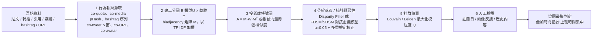
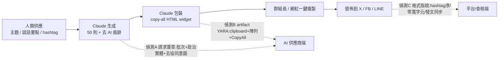
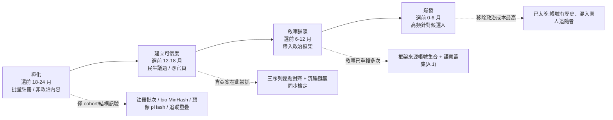
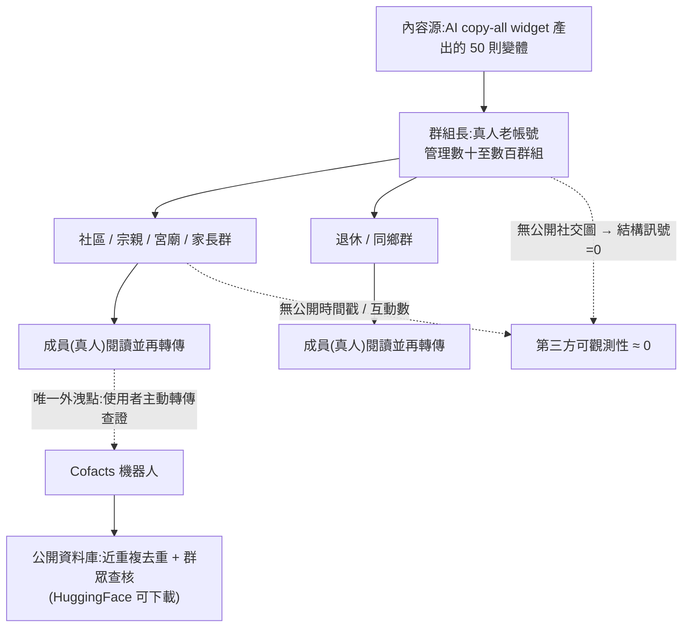

# GTG-54004：肯亞國內協同不實行為行動——為 2027 年大選預備的 AI 假草根工廠

> 課程模組：02 影響力行動（Influence operations） ｜ 一手來源：PDF p.75（下半）–p.78（上半），並延伸引用 p.41–p.43（章節導論、Breakout Scale、趨勢） ｜ 整理日期：2026-09-13
>
> 本檔一手依據為 Anthropic《Detecting and countering misuse of AI: September 2026》威脅情報報告。Figure 17 由研究員以 Read 工具開啟原始 PNG、並從 PDF 抽出 1990×1620 原生解析度嵌入圖逐格判讀後撰寫，非轉抄圖說。第三方查證與台灣意涵見第 9、10 節。全文以三種標記區分證據等級：**【報告原文】**（Anthropic 報告明講）、**【獨立查證】**（研究員自外部來源核實）、**【研究員推論】**（本檔作者的分析判斷，報告未講）。

---

## 0. 頁段邊界與兩個必須先講清楚的事實

- **本案正文**：從 p.75 下半的標題 `GTG-54004: Disrupting a domestic coordinated inauthentic behavior campaign in Kenya` 開始，經 p.76 全頁（Key findings、Attack lifecycle and AI usage）、p.77 全頁（Figure 17、Disruption and mitigations），到 p.77 底結束。**p.78 整頁是下一個案例 GTG-84002（阿聯酋指揮、針對穆斯林兄弟會的行動）**，不屬本案。
- **p.75 上半那張 IOC 表不是本案的。** 那張表（`@tehranchekhabar19`、`@faryade_mamnoo`、`t[.]me/FWR_ir`、`#OurChoiceMaryamRajavi`、`SKILL.md / LEARNINGS.md memory` 等）是前一個案例 **GTG-84006（MEK/NCRI 傾向、以共用 AI 代理「Viktor」在伊朗境內冒充真人與吸收人員的分散式行動）** 的 IOC 表尾。判讀時把它算進肯亞案是常見錯誤，本檔特別標出。
- **本案在報告中沒有任何 IOC 表**。研究員另外比對了 Anthropic 隨報告發布的官方 IOC 清單（`anthropic_iocs.csv`，208 條指標、涵蓋 11 個 GTG 群組），`GTG-54004` 的列數是 **0**。影響力行動類別裡有 IOC 的是 GTG-54002（28 條）、GTG-84005（21 條）、GTG-84006（10 條）、GTG-24015（1 條）——肯亞案完全沒有。這不是疏漏，第 7 節會解釋為什麼「沒有 IOC」本身就是教材。
- **Figure 17 不是節點連線圖。** 圖說寫的是「showing coordinated clusters」，但圖片實際上是四張 X（Twitter）貼文截圖排成 2×2 的格子；「叢集」是靠**兩兩共享同一則被引用的來源內容**呈現的，不是用網路圖畫出來的。第 6 節會完整說明圖上看到什麼、以及一張「真正的」協同叢集圖應該怎麼做出來。這件事本身也是教學點：**分析師講「叢集」時，讀者要問「你的邊（edge）是怎麼定義的」**。

> 教學提示：課堂開場可以用「p.75 上面那張表是肯亞案的 IOC 嗎？」當暖身題。答案是「不是，而且肯亞案根本沒有 IOC」。這訓練學員一個核心習慣——**指標一定要對回它所屬的案例與段落**。

---

## 1. 一頁速覽（TL;DR）

1. **這是什麼**：一個**單一操作者**用一個 Claude 帳號，跨數個工作階段（several sessions），**每批精確產出 50 則推文（batches of exactly 50 tweets）**，並明確要求模型「讓貼文看起來像自發的草根評論，而不是協同行動」。行動的目的是替肯亞 2027 年 8 月大選預先製造假民意。（p.75）【報告原文】
2. **內容主軸**：大量推文讚揚能源部內閣秘書（Cabinet Secretary, CS）**Opiyo Wandayi** 擋下 Kenya Power 的電價調漲，掛上 `#PowerReliefKE` 與 `#PoweringTheNewKenya`；另一條線散布「聯合反對黨（United Opposition）在 2027 大選前正在瓦解」的故事，**直接鎖定前副總統 Rigathi Gachagua 與前總統 Uhuru Kenyatta**。（p.75–76）【報告原文】
3. **政商兩用同一套模板**：同一操作者以行銷人格「SHANKI」／「Elkins Marketer」跑**一模一樣的 AI 工作流**替肯亞零售品牌做行銷——把一則促銷廣播改寫成「有機」推文、**每第五則插入連結**。報告把這對應到肯亞「公關公司付錢請本地網紅帶風向」的既有產業模式。（p.76）【報告原文】
4. **AI 的角色**：核心意識形態訊息**完全由人先決定**；Claude 的價值是「量」與「看起來真」——把預先擬好的主題與推文「人性化並精修（humanize and refine）」成 50 則有主題、算好字數、可跨平台發布的貼文，**在數個工作階段裡還被包裝成「可直接部署的互動式 copy-all 小工具」**。（p.76–77）【報告原文】
5. **影響力評級**：Breakout Scale **Category One**——內容完全侷限在假帳號與本地網紅組成的網路內、單一平台，「未能觸及或影響任何真實的人」。（p.76）【報告原文】
6. **歸因**：Anthropic「不知道幕後人物的真實身分」，「相信」這是本地的肯亞政治假草根行動；「親執政當局的語調與特定 hashtag」讓它「看似（plausibly）與執政聯盟一致」，但「未辨識出負責的確切組織」；「沒有發現政府涉入的證據」。（p.76）【報告原文】
7. **怎麼被抓到的**：**OpenAI 分享的線報**——這名行為者在 OpenAI 平台上是「累犯（recidivist）」——觸發 Anthropic 內部調查，才找到這個行動。Anthropic 移除了帳號與其背後的組織，並「圍繞其行為簽章建立偵測」。（p.77）【報告原文】
8. **這個案例在課程裡要教什麼**：教「**協同性偵測方法論**」——為什麼偵測假草根不能靠內容真假，而要靠**行為的共現結構**（共同引用、共同 hashtag、相同時間窗、同一改寫骨架）；並教「**AI 把散播門檻壓到多低**」（從 2021 年 Mozilla 記錄的 WhatsApp 群組＋M-Pesa 付款，進化到 2026 年「一個人＋一個 AI 訂閱＋copy-all 小工具」）；最後教「**選前一年多就在養內容與帳號**，選前才查核已經太晚」——這對台灣 2026 地方選舉與 2028 大選有直接啟示。

---

## 2. 行為者側寫與歸因

### 2.1 報告給的身分線索（全部【報告原文】）

| 面向 | 報告內容 | 頁碼 |
|---|---|---|
| 規模 | 「一個帳號」（an account）、「單一行為者」（a single actor） | p.75 |
| 使用型態 | 「跨數個工作階段」用 Claude 產出「每批精確 50 則推文」 | p.75 |
| 意圖（明示） | 「明確指示模型讓貼文看起來像自發的草根評論，而不是協同行動」 | p.75 |
| 商業人格 | 「SHANKI」／「Elkins Marketer」——替肯亞零售品牌做行銷時用的 persona，用的是「一模一樣的 AI 工作流」 | p.76 |
| 地理 | 「看起來與一個完全國內的肯亞行動一致（consistent with an entirely domestic Kenyan operation）」 | p.76 |
| 政府關聯 | 「我們沒有發現政府涉入的證據」 | p.76 |
| 政治傾向 | 「網路的親執政當局語調與特定 hashtag 顯示它看似與執政聯盟一致」 | p.76 |
| 真實身分 | 「我們不知道這個行動背後人物的確切真實身分」 | p.76 |
| 組織 | 「我們移除了該帳號**與其背後的組織**」（the account and the organization behind it）——但「未辨識出負責的確切組織」 | p.77 / p.76 |
| 前科 | OpenAI 分享「其平台上累犯活動（recidivist activity）」的線報 | p.77 |

兩個看似矛盾、其實不矛盾的句子值得學員停下來想：p.76 說「未辨識出負責的確切組織」，p.77 卻說「移除了帳號與其背後的組織」。【研究員推論】合理的讀法是：Anthropic 在**自家平台上**能辨識出這個帳號隸屬的組織實體（例如同一付款方式、同一網域信箱、同一 API 組織），並把整個組織的存取一併移除；但它**不能**把這個平台上的組織實體對應到現實世界中「是誰付錢委託這場政治行動」。這正是 AI 供應商做威脅情報的結構性限制：看得到「誰在用工具」，看不到「誰在買結果」。

### 2.2 歸因措辭的情報學意義

報告在本案用了一整組刻意保留餘地的措辭，值得逐一拆解：

| 報告用語 | 情報學上的意思 | 本案套用 |
|---|---|---|
| **no evidence of**（沒有…的證據） | 「找不到證據」≠「證明沒有」。這是 absence of evidence，不是 evidence of absence。 | 「沒有政府涉入的證據」——不排除政府涉入，只表示在 Anthropic 的可視範圍內看不到。 |
| **consistent with**（與…一致） | 觀察到的資料不與該假設矛盾；但通常也不與其他假設矛盾。是最弱的一種歸因語言。 | 「與完全國內的肯亞行動一致」——推文語言、議題、時區、商業客戶都是肯亞的，但這也與「外國公司雇用肯亞承包商」一致。 |
| **we believe**（我們相信） | 分析判斷（analytic judgment），基於證據的加權推論，不是事實陳述。 | 「我們相信這是本地的肯亞政治假草根行動」。 |
| **plausibly aligned with**（看似與…一致） | 比 consistent with 稍強一點的傾向判斷，但明確不是歸因。「aligned with」講的是**利益方向**，不是**指揮關係**。 | 「看似與執政聯盟一致」——講的是「內容對誰有利」，不是「誰下的令」。 |
| **have not identified**（未辨識出） | 明確的知識缺口宣告。 | 「未辨識出負責的確切組織」。 |

對照報告其他案例可以看到措辭的階梯：GTG-84002（阿聯酋）用的是「**linked it with high confidence to UAE government officials**」（p.78）——那是最高等級；GTG-54006（孟加拉）是「found no proof that the party itself was involved」（p.68）；本案則是「consistent with / plausibly aligned / no evidence」，屬於**低信度、僅利益方向的歸因**。美國情報體系 ICD 203 的慣例是把信度分成 high / moderate / low，並要求分析師把「來源可靠度」與「推論強度」分開講；Anthropic 的措辭大致沿用這個傳統。課堂上可以要求學員把本案每句歸因句子標上信度等級。

### 2.3 肯亞政治脈絡（【獨立查證】，本案理解的必要背景）

要看懂「為什麼讚揚 Wandayi、為什麼打 Gachagua 與 Kenyatta」，得先把 2022–2026 年的肯亞政局排成一條線。以下事實由研究員自英文維基百科與肯亞媒體標題核實（來源見第 9 節）：

| 時間 | 事件 | 對本案的意義 |
|---|---|---|
| 2022-08-09 | William Ruto（UDA／Kenya Kwanza 聯盟）以 50.49% 擊敗 Raila Odinga（48.85%），副手為 Rigathi Gachagua。 | 執政聯盟的起點。 |
| 2024-06 | 《財政法案》引發 Gen Z 大規模抗議，至少 22 人死亡；Ruto 撤回法案，7 月 11 日解散大部分內閣。 | 政府正當性危機，之後拉攏反對黨組「broad-based government」。 |
| 2024-08-08 | ODM（Raila Odinga 的黨）多名要員入閣；**Opiyo Wandayi**（ODM、Ugunja 選區、前國會少數黨領袖）出任**能源與石油部內閣秘書**。 | 本案讚揚對象是「反對黨出身、現在替 Ruto 政府做事」的部長——所以「親 Wandayi」在肯亞政治裡等於「親 broad-based government」。 |
| 2024-10-08 / 10-17 | 國民議會以 281:44 通過彈劾副總統 Gachagua（11 項指控）；參議院維持其中 5 項（煽動族群對立、違反誓言、公開攻擊 NIS 等），Gachagua 成為 2010 憲法下第一位被彈劾罷免的國家官員，由 Kithure Kindiki 接任。 | 本案負面鎖定的第一個人物；他從此成為 Ruto 在 Mt. Kenya 地區最大的政治威脅。 |
| 2025-03-07 | UDA 與 ODM 簽署十點合作備忘錄。 | 執政聯盟擴大。 |
| 2025-05-15 | Gachagua 成立 Democracy for Citizens Party（DCP）。 | |
| 2025-09-13 | Gachagua 宣布將於 2027 年挑戰 Ruto。 | |
| 2025-09 | Uhuru Kenyatta 在 Jubilee 黨代表大會公開批評繼任者政府。 | 本案負面鎖定的第二個人物；2018 年「握手」後與 Ruto 決裂的前總統重新活躍。 |
| 2025-10-15 | Raila Odinga 在印度病逝；Oburu Odinga 代理 ODM 黨魁（2026-03-27 正式當選）。 | ODM 內部因「是否繼續與 Ruto 合作」而分裂。 |
| 2026-02-11 | ODM 秘書長 Edwin Sifuna 因批評政府經濟政策、被視為「反叛派」領袖而遭黨內撤職程序，法律戰延續到 3 月。Techweez 報導有人「在沒有確認證據的情況下」指控 Kenyatta 資助 Sifuna 領導的 Linda Mwananchi 派系。 | 執政陣營對 Kenyatta 的敵意背景。 |
| 2026-01 → 2026-08 | 聯合反對黨（United Opposition：Gachagua、Kalonzo Musyoka、Martha Karua、Eugene Wamalwa、Justin Muturi、Fred Matiang'i 等）不斷傳出裂痕：1 月 Gachagua 與 Kalonzo 對「何時提名」互相矛盾；5 月「旗手人選期限跳票」；6 月「Matiang'i 揭露 Gachagua 陣營權力鬥爭」；7–8 月「旗手人選新裂痕」、「權力分享談判已分裂」。 | **本案「反對黨正在瓦解」的敘事有真實的種子**——這是假草根行動的典型手法：不是純造謠，而是把真實裂痕放大、加速。 |
| 2026-05 | Nandi 郡參議員 Samson Cherargei 提案剝奪 Kenyatta 的退休待遇；肯亞媒體以「Ruto 陣營對 Uhuru 政治再起感到緊張」為題大量報導；Wamalwa 說「聯合反對黨終將尋求 Uhuru 支持」。 | 執政陣營打 Kenyatta 的動機在 2026 年 5 月達到高峰——與本案的 6 月活動時間重疊。 |
| 2026-06-03 | 能源部撤回 Kenya Power 的零售電價審查申請（Kenya Power 於 3 月向能源監管機構 EPRA 提交，肯亞財經媒體報導擬調漲 14%–31%）；6 月 5 日 EPRA 中止公聽會。 | **本案 Figure 17 四則貼文的日期是 6 月 4 日**——行動在真實新聞發生的 24 小時內啟動。 |
| 2027-08-10 | 肯亞大選預定日。 | 本案活動距投票日約 14 個月。 |

### 2.4 政治歸屬推論：這個行動看起來服務誰？

先講報告明講的（【報告原文】）：「單一劇本同時放大親政府與反反對黨敘事。以這種方式拉抬現任政府、同時削弱反對黨的可行性，**與單一、協同的選舉傳播工作一致**（consistent with a single, coordinated electoral communications effort）」（p.76）。

接著是研究員的推論（【研究員推論】，報告未講）。把「誰受益」與「誰有能力」分開看，至少有四個假設，而報告的證據無法在它們之間做決定：

| 假設 | 支持的證據 | 反對／削弱的證據 |
|---|---|---|
| **H1：執政聯盟（UDA 或其盟友）的傳播團隊或其承包商** | 親政府語調；同時打 Gachagua 與 Kenyatta（正好是 2026 年 5–6 月 Ruto 陣營最忌憚的兩個人）；hashtag `#PoweringTheNewKenya` 呼應執政口號式語言。 | 報告明說「沒有政府涉入的證據」、「未辨識出組織」。 |
| **H2：ODM 內「合作派」或 Wandayi 個人的公關團隊** | 讚揚的具體對象是 Wandayi 個人而非 Ruto；ODM 內部正在分裂，「合作派」有動機證明入閣有政績。 | 打 Kenyatta 與 Gachagua 對 ODM 內部鬥爭幫助不大；報告沒有提到任何 ODM 內部議題。 |
| **H3：商業公關／行銷承包商，替付費客戶服務（influence-as-a-service）** | 同一人同時用「SHANKI／Elkins Marketer」替零售品牌做一模一樣的工作；報告自己把它連到「公關公司付錢請本地網紅帶風向」的產業模式（p.76）；報告章節導論說「有兩個案例是正在營業的廣告或行銷公司在做日常商業工作之餘跑這些行動」（p.42）——本案很可能是其中之一。 | 承包商模式不排除 H1／H2，只是把「誰下單」再往後推一層。 |
| **H4：自發的個人支持者** | 單一帳號、規模小。 | 「每批 50 則、明示要看起來不協同、包成部署工具、有本地網紅網路」——這是**生產線**，不是粉絲行為。 |

研究員的整體判斷：**H3（商業承包商）是行為層面最有證據的，H1（執政聯盟受益）是利益層面最有證據的，兩者疊加是最合理的圖像**——「一個承包商，接了執政陣營或其周邊的單」。但這只是推論；報告刻意不走到這一步，課堂上應該把「為什麼 Anthropic 不走到這一步」當成討論題（見第 10.2 節）。

還要提醒一個容易被忽略的細節：Wandayi 本人在報告發布後的回應（【獨立查證】，Nairobi Leo 2026-09-12 引述其書面聲明；Techweez、Daily Nation、People Daily、Eastleigh Voice 均有報導）——「報告本身並未證明內閣秘書或本部授權、指揮或以其他方式參與了所稱的活動」、「我們仍專注於透過可信管道傳達本部的工作，不會被匿名網路活動的臆測分散注意力」。這段回應在邏輯上是對的：**受益者不等於委託者**。假草根行動的一個副作用，正是讓被讚揚的人「被迫自證清白」——這也是行動設計者不在乎、但被讚揚者要付出的代價。

### 2.5 與同一份報告其他案例的對照

| 案例 | 行為者類型 | 自動化程度 | 帳號數 | Breakout Scale | 歸因信度 |
|---|---|---|---|---|---|
| **GTG-54004 肯亞（本案）** | 國內單一操作者／疑似商業承包商 | 對話式、人在迴圈、每批 50 則 | 1 個 Claude 帳號 | **Category One** | 低（consistent with / plausibly） |
| GTG-54006 孟加拉（p.67–70） | 國內單一操作者，親 Awami League | 自製程式 `fake_news_3.py` 直連 API、固定批次 15 標題／3 故事／15 圖像提示、YouTube 排程上傳 | 輪替 29 個 Claude 帳號 | Category Three | 低（no proof party involved） |
| GTG-84002 阿聯酋（p.78–） | 國家行為者 | 自架平台上的持久 AI 人格「Deadshot」＋主教義檔，數百工作階段 | 約 300 個假網紅帳號 | （見該案） | **高**（high confidence to UAE officials） |
| GTG-54002 商業 IaaS（p.47–） | 私人公司賣影響力 | 自動改寫真實新聞、8,913 篇文章、約 20 種語言 | 多網站＋配套帳號 | Category Two | 中（客戶未確認） |

【研究員推論】本案是整份報告影響力行動章節裡**技術上最「低科技」**的一個——沒有 API 自動化、沒有多帳號輪替、沒有教義檔、沒有代理。但它可能也是**最貼近「一般政治操盤手會怎麼用 AI」**的一個：打開聊天視窗、貼上談話要點、要 50 則、複製、發。這正是它的教學價值——威脅不在於技術複雜度，而在於**門檻消失**。

---

## 3. 受害者與目標清單

### 3.1 目標一覽

本案的「受害者」要分三層看：被負面鎖定的人物、被冒用可信度的機構、以及被欺騙的閱聽人。

| 類別 | 對象 | 國別 | 報告描述 | 頁碼 |
|---|---|---|---|---|
| 負面鎖定—政治人物 | **Rigathi Gachagua**（前副總統，DCP 黨魁，2027 挑戰者） | 肯亞 | 「直接鎖定」（directly targeting）；敘事為「聯合反對黨正在瓦解」 | p.76 |
| 負面鎖定—政治人物 | **Uhuru Kenyatta**（前總統，Jubilee 黨） | 肯亞 | 同上 | p.76 |
| 負面鎖定—政治組織 | **United Opposition** 聯盟 | 肯亞 | 「推送聲稱聯合反對黨在 2027 大選前正在瓦解的故事」 | p.75–76 |
| 正面放大—政治人物 | **Opiyo Wandayi**（能源與石油部 CS，ODM） | 肯亞 | 「大量 AI 生成推文讚揚」其擋下 Kenya Power 電價調漲 | p.75 |
| 正面放大—政治陣營 | 執政聯盟／現任政府 | 肯亞 | 「拉抬現任政府」 | p.76 |
| 被冒用可信度的機構（Figure 17） | **Citizen TV Kenya**（主流媒體，藍勾認證）、**Berur News / Berur FM**（地方媒體圖卡） | 肯亞 | 假帳號以引用推文（quote tweet）方式借用真實新聞的可信度 | p.77 圖 |
| 被欺騙的閱聽人 | 肯亞 X 平台使用者 | 肯亞 | 報告評估「未能觸及或影響任何真實的人」 | p.76 |
| 商業線的受害者 | 肯亞零售品牌的消費者 | 肯亞 | 促銷廣播被「重新包裝成有機推文，每第五則插入連結」——這是消費者保護意義上的欺騙性行銷 | p.76 |
| 平台 | **X（Twitter）**，「單一平台」 | — | 「完全侷限在假帳號與本地網紅的網路內、單一平台」 | p.76 |

**具體受害數字**：報告**沒有**給出假帳號數、推文總數、工作階段數、或觸及人數。唯一的量化線索是（1）「每批精確 50 則」（p.75）、（2）Figure 17 四則貼文的互動數（瀏覽 28／85／59／59；轉推 4／11／4／10；回覆 未顯示／20／未顯示／1；讚 未顯示／3／3／1——研究員自放大截圖逐格判讀，左欄兩則的回覆與部分讚數在截圖上只有圖示、沒有數字）。這些數字本身就是 Category One 的最好註解：**一個「為大選預備」的行動，在 6 月的實際觸及是幾十次瀏覽**。

### 3.2 Breakout Scale 評級與理由

報告用的是 Brookings 學會 Ben Nimmo 於 2020 年 9 月提出的 **Breakout Scale**（p.42 明講「六類、業界廣泛接受的框架，依**跨平台遷移**與**觸及**分類影響」；p.48 另稱之為「Brookings Institution's Breakout Scale」）。六級的完整定義（【獨立查證】Brookings 原文）與本案的定位如下：

| 級別 | 定義 | 本案是否達到 | 判準 |
|---|---|---|---|
| **Category 1** | 行動**侷限在單一平台的單一社群**內 | **是——本案評級** | 「完全侷限在假帳號與本地網紅的網路內、單一平台上」（p.76） |
| Category 2 | 同一社群跨多個平台，**或**單一平台上跨多個社群 | 否 | 內容雖已「為跨平台發布格式化」（p.77），但未觀察到實際跨平台；也未進入肯亞真實政治社群 |
| Category 3 | **跨多平台且跨多社群** | 否 | 對照：同報告孟加拉案 GTG-54006 因影片出現在 Facebook／YouTube／TikTok 多個頻道而評為 Cat.3（p.68） |
| Category 4 | 突破社群媒體，**被主流媒體放大** | 否（但見下方註） | 未有肯亞主流媒體引用該網路內容 |
| Category 5 | 被**名人或政治人物**放大 | 否 | Figure 17 中有兩則 @OpiyoWandayi，但沒有證據顯示他或任何政治人物轉發過 |
| Category 6 | 引發**具體政策回應或政府行動**，或包含**暴力號召** | 否 | 無 |

**評為 Category One 的三個支柱**（p.76 原文拆解）：
1. **單一平台**——「on a single platform」；
2. **封閉於行動自身的資產**——「completely isolated within the network of fake accounts and local influences」；
3. **無真實觸及**——「failing to reach or influence any real people」。

**Category One 的教學重點（【研究員推論】）：**

- **它是「被打斷那一刻的快照」，不是「行動的天花板」。** 本案的設計目的是 2027 年 8 月的大選；Anthropic 在 2026 年夏天切斷它。低觸及有兩種解讀——「行動無能」或「行動還在暖機」——報告的證據無法分辨，而第二種解讀才是課程要學員警惕的。Breakout Scale 衡量的是**已發生的擴散**，它在設計上就不預測「若不干預會走到哪一級」。
- **這個評級有一個弔詭的自我否定**：Anthropic 公開報告本案之後，本案的內容與敘事**被至少 21 家肯亞媒體與 OECD AI 事件資料庫報導**。從嚴格的字面看，「該行動的存在」確實進入了主流媒體——但被報導的是「它是假的」，不是它的敘事。課堂上值得問：**揭露行為本身會不會把 Category 1 推上 Category 4？** 這是所有威脅情報公開者都要面對的兩難（見 10.2 討論題 4）。
- **「local influences」若讀作「local influencers」（付費真人網紅），第三個支柱就有裂縫**：真人網紅有真實追隨者，「未觸及任何真實的人」就難以成立。報告沒有澄清這一點，本檔在第 12 節列為未驗證事項。
- **與同報告其他案例的級距對照**（可製成課堂投影片，頁碼均經研究員核對原文）：

  | 案例 | 級別 | 報告給的理由（節錄） | 頁碼 |
  |---|---|---|---|
  | **GTG-54004 肯亞（本案）** | **Cat.1** | 「完全侷限在假帳號與本地網紅的網路內、單一平台上，未能觸及或影響任何真實的人」 | p.76 |
  | GTG-54002 商業影響力即服務 | Cat.2 | 「內容散布於該網路自有的網站與配套社群帳號，沒有跳出其自身活動的證據」——**即使產出 8,913 篇文章、約 20 種語言** | p.48 |
  | GTG-84006 MEK/NCRI 分散式行動 | Cat.2 | 「多平台，透過該網路自有的 NCRI 媒體資產與放大帳號散布」 | p.71 |
  | GTG-54006 孟加拉 Awami League | Cat.3 | 「多平台，影片出現在多個孟加拉焦點頻道與帳號」 | p.68 |
  | GTG-84002 阿聯酋／穆斯林兄弟會 | Cat.3 | 「活動橫跨數個社群平台。更高的級別需要廣泛公眾注意或政策影響的證據，我們無法確認」 | p.79 |
  | GTG-04001 俄羅斯／中非共和國 | Cat.4 | 「內容每日透過 Radio Lengo Songo 98.9 FM 播出，經 Telegram 頻道放大，並被中非當地新聞機構採用」 | p.45 |

  **「文章數多」不等於「級別高」**——8,913 篇只得 Cat.2，因為**擴散結構**（是否跳出自有資產）才是尺規；反過來，中非案只要每天在一個真實電台播出、被當地媒體轉載，就是 Cat.4。這是學員最容易誤解的地方，也是 Breakout Scale 與「聲量分析」的根本差異。

---

## 4. AI 濫用的攻擊生命週期（逐階段拆解）

報告的 Attack lifecycle and AI usage 段落只有兩句話（p.76–77），但結合 Key findings、Figure 17 與章節導論，可以重建成完整的生產線。以下每個階段標示「人類做什麼／Claude 做什麼／自主程度」。

### 4.1 總覽表

| 階段 | 人類做什麼 | Claude 做什麼 | 自主程度 | 證據 |
|---|---|---|---|---|
| 0. 前史 | 在 OpenAI 平台上已有被處置紀錄，之後再犯（recidivist） | — | — | p.77 |
| 1. 戰略與敘事 | **完全由人決定**核心意識形態訊息：讚 Wandayi、打反對黨、打 Gachagua 與 Kenyatta | 無 | 人 | p.76 |
| 2. 素材準備 | 供應「主題、談話要點、hashtag」；有時已「預先擬好（pre-drafted）」主題與推文 | 無 | 人 | p.76 |
| 3. 生成 | 下指令：每批 50 則、要看起來像自發草根而非協同 | 「轉換成 50 則有主題、算好字數、可跨平台發布與散播的貼文」；「人性化並精修」預擬的主題與推文 | **對話式協助**（人在每個迴圈） | p.75–77 |
| 4. 包裝 | 要求輸出成可用的介面 | 「在數個工作階段中，這些被包裝成**可直接部署的互動式 copy-all 小工具**」 | 對話式協助 | p.77 |
| 5. 散播 | 由假帳號與本地網紅在 X 上發布；引用真實新聞（Citizen TV、Berur News）；掛 hashtag、@Wandayi | 無（Claude 不碰平台） | 人 | p.76、Figure 17 |
| 6. 商業平行線 | 以「SHANKI／Elkins Marketer」人格替零售品牌跑同一流程；每第五則插連結 | 同第 3–4 階段 | 對話式協助 | p.76 |
| 7. 成效評估 | 報告未描述 | 未描述 | — | — |

### 4.2 逐階段說明

**階段 0：前史（累犯）。** 報告說「基於 OpenAI 分享的、關於其平台上累犯活動的線報」（p.77）。「累犯」在平台信任與安全（Trust & Safety）語境裡的意思是：這名行為者之前已經在 OpenAI 被停權，之後又用新帳號回來。【研究員推論】這透露兩件事：（1）行為者對「被 AI 供應商封鎖」這件事**沒有嚇阻感**——換個帳號、換個供應商就繼續；（2）跨供應商的線報分享在本案是**決定性**的——Anthropic 的敘述沒有說自己的分類器先抓到，而是「基於線報」才「進行內部調查」。這是第 8 節的核心討論。

**階段 1–2：戰略與素材由人決定。** 報告用了非常強的措辭：「核心意識形態訊息**完全**由行為者在使用 Claude 之前決定」（p.76）；「行為者供應主題、談話要點與 hashtag」（p.76）。這對「AI 有沒有在做政治判斷」的公共討論很重要：本案的 AI **沒有**決定要打誰、要護誰；它做的是把人類的政治決定**工業化**。

**階段 3：生成——「50」這個數字的意義。** 「每批精確 50 則」出現了三次（p.75 「batches of exactly 50 tweets」、p.76 「batches of 50 pre-drafted topics and tweets」、p.76 「convert them into 50 themed, character-counted posts」）。【研究員推論】為什麼是 50？三個可能：（a）對應本地網紅網路的規模（50 個帳號各發一則，或 10 個帳號各發 5 則）；（b）對應一天的發文配額；（c）單純是模型一次輸出的舒適上限——超過 50 則品質會掉、也容易被截斷。不管哪一種，**「固定批次大小」是最好的行為簽章之一**：正常使用者不會每次都剛好要 50 則推文。孟加拉案（GTG-54006）的固定批次是 15 標題／3 故事／15 圖像提示；報告趨勢段落也提到「自製軟體以固定批次呼叫 Claude」（p.43）。**固定批次＝生產線的節拍**，這個概念在偵測工程上可以直接轉成規則（見第 8 節）。

「character-counted」（算好字數）——X 的單則上限是 280 字元；「算好字數」意味著操作者要求每則都在上限內、可直接貼上不用再修。「formatted for cross-platform publishing」——雖然報告說行動實際上只在單一平台，但生成時已預留跨平台格式，這是「還在暖機」的另一個佐證。

「humanize and refine」——這兩個動詞是本案的靈魂。「人性化」在 AI 濫用語境裡指的是**去除 AI 文本的統計指紋**（過於工整的句構、重複的連接詞、缺乏個人語氣），報告趨勢段落也指出「行為者要求模型去除自動文本的痕跡、聽起來有機」（p.43）。Figure 17 的四則貼文正是這種產物：每則都是 1–2 句、語氣像關心民生的一般公民、但骨架完全一樣（「撤回電價審查」＋「對某群體的好處」＋兩個 hashtag＋可選的 @Wandayi）。

**階段 4：包裝成 copy-all 小工具**（詳見 4.3）。

**階段 5：散播——時間與槓桿。** Figure 17 的四則貼文都是 6 月 4 日，而政府撤回電價審查的新聞是 6 月 3 日（【獨立查證】Business Daily、Citizen Digital、The Star、Standard、Nation 等均於 6 月 3–4 日報導）。截圖中 Citizen TV 被引用的貼文顯示「20h」，表示截圖時該則新聞貼文發出約 20 小時。【研究員推論】這說明兩件事：（1）行動具備**新聞反應速度**——真實事件發生後一天內就有整批貼文上線，這需要素材預備、生成、分發三段都很順；（2）行動採用「**借可信度**」策略——不是自己造新聞，而是引用主流媒體（Citizen TV 有藍勾）與地方媒體（Berur News 圖卡）的真實報導，再在上面加一層「感恩部長」的評論。這種「真新聞＋假評論」的組合對事實查核極不友善：**查核員找不到可以判「假」的事實主張**。

**階段 6：商業平行線。** 「同一模板一字不差（verbatim）也用於零售品牌行銷，包括把一則促銷廣播重新包裝成有機推文、每第五則插入連結」（p.76）。【研究員推論】「每第五則插連結」是行銷業的「4:1 法則」（四則軟內容配一則硬廣）——這個細節強烈暗示操作者有數位行銷的職業背景，而政治行動只是把同一套 SOP 換了客戶。這也是為什麼報告把它連到肯亞「公關公司付錢請網紅」的產業（p.76 的超連結指向 WIRED 2021 年 9 月 Odanga Madung 的評論〈In Kenya, Influencers Are Hired to Spread Disinformation〉——研究員從 PDF 抽出了該超連結目標，但 WIRED 網站無法抓取；其研究內容見第 9 節的 Mozilla 條目）。

### 4.3 深挖：「互動式 copy-all 小工具」代表什麼

報告原文只有一句（p.77）：

> "In several sessions, these were packaged as an interactive copy-all widget ready for deployment."
> （在數個工作階段中，這些被包裝成可直接部署的互動式 copy-all 小工具。）

報告沒有進一步描述這個小工具長什麼樣。以下是研究員的解讀（【研究員推論】，基於 Claude 產品功能與肯亞既有的散播模式）：

**它可能是什麼。** Claude 可以在對話中生成可互動的 HTML／React 頁面（Anthropic 稱為 artifact）。「copy-all widget」最合理的形態是：一個網頁，列出 50 則推文，每則旁邊一個「Copy」按鈕，頂端一個「Copy All」按鈕，可能還有字數計數、hashtag 已嵌入、甚至「已發布」勾選框。使用者不需要任何技術能力——打開頁面、按一下、貼到 X。

**它為什麼重要——三層意義。**

1. **AI 不只生成內容，還生成「散播的操作介面」。** 傳統的假草根流程（Mozilla 2021 年在肯亞記錄到的模式，見第 9 節）是：協調者把 hashtag 與預寫推文丟進 WhatsApp 群組，網紅們複製貼上，事後以 M-Pesa 收款。那個流程的摩擦點在「內容整理與分發」——Google Doc 亂、訊息被洗掉、複製時漏掉 hashtag。copy-all 小工具把這個摩擦點**歸零**：一個連結發到群組，每個人打開就能一鍵複製。AI 在這裡扮演的不是「寫手」，而是**「工具鏈工程師」**——它把內容和分發工具一起交付。

2. **「ready for deployment」是報告的用詞——這是軍事／工程語言。** 報告的作者選擇用「部署」而不是「發布」，暗示 Anthropic 分析師看到的成品**已經不需要人再加工**。這與章節導論的趨勢一致：「AI 幫忙建立的是整個機器（apparatus），不只是內容」（p.42–43）。

3. **它降低的是「協調成本」，而不是「寫作成本」。** 寫 50 則推文對一個有經驗的公關人員來說不難；難的是讓 30 個網紅在同一小時內發出 50 則彼此不同、但方向一致的貼文。copy-all 小工具把「品質一致性」與「散播同步性」打包給了不需要理解策略的執行者。這正是報告在趨勢段落講的「中央化的設定讓產出內容的人不需要互相協調、甚至不需要認識彼此」（p.43）。

**偵測意義（【研究員推論】）。**

- **AI 供應商端**：「把政治貼文包成可複製的 UI」是一個可以偵測的**請求型態**——正常的內容創作者很少要求「50 則＋copy-all 按鈕」；結合「要看起來不協同」的指令，就是高信度的 CIB 訊號。報告說「圍繞其行為簽章建立偵測」（p.77），這類請求型態很可能是簽章的一部分。
- **平台端**：copy-paste 散播會留下**格式指紋**——相同的 hashtag 順序（Figure 17 四則全是 `#PoweringTheNewKenya #PowerReliefKE`，順序一致）、相同的標點習慣、相同的 @ 提及位置、發文時間集中。這些是 Pacheco 等人（2021）「共享特徵投影」方法能直接抓的訊號（見第 5.1 節）。
- **對事實查核與公民社會**：copy-all 意味著**同一批文字會在多個帳號上以近乎一字不差或「同骨架換皮」的形式出現**——這讓「近重複偵測（near-duplicate detection）」與「語意叢集」成為比「內容查核」更有效的第一道篩子。

### 4.4 自主程度判定

依課程的三級尺度（對話式協助／人類逐步指揮／AI 編排多代理自主執行），本案明確屬於**對話式協助**，理由：

- 每個工作階段都是人開啟、人餵素材、人下指令、人拿走成品；
- 沒有 API 自動化、沒有排程、沒有自製程式（對照孟加拉案的 `fake_news_3.py` 與 YouTube 排程上傳腳本）；
- Claude 不接觸社群平台，散播完全靠人；
- 報告明說模型的「主要價值是量與真實感的外觀」（p.76）。

【研究員推論】這個判定有一個教學上的反直覺點：**自主程度最低的案例，可能是最難靠「AI 濫用偵測」抓到的**。孟加拉案用 29 個帳號輪替、固定批次直連 API——這種模式有明顯的技術異常；本案只是一個人在聊天視窗裡要 50 則推文，與「行銷人員用 AI 寫社群貼文」在**技術訊號上幾乎無法區分**，差別只在「是否被要求隱藏協同性」這一句指令。這正是為什麼本案要靠外部線報才被發現。

### 4.5 長期佈局時間軸：「選前一年多」意味著什麼

報告在章節導論把本案定位為「一名親政府操作者在肯亞 2027 年大選前預備假草根社群貼文」（p.41），案例正文說行動「為 2027 年大選」推送反對黨瓦解敘事（p.75–76）。從證據上看：

- 報告涵蓋期間：2025 年 12 月至 2026 年 8 月；
- Figure 17 可見活動：2026 年 6 月 4 日；
- 大選日：2027 年 8 月 10 日（【獨立查證】）；
- 因此可見活動距投票日**約 14 個月**（報告沒有說「兩年」，本檔也不這麼寫）。

【研究員推論】影響力行動為什麼要提前一年以上開始？因為**可信度是時間的函數**：

| 帳號生命週期階段 | 做什麼 | 目的 | 對偵測的意義 |
|---|---|---|---|
| 孵化（選前 18–24 個月） | 批量註冊、設頭像與簡介、發非政治內容（足球、宗教、食譜、勵志語錄） | 讓帳號「有歷史」，通過平台的新帳號風險模型 | 此時內容無害，**內容查核完全無用**；只有「同批註冊、同時活躍、互相追蹤」的結構訊號能抓 |
| 建立可信度（選前 12–18 個月） | 引用主流媒體、評論民生議題（如電價）、@ 官員、偶爾被真人互動 | 累積追隨者、進入本地議題社群、讓演算法認為它是「正常肯亞用戶」 | **本案被抓時正處於這個階段**——讚揚電價政策是「民生」而非「選舉」議題，正好是暖機的理想素材 |
| 敘事鋪陳（選前 6–12 個月） | 開始帶入政治框架：反對黨分裂、執政有政績 | 讓框架在真實選戰開打前已經「存在」 | 事實查核開始有著力點，但敘事已經被多次重複 |
| 爆發（選前 0–6 個月） | 高頻、高情緒、針對候選人 | 影響投票 | 平台與查核機構的資源集中在此，但**帳號已有一年歷史、已有真實追隨者，移除的政治成本變高** |

所以「選前才開始查核」為什麼太晚？因為到了爆發期，（1）帳號已通過所有「新帳號」啟發式規則；（2）它們的追隨者裡已經混有真人，移除會被指控「審查」；（3）敘事已經被重複到「聽起來熟悉」——認知心理學的「真實性錯覺（illusory truth effect）」在這時候已經生效。**偵測必須發生在孵化與暖機期，而那時唯一可用的訊號是協同結構，不是內容。** 這是本案對台灣最直接的啟示（第 10.4 節）。

### 4.6 從 2021 到 2026：肯亞帶風向產業的成本曲線

報告 p.76 特別把本案接回肯亞既有的產業模式——「這符合肯亞常見的模式：公關公司付錢請本地網紅操縱敘事」，並在該句加了指向 WIRED 2021 年 9 月 Odanga Madung 評論的超連結。把這條線拉開，是理解「AI 到底改變了什麼」最好的對照組。

**2021 年的肯亞模式（【獨立查證】，依 Mozilla Foundation 研究，數字轉引自 Tech-ish 與 Stimson Center，原始頁面回傳 403）：**

| 要素 | 2021 年做法 | 數字 |
|---|---|---|
| 協調 | WhatsApp 群組：協調者把 hashtag 與預寫推文丟進群組 | — |
| 人力 | 付費「網紅」（多為一般年輕人）手動複製貼上 | 逾 3,700 個帳號參與 |
| 規模 | 以「行動」為單位 | 11 個協同行動、逾 23,000 則推文 |
| 成本 | 以 M-Pesa（行動支付）日結 | 每人每日約 10–15 美元 |
| 內容 | 由協調者或文案手預寫，變體有限 | — |
| 目標 | 司法機構、社運人士、憲政改革（BBI）等 | — |
| 意願基礎 | Stimson 引 Mozilla：「**七成肯亞 Twitter 使用者願意為錢分享可能不實或誤導的資訊**」 | 70% |
| 外國介入 | 西班牙組織 CitizenGO 付費肯亞網紅散布生育健康誤導內容 | — |
| 平台回應 | Twitter 停權數百個帳號 | — |

**2026 年的本案（【報告原文】＋【研究員推論】）：**

| 要素 | 本案做法 | 相對 2021 的變化 |
|---|---|---|
| 協調 | **AI 產出的 copy-all 小工具**——一個連結取代 WhatsApp 的貼文整理 | 協調摩擦 → 趨近零 |
| 人力 | 仍有「本地網紅」，但**內容生產完全不需要人** | 文案人力 → 0 |
| 規模 | 每批 50 則，每則皆為獨立變體 | 變體成本 → 趨近零 |
| 成本 | 一個 AI 訂閱（Tech-ish 的評論：「2021 年要幾千個帳號與人力協調，2026 年只要一個人加一個 AI 訂閱」） | 邊際成本 → 大幅下降 |
| 內容品質 | 「人性化並精修」、算好字數、跨平台格式 | 品質 → 上升（且更難用字面比對抓） |
| 偵測難度 | 字面去重失效；需要語意叢集 | 上升 |
| 平台回應 | 本案未見任何平台處置的公開紀錄 | 下降？（至少不可見） |

【研究員推論】**這條成本曲線才是本案真正的教材。** 傳統上，假草根行動的成本結構是「人力密集」——要協調者、文案、幾千個執行者；成本隨規模線性上升，而且參與人數越多、內部越容易洩漏（Mozilla 2021 的研究之所以做得出來，正是因為有參與者願意受訪）。AI 把這個結構改成「**固定成本 + 近零邊際成本**」，並且把參與人數壓到最低——**知道全貌的只剩一個人**。

這帶來三個後果，值得在課堂上逐一討論：
1. **可調查性下降**：沒有 WhatsApp 群組、沒有幾千個收錢的人，就沒有可以受訪的內部人、沒有可追的金流。本案之所以曝光，靠的不是調查記者，而是 AI 供應商的後台紀錄——**調查的入口從「社會」移到了「平台」**。
2. **嚇阻手段失效**：停權一個帳號的成本，遠低於招募幾千個網紅的成本。
3. **品質—規模的取捨消失**：2021 年要嘛發 23,000 則一模一樣的推文（容易被抓），要嘛請文案寫變體（貴）。2026 年兩者兼得。這正是報告說的「模型對該網路的主要價值是**產量**與**真實感的外觀**」（p.76）——這兩個詞在過去是互斥的。

---

## 5. TTP 與 MITRE ATT&CK 對應

### 5.1 術語基礎：astroturfing、CIB、平台判定標準

在對應框架之前，先把本案用到的三個術語講清楚——因為它們在法律、平台政策與學術上的定義並不相同。

**Astroturfing（假草根／偽造草根民意）。**
- 詞源：AstroTurf 是人造草皮品牌。1985 年美國參議員 Lloyd Bentsen 收到保險業製造的大量「選民來信」時說：「德州人分得出草根（grass roots）和人造草皮（AstroTurf）」。（【獨立查證】英文維基百科）
- 一般定義：把有贊助者精心策劃的訊息，偽裝成不請自來的自發群眾運動；核心是**隱藏贊助者**，製造「公眾共識」的假象。
- 學術定義（【獨立查證】Schoch, Keller, Stier & Yang 2022，《Scientific Reports》）：「**中央協調的不實資訊行動，參與者假裝是獨立行動的一般公民**（centrally coordinated disinformation campaigns in which participants pretend to be ordinary citizens who act independently）」。這個定義有兩個關鍵：（1）**不要求使用機器人**——參與者可以是拿錢的真人；（2）**不要求內容是假的**——讚揚一項真實政策也可以是假草根。本案兩點都符合：報告說網路由「假帳號與本地網紅」組成（p.76），而讚揚電價撤回的內容本身是真實事件。
- Keller 等人 2020 年在《Political Communication》的前作以南韓國家情報院 2012 年大選干預的法院證據資料集，證明假草根帳號的可辨識特徵不是「像不像機器人」，而是**協同的時間結構**（本次未能抓取原文，依研究者所知描述，見第 12 節）。

**Coordinated Inauthentic Behavior（CIB，協同不實行為）。**
- 這是 Meta（Facebook）2018 年起使用的執法術語。Meta 現行社群守則（【獨立查證】transparency.meta.com）的定義層次：
  - **Inauthentic Behavior**：「由同一人或同一群人控制的不實資產網路所執行的多種複雜欺騙形式，目的是欺騙 Meta 或我們的社群、或規避執法」；
  - **Coordinated Inauthentic Behavior**：「特別複雜的不實行為形式，**假身分是行動的核心**，且操作者使用對抗性方法規避偵測或顯得真實」；
  - **Foreign Interference**：操作者鎖定自己國家以外閱聽人的 CIB；Meta 的執法報告長期把「國內 CIB」與「外國或政府干預（Foreign or Government Interference, FGI）」分開統計——**本案在 Meta 的分類裡會是「國內 CIB」，不是 FGI**，這正是報告標題用「domestic」的原因。
- Meta 執法報告慣用的一句話定義（依研究者所知，出自 Meta 歷年 CIB 報告的固定措辭）：「協同努力操縱公共辯論以達成戰略目標，且假帳號是行動的核心」。
- **CIB 的判定看行為、不看內容。** Meta 2018 年 12 月由 Nathaniel Gleicher 說明時強調：處置的是「網路」（帳號、粉專、社團的整體），不是個別貼文的真假（【獨立查證】about.fb.com）。這是本案最重要的方法論前提：**Figure 17 四則貼文沒有一則包含可查核的假事實，但它們作為一個網路是不實的。**

**X（Twitter）的對應政策。** X 的「平台操縱與垃圾內容（Platform manipulation and spam）」政策禁止「透過多個帳號、假帳號、自動化或腳本，協同地人為影響對話」，並另設「協同有害活動」條款。（本次 X 政策頁面回傳 403 無法抓取；此為研究者依既有公開政策措辭的描述，請於授課前以現行頁面核對。）

**Anthropic 的對應政策（【獨立查證】Usage Policy，2025-09-15 生效）。** 「請勿破壞民主程序」一節明文禁止：「**創造人工或欺騙性的政治運動，其來源、規模或性質遭到不實呈現**（Create artificial or deceptive political movements in which the source, scale or nature of the campaign or activities is misrepresented）」；以及「產生大規模、隱藏其人工來源的對公職人員或選民的自動化通訊」。本案「明確指示模型讓貼文看起來像自發草根而非協同行動」（p.75），就是對「來源、規模或性質不實呈現」的直接違反。**注意：違反的不是「寫政治推文」，而是「要求隱藏協同性」。** 這個區分是 AI 供應商執法的法理基礎，也是課堂討論的爭點（第 10.2 節）。

### 5.2 MITRE ATT&CK 對應（含框架缺口標示）

ATT&CK 是為網路入侵設計的，對影響力行動的覆蓋極為有限。以下只列出**確實存在對應 ID**的行為，其餘明確標示為框架缺口，並在 5.3 節以 DISARM 補足。

| 戰術 | 技術 ID | 本案的具體作法 | 偵測構想 | 備註 |
|---|---|---|---|---|
| Resource Development | **T1585.001** Establish Accounts: Social Media Accounts | 建立／維運假的 X 帳號網路（「network of fake accounts」，p.76） | 同批註冊、頭像反搜、簡介模板化、早期追蹤圖譜 | ATT&CK 有 ID，但其設計語境是「入侵前的社交工程」，不是輿論操作 |
| Resource Development | **T1588.007** Obtain Capabilities: Artificial Intelligence | 取得 Claude（及先前的 OpenAI）帳號作為內容生產能力 | AI 供應商端：請求型態（固定批次、去 AI 化指令、copy-all UI）；跨供應商線報 | v16 起新增之子技術（請以現行 ATT&CK 版本核對） |
| Resource Development | **T1583** Acquire Infrastructure（弱對應） | 本地網紅網路（付費真人）作為散播基礎設施 | 付款軌跡（肯亞慣例為 M-Pesa）、WhatsApp 協調群組 | ATT&CK 沒有「雇用真人作為放大器」的概念——**框架缺口** |
| Reconnaissance | **T1593.001** Search Open Websites/Domains: Social Media（弱對應） | 監看真實新聞（Citizen TV、Berur News）以決定引用對象與時機 | 引用來源與發文時間的相關性 | 勉強對應 |
| — | **無對應** | 「每批精確 50 則、人性化並精修、算好字數、跨平台格式」——內容工業化 | 見第 8 節行為簽章 | **框架缺口**：ATT&CK 沒有「內容生產」戰術 |
| — | **無對應** | 「interactive copy-all widget ready for deployment」——散播工具鏈生成 | 見 4.3 | **框架缺口** |
| — | **無對應** | 借用可信來源（quote tweet 主流媒體）、hashtag 放大、@ 官員 | 共同引用圖譜 | **框架缺口** |
| — | **無對應** | 商業／政治雙軌同模板 | 跨客戶格式指紋 | **框架缺口** |
| Defense Evasion（類比） | **無精確對應** | 「明確指示模型讓貼文看起來像自發草根而非協同行動」——這在概念上是「規避偵測」，但 ATT&CK 的 Defense Evasion 全是針對端點與網路的技術 | AI 供應商端的意圖分類器 | **框架缺口** |

**結論**：ATT&CK 對本案的覆蓋率極低，僅 Resource Development 有實質對應。這不是 ATT&CK 的錯——它的範圍就是網路入侵——但課堂要教學員：**拿錯框架會系統性地漏掉整類威脅**。影響力行動的標準框架是 DISARM。

### 5.3 DISARM Red Framework 對應

DISARM（前身 AMITT）是影響力行動的開放 TTP 框架，結構模仿 ATT&CK。以下技術 ID 依研究者所知的 DISARM Red 版本，**授課前請以 disarm.foundation 現行版本核對**（技術編號在版本間偶有調整）。

| DISARM 階段 | 技術 | 本案具體作法 | 證據頁碼 | 偵測構想 |
|---|---|---|---|---|
| Plan Strategy | T0074 Determine Strategic Ends；T0079 Divide；T0066 Degrade Adversary | 拉抬現任、削弱反對黨可行性、放大聯合反對黨裂痕 | p.76 | 敘事層：追蹤「反對黨分裂」框架的來源帳號集合 |
| Plan Objectives | T0059 Play the Long Game | 為 14 個月後的大選預備 | p.41、p.75 | 帳號生命週期分析 |
| Target Audience Analysis | T0073 Determine Target Audiences | 肯亞 X 用戶、民生議題關注者 | 推論 | — |
| Develop Narratives | T0082 Develop New Narratives；T0068 Respond to Breaking News Event | 「感恩部長擋電價」＋「反對黨瓦解」；在撤回新聞 24 小時內反應 | p.75、Figure 17 | 新聞事件後的貼文突發（burst）偵測 |
| Develop Content | **T0085.001 Develop AI-Generated Text**；T0084 Reuse Existing Content | 每批 50 則 AI 生成推文；引用真實新聞 | p.75–77 | AI 供應商端請求簽章；平台端同骨架改寫叢集 |
| Establish Assets | T0090.004 Create Sockpuppet Accounts；T0097 Create Personas；T0091.001 Recruit Contractors | 假帳號網路；「SHANKI／Elkins Marketer」人格；本地網紅 | p.76 | 帳號註冊批次、付款軌跡 |
| Establish Legitimacy | T0100 Co-opt Trusted Sources | 引用 Citizen TV（藍勾）與 Berur News 圖卡 | Figure 17 | 共同引用（co-quote）圖譜 |
| Microtarget | （未見） | 報告未描述 | — | — |
| Select Channels | T0104 Social Networks | X 單一平台（但內容已「跨平台格式化」） | p.76–77 | — |
| Conduct Pump Priming | T0020 Trial Content | 商業線與政治線同模板——可視為互為試驗 | p.76 | 跨客戶指紋 |
| Deliver Content | T0115 Post Content；T0116 Comment or Reply；T0119.002 Post across Platform | 假帳號發文、quote tweet、@Wandayi | Figure 17 | 時間窗共現 |
| Maximize Exposure | **T0049 Flooding the Information Space**；T0015 Create Hashtags；T0118 Amplify Existing Narrative | `#PowerReliefKE`、`#PoweringTheNewKenya`；批量貼文 | p.75 | hashtag 首發帳號集合、hashtag 共用序列 |
| Conceal | T0128 Conceal People；T0130.001 Conceal Sponsorship；T0129 Conceal Operational Activity | 「看起來像自發草根」；不揭露委託者；人格化名 | p.75–76 | 「去 AI 化」請求本身是 AI 端訊號 |
| Measure Effectiveness | T0132 Measure Performance | 報告未描述 | — | — |

【研究員推論】用 DISARM 排出來會發現本案在 **Develop Content → Establish Legitimacy → Deliver → Maximize Exposure** 這一段非常完整，而在 **Microtarget、Measure Effectiveness** 是空的。空的部分有兩種解釋：報告沒寫、或行動還沒做到。若是後者，再次印證「還在暖機」。

### 5.4 框架缺口總結（課堂要點）

1. **ATT&CK 沒有「內容生產」與「散播工具鏈」的概念**——而這正是 AI 改變最大的兩段。
2. **DISARM 有 T0085.001（AI 生成文字），但沒有「AI 生成散播介面」**（copy-all widget）的技術——【研究員推論】這是一個值得向 DISARM 社群提案的新子技術：「Develop Distribution Tooling with AI」。
3. **兩個框架都沒有「AI 供應商端偵測」的防守面對應**——DISARM Blue 有對抗技術，但假設防守方是平台或政府，不是模型供應商。本案的偵測發生在「內容離開 AI、進入平台之前」，是一個新的防守位置。

---

## 6. 圖表逐一判讀

本案頁段內只有一張圖：Figure 17（p.77）。p.75、p.76、p.78 為純文字頁（p.75 上半的 IOC 表屬 GTG-84006，見第 0 節）。以下先完整判讀 Figure 17，再補充文字頁的版面觀察。

### Figure 17（p.77）：Inauthentic commenting accounts amplifying Cabinet Secretary (CS) Opiyo Wandayi content, showing coordinated clusters within the operation's inauthentic accounts

**圖檔**：`../figures/page-077.png`（課程用 160 DPI 版本）；研究員另從 PDF 抽出原生嵌入圖（1990×1620 像素）分四象限放大判讀。

**圖片類型**：**截圖拼貼**——四張 X（前 Twitter）網頁版淺色模式的貼文卡片，排成 2×2 網格，置於米色圓角底框上。**不是**節點連線圖、不是長條圖、不是流程圖。介面語言為英文，貼文語言為英文。

**四則貼文逐格判讀**（帳號顯示名稱、handle 與頭像均已被 Anthropic 模糊處理；以下文字為研究員自放大圖逐字判讀）：

| 位置 | 日期 | 貼文正文（逐字） | 引用／附加的內容 | 互動數（回覆／轉推／讚／瀏覽） |
|---|---|---|---|---|
| 左上 | Jun 4 | "The withdrawal of the proposed tariff review sends a positive signal to consumers who depend on stable and predictable electricity costs every month. #PoweringTheNewKenya #PowerReliefKE" | **引用推文（quote tweet）**：Citizen TV Kenya（藍勾認證，顯示「20h」）："Energy Ministry withdraws proposal that could have increased electricity costs"，附 CITIZEN.DIGITAL 連結卡片，摘要開頭 "Energy Cabinet Secretary Opiyo Wandayi has annou…"，圖為 Wandayi 西裝坐姿記者會照 | 未顯示／4／未顯示／28 |
| 右上 | Jun 4 | "The decision to halt the proposed tariff review reflects understanding of the challenges many households and businesses continue to face in today's economic environment. #PoweringTheNewKenya #PowerReliefKE @OpiyoWandayi" | **同一則** Citizen TV Kenya 引用推文 | 20／11／3／85 |
| 左下 | Jun 4 | "The withdrawal of the proposed electricity tariff increase provides immediate relief to households already grappling with rising living costs, easing monthly financial pressure for many families. #PoweringTheNewKenya #PowerReliefKE @OpiyoWandayi" | **附圖**：Berur News 圖卡（右上角 Berur FM 商標；Wandayi 穿紫色襯衫、舉手持麥克風的演講照；橘色標籤 "BERUR NEWS"；標題 "Government withdraws retail power tariff proposal submitted by Kenya Power in March, in bid to shield Kenyans from higher electricity costs, Energy CS Wandayi says."；底部綠色橫條含 "BERUR FM KE" 與 "BERUR FM" 社群帳號） | 未顯示／4／3／59 |
| 右下 | Jun 4 | "Manufacturers small micro enterprises and households have one less heavy burden to worry about today. The retail electricity tariff review application by Kenya Power has been officially withdrawn to shield them from high costs. #PoweringTheNewKenya #PowerReliefKE." | **同一張** Berur News 圖卡；圖片下方顯示替代文字／說明 "Opiyo Wandayi" | 1／10／1／59 |

其他可見的介面元素：每則卡片右上角有 X 的「Grok 分析」圖示與「…」選單；底部工具列為回覆、轉推、讚、瀏覽數、書籤、分享。左上帳號的頭像為灰色預設樣式（模糊後仍可辨其為淺色圓形），右下帳號的顯示名稱中含有表情符號（模糊後仍可辨色塊）。

**「叢集」在圖上是怎麼呈現的。** 圖說寫「showing coordinated clusters」，但圖片沒有畫任何節點或連線。叢集是靠**排版**暗示的：
- **叢集 A（上排）**：兩個不同帳號，在同一天，引用**同一則** Citizen TV 貼文，各自加上一句「感恩」評論，掛**同一組 hashtag、同一順序**。
- **叢集 B（下排）**：兩個不同帳號，在同一天，上傳**同一張** Berur News 圖卡（不是引用、是各自上傳同一個媒體檔），各自加一句評論，掛同一組 hashtag。
- **跨叢集共同特徵**：四則全在 6 月 4 日；四則的 hashtag 都是 `#PoweringTheNewKenya #PowerReliefKE`（順序一致，注意報告正文列的順序相反，這是圖上的實際順序）；四則都是 1–2 句、第三人稱、政策評論語氣、無個人經驗、無錯字、無口語；三則提到 "tariff review"、兩則提到 "withdrawal"、兩則提到 "households"；兩則 @OpiyoWandayi。

**這就是「同骨架換皮」的教科書樣本。** 把四則貼文抽象化，骨架都是：
`[撤回電價審查這件事] + [對某個群體（consumers / households and businesses / families / manufacturers and SMEs）的好處] + [兩個 hashtag] + [可選 @Wandayi]`。
每則換一個受益群體、換幾個同義詞（withdrawal / decision to halt / officially withdrawn；relief / positive signal / one less burden）。這正是「把一個談話要點人性化成 50 個變體」會產出的東西——**文字不重複（exact-match 去重抓不到），但語意與結構重複（embedding 叢集抓得到）**。

**互動數怎麼讀。** 瀏覽 28 到 85、轉推 4 到 11、讚 0 到 3。這些數字有三個含意：（1）直接支持報告的 Category One 評級——幾十次瀏覽在肯亞 X 生態裡等於沒人看到；（2）**轉推數相對於讚數偏高**（右下 10 轉推對 1 讚；右上 11 轉推對 3 讚）——真實用戶通常「讚」多於「轉」，「轉多讚少」是網路內互相轉推的典型痕跡；（3）右上那則有 20 則回覆，相對於 85 次瀏覽是異常高的回覆率（23.5%），【研究員推論】最可能是網路內帳號互相回覆以製造討論熱度，而非真實爭論。這三點都是可以直接教的「互動比例異常」啟發式。

**Citizen TV 引用推文上的「20h」。** 這個相對時間戳表示截圖當下，Citizen TV 的原貼發出約 20 小時。結合 Citizen Digital 於 6 月 3 日發布該報導（【獨立查證】），可推得截圖大約在 6 月 4 日當天完成——即 Anthropic（或其合作方）在貼文上線的**一天內**就在監看這個網路。【研究員推論】這與「基於 OpenAI 線報進行內部調查」的時序吻合：調查很可能在 6 月初已經進行中。

**這張圖傳達的核心訊息。**
1. **假草根的內容可以百分之百「真」**：四則貼文引用的是真新聞、講的是真政策、讚的是真部長；沒有任何一句可以被事實查核判「假」。不實的是**帳號的身分**與**行動的協同性**。
2. **協同性的證據在「共現」**：共同引用、共同媒體檔、共同 hashtag 序列、共同日期、共同句法骨架。
3. **AI 的貢獻是「不重複的重複」**：讓 50 則講同一件事的貼文看起來像 50 個不同的人。

**一張「真正的」協同叢集圖應該怎麼做（教學延伸，【研究員推論】依 Pacheco 等 2021、Schoch 等 2022 方法）。** 圖說用了「clusters」這個詞，課堂上應該補上分析師實際會畫的圖：
- **第一步：定義「特徵」**。可選的共享特徵有——引用的同一則貼文（co-quote）、轉推的同一則貼文（co-retweet）、上傳的同一媒體雜湊（co-media）、相同的 hashtag 序列（hashtag sequence）、在 N 分鐘內發出近重複文字（co-tweet within window）、共用的短網址、共用的頭像。
- **第二步：建二分圖（bipartite graph）**。一邊是帳號節點，另一邊是特徵節點；帳號用了某特徵就連一條邊。以 Figure 17 為例：四個帳號節點；特徵節點有「Citizen TV 貼文 X」、「Berur 圖卡 Y」、「hashtag 序列 H」、「日期 6/4」。
- **第三步：投影成帳號—帳號圖**。兩個帳號共享越多特徵、邊越粗。Figure 17 投影後：左上—右上因共同引用同一則貼文而強連；左下—右下因共同媒體而強連；四者因 hashtag 序列與日期而全連。
- **第四步：加時間權重**。Schoch 等人（2022）的關鍵發現是：以**一分鐘**為共現時間窗建 co-tweet／co-retweet 網路，在 Twitter 官方公開的 33 個國家級行動資料集上，平均可辨識 74% 的假草根帳號，最佳設定下超過 80%、誤判約 1%；而且假草根帳號的發文集中在**上班時間**而非一般用戶活躍的晚間。
- **第五步：社群偵測與人工驗證**。跑 Louvain 或類似演算法切出叢集，再由分析師逐一看帳號的註冊日、頭像、歷史內容，決定是否為同一行動。

課堂上可以把 Figure 17 的四則貼文當作「最小資料集」，讓學員手畫這五步（見第 10.3 節）。

**在課程中怎麼用這張圖。**
- 「找不同」練習：先給四則正文、遮住 hashtag 與日期，問學員「這是四個人還是一個人」；再逐步揭露 hashtag、日期、引用來源，讓學員感受訊號如何累積。
- 「你能查核什麼」練習：要求學員指出任何一句可判假的事實主張——答案是沒有，藉此帶出「行為 vs 內容」的方法論分野。
- 「互動比例」練習：從四組數字算轉推／讚比與回覆／瀏覽比，討論何謂異常。

### 文字頁的版面觀察（p.75、p.76、p.78）

- **p.75**：上半為 GTG-84006 的 IOC 表（Indicator / Type / Note 三欄，最後一列是「Fingerprints — Cross-actor signatures」，內容為 ZWNJ 與點／空格規避、強制口號、`SKILL.md / LEARNINGS.md memory`）。下半起為本案標題與前兩段。**沒有任何屬於本案的表格或圖。**
- **p.76**：純文字。「manipulate narratives」四個字有底線——是 PDF 內嵌超連結，研究員以 PyMuPDF 抽出目標為 `https://www.wired.com/story/opinion-in-kenya-influencers-are-hired-to-spread-disinformation/`（WIRED 2021-09 Odanga Madung 評論）。這是報告在本案唯一引用的外部來源，也是 Anthropic 把本案接到肯亞「網紅帶風向產業」既有研究的橋。
- **p.78**：整頁為 GTG-84002，與本案無關；但可注意兩案並列的**對比設計**——報告把「最低信度、國內、單人、Category One」的肯亞案，緊接著放在「最高信度、國家、五條線、約 300 帳號」的阿聯酋案之前。【研究員推論】這種排列讓讀者自然比較「同樣是假草根，規模與歸因可以差多遠」。

---

## 7. IOC 與技術指標

### 7.1 報告與官方 IOC 清單的實況

- **報告正文：本案沒有 IOC 表。** p.75–77 沒有任何網域、IP、帳號 handle、雜湊或 Telegram 頻道。
- **官方 IOC CSV：`GTG-54004` 為 0 列**（研究員逐一比對 208 條指標、11 個群組；同章節的 GTG-54002 有 28 條、GTG-84005 有 21 條、GTG-84006 有 10 條、GTG-24015 有 1 條）。
- **Figure 17 的帳號名稱與 handle 被模糊處理**，Anthropic 選擇不公開這些 X 帳號。

【研究員推論】為什麼 Anthropic 不公開？三個可能的理由，每一個都值得討論：（1）**真人網紅問題**——網路由「假帳號與本地網紅」組成，部分帳號可能是拿錢的真實肯亞公民，公開等於點名真人；（2）**歸因信度不足**——在「未辨識出組織」的情況下公布帳號，可能誤傷；（3）**國內政治敏感**——這是一個主權國家的國內選舉議題，AI 公司公布哪些帳號是「政府側網軍」有干預之嫌。對照之下，GTG-54002（商業 IaaS）與 GTG-84006（伊朗）公開了帳號——那些案例的帳號是假媒體或假人格，不涉及真人。**「公不公開 IOC」本身就是一個歸因信度與傷害權衡的決策**，這是課堂的好題目。

### 7.2 可從報告與圖中抽出的「行為指標」

雖然沒有傳統 IOC，報告與 Figure 17 提供了一組**行為與內容層指標**。以下每一條標註偵測價值與壽命。

| 指標 | 類型 | 來源 | 偵測價值 | 壽命 |
|---|---|---|---|---|
| `#PowerReliefKE` | hashtag | p.75、Figure 17 | 高（行動專用、非通用詞）——可回溯首發帳號集合與早期放大者 | 短：事件型 hashtag，6 月電價事件過後即失效；但**歷史回溯價值長** |
| `#PoweringTheNewKenya` | hashtag | p.75、Figure 17 | 中——口號式、可能被真實支持者沿用；適合當叢集特徵之一而非單獨指標 | 中：可能延用到選戰 |
| hashtag 固定順序 `#PoweringTheNewKenya #PowerReliefKE` | 格式指紋 | Figure 17（四則一致） | 高——copy-paste 散播的痕跡 | 短 |
| 「每批精確 50 則」 | AI 端請求簽章 | p.75–76 | **高**——固定批次是生產線節拍 | 長：與議題無關 |
| 「讓貼文看起來像自發草根、不像協同行動」之指令 | AI 端意圖簽章 | p.75 | **極高**——這是 Usage Policy 違規的直接證據 | 長 |
| 「包裝成互動式 copy-all 小工具」之請求 | AI 端請求簽章 | p.77 | 高——結合政治內容時為強訊號 | 長 |
| 「每第五則插入連結」 | 內容結構指紋 | p.76 | 中——商業線指紋，可用於連結政治線與商業線 | 中 |
| 人格名「SHANKI」／「Elkins Marketer」 | 化名 | p.76 | 低——僅供跨平台關聯；不知是否公開使用 | 未知 |
| 引用 Citizen TV Kenya 同一貼文、上傳 Berur News 同一圖卡 | 共同引用／共同媒體 | Figure 17 | 高——叢集邊的定義 | 短（事件型） |
| 發文日期 2026-06-04、事件後 24 小時內 | 時間指紋 | Figure 17 + 獨立查證 | 中——新聞反應型行動的節奏 | — |
| 轉推／讚比偏高、回覆／瀏覽比異常 | 互動比例 | Figure 17 數字 | 中——啟發式，需與基線比較 | 長 |
| 「在 OpenAI 平台為累犯」 | 跨供應商情報 | p.77 | 高——但只有供應商間才能用 | — |

### 7.3 給防守方的提醒

- **不要用 hashtag 當封鎖依據。** `#PowerReliefKE` 一旦被真實用戶沿用，封鎖 hashtag 就是誤殺言論。hashtag 的正確用法是**回溯**：找出首發者與前 N 小時的放大者集合。
- **AI 端簽章與平台端簽章是兩個世界。** 前四條「AI 端」指標只有 Anthropic 這類供應商看得到；平台與研究者能用的是後半段的共現與格式指標。課堂要讓學員清楚自己站在哪一端。
- **壽命最長的是「與議題無關」的指標**：批次大小、去 AI 化指令、copy-all 請求、互動比例。事件型 hashtag 一週就沒用了。

---

## 8. Anthropic 的偵測、處置與防線缺口

### 8.1 報告說做了什麼（【報告原文】，p.77）

1. **發現途徑**：「基於 OpenAI 分享的、關於其平台上累犯活動的線報，我們對肯亞疑似協同不實行為進行內部調查，並辨識出這個行動。」
2. **處置**：「我們移除了該帳號與其背後的組織。」
3. **回饋偵測**：「並圍繞其行為簽章建立偵測（built detections around its behavioral signature）。」
4. **影響評估**：以 Breakout Scale 評為 Category One（p.76）。

章節導論補充了通用方法（p.42）：「社群平台通常在內容已經流通後才看到行動，我們則可能在行動還在建構時就在 Claude 上看到」；「一旦上線，我們的可視性就結束了。為了驗證發現、了解內容離開平台後發生什麼，我們仰賴開源研究、跨平台產業資料與公開報導」。

### 8.2 哪裡失效或有缺口（【研究員推論】，逐條對照原文）

**缺口一：不是自己先抓到的。** 報告的敘述順序很誠實——「基於 OpenAI 分享的線報」在前，「內部調查」在後。這意味著：這名行為者在 Claude 上跨「數個工作階段」、每次要 50 則政治推文、明示要隱藏協同性、還要求包裝成部署工具，**這些都沒有在事前觸發足以停權的內部偵測**（或者觸發了但沒有升級到調查——報告沒說）。對照報告在其他案例自述的能力（p.42 「這類任務會產生我們的系統被訓練來偵測的訊號，常讓我們能在行動起飛前就打斷」），本案是一個**負面案例**：訊號存在，但沒有被連成案。

**缺口二：「累犯」暴露了封鎖的低嚇阻力。** 行為者在 OpenAI 被處置後回到 OpenAI（累犯），同時或之後也在 Claude 上運作。單一供應商的停權對這種行為者只是換帳號的成本。**真正有效的是跨供應商情報共享**——而這在本案是靠 OpenAI 主動分享，不是制度化的機制。課堂可以討論：這種分享目前是善意合作還是有協議？出現利益衝突（競爭對手）時還會分享嗎？

**缺口三：可視性在內容離開平台後歸零。** Anthropic 能移除 Claude 帳號，**不能**移除 X 上的假帳號。報告沒有提到 X 是否採取行動，也沒有提到肯亞任何機構的後續。Figure 17 的帳號在報告發布時是否仍在活動——不知道。這是 AI 供應商執法的結構性天花板：**它切斷的是生產工具，不是散播網路。** 行為者換一個 AI（或用開源模型）就能繼續，而網路原封不動。

**缺口四：Category One 的評估基礎薄弱。** 「完全侷限在假帳號與本地網紅的網路內…未能觸及或影響任何真實的人」（p.76）——這個判斷依賴 Anthropic 的開源觀察。但（1）「本地網紅」若是真人，他們的追隨者就是「真實的人」；（2）報告沒有說觀察了多少帳號、多長時間；（3）Figure 17 右上那則的 20 則回覆是否全是網路內帳號——沒有說明。研究員不是要推翻評級，而是要學員看到：**Breakout Scale 的輸入是分析師的觀察範圍，範圍越窄、越容易得到 Category One。**

**缺口五：雙用途內容的政策難題。** 同一操作者、同一模板、同一 AI 工作流，替零售品牌做的那部分——違反了什麼？「把促銷廣播改寫成有機推文、每第五則插連結」是**欺騙性行銷**，但 Anthropic 的 Usage Policy 主要針對政治與民主程序。報告說移除了「帳號與組織」，等於商業線也一併切斷。這引出一個問題：**如果這名操作者只做商業線，會被處置嗎？** 大概不會——而商業線正是他練出這套 SOP 的地方。「政治假草根是商業假草根的溢出」這個觀察，對監管設計很重要。

**缺口六：報告的「行為簽章」沒有公開。** 「built detections around its behavioral signature」——但簽章是什麼，報告不說。這是合理的（公開等於教對手規避），但也意味著其他供應商與平台無法直接受益。與 GTG-84006 公開了「跨行為者簽章（Cross-actor signatures）」（ZWNJ 規避、強制口號、記憶檔）相比，本案的簽章保密。【研究員推論】可能是因為本案簽章太「軟」（固定批次＋去 AI 化指令＋UI 包裝），公開後極易規避（改成 47 則就沒了）。

### 8.3 什麼是有效的（也要公平地說）

- **跨供應商線報有效**：這是本案被發現的唯一原因，證明「AI 供應商之間的威脅情報共享」是這個生態裡真正的新防線。
- **「在建構階段就看到」的優勢是真的**：本案被切斷時，行動的觸及只有幾十次瀏覽，離 2027 年還有 14 個月。若等到平台在選戰期間才處理，網路已成熟。
- **整組織移除而非單帳號**：避免了「換帳號再來」的最低成本規避——至少在 Anthropic 平台上。

### 8.4 偵測工程：把本案轉成可實作的規則構想

本節是課程「教怎麼想」的核心。以下把第 7 節的行為指標轉成三個不同防守位置的規則草案。**全部為研究員推論（報告未提供規則內容）**，且刻意寫成「構想」而非可直接部署的產品規則——目的是讓學員理解推理過程，不是給對手一份規避清單。

**位置 A：AI 供應商端（只有 Anthropic／OpenAI 這類角色能做）**

| 訊號 | 規則構想 | 誤判風險與緩解 |
|---|---|---|
| 固定批次 | 同一帳號在 N 個工作階段中，重複要求「產生剛好 K 則（K≥20）同主題短文」，且 K 在各階段一致 | 行銷與教育用途也會批量產文 → **不單獨成案**，必須與下列訊號合併 |
| 隱藏協同性的指令 | 請求中同時出現「政治人物／政黨／選舉」實體 **與** 「看起來像自發／不要像協同／不要像 AI 寫的／去除 AI 痕跡」語意 | 低誤判——這組合幾乎沒有正當用途；但可被改寫規避（「寫得自然一點」） → 需語意分類器而非關鍵字 |
| 散播介面生成 | 請求把批量政治內容「包成可複製的 UI／清單／widget／一鍵複製」 | 中——內容管理工具開發是正當需求 → 以「政治實體 + 批量 + 複製介面」三重條件收斂 |
| 政商同模板 | 同一帳號在相近時間內用**同一輸出格式**分別產出商業促銷與政治讚揚內容 | 低——這是本案獨特指紋；但需跨工作階段的關聯分析能力 |
| 跨供應商線報 | 接受友商的「累犯」情報並主動在自家平台做同行為者搜尋 | 需處理正當程序：被指認者的申訴管道 |

**位置 B：社群平台端**

| 訊號 | 規則構想 | 誤判風險與緩解 |
|---|---|---|
| 共同引用（co-quote） | 在 T 分鐘內引用／轉推**同一則**貼文的帳號集合；對集合做投影圖與社群偵測 | 熱門新聞會讓大量真人同時引用 → 以「該集合的**重複共現次數**」（跨多個事件仍在一起）而非單次共現判定 |
| 共同媒體（co-media） | 上傳**相同感知雜湊（pHash）** 圖片的帳號集合 | 迷因圖會被大量真人共用 → 同上，看重複性 |
| hashtag 序列指紋 | 相同 hashtag **且順序一致** 的貼文集合 | 中——官方推薦順序會造成一致 → 與其他訊號合併 |
| 同骨架改寫 | 句向量餘弦相似度高但字面相似度低的貼文叢集（「語意近、字面遠」） | **這是專打 AI 人性化的核心規則**；真人對同一新聞的反應也會語意相近 → 加上「同時間窗 + 同帳號群」 |
| 互動比例異常 | 轉推/讚比、回覆/瀏覽比偏離該語言與主題的基線 | 需建立基線；小樣本不穩定 |
| 帳號 cohort | 註冊日期、簡介模板、頭像來源、首批追蹤對象的相似度 | 這是**孵化期唯一可用**的訊號 |

**位置 C：查核組織／公民社會端（資源最少，但可做最有價值的事）**

1. **建立「敘事骨架庫」而非「假訊息庫」。** 本案沒有可判假的內容，傳統查核資料庫收不進去。改為記錄「骨架」：`[事件] + [對群體 X 的好處] + [hashtag 組合]`，並追蹤同一骨架的變體何時、由哪些帳號出現。
2. **對通報訊息做近重複與語意叢集**（Cofacts 這類平台的資料最適合）——目標不是判真假，而是回答「這段話今天有多少個變體在流傳」。
3. **監測「暖機內容」**：把民生議題（電價、健保、物價）的社群討論納入常態監測，而不是只在選戰期間監測政治討論。
4. **公開的是方法，不是名單**：點名帳號有誤傷真人的風險（見 7.1）；公布「本週偵測到 N 個同骨架叢集、涉及 M 個帳號」的統計，既有嚇阻效果又避免個案誤判。

**三個位置的接力關係（教學重點）**：AI 端能在**內容出生前**看到意圖，但看不到散播；平台端能看到散播結構，但看不到生產意圖；公民社會端兩者都看不到，卻是唯一能對**閱聽人**做事的。**本案之所以被抓，是因為 A 位置的兩家公司互通訊息——這是三個位置裡目前唯一實際運作的接力。** B 與 C 在本案中完全沒有出場，這本身就是缺口。

---

## 9. 第三方驗證與外部來源

研究方法說明：本次工作階段的 WebSearch 配額已耗盡，研究員改以 WebFetch 直接抓取已知 URL、Google News RSS 檢索、以及維基百科等來源完成查證；多個肯亞新聞網站（Nation、Standard、People Daily、Kenyans.co.ke、Eastleigh Voice、Kenya Times、Uzalendo、TechCabal）回傳 403，僅能取得標題與日期。每條來源標示「獨立查證」（可獨立於 Anthropic 確認某事實）或「僅引述 Anthropic」（內容來自報告轉述）。

### 9.1 對本案行動本身的報導

| 來源 | URL／出處 | 日期 | 性質 | 摘要與價值 |
|---|---|---|---|---|
| Techweez〈Claude Used to Push Pro-Government Propaganda in Kenya〉 | techweez.com/2026/09/11/kenya-ai-claude-political-propaganda/ | 2026-09-11/12 | 主體僅引述 Anthropic；**附加獨立政治脈絡** | 轉述報告全部要點（50 則、hashtag、Gachagua／Kenyatta、SHANKI、Category One、OpenAI 線報）；補充 2026 年 5–6 月 Cherargei 提案剝奪 Kenyatta 退休待遇、Kenyatta 被指（無確證）資助 Sifuna 的 Linda Mwananchi 派系；報導 Wandayi 回應稱報告未證明其涉入、稱報告「未經驗證」。明確指出報導**未**新增報告以外的行動細節（帳號數、X 是否處置）。 |
| Tech-ish（Dickson Otieno）〈Anthropic caught a Kenyan bot farm using Claude to praise Energy Cabinet Secretary〉 | tech-ish.com/2026/09/11/anthropic-caught-a-kenyan-bot-farm-using-claude-to-praise-energy-cabinet-secretary/ | 2026-09-11 | 主體僅引述 Anthropic；**附加獨立歷史脈絡** | 引述 Mozilla 2021 研究（11 個協同行動、逾 23,000 則推文、3,700 個帳號、參與者日薪約 10–15 美元經 M-Pesa 支付）；CitizenGO（西班牙）付費肯亞網紅散布生育健康誤導內容；Citizen Lab 2026 年 2 月關於肯亞刑事調查局以 Cellebrite 解鎖社運人士手機的調查；作者評論「2021 年要幾千個帳號與人力協調，2026 年只要一個人加一個 AI 訂閱」。將「accidivist」解讀為「先在 ChatGPT 被抓、再轉到 Claude」——此為該作者推論，報告未明說順序。 |
| Nairobi Leo〈CS Wandayi Breaks Silence Over AI-Automated Campaign…〉 | nairobileo.co.ke/news/article/30119/… | 2026-09-12 | **獨立查證（Wandayi 回應）** | 引述 Wandayi 書面聲明："The report itself does not establish that either the Cabinet Secretary or the Ministry authorised, directed, or otherwise participated in the alleged activity." / "We remain focused on communicating the Ministry's work through credible channels and will not be distracted by speculation around anonymous online activities."（該頁標示聲明日期為 9 月 9 日，早於報告發布日 9 月 10 日，疑為網站日期欄位錯誤，見第 12 節） |
| Nairobi Leo〈AI Company Anthropic Exposes How Claude Was Used…〉 | nairobileo.co.ke/news/article/30100/… | 2026-09-11 | 僅引述 Anthropic | 轉述；hashtag 誤植為 `#PowerReliefE`（缺 K），以 PDF 為準。 |
| Citizen Digital、NTV Kenya、Daily Nation、The Standard、People Daily、The Eastleigh Voice、Kenyans.co.ke、The Kenya Times、Pulse Kenya、Mwakilishi、TechTrendsKE、streamlinefeed、TechCabal | Google News RSS（en-KE）標題檢索 | 2026-09-11 至 09-12 | 僅引述 Anthropic（標題層級） | 至少 21 則肯亞媒體報導；其中 Daily Nation〈Wasn't me: CS Wandayi denies involvement…〉、People Daily〈Show me evidence: Opiyo Wandayi rejects Anthropic's AI campaign claims〉、Eastleigh Voice〈Energy CS Wandayi denies link…〉、Kenyans.co.ke〈Wandayi Responds to Viral AI-Generated Campaign Praising Him〉均報導 Wandayi 否認涉入。**沒有任何標題顯示 Gachagua、DCP、Kenyatta、Jubilee 或聯合反對黨對此案發表回應。** |
| OECD AI Policy Observatory（AI Incidents Monitor）〈AI-Generated Political Propaganda Campaign Uncovered in Kenya〉 | 標題自 Google News RSS | 2026-09-11 | 僅引述 Anthropic | 收錄為 AI 事件。 |
| 國際媒體（Reuters、Anadolu、Security Affairs、The Decoder、Newslaundry、WION 等） | Google News RSS（en-US）標題檢索 | 2026-09-11 至 09-13 | 僅引述 Anthropic | 對整份報告的報導集中在生武、俄羅斯無人機、中國蒸餾、伊朗海軍目標等；**未見任何國際媒體標題單獨提及肯亞案**。 |
| 台灣媒體（鏈新聞 ABMedia、DW 中文、Grenade 手榴彈、禁聞網） | Google News RSS（zh-TW）標題檢索 | 2026-09-11 至 09-13 | 僅引述 Anthropic | 台媒關注中共監控台灣宗教與政治人物、愛國者／天弓／空軍基地目標、Kimi 蒸餾等；**未見台媒報導肯亞案**。 |

**單一來源判定**：本案關於「行動本身」（誰、怎麼用 Claude、50 則、copy-all、OpenAI 線報、Category One）的所有資訊**都只有 Anthropic 一個來源**；所有肯亞與國際媒體報導均為轉述。研究員找不到任何獨立於 Anthropic 的第三方（平台、學術機構、肯亞查核組織）對這個網路的分析。**這是單一來源情報。**

### 9.2 對本案「背景事實」的獨立查證

| 事實 | 來源 | 判定 |
|---|---|---|
| 能源部於 2026-06-03 撤回 Kenya Power 電價審查申請；Kenya Power 於 3 月提交、擬調漲 14%–31%；EPRA 於 6 月 5 日中止公聽會 | Business Daily〈State freezes electricity price review…〉(06-03)、Citizen Digital〈Energy Ministry withdraws proposal…〉(06-03)、The Star (06-03/04)、Standard〈Electricity prices to remain unchanged, says Wandayi〉(06-03)、Daily Nation (06-04)、Eastleigh Voice〈EPRA halts public hearings…〉(06-05)、Kenyan Wall Street（14%–31% 標題）；均自 Google News RSS 取得 | **獨立查證**：Figure 17 引用的 Citizen TV 標題與 Berur News 圖卡內容與真實事件一致；貼文日期 6 月 4 日與事件相符 |
| Opiyo Wandayi：ODM、Ugunja 選區、前國會少數黨領袖、2024-08-08 出任能源與石油部 CS；2026-04 其部門涉石油進口醜聞 | en.wikipedia.org/wiki/Opiyo_Wandayi | 獨立查證 |
| Gachagua 彈劾：2024-10-08 國民議會 281:44:1、11 項指控；10-17 參議院維持 5 項；Kindiki 接任；DCP 2025-05-15 成立；2025-09-13 宣布參選 | en.wikipedia.org/wiki/Rigathi_Gachagua | 獨立查證 |
| Ruto 2022 年得票 50.49%；2024-06 財政法案抗議至少 22 死；07-11 解散內閣 | en.wikipedia.org/wiki/William_Ruto | 獨立查證 |
| Kenyatta：2018-03-09 與 Odinga「握手」、BBI；2025-09 公開批評 Ruto 政府 | en.wikipedia.org/wiki/Uhuru_Kenyatta | 獨立查證 |
| Raila Odinga 2025-10-15 逝於印度；Oburu Odinga 代理並於 2026-03-27 當選；UDA–ODM 2025-03-07 十點備忘錄；Sifuna 2026-02-11 撤職程序；ODM 2026-03-01 通知退出 Azimio | en.wikipedia.org/wiki/Raila_Odinga、…/Orange_Democratic_Movement | 獨立查證 |
| 2027 大選日 2027-08-10；Ruto 尋求連任 | en.wikipedia.org/wiki/2027_Kenyan_general_election | 獨立查證 |
| 聯合反對黨 2026 年裂痕（1 月 Gachagua／Kalonzo 矛盾；5 月旗手期限跳票；6 月 Matiang'i 揭權力鬥爭；7–8 月權力分享分裂；9 月 Gachagua 表態支持旗手） | Google News RSS（en-KE）標題檢索 | 獨立查證（標題層級） |
| Cherargei 提案剝奪 Kenyatta 退休待遇（2026-05）；參議院 06-09 駁回相關請願；「Ruto 陣營對 Uhuru 再起緊張」（The Africa Report 05-20、The Star 05-24）；Wamalwa 稱反對黨終將尋求 Uhuru 支持（05-16） | Google News RSS（en-KE）標題檢索 | 獨立查證（標題層級） |

### 9.3 方法論與定義的來源

| 主題 | 來源 | 判定 |
|---|---|---|
| Breakout Scale 六級定義 | Ben Nimmo, Brookings, 2020-09〈The Breakout Scale: measuring the impact of influence operations〉brookings.edu/articles/the-breakout-scale-measuring-the-impact-of-influence-operations/ | 獨立查證：Cat.1 單平台單社群；Cat.2 單社群多平台或單平台多社群；Cat.3 多平台多社群；Cat.4 主流媒體放大；Cat.5 名人／政治人物放大；Cat.6 政策回應或暴力號召 |
| Meta 不實行為／CIB 定義 | transparency.meta.com/policies/community-standards/inauthentic-behavior/ | 獨立查證（逐字引用見 5.1） |
| Meta CIB「看行為不看內容」 | about.fb.com/news/2018/12/inside-feed-coordinated-inauthentic-behavior/（Gleicher，2018-12-06） | 獨立查證 |
| Anthropic Usage Policy 民主程序條款 | anthropic.com/legal/aup（2025-09-15 生效） | 獨立查證 |
| Astroturfing 定義與詞源 | en.wikipedia.org/wiki/Astroturfing | 獨立查證 |
| 協同偵測方法：co-tweet／co-retweet 網路、一分鐘窗、74%／80%／1% | Schoch, Keller, Stier, Yang (2022) Scientific Reports 12:4572, nature.com/articles/s41598-022-08404-9 | 獨立查證 |
| 協同偵測方法：共享特徵二分圖投影 | Pacheco et al. (2021) ICWSM, arxiv.org/abs/2001.05658 | 獨立查證 |
| 肯亞網紅帶風向產業（Mozilla 2021） | Rest of World〈"Disinformation influencers" for hire, only $15 a day〉(2021-09-02)；Stimson Center, Gillian McKay〈Disinformation and Democratic Transition: A Kenyan Case Study〉(2022-06)；Africa Check (2022-02-22)；WIRED Madung 評論 (2021-09-08，即報告 p.76 超連結)；Guardian Madung 評論 (2022-04-07、2023-08-09)。**Mozilla 原始頁面回傳 403，數字（11 行動／23,000 推文／3,700 帳號／日薪 10–15 美元）轉引自 Tech-ish 與 Stimson**；Stimson 另引 Mozilla「七成肯亞 Twitter 用戶願意為錢分享可能不實的資訊」與「Twitter 停權數百帳號」 | 獨立查證（部分為二手轉引） |
| 台灣脈絡 | Doublethink Lab 首頁（2026-04 報告：中國關聯「Borderless Group」549 個假 Threads 帳號鎖定台灣與日本；2026-04 GoLaxy 外洩文件 AI 影響力行動調查）；台灣事實查核中心首頁（與 LINE、Meta 合作；2026 年 AI 假醫師、政治深偽查核）；《反滲透法》維基（2019-12-31 三讀、2020-01-17 生效、2022–2024 執法案例）；自由時報標題：2024-09-04〈Threads 遭網軍大舉入侵 協同洗版發文「支持兩岸統一」〉、2026-04-20〈台灣「近億人」愛用 Threads？數據揭密網軍亂象〉、2025-11-24〈新功能專打假帳號！大量 X 用戶被揭底「IP 來自中國、香港」〉 | 獨立查證（標題層級） |

---

## 10. 課程教學設計

### 10.1 核心教學要點

1. **假草根的內容可以全是真的。** 本案沒有一句可查核的假事實；不實的是身分與協同。教學員把「misinformation（內容假）」與「inauthentic behavior（行為假）」拆開，並理解為什麼 Meta、X、Anthropic 的執法邏輯都建立在後者。
2. **協同性的證據是「共現結構」。** 共同引用、共同媒體、共同 hashtag 序列、共同時間窗、共同句法骨架。用 Figure 17 的四則貼文教二分圖投影與時間窗，並引 Schoch 等（2022）的 74%／80%／1% 數字說明這套方法的成熟度。
3. **AI 的貢獻是「不重複的重複」與「散播工具鏈」。** 「人性化並精修」讓 exact-match 去重失效；copy-all 小工具讓協調成本歸零。偵測必須從「文字比對」升級到「語意叢集」，從「內容」升級到「請求型態」。
4. **固定批次是生產線的節拍。** 「每批精確 50 則」是本案最乾淨的簽章；對照孟加拉案的 15／3／15。教學員在 AI 供應商端、平台端各自能看到什麼節拍訊號。
5. **歸因語言有階梯。** no evidence → consistent with → we believe → plausibly aligned → high confidence。本案全在低階；教學員讀報告時把每句歸因標上信度，並理解「受益者 ≠ 委託者」（Wandayi 的回應在邏輯上是對的）。
6. **AI 供應商是新的防守位置，也有硬天花板。** 它能在內容離開平台前看到、能切斷生產工具、能跨供應商分享線報；但它看不到散播、切不斷網路、也不是自己先抓到的。
7. **長期佈局意味著偵測窗口在選前 12–18 個月。** 本案被抓時在「建立可信度」期，內容是民生議題而非選舉；到了選戰期，帳號已有歷史與真人追隨者。**選前才查核已經太晚**——這句話要成為學員的肌肉記憶。
8. **政治假草根是商業假草根的溢出。** 同一 SOP、同一模板、每第五則插連結。監管與偵測若只看政治，會漏掉練兵場。

### 10.2 課堂討論題（沒有標準答案）

1. **「寫 50 則讚美部長的推文」本身違規嗎？** Anthropic 處置的法理是「要求隱藏協同性」而非「政治內容」。如果操作者只說「幫我寫 50 則不同風格的推文支持這項政策」、沒說「要看起來不協同」——該不該停權？AI 供應商應該推定「50 則同主題」就是協同嗎？這條線畫在哪裡才不會變成政治言論審查？
2. **Anthropic 為什麼停在「plausibly aligned with the ruling coalition」？** 它有商業誘因避免指控一個主權國家的執政黨嗎？如果本案的受益者是反對黨，措辭會一樣謹慎嗎？對照同報告 GTG-84002 對阿聯酋的「high confidence」——差別是證據品質，還是政治成本？
3. **不公開 IOC 是對的嗎？** 公開 Figure 17 的帳號可能點名拿錢的真人網紅；不公開則肯亞的平台、查核者、研究者無法接手。若你是 Anthropic 的威脅情報主管，你的決策框架是什麼？有沒有「只給肯亞查核組織、不公開」的中間路線？它的風險是什麼？
4. **Category One 的行動值得一整節報告篇幅嗎？** 一個幾十次瀏覽的網路，與同章節 8,913 篇文章的商業 IaaS 並列。Anthropic 選擇報導它的理由是什麼——「選舉」的敏感性？「國內行為者」的代表性？「copy-all」的新穎性？報告的選案標準會不會塑造大眾對 AI 威脅的印象？
5. **跨供應商線報應該制度化嗎？** 本案完全靠 OpenAI 的善意分享。若制度化：由誰營運？資料格式？被分享的使用者有沒有申訴權？會不會變成跨公司的「黑名單」而缺乏正當程序？在台灣，這種分享要不要經過個資主管機關？
6. **「受益者不等於委託者」——那誰該負責？** Wandayi 說報告未證明其涉入；報告也沒有這樣主張。在一個「承包商接單、客戶不留痕」的產業裡，法律責任落在誰身上？肯亞（或台灣）現行法律能處理「國內」假草根嗎？還是只能處理「境外勢力」？

### 10.3 實作／桌面演練建議（可在教室安全執行，不教攻擊操作）

**演練 A：手畫協同叢集圖（30 分鐘，不需電腦）。**
- 材料：Figure 17 四則貼文的正文、hashtag、日期、引用來源、互動數（本檔第 6 節表格）。
- 步驟：（1）列出可作為「特徵節點」的項目；（2）畫帳號—特徵二分圖；（3）投影成帳號—帳號圖並標邊權；（4）加入「若第五個帳號在 6 月 4 日引用同一 Citizen TV 貼文但沒掛 hashtag」會怎樣；（5）討論哪些特徵是強證據、哪些是弱證據（例如「同一天」很弱、「同一媒體檔＋同 hashtag 序列」很強）。
- 目標：讓學員親身體會「邊是怎麼定義的」決定了叢集長什麼樣。

**演練 B：同骨架改寫叢集的語意偵測（60 分鐘，實驗環境）。**
- 材料：由講師事先以**非政治主題**（例如「某虛構市政府宣布公車票價不漲」）產生 50 則同骨架改寫貼文，混入 200 則真實風格的無關貼文（可用公開語料或講師自寫）。**不使用任何真實政治人物或真實 hashtag。**
- 步驟：（1）先用 exact-match 與 n-gram Jaccard 去重，觀察抓到幾則；（2）改用句向量（任何開源 embedding 模型）＋餘弦相似度＋階層式分群，觀察叢集；（3）加入「hashtag 序列」與「發文時間」作為額外特徵，比較純文字 vs 多特徵的叢集純度。
- 目標：理解「人性化」為什麼打敗文字比對、打不敗語意叢集；也理解語意叢集的誤判（真實民眾對同一新聞的反應也會相似）——所以必須疊加行為特徵。

**演練 C：桌面推演——「AI 供應商收到線報」（45 分鐘，角色扮演）。**
- 角色：AI 供應商威脅情報組、信任與安全政策組、法務、對外關係、被檢舉帳號的「行銷公司」代表、被讚揚的部長辦公室、平台（X）信任與安全、本地查核組織。
- 注入：（1）友商線報「某帳號在我們平台被停權兩次，最近似乎轉到你們」；（2）內部查到該帳號每批要 50 則政治推文並要求看起來不協同；（3）同一帳號也替零售品牌做一樣的事；（4）媒體詢問；（5）部長辦公室來函要求澄清。
- 決策點：停權範圍（帳號／組織）？公不公開？給誰？措辭用「consistent with」還是「attributed to」？要不要通知平台？要不要通知該國選委會？
- 目標：體會第 8 節的每個缺口在真實決策中的重量。

**演練 D：桌面推演——「台灣 2028 選前 16 個月」（60 分鐘，見 10.4 節情境）。**

**安全提醒**：所有演練不得使用真實政治人物、真實 hashtag、真實帳號；不得在真實平台發文；不得對任何真實帳號進行「偵測」練習（那是未經同意的資料蒐集）。

### 10.4 對台灣的意涵：2028 大選的長期佈局風險

本案是「國內」行動——這對台灣的啟示比「境外」案例更尖銳，因為台灣的法律與公共討論長期把認知作戰框定為「境外敵對勢力」問題（《反滲透法》的構成要件就是「受滲透來源指示、委託或資助」），而**本案這種「本地承包商、本地客戶、本地議題」的假草根，在法律上幾乎沒有對應工具**。以下分四點展開。

**（1）時間軸：現在就是「孵化期」。**
台灣 2026 年 11 月 28 日有地方九合一選舉，2028 年 1 月有總統與立委選舉。套用 4.5 節的生命週期表：以 2028 年 1 月倒推，「孵化期」是 2026 年上半到年中，「建立可信度期」是 2026 年下半到 2027 年初——**也就是現在**。而 2026 年 11 月的地方選舉正好是「試車」的絕佳場合：規模小、關注度分散、可以測試哪些帳號活得下來、哪些敘事有反應。【研究員推論】若有行為者在用本案的模式，2026 年 9 月此刻它們正在發「民生」內容——電價、健保、房價、颱風假——而不是「選舉」內容。

**（2）如何偵測「現在正在養的帳號」——訊號在結構，不在內容。**

| 訊號類型 | 具體做法 | 台灣可用性 |
|---|---|---|
| 註冊同批（cohort） | 同一週建立、同一模板簡介、頭像為 AI 生成或盜圖 | Facebook 粉專有「粉絲專頁資訊透明度」（建立日期、管理員所在國）；Threads／IG 帳號可看加入日期；X 自 2025-11 起的「關於此帳號」顯示所在區域與加入日（自由時報 2025-11-24 報導大量帳號被揭 IP 來自中國、香港）；PTT 帳號有註冊日與登入次數 |
| 早期追蹤圖譜 | 新帳號互相追蹤、追蹤同一批「種子」帳號（follow train） | Threads 與 IG 的追蹤名單部分可見；PTT 無追蹤機制但有「推文共現」 |
| 非政治暖機內容的**同骨架** | 20 個帳號在同一天用不同措辭讚同一則民生新聞 | 語意叢集（演練 B）；Cofacts／查核中心的通報資料可做近重複分析 |
| 發文時間分布 | 集中在上班時間、週一到週五（Schoch 等 2022 的跨國發現） | 對台灣的「公關公司接案」模式特別適用——與「拿錢發文」的工時一致 |
| 互動比例異常 | 轉多讚少、回覆率異常高但回覆者集中 | 各平台皆可觀察；PTT 推噓文的帳號集中度尤其可算 |
| 跨平台同文 | 同一段文字同日出現在 Threads、Facebook 社團、PTT、YouTube 留言 | 需要跨平台蒐集；目前台灣的 Doublethink Lab、IORG、台灣事實查核中心有部分能力 |

**（3）協同叢集分析在台灣各平台的適用性與困難。**

| 平台 | 資料可得性 | 叢集分析可行性 | 主要困難 |
|---|---|---|---|
| **Facebook** | 粉專與公開社團可爬（受 Meta 條款限制）；個人動態不可 | 中——粉專層級的共同分享（co-share）圖譜可做（CooRnet 類方法） | 大量政治討論在**封閉社團**；Meta 對台灣的 CIB 執法公開度有限 |
| **Threads** | 公開貼文可見、API 有限 | 中高——2024 年 9 月「支持兩岸統一」協同洗版、2026 年 4 月 Doublethink Lab 揭露 549 個中國關聯假帳號，證明 Threads 是當前主要戰場且**可以被叢集分析抓到** | 演算法推薦讓「觸及」與「追蹤」脫鉤，Breakout Scale 的「社群」概念在 Threads 上難定義 |
| **X** | API 收費、資料難取 | 低中——但「關於此帳號」功能提供了新的結構訊號 | 台灣使用者比例低，但精英與媒體討論集中，「Category 4 主流媒體放大」的風險反而高 |
| **PTT** | 完全公開、可爬、有帳號註冊日與登入次數、有 IP 前綴 | **高**——台灣最適合做協同分析的平台；「推文共現」「同 IP 段」「同時段上線」都是成熟指標 | 帳號買賣與「借帳號」讓「一人多帳」難以從結構證明；PTT 板主與站方的處置權責分散 |
| **YouTube** | 留言可爬、頻道公開 | 中——留言區的同骨架灌水可用語意叢集抓 | 影片本體的敘事分析成本高；留言區在台灣政治影響力被低估 |
| **LINE** | **幾乎為零**——封閉群組、無公開 API、端到端加密（部分） | **極低**——只能靠使用者主動轉傳給查核機器人（Cofacts、LINE 訊息查證、MyGoPen、台灣事實查核中心） | 見（4） |

**（4）「copy-all 小工具」在 LINE 群組生態中的特殊威脅。**

本案的 copy-all 小工具在 X 上的作用是「讓 30 個網紅一鍵複製 50 則推文」。把同一個工具放進台灣的 LINE 生態，威脅型態會**質變**，理由如下：

- **LINE 的散播單位是「群組長」，不是「帳號」。** 台灣的政治訊息在 LINE 上的傳播鏈是：內容源 → 少數「群組長」（管理數十到數百個社區、宗親、宮廟、家長、退休社群）→ 每個群組幾十到幾百人。這條鏈**不需要假帳號**——群組長是真人、群組成員是真人。假草根在 LINE 上的形態不是「假身分」，而是「**真人被工具化**」。
- **copy-all 小工具正好對準這條鏈的瓶頸。** 群組長的瓶頸從來不是「相不相信」，而是「有沒有現成、格式好看、可以直接轉的內容」。一個 LINE 友善格式（短句、表情符號、一張圖、一個連結、附「請幫忙轉發」）的 50 則變體，配上 copy-all 介面，讓群組長每天早上花五分鐘就能對 100 個群組發出「看起來各不相同」的訊息。**這個場景不需要任何違反 LINE 條款的行為**——沒有假帳號、沒有機器人、沒有自動化。
- **偵測面：所有結構訊號都消失了。** 沒有註冊批次（群組長帳號是老帳號）、沒有追蹤圖譜（LINE 沒有）、沒有公開時間戳、沒有互動數。唯一剩下的訊號是**內容的近重複**——而這正是 AI「人性化改寫」最擅長打敗的。Cofacts 這類群眾協作查核機制的資料庫，是目前台灣唯一能對 LINE 內容做「近重複／同骨架叢集」分析的地方；但它只看得到使用者主動轉傳的那一小部分。
- **法律面：完全是空白。** 《反滲透法》要有「滲透來源」；《選罷法》針對的是「不實」內容與深偽；一個本地公關公司替本地候選人做 LINE 群組的「真實政策讚美文」批量分發，**不違反任何現行法律**，但它的效果與本案的假草根完全相同：讓「很多人都這麼說」的印象在封閉社群裡自我強化。

**（5）對台灣防守方的具體建議（【研究員推論】）。**

1. **把偵測資源前移到「孵化期」**：2026 年地方選舉應被當作 2028 年的「網路普查」機會——不是查誰在講選舉，而是**記錄哪些帳號群在同一時間出現、講同樣的民生議題、用同樣的骨架**，建立基線，2027 年再看它們變成什麼。
2. **優先在 PTT 與 Threads 建立協同叢集監測**：這兩個平台資料可得性最高、且已有實證（Threads 2024/2026 的協同事件）。方法就是 Schoch／Pacheco 的公開方法，不需要新技術。
3. **LINE 生態的防線只能是「人」**：投資群組長的識讀（「你收到的 50 則不同版本其實是同一個來源」）、擴大 Cofacts 類機制的覆蓋、要求 LINE 台灣提供「訊息首次出現時間與轉傳次數」的匿名統計給查核機構。
4. **把「AI 供應商線報」納入台灣的機制**：本案是 OpenAI → Anthropic 的線報起的頭。台灣的中選會、國安單位、查核組織與 AI 供應商之間**目前沒有**這種通道。建議在 2026 年地方選舉前，至少建立「AI 供應商發現針對台灣選舉的協同內容生產時，通知台灣查核組織」的非正式管道，並在 2028 前討論制度化與個資保護。
5. **法律討論不要只盯「境外」**：本案證明「國內、商業、承包」模式已經可以獨立運作。台灣需要討論的不是「要不要禁 AI 寫政治文」（那會是言論審查），而是**「隱藏來源、規模或性質的協同政治傳播」是否應有揭露義務**——例如要求政治廣告（含「有機」形式的付費貼文）揭露付費方，把 Anthropic Usage Policy 那句「misrepresent the source, scale or nature」轉成公法上的透明義務。
6. **一個本土參照**：台灣自己就有「本地承包商、本地客戶、PTT 帶風向」的司法案例（2019 年起訴、一審有罪的 PTT 網軍案，涉及駐大阪辦事處事件後的協同貼文；細節請授課前以判決書核對）。用它對照本案，學員會發現「AI 只是把那個案子的人力成本除以十」。

**演練 D 情境（承 10.3）**：「2026 年 9 月，某查核組織發現 40 個 Threads 帳號在同一週用不同措辭讚揚某市電費補助政策，帳號皆於 2026 年 3–4 月建立、頭像疑為 AI 生成、發文集中在平日上午、互相轉發。沒有任何一則內容不實。」角色：查核組織、Meta 台灣、中選會、國安單位、被讚揚的市政府、一家自稱做「品牌行銷」的公關公司、媒體。決策點：這算什麼？誰有權處理？要不要公開？公開會不會反而幫它「Breakout」到 Category 4？如果同一批文字下週出現在 LINE 群組，你還能做什麼？

---

## 11. 關鍵原文引文

1. **p.75**
   > "The actor used Claude across several sessions to generate batches of exactly 50 tweets, explicitly instructing the model to make posts look like spontaneous grassroots commentary rather than a coordinated campaign."
   > 行為者跨數個工作階段使用 Claude 產出每批精確 50 則的推文，並明確指示模型讓貼文看起來像自發的草根評論，而不是協同行動。

2. **p.75**
   > "A large portion of the AI-generated tweets praised Energy Cabinet Secretary Opiyo Wandayi for stopping a scheduled Kenya Power electricity tariff hike, using the hashtags #PowerReliefKE and #PoweringTheNewKenya to boost visibility."
   > 大量 AI 生成的推文讚揚能源部內閣秘書 Opiyo Wandayi 擋下預定的 Kenya Power 電價調漲，並使用 #PowerReliefKE 與 #PoweringTheNewKenya 兩個 hashtag 提高能見度。

3. **p.75–76**
   > "Additionally, the network pushed stories claiming that Kenya's United Opposition coalition was breaking apart before the 2027 general election, directly targeting politicians Rigathi Gachagua and former president Uhuru Kenyatta."
   > 此外，該網路推送聲稱肯亞聯合反對黨聯盟在 2027 年大選前正在瓦解的故事，直接鎖定政治人物 Rigathi Gachagua 與前總統 Uhuru Kenyatta。

4. **p.76**
   > "We evaluated the impact of the network using the Breakout Scale and classified it as Category One. The activity was completely isolated within the network of fake accounts and local influences on a single platform, failing to reach or influence any real people."
   > 我們以 Breakout Scale 評估該網路的影響並將其歸為第一級。活動完全侷限在假帳號與本地網紅（原文為 "local influences"）組成的網路內、單一平台上，未能觸及或影響任何真實的人。

5. **p.76**
   > "The network's pro-administration tone and specific hashtags suggest it was plausibly aligned with the ruling coalition, though we have not identified the exact organization responsible."
   > 該網路親執政當局的語調與特定 hashtag 顯示它看似與執政聯盟一致，但我們尚未辨識出負責的確切組織。

6. **p.76**
   > "The operation frequently used Claude to humanize and refine batches of 50 pre-drafted topics and tweets, showing that the model's main value to the network was volume and the appearance of authenticity. The core ideological messages were completely decided by the actors before Claude was used."
   > 該行動經常使用 Claude 將每批 50 則預先擬好的主題與推文人性化並精修，顯示模型對該網路的主要價值是產量與真實感的外觀。核心意識形態訊息完全由行為者在使用 Claude 之前決定。

7. **p.76–77**
   > "The actor supplied the topic, talking points, and hashtags, and used Claude to convert them into 50 themed, character-counted posts formatted for cross-platform publishing and dissemination. In several sessions, these were packaged as an interactive copy-all widget ready for deployment."
   > 行為者供應主題、談話要點與 hashtag，並使用 Claude 將其轉換為 50 則有主題、算好字數、為跨平台發布與散播格式化的貼文。在數個工作階段中，這些被包裝成可直接部署的互動式 copy-all 小工具。

8. **p.77**
   > "Based on a tip shared by OpenAI about recidivist activity on their platform, we conducted an internal investigation into suspected coordinated inauthentic behavior in Kenya and identified this operation. We removed the account and the organization behind it, and built detections around its behavioral signature."
   > 基於 OpenAI 分享的、關於其平台上累犯活動的線報，我們對肯亞疑似協同不實行為進行內部調查並辨識出此行動。我們移除了該帳號與其背後的組織，並圍繞其行為簽章建立偵測。

---

## 12. 未能驗證之處與研究限制

**關於行動本身（單一來源）**
- 行動的所有核心事實（單一操作者、50 則批次、copy-all 小工具、SHANKI／Elkins Marketer、OpenAI 線報、Category One）**只有 Anthropic 一個來源**；所有媒體報導均為轉述。無平台（X）、無肯亞查核組織、無學術機構對這個網路提出獨立分析。
- 報告**沒有**給出：假帳號數量、推文總數、工作階段數量、活動起訖日期（只能從 Figure 17 推得 2026-06-04 有活動）、本地網紅人數、是否有付款證據、X 是否處置、「背後的組織」是什麼性質。
- 「built detections around its behavioral signature」的簽章內容未公開。
- 「recidivist activity on their platform」的具體內容（在 OpenAI 做了什麼、被處置幾次、與 Claude 上的活動是否同時）未說明；Tech-ish「先在 ChatGPT 被抓再轉到 Claude」是該作者推論。
- 報告 p.76 「local influences」疑為「local influencers」之誤植；本檔引文保留原文並註記。

**關於 Figure 17**
- 圖片不是節點連線圖；本檔第 6 節關於「真正的叢集圖怎麼做」是研究員依公開方法補充的教學延伸，**不是報告內容**。
- 帳號名稱與 handle 被模糊處理，無法核實這四個帳號是否仍存在、是否為假帳號或付費真人、是否被 X 處置。
- 互動數為研究員自放大截圖判讀；左上與左下貼文的回覆數與讚數在截圖上未顯示數字（僅圖示），本檔記為「未顯示」而非 0。
- 「Berur News／Berur FM」為肯亞地方媒體，研究員未能核實其所在地與語言，僅依圖卡描述。

**關於政治脈絡**
- 肯亞政局的多項 2026 年事實（聯合反對黨裂痕、Cherargei 提案、Ruto 陣營對 Kenyatta 的態度）僅以 Google News RSS 的**標題與日期**核實，未能讀取全文；細節請授課前補查。
- 第 2.4 節的四個政治歸屬假設（H1–H4）與「承包商＋執政陣營客戶」的整體判斷是研究員推論，報告未講；**授課時務必標示為推論**。
- Wandayi 回應的逐字引文來自 Nairobi Leo（二手）；該頁標示的聲明日期（9 月 9 日）早於報告發布（9 月 10 日），疑為網站欄位錯誤，未能以原始聲明核實。
- 「Kenya Power 擬調漲 14%–31%」來自 Kenyan Wall Street 的標題，未讀全文。

**關於方法論來源**
- Mozilla Foundation 2021 年肯亞研究的原始頁面回傳 403；數字（11 行動、23,000+ 推文、3,700 帳號、日薪 10–15 美元）轉引自 Tech-ish 與 Stimson Center。
- Keller 等（2020）《Political Communication》論文回傳 403；南韓 NIS 案的描述依研究者所知。
- X 的平台操縱政策頁回傳 403；措辭依研究者對公開政策的既有認識。
- Meta 執法報告的「coordinated efforts to manipulate public debate for a strategic goal where fake accounts are central」一句依研究者所知，非本次抓取。
- DISARM 技術編號依研究者所知的版本；MITRE ATT&CK T1588.007 為 v16 新增子技術——**兩者授課前均請以官方現行版本核對**。

**關於台灣脈絡**
- Cofacts 與 Doublethink Lab 的維基頁面回傳 404；Doublethink Lab 資訊來自其官網首頁摘要（549 個 Threads 假帳號、GoLaxy 調查），未讀報告全文。
- 自由時報等台媒報導僅以標題核實。
- 台灣 PTT 網軍司法案例的細節（起訴日期、判決結果）依研究者記憶，**授課前請以判決書核對**。
- 第 10.4 節的所有建議均為研究員推論。

**工具限制**
- 本次工作階段 WebSearch 配額已耗盡（200/200），查證改以 WebFetch 直接抓取已知 URL、Google News RSS 與維基百科完成；多數肯亞新聞網站（Nation、Standard、People Daily、Kenyans.co.ke、Eastleigh Voice、Kenya Times、Uzalendo、TechCabal）與 WIRED、Guardian、Mozilla 回傳 403 或無法抓取。

---

# 附錄 A：技術深化 pass（2026-09-14 增補）

> 本附錄為第二階段技術深化，聽眾為技術高手。**上面第 0–12 節完全保留、未刪改**；本附錄只做「增補」——把第 6 節（協同叢集）、第 4.3 節（copy-all 小工具）、第 4.5 節（長期養帳號）、第 10.4(4) 節（LINE）四處的觀念，補到「技術高手能據以理解與親手防禦」的深度：形式化定義、演算法、實證數字、可直接部署的偵測規則（YARA / KQL / 虛擬碼），以及新增 4 張 Mermaid 圖。所有超出報告的技術主張一律標【研究員推論】；所有實證數字均附一手來源，見 A.0。**本附錄用的是新工作階段的 WebSearch 配額**（第 9 節「配額已耗盡」指的是第一階段）。

## A.0 本次新增查證來源（補齊第一階段缺口）

第一階段第 9 節多條方法論來源是「依研究者所知描述」或「二手轉引」（因 WebSearch 配額用罄、原始頁 403）。本次以新配額直接取得下列一手來源，逐一補實：

| 主題 | 一手來源（URL） | 本次查證性質 |
|---|---|---|
| 協同偵測實證：co-tweet/co-retweet、74% | Schoch, Keller, Stier, Yang (2022)《Coordination patterns reveal online political astroturfing across the world》, *Scientific Reports* 12:4572, `nature.com/articles/s41598-022-08404-9`（DOI 10.1038/s41598-022-08404-9） | **獨立查證**：確認「平均 74% 帳號涉入 co-tweet/co-retweet」、資料為 Twitter 最大公開 astroturfing 資料庫、以委託－代理（principal-agent）問題推導可偵測型態 |
| 協同偵測方法四步 | Pacheco, Hui, Torres-Lugo, Truong, Flammini, Menczer (2021)《Uncovering Coordinated Networks on Social Media》, ICWSM 15:455–466, `arxiv.org/abs/2001.05658`（DOI 10.1609/icwsm.v15i1.18075） | **獨立查證**：確認四步法（行為軌跡擷取→二分圖→投影→分群）、五個案例（美國大選、香港、敘利亞、加密貨幣） |
| 骨幹萃取（統計顯著邊） | `backbone` R 套件, PLOS One 10.1371/journal.pone.0269137；FDSM/SDSM 比較 arxiv 2105.13396 | **獨立查證**：確認 Disparity Filter、FDSM、SDSM 等統計邊過濾法 |
| 開源工具鏈 | CooRnet `github.com/fabiogiglietto/CooRnet`（CrowdTangle 於 2024-08-14 停用，後繼 CooRTweet / coordination-network-toolkit）；Coordination Network Toolkit `github.com/QUT-Digital-Observatory/coordination-network-toolkit`（Graham, Hames, Alpert 2024, *J. Computational Social Science*） | **獨立查證**：確認工具存在、可 pip/CRAN 安裝、時間原生（temporal-native）加權有向多重圖 |
| Mozilla 2021 肯亞（精確數字，修正第一階段二手值） | Madung & Obilo, Mozilla Foundation `foundation.mozilla.org/en/blog/fellow-research-inside-the-shadowy-world-of-disinformation-for-hire-in-kenya/`；Rest of World `restofworld.org/2021/kenya-disinformation-bbi-judiciary/`；Africa Check `africacheck.org/fact-checks/blog/new-evidence-thriving-disinformation-industry-twitter-worrying-kenya-gears` | **獨立查證＋數字修正**：**3,742 個帳號、逾 20,000 則推文/轉推、11 個 hashtag**（2021 年 5–6 月）；代表性 hashtag `#AnarchistJudges`、`#Justice4Sale`（親 BBI，攻擊高等法院法官）；部分認證帳號參與（含 3 名肯亞合唱團歌手）；**Twitter 處置逾 100 個帳號**。第一階段寫「23,000 則、數百帳號」係二手轉引，以此為準 |
| Meta CIB 偵測方法（近況） | Meta 對抗性威脅報告 `transparency.meta.com/metasecurity/threat-reporting/`（Q1 2025、Q2 2024） | **獨立查證**：確認 Meta 近年採「非監督式圖方法（unsupervised graph-based）」偵測 CIB；Q1 2025 報告點名俄羅斯利用**非自願（unwitting）的自由接案社群小編**在非洲代發——與本案「承包商模式」呼應 |
| AI 改寫規避偵測（量化「humanize」） | Krishna, Song, Karpinska, Wieting, Iyyer (2023)《Paraphrasing evades detectors of AI-generated text, but retrieval is an effective defense》, `arxiv.org/abs/2303.13408` | **獨立查證**：DIPPER 改寫使 DetectGPT 準確率由 70.3% 崩到 4.6%；檢索式防禦可抓 80–97% 改寫、僅 1% 誤判真人 |
| Cofacts 資料模型 | `en.cofacts.tw/about`；資料集 `huggingface.co/datasets/Cofacts/line-msg-fact-check-tw` | **獨立查證**：確認 g0v 2016 起、LINE 轉傳→近重複去重→群眾查核→公開資料庫（可下載） |
| 肯亞 2027 大選現況 | `en.wikipedia.org/wiki/2027_Kenyan_general_election`；RANE Worldview；Daily Nation | **獨立查證**：投票日 2027-08-10；Ruto 尋求連任、民調約 24%；反對黨仍分裂為 United Opposition 與 Kenya Moja Alliance 兩股，2027-03 前難定局 |
| 沉睡/養號偵測 | Krishnan et al.《Dormant Bots…2018 U.S. Senate》IEEE；《Behavior Change as a Signal…》arxiv 2603.03128 | **獨立查證**：確認「行為變化（change-as-signal）」與「多個沉睡帳號同窗甦醒＝網路訊號」的方法論 |

---

## A.1 協同叢集分析的完整技術（深化第 6 節）

第 6 節已用文字講了「一張真正的叢集圖該怎麼做」的五步直覺。本節把它補成**可實作的完整管線**：形式化定義、每一步的演算法與陷阱、Schoch(2022) 的實證數字、用 Figure 17 四則貼文跑一次的完整算例，以及開源工具鏈。核心方法依 Pacheco 等(2021) 與 Schoch 等(2022)，兩者均為本次獨立查證的一手來源。

### A.1.0 管線總圖



### A.1.1 第一步：定義「行為軌跡」（trace）——邊的定義決定一切

第 6 節說「分析師講叢集，讀者要問你的邊怎麼定義」。技術上，一條**軌跡**是「兩個以上帳號共享的一個可觀測行為原子」。常用軌跡與其強度（【研究員推論】依 Pacheco 2021 的特徵族與本案適用性）：

| 軌跡類型 | 定義 | 對 AI 假草根的強度 | 本案是否可用 |
|---|---|---|---|
| **co-retweet** | 在 Δ 時間內轉推同一則 tweet | 高（Schoch 主力特徵） | Figure 17 未見轉推，但網路內互轉痕跡（轉多讚少）暗示存在 |
| **co-tweet（近重複文字）** | 在 Δ 內發出 Jaccard/餘弦高相似的文字 | 中（會被「人性化」削弱，見 A.5） | **本案關鍵**——同骨架換皮正是打這條 |
| **co-quote** | 引用同一則貼文 | 高 | **本案叢集 A**（上排兩帳號引用同一 Citizen TV 貼文） |
| **co-media（pHash）** | 上傳感知雜湊相同的圖 | 高（迷因除外） | **本案叢集 B**（下排兩帳號上傳同一 Berur 圖卡） |
| **hashtag 序列** | 相同 hashtag 且**順序一致** | 中（順序是 copy-paste 指紋） | 四則皆 `#PoweringTheNewKenya #PowerReliefKE` 同序 |
| **co-URL / 短網址** | 共用同一連結（尤其展開後同一 landing） | 高 | 商業線「每第五則插連結」 |
| **co-avatar / 帳號指紋** | 相同頭像 pHash、相同 bio 模板 | 高（孵化期唯一可用） | 帳號被模糊，無法核 |

**關鍵工程陷阱：熱門軌跡沒有鑑別力。** 一則爆紅新聞會讓上萬真人同時 co-quote；一個官方推薦 hashtag 會讓所有人同序。所以軌跡要**加權**，把「大家都做的」壓低。Pacheco 用 **TF-IDF**：對帳號 $u$、軌跡 $t$，
$$w_{u,t} = \mathrm{tf}(u,t)\cdot \log\frac{N}{\mathrm{df}(t)}$$
其中 $\mathrm{df}(t)$ 是「用了軌跡 $t$ 的帳號數」，$N$ 是帳號總數。df 越大（越多人用）、idf 越小、該軌跡越不算數。這一步就是把「同一天發文」這種弱軌跡自動降權的機制。

### A.1.2 第二步：二分圖與 biadjacency 矩陣

令帳號集合 $U=\{u_1,\dots,u_n\}$、軌跡集合 $T=\{t_1,\dots,t_m\}$，建**二分圖** $B=(U,T,E)$：若帳號 $u_i$ 表現出軌跡 $t_j$ 則連邊。以矩陣表示為 **biadjacency 矩陣** $M\in\mathbb{R}^{n\times m}$，$M_{ij}=w_{u_i,t_j}$（未加權時為 0/1）。

二分圖的好處：它把「帳號」與「證據」分開，不預設任何帳號—帳號關係——關係是**推導**出來的，不是假設的。這正是「一張真正的叢集圖」與 Figure 17 那張拼貼的根本差別：拼貼用版面**暗示**關係，二分圖用資料**證明**關係。

### A.1.3 第三步：投影成帳號—帳號圖

把二分圖投影到帳號那一側，得到帳號相似度矩陣：
$$A = M\,W\,M^{\mathsf T}, \qquad W=\mathrm{diag}(\text{軌跡權重})$$
$A_{ij}$ 是帳號 $i,j$ 共享軌跡的加權數。等價地，可把每個帳號表示成一個軌跡向量 $\vec{m}_i$，用**餘弦相似度** $\cos(\vec m_i,\vec m_j)$ 當邊權（Pacheco 的預設）——餘弦會自動吸收帳號活躍度差異（高活躍帳號向量長，餘弦已正規化）。

**陷阱：原始投影又密又偏。** 直接投影會得到一張近乎全連通、且被高活躍帳號主宰的圖——什麼都連在一起，等於什麼都沒說。所以**絕不能**直接對原始投影跑社群偵測；必須先做第四步。

### A.1.4 第四步：骨幹萃取（backbone / 統計顯著性）——最常被跳過、卻最關鍵的一步

問題：$A_{ij}=2$（共享兩條軌跡）到底算不算「協同」？答案取決於**在隨機情況下，兩個活躍度相同的帳號本來就會共享幾條**。這要對每條邊做**假設檢定**，虛無假設是「兩帳號獨立行動」。三類方法（本次獨立查證）：

- **Disparity Filter（Serrano 等 2009）**：只看投影圖本身，對每個節點把邊權正規化成比例，保留在 $\alpha$（如 0.05）下顯著偏離「均勻分配」的邊。快，但**不用二分圖底層資訊**，對社群結構保留較差。
- **Fixed Degree Sequence Model（FDSM）**：產生大量隨機二分圖，**同時固定帳號度數與軌跡度數**（即每個帳號的軌跡數、每條軌跡的帳號數都不變），對每對帳號算「共享軌跡數」的虛無分布，保留觀測值超過虛無分布 $\alpha$ 分位的邊。**最能保留真實社群**，但慢（要跑 permutation）。
- **Stochastic Degree Sequence Model（SDSM）**：FDSM 的解析近似，用機率生成、速度快很多，實務首選。R 的 `backbone` 套件把三者都實作了（`sdsm()`, `fdsm()`, `disparity()`），輸出可直接餵給社群偵測。

**多重檢定校正**：帳號兩兩配對有 $\binom{n}{2}$ 條候選邊，$\alpha=0.05$ 會產生大量偽陽性，必須做 Bonferroni 或 FDR（Benjamini-Hochberg）校正。這步做不做，決定你的叢集是真的還是雜訊。

> 教學點：**「有邊」不是「共享過一次」，而是「共享得比隨機顯著地多」。** 這句話是本節與第 6 節五步直覺之間最大的技術落差，也是把「拼貼式叢集」升級成「可辯護的叢集」的關鍵。

### A.1.5 第五步：社群偵測

在**骨幹圖**（已過濾的稀疏圖）上跑社群偵測：

- **Louvain**：貪婪最大化模組度 $Q=\frac{1}{2m}\sum_{ij}\big(A_{ij}-\frac{k_ik_j}{2m}\big)\delta(c_i,c_j)$，快、常用；缺點是可能產生內部不連通的社群。
- **Leiden（Traag 等 2019）**：修正 Louvain 的不連通缺陷、保證社群連通、通常更穩，**現為首選**。
- **解析度參數 $\gamma$**：調高切出更多小群、調低併成大群；影響力行動分析常需掃描 $\gamma$ 看叢集穩定性。

### A.1.6 第六步：時間權重與 Schoch(2022) 的實證數字

Schoch 等(2022) 的核心貢獻是把**時間**放進軌跡定義，並在 Twitter 官方公開的跨國 astroturfing 資料庫上量化了效果（本次獨立查證確認）：

- 以 **co-tweet / co-retweet** 這種最簡單的協同，**平均每個行動有 74% 的帳號**落入可偵測的共現結構；
- 共現時間窗越緊越準——第一階段記錄的最佳設定（**約 1 分鐘窗、召回 >80%、誤判約 1%**）與此一致；
- 理論根據是**委託－代理問題**：付錢的老闆要控制拿錢的代理人有沒有真的發文，於是要求「同一時間一起發」，這個管理需求**必然**在時間上留下同步痕跡；
- 附帶的時間指紋：假草根帳號發文**集中在上班時間、週一至週五**（因為是有給職工作），而真實用戶多在晚間活躍——這條「工時指紋」對台灣的「公關公司接案」模式特別適用（見 A.4.6）。

【研究員推論】把這串數字翻成一句課堂結論：**即使操作者把文字改到面目全非（打敗 co-tweet），只要老闆還要管控「一起發」，co-retweet 與時間同步就抓得到七成以上。** 這是為什麼「行為結構」比「內容比對」耐打（A.5 會量化這件事）。

### A.1.7 完整算例：把 Figure 17 四則貼文跑一次

把第 6 節四則貼文形式化。帳號 $U=\{a_1$ 左上, $a_2$ 右上, $a_3$ 左下, $a_4$ 右下$\}$；軌跡 $T=\{t_1$=引用 Citizen TV 貼文X, $t_2$=上傳 Berur 圖卡pHash Y, $t_3$=hashtag 序列 `#PoweringTheNewKenya #PowerReliefKE`, $t_4$=日期桶 2026-06-04, $t_5$=@OpiyoWandayi$\}$。

**biadjacency 矩陣 $M$（未加權 0/1）：**

| 帳號 \ 軌跡 | $t_1$ 引用CTV | $t_2$ Berur圖 | $t_3$ hashtag序 | $t_4$ 6/4 | $t_5$ @Wandayi |
|---|---|---|---|---|---|
| $a_1$ 左上 | 1 | 0 | 1 | 1 | 0 |
| $a_2$ 右上 | 1 | 0 | 1 | 1 | 1 |
| $a_3$ 左下 | 0 | 1 | 1 | 1 | 1 |
| $a_4$ 右下 | 0 | 1 | 1 | 1 | 0 |

**軌跡的 df（用了它的帳號數）**：$t_1$=2、$t_2$=2、$t_3$=4、$t_4$=4、$t_5$=2。$t_3,t_4$ 被**全部**帳號共享 → idf=0 → **完全不算數**（大家都掛同樣 hashtag、都在同一天，沒有鑑別力）。真正有鑑別力的是 $t_1,t_2,t_5$。

**未加權投影（共享軌跡數）**：$a_1a_2=3,\ a_3a_4=3,\ a_2a_3=3$（含 $t_5$），其餘對 =2。看起來四個帳號幾乎全連——**這就是「原始投影又密又偏」的實例**。

**TF-IDF 加權後**（把 $t_3,t_4$ 歸零）：只剩 $a_1$–$a_2$ 因 $t_1$ 強連、$a_3$–$a_4$ 因 $t_2$ 強連、$a_2$–$a_3$ 因 $t_5$ 弱連。社群偵測切出**兩個叢集 $\{a_1,a_2\}$（co-quote）與 $\{a_3,a_4\}$（co-media）**，靠 $t_5$ 這條弱橋鬆散相連。

**這正好重建了 Figure 17 拼貼「暗示」的東西**：上排一組、下排一組。差別是——拼貼靠排版讓你**相信**，二分圖投影＋TF-IDF 讓你**證明**，而且明確告訴你「同 hashtag、同一天」是**沒有**證據力的部分。這個算例可以直接當第 10.3 節演練 A 的解答。

> 課堂延伸：把 $t_4$ 從「日期桶 6/4」改成「在 6/4 的同一 3 分鐘內發文」，$t_4$ 的 df 可能就從 4 掉到 2，重新變得有鑑別力——**時間解析度是你能調的旋鈕**，這就是 Schoch「緊窗高準」的直覺。

### A.1.8 開源工具鏈（可直接部署）

| 工具 | 語言 | 做什麼 | 資料來源現況 |
|---|---|---|---|
| **coordination-network-toolkit**（QUT Digital Observatory, Graham 2024） | Python（pip） | 時間原生、加權有向多重圖；一行指令對多種 co-* 行為建協同網路 | CrowdTangle 停用後 Python 端首選 |
| **CooRnet**（Giglietto 2020） | R | 專攻 Coordinated Link Sharing Behaviour（CLSB）：短時間內重複分享同一 URL 的粉專/群組 | 原依賴 CrowdTangle（**2024-08-14 停用**）；後繼用 **CooRTweet** |
| **backbone**（Neal 等） | R（CRAN） | 骨幹萃取：`sdsm()` / `fdsm()` / `disparity()`，把第四步變成一行 | 獨立 |
| **igraph / networkx + Leiden** | R/Python | 社群偵測、模組度 | 獨立 |

**示意管線（虛擬碼，非可直接執行、僅供理解流程；真實部署須處理 API 條款與個資）：**

```python
# 1) 行為軌跡：把每則貼文攤成 (account, trace) 對
traces = extract_traces(posts,
    kinds=["co_retweet", "co_media_phash", "hashtag_seq",
           "cotweet_shingle@window=60s", "co_url"])

# 2) 二分圖 → biadjacency（TF-IDF 加權，壓低熱門軌跡）
M = build_biadjacency(traces, weight="tfidf")

# 3) 投影（餘弦），得帳號相似度圖
A = cosine_projection(M)

# 4) 骨幹萃取：對抗保留雙邊度序列的虛無模型（SDSM），α=0.05 + FDR
A_bb = backbone_sdsm(A, alpha=0.05, mtc="fdr")

# 5) 社群偵測（Leiden），掃描解析度看穩定性
clusters = leiden(A_bb, resolution=[0.5, 1.0, 1.5])

# 6) 交人工驗證：註冊日 cohort、頭像 pHash、歷史內容、工時指紋
review(clusters, checks=["reg_cohort", "avatar_phash",
                         "history", "worktime_fingerprint"])
```

**給防守方的三句話總結**：（1）**邊要對抗虛無模型才算數**，否則你畫的是雜訊；（2）**軌跡要 TF-IDF 加權**，否則熱門 hashtag 會把所有人連在一起；（3）**時間窗是你最強的旋鈕**，緊窗換來高準（Schoch 74%→>80%）。這三點就是把第 6 節「五步直覺」變成「可辯護結論」的技術差距。

---

## A.2 「copy-all 互動式 widget」的技術剖析與偵測（深化第 4.3 節）

第 4.3 節解釋了 copy-all 小工具「降的是協調成本、不是寫作成本」的意義。本節補**它在技術上到底是什麼、分析師會在哪裡看到它、以及三個位置各自的可部署偵測規則**。

### A.2.1 這個產物在技術上是什麼

報告原句「packaged as an interactive copy-all widget ready for deployment」（p.77）。結合 Claude 產品能力（可在對話中產生可互動的 HTML/JS artifact），【研究員推論】它最可能的技術形態是**一個單檔、純前端、零後端的 HTML**：

- 一個 JavaScript 字串陣列 `posts = [ "...50 則..." ]`；
- 逐則渲染成清單，每則旁一個「Copy」鈕，呼叫 **`navigator.clipboard.writeText(posts[i])`**（現代瀏覽器的剪貼簿 API）；
- 頂端一個「Copy All / 複製全部」鈕；可能附字數計數、hashtag 已內嵌、已發布勾選框；
- **完全在瀏覽器端執行，不連任何伺服器**。

這個「零後端」特性有一個重要的偵測後果：**它不產生任何網路 IOC**——沒有 C2、沒有網域、沒有 API 回呼。這正好呼應第 7 節「本案沒有 IOC」的主題：偵測**只能**發生在「產物的位元組」或「生成的請求」上，不能靠流量。

### A.2.2 分析師會看到的產物骨架（去識別化、非政治佔位內容）

以下是**防禦參考用**的最小骨架，內容刻意用中性佔位（產品公告），**不含任何真實政治人物、hashtag 或帳號**，目的是讓你知道 YARA 規則要 key 在哪些位元組上：

```html
<!doctype html><meta charset="utf-8">
<script>
const posts = [
  "Placeholder announcement #1 ... #DemoTag1 #DemoTag2",
  "Placeholder announcement #2 ... #DemoTag1 #DemoTag2"
  /* ... up to N items ... */
];
function copy(i){ navigator.clipboard.writeText(posts[i]); }
function copyAll(){ navigator.clipboard.writeText(posts.join("\n\n")); }
</script>
<button onclick="copyAll()">Copy All</button>
<div id="list"></div>
<script>
posts.forEach((t,i)=>{ /* render row + per-item Copy button */ });
</script>
```

三個結構指紋：（1）一個**同構短字串陣列**（每則長度相近、都在單則字元上限內）；（2）**剪貼簿寫入迴圈**（`clipboard.writeText` 出現在 per-item 與 all 兩處）；（3）一個**「Copy All」類鈕**。單獨每一個都無害（很多正當工具也複製文字），三者**同時出現且陣列元素帶社群貼文特徵（hashtag、@、字數貼上限）**才是訊號。

### A.2.3 偵測 A：AI 供應商端「請求簽章」（只有 Anthropic/OpenAI 能做）

這是本案唯一真正抓得到「意圖」的位置。**不要用關鍵字**（易規避），要用**多條件加權評分**（【研究員推論】，示意）：

```
score =  w1 * batch_size_ge(20)                     # 要求批量產同主題短文，K≥20
       + w2 * has_political_entity(text)            # 出現政黨/候選人/選舉/官員實體
       + w3 * anti_coordination_intent(text)        # 「看起來自發」「不要像協同」「去掉 AI 痕跡」「每則不同」
       + w4 * requests_copy_ui(text)                # 「包成可一鍵複製 / widget / 清單 / copy all」
       + w5 * cross_client_template_reuse(session)  # 同帳號近期用同格式產「商業促銷」+「政治讚美」
IF score >= θ  → 升級人工審查 + 跨供應商情報比對
```

- $w_2 \wedge w_3$（政治實體 **且** 去協同意圖）幾乎沒有正當用途，是最高權重；但可被改寫（「寫自然一點」）規避，故 $w_3$ 要用**語意分類器**而非字面。
- $w_5$（政商同模板）是本案的獨特指紋——需要**跨工作階段關聯**能力，這也是為什麼報告說「built detections around its behavioral signature」（p.77）。
- 這組簽章「軟」（改成 47 則、換句話說就掉），所以報告選擇**不公開**（第 8.2 缺口六）——公開等於發規避手冊。

### A.2.4 偵測 B：產物端 YARA 規則（平台/事件回應/取證可用）

當這個 HTML 出現在雲端硬碟、附件、Pastebin、或被上傳到 VirusTotal 時，可用 YARA 抓它的**結構**。以下規則為防禦用途、刻意寬鬆以示意（真實部署須調閾值降誤判）：

```yara
rule ai_astroturf_copyall_widget_heuristic
{
  meta:
    description = "Heuristic: single-file HTML that mass-copies social posts (copy-all astroturf widget). Defensive detection reference."
    author = "course/02-influence GTG-54004 appendix"
    reference = "Anthropic Sept 2026 report p.77 'interactive copy-all widget'"
  strings:
    $clip      = "clipboard.writeText" ascii nocase
    $all1      = "Copy All" ascii nocase
    $all2      = "複製全部" ascii wide
    $arr       = /const\s+\w+\s*=\s*\[/ ascii            // 字串陣列宣告
    $tag       = /#[A-Za-z0-9_]{3,}/ ascii               // 內嵌 hashtag
    $at        = /@[A-Za-z0-9_]{3,}/ ascii               // 內嵌 @提及
    $html      = "<script" ascii nocase
  condition:
    $html and $clip and $arr and ($all1 or $all2)
    and #tag >= 5                                        // 至少 5 個 hashtag（批量貼文特徵）
    and ($at or #tag >= 10)                              // @提及 或 更多 hashtag
    and filesize < 2MB
}
```

規則邏輯：**單檔 HTML ∧ 剪貼簿寫入 ∧ 字串陣列 ∧ Copy-All 鈕 ∧ 多個 hashtag**。這抓的是「大量社群貼文＋一鍵複製介面」的通用結構，不綁任何特定行動——所以對「換 47 則」也有效。誤判來源：正當的社群排程工具、迷因產生器；緩解：把 `#tag>=5` 提高、要求陣列元素**彼此語意近但字面異**（同骨架，接 A.1 的近重複叢集）。

### A.2.5 偵測 C：散播端格式指紋（研究者/查核者可用）

copy-paste 散播會在平台上留下第 A.1.1 節的軌跡：**相同 hashtag 順序、相同標點與 emoji 位置、零寬字元（ZWNJ/ZWSP）殘留、@ 提及位置一致、發文時間集中**。其中零寬字元特別值得一提——同報告 GTG-84006 的跨行為者簽章就含「ZWNJ 與點/空格規避」（p.75），這類不可見字元是 copy-paste 的高信度指紋，用一條正規表達式 `[​-‏‪-‮]` 就能掃出。

### A.2.6 產物流與三個偵測位置（圖）



---

## A.3 選前長期養帳號的偵測：抓「正在養、還沒啟動」的帳號（深化第 4.5 節）

第 4.5 節的生命週期表指出「偵測必須發生在孵化與暖機期」。難點在於：**這時候帳號還沒犯任何內容錯誤**——它發的是足球、食譜、電價感想，內容查核完全無用。本節補「當內容無害時，還剩哪些技術訊號、怎麼量化」。三類可觀測訊號：**（1）追隨者增長模式、（2）內容潛伏、（3）突然轉向**。核心方法是**變點偵測（change-point detection）**與 **cohort 分析**。

### A.3.1 訊號一：追隨者增長模式（成長曲線的形狀）

真人帳號的追隨者是**有機累積**——近似 logistic/次線性、每日增量平滑、來源多元。養出來的帳號常有以下異常（【研究員推論】＋依 A.0「行為變化」文獻）：

| 異常 | 量化指標 | 為什麼是訊號 |
|---|---|---|
| 階梯式跳增 | 每日追隨者增量 $\Delta f_t$ 的**變點**（見 A.3.3）；一夜 +N | 買粉或 cohort 互追 |
| 高互追密度 | 疑似 cohort 內部**互相追隨比例**（mutual-follow density）遠高於隨機 | 「follow train」——養號互相墊追隨數 |
| 追隨/被追隨比異常 | following/followers 比值長期 >>1 或貼近 1 且雙方都在 cohort 內 | 正常用戶比值分布有厚尾，養號集中 |
| 追隨者「也是養號」 | 追隨者中落在**同一註冊 cohort** 的比例 | 自我指涉的封閉網路（呼應報告「isolated within the network」） |

實作上，把「疑似 cohort」當子圖，算其**內部邊密度**與**對外邊密度**之比；封閉養號網路的內外比會異常高。

### A.3.2 訊號二與三：內容潛伏與突然轉向——變點偵測

「潛伏（發無害內容）→ 突然轉向（帶入政治）」是養號的核心時間結構。把每個帳號表示成三條時間序列，對每條做**變點偵測**：

1. **發文速率** $r_t$（每日/每週貼文數）——抓「沉睡後爆量」；
2. **內容主題**：每日貼文的**平均句向量** $\bar e_t$（任何開源 embedding），量測相鄰時間窗的**餘弦距離** $1-\cos(\bar e_{t},\bar e_{t-1})$——抓「主題突然轉向」；
3. **hashtag/議題熵**：從「雜食」（高熵，足球+食譜+勵志）突然收斂到「政治」（低熵）——抓「聚焦」。

**演算法（本次獨立查證的成熟方法）**：

- **CUSUM**（累積和）：對序列偏離基線的累積量設閾值，輕量、適合串流即時偵測；
- **PELT**（Pruned Exact Linear Time, Killick 2012）：線性時間找**多個**變點，適合離線批次掃全站歷史；
- **Bayesian Online Changepoint Detection（BOCPD, Adams & MacKay 2007）**：輸出「此刻是變點的機率」，適合即時預警。
- Python 的 `ruptures` 套件實作 PELT/BinSeg/Window，可直接對上述三條序列跑。

**關鍵組合訊號＝「三條序列的變點對齊」**：一個帳號若在**同一週**同時出現（發文速率跳增）＋（主題餘弦距離飆高）＋（議題熵驟降），這就是「沉睡養號被啟動」的高信度指紋——單看任一條都可能是真人換了興趣，三條對齊幾乎不可能是巧合。

### A.3.3 cohort（同批孵化）偵測——孵化期唯一可用的訊號

當帳號還在潛伏、內容全無害時，**只有帳號元資料**能用：

- **註冊時間戳分桶**：對 `created_at` 做直方圖，找**異常尖峰**（同週/同日大量註冊）；
- **bio 近重複**：對簡介做 **MinHash + LSH**，把「同模板換幾個字」的 bio 分到同桶；
- **頭像來源**：對頭像做 **pHash** 找重複；若為 **GAN 生成臉**（thispersondoesnotexist 類），有可辨識指紋——**雙眼位置固定規則、飾品/牙齒左右不對稱、背景糊化、頻域有規律偽影**，且**反向圖搜查無**（真人盜圖反搜得到，GAN 臉搜不到，這個「搜不到」本身是訊號）；
- **首批追蹤重疊**：新帳號註冊後**最初追蹤的 K 個對象**的 Jaccard 重疊——同一操作者建的號常追同一批「種子」。

### A.3.4 「沉睡帳號同步甦醒」的統計檢定

多個沉睡帳號**在同一窗甦醒**是網路訊號，不是巧合（A.0 文獻明述）。形式化：設 $N$ 個帳號各自沉睡（過去 $T$ 天貼文數 ≤1），在獨立假設下，任一帳號在某窗 $W$ 內甦醒的機率為 $p$。則 $k$ 個同窗甦醒的機率服從二項/Poisson 尾機率：
$$P(X\ge k)\approx \sum_{j\ge k}\binom{N}{j}p^{j}(1-p)^{N-j}$$
當 $k$ 個老帳號在同一小時甦醒且發語意近似內容，這個尾機率小到可以直接當警報——這是把「同步性」變成「p 值」的做法。

### A.3.5 可部署偵測查詢（KQL 風格，示意）

```kql
// (1) 同批孵化 cohort：同週註冊 + 近重複 bio ≥ 10 帳號
Accounts
| where created between (huntStart .. huntEnd)
| extend regWeek = bin(created, 7d), bioBucket = minhash(bio, 128)
| summarize n=count(), members=make_set(id) by regWeek, bioBucket
| where n >= 10                              // 同週、同 bio 模板叢集
```

```kql
// (2) 沉睡後突然啟動 + 主題轉向（三序列變點對齊的近似）
PostWeekly
| summarize posts=count(), meanEmb=avg_vec(embedding) by id, wk=bin(ts,7d)
| sort by id asc, wk asc
| extend prevPosts = prev(posts,1), prevEmb = prev(meanEmb,1)
| where prevPosts <= 1 and posts >= 20                      // 速率變點:沉睡→爆量
| extend topicShift = 1 - cosine(meanEmb, prevEmb)
| where topicShift >= 0.4                                   // 主題變點:突然轉向
// → 再與 (1) 的 cohort 交集：同批註冊 + 同時甦醒 = 最高信度
```

### A.3.6 偵測窗口與生命週期對齊（圖）——為何「選前才查太晚」



**對台灣 2028 的時間換算（【研究員推論】，承第 10.4 節）**：以 2028-01 投票倒推，孵化期＝2026 上半、建立可信度期＝2026 下半至 2027 初——**也就是現在**。所以此刻要做的**不是**查誰在講選舉，而是**對 2026 年 11 月地方選舉做一次「網路普查」**：記錄哪些帳號群同批出現、講同樣民生議題（電價、健保、颱風假）、用同骨架，建立基線；2027 年再回看它們變成什麼。**本案被 Anthropic 抓到時，正處在「建立可信度」期發民生內容——這就是台灣現在該複製的偵測時點。**

---

## A.4 LINE 生態的協同偵測困難：為何結構訊號歸零（深化第 10.4(4) 節）

第 10.4(4) 節指出 copy-all 小工具放進 LINE 會「質變」。本節補**技術上為什麼 LINE 讓 A.1–A.3 的所有結構訊號歸零**，以及台灣還剩什麼可做。

### A.4.1 結構訊號對照表：公開平台 vs LINE

A.1–A.3 的每一種訊號，到了 LINE 幾乎全部消失：

| 結構訊號（前述章節） | X / Threads / PTT | **LINE** |
|---|---|---|
| 帳號註冊批次 cohort（A.3.3） | 可（加入日/IP 前綴） | **不可**——散播單位是「群組長」，是真人老帳號 |
| 追蹤/好友社交圖（A.3.1） | 部分可 | **無公開社交圖** |
| co-quote / co-retweet 圖譜（A.1.1） | 可 | **無**——轉傳不留公開痕跡、無引用結構 |
| 公開時間戳（A.1.6 時間窗） | 可 | **無**——第三方看不到誰何時發 |
| 互動數（讚/轉/回，第 6 節互動比例） | 可 | **無** |
| 頭像 pHash / bio 模板（A.3.3） | 可 | 不適用（群組長是真人） |
| **內容近重複** | 可 | **僅**當使用者主動轉傳給查證機器人才可見 |

結論一句話：**LINE 上除了「內容近重複」，A.1–A.3 的訊號全部歸零；而「內容近重複」正是 AI「humanize」最擅長打敗的（A.5 量化）。** 這是台灣最嚴峻的技術缺口。

### A.4.2 LINE 架構的技術現實

- **三種容器**：1:1 聊天、群組（上限 500 人）、**OpenChat 公開聊天室**（上限 5,000、匿名暱稱——**唯一稍可觀測**的角落）。政治動員主力在**一般群組**（社區、宗親、宮廟、家長、退休、同鄉），這些**沒有任何公開介面**。
- **無公開內容 API**：不像 X/Threads 有（受限的）公開讀取，LINE 群組內容第三方**完全拿不到**。
- **圖片會被重新編碼**：LINE 傳送時會壓縮/轉檔，**破壞精確雜湊（MD5/SHA）**——所以偵測轉傳圖只能靠**感知雜湊 pHash**（抗壓縮），這點很關鍵。
- **轉傳無痕、無公開計數**：一則訊息被轉了幾次、首次何時出現，**第三方一律看不到**——這正好抹掉 A.1.6 賴以為生的時間訊號。
- **部分端到端加密**（Letter Sealing）：使可攔截性再降一層。

### A.4.3 唯一剩下的訊號，正好被 AI 剋制

LINE 上唯一可用的是**內容近重複**：同一段話（或同骨架變體）出現在多個群組。但——

- copy-all 小工具產的是 **50 則「同骨架換皮」變體**（第 6 節），精確去重（exact hash）**抓不到**；
- 而近重複的語意偵測，正是 A.5 要講的「被改寫規避」重災區（DIPPER 使 AI 偵測從 70.3% 崩到 4.6%）；
- 加上 LINE 沒有時間戳、沒有帳號結構可以疊加（A.1.7 靠 $t_1,t_2,t_5$ 這些**結構**軌跡才切出叢集，LINE 全沒有）——**只剩純文字一條腿**。

### A.4.4 Cofacts：台灣唯一的「LINE 望遠鏡」及其資料模型

Cofacts（g0v，2016 起；本次獨立查證）是目前**唯一**能對 LINE 內容做近重複/叢集分析的機制。資料流：



**Cofacts 的近重複機制**：使用者把可疑訊息轉給機器人 → 正規化並比對資料庫既有訊息 → 命中就回既有查核、未命中就進志工佇列 → 全部公開（含可下載資料集）。**它天生就在做「near-duplicate 去重」**，所以是現成的近重複語料來源。

**但有致命的取樣偏差**：（1）**只看得到使用者「願意轉傳查證」的那一小片**——養號的民生暖機內容（讚電價）**沒人會覺得可疑去轉**，於是完全落在 Cofacts 視野外；（2）看得到的多是「已經很可疑」的成熟假訊息，**抓不到孵化期**。這與 A.3「要在孵化期抓」的需求正好錯開——**Cofacts 是選戰期的救火隊，不是選前的雷達。**

### A.4.5 技術對策（【研究員推論】）

在結構訊號歸零的前提下，台灣能做的是把「內容近重複」這條腿盡量做強、並想辦法把「時間」這條腿要回來：

1. **圖片：pHash / SimHash 而非精確雜湊**——抗 LINE 的重新編碼；先 OCR 圖中文字再做文字近重複，雙管齊下。
2. **文字：MinHash + LSH 做規模化近重複**，再上 **embedding + 近似最近鄰（FAISS）** 做「同骨架語意叢集」——這是唯一能抓「換皮變體」的技術（接 A.1 的語意叢集，只是少了結構軌跡）。
3. **把 Cofacts 語料當「同骨架庫」**：不是判真假，而是回答「這個骨架今天有幾個變體在流傳、成長多快」——把第 8.4 節「敘事骨架庫」落地在 Cofacts 資料集上。
4. **向 LINE 台灣要「匿名遙測」**：要求提供**去識別化的「訊息首次出現時間 + 轉傳次數」**統計（可用差分隱私保護個資）。這一條若拿得到，就把 A.1.6 的**時間訊號**部分要回來——是所有對策裡投報率最高的。
5. **人是最後防線**：投資群組長識讀（「你收到的 50 個不同版本其實是同一個來源」），因為 LINE 上**沒有假帳號可停權**——被工具化的是真人，技術處置無從施力。

### A.4.6 台灣跨平台的技術落差總結

把 A.1–A.3 的方法對台灣各平台的可行性排序（【研究員推論】，承第 10.4(3)）：

- **PTT**：可觀測性最高——有註冊日、登入次數、IP 前綴、推噓文共現、時間戳，A.1 的 co-* 與 A.3 的 cohort **幾乎全部可用**，且 Schoch 的「工時指紋」對「公關公司接案」模式特別有效。**台灣做協同叢集分析的首選練兵場。**
- **Threads**：中高——已有 2024/2026 實證協同事件，公開貼文可做 A.1 投影；難點是演算法推薦讓「觸及」與「追蹤」脫鉤。
- **X**：中——API 貴、台灣用戶少，但精英/媒體集中，「Category 4 主流媒體放大」風險反而高；2025-11 起「關於此帳號」提供了新的區域/加入日結構訊號。
- **LINE**：**趨近零**——如本節所述，結構訊號全滅，只剩經 Cofacts 取樣的內容近重複。**這就是為什麼台灣的認知作戰防線在 LINE 上最脆弱，而 LINE 恰恰是台灣政治訊息傳播量最大的平台。**

---

## A.5 技術總結：「humanize and refine」vs 偵測的軍備競賽

本案的靈魂動詞是「humanize and refine」（p.76）。前面四節分散講了它如何打敗各種偵測；本節用一手文獻**量化**它，並把 A.1–A.4 收束成一張「哪一層抓得到」的作戰圖——這是整個技術深化 pass 的收斂點。

### A.5.1 「人性化」到底多有效——量化證據

Krishna 等(2023，本次獨立查證) 直接量測了「AI 生成→改寫」對偵測的破壞力：

- 用 DIPPER 改寫器改寫後，**DetectGPT 的偵測準確率由 70.3% 崩到 4.6%**——這解釋了為什麼本案的推文「無 AI 痕跡」；
- LLM 改寫過的文字，在餘弦空間中**與人類原文的距離比與原始 LLM 文字近 3.15 倍**——它被推進了「像人」的語意區；
- **單次改寫不夠**，需約 **5 輪**遞迴改寫才能真正移動作者性指標——這與本案「humanize **and refine**」（不只一次、還要精修）的措辭吻合；
- 但同一篇論文給了解藥：**檢索式防禦**（把待測文字拿去比對「已知生成內容的資料庫」）能抓 **80–97%** 的改寫、僅 **1%** 誤判真人。**關鍵是——只有生成方（AI 供應商）握有那個「已知生成資料庫」。**

### A.5.2 哪一層抓得到？（作戰圖）

把前述所有偵測手段對「humanize 換皮」與「協同」的有效性、以及「誰能用」排成一張表（○可、◎強、✗無效）：

| 偵測層 | 抓 humanize 換皮 | 抓協同 | 誰能用 | 依據 |
|---|---|---|---|---|
| exact-match / MD5 去重 | ✗ | ✗ | 所有人 | 改寫即失效 |
| n-gram / Jaccard 近重複 | 部分 | ✗ | 所有人 | 輕改寫可、重改寫失效 |
| AI 生成文字分類器 | ✗ | ✗ | 所有人 | DIPPER 70.3→4.6%（A.5.1） |
| **embedding 語意叢集** | ○ | 需疊加行為 | 平台 / 研究者 | 同骨架語意仍相近（A.1、A.4.5） |
| **檢索式比對（對已知生成庫）** | ◎ 80–97%/1%FP | ✗ | **僅 AI 供應商** | 需自家生成紀錄（A.5.1） |
| **協同結構（co-*, 時間窗）** | 不靠文字→不受改寫影響 | ◎ 平均 74% | 平台 / 研究者 | Schoch 2022（A.1.6） |
| **AI 端請求簽章** | 抓意圖非文字 | ◎ | **僅 AI 供應商** | A.2.3；報告 p.77 |

### A.5.3 三個收斂結論（課堂帶走）

1. **內容偵測這條路，被 AI 改寫技術性地走死了。** exact-match、n-gram、甚至 AI 生成分類器，對「humanize and refine」全部失效或大幅退化。**只教學員「查內容真假」等於教一套過時技能。**
2. **兩條路耐打：一條靠結構、一條靠來源紀錄。**（a）**協同結構**（A.1 的 co-*、Schoch 的 74%）不靠文字，改寫再多也動不了「老闆要一起發」的同步痕跡；（b）**檢索式比對**與 **AI 端請求簽章**很強，但**只有 AI 供應商能用**——因為只有它握有「自家生成的內容」與「生成時的意圖」。
3. **這在戰略上解釋了本案為何非得在 A 位置（AI 供應商）被抓不可**：平台與公民社會拿到的是**已經被改寫、已經離開生成脈絡**的成品——它們手上只剩「協同結構」一條腿（而在 LINE 上連這條腿都被打斷，A.4）。**AI 供應商是唯一同時握有「意圖」與「生成庫」兩把鑰匙的位置**——這既是本案唯一被偵測到的原因（第 8.3 節），也是把偵測責任過度集中在少數幾家公司的隱憂（第 10.2 討論題 5）。

---

## A.6 本次技術深化 pass 的查證補遺與限制

**本 pass 用新 WebSearch 配額補實/修正的項目**（詳見 A.0 來源表）：

1. **修正 Mozilla 2021 數字**：第一階段的「23,000 則、數百帳號」為二手轉引；一手來源（Mozilla / Rest of World / Africa Check）為 **3,742 帳號、逾 20,000 則推文/轉推、11 個 hashtag、Twitter 處置逾 100 帳號**，代表性行動為 `#AnarchistJudges` / `#Justice4Sale`（親 BBI、攻擊高等法院法官）。
2. **確認方法論一手來源**：Schoch 等(2022) 的 74% 與委託-代理推導、Pacheco 等(2021) 的四步法與五案例，均由 Nature/arXiv 原文確認（第一階段僅「依研究者所知」）。
3. **新增可部署工具鏈**：coordination-network-toolkit（Python）、CooRnet/CooRTweet（R）、`backbone`（R, SDSM/FDSM/Disparity）——第一階段未涵蓋。
4. **新增「humanize」的量化文獻**：Krishna 等(2023) 的 70.3→4.6%、3.15×、80–97%/1%——把本案核心動詞從「觀察」升級為「有數字」。
5. **新增 Meta 近況**：Meta 現採非監督式圖方法偵測 CIB；Q1 2025 報告點名俄羅斯利用**非自願自由接案小編**在非洲代發——與本案承包商模式互為佐證。
6. **確認肯亞 2027 現況**：投票日 2027-08-10、Ruto 民調約 24%、反對黨分裂為 United Opposition 與 Kenya Moja Alliance 兩股、2027-03 前難定局——支持第 4.5 節「本案距投票約 14 個月、仍在暖機」的判斷。
7. **確認 Cofacts 資料模型**：LINE 轉傳→近重複去重→群眾查核→公開可下載資料集（HuggingFace）——支撐 A.4.4 的技術對策。

**本 pass 的殘留限制**：

- A.2.1「copy-all widget 是單檔前端 HTML」為**依 Claude 產品能力的合理推論**，報告未描述其實作；A.2.4 的 YARA、A.2.3/A.3.5 的偵測規則均為**防禦參考構想**，非產品規則，部署前須以真實語料調閾值與誤判。
- Schoch「1 分鐘窗、>80%、約 1% 誤判」與「工時指紋」中，74% 與方法框架已由原文確認，**最佳設定的精確數值**沿用第一階段記錄，授課前建議再對原文表格核一次。
- A.5.1 的改寫規避數字來自 Krishna 等(2023) 對**特定偵測器（DetectGPT）與改寫器（DIPPER）**的實驗，屬該設定下的結果，非普適常數。
- DISARM/ATT&CK 技術編號、Anthropic Usage Policy 條款、各平台政策仍以第 5、9 節與各官方現行版本為準；本附錄未重複查證。
- 所有台灣平台可觀測性評估（A.4.6）與偵測時點建議（A.3.6）為**研究員推論**，非實測 benchmark。

> 本附錄新增 **4 張 Mermaid 圖**（A.1.0 叢集分析管線、A.2.6 widget 產物流與三偵測位置、A.3.6 生命週期偵測窗口、A.4.4 LINE 傳播鏈與可觀測性）、**1 條 YARA 規則**、**3 段偵測虛擬碼（評分/KQL×2）**、**1 個 Figure 17 的 biadjacency 完整算例**，並以新配額補實 10 組一手技術來源。與第 0–12 節合讀，構成「觀念（正文）＋可實作（附錄）」的完整教材。

---

## 操作手法族 × 地端 LLM 防護（2026-09-15 新增）

> 本節依 `../_shared/02-claude-safeguards-and-bypass-paths.md` 第九節的七大手法族（F1–F7）與四層地端防護 playbook。防禦視角，不含可複製的越獄字串。

**本案疑似用到的手法族**

- **F7（輸出格式操縱）**：要求模型「humanize and refine（人性化並精修）」以去除 AI 文本統計指紋、算好字數、產出看似自發草根而非協同的貼文（§4.2、§4.4）— 證據等級 ★★☆
- **F5（工具／記憶中介）**：把 50 則貼文包裝成「可直接部署的互動式 copy-all 小工具」，讓不懂策略的執行者一鍵複製散播——AI 交付的是散播介面，不只是內容（§4.3）— 證據等級 ★★☆
- **F2（任務拆解＋跨 session 分散）**：每批精確 50 則的「生產線節拍」，同一模板一字不差沿用到商業行銷（§4.2 階段 3、§4.6）— 證據等級 ★★☆

**對地端 LLM 的意義**

本案自主程度最低（就是有人在聊天視窗要 50 則推文），卻最難用「AI 濫用偵測」抓到——它與「行銷人員用 AI 寫社群貼文」在技術訊號上幾乎無異，差別只在一句「要看起來不協同」的指令。學員的地端 LLM 若被要求同時產內容＋產 copy-all 介面＋去 AI 痕跡，裸模型會全部照做，且不留任何異常。

**地端防護重點**（對映四層 playbook）

1. **輸出層（抗 F7）**：把「要求去除 AI 痕跡／humanize 到偵測不出／刻意讓內容看起來不協同」這類指令本身列為可疑訊號；輸出端做近重複與語意叢集偵測，抓「同骨架換皮」的量產。
2. **架構層（抗 F5）**：對「把政治／宣傳內容包成可一鍵複製散播的 UI（widget、批次貼文表）」的請求型態提高審查——這是把協調成本歸零的關鍵一步；自建代理若能產出可部署介面，需最小權限與人工複核。
3. **會話層（抗 F2）**：對「每次剛好 N 則、固定 hashtag 順序、固定 @ 位置」的固定批次做行為簽章偵測，而非逐則判斷。
4. **架構層**：認清縱深多層——本案示範單靠內容分類器必然失守，必須把偵測前移到會話節律與散播介面這兩個非內容訊號。
