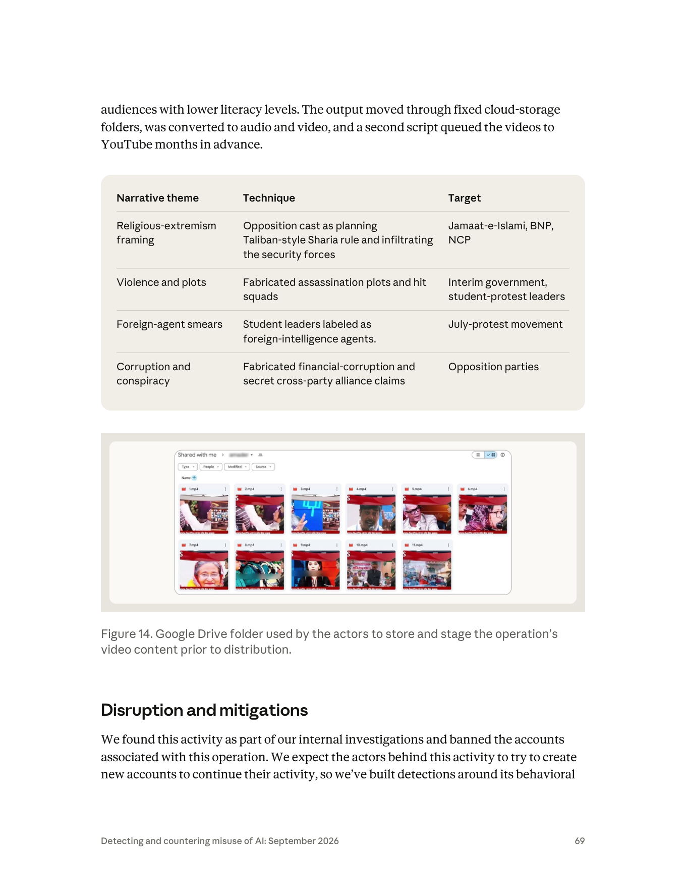
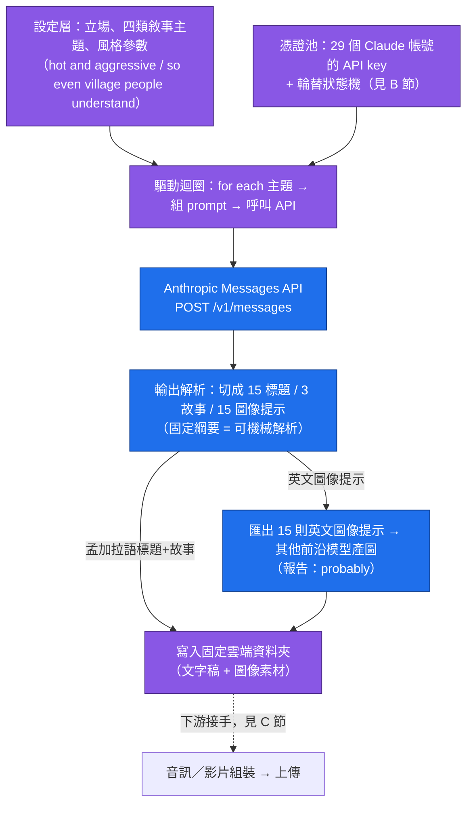
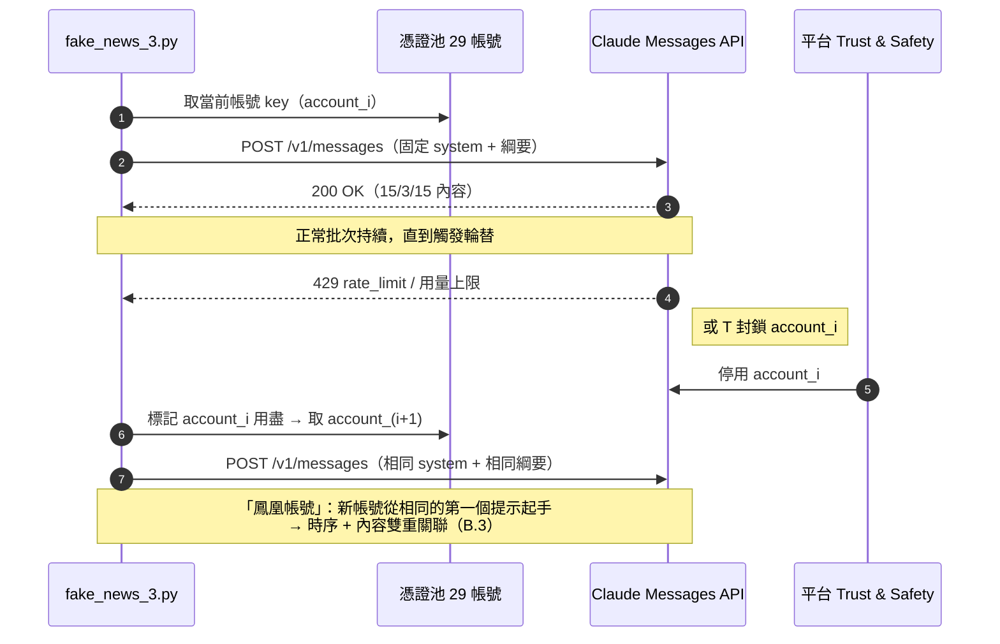
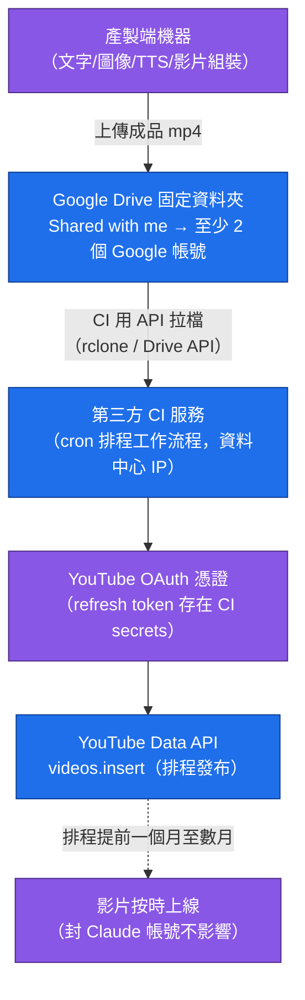
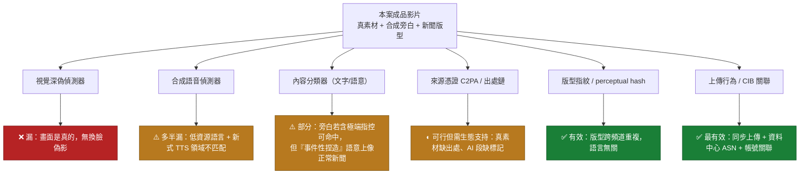

# GTG-54006：孟加拉親 Awami League（人民聯盟）的自動化假新聞行動——單一操作者、29 個帳號、鎖定低識字率鄉村受眾

> 課程模組：02 影響力行動（Influence operations） ｜ 一手來源：PDF p.67–70 ｜ 整理日期：2026-09-13

---

## 1. 一頁速覽

- **這個案例在課程裡要教什麼**：一個沒有組織、沒有金流、沒有國家背景的**單一個人**，如何用一支自製 Python 腳本 + 29 個輪替的 Claude 帳號，打出過去需要一整個「內容工廠」才有的假新聞產量；以及平台端要靠什麼**行為簽章**（而不是靠關鍵字）才抓得到這種人。
- **行為者**：一名位於孟加拉北部 **Gaibandha 縣**的操作者，在約 **16 個月**內輪替使用 **29 個 Claude 帳號**，以規避平台限制與偵測（p.67、p.70）。
- **工具鏈**：自製程式 **`fake_news_3.py`**（檔名即自曝意圖，且 `_3` 表示至少第三次迭代）直接呼叫 Claude API，每批固定產出 **15 則孟加拉語標題 + 3 篇詳細假故事 + 15 則英文圖像生成提示**；另有一支**上傳腳本**透過 YouTube API 批次排程發布，並經第三方持續整合（CI）服務中轉以遮蔽 IP（p.67、p.68、p.70）。
- **產量**：至少 **1,500 則標題、300 篇假敘事、1,500 則圖像提示**（p.67）——換算即至少 **100 次批次執行**。Claude 當時沒有圖像生成功能，圖像提示「很可能」被匯出到其他前沿模型產圖（p.67）。
- **受眾與媒介**：內容轉成**音訊與影片**，經固定的雲端資料夾（Google Drive，Figure 14）暫存，再以 Facebook Live、YouTube、TikTok 直播「連續循環」推送給**識字能力有限的鄉村 Awami League 支持者**；操作者內部說法是要「hot and aggressive」、「so even village people understand」，並寫下「no one knows the news is fake」（p.67–68）。
- **敘事**：一律親 Awami League，攻擊 BNP、Jamaat-e-Islami、National Citizens Committee／NCP、過渡政府與學運領袖——指控對手是外國特務、要推行塔利班式統治、策劃暗殺、貪腐與秘密結盟（p.68–69）。
- **歸因的關鍵句**：儘管敘事完全對 Awami League 有利，「our investigation found no proof that the party itself was involved in directing or funding the network's activity」（p.67–68）；部分敘事也「aligned with pro-Indian geopolitical interests」，但「no evidence of any state direction or funding」（p.68）。
- **影響評級**：Breakout Scale **Category Three**——多平台、多個孟加拉導向頻道出現符合本行動產出的影片；但 Anthropic 找不到發布全部產出的頻道，也沒有證據顯示內容擴散到這些帳號之外（p.68）。
- **處置**：封鎖相關帳號、針對其行為簽章建立偵測、與分發平台及夥伴分享指標；雲端資料夾識別碼與上傳腳本「保留供夥伴分享」（p.69–70）。
- **情報屬性**：截至 2026-09-13，所有第三方報導都只是轉述 Anthropic，沒有任何獨立查證──這是**單一來源情報**。

---

## 2. 行為者側寫與歸因

### 2.1 報告提供的身分線索

| 線索類型 | 報告內容 | 頁碼 | 分析備註 |
|---|---|---|---|
| 地理位置 | 「A single actor based in Gaibandha District in Bangladesh」；指標表：「Single Bangladesh-based actor (Gaibandha District)」 | p.67、p.70 | 用的是**直陳句**，沒有 suspected / likely 等保留語。Anthropic 對帳號註冊資料、IP、付款資訊有第一手掌握，所以定位到「縣」層級的信心通常很高；但報告沒有說明是靠哪一種資料定位的。 |
| 人數 | 「A single actor」（p.67）、「Single ... actor」（p.70）；但同時也出現複數「The actors were fully aware」（p.67）、「used by the actors」（Figure 14 圖說，p.69）、「We expect the actors behind this activity」（p.69） | p.67、p.69、p.70 | 單複數不一致。最合理的讀法：**一個人操作**，但報告撰寫者在通用段落沿用了「actors」的慣用複數。課堂上要提醒學員：這種措辭不一致本身就是需要被記錄的「情報品質訊號」。 |
| 帳號規模 | 29 個 Claude 帳號、約 16 個月 | p.67、p.70 | 平均每 16–17 天就換一個帳號。可能原因：被封、觸及用量上限、或每個新帳號有免費額度（報告未說明）。 |
| 語言 | 產出為孟加拉語（Bengali）新聞；圖像提示為英文 | p.67、p.70 | 一次 API 呼叫同時輸出孟加拉語 + 英文，是很有特色的**雙語輸出結構**——這對平台端做提示／輸出分群是高價值特徵（見 2.4）。 |
| 內部通訊 | 「no one knows the news is fake」、「hot and aggressive」、「so even village people understand」 | p.67、p.68 | 報告稱這些出自「internal communications」與操作者的描述，但**沒有說明**這些文字是操作者寫給 Claude 的提示、程式碼註解、還是其他管道取得。最合理推測是提示或與 Claude 的對話（見第 8 節）。 |
| 代號／handle | 無。僅有 Anthropic 內部代號 GTG-54006 | — | 報告不揭露帳號名、頻道名、Google 帳號；雲端資料夾識別碼與上傳腳本被列為「Held for partner share / Withheld」（p.70）。 |
| 技術能力 | 會寫 Python、串 Claude API、串 YouTube Data API、會用 CI 服務排程與中轉 | p.67、p.68、p.70 | 中等技術能力。報告**沒有說**這些腳本是否由 Claude 協助撰寫；但這是本報告其他案例反覆出現的模式（p.43「AI helped to build the apparatus as well as the content」）。 |
| 動機 | 政治性（親 Awami League）；無政黨或國家資助證據 | p.67–68 | 報告把它歸類為「on behalf of an opposition party rather than the government」（p.67）——注意這是描述**受益者**，不是描述**指揮者**。 |

### 2.2 歸因措辭：報告用了哪些詞、在情報學上各代表什麼

情報分析寫作有兩個彼此獨立的軸：**事件發生的可能性**（likelihood：almost certainly / probably / roughly even chance / unlikely）與**分析者對自己判斷的信心**（confidence：high / moderate / low）。美國 ICD 203 等分析標準要求兩者分開陳述，因為「我很有信心地認為這件事大概只有五成機率」是合法且常見的判斷。本案報告的關鍵句可以這樣拆：

| 報告原句 | 措辭類型 | 情報學意義 |
|---|---|---|
| 「A single actor based in Gaibandha District in Bangladesh ran the operation」（p.67） | **直陳事實**（無保留語） | 等同高信心。Anthropic 的優勢是掌握平台第一手資料（註冊、付款、IP、裝置），這是外部研究者做不到的。 |
| 「these prompts were **probably** exported to other AI frontier models」（p.67） | **可能性判斷**（probably） | 中高可能性，但沒有直接證據——Anthropic 看不到 Claude 以外的平台。這句同時揭露一個結構性盲點：多模型串接的行動，任何單一供應商都只看得到自己那一段。 |
| 「our investigation found **no proof** that the party itself was involved in directing or funding」（p.67–68） | **證據缺席**（absence of evidence） | 不是「證明無涉」。Anthropic 的資料只涵蓋 Claude 平台，看不到金流、看不到政黨內部通訊。這句話的正確讀法是：「在我們能看到的範圍內，沒有找到指揮或資助的證據」。 |
| 「Some content narratives ... aligned with pro-Indian geopolitical interests. However, we found **no evidence** of any state direction or funding」（p.68） | **敘事一致 ≠ 歸因** | 影響力行動分析的基本紀律：內容對誰有利（cui bono）只是假說生成的起點，不是歸因結論。 |
| 「Using the Breakout Scale, **we would assess** this operation as Category Three」（p.68） | **分析判斷**（assess） | 「assess」在情報寫作是標準的判斷動詞，表示這是分析者的評估而非觀測事實。 |
| 「We **expect** the actors behind this activity to try to create new accounts」（p.69） | **預測** | 對未來行為的預期，作為建立行為簽章偵測的理由。 |

**對比本報告其他案例的用語**：同一份報告對俄羅斯、伊朗案例使用「suspected state-sponsored」（p.3）、「consistent with」（p.75 對 Kenya 案例：「consistent with a single, coordinated ...」）等保留語，而對本案的操作者位置用直陳句、對政黨涉入用「no proof」——這種差別本身就在告訴讀者：**Anthropic 對「誰在按鍵盤」很確定，對「誰在背後」完全沒有把握**。

### 2.3 「支持者自發」與「政黨指揮」的歸因區別

這是本案最值得在課堂上花時間的分析問題。把歸因想成一個階梯：

| 階梯 | 需要的證據 | 本案是否達到 | 依據 |
|---|---|---|---|
| L0 敘事受益（cui bono） | 內容一律對某方有利 | **是** | 「uniformly pro-Awami League」（p.68） |
| L1 自我認同 | 行動者以支持者自居、鎖定同溫層 | **是（間接）** | 目標受眾是「rural Awami League supporters」（p.67）；操作者把受眾當自己人在餵養 |
| L2 協調訊號 | 與政黨官方訊息同步、共用素材、官方帳號放大 | **未提及** | 報告沒有任何一句提到 AL 官方頻道轉發或素材共用 |
| L3 指揮 | 政黨人員下達指示的通訊證據 | **否** | 「no proof that the party itself was involved in directing」（p.68） |
| L4 資助 | 金流 | **否** | 「... or funding」（p.68） |

**為什麼這個區別重要：**

1. **法律與政策後果不同。** 若是政黨指揮，這是政黨的違法行為（在孟加拉，2025 年 5 月起 Awami League 的一切活動——含線上活動——已依《反恐怖主義法》被禁止；見 3.4 節）；若是支持者自發，責任只在個人。錯誤歸因會被用來做政治打擊。
2. **對照 Meta 2024 年的案例可以看出差異。** Meta 在 2024 年第一季《Adversarial Threat Report》移除源自孟加拉的 50 個 Facebook 帳號與 98 個專頁（約 340 萬追蹤者），並明確指出「found links to individuals associated with the AL and its research wing, the Center for Research and Information (CRI)」（The Daily Star 轉述 Meta 報告，見第 9 節）。那是 L2–L3 等級的歸因；本案 Anthropic 只到 L0–L1。同樣是「親 AL 假訊息」，歸因強度天差地遠，課堂上要讓學員能分辨。
3. **「沒有找到證據」的邊界要講清楚。** Anthropic 看得到：帳號註冊資料、付款方式、API 呼叫內容、與 Claude 的對話。Anthropic 看不到：操作者的銀行帳戶、Telegram/WhatsApp 通訊、與政黨的關係、影片上線後的觸及。所以「no proof of funding」是在一個**結構性看不到金流的視角**下說的——它的證明力遠低於執法機關調閱金流後說「查無金流」。
4. **敘事對印度有利也不是歸因。** 報告特別點出部分敘事「aligned with pro-Indian geopolitical interests」（p.68），這在孟加拉語境非常敏感（Awami League 與印度長期親近、Sheikh Hasina 自 2024 年 8 月起流亡印度；Jamaat 陣營的競選內容則大量反印）。孟加拉媒體 TBS 的報導特別用一整節「No evidence of Indian direction」處理這一點，指出 Anthropic「did not name any Indian individual, organisation or platform」（見第 9 節）。這是媒體正確處理歸因邊界的範例。

### 2.4 帳號輪替作為規避手段，以及平台端能抓的訊號

報告只用一句話交代：「rotating through 29 Claude accounts to evade platform limits and detection」（p.67）。但這一句對偵測工程的意義很大，值得展開。

**輪替想規避的是什麼：**

- **用量／速率限制**：每個帳號的 API 額度、每分鐘請求數、月消費上限。29 個帳號 16 個月，很可能每個帳號都只用到觸頂或被封為止。
- **帳號層級的封鎖**：Trust & Safety 的處置單位通常是「帳號」；只要封鎖是以帳號為單位，換帳號就重置了偵測狀態。
- **可能的免費額度套利**（報告未提，屬課程推論）：若新帳號附帶試用額度，輪替本身就是一種低成本取得算力的方式。

**平台端能用來把 29 個帳號連成一個行為者的訊號**（這正是報告所說「built detections around its behavioral signatures」（p.69）可能的內涵；報告沒有列出細節，以下是偵測工程的通用做法）：

| 訊號層 | 具體特徵 | 為什麼難以規避 |
|---|---|---|
| 裝置／客戶端指紋 | API 呼叫的 User-Agent（例如 SDK 名稱與版本字串）、TLS 指紋、HTTP 標頭順序、請求參數組合（model、max_tokens、temperature、system prompt 雜湊） | 同一支 `fake_news_3.py` 從同一台機器發出，這些欄位在 29 個帳號間幾乎完全相同 |
| 付款方式 | 同一張卡／同一個虛擬卡發行商、相同帳單姓名格式、相同國碼電話 | 孟加拉一般使用者取得國際信用卡並不容易，付款工具的多樣性有限 |
| 網路位置 | 同一 ASN／同一行動網路業者的 IP 段、同一時區的活動節奏、VPN 出口重複 | 若用 VPN 反而會產生「註冊地在孟加拉、流量從他國資料中心來」的矛盾 |
| 提示重複度 | 固定批次結構（15/3/15）意味著 system prompt 或使用者提示幾乎逐字重複；對提示做雜湊或嵌入相似度，29 個帳號會聚成一團 | 要規避就得改寫提示，但改寫會影響輸出格式，破壞下游腳本的解析 |
| 輸出結構 | 每次回應都是「15 則孟加拉語標題 + 3 篇故事 + 15 則英文提示」——這種**輸出綱要（schema）**在合法使用者中極為罕見 | 這是操作者自己設計的，改了就要重寫整條管線 |
| 時序關聯 | 帳號 N 被封或觸頂後數小時內帳號 N+1 開始活動，且從相同結構的第一個提示開始 | 「鳳凰帳號」（phoenix account）模式是帳號輪替最經典的破綻 |
| 內容實體 | 輸出中的命名實體高度集中（BNP、Jamaat、NCP、Yunus、學運領袖姓名等）與敘事主題四大類（p.69 表） | 不同帳號、相同主題、相同立場、相同語言——就是同一個行動 |

課堂上要強調的推理：**單一訊號都可以被規避（換卡、換 VPN、改 UA），但操作者的「產線」要求穩定的輸入輸出格式，這種穩定性就是最難規避的簽章。** 偵測工程的目標不是抓「壞字」（fake news），而是抓「產線的形狀」。

### 2.5 一個旁註：GTG 編號

報告在 p.4 說明 GTG（Generative Threat Group）是 Anthropic 的內部代號，但沒有解釋編號規則。觀察本報告的影響力行動案例：GTG-04001（俄羅斯，中非，p.44）、GTG-54002（跨洲商業影響力即服務，p.47）、GTG-84005（馬來西亞選舉操縱平台，p.53）、GTG-24015（俄羅斯國家媒體，p.58）、GTG-34001（伊朗三機構，p.62）、GTG-54006（孟加拉，p.67）、GTG-84006（MEK/NCRI，p.70）、GTG-54004（肯亞，p.75）、GTG-84002（UAE，p.78）。九個案例的**第二位數字全是「4」**，第一位數字則有 0／5／8／2／3 等變化。但這個模式**不能用來判斷案例類型**——監控章節的 GTG-54009（p.82）、GTG-14010（p.86）等同樣是第二位「4」。**這只是觀察，報告未證實編號規則**；提出來是提醒學員：情報產品的代號往往含有分類資訊，但在沒有規則書的情況下，從編號反推分類非常容易出錯。

### 2.6 橫向比較：本案在報告九個影響力行動案例中的位置

把 GTG-54006 放回整個影響力行動章節（p.41–80）看，它的特殊性才會清楚。

| GTG | 案名重點 | 誰在背後 | 規模與資源 | AI 的角色 | Breakout | 頁碼 |
|---|---|---|---|---|---|---|
| 04001 | 俄羅斯在中非共和國的 FIMI 行動 | **國家**（俄羅斯機構） | 實體廣播電台 98.9 FM + 文化中心 + 偽造政府文件 | 簡報、合約、腳本、圖像、貼文 | **Four**（p.45） | p.44–47 |
| 54002 | 橫跨六大洲的商業「影響力即服務」 | **付費客戶** | 跨洲客戶、假新聞網站與社群資產 | 原創假文章、改寫真記者文章 | Two（p.48） | p.47–52 |
| 84005 | 鎖定馬來西亞的商業選舉操縱平台 | **付費客戶** | 選區鎖定系統、假帳號網路、合成新聞網站 | 建系統、跑帳號網路、洗稿、做假檔案 | Two（p.54） | p.53–57 |
| 24015 | 俄羅斯國家媒體的編輯管線 | **國家**（俄羅斯國家媒體） | 國家媒體體系；四個帳號 | 把新聞、民調、在野黨貼文轉為俄語敘事 | —（未給評級） | p.58–61 |
| 34001 | 伊朗三個國家關聯宣傳機構 | **國家**（ICCO、伊斯蘭宣傳辦公室、Bina） | 三個機構、內容工廠、付費放大頻道 | 內容生產、代號化專案管理 | Three（p.63） | p.62–67 |
| **54006** | **孟加拉親 AL 自動化假新聞** | **無**（無政黨、無國家指揮或資助證據） | **1 人 + 29 帳號 + 2 支腳本** | **固定綱要批次產文（15/3/15）** | **Three（p.68）** | **p.67–70** |
| 84006 | MEK/NCRI 關聯的分散式行動 | **政治組織**（流亡反對運動） | 共享 AI 代理平台、冒用真人 Telegram 帳號 | **代理式**：讀約 8,400 則貼文模仿文風、即時對話 | Two（p.71） | p.70–75 |
| 54004 | 肯亞國內協同性不真實行為 | **單一行為者**（疑為本地政治造勢） | **1 人 + 1 個帳號** | 批次「人性化」每次恰好 50 則推文 | **One**（p.76） | p.75–77 |
| 84002 | UAE 指揮、針對穆斯林兄弟會與聯合國問責機制 | **國家**（UAE 指揮） | 約 300 個影響者帳號、門面 NGO、教義檔 | 情報簡報、代筆證詞、目標檔案 | Three（p.79） | p.78–80 |

**五個可以從這張表讀出的結論：**

1. **本章節有兩個「單一行為者」案例：GTG-54006（孟加拉）與 GTG-54004（肯亞）。把它們並排，才看得出 AI 給個人的槓桿有多大差異。**

   | | GTG-54004（肯亞） | GTG-54006（孟加拉） |
   |---|---|---|
   | 帳號數 | **1 個** | **29 個（輪替）** |
   | 持續時間 | 「several sessions」（數個會期） | **約 16 個月** |
   | 產出單位 | 每批恰好 50 則推文 | 每批 15 標題 + 3 故事 + 15 圖像提示 |
   | 媒介 | **純文字（推文）** | **音訊 + 影片 + 直播** |
   | 自動化 | 人在對話介面上逐批操作 | **自製腳本直接呼叫 API** |
   | 分發 | 單一平台的假帳號網路 | 三平台的多個頻道 |
   | Breakout | **One**（完全困在假帳號網路內，未觸及真人） | **Three** |

   **差別不在「有沒有用 AI」，而在「有沒有把 AI 接進一條自動化產線、並選對了媒介」。** 同樣是一個人、同樣是批次生成，肯亞案停在 Category One，孟加拉案達到 Category Three。這是全報告中對「AI 給個人多少槓桿」最乾淨的對照組，強烈建議在課堂上並排呈現。

2. **GTG-54006 是全章節唯一「沒有任何委託者」的案例。** 其他八案背後都有國家、政黨、商業客戶或政治組織——連肯亞案，報告都指出其模板「also used, verbatim, for the marketing of retail brands」，並連結到「agencies pay local influencers」的在地產業模式（p.76）。**只有孟加拉案，報告找不到任何委託、指揮或資助的痕跡。**

3. **資源投入與影響評級沒有線性關係。** GTG-54002（跨六大洲的商業公司）只有 Category Two；GTG-84005（有選區資料庫、有假帳號網路的選舉操縱平台）也只有 Category Two；GTG-54004（完整假帳號網路）只有 Category One。**能不能突破，取決於內容是否進入真實社群，而不是投入多少錢。** 而一個人的孟加拉行動達到 Category Three，與伊朗三個國家機構聯手（GTG-34001）、UAE 國家指揮（GTG-84002）相同。**這句話應該直接寫在課程投影片上：一個人達到了三個國家級機構的影響評級。**

4. **本案是自主程度最低、自動化程度最高的組合。** 對比 GTG-84006 的「Viktor」共享代理平台（讀約 8,400 則 Telegram 貼文、模仿文風、即時與真人對話），本案的 Claude 只做一次性的批次生成，不使用工具、不做多步規劃。**自動化（automation）與自主性（agency）是兩個獨立的軸——本案在自動化軸上很高，在自主性軸上很低。** 很多公共討論把兩者混為一談，導致低估了「笨但自動」這一類威脅。

5. **本案是唯一沒有記載模型拒絕的影響力行動案例。** GTG-04001（p.45）、GTG-84005（p.55、p.57）都明確記載了拒絕與行為者的繞行方式；本案沒有。這個沉默的意義見 8.3。

---

## 3. 受害者與目標清單

### 3.1 政治攻擊目標（報告明列）

| 目標 | 報告中的敘事／技術 | 頁碼 |
|---|---|---|
| Bangladesh Nationalist Party（BNP，孟加拉民族主義黨） | 被描繪為策劃塔利班式伊斯蘭法統治、滲透安全部隊；被指控貪腐、秘密跨黨結盟 | p.68、p.69 表 |
| Jamaat-e-Islami（伊斯蘭大會黨） | 同上（宗教極端主義框架） | p.68、p.69 表 |
| National Citizens Committee（p.68）／NCP（p.69 表） | 同上；學運出身的政治力量 | p.68、p.69 表 |
| 過渡政府（interim government） | 捏造暗殺陰謀與殺手小組（hit squads） | p.68、p.69 表 |
| 學運領袖（student-protest leaders） | 捏造暗殺陰謀；貼上「外國情報機構特務」標籤 | p.68、p.69 表 |
| 七月抗爭運動（July-protest movement） | 外國特務抹黑 | p.69 表 |
| 泛稱「opposition parties」 | 捏造財務貪腐與秘密跨黨結盟 | p.69 表 |

**名稱備註**：報告 p.68 寫「National Citizens Committee」、p.69 表寫「NCP」。依公開資訊，七月抗爭的學生領袖於 2024 年 9 月成立 Jatiya Nagorik Committee（National Citizen Committee），並於 2025 年 2 月 28 日以此為基礎成立政黨 National Citizen Party（NCP）。報告同時使用兩個名稱，可能反映行動期間橫跨了這個組織的轉型，也可能只是撰寫不一致。

### 3.2 受眾也是受害者

本案有一層很多影響力行動沒有的特徵：**被鎖定的受眾是行動者「自己這一邊」的人**。操作者不是在說服中間選民，而是在餵養「rural Awami League supporters with limited literacy」（p.67）——用捏造的暗殺陰謀、外國特務、塔利班統治等敘事把自己的支持者推向更激化的認知。操作者自己的話是內容要「hot and aggressive」（p.68），並且「explicitly targeted the audience under the assumption that they believed the content was authentic news」（p.68）。

從危害分析的角度，這種「對內動員型」假訊息的受害者清單至少包括：

1. **被餵養的鄉村支持者**：被剝奪了做出知情政治判斷的能力；在孟加拉 2025 年 5 月後的法律環境下，公開支持 Awami League 甚至可能招致法律風險（見 3.4），被激化的支持者承擔的風險是真實的。
2. **被抹黑的個人**：學運領袖被指為外國特務、過渡政府成員被捏造成暗殺目標或發起者——這在剛經歷 2024 年大規模流血衝突的社會裡不是抽象傷害。
3. **孟加拉的資訊環境**：報告 p.43 描述的「Laundering of attribution, sourcing, and certainty」在本案表現為**假冒新聞格式**（Figure 14 的縮圖全部是電視新聞版型，見第 6 節），侵蝕的是「新聞」這個類別本身的可信度。
4. **平台**：Facebook、YouTube、TikTok 被當成免費的廣播塔；Google Drive 被當成免費的內容倉庫；某個 CI 服務被當成免費的代理伺服器。

### 3.3 具體數字

| 項目 | 數字 | 頁碼 | 換算／備註 |
|---|---|---|---|
| Claude 帳號 | 29 | p.67、p.70 | 約 16 個月 → 平均每 16–17 天一個新帳號 |
| 行動時長 | 約 16 個月 | p.70 | 報告未給起訖日期（見 3.4 的推算） |
| 每批產出 | 15 標題 + 3 故事 + 15 圖像提示 | p.67、p.70 | 固定綱要 |
| 累計產出 | ≥1,500 標題、≥300 敘事、≥1,500 圖像提示 | p.67 | 三個數字都恰好是每批的 100 倍 → **至少 100 次批次執行**。這也暗示 Anthropic 的計數是「看到的批次 × 綱要」，而非逐條清點 |
| 平均節奏 | 約 100 批 / 16 個月 ≈ 每月 6 批，約每 5 天一批 | 課程推算 | 以 API 用量而言其實不大——這說明**本案的偵測訊號不是「量」，而是「形狀」** |
| 分發平台 | 3（Facebook Live、YouTube、TikTok） | p.67、p.68 | 影片在三個平台的多個孟加拉導向頻道／個人檔案出現 |
| 觸及 | 未量化 | p.68 | 「no evidence that the content reached a wider audience outside of these accounts」 |
| Figure 14 可見影片 | 11 個 mp4 | p.69 圖 | 單一資料夾的一次快照，不代表總量 |

### 3.4 孟加拉政治背景（WebSearch 查證，2026-09-13）

理解本案必須先知道：**Awami League 不是執政黨，而是被禁止活動的前執政黨**。報告只用一句話交代（「out of power since the July 2024 uprising」，p.67），以下是課程需要的完整時間軸：

| 時間 | 事件 | 來源 |
|---|---|---|
| 2024-07 | 學生發起配額改革抗爭，演變為全國性起義；聯合國人權高專辦估計 7 月中至 8 月 5 日期間可能多達 1,400 人死亡 | Al Arabiya（2026-02-04）引述；OHCHR 2025 年 2 月報告 |
| 2024-08-05 | Sheikh Hasina 辭職並逃往印度，至今留在新德里 | HRW、CNN（2025-11-17） |
| 2024-08-08 | 諾貝爾和平獎得主 Muhammad Yunus 出任過渡政府首席顧問 | Wikipedia「Interim government of Muhammad Yunus」 |
| 2024-09 | 學運領袖成立 National Citizen Committee | 公開資訊 |
| 2025-02-28 | 以此為基礎成立 National Citizen Party（NCP） | 公開資訊 |
| 2025-05-10／12 | 過渡政府依《反恐怖主義法》禁止 Awami League 一切活動（含線上），直至國際罪行法庭審判結束；選委會暫停其政黨登記。政府顧問警告在社群媒體公開表態支持 AL 可能被捕 | The Diplomat（2025-05）、Wikipedia「2025 Awami League ban protests」、Malay Mail（2025-05-13） |
| 2025-11-17 | 國際罪行法庭（ICT-1）以危害人類罪缺席判處 Hasina 死刑（前內政部長 Asaduzzaman Khan Kamal 同判死刑）；印度未回應引渡要求；Amnesty 對審判公正性提出質疑 | HRW、CNN、newsonair（2025-11-17／18） |
| 2026-02-12 | 第 13 屆國會大選，Awami League 被排除；BNP 聯盟贏得 299 席中的 212 席，Jamaat 聯盟 77 席；「七月憲章」公投 60.26% 同意 | Al Jazeera（2026-02-13、02-14） |
| 2026-02-16／17 | Yunus 辭職；Tarique Rahman 就任總理 | Al Jazeera（2026-02-16） |
| 2026-02-28 | Prothom Alo 報導 AL 在大選後重開十多個黨部，領導層「基本上在印度」、正在試探新政府態度 | Prothom Alo（2026-02-28） |
| 2026-09-10 | Anthropic 發布本報告 | 本報告 p.1 |

**行動時間窗的推算**（報告未給日期，以下為課程推論）：報告涵蓋 2025 年 12 月至 2026 年 8 月處置的活動（p.3）。若處置在 2026 年 8 月，往前推 16 個月是 2025 年 4 月；若處置在 2025 年 12 月，往前推是 2024 年 8 月。無論如何，行動**起於 2024 年 7–8 月起義之後**，這與內容攻擊「過渡政府」與「學運領袖」一致；並且**很可能橫跨了 2025 年 5 月的禁黨令、2025 年 11 月的死刑判決，甚至 2026 年 2 月的大選**。也就是說，這條假新聞產線運轉的期間，正是 Awami League 在法律上被禁止從事任何線上政治活動的期間——這讓「支持者自發 vs 政黨指揮」的歸因問題（2.3 節）有了實際的法律後果。

**Gaibandha 縣背景**：位於孟加拉北部 Rangpur 專區，2022 年普查人口約 256 萬；7 歲以上識字率 **67.0%**（男 70.3%、女 64.0%），低於全國水準（2022 年普查全國 7 歲以上識字率約 74–75%；此全國數字為外部查證所得，報告未提）；**84.5% 人口居住於農村**；農民與農業勞工合計超過七成，屬河中沙洲（char）地帶、歷史上季節性饑荒（monga）頻發的貧困地區（Wikipedia「Gaibandha District」引 2022 年普查；Banglapedia 的舊普查數字為 42.8%，反映的是更早年度）。操作者身處的環境，與他鎖定的「識字有限的鄉村受眾」是同一個環境——他很清楚自己在對誰說話。

**資訊環境背景**：截至 2025 年 11 月，孟加拉約有 1.3 億網路使用者（人口 1.76 億的 74%），Facebook 約 6,400 萬、YouTube 約 5,000 萬、TikTok 18 歲以上 5,600 萬以上使用者（Al Jazeera，2026-01-22）；另有統計顯示 2025 年智慧型手機普及率從 63.3% 升至 72.8%（DataReportal 相關彙整）。Meta 在孟加拉有第三方事實查核夥伴（AFP、FactWatch、Boom），**YouTube 與 X 沒有同類機制**（The Business Standard 專題）。2026 年 2 月大選期間，Dismislab 在投票前查核 30 則假訊息、Rumor Scanner 27 則，The Daily Star 記錄投票前夜至投票結束共 100 則假訊息，形式包括 AI 深偽、翻新舊內容、假冒 Prothom Alo、Jamuna TV 等主流媒體版型的假「photocard」（The Daily Star，2026-02）。**本案的「假新聞版型影片」正好落在這個生態的盲區：鄉村、音訊影片、直播、YouTube／TikTok。**

### 3.5 專題：為什麼鎖定低識字率受眾一定要用音訊與影片

這是本案在課程上最容易被低估、但分析價值最高的一層。報告把它壓縮成一句話：

> 「The output moved through fixed cloud-storage folders, **was converted to audio and video**, and a second script queued the videos to YouTube months in advance.」（p.69）

這句話看起來只是描述一個技術步驟。實際上它是**整個行動的戰略核心**。

#### 3.5.1 媒介轉換是為了跨過受眾無法跨過的那道門檻

拆解操作者的邏輯鏈：

1. **目標受眾**：「rural Awami League supporters with **limited literacy**」（p.67）。
2. **內容規格**：要「hot and aggressive」、簡單到「so even village people understand」（p.68）。
3. **受眾的結構性限制**：識字有限 → **無法閱讀文字新聞，也無法閱讀任何澄清、更正或事實查核**。
4. **AI 的產出本質**：Claude 產出的是**文字**（15 則標題 + 3 篇報導）。
5. **矛盾**：產線的產出（文字）與受眾的能力（不讀字）不相容。
6. **解法**：**把文字唸出來、配上畫面。**

所以「converted to audio and video」不是後製美化，而是**讓整條產線能夠對準目標受眾的唯一辦法**。沒有這一步，前面的 1,500 則標題與 300 篇報導對這群人等於不存在。

**這個推理反過來就是偵測與防禦的起點**：當你看到一個影響力行動在做媒介轉換（文字 → 語音 → 影片），要立刻問「它想觸及的是哪一群無法消化原始形式的人？」**媒介選擇會洩漏受眾選擇，而受眾選擇會洩漏行動意圖。**

#### 3.5.2 音訊與影片對這類受眾的四個額外優勢

除了「能被消化」之外，音訊與影片還帶來四個文字沒有的效果：

| 優勢 | 機制 | 為什麼對低識字受眾特別強 |
|---|---|---|
| **降低認知負荷** | 聽比讀省力；影像自動吸引注意 | 對不習慣閱讀的人，讀一段文字需要刻意努力，而努力本身會促成懷疑與停頓；聽則是被動接收 |
| **母語的親近感** | 語音承載口音、語調、方言 | 一段地道的在地口音旁白會觸發「這是自己人」的直覺信任；書面標準語做不到這件事 |
| **權威形式的挪用** | 電視新聞的視覺文法（台標、標題條、主播、跑馬燈） | 對主要透過電視接收新聞的人，「看起來像新聞台」**就是**查核程序的全部。見 6.1.5 |
| **情緒傳遞** | 語氣、音樂、剪輯節奏 | 操作者要的是「hot and aggressive」——憤怒與恐懼靠聲音傳遞的效率遠高於文字 |

#### 3.5.3 直播（livestream）而不只是上傳——為什麼這個細節重要

報告用的字是「a continuous cycle of Facebook Live, YouTube, and TikTok **livestreams**」（p.67），不是 videos。把預錄影片以直播形式循環播放，帶來三個額外效果：

1. **模仿「正在播出的新聞頻道」**。對習慣看電視的受眾來說，「直播中」比「一支上傳的影片」更像真的，因為真的新聞台就是一直在播。
2. **演算法紅利**。多數平台對直播內容給予額外的推播與通知權重。
3. **證據的暫時性**——**這是對事實查核最致命的一點**。直播結束後若不存檔，**查核者連可以查核的對象都沒有了**。你無法為一段已經消失的內容寫查核報告，也無法要求平台下架一則已經播完的直播。

**對防守方的推論**：偵測「以直播循環播放固定長度預錄內容」的行為（畫面無變化、無即時互動、固定週期重啟），比事後查核有效得多——因為事後根本來不及。

#### 3.5.4 這類受眾的事實查核可及性接近於零

這是本案最應該被講清楚的社會事實。把查核流程拆成五個必要步驟，逐一檢查目標受眾能不能完成：

| 步驟 | 一般網路使用者 | 本案的目標受眾 |
|---|---|---|
| 1. **產生懷疑** | 看到不尋常的說法會停頓 | 內容刻意設計成符合既有政治情緒（「hot and aggressive」），不觸發懷疑；而且操作者明確假設「they believed the content was authentic news」（p.68） |
| 2. **知道有查核機構存在** | 多數人知道 | 查核機構的能見度集中在都市與精英媒體圈 |
| 3. **找到查核內容** | 上網搜尋 | **需要打字搜尋——識字有限者在此直接卡住** |
| 4. **讀懂查核報告** | 可以 | **查核報告是文字、書面、正式語體——讀不了** |
| 5. **相信查核勝過原內容** | 視信任而定 | 原內容是母語語音 + 熟悉的視覺權威；查核是陌生機構的書面文字。**信任競爭從一開始就不對等** |

**五個步驟中，第 3、4 步對這群受眾是硬性障礙。** 換句話說：**即使查核機構做出了完美的查核，這則查核在物理上到不了受害者面前。**

孟加拉的環境資料讓這件事更具體（見 3.4）：
- **平台層的缺口**：Meta 在孟加拉有三家認證查核夥伴（AFP、FactWatch、Boom），**YouTube 與 X 沒有同類機制**。而本案的主力正是 **YouTube 與 TikTok**。
- **量能的缺口**：2026 年 2 月大選期間，Dismislab 投票前查核 30 則、Rumor Scanner 27 則，The Daily Star 記錄 100 則。**這是以「則」為單位的量能，面對的是以「千則」為單位的產能（≥1,500 標題、≥300 敘事）。** 供需差距是兩到三個數量級。
- **語言的缺口**：孟加拉語有約 2.3 億母語者，卻在自然語言處理與內容審核上仍屬相對低資源語言。
- **地理的缺口**：查核組織位於首都，受眾在北部農村。

**這四個缺口疊加起來，就是操作者選擇這群受眾的真正原因——不是因為他們好騙，而是因為他們沒有被保護。**

#### 3.5.5 這對偵測與防禦策略的三個直接推論

1. **對這類行動，「事後查核」不是有效防線，必須前移到「產製端」與「分發端」。**
   - 產製端：AI 供應商偵測產線簽章（本案的 15/3/15 綱要）。
   - 分發端：平台偵測同版型影片跨頻道同步上線。
   - 兩者都不需要理解內容，也不需要受眾具備任何能力。
2. **偵測不應依賴語音或語言分析，而應依賴語言無關的訊號。** 低資源語言的語音分析能力最弱，正好是行動者選擇的地方。反過來，**影片版型指紋、上傳時序、帳號關聯這些訊號完全與語言無關**——這是防守方應該集中投資的方向。
3. **查核產品必須跟著受眾的媒介走。** 如果假訊息是母語語音短影片，查核就必須是母語語音短影片；如果傳播通路是在地社群網絡，查核就必須進入在地社群網絡。**一則純文字、書面語的查核報告，對本案的受害者而言等於不存在。** 這一點直接對應到第 10.4 節對台灣的建議。

---

## 4. AI 濫用的攻擊生命週期（逐階段拆解）

報告的「Attack lifecycle and AI usage」段落只有一段（p.68–69），加上 Key findings（p.68）與指標表（p.70），可以重建出下面的產線。每一階段標示「人類做什麼／Claude 做什麼／自主程度」。

### 4.1 階段表

| # | 階段 | 人類做什麼 | Claude（或其他 AI）做什麼 | 自主程度 | 依據 |
|---|---|---|---|---|---|
| 1 | 戰略設定與受眾選擇 | 決定立場（親 AL）、選定受眾（識字有限的鄉村支持者）、定義風格（「hot and aggressive」、「so even village people understand」）、選定四大敘事主題 | 無（報告未提 Claude 參與規劃） | 人類 | p.67–69 |
| 2 | 工具開發 | 撰寫 `fake_news_3.py`（至少第三版）與上傳腳本 | 報告未說明是否由 Claude 協助撰寫 | 人類（可能有 AI 輔助，未證實） | p.67、p.70 |
| 3 | 帳號取得與輪替 | 註冊 29 個 Claude 帳號，依序輪替以規避限制與偵測 | 無 | 人類 | p.67、p.70 |
| 4 | 內容生成 | 執行腳本；「tuned with emotionally charged topics」——把情緒化主題參數化寫進程式 | **核心濫用點**：依固定綱要每批產出 15 則孟加拉語標題、3 篇詳細假故事、15 則英文圖像提示 | **腳本自動化**：人類不逐條下指令，但也不是 AI 自主編排——是傳統程式在批次呼叫 LLM | p.67、p.68、p.70 |
| 5 | 圖像生成 | 把英文提示送到其他模型 | 其他前沿模型產圖（報告用「probably」） | 腳本自動化（推測） | p.67 |
| 6 | 音訊／影片轉換 | 把文字轉成旁白與影片（工具未載明） | 報告未載明；可能涉及 TTS 與影片模板工具，但**這是推論** | 未知 | p.69 |
| 7 | 暫存 | 影片放入固定的雲端儲存資料夾（Google Drive，Figure 14） | 無 | 人類設定、腳本流動 | p.69 |
| 8 | 排程與上傳 | 上傳腳本經 YouTube API 批次發布；排程提前一個月（p.68）／數月（p.69、p.70）設定；經第三方 CI 服務中轉以遮蔽 IP | 無 | 腳本自動化 | p.68、p.69、p.70 |
| 9 | 分發 | Facebook Live、YouTube、TikTok 直播「continuous cycle」 | 無 | 人類／排程 | p.67、p.68 |
| 10 | 成效量測 | 報告未提 | — | — | — |
| 11 | 作業安全 | 帳號輪替、CI 中轉遮 IP | 無 | 人類 | p.67、p.70 |

### 4.2 三個關鍵判讀

**（一）「semi-autonomously with minimal human oversight」（p.68）不等於 agentic AI。** 本案的自主性來自一支 Python 腳本按固定綱要批次呼叫 API，Claude 本身每次只做一次性的生成，沒有工具使用、沒有多步驟規劃、沒有代理人互相協作。報告 p.43「Complex tool use」趨勢段落把這類「custom software that called Claude in fixed batches」列為影響力行動走向持久化與規模化的一種型態，但它在技術上與本報告網路作戰章節的「AI 編排多代理」是兩回事。課程上要讓學員能區分：**產線自動化（automation）** vs **AI 自主性（agency）**——前者的偵測重點是重複結構，後者的偵測重點是工具呼叫鏈。

**（二）Claude 只佔產線的一段，而且是最容易被替換的一段。** 文字生成（Claude）→ 圖像生成（其他模型）→ 音訊／影片（未知工具）→ 儲存（Google Drive）→ 排程（CI 服務）→ 上傳（YouTube API）→ 分發（三個平台）。至少六個不同供應商的服務串在一起，每一個都只看得到自己那一段。Anthropic 封了 29 個帳號，操作者只要換一個文字模型，其餘五段完全不用動。**這就是為什麼報告強調「shared indicators with the relevant distribution platforms and other partners」（p.70）——單一供應商的封鎖對這種管線幾乎沒有持久效果，指標共享才是有效處置。**

**（三）排程「提前數月」意味著處置後內容仍會持續上線。** 若上傳腳本已把影片排程到未來數月（p.69、p.70），Anthropic 在 2026 年某個時間點封鎖 Claude 帳號，並不會讓 YouTube 上已排程的影片消失。這就是「Held for partner share: Cloud-storage folder identifier; uploader script」（p.70）的意義——真正能中止分發的是拿到資料夾識別碼與腳本的**分發平台**，不是 AI 供應商。

### 4.3 第二個腳本到底做什麼——依 PDF 原文確認

課程簡報提到「第二個腳本再做處理」，這裡依原文精確界定：

- p.68 Key findings：「The actor created a separate upload script that functioned as a **YouTube bulk-post script through its API**. The script was designed to publish videos on a schedule that was set **a month ahead of time** through a separate third-party continuous integration service.」
- p.69：「a second script **queued the videos to YouTube months in advance**.」
- p.70 指標表：「a companion uploader script (**automated YouTube uploads, scheduled months ahead, routed through a third-party continuous-integration service to mask the actor's IP address**)」

所以第二個腳本的功能是：**上傳 + 排程 + 經 CI 中轉遮 IP**。報告**沒有**說第二個腳本負責音訊／影片轉換；轉換這一步的工具在報告中是被動語態（「was converted to audio and video」），沒有主詞。課程材料不應把轉換功能歸給第二個腳本。

另外注意報告內部的小出入：p.68 說排程「a month ahead」，p.69 與 p.70 說「months」。這類不一致在第 12 節列入未能驗證之處。

### 4.4 為什麼用 CI 服務中轉遮 IP，以及它留下什麼痕跡

持續整合服務（例如各大程式碼託管平台附帶的工作流程執行器）可以定時（cron）執行一段程式，而程式的對外連線會從該服務的資料中心 IP 發出。對操作者的好處：(1) YouTube 看到的是資料中心 IP 而非孟加拉住宅或行動網路 IP；(2) 免費或近乎免費；(3) 天生支援排程。對偵測者的意義：(1) **從資料中心 ASN 發出的 YouTube Data API 上傳本身就是異常**——正常創作者不會從 CI 執行器上傳影片；(2) CI 執行有固定的排程節奏，上傳時間戳會呈現機械化規律；(3) YouTube Data API 的上傳有配額成本（依 Google 公開文件，一次影片插入約消耗 1,600 個配額單位，預設每日配額 10,000），意味著單一 Google Cloud 專案每天只能上傳約 6 支影片，除非申請提高配額——**配額申請紀錄與專案識別碼是平台端很好的追查線索**。（以上 YouTube 配額數字依 Google 公開文件，課程使用時請再核對現行值。）

### 4.5 一個容易被忽略的細節：直播（livestream）而不只是上傳

報告寫的是「a continuous cycle of Facebook Live, YouTube, and TikTok **livestreams**」（p.67）。把預錄影片以直播形式循環播放，是在模仿**電視新聞頻道**的觀看體驗——對習慣看衛星電視新聞、不習慣閱讀的鄉村受眾來說，「正在直播的新聞台」比「一支上傳的影片」更像真的。直播的另一個特性是**暫時性**：直播結束後若不存檔，事實查核者連可以查的對象都沒有。這是第 10 節討論「事實查核可及性」時的核心論點之一。
---

## 5. TTP 與框架對應

### 5.1 先講框架的選擇問題（這是本節的教學重點）

MITRE ATT&CK 是為**網路入侵**設計的：它的戰術鏈假設有一個「受害主機／網路」被進入、被持久化、被竊資料。影響力行動沒有這些——它沒有入侵任何系統，它的「攻擊面」是人的認知，它的「橫向移動」是內容在平台之間的遷移。硬套 ATT&CK 會得到一張看起來很專業、但偵測工程師用不上的表。

所以本節分兩張表：
- **表 A**：本案中確實有「技術性資源準備」成分的行為，對應到 ATT&CK 的 Resource Development（TA0042）與少數 Enterprise 技術。這部分 ATT&CK 是適用的。
- **表 B**：本案的核心——內容產製與分發——用 **DISARM**（原 AMITT）框架的戰術階段來組織。DISARM 是專為 disinformation 設計的對應框架，戰術階段涵蓋規劃、受眾分析、敘事開發、資產建立、內容製作、通路選擇、投放、持久化與成效評估。

並且明確標示**框架缺口**：本案有幾個行為，兩個框架都沒有現成的技術 ID。

> **編號警告**：DISARM 的技術編號（T00xx 系列）在不同版本間曾經重編，同一個行為在不同版本／不同資料庫中可能對應到不同編號。本表**只標戰術階段名稱與行為描述，不逐一標號**，避免版本錯置導致教材出錯。實際製作報告時請對照 DISARM 官方當期版本的 Red Framework，並註明版本號。

### 5.2 表 A：可對應 MITRE ATT&CK 的部分

| 戰術 | 技術 ID／名稱 | 本案的具體作法（頁碼） | 偵測構想 |
|---|---|---|---|
| Resource Development (TA0042) | **T1585 Establish Accounts** | 建立並輪替 29 個 Claude 帳號以規避平台限制與偵測（p.67、p.70） | AI 供應商端：對「同一裝置指紋／付款工具／ASN／提示雜湊」跨帳號聚類；對「前帳號停用後 N 小時內新帳號以相同提示結構起手」建立鳳凰帳號（phoenix account）規則 |
| Resource Development | **T1583.006 Acquire Infrastructure: Web Services** | 使用 Google Drive 作為內容倉庫與暫存區（p.69、Figure 14）；使用第三方 CI 服務作為執行與中轉環境（p.68、p.70） | 雲端服務端：偵測「單一資料夾內大量機械化命名（1.mp4…N.mp4）的同版型短影片，並持續被外部腳本以 API 讀取」；CI 服務端：偵測工作流程對 YouTube Data API 的長期定時呼叫 |
| Resource Development | **T1587 Develop Capabilities** | 自行開發 `fake_news_3.py` 與上傳腳本（p.67、p.70） | 供應商端：偵測非官方客戶端的固定請求簽章（User-Agent、參數組合、system prompt 雜湊） |
| Resource Development | **T1588 Obtain Capabilities** | 取得 Claude API 存取；取得其他前沿模型的圖像生成能力（p.67） | 跨業者指標共享；相同提示文本在不同供應商出現 |
| Command and Control（**類比對應**） | **T1090.002 Proxy: External Proxy**／**T1102 Web Service** | 上傳流量經第三方 CI 服務中轉以遮蔽操作者 IP（p.68、p.70） | 分發平台端：對「自資料中心 ASN 發出的創作者上傳」提高審查權重；比對上傳時間戳的機械化週期 |
| Defense Evasion | **T1656 Impersonation** | 影片套用電視新聞台版型（紅色標題條、台標、跑馬燈；見第 6 節），使捏造內容看起來像新聞頻道播出 | 平台端：以視覺指紋比對「新聞台版型 + 非授權頻道」組合；對假冒新聞版型的頻道做強制標示 |

**適用性註記**：T1090／T1102 原本描述的是惡意軟體的 C2 通道，本案是內容上傳通道，屬於**類比對應**，課堂上應明說這是借用而非精確映射。同理 T1656 Impersonation 在 ATT&CK 的語境是社交工程中的身分冒用，本案是**品類冒用**（冒充「新聞」這個類別而非某一家特定電視台），吻合度也是部分的。

### 5.3 表 B：DISARM 戰術階段對應（本案核心）

| DISARM 戰術階段 | 本案作法（頁碼） | 偵測／反制構想 |
|---|---|---|
| Plan Strategy／Plan Objectives | 目標：抬高 Awami League、打擊 BNP／Jamaat／NCP／過渡政府／學運領袖（p.68） | 屬行為者意圖層，平台端幾乎不可見；只能由內容的**立場一致性**反推 |
| Target Audience Analysis／Microtargeting | 明確鎖定「識字有限的鄉村 AL 支持者」；內容要求「so even village people understand」（p.67–68） | 對「明確指名低識字受眾 + 要求簡化語言 + 政治攻擊」的提示組合建立分類器訊號 |
| Develop Narratives | 四大敘事主題：宗教極端主義框架、暴力與陰謀、外國特務抹黑、貪腐與陰謀論（p.69 表） | 對輸出做敘事聚類；同一帳號群反覆產出相同四類敘事＝行動簽章 |
| Develop Content（文字） | 每批 15 標題 + 3 篇詳細假故事，孟加拉語（p.67） | **固定輸出綱要**是最強的偵測訊號（見 7.2） |
| Develop Content（圖像） | 每批 15 則英文圖像提示，匯出到其他模型產圖（p.67） | 跨供應商共享提示文本雜湊；圖像端偵測同批次風格一致性 |
| Develop Content（音訊／影片） | 文字轉音訊與影片（p.69），套用新聞台版型 | 影片指紋（版型、片頭動畫、台標、跑馬燈）跨平台比對 |
| Establish Social Assets | 多個孟加拉導向的頻道與個人檔案，橫跨三個平台（p.68） | 平台端 CIB（協同性不真實行為）偵測：同版型內容 + 相近上線時間 + 相似頻道建立模式 |
| Establish Legitimacy | 偽裝成電視新聞頻道（版型、主播、跑馬燈） | 假冒新聞品牌的視覺偵測；要求新聞類頻道揭露 |
| Select Channels and Affordances | Facebook Live、YouTube、TikTok **直播**（p.67）——刻意選擇**影音 + 直播**以繞過文字識讀障礙 | 對「以直播循環播放預錄影片」的行為建立偵測（直播訊號無變化、無互動、固定長度循環） |
| Deliver Content／Maximize Exposure | 上傳腳本經 YouTube API 批次發布，排程提前一個月至數月（p.68–70） | API 上傳的機械化節奏；單一雲端專案的高配額使用 |
| Persist in the Information Environment | 帳號輪替、CI 中轉、提前數月排程（處置後內容仍會上線） | **本案最需要跨平台處置的一點**——AI 供應商封號不影響已排程的影片 |
| Assess Effectiveness | **報告完全沒有提到**成效量測 | 缺口（見 5.4） |

### 5.4 兩個框架都沒有的缺口

1. **「AI 產線自動化」本身沒有對應技術 ID。** ATT&CK 的 T1587 Develop Capabilities 講的是開發惡意軟體；DISARM 的 Develop Content 講的是產出內容。但「寫一支腳本，用固定綱要批次呼叫商用 LLM，把單人產能放大到組織級」這件事，是一個獨立的、可偵測的、有明確簽章的 TTP，兩個框架都沒有給它名字。本報告 p.43 的趨勢段落用「Complex tool use ... ran custom software that called Claude in fixed batches」描述它，但那是散文，不是可對應的技術 ID。
   **課堂建議**：讓學員自己為這個行為寫一條技術描述（名稱、前置條件、觀測資料源、偵測邏輯、規避方式與規避成本），這是很好的框架設計練習。
2. **「跨供應商管線」沒有對應。** 文字用 A 廠商、圖像用 B 廠商、儲存用 C 廠商、排程用 D 廠商、分發用 E/F/G 平台。現有框架都假設一個防守方能看到完整鏈條，但這裡沒有任何一方看得到。這是**能見度缺口**，不只是框架缺口。
3. **「低識字受眾的媒介轉換」沒有對應。** 把文字轉成音訊與影片以繞過受眾的識讀限制，是一個明確的**受眾適配技術**；DISARM 有內容形式（文字／圖像／影片）的技術分類，但沒有把「媒介選擇是為了規避受眾的查證能力」這層**意圖**編碼進去。
4. **成效評估階段完全空白。** 報告沒有任何一句提到操作者如何衡量成效（觀看數、互動、轉發）。這可能是 Anthropic 看不到，也可能是操作者根本不量測——後者的話，這是一個「產量導向而非效果導向」的行動，正好對應到 Breakout Scale 只評到 Category Three 的結果（見 9.5）。

---

## 6. 圖表逐一判讀

本案頁段（p.67–70）只有一張正式編號的圖：**Figure 14**（p.69）。但同一頁還有一張敘事主題表，p.70 有指標表，兩者在課程上都值得逐項判讀，因此一併納入本節。

### 6.1 Figure 14（p.69）：行為者用來儲存與暫存行動影片內容的 Google Drive 資料夾



> 原文圖說：「Figure 14. Google Drive folder used by the actors to store and stage the operation's video content prior to distribution.」
>
> 繁中：Figure 14. 行為者用來在分發前儲存與暫存本行動影片內容的 Google Drive 資料夾。

#### 6.1.1 圖片類型與基本判讀

**類型**：軟體介面**螢幕截圖**（非流程圖、非統計圖、非架構圖）。截自 **Google Drive 網頁版**，**英文介面**。Anthropic 對部分內容做了模糊處理。

#### 6.1.2 畫面上實際看到的每一個元素

**頂部導覽列（麵包屑）**
- 左側大字：**「Shared with me」**（與我共用），後接「>」，再接**一個被模糊處理的資料夾名稱**，名稱右側有一個下拉三角形（Google Drive 的資料夾操作選單），再右側有一個**「共用中」的人形群組圖示**（表示此資料夾已與他人共用）。
- **這一點非常重要**：畫面所在的位置是「Shared with me」，代表**截圖所屬的 Google 帳號並不是這個資料夾的擁有者**，而是被分享的一方。報告本身沒有評論這件事（圖說只說「used by the actors」），但從介面事實可以確定：**這個資料夾至少涉及兩個 Google 帳號**——一個擁有者、一個接收者。這對「single actor」的敘述是一個值得記錄的張力（可能是同一人的兩個帳號，也可能真的有第二個人；報告未說明）。這是課堂上很好的「讀圖比讀圖說更有資訊」的範例。

**篩選列**
- 四個標準的 Google Drive 篩選晶片（chips）：**「Type」「People」「Modified」「Source」**，每個都有下拉箭頭，皆為**未套用**狀態（沒有任何一個顯示已選條件）。意義：截圖者看到的是**資料夾的完整內容**，沒有被篩選過濾。

**排序與檢視模式**
- 篩選列下方：**「Name ↑」**——依**檔名遞增**排序（藍色上箭頭）。所以畫面上的順序就是檔名的自然排序。
- 右上角：**清單檢視／格線檢視**兩個切換鈕，**格線檢視被選中**（以藍底 + 勾選標示），再右側是一個 **(i) 詳細資料**按鈕。

**檔案清單（本圖的核心）**
- **11 個檔案**，全部是 `.mp4`，全部使用 Google Drive 的**紅色影片檔案圖示**。
- 檔名依序為：**`1.mp4`、`2.mp4`、`3.mp4`、`4.mp4`、`5.mp4`、`6.mp4`、`7.mp4`、`8.mp4`、`9.mp4`、`10.mp4`、`11.mp4`**。
- 排版：第一列 6 個（1–6），第二列 5 個（7–11），第二列右側留白——代表**資料夾內就只有這 11 個檔案**（沒有被截斷）。
- 每張卡片右上角有**三點溢位選單**；每張卡片顯示一張**影片首格縮圖**。
- **畫面上看不到**：檔案大小、修改日期、擁有者、任何日期資訊、任何子資料夾、任何非影片檔案（沒有稿件、沒有音檔、沒有圖檔）。

> **關於「日期」的說明**：課程簡報要求描述可見的日期資訊。**這張截圖採用格線檢視，Google Drive 的格線檢視不顯示日期欄位，而「Modified」篩選器也未被套用**，因此**畫面上沒有任何日期或時間戳可讀**。這本身是一個要教的判讀結論：截圖者（Anthropic）選擇了不顯示時間資訊的檢視模式，可能是為了減少洩漏可關聯的元資料。

#### 6.1.3 檔名模式的判讀

`1.mp4` 到 `11.mp4` 是**純序號、無前綴、無日期、無主題**的命名。這幾乎必然是**程式迴圈輸出**（例如 `f"{i}.mp4"`），不是人手命名的。人工命名的影片庫通常長成 `20260312_BNP_taliban.mp4` 這樣。

三個推論：

1. **序號重置意味著批次邊界。** 若每次產製週期都從 `1.mp4` 重新編號，那麼每個資料夾就是一個批次。11 個檔案的批次規模，與報告所說「每批 3 篇詳細假故事 + 15 則圖像提示」對不上整數倍，所以**影片數與文字批次不是一對一**——一個批次的文字可能被切成多支影片，或多個批次的內容被合併。報告沒有說明這個對應關係。
2. **無日期命名會讓行為者自己失去版本控制**，這通常表示影片是「用完即丟」的量產品——與「continuous cycle of livestreams」（p.67）的定位一致。
3. **對取證的意義**：Google Drive 在後端保留每個檔案的建立與修改時間戳、擁有者、共用紀錄與存取記錄。**畫面上看不到不代表資料不存在**——這正是 Anthropic 把「Cloud-storage folder identifier」列為「Held for partner share」（p.70）的原因：資料夾識別碼交給 Google，Google 就能拉出完整的時間軸、關聯帳號與存取紀錄。

#### 6.1.4 縮圖內容逐張判讀

11 張縮圖有高度一致的視覺結構，這比任何單張的內容都重要。

**共同元素（版型指紋）：**
- **一條大面積的紅色斜向色塊**橫跨畫面上緣，形狀不規則、帶動態感——典型的**電視新聞片頭／下三分之一動畫（lower third）在動畫過程中的某一幀**。
- 多數縮圖的**左上角有一個白色的大寫「S」字母殘影**（被紅色色塊部分遮蓋）——這是**台標（channel logo）**的一部分。
- **畫面下緣有一條紅色橫條，上面是白色孟加拉語文字**，在 11 張縮圖中看起來是**同一串文字**——即固定的跑馬燈／浮水印字幕。
- 多數縮圖的**右側邊緣有一個人的側影**（看起來是女性主播），與中央的畫面內容分離——這是「主播 + 畫中畫素材」的新聞版型。

**逐張可辨識的內容（依檔名順序）：**

| 檔名 | 縮圖內容 | 判讀 |
|---|---|---|
| `1.mp4` | 一名戴深紫／桃紅色頭巾的女性，背景是有辦公桌與多螢幕的攝影棚；紅色色塊尚未覆蓋畫面上緣 | 動畫起始幀；新聞棚景 |
| `2.mp4` | 與 1 幾乎相同的人物與場景，但紅色色塊已展開；畫面左緣露出「S」 | **與 1 是同一段素材的不同幀** |
| `3.mp4` | 亮藍色背景上有大型青綠色孟加拉數字／文字，前景有一隻手比手勢；背景同樣是攝影棚 | 圖卡／數據畫面；孟加拉文字在此解析度無法確認語意 |
| `4.mp4` | 一名男性對著麥克風說話，背景為藍色，右側有孟加拉語大字 | 疑似受訪或演說畫面 |
| `5.mp4` | 一名戴粗框黑眼鏡、穿白衣的年長男性，背景橘色攝影棚 | 疑似談話節目畫面 |
| `6.mp4` | 一名穿桃紅色花紋衣物、戴眼鏡的女性對著麥克風說話，後方有一名男性 | 疑似政治人物發言畫面 |
| `7.mp4` | **可清楚辨識為 Sheikh Hasina**——灰白頭髮、眼鏡、粉色花紋頭巾、黃色上衣，面帶微笑 | **本圖唯一可確定身分的人物**，直接坐實「pro-Awami League」定位 |
| `8.mp4` | 一群穿青綠色外套、背背包的人排成一列（可能是學生或制服人員）；中間有一條 Anthropic 加上的模糊條 | 現場影像；Anthropic 對可識別部分做了遮蔽 |
| `9.mp4` | 一名女性主播端坐於主播台，背景為藍／橘紅攝影棚；**臉部被模糊處理** | **最明確的「假新聞節目」證據**——有主播、有主播台、有棚景 |
| `10.mp4` | 一名穿深色背心的男性在講台前發言，背後是孟加拉語橫幅，前景有戴綠色頭帶的群眾 | 政治集會畫面 |
| `11.mp4` | 街頭群眾舉手呼喊，部分人戴口罩，背景有孟加拉語招牌 | 抗議／集會畫面 |

> **判讀紀律**：除 `7.mp4` 外，本教材**不對縮圖中的任何人物做身分指認**。報告本身也沒有指認畫面中的任何人。

#### 6.1.5 這張圖傳達的核心訊息

**（一）產製鏈的實體證據。**
報告正文說「The output moved through fixed cloud-storage folders, was converted to audio and video」（p.69）——這張圖就是那句話的**物證**：文字已經變成 11 支成品影片，整齊躺在一個雲端資料夾裡，等著被第二支腳本拉去上傳。它把抽象的「AI 生成假新聞」變成學員看得見的東西。

**（二）這些不是純 AI 生成的影片，而是「真實素材 + 假新聞包裝」的合成品。**
縮圖裡的 Sheikh Hasina、集會現場、街頭群眾、談話節目畫面，看起來都是**既有的真實影像**；AI 生成的是**旁白文字（Claude）與可能的插圖（其他模型）**，再套上統一的電視新聞版型。這是影響力行動最有效也最難查的一種形式：**每一個畫面都是真的，只有敘事是假的。** 事實查核者無法用「這是 AI 生成的」來反駁，因為畫面本身通過了所有真偽偵測；深偽偵測工具在這裡完全無用武之地。

**（三）偽裝成電視新聞頻道是刻意的可信度工程。**
對一個識字能力有限、主要透過電視接收新聞的受眾來說，「紅色標題條 + 台標 + 主播 + 跑馬燈」就是「這是新聞」的全部驗證程序。操作者不需要冒用某一家特定電視台（報告沒說他冒用了哪一家），只要模仿**「電視新聞的樣子」**就夠了。**這是「品類冒用」而非「品牌冒用」，也因此更難以侵權或冒名的名義下架。**

**（四）主流雲端服務是產製鏈的必要環節——這既是作業弱點也是偵測機會。**
為什麼一定要用 Google Drive？因為產線是跨機器、跨服務的：本機（或某台機器）上的腳本產出影片 → 要讓 CI 服務上的上傳腳本讀得到 → 最省事的中介就是一個有 API、免費、不會被封的雲端硬碟。這造成三個結果：

- **作業弱點（對行為者）**：Google 手上有完整的帳號關聯、時間戳、IP、共用紀錄、存取記錄。一個資料夾識別碼就能展開整張圖。**行為者為了方便而選擇的中介，正是留下最多證據的地方。**
- **偵測機會（對防守方）**：「大量機械化命名的同版型短影片 + 被外部 API 持續讀取 + 跨帳號共用」是一個可以被雲端儲存服務偵測的行為組合。
- **處置槓桿（對協作）**：Anthropic 把資料夾識別碼保留給夥伴（p.70），因為**只有 Google 能對這個資料夾採取行動**。這是「跨業者指標共享」為什麼不是公關辭令而是唯一有效處置的具體例證。

**（五）「Shared with me」暴露了帳號結構。**
前面 6.1.2 提過：截圖來自一個**非擁有者**的帳號。這意味著行動至少有一個「產製端帳號」與一個「消費端帳號」的分工（即使是同一個人的兩個帳號）。對調查者而言，**共用關係是最容易展開的關聯邊**——從一個資料夾可以列出所有被授權的帳號，再從那些帳號展開。

#### 6.1.6 這張圖在課程中怎麼用

- **開場破題**：先只給學員看這張圖（**不給圖說**），問「你看到什麼？這是什麼場景？能推論出什麼？」。大多數人會先注意到縮圖內容，較少人會注意到「Shared with me」、檔名的序號模式、以及篩選器全都沒套用。**訓練重點：讀介面元素，不只讀內容。**
- **命名學練習**：對照 `fake_news_3.py`（自曝意圖的檔名）與 `1.mp4`（機械化的檔名），討論「檔名作為證據」的兩種價值——前者證明意圖，後者證明自動化。
- **OSINT 倫理與邊界**：報告把資料夾識別碼列為 withheld，Anthropic 也模糊了資料夾名與人臉。討論：研究者公開這類截圖時應該遮什麼、不該遮什麼？（**本課程紅線：不得嘗試尋找、連線或還原任何被遮蔽的識別碼。**）
- **接到第 5 節**：用這張圖串起 DISARM 的 Develop Content → Establish Social Assets → Deliver Content 三個階段，讓框架不再是抽象的表格。

### 6.2 p.69 敘事主題表：四類敘事 × 技術 × 目標

這是報告為本案提供的**敘事分類矩陣**，三欄：Narrative theme / Technique / Target。

| Narrative theme（敘事主題） | Technique（技術） | Target（目標） |
|---|---|---|
| Religious-extremism framing（宗教極端主義框架） | Opposition cast as planning Taliban-style Sharia rule and infiltrating the security forces | Jamaat-e-Islami, BNP, NCP |
| Violence and plots（暴力與陰謀） | Fabricated assassination plots and hit squads | Interim government, student-protest leaders |
| Foreign-agent smears（外國特務抹黑） | Student leaders labeled as foreign-intelligence agents. | July-protest movement |
| Corruption and conspiracy（貪腐與陰謀） | Fabricated financial-corruption and secret cross-party alliance claims | Opposition parties |

**判讀：**

1. **這四類不是隨機的，而是針對「2024 年起義之後的孟加拉社會焦慮」量身打造的。** 起義後最真實的社會不安是：世俗 vs 伊斯蘭主義的路線之爭、過渡期的治安與暴力、外國（尤其印度）影響力的爭議、政治貪腐的延續性。操作者做的不是憑空捏造焦慮，而是**在既有焦慮上長出假事實**——這是影響力行動遠比「造謠」更難防的原因：你不能靠否認焦慮來反駁它。
2. **「Religious-extremism framing」把三個彼此競爭的政黨綁在一起**（Jamaat、BNP、NCP 在 2026 年大選其實是對手），這是典型的「把所有對手塗成同一種顏色」策略，在多黨競爭環境中特別有效。
3. **「Foreign-agent smears」鎖定的是「July-protest movement」而非某個政黨**——攻擊的是一場運動的正當性，而運動正當性正是過渡政府與 2026 年新政府的法理基礎。**攻擊制度的來源，比攻擊制度本身更有殺傷力。**
4. **四類的共同結構**：每一類都提供「可怕的未來 + 可恨的對象 + 不需要證據的因果」。這正好對應操作者自己的規格書：「hot and aggressive」、「so even village people understand」（p.68）。
5. **表格本身也是偵測資產**：把這四類做成分類器的標籤集，就能對輸出做敘事聚類；同一批帳號反覆產出這四類敘事，就是行動簽章。

**課堂用法**：讓學員把台灣選舉常見的假訊息也做成同樣的三欄矩陣，然後比較「敘事主題」的在地化差異（見 10.3 演練 E）。這是把國際案例轉化為在地能力最直接的練習。

### 6.3 p.70 指標表：表格結構本身的判讀

指標表的完整抄錄見第 7 節。這裡先講**表格結構透露的資訊**：

- 四列分別是 **Actor**（行為者）、**Automation tooling**（自動化工具）、**Fixed output format**（固定輸出格式）、**Held for partner share**（保留供夥伴分享）。
- **「Fixed output format」被列為一個獨立的指標類別，這在傳統 IOC 表裡是看不到的。** 傳統 IOC 是網域、IP、雜湊值。Anthropic 把「輸出綱要」當成指標，等於承認：**在 AI 濫用的偵測裡，最穩定的指標不是基礎設施，而是產線的形狀。** 這是本案對威脅情報實務最重要的一點方法論貢獻。
- **「Held for partner share」這一列是本報告透明度設計的核心**：它明確告訴讀者「有東西存在但我們不公開」，而不是假裝沒有。對比同章節的伊朗案例（p.66–67）公開了 Telegram 頻道名稱與內部代號，可以推出 Anthropic 的揭露門檻大致是：**「這個指標公開後，會不會讓行為者知道我們怎麼抓到他、或傷害無辜第三方？」** 資料夾識別碼一旦公開，任何人都能去看（甚至干擾）證據；上傳腳本公開等於發布一套可複製的工具。
- **整張表沒有一個網域、IP 或雜湊值。** 這件事本身值得在課堂上停下來講（見 7.1）。

---

## 7. IOC 與技術指標

### 7.1 報告原文指標表逐字抄錄（p.70）

| Category | Indicator | Type / Note |
|---|---|---|
| Actor | Single Bangladesh-based actor (Gaibandha District), operating 29 rotated Claude accounts over roughly sixteen months | Actor |
| Automation tooling | fake_news_3.py (API content generation, at least a third iteration); a companion uploader script (automated YouTube uploads, scheduled months ahead, routed through a third-party continuous-integration service to mask the actor's IP address) | Scripts |
| Fixed output format | 15 fabricated Bengali headlines, 3 detailed narratives, and 15 English image-generation prompts per run | Output schema |
| Held for partner share | Cloud-storage folder identifier; uploader script | Withheld |

**本案沒有任何網域、IP、雜湊值、Telegram 帳號或社群帳號被公開。** 因此共用簡報中的安全紅線（不得連線 IOC）在本案沒有實際適用對象——但這件事本身就值得課堂上指出：

> **這是一份幾乎沒有傳統 IOC 的威脅情報。** 它能給防守方的不是「把這些字串放進封鎖清單」，而是「照這個行為模式去找」。這正是 AI 濫用情報與傳統惡意程式情報最根本的差異：**惡意程式有檔案，影響力行動只有行為。**

### 7.2 加上「偵測價值與壽命」欄的分析表

| 指標 | 偵測價值 | 壽命 | 說明 |
|---|---|---|---|
| **29 個輪替 Claude 帳號 / 約 16 個月** | 低（作為指標）／高（作為模式） | 指標壽命 ≈ 0，模式壽命長 | 帳號本身已被封，列出也沒用。有價值的是「輪替」這個**模式**：任何 AI 供應商都該把「同一產線指紋跨多帳號」列為高權重訊號。這個模式不會過時。 |
| **Gaibandha District（地理）** | 中 | 中 | 對 Anthropic 內部的關聯分析有用（同一地區 + 同一產線指紋 = 高度可疑）。對外部研究者幾乎無法利用，且行為者一旦搬家或用 VPN 就失效。**注意：這是報告中唯一接近「可識別個人」的資訊，課堂引用時不應再做進一步定位嘗試。** |
| **`fake_news_3.py`（檔名）** | **高**（見 7.3 專節） | **長** | 檔名是行為者自己的命名習慣，而習慣很難改。作為關鍵字，它可以在程式碼託管平台、雲端硬碟、論壇、教學影片中被搜尋到。作為證據，它是意圖的自白。 |
| **`_3` 的版本序號** | 中高 | 長 | 說明前面至少有 `fake_news.py`／`fake_news_2.py`（或類似），意味著這是一條**演化了至少三代的產線**，也意味著可能還會有 `fake_news_4.py`。對預測性偵測有價值。 |
| **上傳腳本（YouTube API 批次 + 提前排程 + CI 中轉）** | **高** | **長** | 對 YouTube 而言這是可直接落地的偵測規則：資料中心 ASN 來源 + API 上傳 + 機械化排程節奏 + 單專案高配額。行為者要規避就得放棄自動化，等於放棄規模。 |
| **固定輸出綱要（15/3/15，孟加拉語 + 英文混合）** | **極高** | **長** | 本案最有價值的指標。它同時是提示端（prompt）與輸出端（completion）的簽章，且跨帳號不變。行為者要改就得重寫下游所有解析邏輯。 |
| **雲端資料夾識別碼** | 對 Google 極高／對外部零 | 中 | 被保留。只有雲端服務商能用，用來展開帳號關聯、時間軸與存取紀錄。 |
| **影片版型指紋（紅色標題條、白色「S」台標、固定孟加拉語跑馬燈、主播版面）** | **高**（報告未列為 IOC，是本教材從 Figure 14 讀出的） | 中長 | 對分發平台而言，同版型 + 多頻道 + 相近上線時間 = CIB 偵測的黃金組合。**行為者換版型的成本比換帳號高得多**（要重做模板、重新訓練觀眾對「這個台」的識別）。 |
| **檔名模式 `N.mp4`** | 中 | 中 | 單獨看沒有意義（太常見），但與「同版型影片 + 同資料夾 + 外部 API 讀取」組合就有值。 |
| **四類敘事主題 + 指名實體** | 中高 | 中 | 可做成分類器標籤集。缺點是敘事會隨政治議程改變（2026 年 2 月大選後，攻擊「過渡政府」的敘事就過時了）。 |

### 7.3 專題：`fake_news_3.py`——檔名自曝意圖對偵測與舉證的價值

這是本案最有教學價值的單一細節，值得完整展開。

#### 7.3.1 報告怎麼寫的

- p.67：「The actor used a custom software program named **"fake_news_3.py"** to connect directly to Claude, which was coded to generate content in fixed batches of 15 headlines, 3 detailed fabricated stories, and 15 image-generation prompts.」
- p.70 指標表：「**fake_news_3.py** (API content generation, **at least a third iteration**)」

注意 Anthropic 特別加註「at least a third iteration」——他們把檔名的 `_3` 讀成版本序號，並把這個推論寫進正式指標表。**這本身就是一次公開的情報推理示範：從一個字串推出一條時間線。**

#### 7.3.2 為什麼行為者會這樣命名

沒有人是為了被抓而命名的。合理的解釋是：

1. **這是給自己看的。** 操作者從沒想過這個檔名會出現在任何人面前——他不是在寫要交付給客戶的軟體，是在寫自己每天執行的工具。私人腳本的命名向來直白（`test2.py`、`final_final.py`）。
2. **他不認為自己在做「壞事」，或至少不認為會有後果。** 這與報告引述的「no one knows the news is fake」（p.67）是同一種心態：知道內容是假的，但認為這是政治工作，不是犯罪。
3. **沒有作業安全訓練。** 對比同章節的伊朗案例（p.66–67）使用 Manjanegh（彈弓）、Mashe（扳機）、Chashni（引信）這類**刻意去意義化的代號**；報告 p.43 也明確指出高階行為者會「removed metadata and codenames before delivery」。

   **本案的操作者做了帳號輪替與 IP 遮蔽（他懂技術性規避），卻在檔名上完全裸奔（他不懂證據性規避）。這兩種作業安全是不同的技能，會其一不代表會其二。**

#### 7.3.3 對偵測的價值

| 面向 | 說明 |
|---|---|
| **關鍵字可搜尋性** | `fake_news_3.py` 是一個高度特異的字串。它可以在程式碼託管平台、公開的 CI 設定檔、Pastebin、雲端硬碟共用連結、教學影片、論壇求助貼文中被精確搜尋。低誤報率、高特異性——這是好指標的定義。 |
| **版本序號提供時間深度** | 「至少第三代」意味著這條產線至少演化過兩次。若能找到 `fake_news.py` 或 `fake_news_2.py`，就能重建行動的演化史；若未來出現 `fake_news_4.py`，就知道行為者回來了。 |
| **命名習慣是行為簽章** | 同一個人寫的其他腳本很可能也是 `<功能>_<版本>.py` 的直白命名。這種**命名風格**可以用來把不同專案關聯到同一個作者，類似惡意程式分析裡的 PDB 路徑或編譯器指紋。 |
| **對供應商的啟示** | 若行為者曾請 AI 協助撰寫或除錯這支腳本（報告未證實，但這是本報告其他案例的常見模式），那麼提示中就會出現這個檔名——**檔名本身就是一個可以放進偵測規則的字串**。更廣義地說：**使用者在提示中提到的檔名、變數名、函式名、資料夾路徑，構成一個被嚴重低估的偵測資料源。** |

#### 7.3.4 對舉證的價值

這是更重要的一半。在調查與法律程序中，最難證明的往往不是「行為」而是**「意圖」（mens rea）**。

- 「我不知道那些內容是假的」——被 `fake_news` 這個檔名直接駁倒。
- 「那只是一個實驗性專案」——被 `_3`（至少第三代）與 16 個月的持續運作駁倒。
- 「我只是在做內容行銷」——被「fake news」+「no one knows the news is fake」+「hot and aggressive」+「so even village people understand」的組合駁倒。

**檔名 + 內部通訊 + 版本序號 + 持續時間**，構成一條完整的意圖證據鏈。

> 課堂總結句：**行為者的技術痕跡證明他做了什麼；行為者的命名與措辭證明他知道自己在做什麼。後者才是問責的基礎。**

#### 7.3.5 反面教訓：不要過度依賴這類指標

必須同時教學員這個指標的**脆弱性**：

- 它只在**行為者疏忽**時存在。同一份報告裡的國家級行為者不會犯這個錯。
- 它**無法規模化**。你不可能靠搜尋 `fake_news*.py` 來發現下一個行動。
- 它**容易被污染**。一旦公開，任何人都可以用這個檔名做無關的事，製造誤報；也可能被刻意用來嫁禍。
- **正確的定位**：這是**確認性指標**（confirmatory indicator），用來在已經鎖定目標後強化證據與意圖判斷；**不是發現性指標**（discovery indicator），不能拿來做主動狩獵。**把兩者搞混是威脅情報最常見的初階錯誤。**

真正能規模化發現本案的，是 7.2 表中的**固定輸出綱要**與**產線行為簽章**——那些是行為者為了維持產能**不能改**的東西。**好的偵測工程，是去找「對手不能改的那一部分」。**
---

## 8. Anthropic 的偵測、處置與防線缺口

### 8.1 報告說他們做了什麼（p.69–70 逐字）

> 「We found this activity as part of our internal investigations and banned the accounts associated with this operation. We expect the actors behind this activity to try to create new accounts to continue their activity, so we've built detections around its **behavioral signatures** to stop this from happening again. As in the other operations described here, we shared indicators with the relevant **distribution platforms** and other partners.」

四個動作：
1. **內部調查發現**（不是外部舉報、不是分類器即時攔截）。
2. **封鎖相關帳號**。
3. **針對行為簽章建立偵測**——明確預期行為者會回來開新帳號。
4. **與分發平台及其他夥伴分享指標**——注意用的是「distribution platforms」（分發平台），而非泛稱的 industry partners。這是本案的處置重點，因為真正的傷害發生在 YouTube／Facebook／TikTok，不在 Claude。

再加上 p.70 指標表的第四列：**「Held for partner share: Cloud-storage folder identifier; uploader script」**——保留不公開，交給夥伴。

### 8.2 缺口一：16 個月、29 個帳號、至少 100 次批次執行，才被「內部調查」發現

這是本案最重要、也最不該被輕輕帶過的一件事。

把報告 p.42 的自我定位放在旁邊對照：

> 「while a social media site usually sees an operation once its content is already circulating, **we may see it on Claude while the operation is still being built** ... Those types of tasks produce signals that our systems are trained to detect, which **often lets us disrupt an operation before it gets off the ground**.」（p.42）

本案完全相反：這個行動**不是**在建置階段被攔下的，而是在運轉了約 16 個月、產出至少 1,500 則標題、300 篇假敘事、影片已經散布到三個平台的多個頻道之後，才被發現。

**為什麼這麼久？以下逐項分析（報告沒有解釋，以下標明哪些是報告事實、哪些是課程推論）：**

| 可能原因 | 性質 | 說明 |
|---|---|---|
| 用量太小，不觸發量能型異常偵測 | **推論** | 約 100 批 / 16 個月 ≈ 每 5 天一批。這種用量在任何 API 平台都是「小客戶」，不會出現在異常用量儀表板上。**這是課程要教的反直覺點：影響力行動的偵測訊號不在「量」，而在「形狀」。** |
| 帳號輪替讓每個帳號的歷史都很短 | **報告事實 + 推論** | 報告明說輪替是為了「evade platform limits and detection」（p.67）。若偵測邏輯以帳號為單位累積風險分數，每 16 天重置一次就永遠累積不到門檻。 |
| 直接呼叫 API，繞過產品層的防護 | **報告事實 + 推論** | 報告明說是「connect directly to Claude」的自製程式（p.67）。對話介面可能有的使用情境防護、速率提示、內容警示，在原始 API 上未必相同。 |
| 孟加拉語的安全防護覆蓋可能較弱 | **純推論，報告未提** | 報告完全沒有討論語言覆蓋率。但這是一個必須在課堂上提出的假說：安全分類器的訓練資料與紅隊測試在英語上最密集，孟加拉語是全球第六大語言卻是 NLP 的相對低資源語言。**這個假說在本報告中沒有任何證據支持，也沒有被否定——它是一個開放問題，正好適合當討論題。** |
| 產出內容本身「看起來像新聞寫作」 | **推論** | 「寫 15 則關於 X 的標題和 3 篇報導」在語意上與正當的新聞編輯、教學、小說創作難以區分。真正的惡意訊號在**外部脈絡**（發布出去冒充真新聞），而那是 Anthropic 看不到的。 |

### 8.3 缺口二：報告沒有記載本案發生過任何一次拒絕

這是一個**沉默的發現**，需要對照閱讀才會浮現。

同一份報告的其他影響力行動案例，都明確記載了 Claude 的拒絕行為：

- GTG-04001（俄羅斯／中非）：「Claude **refused to comply** with the operation's most aggressive request, which involved naming real individuals as militants to draw security action against them. The actor pivoted to anonymous-source framing instead.」（p.45）
- GTG-84005（鎖定馬來西亞的商業選舉操縱平台）：「Where Claude **refused** to perform the operation's requested actions, including after it identified one document as material for political defamation, the actor **negotiated sanitized wording** to keep building toward the same capability.」（p.55）
- GTG-84005（同案另一處）：「Claude **refused or partially refused** the actor's requests at several points, including after it had identified a fabricated dossier as material for political defamation and **balked at language that explicitly evoked a psychological operation**.」（p.57）
- 監控案例（p.97）：「Our existing safeguards **did not perform uniformly** in these cases. In one case, Claude correctly refused a request but **was overcome on further prompting**. In another, it **complied across many sessions without intervention**.」

**GTG-54006 的段落裡沒有任何一句提到拒絕。** 一個明確自稱在做「fake news」、要求內容「hot and aggressive」、目標是讓「village people」相信的行動，運轉 16 個月，報告沒有記載模型拒絕過一次。

**要怎麼讀這個沉默？** 有三種可能，報告不足以區分：
1. 模型確實沒有拒絕過（提示被寫得夠中性，例如「為一個關於 X 的新聞影片寫 15 個吸引人的標題」，不含任何自曝字眼）；
2. 拒絕過但 Anthropic 認為不值得寫；
3. 拒絕過但被重新提示繞過，而 Anthropic 在本案選擇不揭露（其他案例揭露了，所以這個可能性較低）。

**教學價值極高的一點**：如果是第 1 種，那麼本案揭示的是一個**結構性**問題——**當惡意完全存在於使用脈絡、而不存在於提示文字時，內容層的防護（分類器、拒絕）在原理上就無效**。「寫 15 則標題」不是有害請求。有害的是那 15 則標題接下來要被貼上電視台版型、配上孟加拉語旁白、冒充新聞播給不識字的村民看——而這一切都在 Claude 的視線之外。

這也解釋了為什麼 Anthropic 的處置是「built detections around its **behavioral** signatures」（p.69）而不是「改進內容分類器」：**他們自己也知道，能抓到這種行動的是行為層，不是內容層。**

### 8.4 缺口三：能見度在平台邊界結束，導致衝擊評估做不出來

報告 p.42 自承：「**Our visibility into these operations ends once it's live.**」本案的具體後果：

| 問題 | 報告怎麼說 | 頁碼 |
|---|---|---|
| 影片發布到哪些頻道？ | 「We were **unable to identify the specific channels** that published the entire output.」 | p.68 |
| 有多少人看到？ | 完全沒有數字。只說「found **no evidence** that the content reached a wider audience outside of these accounts」 | p.68 |
| 圖像用哪個模型產的？ | 「**probably** exported to other AI frontier models」 | p.67 |
| 影片是用什麼工具做的？ | 被動語態「was converted to audio and video」，沒有主詞 | p.69 |
| 有沒有影響政治行為？ | 完全沒有評估 | — |

The Daily Star 在報導本案時，把這個缺口寫成了一段獨立的編輯註記——這是媒體處理單一來源情報的正確示範：

> 「Anthropic's report does not establish how widely the fabricated material circulated, how many people viewed it or whether it influenced political behaviour.」（The Daily Star, 2026-09-11）

**課堂重點**：AI 供應商的威脅情報有一個**與生俱來的形狀**——對「產製」看得非常清楚（他們有完整的提示與輸出紀錄），對「傳播與效果」幾乎全盲。社群平台的情報形狀正好相反。**兩者都不是完整的情報，任何一方單獨發布的報告都應該被當成「一個視角」而非「全貌」。**

### 8.5 缺口四：處置的時間差——封號不會讓已排程的影片消失

上傳腳本把影片排程到**提前一個月至數月**（p.68、p.69、p.70）。Anthropic 封鎖 Claude 帳號的那一刻：

- ✅ 新內容停止產出
- ❌ Google Drive 裡已完成的影片仍在
- ❌ CI 服務上的排程工作流程仍在跑
- ❌ YouTube 上已排程的影片會按時上線
- ❌ Facebook／TikTok 上已存在的內容不受影響

這正是為什麼 p.70 的「Held for partner share: **Cloud-storage folder identifier; uploader script**」是整張指標表最重要的一列：**唯一能中止分發的處置，掌握在 Google 與 YouTube 手上，不在 Anthropic 手上。** 「shared indicators with the relevant distribution platforms」（p.70）不是禮貌性的一句話，而是本案唯一有實質效果的處置。

**推導出的一般原則**：在跨供應商的 AI 產線中，**處置的有效性取決於鏈條上最下游的參與者是否行動**。上游封號只是把水龍頭關掉，水管裡的水還會流完。

### 8.6 缺口五：以帳號為單位的執法 vs 以行為者為單位的威脅

29 個帳號被封，但**人還在 Gaibandha**。報告自己說：「We **expect** the actors behind this activity to **try to create new accounts** to continue their activity」（p.69）。

這是所有平台治理的根本結構問題：
- 平台的處置單位是**帳號**（可無限再生、成本近乎零）。
- 威脅的單位是**人**（有限、難以再生）。
- 兩者不對齊，處置就永遠是打地鼠。

Anthropic 的回應是建立**行為簽章偵測**——等於承認「我們沒辦法阻止他開新帳號，但我們可以在他開了之後很快認出來」。這是務實的，但也意味著：
- 偵測的有效性取決於行為者**不改變產線**。
- 一旦行為者改寫提示結構、改變輸出綱要、換一個模型供應商，簽章就失效。
- 而改變產線對行為者是有成本的（要重寫下游解析邏輯），所以**簽章偵測會迫使行為者付出成本**——這才是它真正的價值：不是消滅威脅，是提高成本。

### 8.7 缺口六：報告沒有交代的幾件事

誠實列出報告**沒說**的（這些不是指控，是研究限制的來源，見第 12 節）：

1. 是誰／什麼機制觸發了這次內部調查？（「internal investigations」是黑盒子）
2. 29 個帳號是怎麼被關聯起來的？（行為簽章的具體內容未公開，可理解——公開等於給行為者規避指南）
3. 帳號是被逐一封鎖還是一次全封？
4. 行動的確切起訖日期？
5. 操作者是否曾請 Claude 協助撰寫 `fake_news_3.py` 或上傳腳本？
6. 影片的音訊是用什麼工具生成的？是 TTS 還是真人配音？
7. 「internal communications」的具體形式是什麼？（提示？程式碼註解？其他？）
8. 是否已通報孟加拉或任何司法管轄區的執法機關？
9. Anthropic 是否曾在行動期間對這些帳號發出過任何警告或限制？

---

## 9. 第三方驗證與外部來源

### 9.1 結論先講：這是單一來源情報

**截至 2026-09-13，沒有任何一家媒體、研究機構或事實查核組織對 GTG-54006 做過獨立查證。** 所有的第三方報導都是轉述 Anthropic 報告。沒有人：
- 找出那些發布影片的 YouTube／Facebook／TikTok 頻道；
- 取得操作者的身分或說法；
- 從 Google 端驗證那個 Drive 資料夾；
- 從 Awami League 取得回應（Netra News 有詢問，未獲回覆）。

課堂上要明確告訴學員：**你們正在學的是一份「只有一個目擊者」的案例，而這個目擊者同時是事件的利害關係人（被濫用的平台方、也是要證明自己有在治理的商業公司）。這不代表報告不可信，但代表所有結論都應該標註來源。**

### 9.2 來源清單

| # | 來源 | URL | 日期 | 作者 | 性質 | 新增了什麼 |
|---|---|---|---|---|---|---|
| 1 | **Anthropic**《Detecting and countering misuse of AI: September 2026》 | https://www.anthropic.com/threat-intelligence-report-september-2026 | 2026-09-10 | Anthropic Threat Intelligence | **一手來源** | 本案全部原始事實（p.67–70） |
| 2 | **Netra News**「Anthropic says it disrupted pro-Awami League AI fake-news operation」 | https://netra.news/2026/claude-anthropic-awami-league/ | 2026-09-11 | Aaqib Md Shatil | **僅引述 Anthropic**，但有**查證嘗試**與**脈絡補充** | 明確寫出「Netra News has reached out to the Awami League and Anthropic for more comments and hasn't heard back」；補充 Awami League 過去被平台下架的歷史（2018、2024 Meta）與海外（英國、布魯塞爾）的假訊息關聯；文末註明「The fifth paragraph has been updated at 8:10 pm to add contexts」 |
| 3 | **The Daily Star**（孟加拉最大英文報）「Anthropic disrupts pro-Awami League fake-news operation in Bangladesh」 | https://www.thedailystar.net/news/technology/news/anthropic-disrupts-pro-awami-league-fake-news-operation-bangladesh-4270441 | 2026-09-11 | Tech & Startup Desk | **僅引述 Anthropic**，但有**重要的編輯性保留** | 唯一明確指出報告的衝擊評估缺口：「Anthropic's report does not establish how widely the fabricated material circulated, how many people viewed it or whether it influenced political behaviour.」 |
| 4 | **The Business Standard**「One person used AI to run pro-Awami League 'fake news' in Bangladesh for almost a year: Anthropic」 | https://www.tbsnews.net/bangladesh/one-person-used-ai-run-pro-awami-league-fake-news-bangladesh-almost-year-anthropic | 2026-09-11 | TBS Report（轉引 The Print） | **僅引述 Anthropic** | 唯一在報導中點出 GTG-54006 代號的孟加拉媒體；設有獨立小節「No evidence of Indian direction」，明確寫「did not name any Indian individual, organisation or platform」——**歸因邊界處理的正面範例** |
| 5 | **ThePrint**（印度）「How one person used AI to run pro-Awami League 'news' in Bangladesh for almost a year」 | https://theprint.in/tech/how-one-person-used-ai-to-run-pro-awami-league-news-in-bangladesh-for-almost-a-year-anthropic/3040218/ | 2026-09-11 | ThePrint | **僅引述 Anthropic** | TBS 的原稿來源（本研究無法直接存取全文，有反爬蟲保護） |
| 6 | **Newslaundry**（印度，轉載 The News Minute）「From biological weapons to espionage: What Anthropic's report reveals about AI misuse」 | https://www.newslaundry.com/2026/09/11/from-biological-weapons-to-espionage-what-anthropics-report-reveals-about-ai-misuse | 2026-09-11 | Shivani Kava | **僅引述 Anthropic** | 無新增 |
| 7 | **Muslim Network TV**「AI pushed Awami League, smeared rivals, echoed India lines in Bangladesh」 | https://www.muslimnetwork.tv/ai-pushed-awami-league-smeared-rivals-echoed-india-lines-in-bangladesh/ | 2026-09-11 | 無署名 | **僅引述 Anthropic**，並**自承無法獨立查證** | 明確寫出報導內容「could not be independently verified」；標題把「pro-Indian alignment」推到最前，是**同一份報告被不同立場媒體框架化**的好教材 |
| 8 | **The Hacker News**「Claude Used to Automate Exploitation and Data Theft Across Multiple Victims」 | https://thehackernews.com/2026/09/claude-used-to-automate-exploitation.html | 2026-09-11 | Ravie Lakshmanan | **僅引述 Anthropic（一句話）** | 僅一行帶過 GTG-54006 |
| 9 | **電腦王阿達**（台灣）「Anthropic 九月威脅報告：AI網軍量產假新聞、七家中國AI實驗室聯手偷蒸餾模型，台灣也在清單上」 | https://www.kocpc.com.tw/archives/668684 | 2026-09-11 | 達小編 | **僅引述 Anthropic，且含錯誤** | 目前找到唯一提及本案的繁體中文報導。**但文中寫「內容統一支持執政的 Awami League」——這是錯的**：Awami League 自 2024 年 7 月起義後就已下台，報告 p.67 明確寫「the network's activity was on behalf of an **opposition party rather than the government**」。這是二次報導失真的現成教材（見 9.4）。 |
| 10 | **unwire.hk**、**PANews（繁中）** | — | 2026-09-11／12 | — | 未提及本案 | 兩篇中文圈的報告摘要都完全略過孟加拉案例，只寫網路攻擊與蒸餾——顯示**影響力行動在中文科技媒體的關注度遠低於網路攻擊** |

### 9.3 相關但不是本案驗證的外部資料（脈絡用）

以下資料**不能**用來驗證 GTG-54006，但對理解本案的環境不可或缺。課堂上必須明確區分。

| 主題 | 來源與日期 | 與本案的關係 |
|---|---|---|
| **Meta 2024 年移除親 Awami League 網路** | Meta Q1 2024 Adversarial Threat Report；The Daily Star、Prothom Alo、Global Voices Advox（2024-07）報導：移除 50 個 Facebook 帳號、98 個專頁（約 340 萬追蹤者），並指出與 AL 及其研究機構 CRI 的關聯 | **獨立事件，不同證據，歸因強度更高**。可與本案並列，教學員比較 L2–L3 歸因（Meta）與 L0–L1 歸因（Anthropic）的差別 |
| **孟加拉 2026 年大選假訊息生態** | The Daily Star 系列報導（2026-02）：Dismislab 投票前查核 30 則、Rumor Scanner 27 則；The Daily Star 自行記錄 100 則；假冒 Prothom Alo、Jamuna TV 等媒體版型的假 photocard；AI 深偽與「殭屍內容」 | 顯示本案的手法（假冒新聞版型）在孟加拉是**主流手法**，不是孤例 |
| **孟加拉事實查核基礎建設的缺口** | The Business Standard 專題：Meta 在孟加拉有 AFP、FactWatch、Boom 三家認證查核夥伴，**YouTube 與 X 沒有同類機制** | 直接解釋為什麼本案把主力放在 **YouTube** 與 **TikTok** 而非只用 Facebook |
| **孟加拉數位環境** | Al Jazeera（2026-01-22, Moudud Ahmmed Sujan）：1.3 億網路使用者（人口 74%）、Facebook 約 6,400 萬、YouTube 約 5,000 萬、TikTok 18+ 逾 5,600 萬；57.8% 人口住在農村 | 本案受眾規模的量級參考 |
| **Gaibandha 縣背景** | Wikipedia / 2022 年人口普查：人口約 256 萬，7 歲以上識字率 67.0%，84.5% 住農村，農業人口逾七成 | 操作者所在地與目標受眾同屬一個社會環境 |
| **Awami League 法律地位與政局** | The Diplomat（2025-05）、HRW／CNN（2025-11-17）、Al Jazeera（2026-02-13／14／16）、Prothom Alo（2026-02-28） | 見 3.4 時間軸。**特別重要**：2025-05 起 AL 的線上活動已被法律禁止，而本案行動很可能橫跨這個時點 |
| **Breakout Scale 原始定義** | Ben Nimmo, Brookings（2020-09） | Category Three =「spread across multiple social media platforms and reach multiple communities」。見 9.5 |

### 9.4 教材警示：二次報導的失真點

把幾個版本並排，可以看到同一份報告在傳播中如何變形：

| 事實 | 報告原文（p.67–70） | 失真版本 | 性質 |
|---|---|---|---|
| Awami League 的地位 | 「out of power since the July 2024 uprising」、「on behalf of an **opposition party** rather than the government」 | 電腦王阿達：「內容統一支持**執政的** Awami League」 | **事實錯誤**。可能源自譯者不熟悉孟加拉政局，或把「pro-government influence op」的常見模板套上去 |
| 行動時長 | 「roughly sixteen months」（p.70） | TBS／ThePrint 標題：「for almost a year」 | **低估**。內文有寫 16 個月，但標題寫「將近一年」 |
| 排程提前多久 | p.68「a month ahead」／p.69、p.70「months」 | 各媒體混用「a month」與「months」 | **原文本身就不一致**（見第 12 節） |
| 「pro-Indian alignment」的份量 | 報告只有一句，且立刻接「no evidence of any state direction or funding」 | Muslim Network TV 把它放進標題「echoed India lines」 | **框架放大**。不是錯誤，但改變了讀者的重心 |

**課堂練習**：發下報告原文 p.67–68 與這四個版本，讓學員找出差異並判斷每一處是「錯誤／低估／框架化／合理簡化」。這是訓練情報消費者最有效的練習之一。

### 9.5 Breakout Scale Category Three 的判讀

報告的評級與理由（p.68）：

> 「Using the Breakout Scale, we would assess this operation as **Category Three** (multiple platforms, with videos matching the operation's output observed on multiple Bangladesh focused channels and accounts across social media platforms.)」

對照 Ben Nimmo 在 Brookings（2020-09）提出的原始定義，Breakout Scale 的兩個軸是**平台數**與**社群數**：

| 類別 | 原始定義 | 本案是否符合 |
|---|---|---|
| One | 單一平台、單一社群 | 已超過 |
| Two | 單一社群跨多平台，**或**單一平台跨多社群 | 已超過 |
| **Three** | **跨多個社群媒體平台且觸及多個社群** | **報告的評級**：影片出現在 Facebook、YouTube、TikTok 三個平台的多個孟加拉導向頻道 |
| Four | 突破社群媒體，被主流媒體放大 | ❌ 報告無此證據 |
| Five | 被名人或政治候選人放大 | ❌ 報告無此證據 |
| Six | 引發政策回應或包含暴力呼籲 | ❌ 報告無此證據 |

**這個評級值得質疑的地方（課堂討論素材）：**

1. **Category Three 要求「reach multiple communities」，但報告同時說「no evidence that the content reached a wider audience outside of these accounts」（p.68）。** 「出現在多個頻道」與「觸及多個社群」是兩件事——如果那些頻道全都是同一批 AL 支持者的同溫層，嚴格說只是「單一社群跨多平台」，那就是 **Category Two**。報告自己在 GTG-84006 案例對類似情況給的是 Category Two：「multiple platforms, with distribution through the network's own NCRI media properties and amplifier accounts」（p.71）。
2. **對比報告內其他案例的評級標準**：
   - Category Four（GTG-04001，p.45）：有實體廣播電台 98.9 FM 每日播出 + 被當地新聞媒體採用；
   - Category Three（GTG-34001，p.63）：內容被 IRGC 關聯頻道在 Eitaa 等平台散布；
   - Category Three（GTG-84002，p.79）：跨多個社群平台運作，「A higher category would require evidence of broad public attention or policy impact, which we are not able to confirm」；
   - Category Two（GTG-54002，p.48）：內容散布於該網路自有網站與對應社群帳號，無突破跡象；
   - Category Two（GTG-84005，p.54）：跨平台但無真實社群突破；
   - Category One（GTG-54004，p.76）：完全侷限於假帳號網路內部。
   
   本案的「多個孟加拉導向頻道」是否等同於 GTG-34001 的「IRGC 關聯頻道散布」？**可以合理辯論。**
3. **這暴露 Breakout Scale 的一個結構弱點**：它依賴「觀察到的散布」，而觀察能力本身在不同案例中差異極大。Anthropic 對本案自承「unable to identify the specific channels」——**在無法辨識頻道的情況下，如何判斷觸及了幾個社群？** 這是評級與證據強度不匹配的典型例子。

**課堂上的正確結論不是「Anthropic 評錯了」，而是**：影響力行動的影響評級在本質上是**觀測能力的函數**，任何評級都應該與「你看到了什麼、看不到什麼」一起呈現。Anthropic 在 GTG-84002 做到了（明說「we are not able to confirm」），在本案沒有做到。

---

## 10. 課程教學設計

### 10.1 核心教學要點

**要點 1：AI 把「組織能力」變成了「個人能力」，這改變了威脅建模的基本假設。**
過去看到「1,500 則標題 + 300 篇報導 + 1,500 張圖 + 數百支影片 + 跨三平台分發 + 16 個月持續運作」，任何分析師的第一反應都是「這是一個有預算、有編制、有分工的內容工廠」。本案告訴我們：**這個推論已經不安全了。** 報告在網路作戰章節用了一句更普遍的話：「sophistication has stopped being a reliable signal of who is behind an operation」（p.5）——在影響力行動這裡同樣成立：**產量不再是組織規模的可靠指標。**

**要點 2：偵測 AI 濫用要抓「產線的形狀」，不是抓「有害的字」。**
本案的內容在提示層幾乎無害（「寫 15 則標題」），惡意存在於脈絡（冒充新聞、餵給不識字的受眾）。能抓到它的是：固定輸出綱要、跨帳號的相同請求指紋、鳳凰帳號時序、機械化的上傳節奏、同版型的影片指紋。**這些都是行為，不是內容。**

**要點 3：規避手段有兩種，會其一不代表會其二。**
操作者做了**技術性規避**（29 帳號輪替、CI 中轉遮 IP），卻完全沒做**證據性規避**（`fake_news_3.py` 這個檔名、「no one knows the news is fake」這種白紙黑字）。在真實案例中，這種能力不對稱非常常見，而且**證據性的疏忽往往才是把案子辦成的關鍵**。

**要點 4：現代影響力行動是跨供應商管線，任何單一方都只看得到一段。**
文字（Anthropic）→ 圖像（其他模型）→ 音影（未知）→ 儲存（Google）→ 排程（CI 服務）→ 分發（Meta／Google／字節跳動）。**沒有任何一方能獨力處置。** 這不是呼籲合作的漂亮話，是本案的技術事實：Anthropic 封了 29 個帳號，但唯一能讓已排程影片停止上線的是 YouTube。

**要點 5：媒介選擇本身就是攻擊設計。**
把文字轉成音訊與影片、用直播而非上傳、模仿電視新聞版型——每一個選擇都是為了**繞過目標受眾的查證能力**。識字有限的受眾無法閱讀事實查核報告；直播結束後不留存檔就無從查起；真實畫面 + 假旁白讓深偽偵測工具完全失效。**受眾脆弱性是被主動選擇的攻擊面。**

**要點 6：歸因有階梯，「敘事對誰有利」在最底層。**
本案是訓練歸因紀律的絕佳素材：內容 100% 親 Awami League，但報告明說「no proof that the party itself was involved in directing or funding」。把 cui bono 當成歸因結論，是影響力行動分析最常見也最危險的錯誤——尤其在一個該政黨已被法律禁止活動、其領導人已被判死刑的政治環境裡，錯誤歸因會被直接武器化。

**要點 7：單一來源情報要標註為單一來源。**
本案至今無人獨立查證。報告可信，但可信不等於已驗證。

### 10.2 課堂討論題（沒有標準答案）

**Q1. 如果模型從頭到尾沒有拒絕過，那「安全防護」失敗了嗎？**
提示：拆開「請求是否有害」與「用途是否有害」。「寫 15 則關於某政黨的吸引人標題」是記者、行銷、學生都會提的請求。如果模型要在這裡拒絕，它要用什麼判準？拒絕的偽陽性成本由誰承擔？若答案是「不能靠內容層」，那麼責任應該落在哪一層（帳號驗證？用量模式？下游平台？法律？），各有什麼代價？

**Q2. Anthropic 公開了「Gaibandha District」這個地理層級的資訊，這樣做對嗎？**
提示：Gaibandha 縣人口 256 萬，理論上不構成個資。但報告同時公開了：單一操作者、約 16 個月、29 個帳號、特定腳本檔名、特定政治立場。在一個該政黨已被依《反恐怖主義法》禁止、公開表態支持可能被捕的環境下，這些資訊組合起來的可識別性有多高？平台方揭露威脅情報時，對**威權或高度政治對立環境中的個人**負有什麼義務？如果 Anthropic 不揭露，公眾又如何得知 AI 被這樣使用？

**Q3. 這個案子是 Category Three 還是 Category Two？**
提示：見 9.5。報告一邊說「多個平台的多個頻道」，一邊說「沒有證據觸及這些帳號以外的受眾」。讓學員分兩組辯論，並要求每組明確說出「我需要看到什麼證據才會改變立場」——這是訓練可證偽性最好的方式。

**Q4. 為什麼低資源語言的假訊息更難防？這是技術問題還是商業問題？**
提示：孟加拉語是全球第六大語言（約 2.3 億母語者），卻在安全防護、事實查核夥伴、平台審核人力上都是「低資源」。是因為 NLP 技術做不到，還是因為這些市場的商業價值不足以支撐投入？把台語、客語、原住民族語放進同一個框架討論——台灣的少數語言人口比孟加拉語少三個數量級，處境會更好還是更糟？

**Q5. 「支持者自發」的假訊息行動，責任該怎麼分配？**
提示：本案沒有政黨指揮、沒有金流、沒有國家背景。如果責任不在政黨，那在誰？操作者個人？提供生成能力的 AI 公司？提供儲存的 Google？提供分發的三個平台？提供排程的 CI 服務？如果每一方都只負責自己那一段，整條鏈有沒有可能沒有人真正負責？

**Q6. 「no proof」和「no evidence」在這份報告裡是同義詞嗎？**
提示：p.68 用「found **no proof** that the party itself was involved」，同頁又用「found **no evidence** of any state direction or funding」。情報寫作上這兩個詞有沒有強度差別？如果有，Anthropic 是刻意的還是隨意的？當讀者把「沒有證據」讀成「證明沒有」時，責任在寫作者還是讀者？

**Q7（進階）. 如果你是 YouTube 的 Trust & Safety 工程師，拿到 Anthropic 給的「資料夾識別碼 + 上傳腳本」，你會怎麼做？**
提示：從一個 Drive 資料夾能展開到哪些關聯（擁有者、共用對象、存取 IP、時間軸）？從上傳腳本能得到什麼（OAuth 專案 ID、API 金鑰對應的帳號、排程節奏）？在什麼情況下你會下架**已經排程但還沒上線**的影片？如果那些頻道同時也發布真實內容呢？

### 10.3 實作／桌面演練建議

> **紅線再次聲明**：以下所有演練都**不涉及**建立假帳號、產製任何假訊息、連線報告中的任何指標、或對真實個人／組織做定位。全部使用**合成資料**或**公開已下架的歷史案例**。

**演練 A：行為簽章設計（60–90 分鐘，紙上作業）**
給定情境：你是某 AI 供應商的濫用偵測工程師。已知 GTG-54006 的手法（固定 15/3/15 綱要、孟加拉語 + 英文混合輸出、跨帳號、每 5 天一批、直接 API 呼叫）。
任務：寫出 3 條偵測規則，每條包含：(1) 資料源；(2) 觸發邏輯；(3) 預估偽陽性來源；(4) 行為者要規避需付出什麼代價；(5) 規則失效的條件。
評分重點：**有沒有人寫出「偵測固定輸出綱要」這條？** 有沒有人只寫關鍵字規則（這是最常見的初學者答案，也是最容易被規避的）？

**演練 B：歸因階梯拉繩（45 分鐘，小組）**
發給每組一疊卡片，每張寫一項「證據」（真實與虛構混合），例如：「內容 100% 親某黨」「操作者住在該黨傳統票倉」「某黨官方帳號轉發了其中一支影片」「操作者的銀行帳戶有來自某黨財務主管的匯款」「操作者在提示中寫『照黨部給的重點寫』」「兩者使用同一個 Google Workspace 網域」。
任務：把每張卡片放到 L0–L4 歸因階梯的對應層級，並決定**整體歸因結論**。
討論：哪些卡片單獨看無意義、組合起來卻很強？哪一張卡片你會願意公開指名政黨？

**演練 C：圖表判讀對抗賽（30 分鐘）**
只投影 Figure 14（遮住圖說），限時 5 分鐘，各組寫下能推論的所有結論並標註信心等級。之後揭曉圖說與報告內文，計分：正確且報告有支持（+2）、正確但報告未提（+3，例如「Shared with me」代表非擁有者、檔名是程式產生）、錯誤推論（−2）。
教學目的：獎勵**從介面細節推理**，懲罰**看圖說故事**。

**演練 D：跨供應商處置桌演（90 分鐘，角色扮演）**
角色：AI 供應商 T&S、雲端儲存供應商法務、影音平台 T&S、CI 服務供應商、當地事實查核組織、選務機關。
情境：AI 供應商發現行動並封號，手上有資料夾識別碼與上傳腳本，距離該國大選 6 週。
任務：在 60 分鐘內談出一份**處置與資訊分享方案**。每個角色都有各自的限制條件（法律程序要求、跨境資料規範、對「政治審查」的疑慮、資源不足、不能透露偵測方法）。
覆盤重點：**誰先動？資訊在哪裡卡住？如果談不攏，內容會照排程上線——誰要負這個責任？**

**演練 E：在地化敘事矩陣（45 分鐘）**
用 6.2 的「敘事主題 / 技術 / 目標」三欄格式，讓學員填出台灣 2026 年地方選舉的版本。要求至少 4 類敘事，並針對每一類寫出「這類敘事在音訊／影片形式下會長什麼樣」與「哪一類受眾最容易接受」。
延伸：再填一欄「如果這則假訊息是台語音訊，現有的查核管道能不能攔到？」

**演練 F：報告閱讀對照（30 分鐘）**
發下 9.4 表的四個版本，找出並分類每一處差異。

### 10.4 對台灣的意涵

#### 10.4.1 「單一操作者用 AI 打出組織級產量」對台灣選舉監督的結構性挑戰

台灣現行的選舉不當影響監督體系，是以**組織**與**金流**為抓手建立的：

| 現行工具 | 抓手 | 對 GTG-54006 型行為者是否有效 |
|---|---|---|
| 《政治獻金法》申報與查核 | 金流、捐贈者、支出明細 | **無效**。個人自費訂閱 API，金額落在任何申報門檻之下，且根本不是「政治獻金」 |
| 《反滲透法》 | 境外敵對勢力的指示、委託、資助 | **無效**。本案模型是「本國支持者自發」，沒有境外指示與資助。若移植到台灣，一個自發的個人行動者完全在法條射程之外 |
| 《公職人員選舉罷免法》深偽條款（2023 年修正） | 「深度偽造**候選人／被罷免人／罷免案提議人**」之影音 | **部分有效**。若影片深偽某位候選人的臉或聲音，適用；但 **GTG-54006 模式不深偽任何人**——它用真實畫面 + 假旁白 + 假新聞台包裝，敘述的是「某黨計畫做某事」這類**事件性捏造**。只要不直接偽造特定候選人的影像或聲音，就難以落入該條款 |
| 政黨／競選團隊的自律與監督 | 有組織、有帳號、有發言人 | **無效**。沒有組織可以被監督、沒有帳號可以被要求下架、沒有發言人可以被追問 |
| 中選會深偽影音防制專案小組（2026 年 8 月成立，與檢警、數發部協作）＋數發部檢舉／通知平台 | 快速通知平台移除 | **部分有效**，但同樣受限於「深偽」的定義範圍。且流程仍需有人先發現並檢舉 |

**核心結論：台灣的選舉監督工具箱，是為「有組織、有金流、有境外指揮」的威脅設計的。GTG-54006 這三樣都沒有。**

三個具體的能力缺口：

1. **沒有金流可追，就沒有調查起點。** 傳統調查從錢開始：誰付錢、誰收錢、錢做了什麼。本案的成本結構是：API 訂閱（個人信用卡）+ 免費雲端硬碟 + 免費 CI 額度 + 免費平台帳號。**整條產線的可申報金流接近零。** 報告沒有揭露操作者的花費，但以其用量規模（約 100 批次 / 16 個月），量級上遠低於任何選罷法或政治獻金法的申報門檻。
2. **沒有組織可滲透，情報來源就斷了。** 對組織型行動，調查者可以靠內部人、離職者、外包廠商、內部文件。單一操作者沒有同事，沒有人會告密。**本案唯一的情報來源是平台端的技術訊號**——這也是為什麼本案只有 Anthropic 一個目擊者。
3. **「產量 → 組織」的推論失效，會導致錯誤歸因。** 在台灣的政治環境裡，看到大量協調一致的攻擊內容，最常見的反應是「這是某方在組織性操作」，甚至「這是境外勢力」。本案證明：**同樣的產量，可能只是一個人加一支腳本。** 錯誤歸因的代價在台灣特別高——它會把一個個人行為升級成政黨或國家層級的指控，而這正是對手最樂見的。

**對策方向（可在課程中作為政策討論）：**
- **監督重心從「金流與組織」移向「產線與行為」**：把「跨帳號的相同產出綱要」「同版型影片跨頻道同步上線」「自資料中心 IP 的批次上傳」當成可申報、可通報的指標，而不是只盯著誰付了錢。
- **把「事件性捏造」納入現有的深偽通報流程**：現行機制以「偽造候選人影音」為核心，但真正難防的是「真畫面 + 假敘事 + 假新聞包裝」。中選會／數發部的通報平台若只收「深偽」案件，會系統性漏掉本案這一類。
- **跨業者指標共享的在地機制**：本案的處置關鍵是「AI 供應商 → 分發平台」的指標傳遞。台灣在選舉期間是否有一個可信、快速、且不淪為政治審查工具的跨平台指標交換機制？這是一個尚未解決的制度問題，也是最適合在課堂上辯論的題目。
- **保留「不歸因」的空間**：監督機構與媒體需要有能力說出「這是協調行為，但我們不知道是誰、也沒有證據指向任何政黨」，並且這樣說不會被視為失職。

#### 10.4.2 台語、客語、原住民族語與長者受眾在音訊／影片假訊息上的脆弱性

**（一）GTG-54006 的受眾設計已經在台灣發生了——只是換了主題。**

2026 年 8 月的一則調查報導提供了台灣版的對照組：研究者追蹤 **200 多個 YouTube 頻道**，上傳 **超過 7 萬支**「AI 假醫師／假退休員工／假空服員」影片，累計觀看 **13.2 億次**——相當於全台每人平均觀看約 60 次。內容圍繞醫療養生、退休生活、長者福利政策，鎖定中老年族群，透過 YouTube 發布、再由 LINE 與 Facebook 群組轉傳；受訪的 81 歲與 86 歲長者說「我每天都發很多視頻到群組，現在才發覺，原來有些不是真實」「我對人都有一點懷疑了」。製作端「以極低成本大量生產」，「短短 20 秒即可完成一段影片」。（BBC 中文，2026-08-27，記者蔣宜婷）

把這個案例與 GTG-54006 並排，結構完全相同：

| 結構要素 | GTG-54006（孟加拉） | 台灣 AI 假醫師影片 |
|---|---|---|
| 受眾 | 識字有限的鄉村支持者 | 中老年族群 |
| 媒介 | 音訊 + 影片 + 直播 | AI 配音影片 |
| 平台 | Facebook Live / YouTube / TikTok | YouTube → LINE／Facebook 群組 |
| 產製 | 腳本批次呼叫 LLM | 低成本 AI 量產（20 秒一支） |
| 包裝 | 電視新聞台版型 | 「醫師」「退休台鐵員工」等權威人設 |
| 規模 | ≥1,500 標題 / ≥300 敘事 | 7 萬支影片 / 13.2 億觀看 |
| 目前差別 | **政治動機** | **商業／內容農場動機** |

**唯一的差別是動機，而動機是最容易改變的變數。** 一條已經證明能觸達台灣長者、每人平均看 60 次的內容管道，要從賣保健觀念轉成推政治敘事，不需要改任何技術。**這是本案對台灣最急迫的意涵。**

**（二）為什麼音訊／影片對這些族群特別有效。**

1. **繞過識讀門檻。** 孟加拉的門檻是識字率；台灣的門檻是**書面中文的使用習慣**。許多長者、特別是母語為台語、客語、原住民族語者，日常思考與交談使用母語，但書面資訊以華語呈現。**聽得懂 ≠ 讀得順。** 音訊與影片直接跳過這一層。
2. **母語 = 可信度捷徑。** 一段流利道地的台語旁白，會觸發「這是自己人」的直覺信任。這在冷冰冰的華語書面文字上不會發生。**而 TTS 技術已經讓這件事的成本降到接近零**——台灣近年在台語、客語、原住民族語的語音合成上進展快速（中華電信研究院的華／英／台／客語合成、原住民族語言研究發展基金會完成 16 族 42 語的語音辨識／合成／翻譯系統、數發部主權 AI 語料庫納入客語與原民語、Taiwan Tongues 開源語料計畫）。**這些都是為了語言保存與可及性的好事，但它們同時是雙用途能力**：同一套 TTS 既能讓長者聽懂政府公告，也能讓長者聽到一段道地台語的假新聞。
3. **查核資源與受眾語言錯位。** 台灣事實查核中心、MyGoPen 等機構的查核報告是**華語、書面、網頁**。假訊息是**台語、音訊、LINE 群組**。**查核產品與受害者之間隔著至少三道轉換（語言、媒介、通路），而這三道轉換沒有人在做。**
4. **LINE 是一個觀測與處置的黑洞。** 相關研究指出 LINE 群組封閉、加密，外界極難觀測其中的資訊流動，也不像 Facebook／X／Instagram 有審查下架機制；即使檢舉，官方也難以遏阻傳播。長者又是高轉傳族群（有長者表示每次會轉發給 50 位以上朋友）。**台灣的「最後一哩」比孟加拉更難處置**——孟加拉的假新聞至少發生在公開平台上，查核者看得到；台灣長者之間的轉傳發生在加密群組裡。
5. **少數語言的防護與查核是雙重低資源。** 平台的內容審核分類器、AI 供應商的安全防護、事實查核組織的人力，在台語／客語／原住民族語上的覆蓋都遠低於華語，而華語又低於英語。孟加拉語有 2.3 億使用者尚且是「低資源」；台灣的原住民族語多數已被聯合國列為瀕危等級，語料嚴重匱乏、無標準書寫系統、方言差異大。**在這個語言層級上，自動化偵測基本上不存在。**

**（三）對應策略（分層）：**

| 層級 | 策略 | 說明 |
|---|---|---|
| **偵測** | 把偵測重心放在**影片版型指紋與上傳行為**，而非語音內容 | 母語語音難以自動分析，但「同一套片頭動畫、同一條跑馬燈、跨數十個頻道、上線時間機械化」是語言無關的訊號。**這是從 Figure 14 直接學到的可移植方法。** |
| **偵測** | 建立台語／客語／原住民族語的**合成語音偵測**能力，並與語料庫建置同步進行 | 既然已經在建族語語料與 TTS，就應該同步建立對應的合成語音鑑別能力。**做語音合成的團隊有義務同時做偵測**——這是雙用途技術的基本責任 |
| **查核產品** | 事實查核要**產出音訊與短影片版本**，並提供台語、客語版本 | 一則純文字的查核報告，對本節討論的受眾等於不存在 |
| **通路** | 透過**里長、廟宇、農會、社區長照據點、地方電台**發送查核內容 | 這些是既有的、可信的、母語的在地傳播網絡。孟加拉的教訓是：查核資源集中在都市與精英媒體，鄉村完全接不到 |
| **通路** | 強化 **LINE 官方查證管道**並針對長者做可用性設計 | 現有的訊息查證機器人門檻對長者仍偏高；要做到「長輩在群組裡看到可疑訊息，三個動作內完成查證」 |
| **素養** | **世代協作**而非單向教育 | 相關研究指出長者在防詐議題上有高度主動提醒親友的意願（超過七成），這種意願是資產不是負債。把長者訓練成「群組裡的查核節點」，比要求他們「不要轉傳」有效得多 |
| **制度** | 把「事件性捏造」與「非候選人深偽」納入選舉期間的通報與快速處置範圍 | 見 10.4.1 |
| **制度** | 選舉期間的跨平台指標共享機制，並設計防止淪為政治審查的保障 | 需同時處理「效率」與「權力濫用」兩個風險，這是台灣尚未解決的制度題 |

**（四）一個要特別提醒的時間點。**
台灣 2026 年地方公職人員選舉投票日為 **2026 年 11 月 28 日**，距本報告發布（2026-09-10）約 11 週。中選會已於 2026 年 8 月成立深偽影音防制專案小組，與檢警、數發部協作，透過數發部建置的網站通知平台業者加速移除；同期已出現 AI 生成的候選人相關圖卡與仿造總統聲音的音訊案例。**GTG-54006 的手法（真實畫面 + 假旁白 + 假新聞包裝 + 母語音訊 + 排程批次上傳）目前不在這套機制的主要射程內——這是課程可以直接提出的具體政策建議。**

---

## 11. 關鍵原文引文

以下引文可直接用於課程講義。英文為 PDF 原文逐字抄錄，附頁碼。

---

**引文 1（p.67）——行動定位與行為者自知**

> 「We identified and removed a sustained, automated disinformation network that used Claude to generate fabricated Bengali-language news in Bangladesh. The operation focused on promoting Bangladesh's Awami League party and attacking its opponents. Because the Awami League party has been out of power since the July 2024 uprising, the network's activity was on behalf of an opposition party rather than the government. The actors were fully aware of their deceptive tactics, writing in their internal communications that "no one knows the news is fake."」

> 繁中：我們辨識並移除了一個持續運作的自動化假訊息網路，該網路利用 Claude 生成捏造的孟加拉語新聞。這個行動聚焦於吹捧孟加拉的 Awami League（人民聯盟），並攻擊其對手。由於 Awami League 自 2024 年 7 月起義後即已下台，該網路的活動是**代表一個在野黨而非政府**。行為者完全清楚自己的欺騙手法，在內部通訊中寫下「**沒有人知道這些新聞是假的**」。

*教學用途*：一次講清楚三件事——行動性質、政治定位（在野而非執政，多數二次報導在此出錯）、以及意圖的自白。

---

**引文 2（p.67）——單一操作者、帳號輪替與自製工具**

> 「A single actor based in Gaibandha District in Bangladesh ran the operation, rotating through 29 Claude accounts to evade platform limits and detection. The actor used a custom software program named "fake_news_3.py" to connect directly to Claude, which was coded to generate content in fixed batches of 15 headlines, 3 detailed fabricated stories, and 15 image-generation prompts.」

> 繁中：一名位於孟加拉 Gaibandha 縣的**單一行為者**執行了這個行動，輪替使用 **29 個 Claude 帳號**以規避平台限制與偵測。該行為者使用一支名為「**fake_news_3.py**」的自製軟體程式直接連接 Claude，該程式被編寫為以固定批次產出 **15 則標題、3 篇詳細的捏造報導、以及 15 則圖像生成提示**。

*教學用途*：本案的技術核心。可用來帶出「帳號輪替的偵測訊號」（2.4 節）與「固定輸出綱要作為指標」（7.2、8.3）。

---

**引文 3（p.67）——受眾設計**

> 「According to the actor, the output was meant to feed a continuous cycle of Facebook Live, YouTube, and TikTok livestreams targeted at rural Awami League supporters with limited literacy.」

> 繁中：根據該行為者的說法，這些產出是要供應一個**持續循環**的 Facebook Live、YouTube 與 TikTok **直播**，鎖定**識字能力有限的鄉村 Awami League 支持者**。

*教學用途*：「受眾脆弱性是被主動選擇的攻擊面」。注意「livestreams」而非「videos」——直播的暫時性讓事實查核更困難（4.5 節）。

---

**引文 4（p.67–68）——歸因的邊界**

> 「The operation was run out of Bangladesh and targeted domestic audiences with content designed to benefit the Awami League interests. Despite this narrative alignment, our investigation found no proof that the party itself was involved in directing or funding the network's activity.」

> 繁中：這個行動在孟加拉境內執行，以設計來使 Awami League 利益受惠的內容鎖定國內受眾。**儘管敘事上與該黨一致，我們的調查並未找到證據顯示該黨本身涉入指揮或資助這個網路的活動。**

*教學用途*：歸因階梯（2.3 節）的核心文本。要求學員逐字讀：「found no proof」不是「proved there was none」。

---

**引文 5（p.68）——操作者對內容的規格要求**

> 「The actor internally described the operation's output as "fake news" calibrated to be "hot and aggressive" and simple enough "so even village people understand." The actor explicitly targeted the audience under the assumption that they believed the content was authentic news.」

> 繁中：該行為者在內部把這個行動的產出描述為「**假新聞**」，並校準為「**又熱又猛**」、簡單到「**連村裡的人都看得懂**」。該行為者明確鎖定這群受眾，前提就是假設他們相信這些內容是真實新聞。

*教學用途*：意圖證據的黃金段落。三個引號內的措辭，任何一個單獨拿出來都能推翻「我不知道那是假的」的抗辯。

---

**引文 6（p.68）——半自動化的產線**

> 「Once set up, the operation ran semi-autonomously with minimal human oversight. A custom program called Claude's API to generate standardized batches of fabricated Bengali content, including headlines, detailed narratives, and matching image prompts. The program was also tuned with emotionally charged topics designed to target rural audiences with lower literacy levels.」

> 繁中：一旦建置完成，這個行動便以**極少的人為監督半自主運行**。一支自製程式呼叫 Claude 的 API，產出標準化批次的捏造孟加拉語內容，包括標題、詳細敘事與相匹配的圖像提示。該程式還被調校為帶有**情緒性議題**，設計用來鎖定識字程度較低的鄉村受眾。

*教學用途*：區分「產線自動化」與「AI 自主性」（4.2 節）。注意「tuned with emotionally charged topics」——情緒操弄被**寫進程式參數**，成為產線的一部分。

---

**引文 7（p.69）——內容流動與第二個腳本**

> 「The output moved through fixed cloud-storage folders, was converted to audio and video, and a second script queued the videos to YouTube months in advance.」

> 繁中：產出流經**固定的雲端儲存資料夾**，被轉換為**音訊與影片**，然後由**第二支腳本提前數月將影片排入 YouTube 的發布佇列**。

*教學用途*：對應 Figure 14；也是 8.5 節「處置時間差」的文本依據。注意「was converted」是被動語態，報告沒有說明轉換工具。

---

**引文 8（p.69–70）——處置與其侷限**

> 「We found this activity as part of our internal investigations and banned the accounts associated with this operation. We expect the actors behind this activity to try to create new accounts to continue their activity, so we've built detections around its behavioral signatures to stop this from happening again. As in the other operations described here, we shared indicators with the relevant distribution platforms and other partners.」

> 繁中：我們在內部調查中發現這項活動，並封鎖了與這個行動相關的帳號。**我們預期這些行為者會試圖建立新帳號以繼續其活動**，因此我們針對其**行為簽章**建立了偵測，以防止此事再度發生。如同本文描述的其他行動，我們已與**相關的分發平台**及其他夥伴分享指標。

*教學用途*：第 8 節的主文本。三個要點：偵測來自內部調查而非即時攔截、防線是行為層而非內容層、有效處置必須靠分發平台。

---

## 12. 未能驗證之處與研究限制

### 12.1 報告本身的內部不一致

| # | 不一致處 | 說明 |
|---|---|---|
| 1 | **「a single actor」vs「the actors」** | p.67 與 p.70 明確說是單一行為者；但 p.67「The actors were fully aware」、p.69 Figure 14 圖說「used by the actors」、p.69「the actors behind this activity」都用複數。無法判斷是撰寫慣例還是真的涉及多人。**本教材一律採用「單一操作者」，但在 2.1 節標記此張力。** |
| 2 | **排程「a month ahead」vs「months in advance」** | p.68 Key findings 寫「a schedule that was set a month ahead of time」；p.69 寫「queued the videos to YouTube months in advance」；p.70 指標表寫「scheduled months ahead」。二比一，本教材採「提前一個月至數月」的區間表述。 |
| 3 | **「National Citizens Committee」vs「NCP」** | p.68 用前者，p.69 表用後者。依公開資訊這是同一政治力量在不同階段的名稱（2024-09 成立 National Citizen Committee，2025-02-28 成立 National Citizen Party）。報告未說明。 |
| 4 | **Category Three 的判準 vs「no evidence of wider reach」** | 見 9.5。報告同頁既說跨多平台多頻道（支持 Cat 3），又說沒有證據觸及這些帳號以外（較接近 Cat 2 的描述）。 |

### 12.2 報告沒有提供、本教材無法補足的資訊

1. **行動的確切起訖日期**（只有「roughly sixteen months」與報告涵蓋期 2025-12 至 2026-08）。3.4 節的時間窗推算是本教材的推論，不是報告事實。
2. **Anthropic 是怎麼發現的**（「internal investigations」無細節）。
3. **29 個帳號如何被關聯**（行為簽章內容未公開）。
4. **本案是否曾發生模型拒絕**。8.3 節指出報告「沒有記載」，但「沒有記載」不等於「沒有發生」。
5. **孟加拉語的安全防護覆蓋程度**。報告完全未討論語言覆蓋率。8.2 節的低資源語言假說是**課程提出的假說，無任何報告證據支持**。
6. **音訊／影片轉換使用的工具**。
7. **圖像實際是用哪個模型生成的**（報告只說「probably exported to other AI frontier models」）。
8. **影片的實際觸及數字、發布頻道清單**（報告明說無法辨識）。
9. **腳本是否由 AI 協助撰寫**。
10. **操作者的帳號成本與付費方式**。10.4.1 提到「金流量級遠低於申報門檻」是基於用量規模的推論，報告未揭露任何金額。
11. **是否通報執法機關、是否有法律後果**。

### 12.3 本教材自行做出的推論（必須與報告事實區分）

以下全部是**本教材的分析**，不是報告內容，課堂引用時必須標明：

- 「至少 100 次批次執行」——由 1,500 ÷ 15 = 100、300 ÷ 3 = 100、1,500 ÷ 15 = 100 推得。三個數字一致，推論可靠度高，但報告未明言。
- 「平均每 16–17 天換一個帳號」「每約 5 天一批」——由 29 帳號 / 16 個月、100 批 / 16 個月推得。
- **2.4 節的平台端偵測訊號清單**——報告只說「behavioral signatures」，具體內容是偵測工程的通用做法，非報告內容。
- **6.1 節關於「Shared with me」代表非擁有者帳號、以及至少涉及兩個 Google 帳號的判讀**——這是從截圖介面讀出的，報告完全沒有提及。這是本教材最重要的獨立發現，但也因此需要最謹慎的標註。
- **6.1.4 縮圖內容的辨識**——`7.mp4` 縮圖判定為 Sheikh Hasina 是基於外觀特徵的**目視判斷**，報告未指認畫面中的任何人物。其餘縮圖的人物身分本教材**不做指認**。
- **6.1.5「真實畫面 + 假旁白」的判讀**——基於縮圖看起來是既有影像素材，報告未說明影片的素材來源。
- **7.2 表中「影片版型指紋」作為指標**——報告未列為 IOC，是本教材從 Figure 14 讀出的。
- **4.4 節關於 CI 服務與 YouTube API 配額的技術說明**——YouTube Data API 的配額數字依 Google 公開文件，報告未提；使用前請核對現行值。
- **5.2 節的 MITRE ATT&CK 對應**——報告沒有做任何 ATT&CK 對應，全部是本教材的映射，且部分（T1090／T1102）屬類比借用。
- **3.5 節的「五步驟事實查核可及性」拆解**——這個流程模型是本教材為教學目的建構的分析框架，不是任何既有文獻的標準模型，報告更沒有提到。其中關於孟加拉查核量能、平台查核夥伴覆蓋、語言資源的事實部分來自外部來源（見 9.3），但「五個步驟中第 3、4 步是硬性障礙」是本教材的推論。
- **2.6 節的橫向比較表**——各案的頁碼、行為者類型、Breakout 評級皆來自報告；但「一個人達到三個國家級機構的影響評級」「自動化與自主性是兩個獨立的軸」「肯亞案與孟加拉案的對照組解讀」都是本教材的分析框架。
- **關於孟加拉語母語者約 2.3 億、屬 NLP 相對低資源語言的敘述**——常見的公開統計與 NLP 社群的普遍認知，非報告內容，使用前請自行核對最新數據。
- **10.4.1 台灣法規適用性分析**——本教材依法規的規範對象所做的分析，非法律意見；具體條文號次未逐一引註，實務使用請查核現行法條原文。

### 12.4 第三方驗證的限制

1. **本案為單一來源情報。** 所有第三方報導皆為轉述（見 9.1、9.2）。
2. **部分來源無法直接存取。** ThePrint、The Daily Star 部分頁面、TBS 部分頁面對自動化存取回傳 403；本教材透過其他方式取得內容或以搜尋摘要交叉比對，但無法保證取得的是最終更新版本。Netra News 文末即註明該文曾於發布當日 20:10 更新過第五段。
3. **無法取得 Awami League 或操作者的回應。** Netra News 表示已詢問 Awami League 與 Anthropic，截稿前未獲回覆。
4. **Anthropic 官方網頁版報告的可擷取性有限。** 以自動化工具擷取官網頁面時未能取回本案段落；本教材的一手事實**全部來自 154 頁 PDF 的 p.67–70**，並以頁面渲染圖（130 DPI）逐頁核對。
5. **繁體中文報導僅找到一則且含事實錯誤**（見 9.4）。若有其他中文報導未被搜尋涵蓋，本教材會有遺漏。

### 12.5 安全與倫理紅線（本教材使用規範）

- 本案的公開指標中**沒有**任何網域、IP、雜湊值或社群帳號，**無須也不得**嘗試連線、解析或查詢任何東西。
- 報告刻意保留（withheld）的雲端資料夾識別碼與上傳腳本，**不得嘗試尋找、推測或還原**。
- Figure 14 中被 Anthropic 模糊處理的資料夾名稱與人臉，**不得嘗試去模糊化或反推**。
- 「Gaibandha District」是報告公開的資訊，可在課堂引用作為地理脈絡；**不得**以此為起點對任何真實個人進行定位或指認。
- 本案涉及一個政黨在其本國被法律禁止活動、其領導人被判死刑的高度敏感政治環境。教學時應維持中立，聚焦於**技術手法與偵測方法**，避免對孟加拉國內政治立場作價值判斷。

---

## 附錄：一頁式教學速查卡

```
GTG-54006 ─ 親 Awami League 自動化假新聞（孟加拉）
PDF p.67–70｜模組 02 影響力行動｜Figure 14（p.69）

【誰】Gaibandha 縣單一操作者｜29 個 Claude 帳號｜約 16 個月
【工具】fake_news_3.py（API 產文）+ 上傳腳本（YouTube API + 提前排程 + CI 中轉遮 IP）
【綱要】每批 15 標題(孟加拉語) + 3 假故事 + 15 圖像提示(英文)
【產量】≥1,500 標題 / ≥300 敘事 / ≥1,500 提示 = 至少 100 批
【管線】Claude(文) → 他廠模型(圖) → 未知工具(音+影) → Google Drive → CI → YouTube/FB/TikTok 直播
【受眾】識字有限的鄉村 AL 支持者｜「hot and aggressive」「so even village people understand」
【敘事】宗教極端主義框架 / 暴力陰謀 / 外國特務 / 貪腐陰謀
【歸因】無政黨指揮或資助證據；無國家指揮或資助證據；部分敘事親印度
【評級】Breakout Scale Category Three（可辯論，見 9.5）
【處置】封號 + 行為簽章偵測 + 與分發平台共享指標；資料夾 ID 與上傳腳本 withheld

── 三個必記的教學要點 ──
1. 產量不再是組織規模的指標（1 人 = 內容工廠）
2. 抓產線的形狀，不抓有害的字（固定輸出綱要 = 最強簽章）
3. 上游封號關不掉下游水管（已排程影片照常上線 → 必須靠分發平台）

── 三個必記的限制 ──
1. 單一來源情報，至今無人獨立查證
2. 報告沒有記載任何一次模型拒絕
3. 觸及與效果完全沒有數據
```

---

# 技術深化附錄（第二階段增補，2026-09-14）

> **本附錄的定位**：前面第 1–12 節是情報分析導向，本附錄補的是**攻防技術實作層**——給能據以理解與建立偵測的技術聽眾。內容涵蓋 parent 指定的五項：`fake_news_3.py` 管線與 API 呼叫剖析、帳號輪替的平台端偵測、內容→音訊→影片自動化鏈、深偽偵測為何部分失效、以及可部署的偵測規則。所有新增流程／時序／關聯圖一律用 Mermaid。
>
> **事實邊界（務必先讀）**：報告對本案的技術描述**極為精簡**——只確證了下列事實：
> 1. 一支名為 `fake_news_3.py` 的自製程式「connect **directly** to Claude」，「coded to generate content in **fixed batches** of 15 headlines, 3 detailed fabricated stories, and 15 image-generation prompts」（p.67）；
> 2. 圖像提示「**probably** exported to other AI frontier models」（p.67）；
> 3. 產出「moved through fixed cloud-storage folders, **was converted to audio and video**」（被動語態，無工具名，p.69）；
> 4. 「a companion uploader script (automated YouTube uploads, scheduled months ahead, **routed through a third-party continuous-integration service to mask the actor's IP**)」（p.70）；
> 5. 處置是「built detections around its **behavioral signatures**」+「shared indicators with the relevant **distribution platforms**」（p.69–70）。
>
> 報告**沒有**公開任何原始碼、API 參數、TTS／影片工具名、CI 服務名、帳號關聯的具體演算法。**因此本附錄凡是超出上述五點的技術內容，一律是「教學重建」或「偵測工程通用做法」**，每一段都會標明。重建的目的是讓學員理解**攻擊面與偵測點**，不是提供可複製的攻擊工具——所有程式碼骨架都用中性佔位符，不含鎖定真實政黨的提示文字。

---

## A. `fake_news_3.py` 的管線架構重建

### A.1 事實 vs 重建（先劃清界線）

| 元素 | 報告確證？ | 本附錄的處理 |
|---|---|---|
| 直接呼叫 Claude（非對話介面） | ✅ p.67「connect directly to Claude」 | 據此推定使用 **Messages API（`POST /v1/messages`）**——這是 Claude 唯一的生成端點 |
| 固定批次 15/3/15 | ✅ p.67 | 重建其「單次呼叫 → 結構化多段輸出」的實作 |
| 29 帳號輪替 | ✅ p.67、p.70 | 重建憑證池輪替器（B 節） |
| 用哪個模型（Haiku/Sonnet/Opus） | ❌ 報告未指明 | 依成本推定為**最便宜可用層**（見 A.5 成本math），標為推論 |
| system prompt／參數 | ❌ | 用佔位符，只講**它們作為偵測簽章**的意義 |
| 是否用 structured outputs／Batch API | ❌ | 列為兩種可能實作，說明各自的偵測痕跡 |
| 腳本是否由 AI 協助撰寫 | ❌ 報告未提 | 不臆測（見 §12.2 第 9 點） |

### A.2 高階架構圖



> 藍色節點 = 報告確證的環節；紫色節點 = 本附錄重建的環節。**這張圖的核心訊息：Claude 只佔整條產線的一個方塊，前後都是操作者自己的傳統程式碼。** 這解釋了為什麼封 Claude 帳號無法中止產線（§8.5）。

### A.3 API 呼叫層剖析

報告只說「connect directly to Claude ... coded to generate content in fixed batches」。把這句話翻成技術實作，**單次批次呼叫**的骨架大致如下（**教學重建，中性佔位符，非報告原碼、非可執行的假新聞產生器**）：

```python
# === 教學重建：僅示意架構與偵測點，非報告原碼 ===
import anthropic

client = anthropic.Anthropic(api_key=CURRENT_ACCOUNT_KEY)  # ← 來自 29 帳號憑證池（B 節）

# 產線的 system prompt：固定角色 + 固定輸出綱要規格（此處以佔位符代替，
# 不轉錄任何鎖定真實政黨的提示文字）
SYSTEM = "[固定角色設定 + 風格參數 + 15/3/15 輸出綱要規格]"

resp = client.messages.create(
    model="claude-haiku-4-5",      # ← 推論：高量低成本 → 最便宜可用層（報告未指明）
    max_tokens=4096,
    system=SYSTEM,                 # ← 跨 29 帳號幾乎逐字相同 → 偵測簽章（見 B.3）
    messages=[{"role": "user",
               "content": "[本批主題參數，如某敘事類別 + 目標對象佔位符]"}],
)
# 因為綱要固定，下游用純字串／正規表示法就能切出 15+3+15
headlines, stories, image_prompts = parse_fixed_schema(resp.content[0].text)
```

**逐元素的偵測意義**（技術聽眾請盯這一欄）：

| 呼叫元素 | 攻擊者為什麼這樣寫 | 對平台端的偵測價值 |
|---|---|---|
| `Anthropic(...).messages.create` 直打 API | 繞過對話產品層可能有的情境防護、速率提示（§8.2） | 官方 SDK 會帶固定 `User-Agent`（如 `anthropic-sdk-python/x.y.z`）與固定 HTTP/2 標頭順序 → **客戶端指紋**跨 29 帳號一致 |
| `system=` 固定綱要規格 | 讓每批輸出格式穩定，下游才能機械解析 | **system prompt 的雜湊／嵌入**跨帳號幾乎相同 → 最強關聯邊之一 |
| `model=` 同一個便宜模型 | 成本最佳化 | 同一 (model, max_tokens, 綱要) 三元組跨帳號重複 → 參數指紋 |
| 單次呼叫產「15+3+15」 | 一次 API 往返換一整批內容，攤薄延遲與成本 | **輸出綱要（schema）本身**在合法流量中極罕見（§7.2、§8.3）——這是報告唯一列進 IOC 表的「格式類指標」 |
| 可能加 `output_config={"format": {...}}`（structured outputs）或 `strict` | 保證 15/3/15 一定合法可解析，免得下游爆掉 | 若用了結構化輸出，**固定 JSON schema** 會出現在請求中 → 又一個跨帳號不變的簽章 |
| 可能用 prompt caching（快取固定 system 前綴） | 固定前綴重複呼叫 → 快取命中省錢 | 相同的可快取前綴 = 相同前綴雜湊，是關聯多帳號的另一個訊號 |

**關鍵判讀**：操作者為了**產線穩定**所做的每一個工程選擇（固定 system、固定綱要、固定模型、結構化輸出、快取前綴），都在製造一個**跨帳號不變的指紋**。這就是 §2.4「產線的穩定性就是最難規避的簽章」的技術根據——不是抽象比喻，而是字面上請求裡那幾個欄位。

### A.4 「固定批次」到底是應用層批次，不是 Batch API

課堂上要避免一個常見誤解：報告說的「fixed **batches** of 15 headlines...」指的是**每次呼叫的輸出綱要**（一次生成一整批內容），**不是** Anthropic 的 Message Batches API（那是把上千個獨立請求打包非同步跑、半價、非即時的另一種東西）。兩者的偵測痕跡不同：

- **應用層批次（本案最可能）**：同步呼叫 `messages.create`，一次回一整批 15/3/15。痕跡是「單請求、大輸出、固定格式」。
- **若操作者改用 Batch API**：會出現在 `/v1/messages/batches` 端點，痕跡是「一次提交大量 `custom_id` 請求」。報告沒有任何跡象指向這條路，且 Batch API 非即時（最長 24h），與「每 5 天一批、手動輪替帳號」的節奏也不搭。

**教學點**：同一個「批次」中文詞，在 LLM 工程裡有兩個完全不同的意思，偵測時要分清楚在講哪一個。

### A.5 產能與成本估算（強化 §10.4.1「金流接近零」）

§10.4.1 說本案「可申報金流接近零」但沒給數字。用 A.3 的綱要做 token 級估算（**本附錄推算，非報告數據**）：

- 單批輸出量級：3 篇「detailed」故事（每篇約 500–800 token）+ 15 標題 + 15 圖像提示 ≈ **約 3,000 output token**；輸入（system + 指令）≈ 約 1,000 token。
- 以 Haiku 4.5 費率（約 $1 / $5 per 1M input/output token）：**單批 ≈ $0.016**；100 批 ≈ **$1.6**。
- 即使全用 Opus 層（約 $5 / $25）：單批 ≈ $0.08；100 批 ≈ **$8**。
- 圖像、TTS、影片組裝多可用免費或近免費工具（C 節）；儲存用免費 Google Drive；上傳用免費 CI 額度。

**結論**：整條產線 16 個月的**文字生成總成本，量級在個位數到數十美元之間**。這在數字上坐實了 §10.4.1 的論點——**傳統以「金流」為抓手的選舉監督工具，對一個訂閱制、成本個位數美元的個人行動者完全無從施力**。（費率依 2026 年公開定價，數字會變，課堂使用請核對現值；此為量級推估，非精確帳單。）

---

## B. 29 帳號輪替：實作模式與平台端關聯偵測

### B.1 輪替器的實作與觸發條件（重建）

報告只說「rotating through 29 Claude accounts to evade platform limits and detection」（p.67）。把它翻成狀態機：一個憑證池 + 一組輪替觸發條件。**觸發輪替的訊號**通常是 API 回應本身給的：



**三種最可能的輪替觸發**：(1) HTTP **429**（rate limit / 月用量上限）；(2) 帳號被 **T&S 停用**（呼叫回 401/403）；(3) 主動預防性輪替（用滿某額度就換，避免觸發風控）。報告的「約每 16–17 天換一個帳號」節奏（§2.1）與「觸頂或被封為止」高度一致。

### B.2 輪替想重置的是什麼（技術版）

平台的濫用風控多半是**以帳號為狀態單位**累積風險分數（request 數、拒絕次數、被檢舉數、內容分類命中）。換帳號 = 把這個累積分數**歸零**。所以輪替的本質是：**用「帳號」這個廉價、可再生的單位，去消耗掉平台「以帳號為單位」的偵測狀態。** 這正是 §8.6「以帳號為單位的執法 vs 以行為者為單位的威脅」的技術機制。

**破解思路**：偵測狀態不能只綁在帳號上，必須綁在**跨帳號穩定的實體**（裝置、產線指紋、行為圖）上——這就把我們帶到 B.3。

### B.3 平台端把 29 帳號關聯成一個行為者的技術

§2.4 已列出訊號清單，這裡補**每一類的技術細節與可規避性**，並引入第二階段查到的外部方法來源。業界共識是分層疊加：**確定性識別碼 + 機率性訊號 + 行為脈絡 + 歷史關聯**四層一起看，才能既抓到輪替又壓低誤傷（Sardine、nhimg 等風控實務）。

| 關聯層 | 具體技術 | 為什麼跨 29 帳號穩定 | 可規避性 |
|---|---|---|---|
| **客戶端／裝置指紋** | 官方 SDK 的 `User-Agent` 與版本字串、**TLS 指紋（JA3/JA4）**、**HTTP/2 SETTINGS 與標頭順序指紋**、TCP/IP 堆疊特徵 | 同一支腳本、同一台機器、同一個 SDK 版本發出 → 這些欄位近乎逐字相同 | 中：要換就得換函式庫／機器／刻意偽造 TLS 指紋，成本高且易露破綻 |
| **網路位置** | 來源 IP 的 **ASN**、地理、時區活動節奏、VPN／資料中心出口重用 | 同一操作者的對外出口有限；若用 VPN 反而產生「註冊地孟加拉、流量他國資料中心」的矛盾 | 中：住宅代理可規避，但成本上升、節奏仍會露 |
| **付款／身分**（AI 供應商可見） | 同一張卡／虛擬卡發行商、帳單姓名格式、國碼電話、驗證信箱模式 | 孟加拉個人取得多張國際卡不易 | 低–中 |
| **提示指紋** | 對 `system` 與 user prompt 做 **雜湊 / MinHash / 嵌入相似度** 聚類 | 產線要求 system 固定不變 → 29 帳號的提示聚成一團 | **極低**：改提示就要改下游解析（見 A.3） |
| **輸出綱要指紋** | 對回應結構（15+3+15、雙語混合、欄位順序）做結構比對 | 這是操作者自訂的 schema，改了就重寫整條管線 | **極低** |
| **時序關聯** | 帳號 N 停用後數小時內帳號 N+1 以**相同第一提示**起手（鳳凰帳號） | 產線要無縫接續 | 低：拉長間隔可淡化，但犧牲產能 |
| **行為序列** | 不看內容、看**行為順序**（請求節奏、批次間隔、重試模式）的序列模型（如 LSTM） | 研究指出行為序列比文字更難偽造，因為 LLM 能模仿文字卻難模仿操作習慣 | 低 |

**外部方法佐證**（第二階段 WebSearch）：
- **跨帳號裝置指紋關聯**是風控標準做法——「同一裝置識別碼在短時間內出現在多個不同帳號」正是為了抓「IP 會輪替但裝置不會」的攻擊；這與本案「IP 可能經 VPN／CI 變動，但 SDK 客戶端指紋不變」同構（nhimg、cside 風控文獻）。
- **Reddit 的傀儡帳號偵測**：多個帳號在相近時間、以相似技術指紋對相同貼文投票 → 判為單人操作的 sockpuppet。把「投票」換成「以相同綱要呼叫 API」，邏輯完全一樣。
- **影響力行動的行為式偵測**：以分享行為序列（而非貼文文字）訓練分類器，對 LLM 時代的行動更穩健，因為「文字可被 LLM 模仿，行為序列不易複製」（PMC 州級 troll 偵測研究）。**這正是本案的教訓：內容層防不住（§8.3），行為層才防得住（§8.1 的 behavioral signatures）。**

### B.4 可落地的跨帳號關聯查詢（示意）

把上述訊號寫成 AI 供應商 SIEM 端的偵測。以 KQL 風格示意（**概念示意，欄位名為假設**）——找出「多個帳號共用同一產線指紋」的帳號群：

```kql
// 概念示意：以「客戶端指紋 + 提示指紋 + 輸出綱要」聚類，抓跨帳號產線
ApiRequests
| where Endpoint == "/v1/messages"
| extend fp = strcat(Ja4, "|", UserAgent, "|", SystemPromptHash, "|", OutputSchemaId)
| summarize
    Accounts   = dcount(AccountId),
    AccountSet = make_set(AccountId, 100),
    Asns       = dcount(SourceAsn),
    FirstSeen  = min(Timestamp),
    LastSeen   = max(Timestamp),
    Batches    = count()
  by fp, bin(Timestamp, 7d)
// 同一產線指紋橫跨多帳號、且輸出綱要罕見 = 高度可疑
| where Accounts >= 3 and OutputSchemaRarity > 0.99
| order by Accounts desc
```

「鳳凰帳號」時序規則（僞碼）：

```text
FOR 每個被停用的帳號 A（在時間 t 被 ban）:
    IF 存在帳號 B 滿足:
        B 的首次請求時間 ∈ [t, t + 24h]        # 停用後很快出現
        AND SystemPromptHash(B) ≈ SystemPromptHash(A)   # 相同產線
        AND Ja4(B) == Ja4(A)                    # 相同客戶端指紋
    THEN 將 B 標為 A 的鳳凰帳號，繼承 A 的風險分數（不歸零）
```

**這條規則直接反制 B.2 的「換帳號重置風險分數」**：只要新帳號帶著舊帳號的產線指紋出現，就把風險分數**繼承**過去，輪替就失去意義。這就是把偵測狀態從「帳號」搬到「產線指紋」的具體做法。

### B.5 為什麼「提示指紋 + 輸出綱要」是攻擊者最難放棄的關聯邊

把可規避性一欄排序，會看到一條清楚的階梯：**IP（易換）< 裝置指紋（中）< 付款（中）< 提示／綱要指紋（極難）**。原因是前三者是**基礎設施**，換掉不影響產出；後者是**產線的形狀**，一改就要重寫下游所有解析、TTS 分段、影片模板對應。**好的偵測工程投資在階梯最右端——對手為了維持產能不能改的那一格。** 這是本案給偵測工程最可移植的一條原則。

---

## C. 內容 → 音訊 → 影片 的自動化管線（parent 指定第 2、4 項）

### C.1 從 `fake_news_3.py` 到多平台分發的完整管線

這是 parent 明確要求用 Mermaid 畫的那張圖。它把 §4.1 的階段表、Figure 14 的物證、與 §8.5 的處置時間差**全部接成一條可視的鏈**：

```mermaid
flowchart LR
    subgraph GEN["① 文字生成（Claude，報告確證）"]
        FN["fake_news_3.py<br/>+ 29 帳號輪替"]
        CL["Messages API<br/>15 標題/3 故事/15 圖像提示"]
        FN --> CL
    end

    subgraph MEDIA["② 媒材生成（報告：圖像 probably 他廠模型）"]
        IMG["圖像模型<br/>（英文提示 → 配圖）"]
        TTS["TTS 引擎<br/>孟加拉語旁白（重建）"]
    end

    subgraph ASSEM["③ 影片組裝（工具未載明，重建）"]
        TMPL["套電視新聞版型<br/>台標 S / 紅色標題條 / 跑馬燈"]
        MP4["輸出 1.mp4 … 11.mp4<br/>（機械化命名）"]
    end

    subgraph STAGE["④ 暫存（報告確證：Figure 14）"]
        GD["固定 Google Drive 資料夾<br/>Shared with me（≥2 帳號）"]
    end

    subgraph DIST["⑥ 分發（報告確證）"]
        YT["YouTube"]
        FB["Facebook Live"]
        TK["TikTok"]
        LIVE["直播 continuous cycle<br/>鎖定低識字鄉村受眾"]
    end

    CL -->|"孟加拉語文字"| TTS
    CL -->|"英文圖像提示"| IMG
    IMG --> TMPL
    TTS --> TMPL
    TMPL --> MP4
    MP4 --> GD
    GD --> UP["⑤ 上傳腳本<br/>YouTube Data API + 提前排程<br/>經 CI 服務中轉遮 IP（報告確證）"]
    UP --> YT
    UP -.-> FB
    UP -.-> TK
    YT --> LIVE
    FB --> LIVE
    TK --> LIVE

    BAN["Anthropic 封 29 帳號"] -.->|"只切斷 ①"| FN
    N1["② ③ ④ ⑤ ⑥ 全部不受影響<br/>→ 已排程影片照常上線（§8.5）"]
    BAN -.-> N1

    classDef fact fill:#1f6feb,stroke:#0b3d91,color:#fff
    classDef recon fill:#8957e5,stroke:#4b2a86,color:#fff
    classDef kill fill:#b62324,stroke:#7a1717,color:#fff
    class FN,CL,GD,UP,YT,FB,TK,LIVE fact
    class IMG,TTS,TMPL,MP4 recon
    class BAN,N1 kill
```



> **這張圖要教三件事**：(1) 六段管線橫跨至少五個不同供應商（Anthropic／圖像廠／Google／CI 服務／三個分發平台），**沒有任何一方看得到全鏈**（§4.2、§5.4 能見度缺口）；(2) 紅色「封號」只切斷第①段，②–⑥完全不受影響（§8.5 處置時間差的視覺化）；(3) 藍色（報告確證）與紫色（重建）的比例一眼看出——**報告對這條鏈的中段（②③）幾乎全盲**，這本身就是課堂重點。

### C.2 TTS 層：低成本孟加拉語合成語音（重建）

報告用被動語態「was converted to audio」，沒有主詞、沒有工具。但技術現實是：**孟加拉語 TTS 早已是免費、離線、唾手可得的能力**（第二階段 WebSearch）：

| 工具 | 性質 | 對本案的意義 |
|---|---|---|
| **BanglaTTS**（PyPI） | 開源、離線、可選男／女聲、Python 3.6+ | 零成本、可完全本地批次跑，不留雲端痕跡 |
| **zabir-nabil/bangla-tts**（GitHub） | 多語（孟/英）、可 GPU 即時合成 | 支援「孟加拉語旁白 + 英文夾雜」，與本案雙語產出結構相容 |
| **Orpheus-Bangla-TTS**（2025，HuggingFace） | 微調 Orpheus 3B、用有聲書語料訓練 | 2025 年就有「接近自然」的孟加拉語神經 TTS |
| 商用（ElevenLabs 等） | 雲端、高自然度、有孟加拉語 | 若要更自然的在地口音，付費雲端也是選項 |

**判讀**：§3.5.2 說「母語語音 = 可信度捷徑」，C.2 給出技術根據——**製造一段道地孟加拉語旁白的邊際成本已趨近於零**。這也解釋了為什麼「converted to audio」在報告裡只值半句被動語態：對操作者而言這一步太廉價、太標準，不值一提。**對防守方而言，這正是最危險的地方：能力已普及到不構成門檻。**

### C.3 影片組裝層：模板化量產（重建 + 台灣類比佐證）

Figure 14 的 11 支影片有高度一致的版型指紋（§6.1.4：紅色標題條、白色「S」台標、固定跑馬燈、主播版面），檔名是機械化的 `1.mp4…11.mp4`（§6.1.3）。這兩點合起來指向**模板化批次組裝**：一套固定的新聞版型模板 + 每批換掉中間的素材與字幕 + 程式迴圈輸出 `f"{i}.mp4"`。

第二階段 WebSearch 找到的**台灣 AI 影片農場**提供了同型手法的技術佐證：台灣資安研究院指出，這類影片「多以**剪映（CapCut）**等軟體製作，可在極短時間大量產製相似影片並跨平台散布」；製作端「短短 20 秒即可完成一段影片」（見 §10.4.2 與 F 節來源）。**剪映這類工具就是「電視新聞版型模板 + 換素材 + 批次輸出」的消費級實現**——本案操作者用的很可能是同一類低門檻工具。ffmpeg 等命令列工具也能達成同樣的模板套用與批次輸出。

**偵測含義**：模板化量產必然在成品上留下**版型指紋**（片頭動畫、台標位置、字幕條樣式、轉場）。這種指紋**與語言無關**，可用 perceptual hash / 影片指紋跨頻道比對（見 E.2）——這是比分析孟加拉語旁白內容有效得多的偵測面（§3.5.5 推論 2）。

### C.4 雲端資料夾流動 + CI 中轉的技術鏈（部分報告確證）

報告確證：內容「moved through **fixed** cloud-storage folders」（Figure 14 = Google Drive），上傳腳本「routed through a third-party **continuous-integration service** to mask the actor's IP」（p.70）。把它翻成技術鏈（**CI 環節為重建**）：



**為什麼用 CI 服務中轉**（§4.4 已論及動機，此處補技術痕跡）：CI 服務（各大程式碼託管平台附帶的工作流程執行器）天生支援 cron 排程、免費額度、且對外連線從**資料中心 ASN**發出。技術痕跡有三：
1. **來源 ASN 矛盾**：帳號註冊地／付款地在孟加拉，但 YouTube 收到的上傳流量來自資料中心 ASN。**正常創作者不會從 CI 執行器上傳影片**——這是分發平台端很乾淨的異常訊號。
2. **機械化時間戳**：cron 觸發 → 上傳時間呈固定週期規律，缺乏人類的隨機性。
3. **OAuth 憑證足跡**：上傳腳本需要一組 YouTube OAuth 憑證（refresh token 存在 CI 的 secrets）。**這組憑證對應的 Google Cloud 專案 ID、API 金鑰、配額申請紀錄**，都是 Google／YouTube 端可追的線索——這正是報告把「uploader script」列為 withheld、交給分發平台的原因（§8.5）。

### C.5 YouTube Data API 上傳層——並更正 §4.4 的配額數字

§4.4 依當時通行值寫「一次 `videos.insert` 約 1,600 配額單位、預設每日 10,000 → 單專案每天約 6 支」，並已註明「請再核對現行值」。第二階段 WebSearch 確認**這組數字已被 Google 改動**：

| 時間 | 變動 | 對「配額」偵測論點的影響 |
|---|---|---|
| ~2025-12-04 前 | `videos.insert` ≈ **1,600 單位**，預設 10,000/日 → **每專案每天約 6 支** | §4.4 原述正確 |
| 2025-12-04 | Google 把 `videos.insert` 從 ~1,600 降到 **~100 單位** | 上傳變便宜，「高配額使用」不再是強訊號 |
| 2026-06-01 起 | 上傳移入**獨立額度**，預設 **100 支上傳/日**（與其他端點的 10,000 單位分開計） | 每日上傳上限提高到 100，配額訊號進一步弱化 |

**更正後的偵測判讀**：「單專案高配額使用」在 2026 年中之後**不再是**可靠的上傳偵測訊號（因為上傳已變便宜）。但另外兩點**不受影響、依然有效**：(1) **從資料中心 ASN 發出的創作者上傳**（C.4 第 1 點）；(2) Google 明文規定**把呼叫分散到多個專案以規避每日上限，違反 YouTube API 服務條款，可被撤銷存取**——因此若操作者為衝量開多個 Cloud 專案，這些專案的關聯本身就是把行動綁在一起的線索。**教學點：配額規則會變，但「異常來源 + 違反 ToS 的規避結構」這類行為訊號比任何硬編碼的數字壽命更長**（呼應 §7.2「模式壽命 > 指標壽命」）。

---

## D. 為什麼深偽偵測在此部分失效（parent 指定第 2 項：真畫面 + 假旁白）

這是 §6.1.5(二)「每一個畫面都是真的，只有敘事是假的」的技術展開。要講清楚，必須先把「深偽偵測器實際在抓什麼」拆開。

### D.1 本案不是 deepfake，是 cheapfake / shallowfake

第二階段 WebSearch 的定義：**cheapfake（又稱 shallowfake）是用簡單編輯手法、而非生成式 AI 竄改的媒體**——重新配字幕、選擇性剪輯、變速、去脈絡化、套錯誤旁白。本案 Figure 14 的縮圖是**既有的真實影像素材**（Sheikh Hasina、集會、街頭、談話節目；§6.1.4），操作者做的是：**真素材 recontextualization（去脈絡、重新框架）+ 合成孟加拉語旁白 + 電視新聞版型包裝**。除了那段 TTS 旁白之外，畫面本身沒有經過任何生成式竄改。

**這就是分類上的關鍵**：本案的欺騙不在「像素被偽造」，而在「真像素被賦予假意義」。而**視覺深偽偵測器是為前者設計的**。

### D.2 視覺深偽偵測器為何在此無用武之地

深偽偵測器（frame-by-frame forensic model）抓的是**生成式竄改的偽影**：換臉邊界的不自然接縫、眨眼／心跳／血流等生理訊號異常、GAN／diffusion 的頻域指紋、時間上的不連續。第二階段 WebSearch 的權威表述：

> 「a frame-by-frame forensic model can identify unnatural facial boundaries in a face swap, but it **will not determine whether a genuine video was deceptively cropped**.」

套到本案：
- 縮圖裡的人臉是**真的**（真的 Sheikh Hasina、真的與會者）→ 沒有換臉偽影可抓 → 深偽偵測器輸出「未偵測到竄改」。
- 但這支影片**是**假新聞——假在旁白宣稱的事件、假在新聞台包裝暗示的權威、假在去脈絡的框架。**這些都不是像素層的東西，深偽偵測器在原理上看不到。**

**結論一句話**：深偽偵測器回答「這段影像是不是被生成式模型偽造的？」；本案的正確問題是「這段真影像是不是被賦予了虛假的意義？」——**兩個問題不同，用錯工具會得到危險的假陰性（判為『真』）。**

### D.3 音訊反 spoofing 偵測 + 低資源語言的雙重失效

那段合成旁白（C.2）理論上可被**合成語音偵測（anti-spoofing / synthetic speech detection）**抓到。但第二階段 WebSearch 顯示，這條路在本案受眾的語言上**特別脆弱**：

- **跨語言泛化崩壞**：`LRLspoof` 語料庫涵蓋 66 種語言（含 45 種低資源語言）；研究一致發現**在一種語言上訓練的反 spoofing 模型，換到另一種語言就顯著退化**，「語言身分」本身成為潛在偏差因子，阻礙跨語言遷移。
- **對新式 TTS 幾乎失守**：`VoxENES 2026` 基準顯示，面對 2025 年後發布的現代 TTS，八個受測偵測器中**只有一個 EER 低於 30%**，五個在隨機基線之下——**嚴重的領域不匹配**。
- **雙重低資源**：孟加拉語本身在 NLP 屬相對低資源（§3.5.4、§8.2 假說），而合成語音偵測的訓練資料又以英語為主。**操作者選擇的語言，正好是合成語音偵測最弱的地帶**——這與 §3.5.4「操作者選這群受眾不是因為好騙，而是因為他們沒有被保護」在技術層完全吻合。

### D.4 偵測堆疊：每一種偵測器在本案「看到什麼／漏掉什麼」



> **這張圖是 §3.5.5「偵測不應依賴語音或語言分析，而應依賴語言無關的訊號」的技術總結**：左半（內容／媒材層偵測）對本案大多失效或部分失效，右半（版型指紋 + 上傳行為）才是有效防線。**防守方應該把投資從「抓假影像／假語音」移到「抓產線的形狀與分發的協同」。**

### D.5 唯一治本的內容層方向：出處憑證（provenance）

既然「偵測竄改」在本案失效，反向的思路是**證明真實**——內容出處鏈（如 C2PA / Content Credentials）：讓真實新聞素材帶可驗證的來源簽章，讓生成式片段（AI 圖像、TTS 旁白）帶「AI 生成」標記。本案的破綻正好是：**真素材被剝離了出處、合成段沒有標記**。但這條路需要**整個生態**（拍攝端、平台端、播放端）都支援才有意義，短期內對「識字有限、看 YouTube／TikTok 直播」的受眾（§3.5.4）幫助有限——所以它是長期方向，不是本案的即時解方。即時解方仍是 D.4 右半的行為層偵測。

---

## E. 可部署的偵測規則（分三個防守位置）

> **重要限定**：不同防守方看得到的資料源完全不同（§4.2、§5.4 能見度缺口）。以下規則按**誰能部署**分三組。凡欄位名、服務名皆為**假設示意**，實務需對映各自的日誌 schema。IOC 一律保留 defang、不得連線（§12.5）。

### E.1 AI 供應商端：跨帳號產線關聯（Sigma 風格）

資料源＝API 存取日誌。目標＝抓「同一產線指紋橫跨多個新帳號、且輸出綱要罕見」的鳳凰帳號群。

```yaml
title: LLM API 跨帳號固定產線簽章（influence-op content mill）
id: gtg54006-content-mill-fingerprint
status: experimental
description: 偵測多個帳號共用相同客戶端指紋+system prompt雜湊+罕見輸出綱要，符合固定批次內容產線
logsource:
  product: llm_api_gateway
  service: messages
detection:
  selection:
    endpoint: '/v1/messages'
    output_schema_rarity|gte: 0.99          # 綱要在整體流量中極罕見（如 15/3/15 雙語）
  timeframe: 7d
  condition: selection | count(distinct account_id) by client_ja4, system_prompt_hash >= 3
fields:
  - client_ja4
  - system_prompt_hash
  - account_id
  - source_asn
  - first_seen
falsepositives:
  - 合法的多環境自動化（同一團隊多帳號跑相同任務）→ 需以付款/組織關係白名單
level: high
```

> 說明：Sigma 原生的 `condition` 不支援複雜聚合，上面的 `count(distinct ... by ...)` 是**示意寫法**，落地時通常改寫成 SIEM 的關聯搜尋（B.4 的 KQL 即其一種實現）。重點是**關聯鍵＝(客戶端指紋, system prompt 雜湊)**，而非帳號。

### E.2 分發平台端：同版型影片跨頻道同步上線（CIB）

資料源＝上傳事件 + 影片內容。目標＝抓 §6.1「同版型 + 多頻道 + 相近上線時間」的協同性不真實行為。第二階段 WebSearch 佐證了方法論：影片優先平台的 CIB 偵測，靠**相似度網路**（同步發布、相似字幕、**多媒體內容重用**、標籤序列重疊）+ 圖剪枝找出密集協同社群；三類跨平台通用訊號是**內容獨特性（perceptual hash 抓重複媒體，不管字幕怎麼改）、行為速度、IP/裝置關聯**（ICWSM 2025 TikTok CIB、ACM Web Conf 2025 跨平台 CIB）。

偵測邏輯（僞碼）：

```text
# 1) 版型指紋：對每支影片抽「模板層」特徵，非內容層
tmpl_hash = phash(片頭動畫關鍵幀) ⊕ phash(台標區塊) ⊕ 字幕條樣式向量
# → 換素材、換旁白、換標題都不影響 tmpl_hash（模板不變）

# 2) 建相似度圖
FOR 每對影片 (a, b):
    IF hamming(tmpl_hash_a, tmpl_hash_b) < τ:      # 版型幾乎相同
        加邊 (channel_a, channel_b, weight=相似度)

# 3) 疊加時序 + 來源訊號
邊權 += 同步上傳(|t_a - t_b| < Δ) + 共同上傳來源ASN + 帳號建立模式相近

# 4) 圖剪枝 → 密集子圖 = 協同頻道群
clusters = community_detection(pruned_graph)
FOR c in clusters WHERE size(c) >= k AND datacenter_asn_ratio(c) > θ:
    flag(c, reason="同版型影片跨頻道同步上線，疑似單一產線")
```

**為什麼有效**：這條規則**完全不讀孟加拉語、不判斷內容真假**，只看版型指紋 + 上傳時序 + 來源——全部語言無關（§3.5.5 推論 2、D.4 右半）。這正是能繞過「低資源語言偵測最弱」這個攻擊者選定弱點的方法。

### E.3 網路／來源層：資料中心 ASN 的創作者上傳（概念 Sigma）

資料源＝上傳 API 的存取日誌（分發平台端可得；外部防守方通常無此資料）。

```yaml
title: 創作者影片上傳來自資料中心 ASN（CI 中轉特徵）
id: gtg54006-datacenter-upload
status: experimental
logsource:
  product: video_platform
  service: upload_api
detection:
  selection:
    action: 'video.insert'
    source_asn_type: 'hosting'            # 資料中心/雲託管，而非住宅/行動
  schedule_regularity:
    upload_interval_jitter|lt: 0.05       # cron 觸發 → 時間間隔近乎無抖動
  condition: selection and schedule_regularity
falsepositives:
  - 合法的 MCN/排程工具（Hootsuite 類）→ 需與已知合法上傳服務的 ASN/UA 白名單比對
level: medium
```

> 侷限：合法創作者也用第三方排程工具上傳，故此規則**單獨誤報高**，必須與 E.2 的版型指紋、帳號關聯**疊加**才有價值——呼應風控界「多訊號疊加」的共識（B.3）。

### E.4 檔名／字串狩獵：`fake_news_*.py`（僅確認性，非發現性）

§7.3.5 已警告：`fake_news_3.py` 是**確認性指標**，不是發現性指標。若要對已鎖定目標的周邊資產做字串狩獵（程式碼託管、公開 CI 設定、雲端共用連結），可用 YARA 風格規則掃取檔案內容——但務必配合 §7.3.5 的四點脆弱性（只在疏忽時存在、無法規模化、易被污染、可被嫁禍）理解其定位：

```yara
rule GTG54006_content_mill_naming_convention
{
    // 僅供已鎖定目標後的確認性比對，不可作為主動狩獵的唯一依據
    meta:
        description = "本案命名習慣的確認性指標；高特異性、低召回、易污染"
        reference = "Anthropic Sept 2026 report p.67, p.70"
        note = "確認性(confirmatory)非發現性(discovery)；見教材 §7.3.5"
    strings:
        $fn   = "fake_news_" ascii wide nocase
        $api  = "anthropic" ascii wide nocase
        $sched = /messages\.create|videos\(\)\.insert/ ascii wide
    condition:
        $fn and ($api or $sched)
}
```

> **課堂務必強調**：E.4 是四組規則裡**最不該依賴**的一組。真正能規模化發現本案的是 E.1（產線指紋）與 E.2（版型 + 同步上傳）——對手為維持產能不能改的東西（§7.3.5、B.5）。把 E.4 當主力，就是 §7.3.5 說的「把確認性與發現性搞混」這個初階錯誤。

---

## F. 第二階段外部技術來源補充

> **來源紀律不變（承 §9）**：本案仍是**單一來源情報**，以下**沒有一條**是對 GTG-54006 的獨立查證。它們分兩類：(a) **技術方法來源**——支撐 A–E 節偵測工程的公開研究與實務，與本案手法同型但非本案；(b) **脈絡更新**——孟加拉最新政局與台灣類比案例的佐證。使用時必須維持這個區分。

### F.1 技術方法來源（支撐 A–E 節）

| # | 主題 | 來源（機構／出處） | 對應章節 | 加了什麼 |
|---|---|---|---|---|
| T1 | 跨帳號裝置指紋關聯、多訊號分層 | Sardine；nhimg（device/behavior intelligence）；cside（credential stuffing 三訊號） | B.3、B.4 | 「IP 會輪替、裝置不會」→ 抓輪替要靠裝置+行為，不靠 IP |
| T2 | 傀儡帳號（sockpuppet）行為關聯 | Conbersa（Reddit 投票操縱偵測機制） | B.3 | 相近時間 + 相似技術指紋 + 相同目標 = 單人多帳號 |
| T3 | 影響力行動的行為式（非文字）偵測 | PMC《Exposing influence campaigns in the age of LLMs》（LSTM 行為序列） | B.3、§8.3 | LLM 能模仿文字、難模仿行為序列 → 行為層才防得住 |
| T4 | cheapfake / shallowfake 定義與偵測侷限 | DuckDuckGoose 術語庫；arXiv 2510.16556《Fit for Purpose? Deepfake Detection in the Real World》 | D.1、D.2 | 「frame-by-frame 抓換臉，但不會判斷真影片被去脈絡」 |
| T5 | 低資源語言合成語音偵測崩壞 | `LRLspoof`（66 語，arXiv 2603.02364）；`VoxENES 2026`（arXiv 2607.11706）；ASVspoof 5（ScienceDirect） | D.3、§8.2 | 跨語言退化、8 偵測器僅 1 個 EER<30%、對 2025+ TTS 領域不匹配 |
| T6 | 影片優先平台的 CIB 偵測 / perceptual hash | ICWSM 2025《CIB on TikTok》（arXiv 2505.10867）；ACM Web Conf 2025 跨平台 CIB（arXiv 2410.22716） | E.2、C.3 | 相似度網路 + 內容重用 + perceptual hash 抓重複媒體（不管字幕改動） |
| T7 | 低識字受眾的音訊假訊息研究 | Springer/ACM《Audio Misinformation in WhatsApp Groups》；《Audio misinformation on WhatsApp: Lebanon》 | §3.5、C.2 | 音訊讓「產者與受者不需共享讀寫能力」；假訊息音訊擴散更快、存活更久、1/3 含明確轉發呼籲 |
| T8 | LLM API 濫用偵測 / 提示指紋 | SentinelOne（LLM security）；NeuralTrust；Datadog（abusing AI interfaces）；arXiv 2606.22698（對話式 LLM agent 黑箱鑑識） | A.3、B.3 | 建立用量行為基線、以 (延遲/token/詞彙/格式) 多維指紋、以 user/session id 建行為輪廓 |
| T9 | 孟加拉語 TTS 可得性 | BanglaTTS（PyPI）；zabir-nabil/bangla-tts；Orpheus-Bangla-TTS（2025, HF） | C.2 | 免費離線孟加拉語 TTS 早已普及 → 「converted to audio」成本趨零 |
| T10 | YouTube Data API 配額變動 | Google for Developers；getphyllo/ChannelCrawler（2026 配額彙整） | C.5、§4.4 | videos.insert 2025-12 降至 ~100、2026-06 移入獨立額度（100/日）；跨專案規避違反 ToS |

### F.2 脈絡更新一：孟加拉 2026 政治現況（承 §3.4）

§3.4 的時間軸止於 2026-02-28。第二階段 WebSearch 補足**選後至今（截至 2026-09）**的定局，並揭一處各媒體的席次數字差異：

| 項目 | 內容 | 來源 |
|---|---|---|
| 政府定局 | **Tarique Rahman** 於 **2026-02-17** 宣誓就任總理（流亡英國 17 年後，2025-12 返國），內閣 25 部長 + 24 國務部長 | Al Jazeera、newsonair（2026-02-17）；Britannica |
| 國會結構 | BNP 大勝執政；**Jamaat-e-Islami 成為主要在野黨**；NCP 進入國會 | Al Jazeera、AsiaPacific.ca |
| Awami League | 登記被撤銷、被排除於大選外，**至今仍被法律禁止**（承 §3.4 的 2025-05 禁令與 2025-11 對 Hasina 的死刑判決） | Al Jazeera |
| **席次數字差異（新發現）** | §3.4 現有文字：「299 席中 BNP 聯盟 212、Jamaat 聯盟 77」；第二階段來源出現另一組：**「297 席已宣布中 BNP 209、Jamaat 68、NCP 6」**，投票率一處 60.26%、一處 59.88% | Al Jazeera、Business Standard、AsiaPacific.ca |

> **判讀**：席次差異很可能是「**聯盟總席次 vs 單一政黨席次**」「**已宣布 vs 最終**」「不同時間點」造成的（BNP 聯盟 212 ≈ BNP 本黨 209 + 盟友；Jamaat 聯盟 77 vs 本黨 68 同理）。**這正好是 §9.4「二次報導失真」的活教材**：同一場選舉，不同媒體、不同統計口徑給出不同數字，教材必須並列而非擇一。**對本案的核心結論無影響**——無論哪組數字，AL 都被排除、被法律禁止，本案「支持者自發 vs 政黨指揮」的歸因難題與其法律後果（§2.3）不變。

### F.3 脈絡更新二：台灣 AI 影片農場的佐證（承 §10.4.2）

§10.4.2 已引 BBC 中文（2026-08-27）的台灣案例（200+ 頻道、7 萬支影片、13.2 億觀看）。第二階段 WebSearch 找到**跨來源佐證與技術細節**，強化「結構完全相同、只差動機」的論點：

| 來源 | 內容 | 補強了什麼 |
|---|---|---|
| **台灣事實查核中心** | 「陳志明醫師」YouTube 頻道（曾逾 2.3 萬訂閱）被查為 **AI 生成人物**，兩家台北醫院證實查無此醫師 | 給出台灣案例的**具名個案**，坐實「AI 權威人設」手法 |
| **台灣資安研究院（NICS）** | 這類影片「多以**剪映（CapCut）**製作，可短時間大量產製相似影片並跨平台散布」 | C.3 的「模板化量產」技術佐證——消費級工具即可 |
| **Maldita.es（2026-07 調查）** | 全球 **1,000+ 個** AI 假醫師 YouTube 頻道、合計 **2,370 萬訂閱**、**逾 96,400 支**影片，逾 3/4 於 2025-01 後出現 | 台灣案不是孤例，是**全球性**內容農場模式；規模與時間點與本案（2024–2026）同期 |
| Korea JoongAng Daily / StopFake / Genetic Literacy Project | 韓國與跨國同型案例、監管有法律漏洞、長者受害 | 同一手法跨國複製、監理落後——與 §10.4.2 的政策缺口一致 |

> **對台灣的加強結論**：這條「AI 影片農場 → 鎖定長者 → YouTube 發布 → 通訊軟體群組轉傳」的管線在台灣**已經在運轉**，只是動機目前是商業（賣保健／詐騙）。§10.4.2 的核心警告因此更硬：**把這條已驗證能觸達台灣長者的管線從商業動機轉成政治動機，不需要改任何技術，只需要換 `fake_news_3.py` 裡的主題參數。** 而偵測的正解與本案一致——投資 E.2 的**版型指紋 + 跨頻道同步上傳**（語言無關），而非去分析台語／華語旁白內容（語言相關、且低資源）。

---

## G. 圖表完整性確認與新增 Mermaid 清單

### G.1 PDF 頁段（p.67–70）圖表完整性複核

依第二階段規則，複核本案頁段每一張圖表是否都有完整解說（圖片類型、圖上文字、資料流、核心訊息、課堂用法）：

| 圖表 | 頁 | 類型 | 解說位置 | 狀態 |
|---|---|---|---|---|
| **Figure 14** | p.69 | Google Drive 截圖（唯一正式編號圖） | §6.1（含 6.1.1–6.1.6，逐元素、逐縮圖、五大核心訊息、四項課堂用法） | ✅ 完整 |
| 敘事主題表（Narrative theme / Technique / Target） | p.69 | 三欄矩陣 | §6.2（逐列判讀 + 五點分析 + 課堂用法） | ✅ 完整 |
| 指標表（IOC / indicators） | p.70 | 四列指標表 | §6.3（結構判讀）+ §7.1（逐字抄錄）+ §7.2（加偵測價值/壽命欄） | ✅ 完整 |

**結論**：本案頁段 p.67–70 **只有 Figure 14 一張正式編號圖表**，加上兩張表格，三者在既有第 6、7 節已全部逐項判讀完畢，本次無遺漏須補。（本附錄 A–E 節新增的圖全部是**教學用重建圖**，非 PDF 原圖。）

### G.2 本次新增的 Mermaid 圖（共 5 張）

| # | 圖 | 位置 | 類型 | 對應 parent 要求 |
|---|---|---|---|---|
| 1 | `fake_news_3.py` 高階架構 | A.2 | flowchart | 第 1 項（pipeline 架構） |
| 2 | 帳號輪替 / 鳳凰帳號時序 | B.1 | sequenceDiagram | 第 1、3 項（帳號輪替與偵測） |
| 3 | **從 fake_news_3.py 到多平台分發的完整管線** | C.1 | flowchart | **第 4 項（parent 明確指定）** |
| 4 | 雲端資料夾 → CI 中轉 → YouTube 上傳鏈 | C.4 | flowchart | 第 2 項（內容流動技術鏈） |
| 5 | 深偽偵測堆疊：各偵測器看到/漏掉什麼 | D.4 | flowchart | 第 2 項（深偽偵測失效） |

（另：圖 2 B.1 與圖 3 C.1 內都畫入了「封號只切斷第①段、②–⑥照常運轉」的處置時間差視覺化，對應 parent 第 3 項；A.2 與 C.1 皆以藍／紫／紅配色區分「報告確證 / 教學重建 / 處置」，供投影片直接使用。）

### G.3 第二階段增補與既有章節的對應索引

| parent 指定項目 | 增補位置 | 深化的既有章節 |
|---|---|---|
| ① `fake_news_3.py` pipeline + API 呼叫 + 帳號輪替 | A 全節、B.1 | §2.4、§4.1、§7.2 |
| ② 內容→音訊→影片 pipeline + 深偽失效 | C 全節、D 全節 | §3.5、§4.5、§6.1.5 |
| ③ 29 帳號輪替的平台端行為指紋偵測 | B.3、B.4、E.1 | §2.4、§8.6 |
| ④ Mermaid 畫自動化管線 | C.1（+ A.2、B.1、C.4、D.4） | §4.1 階段表 |
| ⑤ 新 WebSearch 補證 | F 全節 | §3.4、§9、§10.4.2 |

> **一句話總結本附錄**：第 1–12 節教「發生了什麼、怎麼分析」；本附錄教「技術上怎麼運作、據此怎麼建偵測」——把 §8.1 那句抽象的「built detections around its behavioral signatures」拆成 A–E 節可讀、可辯論、可部署的工程細節。而所有偵測的共同結論只有一句：**抓產線的形狀與分發的協同，不抓有害的字、不抓假的像素。**

---

## 操作手法族 × 地端 LLM 防護（2026-09-15 新增）

> 本節依 `../_shared/02-claude-safeguards-and-bypass-paths.md` 第九節的七大手法族（F1–F7）與四層地端防護 playbook。防禦視角，不含可複製的越獄字串。

**本案疑似用到的手法族**

- **F2（任務拆解＋跨 session 分散）**：`fake_news_3.py`（至少第三版）以固定綱要批次呼叫 API（每批 15 標題／3 假故事／15 圖像提示），並輪替 29 個 Claude 帳號規避限制與偵測——把單人產能放大成產線（§4.1、§4.3）— 證據等級 ★★☆
- **F7（輸出格式操縱）**：固定輸出綱要；把捏造內容套上電視新聞台版型（紅色標題條、台標、跑馬燈）使其看起來像新聞頻道播出（§4.1、§5.2 T1656）— 證據等級 ★★☆

**對地端 LLM 的意義**

Claude 只佔這條產線的一段（文字生成），且是最容易被替換的一段——封號後換個文字模型，圖像／音訊／排程／上傳其餘五段完全不用動。學員若自架地端 LLM，等於把「最容易被封的那一段」換成「永遠不會被封的自己」：29 帳號輪替的規避需求消失，固定批次產線可以無限跑。裸模型對「每批剛好 15＋3＋15」這種產線節拍毫無警覺。

**地端防護重點**（對映四層 playbook）

1. **會話層（抗 F2）**：把「固定輸出綱要高頻批次」當最強行為簽章——對同一主體／同一裝置指紋／同一 system prompt 雜湊跨帳號聚類，對「前帳號停用後短時間內新帳號以相同綱要起手」建鳳凰帳號規則。
2. **輸出層（抗 F7）**：輸出分類器獨立於請求格式；偵測「要求把內容套成新聞台版型／主播播報體」這類把捏造包裝成新聞品類的請求。
3. **架構層**：對 API 批次用途設速率與配額並留稽核日誌，讓「產線形狀」可觀測；認清單一供應商封號對跨供應商管線幾乎無持久效果，指標共享才有效。
4. **架構層**：縱深多層——內容真偽分類抓不到「真事件＋假旁白／假新聞版型」，要靠產線節律與視覺版型指紋這兩個非內容訊號。
