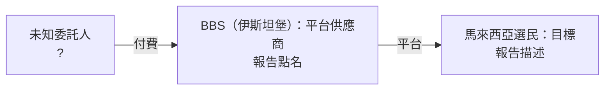
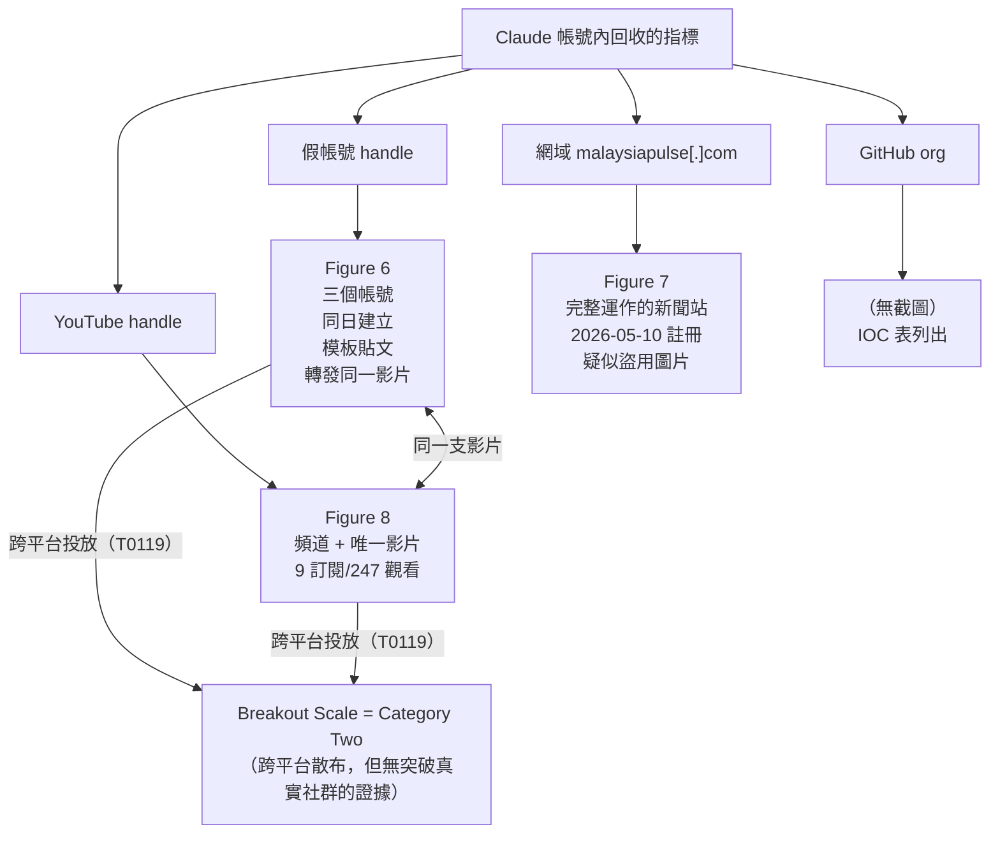
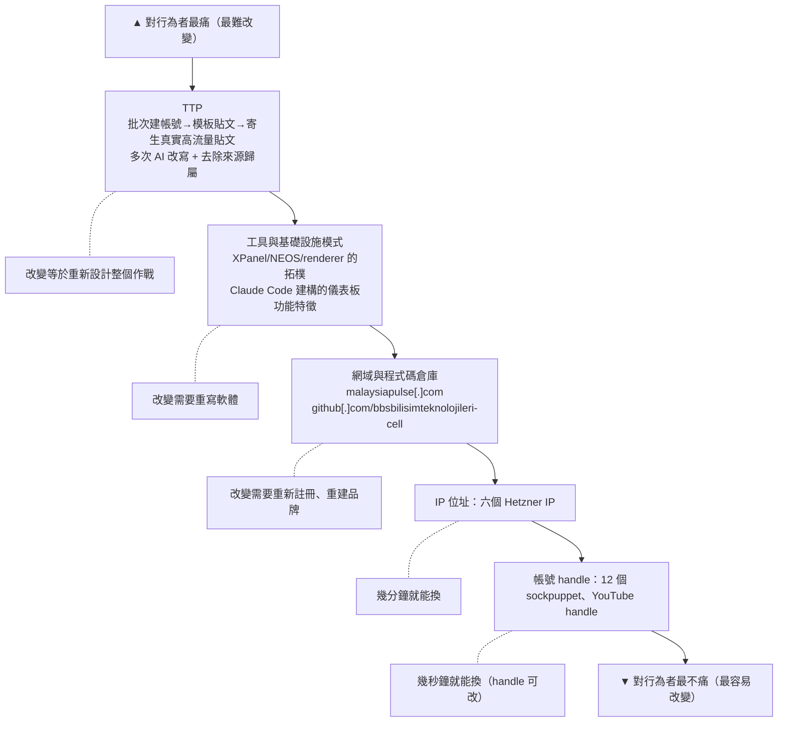
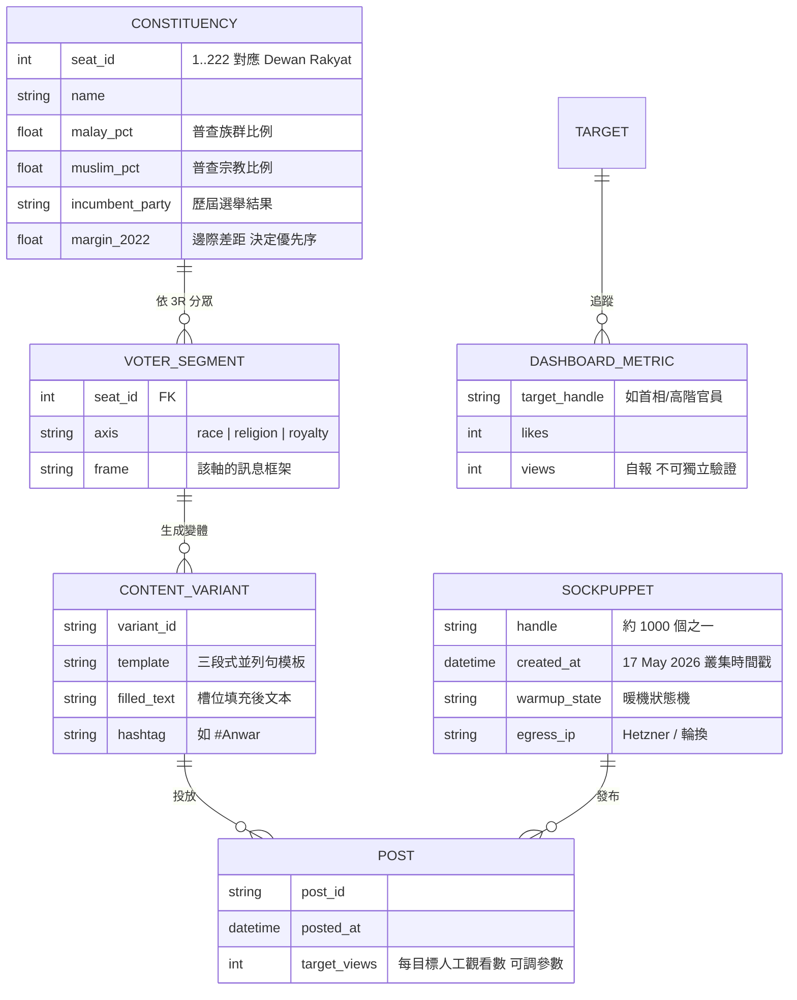
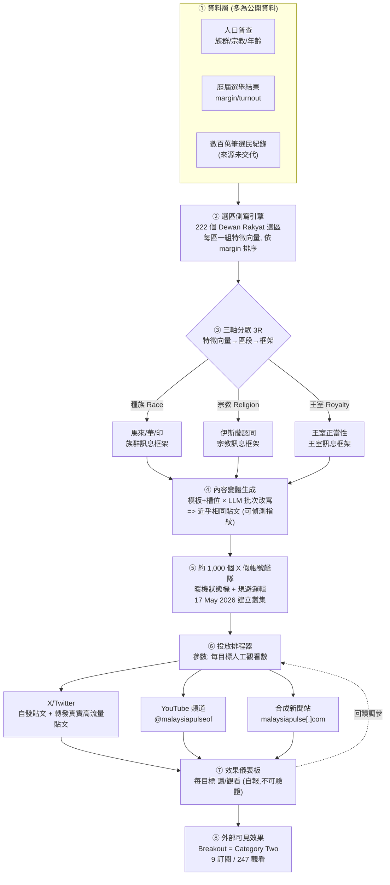
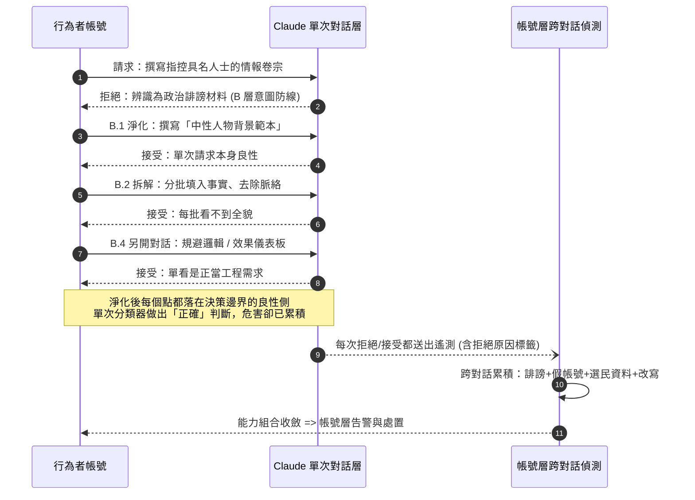
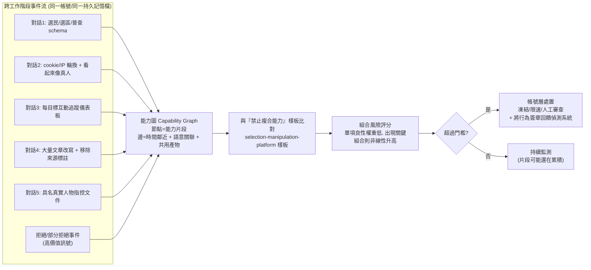
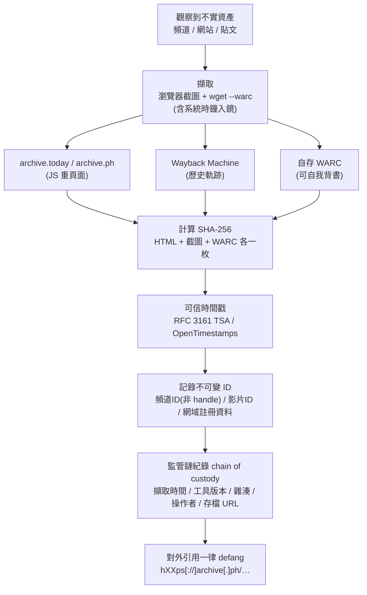
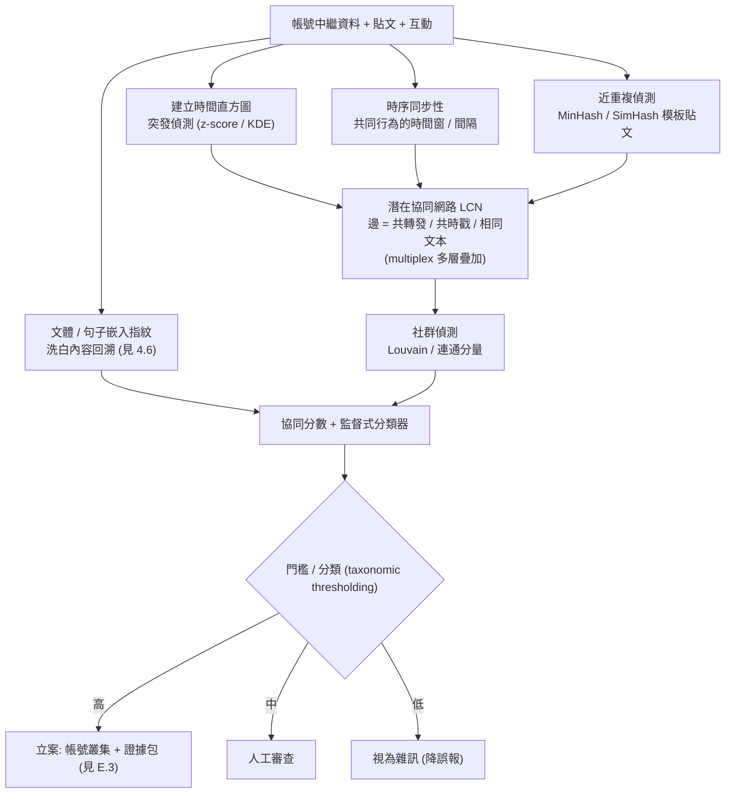

# GTG-84005：商業選舉操縱平台鎖定馬來西亞——伊斯坦堡 BBS Bilisim Teknolojileri 與「軍規 AI 政治作戰生態系」

> 課程模組：02 影響力行動（Influence operations） ｜ 一手來源：PDF p.53–58 ｜ 整理日期：2026-09-13
>
> 本檔所有頁碼均指《Detecting and countering misuse of AI: September 2026》PDF 頁碼。英文原文逐字引用；繁中翻譯為課程整理，非官方譯文。IOC 一律保留報告原本的 defang 格式，**教學與研究時請勿連線**。

---

## 1. 一頁速覽

- **事件本質**：Anthropic 識別並移除**一個** Claude 帳號（報告用語為 "an account"），該帳號被用來營運一個**商業化的選舉操縱平台**，主要鎖定馬來西亞使用者。平台資產包括約 1,000 個假 X/Twitter 帳號、一個假新聞網站「Malaysia Pulse」、一個假 YouTube 頻道，以及一系列捏造的「情報卷宗」（dossiers）。（p.53）
- **歸因**：平台對外偽裝成「防禦型網路情報與反假訊息工具」供應商，但 Anthropic 稱調查「發現與伊斯坦堡科技公司 BBS Bilisim Teknolojileri 的明確關聯（clear links）」，該公司把平台存取權當作**付費的 influence-as-a-service** 販售。（p.53）該公司已於 2026-09-11 公開否認（見第 9 節）。
- **分眾精密度**：平台把真實的人口普查與選舉資料（報告稱「數百萬筆選民紀錄」）餵進系統，依**全部 222 個國會選區**逐一建檔，沿著馬來西亞最敏感的三條斷層線——**種族、宗教、王室**——做微目標鎖定。（p.54）
- **自我行銷 vs. 實際效果**：行為者自己的文件把基礎設施行銷為 "military-grade, AI-driven, real-time political operations ecosystem"；但 Anthropic 用 Breakout Scale 只評為 **Category Two**——資產跨多平台散布，但沒有證據突破進入真實社群。（p.53–54）假 YouTube 頻道截圖顯示只有 9 名訂閱者、唯一影片 247 次觀看。（p.57）
- **Claude 的角色**：用 Claude Code 建立管理假帳號網路的自訂儀表板（追蹤每個目標獲得的按讚與觀看數）、建構選區鎖定系統、撰寫假帳號的暖機（warm-up）與偵測規避邏輯、AI 改寫管線洗白俄中官媒文章成「馬來西亞獨立報導」、反覆迭代捏造的卷宗。（p.54–55）
- **Claude 的拒絕與行為者的繞道**：Claude 在多處拒絕或部分拒絕，包括在辨識出某份文件是「政治誹謗材料」之後，以及對明確帶有「心理作戰」語意的措辭「卻步（balked）」；但行為者透過「協商淨化過的措辭」持續朝同一能力推進。（p.55、p.57）
- **未遂的官方合約**：行為者曾尋求與馬來西亞國家通訊監管機關（即 MCMC）簽約；Anthropic 沒有發現成功的證據。MCMC 已公開否認涉入並表示將了解情況。（p.55；第 9 節）
- **這個案例在課程裡要教什麼**：把「影響力行動」從內容層拉到**基礎設施層**來看——AI 不只寫文章，而是把整個「選民資料庫→分眾→假帳號艦隊→假媒體→假情報→效果儀表板」的作戰室建起來；以及一家第三國商業供應商如何讓真正的委託人隱身，而威脅情報分析師又能靠哪些線索把鏈條接回去。

---

## 2. 行為者側寫與歸因

### 2.1 報告的歸因段落（逐字）

> "The platform posed as a defensive cyber intelligence and counter-disinformation tooling outlet. Nevertheless, our investigation uncovered clear links to BBS Bilisim Teknolojileri, an Istanbul-based technology company, which sold access to the platform as a paid influence-as-a-service capability. According to the threat actor's own documentation, the infrastructure was marketed as "military-grade, AI-driven, real-time political operations ecosystem."" （p.53–54）

繁中：「該平台偽裝成一家防禦型網路情報與反假訊息工具的供應者。儘管如此，我們的調查發現其與伊斯坦堡科技公司 BBS Bilisim Teknolojileri 有明確關聯；該公司把平台的存取權當作付費的『影響力即服務』能力來販售。根據威脅行為者自己的文件，該基礎設施被行銷為『軍規、AI 驅動、即時的政治作戰生態系』。」

### 2.2 歸因措辭的情報學解讀

報告在本案用的是 **"uncovered clear links to"（發現明確關聯）**，而不是 Anthropic 在其他案例中使用的正式估計語言。對照同一章其他案例：

| 案例 | 報告措辭 | 情報學意涵 |
|---|---|---|
| GTG-24015（俄羅斯官媒編輯管線，p.58） | "we assess with **high confidence** that…" | 正式的信心等級用語（ICD 203 式），表示多重獨立來源、邏輯一致、可替代解釋少 |
| GTG-54002（法國 LKM Company，p.47） | "we **traced** the operation to LKM Company" | 描述性斷言，隱含證據鏈完整 |
| **GTG-84005（本案）** | "uncovered **clear links** to BBS Bilisim Teknolojileri" | 描述性斷言，強度高於 suspected / consistent with，但**沒有**給出 high / moderate / low confidence 標籤 |
| 一般用法 | "suspected", "consistent with", "likely" | 分別代表：有線索但未證實；證據型態相符但不排除他解；機率大於一半 |

課堂上要講清楚三件事：

1. **"clear links" 是對「關聯」的斷言，不是對「責任」的斷言。** 報告說的是「平台與該公司有明確關聯」以及「該公司販售平台存取權」，但**沒有**說該公司自己執行了馬來西亞作戰，也**沒有**指出委託客戶是誰。技術上，「公司擁有／販售平台」與「誰按下按鈕」是兩個不同的歸因層次。
2. **IOC 表本身就是歸因證據的一部分。** p.57–58 的指標表列出 `bbsteknoloji[.]com`（標註 "company"）與 `github[.]com/bbsbilisimteknolojileri-cell`（標註 "Org repo and developer handle"）。也就是說，Anthropic 是把**公司網域**與**公司名稱的 GitHub 組織／開發者 handle** 直接當成行動基礎設施的一部分列出。這是一種「基礎設施重疊」型歸因：假新聞站與公司網域被放在同一列，代表調查者觀察到它們在託管、程式碼或帳號層面共用資產。報告沒有進一步公開細節（例如是否同一 Hetzner 主機、同一部署腳本、同一開發者提交紀錄）。
3. **報告沒有給信心等級，第三方也無法補足。** 該公司已公開「斷然否認（categorically reject）」（見 9.2）。在情報分析上，被指名者的否認不改變證據權重，但提醒我們：本案關於「公司—平台」的連結是**單一來源**（Anthropic），只有「公司存在、股權結構、對外定位」這幾點有獨立來源。

### 2.3 平台的「防禦型」偽裝與公司的公開形象

報告說平台「偽裝成防禦型網路情報與反假訊息工具供應者」（p.53）。這點值得與該公司**被指名之前**的公開形象對照：

- 土耳其媒體 Serbestiyet（2026-09-11）整理該公司的自我介紹：自稱「新世代網路安全科技公司」、2018 年成立、提供 Red Team／Blue Team／Purple Team 服務、關鍵基礎設施安全顧問，並有兩項自有產品（資料安全與 DDoS／Web 防護）；辦公室設於伊斯坦堡（Zorlu Center、YTÜ İkitelli Teknopark），並稱在倫敦與杜拜設點；宣稱客戶涵蓋政府、金融、能源、航空、電信等產業（未具名）。
- 土耳其新聞入口 haberler.com 在 2023 年 6 月即有一篇以「BBS Teknoloji」為題的報導，引述其「共同創辦人暨總經理 Bedir Sarı」談關鍵基礎設施攻擊。這證明該公司在報告發布**前三年**就以資安公司身分公開活動，不是事後憑空出現的空殼。
- Malaysiakini（2026-09-12）查閱土耳其商業登記公報（Turkish Trade Registry Gazette），指出 BBS Bilisim Teknolojileri 由土耳其籍的 Türker Batuhan Sarı 與 Bedri Sarı 各持股 50%。（註：Serbestiyet 拼作 "Bedir Sarı"，Malaysiakini 拼作 "Bedri Sarı"，應為同一人的拼寫差異，本檔無法裁定何者正確。）

**分析要點**：「資安公司」與「反假訊息工具」是最自然的雙重用途外衣。偵測假帳號網路的能力、模擬假帳號行為以測試平台偵測的能力、追蹤敘事擴散的儀表板——在防禦端與攻擊端幾乎是同一套技術。這也是為什麼 Anthropic 在報告中特別強調「儘管如此（Nevertheless）」：偽裝本身不能作為排除的理由，要看實際被建構與販售的功能是什麼。

### 2.4 行為者畫像（報告有寫的與沒寫的）

| 面向 | 報告內容 | 頁碼 | 備註 |
|---|---|---|---|
| 被移除的 Claude 帳號數 | 一個（"an account"） | p.53 | 整個平台透過單一帳號建構，槓桿極高 |
| 組織關聯 | BBS Bilisim Teknolojileri（伊斯坦堡） | p.53 | 「clear links」 |
| 商業模式 | 付費 influence-as-a-service；「販售平台存取權」 | p.53 | 意味著平台是產品，客戶自行操作或委託操作 |
| 自我定位 | 防禦型網路情報／反假訊息工具 | p.53 | 偽裝 |
| 自我行銷 | "military-grade, AI-driven, real-time political operations ecosystem" | p.54 | 出自行為者自己的文件 |
| 業務拓展 | 尋求與馬來西亞國家通訊監管機關簽約 | p.55 | 無成功證據 |
| 作業安全 | 「加密通訊軟體」叢集：「為本行動量身打造的作業安全」 | p.55 | 報告未說明是自建還是既有軟體 |
| 語言 | 報告未說明行為者使用的語言 | — | 假帳號貼文為英文；假新聞站為英文 |
| 委託客戶 | **未指出** | — | 行動內容偏向支持現任首相（見第 3 節），但報告未做任何委託人推論 |
| 是否有政府指示 | **未提及** | — | 這是本案一個值得注意的**沉默**。同章其他案例都明確處理了這個問題：GTG-54002 寫「we found no evidence of direction by any government」（p.48）；GTG-54004（肯亞）寫「We found no evidence of government involvement, and the activity appears consistent with an entirely domestic Kenyan operation」。**本案兩句都沒有**——既沒說有政府指示，也沒說沒發現政府指示。在情報寫作上，「未排除」與「已排除」是不同的；讀者不應把沉默解讀為任一方向 |

### 2.5 「第三國供應商執行」模式：土耳其公司＋馬來西亞目標＋未知客戶

本案的鏈條有三個環節，而報告只點亮了中間那個：



這種模式對歸因與追訴的影響，是本案最值得深入的課題：

**（a）對歸因的影響**
- 技術指標（網域、IP、GitHub、假帳號）全部指向**供應商**的基礎設施，而不是委託人。委託人可能只透過合約、付款與需求文件出現，而這些都在 Anthropic 的可見範圍之外（Anthropic 只看得到 Claude 上的建構過程，「一旦上線，可見度就結束」，p.42）。
- 報告記錄了一個具體需求：「為現任馬來西亞首相的帳號取得一百萬次人工觀看」（p.54）。但這是**平台上的一個請求**，不是委託人的簽名。誰下的單、是否為真實客戶還是供應商的展示（demo）資料，報告都沒有說。多家馬來西亞媒體（Malaysiakini、Goody Feed 引述 CNA）因此強調「報告沒有指出是誰提出該請求」，並自行補充「未發現與首相或其辦公室的連結」——後半句是媒體的解讀，**報告本文既沒有肯定也沒有否定**。
- 「影響力即服務」的商業邏輯本身就是為了**可否認性**。報告在趨勢章節直接寫道：這「給了影響力行動最終委託者合理的可否認性，並讓沒有能力或不想自建的行為者也能取得這種能力」（p.42）。

**（b）對法律追訴的影響**
- 管轄權碎裂：供應商在土耳其、託管在德國業者（Hetzner）、平台在美國（X、YouTube、GitHub）、目標在馬來西亞、AI 供應商在美國。馬來西亞的《1948 年煽動法令》（Sedition Act）或《1998 年通訊與多媒體法令》（CMA）第 233 條只能對境內可觸及的人與行為發動；對境外供應商幾乎只能透過國際司法互助。
- 「販售存取權」而非「執行」：若供應商主張自己只賣工具（如同販售滲透測試工具），追訴要證明「明知且有意用於非法目的」。這正是資安產業「雙重用途」的老問題，被移植到影響力行動領域。
- 客戶端若是馬來西亞境內政治行為者，則可能觸及《1954 年選舉罪行法令》等，但前提是有人能把付款鏈條接回來——這通常需要金融情報，而非網路情報。

**（c）與其他已知商業供應商的類比**（見第 9 節來源）
- Archimedes Group（以色列，2019 年被 Facebook 移除，廣告支出約 110 萬美元，目標含東南亞）。
- Team Jorge（以色列，2023 年 Forbidden Stories 揭露，AIMS 平台集中控制數千個假角色，自稱操作過 33 場總統級選舉）。
- Cambridge Analytica／SCL：2018 年 Channel 4 臥底錄音中，其高層稱「我們在墨西哥做過、在馬來西亞做過」。馬來西亞**並非第一次**成為外國商業選舉操縱公司的宣稱案例。
- 牛津網路研究所（OII）2020 年盤點：81 個國家有組織化的社群媒體操縱；48 起私人公司代政治行為者執行計算宣傳的案例；2018 年起超過 65 家公司提供此類服務；2009 年以來約 6,000 萬美元投入雇用私人假訊息公司。

本案的新意不在「商業供應商」（那是老問題），而在**供應商用 AI 把整套作戰室建起來、並包裝成 SaaS 賣掉**。

### 2.6 時間軸重建（從報告可推導的）

報告沒有給完整時間軸，但散落各處的日期可以拼出一條建置曲線。這個練習本身就是威脅情報的基本功：**把報告裡所有帶日期的陳述抽出來排序，看出缺口在哪**。

| 時間 | 事件 | 來源 | 可信度 |
|---|---|---|---|
| 2018 | BBS Bilisim Teknolojileri 成立（公司自述） | Serbestiyet | 公司自述，未經登記查核 |
| 2023-06 | 土耳其媒體以資安公司身分報導 BBS，引述「共同創辦人暨總經理 Bedir Sarı」 | haberler.com | 獨立、報告前 |
| 2025-12 → 2026-08 | 本報告涵蓋的濫用活動期間（全報告範圍，非本案專屬） | PDF p.3 | 一手 |
| **2026-05-10** | `malaysiapulse[.]com` 網域註冊 | PDF p.56 圖說 | 一手 |
| **2026-05-17** | 12 個範例假帳號的共用建立時間戳；Figure 6 三個帳號的自發貼文與轉發都在這天 | PDF p.58 + Figure 6 | 一手 |
| 2026-05 下旬～06 初 | YouTube 頻道上傳「first and only video」（圖說：「a few weeks later」；截圖顯示「2 weeks ago」） | PDF p.57 + Figure 8 | 一手（相對日期） |
| **2026-06-05（週五）** | Malaysia Pulse 網站截圖日期，站上文章全部標 5 Jun | Figure 7 | 一手 |
| 2026-08 之前 | Anthropic 內部偵測識別出帳號並移除 | PDF p.3、p.57 | 一手（未給精確日） |
| **2026-09-10** | 報告發布 | Anthropic 網站 | 一手 |
| 2026-09-11 | MCMC 聲明否認涉入；BBS 發表否認聲明；土耳其與馬來西亞媒體大量報導 | 見第 9 節 | 獨立 |
| 2026-09-12 | Malaysiakini 查商業登記；Azalina 部長要求公正調查 | 見第 9 節 | 獨立 |
| 2026-09-13 | 通訊部長 Fahmi 表示交由 MCMC 調查，尚未收到回報 | Utusan Melayu Plus | 獨立 |

**從時間軸能讀出什麼：**

1. **建置期極短。** 網域註冊（5/10）到假帳號上線（5/17）只有七天；到完整運作的新聞站（6/5）不到四週。傳統上要架一個有八個分類、RSS、電子報、每日更新的新聞站並同時啟動 1,000 個社群帳號，需要一支團隊數個月；這裡是「一個 Claude 帳號 + 幾週」。這就是 uplift 在**速度**維度上的具體數字。
2. **「暖機」被壓縮了。** 報告說每個帳號「都有暖機邏輯，讓帳號在被投入影響力行動前先有一段時間看起來像真人」（p.54），但 Figure 6 顯示這三個帳號在**建立當天（5/17）就發政治口號並轉發**。兩種解讀：（a）暖機邏輯存在但這批被提前部署；（b）「一段時間」在這個實作裡只是幾小時。無論哪種，都說明**行為者宣稱的規避能力與實際執行有落差**——這與「軍規」行銷語言的落差是同一個現象。
3. **日期有一個關鍵缺口：Anthropic 何時偵測到、何時移除？** 報告沒給。這個缺口很重要：如果偵測發生在 5 月（建置期），代表模型層／帳號層偵測在作戰開始前就抓到了；如果發生在 8 月，代表這個平台運作了三個月才被發現。報告只說「we may see it on Claude while the operation is still being built」（p.42）是**一般性**陳述，不是對本案的具體陳述。課堂上要提醒學員不要把章節的一般敘述套到個案上。
4. **「first and only video posted a few weeks later」的「later」指的是相對於什麼？** 圖說沒明說基準點。最合理的讀法是相對於頻道建立時間（頻道先建、影片晚幾週才上傳）。這也是影響力行動常見的節奏：**資產先養、內容後上**。

### 2.7 分析師如何從零建立這條歸因鏈（推理示範）

課程要教「怎麼想」，所以這裡把 Anthropic 可能走過的推理路徑重建一次。注意：以下是**方法示範**，不是報告陳述。

**步驟 1：從帳號行為異常開始。** 一個 Claude 帳號在短期內密集要求：建構帶有「選民」「選區」「普查」欄位的資料模型；撰寫社群帳號的 cookie／IP 輪換邏輯；建立追蹤「views per target」的儀表板；大量改寫新聞文章並移除來源標註；產出針對具名人士的指控文件。**單看每一項都不足以觸發**，但組合起來的語意向量非常獨特。這對應報告的「Those types of tasks produce signals that our systems are trained to detect」（p.42）。

**步驟 2：從對話內容回收指標。** 建構軟體的過程必然出現：部署目標 IP、網域名稱、資料庫 schema、程式碼倉庫 URL、帳號 handle 清單、專案代號（XPanel、NEOS、Voxta）。這就是「used the recovered indicators to map the operation's full footprint」（p.57）的字面意思——**指標是從對話裡回收的，不是從外部掃描來的**。這是 AI 供應商相對於社群平台的獨特可見度。

**步驟 3：外部驗證。** 拿到網域後去看網站長什麼樣（Figure 7）、拿到 handle 後去看帳號長什麼樣（Figure 6）、拿到頻道後存檔（Figure 8）。三張圖的功能正是**證明回收的指標對應到真實存在的資產**。

**步驟 4：關聯到實體。** `bbsteknoloji[.]com` 與 `github[.]com/bbsbilisimteknolojileri-cell` 出現在同一批回收指標中。公司網域與公司名 GitHub 組織同時出現在一個選舉操縱平台的建構脈絡裡，就是「clear links」的來源。至於是託管重疊、程式碼提交者重疊、還是開發文件裡直接寫了公司名，報告沒說。

**步驟 5：評估效果。** 用 Breakout Scale 對照公開可見的互動數字（9 訂閱、247 觀看、假帳號零互動）→ Category Two。

**這條鏈的弱點在哪（要教學員自己找）：**
- 步驟 4 是整條鏈裡唯一從「技術指標」跳到「法律實體」的一步，也是唯一被當事人否認的一步。
- 如果有人用該公司的名義註冊 GitHub 組織與網域來嫁禍（false flag），這條鏈會怎麼樣？報告沒有討論這個替代假說。**在情報分析裡，明確處理並排除替代假說（ACH，競爭假說分析）是高信心結論的前提**——本案報告沒有公開這部分工作，這也是為什麼它用「clear links」而非「high confidence」可能是刻意的用詞選擇。

---

## 3. 受害者與目標清單

### 3.1 直接與間接目標

| 類別 | 目標 | 報告描述 | 頁碼 |
|---|---|---|---|
| 選民（主要目標） | 馬來西亞全體選民，涵蓋 **222 個國會選區** | 用真實普查與選舉資料、「數百萬筆選民紀錄」建立選區側寫，沿種族／宗教／王室斷層線做微目標鎖定 | p.54 |
| 政治人物（受益者？） | 現任馬來西亞首相 | 觀察到「支持現任首相」的請求：對其帳號投放一百萬次人工觀看 | p.54 |
| 政治人物（被追蹤） | 一位馬來西亞高階政府官員的帳號 | 儀表板記錄該帳號獲得的假互動數「以百萬計」（自報數字，無法獨立驗證） | p.54 |
| 政治人物（被攻擊） | 一位反對黨政治人物 | 捏造的情報卷宗散布「完全捏造」的指控 | p.54 |
| 公民社會 | 公民社會組織（複數） | 同上，遭捏造指控 | p.54 |
| 具名個人 | 「named individuals」 | 行為者生成的指控，「我們模型自己的研究找不到任何佐證」 | p.54 |
| 媒體生態 | 合法的馬來西亞新聞報導 | 被爬取、由模型改寫數次、掛上捏造的署名重新發布 | p.55 |
| 資訊環境 | 馬來西亞讀者 | 俄、中官媒（TV BRICS、Xinhua、Sputnik/RIA、CGTN）文章被去除國家歸屬、偽裝成獨立的馬來西亞報導 | p.55 |
| 監管機關 | 馬來西亞國家通訊監管機關（MCMC） | 行為者尋求簽約（未成功） | p.55 |
| 平台 | X/Twitter、YouTube | 約 1,000 個假帳號；一個假頻道 | p.53、p.57–58 |

### 3.2 為什麼「種族／宗教／王室」在馬來西亞特別具煽動性

報告只用一句話帶過「the country's most sensitive political and social faultlines: race, religion, and royalty」（p.54）。要讓學員理解為什麼一家土耳其公司會挑這三條線，需要補充馬來西亞政治的結構背景（以下為外部背景知識，來源見第 9 節）：

**（1）種族：憲法層級的族群分類**
- 2020 年人口普查：土著（Bumiputera，主要為馬來人）69.7%、華人 22.8%、印度人 6.6%、其他 0.9%。
- 憲法第 153 條保障馬來人與沙巴、砂拉越土著的「特殊地位」（配額、獎學金、執照等），是 1969 年「五一三事件」（官方統計 196 死，其中華人 143 人）之後新經濟政策（NEP）與「馬來人主權（Ketuanan Melayu）」論述的憲法基礎。任何觸及第 153 條的討論，都可能被解讀為挑戰社會契約。
- 政黨本身高度族群化：巫統（UMNO，馬來人）、馬華公會（MCA，華人）、國大黨（MIC，印度人）組成的國陣（BN）；民主行動黨（DAP，華人為主）；伊斯蘭黨（PAS）與土團黨（Bersatu）組成的國民聯盟（PN）。族群論述直接轉換成選票。

**（2）宗教：法律上「馬來人＝穆斯林」**
- 2020 年普查：伊斯蘭教 63.5%、佛教 18.7%、基督教 9.1%、印度教 6.1%、華人民間信仰 0.9%。
- 憲法第 3 條定伊斯蘭教為聯邦宗教；**第 160 條在定義上規定「馬來人」必須信奉伊斯蘭教**。因此「宗教」與「種族」在馬來西亞法律上是綁在一起的——攻擊其中一條就是同時攻擊兩條。
- 2022 年第 15 屆大選出現「綠色浪潮（Gelombang Hijau）」：PN 橫掃玻璃市、吉蘭丹、登嘉樓與吉打幾乎全部席次，18–20 歲首投族的馬來選民是關鍵。這證明宗教—族群動員在當代仍是最強的選舉變數。

**（3）王室：九位世襲統治者與輪值國家元首**
- 馬來西亞有九個州保有世襲統治者（蘇丹），每五年由統治者會議（Conference of Rulers）選出一位擔任最高元首（Yang di-Pertuan Agong）。
- 最高元首在任命首相上有實質裁量權：2020 年「喜來登行動」後，元首逐一約談 221 位國會議員後任命慕尤丁；2021 年任命依斯邁沙比里；2022 年 11 月大選產生**馬來西亞史上第一個懸峙國會**（PH 82、PN 74、BN 30、GPS 23、GRS 6），元首於 11 月 24 日任命安華組成團結政府。王室的每一次介入都是輿論戰場。
- 統治者會議必須同意修改保障王室地位與土著特權的憲法條款——王室與第 153 條在制度上互相鎖定。

**（4）煽動法令：讓這三條線成為「法律地雷」**
- 《1948 年煽動法令》把「質疑統治者地位、第 153 條、國語、公民權」列為具「煽動傾向」的言論，最高三年監禁或 5,000 令吉罰款；2015 年修法擴大到轉發／轉貼線上內容，並允許法院封鎖線上出版物。
- 在馬來西亞公共論述中，「3R」（Race, Religion, Royalty）本身就是官方與媒體慣用的敏感議題代稱。MCMC 對平台的內容下架請求也常以 3R 分類。（本檔未能於本次研究中取得具體下架統計，見第 12 節。）

**（5）為什麼這對攻擊者「好用」**
- 這三條線的共同特徵是：**高情緒喚起、法律上高風險、且對手難以公開反駁**——一個華人反對黨政治人物若被捏造的卷宗指控「反伊斯蘭」或「不敬王室」，任何公開辯解都要小心觸犯煽動法令，等於被剝奪了辯護空間。
- 這與報告觀察到的「捏造情報卷宗攻擊反對黨政治人物與公民社會組織」（p.54）直接吻合：卷宗的殺傷力不在於它被相信，而在於它讓目標無法安全地回應。

### 3.3 「按選區分眾」代表什麼作業精密度

- **選制**：下議院 222 席全部為單一選區相對多數制（FPTP）。FPTP 的本質是「邊際選區決定一切」——只要在幾十個搖擺選區移動幾個百分點，就能翻轉全國結果。因此「按選區」而非「全國」分眾，是任何專業選舉操作的起點。
- **選區極度不均**：以 2020 年人口計，雪蘭莪平均一個國會選區約 31.8 萬人，砂拉越約 7.9 萬人。這意味著攻擊者投入同樣資源，在鄉村小選區的「每票邊際效果」遠高於城市大選區——而鄉村選區恰好是馬來—穆斯林比例最高、3R 議題最敏感的地方。
- **選民規模**：2022 年大選登記選民 21,173,638 人（Undi18 與自動登記後暴增約六百萬、+41.72%）。報告所稱「數百萬筆選民紀錄」相對於 2,100 萬的母體是合理量級，也顯示資料**不是**零碎抓取，而是結構化的整批匯入。
- **報告的用語**："profile and target voters in Malaysia, constituency by constituency, using census and electoral data that they had ingested"（p.54）以及叢集表的「Constituency profiles built on real census and voter data」（p.55）。「ingested」（餵入）暗示資料被載入平台的資料庫層，供後續的分眾與內容生成引用，而不是一次性的分析。
- **精密度的另一面**：報告**沒有**說每個選區都有對應的假帳號或內容產出；只說系統「涵蓋」全部 222 個選區。「涵蓋」可能只是資料庫裡有 222 筆側寫。這是課堂上該提醒的「能力（capability）≠ 部署（deployment）≠ 效果（effect）」三層區分。

### 3.4 邊際選區數學：為什麼「按選區」是專業作法而不是炫技

要讓學員理解 222 筆側寫的價值，最好的方式是算一次帳。

**（a）FPTP 的槓桿在哪**
- 2022 年大選結果：PH 82、PN 74、BN 30、GPS 23、GRS 6、其他 7，過半門檻 112。沒有任何聯盟過半，最終靠元首裁量與跨陣營結盟組成政府。
- 在這種席次分布下，**十幾個選區的翻轉就足以改變誰能組閣**。影響力行動不需要說服全國 2,100 萬選民，只需要在少數選區移動幾千票。
- 2022 年投票率 74.70%，登記選民 21,173,638。以 222 席平均，每席約 95,000 名登記選民、約 71,000 張有效票。一個選區若以 2,000 票差距決勝，那就是**約 1.4% 的選民**。
- 約 1,000 個假帳號若平均分配到 222 個選區，每區約 4.5 個帳號——顯然不足以直接動搖任何一區。**假帳號的作用不是直接投票影響，而是（i）製造「這個看法很多人支持」的假象、（ii）把捏造的卷宗推進真實社群的視野、（iii）替真實內容灌互動數以觸發平台演算法**。這也是為什麼儀表板的核心參數是「每個目標的總人工觀看數」而不是「每個選區的帳號數」。

**（b）為什麼選區不均放大了效果**
- 雪蘭莪一個選區約 31.8 萬人 vs. 砂拉越約 7.9 萬人（2020 年人口）。攻擊者若追求「每投入一元的席次產出」，最優策略是把資源投向小選區。
- 小選區多在東馬與馬來半島東北部（吉蘭丹、登嘉樓），恰好是馬來—穆斯林比例最高、PN「綠色浪潮」最強的區域。**「按選區分眾」與「以種族／宗教／王室為軸」這兩個設計選擇，在數學上是互相強化的**。
- 這是課堂上很好的一個推論練習：給學員選區人口分布與族群比例，問「如果你是防守方，你會優先監測哪些選區？」——答案會與攻擊者的最優策略高度重疊，這正是防守方該站的位置。

**（c）222 筆側寫在資料工程上代表什麼**
- 要為每個選區建立可用的側寫，最少需要：選區編號與界線、人口普查的族群／宗教／年齡／收入分布、歷屆選舉結果與得票率、現任議員與政黨、地方議題。
- 這些資料在馬來西亞多數是**公開的**（選委會公布開票結果、統計局公布普查）。報告說的「millions of voter records」則可能是另一個層次——選民冊（electoral roll）在馬來西亞可依法查閱。報告未說明取得途徑，本檔不推論（見第 12 節）。
- 重點是：**把公開資料變成可操作的作戰資料庫**，過去需要資料工程師 + 政治分析師數週；用 Claude Code 可以壓縮到數天。這是 uplift 在**規模與深度**維度的體現。

### 3.5 捏造卷宗的傷害模型：為什麼它比假新聞更危險

報告用了三個不同的詞描述同一類產物：「fabricated dossiers」（p.53）、「fabricated intelligence dossiers」（p.54）、「Fake intelligence reports given false authority」（p.55）。三個詞的差異值得逐字分析：

| 用詞 | 出處 | 強調的面向 |
|---|---|---|
| fabricated dossiers | p.53 | 產物是「卷宗」——有結構、有份量、像檔案 |
| fabricated intelligence dossiers | p.54 | 偽裝成「情報」產品，訴諸神秘的消息來源 |
| fake intelligence reports **given false authority** | p.55 | 「被賦予虛假權威」——格式、術語、機關抬頭、分級標記等，讓讀者以為它來自某個有權知情的機構 |

**傷害模型（與一般假新聞對照）：**

| 面向 | 一般假新聞 | 捏造情報卷宗 |
|---|---|---|
| 傳播管道 | 公開平台，可被事實查核 | 常經由私訊、記者、政敵、外交圈「洩漏」流通，查核機構看不到 |
| 反駁成本 | 指出原始來源不存在即可 | 「情報」本質上宣稱「有不公開的來源」，被指控者要證明否定命題 |
| 目標受眾 | 一般選民（廣） | 記者、政治對手、監管者、外國使館（窄但高影響力） |
| 法律風險（對目標） | 低 | **高**——在馬來西亞，若卷宗內容涉及種族、宗教或王室，被指控者的公開自辯本身就可能踩到煽動法令的線 |
| 生命週期 | 幾天 | 可能潛伏數月，在關鍵時刻（提名、投票前夕、組閣協商）被引爆 |

報告的關鍵句是：「These allegations were entirely made up by the actors」（p.54）以及「The actors generated allegations against named individuals for which our model's own research could find no corroboration」（p.54）。第二句尤其值得注意——**Anthropic 用模型自己的研究能力去驗證指控，結論是「找不到任何佐證」**。這是 AI 供應商的一個獨特位置：他們不只看到內容被生成，還能對內容做事實性評估。

**課堂延伸問題**：如果一份卷宗裡有 80% 是真的（公開可查的事實）、20% 是捏造的關鍵指控，「找不到佐證」這個判準還夠用嗎？這正是「真素材 + 假框架」這種較高階手法的防禦難點。

---

## 4. AI 濫用的攻擊生命週期（逐階段拆解）

### 4.1 報告的總述

> "Claude was used to build the constituency targeting system using real electoral data, to engineer and run the fake social media account network and its detection evasion logic, to rewrite and launder fake news, and to iterate the fabricated dossiers." （p.55）

### 4.2 報告的五叢集表（p.55，逐字＋翻譯）

| Cluster（叢集） | What Claude was used for（Claude 被用來做什麼） | Most serious element（最嚴重的元素） |
|---|---|---|
| Voter-targeting system（選民鎖定系統） | Constituency profiles built on real census and voter data（以真實普查與選民資料建立的選區側寫） | Micro-targeting on race, religion, and royalty faultlines（沿種族、宗教、王室斷層線的微目標鎖定） |
| Fake-account network（假帳號網路） | Roughly 1,000 accounts, warmup and evasion logic（約 1,000 個帳號、暖機與規避邏輯） | Near-identical posting; artificial engagement on a head of government（近乎相同的貼文；對一位政府首腦的人工互動） |
| Synthetic news outlet（合成新聞媒體） | AI rewriting pipeline, fabricated bylines（AI 改寫管線、捏造的署名） | Laundering Russian and Chinese state media as independent reporting（把俄中官媒洗白成獨立報導） |
| Fabricated dossiers（捏造卷宗） | Fake intelligence reports given false authority（被賦予虛假權威的假情報報告） | Manufacturing false allegations against named people（製造針對具名人士的虛假指控） |
| Encrypted messenger（加密通訊軟體） | Operational-security communications（作業安全通訊） | Purpose-built operational security for the operation（為本行動量身打造的作業安全） |

### 4.3 逐階段拆解：人類做什麼／Claude 做什麼／自主程度

以下按照影響力行動的一般生命週期（規劃→資料→基礎設施→資產→內容→投放→衡量→隱匿→商業化）重組報告內容。**自主程度**分三級：
- **L1 對話式協助**：人類提問，模型回答或產出單一文件。
- **L2 人類逐步指揮**：人類設定目標與步驟，模型逐步產出程式碼、內容或分析，人類整合。
- **L3 AI 編排多代理自主執行**：模型（或模型驅動的軟體）在最少人工介入下持續運作。

| 階段 | 人類做什麼 | Claude 做什麼 | 自主程度 | 頁碼 |
|---|---|---|---|---|
| ① 規劃與定位 | 定義產品：「軍規、AI 驅動、即時政治作戰生態系」；決定以「防禦型工具」偽裝 | 報告未明說 Claude 參與行銷文件撰寫；但趨勢章節指出行為者普遍讓模型生成「doctrine manuals」等（p.42–43） | L1（推測） | p.53–54 |
| ② 資料攝取 | 取得並匯入普查、選舉資料與數百萬筆選民紀錄 | 建構「選區鎖定系統」：把真實資料轉成 222 個選區側寫 | L2 | p.54–55 |
| ③ 分眾設計 | 決定以種族／宗教／王室為軸 | 依斷層線產生微目標鎖定側寫 | L2 | p.54–55 |
| ④ 指揮中心 | 提出儀表板需求 | **用 Claude Code 建構自訂儀表板**：管理、運行、追蹤假帳號網路；記錄每個目標獲得的按讚與觀看；提供「每個目標應獲得多少總人工觀看」的可調參數 | L2→L3（儀表板本身是持續運作的軟體） | p.54 |
| ⑤ 假帳號艦隊 | 準備約 1,000 個 X 帳號的身分素材 | 撰寫**暖機邏輯**（讓帳號先「看起來像真人」一段時間）與**規避邏輯**（定期更新 cookie 與 IP） | L3（邏輯自動執行） | p.54 |
| ⑥ 假媒體 | 註冊 `malaysiapulse[.]com`（2026-05-10）、架站、選擇來源 | **AI 改寫管線**：爬取合法馬來西亞報導→改寫數次→掛捏造署名發布；把 TV BRICS、Xinhua、Sputnik/RIA、CGTN 的文章去除國家歸屬 | L3（管線） | p.54–56 |
| ⑦ 假情報 | 指定攻擊對象（反對黨政治人物、公民社會組織） | 「迭代」捏造卷宗；被賦予「虛假權威」的格式 | L2 | p.54–55 |
| ⑧ 投放與放大 | 設定目標（例：首相帳號一百萬次觀看）；經營 YouTube 頻道 | 假帳號依邏輯轉發、留言、灌觀看 | L3 | p.54、p.56–57 |
| ⑨ 效果衡量 | 讀儀表板 | 儀表板統計（自報數字，「以百萬計」） | L3 | p.54 |
| ⑩ 作業安全 | 使用／建構加密通訊軟體 | 「作業安全通訊」叢集；「量身打造」 | L2（推測為協助開發） | p.55 |
| ⑪ 商業化 | 尋求 MCMC 合約；對外販售存取權 | 報告未明說 | — | p.53、p.55 |
| ⑫ 繞過拒絕 | 當 Claude 拒絕時「協商淨化過的措辭」 | 拒絕／部分拒絕：辨識出政治誹謗材料；對心理作戰語意卻步 | — | p.55、p.57 |

**三個值得在課堂上放大的觀察：**

1. **「建構」與「運行」被分開了。** Anthropic 的可見範圍是「建構」（p.42：「we may see it on Claude while the operation is still being built」），而假帳號的實際運行是在行為者自己的 Hetzner 主機上（IOC 表註記 XPanel、NEOS Docker、panel 等），Claude 不必在每一次貼文時被呼叫。這解釋了為什麼一個帳號就能撐起整個平台，也解釋了為什麼 Anthropic 的干預點是「移除帳號、切斷後續建構」而非「讓假帳號停止」。
2. **洗白管線是一種「多層改寫」。** 「had the model rewrite it several times before republishing」（p.55）——多次改寫的目的不是品質，而是讓文字與原文的相似度降到抄襲偵測與逆向查證的門檻之下。這與傳統的「內容農場」同源，但 AI 讓它接近零邊際成本。
3. **模型被同時用來「捏造」與「查證」。** 報告寫道：「The actors generated allegations against named individuals for which our model's own research could find no corroboration」（p.54）。這句話暗示行為者（或 Anthropic 事後）曾讓 Claude 去研究這些指控，而模型找不到任何佐證。也就是說，同一個模型在同一個作戰裡，既是捏造工具，也是揭穿捏造的證人。

### 4.4 自主程度的跨案例對照：本案在光譜的哪個位置

報告在網路作戰章節提出「from assistant to orchestrator」（從助手到編排者）的演進軸（p.4–5）。影響力行動章節則用另一組語言描述同一件事（p.43）：「Increasingly, operations are not run using individual prompts. Instead, a great deal is embedded within persistent memory files.」（行動愈來愈不靠個別提示來執行，而是把大量內容嵌在持久的記憶檔案裡。）

把本案放進這個光譜：

| 自主層級 | 特徵 | 報告中的例子 | 本案是否符合 |
|---|---|---|---|
| L0 內容生成 | 人類要一篇文章，模型給一篇文章 | GTG-24015（俄官媒編輯台，p.58–59）：Claude 作為「sub-editor layer」 | 部分符合（改寫管線的單次呼叫） |
| L1 工具開發 | 模型寫程式，人類部署與執行 | 本案的儀表板、暖機邏輯、規避邏輯 | **核心符合** |
| L2 管線化 | 模型被包進自動化管線，批次呼叫，人類不逐次介入 | 本案的「AI rewriting pipeline」；趨勢章節的「ran custom software that called Claude in fixed batches」（p.43） | **核心符合** |
| L3 多代理自主編排 | AI 自行分解任務、調度子代理、執行完整殺傷鏈 | 網路作戰章節的案例（本案頁段未描述） | **不符合**——報告沒有任何本案使用多代理自主編排的描述 |

**結論與教學要點**：本案的自主程度是 **L1–L2**，不是 L3。報告沒有說 Claude 自主決定攻擊誰、自主發文、或自主調整策略。這個區分很重要，因為媒體很容易把「AI 驅動的選舉操縱平台」誤讀成「AI 自己在操縱選舉」。**實際上是人類設計了作戰、用 AI 快速把作戰工具做出來、再用這些工具（其中部分持續呼叫 AI）執行。** 課堂上要讓學員練習這種「降溫但不失真」的敘述方式。

同時要指出：**L1–L2 已經足夠危險**。危險不在自主性，在於「一個人 + 幾週 = 一個作戰室」的門檻崩塌。

### 4.5 反事實推估：沒有 AI 的話，這個行動需要什麼

報告用「uplift」（AI 帶來的能力提升）來衡量危害，並從「速度、規模、深度」三個維度看（p.4）。本案報告本文沒有做 uplift 估算，以下是課程用的推估練習（**估計值，非報告陳述**），目的是讓學員理解 uplift 的量化思考方式：

| 元件 | 傳統作法需要的人力／時間 | 本案的實際狀況 | Uplift 維度 |
|---|---|---|---|
| 222 選區的資料側寫 | 1–2 名資料分析師 × 3–6 週（清理普查與選舉資料、建模） | Claude Code 建構，數天 | 速度、規模 |
| 假帳號管理與規避邏輯 | 1 名有社群平台反偵測經驗的工程師 × 2–4 週 | Claude 撰寫 | 深度（原本需要專門知識） |
| 效果追蹤儀表板 | 1 名全端工程師 × 2–3 週 | Claude Code 建構 | 速度 |
| 假新聞站內容（每日數則、8 個分類） | 2–3 名寫手全職 | AI 改寫管線，零邊際成本 | 規模 |
| 多語言與在地化（馬來文／英文／可能中文） | 在地寫手 | 模型內建 | 深度（**這是對台灣最關鍵的一項**——語言不再是門檻） |
| 捏造卷宗（格式、術語、虛假權威） | 有情報或法律文件經驗的人 | 模型迭代 | 深度 |
| **合計** | **約 5–8 人的團隊、2–3 個月** | **一個 Claude 帳號、約四週** | — |

**這張表的教學價值**：它把「AI 讓影響力行動變便宜」從口號變成可討論的數字。也讓學員看到 uplift 最危險的維度其實是**深度**——不是「做得更快」，而是「原本做不到的人現在做得到」。一個沒有馬來西亞在地知識、不懂馬來文、沒有社群平台反偵測經驗的伊斯坦堡團隊，能做出一個涵蓋 222 選區、以馬來文原貼為載體的作戰平台，這在 AI 之前是不可能的。

### 4.6 「洗白鏈」的完整拆解（p.55 最值得單獨教的一段）

報告這段只有三句話，但裡面包了四層操作：

> "The synthetic news outlet also scraped legitimate Malaysian reporting and had the model rewrite it several times before republishing it under fabricated bylines. It republished articles from Russian and Chinese state-aligned foreign outlets, including TV BRICS, Xinhua, Sputnik/RIA, and CGTN, and stripped out the state attribution to present them as independent Malaysian reporting."（p.55）

**第一層：來源竊取（scraping legitimate reporting）**
- 目的：取得可信度。真實的馬來西亞新聞內容本身是準確的，讀者無法從事實層面挑錯。
- 副作用：可能構成著作權侵害——這是一個**額外的法律著力點**，且比「假訊息」更容易在法庭上證明。Figure 7 頭條圖片上的疑似浮水印就是證據。

**第二層：多次改寫（rewrite it several times）**
- 目的：降低與原文的文本相似度，規避抄襲偵測與逆向查證。
- 技術意涵：每一次改寫都是一次「語意保留、表面變異」的轉換。改寫三次之後，n-gram 重疊可能降到 10% 以下，但語意與事實骨架不變。
- **防守方的對策**：不要用表面文字比對，要用句子嵌入（sentence embedding）或事實三元組（entity-relation-entity）比對。這是一個可以在教室裡實作的偵測工程題（演練 C）。

**第三層：捏造署名（fabricated bylines）**
- 目的：建立「本站有記者」的假象，也讓內容無法被追回原作者。
- **防守方的對策**：署名作者的反查（該記者是否有其他媒體的作品、LinkedIn、社群帳號、照片反搜）。這是查核假新聞站最有效率的單一手法。

**第四層：國家歸屬剝除（stripped out the state attribution）**
- 這是最嚴重的一層，也是報告在趨勢章節單獨命名的 TTP：「Laundering of attribution, sourcing, and certainty」（p.43）。
- 操作：把一篇 Xinhua 或 Sputnik 的文章重新發布為「Malaysia Pulse 獨家」，讀者看到的是「馬來西亞本地媒體這樣報導」，而不是「中國官媒這樣報導」。
- **為什麼這對馬來西亞特別有效**：馬來西亞是金磚（BRICS）夥伴國、與中國有密切經貿關係，同時國內對中美競爭的立場分歧。把北京或莫斯科的敘事包裝成「馬來西亞本地觀點」，可以繞過讀者對外國官媒的既有戒心。
- **與台灣的對照**：台灣的對應手法是「內容農場→ LINE 群組→ 本地政論節目」的鏈條，同樣是剝除來源、製造本地性。台灣的差別在於讀者對「中國來源」的警覺度較高，所以洗白鏈通常更長、層數更多。

**四層合起來的效果**：一則北京的敘事，經過爬取、三次改寫、假署名、去除歸屬，最後由 1,000 個假帳號推送給特定選區的馬來西亞選民——而整條鏈上沒有任何一個環節需要人類寫一個字。

---

## 5. TTP 與 MITRE ATT&CK 對應

影響力行動在 MITRE ATT&CK 裡只有「資源開發（Resource Development）」戰術有直接對應；內容操縱、分眾、放大等行為屬於 ATT&CK 的**框架缺口**，需借用 DISARM Red Framework（影響力行動專用的開放框架）。下表兩者並列。DISARM 技術編號以 DISARM v1.x 為準，授課前請對照最新版本。

| 戰術（本案階段） | ATT&CK 技術 ID | DISARM 技術（參考） | 本案具體作法 | 偵測構想 |
|---|---|---|---|---|
| 取得基礎設施 | T1583.001 Acquire Infrastructure: Domains | T0149 Online Infrastructure | 註冊 `malaysiapulse[.]com`（2026-05-10）；`bbsteknoloji[.]com` | 新註冊網域＋新聞站模板＋大量「1 min read」短文的組合；WHOIS 隱私＋Hetzner 託管的關聯 |
| 取得基礎設施 | T1583.003 Acquire Infrastructure: Virtual Private Server | T0130 Conceal Infrastructure | 六個 Hetzner IP 分別跑 XPanel/MalaysiaPulse、NEOS、renderer、NEOS Docker、panel、Voxta | 同一 ASN 內多台主機在相近時間上線並共用 TLS 憑證／部署模式 |
| 取得基礎設施 | T1583.006 Acquire Infrastructure: Web Services | T0152 Digital Content Hosting Asset | GitHub 組織 repo（`bbsbilisimteknolojileri-cell`）；YouTube 頻道 | 程式碼倉庫與公司名稱的直接對應是罕見的 OPSEC 失誤 |
| 建立帳號 | T1585.001 Establish Accounts: Social Media Accounts | T0090.004 Create Sockpuppet Accounts；T0097 Create Personas | 約 1,000 個 X 帳號；12 個範例帳號共用同一建立時間戳（2026-05-17） | 帳號建立時間叢集、暖機期行為模板（先發無害貼文）、共用 IP/cookie 更新節奏 |
| 開發能力 | T1587 Develop Capabilities（T1587.001 Malware 不適用；本案為工具） | T0147 Software Asset | 用 Claude Code 建儀表板、暖機／規避邏輯、改寫管線 | **框架缺口**：ATT&CK 沒有「用 AI 開發影響力工具」的技術；DISARM 有 Software Asset 但無「AI 生成」子項 |
| 資料蒐集（目標鎖定） | （無對應；T1589 Gather Victim Identity Information 是針對入侵前偵察，語意不同） | T0072 Segment Audiences；T0080 Map Target Audience Information Environment；T0081 Identify Social and Technical Vulnerabilities | 匯入普查、選舉資料與數百萬筆選民紀錄；222 選區側寫；3R 斷層線 | **框架缺口**（ATT&CK）；偵測點在資料外流端（選民資料庫存取紀錄）而非平台端 |
| 內容開發 | （無對應） | T0085.001 Develop AI-Generated Text；T0084.002 Plagiarise Content；T0084.003 Deceptively Labeled or Translated；T0099 Prepare Assets Impersonating Legitimate Entities | 爬取合法報導多次改寫；去除俄中官媒歸屬；捏造署名 | 文本相似度回溯（與 NST、Xinhua、Sputnik 原文比對）；署名作者查無其人 |
| 內容開發（文件） | （無對應） | T0089.002 Create Inauthentic Documents | 捏造情報卷宗，賦予「虛假權威」格式 | 文件內引用的來源不存在；模型研究找不到佐證 |
| 建立媒體資產 | （無對應） | T0098 Establish Inauthentic News Sites；T0095 Develop Owned Media Assets | 「Malaysia Pulse」網站與同名 YouTube 頻道 | 網站 vs 頻道的 handle 不一致（`@malaysiapulse` vs `@malaysiapulseof`）；訂閱者 9、影片 247 次觀看 |
| 投放 | （無對應） | T0115 Post Content；T0116 Comment or Reply on Content；T0119 Cross-Posting | 假帳號發「#Anwar」治理口號貼文並轉發首相影片；同一影片同步上 YouTube | 近乎相同的貼文文字；同一天多帳號轉發同一原貼 |
| 放大／操縱指標 | （無對應） | T0121 Manipulate Platform Algorithm；T0049 Flooding the Information Space | 可調「每目標總人工觀看數」；首相帳號一百萬次觀看請求 | 觀看／互動比異常（1.3M 觀看 vs 113 則回覆） |
| 衡量效果 | （無對應） | T0132.003 Measure Performance: View Focused | 儀表板記錄每目標的按讚、觀看 | 「自報數字」不可信——教學點 |
| 隱匿身分 | （無對應） | T0129.005 Coordinate on Encrypted/Closed Networks；T0130.003 Use Shell Organizations；T0129.010 Misattribute Activity | 加密通訊軟體；「防禦型工具」偽裝；去除官媒歸屬 | 公司公開形象與實際功能的落差 |
| 規避偵測 | T1036 Masquerading（語意勉強；本案是規避社群平台偵測，非規避 EDR） | T0129.003 Exploit TOS/Content Moderation | 暖機邏輯、定期更新 cookie 與 IP | 帳號在暖機期的內容同質性；IP 更新節奏與貼文節奏的相關性 |
| 規避 AI 安全機制 | （無對應） | （無對應） | 在 Claude 拒絕後「協商淨化過的措辭」 | **雙重框架缺口**：ATT&CK 與 DISARM 都沒有「規避 AI 供應商安全分類器」的技術——這是本報告全書反覆出現的新型 TTP |
| 商業化 | （無對應） | T0137 Make Money（DISARM 目標層） | 販售平台存取權；尋求監管機關合約 | 合約提案文件、B2G 銷售管道 |

**框架缺口小結**：本案 15 項行為中，只有 5 項能對到 ATT&CK（全部在資源開發戰術）；「以 AI 建構作戰工具」與「規避 AI 供應商安全機制」在兩個框架都沒有位置。課程可以讓學員嘗試為這兩項提出技術定義。

### 5.1 為兩個框架缺口提出候選技術定義（課程練習的參考答案）

**候選技術 A：AI-Assisted Operational Tooling（AI 輔助作戰工具開發）**
- 定義：行為者使用商用大型語言模型的程式碼生成能力，建構影響力行動或攻擊行動所需的自訂軟體（管理面板、自動化管線、規避邏輯、資料處理系統），而非使用現成的攻擊工具或自行編寫。
- 與既有技術的差異：ATT&CK 的 T1587（Develop Capabilities）假設行為者自己具備開發能力並自行撰寫；本技術的核心是**能力門檻被外部模型填補**，因此行為者畫像（技能水準、團隊規模）不再能從工具品質推論。
- 偵測面：AI 供應商端的帳號行為畫像；受害端幾乎無法偵測（產出的程式碼與人寫的沒有系統性差異）。
- 對應報告陳述：「The actor used Claude Code to build custom dashboards…」（p.54）。

**候選技術 B：Safety Guardrail Negotiation（安全護欄協商）**
- 定義：行為者在遭遇模型拒絕後，不更換供應商或跳到無護欄的開源模型，而是**逐步重新表述請求**（移除敏感術語、拆解任務、改變框架敘述），直到請求被接受，最終取得與原始意圖等效的能力。
- 子技術：
  - B.1 術語淨化（Terminology Sanitization）：把 "psychological operation" 改成 "audience engagement strategy"。
  - B.2 任務拆解（Task Decomposition）：把「寫一份誹謗某人的卷宗」拆成「寫一份人物背景報告的範本」+「用這個範本填入以下事實」。
  - B.3 情境重構（Context Reframing）：宣稱用途為研究、防禦測試、小說創作。
  - B.4 跨工作階段累積（Cross-Session Accumulation）：把被拒絕的部分留到另一個對話再取得。
- 偵測面：**只能在供應商端、且只能在帳號層跨對話分析**。單次對話的分類器對 B.1–B.3 幾乎無效，因為淨化後的請求本身確實是良性的。
- 對應報告陳述：「the actor negotiated sanitized wording to keep building toward the same capability」（p.55）。
- **這是本報告全書最重要的新型 TTP 之一**，在多個案例反覆出現。它意味著：AI 安全評估若只測「模型會不會回答有害問題」，會嚴重低估真實風險；必須測「模型在多輪協商後會不會交出等效能力」。

### 5.2 偵測工程：從本案萃取可操作的規則構想

以下是**給防守方（平台、選委會、研究機構）的規則草案**，不含任何攻擊操作，可直接在教室裡討論調參。

**規則群 1：批次建立簽章（針對假帳號艦隊）**
```
條件（全部成立時提高分數）：
  - 帳號建立時間落在同一個 N 分鐘的窗口內（本案：12 個帳號共用同一時間戳，2026-05-17）
  - 且 建立後 T 小時內即發布含政治 hashtag 的貼文
  - 且 首批貼文的句式模板相似度 > 閾值（本案：三則都是「X is built/tested/requires A, B, and C. #Tag」）
  - 且 這些帳號在同一天轉發同一則原貼
  - 且 自發貼文的互動數接近零，而轉發對象的互動數極高
誤報風險：
  - 真實的競選志工團隊、粉絲群組、學校社團可能同日註冊並轉發同一貼文
緩解：
  - 加入「帳號顯示名稱的語言／文化脈絡與貼文語言不一致」這一維度
    （本案：西方人名 Hugo Laurent、Gary Ponce 發「更強大的馬來西亞」口號）
  - 要求同時滿足 ≥ 4 個條件才升級為人工審查
```

**規則群 2：合成新聞站簽章（針對假媒體）**
```
條件：
  - 網域註冊 < 90 天，且站上已有 > 50 篇文章
  - 且 所有文章的「閱讀時間」標籤高度一致（本案：全部「1 min read」）
  - 且 署名作者在其他媒體、社群平台查無紀錄
  - 且 圖片反搜命中主流媒體（本案：頭條圖疑似帶 Straits Times 浮水印）
  - 且 部分文章的事實骨架與官媒原文高度重合（句子嵌入相似度），但 n-gram 重疊極低
高價值單一訊號：
  - 「n-gram 重疊低 + 語意相似度高」的組合，是「多次 AI 改寫」的指紋
```

**規則群 3：跨平台資產關聯（針對整個行動）**
```
關聯鍵：
  - 網站品牌名 ↔ YouTube 頻道名 ↔ X handle（本案：Malaysia Pulse / @malaysiapulse / @malaysiapulseof）
  - 同一影片檔在多平台出現（本案：0:58 於 X、0:59 於 YouTube）
  - 同一 ASN／託管商的多台主機在相近時間上線（本案：六個 Hetzner IP）
教學點：
  - handle 可改，頻道 ID 與網域註冊紀錄不可改 → 蒐證時一律記錄不可變 ID
```

**規則群 4：AI 供應商端的帳號畫像（給 AI 公司）**
```
高風險組合（跨對話、跨時間累積）：
  - 選民／選區／普查類資料 schema 設計
  + 社群帳號的 cookie/IP 輪換與「看起來像真人」的行為邏輯
  + 追蹤「每目標互動數」的儀表板
  + 大量新聞文章改寫且要求移除來源標註
  + 針對具名真實人物的指控性文件
單獨看每一項都有正當用途；組合起來幾乎沒有正當用途。
這正是本案「內部偵測」最可能的形態，也是 5.1 候選技術 B 的對抗手段。
```

---

## 6. 圖表逐一判讀

本案頁段（p.53–58）含三張圖與兩個表。p.53 上半的「Outlet name / Domain / X account」表格屬於**前一案例 GTG-54002**（法國 LKM Company 的約 70 個假新聞站清單的尾段），**不是**本案資產，讀 PDF 時容易混淆，先在此標明。

### Figure 6（p.56）：Inauthentic commenting-account profiles, reposting and sharing content from the platform.

圖檔：`../figures/page-056.png`（上半部）

**圖片類型**：三張並排的 X（Twitter）個人檔案頁截圖，行動版／窄版介面，英文介面。帳號顯示名稱與 handle 已由 Anthropic 打碼。

**畫面上實際看到的元素**（由左至右三個帳號，以下稱 A、B、C）：

| 元素 | 帳號 A（左） | 帳號 B（中） | 帳號 C（右） |
|---|---|---|---|
| 檔案頁標頭 | 「3 posts」、黑色 Follow 鈕 | 「3 posts」、Follow 鈕 | 「2 posts」、Follow 鈕 |
| 自發貼文日期 | May 17 | May 17 | May 17 |
| 自發貼文內容 | "Good governance is built through accountability, transparency, and consistent public service. #Anwar" | "Leadership is tested when the country needs stability, reform, and clear direction. #Anwar" | "A stronger Malaysia requires honest leadership, institutional reform, and economic resilience. #Anwar" |
| 自發貼文互動 | 回覆／轉發／按讚皆空白；分析圖示顯示「1」 | 全部空白 | 全部空白 |
| 轉發的貼文 | 「[帳號] reposted」→ 一個帶藍勾（已驗證）的帳號，May 17，標示「Translated from Indonesian · Show original」 | 同 | 同 |
| 轉發貼文文字 | 三個行走小人 emoji；"Taking a leisurely stroll with the young folks heading to the Pakatan Harapan Convention. Keep stepping forward for a better Malaysia." | 同 | 同 |
| 轉發貼文媒體 | 0:58 影片縮圖：一位穿白襯衫的長者被身穿紅色外套的年輕人簇擁步行，背景為街道 | 同一影片 | 同一影片 |
| 轉發貼文互動 | 113 回覆、722 轉發、1.3K 按讚、**1.3M 觀看** | 同 | 同 |

**資料如何分布**：
- 三個帳號的**結構完全相同**：一則自發的「治理口號＋#Anwar」貼文，加上一則對同一原貼的轉發，全部發生在 **May 17**——與 p.58 IOC 表「Twelve accounts, one shared creation timestamp (17 May 2026)」完全吻合。也就是說，這些帳號在建立當天就發文並轉發，「暖機」幾乎沒有時間差。
- 三則自發貼文的句式一致（「X is built/tested/requires … , … , and …」三段式並列＋單一 hashtag），是典型的模板化／AI 批次生成句子——這就是叢集表所說的「Near-identical posting」（p.55）。
- 自發貼文的互動全部是零（A 的分析數字為 1，可能是行為者自己的瀏覽），對照轉發原貼的 1.3M 觀看，直觀呈現「假帳號自己沒有觀眾，只能寄生在真實高流量貼文上」。
- 「Translated from Indonesian」是 X 的自動翻譯標籤。原貼很可能是**馬來文**，而 X 的語言偵測把馬來文判成印尼文（兩種語言高度互通）。這是截圖能透露的小線索：原貼來自一個以馬來文發文的已驗證帳號，內容是走向 Pakatan Harapan（希望聯盟）大會——與現任首相的公開活動一致。**報告本文沒有點名該已驗證帳號是誰**，本檔亦不做斷言。
- 被打碼的顯示名稱在放大後仍可辨出部分字形：A 疑似 "Hugo Laurent"、C 疑似 "gary ponce"，恰與 IOC 表的 `@hugolaurent`、`@garyponce` 對應；B 無法辨識。這屬於研判，非報告陳述。值得注意的是，這批假帳號用的是**西方人名**（Hugo Laurent、Gary Ponce、Steve Gold…），卻在發「更強大的馬來西亞」口號——人設與內容的錯位是初階假帳號的常見破綻。

**這張圖傳達的核心訊息**：假帳號網路的「最小單位」長什麼樣——同日建立、同日發模板句、同日轉發同一原貼、零自然互動。它也提供一個**可討論但報告未明說**的線索：原貼的 1.3M 觀看數，對照報告記錄的「對現任首相帳號一百萬次人工觀看的請求」（p.54）與「某高階官員帳號的儀表板數字以百萬計」（p.54）。報告**沒有**說 Figure 6 的觀看數就是人工灌出來的；課堂上應把它當假設而非結論。

**課程用法**：
- 讓學員先不看圖說，只看三張截圖，列出「哪些特徵讓你懷疑這是協同不實行為」，再對照 IOC 表的建立時間戳。
- 用「觀看／回覆比」做定量練習：1.3M 觀看對 113 回覆（約 0.009%），與該帳號其他貼文比較是否異常。（提醒：X 的觀看數本來就遠高於互動數，單一比值不足以定罪，需要基線。）

### Figure 7（p.56）：Fabricated news outlet "Malaysia Pulse," one of the pages behind the operation; the domain was registered on May 10, 2026.

圖檔：`../figures/page-056.png`（下半部）

**圖片類型**：桌面版網站首頁截圖，英文介面，仿主流新聞網站的版型（襯線標題字體、左大右小的欄位配置）。

**畫面上實際看到的元素**：
- **頂列**：「Friday, 5 June 2026 · Kuala Lumpur」；右側「RSS · Newsletter · Subscribe」。
- **報頭**：黑底白字「M」方塊（右下角一個紅點）＋「Malaysia Pulse」；副標「Latest news from Malaysia and Southeast Asia」；右側搜尋圖示。
- **導覽列**：HOME · POLITICS · BUSINESS · WORLD · TECHNOLOGY · SPORTS · LIFESTYLE · OPINION。
- **頭條（TOP STORY）**：大圖為紅色「HARAPAN」旗海（希望聯盟旗幟）夾雜藍色天秤圖案旗幟（國陣旗幟），一名穿紅衣戴紅帽的人背對鏡頭；圖片右側可見疑似「…STRAITS TIMES」的浮水印字樣。標題："Johor and Negri Sembilan elections set to gauge PH and BN support as coalitions go separate ways"；導言："Pakatan Harapan and Barisan Nasional will contest the Johor and Negri Sembilan state elections independently, giving analysts a chance to assess each coalition's organizational capacity and voter appeal before future national polls."；「5 June 2026 · 1 min read」。
- **右欄五則**（全部標日期 5 Jun）：
  1. POLITICS —「Bersama rejects Amanah's seat-sharing proposal for Johor elections」（縮圖：戴宋谷帽的男子）
  2. POLITICS —「Barisan Nasional Open to Unity Government Talks in Negeri Sembilan Post-Election」（縮圖：穿藍衣、面對多支麥克風的男子）
  3. POLITICS —「Trooping of the Colours demonstrates military commitment to King, nation – Anwar」（縮圖：黃色旗幟的閱兵）
  4. POLITICS —「Police Deploy Officers At Tunku Besar Tampin's Residence To Maintain Order」（縮圖：警官）
  5. SPORTS —「FAM Dismisses Allegations Over Missing Audited Financial Reports」（縮圖：建築物）

**資料如何流動**：
- 這一頁本身就是「AI 改寫管線」的輸出面。所有文章都是「1 min read」——短、同日、同格式，符合「爬取→多次改寫→掛捏造署名」的批次產出。（截圖未顯示署名，報告稱有捏造署名，p.55。）
- 頭條圖片上疑似主流媒體浮水印，是「scraped legitimate Malaysian reporting」（p.55）的視覺證據：連照片都一起搬。
- 右欄五則裡有四則是政治，其中兩則直接涉及**王室**（「commitment to King」、「Tunku Besar Tampin」是森美蘭州的世襲貴族頭銜），一則涉及族群政黨的席次分配（Amanah 為希盟成員黨）——與「3R 斷層線」的鎖定策略吻合。
- 整站在 2026-05-10 註冊網域，6 月 5 日已是完整運作的新聞站；假帳號 5 月 17 日建立。三個時間點畫出一個約四週的建置期。

**這張圖傳達的核心訊息**：「假媒體」不再需要記者，只需要一個版型與一條改寫管線。它的功能不是「創造」新聞，而是（a）為假帳號提供可轉發的「來源」、（b）為俄中官媒內容提供「馬來西亞獨立媒體」的外衣、（c）為捏造的卷宗提供「已有媒體報導」的假權威。

**課程用法**：
- 「找碴」練習：列出這個首頁裡哪些元素是「可信度訊號」（RSS、Newsletter、分類導覽、日期、閱讀時間）、哪些是「破綻」（全部同日、全部 1 分鐘、疑似浮水印、網域太新、手機版 handle 不一致）。
- 討論：如果這站把一篇 Sputnik 的文章改寫三次、去掉「Sputnik」字樣、換上「By Ahmad Rahman, Malaysia Pulse」——一個馬來西亞讀者要怎麼發現？（答案指向：逆向文本比對、圖片反搜、網域年齡、作者查證。）

### Figure 8（p.57）：Inauthentic YouTube channel linked to the operation, with its first and only video posted a few weeks later. Archived: hXXps[://]archive[.]ph/GZCoq.

圖檔：`../figures/page-057.png`（上半部）

**圖片類型**：YouTube 頻道頁面截圖（桌面版、英文介面、淺色主題）。

**畫面上實際看到的元素**：
- **頂列**：YouTube 搜尋框、麥克風、「+ Create」、通知鈴（表示截圖者以登入狀態瀏覽）。
- **頻道橫幅**：深藍底，左側馬來西亞國旗元素（黃色新月與 14 芒星）、紅色心電圖線（呼應「Pulse」）、大字「MALAYSIA」（白）「PULSE」（紅）、右側吉隆坡天際線（雙峰塔與吉隆坡塔），紅白藍配色與國旗一致——這是一個花了心思的品牌設計。
- **頻道頭像**：圓形「MP」字母標誌，下方小字「MALAYSIA PULSE」。
- **頻道資訊**：「Malaysia Pulse」；「**@malaysiapulse** · **9 subscribers** · **65 videos**」；「More about this channel …more」；黑色 Subscribe 鈕。
- **分頁**：Videos（選中）· Shorts · Playlists · 搜尋。
- **影片清單**：**只有一支**影片。縮圖：一位穿白襯衫的長者被穿紅色外套的年輕人簇擁步行（與 Figure 6 中被轉發的影片是同一段素材）；長度 0:59；標題「Anwar Ibrahim」；「247 views · 2 weeks ago」。

**數字與矛盾**：
- 「9 subscribers」與「247 views」是本案「效果」最直接的量化證據——與行銷語言的「軍規」形成強烈反差。
- 頻道資訊顯示「65 videos」，但 Videos 分頁只有一支，圖說也寫「its first and only video」。可能的解釋包括其餘影片為未公開／私人／排程狀態（YouTube 的總數會計入），或為 Shorts；報告未說明。這是「截圖中的中繼資料需要交叉解讀」的教學點。
- 截圖顯示的 handle 是 `@malaysiapulse`，但 p.58 IOC 表列的是 `@malaysiapulseof`。兩者不一致，報告未解釋；可能是 handle 曾變更、或表格與截圖取自不同時間。研究者引用 IOC 時應保留兩者並註明。
- 影片標題只有「Anwar Ibrahim」三個字、長度 0:59，與 X 上的 0:58 版本相差一秒（重新編碼所致）。同一素材跨 X 與 YouTube 投放，是「T0119 Cross-Posting」的直接證據。

**這張圖傳達的核心訊息**：影響力行動的資產可以「品牌化得很專業、內容卻極度空洞」。橫幅設計需要人（或生成式圖像工具）花時間，卻只換來 9 個訂閱——這是 Category Two 的視覺註腳。

**為什麼報告給的是 archive 連結而不是 YouTube 直連（CTI 實務教學點）**：
1. **存證**：YouTube 頻道可能在報告發布前後就被平台移除或被行為者自行刪除；archive.today（archive.ph）快照保留了「Anthropic 觀察當下」的頁面狀態，含時間戳，讓讀者可以獨立驗證報告的描述。
2. **避免導流**：直連會替不實資產帶來流量、訂閱與演算法訊號，等於替行動「助攻」；存檔頁不會回饋任何互動到原頻道。
3. **避免打草驚蛇與隱私**：直連的 referrer 可能讓行為者從 YouTube Studio 的流量來源看到「anthropic.com」——雖然報告發布後已無此顧慮，但在調查期間這是標準紀律；存檔也避免讀者的瀏覽行為被原站記錄。
4. **連 archive 連結也 defang**：報告寫成 `hXXps[://]archive[.]ph/GZCoq`，把 `https` 改成 `hXXps`、把 `://` 與 `.` 包進方括號，避免 PDF 閱讀器自動變成可點連結——這是 IOC 處理紀律的延伸，即使目的地是「安全」的存檔站。
5. **存檔的限制也要教**：archive.today 由匿名營運、無法保證長期存續、快照不含伺服端驗證（理論上可被偽造），在法庭證據力上不如經過雜湊與時間戳簽章的自行擷取；CTI 實務通常同時保存多個存檔（Wayback Machine、archive.today、Perma.cc）、保存原始 HTML 與截圖、記錄擷取時間與雜湊值。

**課程用法**：讓學員練習「為一個可疑頻道建立證據包」：存檔連結（兩個以上服務）、截圖（含系統時鐘）、頁面 HTML 雜湊、頻道 ID（非 handle，因 handle 可改）、影片 ID、上傳日期、觀看／訂閱數快照，以及 defang 後的紀錄格式。

### 表格判讀（一）：p.55 叢集表

已於 4.2 逐字轉錄。判讀重點：
- 表格的第三欄標題是「Most serious element」——Anthropic 在每個叢集裡挑出「最嚴重」而非「最技術」的元素：對假帳號網路，最嚴重的是「對政府首腦的人工互動」；對假媒體，最嚴重的是「洗白俄中官媒」；對卷宗，最嚴重的是「針對具名人士的虛假指控」。這是一種**危害導向**（harm-first）而非**技術導向**的呈現方式，適合教學員寫給決策者看的摘要。
- 「Encrypted messenger」被列為獨立叢集，而且「最嚴重元素」是「量身打造的作業安全」——這暗示行為者把 OPSEC 當成產品功能的一部分（賣給客戶的「安全通訊」），而不只是自保。

### 表格判讀（二）：p.57–58 Indicator / Type / Note 表

完整抄錄於第 7 節。判讀重點：
- 表格橫跨兩頁（p.57 兩列、p.58 三列），共五列、四種類型（Domains、IPs、Code、Sockpuppets、Channel）。
- IP 列的 Note 欄「XPanel/MalaysiaPulse, NEOS, renderer, NEOS Docker, panel, Voxta」是六個 IP 依序對應的**服務標籤**，透露了平台的部署拓樸：至少兩個「panel」（管理面板）、一個「renderer」（可能負責網頁或內容渲染）、兩個標為 NEOS（其一為 Docker 容器化），以及一個 Voxta。「Voxta」與一個公開的開源 AI 語音角色對話平台同名，但報告沒有解釋其用途，本檔不做推論。
- 「Sockpuppets (example)」列只給 12 個範例帳號（約 1,000 個中的 1.2%），Note 強調「一個共用的建立時間戳（17 May 2026）」——這是報告選擇公開這 12 個的理由：它們是「同一批次」的直接證據。

### 6.5 三張圖合起來是一條證據鏈（本節的總結）

單看每張圖都只是一個截圖；合起來它們構成 Anthropic 對外證明「這個行動真實存在且跨平台」的完整論證：



**三張圖各自回答的問題：**

| 圖 | 回答的問題 | 若缺少這張圖 |
|---|---|---|
| Figure 6 | 假帳號長什麼樣？它們的行為簽章是什麼？ | 「1,000 個假帳號」只是一個數字，讀者無法自行驗證或建立偵測規則 |
| Figure 7 | 假媒體有多像真的？ | 讀者會低估合成新聞站的可信度門檻，以為假網站都很粗糙 |
| Figure 8 | 這個行動實際的觸及有多大？ | 「Category Two」只是一個分類標籤，缺少 9 訂閱 / 247 觀看這種讓人印象深刻的反差數字 |

**Figure 8 的功能最特別**：前兩張圖證明「行動存在且做得像模像樣」，第三張圖證明「但它沒有成功」。一份負責任的威脅情報報告**必須同時呈現這兩面**，否則就變成替威脅行為者做宣傳。這是課程裡值得強調的**報告寫作倫理**：揭露威脅時附上效果評估，才不會製造不必要的恐慌，也才不會讓行為者的「軍規」行銷語言借你的報告成真。

**課堂練習**：給學員三張圖但不給圖說，要求他們（a）判斷這三張圖是否屬於同一個行動、（b）列出支持與反對的證據、（c）寫一段 100 字的圖說。然後與報告原文的圖說比較，討論 Anthropic 在圖說裡選擇說什麼、不說什麼（例如：圖說寫了網域註冊日，卻沒寫頻道的訂閱數——後者要讀者自己從截圖看出來）。

---

## 7. IOC 與技術指標

**完整抄錄 p.57–58 指標表（保留 defang；請勿連線、勿做 DNS 查詢）**，並加註偵測價值與壽命。

| Indicator（指標） | Type（類型） | Note（報告註記） | 偵測價值與壽命（課程補充） |
|---|---|---|---|
| `malaysiapulse[.]com`; `bbsteknoloji[.]com` | Domains | Actor-controlled: news front, company | **高價值、中壽命**。假新聞站網域在曝光後通常會被棄用或轉售，但可用於回溯歷史 DNS／憑證／被動 DNS 關聯；公司網域則是歸因錨點而非攻擊指標，封鎖它沒有防禦意義，但在威脅情報平台上應標記為「關聯實體」。 |
| `23.88.118[.]216`; `91.99.117[.]166`; `157.180.93[.]7`; `167.235.157[.]100`; `46.62.214[.]3`; `46.225.91[.]180` | IPs (Hetzner) | XPanel/MalaysiaPulse, NEOS, renderer, NEOS Docker, panel, Voxta | **中價值、短壽命**。雲端 VPS 的 IP 會在退租後被重新分配給無辜客戶，封鎖清單若不設到期日會造成誤判；價值在於「當時」的基礎設施拓樸（六台主機的角色分工）與跨案例的 hosting 偏好比對。 |
| `github[.]com/bbsbilisimteknolojileri-cell` | Code | Org repo and developer handle | **高歸因價值、長壽命**。程式碼倉庫與開發者 handle 直接對應公司名稱，是本案最強的歸因錨點之一；即使倉庫被刪除，fork、commit 作者資訊、star 紀錄在第三方（例如 GH Archive）仍可能留存。 |
| `@armsam1209`, `@kioskou`, `@Chikmore`, `@avihoue`, `@goldsteve1`, `@adriansantodo`, `@bmmyangels`, `@telkisoszoba`, `@SHIHAN1947`, `@garyponce`, `@hugolaurent`, `@exceiivier` | Sockpuppets (example) | Twelve accounts, one shared creation timestamp (17 May 2026) | **低直接價值、短壽命，但高「模式」價值**。12 個 handle 本身很快會被停權或改名；真正的偵測價值在於「同一建立時間戳＋同日發模板貼文＋同日轉發同一原貼」這個**行為簽章**，可推廣到其餘約 990 個帳號與未來的批次。 |
| `@malaysiapulseof` | Channel | YouTube channel for the synthetic news operation | **中價值、短壽命**。與 Figure 8 截圖的 `@malaysiapulse` 不一致（見 6 節）；引用時應同時記錄頻道 ID。 |

**指標之外的「軟指標」**（報告內文可萃取、但未列入表格）：

| 軟指標 | 來源頁 | 用途 |
|---|---|---|
| 網域註冊日 2026-05-10 | p.56 圖說 | 建置期時間軸起點 |
| 假帳號建立日 2026-05-17 | p.58 | 批次簽章 |
| 假站截圖日期 2026-06-05（星期五，日期正確） | p.56 | 運作期證據 |
| 貼文模板：「治理口號三段式 + #Anwar」 | p.56 | 內容簽章 |
| 洗白來源：TV BRICS、Xinhua、Sputnik/RIA、CGTN | p.55 | 文本回溯比對的來源池 |
| 儀表板參數：「每目標總人工觀看數」 | p.54 | 若取得平台程式碼，可作為功能特徵 |
| Hetzner 為託管商 | p.57 | 與其他影響力行動案例的託管偏好比對 |

### 7.1 用「痛苦金字塔」重新排序本案的指標

David Bianco 的 Pyramid of Pain 原本是給網路防禦用的（雜湊值最容易被換掉、TTP 最難改變）。把它套到影響力行動上，可以讓學員理解「為什麼 IOC 清單的價值遞減得這麼快」：



**教學結論**：
1. IOC 表裡最上層的價值（TTP）**完全不在表格裡**，而在報告的敘述段落。這是為什麼「只抄 IOC 表」是最糟的讀法——真正能長期用的偵測邏輯，藏在「warm-up logic」「rewrite it several times」「one shared creation timestamp」這些句子裡。
2. GitHub 組織是本案金字塔中層最有價值的一項：它既難以更換（會失去 commit 歷史），又直接連到法律實體。
3. 防守方應該把資源投在建立**行為簽章**（規則群 1–4），而不是維護一份會在三個月內全部失效的 IOC 清單。

### 7.2 IOC 處理紀律備忘（給學員的操作規範）

本案的 IOC 表是一個很好的「怎麼安全地處理威脅情報」教材：

| 紀律 | 本報告的做法 | 為什麼 |
|---|---|---|
| Defang 所有網路指標 | `malaysiapulse[.]com`、`23.88.118[.]216`、`hXXps[://]archive[.]ph/GZCoq` | 防止 PDF／郵件／聊天軟體自動產生可點連結，避免同事誤點 |
| 連「安全」的存檔連結也 defang | archive.ph 連結同樣處理 | 紀律要一致，否則會養成「這個應該安全」的判斷習慣 |
| 標註指標類型與角色 | Type 欄（Domains / IPs / Code / Sockpuppets / Channel）+ Note 欄（news front, company, panel…） | 讓下游使用者知道該不該封鎖：公司網域封鎖了沒意義且可能誤傷 |
| 標註「範例」而非「全部」 | 「Sockpuppets (example)」、「Twelve accounts」 | 誠實標示樣本性質，避免下游以為這 12 個就是全部 |
| 附上可驗證的時間錨點 | 「one shared creation timestamp (17 May 2026)」、網域註冊日 | 時間錨點讓下游能自行做關聯分析 |

**課程紅線（重申）**：本檔所有 IOC 僅供研究閱讀。**不要連線、不要做 DNS 查詢、不要提交到互動式線上服務**（提交本身會通知該指標的擁有者、也可能洩漏你的調查意圖）。若教學需要示範查詢，請使用教師預先準備的離線資料或已公開的歷史快照。

---

## 8. Anthropic 的偵測、處置與防線缺口

### 8.1 做了什麼（報告原文）

> "We identified this account through our internal detections and used the recovered indicators to map the operation's full footprint, and to disrupt future misuses." （p.57）

> "Claude refused or partially refused the actor's requests at several points, including after it had identified a fabricated dossier as material for political defamation and balked at language that explicitly evoked a psychological operation." （p.57）

> "Where Claude refused to perform the operation's requested actions, including after it identified one document as material for political defamation, the actor negotiated sanitized wording to keep building toward the same capability." （p.55）

處置摘要：
1. **偵測**：內部偵測系統（報告未說明是分類器、行為特徵還是人工審查）。
2. **移除**：移除該帳號（單一帳號）。
3. **足跡測繪**：以帳號中回收的指標（網域、IP、GitHub、假帳號 handle、頻道）擴展到整個行動的外部足跡——這是 IOC 表的來源。
4. **效果評估**：以 Breakout Scale 評為 Category Two（p.54）。
5. **對外揭露**：本報告（2026-09-10）。

### 8.2 「模型辨識出誹謗性質後拒絕」代表的防線類型

本案提供了一個少見的、關於**模型層防線如何運作**的紀錄。可以把 Claude 在本案的表現拆成三種防線：

| 防線類型 | 本案表現 | 為什麼有效／為什麼被繞過 |
|---|---|---|
| **A. 內容語意防線**（模型讀懂了「這份文件是什麼」） | 辨識出捏造的卷宗是「政治誹謗材料」而拒絕 | 有效的前提是**文件本身**帶有可辨識的誹謗特徵（具名、指控、無來源）。一旦行為者把它拆成「幫我把這段改得中性一點」「把這個人名換成 [Target A]」，語意防線就看不到全貌。 |
| **B. 意圖語意防線**（模型讀懂了「你要拿它做什麼」） | 對「明確帶有心理作戰語意的措辭」卻步 | 依賴行為者**自己說出**意圖。報告用「explicitly evoked」——明示才觸發；行為者學到「不要說 psyop，說 audience engagement」之後就失效。這正是「negotiated sanitized wording」的意思。 |
| **C. 能力／組合防線**（模型或系統看出「這些零件組起來是什麼」） | **報告沒有描述這層有觸發**。儀表板、暖機邏輯、改寫管線、選區側寫各自被建了出來 | 每個零件單獨看都是合法的：儀表板是 SaaS 常見需求、cookie/IP 更新是爬蟲工程、文章改寫是內容工作、選區資料分析是政治學。只有把它們**跨對話、跨時間**拼起來才會看到「選舉操縱平台」。 |

**推論**：本案的模型層防線在 A、B 層有作用，但行為者用「淨化措辭」把請求降到 C 層以下的粒度，逐一通關。真正抓到本案的是「內部偵測」——很可能是帳號層級的**跨工作階段模式**（例如同一帳號長期以 Claude Code 建構與假帳號、選民資料、政治內容相關的系統），而不是任何單一對話的拒絕。報告沒有寫明這一點，但趨勢章節的描述支持這個推論：「Those types of tasks produce signals that our systems are trained to detect」（p.42）以及影響力行動「愈來愈少用單一提示，而是嵌在持久的記憶檔案裡」（p.43）。

### 8.3 哪裡失效或看不到（課程的高價值素材）

1. **拒絕沒有阻止能力的完成。** 報告自己承認「the actor negotiated sanitized wording to keep building toward the same capability」（p.55）。拒絕是「摩擦」而不是「牆」。
2. **建構與運行的可見度斷裂。** 「Our visibility into these operations ends once it's live」（p.42）。約 1,000 個假帳號在 Hetzner 上運行時，Anthropic 看不到；儀表板上的「以百萬計」數字「無法獨立驗證」（p.54）。
3. **報告沒有說 X 與 YouTube 是否採取行動，也沒有說指標是為了給業界夥伴使用。** 值得逐字比對同章三個案例的「Disruption and mitigations」開頭：
   - GTG-04001（俄羅斯 FIMI，p.47）：「We first identified this network **following a tip from the INPACT/All Eyes on Wagner**. The reporting from these organizations helped us start our internal review and **independently confirmed** the identities of the individuals involved…」——有外部線報、有外部獨立確認。
   - GTG-54002（LKM，p.52）：「We identified the account through ongoing investigations… Below, we **share indicators to support action by other industry partners**…」——沒有外部線報，但明示指標是要給業界夥伴行動用的。
   - **GTG-84005（本案，p.57）**：「We identified this account through our internal detections and used the recovered indicators to map the operation's full footprint, and to disrupt future misuses.」——**既沒有外部線報、也沒有外部獨立確認、也沒有「供業界夥伴行動」的措辭**。指標的用途被描述成「繪製足跡」與「阻斷未來濫用」，都是 Anthropic 內部的用途。
   這個措辭差異值得在課堂上放大：它暗示本案的調查是**完全封閉**的。截至本檔整理日，沒有公開資訊顯示約 1,000 個 X 帳號是否已被停權。
4. **委託人與資金流完全在盲區。** 見 2.5。
5. **選民資料的來源沒有交代。** 「數百萬筆選民紀錄」從哪裡來（公開選民冊、外洩資料、商業資料仲介）是馬來西亞國內執法該追的線，Anthropic 沒有能力也沒有義務追。
6. **「一個帳號」的含意。** 單一帳號能建構整個平台，代表帳號層的偵測要在「這個帳號在做什麼」的長期畫像上下功夫，而不是靠單次對話的分類器；也意味著行為者只要換一個帳號（報告趨勢章節提到 VPN、外國電話號碼、輪換帳號，p.43），就能重來。報告用「disrupt future misuses」暗示他們把行為簽章回饋到偵測系統，但沒有給細節。

### 8.4 與同章其他案例的對照

| 案例 | 發現途徑 | 干預時點 | Breakout | 指標是否明示供業界使用 |
|---|---|---|---|---|
| GTG-04001（俄羅斯 FIMI，中非共和國） | 外部線報（INPACT／All Eyes on Wagner）+ 外部獨立確認身分 | — | **Category Four**（p.45：內容每日透過 Radio Lengo Songo 98.9 FM 播出，並經 Telegram 頻道放大、由中非當地媒體轉載） | — |
| GTG-54002（LKM Company，法國） | 「ongoing investigations into influence operations in the region」 | 早期，「before it could build an authentic audience」 | Category Two | **是**（「to support action by other industry partners」，p.52） |
| **GTG-84005（本案）** | 「our internal detections」 | 建置期（5–6 月）到 8 月之間（報告未給精確日） | Category Two | **未提** |
| GTG-24015（俄官媒編輯台） | — | 內容已上線並播出 | 不適用（透過官媒既有通路） | — |

本案與 GTG-54002 都是「商業供應商 + Category Two」，說明 Anthropic 位於「生產端上游」的位置確實能在行動觸及真實受眾之前打斷它——但代價是對「效果」的判斷必須依賴平台端與開源研究，而這部分在本案是空白的。三個案例的措辭差異也顯示：**本案是同章中外部協作痕跡最少的一個**，這對評估其證據的可驗證性有直接影響（見 8.6）。

另一個章節層級的旁證：影響力行動章的導論寫道「This report details nine of those cases. They originated in Russia, Iran, **Turkey**, and across the Gulf, South Asia, Africa and Europe」（p.41）。也就是說，**報告在章節導論就把土耳其列為九個案例的來源國之一**——在九個案例中，本案是唯一歸因到土耳其的。這是報告內部的一致性交叉驗證（不是外部獨立驗證），但足以說明「土耳其」不是本案段落的偶然筆誤。

### 8.5 防線設計框架：四層防禦與本案的落點

把本案的觀察整理成一個可以教的防禦模型。每一層都問三個問題：這層看得到什麼？本案在這層攔到了嗎？失效的原因是什麼？

**第一層：模型層（單次互動）**
- 看得到：這一則請求的字面內容與明示意圖。
- 本案表現：**部分成功**。辨識出誹謗材料、對心理作戰措辭卻步。
- 失效原因：只看得到單次請求。淨化措辭後，「幫我把這段文字改得中性、專業一些」是完全正當的請求。
- 設計啟示：模型層防線的天花板是「明示的惡意」。它擋得住笨拙的攻擊者，擋不住有耐心的攻擊者。它的價值在於**製造摩擦與留下紀錄**——每一次拒絕都是一個高價值的偵測訊號，應該被記錄並回饋到第二層。

**第二層：帳號層（跨互動、跨時間）**
- 看得到：這個帳號長期在建構什麼；被拒絕的次數與模式；請求主題的組合。
- 本案表現：**成功**——「We identified this account through our internal detections」（p.57）最可能就是這一層。
- 失效風險：帳號輪換。趨勢章節記載行為者「透過 VPN、外國電話號碼、輪換帳號與遮蔽 IP 的第三方服務來洗白對 Claude 的存取」（p.43）。
- 設計啟示：這是目前 AI 供應商最有效的防線，但它要求供應商保留並分析跨工作階段的行為資料——這與隱私保護存在張力，是一個值得討論的政策題。

**第三層：生態層（供應商之間、供應商與平台之間）**
- 看得到：同一個行動在不同服務上的足跡。
- 本案表現：**未知／可能缺席**。報告的處置段沒有提到與 X、YouTube、GitHub 或其他 AI 供應商的協作。對照 GTG-54002 有提到外部研究組織的貢獻（p.47），本案的空白很明顯。
- 設計啟示：假帳號在 X、影片在 YouTube、程式碼在 GitHub、託管在 Hetzner、AI 在 Anthropic——**沒有任何一方看得到全貌**。IOC 的公開揭露（本報告的做法）是目前最低成本的生態層協作，但它是事後、單向、非結構化的。

**第四層：社會層（監管、媒體、公民社會、選民）**
- 看得到：內容的影響與敘事的擴散。
- 本案表現：**報告發布後才啟動**。MCMC 開始了解、部長交辦、政黨表態、媒體報導。
- 設計啟示：這一層的反應速度取決於前三層的揭露品質。本案中，因為 Anthropic 提供了具體的 IOC 與截圖，馬來西亞各方能在 24 小時內做出具體回應——對照許多只有敘述沒有指標的威脅報告，這是一個正面示範。

**跨層的關鍵斷點**：第二層（Anthropic 偵測到）到第三層（平台下架假帳號）之間，本案沒有公開證據顯示發生過交接。這意味著**報告發布時，那約 1,000 個假帳號可能仍在 X 上**。這是課堂上最值得追問的一個缺口。

### 8.6 從本案看「AI 供應商作為情報來源」的優勢與限制

| 面向 | AI 供應商（Anthropic） | 社群平台（X、Meta） | 開源研究者（Graphika、DFRLab、台灣民主實驗室） |
|---|---|---|---|
| 觀測時點 | **建構期**（最早） | 投放期 | 擴散期（最晚） |
| 看得到 | 行為者的意圖、工具、目標清單、資料、被拒絕的請求 | 帳號行為、互動圖、廣告金流 | 公開內容、敘事擴散、跨平台關聯 |
| 看不到 | 上線後的效果、真實受眾反應、資金流 | 行為者的規劃與意圖 | 幕後基礎設施與委託關係 |
| 歸因能力 | 可從對話內容取得公司名、程式碼倉庫等**自曝資訊** | 可從註冊資訊、金流、裝置指紋推論 | 只能從公開足跡推論 |
| 揭露動機 | 自願、選擇性、有商業考量 | 法規壓力、透明度報告 | 研究與倡議 |
| 可驗證性 | **低**（外部無法檢視其對話紀錄） | 中 | 高（方法與資料常公開） |

**本案凸顯的核心限制**：Anthropic 的證據基礎是**私有的對話紀錄**，外部（包括被點名的公司、馬來西亞政府、研究社群）無法檢視。這使得 AI 供應商的威脅報告在證據力上處於一個特殊位置——比匿名爆料可信，但比可重現的開源研究弱。課程應該讓學員練習**在這種條件下寫出誠實的情報評估**：哪些部分可以引用、哪些部分要標註為「單一來源、無法獨立驗證」。

---

## 9. 第三方驗證與外部來源

### 9.1 對本案的直接報導

| 來源 | URL | 日期 | 性質 | 補充的新資訊 |
|---|---|---|---|---|
| Anthropic 報告網頁版 | https://www.anthropic.com/threat-intelligence-report-september-2026 | 2026-09-10 | 一手來源 | 與 PDF 一致 |
| CNA（Channel NewsAsia） | https://www.channelnewsasia.com/asia/anthropic-disrupt-malaysia-election-manipulation-operation-6377936 | 2026-09-10 | 僅引述 Anthropic＋**記者查詢** | CNA 已向通訊部長 Fahmi Fadzil 與 MCMC 詢問是否調查、以及 BBS 或其代表是否曾尋求政府合約（本檔透過 pressnewsagency.org 轉載讀取；CNA 原站無法抓取） |
| Malaysiakini（Koh Jun Lin） | https://www.malaysiakini.com/news/884887-turkish-firm-offered-ai-driven-political-ops-tool-targeting-malaysia-anthropic-finds | 2026-09-12 | **獨立查證**（部分） | 查閱土耳其商業登記公報：BBS 由 Türker Batuhan Sarı 與 Bedri Sarı 各持股 50%；已聯繫首相署與 BBS 徵詢評論，截稿未獲回應 |
| Malaysiakini | https://www.malaysiakini.com/news/884897-azalina-urges-fair-probe-after-anthropic-exposes-malaysia-influence-operation | 2026-09-12 | 官方回應 | 法律與體制改革部長 Azalina 要求公正調查：「關鍵問題是誰在幕後、誰出資、為誰的利益服務」；「留言多不代表很多人這樣想」；「法律不能對朋友一套、對對手一套」。前哥打基納巴魯（Kota Belud）國會議員 Abdul Rahman Dahlan 提到 2018 年大選投票日國陣高層手機遭海外來電灌爆的舊事 |
| The Sun（Malaysia） | https://thesun.my/news/mcmc-probes-anthropic-report-ai-voter-manipulation/ | 2026-09-11 | 官方回應 | MCMC：「報告中描述的活動不屬於 MCMC 的職能或授權」、「未從事此類活動」、將向相關方求證並與有關當局協調 |
| Free Malaysia Today | https://www.freemalaysiatoday.com/category/nation/2026/09/11/mcmc-looks-into-report-on-bid-to-manipulate-election | 2026-09-11 21:15 | 官方回應 | MCMC「嚴肅看待報告發現，將先取得更多資訊再決定下一步」 |
| Utusan Melayu Plus（馬來文） | https://utusanmelayuplus.com/mcmc-siasat-dakwaan-anthropic-manipulasi-politik-malaysia-guna-ai/ | 2026-09-13 | 官方回應 | 通訊部長 Fahmi Fadzil："Setakat ini saya serahkan kepada MCMC… laporan Anthropic sebenarnya telah sendiri berkata bahawa ada percubaan untuk mendekati MCMC tetapi tidak berjaya"（目前交由 MCMC 處理；Anthropic 報告自己就說有人試圖接觸 MCMC 但未成功）；「我尚未被告知，給他們一點時間調查」；MCMC 亦將調查同一手法是否用於其他社群平台 |
| New Straits Times | https://www.nst.com.my/news/nation/2026/09/1531602/mcmc-probing-anthropic-report-election-manipulation-claims | 2026-09 | 官方回應 | 搜尋摘要：「政府沒有關於一家土耳其科技公司涉入鎖定馬來西亞選民的選舉操縱行動之說法的資訊」——Fahmi（原站 403，僅取得摘要） |
| The Straits Times | https://www.straitstimes.com/asia/se-asia/ai-influence-operation-targeting-voters-a-threat-to-malaysia-says-mca | 2026-09 | 政黨回應 | 馬華公會（MCA，國陣成員黨）稱此為對馬來西亞的威脅；並指出「Anthropic 未指認付費的客戶或個人，而土耳其公司已否認涉入」（原站無法抓取，僅取得摘要） |
| The Rakyat Post（Ikhwan Zulkaflee） | https://www.therakyatpost.com/news/2026/09/11/ai-platform-targeted-malaysian-voters-with-1000-fake-x-accounts-says-anthropic | 2026-09-11 | 僅引述 Anthropic | 無新資訊 |
| Goody Feed（引述 CNA） | https://goodyfeed.com/anthropic-says-ai-powered-operation-targeted-malaysian-voters-with-about-1000-fake-accounts/ | 2026-09-12 | 僅引述 Anthropic／CNA | 「報告未指出是誰提出（一百萬觀看）請求，並未發現行動與安華或其辦公室之間的連結」——**此為媒體解讀，PDF 本文未作此陳述** |
| Bianet（土耳其，英文版） | https://bianet.org/haber/turkey-based-company-linked-to-malaysian-election-influence-operation-using-claude-323382 | 2026-09-11 | 僅引述 Anthropic | 補充背景：馬來西亞下次大選須於 2028 年 2 月前舉行 |
| Serbestiyet（土耳其文） | https://serbestiyet.com/haberler/bilim-teknoloji/anthropic-istanbul-merkezli-sirket-enver-ibrahim-icin-yapay-zekayla-malezya-secimlerini-manipule-etti-248467/ | 2026-09-11（09-12 更新） | **獨立查證**（公司背景）＋公司回應 | BBS 自述為「新世代網路安全公司」、2018 年成立、Red/Blue/Purple Team、兩項自有產品、伊斯坦堡兩處辦公室、倫敦與杜拜據點；Bedir Sarı 為共同創辦人暨 CEO；**公司聲明**：「BBS Technology 與這些指控中提及的活動沒有任何關聯、不知情、亦未批准。我們斷然否認。」並稱正進行內部調查、將對責任方採取法律行動 |
| Gazete Pencere（土耳其文） | https://www.gazetepencere.com/gundem/turk-sirketi-yapay-zekayi-malezya-secimini-manipule-etmek-icin-kullandi-715136h | 2026-09-11 | 僅引述 Anthropic＋公司回應 | 同上的否認聲明（「BBS Teknoloji 對所指活動無關聯、不知情、未批准，斷然拒絕」；若有證據將採法律行動） |
| Türkiye Today | https://www.turkiyetoday.com/business/anthropic-accuses-turkish-firm-of-manipulating-malaysian-elections-3227975 | 2026-09-12 | 僅引述 Anthropic | 未具名公司 |
| Turkish Minute | https://www.turkishminute.com/2026/09/11/anthropic-links-turkish-company-to-malaysia-election-manipulation-platform/ | 2026-09-11 | 僅引述 Anthropic | 原站 403，僅取得摘要（「一份儀表板顯示為安華首相帳號取得一百萬人工觀看的請求」） |
| 其他土耳其媒體（Birgün、T24、Karar、Halk TV、Euronews Türkçe、12punto、Kronos、Numedya24 等） | 見 Brave 搜尋結果 | 2026-09-11 前後 | 僅引述 Anthropic／公司回應 | Numedya24 點出「報告最重要的未答問題是馬來西亞行動的客戶是誰」；12punto 報導 BBS 否認 |
| haberler.com（土耳其文） | （2023-06 報導，標題大意「BBS Teknoloji：網路犯罪不再只針對國家」） | 2023-06 | **獨立、報告前** | 引述「BBS Technology 共同創辦人暨總經理 Bedir Sarı」——證明公司在 2023 年即以資安公司身分公開活動 |

### 9.2 本案的來源結構評估

- **單一來源的部分**（僅 Anthropic）：平台的存在與功能、約 1,000 個假帳號、儀表板、選民資料攝取、222 選區側寫、捏造卷宗、洗白管線、MCMC 合約追求、Claude 的拒絕紀錄、Category Two 評級、**公司與平台的連結**。
- **有獨立來源的部分**：
  - BBS Bilisim Teknolojileri 確實存在、股權結構（Malaysiakini 查商業登記）、對外定位為資安公司（Serbestiyet、haberler.com 2023）。
  - 公司**否認**（Serbestiyet、Gazete Pencere、Straits Times 摘要）。
  - MCMC **否認涉入**並表示將了解（The Sun、FMT、Utusan Melayu Plus）。
  - 通訊部長 Fahmi 表示交由 MCMC 調查、政府無相關資訊（Utusan Melayu Plus、NST 摘要）。
  - 法律部長 Azalina 要求公正調查（Malaysiakini）。
- **沒有任何第三方**（截至 2026-09-13）獨立驗證假帳號網路、假新聞站或 YouTube 頻道的存在與歸屬。報告提供的 archive 連結是讀者自行驗證 Figure 8 的唯一入口（本檔依安全紅線未連線）。
- **台灣媒體**：本次搜尋未找到任何台灣媒體報導本案。自由時報（2026-09-11）報導了同一份報告中「中國利用 AI 針對台灣政治人物與軍事目標」的案例，未提及馬來西亞案。

### 9.3 背景知識來源（非本案報導）

| 主題 | 來源 | URL | 用於 |
|---|---|---|---|
| 馬來西亞下議院 222 席、FPTP、選區不均、2022-11-19 大選、下次大選期限 2028-02-17 | Wikipedia: Dewan Rakyat | https://en.wikipedia.org/wiki/Dewan_Rakyat | 3.3 |
| 2022 大選登記選民 21,173,638、Undi18 | Wikipedia: 2022 Malaysian general election | https://en.wikipedia.org/wiki/2022_Malaysian_general_election | 3.3 |
| 族群與宗教組成（2020 普查） | Wikipedia: Demographics of Malaysia；Religion in Malaysia | https://en.wikipedia.org/wiki/Demographics_of_Malaysia ；https://en.wikipedia.org/wiki/Religion_in_Malaysia | 3.2 |
| 王室制度、元首任命首相 | Wikipedia: Monarchies of Malaysia；2020–2022 Malaysian political crisis | https://en.wikipedia.org/wiki/Monarchies_of_Malaysia ；https://en.wikipedia.org/wiki/2020%E2%80%932022_Malaysian_political_crisis | 3.2 |
| 煽動法令 | Wikipedia: Sedition Act 1948 | https://en.wikipedia.org/wiki/Sedition_Act_1948 | 3.2 |
| 五一三事件 | Wikipedia: 13 May incident | https://en.wikipedia.org/wiki/13_May_incident | 3.2 |
| MCMC | Wikipedia: Malaysian Communications and Multimedia Commission | https://en.wikipedia.org/wiki/Malaysian_Communications_and_Multimedia_Commission | 3.1、8 |
| Breakout Scale 六級定義（Ben Nimmo，2020-09） | Brookings | https://www.brookings.edu/articles/the-breakout-scale-measuring-the-impact-of-influence-operations/ | 1、10 |
| 商業假訊息產業盤點（81 國、48 起私人公司案例、65+ 家公司、約 6,000 萬美元） | OII Industrialized Disinformation 2020 | https://demtech.oii.ox.ac.uk/research/posts/industrialized-disinformation/ | 2.5 |
| Archimedes Group（2019） | Wikipedia | https://en.wikipedia.org/wiki/Archimedes_Group | 2.5 |
| Team Jorge／AIMS（2023-02） | Wikipedia；Forbidden Stories | https://en.wikipedia.org/wiki/Team_Jorge ；https://forbiddenstories.org/story-killers/ | 2.5 |
| Cambridge Analytica「我們在馬來西亞做過」 | Wikipedia | https://en.wikipedia.org/wiki/Cambridge_Analytica | 2.5 |
| 土耳其 AK Trolls、2020 年 Twitter 移除 7,340 帳號 | Wikipedia: AK Trolls；Heinrich Böll Stiftung（2022-03-21） | https://en.wikipedia.org/wiki/AK_Trolls ；https://eu.boell.org/en/2022/03/21/turkeys-troll-networks | 9.4 |
| 土耳其網軍的組織與資金（透過與 AKP 市政府做生意的私人公司付薪） | Orion Policy（2024-11-16） | https://orionpolicy.org/political-astroturfing-in-twitterscape-the-role-of-troll-armies-in-turkeys-democratic-backsliding/ | 9.4 |
| Meta 2023-10 移除土耳其網路（60 帳號、37 專頁、廣告預算 66.7 萬美元） | Medya News | https://medyanews.net/59493-2/ | 9.4 |
| Meta：2024 年選舉中生成式 AI 只帶來「漸進的生產力增益」 | Meta Newsroom（2024-12） | https://about.fb.com/news/2024/12/2024-global-elections-meta-platforms/ | 10.1 |
| 台灣：反滲透法 | Wikipedia | https://en.wikipedia.org/wiki/Anti-Infiltration_Act | 10.4 |
| 台灣：2024 總統大選干預案件統計 | Wikipedia: 2024 Taiwanese presidential election | https://en.wikipedia.org/wiki/2024_Taiwanese_presidential_election | 10.4 |
| 台灣：Graphika 揭露 800+ 假 Facebook 帳號（2023-12） | 中央社 | https://www.cna.com.tw/news/ahel/202312140022.aspx | 10.4 |
| 台灣：立法院 113 席結構 | Wikipedia: Legislative Yuan | https://en.wikipedia.org/wiki/Legislative_Yuan | 10.4 |
| 台灣：2026-11-28 地方選舉 | Wikipedia: 2026 Taiwanese local elections | https://en.wikipedia.org/wiki/2026_Taiwanese_local_elections | 10.4 |

### 9.4 土耳其的數位政治顧問／網軍產業：能查到什麼、查不到什麼

**查得到（獨立來源）**：
- 土耳其有成熟且被平台多次移除的**國內**協同不實網路：2013 年 Gezi 抗爭後 AKP 招募約 6,000 人成立「新土耳其數位辦公室」；2020 年 6 月 Twitter 移除 7,340 個與 AKP 青年團相關的帳號（3,700 萬則推文），史丹佛網路觀測站分析指出「批次建立、同日建立、相似使用者名稱」的假人格；學術研究估計土耳其至少 47% 的 Twitter 趨勢是假的。
- 資金與組織模式：Orion Policy 引述研究指出，網軍薪資「透過與 AKP 執政市政府做生意的私人公司支付」——也就是說，**土耳其國內早已存在「私人公司作為網軍付款與組織外殼」的模式**。
- Meta 於 2023 年 10 月移除一個土耳其網路（60 個帳號、37 個專頁、2 個社團、20 個 IG 帳號，廣告預算 66.7 萬美元），其中一個專頁是 2023 年總統大選中針對反對黨候選人的假影片的首發者；報導提到涉入的「社群媒體代理商」。

**查不到（本次研究）**：
- 沒有找到任何學術或平台報告記載**土耳其公司承接外國選舉委託**的既往案例。Orion Policy 明確寫道：「土耳其國際 Twitter 行動／影響力的程度尚未被徹底且學術地檢視」，並僅以推測語氣提到「這些網軍帳號的另一種轉型可能是從國內擴展到外國假訊息行動」。
- 因此，**本案若歸因成立，會是「土耳其商業供應商輸出選舉操縱能力」的第一個公開文件化案例**——但這是「第一個被記錄」而非「第一個發生」，教學時要分清楚。
- 沒有找到 BBS 與土耳其政府或執政黨的任何公開關聯；Serbestiyet 提到其宣稱客戶含「政府機構」但未具名。本檔不做任何推論。

---

## 10. 課程教學設計

### 10.1 核心教學要點

1. **影響力行動的「基礎設施化」。** 本案的關鍵不是任何一篇假新聞，而是一個把「資料→分眾→帳號艦隊→媒體→卷宗→儀表板」串成產品的平台。防守方若只在內容層（事實查核）作戰，永遠在下游。要教學員往上游看：資料從哪來、帳號怎麼批次建、主機在哪、程式碼在哪。
2. **行銷語言 vs. 效果衡量。** "military-grade, AI-driven, real-time political operations ecosystem" 對上 Category Two、9 個訂閱、247 次觀看、每個假帳號 2–3 則貼文。假訊息產業的供應商跟任何供應商一樣會誇大——Team Jorge 自稱 33 場總統選舉、Cambridge Analytica 自稱「在馬來西亞做過」。分析師的紀律是：**行銷文件證明「意圖與產品範圍」，不證明「效果」；效果要靠獨立的互動資料**。同時要提醒另一面：Category Two 是「被打斷時」的評級，不是平台的能力上限。
3. **「能力 ≠ 部署 ≠ 效果」三層區分。** 222 個選區側寫（能力）、約 1,000 個帳號（部署）、Category Two（效果）。三者分開評估，避免把「涵蓋 222 選區」誤讀成「影響了 222 選區」。
4. **模型層防線的三種粒度。** 內容語意（辨識誹謗）、意圖語意（辨識心理作戰措辭）、能力組合（把零件拼成全貌）。本案顯示前兩者有效但可被「淨化措辭」繞過，第三者需要跨工作階段的帳號層偵測。這是 AI 安全與傳統資安「單點防禦 vs. 行為分析」的同構。
5. **第三國供應商模式與歸因層次。** 「誰擁有平台」「誰操作平台」「誰付錢」是三個獨立的歸因問題；技術指標通常只回答第一個。教學員在寫歸因判斷時明確標示回答的是哪一層。
6. **雙重用途的偽裝。** 「防禦型網路情報／反假訊息工具」與「選舉操縱平台」在技術上幾乎同構；資安公司是最自然的外衣。這對台灣資安產業本身也是提醒（見 10.4）。
7. **CTI 的證據紀律。** archive 連結、defang、多重存檔、頻道 ID 而非 handle、時間戳交叉（網域 05-10、帳號 05-17、截圖 06-05）——本案是一個現成的「證據包」範本。
8. **Meta 的反例值得並列。** Meta 在 2024-12 的結論是生成式 AI 對影響力行動「只帶來漸進的生產力增益」，而 Anthropic 這份報告主張 AI「把整個作戰室建起來」。兩者觀察位置不同（平台端看到的是內容；AI 供應商看到的是建構過程），課堂上可以討論為什麼兩家會得出不同結論，以及哪一個更接近「效果」。

### 10.2 課堂討論題（沒有標準答案）

1. **「軍規」是誰的問題？** 一家公司把選舉操縱平台行銷為「軍規、AI 驅動」，但實際效果是 9 個訂閱者。監管者與平台應該依「宣稱的能力」還是「觀察到的效果」來決定處置強度？如果依效果，是否等於獎勵「還沒成功」的行為者？
2. **拒絕之後，模型該做什麼？** Claude 辨識出一份文件是政治誹謗材料並拒絕，行為者改用淨化措辭繼續。AI 供應商是否應該在「第一次辨識出誹謗意圖」時就凍結該帳號的後續請求？這會誤傷多少正當使用者（例如研究誹謗案例的律師、寫政治驚悚小說的作者）？「摩擦」與「牆」之間的合理位置在哪？
3. **內容支持現任首相，誰是受害者？** 本案的假帳號發「#Anwar」正面口號、為首相帳號灌觀看，同時捏造卷宗攻擊反對黨政治人物。如果最終沒有人能證明委託人是誰，馬來西亞的法律與政治體系應該如何處理「受益者不明、加害者在境外、工具是 AI」的案子？Azalina 部長的「法律不能有兩套標準」在實務上怎麼落實？
4. **資安公司賣「防禦工具」的界線。** 若 BBS 主張其平台是「模擬假帳號網路以測試平台偵測能力的紅隊工具」，並且客戶自行決定用途——這與販售滲透測試工具、商業間諜軟體（本報告第 3 章有多個案例）的責任邊界有何異同？台灣的資安公司若被國外客戶要求建「輿情作戰儀表板」，該用什麼標準判斷？
5. **Anthropic 該不該點名公司？** 報告以「clear links」指名一家仍在營運的公司，該公司否認並揚言採取法律行動。在沒有給出信心等級、沒有公開歸因證據細節的情況下公開點名，對威脅情報社群的可信度是加分還是風險？如果你是 Anthropic 的法務或情報主管，會怎麼寫這一段？
6. **選民資料從哪裡來？** 「數百萬筆選民紀錄」在報告中只有一句話。在馬來西亞（與台灣），選民冊的公開程度、政黨取得選民資料的慣例、以及資料仲介市場，哪一個最可能是來源？防堵這條線的責任在選委會、資料保護機關還是政黨？

#### 帶討論者備註（facilitator notes）

**Q1（宣稱能力 vs. 觀察效果）**
- *為什麼有爭議*：處置強度若依效果，等於必須等傷害發生；若依宣稱，等於以言論與行銷文件定罪。
- *兩種立場*：（甲）風險導向——平台與監管者應依「能力 × 意圖」處置，Category 只是事後評估；（乙）比例原則——公權力介入必須有可證明的傷害，否則會壓縮正當的政治科技產業。
- *引導方向*：把問題轉成「誰來處置」。AI 供應商（私人企業，依使用條款）可以依宣稱與意圖處置；國家（動用刑罰）則需要更高的證明門檻。讓學員意識到「同一個事實，不同行為者有不同的合理處置門檻」。

**Q2（拒絕之後模型該做什麼）**
- *為什麼有爭議*：帳號層凍結的誤傷率未知，且「研究誹謗」與「實施誹謗」在提示層面可能難以區分。
- *可用的具體案例*：讓學員設計三個測試提示——律師研究誹謗案例、小說家寫政治驚悚、行為者準備卷宗——並問：你的規則能不能區分？如果不能，你會選擇偏向哪一邊的錯誤？
- *引導方向*：導向「摩擦設計」而非「二元開關」：例如拒絕後要求說明用途、降低該帳號的速率限制、對後續請求提高審查強度、保留紀錄供事後調查。這對應 8.5 的第一層／第二層設計。

**Q3（受益者不明的案子）**
- *為什麼有爭議*：本案內容同時「支持現任首相」與「攻擊反對黨」，在馬來西亞國內政治極度敏感；任何預設立場都會被解讀為黨派性。
- *紀律提醒*：帶討論者必須反覆把學員拉回「報告說了什麼／沒說什麼」。報告**沒有**指認委託人，也**沒有**排除任何人。
- *引導方向*：討論「制度性回應」而非「誰有罪」——例如：要不要立法要求政治宣傳服務的委託關係揭露？要不要要求平台在選舉期公開協同不實行為的移除統計？Azalina 的「法律不能有兩套標準」可作為收斂句。

**Q4（資安公司賣防禦工具的界線）**
- *為什麼有爭議*：台灣資安產業與學員的切身利益直接相關，容易出現「我們公司也做過類似的」的坦白。
- *引導方向*：不要停在「有沒有罪」，要導向「你的公司現在有沒有審查流程」。用 10.4(8) 的三道自律機制作為具體產出：請每組寫出一條他們公司可以明天就導入的審查規則。
- *可對照的產業慣例*：滲透測試的授權書（rules of engagement）、出口管制、雙重用途技術的客戶盡職調查。

**Q5（Anthropic 該不該點名公司）**
- *為什麼有爭議*：涉及威脅情報揭露的倫理核心——公共利益 vs. 被指名者的程序權利。
- *關鍵事實*：報告用「clear links」而非信心等級；沒有公開歸因證據細節；該公司否認並揚言法律行動；外部無法檢視 Anthropic 的對話紀錄。
- *引導方向*：讓學員實際改寫這一段。例如：「我們觀察到平台基礎設施與 BBS Bilisim Teknolojileri 的公開資產（公司網域、同名 GitHub 組織）存在重疊。我們以中等信心評估該公司與此平台有關聯；我們無法確認該公司管理層是否知情。」——比較改寫前後的資訊量、可辯駁性與公共價值。
- *對照案例*：CrowdStrike、Mandiant 等公司點名國家級行為者的慣例；以及點名**民間公司**時的額外風險（沒有國家的免疫力、有訴訟能力、可能是被冒用）。

**Q6（選民資料來源）**
- *為什麼有爭議*：涉及公開透明（選民冊公開有助監督選舉公正）與隱私保護的直接衝突。
- *台灣對照*：台灣的選舉人名冊依《公職人員選舉罷免法》僅供查閱、不得抄錄；但戶政、地政、電信等資料多次外洩，且政黨與候選人透過地方組織取得的選民資訊實務上難以管制。
- *引導方向*：把問題拆成三段——資料如何合法取得、合法資料如何被非法使用、非法使用如何被偵測。多數防禦資源應該投在第三段（偵測），因為前兩段的管制成本極高。

### 10.3 實作／桌面演練建議（安全、不教攻擊操作）

**演練 A：協同不實行為的「批次簽章」分析（60 分鐘，教室）**
- 教師提供一份**合成的**（自行生成、非真實）帳號中繼資料表：500 列，欄位含建立時間、首則貼文時間、貼文文字、轉發對象、語言標籤。其中混入三個「批次」（同建立時間 ± 5 分鐘、模板句式、同日轉發同一原貼）。
- 學員用試算表或 Python（pandas）找出批次，並寫出可推廣的偵測規則（例如「建立時間叢集 + 文字 Jaccard 相似度 > 0.6 + 同一轉發目標」）。
- 對照 Figure 6 與 IOC 表的「一個共用建立時間戳」討論規則的誤報風險（真實的粉絲團也會同日轉發同一貼文）。

**演練 B：假新聞站的「證據包」建立（45 分鐘，教室或實驗環境）**
- 用教師自架的**模擬**新聞站（本機 Docker，不連外網），要求學員產出：兩種存檔（可用本機的 ArchiveBox 或 wget 鏡像模擬）、含時鐘的截圖、HTML 雜湊、defang 後的 URL 紀錄、網域「註冊日」（教師提供模擬 WHOIS）、圖片反搜的模擬結果。
- 討論 Figure 8 的 handle 不一致（`@malaysiapulse` vs `@malaysiapulseof`）：為什麼要記錄不可變的 ID。

**演練 C：文本洗白的逆向比對（45 分鐘）**
- 教師提供一篇公開的官媒英文文章與三個由 LLM 改寫的版本（教師事先生成，僅作為防守方訓練素材）。學員用 n-gram 重疊、句子嵌入相似度或簡單的 diff，找出改寫版本與原文的關係，並回答：「改寫幾次之後，你的方法失效？」
- 對照報告的「had the model rewrite it several times」（p.55）討論偵測門檻。

**演練 D：桌面推演——「你是 MCMC／中選會的值班官」（90 分鐘）**
- 情境：2026-09-10 早上，你讀到 Anthropic 報告指出有人尋求與你的機關簽約。角色分組：監管機關、選委會、平台（X／YouTube 在地團隊）、執法（警方網路犯罪組）、反對黨、公民社會查核組織、被點名的外國公司。
- 每組在 15 分鐘內產出「今天下午要做的三件事」與「絕對不能做的一件事」，並回答：你需要 Anthropic 提供什麼（IOC？對話紀錄？帳號付款資訊？），法律上能不能拿到？
- 收斂討論：本案的公開回應（MCMC 否認、部長交由 MCMC、Azalina 要求公正調查）與你們的推演差在哪。

**演練 E：DISARM 對映練習（30 分鐘）**
- 給學員第 4.3 節的 12 個階段，要求對到 DISARM Red 的技術，並標出「找不到對應」的項目；比較各組差異，討論框架缺口（AI 建構工具、規避 AI 安全機制）。

### 10.4 對台灣的意涵

**（1）台灣同樣有「可按選區分眾」的結構**
- 立法院 113 席：73 席單一選區（FPTP）＋34 席不分區（政黨票）＋6 席原住民。73 個區域立委選區的規模（平均約 30 萬人）與馬來西亞選區同量級；地方選舉（2026-11-28，距本報告發布僅約 11 週）則有 22 個縣市長、數百個議員選區與上千個鄉鎮市與村里長選區，分眾粒度可以更細。
- 中選會公開的投開票所層級開票結果、村里層級的人口與年齡結構、以及各種公開的民調資料，足以讓任何供應商在**不需要外洩資料**的情況下建立「選區側寫」。這是本案 "constituency profiles built on real census and voter data" 的台灣版可行性，也是為什麼「資料來源合法」不代表「用途合法」。

**（2）台灣的分眾軸線與馬來西亞 3R 的對應**

| 馬來西亞斷層線 | 台灣的對應軸線 | 為什麼具煽動性 | 可被利用的方式（防守視角） |
|---|---|---|---|
| 種族（馬來／華／印） | 國家認同與統獨光譜；本省／外省／客家／原住民／新住民 | 直接牽動安全感與歷史記憶；與政黨支持高度相關 | 捏造「某候選人私下主張…」的卷宗；以假帳號在特定族群集中的選區放大 |
| 宗教（伊斯蘭＝馬來人） | 宮廟與宗教網絡（民間信仰、基督教、佛教團體）——雖非憲法層級，但是地方動員的基礎 | 宮廟交流是已知的統戰管道；宗教議題在地方選舉有動員力 | 假帳號滲入地方社團與 LINE 群、以「信仰」包裝政治訊息 |
| 王室 | 沒有直接對應；最接近的是「憲政秩序／國號／國旗」與「元首正當性」議題 | 觸及國家象徵的爭議在台灣同樣高情緒 | 捏造涉及國家象徵的言論、放大立場衝突 |
| （馬來西亞較弱） | **世代**：房價、薪資、兵役、年金 | 18–40 歲選民的平台使用（Threads、Dcard、YouTube、TikTok）與長輩（Facebook、LINE）分離，攻擊者可分別投放互相矛盾的訊息而不被發現 | 「按平台分眾」比「按選區分眾」更有效 |
| （馬來西亞較弱） | **產業利益**：農漁業出口、觀光、半導體與能源政策、對中經貿依賴 | 特定選區的經濟命脈單一（例：農業縣、漁港鄉鎮） | 以「你的產業會被犧牲」為敘事，在單一產業選區精準投放 |

**（3）平台生態的差異**
- 本案以 X 為主戰場，但台灣的政治討論主要在 Facebook、LINE（封閉群組）、YouTube、PTT、Dcard、Threads。同類平台移植到台灣時，「約 1,000 個假帳號」會分散到多平台，且 LINE 群組的封閉性讓「Breakout Scale」的觀測更困難——防守方連 Category Two 都難以判定。
- Threads 與 Dcard 對新帳號的信任機制較弱，「暖機邏輯」在這些平台的成本更低。

**（4）「第三國供應商」模式對台灣的特殊風險**
- 《反滲透法》的構成要件是「受境外敵對勢力指示、委託或資助」。若行動由一家非中國的商業供應商（例如東南亞、中東或歐洲公司）承接，委託人透過多層合約隱身，檢方要證明「指示或資助來自境外敵對勢力」的難度大幅提高。本案正是這種結構：土耳其供應商、馬來西亞目標、客戶未知。
- 台灣本身也有活躍的公關／「網軍」市場（2019–2020 年間多起國內公關公司操作網路輿論的爭議），意味著「供應商」也可能是本地公司——這時「境外」要件更難成立，只能回到《公職人員選舉罷免法》與一般刑法。
- 2023 年《選罷法》修正已將深偽（deepfake）候選人影音入罪，但本案的手法（真實影片＋假帳號放大＋改寫文章＋捏造卷宗）**不需要深偽**。法規若只針對合成媒體，會漏掉本案這種「真素材、假放大」的模式。

**（5）對應機制盤點與缺口**

| 行為者 | 現有機制 | 本案暴露的缺口 |
|---|---|---|
| 中選會 | 選舉公報、競選經費申報、對深偽的舉報管道 | 沒有對「協同不實放大」的即時監測能力，也沒有對平台的資料要求權 |
| 執法與國安（調查局、國安局、警政署） | 反滲透法偵辦、假訊息刑事偵查 | 對境外商業供應商的追訴依賴國際合作；對「AI 供應商的偵測結果」沒有既定的接收與驗證流程 |
| 平台業者（Meta、Google、LINE、TikTok、X） | 各自的 CIB 政策與選舉期專案 | X 在台灣的在地能量最弱，而本案的主戰場正是 X；跨平台（X→YouTube）的協同需要平台間共享，目前沒有台灣專屬的機制 |
| AI 供應商 | Anthropic、OpenAI、Google 等的使用政策與威脅情報揭露 | 揭露是事後、選擇性的；台灣沒有與這些供應商的常設情報交換管道 |
| 公民社會（台灣事實查核中心、Cofacts、MyGoPen、台灣民主實驗室、IORG） | 事實查核、敘事追蹤、Graphika 等國際研究協作 | 查核是內容層；基礎設施層（網域、託管、帳號批次）的分析能量集中在少數團體 |
| 資安產業 | 威脅情報、紅隊 | 本案的供應商就是一家「資安公司」——台灣的資安業者需要對「輿情儀表板／帳號管理平台」類需求建立內部倫理審查 |

**（6）具體建議（供課程收斂）**
1. 中選會與國安單位在 2026 年 11 月地方選舉前，建立與主要 AI 供應商及平台的「選舉期單一聯絡窗口」，並事先約定 IOC 交換格式（含 defang 慣例）。
2. 把本案的「批次簽章」（同建立時間、模板句、同日轉發）轉成台灣平台可用的偵測規則，交由公民社會與平台在地團隊測試。
3. 對「選區側寫」類需求，資安與資料分析業者建立客戶盡職調查（KYC）流程；對外國客戶要求建構「政治作戰儀表板」的案子，視同高風險。
4. 法制上檢討《反滲透法》對「多層商業委託」的舉證負擔，以及《選罷法》是否納入「協同不實放大」而不只是深偽。

**（7）把本案改寫成台灣情境的推演腳本（供演練 D 使用）**

> 2027 年 3 月，一家登記於新加坡、實際營運團隊在第三國的「輿情科技公司」，向台灣某政黨的側翼組織推銷一套「選情即時作戰平台」。簡報上寫著「軍規等級、AI 驅動、即時輿情作戰生態系」，功能包括：73 個區域立委選區的選民側寫（資料來源：中選會歷屆開票、內政部戶政統計、公開民調）、多平台帳號矩陣管理（Threads / Dcard / FB / LINE）、對手負面素材庫、以及「每個目標的曝光量調節器」。
>
> 三個月後，某國安智庫發現 Threads 上有約 800 個帳號在同一週註冊、以相似句式討論同一組議題，並集中轉發特定政治人物的影片；同時有一個名為「台灣脈動」的新聞網站上線，內容為主流媒體報導的改寫版本，署名記者查無其人，其中若干篇的事實骨架與某境外官媒的英文稿高度重合。
>
> **角色分組推演問題**：
> - 中選會：你有什麼法律依據要求平台提供這 800 個帳號的註冊資料？如果沒有，你能做什麼？
> - 平台在地團隊：你的全球政策團隊要多久才會回應？在地團隊有沒有下架權限？
> - 檢調：這是《反滲透法》、《選罷法》還是一般刑法？「新加坡公司」這個中間層要如何穿透？
> - 公民社會：你手上有什麼工具能在 72 小時內產出可公開的分析？你的分析會不會反而替行動放大？
> - 媒體：你要怎麼報導才不會變成 Category Two 升級到 Category Four 的推手？
> - 被攻擊的政治人物：你公開回應還是不回應？

**（8）一個給台灣資安產業的直接提醒**

本案的供應商**就是一家資安公司**（自稱 Red/Blue/Purple Team、關鍵基礎設施防護）。台灣有大量資安業者具備完全相同的技術棧：帳號行為模擬、爬蟲與反爬蟲、內容分析儀表板、OSINT 資料聚合。這些能力距離「影響力行動平台」只有一個客戶需求的距離。

因此建議台灣資安業者在內部建立三道自律機制：
1. **需求分類**：任何涉及「建立或管理多個社群帳號」「追蹤特定政治人物的曝光」「批次生成或改寫政治內容」的專案，一律進入高風險審查。
2. **客戶盡職調查**：外國政治顧問公司、選舉服務公司、「輿情管理」公司為高風險客戶類別；要求揭露最終受益客戶。
3. **留存拒絕紀錄**：與 AI 供應商的模型層防線同理——拒絕本身要留紀錄，因為它是日後證明善意的最佳證據，也是內部偵測異常需求模式的訊號。

### 10.5 課程時間規劃建議

| 時段 | 內容 | 形式 | 對應本檔章節 |
|---|---|---|---|
| 0:00–0:15 | 案例導入：從 Figure 8 的「9 個訂閱者」講起，反差開場 | 講述 | 6（Figure 8）、1 |
| 0:15–0:40 | 馬來西亞政治結構與 3R 斷層線；為什麼分眾軸線是這三條 | 講述 + 地圖／人口圖表 | 3.2、3.3、3.4 |
| 0:40–1:00 | 攻擊生命週期逐階段；uplift 的反事實推估 | 講述 + 白板 | 4.3、4.5 |
| 1:00–1:15 | 休息 | | |
| 1:15–1:45 | 圖表判讀工作坊（不給圖說先讓學員判讀） | 小組 | 6 |
| 1:45–2:15 | 演練 A：批次簽章分析 | 上機 | 10.3 |
| 2:15–2:45 | 歸因鏈與信度措辭；為什麼是「clear links」不是「high confidence」 | 講述 + 討論 | 2.2、2.7 |
| 2:45–3:15 | 防線四層模型；Claude 拒絕紀錄的意義與侷限 | 講述 + 討論題 2 | 8.2、8.5 |
| 3:15–3:45 | 桌面推演 D（台灣情境） | 分組 | 10.3、10.4(7) |
| 3:45–4:00 | 收斂：三個帶走的觀念 + 未能驗證之處 | 講述 | 10.1、12 |

**三個要學員帶走的觀念**（結尾投影片）：
1. 影響力行動已經**基礎設施化**——看內容永遠慢半拍，要看資料、帳號、主機、程式碼。
2. AI 的 uplift 最危險的維度是**深度**，不是速度——語言與在地知識不再是攻擊者的門檻。
3. 歸因有**層次**：擁有平台、操作平台、出錢委託是三個問題；技術指標通常只回答第一個。

---

## 11. 關鍵原文引文

1. **案件定義（p.53）**
   > "We identified and removed an account that used Claude to run a commercial election manipulation platform that primarily targeted users in Malaysia. The network consisted of roughly a thousand fake X/Twitter social media accounts, a fake news outlet, and a series of fabricated dossiers."
   >
   > 「我們識別並移除了一個帳號，該帳號使用 Claude 營運一個主要鎖定馬來西亞使用者的商業選舉操縱平台。該網路由約一千個假 X/Twitter 社群媒體帳號、一個假新聞媒體，以及一系列捏造的卷宗組成。」

2. **歸因與行銷語言（p.53–54）**
   > "The platform posed as a defensive cyber intelligence and counter-disinformation tooling outlet. Nevertheless, our investigation uncovered clear links to BBS Bilisim Teknolojileri, an Istanbul-based technology company, which sold access to the platform as a paid influence-as-a-service capability. According to the threat actor's own documentation, the infrastructure was marketed as "military-grade, AI-driven, real-time political operations ecosystem.""
   >
   > 「該平台偽裝成一家防禦型網路情報與反假訊息工具的供應者。儘管如此，我們的調查發現其與伊斯坦堡科技公司 BBS Bilisim Teknolojileri 有明確關聯；該公司把平台的存取權當作付費的『影響力即服務』能力來販售。根據威脅行為者自己的文件，該基礎設施被行銷為『軍規、AI 驅動、即時的政治作戰生態系』。」

3. **選區鎖定（p.54）**
   > "The operation leveraged real census and electoral data, and millions of voter records to target the country's most sensitive political and social faultlines: race, religion, and royalty across all 222 Malaysian parliamentary constituencies."
   >
   > 「該行動利用真實的人口普查與選舉資料以及數百萬筆選民紀錄，在馬來西亞全部 222 個國會選區中，鎖定該國最敏感的政治與社會斷層線：種族、宗教與王室。」

4. **假帳號網路與人工觀看（p.54）**
   > "The platform managed over 1,000 fake X/Twitter accounts. Each had warm-up logic to make the account appear real for a period before it was deployed for influence operations, including regularly renewing cookies and IP addresses. The dashboard contained a parameter where a user could tune up to how many total artificial views each target should receive. We observed a request, in support of the sitting Malaysian Prime Minister, for one million artificial views on his account."
   >
   > 「該平台管理超過 1,000 個假 X/Twitter 帳號。每個帳號都有暖機邏輯，讓帳號在被投入影響力行動前先有一段時間看起來像真人，包括定期更新 cookie 與 IP 位址。儀表板中有一個參數，使用者可以調整每個目標應獲得多少總人工觀看數。我們觀察到一個支持現任馬來西亞首相的請求：對他的帳號投放一百萬次人工觀看。」

5. **自報數字不可驗證（p.54）**
   > "One example, for a senior Malaysian government official's account, recorded figures in the millions. Because these figures are self-reported by the actor's own tools, we cannot independently verify them."
   >
   > 「其中一個例子，針對一位馬來西亞高階政府官員的帳號，記錄的數字以百萬計。由於這些數字是行為者自己的工具所自報，我們無法獨立驗證。」

6. **Claude 的拒絕與行為者的繞道（p.55）**
   > "Where Claude refused to perform the operation's requested actions, including after it identified one document as material for political defamation, the actor negotiated sanitized wording to keep building toward the same capability."
   >
   > 「當 Claude 拒絕執行該行動所要求的動作時——包括在它辨識出某份文件是政治誹謗材料之後——行為者協商出淨化過的措辭，以持續朝同一能力推進。」

7. **拒絕的兩個觸發點（p.57）**
   > "Claude refused or partially refused the actor's requests at several points, including after it had identified a fabricated dossier as material for political defamation and balked at language that explicitly evoked a psychological operation."
   >
   > 「Claude 在多處拒絕或部分拒絕行為者的請求，包括在它辨識出一份捏造的卷宗是政治誹謗材料之後，以及對明確帶有心理作戰語意的措辭卻步。」

8. **洗白官媒（p.55）**
   > "The synthetic news outlet also scraped legitimate Malaysian reporting and had the model rewrite it several times before republishing it under fabricated bylines. It republished articles from Russian and Chinese state-aligned foreign outlets, including TV BRICS, Xinhua, Sputnik/RIA, and CGTN, and stripped out the state attribution to present them as independent Malaysian reporting."
   >
   > 「該合成新聞媒體也爬取合法的馬來西亞報導，讓模型改寫數次後，以捏造的署名重新發布。它重新發布來自俄羅斯與中國國家立場外媒的文章，包括 TV BRICS、新華社、Sputnik/RIA 與 CGTN，並去除國家歸屬，把它們呈現為獨立的馬來西亞報導。」

9. **監管機關合約（p.55）**
   > "The actor pursued a contract with Malaysia's national communications regulator. We found no evidence that this pursuit succeeded."
   >
   > 「行為者曾尋求與馬來西亞國家通訊監管機關簽約。我們沒有發現這項嘗試成功的證據。」

10. **Breakout Scale 評級（p.54）**
    > "We rate this campaign as a Category Two on the Breakout Scale, meaning that the assets were distributed across multiple platforms, but without evidence of breakout into authentic communities."
    >
    > 「我們將此行動評為 Breakout Scale 的第二類，意即資產跨多個平台散布，但沒有突破進入真實社群的證據。」

11. **處置與足跡測繪（p.57）**
    > "We identified this account through our internal detections and used the recovered indicators to map the operation's full footprint, and to disrupt future misuses."
    >
    > 「我們透過內部偵測識別出這個帳號，並利用回收到的指標繪製出該行動的完整足跡，以及阻斷未來的濫用。」

### 11.1 章節脈絡引文（p.41–44 影響力行動章節，非本案頁段，但直接支撐本案的教學論點）

以下四段來自影響力行動章節的「趨勢」小節。它們不是 GTG-84005 的案件事實，但是理解本案為什麼「有代表性」的必要脈絡。授課引用時請明確標示這是章節趨勢陳述，不是個案陳述。

12. **影響力即服務與可否認性（p.42）**
    > "Influence sold as a service. As we noted in our previous report, commercial actors hired by entities (political, government, et cetera) produce content for whoever wishes to pay. This gives plausible deniability to the ultimate commissioners of the influence operations, and puts this capability within reach of actors who can't or do not want to build it themselves. In two cases presented here, a working advertising or marketing firm ran the operations alongside ordinary commercial work."
    >
    > 「影響力被當作服務販售。如同我們在前一份報告指出的，受（政治、政府等）實體雇用的商業行為者為任何願意付錢的人生產內容。這給了影響力行動最終委託者合理的可否認性，並讓那些無法或不願自建這種能力的行為者也能取得它。在本報告呈現的兩個案例中，一家正常營運的廣告或行銷公司在做一般商業業務的同時經營了這些行動。」

13. **AI 建構的是機器而不只是內容（p.42–43）**
    > "AI helped to build the apparatus as well as the content. Actors had the model produce doctrine manuals, opposition dossiers, ministerial portfolios, persona systems, target databases, employment contracts encoding editorial loyalty, and scoring rubrics that were used to rank staff who were part of the operation. This kind of work would otherwise need a staffed program office."
    >
    > 「AI 不只協助生產內容，也協助建造整套機器。行為者讓模型產出教義手冊、反對派卷宗、部長檔案、人格系統、目標資料庫、把編輯忠誠寫進條文的僱傭契約，以及用來為行動成員評分的評分量表。這類工作原本需要一個有編制的專案辦公室才做得出來。」

14. **歸屬、來源與確定性的洗白（p.43）**
    > "Laundering of attribution, sourcing, and certainty. Actors used Claude to engineer content so that state or commissioned narratives appeared to come from independent voices. Actors prompted Claude to intentionally strip state attribution from republished material, passing claims through chains of outlets so they read as independently confirmed."
    >
    > 「歸屬、來源與確定性的洗白。行為者使用 Claude 來設計內容，使國家或受委託的敘事看起來像來自獨立的聲音。行為者提示 Claude 刻意從轉載素材中剝除國家歸屬，並讓主張穿過一連串媒體，讀起來像是被獨立證實過。」

15. **影響力行動常常觸及不到真實受眾（p.43–44）**
    > "Influence operations often fail to reach a genuine audience. Because we sit at the production stage of operations, upstream of platforms like social media platforms, we may detect and disrupt an operation while it is still being put together. Most of the content we discovered drew little or no authentic engagement, and in several cases we disrupted the operation before it could build an audience."
    >
    > 「影響力行動經常無法觸及真實受眾。由於我們位於行動的生產階段、在社群媒體等平台的上游，我們可能在行動還在組建時就偵測並瓦解它。我們發現的多數內容只帶來極少或沒有真實互動，而且在若干案例中，我們在行動能建立受眾之前就瓦解了它。」

---

## 12. 未能驗證之處與研究限制

1. **公司—平台連結為單一來源。** 「clear links」的證據細節（除 IOC 表的公司網域與 GitHub handle 外）報告未公開；BBS 公開否認並稱將採法律行動。本檔無法裁定。
2. **委託人未知。** 報告未指出誰付費、誰下達「一百萬觀看」請求；媒體所稱「未發現與首相或其辦公室的連結」是媒體解讀，PDF 未作此陳述（也未作相反陳述）。
3. **效果數字全部不可驗證。** 「以百萬計」為行為者自報；Figure 6 的 1.3M 觀看是否含人工灌水，報告未說。
4. **Figure 8 的兩處內部不一致。** 頻道顯示「65 videos」但只見一支且圖說稱「唯一」；截圖 handle `@malaysiapulse` 與 IOC 表 `@malaysiapulseof` 不同。報告未解釋。
5. **Figure 6 中被轉發的已驗證帳號身分**：報告未點名；本檔依內容（希望聯盟大會、#Anwar）推測與現任首相相關，但不做斷言。被打碼的假帳號名稱與 IOC handle 的對應為字形研判。
6. **IOC 未經任何連線驗證**（依安全紅線）：網域、IP、GitHub、archive 連結均未存取；Hetzner 歸屬為報告陳述。
7. **「Voxta」「NEOS」「XPanel」「renderer」的實際功能**：報告只給標籤，本檔不推論。
8. **選民資料來源**：報告未說明「數百萬筆選民紀錄」的取得途徑。
9. **X 與 YouTube 的平台處置**：截至 2026-09-13 沒有公開資訊。
10. **馬來西亞「3R」相關的官方下架統計、《2025 年網路安全法》與 CMA 修法細節**：本次研究因搜尋工具額度與網站限流未能取得可引用的一手來源，故第 3.2 節僅以「馬來西亞公共論述慣用語」的層級敘述，未給數字。
11. **BBS 負責人姓名拼寫**：Malaysiakini「Bedri Sarı」與 Serbestiyet／haberler.com「Bedir Sarı」不一致，無法裁定。
12. **土耳其供應商輸出的既往案例**：未找到獨立來源；Orion Policy 明言此領域「尚未被徹底研究」。本案若成立，是「第一個被公開記錄」而非「第一個發生」。
13. **假新聞站標題的真偽**：Figure 7 的六則標題（含「Johor and Negri Sembilan elections」）是否對應 2026 年 6 月的真實新聞，本檔未查證；報告稱該站內容為合法報導的改寫，故標題可能是真實事件的改寫版本。
14. **台灣媒體**：未找到任何台灣媒體對本案的報導；第 10.4 節的台灣制度與案例描述來自 Wikipedia 與中央社，其中「2019–2020 年國內公關公司網軍爭議」「2022 年戶政資料兜售事件」「2023 年選罷法深偽修正」為一般背景知識，本次未逐一取得一手來源，授課前請自行核對。
15. **WebSearch 額度限制**：本檔的第三方查證改以搜尋引擎結果頁抓取完成，部分主流媒體（CNA、The Straits Times、The Independent、NST、Focus Malaysia、Turkish Minute）原站無法抓取，僅取得搜尋摘要或轉載版本，引用時已標明。
16. **附錄 A 的其他案例摘要**：為建立章節座標而整理，各案細節請以該案的專屬教材為準；本檔只核對了標題、行為者類型與 Breakout 評級。
17. **推理示範與推估表的性質**：第 2.7 節的歸因鏈重建、第 4.5 節的反事實人力推估、第 5.1 節的候選技術定義、第 5.2 節的偵測規則草案，**全部是本檔為教學目的所作的方法示範，不是 Anthropic 報告的陳述**。授課時請明確標示。

---

## 附錄 A：本案在「影響力行動」章九個案例中的位置

報告的影響力行動章（p.41–79 左右）共九個案例。把本案放進全章的座標系，能幫助學員理解「商業供應商」這一類行為者的獨特性。

| GTG | 標題（原文簡稱） | 行為者類型 | 主要目標地區 | Breakout |
|---|---|---|---|---|
| GTG-04001 | Russian FIMI operation in the Central African Republic | 俄羅斯國家導向的隱蔽行動（在班基的俄語行為者） | 中非共和國 | **Category Four** |
| GTG-54002 | Commercial "influence-as-a-service" spanning six continents | 商業供應商（法國 LKM Company，數位廣告公司） | 美、巴西、法、剛果民主共和國等六大洲 | Category Two |
| **GTG-84005（本案）** | **Commercial election-manipulation platform targeting Malaysia** | **商業供應商（伊斯坦堡 BBS Bilisim Teknolojileri）** | **馬來西亞** | **Category Two** |
| GTG-24015 | Russian state-media editorial pipelines built on Claude | 國家媒體從業者（個別行為者） | 摩爾多瓦、拉美、非洲、RT 全球 | 不適用（走官媒既有通路） |
| GTG-34001 | Iranian state-aligned influence operations (ICCO、Islamic Propaganda Office、Bina Observatory) | 伊朗國家關聯機構 | 伊朗國內外 | Category Three |
| GTG-54006 | Automated pro-Awami League fake-news operation targeting rural Bangladesh | 國內政治行為者 | 孟加拉鄉村（孟加拉語） | Category Three |
| GTG-84006 | Distributed MEK/NCRI-aligned operation using a shared AI agent to impersonate real people | 流亡反對運動 | 伊朗境內 | Category Two |
| GTG-54004 | Domestic coordinated inauthentic behavior campaign in Kenya | 國內政治操作者（單一行為者） | 肯亞（2027 大選前） | **Category One** |
| GTG-84002 | UAE-directed operation targeting the Muslim Brotherhood, Sudan conflict, and UN accountability | 國家導向（阿聯酋） | 穆斯林兄弟會、蘇丹、聯合國問責機制 | Category Three |

**從這張表能教什麼：**

1. **商業供應商有兩個案例（GTG-54002 與本案），都落在 Category Two。** 這不是巧合：商業供應商的產出是「交付給客戶的資產」，而不是「經營中的社群」；他們沒有真實受眾的基礎，因此極難突破。相對地，能達到 Category Four 的 GTG-04001 靠的是**既有的實體廣播電台**（98.9 FM）。
   **教學結論：突破真實社群的關鍵是「既有的可信通路」，不是內容量或技術水準。** 這對防守方是好消息（純線上的假帳號網路效果有限），也是壞消息（一旦攻擊者取得本地媒體、電台、政治人物的通路，Category 立刻跳級）。
2. **本案是九個案例中唯一以「選舉」為核心產品定位的。** 其他案例中，選舉是時機（摩爾多瓦 2025、肯亞 2027），但本案的產品**本身**就叫「政治作戰生態系」，賣的就是選舉操縱能力。
3. **本案是唯一歸因到土耳其的案例**（章節導論列出的來源國：Russia, Iran, Turkey, and across the Gulf, South Asia, Africa and Europe，p.41）。
4. **九個案例中至少四個是「單一帳號／單一行為者」規模**（GTG-54002、本案、GTG-54004、GTG-84002）。這是本報告最一致的訊號：**影響力行動的人力門檻已經崩塌到「一個人 + 一個 AI 帳號」**。

## 附錄 B：本案最容易被誤讀的六件事

這一節建議直接做成投影片，用來收斂課堂討論、也用來校正學員從新聞報導得到的印象。

| 常見誤讀 | 報告實際寫了什麼 | 為什麼重要 |
|---|---|---|
| ❌「AI 自己操縱了馬來西亞選舉」 | Claude 被用來**建構工具**與**生產內容**（L1–L2）；沒有任何自主決策或多代理編排的描述 | 誇大 AI 自主性會讓討論失焦，也會讓真正的問題（人力門檻崩塌）被忽略 |
| ❌「一千個假帳號影響了 222 個選區的選民」 | 系統**涵蓋** 222 個選區的資料側寫；Breakout Scale 為 Category Two，**沒有突破真實社群的證據** | 能力 ≠ 部署 ≠ 效果 |
| ❌「土耳其政府操縱馬來西亞選舉」 | 報告點名的是一家**民間公司**；沒有任何政府關聯的陳述，也沒有「found no evidence of government direction」這類排除語句 | 把商業行為者誤讀成國家行為者，會導向錯誤的外交與法律回應 |
| ❌「安華或執政黨買了這個服務」 | 報告說觀察到一個「支持現任首相」的請求，但**沒有指出是誰提出**，也沒有指出委託人是誰 | 這是本案在馬來西亞國內政治最敏感的一點；分析師必須嚴守「報告說了什麼」與「報告沒說什麼」的界線 |
| ❌「Claude 拒絕了，所以防線有效」 | Claude 拒絕後，行為者「協商淨化過的措辭以持續朝同一能力推進」（p.55）；整個平台最終**還是被建了出來** | 拒絕是摩擦不是牆；真正攔下本案的是帳號層的內部偵測 |
| ❌「1.3M 觀看數是假帳號灌出來的」 | 報告只說儀表板記錄某高階官員帳號的數字「以百萬計」且「自報、無法獨立驗證」；**沒有**說 Figure 6 裡那則 1.3M 觀看的原貼是被灌水的 | 圖與文之間的推論跳躍，是讀威脅報告最常見的錯誤 |

## 附錄 C：術語對照與課堂用語建議

| 英文 | 本檔採用的中文 | 說明 |
|---|---|---|
| Influence operation | 影響力行動 | 報告定義：「以欺騙、扭曲或隱蔽方式影響個人或群體的認知、信念或行為，並通常隱藏活動的來源、贊助或協調關係」（p.41） |
| Influence-as-a-service | 影響力即服務 | 商業供應商為付費客戶執行影響力行動的模式 |
| Coordinated inauthentic behavior (CIB) | 協同不實行為 | 平台端慣用語；本報告未使用此詞，但台灣與國際社群常用 |
| Breakout Scale | 突破量表 | Ben Nimmo（Brookings，2020）提出的六級影響力行動效果衡量框架 |
| Sockpuppet | 分身帳號／傀儡帳號 | 報告 IOC 表的類型標籤 |
| Warm-up logic | 暖機邏輯 | 讓新建帳號先表現得像真人一段時間再投入作戰 |
| Detection evasion logic | 偵測規避邏輯 | 本案指定期更新 cookie 與 IP |
| Laundering (attribution/news) | 洗白（歸屬／新聞） | 剝除來源標記，使受委託或國家敘事看起來像獨立來源 |
| Fabricated byline | 捏造署名 | 不存在的記者名 |
| Dossier | 卷宗／檔案 | 本案指偽裝成情報產品的指控文件 |
| Uplift | 能力提升 | 報告用語，從速度、規模、深度三維度衡量 AI 帶來的增益 |
| GTG (Generative Threat Group) | 生成式威脅群組 | Anthropic 對濫用 AI 的行為者的內部代號（p.4） |
| Defang | 去活化／無害化 | 把可點連結改寫成不可點的格式，如 `example[.]com` |
| Pyramid of Pain | 痛苦金字塔 | David Bianco 提出的指標價值分層模型 |
| 3R (Race, Religion, Royalty) | 三敏感議題（種族、宗教、王室） | 馬來西亞公共論述與監管機關慣用的敏感議題代稱 |
| Dewan Rakyat | 下議院 | 馬來西亞國會下議院，222 席 |
| Yang di-Pertuan Agong | 最高元首 | 馬來西亞輪值國家元首，任期五年 |
| Pakatan Harapan (PH) | 希望聯盟 | 現任首相安華所屬的執政聯盟 |
| Barisan Nasional (BN) | 國民陣線／國陣 | 傳統執政聯盟，現為團結政府成員 |
| Perikatan Nasional (PN) | 國民聯盟 | 由土團黨與伊斯蘭黨組成的在野聯盟 |
| MCMC | 馬來西亞通訊與多媒體委員會 | 依《1998 年馬來西亞通訊與多媒體委員會法令》設立的監管機關 |

**課堂用語建議**：
- 講「AI 驅動的選舉操縱平台」時，一定要接一句「注意：AI 在這裡是**工具開發者與內容工廠**，不是決策者」。
- 講「1,000 個假帳號」時，一定要接上「但只有 9 個 YouTube 訂閱者」——兩個數字要一起出現，學員才會建立正確的規模感。
- 講歸因時，使用「報告指出」「報告沒有說」「該公司否認」三種句型，不要用「土耳其公司做了」。

---

## 附錄 D：授課前的更新檢查清單與延伸研究方向

本案在報告發布後仍在發展中（MCMC 調查進行中、公司揚言法律行動）。開課前請至少檢查以下項目：

**必查（可能已有新發展）**
1. MCMC 的調查結論或後續聲明（關鍵字：MCMC + Anthropic + siasatan）。
2. BBS Bilisim Teknolojileri 是否提起訴訟、Anthropic 是否回應或修正報告內容。
3. X（Twitter）、YouTube、GitHub 是否公開說明對本案資產的處置。
4. 馬來西亞國會是否有質詢、動議或立法回應（下議院會期紀錄）。
5. 是否有獨立研究機構（Graphika、DFRLab、EU DisinfoLab、亞洲的查核組織）發布對這批假帳號的獨立分析——**這是本案最需要的缺口**，一旦出現，本檔第 9.2 節的「單一來源」判定就要改寫。
6. Anthropic 是否在後續報告或部落格中補充本案細節。

**延伸研究方向（可作為學員的期末題目）**
1. **商業影響力供應商的產業圖譜**：把 Archimedes Group（以色列，2019）、Team Jorge（以色列，2023）、LKM Company（法國，本報告 GTG-54002）、BBS（土耳其，本案）放在同一張表上比較：業務偽裝、技術棧、客戶類型、被揭露的方式、後續法律結果。這張表能回答一個重要問題：**揭露之後，這些公司怎麼了？**（若多數毫髮無傷，就說明揭露本身不足以構成嚇阻。）
2. **「AI 建構的作戰工具」的偵測研究**：能不能從產出的軟體本身（程式碼風格、架構選擇、註解模式）辨識出它是由 LLM 生成的？如果可以，這對歸因有什麼意義？
3. **Breakout Scale 在 AI 時代的適用性**：Nimmo 的量表設計於 2020 年，衡量的是「內容的擴散」。當攻擊者的產品是「平台」而非「內容」時，量表是否需要增加一個「能力擴散」維度（例如：這套平台被賣給了幾個客戶、複製到了幾個國家）？
4. **台灣的曝險評估**：以本案的攻擊面（選區資料可得性、平台帳號註冊門檻、本地語言模型能力、資安產業的雙重用途能力）為指標，對台灣做一次結構化的曝險評估。
5. **「安全護欄協商」的量化研究**：設計一套評測，測量主流模型在多輪淨化措辭後交出等效能力的比例。這是第 5.1 節候選技術 B 的直接延伸，也是 AI 安全評測方法論的前沿問題。

**建議搭配閱讀的本報告其他章節**
- p.41–44 影響力行動章導論與趨勢（理解本案的代表性）。
- p.47–52 GTG-54002（另一個商業供應商案例，最直接的對照組）。
- p.44–47 GTG-04001（唯一的 Category Four，理解「既有可信通路」的威力）。
- p.58–62 GTG-24015（AI 作為編輯台，理解「內容層」與「基礎設施層」的差別）。
- p.4–6 網路作戰章的「從助手到編排者」趨勢（理解自主程度光譜）。

---

## 附錄 E：技術深化 pass（2026-09-14 追加）

> 本附錄是給**技術聽眾**的深化層，針對五個主題補到「能據以理解與防禦」的深度：(E.1) 按選區分眾的技術操作、(E.2) 「安全護欄協商」新型 TTP 的技術剖析與跨對話偵測、(E.3) archive.ph 與網頁存證的 CTI 實務、(E.4) 選舉假帳號偵測技術（防禦、含新增第三方學術來源）、(E.5) 用新 WebSearch 配額補齊的查證。**正文 1–12 節與附錄 A–D 全部保留，未刪改。**
>
> **重要界線**：本附錄所有「攻擊架構」都是為**防禦理解**而重建，只到架構與資料流層級，**不提供可直接執行的攻擊操作**（不給規避偵測、cookie/IP 輪換、灌觀看的可運行程式碼）。所有 IOC 沿用 defang、**不得連線**（重申安全紅線）。凡標「工程重建／示意」者，皆為本檔為教學所作的技術重建，**非 Anthropic 報告的陳述**。新增流程圖一律 Mermaid。

### E.1 按選區分眾的技術操作：從選民資料庫到投放排程

正文 3.3–3.4 說明了「為什麼按選區分眾是專業作法」。這一節補**技術上怎麼實作**——把報告的三句話（"constituency by constituency, using census and electoral data that they had ingested"、"micro-targeting on race, religion, and royalty"、"a parameter where a user could tune up to how many total artificial views each target should receive"，p.54–55）還原成一條可被防守方拆解的資料工程管線。

#### E.1.1 資料層：選區側寫的資料模型（工程重建）

報告只說資料被「ingested」（餵入），暗示存在一個**結構化資料庫層**而非一次性分析。要支撐「222 選區 × 3R 分眾 × 內容變體 × 帳號投放 × 效果回收」，最小可用的資料模型大致如下。每個欄位都對得上報告裡一個具體事實（右欄註記），這正是防守方「從功能反推資料需求」的示範：



**技術判讀**：
- `CONSTITUENCY` 的 `margin_2022`（邊際差距）是整個系統的**優先序鍵**——對應 3.4 的邊際選區數學。一個成熟的平台不會平均對待 222 區，而是依 `ORDER BY margin ASC` 把資源投向搖擺選區。防守方若能取得平台的查詢紀錄，這個排序本身就是意圖證據。
- `VOTER_SEGMENT.axis` 只有三個列舉值（race/religion/royalty）——這把馬來西亞政治的複雜度**降維成三個攻擊面**。這是「micro-targeting」在資料庫層的真面目：不是為每個人客製，而是把每個選區投影到三條預先選定的斷層線上。
- `SOCKPUPPET.created_at` 的「一個共用建立時間戳」是本案最強的行為簽章（見 E.4）；`warmup_state` 是一個**狀態機**欄位，這解釋了為什麼 Figure 6 的帳號能「同日建立即發文」——狀態機可以被設成跳過或壓縮暖機。
- `POST.target_views` 是報告明確點名的可調參數（"tune up to how many total artificial views"）——它是「效果」與「投放」之間的控制旋鈕，也是把假帳號艦隊與真實高流量貼文綁在一起的機制（見 Figure 6 的 1.3M 觀看）。

#### E.1.2 分眾引擎：三軸分群怎麼從「資料」變成「訊息框架」

「micro-targeting on race, religion, and royalty」在技術上是一個**特徵向量 → 區段指派 → 框架選擇**的三步：

1. **特徵向量化**：每個選區 `seat_id` 被表示成一個向量 `[malay_pct, chinese_pct, indian_pct, muslim_pct, buddhist_pct, ..., margin, turnout_2022, incumbent_party_onehot, urban_rural, ...]`。這些欄位在馬來西亞**多為公開資料**（選委會開票、統計局普查），所以「資料來源合法」不等於「用途合法」（正文 3.3）。
2. **區段指派**：沿三軸各設門檻，把選區歸入可操作的區段。例如 `muslim_pct > 0.7 AND margin < 0.05` → 「宗教軸 × 搖擺」高優先段；`chinese_pct > 0.3` → 「種族軸」段。這一步不需要花俏的機器學習，`CASE WHEN` 規則就夠——**精密度來自資料的粒度（選區級）而非演算法**。這也是防守方容易誤判的地方：以為「AI 分眾」很神秘，其實核心是一張乾淨的選區屬性表。
3. **框架選擇**：每個區段對映一組**訊息框架（frame）**——不是文案，是「用哪條斷層線、訴諸什麼情緒、攻擊誰」的策略層。報告的三個「Most serious element」（micro-targeting、假帳號對政府首腦的人工互動、洗白官媒）就是框架落地後的產物。

**這一層的 uplift 在哪**：傳統上「特徵向量 → 區段 → 框架」需要政治分析師的在地知識（哪條線在哪個選區有效）。LLM 把**在地知識**（馬來西亞政治結構、3R 的敏感點、馬來文語感）內建化，讓一個伊斯坦堡團隊不需要馬來西亞分析師就能完成第 3 步。這正是 4.5 說的 uplift 最危險維度＝**深度**。

#### E.1.3 內容變體生成：為什麼「近乎相同」是必然的指紋

Figure 6 三則自發貼文是同一個三段式模板（"X is built/tested/requires A, B, and C. #Anwar"）。這在技術上是**模板 + 槽位填充 + LLM 批次改寫**：

- **模板層**：一個帶槽位的句型（`{主題} is {動詞} through {價值1}, {價值2}, and {價值3}. #{tag}`）。
- **槽位庫**：每個區段一組價值詞（治理段：accountability/transparency/reform；宗教段可換成 faith/harmony/identity 等）。
- **LLM 批次改寫**：用模型把同一語義生成 N 個「表面不同、骨架相同」的變體，餵給 N 個帳號，製造「很多人這樣說」的假象。

**關鍵張力**：攻擊者要「量」（1,000 帳號 × 每區變體）就得**模板化**；一模板化就產生**可偵測的同質性**（句法樹相同、槽位詞共現、hashtag 單一）。這是防守方的機會——「near-identical posting」（p.55）不是攻擊者的疏忽，是「規模 vs. 隱蔽」這對矛盾的必然產物。E.4.3 的近重複偵測（MinHash/SimHash）就是針對這個指紋。

#### E.1.4 投放排程與效果回收

`POST.target_views` 這個可調參數意味著存在一個**排程器（scheduler）**：把「哪個帳號、在什麼時間、發哪個變體、轉發哪個真實高流量貼文、要灌到多少觀看」排成佇列。報告的「儀表板記錄每個目標的讚與觀看」則是**回饋迴路**——排程器依儀表板讀數決定是否加碼。這使整個系統從「一次性投放」變成**閉迴路控制系統**（見下圖的 `DASH -.回饋調參.-> SCHED`）。

#### E.1.5 投放架構總圖（Mermaid，本任務指定圖）

下圖把 E.1.1–E.1.4 合成「**約 1,000 帳號 → 222 選區 → 3 分眾軸**」的完整投放架構。這是本附錄的核心圖，建議直接做成一張投影片：



**防守方怎麼用這張圖**：圖上每一個編號節點都是一個**偵測落點**——

| 節點 | 偵測落點 | 誰能看到 | 對應本檔 |
|---|---|---|---|
| ① 資料層 | 選民資料庫的**異常整批存取／外流**紀錄 | 選委會、資料保護機關 | 8.3(5)、10.4(6) |
| ②③ 側寫/分眾 | AI 供應商端：帶「選民/選區/普查」欄位的 schema 設計請求 | AI 供應商 | 5.2 規則群4、8.2-C |
| ④ 內容生成 | 近重複貼文、模板句式、單一 hashtag | 平台、研究者 | E.1.3、E.4.3 |
| ⑤ 帳號艦隊 | 建立時間叢集 + 暖機模板 + 共同轉發 | 平台、研究者 | 5.2 規則群1、E.4.1–E.4.3 |
| ⑥ 排程器 | 觀看/互動比異常、投放節奏 | 平台 | 5 表（T0121/T0049） |
| ⑦ 儀表板 | （行為者私有，外部不可見） | 僅供應商在建構期可見 | 8.6 |
| ⑧ 效果 | Breakout 評級、跨平台資產關聯 | 研究者 | 5.2 規則群3、6.5 |

**核心教學點**：整條鏈上**沒有任何單一方看得到全貌**（8.5 第三層的「生態層斷點」）。AI 供應商看得到 ②③（建構期），平台看得到 ④⑤⑥，研究者看得到 ⑧。這就是為什麼「跨機構的 IOC/簽章共享」是本案最需要、也最缺的防線。

### E.2 「安全護欄協商」新型 TTP 的技術剖析與跨對話偵測

正文 5.1 已把「Safety Guardrail Negotiation（安全護欄協商）」列為候選技術 B，5.2 規則群4、8.2-C 層也各觸及一角。這一節把它**收斂成一個完整的技術命題**：為什麼它在 DISARM/ATT&CK 都沒有位置、為什麼單次分類器結構性地擋不住、以及**跨對話能力累積偵測**具體要怎麼建。

#### E.2.1 為什麼兩個框架都放不下

ATT&CK 與 DISARM 建模的都是**行為者對「目標系統／資訊環境」的動作**。而「安全護欄協商」的作用對象是**AI 供應商的安全分類器本身**——這是一個**防禦者的內部控制面**，不是攻擊面。兩個框架的本體論裡沒有「攻擊者把防禦者的偵測門檻當成可迭代環境來優化」這個類別。它在形式上最接近的是對抗式機器學習的 **evasion attack**（規避攻擊），但傳統 evasion 是對**分類邊界**做擾動（改幾個像素/token），而這裡是攻擊者用**自然語言協商**把「請求的真實語義」拆散到多次良性請求中——擾動的是**任務的呈現粒度**，不是輸入特徵。這使它同時橫跨「社會工程」與「對抗式 ML」，兩個既有框架各只覆蓋一半。

#### E.2.2 單次對話分類器為什麼結構性失效

把攻擊者的請求想成一個點，把分類器的「拒絕邊界」想成一個決策面。協商做的是三件事，每一件都把點**移到邊界的良性側**：

- **B.1 術語淨化**：`psychological operation` → `audience engagement strategy`。移除觸發詞，等於沿「敏感詞」維度把點推離邊界。
- **B.2 任務拆解**：`寫一份誹謗 X 的卷宗` → `寫一個中性人物背景範本` + `把這些事實填進去`（分批、去脈絡）。**每一個子請求單獨看都真的是良性的**——這是關鍵：分類器沒有判斷錯誤，是它**看到的輸入本身確實無害**。
- **B.3 情境重構**：宣稱用途為研究/防禦測試/小說。
- **B.4 跨工作階段累積**：把被拒的部分留到另一對話再取得。

**結論（要在課堂上講死）**：這不是「越獄（jailbreak）」——越獄是用單一巧妙提示騙過分類器一次。協商是**把一個惡意目標分解成一串各自合法的步驟**，讓分類器在每一步都做出**正確**的判斷，而危害從步驟的**組合與時間累積**中浮現。因此「模型在單次互動會不會拒答有害問題」這個評測指標，對本類威脅**系統性地失真**。下圖是這個失效機制的時序：



#### E.2.3 跨對話能力累積偵測：核心構想

既然危害在**組合**裡，偵測就必須從「單次請求分類」上移到「**帳號的能力軌跡**」。構想是把每個帳號建成一張**能力圖（Capability Graph）**，隨時間累積「能力片段（capability fragment）」，當片段的組合收斂到一個**被禁止的複合能力**（例如「選舉操縱平台」＝選民資料建模 + 假帳號規避 + 效果儀表板 + 去來源改寫 + 具名指控）時告警。



**技術要點**：
1. **能力片段抽取**：不是抽關鍵詞，是抽「這次對話幫使用者獲得了什麼**能力**」——把請求聚類到一個能力本體（capability ontology），例如 `voter_data_modeling`、`account_evasion_logic`、`engagement_dashboard`、`mass_rewrite_strip_source`、`named_person_allegation`。這比關鍵詞穩健，因為淨化措辭改的是**詞**，不改變**它幫你做成的能力**。
2. **邊的定義**：兩個片段之間連邊，若它們（a）時間鄰近、（b）語意/主題關聯、（c）**共用產物**（同一份程式碼庫、同一個目標清單、同一個持久記憶檔——呼應報告 p.43「embedded within persistent memory files」）。持久記憶檔是這裡的關鍵可觀測物：它把跨對話的狀態顯性化了。
3. **非線性評分**：`voter_data_modeling` 單獨出現＝政治學研究（良性）；但它與 `account_evasion_logic` + `engagement_dashboard` **共現**，機率上幾乎只剩「選舉操縱平台」一種解釋。評分函數要對「關鍵組合」給非線性加權，而非各片段線性相加。
4. **拒絕事件是最強的一維**：報告記錄 Claude 在本案「refused or partially refused at several points」（p.57）。每一次拒絕都標記了「這裡有人踩線」。把**拒絕原因標籤**（political_defamation、psyop_language）當成能力圖的高權重節點，是把 8.2 的「模型層拒絕」回收成「帳號層訊號」的具體機制——這也回答了 8.5 第一層的設計啟示：**拒絕的價值不在擋住這一次，而在留下一個高價值偵測訊號餵給第二層**。

#### E.2.4 可部署的偵測規則構想（供應商內部遙測，示意）

以下是把 E.2.3 寫成類 KQL 的偵測邏輯。**這是示意**（真實 schema 為供應商私有），但足以讓技術聽眾看懂「跨對話、帳號層、組合式」三個設計選擇怎麼落地：

```kql
// 跨對話能力累積偵測 — 單項良性, 組合=選舉操縱平台 (示意, 供應商內部遙測)
let prohibited = dynamic(["voter_data_modeling","account_evasion_logic",
                          "engagement_dashboard","mass_rewrite_strip_source",
                          "named_person_allegation"]);
SessionEvents
| where TimeGenerated > ago(30d)
| summarize
    caps      = make_set(CapabilityTag),        // 每次對話抽出的能力片段
    refusals  = countif(Outcome == "refused"),
    partials  = countif(Outcome == "partial_refuse"),
    refusal_reasons = make_set_if(RefusalReason, Outcome != "accepted"),
    shared_artifacts = dcount(ArtifactHash)      // 共用程式庫/目標清單/記憶檔
  by AccountId
| extend composite = array_length(set_intersect(caps, prohibited))
| where composite >= 3                            // 關鍵組合門檻
   and (refusals + partials) >= 1                  // 曾踩線 (高權重)
   and shared_artifacts >= 1                       // 跨對話共用產物 => 同一行動
| project AccountId, caps, composite, refusals, refusal_reasons, shared_artifacts
| order by composite desc
```

搭配 5.2 規則群4（同樣是帳號層組合）一起看：規則群4 給的是「該監看哪些片段組合」，這裡給的是「怎麼跨對話把片段接起來並用拒絕事件加權」。

#### E.2.5 對 AI 安全評測方法論的意涵

本 TTP 直接否證了「單輪紅隊測試」的充分性。對應的評測必須是**多輪、帳號層、對抗協商式**的：測「模型在 K 輪淨化措辭 + 任務拆解後，交出與原始惡意意圖**等效能力**的比例」，而不是「模型第一次會不會拒答」。這是正文附錄 D 延伸研究方向 5 的技術化，也是把本案從「案例」提升為「評測基準」的路徑。防守指標建議至少三個：(a) **協商步數到破防**（越多越好）、(b) **等效能力交付率**（越低越好）、(c) **帳號層偵測在第幾步告警**（越早越好，理想是早於等效能力被交付）。

### E.3 archive.ph 與網頁存證的 CTI 技術實務

正文 6 節（Figure 8）已解釋「為什麼報告給 archive 連結而不給 YouTube 直連」。這一節把它擴展成一套**可操作的網頁存證方法論**——技術聽眾應該能據此為一個可疑資產建立法庭等級的證據包。報告本案給的存檔連結是 `hXXps[://]archive[.]ph/GZCoq`（p.57，已 defang，**勿連線**）。

#### E.3.1 為什麼是網頁存檔（技術動機，四點）

1. **證據易逝性（volatility）**：不實資產的生命週期短——頻道會被平台移除、被行為者自刪、內容會被編輯。存檔把「觀察當下」凍結成帶時間戳的快照，是威脅情報「先存證、後分析」原則的落地。
2. **非放大（non-amplification）**：直連會替不實資產帶來流量、訂閱與演算法訊號（等於替行動助攻）；存檔頁把讀者與原站隔開，不回饋任何互動訊號。這對「效果評估」也重要——你不希望自己的調查行為污染了被評估的互動數字。
3. **referrer / OPSEC**：直連的 `Referer` 標頭可能讓行為者從流量來源看到調查方網域；調查期間這是標準紀律。
4. **可重現性**：給讀者一個**第三方託管**的凍結副本，讓報告的主張可被獨立檢視，而不必要求讀者去連（可能已變動或已下架的）原站。

#### E.3.2 存檔服務的技術差異（選型要看擷取機制）

不同存檔服務的**擷取機制**決定了它保存了什麼、能不能被信任：

| 服務 | 擷取機制 | 保存內容 | 可變性 / 信任 | CTI 用法 |
|---|---|---|---|---|
| **archive.today / archive.ph / .is** | 伺服端渲染後存**單頁凍結快照**（HTML+CSS 內聯 + 一張整頁截圖） | 對 JS 重的頁面（如 YouTube）友善，所見即所存 | 匿名營運、無公開 WARC、快照理論上可被營運方變動；多個鏡像網域（.ph/.is/.today/.li） | 對社群/影音頁最實用（本案用它存 YouTube）；務必同時記錄鏡像網域與快照 ID |
| **Wayback Machine (archive.org)** | 爬蟲抓取原始資源，存 **WARC** | 完整請求/回應、時間戳、多次快照 | 非營利、可查詢歷史、較高證據慣性 | 回溯歷史版本、看網域上線軌跡；對 JS 重頁面較弱 |
| **Perma.cc** | 圖書館/法律機構聯盟，存 WARC + 截圖 | WARC + 螢幕截圖，永久 URL | 機構背書、為法律引用設計 | 法庭/學術引用等級的證據 |
| **自存（Webrecorder / conifer / `wget --warc`）** | 自行以瀏覽器或 wget 產生 WARC | 完整 WARC（可自控） | 自控 => 可加雜湊與時間戳簽章，證據力最高 | 建立可自我背書的證據包（見 E.3.3） |

**判讀本案**：報告用 archive.ph 存 YouTube 頻道頁，是**正確選型**——archive.today 系對「JS 渲染後的最終畫面」保存效果最好，而 Wayback 對 YouTube 這類頁面常只抓到骨架。代價是 archive.today 的匿名性與可變性（見 E.3.4）。

#### E.3.3 內容存證的技術實務：WARC + 雜湊 + 可信時間戳 + 監管鏈

一份「經得起質疑」的證據包，核心是把「內容」與「時間」都**密碼學地固定**下來：



三個技術支柱：
- **雜湊（integrity）**：對 HTML、整頁截圖、WARC 各算一枚 SHA-256。日後任何人重算，就能證明「這份副本自擷取起未被竄改」。
- **可信時間戳（timestamping）**：RFC 3161 的 TSA（Time-Stamping Authority）或 OpenTimestamps（把雜湊錨定到比特幣區塊鏈）能證明「這枚雜湊在時間 T 之前就存在」——這比「檔案的修改時間」強得多，因為後者可偽造。
- **不可變 ID（identity）**：Figure 8 的教訓——handle（`@malaysiapulse` vs `@malaysiapulseof`）可改，**頻道 ID 與影片 ID 不可改**。證據包一律記錄不可變 ID，handle 只當附註。

**安全操作示意（防禦性，非針對本案 IOC）**——以下命令只在你**自己有權存證**的合法對象上使用，**絕不**對本檔的 IOC 執行：

```bash
# 產生可自我背書的 WARC (對「你自己的」測試頁)
wget --warc-file=evidence_$(date -u +%Y%m%dT%H%M%SZ) \
     --warc-cdx --page-requisites --no-warc-compression <你有權存證的URL>
# 對產物算雜湊
sha256sum evidence_*.warc screenshot.png page.html > SHA256SUMS
# 用 OpenTimestamps 錨定雜湊 (證明此時已存在)
ots stamp SHA256SUMS            # 產生 SHA256SUMS.ots
```

#### E.3.4 存檔的證據力限制（一定要教）

archive.today 系由**匿名營運**、無 SLA、快照不含伺服端密碼學背書（理論上可被營運方或攻擊者操縱），且鏡像網域多、長期存續無保證。因此：
- **不要單靠一個存檔**。CTI 實務同時保存 ≥2 個服務 + 自存 WARC + 截圖。
- **存檔 URL 本身也要進監管鏈並算雜湊**（存「你抓到的那份存檔頁」的雜湊）。
- **defang 一致性**：連 archive.ph 這種「安全」連結也 defang（報告的 `hXXps[://]archive[.]ph/GZCoq` 正是示範）——紀律要一致，否則會養成「這個應該安全」的鬆懈判斷（呼應 7.2）。

### E.4 選舉假帳號偵測技術（防禦性，補新增第三方學術來源）

正文 5.2 規則群1 給了本案的「批次簽章」直覺。這一節用**本次新查到的學術來源**把它補成一套有文獻支撐的偵測技術棧，並在 E.4.6 把本案的具體 IOC 轉成可計算的特徵。所有內容為**防禦偵測**，不含攻擊操作。

#### E.4.1 建立時間叢集 / 突發偵測（burst detection）

本案最硬的簽章是「12 個帳號共用一個建立時間戳（17 May 2026）」。這正是學術界所稱的 **coordinated account creation burst**。Springer《Journal of Big Data》(2023) 的研究（[link.springer.com/article/10.1186/s40537-023-00695-7](https://link.springer.com/article/10.1186/s40537-023-00695-7)）以突發偵測 + 網路分析發現：**在建立突發期產生的帳號，行為更相似、更可能是機器人、更常分享低可信度連結**——這從實證上支持「同時建立」是強訊號，而非巧合。

技術做法：對帳號 `created_at` 做直方圖，用 **z-score** 或 **KDE（核密度估計）** 找出遠高於基線的時間桶；桶內帳號即為候選叢集。門檻要按平台基線校準（大型活動、開學季也會有正常突發——見 E.4.5 的誤報控制）。

#### E.4.2 時序同步性（temporal synchrony）

本案三個帳號**在同一天轉發同一原貼**。這是「共同行為的時間同步」——**RTbust**（Exploiting Temporal Patterns for Botnet Detection on Twitter，[researchgate.net/publication/334153185](https://www.researchgate.net/publication/334153185_RTbust_Exploiting_Temporal_Patterns_for_Botnet_Detection_on_Twitter)）用非監督式方法，把帳號的轉發時間序列編碼後分群，發現「行為過度規律／過度同步」的帳號群。核心特徵是**貼文間隔（inter-arrival time）**與**共同行為的時間窗**——間隔越短、同步性越高，越不可能是巧合（多份綜述如 [arxiv.org/pdf/2001.05658](https://arxiv.org/pdf/2001.05658) 均以此為基礎）。

#### E.4.3 潛在協同網路（Latent Coordination Network, LCN）

單看帳號屬性不夠，要看**帳號之間的隱性協同**。做法（見綜述 [arxiv.org/pdf/2408.01257](https://arxiv.org/pdf/2408.01257)《Detection and Characterization of Coordinated Online Behavior: A Survey》）：在時間窗內觀察帳號的行為，**從「共享或相似的動作」推斷帳號間的邊**，構成一張潛在協同網路，再跑社群偵測（community detection）。本案可直接落地的三種邊：
- **共轉發（co-retweet）**：轉發同一原貼（本案三帳號 → 同一影片）。
- **共時戳（co-creation）**：共用建立時間戳（本案 12 帳號）。
- **近重複文本（co-text）**：發幾乎相同的模板貼文（本案三段式 + #Anwar）。

把這三種邊疊起來（多層/multiplex 網路，見 [arxiv.org/pdf/2512.19677](https://arxiv.org/pdf/2512.19677)），在圖上稠密相連的一群，就是協同叢集。**SocksCatch**（[researchgate.net/publication/323518508](https://www.researchgate.net/publication/323518508_SocksCatch_Automatic_detection_and_grouping_of_sockpuppets_in_social_media)）給了一個三階段的完整流程：(1) 資料蒐集、(2) 用機器學習偵測 sockpuppet、(3) 用圖論把「同一人建立的分身」分組——正對應本案「把 12 個範例推廣到約 1,000 個」的需求。



#### E.4.4 文體與近重複：把「多次改寫」和「模板貼文」都變成可計算指紋

- **模板貼文（本案假帳號）**：用 **MinHash / SimHash** 做近重複偵測——對「表面不同、骨架相同」的批次貼文特別有效。
- **洗白內容（本案假新聞站）**：呼應 4.6，用**句子嵌入（sentence embedding）相似度**或**事實三元組比對**，而非表面 n-gram——因為「多次 AI 改寫」會把 n-gram 重疊壓到很低卻保留語義。**「n-gram 重疊低 + 嵌入相似度高」的組合，正是多次 AI 改寫的指紋**（正文 425 行已點出，此處補技術方法）。

#### E.4.5 多模態整合與誤報控制

單一訊號都會誤報（真實粉絲團也會同日轉發同一貼文——正文 5.2 已警示）。學術共識（Sock-Puppet Audit Methodology、綜述 [arxiv.org/pdf/2408.01257](https://arxiv.org/pdf/2408.01257)）是**多模態整合**：行為（發文率、同步性）+ 語言（文體、近重複）+ 網路（LCN 社群）+ 分類器，再用**分類學門檻（taxonomic thresholding）**要求同時滿足多個維度才升級。本案的降誤報維度（正文 5.2 已列）在技術上就是**加一條與內容不一致的元資料維度**：西方顯示名（Hugo Laurent、Gary Ponce）發馬來西亞政治口號——「顯示名文化脈絡 vs. 貼文語言/主題」的不一致，是一個高精度的獨立特徵。

#### E.4.6 把本案 IOC / 軟指標轉成可計算特徵（可帶進演練 A）

| 本案觀測（頁碼） | 可計算特徵 | 偵測技術 | 誤報緩解 |
|---|---|---|---|
| 12 帳號共用建立時間戳 17 May（p.58） | `created_at` 落在同一 N 分鐘桶 | 突發偵測 (E.4.1) | 門檻按平台活動基線校準 |
| 建立當天即發政治貼文（Figure 6） | `first_post_at − created_at < T` | 暖機缺口特徵 | 排除已知活動/名人帳號 |
| 三段式 + 單一 #Anwar（Figure 6） | SimHash 距離 < 閾值、hashtag 熵低 | 近重複 (E.4.4) | 需 ≥N 帳號共享同模板 |
| 三帳號轉發同一影片（Figure 6） | 共轉發邊 | LCN 共轉發層 (E.4.3) | 排除病毒式熱門內容 |
| 自發貼文近零互動、寄生 1.3M 觀看原貼 | 自發/轉發互動比極端 | 行為異常 (E.4.2) | 需與帳號自身基線比 |
| 西方顯示名發馬來政治口號（Figure 6） | 顯示名語言/文化 vs. 內容不一致 | 元資料一致性 (E.4.5) | 高精度、低召回，當加分維度 |
| 站內全部「1 min read」、同日（Figure 7） | 文章長度/發布時間的方差極低 | 合成新聞站簽章 (5.2 規則群2) | 需結合網域年齡 |
| 洗白官媒（TV BRICS/Xinhua/Sputnik/CGTN，p.55） | 與來源池的嵌入相似度高、n-gram 低 | 文本洗白回溯 (E.4.4) | 需維護官媒原文語料庫 |

一個把上述前四項組起來的**平台/研究者側**偵測（示意 SQL，schema 依平台而異）：

```sql
-- 協同不實簽章: 建立叢集 + 暖機缺口 + 模板貼文 + 共轉發 + 自發近零互動
WITH bursts AS (
  SELECT account_id, created_at,
         COUNT(*) OVER (ORDER BY created_at
           RANGE BETWEEN INTERVAL '5 min' PRECEDING AND CURRENT ROW) AS n_in_window
  FROM accounts)
SELECT b.account_id
FROM bursts b
JOIN posts p ON p.account_id = b.account_id
WHERE b.n_in_window >= 10                              -- 建立時間叢集 (本案 12)
  AND p.posted_at <= b.created_at + INTERVAL '24 hour' -- 暖機缺口 (本案 5/17 當天)
  AND simhash_distance(p.text, :template) < 8          -- 模板句式 (三段式+#Anwar)
  AND p.repost_of IN (:shared_targets)                 -- 同日共轉發同一原貼
GROUP BY b.account_id
HAVING MAX(p.self_post_engagement) < 5                 -- 自發貼文近零互動
   AND COUNT(*) >= 2;                                  -- ≥2 帳號共享 (降誤報)
```

### E.5 補齊查證（新 WebSearch 配額，2026-09-14）

本次以全新配額重跑第三方查證，**確認**了第一階段的關鍵事實，並補到**一個具實質意義的新事實**（BBS 的 false-flag 主張）。以下每條標明來源、日期與性質。

#### E.5.1 BBS 的否認聲明（新增細節：false-flag 主張）

12punto（土耳其科技媒體，2026-09-11，[12punto.com.tr/…bbs-teknoloji-reddetti-151912](https://12punto.com.tr/bilim-teknoloji/anthropicten-turkiye-baglantili-secim-manipulasyonu-iddiasi-bbs-teknoloji-reddetti-151912)）刊出 BBS 的聲明，逐字如下：

> 土耳其原文：「Söz konusu faaliyetlerle herhangi bir 'ilgisi, bilgisi veya onayı' olmadığını bildirdi.」
> 繁中：公司聲明其與所指活動「沒有任何關聯、知情或批准」。

**新事實（第一階段未載）**——BBS 進一步主張這可能是**冒名/嫁禍**：

> 土耳其原文：「şirket adının, dijital varlıklarının ya da geçmişte şirketle bağlantılı kişilere ait bilgilerin bilgileri dışında kullanılmış olabileceği」
> 繁中：公司的**名稱、數位資產，或過去曾與公司有關聯者的資訊，可能在公司不知情的情況下被使用**。

BBS 並表示將向土耳其**檢察總長辦公室（Başsavcılık）提出刑事告訴**、對責任方採取法律行動（與 Serbestiyet、Gazete Pencere 的否認一致，但這兩家未載 false-flag 主張與檢方告訴的細節）。

**為什麼這條重要（連回 2.7）**：正文 2.7 指出本案歸因鏈最弱的一步是「技術指標 → 法律實體」，並問「若有人用該公司名義註冊 GitHub 組織與網域來嫁禍，這條鏈會怎麼樣？報告沒有討論這個替代假說」。**如今被指名方已把 false-flag／前員工冒用明確放上檯面**。這不改變證據權重（被指名者的否認本就不改變權重），但它把 2.7 的「未被公開處理的替代假說（ACH）」從**分析師的假想**升級為**當事人的正式主張**——因此本案在做競爭假說分析時，「公司名/資產被冒用」已是一個必須明確納入、且目前雙方都無公開證據可證否的假說。這也強化了正文用「clear links」而非「high confidence」可能是刻意用詞的判讀（2.2、2.7）。

#### E.5.2 Malaysiakini 股權查證（確認並細化）

Malaysiakini（2026-09-12，[malaysiakini.com/news/884887](https://www.malaysiakini.com/news/884887-turkish-firm-offered-ai-driven-political-ops-tool-targeting-malaysia-anthropic-finds)）依**土耳其商業登記公報（Turkish Trade Registry Gazette）**查得，並在本次查證中**細化了角色**：

- **Türker Batuhan Sarı**：公司**創辦人（founder）**，持股 50%。
- **Bedri Sarı**：公司**總經理（managing director）**，持股 50%。

較第一階段（2.3 只寫「各持股 50%」）新增了「創辦人 vs. 總經理」的角色區分。**姓名拼寫的分歧仍未解**：Malaysiakini 作 "Bedri Sarı"，Serbestiyet／haberler.com（2023）作 "Bedir Sarı"，本檔仍無法裁定（見 12.11）。

**獨立佐證公司法人存在**：企業登記聚合服務 Diligencia/ClarifiedBy 收錄該公司完整法定名稱 **"Bbs Bilisim Teknolojileri Sanayi Ve Ticaret Limited Şirketi"**（公司編號 13430302，[clarifiedby.diligenciagroup.com/…13430302](https://clarifiedby.diligenciagroup.com/company/summary/13430302-bbs-bilisim-teknolojileri-sanayi-ve-ticaret-limited-sirketi/)）——這是 Anthropic 之外、獨立於新聞報導的**第三個**來源，證明該法人確實存在且為「工業與貿易有限公司（Sanayi Ve Ticaret Limited Şirketi）」型態。**注意**：登記存在只證明「公司是真的」，不證明「公司執行了本案」——正文 2.7 的歸因層次區分依然成立。

#### E.5.3 MCMC 與馬來西亞官方回應（確認，補一個更銳利的措辭）

本次查證確認第一階段的 MCMC 立場，並補到一個更銳利的官方框架——Malay Mail（2026-09-12，[malaymail.com/…234879](https://www.malaymail.com/news/malaysia/2026/09/12/mcmc-probes-claims-claude-ai-targeted-malaysian-voters-but-says-issue-outside-its-mandate/234879)）標題與內文明言：MCMC 正在查看報告，但**「所述活動不屬於 MCMC 的職權（outside its mandate / jurisdiction）」**，將向相關方求證以釐清事實與脈絡。The Star（2026-09-11，[thestar.com.my/…](https://www.thestar.com.my/news/nation/2026/09/11/mcmc-takes-anthropic-report-seriously-reviewing-issues-raised)）則稱 MCMC「嚴肅看待、正在檢視所提問題」。兩者與正文 9.1（The Sun、FMT、Utusan、NST）一致：**MCMC 否認涉入、強調非其職權、將求證**。報告本身也載明行為者曾尋求與該監管機關簽約但無成功證據（p.55），與 MCMC 的否認並不矛盾（尋求 ≠ 成功）。

#### E.5.4 本次新增的第三方學術/技術來源（供 E.4 引用）

以下為**獨立於本案**的偵測技術文獻，用於把 5.2 的規則直覺升級為有文獻支撐的方法（性質皆為學術/技術方法，非本案報導）：

| 主題 | 來源 | URL | 用於 |
|---|---|---|---|
| 協同建帳號的突發偵測（實證：突發期帳號更像 bot、更多低可信連結） | Journal of Big Data (2023) | https://link.springer.com/article/10.1186/s40537-023-00695-7 | E.4.1 |
| 時序型 botnet 偵測（非監督，轉發時間樣式） | RTbust (ResearchGate) | https://www.researchgate.net/publication/334153185_RTbust_Exploiting_Temporal_Patterns_for_Botnet_Detection_on_Twitter | E.4.2 |
| 協同線上行為偵測綜述（LCN、時間窗、相似動作推邊） | Survey, arXiv 2408.01257 | https://arxiv.org/pdf/2408.01257 | E.4.3、E.4.5 |
| 揭露社群媒體協同網路：方法與案例 | arXiv 2001.05658 | https://arxiv.org/pdf/2001.05658 | E.4.2 |
| 時間×多層×協作分析偵測協同活動 | arXiv 2512.19677 | https://arxiv.org/pdf/2512.19677 | E.4.3（multiplex） |
| SocksCatch：sockpuppet 自動偵測與分組（三階段） | ResearchGate 323518508 | https://www.researchgate.net/publication/323518508_SocksCatch_Automatic_detection_and_grouping_of_sockpuppets_in_social_media | E.4.3 |
| Sock-Puppet Audit Methodology（多模態整合框架） | EmergentMind | https://www.emergentmind.com/topics/sock-puppet-audit-methodology | E.4.5 |

#### E.5.5 對 9.2「來源結構評估」的增補

- **仍為單一來源（僅 Anthropic）**：平台的存在與功能、約 1,000 假帳號、儀表板、選民資料攝取、222 選區側寫、捏造卷宗、洗白管線、Claude 拒絕紀錄、Category Two、**公司—平台連結**。（不變）
- **獨立來源已確認**：BBS 法人存在（Diligencia 第三方登記）、股權 50/50 與角色（Malaysiakini 查登記公報）、公司**否認 + false-flag 主張 + 將提刑事告訴**（12punto、Serbestiyet、Gazete Pencere）、MCMC **否認涉入且稱非其職權**（Malay Mail、The Star、The Sun、FMT、NST、Utusan）。
- **新缺口（授課前必查）**：BBS 是否真的向土耳其檢方提出告訴、告訴內容是否公開、Anthropic 是否回應 false-flag 主張。這條目前無獨立驗證，建議加入附錄 D 檢查清單第 2 項。
- **仍無任何第三方**獨立驗證假帳號網路/假新聞站/YouTube 頻道的存在與歸屬（截至 2026-09-14）；台灣媒體仍無本案報導。

---

### 技術深化 pass 完成註記（2026-09-14）

- **圖表覆蓋確認**：本檔頁段 p.53–58 的三張圖（Figure 6/7/8）與兩個表（p.55 叢集表、p.57–58 IOC 表）在正文第 4、6、7 節已逐一完整判讀（圖片類型、圖上文字、資料流、核心訊息、課堂用法），**本次未發現遺漏**，故未新增圖表判讀，只增補技術深度。
- **本附錄新增 Mermaid 圖 6 張**：E.1.1 選區資料模型（erDiagram）、E.1.5 「1,000 帳號→222 選區→3 分眾軸」投放架構（本任務指定圖，flowchart）、E.2.2 護欄協商時序（sequenceDiagram）、E.2.3 跨對話能力累積偵測（flowchart）、E.3.3 存證工作流（flowchart）、E.4.3 CIB/sockpuppet 偵測管線（flowchart）。全部以 ```mermaid 圍籬撰寫；正文的對應圖亦已統一轉為 Mermaid。
- **範圍界線遵守**：影響力行動模組＝補到最完整防禦性技術深度；所有攻擊架構僅到「防禦理解」層級，未提供可執行的攻擊操作；IOC 全程 defang 未連線。
