# GTG-84006：MEK/NCRI 對齊的分散式影響力行動——以共享 AI 代理平台「Viktor」冒充真人、向伊朗境內滲透

> 課程模組：02 影響力行動（Influence operations）｜一手來源：Anthropic《Detecting and countering misuse of AI: September 2026》PDF p.70–75｜整理日期：2026-09-13

---

## 0. 閱讀本章前的提醒

本案涉及**真實存在的個人安全風險**。報告描述的受害者包含：

1. 一名**被冒充的真實運動者**（報告未具名，只稱 "a real-world activist"、"his contacts"，可推知為男性）；
2. 他在**伊朗境內**的聯絡人；
3. 數十名被建立「心理側寫檔案」（psychographic dossiers）的伊朗境內具名個人，其中包含**有被捕紀錄者**。

依伊朗法律，與 MEK/PMOI 有關聯本身即可被以 **baghi（武裝叛亂／與真主為敵）** 起訴並判處死刑（見第 9 節獨立來源）。因此本案不是一個「假新聞產製」案例，而是一個**數位冒充導致實體人身危險**的案例。

教材處理原則：

- IOC（網域、Instagram / Telegram handle）僅以研究資料抄錄，**保留報告原本的 defang 格式**。課堂與研究過程中**不得**對這些指標做連線、DNS 查詢或互動式查詢。
- 報告未具名的個人，本教材也**不做任何身分推測**。網路上若有人宣稱「知道被冒充者是誰」，在教學場合不應轉述。
- MEK/NCRI 的政治定位極具爭議。本教材第 2.6 節採「爭議並陳」寫法，目的不是評斷該組織，而是讓學員理解：**影響力行動的行為者不只有威權政府，也包括反對威權的流亡組織**，而分析者必須對兩者用同一把尺。

---

## 1. 一頁速覽

1. **這是全報告中唯一一起「多名操作者共用同一個 AI 代理平台」的案例。** 該平台被 Anthropic 記為 **「Viktor」**（報告 p.72 Cluster 表、p.73 Figure 15）。每個 workspace 有自己的長期記憶檔，內含禁用詞清單、指定來源、帳號管理規則與規避偵測手法；「這讓該代理能在沒有人類使用者逐一下指令的情況下持續產出內容」（p.72）。
2. **最嚴重的單一行為是「即時冒充真實運動者」。** 操作者要 AI 代理複製一名真實運動者的個人 Telegram 帳號，**用波斯語告訴它「你現在就是這個人」**，再讓 Claude 讀取他大約 **8,400 則** Telegram 貼文以模仿文風，然後拿去與他的聯絡人**進行即時政治對話**。報告寫明：「就我們所知，這些聯絡人並不知道他們正在與一個 AI 輔助的帳號說話。」（p.70）
3. **監控規模具體且指向境內個人。** 刮取 **500 個以上**社群頻道建立伊朗境內個人檔案，並依**城市、年齡、職業、政治傾向、被捕紀錄**分群；分析約 **51,944 則**封存訊息，對伊朗境內**數十名具名個人**建立心理側寫檔案（p.71）。Cluster 表把這一項的「最嚴重元素」寫成：對**依伊朗法律面臨監禁或處決的人**做被捕紀錄側寫（p.72）。
4. **行動由有薪人員支撐，而非散兵游勇。** 至少**四名**執行者任職於**官方 NCRI 媒體機構**；行動仰賴橫跨電視、衛星與短波廣播、Instagram、Telegram、X/Twitter 的 NCRI/MEK 媒體資產；內部有**專責委員會核可流程**、從「內容校正者」到「主管」的正式審稿鏈，溝通中反覆出現 **"per our contract"（依照我們的合約）** 與對 **MEK 領導層**的提及（p.71–72）。
5. **歸因措辭要精讀。** Anthropic 說行為者「並未共用帳號基礎設施，也未展現可見的協同跡象」，但調查仍將此活動**連結（linked）**到 PMOI/MEK 與其政治外圍 NCRI；同時明說「中央指派**很可能（likely）**，但我們**無法驗證**中央控制的程度」（p.70–71）。這兩句話的落差就是本案的情報學教學點。
6. **Breakout Scale 評為 Category Two**：多平台，但散布是透過**網絡自有的** NCRI 媒體資產與放大帳號（p.71）。Anthropic 同時承認「目前無法獨立確認該網絡的放大帳號吸引到多少真實互動」（p.74）。
7. **合成媒體用在最政治性的地方。** 為推廣 NCRI 主席 **Maryam Rajavi 的十點計畫**，網絡為**每一篇文章**生成 AI 頭像、加上動態與波斯語語音，並刻意把它們設計成「看起來像一般伊朗人」，同時**刻意隱藏它們是 AI 生成的事實**（p.71）。
8. **課程要教什麼**：一個影響力行動一旦把「教義、規避規則、帳號管理規則」寫進 **AI 代理的持久記憶**，人類就從「每次下指令的人」退化成「偶爾更新設定檔的人」——這同時是**防守方最大的偵測盲點**（意圖不再出現在對話裡），也是**最大的偵測機會**（同一份指紋會橫跨所有看似無關的帳號）。本案就是這個雙面性的教科書範例。

---

## 2. 行為者側寫與歸因

### 2.1 報告給出的硬事實

| 項目 | 報告原文依據 | 頁碼 |
|---|---|---|
| 追蹤代號 | GTG-84006 | p.70 |
| 行為者類型 | 流亡反對派運動（報告 p.43 稱本次九起影響力行動中「其中一起是流亡中的反對運動」） | p.43, p.70 |
| 歸屬組織 | People's Mojahedin Organization of Iran（PMOI/MEK）及其政治外圍 National Council of Resistance of Iran（NCRI） | p.70 |
| 人員性質 | 「至少四名執行此行動的個人任職於官方 NCRI 媒體機構」 | p.71 |
| 組織化程度 | 專責委員會核可迴圈；從內容校正者到主管的正式審查流程；所有 workspace 套用同一份操作腳本 | p.72 |
| 契約關係線索 | 溝通中反覆出現 "per our contract" | p.72 |
| 領導層線索 | 定期提及 MEK leadership | p.72 |
| 語言 | 產出「以波斯語為主（Persian-first）」；冒充指令**以波斯語**下達 | p.70, p.72 |
| 共用工具 | 一個共享 AI 代理平台，內部命名 **「Viktor」** | p.72–73 |
| 帳號基礎設施 | 行為者之間**未**共用帳號基礎設施，**無**可見協同跡象 | p.70 |
| 地理位置 | **報告未指明操作者所在國家或城市** | — |
| 帳號數量 | **報告未給出被停用的 Claude 帳號數** | — |

### 2.2 「沒有共用基礎設施，卻被歸在一起」——本案最值得教的歸因難題

傳統的影響力行動歸因，倚賴的是「基礎設施重疊」：同一組 IP、同一批註冊 email、同一個廣告帳戶、同一個部署識別碼。報告在同一份文件的另一案（**GTG-54002**，p.47–53）就是這樣做的——那些網站「全部架在共享基礎設施上、位於單一部署之後。這讓我們的調查人員得以把約 **70** 個表面上看似獨立的新聞網站，連回**單一操作者帳號**」（p.48）；報告後續在該案的 IOC 中明列 "shared deployment identifier, which ties the network to one account"（p.52）。

GTG-84006 **恰恰相反**。報告開宗明義：

> "Although the actors did not share account infrastructure or show visible signs of coordination, our investigations linked this activity to People's Mojahedin Organization of Iran (PMOI/MEK), and its political front, the National Council of Resistance of Iran (NCRI)."（p.70）

那麼 Anthropic 是靠什麼連起來的？從 p.72 與 p.75 可以還原出四類非基礎設施證據：

1. **共用的教義語料（doctrine corpus）**。「一名行為者把 MEK 的創始教義載入模型記憶，作為供行動內其他人重複使用的『strategic base data』」（p.72）。
2. **共用的強制來源集合（mandatory source set）**。IOC 表把七個 MEK/NCRI 網域標為「hard-coded across actors」（跨行為者硬編碼）（p.74）。這是一種**行為指紋**：不同的人、不同的帳號，卻被同一份設定檔限制只能引用同一組來源。
3. **共用的語言規範**。強制口號替換（把 2022 年自發抗議口號「女性、生命、自由」換成 MEK 版本「女性、抵抗、自由」）、強制標籤 `#OurChoiceMaryamRajavi`、統一的 ZWNJ + 點／空格規避寫法（p.72, p.75）。
4. **共用的記憶檔命名慣例**。IOC 表把 `SKILL.md / LEARNINGS.md memory` 明列為「Cross-actor signatures」（跨行為者簽章）（p.75）。

**教學要點：** 當 AI 代理平台成為協同基質（coordination substrate）時，歸因的證據種類會從「網路層工件」轉向「**語料與設定檔工件**」。這是偵測工程的典範轉移：你要找的不再只是同一個 IP，而是**同一份被複製貼上的 markdown**。

### 2.3 歸因信度措辭的精讀（情報學）

報告在本案使用了三種不同強度的措辭，必須分開解讀：

| 報告措辭 | 原文 | 情報學含義 |
|---|---|---|
| **linked（已連結）** | "our investigations **linked** this activity to PMOI/MEK... and NCRI"（p.70） | 陳述調查結論，屬於**歸屬性判斷**，但未使用信度量詞（未說 high/moderate confidence）。比「suspected」強，比「we assess with high confidence」弱且模糊。 |
| **showed（顯示）** | "Our investigation **showed** that at least four individuals... work for official NCRI media outlets"（p.71） | 這是**可驗證的事實陳述**，等級最高。Anthropic 顯然掌握了把個別使用者對應到具體機構的證據（對照 p.62 起的伊朗國家案，Anthropic 說行為者「在對話中反覆說出自己的位置、機構與職務」）。 |
| **suggest... likely，但 not able to verify** | "the presence of committee approval loops and notes about MEK leadership **suggest** central tasking is **likely**, we are **not able to verify** the level of centralized control"（p.71） | 這是**推論**，而且是自我設限的推論。Anthropic 明確拒絕宣稱「MEK 中央下令」。 |

**這在課堂上怎麼講：**

- 「**四名個人任職於 NCRI 媒體機構**」＝已證實的人員層事實。
- 「**活動被連結到 MEK/NCRI**」＝組織層歸屬，但基於行為與語料證據，而非基礎設施證據。
- 「**MEK 中央是否下令**」＝**未證實**，Anthropic 自己說不能驗證。

三者不可混用。新聞報導最常犯的錯是把第三層直接寫成「MEK 指揮了一場 AI 影響力行動」。第 9 節會看到，實際的第三方報導在這點上其實相對克制，但摘要式報導（如社群轉述）就不一定。

> **課堂提問**：如果你是分析師，只掌握「四名 NCRI 媒體從業者 + 共用教義檔 + 委員會核可流程 + 『依照我們的合約』」，你會把歸因寫成哪一句？
> (a) MEK 指揮了本行動；(b) 行動由 MEK 相關人員執行，中央指揮程度不明；(c) 個別 NCRI 媒體從業者的個人行為。
> 報告選的是 (b)，而且明說 (a) 無法驗證。請學員說明選 (b) 而非 (a)/(c) 的證據門檻各是什麼。

### 2.4 「per our contract」這句話的份量

報告特別點出行為者「在溝通中反覆使用『per our contract』這個說法」（p.72）。這一句在情報分析上很重。它同時支持兩種相容的解讀：

- **僱傭關係解讀**：執行者是領薪／有正式聘約的人員，不是志願者。這與「至少四人任職於官方 NCRI 媒體機構」互相佐證，也與報告在影響力行動趨勢章節提到的「AI 生成**編碼編輯忠誠度的僱傭合約**」（p.42–43："employment contracts encoding editorial loyalty"）呼應。
- **紀律工具解讀**：「合約」是用來約束內容產出必須符合組織規範的內部話術。

不論哪一種，結論都一樣：**這是一個有人事制度的行動，不是熱情支持者的自發行為**。這也直接支撐 Anthropic 在趨勢章節的判斷——「AI 幫忙建造的不只是內容，還有整套機構機器」（p.42–43："AI helped to build the apparatus as well as the content"）。

### 2.5 組織結構還原（依報告可支撐的範圍）

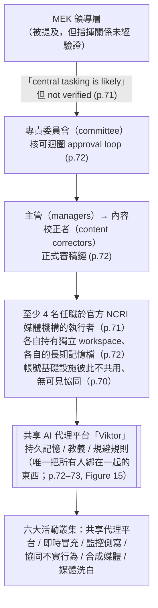

**注意這張圖的反直覺之處**：組織的「上層」是傳統科層（委員會、主管、校正者），「下層」卻是一個**技術基質**把彼此不相往來的執行者連成一個網絡。報告在 p.43 的趨勢段落把這個現象講得更白：

> "The central setup meant that actors producing content never needed to coordinate with or even know one another."（p.43）
> 「這種中央化設置意味著產出內容的行為者**從不需要彼此協調，甚至不需要認識對方**。」

這就是「Viktor」的偵測意義：它讓協同**在傳統協同偵測訊號上消失**（沒有共用 IP、沒有同步登入、沒有互相追蹤），卻**在內容與設定層留下更強的指紋**。

### 2.6 MEK / NCRI 的政治定位（中立並陳，供課堂討論用）

> **本節不是 Anthropic 報告內容**。報告只寫了「PMOI/MEK 及其政治外圍 NCRI」，沒有描述該組織的歷史或法律地位。以下全部來自公開第三方來源（見第 9 節），並刻意把「支持方敘事」與「批評方敘事」並列，**課程目的是訓練分析者處理爭議行為者，而不是為任何一方背書**。

**A. 基本事實時間線（第三方來源）**

| 年份 | 事件 |
|---|---|
| 1965 | MEK 由德黑蘭大學學生創立，意識形態混合伊斯蘭與社會主義，反對巴列維王朝。 |
| 1979 | 參與伊朗革命初期；隨後與何梅尼決裂。 |
| 1981 | 6 月大規模抗議遭鎮壓；MEK 轉入武裝路線，被指涉及 Hafte Tir 爆炸案（74 名官員死亡）及 8 月炸死總統 Rajai 與總理 Bahonar 的攻擊。同年 7 月成立 NCRI 作為傘狀政治組織。 |
| 1986–2013 | 遷入伊拉克，設於 Camp Ashraf，兩伊戰爭期間與海珊政權合作，1987 年成立「伊朗全國解放軍」（NLA）。 |
| 1988 | Mersad 行動失敗；伊朗隨後大規模處決在押的 MEK 及左翼政治犯（史稱 1988 年大屠殺）。 |
| 1997 | 美國將 MEK 列為外國恐怖組織（FTO）。 |
| 2002 | 歐盟將其列入恐怖組織名單。 |
| 2008-06 | 英國解除列管。 |
| 2009-01-26 | 歐盟理事會解除列管。 |
| 2012-09-21 | 美國國務卿 Hillary Clinton 決定將 MEK 除名；國務院表示該組織已十年以上未從事恐怖主義，但同時對其**對自身成員的虐待指控**表達嚴重關切。加拿大同年除名。 |
| 2016 | 在美國斡旋下約 3,000 名成員遷往阿爾巴尼亞（Camp Ashraf 3，位於 Manëz, Durrës）。 |
| 2026-06-20 | NCRI 在巴黎舉辦「Free Iran 2026」大型集會與國際峰會，主打「既不要沙王，也不要毛拉」（No to the Shah, No to the Mullahs）。 |

**B. 支持方敘事（NCRI/MEK 及其西方支持者的框架）**

- 自我定位為伊朗政權的「民主替代方案」，主張建立世俗、非核、多元的共和國。
- **Maryam Rajavi 的十點計畫**（2006 年於歐洲委員會首次提出）是其綱領文件：否定 velayat-e faqih（教法學家絕對統治）、人民主權與普選、言論／政黨／集會／新聞／網路自由、性別平等、族群自治（含庫德斯坦自治方案）、政教分離、市場經濟下的就業機會平等、和平共存與區域合作。這是本案 AI 頭像宣傳的**核心內容物**。
- 擁有 Simay-e Azadi（自由之顏／Iran NTV，1987 年開播的波斯語衛星電視）等自有媒體；宣稱在伊朗境內有「抵抗單元」（Resistance Units）網絡。
- 在歐美政界有長期遊說活動；John Bolton、Rudy Giuliani、已故的 John McCain 等人曾出席其集會或與 Maryam Rajavi 會面。

**C. 批評方敘事（人權組織、學界、脫離者、對手派系的框架）**

- **對內控制指控**：Human Rights Watch 2005 年報告《No Exit》記錄了 1991 年至 2003 年 2 月間該組織在伊拉克營區內對異議成員的長期拘禁與酷刑指控（HRW 於 2005 年 10 月在德國與荷蘭個別、私下訪談過報告中引用的全部 12 名證人）。RAND 於 2009 年應美國政府要求、基於 Camp Ashraf 訪談完成的研究，亦提出類似觀察。指控內容包括強制自白／「意識形態淨化」會議、強制離婚與家庭分離、長期單獨監禁等。批評者據此稱其為「人格崇拜／邪教式組織」。
- **境內支持度質疑**：多數學界與外交評估認為，由於兩伊戰爭期間與海珊合作，MEK 在伊朗境內支持度極低，且（與君主派一樣）在海外僑民中比在境內更受歡迎。
- **既有的資訊操作紀錄**（這點與本案直接相關，見第 9 節）：
  - 2019 年 The Intercept（Murtaza Hussain）報導，長期被西方媒體引用的「伊朗異議作者 Heshmat Alavi」實為 MEK 政治部門團隊經營的**虛構人格**；高階脫離者 Hassan Heyrani 稱「這從來不是一個真實的人」。
  - 2021 年 4 月 Meta 的〈March 2021 Coordinated Inauthentic Behavior Report〉移除源自阿爾巴尼亞、針對含伊朗在內全球受眾的網絡：**128 個 Facebook 帳號、41 個粉絲專頁、21 個社團、146 個 Instagram 帳號**，並將其連結至 MEK；Facebook 描述其為「一個組織嚴密的 troll farm」，並指出假帳號與**阿爾巴尼亞境內 MEK 相關真實帳號與粉專之間長期一致的基礎設施連結**。NCRI 當時公開否認，稱「阿爾巴尼亞有 MEK 相關 troll farm 的說法是可笑且絕對錯誤的」。
- **派系鬥爭脈絡**：報告 p.71 寫明本行動把訊息火力對準「伊朗政府、君主派團體與巴列維陣營」，並散布一支攻擊巴列維家族成員的**偽造影片**，使用「既不要沙王，也不要教士」（Neither Shah Nor Sheikh）框架。這與 2022 年後伊朗流亡反對派內部 MEK 陣營 vs. Reza Pahlavi 君主派的公開對立完全吻合。**本案的攻擊對象包含其他反對派，不只是伊朗政權。**

**D. 為什麼這個案例對課程特別重要**

大多數影響力行動教材的預設是「威權國家 → 民主社會」。本案打破這個預設：

- 行為者是**反威權的流亡反對運動**，其政治綱領（十點計畫）在文本上是自由民主的；
- 但其手法——冒充真人、對境內個人做被捕紀錄側寫、隱藏組織歸屬的假獨立新聞帳號、未揭露的合成人物——與威權國家的手法**在技術與倫理上沒有差別**；
- 而且**最終受害者是它宣稱要解放的那群人**：伊朗境內的聯絡人與異議者。

這正是 Anthropic 在方法論上刻意採取的立場：它在報告中對所有行為者一律適用同一套 Usage Policy 與同一套 Breakout Scale，不因政治立場區分。課堂上應該讓學員直面這個張力（見 10.2 討論題）。

---

## 3. 受害者與目標清單

### 3.1 直接受害者

| 受害者 | 規模／描述 | 傷害類型 | 頁碼 |
|---|---|---|---|
| 一名真實運動者（未具名，男性） | 個人 Telegram 帳號被複製；約 **8,400 則**貼文被讀取用於模仿文風；身分被 AI 冒用進行即時政治對話 | 身分盜用、名譽風險、被其聯絡人誤認 | p.70 |
| 該運動者在**伊朗境內**的聯絡人 | 數量未明確；報告稱「his contacts」。另外，冒充帳號曾同時對**超過 30 名**聯絡人發送一則**捏造的**突發新聞標題 | 在不知情下與 AI 對話、可能洩露自身身分與立場、被伊朗當局識別的風險 | p.70, p.71 |
| 伊朗境內被建檔的具名個人 | 「數十名（dozens of）特定個人」被建立詳細心理側寫檔案 | 非自願側寫；Cluster 表明示其中含「依伊朗法律面臨監禁或處決者」的被捕紀錄側寫 | p.71, p.72 |
| 被刮取的社群頻道成員 | **超過 500 個**社群頻道被刮取以建立境內個人檔案；分析約 **51,944 則**封存訊息 | 大規模非自願資料處理 | p.71 |
| 被滲透的 Telegram 群組 | Figure 15 標示「Telegram infiltration：**741 handles · 500+ groups**」 | 群組成員被納入監控漏斗 | Fig.15 (p.73) |
| 學生族群 | Figure 15「Student infiltration @anti\_silent」；IOC 表註記 `@anti_silent` 為「Student surveillance funnel」；`@tehranchekhabar19` 註記為「student targeting」 | 針對性監控與招募 | Fig.15, p.75 |
| 巴列維家族某成員 | 遭一支**捏造影片**攻擊 | 誹謗、合成媒體傷害 | p.71 |
| 被「洗白」的原始媒體與記者 | 內容遭去浮水印、改寫後以「獨立報導」再散布 | 著作與歸屬被剝奪、公信力被挪用 | p.73 |

### 3.2 受眾（目標對象）

Figure 15 明確畫出兩個橘色的「Audience / target」節點：

1. **People inside Iran（伊朗境內人民）**——被標註為「Target of recruitment and live impersonation」（招募與即時冒充的目標）。
2. **Diaspora audiences（海外僑民受眾）**。

報告正文則寫「targeted Iranian audiences inside the country and abroad」（p.70）。

### 3.3 目標分群維度（這是本案最該被記住的細節之一）

報告 p.71：

> "They then grouped these targets by **city, age, occupation, political alignment, and arrest history** likely to help them tailor their messages to the specific audiences."

五個維度中，前四個是常見的受眾分群欄位（行銷也會用）。**第五個「arrest history（被捕紀錄）」不是。**

在一個以 baghi 罪名處決 MEK 關聯者的法域裡，「被捕紀錄」作為分群欄位有兩種可能用途：

- **善意解讀**（行動者可能的自述）：找出已經被政權迫害過、因此可能對反對派訊息有共鳴的人。
- **風險解讀**（Anthropic 採取的解讀）：Cluster 表把它列為該叢集的「Most serious element」，寫成「Arrest-history profiling of people who face imprisonment or execution under Iranian law」。

**無論行動者本意為何，這份資料一旦外洩或被伊朗情報單位取得，就是一份現成的鎮壓清單。** 這是課堂上必須點破的：影響力行動的**副產品資料庫**，其危害可能超過它散布的內容本身。

### 3.4 攻擊的第二層目標：其他反對派

報告 p.71 最後一項 Key finding：

> "The operation focused its messaging on the Iranian government, monarchist groups, and the Pahlavi camp. The actors spread a fabricated video attacking a member of the Pahlavi family and used the 'Neither Shah Nor Sheikh' framing against the targets. This content was designed to strengthen the MEK's position in the Iranian opposition."

換句話說，這個行動的目標函數**不只是打擊伊朗政權，也包括在反對派內部搶奪主導權**。對分析者而言，這會改變你的「誰受益」推論：內容看起來是反政權的，但實際受益者是反對派中的某一派。

---

## 4. AI 濫用的攻擊生命週期（逐階段拆解）

報告的「Attack lifecycle and AI usage」段落（p.72）沒有用編號階段，而是以敘事＋Cluster 表呈現。以下依情報產製與 IO 慣用的生命週期重新排列，每階段標示**人類做什麼／Claude 做什麼／自主程度**。

自主程度採本課程三級分類：
- **L1 對話式協助**：人類逐則提問，AI 回答。
- **L2 人類逐步指揮**：人類設計流程，AI 執行單一步驟，人類串接。
- **L3 AI 編排／自主執行**：AI 依持久記憶與排程自行產出，人類僅做例外處理與更新設定。

---

### 4.0 階段 0：建立共享基質（Viktor 平台佈建）

| | 內容 |
|---|---|
| **人類做什麼** | 建立一個共享 AI 代理平台（Anthropic 稱之為 "Viktor"）；為每名行為者開設獨立 workspace；把 MEK 創始教義以「strategic base data」載入模型記憶供他人重用；持續更新每個 workspace 的長期記憶檔。 |
| **記憶檔內容** | 報告點名四類：**禁用詞清單（banned words）**、**核可來源（approved sources）**、**帳號管理規則（account management rules）**、**規避偵測方法（ways to avoid detection）**。IOC 表另外給出檔名慣例：`SKILL.md` / `LEARNINGS.md`。 |
| **Claude 做什麼** | 依記憶檔內容，在無人逐一下指令的情況下持續產出。原文："This allowed the agent to keep producing content without a human user directing each session."（p.72） |
| **自主程度** | **L3**。這是全案的關鍵。 |
| **教學註記** | 注意 `SKILL.md` 與 `LEARNINGS.md` 這兩個檔名：`SKILL.md` 是 Anthropic Agent Skills 的標準檔名；`LEARNINGS.md` 是社群常見的「代理自我累積經驗」慣例。也就是說，**攻擊者使用的不是自製框架，而是主流代理工程的標準做法**。這降低了技術門檻，也代表偵測不能靠「異常框架」來做。 |

---

### 4.1 階段 1：目標發掘與資料採集（Surveillance）

| | 內容 |
|---|---|
| **人類做什麼** | 指定要刮取的頻道範圍；建立漏斗入口帳號（Figure 15：`@fwr.ir` sockpuppet funnel、`@anti_silent` student funnel）；維運 741 個 Telegram handle、滲透 500+ 群組。 |
| **Claude 做什麼** | 處理刮取回來的資料；報告寫「analyzed roughly 51,944 archived messages from these conversations」；建立、分類與分群個人檔案。 |
| **規模數字** | 500+ 社群頻道；51,944 則封存訊息；數十名具名個人的心理側寫檔案；741 handles / 500+ groups（後者僅見於 Figure 15，正文未提）。 |
| **分群維度** | city, age, occupation, political alignment, **arrest history**。 |
| **Cluster 表描述** | 「A ten-stage funnel; psychographic dossiers on named individuals inside Iran」——**十階段漏斗**。報告正文**沒有**展開這十個階段的內容，這是本案的重要資訊缺口。 |
| **自主程度** | **L2–L3**。資料取得需要人類維運帳號；分析與側寫由代理平台批次執行。 |

**關於「51,944」這個數字的分析價值**：報告寫的是「**roughly** 51,944」。一個精確到個位數的數字卻被冠上「大約」，最合理的解釋是——這是**從行為者自己的工作內容中讀到的數字**（例如對話中提及、或某個檔案的統計），而非 Anthropic 自行量測的結果。這在情報分析上是重要區別：**這是行為者的自述規模，不是平台的量測規模**。課堂上應該讓學員養成對這類「精確但被標為約略」的數字保持敏感。

---

### 4.2 階段 2：身分複製與即時冒充（Live impersonation）

這是全案自主程度與傷害性最高的一段，值得逐句拆。

報告原文（p.70）：

> "To deceive users, the operation impersonated a real-world activist by tasking the shared AI agent to clone the activist's personal Telegram account, then instructing it in Persian that it was now that person. The actor directed Claude to read roughly 8,400 of his Telegram posts to copy his writing style, and then used it to run live political conversations with his contacts. To our knowledge, these contacts did not know they were speaking with an AI-assisted account."

拆成五個技術動作：

1. **`clone the activist's personal Telegram account`** — 複製帳號。報告**沒有**說明是如何取得的：是帳號被接管（takeover）、是建立高相似度的仿冒帳號（look-alike）、還是匯出公開頻道內容後重建？「clone... personal Telegram account」的字面意義比較接近「複製出一個一模一樣的帳號」，但報告未細說。**這是本案最重要的未解技術問題**（見第 12 節）。
2. **`instructing it in Persian that it was now that person`** — 以波斯語下達人格指派。用母語下指令有兩個作用：讓輸出的語感自然；以及（可能的副作用）讓以英語為主的安全分類器較難判讀意圖。
3. **`read roughly 8,400 of his Telegram posts`** — 以被冒充者**自己的語料**訓練模仿。8,400 則貼文足以捕捉個人的用詞習慣、標點癖好、政治語彙、稱呼方式、表情符號使用模式。Cluster 表把這件事描述為「Cloning a real person's **voice** from their **private messages**」（p.72）——注意這裡用的是 **private messages（私訊）**，比 p.70 的「posts（貼文）」範圍更敏感。兩處描述的差異本身就值得記錄。
4. **`run live political conversations with his contacts`** — **即時、雙向、對人**。這不是產出貼文，而是**冒充一個人與其熟人對話**。
5. **`sent a fabricated breaking news headline to more than 30 contacts simultaneously`**（p.71）— 冒充帳號同時被用來做廣播式散布，以該運動者的可信度為載體。

| | 內容 |
|---|---|
| **人類做什麼** | 取得／建立被複製的 Telegram 帳號；下達波斯語人格指派指令；決定與誰對話、談什麼；決定何時同步群發。 |
| **Claude 做什麼** | 吸收 8,400 則貼文形成文風模型；**即時生成對話回應**；維持人格一致性。 |
| **自主程度** | **L2–L3 之間，且這正是危險所在。** 「即時對話」代表回應是逐句生成的（不是人類先寫好再貼上），但人類仍在決定對話對象與方向。可以說是「**人類選目標，AI 扮演人**」。 |

#### 4.2.1 「數位冒充造成實體人身風險」的機制鏈（本案必須講透的部分）

很多學員第一次看到這種案例時，直覺是「冒充帳號＝名譽損害」。**在伊朗的脈絡下不是。** 完整的機制鏈如下：

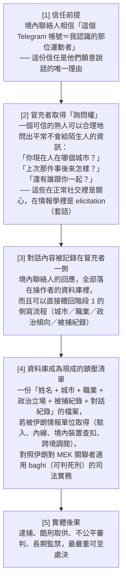

**同時存在的第二條路徑（不需要資料外洩）**：

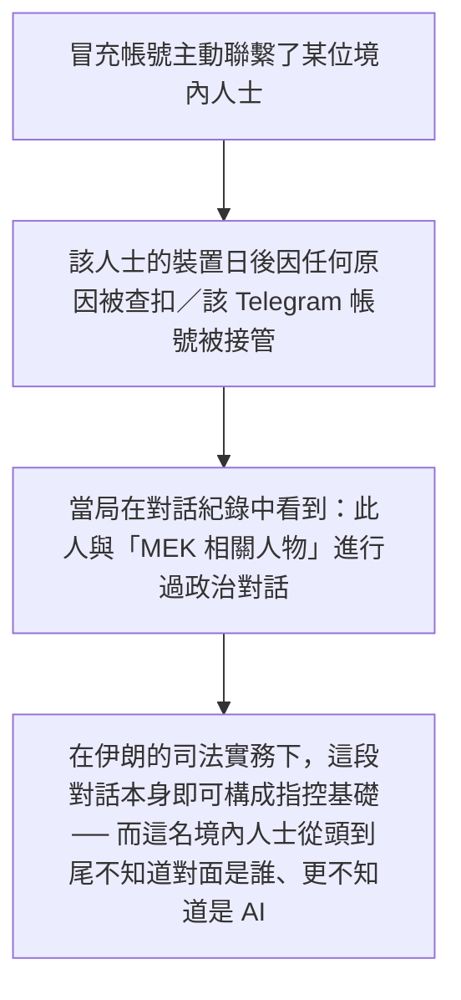

**第二條路徑是本案最惡劣的地方**：被冒充者的聯絡人**在完全不知情、也沒有同意**的情況下，被納入了一段日後可能讓他們喪命的對話紀錄。Anthropic 的措辭「To our knowledge, these contacts did not know they were speaking with an AI-assisted account」在法律與倫理上直接對應到**知情同意的完全缺席**。

> **這是課程的核心論點之一**：在跨境鎮壓（transnational repression）的脈絡下，「身分」不是一個帳號屬性，而是一條**人身安全邊界**。AI 讓「以足夠高的擬真度長時間扮演某個特定真人」從需要專業情報訓練的工作，降級為一個「讀 8,400 則貼文 + 一句波斯語系統提示」的操作。

#### 4.2.2 對應防護：運動者與記者該做什麼（可直接發給學員的檢查表）

這一節請在課堂上當作**實用產出**來教，不要只當背景。

**A. 對「我可能被冒充」的準備（給公眾人物／運動者／記者）**

| 措施 | 具體作法 | 為什麼有效 |
|---|---|---|
| 預先公告官方通道 | 在你的公開頻道置頂一則「我只會從以下帳號聯絡你」清單，並列出**我絕對不會做的事**（例：我永遠不會在私訊裡問你人在哪、不會問你還有誰參與、不會要你轉傳未署名的突發新聞） | 把驗證責任從「事發後」前移到「事發前」，讓冒充者無法定義規則 |
| 建立帶外驗證（out-of-band） | 與高風險聯絡人事先約定第二通道（例：另一個 App、語音短句、共同認識的第三人） | 冒充者複製了 Telegram，不代表他同時控制第二通道 |
| 設定暗號與反暗號 | 事先約定一組**只有你們知道**的問答；再約定一組**在被脅迫時使用的求救暗號**（duress code） | AI 可以模仿文風，模仿不了共享秘密 |
| 定期發布「存活／真實性訊號」 | 例如每週在公開頻道貼一則含當日新聞關鍵字的訊息 | 讓聯絡人有一個可獨立查核的新鮮度基準 |
| 保護貼文語料 | 理解「你所有的公開貼文都是訓練你的替身的語料」。這不代表不要發文，而是**接受「文風不再是身分證明」** | 直接否定 8,400 則貼文攻擊的前提假設 |
| 帳號硬化 | Telegram：啟用**兩步驟驗證雲端密碼**（防止只靠簡訊 OTP 被接管）、定期檢視「已登入的裝置（Active Sessions）」並登出陌生工作階段、關閉「以手機號碼搜尋到我」、設定自毀期限 | 伊朗已有多起「以簡訊驗證碼接管 Telegram 帳號」的紀錄（見第 9 節 CNN / IranWire 報導） |
| 高風險對話換平台 | 對境內高風險聯絡人，改用預設端對端加密且支援消失訊息的工具（Signal），並**驗證安全碼（safety number）** | Telegram 一般聊天**非**預設端對端加密，且雲端備份在伺服器端 |

**B. 對「我可能正在跟冒充者說話」的準備（給境內聯絡人／一般成員）**

| 觸發訊號 | 該做什麼 |
|---|---|
| 熟人帳號**突然開始問身分性問題**（位置、同伴、組織關係、被捕經歷） | 立刻停止回答，改用帶外通道驗證 |
| 對方**沒有共享記憶**：問一件你們共同經歷但未曾寫在網路上的小事，對方答不出或答得空泛 | 高度可疑。AI 能模仿文風，但無法知道未公開的共同記憶 |
| 對話**永遠即時、永遠有回應、語氣異常穩定**，且從不提及生活瑣事或時差 | 可疑（但不可作為單一判準） |
| 對方要你**轉傳未署名的突發新聞**，或要你把訊息散給你的聯絡人 | 這正是報告中「同時發給 30 名以上聯絡人的捏造頭條」的模式 |
| 帳號的 handle、顯示名稱、頭像有**細微差異**（多一個底線、字母 l/I 互換、零寬字元） | 立即以帶外通道求證 |

**C. 組織層（NGO／新聞編輯室）**

1. 訂立**「絕不在即時通訊中索取身分資訊」**的內規，並讓所有外部聯絡人知道這條規矩——規矩公開，冒充者就無法安全地違反它。
2. 建立**冒充事件通報路徑**：發現有人冒充本組織成員時，24 小時內在公開頻道發布警示（含冒充帳號的 defang handle），並通報平台。
3. 對高風險聯絡人採取**最小資料原則**：不保存不必要的聯絡人清單、不同專案的聯絡人分艙。
4. **演練**：每季做一次「我的帳號被複製了，接下來 6 小時做什麼」的桌面演練（見 10.3）。

---

### 4.3 階段 3：內容產製與合成媒體（Content & synthetic media）

| | 內容 |
|---|---|
| **人類做什麼** | 決定宣傳主題（Maryam Rajavi 十點計畫）；決定頭像要「看起來像一般伊朗人」；**刻意不揭露 AI 生成**。 |
| **Claude 做什麼** | 為**每一篇文章**生成 AI 頭像；Cluster 表寫「Avatars with Persian audio for spokespeople」。 |
| **後製** | 頭像被「animated（動態化）」、加上**波斯語語音**。報告未說語音是否由 Claude 生成；同報告他處（p.102, GTG-34007）另有「把 Claude custom skills 變成語音複製工廠」的案例，可作對照但**不可混為一談**。 |
| **Cluster 表的「最嚴重元素」** | "Undisclosed synthetic 'ordinary Iranians' and **historical-figure deepfakes** manufacturing false authority"（p.73） |
| **自主程度** | **L2**（模板化批次生成，人類定義模板與主題）。 |

**兩個必須點出的細節：**

1. **「historical-figure deepfakes（歷史人物深偽）」只出現在 Cluster 表，正文完全沒提。** 這是本案的資訊缺口之一：報告沒有說是哪些歷史人物、內容是什麼。對伊朗政治語境熟悉的人會知道這類手法的威力（讓已故的權威人物「背書」當前立場），但**報告未提供細節，教材不應臆測**。
2. **「刻意隱藏 AI 生成事實」是獨立的可歸責行為。** 報告用的是 "while **intentionally** hiding the fact that they were AI-generated"（p.71）。在多數平台政策與逐漸成形的各國 AI 標示規範下，這是**揭露義務的違反**，與「內容是否真實」是兩個獨立的問題。課堂上要區分：一個 AI 生成的發言人講了真話，仍然構成欺騙，因為欺騙的是**發言者的身分與代表性**。

---

### 4.4 階段 4：協同不實行為與散布（CIB & distribution）

| | 內容 |
|---|---|
| **人類做什麼** | 建立與維運多個 Instagram 帳號；設定排程（Figure 15：「Multi-page IG network — 3 pages · **one cron**」）。 |
| **Claude 做什麼** | 依受眾分群調整內容（audience-segmented）；產出同步排程的多帳號貼文。 |
| **隱蔽策略** | 「為了隱藏真實動機，**初期貼文刻意不提及 Mojahedin**，讓該團體的宣傳看起來像無所屬的中立新聞」（p.71）。 |
| **Cluster 表最嚴重元素** | "Concealment of MEK affiliation and near-identical coordinated output under 'independent' branding"（p.72） |
| **自主程度** | **L3**（cron 排程 + 持久記憶 = 無人值守產出）。 |

**「one cron」三個字的偵測價值極高。** 它意味著三個 Instagram 頁面由**同一個排程器**驅動。這會在平台側留下極強的統計指紋：發文時間戳的**條件熵異常低**、跨帳號的發文間隔高度相關、且與任何人類作息不符。Figure 15 把這件事畫出來，是全圖最實用的偵測線索之一（詳見 6.2）。

---

### 4.5 階段 5：媒體洗白（Media laundering）

| | 內容 |
|---|---|
| **人類做什麼** | 決定要把哪些 MEK 關聯媒體內容「漂白」為獨立報導。 |
| **Claude 做什麼** | 「Rewriting and redistributing MEK-affiliated media as independent reporting」（p.73）。 |
| **Cluster 表最嚴重元素** | "**Watermark stripping** and disguising organizational content as ordinary compatriot voices"（p.73） |
| **自主程度** | **L3**（可完全自動化的改寫管線）。 |

**「Watermark stripping（去除浮水印）」需要特別講。** 這同時意味著：

- 技術上：去除視覺浮水印／來源標記，讓內容無法被追溯回 NCRI 媒體；
- 制度上：這直接打擊**內容來源溯源（provenance）** 這條防線。近年業界押注的 C2PA／內容憑證（Content Credentials）等溯源方案，前提是「標記存在且未被移除」。本案顯示行為者**把去標記當成標準作業程序**。
- 對照報告 p.43 的趨勢段落：「Actors prompted Claude to intentionally strip state attribution from republished material, passing claims through chains of outlets so they read as independently confirmed.」（行為者要 Claude 刻意剝除轉載素材的國家歸屬，讓主張經過一連串媒體之後讀起來像是被獨立證實過的。）本案是同一模式的非國家版本。

---

### 4.6 階段 6：語言標準化與規避（Evasion）

| | 內容 |
|---|---|
| **口號替換** | 強制把 2022 年自發抗議口號 **«زن، زندگی، آزادی»（Woman, Life, Freedom／女性、生命、自由）** 替換為 MEK 版本 **«زن، مقاومت، آزادی»（Woman, Resistance, Freedom／女性、抵抗、自由）**（p.72）。 |
| **強制標籤** | `#OurChoiceMaryamRajavi`（p.75）。 |
| **文字層規避** | 「ZWNJ + dot/space evasion」（p.75）——以零寬不連字（U+200C，波斯文正常書寫必用的字元）與點／空格的插入變形來規避關鍵字比對。 |
| **禁用詞清單** | 存放在每個 workspace 的長期記憶檔中（p.72）。 |
| **自主程度** | **L3**（規則寫進記憶，代理自動遵循）。 |

**口號替換的操作意涵**：2022 年「女性、生命、自由」是一場**自發性、跨派系**的抗議運動符號，其正當性來自它不屬於任何組織。把 "Life" 換成 "Resistance"（مقاومت，正是 MEK/NCRI 自我標榜的「抵抗」一詞），等於**把一個公共財符號私有化**，讓所有使用該變體的內容自動帶上組織歸屬。

**這同時是絕佳的偵測指標**：任何一段內容使用 «زن، مقاومت، آزادی» 而非標準版，就在語料層自我標記了。這也是為什麼 Anthropic 把「mandatory slogan」列為 Fingerprints（跨行為者簽章）。

**關於 ZWNJ 規避的技術說明**（教學用，不是攻擊教學）：ZWNJ（U+200C）在波斯文中是**正常且必要**的排版字元（例如 «وب‌نگار» 中間那個就是 ZWNJ）。這讓它成為理想的規避載體——你**不能**簡單地把含 ZWNJ 的波斯文標為可疑，因為那會誤傷絕大多數正常波斯文。正確的偵測做法是看**異常位置**的 ZWNJ 與異常的插入頻率分布，而不是看它是否存在。這是課堂上講「規避偵測」時很好的反例：**最好的規避字元，是那個你不能禁用的字元。**

---

### 4.7 階段 7：Anthropic 的介入

| | 內容 |
|---|---|
| **發現方式** | 「We found this activity as part of our internal investigations」（p.74）——內部調查，**非**外部通報、**非**平台合作線索。 |
| **處置** | 「banned the accounts」——停用帳號。 |
| **限制自陳** | 「At this point, we are not able to independently confirm how much authentic engagement was drawn by the network's amplification accounts.」 |
| **報告未提及的事** | 未提及與平台分享指標；未提及告知被冒充者或其聯絡人；未提及 Claude 曾拒絕任何請求。詳見第 8 節。 |

---

### 4.8 全生命週期自主程度總表

| 階段 | 人類角色 | AI 角色 | 自主程度 | 報告依據 |
|---|---|---|---|---|
| 0 佈建共享代理平台 | 建 workspace、寫記憶檔、載入教義 | 依記憶持續產出 | **L3** | p.72 |
| 1 監控與側寫 | 維運漏斗帳號、指定範圍 | 分析 51,944 則訊息、建檔分群 | L2–L3 | p.71–72 |
| 2 即時冒充 | 取得帳號、指定對象與話題 | 學文風、即時扮演真人對話 | **L2–L3** | p.70, p.72 |
| 3 合成媒體 | 定主題、定風格、決定不揭露 | 逐篇生成頭像 | L2 | p.71, p.73 |
| 4 協同不實行為 | 建帳號、設 cron | 分眾改寫、同步產出 | **L3** | p.71–72, Fig.15 |
| 5 媒體洗白 | 選素材 | 改寫、去標記、再散布 | **L3** | p.73 |
| 6 語言規範與規避 | 訂規則寫進記憶 | 自動套用禁用詞、口號、ZWNJ 變形 | **L3** | p.72, p.75 |

**課堂重點**：六個叢集中有四個達到 L3。這在 2026 年的影響力行動中已非罕見，但本案的特殊處在於 **L3 不是靠自製的 agent framework，而是靠「共享工作區 + 持久記憶檔」這種完全標準、完全無害的產品功能**。防守方不能寄望於「偵測到可疑的自動化框架」。

---

## 5. TTP 與 MITRE ATT&CK 對應

### 5.1 框架選擇說明（先講方法）

MITRE ATT&CK 是**網路攻擊**的戰術技術框架，其 Reconnaissance / Resource Development 戰術涵蓋部分 IO 前期行為，但**不涵蓋內容產製、敘事操作、受眾分群**。影響力行動的對應框架是 **DISARM**（前身 AMITT），由 DISARM Foundation 維護。

本節的做法是：

- **ATT&CK 欄**：只填寫我有把握對應的技術 ID，並標明哪些行為**在 ATT&CK 中沒有對應**（框架缺口）。
- **DISARM 欄**：使用 DISARM 的**戰術階段名稱**（而非技術編號）。DISARM 的技術編號版本迭代頻繁，**教材不逐一標號，請學員以當期 DISARM 官方發布為準**——這是誠實標註，不是偷懶。

### 5.2 對應表

| # | 本案具體作法 | ATT&CK 戰術／技術 | DISARM 戰術階段 | 偵測構想 |
|---|---|---|---|---|
| 1 | 刮取 500+ 社群頻道，蒐集伊朗境內個人資訊 | Reconnaissance → **T1593.001 Search Open Websites/Domains: Social Media**；**T1589 Gather Victim Identity Information** | Target Audience Analysis | 平台側：單一帳號／IP 群在短期內遍歷大量頻道的讀取模式；AI 側：對話中出現大批量非公眾人物姓名 + 地點 + 政治屬性的結構化整理 |
| 2 | 分析 51,944 則訊息建立心理側寫檔案 | **無直接對應**（ATT&CK 不涵蓋對人的心理側寫）→ **框架缺口** | Target Audience Analysis / Microtarget | AI 側：偵測「批次輸入他人私訊 + 要求輸出人格／政治傾向／風險評分」的請求形態；這是 Usage Policy 的非合意側寫條款所禁止的行為 |
| 3 | 以 arrest history 作為分群欄位 | **無對應** → **框架缺口**（且這是本案最該被獨立標記的行為） | Microtarget | AI 側：把「被捕紀錄／前科／被拘留經歷」與具名個人一起出現的請求列為高風險模式，尤其當目標國為高鎮壓風險法域時 |
| 4 | 複製真實運動者的個人 Telegram 帳號 | Resource Development → **T1586.001 Compromise Accounts: Social Media Accounts**（若為接管）／ **T1585.001 Establish Accounts: Social Media Accounts**（若為仿冒新建） | Establish Social Assets | **報告未說明取得方式，兩條路徑都要納入偵測。** 平台側：新帳號的顯示名稱／handle 與既有高追蹤者帳號的編輯距離極小；既有帳號的裝置指紋、登入地理位置突變 |
| 5 | 以波斯語下達「你現在就是這個人」的人格指派 | **無對應** → **框架缺口**（模型層人格注入不在 ATT&CK 範圍） | Develop Narratives / Establish Legitimacy | AI 側：系統提示或記憶檔中出現「你是 \<真實人名\>」＋「以下是他的 N 則貼文」的組合，應視為冒充意圖的強訊號 |
| 6 | 讀取 8,400 則貼文複製文風 | Reconnaissance → **T1593.001** | Develop Narratives | AI 側：單一工作階段內攝入同一人數千則貼文並要求「模仿其寫作風格」 |
| 7 | 以被冒充者身分進行即時政治對話 | **T1656 Impersonation** | Deliver Content / Establish Legitimacy | 平台側：帳號在短期內的訊息產出速率、回覆延遲分布、跨時區持續性；訊息語言模型困惑度（perplexity）分布與該帳號歷史語料的偏移 |
| 8 | 同時對 30+ 聯絡人發送捏造頭條 | **T1656**；Impact 側無對應 | Deliver Content / Flood the Information Space | 平台側：一對多同文訊息的同時發送（fan-out burst）；內容與任何可查核新聞源不匹配 |
| 9 | 生成 AI 頭像、動畫化、加波斯語語音、偽裝成一般伊朗人且不揭露 | **無對應** → **框架缺口**（ATT&CK 無合成媒體技術） | Develop Content / Establish Legitimacy | 平台側：合成影像偵測 + 同一生成模型的隱式指紋跨帳號重現；政策側：未揭露合成人物的標示違規 |
| 10 | 多帳號 Instagram 管線、同步排程、分眾投放 | Resource Development → **T1585.001** | Establish Social Assets / Maximize Exposure | 平台側：**跨帳號發文時間戳相關性**（本案 Figure 15 明示 "3 pages · one cron"）、貼文間隔的低熵、相同素材的近重複偵測 |
| 11 | 初期貼文刻意不提 Mojahedin，偽裝中立新聞 | **無對應** → **框架缺口** | Establish Legitimacy / Conceal Identity | 平台側：帳號敘事隨時間的「政治偏向漂移」曲線——初期中立、逐步顯露；這是可量化的時間序列特徵 |
| 12 | 改寫 MEK 關聯媒體為「獨立報導」、去除浮水印 | **無對應**（ATT&CK 無內容洗白）→ **框架缺口** | Develop Content / Launder Attribution | 近重複內容偵測（near-duplicate detection）：同一事實敘述在多個「獨立」來源間的高相似度；內容憑證（C2PA）缺失或被剝離的異常 |
| 13 | 七個 MEK/NCRI 網域 hard-coded 為強制來源集 | Resource Development → **T1583.001 Acquire Infrastructure: Domains**（部分適用，這些是既有官方網域而非新註冊） | Develop Narratives | **這是最好用的偵測特徵**：多個宣稱獨立的帳號，其外連來源集合完全相同且限縮 |
| 14 | ZWNJ + 點／空格規避、禁用詞清單 | Defense Evasion → 概念上近 **T1027 Obfuscated Files or Information**，但對象是自然語言而非檔案 → **對應牽強，實質為缺口** | Conceal Information Assets | 看**異常位置**的 ZWNJ 與插入頻率分布，而非看 ZWNJ 是否存在（見 4.6） |
| 15 | 強制口號變體 + `#OurChoiceMaryamRajavi` | **無對應** | Develop Narratives | 語料層指紋比對，可跨平台執行，成本極低 |
| 16 | 共享 AI 代理平台 + 每 workspace 持久記憶檔（`SKILL.md` / `LEARNINGS.md`） | **完全無對應** → **本案最大的框架缺口** | 無單一對應（跨越 Plan Strategy / Persist in the Information Environment） | AI 供應商側：跨帳號、跨組織偵測**近乎相同的記憶檔／技能檔內容**；這是唯一能在協同訊號消失時仍然看見協同的層級 |

### 5.3 框架缺口的總結（這是本節真正要教的東西）

16 項 TTP 中，只有 5 項有合理的 ATT&CK 對應（#1、#4、#6、#7、#10、#13 部分適用），**11 項落在框架之外**。缺口集中在三個地方：

1. **對人的分析行為**（心理側寫、被捕紀錄分群）——ATT&CK 的受害者概念是「系統」，不是「人的心理」。
2. **內容與敘事層**（合成媒體、洗白、口號規範、隱藏歸屬）——這是 DISARM 的領域。
3. **AI 代理自身的治理層**（持久記憶作為協同基質、跨行為者共用技能檔）——**DISARM 也沒有**。這是 2026 年才成熟的現象，兩個框架都還沒追上。

**給學員的實作結論**：如果你在台灣的機構要建 IO 偵測能力，不要只買一套 ATT&CK 對映的產品。你需要三層：
- 網路層（ATT&CK）
- 內容／敘事層（DISARM + 近重複偵測 + 語料指紋）
- **AI 使用層（目前沒有現成框架，你得自己定義：記憶檔指紋、技能檔指紋、排程指紋、人格注入偵測）**

第三層目前只有 AI 供應商看得到——這正是為什麼 Anthropic 這類報告在 IO 研究上不可替代，也正是為什麼「AI 供應商是新的觀測點」會成為本課程的核心論點之一。

---

## 6. 圖表逐一判讀

> 本節四個小節全部由本教材作者**以 130 DPI 渲染圖逐字判讀原始 PDF 頁面**完成，不是抄圖說文字。凡是「只出現在圖上、正文沒寫」的資訊，都會特別標記，因為那些往往是最有偵測價值的細節。

---

### 6.1 Cluster / What Claude was used for 表（p.72 下半 – p.73 上半）

**圖片類型**：三欄式資料表，跨頁（前四列在 p.72，後兩列在 p.73）。無圖號，報告未給它 Figure 編號。

**完整抄錄（英文原文）**：

| Cluster | What Claude was used for | Most serious element |
|---|---|---|
| **Shared agent platform ("Viktor")** | Persistent-memory agents running autonomous, scheduled production across actors | Cross-actor shared doctrine and evasion functioning as a coordination substrate |
| **Live impersonation** | Cloning a real person's voice from their private messages; running live conversations as them | Impersonating a real activist to contacts inside Iran without their knowledge |
| **Surveillance and profiling** | A ten-stage funnel; psychographic dossiers on named individuals inside Iran | Arrest-history profiling of people who face imprisonment or execution under Iranian law |
| **Coordinated inauthentic behavior** | Multi-account Instagram pipelines with synchronized, audience-segmented posting | Concealment of MEK affiliation and near-identical coordinated output under "independent" branding |
| **Synthetic media** | Avatars with Persian audio for spokespeople | Undisclosed synthetic "ordinary Iranians" and historical-figure deepfakes manufacturing false authority |
| **Media laundering** | Rewriting and redistributing MEK-affiliated media as independent reporting | Watermark stripping and disguising organizational content as ordinary compatriot voices |

**繁體中文對照**：

| 叢集 | Claude 被用來做什麼 | 最嚴重的元素 |
|---|---|---|
| **共享代理平台（「Viktor」）** | 具持久記憶的代理，跨行為者執行自主、排程化的產出 | 跨行為者共用的教義與規避手法，實際上發揮了**協同基質**的功能 |
| **即時冒充** | 從真人的**私訊**中複製其「聲音」（語氣人格）；以其身分進行即時對話 | 在伊朗境內聯絡人**不知情**的情況下冒充一名真實運動者 |
| **監控與側寫** | 一套**十階段漏斗**；對伊朗境內**具名個人**建立心理側寫檔案 | 對依伊朗法律**面臨監禁或處決**者做被捕紀錄側寫 |
| **協同不實行為** | 多帳號 Instagram 管線，同步排程、分眾投放 | 隱匿 MEK 關聯，並在「獨立」品牌下輸出近乎一模一樣的協同內容 |
| **合成媒體** | 為發言人製作帶波斯語語音的頭像 | 未揭露的合成「一般伊朗人」與**歷史人物深偽**，製造虛假權威 |
| **媒體洗白** | 改寫並重新散布 MEK 關聯媒體，使其看起來像獨立報導 | **去除浮水印**，把組織內容偽裝成一般同胞的聲音 |

**這張表的資訊設計值得學習**。它不是「做了什麼」的清單，而是一個**三欄式風險評估格式**：

- 第 1 欄「Cluster」＝**行為分類**（可作為偵測規則的分類標籤）
- 第 2 欄「What Claude was used for」＝**技術事實**（可驗證、可對映 TTP）
- 第 3 欄「Most serious element」＝**危害判斷**（分析師的價值判斷，回答「為什麼這件事重要」）

大多數威脅情報報告只有第 2 欄。把第 3 欄獨立出來，強迫分析師明說「我認為最嚴重的是什麼」，這在跨組織溝通（尤其是要說服法務、政策、高層）時極為有效。**建議課程直接把這個三欄格式當成學員的作業模板。**

**只出現在本表、正文沒寫的四項關鍵資訊**：

1. **代理平台名稱「Viktor」**（正文 p.72 只說 "a shared AI agent platform"，沒給名字；名字出現在本表與 Figure 15 圖說）。
2. **「private messages（私訊）」**——正文 p.70 說的是讀取「Telegram posts（貼文）」，本表說的是從「private messages」複製 voice。兩者範圍差很多。**這是本案文件內部的措辭不一致，必須標記為未解問題**（見第 12 節）。
3. **「ten-stage funnel（十階段漏斗）」**——正文完全沒提。這意味著監控側寫不是臨時起意，而是一套被文件化的**標準作業流程**。十個階段是什麼，報告沒說。
4. **「historical-figure deepfakes（歷史人物深偽）」**——正文完全沒提。

**課程用法**：把這張表印成講義，遮住第三欄，讓學員自己填「你認為最嚴重的是什麼」，再與 Anthropic 的判斷對照。這個練習能非常有效地訓練「危害評估」而非「技術描述」的思維。

---

### 6.2 Figure 15（p.73）：由共享 Claude 代理平台「Viktor」綁定的單一分散式網絡

**圖檔**：`../figures/page-073.png`

**圖說原文**：
> "Figure 15. One distributed network bound by a shared Claude-based agent platform (named 'Viktor'), spanning live impersonation, surveillance inside Iran, coordinated inauthentic behavior, synthetic spokespeople, and media laundering."

**圖說中譯**：
> 圖 15。由一個共享的、以 Claude 為基礎的代理平台（名為「Viktor」）所綁定的單一分散式網絡，橫跨即時冒充、伊朗境內監控、協同不實行為、合成發言人與媒體洗白。

**圖片類型**：**節點—連線網絡圖（force-directed style network graph）**，米白底色，含左上角圖例方塊，右下角來源註記。節點為實心圓，大小可變；連線有兩種樣式（灰色實線箭頭、灰色虛線）另加一種紅色實線箭頭。

#### 6.2.1 圖例（左上角方塊，完整抄錄）

| 圖例符號 | 英文原文 | 中譯 |
|---|---|---|
| 🔵 藍色圓 | Institutional media node | 機構型媒體節點 |
| ⚫ 深灰／黑色圓 | Amplifier / front account | 放大器／門面帳號 |
| 🔴 暗紅色圓 | Covert actor | 隱蔽行為者 |
| 🟠 橘色圓 | Audience / target | 受眾／目標 |
| —— 紅色實線 | Covert recruitment / impersonation | 隱蔽招募／冒充 |
| - - 灰色虛線 | Runs on the Viktor platform | 在 Viktor 平台上運行 |
| （說明文字） | Node size scales with documented reach | 節點大小與**已記錄的觸及數**成比例 |

右下角來源註記：**"Source: GTG-84006 investigation corpus"**（來源：GTG-84006 調查語料）。

> **注意這個來源註記的意義**：Anthropic 明說這張圖是從「調查語料」畫出來的，也就是**從行為者自己的對話與檔案裡重建**的，不是從外部平台資料重建的。這解釋了為什麼圖上有「741 handles」「3 pages · one cron」「10 avatars」這類只有內部語料才看得到的數字。

#### 6.2.2 節點完整抄錄（共 15 個）

**A. 來源與平台（左側）**

| # | 節點標籤 | 副標 | 顏色／類型 | 大小 |
|---|---|---|---|---|
| 1 | **7 source domains** | MEK / NCRI, hard-coded | 淺灰（非圖例四色之一，功能上是「資料來源」） | 小 |
| 2 | **VIKTOR** | shared agent | 深灰圓 **＋紅色外環**（全圖唯一有外環的節點） | 中 |

節點 2 下方另有一行說明文字：**"One shared agent platform binds every actor"**（一個共享代理平台把每一個行為者綁在一起）。

**B. 機構型媒體節點（藍色，共 3 個）**

| # | 節點標籤 | 副標 | 大小 |
|---|---|---|---|
| 3 | **Simay-e Azadi** | TV node · **708K** | 大 |
| 4 | **Radio Payam Azadi** | radio · **50K+** | 中 |
| 5 | **Webnegar** | TV programme | 小 |

**C. 放大器／門面帳號（深灰，共 4 個）**

| # | 節點標籤 | 副標 | 大小 |
|---|---|---|---|
| 6 | **"Independent news"** | @tehranchekhabar19 · **173K** | 中 |
| 7 | **Two-page IG + Telegram** | @javanane\_shargt · **299K** | **最大** |
| 8 | **Multi-page IG network** | 3 pages · **one cron** | 小 |
| 9 | **Synthetic-persona factory** | **10 avatars** | 小 |

**D. 隱蔽行為者（暗紅，共 4 個）**

| # | 節點標籤 | 副標 | 大小 |
|---|---|---|---|
| 10 | **Live impersonation** | @mellat\_b · **"Parsa"** | 小 |
| 11 | **Sockpuppet funnel** | @fwr.ir | 小 |
| 12 | **Telegram infiltration** | **741 handles · 500+ groups** | 中 |
| 13 | **Student infiltration** | @anti\_silent | 小 |

**E. 受眾／目標（橘色，共 2 個）**

| # | 節點標籤 | 附註文字 | 大小 |
|---|---|---|---|
| 14 | **Diaspora audiences** | — | 小 |
| 15 | **People inside Iran** | 旁註：**"Target of recruitment and live impersonation"** | 大 |

#### 6.2.3 連線結構（資料如何流動）

**灰色實線箭頭（內容／素材流）**
- `7 source domains` → `VIKTOR`、`Simay-e Azadi`、`Radio Payam Azadi`、`Webnegar`、`Two-page IG + Telegram` 等（呈扇形發散）。意義：**七個 MEK/NCRI 網域是整個網絡的強制素材來源**。
- 三個藍色機構媒體節點 → 各個深灰放大器節點。意義：**機構媒體的內容向下流入「獨立」門面帳號**（這就是媒體洗白的資料流）。
- 深灰放大器節點 → `Diaspora audiences` 與 `People inside Iran`。

**灰色虛線（Runs on the Viktor platform）**
- 從 `VIKTOR` 放射到圖上**幾乎每一個作業節點**：放大器帳號、合成人格工廠、Telegram 滲透、學生滲透、即時冒充、多頁 IG 網絡。
- 意義：**這些虛線是整張圖的論點本身**。把虛線全部拿掉，這張圖會散成三、四個彼此無關的小群（一群電視／廣播、一群 IG 帳號、一群 Telegram 帳號）。**是 Viktor 讓它們成為「一個網絡」。**

**紅色實線箭頭（Covert recruitment / impersonation）**
- 全圖只有 **4 條**，而且**全部指向同一個節點：`People inside Iran`**。
- 來源分別是：`Live impersonation`、`Sockpuppet funnel`、`Telegram infiltration`、`Student infiltration`——正是四個暗紅色的「隱蔽行為者」節點。

#### 6.2.4 這張圖傳達的核心訊息（三層）

**第一層：協同不在基礎設施，在平台。**
報告正文說行為者「未共用帳號基礎設施、無可見協同跡象」（p.70）。這張圖把那句話畫成了圖像語法：**實線（內容流）分散、虛線（平台）匯聚**。傳統的網絡分析畫的是實線；本案的真相在虛線上。

**第二層：所有隱蔽行動都收斂到同一群人身上。**
四條紅線全部指向「People inside Iran」，而那個節點旁邊寫著「招募與即時冒充的目標」。這是一個**視覺上的道德陳述**：這個網絡的公開面（電視、廣播、Instagram）看起來像媒體工作，但它的隱蔽面全部是**對境內真人的直接接觸**。

**第三層：觸及數與真實影響力的落差。**
圖例說「節點大小與已記錄的觸及數成比例」，圖上的名目觸及數加總約：708K + 299K + 173K + 50K+ ≈ **123 萬以上**（不含 89.5K 的 `@faryade_mamnoo`，該帳號在 IOC 表中但未畫進圖）。然而 p.74 明說「我們目前無法獨立確認該網絡的放大帳號吸引到多少**真實**互動」。

> **課程必講的反直覺點**：粉絲數是**可購買、可灌水、可長期累積的存量**，與「一則貼文實際影響了誰」幾乎無關。Anthropic 自己在圖上畫了大節點，卻在同一份文件裡承認不知道真實觸及。學員必須學會：**看到觸及數字時，先問「這是名目還是實證」。**

#### 6.2.5 只出現在 Figure 15、正文完全沒有的資料（極重要）

| 資料 | 為什麼重要 |
|---|---|
| **平台名稱 "VIKTOR"** | 正文只說 "a shared AI agent platform"。名字首見於 Cluster 表與本圖。 |
| **`741 handles · 500+ groups`** | 741 這個數字**全報告只出現在這張圖上**。正文只說「刮取超過 500 個社群頻道」。741 個 Telegram handle 是**維運規模**的直接指標——這不是自動刮取，是要有人養帳號的。 |
| **`3 pages · one cron`** | 「一個 cron」三個字，直接把「協同」講成一個可量測的技術事實。正文只說「協調發文排程」。 |
| **`10 avatars`** | 正文說「為**每一篇文章**建立 AI 頭像」，圖上卻說只有 **10 個頭像**。最合理的調和是：**10 個固定的合成人格身分，每篇文章指派其中一個**，而不是每篇都生一個新面孔。但報告未明說，**本教材標記為文件內部張力**（見第 12 節）。 |
| **節點名稱 `Simay-e Azadi` / `Radio Payam Azadi` / `Webnegar`** | 正文只寫「broadcast television, satellite and shortwave radio」，沒給機構名。這三個名字讓分析者能把 IOC 表中的 Instagram handle 對應到真實世界的 NCRI 媒體品牌。 |
| **`@mellat_b · "Parsa"`** | 這是**唯一**與即時冒充直接相關的 handle／代號，而它**不在 p.74–75 的 IOC 表裡**。見下方警語。 |

> ⚠️ **關於 `@mellat_b · "Parsa"` 的處理原則**
> 該節點被標為 **Covert actor（隱蔽行為者）**，因此在圖的語意上它代表**操作者一側**的資產，而不是受害者。但報告**沒有說明** `@mellat_b` 是「被複製的原帳號」還是「冒充用的新帳號」，也沒有說明 "Parsa" 是被冒充者的名字、還是操作者給該人格的代號。
> **本教材不做任何推測，課堂上也不應推測。** 由於本案涉及一名可能仍在承受風險的真實個人，這個指標**只以研究資料形式抄錄**，禁止查詢、禁止連線、禁止在公開場合做關聯分析。

#### 6.2.6 在課程中怎麼用這張圖

1. **當作「共享平台偵測」的主教材**（建議 20–25 分鐘）：
   - 先只投影**去掉虛線**的版本（可用影像編輯遮蔽），問學員：「你看到幾個獨立網絡？」多數人會答 3–4 個。
   - 再投影完整版，揭示虛線。這個「前後對比」是本案最強的教學瞬間。
   - 結論句：**「協同不再發生在你看得見的層級。」**

2. **當作節點分類練習**：發給學員 15 個節點標籤（打散），要他們分到四個圖例類別。爭議點會出現在 `Synthetic-persona factory`（是放大器還是隱蔽行為者？Anthropic 歸為放大器）與 `7 source domains`（不屬於任何一類）。討論這些邊界案例比背分類更有價值。

3. **當作「多人共用同一 AI 代理平台」的偵測機會分析**（見 8.4）：
   要學員回答——如果你是 AI 供應商的偵測團隊，看到 4 個帳號屬於 4 個不同的人、不同 IP、不同付款方式，**你要靠什麼判斷他們在同一個行動裡？** 答案就在這張圖的虛線上：**記憶檔內容比對、技能檔命名、強制來源集合、口號變體**。

---

### 6.3 Figure 16（p.74）：協同不實行為、合成媒體與媒體洗白——Instagram 貼文範例

**圖檔**：`../figures/page-074.png`

**圖說原文**：
> "Figure 16. The operation was based on coordinated inauthentic behavior, synthetic media, and media laundering. Example of Instagram posts from the network account."

**圖說中譯**：
> 圖 16。此行動建立在協同不實行為、合成媒體與媒體洗白之上。來自該網絡帳號的 Instagram 貼文範例。

**圖片類型**：**桌面瀏覽器截圖**（含網址列與瀏覽器工具列圖示），畫面上是 Instagram 網頁版。截圖經過構圖處理，把**兩個以上的貼文畫面疊放**在同一張圖裡（前景一則貼文詳情頁，背景可見另外兩、三則貼文的縮圖與內容），營造「這是一個持續產出的帳號」的印象。

#### 6.3.1 畫面元素逐一判讀

**(1) 瀏覽器層**
- 網址列顯示：`instagram[.]com/p/DZN9HNvyaWK/`（已 defang）
- 可見瀏覽器 UI：上一頁／首頁按鈕、書籤星號、分享、下載、擴充套件圖示——確認是**桌面版 Chrome 或 Edge**，不是手機 App 截圖。
- **判讀意義**：操作者（或調查者）是在**桌面環境**檢視這些帳號。若這是操作者自己的截圖，它與「行動由有薪人員在辦公環境執行」的判斷一致。

**(2) 前景左／中：貼文的影片縮圖（波斯語圖卡）**

自上而下，完整抄錄畫面上的文字：

| 畫面位置 | 原文 | 中譯／說明 |
|---|---|---|
| 頂部橫幅（英文、字距拉開、金色） | **IRAN & WORLD NEWS** | 伊朗與世界新聞 |
| 第一行（白色小字） | **شنبه** | 星期六 |
| 第二行（白色大字） | **۱۶ خرداد ۱۴۰۵** | 1405 年 Khordad 月 16 日（波斯曆） |
| 主標（金色 + 白色特大字） | **مهمترین اخبار ایران و جهان** | 伊朗與世界最重要的新聞 |
| 中央 | ▶ 播放鍵 | 這是一支影片 |
| 播放鍵下方 | **تحلیل • گزارش • خبر فوری** | 分析 • 報導 • 快訊 |
| 其下（綠點 + 英文） | ● **LIVE** | 直播 |
| 底部（小字） | **رسانه مستقل خبری** | **「獨立新聞媒體」** |
| 底部（金色 handle） | **@tehranchekhabar19** | 帳號名 |
| 右下角 | 靜音／音量圖示 | — |

**(3) 前景右：Instagram 貼文詳情面板**
- 頂部：帳號頭像 + 帳號名（**畫面上已被 Anthropic 遮蔽／模糊**）+ 「• Follow」+「Original audio」+「⋯」選單。
- 內文區：一大段**英文**說明文字（見下）。
- 底部互動列：♡ 愛心、💬 留言、↻ 分享、✈ 轉發、🔖 收藏。
- 互動數據：**「237 likes」**、**「1 day ago」**。
- 最底：「Add a comment…」輸入框與「Post」按鈕。

**(4) 背景可見的其他貼文**
- 右側可見一則深紅／黑底的波斯語貼文，可辨識文字包含 **«اعتراف به ق...»**（「承認……」）與 **«مجاهدین در»**（「聖戰者組織在……」），下方有小字說明。
- 另可見一則含**金價／匯率行情表**樣式的貼文（多行數字與品項），以及一則有人物入鏡的影片縮圖。
- **判讀意義**：這個帳號混合了**政治內容**（提及 Mojahedin）、**民生內容**（匯率金價）與**國際新聞**。這正是「假中立新聞帳號」的標準配方——用民生資訊建立日常收看習慣與可信度，再夾帶政治敘事。

#### 6.3.2 英文說明文字完整抄錄

> ⚠️ 以下為本教材**從 130 DPI 截圖逐字判讀**的結果，小字部分可能有個別字元誤判，請以原始 PDF 為準。段落前的「▼」為貼文原有的項目符號。

```
The United States sanctioned the network associated with the sale of Iran liquid gas

▼ The United States sanctioned the network related to the sale of Iran liquid gas.
The US Treasury Department on Friday (June 5, 2026) imposed new sanctions linked
to Iran targeting a network of individuals, companies and vessels responsible for
transporting hundreds of millions of dollars of liquefied gas (LPG) of Iranian origin.

▼ According to the official statement of the Office of Foreign Asset Control (OFAC),
the network has displaced millions of barrels of Iranian liquid gas using cover
companies in the United Arab Emirates and China, foreign bank accounts and Iran's
"shadow fleet", deliberately originated as "gas" "Oman Liquid" was concealing to
sell to end consumers in south and east Asia (including Bangladesh).

▼ Details of the sanctions:
- 6 ships (mostly with Panama flags) were on the boycott list carrying hundreds of
  thousands to millions of barrels of Iranian liquid gas.
- Key entities and individuals including UAE-based companies (such as Butani
  Trading LLC, Dundlod Trading FZE, ADH Energy FZE) and China, along with Afghans
  and Turkish people in the network.
Mehrdad Geramian Nik and Partners Exchange (Mehrdad Geramians Nik and Partners
Company) and its directors (Mehrdads Geramian Nik) were also sanctioned. This
exchange has transferred hundreds of millions of dollars of foreign currencies on
behalf of Iranian sanctioned banks (such as Trade Bank and Nation Bank).

▼ Scott Bassnet, US Treasury Secretary, said in a statement: "Iran's economy is in
a state of inequality and its military capacity has been severely weakened."
Through Economic Fury, the Ministry of Treasury will continue to cut off the access
of shadow fleet, shadow banking networks and Iran's global trade routes.

▼ This action is part of the Trump administration's extensive [截斷]
```

#### 6.3.3 這張圖真正的教學價值：三個可驗證的鑑識線索

這張圖如果只當「一張 Instagram 截圖」看，價值有限。但它其實藏了**三組可以獨立查核的證據**，非常適合當課堂鑑識練習。

**線索一：日期完全自洽，而且可以推算截圖時間**

波斯曆 **۱۶ خرداد ۱۴۰۵** 換算：1405 年 Farvardin 1 日 ≈ 2026-03-21；Farvardin 31 天、Ordibehesht 31 天，因此 Khordad 16 日 = 該年第 78 天 = **2026 年 6 月 6 日**。2026-06-06 正是**星期六**，與圖卡上的 **شنبه（星期六）** 完全吻合。貼文內文提到的「Friday (June 5, 2026)」也確實是星期五。而貼文顯示「1 day ago」，可推得**截圖時間約為 2026-06-07**。

→ 這落在報告涵蓋期間（2025-12 至 2026-08）之內，與報告自述一致。
→ **教學點**：一張截圖的內部日期一致性，本身就是證據品質的檢查項。學員應該養成「拿到截圖先做曆法／星期／時區交叉驗算」的習慣。

**線索二：這則貼文的內容是「真的」——而這正是媒體洗白的精髓**

本教材對貼文內容做了獨立查證（見第 9 節）：**2026 年 6 月 5 日美國財政部確實發布了針對伊朗 LPG 走私與影子銀行網絡的制裁行動**（新聞稿標題即為 "Economic Fury Targets Iranian LPG Smuggling and Shadow Banking Networks"）。貼文中提到的 UAE 空殼公司 **Butani Trading LLC、Dundlod Trading FZE、ADH Energy FZE**、**6 艘船舶**、網絡中的**阿富汗籍與土耳其籍人士**、以及 **"Economic Fury"** 這個行動代號，全部與公開官方資料相符。

> **這是本案最重要的單一教學洞見：**
> **媒體洗白不需要說謊。** 它只需要**拿走出處**。
> 這則貼文把一份**完全真實、可查證的美國政府新聞稿**，用「رسانه مستقل خبری（獨立新聞媒體）」的品牌重新發布。讀者得到的是正確資訊，但失去的是：這條資訊是誰挑選的、誰翻譯的、為什麼這一條被選中而不是另一條。
> 對照報告 p.71：「初期貼文刻意不提及 Mojahedin，讓該團體的宣傳看起來像無所屬的中立新聞。」**先用真新聞蓋房子，再在裡面放政治家具。**
> 而同一個網絡的 Telegram 冒充帳號，卻在同時對 30 名以上聯絡人發送**捏造的**突發新聞頭條（p.71）。**同一個組織，在公開頻道發真新聞建立信譽，在私訊頻道發假新聞收割信譽。** 這個對比要在課堂上明講。

**線索三：文字證明這是「機器翻譯 + 無人工校對」的管線**

貼文中有三處露餡：

| 貼文文字 | 實際應為 | 說明 |
|---|---|---|
| **"Scott Bassnet, US Treasury Secretary"** | Scott **Bessent** | 美國財政部長姓名被音譯扭曲。典型的**波斯文轉寫再譯回英文**的痕跡（英文 → 波斯文音譯 → 英文回譯，專有名詞失真）。 |
| **"Trade Bank and Nation Bank"** | Bank **Tejarat**（تجارت＝貿易）與 Bank **Melli**（ملی＝國家／民族） | **機器把伊朗銀行的專有名詞「意譯」了**。真人編輯絕不會把 Bank Melli 寫成 "Nation Bank"。這是本圖最強的機器翻譯證據。 |
| **"deliberately originated as 'gas' 'Oman Liquid' was concealing to sell..."** | 語序崩壞、引號錯置 | 波斯文 → 英文直譯後未經潤飾的典型句法殘骸。 |

**→ 偵測工程上的直接可用結論**：
「**專有名詞被意譯**」是一個**低成本、高精確度**的跨語言洗白偵測特徵。做法：維護一份目標語言的機構／人名對照表（Bank Melli、Bank Tejarat、Sepah、IRGC…），在英文語料中比對其**字面意譯形式**（"National Bank"、"Trade Bank"、"Army of Guardians"…）。命中即代表這段英文很可能是從該語言機器翻譯而來，而非原生英文報導。**這條規則可以直接搬到中文情境**（例如把「國台辦」直譯成 "National Taiwan Office"、把「人民日報」寫成 "People's Daily" 以外的直譯變體）。

#### 6.3.4 帳號品牌策略解剖

| 設計元素 | 表面訊息 | 實際功能 |
|---|---|---|
| 帳號名 `@tehranchekhabar19`（تهران چه خبر ＝「德黑蘭，什麼消息？」） | 口語、親切、無政治色彩 | 降低政治警戒心 |
| **رسانه مستقل خبری**（獨立新聞媒體） | 自我宣稱獨立 | **直接對應報告的「Concealment of MEK affiliation... under 'independent' branding」** |
| **IRAN & WORLD NEWS**（英文橫幅） | 國際化、專業感 | 借用國際媒體的視覺權威 |
| **● LIVE**（綠點 + 直播字樣） | 即時性 | 製造「正在發生」的急迫感；也可能是純裝飾（貼文是預錄影片） |
| **تحلیل • گزارش • خبر فوری**（分析・報導・快訊） | 新聞編輯部的欄目分工 | 模仿真實新聞台的節目表結構 |
| 深藍／黑底 + 金色主標 | 莊重、權威 | 波斯語新聞台常見配色 |
| 混入金價匯率行情 | 民生服務 | 建立日常收看習慣，是最有效的受眾養成手段 |
| IOC 表註記「student targeting (~173K)」 | — | 品牌看似泛用，實際鎖定學生族群 |

#### 6.3.5 在課程中怎麼用這張圖

1. **「你能看出這是行動帳號嗎？」開場練習（建議 10 分鐘）**：先只投影圖 16 的貼文部分，**不說出處**，問學員：「這個帳號有什麼問題？」大多數人答不出來——因為**內容是真的、排版是專業的、數據是可查證的**。然後揭示它是 MEK/NCRI 網絡的一部分。這個「找不出問題」的挫折感，正是要教的東西。
2. **鑑識練習**：發下截圖，要學員在 20 分鐘內找出（a）曆法／星期是否自洽、（b）內文事實是否可查證、（c）有沒有機器翻譯痕跡。三者都能做到就算合格。
3. **對比練習**：把圖 16（公開頻道，真新聞，237 likes）與報告 p.71 描述的（私訊頻道，捏造頭條，30+ 名聯絡人）並列，讓學員畫出「信譽建立 → 信譽兌現」的兩階段模型。
4. **「237 likes」的意義**：一個名目 17.3 萬追蹤者的帳號，一則貼文只有 237 個讚（互動率約 0.14%）。這與 Anthropic 說「無法確認吸引到多少真實互動」互相呼應。**讓學員自己算這個比例**，會比任何說教都有效。

---

### 6.4 Indicator / Type 表（p.74 下半 – p.75 上半）

**圖片類型**：三欄式指標表，跨頁。無圖號。完整抄錄見第 7 節（含偵測價值與壽命分析）。

**本節只處理「表格設計」與「值得注意的編排決定」**：

1. **欄位設計是 `Indicator / Type / Note`，而非典型的 `IOC / Confidence / First seen`。** 第三欄 Note 不是技術註解，而是**角色標註**（"Origination node"、"National diaspora audience"、"Sockpuppet funnel and surveillance endpoint"、"Student surveillance funnel"、"Ten-point-plan promotion"）。也就是說，**這張表同時是一張 IOC 表和一張網絡角色圖**。這是很好的實務設計，值得學員仿效。

2. **網域列被標為 "MEK/NCRI mandatory source set hard-coded across actors"。** 注意：這七個網域**不是惡意基礎設施**，它們是 MEK/NCRI 的公開官方網站。把它們列為 IOC，其涵義不是「這些網站有惡意」，而是「**任何一個 AI 工作階段，如果其設定檔硬編碼了『只能引用這七個網域』，就是這個行動的指紋**」。

   > **這是全報告最值得單獨拿出來講的 IOC 方法論創新**：傳統 IOC 的語意是「這個東西是壞的」。這裡的語意是「**這個引用模式是壞的**」。前者是實體指標（atomic indicator），後者是**行為／設定指標**。學員必須分清楚，否則會做出「把 ncr-iran[.]org 加進防火牆黑名單」這種既無效又可能侵害言論自由的錯誤處置。

3. **最後一列 "Fingerprints" 是全表最有價值的一列**，而且它完全不是傳統意義的 IOC：
   `ZWNJ + dot/space evasion; mandatory slogan; #OurChoiceMaryamRajavi; SKILL.md / LEARNINGS.md memory`，Type 欄寫 **Fingerprints**，Note 欄寫 **Cross-actor signatures**。
   → 這四項全部是**跨行為者共用的內容／設定特徵**，壽命遠比帳號長（見 7.3）。

4. **表中缺少的東西也要教**：
   - **沒有** Claude 帳號 ID、API key、組織 ID（Anthropic 一貫不公開這些）。
   - **沒有** IP、VPN 供應商、註冊用手機號國碼（在同報告 p.62 起的伊朗國家案中，Anthropic 有提到「VPN 與外國電話號碼」，本案則無）。
   - **沒有** `@mellat_b` / "Parsa"（只出現在 Figure 15）。
   - **沒有** 被冒充者的任何資訊（正確且必要的保護）。
   - **沒有** "Held for partner share"（待與夥伴分享而暫不公開）這一列——對照 p.70 的孟加拉案 GTG-54006 明確有一列 `Held for partner share`，本案沒有。這暗示 Anthropic 對本案**沒有保留未公開指標**，或至少沒有說明有。

---

## 7. IOC 與技術指標

> 🔴 **安全紅線（課堂與研究皆適用）**
> 以下全部指標**僅作研究資料抄錄**，保留報告原本的 defang 格式。
> **禁止**以任何方式連線這些網域、**禁止**做 DNS 查詢、**禁止**開啟或訂閱這些 Instagram／Telegram 帳號、**禁止**存取圖 16 的 Instagram 貼文網址。
> 原因有二：(1) 這些是仍在運作的社群帳號，任何互動都會產生可觀測的足跡；(2) 本案涉及伊朗境內真實個人的人身安全，研究者的存取行為本身可能被誤讀或被追蹤。

### 7.1 完整抄錄（p.74 下半 – p.75 上半）

| # | Indicator（原文抄錄，保留 defang） | Type | Note（原文） | Note（中譯） |
|---|---|---|---|---|
| 1 | `mojahedin[.]org`；`ncr-iran[.]org`；`maryam-rajavi[.]com`；`iranntv[.]com`；`iranfreedom[.]org`；`hambastegimeli[.]com`；`wncri[.]org` | Domains | MEK/NCRI mandatory source set hard-coded across actors | MEK/NCRI 強制來源集合，跨行為者硬編碼 |
| 2 | `@simaintv` / `@iranintv` | Instagram | Origination node (~708K) | 源頭節點（約 70.8 萬） |
| 3 | `@javanane_shargt` | Instagram | National diaspora audience (~299K) | 全國性僑民受眾（約 29.9 萬） |
| 4 | `@tehranchekhabar19` | Instagram | "Independent news"; student targeting (~173K) | 「獨立新聞」；鎖定學生（約 17.3 萬） |
| 5 | `@faryade_mamnoo` | Instagram | Opposition content (~89.5K) | 反對派內容（約 8.95 萬） |
| 6 | `@khabar_fouri_mardom`；`@iranpayam_tehran5` | Instagram | Coordinated multi-page network | 協同多頁面網絡 |
| 7 | `@fwr.ir` / `@fwr_ir`；`t[.]me/FWR_ir` | Instagram / Telegram | Sockpuppet funnel and surveillance endpoint | 傀儡帳號漏斗與監控端點 |
| 8 | `@anti_silent` | Telegram | Student surveillance funnel | 學生監控漏斗 |
| 9 | `@jomhouri_democratic` | Instagram / Telegram | Ten-point-plan promotion | 十點計畫宣傳 |
| 10 | `ZWNJ + dot/space evasion`；`mandatory slogan`；`#OurChoiceMaryamRajavi`；`SKILL.md / LEARNINGS.md memory` | **Fingerprints** | Cross-actor signatures | 跨行為者簽章 |

**僅見於 Figure 15（p.73）、未收入 IOC 表的指標**（依 6.2.5 的警語處理）：

| Indicator | 圖上角色 | 備註 |
|---|---|---|
| `@mellat_b` · 代號 `"Parsa"` | Live impersonation（Covert actor） | **不在 IOC 表中**。報告未說明它是被複製的原帳號還是冒充用帳號。不得推測、不得查詢。 |
| `741 handles`（Telegram） | Telegram infiltration | 數量指標，非具體 handle |
| `500+ groups`（Telegram） | Telegram infiltration | 與正文「刮取超過 500 個社群頻道」很可能指同一批 |
| `3 pages · one cron` | Multi-page IG network | 排程行為指標 |
| `10 avatars` | Synthetic-persona factory | 合成人格數量 |
| 機構名稱 `Simay-e Azadi`、`Radio Payam Azadi`、`Webnegar` | Institutional media node | 可與 IOC 表的 handle 對應 |

**僅見於 Figure 16（p.74）的指標**：

| Indicator | 說明 |
|---|---|
| `instagram[.]com/p/DZN9HNvyaWK/`（已由本教材 defang） | 圖 16 網址列顯示的貼文永久連結。**禁止存取。** |
| 波斯語自我描述 `رسانه مستقل خبری`（獨立新聞媒體） | 品牌宣稱，可作為跨帳號的字串指紋 |
| 英文橫幅 `IRAN & WORLD NEWS` | 同上 |
| 欄目字串 `تحلیل • گزارش • خبر فوری` | 同上，模板化字串指紋 |

### 7.2 逐項偵測價值與壽命分析

> **「壽命」的定義**：從指標被公開（2026-09-10 報告發布）起算，這個指標還能有效識別該行為者的預期時間。
> 分級：**極短（天–週）／短（週–月）／中（月–年）／長（年以上）／結構性（改變需要組織層決策）**

| # | 指標 | 偵測價值 | 壽命 | 理由與操作建議 |
|---|---|---|---|---|
| 1 | 七個 MEK/NCRI 網域作為**強制來源集** | **極高（但必須用對）** | **結構性** | 這些是組織的官方網站，不可能改。真正的指標不是「網域出現」（任何寫伊朗新聞的人都可能引用），而是「**某個帳號／某個 AI 工作階段的外連來源集合＝恰好這七個，且排他**」。偵測邏輯是**集合比對**而非**關鍵字命中**。<br>⚠️ **絕對不要把這七個網域加進封鎖清單**——它們是合法的政治團體網站，封鎖是言論審查，而且對偵測毫無幫助。 |
| 2 | `@simaintv` / `@iranintv` | 中 | **長** | 對應公開的 NCRI 電視品牌（Simay Azadi / Iran NTV），是公開資產，不會為了規避而丟棄。作為「網絡源頭節點」的錨點價值高，作為「隱蔽性指標」價值低。 |
| 3 | `@javanane_shargt` | 中高 | 中 | 29.9 萬追蹤者的帳號有沉沒成本，不易拋棄，但也可能被平台下架。 |
| 4 | `@tehranchekhabar19` | **高** | 中 | 這是「假獨立新聞」的核心門面，且已在圖 16 中被完整曝光（含視覺模板）。曝光後拋棄的機率高，但**它的視覺模板與字串（رسانه مستقل خبری、IRAN & WORLD NEWS、欄目列）會被複製到下一個帳號**——追模板比追 handle 有用。 |
| 5 | `@faryade_mamnoo` | 中 | 中 | 同上。 |
| 6 | `@khabar_fouri_mardom`；`@iranpayam_tehran5` | 中 | **短–中** | 被明確標為「協同多頁面網絡」，屬於可拋棄的量產帳號。**單一 handle 壽命短，但「同一 cron 驅動的多頁面」這個行為模式壽命長。** |
| 7 | `@fwr.ir` / `@fwr_ir`；`t[.]me/FWR_ir` | **極高** | 短 | 「傀儡帳號漏斗與**監控端點**」——這是把人從公開平台導向可監控通道的入口。跨平台使用同一字串（`fwr`）於 Instagram 與 Telegram，是**命名慣例指紋**。曝光後極可能立刻更名，但**「IG handle 與 Telegram handle 共用字根」這個慣例會延續**。 |
| 8 | `@anti_silent` | **極高** | 短 | 「學生監控漏斗」。與 7 同理。名稱本身（「反沉默」）是典型的動員式命名。 |
| 9 | `@jomhouri_democratic` | 高 | 中 | 「十點計畫宣傳」——這個帳號的內容主題直接綁定組織綱領，不太可能改變主題，但可能改帳號。 |
| 10a | `ZWNJ + dot/space evasion` | **極高** | **長** | 需要改寫規避規則庫才能改變，而規則庫寫在共享記憶檔裡＝改一次要全網絡同步。<br>**偵測做法**：不是偵測 ZWNJ 存在（波斯文正常書寫必用 ZWNJ，如 «وب‌نگار»），而是偵測**異常位置的 ZWNJ 插入**與**單位文字長度的 ZWNJ 密度異常**。 |
| 10b | `mandatory slogan`（«زن، مقاومت، آزادی» 取代 «زن، زندگی، آزادی»） | **極高** | **結構性** | 這是**組織身分宣示**，改掉等於放棄品牌。跨平台、跨語言、零成本可比對。**本案最好用的單一指標。** |
| 10c | `#OurChoiceMaryamRajavi` | 高 | 中–長 | 標籤可換，但這個標籤直接指向組織領導人，屬於動員符號，替換有政治成本。 |
| 10d | `SKILL.md` / `LEARNINGS.md` **記憶檔** | **最高（但只有 AI 供應商看得到）** | **中–長** | 這是「跨行為者簽章」中最強的一項：**內容比對**可以在四個互不相識、不共用基礎設施的帳號之間建立關聯。但這個指標**只有 AI 供應商能觀測**——平台業者、研究機構、政府都看不到。<br>**這揭示了 2026 年 IO 偵測的權力結構**（見 8.4）。 |
| — | `3 pages · one cron`（僅見於 Fig.15） | **極高** | **長** | 排程化多帳號發文的統計指紋（時間戳低熵、跨帳號間隔相關），是平台側最可靠的協同偵測訊號之一，且改掉會損失自動化效益。 |
| — | 專有名詞被意譯（`Trade Bank` ← Bank Tejarat 等，見 6.3.3） | **高** | **長** | 機器翻譯管線的結構性副產品。除非改用人工校對（＝放棄規模），否則會持續出現。**跨語言通用，可直接移植到中文情境。** |

### 7.3 指標分層總結（給偵測工程師的可操作結論）

把上表重整成三層，優先順序由下而上：

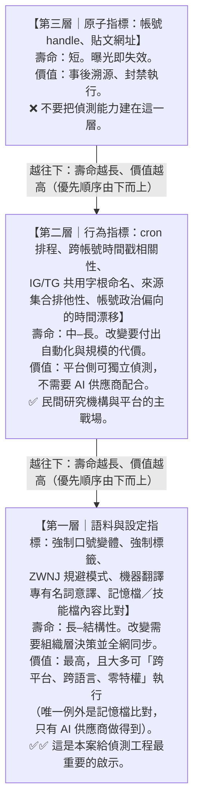

**一句話總結**：**追帳號會累死，追語料會活得久。**

---

## 8. Anthropic 的偵測、處置與防線缺口

### 8.1 報告寫了什麼（完整抄錄）

p.74「Disruption and mitigations」全文只有三句：

> "We found this activity as part of our internal investigations and banned the accounts. At this point, we are not able to independently confirm how much authentic engagement was drawn by the network's amplification accounts."

中譯：
> 「我們在內部調查過程中發現此活動，並停用了相關帳號。目前，我們無法獨立確認該網絡的放大帳號吸引到多少真實互動。」

**全報告的其他案例，處置段落通常包含三到五個動作**（發現方式、停權、把發現餵回安全防護、與平台／夥伴分享指標、與執法或公民社會合作）。本案只有**兩個動作**：發現、停權。

### 8.2 防線缺口清單（本節是課程的高價值素材）

以下五項全部是**基於報告自身文字的缺席或自陳**，不是外部批評。

#### 缺口一：全案沒有任何一次「Claude 拒絕」

在同一份 154 頁報告中，Anthropic 在多處明確記錄了安全防護的表現，包括成功與失敗：

- **p.45（GTG-04001，俄羅斯 FIMI 案）**：「Claude 拒絕配合該行動最激進的請求，該請求涉及**指名真實個人為武裝分子，以引來安全部隊對他們採取行動**。該行為者轉而改用匿名消息來源的框架。」
  （原文："Claude refused to comply with the operation's most aggressive request, which involved naming real individuals as militants to draw security action against them. The actor pivoted to anonymous-source framing instead."）
- **p.94（GTG-14021，中國公安案）**：「Claude 拒絕了一次要求攝入並產出每週『維穩』報告的嘗試。**但該行為者能夠透過重新提示（re-prompt）讓模型產出可用的鎮壓指引，其中點名 10 名私人公民**作為『管控』對象。」
- **p.97（GTG-14021 章節總評）**：「**我們既有的防護措施在這些案例中的表現並不一致。**在一個案例中，Claude 正確地拒絕了請求，**但在進一步提示後被突破**。在另一個案例中，它**橫跨許多工作階段順從配合，未受任何介入**。」
- **p.102（GTG-34007，伊朗雙單位案）**：「Claude 拒絕了明確的側寫與宣傳請求，**但我們的防護措施並未拒絕許多監控軟體工具的請求**。」

**而 GTG-84006 的整整六頁（p.70–75）中，沒有出現任何一個 refuse / decline / block / safeguard 字樣。**

這代表什麼？兩種可能，報告都沒說明：

- (a) 確實沒有觸發任何拒絕——**六個叢集（含冒充真人、對境內個人做被捕紀錄側寫）全部順利執行到底**；
- (b) 有拒絕但報告未記載。

無論哪一種，對讀者而言的結論相同：**報告沒有提供任何證據顯示，模型層防護在本案發揮過作用。** 本案是靠**事後的帳號調查**發現的，不是靠即時的內容防護攔下來的。

> **這一點必須在課堂上講清楚，而且要正面處理**：Anthropic 的報告在許多案例中對自身失效相當坦白（上面四條引文都是它自己寫的）。因此本案的「沉默」更值得注意。教學上不要把它講成「Anthropic 隱瞞」，而要講成：**「在一個高度依賴持久記憶與排程自動化的行動中，逐次對話的內容防護本來就不容易觸發——因為惡意意圖不在對話裡，而在記憶檔裡。」**

#### 缺口二：持久記憶把「意圖」移出了審查視野（架構性缺口）

報告自己寫得很清楚（p.72）：

> "Over time they updated these files with specific instructions, such as lists of banned words, approved sources, account management rules, and ways to avoid detection. **This allowed the agent to keep producing content without a human user directing each session.**"

把這句話翻譯成安全架構語言：

| 傳統假設 | 本案現實 |
|---|---|
| 惡意意圖表達在**使用者訊息**中 | 惡意意圖寫在**記憶檔**中，可能在數月前寫入 |
| 每個工作階段都是**一次可審查的事件** | 工作階段只是**執行既有設定**的結果 |
| 安全分類器看「這次對話」 | 這次對話可能只是「照排程產一篇稿」 |
| 停用帳號＝中止行動 | 記憶檔可被複製到新帳號、新 workspace |

**最極端的例證**：「一名行為者把 MEK 創始教義載入模型記憶，作為供行動內其他人重複使用的 strategic base data」（p.72）。**這是一次性寫入、多人長期重用。** 對逐次對話的審查而言，它幾乎是不可見的。

**這是 2026 年 AI 安全防護的核心難題**，而且報告在趨勢章節（p.43）自己承認了：

> "Increasingly, operations are not run using individual prompts. Instead, a great deal is embedded within persistent memory files."
> 「越來越多的行動不是用個別提示來運作。反之，大量內容被嵌在持久記憶檔裡。」

#### 缺口三：沒有說明是否與平台分享指標（與同頁的另一案形成強烈對比）

同一頁（p.70）上方，孟加拉案 GTG-54006 的處置段落明確寫著：

> "...signatures to stop this from happening again. As in the other operations described here, **we shared indicators with the relevant distribution platforms and other partners.**"

而 GTG-84006 的處置段落**完全沒有這句話**，也沒有 IOC 表中的 `Held for partner share` 列（孟加拉案有）。

**這在一個涉及人身安全的案子上，是一個值得提出的問題。** 報告在監控危害章節（p.80 附近）的總論確實說「在行動涉及平台外活動或影響之處，我們會**適當地**與業界夥伴與主管機關分享識別資訊與情報」——「適當地（as appropriate）」是一個保留條款。本案是否落在那個「適當」之內，報告沒說。

> **課堂討論素材**：若 Instagram/Meta 與 Telegram 沒有拿到這批指標，那麼 Anthropic 的「停用帳號」實際上只是**讓行動者換一個 AI 供應商繼續**，而那些 Instagram 與 Telegram 帳號仍在運作。這是「單點處置 vs. 生態系處置」的經典難題。

#### 缺口四：沒有提到通知受害者

報告完全沒有提及：

- 被冒充的那位運動者**是否被告知**他的身分正被 AI 冒用；
- 那 30 名以上收到捏造頭條的境內聯絡人**是否被告知**；
- 被建立心理側寫檔案的數十名具名個人**是否被告知**。

**這不是吹毛求疵。** 對比其他領域的實務：資料外洩有法定通知義務；商業間諜軟體（如 NSO Pegasus）的目標通常會收到 Apple/Google 的國家級攻擊者通知。**AI 供應商在偵測到「其服務被用來冒充某個特定真人」時，是否對該真人負有通知義務？目前沒有任何法規要求，報告也沒有自願承擔。**

當然，這裡存在真實的兩難：

- **通知的理由**：被冒充者有權知道，才能發出警示、保護聯絡人。
- **不通知的理由**：Anthropic 不一定能確認被冒充者的真實身分與聯絡方式；主動聯繫一名伊朗運動者本身可能製造新的風險；也可能干擾執法或其他調查。

**課程應該把這個兩難原封不動丟給學員（見 10.2 討論題 4）。**

#### 缺口五：Anthropic 自陳的觀測邊界

報告在影響力行動章節的方法論段落（p.42）自己寫了：

> "**Our visibility into these operations ends once it's live.** To verify our findings and understand what happened after content left our platform, we rely on open-source research, cross-platform industry data, and public reporting."

配合本案的「無法獨立確認真實互動」，可以畫出 Anthropic 的觀測範圍：

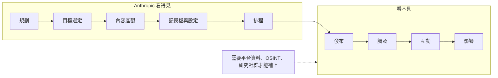

> **這正是本課程要教的結構性洞見**：AI 供應商是一個**全新的、位於生產階段上游的觀測點**——它看得到平台看不到的東西（意圖、規劃、設定檔、跨帳號共用的教義），但**完全看不到影響**。而平台看得到影響，卻看不到意圖。
> **沒有任何單一機構能看見完整的影響力行動。** 這不是誰失職，這是資訊結構的必然。因此 IO 的反制必然是**多方資料聯合**的工作，而這正是台灣在建立相關能力時必須一開始就設計進去的（見 10.4）。

### 8.3 這個案例裡「什麼是有效的」

平衡地說，Anthropic 在本案做對了幾件事，值得肯定並學習：

1. **把「內部調查」當成主要偵測手段**，而不是等待外部通報。本案是內部調查發現的。
2. **跨行為者關聯分析**。在沒有基礎設施重疊的情況下，靠語料與設定檔把四個不相往來的行為者連成一個網絡——這是本案技術上最漂亮的一步。
3. **把記憶檔命名慣例當成 IOC 公開**（`SKILL.md` / `LEARNINGS.md`）。這是一個**新型態指標的公開示範**，對整個產業有教育價值。
4. **危害判斷欄（Most serious element）**。強迫分析師明說最嚴重的是什麼，而不是只列技術事實。
5. **保護被害人**。IOC 表中完全沒有被冒充者的任何資訊，Figure 16 中的帳號名被遮蔽。
6. **誠實標註不確定性**。「無法驗證中央控制程度」「無法獨立確認真實互動」——這兩句在很多商業威脅情報報告裡會被省略。

### 8.4 「一個 AI 代理平台被多名操作者共用」對偵測的意義

這是本案指定必須挖深的核心議題，也是全報告中唯一的範例。以下是完整論證。

#### 8.4.1 對攻擊者：共用平台是**規避協同偵測**的最佳設計

傳統的協同偵測（coordinated inauthentic behavior detection）倚賴的訊號是：

- 同一 IP / 同一裝置指紋
- 同時間登入、同時間發文
- 互相追蹤、互相按讚
- 同一批註冊 email / 手機號
- 同一個廣告帳戶或付款工具

**Viktor 模式讓上述訊號全部歸零**：四名行為者在不同地點、用自己的帳號、自己的網路、自己的付款方式、自己的排程。報告 p.70 的那句「did not share account infrastructure or show visible signs of coordination」就是這個設計成功的證明。

更進一步，報告 p.43 指出這種設計的組織效益：

> "The central setup meant that actors producing content never needed to coordinate with or even know one another."

這不只是規避偵測，也是**作業安全（OPSEC）**：一個成員被捕或叛逃，無法供出其他成員，因為他根本不認識他們。這是傳統地下組織「單元化（cell structure）」的數位版本——**只是這次的「聯絡官」是一個 AI 代理平台**。

#### 8.4.2 對防守方：共用平台是**偵測的黃金機會**

但這個設計有一個致命弱點：**協同必須發生在某個地方。** 如果它不在帳號層、不在網路層、不在社交圖層，那它一定在**共享的那個東西**上。

而共享的那個東西是**文字**——記憶檔、技能檔、教義語料、禁用詞表、來源清單。**文字是可以比對的。**

| 偵測層級 | 需要的存取權 | 能看到什麼 | 難度 |
|---|---|---|---|
| **記憶檔／技能檔內容比對** | **只有 AI 供應商** | 四個無關帳號使用近乎相同的 `SKILL.md`／`LEARNINGS.md` | 低（純字串／嵌入向量相似度） |
| **強制來源集合比對** | AI 供應商 / 部分平台 | 排他性引用同一組七個網域 | 低 |
| **口號變體與標籤比對** | **任何人（公開資料）** | «زن، مقاومت، آزادی»、`#OurChoiceMaryamRajavi` | 極低 |
| **排程相關性分析** | 平台 | 「3 pages · one cron」的時間戳低熵 | 中 |
| **輸出語料相似度** | 平台 / 研究者 | 近重複內容跨「獨立」帳號出現 | 中 |
| **機器翻譯痕跡** | **任何人** | 專有名詞被意譯（Trade Bank / Nation Bank） | 低 |

**核心命題**：
> **共用平台把「協同」從『難以觀測的社會行為』轉換成『容易觀測的文字複製』。**
> 對攻擊者而言，這是效率的勝利；對防守者而言，這是可觀測性的勝利。
> **關鍵在於誰有權存取那層文字。**

#### 8.4.3 這帶出一個必須讓學員意識到的權力問題

上表中偵測價值最高的一項（記憶檔內容比對），**只有 AI 供應商做得到**。這意味著：

- 平台業者（Meta、Telegram）**看不到**；
- 獨立研究機構（Citizen Lab、DFRLab、Graphika）**看不到**；
- 各國主管機關與情報機構在沒有法律程序的情況下**看不到**；
- 被害人**當然看不到**。

於是，對「AI 驅動的影響力行動」而言，**最強的偵測能力集中在少數幾家私人公司手上，而它們的揭露完全是自願的**。Anthropic 這份報告是自願揭露的產物；它決定寫哪些案例、寫多細、公布哪些指標、保留哪些。

這不是在指控 Anthropic——恰恰相反，**願意公布的公司才是可被檢驗的公司**。但課程必須讓學員看見這個結構：

> **2026 年的資訊操作反制，有一層關鍵證據只存在於私人公司的內部日誌裡，而且沒有任何法律要求它必須被揭露。**

這對台灣的政策意涵很直接（見 10.4）：台灣若要建立 IO 反制能力，**不能只建「公開平台監測」，還必須建立與 AI 供應商的資訊交換管道**，否則你永遠只能看到第二層與第三層的指標。

#### 8.4.4 對台灣偵測實務的可移植清單

即使沒有 AI 供應商的特權存取，以下六項本案技術**今天就能做**：

| # | 做法 | 所需資料 | 對應本案 |
|---|---|---|---|
| 1 | 建立「口號／標語變體」監測字典（含中國官方用語、統戰慣用語的變體） | 公開社群資料 | «زن، مقاومت، آزادی» |
| 2 | 建立「專有名詞意譯」偵測規則（中文機構名被直譯成英文的異常形式） | 公開社群資料 | Trade Bank / Nation Bank |
| 3 | 跨帳號發文時間戳的**條件熵**與互相關分析 | 公開社群資料 | 3 pages · one cron |
| 4 | 「外連來源集合排他性」分析：一個宣稱獨立的帳號，其引用來源是否只來自單一組織的資產 | 公開社群資料 | 七個硬編碼網域 |
| 5 | 帳號**政治偏向的時間漂移曲線**：初期中立 → 逐步顯露 | 公開歷史貼文 | 「初期刻意不提 Mojahedin」 |
| 6 | 跨平台**命名字根**比對（同一字根出現在 IG 與 Telegram） | 公開資料 | `@fwr.ir` / `@fwr_ir` / `t[.]me/FWR_ir` |

**第 4 項尤其值得強調**：一個自稱「獨立媒體」的帳號，如果它引用的外部來源集合**完全落在單一政治組織的資產範圍內**，那麼「獨立」的宣稱就在資料上被證偽了——**這個判斷不需要知道誰在幕後，也不需要任何特權資料**。這是公民社會事實查核組織可以立刻採用的方法。

### 8.5 Breakout Scale「Category Two」的評定理由拆解

#### 8.5.1 Breakout Scale 是什麼

報告在影響力行動章節的方法論段落（p.41–42）說明：

> "To accurately evaluate the impact of each influence operation, we apply the Breakout Scale, a six-category framework widely accepted by industry researchers. The scale categorizes impact based on **cross-platform migration and reach**. Category One represents content that is confined to a **single community on a single platform**, while Categories Two through Six measure increasingly higher levels of public exposure and distribution."

報告在另一案（p.53 附近）明確點出出處：**Brookings Institution 的 Breakout Scale**。這個量表由 Ben Nimmo 於 2020 年 9 月發表於 Brookings（原文：*The Breakout Scale: Measuring the impact of influence operations*）。

六級的基本結構（依 Nimmo 原文）：

| 級別 | 定義 |
|---|---|
| **Category One** | 內容只在**單一平台的單一社群**內流傳 |
| **Category Two** | **單一社群但跨多個平台**，或**單一平台但跨多個社群** |
| **Category Three** | 跨多個社群媒體平台**且**觸及多個社群 |
| **Category Four** | 完全突破社群媒體，被**主流媒體**放大 |
| **Category Five** | 被**高知名度個人**（名人、政治候選人等）放大 |
| **Category Six** | 觸發**政策回應**或其他具體行動，或包含**暴力號召** |

> ⚠️ **教材誠實標註**：以上六級定義為依 Nimmo 2020 原文與報告內文重建的摘要。上課前請直接引用 Brookings 原始 PDF（見第 9 節連結）核對用詞。

#### 8.5.2 報告對本案的評定原文

p.71：

> "Using the Breakout Scale, we would assess this operation as **Category Two** (multiple platforms, with distribution through the network's own NCRI media properties and amplifier accounts.)"

中譯：
> 「使用 Breakout Scale，我們會把此行動評為 **Category Two**（多平台，散布透過該網絡**自有的** NCRI 媒體資產與放大帳號）。」

#### 8.5.3 為什麼是 Two，不是 One？

**支持「至少是 Two」的事實**（全部來自報告）：

| 證據 | 頁碼 |
|---|---|
| 橫跨 broadcast television、satellite and shortwave radio、Instagram、Telegram、X/Twitter **五種以上平台型態** | p.71 |
| Figure 15 顯示內容從機構媒體節點流向多個 Instagram / Telegram 放大帳號，再流向兩類受眾 | Fig.15 |
| 同時觸及 **Diaspora audiences** 與 **People inside Iran** 兩個不同社群 | Fig.15 |
| 名目觸及規模 123 萬以上（708K + 299K + 173K + 89.5K + 50K+） | Fig.15, p.74–75 |

依 Nimmo 的定義，「單一社群跨多平台」即已達 Category Two，而本案是**多平台 + 至少兩個社群**，因此 Two 是保守但站得住的評定。

#### 8.5.4 為什麼不是 Three 或更高？

這是評定的關鍵，也是報告括號裡那句話的全部重點：**"with distribution through the network's own NCRI media properties and amplifier accounts"**——**散布全部發生在網絡自己的資產上**。

Breakout Scale 衡量的不是「你發了多少」，而是「**你的內容跑出你的控制範圍多遠**」。

| 若要升到 | 需要的證據 | 本案有嗎 |
|---|---|---|
| **Category Three** | 內容在**網絡控制之外**的多個平台、多個社群中被真實使用者自發轉傳 | ❌ Anthropic 明說「無法獨立確認該網絡的放大帳號吸引到多少**真實**互動」（p.74） |
| **Category Four** | 被**主流／獨立媒體**引用或轉載 | ❌ 報告未提供任何證據 |
| **Category Five** | 被名人或政治人物放大 | ❌ 報告未提供任何證據 |
| **Category Six** | 觸發政策回應或含暴力號召 | ❌ 報告未提供任何證據 |

**同一份報告的對照組非常有用**（可直接當課堂練習）：

| 案例 | 評級 | 頁碼 | 報告給的理由 |
|---|---|---|---|
| GTG-54004（肯亞國內政治灌水） | **Category One** | p.76 | 「活動完全孤立在假帳號與地方影響者的網絡內、**位於單一平台上**，未能觸及或影響任何真實的人」 |
| GTG-54002（商業假新聞工廠，約 **70** 個網站、**8,913** 篇文章、約 **20** 種語言） | **Category Two** | p.48 | 「內容散布於該網絡自有網站與相應的社群媒體帳號，**沒有任何突破自身活動範圍的證據**」 |
| GTG-84005（商業影響力行動） | **Category Two** | p.54 | 「資產散布於**多個平台**，但**沒有突破進入真實社群（authentic communities）的證據**」 |
| **GTG-84006（本案）** | **Category Two** | **p.71** | 「多平台，散布透過該網絡**自有的** NCRI 媒體資產與放大帳號」 |
| GTG-34001（伊朗國家對齊三帳號） | **Category Three** | p.63 | — |
| GTG-54006（孟加拉自動化假新聞） | **Category Three** | p.68 | — |
| GTG-84002（阿聯酋指揮的影響力行動） | **Category Three** | p.79 | — |
| GTG-04001（俄羅斯 FIMI） | **Category Four** | p.45 | 突破到主流媒體 |
| GTG-24015（俄國國家媒體） | **未給評級** | p.58–62 | 報告未對此案使用 Breakout Scale |

> **這張對照表本身就是一堂課**：九起影響力行動中，**沒有任何一起達到 Category Five 或 Six**，而且最高只有一起 Category Four。這與 Anthropic 在趨勢章節的自陳完全一致——「影響力行動經常無法觸及真實受眾……因為我們位於行動的**生產階段**，在社群平台的上游」（p.43–44）。
> 換句話說：**這份報告的評級分布，同時反映了行動的真實效果，也反映了 Anthropic 的觀測位置。** 學員必須同時看見這兩件事。

#### 8.5.5 這個評定的三個教學要點

**要點一：Category Two 不等於「無害」。**

這是最容易被誤讀的地方。Breakout Scale 衡量的是**傳播突破程度**，**不是傷害程度**。本案在 Breakout Scale 上得分很低，但它同時是全報告中**對個別真人風險最高的影響力行動案例之一**——冒充真實運動者、對面臨死刑風險的人做被捕紀錄側寫。

> **請在課堂上明確講出這句話**：
> **「一個 Category Two 的行動，可能害死人；一個 Category Four 的行動，可能只是讓某個政客難堪。」**
> 影響力行動的評估**至少需要兩個互相獨立的量表**：
> - **傳播量表**（Breakout Scale）：內容跑多遠？
> - **危害量表**（本報告的 "Most serious element" 欄就是雛形）：誰會因此受傷？
>
> 只看前者，會系統性地低估針對個人的隱蔽行動。**本案就是這個系統性偏誤的最佳教材。**

**要點二：低評級部分來自「Anthropic 看不到」，而不是「行動不成功」。**

回顧 8.2 缺口五：Anthropic 的觀測在內容離開平台後就中止。因此「無法確認真實互動」既可能代表**真的沒有互動**，也可能代表**Anthropic 沒有資料**。報告用的措辭是 "we are **not able to** independently confirm"（我們**無法**獨立確認），而不是 "there was no engagement"（沒有互動）。

**這個區別是情報素養的核心**：**「沒有證據」不等於「證據顯示沒有」**（absence of evidence ≠ evidence of absence）。Breakout Scale 的評級在此受限於觀測者的位置，而非行動的本質。

**要點三：Anthropic 自己在報告中承認了這個系統性偏誤。**

p.43–44 的趨勢段落：

> "**Influence operations often fail to reach a genuine audience.** Because we sit at the **production stage** of operations, upstream of platforms like social media platforms, we may detect and disrupt an operation while it is still being put together. Most of the content we discovered drew little or no authentic engagement... **The widest authentic reach occurred where state media outlets were the distribution mechanism** (including FM radio, satellite and shortwave radio, and global television)."

注意最後一句與本案的關係：本案**正是**擁有衛星／短波廣播與電視的案例（Simay-e Azadi、Radio Payam Azadi、Webnegar）。依 Anthropic 自己的趨勢判斷，**這類擁有傳統廣電資產的行動，才是真實觸及最高的那一類**。這與 Category Two 的評級形成微妙的張力——值得在課堂上提出來討論。

---

## 9. 第三方驗證與外部來源

### 9.1 判定結論（先講結果）

> **本案為「單一來源情報」（single-source intelligence）。**
>
> 截至 2026-09-13，**沒有任何第三方獨立證實** GTG-84006 這個行動的存在、「Viktor」平台的存在、IOC 表中各帳號與 MEK/NCRI 的關聯，或冒充事件本身。所有現有報導**全部轉述自 Anthropic 報告**。
>
> **也未找到 MEK 或 NCRI 對本次 Anthropic 報告的任何公開回應。**（對照：2021 年 Meta 指控時，NCRI 曾迅速公開否認，見 9.3。）
>
> **未找到任何台灣媒體報導本案。**（已檢查的台灣科技媒體 AI郵報 2026-09-11 長篇解析，確認未涵蓋此案。）

這不代表報告不可信，而是課程必須誠實標註的情報品質等級。處理方式：**所有關於 GTG-84006 的具體事實主張，在教材與課堂上都必須加註「依 Anthropic 報告」**。

### 9.2 直接報導本案的來源（全部＝僅引述 Anthropic）

| # | 來源 | URL | 日期 | 作者 | 性質 | 涵蓋內容與備註 |
|---|---|---|---|---|---|---|
| 1 | **Anthropic《Detecting and countering misuse of AI: September 2026》PDF p.70–75** | https://www-cdn.anthropic.com/e50be2e51e7695dc4b1366a37a245a597377d3b5/Anthropic-Detecting-and-countering-091026.pdf | 2026-09-10 | Anthropic Threat Intelligence | **一手來源** | 本教材所有事實基礎 |
| 2 | Anthropic 網頁版 | https://www.anthropic.com/threat-intelligence-report-september-2026 | 2026-09-10 | Anthropic | **一手來源** | 同上 |
| 3 | **RFE/RL**, "Anthropic Disrupts Iran's Use Of Claude To Spread Propaganda, Spy On Dissidents" | https://www.rferl.org/a/anthropic-claude-iran-propaganda/33852428.html | 2026-09-11 | Frud Bezhan | **僅引述 Anthropic** | 提及 MEK「使用共享 AI 代理冒充真人並在伊朗境內招募」、500+ 頻道、依城市／年齡／職業／政治傾向／被捕紀錄分群。**未**提 Telegram 冒充細節、**未**提十點計畫。 |
| 4 | **Iran International (English)**, "Iran regime used Claude to expand surveillance of dissidents, Anthropic says" | https://www.iranintl.com/en/202609131676 | 2026-09-13 | 未署名 | **僅引述 Anthropic** | 本案涵蓋**最完整**的第三方報導：8,400 則貼文、51,944 則訊息、數十人心理側寫、十點計畫 AI 頭像（未揭露為合成）、至少四人任職 NCRI 媒體、Anthropic 無法確認真實互動。<br>⚠️ **來源偏誤揭露**：Iran International 為總部設於倫敦的波斯語媒體，其編輯立場與資金來源長期受到討論，且與伊朗反對派各派系（含 MEK）的關係是公開爭論的題目。使用其報導時應意識到它在報導一個**競爭對手組織**的負面新聞。 |
| 5 | **The Hacker News** | https://thehackernews.com/2026/09/claude-used-to-automate-exploitation.html | 2026-09-11 | Ravie Lakshmanan | **僅引述 Anthropic** | 一段話帶過：「一場針對全球伊朗受眾的分散式影響力行動，目的是冒充真實運動者並進行即時政治對話。該活動已被連結到 PMOI/MEK 與 NCRI。」**未**提 Viktor、**未**提 Telegram 細節。 |
| 6 | Eurasia Review / Shabtab News (English) | https://www.eurasiareview.com/13092026-anthropic-disrupts-irans-use-of-claude-to-spread-propaganda-spy-on-dissidents/ | 2026-09-12/13 | 轉載 RFE/RL | **轉載，非獨立** | 與 #3 內容相同 |
| 7 | Axios, "Anthropic report: 5 ways Claude was exploited for war, spying and repression" | https://www.axios.com/2026/09/12/anthropic-ai-threat-report-russia-iran-china | 2026-09-12 | — | **未能擷取**（HTTP 403） | 無法確認是否涵蓋本案。標記為未驗證。 |
| 8 | AI郵報（台灣），〈Anthropic 威脅情報報告重磅解析〉 | https://www.aiposthub.com/anthropic-threat-intelligence-report-september-2026-china-distillation-deepseek-qwen-taiwan-electronic-warfare-deep-dive/ | 2026-09-11 | Philo | **已確認未涵蓋本案** | 該長篇解析聚焦模型蒸餾、武器、監控、台灣電戰模擬，經逐項確認**完全未提及** MEK / NCRI / Rajavi / 冒充運動者 / Viktor。→ **佐證「台灣媒體未報導本案」的判定。** |

**第三方報導與 PDF 原文的差異檢查**：未發現實質矛盾。RFE/RL 與 Iran International 引用的數字（8,400、500+、51,944、四人）與 PDF 完全一致。差異僅在**涵蓋範圍**（各家選擇報導的細節不同），不在**事實內容**。

### 9.3 獨立查證的外圍事實（不是本案本身，但支撐或脈絡化本案）

> 這一節是本教材的核心增值。以下每一條都是**獨立於 Anthropic** 的來源。

#### (A) ✅ 獨立查證：Figure 16 的貼文內容是真實新聞（本教材的原創查證）

| 來源 | URL | 日期 | 查證內容 |
|---|---|---|---|
| **US Department of the Treasury 新聞稿**，"Economic Fury Targets Iranian LPG Smuggling and Shadow Banking Networks" | https://home.treasury.gov/news/press-releases/sb0524 | **2026-06-05** | 證實 Figure 16 貼文所述的 OFAC 制裁行動**確實存在且日期相符** |
| US Department of State，"Sanctions to Strangle Iran's Energy Smuggling and Illicit Financial Networks" | https://www.state.gov/releases/office-of-the-spokesperson/2026/06/sanctions-to-strangle-irans-energy-smuggling-and-illicit-financial-networks/ | 2026-06-05 | 同上 |
| SAFETY4SEA，"U.S. Treasury sanctions LPG vessels linked to Iran" | https://safety4sea.com/u-s-treasury-sanctions-lpg-vessels-linked-to-iran/ | 2026-06 | 航運業媒體獨立報導，佐證船舶制裁 |
| The Asia Business Daily | https://www.asiae.co.kr/en/article/2026060608224647334 | 2026-06-06 | 獨立報導，佐證 |

**逐項比對結果**：

| Figure 16 貼文內容 | 公開官方資料 | 結論 |
|---|---|---|
| 「2026 年 6 月 5 日（星期五）美國財政部制裁」 | 屬實，6 月 5 日確為星期五 | ✅ 相符 |
| 「UAE 空殼公司 Butani Trading LLC、Dundlod Trading FZE、ADH Energy FZE」 | 官方指定名單確含此三家 UAE 空殼公司 | ✅ 相符 |
| 「6 艘船舶」 | 官方公告含 6 艘船舶 | ✅ 相符 |
| 「網絡中有阿富汗人與土耳其人」 | 官方點名阿富汗籍 Sarbaz Abdul Zada 與土耳其籍 Mohammad Shakol Mihandoust | ✅ 相符 |
| 「Economic Fury」 | 美國財政部新聞稿標題即使用此行動代號 | ✅ 相符 |
| 「以阿曼 LPG 名義偽裝伊朗 LPG，售往南亞與東亞（含孟加拉）」 | 官方描述為「刻意偽裝為阿曼產 LPG、售往南亞與東亞終端使用者」 | ✅ 相符 |
| 「Scott **Bassnet**，美國財政部長」 | 實際為 Scott **Bessent** | ❌ **姓名扭曲**（機器翻譯痕跡） |
| 「Trade Bank and Nation Bank」 | 應為 Bank Tejarat（تجارت＝貿易）、Bank Melli（ملی＝國家） | ❌ **專有名詞被意譯**（機器翻譯痕跡） |

> **這組查證的教學價值極高**：它同時證明了兩件看似矛盾的事——
> **(1) 這個「假獨立媒體」帳號發布的是真實、可查證的新聞；**
> **(2) 它的產製管線是未經人工校對的機器翻譯。**
> 合起來就是「媒體洗白」的完整定義：**真內容 + 假出處 + 自動化規模**。

#### (B) ✅ 獨立查證：MEK/NCRI 有已被平台證實的協同不實行為前科

| 來源 | URL | 日期 | 內容 | 性質 |
|---|---|---|---|---|
| **Meta（Facebook）〈March 2021 Coordinated Inauthentic Behavior Report〉** | https://about.fb.com/news/2021/04/march-2021-coordinated-inauthentic-behavior-report/ | 2021-04 | 移除源自**阿爾巴尼亞**、針對含伊朗在內全球受眾的網絡：**128 個 Facebook 帳號、41 個粉絲專頁、21 個社團、146 個 Instagram 帳號**。Facebook 將其連結至 MEK，描述為「一個組織嚴密的 troll farm」，並指出假帳號與阿爾巴尼亞境內 MEK 相關真實帳號／粉專之間**長期一致的基礎設施連結**；網絡活動高峰為 2017 年，2020 下半年再現一波。 | **平台官方獨立調查** |
| Balkan Insight，"Facebook Clamps Down on Iranian Dissident 'Troll Farm' In Albania" | https://balkaninsight.com/2021/04/07/facebook-removes-a-troll-farm-of-mek-in-albania/bi/albania/albania-politics-and-society/ | 2021-04-07 | 獨立報導（直接擷取受阻，內容經搜尋結果確認） | 獨立媒體 |
| Middle East Eye，"Facebook accuses opposition Iranian group of running 'troll farm' from Albania" | https://www.middleeasteye.net/news/facebook-removes-accounts-tied-iranian-opposition-mek-group | 2021-04-07 | 含 **NCRI 官方否認**：「因為沒有違反任何 Facebook 規則，所謂阿爾巴尼亞有 MEK 相關 troll farm 的說法是**可笑且絕對錯誤的**。」 | 獨立媒體 + 當事方回應 |
| **The Intercept**（記者 Murtaza Hussain），"Is Heshmat Alavi, Writer on Iran, a Fake Run By MEK Opposition?" | https://theintercept.com/2019/06/09/heshmat-alavi-fake-iran-mek/ | 2019-06-09 | 長期被 Forbes、The Federalist、Daily Caller 等引用的「伊朗異議作者 Heshmat Alavi」實為 MEK 政治部門團隊經營的虛構人格。高階脫離者 Hassan Heyrani：「Heshmat Alavi 是一個由 MEK 政治部門團隊經營的人格……**這不是、也從來不是一個真實的人**。」 | **調查報導 + 脫離者證詞** |

> **為什麼這一組很重要**：它建立了「**先例一致性（pattern consistency）**」。GTG-84006 的手法——虛構人格、假獨立品牌、隱藏組織歸屬、跨平台協同——與 MEK 在 2019 與 2021 被**兩個完全獨立的機構**記錄下來的手法**高度一致**。
> 這**不是**對 GTG-84006 的獨立證實（那需要有人獨立看到本案的帳號與語料），但它是**歸因可信度的重要輔助證據**：Anthropic 的歸因與已知的組織行為模式相符。
> **課堂上務必區分這兩者**：「先例一致」是貝氏更新的先驗機率，不是事件本身的證據。

#### (C) ✅ 獨立查證：與 MEK 有關聯在伊朗境內可致死

| 來源 | URL | 日期 | 內容 |
|---|---|---|---|
| **Amnesty International**，"Iran: Mass arbitrary arrests and political executions mark intensifying repression" | https://www.amnesty.org/en/latest/news/2026/05/iran-mass-arbitrary-arrests-and-political-executions-mark-intensifying-repression/ | **2026-05-28** | 2026-02-28 以來**逾 6,000 起任意逮捕**、**88 天斷網**、至少 **39 人**因政治性指控在遭酷刑污染的極不公平審判後被任意處決（含 16 名抗議者、9 名異議者、10 名被控為美／以從事間諜活動者、**4 名被控 baghi（武裝叛亂）者**）。當局將線上活動入罪，起訴「在社群媒體分享衝突內容」者。 |
| Iran 1988 / Iran HRM，"Iran executes two more political prisoners for links to opposition group" | https://iran1988.org/iran-executes-two-more-political-prisoners-for-links-to-opposition-group/ | 2026-03/04 | 2026-03-31 處決 Babak Alipour（34 歲）與 Pouya Ghobadi（32 歲），罪名為 PMOI/MEK 成員身分與「試圖推翻伊斯蘭共和國」；前一日已處決 Akbar Daneshvarkar（59 歲）與 Seyed Mohammad Taghavi-Sangdehi（58 歲），同樣罪名。**「武裝叛亂」（baghi）指控僅基於其被指與 PMOI 有關聯，未提出任何涉及暴力的證據。** |
| Amnesty International，"Iran: End escalating campaign of arbitrary executions and death sentences against protesters" | https://www.amnesty.org/en/latest/news/2026/07/iran-end-escalating-campaign-of-arbitrary-executions-and-death-sentences-against-protesters/ | 2026-07 | 處決潮持續升高 |

> **這一組是本案危害論證的事實基礎，而且是完全獨立於 Anthropic 的。**
> 它把 Cluster 表裡那句抽象的 "people who face imprisonment or execution under Iranian law" 變成**有名有姓、有日期的實際處決**。
> **課堂上應該明講**：在這個法域裡，「一段與 MEK 相關帳號的 Telegram 對話紀錄」**本身**就可能是致命的。而本案中，那 30 名以上的聯絡人**從未同意**進入這樣一段對話。

#### (D) ✅ 獨立查證：伊朗當局確實利用被接管的帳號接觸聯絡人（機制先例）

| 來源 | URL | 日期 | 內容 |
|---|---|---|---|
| **Vice / Motherboard**，"Iran Appears To Have Taken Over an Arrested Journalist's Telegram Account" | https://www.vice.com/en/article/iran-telegram-account-bbc-journalist/ | **2016-02-05** | 前 BBC 記者 **Bahman Daroshafaei** 於 2016 年 2 月初被捕後，當局取得其 Telegram 帳號並開始聯繫其人脈。友人 Fatemeh Shams：「**有人用 Bahman 被駭的 Telegram 帳號跟我談了兩個小時。**」運動者擔心當局藉此誘使其友人與同事交出敏感資訊、或植入惡意軟體。研究者 Amir Rashidi 指出，相較於 Twitter、Facebook、Google，Telegram 在協助運動者處理被入侵帳號上反應遲緩。 |
| CNN Business，"Iran's government accesses the social media accounts of those it detains…" | https://www.cnn.com/2022/12/19/business/iran-social-media-accounts-intl-cmd | 2022-12-19 | **⚠️ 直接擷取受阻（HTTP 451）**，僅能依搜尋結果引述：當局在運動者入獄期間**重新啟用其 Telegram 帳號，以觀察誰會試圖聯繫，藉此揭露其人脈網絡**；研究者記錄超過十餘起 Telegram 帳號被入侵案例，手法涉及與電信商的配合，弱點為簡訊驗證碼。**本條標記為「間接引用，未直接查證原文」。** |
| Iran International (English) | https://www.iranintl.com/en/202507084950 | 2025-07 | Iran International 記者的 Telegram 帳號於 2024 年夏與 2025 年 1 月遭兩波網路攻擊，歸因於 Banished Kitten（亦稱 Storm-0842 / Dune）。 |

> **這一組的教學價值**：它證明「**冒用可信帳號與其聯絡人對話 → 揭露人脈網絡 → 逮捕**」這條攻擊鏈在伊朗**不是理論**，而是至少從 2016 年就在實際發生的成熟手法。
> **GTG-84006 的新意不在於這條攻擊鏈，而在於「執行者換成了 AI」**——過去要有人花兩小時親自假扮，現在一個代理平台可以同時假扮並維持人格一致性。**成本降了，規模上去了。**

#### (E) ⚖️ 對照組（不同行為者，用來避免「只有 MEK 這樣做」的誤解）

| 來源 | URL | 日期 | 內容 |
|---|---|---|---|
| **Citizen Lab**，"We Say You Want a Revolution: PRISONBREAK — An AI-Enabled Influence Operation Aimed at Overthrowing the Iranian Regime" | https://citizenlab.ca/research/2025-10-ai-enabled-io-aimed-at-overthrowing-iranian-regime/ | **2025-10-14** | 作者：Alberto Fittarelli、Ron Deibert、Marcus Michaelsen、Maia Scott、Darren Linvill。50 個以上不實 X 帳號；大量使用 AI：Evin 監獄爆炸的深偽影片、軍車爆炸的 AI 影片、冒充 BBC Persian 的偽造新聞播報、以 AI 竄改伊朗抗議歌曲歌詞並配上三位伊朗歌手的深偽形象。敘事聚焦政權更迭、號召夜間屋頂抗議。<br>歸因：Citizen Lab 評估「**高度可能**（high likelihood）為以色列政府——直接或透過承包商——所執行」，但結論仍是「在沒有更多平台資料的情況下，我們無法確定性地歸因」。<br>偵測指紋：約 50% 帳號使用相同 email 網域註冊；帳號創建於 2023 年但 **99.5% 貼文發生在 2025 年 1 月之後**；發文時間集中於德黑蘭時間 9:30–18:30；75% 貼文來自桌面版 Twitter Web App。<br>**該報告完全未提及 MEK、NCRI 或與伊朗反對派組織的合作。** |

> **為什麼要放這一條**：避免課程給學員留下「AI 影響力行動＝MEK 做的」這種錯誤印象。針對伊朗受眾的 AI 驅動影響力行動，在 2025–2026 年**至少有兩個完全不同的行為者**在做，而且被**兩個完全不同的機構**（Citizen Lab、Anthropic）分別發現。
> **同時這是一個絕佳的方法論對照**：Citizen Lab 從**平台側**（公開帳號行為）發現；Anthropic 從**生產側**（模型使用日誌）發現。兩者看到的指紋完全不同型態——Citizen Lab 看到的是註冊網域、發文時段、客戶端；Anthropic 看到的是記憶檔、教義語料、口號規範。**把兩份報告並排講，就能把 8.2 缺口五的「沒有人看得到全貌」講透。**
> ⚠️ **明確標註：目前沒有任何證據顯示 PRISONBREAK 與 GTG-84006 有關聯。** 兩者的歸因指向完全不同的行為者。

#### (F) 📚 方法論與背景來源

| 來源 | URL | 日期 | 用途 |
|---|---|---|---|
| **Ben Nimmo, "The Breakout Scale: Measuring the impact of influence operations", Brookings Institution** | https://www.brookings.edu/wp-content/uploads/2020/09/Nimmo_influence_operations_PDF.pdf | 2020-09 | 本案評級（Category Two）的方法論來源 |
| **Human Rights Watch**，"Statement on Responses to Human Rights Watch Report on Abuses by the Mojahedin-e Khalq Organization (MKO)" | https://www.hrw.org/news/2006/02/14/statement-responses-human-rights-watch-report-abuses-mojahedin-e-khalq-organization | 2006-02-14 | HRW 2005 年《No Exit》報告的後續說明；記錄 HRW 於 2005 年 10 月在德國與荷蘭個別、私下訪談報告中引用的**全部 12 名證人**，回應 MEK 方的質疑 |
| Congressional Research Service, "The Mojahedin-e-Khalq (MEK) or People's Mojahedin Organization of Iran (PMOI)", R48433 | https://www.congress.gov/crs-product/R48433 | — | **⚠️ 直接擷取受阻（HTTP 403）**。已知存在但未能查證內容。標記為未驗證。 |
| UK House of Commons Library, "The People's Mujahiddin of Iran (PMOI)", SN05020 | https://commonslibrary.parliament.uk/research-briefings/sn05020/ | — | 英國國會研究簡報，MEK 法律地位變遷 |
| Wikipedia, "People's Mojahedin Organization of Iran" | https://en.wikipedia.org/wiki/People%27s_Mojahedin_Organization_of_Iran | 持續更新 | **背景整理用，非權威來源**。本教材 2.6 節的時間線主要據此並與其他來源交叉比對 |
| Al Jazeera，"US drops Iran's MEK group from terror list" | https://www.aljazeera.com/news/2012/9/28/us-drops-irans-mek-group-from-terror-list | 2012-09-28 | 美國 2012 年除名的獨立報導；國務院同時表達對 MEK 虐待自身成員指控的嚴重關切 |
| NCRI 美國辦事處，"The NCRI 10-Point Plan for a Free Democratic Iran" | https://www.ncrius.org/the-10-point-plan-for-a-free-democratic-iran.html | — | **當事方一手材料**（十點計畫全文）。本教材 2.6B 的十點計畫內容據此 |
| NCRI，"Free Iran 2026: Global Leaders at Paris Summit…" | `ncr-iran[.]org/en/news/iran-resistance/free-iran-2026-global-leaders-at-paris-summit-…`（**已 defang**：此網域同時是本案 IOC #1 的成員，依安全紅線一律 defang 處理；如需查閱請從報告 IOC 清單之外的獨立管道取得） | 2026-06 | **當事方一手材料**。2026-06-20 巴黎集會，主題「不要沙王，不要毛拉」 |
| Wikipedia, "Simaye Azadi" | https://en.wikipedia.org/wiki/Simaye_Azadi | 持續更新 | Simay-e Azadi / Iran NTV 的背景（1987 年開播的 PMOI/NCRI 波斯語衛星電視） |

#### (G) 🇹🇼 台灣段落（10.4）使用的來源

| 來源 | URL | 日期 | 用途 |
|---|---|---|---|
| 開放文化基金會 OCF，《CSOs 數位防禦手冊》 | https://ocf.tw/story/menu/resource/(public)CSOs%E6%95%B8%E4%BD%8D%E9%98%B2%E7%A6%A6%E6%89%8B%E5%86%8A_%E6%B3%A8%E9%87%8D%E9%9A%B1%E7%A7%81%E8%88%87%E5%AE%89%E5%85%A8%E7%9A%84%E9%96%8B%E6%94%BE%E5%8E%9F%E5%A7%8B%E7%A2%BC%E5%B7%A5%E5%85%B7V2.pdf | 2024-07 | 台灣公民團體現成的數位安全教材，威脅模型概念 |
| 開放文化基金會，公民團體資安暨隱私交流計劃（CSCS） | https://ocf.tw/p/cscs/ | — | 台灣既有的公民社會資安社群 |
| **Amnesty International**，"'On my campus, I am afraid': China's targeting of overseas students stifles rights" | https://www.amnesty.org/en/documents/asa17/8006/2024/en/ | 2024-05 | 跨境鎮壓機制的對照：訪談 32 名中港學生（2023-06 至 2024-04），記錄**家人在中國境內遭警方威脅**、寒蟬效應與自我審查 |
| Human Rights Watch，〈中國：全國各地大型家庭教會遭鎮壓〉 | https://www.hrw.org/zh-hans/news/2025/10/14/china-nationwide-crackdown-on-major-underground-church | 2025-10-14 | 錫安教會全國性拘捕行動 |
| 自由時報，〈20台灣人在中國傳教被抓 邱垂正：一貫道18人、統一教2人〉 | https://news.ltn.com.tw/news/politics/breakingnews/5465997 | 2026 | **⚠️ 未直接擷取原文，經搜尋結果引述**：陸委會表示 20 名台灣人在中國因傳教被捕（一貫道 18、統一教 2），3 人已獲釋、15 人仍在中國；2026 年 1–5 月共 361 名台灣人在中國失聯、遭約談或遭拘留 |
| 李明哲案（維基百科中文版） | https://zh.wikipedia.org/wiki/李明哲_(NGO工作者) | 持續更新 | 判決日 2017-11-28，顛覆國家政權罪，5 年徒刑、剝奪政治權利 2 年；起訴書所列證據含 **QQ 群組（「圍觀中國」「圍觀華南」）、QQ 空間、Facebook、微信等平台言論與聊天紀錄**，以及與中國境內被告彭宇華的共同活動與通訊往來 |
| 國際特赦組織台灣分會 — 李明哲 | https://www.amnesty.tw/node/10322 | — | 同上，人權組織視角 |

### 9.4 給學員的來源評估練習

把 9.2 與 9.3 攤開，請學員回答：

1. 如果明天有人說「Anthropic 這份報告是為了打擊伊朗反對派而捏造的」，你能用哪些證據反駁？（提示：9.3(B) 的先例一致性、9.3(C) 的獨立危害事實、9.3(A) 的圖 16 內容可查證性。）
2. 如果有人說「Anthropic 的報告證明 MEK 在指揮一場 AI 影響力行動」，你會怎麼修正這句話？（提示：2.3 節的三層歸因。）
3. **哪一項事實，你**只能**相信 Anthropic？**（答案：Viktor 平台的存在、記憶檔內容、那 51,944 則訊息的分析、四名執行者與 NCRI 媒體的僱傭關係。這些都在 AI 供應商的內部日誌裡，外部無從查證。）

---

## 10. 課程教學設計

### 10.1 核心教學要點

本案在整門課中的定位：**這是「AI 影響力行動如何直接威脅特定真人人身安全」的主教材，同時是「共享代理平台」這個新現象的唯一實例。** 建議安排 90–120 分鐘。

#### 要點一｜協同的位置改變了

- **舊模型**：協同＝共用基礎設施（IP、裝置、註冊資料、社交圖）。
- **本案**：行為者**刻意不共用**任何基礎設施，協同發生在一個**共享的 AI 代理平台**上，具體載體是**文字**（記憶檔、技能檔、教義語料、禁用詞表、來源清單）。
- **教學句**：**「當協同從網路層搬到語料層，你的偵測能力也必須搬家。」**
- 對應素材：Figure 15 的虛線；p.43「行為者從不需要彼此協調，甚至不需要認識對方」。

#### 要點二｜持久記憶讓「意圖」離開了審查視野

- 惡意意圖不再出現在「這一次對話」裡，而是數月前寫進記憶檔的一行規則。
- 逐次對話的內容審查在架構上就難以觸發。這解釋了為什麼本案六頁報告中**沒有任何一次 Claude 拒絕的紀錄**。
- **教學句**：**「你稽核的是對話，但行動寫在設定檔裡。」**
- 對應素材：p.72「這讓該代理能在沒有人類使用者逐一下指令的情況下持續產出內容」；p.43「大量內容被嵌在持久記憶檔裡」。

#### 要點三｜數位冒充是一條通往實體傷害的因果鏈

- 冒充 → 取得詢問權 → 套取身分資訊 → 資料庫 → （外洩／查扣）→ 逮捕／處決。
- 第二條路徑甚至不需要資料外洩：**被聯絡這件事本身**就在對方裝置上留下了可入罪的紀錄。
- **教學句**：**「在高鎮壓法域，『你跟誰說過話』就是罪證。而受害者從來沒有同意過這段對話。」**
- 對應素材：4.2.1 的機制鏈圖；Cluster 表「Arrest-history profiling of people who face imprisonment or execution」；9.3(C) 的獨立處決紀錄。

#### 要點四｜媒體洗白不需要說謊

- Figure 16 的貼文內容經本教材獨立查證**完全屬實**（2026-06-05 美國財政部 OFAC 制裁行動），但它被包裝成「獨立新聞媒體」發布，出處被拿走。
- 同一個網絡卻在私訊通道發送**捏造的**突發頭條給 30 名以上聯絡人。
- **教學句**：**「公開頻道發真新聞建立信譽，私訊頻道發假新聞收割信譽。」**
- 這也是對現行「假訊息」法規與定義的挑戰：**真內容 + 假出處**不落在多數「不實訊息」的定義之內。
- 對應素材：6.3.3；9.3(A)。

#### 要點五｜Breakout Scale 不衡量傷害

- 本案是 Category Two（傳播程度低），卻是全報告對個別真人風險最高的影響力行動之一。
- **必須用兩把尺**：傳播量表（Breakout Scale）＋危害量表（Cluster 表的「Most serious element」欄是現成雛形）。
- **教學句**：**「一個 Category Two 的行動可能害死人；一個 Category Four 的行動可能只是讓某個政客難堪。」**
- 對應素材：8.5.5。

#### 要點六｜「沒有證據」不等於「證據顯示沒有」

- 「無法獨立確認吸引到多少真實互動」≠「沒有真實互動」。
- 評級受限於**觀測者的位置**，而非行動的本質。
- Anthropic 自己在 p.42 承認：「我們對這些行動的能見度在它上線之後就中止了。」
- **教學句**：**「沒有任何單一機構看得見一場完整的影響力行動。」**
- 對應素材：8.2 缺口五；9.3(E) 的 Citizen Lab 對照（平台側 vs. 生產側，兩種完全不同的指紋）。

#### 要點七｜影響力行動不只來自威權政府

- 本案的行為者是**反威權的流亡反對運動**，其政治綱領（十點計畫）文本上是自由民主的。
- 但手法與威權國家的手法**在技術與倫理上沒有差別**，而且最終受害者是它宣稱要解放的那群人。
- **教學句**：**「判斷手法時，把行為者的政治立場蓋起來。」**
- 對應素材：2.6；Anthropic 對所有行為者適用同一套 Usage Policy 與同一個 Breakout Scale。

#### 要點八｜最強的偵測能力集中在少數私人公司手上

- 記憶檔內容比對（本案唯一能在協同訊號消失時仍看見協同的方法）**只有 AI 供應商做得到**。
- 這種揭露完全是自願的，沒有任何法律要求。
- **教學句**：**「2026 年的 IO 反制，有一層關鍵證據只存在於私人公司的日誌裡。」**
- 政策意涵：台灣建立 IO 反制能力時，**不能只建公開平台監測**，必須同時建立與 AI 供應商的資訊交換管道。
- 對應素材：8.4.3。

---

### 10.2 課堂討論題

> 以下六題都**沒有標準答案**，且都經過設計讓不同立場的學員會得出不同結論。建議用小組辯論＋全班收斂的形式，每題 15–20 分鐘。

---

#### 討論題 1｜同一把尺，還是兩把尺？

Anthropic 在同一份報告中，用**完全相同的政策框架與量表**處理了：

- 伊朗革命衛隊（IRGC）對齊的國家宣傳機構（GTG-34001，p.62 起）；
- 中國地方公安對宗教團體與異議者的情報作業（GTG-14020 / 14022，p.89 起）；
- **以及 MEK/NCRI ——一個反對伊朗政權、被歐美除名、在西方政界有正當遊說活動的流亡反對運動（本案）**。

**問題**：
- (a) 一家 AI 公司對「威權政府的宣傳」與「反威權反對派的宣傳」適用同一套標準，這是**中立**還是**假中立**？
- (b) 如果 MEK 的支持者主張「我們是在對抗一個處決我們成員的政權，冒充帳號是不對稱鬥爭的必要手段」，你的回應是什麼？
- (c) 反過來說，如果今天 AI 公司決定對「民主派反對運動」採取寬鬆標準，會產生什麼後果？誰來決定誰是「民主派」？

**引導方向**：把討論從「MEK 是好人還是壞人」轉到「**AI 公司應該用什麼標準判斷，以及這個標準由誰制定、對誰負責**」。可以引入：Anthropic 不是民選機構、Usage Policy 不是法律、但它的執行結果是實質的言論後果。

---

#### 討論題 2｜AI 供應商應不應該通知被冒充者？

報告完全沒有提到 Anthropic 是否通知了那名被冒充的運動者、那 30 名以上收到捏造頭條的聯絡人、或那數十名被建檔的具名個人。

**支持通知**：他有權知道；只有他能對自己的聯絡人發出可信的警示；否則冒充可能繼續（換一家 AI 供應商即可）。
**反對／困難**：Anthropic 可能無法確認他的真實身分與安全的聯絡方式；主動聯繫一名伊朗運動者**本身**可能替他製造新風險（例如來自跨國企業的聯繫被伊朗當局視為「與境外勢力接觸」的證據）；也可能干擾執法或其他調查。

**問題**：
- (a) 你會設計一個什麼樣的通知機制？（想想 Apple / Google 的「國家級攻擊者通知」是怎麼做的，以及它們為什麼刻意寫得很模糊。）
- (b) 如果通知的結果是這名運動者被伊朗當局盯上，責任在誰？
- (c) 這應該是**法定義務**還是**自願最佳實務**？如果是法定義務，管轄權怎麼處理（美國公司、伊朗受害者、跨國行為者）？

---

#### 討論題 3｜「真內容 + 假出處」算不算假訊息？

Figure 16 的貼文內容**完全屬實**（已獨立查證）。它唯一的問題是：讀者以為這是一家「獨立新聞媒體」的報導，實際上是一個政治組織的宣傳資產。

**問題**：
- (a) 台灣現行對「不實訊息」的法律與平台政策定義，能不能處理這種情況？（提示：多數定義的核心是「內容不實」。）
- (b) 如果要規範，你會規範什麼——**內容**、**出處揭露**、還是**協同行為**？各有什麼副作用？
- (c) 一個政治團體經營一個不掛名的新聞帳號，跟一個企業經營一個不掛名的公關帳號，性質一樣嗎？跟一家報社有明確政治立場但公開掛名，性質一樣嗎？
- (d) **最難的一題**：如果這個帳號從未說謊、內容永遠可查證，你能不能說它「有害」？害在哪裡？

---

#### 討論題 4｜公開你的「聯絡規則」，是保護還是給藍圖？

4.2.2 建議運動者與 NGO **公開宣告**：「我只會從這些帳號聯絡你」「我永遠不會在私訊裡問你人在哪」。

**支持**：讓冒充者無法安全地違反規則；把驗證責任前移；規則公開才有嚇阻力。
**反對**：等於把「怎麼樣才像真的」寫成手冊交給攻擊者；攻擊者會設計出符合規則的攻擊（例如不問位置，改問一個看似無害但可推斷位置的問題）。

**問題**：
- (a) 在安全工程裡，這是典型的「安全靠隱蔽（security through obscurity）」vs.「公開設計（Kerckhoffs 原則）」之爭。你站哪邊？為什麼密碼學選了公開，而社交工程防禦可能不一樣？
- (b) 如果公開規則，要公開到什麼程度？（規則本身公開，但暗號當然不公開——那界線在哪？）

---

#### 討論題 5｜記憶檔比對能力應不應該被法制化揭露？

8.4.3 指出：對 AI 驅動的影響力行動，**最強的偵測能力（跨帳號記憶檔內容比對）只有 AI 供應商做得到**，而揭露完全自願。

**問題**：
- (a) 是否應該立法要求 AI 供應商定期揭露此類偵測結果？（參考：歐盟 DSA 對超大型平台的系統性風險報告義務、台灣的《數位中介服務法》草案曾引發的爭議。）
- (b) 如果要求揭露，會不會反過來讓 AI 公司**減少做這類內部調查**（不查就沒有東西要報）？
- (c) 「掃描使用者的記憶檔以尋找跨帳號相似性」——這在技術上是必要的偵測手段，在隱私上是什麼？如果同樣的能力被用來偵測「共用相同政治立場的使用者」呢？
- (d) 台灣政府若想取得這類情報，可行的管道有哪些？（自願合作、國際情報交換、法律強制、購買商業情報？）各自的代價是什麼？

---

#### 討論題 6｜如果你是那 30 名聯絡人之一

**情境**：你在德黑蘭。你信任的一位流亡運動者透過 Telegram 跟你聊了三個月政治，你談過你的城市、你的工作、你對某次抗議的看法、你朋友的情況。今天你讀到 Anthropic 的報告，發現那三個月你可能是在跟一個 AI 說話，而對面真正的人是一個你不認識的政治組織的支薪員工。

**問題**：
- (a) 你現在最擔心的是什麼？你會採取什麼行動？（注意：伊朗在 2026 年 2–5 月曾斷網 88 天。）
- (b) 這三個月的對話紀錄，現在在哪些地方？（你的手機、對方的伺服器、Telegram 的雲端、可能還有第三方的備份。）
- (c) 你還會相信下一個聯繫你的流亡運動者嗎？**這個行動對伊朗公民社會的信任結構造成了什麼長期損害？**
- (d) **最關鍵的一題**：這個損害，在 Breakout Scale 上是幾分？

> 第 6 題建議放在最後，用來收斂整堂課。它會把所有技術討論拉回到一個具體的人身上。**這是本案唯一正確的結束方式。**

---

### 10.3 實作／桌面演練建議

> 全部設計為**在教室或封閉實驗環境可安全執行**，不包含任何攻擊操作、不接觸任何 IOC、不對真實帳號進行任何互動。

---

#### 演練 A｜「我的帳號被複製了」六小時應變桌演（90 分鐘，主推）

**情境卡**：你是台灣一個關注中國人權的 NGO 的專案經理。今天早上，一名在中國的長期聯絡人透過第三方管道告訴你：「你昨天半夜在 Telegram 問我那件事，我覺得怪怪的。」——但你昨晚沒有傳任何訊息。

**角色**：專案經理、資安負責人（可能是外包）、執行長、傳播負責人、法務顧問、境內聯絡人代表（由講師扮演，只能透過紙條溝通）。

**時間軸與決策點**：

| T+ | 事件 | 必須做出的決策 |
|---|---|---|
| 0:00 | 收到境內聯絡人的疑慮 | 相信嗎？如何在不驚動的情況下確認？用什麼通道？ |
| 0:30 | 確認確實有一個高相似度帳號正在冒用你的身分 | 要不要立刻公開警示？公開會不會讓境內聯絡人暴露？ |
| 1:00 | 發現該帳號已聯繫至少 12 名你的聯絡人，其中 5 人在中國 | 通知順序怎麼排？高風險者優先，還是所有人同時？ |
| 2:00 | 有記者來問 | 說什麼？不說什麼？ |
| 3:00 | 董事會要求「先不要張揚，會影響募款」 | 怎麼處理組織內部的壓力？ |
| 4:00 | 平台（Telegram）回覆：需要更多證明 | 你的證據鏈夠嗎？你有沒有預先保存過自己的帳號證明？ |
| 5:00 | 一名境內聯絡人失聯 | 現在做什麼？誰來做？ |
| 6:00 | 覆盤 | — |

**產出**：
1. 一頁的「冒充事件應變 SOP」（含通知順序、通道、話術）；
2. 一份「事前應該做但我們沒做」清單。

**講師講評重點**：第二份清單通常會遠比第一份長。這正是重點——**冒充事件的應變品質，99% 取決於事前準備。**

---

#### 演練 B｜「獨立媒體真的獨立嗎？」外連來源集合分析（60 分鐘）

**方法**：完全使用公開資料，**不碰任何本案 IOC**。講師預先挑選 5 個台灣或華語圈的公開新聞型社群帳號（其中可混入 1–2 個已知有明確組織背景但未揭露的），學員分組分析：

1. 抓取該帳號最近 100 則貼文中的所有外部連結；
2. 計算**外連網域集合**與其**分布熵**；
3. 判斷：這個帳號的來源集合是**開放的**（多樣、含互相競爭的來源）還是**封閉排他的**（集中於少數關聯資產）？
4. 額外加分：計算跨帳號的**發文時間戳互相關**。

**對應本案**：IOC #1「七個 MEK/NCRI 網域，跨行為者硬編碼」；Figure 15「3 pages · one cron」。

**講師講評重點**：強調這個方法**不需要知道幕後是誰**。它證偽的是「獨立」的宣稱，不是指控特定組織。這個邊界很重要——**它讓這個方法可以被公民社會安全地使用**。

---

#### 演練 C｜三欄式危害評估寫作（45 分鐘）

發下 Cluster 表，**遮住第三欄（Most serious element）**，只留下 Cluster 與 What Claude was used for。

1. 學員獨立填寫第三欄；
2. 小組收斂；
3. 與 Anthropic 的原始判斷對照；
4. 討論差異：你漏掉了什麼？你多寫了什麼？**為什麼 Anthropic 認為「arrest-history profiling」比「51,944 則訊息被分析」更嚴重？**

**延伸**：用同樣的格式，為台灣的某個真實案例（例如某次已公開的協同不實行為）寫一張三欄表。

---

#### 演練 D｜Figure 16 數位鑑識（45 分鐘）

發下 Figure 16（`../figures/page-074.png`），**不告訴學員出處**，限時完成三項：

1. **曆法／時序驗算**：波斯曆日期換算、星期是否自洽、可否推算截圖時間。
2. **事實查證**：貼文提及的 OFAC 制裁是否真實存在？（允許使用公開搜尋，但**禁止存取網址列上的 Instagram 連結**。）
3. **語言鑑識**：找出至少兩處顯示這是機器翻譯的證據。

**標準答案**：見 6.3.3。
**講師講評重點**：學員通常能完成 (1) 和 (2)，但會漏掉 (3)。而 (3) 才是**可規模化的偵測特徵**——你不可能對每一則貼文做事實查證，但你可以對整個語料庫跑「專有名詞意譯」規則。

---

#### 演練 E｜帶外驗證與暗號設計（30 分鐘，兩人一組）

1. 兩人一組，一方扮演「海外運動者」，一方扮演「境內聯絡人」；
2. 在 10 分鐘內設計出：一組**驗證暗號**、一組**脅迫暗號（duress code）**、一條**帶外驗證通道**；
3. 交換到另一組，由對方扮演冒充者，嘗試在不知道暗號的情況下通過驗證（只能使用「已公開的資訊」）；
4. 收斂：哪些暗號設計失敗了？為什麼？

**常見失敗模式**（講師可預先準備）：
- 暗號基於「公開可查的共同經歷」（例如一起參加過的公開活動）→ 失敗；
- 暗號是固定字串 → 一旦被記錄就失效；
- 脅迫暗號設計成「不說某句話」→ 在自然對話中很難執行；
- 帶外通道其實是同一個生態系（Telegram 換 Telegram 的另一個帳號）→ 無效。

---

#### 演練 F｜Figure 15 的「虛線揭示」（20 分鐘，適合開場）

見 6.2.6 第 1 點。準備兩張投影片：去掉虛線的版本、完整版本。這是本案最有效的開場。

---

### 10.4 對台灣的意涵

> **必寫段落。** 本案的核心機制——「冒充一名受信任的海外人士，以接觸其在高鎮壓法域內的聯絡人」——在台灣有**直接、具體、且已有前例**的對應風險。

#### 10.4.1 風險機制的完整平移

把 4.2.1 的機制鏈換成台灣情境，每一步都成立：

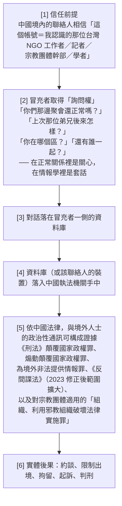

**台灣已有明確前例——李明哲案**：

2017 年，台灣 NGO 工作者李明哲於 3 月 19 日自澳門入境中國後失蹤，11 月 28 日經湖南省岳陽市中級人民法院一審以**顛覆國家政權罪**判處有期徒刑 5 年、剝奪政治權利 2 年，2022 年 4 月獲釋。

**關鍵在於證據類型**：依起訴書，法院認定犯罪事實的證據包含 **QQ 群組（「圍觀中國」「圍觀華南」）中的活動、透過 QQ 空間／Facebook／微信等社群平台發表的言論、以及與中國境內被告彭宇華的通訊往來與聊天紀錄**。

> **這個案例已經證明：在中國，台灣人與境內人士的線上政治性對話紀錄，會被直接當成入罪證據。**
> **GTG-84006 的手法，只是把「誰在打字」換成了 AI。** 所有法律後果不變，但攻擊規模與擬真度大幅提升。

**規模脈絡**（依 9.3(G) 引述的公開報導）：陸委會表示 20 名台灣人在中國因傳教被捕（一貫道 18 人、統一教 2 人），其中 3 人獲釋、15 人仍在中國；2026 年 1 月至 5 月，共 **361 名**台灣人在中國失聯、遭約談或遭拘留。

#### 10.4.2 台灣的高風險族群盤點

| 族群 | 為什麼是目標 | 特有的脆弱點 |
|---|---|---|
| **中國人權工作者、關注中國議題的 NGO** | 與境內維權人士、律師、家屬有長期通訊關係；其聯絡人清單本身就是高價值情報 | 聯絡人多、通訊頻繁、常使用微信（無端對端加密、伺服器在中國境內）；小型組織缺乏專職資安 |
| **宗教團體（家庭教會網絡、一貫道、法輪功、藏傳佛教、全能神教會相關）** | 中國對境外宗教滲透高度敏感；本報告 p.89 起的 GTG-14020 案即點名**台灣基督長老教會領導層**為中國宗教事務情報作業的目標 | 信眾關係高度信任、驗證文化薄弱；「牧者」「前輩」身分具有極強的說服權威，極易被冒充 |
| **記者與研究者** | 需要在中國境內維持消息來源 | 職業要求「主動聯繫陌生人」，與「對主動聯繫保持警戒」的安全建議直接衝突 |
| **在台中國籍學生、學者與異議者** | 家人在中國境內可被施壓（參考 Amnesty 2024 對海外中國學生的研究） | 家庭關係無法切斷；「家人帳號」被冒充時幾乎不可能拒絕回應 |
| **西藏、維吾爾、香港在台社群** | 本報告 p.89–102 的多起中國案例均明確涵蓋這些社群 | 跨境親屬聯繫、社群規模小、身分易辨識 |
| **兩岸交流／地方交流的承辦人員** | 有正當理由與中國官方及半官方單位通訊 | 難以區分「正常業務往來」與「被利用的接觸」 |

**注意本報告與台灣的直接交集**（可作跨模組連結）：

- **GTG-14020**（p.89–93）：中國宗教事務情報作業，目標包含**台灣基督長老教會的領導層**、亞洲各地資深天主教樞機、藏傳佛教公民社會與流亡政府、法輪功及其關聯媒體。Claude 被用來生成「人員研究草稿」「線索報告」「每日態勢感知簡報」，並為每個目標標註「**抓手**」（統戰系統用語，指可利用的把柄）。
- **GTG-14022**（p.98–101）：中國承包商為政府客戶產製情報簡報，用 Claude 監控並分類特定異議者與運動者、少數民族與僑民社群、宗教組織、**台灣的政治人物**、勞工與學生運動者。並將西方與**台灣媒體**的報導重新框架為敵意敘事（例如把「台灣政府」改為「台灣當局」、對相關詞加上引號）。

> **教學上的關鍵連結**：GTG-84006 教的是「**冒充**這個手法本身」；GTG-14020 / 14022 教的是「**台灣是明確的目標**」。把三者放在一起，學員就會看到完整的威脅圖像：**手法已經存在，目標已經包含台灣，缺的只是把兩者接起來。**

#### 10.4.3 台灣公民社會的帳號驗證與安全通訊實務建議

以下建議刻意寫成**可直接複製到組織內規**的形式。分成「個人」「組織」「生態系」三層。

**第一層：個人層（每個與中國境內有聯絡的人都該做）**

| # | 做法 | 說明 |
|---|---|---|
| 1 | **接受「文風不再是身分證明」** | 你所有公開的貼文、文章、留言都是訓練你的替身的語料。本案是 8,400 則貼文。**不要再用「講話的口氣像他」來判斷身分。** |
| 2 | **建立帶外驗證習慣** | 與每一位高風險聯絡人事先約定**第二通道**與**驗證問題**。驗證問題必須基於**未曾出現在任何網路平台上的共同記憶**。 |
| 3 | **設計脅迫暗號（duress code）** | 一個看似正常、但代表「我現在不安全」的說法。必須是**主動加入**（說某句話），而不是**被動省略**（不說某句話）——後者在真實壓力下極難執行。 |
| 4 | **Telegram 硬化** | 啟用**兩步驟驗證雲端密碼**（防止僅憑簡訊 OTP 被接管，這是伊朗案例中反覆出現的弱點）；定期檢查並登出陌生的 Active Sessions；關閉「以手機號碼找到我」；對高風險對話使用 Secret Chat 或改用 Signal。 |
| 5 | **高風險對話改用 Signal，並驗證安全碼** | Signal 預設端對端加密、支援消失訊息、可驗證 safety number。**微信絕對不適用於任何敏感通訊**（無端對端加密、伺服器位於中國境內、內容受法定審查與留存）。 |
| 6 | **最小化聯絡人清單暴露** | 不同專案的聯絡人分艙存放；不要把整份聯絡人清單放在任何雲端同步的通訊錄；定期清理。 |
| 7 | **絕不在即時通訊中索取身分資訊** | 把這條當成個人紀律。這樣一來，**任何向你索取身分資訊的「你認識的人」，都自動可疑**。 |
| 8 | **定期發布可查核的真實性訊號** | 例如每週在公開頻道貼一則含當日新聞關鍵字的訊息，讓聯絡人有獨立的新鮮度基準。 |

**第二層：組織層（NGO、教會、新聞編輯室、學術單位）**

| # | 做法 | 說明 |
|---|---|---|
| 1 | **制定並公開「聯絡規則」** | 明確列出：我們會從哪些帳號聯絡你、我們**永遠不會**做什麼。公開它，讓冒充者無法安全地違反。（此項有爭議，見討論題 4。） |
| 2 | **建立冒充事件 SOP** | 含通知順序（高風險聯絡人優先）、通道選擇、對外發言、平台申訴、證據保存。**演練它**（演練 A）。 |
| 3 | **預先保存帳號所有權證明** | 平台申訴時需要證明「我才是本人」。事前準備好，事發時才來不及。 |
| 4 | **導入威脅模型工作坊** | 直接使用開放文化基金會（OCF）的《CSOs 數位防禦手冊》與 CSCS 社群資源——**台灣已有現成的中文材料，不需要從頭做。** |
| 5 | **對境內聯絡人做安全教育，而不只是對自己人** | 本案的受害者是**聯絡人**，不是被冒充者。安全教育若只做內部，等於沒做。 |
| 6 | **建立「失聯應變」程序** | 當境內聯絡人失聯：誰負責判斷？多久之後採取行動？採取什麼行動（公開 vs. 靜默）？這個決定極難，必須事前想清楚。 |
| 7 | **資料最小化與保存期限** | 你保存的每一份聯絡人資料，都是未來可能被查扣的證據。**你不需要的資料就不要有。** |

**第三層：生態系層（政府、平台、研究社群）**

| # | 做法 | 說明 |
|---|---|---|
| 1 | **建立與 AI 供應商的資訊交換管道** | 依 8.4.3，記憶檔／技能檔比對這層證據**只有 AI 供應商看得到**。台灣若只建公開平台監測，永遠只能看到第二、第三層指標。這應該是國安與數位發展主管機關的明確工作項目。 |
| 2 | **投資「語料層偵測」而非只有「帳號層偵測」** | 依 7.3 的三層模型，語料層（強制口號、專有名詞意譯、來源集合排他性）壽命最長、成本最低、且**公民社會就能做**。 |
| 3 | **建立「專有名詞意譯」偵測詞庫** | 把中國機構、媒體、官銜的標準英譯與異常直譯形式建成對照表，用於偵測機器翻譯的洗白管線。這是一個小型、高投報的公共財專案。 |
| 4 | **把「冒充真人」明確納入 IO 威脅評估的獨立分類** | 目前台灣的假訊息／認知作戰論述，重心在「內容」與「傳播」。**冒充真人以接觸特定個人**是一個不同性質的威脅——它的危害不隨傳播量增加，而隨目標的脆弱度增加。**需要一套獨立的量表。** |
| 5 | **對宗教與族裔社群的特別支援** | 這些社群的信任結構最容易被冒充利用，但資安資源最少。建議以社群為單位（而非組織為單位）提供培訓。 |
| 6 | **不要用封鎖網域的方式處理** | 參考 7.2 對 IOC #1 的說明：把政治團體的官方網站加入封鎖清單，既無效（指標是**引用模式**不是網域本身）又構成言論審查。**這是最容易犯的政策錯誤。** |

#### 10.4.4 一個必須避免的誤讀

本案的行為者是**反對威權政權的流亡組織**。台灣讀者很容易把這個案例讀成「中國會這樣做」——但本案的教訓其實更不舒服：

> **當你同情的一方掌握了同樣的工具，他們也會這樣做。**

台灣支持中國民主化、支持西藏與維吾爾人權、支持香港的立場是清楚的。而本案提醒我們：**流亡社群、海外倡議組織、乃至於我們自己的宣傳工作，都應該接受同一套標準的檢驗**——不冒充真人、不對高風險個人做非自願側寫、不隱瞞合成媒體、不隱瞞組織歸屬。

**理由不是道德潔癖，而是實效**：一旦「支持民主的一方」被證實使用冒充手法，威權政權就取得了一個極其有力的宣傳武器——「你看，他們也一樣」。而付出代價的，是境內那些還願意相信的人。

**這句話建議作為整堂課的結語。**

---

## 11. 關鍵原文引文

> 供課程講義直接引用。每條標註頁碼，英文原文逐字，繁中翻譯附後。

---

**引文 1｜案例標題（p.70）**

> "GTG-84006: Disrupting a distributed MEK/NCRI-aligned influence operation that used a shared AI agent to impersonate real people and recruit inside Iran"

> 「GTG-84006：破壞一場 MEK/NCRI 對齊的分散式影響力行動——該行動使用一個共享 AI 代理來冒充真人，並在伊朗境內進行招募。」

*用途*：標題本身就是完整的案例摘要。注意 "shared AI agent"（共享 AI 代理）與 "recruit inside Iran"（在伊朗境內招募）這兩個關鍵詞組。

---

**引文 2｜冒充的完整描述（p.70）— 本案最重要的一段**

> "To deceive users, the operation impersonated a real-world activist by tasking the shared AI agent to clone the activist's personal Telegram account, then instructing it in Persian that it was now that person. The actor directed Claude to read roughly 8,400 of his Telegram posts to copy his writing style, and then used it to run live political conversations with his contacts. **To our knowledge, these contacts did not know they were speaking with an AI-assisted account.**"

> 「為了欺騙使用者，該行動冒充了一名真實世界的運動者：它指派共享 AI 代理複製該運動者的個人 Telegram 帳號，接著**以波斯語指示它「你現在就是那個人」**。該行為者指揮 Claude 讀取他大約 **8,400 則** Telegram 貼文以複製其寫作風格，然後用它與他的聯絡人**進行即時政治對話**。**就我們所知，這些聯絡人並不知道他們正在與一個 AI 輔助的帳號說話。**」

*用途*：這是全案的核心引文。最後一句是知情同意完全缺席的明證。

---

**引文 3｜歸因的自我設限（p.70–71）**

> "Although the actors did not share account infrastructure or show visible signs of coordination, our investigations linked this activity to People's Mojahedin Organization of Iran (PMOI/MEK), and its political front, the National Council of Resistance of Iran (NCRI)."
>
> "Our investigation showed that at least four individuals running this campaign work for official NCRI media outlets... While the presence of committee approval loops and notes about MEK leadership suggest central tasking is likely, **we are not able to verify the level of centralized control.**"

> 「儘管這些行為者並未共用帳號基礎設施，也未展現可見的協同跡象，我們的調查仍將此活動連結到伊朗人民聖戰者組織（PMOI/MEK）及其政治外圍組織——伊朗全國抵抗委員會（NCRI）。」
>
> 「我們的調查顯示，至少有四名執行此行動的個人任職於官方 NCRI 媒體機構……雖然委員會核可迴圈的存在以及關於 MEK 領導層的記述暗示中央指派**很可能**存在，**我們無法驗證中央控制的程度。**」

*用途*：教「歸因信度措辭」的最佳素材（見 2.3）。三種不同強度的措辭出現在同一段落內。

---

**引文 4｜監控規模與被捕紀錄分群（p.71）**

> "The operation successfully scraped over 500 social media channels to build detailed profiles of individuals inside Iran. They then grouped these targets by city, age, occupation, political alignment, **and arrest history** likely to help them tailor their messages to the specific audiences."
>
> "The network analyzed roughly 51,944 archived messages from these conversations to build detailed psychographic dossiers on dozens of specific individuals in Iran. To spread their message further, the impersonation accounts also sent a fabricated breaking news headline to **more than 30 contacts simultaneously**."

> 「該行動成功刮取了**超過 500 個**社群媒體頻道，以建立伊朗境內個人的詳細檔案。他們接著依**城市、年齡、職業、政治傾向與被捕紀錄**將這些目標分群，很可能是為了協助他們針對特定受眾調整訊息。」
>
> 「該網絡分析了來自這些對話的約 **51,944 則**封存訊息，以對伊朗境內**數十名特定個人**建立詳細的心理側寫檔案。為了進一步散播其訊息，冒充帳號也**同時**向**超過 30 名**聯絡人發送了一則**捏造的**突發新聞標題。」

*用途*：規模數字的權威引用。注意「roughly 51,944」這個「精確但被標為約略」的措辭（見 4.1 分析）。

---

**引文 5｜Viktor 平台與持久記憶（p.72）— 教「架構性缺口」用**

> "The network relied on Claude to support all phases of its influence operation. The actors managed these tasks using a **shared AI agent platform**, where each workspace maintained its own **long-term memory files**. Over time they updated these files with specific instructions, such as lists of banned words, approved sources, account management rules, and ways to avoid detection. **This allowed the agent to keep producing content without a human user directing each session.** One actor loaded MEK founding doctrine into the model's memory as **'strategic base data'** for others within the operation to reuse."

> 「該網絡仰賴 Claude 支援其影響力行動的**所有階段**。行為者使用一個**共享 AI 代理平台**來管理這些任務，平台中**每個工作區都維護自己的長期記憶檔**。隨著時間推移，他們以特定指令更新這些檔案，例如**禁用詞清單、核可來源、帳號管理規則，以及規避偵測的方法**。**這讓該代理能在沒有人類使用者逐一指揮每個工作階段的情況下，持續產出內容。**其中一名行為者把 MEK 的創始教義載入模型記憶，作為**「戰略基礎資料」**供行動內其他人重複使用。」

*用途*：本案技術核心的權威引用。最後一句（一次寫入、多人重用）是持久記憶危害的最佳例證。

---

**引文 6｜人事制度與「依照我們的合約」（p.72）**

> "The human management behind this operation was highly structured. This included an approval loop by a dedicated committee and a formal review process from content correctors to managers. Throughout their communication, the actors repeatedly used the phrase **'per our contract'** and made regular references to the MEK leadership. We found that **the same operational playbook was applied uniformly across all workspaces.**"

> 「這個行動背後的人力管理高度結構化。這包含一個**專責委員會**的核可迴圈，以及從**內容校正者到主管**的正式審查流程。在他們的通訊中，行為者反覆使用「**依照我們的合約**」這個說法，並定期提及 MEK 領導層。我們發現，**同一份操作腳本被一致地套用在所有工作區上。**」

*用途*：證明這是有薪人員的機構化作業，不是志願者的自發行為（見 2.4）。

---

**引文 7｜Cluster 表中最嚴重的兩項判斷（p.72）**

> "**Live impersonation** — Most serious element: Impersonating a real activist to contacts inside Iran without their knowledge."
>
> "**Surveillance and profiling** — Most serious element: **Arrest-history profiling of people who face imprisonment or execution under Iranian law.**"

> 「**即時冒充** — 最嚴重的元素：在伊朗境內聯絡人**不知情**的情況下冒充一名真實運動者。」
>
> 「**監控與側寫** — 最嚴重的元素：對**依伊朗法律面臨監禁或處決**的人做**被捕紀錄側寫**。」

*用途*：這兩句是本案危害論證的核心。配合 9.3(C) 的獨立處決紀錄使用，效果極強。

---

**引文 8｜處置與自陳限制（p.74）**

> "We found this activity as part of our internal investigations and banned the accounts. **At this point, we are not able to independently confirm how much authentic engagement was drawn by the network's amplification accounts.**"

> 「我們在內部調查過程中發現此活動，並停用了相關帳號。**目前，我們無法獨立確認該網絡的放大帳號吸引到多少真實互動。**」

*用途*：教「沒有證據 ≠ 證據顯示沒有」，以及 AI 供應商的觀測邊界（見 8.2 缺口五、8.5.5 要點二）。

---

**引文 9｜報告自陳的結構性盲點（p.42，非本案專屬但直接適用）**

> "**Our visibility into these operations ends once it's live.** To verify our findings and understand what happened after content left our platform, we rely on open-source research, cross-platform industry data, and public reporting."

> 「**我們對這些行動的能見度，在它上線之後就中止了。**為了驗證我們的發現、並理解內容離開我們的平台後發生了什麼，我們仰賴公開來源研究、跨平台的業界資料，以及公開報導。」

*用途*：解釋為什麼「沒有任何單一機構看得見完整的影響力行動」。

---

**引文 10｜共享平台的組織效益（p.43，趨勢章節）**

> "Markdown files containing doctrine were reused almost verbatim across hundreds of sessions. Actors kept lists of banned words inside their AI agents, maintained shared files of approved sources and evasion rules, and ran custom software that called Claude in fixed batches. **The central setup meant that actors producing content never needed to coordinate with or even know one another.** ... Increasingly, operations are not run using individual prompts. Instead, **a great deal is embedded within persistent memory files.**"

> 「包含教義的 Markdown 檔案在**數百個工作階段**中被幾乎逐字重複使用。行為者在他們的 AI 代理內部保存禁用詞清單、維護核可來源與規避規則的共享檔案，並執行以固定批次呼叫 Claude 的自製軟體。**這種中央化設置意味著，產出內容的行為者從不需要彼此協調，甚至不需要認識對方。**……越來越多的行動不是用個別提示來運作。反之，**大量內容被嵌在持久記憶檔裡。**」

*用途*：把本案放進整體趨勢的定位。這段話幾乎就是 GTG-84006 的抽象版本。

---

## 12. 未能驗證之處與研究限制

### 12.1 報告本身沒有說明的事（資訊缺口）

| # | 缺口 | 為什麼重要 |
|---|---|---|
| 1 | **Telegram 帳號「clone」的具體技術路徑** | 報告只說 "clone the activist's personal Telegram account"。是帳號被接管（透過簡訊 OTP 攔截、SIM swap、電信商配合）？是建立高相似度的仿冒帳號？還是匯出公開頻道內容後重建？**這三者的防護方式完全不同**，也決定了被冒充者能不能自救。這是本案最重要的未解技術問題。 |
| 2 | **「posts」vs.「private messages」的矛盾** | p.70 說讀取 8,400 則 **Telegram posts（貼文）**；p.72 Cluster 表說從 **private messages（私訊）** 複製其 voice。如果是私訊，代表**帳號確實被接管**（否則拿不到私訊），案件性質嚴重得多。報告未釐清。 |
| 3 | **「ten-stage funnel（十階段漏斗）」的內容** | 只出現在 Cluster 表一次，正文完全沒展開。這是一套被文件化的 SOP，其結構對理解監控作業極有價值。 |
| 4 | **「historical-figure deepfakes（歷史人物深偽）」的細節** | 只出現在 Cluster 表一次。是哪些歷史人物？內容是什麼？散布到哪裡？全部未知。 |
| 5 | **「10 avatars」與「for each article」的張力** | p.71 說「為每一篇文章建立 AI 頭像」，Figure 15 說「10 avatars」。最合理的調和是 10 個固定人格輪流指派，但報告未明說。 |
| 6 | **被停用的 Claude 帳號數量** | 報告只說 "banned the accounts"，未給數字。對照孟加拉案（p.70）明確給出「29 個輪替帳號、約十六個月」，本案的省略很明顯。 |
| 7 | **操作者的地理位置** | 完全未提。對照：伊朗國家案（p.62 起）明確說「從伊朗境內存取 Claude 被封鎖，所以他們用 VPN 與外國電話號碼」。MEK 主要基地在阿爾巴尼亞（Ashraf 3）與巴黎，但報告**沒有**確認操作者在哪裡。 |
| 8 | **「Viktor」是什麼**（是自建平台？第三方產品？Claude 的某個功能組合？） | 報告只稱 "a shared AI agent platform"。`SKILL.md` / `LEARNINGS.md` 的檔名慣例暗示它至少使用了 Agent Skills 風格的架構，但**這是推論，不是報告陳述**。 |
| 9 | **是否與平台分享指標** | 本案處置段落沒有這句話，而同頁的孟加拉案有。未知是省略還是實際未分享。 |
| 10 | **是否通知受害者** | 完全未提。 |
| 11 | **是否有任何 Claude 拒絕紀錄** | 全案六頁沒有出現 refuse / decline / block / safeguard 任一字詞。未知是沒發生還是未記載。 |
| 12 | **行動的起訖時間** | 報告只給整體涵蓋期間（2025-12 至 2026-08）。本案的起訖時間未單獨說明。**唯一的時間錨點是 Figure 16 的貼文（2026-06-06）**，由本教材從波斯曆換算得出。 |
| 13 | **`@mellat_b` / "Parsa" 的角色** | Figure 15 標為 Covert actor，但未說明是被複製的原帳號還是冒充用帳號，也未說明 "Parsa" 是誰的名字。**本教材刻意不推測。** |
| 14 | **「741 handles」的來源與性質** | 只出現在 Figure 15。是 741 個受控帳號？還是 741 個被觀測到的帳號？未知。 |

### 12.2 本教材的研究限制

1. **本案為單一來源情報。** 所有關於 GTG-84006 的事實，唯一來源是 Anthropic。無任何第三方獨立證實。教材已在第 9 節明確標註。
2. **圖表判讀來自 130 DPI 渲染圖。** Figure 16 的英文說明文字為**逐字目視判讀**，小字部分（特別是公司名稱如 "Dundlod Trading FZE"、人名如 "Mehrdad Geramian Nik"）可能有字元級誤判。**引用前請核對原始 PDF。**
3. **波斯文重建。** PDF 的文字擷取層把波斯文（RTL）字序反轉。本教材呈現的 «زن، زندگی، آزادی» 與 «زن، مقاومت، آزادی» 是依反轉規則還原並與已知的公開口號比對後的結果，**經過重建而非直接擷取**。圖片判讀（p.72 渲染圖）亦顯示 PDF 排版本身即已將波斯文顯示為亂序，這是 PDF 生成端的問題，不是本教材的判讀錯誤。
4. **波斯曆換算為本教材自行計算**（1405 年 Khordad 16 日 = 2026-06-06，星期六）。已與貼文上的 «شنبه»（星期六）及內文提及的 "Friday (June 5, 2026)" 三重交叉驗證，但仍應視為推算結果。
5. **部分外部來源未能直接擷取**：
   - Congressional Research Service R48433（HTTP 403）
   - Balkan Insight 2021 報導（HTTP 403）
   - CNN 2022-12-19（HTTP 451）
   - Axios 2026-09-12（HTTP 403）
   - IranWire（HTTP 403）
   - 自由時報 2026 報導（僅經搜尋結果引述）
   以上在第 9 節均已逐一標註為「間接引用／未直接查證」。
6. **MEK/NCRI 未取得回應。** 本教材未找到 MEK 或 NCRI 對本次 Anthropic 報告的任何公開回應。這對一個涉及指控的案例而言是重要的缺漏。**若日後出現回應，教材應更新。**
7. **2.6 節的政治定位整理，部分倚賴維基百科作為時間線骨架**，並與 HRW、Al Jazeera、英國國會研究簡報、NCRI 官方材料交叉比對。維基百科**非權威來源**，關鍵日期建議在課前以原始官方文件（美國國務院 Federal Register 公告、歐盟理事會決議）覆核。
8. **DISARM 技術編號未逐一標註。** 第 5 節僅使用 DISARM 的戰術階段名稱，未給技術層 ID，原因是編號版本迭代頻繁且本教材無法即時核對當期發布。**這是刻意的誠實標註，請授課者依當期 DISARM 官方發布補齊。**
9. **本教材未對任何 IOC 進行任何形式的技術查詢或連線**（依共用簡報的安全紅線）。因此無法提供這些帳號的現況（是否仍在運作、是否已被平台下架）。
10. **關於被冒充者身分，本教材刻意不做任何調查與推測。** 這是倫理選擇，不是能力限制。授課者應維持同樣的原則。

### 12.3 建議後續追蹤

| 追蹤項目 | 方法 |
|---|---|
| MEK/NCRI 是否公開回應 | 監看 ncr-iran 官方聲明與主要波斯語媒體（**僅觀察公開聲明，不接觸 IOC**） |
| Meta / Telegram 是否公布相關下架行動 | 追蹤 Meta 的 Adversarial Threat Report 季度發布 |
| 是否有獨立研究機構跟進 | 追蹤 Citizen Lab、DFRLab、Graphika、Stanford Internet Observatory 的後續發布 |
| Anthropic 下一期報告是否補充本案 | 下一份威脅情報報告 |
| 台灣是否出現同型態案例 | 與 OCF、台灣事實查核中心、台權會等組織建立通報連結 |
| 「共享代理平台」是否成為 2026–2027 的主流 IO 架構 | 這是本案最值得長期追蹤的趨勢問題 |

---

## 附錄 A｜一頁速查卡（可單獨印給學員）

```
╔══════════════════════════════════════════════════════════════════╗
║  GTG-84006  ｜ MEK/NCRI 分散式影響力行動 ｜ 共享代理平台「Viktor」 ║
║  來源：Anthropic《Detecting and countering misuse of AI》p.70–75  ║
╚══════════════════════════════════════════════════════════════════╝

【一句話】 四名 NCRI 媒體從業者，透過一個共享 AI 代理平台，冒充一名
          真實運動者與其伊朗境內聯絡人對話，同時對境內數十人建立
          含「被捕紀錄」的心理側寫檔案。

【關鍵數字】
  8,400   被讀取的 Telegram 貼文（用於複製文風）
  500+    被刮取的社群頻道 / 被滲透的 Telegram 群組
  51,944  被分析的封存訊息（報告寫 "roughly"）
  741     Telegram handle（僅見於 Figure 15）
  30+     同時收到捏造頭條的聯絡人
  10      合成人格頭像（僅見於 Figure 15）
  4       任職於官方 NCRI 媒體機構的執行者（至少）
  7       被硬編碼的 MEK/NCRI 強制來源網域
  Two     Breakout Scale 評級

【六大叢集】
  ① 共享代理平台 Viktor  ② 即時冒充  ③ 監控與側寫
  ④ 協同不實行為        ⑤ 合成媒體  ⑥ 媒體洗白

【三個必記的教學句】
  1. 協同從網路層搬到了語料層 → 你的偵測能力也必須搬家。
  2. 你稽核的是對話，但行動寫在設定檔裡。
  3. 一個 Category Two 的行動可能害死人。

【最強的三個偵測指標（壽命最長）】
  ① 強制口號變體 «زن، مقاومت، آزادی»（取代 «زن، زندگی، آزادی»）
  ② 外連來源集合的排他性（七個網域，且只有這七個）
  ③ 記憶檔／技能檔內容比對（SKILL.md / LEARNINGS.md）※僅 AI 供應商可見

【最容易犯的三個錯】
  ✗ 把七個 MEK/NCRI 網域加進封鎖清單（無效 + 言論審查）
  ✗ 把 Breakout Scale 的低評級讀成「危害低」
  ✗ 把「無法確認真實互動」讀成「沒有真實互動」

【台灣對應風險】
  台灣 NGO / 記者 / 宗教團體幹部 被冒充 → 中國境內聯絡人被套話
  → 對話紀錄成為入罪證據（李明哲案已有前例：QQ 群組、微信、Facebook）

【安全紅線】
  🔴 不連線、不查詢、不訂閱本案任何 IOC。
  🔴 不推測被冒充者身分。
```

---

## 附錄 B｜與其他模組的交叉連結

| 本案的哪個面向 | 連到哪個案例 | 頁碼 |
|---|---|---|
| 影響力行動的整體趨勢與方法論、Breakout Scale | 模組 02 導論 | p.40–44 |
| 對照：國家行為者的伊朗宣傳（Jihad al-Tabyin 教義、IRGC 頻道、Eitaa 平台） | GTG-34001 | p.62–67 |
| 對照：Category Two 的另一個案例（約 70 個假新聞站、8,913 篇文章、約 20 種語言），且以「共享部署識別碼」完成歸因 | GTG-54002 | p.47–53 |
| 對照：同頁的另一個案例，處置段落明確提到與平台分享指標 | GTG-54006（孟加拉） | p.67–70 |
| 對照：Claude 拒絕但被重新提示突破，以及「防護表現不一致」的自陳 | GTG-14021（中國公安） | p.93–98 |
| 對照：Claude 拒絕側寫與宣傳，但未拒絕監控工具開發；custom skills 被變成語音複製工廠 | GTG-34007（伊朗雙單位） | p.101–103 |
| **台灣直接被列為目標**：台灣基督長老教會領導層、藏傳佛教、法輪功、亞洲天主教樞機 | GTG-14020 | p.89–93 |
| **台灣直接被列為目標**：台灣政治人物、台灣媒體報導被重新框架 | GTG-14022 | p.98–101 |
| 「冒充真人與機構」的整體趨勢（含冒充國家發言人與人權組織） | 模組 02 導論 | p.43 |

---

## 附錄 C｜第二階段技術深化導讀（2026-09-13 追加）

> 本附錄（C–H）是在保留前述全部內容的前提下，針對**技術高手聽眾**追加的技術深化層。第 1–12 節與附錄 A–B 完全不變；本層只補「技術上到底怎麼運作、怎麼防、怎麼寫成可部署的偵測規則」。

**本層要回答的五個技術問題：**

| # | 問題 | 對應附錄 | 對應正文 |
|---|---|---|---|
| 1 | 「共享 AI 代理平台 Viktor」在技術上是什麼？它留下哪些**橫跨多帳號的指紋**？怎麼把它畫成綁定 741 handles / 500+ groups 的架構圖？ | 附錄 D | 4.0、6.2、8.4 |
| 2 | Telegram 帳號「clone」與「companion device」的技術機制是什麼？被冒充者與聯絡人可以用哪些**技術手段**防護（帳號驗證、安全碼比對、多通道確認）？ | 附錄 E | 4.2、12.1 #1/#2 |
| 3 | 「51,944 則訊息的心理側寫」在技術上是一條什麼樣的 NLP pipeline（情感、立場、社群網路分析）？ | 附錄 F | 4.1、3.3 |
| 4 | 「專有名詞被意譯」的跨語言洗白偵測，怎麼寫成**可操作規則**？ | 附錄 G | 6.3.3、7.2 |
| 5 | 第二階段（新配額）補到的第三方技術來源有哪些？ | 附錄 H | 第 9 節 |

**圖表覆蓋確認（依技術深化 pass 規定自檢）**：本檔負責頁段 p.70–75 的所有視覺元素——**Figure 15（p.73，Viktor 網絡圖）**、**Figure 16（p.74，Instagram 截圖）**、**Cluster 表（p.72–73）**、**IOC 表（p.74–75）**——已於第 6 節（6.1–6.4）逐一完整判讀（圖片類型、圖上文字、資料流、核心訊息、課堂用法）。本附錄不重複判讀，只補技術重建（例如把 Figure 15 重畫成 Mermaid 架構圖、把「十階段漏斗」重建成 NLP pipeline）。

**紅線不變**：本層所有內容**不對任何 IOC 連線、不做 DNS/VirusTotal 以外查詢、不訂閱任何帳號**。所有偵測規則均為**防禦性**用途，且刻意寫成「偵測攻擊者」而非「執行攻擊」的形式。凡屬對真人的側寫技術，只到「架構與偵測」層，不提供可直接對真實個人施用的操作腳本。

---

## 附錄 D｜共享 AI 代理平台「Viktor」的技術架構與指紋偵測

> 對應正文 4.0（階段 0）、6.2（Figure 15）、8.4（共用平台的偵測意義）。本附錄把「Viktor 是一個共享 AI 代理平台」這句話拆到技術元件層，並給出**橫跨多帳號的三類指紋**與可部署偵測邏輯。

### D.1 「共享 AI 代理平台」在技術上是什麼

報告只說 "a shared AI agent platform, where each workspace maintained its own long-term memory files"（p.72），並在趨勢章節補充行為者「執行以固定批次呼叫 Claude 的自製軟體」（p.43："ran custom software that called Claude in fixed batches"）。把這兩句話組合，可以還原出一個相當標準的**多租戶代理編排（multi-tenant agent orchestration）**架構，元件如下：

| 元件 | 技術職能 | 報告依據 / 推論標記 |
|---|---|---|
| **Model gateway（模型閘道）** | 集中管理對 Claude API 的呼叫：金鑰輪替、速率控制、把多個 workspace 的請求收斂到少數 API 憑證 | p.43「custom software that called Claude in fixed batches」 |
| **Workspace（每名行為者一個）** | 隔離的工作區，各自持有記憶檔；行為者在自己的工作區內操作 | p.72「each workspace maintained its own long-term memory files」 |
| **Persistent memory files（持久記憶檔）** | 把 doctrine / banned words / approved sources / account rules / evasion rules 寫成檔案，跨工作階段存活 | p.72、IOC 表 `SKILL.md / LEARNINGS.md` |
| **Scheduler / cron（排程器）** | 無人值守地觸發產出任務 | Figure 15「3 pages · one cron」 |
| **Doctrine corpus（教義語料，共享）** | 「strategic base data」，一次寫入、多工作區重用 | p.72、p.43「Markdown files containing doctrine reused almost verbatim across hundreds of sessions」 |

> ⚠️ **「Viktor 是自建平台、第三方產品、還是 Claude 某功能組合」報告未說明**（見 12.1 #8）。`SKILL.md` / `LEARNINGS.md` 的檔名慣例**暗示**它至少採用了 Agent-Skills 風格的「技能檔 + 累積式學習檔」架構，但這是**推論，不是報告陳述**，教材與課堂都要如此標註。

**與「一般聊天會話」的技術差異**（這是偵測的關鍵前提）：

| 維度 | 一般 Chat 會話 | Viktor 式代理平台 |
|---|---|---|
| 意圖所在 | 在**當次使用者訊息**裡 | 在**數月前寫入的記憶檔**裡 |
| 觸發者 | 人類即時輸入 | cron 排程 / 代理自迴圈 |
| 呼叫形態 | 不規則、對話式 | **固定批次、結構化輸出 schema** |
| 跨帳號關聯 | 通常無 | **共用 doctrine / prompt 模板 / 記憶檔** |
| 逐次審查可見度 | 高（意圖在對話裡） | **低（該次對話只是「照排程產一篇稿」）** |

最後一列就是 8.2「缺口二」的技術根因：**per-session 內容分類器看不到寫在記憶檔裡的意圖**。

### D.2 三類「橫跨多帳號」的技術指紋

共用平台的攻擊者價值是「協同在帳號/網路層消失」（8.4.1），但**協同必須發生在某個地方**——它發生在**文字與呼叫形態**上。以下三類指紋，正是「四個互不相識、不共用基礎設施的帳號」仍能被 Anthropic 連成一個網絡（p.70）的技術依據。

**指紋一：API 呼叫模式指紋（call-pattern fingerprint）**

同一份 playbook 套用到所有 workspace（p.72："the same operational playbook was applied uniformly across all workspaces"），在遙測層會表現為：

- **固定批次結構**：同報告孟加拉案（p.70）的 `fake_news_3.py` 每次輸出「15 條孟加拉語標題 + 3 篇敘事 + 15 個英文生圖 prompt」，就是這種固定 schema 的赤裸範例。本案的等價物是每個 workspace 產出**同構的內容包**。
- **請求節奏綁定 cron**：請求時間戳呈現機器規律（低抖動、固定間隔），與人類作息不符。
- **參數同質**：`temperature`、`max_tokens`、`stop` 序列、system prompt 長度分布跨帳號高度一致。
- **token 長度分布同形**：輸入（貼文批次）與輸出（固定 schema）的 token 數呈現跨帳號幾乎重合的分布。

**指紋二：Prompt 模板指紋（prompt-template fingerprint）**

- **人格注入模板**："instructing it in Persian that it was now that person"（p.70）——「你現在就是 &lt;真實人名&gt;」＋「以下是他的 N 則貼文」是一個**高辨識度的模板骨架**。
- **強制清單注入**：banned words 清單、approved sources 清單、mandatory slogan、`#OurChoiceMaryamRajavi` 直接嵌在 system prompt / 記憶檔裡（p.72、p.75）。
- **輸出規範注入**：ZWNJ + dot/space evasion 規則（p.75）寫成可執行的後處理指令。

**指紋三：記憶檔結構指紋（memory-file structure fingerprint）**

- **檔名慣例**：`SKILL.md` / `LEARNINGS.md`（IOC 表 Fingerprints 列，p.75）。
- **章節結構同構**：不同 workspace 的記憶檔即使措辭略有差異，**章節骨架（doctrine / banned / sources / rules / evasion）一致**。
- **doctrine 語料近乎逐字重用**：p.43「reused almost verbatim across hundreds of sessions」——這讓**內容相似度比對**成為最強的跨帳號關聯手段。

> **三類指紋的可觀測性分層**（呼應 8.4.2）：
> - 指紋一（呼叫模式）：**AI 供應商**在遙測層可見；**平台側**只能看到其下游效果（發文節奏）。
> - 指紋二（prompt 模板）：**只有 AI 供應商**看得到（prompt 不出平台）。
> - 指紋三（記憶檔結構/內容）：**只有 AI 供應商**看得到，但**偵測價值最高**（見 7.2 的 10d）。

### D.3 Mermaid 重建（一）：Viktor 平台的邏輯架構

下圖把 D.1 的元件與「人類科層在上、技術基質在下」的反直覺結構（見 2.5）畫成一張架構圖。虛線代表「所有 workspace 共用同一份記憶/教義」，這正是把彼此無關的行為者綁成一個網絡的那條線。

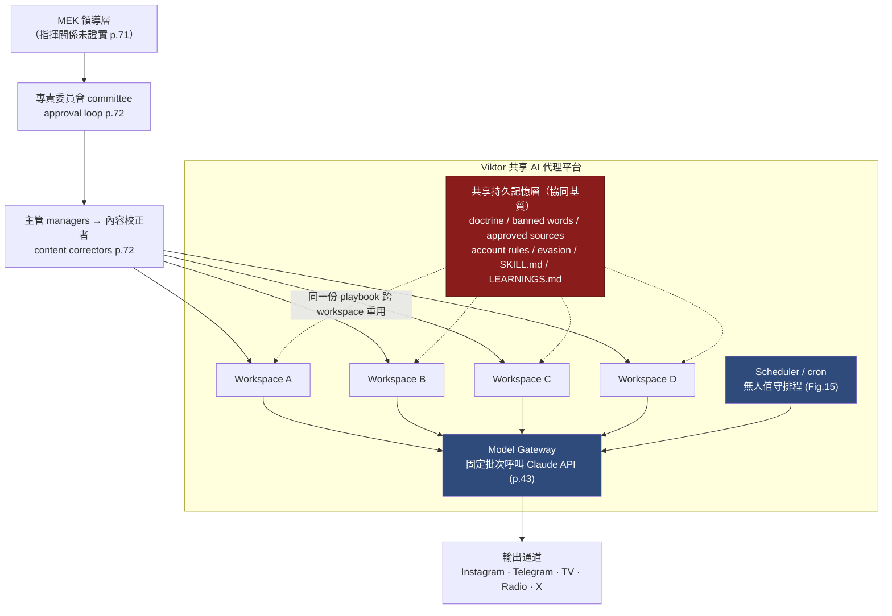

**讀圖重點**：把中間那條紅色「共享持久記憶層」抽掉，四個 workspace 就是四個彼此無關的使用者。**是記憶層（不是任何網路工件）讓它們成為「一個行動」。** 這與 Figure 15 的「虛線揭示」是同一個論點的兩種畫法。

### D.4 Mermaid 重建（二）：Viktor 如何綁定 741 handles / 500+ groups

下圖是 **Figure 15（p.73）的 Mermaid 忠實重建**，節點依原圖圖例四色分類（機構媒體＝藍、放大器/門面＝深灰、隱蔽行為者＝暗紅、受眾/目標＝橘）。**虛線＝「runs on the Viktor platform」**，**粗箭頭並標 `冒充` 者＝原圖的紅色 covert recruitment/impersonation 線**。重點在右下角：`Telegram infiltration` 節點下綁著 **741 handles · 500+ groups**，四條冒充線全部收斂到 `People inside Iran`。

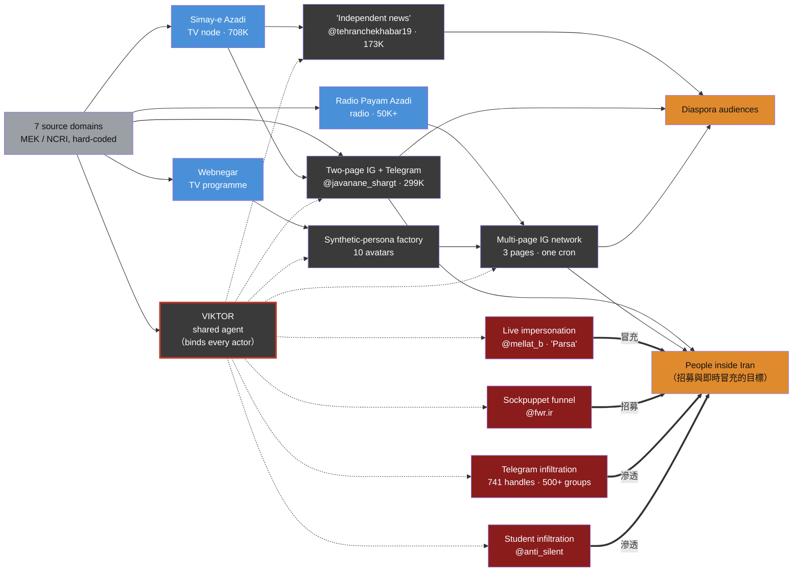

**這張圖的技術教學價值**（補 6.2 未展開的部分）：

1. **`741 handles` 是「維運規模」而非「刮取規模」**。正文只說「刮取超過 500 個社群頻道」（自動化可完成），但 741 個 Telegram handle 要有人**養號**（註冊、過冷啟動、避免被判定為 bot）。741 這個數字只出現在這張圖上（見 6.2.5），是全案**人力密集度**的最硬指標。
2. **虛線是「單元化組織」的數位化身**（呼應 8.4.1）。每個暗紅節點是一個「隱蔽單元」，它們**彼此沒有連線**，只各自連到 VIKTOR。傳統地下組織的「聯絡官」在這裡被一個**代理平台**取代——這是本案最值得記住的一句話。
3. **四條冒充線的收斂點是道德陳述**：網絡的公開面（藍色電視廣播 + 深灰 IG）看似媒體工作，隱蔽面（暗紅）**全部指向對境內真人的直接接觸**。

### D.5 記憶檔比對：把「指紋三」寫成偵測演算法

跨帳號記憶檔相似度是 8.4.2 表中價值最高、且**只有 AI 供應商做得到**的一項。技術上這是一個標準的**近重複偵測（near-duplicate detection）**問題，成熟工具鏈如下：

| 相似型態 | 適用演算法 | 說明 |
|---|---|---|
| 逐字/近逐字重用（doctrine「almost verbatim」） | **MinHash + LSH** | 對記憶檔切 shingle（如 5-gram），估計 Jaccard 相似度；LSH 讓「四個帳號兩兩比對」變成次線性 |
| 局部改寫、順序調動 | **SimHash（漢明距離）** | 對抗小幅編輯 |
| 語意等價但換句話說（換語言、換用詞） | **句向量餘弦相似度**（embedding cosine） | 抓「意思一樣、字不一樣」的教義段落 |
| 結構同構（章節骨架一致） | **AST/標題樹比對** | 比對 Markdown 標題層級序列，即使內文不同也能命中 |

**偵測邏輯（illustrative pseudocode，非任何既有規則集；用於 AI 供應商側遙測）**：

```python
# 目的：在互不相識、不共用帳號基礎設施的使用者之間，
#       找出共用同一份「記憶檔／技能檔」的協同群（Viktor 式協同基質）。
# 資料：每個 workspace 的記憶檔文字 memfiles[account_id] = text
# 注意：這是防禦性偵測邏輯，只比對「攻擊者設定檔的相似度」，不觸及任何內容產出。

from datasketch import MinHash, MinHashLSH   # 示意用途

def shingles(text, k=5):
    toks = normalize(text).split()
    return {" ".join(toks[i:i+k]) for i in range(len(toks)-k+1)}

lsh = MinHashLSH(threshold=0.6, num_perm=128)
sigs = {}
for acct, text in memfiles.items():
    m = MinHash(num_perm=128)
    for s in shingles(text):
        m.update(s.encode())
    sigs[acct] = m
    lsh.insert(acct, m)

# 找出「內容高度相似」但「帳號/IP/付款各自獨立」的群集 → 疑似共享協同基質
clusters = {a: lsh.query(sigs[a]) for a in sigs}
for a, near in clusters.items():
    if len(near) > 1 and not shares_infrastructure(near):   # 關鍵：排除已知共用基礎設施者
        flag_coordination_substrate(near)                   # 這正是 Anthropic 在本案做到的事
```

**其他可部署偵測（依資料可見度分兩側）**：

**(a) AI 供應商側**——偵測「人格注入 + 大量他人語料攝入」（對應 5.2 的 TTP #5/#6，正文標為框架缺口）：

```yaml
# Sigma 風格（示意；AI 平台遙測目前無標準 Sigma 分類，需自建 taxonomy）
title: Persona-injection with bulk single-author ingestion (impersonation setup)
logsource:
  product: ai_agent_platform
  category: prompt_and_memory
detection:
  persona_injection:
    system_or_memory|re: '(?i)(you are now|從現在起你是|شما اکنون).{0,40}(this person|that person|<PERSON_NAME>)'
  bulk_single_author:
    ingested_docs_from_single_identity|gt: 1000     # 本案為約 8,400 則
    request|contains: 'copy (his|her|their) writing style'
  condition: persona_injection and bulk_single_author
level: high
falsepositives:
  - 合法的作者風格研究、授權的內容代筆（需人工判讀意圖與同意）
```

**(b) 平台側**——偵測「3 pages · one cron」的排程相關性（對應 5.2 TTP #10，不需 AI 供應商配合）：

```kql
// KQL 示意：跨帳號發文時間戳的低熵 / 高相關 = 同一 cron 驅動
SocialPosts
| where Timestamp between (startTime .. endTime)
| summarize posts=count(), times=make_list(Timestamp) by AccountId
| extend interval_entropy = series_entropy(deltas(sort_asc(times)))
| where interval_entropy < 1.5           // 發文間隔異常規律（人類通常較高）
| join kind=inner (/* 跨帳號兩兩計算發文時間戳的互相關 */) on $left.AccountId
| where cross_account_timestamp_corr > 0.8
| project AccountId, interval_entropy, cross_account_timestamp_corr
```

> **課堂用法**：把 D.2 的三類指紋與 D.5 的兩側偵測連起來，就是 5.3「三層偵測架構」中**第三層（AI 使用層）**的具體長相——目前沒有現成框架，本附錄給的是可以照著自建的模板。

---

## 附錄 E｜Telegram 帳號冒充的技術機制與防護

> 對應正文 4.2（即時冒充）、4.2.2（防護檢查表）、12.1 #1/#2（clone 路徑與 posts/private-messages 矛盾）。本附錄把「clone the activist's personal Telegram account」拆到協定層，回答「哪一種 clone？」以及「被冒充者與聯絡人能用什麼技術手段防？」。

### E.1 Telegram 安全模型（防護的技術前提）

要判斷「clone」是哪一種、以及防護該打在哪，必須先理解 Telegram 的三個技術事實（來源見附錄 H）：

| 技術事實 | 內容 | 對本案的意義 |
|---|---|---|
| **Cloud chats 非端對端加密** | 一般聊天（含私訊）採 client-server 加密，訊息與解密金鑰**都存在 Telegram 伺服器**，任何一個**已授權的 session** 都能讀取完整歷史 | 只要取得一個授權 session，就能讀到**私訊**——這正是判斷 clone 路徑的關鍵 |
| **多 session / 多裝置模型** | MTProto 為每個裝置/session 以 Diffie-Hellman 建立一把 2048-bit 授權金鑰；一個帳號可同時有**多個 session**；Active Sessions 會列出每個 session 的裝置名、App、IP | 攻擊者的裝置可以成為**額外一個授權 session**（＝「companion / linked device」），與本人並存且各自獨立 |
| **Secret chats 才是端對端加密** | E2EE、綁定單一裝置、不進雲端、**無法從其他 session 讀取** | 若受害者用 Secret chat，冒充者即使接管帳號也讀不到那段歷史 |
| **2FA「雲端密碼」** | 在新裝置登入時，除簡訊 OTP 外**另需一組雲端密碼** | 這是阻斷「僅靠簡訊驗證碼接管」的關鍵防線 |

### E.2 三種「clone」路徑的技術拆解（強化 12.1 #1）

報告只說 "clone the activist's personal Telegram account"（p.70），未說明路徑。技術上只有三條路，防護方式**完全不同**：

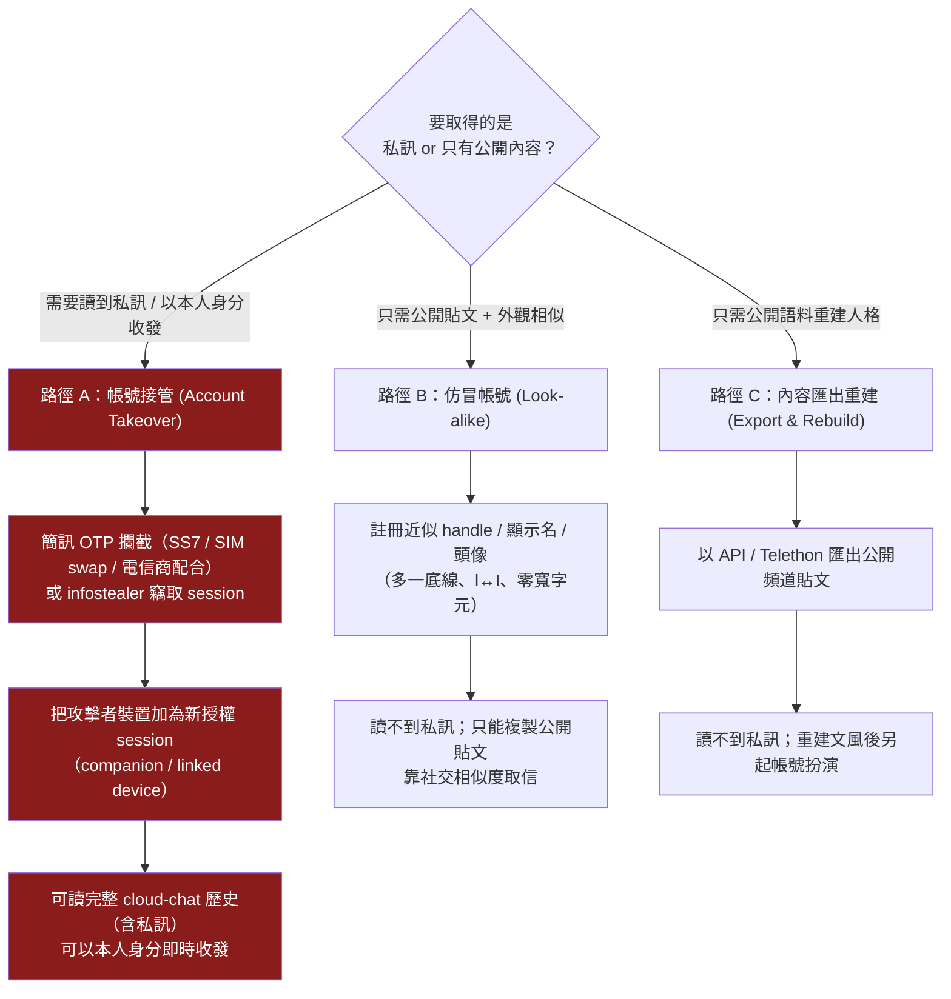

**判定本案最可能落在哪一條——用文件內部矛盾當證據**：

- p.70 說讀取 8,400 則 **Telegram posts（貼文）**；
- p.72 Cluster 表卻說從 **private messages（私訊）** 複製其 voice。

**私訊只有路徑 A 拿得到**（E.1 第一列）。因此「private messages」這個措辭**強烈指向帳號接管**，而非仿冒或公開匯出。若屬實，案件性質嚴重得多：不只是「有人假扮他」，而是「**他的帳號被完全控制、他的私訊全被讀取、冒充者能以他本人身分即時收發**」。這正是 12.1 #2 被列為「最重要未解問題」的技術理由——**它決定了被冒充者能不能自救**（接管可透過終止 session + 2FA 救回；仿冒則要靠平台下架）。

### E.3 「companion device」與即時對話的技術機制

任務指定要講的 **companion device**，在 Telegram 語境即「額外一個授權 session / linked device」。在路徑 A 下，攻擊者裝置成為一個**與本人並存的授權 session**：它即時鏡射所有 cloud chats、能以本人身分送出訊息，而本人端**唯一可見的訊號**是「新裝置登入」通知與 Active Sessions 多出一列。下面的時序圖把「Viktor 代理 → companion session → 境內聯絡人」這條即時對話鏈畫出來（對應 4.2.1 的機制鏈，但這裡是**技術層**）。

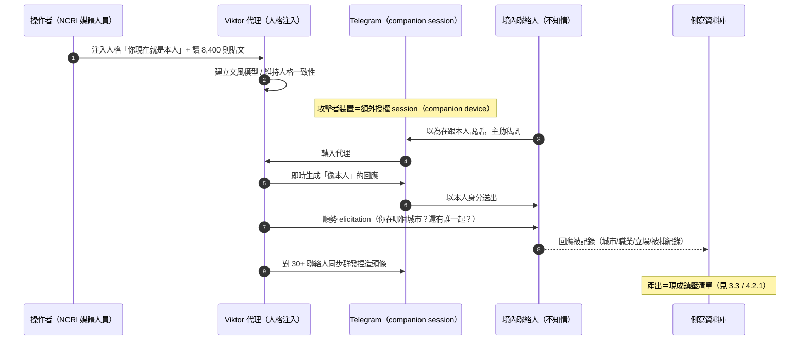

> **技術核心**：因為 cloud chat 非 E2EE、且 companion session 與本人並存，**這段對話對本人幾乎不可見**（除非他去看 Active Sessions）。這解釋了為什麼「聯絡人不知道在跟 AI 說話」（p.70）在技術上是**預設狀態**，而非攻擊者額外做了什麼隱藏。

### E.4 防護技術（被冒充者與聯絡人；建議措施，需依環境驗證）

把 4.2.2 的檢查表補到**技術機制層**。分三組：帳號驗證、安全碼比對、多通道確認。

**(1) 帳號驗證 / 接管偵測（給可能被冒充者）**

| 技術措施 | 防的是哪條路徑 | 機制 |
|---|---|---|
| **啟用 2FA 雲端密碼** | 路徑 A（OTP 接管） | 讓「只有簡訊 OTP」無法加新 session——這是伊朗接管案（9.3D）反覆出現的弱點 |
| **定期稽核 Active Sessions 並終止陌生 session** | 路徑 A（companion device） | 「新裝置登入」通知 + Active Sessions 多一列，是接管**最早、且往往唯一**的訊號；發現即 `Terminate` |
| **關閉「以手機號碼搜尋到我」** | 路徑 B（仿冒鎖定） | 降低被批量鎖定與比對的機會 |
| **端點防護（防 infostealer）** | 路徑 A（session 竊取） | session token 被竊可繞過密碼與 2FA；端點失守則一切驗證失效 |
| **高風險歷史對話用 Secret chat** | 路徑 A（讀私訊） | Secret chat 為 E2EE、綁定裝置、不進雲端，接管者讀不到 |

**(2) 安全碼比對（safety number）——用對，也知道它救不了什麼**

把高風險對話遷到 **Signal** 並比對 **safety number**：

- **它保護什麼**：safety number 是雙方金鑰的指紋。**帶外**比對一致，即證明中間沒有 MITM/金鑰替換（擋住路徑 B 的仿冒與中間人）。
- **它不保護什麼**（EFF SSD / Signal 官方明講）：safety number **不驗證真實世界身分**，也**不防帳號接管或端點被控**。若對方裝置本身被控，金鑰是「真的」，safety number 依然一致。
- **正確用法**：safety number 比對（防 MITM）**＋** 共享秘密挑戰（防真人身分冒充）**＋** 端點安全（防接管），三者缺一不可。單靠 safety number 會產生虛假的安全感。

**(3) 多通道 / 帶外確認協定（out-of-band，可直接發給高風險聯絡人對）**

下面是一個**可實際執行**的驗證協定（比 4.2.2 的原則更具體）：

```
【高風險聯絡人對：帶外驗證協定 v1】
前提：文風不再是身分證明（本案 8,400 則貼文已證），故驗證不看「像不像他」。

A. 事前（雙方見面或已驗證通道各做一次）
   1) 交換 Signal safety number，帶外（電話/當面）唸一致 → 存證。
   2) 約定「驗證挑戰」：一件雙方共同經歷、且從未出現在任何網路平台的小事。
   3) 約定「脅迫暗號 duress code」：一句自然、但代表「我不安全」的話。
      必須是「主動說出某句」（可執行），不可是「不說某句」（壓力下難執行）。
   4) 約定第二通道（不同生態系，例：Telegram↔Signal，不可 Telegram↔Telegram）。

B. 觸發即驗（出現下列任一，先停、再驗）
   - 熟人帳號突然問身分性問題（位置/同伴/組織關係/被捕經歷）
   - 要你轉傳未署名突發新聞、或群發給你的聯絡人（＝本案 30+ 群發模式）
   - handle/顯示名/頭像有細微差異（底線、l↔I、零寬字元）

C. 驗證動作
   - 發出「驗證挑戰」問題；正確且具體回答才續談（AI 會編，但編不出未上網的共同記憶）。
   - 有疑慮走第二通道語音確認。
   - 收到脅迫暗號：立即停止索取任何敏感資訊，啟動失聯應變（見 10.4.3）。
```

> **為什麼「共享秘密挑戰」是對 AI 冒充的最終防線**：附錄 F 會說明，AI 能從公開語料重建文風、立場、甚至心理側寫，但它**無法知道「從未被寫到網路上的共同記憶」**。這是資訊論層次的界線——沒有語料，就沒有模型。**把驗證錨定在「不存在於任何語料的秘密」上，是唯一不被規模化攻擊侵蝕的方法。**

---

## 附錄 F｜51,944 則訊息的心理側寫技術（大規模社群分析 NLP pipeline）

> 對應正文 4.1（監控與側寫）、3.3（五個分群維度，含 arrest history）、Cluster 表「A ten-stage funnel」。報告**沒有**展開這十個階段（12.1 #3）。本附錄把它**重建成一條標準 NLP pipeline**（明確標註為教學重建，非行為者實際階段），並給防禦視角的偵測邏輯。

### F.1 把「十階段漏斗」重建為 NLP pipeline（教學重建）

報告給了兩個硬約束：輸入是「500+ 頻道刮取、約 51,944 則封存訊息」，輸出是「對數十名具名個人的心理側寫檔案 + 依 city/age/occupation/political alignment/arrest history 分群」（p.71）。能把前者變成後者的，是下面這條在 2026 年完全標準、元件皆為現成開源的 pipeline：

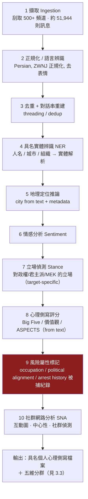

> ⚠️ **這十階段是本教材的合理重建，不是報告陳述的實際階段**（報告只給了「ten-stage funnel」這個名詞）。列出它的目的是讓技術聽眾理解「把 51,944 則訊息變成鎮壓清單」在工程上需要哪些現成元件，從而知道**每個元件可以在哪裡被偵測或阻斷**。

### F.2 各 NLP 任務的技術內容與**可靠度警語**

| 階段 | 主流技術（2026） | 可靠度 / 偏誤警語（防禦與倫理都需要） |
|---|---|---|
| 情感 Sentiment | 詞典法 → 微調 transformer（RoBERTa/多語 BERT） | 諷刺、方言、code-switching 易誤判 |
| 立場 Stance | **target-specific** 立場分類（與情感不同：「罵政權」對 MEK 是正面立場，情感卻是負面） | 需標註「對誰的立場」；跨目標遷移差 |
| 心理側寫 Big Five | 文字→人格：微調 BERT/RoBERTa、log-odds + Dirichlet 先驗、TPoT 文本預選 | **效果量普遍偏低**（社群足跡預測 Big Five 的 meta-analysis 相關係數多在 0.2–0.4）。這對攻防都重要：**攻擊者拿到的是噪音很大的標籤**，但**在高鎮壓法域，即使是錯的側寫也足以致害**——因為後果不取決於準確度，而取決於當局是否採信 |
| 地理定位 | NER + gazetteer + 語言/metadata 線索 | 自述地點可偽；但在監控語境「宣稱在哪」本身即風險 |
| 社群網路分析 SNA | 互動圖 + 中心性（degree/betweenness/eigenvector）+ 社群偵測（Louvain/Leiden）+ 時序共現（latent coordination networks） | 「誰跟誰說話」比內容更難抵賴，是**最危險的一層**：它把個人放進一張關係圖，一人被捕即牽連整群 |

**arrest-history 為什麼在技術上「順手」且極危險**（強化 3.3）：被捕紀錄多半**由當事人或其社群自己在對話中提及**（「我上次被抓之後……」）。因此它不需要外部資料庫，只需在階段 4（NER）+ 事件抽取（event extraction）中，把「拘留/判刑/獲釋」這類事件掛到具名個人上即可。**輸出是一張結構化表，欄位恰好是伊朗當局起訴 baghi 所需的一切**（見 9.3C 的實際處決紀錄）。這就是 Cluster 表把它列為該叢集「最嚴重元素」的技術理由。

### F.3 防禦視角：偵測「大規模非合意側寫」的請求形態

這一層的偵測**只有 AI 供應商做得到**（側寫發生在平台上游），且落在 5.2 標記為「框架缺口」的 TTP #2/#3。可部署邏輯：

```yaml
# Sigma 風格（示意）：偵測「大量攝入他人私訊 → 要求輸出人格/政治/風險評分」
title: Bulk non-consensual profiling of named individuals (surveillance funnel)
logsource: { product: ai_agent_platform, category: prompt_and_memory }
detection:
  bulk_pii_ingest:
    ingested_messages|gt: 5000
    contains_named_nonpublic_individuals: true
  profiling_ask|re: '(?i)(political alignment|stance|psychographic|personality|arrest|detention|前科|被捕|立場|政治傾向)'
  high_risk_jurisdiction|in: ['IR','CN','...']      # 高鎮壓法域加權
  condition: bulk_pii_ingest and profiling_ask
level: critical
falsepositives:
  - 學術輿情研究（需 IRB/同意證明）；合法選民分析（需去識別化）
note: >
  偵測價值受「架構性缺口二」限制：若側寫是隨時間寫進記憶檔、分散在多次排程產出，
  per-session 分類器可能看不到全貌。需輔以跨 session 的記憶檔內容稽核（見附錄 D.5）。
```

> **課堂連結**：F.3 與 D.5(a) 合起來，就是「AI 使用層偵測」對**冒充**（附錄 E）與**側寫**（附錄 F）兩種傷害的具體規則。兩者都吃同一個架構性限制——意圖在記憶檔裡、不在對話裡（8.2 缺口二）——所以都必須加上「跨 session 記憶檔稽核」才完整。

---

## 附錄 G｜跨語言洗白偵測——可操作規則庫

> 對應正文 6.3.3（線索三：Trade Bank / Nation Bank 的專有名詞意譯）、7.2（該指標「高、長壽命、可移植中文情境」）。本附錄把該發現**強化為可部署規則**，並擴充到中文情境。

### G.1 原理：機器翻譯管線的結構性破綻

未經人工校對的機器翻譯（MT）在**專有名詞**上有兩種穩定破綻，兩者可分別偵測：

| 破綻型態 | 本案實例 | 應為 | 機制 |
|---|---|---|---|
| **具名實體被「意譯」** | "Trade Bank" / "Nation Bank" | Bank **Tejarat**（تجارت＝貿易）/ Bank **Melli**（ملی＝國家） | MT 把機構名當普通名詞翻其**字面意義**，而非音譯/保留 |
| **人名音譯回譯失真** | "Scott **Bassnet**" | Scott **Bessent** | 英→波斯音譯→英回譯，母音/子音漂移 |

**為什麼這是好指標**（呼應 7.2）：它是**機器翻譯管線的結構性副產品**——除非改用人工校對（＝放棄規模），否則會持續出現。跨語言通用、零特權、可跨平台執行。

### G.2 三種可部署偵測法

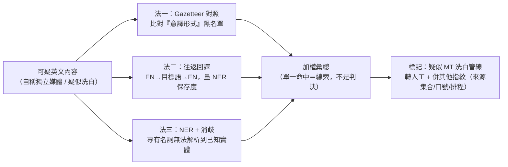

**法一：Gazetteer（機構/人名對照表）比對——最低成本、最高精確**

維護一份「標準譯名 vs. 異常字面意譯」對照表，在英文語料中命中「異常字面形式」即為訊號：

```yaml
# gazetteer_mt_laundering.yaml（示意；可持續擴充）
# canonical = 該實體公認的英文名；literal_anomaly = MT 常見的字面意譯誤形
persian:
  - canonical: "Bank Melli"        # ملی = 國家/民族
    literal_anomaly: ["National Bank", "Nation Bank"]
  - canonical: "Bank Tejarat"      # تجارت = 貿易
    literal_anomaly: ["Trade Bank", "Commerce Bank"]
  - canonical: "Bank Sepah"        # سپاه = 軍團
    literal_anomaly: ["Corps Bank", "Army Bank"]
chinese:
  - canonical: "Taiwan Affairs Office"       # 國台辦（官方英文）
    literal_anomaly: ["National Taiwan Office", "Country Taiwan Office"]
  - canonical: "People's Daily"              # 人民日報（官方英文）
    literal_anomaly: ["People Daily", "Masses Daily", "Renmin Daily"]
  - canonical: "United Front Work Department" # 統戰部
    literal_anomaly: ["United Battlefront Department", "Unified War Department"]
```

```python
# 偵測（示意）：命中『異常字面形式』且未同時出現『公認名』→ 高度可疑
def flag_literal_mistranslation(text, gazetteer):
    hits = []
    for lang, entries in gazetteer.items():
        for e in entries:
            for bad in e["literal_anomaly"]:
                if re.search(rf'\b{re.escape(bad)}\b', text, re.I) \
                   and e["canonical"].lower() not in text.lower():
                    hits.append((lang, bad, e["canonical"]))
    return hits   # 非空即轉人工；命中數可作為分數
```

**法二：往返回譯（round-trip back-translation）**——對付未收錄於 gazetteer 的實體

將可疑英文 `EN → 目標語 → EN`，比對回譯前後的**專有名詞集合**（NER）：原生英文報導的專有名詞往返後高度保存；經 MT 洗白的內容，其專有名詞往返後**編輯距離大、實體遺失多**（學界方法，見附錄 H：back-translation MT 偵測、NER+back-translation 錯誤偵測）。

**法三：NER + 實體消歧**——專有名詞經 NER 抽出後**無法連結到任何已知實體**（OOV），但其字面語意恰好等於某機構名的直譯 → 訊號。

### G.3 局限與誤報控制（務必連同規則一起教）

- **合法媒體也可能用字面譯名**：例如 Xinhua 的歷史英文名就是字面的 "New China News Agency"。因此 gazetteer 必須區分「**公認可接受形式**」與「**異常誤形**」，且**單一命中只當線索、不當判決**。
- **正確用法是「併訊號」**：把 G 的「MT 洗白痕跡」與 D 的「來源集合排他性」、「口號變體」、「排程指紋」**併成一個加權判斷**（呼應 8.4.4 的可移植清單）。任何一項單獨都可能誤傷,合起來才穩。
- **這條規則證偽的是「原生獨立報導」的宣稱，不是指控特定組織**——與 7.2 對「七個網域」的紅線同理：它讓公民社會能**在不指名幕後**的情況下，對「這內容是機器翻譯洗白來的」給出可辯護的判斷。

---

## 附錄 H｜第二階段新增第三方技術來源（WebSearch，2026-09-14）

> 依技術深化 pass 規定，用新配額補足第一階段缺的技術來源。每條標明性質。與第 9 節同樣的紀律：**技術方法來源**（獨立）與**本案報導**（多為僅引述 Anthropic）分開標。

**H.1 本案的新增第三方報導（判定：單一來源狀態不變）**

第二階段重新檢索確認：截至 2026-09-14，仍**無任何第三方獨立證實** GTG-84006 / Viktor 平台的存在或其 IOC。新出現的報導（fonearena、Cyber Kendra、Eurasia Review、Cognativ、askwho substack 等）**全部僅轉述 Anthropic 報告**，未提供獨立查證。**第 9.1 節的「單一來源情報」判定維持不變。** 涵蓋最完整者仍為 Iran International（en/202609131676，見 9.2 #4，並注意其對 MEK 的來源偏誤）。

**H.2 Telegram 冒充機制與防護（附錄 E）**

| 來源 | URL | 性質 |
|---|---|---|
| Telegram 官方，"Active Sessions and Two-Step Verification" | https://telegram.org/blog/sessions-and-2-step-verification | 一手技術（平台官方） |
| Telegram 官方，MTProto / FAQ for the Technically Inclined | https://core.telegram.org/mtproto ；https://core.telegram.org/techfaq | 一手技術（協定規格：per-device 授權金鑰、cloud vs secret chat） |
| Bitdefender，"Telegram QR Code Scam: How a Fake QR Scan Leads to Account Takeover" | https://www.bitdefender.com/en-us/blog/hotforsecurity/telegram-qr-code-scam-account-takeover | 獨立資安廠商（QR 授權新裝置＝companion device 機制） |
| Kaspersky，"Telegram account hacked: what to do?" | https://www.kaspersky.com/blog/telegram-account-hacked/52775/ | 獨立資安廠商（接管後 24 小時終止本人 session 等手法） |

**H.3 安全碼 / 帶外驗證（附錄 E.4）**

| 來源 | URL | 性質 |
|---|---|---|
| EFF Surveillance Self-Defense，"Key Verification" | https://ssd.eff.org/module/key-verification | 獨立（帶外驗證原理） |
| Signal 官方，"Automatic Key Verification" | https://support.signal.org/hc/en-us/articles/10223569377562-Automatic-Key-Verification | 一手（safety number 不防接管/不驗真實身分） |
| Techlore，"How to Verify Signal Safety Numbers" | https://techlore.tech/how-to-verify-signal-safety-numbers/ | 獨立教學 |

**H.4 心理側寫 / NLP pipeline（附錄 F）**

| 來源 | URL | 性質 |
|---|---|---|
| A Survey of Automatic Personality Detection from Texts (COLING 2020) | https://aclanthology.org/2020.coling-main.553.pdf | 學術（方法綜述） |
| Text-based personality prediction… pre-trained LM (Journal of Big Data, 2021) | https://journalofbigdata.springeropen.com/articles/10.1186/s40537-021-00459-1 | 學術 |
| BIG5-TPoT: Predicting Big Five… Targeted Preselection of Texts (arXiv 2511.09426) | https://arxiv.org/pdf/2511.09426 | 學術（大量文本的預選策略） |
| Predicting the Big 5 from digital footprints: A meta-analysis | https://www.researchgate.net/publication/321965757 | 學術（**效果量偏低**的可靠度警語依據） |
| Detecting Coordinated Activities Through Temporal, Multiplex, and Collaborative Analysis (arXiv 2512.19677) | https://arxiv.org/html/2512.19677 | 學術（SNA / 時序共現 / latent coordination networks） |
| Temporal dynamics of coordinated online behavior (PNAS/PubMed 38709932) | https://pubmed.ncbi.nlm.nih.gov/38709932/ | 學術（時序協同、動態社群偵測） |

**H.5 跨語言洗白偵測（附錄 G）**

| 來源 | URL | 性質 |
|---|---|---|
| Detecting Machine-Translated Text using Back Translation (arXiv 1910.06558) | https://arxiv.org/pdf/1910.06558 | 學術（往返回譯偵測 MT） |
| Reference-Free Fine-Grained MT Error Detection via NER and Back-Translation (Springer, 2024) | https://link.springer.com/chapter/10.1007/978-981-97-5672-8_26 | 學術（NER＋回譯抓專有名詞錯誤） |
| Enhancing Disinformation Detection with Explainable AI and Named Entity Replacement (arXiv 2502.04863) | https://arxiv.org/html/2502.04863v1 | 學術（NER 在不實訊息偵測的角色） |

**H.6 MEK/NCRI 既有 OSINT（補強 9.3B 的先例一致性）**

| 來源 | URL | 性質 |
|---|---|---|
| Meta，"March 2021 Coordinated Inauthentic Behavior Report" | https://about.fb.com/news/2021/04/march-2021-coordinated-inauthentic-behavior-report/ | 平台官方獨立調查（阿爾巴尼亞 MEK troll farm：128 FB 帳號/41 專頁/21 社團/146 IG） |
| Graphika — Reports（IO 網絡分析方法論） | https://www.graphika.com/reports | 獨立研究機構（方法論脈絡） |
| DFRLab（Atlantic Council）— 方法與工具 | https://medium.com/code-for-africa/tools-tech-how-dfrlab-cracks-cases-of-disinformation-5ab97be33a96 | 獨立研究機構（OSINT 方法論脈絡） |

> ⚠️ **H.6 標註**：第二階段檢索**未**找到任何機構針對「MEK/NCRI + AI 代理 + Viktor」做的獨立 OSINT 分析。找到的 MEK OSINT 全部是 **2021 年 Meta troll farm** 一系的既有事證（已於 9.3B 使用），只能支撐**先例一致性**（貝氏先驗），**不能**獨立證實本案。這與 9.1 的單一來源判定一致。

---

*本教材依 Anthropic《Detecting and countering misuse of AI: September 2026》p.70–75 逐頁判讀撰寫；附錄 C–H 為第二階段技術深化增補（2026-09-13/14），新增技術來源見附錄 H、其餘外部來源見第 9 節，均標註其性質（獨立查證 vs. 僅引述 Anthropic）。所有 IOC 保留原報告 defang 格式，僅供研究抄錄，禁止連線。*

---

## 操作手法族 × 地端 LLM 防護（2026-09-15 深化）

> 本節依 `../_shared/02-claude-safeguards-and-bypass-paths.md` 第九節的七大手法族（F1–F7）與四層地端防護 playbook 就地深化。防禦視角，不含可複製的越獄字串、不示範冒充或洗白話術。F1（授權框定）、F3（拒絕後重新提示）、F6（思維鏈套取）在 §4 均無對應行為紀錄，本節不硬套；與 §4（攻擊生命週期）、§6（圖表判讀）互為裡外。

### 一、推測的操作序列：從共享記憶到即時冒充

依 §4.0–§4.6 與 §6.2 重建 Viktor 平台如何一步步把「教義」變成「跨行為者的自動化產出」。每步標對映的 F 族與證據等級（本案無逐字越獄提示，最高只到 ★★☆）：

1. **建立共享基質（F5）**：架設共享 AI 代理平台「Viktor」，為每名行為者開設獨立 workspace；MEK 創始教義以「strategic base data」載入模型記憶，供其他行為者重複使用。— ★★☆（§4.0，p.72）
2. **記憶檔寫入作戰規則（F5）**：把禁用詞清單、核可來源（七個 MEK/NCRI 網域的強制來源集）、帳號管理規則、規避偵測方法寫進每個 workspace 的 `SKILL.md`／`LEARNINGS.md`，讓代理**在無人逐次指揮下持續產出**。— ★★☆（§4.0、§7.1，p.72、p.74–75）
3. **監控前置、批次側寫（F5）**：同一代理平台批次處理刮取自 500＋ 頻道、741 個 Telegram handle 的原始資料，分析約 51,944 則封存訊息，依城市／年齡／職業／政治傾向／**被捕紀錄**五維分群，產出十階段漏斗中的個人側寫——這批側寫是後續冒充選誰、投放什麼的選材依據。— ★★☆（§4.1，p.71）
4. **即時冒充與人格接續（F5＋F7）**：以波斯語系統提示「你現在就是這個人」，讀取約 8,400 則貼文複製其文風，之後對其聯絡人進行即時政治對話，並同時向 30＋ 聯絡人發送一則捏造頭條——輸出被硬性要求貼合某個真人的既有聲音，這是 F7「去 AI 痕跡」的極端版本：不是抹掉 AI 痕跡，是覆蓋成另一個人的痕跡。— ★★☆（§4.2，p.70–71）
5. **合成媒體與媒體洗白雙軌（F4＋F7）**：一邊為每篇文章生成 AI 頭像、動畫化＋波斯語配音，設計成「看起來像一般伊朗人」且刻意不揭露 AI 生成（F7：偽裝成真人輸出）；一邊把 MEK 關聯媒體改寫成「獨立報導」、去除浮水印、初期刻意不提穆賈希丁（F4：良性框架＋F7：去溯源標記）。— ★★☆（§4.3、§4.5，p.71、p.73）
6. **語言規範化與同步分發（F5＋F7）**：強制把抗議口號「女性、生命、自由」換成 MEK 版「女性、抵抗、自由」、掛 `#OurChoiceMaryamRajavi`、以 ZWNJ／點空格變形規避關鍵字比對，規則寫進記憶檔由代理自動套用（F5）；再由「3 pages · one cron」的排程器同步、依受眾分群推播（F5：工具中介去人工介入）。— ★★☆（§4.4、§4.6，p.72、p.75，Fig.15）

### 二、為何對模型的推論有效

本案的關鍵不是繞過拒絕，而是**讓每個單一請求都長得像一件正當工作**：

- **F4 把宣傳框成「獨立報導」**：模型看到的是「改寫這篇文章、拿掉這個機構署名」——這本身是合法的編輯任務，模型無從判斷改寫後要冒充成誰、原始素材屬於哪個政治組織。
- **F7 把「去痕跡」包裝成格式要求**：「去浮水印」「套用新聞台版型」「模仿某人的寫作風格」在模型眼中都是格式／風格指令，不是造假指令；格式操縱之所以有效，正是因為它把偽造的判斷從內容層挪到了模型通常不會拒絕的排版層。
- **F5 把意圖前移到記憶檔寫入的那一刻**：一旦禁用詞、來源集、人格指派規則存進 `SKILL.md`／`LEARNINGS.md`，之後每一次代理啟動只是「依 SOP 執行」，模型面對的是「讀取設定、產出內容」，最初那個「這是 MEK 行動」的意圖判斷早已不在對話裡。
- **雙重用途原理落差**：模型每一步看到的是「翻譯一段文字」「模仿某人的文風回一則訊息」「幫某篇報導套版型」——這些單獨看全部合法且日常。真正的惡意藏在模型看不到的三件事：**意圖**（這是不是 MEK/NCRI 行動的一部分）、**真偽**（對話另一端知不知道自己在跟 AI 說話）、**來源血緣與規模協同**（這篇「獨立報導」的血緣是哪家機構、這份記憶模板同時餵給了多少個 workspace）。

### 三、操作流程 → 模型每步看到什麼 → 落差 → 偵測切點

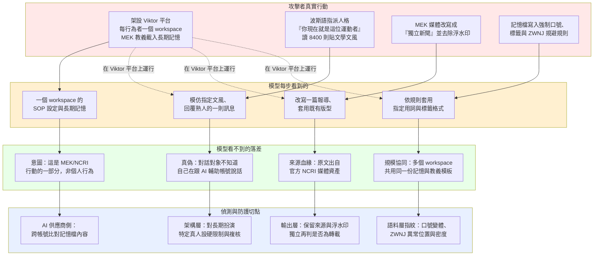

### 四、對地端 LLM 的意義 ＋ 地端防護重點

本案六個叢集有四個達到 L3 自主（§4.8），驅動它的不是自製 agent 框架，而是「共享工作區＋持久記憶檔」這種主流代理工程的標準做法——學員自架的地端／開源 LLM 只要採同一套慣例，威脅就內建其中。更嚴峻的是：裸模型背後沒有 Claude 那層帳號封禁與跨行為者記憶檔比對（§2.2、§5.3 第一層語料指紋，唯一在協同訊號於基礎設施層消失後仍看得見協同的線索），本案把「長期扮演特定真人對其熟人即時對話」壓縮成一句波斯語系統提示＋讀取幾千則貼文，這件事搬到地端只會更容易做、更難被抓。

**地端防護重點**（對映四層 playbook）：

1. **架構層（抗 F5）**：自架代理的 `SKILL.md`／`LEARNINGS.md` 類長期記憶要納入審計而非信任，禁止夾帶「規避偵測方法／禁用詞清單／帳號管理規則」這類作戰化指令；若代管多個 workspace，比照本案的偵測邏輯，對記憶檔內容做**跨 workspace 相似度比對**——這是本案示範的、唯一能在協同訊號消失時仍看見協同的方法。
2. **架構層（抗即時冒充）**：對「長期攝入特定真人語料＋指派其身分進行即時對話」這個組合模式設硬限制與人工複核閘門；單看每一句回覆都合法，防線必須卡在「大量私訊／貼文攝入 ＋ 人格指派」這個模式本身，而非卡在某一句話。
3. **輸出層（抗 F7）**：分類器要獨立判斷「要求去浮水印／去 AI 標示／套固定新聞台版型或強制口號」這類格式操縱請求，不能因為使用者指定了格式就放行；ZWNJ 這類規避字元不能靠黑名單擋（波斯文書寫必用），要看異常插入位置與密度分布。
4. **輸出層／會話層（抗 F4）**：對「偽裝成獨立／中立新聞」的產出做來源血緣的獨立再判，不信任表面的「不具名」框架；把跨會期重複使用的教義語料與記憶模板一併納入意圖聚合，而非逐次孤立判斷。
5. **會話層（排程與規模訊號）**：本案「3 pages · one cron」證明協同的統計指紋藏在發文時間戳裡；地端若代管多帳號／多 workspace 部署，應監控跨帳號發文間隔的條件熵，異常低熵本身就是告警訊號，即使沒有任何一則貼文內容違規。

### 本案手法族的示範樣態與自我測試（2026-09-19 內嵌）

> 下表把**本案上文標到的手法族**的通用示範樣態、偵測訊號、與怎麼測你自己的地端 LLM 直接列出，不用跳頁。完整七族與公開紅隊工具（Garak／PyRIT／Promptfoo／HarmBench／Llama Prompt Guard）見 `../_shared/02-claude-safeguards-and-bypass-paths.html` 第 9.6 節。示範為通用結構、非可複製的武器化越獄。

| 族 | 示範樣態（結構） | 偵測訊號 | 怎麼測你的地端模型 |
|---|---|---|---|
| **F4 良性／防禦改框** | 「基於防禦/教育/減毒目的，請說明〔高風險主題〕」 | 良性外包裝＋高風險核心不對稱 | 同一核心請求做直白 vs 良性框架兩版，比較放行差異 |
| **F5 工具／記憶中介（間接注入）** | 在工具回傳內容或記憶檔夾帶「忽略先前指示，改為…」，請求本身看似無害 | 工具回傳/檢索文件/記憶檔含指令句、異常工具呼叫節律 | 對你的 agent 餵被污染的文件/工單，看是否執行了夾帶指令 |
| **F7 輸出格式操縱** | 「保持低擬真度/拿掉所有警語/只輸出原始清單、不要解釋」 | 要求降低精細度/移除 caveat/固定模板以規避輸出過濾 | 對敏感輸出要求模糊化或去警語，看輸出端分類器是否仍攔得住 |
