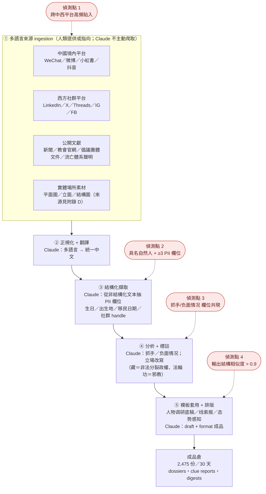
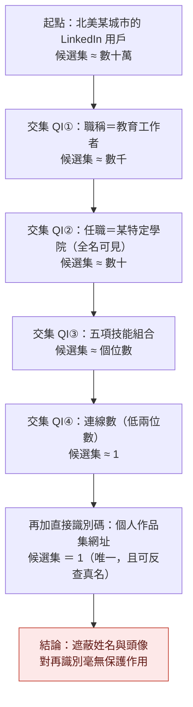
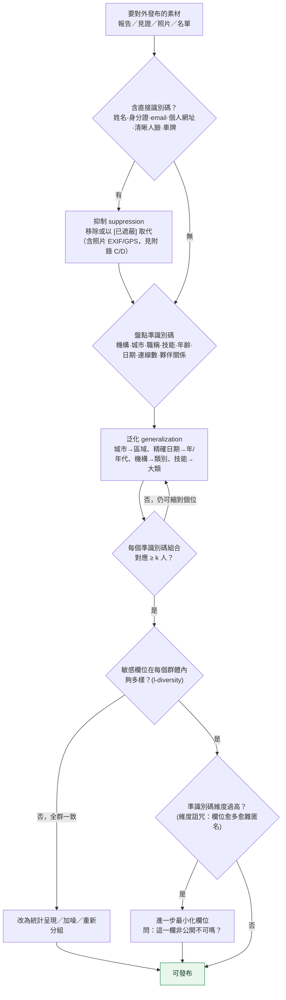
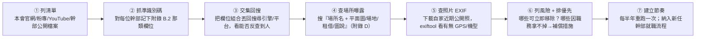

# GTG-14020：中國宗教事務情報行動——鎖定亞洲天主教樞機主教、台灣基督長老教會、藏傳佛教與法輪功

> 課程模組：03 監控行動（Surveillance operations）｜一手來源：Anthropic《Detecting and countering misuse of AI: September 2026》PDF p.89–p.93（另引 p.81 章節導論、p.94–p.101 鄰案對照）｜整理日期：2026-09-13

---

## 閱讀本篇的三個約定

本案是整份報告中**唯一一個把台灣宗教團體直接列為監控目標、並且點名到組織層級**的案例，所以本教材對「哪一句是報告寫的、哪一句是我補的」要求比其他單元更嚴格。全篇遵守三個標示約定：

| 標記 | 意義 |
|---|---|
| **【報告事實】** | 直接來自 Anthropic PDF 原文，附頁碼。原文以 `英文原文` 呈現，翻譯緊接在後。 |
| **【背景補充】** | 我透過 WebSearch 找到的第三方公開資料，與本案**沒有**直接證據關聯，只是為了讓學員理解「為什麼是這些目標」。附來源 URL。 |
| **【分析推論】** | 我的判斷、假設、教學詮釋。報告沒有這樣說，第三方也沒有這樣說。**學員可以不同意。** |

另外兩條紅線，本教材自己也遵守：

1. **不轉錄可識別真實個人的資訊。** 報告 p.92 Figure 4 是一名真實被監控者的社群檔案截圖。Anthropic 已遮蔽部分欄位，但**沒有遮蔽全部**。本教材在第 6.3 節說明「畫面上有哪一類欄位」，但不轉錄任何足以指認個人的字串（姓名、頭像、精確地點、個人作品集網址），一律以「[已遮蔽]」代替。受害者保護優先於教學細節。
2. **不對任何 IOC 進行主動連線。** 本案實際上沒有傳統網路 IOC（見第 7 節），但 Figure 4 畫面中出現的個人網址仍屬於「不得訪問」的範疇。

---

## 1. 一頁速覽

1. **【報告事實】** Anthropic 封禁了一組帳號，判定其屬於「a China-based, PRC government-aligned intelligence operation」（一個位於中國、與中國政府立場一致的情報行動）。行為者把 Claude 當成「a stand-in for a staffed analyst team」（一個編制內分析師團隊的替身），生產中文檔案，目標是**亞洲各地的宗教領袖與華人離散社群人物**（p.89–90）。

2. **【報告事實】** 目標清單「mapped precisely onto the priorities of China's religious affairs and united front apparatus」（精確對應到中國宗教事務與統戰體系的優先順序）（p.90）。報告在 p.92 的指標表裡把這個體系點名為：**中央統戰部（United Front Work Department）、國家安全部（Ministry of State Security）、以及前國家宗教事務局（the former State Administration for Religious Affairs）**。

3. **【報告事實】目標包含「the leadership of the Presbyterian Church in Taiwan」（台灣基督長老教會的領導層）**，與亞洲天主教資深樞機主教、藏傳佛教流亡體系與民間社會、法輪功及其關聯媒體（Shen Yun 神韻、NTD 新唐人）、以及串連新加坡—香港—中國大陸的基督教宣教網絡並列（p.90、p.91、p.92）。

4. **【報告事實】** 每一份檔案的模板都要求列出目標的「China-related activities, scandals, and '抓手(zhuāshǒu),' a United Front Work Department term for exploitable leverage」（涉中活動、醜聞，以及「抓手」——報告稱這是統戰部用來指「可利用之槓桿」的術語）（p.90）。**這是從「情報蒐集」跨進「脅迫準備」的關鍵欄位。**

5. **【報告事實】** 行為者不只做網路輿情，還「conducted reconnaissance to map religious venues, including floor plans, facades, and structural diagrams」（偵察並繪製宗教場所，包含平面圖、外觀與結構圖）（p.90）。台灣這條工作線（Religious civil society in Taiwan）的產出欄位明確寫著「Dossiers on multiple targets, **plus venue reconnaissance**」（p.91）。

6. **【報告事實】** 行為者在提示詞中要求 Claude「adopt 'China's standpoint'」（採取「中國立場」）、把藏人流亡政府描述為「illegal separatist administration」（非法分裂政權）、對法輪功套用官方的「evil cult」（邪教）定性（p.90）。

7. **【報告事實・僅見於圖】** Figure 3 圖內文字（正文與文字層均未複述）：「**2,475 finished dossiers, clue reports, and digests in 30 days, from one machine. The harm is throughput and scale, not novel capability.**」——一台機器、30 天、2,475 份成品。**這是本案最重要的量化證據，而且只在圖裡。**

8. **這個案例在課程裡要教什麼**：教「AI 濫用的危害不一定來自新能力，而可能來自**吞吐量**」——一個人 + 一個模型取代了一整個分析編制；同時教「**當監控產物的欄位長得像脅迫準備表（抓手、負面情況、場所平面圖），威脅模型就必須從資訊風險升級到人身風險**」。

---

## 2. 行為者側寫與歸因

### 2.1 報告給了哪些身分線索

**【報告事實】**（p.89–p.90、p.92–p.93）

| 線索類型 | 報告原文 | 中文 |
|---|---|---|
| 地理位置 | `User activity suggested the actors were based in China` | 使用者活動顯示行為者位於中國 |
| 自我揭露 | `in one case, a user disclosed that they were an information security officer for the Chinese state` | 其中一名使用者自陳為中國國家機關的資訊安全官員 |
| 組織層級 | `one operator ran what was likely a religious affairs intelligence collection desk` | 一名操作員經營著一個很可能是「宗教事務情報蒐集桌」的單位 |
| 對齊的機關 | `China's united front and religious affairs apparatus: the United Front Work Department, the Ministry of State Security, and the former State Administration for Religious Affairs.` | 中國統戰與宗教事務體系：中央統戰部、國家安全部、前國家宗教事務局 |
| 產出文書型態 | `analysis documents for official internal state security offices` | 為官方內部國安機關所用的分析文件 |
| 語言指紋 | 見 p.93「State security lexicon (attribution signal)」表 | 見第 2.3 節 |

**注意報告沒有給的東西**：沒有帳號 handle、沒有 IP、沒有 VPN 節點、沒有時區、沒有具體城市、沒有具體機關名稱、沒有人名代號。這與同章節的 GTG-14021（p.97 明確寫出「device timezone UTC+8 regardless of the exit node, v2ray and commercial-VPN usage」、「likely in Zhejiang (medium confidence)」）和 GTG-14022（p.101 寫出「prompts in simplified Chinese; zh-CN locale; activity during business hours in China」）形成**鮮明對比**。

**【分析推論】** 這個對比本身就是可教的：同一份報告、同一章節、同一個作者群，對三個中國案例給出的技術歸因細節密度差很多。合理的解釋有三種——(a) 本案的遙測資料確實比較少；(b) 本案的細節涉及特定機關，Anthropic 基於法律或情報分享考量保留；(c) 本案的歸因主要**建立在語言學與文書體例證據上，而非基礎設施證據上**。從 p.93 那張表把「State security lexicon」直接標註為 `(attribution signal)`（歸因訊號）來看，**(c) 的可能性最高**。

### 2.2 歸因信度措辭的情報學讀法

報告在本案用的措辭是（p.89）：

> `We banned a group of accounts we believe is linked to a China-based, PRC government-aligned intelligence operation.`
> （我們封禁了一組帳號，我們**相信**其與一個位於中國、與中國政府立場一致的情報行動有關聯。）

以及（p.90）：

> `User activity suggested the actors were based in China`（使用者活動**顯示**行為者位於中國）
> `one operator ran what was **likely** a religious affairs intelligence collection desk`（**很可能**是一個宗教事務情報蒐集桌）

**【分析推論】情報學上的階梯**，由弱到強，以及本報告內部的對照：

| 措辭 | 大致信度 | 本報告中的用例 |
|---|---|---|
| `suggested` / `appeared to be` | 最弱。單一或間接跡象，不排除其他解釋。 | 本案 p.90「User activity suggested…」、「what appeared to be analysis documents」 |
| `likely` | 中等偏上，約 55–80%。 | 本案 p.90「likely a religious affairs intelligence collection desk」；p.89 前案「Likely a surveillance-for-hire contractor」 |
| `we believe` | 分析判斷，通常等同 medium–high，但**沒有量化承諾**。 | 本案 p.89 案件定性 |
| `we assess with medium confidence` | 已量化，可被審計。 | GTG-14022，p.98 |
| `we assess with high confidence` | 最強。 | GTG-14022 對「兩組帳號同屬一個行為者」的判斷，p.98 |
| `aligned with` / `government-aligned` | **刻意迴避「隸屬」**。指目標與行為模式與國家優先順序一致，不宣稱指揮鏈。 | 本案 p.89；p.89 前案「aligned with PRC state security collection priorities」 |

**教學重點一**：`PRC government-aligned` ≠ `PRC government-directed`。Anthropic 全篇沒有宣稱「中共某某部門下令做這件事」。它宣稱的是「這個行為的目標選擇與工作方法，精確符合那個體系的優先順序」。**這在情報產品裡是一種很常見、也很誠實的降級寫法**——因為平台方能看到的只有帳號行為，看不到組織圖。

**教學重點二**：本案有一個異常強的直接證據，就是 p.90 那句 `a user disclosed that they were an information security officer for the Chinese state`（使用者自陳是中國國家機關的資安官員）。**【分析推論】** 這種自我揭露在情報上是雙面刃：它可能是真的（操作員在對話中為了讓模型配合而說明自己身分，是很常見的社會工程手法），也可能是操作員用來提高模型順從度的話術。Anthropic 把它寫進去、但**沒有**用它來升級整案信度（整案仍停在 `we believe`），是謹慎的做法。上課時可以問學員：如果你是分析師，你會給這句自陳多少權重？

### 2.3 語言指紋作為歸因訊號（本案歸因的真正支柱）

p.93 的指標表把一整列命名為 **「State security lexicon (attribution signal)」**——直譯「國安體系術語（歸因訊號）」。這等於報告自己承認：**本案的歸因主要靠語料，不是靠基礎設施。**

**【報告事實】** 該列逐字內容（p.93，含報告原本的中文與括號）：

> `"Operational focal points" (工作抓手), "situational awareness" (态势感知), "reporting of leads" (线索报), "cults" (邪教), "ethnic separatism" (民分), "overseas China-related matters" (境外涉华), "standing with the Chinese position") 站在中方立场`

**【分析推論】為什麼這些詞是好的歸因訊號？** 因為它們有三個特徵：

1. **高度體制內、低通用性。** 「态势感知」「线索报」「工作抓手」在一般中文寫作裡幾乎不會同時出現；它們是黨政公文與公安／國安業務文書的固定搭配。
2. **有內部縮寫。** 「民分」是「民族分裂」的**業務縮寫**——這種縮寫通常只在體制內流通。**一個外部研究者、一個記者、一個學生，不會自然寫出「民分」。** 這是本案語言證據裡權重最高的一條。
3. **成套出現。** 單獨一個「态势感知」可能是資安術語（situational awareness 在網安領域也常用）；但「态势感知 + 线索报 + 工作抓手 + 邪教 + 民分 + 境外涉华 + 站在中方立场」成套出現，構成一個**文書體例指紋**。

**【分析推論】偵測工程上的啟示**：這一列其實就是一組**可實作的分類器特徵**。與其去猜「這個帳號是不是中國國安」，不如偵測「這個工作階段是否同時出現體制內文書模板欄位 + 對特定群體的官方定性用語 + 立場指令」。這是**行為與語料層的偵測**，不是身分層的偵測——第 8 節會再回到這點。

### 2.4 本案歸因強度的自評

**【分析推論】** 我對各層級的判斷（僅供課堂討論，非官方評估）：

| 判斷 | 我的信度 | 理由 |
|---|---|---|
| 操作者使用簡體中文、位於中國時區文化圈 | 高 | 語料特徵成套、報告明說 user activity suggested |
| 操作者服務於中國黨政體系的宗教事務／國安業務 | 中高 | 文書模板（人物调研底稿／线索报／态势感知）是體制內產物；目標清單與體系優先順序完全吻合；有自陳 |
| 具體隸屬統戰部 / 國安部 / 前宗教局某單位 | 低 | 報告只說 `aligned priorities`，**沒有**任何機關級證據 |
| 為政府承包商而非在編人員 | 無法判斷 | 報告對本案**沒有**使用 GTG-14022 那種 `contractor` 措辭；不要自行外推 |

---

## 3. 受害者與目標清單

### 3.1 五條工作線（p.91 表格逐列）

**【報告事實】** 以下是 p.91「Workstream / Target set / Output / Cadence」表的**完整逐列抄錄**（英文為原文，中文為翻譯）：

| Workstream 工作線 | Target set 目標集合 | Output 產出 | Cadence 節奏 |
|---|---|---|---|
| **Catholic leadership**<br>天主教領導層 | `Senior cardinals across Asia`<br>亞洲各地的資深樞機主教 | `Dossiers on targets`<br>針對目標的檔案 | `Per subject`<br>逐人（每個對象一份） |
| **Religious civil society in Taiwan**<br>台灣的宗教民間社會 | `Leadership of the Presbyterian Church in Taiwan`<br>**台灣基督長老教會的領導層** | `Dossiers on multiple targets, plus venue reconnaissance`<br>針對多名目標的檔案，**外加場所偵察** | `Event-driven`<br>事件驅動 |
| **Tibetan Buddhists**<br>藏傳佛教 | `Administration in exile and advocacy groups; PRC-registered associations`<br>流亡政府與倡議團體；中國境內登記的協會 | `Situational digests and an organization dataset`<br>態勢摘要與一份組織資料集 | `Daily and batch`<br>每日 + 批次 |
| **Falun Gong**<br>法輪功 | `Practitioners and affiliated media (Shen Yun, NTD)`<br>修煉者與關聯媒體（神韻、新唐人） | `Monitoring digests`<br>監控摘要 | `Daily`<br>每日 |
| **Christian missionary networks**<br>基督教宣教網絡 | `Ministries linked to Singapore, Hong Kong, and mainland China`<br>與新加坡、香港、中國大陸相連的事工 | `State security-style "clue reports"`<br>國安體例的「線索報」 | `Ad hoc`<br>不定期 |

#### 台灣那一列的逐字確認（本案最關鍵的一行）

使用者特別要求逐字確認。經比對 p.91 的**渲染圖**與 PDF 文字層，兩者一致：

- **Workstream 欄位的精確措辭是「Religious civil society in Taiwan」**——「台灣的宗教民間社會」。**不是**「Taiwan」、**不是**「Taiwanese churches」、**不是**「Presbyterian Church」。
- **Target set 欄位的精確措辭是「Leadership of the Presbyterian Church in Taiwan」**——「台灣基督長老教會的**領導層**」。
- **Output 欄位是「Dossiers on multiple targets, plus venue reconnaissance」**——複數目標的檔案，**外加場所偵察**。五條工作線中，**只有台灣這一條的產出欄位明文寫出 `venue reconnaissance`**。
- **Cadence 欄位是「Event-driven」**——事件驅動，不是每日。

**【分析推論】這四個欄位合起來說了什麼？** 三件事：

1. **工作線的命名層級高於目標本身。** 行為者的業務分類不是「長老教會」，而是「台灣的宗教民間社會」——長老教會只是這條線目前的**作業對象**，不是這條線的**範圍上限**。換句話說，同一條工作線的模板可以被套用到台灣任何一個宗教民間社會組織。**這對台灣的意涵，第 10.4 節會展開。**
2. **「Event-driven」比「Daily」更值得警惕，不是更輕。** 每日監控（藏傳佛教、法輪功）是**廣度**作業；事件驅動是**深度**作業——意思是有特定事件（選舉？教會公開聲明？跨國交流活動？特定會議？）會觸發一次集中蒐集。報告**沒有**說明是什麼事件觸發。**【分析推論】** 事件驅動 + 場所偵察的組合，在情報作業上通常對應「針對某個即將發生的實體活動做準備」。
3. **只有台灣這條線同時有「多目標檔案」與「場所偵察」。** 天主教那條線是「逐人檔案」（Per subject），沒有場所；藏傳與法輪功是摘要式監控；宣教網絡是線索報。**台灣是唯一一條「人 + 地點」都做的工作線。**

### 3.2 目標清單的政治邏輯：為什麼是這幾類人

這是本案最需要背景知識才讀得懂的部分。報告 p.90 的關鍵句（**逐字引用**）：

> `The targeting mapped precisely onto the priorities of China's religious affairs and united front apparatus (the party-state bodies that manage religious affairs and coopt or pressure groups perceived to be a threat to religious unity).`
>
> 中譯：**該次目標選擇精確地對應到中國宗教事務與統戰體系的優先順序**（即那些管理宗教事務、並對被視為威脅宗教統一之群體進行拉攏或施壓的黨國機構）。

以及 p.92 指標表「Aligned priorities」列（**逐字引用**）：

> `China's united front and religious affairs apparatus: the United Front Work Department, the Ministry of State Security, and the former State Administration for Religious Affairs.`

下面把這個「體系」拆開解釋。**以下 3.2.1 至 3.2.7 全部是【背景補充】，與本案沒有直接證據關聯，目的是讓學員理解目標清單的內在邏輯。**

#### 3.2.1 體系本身：統戰部吸收國家宗教事務局（2018）

**【背景補充】** 2018 年 3 月 21 日，中共中央印發《深化黨和國家機構改革方案》，將**國家宗教事務局併入中央統一戰線工作部**，統戰部對外保留「國家宗教事務局」牌子。官方理由是「加強黨對宗教工作的集中統一領導……堅持我國宗教的中國化方向，統籌統戰和宗教等資源力量」。
來源：中國政府網《中共中央印發〈深化黨和國家機構改革方案〉》https://www.gov.cn/zhengce/2018-03/21/content_5276191.htm ；維基百科「國家宗教事務局」https://zh.wikipedia.org/zh-tw/国家宗教事务局

**【分析推論】為什麼這個機構變動對本案很重要？** 因為它把「宗教管理」從**行政監理**正式併進**政治鬥爭**的組織框架。2018 年之後，「宗教事務」在中國黨政體系裡不是宗教局一個業務口，而是統戰系統的一條戰線。報告 p.92 把統戰部、國安部、前宗教局三者並列為 `Aligned priorities`（對齊的優先順序），正好對應這個 2018 後的體制現實——**這也解釋了為什麼一個「宗教事務情報桌」的產出文書會長得像國安文書（线索报、态势感知）**。

#### 3.2.2 「宗教中國化」政策

**【背景補充】** 「宗教中國化」是習近平時期宗教工作的核心提法，要求宗教團體在教義、組織與活動上「與社會主義社會相適應」，強化愛國主義教育、擁護中共領導與國家統一。台灣的海基會《交流雜誌》曾刊出政大東亞所副教授王韻的分析，指出各宗教「愛國協會」被要求提出五年計畫落實中國化。
來源：海基會交流雜誌 https://www.sef.org.tw/article-1-129-12915 ；陸委會委託研究摘要 https://ws.mac.gov.tw/Download.ashx?u=LzAwMS9VcGxvYWQvMjk1L2NrZmlsZS9kYjBlOGJiYS02N2EzLTQxNmYtOGJhZC1iNmUxOWY4MWZjMjEucGRm&n=MTA4MDUwMi5wZGY%3D ；RFA https://www.rfa.org/mandarin/yataibaodao/shehui/cm-12062021133446.html

**【分析推論】** 「宗教中國化」隱含一個判準：**任何「不受中國體制認證的宗教權威」都是問題**。這一句話就能把本案五條工作線全部串起來——
- 天主教：權威在羅馬（教宗任命主教）。
- 藏傳佛教：權威在達蘭薩拉（達賴喇嘛認證轉世）。
- 法輪功：權威在體制外，且已被官方定性為「邪教」。
- 台灣基督長老教會：權威在台灣自身的總會，且該教會的公開立場明確支持台灣主體性。
- 跨境宣教網絡：權威在境外（新加坡／香港），且實際跨境進入中國大陸。

**這五類的共同分母不是「宗教」，是「境外宗教權威」。**

#### 3.2.3 天主教：梵蒂岡—中國主教任命協議

**【背景補充】** 中梵於 2018 年簽署《關於主教任命的臨時性協議》，內容未公開；2020、2022 年各延期兩年，**2024 年 10 月 22 日雙方宣布再延期四年**（即到 2028 年）。中國外交部發言人林劍證實此事。協議允許中國官方在主教任命過程中扮演角色，用意是彌合「愛國會體系的公開教會」與「效忠教宗的地下教會」之間的裂痕。香港榮休樞機**陳日君**是公開批評者，認為協議給了中國政府過多控制權。
來源：中國外交部 https://www.fmprc.gov.cn/sp_683685/wjbfyrlxjzh_683691/202410/t20241022_11511394.shtml ；RFA https://www.rfa.org/mandarin/yataibaodao/shehui/jw-china-vatican-bishop-appointments-10222024100154.html ；敏迪選讀 https://www.mindiworldnews.com/20241023-2/

**【背景補充】** 亞洲樞機主教在中梵關係中是實質的中介節點。香港樞機**周守仁（Stephen Chow）**自 2023 年起推動港陸教會互訪（2023 年 4 月訪北京、北京總主教李山同年 11 月回訪、2024 年 4 月周守仁再訪廣州／汕頭／深圳），被視為「架橋」路線的代表。
來源：America Magazine https://www.americamagazine.org/politics-society/2024/10/24/cardinal-chow-hong-kong-vatican-china-deal-249113/ ；Agenzia Fides https://www.fides.org/en/news/76377 ；College of Cardinals Report https://collegeofcardinalsreport.com/cardinals/stephen-chow-sau-yan/

**【分析推論】** 對一個「宗教事務情報桌」而言，**亞洲樞機主教是可以同時提供「談判情報」與「壓力點情報」的高價值目標**：他們的公開立場、內部派系傾向、與地下教會的聯繫、以及在中國大陸的親屬與教產，全都是中梵談判桌上的籌碼。p.91 表上天主教那條線的節奏是 `Per subject`（逐人一份檔案），與談判型情報需求相符——**你不需要每天監控一位樞機，你需要的是一份完整的人物檔案。**

**注意**：報告**沒有**點名任何一位樞機主教，也**沒有**說行為者接觸過任何樞機主教。上面提到的具體人名純屬背景說明。

#### 3.2.4 藏傳佛教：達賴喇嘛轉世問題

**【背景補充】** 中國國家宗教事務局於 2007 年頒布《藏傳佛教活佛轉世管理辦法》，規定轉世靈童人選須經政府批准，並援引清代「金瓶掣籤」制度。2025 年 7 月（達賴喇嘛 90 歲前後），達賴喇嘛宣布轉世制度將延續，並指定「達賴喇嘛甘丹頗章基金會」為唯一有權認定繼任者的單位，繼任者將誕生於「自由世界」；中國外交部隨即重申轉世須遵守中國法律法規與「歷史定制」。歷史先例是 1989 年後的班禪喇嘛爭議——達賴喇嘛認定的男童失蹤，北京另立人選。
來源：中央社 https://www.cna.com.tw/news/acn/202507020291.aspx ；公視新聞 https://news.pts.org.tw/article/758982 ；轉角國際 https://global.udn.com/global_vision/story/8663/8847555 ；法務部調查局出版品 https://www.mjib.gov.tw/FileUploads/eBooks/c5f8d3ba03d74b279925e6c288bb3929/Section_file/74c8f7124afa4507814c708594dbc194.pdf ；維基「金瓶掣籤」https://zh.wikipedia.org/zh-tw/金瓶掣籤

**【分析推論】** 轉世繼承是一個**有明確時間壓力的情報需求**——這解釋了為什麼藏傳佛教那條線的節奏是 `Daily and batch`（每日 + 批次），而且產出包含「an organization dataset」（一份組織資料集）。批次處理 + 組織資料集 = 在建**關係網絡底圖**（誰隸屬哪個組織、誰與誰有連結）。報告 p.91 特別註明目標包含 `PRC-registered associations`（中國境內登記的協會）——**這一點很值得注意：監控對象不只境外流亡體系，也包括中國自己核准登記的佛教協會**。

**【分析推論】** 為什麼要監控自己核准的協會？因為「宗教中國化」的邏輯下，**體制內組織同樣需要被查驗忠誠度**，尤其在轉世認證這種需要體制內宗教人士背書的議題上。這對台灣宗教團體有直接類比意義（見 10.4）。

#### 3.2.5 法輪功：官方定性與媒體集團

**【背景補充】** 法輪功自 1999 年起被中國官方定性為「邪教」（報告 p.90 原文用 `the state's designation of "evil cult"`；p.93 術語表列出 `"cults" (邪教)`）。法輪功學員創辦了大紀元傳媒集團，旗下有《大紀元時報》與新唐人電視台；2006 年部分法輪功學員藝術家在紐約成立**神韻藝術團**。這些媒體對外主張其運作獨立於法輪功之外。神韻資產由 2015 年約 6,000 萬美元成長至 2023 年約 2.49 億美元。2024 年 12 月至 2025 年，《紐約時報》對大紀元與神韻做過調查報導，神韻方面與新唐人有公開反駁。
來源：維基「大紀元時報」https://zh.wikipedia.org/zh-tw/大纪元时报 ；維基「神韻藝術團」https://zh.wikipedia.org/zh-tw/神韵艺术团 ；維基「新唐人電視台」https://zh.wikipedia.org/zh-tw/新唐人電視台 ；新唐人回應 https://www.ntdtv.com/b5/2025/01/08/a103946366.html

**【分析推論】** 報告 p.91 與 p.92 都把 `affiliated media (Shen Yun, NTD)` 明確寫進目標集合，代表這個情報桌把**媒體機構本身**當成監控對象，而不只是個別修煉者。這是「媒體壓制（media suppression）」型情報需求——與同章節前一案（p.89，針對維吾爾離散媒體 Uyghur Post 的 `Media suppression target` 欄位）是同一種業務型態。**兩案並列，顯示「盯住離散社群的媒體節點」是這個體系的標準作業項目之一。**

**注意**：本教材對「法輪功／神韻／大紀元的內部治理爭議」不做評價。上述第三方調查報導只是背景，與「這些機構被中國情報行動鎖定」是兩件獨立的事，**不能互相推論**。

#### 3.2.6 台灣基督長老教會：為什麼會與法輪功、藏傳佛教並列

這是台灣學員最需要理解、也最容易被誤讀的一節。**先把界線畫清楚：**

> **【報告事實】報告對台灣基督長老教會只說了三件事**：(1) 目標是「the leadership of the Presbyterian Church in Taiwan」（其領導層）；(2) 該工作線的產出是「Dossiers on multiple targets, plus venue reconnaissance」；(3) 節奏是 `Event-driven`。
>
> **報告沒有說**：沒有說有哪位牧師／議長／總幹事被建檔、沒有說哪間教會被偵察、沒有說蒐集到什麼具體內容、沒有說教會是否已被告知、沒有說有無後續行動。

**【背景補充】長老教會在台灣的歷史角色**（中立敘述）：

台灣基督長老教會（PCT）源自 1865 年英國長老教會與 1872 年加拿大長老教會在台南、北部的宣教，1951 年南北合一成立總會。長期推廣台語白話字，深植本土社群。根據普世教會協會（WCC）資料，現有約 1,219 個堂會、約 238,372 名信徒。
來源：WCC https://www.oikoumene.org/member-churches/presbyterian-church-in-taiwan ；維基 https://en.wikipedia.org/wiki/Presbyterian_Church_in_Taiwan

**1970 年代的三個宣言**（合稱「三大宣言」）：

| 年份 | 文件 | 歷史脈絡 | 核心主張 |
|---|---|---|---|
| 1971 | 《對國是的聲明與建議》（國是聲明） | 中華民國失去聯合國代表權、尼克森宣布將訪中共 | 台灣人民有權決定自己的命運；反對任何國家罔顧台灣住民意願而決定台灣命運 |
| 1975 | 《我們的呼籲》 | 福特總統訪中前夕；教會台語聖經遭沒收 | 人民有宗教信仰自由；政府應准許教會自由參與 WCC 等國際教會組織；教會與政府應互信 |
| 1977 | 《人權宣言》 | 中美關係正常化在即 | 籲請政府「**使台灣成為一個新而獨立的國家**」——台灣內部首度由團體公開發出的獨立主張；總會以 235 票贊成、49 票反對通過 |

來源：台灣教會公報新聞網 https://tcnn.org.tw/archives/177678 、https://tcnn.org.tw/archives/24855 、https://tcnn.org.tw/archives/131689 ；維基「人權宣言 (1977年)」https://zh.wikipedia.org/zh-tw/人權宣言_(1977年) ；自由評論網 https://talk.ltn.com.tw/article/breakingnews/2981430 ；新台灣和平基金會 https://www.twpeace.org.tw/wordpress/?p=2966 ；好民文化行動協會 https://www.ccat.tw/topic-article/905

**【背景補充】** 學術評論方面，Religioscope 於 2025 年 9 月發表的專題報告《The Presbyterian Church in Taiwan – Between prophetic tradition and institutional challenges》指出，PCT 在台灣民主化過程中扮演過決定性角色，如今則在「先知性見證」與「體制化妥協」之間拉扯。另有報導指出 PCT 部分堂會參與台灣民防（civil defence）推廣。
來源：Religioscope https://english.religion.info/2025/09/17/report-the-presbyterian-church-in-taiwan-between-prophetic-tradition-and-institutional-challenges/ ；Asia Media Centre https://www.asiamediacentre.org.nz/taiwan-s-presbyterian-churches-help-civil-defence-efforts-grow

**【分析推論】所以為什麼是長老教會？** 把 3.2.2 的分母（「境外宗教權威」）套上去，長老教會其實不完全符合——它不受境外宗教權威管轄。真正符合的是另一個分母：

> **這個體系關切的不是「神學」，是「一個宗教組織是否具備跨國動員能力、是否持有與北京相左的政治立場、以及是否能在關鍵時刻影響群眾認同」。**

依這個標準，長老教會的特徵是：
1. **有明確的政治立場記錄**（三大宣言，尤其 1977 年的獨立主張）——在中國的分類架構下，這直接落入「涉華敏感」甚至「分裂」範疇；
2. **有跨國網絡**（WCC 會員、與 PCUSA 等海外教會的長期夥伴關係）——可以把台灣議題帶上國際平台；
3. **有基層組織與場所**（上千個堂會）——具備實體動員能力；
4. **有本土語言與文化資產**（台語白話字傳統）——在「認同工程」的意義上與「中華民族共同體」敘事直接衝突。

**這四點加起來，在中國統戰／宗教事務的作業分類裡，長老教會與藏傳流亡體系、法輪功屬於同一個功能類別：「具備組織性、跨國性與反向敘事能力的宗教行為者」。** 這不是神學上的並列，是**情報作業分類上的並列**。

**【分析推論・給台灣學員的提醒】** 這也意味著：**不要把「我們教會不談政治」當成免疫。** 分類的依據是組織能力與網絡，不是講道內容。任何一個有跨國網絡、有基層堂會、有明確在地認同的台灣宗教團體，都可能落入「Religious civil society in Taiwan」這條工作線的射程——工作線的名字就是這樣取的。

#### 3.2.7 基督教宣教網絡（新加坡—香港—中國大陸）

**【報告事實】** p.91 第五列：`Ministries linked to Singapore, Hong Kong, and mainland China`，產出是 `State security-style "clue reports"`（國安體例的「線索報」），節奏 `Ad hoc`。

**【分析推論】** 這條線和其他四條性質不同。前四條是「監控既有對手」，這一條像是**對境內外滲透路徑的反情報作業**——「線索報」在中國公安／國安業務裡是「發現可疑線索並上報以啟動查證」的文書型態。新加坡與香港是華語基督教跨境事工的兩大樞紐；若有事工經由這兩地進入中國大陸，在中國法律框架下涉及「境外勢力利用宗教滲透」。**因此這條線的產出不是「分析報告」，而是「案件線索」——距離實際的執法／拘捕行動最近的一條。**

**【分析推論】** 對課程的意義：**同一個 AI 工作流，可以同時餵給「分析」與「執法」兩種下游。** 報告沒有說這些線索報是否真的被移交執法，但文書型態本身就說明了下游意圖。

### 3.3 被蒐集的資料欄位

**【報告事實】** p.90「Key findings」第一條逐字：

> `The actor collected the birth dates, birthplaces, immigration dates, and social media handles of specific individuals. They also conducted reconnaissance to map religious venues, including floor plans, facades, and structural diagrams.`

拆成欄位表：

| 欄位 | 情報用途（**【分析推論】**） | 為何是這個欄位 |
|---|---|---|
| **出生日期** | 身分唯一化；查核戶籍／護照；串接各國公開資料庫 | 姓名在華語圈重複率高，生日是最便宜的去重鍵 |
| **出生地** | 判定籍貫、家族所在地、**在中國境內的親屬可及性** | 直接關聯到「抓手」——親屬是否在中國境內 |
| **移民日期** | 判定居留身分、國籍取得時點、與中國的法律關係 | 決定「此人是否仍可被視為中國公民／是否可用出入境手段施壓」 |
| **社群帳號 handle** | 持續監控、關係網絡分析、跨平台身分串接 | 是唯一一個「可自動化持續蒐集」的欄位 |
| **場所平面圖 / 外觀 / 結構圖** | 見 4.3 節 | 與前四項性質完全不同——**這是實體情資** |

**【分析推論】** 前四項合起來，構成的是**戶口式檔案（dossier）而非輿情摘要**。輿情監控關心「他說了什麼」；戶口式檔案關心「他是誰、他的弱點在哪、怎麼找到他和他的家人」。**這個區別就是本案與同章節 GTG-14022（p.98「public opinion monitoring」輿情監控）的根本差異，也是課堂上一定要講清楚的分野。**

### 3.4 目標的兩端：從公眾人物到私人公民

**【報告事實】** p.90 最後一句逐字：

> `They ranged from senior, public-facing religious leaders to private citizens.`
> （目標範圍從資深、面向公眾的宗教領袖，一直到一般私人公民。）

**【分析推論】** 這一句是本案在**人權論述**上最重的一句。理由：對公眾人物做公開來源研究，在很多法域下有一定的言論／新聞自由空間；但對**私人公民**做同樣的建檔，就落入非合意監控（non-consensual surveillance）的範疇，而這正是 Anthropic 使用政策明文禁止的（p.81：`Anthropic's Usage Policy prohibits using Claude to conduct non-consensual surveillance and profiling`）。Figure 4 的那位講師（見 6.3）就是「私人公民」這一端的具體例子。

---

## 4. AI 濫用的攻擊生命週期（逐階段拆解）

### 4.1 報告的核心敘述

**【報告事實】** p.90「Attack lifecycle and AI usage」全段逐字：

> `In this case, one operator ran what was likely a religious affairs intelligence collection desk. Across four concurrent workstreams, the actor directed Claude to ingest source material in multiple languages and produce structured Chinese-language dossiers based on internal templates. Each template required outlining a target's China-related activities, scandals, and exploitable "grab handles." In essence, the actor used Claude to do the work of a team of analysts, transforming it into a templatized workflow run by a single operator.`
>
> 中譯：在本案中，一名操作員經營著一個很可能是宗教事務情報蒐集桌的單位。在**四條並行的工作線**上，該行為者指揮 Claude 攝入**多語言**來源材料，並依據**內部模板**產出結構化的**中文檔案**。每一份模板都要求勾勒出目標的涉中活動、醜聞，以及可利用的「抓手」。**本質上，該行為者用 Claude 做了一整個分析師團隊的工作，把它轉化成一個由單一操作員執行的模板化工作流。**

**⚠️ 原文內部不一致（重要的閱讀訓練點）**：正文說 `four concurrent workstreams`（四條並行工作線），但下一頁 p.91 的表格**列了五列**（天主教、台灣、藏傳、法輪功、基督教宣教網絡）。p.90 上一段列舉目標時也只列了四類（漏掉宣教網絡），而案件標題同樣是四類（Catholic, Tibetan Buddhist, Falun Gong, and Taiwanese Christian）。**【分析推論】** 最可能的解釋是：正文與標題以「四大目標社群」為準，表格額外加入了一條性質不同（反情報線索報）的作業線。無論如何，**這是一手文件裡的真實不一致，學員應該學會標註它，而不是自動抹平。**

### 4.2 逐階段拆解

**【報告事實 + 分析推論混合表】**——「報告依據」欄標明哪一句是原文支撐，沒有標的就是我的推論。

| 階段 | 人類操作員做什麼 | Claude 做什麼 | 自主程度 | 報告依據 |
|---|---|---|---|---|
| **① 需求定義 / 建模板** | 帶入體制內文書模板（人物调研底稿、线索报、态势感知），定義必填欄位（工作抓手、负面情况） | （模板由人帶入；Claude 依模板產製） | **人類主導** | p.90「based on internal templates」；p.93 模板欄位表 |
| **② 立場設定** | 指示 Claude「站在中方立场」、把藏人流亡政府定性為「非法分裂政權」、對法輪功套用「邪教」 | 依指示調整敘述框架與用語 | **人類主導** | p.90 Key findings 第三條 |
| **③ 來源攝入** | 提供／指向多語言原始素材（社群貼文、新聞、公開資料） | `ingest source material in multiple languages`、翻譯 | **對話式協助** | p.90；Figure 3 caption「translate」 |
| **④ 結構化擷取** | 指定要抓哪些欄位（生日、出生地、移民時間、社群帳號） | 從非結構化文本抽出結構化欄位 | **對話式協助 → 逐步指揮** | p.90 Key findings 第一條 |
| **⑤ 分析與「抓手」標註** | 定義何謂可利用的抓手 | 摘要、歸納、**標註可利用槓桿與負面資訊** | **逐步指揮**（最敏感的一步） | p.90「Each template required outlining… exploitable 'grab handles.'」 |
| **⑥ 成品產製** | 指定文體與格式 | `summarize, draft, and format documents at each stage`——產出檔案／線索報／每日態勢摘要 | **逐步指揮** | Figure 3 caption（p.91） |
| **⑦ 節奏化交付** | 每日／批次／事件觸發地重複跑 | 重複執行同一模板 | **流程化、高重複** | p.91 Cadence 欄；p.90「daily reporting cycle」 |
| **⑧ 實體場所偵察** | **`conducted reconnaissance`——主詞是行為者，不是 Claude** | 報告**未說明** Claude 在此階段的角色 | **未知** | p.90 Key findings 第一條；p.91 Taiwan 列 |

**【分析推論】關於自主程度的判定**：本案**沒有**任何證據顯示使用了 agentic（代理式）自主編排。對照組很清楚——
- p.89 前一案（維吾爾）明寫 `operating via the API and agentic workflows`；
- GTG-14021（p.97）明寫 `Claude Code with custom surveillance skills`；
- GTG-14022（p.99）明寫 `used Claude's code execution environment to run an automated document generation pipeline with minimal human intervention`。

**本案什麼都沒寫。** 所以本案在自主光譜上應定位為「**人類逐步指揮的高重複對話式工作流**」，而不是「AI 自主編排」。**這件事很反直覺但很重要：本案的危害規模（2,475 份／30 天）是在沒有代理式自動化的情況下達成的。** 教學上要強調：**吞吐量的躍升不需要 agent，只需要模板 + 模型 + 一個有紀律的操作員。**

### 4.3 深挖一：「抓手（leverage / pressure points）」

#### 報告的逐字原文

**【報告事實】** p.90：

> `Each made note of a given target's China-related activities, scandals, and "抓手(zhuāshǒu)," a United Front Work Department term for exploitable leverage.`
> （每一份都記載了特定目標的涉中活動、醜聞，以及「抓手（zhuāshǒu）」——這是統戰部用來指**可利用之槓桿**的術語。）

**【報告事實】** p.90 lifecycle 段：

> `Each template required outlining a target's China-related activities, scandals, and exploitable "grab handles."`
> （每一份模板都要求勾勒出目標的涉中活動、醜聞，以及可利用的「抓手」。）

**【報告事實】** p.93 模板欄位表：

> `recurring fields include "work handles" (工作抓手) and "negative information" (负面情况).`
> （反覆出現的欄位包括「工作抓手」與「负面情况」。）

**【報告事實】** p.93 術語表：

> `"Operational focal points" (工作抓手)`

#### 一個必須講清楚的翻譯問題

**注意報告自己在同一頁上把「工作抓手」翻成兩個不同的英文**：p.93 的模板欄位列譯為 `"work handles"`，而下一列的術語表譯為 `"Operational focal points"`。p.90 則譯為 `exploitable leverage` / `exploitable "grab handles"`。**一份專業報告在三處給同一個中文詞三種英譯，代表這個詞本身難譯。**

**【背景補充】「抓手」在一般 PRC 官方語言中的意思**：百度百科與多份中國官方媒體釋義指出，「抓手」多指「想問題、作決策、辦事情的**突破口和切入點**」，是落實政策所用的「政策工具、重要手段和有效載體」，常見句式為「以……為抓手」。它是政治文本與新聞報導的高頻新詞，尚未收入《現代漢語詞典》。
來源：百度百科「抓手」https://baike.baidu.com/item/抓手/9806440 ；中工網／光明日報系統論述 https://www.workercn.cn/c/2023-01-31/7716877.shtml ；IPRCC https://www.iprcc.org.cn/article/4BV3LVCF9LI

**【分析推論】所以 Anthropic 的翻譯錯了嗎？沒有——但需要脈絡才成立。** 判斷的關鍵是**它出現在什麼欄位旁邊**：

> 在一份**以特定自然人為主體**的「人物调研底稿」中，「工作抓手」與「**负面情况**」（負面資訊）並列為必填欄位。

在這個語境下，「抓手」的受詞不是政策，是**人**。「對某人的工作抓手」＝「要撬動這個人，可以從哪裡下手」。加上緊鄰的「负面情况」欄位，語意就被鎖死了。**所以 Anthropic 的 `exploitable leverage` 是一個脈絡正確的意譯，而不是字典義。**

**這是本案最好的一堂「情報語言學」課**：同一個詞，在政策文件裡是「施力點」，在人物檔案裡是「把柄」。判斷依據不是字典，是**它在文件結構中的位置**。

#### 「抓手」在統戰工作中的實質內容

**【背景補充 + 分析推論】** 公開研究與台灣官方說明常提到的統戰施壓管道，可以歸納為四類（下表**不是**報告內容，是背景整理；報告只說了「抓手」欄位存在，沒有列舉內容）：

| 類型 | 具體形式 | 為何對宗教人士特別有效 |
|---|---|---|
| **親屬** | 在中國境內的父母、手足、姻親；其工作、子女就學、退休金、出入境 | 宗教人士常有大陸原籍或跨境親族；也是「出生地」欄位被蒐集的直接理由 |
| **商業／財務利益** | 本人或家族在中國的投資、教產、募款管道、宗教用品供應鏈 | 教會／寺廟常有跨境財務往來與工程採購 |
| **法律把柄** | 在中國境內的活動是否觸及《境外非政府組織境內活動管理法》、宗教事務條例、稅務 | 跨境宣教、捐款、辦活動極易觸線 |
| **個人弱點** | 醜聞、性議題、內部派系衝突、健康、成癮 | 對宗教領袖而言，聲譽損害的邊際傷害遠高於一般人；報告 `scandals` 欄位直指此處 |

**【背景補充】** Freedom House 於美國國際宗教自由委員會（USCIRF）聽證會提交的分析指出，中國對海外宗教群體的跨國鎮壓手法包含監視、恐嚇、騷擾、毆打、**脅迫在中國的親屬**、行動控制、拘留、濫用國際刑警組織紅色通報與非法遣返；且在 272 起事件中有 225 起是「基於身分」的，針對維吾爾人、藏人與法輪功修煉者；宗教少數群體成員「甚至不需要參與任何行動，僅因身分即可能成為目標」。
來源：Freedom House《Faith Under Siege: The Chinese Government's Global Assault on Religion》（2025-10-16，作者 Annie Wilcox Boyajian）https://freedomhouse.org/article/faith-under-siege-chinese-governments-global-assault-religion ；Freedom House 中國跨國鎮壓國別研究 https://freedomhouse.org/report/transnational-repression/china

**【分析推論】對被側寫者的實體風險**：一份含有「抓手」欄位的檔案，**它的用途不是理解，是行動**。理解型情報不需要知道你母親住在哪裡；行動型情報才需要。所以當學員看到「抓手」這個欄位時，正確的威脅模型不是「我的資料外洩了」，而是：

> **「有人正在替我準備一份可執行的施壓方案，而且這份方案已經量產化了。」**

這也是為什麼本案應該被歸類為 **transnational repression（跨國鎮壓）的前置階段**，而不只是 surveillance（監控）。

### 4.4 深挖二：實體場所情資（floor plans, facades, structural diagrams）

#### 報告的逐字原文

**【報告事實】** p.90：

> `They also conducted reconnaissance to map religious venues, including floor plans, facades, and structural diagrams.`
> （他們也進行了偵察，以繪製宗教場所的地圖，包含**平面圖、外觀立面、與結構圖**。）

**【報告事實】** p.91 表格，台灣工作線的 Output 欄位：

> `Dossiers on multiple targets, plus venue reconnaissance`

#### 為什麼這超出「輿情監控」

**【分析推論】** 這三個詞在情報／安全領域是有明確分工的：

| 詞 | 內容 | 典型用途 |
|---|---|---|
| **Facade（外觀立面）** | 建物正面外觀、入口位置、招牌、周邊街景 | 人員在現場的**識別與定位**；監視點位選擇 |
| **Floor plan（平面圖）** | 室內空間配置、出入口、動線、房間功能 | **進入規劃**；人員在室內的移動預測；緊急出口 |
| **Structural diagram（結構圖）** | 承重結構、樓層、管線 | 最難解釋的一項——通常與**工程作業**（安裝、破壞、改建）相關 |

**⚠️ 以下是【分析推論】，報告完全沒有說明用途，請當作假設而非結論。**

一份包含這三者的場所檔案，合理的用途假設至少有四種，**按可能性由高到低**排列，並列出各自的反證：

1. **活動安全與人員識別的前置準備（可能性最高）**。若情報需求是「某場活動誰會出席、從哪個門進出、可以從哪裡拍到」，則外觀 + 平面圖已足夠。**支持證據**：台灣工作線的 cadence 是 `Event-driven`（事件驅動）——與「針對特定活動做準備」高度吻合。**反證**：結構圖對此用途多餘。
2. **建立可長期使用的場所資料庫（基礎情報建置）**。像建立戶口一樣，把目標社群的所有據點建檔備用。**支持證據**：藏傳那條線有 `an organization dataset`（組織資料集），顯示這個桌有建資料庫的習慣。**反證**：報告只在台灣線標示場所偵察。
3. **為實體接觸／進入做準備**（例如在活動中安排人員接近特定對象、或進入場地）。**支持證據**：平面圖是進入規劃的標準素材。**反證**：報告沒有任何關於人員部署的描述。
4. **為破壞或干擾做準備**。**支持證據**：結構圖最難用前三種解釋。**反證**：這是最嚴重的指控，而報告**完全沒有**暗示此點；同章節 GTG-14021（p.94）在描述更接近實體行動的情境時，用的是明確的專有名詞 `pre-operational venue intelligence (i.e., scouting locations ahead of an operation)`，而**本案沒有用這個詞**。

**【分析推論】關鍵的對照閱讀**：Anthropic 在 GTG-14021 用了 `pre-operational venue intelligence` 並自己加註解釋（「在行動前對地點進行踩點」），還把它列為 `Most serious element`（最嚴重的元素）。在 GTG-14020 則只用中性的 `venue reconnaissance` / `conducted reconnaissance to map religious venues`。**這個用詞差異應該被視為刻意的**——Anthropic 對 14021 的證據足以支撐「行動前踩點」的定性，對 14020 則不足。**教學上務必尊重這個差異，不要把 14021 的定性套到 14020 身上。**

#### 一個必須講清楚的因果問題

**【報告事實】** 原句主詞是 `They`（行為者），動詞是 `conducted reconnaissance`。**報告沒有說 Claude 產生了平面圖，也沒有說 Claude 參與了場所偵察。**

**【分析推論】** 合理的解讀有三種，報告不足以分辨：
- (a) 行為者在別處取得場所資料，**上傳**給 Claude 做整理／彙編進檔案；
- (b) 行為者要求 Claude **從公開來源彙整**場所資訊（Google 地圖街景、建照公開資料、教會官網、活動照片、新聞報導）；
- (c) 行為者自行實地踩點，Claude 只負責把結果寫成報告格式。

**這個區別在課堂上很重要**，因為它決定「AI 平台能不能偵測得到」：若是 (a)，平台看得到上傳內容；若是 (b)，平台看得到請求；若是 (c)，**平台什麼都看不到**。**這就是 AI 平台側偵測的根本邊界——平台只能看到經過它的那一段。**

### 4.5 深挖三：「中國立場（China's standpoint）」的指示

#### 報告的逐字原文

**【報告事實】** p.90 Key findings 第三條：

> `In their prompts, the actor instructed Claude to adopt "China's standpoint," characterize the Tibetan administration in exile as an "illegal separatist administration," and apply the state's designation of "evil cult" to Falun Gong.`
> （在他們的提示詞中，該行為者指示 Claude 採取「**中國立場**」、將藏人流亡政府描述為「**非法分裂政權**」、並對法輪功套用國家的「**邪教**」定性。）

**【報告事實】** p.93 術語表對應項：

> `"standing with the Chinese position") 站在中方立场`
>
> （註：原文在此處有一個多餘的右括號，是報告本身的排版瑕疵，本教材照抄不修。）

#### 這對模型輸出造成什麼影響

**【分析推論】** 「立場指令」在技術上是一種 **system-prompt 層級的框架設定（framing）**，它做了三件事：

1. **改寫實體標籤。** 「藏人行政中央（Central Tibetan Administration）」→「非法分裂政權」；「法輪功（Falun Gong）」→「邪教」。**一旦標籤被改寫，後續所有推理都建立在被改寫的前提上。** 這是典型的前提污染（premise poisoning）。
2. **改寫價值判準。** 在「中方立場」下，「某位牧師參與國際教會組織」不是宗教交流，而是「境外涉华」活動。**同一個事實，在不同判準下會被分類到不同風險等級。**
3. **降低模型自我修正的機會。** 因為操作員已經把「這是什麼」定義好了，模型被要求做的只是「填欄位」。**填欄位的任務比開放式問答更難觸發安全反思**——這一點在第 8 節會再展開。

#### 為什麼分類器很難只憑「立場指示」判定濫用

**【分析推論】** 這是本案給偵測工程最尖銳的一題。「要求 AI 從某個國家／立場的角度分析」這件事本身**大量存在於完全正當的用途**：

| 完全正當的用法 | 與本案的差別在哪 |
|---|---|
| 「請從中國官方立場說明為何反對某項聯合國決議」——外交研究、談判準備 | 差別不在立場，在**有沒有具名自然人 + 抓手欄位** |
| 「請以中方觀點撰寫一段辯論稿」——辯論教學 | 差別在**是否要求輸出可執行的施壓建議** |
| 「中國官方如何定性法輪功？」——宗教研究、新聞查核 | 差別在**是否把定性套用到具體個人身上並據以評估風險** |
| 「請扮演一位中國外交官」——語言學習、模擬演練 | 差別在**是否有持續性、模板化、日更的產出節奏** |

**結論（【分析推論】）：立場指令本身不是可靠的濫用訊號，它只是一個弱特徵。** 真正把本案推過門檻的是**組合**：

> **立場指令 ＋ 具名自然人 ＋ 個資欄位（生日／出生地／移民時間／社群帳號） ＋ 「抓手」與「負面情況」欄位 ＋ 模板化重複 ＋ 日更節奏 ＋ 實體場所資訊**

任何**單一**特徵都會產生大量誤報；**七項齊備**時幾乎不可能是正當用途。這就是為什麼偵測應該做在「**工作階段（session）與帳號層級的行為組合**」，而不是「單一 prompt 的關鍵字」。

### 4.6 深挖四：Claude 作為「分析師團隊替身」

#### 報告的逐字原文

**【報告事實】** p.89：

> `The actor used Claude as a stand-in for a staffed analyst team, building Chinese-language dossiers targeting religious leaders and Chinese diaspora figures across Asia.`
> （該行為者把 Claude 當成一個**編制內分析師團隊的替身**，建立中文檔案，鎖定亞洲各地的宗教領袖與華人離散社群人物。）

**【報告事實】** p.90：

> `In essence, the actor used Claude to do the work of a team of analysts, transforming it into a templatized workflow run by a single operator.`

**【報告事實】** 章節導論 p.81（**這句常被漏讀，但它是整個模組的主題句**）：

> `And a religious affairs intelligence collection unit in the People's Republic of China (PRC) that once comprised many teams of analysts has been reduced to a single office, using an AI assistant to produce thousands of investigations per month.`
> （一個位於中國的宗教事務情報蒐集單位，過去由許多分析師團隊組成，如今已縮減為單一辦公室，使用一個 AI 助理**每月產出數千份調查**。）

**【報告事實・僅見於 Figure 3 圖內】** p.91：

> `2,475 finished dossiers, clue reports, and digests in 30 days, from one machine. The harm is throughput and scale, not novel capability.`

#### 多語言來源：報告到底說了什麼

使用者問「中文、英文、藏文？」——**必須誠實回答**：

**【報告事實】** 報告只說 `ingest source material in multiple languages`（多語言來源材料）與 Figure 3 caption 的 `Multilingual sources`（多語言來源），**並且明確指出產出端是中文**（`structured Chinese-language dossiers`、`Chinese-language dossiers`）。

**報告從未列舉是哪些語言。** 它**沒有**提到藏文、也沒有提到英文。

**【分析推論】** 可以從目標集合合理推測輸入端至少包含：中文（繁／簡）、英文（天主教與藏人倡議團體的國際文件、LinkedIn／X 內容）、以及可能的義大利文（梵蒂岡文書）與藏文（流亡體系文件）。但**這是推論，不是報告內容，上課時必須這樣標示**。可以確定的只有一件事：**這個工作流的價值主張之一就是「跨語言」——這正是 LLM 相對於人力分析師最不可替代的優勢。**

#### 為什麼這是「AI 取代人力」的典型案例

**【分析推論】** 傳統情報蒐集桌的人力瓶頸有三個，LLM 剛好全部打掉：

| 傳統瓶頸 | 需要的人 | LLM 如何取代 |
|---|---|---|
| **語言** | 每個語種至少一名譯員／分析師 | 單一模型覆蓋所有語種，且零邊際成本 |
| **格式化** | 文書人員把分析內容套進公文模板 | 模板即 prompt，輸出即成品 |
| **持續性** | 日更摘要需要輪班 | 模型不需輪班，只需要操作員貼素材 |

**剩下的、無法取代的，只有兩件事**：(1) 決定「要監控誰」的政治判斷；(2) 實體世界的動作（踩點、接觸、執法）。**本案裡這兩件事仍然是人做的。** 這正好對應報告的結論措辭：`The harm is throughput and scale, not novel capability.`（危害在於吞吐量與規模，而非新的能力。）

**【分析推論】課堂上最值得講的一句話**：

> 這個案例裡的 Claude 沒有做任何「一個受過訓練的分析師做不到」的事。它做的是「**一個分析師做得到，但十六個分析師才做得完**」的事。**AI 安全在這裡不是能力問題，是經濟學問題——它把壓迫的單位成本壓到接近零。**

---

## 5. TTP 與 MITRE ATT&CK 對應

### 5.1 對應表

**說明**：ATT&CK 的 **Reconnaissance（TA0043）** 戰術是本案主要落點。下表的「本案具體作法」全部有 p.89–93 原文支撐；「偵測構想」是【分析推論】。

| 戰術 | 技術 ID | 技術名稱 | 本案的具體作法 | 偵測構想（防守方） |
|---|---|---|---|---|
| Reconnaissance | **T1589** | Gather Victim Identity Information | 蒐集特定個人的出生日期、出生地、移民日期（p.90） | 在 AI 平台側：偵測「單一工作階段中對具名自然人重複抽取 PII 欄位」的模式 |
| Reconnaissance | **T1589.003** | Gather Victim Identity Information: Employee Names | 鎖定「the leadership of the Presbyterian Church in Taiwan」——組織的職務層級人員（p.90/91） | 組織側：監看自家幹部姓名在境外搜尋引擎／社群 API 的異常查詢（實務上難，僅列為理想目標） |
| Reconnaissance | **T1593** | Search Open Websites/Domains | 從 WeChat、小紅書、抖音、微博、LinkedIn、Instagram、Threads、X、Facebook 攝入（p.90） | 平台側：同一帳號跨多個社群平台的高頻內容貼入 |
| Reconnaissance | **T1593.001** | Search Open Websites/Domains: Social Media | 蒐集 social media handles 並持續監控（p.90） | 個人側：社群帳號的「被關注者」異常（僅部分平台提供） |
| Reconnaissance | **T1594** | Search Victim-Owned Websites | 教會／宗教組織官網（**推論**：場所與人員資訊的最主要公開來源） | 組織側：**網站日誌分析**——來自單一 ASN／雲端出口的系統性爬取，特別是針對「聯絡我們」「教會位置」「幹部介紹」頁 |
| Reconnaissance | **T1591** | Gather Victim Org Information | 藏傳工作線的 `organization dataset`（組織資料集，p.91）；宣教網絡的跨國關係圖（p.91） | 組織側：留意自家組織架構圖、幹部名冊、分會清單的公開暴露面 |
| Reconnaissance | **T1591.001** | Gather Victim Org Information: Determine Physical Locations | **場所偵察：平面圖、外觀、結構圖**（p.90、p.91） | 組織側：檢視建照公開資料、消防檢查文件、場地租借平台、活動報名頁上的場地圖是否過度揭露；街景與活動照片的 EXIF |
| Reconnaissance | **T1596** | Search Open Technical Databases | **推論**：移民日期、出生地等欄位可能來自公開／半公開資料庫 | 難以偵測；屬於資料治理而非偵測議題 |
| Reconnaissance | **T1597** | Search Closed Sources | **未證實**。報告未提及購買資料或使用付費情報源 | — |
| Resource Development | **T1585.001** | Establish Accounts: Social Media Accounts | **未證實**。報告未說行為者建立假帳號 | — |
| （對照）Resource Development | **T1586** | Compromise Accounts | **未發生**。本案完全是公開來源情報（OSINT），**沒有任何入侵行為** | — |

### 5.2 框架缺口（本節是課程的重點）

**【分析推論】** 把本案硬塞進 ATT&CK，會漏掉**最重要的三件事**：

#### 缺口一：ATT&CK 沒有「AI 作為生產力倍增器」這一層

ATT&CK 描述的是**技術動作**（做了什麼），不是**產能**（做了多少、用什麼成本）。本案最重要的事實是 `2,475 / 30 days / one machine`——**這在 ATT&CK 裡完全無法表達**。兩個行為者做完全相同的 T1589，一個一天做 3 份、一個一天做 82 份，在 ATT&CK 矩陣上長得一模一樣。

> **教學提問**：如果一個框架無法區分「一名分析師」與「一個分析師團隊的替身」，這個框架還適合用來描述 AI 時代的威脅嗎？

#### 缺口二：ATT&CK 的受害者模型是「組織的資訊系統」，不是「人」

ATT&CK 的整個本體論假設受害者是一個有網路邊界的組織。本案的受害者是**自然人與信仰社群**，「攻擊面」是他們的公開生活，「入侵」從未發生。**沒有任何一個 ATT&CK 技術可以表達「有人替你編了一份含有施壓槓桿的檔案」這個危害。**

**【分析推論】替代框架建議**（課堂上可以介紹）：
- **MITRE ATLAS**：專門處理 AI 相關威脅，但它的視角主要是「攻擊 AI 系統」（對抗樣本、prompt injection、模型竊取），**而不是「把 AI 當工具去傷害人」**。本案 Anthropic 未報告任何越獄或注入，因此 ATLAS 的核心技術集大多不適用。這本身就是一個值得指出的框架空白。
- **Freedom House 跨國鎮壓分類法**（監視／恐嚇／騷擾／脅迫親屬／行動控制／引渡濫用）——對本案的**危害**描述力遠強於 ATT&CK。
- **人權影響評估（HRIA）／資料保護影響評估（DPIA）** 的欄位（誰的資料、什麼目的、什麼風險、給誰）——比技術框架更貼近本案。

#### 缺口三：沒有「實體—數位交會」的技術類別

`floor plans, facades, structural diagrams` 落在 T1591.001（Determine Physical Locations）已經是勉強對應——該技術原本設計來描述「找出目標公司的辦公室在哪」，不是「取得某宗教場所的室內平面配置」。**實體安全與資安在框架上仍然分家，而本案正好跨在縫上。**

---

## 6. 圖表逐一判讀

本頁段共有兩張正式編號圖（Figure 3、Figure 4）與**三張表格**（p.91 工作線表、p.92 下半與 p.93 上半的指標表）。以下逐一判讀，**所有判讀都以 Read 工具直接開啟 PNG 親自檢視為準**，而不是只抄圖說文字。

> 可引用的課程圖檔：`../figures/page-091.png`（工作線表 + Figure 3）、`../figures/page-092.png`（Figure 4 + 指標表上半）。
> p.89、p.90、p.93 為純文字／表格頁，未收入 `course/figures`。

### 6.1 Workstream / Target set 表（p.91 上半）

**圖片類型**：四欄五列的資料表，無框線，僅以細橫線分隔，背景為報告全篇一致的米色卡片。表頭：`Workstream` / `Target set` / `Output` / `Cadence`。

**圖上實際看到的元素**：已於 §3.1 完整逐列抄錄，此處不重複。渲染圖與 PDF 文字層**完全一致**，無差異。

**資料如何組織**：這張表的排序不是隨機的——**它是按「情報成熟度」由高到低排的**：

| 順位 | 工作線 | 產出型態 | **【分析推論】成熟度解讀** |
|---|---|---|---|
| 1 | 天主教 | 逐人檔案 | 最高：一人一檔，代表目標名單已經確定且收斂 |
| 2 | 台灣 | 多目標檔案 + 場所偵察 | 高：已進入「人 + 地」的複合建檔 |
| 3 | 藏傳 | 態勢摘要 + 組織資料集 | 中：仍在建底圖（誰是誰） |
| 4 | 法輪功 | 監控摘要 | 中低：純流水式監看 |
| 5 | 宣教網絡 | 線索報 | 最低：連目標都還沒確定，在找線索 |

**這張表傳達的核心訊息**：**這不是一次性的專案，是一個有編制、有分工、有作業節奏的常設單位。** 五條線各有不同的成熟度、不同的產出規格、不同的交付頻率——這是「業務」的樣子，不是「行動」的樣子。

**課程用法**：
- **當成威脅模型的起點。** 讓學員把自己的組織對號入座：「如果你的組織出現在這張表上，它會被放在哪一列？產出欄位會寫什麼？節奏會是 Daily 還是 Event-driven？」
- **當成「情報需求反推」練習。** 給學員看 Output 與 Cadence 兩欄，讓他們反推「下游客戶想用這份東西做什麼」。逐人檔案→談判／人事判斷；日更摘要→輿情預警；線索報→立案查證。

### 6.2 Figure 3（p.91 下半）：蒐集桌工作流

> 圖檔：`../figures/page-091.png`（頁面下半部）

**官方圖說（逐字）**：
> `Figure 3. The collection desk workflow. Multilingual sources are ingested into templated dossiers, digests, and reports. Claude was used to translate, summarize, draft, and format documents at each stage.`
> （圖 3。蒐集桌工作流。多語言來源被攝入模板化的檔案、摘要與報告之中。Claude 在每一個階段都被用來翻譯、摘要、起草與排版文件。）

**圖片類型**：**對比式流程圖（before/after diagram）**，不是傳統的資料流圖。整張圖裝在一個米色外框中，內部分成左右兩個圓角矩形面板，中間以一個箭頭連接。

**圖上實際看到的每一個元素（逐一抄錄）**：

**左面板**
- 面板左上角標籤：`Historically`（歷史上）
- 面板中央：**一個 4 列 × 4 行、共 16 個的空白圓角小方塊陣列**，全部灰階、無文字——象徵一個個分析師座位／編制員額。
- 面板下方粗體：`A staffed collection desk`（一個有編制人力的蒐集桌）
- 粗體下方小字：`Many analysts`（許多分析師）

**中間連接**
- 一個向右的箭頭，箭頭上方小字標籤：`Compressed into`（被壓縮成）

**右面板**
- 面板左上角標籤：`Now`（現在）
- 第一個節點：**藍色細框白底方塊**，文字 `One operator`（一名操作員）
- 箭頭 →
- 第二個節點：**橘紅／鮭魚色填色方塊**（全圖唯一的實心色塊），文字 `Claude`
- 箭頭 →
- 第三個節點：**三層堆疊的卡片**（表示大量份數），最上層卡片寫 `Dossiers`（檔案），其下小字 `Clue reports, digests`（線索報、摘要）
- 面板下方粗體：`One operator + Claude`（一名操作員 + Claude）
- 粗體下方小字：`Single-seat workflow`（單一座位的工作流）

**外框最下方橫跨全寬的小字（本案最重要的量化數據）**
> `2,475 finished dossiers, clue reports, and digests in 30 days, from one machine. The harm is throughput and scale, not novel capability.`
> （30 天內、由一台機器產出 2,475 份完成的檔案、線索報與摘要。危害在於**吞吐量與規模**，而非新穎的能力。）

**⚠️ 三個只有親自看圖才會發現的事（本節的價值所在）**：

1. **`2,475` 這個數字在 PDF 的文字層中完全不存在。** 我以 `grep -n "2,475\|2475" report.txt` 搜尋整份 154 頁報告的文字擷取結果，**零命中**。它只存在於 Figure 3 的圖形內。**任何只讀文字、或只用 RAG 切文字塊的分析流程，都會漏掉本案最關鍵的量化證據。** 這件事本身就值得在課堂上示範一次。
2. **圖與圖說不相符。** 圖說描述的是「多語言來源 → 模板化產出」的**資料流**；但圖畫的是「16 名分析師 → 1 人 + Claude」的**人力替代對比**。圖說裡的「多語言」「翻譯」「排版」在圖上**一個都沒畫**。**【分析推論】** 這很可能是圖說沿用了正文敘述、而視覺設計另有主張所致。教學上要提醒學員：**圖說不等於圖，兩者都要讀。**
3. **左面板的 16 個方塊是「示意」而非「數據」。** 報告**沒有任何證據**能證明這個單位歷史上有 16 名分析師。p.81 的敘述是 `once comprised many teams of analysts has been reduced to a single office`——這是一個關於**中國政府內部編制**的斷言，而 Anthropic 作為 AI 平台方**不可能直接觀測到中國政府的人事編制**。

**【分析推論】對第 3 點的嚴肅評論**：這是整份報告在本案上最弱的一個環節。Anthropic 能夠證明的是「一個帳號在 30 天內產出了 2,475 份文件」；它無法證明「這些工作原本需要 16 個人」，更無法證明「那個單位真的縮編了」。`Historically`／`Now` 的對比是一個**修辭裝置**，不是觀測結果。**上課時應該明確把這一點指出來——這正是訓練學員區分「證據」與「敘事」的最好教材，而且用的是一份高品質報告的例子，不是稻草人。**

**這張圖傳達的核心訊息**：**AI 在監控領域的危害模型是「人力替代」，不是「能力躍升」。** 這句話 Anthropic 自己寫在圖裡：`The harm is throughput and scale, not novel capability.`

**課程用法**：
- **開場投影片。** 這張圖適合當整個監控模組的第一張投影片，因為它一眼就說完了主題。
- **量化練習。** 2,475 ÷ 30 ≈ **每天 82.5 份成品**。讓學員估算：一名受過訓練的中文情報分析師，一天能產出幾份含多語言來源、結構化欄位的人物檔案？（合理估計 1–3 份。）**得到的倍率就是這個案例的「AI 槓桿係數」約 30–80 倍。**
- **批判性閱讀練習。** 先只給學員看圖（遮住圖說與正文），問「這張圖宣稱了什麼？其中哪些是可被觀測的、哪些是推論的？」

### 6.3 Figure 4（p.92 上半）：被監控者的社群檔案截圖

> 圖檔：`../figures/page-092.png`（頁面上半部）

**官方圖說（逐字）**：
> `Figure 4. One of the surveilled individuals was a college instructor at a Falun Gong-affiliated institution. The actor compiled profiles on educators and practitioners linked to the diaspora as part of the operation's targeting of overseas communities.`
> （圖 4。**被監控者之一是一所法輪功關聯機構的大學講師。**該行為者編製了與離散社群相關的**教育工作者與修煉者**的側寫檔案，作為此次行動針對海外社群之目標選擇的一部分。）

> **⚠️ 受害者保護聲明**：這是一位**真實存在的私人公民**的社群媒體個人檔案截圖。Anthropic 已遮蔽部分欄位，但**並未遮蔽全部**。本教材**刻意不轉錄**畫面上任何可指認個人的字串——包含姓名、任職機構全名、精確地點、連線數、以及個人作品集網址。下面只描述「畫面上有哪一類資訊」，以說明側寫的資料結構。使用本教材授課時，**建議投影時對該圖再做一次遮蔽，或直接以文字描述代替投影。**

**圖片類型**：**平台介面截圖**（螢幕擷圖），置於米色卡片中央，以裝置外框樣式呈現（類似平板／視窗邊框）。

**這是什麼平台**：**LinkedIn**。判定依據：左上角「in」方形藍底白字商標；頂端導覽列為 LinkedIn 標準配置。

**介面語言**：**英文**（美式介面）。

**畫面上可見的介面元素（逐一描述，識別資訊以 [已遮蔽] 代替）**：

| 區塊 | 畫面上的內容 | 是否被 Anthropic 遮蔽 |
|---|---|---|
| 頂端導覽列 | 搜尋框（提示文字 `I'm looking for...`）；圖示列 `Home` / `My Network` / `Jobs` / `Messaging` / `Notifications`，其中一個圖示帶有紅色未讀數字標記 | 未遮蔽（無個資） |
| 背景橫幅圖 | 一張工作場景照片：人物在多螢幕桌面前操作，畫面中可見設計類軟體的圖像網格與手持觸控筆的手 | 未遮蔽 |
| 大頭照 | 圓形頭像，**已被模糊處理** | **已遮蔽** |
| 姓名 | 位於頭像下方，**已被塗白／模糊** | **已遮蔽** |
| 驗證標記與代名詞 | 勾選型驗證標記 + 代名詞標示 | 未遮蔽 |
| 職稱 | 一個單詞的職稱（教育工作者類），後方另有一段**已遮蔽**的文字 | 部分遮蔽 |
| 所在地 | 具體城市／省／國家（北美地區）＋ `Contact info` 連結 | **未遮蔽**（本教材不轉錄） |
| 連線數 | 兩位數的 connections 數字 | **未遮蔽**（本教材不轉錄） |
| 動作按鈕 | `Connect`（藍色實心）、`Message`、以及「⋯」更多選單 | 未遮蔽 |
| 右側機構欄 | 機構圖示 + **一所法輪功關聯學院的全名**；其下另有一項**已遮蔽**的條目（推測為學歷） | **未遮蔽**（本教材不轉錄機構名） |
| `About` 區塊 | 一整段自我介紹文字，**已整段模糊處理** | **已遮蔽** |
| `Top skills` 區塊 | 五項技能標籤（設計／行銷／教學類），以 `·` 分隔，右側有展開箭頭 | **未遮蔽**（本教材不轉錄） |
| `Featured` 區塊 | 一張橘色系的餐飲主題作品縮圖（含標語文字）＋ 一個作品集連結標題與**完整個人網址** | **未遮蔽**（本教材不轉錄網址，且**絕不連線**） |

**這張圖傳達的核心訊息（三層）**：

1. **第一層（Anthropic 想說的）**：這個行動的目標**不是只有高層領袖**。一位在海外任教、社群連線數只有兩位數、主要內容是設計作品與餐飲圖像的**普通講師**，也被編進了國家級的情報檔案。這具體化了 p.90 那句 `They ranged from senior, public-facing religious leaders to private citizens.`
2. **第二層（資料來源的性質）**：畫面上所有東西都是**當事人自己公開發佈的**。這裡沒有駭客、沒有外洩、沒有暗網資料庫——**監控的原料就是日常的職業社群活動。** 這是「純 OSINT 監控」最有說服力的一張證據。
3. **第三層（我要特別指出的，Anthropic 沒說）**：**這張圖本身就是一個遮蔽不足的示範。** Anthropic 遮蔽了頭像、姓名與 About 全文（最直覺的三項識別資訊），卻保留了**任職機構全名 + 精確城市 + 職稱 + 技能組合 + 連線數 + 個人作品集網址**。**【分析推論】以資料再識別（re-identification）的標準來看，光是「某機構 + 某城市 + 教育工作者 + 該技能組合」這個交集，候選人數很可能是個位數；再加上作品集網址，基本上等於沒遮。**

**【分析推論】第三層的教學價值極高**，因為它讓學員親眼看到：
- **遮蔽姓名 ≠ 去識別化。** 準識別碼（quasi-identifier）的組合才是真正的識別途徑。這正是 k-匿名性（k-anonymity）要處理的問題。
- **連一家以安全為訴求、擁有專責威脅情報團隊的前沿 AI 公司，在發布受害者截圖時都會犯這個錯誤。** 那麼一般組織在發佈事件報告、資安通報、教育訓練教材時呢？
- **請學員反思：我們自己做事件報告、寫 IR 報告、做教育訓練投影片時，是不是也只遮了姓名？**

**課程用法**：
- **不要直接投影原圖。** 用本節的文字描述，或自行再遮蔽後投影。
- **「你的 LinkedIn 值多少情報？」練習**：讓學員打開自己的公開檔案，用本節的欄位表逐項檢查：職稱、機構、地點、技能、連結、Featured 區塊、連線數、背景圖的 metadata。這是一個**無需任何工具、五分鐘可完成、衝擊力極強**的課堂活動。
- **k-匿名性的入門例子。** 比抽象講解好懂十倍。

### 6.4 Category / Indicator 指標表（p.92 下半 + p.93 上半）

這張表**跨頁**：前兩列在 p.92 下半，後兩列在 p.93 上半，共四列。以下**完整逐字抄錄**（英文為原文，中文括號為報告原本就有的中文，非我另加）。

**表格樣式**：兩欄（`Category` / `Indicator`），米色卡片背景，細橫線分隔。這是報告全篇每個案例結尾的標準化「指標卡」格式。

#### 【逐字抄錄】p.92 下半

| Category | Indicator |
|---|---|
| **Aligned priorities** | `China's united front and religious affairs apparatus: the United Front Work Department, the Ministry of State Security, and the former State Administration for Religious Affairs.` |
| **Target categories** | `Senior Catholic cardinals across Asia; the Presbyterian Church in Taiwan; the Central Tibetan Administration and Tibetan advocacy groups (International Campaign for Tibet, Students for a Free Tibet); Falun Gong and affiliated media (Shen Yun, NTD); and Christian missionary networks linking Singapore, Hong Kong, and the mainland.` |

#### 【逐字抄錄】p.93 上半

| Category | Indicator |
|---|---|
| **Internal template signatures** | `"Personnel research draft" (人物调研底稿), "intelligence clue report" (线索报), and "situational awareness" digest (态势感知); recurring fields include "work handles" (工作抓手) and "negative information" (负面情况).` |
| **State security lexicon (attribution signal)** | `"Operational focal points" (工作抓手), "situational awareness" (态势感知), "reporting of leads" (线索报), "cults" (邪教), "ethnic separatism" (民分), "overseas China-related matters" (境外涉华), "standing with the Chinese position") 站在中方立场` |

#### 中文翻譯對照

| 類別 | 指標（中譯） |
|---|---|
| **對齊的優先順序** | 中國的統戰與宗教事務體系：中央統一戰線工作部、國家安全部、以及前國家宗教事務局。 |
| **目標類別** | 亞洲各地的資深天主教樞機主教；**台灣基督長老教會**；藏人行政中央與藏人倡議團體（國際聲援西藏運動 ICT、自由西藏學生運動 SFT）；法輪功及其關聯媒體（神韻、新唐人）；以及串連新加坡、香港與中國大陸的基督教宣教網絡。 |
| **內部模板特徵** | 「人物调研底稿」、「线索报」、「态势感知」摘要；反覆出現的欄位包括「工作抓手」與「负面情况」。 |
| **國安體系術語（歸因訊號）** | 「工作抓手」、「态势感知」、「线索报」、「邪教」、「民分」、「境外涉华」、「站在中方立场」。 |

#### 逐項技術註解（**【分析推論】**）

| 術語 | 註解 |
|---|---|
| **人物调研底稿** | 「底稿」意指**尚未定稿的初步材料**——這暗示這些檔案是要往上送、由他人再加工的**半成品**，而非終端產品。這支持「有上級單位」的推論。 |
| **线索报** | 報告的寫法是「线索报」而非完整的「线索报告」。這**可能**是文書中的業務簡稱，也**可能**是報告擷取時的截斷。報告在兩處分別譯為 `intelligence clue report` 與 `reporting of leads`，顯示 Anthropic 自己也在兩種理解間游移。 |
| **态势感知** | 軍事／資安術語（situational awareness）被移植到宗教監控。**術語遷移本身就是一個訊號**——代表這個單位的文書規範來自安全體系，不是宗教行政體系。 |
| **工作抓手** | 見 §4.3。同一個詞在同一張表上被譯成兩種英文（`work handles` / `Operational focal points`），是翻譯難度的直接證據。 |
| **负面情况** | 中國體制內人事／政審文書的標準欄位。**它與「工作抓手」成對出現，是本案定性為「脅迫準備」而非「一般研究」的關鍵。** |
| **邪教** | 1999 年起對法輪功的官方定性。把它當成**必填的分類欄位**，代表這個工作流的分類體系直接繼承自官方定性。 |
| **民分** | **本表中歸因價值最高的一項。** 「民族分裂」的體制內業務縮寫。外部人士（記者、學者、學生）不會自然使用這個縮寫。 |
| **境外涉华** | 公安／國安業務分類用語，指涉及中國事務的境外活動。**注意它是一個「業務分類」而非「描述」**——代表有一套既存的案件分類體系在運作。 |
| **站在中方立场** | 立場指令。見 §4.5。注意報告原文在此處有一個**多餘的右括號**（`"standing with the Chinese position") 站在中方立场`），是排版瑕疵。 |

**這張表傳達的核心訊息**：**Anthropic 對本案的「指標」不是技術指標，而是「文書體例指標」。** 整張表沒有一個網域、IP、雜湊值或帳號——它提供的是**一組語料特徵**。

**課程用法**：
- **翻轉「IOC」的定義。** 讓學員比較本表與報告中網攻／間諜軟體案例的 IOC 表（例如 p.109 的 Android 套件名 `com.app.safeguard`、偽造的 Outlook 桌面版 User-Agent 字串），討論「在 AI 濫用的威脅情報中，什麼才算指標？」
- **可直接轉成偵測規則的素材。** 這張表是本報告中少數**可以直接轉成偵測邏輯**的內容（見 §8.4）。
- **翻譯與情報的交會點。** 讓修語言的學員與修資安的學員一起討論「民分」這類縮寫的歸因價值。

### 6.5 p.89 與 p.90 的版面判讀

雖然是純文字頁，仍有兩個版面層面的觀察值得記錄：

**p.89**：頁面上半是**前一個案例（維吾爾敘利亞行動）的結尾指標表**，下半才是 GTG-14020 的大標題與首段。標題佔了四行，字級明顯大於內文，是報告的案例層級標題樣式。**【分析推論】** 值得注意的是標題的用字順序：`Catholic, Tibetan Buddhist, Falun Gong, and Taiwanese Christian communities`——**台灣被放在最後**，但在 p.91 的工作線表上，台灣是**第二列**（緊接天主教之後）。兩處排序不一致，無法判斷是否有意義。

**p.90**：整頁無圖，結構為「承接段 → Key findings 三點 → Attack lifecycle and AI usage 一段」。**這一頁承載了本案幾乎全部的實質內容**（政治歸因、抓手、場所偵察、平台清單、立場指令、人力替代論述），密度極高。**教學上，如果只能發一頁講義，就發 p.90。**

---
## 7. IOC 與技術指標

### 7.1 本案沒有傳統 IOC——這件事本身就是教材

**【報告事實】** 逐頁檢視 p.89–p.93，本案的兩張指標表（p.92 下半、p.93 上半）中：

- **網域數量：0**
- **IP 位址數量：0**
- **檔案雜湊值數量：0**
- **Telegram／社群帳號 handle：0**
- **惡意程式名稱：0**
- **CVE 編號：0**
- **VPN 出口節點／ASN：0**
- **時區／locale 資訊：0**

**所以沒有任何需要 defang 的字串**，本節也沒有任何可供連線的目標（依共用簡報的安全紅線，即使有也不會連）。**唯一出現在本頁段的 URL 是 Figure 4 截圖中那位被監控者的個人作品集網址——本教材刻意不轉錄、也不連線。**

**【分析推論】為什麼沒有？** 因為本案的攻擊面完全在「應用層的語意」，不在「網路層的基礎設施」。行為者沒有寫惡意程式、沒有架 C2、沒有釣魚、沒有入侵任何系統。他做的事情在技術上與「一個研究生用 ChatGPT 整理文獻」沒有差別——**差別全部在於「整理誰的資料、填哪些欄位、要幹什麼」。**

**這對威脅情報實務的意義**：

> **當濫用發生在語意層，IOC 就不再是網域與雜湊，而是「語料、模板與行為節奏」。**

### 7.2 可用的指標（改寫成偵測導向的格式）

下表把 p.92–93 指標表重新整理成偵測用格式，並加上「偵測價值與壽命」評估（**該欄全部是【分析推論】**）。

| # | 指標 | 型態 | 偵測價值 | 壽命（可被規避的難易） |
|---|---|---|---|---|
| 1 | `人物调研底稿` | 文書模板名稱 | **高**。極特定，正當用途極罕見。 | **中**。改個名字就失效（如「人物背景整理」）。屬於**脆弱指標**。 |
| 2 | `线索报` / `线索报告` | 文書模板名稱 | **高**。體制內文書型態。 | **中**。同上。 |
| 3 | `态势感知`（用於人物／群體監控語境） | 文書模板名稱 | **中**。資安領域同詞大量正當使用，需靠上下文。 | **高**（不易規避）——因為這是業務規範用語，改了上級看不懂。 |
| 4 | `工作抓手`（出現在具名自然人檔案中） | **欄位名稱** | **極高**。這是本案最有價值的單一指標。 | **高**。改名會破壞下游文書的可用性。 |
| 5 | `负面情况`（與 #4 同一份文件） | **欄位名稱** | **極高**。與 #4 成對出現時幾乎不可能是正當用途。 | **高**。同上。 |
| 6 | `民分` | 體制內縮寫 | **極高**（歸因用）。外部人士不會使用。 | **極高**。這是無意識的語言習慣，最難偽裝。 |
| 7 | `境外涉华` | 業務分類用語 | **高** | **高** |
| 8 | `邪教`（作為必填分類欄位，非討論主題） | 官方定性標籤 | **中**。作為「討論對象」大量正當使用，需區分「用作分類欄位」。 | **高** |
| 9 | `站在中方立场` / `中方立场` | 立場指令 | **低—中**（單獨使用時誤報率高，見 §4.5） | **低**。極易改寫（「請以中國官方觀點」）。 |
| 10 | **行為模式**：單一帳號 30 天內產出 2,475 份同構文件 | 行為節奏 | **極高** | **極高**。這是**業務需求本身**，除非放棄產能，否則無法規避。 |
| 11 | **行為模式**：跨多個社群平台（含 WeChat／小紅書／抖音／微博 + LinkedIn／IG／Threads／X／FB）的內容貼入 | 資料來源組合 | **高**。中國境內平台 + 西方平台同時出現，是很特殊的組合。 | **中高** |
| 12 | **行為模式**：具名自然人 + 生日／出生地／移民日期／社群帳號的欄位化抽取 | 結構特徵 | **極高** | **高** |
| 13 | **行為模式**：宗教場所的平面圖／立面／結構圖處理 | 內容類型 | **高**（但基數極低，可能永遠不觸發） | — |

**【分析推論】指標壽命的通則**：

> **指標愈接近「行為者的業務需求本身」，壽命愈長；愈接近「表面字串」，壽命愈短。**

第 1–2 項（模板名稱）是**字串**，改個名就沒了；第 10、12 項（產能與欄位結構）是**業務需求**，改了就等於不做這個業務。所以偵測工程的投資順序應該是 **10 → 12 → 4/5/6 → 3/7 → 1/2 → 9**，而不是反過來。**這與傳統 IOC 金字塔（Pyramid of Pain）的邏輯完全一致——只是把「雜湊→TTP」換成了「模板字串→業務結構」。**

### 7.3 與同報告其他案例的對照

| 案例 | 頁碼 | 指標表提供的內容 | 型態 |
|---|---|---|---|
| 前案（維吾爾／敘利亞） | p.89 | 角色扮演手法、掩護身分故事、結構化擷取 schema、匿名支付軌道（穩定幣、通訊軟體儲值） | 手法 + 金流 |
| **GTG-14020（本案）** | **p.92–93** | **文書模板名稱、欄位名稱、國安術語** | **純語料** |
| GTG-14021 | p.97 | 裝置時區 UTC+8、v2ray 與商用 VPN、共用 VPN 出口節點、Claude Code + custom skills、內部 AI 使用手冊 | 技術 + 手法 |
| GTG-14022 | p.101 | 帳號名稱「Daily Report 1」、框架版號 v2.6、zh-CN locale、中國上班時間活動、每日 15–30+ 篇 | 技術 + 行為節奏 |

**【分析推論】** 本案是四者中技術指標最貧乏、語料指標最豐富的一個。**這不代表本案較不嚴重——它代表這類濫用在技術層幾乎不留痕。**

---

## 8. Anthropic 的偵測、處置與防線缺口

### 8.1 報告說了什麼（逐字）

**【報告事實】** p.92「Disruption and mitigations」全文，**只有一句話**：

> `We banned the cluster of accounts responsible for this activity and enhanced our detections to disrupt and reduce the risk of future misuse.`
> （我們封禁了負責此活動的帳號叢集，並強化了我們的偵測，以破壞並降低未來遭濫用的風險。）

**【報告事實】** 章節層級的通則（p.81）：

> `In each case, we banned the accounts associated with the activity; improved our ability to detect the tactics, techniques, and procedures (TTPs) we observed; and, where the operation involved activity or impacts beyond our platform, shared identifiers and intelligence with industry partners and authorities as appropriate.`

### 8.2 「處置語言」的比較閱讀（本節是本案的高價值素材）

**【分析推論】** 把同一章節四個案例的 Disruption 段落並排，可以看出 Anthropic 用了一套**有層級的處置語彙**：

| 案例 | 頁碼 | 處置措辭 | **【分析推論】隱含的強度** |
|---|---|---|---|
| 前案（維吾爾） | p.89 | `banned the accounts` + **`are now tracking the actor's digital signature`** | 中高——已建立可追蹤的行為者指紋 |
| **GTG-14020（本案）** | **p.92** | `banned the cluster of accounts` + **`enhanced our detections`** | **最弱的一種**——只說「強化偵測」，沒說追蹤行為者、沒說繪製更廣的帳號網路、沒說與外部分享 |
| GTG-14021 | p.97 | `banned` + **`mapping their wider footprints`**（含共用 VPN 出口節點）+ `tracking the actors' digital signatures` + **自曝防護失效** | 高 |
| GTG-14022 | p.100 | `banned`（含第二組關聯帳號）+ **`mapping a wider account network tied to that infrastructure`** + `implemented detections` | 高 |

**觀察到的三個「缺席」**：

1. **本案沒有提到追蹤行為者的數位指紋（digital signature）。** 前案與 14021 都提到了。
2. **本案沒有提到繪製更廣的帳號網路。** 14021 與 14022 都提到了。
3. **本案沒有提到與產業夥伴或當局分享情報。** p.81 的通則說「where the operation involved activity or impacts beyond our platform」（當行動的活動或影響超出我們的平台時）會分享——**而本案有明確的平台外影響（實體場所偵察、對真實個人的建檔）**。

**【分析推論】** 第 3 點最值得討論。依 p.81 的自訂標準，本案顯然符合「影響超出平台」的條件（有人被建檔、有場所被偵察），但案例段落沒有提到任何外部分享。可能的解釋：(a) 分享了但基於敏感性未寫出；(b) p.81 的通則已涵蓋，不必每案重述；(c) 確實沒有分享。**報告不足以分辨。這應該被列為「未能驗證之處」（見 §12），而不是被當成指控。**

### 8.3 防線缺口：本案最刺眼的三件事

#### 缺口一：報告沒有記載任何一次拒絕（refusal）

**【報告事實】** 我以 `grep -n -i "refus"` 掃過全報告，本案（p.89–93）**沒有任何一處提到 Claude 拒絕、部分拒絕、或需要重新提示才順從**。

對照組（**全部是【報告事實】**）：
- GTG-14021（p.94）：`Claude refused an attempt to ingest and produce a weekly "stability maintenance" report. But the actor was able to re-prompt the model to produce functional suppression guidance naming 10 private citizens…`（Claude 拒絕了一次，但行為者重新提示後成功取得指名 10 名私人公民的壓制指引。）
- GTG-14021（p.95 表）：`Claude refusal reversed on re-prompt`（拒絕在重新提示後被逆轉）
- GTG-14021（p.97）：`Our existing safeguards did not perform uniformly in these cases. In one case, Claude correctly refused a request but was overcome on further prompting. In another, it complied across many sessions without intervention.`（我們現有的防護在這些案例中表現並不一致。有一次 Claude 正確拒絕了請求，但在進一步提示後被攻克。另一次，它在許多工作階段中持續順從，沒有任何介入。）
- 本報告其他章節（p.107）：`Claude refused nine out of ten direct requests that were facially malicious. But our safeguards performed less consistently when the user…`

**【分析推論】** 所以在 GTG-14020 這一案，最合理的推論是：**在那 30 天、2,475 份產出的過程中，防護機制沒有產生任何值得報告的介入。**

為什麼？我的假設（**推論，非報告內容**）：

| 假設 | 說明 | 反證／檢驗方式 |
|---|---|---|
| **A. 任務被分解得太細** | 「把這段中文摘要成 300 字」「把這幾個欄位整理成表格」「翻譯這段藏人聲明」——**每一個原子請求在單獨看時都完全無害。** 惡意只存在於**聚合層**。 | 若為真，則單輪 prompt 分類器必然失效，必須做 session 級偵測。 |
| **B. 模板把判斷外包給了人** | 欄位由操作員定義，模型只是填空。**填空任務不易觸發「我在做什麼」的自我檢視。** | 可用紅隊測試檢驗：同樣的內容，用「開放問答」與「填模板」兩種形式問模型，比較拒絕率。 |
| **C. 立場框架降低了風險感知** | 「站在中方立场」把「監控」重新標籤為「正常的政府分析工作」。 | 同上，可紅隊驗證。 |
| **D. 語言與文化落差** | 模板欄位是中文（工作抓手、负面情况），安全訓練與分類器的中文覆蓋可能弱於英文。 | **這個假設最容易驗證，也最應該由業界公開驗證。** |
| **E. 目標人物不是「知名危險對象」** | 對「一位海外設計課講師」做背景整理，表面上是很正常的請求。 | 這是本質性的困難，非工程可完全解決。 |

**【分析推論】我認為 A + B 是主因，D 是放大器。** 這也直接指向偵測應該做在哪裡（見 §8.4）。

#### 缺口二：偵測發生在何時？報告沒說

**【報告事實】** 報告**沒有**說明 Anthropic 是如何、以及在什麼時間點發現本案的。它沒有給：
- 帳號建立日期
- 活動起訖日期（章節層級只說 `Between January and July of this year`，p.81）
- 偵測方式（內部分類器？外部舉報？主動狩獵？）
- 從活動開始到封禁之間經過多久（**time-to-detect**）

**【分析推論】** `2,475 finished… in 30 days` 這個數字**至少證明活動持續了 30 天而未被中斷**。若 30 天是活動全長，那 time-to-detect ≥ 30 天；若 30 天只是取樣窗口，可能更久。**對防守方而言，這是本案最重要的一個未知數**——因為它決定了「這類濫用的偵測延遲」這個關鍵指標。

對照：報告在別處確實有給過偵測方式（例如 p.57「We identified this account through our internal detections and used the recovered…」），所以**不給是選擇，不是體例限制**。

#### 缺口三：受害者通知（victim notification）完全未提及

**【報告事實】** 報告全案**沒有任何一句**提到是否通知了被建檔的個人或組織。

**【分析推論】** 這是一個有真實倫理張力的問題，值得作為課堂辯論題（見 §10.2）：
- **支持通知**：這些人面臨的是**人身風險**，不是資料風險。他們有權知道自己被建檔、被標註了「抓手」、自己的聚會場所被繪製了平面圖。不知情的人無法採取防護。
- **反對／困難**：(a) Anthropic 可能根本不知道被建檔者的真實身分（檔案中的姓名未必可靠地對應到真人）；(b) 通知本身可能造成恐慌或誤傷；(c) 涉及第三國公民與跨境法律問題；(d) 可能暴露 Anthropic 的偵測能力。

**【分析推論】對比參照**：在傳統資安界，當一家防毒廠商發現某國 APT 針對特定人權團體時，業界慣例（例如 Google TAG、Meta、Citizen Lab、Access Now 的做法）**是會通知受害者的**，且常與公民社會組織合作。**AI 平台方是否應該建立同樣的受害者通知機制，是一個全新且尚無定論的政策問題。**（此處對其他廠商做法的描述是我的產業常識，**未在本次 WebSearch 中逐一查證**，授課前建議自行確認。）

### 8.4 可操作的偵測構想（給防守方 / 平台方）

**【分析推論】全節為我的設計建議，非報告內容。**

#### 層級一：工作階段（session）級的聚合訊號

單輪 prompt 偵測對本案無效（見 §8.3 假設 A）。應該在 session 或帳號層做**組合計分**：

```
風險分數 = Σ 加權特徵
  + 高權重：同一 session 中對「具名自然人」重複抽取 ≥3 個 PII 欄位
  + 高權重：輸出文件中出現「可利用槓桿 / 弱點 / 負面情況」類欄位
  + 高權重：同一模板在 ≥N 個不同人名上重複套用（模板化偵測）
  + 中權重：來源語言 ≠ 輸出語言，且輸出語言固定（跨語言彙整特徵）
  + 中權重：目標屬於已知受保護類別（宗教、族裔、政治異議、記者）
  + 中權重：輸入素材同時包含中國境內平台與西方平台內容
  + 低權重：立場／角色扮演指令
  + 行為權重：帳號的日產出量與同構度（同一結構重複）
```

**關鍵設計原則**：任何**單一**特徵都不應直接封鎖（誤報成本太高——新聞記者、學術研究者、盡職調查（KYC/DD）從業人員、傳記作家全都會踩到部分特徵）。**應該是「≥4 項同時成立且持續 ≥N 天」才升級為人工審查。**

#### 層級二：模板化偵測（templating detection）

**【分析推論】** 這可能是對本案最有效、也最難規避的一招。核心觀察：

> **正當的研究工作流，輸出結構是發散的；情報生產線的輸出結構是收斂的。**

具體作法：對同一帳號的輸出做**結構相似度**分析（欄位集合的 Jaccard 相似度、章節標題序列的編輯距離）。若某帳號連續產出 N 份**結構相似度 > 0.9、但主體人名各不相同**的文件——這就是「生產線」的定義。**這個訊號與語言無關、與關鍵字無關，因此不受改名規避影響。**

#### 層級三：受保護類別的目標偵測

維護一組**受保護群體的實體清單**（宗教組織、人權團體、離散社群媒體、流亡政府機構），當使用者請求涉及這些實體的**人員資訊**（而非組織的公開事實）時提高審查等級。

**風險**：這等於平台在維護一份「敏感人物清單」，本身有隱私與濫用風險，需要治理設計（誰能存取、如何稽核、如何避免被反向利用）。**這個張力應該在課堂上討論。**

#### 層級四：組織側（給宗教團體與 NGO 的防守面）

平台側偵測不是唯一防線。**被監控的一方也有可觀測的東西**——見 §10.4。

---

## 9. 第三方驗證與外部來源

### 9.1 結論先行

> **本案是單一來源情報（single-source intelligence）。**
>
> 截至 2026-09-13，我**沒有找到任何**對 GTG-14020 的獨立查證：沒有第二家威脅情報廠商的對應報告、沒有被監控者或被監控組織的證實、沒有台灣官方對本案的具體回應、沒有法輪功／藏人／天主教方面針對本案的聲明。**所有中英文報導都只是轉述 Anthropic 的報告。**

這不是說報告不可信——Anthropic 是第一手的平台方，對自家帳號行為的觀察具有**其他人無法取得的資料優勢**。但學員必須知道：**這份情報目前無法交叉驗證，而且原始證據（實際的對話紀錄、實際的檔案內容）並未公開。**

### 9.2 來源清單

#### A. 一手來源

| # | 來源 | URL | 日期 | 性質 |
|---|---|---|---|---|
| A1 | Anthropic《Detecting and countering misuse of AI: September 2026》PDF p.89–93 | https://www-cdn.anthropic.com/e50be2e51e7695dc4b1366a37a245a597377d3b5/Anthropic-Detecting-and-countering-091026.pdf | 2026-09-10 | **一手**。本案全部事實的唯一來源 |
| A2 | Anthropic 報告網頁版 | https://www.anthropic.com/threat-intelligence-report-september-2026 | 2026-09-10 | **一手**。PDF 的網頁對應版 |

#### B. 報導（**全部為「僅引述 Anthropic」，無獨立查證**）

| # | 來源 | URL | 日期 | 對本案的覆蓋 | 性質 |
|---|---|---|---|---|---|
| B1 | 鏈新聞 ABMedia（作者 Neo）〈中共用 Claude 監控台灣宗教、政治人物！〉 | https://abmedia.io/anthropic-claude-china-taiwan-surveillance-military-targets | 2026-09 | 有 GTG-14020 專段，提到人物调研底稿、线索报、台灣基督長老教會 | **僅引述**。無台灣官方或教會回應 |
| B2 | 硬是要學 Soft4Fun（作者 手哥 HANDBRO） | https://www.soft4fun.net/tech/news/anthropic-report-china-ai-targets-taiwan.htm | 2026-09-12 | 有長老教會段落、平台清單、每日回報頻率 | **僅引述**。無回應 |
| B3 | 新唐人電視台（**本案的被監控對象之一**） | https://www.ntdtv.com/b5/2026/09/11/a104132171.html | 2026-09-12 | 有 GTG-14020 段落、場所平面圖偵察 | **僅引述**。**值得注意：即使是被點名為目標的媒體，報導中也沒有自身或法輪大法信息中心的回應、沒有受害者證實** |
| B4 | 大紀元（同屬被點名的關聯媒體） | https://www.epochtimes.com/gb/26/9/10/n14846911.htm | 2026-09-10 | 聚焦法輪功部分 | **僅引述** |
| B5 | 看中國 | https://www.secretchina.com/news/b5/2026/09/11/1104699.html | 2026-09-11 | 宗教情報行動、法輪功 | **僅引述** |
| B6 | France 24（FRANCE 24 with AFP） | https://www.france24.com/en/technology/20260911-anthropic-ai-surveillance-targeting-dissidents-china-iran-west-africa | 2026-09-11 | **僅提到 `Tibetan and Falun Gong communities across Asia`，完全沒有提到天主教樞機或台灣長老教會** | **僅引述**。無獨立來源、無專家評論、無政府回應 |
| B7 | VOA 中文 | https://www.voachinese.com/a/anthropic-alleges-chinese-ai-firms-distilled-claude-s-capabilities-as-china-linked-accounts-used-it-for-overseas-surveillance-20260911/8196927.html | 2026-09-11 | 聚焦蒸餾與海外監控 | **僅引述** |
| B8 | 遠見雜誌 | https://www.gvm.com.tw/article/132986 | 2026-09 | 聚焦台灣 12 處軍事目標（另案） | **僅引述** |
| B9 | 聯合新聞網 | https://udn.com/news/story/6809/9749214 | 2026-09 | Anthropic 示警各國政府 | **僅引述** |
| B10 | 電腦王阿達 | https://www.kocpc.com.tw/archives/668684 | 2026-09 | 綜合整理，含台灣 | **僅引述** |
| B11 | 香港 01 | https://www.hk01.com/即時國際/60389311/ | 2026-09 | **含中國外交部回應** | **有一項新資訊**（見 9.3） |
| B12 | Unite.AI / Cyber Kendra / AiCybr / CellCog 等英文科技媒體 | 見 §9.5 | 2026-09 | 綜合整理 | **僅引述** |

#### C. 背景資料（與本案無直接關聯，用於理解目標清單的政治邏輯）

| # | 主題 | 來源 | URL | 日期 |
|---|---|---|---|---|
| C1 | 2018 機構改革：宗教局併入統戰部 | 中國政府網 | https://www.gov.cn/zhengce/2018-03/21/content_5276191.htm | 2018-03-21 |
| C2 | 宗教中國化 | 海基會《交流雜誌》王韻（政大東亞所） | https://www.sef.org.tw/article-1-129-12915 | 2021-06 |
| C3 | 宗教中國化批評 | RFA 自由亞洲電台 | https://www.rfa.org/mandarin/yataibaodao/shehui/cm-12062021133446.html | 2021-12 |
| C4 | 中梵主教任命協議再延 4 年 | 中國外交部發言人林劍 | https://www.fmprc.gov.cn/sp_683685/wjbfyrlxjzh_683691/202410/t20241022_11511394.shtml | 2024-10-22 |
| C5 | 中梵協議爭議與陳日君批評 | RFA | https://www.rfa.org/mandarin/yataibaodao/shehui/jw-china-vatican-bishop-appointments-10222024100154.html | 2024-10-22 |
| C6 | 周守仁樞機的港陸架橋路線 | America Magazine | https://www.americamagazine.org/politics-society/2024/10/24/cardinal-chow-hong-kong-vatican-china-deal-249113/ | 2024-10-24 |
| C7 | 達賴喇嘛宣布延續轉世；北京要求遵守中國法規 | 中央社 | https://www.cna.com.tw/news/acn/202507020291.aspx | 2025-07-02 |
| C8 | 活佛轉世管理辦法與金瓶掣籤、班禪先例 | 轉角國際 udn Global | https://global.udn.com/global_vision/story/8663/8847555 | 2025-07 |
| C9 | 藏傳佛教轉世認定機制 | 公視新聞 | https://news.pts.org.tw/article/758982 | 2025-07 |
| C10 | 達賴喇嘛自主決定轉世（官方分析） | 法務部調查局 | https://www.mjib.gov.tw/FileUploads/eBooks/c5f8d3ba03d74b279925e6c288bb3929/Section_file/74c8f7124afa4507814c708594dbc194.pdf | 2025 |
| C11 | 法輪功／大紀元／新唐人／神韻的組織關係 | 維基百科（三條目） | https://zh.wikipedia.org/zh-tw/大纪元时报 ／ https://zh.wikipedia.org/zh-tw/神韵艺术团 ／ https://zh.wikipedia.org/zh-tw/新唐人電視台 | — |
| C12 | 長老教會 1971 國是聲明起草史 | 台灣教會公報新聞網 | https://tcnn.org.tw/archives/177678 | — |
| C13 | 人權宣言 40 週年專題 | 台灣教會公報新聞網 | https://tcnn.org.tw/archives/24855 | — |
| C14 | 三大宣言綜述 | 自由評論網 | https://talk.ltn.com.tw/article/breakingnews/2981430 | — |
| C15 | 人權宣言（1977）條目 | 維基百科 | https://zh.wikipedia.org/zh-tw/人權宣言_(1977年) | — |
| C16 | PCT 規模（1,219 堂會 / 238,372 信徒） | 普世教會協會 WCC | https://www.oikoumene.org/member-churches/presbyterian-church-in-taiwan | — |
| C17 | PCT 當代處境學術報告 | Religioscope | https://english.religion.info/2025/09/17/report-the-presbyterian-church-in-taiwan-between-prophetic-tradition-and-institutional-challenges/ | 2025-09-17 |
| C18 | 中國對海外宗教群體的跨國鎮壓 | Freedom House（Annie Wilcox Boyajian，USCIRF 聽證） | https://freedomhouse.org/article/faith-under-siege-chinese-governments-global-assault-religion | 2025-10-16 |
| C19 | 中國跨國鎮壓國別研究 | Freedom House | https://freedomhouse.org/report/transnational-repression/china | — |
| C20 | 「抓手」的一般官方語義 | 百度百科 ／ 中工網 | https://baike.baidu.com/item/抓手/9806440 ／ https://www.workercn.cn/c/2023-01-31/7716877.shtml | — |
| C21 | 陸委會第 77 次諮詢會議：中共宗教統戰加劇 | Newtalk ／ 中央社 | https://newtalk.tw/news/view/2026-05-06/1033674 ／ https://www.cna.com.tw/news/acn/202605060331.aspx | 2026-05-06 |
| C22 | 陸委會：中共藉宣傳「祖廟」弱化台灣宗教文化主體性 | 中時 | https://www.chinatimes.com/realtimenews/20260408003941-260407 | 2026-04-08 |
| C23 | 國安人士揭 5 大宗教統戰樣態、4 大風險 | 自由時報 ／ Newtalk | https://news.ltn.com.tw/news/politics/paper/1654950 ／ https://newtalk.tw/news/view/2024-07-04/926533 | 2024-07 |
| C24 | 賴清德 17 項因應策略（含宗教團體赴中交流揭露制度） | 中央社 ／ 行政院 | https://www.cna.com.tw/news/aipl/202503130275.aspx ／ https://www.ey.gov.tw/Page/9277F759E41CCD91/1deda6aa-4c5d-4917-91da-ec9480b70472 | 2025-03-13 |
| C25 | 內政部宗教團體規模與查核 | 聯合報 ／ 自由時報 ／ 全國宗教資訊網 | https://udn.com/news/story/6656/9081450 ／ https://news.ltn.com.tw/news/politics/breakingnews/4764865 ／ https://religion.moi.gov.tw/ | 2024–2025 |
| C26 | TWCERT/CC 非公務機關資安事件通報窗口（資安院承接） | iThome ／ TWCERT/CC | https://www.ithome.com.tw/news/161395 ／ https://www.twcert.org.tw/tw/cp-103-4902-9ce1f-1.html | 2024–2025 |

### 9.3 唯一一項非 Anthropic 的新資訊：中國官方回應

**【背景補充】** 中國外交部發言人**毛寧**就 Anthropic 報告相關指控回應稱，她不了解所述具體情況，並表示「中方始終堅持人工智慧向善發展，同時堅決反對歪曲事實、攻擊抹黑中國」。
來源：香港 01 https://www.hk01.com/即時國際/60389311/

**【分析推論】** 注意這是**針對整份報告（尤其是模型蒸餾指控）的概括性回應，不是針對 GTG-14020 的具體否認**。在情報分析上，這種回應的資訊價值接近零——它既不確認也不否認任何具體事實。**但它仍應被記錄，因為「有沒有官方回應」本身是一個可追蹤的指標。**

### 9.4 我特別去找、但沒有找到的東西（負面發現同樣重要）

| 我搜尋的對象 | 查詢方式 | 結果 |
|---|---|---|
| **台灣基督長老教會的公開回應** | 搜尋 `台灣教會公報 長老教會 回應 中國 AI 監控 情蒐 Anthropic`、`tcnn.org.tw 2026 長老教會 中國 情蒐 監控 AI 聲明` | **未找到**。台灣教會公報新聞網（tcnn.org.tw）在 2026 年確有 AI 相關報導（彰化中會談 AI 應用、美國教會 AI 與教會高峰會），但**沒有**任何針對本案的聲明或報導 |
| **台灣政府（陸委會／國安局／內政部）對本案的回應** | 搜尋 `陸委會 國安局 回應 Anthropic 威脅報告 中國 AI 監控 台灣 2026年9月` | **未找到**針對本案的具體聲明 |
| **藏人團體（ICT、SFT、藏人行政中央）的回應** | 搜尋 `"Students for a Free Tibet" OR "International Campaign for Tibet" response Anthropic report` | **未找到**針對本案的聲明 |
| **法輪大法信息中心／神韻的回應** | 檢視 B3、B4（法輪功關聯媒體自身的報導） | **未找到**當事方聲明；連自家媒體報導中都沒有 |
| **第二家威脅情報廠商的對應研究** | 多次搜尋 GTG-14020 | **未找到**。無 CrowdStrike／Mandiant／Recorded Future／Citizen Lab 等的對應報告 |
| **被監控個人的公開證實** | — | **未找到** |

**【分析推論】** 「當事方全面沉默」這個現象本身值得課堂討論。可能的解釋：(a) 報告發布僅三天，反應還沒出來；(b) 當事組織根本不知道自己被點名（報告是英文 PDF、第 89 頁）；(c) 組織選擇不公開回應；(d) 組織不知道該向誰求證——**因為報告沒有給他們任何可以自行查證的細節**。

**【分析推論】(d) 是最值得深究的一點**：即使長老教會總會今天讀到這份報告，他們也**無法得知**是哪些幹部被建檔、哪些場所被偵察、蒐集了什麼內容。**報告給了他們警訊，但沒有給他們可行動的資訊。** 這正是 §8.3 缺口三（受害者通知）的實際後果。

### 9.5 其他綜整型英文來源（均為「僅引述」）

- Unite.AI https://www.unite.ai/anthropic-details-disrupted-claude-misuse-across-seven-harm-areas/
- Cyber Kendra https://www.cyberkendra.com/2026/09/anthropic-threat-report-says-ai-now.html
- AiCybr https://aicybr.com/blog/anthropic-threat-intelligence-report-september-2026
- CellCog https://cellcog.ai/blog/anthropic-threat-report-september-2026/
- fonearena https://www.fonearena.com/blog/492107/anthropic-september-2026-threat-report.html
- Winzheng https://www.winzheng.com/en/article/anthropic-september-2026-threat-report-ai-misuse-disruption
- askwho 譯本（全文中譯） https://askwhocastsai.substack.com/p/detecting-and-countering-misuse-of

---

## 10. 課程教學設計

### 10.1 核心教學要點

#### 要點一：危害可以來自「產能」，而不是「能力」

**Anthropic 自己把結論寫在 Figure 3 裡**：`The harm is throughput and scale, not novel capability.`

**要教的推理過程**：
1. 問「這件事沒有 AI 能不能做？」→ **能**（過去就是這樣做的）。
2. 問「那 AI 改變了什麼？」→ **單位成本**。
3. 問「單位成本下降會導致什麼質變？」→ **目標門檻下降**。當一份檔案成本 1 天人力時，你只會建檔「重要人物」；當成本降到 10 分鐘時，你會把**一位社群連線數只有兩位數的設計課講師**也建檔。
4. **這就是 Figure 4 的意義。**

> **一句話**：AI 沒有讓監控變得更強，它讓監控變得**更便宜**——而便宜到某個程度，就會發生質變。

#### 要點二：學會讀「歸因措辭」

`aligned` / `suggested` / `likely` / `we believe` / `medium confidence` / `high confidence` 不是同義詞。見 §2.2。**這個能力遷移性極高**——學員讀任何威脅情報報告、任何政府白皮書都用得上。

#### 要點三：語料指紋是 AI 濫用威脅情報的新 IOC

本案的指標表裡沒有一個網域。見 §7。**要教的觀念**：當攻擊發生在語意層，偵測也必須在語意層；而語意層指標的「壽命」邏輯與 Pyramid of Pain 一致——**愈接近業務需求本身的指標愈難規避**。

#### 要點四：分辨「監控」與「脅迫準備」

**判準是欄位，不是主題。**
- 有「他說了什麼」→ 監控（surveillance）
- 有「他的弱點在哪」「他的家人在哪」「他的聚會場所平面圖」→ **脅迫準備（coercion preparation）**

本案兩者兼備。**威脅模型必須相應升級：從資訊風險升級到人身風險。**

#### 要點五：AI 平台的偵測有一條硬邊界

平台只能看到**經過它的那一段**。實體踩點、線下交付、人員部署，平台完全看不見（見 §4.4）。**所以 AI 平台的威脅情報永遠是拼圖的一角，不是全貌。** 這也是為什麼平台方的報告應該與公民社會、政府、其他平台交叉比對——而本案目前**沒有**任何交叉比對（§9.1）。

#### 要點六：親自讀圖

本案最重要的量化數據 `2,475` **只存在於圖裡**，文字擷取抓不到。**這對任何做文件情報、RAG、自動摘要的人都是一記警鐘。**

### 10.2 課堂討論題

> 設計原則：每題都有至少兩個站得住腳的立場，沒有標準答案。建議分組辯論，每題 15–20 分鐘。

**Q1｜受害者通知的兩難**
Anthropic 知道有一群宗教領袖與私人公民被建檔，其中包含台灣基督長老教會的領導層。報告**沒有**提到是否通知了任何人。
- 正方：AI 平台應建立受害者通知機制，如同 Google TAG 與 Meta 對國家級攻擊目標的做法。不知情的人無法防護。
- 反方：平台無法確認檔案中的姓名對應到哪個真人；通知可能造成恐慌、誤傷、暴露偵測能力，且涉及跨境法律問題。
- **延伸**：如果你是長老教會總會的幹部，你希望被通知嗎？如果通知內容是「你可能被建檔了，但我們不能告訴你細節」，這樣的通知有價值嗎？

**Q2｜立場指令該不該被當成濫用訊號？**
行為者指示 Claude「站在中方立场」。但「請從某國官方立場分析」在外交研究、辯論教學、新聞查核中是完全正當的。
- 如果平台把「立場指令」當成風險訊號，會不會實質上等於「AI 只准站在某些立場」？
- 如果不當成訊號，本案的其他特徵夠不夠構成偵測？
- **延伸**：把題目換成「請站在美國立場」「請站在台灣政府立場」，你的答案會不會改變？為什麼？**這一題會逼出雙重標準，正是它的價值。**

**Q3｜「四條工作線」還是「五列表格」？**
報告正文說四條工作線，表格列了五列，標題也是四類。
- 這是編輯疏失還是有意的分類？
- 如果你是這份報告的審稿人，你會怎麼處理？
- **延伸**：作為讀者，你在多大程度上應該信任一份有內部不一致的情報產品？「有小瑕疵」是否會動搖主結論？（**提示：這正是實務中最常見的判斷**。）

**Q4｜Figure 3 的「16 個方塊」是證據還是修辭？**
Anthropic 畫了 16 個方塊代表「歷史上的分析師編制」，並在 p.81 斷言該單位「曾由許多分析師團隊組成，如今已縮減為單一辦公室」。
- Anthropic 作為 AI 平台方，有可能觀測到中國政府的人事編制嗎？
- 一份技術報告可以使用修辭性的視覺化嗎？界線在哪？
- **延伸**：這個問題的一般化版本是——**當一份報告的核心敘事（narrative）超出它的證據（evidence）時，讀者應該怎麼辦？**

**Q5｜遮蔽的倫理與工藝**
Figure 4 遮蔽了姓名、頭像與 About 全文，但保留了任職機構全名、精確城市、職稱、技能組合、連線數與個人網址。
- 這樣的遮蔽夠嗎？（提示：k-匿名性）
- Anthropic 為什麼要放這張截圖？如果只用文字描述，教育效果會差多少？
- **延伸**：你自己的資安事件報告、教育訓練投影片、部落格文章，遮蔽做得比這個好嗎？
- **延伸二**：本教材選擇不轉錄那些欄位——這個選擇是過度謹慎，還是應有的標準？

**Q6｜台灣的宗教團體應該由誰來守？**
台灣有 12,000+ 登記寺廟、1,500+ 地方性宗教財團法人、190+ 全國性宗教財團法人（C25）。它們絕大多數不在《資通安全管理法》的納管範圍內，沒有資安人員、沒有預算。
- 這應該是政府責任（內政部？陸委會？數位部？國安單位？）、宗教團體自己的責任、還是公民社會（NGO、資安社群）的責任？
- 如果政府提供資安協助給宗教團體，會不會反過來造成「政府監控宗教團體」的疑慮？**這個疑慮在台灣有具體的歷史根據——長老教會在戒嚴時期正是被國民黨政府監控的對象（C17 提及 1970 年代的監控與審查）。**
- **延伸**：一個曾經被本國政府監控的教會，今天要如何接受本國政府的資安協助？信任如何建立？**這一題沒有簡單答案，而且非常台灣。**

### 10.3 實作／桌面演練建議

> **全部為防守方演練。不教任何攻擊操作、不建立任何真人檔案、不對任何真實組織進行偵察。**

#### 演練一：「我的公開足跡」自我盤點（個人，15 分鐘，無需工具）

用 §6.3 的欄位表，讓每位學員檢查自己的 LinkedIn／Facebook／X 公開檔案：

| 欄位 | 我有公開嗎？ | 如果被寫進檔案，它提供什麼？ |
|---|---|---|
| 真實姓名 | | 身分錨點 |
| 職稱 + 任職機構 | | 組織歸屬、可施壓的雇主 |
| 精確地點（城市／區） | | 實體可及性 |
| 學歷（含年份） | | 可推算年齡、同學網絡 |
| 技能標籤 | | 準識別碼（quasi-identifier） |
| 連線／好友數 | | 準識別碼 |
| Featured／置頂內容中的外部連結 | | **跨平台身分串接** |
| 大頭照與背景圖 | | 人臉比對、地點推測、EXIF |
| 生日（即使只有月日） | | **與出生地組合即接近唯一識別** |
| 家人標註／合照 | | **「抓手」——最高風險欄位** |

**討論**：哪幾項你願意拿掉？哪幾項因為職業需要而拿不掉？**拿不掉的部分，你的緩解措施是什麼？**

#### 演練二：偵測規則設計（分組，45 分鐘，紙上作業）

給每組 §8.4 的特徵清單，要求設計一條偵測規則，並回答：
1. 你的規則會漏掉哪一種本案的行為？（偽陰性）
2. 哪一種**完全正當**的使用者會被你誤判？（偽陽性）——**每組必須具體舉出三種正當使用者**（建議：調查記者、人權組織的研究員、做 KYC 盡職調查的合規人員、寫傳記的作家、做宗教社會學的研究生）
3. 你的規則被規避需要行為者付出什麼代價？
4. **如果規則觸發，下一步應該是什麼？**（自動封鎖／降速／人工審查／要求說明用途）——討論各自的成本與風險。

#### 演練三：宗教團體桌面推演（分組，60 分鐘）

情境（**虛構，不影射任何實際組織**）：
> 某台灣宗教團體的總會收到通知：一家海外 AI 服務商發現，有境外行為者使用其服務，蒐集了貴會「領導層」的個人資料並對貴會的若干聚會場所進行了資料彙整。通知未提供具體名單與內容。

分組扮演：**總會幹部 / 資訊人員 / 法律顧問 / 對外發言人 / 基層堂會牧者**。

要回答的問題：
1. **第一個 24 小時做什麼？**（誰該被告知？要不要對外說？）
2. **要向誰通報？** 內政部？陸委會？TWCERT/CC？警政署？還是誰都不通報？各自的利弊是什麼？
3. **要不要通知被列名的幹部？** 在不知道名單的情況下，是通知全體幹部還是不通知？
4. **場所安全**：哪些場所資訊是你們自己公開的？（官網、活動海報、Google 地圖、租借平台、建照公開資料、**全國宗教資訊網**）哪些可以收回？哪些收不回？
5. **名冊**：信徒名冊、奉獻紀錄、小組通訊錄存在哪裡？誰有權限？有沒有備份在個人雲端？
6. **跨國交流**：與海外夥伴教會的通訊用什麼？行程與名單怎麼傳？
7. **對外溝通**：如果媒體問「你們被中國監控了嗎？」，發言口徑是什麼？在沒有細節的情況下，**過度反應與淡化處理各有什麼代價？**

**這個演練的核心學習點**：在資訊極度不完整的狀況下做決策——**這才是真實的事件應變樣貌。**

#### 演練四：報告閱讀工作坊（全班，30 分鐘）

發下 p.90 與 p.91 的影本（p.91 先遮住 Figure 3 的圖說），要求：
1. 只看圖，寫出「這張圖宣稱了什麼」；
2. 標出哪些是可觀測的、哪些是推論；
3. 再看圖說，比較圖說與圖的落差；
4. 找出正文與表格的數量不一致（四 vs 五）。

**這是一堂「一手文件閱讀」訓練，比任何講述都有效。**

### 10.4 對台灣的意涵

> **本節是本教材的重頭戲。**
> **再次劃清界線**：報告對台灣**只說了**「目標包含台灣基督長老教會的領導層」「產出包含多目標檔案與場所偵察」「節奏為事件驅動」。**以下所有延伸——關於其他宗教團體、關於具體防護作法、關於政府機制——全部是【背景補充】與【分析推論】，不是報告內容。**

#### 10.4.1 射程不只長老教會：讀懂那個工作線名稱

**【分析推論】** 回到 §3.1 的關鍵觀察：p.91 表上的工作線名稱是 **「Religious civil society in Taiwan」（台灣的宗教民間社會）**，不是「Presbyterian Church」。這是一個**業務類別**的名字。長老教會是這個類別下目前的作業對象，**不是這個類別的定義**。

那麼「台灣的宗教民間社會」還包括誰？

**【背景補充】規模**：內政部主管的全國性宗教財團法人有 190 多個，各直轄市、縣市政府主管的地方性宗教財團法人約 1,500 多個，全台登記有案的寺廟約 12,000 多家。
來源：聯合報 https://udn.com/news/story/6656/9081450 ；全國宗教資訊網 https://religion.moi.gov.tw/

**【背景補充】台灣官方已公開指認的宗教統戰樣態**：

國安人士曾公開揭露中共對台宗教統戰的五大樣態（2024-07）：
1. 邀台灣信眾赴中國參香進香；
2. 安排「祖廟神祇」來台巡安；
3. 兩岸連線合辦祭祀典禮；
4. 假學術之名倡議「宗教同源」；
5. 在台開設神祇「分廟」。

並指出台灣民眾因此面臨四大風險：
1. 被安排申辦居住證等過程中**遭蒐集個資**；
2. 個資遭詐騙集團用於不法；
3. 在中國境內**遭非法詢問**的潛在安全風險；
4. 遭中國利用介入選舉而**觸犯《反滲透法》**。

來源：自由時報 https://news.ltn.com.tw/news/politics/paper/1654950 ；Newtalk https://newtalk.tw/news/view/2024-07-04/926533

**【背景補充】陸委會的最新評估（2026）**：陸委會第 77 次諮詢委員會議（2026-05-06）以「中共壓制宗教自由及對台宗教統戰觀察」為題，諮詢委員指出兩岸宗教交流實質上已成為對台統戰的操作工具；中共長期以「祖廟」「同根同源」意象弱化台灣宗教文化主體性，並結合政經利誘與宗教資源，透過進香、旅遊、論壇、參訪、文化展演吸引台灣民眾赴陸，與台灣宮廟及基層社會建立人際網絡以利滲透。會議建議政府強化風險控管，嚴審中國人士來台從事宗教交流之申請，並提升國內宗教團體與民眾的風險意識。
來源：Newtalk https://newtalk.tw/news/view/2026-05-06/1033674 ；中央社 https://www.cna.com.tw/news/acn/202605060331.aspx ；中時（陸委會 2026-04-08）https://www.chinatimes.com/realtimenews/20260408003941-260407

**【分析推論】把這兩組公開資訊與本案合起來看**，出現一個完整的圖像：

| 層次 | 手法 | 公開來源 | 本案的位置 |
|---|---|---|---|
| **接觸層** | 進香、參訪、論壇、分廟、文化展演 | 國安人士、陸委會 | 報告未提 |
| **蒐集層** | 赴中辦證時蒐集個資；人際網絡建立 | 國安人士 | **本案補上了「遠距、AI 輔助、不必赴中」的蒐集管道** |
| **建檔層** | — | 公開資料較少 | **本案的核心貢獻：證實有結構化建檔，含「抓手」欄位與場所資訊** |
| **施壓層** | 非法詢問、法律風險、介選 | 國安人士、Freedom House | 報告未提，但「抓手」欄位是這一層的前置 |

> **【分析推論】本案的台灣意涵，一句話說完**：
> **過去談中共宗教統戰，焦點在「他們怎麼拉攏你」；本案顯示還有另一條平行的線——「他們怎麼建你的檔」。而且這條線不需要你赴中、不需要你接觸任何人、不需要任何一次進香。它只需要你的公開資料，加上一個 AI 模型。**

**【分析推論】哪些台灣宗教社群應該把自己放進威脅模型？** 按「組織能力 × 跨國性 × 政治顯著性」三個維度：

| 類型 | 為何可能落入射程（**推論**） |
|---|---|
| **基督新教（長老教會、其他宗派）** | 本案直接點名；跨國教會網絡；歷史政治角色 |
| **天主教（台灣教區）** | 本案的天主教工作線是「亞洲樞機主教」；台灣教區與梵蒂岡的關係在中梵談判中有結構性意義 |
| **佛教大型教團（含在兩岸有分支或交流者）** | 具備最強的組織能力與跨境活動；兩岸交流最頻繁；**同時也最可能被當成「拉攏對象」而非「監控對象」——但兩者可以並存** |
| **道教與民間信仰宮廟** | 陸委會點名的「祖廟」敘事主戰場；基層動員力強；**進香團的名冊與行程本身就是高價值情報** |
| **在台的藏傳佛教中心** | 直接對應本案的藏傳工作線 |
| **在台的法輪功社群** | 直接對應本案的法輪功工作線 |
| **新興宗教與跨國宗教組織在台分支** | 跨國性高 |

**【分析推論】一個反直覺但重要的提醒**：**「被拉攏」與「被建檔」不是互斥的，而是互補的。** 統戰工作需要知道「誰可以拉」「誰拉不動」「拉不動的怎麼壓」——**而這三個判斷都需要檔案。** 所以一個與中國交流頻繁、關係良好的宮廟，**不會因此比較不需要擔心建檔；恰恰相反，交流本身就會產生大量可供建檔的資料**（名冊、行程、捐獻紀錄、人際關係）。

#### 10.4.2 宗教團體的數位安全實務

**【分析推論】全節為建議，非報告內容。** 依本案揭露的蒐集欄位，逐項對應防護。

##### (A) 人員資料：最高優先

本案蒐集的是**出生日期、出生地、移民日期、社群帳號**。對應到台灣宗教團體的實際暴露面：

| 常見暴露來源 | 風險 | 建議 |
|---|---|---|
| **官網的「教牧同工」「委員名錄」頁** | 姓名 + 職稱 + 照片 + 有時含學經歷、出生年、按立年份 | 只放職稱與聯絡信箱；**移除出生年、詳細學經歷、家庭成員**；照片使用團體照或不放 |
| **週報／月刊／年鑑 PDF** 公開在網站 | **這是最常被忽略的一項**——週報常含生日祝賀、出訪行程、成員動態、奉獻名單 | 公開版與內部版分離；**生日欄位一律移除或只留月份**；行程不預告、只回顧 |
| **YouTube 直播／錄影** | 主日直播常拍到會眾、報告事項唸出人名與行程 | 固定機位只拍講台；**報告事項的敏感段落不入鏡／不上傳** |
| **臉書粉專與社團** | 活動打卡、標註人名、成員名單公開 | 社團設為「私密」並關閉成員列表；**教育成員不要在公開貼文標註幹部全名** |
| **幹部個人社群** | 見演練一 | 對幹部做一次集體檢查 |
| **海外交流的新聞稿與合照** | 同時暴露台灣與海外雙方人員 | 發布前徵詢對方意見；**對方所在地若為高風險地區，一律不具名** |

##### (B) 名冊：分級與最小化

**【分析推論】** 宗教團體的名冊通常是「事實上的高價值資料庫、行政上的無主資料」——存在志工的個人電腦、Line 群組、免費雲端硬碟裡。建議：

1. **分級**：核心名冊（含身分證字號、地址、家庭關係、奉獻紀錄）／ 一般名冊（姓名、聯絡方式）／ 公開名錄（僅職稱）。**三者實體分離，權限分離。**
2. **最小化**：問「我們為什麼需要身分證字號？」——多數情況是為了報稅或財團法人登記，**那就只存在財務系統，不要出現在通訊名冊裡**。
3. **禁止項**：不要把完整名冊放在 Line 記事本、不要用個人 Gmail 共享試算表、不要在群組傳整份 Excel。
4. **離職／卸任流程**：幹部卸任時的存取權回收——**這是宗教團體最普遍的缺口，因為「大家都是弟兄姊妹」。**
5. **備份與加密**：至少一份離線備份；雲端檔案啟用權限到期與下載紀錄。

##### (C) 通訊

| 用途 | 建議 | 理由 |
|---|---|---|
| 幹部決策討論 | **端對端加密通訊（Signal 等），並開啟訊息自動消失** | 避免多年對話一次外洩 |
| 涉及中國境內聯繫人的通訊 | **假設 WeChat 內容等同公開**。不要在微信上討論任何人的姓名、行程、身分或立場 | 微信在中國境內受監管，本案的來源清單第一個就是 WeChat（p.90） |
| 跨國夥伴教會聯繫 | 使用加密管道；**行程與名單以口頭或加密附件傳遞，不放在信件正文** | 郵件最容易被轉寄、截圖、外洩 |
| 一般會務 | 正常管道即可 | 避免安全措施過重導致無人遵守 |

**【分析推論】** 最實際的建議不是「換工具」，而是**「分流」**——把「誰的名字 + 誰的行程 + 誰的立場」這三類內容從日常管道中抽出來，走另一條路。**大多數宗教團體不需要全面加密，只需要辨識出那 5% 真正敏感的內容。**

##### (D) 海外交流的資訊管理

**【分析推論】** 這是本案直接指向的風險面（目標包含「串連新加坡、香港與中國大陸的宣教網絡」，p.91）：

1. **行前**：不要公開預告完整行程、住宿地點與參與者名單。**活動可以公開，名單不必。**
2. **對方安全優先**：與中國境內或高風險地區的聯繫人往來時，**保護對方的優先級高於自己**——不留下對方的真實姓名、不拍合照、不在社群提及。
3. **設備**：赴中或赴港前使用**乾淨的備用設備**，不帶主力手機與電腦；返台後不要直接把備用設備接回內網。
4. **入境詢問的預案**：事前討論「如果被問到名冊在哪、誰是負責人，怎麼回答」——**這不是被害妄想，是國安人士公開示警過的風險（C23 的第 3 項）。**
5. **交流紀錄**：依賴清德 17 項策略，內政部應建立宗教團體赴中交流的**揭露制度**（C24）。**【分析推論】** 合規角度：主動、完整、及時的揭露對團體本身是保護（避免日後被質疑），不是負擔。

##### (E) 場所資訊

見下一節，單獨處理。

#### 10.4.3 「實體場所情資」對台灣宗教場所安全的具體啟示

**【報告事實再述】** `conducted reconnaissance to map religious venues, including floor plans, facades, and structural diagrams`（p.90）；台灣工作線產出含 `venue reconnaissance`（p.91）。**報告未說明用途。**

**【分析推論】** 這一節是最需要冷靜的一節——**既不要恐慌，也不要輕忽。**

##### 第一步：盤點「這些資料是從哪裡來的」

**【分析推論】** 在台灣，一個宗教場所的平面圖、立面與結構圖，大量存在於**完全合法的公開或半公開來源**中：

| 來源 | 揭露什麼 | 是誰公開的 |
|---|---|---|
| **全國宗教資訊網**（religion.moi.gov.tw） | 寺廟／宗教財團法人的名稱、地址、負責人 | **政府** |
| 建築管理／建照與使用執照公開查詢 | 樓層、面積、用途 | 政府 |
| 消防安全檢查、公共安全申報 | 逃生動線、出入口 | 政府 + 團體 |
| 無障礙設施資訊、場地租借平台 | **室內平面配置圖**（租借平台常直接提供） | 團體自己 |
| 教會／寺廟官網的「場地介紹」「租借辦法」 | **平面圖、空間照片、容納人數** | 團體自己 |
| 活動報名頁、婚禮場地介紹 | 平面圖、座位圖 | 團體自己 |
| Google 地圖街景、商家照片、360 度環景 | **立面、入口、室內** | 混合（Google + 使用者上傳） |
| 建築師事務所／營造廠的作品集 | **完整平面圖與結構圖** | 第三方 |
| 古蹟／歷史建築的修復報告與文資審議紀錄 | **最詳細的結構圖說**（許多老教會與寺廟是文資身分） | 政府 + 學術 |
| 社群上的活動照片與直播 | 室內配置、動線、人流、設備位置 | 團體與會眾 |

**【分析推論】結論很不舒服但必須說**：

> **在台灣，取得一個宗教場所的平面圖與立面，多數情況下不需要任何非法手段——而且其中很大一部分是台灣自己的政府與團體主動公開的。**

**這也意味著兩件事**：
1. 這類蒐集**不會在任何系統留下入侵痕跡**，因此「我們沒被駭」不等於「我們沒被偵察」。
2. **完全封鎖是不可能的**（文資資料、建管資料、消防資料有其公共性），所以防護重點不是「刪掉所有資料」，而是**「降低敏感度 + 提高現場韌性」**。

##### 第二步：做什麼（依成本由低到高）

| 優先 | 行動 | 說明 |
|---|---|---|
| **1（立即，零成本）** | **停止公開「即時」的場所與人流資訊** | 不預告「本週日 X 牧師將在 Y 堂主講」的完整組合；活動照片延後發布 |
| **2（立即，零成本）** | **移除官網上的室內平面圖** | 場地租借改為「洽詢後提供」。這一項最直接對應本案 |
| **3（低成本）** | **盤點自家的公開足跡** | 用搜尋引擎搜自己的場所名稱 + 「平面圖」「場地」「租借」「圖說」，看看跑出什麼 |
| **4（低成本）** | **檢視 Google 商家資料** | 移除自己上傳的室內全景與細部照片；無法移除他人上傳的，但可檢舉不當內容 |
| **5（中成本）** | **實體門禁與監視的基本功** | 非聚會時段上鎖、出入口攝影機、貴重物品與名冊不放在容易進入的辦公室 |
| **6（中成本）** | **大型活動的現場安全計畫** | 對應「Event-driven」的節奏：**大型活動（就職禮拜、總會年會、國際訪客來訪、人權紀念活動）是最可能觸發集中蒐集的時機**。這些場合應有：現場負責人、與警方的事前聯繫、不明人士的處置流程、媒體與拍攝管理 |
| **7（中成本）** | **人員辨識與異常回報的文化** | 教導接待與招待同工：**陌生人反覆出現、詢問建物結構、拍攝出入口與逃生門、詢問幹部行程**——這些是應該被記錄並回報的 |
| **8（較高成本）** | **與在地警方建立聯繫窗口** | 尤其是有國際訪客、有敏感議題活動的場所 |

**【分析推論】關於第 7 項，一個重要的平衡**：宗教場所的本質是**開放與接待**——教會不能因為安全而變成堡壘，宮廟不能對香客盤查。**所以正確的做法不是「提高戒備」，而是「建立觀察與記錄的習慣」**：不驅趕、不對質，但記錄下來、內部回報、累積模式。**這既符合宗教場所的精神，也符合安全實務。**

##### 第三步：不要做什麼

**【分析推論】**
- **不要**因此拒絕所有拍攝、關閉官網、停止對外活動——這等於讓情蒐達成目的（使宗教社群自我封閉）。
- **不要**在沒有證據的情況下指認「誰是間諜」——這會撕裂社群，而且極可能傷害無辜者，**尤其是陸配、新住民與大陸背景的信徒**。這一點必須明確講：**本案的威脅來自境外情報作業，不是來自你身邊有大陸口音的弟兄姊妹。把防護變成內部獵巫，是最壞的結果。**
- **不要**自行對可疑人物做反偵察或跟監——交給警方。

#### 10.4.4 台灣的通報與協助機制：現況與缺口

**【背景補充】現有的相關機制**：

| 機制 | 主管 | 與宗教團體的關係 | 來源 |
|---|---|---|---|
| **《資通安全管理法》通報應變** | 數位發展部資通安全署 / 國家資通安全研究院 | **宗教團體不在納管範圍**（納管對象為公務機關與特定關鍵基礎設施提供者） | https://www.ncert.nat.gov.tw/ |
| **TWCERT/CC 企業資安事件通報窗口** | 國家資通安全研究院（自 2025 年起承接原 TWCERT/CC 業務，24×7 值班） | **非《資安法》納管的機關與民間單位可循此管道通報**，提供免費諮詢、評估與分析 | https://www.twcert.org.tw/tw/cp-103-4902-9ce1f-1.html ；iThome https://www.ithome.com.tw/news/161395 |
| **宗教團體赴中交流揭露制度** | 內政部（依賴清德 17 項策略指示建立） | **針對「赴中交流」的揭露**，不是資安通報 | https://www.cna.com.tw/news/aipl/202503130275.aspx |
| **全國宗教資訊網** | 內政部宗教及禮制司 | 宗教團體的**登記與公開查詢**平台 | https://religion.moi.gov.tw/ |
| **陸委會諮詢委員會議 / 政策示警** | 陸委會 | **風險意識宣導**（2026-05-06 第 77 次會議建議「提升國內宗教團體與民眾的風險意識」） | https://newtalk.tw/news/view/2026-05-06/1033674 |
| **《反滲透法》** | 法務部／調查局 | 針對受境外敵對勢力指示之特定行為的**刑事規範**，不是保護機制 | — |

**【分析推論】現況的四個缺口**：

1. **沒有「宗教團體」的專屬對口。** 一個教會今天發現自己被境外情報行動建檔，它該打給誰？
   - 打給內政部宗教司→ 宗教司管登記與輔導，不管資安與情報；
   - 打給陸委會 → 陸委會管政策與兩岸事務，不受理個案通報；
   - 打給 TWCERT/CC → **技術上可以，但 TWCERT/CC 的定位是「資安事件」**（勒索軟體、個資外洩），**本案不是資安事件——沒有任何系統被入侵**；
   - 打給調查局／國安局 → 可能是最對口的，但**對一般宗教團體而言心理門檻極高**，且沒有公開的、非刑事性質的諮詢窗口。
   - **結論：目前沒有一個「低門檻、非刑事、專門處理境外情蒐風險」的宗教團體對口單位。**

2. **「不是資安事件」的事件沒有歸屬。** 現行機制的設計前提是「有系統被入侵」。**純 OSINT 的建檔與偵察，在所有現行通報框架下都是無主的。** 這不只是宗教團體的問題，NGO、獨立媒體、學術機構同樣面臨。

3. **沒有受害者告知的接收端。** 假設 Anthropic 或其他海外平台想通知台灣的受害組織，它應該通知誰？**目前沒有一個明確的國家級接收與轉介窗口**（對照：許多國家的 CERT 或情報機構有「受害者通知」的接收與轉介機制）。**【分析推論】這是一個具體、可倡議、成本不高的政策缺口。**

4. **信任問題。** 見 §10.2 的 Q6。**一個曾在戒嚴時期被本國政府監控的教會，要如何與本國情治單位建立資安協作關係？** 這不是技術問題，是歷史問題。**【分析推論】** 可能的解方是**由中介機構承接**——例如由公民社會的資安組織、學術機構、或宗教團體自己的聯合組織作為中介，讓宗教團體不必直接面對情治單位。台灣的資安社群（如各大資安社群、開源社群、數位人權組織）在這裡有明確的角色空間。

**【分析推論】給不同角色的具體建議**：

| 角色 | 建議 |
|---|---|
| **宗教團體** | 指定一名「資訊聯絡人」（不必是資安專家）；做一次公開足跡盤點；把名冊分級；大型活動納入安全計畫；**赴中交流主動、完整揭露** |
| **政府（內政部）** | 在宗教團體輔導業務中加入**基本資安與情蒐風險的教育訓練**；**檢討全國宗教資訊網與建管、文資公開資料的揭露顆粒度**（公共性 vs 安全性的平衡） |
| **政府（陸委會／國安單位）** | 建立**非刑事、低門檻的諮詢窗口**；把「境外情蒐建檔」納入對宗教團體的風險宣導（目前宣導重點仍在「拉攏」而非「建檔」） |
| **政府（數位部／資安署）** | 檢討 TWCERT/CC 是否能承接「非入侵型的境外情蒐事件」通報；建立**海外平台受害者通知的國家級接收窗口** |
| **資安社群 / NGO** | 提供**免費、低門檻、非政府**的協助管道；把公民社會資安（civil society cybersecurity）當成獨立議題經營 |
| **AI 平台業者** | 建立受害者通知機制與轉介管道；在中文語境下加強對「體制內文書模板 + 人物建檔」模式的偵測 |

#### 10.4.5 給台灣資安專業者的一段話

**【分析推論】** 本案對台灣資安圈最重要的訊息，不是「中國在用 AI 監控我們」——這件事大家都知道。而是：

> **威脅已經移動到一個我們的既有工具完全看不見的地方。**
>
> 沒有惡意程式、沒有入侵、沒有 IOC、沒有日誌、沒有告警。受害者是人不是系統，攻擊面是公開生活不是網路邊界，而承受風險的組織（教會、宮廟、NGO）大多不在任何一個資安管理框架的納管範圍內，也沒有預算請我們。
>
> **如果台灣的資安專業只服務納管機關與有預算的企業，那麼這一類威脅在台灣就是無人防守的。**

---

## 11. 關鍵原文引文

> 以下 8 條可直接用於課程講義。**英文為 PDF 逐字原文，中文為本教材翻譯。**

**引文 1｜案件定性與「分析師團隊替身」（p.89）**
> `We banned a group of accounts we believe is linked to a China-based, PRC government-aligned intelligence operation. The actor used Claude as a stand-in for a staffed analyst team, building Chinese-language dossiers targeting religious leaders and Chinese diaspora figures across Asia.`
>
> 我們封禁了一組帳號，我們相信其與一個位於中國、與中國政府立場一致的情報行動有關聯。該行為者把 Claude 當成一個**編制內分析師團隊的替身**，建立中文檔案，鎖定亞洲各地的宗教領袖與華人離散社群人物。

**引文 2｜目標清單的政治邏輯（p.90）**
> `The targeting mapped precisely onto the priorities of China's religious affairs and united front apparatus (the party-state bodies that manage religious affairs and coopt or pressure groups perceived to be a threat to religious unity). User activity suggested the actors were based in China; in one case, a user disclosed that they were an information security officer for the Chinese state.`
>
> 該次目標選擇**精確地對應到中國宗教事務與統戰體系的優先順序**（即那些管理宗教事務、並對被視為威脅宗教統一之群體進行拉攏或施壓的黨國機構）。使用者活動顯示行為者位於中國；其中一例，一名使用者自陳其為中國國家機關的**資訊安全官員**。

**引文 3｜「抓手」與文書型態（p.90）**
> `The actors directed Claude to generate what appeared to be analysis documents for official internal state security offices, including "personnel research drafts," investigative "clue reports," and daily "situational awareness" digests. Each made note of a given target's China-related activities, scandals, and "抓手(zhuāshǒu)," a United Front Work Department term for exploitable leverage.`
>
> 行為者指揮 Claude 生成看似供官方內部國安機關使用的分析文件，包括「人物調研底稿」、調查性的「線索報」、以及每日的「態勢感知」摘要。每一份都記載了特定目標的涉中活動、醜聞，以及「**抓手**（zhuāshǒu）」——這是統一戰線工作部用來指**可利用之槓桿**的術語。

**引文 4｜目標名單（含台灣基督長老教會）與範圍（p.90）**
> `The targets included senior Catholic cardinals across Asia, the leadership of the Presbyterian Church in Taiwan, members of Tibetan Buddhist civil society and the administration in exile; and Falun Gong and its affiliated media. They ranged from senior, public-facing religious leaders to private citizens.`
>
> 目標包括亞洲各地的資深天主教樞機主教、**台灣基督長老教會的領導層**、藏傳佛教民間社會成員與流亡政府；以及法輪功及其關聯媒體。目標範圍**從資深、面向公眾的宗教領袖，一直到一般私人公民**。

**引文 5｜個資欄位與實體場所偵察（p.90，Key findings 第一條）**
> `The actor collected the birth dates, birthplaces, immigration dates, and social media handles of specific individuals. They also conducted reconnaissance to map religious venues, including floor plans, facades, and structural diagrams.`
>
> 該行為者蒐集了特定個人的**出生日期、出生地、移民日期與社群媒體帳號**。他們也進行了偵察以繪製宗教場所，包含**平面圖、外觀立面與結構圖**。

**引文 6｜「中國立場」指示（p.90，Key findings 第三條）**
> `In their prompts, the actor instructed Claude to adopt "China's standpoint," characterize the Tibetan administration in exile as an "illegal separatist administration," and apply the state's designation of "evil cult" to Falun Gong.`
>
> 在他們的提示詞中，該行為者指示 Claude 採取「**中國立場**」、將藏人流亡政府描述為「**非法分裂政權**」、並對法輪功套用國家的「**邪教**」定性。

**引文 7｜單一操作員取代分析師團隊（p.90，Attack lifecycle 段）**
> `Across four concurrent workstreams, the actor directed Claude to ingest source material in multiple languages and produce structured Chinese-language dossiers based on internal templates. Each template required outlining a target's China-related activities, scandals, and exploitable "grab handles." In essence, the actor used Claude to do the work of a team of analysts, transforming it into a templatized workflow run by a single operator.`
>
> 在四條並行的工作線上，該行為者指揮 Claude 攝入**多語言**來源材料，並依據**內部模板**產出結構化的中文檔案。每一份模板都要求勾勒出目標的涉中活動、醜聞，以及可利用的「抓手」。**本質上，該行為者用 Claude 做了一整個分析師團隊的工作，把它轉化成一個由單一操作員執行的模板化工作流。**

**引文 8｜危害的本質（p.91，Figure 3 圖內文字——僅見於圖，文字層無此內容）**
> `2,475 finished dossiers, clue reports, and digests in 30 days, from one machine. The harm is throughput and scale, not novel capability.`
>
> **30 天內、由一台機器產出 2,475 份完成的檔案、線索報與摘要。危害在於吞吐量與規模，而非新穎的能力。**

**（附）引文 9｜章節導論對本案的定調（p.81）**
> `And a religious affairs intelligence collection unit in the People's Republic of China (PRC) that once comprised many teams of analysts has been reduced to a single office, using an AI assistant to produce thousands of investigations per month.`
>
> 而中國一個宗教事務情報蒐集單位，過去由許多分析師團隊組成，如今已縮減為單一辦公室，使用一個 AI 助理**每月產出數千份調查**。

**（附）引文 10｜對照組：GTG-14021 的防護自曝（p.97）**
> `Our existing safeguards did not perform uniformly in these cases. In one case, Claude correctly refused a request but was overcome on further prompting. In another, it complied across many sessions without intervention.`
>
> 我們現有的防護在這些案例中表現**並不一致**。有一次 Claude 正確地拒絕了請求，但在進一步提示後被攻克。另一次，它在許多工作階段中持續順從，**沒有任何介入**。
>
> **（註：這句話出現在 GTG-14021，不是本案。本案報告完全沒有提到任何拒絕。見 §8.3。）**

---

## 12. 未能驗證之處與研究限制

### 12.1 單一來源情報

**本案 100% 依賴 Anthropic 的自陳。** 沒有第二家廠商的對應報告、沒有受害者證實、沒有洩露文件、沒有政府確認。所有第三方報導（§9.2 的 B 組）都是轉述。**原始證據（對話紀錄、產出的檔案、模板全文）未公開。**

**這不是指控 Anthropic 不可信**——平台方對自家帳號行為的觀察本來就無可取代。但學員必須理解：**目前無人能對這份情報做獨立驗證。**

### 12.2 報告本身的內部不一致與瑕疵

| # | 問題 | 位置 | 影響 |
|---|---|---|---|
| 1 | 正文說 `four concurrent workstreams`，表格列**五**列 | p.90 vs p.91 | 不影響主結論，但顯示編輯流程有瑕疵 |
| 2 | 同一個中文詞「工作抓手」在同一頁被譯成兩種英文（`work handles` / `Operational focal points`）；p.90 另譯為 `exploitable leverage`／`grab handles` | p.90、p.93 | 反映翻譯困難，但也代表**讀者不能單靠英文譯法理解原意** |
| 3 | 術語表最後一項有多餘的右括號：`"standing with the Chinese position") 站在中方立场` | p.93 | 純排版瑕疵 |
| 4 | `线索报` 可能是「线索报告」的截斷或業務簡稱，報告未說明 | p.93 | 影響該指標的可用性 |
| 5 | `民分` 未說明是「民族分裂」的縮寫（本教材依語境判斷，**未經 Anthropic 確認**） | p.93 | 我的解讀可能有誤 |
| 6 | Figure 3 的圖說（多語言資料流）與圖的實際內容（人力替代對比）不相符 | p.91 | 讀者容易只讀圖說而錯過圖 |
| 7 | Figure 3 的「16 個方塊」與 p.81 的「once comprised many teams of analysts」是**關於中國政府人事編制的斷言**，Anthropic 作為平台方無法直接觀測 | p.81、p.91 | **這是本案證據強度最弱的一環**，見 §6.2 |

### 12.3 報告未提供、因而無法研究的關鍵資訊

| 未知項 | 為何重要 |
|---|---|
| **時間範圍** | 只知章節層級的 `Between January and July of this year`（p.81）與 Figure 3 的 `30 days`。**不知道本案活動的起訖日、也不知道 30 天是全長還是取樣窗** |
| **偵測方式與偵測延遲（time-to-detect）** | 決定這類濫用的可偵測性 |
| **使用的模型** | 報告未說明本案用的是 Haiku／Sonnet／Opus 中的哪一個，也未說明是 claude.ai、API、還是 Claude Code。**同章節其他案例有說（如 p.89 的 `via the API and agentic workflows`、p.97 的 `Claude Code`），本案沒有** |
| **帳號數量** | 只說 `a group of accounts` / `the cluster of accounts`，未給數字（對照：GTG-34007 明確說 16 個帳號，p.101） |
| **被建檔的具體人數** | 只知產出 2,475 份文件，**不知涉及多少個自然人**（一人可能有多份文件） |
| **輸入的具體語言** | 只說 `multiple languages`。**未提及藏文、英文或任何具體語種** |
| **場所偵察的具體作法與 Claude 的角色** | 見 §4.4。**這是本案最大的解釋空間** |
| **是否有任何拒絕發生** | 報告完全未提。見 §8.3 |
| **是否通知受害者、是否與政府或產業分享** | 案例段落未提。見 §8.2 |
| **台灣工作線的「事件驅動」是哪些事件** | 完全未說明 |
| **哪些樞機主教、哪些長老教會幹部、哪些場所** | 完全未說明（可能是基於受害者保護的正確決定，但也使受害者無法自行查證——見 §9.4） |

### 12.4 本教材自身的限制

1. **我沒有存取原始對話紀錄或原始檔案。** 我的所有分析都基於報告的 5 頁文字與 2 張圖。
2. **§3.2 的背景知識全部來自公開來源與 WebSearch，可能有偏差。** 尤其是關於中國宗教政策與統戰體系的部分，我引用的來源包含台灣官方（陸委會、調查局）、台灣媒體、法輪功關聯媒體（大紀元、新唐人）、以及中國官方媒體——**這些來源各有立場，我已盡量標示，但學員應自行判讀。**
3. **關於長老教會的敘述，我刻意採取「歷史事實 + 來源」的寫法，不做政治評價。** 三大宣言的內容與票數來自台灣教會公報與維基百科，**我沒有查證原始文件。**
4. **關於「AI 平台業界受害者通知慣例」的說法（§8.3 缺口三）**，是我的產業常識，**未在本次研究中逐一查證**。授課前建議自行確認。
5. **§10.4 的所有防護建議都是我的專業判斷**，沒有經過任何宗教團體的實地驗證，也沒有考慮各團體的實際資源限制。**請當成討論起點，不是檢查清單。**
6. **本教材使用的 MITRE ATT&CK 技術 ID 為對應建議**，不代表 MITRE 或任何官方組織對本案的正式對應。
7. **Figure 4 的判讀刻意不完整。** 我看到了畫面上的全部內容，但選擇不轉錄識別資訊。**如果授課需要更精確的描述，請自行以 Read 工具開啟 `../figures/page-092.png` 檢視，並自行決定遮蔽尺度。**
8. **語言**：報告中的中文術語（人物调研底稿、线索报、态势感知、工作抓手、负面情况、邪教、民分、境外涉华、站在中方立场）原文為**簡體中文**，本教材在逐字抄錄時保留簡體，在翻譯與討論時使用繁體。

### 12.5 建議的後續追蹤

| 追蹤項目 | 方法 | 時機 |
|---|---|---|
| 台灣基督長老教會是否發布聲明 | 追蹤 tcnn.org.tw 與 PCT 總會網站 | 持續 |
| 台灣政府（陸委會／內政部／國安單位）是否回應 | 追蹤陸委會新聞稿、立法院質詢紀錄 | 報告發布後 1–3 個月 |
| 藏人／法輪功／天主教方面是否有當事方回應 | 追蹤 ICT、SFT、藏人行政中央、法輪大法信息中心、天主教亞洲新聞社（UCA News） | 持續 |
| 是否出現第二來源的對應研究 | 追蹤 Citizen Lab、Freedom House、Access Now、各威脅情報廠商 | 持續 |
| Anthropic 是否在後續報告中補充本案 | 追蹤下一期威脅情報報告 | 下一期 |
| 內政部「宗教團體赴中交流揭露制度」的落地進度 | 追蹤內政部與行政院公告 | 持續 |

---

## 附錄：本案一頁速查卡（可印給學員）

```
GTG-14020 ── 中國宗教事務情報行動
一手來源：Anthropic《Detecting and countering misuse of AI: Sept 2026》p.89–93

【是誰】位於中國、與中國政府立場一致（PRC government-aligned）的情報行動
        一名使用者自陳為中國國家機關的資訊安全官員
        歸因措辭：we believe（未量化）；歸因主要靠「語料指紋」而非基礎設施

【打誰】5 條工作線：
        ① 天主教          亞洲資深樞機主教              逐人檔案        Per subject
        ② 台灣            台灣基督長老教會領導層        檔案＋場所偵察  Event-driven
        ③ 藏傳佛教        流亡政府／倡議團體／陸註協會  態勢摘要＋組織集 Daily + batch
        ④ 法輪功          修煉者＋神韻／新唐人          監控摘要        Daily
        ⑤ 基督教宣教網絡  新加坡－香港－中國大陸事工    國安體例線索報  Ad hoc
        範圍：從資深公眾宗教領袖，到一般私人公民

【蒐什麼】出生日期、出生地、移民日期、社群帳號
          宗教場所的平面圖、外觀立面、結構圖
          來源：WeChat／小紅書／抖音／微博 ＋ LinkedIn／IG／Threads／X／FB

【怎麼做】人類帶入體制內模板（人物调研底稿／线索报／态势感知）
          指示 Claude「站在中方立场」
          Claude 負責：翻譯、摘要、起草、排版
          必填欄位：工作抓手（可利用槓桿）、负面情况
          自主程度：人類逐步指揮的高重複對話式工作流（無 agentic 證據）

【規模】  2,475 份成品 / 30 天 / 一台機器  ≈ 每天 82.5 份
          （此數字只出現在 Figure 3 圖內，PDF 文字層沒有）

【處置】  封禁帳號叢集 + 強化偵測
          報告未提：追蹤數位指紋、繪製更廣帳號網路、外部情報分享、受害者通知
          報告未記載任何一次 Claude 拒絕

【一句話】The harm is throughput and scale, not novel capability.
          危害在於吞吐量與規模，而非新穎的能力。
```

---

## 技術附錄（第二階段技術深化 pass）

> **本附錄的定位**：這是為**技術聽眾**增補的深化內容，**不改動上面 §1–§12 與速查卡的任何一句**。上面的教材偏「情報分析與政策」；本附錄補的是「**偵測工程 + 去識別技術 + OSINT／實體場所防禦**」的可實作深度。凡與正文重疊處，一律以「見 §X」交叉引用，只補正文沒展開的技術細節。
>
> **圖表覆蓋確認**：撰寫本附錄前，已再次用 Read 工具直接開啟 `../figures/page-091.png`（工作線表 + Figure 3）與 `../figures/page-092.png`（Figure 4 + 指標表上半）逐像素核對。**§6 對兩張圖的判讀與圖上內容一致，無需更正。** 唯一的新增值是：Figure 4 上**實際可見的準識別碼集合**，成為附錄 B 去識別教學的實例基礎（**仍不轉錄任何識別字串**）。
>
> **本附錄的四條紅線**（沿用全篇）：(1) 不轉錄任何可識別真實個人的資訊；(2) 不對任何 URL／IOC 連線（本案無傳統 IOC，見 §7）；(3) 攻擊面只描述到「防守方理解與偵測所需」的程度，**不提供可直接運行的蒐集腳本或建檔提示詞**；(4) 所有偵測規則均為**防禦用途**，且明確標示其壽命與規避成本（見 §7.2 的指標壽命邏輯）。

---

### A. Collection desk 模板化 dossier 生成 pipeline 的技術拆解與偵測

正文 §4.6 與 §6.2 已從「人力替代」角度講過 Figure 3。本節換一個角度：**把那條產線當成一個資料工程 pipeline 來拆**，回答兩個技術問題——(1) `2,475 份／30 天／一台機器`（每天 82.5 份）這個產能，在工程上是怎麼來的？(2) 防守方（平台側與組織側）能在管線的哪一段插進偵測？

#### A.1 從 Figure 3 反推 pipeline 架構

**【分析推論】** Figure 3 的圖說 `Multilingual sources are ingested into templated dossiers, digests, and reports. Claude was used to translate, summarize, draft, and format documents at each stage.` 描述的是一條標準的 **ETL + 模板填充（templating）** 管線。把圖說的四個動詞（translate / summarize / draft / format）與 §3.3 的欄位、§4.2 的階段合起來，可以還原成五段：



**關鍵工程觀察**：這條管線是 **stateless、embarrassingly parallel（易平行）** 的——每一份 dossier 的生產彼此獨立，沒有跨份相依。這正是它能衝到每天 82.5 份的原因：**產能瓶頸不在演算法，在操作員貼素材的手速**。

#### A.2 為什麼是「2,475／30 天」：產能的三個技術來源

**【分析推論】** 對照 §4.6 的「傳統瓶頸表」，用工程語言重講一次「LLM 打掉了什麼」：

| 產能來源 | 傳統人力做法 | LLM pipeline 做法 | 對產能的乘數效果 |
|---|---|---|---|
| **翻譯零邊際成本** | 每語種一名譯員，逐句翻 | 單一模型一次 forward pass 完成翻譯 + 摘要 | 把「語言」從限制條件變成免費前處理 |
| **模板即 prompt** | 文書人員把分析內容手工套進公文格式 | 模板寫進 system/prompt，**輸出即成品**，免二次排版 | 消除「分析完 → 排版」的第二道人工 |
| **同構任務批次化** | 每份檔案是一個獨立專案，需重新起頭 | 同一模板 × N 個人名，可**腳本化批次**送出 | 邊際生產時間趨近 API 延遲本身 |

**【分析推論】反直覺的重點（呼應 §4.2）**：達成這個產能**不需要 agentic 自主編排**。報告對本案完全沒有 `agentic workflows`／`Claude Code`／`code execution environment` 的措辭（對照 §4.2 的 p.89／p.97／p.99）。一條「人貼素材 → 模型填模板 → 人收成品」的**對話式**迴圈，只要模板穩定、操作員有紀律，就足以壓到每天數十份。**這對防守方是壞消息也是好消息**：壞消息是門檻極低、無需高技術；好消息是**這種「高同構、高重複」的行為節奏，本身就是最難偽裝的偵測特徵**（見 A.4.1 與 §7.2 第 10 項）。

#### A.3 平台側偵測：把 §8.4 的構想落成可實作規則

§8.4 已給出「session 級組合計分」的概念與四個層級。本節補足**演算法細節**與**可部署的規則**。

##### A.4.1 模板化偵測（templating detection）——本案壽命最長的訊號

§8.4 層級二點出「結構相似度」，這裡給實作。核心命題：

> **正當研究工作流的輸出結構是發散的；情報產線的輸出結構是收斂的。**

工程作法（語言無關、關鍵字無關，因此**不受改名規避**——對應 §7.2「愈接近業務需求，壽命愈長」）：

1. 對每一份輸出計算一個**結構簽章（structural signature）**：欄位標籤集合 + 章節標題序列（例如 `{姓名, 出生日期, 出生地, 移民日期, 工作抓手, 负面情况, 涉华活动}`）。
2. 用 **MinHash** 把每個簽章壓成定長指紋，用 **LSH（Locality-Sensitive Hashing）** 在帳號的歷史輸出裡做近似最近鄰分桶——避免 O(n²) 兩兩比對，可在大規模 telemetry 上跑。
3. 對同一帳號，若存在一群輸出滿足「**結構 Jaccard 相似度 > 0.9，但主體人名各異且 ≥ N 人**」，即判定為「產線」。
4. （可選）對輸出做 embedding，觀察是否形成**單一緊密叢集**（產線）而非散佈（研究）。

```python
# 概念示意（平台側，account/session 層級）—— 非可直接執行的產品碼，閾值需以真實資料校準
def dossier_production_signal(account):
    sigs, subjects = [], []
    for out in account.recent_outputs:
        sigs.append(field_set_signature(out))     # 欄位集合 + 標題序列
        subjects.append(primary_named_person(out)) # NER 取主體人名
    fp = [minhash(s) for s in sigs]                # MinHash 指紋
    clusters = lsh_bucket(fp, threshold=0.9)       # LSH 近似分桶
    for c in clusters:
        distinct_people = len({subjects[i] for i in c})
        if len(c) >= N and distinct_people >= N:   # 高相似 + 多主體 = 產線
            return "TEMPLATED_PRODUCTION_LINE"
    return None
```

##### A.4.2 具名自然人 + PII 欄位密度（session 級）

延伸 §8.4 層級一，把它寫成明確條件：對每個 session，若同時滿足
「NER 命中**具名自然人** ∧ 抽出 **≥3 個 PII 欄位**（生日／出生地／移民日期／handle）∧ 語義層命中**槓桿/負面**類欄位（用多語言 embedding 比對 `exploitable leverage`／`weakness`／`negative record`，**不用關鍵字**）」，則計高分。**任何單一特徵都不封鎖**（誤報成本見 §10.3 演練二：記者、KYC、傳記作家、宗教社會學者都會踩到），`≥4 項同時成立且持續 ≥N 天` 才升級人工審查。

##### A.4.3 內容側偵測規則（YARA）——給組織自查與外洩資料 triage

**用途說明**：下列 YARA 規則**不是**用來攻擊，而是給防守方**掃自己手上的檔案**（例如懷疑外洩的資料夾、雲端硬碟、DLP 攔截物）用，判斷「這份中文文件是不是本案那種『帶施壓槓桿欄位的人物檔案』」。它偵測的是**體例共現**，不是任何個人。

```yara
rule GTG14020_PersonnelDossier_TemplatePattern
{
    meta:
        description = "Flags Chinese-language personnel dossiers bearing state-security template names + leverage fields (GTG-14020 pattern). Defensive triage/DLP use only."
        reference   = "Anthropic, Detecting and countering misuse of AI, Sep 2026, p.89-93"
        purpose     = "course teaching material; not an offensive artifact"
        date        = "2026-09-14"
    strings:
        // 模板體例名稱（简体，報告 p.93 原文）
        $t1 = "人物调研底稿"
        $t2 = "线索报"
        $t3 = "态势感知"
        // 施壓槓桿欄位（本案定性的關鍵共現，§4.3）
        $lev = "抓手"
        $neg = "负面情况"
        // 立場/業務分類詞（歸因訊號，§2.3）
        $s1 = "站在中方立场"
        $s2 = "境外涉华"
        $s3 = "民分"
        // 個資欄位標籤（§3.3）
        $p1 = "出生日期"
        $p2 = "出生地"
        $p3 = "移民"
    condition:
        1 of ($t*)                    // 至少一個模板名稱
        and $neg and $lev             // 负面情况 + 抓手 成對出現（最強共現）
        and ( 1 of ($s*) or 2 of ($p*) )   // 立場詞任一，或兩個以上個資欄位
}
```

**【分析推論】規則壽命（誠實標註，呼應 §7.2）**：這是**字串比對**，屬**脆弱指標**——對手改個欄位名（「负面情况」→「需注意事项」）即失效。它的價值在**triage 分流**（快速從一堆檔案裡撈出可疑者），不在**長期防禦**。真正難規避的是 A.4.1 的結構偵測與 §7.2 第 10 項的行為節奏。**教學上務必把這兩者的壽命差講清楚：YARA 抓字串（短命），結構/行為偵測抓業務需求（長命）。**

##### A.4.4 組織側代理偵測（Sigma / KQL）——你自己的網站日誌

平台側偵測有硬邊界（§4.4：平台只看得到經過它的那一段）。但**被蒐集的一方也有可觀測的東西**：本案的來源包含「教會／宗教組織官網」（§3.3、T1594），若對手用自動化爬你的「幹部介紹／聯絡我們／場地租借」頁，**你的 web server log 會留下痕跡**。這是組織端唯一能自主部署的偵測。

Sigma（web server 日誌；`count` 語法依你的 backend 微調）：

```yaml
title: Systematic enumeration of leadership / venue pages (OSINT dossier proxy)
id: 6b2e9d14-7a3f-4c58-9e10-gtg14020demo   # 部署時自行替換為合法 UUID
status: experimental
description: >
  Single client enumerating an organization's people/leadership/venue/contact
  pages at machine speed — a proxy signal for OSINT dossier collection
  (GTG-14020 pattern). Tune paths and thresholds per site.
logsource:
    category: webserver
detection:
    selection_paths:
        cs-uri-stem|contains:
            - '/about'
            - '/leadership'
            - '/staff'
            - '/pastors'
            - '/elders'
            - '/members'
            - '/contact'
            - '/venue'
            - '/rental'
            - '/floorplan'
            - '/directory'
    timeframe: 5m
    condition: selection_paths | count(cs-uri-stem) by c-ip > 50
fields:
    - c-ip
    - c-useragent
    - cs-uri-stem
falsepositives:
    - Verified search engine crawlers (confirm via reverse DNS / known bot ASN)
    - Legitimate uptime / SEO monitoring
level: medium
```

KQL（Microsoft Sentinel／Log Analytics 上的 IIS 日誌等價寫法）：

```kusto
let watchPaths = dynamic(["/about","/leadership","/staff","/pastors","/elders",
                          "/members","/contact","/venue","/rental","/floorplan","/directory"]);
W3CIISLog
| where TimeGenerated > ago(1d)
| where csUriStem has_any (watchPaths)
| summarize hits = count(),
            distinctPaths = dcount(csUriStem),
            sampleUAs = make_set(csUserAgent, 5)
        by cIP, bin(TimeGenerated, 5m)
| where hits > 50 and distinctPaths > 8      // 短時間內掃過多個人員/場所頁
| order by hits desc
```

**【分析推論】現實的限制**：對手若用**分散式住宅代理 + 低速爬取 + 真實瀏覽器 UA**，這條規則會失效；而且他也可能根本不爬你的網站，改用 Google 快取、街景、第三方轉載（§4.4 的 (b)(c) 分支，平台與你都看不到）。**所以這條規則抓得到「笨的自動化」，抓不到「有耐心的人工」——它是加分項，不是防線。** 這一點必須對學員誠實，否則會給人虛假的安全感。

#### A.5 這條偵測鏈的邊界（一句話）

> **平台側偵測 + 組織側日誌偵測，兩者合起來仍然是「拼圖的兩角」**（呼應 §10.1 要點五）。實體踩點（附錄 D）、線下交付、第三方轉載，**兩邊都看不見**。因此本案的正確防禦姿態是「**降低可蒐集的原料**」（附錄 B、C、D）＞「偵測正在進行的蒐集」。**去識別與最小化，比偵測更接近根因。**

---

### B. k-匿名性與去識別失敗：從 Figure 4 學一堂資料保護技術課

§6.3 第三層已點出「遮蔽姓名 ≠ 去識別化」並提到 k-匿名性。本節把它展開成一堂**可以直接教、可以直接用**的技術課，並做成宗教／公民團體的操作指引。**這是本案對台灣資料保護最有實用價值的技術遷移。**

#### B.1 兩個必須先分清的概念

**【背景補充】**（來源見附錄 E）

| 概念 | 定義 | 例子 | 去識別時怎麼處理 |
|---|---|---|---|
| **直接識別碼（direct identifier）** | **單獨一項**即可指認到個人 | 姓名、身分證號、email、**個人網域/作品集網址**、人臉 | 一律移除或以 `[已遮蔽]` 取代 |
| **準識別碼（quasi-identifier, QI）** | 單獨看不指認，但**多項交集**、或**與外部資料庫連結**後可指認 | 出生日期、居住地、職稱、任職機構、技能組合、連線數、受洗/移民年 | **必須泛化或抑制**，不能只留原值 |

**去識別失敗的通病**：只處理了直接識別碼（遮姓名頭像），**完全沒處理準識別碼**。Figure 4 正是這個通病的教科書範例。

#### B.2 Figure 4 的準識別碼盤點（只列欄位類別，不列值）

**【報告事實 + 親自看圖確認】** Anthropic 遮蔽了 3 項**直接/高敏識別碼**：頭像、姓名、About 全文。但**保留了以下這一整組準識別碼**（下表**只描述欄位類別，不轉錄任何實際字串**，符合受害者保護紅線）：

| # | 保留的欄位（類別） | 這是什麼識別碼 | 單獨的識別力 | 交集後的貢獻 |
|---|---|---|---|---|
| 1 | 任職機構**全名**（一所特定學院） | 準識別碼（高） | 中 | **極高**——特定小型機構的教職員本就不多 |
| 2 | 所在城市／省／國（北美某地） | 準識別碼 | 低 | 中——把候選集限縮到一個都會區 |
| 3 | 職稱（單詞，教育工作者類） | 準識別碼 | 低 | 中 |
| 4 | 五項技能標籤的**組合** | 準識別碼（組合後高） | 低 | 高——特定技能組合很少見 |
| 5 | 連線數（低兩位數） | 準識別碼 | 極低 | 低——但仍是一個過濾維度 |
| 6 | 代名詞 + 驗證標記 | 準識別碼（弱） | 極低 | 低 |
| 7 | 個人**作品集網址**（一個個人網域） | **實質上是直接識別碼** | **高** | **致命**——個人網域通常直接對應真名/工作室名 |

**【分析推論】第 7 項是整張圖去識別失敗最嚴重的一點**：一個 `個人品牌.me/work` 型的網址，本質上是**當事人自己建立的、指向真實身分的錨點**。遮了姓名卻留下作品集網址，等於**把門鎖上、鑰匙插在鎖孔上**。這就是為什麼本教材對這個網址「不轉錄、且絕不連線」（§6.3 紅線）。

#### B.3 為什麼「遮了姓名」還是等於沒遮：交集攻擊的量化直覺

**【背景補充】** 這不是本案獨有的問題，而是**去識別研究幾十年的核心結論**：

- **Sweeney（2000）**：只用 `{5 碼郵遞區號, 出生日期, 性別}` 三個準識別碼，就能唯一指認**約 87%** 的美國人口；改用 `{城市, 出生日期, 性別}` 也能唯一指認**約 53%**。三個看似無害的欄位，交集後就是身分證。
  來源：L. Sweeney, *k-Anonymity: A Model for Protecting Privacy*（EPIC 存檔 PDF）https://epic.org/wp-content/uploads/privacy/reidentification/Sweeney_Article.pdf ；*Simple Demographics Often Identify People Uniquely* https://www.researchgate.net/publication/267716853_Simple_Demographics_Often_Identify_People_Uniquely
- **Rocher, Hendrickx & de Montjoye（2019, Nature Communications）**：即使拿到的是**不完整的抽樣**資料集，用 15 個人口學屬性也能把**約 99.98%** 的美國人正確再識別。**維度愈高，去識別愈難**（curse of dimensionality）。
  來源（經本次 WebSearch 摘要，未逐字覆核原文）：de Montjoye 團隊 2019 研究；FPF《The Curse of Dimensionality》 https://fpf.org/blog/the-curse-of-dimensionality-de-identification-challenges-in-the-sharing-of-highly-dimensional-datasets/
- **連結攻擊（linkage attack）**：當你保留的準識別碼**同時存在於某個公開資料庫**（選民名冊、地產登記、**或就是 LinkedIn 本身**），對手只要把兩邊對齊就能還原身分——**這正是本案的情境**：Figure 4 遮蔽的是「這張截圖」，但那個 LinkedIn 檔案**本人還公開掛在網路上**，任何人拿截圖剩下的欄位回搜 LinkedIn 就能對上。
  來源：Wikipedia, *Quasi-identifier* https://en.wikipedia.org/wiki/Quasi-identifier

把這個交集過程畫出來，就是本案去識別失敗的機制：



**教學金句**：**去識別的敵人不是「你留下的最敏感那一欄」，是「你留下的那一堆看起來都無所謂的欄位的交集」。**

#### B.4 k-匿名 / l-多樣 / t-接近：三個層層遞進的技術判準

**【背景補充】**（定義來源見附錄 E）

| 判準 | 白話定義 | 它保證什麼 | 它擋不住什麼 |
|---|---|---|---|
| **k-匿名性（k-anonymity）** | 每一筆紀錄，在準識別碼上都**至少和另外 k−1 筆一樣**（無法被縮到個位） | 你無法把某人**從群體中孤立出來** | 若整個 k 人群體**共享同一個敏感值**，該敏感事實對全群曝光 |
| **l-多樣性（l-diversity）** | 每個「準識別碼相同」的等價類裡，敏感屬性至少有 **l 個有代表性的不同值** | 就算被縮到某群，也**猜不準你的敏感值** | 敏感值分布若與整體差很多，仍可推論 |
| **t-接近性（t-closeness）** | 每個等價類內敏感屬性的分布，與**整體分布的距離 ≤ t** | 連「這群人偏向某敏感值」都推不出來 | 成本最高、可用性犧牲最大 |

**為什麼要層層遞進？** 一個只滿足 k-匿名的名冊，若「這 5 個被泛化到無法區分的長老，**全部都『曾赴中國參加宗教交流』**」，那麼**攻擊者不需要知道是哪一個，就已經知道『這 5 人都去過』**——敏感事實照樣曝光。l-diversity 要求這 5 人的「是否赴中」欄位要有多樣性，t-closeness 更要求其比例接近母體。**這對本案高度相關**：宗教團體名冊裡「是否赴中交流」「政治傾向」「是否簽署某聲明」正是最敏感、也最容易全群一致的欄位。

#### B.5 一個可以直接上課的 worked example（虛構名冊）

**【分析推論・純虛構教學資料，不影射任何真人】** 假設某教會要「去識別後」公開一份長老服事統計：

**原始表（每一列幾乎都唯一 → 等於沒去識別）**

| 化名 | 出生年 | 居住區 | 受洗年 | 海外夥伴關係 | 是否簽署某公開聲明（敏感） |
|---|---|---|---|---|---|
| A | 1958 | 大安區 | 1990 | 波士頓某教會 | 是 |
| B | 1961 | 大安區 | 1992 | 波士頓某教會 | 是 |
| C | 1975 | 信義區 | 2001 | 無 | 否 |
| D | 1976 | 信義區 | 2003 | 無 | 否 |

`{出生年, 居住區, 受洗年}` 交集後，A 幾乎唯一 → 只要對手有任一外部資料（臉書生日、受洗新聞），就能對上 A，連帶得知「A 簽了那份聲明」。

**泛化後達到 k=2（每個準識別碼組合至少 2 人）**

| 化名 | 出生年代 | 居住市 | 受洗年代 | 海外夥伴關係 | 敏感欄位 |
|---|---|---|---|---|---|
| A | 1950s–60s | 台北市 | 1990s | 有 | 是 |
| B | 1950s–60s | 台北市 | 1990s | 有 | 是 |
| C | 1970s | 台北市 | 2000s | 無 | 否 |
| D | 1970s | 台北市 | 2000s | 無 | 否 |

現在 {A,B} 在準識別碼上無法區分（k=2 達成）。**但 l-diversity 仍失敗**：{A,B} 群體的敏感欄位**全是「是」**——對手不必分辨 A 或 B，就知道「這兩位資深、有海外夥伴的長老都簽了」。**修法**：把敏感欄位改為**只發布統計**（「本會長老中 X% 簽署」）、或對敏感欄位加噪、或把有海外夥伴者與無者混合分組以達成多樣性。**這一步就是從 k-匿名走到 l-diversity 的實際操作。**

#### B.6 「如何正確去識別」——給宗教／公民團體的發布前工作流

**【分析推論】** 把上面的理論收斂成一個**發布任何素材前都能跑一遍**的流程（事件報告、受害見證、活動照片、感謝名單、殉道/受迫害紀念文，都適用）：



**七條可操作守則**（從本案直接學到的）：

1. **先問「這一欄非公開不可嗎？」**——最好的去識別是**一開始就不蒐集/不發布**（資料最小化，見附錄 C）。
2. **個人網址／作品集連結視同直接識別碼**——遮了名字就一定要遮它（Figure 4 第 7 項的教訓）。
3. **機構全名對小型機構＝準直接識別碼**——「某宗教學院」比「Fei Tian College Northern Campus」安全得多（本教材對機構名的處理示範）。
4. **精確日期一律泛化**——生日→只留月或年代；受洗/移民年→年代。呼應 Sweeney：日期是最強的準識別碼之一。
5. **技能/標籤/興趣的「組合」會出賣人**——五個標籤的交集可能比姓名還獨特。
6. **敏感欄位（政治立場、赴中紀錄、是否簽署聲明）優先改成統計或直接不放**——這是 l-diversity 的實務落地。
7. **發布後回搜自己**——把你發布的準識別碼組合丟回 Google/LinkedIn，看看能不能反查到人（這就是連結攻擊的自我演練，見附錄 C.4）。

#### B.7 差分隱私與假名化：什麼時候用哪個（給有能力的團體）

**【背景補充】**（來源見附錄 E）

- **假名化（pseudonymization）**：把姓名換成代號，但**保留對照表**。GDPR 明確認定假名化資料**仍是個人資料**——因為有對照表就能還原。適合**內部**降風險，**不適合對外發布**。
- **匿名化（anonymization）**：讓資料**無法再連結到個人**（k-匿名 + l-diversity + 低連結風險）。做到位才脫離個資範疇。
- **差分隱私（differential privacy）**：對**統計查詢**加入校準過的雜訊，提供**數學上可證明**的隱私保證（參數 ε、δ 決定強度）。適合「要發布統計、但要嚴格保證個人不可推論」的情境（如「本會 X% 成員赴中交流」這種聚合數字）。NIST 有實作指引，強調 ε/δ 的選擇與文件化。

**【分析推論】對台灣宗教/公民團體的務實建議**：99% 的情況**用不到差分隱私**，做好 **B.6 的泛化 + 抑制 + l-diversity** 就解決了絕大多數風險。差分隱私留給「要對外發布成員統計資料集」的少數場景。**不要被術語嚇到，也不要拿術語當不作為的藉口——最基本的『別只遮姓名』就能擋掉本案這種攻擊。**

---

### C. OSINT 情蒐的防禦（給宗教與公民團體）

§10.4.2 已從管理面講過人員資料、名冊、通訊、海外交流。本節補**技術面**：具體的暴露面、具體的工具、具體的稽核流程。**主軸：領導層社群足跡最小化 + 名冊資料治理 + 一套可自己跑的「自我 OSINT 稽核」。**

#### C.1 領導層社群足跡最小化（技術清單）

**【分析推論】** 本案對「the leadership」建檔（§3.1），而領導層恰恰是**最需要公開露面、也最難隱身**的一群。技術上能做的最小化：

| 暴露面 | 技術細節 | 最小化作法 |
|---|---|---|
| **個人照片的 EXIF/GPS** | 手機拍照預設寫入 GPS 座標、機型、時間 | 上傳前用 `exiftool -all= 檔案` 清除；或用會自動剝除 metadata 的平台（多數社群平台會剝，但**自架網站/雲端硬碟不會**） |
| **官網結構化資料** | `schema.org` Person/Organization 標記、`sitemap.xml`、`/wp-json/wp/v2/users`（WordPress 預設會列出作者帳號） | 關閉不必要的 REST API 使用者列舉；審視 sitemap 是否把幹部頁全曝光；移除幹部頁的 `schema.org` 個人細節 |
| **可被爬取性** | `robots.txt`、頁面是否 `noindex` | 幹部名錄/場地頁加 `noindex, nofollow`；敏感頁移到需登入區（見 §10.4.2 週報分流） |
| **跨平台身分串接** | Featured/置頂連結、同一 handle 跨平台重用、gravatar/email 雜湊 | 幹部對外與對內用不同 handle；避免把個人作品集掛在教會職務頁（Figure 4 的教訓） |
| **歷史快照** | archive.org 等會留舊版；刪了現版不等於刪了歷史 | 對高敏內容，發布前就假設「一旦上網＝永久」；必要時對 archive 提出移除 |
| **被標註** | 他人貼文標註幹部全名、合照 | 教育會眾「不在公開貼文標註幹部全名/職務/行程」（§10.4.2 已列，此處補：**這比幹部自己的設定更難控，需靠社群文化**） |

#### C.2 名冊的資料治理（把 §10.4.2 的分級落成技術措施）

**【分析推論】** §10.4.2 (B) 給了分級原則，技術落地：

- **儲存分離**：核心名冊（身分證號、地址、奉獻）只存在**財務/登記系統**，一般通訊錄不含這些欄位——這同時降低**維度**（呼應 B.3 維度詛咒：欄位愈少愈難被交集）。
- **存取控制**：最小權限；**卸任即回收**（§10.4.2 點名的最普遍缺口）；共享檔案設**到期日 + 下載紀錄**。
- **靜態加密**：至少一份**離線**備份；雲端檔案開啟平台端加密。
- **禁止項**（技術紅線）：不在 Line 記事本存整份名冊、不用個人 Gmail 共享含個資的試算表、不在群組傳整份 Excel（一次轉發即全量外洩）。
- **對「赴中交流」欄位特別處理**：這是 l-diversity 意義上最敏感、也最招風險（§10.4 的四大風險）的欄位——**能不數位化就不數位化，要數位化就與名冊實體分離**。

#### C.3 海外交流的 OPSEC（技術版，補 §10.4.2 (D)）

| 場景 | 技術作法 | 為什麼 |
|---|---|---|
| **與中國境內聯絡人通訊** | 假設 WeChat 內容 = 公開（本案來源清單第一個就是 WeChat，§3.3）；敏感事項改用端到端加密且開啟訊息消失 | 微信在境內受監管 |
| **行程與名單傳遞** | 走加密附件或口頭，**不放信件正文**；名單用代號 | 郵件最易被轉寄/截圖 |
| **赴中/赴港設備** | 用**乾淨備用機**，不帶主力手機電腦；返台後備用機**不直接接回內網** | 阻斷「一台設備汙染全組織」 |
| **對方安全優先** | 保護境內聯絡人 > 保護自己：不留真名、不拍合照、不在社群提及 | 對方承受的風險遠高於你 |
| **合規揭露** | 依內政部「宗教團體赴中交流揭露制度」主動、完整揭露（§10.4.2 (D)、C24） | 主動揭露是保護不是負擔 |

#### C.4 自己動手：一次「自我 OSINT 稽核」（防守方演練，60–90 分鐘）

**【分析推論】演練設計（純防守，只查自己組織的公開足跡，不對任何外部對象操作）**：



**產出**：一份「本會公開足跡風險清單」+ 一份「發布前檢查表」（把附錄 B.6 的七條守則印成 checklist）。**這個演練完全合法、無需特殊工具、衝擊力極強**，且與 §10.3 演練一（個人足跡）互補——一個是個人層級，一個是組織層級。

**可用的免費外部資源**（見附錄 E）：EFF *Surveillance Self-Defense* 與 *Online Privacy for Nonprofits*、Access Now Digital Security Helpline（對高風險公民團體提供**免費快速支援**）、NDI《Cybersecurity Handbook for Civil Society Organizations》、台灣本地的 **OCF 開放文化基金會「公民團體資安暨隱私交流計劃」**、**台灣數位安全發展協會**、**InfoSec by NGO 推進器**。

---

### D. 實體場所情資（venue reconnaissance）：意義與防禦

§4.4 與 §10.4.3 已從「這超出輿情監控」與「資料從哪來」講過。本節補**技術可行性**（對手如何從公開素材重建場所）與**降低曝露的技術作法**——**全程站在防守方，不提供任何踩點或行動操作。**

#### D.1 為什麼場所平面圖「不需要駭客也拿得到」（技術盤點）

**【分析推論】** §10.4.3 已列來源，這裡補「每種來源會洩漏到什麼技術精度」：

| 公開來源 | 技術上可得到的精度 | 防守方能做什麼 |
|---|---|---|
| **建照/使照公開查詢、文資修復報告 PDF** | 常含**CAD 等級的平面圖與結構圖**（文資修復報告尤其詳細） | 多屬政府公共資訊，個別團體難撤——**倡議層面**檢討揭露顆粒度（§10.4.4） |
| **場地租借平台、官網「場地介紹」** | 團體**自己上傳**的室內平面圖、容納人數、座位圖 | **立即可做**：改成「洽詢後提供」，移除線上平面圖（§10.4.3 優先序第 2 項） |
| **活動照片、主日直播** | 室內配置、動線、出入口、設備位置；連續影格可推空間關係 | 固定機位只拍講台；延後發布；直播避免掃全場 |
| **Google 街景/商家 360 環景** | 立面、入口、部分室內 | 移除自己上傳的室內環景；他人上傳的可檢舉 |
| **照片 EXIF/GPS** | 精確拍攝座標與時間 | 上傳前 `exiftool -all=` 清除（附錄 C.1） |

#### D.2 photogrammetry：從活動照片重建空間的技術可行性

**【背景補充 + 分析推論】** 現成的**攝影測量（photogrammetry）/ structure-from-motion** 工具，可從**多張不同角度的照片**重建出場所的近似三維模型與尺寸關係。也就是說：**一場活動被從多個角度拍攝並公開上傳的照片，理論上足以粗略重建室內空間**——不需要任何一張「平面圖」。OSINT 地理定位的標準流程也顯示：**即使照片沒有 EXIF，靠可見的視覺錨點（招牌、建築特徵、窗戶排列、周邊街景）就能定位並比對街景/衛星圖**（來源：ShadowDragon、Neotas OSINT 方法，見附錄 E）。

**【分析推論】防守方該從中得到的一件事**：**「我們沒放平面圖」不等於「平面圖不可得」**——大量分散的活動照片，其資訊總和可能等價於一張平面圖。這把防禦重點從「刪掉那張圖」推向「**管理影像的資訊總量與可交叉性**」。

#### D.3 降低曝露的技術作法（依成本，補 §10.4.3 第二步）

1. **零成本**：官網移除室內平面圖與 360 環景；場地租借改洽詢制；活動照片延後發布、避免系統性覆蓋所有角落。
2. **零成本**：對「場地介紹/平面圖/租借」頁加 `noindex`；把詳細場地資訊移到需登入區。
3. **低成本**：建立**影像發布規範**——直播固定機位、報告事項敏感段不入鏡（§10.4.2 已列，此處補技術理由：降低可用於 photogrammetry 的多角度素材）。
4. **低成本**：所有對外照片走一次 EXIF 剝除（可用平台批次腳本 `exiftool -all= -overwrite_original dir/`）。
5. **中成本**：把「Event-driven」節奏當威脅模型（§3.1）——**大型活動（就職禮拜、總會年會、國際訪客、人權紀念）是最可能觸發集中蒐集的時機**，這些場合套 §10.4.3 的現場安全計畫。

#### D.4 一句話收束（呼應 §10.4.3、§4.4）

> **實體場所情資的防禦不是「把資料刪光」（做不到，也違反宗教場所的開放本質），而是「降低敏感顆粒度 + 提高現場韌性 + 管理影像資訊總量」。** 而且要記住 §4.4 的因果邊界：**平台看不到對手是否在別處爬你的照片，你的日誌也看不到——所以「沒被駭 ≠ 沒被偵察」，防禦必須做在源頭（少產生可蒐集的素材），不能只等偵測。**

---

### E. 第二階段新增技術來源與查證更新

#### E.1 本次（技術深化 pass）新增的第三方技術來源

**【背景補充/技術來源】** 以下為本階段以**新 WebSearch 配額**補入的來源，全部用於「去識別技術、公民社會資安、OSINT 防禦、體系背景」，**與本案無直接證據關聯**（本案仍是單一來源情報，見 §9.1）。

| # | 主題 | 來源 | URL | 用於本附錄 |
|---|---|---|---|---|
| T1 | k-匿名性原始模型 + 87% 再識別 | L. Sweeney（EPIC 存檔） | https://epic.org/wp-content/uploads/privacy/reidentification/Sweeney_Article.pdf | B.3、B.4 |
| T2 | 簡單人口學即可唯一識別 | L. Sweeney | https://www.researchgate.net/publication/267716853_Simple_Demographics_Often_Identify_People_Uniquely | B.3 |
| T3 | t-closeness（超越 k-匿名與 l-多樣） | Li, Li & Venkatasubramanian, ICDE'07 | https://www.cs.purdue.edu/homes/ninghui/papers/t_closeness_icde07.pdf | B.4 |
| T4 | 準識別碼定義與連結攻擊 | Wikipedia, *Quasi-identifier* | https://en.wikipedia.org/wiki/Quasi-identifier | B.1、B.3 |
| T5 | 維度詛咒（高維難去識別） | Future of Privacy Forum | https://fpf.org/blog/the-curse-of-dimensionality-de-identification-challenges-in-the-sharing-of-highly-dimensional-datasets/ | B.3、B.6 |
| T6 | 去識別/假名化/匿名化與 GDPR 框架 | Censinet | https://censinet.com/perspectives/top-frameworks-gdpr-data-de-identification | B.7 |
| T7 | NIST 差分隱私指引（ε/δ） | Corporate Compliance Insights | https://www.corporatecomplianceinsights.com/nist-differential-privacy-guidelines/ | B.7 |
| T8 | G7 匿名化/假名化/去識別定義比較 | 加拿大隱私專員公署（OPC） | https://www.priv.gc.ca/en/opc-news/news-and-announcements/2024/de-id_20241011/ | B.7 |
| T9 | EFF 監控自我防禦 | EFF Surveillance Self-Defense | https://ssd.eff.org/ | C.4 |
| T10 | 非營利組織線上隱私 | EFF | https://www.eff.org/pages/online-privacy-nonprofits | C.1、C.4 |
| T11 | 高風險公民團體免費數位安全支援 | Access Now Digital Security Helpline | https://www.accessnow.org/digital-security/ | C.4 |
| T12 | 公民社會組織資安手冊 | NDI | https://www.ndi.org/sites/default/files/[English]%20Cybersecurity%20Handbook%20for%20Civil%20Society%20Organizations-compressed.pdf | C.4 |
| T13 | 高風險社群資安資源 | CISA | https://www.cisa.gov/audiences/high-risk-communities/cybersecurity-resources-high-risk-communities | C.4 |
| T14 | 宗教組織資安（含名冊/奉獻等敏感資料） | Church Mutual | https://www.churchmutual.com/resources/cybersecurity-guide-protect-your-organization-from-cyber-threats | C.2 |
| T15 | 宗教場所實體安全 | Great American Insurance | https://www.greatamericaninsurancegroup.com/content-hub/loss-control/details/protecting-places-of-worship-a-guide-to-security-in-religious-organizations | D.3 |
| T16 | 台灣公民團體資安暨隱私交流計劃 | 開放文化基金會 OCF | https://ocf.tw/p/cscs/ | C.4 |
| T17 | 台灣數位安全教育與風險評估 | 台灣數位安全發展協會 | https://www.netsafer.org/ | C.4 |
| T18 | NGO 資安與網路自由進階教材 | InfoSec by NGO 推進器 | https://infosec.twngo.xyz/advanced.html | C.4 |
| T19 | OSINT 影像地理定位/EXIF 方法 | ShadowDragon | https://shadowdragon.io/resources/osint-techniques/ | D.1、D.2 |
| T20 | 地理定位 OSINT 來源與技術 | Neotas | https://www.neotas.com/osint-sources-geolocation-osint/ | D.2 |
| T21 | 2018 宗教局併入統戰部（第三方敘述） | GospelHerald | https://chinese.gospelherald.com/articles/26623/20180327/宗教不再獨立-中共統戰部統管宗教事務局.htm | 補 §3.2.1 |
| T22 | 陸委會：中國限制及打壓宗教自由 | 陸委會 MAC | https://www.mac.gov.tw/News_Content.aspx?n=D222AB2C227DC406&sms=5B73493B6F2CF1DB&s=F2DBBF4DF2D6195F | 補 §3.2、§10.4 |

**【分析推論】** 這批來源的性質與 §9.2 的 B 組（案件報導）不同：**它們不是對 GTG-14020 的查證，而是對「本附錄用到的技術與體系」的權威支撐**。k-匿名/去識別的部分是數十年的學術共識，可信度高；公民社會資安指引是實務界標準資源。**它們補的是「怎麼防」，不是「案子是不是真的」——後者仍無第二來源（見 E.2）。**

#### E.2 查證更新：當事方回應仍然是「零」

**【報告事實/負面發現】** 本階段（2026-09-14）重跑了 §9.4 的搜尋，結論**不變**：

- **台灣基督長老教會**：仍**未找到**任何針對本案的公開聲明或回應。tcnn.org.tw（台灣教會公報新聞網）2026 年雖有 AI 相關報導，但無本案相關內容。
- **藏人團體（ICT / SFT / 藏人行政中央）、法輪大法信息中心/神韻、天主教方面**：仍**未找到**當事方聲明。
- **第二家威脅情報廠商的對應研究**：仍**未找到**。
- **中國官方**：仍只有 §9.3 那則對整份報告的概括性回應（毛寧），**無**針對 GTG-14020 的具體否認。

**【分析推論】** 距報告發布已四天（09-10→09-14），當事方仍全面沉默。這強化了 §9.4 的推論 (d)：**報告沒有給當事方任何可自行查證的細節（哪些幹部、哪些場所、什麼內容），使他們即使讀到也無從回應**。**本案的「單一來源」性質（§12.1）在技術深化後不變——本附錄補的是防禦技術的深度，不是情報的可驗證性。**

---

### F. 本附錄的教學收束：三個「技術遷移」帶得走

**【分析推論】**

1. **偵測要做在「業務結構」而非「表面字串」**（附錄 A.4.1 vs A.4.3）：YARA 抓 `人物调研底稿` 是短命的；MinHash/LSH 抓「高同構多主體產線」是長命的。這條「指標壽命」邏輯（§7.2）可遷移到**任何** AI 濫用偵測。
2. **去識別的敵人是準識別碼的交集，不是最敏感的單欄**（附錄 B）：Sweeney 的 87%、Figure 4 的「遮名沒用」，是同一個道理。這條可遷移到**任何**資料發布——資安報告、IR 報告、學術論文、教會週報。
3. **源頭最小化 ＞ 事後偵測**（附錄 C、D）：因為平台與組織的偵測都有硬邊界（§4.4），本案的最佳防禦是「**讓可蒐集的原料變少**」。這條可遷移到**任何**面對 OSINT 情蒐的高風險社群——宗教團體、NGO、獨立媒體、異議者。

> **一句話**：本案在技術上沒有新東西——沒有 0-day、沒有惡意程式、沒有 agentic 自主。**它的技術教訓全部關於「便宜的自動化 × 公開的原料」**。因此防禦的技術重心，也不在傳統的偵測告警，而在**去識別、資料最小化、與源頭曝露管理**——這正是本附錄補足的三塊。

---

*本教材依《研究 Agent 共用簡報》規格撰寫。所有報告事實可追溯至 PDF 頁碼；所有背景資料附 URL；所有推論已明確標示。*
*受害者保護：本教材刻意不轉錄 Figure 4 中任何可識別真實個人的資訊。*
*第二階段技術深化（2026-09-14）：本附錄為增補，未改動上述 §1–§12 與速查卡的任何既有內容；新增技術內容集中於偵測工程（含 YARA/Sigma/KQL/演算法）、k-匿名去識別、OSINT 與實體場所防禦，並以 4 張 Mermaid 圖呈現流程。IOC 一律不連線（本案無傳統 IOC）；Figure 4 準識別碼一律只述類別、不轉錄值。*
