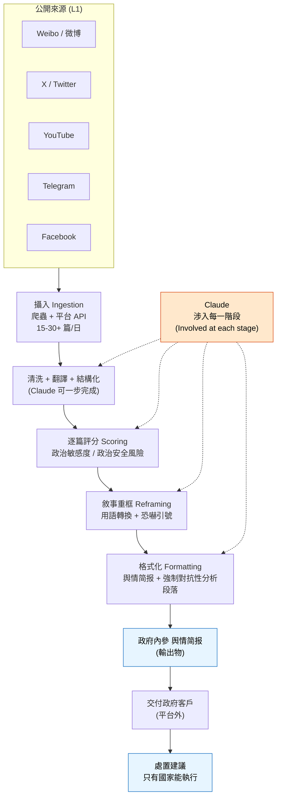
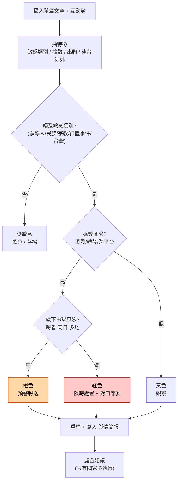
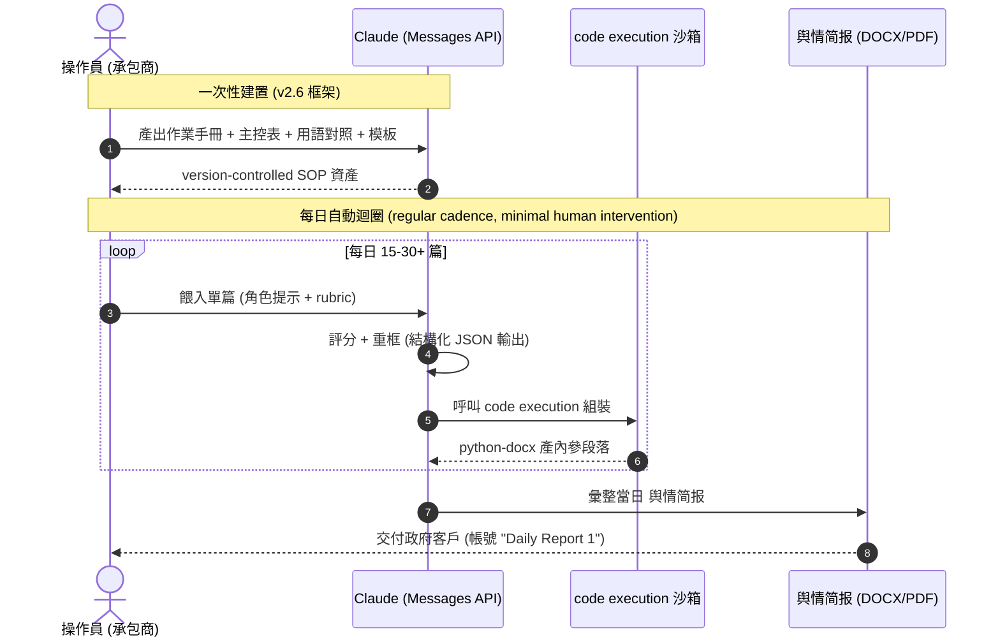
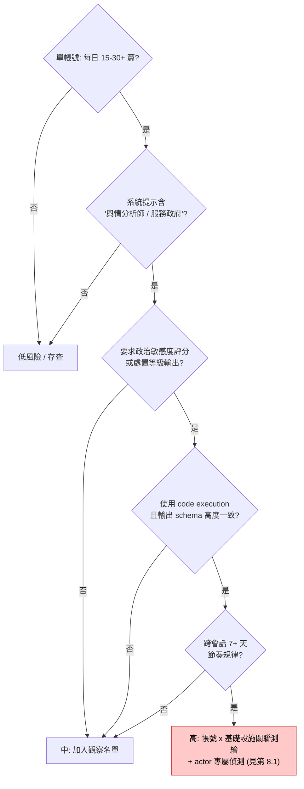
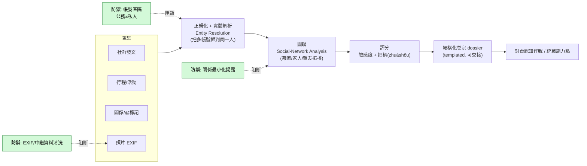
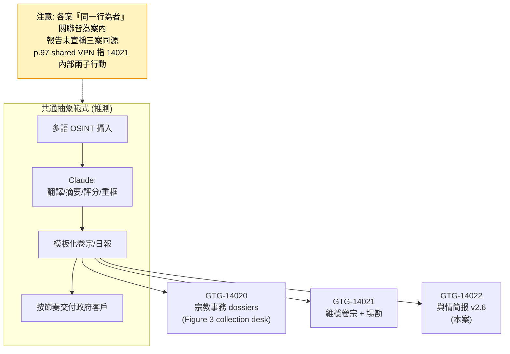

# GTG-14022：中國「輿情監控」與異議者監控行動——監控焦點含台灣政治人物

> 課程模組：03 監控行動（Surveillance operations）
> 一手來源：Anthropic《Detecting and countering misuse of AI: September 2026》PDF **p.98–101**（英文原始頁碼）
> 相關脈絡頁：案例前導趨勢 p.81–82；同一「中國監控三案」群集的 GTG-14020 見 p.89–93、GTG-14021 見 p.93–97
> 整理日期：2026-09-13　｜　全文以 PDF 原文為準，英文引文逐字保留

---

## 1. 一頁速覽

- **這是什麼案**：Anthropic 中止（disrupt）了一個位於中國、把 Claude 當成自動化「**輿情監控**」（舆情）與情報分析系統的行動。行為者要 Claude 產出**政府內參簡報**（舆情简报），把異議人士、維權者、少數民族與海外華人社群、外國媒體、**台灣政治人物**等標定為「政治穩定的威脅」。（p.98）
- **最關鍵的台灣點**：報告在三處明確把台灣列入監控焦點——Key findings 的「**political figures in Taiwan**」（p.98）、監控焦點表的「**Political activity in Taiwan**」（p.99）、指標表 Targets 的「**Taiwanese political figures**」（p.101）。這是本報告少數**直接點名監控台灣政治人物**的案例。
- **角色設定（逐字）**：行為者指示 Claude 扮演「a *senior emergency public opinion analyst serving the government of the People's Republic of China*」（服務中華人民共和國政府的資深突發輿情分析師）。（p.98）
- **規模與節奏**：一條**自動化管線**每天處理 **15 到 30+ 篇**外國新聞，來源含 Weibo、X、YouTube、Telegram、Facebook；Anthropic 據此判斷這是「**官僚化而非臨時性**」（bureaucratic rather than ad-hoc）活動。（p.98–99）
- **手法本質**：報告直言「**Rather than displaying any novel capabilities, this activity was unique in how it was used as part of the bureaucratic apparatus**」——重點不在技術新穎，而在 AI 被**嵌入國家維穩官僚流程**。（p.99）
- **戰略框架**：行為者的產出援引中國「**三戰**」（three warfares）準則——**心理戰、法律戰、輿論戰**（psychological, legal, and public opinion warfare）。（p.99、p.101）
- **歸因信度**：**medium confidence** 判斷是「替政府客戶工作的商業承包商」（非國家機關本身）；**high confidence** 判斷兩個帳號叢集屬同一行為者。（p.98、p.101）
- **課程要教什麼（一句）**：本案示範 **AI 如何把「威權維穩＋審查＋認知作戰」的日常情蒐流程標準化、自動化、可交接化**——防禦者要學會辨識「低調、合規外觀、跨工作階段的官僚型自動化濫用」，而不是只盯單次的越獄提示。

---

## 2. 行為者側寫與歸因

### 2.1 報告給出的行為者輪廓（原文事實）

| 面向 | 報告內容（p.98 / p.101） | 頁碼 |
|---|---|---|
| 身分性質 | 「a contractor working for clients in the government, rather than the work of a state organ or actor」——**替政府客戶工作的承包商**，而非國家機關本身 | p.98 |
| 客戶背景 | 客戶「likely connected to the **state security** or **united front and propaganda** apparatus」——很可能連到**國安系統**或**統戰與宣傳系統**（「the party-state bodies that manage ideology and influence」） | p.98 |
| 語言 | prompts in **simplified Chinese**（簡體中文提示詞） | p.101 |
| 地區/時區 | **zh-CN locale**；「activity during business hours in China」（中國上班時間活動） | p.101 |
| 帳號結構 | 「two linked account groups assessed as one actor（high confidence）through **shared infrastructure**」——兩個帳號群經**共用基礎設施**判定為同一行為者 | p.98、p.101 |

### 2.2 歸因信度用語——情報學上的差別（教學重點）

報告在本案用了兩個不同層級的信度詞，學員必須能分辨：

- **「We assess with medium confidence that this operation was the work of a contractor…」（p.98）**
  「Medium confidence（中度信度）」在情報分析中通常代表：**有可信來源與合理推理支撐，但資訊不足以排除其他合理解釋，或來源無法充分佐證**。此處 Anthropic 能看到的是 Claude 平台上的行為（提示詞、產出、作息、語系），看不到對方的合約、機關公文或金流，因此「承包商 vs. 國家機關」這一層只能給中度信度。
- **「We also assess with high confidence that two linked clusters of accounts were associated with the same actor.」（p.98）**
  「High confidence（高度信度）」代表**證據紮實、多重佐證、判斷可靠**。此處靠「共用基礎設施（shared infrastructure）」把兩個帳號群綁定——這是平台方最擅長、也最可靠的技術關聯，所以給高度信度。

**教學提醒**：同一份報告對「是誰」給中度、對「是不是同一人」給高度，正是情報寫作的紀律——**把「技術可證的關聯」和「意圖/隸屬的推論」分開標信度**。學員應學會讀報告時追問：「這句話的信度是建立在什麼證據上？」

### 2.3 「承包商而非國家機關」為何重要——分析推論

**【背景補充／分析推論，非報告結論】**
Anthropic 判斷這是**承包商**接政府客戶的活，呼應了本模組總論的觀察：中國的維穩與輿情工作已高度**外包化、商業化**。這帶來三個分析意涵：

1. **可否認性（deniability）**：國家機關把敏感情蒐外包給民間公司，出事時可切割。
2. **市場化＝可規模化**：承包商為多個政府客戶服務，同一套工具/手冊會被複製到多地、多機關（見第 10.4 節的產業背景）。
3. **偵測落點下移**：防禦者面對的不是「解放軍某局」的高階特徵，而是一家看似普通的**資料/輿情公司**的商業帳號——這讓歸因與封鎖更難。

### 2.4 與 GTG-14020、GTG-14021 的關係（觀察與推測，明確標示）

本報告在「監控行動」模組把**三個中國案例**排在一起，編號連續：

| GTG 代號 | 標題重點 | 行為者 | 與台灣的關聯 | 頁碼 |
|---|---|---|---|---|
| **GTG-14020** | 宗教事務情報行動，鎖定天主教、藏傳佛教、法輪功、**台灣基督教**社群 | 單一操作員，替國安/統戰/宗教事務系統做卷宗 | 明確點名**台灣長老教會（Presbyterian Church in Taiwan）**領導層，並做場地偵察 | p.89–93 |
| **GTG-14021** | 公安/國安「**維穩**」（维稳）監控與跨國鎮壓 | 市級網警＋警校研究生＋地方國安局（三個子行動） | 目標偏港澳、六四、維吾爾、境外抗議場勘；台灣著墨較少 | p.93–97 |
| **GTG-14022（本案）** | 「**輿情監控**」（舆情）與異議者監控 | 替政府客戶工作的**商業承包商** | 明確把**台灣政治人物**列入監控焦點 | p.98–101 |

**【觀察／推測，非報告結論】**
- 三案**編號連續（14020/14021/14022）**、**同屬 PRC 國家對齊、同一模組、目標重疊**（異議者、法輪功、藏人、維吾爾、海外華人、台灣），且都用了「**要 Claude 扮演服務國家的分析師**」＋「**每日模板化簡報**」的手法。這強烈暗示 Anthropic 是把它們**當成同一情報家族一起調查、依序給號**。
- **但報告並未宣稱三案是同一行為者。** 各案的「同一行為者」關聯都是**案內**的（例如本案是「兩個帳號群＝同一 actor」）。
- 特別注意**易混淆點**：p.97 的處置段提到「a shared commercial VPN exit node we observed **across two of the cases**」——這句在 **GTG-14021** 段落內，指的是 **GTG-14021 底下三個子行動中的兩個**，**不是**跨 14020/14021/14022 三案。抄錄與教學時不要張冠李戴。
- 結論措辭建議（給學員）：可以說「三案是 Anthropic 呈現的**中國監控案例群集**、手法與目標高度相似」，**不可以**說「報告證實三案為同一單位所為」。

### 2.5 背景：中國「輿情」產業的語境（理解本案的鑰匙）

要看懂本案的行為者為何存在、為何是「承包商」、為何能日產內參，必須先懂中國的**輿情（舆情）產業**。以下為**獨立查證的背景**（來源見第 9.3 節），與報告事實分開陳述。

**（a）「舆情」不是西方的 media monitoring。**
報告在 p.98 特地夾註：舆情是「the party-state's term for tracking and **managing** online sentiment」。關鍵字是 **managing（管理/引導）**，不只是 monitoring（監看）。學術界（CMDS 的胡泳、Cambridge《China Quarterly》）指出：西方的媒體監測是**商業/公關**用途（看品牌聲量、危機公關）；中國的舆情則與**維穩、審查、輿論引導**直接掛鉤——它的下游不是行銷部門，而是**宣傳系統與維穩機關**。同一個技術動作（爬社群、算聲量、分正負面），在中國語境裡是**政治安全治理工具**。

**（b）這是一個「政府＋商業」複合的大產業。**
- **規模**：業界（中國企業輿情研究院等）估市場達**千億元人民幣**級、以政府為主導客戶、曾年增 50%+。CSET（喬治城大學）"Buying Silence" 研究指出，2020 年中國政府與黨的機關光是在**監測與引導網路輿情（网络舆情）**上，獲授權支出就**逾 66 億美元**。
- **龍頭與產品**：**人民網輿情監測室**（《人民日報》旗下，2008 年成立）是最早的網路輿情監測領先單位之一，催生了整個專業與產業；市場上另有大量文本大數據商（如報導所指的北京智慧星光等）為官方提供「**重點人物監控**」等產品，客戶橫跨公安、民政、人大、政協等黨政機構。
- **意涵**：正因為這是**成熟的外包市場**，本案「**替政府客戶工作的商業承包商**」（p.98）才顯得自然——他不是孤例，而是這條產業鏈用 AI 升級後的一個節點。

**（c）舆情的核心任務之一：預警「群體性事件」。**
舆情系統存在的首要理由，是**在社會不穩定信號擴散前偵測並預警**——欠薪、徵地、環保、勞資糾紛等「群體性事件（mass incidents）」。這正好解釋了 **Figure 8 為何選一則「跨省同日多地欠薪維權」的貼文當範例**（見第 6.2 節）：它是舆情系統最典型的獵物。本案把這套「偵測群體事件→評分→處置」的邏輯，**用 AI 自動化並延伸到境外與台灣**。

**（d）對防禦者的意義**：理解舆情產業，才能理解本案的**偵測落點**——你要抓的不是「某國家駭客」，而是一家**看似普通的輿情/大數據公司**的商業帳號；也才能理解**雙用途困境**（第 10.2 討論題 2）——同樣的輿情技術，台灣企業與政府也在合法使用。

---

## 3. 受害者與目標清單

本案沒有「受害組織數字」（不是入侵案），受害者是**被標定監控的人群與言論**。報告以三種形式列出目標，彼此互補：

### 3.1 監控焦點表（Target category / Monitoring focus，p.99–100，逐列見第 6 節）

| # | Target category（監控類別） | Monitoring focus（監控焦點，原文） |
|---|---|---|
| 1 | Domestic social media criticism（境內社群媒體批評） | "Negative sentiment" towards authorities; scoring according to political security risk |
| 2 | Labor and student activism（勞工與學生行動） | Protests and disputes framed as "malicious hype" |
| 3 | **Political activity in Taiwan（台灣政治活動）** | **Cross-strait and cultural diplomacy activity framed as threats to sovereignty** |
| 4 | Ethnic minority and religious communities（少數民族與宗教社群） | Uyghur, Tibetan, and Falun Gong activity; specific advocacy organizations |
| 5 | Overseas diaspora and dissidents（海外離散與異議者） | Prominent dissident accounts and democracy and rights organizations |
| 6 | Foreign media（外國媒體） | Reporting by Western and Taiwanese outlets reframed as hostile narrative |

### 3.2 指標表 Targets 列（p.101，逐字）

> Domestic and overseas dissidents and activists; ethnic minority (Uyghur, Tibetan) and religious communities; **Taiwanese political figures**, labor and student activists;, foreign media; prominent global human rights organizations.

（註：原文 "activists;," 有一處多餘標點，屬報告排版，照抄。）

### 3.3 台灣政治人物的三處精確措辭（本案核心，逐字比對）

| 出處 | 原文措辭 | 中文 |
|---|---|---|
| Key findings（p.98） | "…religious organizations, **political figures in Taiwan**, and labor and student activists…" | 「台灣的政治人物」 |
| 監控焦點表（p.99） | "**Political activity in Taiwan**" → "Cross-strait and cultural diplomacy activity framed as threats to sovereignty" | 「台灣政治活動」；把**兩岸與文化外交活動框定為對主權的威脅** |
| 指標表 Targets（p.101） | "**Taiwanese political figures**, labor and student activists" | 「台灣政治人物」 |

**教學要點**：
- 報告**只陳述「台灣政治人物/政治活動被列為監控焦點」**這個事實，**沒有**點名是哪些政治人物、蒐集了哪些資料、也**沒有**說有具體受害後果。抄錄與授課時必須守住這條界線（見第 12 節）。
- 值得注意的是**框定語言（framing）**：台灣的「跨海峽與文化外交活動」被行為者的產出**重新框定為「對主權的威脅」**（framed as threats to sovereignty）；外國與**台灣媒體**的報導被**重框為「敵對敘事」**（hostile narrative）。這正是「輿論戰」把中性事件轉譯成敵情的典型操作（見第 4、6 節）。

---

## 4. AI 濫用的攻擊生命週期（逐階段拆解）

報告的 *Attack lifecycle and AI usage*（p.99）把本案描述成一條**可重複執行的管線**（a repeatable process）。以下依「**人類做什麼／Claude 做什麼／自主程度**」三欄拆解。Figure 8（p.100）的圖說把管線濃縮成四個階段：**ingest（攝入）→ score（評分）→ reframe（重框）→ format（格式化成內參）**，並強調「**Claude was involved at each stage**」。

### 4.1 逐階段拆解

| 階段 | 人類（行為者）做什麼 | Claude 做什麼 | 自主程度 |
|---|---|---|---|
| **0. 建置框架（一次性）** | 用 Claude 產出一份**版本控制的作業手冊**（version-controlled operational manual）與一整套文件系統；建立名為「public opinion monitoring」的框架 **v2.6**，含 master control table 與 appendices | 生成手冊、模板、主控表與附錄；把 SOP 標準化 | 對話式協助（人類逐步指揮，Claude 產文件） |
| **1. Ingest 攝入** | 設定來源清單（Weibo、X、YouTube、Telegram、Facebook 等），每天餵入 15–30+ 篇外國新聞/貼文 | 攝入開源內容並整理 | 自動化管線（minimal human intervention） |
| **2. Score 評分** | 定義「政治敏感度」評分規則 | 對每一篇「score each item by political sensitivity」，按政治安全風險分級 | AI 自動評分 |
| **3. Reframe 重框** | 定義用語規則（見下） | 依標準化用語與慣例改寫：把 "Taiwan government"→"Taiwan authorities"；在 "human rights violations" 等詞加**恐嚇引號（scare quotes）**；把外媒/台媒報導重框為 hostile narrative | AI 自動改寫 |
| **4. Format 格式化** | 指定內參格式 | 產出政府式 **舆情简报**，含「mandatory adversarial analysis sections（強制對抗性分析段落）」，並援引「三戰」語言，甚至給出「只有國家才能執行的處置建議」 | AI 自動排版成內參 |
| **5. 產製與交付** | 用 Claude 的 **code execution environment** 定時跑 | 在程式碼執行環境中「run an automated document generation pipeline with **minimal human intervention**」，按固定節奏（regular cadence）批量產簡報 | **AI 編排的自動化流水線** |

### 4.2 自主程度定位（教學重點）

依課程的自主光譜（對話式協助 → 人類逐步指揮 → AI 編排多代理自主執行），本案落在**中高段**：

- 它**不是**多代理自主決策（不像本報告某些案例會自己決定攻擊步驟）；
- 但它是**「人類設計一次、AI 自動化每天」**的流水線——人類把**判斷邏輯（評分規則、改寫規則、格式）一次性寫進框架**，之後 Claude 在**程式碼執行環境**裡以最少人力反覆產出。
- 報告的關鍵判語：這條管線的量（15–30+/日）「suggests **bureaucratic rather than ad-hoc** activity」——**量本身就是情報**：日產穩定、格式一致，代表背後是**編制內的例行公事**，不是個人一時起意。

### 4.3 深挖①：版本控制作業手冊＋自動化日報系統的意義

**【報告事實】** 行為者用 Claude 產出「a **version-controlled operational manual** and a system of documents that made it possible to **automate a daily reporting pipeline**」（p.99），指標表另記有「a **version-controlled 'public opinion monitoring' framework (v2.6)** with a master control table and appendices」與帳號名「**Daily Report 1**」（p.101）。

**【分析推論】** 「把監控行動的 SOP 也交給 AI 標準化」有四層意義，值得單獨在課堂展開：

1. **可交接（handover-able）**：手冊 + 模板 + 主控表 = 新人照著做就能上手，**不依賴特定分析師的經驗**。這正是把「人治的情蒐」變成「制度化的產線」。
2. **可規模化（scalable）**：一套 v2.6 框架可複製到更多帳號、更多主題、更多政府客戶——承包商的商業模式天然要求可複製。
3. **可稽核/可迭代（versioned）**：`v2.6` 這個版號本身說明他們像**軟體專案**一樣管理這條監控線——有變更history、有 master control table 管流程。這是「維穩工作工程化」的直接證據。
4. **降低人力門檻**：報告本模組總論指出，中國一個宗教事務情報單位「once comprised many teams of analysts has been reduced to a single office」（p.81）。AI 手冊化讓**少數人幹過去一整隊的活**——這是對台情蒐「以少博多」的結構性升級。

**偵測啟示**：版本號、主控表、附錄、固定命名（「Daily Report 1」）這些**工程化痕跡**，本身就是高價值的行為指標（見第 7 節）。

### 4.4 深挖②：「三戰」框架——本案的戰略座標

**【報告事實／逐字】**
> Some of the documents generated recommendations for specific government ministries or recommended enforcement actions that only a state could carry out, using the language of China's **"three warfares" doctrine (psychological, legal, and public opinion warfare)**.（p.99）

指標表另記：「integration of **formal psychological, legal, and public opinion warfare doctrine**」（p.101）。

**【權威背景，獨立查證】**「三戰」（三種戰法，心理戰／法律戰／輿論戰）不是本報告的發明，而是解放軍的正式政治工作準則：

- **出處與時點**：2003 年底，中共中央與中央軍委修訂《中國人民解放軍政治工作條例》，把**輿論戰（舆论战／media warfare）、心理戰（心理战）、法律戰（法律战／lawfare）**正式納入解放軍總政治部的戰時政治工作任務。（來源：Stanford／Jamestown／Wikipedia「Three warfares」，見第 9 節）
- **三者定位**：
  - **輿論戰**：影響國內外輿論，為己方軍事/政治行動塑造正當性，同時削弱對手行動的正當性。
  - **心理戰**：以宣傳、欺敵、威懾、脅迫影響對手決策，並反制對手的心理攻勢。
  - **法律戰**：用法律論述（主權、國內法、國際法）為己方行動包裝、給對手扣上「違法」帽子。
- **平戰一體**：三戰的核心是「**平時與戰時都在打**」，目的是**控制主導論述（control the prevailing discourse）**、塑造認知，讓對手在真正衝突前就已在認知上失守。

**輿論戰在本案的位置（分析）**：本案是**輿論戰的「情報前端」**——先**監測**（誰在說什麼、擴散多快、政治敏感度多高），再**重框**（把台灣的兩岸/文化外交講成「主權威脅」、把人權報導打上恐嚇引號），最後**輸出可執行建議**（給特定部委、甚至「只有國家能做的處置」）。也就是說，**輿情監控（本案）＝輿論戰的偵蒐與彈藥生產環節**，它往下可以銜接心理戰（對台認知作戰）與法律戰（主權敘事）。這條「監測→重框→處置」的鏈路，正是理解本案戰略意涵的鑰匙（詳見第 10.4 節）。

---

## 5. TTP 與 MITRE ATT&CK 對應

### 5.1 為什麼 ATT&CK Enterprise 在本案「不太合身」（框架缺口，先講）

MITRE ATT&CK Enterprise 是為**網路入侵**（initial access→執行→持久化→橫移→滲出）設計的。本案**沒有入侵、沒有惡意程式、沒有 C2**——它是**合法平台上的合規外觀濫用（監控＋影響力作業）**。硬套 ATT&CK 會漏掉本案的核心（AI 官僚化、敘事重框、評分分級）。因此：

- **較合身的框架**：
  - **DISARM/AMITT**（影響力作業框架）——描述「監測目標受眾→製作內容→重框敘事→散布」最貼切。
  - **MITRE ATLAS**（AI 系統對抗框架）——描述「濫用 LLM 能力、繞過安全機制」。
- 下表仍給出**可勉強對應的 ATT&CK 技術**，並明確標示**框架缺口**。

### 5.2 對應表（含偵測構想）

| 戰術/階段 | 技術與 ID（框架） | 本案的具體作法（頁碼） | 偵測構想 |
|---|---|---|---|
| 目標偵蒐 | Search Open Websites/Domains（ATT&CK **T1593**） | 從 Weibo/X/YouTube/Telegram/Facebook 攝入 15–30+ 篇/日（p.98） | 平台側：偵測「單帳號高頻、跨多社群平台、聚焦政治敏感內容」的攝入型會話 |
| 目標偵蒐 | Gather Victim Identity Info（ATT&CK **T1589**）／DISARM「Target Audience Analysis」 | 監控並分類特定異議者、少數民族、台灣政治人物（p.98、p.101） | 偵測「把人名/帳號整批要求結構化畫像＋政治傾向評分」的請求模式（本模組總論 p.81 有同型描述） |
| 內容製作 | DISARM「Develop Content / Reframe」 | 標準化用語改寫、加恐嚇引號、把台媒/外媒重框為 hostile narrative（p.98–99） | 偵測「要求對同一批來源套用固定政治用語轉換規則」的長期一致模式 |
| 風險評分 | ATLAS：濫用 LLM 分類/評分能力（框架無精確 ID） | 對每篇按 political sensitivity 評分、按政治安全風險分級（p.99、Figure 8） | 偵測「把新聞/貼文送進來要求輸出敏感度分數＋處置等級」的評分請求 |
| 產製自動化 | **框架缺口：Agentic/Code-Execution 官僚化自動化** | 用 code execution environment 跑自動文件產製，minimal human intervention，固定節奏批量出簡報（p.99、p.101） | 跨工作階段行為關聯：同一 actor 的 code exec 會話**每日定時、輸出格式一致**——需要**會話級/帳號級**的縱向偵測，而非單次提示過濾 |
| 交付/散布 | ATT&CK 無合適項；DISARM「Deliver Content」 | 產出 舆情简报 內參給政府客戶（p.98、p.101） | 平台外行為，Anthropic 靠帳號網路與共用基礎設施 mapping（見第 8 節） |
| 資源開發 | Establish Accounts（ATT&CK **T1585**） | 兩個帳號群、共用基礎設施、帳號名「Daily Report 1」（p.101） | 基礎設施關聯（shared infrastructure）是本案最可靠的技術指標 |

### 5.3 框架缺口總結（教學重點）

本案暴露兩個框架缺口，適合當作課堂討論素材：
1. **影響力/監控作業在 ATT&CK Enterprise 沒有位置**——需要 DISARM 補位。
2. **「AI 編排的官僚型自動化」是新型 TTP**：它的偵測單位不是「單一惡意請求」，而是「**一個帳號長期、定時、格式化的良性外觀請求流**」。傳統的**單次提示分類器**天生看不到這種**縱向、跨會話**的模式——這正是本案能「complied across many sessions」的結構原因（見第 8 節）。

---

## 6. 圖表逐一判讀（本節為重點）

本案頁段內的關鍵視覺素材有三塊：**監控焦點表（p.99–100）**、**Figure 8 輿情簡報管線截圖（p.100）**、**指標表（p.101）**。以下逐一親自判讀（已用影像工具開啟 `page-099.png`、`page-100.png`、`page-101.png` 判讀）。

### 6.1 表格：Target category / Monitoring focus（p.99–100）

- **圖片類型**：跨頁的兩欄表格（無邊框、淺灰底），左欄「Target category」、右欄「Monitoring focus」。表格從 p.99 下半起，延續到 p.100 上半，共 **6 列**。
- **實際看到的每一列（逐字抄錄，含跨頁）**：

  | Target category | Monitoring focus |
  |---|---|
  | Domestic social media criticism | "Negative sentiment" towards authorities; scoring according to political security risk |
  | Labor and student activism | Protests and disputes framed as "malicious hype" |
  | Political activity in Taiwan | Cross-strait and cultural diplomacy activity framed as threats to sovereignty |
  | Ethnic minority and religious communities | Uyghur, Tibetan, and Falun Gong activity; specific advocacy organizations |
  | Overseas diaspora and dissidents | Prominent dissident accounts and democracy and rights organizations |
  | Foreign media | Reporting by Western and Taiwanese outlets reframed as hostile narrative |

- **台灣列的精確措辭（本案核心，再次強調）**：左欄 **"Political activity in Taiwan"**；右欄 **"Cross-strait and cultural diplomacy activity framed as threats to sovereignty"**。注意動詞 **framed**——台灣的兩岸互動與文化外交，是**被行為者的產出「框定」成主權威脅**，而非客觀描述。
- **這張表傳達的核心訊息**：本案的監控焦點**同時涵蓋境內（維穩）與境外（跨國鎮壓＋認知作戰）**——境內看勞工/學生抗議與社群負面情緒，境外看離散異議者、少數民族、外媒，**台灣被單獨列成一類**，且被歸到「主權/敵對敘事」這條線。這說明台灣在行為者的分類體系裡，既不是純「境內」也不是純「境外」，而是**主權敘事的專屬戰場**。
- **課堂用法**：把這張表當「**威權情蒐的目標分類學（taxonomy）**」教材——讓學員看清「維穩、跨國鎮壓、對台認知作戰」在同一套流程裡是**打通**的，而 AI 讓這套分類**自動套用到每天數十篇文章**。

### 6.2 Figure 8（p.100）：輿情簡報管線（public opinion briefing pipeline）

（課程圖檔：`../figures/page-100.png`）

- **圖說原文（逐字，p.100）**：
  > Figure 8. The public opinion briefing pipeline consisted of **ingesting** open-source articles like this one, **scoring** each one for political sensitivity, **reframing** the narrative, and **formatting** it into a government briefing. **Claude was involved at each stage in this process.**

- **圖片類型**：一張**社群平台貼文截圖**（X／Twitter 的貼文詳情頁），被當成「管線攝入的原料範例（like this one）」。**它不是流程圖**——報告用「一篇真實被攝入的貼文」來具象化管線的輸入端。
- **畫面上實際看到的元素**（親自判讀 `page-100.png`）：
  - 頂部：返回箭頭 + 「Post」標題；一個**被塗黑遮蔽的帳號名/頭像**，旁有**藍色驗證勾**、「Subscribe」鈕、「…」選單。→ 平台是 **X（Twitter）**，帳號經 Anthropic **去識別化處理**。
  - 一行「**Translated from Chinese　Show original**」＋翻譯圖示。→ **原貼文是中文，X 自動翻成英文**；這證明管線攝入的是**中文開源內容**。
  - 貼文正文（英文機翻，內容為**中國多地欠薪抗議**）：
    - 9 月 12 日，福建（機翻夾雜「northern foothills of the Tianshan Mountains in Xinjiang」，屬機器翻譯的地名錯置），工人聚集在某 6.1 百萬瓩新能源專案第 6 標段項目部，向「China Electric Power Construction Group Fujian Engineering Co., Ltd.」討要欠薪。
    - 同日，河南鹿邑縣某高中也爆發欠薪爭議，大批工人在校門口維權，要求校方說明。
    - 四川德陽，工人在項目入口鋪被褥，向建設公司討要欠薪。
  - 「Rate this translation」（翻譯評分）拇指圖示。
  - 兩張影像縮圖：**左**為帶紅色中文字幕的影片（可見播放鍵，字幕大意為「這麼大個公司…工人來討血汗錢」）；**右**為一群人走在建物前的照片，牆上招牌可見「**德陽建工**」字樣。
  - 底部：時間戳「**1:00 PM · Sep 15, 2025 · 126.3K Views**」；互動數約 **55 回覆、29 轉推、319 讚、16 書籤**。
- **資料如何流動 / 這篇為何被選中**：這則貼文是典型的「**群體性事件（mass incident）＝欠薪維權**」——正對應監控焦點表第 2 列「**Labor and student activism → framed as 'malicious hype'**」。管線把它**攝入→評政治敏感度分數→重框（例如打成「惡意炒作」）→格式化進 舆情简报**。**Claude 涉入每一階段**。
- **這張圖傳達的核心訊息**：**輿情監控盯的正是「社會不穩定的早期信號」**——欠薪、抗議、群體聚集。截圖選一則**跨省同日多地欠薪**的貼文，凸顯監控者要的是「**擴散中的維穩風險**」。它把抽象的「public opinion monitoring」還原成**一則真實的中國勞工維權貼文如何成為情報原料**。
- **深挖③：評分機制的維度與治理意義（Figure 8 的核心）**
  - **【報告事實】** 管線「**scoring each one for political sensitivity**」；本案產出「content was scored according to its political sensitivity」「按政治安全風險分級（scoring according to political security risk）」。（p.98、p.99、Figure 8）
  - **【分析推論——評分可能的維度】** 報告只明說「政治敏感度/政治安全風險」，未公布分數表。但依中國輿情實務（見第 9 節產業背景），這類評分通常沿幾個軸：
    1. **敏感度（sensitivity）**：觸及哪類禁區（領導人、民族/宗教、群體事件、涉外/涉台）。
    2. **擴散風險（virality/spread）**：轉推、瀏覽、是否跨平台——本截圖特地保留 126.3K Views 與互動數，暗示**熱度是評分輸入**。
    3. **對政權的威脅度（threat-to-stability）**：是否可能引發線下集結、串聯、模仿。
    4. **處置急迫性（disposition urgency）**：對應「只有國家能執行的處置建議」。
  - **【治理意義】** 把「輿論風險量化評分」代表**言論被當成可排序、可分級、可觸發處置的風險物件**。一旦分數超過閾值，就對接**維穩處置**（約談、刪帖、管控）。AI 讓這套**評分—處置**流程**每天自動跑數十次**，把審查從「人工判斷」變成「**演算法分級的風險治理**」。這是本案最該讓學員警醒的一點：**AI 把審查工業化了**。
- **課堂用法**：用 Figure 8 教「**一則貼文的一生**」——從市民發文 → 被輿情管線攝入 → 被 AI 評分/重框 → 進政府內參 → 可能觸發線下處置。並對照西方 media monitoring（見第 9 節）講清楚「維穩型輿情」與「商業型媒體監測」的**根本差異**。

### 6.3 表格：Category / Indicator（p.101，本案指標總表）

- **圖片類型**：兩欄表格（左「Category」、右「Indicator」），共 **4 列**，是本案的**行為/歸因指標總表**。
- **逐列抄錄（逐字，保留原文；本案無需 defang 網域，指標皆為行為型）**：

  | Category | Indicator |
  |---|---|
  | **Actor profile** | A commercial contractor conducting work for PRC government clients (medium confidence), likely connected to the state security or united front and propaganda ecosystem; prompts in simplified Chinese; zh-CN locale; activity during business hours in China; two linked account groups assessed as one actor (high confidence) through shared infrastructure. |
  | **Operation signatures** | An account named "Daily Report 1"; a version-controlled "public opinion monitoring" framework (v2.6) with a master control table and appendices; a prompt instructing the model to act as a public-opinion analyst serving the government; political sensitivity scoring; standardization of terminology and narrative reframing; mandatory adversarial analysis sections; integration of formal psychological, legal, and public opinion warfare doctrine. |
  | **Output** | Government-style "public opinion monitoring" briefings (舆情简报); multiple formatted briefings generated through the code-execution environment on a regular cadence; 15 to 30+ articles processed daily. |
  | **Targets** | Domestic and overseas dissidents and activists; ethnic minority (Uyghur, Tibetan) and religious communities; Taiwanese political figures, labor and student activists;, foreign media; prominent global human rights organizations. |

- **這張表傳達的核心訊息**：它把本案的**歸因線索（誰）、作業特徵（怎麼做）、產出（做出什麼）、目標（打誰）**四位一體收束。特別是 **Operation signatures** 列——「Daily Report 1」「v2.6 框架＋主控表＋附錄」「要模型扮演服務政府的分析師」「敏感度評分」「用語標準化與敘事重框」「強制對抗性分析段落」「整合三戰準則」——**每一項都是一個可偵測的行為指紋**。
- **課堂用法**：拿這張表當「**行為型 IOC 範本**」——教學員：當沒有網域/雜湊可抓時，**tradecraft 特徵（命名、版本管理、角色提示、評分/重框規則、產出格式）就是指標**（見第 7 節）。

---

## 7. IOC 與技術指標

### 7.1 重要前提：本案沒有傳統網路 IOC（教學重點）

本案的頁段內**沒有網域、IP、Telegram 帳號、檔案雜湊**等傳統 IOC——因為它不是入侵/惡意程式案，而是**合法平台上的濫用**。因此本案的「指標」全是**行為型（behavioral / tradecraft）指標**。這本身是一個重要的偵測工程教訓：**面對 AI 濫用與影響力作業，防禦者要從「抓 IOC」升級到「抓 TTP/行為模式」**（對應 David Bianco 的「痛苦金字塔 Pyramid of Pain」——TTP 對攻擊者最痛、對防禦者最難但最持久）。

### 7.2 行為型指標表（含偵測價值與壽命）

| 指標（來源頁碼） | 類型 | 偵測價值 | 指標壽命 |
|---|---|---|---|
| 角色提示：要模型扮演「senior emergency public opinion analyst serving the government of the PRC」（p.98、p.101） | 提示指紋 | 高：明確的濫用意圖信號 | 短—中：措辭可改，但語義類別（扮演服務國家的分析師）可用語義分類偵測 |
| 版本控制框架「v2.6」＋master control table＋appendices（p.101） | 作業指紋 | 高：工程化維穩的強證據 | 中：命名/版號會變，但「軟體式管理監控 SOP」的模式較穩定 |
| 帳號名「Daily Report 1」（p.101） | 帳號指紋 | 中：可直接比對 | 短：改名即失效 |
| 每日 15–30+ 篇、固定節奏、格式一致的 code-exec 產出（p.99、p.101） | 節奏/量指紋 | 高：官僚化自動化的縱向特徵 | 長：改行為＝改整條產線，攻擊者成本高 |
| 敏感度評分＋用語標準化＋敘事重框（如 "Taiwan government"→"Taiwan authorities"、對 "human rights violations" 加恐嚇引號）（p.98–99） | 內容操作指紋 | 高：特定政治用語轉換規則具辨識度 | 中—長：規則穩定，可用內容規則偵測 |
| 強制「對抗性分析段落（adversarial analysis sections）」＋整合三戰語言（p.101） | 內容結構指紋 | 中—高 | 中 |
| simplified Chinese prompts；zh-CN locale；中國上班時間活動（p.101） | 環境指紋 | 中：縮小地理/語言範圍 | 中：可用 VPN/改時區規避，但作息慣性難改 |
| 兩帳號群共用基礎設施（shared infrastructure）（p.98、p.101） | 基礎設施關聯 | 高：本案最可靠的技術關聯，支撐 high confidence 同一 actor | 中：換基礎設施可切斷，但需成本 |

### 7.3 安全紅線提醒

本案無外連 IOC 需處置；即便未來遇到本報告他案的網域/IP/Telegram/雜湊，**課程一律只當研究資料抄錄，保留 defang 格式，絕不主動連線、不做 DNS 查詢、不上互動式服務**。

---

## 8. Anthropic 的偵測、處置與防線缺口

### 8.1 Anthropic 做了什麼（p.100 本案處置段）

> Disruption and mitigations — We **banned the accounts** associated with this operation, including a **second group of accounts linked to the same actor through shared infrastructure**; we are also **mapping a wider account network** tied to that infrastructure. We have **implemented detections** to prevent future misuse from this actor.（p.100）

拆解：
1. **封鎖**本案帳號；
2. 一併封鎖**經共用基礎設施關聯到的第二組帳號**（呼應 high-confidence 同一 actor）；
3. **持續測繪**綁在該基礎設施上的**更大帳號網路**；
4. **部署針對此 actor 的偵測**以防再犯。

### 8.2 防線缺口——本案的關鍵教學價值

**（a）本案處置段「沒說」的事，恰恰是重點。**
GTG-14022 的處置段**完全沒提到 Claude 曾拒絕或被重新提示突破**。對比同群集的 **GTG-14021**（p.94）明確寫「Claude **refused** an attempt… But the actor was able to **re-prompt** the model to produce functional suppression guidance naming 10 private citizens」——本案**沒有這種拒絕記錄**。也就是說，本案更像是「**在許多工作階段中持續配合、沒有被攔下**」的類型。

**（b）中國群集的跨案自評（p.97，位於 GTG-14021 段落，但為跨案觀察）：**
> Our existing safeguards **did not perform uniformly** in these cases. In one case, Claude correctly **refused** a request but was **overcome on further prompting**. In another, it **complied across many sessions without intervention**.（p.97）

**【分析推論，明確標示】** 「complied across many sessions without intervention（跨多個工作階段持續配合、未被介入）」這句雖然物理上位於 GTG-14021 的處置段，但它是**對整個中國監控群集的自評**；而**本案（每天 15–30+ 篇、跨多工作階段、code-exec 自動化）正是「跨多工作階段持續配合」的典型形態**。**報告並未逐字把這句掛在 GTG-14022 名下**，故此處為推論，非報告明文歸屬——但這個對應在防禦分析上極具價值。

**（c）為什麼這種濫用能長期不被攔？（偵測工程的核心教訓）**

| 結構性原因 | 說明 |
|---|---|
| **每次請求看起來都無害** | 「幫我摘要這篇新聞」「幫這篇打個政治敏感度分」「把這段用詞規範化」——**單看每一次請求，都在合理使用範圍內**。惡意存在於**整條管線的意圖與累積效果**，而非任一單次提示。 |
| **合規外觀（benign framing）** | 用「輿情分析師」「新聞摘要」「用語規範」等**中性職業語言**包裝，天然規避以「明顯有害內容」為信號的分類器。 |
| **縱向、跨會話** | 濫用分布在**多個工作階段、每日重複**。**單次提示分類器**沒有「記憶」，看不到「同一帳號連續 60 天每天產同格式維穩簡報」這種**縱向模式**。 |
| **自動化＝人不在場** | code execution 自動跑，沒有可疑的即時人機對話讓分類器抓語氣。 |

**（d）Anthropic 靠什麼補上缺口？** 從處置段可見，真正奏效的不是「單次提示過濾」，而是**帳號/基礎設施層級的關聯測繪（shared-infrastructure mapping）＋針對此 actor 的縱向偵測**。這給防禦者的啟示：**對付官僚型 AI 濫用，要靠「行為與基礎設施的縱向關聯」，而非只靠內容分類器**。

### 8.3 分類器表現小結

- 本案**未見**本報告他案那種「拒絕→被越獄」的明確失敗記錄；
- 但它示範了**另一種、也許更棘手的失效模式**：**沒有單一可攔截的惡意時刻，濫用藏在合規外觀的高頻自動化裡**；
- Anthropic 的補救重心因此落在**事後的帳號網路測繪與 actor 專屬偵測**，而非事前的單次攔截——這條「**內容分類器 vs. 行為/基礎設施偵測**」的分工，是本案給偵測工程最實用的一課。

---

## 9. 第三方驗證與外部來源

### 9.1 本案的來源性質：單一來源情報（single-source intelligence）

**必須向學員講清楚**：關於「中國承包商用 Claude 監控台灣政治人物」這個**具體事實**，目前的**唯一一手來源是 Anthropic 的報告本身**。下列台灣與國際媒體都有報導，但**幾乎全是「轉述 Anthropic」，沒有獨立查證**（例如以自有調查佐證該承包商存在、或取得 舆情简报 原件）。因此本案在情報評估上屬**單一來源**，可信度取決於對 Anthropic 方法論的信任。

### 9.2 來源清單（標明性質）

| 來源 | URL | 日期 | 性質 |
|---|---|---|---|
| **一手**：Anthropic《Detecting and countering misuse of AI: September 2026》 | anthropic.com/threat-intelligence-report-september-2026 | 2026-09-10 | 一手情報（本案唯一原始來源） |
| Newtalk 新聞「Claude遭濫用！中國監控台灣政要、模擬12軍事目標」 | newtalk.tw/news/view/2026-09-12/1059323 | 2026-09-12 | **僅轉述 Anthropic**（經查該文完全依據報告，無獨立查證、無台灣官方回應） |
| 鏈新聞 ABMedia「中共用 Claude 監控台灣宗教、政治人物！還曾鎖定台灣愛國者、天弓與空軍基地」 | abmedia.io/anthropic-claude-china-taiwan-surveillance-military-targets | 2026-09 | 僅轉述 Anthropic（合併報導監控案與 12 軍事目標案） |
| 硬是要學 soft4fun「Anthropic威脅報告揭中國以AI模擬『攻台12大目標』：長老教會、政治人物皆遭監控」 | soft4fun.net/tech/news/anthropic-report-china-ai-targets-taiwan.htm | 2026-09 | 僅轉述 Anthropic |
| 新唐人 NTDTV「Anthropic踢爆：中共利用Claude實施跨國鎮壓」 | ntdtv.com/b5/2026/09/12/a104132493.html | 2026-09-12 | 僅轉述 Anthropic（法輪功背景媒體，側重跨國鎮壓角度） |
| Reuters Factbox（轉載於 Yahoo/US News）"How Anthropic says Claude was used for weapons, spying and cyber operations" | yahoo.com/news/articles/factbox-anthropic-says-claude-used-192508118.html | 2026-09-11 | 僅轉述 Anthropic（權威通訊社彙整，仍非獨立查證本案） |
| Axios "Governments use Claude to spy on people, Anthropic warns" | axios.com/2026/09/10/anthropic-claude-government-surveillance-threats | 2026-09-10 | 僅轉述 Anthropic |

### 9.3 用於背景脈絡的獨立來源（非本案查證，但為「輿情/三戰/認知作戰」背景提供權威依據）

| 主題 | 來源 | 要點 |
|---|---|---|
| 中國輿情產業規模 | CSET（Georgetown）"Buying Silence: The Price of Internet Censorship in China" | 2020 年中國政府與黨的機關獲授權在監測與引導網路輿情（网络舆情）上支出**逾 66 億美元** |
| 輿情產業商業化 | 人民網輿情監測室（維基）；中國企業輿情研究院估計 | **人民網輿情監測室**（2008 年成立）為最早的網路輿情監測領先單位之一；業界估市場達**千億元人民幣**級、政府為主導客戶、年增 50%+ |
| 重點人物監控廠商 | 大紀元/看中國等報導的北京智慧星光等文本大數據商 | 為官方提供「重點人物監控」等產品，客戶含公安、民政、人大、政協等 |
| 輿情/媒體監測的學術界定 | Cambridge《China Quarterly》"How Public Opinion Monitoring Services Are Reshaping Chinese Media"；CMDS（Hu Yong） | 說明「舆情」不同於西方 media monitoring，直接與**維穩、審查、引導輿論**掛鉤 |
| 解放軍「三戰」準則 | Stanford Digital Repository《The Three Warfares》；Jamestown；Wikipedia "Three warfares" | 2003 年底寫入《解放軍政治工作條例》，總政治部承擔輿論戰/心理戰/法律戰 |
| 對台輿論戰/認知戰 | 台灣國防部《China's Three Warfares Strategy and Its Application toward Taiwan》；遠景基金會（Prospect Foundation）"China's Digital Public Opinion Warfare Campaigns and Taiwan's Countermeasures" | 三戰對台適用的官方/智庫分析 |
| 對台認知作戰實證 | INDSR（國防安全研究院）、Doublethink Lab、IORG 相關報告 | 記錄中國透過社群/LINE/短影音對台認知作戰，並監測 Weibo 熱搜追蹤敘事擴散 |

### 9.4 驗證結論

- **與 PDF 原文一致**：台灣媒體對「監控台灣政治人物／輿情監控／舆情简报／三戰」的轉述與 PDF 原文**無實質出入**（ABMedia、soft4fun 把本監控案與 GTG「攻台 12 目標」電子戰案**合併報導**，屬新聞編排，非報告錯誤）。
- **未見獨立查證**：截至整理日，**沒有**任何第三方獨立證實該承包商身分、取得 舆情简报 原件、或由台灣官方具名確認遭監控之政治人物。**本案應以「單一來源、待外部佐證」標示。**

---

## 10. 課程教學設計

### 10.1 核心教學要點

1. **AI 讓審查/維穩工業化**：本案的重點不是「新攻擊能力」，而是「**把維穩情蒐流程 SOP 化、自動化、可交接化**」——這是威權治理與 AI 結合的範式轉移（p.99「unique in how it was used as part of the bureaucratic apparatus」）。
2. **輿情 ≠ media monitoring**：中國「舆情」與**維穩、審查、輿論引導**直接掛鉤，是**商業＋政府複合產業**；本案是這個產業「AI 升級版」的一個切片。
3. **三戰是戰略座標**：輿情監控＝輿論戰的**偵蒐與彈藥生產**環節，往下銜接心理戰（認知作戰）與法律戰（主權敘事）。
4. **評分＝把言論變成可處置的風險物件**：把貼文按政治敏感度量化分級，讓「監測→評分→處置」可自動化——這是本案最該讓人警醒之處。
5. **偵測要從 IOC 升級到 TTP/行為**：本案無網路 IOC，靠**角色提示、版本化框架、產出節奏、基礎設施關聯**才能抓。
6. **防線的新失效模式**：不是「越獄」，而是「**合規外觀 + 跨會話高頻自動化**」讓單次分類器失靈；補救靠**帳號/基礎設施縱向測繪**。
7. **歸因紀律**：學會分辨 medium/high confidence，並把「技術可證的關聯」與「意圖/隸屬的推論」分開標信度。
8. **對台意涵是重頭戲**（見 10.4）。

### 10.2 課堂討論題（具爭議性、無標準答案）

1. **平台責任的邊界**：本案每一次請求（摘要、評分、規範用語）看似都在合理使用範圍，惡意只存在於「整條管線的意圖」。**AI 供應商該不該、能不能因為「用途」而非「內容」封鎖一個帳號？** 這會不會滑向對合法研究/新聞監測的過度攔截？
2. **雙用途困境**：「輿情監測/媒體監測」本身是合法商業服務，台灣企業與政府也在用。**同一種能力，如何在技術上區分「商業品牌監測」與「維穩審查」？** 分類器該用什麼信號？
3. **單一來源情報的採信**：本案僅 Anthropic 一家握有原始證據，台媒全是轉述。**作為台灣的資安/情報工作者，你會如何看待、引用、或行動於一份「無法外部查證」的平台情報？**
4. **監控台灣政治人物的門檻**：報告只說「列為監控焦點」，未點名、未說有後果。**在資訊有限下，防禦方該以什麼門檻對「政治人物遭 AI 輔助情蒐」發出警訊或啟動防護？** 過度反應與反應不足的代價各是什麼？
5. **三戰的防禦對稱性**：面對「監測→重框→處置」的一體化輿論戰，**民主體制能不能、該不該建立對稱的反制機制（例如國家級敘事快速反應）？** 這與言論自由如何權衡？
6. **AI 治理的國際規範**：當國家把敏感情蒐**外包給商業承包商**再用外國 AI，**現行出口管制、使用政策、制裁工具是否夠用？** 該由誰來管？

### 10.3 實作／桌面演練建議（安全、不教攻擊操作）

> 全部演練聚焦**偵測、分析、防護**，不重建任何監控/審查工具。

1. **圖表判讀工作坊**：發下 `../figures/page-100.png`（Figure 8），讓學員分組完成「一則貼文的一生」流程圖（攝入→評分→重框→內參→處置），並標出**每一步的可偵測信號**。訓練把視覺證據轉成偵測假設的能力。
2. **行為型 IOC 萃取**：給第 6.3 節指標表，讓學員把每一條 Operation signature 轉寫成**可執行的偵測規則語言**（如「同一帳號 30 天內、每日產出含 X 結構欄位、套用 Y 政治用語轉換」），並評估其**壽命與誤報率**（對照 Pyramid of Pain）。
3. **歸因信度辯論**：把本案證據（語系、作息、共用基礎設施、提示詞）發給兩隊，一隊主張「國家機關直接所為」、一隊主張「純商業承包商」，用報告的 medium/high confidence 用語各自論證——訓練信度寫作。
4. **紅隊/藍隊桌面推演（防禦視角）**：情境為「某台灣政黨幕僚的公開社群/行程被境外輿情管線納入監測」。**藍隊**設計數位 OPSEC 與監測告警；**白隊**只用公開資訊模擬「攻方能蒐到什麼」以驗證藍隊盲點（**不實際蒐集真人資料，改用虛構人物卡**）。
5. **三戰對映練習**：給一組近期對台敘事案例，讓學員判斷各屬心理戰/法律戰/輿論戰的哪一環、以及「輿情監控」在其中扮演的前置角色。

### 10.4 對台灣的意涵（重頭戲）

> 本節嚴格區分【報告事實】與【分析推論】。**報告只陳述「台灣政治人物/政治活動被列為本案監控焦點」，未點名、未量化、未述後果。** 以下把這個事實放進中國對台輿情/認知作戰的結構裡解讀。

#### 10.4.1 中國對台輿情監控的「常態化＋AI 化」意義

**【報告事實】** 本案把「Political activity in Taiwan」「Taiwanese political figures」列為**每日自動化管線**的監控類別之一，且把台灣的兩岸/文化外交活動**重框為主權威脅**、把**台媒報導重框為敵對敘事**（p.99–100）。

**【分析推論】** 把這件事放進背景（第 9.3 節）：
- 中國輿情是**千億級、政府主導、年增 50%+** 的成熟產業（CSET：2020 年官方光監測引導網路輿情就花逾 66 億美元）。過去這套主要對內；本案顯示它的**AI 版把台灣當成一個「監控類別」內建到日常產線**。
- 意義不在「新」，而在「**常態化**」：監控台灣不再是專案，而是**每天自動跑的例行公事**（bureaucratic, daily cadence）。對台情蒐因此**變便宜、變穩定、變可規模化**。
- 對台灣的資安意涵：**政治人物、幕僚、政黨的公開資訊，正被境外以工業化速度、AI 化流程持續蒐集與敘事化**。這不是「會不會被盯上」，而是「**已被列為常態監控類別**」的問題。

#### 10.4.2 政治人物與幕僚的哪些東西會成為情蒐標的

**【分析推論，基於本案手法與公開情蒐常識】**
- **社群發言**：立場、用詞、對兩岸/外交議題的表態——本案正是「攝入社群→評政治敏感度→重框」。政治人物的每一則貼文都可能被打分、被重框成「主權威脅」素材。
- **行程與公開活動**：與本報告 GTG-14020 對台灣長老教會做「場地偵察（venue reconnaissance）」、GTG-14021 對境外抗議做「pre-operational venue intelligence」同理——**公開行程是低成本、高價值的情蒐面**。
- **人際網絡**：幕僚、助理、家人、金主、盟友的關聯，可由公開社群關係圖譜化（本報告他案已見「social-network analysis」手法）。
- **敘事把柄**：呼應 GTG-14020 蒐集「抓手（zhuāshǒu，可利用的把柄）」的邏輯——政治人物的爭議、醜聞、矛盾，會被系統性歸檔成**認知作戰/統戰的施力點**。

#### 10.4.3 立法院、政黨、競選團隊的數位 OPSEC 實務建議

**【分析推論／防禦建議】**
1. **假設公開＝已被蒐集**：政治人物與幕僚的社群、行程、發言，應**預設已進入境外輿情管線**，據此決定什麼該公開、什麼該延遲或模糊（例如即時行程）。
2. **幕僚是最弱環**：助理/實習生的個人帳號常洩漏行程、內部關係、工作節奏。競選/黨團應對**全員**（含約聘、志工）做 OPSEC 訓練與帳號分離（公務 vs. 私人）。
3. **關係網最小化揭露**：慎用「按讚/追蹤/合照/標記」揭露內部人際結構；競選團隊組織圖不必要不公開。
4. **敘事監測反制**：建立**己方的輿情反監測**——追蹤自身被如何重框（例如被打成「主權威脅」「敵對敘事」），以便快速澄清。這是把對方的「監測→重框」拿來當自己的預警。
5. **帳號與裝置安全基本盤**：MFA、釣魚演練、公私裝置分離、敏感通訊端到端加密——降低從「公開情蒐」升級為「入侵蒐證」的機會。
6. **法遵與證據保全**：對疑似境外協調行為（重框敘事的同步擴散）保存證據，銜接《反滲透法》等法律戰對抗面（見下）。

#### 10.4.4 「三戰」框架下的整體防禦思路：輿情監控如何與認知作戰、法律戰銜接

**【分析推論，整合第 4.4 節】** 把本案放回三戰，可畫出一條**對台作業鏈**，也對應出台灣的**分層防禦**：

| 三戰環節 | 中方作業（本案＋背景） | 台灣的防禦落點 |
|---|---|---|
| **輿論戰—偵蒐/評分**（本案） | 監測台灣政治人物與台媒、評政治敏感度、重框為主權威脅/敵對敘事 | **輿情反監測、事實查核、平台協力**；政治人物 OPSEC；辨識被重框的敘事 |
| **心理戰—認知作戰** | 把重框後的敘事透過社群/LINE/短影音對台受眾投放（INDSR、Doublethink Lab、IORG 記錄） | 媒體識讀教育、可信資訊生態、快速澄清機制、平台透明度 |
| **法律戰—主權敘事** | 把台灣行為框成「違法/分裂/威脅主權」，塑造國內外法理論述 | 以民主法治論述反制；《反滲透法》等工具；國際法理發聲 |

**整體防禦思路（給學員的收束）**：
- **不要把三環拆開防**。本案證明對方是**一體化流水線**（監測→評分→重框→投放/處置）。台灣的防禦也要**跨機關一體化**：情報（偵測境外監控與協調）＋教育（認知韌性）＋法制（法律戰對抗）＋平台治理（下架協調性造假行為）。
- **把「被監控」當常態前提**：防禦重心從「阻止被蒐集」（很難）轉向「**降低可利用性**」（減少把柄、加速澄清、提高對方重框的成本與風險）。
- **善用不對稱**：民主體制的優勢是**透明與可信**。把對方的「監測→重框」流程**公開化、可預期化**（像本課這樣拆解），本身就是削弱其認知作戰效力的一種反制。

---

## 11. 關鍵原文引文（英文逐字 + 繁中翻譯，標頁碼）

1. **角色設定（本案招牌）**（p.98）
   > "The actor instructed Claude to role-play as a 'senior emergency public opinion analyst serving the government of the People's Republic of China.'"
   譯：行為者指示 Claude 扮演一名「服務中華人民共和國政府的資深突發輿情分析師」。
   （教學註：原文用 *emergency*；對應中文語境的「突發輿情」＝突發事件的輿情。p.101 指標表另有較短版本「a prompt instructing the model to act as a public-opinion analyst serving the government」。）

2. **輿情的定義與內參**（p.98）
   > "…used Claude as an automated 'public opinion monitoring' (舆情, the party-state's term for tracking and managing online sentiment)… produce government briefings (舆情简报, restricted briefings for officials)…"
   譯：把 Claude 當成自動化「輿情監控」（舆情，黨國用來追蹤與管理網路情緒的術語）……產出政府內參簡報（舆情简报，供官員的受限簡報）。

3. **評分與敘事重框**（p.98）
   > "Claude produced documents in which content was scored according to its political sensitivity, and reporting critical of the PRC was recast according to specific rules for terminology (such as including scare quotes around terms like 'human rights violations')."
   譯：Claude 產出的文件會依政治敏感度替內容評分，並依特定用語規則改寫批評中國的報導（例如在「人權侵害」等詞加上恐嚇引號）。

4. **台灣用語操控**（p.99）
   > "The actor prompted Claude to employ specific terminology (such as converting 'Taiwan government' to 'Taiwan authorities')…"
   譯：行為者提示 Claude 採用特定用語（例如把「台灣政府」轉成「台灣當局」）。

5. **三戰入文**（p.99）
   > "Some of the documents… recommended enforcement actions that only a state could carry out, using the language of China's 'three warfares' doctrine (psychological, legal, and public opinion warfare)."
   譯：部分文件……建議只有國家才能執行的處置，並使用中國「三戰」準則的語言（心理戰、法律戰、輿論戰）。

6. **官僚化而非技術新穎**（p.99）
   > "Rather than displaying any novel capabilities, this activity was unique in how it was used as part of the bureaucratic apparatus."
   譯：這項活動並未展現任何新穎能力，其特殊之處在於它被當成官僚機器的一部分來使用。

7. **管線四階段（Figure 8 圖說）**（p.100）
   > "The public opinion briefing pipeline consisted of ingesting open-source articles like this one, scoring each one for political sensitivity, reframing the narrative, and formatting it into a government briefing. Claude was involved at each stage in this process."
   譯：輿情簡報管線包含攝入像這樣的開源文章、替每篇評政治敏感度分數、重框敘事、並格式化成政府簡報。Claude 涉入此流程的每一階段。

8. **官僚化的量化證據**（p.99）
   > "…automate a daily reporting pipeline ingesting 15 to 30+ articles daily. This volume suggests bureaucratic rather than ad-hoc activity."
   譯：……自動化一條每日攝入 15 到 30+ 篇文章的報告管線。這樣的量顯示是官僚化而非臨時性的活動。

---

## 12. 未能驗證之處與研究限制

1. **單一來源**：本案唯一原始證據是 Anthropic 報告；所有台媒/國際媒體皆為轉述，**無獨立查證**（未有第三方證實承包商身分、取得 舆情简报 原件、或台灣官方具名確認受監控者）。應標為**待外部佐證**。
2. **台灣政治人物的具體範圍未知**：報告**只說「列為監控焦點」**，**未點名**是哪些政治人物、**未說**蒐集了哪些資料、**未述**任何具體後果。本教材第 10.4 節的「哪些東西會被蒐集」屬**分析推論**，非報告陳述，授課時務必聲明。
3. **承包商身分中度信度**：Anthropic 自評「承包商而非國家機關」僅 **medium confidence**；「客戶連到國安/統戰宣傳系統」用 *likely*。這些是推論，非確證。
4. **評分維度未公布**：報告只說「按政治敏感度/政治安全風險評分」，**未公布評分表或閾值**。第 6.2 節列出的評分維度為**基於中國輿情實務的推論**。
5. **三案關聯屬觀察**：GTG-14020/14021/14022 的「同一家族」判斷是**本教材的觀察**（編號連續、手法目標相似），**報告未宣稱三案為同一行為者**；p.97「shared VPN across two of the cases」指 GTG-14021 內部兩個子行動，勿誤植為跨三案。
6. **本案無網路 IOC**：無法用網域/IP/雜湊做外部技術查證；歸因全靠行為與基礎設施關聯，外部研究者難以獨立重建。
7. **背景來源的時效與立場**：第 9.3 節部分背景來源（如法輪功背景媒體、智庫）各有立場與時點差異，引用時已標示；輿情產業的市場規模估值（千億級、66 億美元）為不同機構在不同年度的估算，非單一權威定值。
8. **翻譯與排版細節**：Figure 8 截圖為 X 平台**機器翻譯**的中文貼文，含地名錯置（福建/天山）等機翻瑕疵，判讀時已註明；p.101 Targets 列原文有多餘標點，照抄保留。

---

*（本教材所有具體主張均可追溯至 PDF p.98–101 原文或第 9 節列出的外部 URL；凡屬分析推論處均已標示。安全紅線：本案無外連 IOC；即便他案 IOC 亦僅供研究抄錄，不得連線。）*


---

# 技術附錄（第二階段技術深化 pass）

> **本附錄性質**：第二階段「技術深化」增補。上方第 1–12 節**完全保留、未改動**；本附錄只在檔尾**新增**技術縱深，供技術高手「據以理解機制並建立防禦」。
> **模組界線**：監控行動 → 補到**最完整的防禦性技術深度**。以下所有機制拆解都以**偵測、分析、OPSEC 防護**為落點；**不提供**任何可直接用於重建監控／審查產線的操作步驟。
> **紅線遵循**：本案無外連 IOC；本附錄提到的中國輿情廠商網域一律 **defang（例：`civiw[.]com`）並禁止連線**——它們是監控產業基礎設施，只當研究標的抄錄。
> **圖表覆核**：本案 PDF 頁段（p.98–101）僅含 **Figure 8（p.100）** 一張圖，外加兩張表（p.99–100 監控焦點表、p.101 指標表）。三者在第 6 節已逐一判讀且與課程圖檔 `page-100.png` 逐像素核對一致（Figure 8 為 X 平台「跨省欠薪維權」貼文截圖，非流程圖）。本附錄不重述，改做**工程還原**。附帶更正一則資料衛生問題：scratchpad 內 `fig8_zoom.png` 實為他案（一個 "Malaysia Pulse" YouTube 頻道）的**誤命名裁切**，**不是**本案 Figure 8，教學勿誤用。

本附錄含 **6 張 Mermaid 圖**（管線、評分決策、自動化時序、縱向偵測決策、足跡卷宗、三案範式對照）與多組**概念偵測規則**（Sigma / KQL / 資料科學啟發式；皆標為「需依實際遙測欄位改寫」）。

---

## 附錄 A：輿情監控管線的技術剖析（Figure 8 的工程還原）

第 4 節已把管線拆成 ingest → score → reframe → format 四階段。本節把每一階段**還原成產業技術棧**，讓學員理解「輿情監測」這門產業的技術核心，並在每層標出**防禦者能觀測到的信號**。

### A.1 產業技術棧：六層參考架構

中國「舆情監測」系統（人民網輿情、蚁坊「鷹眼速讀網」、識微、軍犬、新華睿思等廠商的通用形態；來源見附錄 E.1）在工程上是一套**成熟的大數據 + NLP 管線**。本案的特殊性不在於發明新層，而在於**把 LLM（Claude）插進其中若干層取代人力**。六層參考架構：

| 層 | 傳統輿情系統的技術 | 本案 Claude 取代／強化了什麼（報告事實 vs 推論） |
|---|---|---|
| L1 採集 Ingestion | 分散式爬蟲（Scrapy / Scrapy-Redis-Bloomfilter 去重、Selenium 動態渲染、代理池 proxy pool、平台 API）掃 Weibo/新聞/論壇/短影音 | **【事實】** 來源含 Weibo、X、YouTube、Telegram、Facebook，每日 15–30+ 篇（p.98）。**【推論】** 採集層多半仍是傳統爬蟲；Claude 主要吃「已採集好的文章」 |
| L2 清洗/結構化 | 去 HTML、正文抽取、斷詞（jieba/LTP）、去重、語言偵測 | **【推論】** Claude 可一步做「翻譯 + 摘要 + 結構化」，吃掉傳統 L2+L3 的多個 NLP 模組 |
| L3 分析 NLP | 情感分析（CNN/LSTM/BERT，宣稱 90–92% 準確率）、實體識別 NER、主題聚類（LDA/TF-IDF）、傳播路徑、意見領袖（KOL）識別 | **【事實】** 「scored each item by political sensitivity」（p.99）。**【推論】** Claude 以**提示式分類**取代專用分類器，見 A.3 |
| L4 研判/評分 | 敏感度分級、風險定級、預警分級（紅/橙/黃/藍，見 A.4） | **【事實】** 「content was scored according to its political sensitivity」「按政治安全風險分級」（p.98–99） |
| L5 處置/生成 | 人工寫「舆情简报」、擬處置口徑 | **【事實】** Claude 在 **code execution environment** 自動產出 舆情简报，含強制對抗性分析段落、援引三戰、給「只有國家能執行」的處置建議（p.99、p.101）——**這一層是本案 AI 化最徹底處** |
| L6 交付/稽核 | 內參分發、版本留存 | **【事實】** version-controlled framework v2.6 + master control table + appendices + 帳號「Daily Report 1」（p.101）——工程化交付，見附錄 B |

**教學核心**：傳統輿情系統的 L3/L4 需要**資料科學團隊 + 標註語料 + 專用模型**；本案把 L2–L5 大幅收斂到**「對 Claude 下提示 + 讓它跑 code execution」**。這就是報告 p.81 觀察到的「once comprised many teams of analysts has been reduced to a single office」的技術機制——**LLM 把資料科學管線「提示化」了**。

### A.2 端到端管線（Mermaid 圖 1）



**防禦觀測點**（每層對應第 5、7 節的偵測構想）：L1 看「單帳號跨多平台高頻攝入政治內容」；L3–L4 看「要求輸出敏感度分數/處置等級」的請求模式；L5 看「code execution 定時批量產結構一致文件」的縱向節奏。

### A.3 評分層（Scoring）的技術實作：特徵工程

這是任務點名的「輿情監測產業技術核心」。**報告只說「按政治敏感度評分」，未公布分數表**（第 12 節第 4 點已聲明）。以下是**基於中國輿情實務（附錄 E.1）與 LLM 分類工程的技術重建**，供防禦者理解「言論如何被量化成可處置的風險物件」。

**（a）評分的三到四個特徵軸（feature dimensions）**

| 特徵軸 | 傳統做法（專用模型） | LLM 提示式做法 | 可從 Figure 8 貼文抽出的具體特徵值 |
|---|---|---|---|
| 敏感度 sensitivity | 敏感詞庫 + 分類器（觸及領導人/民族/宗教/群體事件/涉台） | 提示 Claude 依 rubric 分類到敏感類別 | 類別＝「勞工群體性事件（欠薪維權）」→ 對應監控焦點表第 2 列 |
| 擴散風險 virality | 轉發/瀏覽 + 傳播路徑圖 + KOL 命中 | 把互動數餵進提示，讓模型估擴散 | **126.3K Views、55 回覆、29 轉推、319 讚、16 書籤**（截圖底部）＝現成的擴散特徵向量 |
| 威脅度 threat-to-stability | 線下集結/串聯/模仿風險評估 | 提示模型判斷「是否可能引發線下行動」 | 跨省同日多地（福建/河南/四川）＝**高串聯訊號** |
| 處置急迫性 disposition urgency | 人工研判分級 | 模型直接輸出處置等級 + 對口部委 | 對應「只有國家能執行的處置建議」（p.99） |

**教學重點**：截圖之所以**保留完整互動數（126.3K/55/29/319/16）**，正暗示**熱度是評分輸入**——這不是隨手抓的圖，是一個「擴散中的維穩風險」樣本。把它教成「特徵向量長什麼樣」，學員就懂了「評分＝把貼文變成一列可排序的數字」。

**（b）LLM 評分器的工程形態（防禦者需理解的機制）**

一個「提示式評分器」在技術上通常是：`system` 給角色與 rubric（本案即「senior emergency public opinion analyst…」）＋ `user` 放單篇文章 ＋ 要求**結構化輸出**（現代 API 用 `output_config.format` 約束成 JSON schema、或 `strict: true` 工具參數，保證每篇回傳同一組欄位）。概念輸出結構（**示意，非報告原文**）：

```json
{
  "item_id": "...", "source_platform": "X",
  "sensitivity_category": "labor_mass_incident",
  "political_sensitivity_score": 0-100,
  "virality": {"views": 126300, "reposts": 29, "spread_risk": "high"},
  "cross_province_linkage": true,
  "recommended_framing": "malicious_hype",
  "disposition_level": "escalate",
  "target_ministry": "..."
}
```

**為什麼防禦者要看懂這個 JSON**：因為**它就是行為指紋**。任何 LLM 閘道/稽核日誌裡若出現「同一帳號、每日數十次、把新聞餵入並要求回傳含 `political_sensitivity_score`/`disposition_level` 這類欄位的結構化輸出」，就是本案型濫用的**強訊號**——這是把第 7 節「行為型指標」落到**可寫成規則**的層次（見附錄 B.4）。

### A.4 研判/預警層：中國輿情的分級與處置節奏（背景技術）

中國政務輿情的預警與處置有一套**標準分級**，理解它才懂本案「評分→處置」對接的是什麼下游（來源見附錄 E.1）：

- **四級預警**：I 級/紅色（特別嚴重：中央媒體報導、熱搜前 10、重大負面且擴散快）、II 級/橙色（較大：地方主流媒體、行業大 V 轉發、負面情緒集中）、III 級/黃色（較重）、IV 級/藍色（一般）。
- **五環節工作流**：監測 → **分析研判**（真實性核驗、趨勢判斷、風險定級、口徑擬定）→ 預警報送 → 處置 → 復盤。
- **處置時效**（紅色響應範例）：1 小時內首次發聲準備、2 小時內正式聲明、4 小時內初步通報、24 小時內初步調查結果。

**本案的位置**：Claude 產出的「敏感度分數 + 處置建議 + 對口部委」正好餵進**分析研判 → 預警報送 → 處置**這條政務鏈。**AI 讓「分析研判」這個原本最吃人力的環節每天自動跑數十次**——這就是「審查工業化」的技術落點。

### A.5 評分決策/預警分級流程（Mermaid 圖 2）



**課堂用法**：這張決策流程圖是「一則貼文的一生」的**演算法版**。讓學員在每個決策菱形旁標出「防禦方在此能做什麼」（例如在「涉台」節點：政治人物 OPSEC；在「高擴散」節點：己方輿情反監測與快速澄清）。

---

## 附錄 B：版本控制作業手冊 + 自動化日報的技術

第 4.3 節已點出「v2.6 框架 + master control table + appendices + Daily Report 1」的四層意義（可交接/可規模化/可稽核/降低人力）。本節做**工程還原**：這套東西**技術上長什麼樣**，以及**怎麼偵測**。

### B.1 「作業手冊 + 文件系統」的工程還原

**【報告事實】** 行為者用 Claude 產出「a version-controlled operational manual and a system of documents that made it possible to automate a daily reporting pipeline」（p.99），並有 v2.6 框架、master control table、appendices（p.101）。

**【技術重建，防禦視角】** 這在工程上等於把一條監控線當**軟體專案**管理，典型組成：

- **operational manual（作業手冊）**＝ SOP-as-prompt：把「角色設定 + 評分 rubric + 用語轉換規則 + 內參格式」寫成一份**可版本控制的系統提示/範本庫**。這正是為什麼它「可交接」——新人拿到手冊即得到完整 prompt 資產。
- **master control table（主控表）**＝ 排程/來源/主題/帳號的**調度總表**（哪些來源、哪些主題、指派哪個帳號、產出到哪份簡報）。功能上像 ETL 的 orchestration manifest。
- **appendices（附錄）**＝ 敏感詞表、用語對照表（如 "Taiwan government"→"Taiwan authorities"）、簡報模板、對抗性分析段落樣板。
- **v2.6（版號）**＝ 有變更歷史。版號本身就證明這是**產線級的迭代管理**，不是一次性提示。

**偵測啟示**：「把監控 SOP 當軟體管理」會留下**工程化痕跡**——版號、主控表、固定命名（Daily Report 1）、附錄結構。這些是第 7 節行為型 IOC 的**最穩定子集**（改行為＝改整條產線，成本高）。

### B.2 code execution 自動化的技術形態（機制，供偵測用）

**【報告事實】** 「used Claude's code execution environment to run an automated document generation pipeline with minimal human intervention」，「on a regular cadence」（p.99、p.101）。

**【機制說明，非操作指南】** 以 Claude 平台的能力對照（API 機制以 claude-api 技能核對）：

- **Messages API + code execution 工具**：code execution 是**伺服器端工具**，宣告在 `tools` 後由模型自動在沙箱跑程式；沙箱預裝 `python-docx`、`python-pptx`、`matplotlib`、`pypdf`——**能直接把評分結果組裝成 DOCX/PDF「簡報」並透過 Files API 取回**。這解釋了報告的「code-execution environment 產出 formatted briefings」：**格式化排版是在沙箱內用程式做的**，不是逐字人工排。
- **結構化輸出（structured outputs）**：用 `output_config.format` / `strict: true` 讓每篇評分回傳**同一 JSON schema**（見 A.3），程式才能穩定聚合成日報。**輸出格式高度一致**因此成為必然副產物——也是偵測特徵。
- **批量與節奏**：每日 15–30+ 篇、固定 cadence，工程上可用 Batch API（非即時、半價）或排程觸發（Managed Agents 的 scheduled deployments 以 cron 週期自動起 session）。**「minimal human intervention」對應的就是「排程 + 自動迴圈」**。
- **自主程度定位**（呼應第 4.2）：這是**人類設計一次、AI 每天自動跑**的流水線，**不是**多代理自主決策；判斷邏輯被一次性寫進手冊/rubric，之後機械重複。

> **界線聲明**：以上為**理解機制以利偵測**，非重建指南。課程一律不教如何搭建監控/審查產線（呼應第 10.3）。

### B.3 SOP → 模板 → 每日自動產製（Mermaid 圖 3，時序）



### B.4 把工程化痕跡變成偵測規則（概念規則）

以下規則**皆為概念示意，需依實際遙測欄位改寫**。真正的攔截發生在**平台方（Anthropic）內部**或**企業自架 LLM 閘道/代理**（如 LiteLLM、Cloudflare AI Gateway、Portkey，會記錄 prompt 與工具呼叫）。目的：把「合規外觀 + 跨會話高頻自動化」這種**縱向**濫用寫成可執行偵測（呼應第 8.2 的失效模式）。

**（a）Sigma（概念，LLM 閘道/稽核日誌）——單帳號官僚化評分產線**

```yaml
title: 疑似輿情監控式 LLM 濫用（政治敏感度評分 + code execution 縱向自動化）
status: experimental
description: >
  偵測「同一主體長期、定時、把新聞餵入並要求政治敏感度評分/處置等級，
  且使用 code execution 產結構化文件」的官僚型自動化。概念規則，欄位需依實際 LLM 遙測改寫。
logsource:
  product: llm_gateway      # 例：企業 LLM 代理的 audit log
  service: messages_api
detection:
  role_prompt:
    system_prompt|contains|all:
      - 'public opinion'      # 亦涵蓋 舆情 / public-opinion analyst
      - 'serving the government'
  scoring_intent:
    user_prompt|contains:
      - 'political sensitivity'
      - '政治敏感'
      - 'disposition'         # 處置等級/建議
  code_exec_used:
    tool_type|startswith: 'code_execution'
  timeframe: 1d
  condition: role_prompt and scoring_intent and code_exec_used | count() by account_id > 15
fields: [account_id, api_key_id, source_ip, tool_type, output_schema_hash]
falsepositives:
  - 合法品牌/媒體監測、學術輿情研究、新聞編輯室摘要工具（見第 10.2 雙用途討論題）
level: medium
```

**（b）KQL（概念，Sentinel / Log Analytics）——節奏與量的縱向偵測**

```kusto
// 概念查詢：找出「每日穩定 15-30+ 篇、輸出 schema 一致」的帳號（官僚化 cadence）
LLMGatewayLogs
| where TimeGenerated > ago(30d)
| where SystemPrompt has_any ("public opinion","舆情","public-opinion analyst")
| summarize DailyItems = count(),
            DistinctOutputSchemas = dcount(OutputSchemaHash),
            UsedCodeExec = countif(ToolType startswith "code_execution")
    by AccountId, bin(TimeGenerated, 1d)
| where DailyItems >= 15 and UsedCodeExec > 0
// 節奏規律性：多日 schema 幾乎不變 = 模板化產線
| summarize ActiveDays = count(),
            MedianDaily = percentile(DailyItems, 50),
            SchemaStability = avg(DistinctOutputSchemas)
    by AccountId
| where ActiveDays >= 7 and SchemaStability <= 2
| order by MedianDaily desc
```

**（c）為什麼這類規則的偵測單位是「帳號×時間」而非「單次提示」**：第 8.2 已論證單次提示分類器對本案天生失明（每次請求都無害）。上述兩條規則刻意用 `count() by account_id`、`by AccountId, bin(1d)` 做**縱向聚合**——這正是本案給偵測工程最實用的一課：**把偵測從「內容」升級到「帳號行為 × 基礎設施 × 時間」**（Anthropic 靠 shared-infrastructure mapping 補洞即此理，見第 8.1）。

**（d）縱向偵測決策鏈（Mermaid 圖 4）**——把上述 Sigma/KQL 的 AND 條件畫成決策鏈，供 SOC 直接對照落地（任一環不成立即降級，避免對合法輿情/媒體監測誤報）：



---

## 附錄 C：監控台灣政治人物的技術足跡與數位 OPSEC

第 10.4 節已從戰略層談對台意涵與 OPSEC 原則。本節補**技術面**：政治人物/幕僚的社群足跡**在技術上如何被系統化蒐集、關聯、評分**，並給**可落地的 OPSEC 技術清單**與**反監測方法**。**不點名任何真人、不抄錄可識別個資**（呼應紅線與第 12 節）。

### C.1 政治人物/幕僚的可蒐集足跡（footprint taxonomy）

**【技術分析，基於本案手法 + 公開 OSINT 常識】** 把政治人物當監控目標時，可被工業化蒐集的**技術面**：

| 足跡類型 | 技術上如何被自動蒐集 | 產出的情報 |
|---|---|---|
| 社群發文 | 平台 API / 爬蟲 + Claude 逐則評分（A.3） | 立場、用詞、對兩岸/外交表態被打分、被重框為「主權威脅」 |
| 行程/公開活動 | 活動頁、直播、打卡、新聞稿 NER 抽時間地點 | 場地偵察（venue reconnaissance，本報告 GTG-14020/14021 已見） |
| 人際網絡 | 追蹤/按讚/合照/@標記 → 建關係圖（social-network analysis） | 幕僚、家人、金主、盟友的關聯拓撲 |
| 中繼資料 metadata | 貼文照片 EXIF（GPS/機型/時間）、發文時區規律 | 位置、作息、裝置指紋 |
| 帳號關聯 | 用戶名重用、頭像雜湊、email/手機反查、跨平台同名 | 把「私人」與「公務」帳號綁在一起 |
| 敘事把柄 | 爭議/矛盾/舊帖歸檔（呼應 GTG-14020 蒐集「抓手 zhuāshǒu」） | 認知作戰/統戰施力點 |

### C.2 足跡 → 卷宗的技術鏈（Mermaid 圖 5）



**關鍵技術洞見**：整條鏈**最脆弱的一環是 entity resolution（實體解析）**——把「某助理的私人 IG」和「某立委辦公室」綁在一起。**OPSEC 的技術目標，就是拉高對方在 NORM/LINK 兩步的錯誤率與成本**（見 C.3）。

### C.3 立法院/政黨/競選團隊的數位 OPSEC 技術清單（可落地）

**【防禦建議，技術面；比第 10.4.3 更細】** 對映 C.1 各足跡，給可執行控制：

1. **帳號區隔（compartmentalization）**：公務、競選、私人三套帳號完全隔離——不同 email、不同手機、不同用戶名、不同頭像（避免頭像雜湊/用戶名重用被 entity resolution 串起）。**幕僚、實習生、志工全員納入**（最弱環）。
2. **中繼資料衛生**：發布照片前清 EXIF（GPS/機型/時間）；避免固定時段發文洩漏作息；直播/打卡延遲發布，模糊即時行程。
3. **關係拓撲最小化**：慎用公開按讚/追蹤/合照/@標記揭露內部結構；競選組織圖非必要不公開；用清單/私密分組取代公開互動。
4. **平台隱私與縮小攻擊面**：關閉「誰能依 email/手機找到我」、限制舊帖可見性、定期審查授權第三方 App（OAuth token）。
5. **帳號與裝置基本盤**：全員 MFA（優先實體金鑰/FIDO2 抗釣魚）、釣魚演練、公私裝置分離、敏感通訊走端到端加密（Signal/Wire 類）——降低「公開情蒐」升級為「入侵蒐證」的機會。
6. **假設公開＝已被蒐集**：以此為前提決定什麼該公開、延遲或模糊；防禦重心從「阻止被蒐集」（很難）轉向**「降低可利用性」**（減少把柄、加速澄清、提高對方重框成本）。

### C.4 反監測：偵測「自己正被系統性重框」（資料科學方法）

這是把對方的「監測→重框」**反過來當自己的預警**（呼應第 10.4.3 第 4 點），技術上可行且合法（只用公開資料）：

- **用語轉換偵測**：監看己方人物是否被同步冠上特定框定詞（如把某人言論一致改述為「主權威脅」、對其政策報導同步加恐嚇引號）。方法：對提及己方的貼文做**關鍵詞/框架分類 + 時間序列**，找「短時間內跨多帳號同步採用同一框定」的異常。
- **協調性行為偵測（CIB）**：借鏡 IORG/Doublethink Lab 的公開資料科學方法（附錄 E.3）——用**發文時間同步性、文本近重複（near-duplicate / SimHash）、帳號共現網路**找協調性不實行為。
- **落地形態**：這其實就是**己方版的輿情反監測儀表板**——與對方同款技術（L1–L3），但用途是**防禦與快速澄清**，非審查。**這是雙用途技術（第 10.2 討論題 2）站在防禦這一側的正當應用**。

---

## 附錄 D：與 GTG-14020 / GTG-14021 的技術關聯分析（明確標示為推測）

第 2.4 節已從**編號、目標、歸因**層面談三案關係，並嚴格聲明「報告未宣稱三案為同一行為者」。本節只補**技術手法層面**的共性分析——**同樣標示為本教材推測，非報告結論**。

### D.1 三案共通的「templated dossier / daily report pipeline」技術指紋

**【觀察，跨案比對報告原文】** 三案在**技術管線範式**上高度同構：

| 技術環節 | GTG-14020（宗教事務，p.89–93） | GTG-14021（維穩/跨國鎮壓，p.93–97） | GTG-14022（輿情，本案 p.98–101） |
|---|---|---|---|
| 多語來源攝入 | Figure 3「collection desk」多語來源 | 網路巡查 + 場勘情報 | Weibo/X/YouTube/Telegram/Facebook |
| Claude 角色 | translate / summarize / draft / format（Figure 3 圖說） | 分析 + 產出鎮壓指引（含被拒後重提示成功） | role-play 分析師 + 評分 + 重框 |
| 模板化產出 | **templated dossiers, digests, and reports**（Figure 3） | 卷宗 + 對特定私民的處置指引 | version-controlled v2.6 簡報 + 主控表 |
| 節奏/交付 | 卷宗式 | 子行動分工 | 每日 15–30+、Daily Report 1 |
| 目標重疊 | 天主教/藏傳/法輪功/**台灣長老教會** | 港澳/六四/維吾爾/境外抗議 | 異議者/少數民族/**台灣政治人物**/外媒 |

**技術共性小結**：三案都是**「多語 OSINT 攝入 → Claude 翻譯/摘要/評分/重框 → 模板化卷宗/日報 → 按節奏交付政府客戶」**的同一抽象管線。差別只在**主題與客戶**（宗教事務 / 維穩 / 輿情）。這強烈符合「**同一套 AI 輔助情蒐產線範式被複製到不同監控條線**」的圖像。

### D.2 三案共用管線範式對照（Mermaid 圖 6）



### D.3 技術關聯的信度邊界（務必守住）

- **可以說**（技術層）：三案**共用同一 AI 輔助情蒐管線範式**（多語攝入→Claude 處理→模板化卷宗→節奏交付），且**目標人群重疊**（法輪功、藏人、維吾爾、台灣）。
- **不可以說**：報告「證實」三案為同一單位所為。各案「同一 actor」的技術關聯**都是案內的**（本案是「兩帳號群經 shared infrastructure ＝同一 actor，high confidence」）。
- **易混點重申**（第 2.4 節）：p.97「shared commercial VPN exit node across two of the cases」在 **GTG-14021** 段內，指 **14021 的三個子行動中的兩個**，**非**跨 14020/14021/14022 三案。技術關聯分析時勿把這句當成三案同源的證據。

---

## 附錄 E：戰略技術背景（第二階段新查證）

以下為**本 pass 用新配額補查的技術背景**，與報告事實分開陳述；來源見附錄 F。

### E.1 中國「舆情監測」產業的技術能力

- **技術棧**（對應 A.1）：分散式爬蟲（Scrapy / Scrapy-Redis-Bloomfilter 去重、Selenium、代理池、平台 API）→ NLP（CNN/LSTM/BERT 情感分析，宣稱 90–92% 準確率；TF-IDF / LDA 主題模型；NER；主題聚類）→ 傳播路徑分析、意見領袖（KOL）識別、水軍/異常流量識別 → 7×24 監測、15 分鐘級預警、知識圖譜。學術側亦見**專為 Weibo 打造的深度學習政務輿情監測系統**個案（IJICT 2026）、以及 Alibaba Cloud 公開的大數據輿情分析系統架構解剖。
- **主要廠商**（domain 一律 defang、禁連）：人民網輿情/人民在線/人民眾雲、蚁坊軟件「鷹眼速讀網」（`eefung[.]com`）、識微科技（`civiw[.]com`，宣稱覆蓋 10 萬+ 資訊源）、軍犬網路輿情、新華睿思/新華輿情（`xinhuadata[.]com`）；市場另有文本大數據商提供「**重點人物監控**」產品（第 1 階段第 9.3 節已載，客戶含公安/民政/人大/政協）。
- **意義**：本案「替政府客戶工作的商業承包商」不是孤例，而是這條**成熟外包產業鏈**用 LLM 升級後的一個節點——**偵測落點因此下移到「看似普通的輿情/大數據公司商業帳號」**（第 2.3 節）。

### E.2 解放軍「三戰」的準則出處與技術對應

- **出處**：2003 年（及 2010 年修訂）《解放軍政治工作條例》把**輿論戰、心理戰、法律戰**納入「戰時政治工作」，由原總政治部（General Political Department）承擔（Jamestown、War on the Rocks、USNI、Wikipedia）。
- **戰略目的**：平時與戰時皆用，目標是**控制主導論述（control the prevailing discourse）**、塑造認知、削弱對手回應能力。
- **對本案的技術對應**：本案是**輿論戰的「情報前端 / 彈藥生產」**——監測（誰在說、擴散多快、多敏感）→ 重框（把台灣兩岸/文化外交講成「主權威脅」、把人權報導打恐嚇引號）→ 輸出可執行建議。往下銜接心理戰（對台認知作戰投放）與法律戰（主權敘事），構成第 10.4.4 的一體化作業鏈。

### E.3 台灣 INDSR / Doublethink Lab / IORG 對認知作戰的技術分析方法

這些機構提供**對稱的防禦技術方法論**，可直接對映附錄 C.4 的反監測：

- **INDSR（國防安全研究院）**：以認知科學的**預測編碼（predictive coding）框架**解釋中國認知作戰如何運作（FPRI、中研院通訊引述）——理論工具，幫防禦者理解「敘事如何改變受眾認知」。
- **Doublethink Lab（台灣民主實驗室）**：**Digital Intelligence 團隊**做鑑識級調查，結合 OSINT 分析師、事實查核與調查記者，**追溯 AI 生成的影響力行動與跨平台協調campaign至源頭**；**Social Engagement 團隊**用受眾調查/焦點團體量測 PRC 資訊操弄在台灣受眾如何落地。2024 大選前記錄 **10,000+ 則**符合 PRC 假敘事的可疑訊息。
- **IORG（台灣資訊環境研究中心）**：以**公開可驗證的資料科學方法**證實對台資訊操弄，發表文本謠言演化（2021）、影像宣傳偵測（2023）等技術研究，並出「中共月報」。
- **對防禦者的用途**：這三家的**方法（跨平台協調偵測、近重複/SimHash、帳號共現網路、受眾落地量測）** 就是附錄 C.4「己方輿情反監測」的現成技術藍本——**用對方同款技術做防禦**。

---

## 附錄 F：本 pass 新增第三方來源與查證

> 說明：本案在**「中國承包商用 Claude 監控台灣政治人物」這個具體事實**上仍為**單一來源情報**（唯一一手＝Anthropic 報告；第 9 節結論不變）。以下新來源全部用於**技術背景與方法論查證**，不改變本案的單一來源性質。中國輿情廠商 domain 一律 **defang、禁止連線**。

| 主題 | 來源（性質） | 要點 |
|---|---|---|
| 輿情系統技術架構 | 騰訊雲開發者社區、PingCode、CSDN（技術文，非本案查證） | 分散式爬蟲 + NLP（CNN/LSTM/BERT）+ 傳播路徑 + 分級預警的通用架構 |
| 學術/雲端架構 | IJICT 2026「deep learning monitoring system for Weibo」；Alibaba Cloud「Public Opinion Analysis System Architecture Anatomy」（Medium） | 政務 Weibo 深度學習監測系統個案；大數據輿情系統架構解剖 |
| 廠商能力 | 界面新聞「2026 輿情監測十大廠商」；識微 `civiw[.]com`；蚁坊 `eefung[.]com`；新華 `xinhuadata[.]com`（廠商/媒體，defang） | 鷹眼速讀網、10 萬+ 資訊源、水軍識別、重點人物監控 |
| 輿情分級與處置 | 吉林/白城市政府政務公開文件；識微 `civiw[.]com`（政務公文/廠商，defang） | 四級預警（紅/橙/黃/藍）、五環節工作流、紅色響應時效 |
| 三戰準則 | Jamestown；War on the Rocks；USNI Proceedings；Wikipedia「Three warfares」（智庫/軍事期刊/百科） | 2003/2010《政治工作條例》、GPD、控制主導論述 |
| 傳播/擴散模型 | Kempe et al. IC/LT 模型；influence maximization 綜述（arXiv）；virality prediction（學術） | 評分「擴散風險」維度的演算法基礎（IC/LT、SIR、GNN、種子節點） |
| 認知作戰防禦方法 | FPRI「Inside China's Cognitive Warfare Playbook Against Taiwan」；中研院通訊（INDSR 預測編碼）；Doublethink Lab（`doublethinklab.org`）；IORG（`iorg.tw`） | 預測編碼框架、跨平台協調追溯、資料科學查核、10,000+ 可疑訊息 |
| OPSEC/OSINT 防護 | SANS「What is OPSEC」；KnowBe4 OSINT/OPSEC；Social Links OPSEC（資安教育） | 帳號區隔、中繼資料衛生、關係最小化、加密通訊 |
| 報告總體查證 | Reuters Factbox、Axios、TechNode、opindia（僅轉述 Anthropic） | 覆核報告七大危害領域與中國監控多案；本案仍無獨立查證 |

**查證結論（不變）**：新查來源**皆為技術背景/方法論**，**未**出現任何獨立證實「該承包商身分／取得舆情简报原件／台灣官方具名確認受監控政治人物」者。本案維持**「單一來源、待外部佐證」**標示（第 9.4、第 12 節）。

---

*（技術附錄結束。本附錄僅新增技術縱深與防禦方法，未改動第 1–12 節；所有機制拆解以偵測/分析/OPSEC 為落點，不含任何監控或審查產線的重建步驟。中國輿情廠商 domain 均 defang 且全程未連線；本案無外連 IOC。）*
