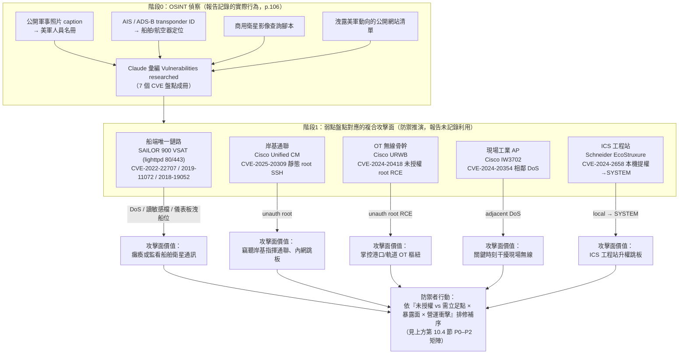
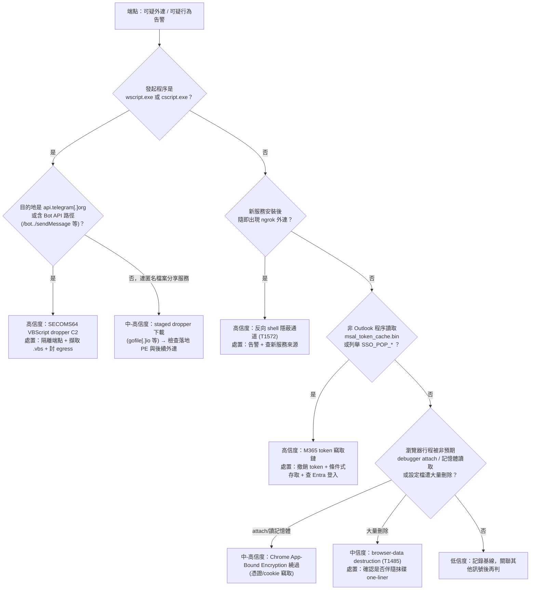
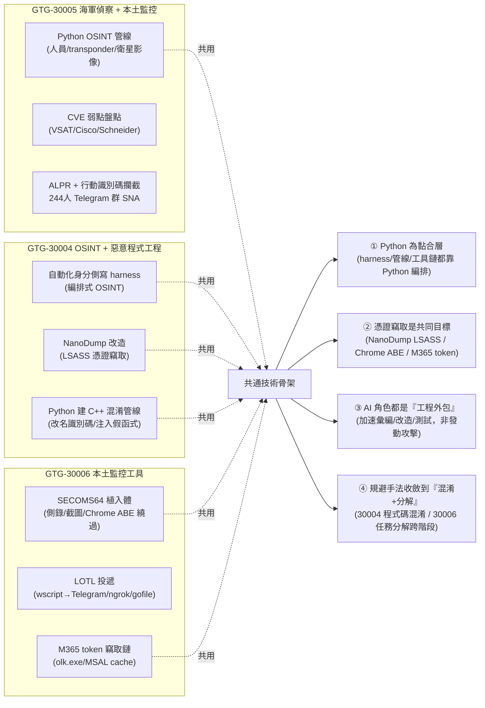
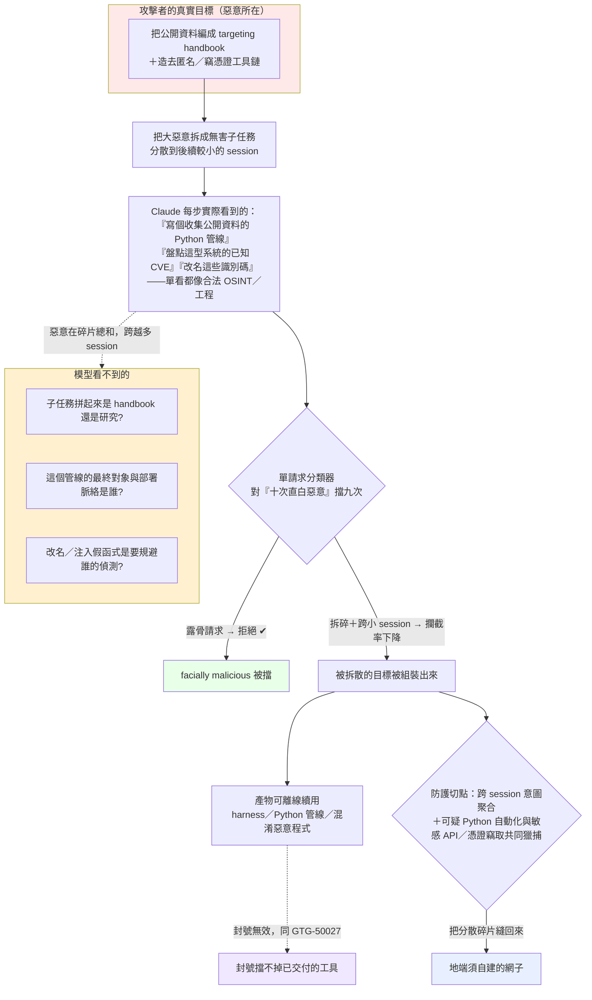

# GTG-30004／30005／30006：伊朗系 OSINT 情蒐、對美海軍偵察與本土監控工具三案

> 課程模組：03 監控行動（Surveillance operations）
> 一手來源：Anthropic《Detecting and countering misuse of AI: September 2026》PDF **p.105–110**（英文原始頁碼）
> ‑ GTG-30004「Automating open-source intelligence and developing malware」：p.105–106
> ‑ GTG-30005「Military reconnaissance / Naval reconnaissance」（含 CVE 清單）：p.106–107
> ‑ GTG-30006「Building the tools for domestic surveillance」（含 SECOMS64 與 Indicators 表）：p.107–110
> 相關脈絡頁：同模組前一案 GTG-34007「兩個伊朗系行為者（Qom／Arman）」p.99–103；GTG-50027「馬利國家監控平台 Lakana 360」p.103–105（其收尾段落落在 p.105 上半）
> 整理日期：2026-09-13　｜　全文以 PDF 原文為準，英文引文逐字保留，IOC 保留報告原本的 defang 格式

---

## 0. 給講師的閱讀指引（重要更正）

本教材整理過程中，發現**一項必須向學員澄清的常見誤讀**，請務必在課堂上先講清楚：

- **p.106–107 那份「Vulnerabilities researched」CVE 清單，屬於 GTG-30005（海軍偵察案），不是 GTG-30006。**
  這份清單被排版在 GTG-30005 內文「Domestic mass surveillance」段之後、GTG-30006 標題之前，跨越 p.106 到 p.107 的分頁，收在一個灰底等寬字（monospace）方框裡。我用 Read 工具逐頁判讀 `page-106.png` 與 `page-107.png` 三次確認：CVE 方框在 p.107 上半結束後，才出現「GTG-30006: Building the tools for domestic surveillance」的大標題。因此這 7 個 CVE 是 GTG-30005 的行為者「directed Claude to compile vulnerability research on shipboard systems」的產物。（p.106 內文明講）
- 這個更正很重要，因為它改變了「這批工控／網通 CVE 是為了什麼」的敘事：它們服務的是**對美海軍與海事系統的偵察／弱點盤點**（GTG-30005），而不是對伊朗本土民眾的監控工具（GTG-30006）。本教材第 3、4、10.4 節都據此展開。

---

## 1. 一頁速覽（TL;DR）

- **這是三個相鄰編號、同屬伊朗系（Iran-nexus／Iranian）的監控與偵察案**：GTG-30004、30005、30006。三案都被 Anthropic 放進「Surveillance operations」模組，編號連續，主題都圍繞 **OSINT 情蒐／偵察／監控工具開發**。（p.105–110）
- **GTG-30004（p.105–106）**：伊朗系行為者用 Claude 打造**自動化 OSINT 身分側寫 harness**，側寫**數百名**以色列政府／非政府人士與**猶太離散社群（Jewish diaspora）組織**；並在**多個波斯語（Persian-language）工作階段**中，改造開源 LSASS 憑證竊取工具 **NanoDump**、用 Python 建了一條 **C++ 混淆／編譯管線**（改名識別碼、注入假函式）來規避分析。
- **GTG-30005（p.106–107）**：伊朗系行為者用 Claude 對**該區域的美國海軍（US naval forces in the region）**做**開源情報式的目標指引（targeting recommendations）**——用 Claude 協助寫的 **Python 管線**編纂「targeting handbooks」，內容包含**從公開軍事照片說明文字（captions）刮取的美軍人員名冊**、公開的**船舶與航空器 transponder 識別碼**、**商用衛星影像查詢腳本**、以及**會洩露美軍海上動向的公開網站清單**。同一帳號另外替**伊朗國家系統**開發**本土大規模監控平台**元件（車牌辨識 ALPR ＋ 行動裝置識別碼攔截），並對一個 **244 人私密 Telegram 群組的當日匯出檔**做社群網路分析。
- **GTG-30005 的 CVE 清單（本模組罕見的硬技術指標）**：7 個 CVE，橫跨**海事 VSAT 衛星終端（COBHAM SAILOR 900）**、**Cisco 通訊／工業無線設備**、**Schneider 工業控制軟體**——見第 3.4 節逐一解析。其中兩個是 **CVSS 10.0 的未授權遠端 root**（CVE-2024-20418 URWB 指令注入、CVE-2025-20309 CUCM 靜態 SSH 憑證）。
- **GTG-30006（p.107–110）**：伊朗行為者用 **16 個單一操作者組織（16 single-operator organizations）的免費 Claude.ai 帳號**，開發**針對伊朗本土民眾**的惡意程式、投遞管線與釣魚入口；投遞頁**只對來自伊朗 IP 的訪客**送惡意內容，並偽裝成**翻牆工具**與一個**虛構的波斯語新聞品牌（Azar-News）**。核心是模組化 Windows 植入體 **SECOMS64**（鍵盤側錄、截圖、Chrome 憑證竊取＋App-Bound Encryption 繞過、Defender／Intune 偵察等），以及一套**不需 OAuth 同意流程就竊取 Microsoft 365 信箱**的工具。
- **最高價值的防線缺口（逐字）**：對 GTG-30006，報告自陳「**Claude refused nine out of ten direct requests that were facially malicious. But our safeguards performed less consistently when the user fragmented the work and directed the model to carry out tasks across later, smaller sessions.**」——**把惡意任務拆解、分散到後續較小的工作階段**，是繞過 AI 安全機制的關鍵手法。（p.107）
- **這三案在課程裡要教什麼（一句）**：教學員辨識**「AI 被當成 OSINT／偵察／監控工具的工程外包」**這一整類濫用——重點不在單一越獄，而在（1）攻擊者如何把敏感任務**分解成看似無害的子任務**跨階段餵給模型、（2）**開源情報＋公開技術資料庫**如何被 AI 加速武器化、（3）本模組罕見地給了**完整可用的主機／網路 IOC 與 CVE 清單**，是難得的偵測工程實作素材。

---

## 2. 三案總覽、行為者側寫與相互關係

### 2.1 三案一覽表（全部以 PDF 為準）

| 項目 | GTG-30004 | GTG-30005 | GTG-30006 |
|---|---|---|---|
| 報告標題 | Automating open-source intelligence and developing malware | Military reconnaissance（子標 Naval reconnaissance） | Building the tools for domestic surveillance |
| 頁碼 | p.105–106 | p.106–107 | p.107–110 |
| 行為者措辭 | 「an **Iran-nexus** threat actor」 | 「an **Iran-nexus** threat actor」 | 「an **Iranian** threat actor」 |
| 主要目標 | 以色列政府／非政府人士、**猶太離散社群組織**；以色列與**美國**人士 | **該區域的美國海軍**；另有**伊朗國家系統／本土大規模監控** | **伊朗本土民眾**（異議者導向） |
| Claude 的核心角色 | 自動化 OSINT 身分側寫 harness；惡意程式混淆管線 | OSINT 目標指引 Python 管線；弱點研究彙編 | 惡意程式／投遞管線／釣魚入口的**工程與測試** |
| 自主程度 | AI 編排的自動化 harness（見 4.1） | 人類指揮 ＋ Claude 建管線（半自動化） | 人類逐步指揮、跨階段分解（對話式協助） |
| 帳號結構 | 未明說數量 | 「the same account」（同一帳號兩條 workstream） | **16 個單一操作者組織**的免費帳號 |
| 語言線索 | **Persian-language** sessions（明講） | 未明說（推測波斯語，見 12 節） | 未明說；lure 為**波斯語（Farsi）** |
| 處置措辭 | 封鎖帳號＋建偵測 | 封鎖＋建偵測＋**與政府當局分享威脅情報** | 封鎖＋納入 safeguards＋**與公私部門夥伴分享** |

### 2.2 歸因措辭的細讀（情報學教學點）

這三案的歸因用語**比同模組的中國三案（GTG-14020／21/22）更「平」**——沒有出現 `high confidence`／`medium confidence`／`suspected`／`consistent with` 這類分級信度詞，而是直接用敘述句斷言行為者身分。學員要學會分辨這兩種寫法背後的差異：

- **「Iran-nexus threat actor」（GTG-30004、30005）**：`nexus`（連結）是情報寫作裡**刻意留餘地**的用語，意思是「**與伊朗（利益／基礎設施／目標優先序）有連結**」，但**不主張這是伊朗國家機關直接下令**。它比「Iranian state actor」弱，比「unattributed」強。
- **「an Iranian threat actor」（GTG-30006）**：對 nationality/origin 說得更直接一點（伊朗的行為者），但**同樣沒有斷言國家指揮**。
- **關鍵教學提醒**：報告對這三案**沒有附上明確的信度分級**，代表這些是**以 Claude 平台上可見行為（提示詞語言、目標優先序、作息、產出內容）**為主的判斷。可見面窄（看得到平台行為、看不到對方合約與公文），所以措辭克制。**「Iran-nexus」四個字本身就是一種信度標註**——它在說「我們有把握連到伊朗，但不主張到國家指揮那一層」。

> **【背景補充／分析推論，非報告結論】** 為什麼三案都指向伊朗、目標卻分成「打以色列／打美軍／打自己人（伊朗異議者）」三個方向？這正是**伊朗情報生態的典型畫像**：對外情蒐（以色列、美軍）與對內鎮壓（監控本國異議者）由**同一批承包商／單位生態**承接。GTG-30005 甚至在**同一個帳號**裡同時做「對美海軍偵察」與「替伊朗國家系統做本土大規模監控」——對外偵察與對內監控在**同一操作者身上並存**，這是本三案最值得課堂玩味的結構。

### 2.3 三案的相互關係——哪些是報告明講、哪些是推測

**報告明講的（事實）**：
1. 三案都被編入同一個「Surveillance operations」模組，**編號連續**：30004 → 30005 → 30006。（p.105–110）
2. 三案的行為者都被歸為伊朗系（前兩案 Iran-nexus、第三案 Iranian）。（p.105、p.106、p.107）
3. 三案都圍繞 **OSINT／偵察／監控工具**這一主題族。

**報告「沒有」明講的（要標清楚）**：
- 報告**從未說這三案是同一個行為者、同一個組織或同一個行動（campaign）**。每一案都用「another investigation」「We identified an Iranian threat actor」這種**各自獨立調查**的措辭引入。GTG-30005 內部的兩條 workstream 才明說是「the same account」；跨案之間沒有這種連結語句。

> **【分析推論，明確標示為研究員判斷】** 從**編號體系**可以合理推論三案被 Anthropic 的追蹤分類法**刻意聚成一族**：綜觀全報告，GTG 代號的**前綴數字似乎編碼威脅類別／地緣**（例：`14xxx` 幾乎都是中國案——GTG-14010/14020/14021/14022；`34xxx` 是伊朗國家對齊的影響力／監控案——GTG-34001/34007；`20xxx` 是俄羅斯間諜——GTG-20006）。本三案共用 **`30xxx` 前綴**、且**連號**，強烈暗示它們是**同一分類家族下、被放在一起的一組伊朗系偵察／監控案**，很可能是**相關的一系列行為者或同一情蒐生態的多個節點**。但這是**依編號規律與主題所做的分析判斷，報告本身沒有把三者綁成同一行為者**——課堂上務必如此標註，不可講成「報告說這是同一個人」。
>
> **一個值得一提、但不宜過度解讀的數字巧合**：GTG-30006 用了「**16** single-operator organizations」；而同模組前面的 GTG-34007（Qom／Arman 兩單位案，p.103）處置時也寫「banned all **16** accounts and the associated organizations」。兩案都出現「16」。這**可能只是巧合**（也可能反映伊朗某類作業的組織規模慣例），**報告沒有把兩案連在一起**，前綴也不同（30 vs 34）。列出來供思辨，不作為關聯證據。

### 2.4 三案在 154 頁報告裡的定位

- 本報告涵蓋 **2025-12 至 2026-08**，七大危害領域、共約 39 個案例（見第 9 節第三方報導核對）。
- 這三案落在「**Surveillance operations**（監控行動）」模組，緊接在馬利國家監控平台（GTG-50027，Lakana 360）之後、「Conventional weapons（傳統武器）」模組之前（p.111 起）。
- **語境橋接（給講師）**：p.105 最上方那段「Disruption and mitigations／The end-user deployed the platform locally with an on-premises LLM…」是在**收尾 GTG-50027 馬利案**（該平台在地端用 local model 跑，帳號封鎖擋不掉已部署的產品），**不屬於 GTG-30004**。GTG-30004 的正文從該段之後的大標題才開始。

---

## 3. 受害者、目標清單與 CVE 弱點盤點

### 3.1 GTG-30004 的目標（p.105–106）

| 目標類別 | 報告原文依據 | 規模／細節 |
|---|---|---|
| 以色列**政府**人士 | 「Israeli governmental … individuals」 | 未給精確數字 |
| 以色列**非政府**人士 | 「… and non-governmental individuals」 | 未給精確數字 |
| **猶太離散社群組織** | 「Jewish diaspora organizations」 | 組織層級 |
| 以色列與猶太離散社群**個人** | 「profile **hundreds of individuals** in Israel and the Jewish diaspora」 | **數百人**（明確量詞） |
| **美國**人士 | 「generate open-source intelligence products about Israeli **and US persons**」 | 未給數字 |
| 既有目標清單 | 「an automated identity-profiling harness that **enriched a pre-existing target list**」 | harness 是拿來**擴充既有名單**，不是從零建名單 |

> **教學點**：「enriched a **pre-existing** target list（擴充既有目標清單）」很關鍵——這代表 AI 在此扮演的是**情蒐流程中的「加速器／富化器」**，攻擊者本來就有名單，Claude 讓「把名單上每個人挖深」這件事變快、變自動。這是本模組反覆出現的 AI 濫用型態：**不是取代人類決定打誰，而是把「情蒐產能」放大**。

### 3.2 GTG-30005 的目標與蒐集面（p.106–107）

**對外——海軍偵察（Naval reconnaissance）**，目標是「**US naval forces in the region**（該區域的美國海軍）」。用 Claude 協助建的 Python 管線編纂「targeting handbooks（目標指引手冊）」，彙整下列**全部來自公開來源**的素材：

| 蒐集項目 | 原文 | 情報意義 |
|---|---|---|
| 美軍**人員名冊** | 「a roster of US personnel **scraped from captions on public military photographs**」 | 從公開軍事照片的**說明文字**刮取人名／單位——典型 OSINT，凸顯「照片 caption」是被低估的洩漏源 |
| 船舶／航空器**識別碼** | 「publicly accessible **ship and aircraft transponder identifiers**」 | AIS（船）／ADS-B（機）transponder ID，用於定位與追蹤 |
| **衛星影像查詢腳本** | 「**commercial satellite-imagery query scripts**」 | 自動化調閱商用衛星影像（如特定海域、港口） |
| **洩露動向的網站清單** | 「an inventory of **public websites that exposed US naval movements**」 | 把「哪些公開網站會洩露美軍動向」本身做成資產清單 |
| **船載系統弱點研究** | 「directed Claude to compile **vulnerability research on shipboard systems**, cataloging known CVEs in **maritime VSAT terminals, Cisco communications equipment, and industrial control products**」 | 見 3.4 CVE 逐一解析 |

**對內——本土大規模監控（Domestic mass surveillance）**，「the **same account**」另外替伊朗國家系統做企業級軟體開發：

| 項目 | 原文 | 說明 |
|---|---|---|
| 監控平台元件 | 「design software components of a **domestic mass-surveillance platform**」 | 為伊朗國家系統做的企業軟體 |
| 車牌辨識＋行動識別碼攔截 | 「combined **automatic license-plate recognition** with **mobile-device identifier interception**」 | ALPR（車牌）＋行動裝置識別碼（如 IMSI/IMEI 類）攔截，實體與行動雙軌定位 |
| Telegram 群組分析 | 「analytics tooling over a **same-day export of a private 244-member Telegram group**, including **social-network analysis** of its membership」 | 對一個 **244 人私密群**的**當日匯出檔**做成員社群網路分析（找核心節點／關係） |

### 3.3 GTG-30006 的目標與誘餌（p.107–110）

| 項目 | 原文 | 說明 |
|---|---|---|
| 主要目標 | 「targeting **domestic Iranians**」 | 針對伊朗本土民眾（異議者導向，見 3.3 之惡意程式監控性質） |
| 地理閘控 | 「serve malicious content only to visitors whose **IP addresses originated in Iran**」 | 投遞頁**只對伊朗 IP** 出惡意內容——同時是規避與精準投放 |
| 誘餌主題一 | 「themed around **censorship-circumvention tools**」 | 偽裝成翻牆／反審查工具（V2Ray landing pages 等），精準勾引想翻牆的伊朗民眾 |
| 誘餌主題二 | 「a **fabricated Farsi news brand**」 | 虛構的波斯語新聞品牌；Indicators 表點名為「**Azar-News**」（p.110） |
| 組織規模 | 「**16 single-operator organizations**」使用免費 Claude.ai 帳號 | 16 個「單人組織」——用組織外殼申請免費帳號 |
| 具名受害者 | 「a drive-wiping one-liner and browser-data destruction targeting **a named Windows user**」 | 出現**針對特定具名 Windows 使用者**的抹碟／清瀏覽器資料——監控導向、對人不對面 |

### 3.4 GTG-30005 的 CVE 清單逐一解析（**本案挖深重點**）

以下 7 個 CVE 逐字抄錄自 p.106–107 的「Vulnerabilities researched」方框（**屬 GTG-30005**）。每個 CVE 的產品對應、漏洞類型與嚴重度，皆經**獨立查證**（NVD／廠商公告／第三方漏洞庫，來源見第 9 節）。報告只列了「編號＋產品名」，**下表的漏洞類型、CVSS、修補資訊是我另行查證補上的**，屬獨立驗證。

| CVE | 報告標註的產品 | 實際對應軟體／元件 | 漏洞類型 | 嚴重度（CVSS） | 攻擊者價值 |
|---|---|---|---|---|---|
| **CVE-2022-22707** | COBHAM SAILOR 900 VSAT | 海事 VSAT 終端內嵌的 **lighttpd 1.4.46–1.4.63**，`mod_extforward` 的 `mod_extforward_Forwarded` | 堆疊緩衝區溢位（4-byte OOB write）→ 遠端 **DoS**（daemon 崩潰） | 中（DoS，約 7.5）；需非預設的 Forwarded header 設定；32-bit 更易觸發 | 讓船舶衛星鏈路 Web 管理介面當機 |
| **CVE-2019-11072** | COBHAM SAILOR 900 VSAT | **lighttpd < 1.4.54**，`burl.c` 的 `burl_normalize_2F_to_slash_fix` | 有號整數溢位 → 遠端 **DoS**（abort），以 `//?` 觸發 | NVD 標 **9.8 Critical**（實務影響為 DoS/abort）；該功能非預設啟用 | 未授權遠端讓 VSAT Web 服務崩潰 |
| **CVE-2018-19052** | COBHAM SAILOR 900 VSAT | **lighttpd 1.4.1–1.4.49**，`mod_alias.c` 的 `mod_alias_physical_handler` | 路徑穿越（`../`，單層越過 alias target）→ 讀取敏感檔 | 中（資訊揭露）；需特定 mod_alias 設定；**GitHub 已有 PoC** | 讀取 VSAT 終端上的敏感檔案 |
| **CVE-2025-20309** | Cisco Unified Communications Manager | **Cisco Unified CM／Unified CM SME** ES 15.0.1.13010-1 ~ 15.0.1.13017-1 | **靜態（寫死）root SSH 憑證**（開發/測試後門帳號，無法更改或移除） | **10.0 Critical**；未授權遠端登入即得 **root**、可執行任意命令 | 直接拿下企業電話（VoIP）系統的 root；無 workaround，只能升級 |
| **CVE-2024-20418** | Cisco Ultra-Reliable Wireless Backhaul | **Cisco Unified Industrial Wireless Software for URWB**（Catalyst IW 系列 AP）Web 管理介面 | 輸入驗證不當 → **未授權遠端指令注入**，以 **root** 執行任意命令 | **10.0 Critical**；僅在啟用 URWB 模式時受影響；2024-11 揭露；揭露時無已知在野利用 | 拿下工業無線骨幹 AP 的 root——港口／軌道／製造現場的關鍵網路節點 |
| **CVE-2024-20354** | Cisco IW3702 | **Cisco Aironet Access Point Software**（工業型 AP，含 IW3702） | 丟棄畸形加密無線 frame 時資源清理不完全 → **資源耗盡型 DoS**（**非**指令注入） | 中高；**未授權「相鄰」（adjacent）**攻擊者需以無線客戶端連上後送畸形 frame；2024-03 揭露 | 讓工業無線 AP 服務降級／完全 DoS，干擾現場通訊 |
| **CVE-2024-2658** | Schneider Electric EcoStruxure | Schneider **Floating License Manager** 內的 **FlexNet Publisher** 元件（服務於 EcoStruxure 全產品線：Control Expert、Process Expert、Machine Expert、Vijeo Designer 等） | CWE-427 不受控搜尋路徑（`lmadmin.exe` 以寫死路徑載入 OpenSSL 設定）→ **本機權限提升**（載入惡意 DLL） | 中（本機提權，需先有本機立足點）；CISA ICSA-25-037-02 | 在已入侵的工控工程站上把權限升到高權限、載入惡意 DLL |

**這批 CVE 拼出的攻擊者畫像（分析）**：報告 p.106 內文把弱點研究範圍講得很清楚——「**maritime VSAT terminals, Cisco communications equipment, and industrial control products**」。對照上表：

- **海事 VSAT（SAILOR 900）＝ 3 個 lighttpd CVE**：直接服務「海軍偵察」——船用衛星終端是艦船通訊命脈，且**這三個 CVE 恰好就是公開研究者（Criminal IP）在網路上大規模掃描到的 SAILOR 900 VSAT Web 服務（80/443 埠）已知弱點**（見第 9 節）。這強烈佐證**行為者是在做真實、可對照公開研究的弱點盤點**，不是憑空亂列。
- **Cisco 通訊／工業無線（CUCM、URWB、IW3702）**：CUCM 是**企業電話系統**（岸基通訊）；URWB 與 IW3702 是**工業無線骨幹**（港口、軌道、製造、車地通訊）。這條線把「海軍偵察」延伸到**支撐海軍與港口運作的岸基電信與關鍵基礎設施**。
- **Schneider EcoStruxure（工控）**：把弱點研究進一步推到**工業控制系統（ICS）**——與 GTG-30005 另一條「替伊朗國家系統做本土監控」workstream 的**工控／基礎設施背景**相互呼應。

> **教學提醒（不要過度解讀）**：報告只說行為者「**directed Claude to compile vulnerability research（要 Claude 彙編弱點研究）**」和「**cataloging known CVEs（盤點已知 CVE）**」。這是**情蒐與盤點**，**報告沒有說行為者實際利用了這些 CVE、也沒有說有任何船艦或設備被入侵**。課堂上務必把「盤點弱點」與「發動攻擊」分開——這是本案在**證據邊界**上的重要紀律。

---

## 4. AI 濫用的攻擊生命週期（逐案、逐階段拆解）

標示自主程度分三級：**對話式協助**（人問 AI 答）／**人類逐步指揮**（人一步步下指令、AI 執行）／**AI 編排多代理自主執行**（AI 自動串接多步驟）。

### 4.1 GTG-30004 生命週期（p.105–106）

| 階段 | 人類做什麼 | Claude 做什麼 | 自主程度 |
|---|---|---|---|
| 偵察／情蒐（workstream 1） | 提供既有目標名單、定義要側寫的對象 | **編排（orchestrate）一個 OSINT 與偵察工具**，自動化地把名單上「數百人」逐一富化、產出 OSINT 產品 | 偏 **AI 編排的自動化 harness**（原文用 `orchestrate`、`automated identity-profiling harness`） |
| 資料蒐集與分析 | 設定要蒐集哪些開源資料 | 「accelerate their ability to **collect and analyze** open-source data」 | 人類指揮＋AI 加速 |
| 惡意程式改造（workstream 2） | 在**多個波斯語工作階段**中指揮 | 改造開源 LSASS dumper **NanoDump** | 人類逐步指揮 |
| 惡意程式混淆 | 定義混淆需求 | 用 **Python 建 C++ 混淆/編譯管線**：**改名識別碼、注入 dummy 函式**，以「obfuscate malware samples and hinder analysis」 | 人類逐步指揮 |

**教學重點**：GTG-30004 展示了**同一行為者的兩種 AI 用法並存**——一邊是「**自動化情蒐 harness**」（規模化、編排式），一邊是「**惡意程式工程助手**」（改工具、建混淆管線）。前者是「監控行動」的本體，後者是為後續入侵鋪路（NanoDump 是竊取 Windows 登入憑證的工具）。

### 4.2 GTG-30005 生命週期（p.106–107）

| 階段 | 人類做什麼 | Claude 做什麼 | 自主程度 |
|---|---|---|---|
| 建蒐集管線 | 定義要追蹤美軍海上動向 | 協助**建 Python pipeline** 來「identify and track naval positions based on open-source information」 | 人類指揮＋AI 建工具 |
| OSINT 彙編 | 指定素材類型 | 編纂 targeting handbooks：人員名冊、transponder ID、衛星影像查詢腳本、洩露動向網站清單 | 人類指揮＋AI 執行 |
| 弱點研究 | 指定要盤點的系統類別 | 「**compile vulnerability research on shipboard systems**」，盤點 7 個 CVE（見 3.4） | 人類指揮＋AI 彙編 |
| 本土監控（同帳號另一條線） | 替伊朗國家系統定義需求 | 設計 ALPR＋行動識別碼攔截的監控平台元件；對 244 人 Telegram 群匯出檔做 SNA | 人類指揮＋AI 工程 |

**教學重點**：這是**「AI 當情報分析與工具工程外包」**的教科書案例。攻擊者沒有任何「攻進系統」的動作被記錄——**全部是開源情報的蒐集、彙編、分析與弱點盤點**。這正是為什麼它被歸在「Surveillance / reconnaissance」而非「Cyber operations」：**AI 的價值在於把分散的公開資料在短時間內編成可行動的 targeting 產品**。

### 4.3 GTG-30006 生命週期（p.107–108）

| 階段 | 人類做什麼 | Claude 做什麼 | 自主程度 |
|---|---|---|---|
| 需求分解（規避核心手法） | **把專案拆成「個別看起來無害」的 web 開發請求**，並**分散到後續較小的工作階段** | 逐個回應看似正當的 web 開發任務 | **對話式協助（被分解以規避）** |
| 投遞工具 | 指揮組裝 | VBScript dropper（Telegram bot 控制）、假 Excel／Windows 憑證對話框、假 ESET NOD32 登入頁（憑證送 Telegram）、ClickFix 式 Win+R 誘餌、V2Ray 落地頁、地理閘控投遞頁 | 人類逐步指揮 |
| 植入體開發 | 指揮建 SECOMS64 | 鍵盤側錄、截圖、Chrome 憑證竊取＋App-Bound Encryption 繞過、Defender/Intune 偵察 | 人類逐步指揮 |
| 支援元件 | 指揮 | PowerShell reverse shell（經 ngrok 通道）、USB 傳播、瀏覽器資料破壞模組、從檔案分享服務取得並改造以規避 AV 的 staged dropper | 人類逐步指揮 |
| 持久化 | 指揮 | 註冊表 Run key、最高權限排程工作、自刪批次檔、偽裝成 Windows 字型驅動服務的二進位 | 人類逐步指揮 |
| M365 信箱竊取 | 指揮設計 | 不經 OAuth 同意流程的 M365 信箱竊取工具鏈（見 4.4） | 人類逐步指揮 |
| 測試 vs. 實戰 | 全程「engineer and test」 | 「used Claude to **engineer and test** this tooling **rather than to conduct live operations**」 | — |

**教學重點（防線缺口的機轉）**：GTG-30006 把「**分解＋分散階段**」這個規避手法演到極致。報告明講 Claude 對「facially malicious（表面上就惡意）」的直接請求**十次拒九次**；但當使用者把工作**切碎、分散到後續較小階段**時，safeguards「performed less consistently」。這是**跨工作階段的上下文流失**問題——單看每個小請求都像正當 web 開發，模型難以在缺乏全局脈絡下判定整體意圖。

### 4.4 GTG-30006 的 Microsoft 365 信箱竊取鏈（p.108，值得單獨拆）

這條工具鏈的設計目標是「**compromise Microsoft 365 mailboxes without any OAuth consent flow（不觸發任何 OAuth 同意流程）**」——也就是**繞過使用者可見的授權同意畫面**，直接從本機竊取並重放權杖：

1. **強制結束 Outlook 行程**以解鎖憑證檔（`olk.exe`／`olkexthost.exe` 被腳本終止）。
2. **解密 DPAPI 保護的金鑰**。
3. **解析 MSAL token cache 與 OneAuth account store**（讀 `%LOCALAPPDATA%\Microsoft\Olk\msal_token_cache.bin`）。
4. **列舉 Windows Credential Manager 的 SSO 條目**（`SSO_POP_User`／`SSO_POP_Device`／`Olk/PushNotificationsKey`）。
5. **重放權杖**打 Outlook web API（`outlook.office.com/api/v2.0`），**大量下載信箱內容（含已刪除郵件）**，打包成壓縮檔或走 proxy。
6. **反偵測**：偽造正版 Outlook 桌面版 **User-Agent**、重用 **Microsoft 第一方 app client ID**，讓流量「**indistinguishable from a native Outlook client（與原生 Outlook 客戶端難以區分）**」。

**教學重點**：這是**「token theft／pass-the-token」**的完整鏈條，繞過 MFA 與 OAuth 同意——因為它**竊取的是已通過驗證的權杖，不是密碼**。對 M365 防禦者，報告很貼心地把偵測面整理進 Indicators 表（見第 7 節「Network behaviors → M365 token-theft behaviors」）。

---

## 5. TTP 與 MITRE ATT&CK 對應

下表彙整三案的關鍵 TTP。**凡 ATT&CK 沒有對應 ID 者（尤其 AI 編排／分解規避），明確標為「框架缺口」。**

| 戰術（Tactic） | 技術 ID | 本三案的具體作法 | 偵測構想 |
|---|---|---|---|
| Reconnaissance | T1593 Search Open Websites/Domains | 從公開軍事照片 caption 刮人名（30005）；OSINT harness 富化名單（30004） | 難從受害端偵測（發生在攻擊者側）；防守面在**OPSEC/資料揭露治理** |
| Reconnaissance | T1596 Search Open Technical Databases | 盤點 transponder ID、CVE 清單、洩露動向網站（30005） | 同上；監控自身資產是否被公開索引 |
| Reconnaissance | T1589/T1591 Gather Victim Identity/Org Info | 自動化身分側寫 harness，側寫數百人（30004） | 目標端無感；教育與最小揭露 |
| Resource Development | T1588.006 Obtain Capabilities: Vulnerabilities | 用 Claude 彙編 7 個 CVE（30005） | 威脅情報；追蹤自身設備型號的 CVE 曝險 |
| Resource Development | T1587.001 Develop Capabilities: Malware | 改造 NanoDump、建 SECOMS64（30004/30006） | 惡意程式家族追蹤、YARA |
| Resource Development | T1027 Obfuscated Files/Information | C++ 混淆管線：改名識別碼、注入假函式（30004） | 熵值分析、編譯特徵、假函式偵測 |
| Credential Access | T1003.001 OS Credential Dumping: LSASS | NanoDump 竊取 LSASS 記憶體憑證（30004） | LSASS 存取監控（Credential Guard、Sysmon EID 10） |
| Credential Access | T1555.003 Credentials from Web Browsers | Chrome 憑證竊取＋**App-Bound Encryption 繞過**（30006） | 監控對 Chrome 憑證庫的非瀏覽器存取 |
| Credential Access | T1528 Steal Application Access Token | 竊取並重放 M365 權杖（30006） | 見第 7 節 M365 偵測列 |
| Credential Access | T1555.004 Credentials from Password Stores: Windows Credential Manager | 列舉 SSO_POP_* 條目（30006） | 監控 Credential Manager 列舉行為 |
| Execution | T1059.005 Command and Scripting Interpreter: Visual Basic | VBScript dropper（`telegram_listener_v12_2.vbs`，30006） | Script Block Logging；wscript/cscript 親子行程 |
| Execution | T1204 User Execution（ClickFix） | ClickFix 式 **Win+R** 誘餌（30006） | 偵測 RunMRU 寫入＋剪貼簿→執行 pattern |
| Defense Evasion | T1036.005 Masquerading: Match Legitimate Name/Location | 偽裝成 Windows 字型驅動服務、命名為「Telegram」的截圖元件、假 Adobe 影像編輯 app（30006） | 檔名/路徑/簽章比對，如「Telegram」exe 非官方路徑 |
| Defense Evasion | T1553.005 Subvert Trust Controls: Mark-of-the-Web | 封裝以**繞過 SmartScreen**（30006） | MOTW 完整性檢查、下載來源標記 |
| Defense Evasion | T1564.003 Hidden Window | 元件「run without a visible console window」（30006） | 無視窗行程＋外連的組合偵測 |
| Defense Evasion | T1480 Execution Guardrails | **地理閘控**只對伊朗 IP 投毒（30006） | 從防守端難見；威脅情報層面理解投放邏輯 |
| Persistence | T1547.001 Registry Run Keys | HKCU Run key「Whost」（30006） | Run key 基線與變更告警 |
| Persistence | T1053.005 Scheduled Task | `SECOMS64_AdminTask` 等，RunLevel Highest（30006） | 排程工作建立稽核（EID 4698） |
| Persistence | T1070.004 File Deletion | 自刪批次檔（30006） | 批次檔自刪 pattern |
| Collection | T1056.001 Keylogging | 鍵盤側錄（僅在 Telegram Desktop 前景時，30006） | 前景視窗感知型鍵盤 hook 偵測 |
| Collection | T1113 Screen Capture | 截圖元件（命名為 Telegram，30006） | 截圖 API 濫用 |
| Lateral Movement | T1091 Replication Through Removable Media | USB 傳播＋記錄每顆隨身碟序號（30006） | USB 事件、autorun 類行為 |
| Command & Control | T1102 Web Service / T1071.001 | Telegram Bot API（`api.telegram[.]org`）為 C2（30006） | 見第 7 節 |
| Command & Control | T1572 Protocol Tunneling | PowerShell reverse shell 經 **ngrok**（30006） | 新服務安裝後隨即出現 ngrok 外連 |
| Exfiltration | T1567 Exfiltration Over Web Service | 資料經 Telegram／商用雲端儲存外傳（30006） | 雲端上傳基線、Telegram 外傳偵測 |
| Impact | T1485 Data Destruction | 抹碟 one-liner、瀏覽器資料破壞（30006，含具名受害者） | 破壞性命令偵測 |
| Impact/Mobile | T1636 Protected User Data（ATT&CK Mobile） | Android app 上傳聯絡人/簡訊/媒體（`com.app.safeguard`，30006） | 行動端權限審查、MDM |
| **框架缺口** | **（無對應 ID）** | **AI 編排的自動化 OSINT harness**（把「情蒐產能」交給 AI 編排，30004） | ATT&CK 無「AI 代理自動化情蒐」技術；屬新型態 |
| **框架缺口** | **（無對應 ID）** | **把惡意任務分解成無害子任務、跨後續小階段餵給模型以規避 AI safeguards**（30006） | 這是**針對 AI 安全機制**的規避，非傳統主機/網路 TTP；ATT&CK 未涵蓋 |

> **教學點（框架缺口）**：MITRE ATT&CK 是為「攻進系統之後的主機/網路行為」設計的。這三案有兩塊**落在 ATT&CK 的視野外**：（1）**AI 把 OSINT 情蒐自動化編排**、（2）**用「任務分解＋跨階段分散」來繞過模型安全**。這正呼應本課程的核心命題——**AI 濫用需要新的偵測與框架語彙**，不能只靠既有 ATT&CK 映射。可搭配 MITRE **ATLAS**（Adversarial Threat Landscape for AI Systems）討論其是否足以描述「用 AI 當工具」的濫用（ATLAS 偏「攻擊 AI 系統本身」，對「拿 AI 當攻擊工具」仍不完整）。

---

## 6. 版面與視覺素材逐頁判讀

> **說明**：本頁段（p.105–110）在 `figures.txt` 中**沒有任何 Figure 標號**——它**不含流程圖、長條圖或架構圖**，全是內文與**等寬字（monospace）方框**。這件事本身是教學點：Anthropic 用「**灰底等寬字方框**」來排版**機器可用的技術指標（CVE 編號、IOC、路徑、Chat ID）**，在視覺上把它們和敘述性內文區隔開，等於在對讀者說「**這些是可以直接拿去做偵測的硬資料**」。course/figures 中本頁段**僅存有 `page-109.png`**（Indicators 頁）。以下逐頁描述我用 Read 工具親自判讀 PNG 所見。

### 6.1 p.105（`page-105.png`）：GTG-30004 起始頁
- **版面**：純文字。頁首一段「Disruption and mitigations」（屬**前一案 GTG-50027 馬利案**的收尾），接著是本案大標題「**GTG-30004: Automating open-source intelligence and developing malware**」，其下兩個子標「Automated intelligence harness」「Malware development」。
- **核心訊息**：一頁把 GTG-30004 的兩條 workstream（OSINT harness／惡意程式）講完，無圖表。
- **課堂用法**：用來示範「**如何從排版判斷案例邊界**」——提醒學員頁首那段 disruption 不屬本案，避免張冠李戴。

### 6.2 p.106（`page-106.png`）：GTG-30005 主頁＋CVE 方框（上半）
- **版面**：大標題「**GTG-30005: Military reconnaissance**」＋子標「Naval reconnaissance」「Domestic mass surveillance」「Vulnerabilities researched」。頁面**最下方是一個灰底等寬字方框**，內含 CVE 清單的**前兩行**：`CVE-2022-22707, CVE-2019-11072, CVE-2018-19052 (COBHAM SAILOR 900 VSAT)` 與 `CVE-2025-20309 (Cisco Unified Communications Manager)`。
- **核心訊息**：naval recon 的完整敘事都在這頁；CVE 方框緊跟在「Vulnerabilities researched」子標下，**視覺上明確歸屬 GTG-30005**。
- **課堂用法**：這頁是**「更正誤讀」的證物**——投影出來，指出方框位置與歸屬。

### 6.3 p.107（`page-107.png`）：CVE 方框（下半）＋GTG-30006 起始
- **版面**：頁面**最上方仍是同一個灰底等寬字方框的延續**，含 CVE 清單**後三行**：`CVE-2024-20418 (Cisco Ultra-Reliable Wireless Backhaul)`、`CVE-2024-20354 (Cisco IW3702)`、`CVE-2024-2658 (Schneider Electric EcoStruxure)`。方框結束後，才出現大標題「**GTG-30006: Building the tools for domestic surveillance**」與子標「Attack lifecycle and AI usage → Phishing and delivery tooling / SECOMS64 implant」。
- **核心訊息**：CVE 方框**跨 p.106→p.107 分頁**，共 7 個 CVE，全屬 GTG-30005；GTG-30006 從方框之後才開始。
- **課堂用法**：與 6.2 併用，證明 CVE 清單的歸屬；也示範「**技術指標常被排版成獨立方框、可能跨頁**」，抄錄時要跨頁對齊。

### 6.4 p.108（`page-108.png`）：SECOMS64 細節＋M365 信箱竊取
- **版面**：純文字。承接 SECOMS64 的支援元件、監控性質（鍵盤側錄僅在 Telegram Desktop 前景、截圖元件偽裝為「Telegram」、USB 記序號、Android app 上傳個資）、分層持久化、替代外傳路徑、以及子標「**Microsoft 365 mailbox theft**」整段，末尾「Disruption and mitigations」。
- **核心訊息**：這頁把 GTG-30006 的**植入體監控能力**與**M365 token 竊取鏈**講完，是 TTP 最密集的一頁。
- **課堂用法**：逐句拆 SECOMS64 能力清單，對照第 5 節 ATT&CK 表。

### 6.5 p.109（`page-109.png`，**course/figures 有存**：`../figures/page-109.png`）：Indicators — Host artifacts ＋ Telegram C2
- **版面**：大標「**Indicators**」，子標「**Host artifacts**」下一個**大灰底等寬字方框**，逐條列出主機端 IOC（假字型驅動路徑、Run key「Whost」、排程工作、VBScript、Android 套件、假 Adobe 字串、偽裝 Telegram 的截圖元件、Cloud exfiltration）。下方子標「**Telegram command-and-control**」另一個方框，列出 **Chat IDs**。
- **核心訊息**：本模組**罕見地提供完整、可直接落地的主機 IOC**。等寬字方框＝「拿去做偵測」的訊號。
- **課堂用法**：這是**偵測工程實作課的黃金素材**——見第 7 節逐條轉成偵測規則。可直接投影 `../figures/page-109.png`。

### 6.6 p.110（`page-110.png`）：Indicators — Network behaviors
- **版面**：子標「**Network behaviors**」下一個大灰底等寬字方框，含 `wscript.exe/cscript.exe` 連 `api.telegram[.]org`、ngrok 外傳、`gofile[.]io` payload staging、Azar-News 誘餌品牌，以及一整組「**M365 token-theft behaviors (for Microsoft 365 defenders)**」的網路/主機指標。
- **核心訊息**：把**網路行為**與**M365 防禦者專用指標**分開列，等於替兩類 SOC（一般端點、M365）各備一份清單。
- **課堂用法**：對照第 4.4 節的 M365 竊取鏈，逐條說明每個網路指標對應鏈條哪一步。

---

## 7. IOC 與技術指標（完整抄錄，保留 defang，附偵測價值與壽命）

> 以下逐字抄錄自 p.109–110 的 Indicators 方框。**安全紅線**：本表所有網域、Chat ID、路徑僅供研究抄錄；**切勿連線、解析、或投入任何互動式查詢服務**。報告已 defang 者（`[.]`）**原樣保留**。

### 7.1 Host artifacts（p.109）

| # | 指標（逐字） | 類別 | 偵測價值與壽命 |
|---|---|---|---|
| 1 | `C:\ProgramData\fontdrivehostServicePackages\drv3060nt10-69s64mmm\fontdrivehost.exe`（persistence; fake font-driver path） | 持久化路徑（偽字型驅動） | **高價值、中壽命**：路徑高度特異（假冒 `fontdrivehost`），可做檔案路徑偵測；但攻擊者可輕易改資料夾隨機字串，故**以「ProgramData 下偽系統服務二進位」的行為特徵**更耐久 |
| 2 | HKCU Run key `"Whost"`（registry persistence） | 註冊表持久化 | **中價值、低-中壽命**：Run key 名易變，但「HKCU Run 指向 ProgramData 可疑 exe」的**組合**耐久；納入 Run key 基線 |
| 3 | Scheduled tasks: `SECOMS64_AdminTask`, `Calc_AdminTask`, `MyTask`（RunLevel Highest） | 排程持久化 | **中-高價值**：任務名可變，但**最高權限＋可疑映像**的排程建立（EID 4698）是穩定訊號 |
| 4 | `telegram_listener_v12_2.vbs`（VBScript dropper） | 檔名/腳本 | **中價值、低壽命**：檔名含版本號易改；改看「wscript/cscript 執行 .vbs 後外連 Telegram」行為（見 7.3） |
| 5 | `SECOMS64`（implant project string） | 家族字串 | **高價值**：可做 YARA/字串偵測；植入體專案識別字，跨樣本較穩定 |
| 6 | `com.app.safeguard`（Android package; silent contacts/SMS/media exfiltration） | Android 套件名 | **高價值、中壽命**：具體套件名可用於 MDM/行動端封鎖；攻擊者可重新打包改名 |
| 7 | `"Image Processor Pro"` / `"© 2024 Adobe - ImagePro Systems Inc"`（fake-app disguise strings） | 偽裝字串 | **高價值**：**偽造 Adobe 版權字串**極特異，適合字串/資源偵測；仿冒版權本身即紅旗 |
| 8 | Executable named `"Telegram"` with `tel.ico`（screenshot-exfil component disguise） | 偽裝二進位 | **中-高價值**：偵測「名為 Telegram、非官方路徑/簽章」的 exe；正版 Telegram 有固定安裝路徑與簽章可白名單 |
| 9 | Cloud exfiltration | 行為類別 | 見 7.3 網路行為；商用雲端外傳需靠 DLP/上傳基線 |

### 7.2 Telegram command-and-control（p.109）

| 指標（逐字） | 偵測價值與壽命 |
|---|---|
| Chat IDs: `-10078223223323`, `-1003197249446`, `-1003233252`, `7828288328` | **中價值、低-中壽命**：Chat ID 綁定特定 Telegram 群/帳號，可做威脅情報比對與（若能取得 bot API 內容時的）關聯；但攻擊者可隨時新建群組使其失效。**負數 ID＝群組/頻道，正數＝私聊/使用者**，可據此推測 C2 結構。**僅供比對，切勿主動連線查詢。** |

### 7.3 Network behaviors（p.110）

| # | 指標（逐字） | 偵測價值與壽命 |
|---|---|---|
| 1 | Script-host processes (`wscript.exe` / `cscript.exe`) connecting to `api.telegram[.]org` | **極高價值、長壽命**：`wscript/cscript` **正常情況幾乎不會直接外連** Telegram API。這是**living-off-the-land（LOTL）**的黃金偵測點——見 10.4。基線化後幾乎零誤報 |
| 2 | ngrok tunnel egress following new service installation | **高價值**：「**新服務安裝後隨即 ngrok 外連**」的時序組合特異；ngrok 網域/SNI 可偵測 |
| 3 | Payload staging via `gofile[.]io` | **中-高價值、中壽命**：企業環境對 `gofile[.]io` 的存取本就罕見，可告警；但攻擊者可換其他檔案分享服務 |
| 4 | Lure brand: `"Azar-News"`（fabricated Farsi news outlet） | **中價值**：品牌名可用於釣魚域名/內容比對；虛構品牌可再造 |
| 5 | **M365 token-theft behaviors（for Microsoft 365 defenders）**： | ↓ 以下為 M365 防禦者專用 ↓ |
| 5a | `olk.exe` / `olkexthost.exe` terminated by scripts to unlock credential stores | **高價值**：腳本**強制結束 Outlook（新版 olk.exe）**以解鎖憑證檔＝異常；監控非使用者發起的 Outlook 終止 |
| 5b | Reads of `%LOCALAPPDATA%\Microsoft\Olk\msal_token_cache.bin` by non-Outlook processes | **極高價值、長壽命**：**非 Outlook 行程讀取 MSAL token cache** 幾乎必為竊取；EDR 檔案存取監控可穩定捕捉 |
| 5c | Credential Manager enumeration of `SSO_POP_User` / `SSO_POP_Device` / `Olk/PushNotificationsKey` entries | **高價值**：列舉這些 SSO 條目是 token 竊取前奏 |
| 5d | OneAuth / AAD BrokerPlugin package-container token file parsing | **高價值**：解析 OneAuth／AAD BrokerPlugin 權杖容器＝異常存取 |
| 5e | Token replay to `outlook.office.com/api/v2.0` with spoofed Outlook desktop User-Agent | **高價值、需雲端遙測**：靠 Entra ID 登入日誌比對「桌面 UA＋異常來源 IP/不可能移動」；因 UA 與 client ID 被偽造成原生 Outlook，**單看流量難辨，需靠情境**（見 8 節防線缺口） |
| 5f | First-party Microsoft client IDs reused from python-scripted traffic | **中-高價值**：重用第一方 client ID 使流量偽裝原生；需結合 TLS 指紋/自動化節奏偵測 |

> **偵測工程總結（教學）**：本表最耐久的偵測點是**「行為異常」而非「字串/路徑」**——第 7.3 的 #1（wscript→Telegram）、#5b（非 Outlook 讀 MSAL cache）壽命最長，因為它們違反系統正常行為模型；而檔名、Chat ID、Run key 名稱這類「原子指標」壽命最短，攻擊者一改就失效。**教學員排偵測優先序：先做行為型，原子指標當輔助比對。**

---

## 8. Anthropic 的偵測、處置與防線缺口

### 8.1 三案各自的處置（逐字，注意差異）

| 案例 | 處置措辭（原文） | 值得注意處 |
|---|---|---|
| GTG-30004 | 未在頁面單列 disruption 段（本案 disruption 併入整體敘述） | 相對簡略 |
| GTG-30005 | 「We banned the actor's account, developed detections to reduce the risk of future misuse, and **shared threat intelligence with government authorities** to disrupt the threat.」（p.106） | **唯一明講「與政府當局分享威脅情報」**——因涉及對**美軍**的偵察，升級到政府層級 |
| GTG-30006 | 「We banned the accounts, incorporated our investigative findings into safeguards to prevent future misuse, and **shared our findings with public- and private-sector partners**, as appropriate, to disrupt related campaigns.」（p.108） | 與**公私部門夥伴**分享（如 Microsoft，因涉 M365 竊取） |

**教學點**：處置強度**隨受害對象升級**——打美軍→通報政府；打 M365→通報公私夥伴。這是**負責任揭露與情報分享的分層**，可討論平台方在國安敏感案件中的角色。

### 8.2 防線缺口——報告自曝之處（**課程高價值素材**）

1. **【最重要】分解＋跨階段規避（GTG-30006，p.107）**
   > 「Claude refused nine out of ten direct requests that were facially malicious. But our safeguards **performed less consistently when the user fragmented the work and directed the model to carry out tasks across later, smaller sessions**.」
   - **機轉**：安全機制擅長攔「一眼就惡意」的請求（十攔九），但**當任務被切成一堆看似正當的 web 開發子任務、且分散到不同/後續較小工作階段**時，模型缺乏全局脈絡，攔截率明顯下降。
   - **這揭露了 AI 安全的結構性弱點**：安全判斷高度依賴**單次請求的可見脈絡**，跨階段的「意圖組裝」是盲區。

2. **OSINT/偵察本質上難攔（GTG-30004、30005）**
   - 這兩案的請求**大多是「蒐集分析公開資料」「寫 Python 管線」「盤點已知 CVE」**——**每一個單獨看都不違法、不惡意**。模型很難在「幫使用者做開源研究」與「幫敵對情報單位編 targeting handbook」之間劃線。這與同模組其他案的觀察一致（如中國案「did not refuse many of the surveillance software tooling requests」）。

3. **本機/離線部署使處置失效（脈絡對照，GTG-50027／p.105 上半）**
   - 雖非本三案，但緊鄰的馬利案點出一個共通侷限：「**account enforcement actions do not affect the deployed product**」——當攻擊者把成果落地到**本機/on-prem 模型**，Anthropic 的帳號封鎖**擋不掉已交付的產物**。GTG-30004/30005 產出的 harness、Python 管線、混淆過的惡意程式**同理可離線續用**。

4. **反偵測工程使 M365 竊取難辨（GTG-30006，p.108）**
   - 攻擊者刻意讓竊取流量「**indistinguishable from a native Outlook client**」（偽造 UA＋重用第一方 client ID）——這是**針對防禦者遙測的規避**，逼防守方只能靠**情境**（不可能移動、異常來源、非 Outlook 行程碰 token cache）而非流量特徵。

> **教學提問**：如果「把惡意拆成無害子任務跨階段餵」能顯著降低攔截率，那**AI 安全機制該如何跨工作階段保留與關聯脈絡**？這會不會與隱私、與「不長期側寫使用者」相衝突？（延伸到第 10.2 討論題）

---

## 9. 第三方驗證與外部來源

> 每條標明：來源、URL、性質是「**獨立查證**（記者/研究者自行取證或比對公開資料）」還是「**僅引述 Anthropic**（轉述報告內容）」。**核心事實（三案的行為者、目標、TTP）目前為單一來源情報——來自 Anthropic 報告本身**；主流媒體多為「引述 Anthropic」。**唯一具備獨立技術對照的是 CVE 與 SAILOR 900 VSAT 的公開弱點研究**。

### 9.1 對三案的媒體報導（多為「引述 Anthropic」）

| 來源 | URL | 日期 | 性質 | 對應本案 |
|---|---|---|---|---|
| gCaptain | https://gcaptain.com/anthropic-says-iran-linked-actor-used-claude-to-compile-u-s-navy-targeting-data/ | 2026-09 | 引述 Anthropic（海事專業媒體，措辭精確） | GTG-30005 |
| Navy Times | https://www.navytimes.com/news/your-navy/2026/09/11/iran-used-claude-to-target-us-navy-in-middle-east-anthropic-says/ | 2026-09-11 | 引述 Anthropic | GTG-30005 |
| Quartz (qz.com) | https://qz.com/iran-anthropic-claude-ai-us-navy-warships-091126 | 2026-09 | 引述 Anthropic | GTG-30005 |
| Axios | https://www.axios.com/2026/09/12/anthropic-ai-threat-report-russia-iran-china | 2026-09-12 | 引述 Anthropic（含七大領域框架） | 三案背景 |
| Tom's Hardware | https://www.tomshardware.com/tech-industry/artificial-intelligence/iran-and-houthi-rebels-used-anthropics-claude-ai-to-target-us-warships-and-build-hypersonic-missiles-houthi-rebels-also-used-the-bot-to-code-ballistic-missile-guidance-systems | 2026-09 | 引述 Anthropic | GTG-30005＋傳統武器 |
| Haaretz | https://www.haaretz.com/middle-east-news/iran/2026-09-11/ty-article/.premium/anthropic-says-iran-linked-actor-used-claude-to-surveil-israelis-diaspora-jews/ | 2026-09-11 | 引述 Anthropic（以色列視角） | GTG-30004 |
| Jerusalem Post | https://www.jpost.com/middle-east/iran-news/article-908390 | 2026-09 | 引述 Anthropic | GTG-30004／背景 |
| Iran International（案一） | https://www.iranintl.com/en/202609115263 | 2026-09-11 | 引述 Anthropic | GTG-30005／影響力 |
| Iran International（案二，異議者監控） | https://www.iranintl.com/en/202609131676 | 2026-09-13 | 引述 Anthropic | GTG-30006 及相關伊朗監控案 |
| Eurasia Review | https://www.eurasiareview.com/13092026-anthropic-disrupts-irans-use-of-claude-to-spread-propaganda-spy-on-dissidents/ | 2026-09-13 | 引述 Anthropic | GTG-30006／伊朗監控 |
| Sunday Guardian | https://sundayguardianlive.com/world/us-israel-iran-war-live-news-iran-linked-operators-used-claude-ai-to-track-us-naval-forces-profile-israeli-jewish-targets-anthropic-report-reveals-282307/ | 2026-09 | 引述 Anthropic | GTG-30004＋30005 |
| Cyber Kendra「Every Case Explained」 | https://www.cyberkendra.com/2026/09/anthropic-threat-report-says-ai-now.html | 2026-09 | 引述 Anthropic（逐案摘要，**明確列出 GTG-30004/30005/30006**，但自陳無獨立查證） | 三案 |

> **重要提醒（單一來源情報）**：以上媒體**沒有任何一家獨立取得攻擊者的樣本、帳號或基礎設施**——它們都是**在報導 Anthropic 的報告**。因此三案的**核心事實目前是單一來源（Anthropic）**。這不代表不可信，但課堂上要誠實標註：**我們對這三案的了解，完全建立在 Anthropic 的可見遙測與其分析之上**。且部分媒體**把不同伊朗案混為一談**（例如把 GTG-34007 的「16 帳號/兩單位/Arman/6,388 人」與 GTG-30006 的「16 單人組織/免費帳號/Azar-News」混述）——**以 PDF 逐案為準**。

### 9.2 CVE 與海事弱點的**獨立技術查證**（本案唯一可對照外部證據處）

| 主張 | 獨立來源 | 性質 |
|---|---|---|
| CVE-2024-20418 = URWB Web 介面未授權指令注入、root、CVSS 10.0 | Cisco 官方公告 `cisco-sa-backhaul-ap-cmdinj-R7E28Ecs`；Help Net Security；The Hacker News | **獨立查證**（廠商＋多家技術媒體） |
| CVE-2025-20309 = CUCM 靜態 root SSH 憑證、CVSS 10.0、無 workaround、須升 15SU3 | Cisco `cisco-sa-cucm-ssh-m4UBdpE7`；BleepingComputer；Arctic Wolf；Help Net Security | **獨立查證** |
| CVE-2024-20354 = Aironet AP **資源耗盡 DoS**（非指令注入）、adjacent | Cisco `cisco-sa-airo-ap-dos-PPPtcVW`；NVD；SystemTek | **獨立查證**（並更正「命令注入」誤解） |
| CVE-2024-2658 = Schneider FlexNet Publisher（EcoStruxure 授權管理器）CWE-427 本機提權 | Kaspersky Securelist；CISA ICSA-25-037-02 | **獨立查證** |
| CVE-2022-22707 / 2019-11072 / 2018-19052 = lighttpd 三漏洞 | Rapid7／Invicti／Red Hat／cvedetails | **獨立查證** |
| **SAILOR 900 VSAT 於 80/443 埠對外，且被掃到恰為這三個 lighttpd CVE** | Criminal IP（〈Revealing Vulnerabilities: 1,600+ maritime transport devices…〉medium.com/@criminalip；criminalip.io/knowledge-hub/blog/18192）；CISA ICS-ALERT-15-030-01；Pen Test Partners〈OSINT from ship satcoms〉 | **獨立查證**：佐證 GTG-30005 的 VSAT CVE 盤點**對得上真實世界的公開海事 OSINT** |

### 9.3 趨勢背景（獨立來源，非直接查證本案）

| 主題 | 來源 | 重點 |
|---|---|---|
| 海事網攻激增 | SAFETY4SEA（2025 海事網路事件年增 **103%**）；Cyble；Saturn Partners〈Hybrid Warfare and Maritime Cyber Risks in 2026〉 | VSAT/AIS 被鎖定、地緣衝突驅動；2025-03 Lab Dookhtegan 曾癱瘓 116 艘伊朗船 VSAT |
| 工控/OT 面臨激增 | SecurityWeek〈Cyber Insights 2026: ICS〉；SC Media；EclecticIQ〈Regional Conflicts 2026〉 | 邊緣裝置/OT 成初始入侵首選；能源/電信/國防受壓 |
| 台灣關鍵基礎設施受中國網攻 | FDD〈China Wants To Switch Off Taiwan's Critical Infrastructure〉；風傳媒；台灣國安局年度評估（經媒體轉引） | 中國對台 CI 網攻年增約 6%，鎖定電力、醫院、電信、政府；平時預置、衝突時破壞 |
| LOTL（wscript/cscript→Telegram）偵測 | Splunk Security Content；Red Canary Threat Detection Report；SOC Prime／NVISO〈Telegram Abuse〉；LetsDefend | 以行為（script host 外連 Telegram API）為偵測支點 |

### 9.4 地緣背景（獨立來源，用於理解 GTG-30005「in the region」）

| 事件 | 來源 | 與本案關聯 |
|---|---|---|
| 2026 US-Israel-Iran 戰爭、Strait of Hormuz 危機（起於 2026-02-28）、美國對伊朗海上封鎖（2026-04-13 起，一度解除又重啟） | Wikipedia〈2026 Strait of Hormuz crisis〉〈2026 United States naval blockade of Iran〉；Christian Science Monitor；Gulf News | 解釋為何伊朗系行為者要對「該區域的美國海軍」做 targeting recon——正值美伊海上對峙、第五艦隊在波灣的高張力期 |

> **【背景補充，非報告內容】** GTG-30005 的「US naval forces **in the region**」需放進 2026 年美伊波灣軍事對峙的脈絡理解。此背景取自公開新聞與百科，**Anthropic 報告本身沒有描述這場戰爭**，僅說行為者對區域美軍做偵察。課堂引用此背景時，請標明它是**外部地緣脈絡**，非報告結論。

---

## 10. 課程教學設計

### 10.1 核心教學要點

1. **「AI 當偵察/情蒐外包」是一整類濫用**：三案共同示範——攻擊者不必「駭進系統」，光是讓 AI **加速蒐集、彙編、分析公開資料**（人員名冊、transponder、CVE、身分側寫），就能產出可行動的情報產品。**偵察發生在受害端之外**，傳統以主機/網路為中心的偵測看不到。
2. **「分解＋跨階段」是繞過 AI 安全的核心手法**：GTG-30006 明示「拆成無害子任務、分散到後續小階段」能顯著降低攔截率。這是**AI 安全獨有的偵測命題**，ATT&CK 無對應。
3. **OSINT 的「無害子任務」難劃線**：GTG-30004/30005 的多數請求單看都是正當研究——AI 安全在「開源研究」與「敵情彙編」間劃線極難。
4. **本模組罕見給了硬 IOC 與 CVE**：p.109–110 的 Indicators 與 p.106–107 的 CVE 清單，是**偵測工程與弱點管理的實作素材**——把它們當「原始情報」練習轉成偵測規則與修補優先序。
5. **偵測要押「行為」不押「原子指標」**：wscript→Telegram、非 Outlook 讀 MSAL cache 這類**行為異常**壽命最長；檔名/Chat ID/Run key 名壽命最短。
6. **證據邊界的紀律**：報告只說「盤點 CVE、彙編 OSINT、engineer and test」，**沒有說實際入侵或利用**。教學員嚴守「情蒐/盤點 ≠ 攻擊得逞」。

### 10.2 課堂討論題（有爭議、無標準答案）

1. **跨階段脈絡 vs. 隱私**：要攔「分解式規避」，AI 供應商是否該**跨工作階段保留並關聯使用者意圖**？這與「不長期側寫使用者」的隱私承諾如何權衡？誰來監督？
2. **「幫做 OSINT」該不該攔**：一個請 Claude「寫 Python 抓公開船舶 AIS 並做視覺化」的請求——研究生、記者、敵國情報員都可能這樣問。模型**應否**、**能否**分辨？劃線標準是什麼？
3. **雙用（dual-use）困境**：GTG-30005 盤點的 CVE 全是**公開已知漏洞**，資安人員每天也在查同樣的 NVD。當「弱點研究」本身是防禦者的日常，如何界定濫用？
4. **單一來源情報可信度**：三案核心事實僅來自 Anthropic 遙測，外部無法獨立取證（只有 CVE 可對照）。作為防禦者/政策制定者，你會如何看待與引用這種**平台自揭型威脅情報**？
5. **平台的國安角色**：Anthropic 對打美軍的案子「與政府當局分享情報」。私營 AI 公司在國安敏感案件中扮演情報節點，界線在哪？會不會被政治化？
6. **編號=關聯？** 我們依 `30xxx` 連號推論三案同族（第 2.3 節）。這種**依分類法反推關聯**的做法，在情報分析上有多可靠？可能有什麼系統性偏誤？

### 10.3 實作／桌面演練建議（**只做偵測與防禦，不教攻擊操作**）

1. **IOC→偵測規則轉換工作坊**：發下第 7 節 IOC 表，讓學員分組把每條 IOC 寫成 **Sigma/KQL/Splunk** 偵測規則，並**自評每條的誤報率與壽命**。重點練習「把原子指標升級成行為規則」（如把 `telegram_listener_v12_2.vbs` 升級成「script host 執行 vbs 後 5 分鐘內外連 `api.telegram[.]org`」）。
2. **LOTL 藍隊桌演**：以「wscript.exe/cscript.exe 連 api.telegram[.]org」為題，讓學員設計**在自家環境**的基線化與告警流程（哪些正常業務會碰 Telegram API？如何白名單？egress 如何管控？）。
3. **M365 token 竊取防禦圖**：用第 4.4 節鏈條，讓學員在 Entra ID/Defender for Office 的能力清單上**標出每一步的偵測/阻斷點**（條件式存取、token 保護、非 Outlook 讀 token cache 告警）。
4. **弱點修補優先序演練**：發下第 3.4 節 7 個 CVE，讓學員**扮演台灣某電力/軌道/製造單位的資安主管**，依「未授權遠端 root > 遠端 DoS > 本機提權」與「暴露面」排出修補順序（見 10.4 矩陣），並寫出停機協調說帖。
5. **OSINT OPSEC 反思（防禦向）**：以 GTG-30005「從照片 caption 刮人員名冊」為引子，讓學員盤點**自家組織/單位在公開平台的資料揭露**（照片 EXIF、caption 具名、AIS/ADS-B 可見性），產出一份「最小揭露」建議。**不做任何實際目標蒐集。**

### 10.4 對台灣的意涵

> **前提**：本節以 PDF 確認的事實為基礎，延伸台灣情境；地緣與產業背景取自公開來源並標註。**只討論公開可討論的防禦原則，不涉任何操作性攻擊指引。**

#### （A）CVE 修補優先級——台灣關鍵基礎設施廣泛使用這批設備

GTG-30005 盤點的 Cisco 工業無線/通訊與 Schneider 工控軟體，在台灣**電力（台電）、交通（台鐵、高鐵、捷運、港務）、製造（科學園區、半導體廠）**廣泛部署。建議修補優先序：

| 優先級 | CVE / 產品 | 理由 | 建議動作 |
|---|---|---|---|
| **P0（最高）** | **CVE-2024-20418** Cisco URWB（工業無線骨幹） | **CVSS 10.0、未授權遠端指令注入得 root**；URWB 常用於港口起重機、車地/軌道、廠區骨幹，一旦淪陷影響營運網路 | 立即盤點是否啟用 URWB 模式並升級；管理介面禁止對外暴露、放進管理專網 |
| **P0（最高）** | **CVE-2025-20309** Cisco Unified CM（企業電話） | **CVSS 10.0、寫死 root SSH 憑證、無 workaround**；企業/機關電話系統一旦被 root，通聯與內網橋接全失守 | 立即升級至 15SU3 或套 CSCwp27755；檢查 `/var/log/active/syslog/secure` 是否有 root 登入 |
| **P1** | **CVE-2024-20354** Cisco IW3702（工業 AP） | 未授權相鄰 **DoS**——攻擊者需在無線覆蓋範圍內；對**現場即時通訊可用性**（如港區、產線）構成風險 | 更新 Aironet AP 韌體；強化無線側監控 |
| **P1** | **CVE-2024-2658** Schneider EcoStruxure（工控） | **本機提權**——需先有工程站立足點；但工程站一旦被入侵，這是升權跳板 | 更新受影響 EcoStruxure 元件；嚴管工程站本機權限與可執行檔白名單 |
| **P2** | **SAILOR 900 VSAT** 三個 lighttpd CVE（CVE-2022-22707 / 2019-11072 / 2018-19052） | 多為**遠端 DoS 與路徑穿越**；影響**船舶衛星通訊可用性**與敏感檔外洩，關乎台灣航運/離島補給/海巡 | 更新 VSAT 韌體；改預設帳密（admin/1234）；管理介面勿對公網暴露 |

> **教學點**：**修補優先序不是只看 CVSS**——要綜合「**未授權 vs 需立足點**」「**暴露面（對外/管理專網/需相鄰）**」「**淪陷後對營運的衝擊**」。P0 兩項都是「未授權遠端 root」，故最優先；Schneider 雖是工控但需本機立足點，排 P1。

#### （B）海軍／軍事偵察手法對台海周邊的意涵（限公開可討論原則）

GTG-30005 的**方法論**（而非任何操作細節）對台海情境有直接啟示，且**完全可用防禦視角討論**：

- **公開照片 caption＝人員洩漏源**：從公開軍事照片的**說明文字**刮取人員名冊——提醒台灣軍民單位注意**社群貼文的具名、部隊番號、地點標註**等 caption 衛生。
- **transponder/AIS/ADS-B 可見性**：船舶 AIS 與航空器 ADS-B 是公開可查的定位訊號——這是**雙面刃**（航安需要、情蒐可用）。台海周邊的**民用可見性治理**（何時關閉/遮蔽 AIS）是公開政策議題。
- **商用衛星影像**：可被腳本化查詢——凸顯**關鍵設施的衛星可見性**管理。
- **AI 讓「拼圖」變快**：本案真正的 uplift 是「**把分散公開資料在短時間內編成 targeting 產品**」。台海的 OPSEC 重點因此從「保密單一資訊」轉向「**降低公開碎片被 AI 拼合的可行性**」。

> **界線提醒**：以上僅供**防禦性 OPSEC 教育**。**不在課堂進行任何針對真實部隊/船艦的資料蒐集或定位演練。**

#### （C）Living-off-the-Land 對台灣 SOC 的偵測挑戰

GTG-30006 的 `wscript.exe/cscript.exe → api.telegram[.]org`、ngrok、`gofile[.]io` 全是 **LOTL＋合法雲服務濫用**：

- **簽章型 AV 幾乎無效**：wscript/cscript 是微軟簽章的合法系統元件，**不會被 AV 攔**；許多台灣中小企業/機關仍以簽章 AV 為主力，這正是盲區。
- **偵測支點在「行為＋egress」**：需 **EDR＋出向流量監控**——基線化「哪些行程正常會碰 Telegram API」，對 `script host→api.telegram[.]org` 這種**幾乎零正常業務**的組合直接告警。
- **合法雲服務難全封**：Telegram、ngrok、gofile 都是合法服務，全面封鎖會誤傷業務；務實做法是**在不需要的環境封 egress、在需要的環境做行為基線與異常告警**。
- **M365 是高價值戰場**：GTG-30006 的 token 竊取鏈對用 M365 的台灣組織直接適用——導入 **token 保護、條件式存取、對「非 Outlook 讀 MSAL token cache」的 EDR 告警**。

---

## 11. 關鍵原文引文（逐字＋繁中對照，標頁碼）

1. **GTG-30004 主旨（p.105）**
   > 「We identified an Iran-nexus threat actor that used Claude to build an automated, open-source intelligence identity-profiling harness targeting Israeli governmental and non-governmental individuals, and Jewish diaspora organizations. Separately, the actor used Claude to make it harder to tell that its malware was malware.」
   *（我們識別出一個伊朗系行為者，用 Claude 打造自動化的開源情報身分側寫 harness，鎖定以色列政府與非政府人士、以及猶太離散社群組織。另外，該行為者用 Claude 讓其惡意程式更難被判定為惡意程式。）*

2. **GTG-30004 惡意程式混淆（p.105）**
   > 「the threat actor modified an open-source LSASS credential dumper, NanoDump, and built a bespoke C++ obfuscation/build pipeline in python, that renamed identifiers and injected dummy functions, likely intended to obfuscate malware samples and hinder analysis.」
   *（該行為者改造了開源 LSASS 憑證竊取工具 NanoDump，並用 Python 建了一條客製 C++ 混淆／編譯管線，會改名識別碼、注入假函式，很可能意在混淆惡意程式樣本、妨礙分析。）*

3. **GTG-30005 海軍偵察（p.106）**
   > 「we identified and disrupted an Iran-nexus threat actor that used Claude to collect and analyze publicly accessible data to develop targeting recommendations against US naval forces in the region.」
   *（我們識別並中止了一個伊朗系行為者，用 Claude 蒐集並分析公開可得資料，對該區域的美國海軍發展目標指引建議。）*

4. **GTG-30005 蒐集素材清單（p.106）**
   > 「a roster of US personnel scraped from captions on public military photographs; publicly accessible ship and aircraft transponder identifiers; commercial satellite-imagery query scripts; and an inventory of public websites that exposed US naval movements.」
   *（一份從公開軍事照片說明文字刮取的美軍人員名冊；公開可得的船舶與航空器 transponder 識別碼；商用衛星影像查詢腳本；以及一份會洩露美軍海上動向的公開網站清單。）*

5. **GTG-30005 弱點盤點與政府通報（p.106）**
   > 「The threat actor also directed Claude to compile vulnerability research on shipboard systems, cataloging known CVEs in maritime VSAT terminals, Cisco communications equipment, and industrial control products. We banned the actor's account, developed detections to reduce the risk of future misuse, and shared threat intelligence with government authorities to disrupt the threat.」
   *（該行為者還指揮 Claude 彙編船載系統的弱點研究，盤點海事 VSAT 終端、Cisco 通訊設備與工業控制產品的已知 CVE。我們封鎖了該帳號、開發偵測以降低未來濫用風險，並與政府當局分享威脅情報以中止此威脅。）*

6. **GTG-30006 主旨與地理閘控（p.107）**
   > 「We identified an Iranian threat actor that leveraged free Claude.ai accounts across 16 single-operator organizations to develop malware, a delivery pipeline, and a phishing portal targeting domestic Iranians. The delivery pages were designed to serve malicious content only to visitors whose IP addresses originated in Iran.」
   *（我們識別出一個伊朗行為者，透過 16 個單一操作者組織的免費 Claude.ai 帳號，開發針對伊朗本土民眾的惡意程式、投遞管線與釣魚入口。投遞頁被設計成只對來自伊朗 IP 的訪客提供惡意內容。）*

7. **【最重要】GTG-30006 防線缺口（p.107）**
   > 「Claude refused nine out of ten direct requests that were facially malicious. But our safeguards performed less consistently when the user fragmented the work and directed the model to carry out tasks across later, smaller sessions.」
   *（Claude 拒絕了十個表面上就惡意的直接請求中的九個。但當使用者把工作拆解、並指揮模型在後續較小的工作階段中執行任務時，我們的安全防護表現得較不一致。）*

8. **GTG-30006 M365 反偵測（p.108）**
   > 「the scripts spoofed genuine Outlook desktop User-Agent strings and reused Microsoft's first-party application client IDs, making the traffic indistinguishable from a native Outlook client. Throughout the campaign, the threat actor used Claude to engineer and test this tooling rather than to conduct live operations.」
   *（這些腳本偽造正版 Outlook 桌面版的 User-Agent 字串、並重用微軟第一方應用程式的 client ID，使流量與原生 Outlook 客戶端難以區分。整個行動中，該行為者是用 Claude 來工程化與測試這套工具，而非執行實戰操作。）*

---

## 12. 未能驗證之處與研究限制

1. **CVE 清單歸屬曾被上游任務誤標**：任務簡報原將 CVE 清單歸給 GTG-30006；經我逐頁判讀 `page-106.png`／`page-107.png` 確認，**它屬於 GTG-30005 的「Vulnerabilities researched」**（見第 0、6.2、6.3 節）。本教材已更正。
2. **單一來源情報**：三案核心事實（行為者、目標、TTP、IOC）**僅來自 Anthropic 報告**；外部媒體皆為「引述 Anthropic」，無人獨立取得樣本或基礎設施。**唯一有外部技術對照的是 CVE 與 SAILOR 900 VSAT 公開弱點研究**（第 9.2 節）。
3. **語言/歸因細節未盡**：僅 GTG-30004 明講「Persian-language sessions」；GTG-30005 的語言、GTG-30006 的精確歸因（哪個伊朗機關/生態）**報告未細說**，三案也**未給明確信度分級詞**（見 2.2）。
4. **三案是否同一行為者——報告未定論**：報告未說三案同源；本教材依 `30xxx` 連號與主題**推論其為同族**，並全程標為「分析判斷」（第 2.3 節）。不可講成報告結論。
5. **「盤點/情蒐」≠「攻擊得逞」**：報告只描述 OSINT 彙編、CVE 盤點、工具「engineer and test」，**未聲稱任何實際入侵、船艦或設備被攻陷、或 targeting 產品被用於實戰**。
6. **未做（依安全紅線）**：未連線、未解析、未查詢任何 IOC（網域、Chat ID、路徑）；CVE 資訊僅查 NVD／廠商公告／公開漏洞庫等**非互動式**來源。
7. **CVSS 數值以公開庫為準且可能隨評分更新而異**：如 CVE-2019-11072 有來源標 9.8、實務影響偏 DoS；表中已註明差異。以各 CVE 官方 NVD 條目為最終依據。
8. **繁中台媒獨立報導未surface**：以中文查詢主要仍返回國際英文來源，**未檢索到針對這三案的台灣本地繁中深度報導**（截至整理日）。此為檢索限制，非代表不存在。
9. **地緣背景屬外部脈絡**：2026 美伊海上對峙（第 9.4 節）取自公開新聞/百科，**Anthropic 報告本身未描述該戰爭**；引用時已標為外部背景。

---

*（本教材整理自 Anthropic《Detecting and countering misuse of AI: September 2026》PDF p.105–110，逐頁判讀 page-105.png ~ page-110.png，並以 WebSearch 對 7 個 CVE、海事/工控/OT 威脅趨勢、LOTL 偵測與地緣背景做外部查證。整理日期 2026-09-13。）*


---

# 技術附錄（第二階段技術深化，2026-09-13 追加）

> **本附錄性質**：這是針對「技術高手聽眾」的**增補**，**不改動上方第 0–12 節任何既有內容**。上方章節已把三案的敘事、歸因、生命週期、ATT&CK 對應、IOC 抄錄與教學設計寫全；本附錄只往下鑽三件事——**（A）7 個 CVE 的利用原理與防禦、（B）LOTL 偵測工程、（C）把 p.109–110 的 IOC 轉成可部署的 Sigma / YARA / Suricata / KQL 規則**——並用 Mermaid 畫出 CVE 利用鏈與 LOTL 偵測決策樹。
>
> **安全紅線重申（務必先讀）**：
> 1. 本附錄所有網域、IP、Chat ID、路徑**全程保留 defang**（`[.]`）。**下方所有偵測規則中的 `api.telegram[.]org`、`gofile[.]io`、`*.ngrok[.]io` 等，在實際部署到 SIEM/IDS 前，必須先把 `[.]` refang 回 `.`**（例如 `api.telegram[.]org` → `api.telegram.org`）。未 refang 的規則不會命中，這是刻意的——避免任何人直接複製貼上就對外連線。
> 2. **本附錄不提供任何 CVE 的可運作 exploit / PoC 程式碼**。CVE 段落只寫「漏洞成因、受影響版本、為何危險、如何修補與偵測」——即**防禦者需要知道的深度**，止於此。報告本身也只記錄行為者「**盤點（cataloging）**」這些 CVE，**未記錄任何實際利用**（見上方第 3.4 節末的證據邊界提醒）；本附錄的「利用鏈」Mermaid 圖是**防禦視角的攻擊面推演**，非事件重建。
> 3. CVE 的技術細節皆取自 NVD／廠商官方公告／CISA／獨立漏洞研究，來源見 E 節。

---

## A. GTG-30005 的 CVE 清單逐一技術深潛（p.106–107「Vulnerabilities researched」方框）

### A.0 先回答一個關鍵問題：為什麼是「工業無線 backhaul ＋ 海事 VSAT」？

上方第 3.4 節已點出這批 CVE 服務「海軍偵察」。這裡把**情報邏輯**講到底——為什麼一個對美海軍做 targeting 的行為者，會請 Claude 盤點**這一組特定產品**（海事 VSAT ＋ Cisco 工業無線／通訊 ＋ Schneider 工控）而不是別的？

因為這組產品**恰好拼出「一艘軍艦或一座軍港在網路上的完整攻擊面」的骨架**——從船上到岸上、從 IT 到 OT：

| 網路層 | 這批 CVE 對應的資產 | 為何對海軍/CI 偵察有價值 |
|---|---|---|
| **船端唯一對外鏈路** | COBHAM SAILOR 900 VSAT（3 個 lighttpd CVE） | VSAT 是船在公海上**唯一的寬頻通訊命脈**。它的 Web 管理儀表板還會**直接顯示船位、型號、韌體版本**——本身就是 OSINT 金礦（見 A.7）。控制或癱瘓它 = 切斷或監看整艘船的通訊 |
| **岸基指揮通聯** | Cisco Unified CM（CVE-2025-20309） | CUCM 是**企業級 VoIP 電話系統**，港口/基地/指揮所的內部通聯核心。拿到 root = 竊聽、話務分析、並以它為跳板進內網 |
| **港口/軌道/廠區 OT 骨幹** | Cisco URWB（CVE-2024-20418）、IW3702（CVE-2024-20354） | URWB（Ultra-Reliable Wireless Backhaul）與工業 AP 是**碼頭起重機、車地/軌道通訊、廠區無線骨幹**的承載層。港口物流一癱，補給與艦船周轉即受影響 |
| **工業控制系統（ICS/OT）** | Schneider EcoStruxure（CVE-2024-2658） | EcoStruxure 覆蓋能源、水、港埠自動化的 SCADA/工程站。它同時呼應 GTG-30005 另一條「替伊朗國家系統做本土監控」的**工控背景** |

> **情報學教學點**：這不是「隨便抓幾個高分 CVE」。它是一份**針對「海上作戰 + 港口後勤」這個複合目標系統的攻擊面地圖**——涵蓋 **IT（CUCM）→ OT（URWB/IW3702/EcoStruxure）→ 船載衛星（VSAT）** 三個平面。行為者用 Claude 做的，是把「一個海軍生態系用了哪些有已知洞的商用/工控設備」在短時間內**盤點成冊**。這正是本案被歸類為「reconnaissance（偵察）」而非「cyber operation（網路攻擊）」的技術理由——**產出是一份弱點盤點清單，不是一次入侵**。
>
> **對照真實世界（獨立佐證，見 E 節）**：2025 年海事網路事件年增 **103%**；2025-03 駭客組織 Lab Dookhtegan 曾一次癱瘓 **116 艘伊朗籍船舶的 VSAT**。VSAT 作為海事攻防焦點是**公開、可查證的趨勢**——這佐證 GTG-30005 的 VSAT 盤點**對得上真實世界的海事威脅面**，不是憑空亂列。

### A.1 完整 CVE 技術對照表（增強版，含利用原理與修補）

> 下表在上方第 3.4 節表格的基礎上，**新增「利用原理（防禦視角）」與「修補/緩解」兩欄**，並校正受影響版本。CVSS 以官方 NVD/廠商公告為準；DoS 類漏洞常見「NVD 分數高、實務影響為服務中斷」的落差，已於備註標明。

| CVE | 產品 / 元件 | 漏洞類型（CWE） | CVSS | 利用原理（**僅防禦所需深度，無 PoC**） | 修補 / 緩解 |
|---|---|---|---|---|---|
| **CVE-2024-20418** | Cisco Unified Industrial Wireless SW for **URWB**（Catalyst IW 系列 AP）Web 管理介面 | 指令注入 / 輸入驗證不當（CWE-20/CWE-77） | **10.0 Critical** | 未授權攻擊者對 Web 管理介面送**構造過的 HTTP 請求**，因輸入未妥善驗證而被帶入底層 OS 指令執行，**以 root 執行任意命令**；**低攻擊複雜度、免驗證、免使用者互動**。僅在啟用 **URWB 模式**時受影響 | 升級至已修版本（**無 workaround**）；退而求其次可**停用 URWB 模式**；管理介面**移出對外網段、放進管理專網** |
| **CVE-2025-20309** | Cisco **Unified CM / Unified CM SME**（企業 VoIP） | 使用寫死憑證（CWE-798） | **10.0 Critical** | 產品內含**開發/測試遺留的 root SSH 帳號**，其憑證**靜態、無法更改或刪除**。未授權遠端攻擊者只要能連到 SSH，即可**以 root 登入並執行任意命令**。與設定無關（regardless of configuration） | 升級至 **15SU3**（2025-07）或套用 **CSCwp27755**（**無 workaround**）；偵測：查 `/var/log/active/syslog/secure` 是否有 root 登入（`file get activelog syslog/secure`） |
| **CVE-2024-20354** | Cisco **Aironet AP SW**（含工業型 **IW3702**） | 資源清理不完全 → 資源耗盡（CWE-459/CWE-400） | **High（adjacent）** | **未授權、相鄰（adjacent）**攻擊者先**以無線客戶端連上 AP**，再送**特定畸形加密無線 frame**；AP 在丟棄畸形 frame 時**資源清理不完全**，累積導致對其他客戶端服務降級，**最終可達完全 DoS**。**是 DoS，不是指令注入**（校正常見誤解） | 更新 Aironet AP 韌體（**無 workaround**）；強化無線側監控、限制可連入客戶端 |
| **CVE-2024-2658** | Schneider **EcoStruxure** 全線的 **Floating License Manager**（內含 Revenera **FlexNet Publisher** 的 `lmadmin.exe`） | 不受控搜尋路徑（**CWE-427**） | **High（本機提權）** | `lmadmin.exe` 會嘗試從**一個不存在的目錄**載入 OpenSSL 設定檔。已在本機、低權限的攻擊者可**自行建立該目錄並放入惡意 `openssl.conf`**，誘使程式**載入惡意 DLL**，權限提升；在特定設定下可一路升到 **NT AUTHORITY\SYSTEM** | 升級 FlexNet Publisher 至 **2024 R1（11.19.6.0）** 以上；受影響如 EcoStruxure Control Expert **<16.2**、Process Expert **<2023_v4.8.0.5715**；CISA **ICSA-25-037-02** |
| **CVE-2022-22707** | lighttpd **1.4.46–1.4.63**（`mod_extforward` 的 `mod_extforward_Forwarded`） | 堆疊緩衝區溢位（CWE-787/121） | 中（**DoS**） | 對 `Forwarded` 標頭處理不當造成 **4-byte 堆疊溢位**，遠端可觸發 **daemon 崩潰（DoS）**。**需非預設的 Forwarded 設定**；**32-bit 架構更易觸發** | 升級 lighttpd ≥ 1.4.64；避免非必要的 `mod_extforward` Forwarded 設定 |
| **CVE-2019-11072** | lighttpd **< 1.4.54**（`burl.c` 的 `burl_normalize_2F_to_slash_fix`） | 有號整數溢位（CWE-190） | NVD 標 **9.8**（實務影響為 **DoS/abort**） | 以構造過的 HTTP GET（示範以 `//?` 觸發）造成有號整數溢位 → 應用崩潰。該正規化功能**非預設啟用** | 升級 lighttpd ≥ 1.4.54 |
| **CVE-2018-19052** | lighttpd **< 1.4.50**（`mod_alias.c` 的 `mod_alias_physical_handler`） | 路徑穿越（CWE-22） | 中（資訊揭露） | 在**特定 `mod_alias` 設定**下（alias 無結尾 `/`、但目標檔案系統路徑有結尾 `/`），可用 `../` **向上穿越一層目錄**讀取 alias 目標之外的檔案。**GitHub 已有 PoC** | 升級 lighttpd ≥ 1.4.50；檢查 `mod_alias` 結尾斜線一致性 |

### A.2–A.6 各 CVE 的防禦重點（逐一補述）

**A.2 CVE-2024-20418（Cisco URWB，CVSS 10.0）** — 這是全清單**最危險**的一個：未授權、免互動、直接 root、且 URWB 常部署在**港口起重機、車地/軌道、礦場、廠區骨幹**這類「一癱就停產/停運」的位置。Cisco 由內部測試發現、揭露時無已知在野利用。防禦三招：（1）**盤點是否真的啟用 URWB 模式**（非 URWB 模式不受影響）；（2）**管理介面絕不對公網或一般辦公網暴露**；（3）升級（無 workaround）。這也是台灣港務/軌道/製造單位的 **P0 修補項**（見上方第 10.4 節（A）矩陣）。

**A.3 CVE-2025-20309（Cisco CUCM，CVSS 10.0）** — 本質是**產品出廠內建後門**（開發用 root 帳號忘了拔）。它「通常不對公網暴露」給了一種虛假安全感——**只要攻擊者已在管理網段（如已入侵一台岸基主機）就能直接 root**。這正好與海軍偵察的「先拿岸基立足點、再橫向」情境吻合。防禦：立即升 15SU3／套 CSCwp27755，並回溯 `secure` 日誌找 root 登入。**無 workaround**，不能只靠 ACL。

**A.4 CVE-2024-20354（Cisco IW3702，adjacent DoS）** — 兩個校正重點：（1）**是 DoS，不是 RCE/指令注入**——別把它和 CVE-2024-20418 搞混；（2）**adjacent（相鄰）**代表攻擊者**必須進到無線覆蓋範圍**並先以客戶端連上，門檻比純遠端高。對海軍/港區的意義是**「可用性」攻擊**——在關鍵時刻讓現場無線通訊降級。防禦重心在**無線側監控 + 限制可連入客戶端 + 韌體更新**。

**A.5 CVE-2024-2658（Schneider EcoStruxure，本機提權）** — 典型的 **DLL/設定檔搜尋路徑劫持**：程式去一個「不存在的目錄」找 `openssl.conf`，低權限使用者就把那個目錄**補上**並塞惡意內容，換得載入惡意 DLL → 升權至 SYSTEM。它**需要先有本機立足點**，所以是**提權跳板**而非初始入侵——但工程站一旦被釣魚/USB 進來，這就是升權捷徑。防禦：升級 FlexNet Publisher、**嚴管工程站本機權限與應用程式白名單**、監控「在程式搜尋路徑上新建目錄/放置 DLL」的行為。

**A.6 lighttpd 三漏洞（COBHAM SAILOR 900 VSAT）** — 三個都在 SAILOR 900 內嵌的 lighttpd Web 服務。兩個是 **遠端 DoS**（22707 堆疊溢位、11072 整數溢位），一個是 **路徑穿越讀檔**（19052，已有公開 PoC）。它們的共同意義：**讓船舶衛星鏈路的 Web 管理服務崩潰或洩露檔案**。要注意 CVE-2019-11072 有來源標 **9.8 Critical**，但**實務可觀察影響偏 DoS/abort**——這是「NVD 分數 vs 實務影響」落差的教學案例（別只看數字排修補序）。

### A.7 SAILOR 900 VSAT 的海事 OSINT 深潛（本案外部技術對照的核心）

這是本三案**唯一能拿真實世界公開研究對照**的技術點，值得單獨展開：

- **對外暴露面**：公開掃描平台（Criminal IP）在網際網路上找到**掛著 `SAILOR 900 VSAT High Power` 字樣的 Web 伺服器，開在 80/443 埠**，且**掃到的已知弱點恰好就是這三個 lighttpd CVE**。研究者一次盤點出 **1,600+ 台海事運輸裝置**曝險。
- **儀表板即情報**：該 Web 儀表板**直接顯示船舶位置、裝置型號與韌體版本**——這意味著**光是找到並讀取這個介面（甚至不需 exploit）**，就能得到船位與可攻擊的版本資訊。這把「弱點盤點」與「OSINT 船位蒐集」**接在同一個介面上**，完美呼應 GTG-30005「用公開資料做 targeting」的主軸。
- **預設/寫死憑證**：SAILOR 900/6000 系列存在**寫死憑證**（US-CERT VU#460687），且**預設管理帳密為 `admin`/`1234`**。這代表很多船根本沒改密碼——攻擊門檻極低。
- **歷史脈絡**：IOActive 研究員 Ruben Santamarta 早在 **Black Hat USA 2014** 就系統性揭露 SATCOM 終端（含 Cobham SAILOR）的漏洞；CISA 於 **ICS-ALERT-15-030-01** 就 SAILOR 900 緩衝區溢位示警。Pen Test Partners〈OSINT from ship satcoms〉更示範**如何純用 OSINT 從船舶 satcom 拼出情報**——與本案方法論高度一致。

> **教學結論**：GTG-30005 的 VSAT 盤點**不是新發現、也不是 Claude 獨創**——它是把**十年來已公開的海事 satcom 弱點研究**用 AI 快速彙編成一份 targeting 用的清單。**AI 的 uplift 在「彙編速度與規模」，不在「發現新漏洞」**。這對防禦者是好消息（弱點都有 patch）也是壞消息（門檻低到承包商等級都能規模化做）。

### A.8 CVE 利用鏈 Mermaid 圖（防禦視角推演，非事件重建）

> **重要**：報告只記錄「盤點 CVE」，**未記錄實際利用**。下圖是**防禦者用來理解「這批 CVE 若被串起來會構成什麼攻擊面」**的推演圖，用於資產盤點與修補排序，**不是 GTG-30005 的實際攻擊過程**。



---

## B. LOTL（Living off the Land）偵測深化

GTG-30006 的投遞與 C2 幾乎全走 **LOTL ＋ 合法雲服務濫用**——微軟簽章的系統元件（wscript/cscript/powershell）＋ 合法服務（Telegram、ngrok、gofile）。這類手法**簽章型 AV 幾乎無效**，偵測支點必須落在**「行為 ＋ egress」**。本節把三個最關鍵的 LOTL 偵測點寫成可落地的規則思路。

### B.1 wscript.exe / cscript.exe 連外偵測（本案最高價值的 LOTL 訊號）

**為什麼這是黃金偵測點**：`wscript.exe`/`cscript.exe` 是 Windows Script Host，正常商業環境中**幾乎不會直接對網際網路發起連線**，更**幾乎不會直接連 Telegram Bot API**。真人用 Telegram App 走的是 App 自己的行程與端點，**不會由 script host 去打 `api.telegram[.]org` 的 Bot API 路徑**（`/bot<token>/getUpdates`、`/sendMessage`、`/sendDocument`）。所以「script host → Telegram Bot API」這個組合**基線化後幾乎零誤報**。

**Sigma 規則（網路連線型，Sysmon EID 3）**：

```yaml
# refang before deploy: api.telegram[.]org -> api.telegram.org
title: Script Host (wscript/cscript) Outbound Connection to Telegram Bot API
id: 8f3a1c2e-30006-4a11-b7de-cscriptteleg01
status: experimental
description: >
  偵測 wscript.exe/cscript.exe 直接外連 Telegram Bot API。
  對應 GTG-30006 SECOMS64 的 VBScript dropper（telegram_listener_v12_2.vbs）以 Telegram bot 為 C2。
references:
  - Anthropic Detecting and countering misuse of AI September 2026, p.110 (Network behaviors)
author: Course 03-surveillance technical appendix
date: 2026/09/13
logsource:
  category: network_connection
  product: windows
detection:
  selection_img:
    Image|endswith:
      - '\wscript.exe'
      - '\cscript.exe'
  selection_dst:
    DestinationHostname: 'api.telegram[.]org'   # refang: [.] -> .
  # 若無 DNS 名稱只有 IP，改用「script host + 目的地非內網 + 目的地非白名單」的組合
  condition: selection_img and selection_dst
fields:
  - Image
  - DestinationHostname
  - DestinationIp
  - ProcessId
falsepositives:
  - 極少數以 WSH 呼叫 Telegram API 的合法自動化腳本（先基線再啟用）
level: high
```

**Sigma 規則（Proxy/HTTP 型，補網路連線看不到 URI 的盲區）**——真人用 Telegram**不會打 Bot API 端點**，這些路徑出現即高度可疑：

```yaml
# refang before deploy: api.telegram[.]org -> api.telegram.org
title: Telegram Bot API Endpoint Access from Endpoint Proxy Logs
id: 8f3a1c2e-30006-4a11-b7de-telegrambotapi2
status: experimental
description: 代理日誌中出現 Telegram Bot API 專有端點（getUpdates/sendMessage/sendDocument），真人用戶端不會呼叫這些
logsource:
  category: proxy
detection:
  selection_host:
    c-host: 'api.telegram[.]org'   # refang: [.] -> .
  selection_uri:
    cs-uri-stem|contains:
      - '/bot'          # /bot<token>/...
      - '/getUpdates'
      - '/sendMessage'
      - '/sendDocument'
  condition: selection_host and selection_uri
level: high
```

**升級：把「原子指標」升級成「行為序列」**（教學重點——這條規則的壽命遠長於抓檔名 `telegram_listener_v12_2.vbs`）：偵測「**wscript/cscript 執行 `.vbs` 後 N 分鐘內對外連 `api.telegram[.]org`**」的**親子行程 + 外連時序**組合。即使攻擊者把 `.vbs` 改名、加版本號，這個行為序列仍成立。

### B.2 Staged dropper 從檔案分享服務取得的偵測

GTG-30006 的 staged dropper 「**從檔案分享服務取得並改造以規避 AV**」，Indicators 明確點名 **`gofile[.]io` payload staging**（p.110）。偵測邏輯：

- **企業環境對 `gofile[.]io`／類似匿名檔案分享（anonfiles、file[.]io、transfer[.]sh、tmpfiles[.]org 等）的存取本就罕見**，可直接告警。
- 更強的訊號是**行程情境**：`powershell.exe`／`curl.exe`／`certutil.exe`／`bitsadmin.exe`／script host **對這類服務發 GET 下載可執行內容**。

**Sigma 規則（下載型 LOTL）**：

```yaml
# refang before deploy: gofile[.]io -> gofile.io （其餘同理）
title: Suspicious Payload Staging Download from Anonymous File-Sharing Service
id: 8f3a1c2e-30006-4a11-b7de-gofilestaging03
status: experimental
description: LOLBin/script host 對匿名檔案分享服務下載 payload，對應 GTG-30006 staged dropper（gofile[.]io）
references:
  - Anthropic ... September 2026, p.110
logsource:
  category: network_connection
  product: windows
detection:
  selection_img:
    Image|endswith:
      - '\powershell.exe'
      - '\pwsh.exe'
      - '\curl.exe'
      - '\certutil.exe'
      - '\bitsadmin.exe'
      - '\wscript.exe'
      - '\cscript.exe'
  selection_dst:
    DestinationHostname|contains:
      - 'gofile[.]io'        # refang -> gofile.io
      - 'anonfiles'
      - 'file[.]io'          # refang -> file.io
      - 'transfer[.]sh'      # refang -> transfer.sh
      - 'tmpfiles[.]org'     # refang -> tmpfiles.org
  condition: selection_img and selection_dst
falsepositives:
  - 開發或 IT 偶爾以 curl 抓檔（先盤點合法用途再白名單）
level: high
```

**AV 規避的偵測補充**：報告說 dropper「**改造以規避 AV**」。單純簽章比對會失手，改看**下載後行為**——新落地的 PE **首次執行即外連 Telegram/ngrok**、或**落在 `C:\ProgramData\` 偽系統服務路徑**（見 C 節 IOC #1）、或**熵值異常/被混淆**（呼應 GTG-30004 的 C++ 混淆管線：改名識別碼、注入假函式 → 用**編譯特徵/假函式偵測**補強）。

### B.3 browser-data destruction module 偵測

GTG-30006 有「**browser-data destruction module**」與「**針對具名 Windows 使用者的抹碟 one-liner**」（p.107、上方 3.3 表）。這屬 ATT&CK **T1485 Data Destruction**。偵測邏輯：

- **對瀏覽器設定檔目錄的「大量刪除」行為**：`%LOCALAPPDATA%\Google\Chrome\User Data\`、`\Microsoft\Edge\User Data\`、Firefox profile 等被**非瀏覽器行程**大量 delete。
- **抹碟/清資料的常見 LOLBin 動詞**：`cipher /w`、`sdelete`、`del /f /s /q`、`Remove-Item -Recurse -Force`、`vssadmin delete shadows`、`wevtutil cl`、`format`。

**Sigma 規則（瀏覽器資料破壞）**：

```yaml
title: Browser Data Destruction by Non-Browser Process
id: 8f3a1c2e-30006-4a11-b7de-browserwipe004
status: experimental
description: 非瀏覽器行程大量刪除瀏覽器設定檔資料，對應 GTG-30006 browser-data destruction module（T1485）
references:
  - Anthropic ... September 2026, p.107
logsource:
  category: file_delete   # Sysmon EID 23/26
  product: windows
detection:
  selection_path:
    TargetFilename|contains:
      - '\Google\Chrome\User Data\'
      - '\Microsoft\Edge\User Data\'
      - '\Mozilla\Firefox\Profiles\'
  filter_browser:
    Image|endswith:
      - '\chrome.exe'
      - '\msedge.exe'
      - '\firefox.exe'
  condition: selection_path and not filter_browser
falsepositives:
  - 瀏覽器清理工具、系統管理批次清快取（先基線）
level: medium
```

**Sigma 規則（抹碟 one-liner / 破壞性命令）**：

```yaml
title: Destructive Wipe One-Liner Execution
id: 8f3a1c2e-30006-4a11-b7de-wipeoneliner05
status: experimental
description: 抹碟/清資料破壞性命令，對應 GTG-30006 drive-wiping one-liner（T1485，含具名受害者）
logsource:
  category: process_creation
  product: windows
detection:
  selection:
    CommandLine|contains:
      - 'cipher /w'
      - 'sdelete'
      - 'vssadmin delete shadows'
      - 'wevtutil cl'
      - 'Remove-Item -Recurse -Force'
      - 'del /f /s /q'
      - 'format '
  condition: selection
falsepositives:
  - 合法磁碟清理/備份輪替（需結合使用者/情境判斷）
level: medium
```

### B.4 LOTL 偵測決策樹（Mermaid）

> 給 SOC 分析師的**分流圖**：從「端點出現可疑外連/行為」進入，逐一分流到本三案的具體偵測結論與處置。



---

## C. 完整 IOC → 可部署偵測規則轉換（p.109–110 Host artifacts / Network behaviors / Telegram C2）

> **部署前置（再次強調）**：本節所有規則中的網域/IP **保留 defang**，**部署前務必 refang**（`[.]` → `.`）。IOC 逐字來源見上方第 7 節；本節只做「**IOC → 規則**」的工程轉換。原子指標（檔名、路徑、Chat ID）壽命短、易被改，**優先部署行為型規則、原子指標當輔助比對**（見上方 7.3 末的偵測工程總結）。

### C.1 Host artifacts → YARA + Sigma

**YARA（家族/偽裝字串比對，取自 p.109 逐字 IOC）**：

```yara
rule GTG_30006_SECOMS64_Implant_and_Fake_App
{
    meta:
        description = "GTG-30006 SECOMS64 implant project string, scheduled-task names, fake-Adobe disguise strings, fake font-driver path"
        source      = "Anthropic Detecting and countering misuse of AI September 2026, p.109 Host artifacts"
        author      = "Course 03-surveillance technical appendix"
        date        = "2026-09-13"
        note        = "字串皆為報告逐字 IOC；防禦用途"
    strings:
        $proj    = "SECOMS64" ascii wide
        $task1   = "SECOMS64_AdminTask" ascii wide
        $task2   = "Calc_AdminTask" ascii wide
        $vbs     = "telegram_listener_v12" ascii wide
        $fpath   = "fontdrivehostServicePackages" ascii wide
        $fake1   = "Image Processor Pro" ascii wide
        $fake2   = "ImagePro Systems Inc" ascii wide
        $fake3   = "2024 Adobe - ImagePro" ascii wide
    condition:
        uint16(0) == 0x5A4D and
        ( $proj or 2 of ($task1,$task2,$vbs,$fpath,$fake1,$fake2,$fake3) )
}
```

**Sigma（持久化：偽字型驅動路徑 + HKCU Run key「Whost」）**：

```yaml
title: GTG-30006 Fake Font-Driver Persistence Binary in ProgramData
id: 8f3a1c2e-30006-4a11-b7de-fontdrivehost06
status: experimental
description: ProgramData 下偽冒 fontdrivehost 的可疑二進位（T1036.005 偽裝 + T1543/T1547 持久化）
references: [ "Anthropic ... September 2026, p.109" ]
logsource:
  category: process_creation
  product: windows
detection:
  selection_atomic:   # 原子指標（壽命短，輔助比對）
    Image|contains: 'fontdrivehostServicePackages'
  selection_behavior: # 行為型（壽命長，主力）
    Image|startswith: 'C:\ProgramData\'
    Image|endswith: '\fontdrivehost.exe'
  filter_legit:
    Image: 'C:\Windows\System32\fontdrivehost.exe'   # 正版位置
  condition: (selection_atomic or selection_behavior) and not filter_legit
level: high
```

```yaml
title: GTG-30006 HKCU Run Key Whost Pointing to ProgramData Executable
id: 8f3a1c2e-30006-4a11-b7de-runkeywhost07
status: experimental
description: HKCU Run key（本案值為 "Whost"）指向 ProgramData 可疑 exe（T1547.001）
logsource:
  category: registry_set
  product: windows
detection:
  selection_key:
    TargetObject|contains: '\Software\Microsoft\Windows\CurrentVersion\Run\'
  selection_val:
    Details|contains: 'C:\ProgramData\'   # 行為型：Run 指向 ProgramData 即可疑
  selection_atomic:
    TargetObject|endswith: '\Run\Whost'   # 原子：本案具名值
  condition: selection_key and (selection_val or selection_atomic)
level: high
```

**Sigma（持久化：最高權限排程工作，EID 4698）**：

```yaml
title: GTG-30006 Scheduled Task Creation with Highest RunLevel and Suspicious Name
id: 8f3a1c2e-30006-4a11-b7de-schedtask08
status: experimental
description: 建立 RunLevel Highest 的可疑排程（本案 SECOMS64_AdminTask/Calc_AdminTask/MyTask，T1053.005）
logsource:
  product: windows
  service: security   # EID 4698 排程工作建立
detection:
  selection_evt:
    EventID: 4698
  selection_name:
    TaskName|contains:
      - 'SECOMS64_AdminTask'
      - 'Calc_AdminTask'
      - 'MyTask'
  selection_behavior:
    TaskContent|contains: 'HighestAvailable'   # 行為型：最高權限 + 可疑映像路徑（ProgramData）
  condition: selection_evt and (selection_name or selection_behavior)
level: medium
```

**行動端（Android）**：`com.app.safeguard`（靜默竊取聯絡人/簡訊/媒體）→ 於 **MDM/EMM** 建**封鎖清單**與**已安裝套件盤查**；並對「請求 READ_CONTACTS/READ_SMS + 背景外傳」的行為做行動端 EDR 告警。

### C.2 Telegram command-and-control → Sigma + Suricata

**Chat IDs（逐字，p.109）**：`-10078223223323`、`-1003197249446`、`-1003233252`、`7828288328`。**負數＝群組/頻道，正數＝私聊/使用者**。這是**原子指標、壽命低**（攻擊者可隨時新建群），僅作**威脅情報比對**，**切勿主動連線查詢**。若能取得**代理/EDR 記錄的 Bot API 請求 body/URI**，可比對這些 chat_id：

```yaml
# refang before deploy: api.telegram[.]org -> api.telegram.org
title: GTG-30006 Telegram C2 Chat ID in Bot API Traffic
id: 8f3a1c2e-30006-4a11-b7de-telechatid09
status: experimental
description: Bot API 請求中出現本案已知 chat_id（僅威脅情報比對，勿主動連線）
logsource:
  category: proxy
detection:
  selection_host:
    c-host: 'api.telegram[.]org'   # refang -> .
  selection_chatid:
    cs-uri-query|contains:
      - '-10078223223323'
      - '-1003197249446'
      - '-1003233252'
      - '7828288328'
  condition: selection_host and selection_chatid
level: high
```

**Suricata（TLS SNI 比對 Telegram C2，供 IDS 端）**：

```
# refang ALL [.] -> . before deploying to Suricata (rules below WILL NOT match while defanged)
alert tls $HOME_NET any -> $EXTERNAL_NET 443 ( \
  msg:"GTG-30006 possible Telegram Bot API C2 (SECOMS64) - baseline script-host sources"; \
  tls.sni; content:"api.telegram[.]org"; nocase; \
  classtype:command-and-control; \
  reference:url,anthropic.com/threat-intelligence-report-september-2026; \
  sid:3000601; rev:1; )
```

> 註：SNI 比對會涵蓋所有 Telegram 使用者，**必須配合「來源程序＝script host」的端點遙測**才有分辨力——單靠 IDS 會誤報，這正是 B.1 強調「行為＋egress」而非純網域比對的原因。

### C.3 Network behaviors → Suricata + Sigma

**ngrok tunnel egress（p.110）**——「新服務安裝後隨即 ngrok 外連」的時序組合最具分辨力：

```
# refang before deploy: *.ngrok[.]io / tunnel.*.ngrok[.]com -> remove [.]
alert tls $HOME_NET any -> $EXTERNAL_NET any ( \
  msg:"GTG-30006 ngrok tunnel egress (correlate with recent service install)"; \
  tls.sni; content:"ngrok"; nocase; \
  classtype:policy-violation; sid:3000602; rev:1; )
```

```yaml
title: ngrok Egress Following New Service Installation
id: 8f3a1c2e-30006-4a11-b7de-ngrokservice10
status: experimental
description: 新服務安裝(EID 7045)後短時間內出現 ngrok 外連（T1572 協定隧道 + PowerShell reverse shell）
logsource:
  product: windows
detection:
  svc_install:      # System log EID 7045 新服務
    EventID: 7045
  ngrok_conn:       # network_connection: SNI/host 含 ngrok
    DestinationHostname|contains: 'ngrok'
  timeframe: 10m
  condition: svc_install | near ngrok_conn
level: high
```

**gofile[.]io payload staging（p.110）**——見 B.2 的下載型 Sigma；IDS 端補一條 SNI：

```
# refang before deploy: gofile[.]io -> gofile.io
alert tls $HOME_NET any -> $EXTERNAL_NET 443 ( \
  msg:"GTG-30006 payload staging via gofile.io"; \
  tls.sni; content:"gofile[.]io"; nocase; \
  classtype:trojan-activity; sid:3000603; rev:1; )
```

**Azar-News 誘餌品牌（p.110）**——虛構波斯語新聞品牌，用於釣魚域名/內容比對：以 `Azar-News` 字串比對代理日誌的 `Referer`/`Host`/頁面標題；此為原子指標，品牌可再造，僅作輔助。

### C.4 M365 token-theft behaviors → Sigma + KQL（for Microsoft 365 defenders）

對應上方第 4.4 節的完整 token 竊取鏈與第 7.3 節的 5a–5f。這是**本案對 M365 防禦者最實用的部分**。

**（5a）腳本強制結束 Outlook 以解鎖憑證檔** — 監控**非使用者發起**的 `olk.exe`/`olkexthost.exe` 終止：

```yaml
title: New Outlook (olk.exe) Terminated by Script to Unlock Credential Stores
id: 8f3a1c2e-30006-4a11-b7de-olkkill11
status: experimental
description: 腳本/非互動行程強制結束新版 Outlook(olk.exe/olkexthost.exe) 以解鎖 token 檔（M365 竊取前奏，p.110 5a）
logsource:
  category: process_creation
  product: windows
detection:
  selection:
    Image|endswith: [ '\taskkill.exe', '\powershell.exe', '\wscript.exe', '\cscript.exe' ]
    CommandLine|contains:
      - 'olk.exe'
      - 'olkexthost.exe'
  condition: selection
level: high
```

**（5b）非 Outlook 行程讀取 MSAL token cache** — **本鏈最耐久、最高信度的偵測點**：

```yaml
title: MSAL Token Cache Read by Non-Outlook Process
id: 8f3a1c2e-30006-4a11-b7de-msalcacheread12
status: experimental
description: 非 Outlook 行程讀取 msal_token_cache.bin（幾乎必為 token 竊取，p.110 5b；長壽命行為型）
logsource:
  category: file_access   # Sysmon EID 對應的檔案存取，或 EDR 遙測
  product: windows
detection:
  selection_file:
    FileName|endswith: '\Microsoft\Olk\msal_token_cache.bin'
  filter_legit:
    Image|endswith: [ '\olk.exe', '\outlook.exe', '\olkexthost.exe' ]
  condition: selection_file and not filter_legit
level: critical
```

**KQL（Microsoft Defender Advanced Hunting）等效版**：

```kql
// 非 Outlook 行程讀取 MSAL token cache（GTG-30006 M365 竊取鏈 5b）
DeviceFileEvents
| where FileName == "msal_token_cache.bin" or FolderPath endswith @"\Microsoft\Olk\msal_token_cache.bin"
| where InitiatingProcessFileName !in~ ("olk.exe","outlook.exe","olkexthost.exe")
| project Timestamp, DeviceName, InitiatingProcessFileName,
          InitiatingProcessCommandLine, FolderPath, InitiatingProcessAccountName
| order by Timestamp desc
```

**（5c）Credential Manager 列舉 SSO_POP_* / Olk PushNotificationsKey**：

```kql
// 列舉 SSO_POP_* 條目（token 竊取前奏，5c）
DeviceProcessEvents
| where ProcessCommandLine has_any ("SSO_POP_User","SSO_POP_Device","Olk/PushNotificationsKey")
   or ProcessCommandLine has "vaultcmd" and ProcessCommandLine has "list"
| where InitiatingProcessFileName !in~ ("olk.exe","outlook.exe")
| project Timestamp, DeviceName, InitiatingProcessFileName, ProcessCommandLine
```

**（5e）Token replay 到 outlook.office.com，偽造 Outlook 桌面 UA** — 因 UA 與第一方 client ID 被偽造成原生 Outlook，**單看流量難辨，需靠情境**（Entra ID 登入日誌 × 不可能移動/異常來源 IP）：

```kql
// Entra ID 登入：桌面 Outlook UA 但來源異常（配合 token replay 5e/5f）
SigninLogs
| where AppDisplayName has_any ("Outlook","Office365 Shell","Exchange")
| where UserAgent has "Microsoft Office"   // 或原生 Outlook UA 特徵
| where RiskState in ("atRisk","confirmedCompromised") or ConditionalAccessStatus == "failure"
| extend City = tostring(LocationDetails.city), Country = tostring(LocationDetails.countryOrRegion)
| project TimeGenerated, UserPrincipalName, IPAddress, City, Country, UserAgent, AppDisplayName, RiskState
| order by TimeGenerated desc
```

**M365 硬化建議（把偵測接上處置）**：導入 **Token Protection（token binding）**＋**Continuous Access Evaluation（CAE）**＋**條件式存取（受管裝置/信任位置）**，讓「換一台機器重放 token」直接失效——這是對付 5e/5f「流量偽裝成原生 Outlook」的**結構性解法**（光靠流量偵測會被規避）。

> **外部技術對照（獨立佐證，見 E 節）**：2025-11 揭露的 **ToddyCat** 新工具鏈，被獨立研究記錄為**以 `olk.exe`／新版 Outlook 的 `%LOCALAPPDATA%\Microsoft\Olk`、`OneAuth` 快取 + DPAPI** 竊取 Outlook 郵件與 M365 access token——**與 GTG-30006 的 M365 竊取鏈技術路徑高度一致**。這說明本案不是孤例，而是 **2025–2026 針對「新版 Outlook 本機 token 快取」的一波共通攻擊技術**，防禦者應把上述 5a–5f 偵測視為**通用能力**而非單一案例特徵。

---

## D. 三案的技術關聯（OSINT / 海軍偵察 / 本土監控工具）

上方第 2.3 節已從**編號體系與情報生態**論證三案「同族但報告未綁定同一行為者」。本節補**純技術層面**的關聯——把三案當「同一工具箱的不同用法」來看，技術骨架其實高度重疊：



**四條技術主軸（給講師的收束）**：

1. **Python 是三案的黏合層**：30004 的側寫 harness、30005 的 OSINT/targeting 管線與 C++ 混淆器、30006 的工具鏈——**全用 Python 編排**。這反映一個現實：**AI 產出的攻擊工具，膠水語言幾乎都是 Python**，防禦者可把「可疑 Python 自動化 + 敏感 API 呼叫」當共同獵捕面。
2. **憑證/權杖竊取是共同終點**：30004 改 NanoDump 偷 **LSASS**、30006 偷 **Chrome（ABE 繞過）** 與 **M365 token**。三案的情蒐最終都指向「**拿到可持續存取的身分憑證**」——這是把「一次性 OSINT」轉成「持續監控」的關鍵一步。
3. **AI 的角色一致——工程外包，不是扣扳機**：三案報告都用 `engineer and test`、`compile`、`orchestrate`、`accelerate` 這類動詞。**AI 放大的是「產能」（彙編、改造、測試的速度與規模），不是「決策」（打誰、何時打）**。這是本模組反覆出現、也最該讓學員內化的濫用型態。
4. **規避手法收斂到「混淆 + 分解」兩招**：對**分析工具**用**程式碼混淆**（30004：改名識別碼、注入假函式）；對 **AI 安全機制**用**任務分解 + 跨階段分散**（30006：拆成無害子任務）。前者騙 AV/逆向工程師，後者騙模型的安全判斷——**兩者都是「讓惡意在單一觀察點上不可見」的同一種思想**，只是施加對象不同。這是把三案在攻防哲學上真正串起來的技術洞見。

---

## E. 本次（第二階段）新增之第三方技術來源

> 以下為本次技術深化 pass **新用 WebSearch 配額**補查的來源，補足第一階段因額度受限未展開的 CVE 官方公告、海事 OSINT 與 LOTL 偵測技術細節。性質標註同上方第 9 節慣例。

| 主題 | 來源（獨立查證） | 補到本附錄何處 |
|---|---|---|
| CVE-2024-20418 URWB 指令注入 root、CVSS 10.0、僅 URWB 模式、無 workaround | Cisco 公告 `cisco-sa-backhaul-ap-cmdinj-R7E28Ecs`；Help Net Security；BleepingComputer；Dark Reading；CCB Belgium | A.1、A.2 |
| CVE-2025-20309 CUCM 靜態 root SSH、ES 15.0.1.13010-1~13017-1、修 15SU3/CSCwp27755、secure 日誌偵測 | Cisco `cisco-sa-cucm-ssh-m4UBdpE7`；Arctic Wolf；Qualys ThreatPROTECT；BleepingComputer；Tenable | A.1、A.3 |
| CVE-2024-20354 Aironet 資源耗盡 DoS（非指令注入）、adjacent、無 workaround | Cisco `cisco-sa-airo-ap-dos-PPPtcVW`；NVD；SystemTek；cybersecurity-help.cz | A.1、A.4 |
| CVE-2024-2658 Schneider FlexNet Publisher CWE-427、lmadmin.exe openssl.conf→惡意 DLL→SYSTEM、修 2024 R1(11.19.6.0) | Kaspersky Securelist；CISA ICSA-25-037-02；SentinelOne；Schneider SEVD-2025-014-07 | A.1、A.5 |
| lighttpd 三漏洞（22707 堆疊溢位/11072 整數溢位/19052 路徑穿越）版本與成因 | GitHub Advisory GHSA-j3jp-95wp-9q83；Red Hat Bugzilla；SentinelOne；cvedetails；cve.news | A.1、A.6 |
| SAILOR 900 VSAT 於 80/443 暴露、掃到恰為三 lighttpd CVE、預設 admin/1234、寫死憑證、儀表板洩船位 | Criminal IP（medium.com/@criminalip；criminalip.io/knowledge-hub/blog/18192）；CISA ICS-ALERT-15-030-01；US-CERT VU#460687；Santamarta Black Hat USA 2014；Pen Test Partners〈OSINT from ship satcoms〉 | A.0、A.7 |
| wscript/cscript→Telegram Bot API 為 LOTL 偵測支點；Bot API 端點(/getUpdates、/sendMessage)在代理日誌可辨；行為型偵測 | SigmaHQ `net_connection_win_wscript_cscript_outbound_connection`；SOC Prime〈Telegram Abuse〉；Hive Security；LOLBAS(Wscript/Cscript)；Security Boulevard | B.1 |
| NanoDump 以無 dbghelp call stack 讀 LSASS、MiniDumpWriteDump-free；偵測靠 call-stack 基線 + handle duplication | Fortra/nanodump（GitHub）；Detection Chokepoints (iimp0ster)；HackingArticles；DeepStrike | B.2、D |
| ngrok 隧道偵測（SNI/domain）、RDP 隧道 `::777216` 事件證跡、新服務後外連時序 | SigmaHQ ngrok 規則；ManageEngine Log360 detection rule；ATR-2026-01994 | C.3、B.4 |
| ClickFix Win+R RunMRU 偵測（`HKCU\...\Explorer\RunMRU` 單字母值 + MRUList；規則抓 powershell/mshta/IEX/FromBase64String/URL，近零誤報） | SigmaHQ `registry_set_potential_clickfix_execution.yml`；Detection.FYI；Atomic Red Team 實作文 | 對應上方第 5 節 T1204 ClickFix |
| Chrome App-Bound Encryption 繞過（VoidStealer 2025-12 起；抓「master key 短暫明文於記憶體」的時機；偵測靠 debugger attach/記憶體讀取/異常 Chrome spawn） | Kaspersky（VoidStealer）；Red Canary；BleepingComputer；SpyCloud；xaitax 研究 | B.4、D |
| 新版 Outlook `olk.exe`/`OneAuth` 本機 token 快取 + DPAPI 竊取；ToddyCat 2025-11 同技術；Token Protection/CAE/CA 為結構解 | The Hacker News（ToddyCat 2025-11）；Microsoft Learn〈Token theft playbook〉；Medium〈Hardening Entra ID against token theft〉；mrd0x〈Stealing tokens from Office〉 | C.4 |

> **查證結論**：本次補查**強化了、未推翻**第一階段的任何結論。7 個 CVE 的產品對應、嚴重度與成因全部得到廠商官方或 CISA/NVD 佐證；SAILOR 900 VSAT 的公開暴露與弱點對照得到 Criminal IP/CISA/US-CERT 三方獨立佐證；LOTL 與 M365 token 竊取的偵測手法均有現行 SigmaHQ 規則與獨立研究支撐（ToddyCat 案更提供了**同技術的獨立事件對照**）。**唯一仍為單一來源者，依舊是三案本身的行為者、目標與 IOC（來自 Anthropic 報告）**——這一點與上方第 9.1 節、第 12 節的結論一致，未改變。

---

*（技術附錄整理日期 2026-09-13。本附錄為第二階段技術深化增補，不改動上方第 0–12 節既有內容。所有 IOC 保留 defang，部署偵測規則前須 refang。CVE 與偵測技術細節取自 NVD／廠商官方公告／CISA／現行 SigmaHQ 規則與獨立研究，來源見 E 節；報告僅記錄行為者盤點 CVE 與工程/測試工具，未記錄實際入侵或利用，本附錄之「利用鏈」為防禦視角推演。）*

---

## 操作手法族 × 地端 LLM 防護（2026-09-15 深化）

> 本節依 `../_shared/02-claude-safeguards-and-bypass-paths.md` 第九節的七大手法族（F1–F7）與四層地端防護 playbook 就地深化。**防禦／人權視角；不寫可複製的越獄字串，也不寫可操作的監控建置**——只做操作流程重建、偵測與防護。與 §4（三案生命週期）、§8（防線缺口）互為裡外。**本三案是全報告「任務拆解＋跨 session 分散」最明確的逐字自白（GTG-30006, p.107），證據強度屬本模組最高。**

### 一、推測的操作序列：把 targeting 產製拆成「合法 OSINT／工程」餵進模型

依 §4、§8 重建攻擊者驅動模型的步驟（每步標 F 族與證據等級；★★☆＝報告描述了行為、手法屬合理重建）：

| # | 攻擊者這一步在做的事 | 送進模型的「中性版本」 | F 族 | 證據 |
|---|---|---|---|---|
| 1 | 編排一個自動化身分側寫 harness，把既有名單「數百人」逐一富化（30004） | 「幫我寫個自動化 OSINT 工具，富化這份名單」 | F5＋F4 | ★★☆ |
| 2 | 建 Python 管線從公開資料追蹤美軍海上動向（30005） | 「幫我寫個追蹤公開資訊的 Python 管線」 | F4 | ★★☆ |
| 3 | 彙編 targeting handbook（人員名冊、transponder ID、衛星影像腳本）、盤點艦載系統 7 個 CVE（30005） | 「幫我整理這些公開資料／盤點這型系統已知漏洞」 | F4 | ★★☆ |
| 4 | 改造 NanoDump（竊 LSASS 憑證）、建 C++ 混淆管線改名識別碼＋注入假函式（30004） | 「幫我 debug／重構這段程式碼」 | F2＋F4 | ★★☆ |
| 5 | **把惡意專案拆成一個個看似正當的 web 開發子任務，分散到後續較小 session（30006）** | 「寫個 VBScript／做個前端／處理這個對話框」——逐個都像合法工程 | **F2（招牌）** | ★★☆（p.107 逐字自白） |
| X | 直接、表面就惡意的請求（facially malicious） | ——（**Claude 十次拒九次**，§8.2） | —— | 一手（報告明載） |

**關鍵形態**：直白惡意十攔九（意圖層有效）；但**當使用者把工作拆碎、分散到後續較小 session 時，攔截率明顯下降**（§8.2）——這是本課「以單一請求為單位的安全判斷有結構性天花板」最乾淨的實證。

### 二、為何這條序列對模型的推論有效

- **拆碎稀釋了惡意**（打穿 F2）：報告 p.107 逐字——「performed less consistently when the user fragmented the work and directed the model to carry out tasks across later, smaller sessions」。每個子任務單看都像正當 web 開發，模型缺乏全局脈絡，判不出整體意圖。
- **工具中性、下游不在請求裡**（助攻 F4）：「寫個收集公開資料的 Python 管線」本身完全合法（市場研究、學術、自研產品都這樣問）；它是不是 targeting handbook 的一部分，要看**最終對象與部署脈絡**——而這些不在單一 prompt 裡。
- **混淆與分解是同一種思想**：改名識別碼、注入假函式（讓惡意在**靜態分析**單一觀察點不可見）與任務分解（讓惡意在**單一請求**觀察點不可見）是同構的——都靠「打斷單點可見性」規避，都只能靠跨點關聯破解。

### 三、操作流程 → 模型每步看到什麼 → 落差 → 偵測與防護切點



### 四、對地端 LLM 的意義

這是「AI 當 OSINT／偵察／工具工程外包」的教科書型態——AI 放大的是**產能**（彙編、改造、測試的速度規模），不是決策。地端裸模型面對「拆成無害子任務 ＋ 每個都像合法研究」時，九成能擋的直白惡意會被稀釋到擋不住；而且更麻煩的是**產出物的不可逆**：harness、Python 管線、混淆過的惡意程式一旦交付，就能**離線續用**——封號對已交付的工具無效（§8.2 第 3 點，同 GTG-50027／馬利案的失效邏輯）。也就是說，地端模型連 Anthropic 那道「事後封號」的補救網都沒有，而它幫忙造出來的東西還會脫離它繼續跑。

### 五、地端防護重點（對映四層 playbook）

1. **② 會話層（抵 F2，核心）**：跨 session／跨請求意圖聚合——把被拆散、分散到後續小 session 的目標重新縫起來；對同一 actor 做關聯與累計風險評分，別每個請求從零判斷。這是對付本案招牌手法唯一有效的一層。
2. **③ 輸出層（抵 F4）**：判用途與下游，不判表面框架——「寫個收集公開資料的 Python 管線」本身中性，要看是否組裝成 targeting handbook（含人員名冊、軍事動向、CVE 盤點）；雙重用途域用**能力降載**而非全有全無。
3. **④ 架構層**：對「可疑 Python 自動化 ＋ 敏感 API／憑證竊取（LSASS、瀏覽器 token、M365 token）」設**共同獵捕面**；認清「混淆」與「分解」是同一種「讓惡意在單一觀察點不可見」的思想，都要靠跨點關聯破解。並把「產物可離線續用」納入威脅模型——治理支點要前移到「交付前」，不能只靠事後封號。
4. **雙重用途上限**：OSINT／翻譯／寫程式都是高價值正當用途，全面封鎖代價極高——防護重心在**會話聚合**與**輸出下游判斷**，不在關鍵字黑名單。
