# GTG-54009：商業監控平台以 Claude 側寫伊朗與波灣社群媒體使用者（歸因 S2T Unlocking Cyberspace）

> 課程模組：03 監控行動（Surveillance operations） ｜ 一手來源：Anthropic《Detecting and countering misuse of AI: September 2026》PDF p.82–86（含 p.81 章節導論、p.64 伊朗影響力行動交叉引用、p.89–93 GTG-14020 台灣交叉引用） ｜ 整理日期：2026-09-13

---

## 0. 本教材使用說明

這份案例在整份 154 頁威脅報告裡篇幅不算長（正文約兩頁半、圖表兩頁），但它是 **03 監控行動模組中唯一一個「純商業供應商」案例**——其他監控案例的行為者是國家安全機關、國家承包商或單一顧問，只有 GTG-54009 的行為者是一家**在公開市場上有網站、有產品型錄、有展場攤位、有 LinkedIn 徵才頁的合法註冊公司**。

這個差別是本案全部教學價值的來源：

- 它讓「監控產業」從抽象名詞變成**可查證的商業實體**——學員可以自己去看這家公司的官網與產品線。
- 它是本報告中**極少數能與三年前的獨立調查記者報導對得上**的案例（Forbidden Stories, 2023-02-20），因此可以拿來教「多來源交叉驗證」。
- 它是本報告中**唯一在「試營運（pilot stage）」就被攔下**、且 Anthropic 明確寫出「沒有證據顯示下游階段已對真實目標執行」的案例，可以拿來教「上游偵測（upstream detection）」的價值與其認識論限制。
- 它把「監控」與「影響力行動」放進**同一條產線**：同一個平台既做人口分類側寫，又生成假帳號貼文、又輸出「建議反制敘事」。這條界線的模糊，是整個 AI 時代資訊治理最棘手的問題。

**閱讀順序建議**：第 1 節速覽 →**第 6 節圖表判讀**（Figure 1 是整個行動的骨架，兩張表是行動的血肉）→ 第 2、3 節（歸因與分類政治）→ 第 4、5 節（生命週期與 TTP）→ 第 8、9 節（防線缺口與外部驗證）→ 第 10 節教學設計。

**一句話定位**：這是一個「把整個國家的人口丟進分類器、貼上六個標籤、再依標籤量身訂做假帳號與反制敘事」的商業產品原型——它示範了**當側寫成本降到接近零時，監控的預設對象會從「特定嫌疑人」變成「全體人口」**。

---

## 1. 一頁速覽（TL;DR）

1. **事件**：2026 年 6 月，Anthropic 封禁一個帳號，該帳號使用 Claude 建構一個**商業監控平台**，用來「分析、分類、側寫」伊朗與波斯灣地區社群媒體使用者的活動（p.82）。

2. **歸因對象**：Anthropic 調查認定活動「由一個名為『S2T Unlocking Cyberspace』的實體執行，或代表該實體執行（carried out by, or on behalf of）」，並說「公開來源研究顯示（open-source research suggests）」這是一家**以色列—新加坡的商業情報供應商（Israeli-Singaporean commercial intelligence vendor）**（p.82）。注意這兩層都是**降信度措辭**，第 2 節會逐字拆解。

3. **平台核心目的是監控**：報告原文 "The platform's core purpose was surveillance"——(a) 繪製社群媒體使用者的**位置**；(b) 把人口**分類進編碼過的人口群體（coded demographic groups）**；(c) 產出**以政府報告語域書寫的阿拉伯語情報簡報**（p.82）。

4. **六類編碼群體**：報告逐字列出 "A demographic scheme comprising six groups (urban, clerical, military, youth, diaspora, rural)"（p.83）。**這六個標籤本身就是本案最重要的教學素材**——分類決定了誰被看見、誰被當成威脅；把人歸類為「軍事」或「教士」不是描述，而是一種**權力行為**。見第 3.3 節。

5. **監控與影響力行動被做進同一條產線**：最終簡報除了「依波灣國籍拆分的情緒分數」之外，還附上**「建議反制敘事（recommended counternarratives）」**（p.83）。同一個平台先告訴客戶「誰在想什麼」，再告訴客戶「該說什麼去壓過去」。第 4.5 節專論。

6. **255 個以上的合成帳號**：第二條工作線建立了 **「超過 255 個合成社群網路帳號（more than 255 synthetic social network accounts）」**，Anthropic 判讀為「行為者正在**囤積**一批之後才要部署的假帳號」（p.83）。報告在 p.85 只揭露了其中 **26 個 handle**（約 10%），分屬 7 個分眾代碼。

7. **在試營運階段被攔下**：報告逐字寫 "We identified this activity in its pilot stage, and found no evidence that later stages of S2T's surveillance chain (as described in the Forbidden Stories report) were used against real targets before we banned the account."（p.83）。第 8.3 節討論「上游偵測」為何有價值、又為何不能過度宣稱。

8. **與 Forbidden Stories 2023 調查對得上、但劃清驗證界線**：Anthropic 說自己的發現「independently corroborate（獨立佐證）」了 2023 年 2 月 Forbidden Stories 的調查（該調查從哥倫比亞軍方外洩檔案中找到一份 S2T 的公司型錄），並說型錄描述的能力「map closely onto（高度吻合）」本次觀察到的行為；**但同時明說 "We were not able to independently confirm the downstream operational stages reported by Forbidden Stories."**（p.83–84）。這是 CTI 寫作紀律的教科書級示範，第 2.5 與第 9 節專論。

9. **本案在課程裡要教什麼**：教「**分類即權力（classification is power）**」與「**驗證界線的誠實標註**」這兩件事。前者是監控技術批判的核心；後者是情報產品可信度的核心。附帶第三個教學點：**商業供應商是威權監控能力的跨國輸送管道**，而 AI 讓這條管道的邊際成本趨近於零。

10. **情報信度提醒**：本案的「**這家公司用 Claude 做了這件事**」這個具體主張，目前**是單一來源（Anthropic）**——沒有任何第三方獨立查證，S2T 也未公開回應。但「**這家公司賣的就是這種能力**」這個背景主張，**已被 Forbidden Stories 於 2023 年獨立記錄**。教學上必須把這兩層分開講（第 9、12 節）。

---

## 2. 行為者側寫與歸因

### 2.1 報告的歸因原文（逐字）

報告 p.82 的歸因句只有一句，但每個詞都經過法務與情報雙重考量：

> "In June 2026, we banned an account that used Claude to build a commercial surveillance platform to analyze, classify, and profile the social media activity of users in Iran and the Persian Gulf region. **Our investigation found that the activity was carried out by, or on behalf of, an entity named "S2T Unlocking Cyberspace," which open-source research suggests is an Israeli-Singaporean commercial intelligence vendor.**"

（2026 年 6 月，我們封禁了一個帳號，該帳號使用 Claude 建構一個商業監控平台，以分析、分類並側寫伊朗與波斯灣地區使用者的社群媒體活動。我們的調查發現，該活動是由一個名為「S2T Unlocking Cyberspace」的實體所執行，或代表該實體執行；公開來源研究顯示該實體是一家以色列—新加坡的商業情報供應商。）

### 2.2 這句話裡有「三層降信度」，要逐層拆

這是本案最值得花時間講的一句話。它不是一個歸因，而是**三個強度不同的主張疊在一起**：

| 層次 | 原文措辭 | 主張強度 | 這代表什麼 |
|---|---|---|---|
| 第一層：活動事實 | "Our investigation **found**" | **最強**。用 found，不是 assess、不是 suspect | Anthropic 對「帳號上發生了什麼」有第一手平台遙測，這部分是他們的主場，信度最高 |
| 第二層：執行者身分 | "carried out **by, or on behalf of**, an entity named 'S2T Unlocking Cyberspace'" | **中等**。刻意保留「或代表其執行」 | Anthropic 能把活動綁到 S2T 這個名字，但**無法判定操作者是 S2T 正職員工、外包商、經銷商、還是拿 S2T 產品去做 demo 的第三方** |
| 第三層：公司性質 | "**open-source research suggests** is an Israeli-Singaporean commercial intelligence vendor" | **最弱**。這不是 Anthropic 的判斷，是**轉述別人的判斷** | Anthropic 明白表示「這家公司是什麼國籍、什麼性質」不是他們查的，是公開研究說的。他們沒有背書 |

**課堂關鍵提問**：如果 Anthropic 對第三層有自己的把握，他們會怎麼寫？答案是會寫 "we assess with moderate confidence that..."。他們沒這樣寫，就是在告訴讀者：**這一段請自己去查來源，出錯不算我的**。這是專業 CTI 產品的責任切割，不是含糊其辭。

### 2.3 「by, or on behalf of」為什麼重要——商業監控產業的歸因結構性難題

商業監控供應商的商業模式天生就讓歸因變模糊，原因有四，本案全部命中：

1. **多層經銷（reseller chain）**。Forbidden Stories 2023 的報導指出，與哥倫比亞軍方接觸的是**「一家 S2T 經銷商（an S2T reseller）」**，而不是 S2T 本身。供應商賣工具、經銷商賣服務、客戶自己操作——三層之間誰按下按鈕，平台端看不出來。
2. **展示與試用（demo / PoC）**。同一份報導提到 S2T 曾對**印度海軍做過展示（demo）**。一次 demo 產生的流量與一次真實作戰行動，在 API 遙測上長得幾乎一樣。本案「pilot stage」的判定，正好落在這個模糊地帶。
3. **多品牌包裝**。報告 Key findings 第一條就寫：**"The actor was building a portfolio of multi-branded systems, likely serving Arabic-language customers in the Gulf region."**（p.83）——行為者在建「一組多品牌系統的投資組合」。多品牌是監控產業的標準做法：同一套引擎換不同名字賣給不同國家，出事時可以切割。
4. **跨法域公司結構**。見下節。

### 2.4 S2T 的公開資訊（WebSearch 結果，第 9 節有完整出處）

以下**全部來自公開來源，不是 Anthropic 報告內容**，用來幫學員理解「這家公司是什麼」：

| 項目 | 公開資訊 | 來源性質 |
|---|---|---|
| 成立年份 | 2002 年 | Forbidden Stories（2023）、CyberDB 廠商資料庫 |
| 創辦人 | **Ori Sasson**，希伯來大學（Hebrew University of Jerusalem）資訊科學博士、機器學習專長，曾任新加坡管理大學（SMU）Practice Assistant Professor | Forbidden Stories、Crunchbase、公司公開簡介 |
| 辦公室 | Forbidden Stories 寫「現有或曾有辦公室位於**新加坡、斯里蘭卡、英國、以色列**」 | Forbidden Stories（2023） |
| 註冊地登載 | CyberDB 廠商資料庫登載 HQ 為**英國 Slough**、員工 11–50 人 | 第三方廠商資料庫（可靠度中等） |
| 自我定位 | 官網 s2t.ai 自稱 OSINT / WEBINT / Fusion Intelligence 平台；LinkedIn 頁面標語為 "AI-Powered Investigations, WEBINT, OSINT, FUSION" | 公司自述 |
| 產品線 | **GoldenSpear** 產品家族（含 GoldenSpear Deep Fusion 多源大數據調查平台，宣稱整合 SIGINT、HUMINT 與 web intelligence） | 公司官網 |

**教學重點：Anthropic 說「以色列—新加坡」，但公開足跡至少橫跨四個法域（以色列、新加坡、英國、斯里蘭卡）。** 這不是矛盾，而是這個產業的**設計特徵**：

- 研發放以色列（人才與軍方情報單位校友網絡）；
- 商務與出口主體放新加坡或英國（避開以色列國防出口管制署 DECA 的雲端管轄、也避開「以色列公司」這個政治標籤）；
- 交付與支援放第三地。

> **這叫「法域套利（jurisdictional arbitrage）」。** 以色列在 NSO/Pegasus 事件後由 DECA 收緊網路情報產品出口，要求終端使用者簽署「僅用於反恐或重大犯罪偵查」的聲明；但若產品由新加坡或英國實體出口，以色列的管制就未必及得上。這是課堂上討論「出口管制為何常常無效」的最佳具體案例。

### 2.5 歸因的第二支柱：與 Forbidden Stories 2023 調查的行為吻合

Anthropic 沒有只靠「帳號上的身分線索」做歸因，他們用了**行為比對（behavioural corroboration）**——把觀察到的行為，與三年前記者從外洩檔案裡挖到的產品型錄比對。逐字（p.82–83）：

> "Our findings **independently corroborate** a February 2023 investigation by the journalism network Forbidden Stories; the investigation documented an S2T surveillance product, which the reporters discovered in a company brochure in leaked files from the Colombian military. **The capabilities described in that brochure map closely onto the behavior we observed in this operation.**"

（我們的發現獨立佐證了新聞網絡 Forbidden Stories 於 2023 年 2 月的一項調查；該調查記錄了一項 S2T 的監控產品，記者是在哥倫比亞軍方外洩檔案中的一份公司型錄裡發現它的。該型錄所描述的能力，與我們在這次行動中觀察到的行為高度吻合。）

**"independently corroborate" 是一個很強的用詞**，意思是：我這邊的證據來源與你那邊完全不同（我看的是 API 流量，你看的是外洩 PDF），卻指向同一結論。在情報學上，這叫**來源獨立性（source independence）**，是提升信度最有效的方式——兩個非獨立來源互引一百次，信度不會上升；兩個獨立來源對上一次，信度就跳一級。

**但緊接著的下一段（p.83–84），Anthropic 主動把界線劃回來**：

> "The 2023 Forbidden Stories investigation into the leaked S2T brochure described S2T's services, including creating fake accounts to infiltrate private WhatsApp and Telegram groups, harvesting member lists, and escalating to phishing and compromising devices. The content this actor used Claude to generate **might have served** as a credibility layer to help targets trust these fake accounts. **We were not able to independently confirm the downstream operational stages reported by Forbidden Stories.**"

（2023 年 Forbidden Stories 對外洩 S2T 型錄的調查描述了 S2T 的服務，包括建立假帳號以滲透私人 WhatsApp 與 Telegram 群組、收割成員名單，並升級為釣魚與裝置入侵。此行為者用 Claude 生成的內容**可能**曾作為一層可信度包裝，幫助目標信任這些假帳號。**我們無法獨立確認 Forbidden Stories 所報導的下游作業階段。**）

**這兩段合起來，就是本案在情報紀律上的最高價值。** Anthropic 做了三件事：

1. **引用**第三方調查來補自己視野之外的部分（他們看不到 WhatsApp 群組裡發生什麼）；
2. **明確標示**哪一段是自己觀察到的（Claude 生成內容）、哪一段是別人報導的（滲透、收割、釣魚、入侵）；
3. **用情態動詞降級推測**（"might have served"），而不是寫成 "served"。

課堂上可以直接把這兩段做成投影片，標題就叫「**一份負責任的情報報告長什麼樣子**」。

### 2.6 行為者的語言與客戶側寫

報告沒有揭露操作者的語言、時區、handle 或 IP——這與 GTG-20006（俄語、handle "JackPoterz"）或 GTG-14010（中文）形成對比。本案能推出的只有**產出物的語言**與**目標語言**：

| 語言 | 出現位置 | 推論 |
|---|---|---|
| **阿拉伯語（正式體）** | 最終情報簡報，"written in the register of a government report"、"written in formal Arabic and styled as official government communications"（p.82, 83） | **客戶是阿拉伯語政府機關**。報告 Key findings 明寫 "likely serving Arabic-language customers in the Gulf region" |
| 波斯語、阿拉伯語、英語、德語 | Claude 生成假人設貼文的四種語言（p.83） | **監控與滲透的目標**橫跨伊朗境內、波灣、以及西方僑民社群（德語＝德國伊朗僑民，見 @BerlinIranFree） |

> **注意這個不對稱：產出物是阿拉伯語，但被監控的主要人口是波斯語使用者。** 這句話本身就是一條歸因線索——它把「誰付錢」與「誰被看」清楚分開。在本案中，**付錢的是波灣阿拉伯語國家的政府客戶，被看的是伊朗人與波灣的外籍勞工**。

---

## 3. 受害者與目標清單

### 3.1 目標人口（依報告與 Figure 1）

| 目標群體 | 依據 | 規模 |
|---|---|---|
| 伊朗境內社群媒體使用者 | p.82 "users in Iran"；Figure 1「Whole Iranian... populations」 | **全體人口層級**（報告與圖表用的是 "entire populations"、"whole... populations"，不是特定名單） |
| 波斯灣地區社群媒體使用者 | p.82 "the Persian Gulf region"；Figure 1「Gulf and Emirati populations」 | 同上 |
| 阿聯（UAE）外籍勞工 | p.85 分眾表 "Synthetic: UAE expatriate"，handle 指向巴基斯坦籍、孟加拉籍杜拜/沙迦勞工 | 未揭露 |
| 沙烏地／GCC 教派社群 | p.85 分眾表 "Synthetic: Saudi/GCC sectarian" | 未揭露 |
| 離散僑民（diaspora） | p.83 Key findings "captured and sorted the locations of **diaspora** social network users" | 未揭露；handle 顯示洛杉磯、多倫多、柏林、杜拜、倫敦 |
| 政治異議者／活動人士／記者 | p.84 Anthropic 引用自家 Usage Policy 禁止 "building dossiers on **activists, journalists, and political dissidents**" | 未揭露具體數量 |

**沒有具體受害人數。** 這是本案與其他案例的重要差異：報告沒有給「X 個組織」「Y 名個人」的數字，因為**行動在還沒對真實目標下手時就被攔了**。唯一的量化指標來自 Figure 1：**8,904 次 exchanges、30 天**。見第 6.1 節的算術練習。

### 3.2 分類的第二個維度：政治立場

報告 Key findings 第二條（p.83）：

> "The system captured and sorted the locations of diaspora social network users, **categorizing them as pro-government or opponents of the government.**"

（該系統擷取並整理了離散僑民社群網路使用者的位置，將他們分類為**擁護政府者或政府的反對者**。）

這是一個**二元政治標籤**，疊加在六類人口標籤之上。所以一個人在系統裡至少有三個欄位：**位置 × 人口分類 × 政治立場**，每一項還帶信度分數（confidence ratings，p.83）。

從資料模型的角度看，這就是一張**人口普查表**——只是這張表沒有經過任何人同意、由一家私人公司建立、賣給外國政府。

### 3.3 【核心教學】六類編碼群體：為什麼「分類」本身就是政治行為

這是本案最值得花整整一堂課討論的段落。報告 p.83 逐字：

> "**A demographic scheme comprising six groups (urban, clerical, military, youth, diaspora, rural) was used to sort people into categories.**"

（一套包含六個群體的人口方案——**都市、教士、軍事、青年、離散僑民、鄉村**——被用來把人分類。）

#### 3.3.1 先把六類列成表，並問「這是誰的分類法？」

| # | 原文 | 中譯 | 這個標籤在伊朗語境下意味著什麼 |
|---|---|---|---|
| 1 | urban | 都市 | 德黑蘭、伊斯法罕等大城市中產階級，2022–2023 抗議浪潮主力 |
| 2 | clerical | 教士 | 庫姆（Qom）、馬什哈德（Mashhad）宗教學院體系，政權意識形態核心 |
| 3 | military | 軍事 | 革命衛隊（IRGC）、巴斯基民兵（Basij）、聖城軍（Quds Force） |
| 4 | youth | 青年 | 大學生群體，抗議動員的主要人口 |
| 5 | diaspora | 離散僑民 | 洛杉磯、多倫多、柏林、倫敦、杜拜的伊朗僑民；流亡反對派所在 |
| 6 | rural | 鄉村 | 傳統上被視為政權支持基礎、但近年因通膨與缺水轉向 |

**第一個提問：這六類是不是「中立的人口統計學」？** 不是。一個中立的人口統計方案會是「年齡、性別、教育程度、收入」。這六類的選擇邏輯不是統計學的，而是**政治動員學的**——它切的是「誰可能上街、誰會鎮壓、誰在海外能組織、誰是意識形態守門人」。

**第二個提問：這六類反映的是誰的世界觀？** 反映的是**伊朗政權自身的維穩世界觀**，或者說，是一個**想要替波灣客戶預測／操弄伊朗內部穩定的外部行為者**的世界觀。注意「clerical」與「military」這兩類：一般人口普查不會把神職人員與軍人單獨切成兩個一級分類。只有當你的分析目的是「評估政權支柱是否鬆動」時，這兩類才會升格為一級分類。

#### 3.3.2 分類的四重權力效應

課堂上要讓學員理解，「把人分類」不是描述世界，而是**製造世界**。具體有四個機制：

1. **分類決定可見性（visibility）**：不在任何一類裡的人，在系統中不存在。反過來說，被分進「軍事」類的人，即使只是在推特上轉貼閱兵照片，也會被標記為軍方相關人員。**分類器的假陽性直接等於一個人的人生風險。**

2. **分類決定威脅度（threat attribution）**：一旦系統把「青年＋都市＋反政府」定義成一個 segment，這個 segment 就會被當成一個**可操作的目標集合**，而不是一群個別的人。監控從「調查嫌疑人」滑向「管理人群」。

3. **分類具有黏著性（stickiness）**：標籤一旦寫進資料庫，會隨著資料轉手而流動、被下游系統當作事實使用，而且**沒有申訴管道**——被貼標籤的人根本不知道自己被貼了什麼。Figure 1 底部的回饋箭頭（「收割到的聯絡人與成員名單回灌分類器，作為下一輪掃描的種子」）意味著**分類會自我強化**：第一輪的分類誤差會決定第二輪要去掃誰。

4. **分類把政治判斷偽裝成技術判斷**：「這個人是 IR-YO 分眾，情緒分數 -0.7」看起來像一個工程輸出，但它實質上是「這個人是個不滿的年輕人，值得監控」這個政治判斷。**技術語言洗白了政治決定。** 這就是監控技術批判的核心命題。

#### 3.3.3 一個關鍵的文本觀察：六類與七碼對不上

這是必須帶學員自己發現的細節。

- **正文（p.83）說六類**：urban, clerical, military, youth, diaspora, rural。
- **p.85 的「Synthetic handles by segment」表列出七個 segment code**：IR-DI（Diaspora）、IR-YO（Youth/student）、IR-MI（Military）、IR-CL（Clerical）、IR-RU（Rural）、UAE（UAE expatriate）、GCC（Saudi/GCC sectarian）。

比對結果：

| 正文六類 | p.85 表中對應的 segment code | 是否出現 |
|---|---|---|
| diaspora | IR-DI | ✅ |
| youth | IR-YO | ✅ |
| military | IR-MI | ✅ |
| clerical | IR-CL | ✅ |
| rural | IR-RU | ✅ |
| **urban** | **（無）** | ❌ **沒有對應的合成帳號列** |
| （正文未列） | **UAE**（阿聯外籍勞工） | ➕ 表中多出 |
| （正文未列） | **GCC**（沙烏地／波灣教派） | ➕ 表中多出 |

**三個可能的解釋，課堂上讓學員各自論證**：

- **解釋 A（分析 vs 行動的分工）**：六類是**分析側（Segment and score）**的人口分類方案；七碼是**行動側（Infiltrate）**的人設庫。都市人口被分析、被評分，但行為者選擇不對都市人口建專屬假帳號——因為「都市」太廣泛，不足以支撐一個有說服力的人設；而 UAE 與 GCC 是另外兩個被**滲透**（而非只被分析）的市場。
- **解釋 B（揭露不完整）**：報告只揭露 255+ 帳號中的 26 個，「urban」那一列可能存在但未被列出。
- **解釋 C（產品仍在演化）**：這是 pilot stage，分類方案與人設庫本來就還沒對齊。

**教學價值**：這個小差異訓練的是最基本也最常被跳過的情報技能——**把正文主張與附表資料逐欄對帳**。學員若只讀摘要，永遠不會發現「六類其實在資料裡是七碼、而且少了一類、多了兩類」。

#### 3.3.4 延伸討論：這與人口普查、與「反恐名單」有什麼不同？

給學員一條光譜，讓他們自己標出本案的位置：

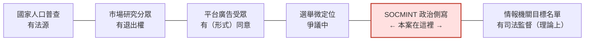

本案的位置特別惡劣的原因：**它同時失去光譜兩端的保護**——既沒有商業側的同意與退出機制，也沒有國家側的法律授權與司法監督。它是一家私人公司，對一個外國的全體人口，做只有情報機關才會做的事，而且沒有任何一個司法管轄區的法院核准過。

---

## 4. AI 濫用的攻擊生命週期（逐階段拆解）

報告的 "Attack lifecycle and AI usage" 段落（p.83–84）很短，只描述兩條工作線。但配上 Figure 1，可以還原出完整的四階段產線。下表把「報告明確觀察到的」與「Figure 1 標示為視野之外的」嚴格分開。

### 4.1 全景表

| 階段 | Figure 1 標號 | 人類做什麼 | Claude 做什麼 | 自主程度 | Anthropic 是否親眼看到 |
|---|---|---|---|---|---|
| **監控（Monitor）** | 01 | 決定監控哪些人口；抓取貼文；每批約 25 則餵入 | （本階段 Claude 不必然介入；資料取得在平台外） | 人類逐步指揮 | ✅ 看到 8,904 次 exchanges／30 天 |
| **分眾與評分（Segment and score）** | 02 | 下指令定義欄位與輸出格式；收集結構化輸出 | **標註 segment、推論城市級位置、評估政治傾向、給出信度分數、情緒評分** | **對話式協助＋批次化**（人類設定 schema，Claude 逐批填表） | ✅ **這是本案的核心觀察** |
| **人設生成（Persona generation）** | （02 與 03 之間） | 指定人設所屬陣營與語言 | **以波斯語、阿拉伯語、英語、德語生成假人設的貼文**，使人設能冒充不同的擁伊／反伊政權人口 | 對話式協助 | ✅ 觀察到內容生成 |
| **滲透（Infiltrate）** | 03 | 操作 255+ 合成 avatar 加好友、進入封閉群組、收割成員名單 | （Anthropic 未觀察到 Claude 在此階段的直接參與） | — | ❌ **視野之外**；依據為 2023 年 S2T 型錄 |
| **利用（Exploit）** | 04 | 對指名個人進行釣魚、植入惡意程式、遠端存取裝置與攝影機 | （未觀察到） | — | ❌ **視野之外**；依據為 2023 年 S2T 型錄 |
| **產出（Report）** | （圖中未獨立標示） | 交付給客戶 | **產出正式阿拉伯語、政府公文語域的情報簡報**，含依波灣國籍拆分的情緒分數與建議反制敘事 | 對話式協助 | ✅ 觀察到 |
| **回饋（Feedback loop）** | 圖底虛線箭頭 | 把收割到的聯絡人與成員名單回灌 | 作為下一輪分類掃描的種子 | 系統性閉環 | ⚠️ 圖中標示，橫跨可見與不可見區 |

### 4.2 階段 02 的細節：報告怎麼描述「批次側寫」

逐字（p.83）：

> "The actor used Claude to generate and analyze content. In one case, **they fed Claude batches of roughly 25 social media posts at a time, directing Claude to analyze the content and return information such as the posters' demographic group, location, and political leanings, with confidence ratings for each finding.**"

（行為者用 Claude 生成並分析內容。其中一個情況是，他們一次餵給 Claude 約 25 則社群媒體貼文的批次，指示 Claude 分析內容，並回傳發文者的人口群體、位置、政治傾向等資訊，每一項發現都附帶信度評分。）

這段話在技術上要注意三件事：

1. **「約 25 則一批」是一個工程參數，不是隨機數字**。這個批次大小反映的是「在單次 context window 內能穩定輸出結構化結果的上限」的工程調校結果。它本身就是**這是一個產品、不是一次性實驗**的證據——有人為了吞吐量調過參數。

2. **「附帶信度評分（confidence ratings）」是本案最狡猾的設計**。信度分數讓輸出**看起來像情報產品**，讓下游客戶以為系統知道自己有多不確定。但 LLM 自報的信度分數與實際正確率的校準（calibration）關係，在這種無真值（no ground truth）的側寫任務上是**完全未經驗證的**。換句話說：**這個系統生產的是有科學外觀的猜測。**

3. **報告 p.81 的章節導論用同一個案例當作全章趨勢證據**：「In one case, an actor uploaded batches of social media posts and directed Claude to produce structured records that outlined targets' locations, demographic data, and political leanings, along with confidence scores.」——同一件事在導論與案例正文各寫一次，代表 Anthropic 認為「批次上傳→結構化側寫」是**跨案例的通用 TTP**，不只是這一家公司的做法。教學上要把它當成一個**可偵測的行為樣式（behavioural pattern）**，而不是一個公司的特徵。

### 4.3 人設生成：「兩邊都做」的關鍵句

逐字（p.83）：

> "In another case, the actor tasked Claude with generating posts for (likely fake) online personas in Persian, Arabic, English, and German. These personas were intended to pass as members of different pro- and anti-Iranian-regime populations. **This behavior suggests an effort to mass-create fake social media accounts to work both sides of the conflict.**"

（另一個情況是，行為者要 Claude 為（可能是假的）線上人設生成貼文，語言包括波斯語、阿拉伯語、英語、德語。這些人設被設計來冒充不同的擁伊朗政權與反伊朗政權人口的成員。**這個行為顯示，有人試圖大量建立假社群媒體帳號，以便在衝突的兩邊同時操作。**）

**"work both sides of the conflict"（在衝突兩邊同時操作）是整份案例最重要的六個字。** 它揭露的不是「這家公司支持誰」，而是**這家公司根本不在乎誰對**——它販賣的是**對資訊環境的操作能力本身**。

從 p.85 的分眾表可以直接看到這個「兩邊都做」：

- **反政權側人設**：@BerlinIranFree、@DubaiIranOpposition、@LondonIranExile、@isfahanprotestkid、@tabriz_uni_protest、@ShirazYouthRebel
- **擁政權側人設**：@BasijMashhad、@IRGC_Isfahan、@QudsForceChat、@QomSeminaryNews、@mashhad_clergy、@AyatollahKhamenei
- **第三方（波灣）側人設**：@RiyadhDefender、@SaudiShiaWatcher、@ShiaThreatAlert、@EyeOnIranSA

同一個 operator，同時養著「柏林的自由伊朗人」與「馬什哈德的巴斯基民兵」。**這在情報學上叫做 "playing both ends"，是 HUMINT 中最高風險也最高收益的手法**；在 AI 時代，它的邊際成本從「養兩組受過訓練的 case officer」降到「多寫一段 prompt」。

### 4.4 產出物：政府公文語域的阿拉伯語簡報

逐字（p.83）：

> "The final briefings were written in formal Arabic and styled as official government communications, with sentiment scores broken down by Gulf nationality alongside **recommended counternarratives**."

（最終簡報以正式阿拉伯語書寫，樣式仿照官方政府公文，包含依波灣國籍拆分的情緒分數，以及**建議反制敘事**。）

三個設計選擇，每個都有意義：

1. **"styled as official government communications"**——產出物被刻意做成**客戶機關內部文件的樣子**。這是一個商業產品設計決定：**降低客戶的採用摩擦**。分析師收到的東西一眼看起來就像自己單位發出來的，不需要重新格式化，可以直接往上呈。這叫「無縫嵌入客戶官僚流程」。
2. **"sentiment scores broken down by Gulf nationality"**——情緒分數**依國籍拆分**。這代表客戶關心的是「沙烏地人怎麼想 vs 阿聯人怎麼想 vs 巴林人怎麼想」，這是典型的**波灣國家對內維穩＋對外（對伊朗）情勢評估**的需求結構。
3. **"recommended counternarratives"**——見下節。

### 4.5 【核心教學】監控與影響力行動的一體化

這是本案第二個必須深挖的重點。

#### 4.5.1 界線在哪裡被跨過

傳統上，情報循環（intelligence cycle）與資訊作戰（information operations）是兩個不同的組織、不同的授權、不同的法律框架：

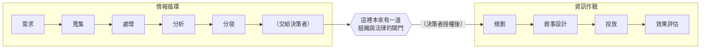

**本案把這道閘門拆掉了。** 同一個平台、同一次 API 呼叫序列，產出的簡報裡同時包含：

- 「這群人現在的情緒分數是 X」（情報產品）
- 「建議你們用以下敘事去反制」（作戰建議）
- 以及在另一條工作線上，**已經預先備好的 255+ 個可投放帳號**（作戰資產）

**分析、建議、投放能力，在一個商業套裝裡全包。** 客戶買的不是「知道發生什麼」，而是「知道發生什麼＋知道該說什麼＋現在就有嘴可以說」。

#### 4.5.2 為什麼這件事在治理上特別難處理

| 面向 | 純監控 | 純影響力行動 | **兩者一體化（本案）** |
|---|---|---|---|
| 主要受害法益 | 隱私、人身安全 | 公共論述完整性、資訊自主 | **兩者同時，且互相放大** |
| 既有法律框架 | 通訊監察法、個資法、出口管制 | 選罷法、平台自律、外國代理人登記 | **沒有任何一個框架涵蓋整條鏈** |
| 平台端可偵測的訊號 | 批次側寫、結構化輸出 | 多人設內容生成、跨語言一致主題 | **兩種訊號在同一帳號出現——這反而是最強的偵測特徵** |
| 政策條文 | Anthropic Usage Policy 的 surveillance 禁令 | Usage Policy 的 coordinated inauthentic behavior 禁令 | **Anthropic 在 p.84 同時援引兩條**——見第 8 節 |

注意最後一列：**Anthropic 的處置段落同時引用了兩條不同的政策禁令**（p.84）。這在整份報告中不常見，也正好證明了本案的混種性質。

#### 4.5.3 回饋迴圈把兩者鎖死

Figure 1 底部那條容易被忽略的虛線箭頭，寫著：

> "Harvested contacts and member lists feed back into the classifier to seed the next sweep"
> （收割到的聯絡人與成員名單回灌到分類器，作為下一輪掃描的種子）

這句話的技術含意是：**影響力行動階段（滲透）產生的資料，成為下一輪監控階段（分類）的輸入。** 兩者不只是並列，而是**互為燃料的閉環**：

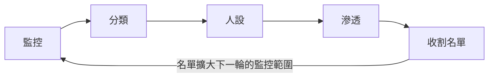

這個閉環的關鍵性質是：**它的覆蓋範圍隨時間單調遞增，且每一輪都更精準。** 第一輪只能看公開貼文；第二輪就能看到封閉群組的成員名單；第三輪可以用成員名單反查更多公開帳號。從情報學角度，這是把 OSINT（公開來源）逐步升級成 HUMINT（人力情報）再升級成 TECHINT（技術入侵）的**自動化階梯**。

**課堂提問**：要打斷這個閉環，在哪一環最有效？（提示：第 8.3 節的答案是「在 02 之前」，但要讓學員自己論證為什麼不是在 03 或 04。）

---

## 5. TTP 與 MITRE ATT&CK／DISARM 對應

本案有個框架學上的重要特性：**它主要不是網路攻擊，而是情報蒐集與影響力行動**，所以單靠 MITRE ATT&CK 會漏掉一大半。必須併用 **DISARM**（影響力行動框架）。這件事本身就是教材。

### 5.1 MITRE ATT&CK Enterprise 對應（偏偵察與資源開發）

| 戰術 | 技術 ID | 技術名稱 | 本案的具體作法 | 偵測構想 |
|---|---|---|---|---|
| Reconnaissance (TA0043) | **T1593.001** | Search Open Websites/Domains: Social Media | 抓取伊朗、波灣、阿聯人口的社群貼文，每批約 25 則送分析 | 在 LLM 服務端：偵測「單一帳號持續上傳格式一致的第三方使用者生成內容批次」＋「要求輸出固定 schema」 |
| Reconnaissance (TA0043) | **T1589** | Gather Victim Identity Information | 推論發文者的人口群體、城市級位置、政治傾向 | 偵測 prompt 中同時出現「位置推論」＋「政治傾向」＋「信度分數」三要素 |
| Resource Development (TA0042) | **T1585.001** | Establish Accounts: Social Media Accounts | 建立 255+ 個合成社群帳號，分 7 個 segment 囤積 | 平台側：偵測同批註冊、命名模式同構（地名＋角色詞）、跨語言一致的 bio 生成痕跡 |
| Resource Development (TA0042) | **T1587** | Develop Capabilities | 建構「多品牌系統的投資組合」 | 供應鏈情報：追蹤同一引擎的多品牌外殼 |
| Initial Access (TA0001) | **T1566** | Phishing | Figure 1 階段 04「Phishing, malware...」 | ⚠️ **Anthropic 未觀察到**，來自 2023 型錄 |
| Initial Access (TA0001) | **T1566.003** | Spearphishing via Service | 透過 WhatsApp／Telegram 私訊建立信任後投放 | ⚠️ 同上，視野之外 |
| Collection (TA0009) | **T1123 / T1125** | Audio Capture / Video Capture | Figure 1 階段 04「remote device and camera access」 | ⚠️ 同上，視野之外 |

### 5.2 DISARM 對應（影響力行動側）——本案真正的骨架

以下技術 ID 均已對照 DISARM Foundation 公開框架庫核對。

| DISARM 戰術 | 技術 ID | 技術名稱 | 本案的具體作法 |
|---|---|---|---|
| **TA13 Target Audience Analysis** | **T0072** | **Segment Audiences** | ★**本案核心**。DISARM 對 T0072 的定義是「依影響力行動關注的特徵建立受眾分眾，包括政治傾向、地理位置、收入、人口統計與心理特徵」——**本案的六類編碼群體＋政治二元標籤＋城市級位置＋情緒分數，是這條技術的完整實作** |
| TA13 Target Audience Analysis | **T0080** | Map Target Audience Information Environment | p.85–86 的「Hashtags by corpus」表就是一張資訊環境地圖：12 個語料庫、涵蓋反政權六主題、擁政權三主題、心理弱點一組、教派與地緣兩組 |
| TA16 Establish Legitimacy | **T0097** | Present Persona | 255+ 合成 avatar 冒充特定身分 |
| TA16 Establish Legitimacy | **T0097.101** | Local Persona | @tehran_uni_student、@rural_khorasan、@IsfahanVillageNews、@AjmanLaborForum——**大量使用地名以建立在地可信度** |
| TA16 Establish Legitimacy | **T0097.105** | Military Personnel Persona | @BasijMashhad、@IRGC_Isfahan、@QudsForceChat |
| TA16 Establish Legitimacy | **T0097.202** | News Outlet Persona | @TorontoPersianForum、@QomSeminaryNews、@IsfahanVillageNews、@VillageVoiceIR——冒充在地媒體或論壇 |
| TA06 Develop Content | **T0085** | Develop Text-Based Content | 用 Claude 以波斯語、阿拉伯語、英語、德語生成人設貼文 |
| （建立假帳號與社團） | **T0007** | Create Inauthentic Social Media Pages and Groups | 合成帳號群；Figure 1 階段 03 的「進入封閉 WhatsApp／Telegram 群組」 |

**教學重點：把兩張表並排放給學員看。** ATT&CK 那張表大半格子寫著「⚠️ 視野之外」；DISARM 那張表格格填滿。這直觀說明了一件事：**本案的主體不是入侵，是側寫與人設——而資安界最熟悉的框架，剛好對這一半最沒有話語權。**

### 5.3 框架缺口（明確標示）

以下行為在 ATT&CK 與 DISARM **都沒有**恰當的技術 ID，必須標示為框架缺口：

| 行為 | 為什麼現有框架接不住 | 建議的暫定命名 |
|---|---|---|
| **以 LLM 做批次人口側寫並輸出信度分數** | ATT&CK 的 T1589 只描述「蒐集身分資訊」，不描述「用生成式模型推論未公開屬性」；DISARM 的 T0072 只描述分眾，不描述分眾的自動化機制 | *LLM-assisted population profiling*（LLM 輔助人口側寫） |
| **在同一次作業中同時產出情報結論與反制敘事建議** | ATT&CK 完全無此概念；DISARM 把分析（TA13）與敘事開發（TA06）分在不同戰術，沒有描述「同一產品同時輸出兩者」 | *Fused intelligence-and-influence product*（情報—影響力融合產品） |
| **收割名單回灌分類器的自我擴張閉環** | 兩個框架都是線性 kill chain／戰術序列，沒有描述**循環回饋** | *Self-seeding collection loop*（自我播種蒐集迴圈） |
| **囤積但尚未部署的人設庫存** | T1585.001 描述建立帳號，但不區分「已部署」與「囤積待命」——而這個區別正好是本案能被歸類為 pilot stage 的關鍵 | *Persona inventory staging*（人設庫存整備） |

**這張缺口表是課程的原創產出，可以直接當作學員的作業題**：要學員自己補一條缺口，並說明為何現有 ID 不適用。

### 5.4 偵測工程視角：在哪裡最容易抓到

把本案的行為特徵整理成可操作的偵測假說（detection hypotheses）：

| 觀察點 | 偵測訊號 | 假陽性風險 | 備註 |
|---|---|---|---|
| **LLM 服務端（Anthropic 位置）** | 同一帳號長期上傳**第三方使用者生成內容的固定大小批次**（約 25 則），要求輸出含「位置＋人口分類＋政治傾向＋信度」的結構化欄位 | **中**。學術社群媒體研究、市場輿情分析有相似形狀 | ★ 本案實際被抓到的位置。區辨關鍵在**政治傾向欄位**與**個人層級輸出**（而非彙總統計） |
| **LLM 服務端** | 同一帳號同時要求生成「互相對立立場」的多語言人設貼文 | **低**。正當用途極少需要同時扮演衝突雙方 | 這是 "work both sides" 的指紋，區辨力最高 |
| **LLM 服務端** | 產出文件的語域固定為某國政府公文格式，且反覆迭代 | 中 | 單獨不足為證，需與上兩項合併 |
| **社群平台端** | 同批註冊、命名模式同構（`@地名+角色詞`）、bio 跨語言但語感一致、活躍時區集中 | 中 | 平台方比 LLM 供應商更容易看到這層 |
| **公民社會端** | 封閉群組出現大量新成員，自我介紹符合特定分眾原型（在地學生、村民、僑民） | 高（誤傷真實新成員） | 只能做風險提示，不能做自動封鎖 |

> **關鍵洞見**：本案之所以被抓到，是因為**分類側寫與人設生成發生在同一個帳號上**。如果行為者把這兩條工作線拆到兩個不同的供應商（例如用 A 家做分類、用 B 家生成人設），任何單一平台都只會看到一半，而**一半的訊號不足以下判斷**。這是第 8.4 節「防線缺口」的核心論點。

---

## 6. 圖表逐一判讀

> 本節是本教材的重點。以下三張圖表均以 130 DPI 渲染頁面逐一放大判讀，並與 PDF 文字層比對。**p.84 的 Figure 1 已存入課程圖庫**：`../figures/page-084.png`；p.85、p.86 的兩張表格未被工具判定為「圖」，故未進課程圖庫，但本節已完整抄錄。

### 6.1 Figure 1（p.84）：該行動的蒐集漏斗——Claude 驅動的分類與人設生成，可能使某些下游階段成為可能

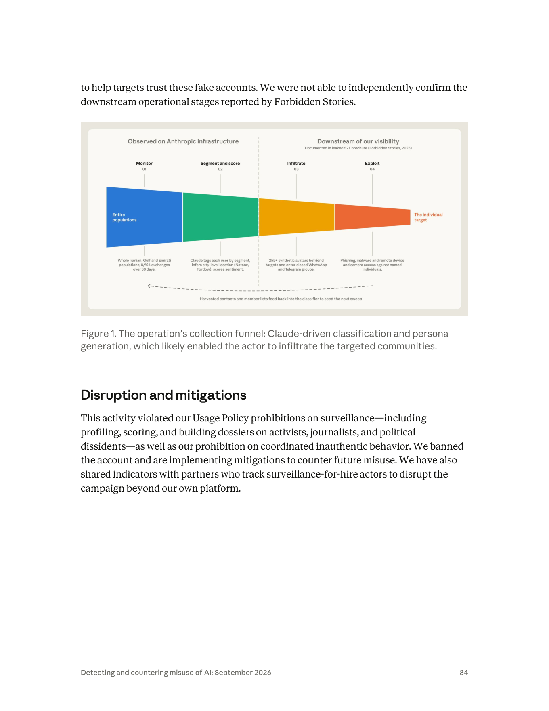

**圖說原文（逐字）**：
> "Figure 1. The operation's collection funnel: Claude-driven classification and persona generation, which likely enabled the actor to infiltrate the targeted communities."
>（圖 1。該行動的蒐集漏斗：Claude 驅動的分類與人設生成，這很可能使該行為者得以滲透目標社群。）

#### 6.1.1 圖片類型與整體構圖

這是一張**水平漏斗圖（horizontal funnel diagram）**，不是流程圖也不是架構圖。選擇漏斗這個視覺隱喻本身就有訊息：**它要表達的是「從多到少」的收斂**，而不是「步驟的先後」。

構圖上分成左右兩個視覺區塊，由一條**垂直虛線**分隔：

| 位置 | 標題文字（逐字） | 意義 |
|---|---|---|
| 左半（虛線左側） | **"Observed on Anthropic infrastructure"** | 在 Anthropic 基礎設施上**實際觀察到**的 |
| 右半（虛線右側） | **"Downstream of our visibility"**<br>副標：**"Documented in leaked S2T brochure (Forbidden Stories, 2023)"** | 在 Anthropic **視野之外的下游**；依據是 2023 年外洩的 S2T 型錄 |

> ★ **這條垂直虛線是整張圖最重要的元素，也是整份案例最重要的一個設計決定。** Anthropic 用一條線，把「我親眼看到的」與「我引用別人的」在視覺上永久分開。任何做 CTI 簡報的人都應該學這一招——**證據層級的差異，要畫在圖上，不要只寫在腳註裡。**

#### 6.1.2 漏斗四段的完整抄錄

漏斗由左至右分成四段，每段有編號、標題、與下方的說明文字。顏色由左至右為藍→綠→黃／橘→紅／橙，寬度逐段收窄。

| # | 標題 | 顏色 | 下方說明文字（逐字） | 中譯 |
|---|---|---|---|---|
| **01** | **Monitor**（監控） | 藍 | "Whole Iranian, Gulf and Emirati populations; **8,904 exchanges over 30 days**." | 伊朗、波灣與阿聯的**全體人口**；30 天內 **8,904 次交互** |
| **02** | **Segment and score**（分眾與評分） | 綠 | "Claude tags each user by segment, **infers city-level location (Natanz, Fordow)**, scores sentiment." | Claude 為每位使用者標註分眾，**推論城市級位置（納坦茲、福爾多）**，並評分情緒 |
| **03** | **Infiltrate**（滲透） | 黃／橘 | "**255+ synthetic avatars** befriend targets and enter closed WhatsApp and Telegram groups." | **255 個以上的合成 avatar** 與目標交友，並進入封閉的 WhatsApp 與 Telegram 群組 |
| **04** | **Exploit**（利用） | 紅／橙 | "Phishing, malware and **remote device and camera access** against named individuals." | 針對**指名個人**的釣魚、惡意程式，以及**遠端裝置與攝影機存取** |

**漏斗兩端的標籤**：
- 最左端（藍色區塊內，白字）：**"Entire populations"**（全體人口）
- 最右端（漏斗尖端外，橘紅字）：**"The individual target"**（單一個人目標）

**漏斗下方的回饋箭頭**：一條由右指向左的**虛線弧形箭頭**，橫跨整個漏斗底部（且**跨越了那條垂直虛線**），下方文字：
> **"Harvested contacts and member lists feed back into the classifier to seed the next sweep"**
>（收割到的聯絡人與成員名單回灌分類器，作為下一輪掃描的種子）

#### 6.1.3 資料如何流動

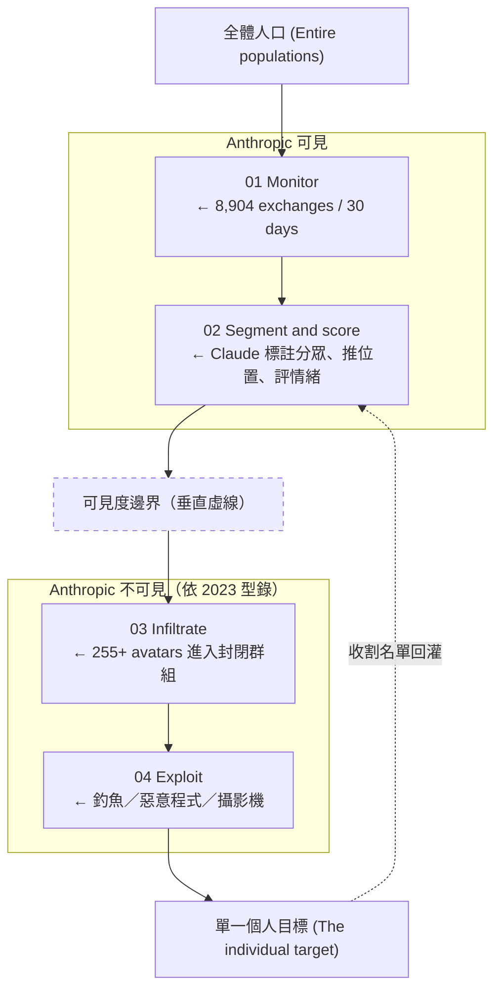

#### 6.1.4 圖上有、正文沒有的關鍵資料（極重要）

我以 `grep` 逐字比對了報告全文文字層，確認以下三項資料**只出現在 Figure 1 的圖像中，在 p.82–86 的正文裡完全沒有**：

| 只在圖上的資料 | 正文是否出現 | 為何重要 |
|---|---|---|
| **"8,904 exchanges over 30 days"** | ❌ 全文 grep 無 "8,904" 或 "8904" | 這是本案**唯一的量化規模指標** |
| **"Natanz, Fordow"** | ❌ 全文 grep 無此二字 | 這是本案**唯一的具體地名**，而且是伊朗的兩座核設施所在地 |
| **"255+ synthetic avatars"** 的「avatar」用詞 | 正文用 "synthetic social network accounts" | 圖上用了 **avatar** 這個詞——**這正是 2023 年 S2T 型錄裡的產業術語**（Forbidden Stories 逐字報導 S2T 稱其假帳號為 "avatar"）。圖說用詞與型錄用詞一致，這是一個細微但真實的佐證線索 |

> **教學提醒（方法論）**：這三項發現只能靠「用 Read 工具開圖親自判讀」＋「回頭 grep 文字層比對」得到。**只讀 PDF 文字層的人會漏掉本案最具體的三項資料。** 這件事本身就要在課堂上示範一次。

#### 6.1.5 兩個值得深挖的細節

**(a) 8,904 次 exchanges 到底代表多大規模？——一個課堂算術練習**

報告只給了「8,904 exchanges / 30 days」與「每批約 25 則貼文」兩個數字，沒有直接給「總共分析了幾則貼文」。可以讓學員自己算，並理解**上界推估（upper-bound estimate）**的作法：

- 平均每日 exchanges：8,904 ÷ 30 ≈ **297 次／日**
- **絕對上界**：若每一次 exchange 都是一個滿載 25 則的分類批次 → 8,904 × 25 = **222,600 則貼文**
- **但這是上界，實際一定更低**，因為 exchanges 裡必然還混雜了：人設貼文生成、簡報撰寫、schema 調校、除錯對話、以及所有失敗重試。
- **合理的粗略區間**：若假設分類批次佔全部 exchanges 的三到六成，則約 **6.7 萬～13 萬則貼文**。

⚠️ **必須明確告訴學員：上述所有推算都是本教材的算術，不是 Anthropic 的主張。報告只寫了 8,904 與「約 25」兩個數字。** 這個練習的目的不是得到一個數字，而是訓練「**從報告給的最小事實出發，明確標示假設，推出帶區間的結論**」這個情報分析的基本動作。

**(b) 為什麼是 Natanz 與 Fordow？——一個必須小心處理的觀察**

納坦茲（Natanz）與福爾多（Fordow）是伊朗兩座最知名的鈾濃縮設施所在地。圖上把它們當成「城市級位置推論」的**範例**。

**報告沒有說**：行為者刻意鎖定核設施、或這與核情報有關。

**可以合理指出的是**：
- 這兩個地名被選為範例，至少代表分類器的位置推論**粒度細到城鎮級**，而不只是省級或國家級。
- 同一份報告的 p.64 提到 **「2026 年美以伊戰爭（the 2026 US-Israel-Iran war）」**，說明本案發生的時空背景是一場實際的軍事衝突期間。在該背景下，能把社群媒體發文者定位到核設施所在城鎮，具有明顯的軍事情報價值。
- **但這是本教材的推論，不是報告的主張。** 課堂上必須這樣標示。

這個細節的教學價值在於示範「**如何在不越過證據的前提下，指出一個值得注意的訊號**」——先陳述圖上事實、再陳述報告未說的、最後才提出帶標示的推論。

#### 6.1.6 這張圖傳達的核心訊息

**一句話**：這是一張**把「全體人口」漏斗化成「單一個人」的工業流程圖**，而 Claude 的位置在漏斗的**第二段**——也就是**最關鍵的收斂點**。

三層訊息：

1. **監控的起點是「所有人」，不是「嫌疑人」。** 漏斗最寬處寫的是 "Entire populations"、"Whole Iranian, Gulf and Emirati populations"。這與傳統「先有嫌疑、才有監控」的法治邏輯完全相反。
2. **AI 的價值在於「把不可能的收斂變成可能」。** 從幾十萬則貼文收斂到值得滲透的個人，傳統上需要一整個分析師團隊。Claude 把這一段的成本壓縮到「8,904 次 API 呼叫」。**漏斗的第二段就是 AI 的變現點。**
3. **圖說用了 "likely enabled"（很可能使…成為可能），而不是 "enabled"。** 這是 Anthropic 對「Claude 的貢獻到底有多關鍵」這個因果主張的降級——他們不宣稱沒有 Claude 就做不到，只說 Claude 很可能讓後續階段變得可行。**這個情態動詞值得在課堂上單獨圈出來。**

#### 6.1.7 課堂上可以怎麼用這張圖

- **開場圖**：不加任何說明，先讓學員看 30 秒，問「這張圖裡哪一段是這家 AI 公司看得到的？」——大多數人會先看顏色與編號，不會注意到那條垂直虛線。這個「沒看到」本身就是最好的教學時刻。
- **證據分層練習**：發下白紙，要學員把圖上四段分別標記為「一手觀察／第三方引用」，再對照第 2.5 節的原文。
- **反向設計練習**：問「如果你是防守方，你要在哪一段設攔截點？成本各是多少？」（01 幾乎不可能攔——資料是公開的；02 是 AI 供應商的主場；03 是社群平台的主場；04 是端點安全廠商與電信商的主場。**四段對應四個完全不同的防守社群，沒有任何一方看得到全貌**——這正是本案最深刻的治理課題。）
- **與其他模組串接**：把這張圖與 04 模組的 GTG-17002（電子戰／SEAD）、02 模組的影響力行動圖並排，說明「同一個 AI 能力，在不同模組裡扮演的是同一個角色：**把需要專家團隊的收斂工作，降級為 API 呼叫**」。

---

### 6.2 「Synthetic handles by segment」表（p.85）：合成帳號依分眾類別

**圖片類型**：無標號的資料表格（報告未給 Figure 編號），三欄：Category（類別）／Segment code（分眾代碼）／Handles（帳號）。共 **7 列**，合計揭露 **26 個 handle**。

#### 6.2.1 完整逐列抄錄

| Category（原文） | 中譯 | Segment code | Handles（逐字，共 26 個） | 數量 |
|---|---|---|---|---|
| Synthetic: Diaspora | 合成：離散僑民 | **IR-DI** | `@ShirazisInLA`, `@TorontoPersianForum`, `@BerlinIranFree`, `@DubaiIranOpposition`, `@LondonIranExile` | 5 |
| Synthetic: Youth/student | 合成：青年／學生 | **IR-YO** | `@tehran_uni_student`, `@isfahanprotestkid`, `@tabriz_uni_protest`, `@ShirazYouthRebel` | 4 |
| Synthetic: Military | 合成：軍事 | **IR-MI** | `@BasijMashhad`, `@IRGC_Isfahan`, `@QudsForceChat` | 3 |
| Synthetic: Clerical | 合成：教士 | **IR-CL** | `@QomSeminaryNews`, `@mashhad_clergy`, `@AyatollahKhamenei` | 3 |
| Synthetic: Rural | 合成：鄉村 | **IR-RU** | `@IsfahanVillageNews`, `@rural_khorasan`, `@VillageVoiceIR` | 3 |
| Synthetic: UAE expatriate | 合成：阿聯外籍勞工 | **UAE** | `@PakistaniDubaiWorker`, `@AjmanLaborForum`, `@IntlCityWorkers`, `@BanglaExpatSharjah` | 4 |
| Synthetic: Saudi/GCC sectarian | 合成：沙烏地／波灣教派 | **GCC** | `@RiyadhDefender`, `@SaudiShiaWatcher`, `@ShiaThreatAlert`, `@EyeOnIranSA` | 4 |
| | | | **合計** | **26** |

> ⚠️ **安全紅線提醒**：以上 handle 依課程規範**僅作研究資料抄錄**。不得以任何方式連線、查詢、訂閱或互動。報告未對這些 handle 做 defang 處理（社群 handle 非網域，無 defang 慣例），但**「不連線」的紀律一樣適用**。

#### 6.2.2 這張表傳達的核心訊息：監控如何把人口編碼

**這張表是全案最有教學力的一頁，因為它把抽象的「分類」變成了看得見的字串。**

**(a) 命名法本身就是分類法的實作**

把 26 個 handle 拆解，會發現一個高度規律的**構詞公式**：

```
handle = [地理標記] + [身分角色標記] （+ 可選的立場標記）
```

| 構詞成分 | 出現實例 |
|---|---|
| **伊朗境內城市**：Tehran, Isfahan, Shiraz, Tabriz, Mashhad, Qom, Khorasan | `@tehran_uni_student`、`@IRGC_Isfahan`、`@mashhad_clergy`、`@QomSeminaryNews`、`@rural_khorasan` |
| **僑居地城市**：LA, Toronto, Berlin, London, Dubai | `@ShirazisInLA`、`@TorontoPersianForum`、`@BerlinIranFree`、`@LondonIranExile`、`@DubaiIranOpposition` |
| **波灣城市**：Dubai, Ajman, Sharjah, Riyadh | `@PakistaniDubaiWorker`、`@AjmanLaborForum`、`@BanglaExpatSharjah`、`@RiyadhDefender` |
| **身分角色**：student, kid, clergy, Seminary, Village, Worker, LaborForum, Forum, News | 幾乎每個 handle 都有 |
| **立場標記**：Free, Opposition, Exile, protest, Rebel, Defender, Watcher, ThreatAlert, EyeOn | `@BerlinIranFree`、`@ShirazYouthRebel`、`@SaudiShiaWatcher`、`@ShiaThreatAlert` |

**這個公式就是第 3.3 節那六類編碼的語言化。** 分眾方案不只存在於資料庫欄位裡，它被直接寫進了帳號名稱。換句話說：**行為者把分類法「穿」在假帳號身上**。

**(b) 三組值得特別注意的 handle**

1. **`@AyatollahKhamenei`**——這個 handle 被歸類在「Synthetic: Clerical（IR-CL）」。它冒充的是**伊朗最高領袖本人的名字**。這在假帳號策略上屬於最高風險的一類（極易被平台認定為冒充公眾人物而下架），也顯示行為者的人設庫在 pilot 階段還相當粗糙。**這是「pilot stage」判定的一個側面佐證**——成熟的行動不會用這種一望即知的名字。

2. **UAE 那一列的四個 handle 全部指向南亞外籍勞工**（`@PakistaniDubaiWorker` 巴基斯坦籍杜拜勞工、`@BanglaExpatSharjah` 孟加拉籍沙迦僑民、`@AjmanLaborForum` 阿治曼勞工論壇、`@IntlCityWorkers` 國際城勞工——「International City」是杜拜著名的低價外勞住宅區）。**這揭露了一個正文完全沒提的目標群體：波灣的南亞移工。** 這是波灣國家最龐大、最無政治權利、也最常被視為「潛在不穩定來源」的人口。**正文只說 "users in Iran and the Persian Gulf region"，是這張表讓我們知道波灣那一半具體指的是誰。**

3. **GCC 那一列帶有明顯的教派挑動性**（`@SaudiShiaWatcher` 沙烏地什葉派觀察者、`@ShiaThreatAlert` 什葉派威脅警報、`@EyeOnIranSA` 沙烏地盯伊朗）。這些不是中性的在地人設，而是**預先裝載了教派敵意的人設**。搭配 p.86「UAE/GCC sectarian」的阿拉伯語主題標籤（#خطر_شيعي「什葉派威脅」、#صراع_سني_شيعي「遜尼—什葉衝突」），可以看出這一組人設的設計用途不是潛伏觀察，而是**主動放大教派對立**。

**(c) 26 vs 255+：揭露率約 10%**

報告正文說「超過 255 個」合成帳號，表中只列 26 個。這意味著：

- **這張表是一個樣本，不是清單。** 教學上必須強調：學員看到的是 Anthropic 選擇揭露的 10%，而選擇本身有偏誤（通常會選最有代表性、最不會造成誤傷、且已確認為合成的）。
- **剩下 229+ 個帳號仍在野外。** Anthropic 說已「與追蹤 surveillance-for-hire 行為者的夥伴分享指標」（p.84），這些完整名單很可能走的是私下情報分享管道。
- **對防守方的實務意義**：拿這 26 個 handle 去做精確比對的價值很低（它們大概率已被封或棄用），**但拿構詞公式去做模式比對的價值很高**。這是第 7 節「偵測價值與壽命」的核心論點。

#### 6.2.3 課堂上可以怎麼用這張表

- **「找出違和感」練習**：把 26 個 handle 混入 10 個真實存在的伊朗異議帳號名稱（教師自行從公開報導取得、去識別化），要學員分辨哪些是合成的。**目的是讓學員體會到：他們分不出來。** 然後再揭曉構詞公式。
- **分類倫理辯論**：把七個 segment code 寫在白板上，要學員試著「把自己分類進去」——如果有人要用這六類來分台灣人口，會是哪六類？誰會被分到「威脅」那一類？這個練習通常會讓分類的政治性瞬間變得切身。
- **與 Figure 1 串接**：這張表是 Figure 1 階段 03 的「彈藥庫存」。可以問：「255 個帳號、7 個分眾，每個分眾平均 36 個帳號——這個庫存規模想服務多大的行動？」

---

### 6.3 「Hashtags by corpus」表（p.85 下半 ＋ p.86 上半）：主題標籤依語料庫

**圖片類型**：跨頁資料表格（報告未給 Figure 編號），兩欄：Corpus（語料庫）／Hashtags（主題標籤）。共 **12 列**，橫跨 p.85 與 p.86。

> ⚠️ **抄錄方法說明**：PDF 的文字層對波斯語／阿拉伯語（RTL，由右至左書寫）的擷取是**亂序且破碎的**（例如文字層把「#ایران_آزاد」輸出成 `#ﺩﺍﺯﺁ_ﻥﺍﺭﯼﺍ`）。本節的 RTL 內容是**以 Read 工具開啟 p.85／p.86 渲染圖、局部放大三倍後目視判讀**得出，並附上羅馬轉寫與中譯。**這是本案例研究中最容易出錯的一段，任何只靠 PDF 文字層的抄錄都會是錯的。**

#### 6.3.1 完整逐列抄錄（12 列）

**【p.85 部分：反政權語料庫（Anti-regime），6 列】**

| # | Corpus（原文） | 中譯 | Hashtags（逐字） | 轉寫與釋義 |
|---|---|---|---|---|
| 1 | Anti-regime: IRGC/Khamenei | 反政權：革命衛隊／哈梅內意 | `#sepah_fased`, `#IRGCcorruption`, `#trust_Khamenei` | *sepah fased* = 「腐敗的革命衛隊」（sepah 即 IRGC）；`#trust_Khamenei` 語意曖昧，可能是反諷標籤或被監測的擁護標籤 |
| 2 | Anti-regime: Conscription | 反政權：徵兵 | `#faraar_az_sarbazi`, `#flee_draft` | *farār az sarbāzi* = 「逃避兵役」 |
| 3 | Anti-regime: Press freedom | 反政權：新聞自由 | `#PressFreedomIran`, `#IranCensorship` | 英語標籤，主要供國際傳播 |
| 4 | Anti-regime: Economy | 反政權：經濟 | `#tavarrom`, `#gerani`, `#hyperinflation_iran` | *tavarrom* = 通貨膨脹；*gerāni* = 物價高漲 |
| 5 | Anti-regime: Diplomatic isolation | 反政權：外交孤立 | `#IranTanha`, `#EnzevaYeDiplomasi` | *Irān tanhā* = 「伊朗孤獨／孤立」；*enzevā-ye diplomāsi* = 外交孤立 |
| 6 | Anti-regime: Regime change | 反政權：政權更迭 | `#سرنگونی`, `#ایران_آزاد` | *sarnegouni* = 「推翻／垮台」；*Irān-e āzād* = 「自由伊朗」 |

**【p.86 部分：擁政權、心理側寫與教派／地緣語料庫，6 列】**

| # | Corpus（原文） | 中譯 | Hashtags（逐字） | 轉寫與釋義 |
|---|---|---|---|---|
| 7 | Pro-regime: Nuclear rights | 擁政權：核權利 | `#hagh-e-hasteh-i`, `#حق_هسته_ای` | *haqq-e hasteh-i* = 「核（能）權利」，波斯文與羅馬轉寫兩種寫法並列 |
| 8 | Pro-regime: Resistance/martyrdom | 擁政權：抵抗／殉道 | `#mehvar_e_moghavemat`, `#AxisOfResistance`, `#shahid` | *mehvar-e moqāvemat* = 「抵抗軸心」；*shahid* = 「烈士／殉道者」 |
| 9 | Pro-regime: Patriotic mobilization | 擁政權：愛國動員 | `#vatanparasti`, `#defa_az_keshvar` | *vatanparasti* = 愛國主義；*defā' az keshvar* = 「保衛國家」 |
| 10 | **Psychographic/vulnerability** | **心理側寫／脆弱性** | `#PTSD_Iran`, `#salamat_e_ravan`, `#trauma_ye_jang`, `#suicide_rate_war` | *salāmat-e ravān* = 心理健康；*trauma-ye jang* = 「戰爭創傷」；`#suicide_rate_war` = 戰爭自殺率 |
| 11 | UAE/GCC sectarian | 阿聯／波灣教派 | `#خطر_شيعي`, `#صراع_سني_شيعي` | *khaṭar shī'ī* = 「什葉派威脅／危險」；*ṣirā' sunnī–shī'ī* = 「遜尼—什葉衝突」 |
| 12 | Saudi-aligned anti-Iran | 親沙烏地反伊朗 | `#USBaseGulf`, `#FifthFleetBahrain` | 美軍波灣基地、駐巴林第五艦隊 |

> 註：表格在 p.85 結束於第 6 列（Anti-regime: Regime change），p.86 以重複的欄位標題（Corpus / Hashtags）續接第 7 列起。**總列數為 12 列**：p.85 六列（全為 Anti-regime），p.86 六列（擁政權三列、心理側寫一列、教派／地緣兩列）。

#### 6.3.2 這張表傳達的核心訊息

**(a) 語料庫結構＝目標資訊環境的完整地圖**

12 個語料庫不是隨意挑的主題，它們構成一張結構化的資訊環境地圖：

```
反政權側（6 個）：革命衛隊貪腐、逃兵役、新聞自由、通膨、外交孤立、政權更迭
                    └──── 覆蓋伊朗國內不滿的六大來源 ────┘

擁政權側（3 個）：核權利、抵抗／殉道、愛國動員
                    └──── 覆蓋政權合法性的三大支柱 ────┘

心理側（1 個）：  PTSD、心理健康、戰爭創傷、自殺率
                    └──── 覆蓋「人群的心理弱點」 ────┘

教派／地緣側（2 個）：遜尼—什葉對立、美軍基地
                    └──── 覆蓋波灣客戶自身的關切 ────┘
```

**要監控一個社會的不滿，你必須先知道這個社會在哪些事情上不滿。** 這 12 個語料庫就是那份清單——而且它同時是**監控的檢索詞**與**假帳號要發什麼內容的題庫**。同一份清單，兩種用途。這是第 4.5 節「監控—影響力一體化」在資料層的具體證據。

**(b) 第 10 列「Psychographic/vulnerability」是整張表最應該停下來討論的一列**

這一列與其他十列的性質完全不同：

| 其他十列 | 第 10 列 |
|---|---|
| 追蹤的是**政治立場**（你支持誰／反對誰） | 追蹤的是**心理狀態**（你是否創傷、是否有自殺傾向、心理健康如何） |
| 對應 DISARM 的地理／人口／政治分眾 | 對應 DISARM 的**心理特徵分眾（psychographic segmentation）** |
| 用途：判定陣營 | 用途：**判定誰最好操弄、誰最容易被說服、誰最脆弱** |

`#PTSD_Iran`、`#trauma_ye_jang`（戰爭創傷）、`#suicide_rate_war`（戰爭自殺率）這幾個標籤合在一起，說明行為者在**系統性地尋找戰爭創傷人口**。

**在 HUMINT 的語言裡，尋找「弱點（vulnerability）」是招募（recruitment）的前置步驟。** 而在影響力行動的語言裡，找到心理脆弱的人群，是決定「往哪裡投放最容易見效」的前置步驟。**這一列不論解釋成哪一種，都指向同一件事：把人的心理創傷當成可利用的資源。**

> **課堂上必須把這一列單獨投影出來，並停留至少三分鐘。** 這是整份 154 頁報告裡，最能讓非技術背景聽眾理解「為什麼監控是一種傷害」的一張投影片。技術細節可以爭論，但「有人在系統性搜尋一個戰爭中國家的 PTSD 與自殺話題標籤，以便更有效地操弄他們」這件事，不需要任何技術背景就能理解其道德重量。

**(c) 語言選擇透露的目標分層**

| 語言 | 出現的語料庫 | 推論的投放對象 |
|---|---|---|
| **波斯語羅馬轉寫**（sepah_fased, tavarrom, mehvar_e_moghavemat…） | 幾乎所有伊朗相關語料庫 | 伊朗人在社群平台上常用羅馬轉寫（因輸入法與規避關鍵字過濾），**這顯示行為者對伊朗網路文化有實務理解**，不是拿字典翻的 |
| **波斯文原文**（#سرنگونی, #ایران_آزاد, #حق_هسته_ای） | 政權更迭、核權利 | 境內傳播、最高情緒動員力的標籤用原文 |
| **英語**（#PressFreedomIran, #AxisOfResistance, #USBaseGulf, #FifthFleetBahrain） | 新聞自由、抵抗軸心、美軍基地 | **國際／西方受眾**，或供客戶閱讀 |
| **阿拉伯語**（#خطر_شيعي, #صراع_سني_شيعي） | 波灣教派 | 波灣阿拉伯語受眾 |

**波斯語同時用羅馬轉寫與原文兩套**，是一個很細但很有力的觀察：這代表建構這個語料庫的人（或模型）**知道伊朗使用者在不同場合用不同書寫系統**。這種在地知識，正是 Claude 這類模型能夠低成本提供的東西——而這就是報告全章導論所說的「AI 取代了工程人力（AI is now being used in place of an engineering workforce）」在**語言學層面**的版本。

#### 6.3.3 課堂上可以怎麼用這張表

- **「語料庫即世界觀」練習**：要學員為「台灣」設計一張同樣結構的 12 列語料庫表，會是哪些主題？做完之後問：這張表如果落到一個外國情報承包商手上，會怎麼被使用？
- **心理側寫倫理討論**：單獨拿第 10 列，問「如果一個公共衛生研究團隊做完全一樣的事（追蹤 #PTSD_Iran 以評估戰爭心理健康影響），差別在哪裡？」——答案關鍵在**目的、同意、與輸出對象**，而不在技術。這是最好的「兩用性（dual-use）」教學案例。
- **偵測工程練習**：問「如果你是社群平台的信任與安全團隊，看到一個帳號在 30 天內對這 12 組標籤做系統性檢索，你會怎麼處理？你的誤判成本是什麼？」（提示：真正的研究者、記者、NGO 也會這樣做。）

---

### 6.4 p.82 與 p.83（正文頁）的版面判讀

雖然這兩頁沒有圖表，但版面本身有兩個值得指出的編排訊息：

- **p.82 下半**：GTG-54009 的大標題佔滿三行，字級明顯大於內文——這是 Anthropic 報告中每個案例的起始標記。標題本身就是一句完整的摘要：「Disrupting a commercial surveillance platform using Claude to profile the social media accounts of Iranian and Persian Gulf-based users」。注意動詞是 **Disrupting**（正在中斷），不是 Disrupted——這是報告全篇的標題慣例，強調處置是持續進行的。
- **p.82 內文中的 "Forbidden Stories" 帶有底線**，在 PDF 中是一個超連結。**Anthropic 在案例正文中直接超連結到第三方調查報導**——這是一個刻意的編輯決定，等於在說「讀者可以自己去查證我引用的部分」。在 CTI 寫作規範上，這叫**可追溯性（traceability）**，是判斷一份報告是否專業的重要外部特徵。
- **p.83 的 Key findings 使用五個項目符號**，且五條的順序是：商業結構 → 分類與位置 → 六類方案 → 產出物 → 假帳號庫存。**這個順序把「六類方案」放在正中間**，前兩條建立脈絡、後兩條說明用途。編排上，六類方案是本案的重心。

---

## 7. IOC 與技術指標

### 7.1 重要前提：本案沒有傳統 IOC 表

與 GTG-14010（p.89 有 Category／Indicator 表）、GTG-20006（有檔案雜湊與釣魚網域）不同，**GTG-54009 的頁段裡沒有任何網域、IP、檔案雜湊、Telegram 帳號或憑證指標**。報告提供的「指標」只有兩類：

1. **26 個合成社群帳號 handle**（p.85）
2. **12 組主題標籤語料庫**（p.85–86）

這個缺席本身就是資訊：**因為行動在滲透與利用階段之前就被攔下，根本還沒產生基礎設施層級的 IOC。** 這是「上游偵測」的直接後果——你抓得越早，能留給別人的鑑識痕跡越少。

### 7.2 指標表（含偵測價值與壽命評估）

| 類型 | 指標 | 偵測價值 | 壽命 | 說明 |
|---|---|---|---|---|
| 合成帳號 handle（26 個，見 6.2.1） | `@ShirazisInLA` 等 | **低**（作為精確比對） | **極短**（數週至數月） | 帳號早已被封或棄用；作為 atomic indicator 幾乎無用 |
| **Handle 構詞模式** `[地名]+[角色]+[立場]` | 見 6.2.2(a) | **高** | **長**（數年） | 這是行為特徵不是原子指標。可轉成平台側的命名相似度偵測規則 |
| **分眾代碼命名法** `IR-XX` / `UAE` / `GCC` | IR-DI, IR-YO, IR-MI, IR-CL, IR-RU | **中** | **中**（數月至一年） | 若同一 schema 出現在其他平台或外洩文件中，可作為同源線索 |
| 主題標籤（12 組） | 見 6.3.1 | **低至中** | **中** | 大部分是真實流通的公共標籤，不能當惡意指標；價值在於「**被一起檢索**」這個組合 |
| **批次大小 ≈ 25 則／次** | p.83 | **中** | **短至中** | 工程參數，容易被改；但作為異常偵測的特徵之一有效 |
| **8,904 exchanges / 30 天的節奏** | Figure 1 | **中** | **中** | 約 297 次／日的穩定節奏，不像人工互動，像自動化管線 |
| **輸出 schema：`{人口群體, 位置, 政治傾向, 信度分數}`** | p.83, p.81 | **高** | **長** | ★ **最有價值的指標**。這個四欄組合幾乎不會出現在正當用途中 |
| **「兩邊都做」的人設生成** | p.83 | **高** | **長** | 同一帳號生成互相對立立場的多語言人設內容 |
| 產出物語域：正式阿拉伯語政府公文體 | p.83 | 中 | 長 | 需與其他訊號合併使用 |

### 7.3 給不同防守方的可操作建議

| 防守方 | 可用的指標層級 | 具體作法 |
|---|---|---|
| **LLM／AI 服務供應商** | 行為層（schema、批次、跨立場生成） | 對「結構化人物側寫輸出」建立分類器；對「同帳號生成對立人設」建立跨工作階段關聯 |
| **社群平台信任與安全團隊** | 帳號層（構詞模式、註冊批次、bio 生成痕跡） | 命名相似度叢集分析；跨語言 bio 的 LLM 生成偵測 |
| **公民社會／NGO／記者** | 情境層 | 對「符合特定分眾原型的新成員」保持警覺；封閉群組加入採雙人確認制 |
| **威脅情報團隊** | 供應商層 | 追蹤 S2T 及其經銷商的多品牌外殼；監控其產品發表、展會、徵才訊號 |

> **安全紅線重申**：本節所有指標僅供研究與偵測規則設計。**不得**對任何 handle 發起連線、訂閱、私訊或互動；**不得**對報告中出現的任何識別符進行主動查詢。

---

## 8. Anthropic 的偵測、處置與防線缺口

### 8.1 Anthropic 做了什麼（逐字，p.84）

> "**Disruption and mitigations**
> This activity violated our Usage Policy prohibitions on surveillance—including profiling, scoring, and building dossiers on activists, journalists, and political dissidents—as well as our prohibition on coordinated inauthentic behavior. We banned the account and are implementing mitigations to counter future misuse. We have also shared indicators with partners who track surveillance-for-hire actors to disrupt the campaign beyond our own platform."

（**中斷與緩解**：此活動違反了我們《使用政策》對監控的禁令——包括對活動人士、記者與政治異議人士進行側寫、評分與建立卷宗——以及我們對協同不實行為的禁令。我們封禁了該帳號，並正在實施緩解措施以對抗未來的濫用。我們也已與追蹤「僱傭式監控」行為者的夥伴分享指標，以在我們自身平台之外中斷此行動。）

拆成四個動作：

| # | 動作 | 原文 | 評註 |
|---|---|---|---|
| 1 | 援引**兩條**政策 | "surveillance" ＋ "coordinated inauthentic behavior" | 見 4.5.2——雙重援引正是本案混種性質的證據 |
| 2 | 封禁帳號 | "We banned the account" | 單數 account。與 GTG-14010 的 "banned the accounts" 複數不同 |
| 3 | 實施緩解 | "**are implementing** mitigations" | **現在進行式**——代表發報告時尚未完成。措辭誠實但也暴露防線未閉合 |
| 4 | 分享指標 | "shared indicators with partners who track **surveillance-for-hire** actors" | 明確把 S2T 歸入「僱傭式監控」產業類別。這是對業界的分類定性 |

另外，章節層級的處置說明（p.81）適用於本案：

> "In each case, we banned the accounts associated with the activity; improved our ability to detect the tactics, techniques, and procedures (TTPs) we observed; and, where the operation involved activity or impacts beyond our platform, shared identifiers and intelligence with industry partners and authorities as appropriate."

### 8.2 政策條文本身的教學價值

Anthropic 引用的禁令文字非常具體：

> "profiling, scoring, and building dossiers on **activists, journalists, and political dissidents**"

三個動詞（側寫 profiling、評分 scoring、建卷宗 building dossiers）與三類對象（活動人士、記者、政治異議人士）。

**這組文字值得與本案的行為逐項對照**：

| 政策禁止的行為 | 本案對應的行為 | 頁碼 |
|---|---|---|
| profiling（側寫） | "analyze, classify, and profile the social media activity of users" | p.82 |
| scoring（評分） | "scores sentiment"（Figure 1）、"sentiment scores broken down by Gulf nationality"、"with confidence ratings for each finding" | p.83, p.84 圖 |
| building dossiers（建卷宗） | "produce structured records that outlined targets' locations, demographic data, and political leanings"（p.81 導論） | p.81 |

**三個動詞，三項全中。** 這種「政策條文→行為證據」的逐項對照，是課堂上示範「合規判定怎麼做」的最佳範例。實務上，任何 AI 服務的信任與安全團隊都必須能做出這張對照表，才能支撐封禁決定。

### 8.3 【核心教學】「在 pilot 階段被攔下」——上游偵測的價值與界線

#### 8.3.1 原文逐字（p.83）

> "**We identified this activity in its pilot stage, and found no evidence that later stages of S2T's surveillance chain (as described in the Forbidden Stories report) were used against real targets before we banned the account.**"

（我們在此活動的試營運階段就辨識出它，且未發現任何證據顯示 S2T 監控鏈的後續階段（如 Forbidden Stories 報告所描述者）在我們封禁該帳號之前，曾被用於對付真實目標。）

#### 8.3.2 這句話的三個層次，要逐層解讀

| 層次 | 文字 | 這是在說什麼 | 這**不是**在說什麼 |
|---|---|---|---|
| 1 | "identified this activity **in its pilot stage**" | 行動被抓到時還在試營運 | 不是說「行動剛開始」——pilot 已經跑了至少 30 天、8,904 次 exchanges、囤了 255+ 個帳號 |
| 2 | "**found no evidence that** later stages... were used against real targets" | Anthropic 沒有找到下游階段對真實目標執行的證據 | **絕對不是說「下游階段沒有發生」**。這是 **absence of evidence**，不是 **evidence of absence** |
| 3 | "before we banned the account" | 時間界線劃在封禁的那一刻 | 不涵蓋封禁之後；也不涵蓋透過其他管道（自建模型、其他供應商）進行的活動 |

**第 2 層是本節最重要的教學點。** "found no evidence" 這個措辭，在情報學上是一個**明確的信度限定**，不是一個保證。Anthropic 只能在自己的可見範圍內尋找證據——而 Figure 1 那條垂直虛線已經明白告訴我們，階段 03 與 04 **根本不在他們的可見範圍內**。

所以嚴格地說，這句話的完整意思是：

> 「在我們**看得到的那一半漏斗裡**，我們沒有看到下游階段的痕跡。至於看不到的那一半，我們無從得知。」

**課堂上要讓學員自己說出這句話。** 這是訓練「讀出情報報告字面下的認識論界線」最好的練習。

#### 8.3.3 上游偵測（upstream detection）為什麼有價值

即使有上述限制，「在 pilot 階段攔下」仍然是本案最值得肯定的成果。理由有五：

1. **避免了實害的發生**。傳統的監控產業問責模式是**事後鑑識**：Citizen Lab 或 Amnesty Security Lab 在某位記者的手機裡找到 Pegasus，反推回去找供應商。那時傷害已經造成，記者的通訊、聯絡人、位置都已外洩。**本案是在傷害發生之前中止的**——這在整個商業監控問責史上是罕見的位置。

2. **AI 供應商佔據了產業鏈的上游瓶頸**。Figure 1 的階段 02（分眾與評分）是整條鏈的**收斂點**：沒有這一段，從幾十萬則貼文到值得滲透的個人這個跳躍就不成立。**攔住瓶頸，比攔住任何其他環節都有效率。**

3. **成本不對稱對防守方有利**。對行為者而言，重建整套分類管線（換供應商、自建模型、重新調參）的成本，遠高於換一個網域或重編譯一次惡意程式。**上游攔截課的是結構性成本，不是戰術性成本。**

4. **它產生了可分享的情報**。因為在 pilot 階段抓到，Anthropic 能看到的是**完整的方法論**（schema、批次大小、分眾方案、人設庫），而不是零碎的事後遺留物。這種情報對其他平台的防守價值遠高於一組雜湊值。

5. **它把「產品開發」本身變成可偵測事件**。過去監控產業的研發是黑箱；現在，**如果研發需要用到雲端 LLM，研發過程本身就在別人的遙測裡**。這是 AI 時代監控問責的結構性新機會。

#### 8.3.4 但也要誠實說出上游偵測的四個界線

1. **可見度只覆蓋一半漏斗**。已詳述。
2. **只能看到「用我家模型」的那部分**。行為者完全可以改用開源模型本地部署。報告在另一個案例（p.105，GTG-50027／馬利 Lakana 360 案的處置段）明確承認過這種失效模式：「The end-user deployed the platform locally with an on-premises LLM. Our account enforcement actions disrupted the actor's software and design activities, but not the deployment of the platform.」（終端使用者以地端 LLM 在本地部署了該平台。我們的帳號執法行動中斷了該行為者的軟體與設計活動，但沒有中斷該平台的部署。）**同樣的失效邏輯完全適用於本案。**
3. **封禁帳號 ≠ 中斷公司**。被封的是一個帳號。S2T（或其經銷商、或其客戶）可以開新帳號、換公司主體、換法域、或直接向其他 AI 供應商採購。報告自己的措辭也很小心——它說中斷的是 "the campaign"，而且需要「與夥伴分享指標，以在我們自身平台之外中斷此行動」。
4. **「pilot stage」的判定本身帶不確定性**。判斷一個行動處於試營運而非實戰，依據的是「規模、產出物的成熟度、以及沒有看到下游痕跡」。但一個成熟行為者**刻意把敏感階段拆到別的供應商**，在遙測上看起來會跟 pilot 一模一樣。

### 8.4 防線缺口盤點

| 缺口 | 證據 | 嚴重性 |
|---|---|---|
| **緩解措施在發報時尚未完成** | "are implementing mitigations"（進行式，p.84） | 中。誠實揭露，但代表同類行為在報告發布時可能仍可通過 |
| **視野只覆蓋漏斗上半** | Figure 1 的垂直虛線；"We were not able to independently confirm the downstream operational stages"（p.84） | **高**。這是結構性缺口，不是可修補的缺陷 |
| **地端模型完全繞過** | 報告他處自承此失效模式（p.105，GTG-50027 語境） | **高**。無法由單一供應商解決 |
| **未揭露是如何被發現的** | 報告全段沒有說明偵測是來自分類器、人工審查、還是外部通報 | 中。對防守方複製此偵測能力構成障礙 |
| **未說明帳號是否曾成功規避管制** | 章節導論說「In every case we describe below, the threat actors violated our Usage Policy **and attempted to circumvent controls designed to detect such misuse**」（p.81），但本案正文未說明**具體規避手法** | 中。導論宣稱有規避行為，個案卻未舉證，是本案的資訊缺口 |
| **229+ 個合成帳號仍在野** | 255+ vs 揭露 26 | 中。已透過夥伴管道分享，但公開資訊不足以讓一般防守方自行比對 |
| **跨供應商拼圖無人負責** | 若行為者把分類與人設生成拆到不同供應商，沒有任何一方看得到全貌 | **高**。這是產業級治理缺口，需要跨平台情報共享機制 |

### 8.5 一個值得注意的對比：本案 vs 章節導論的宣稱

章節導論（p.81）說：「In every case we describe below, the threat actors violated our Usage Policy **and attempted to circumvent controls designed to detect such misuse.**」

但 GTG-54009 的正文**完全沒有描述任何規避手法**——沒有提到重新提示（re-prompting）、沒有提到繞過分類器、沒有提到帳號輪替。

**這個落差有兩種解讀**，課堂上可讓學員判斷：
- **解讀 A**：Anthropic 選擇不揭露具體規避手法，以免被複製（這是合理的 OPSEC 決定）。
- **解讀 B**：導論的「every case」是概括性陳述，本案實際上規避程度很低——**這也符合 pilot stage 的判定**（還在試營運的產品，通常還沒開始做反偵測強化）。

**解讀 B 更可能，且更有教學意義**：它說明了為什麼 pilot 階段是最容易攔截的時間窗——**行為者的 OPSEC 成熟度通常落後於其能力成熟度**。

---

## 9. 第三方驗證與外部來源

### 9.1 核心結論先講

| 主張 | 驗證狀態 |
|---|---|
| **「S2T 這家公司販售能夠側寫、假帳號滲透、釣魚入侵的監控產品」** | ✅ **已被獨立查證**。Forbidden Stories 於 2023-02-20 依據哥倫比亞軍方外洩檔案中的 93 頁公司型錄報導，早於 Anthropic 報告三年半 |
| **「S2T（或代表其者）在 2026 年用 Claude 建構伊朗／波灣側寫平台」** | ❌ **單一來源（Anthropic）**。截至本教材整理日，**沒有任何第三方獨立查證**，S2T 亦未公開回應 |
| **「S2T 是以色列—新加坡商業情報供應商」** | ⚠️ **部分佐證但需修正**。Anthropic 自己就說這是「open-source research suggests」。公開資料顯示公司足跡至少橫跨以色列、新加坡、英國、斯里蘭卡四個法域 |

### 9.2 來源清單（逐條標示性質）

#### 【A 類：獨立查證——早於且獨立於 Anthropic】

| # | 來源 | URL | 日期 | 性質 | 關鍵內容 |
|---|---|---|---|---|---|
| A1 | **Forbidden Stories**, "When your 'friends' spy on you: The firm pitching Orwellian social media surveillance to militaries"（作者 Phineas Rueckert，協同報導 Omer Benjakob、Jurre van Bergen、Felipe Morales） | https://forbiddenstories.org/osint-s2t-unlocking-cyberspace-journalists-activists/ | **2023-02-20** | ★ **獨立查證**。這是 Anthropic 報告明確引用的那份調查 | 93 頁 S2T 型錄；出自 Guacamaya 駭客集團外洩的哥倫比亞軍方 **50 萬份以上**文件；型錄附在 **2022 年 3 月**哥倫比亞情報分析師之間的一封 email；哥軍 2022 年初的 OSINT 採購招標中接觸了**七家**公司，含一家 **S2T 經銷商**；能力包括「avatar」假帳號（藏在代理伺服器網路後、平台幾乎無法偵測）、自動化釣魚遠端植入惡意程式、**成功釣魚後遠端啟動目標攝影機**、行動 App 資料結合地理定位、臉部辨識＋AI＋NLP、從「已知活動人士資料庫」出發「辨識值得進一步調查的目標」、由「在地政治議題」出發「辨識關鍵論點與情緒」的自動化影響力行動；型錄自稱 **"We can reach nearly every smartphone user"**；S2T **未回應採訪請求** |
| A2 | **Story Killers** 專案（Forbidden Stories 主導，逾 100 名記者、30 家媒體） | https://forbiddenstories.org/story-killers-about/ ； https://www.occrp.org/en/project/story-killers | 2023 | **獨立查證（脈絡）** | A1 所屬的跨國調查專案，主題為全球「造謠產業（disinformation-for-hire）」 |
| A3 | 專家評論（收於 A1） | 同 A1 | 2023-02-20 | **獨立專家意見** | Etienne Maynier（Amnesty International）：「a new surveillance industry that we didn't know about that seems to be growing」；Jack Poulson（Tech Inquiry）：「I haven't seen such a comprehensive map tying together the whole process and so many techniques」；Eva Galperin（EFF）：這是「reconnaissance phase of a level of surveillance that ends with arrests, visits from security apparatus」；Rachel Levinson-Waldman（Brennan Center for Justice）：「targeting is in fact indiscriminate and includes journalists, dissidents, critics」 |

> ★ **A3 的 Galperin 引言值得在課堂上單獨投影**：「這是一種監控的偵察階段，而這種監控的終點是逮捕、是國安單位上門。」——它把「側寫」與「人身後果」之間的因果鏈講得極清楚，正好補上 Anthropic 報告刻意不做的那一步價值判斷。

#### 【B 類：公司公開資訊——一手但為公司自述或商業資料庫】

| # | 來源 | URL | 性質 | 關鍵內容 |
|---|---|---|---|---|
| B1 | S2T 官網 | https://www.s2t.ai/ 、https://www.s2t.ai/products.html | **公司自述** | 產品家族 **GoldenSpear**；GoldenSpear Deep Fusion 宣稱為多源大數據調查平台、整合 SIGINT／HUMINT／web intelligence、支援從蒐集到分析到報告的完整情報循環 |
| B2 | LinkedIn 公司頁 | https://www.linkedin.com/company/s2tcyber | **公司自述** | 標語 "AI-Powered Investigations, WEBINT, OSINT, FUSION"；曾發文宣傳參展新加坡 ISS Asia（香格里拉） |
| B3 | CyberDB 廠商資料庫 | https://www.cyberdb.co/vendor/s2tunlockingcyberspace/ | **第三方商業資料庫（可靠度中等）** | 登載 HQ 為英國 Slough、成立 2002、員工 11–50 人、估計營收約 500 萬美元 |
| B4 | Crunchbase（公司與 Ori Sasson 個人頁） | https://www.crunchbase.com/organization/s2t-unlocking-cyberspace 、https://www.crunchbase.com/person/ori-sasson-e003 | 第三方商業資料庫 | Ori Sasson 列為 Founder & Director |
| B5 | Surveillance Watch 實體頁 | https://www.surveillancewatch.io/entities/s2t-unlocking-cyberspace | **NGO 監控產業資料庫** | 頁面存在，但本次抓取未取得內文（僅取得標題）。**列為未完成驗證項** |

> ⚠️ **B3 與 Anthropic 的說法不一致**：CyberDB 登載英國 Slough 為 HQ，Anthropic 說「以色列—新加坡」。依課程規範**以 PDF 原文為準**，但此差異必須告知學員——它正是第 2.4 節「法域套利」的實證。另有第三方公司資料聚合網站列出一份包含新加坡政府機關、Elbit Systems、以色列銀行等的「客戶名單」，**但該類聚合網站的客戶名單可靠度低，本教材不採為證據**，僅記錄其存在。

#### 【C 類：僅引述 Anthropic——無獨立查證】

以下所有報導都只是轉述 Anthropic 報告，**沒有任何一家聯繫 S2T 求證、沒有任何一家提出新證據**：

| # | 來源 | URL | 日期 | 附加價值 |
|---|---|---|---|---|
| C1 | Cyber Kendra, "Anthropic Threat Report 2026: Every Case Explained" | https://www.cyberkendra.com/2026/09/anthropic-threat-report-says-ai-now.html | 2026-09-10 | 逐案摘要；本案僅一段轉述 |
| C2 | Muslim Network TV, "AI used by Israeli intelligence vendor to profile Iranians and Gulf citizens" | https://www.muslimnetwork.tv/ai-used-by-israeli-intelligence-vendor-to-profile-iranians-and-gulf-citizens/ | 2026-09-11 | 引述一句據稱來自 Anthropic 威脅情報負責人的說法：AI 並未改變這類操作者**鎖定誰**，而是讓監控變得 **"cheaper and more efficient"**（更便宜、更有效率）。⚠️ **此引言未能核對到一手逐字稿，列為未驗證** |
| C3 | ZeroHedge（轉載自 The Cradle） | https://www.zerohedge.com/geopolitical/anthropic-bans-israeli-account-over-iran-gulf-social-media-citizen-profiling | 2026-09（日期不明） | 加入了與本案**無直接關聯**的地緣政治敘事（摩薩德人事、2026 年伊朗政局）。**教學上應作為「脈絡漂移（context drift）」的負面範例**：轉述方把一個技術案例包裝進自己的政治框架 |
| C4 | The Print（印度）、fonearena、Eurasia Review、explainx.ai、unwire.hk（2026-09-12）等 | 見各站 | 2026-09-10～12 | 全為摘要轉述 |
| C5 | 多個中文技術站（cn-sec、locdd、topstip 等）之報告翻譯與摘要 | 見各站 | 2026-09 | 翻譯轉述；**部分為機器翻譯，術語不穩定，不建議作為課程引用來源** |

> **教學重點：C 類全部是同一個來源的迴音。** 讓學員數一數——搜尋引擎回傳了十幾條「不同」的報導，但它們的資訊來源是**同一份 PDF 的同一段**。這叫**來源迴聲室（source echo chamber）**，是當代情報分析最常見的陷阱：**媒體數量的增加，不等於證據的增加。**

#### 【D 類：產業與法律脈絡——不涉本案，但課程需要】

| # | 來源 | URL | 用途 |
|---|---|---|---|
| D1 | Privacy International, "Social Media Intelligence" 說明頁 | https://privacyinternational.org/explainer/55/social-media-intelligence | SOCMINT 的定義與法律爭議。關鍵論點：「SOCMINT can be deployed on content that is private or public, while OSINT is about strictly publicly available content」；即使是公開貼文，蒐集仍具侵入性（「tweets posted from a mobile phone can reveal location data, and their content can also reveal individual opinions (including political opinions) as well as information about a person's preferences, sexuality, and health status」）；主張需要「strong and auditable rules and procedures, including requiring authorisation... and a record of activity」；並明指執法或情治單位「covertly add the targeted user as a validated contact, to use fake profiles」構成須嚴格法律規範的秘密監控 |
| D2 | Amnesty International Security Lab：Intellexa Leaks（2025-12）、Predator Files、Inside Pegasus（2026-07） | https://securitylab.amnesty.org/ | 商業監控產業的事後鑑識問責模式，與本案的上游攔截模式形成對照 |
| D3 | The Citizen Lab（多倫多大學 Munk School）商業間諜軟體研究 | https://citizenlab.ca/shedding-light-on-the-surveillance-industry/ | 同上。**注意：本次檢索未發現 Citizen Lab 曾針對 S2T 發表專文** |
| D4 | EU DisinfoLab / EUvsDisinfo：造謠產業（disinformation-for-hire）研究 | https://www.disinfo.eu/ ； https://euvsdisinfo.eu/the-rise-of-the-disinformation-for-hire-industry/ | 「整套 FIMI 服務包」（假社群活動、駭侵、資料外洩、敘事管理）的產業分析，正好對應本案的「監控＋反制敘事」一體化 |
| D5 | 以色列國防出口管制署（DECA）近年對網路情報產品出口管制的收緊 | 見 Janes、Lawfare 等報導 | 終端使用者須聲明僅用於反恐與重大犯罪偵查；2025-11 撤銷加密品項管制令（2026-03-21 生效）。用於第 2.4 節法域套利討論 |
| D6 | 台灣人權促進會，〈防範跨國鎮壓：即刻建立保護機制〉 | https://www.tahr.org.tw/news/3844/ | 2026-02-05。用於第 10.4 節 |
| D7 | 行政院《科技偵查及保障法》草案（2024-05-09 院會通過） | https://www.ey.gov.tw/Page/24727DA92A709DBF/9b95e9b8-5d4d-4def-966c-80553239f706 | 用於第 10.4 節 |
| D8 | 《個人資料保護法》第 19、20 條（全國法規資料庫） | https://law.moj.gov.tw/LawClass/LawSingle.aspx?pcode=I0050021&flno=19 | 用於第 10.4 節 |

### 9.3 交叉比對：Forbidden Stories 型錄 vs Anthropic 觀察

這張表是本案最有價值的教學產出——它把「兩個獨立來源如何對上」做成可視化：

| 能力 | Forbidden Stories 2023（型錄描述） | Anthropic 2026（實際觀察） | 對上了嗎 |
|---|---|---|---|
| 從「已知活動人士資料庫」出發辨識調查目標 | ✅ 型錄明載 | ✅ 觀察到批次人口側寫與政治傾向分類 | **✅ 對上**（機制不同但目的相同） |
| 由「在地政治議題」出發辨識「關鍵論點與情緒」 | ✅ 型錄明載 | ✅ 觀察到情緒評分＋12 組主題語料庫＋**建議反制敘事** | **✅ 高度對上** |
| 「avatar」假帳號、藏於代理網路 | ✅ 型錄明載並有 workflow 圖 | ✅ 觀察到 255+ 合成帳號（Figure 1 亦使用 "avatar" 一詞） | **✅ 對上**（Anthropic 看到的是**製造**，型錄描述的是**使用**） |
| 滲透私人 WhatsApp／Telegram 群組、收割成員名單 | ✅ 型錄明載 | ❌ **未觀察到** | ⚠️ **未驗證**——Anthropic 明說無法獨立確認 |
| 自動化釣魚、遠端植入惡意程式 | ✅ 型錄明載 | ❌ 未觀察到 | ⚠️ **未驗證** |
| 遠端啟動目標攝影機 | ✅ 型錄明載（含一次成功案例描述） | ❌ 未觀察到 | ⚠️ **未驗證** |
| 臉部辨識 | ✅ 型錄明載 | ❌ 未提及 | ⚠️ 未涉及 |
| 行動 App 資料＋地理定位 | ✅ 型錄明載 | ✅ 觀察到城市級位置推論（但機制為**貼文內容推論**，非 App 資料） | ⚠️ **部分對上，但機制不同**——值得注意的差異 |
| 多語言操作 | 型錄未特別強調 | ✅ 波斯語、阿拉伯語、英語、德語 | ➕ **Anthropic 的新增資訊** |
| 依政府公文語域產出簡報 | 型錄未提及 | ✅ 正式阿拉伯語、官方公文體 | ➕ **Anthropic 的新增資訊** |

**讀這張表的正確方式**：
- 綠色「對上」的部分：**兩個獨立來源交叉確認，信度最高**。
- 黃色「未驗證」的部分：**只有型錄說有，Anthropic 沒看到**——這正是 Anthropic 那句 "We were not able to independently confirm" 所指的範圍。**行銷型錄是宣傳文件，宣稱的能力未必存在或未必被使用。**
- 「機制不同」那一列（地理定位）**特別值得討論**：型錄說的是用 App 資料與廣告 ID 做定位，Anthropic 看到的是用 LLM 從貼文內容**推論**位置。**這是 AI 帶來的真實改變——從「買資料」變成「推論資料」，成本更低、也更難被資料保護法規攔截。**
- 兩個「➕」：**Anthropic 貢獻了型錄裡沒有的新資訊**。這證明了他們的「independently corroborate」不是空話——獨立來源不只確認舊資訊，還會帶來新資訊。

---

## 10. 課程教學設計

### 10.1 核心教學要點

#### 要點一：分類即權力——監控技術批判的核心命題

**教學目標**：讓學員理解「把人分類」不是中立的技術動作，而是政治行為。

**素材**：p.83 的六類編碼群體；p.85 的七個 segment code；p.86 的心理側寫語料庫。

**教學路徑**：
1. 先把六類寫在白板上，問學員：「這六類是怎麼來的？誰決定要這六類？」
2. 引導出：這六類反映的是「政權穩定分析」的需求，不是人口統計學的需求。
3. 指出第 3.3.3 節的落差（六類 vs 七碼、缺 urban、多 UAE/GCC）。
4. 最後拉到第 3.3.2 節的四重權力效應：可見性、威脅度、黏著性、政治判斷技術化。
5. **收尾金句**：「當一個系統可以用近乎零的成本把所有人分類時，『先有嫌疑才能監控』這條法治原則，在技術上就失去了它的物理基礎。」

#### 要點二：情報紀律——引用第三方，但標明自己的驗證界線

**教學目標**：讓學員能寫出（與讀出）一份分層標示證據強度的情報產品。

**素材**：p.82–84 的三段話（independently corroborate ／ map closely onto ／ were not able to independently confirm）＋ Figure 1 的垂直虛線。

**教學路徑**：
1. 投影 Figure 1，只問一個問題：「這條虛線是什麼？」
2. 投影三段原文，讓學員標出每段的信度措辭。
3. 做第 9.3 節的交叉比對表：哪些對上了、哪些只有單邊。
4. **收尾金句**：「一份好的情報報告，不是把知道的都寫出來，而是把『知道』與『聽說』畫在不同的格子裡。」

#### 要點三：監控與影響力行動的一體化

**教學目標**：理解為何現行的治理框架接不住這種混種行動。

**素材**：p.83 的 "recommended counternarratives"；p.84 Anthropic 同時援引兩條政策；Figure 1 的回饋箭頭；第 5.3 節的框架缺口表。

**收尾金句**：「當同一個平台既告訴你『人們在想什麼』又告訴你『該說什麼去改變它』，情報與作戰之間那道由法律與組織建立起來的閘門，就被一個 API 呼叫繞過了。」

#### 要點四：上游偵測的價值與認識論界線

**素材**：第 8.3 節全部。

**收尾金句**：「'We found no evidence' 不是 'It did not happen'。前者是誠實，後者是保證——分清楚這兩者，是讀情報報告的第一課。」

#### 要點五：商業監控產業的結構——威權客戶、民主供應商、第三國法域

**教學目標**：理解這不是「壞國家做壞事」，而是一條**跨國產業鏈**。

**素材**：第 2.4 節的公司足跡表；第 9.2 節 A1 的哥倫比亞招標、孟加拉 DGFI、印度海軍展示；D5 的以色列出口管制。

**教學路徑**：畫出這條鏈：
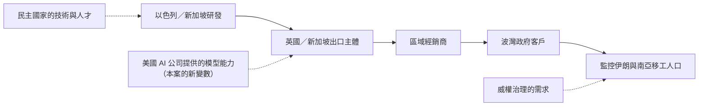
**這條鏈上的每一環都在合法的邊緣運作，而整條鏈的產出是對一整個國家人口的非自願側寫。** 這是「合法性的分散（diffusion of legality）」——沒有任何單一環節明顯違法，但整體結果明顯不正當。

**收尾金句**：「監控產業的商業模式，就是把道德責任切碎、分散到足夠多的法域與公司主體裡，讓每一片都小到不足以究責。」

#### 要點六：SOCMINT 的兩用性——同樣的技術，研究者也在做

**素材**：D1（Privacy International）；第 6.3.3 節的心理側寫倫理討論。

**關鍵區辨**：本案與正當的社群媒體研究，技術上幾乎一樣。差別在四點：
1. **目的**：理解現象 vs 鎖定個人
2. **同意與倫理審查**：IRB／研究倫理 vs 無
3. **輸出粒度**：彙總統計 vs 個人層級卷宗
4. **輸出對象**：公開發表 vs 賣給外國政府

**這四點應該成為學員判斷任何 SOCMINT 專案是否正當的檢查表。**

### 10.2 課堂討論題（有爭議性、無標準答案）

**討論題 1：Anthropic 應該公開點名 S2T 嗎？**
> Anthropic 在報告中直接寫出 "S2T Unlocking Cyberspace" 這個公司名稱，但同時用「open-source research suggests」把公司性質的判斷推給別人，而且 S2T 從未被給予回應機會（Forbidden Stories 2023 曾聯繫但未獲回應；本次檢索也未見 S2T 對 2026 年指控的任何回應）。
>
> - 一家 AI 公司，在沒有司法程序的情況下，公開指名一家在營運中的商業公司，這個門檻應該設在哪裡？
> - 如果之後證明操作者其實是一個拿 S2T 產品做 demo 的經銷商業務，Anthropic 該負什麼責任？
> - 反過來說，如果 Anthropic 不點名，這份報告對防守方還有多少價值？

**討論題 2：「在 pilot 階段被攔下」到底是成功還是運氣？**
> 行動被抓到時已經跑了 30 天、8,904 次 exchanges、囤了 255+ 個假帳號。
>
> - 這算「早期攔截」，還是「攔得不夠早」？
> - 如果行為者把批次大小改成 5、把節奏拉長到 90 天，還會被抓到嗎？
> - 「pilot stage」這個判定，有多少成分是證據、有多少成分是「我們只看得到這麼多」？

**討論題 3：六類編碼群體——如果換成台灣，會是哪六類？**
> 要求學員實際設計一套「台灣人口的六類編碼方案」，供一個假想的外國情報承包商使用。
>
> - 設計出來之後，問：你自己會被分到哪一類？
> - 這個練習本身是否不道德？教學上做這種練習的界線在哪裡？
> - 如果這套分類被洩漏出去，會造成什麼傷害？

**討論題 4：心理脆弱性語料庫（#PTSD_Iran、#suicide_rate_war）**
> 一個公共衛生研究團隊追蹤完全相同的標籤，以評估戰爭對心理健康的影響。
>
> - 技術上完全相同的行為，為什麼一個是研究、一個是侵害？
> - 如果那個公共衛生團隊的資料後來被政府徵用，責任在誰？
> - 平台應該區別對待這兩種檢索嗎？可能嗎？

**討論題 5：AI 供應商應該扮演什麼角色？**
> Anthropic 在本案中實際上做了三件事：偵測、封禁、分享情報給業界夥伴。這使一家私人公司事實上執行了類似**出口管制與跨國執法**的功能。
>
> - 這是好事（有能力者應該行動）還是壞事（私人公司不受民主問責卻行使準執法權）？
> - 如果 Anthropic 的判斷錯了，被封禁的公司有什麼救濟管道？
> - 台灣的 AI 服務供應商，未來會面對同樣的問題嗎？我們的法制準備好了嗎？

**討論題 6：如果行為者改用地端開源模型，整個故事還剩下什麼？**
> 報告在另一案例中自承：帳號執法「中斷了軟體與設計活動，但沒有中斷平台的部署」。
>
> - 上游偵測是一個「只在雲端 AI 時代成立」的暫時性優勢嗎？
> - 開源模型能力持續提升，會讓這種攔截徹底失效嗎？
> - 如果會，那防守的重心應該移到哪裡？（社群平台端？端點安全？法律？）

### 10.3 實作／桌面演練建議

> ⚠️ **全部演練均不涉及任何真實目標、不連線任何 IOC、不建立任何假帳號。**

**演練 A：證據分層工作坊（60 分鐘，紙筆）**
1. 發下 p.82–84 的原文（去除段落標題）。
2. 要求學員用三種顏色標記：🟩 Anthropic 一手觀察／🟨 引用第三方／🟥 推測性陳述（含情態動詞）。
3. 對照答案後，要學員回答：如果你是決策者，看完這份報告，你敢下什麼決定、不敢下什麼決定？
4. **學習成果**：能在任何情報產品中自動識別證據層級。

**演練 B：分類器紅隊（90 分鐘，桌面）**
1. 分兩組。A 組扮演 AI 供應商的信任與安全團隊，要寫出**三條**偵測規則，抓出「批次人口政治側寫」。
2. B 組扮演行為者，看到規則後設計**繞過方式**（僅在紙上設計，不實作）。
3. 兩輪攻防後，全班討論：哪些規則撐得住兩輪？為什麼？
4. **關鍵引導**：讓學員自己發現——**基於「輸出 schema 語意」的規則比基於「關鍵字」的規則耐打**。

**演練 C：合成帳號模式辨識（45 分鐘）**
1. 教師預先準備 40 個帳號名稱：26 個來自 p.85，14 個由教師自行編造的「無害的真實風格」名稱。
2. 學員分辨哪些是合成的，統計正確率（通常會很低）。
3. 揭曉第 6.2.2(a) 的構詞公式，重做一次。
4. **學習成果**：理解「模式偵測」為何優於「名單比對」。

**演練 D：台灣版語料庫設計與倫理煞車（60 分鐘）**
1. 分組設計「台灣資訊環境的 12 組語料庫」（對應 p.85–86 的結構）。
2. **強制要求**：每組必須同時寫出「這套語料庫若被濫用，會傷害誰」。
3. 全班投票：哪一組的設計最有研究價值？哪一組最危險？兩者是同一組嗎？
4. **學習成果**：親身體驗兩用性。

**演練 E：CTI 寫作練習（作業）**
1. 要求學員把本案改寫成**一頁 A4 的高階主管簡報（executive brief）**。
2. 硬性規定：必須包含一句明確的「我們不知道什麼」。
3. 互評標準：信度措辭是否精準、是否有過度宣稱、是否可追溯到頁碼。

**演練 F：公民社會防護桌演（90 分鐘）**
1. 情境：某台灣 NGO 的封閉 Telegram 群組在兩週內湧入 12 名新成員，自我介紹都很合理。
2. 學員扮演該 NGO 的資安負責人，設計一套**不傷害真實新成員**的查核流程。
3. 討論：查核流程本身會不會造成社群排他與信任崩壞？這個代價該由誰承擔？

### 10.4 對台灣的意涵

#### 10.4.1 為什麼台灣要在意一個伊朗／波灣的案例

三條直接的關聯：

1. **商業監控供應商是跨國產業，沒有地理忠誠。** S2T 的公開足跡橫跨以色列、新加坡、英國、斯里蘭卡，已知或可能的客戶名單包含哥倫比亞軍方（招標接觸）、孟加拉 DGFI（疑似出貨）、印度海軍（展示）。**這條產業鏈沒有任何理由在亞太地區止步。** 台灣的公民團體、記者、以及在台的中國／香港／西藏／維吾爾異議社群，在商業監控供應商眼中，與伊朗僑民社群屬於**同一類可分眾、可側寫、可滲透的目標**。

2. **同一份報告已經證明台灣在監控目標清單上。** 本報告 p.89–93 的 **GTG-14020** 案例，記錄了一個中國境內、與中共政府一致的宗教事務情報行動，其目標明確包含 **「台灣基督長老教會的領導階層（the leadership of the Presbyterian Church in Taiwan）」**，並且該行動除了建立卷宗之外，還進行了**宗教場所的場地偵察（venue reconnaissance），包括平面圖、外觀與結構圖**（p.90）。報告另於 p.93 一帶列出目標集包含「台灣的政治人物、勞工與學生運動者」。**本案（GTG-54009）示範的技術方法，與 GTG-14020 針對台灣的實際行動，是同一套方法論。**

3. **本案的分眾方法論可以被直接移植到台灣。** 第 6.3.3 節的演練不是假設題：一套「都市／宗教／軍公教／青年／僑民／鄉村」的台灣版六類編碼，在技術上與伊朗版沒有任何差別。**唯一需要的只是換一批主題標籤。**

#### 10.4.2 台灣的法制現況：SOCMINT 落在哪些法律的縫隙裡

這是本節最需要讓學員弄清楚的部分。**台灣目前沒有任何一部法律直接規範 SOCMINT。** 相關法律的適用界線如下：

| 法律 | 是否適用於本案類型的行為 | 界線與缺口 |
|---|---|---|
| **《通訊保障及監察法》（通保法）** | **多半不適用** | 通保法保護的是「通訊」的秘密——其核心是對**傳輸中的通訊內容**進行監察。**公開的社群媒體貼文一般不被認為是受通保法保護的「通訊」**，因為發文者對其不具有合理的隱私期待。→ **缺口一：把整個社會的公開貼文拿去做政治側寫，通保法管不到。**<br><br>但若行為進一步發展到 Figure 1 的**階段 03**（用假帳號進入封閉群組），情況會改變：封閉群組的訊息具有相當的隱私期待，若由公權力機關以偽裝身分潛入取得，是否構成「監察」，在我國法上**尚無明確定論**。→ **缺口二：假帳號滲透封閉群組，落在灰色地帶。** |
| **《個人資料保護法》（個資法）** | **部分適用，但保護力薄弱** | 第 19 條允許非公務機關在「當事人自行公開或其他已合法公開之個人資料」「一般可得之來源」等情形下蒐集處理，第 20 條要求利用須在蒐集之特定目的必要範圍內。個資保護委員會籌備處的函釋也強調，即使資料屬已合法公開或一般可得來源，仍須受第 5 條**比例原則**拘束，不得任意使用。<br><br>→ **缺口三：「已公開」這個例外，正好是 SOCMINT 的主戰場。** 把公開貼文拿去推論政治傾向、心理狀態，實質上是**產生新的、當事人從未公開的個人資料**（甚至是個資法第 6 條的特種個資：政治立場雖非明列，但健康、心理狀態相關推論可能觸及）。**現行法對「推論而生的個資」規範幾乎是空白的。**<br><br>→ **缺口四：域外適用與執行困難。** 若行為者是境外公司、資料在境外處理，個資法的執行手段有限。 |
| **《科技偵查及保障法》草案**（行政院 2024-05-09 院會通過送立法院） | **規範的是我國偵查機關，不是境外商業行為者** | 草案規範偵查機關使用科技方法（GPS 定位追蹤、行動通訊裝置調查、對具合理隱私期待空間的非實體侵入性調查）之聲請、核准、期限、資料保存銷毀與事後通知。<br><br>→ **意義**：它至少會把**我國公權力**使用科技偵查手段納入法律控制與事後通知義務。<br>→ **缺口五**：草案處理的是「我國國家機關對內」，**完全沒有處理「境外商業供應商對台灣人」這一整類威脅**，也沒有處理 SOCMINT 特有的「大規模、非針對特定嫌疑人」的問題。 |
| **《國家安全法》《反滲透法》** | 間接相關 | 處理的是滲透來源與危害國安行為，**不是資料處理行為本身**。對「一家中立第三國公司把台灣人口分類後賣給第三方」這種行為，適用困難。 |
| **出口管制／投資審查** | 幾乎不適用 | 台灣沒有針對「網路情報／SOCMINT 產品」的專門進出口或採購限制。**我國政府機關若採購此類產品，目前沒有專門的人權盡職調查（human rights due diligence）要求。** |

> **結論：台灣對「境外商業監控供應商大規模側寫台灣人口」這件事，目前處於「幾乎沒有法律工具」的狀態。** 通保法管不到公開貼文，個資法的「已公開」例外開得太大且域外執行困難，科技偵查法草案只管我國自己的偵查機關。

#### 10.4.3 政策建議方向（供課堂討論，非定論）

1. **在個資法或其後續立法中處理「推論性個資（inferred data）」**。核心問題不是「你蒐集了什麼」，而是「你從公開資料推論出了什麼」。政治傾向、宗教立場、心理健康狀態的**推論結果**，應被視為高敏感個資，不因其來源資料公開而降級。
2. **建立政府採購的人權盡職調查要求**。我國各級機關若採購 OSINT／WEBINT／輿情分析產品，應要求供應商揭露其客戶國家、人權紀錄、以及產品是否具備假帳號（avatar）功能。**採購清單本身就是一種出口管制。**
3. **釐清「假身分滲透封閉群組」的法律定性**。不論行為者是我國公權力、境外機關或商業公司，這個行為都應有明確的法律評價。
4. **在科技偵查及保障法立法過程中納入 SOCMINT 條款**，特別是「大規模、非針對特定嫌疑人」的蒐集類型。
5. **建立跨國鎮壓通報機制**。台灣人權促進會等團體於 2026-02-05 已具體呼籲：建立跨國鎮壓通報及追蹤機制並定期發布案例統計、強化跨部會協作與救濟管道、公開譴責、提升政府與公民社會意識。該團體並明指**台灣目前「尚未有專門針對跨國鎮壓的法律對策、受害者通報機制、降低風險措施，以及相對應的保護與支持系統」**，而高風險社群包含**在台港人與反送中運動者、藏人與維吾爾人等被迫離散群體、人權記者與民間團體工作者**。

#### 10.4.4 公民社會的防護實務（可立即執行）

給台灣 NGO、記者、離散社群的具體建議，**全部對應本案 Figure 1 的某一階段**：

| 對應階段 | 威脅 | 防護作法 |
|---|---|---|
| **01 Monitor** | 公開貼文被大規模蒐集 | 這階段幾乎無法防守。**務實的作法是「操作安全的發文習慣」**：避免在公開貼文中透露可推論位置的細節（打卡、可辨識地標、通勤規律）；理解「公開＝永久＋可被聚合」 |
| **02 Segment and score** | 被推論出政治傾向、心理狀態 | 減少「情緒性揭露」與「身分標記」的疊加。特別注意：**心理健康相關的公開發文，在本案中被明確列為一個語料庫**。不是要人不能談，而是要知道這類內容具有特殊的被利用價值 |
| **03 Infiltrate** ★**最關鍵的防守點** | 假帳號進入封閉群組、收割成員名單 | ★ **這是公民社會唯一能有效防守的環節**：<br>‧ 封閉群組採**推薦制＋雙人背書**，不接受純線上自我介紹入群<br>‧ 新成員入群後設觀察期，限制存取歷史訊息<br>‧ **定期檢視成員名單**（本案的回饋迴圈就是靠成員名單擴張）<br>‧ 群組管理員權限最小化、關閉「任何人可邀請」<br>‧ 對「自我介紹剛好完美符合本群目標受眾原型」的新成員保持健康懷疑 |
| **04 Exploit** | 釣魚、惡意程式、裝置入侵 | ‧ 高風險者啟用 **Apple 鎖定模式（Lockdown Mode）／Android 進階保護**<br>‧ 實體安全金鑰（FIDO2）取代簡訊 OTP<br>‧ 定期更新、避免側載<br>‧ 遇疑似鎖定攻擊，聯繫 Access Now Digital Security Helpline 或 Amnesty Security Lab 等具鑑識能力的機構 |
| **回饋迴圈** | 成員名單成為下一輪蒐集種子 | **降低「社群圖譜」的外洩面**：群組成員清單不外流、活動報名表不公開、合影照不標記全部參與者 |

> **給台灣的一句話總結**：本案最該讓台灣公民社會記住的不是 S2T 這家公司，而是 **Figure 1 階段 03 那一格**——因為那是整條監控鏈上，**唯一一個由社群自身的組織慣例（而非政府或平台）決定成敗的環節**。

---

## 11. 關鍵原文引文（講義用）

> 以下引文皆逐字抄錄自 PDF，標註頁碼。中譯為本教材所作。

**引文 1｜歸因（p.82）**
> "Our investigation found that the activity was carried out by, or on behalf of, an entity named 'S2T Unlocking Cyberspace,' which open-source research suggests is an Israeli-Singaporean commercial intelligence vendor."
>
> 我們的調查發現，該活動是由一個名為「S2T Unlocking Cyberspace」的實體所執行，或代表該實體執行；公開來源研究顯示該實體是一家以色列—新加坡的商業情報供應商。
>
> *【教學用途】三層降信度措辭的拆解（第 2.2 節）。*

**引文 2｜平台的核心目的（p.82）**
> "The platform's core purpose was surveillance: it mapped the locations of the social media users, sorted the population into coded demographic groups, and produced Arabic-language intelligence briefings written in the register of a government report."
>
> 該平台的核心目的就是監控：它繪製了社群媒體使用者的位置，把人口分類進編碼過的人口群體，並產出以政府報告語域書寫的阿拉伯語情報簡報。
>
> *【教學用途】「sorted the population」——注意受詞是 population（人口）而非 users（使用者）。這個用詞選擇本身就說明了監控的尺度（第 3.1 節）。*

**引文 3｜六類編碼群體（p.83）**
> "A demographic scheme comprising six groups (urban, clerical, military, youth, diaspora, rural) was used to sort people into categories."
>
> 一套包含六個群體的人口方案（都市、教士、軍事、青年、離散僑民、鄉村）被用來把人分類。
>
> *【教學用途】本案最核心的一句。第 3.3 節全節。*

**引文 4｜產出物＝情報＋反制敘事（p.83）**
> "The final briefings were written in formal Arabic and styled as official government communications, with sentiment scores broken down by Gulf nationality alongside recommended counternarratives."
>
> 最終簡報以正式阿拉伯語書寫、樣式仿照官方政府公文，包含依波灣國籍拆分的情緒分數，以及建議反制敘事。
>
> *【教學用途】監控與影響力行動一體化（第 4.5 節）。*

**引文 5｜兩邊都做（p.83）**
> "These personas were intended to pass as members of different pro- and anti-Iranian-regime populations. This behavior suggests an effort to mass-create fake social media accounts to work both sides of the conflict."
>
> 這些人設被設計來冒充不同的擁伊朗政權與反伊朗政權人口的成員。這個行為顯示，有人試圖大量建立假社群媒體帳號，以便在衝突的兩邊同時操作。
>
> *【教學用途】商業供應商販售的是「操作能力本身」，而非任何政治立場（第 4.3 節）。*

**引文 6｜獨立佐證第三方調查（p.82–83）**
> "Our findings independently corroborate a February 2023 investigation by the journalism network Forbidden Stories; the investigation documented an S2T surveillance product, which the reporters discovered in a company brochure in leaked files from the Colombian military. The capabilities described in that brochure map closely onto the behavior we observed in this operation."
>
> 我們的發現獨立佐證了新聞網絡 Forbidden Stories 於 2023 年 2 月的一項調查；該調查記錄了一項 S2T 的監控產品，記者是在哥倫比亞軍方外洩檔案中的一份公司型錄裡發現它的。該型錄所描述的能力，與我們在這次行動中觀察到的行為高度吻合。
>
> *【教學用途】來源獨立性如何提升信度（第 2.5 節）。*

**引文 7｜劃清驗證界線（p.83–84）★ 本教材認為最重要的一句**
> "The content this actor used Claude to generate might have served as a credibility layer to help targets trust these fake accounts. We were not able to independently confirm the downstream operational stages reported by Forbidden Stories."
>
> 此行為者用 Claude 生成的內容，可能曾作為一層可信度包裝，幫助目標信任這些假帳號。我們無法獨立確認 Forbidden Stories 所報導的下游作業階段。
>
> *【教學用途】CTI 寫作紀律的教科書範例（第 2.5、8.3 節）。*

**引文 8｜在 pilot 階段攔下（p.83）**
> "We identified this activity in its pilot stage, and found no evidence that later stages of S2T's surveillance chain (as described in the Forbidden Stories report) were used against real targets before we banned the account."
>
> 我們在此活動的試營運階段就辨識出它，且未發現任何證據顯示 S2T 監控鏈的後續階段（如 Forbidden Stories 報告所描述者）在我們封禁該帳號之前，曾被用於對付真實目標。
>
> *【教學用途】上游偵測的價值與 "found no evidence" 的認識論界線（第 8.3 節）。*

**引文 9｜政策依據與雙重援引（p.84）**
> "This activity violated our Usage Policy prohibitions on surveillance—including profiling, scoring, and building dossiers on activists, journalists, and political dissidents—as well as our prohibition on coordinated inauthentic behavior."
>
> 此活動違反了我們《使用政策》對監控的禁令——包括對活動人士、記者與政治異議人士進行側寫、評分與建立卷宗——以及我們對協同不實行為的禁令。
>
> *【教學用途】政策條文與行為證據的逐項對照（第 8.2 節）；雙重援引證明行動的混種性質（第 4.5.2 節）。*

**引文 10｜Figure 1 圖說（p.84）**
> "Figure 1. The operation's collection funnel: Claude-driven classification and persona generation, which likely enabled the actor to infiltrate the targeted communities."
>
> 圖 1。該行動的蒐集漏斗：Claude 驅動的分類與人設生成，這很可能使該行為者得以滲透目標社群。
>
> *【教學用途】注意 "likely enabled" 的情態降級（第 6.1.6 節）。*

**引文 11｜章節導論的趨勢判斷（p.81）**
> "Second, AI is being used not only to build tools but to ingest data in bulk to identify targets. In one case, an actor uploaded batches of social media posts and directed Claude to produce structured records that outlined targets' locations, demographic data, and political leanings, along with confidence scores."
>
> 第二，AI 不只被用來打造工具，還被用來大量吞入資料以辨識目標。在一個案例中，一名行為者上傳了成批的社群媒體貼文，並指示 Claude 產出結構化紀錄，勾勒出目標的位置、人口統計資料與政治傾向，並附上信度分數。
>
> *【教學用途】本案被 Anthropic 當成全章的趨勢代表案例（第 4.2 節）。*

**引文 12｜章節導論的受害者學觀察（p.82）**
> "In nearly every case described in this section, the operators were state-aligned organizations that targeted the same diaspora and dissident communities these regimes have historically targeted."
>
> 在本節描述的幾乎每一個案例中，操作者都是與國家一致的組織，且鎖定的正是這些政權歷來鎖定的同一批離散與異議社群。
>
> *【教學用途】AI 沒有改變「誰被監控」，只改變了「用多少成本監控」——這正是第 9.2 節 C2 所引述的 Anthropic 說法（AI 讓監控 "cheaper and more efficient"）。也是第 10.4 節台灣意涵的立論基礎。*

---

## 12. 未能驗證之處與研究限制

### 12.1 報告本身未揭露的資訊

| 未揭露項目 | 影響 |
|---|---|
| **操作者的語言、時區、handle、IP、註冊資訊** | 無法獨立評估歸因強度；也無法與其他報告交叉比對 |
| **Anthropic 是如何發現這個帳號的**（分類器？人工審查？外部通報？） | 其他平台無法複製此偵測能力 |
| **帳號的實際存續期間** | 只知道 Figure 1 的「30 天內 8,904 次 exchanges」與「2026 年 6 月封禁」，不知道帳號何時建立 |
| **具體的規避手法** | 導論宣稱「every case」都有規避行為，本案正文未舉證（第 8.5 節） |
| **229+ 個未揭露的合成帳號** | 公開資訊不足以讓一般防守方比對 |
| **「多品牌系統投資組合」的品牌名稱** | 無法追蹤這些品牌在市場上的流通 |
| **客戶的具體身分**（哪一個波灣國家？哪一個機關？） | 只知道「likely serving Arabic-language customers in the Gulf region」 |
| **是否有實際的受害個人** | 報告只說 pilot stage、no evidence，未說明是否對任何個人產生後果 |
| **緩解措施的具體內容** | "are implementing mitigations" 沒有說明是什麼 |

### 12.2 本教材的推論（明確標示為非報告內容）

以下內容是本教材的分析，**不是 Anthropic 的主張**，引用時必須標明：

1. **6.1.5(a) 的貼文數量推估**（22 萬則上界、6.7 萬～13 萬則區間）——報告只給了 8,904 與「約 25」兩個數字。
2. **6.1.5(b) 關於 Natanz／Fordow 的軍事情報價值評註**——報告只把這兩個地名當成位置推論的範例。
3. **3.3.3 的「六類 vs 七碼」三種解釋**——報告沒有解釋這個落差。
4. **2.4 的「法域套利」分析**——報告只說「Israeli-Singaporean」。
5. **6.2.2(a) 的 handle 構詞公式**——這是本教材對 26 個 handle 的模式分析。
6. **6.2.2(b) 關於 `@AyatollahKhamenei` 作為 pilot stage 側面佐證的推論。**
7. **5.3 的框架缺口命名**（LLM-assisted population profiling 等四項）——這是本教材的原創提議，不是任何官方框架的用語。
8. **8.5 的「解讀 B 更可能」判斷。**
9. **第 7.2 節的偵測價值與壽命評級**——這是本教材的評估。

### 12.3 第三方驗證的限制

1. **本案的核心主張是單一來源**。除 Anthropic 自己的報告外，**沒有任何獨立來源查證「S2T 或代表其者在 2026 年使用 Claude 建構此平台」**。所有中英文報導（第 9.2 節 C 類）均為轉述。
2. **S2T 從未回應**。Forbidden Stories 2023 年報導時，S2T 未回應採訪請求；本次檢索也未發現 S2T 對 2026 年指控的任何公開回應、否認或法律行動。**這意味著本案只有一方的陳述被記錄在案。**
3. **Citizen Lab 未曾針對 S2T 發表專文**（依本次檢索）。這與 NSO、Intellexa、Cytrox 等被大量鑑識研究覆蓋的供應商形成對比——**S2T 屬於「被報導過但未被技術鑑識過」的供應商**，這使其產品的實際能力難以獨立驗證。
4. **Surveillance Watch 的 S2T 實體頁未能取得內文**（僅取得標題），列為未完成的查證項目。
5. **公司註冊地資訊互相矛盾**：CyberDB 登載英國 Slough；Forbidden Stories 寫新加坡／斯里蘭卡／英國／以色列；Anthropic 寫「以色列—新加坡」。**依課程規範以 PDF 原文為準，但此矛盾未能解決。**
6. **C2（Muslim Network TV）引述的 Anthropic 威脅情報負責人說法**（監控變得 "cheaper and more efficient"）**未能核對到一手逐字稿或官方新聞稿**，僅在該二手報導中出現。引用時應標示為未經核實的二手引言。
7. **ZeroHedge／The Cradle 版本加入了與本案無關的地緣政治敘事**（第 9.2 節 C3），**不建議作為課程引用來源**。

### 12.4 RTL 文字抄錄的技術限制

p.85–86 的波斯語與阿拉伯語主題標籤，**PDF 文字層的擷取結果是亂序破碎的**。本教材的抄錄是以渲染圖像放大目視判讀所得，並附羅馬轉寫與釋義。

**風險說明**：
- 目視判讀 RTL 文字在低解析度渲染下仍可能出錯（特別是連字與變音符號）。
- 部分標籤的釋義（例如 `#trust_Khamenei` 是反諷還是擁護）**在缺乏原始語境的情況下無法確定**，本教材已在表中標示語意曖昧。
- 若課程要正式引用這些標籤，**建議另請波斯語／阿拉伯語母語人士複核**。

### 12.5 頁段界線說明

本教材涵蓋 PDF **p.82（案例起始）至 p.86 上半（Hashtags by corpus 表結束，其後轉入 GTG-14010）**，並引用 p.81（章節導論）、p.64（2026 年美以伊戰爭脈絡）、p.89–93（GTG-14020 台灣交叉引用）、p.105（GTG-50027／馬利案的地端 LLM 失效模式）、p.111 與 p.153（Anthropic 處置方法論）作為必要脈絡。**本頁段內沒有 IOC 表格**（見第 7.1 節）。

---

## 附錄：本案一頁速記卡（可印給學員）

```
GTG-54009  ｜  2026 年 6 月封禁  ｜  PDF p.82–86
────────────────────────────────────────────────
行為者    S2T Unlocking Cyberspace（或代表其者）
          「公開來源研究顯示」為以色列—新加坡商業情報供應商
          公開足跡：以色列 / 新加坡 / 英國 / 斯里蘭卡

目標      伊朗＋波斯灣＋阿聯「全體人口」；離散僑民；波灣南亞移工

Claude    ① 批次分類（每批約 25 則貼文）→ 人口群體 / 位置 / 政治傾向 + 信度分數
做了什麼  ② 生成假人設貼文（波斯語 / 阿拉伯語 / 英語 / 德語，兩邊都做）
          ③ 產出正式阿拉伯語政府公文體簡報 + 情緒分數 + 建議反制敘事

六類編碼  urban 都市 / clerical 教士 / military 軍事
群體      youth 青年 / diaspora 僑民 / rural 鄉村
          （但 p.85 表中是 7 個 code，缺 urban，多 UAE 與 GCC）

規模      8,904 exchanges / 30 天（僅見於 Figure 1）
          255+ 合成帳號（僅揭露 26 個）
          12 組主題標籤語料庫

漏斗      01 Monitor → 02 Segment and score ┊ 03 Infiltrate → 04 Exploit
          ├──── Anthropic 看得到 ────┤    ├── 視野之外（依 2023 型錄）──┤
          回饋：收割名單 → 回灌分類器 → 下一輪掃描

處置      封禁帳號（單數）；援引 surveillance + coordinated inauthentic behavior
          兩條政策；緩解「正在實施中」；與追蹤 surveillance-for-hire 的夥伴分享指標

信度      「這家公司賣這種產品」= Forbidden Stories 2023 獨立查證 ✅
          「這家公司 2026 年用 Claude 做這件事」= 單一來源（Anthropic）⚠️

三句話    ①「把人分類」不是描述世界，是製造世界。
要記住    ②「We found no evidence」不等於「It did not happen」。
          ③ 公民社會唯一守得住的一格，是 Figure 1 的階段 03。
```

---

*本教材整理日期：2026-09-13。一手來源：Anthropic《Detecting and countering misuse of AI: September 2026》（2026-09-10 發布，154 頁）p.82–86。所有頁碼均指 PDF 印刷頁碼。*

---

# 技術附錄（第二階段：技術深化 pass，2026-09-13 追加）

> **本附錄性質**：這是對前述第 1–12 節的**技術增補**，不取代任何既有內容。前述章節（尤其第 4、5、6、8 節）已完整處理「發生了什麼、報告怎麼寫、圖表怎麼判讀」；本附錄補的是**技術高手要據以理解與防禦所需的實作層細節**——SOCMINT 產線怎麼被搭起來、合成帳號怎麼被辨識、人口分群的 ML 怎麼運作、商業監控產業的技術堆疊長什麼樣，以及**可直接部署的偵測規則**。
>
> **模組界線**：本案屬「03 監控行動」，依共用簡報規範，**補到最完整的防禦性技術深度、無保留**。本附錄所有規則、程式碼、流程皆為**偵測與保護受監控者**之用，不含任何可用於執行監控／攻擊的操作步驟。
>
> **圖表完整性確認**：p.82–86 頁段內的全部視覺元素——Figure 1（p.84 蒐集漏斗）、Synthetic handles by segment 表（p.85）、Hashtags by corpus 表（p.85–86）——已於第 6 節逐一完整判讀（圖片類型、圖上文字、資料流、核心訊息、課堂用法）。本頁段無其他未解說圖表。
>
> **安全紅線重申**：第 6.2.1 的 26 個 handle、第 6.3.1 的主題標籤、s2t.ai 等識別符**僅供研究與規則設計**。不得連線、訂閱、私訊、DNS 查詢或任何互動。本附錄的 WebSearch／WebFetch 只觸及新聞機構（Forbidden Stories 等）與學術預印本，未觸及任何 IOC。

---

## A. SOCMINT 蒐集漏斗的技術實作與偵測

本節把第 6.1 節的 Figure 1（漏斗四段）翻譯成**一條可被工程實作的產線**，並在每一層給出**受監控者可用的偵測角度**。核心對照：Figure 1 的視覺隱喻是「漏斗（從多到少）」，但實作上它是一條 **資料湖 → 富化/分類 → 知識圖譜 → 人設生成 → 投放 → 回饋** 的 ETL＋ML 管線。

### A.1 產線總覽（Mermaid：資料湖 → 分類器 → persona 生成 → 投放 → 回饋）

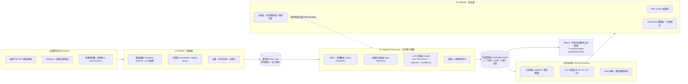

> 對照 Figure 1：`INGEST`＝階段 01，`ENRICH`＋`KG`＝階段 02（**Claude 的變現點**），`PERSONA`＋`DEPLOY`＝階段 03（報告視野邊界的另一側），`RPT`＝正文的政府公文簡報，虛線＝Figure 1 底部的回饋箭頭。**注意 Claude 在圖上只出現在 `ENRICH` 與 `PERSONA` 兩個框——這正是為什麼 Anthropic 只看得到漏斗上半（第 8.3 節）。**

### A.2 階段 01 Monitor：大規模社群爬取的技術實作

報告只寫「8,904 exchanges / 30 天」與「每批約 25 則」（第 6.1.4），沒有描述資料**怎麼取得**——因為取得發生在平台外。但要理解防禦，必須知道這一層的典型技術：

| 元件 | 典型技術 | 為何監控者需要它 |
|---|---|---|
| 爬取 | 官方 API（受配額限制）＋ headless browser（Playwright/Puppeteer）＋ 第三方 scraping API | 官方 API 拿不到的公開時間軸、留言串、關注圖 |
| 反封鎖 | **residential / mobile proxy 輪替**、User-Agent 池、請求節流 | 避免被平台以速率或 IP 特徵封鎖 |
| 資料湖 | 物件儲存（S3 相容）＋ 全文索引（Elasticsearch/OpenSearch）＋ 欄位化（Parquet） | 把非結構化貼文變成可查詢語料，供下游批次餵給 LLM |
| 排程 | 以 hashtag／關鍵字語料庫（見第 6.3）為種子的週期性 sweep | 「每輪掃描」對應 Figure 1 回饋箭頭的 next sweep |

**這一層對受監控者幾乎無法防守**（資料是公開的、爬取在對方基礎設施上），第 10.4.4 節已給出「操作安全發文習慣」的務實建議。技術上唯一能留下痕跡的是**爬蟲的請求指紋**，但那只有社群平台方看得到。

### A.3 階段 02 Segment and score：Claude 驅動的分類管線（技術實作）

這是全案唯一 Anthropic 親眼看到的階段（第 4.2 節），也是本附錄第 C 節深挖的重點。實作上，「每批約 25 則貼文 → 回傳 {人口群體, 位置, 政治傾向, 信度}」是一個典型的 **LLM 結構化抽取（structured extraction）＋ zero-shot 分類** 管線：

1. **批次組裝**：把資料湖裡的 N≈25 則貼文串接成單一 prompt（25 是 context window 吞吐量與輸出穩定度的工程折衷，見第 4.2 節）。
2. **schema 約束輸出**：要求模型回傳固定 JSON schema（segment enum、city、political_leaning enum、confidence float）。這是 SOCMINT 產品化的關鍵——**固定 schema 讓輸出可直接寫入知識圖譜**。
3. **zero-shot stance detection**：把「擁政權／反政權」當成 zero-shot 立場偵測任務。學術界已證實 LLM 可在**未見過的主題**上做立場推論（Tweets2Stance 以 NLI 預訓練模型做五值立場；Political DEBATE 提供 zero/few-shot 政治文本分類器），這正是本案「不必為伊朗政治另外標註訓練集」就能運作的技術基礎。
4. **地理定位推論**：從貼文內容（方言、地標、在地事件、時區）推論 city-level 位置（Figure 1 的 Natanz/Fordow）。這是**推論而非查詢**——第 9.3 節指出的「從『買資料』變成『推論資料』」的技術本體。

> **偵測（LLM 服務端，Sigma 風格）**：這一層之所以是最佳攔截點（第 8.3.3），是因為它的**輸出 schema 幾乎不出現在正當用途**。第 E 節給出可部署的 Sigma-style／KQL 規則。

### A.4 人設生成層：技術管線

報告觀察到「以 fa/ar/en/de 生成假人設貼文，兩邊都做」（第 4.3）。實作上，一個 persona factory 需要三個子系統：

- **人設規格庫**：每個 persona 綁定 {segment code, 母語, 陣營, 語域, 履歷背景故事}。第 6.2.1 的七個 segment code 就是這個規格庫的鍵。
- **內容生成**：LLM 依規格生成符合該 persona 語感的貼文（Claude 在此）。跨語言一致的**主題**、卻各自在地化的**語感**，是本案最強的偵測指紋（第 5.4 節、第 B.3 節）。
- **視覺身分**：GAN 生成頭像（thispersondoesnotexist 類）＋ 竊用真實個資拼裝（Graphika 稱 "GAN collage"）。第 B.2 節專論偵測。

### A.5 給受監控者：偵測「異常帳號互動模式」

這是 Figure 1 階段 03 落到受監控者身上的接觸面，也是**公民社會唯一守得住的一格**（第 10.4.4 結論）。把「異常互動」拆成可觀測訊號：

| 異常訊號 | 技術描述 | 個人／社群可觀測性 |
|---|---|---|
| **好友請求速度異常** | 短期內來自「完美符合本群原型」的新帳號批次加好友 | 高（個人可感知） |
| **入群叢集性** | 封閉群組在 1–2 週湧入多名新成員，建立時間相近、handle 構詞同型 | 高（管理員可查） |
| **互惠互動環** | 新帳號之間互相按讚/留言（Forbidden Stories：avatar「被程式設定為互相按讚分享」），形成小而密的互動子圖 | 中（需圖分析） |
| **淺歷史深熱情** | 帳號歷史短、貼文少，卻對本群核心議題異常積極 | 中 |
| **一問就露餡的在地細節** | 冒充在地人設，但對在地生活細節（學校、街區、方言俚語）回答含糊 | 高（人際互動可測） |

> **關鍵洞見**：avatar 之間「互相按讚」這個為了製造可信度而設計的行為，反而製造了**一個異常緊密的互動子圖**——這是把「社會工程資產」變成「圖偵測目標」的轉折點，第 B.4 節的叢集偵測正是利用它。

---

## B. 合成人設帳號的技術辨識

本節把第 6.2 節的 26 個 handle 從「人讀的清單」升級成「機器可偵測的模式」，並補上頭像、文本、行為三個維度的技術指紋，最後給出**叢集偵測**的完整方法。核心原則（承第 6.2.2(c)）：**不要拿 26 個 handle 做名單比對（壽命極短），要拿它們背後的「生成規律」做模式偵測（壽命長）。**

### B.1 handle 構詞模式的形式化與偵測

第 6.2.2(a) 已歸納出構詞公式 `handle = [地理標記] + [身分角色標記] (+ 立場標記)`。把它形式化成可執行的文法與偵測器：

```python
import re

GEO = {  # 伊朗境內 / 僑居地 / 波灣（可持續擴充）
    "tehran","isfahan","shiraz","tabriz","mashhad","qom","khorasan","natanz","fordow",
    "la","toronto","berlin","london","dubai","ajman","sharjah","riyadh","saudi","gcc"
}
ROLE = {"student","kid","uni","clergy","seminary","village","worker","laborforum",
        "forum","news","chat","expat"}
STANCE = {"free","opposition","exile","protest","rebel","defender","watcher",
          "threat","alert","eye","rebel","watch"}

def tokenize(handle: str):
    s = handle.lstrip("@")
    s = re.sub(r"(?<=[a-z])(?=[A-Z])", " ", s)      # 拆 camelCase
    return [t.lower() for t in re.split(r"[_\s\d]+", s) if t]

def morpho_flags(handle: str):
    toks = set(tokenize(handle))
    return {"geo": bool(toks & GEO),
            "role": bool(toks & ROLE),
            "stance": bool(toks & STANCE)}

def is_persona_pattern(handle: str) -> bool:
    f = morpho_flags(handle)
    # [地名] 為必要，且至少再命中 [角色] 或 [立場]
    return f["geo"] and (f["role"] or f["stance"])
```

以 p.85 的 26 個 handle 回測，命中率極高（如 `@tehran_uni_student`：geo+role；`@BerlinIranFree`：geo+stance；`@SaudiShiaWatcher`：geo+stance）。**這個偵測器的價值不在抓這 26 個，而在抓「用同一套生成規律造出的下一批 229+」。** 誤報控制見第 B.4 的叢集門檻。

### B.2 AI 生成頭像的技術偵測

合成人設的視覺身分多用 GAN 臉（StyleGAN 系）。學界已有數種**可直接實作**的偵測法，依可靠度與成本排列：

**(a) 眼睛定位法（GANEyeDistance）——最便宜、對 StyleGAN 對齊臉近乎滿分**

StyleGAN 因為訓練時臉部對齊，**會把眼睛固定放在幾乎相同的像素位置**。把偵測到的眼睛歸一化座標與「GAN 期望位置」比距離即可：

```python
import face_recognition, numpy as np

# 期望眼睛中心（歸一化座標；實務上應以一批已知 GAN 臉統計得出，此為示意錨點）
EXP_LEFT  = np.array([0.373, 0.480])
EXP_RIGHT = np.array([0.627, 0.480])

def gan_eye_distance(path: str):
    img = face_recognition.load_image_file(path)
    h, w = img.shape[:2]
    lms = face_recognition.face_landmarks(img)
    if not lms:
        return None
    le = np.mean(lms[0]["left_eye"],  axis=0) / np.array([w, h])
    re_ = np.mean(lms[0]["right_eye"], axis=0) / np.array([w, h])
    # 論文以 2*sqrt(2) 正規化（單位正方形內雙眼最大可能距離）
    return (np.linalg.norm(le - EXP_LEFT) + np.linalg.norm(re_ - EXP_RIGHT)) / (2*np.sqrt(2))

# 判定：距離 < 0.02 → 高度疑似 GAN
```

依 Yang 等人（arXiv:2401.02627）實測，門檻 **0.02** 在 AcademicGAN 取得 **100% recall**、TwitterGAN **99.5%**；且 `face_recognition` 對 GAN 臉的臉部偵測成功率 99%+，對隨機真人頭像僅約 35.7%（真人頭像姿態/裁切變異大），這個差異本身也是弱訊號。

**(b) 配件與邊緣瑕疵（人工複核用）**：GAN「難以生成逼真的帽子、眼鏡、耳朵」，耳環/項鍊常不對稱、衣領/牙齒/背景常有破綻。該研究人工標註發現 **60.1% 的 TwitterGAN 頭像有明顯瑕疵**（Cohen's Kappa=0.90，標註者高度一致）。

**(c) 頻域指紋（對抗新模型較穩健）**：GAN 上採樣（up-sampling）在頻譜留下人眼看不見的規律性偽影；以 2D-FFT／DCT 取頻譜、餵 ResNet 類分類器可偵測（Fourier-based GAN fingerprint, arXiv:2510.19840）。StyleGAN2 偽影較少但仍可區分。

**(d) 瞳孔幾何（強假設下有效）**：真人雙眼角膜反光應一致、瞳孔應為規則橢圓；GAN 常出現**不規則瞳孔形狀**與左右反光不一致（"Eyes Tell All", arXiv:2109.00162）。限制：需正面、高解析、瞳孔清晰。

> **實務組合**：頭像偵測**單獨不可作為封鎖依據**（會誤傷用 AI 頭貼的真人、也漏掉「GAN collage」拼貼）。正確用法是把它當**多訊號融合中的一票**（第 B.4）。Graphika 的 "Portrait Mode" 報告即指出：GAN 拼貼比純 GAN 臉更難偵測，需分析師先判斷「值得查」再逐塊拆解。

### B.3 行為指紋：Digital DNA 與 LCS 群體偵測

真正抗規避的不是頭像或名字（都可改），而是**行為序列**。Cresci 等人的 **Digital DNA**（arXiv:1602.00110、1703.04482）把帳號行為編碼成字串，再用**最長共同子字串（LCS）**揭露機器化的一致性：

```python
# 兩種編碼（可擇一或串接）
# Tweet Type   : A=原創, T=回覆, C=轉推
# Tweet Content: A=含URL, T=含hashtag, C=含mention, G=含媒體, X=混合, N=皆無
def encode_type(actions):
    m = {"tweet":"A", "reply":"T", "retweet":"C"}
    return "".join(m[a] for a in actions)

def lcs_len(a: str, b: str) -> int:      # 標準 DP 最長共同「子字串」
    prev = [0]*(len(b)+1); best = 0
    for i in range(len(a)):
        cur = [0]*(len(b)+1)
        for j in range(len(b)):
            if a[i] == b[j]:
                cur[j+1] = prev[j] + 1
                best = max(best, cur[j+1])
        prev = cur
    return best
```

**判讀曲線**：對 k 個帳號求兩兩 LCS，畫「LCS 長度 vs k」曲線——

- **合成帳號叢集**：即使 k 變大，LCS 仍**維持相當長**（程式化行為高度一致），到 k 接近群體規模時才驟降。
- **真人**：LCS 隨 k **指數衰減**，很快降到極小值（人的行為多樣）。
- **切群**：對曲線取一階導數找「陡降點」，即為分離「同構叢集 vs 其餘」的切點。

本案的 avatar 由同一套 persona factory 產生、行為受同一套腳本驅動（互相按讚、同節奏發文），在 Digital DNA 上會呈現**異常長的共同子字串**——這是名字與頭像都改了也甩不掉的指紋。

### B.4 合成帳號叢集偵測的技術方法（多訊號融合 + 圖分群）

把 B.1–B.3 的訊號，加上帳號詮釋資料與時間同步，融合成一條**協同不實叢集（CIB cluster）**偵測管線。這是本節要交付的「一個偵測合成帳號叢集的技術方法」：

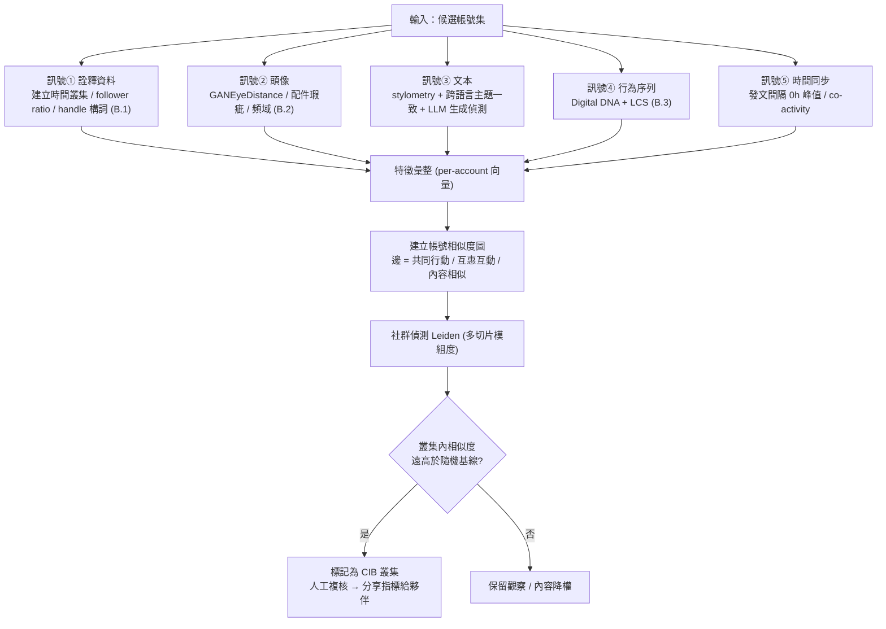

**技術要點**：

- **相似度圖的邊**：可用「共同轉推同一則」「幾乎同時發文（co-activity）」「內容 n-gram 相似」「互惠按讚」建邊。文獻常用作法是**先建圖再對圖或其 embedding 分群**。
- **分群演算法**：**Leiden**（多切片加權模組度）能找出「內部連結強、對外連結弱」的帳號叢集（見 arXiv:2512.19677 對 temporal/multiplex/collaborative 分析的整理）。
- **時間同步是最硬的訊號**：協同帳號的「發文時間間隔」在 **0 小時附近有陡峰**、且集中在特定時段；真人分布寬得多。VigDet（arXiv:2110.15454）用「知識導引的時間點過程」把這種同步性建進神經模型。
- **判定用相對基線**：不要用絕對門檻，要問「這個叢集的內部一致性，比隨機抽同樣多帳號高多少個標準差」。這能把「真的有共同興趣的社群」與「被同一腳本驅動的 avatar 群」分開。

> **對應本案**：報告說已「與追蹤 surveillance-for-hire 的夥伴分享指標」（第 8.1）。上述管線輸出的「叢集＋其構詞規律＋行為指紋」，正是比「26 個死 handle」更有分享價值的**行為層指標**（承第 7.2 節「壽命長」論點）。

---

## C. 「六類編碼群體」的分群技術與政治批判

本節把第 3.3 節的政治批判**扣回 ML 技術本身**：不是空泛地說「分類是權力」，而是指出**這套技術在方法論上為什麼必然不可靠、而其不可靠又如何精確地轉化為對人的傷害**。

### C.1 監控平台怎麼用 ML 把人口分類（技術實作）

把「都市/教士/軍事/青年/僑民/鄉村」六類（第 3.3.1）落成 ML，有三條典型技術路線，本案（pilot、無標註訓練集）最可能走第一條：

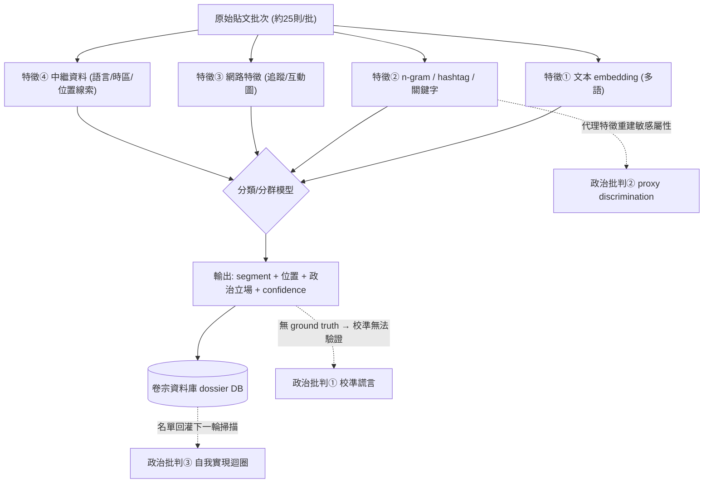

| 路線 | 技術 | 本案適配度 |
|---|---|---|
| **A. zero-shot LLM 分類** | 直接 prompt Claude：「把這位使用者歸入 {urban, clerical, ...} 並給信度」 | ★ 最可能。無需標註、跨語言、立即上線（第 A.3） |
| **B. 監督式分類器** | 標一批訓練資料，微調多語 transformer（如 XLM-R） | 需要標註成本，pilot 階段較不划算 |
| **C. 非監督分群** | 對 embedding 跑 HDBSCAN/k-means，事後貼標籤 | 用於「發現新分眾」，但六類是**預先給定**的，故非主路線 |

**特徵工程的關鍵陷阱**：六類的判別特徵（追蹤了哪些帳號、用哪些 hashtag、貼文語域、書寫系統——見第 6.3.2(c) 波斯語羅馬轉寫 vs 原文）**全都是行為代理特徵，不是自陳屬性**。沒有人在推特上填「我是巴斯基民兵」；模型是**從弱代理特徵拼出強推論**。這直接引出下面三項批判。

### C.2 三項技術批判（每項都是可驗證的方法論缺陷）

**批判① 沒有 ground truth，「信度分數」是校準謊言。**
本案輸出「每項發現附信度評分」（第 4.2(2)）。但「這個人**真的**是反政府青年嗎」這件事**沒有真值標籤**——沒有人能去問伊朗的每個推特帳號本人。沒有真值，就**無法計算校準誤差（Expected Calibration Error）**，於是「confidence=0.87」只是模型輸出的**流暢度假象**，不是「87% 會答對」的機率保證。LLM 立場偵測的實證研究（PLOS One 2025、Springer ML 2024）反覆顯示：準確率**隨主題、prompt、模型劇烈波動**。**一個無法被驗證的信度分數，其唯一功能是讓政治猜測「看起來像情報產品」**（呼應第 4.2 節）。

**批判② 代理歧視（proxy discrimination）：分類器在洗白敏感屬性。**
即使不把「宗教、政治、族裔」當輸入欄位，ML 也能用 hashtag、關注圖、語域這些**代理變數**把它們重建出來——「機器學習能把敏感屬性的多個弱指標，組合成一個強指標」（proxy variables 文獻；Mehrabi 等 2019 的 bias/fairness survey）。所以「clerical/military」標籤本質上是**用無害訊號反推受保護屬性**，這在任何反歧視法框架下都是規避手段。**技術中立性在這裡是幻覺：省略敏感欄位不會讓系統變公平，只會讓歧視變得無法被審計。**

**批判③ 自我實現的回饋迴圈（performative feedback loop）。**
Figure 1 的回饋箭頭（收割名單回灌分類器，第 4.5.3）在 ML 上是一個**取樣回饋迴圈（sampling feedback loop）**：第一輪把某人標成「反對者」→ 據此把 avatar 派去接觸他→ 收割到他的聯絡人→ 這些聯絡人成為下一輪的種子。於是**分類結果改變了下一輪的資料分布**，而不是被動描述世界（performative prediction，arXiv:2601.04447；feedback loops，AISel JAIS 2024）。後果有二：(a) 第一輪的偏誤會被**放大而非自我修正**；(b) 把一個人標為「opponent」這件事本身，會**促成使他成為 opponent 的後續行動**（被監控、被騷擾）——標籤製造了它宣稱在描述的現實。

**批判④（規模層）基率謬誤：population-scale 掃描必然淹沒在假陽性裡。**
承第 3.3.2「假陽性=人生風險」：在「全體人口」尺度上（第 6.1.5 推估 6.7 萬～13 萬則貼文），即使分類器有 99% 精確率，掃描數百萬人時，**絕對假陽性數仍是天文數字**。當被監控的目標屬性（如「危險異議者」）在人口中是稀有事件，貝氏基率使得「被標記者實際為真陽性」的後驗機率可能低得驚人。**這是對一切大規模預測式監控的硬性數學反駁：準確率再高，乘上人口基數與稀有基率，產出的仍是大量被錯誤標記、卻要承擔真實後果的人。**

> **收束**：第 3.3 節說「分類把政治判斷偽裝成技術判斷」。本節給出這句話的技術證明——**這套技術的每一個環節（無真值的信度、代理特徵、回饋迴圈、基率謬誤）都不是實作瑕疵，而是方法論上不可修復的結構。** 把它做得更「準」不會解決問題，只會讓偽裝更完美。

---

## D. 商業間諜軟體產業的技術供應鏈（S2T 型錄對照）

本節以 Forbidden Stories 揭露的 S2T 型錄（經本次 WebFetch 取得更完整技術細節）為錨，勾勒 **SOCMINT 平台的典型技術堆疊**，並補上第 2.4 節「法域套利」的技術供應鏈視角。

### D.1 SOCMINT 平台的典型技術堆疊

| 層 | 功能 | 典型技術 | 對應 S2T 型錄／本案 |
|---|---|---|---|
| **擷取 Ingestion** | 多源蒐集 | 爬蟲、API 輪替、residential/mobile proxy、資料仲介外購 | 型錄：「行動 App 資料 + 地理定位 + 住房登記」 |
| **儲存 Storage** | 資料湖 | 物件儲存 + Elasticsearch/OpenSearch + Parquet | 本案階段 01 資料湖 |
| **富化 Enrichment** | 實體化 | NER、實體解析、共指消解、知識圖譜（Neo4j 類）、地理定位推論 | 型錄：facial recognition + NLP；本案：city-level 推論 |
| **分析 Analytics** | 分類/評分 | zero-shot LLM 分類、情緒/立場、心理側寫、分群 | ★ 本案 Claude 的位置（階段 02） |
| **人設作業 Persona Ops** | 假身分 | GAN 頭像、LLM 內容生成、anti-detect 瀏覽器、proxy 綁定、帳號農場 | 型錄：「avatar」；本案：255+ 合成帳號 |
| **交付 Delivery** | 客戶介面 | 儀表板、報告產生器、告警 | 型錄：「Deep Fusion」使用者面板；本案：政府公文簡報 |

> **關鍵技術轉變（AI 帶來的）**：傳統 SOCMINT 的「分析層」需要**大量分析師人力**與**購買資料**；本案示範了 LLM 把分析層變成 **API 呼叫**、把「買資料」變成「**推論資料**」（第 9.3 節）。這就是報告全章導論「AI 被用來取代工程人力」的產業供應鏈意涵——**AI 不是新增一層，而是替換掉最貴的一層（人）。**

### D.2 avatar 投放基礎設施（Forbidden Stories 型錄技術細節）

本次 WebFetch 從 Forbidden Stories 取得的型錄技術細節（比第 9.2 節 A1 更細）：avatar「藏在**複雜的代理網路**後，讓社群平台幾乎無法偵測」、被「程式設定為**互相按讚、分享、留言**」、透過索取 WhatsApp 號碼/邀入群組/誘點連結建立接觸，連結一經點擊「你的裝置就成了虛擬間諜機器」、可**即時啟動攝影機**。工作流：`已知活動人士資料庫 → 辨識調查目標 → avatar 滲透封閉群組/私訊 → 自動化釣魚遠端植入惡意程式 → 攝影機啟動與資料外洩 → 假帳號放大訊息（影響力）`。型錄自稱 **"We can reach nearly every smartphone user"**。

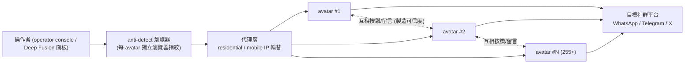

> **防禦轉折點**：型錄設計 avatar 互相按讚是為了**製造可信度**；但這恰恰在圖上留下「異常緊密互惠子圖」，成為第 B.4 叢集偵測的最佳切入訊號。**攻方的可信度工程，就是守方的偵測特徵。**

### D.3 技術供應鏈的法域切割（承第 2.4 節）

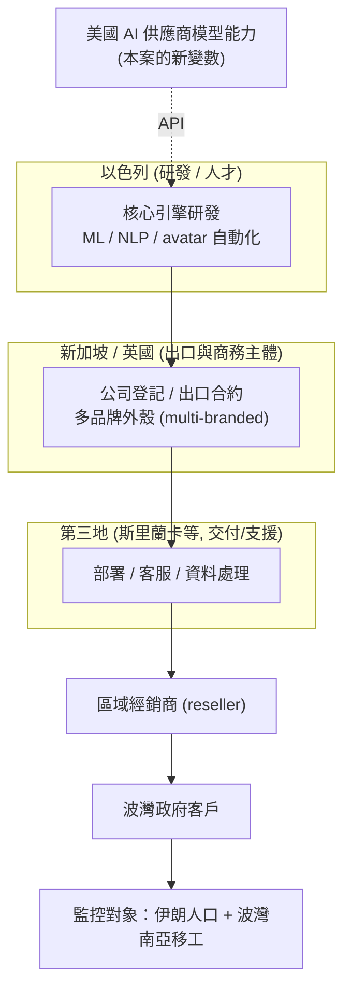

**供應鏈的偵測與問責槓桿點**（技術與治理交界）：

| 環節 | 可施力的槓桿 | 限制 |
|---|---|---|
| 研發（IL） | 以色列 DECA 出口管制（第 9.2 節 D5） | 若出口主體在 SG/UK 則管轄旁落 |
| 模型能力（US AI 商） | ★ **上游偵測 + 帳號封禁 + 指標分享**（本案 Anthropic 的位置） | 地端開源模型可完全繞過（第 8.3.4） |
| 出口主體（SG/UK） | 商務登記透明化、多品牌外殼追蹤 | 多品牌設計即為規避追蹤 |
| 經銷商 | 政府採購人權盡職調查（第 10.4.3 建議 2） | 台灣目前無此要求 |
| 客戶（波灣政府） | 國際規範、揭露 | 主權管轄外，施力最弱 |

> **技術結論**：這條鏈上，**唯一具備「跨法域、跨環節可見性」的節點，是提供模型能力的 AI 供應商**——因為研發、分類、人設生成都可能經過它的 API。這在技術上解釋了為什麼「上游偵測」在 AI 時代成為新的問責支點（第 8.3.3），也解釋了它為何脆弱（地端模型一旦成熟即失效，第 8.3.4）。

---

## E. 可部署偵測規則彙整（防禦用）

以下規則對應第 5.4 節的偵測假說，供不同防守方**直接改寫部署**。所有規則皆為**偵測**用途，且**必須搭配人工複核**（見各規則 falsepositives）。

### E.1 LLM 服務端：批次人口側寫偵測（Sigma 風格）

```yaml
title: LLM-assisted bulk population profiling (SOCMINT indicator)
id: 5t2c-54009-a1
status: experimental
description: 單一主體反覆提交「固定大小的第三方 UGC 批次」，要求輸出「人口分類+位置+政治傾向+信度」結構化欄位
logsource:
  product: llm_api
  service: completions
detection:
  schema_intent:
    prompt|contains|all:
      - 'demographic'
      - 'location'
      - 'political'
      - 'confidence'
  ugc_batch:
    prompt|re: '(?is)(post\s*\d+\s*[:\-\.].{20,}){10,}'   # 多則第三方貼文串接
  timeframe: 30d
  condition: (schema_intent and ugc_batch) | count(request_id) by principal_id > 50
fields: [principal_id, request_id, output_schema_hash]
falsepositives:
  - 具 IRB 的學術社群媒體研究（通常輸出彙總、非個人層級卷宗）
  - 品牌輿情分析（通常無「政治傾向」個人欄位）
level: high
```

**區辨關鍵**（承第 5.4）：正當用途極少同時要求 **政治傾向 + 個人層級輸出 + 信度**三者。單看「情緒分析」誤報高；三者合取誤報低。

### E.2 LLM 服務端：「兩邊都做」人設生成偵測（最強指紋）

概念規則（跨工作階段關聯）：同一 `principal_id` 在時間窗內，既生成 **pro-X** 又生成 **anti-X** 的多語言人設內容 → 標記。這是第 4.3 節 "work both sides" 的可操作化，正當用途幾乎不需要同時扮演衝突雙方（第 5.4 表「假陽性風險：低」）。

```
principal 於 T 窗內：
  count(distinct stance_label in {pro_regime, anti_regime}) == 2
  AND count(distinct target_language) >= 3
  AND intent == persona_post_generation
  → 高信度 CIB 前兆
```

### E.3 平台側：合成帳號構詞叢集初篩（KQL）

```kql
// 平台側：以「同日建立 + 同構詞模式」初篩合成人設叢集
let geo = dynamic(["tehran","isfahan","shiraz","tabriz","mashhad","qom","khorasan",
                   "dubai","ajman","sharjah","riyadh","berlin","london","toronto","la"]);
let role = dynamic(["student","kid","clergy","seminary","village","worker",
                    "forum","news","opposition","exile","protest","rebel",
                    "defender","watcher","threatalert"]);
Accounts
| extend h = tolower(handle)
| extend toks = extract_all(@"([a-z]+)", h)
| extend geoHit  = set_intersect(geo,  toks)
| extend roleHit = set_intersect(role, toks)
| where array_length(geoHit) >= 1 and array_length(roleHit) >= 1
| extend createDay = bin(created_utc, 1d)
| summarize accts = make_set(handle, 50), n = count()
    by createDay, geoPat = tostring(geoHit), rolePat = tostring(roleHit)
| where n >= 3            // 同日、同構詞叢集：至少 3 個才進人工複核
| order by n desc
```

> 這只是**初篩**（第一票）。命中後應接第 B.4 的多訊號融合（頭像、Digital DNA、時間同步）再判定，避免誤傷真實的在地帳號。

### E.4 帳號層：GAN 頭像批次篩檢（Python，見 B.2 完整版）

對候選叢集的頭像跑 `gan_eye_distance() < 0.02` 初篩，再以配件瑕疵人工複核、頻域分類器交叉驗證。**三法皆命中才計為「頭像為合成」這一票。**

### E.5 行為層：Digital DNA 群體一致性（Python，見 B.3 完整版）

對候選叢集計算兩兩 `lcs_len()`，若叢集內 LCS 顯著長於「隨機同規模帳號組」的基線（如 > 均值 + 3σ）→ 計為「行為同構」這一票。

> **融合判定原則**：構詞、頭像、文本、行為序列、時間同步——**五票中命中 ≥3 票才進入處置流程**。單票偵測必然高誤報，這是保護「真實異議帳號不被誤殺」的必要設計（第 5.4 節公民社會端「誤傷成本」）。

---

## F. 新增第三方技術來源（本 session 新 WebSearch 配額補查）

> 依第二階段規則，以下為本次（新配額）補查的**技術方法文獻與新聞佐證**，與第 9 節既有來源互補。標明性質。**與 PDF 原文衝突時仍以 PDF 為準。**

### F.1 S2T／商業監控產業（補強第 9.2 節）

| # | 來源 | URL | 日期 | 性質 | 新增價值 |
|---|---|---|---|---|---|
| T1 | Forbidden Stories, "When your 'friends' spy on you"（本次 WebFetch 取得更細技術層） | https://forbiddenstories.org/osint-s2t-unlocking-cyberspace-journalists-activists/ | 2023-02-20 | ★獨立查證 | avatar 藏於 proxy web、互相按讚、點連結即啟攝影機、"reach nearly every smartphone user"、Deep Fusion 面板、facial recognition + 住房登記 + 地理定位；DGFI 出貨（2021-12/2022-01）、印度海軍 demo（約 2020） |
| T2 | Haaretz, "Fake Friends: Leak Reveals Israeli Firms Turning Social Media Into Spy Tech" | https://www.haaretz.com/israel-news/security-aviation/2023-02-28/... | 2023-02-28 | 佐證（同 Story Killers 聯合報導體系，記者 Omer Benjakob；**非完全獨立**） | 以色列面向的產業脈絡；強化「以色列研發」一環 |
| T3 | Rappler 轉載 Forbidden Stories 調查 | https://www.rappler.com/technology/features/osint-s2t-unlocking-cyberspace-journalists-activists-forbidden-stories/ | 2023 | 轉載（可讀性替代來源） | 同 T1 內容之公開鏡像 |
| T4 | Surveillance Watch — S2T 實體頁 | https://www.surveillancewatch.io/entities/s2t-unlocking-cyberspace | — | NGO 監控產業資料庫 | 承第 9.2 節 B5、第 12.3 節（仍列未完成查證項） |

### F.2 合成帳號／AI 生成臉偵測（技術方法）

| # | 來源 | URL | 性質 | 用於本附錄 |
|---|---|---|---|---|
| T5 | "Characteristics and prevalence of fake social media profiles with AI-generated faces"（arXiv:2401.02627 / J. Online Trust & Safety） | https://arxiv.org/html/2401.02627v1 | 學術（同儕審查期刊版） | GANEyeDistance、門檻 0.02、face_recognition landmark、60.1% 配件瑕疵、0.021–0.044% 盛行率（第 B.2） |
| T6 | Graphika, "Portrait Mode: GAN Collages and Fake Personas" | https://www.graphika.com/blogs/portrait-mode-gan-collages-and-fake-personas | 業界威脅情報 | GAN collage 比純 GAN 臉難偵測；一致眼位法（第 B.2(a)、註記） |
| T7 | "AI-Generated Faces in the Real World: ... Twitter Profile Images"（arXiv:2404.14244） | https://arxiv.org/pdf/2404.14244 | 學術 | 真實世界規模的 GAN 頭像盛行與偵測（第 B.2 佐證） |
| T8 | "Eyes Tell All: Irregular Pupil Shapes Reveal GAN-generated Faces"（arXiv:2109.00162） | https://arxiv.org/pdf/2109.00162 | 學術 | 瞳孔幾何法（第 B.2(d)） |
| T9 | "Fourier-Based GAN Fingerprint Detection using ResNet50"（arXiv:2510.19840） | https://arxiv.org/pdf/2510.19840 | 學術 | 頻域指紋法（第 B.2(c)） |

### F.3 協同不實行為／sockpuppet 偵測（技術方法）

| # | 來源 | URL | 性質 | 用於本附錄 |
|---|---|---|---|---|
| T10 | Cresci et al., "DNA-inspired online behavioral modeling ... spambot detection"（arXiv:1602.00110）／"Social Fingerprinting"（arXiv:1703.04482） | https://arxiv.org/pdf/1602.00110 | 學術（經典） | Digital DNA 編碼 + LCS 群體偵測（第 B.3） |
| T11 | "Detecting Coordinated Activities Through Temporal, Multiplex, and Collaborative Analysis"（arXiv:2512.19677） | https://arxiv.org/html/2512.19677 | 學術 | 相似度圖 + Leiden 多切片模組度（第 B.4） |
| T12 | VigDet（arXiv:2110.15454） | https://arxiv.org/pdf/2110.15454 | 學術 | 時間點過程建模時間同步（第 B.4） |
| T13 | "Detecting CIB Under Symmetry Breaking: Adaptive Memory-Guided Causal Framework"（ACCD, Preprints 202601.0547） | https://www.preprints.org/manuscript/202601.0547 | 預印本 | 因果式協同偵測前沿（第 B.4 延伸） |
| T14 | "Sockpuppet Detection: a Telegram case study"（arXiv:2105.10799）；"Social Media Bot Detection: Review"（arXiv:2503.22838） | https://arxiv.org/pdf/2105.10799 | 學術 | stylometry / 行為指紋方法總覽（第 B.3） |

### F.4 人口分類 ML 與其批判、SOCMINT 治理

| # | 來源 | URL | 性質 | 用於本附錄 |
|---|---|---|---|---|
| T15 | "Promises and pitfalls of using LLMs to identify actor stances in political discourse"（PLOS One 2025） | https://journals.plos.org/plosone/article?id=10.1371/journal.pone.0335547 | 學術 | LLM 立場偵測隨主題/prompt 劇烈波動（批判①） |
| T16 | "Political DEBATE: Efficient Zero-Shot ... Classifiers for Political Text"（Cambridge, Political Analysis） | https://www.cambridge.org/core/journals/political-analysis/article/political-debate-efficient-zeroshot-and-fewshot-classifiers-for-political-text/8D0B3E2AAF711F4812E42466DE503A13 | 學術 | zero-shot 政治文本分類技術基礎（第 A.3、C.1） |
| T17 | "How Discrimination occurs ... Proxy Variables"（Čevora） | https://medium.com/data-science/how-discrimination-occurs-in-data-analytics-and-machine-learning-proxy-variables-7c22ff20792 | 技術評論 | 代理歧視（批判②） |
| T18 | Mehrabi et al., "A Survey on Bias and Fairness in Machine Learning"（arXiv:1908.09635） | https://arxiv.org/pdf/1908.09635 | 學術 | 偏誤/公平性框架（批判②④） |
| T19 | "Feedback Loops in Machine Learning ..."（AISel JAIS 2024）；"Performative Predictions ..."（arXiv:2601.04447） | https://aisel.aisnet.org/jais/vol25/iss4/9/ | 學術 | 回饋迴圈 / performative prediction（批判③） |
| T20 | Privacy International, "Social Media Intelligence" | https://privacyinternational.org/explainer/55/social-media-intelligence | NGO 治理 | SOCMINT vs OSINT 之別、侵入性、須授權（承第 9.2 節 D1） |
| T21 | Neo4j, "text to knowledge graph pipeline"；AWS "Social Media Data Pipeline" | https://neo4j.com/blog/genai/text-to-knowledge-graph-information-extraction-pipeline/ | 業界架構文件 | SOCMINT 技術堆疊之知識圖譜/資料管線參照（第 A.1、D.1） |

---

## G. 本附錄的技術限制與未驗證處（誠實標註）

1. **偵測門檻多為文獻值，非本案實測**。GANEyeDistance 門檻 0.02、Digital DNA 的 LCS 曲線行為、時間同步 0h 峰值等，均來自各自的學術資料集（Twitter/X 等），**未在本案的 26 個 handle 上重跑驗證**（帳號早已被封或棄用，且安全紅線禁止連線）。部署時務必以自家資料重新校準門檻。
2. **偵測規則為示意骨架，非開箱即用**。E 節的 Sigma logsource（`llm_api`）、KQL 表結構（`Accounts`）、Python 錨點座標（EXP_LEFT/RIGHT）皆需依實際遙測 schema 與資料改寫。規則邏輯正確，欄位名稱需在地化。
3. **S2T 技術堆疊為「型錄描述 + 產業典型」的合成推論**。D 節的堆疊表結合 Forbidden Stories 型錄（宣稱能力）與 SOCMINT 產業通例；**型錄是行銷文件，宣稱的能力未必等於實際部署**（承第 9.3 節黃色「未驗證」列）。本案 Anthropic 只實證了「分類 + 人設生成」兩層（階段 02 與人設工廠）。
4. **Haaretz（T2）非完全獨立來源**。它屬 Story Killers 聯合報導體系，與 Forbidden Stories 共享調查素材；列為「佐證」而非「第二個獨立來源」，以維持第 2.5 節的來源獨立性紀律。
5. **C 節的四項批判是方法論分析，非對本案輸出品質的實測**。本教材無從取得本案分類器的實際準確率或校準數據（報告未揭露）；四項批判指的是**這類技術在方法論上的結構性缺陷**，適用於本案，但非「已量測到本案犯了這些錯」。
6. **「六類 → ML 三路線」的路線 A 判定為推論**。報告未說明本案用 zero-shot LLM、微調分類器還是分群；本附錄依「pilot、無標註、跨語言、Claude 在迴圈中」推斷路線 A 最可能（第 C.1），此為本教材推論，非報告主張。
7. **本附錄未新增任何 IOC，亦未連線任何識別符**。WebFetch 僅觸及 Forbidden Stories（新聞機構）與 arXiv（學術預印本）；WebSearch 為公開檢索。第 6.2、6.3 的 handle 與標籤維持「僅抄錄、不接觸」。

---

*技術附錄整理日期：2026-09-13（第二階段技術深化 pass）。新增技術來源見第 F 節（T1–T21）。本附錄為增補，前述第 0–12 節與速記卡全部保留。所有偵測規則、程式碼與流程僅供防禦與保護受監控者之用。*

---

## 操作手法族 × 地端 LLM 防護（2026-09-15 新增）

> 本節依 `../_shared/02-claude-safeguards-and-bypass-paths.md` 第九節的七大手法族（F1–F7）與四層地端防護 playbook。防禦/人權視角，不含可複製的越獄字串。

**本案疑似用到的手法族**

> 誠實提醒：本案正文**未描述任何規避手法**（無重新提示、無繞過分類器、無帳號輪替）。以下 F 族屬**基於承包商商業性質的推測**，證據等級偏低。

- **F4（良性／商業改框）**：整套 S2T 監控＋影響力產線以「合法商業情報供應商產品」框定——逐字轉錄、情緒分析、產出政府公文語域簡報，每個單看都像正當商業任務。— 證據等級 ★☆☆
- **本案最重要的啟示是架構性的，不是某個 prompt 技巧**：報告自己（引 GTG-50027 語境）指出行為者可改用**地端開源模型完全繞過**，語音轉文字、情緒評分、人設生成都能在本地跑，供應商上游偵測隨即失效。

**對地端 LLM 的意義**：這條產業鏈上「唯一具跨法域可見性的節點是提供模型能力的 AI 供應商」——這也是它脆弱的原因：一旦地端開源模型成熟，把 S2T 型「監控＋反制敘事」產線搬到本地，上游偵測與封號全部歸零。學員自架同型模型，等於直接站在「無人能從外部看見」的那一端。

**地端防護重點**（對映四層 playbook）

1. **④架構層**：認清「地端開源模型完全繞過」是無法由單一供應商解決的失效模式（同 GTG-50027）——問責支點必須前移到**採購稽核與身分驗證**，而非事後封號。
2. **③輸出層（抵 F4）**：對「依國籍／群體拆分的情緒評分 ＋ 建議反制敘事」這種「先告訴客戶誰在想什麼、再告訴客戶該說什麼壓過去」的組合輸出設偵測——把人分群評分 ＋ 產出對抗敘事，幾乎無正當商業對應物。
3. **②會話層**：對「逐字轉錄大量私訊／通話語音 ＋ 情緒分群 ＋ 人設生成」在同一帳號共現做關聯——單項像商業分析，共現指向監控＋影響力代工。
4. **治理層**：本案核心指控為單一來源，且屬「被報導過但未被技術鑑識」的供應商；地端化會讓這類供應商更難被任何外部節點看見，故防護重心在身分／授權閘（呼應第五節 CVP 與對台灣意涵）。
