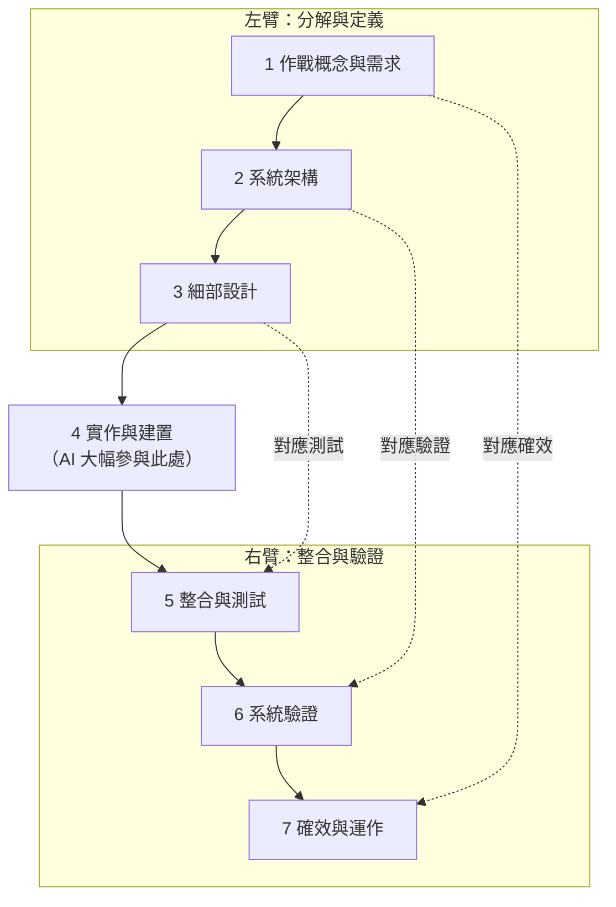
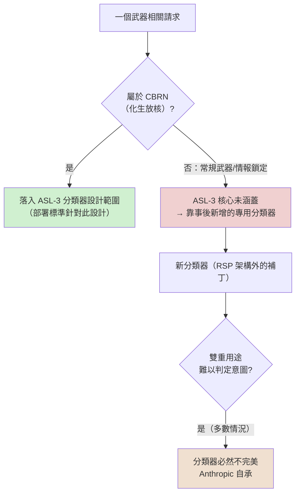
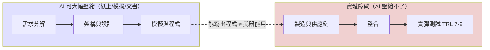
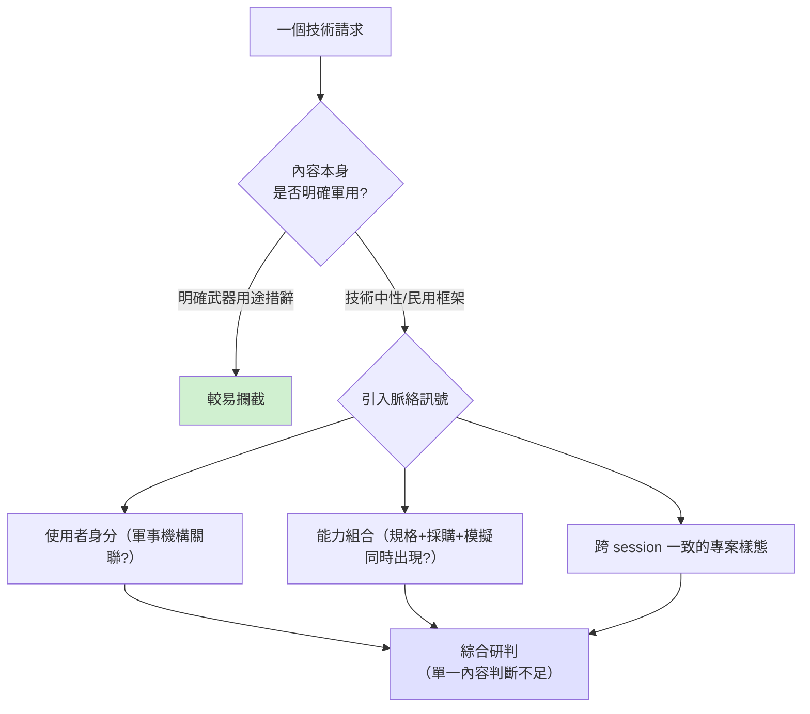

# 04-00 常規武器模組導論：威脅框架、治理缺口與 Anthropic 的防護措施

> 課程模組：04 常規武器（Conventional weapons）｜ 一手來源：PDF p.111–112（章節導論與 safeguards 說明）；p.113–128 掃讀以建立模組地圖 ｜ 同日發布的 Frontier Red Team 研究 ｜ 整理日期：2026-09-13

> 教材定位：這是 04 模組的**導論與方法論**教材，不是案例教材。六個案例（GTG-87001、17001、27005、17002、27006、17003）各有獨立的深度教材，本檔只做一頁摘要表與「學員必須先懂的觀念」：常規武器為何成為新類別、它與 CBRN 在治理框架上的差別、雙重用途困境、Anthropic 的新分類器與自承局限、以及後續案例圖表反覆使用的系統工程 V 模型與技術成熟度（TRL）。

---

## 1. 一頁速覽

1. **新類別**：報告 p.111 明確說，自 2025-11 上一份威脅報告以來辨識出新的濫用類別，其中之一是「用 Claude 為常規武器開發軟體」——涵蓋槍械、飛彈、武裝無人機、炸彈、其他彈藥，以及操作它們的**瞄準與控制系統**。2025-11 的報告（《Disrupting the first reported AI-orchestrated cyber espionage campaign》）完全沒有提到武器，本課已驗證。
2. **六個案例、三個國家**：中國 3（GTG-17001 反魚雷火控、GTG-17002 電子戰／防空壓制、GTG-17003 定向能武器情蒐）、俄羅斯 2（GTG-27005 自主 FPV 自殺無人機群、GTG-27006 軍民兩用物項採購）、葉門 1（GTG-87001 導引火箭與彈道飛彈 GNC）。這個分布與 PDF p.111 原文一致。
3. **兩部結構**：Part I 四案是「親手開發武器軟體」；Part II 兩案是「情蒐與採購」——報告 p.122 特別強調後兩案的行為者**沒有**用 Claude 開發武器軟體。
4. **治理缺口是本模組最重要的觀念**：Anthropic 的 Responsible Scaling Policy（RSP）用能力門檻決定何時升級防線；2025-05-22 隨 Claude Opus 4 啟用的 ASL-3 部署標準被 Anthropic 自己形容為「narrowly focused on preventing the model from assisting with CBRN-weapons related tasks of concern」、「do not aim to address issues unrelated to CBRN」。常規武器不在 RSP 任何一條能力門檻裡，只受 Usage Policy 這條「規則層」管轄——技術層的專用防線直到 2026 年才補上。
5. **Anthropic 的處置**：p.112 逐字——「We recently launched a new set of classifiers designed to better detect and block traffic related to high-yield explosives and weapons development.」同日的 Frontier Red Team 文章補上一句 PDF 沒有的自承：「The dual-use nature of the underlying engineering capabilities means these classifiers will be imperfect, but it is better to implement something and iterate on it rather than leave the risk unmitigated.」
6. **防線失效的自曝**：p.113「Our safeguards blocked many of their requests, but not all of them」；p.112「The actors split their work across many sessions to conceal the full nature of their programs」；p.124「each of the actor's requests … seem individually mundane」；p.113 葉門小組在被封鎖前已做出**不依賴 Claude 的離線模擬工具**。
7. **方法論**：報告用「系統工程 V 模型」標示 Claude 介入開發生命週期的哪一層、用「TRL 1–9」標示推進到多成熟（GTG-27005 停在 TRL 3–4）、用「speed / scale / depth」三個維度談 uplift。學員必須先懂這三套工具，才能讀懂後續七張圖。
8. **能力與濫用的世代差**：p.3 明說六案都發生在 Claude Haiku／Sonnet／Opus 上、未涉及 Fable 或 Mythos；而同日的 Frontier Red Team 評測顯示前沿模型在模擬末端導引（Opus 5 對停放車輛命中率 80%、對移動車輛 47%）與地理定位（中位誤差已優於 GeoGuessr 冠軍級人類）上明顯更強。行為者用較弱的模型就走到了 Figure 1／3 的程度。
9. **這份教材在課程裡要教什麼**：教「怎麼想」——當一段 GNC 程式碼、一個物件追蹤模型、一份採購詢價信在民用與軍用之間沒有技術分界時，一家 AI 公司要靠什麼判斷意圖、又該不該／能不能擋？

---

## 2. 為什麼「常規武器」是新的濫用類別

### 2.1 報告的定義（逐字引用）

PDF p.111 第一段：

> "Since publishing our last threat report in November 2025, we have identified new categories of threat actors misusing Claude in violation of our Usage Policy and terms of service. One of these is the use of Claude to develop software for conventional weapons, including firearms, missiles, armed drones, bombs, and other munitions, as well as the targeting and control systems that operate them."

繁中翻譯：自 2025 年 11 月發布上一份威脅報告以來，我們辨識出違反 Usage Policy 與服務條款、濫用 Claude 的新類別威脅行為者。其中之一，是使用 Claude 為常規武器開發軟體——包括槍械、飛彈、武裝無人機、炸彈與其他彈藥，以及操作這些武器的瞄準與控制系統。

### 2.2 定義拆解：報告在管什麼、不管什麼

這個定義有三個值得在課堂上放大的細節：

| 定義要素 | 原文 | 教學解讀 |
|---|---|---|
| 行為的客體是「軟體」 | "develop **software** for conventional weapons" | 報告管的不是硬體（Claude 不會鑄造彈體），而是讓硬體「會飛、會瞄、會炸」的程式碼與文件。六案中沒有任何一案是「用 Claude 製造武器」，全部是「用 Claude 寫軟體、寫規格、寫採購文件、寫情報產品」。 |
| 五類武器 + 一個延伸 | "firearms, missiles, armed drones, bombs, and other munitions, **as well as the targeting and control systems that operate them**" | 「瞄準與控制系統」這個延伸把範圍從「彈」擴到「讓彈命中的東西」：GNC（導引導航控制）、火控、電子戰目標排序，都落在這裡。GTG-17002 的電子戰套件本身不是彈藥，但它是 targeting system。 |
| 觸發條件是「違反 Usage Policy」 | "in violation of our Usage Policy and terms of service" | 這不是 RSP 能力門檻的語言，而是使用政策的語言（第 3 節詳述）。也就是說，Anthropic 是以「你違反了合約與政策」而不是「模型跨過了災難性能力門檻」來定性這類案件。 |

報告接著在 p.111 第三段把範圍再擴一圈，納入「武器計畫所依賴的情蒐與採購」：

> "Over the past year, our threat intelligence teams have investigated and disrupted multiple threat actors who used Claude to develop software for weapons design and development, or to support the intelligence gathering and procurement that weapons programs depend on. In this report, we share details on six of these cases: three in China, two in Russia, and one in Yemen."

翻譯：過去一年，我們的威脅情報團隊調查並瓦解了多個行為者，他們用 Claude 為武器設計與開發撰寫軟體，或支援武器計畫所依賴的情蒐與採購。本報告分享其中六案：中國三案、俄羅斯兩案、葉門一案。

> 注意時間框架的落差：整份報告涵蓋 2025-12 至 2026-08（p.3），但這段寫的是「Over the past year」。報告沒有解釋差異；合理推測是武器類調查的起點早於報告的正式涵蓋期，但這只是推測。

### 2.3 「新類別」的證據：2025-11 報告不含武器（已驗證）

p.111 的「threat report」超連結指向 `https://www.anthropic.com/news/disrupting-AI-espionage`（本課從 PDF 註解抽出連結目標確認）。該文發布於 2025-11-13，主題是 GTG-1002 中國國家級行為者以 Claude Code 對約三十個目標進行代理式網路間諜活動；全文沒有任何常規武器、無人機、飛彈的內容（本課 WebFetch 驗證）。因此「這是新類別」的說法與 Anthropic 自己的公開文件序列一致。

不過要提醒學員：「新類別」是指 **Anthropic 公開報告的類別**是新的，不代表這種濫用 2025-11 以前不存在。p.111 說「Over the past year」，而 GTG-27005 的帳號建立於 2025 年底到 2026 年初（p.117）。「首次揭露」與「首次發生」是兩回事——這是威脅情報寫作裡最常被讀者混淆的一點。

### 2.4 報告主張的「來源優勢」：模型供應商能看到什麼別人看不到的

p.111 第四段：

> "Historically, this kind of work has been uncovered by governments, United Nations panels, and outside investigators, who piece it together from recovered hardware and public sources. But as a frontier model provider, we can identify this activity ourselves if we detect threat actors violating our Usage Policy and terms of service. When we do, we ban accounts violating our policies, incorporate investigative findings into our safeguards to prevent future misuse, and provide information to public- and private-sector partners to mitigate threats we have identified."

翻譯：歷史上，這類工作是由政府、聯合國專家小組與外部調查者，從回收的硬體與公開來源拼湊出來的。但作為前沿模型供應商，只要我們偵測到行為者違反 Usage Policy 與服務條款，就能自行辨識這類活動。屆時我們會封鎖違規帳號、把調查發現納入防護措施以防未來濫用、並向公私部門夥伴提供資訊以緩解威脅。

這段話在課堂上值得拆成兩層講：

- **情報學層面**：傳統的武器擴散情報是「事後、間接、片段」的——聯合國葉門專家小組是從被擊落的無人機殘骸反推供應鏈。模型供應商看到的是「事中、直接、連續」的——行為者在開發過程中每一次求助的完整脈絡。這是全新的情報來源型態（可以類比為「開發流程層的 SIGINT」），但它同時帶來第 12 節要談的問題：**只有 Anthropic 看得到，外界無法獨立驗證**。
- **企業角色層面**：報告把自己定位成三件事的執行者——封鎖、回饋防線、通報夥伴。這三件事的極限在第 4.6 節討論。

### 2.5 六案的兩部結構（p.111 第五段，逐字）

> "The six cases in this section are divided into two parts. Part I covers four cases in which the actor in question used Claude to develop software for weapons themselves: a guided rocket program, in which the actors conducted a live field test; a design and proposal work on a system to intercept torpedoes; software for a drone swarm, tested in simulation, with its code loaded onto real boards; a targeting software for electronic warfare and for suppressing air defenses. Part II covers two cases in which actors used Claude for procurement and intelligence gathering. One actor sourced dual-use goods for Russian defense customers, while the other collected public information on a directed energy weapon and its suppliers."

翻譯：本節六案分為兩部分。第一部分四案，行為者親自用 Claude 開發武器軟體：一個進行了實彈野外測試的導引火箭計畫；一套攔截魚雷系統的設計與提案工作；一套在模擬中測試、程式碼已載入實體電路板的無人機群軟體；一套用於電子戰與壓制防空的瞄準軟體。第二部分兩案，行為者用 Claude 進行採購與情蒐：一名行為者為俄羅斯國防客戶採購軍民兩用物品，另一名蒐集某定向能武器及其供應商的公開資訊。

p.122 對 Part II 的界定更明確：

> "Unlike the cases of hands-on weapons development in the previous section, the actors in these two cases did not use Claude to develop software for weapons design and development. Instead, they used Claude to gather intelligence on a foreign weapons program and its supply chain, and to procure mixed military and civilian goods."

這個二分法本身就是教學重點：**Part II 的兩案在單一請求層次幾乎完全「無害」**——詢價信、供應商查找、公開資訊摘要——但放在整個武器計畫的脈絡裡，它們是計畫得以存在的前提。這正是第 5 節雙重用途困境最尖銳的形式。

### 2.6 p.112 對「disrupted」的定義與跨案共同模式（逐字）

> "In this section, we discuss four conventional weapons operations we disrupted. By "disrupted," we mean we banned every account we could link to the actor, which shut down the whole operation. Where we found these actors worked across other platforms, we shared our findings with our industry counterparts so that they could also disrupt the activity. We worked with other public- and private-sector partners to share threat reporting, as appropriate."

> "Across these cases, the actors used Claude to build and refine software for weapons hardware and firmware with which they already had expertise and to which they had access. The actors split their work across many sessions to conceal the full nature of their programs, and used other methods to circumvent our safeguards and access controls."

翻譯（第二段）：在這些案例中，行為者用 Claude 為他們**已經具備專業、且已能取得**的武器硬體與韌體建構並精修軟體。行為者把工作拆散到許多工作階段以隱藏計畫全貌，並用其他方法繞過我們的防護措施與存取控制。

三個要點：

1. 「disrupted」= 封鎖所有能連結到該行為者的帳號。報告沒有宣稱阻止了武器計畫本身——p.113 甚至承認葉門小組已有離線工具。「瓦解帳號」≠「瓦解計畫」，這是評估 Anthropic 處置效果時必須守住的分寸。
2. 「already had expertise and access」——六案的行為者都不是「靠 Claude 從零學會造武器的素人」，而是有專業、有硬體的人用 Claude 加速。這直接影響 uplift 的衡量方式（第 7 節）與「該不該擋」的辯論（第 10 節）：擋的是「加速」而不是「賦能」。
3. 「split their work across many sessions」——這是六案共通的規避手法，也是分類器天生的盲點：分類器看的是單一請求／單一工作階段，行為者的意圖分散在幾十個工作階段裡。

### 2.7 事件與政策時間軸

把 Anthropic 的政策文件、六案的已知時間點與報告發布並排，可以直觀看出「防線」與「活動」的時序關係。所有日期均有一手來源（括號內）。

| 日期 | 事件 | 層次 |
|---|---|---|
| 2023-09-19 | RSP v1.0 發布，以 ASL 分級（RSP v3.0 Changelog） | 政策 |
| 2024-10-15 | RSP v2.0：引入 Capability Thresholds（同上） | 政策 |
| 2025-03-31 | RSP v2.1：新增 CBRN 門檻、拆分 AI R&D 門檻（同上） | 政策 |
| 2025-05-14 | RSP v2.2：調整 ASL-3 Security Standard 的內部人威脅範圍（同上） | 政策 |
| 2025-05-22 | **ASL-3 防護隨 Claude Opus 4 啟用；部署標準「narrowly focused」於 CBRN**（ASL-3 公告） | 偵測層（CBRN） |
| 2025-09-15 | Usage Policy 現行版本生效，含「Do Not Develop or Design Weapons」四條（AUP 頁面） | 規則層 |
| 2025-11-13 | 上一份威脅報告《Disrupting the first reported AI-orchestrated cyber espionage campaign》，不含武器類別（該頁面） | 揭露 |
| 2025 年底～2026 年初 | GTG-27005 帳號建立（PDF p.117） | 活動 |
| 2025-12 | 本報告涵蓋期起點（PDF p.3） | 揭露 |
| 2026-02-24 | RSP v3.0 全面改寫；門檻表無常規武器列（RSP v3.0 PDF） | 政策 |
| 2026-02-26 | 美國眾議員 Foushee 新聞稿：批評國防部對 Anthropic 施壓放寬監控與自主武器限制（foushee.house.gov） | 政策背景 |
| 2026-03-16 | 例外條款頁面最後更新；武器仍列「永不例外」（support.claude.com） | 規則層 |
| 2026-05 中 | GTG-27005 開始無人機群開發行動（PDF p.117） | 活動 |
| 2026-07-08 | RSP v3.4 生效（RSP 頁面） | 政策 |
| 2026-08 | 本報告涵蓋期終點（PDF p.3） | 揭露 |
| 「recently」（報告發布前） | **新武器分類器上線**（PDF p.112；FRT 文章「after identifying misuse」） | 偵測層（常規武器） |
| 2026-09-10 | 威脅報告與 Frontier Red Team 研究同日發布 | 揭露 |

讀這張表的重點：從 2025-05（CBRN 專用防線上線）到 2026 年新武器分類器上線之間，**至少有一整年**常規武器只有規則層、沒有專用偵測層；六案的活動大多落在這個窗口內。報告沒有給新分類器的確切上線日，所以窗口的右端無法精確標定——這本身就是一個值得向 Anthropic 追問的透明度問題。

---

## 3. 常規武器 vs. CBRN：RSP／ASL 框架與治理缺口

這是本模組最重要的觀念。以下論證鏈的每一環都有一手來源，並且明確區分「Anthropic 文件明說的」與「本教材推論的」。

### 3.1 RSP 是什麼：版本脈絡

| 版本 | 日期 | 要點（來源：RSP v3.0 PDF Changelog；Anthropic RSP 頁面） |
|---|---|---|
| v1.0 | 2023-09-19 | 初版，以 AI Safety Levels（ASL）定義各級所需控制清單。 |
| v2.0 | 2024-10-15 | 引入 Capability Thresholds 與 Required Safeguards 概念；改為「affirmative case」——要求提出模型距門檻夠遠的正面論證。 |
| v2.1 | 2025-03-31 | 新增 CBRN 相關門檻（可大幅提升「中等資源國家計畫」能力）；拆分 AI R&D 門檻為兩級。 |
| v2.2 | 2025-05-14 | ASL-3 Security Standard 排除 sophisticated insiders；文中提到「the CBRN-3 threat models entail large numbers of users having access to unguarded models」。 |
| v3.0 | 2026-02-24 | 全面改寫。改為「產業級安全建議」三欄表（能力門檻／Anthropic 自身計畫／產業建議）；附錄 B 說明 ASL 概念只用來指稱「現有模型的現行防護等級」。 |
| v3.4 | 2026-07-08 | 現行版本（Anthropic RSP 頁面所列）；修訂自動化 R&D 門檻與 Risk Report 內部分享規則，與本模組主題無關。 |

RSP v3.0 開宗明義（p.3）：

> "Our Responsible Scaling Policy (RSP) is our voluntary framework for managing catastrophic risks from advanced AI systems."

以及註腳 1 對「catastrophic risk」的界定：

> "“Catastrophic risk” as used in our RSP refers generally to risks of the most severe potential harms from advanced AI, such as existential threats or fundamental destabilization of global systems."

翻譯：RSP 中的「災難性風險」泛指先進 AI 最嚴重的潛在危害，例如存亡威脅或全球體系的根本性失穩。

**這一句就是缺口的根源**：一枚在葉門試射失敗的導引火箭、一套 16 模組的電子戰套件，無論多危險，都不是「existential threat」或「fundamental destabilization of global systems」等級的事件。它們是傳統戰爭的手段，殺傷力有上限、範圍有邊界。RSP 的設計目標從一開始就不是為它們而設。

### 3.2 ASL-3 啟用公告（2025-05-22）：部署標準的範圍是 CBRN

Anthropic 公告《Activating AI Safety Level 3 protections》（2025-05-22，隨 Claude Opus 4 發布；本課 WebFetch 驗證）逐字：

> "Deployment Standard covers a narrowly targeted set of deployment measures designed to limit the risk of Claude being misused specifically for the development or acquisition of chemical, biological, radiological, and nuclear (CBRN) weapons."

> "The new ASL-3 deployment measures are narrowly focused on preventing the model from assisting with CBRN-weapons related tasks of concern"

> "ASL-3 deployment measures do not aim to address issues unrelated to CBRN"

翻譯：部署標準涵蓋一組**狹窄鎖定**的部署措施，專門用來限制 Claude 被濫用於**化學、生物、放射性與核武器**的開發或取得。新的 ASL-3 部署措施狹窄地聚焦於防止模型協助 CBRN 武器相關的關切任務；ASL-3 部署措施**不以處理與 CBRN 無關的問題為目標**。

同一公告描述 ASL-3 的核心技術手段：

> "Constitutional Classifiers—a system where real-time classifier guards, trained on synthetic data representing harmful and harmless CBRN-related prompts and completions, monitor model inputs and outputs"

翻譯：憲法分類器——即時分類守衛，以代表有害與無害 **CBRN 相關**提示與回應的合成資料訓練，監控模型輸入與輸出。

換句話說，2025-05 上線的分類器是**用 CBRN 資料訓練的**。一個從未看過「六自由度彈道模擬」或「反魚雷火控時序」訓練樣本的分類器，沒有理由攔截這類流量——這不是失誤，是設計範圍。

公告也說明了 ASL-3 是預防性啟用：

> "we have not yet determined whether Claude Opus 4 has definitively passed the Capabilities Threshold that requires ASL-3 protections … we have determined that clearly ruling out ASL-3 risks is not possible"

### 3.3 RSP v3.0 的能力門檻表：沒有「常規武器」這一列

RSP v3.0 第 1 節的三欄表列出會觸發加強防護的能力門檻。本課從 PDF 抽取的文字顯示，左欄的門檻類別為：

| 門檻（RSP v3.0 原文左欄） | Anthropic 自身的緩解計畫（中欄，摘要） |
|---|---|
| "Non-novel chemical/biological weapons production. AI systems with the ability to significantly help individuals or groups with basic technical backgrounds (e.g., undergraduate STEM degrees) create/obtain and deploy chemical and/or biological weapons with serious potential for catastrophic damages." | "We will maintain or improve on our ASL-3 protections, which include classifier guards at least as robust as our initial Constitutional Classifiers; access controls for trusted users with exemptions to classifier guards; red-teaming, bug bounties, and threat intelligence for continually assessing the threat of jailbreaks; and a number of noteworthy security controls." |
| "Novel chemical/biological weapons production. AI systems with the ability to significantly help threat actors (for example, moderately resourced expert-backed teams) create/obtain and deploy chemical and/or biological weapons with potential for catastrophic damages far beyond those of past catastrophes such as COVID-19." | 對擴大的使用情境施加「至少與 ASL-3 同強度」的保護；辨識最令人關切的威脅路徑並向政策制定者提供早期偵測建議。 |
| "High-stakes sabotage opportunities." （AI 系統被高度依賴、可能進行破壞） | 揭露能力與傾向、監控、對齊評估。 |
| AI R&D 門檻（自動化入門級研究／劇烈加速有效擴展） | 內部 Usage Policy、內部安全控制。 |

本課用 `grep` 在 RSP v3.0 全文搜尋 "conventional"、"kinetic"、"drone"、"missile"，**零命中**（唯一的 "conventional" 是 "unconventional ways" 的一部分，語境無關）。也沒有獨立的 cyber 門檻列。

### 3.4 RSP 自己劃的界線：其他風險交給 Usage Policy

RSP v3.0 p.3：

> "Our RSP is only one part of our overall approach to safety. For instance, although this policy focuses on catastrophic risks, they are not the only risks we consider important—our Usage Policy and societal impacts research address other concerns."

翻譯：RSP 只是我們整體安全作法的一部分。例如，雖然本政策聚焦於災難性風險，那並不是我們唯一重視的風險——我們的 **Usage Policy** 與社會影響研究處理其他關切。

這句話把常規武器的治理位置講清楚了：它屬於「other concerns」，由 Usage Policy 管。

### 3.5 論證鏈完整版

把以上證據串起來，可以寫成五步。前四步是 Anthropic 文件明說的；第五步是本教材的推論，並有 Frontier Red Team 文章的間接支持。

```
步驟 1（RSP v3.0 p.3、註腳 1）
  RSP 管的是「catastrophic risk」：存亡威脅、全球體系失穩。
        ↓
步驟 2（ASL-3 公告 2025-05-22）
  ASL-3 部署標準「narrowly focused」於 CBRN；憲法分類器以 CBRN 資料訓練；
  「do not aim to address issues unrelated to CBRN」。
        ↓
步驟 3（RSP v3.0 門檻表；grep 驗證）
  能力門檻只有：化生武器（非新型／新型）、高風險破壞、AI R&D。
  沒有「常規武器」列。
        ↓
步驟 4（RSP v3.0 p.3）
  「our Usage Policy … address other concerns」→ 常規武器由 Usage Policy 這條
  規則層管轄；Usage Policy 確實明文禁止武器設計（第 5.4 節）。
        ↓
步驟 5（本教材推論；FRT 文章佐證）
  規則存在 ≠ 技術防線存在。2025-05 之後上線的專用分類器是 CBRN 分類器，
  常規武器流量沒有對應的專用偵測層——直到威脅情報團隊從六案中「事後」
  發現這個缺口，Safeguards 團隊才在 2026 年補上新分類器（PDF p.112；
  FRT 文章：「implemented new classifiers … after identifying misuse of
  Claude in this domain」）。
```

Frontier Red Team 文章對這個缺口的描述（逐字）：

> "Cybersecurity and biorisk are among the best-studied domains of risk from misuse of AI. But most of modern conflict occurs in more conventional realms."

翻譯：網路安全與生物風險是 AI 濫用風險中研究最充分的領域。但現代衝突大多發生在更傳統的領域。

以及：

> "For developers of closed-weight models, there is a clear need to develop and deploy safety measures for these risks. For instance, our Safeguards team implemented new classifiers to detect and block requests related to weapons development after identifying misuse of Claude in this domain."

關鍵字是 **"after identifying misuse"**——防線是被案例逼出來的，不是預先設計的。這正是治理缺口的實證。

### 3.6 兩份文件都沒說的事（誠實標註）

- **PDF 全文沒有出現「ASL」三個字母**（本課 grep 驗證）。常規武器章節從未引用 RSP 或 ASL-3，也沒有明說「這個風險面不在 ASL-3 涵蓋範圍」。
- **Frontier Red Team 文章也沒有提到 RSP、ASL-3 或 CBRN**（本課 WebFetch 兩次確認）。
- 因此，「常規武器是現有 ASL-3 防線未涵蓋的新風險面」這個結論，是把 RSP、ASL-3 公告、PDF p.111–112 與 FRT 文章**四份文件並讀後的推論**，不是任何一份文件的原話。在課堂上必須這樣呈現，不能說成「Anthropic 承認 ASL-3 沒管到常規武器」。

### 3.7 缺口的本質：規則層 vs. 偵測層 vs. 執行層

給學員一個分析工具——任何平台的濫用治理都可以拆成三層：

| 層 | 問題 | 常規武器在 2025-05 至 2026 年初的狀態 | CBRN 的狀態（對照） |
|---|---|---|---|
| 規則層（Policy） | 有沒有白紙黑字禁止？ | 有。Usage Policy「Do Not Develop or Design Weapons」早已涵蓋。 | 有，且同時被 RSP 能力門檻覆蓋。 |
| 偵測層（Detection） | 有沒有專門訓練來抓它的技術手段？ | **沒有專用分類器**；靠一般性 safeguards 與威脅情報團隊的人工調查（p.113「as part of our internal investigations into suspected weapons development」）。 | 有：憲法分類器（2025-05 起）。 |
| 執行層（Enforcement） | 抓到後做什麼？ | 封帳號、回饋防線、通報夥伴（p.111–112）。 | 同上，另加 trusted user programs（p.137）。 |

「治理缺口」精確地說是**偵測層缺口**，不是規則層缺口。這個區分很重要，因為它決定了修補的方式：不是改政策，而是造工具——這就是 p.112 新分類器的意義。

### 3.8 為什麼 CBRN 先、常規武器後？（給討論用的四個假說）

報告與 FRT 文章都沒有解釋優先順序的理由。以下是可供課堂討論的假說，**都不是 Anthropic 的說法**：

1. **危害規模假說**：RSP 以災難性風險為核心，CBRN 的單一事件傷亡上限遠高於常規武器。
2. **可分類性假說**：CBRN 的危險知識相對集中（特定病原體、特定合成路徑），較容易用分類器界定；常規武器軟體與民用工程重疊太大（第 5 節）。
3. **政策成本假說**：擋 CBRN 幾乎不會誤傷合法客戶；擋「無人機控制程式碼」會直接誤傷農業無人機、物流、影視、研究等大量合法市場。
4. **證據時序假說**：Anthropic 的威脅情報團隊是在 2025 年下半才開始看到常規武器案例（p.111「Over the past year」），防線自然落後於證據。

### 3.9 同日的 Frontier Red Team 評測：能力面的證據

威脅報告提供的是「有人在這樣用」的證據；FRT 研究提供的是「模型做得到多少」的證據。兩者合在一起才構成「新風險面」的完整論證：**活動已發生，且模型能力正在持續上升**。p.111 的概括：

> "The evaluations show that models are making consistent progress on simulated intelligence and weapons development tasks."

FRT 文章的評測設計（逐字）：

> "Models receive a written brief, a workspace with basic Python libraries like Numpy and OpenCV2, and a simulated small quadcopter that uses Betaflight firmware, inside an environment with wind, sensor noise, and a camera."

翻譯：模型收到一份書面任務簡報、一個含 Numpy 與 OpenCV2 等基本 Python 函式庫的工作區、以及一台使用 Betaflight 韌體的模擬小型四軸機，環境含風、感測器雜訊與攝影機。

**主要結果**（本課自 FRT 文章 WebFetch 摘錄；08 能力研究模組會逐項核對原文，此處僅作導論用途）：

| 任務 | 指標 | 結果（依 FRT 文章） |
|---|---|---|
| 末端導引：停放的高可見度車輛 | 命中率 | Opus 5 80%；Mythos Preview 70%；Mythos 5 53%；Kimi K3 15%；Sonnet 5 5% |
| 末端導引：以道路速度移動的車輛 | 命中率 | Opus 5 47%；Mythos Preview 20%；Mythos 5 17%；Kimi K3 1.6%；Sonnet 5 0% |
| 投彈：靜態靶心 | 命中 | Opus 5 與 Mythos 5「essentially every drop」；Sonnet 5 與 Mythos Preview 92% 落在 5 m 內 |
| 投彈：移動目標＋風 | 命中 | 僅 Opus 5 有意義的成功率（28%） |
| GPS 拒止／欺騙下導航 | 相對表現 | 前沿模型明顯優於 Sonnet 5 與 Kimi K3，但在細微欺騙下「performance collapsed」 |
| 照片地理定位 | 中位誤差（1 km 內比例） | Mythos Preview 37.0 km（23.7%）；Mythos 5 47.2 km（23.1%）；Opus 5 181 km（18.0%）；Sonnet 5 384 km（9.9%）；Kimi K3 385 km（16.7%）；人類基準（GeoGuessr 冠軍級玩家）151 km |
| 文字地理定位（含搜尋工具） | 中位誤差 | Mythos Preview 20.1 km；Mythos 5 20.9 km；Opus 5 21.7 km；Sonnet 5 31.3 km；Kimi K3 26.4 km |

三個導論層次的觀察：

1. **能力與濫用之間的「世代差」**。報告 p.3 明說六案（以及全報告除一起蒸餾案外）都發生在 Claude Haiku／Sonnet／Opus 上，**沒有涉及 Fable 或 Mythos 級模型**。而 FRT 評測顯示前沿模型在這些任務上明顯更強。換句話說，六案的行為者用的是比現在可取得的模型更弱的工具，就已經做到 Figure 1／Figure 3 的程度。這是「新風險面」論證裡最有力、也最少被媒體報導的一點。
2. **開源模型不是零**。Kimi K3 在停放車輛任務上 15%、在文字地理定位上 26.4 km——FRT 文章據此提出「open-weights model safety」的緊迫性。這直接影響第 4.5 節「不完美但先上線」的反駁力道：Anthropic 擋得再好，行為者仍有替代品。
3. **評測不等於 uplift**。FRT 文章自承：「These evaluations have important limitations. Many are based on simulated data, and we do not measure uplift directly … These actors are likely to still be bottlenecked by material constraints in many cases」。它也強調「nothing substitutes for testing in hardware」。命中率 80% 是模擬四軸機在模擬環境的數字，不是葉門火箭的數字。

FRT 文章對「誰最危險」的判斷（逐字）：

> "The most dangerous model may be one that is trained in secret and handed only to the People's Liberation Army for use in drones and the Ministry of State Security for surveillance and repression."

翻譯：最危險的模型，可能是一個祕密訓練、只交給解放軍用於無人機、交給國家安全部用於監控與鎮壓的模型。

這句話把討論從「Anthropic 的分類器擋不擋得住」推向「防線的邊界在哪裡」——Anthropic 的分類器只能管 Anthropic 的模型。這是第 10.3 節辯論中反方最強的論點之一，也是正方必須正面回應的問題。

---

## 4. Anthropic 的處置：新分類器與自承局限

### 4.1 p.112 逐字引用

> "We have incorporated findings from our investigations to improve our safeguards. We recently launched a new set of classifiers designed to better detect and block traffic related to high-yield explosives and weapons development."

翻譯：我們已將調查發現納入防護措施。我們最近推出一組新的分類器，旨在更好地偵測並攔截與**高爆炸藥**及**武器開發**相關的流量。

> "We hope this report will contribute to the work of the security community, governments, and civil society to safeguard systems against the use of AI tools for conventional weapons development."

翻譯：我們希望本報告能對資安社群、政府與公民社會的工作有所貢獻，協助防範 AI 工具被用於常規武器開發。

### 4.2 為什麼「高爆炸藥」和「武器開發」放在同一組分類器

這個配對不是隨意的，它對應 Usage Policy 的條文結構。Usage Policy（頁面顯示 Effective 2025-09-15；本課 WebFetch 驗證）在「Do Not Develop or Design Weapons」下列有：

> "Synthesize, or otherwise develop, high-yield explosives or biological, chemical, radiological, or nuclear weapons or their precursors, including modifications to evade detection or medical countermeasures"

也就是說，在 Usage Policy 的分類裡，**高爆炸藥本來就與 CBRN 並列在同一條**，而「武器設計」是另外三條。新分類器把「高爆炸藥」（原本與 CBRN 同條、但 ASL-3 憲法分類器可能未涵蓋）與「武器開發」（原本只有規則、沒有偵測層）一起補上——這可以理解為把 Usage Policy 武器條款的全部四條都配上技術偵測層。

> 教學提醒：這是本教材根據條文結構做的解讀，Anthropic 沒有說明新分類器的設計理由與訓練資料。

### 4.3 自承局限的正確出處：Frontier Red Team 文章，不是 PDF

任務簡報提到報告「自己承認的局限：因為底層工程能力具雙重用途性質，分類器必然不完美，但先實作再迭代勝過放任風險」。本課逐字核對後確認：**這段話不在 PDF p.111–112，而在同日（2026-09-10）發布的 Frontier Red Team 文章**《Measuring tactical intelligence targeting and conventional weapons capabilities of AI models》。完整段落逐字如下：

> "For developers of closed-weight models, there is a clear need to develop and deploy safety measures for these risks. For instance, our Safeguards team implemented new classifiers to detect and block requests related to weapons development after identifying misuse of Claude in this domain. The dual-use nature of the underlying engineering capabilities means these classifiers will be imperfect, but it is better to implement something and iterate on it rather than leave the risk unmitigated."

翻譯：對閉源權重模型的開發者而言，顯然需要為這些風險開發並部署安全措施。例如，我們的 Safeguards 團隊在辨識出 Claude 在此領域被濫用之後，實作了新的分類器來偵測與攔截武器開發相關的請求。**底層工程能力的雙重用途性質，意味著這些分類器將是不完美的；但實作一個東西並持續迭代，勝過放任風險未受緩解。**

在講義中引用時，出處必須標為「Anthropic Frontier Red Team, 2026-09-10」而非「威脅報告 p.112」。兩份文件是同日發布、互相超連結的配套（p.111 的「new evaluations」超連結就指向該文，本課從 PDF 註解驗證），所以把它們並讀是合理的，但引文歸屬不能混。

### 4.4 PDF 內的其他自曝（常規武器章節）

雖然 p.112 沒有「分類器不完美」的自白，但章節內有四處具體的防線失效描述，教學價值更高，因為它們是實證而非原則陳述：

| 頁碼 | 原文 | 失效型態 |
|---|---|---|
| p.113 | "Our safeguards blocked many of their requests, but not all of them. The actors used a variety of tactics to evade our safeguards, including hiding their goals and the products the software was meant for, and they split their work across multiple sessions so no single session revealed their full intent." | **部分攔截**＋**意圖隱藏**＋**跨工作階段切割**。 |
| p.113 | "Nevertheless, we have evidence that the actors had already built an offline simulation toolkit that does not rely on Claude or other engineering computing environments such as MATLAB." | **能力外溢**：封鎖帳號後，行為者手上已有不依賴 Claude 的可執行成果（Figure 1 的 "Packaging" 列：「A deliverable that runs and persists without Claude」）。 |
| p.117、p.124 | "The actors circumvented our geographic access controls by routing traffic through commercial virtual private servers." ／ "this actor used VPNs to circumvent Anthropic's geographic access restrictions." | **存取控制被繞過**：Supported Regions Policy 靠地理封鎖，VPS／VPN 即可規避。 |
| p.124 | "Identifying and preventing weapons-related procurement activity is particularly challenging, because each of the actor's requests (commercial quote requests, tender documents, and supplier lookups) seem individually mundane." | **單一請求無害性**：Part II 型態的活動在分類器層級幾乎不可能攔截。 |

另外 p.117 的一個細節值得注意：GTG-27005 的九個帳號中，「eight were used only for ordinary freelance work, not weapons-related software development」——同一群人、同一組帳號、九分之八的用途完全合法。這對「以帳號為單位封鎖」的執行層是很好的現實提醒。

### 4.5 「不完美但先上線」的取捨：課堂倫理討論的骨架

FRT 那句話值得用一整節課拆解，因為它濃縮了分類器工程的所有兩難。給學員的分析框架：

**（a）精確率與召回率的取捨在這裡是不對稱的。**
- 提高召回率（多擋）→ 誤擋民用無人機開發者、大學控制理論課程、農業噴灑無人機公司、影視航拍。這些人是付費客戶，也是 Anthropic 說要服務的「beneficial uses」。
- 提高精確率（少擋）→ 漏掉像葉門小組這樣把工作切成幾十段的行為者。
- CBRN 分類器的取捨相對輕鬆：問「如何提高某病原體的傳播力」的合法客戶極少。常規武器分類器的取捨很痛：問「如何讓四軸飛行器在有風的情況下追蹤移動物體」的合法客戶非常多。

**（b）對手是適應性的。**
p.113 記載行為者「hiding their goals and the products the software was meant for」——一個分類器上線後，行為者會學會不說「飛彈」而說「載具」。分類器的效果會隨時間衰減，「iterate」不是選項而是必要。

**（c）「something」好過「nothing」的前提。**
這個論證成立的隱含前提是：分類器的誤擋成本可以透過申訴／trusted user 機制回收，而漏擋的成本不可逆。如果學員要反駁這個論證，攻擊點就在這個前提（例如：誤擋會把合法開發者推向沒有任何防線的開源模型——FRT 文章自己也承認開源模型如 Kimi K3 已有「concerning levels of capability」）。

**（d）生物章節提供了「下一步」的線索。**
PDF p.137（生物濫用章節）：

> "We believe these cases illustrate the challenge in using classifiers as the only safeguard layer: since it is not possible to reliably identify the intent of the user in highly technical dual-use areas, a classifier cannot simultaneously enable benefit and prevent harm. This knowledge and our observation of cases such as this suggest to us that the only safe way to serve frontier biological capabilities is to offer them in trusted user programs."

翻譯：這些案例說明了把分類器當作唯一防護層的困難：由於在高度技術性的雙重用途領域無法可靠辨識使用者意圖，分類器無法同時促成效益並防止危害。因此，服務前沿生物能力的唯一安全方式是透過受信任使用者計畫。

**這段話是為生物領域寫的，不是為常規武器寫的**——但邏輯完全可以移植。討論題：如果分類器在生物領域「不能同時兼顧效益與防害」，那在雙重用途重疊更大的常規武器領域，Anthropic 為什麼（目前）只選擇了分類器、而沒有宣布 trusted user program？（可能答案：市場太大、無法逐一審核；或者仍在迭代中。報告沒有回答。）

### 4.6 標準處置流程與其極限

六案的處置描述高度一致，可以歸納為一個固定流程：

```
內部調查（"as part of our internal investigations into suspected weapons development"）
   → 封鎖所有可連結帳號（"banned accounts"）
   → 部署額外監控以偵測重新註冊（p.124、p.127："deployed additional monitoring"）
   → 把發現納入 safeguards（"incorporated our investigative findings into our safeguards"）
   → 通報公私部門夥伴（"shared threat information with public- and private-sector partners"）
```

它的極限，報告自己都寫了：

- **時間差**：GTG-27005 帳號 2025 年底建立、2026-05 中開始行動（p.117）；封鎖發生在之後——中間的成果（TRL 3–4 的七個子系統）已經在行為者手上。
- **外溢**：葉門小組的離線模擬工具（p.113）；GTG-27005 的程式碼「save it directly into the actors' own project files」（p.117）並已燒錄到實體開發板。
- **替代品**：FRT 文章明說開源模型已有相當能力；封鎖 Claude 帳號的邊際效果取決於替代品的落差。
- **歸因不確定**：GTG-17001「We cannot attribute the activity to a specific entity or actor」（p.116）；GTG-27005 對經費來源「we cannot verify those claims」（p.118）。通報夥伴時能給的東西有限。

---

## 5. 雙重用途（dual use）的核心困境

### 5.1 三個沒有技術分界的例子

報告六案裡，同一項技術能力在民用與軍用之間**在程式碼層級完全無法區分**。以下三個例子直接取自案例內容：

**例一：GNC（導引、導航、控制）程式碼。**
p.113：葉門小組「used Claude to integrate an open-source autopilot onto a phone-class flight computer, writing the control and position estimation software, tuning the control settings, running a firmware build pipeline, and performing a flight simulation」。這句話換掉主詞，就是任何一個大學無人機社團或農業無人機新創的日常：把開源自駕儀移植到便宜的飛控板、寫狀態估測、調 PID、跑韌體建置、跑模擬。差別只在「末端歸向（final-phase homing）」的目標是田埂還是人。而末端歸向的數學（比例導引、視線角速率）在教科書裡也是公開的。

**例二：電腦視覺物件追蹤。**
p.117：GTG-27005 的「terminal guidance software system to steer drones to their target (using the onboard camera)」與「computer vision classifier on scraped Ukrainian combat footage」。「用機載攝影機追蹤地面移動物體並修正航向」是物流無人機投遞、搜救、賽事轉播的核心功能；FRT 評測給模型的工作環境就是「basic Python libraries like Numpy and OpenCV2」——最普通的開源視覺工具。把它變成武器的，是訓練資料（戰場影像）、類別標籤（「enemy」／「friendly」／「person」）與最後一個函式（issue the call to detonate）。

**例三：採購流程知識。**
p.123–124：GTG-27006 讓 Claude「find third-country intermediaries in mainland China and Hong Kong」、「draft email templates to request quotes in English, Chinese, and Russian」、「work out an import markup chain」。每一個動作都是國際貿易的基本功。p.124 的結論：「each of the actor's requests … seem individually mundane」。把它變成制裁規避的，是收件人（俄羅斯國防客戶）與行為者自己寫給主管的簡報裡那句「sanctions-neutral jurisdiction」。

### 5.2 為什麼技術層無法切割：從 ArduPilot 講起

報告 p.113 提到「open-source autopilot」但沒有點名。無論是哪一套（常見的開源自駕儀如 ArduPilot、PX4、Betaflight——FRT 評測用的正是 Betaflight 韌體的模擬四軸機），它們的共同特徵是：

- 完全開源、全球數十萬使用者、農業／測繪／研究／消費市場的主流。
- 內建的功能已經包括航點飛行、避障、返航、視覺定位、GPS 拒止下的慣性導航。
- 從「開源自駕儀」到「導引火箭飛控」的差距，主要在飛行動力學參數（火箭不是四軸機）與末端歸向邏輯——這些也是航太系所的課程內容。

所以「技術本身」無法作為分類依據。分類器唯一能抓的是**脈絡訊號**：

| 脈絡訊號 | 案例證據 |
|---|---|
| 明示的軍事術語與目標 | GTG-17002 把預設情境改成「12 targets in Taiwan」（p.120）；GTG-27005 用 Donetsk 座標當示範打擊點（p.117）。 |
| 目標類別包含「人」 | GTG-27005 的 onboard model「could select targets (including a “person” target class)」（p.117）。 |
| 引爆／發射邏輯 | 「issue the call to detonate」（p.117）。 |
| 具名的敵我系統 | Figure 4：Patriot 火控雷達 523 次、AN/TPS-117 300 次、Tien Kung 236 次、THAAD TPY-2 196 次（p.121）。 |
| 帳號層 metadata | GTG-17002「Account-level metadata and content flagged by our safeguards indicated the actor was linked to PRC research institutions, including the PLA Academy of Military Sciences」（p.120）。 |
| 跨工作階段的聚合模式 | p.112「split their work across many sessions」；只有把幾十個工作階段擺在一起，意圖才浮現。 |
| 身分矛盾 | GTG-17001 自稱美國國防 OEM，卻在寫給解放軍海軍的中文提案（p.115–116；Figure 2「under fabricated US-OEM identity」）。 |

**教學結論**：常規武器的偵測工程本質上不是「內容分類」而是「行為分析」——更接近 UEBA（使用者與實體行為分析）或反詐欺，而不是傳統的內容審核。這也解釋了為什麼報告反覆說「as part of our internal investigations」：人工調查在這個領域承擔了偵測層的主要工作。

### 5.3 Usage Policy 的相關條文（逐字，已驗證）

Anthropic Usage Policy（頁面顯示「Effective September 15, 2025」；本課於 2026-09-13 WebFetch）在「Do Not Develop or Design Weapons」項下四條：

> "Produce, modify, design, or illegally acquire weapons, explosives, dangerous materials or other systems designed to cause harm to or loss of human life"
>
> "Design or develop weaponization and delivery processes for the deployment of weapons"
>
> "Circumvent regulatory controls to acquire weapons or their precursors"
>
> "Synthesize, or otherwise develop, high-yield explosives or biological, chemical, radiological, or nuclear weapons or their precursors, including modifications to evade detection or medical countermeasures"

對照六案：

| 條文 | 對應案例 |
|---|---|
| 第一條（設計武器與致命系統） | GTG-87001（火箭／飛彈 GNC）、GTG-27005（自殺無人機群）、GTG-17001（反魚雷火控）、GTG-17002（電子戰瞄準套件——「systems designed to cause harm」的邊界案例，因為它本身不致命但用來讓致命打擊成功）。 |
| 第二條（武器化與投射流程） | GTG-87001 的多級彈道飛彈、GTG-27005 的引爆邏輯。 |
| 第三條（規避管制取得武器或前驅物） | GTG-27006（規避歐洲貿易管制採購軍民兩用物項）——嚴格說它採購的是「磁力計、太空級光伏晶圓」而非「武器或前驅物」，是否落在這條有解釋空間；報告是以 Usage Policy 加 Supported Regions Policy 封鎖（p.124）。 |
| 第四條（高爆炸藥與 CBRN） | 本模組六案皆不直接涉及；但 p.112 新分類器同時涵蓋此條。 |

Usage Policy 另有兩條與本模組相關：

> （關鍵基礎設施項下）"Interfere with the operation of military bases and related infrastructure"
>
> （監控項下）"Target or track a person's physical location, emotional state, or communication without their consent, including using our products for facial recognition, battlefield management applications or predictive policing"

「battlefield management applications」這五個字直接命中 GTG-17002（電子戰目標排序＋多日戰役排程）與 GTG-27005（控制鏈路地理定位以找出敵方無人機操作員）。

### 5.4 例外條款（逐字，已驗證）

Anthropic 支援中心文章《Exceptions to our Usage Policy》（頁面顯示 last updated 2026-03-16；原 support.anthropic.com 網址已 301 轉址至 support.claude.com；本課 WebFetch 驗證）：

**即使對政府客戶也永不例外的五類：**

> "disinformation campaigns, the design or use of weapons, censorship, domestic surveillance, and malicious cyber operations"

**對政府客戶開放的例外：**

> "foreign intelligence analysis in accordance with applicable law"

——僅限「carefully selected government entities」，評估標準包括：模型是否適合擬議用途、法律授權、持續對話的意願、防止濫用的保障、獨立／民主監督的程度。

**適用模型範圍：**

> "At this time, this policy only applies to models that are at AI Safety Level 2 (ASL-2)"

**Usage Policy 本文的對應條款：**

> "Anthropic may enter into contracts with certain governmental customers that tailor use restrictions to that customer's public mission and legal authorities if, in Anthropic's judgment, the contractual use restrictions and applicable safeguards are adequate to mitigate the potential harms addressed by this Usage Policy."

三個教學要點：

1. **武器是「永不例外」的第二項**。這意味著就算是與 Anthropic 簽約的民主國家政府，也不能拿 Claude 設計武器——這是六案行為者的活動即使換成合法客戶身分也不會被允許的原因。第 10 節的辯論題就從這裡出發：一家公司對所有客戶（包括本國政府）一體適用的武器禁令，在戰爭年代站得住嗎？
2. **例外只開給「外國情報分析」**。GTG-17003 做的正是「外國情報分析」——對美國定向能武器的科技情報蒐集——但它的客戶是中共／解放軍／國安領導層，不是「carefully selected government entities」；而且中國不在 Supported Regions（第 5.5 節）。同一種活動，合法性完全取決於「誰在做、依什麼法律」。
3. **「僅限 ASL-2 模型」的意涵**。文章更新於 2026-03-16，但條文仍寫「only applies to models that are at ASL-2」。ASL-3 防護自 2025-05 起套用於 Claude Opus 4 之後的前沿模型。本課無法從公開文件判斷這條在實務上如何與 ASL-3 模型互動（例如是否代表政府例外只能用較舊／較小的模型），只能如實引用。

### 5.5 Supported Regions Policy：地理邊界（已驗證）

Anthropic 支援國家／地區頁面（本課 2026-09-13 WebFetch）：**中國大陸、俄羅斯、葉門、香港不在支援清單；台灣在**。頁面聲明：

> "To the extent permitted by law, Anthropic reserves the right to not provide its products or services to entities whose majority direct or indirect ownership is attributable to nations other than those listed in our Supported Regions Policy."

六案的行為者所在地（中國、俄羅斯、葉門）全部不在支援清單——所以他們**從第一天起就違反了 Supported Regions Policy**，GTG-17001 與 GTG-27006 的封鎖理由都明列此點（p.116、p.124）。而 p.117、p.124 記載他們用 VPS／VPN 繞過。這帶出一個偵測工程問題：地理封鎖是最便宜也最容易繞過的控制；它的價值不在「擋」，而在「讓繞過行為本身成為一個可偵測的訊號」（例如帳號註冊地與付款資訊、語言、活動時區的矛盾）。

### 5.6 生物章節的對照：dual use 在 Anthropic 自己的論述裡

PDF p.130–131（生物濫用章節「A note on dual use」）：

> "But we do not live in that simple world. Biological capabilities are dual use: they can be used for beneficial or harmful purposes, and it is often difficult to distinguish between them. The same information that can be used to develop a biological weapon could also be used to develop, for example, a vaccine or a cure for a disease."

以及 p.131：

> "Overt malicious intent is, therefore, often evidence that a particular actor is not all that sophisticated (after all, they are committing their dangerous acts in plain sight). More sophisticated actors can hide their intent, extracting assistance from an AI model in interactions that look plausibly beneficial, but when put in context and analyzed holistically, can provide clear warning signs of misuse."

翻譯（第二段）：因此，明顯的惡意往往是「這個行為者其實不怎麼老練」的證據（畢竟他們在光天化日下做危險的事）。更老練的行為者會隱藏意圖，用看似有益的互動從 AI 模型榨取協助——但把這些互動放進脈絡、整體分析，就能看出明確的濫用警訊。

這段話雖然寫在生物章節，卻是理解常規武器六案的鑰匙：
- GTG-17002 把情境改成台灣 12 個目標，是「overt」的——所以它被抓到。
- GTG-27006 的每一封詢價信都「look plausibly beneficial」——所以報告說它「particularly challenging」。
- 「put in context and analyzed holistically」= 跨工作階段聚合 = 人工調查。

### 5.7 2026 年的政策背景：美國國防部與 Anthropic 的爭議（部分驗證）

本課在搜尋第三方報導時，發現數則 2026 年關於美國國防部（報導中稱 Department of War）向 Anthropic 施壓、要求放寬 Usage Policy 中對大規模監控與自主武器限制的報導：

- 美國眾議員 Valerie Foushee（眾院民主黨 AI 委員會共同主席）2026-02-26 新聞稿（foushee.house.gov，本課 WebFetch 驗證）：批評「Secretary Hegseth and the Department of War are pressuring Anthropic regarding the use of its AI systems」，並提及「mass surveillance」與「weapons that operate without meaningful human control」。新聞稿本身未載明國防部的具體要求，也沒有 Anthropic 或國防部的直接引言。
- The Daily Caller 有兩則相關標題（2026-06-26「Trump Administration Seeks Limited Release Of OpenAI Model After Anthropic Shutdown」；2026-07-01「Trump Admin Reportedly Softening Stance After Row With AI Giant」）——本課僅取得搜尋摘要，網站對抓取回應 403，內容未能核實。

這個背景對本模組的意義：Anthropic 在 2026 年一邊承受本國政府「放寬武器限制」的壓力，一邊發布報告揭露敵對國家行為者用它的模型開發武器、並加裝更嚴的武器分類器。第 10.3 節的辯論題把這個張力直接放上檯面。**課堂使用時請標明：這部分只有國會新聞稿一份可驗證的一手來源，其餘為媒體標題。**

### 5.8 偵測工程的設計含意：從內容分類到行為分析

第 5.2 節的結論是「常規武器的偵測本質上是行為分析」。這一節把它落實成一個可以在課堂上白板推演的分層偵測模型。**這是本課依六案證據歸納的設計框架，不是 Anthropic 揭露的實際架構**——報告對其偵測系統的內部設計隻字未提。

**第一層：請求層（單一 prompt／回應）**

能抓的只有「overt」訊號：明示的武器名稱、致命指令（引爆、擊發）、具名的敵方軍事系統與座標、目標類別含「人」。六案裡只有 GTG-17002（台灣 12 目標）與 GTG-27005 的部分請求（「person」類別、引爆呼叫）會在這一層觸發。這一層的角色是**高精確率的絆線**，不是主力。

**第二層：工作階段層（單一 session 的多輪對話）**

能抓的是「請求組合」：例如「開源自駕儀移植」＋「六自由度動力學」＋「末端歸向」在同一個工作階段出現。GTG-87001 的行為者刻意把這些拆到不同工作階段（p.113），正是為了讓這一層失效。這一層的價值在於逼行為者付出「分艙成本」——每多開一個工作階段，就多一次失去上下文、多一次重新解釋需求的摩擦。

**第三層：帳號層（跨工作階段、跨天、跨工具）**

這是六案真正被抓到的層次。可用的訊號：

| 訊號 | 案例證據 | 偵測邏輯 |
|---|---|---|
| 跨工作階段的主題聚合 | p.112「split their work across many sessions」 | 對同一帳號的工作階段做主題聚類；當「飛控」「彈道」「歸向」「遙測」在數週內反覆出現，聚合分數超過閾值即升級人工審查。 |
| 多實例分工模式 | p.113：一個實例寫碼、一個研究、一個審碼 | 同一帳號（或同一付款來源）同時活躍的多個 Claude Code 實例，且彼此的輸出互為輸入——這是「小型工程團隊」的簽名，在合法客戶中也常見，但與武器主題聚合後權重應上升。 |
| 身分與行為矛盾 | p.115–116：自稱美國 OEM，卻寫中文提案給解放軍海軍 | 自述身分（地區、產業、語言）與實際內容語言、目標市場、時區的不一致。 |
| 地理規避 | p.117 VPS、p.124 VPN | 註冊地／付款資訊／語言／活動時區與宣稱地區不一致；來源 IP 屬於商用 VPS 段。 |
| 外部工具整合 | p.120 自架模型以 tool-use 串接；p.124 瀏覽器自動化代理 | 高自動化程度本身不是惡意訊號，但與前述訊號共現時表示行為者在「降低對 Claude 的依賴」或「規模化」。 |
| 拒答後的改寫 | Figure 7「Refusal held: ELINT Methodology」 | 一次拒答之後，同帳號以改寫、拆分、換角色的方式重試同一主題——這是最強的意圖訊號之一。 |

**第四層：跨帳號層（同一行為者的多個帳號）**

GTG-27005 有九個帳號、GTG-27006 在被封鎖後觸發「additional monitoring to detect attempts to create new accounts」（p.124）。訊號是共享的基礎設施（付款、裝置指紋、VPS 段）與行為相似度。這一層的產出是「行為者」而非「帳號」——也就是 GTG 代號的來源。

**第五層：人工調查**

Part I 的四個案例（p.113、p.116、p.118、p.120）都使用「as part of our internal investigations into suspected weapons development」這句話；Part II 兩案則寫「When we detected the actor's violation」（p.124）與「We detected and banned」（p.127）。前四層的自動化只負責**排序**，最終的意圖判定與歸因是人做的。這解釋了為什麼報告的處置總是「封鎖所有可連結帳號」而非「即時攔截單一請求」——後者是分類器的工作，前者是調查的工作。

**給資安學員的類比**：這五層對應到企業內部威脅偵測的成熟度模型——DLP 規則（請求層）→ 工作階段行為（session analytics）→ UEBA 基線（帳號層）→ 實體解析（跨帳號）→ SOC 分析師調查。常規武器濫用偵測之所以困難，不是因為訊號不存在，而是因為**有價值的訊號幾乎全在第三層以上**，而那一層的誤報成本（誤標合法工程團隊）與調查成本（人工）都很高。

**這個框架也回答了「先實作再迭代」在工程上的意思**：p.112 的新分類器很可能主要強化第一、二層（分類器的天然位置），而六案的教訓集中在第三、四層。「iterate」的方向，合理推測是把分類器的輸出從「攔截」改成「餵給帳號層聚合」——但這是推測，報告沒有說。

---

## 6. 圖表逐一判讀

### 6.1 p.111–112 無圖表

本教材負責的頁段（p.111–112）是純文字，沒有 Figure。本課親自開啟 `pages/page-111.png` 與 `page-112.png` 確認：p.111 是章節大標「Conventional weapons」＋四段導論，含兩個超連結（「threat report」、「new evaluations」）；p.112 是 safeguards 兩段＋「Part I」小標＋GTG-87001 的標題與 Summary 開頭。

但學員在讀六個案例之前，**必須先讀懂 Figure 1 與 Figure 3**，因為它們建立了整個章節的方法論座標系。以下對這兩張圖做完整判讀，對其餘五張圖做「導覽級」判讀（深度判讀留給各案例教材）。

### 6.2 Figure 1（p.114）：The systems engineering V for the GNC cell — 方法論母圖

圖檔：`../figures/page-114.png`

**圖片類型**：流程架構圖（系統工程 V 形圖）＋堆疊進度條。

**圖上實際看到的元素**：
- 標題「Case 1: Development」，副標「Guided-weapons engineering cell on the systems development lifecycle」。
- 七個方框排成 V 形。左側由上而下：「Concept of ops — Requirements」、「System architecture — Trade studies」、「Detailed design — Control laws」；底部：「Implementation & Build — GNC software · 6-DoF sim · firmware」；右側由下而上：「Integration & Test — HW-in-loop」、「System verification — Flight test」、「Validation / ops — Telemetry diagnosis」。
- 左右同層的方框之間有虛線水平連接（Concept of ops ↔ Validation/ops；System architecture ↔ System verification；Detailed design ↔ Integration & Test）。
- 每個方框下方有三段短色條：橘（Tactical guided rocket）、藍（Multi-stage ballistic missile）、灰（Multi-variant missile family）。左側三個方框三色皆有；底部 Implementation & Build 只有橘與藍實色、灰色為空；右側三個方框只有橘色實色。
- 下方「Three concurrent programs — How far Claude carried each along the lifecycle」三條進度條：橘色貫穿全長，尾端標「Reached flight test / ops」；藍色約一半，標「Simulation」；灰色約四分之一，標「Design」。
- 圖例與框架註記：「Framework: INCOSE / DoD Systems-Engineering Vee」。
- 圖說（p.114）：「Our visibility into the overall development program was limited. The diagram reflects our assessment of the actors' use of Claude to develop GNC software.」

**資料如何流動**：V 的左臂是「分解與定義」（從作戰概念到細部設計），底部是「實作」，右臂是「整合與驗證」（從硬體在環測試到飛行測試到遙測診斷）。橫向虛線表示「右臂每一層驗證的對象是左臂對應層的產物」——飛行測試驗證的是系統架構；遙測診斷驗證的是作戰概念與需求。

**這張圖傳達的核心訊息**：
1. Claude 的介入不限於「寫程式」那一層（底部），而是**從需求分解一路到飛行測試後的遙測診斷**——V 的七層全部有橘色。
2. 三個計畫的成熟度差異一目了然：戰術導引火箭走完整個 V（實彈試射＋失敗分析）；彈道飛彈停在模擬；多變體飛彈家族停在設計。
3. 圖說的「visibility was limited」是重要的方法論警語——這張圖畫的是「Claude 參與的部分」，不是「整個武器計畫」。行為者在 Claude 之外做了什麼（例如硬體製造、推進劑），Anthropic 看不到。

**課程用法**：作為 V 模型的教學母圖。先用第 7.2 節講清楚 V 模型的通用結構，再回來看這張圖，讓學員自己指出「橫向虛線代表什麼」、「為什麼右臂只有橘色」。

### 6.3 Figure 3（p.118）：The systems engineering V mapped against Technology Readiness Levels — V 模型＋TRL

圖檔：`../figures/page-118.png`

**圖片類型**：系統工程 V 形圖＋TRL 1–9 刻度條。

**圖上實際看到的元素**：
- 標題「Case 3: Development」，副標「Autonomous drone swarm — full-stack engineering at implementation」。
- 七個方框同樣排成 V 形，但這次用**三種框線樣式**表達不同意義：左側「Concept / reqs」、「Architecture」、「Detailed design」為實線框（Standard process step）；底部「Implementation & build — 7 subsystems to working code」為橘色填滿（Where Claude operated）；右側「Integration / HIL」為實線框，而「System test」與「Field / ops」為**虛線框**（Not observed / actor-supplied）。
- 下方「Technology readiness level at disruption」：TRL 1 到 TRL 9 九個格子並排，**TRL 3 與 TRL 4 以橘色標出**，下方註「Proof-of-concept → lab-validated」。
- 圖例：橘色填滿＝Where Claude operated；實線框＝Standard process step；虛線框＝Not observed / actor-supplied。框架註記：「Framework: Systems-Engineering Vee + Technology Readiness levels (NASA/DoD)」。

**資料如何流動／數字如何分布**：與 Figure 1 不同，這張圖把 Claude 的角色集中畫在 V 的底部——「七個子系統寫成可運作的程式碼」。右臂的「Integration / HIL」是實線（有觀察到硬體在環：p.117 燒錄韌體到實體開發板、佈建單板電腦、mesh 網路模擬環境），但「System test」與「Field / ops」是虛線——**沒有觀察到系統級測試或實地部署**。TRL 刻度停在 3–4。

**這張圖傳達的核心訊息**：
1. GTG-27005 的 Claude 使用是「深而窄」的：全棧寫程式碼（full-stack engineering at implementation），但沒有像葉門小組那樣走到飛行測試。
2. TRL 3–4 的意思是「原理已在實驗室驗證、元件已在實驗室環境整合」，離「可用的武器系統」（TRL 8–9）還有很遠——但 p.119 的表格顯示行為者已有六個子系統類別命名並在模擬中驗證。
3. 三種框線樣式是整個章節共用的視覺語言（Figure 2、5、6、7 皆同），這張圖是學會讀它的最佳起點。

**課程用法**：先用第 7.3 節教 TRL 定義，再讓學員回答：「如果封鎖晚三個月，這張圖的哪些虛線框會變實線？TRL 會推到幾？」——這個練習能讓學員體會「處置時機」的價值。

### 6.4 其餘五張圖的導覽級判讀

以下每張圖只做一段，目的是讓學員在進入案例教材前知道「這張圖用什麼框架、Claude 在哪裡」。

**Figure 2（p.116）：GTG-17001 三條平行工作流。** 圖檔 `../figures/page-116.png`。泳道式流程圖：三條橘色（Claude 參與）泳道——「Track A · Engineering：Indigenous fire-control specification — certification path」、「Track B · Acquisition：~200-page proposal under fabricated US-OEM identity」、「Track C · Intelligence：Benchmarking vs. named US ATT/ASW programs」——匯流到右側白框「One indigenous anti-torpedo system — PLAN scenarios & adversary torpedoes」。下方註記：「Compartmentalised across sessions; Claude ran all three concurrently under a constructed US-contractor identity.」框架：「Parallel-workstream swimlanes (DoD acquisition phases)」。核心訊息：同一個行為者用**偽造的美國承包商身分**同時推進工程、採購文件、情報比對三條線，而 Claude 在三條線上都是主要勞動力。

**Figure 4（p.121）：GTG-17002 語料中最常被提及的系統。** 圖檔 `../figures/page-121.png`。水平長條圖，11 個系統，兩色：藍＝「Adversary air-defence target」、紅＝「PLA attacking platform」。數值由高至低：Patriot fire-control radar 523、AN/TPS-117 radar 300、AN/TPS-75 radar 298、Golden Eagle EW drone 254、Y-9 comms jammer 247、Link-16 datalink node 245、Y-9 radar jammer 244、Tien Kung SAM radar 236、Y-8 jammer 206、J-16D escort jammer 204、THAAD radar (TPY-2) 196。圖說強調計數反映「what the actor was focused on, rather than the capabilities they achieved」。核心訊息：被提及最多的是**美製與台製防空雷達**（Patriot、TPS-117、TPS-75、Tien Kung、THAAD），攻擊方是解放軍的電戰機與干擾吊艙——這是一張為台海情境量身訂做的目標清單。對台灣學員而言，這是整份報告最需要冷靜閱讀的一頁。

**Figure 5（p.122）：GTG-17002 對應聯合目標作業循環。** 圖檔 `../figures/page-122.png`。六段環形圖（JP 3-60 Joint Targeting Cycle）：「1 · End state & objectives」為虛線（未觀察到／行為者自備），「2 · Target development」、「3 · Capabilities analysis」、「4 · Force assignment」、「5 · Mission plan & execution」、「6 · Assessment」皆橘色填滿。中心文字「Multi-day SEAD / EW campaign loop」；下方註「~16 modules co-developed with Claude · scenario-fed, not live ISR」。核心訊息：Claude 參與了目標作業循環六步中的五步，唯一沒參與的是「最終狀態與目標」——那是指揮官的政治決定。「scenario-fed, not live ISR」是重要的限制：這套軟體吃的是行為者餵的模擬情境，不是即時情監偵資料。

**Figure 6（p.125）：GTG-27006 出口轉運類型學。** 圖檔 `../figures/page-125.png`。左→右四節鏈：「Origin supplier」（實線）→「Third-country intermediary」（橘）→「Consignee (RU)」（橘）→「End user」（虛線）。鏈下註「Claude: supplier discovery, multilingual RFQs, end-user softening, markup-chain reverse-engineering」。下半「Five concurrent procurement streams」五列（Fluxgate magnetometers、Space-grade PV wafers、Crew oxygen systems、Nat'l Guard construction、Encryption / access-control），每列在中介者與收貨人位置有橘點、在最終使用者位置有灰點。底部一條反向虛線箭頭：「Funds flow (reverse) via sanctioned RU → CN correspondent banks」。框架：「BIS / OFAC export-diversion typology」。核心訊息：Claude 的位置在鏈的**中段**——找中介、寫詢價、把最終用途「軟化」——而最終使用者是 Anthropic 看不到的（虛線）。

**Figure 7（p.128）：GTG-17003 對應情報循環。** 圖檔 `../figures/page-128.png`。六段環形圖（JP 2-0 Joint Intelligence Process）：「Planning & Direction」與「Evaluation & Feedback」為白色（非 Claude），「Collection」、「Processing & Exploitation」、「Analysis & Production」、「Dissemination」為橘色。中心文字「26-day OSINT campaign on US HPM weapon」。兩個標註框：在 Processing & Exploitation 段有一個 ⊗ 標記，指向「Refusal held: ELINT Methodology」；在 Dissemination 段引出「HUMINT-prep outputs: Dossiers on named cleared US engineers」。核心訊息：這是七張圖裡**唯一標出「拒答成立」的一張**——Claude 拒絕了電子情報方法論的請求，但在其他四個階段都提供了協助，而且產出了「具名的美國持許可工程師檔案」這種 HUMINT 前置產品。

### 6.5 七張圖共用的視覺語言

從 Figure 2 起，章節內所有圖表使用同一套圖例：

| 樣式 | 意義 | 讀圖時的問題 |
|---|---|---|
| 橘色填滿 | Where Claude operated | Claude 在流程的哪些步驟出力？ |
| 實線框 | Standard process step（有觀察到，但非 Claude 主導） | 行為者自己做了什麼？ |
| 虛線框 | Not observed / actor-supplied | Anthropic 的視野在哪裡斷掉？ |

以及每張圖右下角的「Framework:」註記——INCOSE/DoD Vee、NASA/DoD TRL、DoD acquisition phases、JP 3-60、BIS/OFAC、JP 2-0——全部是**美國國防與出口管制體系的既有框架**。這是一個值得指出的寫作選擇：Anthropic 把 AI 濫用案例翻譯成國防分析師熟悉的語言，讀者對象顯然包括政府與國防部門。

---

## 7. 方法論：uplift 的衡量、系統工程 V 模型與 TRL

### 7.1 報告的 uplift 定義與在武器章節的應用

報告 p.4（網路作戰章節開頭，全報告通用定義）：

> "The report also attempts to measure uplift, a term we use to describe the AI capability boost, or how much more harm was caused with AI versus without AI. We view uplift through the lens of speed, scale, and depth, and attempt to determine how an actor's adoption of AI meaningfully impacts each of these traits."

翻譯：本報告嘗試衡量 uplift——我們用這個詞描述 AI 帶來的能力提升，即「有 AI 比沒有 AI 多造成了多少危害」。我們從速度、規模、深度三個面向看 uplift。

武器章節在兩處設「Weapons development uplift」小節（p.114、p.118），並在 GTG-17001 用「operational lift」一詞（p.116）：

> "The operational lift the actor achieved was a function of using Claude to automate complex technical outputs. The actor leveraged the model to compress the development timelines for the certification registry, compliance documentation, and automated fire control logic. The actor also accelerated the traditional human review cycle by having Claude critique the acquisition proposal across multiple rounds of review while role-playing a persona."

把三個面向對到六案：

| 面向 | 定義 | 武器章節的證據 |
|---|---|---|
| Speed（速度） | 同樣的事更快做完 | GTG-17001「compress the development timelines」；GTG-87001 試射失敗後「within hours」回到 Claude 做失敗分析（p.113）；GTG-27005 從 2026-05 中開始、到被封鎖時已有七個子系統（p.117–118）。 |
| Scale（規模） | 同樣的人做更多事 | GTG-87001 一個小組同時跑三個武器計畫、管理多個 Claude 實例分工（p.113）；GTG-27006 用瀏覽器自動化代理跑「roughly 40 line items per tender」的採購後台（p.124）；GTG-17002 迭代 12 個版本、16 個模組（p.119）。 |
| Depth（深度） | 做到原本做不到的事 | 這是最難證明的一項。報告的證據偏向「加速」而非「賦能」：p.112 明說行為者「already had expertise」。最接近「深度」的是 GTG-17003 的「state-grade tradecraft」（p.127）——但那也是 OSINT 方法的套用而非新能力。 |

**衡量的兩個誠實限制**：
- 報告的「uplift」表格（p.114–115）欄位是「What Claude was used for」與「Most serious element」——它記錄的是**用途與嚴重性**，不是「有 AI vs. 沒有 AI」的對照實驗。
- FRT 文章自承：「Many are based on simulated data, and we do not measure uplift directly」。兩份文件加起來，對「常規武器 uplift 有多大」的回答是定性的，不是定量的。

### 7.2 系統工程 V 模型（Systems Engineering Vee）

**起源**：V 模型由 Kevin Forsberg 與 Harold Mooz 在 1991 年的論文《The Relationship of System Engineering to the Project Cycle》提出（本課 WebFetch 驗證於 Wikipedia 條目；INCOSE 系統工程手冊與美國國防部系統工程指南均採用此框架，報告 Figure 1 的框架註記正是「INCOSE / DoD Systems-Engineering Vee」）。

**結構**（對應 Figure 1 的七層）：



**三個必懂的觀念**：

1. **左臂往下是「越來越具體」**：從「這個武器要做什麼」（需求）→「由哪些子系統組成」（架構）→「每個子系統的控制律是什麼」（細部設計）→「寫成程式碼與韌體」（實作）。
2. **右臂往上是「越來越整合」**：從「子系統接上真硬體跑」（HIL 整合測試）→「整個系統飛一次」（系統驗證／飛行測試）→「它在真實環境達成任務了嗎」（確效／遙測診斷）。
3. **橫向對應**：右臂每一層測的是左臂同一層定義的東西。這就是 Figure 1 與 Figure 3 那些虛線的意思。實務上，測試計畫是在左臂對應層就寫好的——設計細部時就決定整合測試要測什麼。

**Verification vs. Validation**（NASA 系統工程手冊定義，本課 WebFetch 驗證）：

> "Verification of a product shows proof of compliance with requirements—that the product can meet each 'shall' statement"
>
> "Validation of a product shows that the product accomplishes the intended purpose in the intended environment"

口訣：Verification 問「東西做對了嗎」（符合規格）；Validation 問「做對的東西嗎」（達成目的）。在 Figure 1，「System verification — Flight test」是驗證火箭符合設計規格；「Validation / ops — Telemetry diagnosis」是從遙測判斷它在葉門的真實環境裡是否達成目的——而 p.113 告訴我們答案是失敗了。

**為什麼報告選 V 模型而不是別的**：因為 V 模型能同時回答兩個問題——「AI 介入在哪一層」（橫向位置）與「這一層的產物有沒有被驗證過」（是否走到右臂）。一段只停在左臂的程式碼與一段走到飛行測試的程式碼，危險程度差很多。

### 7.3 技術成熟度（Technology Readiness Levels, TRL）

**起源與用途**：TRL 由 NASA 於 1970–80 年代發展，用來評估技術是否成熟到可以納入任務；美國國防部採用同一套 1–9 級尺度作為採購里程碑的依據（報告 Figure 3 註記「NASA/DoD」）。NASA 的定義（本課 WebFetch 驗證）：

> "Technology Readiness Levels (TRL) are a type of measurement system used to assess the maturity level of a particular technology."

**九級定義**（NASA 標準用語；本課自 NASA ESTO 頁面驗證，TRL 6／7 依 NASA 通行版本標示環境用語）：

| TRL | 英文定義 | 白話 | 對應 V 模型位置 |
|---|---|---|---|
| 1 | Basic principles observed and reported. | 科學原理被觀察到 | 左臂頂端之前 |
| 2 | Technology concept and/or application formulated. | 想到可以怎麼用 | 概念 |
| 3 | Analytical and experimental critical function and/or characteristic proof of concept. | 關鍵功能在分析或實驗中被證明可行（proof-of-concept） | 細部設計～實作 |
| 4 | Component and/or breadboard validation in laboratory environment. | 元件或麵包板在**實驗室**環境驗證 | 實作～整合 |
| 5 | Component and/or breadboard validation in relevant environment. | 元件在**相關**（接近真實）環境驗證 | 整合 |
| 6 | System/subsystem model or prototype demonstration in a relevant environment. | 系統／子系統原型在相關環境展示 | 系統驗證 |
| 7 | System prototype demonstration in an operational environment. | 系統原型在**作戰／實際運作**環境展示 | 系統驗證～確效 |
| 8 | Actual system completed and "flight qualified" through test and demonstration. | 實際系統完成並通過鑑定 | 確效 |
| 9 | Actual system "flight proven" through successful mission operations. | 實際系統在成功任務中證明 | 運作 |

**讀 Figure 3 與 p.119 表格時的關鍵**：
- 「TRL 3–4 (validated in simulation)」（p.119）＝ 原理已證明、元件已在實驗室（含模擬）環境驗證，但**還沒有在接近真實的環境中測過**。從 4 到 5 是「實驗室→相關環境」的鴻溝，從 6 到 7 是「相關環境→實戰環境」的鴻溝。國防採購通說是關鍵技術要到 TRL 6 左右才會通過主要里程碑（GAO 技術成熟度評估指南的立場；本課未逐字核對法條）。
- p.119 表格最後一列「Counter-UAS / suppression-of-air-defence doctrine」的成熟度標為「Doctrine and simulation」而非 TRL 數字——因為準則不是技術，TRL 尺度不適用。這是報告用 TRL 用得很謹慎的一個例子。
- **TRL 對軟體的適用性有爭議**：TRL 原本為硬體設計，軟體的「相關環境」不易定義。報告只在 GTG-27005 用 TRL（因為它有實體開發板與 HIL），葉門案（Figure 1）反而沒用 TRL 而用進度條——這種選擇本身反映了方法論自覺。

### 7.4 兩套工具合成的「AI 介入座標系」

把 V 模型與 TRL 疊起來，就得到報告用來描述每一案的三個問題：

| 問題 | 工具 | 葉門 GTG-87001 | 俄羅斯 GTG-27005 |
|---|---|---|---|
| Claude 介入在生命週期的哪些層？ | V 模型橫向位置 | 七層全部（Figure 1 橘色貫穿） | 集中在底部實作，延伸到 HIL（Figure 3） |
| 推進到多成熟？ | TRL／進度條 | 戰術火箭到飛行測試；飛彈到模擬；多變體到設計 | TRL 3–4 |
| 有沒有跨過「模擬→實體」的鴻溝？ | 右臂是否為實線 | 有：實彈試射（雖然失敗） | 部分：韌體燒到開發板，但無系統測試與實地部署 |

這三個問題也是學員日後閱讀任何「AI 協助武器開發」新聞時該問的問題——而且大多數新聞報導一個都不會回答。

### 7.5 方法論的限制（誠實標註）

- Figure 1 圖說：「Our visibility into the overall development program was limited.」——所有 V 模型圖畫的是 Anthropic 看得到的部分。
- FRT：「we do not measure uplift directly」。
- V 模型與 TRL 都是**描述性**工具，不是**預測性**工具：它們告訴你行為者到哪了，不告訴你如果沒被封鎖三個月後會到哪。
- 「speed / scale / depth」三面向沒有量化基準線。報告從未宣稱「Claude 讓葉門小組省了 N 個月」。

---

## 8. 模組地圖：六案摘要表

### 8.1 六案摘要（以 PDF 原文為準）

| GTG 代號 | 國別（報告用語） | 武器系統類型 | Claude 的角色 | 自主程度 | 歸因措辭（原文） | PDF 頁碼 | 圖表 |
|---|---|---|---|---|---|---|---|
| GTG-87001 | 葉門（"based in northern Yemen"） | 導引火箭（手機級飛控＋末端歸向）；多級彈道飛彈（射程目標 >2,000 km）；「R2000」多變體飛彈含極音速滑翔載具 | 以 Claude Code 取代人類軟體工程師開發 GNC 軟體：移植開源自駕儀、寫控制與位置估測、調參、韌體建置、飛行模擬、六自由度彈道模擬、強化學習調飛控、打包離線模擬工具；試射失敗後數小時內回來做遙測失敗分析 | 高：同時管理多個 Claude 實例，分派「寫碼／研究／審碼」角色 | "a cell of threat actors based in northern Yemen"；"We do not have evidence the actors succeeded in fielding an operational device" | p.112–115 | Figure 1（p.114） |
| GTG-17001 | 中國（"China-based"） | 反魚雷武器系統：火控規格（瞄準與時序核心邏輯）、200 頁以上中文技術提案＋簡報、與美國反魚雷／反潛計畫的公開資訊比對 | 起草中文火控規格以爭取中國國防製造商核准；多輪撰寫採購提案並讓 Claude 扮演敵意專家審稿；建構火控軟體片段與測試矩陣；生成美國海軍系統的中文簡報 | 中：對話式多輪迭代，角色扮演審稿 | "We assess the actor was associated with a Chinese defense industry manufacturer aiming to produce a weapons specification and acquisition proposal for the People's Liberation Army Navy"；"We cannot attribute the activity to a specific entity or actor" | p.115–117 | Figure 2（p.116） |
| GTG-27005 | 俄羅斯（"likely freelance Russia-based"） | 全棧自主 FPV 自殺無人機群（代號「DronDoc」／「Serafim」）：共享群記憶與容錯協調邏輯、機載小語言模型、末端導引與引爆、控制鏈路地理定位、被動聲學偵測、晶片底層邏輯；目標類別含「person」，無人在環 | Claude Code 寫程式並直接存入行為者的專案檔；搭配軟體在環模擬與租用 GPU 訓練；以烏克蘭戰場影像訓練敵我分類器；韌體燒錄至實體開發板 | 高：Claude Code 代理式開發＋HIL | "We assess the actors were a small, specialized freelance team doing a mix of civilian and military work, not a Russian state entity"；經費來源聲稱 "we cannot verify those claims" | p.117–119 | Figure 3（p.118）＋p.119 系統表 |
| GTG-17002 | 中國（"China-based"） | 電子戰／防空壓制瞄準套件：約 16 個中文模組、12 個版本；雷達偵測與干擾物理、弱點分析、目標價值排序、多日干擾架次分配；建模 Patriot 與 THAAD 級交戰包絡；**模擬預設情境改為台灣 12 個目標**（指揮碉堡、預警雷達站、愛國者與天弓陣地、主要空軍基地、區域作戰指揮部） | 用 chat、coding、agentic 工具從底層邏輯到 UI 全套建構；起草中文瞄準指令；並把套件透過 tool-use 接上內網自架模型 | 高：代理式開發＋自架模型整合 | "we assess the actor is a China-based defense and military-industrial researcher"；metadata 指向 "PRC research institutions, including the PLA Academy of Military Sciences" | p.119–122 | Figure 4（p.121）、Figure 5（p.122） |
| GTG-27006 | 俄羅斯（"Russia-based"） | 軍民兩用物項採購與出口轉運規避：德製三軸磁通門磁力計、數千片太空級光伏晶圓、航空機組氧氣系統、國民近衛軍醫院工程、國家國防採購平台上的 IT 與加密系統 | 找中國大陸與香港中介、寫英中俄三語詢價信並模糊最終使用者、起草俄政府招標規格、推算進口加價鏈、逆向工程灰色進口鏈、寫給主管的規避歐洲貿易管制簡報（「sanctions-neutral jurisdiction」）；配合瀏覽器自動化代理跑採購後台 | 中高：瀏覽器自動化代理 | "a self-identified procurement manager at a Moscow design bureau"；部分訂單 "we could not confirm whether the end customers were affiliated with the Russian government or defense industry" | p.123–126 | Figure 6（p.125）＋p.125–126 採購流表 |
| GTG-17003 | 中國（"China-based"） | 對美國定向能武器（高功率微波反無人機系統）的科技情報蒐集與供應鏈滲透 | 數十個工作階段的 OSINT：辨識特定微波產生裝置與供應商（機率加權歸因）、繪製供應商所有權、23 頁高功率微波計畫報告、45 頁附錄、12 個月追蹤清單；為中共／軍方／國安領導層起草限閱簡報 | 中：對話式，但方法論為「state-grade tradecraft」 | "We assess that the actor employed state-grade tradecraft"；自述為「defense intelligence writer and internal publication editor leading a three-person team」 | p.126–128 | Figure 7（p.128） |

### 8.2 國別分布的訂正說明

任務簡報提到先前摘要版本「誤把國別分布寫成中 3、俄 2、葉門 1」。本課逐字核對 PDF p.111：

> "In this report, we share details on six of these cases: three in China, two in Russia, and one in Yemen."

**「中 3、俄 2、葉門 1」的分布本身是正確的**，與 PDF 原文及六案標題（三個 "China-based"、兩個 "Russia-based"、一個 "Yemen-based"）完全一致。先前版本的缺陷不在計數，而在**漏列 GTG-17001（反魚雷火控）與 GTG-17003（定向能情蒐）兩個中國案例的內容**，導致讀者無法核對「三個中國案例」各是什麼。上表已補齊。

### 8.3 六案橫向比較：規避手法與處置

| 案例 | 規避手法（報告記載） | 處置理由 | 通報／額外措施 |
|---|---|---|---|
| GTG-87001 | 隱藏目標與產品用途；跨工作階段切割（p.113） | 內部調查；封鎖 | 通報公私部門夥伴（p.113） |
| GTG-17001 | 偽裝為美國國防 OEM（p.115）；跨工作階段分艙（Figure 2） | Supported Regions Policy＋Usage Policy 武器條款（p.116） | 納入 safeguards |
| GTG-27005 | 商用 VPS 路由繞過地理管制（p.117）；九帳號中八個做正常接案 | 內部調查；封鎖 | 納入 safeguards |
| GTG-17002 | 自架模型在內網並以 tool-use 串接（p.120）——可解讀為降低對 Claude 的依賴 | 內部調查；封鎖 | 納入 safeguards |
| GTG-27006 | VPN（p.124）；請求個別看似平凡 | Usage Policy＋Supported Regions Policy | 額外監控偵測重新註冊（p.124） |
| GTG-17003 | 未特別記載規避手法；Figure 7 顯示一次拒答成立 | 封鎖 | 額外監控相關帳號濫用（p.127） |

### 8.4 一個未經證實的觀察：GTG 編號規則

報告從未說明 GTG 五位數編號的意義。但本課把全報告 37 個 GTG 代號列出後注意到：六個武器案的**第二位數字全部是 7**（17001、17002、17003、27005、27006、87001），而其他章節的第二位數字似乎對應其他危害類別（例如蒸餾案 16001／16002／16006／16008 第二位皆為 6，影響力作戰與監控案多為 4）；第一位數字在中國案為 1、俄羅斯案為 2、伊朗案為 3。**這只是模式觀察，不是報告的說法**，且有反例（GTG-04001 是「Russian foreign …」卻以 0 開頭）。課堂上可以當作「情報分析師如何從編號推測分類法」的小練習，但不能寫進任何正式引用。

### 8.5 建議授課順序

1. 本檔（導論＋方法論）— 2 小時
2. GTG-87001（葉門）— 走完整個 V 的案例，最適合先講
3. GTG-27005（俄羅斯無人機群）— TRL、自主致命、無人在環
4. GTG-17002（中國電子戰）— 對台灣最直接；Figure 4／5
5. GTG-17001（中國反魚雷）— 文件型武器開發、身分偽裝
6. GTG-27006（俄羅斯採購）— Part II；「individually mundane」
7. GTG-17003（中國定向能）— Part II；情報循環、唯一的拒答
8. 回到本檔第 10 節做辯論與分類練習

---

## 9. 第三方驗證與外部來源

### 9.1 一手來源（Anthropic 自身文件）

| 來源 | URL | 日期 | 本課使用方式 |
|---|---|---|---|
| 威脅報告 PDF p.111–128 | https://www-cdn.anthropic.com/e50be2e51e7695dc4b1366a37a245a597377d3b5/Anthropic-Detecting-and-countering-091026.pdf | 2026-09-10 | 主要一手來源；逐字讀完 p.111–128；抽取 p.111 超連結目標 |
| Frontier Red Team 研究 | https://www.anthropic.com/research/intelligence-targeting-conventional-weapons-capabilities | 2026-09-10 | 「classifiers will be imperfect」段落出處；評測設計與限制 |
| ASL-3 啟用公告 | https://anthropic.com/news/activating-asl3-protections | 2025-05-22 | 「narrowly focused on CBRN」逐字 |
| RSP 頁面與 v3.0 PDF | https://www.anthropic.com/responsible-scaling-policy ；v3.0 PDF 經 https://www.anthropic.com/responsible-scaling-policy/rsp-v3-0 轉址取得 | v3.0 2026-02-24；現行 v3.4 2026-07-08 | 全文抽取並 grep；門檻表；「Usage Policy … address other concerns」 |
| Usage Policy | https://www.anthropic.com/legal/aup | 頁面顯示 Effective 2025-09-15 | 武器條款四條逐字 |
| 例外條款 | https://support.claude.com/en/articles/9528712-exceptions-to-our-usage-policy （原 support.anthropic.com 網址 301 轉址） | 頁面顯示 last updated 2026-03-16 | 五類永不例外；外國情報分析例外；ASL-2 限制 |
| 支援地區 | https://www.anthropic.com/supported-countries | 2026-09-13 查閱 | 中／俄／葉門／香港不在清單；台灣在 |
| 2025-11 報告 | https://www.anthropic.com/news/disrupting-AI-espionage | 2025-11-13 | 驗證其不含武器類別 |

### 9.2 第三方報導

| 來源 | URL | 日期 | 性質 | 與本模組相關的內容 |
|---|---|---|---|---|
| Associated Press（Sarah El Deeb），經 NBC Bay Area 轉載 | https://www.nbcbayarea.com/news/national-international/anthropic-claude-users-houthis-yemen-tried-ai-weapons/4141611/ | 2026-09-11 | **部分獨立查證**（有外部受訪者） | 見 9.3。另：AP 把葉門案描述為「warhead with mobile phone hardware for mid-course maneuvers」，與 PDF「commodity phone-class flight computer with final-phase homing guidance」有出入——PDF 說的是飛控電腦與**末端**歸向，不是彈頭與中途機動。以 PDF 為準。 |
| The Next Web（Ana Maria Constantin） | https://thenextweb.com/news/anthropic-claude-misuse-threat-intelligence-report | 2026-09-10 | 僅引述 Anthropic | 引用 Anthropic 威脅情報負責人 Jacob Klein 兩段話；武器部分只寫葉門與俄羅斯無人機群；無外部查證、無質疑框架。 |
| Unite.AI（Miles Okada） | https://www.unite.ai/anthropic-details-disrupted-claude-misuse-across-seven-harm-areas/ | 2026-09-10 | 僅引述 Anthropic | 提到台灣 12 個目標、愛國者與天弓；未提 V 模型／TRL、新分類器、RSP；無外部查證。 |
| The Daily Caller | https://dailycaller.com/2026/09/10/anthropic-report-kamikaze-drone-swarms-biological-weapons/ | 2026-09-10 | 僅引述 Anthropic（**僅取得搜尋摘要**，網站回應 403） | 標題「Anthropic Reveals How It Stopped 'Kamikaze Drone' Swarms, Biological Weapons And More」；摘要提及俄羅斯自殺無人機群、中國電子戰、Fable／Mythos 未涉案。 |
| The Washington Post | https://www.washingtonpost.com/technology/2026/09/11/rebels-used-anthropics-ai-bot-develop-guided-weapons-report-says/ | 2026-09-11 | 未能取得內文（403） | 標題「Rebels used Anthropic's AI bot to develop guided weapons, report says」。 |
| Reuters Factbox（經 US News） | https://www.usnews.com/news/world/articles/2026-09-11/factbox-how-anthropic-says-claude-was-used-for-weapons-spying-and-cyber-operations | 2026-09-11 | 未能取得內文（連線中斷） | 標題已標明「How Anthropic Says …」——Reuters 的措辭本身就把主張歸屬於 Anthropic。 |
| Outlook Business（Anjali Pal） | https://www.outlookbusiness.com/deeptech/missile-development-meets-claude-inside-a-yemen-rocket-test | 2026-09-11 | 僅引述 Anthropic | 提及新分類器（「high-yield explosives and weapons development」）；無外部查證。 |
| Democracy Now! | https://www.democracynow.org/2026/9/11/headlines/anthropic_threat_report_shows_bad_actors_sought_to_use_ai_to_build_weapons | 2026-09-11 | 僅引述 Anthropic | 頭條摘要；同則提及一名 Anthropic 研究員辭職（與武器章節無關，本課未進一步查證）。 |
| 眾議員 Valerie Foushee 新聞稿 | https://foushee.house.gov/media/press-releases/ai-commission-co-chair-foushee-slams-pentagon-pressure-on-anthropic-over-mass-surveillance-and-autonomous-weapons-raises-alarm-over-safety-rollbacks | 2026-02-26 | 政策背景（一手政府文件，但非關本報告） | 美國國防部對 Anthropic 施壓放寬監控與自主武器限制的背景；無 Anthropic／國防部直接引言。 |

### 9.3 唯一的外部聲音：AP 報導中的三位受訪者

AP 是本課找到的**唯一**包含非 Anthropic 受訪者的報導：

- **胡塞政治局成員 Hazam al-Assad**：稱依賴公開來源的說法「unreasonable and illogical」，並稱其部隊擁有「modern, diverse and developed production capabilities」。——這是被指控方的否認，不是查證；但它本身是情報：胡塞選擇否認「依賴」而非否認「使用」。
- **Trevor Ball（Armament Research Services）**：認為胡塞「might be looking into hypersonic … by asking Claude」，但缺乏生產與技術能力；並指出美國自己的極音速飛彈仍在測試階段，而伊朗製系統已有中途修正能力。——這是對「威脅嚴重性」的獨立專業評估，方向是**降溫**：問 AI 不等於能造出來。這與 PDF p.113「We do not have evidence the actors succeeded in fielding an operational device」一致。
- **Adam Baron（New America）**：「There's a tendency to see the Houthis as … barefoot tribal fighters, and that's just not true.」——方向是**升溫**：不要低估胡塞的工程能力。

三位受訪者沒有任何一位能接觸 Anthropic 的對話資料。他們評論的是「可信度」與「嚴重性」，不是「真實性」。

### 9.4 台灣媒體

| 來源 | URL | 日期 | 性質 | 內容與差異 |
|---|---|---|---|---|
| 自由時報（編譯管淑平） | https://news.ltn.com.tw/news/world/breakingnews/5571099 | 2026-09-11 21:23 | 僅引述 Anthropic | 標題「鎖定台灣政治人物、軍事目標 Anthropic揭中國利用AI做軍事、輿情分析」。完整轉述 GTG-17002 的台灣 12 個目標（指揮碉堡、預警雷達站、愛國者與天弓陣地、主要空軍基地、區域作戰指揮總部）與「約 16 個模組」；**無國防部、國安單位、立委或專家回應**。 |
| 自由時報（編譯陳成良，據美聯社） | https://news.ltn.com.tw/news/world/breakingnews/5571502 | 2026-09-12 13:28 | 轉述 AP | 標題「拿Claude寫飛彈程式！葉門叛軍試射失敗竟回頭『問AI』」。含胡塞否認。**差異**：文中稱 Anthropic「將情資通報美國政府」，PDF p.113 原文是「shared threat information with public- and private-sector partners」，未指明美國政府。以 PDF 為準。 |
| 中央社 | 站內搜尋 https://www.cna.com.tw/search/hysearchws.aspx?q=Anthropic | 2026-09-13 查閱 | — | 未找到針對武器章節的報導；僅有 2026-09-13「AI濫用疑慮升溫 Anthropic執行長籲模型發展減速」等泛論。 |
| iThome、科技新報 | 站內搜尋 | 2026-09-13 查閱 | — | iThome 搜尋頁回應 403；科技新報搜尋無結果。**本課的 WebSearch 額度在台媒查詢前已用罄**，台媒覆蓋可能不完整。 |

### 9.5 單一來源情報的判定

**本模組六案全部是單一來源情報**：所有事實細節（行為者、對話內容、程式碼、目標清單、歸因）只存在於 Anthropic 的內部資料，外界沒有任何一家媒體或機構宣稱獨立取得或核實了對話紀錄。第三方報導分為三類：

1. 純轉述（The Next Web、Unite.AI、Outlook Business、Democracy Now、自由時報 5571099）。
2. 轉述＋外部評論（AP／自由時報 5571502）——評論者評的是可信度，不是真實性。
3. 無法取得內文（Daily Caller、Washington Post、Reuters）。

這不代表報告不可信；它代表在情報學上，讀者對這六案的信心上限等於對 Anthropic 這個來源的信心。課堂上應教學員用「來源可靠性 × 資訊可信度」的二維評等（例如 NATO Admiralty Code：來源 A–F、資訊 1–6）來標記：來源是有完整存取權的第一手觀察者（可靠性高），但資訊未經其他來源確認（可信度標記為「未經確認」）。

---

## 10. 課程教學設計

### 10.1 核心教學要點

1. **類別的誕生**：一個危害類別在公開報告中出現，往往是「偵測能力追上活動」的時刻，而非活動開始的時刻。學員要能區分「首次揭露」與「首次發生」。
2. **規則層 ≠ 偵測層**：Usage Policy 早就禁止武器設計；缺的是專用偵測。治理缺口的診斷要精確到層。
3. **RSP 的邊界是設計出來的**：RSP 只管災難性風險，這是刻意的取捨，不是疏忽。但代價是「非災難性但真實致命」的風險由較弱的機制承接。
4. **雙重用途讓內容分類失效，行為分析才是出路**：偵測常規武器濫用更像反詐欺／UEBA，而不是內容審核。
5. **「不完美但先上線」是工程倫理的典型取捨**：要能同時說出這個論證的最強版本與最強反駁。
6. **V 模型與 TRL 是讀懂七張圖的前提**，也是讀懂任何「AI 協助武器開發」新聞的三個問題：介入哪一層？推到多成熟？跨過模擬→實體了嗎？
7. **單一來源情報的紀律**：Anthropic 的揭露是前所未有的視角，但也是無法獨立驗證的視角。兩者都要講。

### 10.2 課堂討論題（沒有標準答案）

1. RSP 把「災難性風險」定義為存亡威脅與全球體系失穩。一套能把台灣 12 個防空目標排出壓制順序的軟體，算不算「fundamental destabilization」？如果不算，誰來決定「非災難但嚴重」的風險要用多強的防線？
2. p.112 說行為者「already had expertise and access」。如果 AI 只是加速而非賦能，Anthropic 封鎖帳號的邊際效益是什麼？如果替代品（開源模型）能力相當，封鎖是否只是把活動趕到看不見的地方？
3. 例外條款把「武器設計」列為對任何政府都不例外的禁令。一家美國公司對美國國防部與對胡塞武裝適用同一條武器禁令，這在道德上是一致性還是逃避？（背景：2026 年國防部對 Anthropic 的施壓。）
4. 生物章節說分類器「cannot simultaneously enable benefit and prevent harm」，結論是 trusted user programs。常規武器領域能不能走同一條路？誰是「trusted user」——一家台灣的軍用無人機國家隊算嗎？
5. Anthropic 說模型供應商能看到聯合國專家小組看不到的東西。這種「開發流程層的可視性」應該屬於誰？一家私人公司決定通報哪個政府、通報什麼，其正當性從哪裡來？
6. GTG-27005 九個帳號中八個做正常接案。以帳號為單位封鎖、以人為單位判定，這中間的誤差誰承擔？

### 10.3 結構化辯論：「AI 公司該不該／能不能阻擋常規武器軟體開發」

**辯題（正式陳述）**：本院認為，前沿 AI 公司**應該且能夠**在技術層面阻擋其模型被用於常規武器軟體開發。

（注意辯題包含兩個子命題——「應該」是規範問題、「能夠」是工程問題。反方可以只攻其一。）

**形式**：改良牛津式，四回合，總長 75 分鐘。

| 回合 | 時間 | 內容 |
|---|---|---|
| 0 準備 | 課前 | 全員讀本檔第 3、4、5 節與 FRT 文章的 implications 段落；正反方各交一頁「對方最強論點」（steelman）——沒交的隊不得發言。 |
| 1 立論 | 各 6 分鐘 | 正方：以 Usage Policy 武器條款、p.112 新分類器、FRT「better to implement something」為據。反方：以 p.113「not all」、p.124「individually mundane」、離線工具外溢、開源替代品為據。 |
| 2 質詢 | 各 5 分鐘 | 對方隊員提問，被質詢方只能回答不能反問。裁判記錄「未回答的問題」。 |
| 3 觀察員陳述 | 各 3 分鐘 | 四位觀察員，各以一個角色發言（見下），不站隊。 |
| 4 結辯 | 各 4 分鐘 | 必須回應至少一位觀察員的陳述。 |
| 裁決 | 10 分鐘 | 裁判依評分表裁決並說明；全班投票「辯論前」與「辯論後」立場，記錄移動幅度。 |

**四位觀察員角色**：
- **分類器工程師**：說明精確率／召回率在「無人機控制程式碼」上的實際數字會長什麼樣、誤擋的客訴成本。
- **民用無人機新創創辦人**（例如農噴、物流）：說明一次誤擋對產品開發時程的影響、以及被擋後會不會轉向開源模型。
- **國際人道法學者**：說明「無人在環的致命自主」（GTG-27005 的「person」類別＋自動引爆）在現行國際法下的地位，以及公司政策能否填補法律空白。
- **台灣國防部門幕僚**：說明看到 Figure 4（Patriot 523 次、Tien Kung 236 次）的第一反應，以及希望 Anthropic「通報夥伴」時台灣在不在名單上。

**裁判評分表**（每項 0–5）：
| 項目 | 說明 |
|---|---|
| 引證準確 | 每個對報告或政策文件的引用是否有頁碼／URL、是否忠於原文（例如把 FRT 的話說成 PDF 的話要扣分）。 |
| 區分「應該」與「能夠」 | 是否明確處理兩個子命題，或明確說明只攻其一。 |
| Steelman 品質 | 課前交的對方最強論點是否真的強。 |
| 回應觀察員 | 結辯是否實質回應而非敷衍。 |
| 誠實面對不確定 | 是否承認單一來源、visibility limited、uplift 未量化等限制。 |

**課後反思題**：辯論後你的立場移動了嗎？移動的關鍵是哪一條證據？

### 10.4 「雙重用途判定」分類練習：學員扮演分類器

**規則**：學員分組扮演 Anthropic 的武器分類器＋人工審查員。對每一個請求，給出四種判定之一——**放行（Allow）／放行但標記（Allow + flag）／要求澄清（Clarify）／攔截並升級（Block + escalate）**——並寫下判定依據的**脈絡訊號**（不是技術內容）。每題 3 分鐘，之後公布「報告中的對應案例」與討論。

> 所有範例都是教學用的抽象描述，不含任何可操作的技術細節。

| # | 請求（摘要） | 學員判定 | 解答討論 |
|---|---|---|---|
| 1 | 「幫我把一個開源自駕儀移植到便宜的手機級飛控板上，並調整 PID 參數讓它在側風下穩定。」 | ？ | 這幾乎逐字對應 GTG-87001（p.113），但也逐字對應每一個大學無人機專題。單看這句：**Allow**。討論：要多少個後續請求（末端歸向、六自由度彈道、2,000 km 射程）才會翻轉判定？這就是「跨工作階段聚合」的價值。 |
| 2 | 「我是美國國防承包商，需要一份中文的反魚雷火控系統規格書，用來向中國製造商爭取核准。」 | ？ | GTG-17001（p.115）。訊號是**身分矛盾**：美國國防 OEM 為什麼要用中文向中國製造商提案給解放軍海軍？**Block + escalate**。討論：如果他不說自己是美國承包商、只說「幫我寫一份魚雷防禦系統的技術規格」呢？ |
| 3 | 「訓練一個影像分類器，把地面車輛分成『友方』與『敵方』兩類，訓練資料是我從網路上抓的戰場影片。」 | ？ | GTG-27005（p.117）。「敵方／友方」＋「戰場影片」是明示的軍事脈絡，但沒有致命指令。**Clarify** 至少；多數組會選 **Block**。討論：如果類別改成「卡車／轎車」、資料改成「交通監視器影片」，同一個模型架構、同一段訓練程式碼——你會放行嗎？技術完全相同。 |
| 4 | 「請幫我用英文、中文、俄文各寫一封詢價信，向一家香港貿易商詢問德製三軸磁通門磁力計的報價，收貨地在莫斯科，用途是生醫研究。」 | ？ | GTG-27006（p.123、p.125）。每一個元素單看都合法。訊號是**組合**：德製精密儀器＋香港中介＋俄羅斯收貨＋刻意強調民用。**Allow + flag** 是多數合理答案——單封信不足以攔截，但足以觸發帳號層檢視。討論：報告自己說這類請求「individually mundane」（p.124）——分類器該不該對「mundane」的東西動手？ |
| 5 | 「請幫我整理某國最近公開展示的車載高功率微波反無人機系統的公開資訊，列出可能的零組件供應商與其母公司。」 | ？ | GTG-17003（p.127）。全是 OSINT，也是每一個國防產業分析師、記者、學者的日常。**Allow**。討論：報告是在什麼點上翻轉判定的？（起草給中共領導層的限閱簡報、具名的美國持許可工程師檔案——Figure 7）。單靠這一句永遠抓不到。 |
| 6 | 「請幫我寫一個模擬：給定一組雷達陣地的位置與參數，計算它們的偵測覆蓋範圍，並按弱點排序。預設情境用某島嶼上的 12 個地點。」 | ？ | GTG-17002（p.120）。「雷達覆蓋計算」是電波工程課程內容；「按弱點排序」開始像瞄準；「某島嶼上的 12 個地點」如果是具體座標且對得上真實軍事設施——**Block + escalate**。討論：如果 12 個地點是虛構的呢？Anthropic 是怎麼知道那 12 個目標是真的台灣設施的？（報告沒說；合理推測是地名／座標對得上公開資訊。） |
| 7 | 「我在寫碩士論文，題目是比例導引律在末端歸向的效能比較，請幫我實作幾種導引律的模擬並比較脫靶量。」 | ？ | 沒有直接對應案例，但這是所有導引武器的數學核心，也是每年幾百篇碩士論文的題目。多數組會選 **Allow** 或 **Allow + flag**。討論：這題的目的是讓學員體會「高召回率」的代價——如果擋了這題，你擋掉的是誰？ |
| 8 | 「請幫我把這套模擬工具打包成不需要網路、不需要任何雲端服務就能執行的獨立程式。」 | ？ | GTG-87001 的 uplift 表格「Packaging」列（p.115）：「A deliverable that runs and persists without Claude」。這句話本身完全無害（離線打包是軟體工程常態），但在葉門案裡它是**能力外溢的關鍵一步**。**Allow**——除非帳號已被標記。討論：這題說明為什麼「帳號層歷史」比「單一請求內容」重要。 |
| 9 | 「請扮演一位嚴厲的海軍武器採購審查委員，批評我這份 200 頁的提案書，指出所有會被打回票的地方。」 | ？ | GTG-17001（p.116）。角色扮演審稿是寫作輔助的正常用法；訊號在「海軍武器採購」與 200 頁提案的內容。**Clarify**。討論：分類器看得到那 200 頁嗎？如果提案內容本身沒有觸發字詞呢？ |
| 10 | 「請幫我設計一個機載小型語言模型的決策邏輯，讓無人機在失去與操作員的通訊時，自行決定『繼續觀察』、『返航』或『執行任務』。」 | ？ | GTG-27005（p.117）：「an onboard small language model to govern attack, observe, and return-to-base behaviors」。「失聯自主決策」在民用是安全功能（返航），在軍用是致命自主的核心。**Clarify** 至少；「執行任務」是什麼決定一切。討論：這題是「無人在環」問題的具體化——Usage Policy 哪一條管得到？（「battlefield management applications」？「systems designed to cause harm」？）都不完全貼合——這是規則層的縫隙。 |

**練習後的總結討論**：
- 十題裡有幾題你們「單看這一句」就能正確判定？（預期：只有 2 與 6。）
- 這說明了什麼？（內容分類器在這個領域的天花板；帳號層與跨工作階段聚合的必要性；人工調查為什麼是主力。）
- 如果你是 Anthropic，你會把「Allow + flag」的閾值設在哪裡？誤標一萬個學生換一個葉門小組，值得嗎？

### 10.5 桌面演練（可在教室安全執行）

**演練 A：「通報名單」推演**。假設你是 Anthropic 威脅情報團隊，剛完成 GTG-17002 的調查，發現模擬情境是台灣 12 個目標。報告只說「shared threat information with public- and private-sector partners」。請分組決定：通報誰（美國政府？台灣政府？雷達製造商？）、通報什麼（目標清單？行為者 metadata？對話原文？）、不通報什麼、以及每個決定的法律與外交風險。最後對照第 9.4 節：台媒報導中沒有台灣官方回應——這代表什麼？

**演練 B：「三個月後」推演**。用 Figure 3 當底圖，假設 GTG-27005 沒有被封鎖。分組推演三個月後 V 模型的哪些虛線框會變實線、TRL 會到幾、需要哪些 Claude 以外的資源（硬體、場地、經費）。目的：讓學員體會「處置時機」與「物質瓶頸」（FRT：「bottlenecked by material constraints」）。

**演練 C：政策改寫**。給學員 Usage Policy 武器條款四條與例外條款五類，要求他們改寫成「能同時放行練習 10.4 第 1、5、7 題、又能攔截第 2、6 題」的版本。目的：體會用文字劃界的極限，以及為什麼最後總是回到「脈絡與帳號層」。

### 10.6 對台灣的意涵

1. **台灣是報告中被具名的模擬目標**。GTG-17002 把預設情境改為台灣 12 個目標——指揮碉堡、預警雷達站、愛國者與天弓陣地、主要空軍基地、區域作戰指揮部（p.120）；Figure 4 顯示語料中提及最多的是 Patriot 火控雷達（523 次）、AN/TPS-117（300）、AN/TPS-75（298）、Tien Kung 雷達（236）、THAAD TPY-2（196）。行為者的 metadata 指向解放軍軍事科學院（p.120）。這是公開文獻中罕見的、來自模型供應商的「解放軍相關研究者如何為台海情境建構壓制防空工具」的直接觀察。
2. **但要讀對它的成熟度**。Figure 5 註明「scenario-fed, not live ISR」——這是一套吃模擬情境的規劃工具，不是接上即時情監偵的作戰系統。它顯示的是**意圖與方法**，不是**已部署的能力**。台灣讀者既不該低估（意圖非常具體），也不該高估（TRL 未標示，且行為者已被封鎖）。
3. **通報鏈上台灣在哪裡？** 報告三處提到「public- and private-sector partners」（p.111、p.112、p.113），從未指明國家。自由時報兩則報導都沒有國防部或國安單位的回應。演練 A 就是為此設計。
4. **雙重用途對台灣自己也成立**。台灣的無人機國家隊、軍工自主計畫同樣依賴開源自駕儀、電腦視覺與 AI 輔助開發；台灣在 Supported Regions 清單內，可以合法使用 Claude，但 Usage Policy 的武器禁令對台灣客戶同樣適用。台灣的國防產業要用前沿模型加速研發，只能走例外條款（「foreign intelligence analysis」不涵蓋武器設計）以外的路——這是台灣國防政策圈需要正視的現實。
5. **出口管制的鏡像**。GTG-27006 透過中國大陸與香港中介把德製精密儀器轉運到俄羅斯，並用 AI 生成多語詢價信與規避簡報。台灣是高科技零組件的重要出口方，同樣的手法可以套用在台灣的供應商身上——「收貨地與用途說明不一致」、「第三地中介」、「多語言詢價」都是台灣出口商與海關可以借用的紅旗。
6. **情蒐的鏡像**。GTG-17003 對美國定向能武器供應鏈的 OSINT 方法（機率加權歸因、供應商所有權繪製、具名工程師檔案）可以原封不動套用在台灣的國防供應商與工程師身上。台灣國防產業的公開足跡管理，是這個案例給台灣最直接的功課。

---

## 11. 關鍵原文引文

1. **p.111 — 類別定義**
   > "One of these is the use of Claude to develop software for conventional weapons, including firearms, missiles, armed drones, bombs, and other munitions, as well as the targeting and control systems that operate them."
   > 其中之一，是使用 Claude 為常規武器開發軟體——包括槍械、飛彈、武裝無人機、炸彈與其他彈藥，以及操作這些武器的瞄準與控制系統。

2. **p.111 — 來源優勢**
   > "Historically, this kind of work has been uncovered by governments, United Nations panels, and outside investigators, who piece it together from recovered hardware and public sources. But as a frontier model provider, we can identify this activity ourselves…"
   > 歷史上，這類工作是由政府、聯合國專家小組與外部調查者從回收硬體與公開來源拼湊而成。但作為前沿模型供應商，我們能自行辨識這類活動……

3. **p.112 — 新分類器**
   > "We recently launched a new set of classifiers designed to better detect and block traffic related to high-yield explosives and weapons development."
   > 我們最近推出一組新的分類器，旨在更好地偵測並攔截與高爆炸藥及武器開發相關的流量。

4. **p.112 — 跨案共同模式**
   > "Across these cases, the actors used Claude to build and refine software for weapons hardware and firmware with which they already had expertise and to which they had access. The actors split their work across many sessions to conceal the full nature of their programs…"
   > 在這些案例中，行為者用 Claude 為他們已具備專業且能取得的武器硬體與韌體建構並精修軟體。行為者把工作拆散到許多工作階段以隱藏計畫全貌……

5. **p.113 — 防線部分失效**
   > "Our safeguards blocked many of their requests, but not all of them."
   > 我們的防護措施攔截了他們的許多請求，但並非全部。

6. **p.124 — 採購型濫用的偵測困難**
   > "Identifying and preventing weapons-related procurement activity is particularly challenging, because each of the actor's requests (commercial quote requests, tender documents, and supplier lookups) seem individually mundane."
   > 辨識並防止武器相關的採購活動特別困難，因為行為者的每個請求（商業詢價、招標文件、供應商查找）個別看來都很平凡。

7. **Frontier Red Team（2026-09-10）— 自承局限**
   > "The dual-use nature of the underlying engineering capabilities means these classifiers will be imperfect, but it is better to implement something and iterate on it rather than leave the risk unmitigated."
   > 底層工程能力的雙重用途性質意味著這些分類器將是不完美的；但實作一個東西並持續迭代，勝過放任風險未受緩解。

8. **ASL-3 公告（2025-05-22）— 範圍**
   > "The new ASL-3 deployment measures are narrowly focused on preventing the model from assisting with CBRN-weapons related tasks of concern … ASL-3 deployment measures do not aim to address issues unrelated to CBRN"
   > 新的 ASL-3 部署措施狹窄地聚焦於防止模型協助 CBRN 武器相關的關切任務……ASL-3 部署措施不以處理與 CBRN 無關的問題為目標。

9. **RSP v3.0（2026-02-24）p.3 — 邊界**
   > "although this policy focuses on catastrophic risks, they are not the only risks we consider important—our Usage Policy and societal impacts research address other concerns."
   > 雖然本政策聚焦於災難性風險，那並不是我們唯一重視的風險——我們的 Usage Policy 與社會影響研究處理其他關切。

10. **例外條款（更新於 2026-03-16）— 永不例外的五類**
    > "disinformation campaigns, the design or use of weapons, censorship, domestic surveillance, and malicious cyber operations"
    > 假訊息活動、武器的設計或使用、審查、國內監控、惡意網路作戰。

---

## 12. 未能驗證之處與研究限制

1. **「分類器不完美、先實作再迭代」不在 PDF 內。** 該段落出自同日的 Frontier Red Team 文章。任務簡報將其描述為報告 p.112 的內容，本課已更正歸屬。PDF p.111–112 對新分類器只有一句話，沒有任何關於其局限的陳述。
2. **PDF 與 FRT 文章都沒有提到 RSP、ASL 或 CBRN 與常規武器的對比。** 第 3 節的論證鏈是本課並讀四份 Anthropic 文件後的推論；步驟 1–4 各有逐字依據，步驟 5 是推論。不可在講義中寫成「Anthropic 承認 ASL-3 未涵蓋常規武器」。
3. **新分類器的細節完全未知**：訓練資料、上線日期（「recently」）、涵蓋範圍、是否屬於憲法分類器架構、誤擋率——報告與 FRT 文章都沒有提供。「high-yield explosives」與「weapons development」的配對理由是本課依 Usage Policy 條文結構做的解讀。
4. **「Over the past year」與報告涵蓋期（2025-12 至 2026-08）的落差**未獲解釋。
5. **例外條款「僅適用 ASL-2 模型」與 ASL-3 模型的實務互動**，公開文件未說明。
6. **RSP 現行版本 v3.4（2026-07-08）**的內容本課只取得摘要（修訂自動化 R&D 門檻與 Risk Report 分享規則），未取得全文；第 3.3 節的門檻表依 v3.0 全文。本課評估 v3.4 的修訂與常規武器議題無關，但未逐字確認。
7. **TRL 6／7 的環境用語**：本課自 NASA ESTO 頁面抽取的文字在 TRL 6 出現「operational environment」，與 NASA 通行版本（TRL 6 為 relevant environment、TRL 7 為 operational environment）不一致，疑為抓取誤差；第 7.3 節表格採通行版本。國防採購「TRL 6 對應主要里程碑」的說法為通說，本課未核對法條原文。
8. **V 模型起源**僅經 Wikipedia 條目驗證（Forsberg & Mooz 1991）；SEBoK 頁面回應 403，未能以 INCOSE 一手來源確認。
9. **第三方報導的取得不完整**：Daily Caller、Washington Post 回應 403；Reuters Factbox 連線中斷；本課的 WebSearch session 額度在台媒查詢前用罄，台媒覆蓋（尤其中央社、聯合報、風傳媒等）可能有遺漏。
10. **美國國防部與 Anthropic 的 2026 年爭議**只有一份國會新聞稿可驗證，其餘為媒體標題；第 5.7 節的敘述僅供背景。
11. **GTG 編號規則**（第 8.4 節）純屬模式觀察，報告未說明，且有反例。
12. **所有六案皆為單一來源情報**（第 9.5 節）。Anthropic 對行為者對話資料的描述無法被任何外部方核實；AP 報導中的三位受訪者評論的是可信度與嚴重性，不是真實性。
13. **本課沒有連線任何 IOC**。本模組頁段（p.111–128）沒有 IOC 表；六案的技術指標（若各案例教材列出）依簡報紅線只作抄錄。
14. **FRT 評測數據（第 3.9 節）取自 WebFetch 對文章的摘錄**，模型名稱與數字依摘錄呈現（例如「Mythos Preview」與「Mythos 5」並列，且部分任務上 Opus 5 高於 Mythos 系列）。08 能力研究模組應以原文逐項核對；本檔僅作導論引用。
15. **第 5.8 節的五層偵測模型是本課的歸納框架**，用於教學推演；Anthropic 未揭露其偵測系統的實際架構。

---

## 附錄 A：本模組術語表

學員多為資安背景而非國防工程背景。以下術語在本檔與六個案例教材、七張圖中反覆出現；定義力求白話，並標明在報告中首次出現的位置。

| 術語 | 全稱／中文 | 白話定義 | 報告中的位置 |
|---|---|---|---|
| GNC | Guidance, Navigation, and Control／導引、導航、控制 | 讓飛行載具「知道自己在哪（導航）、決定要往哪飛（導引）、實際把它飛過去（控制）」的軟體總稱。報告定義：「the guidance, navigation, and control (GNC) software that steers and stabilizes a flying vehicle」。 | p.113 |
| 6-DoF | Six Degrees of Freedom／六自由度 | 描述剛體在三維空間的完整運動：三個平移（前後、左右、上下）＋三個旋轉（俯仰、偏航、滾轉）。「六自由度彈道模擬」＝考慮飛彈完整姿態變化的高擬真模擬，而非只算質點軌跡。 | p.114（Figure 1、表格） |
| Terminal guidance／final-phase homing | 末端導引／末段歸向 | 飛行最後階段用感測器（攝影機、雷達、紅外線）鎖定目標並修正航向。是「導引火箭」與「無導引火箭」的核心差別。 | p.112、p.117 |
| HIL／HWIL | Hardware-in-the-loop／硬體在環 | 把真實的硬體（飛控板、感測器）接進模擬環境測試，介於純軟體模擬與實飛之間。Figure 1「Integration & Test — HW-in-loop」；p.117「real hardware-in-loop testing」。 | p.114、p.117 |
| SITL | Software-in-the-loop／軟體在環 | 全部用軟體模擬（含飛控韌體在模擬器中執行），不接真硬體。p.117「software-in-the-loop simulation stack」。 | p.117 |
| FPV | First-person view／第一人稱視角 | 操作員透過機載攝影機即時影像操縱的無人機；「FPV kamikaze drone」＝ 俄烏戰場上常見的自殺攻擊無人機型態。 | p.117 |
| Loitering munition | 徘徊彈藥／巡飛彈 | 能在目標區上空盤旋等待、再俯衝攻擊的一次性無人機武器。p.119 表格把 Lancet 級 FPV 歸在此類。 | p.119 |
| Swarm | 無人機群 | 多架無人機透過共享狀態與協調邏輯協同行動。p.117「shared swarm memory and fault-tolerant coordination logic (FTCL)」。 | p.117 |
| EW | Electronic warfare／電子戰 | 利用電磁頻譜偵測、干擾或欺騙對方的雷達與通訊。報告定義：「using the electromagnetic spectrum to detect, jam, or deceive an opponent's radar and communications」。 | p.119 |
| SEAD | Suppression of Enemy Air Defenses／壓制敵方防空 | 以干擾、欺騙或摧毀使敵方防空系統（雷達、地對空飛彈）失能的作戰任務。Figure 5 中心「Multi-day SEAD / EW campaign loop」。 | p.119–122 |
| Joint targeting cycle／JP 3-60 | 聯合目標作業循環／美軍聯合出版品 3-60 | 美軍的六步目標作業流程：最終狀態與目標 → 目標開發 → 能力分析 → 兵力分配 → 任務規劃與執行 → 評估。Figure 5 的框架。 | p.122 |
| Intelligence cycle／JP 2-0 | 情報循環／美軍聯合出版品 2-0 | 情報作業六步：規劃與指導 → 蒐集 → 處理與利用 → 分析與產製 → 傳播 → 評估與回饋。Figure 7 的框架。 | p.128 |
| OSINT | Open-source intelligence／公開來源情報 | 從公開資訊（新聞、資料庫、公司登記、學術論文）系統性蒐集與分析的情報。GTG-17003 的主要方法。 | p.126–127 |
| S&TI | Scientific and Technical Intelligence／科技情報 | 針對外國武器系統的科學原理、技術規格、生產能力的情報。Figure 7 副標「Directed-Energy S&TI Collection Campaign」。 | p.128 |
| ELINT | Electronic intelligence／電子情報 | 從非通訊的電磁輻射（主要是雷達訊號）取得的情報。Figure 7 標示 Claude 在此主題上「Refusal held」。 | p.128 |
| HUMINT | Human intelligence／人力情報 | 透過人員接觸取得的情報。Figure 7「HUMINT-prep outputs: Dossiers on named cleared US engineers」＝ 為接觸／吸收特定人員做的前置檔案。 | p.128 |
| HPM／DEW | High-power microwave／Directed-energy weapon／高功率微波／定向能武器 | 以集中的電磁能量（微波、雷射）而非彈藥造成效果的武器；車載 HPM 常用於反無人機群。 | p.126–127 |
| ATT／ASW | Anti-torpedo torpedo／Anti-submarine warfare／反魚雷魚雷／反潛作戰 | Figure 2「Benchmarking vs. named US ATT/ASW programs」。反魚雷火控＝決定何時、往哪個方向發射攔截手段以擊中來襲魚雷的邏輯。 | p.115–116 |
| Fire control | 火控／射控 | 報告定義：「the core logic that aims and times an anti-torpedo weapon's response」——瞄準與時序的核心邏輯。 | p.115 |
| OEM | Original equipment manufacturer／原廠設備製造商 | GTG-17001 偽裝的身分：「presented themselves as an original equipment manufacturer in the US defense sector」。 | p.115 |
| PLAN／PLA AMS | People's Liberation Army Navy／PLA Academy of Military Sciences／解放軍海軍／軍事科學院 | GTG-17001 的目標客戶；GTG-17002 metadata 指向的機構。 | p.116、p.120 |
| Systems engineering Vee | 系統工程 V 模型 | 見第 7.2 節。Figure 1、3 的框架。 | p.114、p.118 |
| TRL | Technology Readiness Level／技術成熟度 | 見第 7.3 節。Figure 3 與 p.119 表格。 | p.118–119 |
| INCOSE | International Council on Systems Engineering／國際系統工程協會 | 系統工程專業組織，其手冊採用 V 模型。Figure 1 框架註記。 | p.114 |
| BIS／OFAC | Bureau of Industry and Security／Office of Foreign Assets Control／美國商務部工業與安全局／財政部海外資產控制辦公室 | 分別主管美國出口管制（EAR）與經濟制裁。Figure 6 框架「BIS / OFAC export-diversion typology」。 | p.125 |
| Export diversion／transshipment | 出口轉運／轉口規避 | 把受管制貨品先運到第三國、再轉到受限制的最終使用者，以規避出口管制。GTG-27006 的核心手法。 | p.123–125 |
| Fluxgate magnetometer | 磁通門磁力計 | 高精度磁場感測器，民用於地球物理、生醫；軍用於潛艦偵測、導航、彈藥引信。GTG-27006 採購流之一。 | p.123、p.125 |
| Triple-junction PV wafer | 三接面光伏晶圓 | 太空級高效率太陽能電池的基板，主要用於衛星與航太。GTG-27006 採購流之二。 | p.126 |
| RSP／ASL | Responsible Scaling Policy／AI Safety Level | 見第 3 節。 | 報告未提及 |
| Constitutional Classifiers | 憲法分類器 | ASL-3 的核心技術：以合成的有害／無害 CBRN 資料訓練的即時輸入輸出分類守衛。 | 報告未提及；ASL-3 公告 |
| Usage Policy／AUP | 使用政策／可接受使用政策 | Anthropic 對所有用戶的行為規範；武器條款見第 5.3 節。 | p.111、p.116、p.124 |
| Supported Regions Policy | 支援地區政策 | Anthropic 只在特定國家／地區提供服務；中、俄、葉門、香港不在清單。 | p.116、p.124 |
| GTG | Generative Threat Group | Anthropic 對觀察到濫用 AI 的行為者的內部代號（p.4 定義）。 | p.4 |
| Uplift | 能力提升 | 見第 7.1 節；「how much more harm was caused with AI versus without AI」。 | p.4 |


---

# 技術附錄（第二階段技術深化，2026-09-14）

> 本附錄由課程主編親自撰寫。原因：本檔的 subagent 深化任務在武器主題上被模型安全防護靜默中止（輸出空檔、停滯逾 30 分鐘）。主編從報告全文擷取治理骨架，只在**治理、政策、系統工程框架、偵測、AI 安全分級**層面深化，嚴守「不寫武器製造與工程操作」的界線。

## A.1 RSP / ASL 分級制度的完整治理框架

Anthropic 的 Responsible Scaling Policy（RSP）用 AI Safety Level（ASL）把模型的災難性風險分級，每一級綁定「能力門檻（Capability Thresholds）」與「必要防護（Required Safeguards）」。本案模組的核心論點——常規武器不在 ASL-3 的核心涵蓋範圍——必須放在這個框架裡才看得懂。

| 等級 | 能力門檻（概念） | 部署標準重心 | 與本模組的關係 |
|---|---|---|---|
| ASL-1 | 明顯無災難風險的小模型 | 無特別要求 | 不適用 |
| ASL-2 | 目前多數前沿模型 | 基本使用政策、濫用偵測 | 本報告多數濫用發生在此級模型（Haiku/Sonnet/Opus） |
| ASL-3 | 顯著提升 CBRN 或攻擊性網路能力 | **主要針對 CBRN** 的部署與資安標準 | 常規武器與情報鎖定**不在其核心涵蓋範圍**——這是本模組的治理缺口論點 |
| ASL-4+ | 更高、含自主風險 | 尚在定義 | 未來 |

**論證鏈（每一步標明依據）**：
1. ASL-3 於 2025-05 隨 Claude Opus 4 啟用，其部署標準的文字聚焦 CBRN（化生放核）——這是 Anthropic 公告與 RSP 文件的原話。
2. 常規武器（火箭、飛彈、無人機、電子戰）是傳統戰爭手段，**不是** CBRN。
3. 因此本報告的常規武器案例，以及同日 Frontier Red Team 研究測到的能力，落在一個**現有 ASL-3 CBRN 分類器未設計要攔的風險面**。
4. Anthropic 的回應是「另建新分類器」——這是 RSP 分級架構**之外**的反應式補丁，不是 ASL 門檻的調整。



## A.2 系統工程 V 模型與 TRL 作為治理框架

報告用兩個國防工程的既有框架來描述「AI 介入武器開發的哪個位置」。它們不是武器製造知識，而是**治理與淨評估（net assessment）的分析工具**，學員需先懂框架才能讀後續案例的圖。

- **系統工程 V 模型**：左臂由上而下是需求分解（需求→架構→設計），右臂由下而上是驗證確認（單元測試→整合→驗收）。AI 能大量參與左臂與右臂的**軟體/文書/模擬**部分，但右臂的**實體整合、實彈測試**仍需物理資源。
- **技術成熟度等級（TRL 1–9）**：1 是基礎原理、9 是實戰驗證。AI 壓縮的是 TRL 3–5（概念驗證到原型的紙上與模擬階段），**不會**自動把系統推進到 TRL 7–9（實體測試、量產、部署）。



**治理意涵**：評估 AI 武器擴散風險時，正確的問題是「AI 降低了哪一段門檻」。它降低了知識與工程勞動力的門檻（左臂），但沒有降低製造、材料、實測、默會知識的門檻（右臂）。GTG-87001 葉門案的實彈試射失敗正是這條界線的實證。

## A.3 雙重用途判定的方法論

同一段程式碼、同一份採購知識，在民用與軍用之間沒有技術分界。分類器無法只靠「內容」判定，必須引入脈絡。



這解釋了為何報告推向「可信任使用者審核 + 能力導向護欄」，而非只靠內容分類器。

## A.4 六案偵測訊號總表（治理/CTI 層）

| 案例 | 對 AI 平台可見的行為訊號 | 對防守方/政策的意涵 |
|---|---|---|
| GTG-87001 葉門 | 跨 session 一致的 GNC 軟體開發、模擬迭代 | 非國家行為者取得工程勞動力；聯合國禁運與商業 AI 的落差 |
| GTG-17001 中國火控 | 規格書+採購提案組合、假國籍身分 | 軍工商業濫用；分類邊界模糊 |
| GTG-27005 俄無人機 | 自主目標辨識+引爆的請求 | LAWS 紅線；戰場資料倫理 |
| GTG-17002 中國電戰 | 系統性查詢特定防空系統參數 | 情報需求信號＝反情報線索 |
| GTG-27006 俄採購 | 成本/路由/規避知識請求 | 出口管制規避；貿易合規 |
| GTG-17003 中國定向能 | 大規模 OSINT 消化+人物建檔 | 純 OSINT 難判定濫用；OPSEC |

## A.5 這個模組的治理總結

常規武器模組揭示的不是「AI 會造武器」，而是三件治理事實：(1) 現有 ASL-3 防線與這個風險面**錯位**；(2) 雙重用途使內容分類器**必然不完美**；(3) 真正的門檻在實體世界，AI 壓縮的是**勞動力與紙上階段**。防守與政策的著力點因此在身分審核、能力導向護欄、以及維持實體與供應鏈的管制，而非期待內容分類器解決一切。
