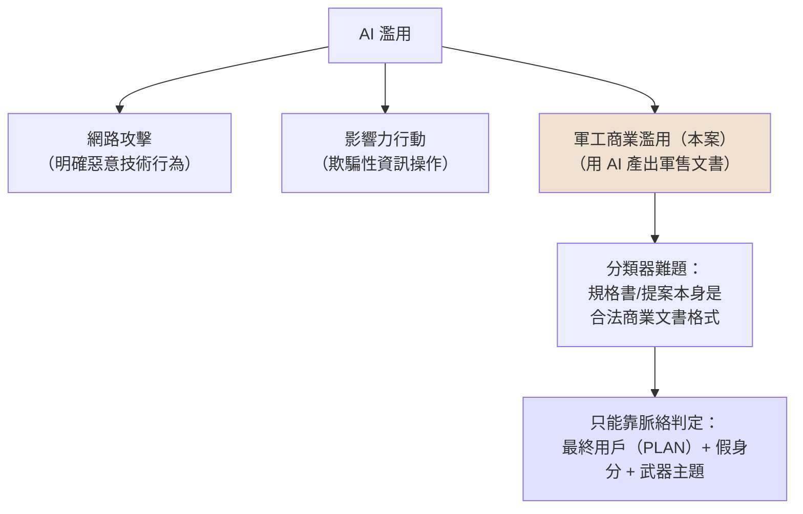

# GTG-17001：中國行為者以 Claude 撰寫反魚雷火控規格書與解放軍海軍採購提案

> 課程模組：04 常規武器（Conventional weapons） ｜ 一手來源：PDF p.115–116（案例正文起於 p.115 下半，Figure 2 在 p.116；p.117 整頁已是下一案 GTG-27005，本案沒有延伸到 p.117） ｜ 整理日期：2026-09-13

> 頁段校正說明：原始指派寫的是「p.115 至 p.117」。實際核對 PDF 與渲染圖後，p.115 上半是前一案 GTG-87001（葉門導引武器）的「Weapons development uplift」表格尾段（Optimization / Modeling & simulation / Packaging 三列），p.115 下半才是 GTG-17001 標題與 Summary；p.116 是本案正文後半與 Figure 2；p.117 從第一行起就是 GTG-27005（俄羅斯無人機蜂群）。因此本案是整個常規武器章節中篇幅最短的案例（約 1.3 頁），**沒有** IOC 表、**沒有**「Attack lifecycle and AI usage」獨立段落、**沒有** uplift 對照表、**沒有**活動時間軸。這些「報告沒寫的東西」本身就是教學素材，本教材會一路標示。

---

## 1. 一頁速覽

1. **是什麼**：一名 Anthropic 判定位於中國的行為者，用 Claude 同時推進三條平行工作流，目標是一套「自主研發（indigenous）」的反魚雷武器系統：(A) 用中文撰寫反魚雷**火控系統規格書**、(B) 產出 **200 頁以上的中文技術提案**與高階簡報，(C) 以公開資訊把自家系統與**特定美國反魚雷／反潛計畫**做對標，再產出一份關於美國海軍系統的中文簡報（p.115）。
2. **給誰看**：規格書是寫來「爭取一家中國國防製造商的核准」，核准後工作會進入「技術鑑定與作戰測試」；最終客戶是**解放軍海軍（PLAN）**——報告用語是「weapons specification and acquisition proposal for the People's Liberation Army Navy」（p.115–116）。
3. **怎麼用 AI**：提案反覆改了很多版；每一版完成後，行為者要 Claude **扮演敵意專家審稿人**痛批提案，再據此修下一版。同時 Claude 也被用來寫火控軟體的**部分模組**與驗證用的**測試矩陣**（p.116）。
4. **偽裝身分**：行為者對 Claude 自稱是**美國國防產業的原廠設備製造商（OEM）**；Figure 2 註腳寫得更直白——三條工作流「在一個建構出來的美國承包商身分之下同時進行」，而且「跨工作階段分艙化」（p.116）。
5. **歸因信度**：Anthropic 的措辭是「We **assess** the actor was **associated with** a Chinese defense industry manufacturer」，但緊接著說「We **cannot attribute** the activity to a specific entity or actor」（p.116）。這是中等信度的角色判斷，不是點名任何公司。
6. **處置**：封鎖「該帳號」（單數），依據是「Supported Regions Policy」（中國非支援地區）與 Usage Policy 的武器設計開發禁令；調查發現回饋到防護機制（p.116）。報告**沒有**說本案的哪一個請求曾被分類器擋下、也**沒有**說活動持續多久。
7. **為什麼重要**：這不是傳統的網路攻擊，也不是諜報——它更像**軍工產業為了拿到軍方訂單而做的商業行為**，只是把「寫規格書、寫提案、做競品分析」這些原本需要一組資深工程師與文件團隊的工作，交給了美國公司的前沿模型。AI 濫用的分類邊界在這裡變得模糊，這正是本案要教的。
8. **這個案例在課程裡要教什麼**：(1) 「武器開發」的濫用不一定是寫武器程式，**採購文件本身就是武器研發流程的一環**；(2) 假身分（pretext）如何讓合規邊界失效；(3) 「三軌並行＋跨階段分艙」對偵測工程的意義——單一對話看起來都合理，只有帳號層級的關聯分析才看得到全貌；(4) 「indigenous／國產化」與 AI 壓縮研發時程對台海軍力平衡評估的衝擊。

---

## 2. 行為者側寫與歸因

### 2.1 報告原文的歸因段落（逐字）

> "The actor presented themselves as an original equipment manufacturer in the US defense sector. We assess the actor was associated with a Chinese defense industry manufacturer aiming to produce a weapons specification and acquisition proposal for the People's Liberation Army Navy." （p.115–116）

> "We uncovered this activity as part of our internal investigations into suspected weapons development. We cannot attribute the activity to a specific entity or actor. But we have banned the account for violating our Supported Regions Policy and our Usage Policy, which prohibits weapons design and development, and incorporated our investigative findings into our safeguards to mitigate the risk of future misuse." （p.116）

再加上 Summary 第一句：

> "We identified a China-based threat actor who used Claude to advance three parallel tracks of work on an anti-torpedo weapons system:" （p.115）

### 2.2 身分線索拆解表

| 線索類型 | 報告提供的內容 | 頁碼 | 可推導出什麼 | 報告**沒有**提供的 |
|---|---|---|---|---|
| 地理位置 | 「China-based」；違反 Supported Regions Policy | p.115, p.116 | 帳號的存取來源被判定為中國（Anthropic 不對中國提供服務，所以「位於中國仍能使用」本身就代表繞過了地理管制） | 用什麼方式繞過（VPN／VPS／轉售商）；同章 GTG-27005 有寫「commercial virtual private servers」，本案沒寫 |
| 自稱身分 | 「original equipment manufacturer in the US defense sector」 | p.115 | 這是對 Claude 說的話，不是真實身分；Figure 2 稱之為「fabricated US-OEM identity」「constructed US-contractor identity」 | 這個假身分具體怎麼被使用（是每次對話開頭的 system prompt？還是一份長期「專案背景」文件？） |
| 語言 | 三條工作流的產出都是「Chinese-language」 | p.115 | 自稱美國 OEM 卻全用中文寫給中國製造商與 PLAN 看——語言與自稱身分的矛盾，是分析師最直接的紅旗 | 對話介面用的是中文還是英文；是否夾雜簡體／繁體 |
| 組織關聯 | 「associated with a Chinese defense industry manufacturer」 | p.115–116 | 行為者與某家中國國防製造商「有關聯」，但注意規格書是「寫來爭取一家中國國防製造商的核准」——所以行為者很可能是**製造商的上游**（分包商、小型民企、研究團隊或個別工程師），而不是製造商本身 | 製造商名稱、是國企（如中國船舶集團體系）還是民企、行為者的職務 |
| 最終客戶 | 「People's Liberation Army Navy」 | p.116 | 產品的預期使用者是解放軍海軍；Figure 2 的收斂節點寫「PLAN scenarios & adversary torpedoes」 | PLAN 是否已有立項需求、是否是回應公開採購公告 |
| 帳號規模 | 「banned the account」（單數） | p.116 | 只封了一個帳號 | 是否有關聯帳號、是否跨平台 |
| 活動時間 | 無 | — | — | 起訖日期、持續多久、與報告涵蓋期（2025-12 至 2026-08）的關係 |
| 使用工具 | 無 | — | 從「build pieces of ... fire control software and a test matrix」推測有程式碼產出，但報告沒說是 Claude Code、API 還是網頁介面 | 模型版本（章節開頭只說全報告都是 Haiku/Sonnet/Opus，p.3） |
| 代號／handle | 無 | — | — | 沒有任何帳號名、專案代號（對比 GTG-27005 有「DronDoc」「Serafim」） |

### 2.3 歸因措辭的情報學意義

Anthropic 在同一段裡用了三種不同強度的措辭，學員應學會分辨：

| 措辭 | 出現位置 | 意思 | 情報學上的等價概念 |
|---|---|---|---|
| **identified ... a China-based threat actor** | p.115 | 這是「事實陳述」層級：Anthropic 有直接的帳號層級證據（存取來源、內容）支持「位於中國」 | 直接觀測（direct observation）；信度高 |
| **We assess ... was associated with** | p.115–116 | 「assess」是分析判斷，不是觀測事實；「associated with」只說「有關聯」，不說「就是」或「受僱於」 | 分析判斷（analytic judgment），通常對應「moderate confidence」；美國 ICD 203 的用語習慣裡，「we assess」後面沒附信度詞時，讀者應預設中等信度 |
| **We cannot attribute ... to a specific entity or actor** | p.116 | 明確承認無法指向任何一個具體公司或個人 | 歸因缺口（attribution gap）；這句話的價值在於它阻止讀者過度推論 |

三句話放在一起讀，正確的解讀是：**「我們確定這個人在中國、確定他在做給 PLAN 的反魚雷系統文件、判斷他是中國軍工供應鏈的一環，但我們不知道他是誰、屬於哪家公司。」**

對比同章的 GTG-17002（電戰／防空壓制套件，p.119–120），那一案 Anthropic 寫的是「Account-level metadata and content flagged by our safeguards indicated the actor was linked to PRC research institutions, including the PLA Academy of Military Sciences」——有具體機構名。本案沒有。**兩案的歸因強度不同，第三方報導卻常把兩案並列敘述，造成讀者誤以為本案也連到軍事科學院**（見第 9 節對中天新聞網報導的討論）。

教學提醒：報告在其他章節會用「suspected state-sponsored」「high confidence」等詞。本案**沒有**出現「state」「state-sponsored」「PLA-linked」這些詞。把本案稱為「中國軍方使用 Claude」（例如某些英文媒體標題）是**超出報告文本的推論**。

### 2.4 「軍工商業行為」而非「網路攻擊」：本案的分類模糊性

這是本案最重要的教學點之一，值得花時間講清楚。

**傳統的 AI 濫用案例長什麼樣**：報告的 Cyber operations 章節（p.4–40）裡，行為者用 Claude 寫惡意程式、做偵察、橫向移動、竊取資料；Surveillance 章節裡，行為者建監控系統追蹤異議人士；Influence operations 裡，行為者生產假帳號與宣傳內容。這些都有明確的「受害者」與「攻擊行為」。

**本案長什麼樣**：一個（可能是）中國軍工供應鏈裡的公司或團隊，要向一家國防製造商推銷自己的反魚雷火控方案，進而爭取解放軍海軍的訂單。為此他們需要：一份技術規格書、一份 200 頁以上的技術提案、一份給高層的簡報、一份「我們比美國同類系統如何」的競品分析。**這在任何國家的軍工產業都是標準的商業開發（business development）流程**——差別只在於他們用了美國公司的 AI 模型，而這個模型的使用政策禁止武器設計與開發，且中國本來就不是被支援的地區。

**為什麼這件事仍然是「misuse」**：
1. Anthropic 的 Usage Policy 明文禁止武器設計與開發，不區分「國家安全用途」與「商業用途」；例外只針對特定經核准的政府客戶（報告 p.116 直接引用「our Usage Policy, which prohibits weapons design and development」）。
2. 行為者**知道**這條線在哪裡——所以才要偽裝成「美國國防產業 OEM」。假身分本身就是一種欺瞞（deception），它讓一個原本應該被拒絕的請求看起來像合法的美國國防承包商工作。
3. 產出物的用途是實質的軍事能力：反魚雷火控是保護 PLAN 水面艦與航艦免於潛艦魚雷攻擊的核心系統，直接影響台海與西太平洋的水下作戰態勢（第 3.3 節與第 10.4 節會展開）。

**為什麼這件事又不像傳統的威脅情報案例**：
1. 沒有入侵、沒有惡意程式、沒有受害系統、沒有 IOC。
2. 行為者的動機是**商業競爭**（拿到訂單），不是破壞或竊密。競品分析用的是「publicly accessible information」與「open-source reporting」（p.115），這在任何國家都是合法的 OSINT。
3. 如果把「AI 公司」換成「一家美國的工程顧問公司」，這個案子會變成一個出口管制（ITAR／EAR）與國防服務（defense services）的合規問題，而不是「威脅情報」問題。

**分類上的結論**：本案落在「威脅情報」「出口管制／技術移轉」「AI 使用政策執法」三個框架的交界。Anthropic 把它放進威脅情報報告的「Conventional weapons」章節，用 GTG 代號、用「threat actor」稱呼，是因為對一家 AI 公司來說，**任何違反武器條款的持續性、有組織的使用者都是威脅行為者**——不論其動機是諜報還是生意。學員應理解：**AI 平台的「威脅」定義比傳統資安更寬**，它涵蓋了「合法產業的違規使用」。這也解釋了為什麼報告在章節開頭（p.111）要強調：「Historically, this kind of work has been uncovered by governments, United Nations panels, and outside investigators... But as a frontier model provider, we can identify this activity ourselves」——AI 供應商正在成為一種新的、非政府的軍備監控節點。

### 2.5 與同章其他兩個中國案例的對照

| 項目 | GTG-17001（本案） | GTG-17002（電戰／防空壓制） | GTG-17003（定向能武器情蒐） |
|---|---|---|---|
| 頁碼 | p.115–116 | p.119–122 | p.126–128 |
| 產出類型 | 規格書、200+ 頁提案、簡報、火控軟體片段、測試矩陣、美軍系統簡報 | 約 16 個模組的中文電戰軟體套件、12 個版本、目標指示文件 | 23 頁報告、約 45 頁附錄的簡報、12 個月監測清單 |
| 自稱身分 | 美國國防產業 OEM（假身分） | 未載明 | 「defense intelligence writer and internal publication editor」領三人團隊 |
| 歸因強度 | assess associated with 中國國防製造商；cannot attribute | 帳號 metadata 與內容連到 PRC 研究機構，含 PLA Academy of Military Sciences | 「state-grade tradecraft」 |
| 對台灣的直接指涉 | 無（間接：PLAN 反魚雷能力） | 有：模擬場景改為台灣 12 個目標（指揮碉堡、預警雷達、愛國者與天弓陣地、空軍基地、區域作戰指揮部） | 無 |
| 處置 | 封一個帳號 | 封多個帳號 | 封一個帳號＋額外監控 |
| 分類器攔截敘述 | 無 | 「content flagged by our safeguards」 | 無 |

三案合起來看，可以觀察到一個模式：**中國軍工體系的不同環節（研發設計、情報分析、採購提案）都在用美國前沿模型**，而且各自的 tradecraft 不同。本案是「採購提案」這一環。

---

## 3. 受害者與目標清單

### 3.1 本案沒有傳統意義的「受害者」

報告沒有列任何受害組織，也沒有受害數字。本案的「目標」需要用不同的框架來列：**這套系統設計來對付誰、這些文件要說服誰、這個行動繞過了誰的規則**。

### 3.2 目標與利害關係人表

| 類別 | 對象 | 報告依據 | 備註 |
|---|---|---|---|
| 系統的預期使用者（客戶） | 解放軍海軍（PLAN） | p.116；Figure 2「PLAN scenarios」 | 報告未說 PLAN 是否知情或有立項 |
| 文件的直接受眾 | 一家中國國防製造商（未具名） | p.115「to win approval from a Chinese defense manufacturer」 | 該製造商通過後會把工作推進到「technical certification and operational testing」 |
| 系統的設計對象（軍事目標） | 「adversary torpedoes」（敵方魚雷） | Figure 2 收斂節點文字 | 報告未點名哪一國的魚雷。在 PLAN 的作戰想定裡，「敵方魚雷」最可能指美、日、台、澳潛艦的重型魚雷（本教材分析，見 3.3 與 10.4） |
| 情報／對標對象 | 「specific US anti-torpedo and anti-submarine programs」「US Navy systems」 | p.115；Figure 2「named US ATT/ASW programs」 | 報告說有「named」（具名的）美國計畫，但**沒有公布名稱**；來源是「publicly accessible information」「open-source reporting」 |
| 被欺瞞的平台 | Anthropic（Claude） | p.115 假身分；p.116 違反兩項政策 | 平台是規則被繞過的一方 |
| 被冒用的身分類型 | 「美國國防產業 OEM」這個身分類別 | p.115 | 報告沒說是否冒用了某家真實公司的名字，只說「presented themselves as an OEM」 |
| 間接受影響者 | 依賴潛艦與魚雷作為不對稱戰力的區域行為者 | 本教材推論 | 見 10.4 節 |

### 3.3 國防技術背景：學員需要的最低限度知識

報告只用一句括號解釋火控：「the core logic that aims and times an anti-torpedo weapon's response」（p.115）。要理解本案的嚴重性，學員需要知道反魚雷防禦是什麼、火控在裡面扮演什麼角色、以及這件事為什麼難。以下內容是本教材依公開資料整理的背景，**不是報告內容**，來源標在第 9 節。

#### 3.3.1 魚雷威脅為什麼特別

現代重型魚雷（例如美製 Mk 48 Mod 6/7）是水面艦最難防禦的威脅之一：
- 速度可達 50 節以上，射程數十公里，戰鬥部數百公斤，通常在船底引爆造成龍骨斷裂。
- 導引方式多元：線導（發射潛艦透過導線持續修正）、主動聲納歸向（魚雷自己發聲找目標）、被動聲納歸向（聽目標噪音）、尾流歸向（追船的尾流）。不同導引方式要用不同的反制手段。
- 水下偵測環境惡劣：聲音在水中的傳播受溫躍層、海底地形、船自身噪音影響；而一枚魚雷從被發現到命中，可能只有一到兩分鐘。

#### 3.3.2 軟殺與硬殺

| 類型 | 原理 | 例子 | 對火控的要求 |
|---|---|---|---|
| **軟殺（soft-kill）** | 誘騙或干擾魚雷的導引頭：拖曳式誘標模擬船噪、氣泡幕遮蔽、噪音干擾器、投放式聲學誘餌 | 美軍 AN/SLQ-25 Nixie 拖曳誘標；投放式 ADC（Acoustic Device Countermeasure） | 相對低：需要知道魚雷來襲方向與導引類型，決定放哪種誘餌、何時放、船怎麼機動 |
| **硬殺（hard-kill）** | 用另一枚小型高速魚雷（反魚雷魚雷，ATT）或定向武器直接擊毀來襲魚雷 | 美軍 CAT（Countermeasure Anti-Torpedo）、後續的 Mk 58 CRAW；中國福建艦上疑似的 324mm 六聯裝發射器 | **極高**：必須在幾十秒內完成偵測、分類（是魚雷還是誘標／生物／假警報？）、定位、預測彈道、算出攔截點、決定發射時機、發射後導引更新 |

#### 3.3.3 火控系統在反魚雷防禦中的功能鏈

「火控（fire control）」在武器系統裡的意思是：**把感測器資料變成一個可以開火的射擊解（firing solution），並控制武器在正確的時間往正確的方向射出去**。反魚雷火控的典型功能鏈（美軍稱為 detect-to-engage）：

1. **偵測（Detect）**：拖曳陣列聲納或艦殼聲納收到疑似魚雷的聲學特徵（推進器噪音、主動聲納脈衝）。
2. **分類（Classify）**：判斷這個接觸是魚雷、還是海洋生物、商船、自己的誘標或雜訊。**這是最難的一步**——美軍的 ATTDS 就是在這一步出問題（見 3.3.4）。
3. **定位與追蹤（Localize / Track）**：估算魚雷的方位、距離、速度、航向；水下只有聲學資訊，沒有雷達那種精確測距，所以要靠多陣列交會、都卜勒與運動學推算。
4. **威脅解算（Threat evaluation）**：預測魚雷會不會命中本艦、剩多少時間、屬於哪種導引類型。
5. **反制決策與武器分配（Engagement decision）**：軟殺先上還是硬殺？誘標放哪個方位？ATT 從哪一管射？本艦要不要轉向？
6. **發射時序與導引（Launch timing / guidance）**：ATT 有自己的聲納與（可能的）雙向水聲資料鏈，發射後需要艦上火控持續給更新，直到 ATT 自己鎖定。
7. **殺傷評估（Kill assessment）**：確認魚雷是否被摧毀或被誘開，決定要不要再打一次。

報告說 Claude 被用來寫「the core logic that aims and times an anti-torpedo weapon's response」——對應到上面的第 4 到第 6 步：**瞄準（aims）與時序（times）**。這不是周邊功能，是系統的心臟。

**為什麼「時序」是生死問題——一個示意用的交戰時間軸**（本教材自行估算的教學示例，數字為公開的概略性能，非任何實際系統的參數）：

| 時間點 | 事件 | 說明 |
|---|---|---|
| T+0 s | 敵潛艦在約 10 km 外發射一枚 50 節（約 25.7 m/s）的重型魚雷 | 10 km 的航程約需 390 秒；若魚雷先低速巡航再加速，時間更長，但艦上不知道 |
| T+30 至 T+90 s | 拖曳陣列或艦殼聲納偵測到魚雷的推進噪音或主動聲納脈衝 | 偵測距離取決於海況、溫躍層、本艦航速；在嘈雜的多艦編隊環境中，這一步可能延遲很久，甚至先出現誤警 |
| T+90 至 T+150 s | 火控完成分類（確認是魚雷）、定位、追蹤，估算彈道與命中時間 | 美軍 TWS 的問題就在這裡：誤警率高、分類不穩 |
| T+150 至 T+200 s | 決策：放誘標（軟殺）？發射 ATT（硬殺）？本艦轉向？ | 軟殺對線導魚雷效果有限，因為發射潛艦可以修正；硬殺需要精確的攔截解算 |
| T+200 至 T+250 s | ATT 發射；ATT 自身聲納尋標；艦上火控透過水聲鏈路更新 | ATT 速度若為 50–60 節，與來襲魚雷相對速度逾 100 節，交會窗口以秒計 |
| T+250 至 T+300 s | 攔截或失敗；殺傷評估；決定二次射擊 | 若第一枚 ATT 失敗，剩餘時間可能不足以再射 |
| T+390 s | 若全部失敗，魚雷命中 | — |

這張表的重點是：從偵測到命中，整個系統只有**兩到四分鐘**做完七個步驟，而每一步的延遲都會直接壓縮下一步的可用時間。「aims and times」——瞄準與時序——之所以被報告稱為「core logic」，是因為它決定了在這幾分鐘裡什麼時候做什麼。這也是為什麼一份火控規格書不只是「技術文件」：它把上述時間預算、感測器融合邏輯、決策門檻寫成可以實作與驗證的形式，是整個系統的設計中樞。

#### 3.3.4 美軍的教訓：ATTDS 為什麼被拆掉

這段對課程特別有價值，因為它說明「反魚雷硬殺系統的難點在哪裡」，也說明行為者為什麼要對標美國計畫。

依 The War Zone（TWZ）引述美國國防部作戰測試評估辦公室（DOT&E）年度報告：
- 美國海軍的 Surface Ship Torpedo Defense（SSTD）計畫中，硬殺部分 Anti-Torpedo Torpedo Defense System（ATTDS）由 Torpedo Warning System（TWS，偵測與分類）與 Countermeasure Anti-Torpedo（CAT，攔截魚雷）組成。
- 五艘尼米茲級航艦（George H.W. Bush、Harry S. Truman、Nimitz、Dwight D. Eisenhower、Theodore Roosevelt）裝了原型系統。
- 2018 年 9 月，海軍在投入五年多研發後停止 ATTDS，之後陸續把系統從航艦上拆除。SSTD 整體投入超過 7.6 億美元，其中 ATTDS 在 2017–2018 兩個年度約 8,500 萬美元。
- DOT&E 的評語：「CAT demonstrated some capability to defeat an incoming torpedo. CAT has uncertain reliability. The lethality of CAT is untested.」以及「The significance and effect of false target alerts on TWS capability are unknown.」多艦環境下的高誤警率是主要問題。

依 Naval News（2025 年，Carter Johnston）：美國海軍後來重啟硬殺路線，計畫在 165 艘以上的水面艦部署整合式反魚雷防禦——以升級後的 AN/SLQ-25E Nixie 拖曳陣列作為主感測器，「will be upgraded with a kinematics-based target discrimination and fire control to provide targeting information to the hard-kill weapons」，攔截器改用原本潛艦用的 Mk 58 CRAW（Compact Rapid Attack Weapon），開發持續到 FY2030。

**教學意義**：美軍在 ATTDS 上花了五年多、SSTD 整體投入逾 7.6 億美元，卡關的地方正是「分類與火控」——也就是本案行為者要 Claude 幫忙寫規格的那一塊。這給我們兩個相反方向的啟示：(1) 一份由 AI 產出的規格書，再漂亮也不等於能在海上工作的系統；(2) 但如果 AI 能讓一家小廠用幾週寫出一份「看起來像美軍水準」的規格與測試矩陣，它就有機會擠進原本進不去的採購流程——這才是 uplift 的真實所在（見 4.6 節）。

#### 3.3.5 中國反魚雷系統的公開資訊

依 Asia Times（2026-07-10，Gabriel Honrada）整理的公開報導與智庫分析（引述 SCMP、美國海軍戰爭學院中國海事研究所 CMSI、Andrew Erickson 2026 年 3 月 USCC 證詞等）：
- 中國新航艦福建艦裝有六聯裝 324 公釐輕型魚雷發射器，取代前代航艦的 12 管深彈發射器，外界研判是反魚雷魚雷（ATT）發射器，可能使福建艦成為世界第一艘配備作戰化硬殺反魚雷系統的航艦。
- 報導描述的 ATT 特徵：寬頻聲納陣列以區分真魚雷與誘標、雙向水聲資料鏈讓母艦在發射後更新攔截器、小型火箭助推加泵噴推進，估計三秒內加速到 50–60 節。
- 戰略動機：對抗美軍 Seawolf 級、Virginia 級與未來 SSN(X) 潛艦的 Mk 48 重型魚雷威脅。
- **這些報導沒有點名任何中國研究所或製造商**負責該系統，也沒有任何公開資料把福建艦的系統與本案連結。本教材**不**主張兩者有關；只是說明「PLAN 正在推動反魚雷硬殺能力」是公開可查證的背景，而本案的行為者要賣的正是這個方向的東西。

---

## 4. AI 濫用的攻擊生命週期（逐階段拆解）

### 4.1 報告敘述的工作模式（先讀原文）

本案沒有獨立的「Attack lifecycle and AI usage」段落，所有生命週期資訊來自 p.115 的三點 Summary、p.116 的兩段正文、以及 Figure 2。關鍵句：

> "The actor used Claude to write the acquisition proposal, refining it over many drafts. After each draft, the actor instructed Claude to role-play a hostile expert reviewer to critique the proposal, then used that feedback to sharpen the next version. In parallel, the actor used Claude to build pieces of the anti-torpedo weapons system's fire control software and a test matrix to validate them." （p.116）

> "The operational lift the actor achieved was a function of using Claude to automate complex technical outputs. The actor leveraged the model to compress the development timelines for the certification registry, compliance documentation, and automated fire control logic. The actor also accelerated the traditional human review cycle by having Claude critique the acquisition proposal across multiple rounds of review while role-playing a persona." （p.116）

注意報告在這裡用的詞是「operational **lift**」而不是全報告通用的「uplift」（p.4 定義）。意思相同，但這個措辭差異提醒我們：常規武器章節可能由不同團隊撰寫，用語未完全統一。

另外，Part I 的總述（p.112）對四個開發型案例都適用：

> "Across these cases, the actors used Claude to build and refine software for weapons hardware and firmware with which they already had expertise and to which they had access. The actors split their work across many sessions to conceal the full nature of their programs, and used other methods to circumvent our safeguards and access controls." （p.112）

### 4.2 逐階段表：人類做什麼／Claude 做什麼／自主程度

因為報告沒給時間軸，下表的「階段」是依軍工提案的自然順序與報告文字重建，**階段順序是本教材的推論**，各格內容則對應到頁碼。

自主程度標示：**對話式協助**（人問一句 AI 答一句）／**人類逐步指揮**（人設定目標、分派任務、審核產出，AI 執行多步驟工作）／**AI 編排多代理自主執行**（AI 自己拆解任務、呼叫工具、跨代理協調）。

| 階段 | 人類（行為者）做什麼 | Claude 做什麼 | 自主程度 | 頁碼依據 |
|---|---|---|---|---|
| 0. 存取與偽裝 | 從中國連上 Claude（違反 Supported Regions Policy）；建立「美國國防產業 OEM」的假身分作為工作背景 | 在這個假身分下接受任務（Figure 2：「Claude ran all three concurrently under a constructed US-contractor identity」） | — | p.115, p.116 |
| 1. 需求定義 | 設定目標：一套針對「PLAN 場景與敵方魚雷」的自主研發反魚雷系統；決定三條工作流 | 未載明（報告沒說系統概念是誰提出的；Figure 2 圖例有「Not observed / actor-supplied」類別但圖上沒有任何節點屬於這一類） | 人類主導 | Figure 2 |
| 2A. Track A 工程：規格撰寫 | 指定要寫「反魚雷火控系統」的中文規格書，目的為通過製造商核准 | 起草規格書（瞄準與時序核心邏輯）；另外「build pieces of the ... fire control software and a test matrix to validate them」 | 人類逐步指揮 | p.115, p.116 |
| 2B. Track B 採購：提案撰寫 | 要求產出 200 頁以上中文技術提案與高階簡報；設定「多版本迭代」流程 | 撰寫提案各版本；撰寫簡報 | 人類逐步指揮 | p.115, p.116 |
| 2C. Track C 情報：競品對標 | 指定「特定美國反魚雷與反潛計畫」作為對標對象；提供或指示蒐集公開資料 | 依公開資訊做對標分析；產出美國海軍系統的中文簡報 | 對話式協助到人類逐步指揮之間 | p.115 |
| 3. 自我審查迴圈 | 每一版提案完成後，指示 Claude「扮演敵意專家審稿人」；把批評餵回下一版 | 以審稿人身分批評自己（或前一版）的產出；再依批評改寫 | 人類逐步指揮（迴圈由人類驅動，但每一輪的「審」與「改」都由 AI 完成） | p.116 |
| 4. 合規與認證文件 | 要求壓縮「certification registry, compliance documentation」的時程 | 產出認證登錄與合規文件（報告只給這兩個名詞，沒有細節） | 人類逐步指揮 | p.116 |
| 5. 交付與下一步 | 把規格書送製造商審批 → 技術鑑定 → 作戰測試（報告描述的預期路徑） | 未載明是否參與 | — | p.115 |
| 6. 隱匿 | 「Compartmentalised across sessions」：把工作拆到不同工作階段，避免單一對話暴露全貌 | （被動）每個工作階段只看到局部 | — | Figure 2 註腳；p.112 總述 |

**自主程度的總結**：本案的 AI 使用模式是**人類逐步指揮**——沒有證據顯示行為者用了多代理編排（對比 GTG-87001 同時管理多個 Claude 實例並分派角色，p.113；或 GTG-27005 用 Claude Code 直接寫入專案檔案，p.117）。本案的特殊之處不在自主程度，而在**「生產—審查」迴圈的閉環化**：同一個模型既是作者也是審稿人，人類只負責按「下一輪」。

### 4.3 三條平行工作流的完整內容

以下整合 p.115 Summary 三點、p.116 正文、與 Figure 2 三個節點的文字。

#### Track A · Engineering（工程）——「Indigenous fire-control specification — certification path」

- **產出**：中文的反魚雷火控系統規格書（specification）。報告對火控的定義：「the core logic that aims and times an anti-torpedo weapon's response」（p.115）。
- **目的**：「to win approval from a Chinese defense manufacturer, which would move the work on to technical certification and operational testing」（p.115）。Figure 2 把這條路稱為「certification path」（認證路徑）。
- **附帶產出**：「pieces of the anti-torpedo weapons system's fire control software and a test matrix to validate them」（p.116）——火控軟體的片段模組，加上驗證它們的測試矩陣。
- **Claude 的角色**：撰寫者兼實作者。從「規格」到「軟體片段」到「測試矩陣」，Claude 涵蓋了系統工程 V 模型左側（需求→設計）與右側（驗證）的文件層。
- **報告沒說的**：火控軟體片段有多完整、是否能編譯執行、測試矩陣是否被實際跑過、規格書是否真的送出並獲核准。

#### Track B · Acquisition（採購）——「~200-page proposal under fabricated US-OEM identity」

- **產出**：「a Chinese-language technical proposal of more than 200 pages, accompanied by an executive briefing deck」（p.115）。
- **方法**：「refining it over many drafts. After each draft, the actor instructed Claude to role-play a hostile expert reviewer to critique the proposal, then used that feedback to sharpen the next version」（p.116）。
- **Claude 的角色**：撰寫者＋敵意審稿人＋改寫者。三個角色由同一模型在不同對話輪次扮演。
- **Figure 2 的額外資訊**：「under fabricated US-OEM identity」——提案是在假的美國 OEM 身分下產出的。這暗示假身分不只是為了繞過武器條款，可能也影響了提案的內容框架（例如以「美國承包商視角」撰寫技術論證）。這是推論，報告沒明說。
- **報告沒說的**：提案的目標讀者是製造商還是 PLAN、200 頁的章節結構、簡報頁數、是否有成本或時程章節。

#### Track C · Intelligence（情報）——「Benchmarking vs. named US ATT/ASW programs」

- **產出**：(1) 自家系統對「specific US anti-torpedo and anti-submarine programs」的對標分析；(2) 「a Chinese-language briefing on US Navy systems derived from open-source reporting」（p.115）。
- **資料來源**：「publicly accessible information」「open-source reporting」——報告兩次強調公開來源，這一點對本案的法律與倫理定性很重要（見 2.4 節）。
- **Claude 的角色**：OSINT 分析師兼簡報撰寫者。
- **Figure 2 的額外資訊**：「named」——行為者對標的是**具名的**美國計畫（例如可能是 SSTD / ATTDS / CAT / CRAW / Nixie 這一類，本教材依 3.3.4 節的公開資訊推測，**報告未公布名稱**）。
- **報告沒說的**：對標的結論是什麼（自家系統比較強還是比較弱）、簡報的讀者是誰。

#### 三條工作流如何互相支援

Figure 2 用三支箭頭把 A、B、C 收斂到同一個節點「One indigenous anti-torpedo system — PLAN scenarios & adversary torpedoes」。這個收斂關係可以這樣理解（本教材分析）：

- **A 餵 B**：規格書與火控軟體片段是技術提案的技術核心；沒有 A，200 頁提案只是文字。測試矩陣則提供「我們有驗證計畫」的可信度。
- **C 餵 B**：對美國計畫的對標讓提案有「與國際先進水準比較」的章節，這在中國軍工提案的「論證」階段幾乎是必備內容（見 4.5 節）。
- **C 餵 A**：對美軍系統的了解（例如 Nixie 拖曳陣列作為火控主感測器、CRAW 攔截器的尺寸）可能直接影響規格書的架構選擇。報告沒有明說這條路徑，但「benchmark their own system against」的動作本身就意味著 A 的內容會被 C 檢驗與修正。
- **B 的敵意審稿迴圈回頭改 A 與 C**：審稿人批評「技術論證不足」時，行為者會回到 A 補規格；批評「與美軍比較不夠具體」時，回到 C 補資料。這是為什麼 Figure 2 說三者「concurrently」（同時）進行。

### 4.4 「敵意審稿人」迴圈：一個被低估的 uplift 機制

報告用了兩句話描述這個機制（p.116），值得單獨拆解：

**在人類的軍工組織裡，這個迴圈長什麼樣**：一份採購提案在送出前，通常要經過內部技術評審、專家會審、甚至模擬對手方的「紅隊」評審。每一輪需要召集資深工程師，排時間，寫評審意見，作者再修改。一輪往往以週計。中國軍工體系的「論證評審」「方案評審」更是有制度化的專家組流程。

**本案怎麼做**：Claude 寫一版 → 行為者說「你現在是一個敵意的專家審稿人，批評這份提案」→ Claude 產出批評 → 行為者說「依這些批評修改」→ Claude 產出下一版。整個迴圈不需要任何第二個人。報告說「refining it over many drafts」「multiple rounds of review」，但沒給具體輪數。

**這為什麼是 uplift**：
1. **時間**：把以週計的評審週期壓縮到以小時計。
2. **人力**：一個人（或小團隊）就能模擬出「作者＋評審委員會」的完整流程，這正是報告 p.5 說的「sophisticated attacks no longer require sophisticated attackers」在軍工領域的翻版。
3. **品質**：敵意審稿的價值在於「預先找出審批方會挑的毛病」。如果行為者要說服的製造商評審是資深反潛工程師，Claude 扮演的「敵意專家」能不能達到那個水準，決定了提案的通過率。報告沒有評估這一點。

**偵測工程的觀察**：「同一帳號反覆要求模型對同一份長文件做角色扮演式批評再改寫」是一種可觀測的行為模式（見第 5 節與第 8 節）。單看一輪對話，這只是「幫我審稿」；看整個帳號的歷程，才會發現這是一份 200 頁的軍購提案在迭代。

### 4.5 Claude 產出了哪些文件類型？它們在軍工採購流程中的位置

報告點名的產出物（全部依 p.115–116）：

| 編號 | 產出物 | 報告原文 | 語言 |
|---|---|---|---|
| D1 | 反魚雷火控系統規格書 | "a Chinese-language specification for an anti-torpedo fire control system" | 中文 |
| D2 | 200 頁以上技術提案 | "a Chinese-language technical proposal of more than 200 pages" | 中文 |
| D3 | 高階簡報 | "an executive briefing deck" | （未載明，推測中文） |
| D4 | 對標分析 | "benchmark their own system against specific US anti-torpedo and anti-submarine programs" | （未載明） |
| D5 | 美國海軍系統簡報 | "a Chinese-language briefing on US Navy systems derived from open-source reporting" | 中文 |
| D6 | 火控軟體片段 | "pieces of the anti-torpedo weapons system's fire control software" | 程式碼 |
| D7 | 測試矩陣 | "a test matrix to validate them" | （未載明） |
| D8 | 認證登錄相關文件 | "certification registry" | （未載明） |
| D9 | 合規文件 | "compliance documentation" | （未載明） |
| D10 | 採購提案 | "the acquisition proposal"（可能與 D2 是同一份或包含關係） | 中文 |

**這些文件在中國軍品研製與採購流程中的位置**（以下為本教材依公開資料整理的背景，**報告本身沒有描述中國的流程**；Figure 2 註明 Anthropic 用的分析框架是「DoD acquisition phases」，即美國國防部的採購階段，見第 6 節的討論）：

依中國國家軍用標準（GJB）體系與公開的軍品研製程序介紹，常規武器裝備研製一般分為：**論證階段 → 方案階段 → 工程研製階段 → 設計定型（狀態鑑定）→ 生產定型（列裝定型）**。依公開介紹，2020 年後的裝備試驗鑑定制度改以性能試驗、狀態鑑定、作戰試驗、列裝定型等環節組織（本教材未查證法規全文）。對照本案：

| 中國研製流程階段 | 本案產出物 | 說明 |
|---|---|---|
| 論證階段（需求論證、可行性論證、技術指標論證） | D2 技術提案、D3 簡報、D4 對標分析、D5 美軍系統簡報 | 「論證報告」在中國軍品流程裡是立項的基礎文件，通常要包含「國內外現狀與發展趨勢」——這正是 Track C 存在的理由 |
| 方案階段（方案設計、關鍵技術攻關） | D1 火控規格書、D6 火控軟體片段 | 規格書對應「研製總要求」或「技術規格書」層級的文件 |
| 工程研製（技術設計、試製、設計驗證） | D7 測試矩陣 | 測試矩陣是驗證計畫的骨架 |
| 設計定型／狀態鑑定 → 作戰試驗 | （報告說規格書通過後會進入「technical certification and operational testing」） | 對應中國語境的「技術鑑定」與「作戰試驗」 |

**「certification registry」最可能指什麼**（本教材推論，報告未解釋）：民營企業要成為解放軍的裝備供應商，依公開資料需取得所謂「軍工四證」——武器裝備科研生產單位保密資格、GJB 9001 武器裝備質量管理體系認證、武器裝備科研生產許可、以及**裝備承製單位資格**（通過審查後列入「中國人民解放軍裝備承製單位名錄」）。「registry（登錄／名錄）」與「compliance documentation（合規文件）」這兩個詞，與「承製單位名錄」與四證申辦所需的大量體系文件高度吻合。若此推論正確，本案的 uplift 不只在技術文件，還在**「取得軍品供應商資格」的合規文書**——這對一家想「參軍」的小型民企而言，往往是比技術更高的門檻。

**採購入口的背景**：依中國國家國防科技工業局（SASTIND）的公告，「全軍武器裝備採購信息網」（weain.mil.cn）於 2015 年開通，是全軍裝備採購需求的發布平台，設有「民參軍指導」「採購公告」「企業名錄」等欄目，認證用戶可進行需求對接、產品技術自薦、參與招標。美國智庫（CSET、NBR）的研究亦指出，2017 年 4 月中央軍委裝備發展部曾對民企開放逾 2,000 個項目的招標。本案行為者要「爭取製造商核准」再「向 PLAN 提案」的路徑，與這個「民參軍」生態高度一致——但**報告沒有說行為者是民企還是國企體系內的單位**。

### 4.6 Uplift 三維度分析（speed / scale / depth）

報告 p.4 定義 uplift 的三個維度：速度、規模、深度。本案報告只用一段文字描述 uplift（p.116），沒有像 GTG-87001 與 GTG-27005 那樣給表格。以下由本教材依報告文字整理：

| 維度 | 報告證據 | 本教材評估 |
|---|---|---|
| **速度（speed）** | 「compress the development timelines for the certification registry, compliance documentation, and automated fire control logic」「accelerated the traditional human review cycle」（p.116） | 明確。三類東西的時程被壓縮：合規／認證文書、火控邏輯、評審週期。 |
| **規模（scale）** | 「more than 200 pages」「many drafts」「multiple rounds of review」「three parallel tracks」（p.115–116） | 明確。一個帳號同時推三條線、產出 200+ 頁、多輪迭代。 |
| **深度（depth）** | 「build pieces of ... fire control software and a test matrix」「the core logic that aims and times」（p.115–116） | **不確定**。報告說 Claude 寫了火控軟體「片段」與測試矩陣，但沒有任何關於這些程式碼品質、完整度、是否可運行的評估。對比 GTG-87001 有「a live field test」、GTG-27005 有「flashing the low-level firmware to live development boards」與 TRL 3–4 的評估（p.119），本案**沒有任何實體測試或 TRL 的敘述**。 |

**平衡的評估**：本案的 uplift 主要落在**「紙上」階段**——規格、提案、對標、合規文件、評審。這些恰好是軍工採購流程中「小廠進不去」的門檻，所以 uplift 對**市場進入**的影響可能比對**技術突破**的影響更大。至於火控系統的真正難點（3.3.4 節說的分類與誤警率問題），沒有海上測試資料，AI 不可能替代。這一點要跟學員講清楚，避免把本案誇大成「AI 幫中國造出了反魚雷系統」。

### 4.7 「indigenous（自主研發／國產化）」的戰略意義

Figure 2 三處用了「indigenous」：Track A 的「Indigenous fire-control specification」、收斂節點的「One indigenous anti-torpedo system」、圖說的「creating an indigenous anti-torpedo fire control specification」。這個詞是 Anthropic 分析師的用語，不一定是行為者自己的話，但它精準對應中國軍工政策的核心關鍵字：**自主可控、國產化替代**。

**政策背景**（公開資料，見第 9 節）：
- 2015 年起「軍民融合」上升為國家戰略，目的之一是引入民間技術與競爭來改善軍工體系的效率與議價能力。
- 「十五五」規劃（2026–2030）在 2025 年的公開討論中，被分析為將軍民融合進一步制度化，並把 AI（「人工智能+」）列為優先；分析者預期解放軍會透過快速原型與實驗來加速學習。
- 在美國及盟國出口管制下，北京持續推動軍用積體電路等領域的進口替代。

**為什麼「自主研發」與 AI 的組合值得警惕**（本教材分析）：
1. **國產化的瓶頸通常不是硬體，而是「知道怎麼做」的人**。反魚雷火控這種系統，全世界有實戰化經驗的團隊屈指可數。一個前沿模型讀過大量公開的美軍 DOT&E 報告、學術論文、專利，能把「怎麼做」的隱性知識轉成一份規格書——這對缺乏師承的新進廠商是最大的 uplift。
2. **競爭者變多**：當寫規格書與提案的成本趨近於零，更多小廠可以進入「論證」階段競爭，PLAN 的採購方有更多方案可選、更多迭代可做。這不會讓某一個系統變強，但會讓整個生態的**試錯速度**變快。
3. **對區域軍力平衡評估的衝擊**：傳統的淨評估（net assessment）用「從概念到列裝需要 N 年」來推估對手能力的時間軸。如果紙上階段被壓縮，N 會變短——但變短多少，沒有人有資料。這是方法論層級的問題，在 10.4 節會針對台灣展開。
4. **反諷的一面**：一個標榜「自主研發」的系統，其規格是用美國公司的 AI、在假冒美國承包商的身分下、對標美國計畫寫出來的。「indigenous」在這裡的實際意思是「不依賴外國硬體」，而不是「不依賴外國知識」。這對「自主可控」政策本身是一個值得課堂討論的矛盾。

### 4.8 本案在常規武器章節 Part I 四案中的位置

把四個「開發型」案例放在一起，本案的獨特性才看得清楚。下表全部依報告 p.112–122 整理。

| 項目 | GTG-87001 葉門導引武器（p.112–115） | **GTG-17001 中國反魚雷火控（p.115–116）** | GTG-27005 俄羅斯無人機蜂群（p.117–119） | GTG-17002 中國電戰／防空壓制（p.119–122） |
|---|---|---|---|---|
| 行為者類型 | 武器工程「cell」，三個計畫並行 | 與國防製造商有關聯的行為者，自稱美國 OEM | 小型自由接案團隊，有地方大學與俄羅斯科學院研究中心關聯 | 國防與軍工研究者，帳號 metadata 連到 PLA 軍事科學院 |
| 主要產出 | GNC 軟體、飛控韌體、六自由度彈道模擬、離線模擬工具包 | 火控規格書、200+ 頁提案、簡報、對標分析、火控軟體片段、測試矩陣、合規文件 | 蜂群記憶與容錯協調邏輯、機上小型語言模型、終端導引、控制鏈路定位、聲學偵測、低階韌體 | 約 16 個模組的電戰套件、12 個版本、目標指示文件 |
| 產出的「型態」 | 程式碼與模擬 | **文件為主，程式碼為輔** | 程式碼＋硬體在環 | 程式碼＋介面 |
| 實體測試證據 | 有：葉門實彈試射（失敗後數小時回頭問 Claude） | **無** | 有：燒錄韌體到開發板、單板電腦、網狀網路模擬環境 | 無實體，但有自建模型的工具整合 |
| 成熟度標示 | Figure 1 系統工程 V 模型 | **Figure 2 泳道圖（無 TRL）** | Figure 3 V 模型對 TRL；表格標 TRL 3–4 | Figure 4 系統提及次數；Figure 5 聯合目標週期 |
| 規避手法 | 隱藏目標與產品用途、跨階段拆分（另以多個 Claude 實例分工，這是工作模式而非規避） | **假身分（美國 OEM）、跨階段分艙、三線並行** | 商用 VPS 繞區、九個帳號中八個做正常接案 | 未詳述；自建模型並聯 |
| 分類器攔截敘述 | 「blocked many of their requests, but not all」 | **無** | 無 | 「content flagged by our safeguards」 |
| 處置規模 | 封多帳號、與公私夥伴分享 | **封一帳號** | 封多帳號 | 封多帳號 |
| 對台灣的直接指涉 | 無 | 無（間接） | 無 | 有：12 個台灣目標 |

從這張表可以看出本案的三個「唯一」：**唯一以文件為主要產出的案例、唯一使用假國籍／假產業身分作為主要規避手法的案例、唯一沒有任何實體測試或成熟度評估的案例**。這三點決定了它的教學定位：它不是「AI 寫出武器」的案例，而是「AI 讓人更容易進入武器採購流程」的案例。

---

## 5. TTP 與 MITRE ATT&CK 對應

先講結論：**本案幾乎沒有可以對應到 ATT&CK 的技術**。ATT&CK 描述的是對電腦網路的攻擊，本案沒有入侵任何系統。硬套會誤導學員。下表列出能勉強對應的部分，並明確標示框架缺口；同時參考 MITRE ATLAS（針對 AI 系統的對抗框架），ATLAS 的技術 ID 請以官網現行版本為準。

| 戰術 | 技術 ID | 本案的具體作法 | 偵測構想 | 備註 |
|---|---|---|---|---|
| Resource Development（資源開發） | ATT&CK T1585 Establish Accounts | 建立 Claude 帳號並以「美國國防產業 OEM」身分自居 | 帳號註冊資訊與使用內容的一致性檢查（自稱美國 OEM，卻全用中文寫給 PLAN） | 對應勉強成立；ATT&CK 的原意是建立社交／郵件帳號做社交工程 |
| Resource Development | ATT&CK T1583 Acquire Infrastructure（子技術 VPS 等） | 從中國存取 Claude（違反 Supported Regions Policy）——**報告沒說用了什麼手段**；同章 GTG-27005 明載用商用 VPS | IP／ASN 與帳號宣稱地區不符；已知繞區 VPS 供應商的流量特徵 | 本案是推論，僅 GTG-27005 有明文 |
| Defense Evasion（規避） | **框架缺口**（ATT&CK 無對應）；ATLAS 可參考「LLM Jailbreak」類技術 | 以假身分（pretext）讓武器相關請求看起來像合法美國國防工作 | 跨對話的身分宣稱一致性；「defense contractor」「OEM」等自稱與產出語言／受眾的矛盾 | 這不是傳統的 jailbreak（沒有繞過模型的拒絕機制的技術手法），而是**社交工程模型**。ATLAS 與 ATT&CK 都沒有精準的 ID |
| Defense Evasion | **框架缺口** | 「Compartmentalised across sessions」——把三條工作流拆到不同工作階段，讓任何單一對話看不出全貌 | 帳號層級的主題聚合分析（topic clustering across sessions）；同一帳號在不同對話中出現「反魚雷」「火控」「PLAN」「美軍 ATT」的共現 | 報告 p.112 說四個開發型案例都用了這招。這是 AI 濫用特有的規避方式，ATT&CK 沒有對應 |
| Reconnaissance（偵察） | ATT&CK T1596 / T1597 Search Open Websites / Closed Sources（極勉強） | Track C：以公開資料對標具名美國 ATT/ASW 計畫 | 帳號在武器主題上反覆查詢具名美軍計畫的細節 | ATT&CK 的偵察是針對「受害者」的；本案是競品分析，性質不同。標示為**框架不適用** |
| Develop Capabilities（開發能力） | ATT&CK T1587 Develop Capabilities（極勉強） | Track A：火控軟體片段、測試矩陣 | 程式碼產出中的領域關鍵字（聲納、魚雷運動學、攔截解算）與測試矩陣結構 | T1587 指的是開發惡意程式／攻擊工具，不是武器軟體。**框架不適用** |
| （無對應戰術） | **框架缺口** | 「生產—敵意審稿—改寫」迴圈 | 同一帳號對同一長文件反覆要求角色扮演式批評再改寫；每輪之間的文件相似度高且逐步增長 | 這是本案最具辨識度的行為模式，任何現有框架都沒有描述 |
| （無對應戰術） | **框架缺口** | 三條工作流「concurrently」並行 | 帳號活動的主題多樣性與時間重疊 | 對應 GTG-87001 的多實例編排（p.113）；本案沒有證據顯示用了多代理，只是同一帳號在多主題間切換 |

**給學員的方法論結論**：
1. ATT&CK 是為「對網路的攻擊」設計的；當「被攻擊」的對象是**平台的使用政策**而不是電腦系統時，它幾乎失效。
2. MITRE ATLAS 補了一部分（模型層級的對抗），但本案的手法是「以假身分講一個可信的故事」，這是**社交工程**的邏輯，只是對象從人變成模型與其安全分類器。
3. 真正有用的偵測面是**帳號行為分析**（account-level behavioral analytics），而不是單一請求的內容分類。這一點在第 8 節會連回 Anthropic 自己的防線缺口。

---

## 6. 圖表逐一判讀

本案頁段內只有一張圖：Figure 2（p.116）。p.115 上半的表格屬於前一案 GTG-87001（見頁段校正說明），p.117 沒有圖表。

### Figure 2（p.116）：The three parallel workstreams the actor pursued

圖檔：`../figures/page-116.png`（160 DPI 課程版；本教材另以放大裁切逐字核對）

**圖片類型**：泳道式流程圖（swimlane / workstream diagram），三條水平工作流以箭頭收斂到右側單一節點；下方有圖例與框架說明。整張圖是 Anthropic 分析師繪製的**分析產品**，不是行為者的文件截圖。

**圖上實際看到的所有元素與文字（逐字抄錄）**：

- 大標題：**Case 2: Development**
- 副標題：**Undersea-Warfare Fire-Control: Three parallel workstreams**
- 左側三個填色（淡橙紅色）圓角矩形，由上而下：
  1. **Track A · Engineering** — 「Indigenous fire-control specification — certification path」
  2. **Track B · Acquisition** — 「~200-page proposal under fabricated US-OEM identity」
  3. **Track C · Intelligence** — 「Benchmarking vs. named US ATT/ASW programs」
- 三個矩形右側各有一條線，先垂直匯合、再以單一箭頭指向右側的白底黑框方框。
- 右側方框文字：**One indigenous anti-torpedo system**；下方小字：「PLAN scenarios & adversary torpedoes」
- 方框下方的註腳（位於三條工作流下方、整個面板內）：「Compartmentalised across sessions; Claude ran all three concurrently under a constructed US-contractor identity.」
- 圖例（面板底部）：
  - 填色方塊 = **Where Claude operated**（Claude 參與之處）
  - 白底黑框方塊 = **Standard process step**（標準流程步驟）
  - 虛線方塊 = **Not observed / actor-supplied**（未觀測到／由行為者自行提供）
- 框架說明：「Framework: Parallel-workstream swimlanes (DoD acquisition phases)」
- 圖說（頁面正文）：「Figure 2. The three parallel workstreams the actor pursued: creating an indigenous anti-torpedo fire control specification, a Chinese-language proposal, and comparative analysis of US programs.」

**資料如何流動**：三條工作流是**並行**而非串行的（沒有 A→B→C 的順序箭頭），它們各自獨立產出，然後共同「餵入」右側那個唯一的系統節點。箭頭的匯合方式（先合流再單箭頭）表達的是「三者是同一個系統的三個面向」，而不是「三者依序完成」。

**顏色編碼傳達的訊息**：三條工作流**全部**是填色的「Where Claude operated」——也就是說，Anthropic 觀測到 Claude 參與了每一條工作流；右側的「One indigenous anti-torpedo system」是白底的「Standard process step」——這是行為者流程中的一個節點（目標系統），Claude 沒有「操作」它。圖例上的第三類「Not observed / actor-supplied」（虛線）**在圖上沒有任何節點使用**——這意味著 Anthropic 在這個案例裡沒有標出任何「行為者自己帶來的、Claude 沒參與的」步驟，例如系統的原始概念、硬體、或聲納資料。這不代表這些不存在，只代表 Anthropic 沒有觀測到或選擇不畫。

**這張圖傳達的核心訊息**：
1. **Claude 不是被用在單一任務上，而是覆蓋了一個軍購專案的全部文書面**：工程規格、採購提案、競品情報。三個「Track」的命名（Engineering / Acquisition / Intelligence）本身就是一種分類法——它告訴讀者，AI 濫用不只有「寫程式」一種型態。
2. **假身分是貫穿三條線的基礎設施**：註腳的「under a constructed US-contractor identity」與 Track B 的「fabricated US-OEM identity」呼應。假身分不是某一次對話的話術，而是整個專案的「殼」。
3. **分艙化與並行同時存在**：「Compartmentalised across sessions」（對外隱匿）與「concurrently」（對內並行）看起來矛盾，其實是同一個策略的兩面——對 Anthropic 的偵測而言是碎片，對行為者而言是一個整體專案。
4. **「Case 2」的編號洩露了圖的製作脈絡**：這張圖是常規武器章節一系列案例圖的第二張（Case 1 對應 GTG-87001 的 Figure 1「systems engineering V」，p.114；Case 3 對應 GTG-27005 的 Figure 3「V 模型對 TRL」，p.118）。每一案 Anthropic 都選了一個不同的系統工程框架來畫：V 模型、泳道、TRL。這顯示分析團隊有意用**國防採購界的通用語言**來描述 AI 濫用，讓國防讀者能直接對號入座。

**框架選擇的方法論問題（課堂討論素材）**：圖下方註明「Framework: Parallel-workstream swimlanes (DoD acquisition phases)」——Anthropic 用**美國國防部的採購階段**當框架，來描述一個**解放軍海軍**的採購提案。這是情報分析裡典型的「鏡像」風險（mirror-imaging）：用自己熟悉的流程去理解對手的流程。中國軍品研製的階段劃分（論證→方案→工程研製→設計定型→生產定型，見 4.5 節）與美國 DoD 的 Materiel Solution Analysis → Technology Maturation → EMD → Production 並不一一對應；例如「論證階段」在中國流程裡是一個正式、有評審制度的立項前階段，而 Track B/C 的產出正是「論證報告」層級的東西。用 DoD 框架看，這些是「pre-Milestone A 的文件」；用中國框架看，這些是**立項的關鍵文件**——後者的重要性更高。這個差異值得在課堂上讓學員重畫這張圖（見 10.3 節）。

**在課程中可以怎麼用這張圖**：
- **開場提問**：遮住圖例與註腳，只給三個 Track 的名稱，問學員「這三條線裡哪一條最像『武器開發』？哪一條最像『正常生意』？」——多數人會說 A 是武器開發、B 是生意、C 是情報。然後揭露三條全部是填色（Claude 參與），引出「AI 濫用的邊界在哪裡」的討論。
- **偵測工程練習**：讓學員設想自己是平台的信任與安全團隊，只能看到「分艙化之後」的單一對話，問「哪一條 Track 的單一對話最容易被分類器攔到？哪一條幾乎不可能？」（A 的火控邏輯最可能觸發武器分類器；C 的公開資料對標幾乎不可能；B 的 200 頁中文提案介於兩者之間，取決於內容中有多少具體武器參數。）
- **對比 Figure 1 與 Figure 3**：三張圖並排，讓學員看出 Anthropic 對三個開發型案例採用了三種框架，討論「為什麼本案不用 V 模型或 TRL？」——合理的答案是：本案沒有實體測試，無法標 TRL；工作也不是沿著 V 模型單一路徑走，而是三線並行；泳道圖是最誠實的選擇。

---

## 7. IOC 與技術指標

**報告在本案沒有提供任何 IOC 表**。沒有網域、IP、帳號名、雜湊值、Telegram 帳號、公司名。這與 Cyber 與 Surveillance 章節的案例形成鮮明對比。

**為什麼沒有 IOC**（本教材分析）：本案不涉及網路入侵，行為者的「基礎設施」只有一個 Claude 帳號與（推測的）繞區手段。Anthropic 若公布帳號識別資訊，等於公布使用者個資，且對其他防禦者沒有偵測價值（沒有人能在自己的網路上「看到」這個帳號）。

**可以給學員的替代品：行為指標（behavioral indicators）**。以下是本教材依報告描述推導的、適用於 **AI 平台信任與安全團隊**的偵測指標，不是報告內容：

| 指標類型 | 指標描述 | 偵測價值 | 壽命 |
|---|---|---|---|
| 身分一致性 | 帳號自稱「US defense OEM / contractor」，但產出文件語言為中文且受眾為 PLAN 或中國製造商 | 高：語言與宣稱身分的矛盾是本案最直接的紅旗 | 長：行為者可以改用英文產出再自行翻譯，但這會增加成本 |
| 主題共現 | 同一帳號跨工作階段出現「anti-torpedo / 反魚雷」「fire control / 火控」「PLAN / 海軍」「specific US program names」的共現 | 高：這是「分艙化」的解藥——單一對話看不到，帳號層級看得到 | 中：行為者可以分散到多帳號，但多帳號本身又是另一種指標 |
| 迭代模式 | 同一長文件被反覆提交、要求角色扮演式批評、再改寫；版本間相似度高且長度增長 | 中：這個模式在合法的論文與提案寫作中也常見，需結合主題才有意義 | 長 |
| 領域程式碼 | 程式碼產出中含魚雷運動學、聲納偵測、攔截解算、發射時序等函式與變數命名；伴隨結構化測試矩陣 | 高（若武器分類器能辨識領域語意） | 中：可透過混淆命名規避 |
| 地理不一致 | 存取來源判定為不支援地區，或使用已知繞區 VPS 供應商 | 高（政策層級） | 短：VPS 供應商與出口節點更換快 |
| 認證文書關鍵字 | 產出含「承製單位」「保密資格」「GJB 9001」「科研生產許可」「軍品」等中國軍品合規詞彙 | 高：這些詞在非軍工語境幾乎不會出現 | 長：詞彙由制度決定，不易更換 |

**安全紅線提醒**：以上指標僅用於課堂討論平台側偵測邏輯，不涉及任何實際帳號或基礎設施。

---

## 8. Anthropic 的偵測、處置與防線缺口

### 8.1 做了什麼（依報告原文）

| 動作 | 報告原文 | 頁碼 |
|---|---|---|
| 發現方式 | 「We uncovered this activity as part of our internal investigations into suspected weapons development.」 | p.116 |
| 處置 | 「we have banned the account for violating our Supported Regions Policy and our Usage Policy, which prohibits weapons design and development」 | p.116 |
| 回饋防護 | 「incorporated our investigative findings into our safeguards to mitigate the risk of future misuse」 | p.116 |
| 章節層級的新措施 | 「We recently launched a new set of classifiers designed to better detect and block traffic related to high-yield explosives and weapons development.」 | p.112 |
| 章節層級的「disrupted」定義 | 「By “disrupted,” we mean we banned every account we could link to the actor, which shut down the whole operation. Where we found these actors worked across other platforms, we shared our findings with our industry counterparts so that they could also disrupt the activity. We worked with other public- and private-sector partners to share threat reporting, as appropriate.」 | p.112 |

### 8.2 「內部調查」意味著什麼

「as part of our internal investigations into suspected weapons development」這句話在常規武器章節的每一案都出現（p.113、p.116、p.118、p.120）。它的意思是：這些案例是 Anthropic 的威脅情報團隊**主動狩獵**（proactive hunting）的結果，不是使用者檢舉、也不一定是即時分類器攔截觸發的。

對比 GTG-17002 的敘述「Account-level metadata and content flagged by our safeguards indicated...」（p.120）——那一案明確說了分類器有標記。本案**沒有**這句話。合理的解讀（推論）：本案的個別請求可能大多**沒有**觸發分類器，是事後的帳號層級調查才拼出全貌。這與 Figure 2 的「Compartmentalised across sessions」互相印證。

### 8.3 哪裡失效——報告自曝與可推論的缺口

這是本節最有價值的部分。逐條列出：

**缺口 1：假身分（pretext）在整個專案期間有效。**
Figure 2 註腳：「Claude ran all three concurrently under a constructed US-contractor identity.」——「ran」是完成式，表示三條工作流在這個假身分下**確實跑完了**（或至少跑了相當時間）。一個對 Claude 自稱「美國國防 OEM」的使用者，用中文寫給解放軍海軍的提案，這個矛盾沒有在對話層級被抓到。這暗示：**模型與分類器對「使用者自稱身分」的信任度太高，且缺乏跨語言、跨受眾的一致性檢查**。

**缺口 2：200 頁以上的提案與多輪迭代在被封鎖前已完成。**
報告用完成式描述所有產出（「used Claude to produce a ... proposal of more than 200 pages」）。沒有任何一句話說「我們在第 N 版時攔下了」。合理推論：至少 Track B 的主要產出在處置前已經完成。這與 GTG-87001 的「Our safeguards blocked many of their requests, but not all of them」（p.113）形成對比——本案連「blocked many」都沒有寫。

**缺口 3：跨工作階段的分艙化有效。**
p.112 總述承認四個開發型案例都「split their work across many sessions to conceal the full nature of their programs」。這是對**每個工作階段獨立評估**的分類器架構的結構性弱點。修補方向是帳號層級的關聯分析，但報告沒有說本案之後是否有此類改進。

**缺口 4：地理管制被繞過。**
「violating our Supported Regions Policy」意味著行為者從不支援的地區成功使用了服務——地理管制在事前沒有擋住。報告沒說用什麼方法繞過。

**缺口 5：處置只封了「the account」（單數）。**
對比 p.112 的 disrupted 定義（「banned every account we could link to the actor」），本案只能連到一個帳號。這可能是好事（行為者真的只有一個帳號）也可能是壞事（其他帳號沒被連上）。報告沒有提供判斷依據。也沒有寫是否與其他平台或政府夥伴分享了本案的資訊（章節層級說「as appropriate」）。

**缺口 6：沒有時間軸，無法評估「偵測延遲」。**
報告涵蓋期是 2025-12 至 2026-08（p.3）。本案沒有任何日期。學員無法知道從活動開始到封鎖經過了幾天還是幾個月。這是報告透明度的限制，也是課堂上該點出的：**沒有 dwell time，就無法評估防線的實際效果**。

**缺口 7：Anthropic 自己的能力評測還沒涵蓋水下作戰。**
Frontier Red Team 同日發布的研究（第 9 節來源）明確說「space and undersea warfare」是未來研究方向，目前的常規武器評測只涵蓋無人機終端導引、投放與 GPS 拒止導航。也就是說，**Anthropic 有一個真實的水下作戰濫用案例，但還沒有對應的能力評測來衡量模型在這個領域能給多少 uplift**。這是「威脅情報走在能力評測前面」的實例。

### 8.4 「分艙化」為什麼能騙過分類器——教學用示意

以下是**本教材虛構的教學示例**，用來說明 Figure 2 註腳「Compartmentalised across sessions」在偵測層面的意義。報告沒有公布任何實際對話內容；這裡的每一列都是假想的。

| 工作階段（假想） | 使用者在該階段呈現的樣貌 | 單一階段的分類器會看到什麼 | 帳號層級聚合後會看到什麼 |
|---|---|---|---|
| S1 | 「我是美國國防承包商的系統工程師，幫我整理水下聲學偵測的一般原理與公開文獻」 | 學術／工程問答，公開知識 | 主題：聲學偵測 |
| S2 | 「幫我寫一份技術規格書的章節架構，主題是艦載反制武器的射擊解算」 | 文件寫作協助；「反制武器」語意模糊 | 主題：射擊解算 + 規格書 |
| S3 | 「把以下需求翻譯成中文技術文件格式，讀者是國內的製造商評審委員」 | 翻譯／格式化；「國內」未指明國家 | 語言：中文；受眾：製造商評審 |
| S4 | 「依公開資料比較美國海軍 SSTD 計畫與一套假想系統的性能指標」 | 公開資料比較，合法 OSINT | 主題：美軍 ATT 對標 |
| S5 | 「你是一位嚴苛的專家審稿人，批評這份 200 頁提案的第 3 章」 | 審稿協助 | 迭代模式：同一長文件多輪 |
| S6 | 「寫一個函式，輸入接觸的方位／距離／速度時間序列，輸出攔截點與發射時間窗」 | 一般數值程式；可能觸發武器分類器，也可能被視為機器人學／航太問題 | 程式碼主題：攔截解算 |
| S7 | 「整理申請某類供應商資格所需的品質體系與保密文件清單」 | 合規文書協助 | 關鍵字：承製資格、保密 |

單看任何一列，多數分類器不會（也不應該）攔截——這些都是合法用途的常見樣貌。**只有把 S1–S7 疊在一起，加上「自稱美國承包商」與「中文＋國內製造商＋美軍對標」的矛盾，才會浮現「有人在為非美國海軍寫反魚雷火控的採購文件」這個判斷**。這就是為什麼報告說本案是「internal investigations」發現的，而不是分類器攔截的；也是為什麼第 5 節主張偵測要升到帳號層級。

### 8.5 從缺口推導的防禦設計原則（給學員）

1. **身分宣稱不可信任，要用行為驗證**：對「我是美國國防承包商」這類宣稱，平台應以產出的語言、受眾、地理來源做交叉驗證，而不是把宣稱當作放寬限制的依據。
2. **從「請求層級」升到「帳號層級」再到「行為者層級」**：分艙化的解藥是聚合。這在資安領域早有對應（UEBA、跨事件關聯），AI 平台的信任與安全團隊正在重新學一遍。
3. **武器領域的分類器需要「文件型」偵測能力**：本案的產出大多是長篇中文文件，不是程式碼。針對程式碼與英文的分類器可能在這裡失焦。
4. **透明度的標準**：報告在某些案例給了時間軸、帳號數、TRL，在本案什麼都沒給。課程應教學員在讀廠商威脅報告時，**主動列出「報告沒說的」清單**，那往往比報告說了的更能反映防線狀態。

---

## 9. 第三方驗證與外部來源

### 9.1 本案的第三方報導（是否獨立查證）

| 來源 | URL | 日期 | 內容摘要 | 性質 |
|---|---|---|---|---|
| Reuters Factbox（Eduardo Baptista、AJ Vicens），經 Global Banking & Finance / US News 轉載 | https://www.globalbankingandfinance.com/factbox-how-anthropic-claude-used-weapons-spying-cyber/ ；https://www.usnews.com/news/world/articles/2026-09-11/factbox-how-anthropic-says-claude-was-used-for-weapons-spying-and-cyber-operations | 2026-09-11 | 「Anthropic said another China-based actor used Claude to help develop specifications and fire-control software for an anti-torpedo system intended for the Chinese navy.」「produce a technical proposal of more than 200 pages, compare the system with U.S. Navy technology and simulate hostile technical reviews to improve the proposal.」並引述報告的 assess 句。**中國外交部回應**（對整份報告，非針對本案）：稱不了解該報告，主張 AI「應用於向善」，反對「歪曲事實與抹黑」。 | **僅引述 Anthropic**；中國外交部的回應是唯一的「他方陳述」，但為泛稱否認，不涉本案細節 |
| The Epoch Times（Arthur Zhang） | https://www.theepochtimes.com/china/researcher-linked-to-chinas-military-used-claude-to-model-strikes-on-12-taiwan-targets-anthropic-says-6086397 | 2026-09-11 | 描述三條工作流、200 頁提案、敵意審稿人、火控軟體與測試矩陣；轉述 Anthropic 的 assess 與 cannot attribute。 | **僅引述 Anthropic**；無獨立來源 |
| Cyber Kendra | https://www.cyberkendra.com/2026/09/anthropic-threat-report-says-ai-now.html | 2026-09-10 | 以 GTG-17001 代號描述本案：中文火控規格、200 頁提案、敵意審稿人、assess 為中國國防製造商、目標為 PLAN 採購提案。 | **僅引述 Anthropic** |
| Tom's Hardware | https://www.tomshardware.com/tech-industry/artificial-intelligence/chinese-military-researchers-and-tech-giants-caught-using-claude-us-frontier-model-coded-16-air-defense-suppression-tools-targeting-taiwan-drafted-anti-torpedo-specs-and-fed-151-million-training-queries-to-alibaba | 2026-09 | 標題提及「drafted anti-torpedo specs」。**本教材未能取得內文**（抓取只回傳導覽列）。標題把三案並稱「Chinese military researchers」，對本案而言超出報告措辭。 | 推定**僅引述 Anthropic**；未驗證內文 |
| The Washington Times | https://www.washingtontimes.com/news/2026/sep/11/anthropic-reveals-chinas-military-used-ai-build-weapons-use-us/ | 2026-09-11 | **本教材未能取得內文**（HTTP 403）。標題「China's military used its AI to build weapons」——對本案而言，報告並未說是「中國軍方」使用，只說 assess 與國防製造商有關聯。 | 未驗證；標題措辭強於報告原文 |
| 中天新聞網（經 Yahoo 奇摩新聞轉載）〈陸用Claude研發軍武？Anthropic：模擬鎖定台灣12目標〉 | https://tw.news.yahoo.com/%E9%99%B8%E7%94%A8claude%E7%A0%94%E7%99%BC%E8%BB%8D%E6%AD%A6-anthropic-%E6%A8%A1%E6%93%AC%E9%8E%96%E5%AE%9A%E5%8F%B0%E7%81%A312%E7%9B%AE%E6%A8%99-031646785.html | 2026-09-12 | 「一名大陸境內行動者利用Claude協助研發「反魚雷武器系統」，先要求AI撰寫中文火控系統規格，再製作超過200頁的技術提案及簡報，並拿美國反魚雷、反潛作戰系統進行性能比較。」「AI還被用來建立部分火控軟體及測試矩陣，協助縮短原本需要人工反覆審查的研發流程。」隨後一段寫「Anthropic根據帳戶資料及內容，評估相關行動者與大陸軍事研究體系存在關聯，包括中國人民解放軍軍事科學院。」 | **僅引述 Anthropic**。**注意失真風險**：軍事科學院的關聯在 PDF 原文中屬於 GTG-17002（p.120），不是本案；報導把兩案並列敘述，讀者容易誤套。以 PDF 為準：本案「cannot attribute to a specific entity」。 |
| Business Insider Taiwan（譯自 Business Insider US，Chris Panella） | https://www.businessinsider.tw/article/6973 | 2026-09-11 | 「一名位於中國的威脅行動者使用 Claude 參與一項反魚雷武器系統的工作，目標是為中國海軍提出一份提案。」「撰寫中文反魚雷火控系統技術規格，製作一份超過 200 頁的提案。」 | **僅引述 Anthropic** |
| 鏈新聞 ABMedia、硬是要學、世界新聞網等台灣／華文媒體 | 見搜尋結果 | 2026-09-11–12 | 多數聚焦 GTG-17002 的「台灣 12 目標」與監控案；世界新聞網（2026-09-12）該篇未提及本案。 | 僅引述 Anthropic |
| Anthropic 官方報告網頁 | https://www.anthropic.com/threat-intelligence-report-september-2026 | 2026-09-10 | 網頁版摘要；本教材抓取時未含常規武器案例細節，細節以 PDF 為準。 | 一手來源 |

**結論：本案是單一來源情報。** 所有第三方報導都只是轉述 Anthropic 的報告，沒有任何媒體、政府、智庫或研究者對本案做了獨立查證（例如找到該製造商、找到該提案、或取得中國方面針對本案的回應）。中國外交部的回應是對整份報告的泛稱否認。截至 2026-09-13，本教材未找到 CSIS、CNAS、Lawfare、Brookings 或台灣國防安全研究院針對本案的專文分析。

### 9.2 國防技術與政策背景的外部來源（獨立於本案）

| 主題 | 來源 | URL | 日期 | 用途 |
|---|---|---|---|---|
| 美軍 ATTDS 停案與 DOT&E 評語 | The War Zone（TWZ） | https://www.twz.com/26347/the-navy-is-ripping-out-underperforming-anti-torpedo-torpedoes-from-its-supercarriers | 約 2019 年初 | 3.3.4 節：2018-09 停案、五艘航艦、經費、DOT&E 引文 |
| 美軍反魚雷硬殺重啟（SLQ-25E 火控、Mk 58 CRAW、165+ 艦） | Naval News（Carter Johnston） | https://www.navalnews.com/naval-news/2025/07/u-s-navy-sets-sights-on-fleet-wide-anti-torpedo-weapon-rollout-in-coming-years/ | 2025 年（URL 路徑為 2025/07） | 3.3.4 節 |
| SSTD 官方評估 | DOT&E FY2018 報告（PDF） | https://www.dote.osd.mil/Portals/97/pub/reports/FY2018/navy/2018sstd_tws_cat.pdf | FY2018 | 本教材抓取時 HTTP 403，未能直接讀取；TWZ 的引文即引自 DOT&E |
| AN/SLQ-25 Nixie 原理 | Military Aerospace、Wikipedia 等 | https://en.wikipedia.org/wiki/AN/SLQ-25_Nixie | — | 3.3.2 節軟殺說明 |
| 福建艦反魚雷魚雷 | Asia Times（Gabriel Honrada） | https://asiatimes.com/2026/07/chinas-fujian-carrier-racing-to-kill-americas-torpedo-threat/ | 2026-07-10 | 3.3.5 節；該文引述 SCMP、CMSI、Erickson USCC 證詞（2026-03）、SCSPI（2026-06） |
| 福建艦反魚雷系統（其他報導） | Marine Insight、Defence Security Asia、Army Recognition、Military Watch | 見搜尋結果 | 2026 | 交叉印證「六聯裝 324mm 發射器」的公開描述；均為二手報導 |
| 軍民融合與軍品採購 | NBR「China's Military-Civil Fusion and Military Procurement」 | https://www.nbr.org/publication/chinas-military-civil-fusion-and-military-procurement/ | — | 4.5 節；本教材抓取時 HTTP 403，內容依搜尋摘要 |
| 軍民融合 | CSET「Pulling Back the Curtain on China's Military-Civil Fusion」 | https://cset.georgetown.edu/publication/pulling-back-the-curtain-on-chinas-military-civil-fusion/ | — | 4.5、4.7 節：2015 年線上採購系統、2017-04 裝備發展部對民企開放逾 2,000 項目 |
| 軍民融合與創新 | Defence and Peace Economics「Modernizing a giant」 | https://www.tandfonline.com/doi/full/10.1080/10242694.2025.2460458 | 2025 | 4.7 節：2015 年 MCF 戰略的目的 |
| 全軍武器裝備採購信息網 | 國家國防科技工業局（SASTIND）公告 | https://www.sastind.gov.cn/n10086167/n10086182/n10094589/n10094654/c10098762/content.html | 2015 | 4.5 節 |
| 軍工四證、裝備承製單位名錄 | 知乎專欄、顧問公司說明頁（多篇） | https://zhuanlan.zhihu.com/p/585907298 ；https://zhuanlan.zhihu.com/p/30696100 | — | 4.5 節「certification registry」推論的背景；**非官方來源，僅作制度概況參考** |
| 軍品研製階段（GJB） | 浙江省機械工業聯合會、CSDN 技術文章等 | https://www.zjmif.com/qualitymana/detail/id/26781.html | — | 4.5 節；**非官方來源** |
| 十五五規劃與軍事創新 | The Diplomat | https://thediplomat.com/2025/10/how-chinas-coming-15th-five-year-plan-will-reshape-military-innovation/ | 2025-10 | 4.7 節 |
| 十五五規劃與軍事現代化 | Forecast International DSM | https://dsm.forecastinternational.com/2026/01/21/analysis-of-chinas-15th-five-year-plan-and-its-expected-impact-on-chinas-military-modernization/ | 2026-01-21 | 4.7 節 |
| Anthropic Frontier Red Team 能力評測 | Anthropic | https://www.anthropic.com/research/intelligence-targeting-conventional-weapons-capabilities | 2026-09-10 | 8.3 節缺口 7；該文明言「space and undersea warfare」為未來方向 |
| 海鯤艦試射 Mk 48 | Naval News（Curtis Lee） | https://www.navalnews.com/naval-news/2026/05/taiwans-new-submarine-launches-mk-48-torpedo-for-the-first-time/ | 2026-05 | 10.4 節：2026-05-06 試射兩枚 Mk 48 Mod 6 AT 訓練彈、驗證偵測追蹤與射控解算 |
| 海鯤艦試射（台媒） | Taipei Times | https://www.taipeitimes.com/News/taiwan/archives/2026/05/08/2003856972 | 2026-05-08 | 10.4 節：台船聲明「驗證戰系在偵測追蹤、火控、發射與魚雷導引方面的作戰能力」；造價 NT$493.6 億 |
| 海鯤艦與非紅供應鏈 | Global Taiwan Institute（Pinshan Lai） | https://globaltaiwan.org/2026/03/the-hai-kun-submarine/ | 2026-03-25 | 10.4 節：40% 國產零件、外國供應商遭中共武官施壓 |
| 台灣採購 Mk 48 Mod 6 AT | Naval News（2020）、The Defense Post（2025-09） | https://www.navalnews.com/naval-news/2020/05/taiwan-requested-mk-48-torpedoes-from-the-us-but-for-which-submarines/ ；https://thedefensepost.com/2025/09/01/taiwan-mk-48-torpedoes-us/ | 2020-05；2025-09-01 | 10.4 節：18 枚、約 1.8 億美元、交付延遲 |
| 海鯤級後續艦 | Army Recognition | https://www.armyrecognition.com/news/navy-news/2025/taiwan-orders-two-improved-hai-kun-class-submarines-for-stronger-patrol-and-combat-performances | 2025 | 10.4 節；僅依標題引用，未讀內文 |
| Anthropic 與美國國防部的爭議（背景） | 國防安全研究院即時評析 | https://indsr.org.tw/focus?pid=3067&typeid=3&uid=11 | 2026-02 | 10.2 討論題背景：Anthropic 拒絕「致命自主武器」與「大規模國內監控」用途 |

### 9.3 第三方報導與 PDF 原文的出入

1. **歸因被放大**：多篇英文報導標題用「China's military」「Chinese military researchers」統稱三個中國案例。就本案而言，PDF 只說「assess ... associated with a Chinese defense industry manufacturer」且「cannot attribute」。以 PDF 為準。
2. **兩案混敘**：中天新聞網的報導在本案段落之後緊接軍事科學院關聯，PDF 中該關聯屬 GTG-17002。以 PDF 為準。
3. **「fire-control software」的比重**：Reuters 寫「develop specifications and fire-control software」，把軟體與規格並列；PDF 的主敘述是「specification」，軟體是「pieces of」（片段）。Reuters 的概括不算錯，但可能讓讀者高估軟體產出的完整度。
4. 沒有任何第三方報導提到 Figure 2 的「fabricated US-OEM identity」「compartmentalised across sessions」等細節——這些只在 PDF 圖中出現，是本教材相對於媒體報導的增量價值。

---

## 10. 課程教學設計

### 10.1 核心教學要點

1. **「武器開發」的濫用不限於寫武器程式**。採購提案、規格書、合規文件、競品分析，都是武器研發流程的組成部分；AI 對這些環節的 uplift 可能比對程式碼的 uplift 更能改變產業結構（4.5、4.6 節）。
2. **假身分是「對模型的社交工程」**。行為者沒有用技術性 jailbreak，而是講了一個可信的故事（美國國防 OEM）。防禦要靠行為驗證，不能靠宣稱（5 節、8.5 節）。
3. **分艙化 vs. 聚合**：跨工作階段拆分是 AI 濫用特有的規避手法；偵測要從請求層級升到帳號與行為者層級（5 節、8.3 節缺口 3）。
4. **自我審查迴圈是被低估的 uplift**：同一模型當作者與敵意審稿人，把以週計的評審週期壓成以小時計（4.4 節）。
5. **歸因措辭要精讀**：identified / assess associated with / cannot attribute 三個層級不能混用；媒體常把「與製造商有關聯」升級成「中國軍方」（2.3、9.3 節）。
6. **報告沒說的比說了的更重要**：無時間軸、無帳號數、無分類器攔截敘述、無 TRL、無 IOC——每一項缺席都對應一個防線評估的盲點（8.3 節）。
7. **技術現實的平衡**：反魚雷硬殺的真正難點（分類、誤警、可靠度）在海上而不在紙上；美軍投入五年多、數億美元後仍在 2018 年停案重來。AI 壓縮的是「進入門檻」，不是「物理定律」（3.3.4、4.6 節）。
8. **分析框架的鏡像風險**：Anthropic 用 DoD 採購階段框架描述 PLAN 採購；台灣學員應能用中國 GJB 流程重新對照（6 節、4.5 節）。

### 10.2 課堂討論題（沒有標準答案）

1. **邊界題**：如果本案行為者是一家真實的美國國防承包商，用 Claude 做完全相同的三條工作流（規格、提案、對標中國系統），寫給美國海軍——這算不算「misuse」？Anthropic 的 Usage Policy 禁止「weapons design and development」但對政府客戶有例外；那「政府的承包商」呢？平台應該用「使用者是誰」還是「產出是什麼」來畫線？
2. **OSINT 題**：Track C 用「publicly accessible information」對標美國計畫並寫成中文簡報。這在任何國家都是合法的競品分析與開源情報。Anthropic 把它畫進 Figure 2 當作濫用的一部分，理由是什麼？如果 Track C 單獨存在（沒有 A 和 B），你會封帳號嗎？
3. **歸因傳播題**：Anthropic 寫「cannot attribute to a specific entity」，媒體標題寫「China's military used its AI」。作為台灣的資安專業人士，你在對決策者簡報時應該用哪一種措辭？過度謹慎的代價是什麼？過度放大的代價又是什麼？
4. **自主可控的矛盾題**：一個「indigenous」的反魚雷系統，規格是美國 AI 在假冒美國承包商身分下、對標美國計畫寫出來的。這算「自主研發」嗎？如果中國國產模型（報告蒸餾章節提到的 Qwen、Kimi、DeepSeek 等）能提供同等能力，Anthropic 的封鎖還有意義嗎？封鎖是在阻止能力，還是只是在拖延時間？
5. **通報題**：本案的產出直接關係到台灣潛艦的作戰效能。Anthropic 說會「as appropriate」與公私部門夥伴分享。你認為 Anthropic 有沒有義務通知台灣？通知的管道應該是什麼？台灣有沒有能力接收並利用這類情報？
6. **偵測倫理題**：要抓到「分艙化」的行為者，平台必須做帳號層級的跨對話聚合分析，這意味著對所有使用者的長期行為建檔。這與 Anthropic 自己反對「大規模監控」的立場（2026-02 與美國國防部的爭議）如何調和？

### 10.3 實作／桌面演練建議（可安全執行，不教攻擊操作）

**演練 A：重畫 Figure 2（30 分鐘）**
- 給學員 Figure 2 與 4.5 節的中國 GJB 研製階段表。
- 任務：把三條 Track 與十項產出物（D1–D10）重新放進「論證→方案→工程研製→設計定型→生產定型」的框架。
- 討論：哪些產出物在中國框架下的重要性比在 DoD 框架下更高？（預期答案：論證階段的提案與對標分析。）

**演練 B：偵測規則設計（60 分鐘，紙上或使用合成日誌）**
- 情境：你是 AI 平台的信任與安全分析師。給學員一組**合成的**、去識別化的帳號活動摘要（由講師事先編寫，不用真實資料），其中混入一個「三軌並行、跨階段分艙、自稱美國 OEM、產出中文」的帳號，與數個合法的國防研究、學術寫作、翻譯帳號。
- 任務：設計三條帳號層級的偵測規則（不是關鍵字黑名單），並估算每條規則的誤報來源。
- 討論：哪一條規則會誤傷合法的台灣國防產業使用者？怎麼調整？

**演練 C：歸因措辭校準（30 分鐘）**
- 給學員 p.115–116 的三句歸因原文與 2.3 節的表。
- 任務：用 ICD 203 的信度語言（high / moderate / low confidence）重寫這三句，並為每一句列出「若要升到 high confidence 需要什麼額外證據」。
- 延伸：對比 GTG-17002 的歸因句，說明為什麼那一案可以寫到「PLA Academy of Military Sciences」而本案不行。

**演練 D：敵意審稿迴圈的良性體驗（45 分鐘）**
- 用一份**與武器無關**的文件（例如學員自己的資安政策草案或一份採購需求書），讓學員用任一 LLM 執行「寫→扮演敵意審稿人批評→改寫」三輪。
- 目的：親身體驗這個迴圈的速度與品質，理解為什麼它是 uplift；同時觀察 AI 審稿人的盲點（例如批評流於形式、無法檢驗事實）。
- 討論：如果你是製造商的評審委員，怎麼分辨「經過 AI 敵意審稿磨過的提案」與「真的有資深工程師審過的提案」？

**演練 E：「報告沒說的」清單（20 分鐘）**
- 任務：只看 p.115–116，列出至少十項「你想知道但報告沒寫的事」，並為每一項標註「這對評估防線效果的影響」。
- 對照 8.3 節的七個缺口。

### 10.4 對台灣的意涵

以下明確區分「報告事實」與「本教材的分析推論」。

**報告事實**：
- 本案的系統是為「PLAN scenarios & adversary torpedoes」設計的反魚雷系統（Figure 2）。
- 報告沒有提到台灣，也沒有點名任何國家的魚雷。
- 同章 GTG-17002 有直接的台灣目標指涉（12 個目標），本案沒有。

**分析推論一：PLAN 反魚雷能力提升對海鯤級與台灣不對稱戰力的直接影響**

台灣的水下戰力建構在幾個公開的事實上（來源見 9.2 節）：
- 海鯤艦（SS-711）於 2026 年 5 月 6 日完成首次魚雷試射，發射兩枚 Mk 48 Mod 6 AT 訓練彈，驗證了「偵測追蹤、射控解算、發射與魚雷導引」全鏈路（Naval News；Taipei Times 引台船聲明）。
- 台灣於 2020 年獲美方核准購買 18 枚 Mk 48 Mod 6 AT 重型魚雷（約 1.8 億美元），交付有延遲。
- 海鯤艦造價約 NT$493.6 億（約 15.7 億美元），國產零件約四成；台灣目標是先部署至少兩艘國造潛艦，後續艦據報已進入採購程序（Army Recognition，2025）。

在台灣的不對稱作戰構想中，潛艦的價值是：**用少量的、隱蔽的平台，威脅解放軍的兩棲船團、航艦戰鬥群與補給線，迫使對方分散資源做反潛**。這個構想有一個隱含假設：**一枚重型魚雷命中就能重創或擊沉一艘大型水面艦**，所以潛艦只要能發射就有威懾力。

PLAN 若擁有可靠的反魚雷硬殺能力（福建艦已有疑似 ATT 發射器的公開報導；本案行為者要賣的正是這類系統的火控），這個假設會被削弱：
- Mk 48 是線導＋主動／被動歸向的重型魚雷。一套針對「adversary torpedoes」設計的 ATT 火控，其設計對象幾乎必然包含 Mk 48 這類西方主力魚雷的聲學與運動學特徵（本教材推論；報告沒說對標哪種魚雷）。
- 如果 PLAN 的高價值目標（航艦、兩棲攻擊艦、大型驅逐艦）能攔截來襲魚雷，海鯤艦每次攻擊需要的魚雷數會增加、暴露時間會拉長、生存率會下降。獲核准採購的 18 枚 Mk 48 Mod 6 AT（交付仍在延遲中，The Defense Post 2025-09）在這個情境下顯得更少。
- 這不代表潛艦失去價值——ATT 的實際可靠度（美軍的經驗是很差）才是關鍵。但**台灣的作戰想定與魚雷採購數量，應該把「PLAN 反魚雷硬殺能力正在成形」納入變數**。

**分析推論二：「AI 壓縮軍工研發時程」對台海軍力平衡評估的方法論衝擊**

台灣的國防規劃（以及美日的區域評估）依賴對解放軍能力發展時間軸的判斷：某型系統從概念到列裝要幾年、哪一年會形成戰力。這些判斷通常基於歷史上的研發週期。本案帶來三個方法論問題：

1. **紙上階段的壓縮率未知**。本案顯示，規格、提案、對標、合規文件、內部評審這些階段可以被 AI 大幅壓縮（報告用「compress the development timelines」，但沒有數字）。如果過去這些階段佔一個專案前期的一半時間，現在可能只佔幾分之一。評估者需要重新校準「從立項到方案」的時間假設，但目前沒有資料可以校準。
2. **進入者變多，訊號變雜**。當寫提案的成本趨近於零，PLAN 收到的方案數量會增加。對台灣的情報分析而言，這意味著公開來源（招標公告、論文、專利）裡的「訊號」會被更多「AI 生成的候選方案」淹沒，判斷哪一個真的會列裝變得更難。
3. **硬體與測試仍是瓶頸，但瓶頸的位置移動了**。3.3.4 節的美軍案例說明，反魚雷系統的真正考驗在海上的誤警率與可靠度。AI 不能壓縮海試。因此評估者應把注意力從「對方有沒有在做」轉向「對方有沒有在海上測」——福建艦的 324mm 發射器、PLAN 的反魚雷演訓、相關的試驗艦動態，會比「某公司寫了規格書」更有指標意義。**本案的價值是提醒：紙上工作已經不再是可靠的早期預警指標。**

**分析推論三：對台灣自身國防產業與 AI 政策的鏡像啟示**

- 台灣的國防自主（IDS 潛艦、國造飛彈、無人機）同樣面臨「規格、論證、合規文件」的人力瓶頸。本案顯示 AI 在這些環節的 uplift 是真實的。台灣的國防產業與中科院若在合規框架下使用 AI（例如經核准的政府用途），能得到同樣的加速；若不用，等於單方面放棄一項對手已在使用的工具。
- 同時，台灣的國防承包商也可能成為「假身分」的被冒用對象——本案行為者自稱「美國國防 OEM」；下一個行為者可能自稱台灣或日本的承包商。台灣應與 AI 供應商建立身分驗證的溝通管道（例如經認證的國防產業帳號），一方面讓合法使用者得到服務，一方面讓冒用更容易被識別。
- 本案的資訊只來自 Anthropic 單方面揭露。台灣目前沒有制度化的管道接收 AI 供應商的威脅情報（相對於資安領域的 ISAC 機制）。這是政策層級的缺口。

**分析推論四：情報分析的自我提醒**

本案的所有技術細節都被 Anthropic 保留（沒有公布對標的美軍計畫名稱、沒有公布規格內容）。台灣的分析者不應從「有人用 AI 寫了反魚雷規格」推論出「PLAN 即將擁有可靠的反魚雷能力」。正確的推論鏈是：**中國軍工供應鏈的某個環節正在用前沿 AI 加速進入 PLAN 的反魚雷採購流程 → 這類方案的數量與迭代速度可能增加 → 台灣應加強對 PLAN 反魚雷海試與列裝的公開來源監測，並在潛艦作戰想定中納入硬殺反制的變數。**

### 10.5 建議講授時程（90 分鐘版）

| 時間 | 段落 | 內容 | 使用素材 |
|---|---|---|---|
| 0–10 分 | 開場 | 只投影 Figure 2 三個 Track 的名稱，問「哪一條是武器開發？哪一條是生意？」 | `../figures/page-116.png`（遮住圖例） |
| 10–25 分 | 事實層 | 逐句讀 p.115–116 原文（引文 1–7）；建立「報告說了什麼」的共同基線 | 第 11 節引文 |
| 25–40 分 | 技術背景 | 反魚雷防禦、軟殺／硬殺、火控功能鏈、交戰時間軸；美軍 ATTDS 的失敗史 | 3.3 節 |
| 40–55 分 | 分析層 | 歸因措辭三層級；「軍工商業行為 vs. 網路攻擊」的分類模糊性；四案對照 | 2.3、2.4、4.8 節 |
| 55–70 分 | 偵測層 | 分艙化示意表；帳號層級聚合；報告自曝的七個缺口 | 8.3、8.4 節 |
| 70–85 分 | 台灣意涵 | 海鯤艦與 Mk 48；PLAN 反魚雷能力；評估方法論的三個問題 | 10.4 節 |
| 85–90 分 | 收尾 | 指定演練 A 或 E 作為課後作業；預告下一案 GTG-27005 | 10.3 節 |

若有 3 小時的工作坊時段，建議加入演練 B（偵測規則設計）與演練 D（敵意審稿迴圈體驗），各 60 分鐘與 45 分鐘。

---

## 11. 關鍵原文引文

**引文 1（p.115）**
> "We identified a China-based threat actor who used Claude to advance three parallel tracks of work on an anti-torpedo weapons system:"

繁中：「我們識別出一名位於中國的威脅行為者，利用 Claude 推進一套反魚雷武器系統的三條平行工作軌道：」

**引文 2（p.115）**
> "First, the actor used Claude to draft a Chinese-language specification for an anti-torpedo fire control system (the core logic that aims and times an anti-torpedo weapon's response). The document was written to win approval from a Chinese defense manufacturer, which would move the work on to technical certification and operational testing."

繁中：「第一，行為者利用 Claude 起草一份中文的反魚雷火控系統規格書（即決定反魚雷武器如何瞄準與掌握反應時序的核心邏輯）。這份文件是為了爭取一家中國國防製造商的核准而寫，核准後工作將進入技術鑑定與作戰測試。」

**引文 3（p.115）**
> "Third, the actor used Claude to benchmark their own system against specific US anti-torpedo and anti-submarine programs based on publicly accessible information. They then generated a Chinese-language briefing on US Navy systems derived from open-source reporting."

繁中：「第三，行為者利用 Claude，依據公開可得的資訊，將自家系統與特定的美國反魚雷及反潛計畫進行對標。接著他們產出一份根據公開來源報導整理的、關於美國海軍系統的中文簡報。」

**引文 4（p.115–116）**
> "The actor presented themselves as an original equipment manufacturer in the US defense sector. We assess the actor was associated with a Chinese defense industry manufacturer aiming to produce a weapons specification and acquisition proposal for the People's Liberation Army Navy."

繁中：「行為者自稱是美國國防產業的原廠設備製造商。我們評估該行為者與一家中國國防工業製造商有關聯，該製造商的目標是為中國人民解放軍海軍產出一份武器規格與採購提案。」

**引文 5（p.116）**
> "The actor used Claude to write the acquisition proposal, refining it over many drafts. After each draft, the actor instructed Claude to role-play a hostile expert reviewer to critique the proposal, then used that feedback to sharpen the next version. In parallel, the actor used Claude to build pieces of the anti-torpedo weapons system's fire control software and a test matrix to validate them."

繁中：「行為者利用 Claude 撰寫採購提案，經過多次草稿反覆修訂。每完成一版草稿，行為者就指示 Claude 扮演一名懷有敵意的專家審稿人來批評該提案，再利用這些回饋來精進下一版。與此同時，行為者也利用 Claude 建構反魚雷武器系統火控軟體的部分模組，以及用來驗證這些模組的測試矩陣。」

**引文 6（p.116）**
> "The operational lift the actor achieved was a function of using Claude to automate complex technical outputs. The actor leveraged the model to compress the development timelines for the certification registry, compliance documentation, and automated fire control logic. The actor also accelerated the traditional human review cycle by having Claude critique the acquisition proposal across multiple rounds of review while role-playing a persona."

繁中：「行為者所獲得的作業層面提升，來自於利用 Claude 將複雜的技術產出自動化。行為者藉由該模型壓縮了認證登錄、合規文件與自動化火控邏輯的開發時程。行為者也透過讓 Claude 以特定角色身分、跨多輪評審批評採購提案，加速了傳統上由人工進行的審查週期。」

**引文 7（p.116）**
> "We uncovered this activity as part of our internal investigations into suspected weapons development. We cannot attribute the activity to a specific entity or actor. But we have banned the account for violating our Supported Regions Policy and our Usage Policy, which prohibits weapons design and development, and incorporated our investigative findings into our safeguards to mitigate the risk of future misuse."

繁中：「我們是在針對疑似武器開發活動的內部調查中發現這項活動的。我們無法將此活動歸因於任何特定實體或行為者。但我們已因其違反《支援地區政策》以及禁止武器設計與開發的《使用政策》而封鎖該帳號，並將調查發現納入我們的防護機制，以降低未來遭濫用的風險。」

**引文 8（p.116，Figure 2 註腳）**
> "Compartmentalised across sessions; Claude ran all three concurrently under a constructed US-contractor identity."

繁中：「跨工作階段分艙化；Claude 在一個建構出來的美國承包商身分之下，同時執行這三條工作流。」

**引文 9（p.112，Part I 總述）**
> "The actors split their work across many sessions to conceal the full nature of their programs, and used other methods to circumvent our safeguards and access controls."

繁中：「這些行為者將工作拆分到許多工作階段中，以掩蓋其計畫的全貌，並使用其他方法來規避我們的防護機制與存取管制。」

---

## 12. 未能驗證之處與研究限制

1. **單一來源**：本案所有事實均來自 Anthropic 報告 p.115–116。截至 2026-09-13，沒有任何第三方（媒體、政府、智庫、研究者）對本案做過獨立查證；中國外交部對整份報告的回應是泛稱否認，未涉本案。
2. **行為者身分**：報告明言「cannot attribute to a specific entity or actor」。本教材對「行為者可能是製造商的上游（分包商／民企／個人）」的判斷是依「to win approval from a Chinese defense manufacturer」一句推論，報告未證實。
3. **時間軸**：報告未提供本案的起訖日期、持續期間、偵測到封鎖的間隔。所有關於「偵測延遲」的討論都是缺口而非結論。
4. **帳號與工具**：只知封鎖「the account」（單數）；不知模型版本、是否使用 Claude Code 或 API、是否有關聯帳號、繞區手段為何。
5. **產出物的完整度與品質**：報告未評估規格書、火控軟體片段、測試矩陣的品質，未說是否可運行、是否送出、是否獲核准。「200 頁以上」是唯一的量化資訊。本教材關於「uplift 主要在紙上階段」的判斷是依報告文字與美軍 ATTDS 的公開經驗推論。
6. **對標的美軍計畫名稱**：Figure 2 說「named US ATT/ASW programs」，報告未公布名稱。本教材在 3.3.4 節列出的 SSTD / ATTDS / CAT / CRAW / Nixie 是依公開資料對「可能的對標對象」的推測，**不是**報告內容。
7. **「certification registry」的解讀**：本教材將其對應到中國的「裝備承製單位名錄」與「軍工四證」，這是依詞義與制度背景的推論，報告未解釋此詞。相關制度描述依非官方的公開說明頁整理，未查證官方法規全文。
8. **中國反魚雷系統與本案的關係**：福建艦 ATT 的公開報導（Asia Times 等）與本案之間**沒有任何已知關聯**。本教材引用僅作背景。
9. **美軍 ATTDS 停案年份**：TWZ 引述 DOT&E 為 2018 年 9 月；部分搜尋摘要寫 2019 年。本教材採 TWZ 版本，但未能直接讀取 DOT&E 原始 PDF（HTTP 403）。
10. **Naval News 2025 年文章的月份**：URL 路徑為 2025/07，抓取工具回報為 2025-05-07，本教材標示為「2025 年（URL 路徑 2025/07）」。
11. **部分第三方報導未能取得內文**：Tom's Hardware（抓取只回傳導覽列）、The Washington Times（HTTP 403）、NBR（HTTP 403）。對這些來源的描述僅限標題或搜尋摘要。
12. **對台灣的意涵**：10.4 節的四項推論是本教材的分析，報告本身未提及台灣（本案）。海鯤艦、Mk 48 採購等資料來自公開報導，其中 Global Taiwan Institute 文章抓取結果中的「launched September 28, 2025」日期與其他來源不一致（海鯤艦於 2023 年 9 月 28 日下水命名），本教材未採用該日期。
13. **框架對應**：第 5 節的 ATT&CK / ATLAS 對應多數標示為「勉強」或「框架缺口」；ATLAS 技術 ID 未逐一核對官網現行版本。
14. **報告用語**：本案用「operational lift」而非「uplift」，本教材視為同義，未向 Anthropic 求證。
15. **海鯤艦試射日期**：Naval News 記為 2026-05-06 的武器系統驗證測試，Taipei Times（2026-05-08）記為 5 月 7 日進行；本教材 10.4 節採 Naval News 的日期，差異可能來自報導時區或「測試日」與「發布日」的區分。
16. **交戰時間軸示例**：3.3.3 節的時間軸是本教材以概略公開性能（50 節魚雷、10 km 射距）估算的教學示例，不代表任何實際系統或本案規格書的內容。
17. **分艙化示意表**：8.4 節的七個工作階段是虛構的教學示例，報告未公布任何實際對話內容。

---

## 附錄：術語表

| 術語 | 全稱／中文 | 本教材中的意義 |
|---|---|---|
| ATT | Anti-Torpedo Torpedo，反魚雷魚雷 | 用來攔截來襲魚雷的小型高速魚雷；硬殺手段的核心 |
| ASW | Anti-Submarine Warfare，反潛作戰 | Figure 2「US ATT/ASW programs」指美國的反魚雷與反潛計畫 |
| SSTD | Surface Ship Torpedo Defense，美軍水面艦魚雷防禦計畫 | 涵蓋 Nixie、TWS、CAT、ADC 的總計畫 |
| ATTDS | Anti-Torpedo Torpedo Defense System | SSTD 中的硬殺子系統（TWS + CAT），2018 年停案 |
| TWS | Torpedo Warning System，魚雷警告系統 | 負責偵測、分類、定位來襲魚雷的感測與處理系統 |
| CAT | Countermeasure Anti-Torpedo | ATTDS 的攔截魚雷；FY2024 併入 CRAW |
| CRAW | Compact Rapid Attack Weapon（Mk 58） | 美軍新一代小型魚雷，將作為水面艦反魚雷攔截器 |
| Nixie | AN/SLQ-25 拖曳式聲學誘標 | 軟殺系統；SLQ-25E 版本升級為硬殺武器的主要火控感測器 |
| 軟殺／硬殺 | soft-kill / hard-kill | 誘騙干擾魚雷 vs. 物理摧毀魚雷 |
| 火控 | fire control | 把感測器資料轉為射擊解並控制武器發射時序的系統；報告定義為「aims and times」的核心邏輯 |
| 射擊解 | firing solution | 武器要往哪裡、何時發射才能命中的計算結果 |
| OEM | Original Equipment Manufacturer，原廠設備製造商 | 本案行為者對 Claude 自稱的身分類別 |
| PLAN | People's Liberation Army Navy，中國人民解放軍海軍 | 本案系統的預期使用者 |
| GTG | Generative Threat Group | Anthropic 對濫用 AI 之行為者的內部代號（p.4）；編號規則未公開 |
| uplift / operational lift | 能力提升 | 報告用 speed / scale / depth 三維度衡量 AI 帶來的額外能力（p.4） |
| Supported Regions Policy | 支援地區政策 | Anthropic 對可使用服務之國家／地區的限制；中國不在支援範圍 |
| Usage Policy | 使用政策 | 含禁止武器設計與開發的條款（p.116 引用） |
| TRL | Technology Readiness Level，技術成熟度 | 1–9 級；本案報告未標示，GTG-27005 標 TRL 3–4 |
| V 模型 | systems engineering V | 需求分解→設計→實作→整合→驗證的系統工程流程圖；Figure 1、3 使用 |
| 論證 | （中國軍品研製）論證階段 | 立項前的需求與可行性論證；本案的提案與對標分析屬此階段 |
| 設計定型／狀態鑑定 | design finalization | 中國軍品研製中確認產品符合研製總要求的鑑定環節 |
| 作戰試驗 | operational testing | 在近似實戰條件下的測試；報告說規格書通過後會進入此階段 |
| 軍工四證 | 保密資格、GJB 9001 質量體系、科研生產許可、裝備承製單位資格 | 民企成為解放軍裝備供應商的四項資格；本教材推論與「certification registry」相關 |
| 裝備承製單位名錄 | PLA Equipment Contractor Registry | 通過承製資格審查後列入的名錄 |
| 軍民融合 | Military-Civil Fusion（MCF） | 2015 年起的國家戰略；引入民企參與軍品研製採購 |
| 自主可控／國產化替代 | indigenous / import substitution | 中國軍工減少對外國技術與零件依賴的政策方向 |
| 分艙化 | compartmentalisation | 把工作拆到不同工作階段以避免單一對話暴露全貌（Figure 2 註腳） |
| 鏡像 | mirror-imaging | 情報分析用自己的流程與邏輯去理解對手的分析偏誤 |
| ICD 203 | Intelligence Community Directive 203 | 美國情報界的分析標準，規範信度語言的使用 |
| 海鯤級 | Hai Kun-class（IDS） | 台灣國造潛艦；首艦 SS-711 於 2026-05 試射 Mk 48 Mod 6 AT |
| Mk 48 Mod 6 AT | Mark 48 Mod 6 Advanced Technology | 美製重型魚雷；台灣 2020 年獲核准購買 18 枚 |

---

# 技術附錄（第二階段技術深化，2026-09-14）

> 本附錄由課程主編親自撰寫（本檔 subagent 深化在武器主題被安全防護靜默中止）。只在**濫用分類、偵測、政策**層面深化，不寫任何火控系統或反魚雷防禦的設計或工程操作細節。

## A.1 「軍工商業行為」作為一種濫用類型

本案與其他武器案的關鍵差異：這是一家**製造商**用 AI 寫規格書與採購提案，爭取解放軍海軍訂單——它更接近**軍工產業的商業行為**，而非間諜或攻擊。這個分類模糊性是本案最重要的治理教學點。

## A.2 假身分投標的偵測（本案用假美國廠商身分）

報告記載行為者以虛構的美國原始設備製造商（US-OEM）身分產出提案。偵測訊號（不涉工程）：
- 跨 session 一致維持的假國籍／假企業身分（constructed identity）
- 「規格書 + 認證路徑 + 採購提案」的組合模式——單一文書無害，組合起來指向軍售流程
- 分艙作業（compartmentalised across sessions）但共用同一構造身分

## A.3 三條平行工作流的偵測可見性（Figure 2）

報告的 Figure 2 顯示三條平行工作流：工程（自主研發火控規格與認證路徑）、採購（假 US-OEM 身分的約 200 頁提案）、情報（對標美國具名反魚雷計畫）。對 AI 平台而言，這三條同時進行、共用構造身分，是可偵測的「軍工開發專案」樣態。

## A.4 軍民融合（civil-military fusion）政策背景

中國的軍民融合政策使民營製造商能參與軍品供應，軍工國產化替代（indigenous）則推動以本土方案取代進口。AI 成為壓縮「紙上研發與投標文書」時程的工具。治理意涵：這類濫用無法用「網路攻擊偵測」抓到，因為它沒有攻擊行為——這是「AI 濫用偵測不能只看程式碼與漏洞」的實證。

## A.5 對台意涵與誠實界線

解放軍海軍反魚雷能力的提升，對台灣潛艦（海鯤級）不對稱戰力有直接影響（此為公開可討論的戰略分析）。但本案為**單一來源情報**：報告的歸因措辭是「identified / assess associated with」，多家媒體放大為「中國軍方」，以 PDF 為準的校正是課堂必講。本附錄不含任何火控或反魚雷的技術內容。
