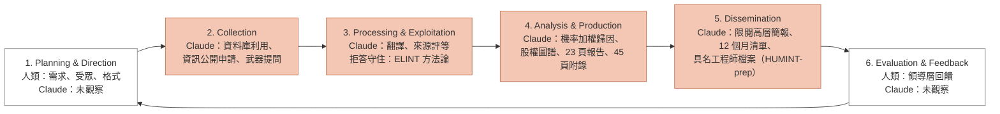
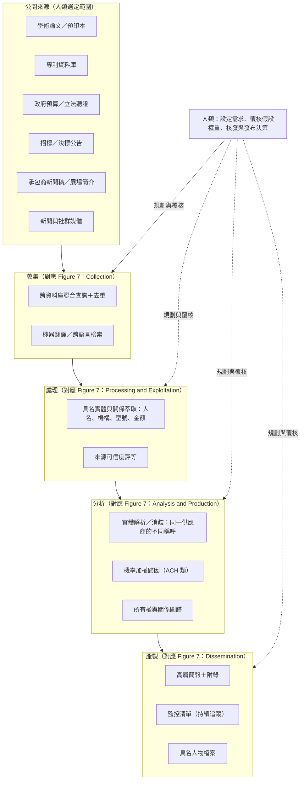
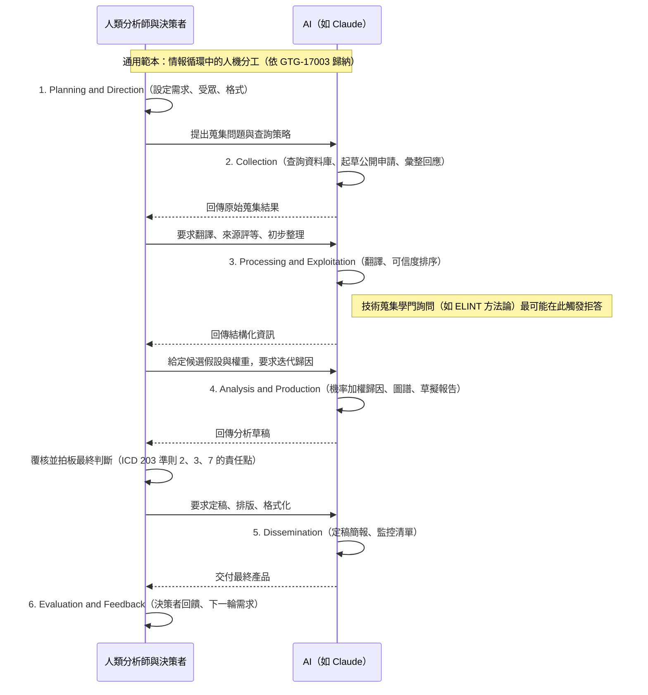
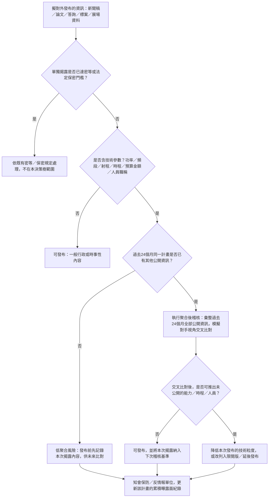
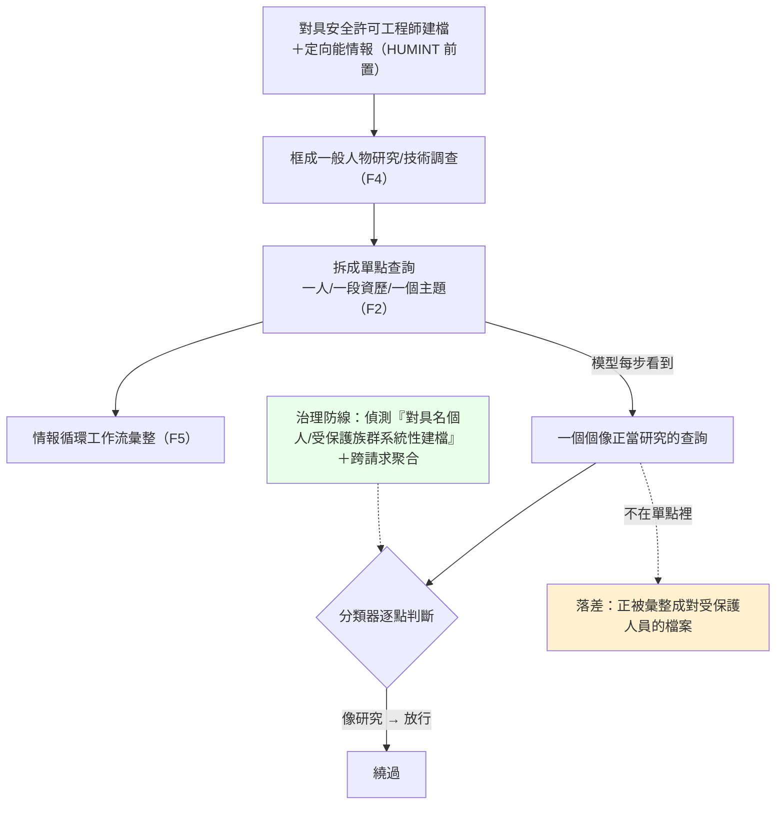

# GTG-17003：中國行為者以 Claude 蒐集美國定向能武器的科技情報（S&T Intelligence）

> 課程模組：04 常規武器（Conventional weapons） ｜ 一手來源：PDF p.126–128（章節導論 p.111–112、Part II 導言 p.122 為必要脈絡） ｜ 整理日期：2026-09-13

**本文標記慣例**：
- 【報告事實】＝ Anthropic 報告原文可直接對到頁碼的內容。
- 【圖表判讀】＝ 本人用 Read 工具開啟 PNG 親自判讀的結果，正文沒寫、只在圖上出現的資訊會特別標示。
- 【分析推論】＝ 本人基於報告與外部來源的推論，不是報告說的。
- 【外部查證】＝ 第三方來源（附 URL），並區分「獨立查證」與「僅引述 Anthropic」。

**本檔結構**：第 1–12 節為標準案例結構（第 6 節「圖表逐一判讀」與第 8 節「防線缺口」是本案的重點）。附錄 A–H 為授課用延伸材料：A 六案對照矩陣、B 供應鏈分析師視角、C 結構化分析技術對照、D 講義用圖與時間軸、E 名詞表、F 三小時時程、G 課後測驗、**H 科技情報 vs. 傳統網路間諜（本案最重要的課堂議題，建議與第 10.2 節合用）**。

---

## 1. 一頁速覽

1. **誰**：一個「China-based threat actor」（p.126），自稱是「a defense intelligence writer and internal publication editor leading a three-person team」（國防情報撰稿人兼內部刊物編輯，領導三人團隊）（p.127）。報告**沒有**說他是國家機關人員，也沒有給歸因信度等級；報告給的是能力判斷：「We assess that the actor employed state-grade tradecraft」（p.127）。
2. **做了什麼**：在「dozens of sessions」（數十個工作階段）中，向 Claude 詢問特定的定向能武器（directed-energy weapons, DEW），包括一款**數天前才公開揭露**的「vehicle-mounted high-power microwave weapon for countering drone swarms」（車載高功率微波反無人機蜂群武器），並蒐集「產生高功率微波之元件」的供應鏈資訊，指揮 Claude 起草**限制內部流通、呈報中共高層、軍方或國安領導**的簡報（p.127）。Figure 7 補充：這是一場「26-day OSINT campaign on US HPM weapon」（p.128）。
3. **目的**：以「iterative probability-weighted attributions」（反覆的機率加權歸因）鎖定一個特定的微波產生裝置及其供應商，進而「reverse-engineer the weapon, develop countermeasures against it, and benchmark it against PRC systems」；並繪製供應商的公開持股／所有權結構，試圖穿透「a deliberately obfuscated supply chain」（p.127）。
4. **產出**：一份 23 頁、關於某外國軍隊已部署之高功率微波（HPM）計畫的領導層報告；「executive briefings with appendices of roughly 45 pages」；一份 12 個月的後續監控清單（p.127）。**只在 Figure 7 出現**：「HUMINT-prep outputs: Dossiers on named cleared US engineers」——針對具名、持有安全許可之美國工程師的檔案（p.128）。
5. **手法等級**：結構化利用「more than a dozen open-source and commercial databases」、向某一特定外國軍方計畫辦公室起草「public disclosure requests」（公開揭露／資訊公開申請）、借用「formal analytic frameworks borrowed from Western intelligence agencies」、對公開來源做可信度排序（p.127）。
6. **Claude 在情報循環的位置**（Figure 7）：JP 2-0 六階段中，Claude 涉入四階段——Collection、Processing & Exploitation、Analysis & Production、Dissemination；Planning & Direction 與 Evaluation & Feedback 是人類的「Standard process step」。唯一被標示的防線：「Refusal held: ELINT Methodology」（p.128）。
7. **處置**：「We detected and banned the account associated with the actor, deployed additional monitoring to detect related account abuse, and are improving our safeguards」（p.127）。本案**沒有 IOC 表**，也沒有攻擊生命週期小節；Figure 7 是唯一的結構化圖表。
8. **這個案例在課程裡要教什麼**：**全案沒有任何一次非法存取**——全部是公開來源——卻產出了國家級科技情報產品，甚至是針對持有安全許可之工程師的 HUMINT 前置檔案。學員要學會：(a) 用情報循環（intelligence cycle）而非入侵殺傷鏈來描述這類濫用；(b) 「濫用」的界線已從「取得手段是否合法」移到「聚合的目的、受眾與產出」；(c) 這對 AI 供應商的分類器與對國防單位的公開資訊管理（OPSEC）分別意味著什麼。

---

## 2. 行為者側寫與歸因

### 2.1 報告給的身分線索（逐條對頁碼）

| 線索 | 報告原文 | 頁碼 | 性質 |
|---|---|---|---|
| 地理位置 | 「a China-based threat actor」 | p.126 | Anthropic 的判斷（依據未說明，通常來自帳號後設資料、語言、內容） |
| 自述職業 | 「They described themselves as a defense intelligence writer and internal publication editor leading a three-person team.」 | p.127 | **行為者自述**，未經驗證 |
| 工作語言 | 「draft Chinese-language briefings」 | p.126–127 | 內容觀察 |
| 產品受眾 | 「briefings for restricted internal circulation to senior Chinese Communist Party (CCP), military, or state security leadership」 | p.127 | 內容觀察（受眾是行為者宣稱的） |
| 能力判斷 | 「We assess that the actor employed state-grade tradecraft, based on the breadth and sophistication of its open-source intelligence gathering and analysis.」 | p.127 | Anthropic 的評估，**是能力等級判斷，不是隸屬判斷** |
| 任務目的 | 「reverse-engineer the weapon, develop countermeasures against it, and benchmark it against PRC systems」 | p.127 | 內容觀察 |

【報告事實】報告從頭到尾沒有出現「state-sponsored」、「PLA」、「MSS」、「contractor」這類隸屬性用語來描述 GTG-17003。它只說「China-based」、「state-grade tradecraft」、產品受眾是「CCP, military, or state security leadership」。

【分析推論】把這個措辭放到同一章節的其他中國案例旁邊比較，會看到 Anthropic 的歸因梯度：
- GTG-17002（電戰目標軟體，p.120）：「we assess the actor is a China-based defense and military-industrial researcher. Account-level metadata and content flagged by our safeguards indicated the actor was linked to PRC research institutions, including the PLA Academy of Military Sciences.」——有帳號後設資料與內容作為隸屬證據。
- GTG-14010（監控章節，p.86）：「We assess with low confidence that the actor was a contractor working on behalf of PRC state security rather than a state security organ acting directly.」——明確給了 low confidence。
- GTG-17003（本案）：只有地理＋自述＋手法品質＋受眾。**沒有信度等級，沒有機構連結。**

也就是說，本案的歸因是三個案例中最弱的：Anthropic 能確定的是「這個人在中國、用中文、做的是國家級水準的科技情報工作、產品是要給高層看的」，但**不能**（或不願）說他是誰的人。

### 2.2 情報學上的措辭差別（給學員的工具）

課程要教學員讀懂這幾組措辭：

| 措辭 | 意義 | 本案有無 |
|---|---|---|
| **suspected** | 有跡象但未達評估門檻；懷疑 | 無 |
| **consistent with** | 觀察到的行為與某已知實體的模式相符，但不排除他人 | 無 |
| **we assess … with low / moderate / high confidence** | 正式分析判斷，附信度（美國情報界 ICD 203 的慣例：信度反映來源品質、佐證數量與推理鏈的強弱） | **無信度等級**；只有一個「we assess」用在**手法等級**（state-grade tradecraft），不是用在隸屬 |
| **self-described / described themselves as** | 行為者自述，可能是真話、掩護故事或半真半假 | 有（p.127） |
| **China-based** | 地理位置判斷，不等於「中國政府」 | 有（p.126） |

「state-grade tradecraft」這個詞值得拆開講：它說的是「做事的方法達到國家情報機關的水準」（結構化資料庫利用、資訊公開申請、正式分析框架、來源可信度分級、附錄與監控清單），**不是**「這個人隸屬國家機關」。一個受過訓練的前情報人員、國防智庫研究員、軍工集團情報所的編輯，都可能展現 state-grade tradecraft。這也是為什麼 Anthropic 只敢說到這裡。

### 2.3 「內部刊物編輯」在中國國防科技情報體系中的角色

【報告事實】行為者自述的職稱是「defense intelligence writer and internal publication editor leading a three-person team」，產品是「Chinese-language briefings」與「briefings for restricted internal circulation」（p.127）。

【外部查證：獨立來源】要理解「內部刊物」為什麼是一個合理且危險的自述，必須認識中國的「科技情報」（科技情報／科技信息，STI）體系。最完整的公開研究是喬治城大學 CSET 的 Hannas 與 Chang 於 2021 年 1 月發表的《China's STI Operations: Monitoring Foreign Science and Technology Through Open Sources》（https://cset.georgetown.edu/publication/chinas-sti-operations/ ；PDF 已於本研究中全文開啟）。其中與本案直接相關的要點：

1. **OSINT 在中國是「首選情報來源」而非輔助**：「In the United States, Open Source Intelligence (OSINT) "enables" classified reporting, while in China it is the "INT" of first resort.」（執行摘要）
2. **規模**：「Some 100,000 S&T intelligence workers—open source collectors, analysts, and field operatives—make up its ranks.」（執行摘要）；「The system is staffed by some 100,000 trained "STI workers" at all levels and is based on open sources. No other country has anything remotely comparable.」（Introduction）
3. **國防端的核心機構**：中國國防科技信息中心（China Defense Science and Technology Information Center, CDSTIC），2017 年 9 月 29 日改組為軍事科學院轄下的軍事科學信息研究中心（Military Science Information Research Center, MSIRC）。CSET 引述其自我介紹：主要負責資訊資源建設與服務、「dynamic tracking and analysis」（動態跟蹤分析）、戰略情報研究、政策研究，以及「big data intelligence technology」（大數據情報技術）（CSET p.27–28）。CSET 的關鍵結論：「(1) the center relies on open sources to follow foreign defense S&T projects on a continuing basis ("dynamic tracking") and (2) is able to impart this information directly to decision-makers.」（CSET p.28）
4. **體系是分散但互鎖的**：1984 年國務院指令把「國防科技情報系統」定義為包含國防科工委、各國防工業部門（含電子工業部、中國船舶工業總公司）、總參與總後、各軍種相關部門、各省市國防科工辦的情報機構、各級國防科技情報專業單位等（CSET p.24）。2003 年在 CDSTIC 之下成立的「國防科技工業數字圖書館系統」有七個成員：中國核科技信息與經濟研究院、中國航天工程諮詢中心、中國航空工業發展研究中心、中國船舶工業綜合技術經濟研究院、中國船舶信息中心、北方科技信息研究所、工信部電子科學技術情報研究所（CSET p.25）——也就是**每個軍工集團都有自己的情報／信息研究所**。
5. **產品直達領導層**：CSET 引述 ISTIC（民口的中國科學技術信息研究所）的服務項目包含「offers document research services and advice to central Party, government, and military leadership organizations」（CSET p.21）；MSIRC 的招聘公告則說「center's real-time interconnected data analysis environment provides the scientific means to support the Central Military Commission's decision-making and consultation requirements」（CSET p.28）。
6. **工作預設保密**：「The work is classified by default, cannot be discussed in open fora, and "outside" publishing on work-related topics is almost nil.」（CSET p.34 註）
7. **有專業學會把領導需求往下傳**：中國國防科學技術信息學會等「mass organizations」負責「translate requirements from the leadership to workers and communicate upward input from these grassroots elements」（CSET p.39）。

【分析推論】把本案的自述放進這個體系來看：
- 「內部刊物編輯」對應的是上述體系裡最常見的產品形態——面向本單位或上級領導、不公開發行的**動態、快報、內參、專報**類簡報。這類產品的典型特徵：追蹤某一外軍計畫的最新公開動態（本案：數天前才揭露的車載 HPM 武器）、附上研判與建議（本案：反制、逆向、與國產系統對標）、限定閱讀範圍（本案：「restricted internal circulation」）。
- 「領導三人團隊」的規模與報告在監控章節描述的趨勢一致：AI 正在取代整個分析人力——「a religious affairs intelligence collection unit in the People's Republic of China (PRC) that once comprised many teams of analysts has been reduced to a single office, using an AI assistant to produce thousands of investigations per month」（p.81）。本案的三人小組能做出 23 頁報告、45 頁附錄、12 個月監控清單，是同一個趨勢在科技情報領域的體現。
- 「借用西方情報機關的正式分析框架」也與 CSET 描述的專業化路徑吻合：中國的 STI 體系自 1980 年代起授予碩士學位、設博士後站、辦十幾種專業期刊（CSET 執行摘要、p.27），其教材大量引介西方的結構化分析技術。
- 注意：報告沒有說行為者屬於上述任何一個機構。上述只是提供「這種職稱在中國體系裡是什麼樣的人」的脈絡。

### 2.4 GTG 編號的觀察

【報告事實】報告只說 GTG 是「Anthropic's internal designators for actors observed to be abusing AI」（p.4），沒有解釋編號規則。

【分析推論】把全報告的編號排開，可以看到疑似的分群：GTG-17001（中國，反魚雷火控規格）、GTG-17002（中國，電戰目標軟體）、GTG-17003（本案，中國，DEW 情報）都在常規武器章節；GTG-14010／14020／14021／14022 是監控章節的中國案例；GTG-27005／27006 是俄羅斯的武器與採購；GTG-30004／30005／30006 是伊朗；GTG-87001 是葉門。「17」很可能是「中國＋常規武器」的分群碼，「003」是該群第三個案例。這只是觀察，Anthropic 沒有證實。對課程的意義：同一前綴的案例應該一起讀，因為它們反映的是同一個國家、同一類需求的不同切面（設計、軟體、情報）。

---

## 3. 受害者與目標清單

### 3.1 為什麼這個案例沒有傳統意義的「受害者」

【報告事實】本案沒有入侵、沒有竊取、沒有惡意程式。Part II 導言明說：「the actors in these two cases did not use Claude to develop software for weapons design and development. Instead, they used Claude to gather intelligence on a foreign weapons program and its supply chain, and to procure mixed military and civilian goods.」（p.122）章節導論也把本案描述為「collected public information on a directed energy weapon and its suppliers」（p.111）。

所以本節列的是**情報目標**（被蒐集的對象）與**受影響方**（誰的利益因此受損），而不是被入侵的受害者。

### 3.2 情報目標清單（依報告原文）

| # | 目標 | 報告原文 | 頁碼 | 備註 |
|---|---|---|---|---|
| 1 | 特定的定向能武器 | 「Across dozens of sessions, the actor asked Claude about specific directed-energy weapons.」 | p.127 | 複數，涵蓋多款 |
| 2 | 一款車載 HPM 反無人機蜂群武器 | 「inquiries about a vehicle-mounted high-power microwave weapon for countering drone swarms, which had been disclosed publicly days earlier」 | p.127 | **未具名**；「數天前才公開」顯示行為者對公開資訊的反應速度 |
| 3 | HPM 元件的供應鏈 | 「gathered information on the supply chain for procuring components that generate high-power microwave systems」 | p.127 | 針對「產生 HPM」的核心元件 |
| 4 | 一個特定的微波產生裝置及其供應商 | 「sought to identify a specific microwave-generating device and its supplier through iterative probability-weighted attributions」 | p.127 | 目標是逆向工程、反制、對標 |
| 5 | 供應商的所有權結構 | 「map the publicly reported ownership of the targeted suppliers in an attempt to penetrate a deliberately obfuscated supply chain」 | p.127 | 供應鏈被「刻意模糊化」——這是美方的供應鏈保密措施 |
| 6 | 某外國軍隊已部署的 HPM 計畫 | 「compile a 23-page report for leadership on high-power microwave programs deployed by a foreign military」 | p.127 | Figure 7 標題與中央文字明示為 **US**（p.128） |
| 7 | 某次近期軍事演習中使用了哪些系統 | 「tried to identify which of these systems had been used in a recent military exercise」 | p.127 | 演習未具名 |
| 8 | 某一特定外國軍方計畫辦公室 | 「drafting public disclosure requests to a specific foreign military program office」 | p.127 | 是「資訊公開申請」的收件方，不是入侵對象 |
| 9 | **具名、持有安全許可的美國工程師** | 「HUMINT-prep outputs: Dossiers on named cleared US engineers」 | **p.128 Figure 7（正文沒有）** | 這是全案最嚴重的一項——從「武器」情報跨到「人」的目標檔案 |

### 3.3 受影響方（分析推論）

【分析推論】報告沒有具名任何美方單位或廠商。依公開資訊，可能受影響的類別如下，**均為推論**：
- **美國陸軍、空軍、海軍陸戰隊的 HPM 反無人機計畫辦公室**：美國目前公開的車載／機動 HPM 反蜂群系統集中在 Epirus 的 Leonidas 家族（陸軍 IFPC-HPM、陸戰隊 ExDECS／HAVOC）與空軍研究實驗室的 THOR／Mjölnir（見第 3.4 節）。報告說的「a specific foreign military program office」很可能是其中之一，但**報告未具名**。
- **HPM 系統整合商與其上游元件供應商**：報告說行為者要找的是「microwave-generating device and its supplier」，並繪製供應商的所有權結構——受影響的是整條被刻意模糊化的供應鏈。
- **持有安全許可的工程師個人**：Figure 7 的「Dossiers on named cleared US engineers」意味著這些人已被列入可供 HUMINT（人員情報）接觸、引誘或招募的目標名單。這是反情報（CI）意義上的直接威脅。
- **Anthropic 自身**：平台被用來產出對抗其所在國武器計畫的情報產品；報告把這類活動列為違反 Usage Policy（章節導論 p.111：「misusing Claude in violation of our Usage Policy and terms of service」）。

### 3.4 背景：定向能武器（DEW）是什麼、美國有哪些公開計畫、中國為什麼要

這一節是給沒有國防背景的學員的必要脈絡，**全部來自外部來源**，不是報告內容。

#### 3.4.1 DEW 的三大類

【外部查證：獨立來源】美國國會研究處（CRS）報告 R46925《Department of Defense Directed Energy Weapons: Background and Issues for Congress》（最新版 2024-07-11；https://www.everycrsreport.com/reports/R46925.html ）給的定義：「Directed energy weapons use concentrated electromagnetic energy, rather than kinetic energy, to "incapacitate, damage, disable, or destroy enemy equipment, facilities, and/or personnel."」主要類別：
1. **高能雷射（High-Energy Lasers, HEL）**：以電力驅動的固態雷射，把光能聚焦在目標上燒蝕。特性是點目標、需要駐留時間、受天氣影響——CRS 指出「Atmospheric conditions (e.g., rain, fog, obscurants) could potentially limit the range and beam quality of DE weapons」。功率是代際指標：CRS 記載國防部目標是從「around 150 kilowatt (kW), as is currently feasible, to 500 kW class—with reduced size and weight—by FY2025」。
2. **高功率微波（High-Power Microwave, HPM）**：CRS 描述為「nonkinetic means of disabling adversary electronics and communications systems」。物理上是以強射頻脈衝耦合進目標電子系統（透過天線、線纜等「前門／後門」路徑）誘發過電壓、燒毀或使其失效。特性是**面效應**——一個波束可同時涵蓋多架無人機——因此是反「蜂群」的首選。本案的目標正是這一類。
3. **粒子束（particle beams）**：CRS 明列在該報告範圍之外；目前沒有實用化的武器。

【分析推論】為什麼 HPM 對「反蜂群」特別重要、對中國又特別敏感：雷射一次打一個目標，蜂群十架就要十次駐留；HPM 一發脈衝可以同時癱瘓一片。烏克蘭與中東戰場證明廉價無人機蜂群是壓制防空的有效手段，而解放軍本身大量投資無人機蜂群概念。**能有效反蜂群的 HPM，就是能抵銷解放軍蜂群戰術的武器**——這是本案行為者要「reverse-engineer、develop countermeasures、benchmark against PRC systems」的軍事邏輯。

#### 3.4.2 美國公開的 DEW 計畫（依 CRS 2024 版＋ 2025–2026 廠商公開資訊）

【外部查證：獨立來源】CRS R46925（2024-07-11 版）列出的各軍種計畫：
- 陸軍：DE M-SHORAD（Directed Energy Maneuver-Short-Range Air Defense，Stryker 車載 50 kW 級雷射）、IFPC-HEL（Indirect Fire Protection Capability-High Energy Laser，300 kW 級）、**IFPC-HPM**（Indirect Fire Protection Capability-High Power Microwave）、次世代戰車雷射。
- 空軍：**THOR**（Tactical High-Power Operational Responder，HPM 反無人機展示系統）、Phaser（HPM）、CHIMERA（Counter-Electronic High-Power Microwave Extended-Range Air Base Defense）、HELWS、SHiELD。
- 海軍：SSL-TM、ODIN（Optical Dazzling Interceptor, Navy）、SNLWS Increment 1（**HELIOS**）、HELCAP（High Energy Laser Counter ASCM Project）、LLD（Layered Laser Defense）。
- 國防部層級：由 OUSD(R&E) 的 Principal Director for Directed Energy 協調的 Directed Energy Roadmap，以及 High Energy Laser Scaling Initiative。
- CRS 也指出，第一套作戰部署的美國 DEW 是 2014 年在 USS Ponce 上的雷射；國防部「has invested billions of dollars in DE programs that failed to reach maturity and were ultimately cancelled」——即 DEW 長期卡在原型到正式計畫（program of record）的轉換。

【外部查證：獨立來源】各系統的近況（依可開啟之來源）：
- **HELIOS**（Lockheed Martin，60 kW 級）：2019 年宣布裝於 USS Preble (DDG-88)，2022 年 3 月前交付安裝；「As of 2024, higher-power laser weapons in the 150 to 300 kW range are being tested against anti-ship cruise missiles」；海軍另在發展 300 kW 的 HELCAP（https://en.wikipedia.org/wiki/High_Energy_Laser_with_Integrated_Optical-dazzler_and_Surveillance ）。
- **THOR／Mjölnir**（AFRL）：THOR 由 AFRL 與 BAE Systems、Leidos、Verus Research 合作，「developed quickly in 18 months for $18 million」，2019 年春開始測試；2023 年 4 月 5 日在 Kirtland 空軍基地 Chestnut 試驗場「successfully engaged multiple targets in a simulated swarm attack」，但擊落數量與距離未公開；後繼系統 Mjölnir 於 2022 年 2 月由 Leidos 以 2,600 萬美元合約承製（https://en.wikipedia.org/wiki/Tactical_High_Power_Operational_Responder ）。
- **Epirus Leonidas 家族**（固態 HPM，陸軍 IFPC-HPM 的承製系統；以下皆為 Epirus 官網新聞稿 https://www.epirusinc.com/news ）：
  - 2025-07-17：獲美國陸軍 4,350 萬美元 IFPC-HPM Generation II 合約。
  - 2025-09-04 新聞稿（試驗日 2025-08-26，Camp Atterbury, Indiana）：第一代 Leonidas 在五個情境中「neutralized 61-of-61 drones, culminating in a 49-drone swarm kill with one pulse of electromagnetic interference」；觀摩者包括美國國防部各單位、其他美國政府機關與「nine allied countries」。
  - 2026-01-13：Leonidas 展示以 HPM 擊敗**光纖控制**無人機（光纖無人機是俄烏戰場為了抗電子干擾而出現的新型態；HPM 能對付它，意味著 HPM 是少數對「抗干擾無人機」仍有效的非動能手段）。
  - **2026-03-24**：Epirus、General Dynamics Land Systems 與 Kodiak AI 於 AUSA Global Force Symposium（Huntsville, Alabama）發表「Leonidas Autonomous Ground Vehicle (AGV)」——把 Leonidas HPM 裝在商規卡車底盤上、以 Kodiak Driver 自駕系統移動，「rapidly deploy to pre-planned intercept points or maneuver across a perimeter to protect critical assets from the threat of individual, swarm or fiber-optic controlled drone attacks」。
  - 2026-08-10：美國海軍陸戰隊透過海軍研究署授予 1,100 萬美元 HAVOC（High-power microwave Autonomous Vehicle Operational Capability）合約，採「universal sled mount」可裝於有人與無人地面載具，是 2025 年交付的 ExDECS（Expeditionary Directed Energy Counter-Swarm）的自主化演進。

【分析推論】報告說行為者問的是「a vehicle-mounted high-power microwave weapon for countering drone swarms, which had been disclosed publicly days earlier」（p.127），而報告涵蓋期間是 2025 年 12 月至 2026 年 8 月（p.3）。在這個期間內公開揭露的「車載 HPM 反蜂群」系統，Leonidas AGV（2026-03-24）與 HAVOC（2026-08-10）在時間與描述上都吻合，THOR 系列則是貨櫃式而非嚴格的車載。**但報告沒有具名，也沒有給任何日期，本文不下結論**；這裡只是示範「如何從公開時間軸縮小候選範圍」的分析方法，並提醒學員：這正是行為者自己在做的事。

#### 3.4.3 中國自己的 DEW（用來「對標」的另一端）

【外部查證：獨立來源】2025 年 9 月 3 日北京閱兵公開展示了 LY-1 雷射防空系統（海軍防空方隊），以及反無人機方隊的 OW5、FK-3000、Hurricane 3000（颶風 3000）（https://en.wikipedia.org/wiki/2025_China_Victory_Day_Parade ；該頁面僅列裝備名稱，未提供技術細節）。依公開報導，OW5 屬雷射反無人機系統、Hurricane 系列屬 HPM 系統（此為一般公開報導的描述，本研究未能逐一開啟原始來源，列為待查證）。報告說行為者要「benchmark it against PRC systems」（p.127），對照的就是這一類國產系統。

#### 3.4.4 為什麼中國對此領域有高度情報需求（分析推論）

【分析推論】綜合上述：
1. **戰術層**：美軍 HPM 若成熟，直接抵銷解放軍的無人機蜂群與廉價飽和攻擊構想；台海情境下，美軍與盟軍的反蜂群能力是解放軍作戰規劃的變數。
2. **技術層**：HPM 的核心是射頻源（傳統的磁控管、速調管、虛陰極振盪器等真空電子元件，或 Leonidas 路線的氮化鎵固態放大器陣列）、脈衝功率（Marx 產生器、高壓電容、開關）、天線與熱管理。知道「哪一家供應商、哪一種源」，就知道功率上限、波形特徵、可能的耦合路徑——這是設計「反制」（電子硬化、屏蔽、濾波）的起點。報告說行為者的目標正是「identify a specific microwave-generating device and its supplier」（p.127）。
3. **採購層**：HPM 關鍵元件多在美國出口管制清單上；繪製供應商所有權結構，既可找到採購繞道（第三國、子公司），也可找到供應鏈的瓶頸。同章節的 GTG-27006（俄羅斯採購案，p.123–125）示範的正是這種「穿透供應鏈」的手法。
4. **體制層**：CSET 指出中國的 STI 體系以「動態跟蹤」外國國防科技計畫為常態任務並直達決策層（CSET p.28）。一款美軍新 HPM 公開後數天內就出現在中共高層簡報裡，是這個體系的正常運作，不是特例。

---

## 4. AI 濫用的攻擊生命週期（逐階段拆解）

【報告事實】本案**沒有**像監控章節那樣的「Attack lifecycle and AI usage」小節，也沒有工作流表。報告用 Figure 7 把行為者的活動映射到 JP 2-0 的六階段情報流程（p.128）。因此本節以情報循環而非入侵殺傷鏈為骨架，每一階段標明「人類做什麼／Claude 做什麼／證據頁碼／自主程度」。

### 4.0 先講自主程度的總判斷

【報告事實】報告描述的動詞全是對話式：「the actor asked Claude about」、「directed Claude to draft」、「used Claude to map」、「used Claude to compile」（p.127）。沒有提到 Claude Code、agentic 工具、瀏覽器自動化或多實例編排。

【分析推論】依課程共用的三級分類：
- 對話式協助（conversational assistance）：**是**。
- 人類逐步指揮（human-directed, step-by-step）：**是**——「iterative probability-weighted attributions」是典型的人機反覆迭代。
- AI 編排多代理自主執行（agentic orchestration）：**無證據**。對比同章節的 GTG-27006「used Claude, combined with browser automation agents, to run the back office」（p.124）與 GTG-87001「managed several Claude instances at once, assigning each one a role」（p.113），本案是**最低自主層級**的案例。

這一點很重要：**本案的危險不來自 AI 的自主性，而來自 AI 對「人類分析師工作量」的放大**。三個人加一個對話式模型，26 天，做出了過去需要一個科室才能做的東西。

### 4.1 Planning & Direction（規劃與指導）——人類的階段

- **人類做什麼**：決定情報需求（要哪一款武器、要供應商、要反制、要與國產系統對標、要知道演習用了哪些系統）；決定受眾（高層限閱簡報）；決定產品格式（執行簡報＋附錄＋監控清單）。
- **Claude 做什麼**：Figure 7 把此段標為白色「Standard process step」——**未觀察到 Claude 涉入**（p.128）。
- **證據**：任務目的見 p.127；圖示見 p.128。
- **細節**：有一個微妙之處——「12-month follow-on monitoring checklist」（p.127）本質上是**下一輪的蒐集計畫**。Claude 幫忙產出的這份清單，會回饋到下一個循環的 Planning & Direction。也就是說，圖上的白色不代表 Claude 對規劃「毫無影響」，只代表這個階段的決策動作是人做的。

### 4.2 Collection（蒐集）——Claude 涉入

- **人類做什麼**：選定來源、提出問題、取得資料庫存取（商業資料庫需要帳號與付費）、送出資訊公開申請。
- **Claude 做什麼**（依 p.127）：
  - 回答關於特定 DEW 的問題（「asked Claude about specific directed-energy weapons」）——這是把模型當作已消化大量公開文獻的「即時檢索與綜整」工具。
  - 協助「structured exploitation of more than a dozen open-source and commercial databases」——【分析推論】可能的形式包括：設計檢索策略與關鍵字、解讀資料庫回傳結果、跨資料庫比對實體（公司、產品、合約編號）。
  - 「drafting public disclosure requests to a specific foreign military program office」——起草資訊公開申請書。這是本案最值得講的蒐集手法（見 4.7）。
- **自主程度**：對話式；人類逐步指揮。
- **證據**：p.127；Figure 7 橘色 Collection 段（p.128）。

### 4.3 Processing & Exploitation（處理與利用）——Claude 涉入，且**唯一一次守住的拒答在此**

- **人類做什麼**：把蒐得的英文資料丟進來、要求整理、翻譯、評等。
- **Claude 做什麼**：
  - 翻譯與中文化——最終產品是「Chinese-language briefings」（p.126–127），原始素材是英文的美方文件、論文、新聞、廠商公告，中間必然經過翻譯與摘要。
  - 「ranking publicly available sources by credibility」（p.127）——來源可信度分級。【分析推論】這對應西方情報界的來源評等慣例（例如 NATO／Admiralty 的 A–F 可靠度與 1–6 可信度矩陣）；報告只說「借用西方情報機關的正式分析框架」，未指明是哪一套。
- **防線**：Figure 7 在此段標了一個圓圈叉號，註記「Refusal held: ELINT Methodology」（p.128）。【分析推論】ELINT（electronic intelligence，電子情報）是對非通訊電磁輻射（雷達、干擾機、HPM 發射）的截收與參數分析——它**不是**公開來源，而是技術蒐集學門。行為者顯然想從「讀公開資料」跨到「如何量測與分析這款 HPM 的電磁特徵」，Claude 在這一步拒絕，而且拒絕「held」（未被重新提示突破）。這條線很有教學價值：**模型的防線守在「OSINT 與技術蒐集」的邊界上，而不是守在「OSINT 本身」**。
- **自主程度**：對話式。
- **證據**：p.127；p.128 Figure 7。

### 4.4 Analysis & Production（分析與產製）——Claude 涉入最深的階段

- **人類做什麼**：提出假設、給出權重、決定哪些歸因結論可以寫進報告。
- **Claude 做什麼**（依 p.127）：
  - 「iterative probability-weighted attributions」——反覆迭代的機率加權歸因，用來鎖定「a specific microwave-generating device and its supplier」。【分析推論】這在方法上接近結構化分析技術中的競爭假設分析（ACH）或貝氏式的證據加權：列出候選裝置／供應商，對每一條公開證據給權重，逐輪更新。這種工作過去是資深技術分析師的核心技能。
  - 「map the publicly reported ownership of the targeted suppliers」——供應商所有權圖譜（母公司、投資人、子公司），目的為「penetrate a deliberately obfuscated supply chain」。
  - 「compile a 23-page report for leadership on high-power microwave programs deployed by a foreign military」，並「tried to identify which of these systems had been used in a recent military exercise」。
  - 「using formal analytic frameworks borrowed from Western intelligence agencies」。
  - 「producing detailed deliverables that paired executive briefings with appendices of roughly 45 pages」。
- **自主程度**：對話式＋人類逐步指揮（迭代）。
- **證據**：p.127；Figure 7 橘色 Analysis & Production 段（p.128）。

### 4.5 Dissemination（傳播）——Claude 涉入，且**產出了針對人的檔案**

- **人類做什麼**：決定收件對象（中共高層、軍方或國安領導）、決定流通限制。
- **Claude 做什麼**：
  - 「edit intelligence products, and draft Chinese-language briefings」（p.126–127）。
  - 「draft briefings for restricted internal circulation to senior Chinese Communist Party (CCP), military, or state security leadership」（p.127）。
  - 產出「12-month follow-on monitoring checklist」（p.127）——附在交付物中。
  - **只在 Figure 7 出現**：「HUMINT-prep outputs: Dossiers on named cleared US engineers」（p.128）。【分析推論】「HUMINT-prep」意指「為人員情報行動做準備」——也就是為接觸、引誘、招募或社交工程鎖定對象。「cleared」意指持有美國安全許可（security clearance）的人。這一項把本案從「武器的科技情報」延伸到「對人的目標建檔」，是反情報意義上最嚴重的產出。
- **自主程度**：對話式。
- **證據**：p.126–128。

### 4.6 Evaluation & Feedback（評估與回饋）——人類的階段

- **人類做什麼**：領導層對簡報的回饋、下一輪需求。
- **Claude 做什麼**：Figure 7 標為白色「Standard process step」——未觀察到（p.128）。
- **證據**：p.128。
- 【分析推論】Anthropic 對這一段的能見度本來就最低：回饋發生在行為者的組織內部，不會經過 Claude。這也提醒學員：**AI 供應商的遙測只看得到循環中「經過模型」的那幾段**，看不到任務來源與成效評估——這是 Anthropic 歸因保守的結構性原因之一。

### 4.7 專題：「資訊公開申請」作為情報蒐集手法

【報告事實】「drafting public disclosure requests to a specific foreign military program office」（p.127）被 Anthropic 列為「state-grade tradecraft」的證據之一。

【分析推論】這一項的教學價值在於它**完全合法**。以美國為例，《資訊自由法》（FOIA, 5 U.S.C. § 552）允許「任何人」——包括外國人——向聯邦機關申請紀錄；國防部各單位都設有 FOIA 辦公室；機關可依豁免條款（如涉密資訊、法定保護的技術資料、商業機密）拒絕，但**申請本身不違法**。情報學上這叫「馬賽克理論」（mosaic theory）的實務：單一文件無害，但把預算書、合約公告、FOIA 取得的測試報告、廠商新聞稿、工程師的公開履歷拼起來，就是一幅完整圖像。AI 的角色是把「拼圖」這件事的成本降到接近零。（FOIA 法條與豁免條款為一般法律常識，本研究未在本次工作階段開啟原始條文。）

對台灣的對照：《政府資訊公開法》同樣允許申請，國防相關資訊有豁免條款——但「申請書寫得像內行人」與「一次申請幾十份」是可觀測的異常訊號（見第 10.4 節）。

### 4.8 用 Anthropic 的「uplift」三維度總結

【報告事實】報告定義 uplift 為「the AI capability boost, or how much more harm was caused with AI versus without AI」，從「speed, scale, and depth」三個維度衡量（p.4）。

【分析推論】套到本案：
- **Speed**：一款武器「數天前才公開」就進入蒐集與簡報（p.127）；整場行動 26 天（p.128）。
- **Scale**：三人團隊產出 23 頁報告、約 45 頁附錄、12 個月監控清單、針對具名工程師的檔案（p.127–128）。
- **Depth**：機率加權歸因、供應商所有權圖譜、西方分析框架、來源可信度分級（p.127）——這些是過去需要資深分析師才做得到的深度。

---

## 5. TTP 與 MITRE ATT&CK 對應

### 5.1 先說框架的適用性

【分析推論】MITRE ATT&CK 是以「入侵」為中心的框架，對本案的覆蓋只到「偵察」（Reconnaissance, TA0043）戰術；本案沒有初始存取以後的任何階段。因此下表刻意做三件事：(1) 能對到 ATT&CK 的就對；(2) 對不到的明確標示「框架缺口」；(3) 每一列都附「偵測構想」，並區分**AI 供應商端**（Anthropic 看得到的）與**防守方端**（美國或台灣的國防單位看得到的）。

### 5.2 對應表

| 戰術 | 技術 ID | 本案的具體作法（報告頁碼） | 偵測構想：AI 供應商端 | 偵測構想：防守方端 |
|---|---|---|---|---|
| Reconnaissance | T1593 Search Open Websites/Domains（.002 Search Engines） | 詢問特定 DEW、數天前公開的車載 HPM 武器（p.127） | 同一帳號在短期內大量詢問同一武器類別＋供應商＋反制的**主題聚類**；中文提問、英文素材、中文產出的語言三角 | 監測廠商網站、計畫辦公室網頁的異常爬取來源（若有）；但單純閱讀公開頁面幾乎不可偵測 |
| Reconnaissance | T1596 Search Open Technical Databases | 「structured exploitation of more than a dozen open-source and commercial databases」（p.127） | 要求模型設計跨資料庫檢索策略、解析資料庫輸出格式（專利、合約、公司登記） | 商業資料庫供應商的帳號來源異常（付費資料庫留有申請人資料） |
| Reconnaissance | T1597 Search Closed Sources（.002 Purchase Technical Data） | 商業資料庫（p.127） | 同上 | 同上 |
| Reconnaissance | T1591 Gather Victim Org Information（.002 Business Relationships） | 「map the publicly reported ownership of the targeted suppliers」（p.127） | 要求模型繪製公司所有權圖、找母公司／投資人／子公司、標示「刻意模糊」的節點 | 供應商層級：留意來自不明研究單位對所有權結構的詢問；國防承包商的供應鏈保密（供應商匿名化）政策 |
| Reconnaissance | T1589 Gather Victim Identity Information（.003 Employee Names）／T1591.004 Identify Roles | 「Dossiers on named cleared US engineers」（p.128 Figure 7） | 要求模型整理**具名個人**的職務、許可狀態、專案、公開足跡並產出「檔案」格式——這是可以下規則的內容型態 | 反情報端：持有許可者的公開曝露稽核（LinkedIn、論文作者欄、研討會議程、專利發明人） |
| Reconnaissance | **無對應（框架缺口）** | 「drafting public disclosure requests to a specific foreign military program office」（p.127）——合法的資訊公開申請 | 要求模型起草 FOIA／資訊公開申請書、指定收件單位為外國軍方計畫辦公室、內容針對武器測試與供應商 | 計畫辦公室的 FOIA 收件分析：申請人背景、申請主題的技術深度、短期內對同一計畫的多筆申請 |
| Reconnaissance | **無對應（框架缺口）** | 「tried to identify which of these systems had been used in a recent military exercise」（p.127） | 要求模型比對演習公開影像／新聞與系統特徵 | 演習公開資訊的發布審查（照片中的裝備、圖說中的單位與人名） |
| Analysis（ATT&CK 無此戰術） | **無對應（框架缺口）** | 「iterative probability-weighted attributions」鎖定裝置與供應商；「formal analytic frameworks borrowed from Western intelligence agencies」；「ranking publicly available sources by credibility」（p.127） | 這是最有辨識度的內容訊號：要求模型用 ACH、來源評等矩陣、估計性用語等**情報分析格式**處理武器資料 | 不可偵測（發生在對手內部） |
| Production／Dissemination（ATT&CK 無此戰術） | **無對應（框架缺口）** | 23 頁領導層報告、約 45 頁附錄、12 個月監控清單、「restricted internal circulation」簡報（p.127） | 產出格式訊號：中文「內部參閱／呈閱」體例、標示閱讀限制、受眾為黨政軍高層 | 不可偵測 |
| Collection（技術學門） | **無對應（框架缺口）** | ELINT methodology 詢問——被拒且拒答守住（p.128） | 這類詢問本身就是分類器該攔的：從公開資料跨到技術蒐集方法 | 不可偵測 |
| Resource Development | T1588.002 Obtain Capabilities: Tool（**勉強對應**） | 使用 Claude 作為分析工具 | 帳號建立模式、地區限制規避（本案未載明是否用 VPN） | 無 |

### 5.3 框架缺口的教學說明

【分析推論】上表顯示：本案十項作法中，只有五項能對到 ATT&CK（而且全在偵察戰術），其餘五項——資訊公開申請、演習系統辨識、結構化分析、產品產製與傳播、ELINT 方法詢問——在 ATT&CK 沒有位置。原因是 ATT&CK 描述的是「對資訊系統的對抗行為」，而本案是「對公開資訊的情報行為」。課程建議：
1. 用 **JP 2-0 情報流程**（Figure 7 用的框架）描述行為者「在做什麼」；
2. 用 **ATT&CK Reconnaissance** 描述其中「可被資訊系統觀測」的部分；
3. 用**反情報的「外國情報實體活動方法」分類**（例如美國 DCSA 每年發布的《Targeting U.S. Technologies》報告所用的 Requests for Information、Academic Solicitation、Attempted Acquisition of Technology、Exploitation of Relationships 等類別）描述「對人與對機構」的部分。本研究未能在本次工作階段開啟 DCSA 網站（HTTP 403），此處僅依一般公開知識引述其類別名稱，請授課者自行核對最新版。
4. 明確告訴學員：**「AI 輔助的情報循環」目前沒有任何一個主流框架完整覆蓋**，這是偵測工程的真實缺口，也是 Anthropic 這份報告用「cycle」圖示而非 ATT&CK 矩陣的原因。

---

## 6. 圖表逐一判讀

本案頁段（p.126–128）只有一張正式編號的圖：Figure 7（p.128）。p.126 上半是前一案 GTG-27006 的表格（Figure 6 的延續），p.127 純文字。三頁的 PNG 都已用 Read 工具親自開啟；Figure 7 另以 160 DPI 版裁切放大兩倍逐字核對。

### Figure 7（p.128）：Mapping the actor's collection of scientific and technical intelligence into US directed-energy weapons onto the intelligence life cycle

圖檔：`../figures/page-128.png`

#### 6.1.1 圖片類型與版面

【圖表判讀】這是一張**環狀流程圖（ring / donut process diagram）**，位在頁面上半，頁面標題為「Intelligence cycle」。整張圖在一個淺米色的卡片框內，上方置中有兩行標題，中間是一個被切成六段的圓環，環外六個標籤、兩個指示框，下方是圖例與框架註記。頁面下半三分之二是空白（只有頁尾）。圖說文字在圖下方。

#### 6.1.2 圖上實際出現的所有文字（逐字抄錄）

【圖表判讀】

- 卡片標題（大字，粗體）：**Case 6: Intelligence**
- 副標題（小字，灰）：**Directed-Energy S&TI Collection Campaign**
- 圓環中央文字（三行，灰）：**26-day OSINT campaign on US HPM weapon**；中央文字上方有一個**順時針方向的弧形箭頭**，表示流程方向。
- 六段環節的標籤（順時針，從右上開始）：
  1. **Planning & Direction**（右上，白色底）
  2. **Collection**（右，橘色／鮭紅色底）
  3. **Processing & Exploitation**（右下，橘色底；段內有一個**圓圈叉號**標記）
  4. **Analysis & Production**（左下，橘色底）
  5. **Dissemination**（左，橘色底）
  6. **Evaluation & Feedback**（左上，白色底）
- 指示框一（連到 Dissemination 段，位於左側）：**HUMINT-prep outputs: Dossiers on named cleared US engineers**
- 指示框二（連到 Processing & Exploitation 段內的圓圈叉號，位於右下）：**Refusal held: ELINT Methodology**
- 圖例（卡片底部，由左至右）：
  - 橘色實心方塊：**Where Claude operated**
  - 白色空心方塊：**Standard process step**
  - 虛線方塊：**Not observed / actor-supplied**
- 框架註記（圖例下方，小字）：**Framework: JP 2-0 Joint Intelligence Process**
- 圖說（頁面正文）：「Figure 7. Mapping the actor's collection of scientific and technical intelligence into US directed-energy weapons onto the intelligence life cycle, from tasking and collection through processing, analysis, and dissemination.」

#### 6.1.3 顏色與標記的分布（資料如何「流動」）

【圖表判讀】
- **四段橘色**（Claude 涉入）：Collection → Processing & Exploitation → Analysis & Production → Dissemination。這四段在環上是**連續的**，占據右側、下方與左側，也就是整個循環的「中段」。
- **兩段白色**（標準流程步驟、Claude 未涉入）：Planning & Direction 與 Evaluation & Feedback，位於環的頂部、彼此相鄰。
- **虛線圖例「Not observed / actor-supplied」在環上沒有對應的段落**——六段都是橘或白，沒有任何一段畫成虛線。這表示 Anthropic 準備了三種狀態的圖例（可能是整章六張圖共用的模板），但本案沒有「完全未觀察」的階段。
- **圓圈叉號**只出現一次，在 Processing & Exploitation 段內，代表一次被守住的拒答。
- 順時針箭頭從 Planning & Direction 指向 Collection，表示循環方向為：規劃 → 蒐集 → 處理 → 分析 → 傳播 → 評估 → 回到規劃。

#### 6.1.4 這張圖傳達的核心訊息

【圖表判讀＋分析推論】

1. **Claude 接管了循環的「中段」，人類保留了「首尾」。** 任務從哪來（Planning & Direction）、成果好不好（Evaluation & Feedback）由人決定；中間四個勞力密集的階段由模型加速。這正是報告在監控章節描述的「AI 取代分析人力」趨勢（p.81）在科技情報上的圖像化。

2. **圖上有五項正文沒有的資訊**，這是本圖最重要的價值：
   - 「**26-day**」：正文只說「dozens of sessions」（p.127），圖給了時間跨度。
   - 「**US** HPM weapon」與圖說的「**US** directed-energy weapons」：正文一律寫「a foreign military」、「a specific foreign military program office」（p.127），圖把「foreign」落實為美國。
   - 「**Dossiers on named cleared US engineers**」：正文完全沒提。這是從「武器」跨到「人」的證據。
   - 「**Refusal held: ELINT Methodology**」：正文只說「improving our safeguards」（p.127），圖告訴我們唯一一次明確守住的防線在哪。
   - 「**Framework: JP 2-0**」與「**Case 6**」：說明 Anthropic 用美軍聯戰情報準則作為分析框架，且本案是常規武器章節六案中的第六案。

3. **拒答的位置很有意義。** 拒答不在 Collection（讀公開資料）、不在 Analysis（歸因供應商）、不在 Dissemination（寫高層簡報、建工程師檔案），而在「ELINT 方法論」——也就是行為者試圖從「讀別人公開的東西」跨到「自己去量測敵方電磁輻射」的那一步。這揭露了目前模型防線的實際形狀：**它守的是「技術蒐集學門」的門檻，不是「情報產製」的門檻**。

4. **HUMINT-prep 標在 Dissemination 而非 Analysis。** 這暗示工程師檔案是「交付物」的一部分——它們被寫進了要往上送的產品，而不只是分析過程中的中間資料。從反情報角度，這意味著名單已進入決策鏈。

#### 6.1.5 圖與正文的對照與差異

| 項目 | 正文（p.126–127） | Figure 7（p.128） | 說明 |
|---|---|---|---|
| 時間 | 「dozens of sessions」 | 「26-day」 | 互補；數十個工作階段落在 26 天內 |
| 對象國 | 「a foreign military」 | 「US」 | 圖更明確 |
| 產出 | 23 頁報告、45 頁附錄、12 個月清單 | 「Dossiers on named cleared US engineers」 | 圖多出「對人的檔案」 |
| 防線 | 「improving our safeguards」 | 「Refusal held: ELINT Methodology」 | 圖給了具體的守住點 |
| 12 個月監控清單 | 有 | 未畫（Evaluation & Feedback 為白色） | 【分析推論】監控清單其實是下一輪的規劃輸入，圖沒有把它畫成 Claude 對回饋階段的間接影響 |
| 框架 | 未提 | JP 2-0 | 圖提供分析框架 |

#### 6.1.6 向學員解釋「情報循環」這個概念

【外部查證：背景】Figure 7 採用的是美軍《Joint Publication 2-0, Joint Intelligence》定義的六步驟「joint intelligence process」。本研究未能直接開啟 jcs.mil 的原文（HTTP 403），以下定義依公開摘要（維基百科「Intelligence cycle」條目，引用 JP 2-0 2007 年版，https://en.wikipedia.org/wiki/Intelligence_cycle ）整理，**非逐字引用準則**：

| 階段 | 英文 | 在做什麼 | 本案對應（依報告） |
|---|---|---|---|
| 1 | Planning and Direction | 決策者提出情報需求，情報參謀轉成蒐集任務與優先順序 | 三人團隊與其上級決定要蒐集的武器、供應商、反制、對標（p.127） |
| 2 | Collection | 依需求運用各學門（HUMINT、SIGINT／ELINT、IMINT、OSINT 等）取得原始資料 | 十幾個公開與商業資料庫、資訊公開申請、對特定武器的提問（p.127） |
| 3 | Processing and Exploitation | 把原始資料轉成可分析的形式：翻譯、解碼、可靠度評估、整理 | 翻譯成中文、來源可信度分級（p.127）；ELINT 方法論被拒（p.128） |
| 4 | Analysis and Production | 建立意義：整合、比對、推論，做成情報產品 | 機率加權歸因、所有權圖譜、23 頁報告、45 頁附錄（p.127） |
| 5 | Dissemination and Integration | 以決策者需要的形式與時效交付 | 限閱簡報給黨政軍高層、工程師檔案（p.127–128） |
| 6 | Evaluation and Feedback | 決策者回饋，修正需求，循環再起 | 未觀察到（p.128）；12 個月監控清單是下一輪的輸入（p.127） |

教學補充：
- 常見的另一版本是五步驟（Planning and Direction → Collection → Processing → Analysis and Production → Dissemination），把「評估與回饋」視為貫穿全程；JP 2-0 把它獨立成第六步。
- 情報學界對「循環」模型的批評很久了：實務上各階段是**同時、重疊、非線性**發生的，分析師常在蒐集完成前就開始寫，決策者常直接看原始資料。本案也看得到這種非線性——「iterative probability-weighted attributions」就是分析與蒐集反覆交錯。
- **為什麼 Anthropic 選這個框架而不是殺傷鏈**：因為本案沒有入侵。用情報循環才能把「合法蒐集、合法分析、合法傳播」的每一步都放進圖裡，並標出 AI 在哪裡、防線在哪裡。這是本課程的一個核心方法論訊息：**框架要跟著行為的本質選，不是跟著工具選**。

#### 6.1.7 在課程中怎麼用這張圖

1. **空白環練習**：先給學員一個只有六個標籤的空白環，讀完 p.127 正文後請他們自己塗色、標拒答點、寫指示框；再對照 Figure 7。差異處（尤其是他們沒想到的「工程師檔案」與「ELINT 拒答」）就是討論起點。
2. **與同章節其他「循環圖」對比**：Figure 5（p.122）把 GTG-17002 的電戰目標軟體映射到「joint targeting cycle」；監控章節 Figure 3（p.91）是「collection desk workflow」。三張圖並排，學員可以看到 Anthropic 的一致手法：**用軍事準則的流程圖來標定 AI 的介入點**。
3. **偵測工程討論**：請學員針對四段橘色，分別回答「AI 供應商在這一段能看到什麼訊號」——會發現 Collection 與 Analysis 的單一請求都很「正常」，真正可辨識的是 Dissemination 的產品形態（限閱、高層受眾、具名工程師檔案）。

### p.126（無編號圖；上半為 GTG-27006 表格延續）

圖檔：本頁未收入 `course/figures`（該資料夾只收含正式圖表的頁面；表格起始頁 p.125 有收，路徑 `../figures/page-125.png`）。

【圖表判讀】p.126 的上半部是一張五欄表格，欄名為 **Stream / Goods / Stated end use / Assessed end use / Payment / routing**，是 p.125「Figure 6. Export diversion typology」之下「Procurement streams」表的延續，**屬於前一案 GTG-27006（俄羅斯採購案），不屬於本案**。本頁的四列為：
- Photovoltaic wafers：數千片 space-grade triple-junction PV wafers；未聲明用途；評估為「Likely defense or aerospace」；付款經「Sanctioned Russian bank and a previously sanctioned Chinese bank」。
- Aviation oxygen：航空機組氧氣系統與面罩（含備品）之西方類比品；聲明為民航／運輸航空、設計局測試台與可能的機體安裝；評估「Potential military use」；經「China-based aviation suppliers」。
- National Guard construction：為俄羅斯國民衛隊某軍事單位的醫院建設合約；聲明軍用；評估「Military (unambiguous)」；「Domestic state contract」。
- Defense order IT：加密模組、門禁與密碼軟體；國防工業與國家部門；「Defense / state」；經「Russia's state defense procurement platform」。

表格下方即本案標題「GTG-17003: Disrupting a China-based operation using Claude to collect intelligence on directed-energy weapons and their supply chain」與「Summary」的前兩行。

【分析推論】課程上要提醒學員：這頁的版面容易讓人誤以為表格屬於 GTG-17003。但把兩案放在同一頁也有它的道理——**Part II 的兩案是一體兩面**：俄羅斯案示範「用 AI 穿透供應鏈去買」，中國案示範「用 AI 穿透供應鏈去看」。兩案共用的技術是供應商所有權與繞道路徑的圖譜化。

### p.127（純文字頁）

【圖表判讀】整頁為六段正文，無圖無表：第一段接續自述職稱；第二段「Across dozens of sessions…」；第三段「The actor sought to identify…」；第四段「The actor also used Claude to compile a 23-page report…」；第五段「We assess that the actor employed state-grade tradecraft…」；第六段處置。頁面下半三分之一空白。PNG 與文字檔逐字一致，無版面遺漏。

---

## 7. IOC 與技術指標

### 7.1 報告提供的 IOC

【報告事實】**本案沒有 IOC 表。** 報告對本案沒有列出任何網域、IP、雜湊、帳號或主機指標。整個常規武器章節只有 GTG-30006 那種惡意程式案例（p.109–110）才有指標清單；Part II 的兩案都沒有。原因很直接：本案沒有基礎設施、沒有惡意程式、沒有 C2——行為者的「工具」是公開資料庫和一個 AI 帳號。

### 7.2 從報告內容導出的行為指標（非 IOC，本人整理）

【分析推論】以下是本人依 p.126–128 的描述整理的**行為與內容層指標**，供 AI 供應商的信任與安全團隊、以及國防單位的反情報人員參考。它們**不是** Anthropic 發布的，也**不是**傳統意義的 IOC。每一列附「偵測價值與壽命」。

| # | 指標（可觀測的行為或內容） | 誰能觀測 | 偵測價值 | 壽命 |
|---|---|---|---|---|
| B1 | 同一帳號在數週內跨數十個工作階段，主題高度集中於某一類武器（DEW／HPM）＋其供應商＋反制手段（來源 p.127） | AI 供應商 | 高——單一請求無害，聚類後極有辨識度 | 長；手法不像 IP 會輪替 |
| B2 | 「中文提問、英文素材、中文產出」的語言三角，且產出體例為呈報高層的限閱簡報（p.127） | AI 供應商 | 中高——語言本身不是訊號，但「限閱＋高層受眾＋外軍武器」的組合是 | 長 |
| B3 | 要求對具名個人（工程師）整理職務、安全許可、專案與公開足跡並輸出為「檔案／dossier」格式（p.128） | AI 供應商 | **極高**——這是可以直接寫成政策規則的內容型態 | 長 |
| B4 | 要求起草對外國軍方計畫辦公室的資訊公開申請書，主題為武器測試、供應商或技術資料（p.127） | AI 供應商；收件的計畫辦公室 | 高——在供應商端可做為「合法但異常」的觸發；在收件端可分析申請人與主題 | 長 |
| B5 | 要求以情報分析格式處理武器資料：來源可靠度矩陣、競爭假設、估計性用語、機率加權歸因（p.127） | AI 供應商 | 中高——學術與新聞用途也會用這些格式，但配上 B1 就很強 | 長 |
| B6 | 要求繪製供應商的母公司／投資人／子公司圖譜，並標示「刻意模糊化」的節點（p.127） | AI 供應商；被查的供應商（若有客戶詢問） | 中——盡職調查也會做這件事；需配合 B1／B2 | 長 |
| B7 | 從公開資料跨到技術蒐集學門的詢問（本案為 ELINT 方法論）（p.128） | AI 供應商 | 高——這是目前分類器已能攔的類型；也是「意圖升級」的訊號 | 長 |
| B8 | 產出物含「12 個月後續監控清單」——顯示是常態性任務而非一次性研究（p.127） | AI 供應商 | 中——多數研究者不會要求「監控」而是「回顧」 | 長 |
| B9 | 對「數天前才公開」的武器立即發起蒐集（p.127） | AI 供應商；防守方（若對照自身發布時間） | 中——反應速度是國家任務的特徵 | 長 |
| B10 | 演習公開影像／新聞與武器系統的比對請求（p.127） | AI 供應商 | 低中——軍事愛好者也會做 | 長 |

### 7.3 給防守方的「反向指標」

【分析推論】國防單位不會看到 Claude 的對話，但會看到行為者行動的另一端：
- **資訊公開申請的收件端**：同一計畫在短期內收到多筆針對測試結果、供應商或技術資料的申請；申請人為境外或身分模糊的研究單位；申請書的技術用語準確度異常高（B4 的鏡像）。
- **供應商端**：不明客戶對公司股權結構、上游元件來源、產能的詢價或「學術合作」邀約（B6 的鏡像）。
- **人員端**：持有許可的工程師收到來自不明智庫、期刊、獵頭或會議的接觸（B3 的下游——HUMINT 的第一步通常是「無害的」專業接觸）。
- **發布端**：自家的新聞稿、展場資料、預算文件在發布後數日內被境外中文媒體或論壇高密度轉譯（B9 的鏡像）。

這些「反向指標」是本課程第 10.3 節桌面演練的素材。

---

## 8. Anthropic 的偵測、處置與防線缺口

### 8.1 Anthropic 說它做了什麼

【報告事實】本案的處置只有一句話：「We detected and banned the account associated with the actor, deployed additional monitoring to detect related account abuse, and are improving our safeguards to reduce the risk of future misuse.」（p.127）

注意幾個細節：
- 「**the account**」是單數。對比 GTG-17002「banned accounts linked to the actor」（p.120，複數）與 GTG-87001「banned accounts associated with the actors」（p.113，複數），本案看起來是**單一帳號**的行動。
- 「deployed additional monitoring to detect related account abuse」——這句與 GTG-27006 的「deployed additional monitoring to detect attempts to create new accounts」（p.124）措辭相近，暗示 Anthropic 預期行為者會換帳號回來。
- **沒有**提到與政府或業界夥伴分享情資。章節導論說「provide information to public- and private-sector partners to mitigate threats we have identified」（p.111）是通則，但本案的處置段落沒有這句；GTG-87001（p.113）與 GTG-30005（p.106）都有明寫「shared threat information」。這可能是措辭省略，也可能反映本案的性質（沒有可分享的 IOC）——報告沒有解釋。
- **沒有**提到地區限制或 VPN。GTG-27006 明寫「used VPNs to circumvent Anthropic's geographic access restrictions」與「Supported Regions Policy」（p.124），本案沒有。Anthropic 不在中國提供服務，行為者如何取得存取，報告未載明。

### 8.2 章節層級的改善措施

【報告事實】
- 「We have incorporated findings from our investigations to improve our safeguards. We recently launched a new set of classifiers designed to better detect and block traffic related to high-yield explosives and weapons development.」（p.112）
- Anthropic Frontier Red Team 的配套研究頁（2026-09-10，https://www.anthropic.com/research/intelligence-targeting-conventional-weapons-capabilities ）亦稱其部署了「new classifiers to detect and block requests related to weapons development after identifying misuse of Claude in this domain」，並承認雙重用途的工程能力使防線不完美、需要持續迭代（依 WebFetch 摘要）。

【分析推論】這些分類器的描述是「weapons development」（武器**開發**），本案卻是「intelligence collection」（情報**蒐集**）。報告沒有說新分類器是否涵蓋「純 OSINT 整理型」的請求。

### 8.3 什麼守住了

【圖表判讀】Figure 7 唯一的圓圈叉號：「Refusal held: ELINT Methodology」（p.128）。

【分析推論】「held」這個字在本報告的語境中很重要：報告多處記載拒答被重新提示或拆分工作階段繞過（例如 GTG-87001「Our safeguards blocked many of their requests, but not all of them… they split their work across multiple sessions so no single session revealed their full intent」p.113；GTG-30006「Claude refused nine out of ten direct requests that were facially malicious. But our safeguards performed less consistently when the user fragmented the work」p.107）。本案標明「held」，表示這一條線在 26 天內沒有被突破。

### 8.4 什麼沒守住（報告沒說但圖與文字合起來看得到）

【分析推論】
1. **26 天、數十個工作階段、23 頁報告、45 頁附錄、12 個月清單、具名工程師檔案——全部在封鎖前完成。** 報告用的是「detected and banned」（p.127），沒有說偵測發生在第幾天。從產出的完整度看，偵測很可能是事後或接近尾聲，而不是即時。這是本案最大的「防線缺口」：**沒有任何一個單一請求觸發攔截**。
2. **對「人」的檔案沒有被攔。** 「Dossiers on named cleared US engineers」（p.128）是內容上最容易寫成規則的產出型態（具名個人＋安全許可＋職務＋專案），卻出現在交付物裡。這暗示當時的政策或分類器沒有把「對持有許可者建檔」視為獨立的攔截條件。
3. **拒答守在技術蒐集學門，不守在情報產製。** 如 6.1.4 所述，模型願意做歸因、圖譜、簡報，只在 ELINT 方法論上拒絕。這是「內容危險性」而非「用途危險性」的防線設計。

### 8.5 報告有沒有承認「純 OSINT 整理」難以判定？

【報告事實】**針對 GTG-17003 本身，報告沒有任何一句話說分類器在這類請求上難以判定。** 本案的段落沒有「difficult」、「challenging」、「mundane」這類詞。

但同一章節與其他章節有三處**高度相關的自承**，課程應完整引用並說明它們是**類比**而非本案陳述：

1. GTG-27006（同為 Part II，採購案，p.124）：
   > 「Identifying and preventing weapons-related procurement activity is particularly challenging, because each of the actor's requests (commercial quote requests, tender documents, and supplier lookups) seem individually mundane.」
   
   【分析推論】本案的請求——「幫我整理這款 HPM 的公開資訊」、「幫我排序這些來源的可信度」、「幫我起草一封資訊公開申請」、「幫我畫這家公司的股權圖」——每一條同樣「individually mundane」。Anthropic 對採購案說的話，邏輯上完全適用於情報蒐集案。

2. 生物濫用章節的分類器限制（p.137）：
   > 「We believe these cases illustrate the challenge in using classifiers as the only safeguard layer: since it is not possible to reliably identify the intent of the user in highly technical dual-use areas, a classifier cannot simultaneously enable benefit and prevent harm.」
   
   【分析推論】OSINT 整理是最極端的雙重用途：同一組請求可以來自智庫研究員、國防記者、承包商的競爭情報部門，或本案的國家科技情報寫手。分類器看不出差別，因為**差別不在內容，在受眾與目的**。

3. 章節導論對「拆分工作階段」的一般描述（p.112）：
   > 「The actors split their work across many sessions to conceal the full nature of their programs, and used other methods to circumvent our safeguards and access controls.」
   
   【分析推論】這句是對 Part I 四案說的。本案是否刻意拆分工作階段，報告沒說；但「dozens of sessions」（p.127）的形態，客觀上就有相同效果——沒有單一工作階段能看到全貌。

### 8.6 偵測工程的推論：這種案子只能在「帳號層」抓

【分析推論】把 8.4 與 8.5 合起來，可以推出本案對 AI 供應商偵測設計的三個啟示：
1. **提示層（prompt-level）分類器對本案幾乎無效**，因為沒有一個提示是「有害內容」。能攔的只有 ELINT 方法論這種跨入技術學門的請求。
2. **帳號層／工作階段層（account- / session-level）的主題聚類與產出型態分析才有機會**：B1（主題集中）、B2（限閱高層簡報）、B3（具名工程師檔案）、B8（監控清單）的組合。「deployed additional monitoring」（p.127）暗示 Anthropic 走的正是這條路。
3. **代價是誤判**：同樣的組合也可能命中一個合法的國防記者或智庫。這把問題推回「政策」層——Anthropic 的 Usage Policy 禁止的是什麼？是「對武器做 OSINT」，還是「為外國政府的武器計畫做 OSINT」，還是「對持有許可者建檔」？報告沒有回答，這是第 10.2 節討論題與附錄 H 的來源。

【報告事實】報告在生物濫用章節的結論給了這個問題最直接的答案（p.137），雖然寫在另一個章節，邏輯完全適用於本案：
> 「We see that our classifiers robustly guard content in domains that they have been designed to restrict (Cases 1-2), but also that an increasing range of dual-use content is becoming highly valuable to beneficial and potentially malicious users alike (Cases 3-5). Safeguarding access to such content will necessarily require account and institutional signals to verify user legitimacy, and the rudimentary observability provided by data retention to identify misuse.」

【分析推論】把這段話套回本案：「分類器在**被設計來限制的領域**守得住」＝ ELINT 拒答守住了（p.128）；「越來越多雙重用途內容對善意與惡意使用者同樣有價值」＝ OSINT 整理正是這一類；「需要帳號與機構訊號來驗證使用者的正當性」＝ 判斷必須從「內容」移到「你是誰」。這是 Anthropic 自己指出的方向，也是附錄 H.4 要展開的政策設計問題。

### 8.7 本案分類邏輯：為什麼在「常規武器」而不是「監控」或「網路行動」

【報告事實】
- 常規武器章節導論把本案定位為「support the intelligence gathering and procurement that weapons programs depend on」（p.111）。
- Part II 導言：「they used Claude to gather intelligence on a foreign weapons program and its supply chain」（p.122）。
- 監控章節的定義：「Anthropic's Usage Policy prohibits using Claude to conduct non-consensual surveillance and profiling, and to use our services to violate individuals' civil liberties and human rights.」（p.81）——監控章節的對象是**人**（異議者、流亡社群、記者）。
- 網路行動章節的對象是**資訊系統**（憑證、雲端、漏洞、C2）。

【分析推論】Anthropic 的分類邏輯是**「產出餵給什麼」**，不是「用什麼方法」：
- 餵給武器計畫（設計、軟體、採購、情報）→ 常規武器。
- 餵給對人的監控與壓制 → 監控。
- 餵給入侵與竊取 → 網路行動。
- OSINT 作為方法出現在三個章節（網路章節的 Figure 13「OSINT reconnaissance loop」p.27；監控章節的 GTG-30004「open-source intelligence identity-profiling harness」p.105；本案），所以「用了 OSINT」不決定歸類。

但這個邏輯在本案有一個**張力**：Figure 7 的「Dossiers on named cleared US engineers」是**對人的建檔**，而同一報告把伊朗行為者用 OSINT 對美國海軍人員建檔的 GTG-30005 放在**監控章節**的「Military reconnaissance」（p.106：「a roster of US personnel scraped from captions on public military photographs」）。也就是說，如果只看工程師檔案這一項，本案也可以放進監控章節。Anthropic 選擇以「主要目的」（武器情報）歸類，把人員檔案當作附屬產出——這是分類上的判斷，不是唯一解。課堂可以讓學員辯論這個歸類。

---

## 9. 第三方驗證與外部來源

### 9.1 本案是否為單一來源情報

【結論】**是。** 關於行為者、其行動與產出的所有事實，唯一來源是 Anthropic 的平台遙測與其對內容的判讀（p.126–128）。截至 2026-09-13，本研究找到的所有媒體報導都只是轉述 Anthropic，沒有任何政府、廠商或獨立研究者確認本案的行為者、被鎖定的武器或計畫辦公室。**可獨立查證的是背景**（美國 DEW 計畫的公開狀態、中國科技情報體系的結構、情報準則的定義），不是案情本身。

### 9.2 對本案的第三方報導

| 來源 | URL | 日期 | 內容摘要 | 性質 |
|---|---|---|---|---|
| Reuters（經 U.S. News 轉載）「Factbox-How Anthropic says Claude was used for weapons, spying and cyber operations」 | https://www.usnews.com/news/world/articles/2026-09-11/factbox-how-anthropic-says-claude-was-used-for-weapons-spying-and-cyber-operations | 2026-09-11 | 該文對本案只有一段：「A China-based defense-intelligence actor used Claude to research foreign high-power microwave weapons, identify components and suppliers and trace supply chains, Anthropic said. The actor sought information that could help reverse-engineer the weapons and develop countermeasures, and drafted restricted briefings for senior Chinese Communist Party, military or state-security officials, the company said.」（本研究經 AsiaOne 與 Al-Monitor 的同稿轉載開啟核對） | **僅引述 Anthropic**；注意 Reuters 用「defense-intelligence actor」——比 PDF 的「China-based threat actor」＋自述職稱更肯定 |
| AsiaOne（Reuters 同稿） | https://www.asiaone.com/digital/how-anthropic-says-claude-was-used-weapons-spying-and-cyber-operations | 2026-09-12 | 同上 | 僅引述 Anthropic |
| Al-Monitor（Reuters 同稿） | https://www.al-monitor.com/originals/2026/09/factbox-how-anthropic-says-claude-was-used-weapons-spying-and-cyber-operations | 2026-09-11 | 同上 | 僅引述 Anthropic |
| The Washington Times「Anthropic reveals China's military used its AI to build weapons for use against U.S.」 | https://www.washingtontimes.com/news/2026/sep/11/anthropic-reveals-chinas-military-used-ai-build-weapons-use-us/ | 2026-09-11 | 網頁 HTTP 403 無法開啟；依搜尋引擎摘要，該文把本案描述為「information on directed energy weapons for use in a briefing by the PLA for Chinese Communist Party and military leaders」 | 僅引述 Anthropic；**措辭比 PDF 強**（PDF 沒有說行為者是 PLA），列入 12 節「未能驗證」 |
| Business Insider Taiwan（Chris Panella 原文授權翻譯）「Anthropic稱俄中威脅行動者用Claude協助無人機蜂群武器工程等作業」 | https://www.businessinsider.tw/article/6973 | 2026-09-11 | 對本案只有一句：「在另一個案例中，Anthropic 發現一名位於中國的用戶依靠 Claude 蒐集定向能武器的情報。」 | 僅引述 Anthropic |
| 世界新聞網／中央社「Anthropic阻截中俄惡意使用Claude 涉竊技術、助開發武器」 | https://www.worldjournal.com/wj/story/122160/9748623 | 2026-09-11 | **未提及本案**；聚焦蒸餾與武器類別 | 僅引述 Anthropic（且未涵蓋本案） |
| 鏡週刊「中國AI『偷用Claude』！Anthropic爆驚人內幕：中國帳號研究『攻台』」 | https://www.mirrormedia.mg/external/mirrordaily_85453 | 2026-09-13 | **未提及本案**；聚焦 GTG-17002 的台灣目標 | 僅引述 Anthropic（且未涵蓋本案） |
| INSIDE「AI 武器化！Anthropic 威脅情報報告揭 Claude 濫用…」 | https://www.inside.com.tw/article/42371-anthropic-threat-intelligence-report-biological-weapons-taiwan | 2026-09 | 網頁 HTTP 403 無法開啟 | 未能確認是否提及本案 |
| unwire.hk「Anthropic 揭 7 大 Claude 濫用類別 由網絡攻擊到導彈研發」 | https://unwire.hk/2026/09/12/anthropic-claude-threat-intelligence-report-2026/ai/ | 2026-09-12 | **未提及本案** | 僅引述 Anthropic（且未涵蓋本案） |

【觀察】台灣與香港媒體的注意力幾乎全部落在 GTG-17002（電戰軟體把 12 個台灣目標設為預設情境，p.120）與蒸餾案；本案在中文圈**幾乎沒有報導**。這對課程是一個機會：本案在中文世界是「未被講過的案例」。

### 9.3 背景查證用的獨立來源

| 主題 | 來源 | URL | 日期 | 用途 | 性質 |
|---|---|---|---|---|---|
| 中國科技情報體系 | CSET, Hannas & Chang, 《China's STI Operations: Monitoring Foreign Science and Technology Through Open Sources》 | https://cset.georgetown.edu/publication/chinas-sti-operations/ （PDF: https://cset.georgetown.edu/wp-content/uploads/CSET-Chinas-STI-Operations.pdf ） | 2021-01 | 第 2.3 節：STI 體系規模（約 10 萬人）、OSINT 為「INT of first resort」、CDSTIC→MSIRC、軍工集團情報所、產品直達領導層 | 獨立查證（與本案無關的結構性背景） |
| 美國 OSINT 與 AI | ODNI《The IC OSINT Strategy 2024-2026: The INT of First Resort》 | https://archive.dni.gov/files/ODNI/documents/IC_OSINT_Strategy.pdf | 2024 | 第 10.1 節：美國情報界對生成式 AI 用於 OSINT 的官方立場 | 獨立查證 |
| 美國 DEW 計畫總覽 | CRS R46925《Department of Defense Directed Energy Weapons: Background and Issues for Congress》 | https://www.everycrsreport.com/reports/R46925.html | 2024-07-11（最新版） | 第 3.4 節：DEW 定義、三大類、各軍種計畫、功率目標、原型轉正式計畫的困境 | 獨立查證 |
| Epirus Leonidas / IFPC-HPM / HAVOC | Epirus 新聞稿列表與三篇新聞稿 | https://www.epirusinc.com/news ；2026-03-24 AGV 新聞稿；2025-09-04 49 架蜂群新聞稿；2026-08-10 HAVOC 新聞稿 | 2025-07 至 2026-08 | 第 3.4.2 節：車載／機動 HPM 反蜂群系統的公開現況 | 獨立查證（廠商自述，非第三方測試） |
| AFRL THOR / Mjölnir | Wikipedia「Tactical High Power Operational Responder」 | https://en.wikipedia.org/wiki/Tactical_High_Power_Operational_Responder | 開啟日 2026-09-13 | 第 3.4.2 節 | 二手整理；2024–2026 狀態缺 |
| 海軍 HELIOS | Wikipedia「High Energy Laser with Integrated Optical-dazzler and Surveillance」 | https://en.wikipedia.org/wiki/High_Energy_Laser_with_Integrated_Optical-dazzler_and_Surveillance | 開啟日 2026-09-13 | 第 3.4.2 節 | 二手整理 |
| 中國 DEW 閱兵展示 | Wikipedia「2025 China Victory Day Parade」 | https://en.wikipedia.org/wiki/2025_China_Victory_Day_Parade | 開啟日 2026-09-13 | 第 3.4.3 節：LY-1、OW5、FK-3000、Hurricane 3000 | 二手整理；僅列裝備名 |
| 情報循環定義 | Wikipedia「Intelligence cycle」（引 JP 2-0, 2007） | https://en.wikipedia.org/wiki/Intelligence_cycle | 開啟日 2026-09-13 | 第 6.1.6 節 | 二手整理；jcs.mil 原文 403 |
| S&TI / TECHINT 定義 | Wikipedia「Technical intelligence」（引 JP 1-02） | https://en.wikipedia.org/wiki/Technical_intelligence | 開啟日 2026-09-13 | 第 10.1 節 | 二手整理，含 JP 1-02 逐字定義 |
| Anthropic 能力評測 | Anthropic Frontier Red Team《Measuring tactical intelligence targeting and conventional weapons capabilities of AI models》 | https://www.anthropic.com/research/intelligence-targeting-conventional-weapons-capabilities | 2026-09-10 | 第 8.2、10.1 節 | Anthropic 自述（非獨立） |
| 台灣中科院公開計畫 | 中文維基百科「國家中山科學研究院」 | https://zh.wikipedia.org/wiki/國家中山科學研究院 | 開啟日 2026-09-13 | 第 10.4 節：「已（半）公開計畫」表、雷護專案、玄天計畫 | 二手彙整（本身就是「馬賽克」的範例） |
| 台灣車載雷射砲 | 自由時報軍武頻道，羅添斌，「中科院『雷護專案』研發車載雷射砲 小功率版年底前結案」 | https://def.ltn.com.tw/article/breakingnews/4472405 | 2023-11-15 | 第 10.4 節 | 獨立查證（台灣媒體一手報導） |

### 9.4 查證過程的限制

- 本工作階段的 WebSearch 額度在完成三次查詢後即耗盡（與其他平行研究代理共用 200 次上限）；其後所有查證改以 WebFetch 直接開啟已知 URL。因此**沒有**做到的搜尋包括：英文國防媒體（Breaking Defense、Defense One、The Record 等）對本案的專文、中國大陸端對本案的反應、美國政府對本案的任何評論、DCSA《Targeting U.S. Technologies》最新版、JP 2-0 原文。
- 被 HTTP 403 或 Cloudflare 擋下的來源：jcs.mil、crsreports.congress.gov、sgp.fas.org、irp.fas.org、dcsa.mil、nasic.af.mil、washingtontimes.com、inside.com.tw。
- Anthropic 網頁版報告的 WebFetch 結果被截斷在常規武器章節之前，無法比對網頁版與 PDF 是否有措辭差異；本文一律以 PDF 為準。

---

## 10. 課程教學設計

### 10.1 核心教學要點

1. **「沒有非法存取」不等於「沒有濫用」。** 本案的每一個動作——讀公開資料庫、提資訊公開申請、畫股權圖、寫簡報——單獨看都合法。Anthropic 仍將其列為違反 Usage Policy 的濫用（p.111），依據是**目的與產出**：為外國武器計畫做逆向工程、反制與對標的情報，以及對持有許可之工程師建檔。學員要能說出這條界線畫在哪裡、為什麼難畫。

2. **S&T intelligence（科技情報）是一個正式學門，不是「查資料」。** 美國國防部術語（JP 1-02，經維基百科「Technical intelligence」條目引用）對 TECHINT 的定義是：「Intelligence derived from the collection, processing, analysis, and exploitation of data and information pertaining to foreign equipment and materiel for the purposes of preventing technological surprise, assessing foreign scientific and technical capabilities, and developing countermeasures designed to neutralize an adversary's technological advantages.」——請學員把這段定義跟 p.127 的「reverse-engineer the weapon, develop countermeasures against it, and benchmark it against PRC systems」並排：**行為者做的正是教科書定義的 S&TI**，只是主客體對調。

3. **OSINT 在中國是首選情報來源，在美國是輔助——AI 正在抹平這個差距的成本。** CSET 2021：「In the United States, Open Source Intelligence (OSINT) "enables" classified reporting, while in China it is the "INT" of first resort.」；ODNI 2024 年的 OSINT 戰略副標題卻也叫「The INT of First Resort」，並明言「The growth of generative artificial intelligence (GAI) presents both opportunities and risks for OSINT tradecraft. GAI can be a powerful tool to enable timely and insightful OSINT production, including by aiding the identification of common themes or patterns in underlying data and quickly summarizing large amounts of text.」（ODNI p.4–5）。**雙方都在用同一種工具做同一件事**；本案是這場競賽在對手那一側的一個切片。

4. **情報循環是描述這類案例的正確框架。** 用 Figure 7 教學員：AI 接管中段四階段、人類保留首尾；防線守在技術蒐集學門的門檻（ELINT），不守在情報產製。學員應能把任何「AI 輔助的合法蒐集」案例畫成同樣的環。

5. **uplift 的三維度在本案的具體數字**：數天（反應速度）、26 天／數十個工作階段（時程）、三人（人力）、23＋45 頁＋12 個月清單（產量）、機率加權歸因與股權圖譜（深度）。這些數字要背起來，因為它們是「AI 取代分析科室」的量化證據。

6. **對人的建檔是最嚴重的產出，也是最容易寫規則的產出。** 「Dossiers on named cleared US engineers」（p.128）——具名＋許可＋職務＋專案，這是可以直接下政策的內容型態；它沒被攔，是防線設計的缺口。

7. **分類器在「個別平凡」的請求上失效，是報告自己承認的結構性問題**（p.124、p.137，見 8.5）。偵測要往帳號層與產出型態走，代價是誤判合法研究者。

8. **Anthropic 的分類邏輯是「產出餵給什麼」**（8.7）：武器計畫→常規武器；對人→監控；對系統→網路行動。同一個方法（OSINT）出現在三個章節。學員要能為本案的歸類辯護，也要能提出反對意見（工程師檔案）。

9. **能力評測與真實濫用的對照**：Anthropic Frontier Red Team 同日發布的評測顯示，前沿模型在「從碎片資訊定位人」的任務上已超越人類高手（照片地理定位中位誤差 37.0 km 對比人類 151 km，依 WebFetch 摘要）。本案的「工程師檔案」與那個評測的「identity correlation」能力是同一件事的兩面。

10. **對防守方而言，這是 OPSEC 問題，不是資安問題。** 沒有補丁可打；能做的是管理自己的公開曝露面（10.4）。

### 10.2 課堂討論題（沒有標準答案）

1. **界線題**：一位美國智庫研究員用 Claude 做完全相同的事——整理中國「颶風 3000」HPM 的公開資訊、畫其供應商的股權圖、寫一份給美國國會的限閱簡報、列出中國參與該計畫的具名工程師——Anthropic 會不會封他？應不應該？如果答案是「不會」，那本案被封的真正理由是「行為」還是「國籍／受眾」？Usage Policy 能不能誠實地寫出這個標準？

2. **防線題**：Claude 拒絕了 ELINT 方法論，但幫忙完成了 23 頁報告、45 頁附錄與工程師檔案。這次拒答「有意義」嗎？如果你是 Anthropic 的政策負責人，你會把防線移到哪裡——「對持有許可者建檔」？「為外國政府寫限閱簡報」？「對武器供應鏈做歸因」？每一個選項會誤傷哪些合法用戶？

3. **處置題**：Anthropic 選擇封鎖帳號。另一個選項是「不封鎖、持續觀察、把行為者的需求清單當成對美方的預警情報」（報告在生物章節承認他們因此得到「what would otherwise be non-public insight」p.129）。一家私人公司有沒有正當性做這種「反情報式」的決定？誰來監督？

4. **透明題**：行為者利用資訊公開申請作為蒐集手段。民主國家該不該對外國申請人限制資訊公開？「馬賽克理論」可以拒絕單一無害文件嗎？台灣的《政府資訊公開法》該怎麼改（或不該改）？

5. **歸類題**：本案的工程師檔案與監控章節 GTG-30005 的「美國海軍人員名冊」（p.106）本質相同，卻分屬兩章。Anthropic 的分類影響誰？（讀者的注意力？內部資源分配？政府夥伴的收件單位？）如果你來設計這份報告的分類法，會怎麼分？

6. **對稱題**：CSET 說中國有十萬人的 OSINT 科技情報體系，ODNI 說美國要把 OSINT 變成「INT of First Resort」並擁抱生成式 AI。當雙方都用同樣的 AI 做同樣的科技情報，AI 供應商的「濫用」定義還站得住嗎？還是它終究只是「我方／敵方」的政治判斷？

### 10.3 實作／桌面演練建議（可在教室安全執行，不涉攻擊操作）

**演練 A：情報循環標定（60 分鐘）**
- 材料：p.127 正文（英文）與一個空白六段環（不給 Figure 7）。
- 步驟：分組讀正文，把每一句話貼到六段中的一段；標出「哪些段 Claude 有做」、「哪裡應該有拒答」、「哪些產出最危險」。再揭曉 Figure 7，討論差異（多數組不會想到工程師檔案，也不會把拒答放在 ELINT）。
- 學習目標：用準則框架描述 AI 濫用；理解供應商能見度的限制（首尾兩段看不到）。

**演練 B：馬賽克稽核——用虛構計畫做（90 分鐘）**
- 材料：授課者事先編一個**虛構**的國防研發計畫（例如「玄X專案：車載中功率反無人機微波系統」），並準備 8–10 份虛構的公開文件：立法院式的預算科目表、一則計畫辦公室新聞稿、一則展場簡介、兩篇「學術論文」摘要（作者欄有虛構人名）、一則採購公告、一則媒體訪談、一份招聘啟事。**所有人名、公司名必須虛構**，避免對真實人員造成曝露。
- 步驟：學員扮演「三人情報小組」，只能用這些文件（可用一般 LLM 協助摘要與比對，但不得查真實人名），在 60 分鐘內產出：(1) 系統的功率級距、平台、供應商推測；(2) 供應商股權圖；(3) 一頁「高層簡報」；(4) 「可接觸人員」清單與接觸理由。最後 30 分鐘換位：扮演該計畫的保密官，指出哪一份文件洩露最多、哪一項是「單獨無害、合起來致命」。
- 學習目標：親身體會「沒有非法存取的高價值情報」；理解 AI 對聚合成本的壓縮；建立「發布前想像對手怎麼拼」的習慣。

**演練 C：分類器政策工作坊（60 分鐘）**
- 材料：授課者準備 12 條合成提示，一半來自「合法的國防記者／智庫研究員」情境，一半來自本案型的「國家科技情報寫手」情境，兩組在字面上盡量相似（例如都要求「排序這些來源的可信度」、「畫出這家公司的母公司」）。
- 步驟：學員先各自標記「該攔／該放」，統計分歧；再要求他們寫出**帳號層**規則（不是提示層）——例如「同一帳號 N 天內在 M 個工作階段出現以下組合……」——並估算誤判。最後對照 8.5 節 Anthropic 的自承。
- 學習目標：理解「個別平凡」問題；體會偵測工程與政策的權衡。

**演練 D：資訊公開申請分流（45 分鐘）**
- 材料：6 份虛構的資訊公開申請書寄給同一個虛構計畫辦公室，其中 2 份技術用語異常精準、1 份要求測試資料、1 份要求供應商清單、2 份是一般記者的問題。
- 步驟：學員扮演承辦人，決定核准／部分核准／拒絕，並記錄「哪些特徵讓你起疑」。討論：拒絕是否違反資訊公開精神？如何在不違法的情況下建立「申請人模式分析」？
- 學習目標：把 B4 反向指標變成流程。

**演練 E：偵測邏輯設計（不寫程式，45 分鐘）**
- 材料：7.2 節的 B1–B10。
- 步驟：分組把指標組合成一張決策圖（哪幾個指標同時出現才升級為人工審查），並為每條路徑估算「合法用戶被誤判」的情境。輸出一頁「給 AI 供應商信任與安全團隊的建議」。

**演練 F：對照閱讀 GTG-27006 與 GTG-17003（30 分鐘）**
- 兩案同屬 Part II。請學員列出共同技術（供應鏈圖譜、第三國繞道、股權追蹤）與差異（買 vs. 看；自動化後台 vs. 純對話），並回答：如果同一個行為者先做 17003 再做 27006，會發生什麼？（答案：從「知道誰在做」到「買得到關鍵元件」——這正是報告把兩案放在一起的用意。）

### 10.4 對台灣的意涵

以下嚴格區分【報告事實】與【分析推論】。

#### 10.4.1 報告裡與台灣直接相關的事實

【報告事實】
- 本案（GTG-17003）的正文**沒有提到台灣**。被蒐集的是美國的 DEW 與 HPM 計畫（Figure 7，p.128）。
- 同一章節的 GTG-17002（p.120）記載：「we observed the actor change the simulation's default scenario to 12 targets in Taiwan. The targets included a command bunker in Taiwan, an early warning radar site, Patriot and Tien Kung batteries, major air bases, and a regional combatant command headquarters.」——這證明同一批「China-based 軍工研究者」在同一時期的工作對象就包含台灣。
- 報告記載這三個中國案例（17001／17002／17003）分別是：反魚雷火控規格與採購文件、電戰與防空壓制目標軟體、DEW 情報。**三者合起來就是一條「設計—目標—情報」的鏈**。

#### 10.4.2 台灣國防科技研發的公開曝露面（分析推論＋外部查證）

【分析推論】台灣的國防研發主體是國家中山科學研究院（NCSIST）與其國防產業供應鏈。相較美國，台灣的曝露面有三個結構性特徵：

1. **語言零障礙。** CSET 描述的中國 STI 體系以「動態跟蹤」外國國防科技為常態（CSET p.28）；對美國目標，他們要翻譯；對台灣目標，繁體中文的預算書、立法院公報、媒體報導、招標公告是**可直接閱讀的母語 OSINT**。AI 進一步抹平了繁簡、術語與用語習慣的最後差距。本案的行為者花了 26 天對美國目標做的事，對台灣目標可能只需要一半。

2. **民主監督機制本身就是情報來源。** 以本研究實際開啟的一則報導為例：自由時報 2023-11-15（記者羅添斌，https://def.ltn.com.tw/article/breakingnews/4472405 ）報導中科院「雷護專案」——高能雷射武器車載型雷射砲研發，預算「9億3660萬餘元」，2020 年起「為期4年的研發期程，規劃在2023年年底前完成」，已完成「第一階段小功率雷射武器的研測」，後續規劃中功率甚至高功率，功率參考美軍 50 kW 等級系統、平台參考史崔克裝甲車，用途為「對敵方火箭彈、中大型無人機進行反制攔截」。資訊來源是**立法委員在國防委員會的關切與中科院代表的答詢**。【分析推論】這一則報導一次給出了計畫名稱、預算、時程、功率級距、平台參考、用途與對標對象——正是本案行為者在美國目標上要花 26 天拼出的東西。這不是媒體的錯，也不是立委的錯；這是民主國家的預算監督機制的正常運作，但它同時是對手的免費蒐集管道。

3. **「馬賽克」已經有人幫忙拼好了。** 中文維基百科「國家中山科學研究院」條目（https://zh.wikipedia.org/wiki/國家中山科學研究院 ）有一張「已（半）公開計畫」表，彙整了數十個計畫的代號、內容與預算，來源是媒體報導與立法院預算資料。其中與 DEW 直接相關的有「雷護專案：高能雷射武器（車載雷射砲），預算9億3660萬餘元」與「玄天計畫：高能電磁脈衝武器」（後者引用的原始連結已失效）。【分析推論】對一個 AI 輔助的 S&T 情報小組來說，這張表就是 Planning & Direction 階段的現成需求清單：每一列都是一個可以「動態跟蹤」的目標。

4. **人的曝露面比美國更大。** 【外部查證】中科院自 2014 年改制為行政法人，維基百科（英文版）描述為「ending its period of secrecy and opening up the opportunity to partner with foreign corporations and export equipment internationally」；人員規模約九千至一萬人（中、英文維基百科）。【分析推論】改制帶來的對外合作、展覽（TADTE）、與大學共同發表的論文、專利發明人欄、人力銀行的招聘啟事、LinkedIn 履歷，共同構成一個比美國「cleared engineers」更容易建檔的人員曝露面。本案的「Dossiers on named cleared US engineers」（p.128）套用到台灣，就是「對中科院與國防產業具名工程師的接觸前檔案」。台灣近年的共諜案件顯示對軍方與國防研發人員的接觸與吸收是持續存在的威脅（此為一般公開報導所知，本研究未逐案查證，故不列具體案件）。

5. **供應鏈的曝露。** 政府電子採購網的招標公告、決標公告會揭露品項規格、得標廠商與金額；台灣的國防自主政策又刻意擴大民間供應商參與。【分析推論】本案行為者對美國供應鏈做的「所有權圖譜＋刻意模糊化節點的穿透」（p.127），在台灣可能連「穿透」都不需要——資訊已在採購公告裡。

#### 10.4.3 AI 時代的「公開資訊管理（OPSEC）」新標準（分析推論）

【分析推論】傳統 OPSEC 假設對手的聚合能力有限，因此以「單一文件是否洩密」為審查單位。本案證明這個假設已失效。建議台灣的國防單位、研發機構、國防產業與立法監督者考慮以下新標準（皆為本人建議，非報告內容）：

1. **以「聚合後」為審查單位。** 任何公開發布（預算科目、新聞稿、展場簡介、學術論文、專利、採購公告、答詢）前，問一個問題：「把過去 24 個月本單位所有公開資訊丟給一個 LLM，它能推出什麼？」——這就是演練 B 的機構版。建議由保密單位定期執行「AI 自我 OSINT 稽核」，並把結果回饋到發布審查。

2. **預算文件的粒度管理。** 立法監督需要金額與目的，不一定需要功率級距、平台參考與對標對象。可與立法院協商「公開版／限閱版」的分層，把技術參數放進限閱版；答詢時避免「參考美軍 XX 系統」這類等於替對手做對標的表述。

3. **人員曝露的主動管理。** 對接觸敏感計畫的工程師：論文與專利署名政策（可用機構名或限縮個人資訊）、展場與媒體露臉的規範、社群平台的職務描述指引、以及**針對 AI 生成之高度客製化接觸**的反 HUMINT 訓練——因為對手的接觸信件會比以往更精準、更「懂你」。

4. **供應鏈匿名化。** 對關鍵元件（例如 DEW 的射頻源、脈衝功率、特殊光學）的採購，評估在法規允許範圍內採用不揭露品項細節或得標廠商的採購程序，並要求一階供應商對二階以下供應商實施相同的保密。

5. **資訊公開申請的模式分析。** 不必拒絕合法申請，但要建立跨機關的申請人與主題模式分析（演練 D），把「短期內多筆針對同一計畫的技術性申請」列為反情報通報事項。

6. **發布後的轉譯監測。** 監測自家發布在境外中文平台被轉譯、彙整的速度與深度（B9 的鏡像），作為「哪些主題正在被動態跟蹤」的早期預警。

7. **對 AI 供應商的期待要務實。** 本案顯示 Anthropic 能在事後封鎖，但無法在第一個請求時攔截；也顯示目前的防線不涵蓋「對台灣目標的 OSINT」（Usage Policy 的地區與對象邏輯報告未載明）。台灣不能把「AI 供應商會幫我們擋」當成假設；反過來，可以主動與主要供應商建立通報管道，讓「對台灣國防人員建檔」成為供應商可辨識的內容型態（B3 的台灣版）。

8. **把本案當成「鏡子」而不只是「威脅」。** 台灣的情報與研發單位同樣可以、也應該用 AI 做對解放軍 DEW（LY-1、OW5、颶風 3000 等）的公開來源科技情報。本案示範的方法論——結構化資料庫、來源評等、機率加權歸因、供應鏈圖譜、監控清單——是**中性的**。差別在於誰做、對誰做、產出給誰。這正是第 10.2 節第 6 題要辯論的問題。

#### 10.4.4 一句話總結

【分析推論】本案對台灣最重要的訊息不是「中國在看美國的微波武器」，而是：**同一套 AI 輔助的科技情報方法，對台灣目標更便宜、更快、更準；而台灣的曝露面，因為語言、民主監督與國防自主政策，天生比美國大。**

---

## 11. 關鍵原文引文

以下英文逐字引自 PDF，附繁中翻譯與頁碼，供講義引用。

1. **自述職稱**（p.126–127）
   > "We identified a China-based threat actor who used Claude to gather open-source intelligence on advanced directed-energy weapons, edit intelligence products, and draft Chinese-language briefings. They described themselves as a defense intelligence writer and internal publication editor leading a three-person team."
   
   我們識別出一個位於中國的威脅行為者，利用 Claude 蒐集關於先進定向能武器的公開來源情報、編輯情報產品並起草中文簡報。他們自稱是國防情報撰稿人兼內部刊物編輯，領導一個三人團隊。

2. **蒐集對象與受眾**（p.127）
   > "Across dozens of sessions, the actor asked Claude about specific directed-energy weapons. These included inquiries about a vehicle-mounted high-power microwave weapon for countering drone swarms, which had been disclosed publicly days earlier. The actor also gathered information on the supply chain for procuring components that generate high-power microwave systems. The actor directed Claude to draft briefings for restricted internal circulation to senior Chinese Communist Party (CCP), military, or state security leadership."
   
   在數十個工作階段中，該行為者向 Claude 詢問特定的定向能武器，包括一款數天前才公開揭露、用於反制無人機蜂群的車載高功率微波武器。該行為者也蒐集了採購「產生高功率微波系統之元件」的供應鏈資訊，並指揮 Claude 起草限制內部流通、呈報中共高層、軍方或國家安全領導的簡報。

3. **目的：歸因、逆向、反制、對標**（p.127）
   > "The actor sought to identify a specific microwave-generating device and its supplier through iterative probability-weighted attributions. The goal was to reverse-engineer the weapon, develop countermeasures against it, and benchmark it against PRC systems. In parallel, the actor used Claude to map the publicly reported ownership of the targeted suppliers in an attempt to penetrate a deliberately obfuscated supply chain."
   
   該行為者試圖透過反覆迭代的機率加權歸因，鎖定一個特定的微波產生裝置及其供應商。目的是對該武器進行逆向工程、發展反制手段，並與中國的系統對標。同時，該行為者利用 Claude 繪製目標供應商的公開持股結構，企圖穿透一條被刻意模糊化的供應鏈。

4. **產出規模**（p.127）
   > "The actor also used Claude to compile a 23-page report for leadership on high-power microwave programs deployed by a foreign military, and tried to identify which of these systems had been used in a recent military exercise."
   
   該行為者亦利用 Claude 為領導層彙編一份 23 頁、關於某外國軍隊已部署之高功率微波計畫的報告，並試圖辨識其中哪些系統曾用於近期的一次軍事演習。

5. **國家級手法的判斷依據**（p.127）
   > "We assess that the actor employed state-grade tradecraft, based on the breadth and sophistication of its open-source intelligence gathering and analysis. This included structured exploitation of more than a dozen open-source and commercial databases, drafting public disclosure requests to a specific foreign military program office, using formal analytic frameworks borrowed from Western intelligence agencies, ranking publicly available sources by credibility, and producing detailed deliverables that paired executive briefings with appendices of roughly 45 pages, alongside a 12-month follow-on monitoring checklist."
   
   我們評估該行為者採用了國家級的情報手法，依據是其公開來源情報蒐集與分析的廣度與精密度。這包括對十餘個公開與商業資料庫的結構化利用、向某一特定外國軍方計畫辦公室起草資訊公開申請、使用借自西方情報機關的正式分析框架、依可信度為公開來源排序，以及產出將執行簡報與約 45 頁附錄配套的詳細交付物，外加一份 12 個月的後續監控清單。

6. **處置**（p.127）
   > "We detected and banned the account associated with the actor, deployed additional monitoring to detect related account abuse, and are improving our safeguards to reduce the risk of future misuse."
   
   我們偵測並封鎖了與該行為者相關的帳號，部署了額外的監控以偵測相關的帳號濫用，並正在改進我們的防護措施以降低未來濫用的風險。

7. **Figure 7 圖說與圖上文字**（p.128）
   > "Figure 7. Mapping the actor's collection of scientific and technical intelligence into US directed-energy weapons onto the intelligence life cycle, from tasking and collection through processing, analysis, and dissemination."
   > 圖上文字："Case 6: Intelligence — Directed-Energy S&TI Collection Campaign"；"26-day OSINT campaign on US HPM weapon"；"HUMINT-prep outputs: Dossiers on named cleared US engineers"；"Refusal held: ELINT Methodology"；"Framework: JP 2-0 Joint Intelligence Process"。
   
   圖 7：將該行為者對美國定向能武器的科技情報蒐集，映射到情報生命週期——從任務指派與蒐集，到處理、分析與傳播。圖上文字：「案例 6：情報——定向能科技情報蒐集行動」；「針對美國 HPM 武器的 26 天 OSINT 行動」；「HUMINT 前置產出：針對具名、持有安全許可之美國工程師的檔案」；「拒答守住：ELINT 方法論」；「框架：JP 2-0 聯合情報流程」。

8. **Part II 的定位**（p.122）
   > "Unlike the cases of hands-on weapons development in the previous section, the actors in these two cases did not use Claude to develop software for weapons design and development. Instead, they used Claude to gather intelligence on a foreign weapons program and its supply chain, and to procure mixed military and civilian goods."
   
   與前一節親手開發武器的案例不同，這兩個案例的行為者並未使用 Claude 為武器設計與開發撰寫軟體，而是利用 Claude 蒐集關於外國武器計畫及其供應鏈的情報，以及採購軍民混合用途的物資。

9. **類比用：分類器對「個別平凡」請求的困難**（p.124，GTG-27006）
   > "Identifying and preventing weapons-related procurement activity is particularly challenging, because each of the actor's requests (commercial quote requests, tender documents, and supplier lookups) seem individually mundane."
   
   識別與防止武器相關的採購活動特別困難，因為該行為者的每一項請求（商業報價請求、標案文件、供應商查詢）單獨看來都很平凡。

---

## 12. 未能驗證之處與研究限制

1. **案情為單一來源。** 行為者身分、26 天、數十個工作階段、23 頁／45 頁、工程師檔案、ELINT 拒答——全部只有 Anthropic 的陳述，無任何外部確認。Anthropic 也未說明「China-based」的判斷依據。

2. **報告刻意未具名的項目**：被蒐集的車載 HPM 武器、「特定的微波產生裝置」與其供應商、「特定外國軍方計畫辦公室」、「近期軍事演習」、行為者所屬機構。本文第 3.4.2 節列出的候選系統（Leonidas AGV、HAVOC、THOR／Mjölnir 等）是依公開時間軸的推論，**不是**報告的內容，請勿在課堂上當作事實。

3. **行為者自述未經驗證。** 「defense intelligence writer and internal publication editor leading a three-person team」可能是真話、掩護故事或部分真實。第 2.3 節關於中國 STI 體系的描述是「這種職稱在體系中通常是什麼」，不是「這個人就是那個體系的人」。

4. **Figure 7 與正文的落差無法向 Anthropic 求證。** 「foreign military」與「US」、「dozens of sessions」與「26-day」、正文未提工程師檔案與 ELINT——本文以「互補」解讀，但無法排除圖是依較完整的內部資料繪製、正文刻意省略的可能。

5. **偵測時點未知。** 報告未說明在 26 天中的第幾天偵測到；本文「偵測很可能是事後或接近尾聲」（8.4）是依產出完整度的推論。

6. **地區存取方式未知。** 報告未說本案是否用 VPN 規避地區限制（GTG-27006 有說，本案沒說）。

7. **是否與政府夥伴分享未知。** 本案處置段落沒有「shared」字樣；本文只指出措辭差異，不推論原因。

8. **第三方報導的措辭差異**：Reuters 用「defense-intelligence actor」；The Washington Times（依搜尋摘要，原文 403 未能開啟）用「briefing by the PLA」。兩者都比 PDF 更肯定。**以 PDF 為準。**

9. **外部查證的缺口**（詳 9.4）：WebSearch 額度耗盡，未能搜尋英文國防媒體專文、中國端反應、美國官方評論；jcs.mil（JP 2-0 原文）、crsreports.congress.gov、dcsa.mil、nasic.af.mil 均 403。因此：
   - 6.1.6 的六階段定義為依二手摘要整理，非 JP 2-0 逐字；
   - 5.3 的 DCSA 活動方法類別為一般知識，未核對最新版；
   - 4.7 的 FOIA 描述為一般法律常識，未開啟法條；
   - 3.4.3「Hurricane 3000 屬 HPM、OW5 屬雷射」為公開報導的一般描述，本研究未開啟原始來源；
   - 3.4.2 的 THOR／Mjölnir 2024–2026 狀態缺。

10. **台灣段落的限制**：中文維基百科的「已（半）公開計畫」表是二手彙整，本文只核對了「雷護專案」的自由時報原始報導（2023-11-15）；「玄天計畫」的原始連結已失效，僅能確認維基百科有此列。10.4.3 的八項建議全部是本人的政策建議，沒有任何一項來自報告。

11. **能力評測數字**（10.1 第 9 點）來自 Anthropic 研究頁的 WebFetch 摘要，未逐字核對原文圖表。

12. **本文未做的事**：未連線任何 IOC（本案本來就沒有）；未查詢任何真實人員；演練 B 明確要求使用虛構人名與公司名，授課者請勿以真實中科院人員或廠商替代。

---

## 附錄 A：常規武器章節六案對照矩陣（本案的模組脈絡）

【報告事實＋分析推論】以下矩陣依報告 p.111–128 整理；「自主程度」與「與本案的關係」兩欄為本人判斷。目的是讓授課者在 30 秒內說清楚本案在模組裡的位置。

| 案例（頁碼） | 行為者 | Claude 做了什麼 | 自主程度 | Anthropic 的歸因措辭 | 處置 | 與本案（17003）的關係 |
|---|---|---|---|---|---|---|
| GTG-87001（p.112–114）葉門導引武器 | 北葉門的武器工程小組；三個計畫（導引火箭、射程 2,000 km 以上的多節彈道飛彈、含高超音速滑翔載具的「R2000」系列） | 用 Claude Code 取代軟體工程師寫 GNC 軟體；多實例分工（寫碼／研究／審查）；實地試射（疑似失敗，數小時內回來除錯） | **高**：多實例編排、Claude Code | 「a cell of threat actors based in northern Yemen」；無隸屬判斷 | 封鎖帳號、與公私部門夥伴分享 | 自主程度的另一極端；本案是純對話式 |
| GTG-17001（p.115–118）中國反魚雷火控 | 「China-based threat actor」，自稱是美國國防業的 OEM；評估與某中國國防製造商有關，目標客戶為解放軍海軍 | 起草中文火控規格、200 頁以上技術提案與簡報；角色扮演敵意審查者反覆修稿；**「benchmark their own system against specific US anti-torpedo and anti-submarine programs based on publicly accessible information… generated a Chinese-language briefing on US Navy systems derived from open-source reporting」**（p.115） | 中：對話式為主，多輪迭代 | 「We cannot attribute the activity to a specific entity or actor」；封鎖依據為 Supported Regions Policy 與 Usage Policy（p.116） | 封鎖帳號、納入防護 | **最接近本案的兄弟案**：同樣產出「以公開資訊對標美軍系統的中文簡報」，只是它附屬於設計工作，本案則是純情報 |
| GTG-27005（p.117–119）俄羅斯自主無人機蜂群 | 「likely freelance Russia-based threat actors」，評估為小型自由接案團隊、非國家實體，與某地方大學及俄科學院研究中心有關（p.117） | 用 Claude Code 建全套 FPV 自殺無人機蜂群軟體：蜂群記憶、容錯協調、機上小型語言模型、終端導引、控制鏈路定位、聲學偵測；硬體在環測試；訓練分類器（烏克蘭戰場影像） | **高**：Claude Code、真實硬體 | 「We assess the actors were a small, specialized freelance team… not a Russian state entity」 | 封鎖九個帳號 | 蜂群的攻方；本案行為者要蒐集的正是反蜂群的 HPM——**攻守兩端在同一章節** |
| GTG-17002（p.119–122）中國電戰目標軟體 | 「China-based defense and military-industrial researcher」；帳號後設資料與內容連到 PRC 研究機構，含軍事科學院（p.120） | 建 16 個模組的中文電戰與防空壓制套件，迭代 12 版；**把預設情境改為 12 個台灣目標**（p.120）；自建模型透過工具整合 | 中高：chat＋coding＋agentic 工具 | 「we assess the actor is a China-based defense and military-industrial researcher」＋機構連結 | 封鎖多個帳號 | 同為 17 系列；歸因比本案具體；Figure 5 用「joint targeting cycle」，與本案 Figure 7 的「intelligence cycle」是同一種圖示手法 |
| GTG-27006（p.123–126）俄羅斯採購 | 莫斯科某設計局的自稱採購經理 | 找中國與香港的第三國中間商、三語詢價信、規避歐洲管制的路徑、瀏覽器自動化後台（每標案約 40 品項） | 中高：瀏覽器自動化代理 | 「a Russia-based actor」；部分訂單客戶無法確認 | 封鎖、監控新帳號 | 同屬 Part II；**「看」與「買」的一體兩面**；Anthropic 對此案自承「individually mundane」（p.124） |
| **GTG-17003（p.126–128）本案** | 「China-based threat actor」；自稱國防情報寫手兼內部刊物編輯、三人團隊 | 26 天 OSINT 行動：資料庫利用、資訊公開申請、機率加權歸因、供應鏈股權圖譜、23 頁報告＋45 頁附錄＋12 個月清單、限閱高層簡報、具名工程師檔案 | **低**：純對話式、人類逐步指揮 | 「state-grade tradecraft」（能力判斷）；無隸屬、無信度 | 封鎖單一帳號、額外監控 | — |

【分析推論】從矩陣可以讀出三件事：
1. **自主程度與危險性不成正比。** 本案自主程度最低，但產出了唯一一份「對持有許可者的檔案」。
2. **「以公開資訊對標美軍系統的中文簡報」是一種在中國案例中反覆出現的產品**（17001 與 17003 都有）。這暗示它是一種制度性需求，不是個人興趣。
3. **同一章節同時有蜂群的攻方（27005）與反蜂群 HPM 的情報蒐集方（17003）。** 授課時可以把兩案串成一個「無人機 vs. 反無人機」的完整故事。

---

## 附錄 B：從「供應商」能推出什麼——HPM 元件與供應鏈的分析師視角

【分析推論；公開常識層級，不含設計細節】報告說行為者要「identify a specific microwave-generating device and its supplier」並「map the publicly reported ownership of the targeted suppliers」（p.127）。學員常問：知道供應商有什麼用？以下用一張表說明科技情報分析師的推理鏈——**這也是防守方決定「哪些供應商資訊不能公開」的依據**。

| HPM 系統的次系統 | 公開常識層級的技術路線 | 分析師從「誰供貨」能推出什麼 | 對反制設計的意義 | 出口管制敏感度（一般性判斷） |
|---|---|---|---|---|
| 射頻源（microwave-generating device） | 真空電子元件（磁控管、速調管、迴旋管、虛陰極振盪器等）或固態氮化鎵（GaN）放大器陣列（Epirus Leonidas 路線） | 頻段、脈衝寬度、重複率、峰值功率的大致級距；是「窄頻高峰值」還是「寬頻可調」 | 決定目標電子系統要對哪個頻段做屏蔽與濾波；決定光纖控制、非電子化備援是否有效 | 高：高功率真空電子與軍規 GaN 元件多在管制清單 |
| 脈衝功率（pulsed power） | Marx 產生器、脈衝形成網路、高壓電容、高壓開關 | 能量儲存與放電速率，反推「每發脈衝」的能量與「連續發射」能力 | 判斷飽和攻擊能否耗盡對方「彈匣」（HPM 的彈匣是電力與熱） | 中高：高能量密度電容與快速開關 |
| 天線與波束成形 | 喇叭天線、反射面、相控陣列 | 波束寬度與增益 → 有效射程與可同時涵蓋的目標數 | 蜂群的間距與進入角度設計 | 中 |
| 主電力與熱管理 | 車載發電機、電池、冷卻 | 持續作戰時間、平台限制（為什麼是車載／貨櫃） | 拖延戰術、多波次 | 低中 |
| 系統整合商 | 國防主承包商或新創（本案候選：Epirus 等） | 合約金額與時程 → 部署規模與成熟度；觀摩國 → 盟軍採用可能 | 判斷何時何地會遇到 | — |
| 母公司／投資人 | 股權結構、關係企業、第三國子公司 | 「刻意模糊化」的節點在哪 → 可能的採購繞道或施壓點 | 採購（GTG-27006 的路線）或供應鏈干擾 | — |

【教學提示】這張表證明一件事：**「供應商是誰」在 S&T 情報裡是第一手技術情報，不是商業八卦。** 這是台灣採購公告揭露得標廠商與規格時，必須放進風險評估的理由（10.4.3 第 4 點）。

---

## 附錄 C：結構化分析技術（SAT）對照——行為者「借用」了什麼、LLM 如何加速

【報告事實】報告只說行為者「using formal analytic frameworks borrowed from Western intelligence agencies, ranking publicly available sources by credibility」與「iterative probability-weighted attributions」（p.127），**沒有指明是哪些框架**。

【分析推論】下表列出西方情報訓練中最常見、且與報告描述吻合的技術，說明 (1) 它在本案可能的用法、(2) LLM 為什麼特別擅長、(3) 對 AI 供應商的偵測意義。授課者請強調這是「可能」而非「已知」。

| 技術 | 標準用途 | 在本案可能的用法（對應報告描述） | LLM 帶來的加速 | 偵測意義 |
|---|---|---|---|---|
| 來源可靠度／資訊可信度矩陣（NATO／Admiralty 制：A–F × 1–6） | 為每一則來源與每一條資訊評等 | 「ranking publicly available sources by credibility」 | 一次對數十份文件評等並給理由；過去是人工逐件 | 要求「用 A1–F6 給這些來源評等」是強烈的情報作業訊號 |
| 競爭假設分析（ACH） | 列出所有假設，把證據對每個假設做「一致／不一致」矩陣，淘汰假設 | 「identify a specific microwave-generating device and its supplier through iterative probability-weighted attributions」——候選裝置／供應商即假設，公開證據即矩陣 | 建矩陣、更新權重、指出哪一條證據最具鑑別力，都是 LLM 的長項 | 「幫我對這五家供應商做 ACH」在武器脈絡下極具辨識度 |
| 估計性用語（words of estimative probability）與信度標示 | 讓判斷可被讀者校準（likely、highly likely、low confidence） | 高層簡報中的判斷句 | LLM 天然會產出這種措辭 | 弱訊號（學術也用） |
| 關鍵假設檢查（Key Assumptions Check） | 列出並挑戰分析背後的前提 | 反制方案的前提（例如「該武器只對特定頻段有效」） | 快 | 弱訊號 |
| 指標與警訊（Indicators & Warnings）清單 | 定義未來要監看的事件 | 「12-month follow-on monitoring checklist」 | LLM 能從報告內容自動生成監控項目 | **中強訊號**：研究者做回顧，情報單位做監控 |
| 目標人物側寫（target profiling） | HUMINT 行動前的接觸前準備 | 「Dossiers on named cleared US engineers」（p.128） | 從公開足跡（論文、專利、履歷、會議）合成檔案 | **最強訊號**，可直接下規則 |
| 網路／關係圖（link analysis） | 實體與關係的圖譜 | 供應商所有權圖譜 | LLM 把散落的公司登記與新聞整理成圖 | 中訊號（盡職調查也做） |

【教學提示】把這張表跟 7.2 節的 B1–B10 對照，學員會發現：**越接近「行動準備」（監控清單、人物側寫）的技術，訊號越強；越接近「純分析」的技術，越像合法研究。** 這就是防線該往哪裡移的量化直覺。

---

## 附錄 D：講義用圖與時間軸重建

### D.1 情報循環 × Claude 角色（Mermaid，可貼進投影片）

（配色對應 Figure 7：橘為 Claude 涉入，白為人類標準流程。來源：p.127 正文＋p.128 Figure 7。）

### D.2 時間軸重建（能確定的與不能確定的）

| 時點 | 事件 | 來源 | 確定度 |
|---|---|---|---|
| 2025-12 至 2026-08 | 報告涵蓋期間 | p.3 | 確定（報告窗口） |
| 行動開始前「數天」 | 一款車載 HPM 反蜂群武器公開揭露 | p.127 | 確定有此事，**日期與系統未知** |
| 第 1 天至第 26 天 | 「26-day OSINT campaign」；「dozens of sessions」 | p.128、p.127 | 確定跨度；**起訖日期未知** |
| 期間內 | 23 頁報告、45 頁附錄、12 個月清單、工程師檔案完成 | p.127–128 | 確定產出；**完成順序未知** |
| 期間內某時點 | ELINT 方法論被拒且守住 | p.128 | 確定；時點未知 |
| 未知 | Anthropic 偵測 | p.127 | **偵測日與行動第幾天的關係未知** |
| 未知 | 封鎖單一帳號、部署額外監控 | p.127 | 確定；日期未知 |
| 2026-09-10 | 報告發布 | p.1 | 確定 |
| 2026-09-11 起 | Reuters、Washington Times、Business Insider Taiwan 轉述 | 第 9.2 節 | 確定 |

【教學提示】這張表的價值在「未知」欄：讓學員練習分辨「報告確認的事實」與「我們想知道但報告沒給的東西」。

---

## 附錄 E：名詞表（授課用）

| 名詞 | 說明 |
|---|---|
| DEW（directed-energy weapon，定向能武器） | 以集中的電磁能量而非動能毀傷目標的武器；主要為高能雷射與高功率微波，粒子束尚未實用化（CRS R46925） |
| HEL（high-energy laser，高能雷射） | 以聚焦光能燒蝕點目標；受天候影響；功率以 kW 分級（50 kW 車載、60 kW 艦載、300 kW 反飛彈級） |
| HPM（high-power microwave，高功率微波） | 以強射頻脈衝癱瘓電子系統；面效應、適合反蜂群；本案的目標 |
| S&TI（scientific and technical intelligence，科技情報） | 對外國科學技術與武器系統之特性、能力、限制的情報；目的是避免技術突襲、評估能力、發展反制（JP 1-02 對 TECHINT 的定義） |
| STI（中國語境的「科技情報／科技信息」） | 中國以公開來源為主、約十萬人規模的國家科技情報體系（CSET 2021） |
| OSINT（open-source intelligence） | 「intelligence derived exclusively from publicly or commercially available information that addresses specific intelligence priorities, requirements, or gaps」（ODNI 2024） |
| ELINT（electronic intelligence） | 對非通訊電磁輻射（雷達、干擾機、HPM）的截收與參數分析；本案唯一被拒的請求類型 |
| HUMINT（human intelligence） | 透過人員接觸取得情報；「HUMINT-prep」指為此做的目標建檔 |
| cleared engineer | 持有安全許可、可接觸機密計畫的工程師 |
| JP 2-0 | 美軍《聯合情報》準則；定義六階段情報流程；Figure 7 的框架 |
| Intelligence cycle（情報循環） | 規劃指導→蒐集→處理利用→分析產製→傳播整合→評估回饋 |
| Mosaic theory（馬賽克理論） | 個別無害的公開資訊聚合後可構成敏感情報；用於拒絕資訊公開申請的法律論證 |
| FOIA（Freedom of Information Act） | 美國資訊自由法；任何人可申請聯邦紀錄；本案「public disclosure requests」的可能法律管道 |
| ACH（Analysis of Competing Hypotheses） | 競爭假設分析；本案「probability-weighted attributions」的可能方法 |
| Admiralty code | 來源可靠度（A–F）× 資訊可信度（1–6）的評等制 |
| IFPC-HPM | 美國陸軍 Indirect Fire Protection Capability–High Power Microwave 計畫；承製系統為 Epirus Leonidas |
| THOR／Mjölnir | 美國空軍研究實驗室的 HPM 反無人機展示系統及其後繼 |
| HELIOS | 美國海軍 60 kW 級艦載雷射（USS Preble） |
| DE M-SHORAD | 美國陸軍 Stryker 車載 50 kW 雷射 |
| Usage Policy／Supported Regions Policy | Anthropic 的使用政策與支援地區政策；本章節封鎖的依據（p.111、p.116、p.124） |
| GTG（Generative Threat Group） | Anthropic 對濫用 AI 之行為者的內部代號（p.4） |
| uplift | AI 帶來的能力提升，以 speed／scale／depth 衡量（p.4） |

---

## 附錄 F：三小時授課時程建議

| 時間 | 內容 | 材料 |
|---|---|---|
| 0:00–0:15 | 開場：先放 p.127 的第一段（自述職稱），問「這個人做了什麼違法的事？」——答案是「沒有」。建立全課的張力 | 第 1 節、第 11 節引文 1 |
| 0:15–0:45 | DEW 與 HPM 速成：三大類、反蜂群邏輯、美國公開計畫、中國閱兵展示 | 第 3.4 節、附錄 B、附錄 E |
| 0:45–1:15 | 中國的科技情報體系與「內部刊物」：CSET 的十萬人體系、OSINT 為首選、CDSTIC→MSIRC、產品直達領導層 | 第 2.3 節 |
| 1:15–1:30 | 休息 | |
| 1:30–2:15 | 演練 A（情報循環標定）＋ Figure 7 揭曉與判讀 | 第 4 節、第 6 節、附錄 D.1 |
| 2:15–2:40 | 防線在哪裡失效：ELINT 守住、其餘全過；報告的三處自承；帳號層偵測的代價 | 第 8 節、第 7.2 節 |
| 2:40–3:00 | 對台灣的意涵與討論題（選 2 題） | 第 10.4、10.2 節 |
| 課後 | 演練 B（馬賽克稽核，虛構計畫）作為作業 | 第 10.3 節 |

---

## 附錄 G：課後測驗

### G.1 事實題（附答案與頁碼）

1. 行為者自稱的職稱與團隊規模？
   — 「defense intelligence writer and internal publication editor leading a three-person team」（p.127）。
2. Figure 7 給的行動時間跨度？正文給的工作階段數量？
   — 26 天（p.128）；「dozens of sessions」（p.127）。
3. 行為者詢問的那款 HPM 武器有什麼時間特徵？
   — 「had been disclosed publicly days earlier」（p.127）。
4. 報告列出的三個目的？
   — reverse-engineer、develop countermeasures、benchmark against PRC systems（p.127）。
5. 三項具體產出的規模？
   — 23 頁報告；執行簡報＋約 45 頁附錄；12 個月監控清單（p.127）。
6. 只在 Figure 7 出現、正文沒有的最嚴重產出？
   — 「Dossiers on named cleared US engineers」（p.128）。
7. 唯一標示為守住的拒答是什麼類型？
   — ELINT methodology（p.128）。
8. Figure 7 中 Claude 未涉入的兩個階段？
   — Planning & Direction；Evaluation & Feedback（p.128）。
9. Anthropic 對本案的歸因用語是什麼？有沒有信度等級？
   — 「China-based threat actor」＋「state-grade tradecraft」；沒有信度等級、沒有隸屬判斷（p.126–127）。
10. 本案有沒有 IOC 表？處置是什麼？
    — 沒有；封鎖帳號（單數）、額外監控、改進防護（p.127）。

### G.2 申論題

1. 用 JP 2-0 六階段說明：為什麼 AI 供應商對本案的「首尾兩段」沒有能見度，這對歸因與偵測各有什麼後果？
2. 比較 GTG-17003 與 GTG-30005（p.106）：兩案都用 OSINT 對美國人員建檔，為什麼一個在常規武器章節、一個在監控章節？你同意嗎？
3. 針對台灣某一個（虛構的）車載反無人機微波計畫，列出五種公開曝露管道，並為每一種提出一項不違反民主監督原則的 OPSEC 改善措施。

---

## 附錄 H：科技情報 vs. 傳統網路間諜——「什麼算濫用」的界定（本案最重要的課堂議題）

本附錄把第 1、8、10 節分散的討論收攏成一條完整論證，供授課者直接當作一節課的講稿骨架。

### H.1 兩條取得情報的路徑

【分析推論】把同一個情報需求——「美軍那款車載 HPM 反蜂群武器的功率、頻段、供應商是什麼？」——交給兩種行為者，路徑完全不同：

| 面向 | 傳統網路間諜（本報告的 GTG-10007、GTG-20006 等網路章節案例） | 本案的 S&T 情報路徑（GTG-17003） |
|---|---|---|
| 取得方式 | 入侵承包商網路、竊取設計文件、憑證竊取、雲端外流 | 讀公開資料庫、論文、預算、聽證、新聞、廠商公告；提資訊公開申請 |
| 法律定性 | 明確違法（未授權存取、竊取營業秘密） | **每一步都合法** |
| 技術痕跡 | 惡意程式、C2、IP、雜湊、日誌異常 → 有 IOC、可偵測、可通報 | **無痕跡**；受害方甚至不知道自己「被蒐集」 |
| 被抓到的後果 | 起訴、制裁、外交交涉 | 幾乎沒有後果 |
| 情報品質 | 可能拿到設計圖（深度高），但受限於能入侵到哪 | 深度受限於「對方公開了什麼」，但**廣度極高、可持續、可重複** |
| 成本結構 | 需要漏洞、工具、作業安全、基礎設施 | 需要分析人力——**而這正是 AI 取代的部分** |
| 對防守方的因應 | 修補、偵測、應變（資安問題） | 公開資訊管理、OPSEC、人員曝露管理（**不是資安問題**） |
| 本報告的證據 | 網路行動章節（p.4–40）有完整 IOC 表 | 本案**沒有 IOC**（第 7.1 節） |

### H.2 為什麼「合法路徑」在 AI 之後變得更有價值

【分析推論】三個經濟學上的理由：

1. **公開資訊的絕對量爆炸，但人工消化能力沒有變。** ODNI 2024 年的 OSINT 戰略說得很直接：「As the open source environment continues to expand and evolve at breakneck speed, the ability to extract actionable insights from vast amounts of open source data will only increase in importance.」過去「公開但讀不完」的資料，實質上等於「不存在」。LLM 把它變成「存在」。

2. **聚合的邊際成本趨近於零。** 馬賽克理論的前提是「拼圖需要人力」。當拼圖的人力成本降到接近零，防守方原本依賴的「這些碎片沒人會去拼」的安全假設就崩了。本案的 26 天／三人／68 頁交付物就是這個崩塌的量化證據（p.127–128）。

3. **風險報酬比極度有利。** 入侵有被起訴與制裁的風險；讀公開資料沒有。一個國家如果能用合法手段拿到 70% 的情報，它為什麼要為剩下的 30% 冒險？CSET 對中國體系的描述正是這個邏輯的制度化：OSINT 是「INT of first resort」，十萬人規模，而非旁支（CSET 執行摘要）。

### H.3 那「濫用」到底是什麼？四種可能的界線

【分析推論】報告把本案列為違反 Usage Policy（p.111），但沒有說明具體違反哪一條、哪一個行為構成違反。以下列出四種可能的界線，並評估各自的問題。**這是課堂辯論的主結構。**

| 界線 | 主張 | 優點 | 問題 |
|---|---|---|---|
| **A. 以取得手段判定** | 只要資料是公開的，就不算濫用 | 客觀、可驗證 | 會放行本案的全部行為，包括工程師檔案；與 Anthropic 的實際做法矛盾 |
| **B. 以最終用途判定** | 產出若餵給武器計畫（設計、反制、對標）即為濫用 | 對應 Anthropic 的章節分類邏輯（第 8.7 節） | 用途在對話中往往不揭露；本案是行為者自己說出受眾才暴露的。且「反制某武器」是防禦還是攻擊？ |
| **C. 以受眾與產品形態判定** | 產出若為「呈報外國政府高層的限閱情報簡報」即為濫用 | 可觀測（產品格式是內容訊號）；對應第 7.2 節 B2 | 記者、智庫也寫限閱簡報給政府；等於以「為誰工作」判定，本質上是政治判斷 |
| **D. 以對人的影響判定** | 對具名個人（尤其持有安全許可者）建檔即為濫用，其餘放行 | 最容易寫規則；與監控章節的 Usage Policy 措辭一致（「non-consensual surveillance and profiling」p.81） | 只涵蓋本案的一小部分產出；23 頁武器報告會被放行 |

【分析推論】Anthropic 實際上採取的是 **B＋C 的混合**，但沒有在報告中言明。這造成兩個可討論的後果：
- **不對稱**：同樣的行為若由美國智庫對中國系統做，幾乎不可能被封鎖。這使「濫用」在實務上帶有陣營色彩。課堂要誠實面對這一點，而不是假裝標準是中立的。
- **不可預測**：合法的國防研究者無法從 Usage Policy 預知自己會不會被封。這對「AI 作為研究基礎設施」是個治理問題。

### H.4 Anthropic 自己給的解方：從「內容」轉向「帳號與機構訊號」

【報告事實】生物濫用章節的結論給了本報告對這個問題最完整的答案（p.137）：
> "Safeguarding access to such content will necessarily require account and institutional signals to verify user legitimacy, and the rudimentary observability provided by data retention to identify misuse."

以及（p.137）：
> "We see that our classifiers robustly guard content in domains that they have been designed to restrict (Cases 1-2), but also that an increasing range of dual-use content is becoming highly valuable to beneficial and potentially malicious users alike (Cases 3-5)."

以及（p.137）：
> "This knowledge and our observation of cases such as this suggest to us that the only safe way to serve frontier biological capabilities is to offer them in trusted user programs."

【分析推論】這三句話雖然寫在生物章節，邏輯完全適用於本案，而且比任何一句話都更能解釋本案為什麼難辦：
- 「分類器在**被設計來限制的領域**守得住」→ 本案的 ELINT 拒答守住了，因為那是有明確定義的技術學門（p.128）。
- 「越來越多的雙重用途內容對善意與惡意使用者同樣有價值」→ OSINT 整理就是這一類，分類器無從分辨。
- 「唯一安全的方式是提供給**可信使用者計畫**」→ 也就是把判斷從「內容」移到「你是誰」。

把這個邏輯推到底，對「國防科技 OSINT」這類能力，未來的形態可能是：**一般使用者拿得到基本檢索與摘要，但「情報產品級」的聚合（來源評等、機率加權歸因、供應鏈圖譜、人物檔案）只對經過驗證的機構使用者開放。** 這會是課堂上很好的政策設計練習——並請學員評估它對台灣研究社群的影響（台灣的智庫與學者會不會因此拿不到這些能力？）。

### H.5 一個對照實驗（給學員的思想實驗）

【分析推論】請學員逐一判斷下列六個情境「該不該被封」，並說出用的是 H.3 的哪一條界線：

1. 台灣某大學研究生用 Claude 整理解放軍「颶風 3000」HPM 的公開報導，寫成碩士論文一章。
2. 台灣國防安全研究院研究員做同一件事，寫成呈給國防部的限閱評估報告。
3. 美國某國防承包商的競爭情報部門用 Claude 分析競爭對手的 IFPC-HPM 投標，包括對方團隊的具名工程師背景。
4. 本案的行為者，只做武器報告，不做工程師檔案。
5. 本案的行為者，只做工程師檔案，不做武器報告。
6. 一家獵才公司用 Claude 整理某 HPM 廠商全部具名工程師的公開履歷，準備挖角。

【教學提示】多數人在 1、2 放行，在 5 封鎖，但 3、4、6 會分裂。分裂點就是界線的真實位置。最後把 Figure 7 拿出來問：**Anthropic 在這六個情境裡，實際上只在「ELINT 方法論」那一步拒絕過——這合理嗎？**

### H.6 給台灣資安與國防社群的三句話

【分析推論】
1. **這不是資安事件，別用資安流程處理。** 沒有入侵、沒有 IOC、沒有可通報的事件。對應的部門是保密與反情報，不是 SOC。
2. **你的攻擊面是「你說過的每一句公開的話」。** 預算書、答詢、新聞稿、論文、專利、採購公告、展場簡介、員工履歷——AI 讓對手用 26 天把它們拼成 68 頁。
3. **同一把刀你也該拿起來。** 本案的方法論是中性的；台灣對解放軍 DEW（LY-1、OW5、颶風系列）同樣可以、也應該做 AI 輔助的公開來源科技情報。差別在於制度、監督與目的——而那正是民主國家該有的優勢，不是劣勢。

---

## 附錄 I：技術深化——AI 輔助 S&T 情報工業化、情報循環準則、HUMINT-prep 與 OPSEC 防禦

> 本附錄為第二階段「技術深化 pass」新增（2026-09-14）。依 `00-agent-brief.md` 的模組界線：常規武器模組**只在偵測、情報分析、系統工程框架、政策、防禦層面深化，不寫武器製造或操作步驟**。本附錄同樣不進行任何針對真實個人、真實廠商或真實在建計畫的新 OSINT 蒐集——第 I.4 節談台灣曝露面時，刻意只延伸既有 10.4 節已整理過的類別與原則，不新增對中科院或特定廠商的具體查證，避免本教材自己成為一份可用的聚合產品。本附錄的標記慣例與正文相同。

### I.1 AI 輔助 S&T 情報蒐集的「工業化」：把報告的描述拆成一條可辨識的處理鏈

【分析推論】報告用五個動詞描述行為者的蒐集與分析工作：「structured exploitation」、「ranking … by credibility」、「iterative probability-weighted attributions」、「map … ownership」、「compile」（p.127），但沒有說用了什麼工具或模型能力。本節的目的**不是**重建行為者的系統，而是把這五個動詞翻譯成偵測工程與 OPSEC 設計者需要理解的技術詞彙——不理解「機率加權歸因」在計算上意味著什麼，就無法判斷哪種帳號行為模式該被標記，也無法判斷自己機構的哪一類公開資訊最容易被這樣處理。

#### I.1.1 五個動詞、八個處理階段

下表把報告用語對應到資訊檢索與情報分析領域**公開、通用**的技術類別名稱（這些名稱本身在學術與業界文獻中隨處可見，不構成新增能力），並延伸 7.2 節的行為指標編號：

| 處理階段 | 報告原文對應（p.127） | 公開通用技術類別 | 延伸偵測指標 |
|---|---|---|---|
| ① 蒐集：跨庫查詢 | 「structured exploitation of more than a dozen open-source and commercial databases」 | 聯合查詢（federated search）、查詢去重 | 即 7.2 節 B1 |
| ② 蒐集：跨語言 | 素材為英文、產出「Chinese-language briefings」 | 機器翻譯、跨語言資訊檢索（CLIR） | 即 B2 |
| ③ 處理：實體與關係萃取 | 隱含於「compile a report」「map … ownership」——沒有先抽出「公司、人名、型號、金額」等實體，無法做圖譜 | 具名實體辨識（NER）、關係抽取 | **B11（新增）**：要求模型從大量文件反覆抽取「人名＋職稱＋機構＋計畫」四元組，輸出為結構化列表而非敘述段落 |
| ④ 處理：來源評等 | 「ranking publicly available sources by credibility」 | 來源可信度／立場分類 | 即 B5 |
| ⑤ 分析：實體消歧與融合 | 「identify a specific microwave-generating device and its supplier」——需判斷不同文件講的是不是同一實體 | 記錄連結／實體解析（record linkage, entity resolution） | **B12（新增）**：要求模型判斷「這兩份文件是不是同一家公司／同一款裝置」，並給出信心程度 |
| ⑥ 分析：機率加權與圖譜 | 「iterative probability-weighted attributions」；「map the publicly reported ownership」 | 結構化分析技術（見附錄 C）；連結分析／圖譜建構 | 已見附錄 C |
| ⑦ 產製：持續追蹤 | 「12-month follow-on monitoring checklist」 | 差異偵測／變更監控（change detection over a fixed watchlist） | 即 B8；技術本質是請模型設計一組「固定查詢＋週期比對差異」的排程 |
| ⑧ 產製：人物檔案彙總 | 「Dossiers on named cleared US engineers」 | 跨文件實體匯總（entity profile aggregation）：把③抽出的「人名」實體，橫向彙整其在所有文件中出現過的上下文 | 即 B3，全案訊號強度最高的一項 |

【分析推論】這張表要教給學員的重點：①至⑧沒有一項是本案獨創的技術——聯合查詢、NER、機器翻譯、實體解析、圖譜建構、變更監控，全部是資訊檢索與 NLP 領域數十年來的標準模組，過去多由商業級 OSINT／威脅情報平台整合出售（純屬技術類比，非指控特定商用產品涉案）。本案的意義在於：**大型語言模型讓「串起①到⑧」這件事，從一個需要專職資料工程團隊的系統整合專案，變成三個人用對話就能驅動的流程**——這是報告在監控章節「AI 取代分析人力」趨勢（p.81）在 S&T 情報領域的技術解釋。

#### I.1.2 工業化 pipeline 示意（教學用，非還原行為者系統）

【教學提示】這張圖刻意畫成「階段」而非「元件」或「API 呼叫」——課程目的是讓學員認出**模式**（哪一類公開資訊、經過哪一種處理，會在哪一站產生哪一種偵測訊號），而不是取得一份可部署的系統設計。對照 I.1.1 表格使用。

### I.2 情報循環作為分析框架的擴充：正式準則怎麼看「人機分工」

【報告事實】Figure 7 用 JP 2-0 六階段標定 Claude 的介入範圍（p.128，已於 6.1.6 節詳述）。本節補充美國情報體系另一套獨立的正式準則——ICD 203《Analytic Standards》——並討論它與 AI 輔助分析的關係。

#### I.2.1 ICD 203 九項分析準則與本案對照

【外部查證：獨立來源，依 WebSearch 摘要整理，原始 ICD 203 全文未開啟】ODNI 的 Analytic Standards（ICD 203，2007 年訂定，2015 年與 2023 年兩度修訂；來源：https://www.dni.gov/index.php/how-we-work/objectivity ）列出九項情報分析應符合的準則。下表逐項比對本案由人類或 AI 承擔，哪些無法判斷：

| ICD 203 準則（摘要） | 本案由誰承擔 | 依據 |
|---|---|---|
| 1. 恰當描述來源與資料的品質、可信度 | Claude（「ranking publicly available sources by credibility」） | p.127 |
| 2. 恰當表達分析判斷的不確定性 | 不明；「機率加權」隱含不確定性表達，但「權重」由誰最終拍板未載明 | 分析推論 |
| 3. 區分情報資訊本身與分析師的假設／判斷 | 不明——**框架缺口**，Figure 7 未畫出這條界線 | 分析推論 |
| 4. 納入替代方案分析 | 可能：ACH 類方法本質上要求列出多個替代假設（見附錄 C） | 分析推論 |
| 5. 呈現對決策者的相關性、指出意涵 | 人類（Planning and Direction 決定受眾、格式、用途） | Figure 7 |
| 6. 使用清晰、有邏輯的論證 | Claude（產出文字的組織與論證鋪陳） | 分析推論 |
| 7. 說明分析判斷相對先前評估的變化或延續 | 不明；12 個月監控清單隱含「下一輪要比對變化」，本輪交付看不出對「先前判斷」的回顧 | **框架缺口** |
| 8. 做出準確的判斷與評估 | 無法外部驗證（本案單一來源，見第 9 節） | — |
| 9. 適當納入視覺化資訊 | 可能：供應商所有權圖譜（p.127） | 分析推論 |

【分析推論】這張表換了角度補強第 5 節的「框架缺口」論點：**不是只有以入侵為中心的 ATT&CK 追不上 AI 輔助情報；連情報社群自己的分析品質準則，套到「AI 協同分析」的場景時，也還沒有明確定義「誰該為哪一項準則負責」（準則 3、7）。**

#### I.2.2 這是一個正在形成中的政策領域，不是本案獨有的問題

【外部查證：獨立來源，原文 403 未能開啟，依 WebSearch 摘要整理】Federal News Network 2024 年 12 月報導，ODNI 已著手制定新的 IC 標準，規範情報人員在報告中引註開放來源資料與**AI 驅動服務**的方式，包括是否需標示來源可信度（"The Office of the Director of National Intelligence is standardizing how intel agencies are required to cite open source data and commercial information, including services powered by artificial intelligence, in their reporting and analysis."，https://federalnewsnetwork.com/intelligence-community/2024/12/ics-new-osint-standards-cover-open-source-data-ai-services/ ）；2026 年 4 月同一媒體的評論文章指出，AI 正把 OSINT 從「輔助分類」推向「以規模與速度銜接高階情資」（"correlating open-source with high-side intelligence at speed and scale requiring platforms that can ingest, normalize, and enrich diverse sources via secure integrations"，https://federalnewsnetwork.com/commentary/2026/04/osint-is-transforming-the-intelligence-battlespace/ ），但強調 AI 不能取代情報鑑別力（原文段落主旨，非逐字引用）。

【分析推論】這兩篇報導合起來說明：**美國情報體系自己也在 2024–2026 年間，同步經歷「AI 讓 OSINT 產能暴增」與「準則還沒跟上 AI 輔助分析怎麼溯源」這兩個過程。** GTG-17003 不是特例，而是這場全球性、雙邊都在發生的轉型的其中一個切片——只是發生在對手那一側，而且沒有 ICD 203 這樣的準則約束。

#### I.2.3 情報循環的人機分工（通用範本，Mermaid）

【教學設計】把第 4 節逐階段分析改畫成可套用到**其他案例**的通用範本，供授課者在別的模組重複使用：

### I.3 「對具安全許可工程師建檔」的 HUMINT-prep 意義與個人 OPSEC 反制

【報告事實】Figure 7 標出的「HUMINT-prep outputs: Dossiers on named cleared US engineers」（p.128）是全案唯一從「武器情報」跨到「對人」的產出，且只在圖上出現（第 3.2、6.1.4 節已述）。本節只談**這件事在反情報上代表什麼、以及被鎖定一方能做什麼**，不談建檔的具體操作方法。

#### I.3.1 為什麼「HUMINT-prep」是一個獨立的、更嚴重的類別

【分析推論】情報學把接觸一個人以取得情報或發展為資產，概念上拆成幾個階段：**鎖定（spotting）→ 評估（assessing）→ 發展關係（development）→ 接觸／吸收（recruitment）**。這是公開的反情報教育教材（見 I.3.2）用來教一般人辨識風險的標準框架，不是內部操作手冊。「Dossiers on named cleared US engineers」對應的正是第一、二階段。這和「23 頁武器報告」性質完全不同：武器報告的受害者是一個**計畫**；工程師檔案的受害者是**具體的人**，且檔案一旦存在，後續接觸不需要再經過 AI 供應商——已離開任何人可以偵測的環境。這也是 7.2 節把 B3（具名個人建檔）列為偵測價值「極高」的原因：它是鎖定—評估階段少數還留在**可觀測環境**（AI 對話）裡的環節。

#### I.3.2 這不是假設性風險：已有公開、具名的真實案例

【外部查證：獨立來源】美國 FBI 與國家反情報與安全中心（NCSC）於 2020 年發布公開宣導片《The Nevernight Connection》，主題正是**中國情報機關假冒獵頭／顧問身分，在專業社群網站（如 LinkedIn）接觸持有安全許可的美國人**，取材自真實的中情局前官員 Kevin Mallory 洩密案。多家媒體報導 FBI 與五眼夥伴情報機關曾聯合警告，中國軍事情報機關利用專業社群平台**識別並招募擁有機密資訊接觸權限的人員**（來源：ClearanceJobs，https://news.clearancejobs.com/2020/10/01/ncsc-and-fbi-warn-of-insider-threats-via-social-platforms-in-the-nevernight-connection/ ；The Debrief，https://thedebrief.org/the-nevernight-connection-a-candy-store-for-espionage/ ；FBI 官網頁面標題「Clearance Holders Targeted on Social Media: The Nevernight Connection」，https://www.fbi.gov/investigate/counterintelligence/the-china-threat/clearance-holders-targeted-on-social-media-nevernight-connection ，本次 WebFetch 遭 403，以上依 WebSearch 摘要整理，未逐字核對原文）。

【分析推論】把 Nevernight Connection 案例與本案並排：GTG-17003 產出的「具名工程師檔案」，性質上就是這類接觸行動的**前置作業產品**。本案沒有證據顯示行為者接下來真的發起了接觸（報告在偵測並封鎖帳號時介入），但這正是「HUMINT-prep」的字面意思——準備工作，不是既遂的接觸。

#### I.3.3 個人 OPSEC：對「可能被建檔」的人，具體能做什麼

【分析推論，防禦性建議】以下依 NCSC／FBI 公開宣導材料的精神（見 I.3.2）與 10.4.3 節機構層建議，整理給**個人**（尤其接觸敏感國防科技計畫的工程師、研究人員）的自我防護清單，只談「如何降低被建檔的效率與被接觸時的風險」，不談攻擊方法：

| 面向 | 具體做法 |
|---|---|
| 論文與專利署名 | 與單位公關／保密部門確認署名慣例（機構代表 vs. 個人全名＋職稱）；避免在作者簡介欄寫出完整職務描述與所屬敏感計畫代號 |
| 會議與展場 | 上台簡報或受訪時注意投影片與名牌是否洩露計畫代號、職稱全稱；提防會後「巧遇」式名片交換與後續線上聯繫邀約 |
| 專業社群網站（LinkedIn 等） | 對不明的獵頭、顧問、「研究合作」邀約保持警覺，尤其對方一開始就展現對你專案的精確了解；核實邀約者身分（可查證的機構背景、機構官方信箱） |
| 履歷與人力銀行 | 避免在公開履歷寫出具體計畫名稱、客戶單位、技術參數；「曾參與國防相關系統研發」比列出計畫代號安全 |
| 社群媒體（個人帳號） | 檢視公開貼文是否透露上下班地點模式、出差目的地、與特定計畫同事的關聯；家庭成員的公開資訊也可能被用來評估接觸切入點 |
| 照片與中繼資料 | 上傳工作場所或設備照片前檢查背景（白板、螢幕、識別證）與檔案中繼資料（GPS 座標） |
| 異常接觸通報 | 熟悉所屬機構的保防／反情報通報管道（台灣：政治作戰局保防系統、法務部調查局；一般機構：資安或人資窗口），把「不尋常的專業邀約」當成應通報而非自行判斷的事件 |

【教學提示】每一項都對應 I.3.1 的「鎖定—評估」階段：**目的是拉高對手蒐集你個人資訊的成本，而不是假裝自己能完全隱形。** 這與 10.4.3 節機構層的「聚合後管理」是同一套邏輯在不同層級的應用。

### I.4 S&T 情報的 OPSEC 防禦：把台灣國防科研的公開曝露面，接上一套正式方法論

【方法論說明】10.4 節已逐項列出台灣國防科研公開曝露面的類別與八項建議。本節**不重複蒐集新的具體曝露事實**，而是把 10.4 節的觀察接上一套美國政府數十年來使用的正式方法論——OPSEC 五步驟流程——並用一個決策樹把它變成機構可直接操作的稽核工具。

#### I.4.1 OPSEC 五步驟流程（正式方法論）

【外部查證：獨立來源】美國「作業安全」（OPSEC）方法論源於越戰期間 1966 年美軍成立的「紫龍小組」（Purple Dragon），起因是美軍發現對手總能預先掌握其作戰行動；這套流程後來被聯合安全委員會（Joint Security Commission）採用為美國政府風險管理的基礎方法，並見於 NIST SP 800-53 等正式標準（來源：Wikipedia「Operations security」，https://en.wikipedia.org/wiki/Operations_security ；CDSE〈OPSEC Awareness for Military Members, DoD Employees〉教材，https://www.cdse.edu/Portals/124/Documents/student-guides/GS130-guide.pdf ；NCSC〈Understanding OPSEC: The OPSEC Cycle〉公告，https://archive.dni.gov/files/NCSC/documents/nittf/Understanding_OPSEC_The_OPSEC_Cycle_Bulletin_2.pdf ，此 PDF 本次 WebFetch 擷取失敗〔疑似掃描或非標準編碼〕，依 WebSearch 摘要整理）。五個步驟：

1. **識別關鍵資訊**：不必然等於密件——任何「單獨或聚合後對已知或未知對手有用」的資訊都算，包括研發進度、內部流程、人事資訊。
2. **威脅分析**：誰想要這項資訊、他們的能力與意圖。
3. **脆弱性分析**：關鍵資訊透過哪些管道可能外洩（本案：論文、專利、預算書、標案、展場、社群媒體）。
4. **風險評估**：脆弱性一旦被利用的後果，與被利用的可能性。
5. **對策應用**：依風險高低採取粒度管理、發布延遲、匿名化等措施。

【分析推論】對照本案與 10.4 節的觀察：GTG-17003 示範的正是**步驟 3（脆弱性分析）與步驟 1（識別關鍵資訊）由對手代勞、且用 AI 把成本壓到接近零**——行為者不需要自己做「威脅分析」（他就是威脅本身），他要的是「防守方沒做完的步驟 1 與 3」。這正是 10.4.3 節第 1 點「以聚合後為審查單位」的方法論根據：**把步驟 1 的定義，從『這份文件本身是否敏感』，改成『這份文件加上過去 24 個月已公開的其他文件，聚合後是否敏感』。**

#### I.4.2 用監察院的公開數字，說明「為什麼是現在」

【外部查證：獨立來源，台灣官方監督機關報告】監察委員賴振昌、賴鼎銘於 2024 年 8 月 22 日公布的調查報告指出，國軍反情報（保防）機制存在人力、經費、法制的系統性缺失。報告數字（來源：監察院新聞稿，https://www.cy.gov.tw/News_Content.aspx?n=796&s=31623 ）：
- 90 至 99 年度（2001–2010）：查獲共諜案 13 件、涉案 9 人。
- 100 至 112 年度（2011–2023）：查獲共諜案 40 件、涉案 113 人。
- 對比：案件數增加為 3.1 倍，涉案人員增加為 12.6 倍，機密洩露程度增加 1.7 倍。
- 「111 年 1 月 1 日迄 113 年 6 月 15 日止，蒐獲中共情工單位網路勾聯情訊更高達 1,706 件」（原文引述）。
- 中共吸收策略已從單純「竊密、發展組織」，轉變為要求人員承諾「潛伏、戰時不抵抗」，並利用網路社群、遊戲平臺與虛擬貨幣進行誘導接觸。

【分析推論】這份報告**與 GTG-17003 案無關**（監察院報告談既遂的吸收案件，GTG-17003 談 AI 輔助情報蒐集的前置作業），但兩者合起來補齊了 10.4、I.3 節論證中一直缺的一塊：**「對台灣涉密人員的鎖定—評估—接觸」不是本教材的假設性推演，而是監察院自己公布、數字持續惡化的既定事實。** GTG-17003 型態的 AI 輔助 S&T 情報蒐集若發生在台灣目標身上，產出的「具名工程師檔案」很可能就是餵給監察院報告所描述的這條吸收鏈的**上游原料**——這是本課程建議所有國防科技從業人員都應理解的因果鏈，即使無法逐案證實。

#### I.4.3 「聚合後」發布審查決策樹

【教學工具】把 I.4.1 的五步驟與 10.4.3 節第 1、2 點建議，轉成保防／公關審查單位可直接套用的流程：

【教學提示】這個決策樹操作化了 I.4.1 的步驟 1、3、5；步驟 2（威脅分析）與 4（風險評估）由保防單位在 H、I 兩個判斷點的專業判斷承擔，決策樹本身不能取代它們。

### I.5 為什麼「純 OSINT 整理」特別難被 AI 分類器判定為濫用——防線缺口的結構性分析

【分析推論】8.5、8.6 節與附錄 H 已詳細論證本案為什麼「個別平凡」；本節換一個角度，用**訊號偵測與分類器設計**的通用概念解釋這個缺口的結構性成因，供 AI 供應商端的信任與安全團隊參考。**本節目的是說明這道防線為什麼難設計，不是教人如何繞過它**——因此不涉及任何規避分類器的具體提示語或操作手法。

#### I.5.1 這是一個「基準率」問題，不是「偵測能力」問題

【分析推論】任何內容分類器的可用性，取決於它要分辨的兩類請求在母體中的比例（基準率，base rate）。以本案的關鍵動作為例：「幫我整理這款武器系統的公開資訊」——絕大多數提出這類請求的人是記者、學生、智庫研究員、投資分析師、國防承包商的競爭情報部門；「幫我排序這些來源的可信度」——新聞編輯室與學術研究天天在做；「幫我畫這家公司的股權圖」——盡職調查與反洗錢合規部門的例行工作。當「良性」母體遠大於「惡意」母體時，即使分類器對惡意樣本的辨識準確率很高，實務上的**誤判仍會壓倒真正抓到的案例**（訊號偵測理論裡典型的基準率謬誤：低盛行率下，即使測試準確率達 99%，陽性結果裡假陽性仍可能占多數）。這解釋了為什麼報告在 27006 案與生物濫用章節都承認「individually mundane」與「無法可靠辨識雙重用途領域的使用者意圖」（p.124、p.137，已於 8.5 節引述）——**不是分類器沒做好，是這類請求的內容本身在統計上就無法把良性與惡意分開。**

#### I.5.2 唯一能加進來的訊號，是內容以外的東西

【分析推論】I.5.1 直接導出 8.6 節已提出的結論：能解決基準率問題的，只有**帳號層與機構層的訊號**（同一帳號的請求主題聚類、時間跨度、產出格式、是否為已驗證的機構用戶），而不是把分類器做得更聰明。這與 I.2.2 節引述的 IC 動向互相印證：連情報社群自己在 2024–2026 年間，都是往「如何為 AI 輔助的 OSINT 標示來源與可信度」（機構化、可溯源）的方向走，而不是往「訓練一個模型自動判斷這句話是不是間諜在問」的方向走——因為後者在基準率意義上注定失敗。

#### I.5.3 這道防線缺口對課程與政策的意義（不涉及規避手法）

【教學提示】把 I.5.1、I.5.2 講給學員的重點，是讓他們理解兩件容易混淆的事：(1)「這個提示看起來人畜無害」與「這個提示不可能被惡意使用」是兩回事——前者是本案常態，後者從未成立；(2) 防線缺口的正確回應，是附錄 H.4 討論的「可信使用者計畫」與帳號層監控，**不是**要求分類器在單一請求的內容層面做出不可能的判斷。若學員在討論中開始設計「怎麼措辭才不會被攔」，授課者應立即把討論拉回「你正在示範的，正是防線缺口本身，不是它的解方」——這是附錄 H.5 對照實驗的自然延伸，建議與該演練合併使用。

### I.6 本附錄新增來源與查證限制

| 主題 | 來源 | URL | 開啟狀態 |
|---|---|---|---|
| 中國 S&T OSINT 規模（第二個 CSET 數字） | CSET, "Open-Source Intelligence for S&T Analysis" | https://cset.georgetown.edu/publication/open-source-intelligence-for-st-analysis/ | 成功開啟；此文「60,000 名蒐集與分析人員」與 2.3 節《China's STI Operations》「100,000 名 STI 工作者」**數字不一致**，可能統計範圍不同（純 OSINT 蒐集分析人力 vs. 含蒐集、分析、外勤的整體 STI 人力），本文未能核實差異原因，授課者請勿混用 |
| S&T 文獻成長量 | 同上 | 同上 | 成功開啟；「worldwide S&T literature has grown 10 times from 1980 to present」 |
| OPSEC 五步驟 | CDSE 學生教材；NCSC OPSEC Cycle 公告；Wikipedia「Operations security」 | 見 I.4.1 | CDSE 與 Wikipedia 依 WebSearch 摘要；NCSC PDF 擷取失敗 |
| ICD 203 分析準則 | DNI「Objectivity」頁面 | https://www.dni.gov/index.php/how-we-work/objectivity | 依 WebSearch 摘要，未開啟 ICD 203 全文 |
| IC 的 AI／OSINT 溯源新標準 | Federal News Network, 2024-12 | https://federalnewsnetwork.com/intelligence-community/2024/12/ics-new-osint-standards-cover-open-source-data-ai-services/ | 403，依 WebSearch 摘要 |
| AI 對 OSINT 產能的轉變 | Federal News Network, 2026-04 | https://federalnewsnetwork.com/commentary/2026/04/osint-is-transforming-the-intelligence-battlespace/ | 403，依 WebSearch 摘要 |
| Nevernight Connection 案例 | ClearanceJobs；The Debrief；FBI 官網頁面標題 | 見 I.3.2 | ClearanceJobs／The Debrief 依 WebSearch 摘要；FBI 官網 403 |
| 台灣共諜案件與網路吸收數字 | 監察院調查報告新聞稿（賴振昌、賴鼎銘，2024-08-22） | https://www.cy.gov.tw/News_Content.aspx?n=796&s=31623 | 成功開啟，含直接引述 |

【誠實標註】
1. 本附錄大量使用 WebSearch 摘要而非逐字原文（多個政府與媒體網站回傳 403），與正文 9.4 節遇到的限制屬同一類問題；凡標「依 WebSearch 摘要」者，請授課者視為二手且未逐字核對，正式引用前建議自行以另一管道核對原文。
2. I.1 節的 pipeline 與技術分類，是本人依報告用語與公開、通用的資訊檢索／NLP 詞彙做的**教學性重建**，不是行為者實際系統的還原，報告也從未描述行為者使用的具體工具或模型能力。
3. 美國 DEW 公開計畫現況（原技術深化任務項目之一）未在本附錄重新查證——3.4.2 節已用 Epirus、AFRL、海軍等一手廠商與二手來源查到 2026-08 為止，再次搜尋屬重複勞動，故本附錄未重做，僅在此註明。
4. 第 I.4 節刻意未執行任何新的、針對真實台灣國防機構或人員的 OSINT 查證——這是本附錄與其餘章節在方法上的唯一差異，原因見附錄開頭的範圍說明。

## 操作手法族 × 地端 LLM 防護（2026-09-15 深化）

> 依 `../_shared/02-claude-safeguards-and-bypass-paths.md` 第九節的七大手法族（F1–F7）與四層地端防護 playbook。**本模組維持治理／偵測視角，不含任何可操作的武器技術**；本節重建的是「攻擊者如何框定與拆解以驅動模型」的**治理層操作樣態**與偵測防護，不含武器工程細節。深度標竿見網路模組 GTG-10007 附錄 H。

### 推測的操作序列（治理層重建）

本案（Figure 7 情報循環）涉及對**具安全許可工程師建檔（HUMINT 前置）**與定向能情報蒐集。重建的操作樣態：

1. **立「一般人物研究／技術調查」框架（F4，★☆☆）**：把對特定人員的建檔包裝成一般 OSINT、背景研究、人才盤點。
2. **拆成中性查詢子任務（F2，★☆☆）**：一次查一個人、一段公開資歷、一項技術主題，逐點看都像正當研究。
3. **以工作流編排接續（F5，★★☆，對應 Figure 7 情報循環）**：用情報循環的工作流把分散查詢彙整成人員檔案與技術情報。

### 為何對模型的推論有效

「對某具名個人做系統性側寫建檔」若被拆成單點查詢，**每一點都像合法人物研究**；模型看不到「這些點正被彙整成一份對受保護人員的情報檔案」。

### 對地端 LLM 的意義與防護

「對特定人員建檔」搬到裸地端模型上會被當一般 OSINT 照做——地端模型沒有「這是對受保護人員側寫」的判斷。四層防護：

1. **輸出層（抵 F4）**：偵測「對具名個人／受保護族群做系統性側寫建檔」的請求與輸出，**獨立於其表面框架**。
2. **會話層（抵 F2）**：把分散人物查詢聚合，識別「在對同一組人逐步建檔」。
3. **架構＋治理**：機構層對「AI 輔助人員情報」設紅線與稽核。
