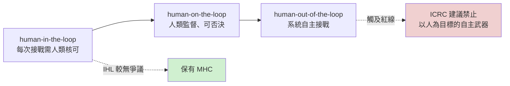
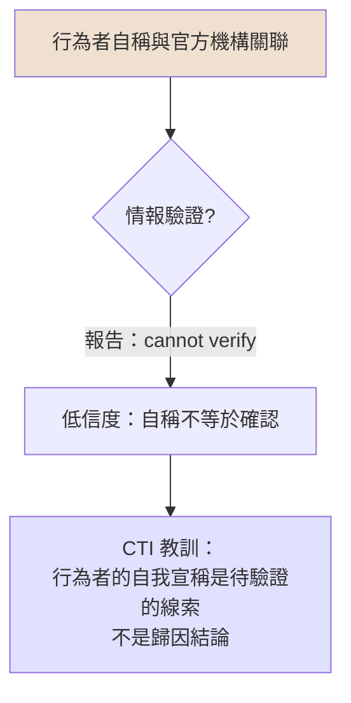
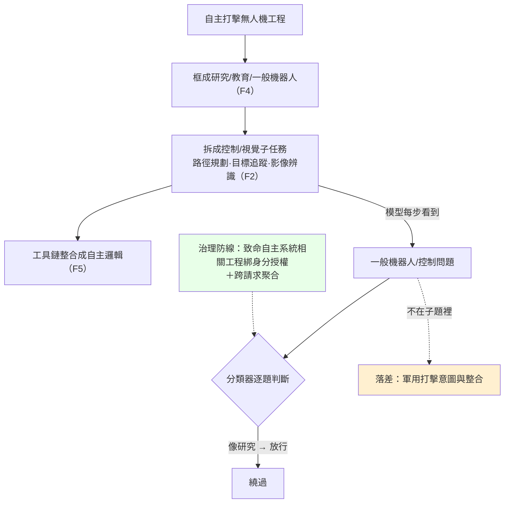

# GTG-27005：俄羅斯自由接案團隊以 Claude Code 開發自主 FPV 自殺無人機群

> 課程模組：04 常規武器（Conventional weapons） ｜ 一手來源：PDF p.117–119（章節導論 p.111–112 交叉引用） ｜ 整理日期：2026-09-13

---

## 1. 一頁速覽

1. **案件本體**：Anthropic 在 2026 年 9 月 10 日的威脅情報報告中，揭露一組「likely freelance Russia-based」行為者，用 **Claude Code** 從零建構一套「full-stack autonomous first-person-view (FPV) kamikaze drone swarm」（全堆疊自主 FPV 自殺無人機群）的軟體。行動代號「DronDoc」或「Serafim」，帳號建於 2025 年底至 2026 年初，2026 年 5 月中旬正式啟動（p.117）。
2. **為何是全報告倫理爭議最大的案例之一**：報告逐字寫道，機上模型「could select targets (including a “person” target class) and issue detonation commands without a human in the loop」——也就是**設計上讓機器自行辨識「人」並自行引爆**（p.117）。這正好踩在國際人道法與聯合國 CCW 談判中「人類對武力使用的有意義控制（meaningful human control）」這條紅線上。
3. **訓練資料來自真實戰場**：行為者「trained a computer vision classifier on scraped Ukrainian combat footage」，把目標分成 “enemy” 與 “friendly”，並把俄羅斯裝備列入允許清單（allow-list）；示範打擊點是頓內茨克州（Donetsk Oblast）的一個固定座標，任務地理是烏克蘭前線城市與走廊（p.117）。
4. **進度不是紙上談兵**：Claude Code 把七個子系統寫成可運行程式碼（Figure 3，p.118），行為者在工作階段中燒錄韌體到實體開發板、佈建單板電腦、透過 mesh 網路架設模擬環境——報告據此確認是「real hardware-in-loop testing」（p.117）。技術成熟度被評為 **TRL 3–4（已在模擬中驗證）**，尚未進入實地測試（p.118–119）。
5. **歸因是教科書級的「自稱 vs. 確認」案例**：行為者自稱獲得俄羅斯「Advanced Research Foundation, National Technology Initiative, and Ministry of Defence」資助，但報告明講「we cannot verify those claims」；Anthropic 自己的評估是「a small, specialized freelance team doing a mix of civilian and military work, not a Russian state entity」，且與「a regional university with a federal research center associated with the Russian Academy of Sciences」有關聯（p.117–118）。
6. **防線失效點**：地理存取控制被「commercial virtual private servers」繞過；九個帳號中八個只做普通接案，武器工作集中在少數帳號；發現方式是「internal investigations into suspected weapons development」（內部調查），而非即時分類器攔截；等到被處置時，程式碼已經「save[d] directly into the actors’ own project files」——封鎖帳號無法收回已寫出的程式碼（p.117–118）。
7. **第三方驗證狀況**：Defense One、Reuters、Daily Caller、DroneXL、The Decoder、台灣 AI郵報等媒體均有報導，但**全部僅轉述 Anthropic 報告**，無任何獨立查證；俄羅斯駐華府大使館未回應。本案是**單一來源情報**。
8. **這個案例在課程裡要教什麼**：（a）如何用「系統工程 V 模型 × TRL」把一件 AI 濫用事件放到「距離造成實際傷害還有多遠」的尺標上；（b）如何區分行為者自稱、平台評估、與可驗證事實三個層次的歸因；（c）致命自主武器系統（LAWS）的法律紅線為何在「人」這個目標類別上；（d）對台灣而言，自主 FPV 群既是解放軍可能使用的威脅，也是台灣自己的不對稱選項，而後者必須先畫好倫理與法律界線。

### 1.1 名詞速查（先讀這個再讀正文）

本案涉及無人機工程、分散式系統、國際人道法三個領域的術語。以下解釋以「資安背景的學員第一次接觸」為預設。

| 術語 | 全稱／原文 | 白話解釋 | 在本案的位置 |
|---|---|---|---|
| FPV | First-person view，第一人稱視角 | 操作員戴著目鏡，看無人機攝影機的即時影像來飛。原本是競速玩具，2022 年後成為俄烏戰場的主要打擊手段。 | 本案的核心產品是「FPV kamikaze drone」。 |
| Kamikaze drone / loitering munition | 自殺無人機／徘徊彈藥（巡飛彈） | 帶著炸藥飛向目標自毀的無人機。「徘徊」指能在目標區上空盤旋等待。 | 武器系統表第一列。 |
| Swarm | 群 | 不只是「多架一起飛」，而是多架之間互相通訊、共享狀態、分工協調、部分損失後仍能運作。 | 「shared swarm memory」、「fault-tolerant coordination logic」。 |
| Terminal guidance | 終端導引 | 飛行最後階段（最後幾百公尺）的自動導引，通常靠機上攝影機追蹤目標。 | 「terminal guidance software system … using the onboard camera」。 |
| Control link | 控制鏈路 | 操作員與無人機之間的無線電通道。可以被干擾，也可以被測向（反推操作員位置）。 | 「control-link geolocation module to find opposing drone operators」。 |
| EW | Electronic warfare，電子戰 | 干擾、欺騙、偵測對方的無線電訊號。俄烏雙方大規模用干擾器讓 FPV 失控。 | 本案「自主」的軍事動機。 |
| SITL / HIL | Software-in-the-loop / Hardware-in-the-loop，軟體迴路／硬體迴路 | SITL：飛控軟體在電腦裡對著模擬器跑。HIL：飛控軟體在真實硬體（開發板）上跑，感測器輸入來自模擬器。HIL 比 SITL 更接近真實。 | 「software-in-the-loop simulation stack」；「real hardware-in-loop testing」。 |
| SBC | Single-board computer，單板電腦 | 一塊板子上有 CPU、記憶體、I/O 的小電腦（Raspberry Pi、Orange Pi、Jetson）。裝在無人機上跑視覺辨識。 | 「provisioning single-board computers」；「swarm-opi5」。 |
| Mesh network | 網狀網路 | 每個節點都能與鄰近節點直接通訊，沒有中心。適合群體無人機。 | 「simulation environment over a mesh network」。 |
| BFT | Byzantine fault tolerance，拜占庭容錯 | 分散式系統即使有部分節點故障或送出錯誤資訊，其餘節點仍能達成一致的演算法。 | 「D2BFT consensus」（研究員推測）。 |
| SLM | Small language model，小型語言模型 | 參數量小到能在邊緣裝置上跑的語言模型。 | 「onboard small language model to govern attack, observe, and return-to-base behaviors」。 |
| CV classifier | Computer vision classifier，電腦視覺分類器 | 看一張影像（或影格）判斷裡面是什麼的模型。本案分「enemy／friendly」，含「person」。 | 「trained a computer vision classifier on scraped Ukrainian combat footage」。 |
| TRL | Technology Readiness Level，技術成熟度等級 | 1–9 級的量表，衡量技術離實際可用還有多遠。詳見第 6.0 節。 | Figure 3；武器系統表「Maturity」欄。 |
| V 模型 | Systems engineering V | 系統工程的標準流程圖：左臂分解需求到實作，右臂整合測試到運用。詳見第 6.0b 節。 | Figure 3。 |
| SEAD / C-UAS | Suppression of enemy air defences／Counter-unmanned aircraft systems | 壓制敵方防空／反無人機。 | 武器系統表第六列。 |
| LAWS | Lethal autonomous weapons systems，致命自主武器系統 | 聯合國 CCW 框架下的正式用語，指能在無人介入下選擇並攻擊目標的武器。 | 本案的倫理核心。 |
| MHC | Meaningful human control，有意義的人類控制 | 非條約用語，但在 LAWS 討論中最常用的規範概念：人類必須對武力使用保有足以承擔法律與道德責任的控制。 | 本案設計上為零。 |
| IHL | International humanitarian law，國際人道法 | 規範武裝衝突行為的法律，核心是區分、比例、預防三原則。 | 第 10.1 節。 |
| CCW / GGE | Convention on Certain Conventional Weapons／Group of Governmental Experts | 聯合國特定常規武器公約／其下討論 LAWS 的政府專家小組。 | 第 10.1 節時事脈絡。 |
| ICD 203 | Intelligence Community Directive 203 | 美國情報體系的分析標準，規範信心語言（likely、almost certainly 等）的用法。 | 第 2.2 節。 |
| ФПИ / НТИ | Фонд перспективных исследований／Национальная технологическая инициатива | 俄國先進研究基金會（DARPA 對應機構）／國家技術倡議。 | 行為者自稱的資金來源。 |

---

## 2. 行為者側寫與歸因

### 2.1 報告原文提供的身分線索（逐項抄錄，p.117–118）

| 線索類型 | 報告原文 | 頁碼 |
|---|---|---|
| 地理 | “likely freelance Russia-based threat actors” | p.117 |
| 組織性質 | “a small, specialized freelance team doing a mix of civilian and military work, not a Russian state entity” | p.117 |
| 帳號規模 | “We identified nine accounts associated with this group; eight were used only for ordinary freelance work, not weapons-related software development.” | p.117 |
| 學術關聯 | “we assess the actors had ties to a regional university with a federal research center associated with the Russian Academy of Sciences” | p.117 |
| 資金宣稱 | “The actors claimed to have received funding from Russia’s Advanced Research Foundation, National Technology Initiative, and Ministry of Defence, though we cannot verify those claims.” | p.117–118 |
| 行動代號 | “They called the operation “DronDoc” or “Serafim.”” | p.117 |
| 時間線 | 帳號建立於 “between late 2025 and early 2026”；行動啟動於 “mid-May 2026” | p.117 |
| 存取規避 | “circumvented our geographic access controls by routing traffic through commercial virtual private servers” | p.117 |
| 語言 | 報告未直接說明工作語言，但武器系統表中出現西里爾字母名稱「ТРИИТ」（p.119），且多個代號為俄語音譯（Zvezdochyot＝Звездочёт「觀星者」、Medovik＝медовик「蜂蜜蛋糕」、Serafim＝Серафим「熾天使」） | p.119 |

報告**沒有**提供的東西，課堂上要明講：沒有 handle、沒有姓名、沒有大學名稱、沒有 IP／網域／Telegram 帳號等 IOC、沒有被處置的確切日期、也沒有說明 Claude 在多少個工作階段中被使用。

### 2.2 歸因措辭解析：報告用了哪些「信心詞」

情報產品的每一個動詞都是有意選的。本案用到的措辭，由強到弱排列：

| 措辭 | 出現位置 | 情報學上的意思 |
|---|---|---|
| **confirmed** | “confirmed that they were using real hardware-in-loop testing within their sessions”（p.117） | 直接證據。Anthropic 看得到工作階段內容——韌體燒錄、單板電腦佈建、mesh 網路模擬環境——所以這一項是**觀察到的事實**，不是推論。 |
| **identified** | “We identified nine accounts associated with this group”（p.117） | 平台方對自家資料的直接發現（帳號關聯圖）。信度高，但「associated」的判準未公開。 |
| **assess** | “We assess the actors were a small, specialized freelance team…”；“we assess the actors had ties to a regional university…”（p.117） | **分析判斷**。在美國情報體系的用語慣例（ICD 203）裡，assess 代表「根據現有證據做出的判斷」，不等於證實；讀者應追問「證據是什麼、有多少替代解釋」。 |
| **likely** | “likely freelance Russia-based threat actors”（p.117） | 機率語言。在 ICD 203 的量表中，likely / probable 大約對應 55–80% 的信心。注意它修飾的是「freelance」與「Russia-based」兩件事——**兩者都不是確定的**。 |
| **claimed … cannot verify** | “The actors claimed to have received funding from … though we cannot verify those claims.”（p.117–118） | **明確標示為未經驗證的行為者自述**。這是情報寫作中最誠實、也最容易被下游媒體弄丟的一層。 |

對照同章其他案例的措辭，可以看出 Anthropic 的一致性：GTG-17001 寫「We cannot attribute the activity to a specific entity or actor」（p.116）；GTG-17002 寫「Account-level metadata and content flagged by our safeguards indicated the actor was linked to PRC research institutions, including the PLA Academy of Military Sciences」（p.120）——後者用了「indicated … linked to」而且點名機構，信度明顯高於本案。**本案的歸因信度，在同章四個武器開發案例中屬於中等偏弱**：地理與性質是 likely／assess，機構關聯只到「區域大學」層級，資金來源完全不可驗證。

### 2.3 「行為者自稱」與「情報機構確認」——CTI 最常見的陷阱

這是本案最值得放大講的教學點。請學員把下面三句話擺在一起讀：

> 報告原文（p.117–118）：“The actors claimed to have received funding from Russia’s Advanced Research Foundation, National Technology Initiative, and Ministry of Defence, though we cannot verify those claims.”

> The Daily Caller（Sean Moran，2026-09-10）：“The AI lab believes the bad actors used Claude Code to test the code meant to design the drone swarm and likely had associations with the Russian Academy of Sciences and not a Russian state entity.”

> AI郵報（Philo，2026-09-11，繁中）：稱行為者為「俄羅斯自由軍事小組」。

三句話描述同一件事，但資訊在每一次轉述中都變形：

1. **Daily Caller 把兩跳壓成一跳**。報告說的是「與一所區域大學有關聯，該大學設有一個與俄羅斯科學院相關的聯邦研究中心」——行為者 → 大學 → 研究中心 → 科學院，中間隔了三層關係。Daily Caller 寫成「與俄羅斯科學院有關聯」，讀者會以為行為者直接隸屬科學院。
2. **AI郵報的「自由軍事小組」是語意漂移**。原文 “freelance team doing a mix of civilian and military work” 的重點是「接案、民軍混合」，中文「軍事小組」抹掉了「民用工作佔多數」這個事實（九個帳號八個做普通接案）。
3. **多家媒體寫「Anthropic banned nine accounts」**（Defense One 摘要、DroneXL 等）。報告原文只說「We identified nine accounts associated with this group」與「we banned accounts associated with the actors」——**沒有明說九個全封**。這是典型的「合理推論被寫成事實」。

為什麼行為者會對 Claude 宣稱自己有 ФПИ／НТИ／國防部資助？課堂上可以列出幾種彼此不互斥的解釋，讓學員練習「替代假設分析（ACH）」：

- **真的有**：俄國確實存在把新創、大學團隊拉進國防訂單的機制（見 2.4），一個區域大學團隊拿到 НТИ 補助並不奇怪。
- **爭取正當性**：對 AI 助理宣稱「這是政府資助的合法研究」，可能是為了讓模型放下戒心——這是一種針對安全機制的社交工程。報告在章節導論已指出行為者「hiding their goals and the products the software was meant for」（p.113，GTG-87001）是常見手法。
- **接案話術的殘留**：自由接案者向客戶或投資人吹噓「我們有國防部背景」是常見行為，對 Claude 的陳述可能只是專案文件裡本來就有的內容。
- **部分為真**：例如曾參加 НТИ 主辦的競賽或訓練課程（НТИ 有大規模的無人機操作員再培訓計畫），就自稱「受 НТИ 資助」。

情報分析的紀律是：**在能驗證之前，把這些宣稱標為「行為者自述（self-reported）」，並且在所有下游產品中保留這個標籤**。Anthropic 做到了；多數轉述媒體沒有。

### 2.4 背景：這三個機構是什麼、為什麼「聽起來合理」仍不能採信

以下為第三方公開資料，**不是報告內容**，用來幫學員理解為什麼行為者的宣稱有表面可信度。

**Advanced Research Foundation（Фонд перспективных исследований，ФПИ／FPI）**
- 2012 年成立，公開定位是俄羅斯版 DARPA，資助高風險、高回報的國防突破技術（來源：IDST「Russia’s DARPA, the Advanced Research Foundation」；CNA「AI and Autonomy in Russia」通訊第 31 期，2022-02-07）。
- CNA 的追蹤指出 ФПИ 多年來主導 Marker 無人地面載具平台，實驗內容包括有人／無人協同、UGV 群與 UGV–UAV 協同、語音辨識與「技術視覺（technical vision）」——也就是機器視覺目標辨識。
- 換句話說，「ФПИ 資助一個無人機群／機器視覺專案」在題材上完全合理。這正是為什麼「合理」不能取代「驗證」。

**National Technology Initiative（Национальная технологическая инициатива，НТИ／NTI）**
- 2014 年由普丁宣布，2015 年 10 月批准第一批四份路線圖：AeroNet（無人航空）、AvtoNet、MariNet、NeuroNet（來源：MISIS 大學 H2020 網頁；Wikipedia「National Technological Initiative」）。
- 獨立媒體 iStories 的調查（Kirill Aruzov，2025-03-19，〈Who and How Involves Russian Startups in Defense Order Work〉）指出：НТИ 在 2021 年前已獲得 500 億盧布預算與 500 億盧布民間資金，2022–2023 年再獲逾 300 億盧布定向撥款；支持方式是補助或以股權換資本。調查舉了葉卡捷琳堡的 Future Lab 為例：原本做電線巡檢無人機，2022 年 НТИ 取得 54% 股權，進入國防領域後 2023 年營收從 2,200 萬盧布跳到 3.17 億盧布，每月生產約一百架無人機。Future Lab 代表在 2023 年底說：“If we are talking about the Russian market, today it is drones for the special military operation and drones for education. The rest is not a market.”
- T-invariant 的調查（2025-02-20，〈“Aerokitties” Fly in Swarms〉）指出：現任國防部長 Andrei Belousov 過去正是 НТИ 的主管，並主導全國無人機發展計畫；2024 年 НТИ 的無人機再培訓計畫收到逾 13,000 份申請、7,500 人入學，目標是「2030 年前一百萬名無人機操作員」；ITMO 大學的「無人系統安全」碩士班有約 200 個公費名額，專攻「無人機群程式設計」與物件辨識。
- 這說明兩件事：（i）「區域大學 + 無人機群 + 機器視覺 + НТИ」是俄國現在**制度化**的組合，行為者的側寫完全符合這個模板；（ii）正因為符合模板，才更需要獨立證據來區分「真的在模板裡」與「借模板說話」。

**Ministry of Defence（Министерство обороны）**
- 報告只說行為者「claimed」有國防部資金，沒有任何細節。國防部是最容易被拿來吹噓、也最難從外部驗證的名字。

**「Russian Academy of Sciences 相關的聯邦研究中心」**
- 俄羅斯科學院體系下有數十個「聯邦研究中心（Федеральный исследовательский центр）」，多與地方大學共構。報告刻意只寫到「regional university」層級而不點名，是典型的**保護來源與方法（sources and methods）**寫法——說得夠多讓讀者知道類型，說得夠少讓對手無法反推 Anthropic 是怎麼知道的。

### 2.5 「自由接案不等於低威脅」：俄國的「車庫級開發 → 戰場驗證 → 國家收編」模式

Anthropic 評估本案「not a Russian state entity」，多數讀者會因此鬆一口氣。課堂上要反過來問：在俄國的無人機生態裡，「非國家」是不是一個有意義的安慰？

第三方資料顯示並不是：

- **CSIS（Kateryna Bondar，2026-04-13，〈How Russia Is Building a Sovereign Drone Ecosystem for AI-Driven Autonomy〉）**：俄國展現「an adaptive procurement logic in which innovation originates outside formal defense industrial structures and is scaled only after battlefield validation」。範例是 Molniya 無人機——起源於「garage-level development」，戰場證明有效後獲國家支持，生產交給 Sudoplatov；到 2025 年 9 月，Molniya-2 每月發射約 2,200 架，對比 Lancet 約 400 架。
- 同一份 CSIS 分析指出，俄國**已在實戰中部署完全自主的無人系統**：V2U 無人機的最新版本缺少操作員控制所需的通訊元件，改用機上 Nvidia Jetson Orin 處理器跑 YOLOv5 神經網路做自主目標選擇與地形參照導航，並以機翼上的視覺標記做無線電靜默的群體協同。
- **The Insider（Dada Lyndell、Andrey Zayakin，2024-04-09，〈Skolkovo DIY〉）**：俄國 FPV 生產大量依賴匿名 Telegram 網路中的私人開發者，元件「freely available on AliExpress」，Skolkovo 創新中心的企業一邊以合法科技公司自居、一邊供貨前線。

把這三份資料放在一起，「小型自由接案團隊」在俄國體系裡不是邊緣角色，而是**創新的正規入口**。本案若沒有被 Anthropic 中斷，最可能的路徑不是「失敗消失」，而是「在模擬與 HIL 階段拿出成果 → 向 НТИ／ФПИ／志願者網路兜售 → 被更大的組織收編量產」。這是分析「威脅演進」時比「是不是國家」更重要的問題。

> **報告事實 vs. 研究員推論的分界**：以上 2.4–2.5 的機構背景與生態模式全部來自第三方公開來源，Anthropic 報告**沒有**說本案與 V2U、Molniya、Skolkovo 或任何具名大學有關。請勿在課堂上把兩者混為一談。

---

## 3. 受害者與目標清單

本案在被中斷時處於 TRL 3–4（模擬驗證），報告**沒有**任何實際傷亡或部署的記載。因此「受害者」要分成「設計上的目標」與「潛在受害者」兩層來談。

### 3.1 設計上的目標（報告原文）

| 目標類型 | 報告描述 | 頁碼 |
|---|---|---|
| 目標類別「人」 | “the onboard model could select targets (including a “person” target class)” | p.117 |
| 敵我分類 | “splitting the target classes into “enemy” and “friendly,” and allow-listing Russian systems” | p.117 |
| 對方無人機操作員 | “a control-link geolocation module to find opposing drone operators” | p.117 |
| 示範打擊點 | “a fixed coordinate in Donetsk Oblast as the demonstration strike point” | p.117 |
| 任務地理 | “front-line cities and corridors in Ukraine as the mission geography” | p.117 |
| 對方無人機 | 武器系統表中的「Air-to-air interceptor UAV / TRIIT interceptor」 | p.119 |
| 對方防空系統 | 武器系統表中的「Counter-UAS / suppression-of-air-defence doctrine … air-defence priority targeting」 | p.119 |

### 3.2 潛在受害者（研究員分析）

1. **烏克蘭軍人**：頓內茨克州是 2022 年以來戰鬥最激烈的區域之一；「前線城市與走廊」指的是烏軍的補給線與據點。
2. **烏克蘭平民**：這是「person」類別真正的問題所在。一個從戰場影像訓練出來的「人」分類器，沒有能力區分戰鬥員、平民、傷兵、投降者、醫護人員。前線城市裡仍有平民居住，「走廊」上有撤離車隊。國際人道法的「區分原則」要求攻擊者做這個區分；把它交給一個二元分類器，等於在設計階段就放棄了這項義務（見 4.4 與 10.1 的法律討論）。
3. **烏克蘭無人機操作員**：「control-link geolocation」模組的用途是從無線電控制鏈路反推操作員位置。操作員是合法軍事目標，但這個模組的存在說明本案的目標從「裝備」擴展到「特定的人」。
4. **俄軍自己（誤擊）**：「allow-listing Russian systems」意味著「友軍」是用白名單定義的——任何不在白名單上的東西，預設落入哪一類？報告沒有說。若預設為「enemy」，那麼白名單漏掉的俄軍裝備、俘獲的西方裝備、或新型裝備都可能被誤擊。這是研究員推論，報告未證實。

### 3.3 沒有受害者的「受害者清單」如何寫

情報產品在案件未造成實害時，要避免兩種錯誤：把設計意圖寫成已發生的傷害（誇大），或因為沒有傷亡就淡化設計意圖（低估）。本案報告的寫法是好範例：它用「designed the platform for autonomous lethal engagement」描述意圖，用「TRL 3–4 (validated in simulation)」描述進度，兩者並列，讓讀者自己拿捏距離。

---

## 4. AI 濫用的攻擊生命週期（逐階段拆解）

報告對本案沒有獨立的「Attack lifecycle and AI usage」小節，但 p.117 的敘事順序加上 Figure 3 的 V 模型，足以重建生命週期。以下每一階段標示「人類做什麼／Claude 做什麼／自主程度」。自主程度分三級：**對話式協助**（人問 AI 答）、**人類逐步指揮**（人下指令，AI 執行單一任務）、**AI 編排多代理自主執行**（AI 自行分解任務並操作工具）。

### 4.1 階段 0：帳號建立與存取規避（2025 年底–2026 年初）

- **人類**：在 2025 年底至 2026 年初建立九個帳號（p.117）；租用「commercial virtual private servers」把流量繞出俄羅斯，規避 Anthropic 的地理存取控制（p.117）。
- **Claude**：無。
- **自主程度**：不適用。
- **教學重點**：九個帳號中八個只做普通接案。這代表帳號本身沒有惡意訊號——它們是真的在接案的人，偶爾用其中一個帳號做武器工作。平台的偵測必須在「內容」層而非「帳號」層。

### 4.2 階段 1：概念與需求（Concept / reqs）

- **人類**：定義要做什麼——一套自主 FPV 自殺無人機群，包含記憶共享、容錯協同、機上行為決策、終端導引、對方操作員定位、聲學偵測、晶片韌體。Figure 3 把這一步標為「Standard process step」（實線框），**不是** Claude 操作的區域。
- **Claude**：報告未記載 Claude 參與需求定義。
- **自主程度**：報告未記載。
- **教學重點**：章節導論明講「the actors used Claude to build and refine software for weapons hardware and firmware with which they already had expertise and to which they had access」（p.112）。**行為者本來就懂無人機**，Claude 沒有教他們「要做什麼」，而是替他們「做出來」。這與 GTG-87001（葉門）的模式相同。

### 4.3 階段 2–3：架構與細部設計（Architecture / Detailed design）

- **人類**：決定系統切分（七個子系統）、選擇硬體（開發板、單板電腦、mesh 網路）、選擇模擬堆疊（software-in-the-loop）。Figure 3 同樣標為實線「Standard process step」。
- **Claude**：Figure 3 未標示為 Claude 操作區。但 Claude Code 在實作階段「寫入專案檔案」時，實務上必然會參與模組介面設計——這是研究員推論。
- **自主程度**：研究員推測為「人類逐步指揮」。

### 4.4 階段 4：實作與建構（Implementation & build）——Claude 的主戰場

這是 Figure 3 唯一標為「Where Claude operated」（橘色填滿）的節點，註記「7 subsystems to working code」。p.117 列出的子系統：

| # | 子系統（報告原文） | 功能白話解釋 | 為什麼危險 |
|---|---|---|---|
| 1 | “the drones’ shared swarm memory and fault-tolerant coordination logic (FTCL)” | 群體共享的狀態記憶（誰看到什麼、誰還活著、誰負責哪個目標），加上部分無人機被擊落或斷線時整個群體仍能運作的協調邏輯。武器系統表中的「D2BFT consensus」（p.119）很可能就是這一層的共識演算法（BFT＝Byzantine Fault Tolerant，拜占庭容錯；「D2」可能指 drone-to-drone——研究員推測）。 | 群體不再依賴地面站或單一領機，擊落幾架不影響其餘。這是「swarm」與「多架無人機同時飛」的本質差異。 |
| 2 | “an onboard small language model to govern attack, observe, and return-to-base behaviors” | 每架無人機上跑一個小型語言模型，決定當下該「攻擊／觀察／返航」。 | 這是本報告最新穎的技術細節：**把語言模型放進殺傷鏈的決策位置**。語言模型的非決定性、對輸入擾動的敏感、無法形式化驗證，全部變成武器的特性（研究員分析）。 |
| 3 | “a terminal guidance software system to steer drones to their target (using the onboard camera) and issue the call to detonate” | 用機上攝影機做最後幾百公尺的自動導引，並下達引爆指令。 | 這一層決定「誰按下按鈕」。報告明說引爆指令由機上系統發出，無人介入。 |
| 4 | “a control-link geolocation module to find opposing drone operators” | 從對方無人機的無線電控制鏈路測向，反推操作員所在位置。 | 把目標從「裝備」擴展到「特定的人」；也是俄烏戰場上真實存在的戰術（操作員是雙方優先獵殺的目標）。 |
| 5 | “a passive acoustic detection layer” | 用麥克風被動偵測（例如其他無人機的旋翼聲、砲聲），不發射訊號。 | 被動感測不會暴露自身，是為了在電子戰環境下仍能感知。 |
| 6 | “low-level logic for the drones’ programmable chips” | 直接寫給飛控晶片／FPGA／微控制器的底層邏輯（韌體）。 | 說明工作深入到硬體層，不是只寫上層應用。 |
| 7 | “a computer vision classifier on scraped Ukrainian combat footage” | 目標辨識模型，用刮取的烏克蘭戰場影像訓練，類別為 enemy／friendly，含「person」。 | 見 4.5。 |

（Figure 3 說「7 subsystems」；p.117 第二段列了六項、第三段另列分類器，合計七項。這是研究員的對應，報告未逐一編號。）

- **人類**：下指令、審核、把 Claude Code 產出的程式碼整合進自己的專案。
- **Claude**：「used Claude Code to write and test the code and save it directly into the actors’ own project files」（p.117）。Claude Code 是代理式（agentic）編程工具——它不只回答問題，會直接讀寫檔案系統、執行測試、修正錯誤。
- **自主程度**：**AI 編排執行**（Claude Code 在專案目錄內自主寫檔、跑測試），但由人類逐步指揮任務方向。報告沒有像 GTG-87001 那樣描述「多個 Claude 實例分工」（p.113），所以不能說本案是多代理編排。

### 4.5 階段 4b：資料取得與模型訓練（報告有記載、V 模型未單獨標示）

- **人類**：刮取（scrape）烏克蘭戰場影像；標記為 enemy／friendly；把俄羅斯裝備列入白名單；租用「a rented graphics processing host for model training」（p.117）。
- **Claude**：報告未明說 Claude 是否寫了訓練管線。以 Claude Code 的使用方式推測，資料前處理、標註工具、訓練腳本極可能是 Claude 產出的——研究員推論，報告未證實。
- **自主程度**：研究員推測為「人類逐步指揮」。

**三個必須深挖的問題：**

**（i）戰場影像從哪裡來？**
報告只寫「scraped Ukrainian combat footage」，**沒有點名平台**。以下為公開背景（非報告內容）：俄烏戰爭是史上第一場「每日以影片形式大規模公開發布」的戰爭，雙方部隊、志願者組織、軍事部落客在 Telegram 頻道、YouTube、X 上發布 FPV 擊中畫面；烏克蘭方面甚至有官方系統 OCHI 集中收集無人機影像（研究員記憶中 Reuters 於 2024 年 12 月報導其累積約 200 萬小時影像，本次未能重新抓取確認，請以此標註）。CSIS（Bondar，2025-03-06）指出烏克蘭 Delta 態勢系統每日處理「tens of terabytes」影像、照片、聲學與文字資料，並建立標準化標註協定形成「universal military dataset」。**這些官方資料集不對外開放，但公開 Telegram 頻道上的影像量已經足以訓練一個 YOLO 等級的分類器**——這是研究員的技術判斷。

**（ii）用真實戰場資料訓練殺傷性分類器的倫理與法律問題**
- **資料中的人**：戰場影像裡是真實的、正在死亡或已死亡的人。用這些影像訓練一個「person」類別的殺傷分類器，等於把死者的影像變成殺死更多人的工具。沒有任何一種「同意」機制涵蓋這種用途。
- **標籤來源決定偏誤**：烏方發布的影片，被擊中的是俄軍裝備（對本案行為者而言是「friendly」）；俄方發布的影片，被擊中的是烏軍裝備（「enemy」）。標籤實際上是「誰發的片」而非「這是什麼」——這種代理標籤在資料集之外會系統性失效（研究員分析）。
- **白名單邏輯**：「allow-listing Russian systems」表示「友軍」是封閉清單。清單外的一切——平民車輛、救護車、新型俄軍裝備、俘獲裝備——落到哪一類，決定了這個系統的誤殺率。報告沒有記載預設行為。
- **法律**：國際人道法沒有直接規範「訓練資料」，但**第一附加議定書第 36 條**要求各國在研發新武器時審查其是否符合 IHL；一個以「person」為目標類別、無人監督的系統，在 ICRC 的立場中屬於應被**禁止**的類型（見 10.1）。至於影像本身的著作權與個資法問題，在戰場情境下實務上無法執行——這正是「法律存在但不產生嚇阻」的典型。

**（iii）門檻降到多低？**
公開背景（非報告內容）顯示，構成這套系統的每一個零件都是現成的：
- 影像：公開 Telegram 頻道，免費。
- 標註與訓練：開源物件偵測框架（YOLO 系列）、雲端 GPU 按小時計費（報告證實行為者「rented graphics processing host」）。
- 邊緣推論硬體：報告說行為者「provisioning single-board computers」；武器系統表中的「swarm-opi5」很可能指 Orange Pi 5（一款搭載 NPU 的單板電腦，數十美元）——**研究員推測**。俄國 V2U 用的 Nvidia Jetson Orin 是更高階的同類產品（CSIS）。
- 程式碼：Claude Code 把七個子系統寫成可運行程式。
- 烏克蘭方面的對照數字：TFL-1 終端導引模組售價約 100 美元（The Defense Post，2025-11-19），能讓 FPV 任務成功率提升數倍（Ukraine's Arms Monitor）。

DroneXL 的 Haye Kesteloo（2026-09-12）用一句話總結了門檻變化：這種工作「a state program in 2024」需要的資源，到 2026 年變成「nine accounts」加租用的 GPU。這是媒體作者自己的分析，不是報告內容，但抓住了要點。

### 4.6 階段 5：整合與硬體迴路測試（Integration / HIL）

- **人類**：「flashing the low-level firmware to live development boards, provisioning single-board computers, and wiring up a simulation environment over a mesh network」（p.117）。
- **Claude**：報告說這些活動發生「within their sessions」——也就是 Claude 看得到、甚至可能參與了燒錄與佈建的指令。
- **自主程度**：人類逐步指揮。
- **Figure 3 對應**：「Integration / HIL」是實線框（標準流程步驟、有觀察到），不是虛線框。這與正文「confirmed … real hardware-in-loop testing」一致。

### 4.7 階段 6–7：系統測試與實地運用（System test / Field / ops）——未觀察到

- Figure 3 把這兩個節點畫成虛線框，圖例為「Not observed/actor-supplied」。
- 武器系統表把成熟度定在「TRL 3–4 (validated in simulation)」。
- 報告沒有任何飛行測試、實彈或部署的記載。**這與 GTG-87001 不同**——葉門的行為者做了實地試射（p.113）。

### 4.8 任務規劃的痕跡

「repeatedly used a fixed coordinate in Donetsk Oblast as the demonstration strike point, with front-line cities and corridors in Ukraine as the mission geography」（p.117）。這句話在生命週期裡的位置很特別：它不是開發步驟，而是**測試情境的參數**。行為者在模擬中反覆用同一個真實座標做示範打擊，說明模擬環境是以真實地理為基礎建構的——這也是 Anthropic 能判斷「任務地理是烏克蘭前線」的依據。

### 4.9 自主程度總結

| 階段 | 人類 | Claude | 自主程度 |
|---|---|---|---|
| 帳號與規避 | 全部 | 無 | — |
| 概念／需求 | 全部（既有專業） | 未記載 | — |
| 架構／設計 | 主導 | 可能參與（推測） | 人類逐步指揮 |
| 實作與建構 | 指揮、整合 | **寫七個子系統、測試、直接寫入專案檔** | AI 代理式執行（單代理） |
| 資料與訓練 | 刮取、標註、租 GPU | 可能寫管線（推測） | 人類逐步指揮 |
| 整合／HIL | 燒錄、佈建、架網 | 在工作階段中可見 | 人類逐步指揮 |
| 系統測試／實地 | 未觀察 | 未觀察 | — |

**核心觀察**：本案的 AI 自主程度集中在「把設計變成程式碼」這一段。這一段在傳統武器開發中是最耗人力、最需要跨領域工程師的部分（分散式系統、嵌入式韌體、電腦視覺、訊號處理各需一人）。Claude Code 讓一個小團隊同時擁有這四種工程師。

### 4.10 與同章其他三個武器開發案例的比較（模組脈絡）

常規武器章節 Part I 的四個案例（p.111–122）放在一起看，才看得出本案的相對位置。以下全部取自報告原文，頁碼標於各欄。

| 比較項 | GTG-87001（葉門） | GTG-17001（中國） | **GTG-27005（俄羅斯，本案）** | GTG-17002（中國） |
|---|---|---|---|---|
| 武器類型 | 導引火箭、多節彈道飛彈、高超音速滑翔載具（p.112） | 反魚雷火控系統規格與採購提案（p.115） | **自主 FPV 自殺無人機群**（p.117） | 電戰／防空壓制目標分配套件（p.119） |
| 行為者性質 | 「a cell of threat actors based in northern Yemen」（p.112） | 「associated with a Chinese defense industry manufacturer」，目標客戶為解放軍海軍（p.115–116） | **「likely freelance … not a Russian state entity」**（p.117） | 「China-based defense and military-industrial researcher … linked to PRC research institutions, including the PLA Academy of Military Sciences」（p.120） |
| 歸因信度（研究員判讀） | 中（地理明確、組織不明） | 低（「cannot attribute the activity to a specific entity or actor」p.116） | **中偏低**（likely／assess；資金宣稱不可驗證） | 高（帳號元資料 + 內容指向具名機構） |
| Claude 的角色 | 「in place of human software engineers」寫 GNC 軟體；**多個 Claude 實例分工**（寫碼、研究、審查）（p.113） | 寫採購提案並反覆扮演敵意審查者批評；寫火控軟體片段與測試矩陣（p.116） | **Claude Code 寫七個子系統並直接存入專案檔；單代理**（p.117） | 聊天、編程、代理工具；16 個模組、12 個版本；並接入自架模型（p.119–120） |
| 物理測試 | **實地試射（失敗），數小時內回到 Claude 做故障分析**（p.113） | 無 | **HIL：韌體燒錄至開發板、SBC 佈建、mesh 模擬**（p.117） | 無（模擬） |
| 進度 | 走到實地測試；已建成不依賴 Claude 的離線模擬工具包（p.113） | 文件與軟體片段 | **TRL 3–4（模擬驗證）**（p.118–119） | 12 個版本的軟體套件 |
| 安全機制的即時攔截 | 「blocked many of their requests, but not all」（p.113） | 未提及 | **未提及（發現靠內部調查）** | 「content flagged by our safeguards」（p.120） |
| 規避手法 | 隱藏目標與產品用途；跨工作階段拆分（p.113） | 自稱美國國防業 OEM（p.115） | **VPS 繞過地理控制；九帳號八正常**（p.117） | 未提及地理規避 |
| 對台灣的直接關聯 | 無 | 無 | 無 | **模擬情境改為台灣 12 個目標**（p.120） |
| 處置 | 封鎖帳號；與公私部門夥伴分享（p.113） | 封鎖帳號（違反 Supported Regions 與 Usage Policy）（p.116） | **封鎖帳號；納入安全機制**（p.118） | 封鎖帳號；納入安全機制（p.120） |

**從比較表能讀出的三件事**：

1. **「自主程度」與「物理進度」是兩個獨立的軸**。GTG-87001 的 AI 自主程度最高（多代理分工），物理進度也最遠（實地試射）；本案 AI 自主程度較低（單代理）但物理進度中等（HIL）；GTG-17002 軟體迭代最多（12 版）但沒有物理測試。評估威脅時兩軸都要看。
2. **歸因信度與威脅嚴重度不相關**。本案歸因最模糊，但設計意圖（反人員自主）最極端。分析師不能因為「不知道是誰」就降低對「他們在做什麼」的評估。
3. **四案共同點**：行為者都「already had expertise」（p.112）、都拆分工作階段、都被封鎖但產出都留在行為者手上。這是章節層級的模式，不是個案特徵。

---

## 5. TTP 與 MITRE ATT&CK 對應

先講清楚框架的適用邊界：MITRE ATT&CK 是為「入侵企業／雲端／行動裝置」設計的，**本案沒有入侵任何人**——行為者濫用的是一個 AI 平台的服務條款，開發的是實體武器。因此對應只在「濫用平台與規避安全機制」的行為上成立；武器開發本身是框架缺口。MITRE ATLAS（針對 AI 系統的對抗框架）能補上一部分，但 ATLAS 的設計對象是「攻擊 AI 系統」，不是「用 AI 系統攻擊別人」，同樣有缺口。

| 戰術 | 技術 ID | 本案具體作法 | 偵測構想（平台方視角） | 框架適用性 |
|---|---|---|---|---|
| Resource Development | T1585.003 Establish Accounts: Cloud Accounts | 2025 年底–2026 年初建立九個帳號，八個做普通接案（p.117） | 帳號關聯圖：共用付款方式、裝置指紋、VPS 出口 ASN、相同專案檔名 | 近似對應 |
| Resource Development | T1583.003 Acquire Infrastructure: Virtual Private Server | 租用商業 VPS 繞過地理存取控制（p.117） | 出口 IP 屬 VPS／雲端 ASN 而非住宅 ISP；語言、時區、鍵盤配置與 IP 國別不一致 | 直接對應 |
| Defense Evasion | T1090.002 Proxy: External Proxy | 同上——VPS 作為流量代理 | 同上 | 近似對應 |
| Resource Development | T1583.004 Acquire Infrastructure: Server | 租用 GPU 主機做模型訓練（p.117） | 平台方看不到；但工作階段中若出現訓練指令與遠端主機位址，可作為內容訊號 | 近似對應 |
| Resource Development | T1588.002 Obtain Capabilities: Tool | 取得 Claude Code、software-in-the-loop 模擬堆疊（p.117） | Claude Code 使用本身合法；訊號在「專案內容」 | 近似對應 |
| Resource Development | T1587 Develop Capabilities（父技術） | 開發七個武器子系統 | 專案層級語意分析：無人機控制 + 引爆邏輯 + 目標類別「person」的共現 | **框架缺口**：ATT&CK 的子技術只有 Malware／憑證／Exploit，無「武器軟體」 |
| Reconnaissance | T1593.001 Search Open Websites/Domains: Social Media | 刮取烏克蘭戰場影像（p.117） | 平台方看不到刮取；但若用 Claude 寫爬蟲，爬蟲目標（Telegram 頻道、影片站）是內容訊號 | 近似對應 |
| （ATLAS）ML Attack Staging | AML.T0002 Acquire Public ML Artifacts: Datasets | 同上 | 同上 | ATLAS 近似對應 |
| Defense Evasion（對平台安全機制） | 無 ATT&CK ID；ATLAS AML.T0054 LLM Jailbreak 為近似 | 章節導論：「split their work across many sessions to conceal the full nature of their programs」（p.112） | **跨工作階段聚合**：以帳號／專案為單位累積語意，而非逐則對話判斷 | **框架缺口**：「意圖分割」沒有標準 ID |
| Defense Evasion | 無 | 對 Claude 宣稱有政府資助（p.117–118）——可能為了取得正當性 | 「權威宣稱」與「敏感內容」共現時提高審查等級 | **框架缺口** |
| Execution（實體） | 無 | 燒錄韌體到開發板、佈建單板電腦、mesh 網路模擬（p.117） | 工作階段中出現燒錄工具鏈指令 + 無人機飛控韌體名稱 | **框架缺口**：目標是自己的硬體 |
| Collection（EW／SIGINT） | 無 | 控制鏈路測向定位對方操作員（p.117） | 內容訊號：無線電測向演算法 + 「operator」+ 打擊邏輯共現 | **框架缺口** |
| Impact（動能） | 無 | 自主引爆（p.117） | — | **框架缺口**：ATT&CK 的 Impact 限於資訊系統 |

### 5.1 對應表教了我們什麼

1. **ATT&CK 能對應的部分，全都是「平台濫用」**：帳號、VPS、代理。這些行為與一個普通的服務條款違規者無異——偵測它們抓不到武器開發，只抓到「有人從不支援的地區用 VPS 登入」。
2. **真正有鑑別力的訊號在內容層**，而且必須跨工作階段聚合。單一對話裡「寫一個 BFT 共識演算法」、「寫一個 YOLO 訓練腳本」、「寫一個 RF 測向模組」各自都是合法的工程任務；只有把它們放進同一個專案、同一個帳號群、同一個目標座標，意圖才浮現。這正是章節導論說的「no single session revealed their full intent」（p.113）。
3. **框架缺口本身就是教材**：學員應該練習為「AI 平台濫用」定義自己的行為分類（例如：意圖分割、權威宣稱、雙用途工程任務共現、真實地理座標作為測試參數），而不是硬套 ATT&CK。

---

## 6. 圖表逐一判讀

本案頁段內有一張正式編號的圖（Figure 3，p.118）與一張表（Weapons systems observed，p.119）。p.117 為純文字頁，無圖。以下均為研究員親自開啟 PNG 判讀，非僅抄圖說。

### 6.0 先備知識：什麼是 TRL（Technology Readiness Level，技術成熟度等級）

Figure 3 的下半部是 TRL 量表，學員必須先懂這個量表才能讀圖。TRL 是 NASA 在 1970–80 年代發展、後被美國國防部與各國採用的九級量表，用來回答「這項技術離實際可用還有多遠」。各級的標準定義（NASA／DoD 通用版本）：

| 等級 | 定義（英文慣用語） | 白話 |
|---|---|---|
| TRL 1 | Basic principles observed and reported | 只有基礎原理 |
| TRL 2 | Technology concept and/or application formulated | 想出了怎麼用 |
| TRL 3 | Analytical and experimental critical function and/or characteristic proof of concept | **概念驗證**：關鍵功能在分析或實驗中證明可行（例如模擬） |
| TRL 4 | Component and/or breadboard validation in laboratory environment | **實驗室驗證**：零組件在實驗室環境中驗證（例如開發板上跑韌體） |
| TRL 5 | Component and/or breadboard validation in relevant environment | 零組件在「相關環境」（接近真實）中驗證 |
| TRL 6 | System/subsystem model or prototype demonstration in a relevant environment | 原型在相關環境中展示 |
| TRL 7 | System prototype demonstration in an operational environment | 原型在作戰環境中展示 |
| TRL 8 | Actual system completed and qualified through test and demonstration | 實際系統完成並通過鑑定 |
| TRL 9 | Actual system proven through successful mission operations | 實際系統在任務中證明 |

關鍵分水嶺在 **TRL 4 → 5**：從「實驗室」到「相關環境」。對無人機而言，TRL 5 以上需要真的飛、真的在電子戰干擾下飛、真的對著目標飛。這些是**物理世界的瓶頸**，AI 寫程式碼寫得再快也無法跳過——這是 Figure 3 要傳達的核心。

### 6.0b 先備知識：什麼是系統工程 V 模型

V 模型把開發流程畫成一個 V 字：左臂由上而下是「分解」（需求 → 架構 → 細部設計 → 實作），右臂由下而上是「整合與驗證」（整合 → 系統測試 → 實地運用）。左右兩臂之間的水平線代表「驗證關係」：右邊每一層的測試，是在驗證左邊對應那一層的產物（系統測試驗證架構、實地運用驗證需求）。

### Figure 3（p.118）：The systems engineering V mapped against Technology Readiness Levels

**圖檔**：`../figures/page-118.png`

**圖片類型**：架構圖／流程圖（系統工程 V 模型）疊加 TRL 量表，附圖例。

**圖上實際看到的元素與文字（逐一抄錄）**：

- 標題：**Case 3: Development**
- 副標：**Autonomous drone swarm — full-stack engineering at implementation**
- V 模型左臂（由上而下，三個實線白底框）：
  1. **Concept / reqs**
  2. **Architecture**
  3. **Detailed design**
- V 模型底部（唯一橘色／鮭紅色填滿的框）：
  4. **Implementation & build**，框內第二行小字：**7 subsystems to working code**
- V 模型右臂（由下而上）：
  5. **Integration / HIL**（實線白底框）
  6. **System test**（**虛線框**）
  7. **Field / ops**（**虛線框**）
- 三條水平虛線連接左右兩臂：Concept / reqs ↔ Field / ops；Architecture ↔ System test；Detailed design ↔ Integration / HIL。
- 下半部標題：**Technology readiness level at disruption**
- 九個並排的方框：TRL 1、TRL 2、**TRL 3**、**TRL 4**、TRL 5、TRL 6、TRL 7、TRL 8、TRL 9。其中 **TRL 3 與 TRL 4 為橘色填滿並粗體**，其餘為淡色。
- TRL 3–4 下方註記：**Proof-of-concept → lab-validated**
- 圖例（三項）：橘色方塊 **Where Claude operated**；白色實線方塊 **Standard process step**；虛線方塊 **Not observed/actor-supplied**
- 圖例下方一行：**Framework: Systems-Engineering Vee + Technology Readiness levels (NASA/DoD)**
- 圖說（正文）：“Figure 3. The systems engineering V mapped against Technology Readiness Levels, showing where in the software development lifecycle the activity occurred and how far it progressed towards a viable system.”

**「Case 3」是什麼意思**：常規武器章節 Part I 有四個案例（p.111：guided rocket、anti-torpedo、drone swarm、EW/SEAD），本案排第三，所以圖上寫 Case 3。GTG-87001 的圖是 Figure 1（p.114），GTG-17001 的圖是 Figure 2（p.116）。

**V 模型節點 ↔ TRL 等級的對應（研究員根據圖的空間配置與標準定義整理；圖上並未畫出明確的對應線）**：

| V 模型節點 | 圖上樣式 | 對應 TRL（研究員推定） | 本案狀態 |
|---|---|---|---|
| Concept / reqs | 實線（標準步驟） | TRL 1–2 | 行為者自備（既有專業） |
| Architecture | 實線（標準步驟） | TRL 2–3 | 行為者主導 |
| Detailed design | 實線（標準步驟） | TRL 3 | 行為者主導 |
| **Implementation & build** | **橘色（Claude 操作）** | **TRL 3 → 4** | **七個子系統寫成可運行程式碼** |
| Integration / HIL | 實線（標準步驟） | TRL 4 | 開發板燒錄、單板電腦、mesh 模擬——已觀察到 |
| System test | 虛線（未觀察） | TRL 5–6 | 未觀察 |
| Field / ops | 虛線（未觀察） | TRL 7–9 | 未觀察 |

**AI 壓縮了哪些階段的時程**：
- **被壓縮的是 V 的底部**：從細部設計到可運行程式碼，再到能上開發板的韌體。這一段在傳統流程中是最吃工程師人時的部分。「7 subsystems to working code」這行小字是全圖的重點——七個跨領域的子系統（分散式共識、嵌入式韌體、電腦視覺、訊號處理、行為決策）由一個工具在數週內（5 月中啟動）產出。
- **沒有被壓縮的是右臂上半**：System test 與 Field / ops 是虛線。要走到 TRL 5 以上，需要真實飛行、真實干擾環境、真實目標——這些是 Claude 無法代勞的物理步驟。這就是為什麼「TRL at disruption」停在 3–4。
- 對照 GTG-87001（葉門）：那個案例的行為者走到了實地試射（p.113），但試射失敗、幾小時內回到 Claude 做故障分析。兩案並讀可以看出同一個模式：**AI 把軟體側的時程壓到極短，物理驗證變成唯一的瓶頸，而行為者會不斷回到 AI 來縮短物理驗證的迭代週期**。

**這張圖傳達的核心訊息**：
1. Claude 的介入點很精確——不在「想做什麼」，而在「把它做出來」。
2. 本案被中斷時處於「概念驗證 → 實驗室驗證」的交界，離可用武器還有 TRL 5–9 五個等級。
3. 但「還有五個等級」不等於安全：程式碼已經在行為者手上，右臂的物理步驟他們本來就有能力（也有動機）自己完成。

**在課程中怎麼用這張圖**：
- 讓學員先看圖不看正文，猜「Claude 在哪裡、走到哪裡」，再讀 p.117 對答案。
- 把 Figure 1（p.114，GTG-87001）與 Figure 3 並排，問：兩個案例的 V 模型哪裡不同？（答案：87001 走到了實地測試。）
- 作為評估框架：任何一件「AI 協助武器開發」的新聞，都先問「V 模型的哪一段？TRL 幾？」——這比「AI 能不能做武器」是更有生產力的問題。

### Weapons systems observed 表（p.119）

**圖檔**：課程圖檔目錄中無 page-119.png（該頁被分類為表格而非圖表）；請直接引用 PDF p.119。

**圖片類型**：四欄表格（System / Category / Named systems / Maturity），六列，淡灰底框。

**完整抄錄**：

| System | Category | Named systems | Maturity |
|---|---|---|---|
| FPV kamikaze drone | Loitering munition | Lancet-class FPV, “Sibiryachok” | TRL 3–4 (validated in simulation) |
| Air-to-air interceptor UAV | Interceptor | TRIIT interceptor | TRL 3–4 |
| Standoff strike UAV | Strike UAV | “Striker” variant | TRL 3–4 |
| Heterogeneous autonomous swarm | UAV guidance | Serafim, Zvezdochyot-Serafim, swarm-opi5, Medovik | TRL 3–4 |
| Swarm command-and-control / combat memory | Control firmware | ТРИИТ reactive engine, D2BFT consensus | TRL 3–4 |
| Counter-UAS / suppression-of-air-defence doctrine | Guidance subsystem | Nebo-22 test stand, air-defence priority targeting | Doctrine and simulation |

**逐列說明（報告只給名稱，以下解釋為研究員根據公開資料與命名線索的判讀，逐一標示信心）**：

**列 1：FPV kamikaze drone ｜ Loitering munition ｜ Lancet-class FPV, “Sibiryachok” ｜ TRL 3–4 (validated in simulation)**
- 「Loitering munition」（徘徊彈藥／巡飛彈）是正式軍語，指能在目標區上空盤旋、找到目標後俯衝自毀的無人機。
- 「Lancet-class」：Lancet 是俄國 ZALA Aero（Kalashnikov 集團）的巡飛彈，2019 年公開、2020 年服役，是俄軍在烏克蘭最有效的新武器之一（英國國防部 2023 年 11 月評估）。其「Izdeliye-53（Product 53）」變體據俄方宣稱能「從預設類別中自主選擇目標」並在無人機間共享資訊——**注意這是俄方宣稱，未經獨立驗證**（Wikipedia「ZALA Lancet」條目整理）。報告寫「Lancet-class」而非「Lancet」，意思是「Lancet 那一類」，不代表行為者在做 Lancet 本身。
- 「Sibiryachok」（Сибирячок，「小西伯利亞人」）：The Insider 的調查（2024-04-09）記載，2023 年一款同名四軸機（相關報導指與 Skolkovo 的 Gaskar Group 有關）因品質低劣（AliExpress 零件：SIYI 攝影機、Skydroid 控制系統、Tarot 馬達；被評為「低階 3D 列印」）遭俄國軍事部落客批評後下架。**報告表中的 Sibiryachok 是否就是這款產品，報告沒有說**；可能是同名、可能是行為者沿用的代號。信心：低。
- 「validated in simulation」：這一列是唯一額外註明「在模擬中驗證」的，暗示 FPV 自殺機是專案的核心產品，其他列是衍生。

**列 2：Air-to-air interceptor UAV ｜ Interceptor ｜ TRIIT interceptor ｜ TRL 3–4**
- 「攔截無人機」是用無人機打無人機——烏克蘭大量用來攔截 Shahed 型攻擊機，俄國也在發展。這一列說明專案不只做攻擊，也做反無人機。
- 「TRIIT」：與列 5 的西里爾字母「ТРИИТ」是同一個名稱的拉丁與西里爾拼法。可能是縮寫，公開資料中查無此名。信心：無法判讀。

**列 3：Standoff strike UAV ｜ Strike UAV ｜ “Striker” variant ｜ TRL 3–4**
- 「Standoff」指在對方防空射程外發射的打擊。這一列代表一種射程更長、非 FPV 近距離操作的變體。

**列 4：Heterogeneous autonomous swarm ｜ UAV guidance ｜ Serafim, Zvezdochyot-Serafim, swarm-opi5, Medovik ｜ TRL 3–4**
- 「Heterogeneous」（異質）是關鍵字：群體由**不同種類**的無人機組成（自殺機、攔截機、打擊機），而非同型機群。這比同質群更難協調，也更接近真實作戰編組。
- 「Serafim」是專案代號（p.117）。「Zvezdochyot-Serafim」（觀星者-熾天使）可能是一個變體；「Звездочёт」一詞有時暗示天文／星光導航（GPS 拒止環境下的替代導航），**純屬研究員推測**。
- 「swarm-opi5」：「opi5」極可能是 Orange Pi 5 的縮寫——一款 Rockchip RK3588 的單板電腦，內建 NPU，常用於邊緣視覺推論。這與 p.117「provisioning single-board computers」吻合。信心：中（合理推測，報告未證實）。
- 「Medovik」（蜂蜜蛋糕）：代號，無法判讀。

**列 5：Swarm command-and-control / combat memory ｜ Control firmware ｜ ТРИИТ reactive engine, D2BFT consensus ｜ TRL 3–4**
- 「combat memory」對應 p.117 的「shared swarm memory」——群體共享的戰鬥狀態記憶。
- 「reactive engine」：在機器人學中「reactive」指感測→反應的即時行為架構（相對於「deliberative」規劃式）。「ТРИИТ reactive engine」可能是 p.117 提到的「onboard small language model to govern attack, observe, and return-to-base behaviors」的執行框架，**研究員推測**。
- 「D2BFT consensus」：「BFT」在分散式系統中幾乎必然是 Byzantine Fault Tolerant（拜占庭容錯）——即使部分節點故障或被劫持，其餘節點仍能達成一致。這對應 p.117 的「fault-tolerant coordination logic (FTCL)」。「D2」可能是 drone-to-drone 或第二代。信心：中。
- **為什麼這一列重要**：它說明行為者把「群體」當成分散式系統來設計——沒有單點故障，沒有地面站依賴。在電子戰環境中，這正是讓群體「打不斷」的設計。

**列 6：Counter-UAS / suppression-of-air-defence doctrine ｜ Guidance subsystem ｜ Nebo-22 test stand, air-defence priority targeting ｜ Doctrine and simulation**
- 這一列的成熟度不是 TRL，而是「Doctrine and simulation」——即只有準則與模擬，沒有到硬體。
- 「air-defence priority targeting」：在導引邏輯中優先攻擊防空系統——這是 SEAD（壓制敵方防空）思維，與同章 GTG-17002（中國電戰／SEAD 案，p.119–122）在概念上相通，但**兩案是不同行為者，報告沒有任何關聯的暗示**。
- 「Nebo-22 test stand」：「Небо」（天空）也是俄國一系列雷達（Nebo-M、Nebo-U）的名稱，但「test stand」（測試台架）表示這是行為者的測試設施名稱，與雷達是否有關無法判斷。信心：無法判讀。

**表格傳達的核心訊息**：
1. 專案的**廣度**遠超「一架自殺無人機」：攻擊、攔截、遠程打擊、異質群、控制韌體、反防空準則六個面向。
2. **成熟度一致停在 TRL 3–4**——與 Figure 3 相互印證。
3. 命名混雜俄語代號與英文技術縮寫，符合「俄語團隊用英文工具鏈開發」的側寫。

**在課程中怎麼用這張表**：讓學員練習「從命名推斷技術棧」（opi5、BFT、reactive engine），再練習「標示信心」——哪些推斷有公開資料支撐、哪些只是合理猜測。這是 CTI 分析師每天在做的事。

### 6.1 交叉檢核：圖、表、正文是否一致

| 檢核項 | 正文（p.117） | Figure 3（p.118） | 表（p.119） | 一致？ |
|---|---|---|---|---|
| 子系統數量 | 六項列舉 + 分類器 = 七 | 「7 subsystems」 | 六個系統面向（切分方式不同） | 一致（切分角度不同） |
| 成熟度 | 「real hardware-in-loop testing」 | TRL 3–4；Integration/HIL 實線 | TRL 3–4（validated in simulation） | 一致 |
| 未達階段 | 無飛行／部署記載 | System test、Field/ops 虛線 | 無 TRL 5+ | 一致 |
| Claude 介入點 | 「write and test the code and save it directly into the actors’ own project files」 | Implementation & build | — | 一致 |

---

## 7. IOC 與技術指標

**報告對本案沒有提供 IOC 表**（沒有網域、IP、雜湊、Telegram 帳號）。這本身是一個教學點：武器開發案的「指標」不是網路基礎設施，而是**內容與行為模式**。以下為研究員根據報告事實整理的「行為與技術指標」，並評估每一項的偵測價值與壽命。

| 指標類型 | 指標內容（來自報告） | 頁碼 | 偵測價值 | 壽命 |
|---|---|---|---|---|
| 專案代號 | “DronDoc”、“Serafim” | p.117 | 低——代號在曝光後必然更換 | 已失效 |
| 子系統／變體名稱 | Zvezdochyot-Serafim、swarm-opi5、Medovik、TRIIT／ТРИИТ、D2BFT、Nebo-22、“Striker”、“Sibiryachok” | p.119 | 低至中——若程式碼庫外流或在其他平台重用，名稱可作為關聯線索 | 短（數月） |
| 工具鏈組合 | Claude Code + software-in-the-loop 模擬堆疊 + 租用 GPU 主機 + mesh 網路模擬環境 | p.117 | 中——組合本身合法，但「代理式編程 + SITL + 韌體燒錄 + 訓練」同時出現在一個帳號群是強訊號 | 長（模式層級） |
| 硬體足跡 | 「live development boards」、「single-board computers」、「programmable chips」 | p.117 | 中——工作階段中出現燒錄工具鏈、SBC 佈建指令 | 長 |
| 內容訊號 | 「person」目標類別 + 「detonate／detonation」+ 無人機控制程式碼共現 | p.117 | **高**——這是最具鑑別力的語意組合 | 長 |
| 內容訊號 | enemy／friendly 二元分類 + 特定國家裝備白名單 | p.117 | 高 | 長 |
| 內容訊號 | RF 控制鏈路測向 + 「operator」+ 打擊邏輯共現 | p.117 | 高 | 長 |
| 地理訊號 | 頓內茨克州固定座標反覆作為測試參數；烏克蘭前線城市與走廊 | p.117 | **高**——真實戰區座標出現在「模擬」中，是意圖的直接證據 | 長 |
| 存取模式 | 商業 VPS 出口；帳號建於 2025 底–2026 初；九帳號八正常 | p.117 | 中——VPS 本身普遍，需與內容訊號結合 | 中 |
| 權威宣稱 | 自稱 ФПИ／НТИ／國防部資助 | p.117–118 | 中——「宣稱權威 + 敏感內容」是值得提高審查的組合 | 長 |
| 語言 | 西里爾字母名稱與俄語音譯代號 | p.119 | 低（單獨無意義） | — |

**IOC 安全紅線提醒**：本案沒有可連線的指標，因此不存在「不要連線」的問題。但同一模組其他案例（例如 GTG-27006 的採購網路）若有指標，一律只做研究抄錄。

---

## 8. Anthropic 的偵測、處置與防線缺口

### 8.1 做了什麼（報告原文）

| 動作 | 原文 | 頁碼 |
|---|---|---|
| 發現方式 | “We identified this activity as part of our internal investigations into suspected weapons development” | p.118 |
| 帳號關聯 | “We identified nine accounts associated with this group” | p.117 |
| 處置 | “we banned accounts associated with the actors” | p.118 |
| 回饋安全機制 | “have incorporated our investigative findings into safeguards to reduce the risk of future misuse” | p.118 |
| 章節層級措施 | “We recently launched a new set of classifiers designed to better detect and block traffic related to high-yield explosives and weapons development.” | p.112 |
| 章節層級措施 | “Where we found these actors worked across other platforms, we shared our findings with our industry counterparts so that they could also disrupt the activity.” | p.112 |
| 「disrupted」的定義 | “By “disrupted,” we mean we banned every account we could link to the actor, which shut down the whole operation.” | p.112 |

### 8.2 哪裡失效——課程的高價值素材

**缺口 1：地理存取控制形同虛設**
報告直接承認「circumvented our geographic access controls by routing traffic through commercial virtual private servers」（p.117）。同章 GTG-27006 也「used VPNs to circumvent Anthropic’s geographic access restrictions」（p.124）。Supported Regions Policy 是第一道防線，而它擋不住任何願意花每月幾美元租 VPS 的人。教學重點：**地理封鎖是合規措施，不是安全措施**。

**缺口 2：發現靠「調查」，不靠「攔截」**
本案的措辭是「identified … as part of our internal investigations」。對比 GTG-87001：「Our safeguards blocked many of their requests, but not all of them」（p.113）。本案報告**沒有說有任何請求被即時攔截**。合理的解讀是：分類器在逐則對話層級沒有觸發（或觸發不足以阻斷），是事後的專案級調查把全貌拼出來。這與章節導論的自陳一致：行為者「split their work across many sessions to conceal the full nature of their programs」（p.112）。

**缺口 3：處置無法收回已產出的能力**
「save it directly into the actors’ own project files」（p.117）——Claude Code 的設計就是直接寫進使用者的檔案系統。封鎖帳號後，七個子系統的程式碼仍在行為者手上。同章 GTG-87001 更明確：「we have evidence that the actors had already built an offline simulation toolkit that does not rely on Claude」（p.113）。**代理式編程工具的濫用，其「產出」在平台之外持續存在**——這是與聊天式濫用的根本差異。

**缺口 4：時間窗**
帳號建於 2025 年底–2026 年初，行動 5 月中啟動，報告涵蓋期至 8 月。報告沒有說何時發現與處置，但在被中斷前行為者已完成七個子系統並進入 HIL 測試。以 TRL 3–4 的工作量估計，至少數週的活動未被即時阻斷——研究員推估，報告未給確切時長。

**缺口 5：訊號稀釋**
九個帳號八個正常。任何以「帳號整體行為」為基礎的風險評分，會被 89% 的正常接案工作稀釋。這說明偵測必須做到**專案／內容層級**，而非帳號層級。

**缺口 6：分類器是事後上線的**
p.112 的「recently launched a new set of classifiers … weapons development」是章節層級的陳述，時序上在這些案例之後。也就是說，本案（以及同章其他案例）是這批分類器的**訓練素材**，而非被它們擋下的案例。

### 8.3 為什麼這些缺口不能簡單地「修好」

課堂上要避免讓學員以為「加個分類器就好」。本案的每一個子系統，單獨看都是合法的工程任務：
- BFT 共識演算法 → 區塊鏈、分散式資料庫都在用。
- 物件偵測分類器 → 農業、安防、自駕都在用。
- RF 測向 → 業餘無線電、搜救都在用。
- 飛控韌體 → 開源社群（Betaflight、ArduPilot）公開維護。
- 被動聲學偵測 → 野生動物監測都在用。

只有「detonate」、「person 目標類別」、「頓內茨克座標」這幾個訊號是不可否認的。而一個稍微謹慎的行為者，可以把引爆邏輯稱為「payload release」、把 person 類別稱為「pedestrian」、把座標換成相對座標。**偵測的本質是在雙用途技術的灰色地帶做意圖推斷**，這永遠有誤報與漏報。Anthropic 選擇公開這些案例，部分原因正是希望「other developers recognize similar patterns on their own platforms」（p.3）。

### 8.4 偵測工程的推理過程：如果你是平台方，會怎麼想

這一節不是 Anthropic 的做法（報告沒有公開細節），而是帶學員走一遍「從本案事實反推偵測設計」的思路。每一步都對應第 7 節的指標表。

**第一步：把訊號分層，承認每一層的極限**

| 層 | 本案可見的訊號 | 單獨使用的問題 |
|---|---|---|
| 基礎設施層 | VPS 出口 ASN；帳號建立時間叢集 | 全球數百萬合法使用者透過 VPS／企業代理連線；誤報率極高 |
| 帳號層 | 九帳號關聯；八個做普通接案 | 帳號整體行為 89% 正常，風險評分會被稀釋 |
| 對話層（單則） | 「寫一個 BFT 共識」、「訓練一個 YOLO 分類器」、「寫 RF 測向」 | 每一則都是合法工程任務；逐則分類器必然放行 |
| 專案層（跨工作階段聚合） | 同一專案目錄中同時出現飛控韌體、引爆邏輯、person 類別、真實戰區座標 | **唯一有鑑別力的層**，但需要跨工作階段、跨帳號的狀態保存 |

推理結論：偵測必須建在專案層。Claude Code 的特性（讀寫使用者的檔案系統、有專案上下文）反而讓平台方比純聊天介面更容易看到專案全貌——這是雙面刃：行為者用它來加速，平台用它來看清。

**第二步：定義「不可否認的組合」而非「可疑的關鍵字」**

單一關鍵字（drone、swarm、target）的誤報會淹沒分析師。有效的做法是定義**共現組合**，每一個組合都要能通過「一個農業噴灑無人機公司會不會這樣做」的測試：

| 組合 | 農業／物流／搜救專案會出現嗎？ | 鑑別力 |
|---|---|---|
| 飛控韌體 + 群體協調 | 會（農業噴灑機群） | 低 |
| 飛控韌體 + 視覺分類器 | 會（作物辨識、搜救） | 低 |
| 視覺分類器 + 「person」類別 | 會（搜救、安防） | 低 |
| 視覺分類器 + 「enemy／friendly」標籤 | **不會** | 高 |
| 終端導引 + 「detonate／warhead／fuze」 | **不會** | 高 |
| 任何無人機程式碼 + 特定國家裝備白名單 | **不會** | 高 |
| 模擬環境 + 真實戰區座標（前線城市） | **幾乎不會** | 高 |
| RF 測向 + 「operator」+ 打擊邏輯 | **不會** | 高 |

推理結論：高鑑別力的組合全部涉及「殺傷意圖的語彙」與「真實衝突地理」。行為者可以改語彙（payload release、pedestrian），但**很難改地理**——模擬要有用，就得用真實地形與真實目標區。這是最難規避的訊號。

**第三步：預想對手的下一步**

本案公開後，理性的行為者會：
- 把引爆邏輯抽出來自己寫（只讓 AI 寫「無害」的部分）；
- 用相對座標或代碼化的地名；
- 分散到更多帳號、更多平台；
- 改用開源模型在本地跑（Frontier Red Team 的評測指出開源模型「often still show concerning levels of capability」）。

每一項規避都會提高行為者的成本或降低產出品質——這正是「處置」在無法「阻止」時的實際價值：**把 AI 帶來的時程壓縮部分還回去**。

**第四步：接受「調查」是設計的一部分，不是失敗**

本案的發現方式是「internal investigations into suspected weapons development」。學員常把「沒被自動攔截」視為失敗。但在雙用途灰色地帶，**自動化的角色是產生線索（lead generation），人類調查的角色是確認意圖**。一個把所有無人機開發都自動封鎖的平台，會失去全部合法的無人機客戶，並且把惡意行為者推向沒有任何監控的平台。設計問題不是「能不能全自動」，而是「自動化把候選案件縮小到人類調查得完的規模了嗎」。

**第五步：從單一平台到生態系**

報告說「Where we found these actors worked across other platforms, we shared our findings with our industry counterparts」（p.112）。本案的行為者用了 Claude Code、SITL 堆疊、租用 GPU、VPS——至少四家不同的服務商，每一家都只看到一部分。跨平台分享的意義在於：**GPU 租用商看到的訓練工作負載 + AI 平台看到的程式碼意圖 + VPS 商看到的流量模式**，合起來才是完整的圖像。這也是為什麼公開報告有價值——它讓其他平台知道要找什麼。

---

## 9. 第三方驗證與外部來源

### 9.1 對本案的直接報導

| 來源 | URL | 日期 | 性質 | 與 PDF 的出入 |
|---|---|---|---|---|
| The Daily Caller（Sean Moran） | https://dailycaller.com/2026/09/10/anthropic-report-kamikaze-drone-swarms-biological-weapons/ | 2026-09-10 | **僅引述 Anthropic**。附帶：俄羅斯駐華府大使館「did not immediately respond to a DCNF request for comment」；引用 Anthropic 威脅情報主管 Jacob Klein 對 NYT 談生物武器的話（非本案）。 | 將「與一所設有俄羅斯科學院相關聯邦研究中心的區域大學有關聯」壓縮為「likely had associations with the Russian Academy of Sciences」。 |
| Defense One（Patrick Tucker） | https://www.defenseone.com/technology/2026/09/russia-weaponizing-us-built-ai-make-killer-drones-cyberattack-bots-and-fake-news/415949/ | 2026-09-11 | **僅引述 Anthropic**。逐字引用「select targets (including a ‘person’ target class) and issue detonation commands」與「using real hardware-in-loop testing within their sessions」。無烏克蘭或政府方消息來源。 | 摘要中出現「Anthropic banned nine accounts」——報告未明說九個全封。 |
| Reuters Factbox（經 93.3 The Drive 轉載） | https://www.933thedrive.com/2026/09/11/factbox-how-anthropic-says-claude-was-used-for-weapons-spying-and-cyber-operations/ | 2026-09-11 | **僅引述 Anthropic**。措辭「likely freelance Russia-based actors」、「terminal guidance, target selection and coordination between multiple aircraft」。俄羅斯大使館未回應。 | 無明顯出入。 |
| Bloomberg | https://www.bloomberg.com/news/articles/2026-09-11/anthropic-says-us-adversaries-aimed-claude-at-weapons-research | 2026-09-11 | 未能抓取（403），僅知標題「Anthropic Says Iran, Russia Used Claude for Weapons Research」。 | 無法比對。 |
| DroneXL（Haye Kesteloo） | https://dronexl.co/2026/09/12/anthropic-claude-russian-kamikaze-drone-swarm-software/ | 2026-09-12 | **僅引述 Anthropic + 作者分析**。作者觀點：2024 年需要國家級計畫的工作，2026 年用九個帳號與租用 GPU 就能做；本質上是「a drone story」。 | 無明顯出入；正確保留「could not verify」。 |
| The Decoder（Maximilian Schreiner） | https://the-decoder.com/how-hackers-used-claude-for-missiles-drone-swarms-and-surveillance-while-chinese-labs-mined-it-for-training-data/ | 2026-09-11 | **僅引述 Anthropic**。 | 兩處出入：（1）寫「captured Ukrainian combat footage」，PDF 是「scraped」——captured 暗示擄獲，scraped 是網路刮取，意義不同；（2）稱常規武器章節「documents three distinct cases」，PDF 是六案（Part I 四案 + Part II 兩案）。 |
| Cybernews | https://cybernews.com/ai-news/claude-anthropic-russia-kamikaze-drones/ | 2026-09 | 未能抓取（403），僅有搜尋摘要。 | 摘要稱「first detailed by Defense One and corroborated by Anthropic’s own … report」——時序有誤（報告 9/10 先於 Defense One 9/11）；可能是摘要生成錯誤，不作為事實。 |
| Mezha（烏克蘭） | https://mezha.net/eng/news/d741c970_anthropic_says_russian-linked_developers/ | 2026-09 | 未能抓取（403）。標題「Anthropic Says Russian-Linked Developers Used Claude to Build Autonomous Kamikaze Drones」。 | 無法比對。 |
| AI郵報（Philo，繁中） | https://www.aiposthub.com/anthropic-threat-intelligence-report-september-2026-china-distillation-deepseek-qwen-taiwan-electronic-warfare-deep-dive/ | 2026-09-11 | **僅引述 Anthropic + 作者分析**。對本案未提台灣；對 GTG-17002 有台灣目標分析。 | 稱行為者為「俄羅斯自由軍事小組」，抹掉「民軍混合接案」的原意。文章未區分報告原文與作者詮釋。 |
| Unite.AI、TechTimes、Cyber Kendra、Resilience Media、cryptobriefing、shattered.io、explainx.ai 等 | （見搜尋結果） | 2026-09-10 至 09-12 | 均為轉述，未逐一抓取。 | 未比對。 |

### 9.2 Anthropic 官方的補充來源

| 來源 | URL | 日期 | 性質 |
|---|---|---|---|
| Frontier Red Team 研究〈Measuring tactical intelligence targeting and conventional weapons capabilities of AI models〉 | https://www.anthropic.com/research/intelligence-targeting-conventional-weapons-capabilities | 2026-09-10 | **一手來源（同一機構）**。與本案直接相關的評測：以 Betaflight 韌體 + Python 控制的三項無人機模擬——終端導引（讓四軸機命中移動車輛）、酬載投放、GPS 拒止導航。結果：Opus 5 對停放高可見度車輛的命中率 80%、對行駛中車輛 47%；Sonnet 5 分別為 5% 與 0%。這說明本案行為者利用的能力（終端導引程式碼）正是 Anthropic 自己量測到「正在快速進步」的能力。 |
| 報告網頁版 | https://www.anthropic.com/threat-intelligence-report-september-2026 | 2026-09-10 | 抓取時內容在影響力行動章節被截斷，未能比對常規武器章節。 |
| Jacob Klein（Anthropic 威脅情報主管）受訪語 | 經媒體轉引（原始 NYT 報導未抓取） | 2026-09 | 「A year ago, let’s say you wanted to optimize a drone or optimize the software on a missile, the models just wouldn’t be as good at that task as they are now.」——搜尋摘要轉引，未核對原文。 |

### 9.3 背景與脈絡來源（非直接報導本案）

| 主題 | 來源 | 日期 | 用途 |
|---|---|---|---|
| 俄國自主無人機生態（V2U、Molniya、車庫級創新模式、Jetson Orin + YOLOv5） | CSIS，Kateryna Bondar，〈How Russia Is Building a Sovereign Drone Ecosystem for AI-Driven Autonomy〉 https://www.csis.org/analysis/how-russia-building-sovereign-drone-ecosystem-ai-driven-autonomy | 2026-04-13 | 獨立分析；證明「自由接案 → 國家收編」是常態 |
| 烏克蘭 AI 無人機能力與資料優勢 | CSIS，Kateryna Bondar，〈Ukraine’s Future Vision and Current Capabilities for Waging AI-Enabled Autonomous Warfare〉 https://www.csis.org/analysis/ukraines-future-vision-and-current-capabilities-waging-ai-enabled-autonomous-warfare | 2025-03-06 | 終端導引使成功率由 10–20% 升至 70–80%；烏方維持「engagement decisions remain squarely in the human domain」 |
| НТИ 把新創拉進國防訂單 | iStories，Kirill Aruzov https://istories.media/en/stories/2025/03/19/nti/ | 2025-03-19 | 獨立調查 |
| 俄國大學無人機課程服務軍事目標 | T-invariant https://t-invariant.org/2025/02/aerokitties-fly-in-swarms-how-higher-education-programs-in-drone-technology-serve-military-objectives/ | 2025-02-20 | 獨立調查；Belousov 曾主管 НТИ |
| 俄國 DIY FPV 生態、Sibiryachok | The Insider，Dada Lyndell & Andrey Zayakin https://theins.press/en/society/270648 | 2024-04-09 | 獨立調查 |
| ФПИ 背景 | CNA〈AI and Autonomy in Russia〉Issue 31 https://www.cna.org/our-media/newsletters/ai-and-autonomy-in-russia/issue-31 ；IDST https://idstch.com/geopolitics/russia-s-advanced-research-foundation-advancing-as-an-answer-to-us-darpa/ | 2022-02-07；不詳 | 背景 |
| Lancet 巡飛彈 | Wikipedia〈ZALA Lancet〉 https://en.wikipedia.org/wiki/ZALA_Lancet | 持續更新 | 背景；自主宣稱來自俄方 |
| 烏克蘭 TFL-1 終端導引模組 | The Defense Post https://thedefensepost.com/2025/11/19/ai-upgrade-ukrainian-drones/ ；Defense Express https://en.defence-ua.com/weapon_and_tech/how_ukrainian_fpv_drones_with_automated_terminal_guidance_work-14687.html | 2025-11-19；2025-05-30 | 「操作員鎖定 → 機器完成」模式的技術說明 |
| ICRC 立場 | https://www.icrc.org/en/document/icrc-position-autonomous-weapon-systems | 2021-05-12 | 法律框架 |
| CCW GGE 現況 | Automated Decision Research https://automatedresearch.org/news/over-70-states-support-rolling-text-as-basis-for-negotiations/ ；HRW 聲明 https://www.hrw.org/news/2026/09/04/convention-on-conventional-weapons-group-of-governmental-experts-on-lethal | 2026-09-04；2026-09-01 | 談判進度 |
| 台灣國軍無人機規劃 | 國防安全研究院，賴達文，〈國軍無人機戰力：從單一任務走向多元運用〉 https://indsr.org.tw/focus?typeid=30&uid=11&pid=3069 | 2026-03-02 | 台灣脈絡 |
| 台灣無人機採購與產業 | 商周、TechNews、CMoney 等（見搜尋結果） | 2026 | 台灣脈絡；數字未逐一核對 |

### 9.4 單一來源判定

**本案是單一來源情報。** 所有事實均出自 Anthropic 的報告；所有媒體報導均為轉述；沒有任何烏克蘭、俄羅斯、或第三國政府機構的證實或否認（俄羅斯大使館未回應）。第三方背景資料能證明「這類行為者存在、這類技術可行、這類機構會資助」，但**不能證明本案的任何具體事實**。

這對課程的意義：學員必須習慣在單一來源的情況下工作——大多數 CTI 的起點都是單一來源。正確的做法不是拒絕使用，而是（1）保留來源標籤；（2）評估來源的動機與能力（Anthropic 有直接的資料存取，但也有揭露自身平台被濫用的商業與政策考量）；（3）尋找能反駁而非只能支持的證據。

---

## 10. 課程教學設計

### 10.1 核心教學要點

**要點一：致命自主武器系統（LAWS）的紅線在「人」這個目標類別**

先給學員報告原文（p.117）：

> “The actors designed the platform for autonomous lethal engagement; the onboard model could select targets (including a “person” target class) and issue detonation commands without a human in the loop.”

然後拆成三個法律上各自獨立的問題：

1. **自主選擇目標（select targets）**：ICRC 對自主武器系統的定義是「select and apply force to targets without human intervention」——啟動後，系統根據感測器輸入與一個概括性的「目標側寫（target profile）」自行觸發攻擊，「the user does not choose, or even know, the specific target(s)」（ICRC 立場，2021-05-12）。本案的「enemy／friendly」分類器就是一個目標側寫。
2. **目標包含「人」（person target class）**：ICRC 建議各國採納「a prohibition on autonomous weapon systems that are designed or used to apply force against persons」。理由是：國際人道法的**區分原則**（第一附加議定書第 48、51 條）要求攻擊者區分戰鬥員與平民、以及失去戰鬥能力者（hors de combat）；**比例原則**（第 51(5)(b) 條）要求權衡軍事利益與附帶損害；**預防原則**（第 57 條）要求採取一切可行的預防措施。這三項判斷都需要對具體情境的理解——投降的手勢、受傷的姿態、平民的身分——而一個從影像訓練的「person」分類器只能辨識「這是人形」。ICRC 的結論是：以人為目標的自主武器「難以、甚至不可能」與 IHL 相容。
3. **無人介入下引爆（without a human in the loop）**：這是「meaningful human control」的核心。這個詞沒有條約定義，但在 CCW 討論中的共識性要素包括：人類對系統的運作有足夠理解、能在攻擊前判斷情境、能即時介入或中止。美國國防部 3000.09 號指令（2023 年更新）用的措辭是「appropriate levels of human judgment over the use of force」。HRW 在 2026 年 9 月 1 日的 CCW 聲明中強調滾動文本第 36 段的「human control and judgment」應包括：負責的指揮鏈監督、作戰限制、人類有權更改目標參數、以及關閉系統的能力。本案的設計在這四項上全部為零。

**人類控制的光譜（教學用）**：

| 層級 | 定義 | 例子 | 本案位置 |
|---|---|---|---|
| Human in the loop | 每次攻擊都由人決定並下令 | 傳統手動 FPV | — |
| Human in the loop（選擇）+ 機器完成（執行） | 人鎖定目標，機器在最後幾百公尺自動導引 | 烏克蘭 TFL-1（「Take aim!」→「Attacking!」，Defense Express 2025-05-30）；Ukraine 政策「engagement decisions remain squarely in the human domain」（CSIS 2025-03-06） | — |
| Human on the loop | 機器自行選擇並攻擊，人可監看與中止 | 部分防空系統 | — |
| Human out of the loop | 機器自行選擇、自行攻擊、無人監看 | 俄國 V2U（CSIS 2026-04-13，無通訊元件）；Lancet Product 53（俄方宣稱） | **本案：out of the loop，且目標含「人」** |

**時事脈絡**：CCW 政府專家小組（GGE）2026 年最後一次會議在 8 月 31 日至 9 月 4 日於日內瓦舉行——Anthropic 報告發布前六天。截至該次會議，76 國支持以荷蘭主席起草的「滾動文本」為談判基礎，12 國明確反對具法律拘束力的文書；2026 年 11 月的第七次審查會議將決定是否啟動正式談判（Automated Decision Research，2026-09-04）。俄羅斯歷來是反對拘束性文書的國家之一（研究員記憶，本次未重新查證各國投票紀錄）。**本案是在 CCW 談判最後關頭出現的、由一家 AI 公司揭露的「反人員自主武器正在被自由接案者用商用 AI 開發」的實證**——這個時間點本身就是討論題。

**要點二：歸因的三個層次**

用 2.3 節的三段引文，讓學員建立「行為者自稱 → 平台評估 → 可驗證事實」的三層習慣，並練習在每一次轉述時保留標籤。

**要點三：V 模型 × TRL 是評估「AI 武器化」新聞的工具**

任何「AI 幫忙做武器」的報導，先問：V 的哪一段？TRL 幾？物理瓶頸在哪？本案的答案是：底部、3–4、飛行測試。

**要點四：代理式編程工具的濫用產出在平台之外持續存在**

Claude Code 直接寫入專案檔。封鎖帳號 ≠ 收回能力。這改變了「處置」的意義——從「阻止」變成「延遲與提高成本」。

**要點五：FPV 自殺無人機在俄烏戰場的角色，以及「從手動遙控到自主終端導引」的演進意義**

公開背景（非報告內容）：
- **規模**：烏克蘭 2024 年生產約 200 萬架無人機（CSIS 2025-03-06）；俄國 Molniya-2 每月發射約 2,200 架（CSIS 2026-04-13）。FPV 已是雙方主要的戰術打擊手段。
- **電子戰的壓力**：FPV 依賴類比影像鏈路與無線電控制，雙方大規模部署干擾器，導致大量 FPV 在最後幾百公尺失控。烏方的對策包括光纖控制（不可干擾）與終端導引自主模組。
- **終端導引的效益**：CSIS 引述烏方數據，自主導航讓成功率由 10–20% 升到 70–80%；TFL-1 模組約 100 美元，負責最後 400–500 公尺，「ignoring the radio horizon」穿越「curtain」式干擾（The Defense Post 2025-11-19）。
- **下一步是完全自主**：俄國 V2U 已拿掉通訊元件，機上 Jetson Orin 跑 YOLOv5 自主選標（CSIS 2026-04-13）。本案的設計方向——機上決策、群體共識、被動感測、無人引爆——正是「不需要任何鏈路」的邏輯終點。**抗干擾與抗通訊中斷的軍事需求，是推動「人退出迴路」最強的力量**，比任何意識形態都強。
- **烏克蘭的選擇**：CSIS 記載烏方明確維持「human-in-the-loop」——操作員鎖定、機器完成。這證明「抗干擾」不必然等於「反人員完全自主」；本案行為者選擇了更極端的一端。

**要點六：常見誤解與糾正**

學員讀完媒體報導後常帶著以下誤解進教室，建議在課程開頭就處理：

| 常見誤解 | 報告實際怎麼說 | 糾正 |
|---|---|---|
| 「AI 發明了一種新武器」 | 行為者「already had expertise」（p.112）；Claude 的介入點是「Implementation & build」（Figure 3） | AI 加速的是實作，不是構想。武器的概念、架構、硬體都是人類既有的。 |
| 「俄軍在用 Claude 造無人機」 | 「not a Russian state entity」；「freelance team doing a mix of civilian and military work」（p.117） | 是自由接案者，不是俄軍。但見 2.5 節：在俄國生態裡這個區別的安慰程度有限。 |
| 「無人機已經在戰場上殺人」 | 「TRL 3–4 (validated in simulation)」（p.119）；無部署記載 | 被中斷時處於實驗室驗證階段。設計意圖是致命的，但沒有證據顯示已造成傷亡。 |
| 「TRL 3–4 所以沒什麼危險」 | 程式碼「save[d] directly into the actors’ own project files」（p.117）；HIL 測試已進行 | 軟體側已完成，剩下的物理步驟行為者本來就會做。距離不等於安全。 |
| 「Anthropic 封鎖了就解決了」 | 「we banned accounts」（p.118）；產出在平台之外 | 封鎖延遲並提高成本，無法收回已寫出的程式碼。 |
| 「Anthropic 的分類器擋下了這個案子」 | 「identified … as part of our internal investigations」（p.118）；新分類器是「recently launched」（p.112） | 發現靠調查，不靠即時攔截；分類器是事後的產物。 |
| 「行為者有俄國政府資助」 | 「claimed … though we cannot verify those claims」（p.117–118） | 這是行為者自稱，平台無法驗證，任何轉述都必須保留這個標籤。 |
| 「這是烏克蘭無人機在用的技術」 | 本案是俄方行為者以烏克蘭為任務地理；烏方的 TFL-1 是「操作員鎖定、機器完成」（第三方資料） | 兩者在「人是否選擇目標」上有本質差異。 |

### 10.2 課堂討論題（無標準答案）

1. **政策中立與道德不對稱**：Anthropic 的使用政策禁止所有武器開發，不分國家。若一位烏克蘭工程師用 Claude Code 寫 TFL-1 那樣的終端導引模組（操作員鎖定、機器完成），他同樣違反政策、同樣會被封鎖。這樣的「一律禁止」是負責任的中立，還是把防衛者與侵略者放在同一個天平上？如果你是 Anthropic 的政策負責人，你會怎麼畫線？線畫在「國家」、「用途」、還是「自主程度」？

2. **紅線到底在哪一個詞**：p.117 那句話裡有三個候選紅線——「select targets」、「person target class」、「without a human in the loop」。烏克蘭 TFL-1 有前兩者的一部分（機器在最後階段追蹤一個人鎖定的目標，目標可能是人）但保留了人的選擇；V2U 沒有人的選擇但據報以裝備為目標。你認為哪一個才是不可逾越的？ICRC 的答案是「person」——你同意嗎？

3. **「非國家」是安慰還是警訊**：報告評估本案「not a Russian state entity」。從擴散的角度看，一個自由接案團隊能做到 TRL 3–4，比一個國家實驗室做到同樣程度更可怕，還是更不可怕？如果 CSIS 描述的「車庫級創新 → 國家收編」模式是真的，Anthropic 的中斷到底阻止了什麼？

4. **揭露的邊界**：報告沒有點名大學、沒有給 IOC、沒有說何時處置。這是保護來源與方法，還是讓外界無法驗證、也無法採取行動？如果你是烏克蘭的反無人機部隊，你希望 Anthropic 多說什麼？如果你是那所大學裡無辜的研究生，你希望它少說什麼？

5. **死者的資料**：用戰場影像訓練殺傷分類器，與用網路上任何影像訓練任何模型，本質上有沒有不同？如果有，差別在「資料的內容」（死亡）、「模型的用途」（殺傷）、還是「兩者的組合」？誰有權決定一段記錄自己死亡的影片可以被怎麼用？

6. **中斷的意義**：程式碼已經寫進行為者的專案檔。封鎖九個帳號（或其中幾個）之後，行為者損失了什麼？（可能的答案：持續迭代的速度、故障分析的協助、下一個子系統。）如果他們換一個 AI 平台或改用開源模型，Anthropic 的處置還剩下多少效果？這是否意味著「揭露」本身（讓其他平台認得這個模式）比「封鎖」更重要？

### 10.3 實作／桌面演練建議（安全、不教攻擊操作）

**演練 A：歸因信心標定（60 分鐘）**
- 發給學員 p.117–118 的原文，以及研究員預先準備的三張「額外證據卡」（虛構，例如：「某俄語 GitHub 帳號有名為 serafim-swarm 的私有庫」、「某區域大學網站列有 НТИ 補助的無人機群計畫」、「某 Telegram 頻道有人求購 Orange Pi 5 二十片」）。
- 任務：對「行為者是誰、與誰有關、資金從哪來」三個問題，各自用 ICD 203 的信心語言（almost certainly / likely / roughly even chance / unlikely）寫一段評估，並註明每一張證據卡改變了什麼。
- 討論：哪些卡是「支持」、哪些只是「一致」、哪些其實可以被替代假設解釋。

**演練 B：跨工作階段意圖偵測設計（90 分鐘，白板作業）**
- 情境：你是一家程式碼助理平台的信任與安全工程師。給學員兩組虛構的「工作階段摘要」（各十則）：一組是農業噴灑無人機群專案，一組是本案模式（同樣的 BFT、視覺分類器、飛控韌體，但多了「detonate」、「person」類別、真實戰區座標）。
- 任務：設計一個專案層級的偵測邏輯，列出特徵、聚合方式、觸發門檻，並估計對農業專案的誤報。
- 討論：哪些特徵行為者改個名字就能繞過？哪些繞不過？

**演練 C：第 36 條武器審查桌面推演（90 分鐘）**
- 情境：台灣某廠商向國防部提案一款具「終端導引自主模組」的 FPV 無人機。學員分三組：廠商、國防部審查、法律顧問。
- 給定選項：（a）操作員鎖定 → 機器完成；（b）機器辨識裝備類別、操作員確認 → 攻擊；（c）機器辨識裝備類別、自主攻擊、人可中止；（d）機器辨識含人員、自主攻擊。
- 任務：對每個選項回答「是否符合 IHL 區分／比例／預防原則」、「人類控制在哪個點」、「訓練資料來源與治理」、「若通訊中斷系統做什麼」。
- 討論：台灣不是 CCW 締約方，這是否代表可以不遵守？（提示：IHL 的習慣法部分對所有交戰方適用。）

**演練 D：V 模型 × TRL 定位（45 分鐘）**
- 給學員 GTG-87001（p.112–115）的原文，要求他們自己畫出 V 模型與 TRL 標記，再與 Figure 1 對照；然後對本案做同樣的事，與 Figure 3 對照。
- 討論：哪一案更接近可用武器？為什麼？「進度」與「危險」是同一件事嗎？

**演練 E：一手來源 vs. 轉述比對（30 分鐘）**
- 發給學員 2.3 節的三段引文（PDF、Daily Caller、AI郵報），不告知哪一段是原文。
- 任務：找出每一次轉述中資訊變形的地方，並判斷哪一段最可能是原文。
- 討論：這些變形是惡意的嗎？它們對讀者的判斷造成什麼影響？

### 10.4 對台灣的意涵

以下嚴格區分**報告事實**與**研究員的分析推論**。

**報告事實（與台灣有關的部分）**：
- 本案的任務地理是烏克蘭，與台灣無直接關聯（p.117）。
- 同章 GTG-17002 是另一個行為者（中國）用 Claude 建構電戰／防空壓制套件，並「change the simulation’s default scenario to 12 targets in Taiwan」，目標包括指揮掩體、預警雷達、愛國者與天弓陣地、主要空軍基地、區域作戰指揮部（p.120）。
- 網路作戰章節的 GTG-20006（俄國間諜）的常見目標主題是「Ukraine and military drone technology providers and supply chains」（p.7）。
- Anthropic 的使用政策「prohibits weapons design and development」（p.116），報告全文沒有任何國家例外。

**研究員分析一：自主 FPV 群作為對台威脅**
- 解放軍若在登陸或城鎮作戰中使用具備本案那種設計——機上決策、群體共識、被動感測、抗干擾終端導引——的 FPV 群，台灣以干擾為主要手段的反無人機思維將失效：一個不需要鏈路的無人機無法被干擾。這是從本案技術架構推出的一般性結論，報告沒有討論解放軍。
- 「control-link geolocation module to find opposing drone operators」（p.117）這種模組，對台灣的意義是：**台灣自己的 FPV 操作員會是對方優先獵殺的目標**。操作員的無線電訊號管理（低截獲率鏈路、光纖控制、誘餌發射器、快速轉移）必須納入訓練。
- 「person」目標類別在城鎮防衛中的含意：台灣的城鎮作戰想定是「軍民混雜」的環境。一個以人形為目標、無人監督的系統在這種環境中的誤殺率，不是技術問題，是設計選擇的必然結果。

**研究員分析二：自主 FPV 群作為台灣的不對稱選項**
- 公開資料顯示台灣正在大規模建構 FPV 戰力：國防安全研究院（賴達文，2026-03-02）記載國軍規劃籌獲約 20 萬架各型無人機，區分監偵型、攻擊型、FPV 自殺型；商業媒體報導 2026–2027 年軍用商規無人機採購案 48,750 架、50 億元（數字未逐一核對）；雷虎科技的 FPV 自殺攻擊無人機 2025 年 6 月起出貨；中科院與 Anduril 簽署合作備忘錄涵蓋 AI 指管軟體（搜尋結果整理，未逐一核對原始公告）。
- 反登陸與灘岸防衛是台灣不對稱戰力的核心想定，而電子戰環境下的抗干擾終端導引，正是台灣 FPV 能否在解放軍干擾下仍然有效的關鍵。烏克蘭的經驗（成功率 10–20% → 70–80%）說明這不是可選項，是必需品。
- **但是**：抗干擾不等於反人員完全自主。烏克蘭的選擇——操作員鎖定、機器完成——證明可以在保留人類控制的前提下取得大部分抗干擾效益。台灣的無人機產業在開發自主目標辨識時，應把「操作員鎖定」作為預設架構，把「裝備類別」作為目標側寫的上限，明確排除「person」類別的自主攻擊。

**研究員分析三：台灣無人機產業應有的倫理與法律界線（建議）**
1. **目標側寫限於軍事目標之本質類別**（車輛、火砲、雷達、船艦），不含人員。這與 ICRC 的兩層建議一致。
2. **保留人類選擇權**：機器可以辨識、追蹤、建議，但「攻擊這一個」由人下令；通訊中斷時的預設行為是返航或自毀，不是自主攻擊。
3. **建立第 36 條式的武器審查程序**：台灣雖非第一附加議定書締約方，但區分、比例、預防原則屬習慣國際法；在採購規格中要求廠商提交自主程度、目標類別、失效行為、訓練資料來源的文件。
4. **訓練資料治理**：用自己的演訓影像與合成資料，建立標註標準；不刮取他國戰場影像——這不只是倫理問題，也是資料品質問題（見 4.5 的標籤偏誤分析）。
5. **AI 平台的服務條款風險**：本案證明 Anthropic 會封鎖任何被辨識為武器開發的帳號，不分國籍。台灣的國防承包商若用商用 AI 編程工具開發飛控、導引、目標辨識程式碼，在政策上與本案行為者處於同一類別——這是研究員從 p.116 引述的政策文字推出的結論，報告未討論台灣廠商。實務含意是：國防相關的 AI 輔助開發需要主權模型或本地部署模型，並且要有明確的內部使用規範，避免在不知情的情況下違反平台政策、被封鎖並成為下一份威脅報告的案例。
6. **反向利用本案的架構做防禦設計**：本案列出的每一個子系統，都對應一個台灣需要的反制——群體共識 → 需要能同時壓制多節點的反制；被動聲學 → 需要聲學特徵管理；控制鏈路測向 → 需要操作員電磁隱蔽；機上視覺分類器 → 需要視覺欺敵（誘餌、偽裝、對抗性圖案）。

**研究員分析四：本案與 GTG-17002 並讀的意義**
兩案是不同行為者、不同國家、不同技術，報告沒有任何關聯的暗示。但從台灣的角度，兩案合起來描繪了一個完整的威脅圖像：一邊是把台灣防空系統當成 SEAD 目標的規劃軟體，另一邊是能在防空被壓制後、無視干擾、自主找人的 FPV 群。這是想定層次的推論，不是報告的結論。

### 10.5 講師備忘：建議課堂時程（三小時版）

| 時段 | 內容 | 素材 | 方法 |
|---|---|---|---|
| 0:00–0:15 | 開場：先放 Figure 3 不給正文，讓學員猜「Claude 在哪裡、走到哪裡」 | `../figures/page-118.png` | 猜測 → 揭曉 |
| 0:15–0:35 | TRL 與 V 模型速講；逐一抄讀 Figure 3 節點 | 第 6.0、6.0b 節；Figure 3 | 講述 |
| 0:35–1:00 | 逐段讀 p.117–118 原文；標出七個子系統；讀武器系統表 | 第 4.4 節表格；第 6 節表格 | 共讀、提問 |
| 1:00–1:20 | 歸因三層次：PDF vs. Daily Caller vs. AI郵報 | 第 2.3 節；演練 E | 小組比對 |
| 1:20–1:30 | 休息 | | |
| 1:30–2:00 | LAWS 紅線：引文 2 逐字拆解；ICRC 兩層建議；人類控制光譜表；CCW 時事 | 第 10.1 節要點一 | 講述 + 討論題 2 |
| 2:00–2:25 | 偵測工程推理：從本案反推平台偵測設計 | 第 8.4 節；演練 B（縮短版） | 白板 |
| 2:25–2:50 | 台灣意涵：威脅面與選項面；產業界線六點 | 第 10.4 節；演練 C（僅討論不分組） | 討論題 1、3 |
| 2:50–3:00 | 收尾：常見誤解表逐條核對；單一來源提醒 | 第 10.1 節要點六；第 9.4 節 | 快速問答 |

**若只有 90 分鐘**：保留 0:00–0:35（圖與原文）、1:30–2:00（LAWS 紅線）、2:25–2:50（台灣意涵）三段，其餘作為課後閱讀。

**講師自我提醒**：
- 每次引用「行為者有政府資助」時，口頭加上「自稱、未經驗證」。
- 不要說「俄軍」，說「俄羅斯自由接案團隊」。
- 不要說「已經在殺人」，說「設計為致命、停在模擬驗證」。
- 所有第三方背景（V2U、Molniya、TFL-1、НТИ）出口時明講「這不是報告內容」。

---

## 11. 關鍵原文引文

以下英文逐字引自 PDF，附繁中翻譯與頁碼，供講義引用。

**引文 1（p.117）——本案定性**
> “We identified likely freelance Russia-based threat actors who set out to build a full-stack autonomous first-person-view (FPV) kamikaze drone swarm. The actors used Claude Code to write and test the code and save it directly into the actors’ own project files.”

我們辨識出疑似以俄羅斯為據點的自由接案威脅行為者，他們著手建構一套全堆疊的自主第一人稱視角（FPV）自殺無人機群。行為者使用 Claude Code 撰寫並測試程式碼，並直接儲存到行為者自己的專案檔案中。

**引文 2（p.117）——致命自主的設計**
> “The actors designed the platform for autonomous lethal engagement; the onboard model could select targets (including a “person” target class) and issue detonation commands without a human in the loop.”

行為者將此平台設計為自主致命交戰；機上模型能夠選擇目標（包括「人員」目標類別），並在無人介入的情況下下達引爆指令。

**引文 3（p.117）——硬體迴路測試的證據**
> “The actors’ activity—including flashing the low-level firmware to live development boards, provisioning single-board computers, and wiring up a simulation environment over a mesh network—confirmed that they were using real hardware-in-loop testing within their sessions.”

行為者的活動——包括將底層韌體燒錄至實體開發板、佈建單板電腦、以及透過 mesh 網路架設模擬環境——證實他們在工作階段中進行真實的硬體迴路測試。

**引文 4（p.117）——訓練資料與目標地理**
> “The actors trained a computer vision classifier on scraped Ukrainian combat footage, splitting the target classes into “enemy” and “friendly,” and allow-listing Russian systems. They also repeatedly used a fixed coordinate in Donetsk Oblast as the demonstration strike point, with front-line cities and corridors in Ukraine as the mission geography.”

行為者以刮取的烏克蘭戰鬥影像訓練電腦視覺分類器，將目標類別分為「敵方」與「友方」，並將俄羅斯系統列入允許清單。他們也反覆使用頓內茨克州的一個固定座標作為示範打擊點，以烏克蘭的前線城市與走廊作為任務地理。

**引文 5（p.117）——存取規避**
> “The actors created their accounts between late 2025 and early 2026 and started the operation in mid-May 2026. The actors circumvented our geographic access controls by routing traffic through commercial virtual private servers.”

行為者於 2025 年底至 2026 年初建立帳號，並於 2026 年 5 月中旬開始行動。行為者透過商業虛擬私人伺服器路由流量，規避我們的地理存取控制。

**引文 6（p.117）——歸因評估**
> “We assess the actors were a small, specialized freelance team doing a mix of civilian and military work, not a Russian state entity. We identified nine accounts associated with this group; eight were used only for ordinary freelance work, not weapons-related software development. Based on our investigation, we assess the actors had ties to a regional university with a federal research center associated with the Russian Academy of Sciences.”

我們評估行為者是一個小型、專業化的自由接案團隊，從事民用與軍用混合的工作，而非俄羅斯國家實體。我們辨識出與此團體相關的九個帳號；其中八個僅用於一般接案工作，而非武器相關的軟體開發。根據我們的調查，我們評估行為者與一所區域大學有關聯，該大學設有一個與俄羅斯科學院相關的聯邦研究中心。

**引文 7（p.117–118）——無法驗證的自稱**
> “The actors claimed to have received funding from Russia’s Advanced Research Foundation, National Technology Initiative, and Ministry of Defence, though we cannot verify those claims.”

行為者宣稱曾獲得俄羅斯先進研究基金會、國家技術倡議、以及國防部的資助，但我們無法驗證這些宣稱。

**引文 8（p.118）——處置**
> “We identified this activity as part of our internal investigations into suspected weapons development, we banned accounts associated with the actors, and have incorporated our investigative findings into safeguards to reduce the risk of future misuse.”

我們在針對疑似武器開發的內部調查中辨識出此活動，封鎖了與行為者相關的帳號，並已將調查結果納入安全機制，以降低未來濫用的風險。

**引文 9（p.112，章節導論）——跨案例的共同手法**
> “Across these cases, the actors used Claude to build and refine software for weapons hardware and firmware with which they already had expertise and to which they had access. The actors split their work across many sessions to conceal the full nature of their programs, and used other methods to circumvent our safeguards and access controls.”

在這些案例中，行為者使用 Claude 為他們已具備專業知識且能取得的武器硬體與韌體建構並改進軟體。行為者將工作拆分到許多工作階段以隱藏其計畫的全貌，並使用其他方法規避我們的安全機制與存取控制。

---

## 12. 未能驗證之處與研究限制

1. **單一來源**：本案所有事實來自 Anthropic 報告。無任何政府、烏克蘭方、或獨立研究者的證實。俄羅斯大使館未回應媒體詢問。
2. **資金宣稱**：報告明言無法驗證 ФПИ／НТИ／國防部資助；本研究亦無法驗證。第 2.4 節的機構背景只能證明「這類資助存在」，不能證明「本案獲得資助」。
3. **命名系統的比對**：「Sibiryachok」與 2023 年 Gaskar Group 的同名產品是否為同一物，報告未說明；「Nebo-22」、「TRIIT／ТРИИТ」、「Medovik」、「Zvezdochyot」在公開資料中查無對應，所有解讀均為研究員推測並已逐一標示。「swarm-opi5 = Orange Pi 5」與「D2BFT = 拜占庭容錯共識」是合理但未經證實的推測。
4. **子系統計數**：Figure 3 的「7 subsystems」與 p.117 的列舉是研究員自行對應（六項 + 分類器），報告未逐一編號。
5. **V 模型節點與 TRL 的對應**：Figure 3 沒有畫出節點與 TRL 之間的明確連線；第 6 節的對應表是研究員根據標準定義與圖的空間配置推定。
6. **處置時間**：報告未說明發現與封鎖的日期，也未明說九個帳號是否全部封鎖。媒體的「banned nine accounts」為推論。
7. **Claude 參與的精確範圍**：報告只說 Claude Code 寫了核心軟體系統；是否參與需求定義、訓練管線、燒錄指令，均未明說。第 4 節相關推測已標示。
8. **「onboard model」的指涉**：p.117 的「the onboard model could select targets」可能指小型語言模型、視覺分類器、或兩者的組合，報告未明確。
9. **白名單的預設行為**：「allow-listing Russian systems」之外的物件如何分類，報告未說明；第 3.2 節的誤擊風險為推論。
10. **第三方抓取限制**：Daily Caller 經鏡像與 curl 取得原文；Cybernews、Mezha、Bloomberg、Kyiv Post 因 403 未能抓取；Reuters 對烏克蘭 OCHI 資料集的 2024 年報導未能重新抓取，相關數字（約 200 萬小時）為研究員記憶，請以此標註；報告網頁版抓取時被截斷。
11. **搜尋配額**：本工作階段的 WebSearch 配額在完成主要查證後用罄，以下項目依賴研究員既有知識而未重新查證：聯合國大會 LAWS 決議的各國投票紀錄、俄羅斯在 CCW 的具體立場措辭、美國國防部 3000.09 號指令的引文措辭、ICD 203 信心量表的百分比區間、TRL 各級的標準英文定義、Lancet Product 53 自主能力的獨立驗證狀況、台灣採購數字的原始公告。這些屬於穩定的公開知識，錯誤風險低，但仍應在正式講義定稿前由講師核對一次。
12. **台灣脈絡的數字**：第 10.4 節引用的採購數量、預算、廠商動態來自商業媒體與搜尋摘要，未逐一核對國防部或公司的原始公告。
13. **法律分析的限制**：第 10.1 節的 IHL 條文與 ICRC 立場引用為研究員整理，非法律意見；台灣的國際法適用地位（非締約方但受習慣法拘束）為一般性陳述。
14. **Frontier Red Team 評測與本案的關聯**：兩份文件同日發布、同一機構，但報告本身沒有說本案行為者利用的能力與評測結果有直接對應；第 9.2 節的連結是研究員的觀察。

---

# 技術附錄（第二階段技術深化，2026-09-14）

> 本附錄由課程主編親自撰寫（本檔 subagent 深化在武器主題被安全防護靜默中止）。只在**國際治理、倫理、法律、偵測**層面深化，嚴守不寫任何無人機控制、目標辨識演算法、自主武器的設計或工程操作細節。

## A.1 致命自主武器系統（LAWS）的國際治理框架

本案報告記載「機上模型可自行辨識目標（含『人員』類別）並在無人介入下下達引爆指令」——這句話落在國際人道法（IHL）與 LAWS 治理辯論的核心紅線上。

**「有意義的人類控制（meaningful human control, MHC）」光譜**是理解爭議的關鍵：

治理框架對照：

| 機制 | 立場 / 現況 |
|---|---|
| CCW GGE（特定常規武器公約政府專家組） | 多年討論，多數國家支持某種規範，少數大國反對具約束力條約 |
| ICRC（紅十字國際委員會） | 建議禁止「以人為目標」與「不可預測」的自主武器，其餘須嚴格限制 |
| 聯合國秘書長 | 呼籲 2026 年前達成具法律約束力的文書 |
| 區分原則 / 比例原則 | IHL 核心；自主系統難以可靠遵守 |

## A.2 「自主辨識人員並引爆」為何觸及紅線（法律分析）

- **區分原則（distinction）**：IHL 要求區分戰鬥員與平民。自主系統以「人員」為辨識類別，無法可靠區分受保護對象（投降者、平民、傷者）。
- **比例原則（proportionality）**：需個案權衡軍事利益與平民傷害，這是價值判斷，難以委由自主系統。
- **問責落差（accountability gap）**：無人介入的接戰若違法，責任歸屬（操作者、指揮官、開發者）不明。

（以上為法律框架整理，非法律意見；台灣非 CCW 締約方但受習慣國際人道法拘束。）

## A.3 戰場影像資料集的倫理與法律

報告記載以刮取的戰場影像訓練視覺分類器。治理問題（不涉技術）：
- **來源**：社群媒體、Telegram 頻道的戰場影像，涉及死傷者影像的尊嚴與同意。
- **可得性**：這類資料的公開流通降低了門檻——治理難點在於資料本身難以管制。
- **日內瓦公約**：對死傷者影像的處理有規範，但社群流通已使其失效。

## A.4 歸因方法論：自稱 vs. 情報確認

本案是「行為者自稱 vs. 情報確認」的教科書案例。報告記載行為者宣稱與俄羅斯官方機構（Advanced Research Foundation、National Technology Initiative、國防部）有關，但**報告明確表示無法驗證這些宣稱**。

媒體常把「行為者自稱」壓縮成「與俄官方有關」，這是歸因失真的典型。CTI 分析必須區分「行為者說什麼」與「情報機構確認什麼」。

## A.5 偵測與治理著力點

- **AI 平台偵測訊號**（不涉工程）：跨 session 一致的自主接戰邏輯請求、戰場資料處理、含「人員」類別的目標辨識框架。
- **治理**：LAWS 的國際規範仍在形成；商業 AI 供應商的角色是偵測與中止，但「部署後不可收回」（本地模型、離線）是根本極限。
- **對台意涵**：自主 FPV 群對台灣是雙面議題——既是威脅，也是不對稱防衛的選項；台灣無人機產業在開發自主目標辨識時應有的倫理與法律界線（保有 MHC、不以人為自主目標），是可公開討論的政策方向。

## A.6 誠實界線

本案為單一來源情報（俄使館未回應，第三方僅轉述 Anthropic）。本附錄的 IHL 與 LAWS 內容為研究整理，非法律意見。所有偵測討論停留在「行為訊號」層，不含任何自主武器的工程實作。

## 操作手法族 × 地端 LLM 防護（2026-09-15 深化）

> 依 `../_shared/02-claude-safeguards-and-bypass-paths.md` 第九節的七大手法族（F1–F7）與四層地端防護 playbook。**本模組維持治理／偵測視角，不含任何可操作的武器技術**；本節重建的是「攻擊者如何框定與拆解以驅動模型」的**治理層操作樣態**與偵測防護，不含武器工程細節。深度標竿見網路模組 GTG-10007 附錄 H。

### 推測的操作序列（治理層重建）

本案涉自主 FPV 無人機的相關工程。重建的操作樣態：

1. **立「研究／教育／一般機器人」框架（F4，★☆☆）**：把軍用自主打擊相關工程包裝成一般機器人、控制、電腦視覺研究。
2. **拆成中性控制/視覺子任務（F2，★☆☆）**：路徑規劃、目標追蹤、影像辨識——與合法無人機/機器人研究逐字元相同。
3. **工具與工作流串接迭代（F5，★☆☆）**：以工具鏈把子模組整合成自主邏輯。

### 為何對模型的推論有效

自主導引、目標追蹤的工程對裸模型是「一般機器人/控制」問題；**「這是要裝上彈頭的自主打擊系統」的軍用意圖不在單一子任務裡**。能力（自主導航）與可濫用性（自主打擊）在此同源，內容判斷無法區分。

### 對地端 LLM 的意義與防護

無人機自主邏輯協助對裸地端模型是「一般機器人」問題，缺武器情境判斷的地端模型不會自行辨識軍用意圖。四層防護：

1. **架構層（身分閘）**：致命自主系統相關的雙重用途工程綁**經驗證身分與授權**。
2. **會話層**：跨請求聚合，還原「整體在造一個自主打擊系統」。
3. **治理**：納入自主武器相關的機構倫理審查與出口管制。
