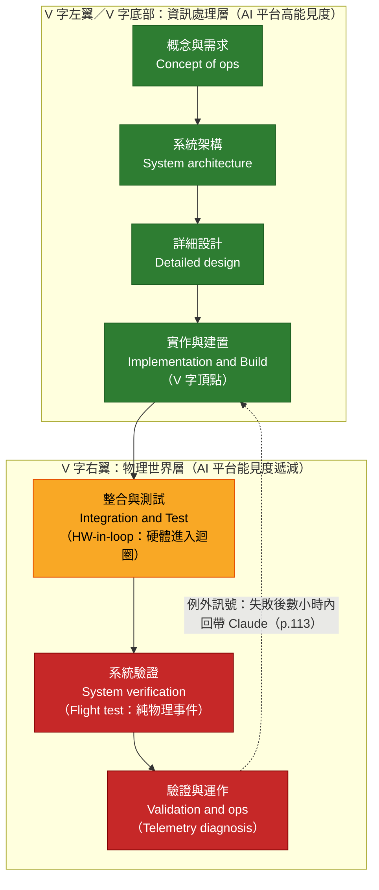
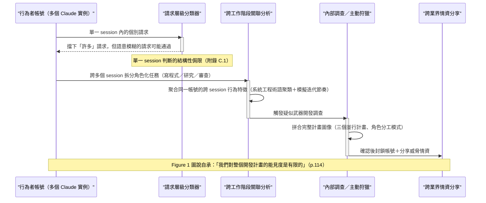
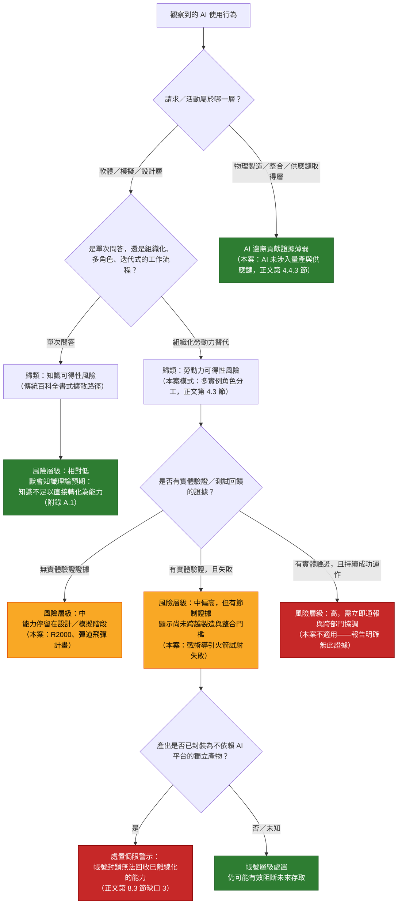
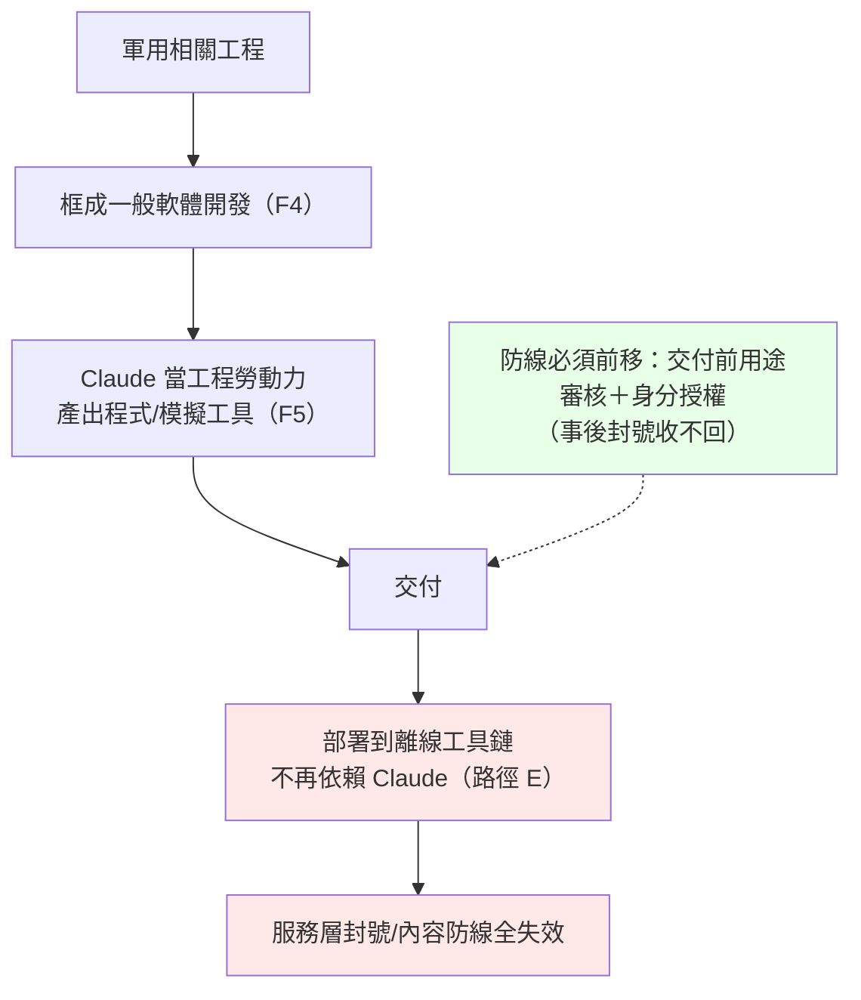

# GTG-87001：葉門導引武器工程小組以 Claude Code 取代人類工程師開發制導、導航與控制軟體

> 課程模組：04 常規武器（Conventional weapons）｜ 一手來源：PDF p.112–115（案例正文）；背景段落 p.111–112；跨章對照 p.81 ｜ 整理日期：2026-09-13

> **寫作範圍說明**：本教材依指派採取比同模組其他案例（如 GTG-17001、GTG-27005）更嚴格的寫作邊界——**只做三件事：(1) 忠實整理報告揭露的事實；(2) 分析 Anthropic 的偵測、處置與自承的防線缺口；(3) 討論防擴散政策、AI 服務治理與課程教學設計**。本教材**不解釋**制導、導航與控制軟體如何設計或運作、**不說明**軟體開發方法的細節、**不展開**任何工程技術內容。所有技術名詞只給報告原文脈絡下的一句話高層次定義（集中收錄於文末〈附錄：術語表〉），目的僅是讓讀者看懂報告敘述，不構成技術教學。這個邊界本身也是一個教學設計決定，會在第 10 節說明理由。

---

## 1. 一頁速覽

1. **是什麼**：Anthropic 識別出一個位於**葉門北部**的威脅行為者「小組」（cell），同時運行**三個**武器開發計畫：一枚使用商用手機等級飛控電腦、具備末端歸向能力的導引火箭；一枚宣稱射程目標超過 **2,000 公里**的多節式彈道飛彈；以及一個稱為「**R2000**」的多型飛彈家族，其中包含一款高超音速滑翔載具變型（p.112）。
2. **怎麼用 AI**：行為者用 **Claude Code「取代人類軟體工程師」**（"in place of human software engineers"）來開發制導、導航與控制（GNC）軟體。他們同時管理**數個 Claude 實例**，各自指派角色——一個負責寫程式、一個負責研究、一個負責審查前者的產出——「就像一個團隊負責人在一個小型工程團隊裡分派工作」（p.113）。這是本案在治理意義上最重要的一句話：**AI 不只是提供知識，而是被組織成勞動力**。
3. **防線效果**：「我們的防護機制擋下了他們許多請求，但不是全部」（"Our safeguards blocked many of their requests, but not all of them"）。行為者用隱藏目的、跨工作階段拆分等方式規避偵測（p.113）。
4. **實地測試**：行為者確實試射了一枚導引火箭，但「這次實地測試看來失敗了：數小時之內，行為者就回頭找 Claude 釐清失敗原因」（p.113）。報告明言**沒有證據**顯示行為者成功部署了可作戰的裝置。
5. **處置後仍留下的東西**：即使帳號已被封鎖，Anthropic「有證據顯示行為者已經建立了一套不依賴 Claude 或其他工程運算環境（如 MATLAB）的離線模擬工具包」（p.113）——這是報告自己承認的、帳號封鎖無法回收已產出能力的例子。
6. **新防線**：與本案同時，Anthropic「最近推出了一套新的分類器，用來更好地偵測並封鎖與高爆炸藥及武器開發相關的流量」（p.112）。
7. **歸因信度**：報告對本案的核心識別句（「我們識別出一個位於葉門北部的行為者小組」）**沒有使用**「assess」「suspected」「consistent with」這類情報學避險措辭，這與同一章節另一個中國案例明確寫出「we cannot attribute to a specific entity」形成對比——但報告全文**從未使用「Houthi」一詞**，這個標籤完全是媒體與學員自己依地理常識做的推論（第 2.4 節詳述）。
8. **這個案例在課程裡要教什麼**：(1) 擴散風險的性質正在從「知識是否可得」轉向「勞動力是否可得」——這是防擴散政策必須面對的新變數；(2) 「AI 能產出制導軟體」與「武器可以作戰」之間，隔著製造、整合、測試、供應鏈、人才等一連串實體門檻，實地測試失敗正是最好的節制教材；(3) 帳號封鎖作為「處置」手段，面對已經離線化、可持續存在的產出物時，防禦效果有結構性上限；(4) 商用前沿 AI 服務正在成為一種新的、非政府的武器擴散監控節點，其能見度與極限都需要被理解。

---

## 2. 行為者側寫與歸因

### 2.1 報告原文的識別與調查段落（逐字）

> "We identified a cell of threat actors based in northern Yemen running three weapons development programs: a guided rocket that used a commodity phone-class flight computer with final-phase homing guidance; a multi-stage ballistic missile with a stated range goal above 2,000 km; and a multi-variant missile (referred to as the "R2000" set) that included a hypersonic glide vehicle variant." （p.112，Summary）

> "We identified this activity as part of our internal investigations into suspected weapons development. We banned accounts associated with the actors and shared threat information with public- and private-sector partners to mitigate risks posed by the actors." （p.113）

以上是本案歸因的全部文本依據。報告用「a cell」（一個小組／小隊）稱呼行為者，這個詞本身暗示規模不大、組織形式較鬆散或隱蔽，但報告沒有提供任何成員人數、組織架構或指揮關係的資訊。

### 2.2 身分線索拆解表

| 線索類型 | 報告提供的內容 | 頁碼 | 可推導出什麼 | 報告**沒有**提供的 |
|---|---|---|---|---|
| 地理位置 | 「a cell of threat actors based in northern Yemen」 | p.112 | Anthropic 對帳號存取來源或內容有足夠證據判定行為者位於葉門北部 | 具體城市或地區、是否為單一地點還是分散團隊 |
| 組織形式 | 「a cell」；「running three weapons development programs」 | p.112 | 這是一個能同時管理三個獨立計畫的組織，暗示有一定的人力與資源調度能力 | 成員人數、是否有上級指揮結構、是否與更大的武裝組織有隸屬關係 |
| 團隊協作方式 | 「The actors managed several Claude instances at once, assigning each one a role, much as a lead would delegate work on a small engineering team」 | p.113 | 至少有一人扮演「團隊負責人」（lead）的角色，具備分派任務的工程管理能力 | 實際人數是否等於角色數（一人可能身兼多個「操盤」角色）、是否有真正的多人團隊或僅為一人分飾多角 |
| 技術背景 | 同一 Part I 總述：「the actors used Claude to build and refine software for weapons hardware and firmware **with which they already had expertise and to which they had access**」 | p.112 | 行為者對武器硬體與韌體本身已有既存專業知識與實體取用權——AI 不是從零開始賦能，而是加速既有能力 | 這個「既有專業知識」的來源（自學、軍事訓練、其他工程背景） |
| 代號／名稱 | 「R2000」（僅指飛彈家族產品代號，非行為者或行動代號） | p.112 | 行為者有自己的產品命名慣例 | 行為者自稱的組織名稱、行動代號（對比同模組 GTG-27005 案有「DronDoc」「Serafim」行動代號） |
| 活動規模 | 「banned accounts」（複數） | p.113 | 至少涉及一個以上帳號 | 確切帳號數量、是否為個人多帳號或多人各自持有帳號 |
| 時間軸 | 無明確日期；僅能定位在報告涵蓋期「2025 年 12 月至 2026 年 8 月」內（p.3） | p.3, p.112–113 | — | 活動起訖日期、持續時間、從偵測到封鎖的間隔 |
| 使用工具 | 「Claude Code」（明確指名） | p.113 | 行為者使用的是 Claude 的編碼代理工具，而非僅止於網頁對話介面 | 具體模型版本（章節開頭僅載明全報告涵蓋 Haiku／Sonnet／Opus，p.3） |
| 「Houthi」一詞 | **未出現** | — | 見第 2.4 節 | 任何組織隸屬的明確聲明 |

### 2.3 歸因措辭的情報學意義

把本案的識別句放進報告慣用的三段式措辭光譜中看，意義會更清楚：

| 措辭 | 本案是否出現 | 意思 | 情報學上的等價概念 |
|---|---|---|---|
| **We identified**（我們識別出／我們查明） | **是**（p.112：「We identified a cell of threat actors based in northern Yemen」） | 直接事實陳述，不是分析判斷；意味著 Anthropic 認為自己握有足夠的帳號層級證據（存取來源、內容、語言、行為模式）支持這個定位陳述，不需要用避險詞包裝 | 直接觀測（direct observation），信度層級最高 |
| **We assess … was associated with** | **否**——本案完全沒有出現 | 分析判斷，通常對應「中等信度」 | 分析判斷（analytic judgment） |
| **We cannot attribute … to a specific entity or actor** | **否**——本案完全沒有出現 | 明確承認無法指向具體組織或個人 | 歸因缺口（attribution gap） |
| **suspected weapons development** | 是，但用法不同（p.113：「as part of our internal investigations into **suspected** weapons development」） | 這裡的「suspected」修飾的是**調查的性質**（這是一項「疑似武器開發」的內部調查），不是修飾「葉門北部這個小組」這個定位判斷本身。兩者容易被讀者混為一談，需要在課堂上特別拆解 | 調查分類標籤，而非信度標記 |

**教學重點**：本案是常規武器章節六案中，**對「行為者在哪裡」這個定位判斷措辭最直接、避險詞最少的一案**。這件事本身值得停下來討論——為什麼一個非國家、位於衝突地區、報告從未點名任何機構的行為者，反而得到了比某些國家關聯案例（見第 2.6 節對照表）更不避險的地理定位陳述？合理的解釋（本教材分析，報告未明說）是：**「行為者位於葉門北部」這類地理／存取層級的陳述，其證據基礎主要是 Anthropic 自己平台上的技術遙測（IP、帳號註冊資訊、語言、內容），這類證據對「地理位置」的區辨力本來就比對「組織隸屬」更強**；但這不代表 Anthropic 對「這個小組是誰、效力於誰」有同等把握——這一點報告完全沒有著墨，也是第 2.4 節要處理的問題。

### 2.4 「Houthi」是誰加上去的：媒體推論與報告原文的落差

這是本案歸因分析中最重要、也最容易被學員忽略的一點。

**核查結果**：本教材對 PDF 全文（含常規武器章節前後頁）進行逐字檢索，**報告內文從頭到尾沒有出現「Houthi」（胡塞）這個詞**，也沒有出現任何具體武裝組織、政治實體或政府機構的名稱。報告對行為者的稱呼，自始至終只有「a cell of threat actors based in northern Yemen」。

然而，本教材檢索到的幾乎所有英文媒體報導都直接使用「Houthi」或「Houthi-held Yemen」作為標題或內文的定性描述（見第 9 節詳細來源列表），例如：

> "Users in Houthi-held Yemen tried to develop advanced weapons with AI, Anthropic says"（多家 NBC 地方台、Boston Globe 共用標題，2026-09-11）

Al-Monitor 是本教材找到的**唯一一篇在報導中明確指出這個落差的媒體**：

> 依本教材對 Al-Monitor（2026-09）報導的檢索與比對摘要：「Although Anthropic did not explicitly name the Houthis, who control northwest Yemen, it said it 'identified a cell of threat actors based in northern Yemen' that was running three weapons development programs.」

也就是說：**「葉門北部＝胡塞實質控制區」是一個地理常識推論，不是報告的陳述**。這個推論本身相當合理（胡塞武裝自 2014 年起實質控制葉門北部包括首都薩那在內的主要人口區），但「合理推論」與「報告原文」是兩件事，在資安簡報與課堂教材中必須清楚區分。

**為什麼 Anthropic 可能刻意不點名「胡塞」**（以下為本教材推論，報告未解釋原因）：
1. **證據層級不足**：Anthropic 能觀測到的是帳號存取來源與內容，不是組織隸屬的直接證據（例如財務往來、通訊往來、人員名冊）。「位於葉門北部」是一個地理陳述，「胡塞武裝」是一個組織歸屬陳述，兩者需要的證據種類不同。
2. **葉門北部並非鐵板一塊**：即使在胡塞實質控制區內，也存在其他武裝派系、部落網絡與個體行為者，一個工程「cell」未必直接隸屬於胡塞的正式軍事或工業體系。
3. **法律與外交考量**：胡塞武裝在部分國家被列為受制裁或受關注實體，公開點名涉及更高的舉證與法律責任門檻。

**胡塞政治局的回應本身就是情報**：根據 AP（Sarah El Deeb，2026-09-11）的報導，胡塞政治局成員 Hazam al-Assad 對此案的回應是：依賴公開來源發展武器的說法「unreasonable and illogical」（不合理且不合邏輯），並宣稱其武裝部隊擁有「modern, diverse and developed production capabilities」（現代化、多元且發展成熟的生產能力）。**這個否認的措辭本身值得分析**：al-Assad 否認的是「依賴」（reliance）外部資源，而不是否認使用 Claude 或 AI 這件事本身。在情報分析上，這種「窄口徑否認」（否認嚴重性、不否認事實）本身是一種常見的訊號模式，但**不能單憑這一點就反過來確認胡塞的身分**——它同樣可能只是對任何指控的制式公關回應。

### 2.5 非國家行為者歸因的固有難度

報告在章節開頭（p.111）自己點出了傳統歸因方式與 AI 平台視角的差異：

> "Historically, this kind of work has been uncovered by governments, United Nations panels, and outside investigators, who piece it together from recovered hardware and public sources. But as a frontier model provider, we can identify this activity ourselves if we detect threat actors violating our Usage Policy and terms of service." （p.111）

這句話點出了兩種**評證基礎完全不同**的歸因路徑：

| 面向 | 傳統路徑（政府／聯合國專家小組／外部調查者） | Anthropic 的路徑 |
|---|---|---|
| 證據來源 | 回收的實體硬體殘骸、彈片序號、公開來源情資、走私查緝紀錄 | 帳號存取紀錄、對話內容、語言、行為模式 |
| 典型耗時 | 數月至數年（需要實體取證、跨境調查、專家小組年度授權週期） | 報告未載明本案耗時，但「internal investigations」暗示是持續性的主動狩獵而非單次事件 | 
| 能確認什麼 | 硬體的來源、零組件供應鏈、有時能連到特定製造批次 | 使用者的存取地區、語言、意圖表述、工作模式 |
| 對「組織隸屬」的解析力 | 較強（實體證據鏈可以連到具體供應商、走私網絡） | 較弱（平台證據較難單獨證明「受僱於」或「隸屬於」特定組織） |
| 侷限 | 只能在武器**已經被使用或繳獲後**才能分析；對「正在開發中」的計畫幾乎無能為力 | 只能看到**自己平台上**發生的事；行為者一旦轉用離線工具或其他平台，能見度立即消失（見第 8 節「離線模擬工具包」） |

**歷史對照**：聯合國葉門問題專家小組（Panel of Experts on Yemen，依安理會第 2140 號決議設立）長期依賴這類實體取證方法。本教材查證到，該小組早在 2017 年 1 月的報告中就對胡塞「自主製造」飛彈的宣稱表示高度懷疑，認定「高度不可能」（highly unlikely），並推斷相關飛彈極可能是在葉門境外（最可能是伊朗）製造後分段運入組裝。IISS 飛彈對話倡議（Missile Dialogue Initiative）2025 年 4 月發布的分析〈Made in Yemen? Assessing the Houthis' arms-production capacity〉延續這條研究脈絡，追蹤胡塞武裝自 2018 年前後開始展示「國產化」軍工能力的過程，但結論仍是：其武器體系高度依賴伊朗的技術移轉與零組件供應（本段依 WebSearch 摘要整理，因網站回應 403 無法直接讀取全文，見第 12 節限制說明）。

這個歷史脈絡提供了一個重要的方法論對照：**「宣稱自主研發」與「實際自主研發」之間的落差，早在 AI 介入之前就是葉門武器擴散分析的核心難題**。GTG-87001 案不會讓這個難題消失，反而疊加了一層新的變數——現在「宣稱」的產製過程可能包含 AI 協助撰寫的制導軟體，使得「這是真的自主研發，還是另一種形式的外部依賴（依賴的對象從伊朗零件變成美國 AI 服務）」這個問題更難回答。

### 2.6 與同章其他五案的歸因強度對照

| 案例 | 頁碼 | 歸因措辭 | 信度層級（本教材依 2.3 節框架判讀） |
|---|---|---|---|
| **GTG-87001（本案，葉門）** | p.112 | 「We identified a cell of threat actors based in northern Yemen」——**無避險詞** | 對「地理位置」直接陳述；對「組織隸屬」完全未提及 |
| GTG-17001（中國，反魚雷火控） | p.115–116 | 「We assess the actor was associated with a Chinese defense industry manufacturer」；「We cannot attribute the activity to a specific entity or actor」 | 中等信度的角色判斷＋明確承認歸因缺口 |
| GTG-27005（俄羅斯，無人機蜂群） | p.117–118 | 「We assess the actors were a small, specialized freelance team」；「we assess the actors had ties to a regional university with a federal research center associated with the Russian Academy of Sciences」；「we cannot verify」對於資金來源聲明 | 中等信度的組織性質判斷；資金來源明確標示未經查證 |
| GTG-17002（中國，電戰／防空壓制） | p.120 | 「Account-level metadata and content flagged by our safeguards indicated the actor was linked to PRC research institutions, including the PLA Academy of Military Sciences」 | 有具體機構名稱，證據來源明確標示為帳號層級元資料與內容 |

**觀察**：本案是六案中**對地理定位最直接、但對組織隸屬完全空白**的案例，這個組合在同章六案中是獨一無二的。學員應注意：**「措辭直接」不等於「資訊完整」**——報告用不避險的語氣講清楚了「在哪裡」，卻完全沒有觸及「是誰、為誰工作」，而後者才是防擴散政策實務上更關鍵的問題。

---

## 3. 目標系統清單（本案沒有傳統意義的「受害者」）

與網路攻擊、監控或詐騙案例不同，本案的「目標」不是被入侵的組織或個人，而是行為者**意圖開發的武器系統本身**。以下整理報告揭露的三個計畫及其對應資料（依 p.112 Summary 與 p.114–115 Cluster 表）：

| 計畫 | 報告對系統的描述（逐字） | 最嚴重要素（報告原文，p.114–115） | Figure 1 顯示的成熟度（第 6 節詳述） |
|---|---|---|---|
| 戰術導引火箭 | 「a guided rocket that used a commodity phone-class flight computer with final-phase homing guidance」（p.112） | 「A live field test in Yemen, brought back to Claude for failure analysis within hours」 | 唯一到達「Reached flight test / ops」的計畫 |
| 多節式彈道飛彈 | 「a multi-stage ballistic missile with a stated range goal above 2,000 km」（p.112） | 「Medium- and intermediate-range and hypersonic-glide variants」 | 停留在「Simulation」階段 |
| R2000 多型飛彈家族 | 「a multi-variant missile (referred to as the "R2000" set) that included a hypersonic glide vehicle variant」（p.112） | 未在 Cluster 表單獨列出一列，但 Figure 1 圖例列為「Multi-variant missile family」 | 停留在「Design」階段，三個計畫中最不成熟 |

**沒有列出的資訊**：報告沒有提供這三個計畫的預定用途對象（例如是否鎖定特定國家、船艦、軍事基地）、沒有提供任何時間表、沒有提供任何關於「誰下的訂單」或計畫是否對應某個更大的採購或作戰需求。相較於同章 GTG-17002 案明確寫出「12 個台灣目標」的模擬場景，本案完全沒有「目標國別」或「打擊對象」層級的資訊——三個計畫都停留在「載具本身如何飛」的層次，報告沒有揭露它們最終要打向哪裡。

---

## 4. AI 濫用的攻擊生命週期（逐階段拆解）

### 4.1 報告原文（先讀）

> "The actors used Claude Code in place of human software engineers to develop the guidance, navigation, and control (GNC) software that steers and stabilizes a flying vehicle. For example, they used Claude to integrate an open-source autopilot onto a phone-class flight computer, writing the control and position estimation software, tuning the control settings, running a firmware build pipeline, and performing a flight simulation. The actors managed several Claude instances at once, assigning each one a role, much as a lead would delegate work on a small engineering team: the actors tasked one instance with writing the code, another with research, and a third with reviewing the code the first instance produced." （p.113）

> "Our safeguards blocked many of their requests, but not all of them. The actors used a variety of tactics to evade our safeguards, including hiding their goals and the products the software was meant for, and they split their work across multiple sessions so no single session revealed their full intent." （p.113）

> "These actors carried out a sustained effort to develop guided weapons, including using Claude to design guidance software. We do not have evidence the actors succeeded in fielding an operational device; but they did test-fire a guided rocket. This field test appears to have failed: within hours, the actors returned to Claude to work out why it failed." （p.113）

同一頁段也適用 Part I 的總述（p.112，四個開發型案例共用）：

> "Across these cases, the actors used Claude to build and refine software for weapons hardware and firmware with which they already had expertise and to which they had access. The actors split their work across many sessions to conceal the full nature of their programs, and used other methods to circumvent our safeguards and access controls." （p.112）

### 4.2 逐階段表：人類做什麼／Claude 做什麼／自主程度

自主程度標示（依課程共用標準）：**對話式協助**（人問一句 AI 答一句）／**人類逐步指揮**（人設定目標、分派任務、審核產出，AI 執行多步驟工作）／**AI 編排多代理自主執行**（AI 自己拆解任務、呼叫工具、跨代理協調，無人類逐步介入）。

| 階段 | 人類（行為者）做什麼 | Claude 做什麼 | 自主程度 | 頁碼依據 |
|---|---|---|---|---|
| 0. 既有能力與資源 | 對武器硬體與韌體本身已有專業知識與實體取用權 | 未參與（這是行為者帶入的既存條件） | — | p.112 |
| 1. 角色編排 | 同時管理數個 Claude 實例，指派角色，如同工程團隊負責人分派任務 | 依指派角色運作（寫程式／研究／審查） | 人類逐步指揮 | p.113 |
| 2. 撰寫實例 | 下達具體任務（整合開源自動駕駛、撰寫控制與定位估計軟體、調校控制參數） | 生成程式碼 | 人類逐步指揮 | p.113 |
| 3. 研究實例 | 下達研究任務（未載明具體查詢內容） | 提供研究支援 | 人類逐步指揮 | p.113 |
| 4. 審查實例 | 指派審查第一個實例的程式碼產出 | 對前一實例的程式碼進行審查 | 人類逐步指揮（但審查本身由 AI 執行） | p.113 |
| 5. 建置與模擬 | 下達建置與模擬任務 | 執行韌體建置流程、執行飛行模擬 | 人類逐步指揮 | p.113 |
| 6. 規避防線 | 隱藏目標與軟體用途；把工作拆到多個工作階段，避免單一工作階段暴露全貌 | （被動）每個工作階段只看到局部任務 | — | p.113 |
| 7. 實體試射 | 在葉門進行實彈試射（脫離 Claude 平台的實體行動） | 未參與 | — | p.113 |
| 8. 失敗診斷 | 試射失敗後數小時內回頭向 Claude 求助 | 協助分析失敗原因（報告未說明如何協助） | 人類逐步指揮 | p.113 |
| 9. 產出物離線化 | 建立不依賴 Claude 或其他工程運算環境（如 MATLAB）的離線模擬工具包 | 此工具包本身已脫離 Claude（見第 8 節） | — | p.113 |

**自主程度的總結**：本案是課程六案中，唯一明確描述「人類把多個 AI 實例編排成一個模擬工程團隊」的案例——這比單純的「人類逐步指揮」更進一步，可稱為**「人類指揮＋多重 AI 代理分工模擬人類團隊」**的混合模式：沒有證據顯示 AI 自主拆解任務或跨代理協調（那會是「AI 編排多代理自主執行」），角色分派與任務下達仍由人類決定，但**組織形式本身模仿了人類工程團隊的分工結構**（作者、研究員、審查者）。這個特徵本身就是第 4.3 節要展開的核心論點的直接證據。

### 4.3 核心治理論點：「AI 取代工程人力」對比「AI 提供知識」

這是本案在課程設計上最重要的分析點，值得獨立成節深入處理。

#### 4.3.1 報告原文怎麼說「這個差別」

報告在描述本案時用的關鍵動詞是「**in place of**」（取代）：

> "The actors used Claude Code **in place of human software engineers** to develop the guidance, navigation, and control (GNC) software..." （p.113）

「in place of」不是「協助」（assist）、不是「加速」（accelerate）、也不是「提供資訊」（inform）——它的語意是**替代**：Claude Code 被放進了原本應該由人類工程師佔據的那個崗位。緊接著的句子把這個替代具體化為一種**組織模式**，而非單次問答：

> "The actors managed several Claude instances at once, assigning each one a role, **much as a lead would delegate work on a small engineering team**: the actors tasked one instance with writing the code, another with research, and a third with reviewing the code the first instance produced." （p.113）

這句話裡的「a lead would delegate work on a small engineering team」（一個負責人在小型工程團隊裡分派工作）是整份報告對本案定性最精確的一句話：**行為者做的不是「問 AI 問題」，而是「管理 AI 團隊」**。

#### 4.3.2 這不是孤立措辭：報告在其他章節也點名同一個模式

本教材在檢索全文時，發現報告在完全不同的章節——監控行動（Surveillance operations，p.81）——用幾乎相同的框架描述了一個跨案例的**趨勢**，而非單一案例的特徵。這段文字**不屬於本案指派的頁段（p.112–115），此處作為報告全文互證引用，明確標示出處與範圍**：

> "Over the course of our investigations, we observed several trends. First, **AI is now being used in place of an engineering workforce**. A single consultant working for Malian national security authorities used Claude to engineer a mass-interception platform capable of surveilling communications on all of the country's mobile operators and generating dossiers on targets. ... And a religious affairs intelligence collection unit in the People's Republic of China (PRC) that once comprised many teams of analysts has been reduced to a single office, using an AI assistant to produce thousands of investigations per month." （p.81，監控行動章節，非本案頁段，僅作跨章互證）

這段話證實：「AI 取代工程／分析勞動力」不是 Anthropic 分析師對葉門案的個別觀察，而是該公司威脅情報團隊在**整份報告的多個危害領域**中辨識出的**同一種結構性模式**——從武器工程團隊，到國家安全監控平台的開發，到分析機構的人力編制，同一種替代邏輯反覆出現。

#### 4.3.3 Frontier Red Team 同期研究的框架語言

與本報告同日發布的 Frontier Red Team 研究〈Measuring tactical intelligence targeting and conventional weapons capabilities of AI models〉（第二份一手來源，見 00-agent-brief.md）用更直接的政策語言描述了這個轉變。**以下引文取自本教材對該文章的自動化擷取摘要，並非本教材直接逐字核對原文版面，讀者在課堂逐字引用前建議自行覆核原始頁面**：

> 「the expertise needed to write code like this has historically been scarce and expensive. As models remove this bottleneck, more groups will be able to develop bespoke, precise weapons」（依 WebFetch 擷取摘要）

> 「〔intelligence targeting is〕historically labor-intensive, specialized, and expensive」；AI 的風險在於可能「make intelligence targeting labor less scarce and widely available」（依 WebFetch 擷取摘要）

同一份研究也明確劃出了 AI 做不到的部分（見第 4.4 節門檻表）：

> 「large language models cannot yet go out into the world and mill their own airframes, they can write software」；「for engineering that has to function reliably on a battlefield, nothing substitutes for testing in hardware」（依 WebFetch 擷取摘要）

#### 4.3.4 本教材的分析：從「知識可得性」到「勞動力可得性」

以下是本教材依上述報告原文與既有防擴散政策理論所做的**分析綜合**，明確與上述逐字引文區隔。

傳統的武器擴散研究有一個歷史悠久的理論支柱：**隱性知識（tacit knowledge）**。社會學者 Donald MacKenzie 與 Graham Spinardi 在 1995 年發表於《American Journal of Sociology》的經典研究〈Tacit Knowledge, Weapons Design, and the Uninvention of Nuclear Weapons〉指出，核武器設計所需的關鍵知識大量是「隱性的」——也就是說，它不能被完整寫成文件、公式或圖表，而必須透過長期的實作、試誤與師徒傳承才能習得。美國中央情報局情報研究中心（CIA Center for the Study of Intelligence）的研究〈Tacit Knowledge as a Factor in the Proliferation of WMD〉延續同一個論點：大規模毀滅性武器的擴散風險，很大一部分取決於「懂得怎麼做的人」是否存在、是否流動，而不只是取決於「怎麼做」這件事有沒有被寫下來或洩漏出去。

這個理論長期支撐著一種特定的防擴散政策設計邏輯：**管制對象是人與實體物項，而不是抽象資訊**。出口管制（如 ITAR、EAR、Wassenaar Arrangement）管的是設備、零組件、技術資料的具體移轉對象；科學家移民管制、人才引進審查管的是「會做的人」的流動；資訊本身一旦被公開發表（例如學術論文），傳統上很難再被完全管制，因為單靠公開的文字或公式，缺乏隱性知識的人也做不出可作戰的武器。

GTG-87001 案挑戰的正是這個支柱。報告描述的不是「行為者向 Claude 詢問武器設計原理」（那會是傳統的「知識可得性」風險——AI 像一本更會回答問題的百科全書），而是「行為者把 Claude 組織成一個會寫程式、會做研究、會審查彼此工作的工程團隊」（p.113）。如果一套 AI 系統能夠承擔原本需要一組**具備隱性知識、經過訓練的工程師**才能完成的迭代式工作——寫程式、除錯、依回饋修改、反覆調校——那麼防擴散政策長期倚賴的那個假設（「找得到懂的人」是稀缺資源）就會被部分繞過。**擴散風險的瓶頸，從「這個組織裡有沒有人具備隱性知識」，位移到「這個組織能不能持續取用一套前沿 AI 服務」**。這兩種瓶頸的性質截然不同：前者是人力資本問題，需要數年的培養或挖角；後者是服務可得性問題，理論上只要能連上網路、規避地理與使用政策限制，就能取得。

這個位移**不是全有全無的**——第 4.4 節的門檻表會說明，AI 降低的門檻集中在「軟體與模擬」這一側，而「實體製造、整合、測試」這一側的門檻幾乎沒有被降低，這正是本案實地測試失敗所示範的。但即使只是部分位移，對防擴散政策的衝擊也是根本性的：**出口管制與武器禁運制度的整個設計邏輯，是管制「可追蹤的移轉」（一批零件、一次技術轉讓、一個人的簽證），而不是管制「一項全球可存取、按需求執行任務的服務」**（第 10 節會展開這一點對政策設計的具體含意）。

### 4.4 節制評估：實地測試失敗，與 AI 降低（未降低）的門檻

#### 4.4.1 報告原文（逐字）

> "These actors carried out a sustained effort to develop guided weapons, including using Claude to design guidance software. **We do not have evidence the actors succeeded in fielding an operational device; but they did test-fire a guided rocket. This field test appears to have failed: within hours, the actors returned to Claude to work out why it failed.**" （p.113）

> "Nevertheless, we have evidence that the actors had already built an offline simulation toolkit that does not rely on Claude or other engineering computing environments such as MATLAB." （p.113）

#### 4.4.2 這句話對評估 AI 武器擴散風險的節制意義

這是整份 GTG-87001 案例中，對課程教學最有價值的一句話。它同時提供了兩個互相牽制的訊號，學員必須同時掌握，缺一不可：

**訊號一（提醒警惕）**：行為者的努力是「sustained」（持續性的）、涵蓋三個並行計畫、動用了模擬多人團隊分工的協作模式——這不是一次性的好奇心測試，而是一個有組織、有耐性的開發計畫。

**訊號二（提醒節制）**：即使有這樣的投入，行為者**唯一一次可查證的實體世界測試以失敗告終**，而且失敗後的第一反應是「回去問 AI 為什麼」——這個動作本身透露出行為者**沒有獨立診斷失敗原因的能力或信心**，仍然依賴 AI 協助理解實體世界的回饋。

把兩個訊號放在一起，教學上正確的結論是：**「AI 能產出看起來完整的制導軟體、模擬結果、韌體」與「這套系統能在真實世界中可靠運作」之間，存在一道 AI 目前無法單獨跨越的鴻溝**。這道鴻溝由製造精度、零組件品質、系統整合、環境變異、實體測試回饋迴圈等因素構成——這些都不是「多問 AI 幾次」就能解決的問題。評估 AI 武器擴散風險時，**「AI 能不能寫出這類軟體」與「這類軟體能不能變成堪用的武器」是兩個不同層次的問題，不能用第一個問題的答案直接回答第二個問題**。

#### 4.4.3 AI 降低了哪些門檻、沒有降低哪些門檻（僅列類別，不展開細節）

以下表格依報告原文（p.112–115）與 Figure 1（第 6 節）的證據整理。**每一格只標示門檻的類別名稱與報告證據是否支持「AI 降低了這道門檻」的判斷，不展開任何技術細節**。

| 門檻類別 | AI 是否降低此門檻（依本案證據） | 證據依據 |
|---|---|---|
| 概念與需求彙整 | 降低 | Figure 1「Concept of ops」階段三個計畫均有 Claude 參與痕跡 |
| 架構權衡與方案比較 | 降低 | Figure 1「System architecture」階段 |
| 詳細設計（控制邏輯層級文件） | 降低 | Figure 1「Detailed design」階段；p.113「writing the control and position estimation software, tuning the control settings」 |
| 軟體實作與數值模擬 | 降低 | Figure 1「Implementation & Build」階段；p.113「running a firmware build pipeline, and performing a flight simulation」 |
| 演算法最適化調校 | 降低 | Cluster 表「Optimization」列（p.115） |
| 對照驗證式建模 | 降低 | Cluster 表「Modeling & simulation」列（p.115） |
| 封裝為可攜式獨立產物 | 降低（且脫離平台掌控） | Cluster 表「Packaging」列（p.115）；p.113 離線工具包 |
| 系統整合（軟體對實體硬體） | 證據不足／有限 | Figure 1 右側階段的色彩訊號明顯減弱（見第 6 節） |
| 實體／實彈測試與驗證 | **未降低** | p.113：實地測試失敗 |
| 量產與供應鏈取得 | 報告未提及 AI 涉入此環節 | 對照 IISS 對葉門「自主生產」長期存疑的既有研究（第 2.5 節） |
| 跨領域工程判斷與除錯直覺 | 部分降低，但非完全替代 | 由「審查實例」與「失敗後回頭求助」兩個行為推論；報告未評估其品質 |
| 保密與行動安全（規避偵測） | 未降低，甚至需要額外努力 | p.113：「Our safeguards blocked many of their requests, but not all」；規避手法本身是額外成本 |

**表格的教學用法**：這張表刻意只寫類別名稱，不寫任何實作細節，目的是讓學員練習一個可以套用到**任何** AI 能力擴散評估情境（不限武器領域）的思考框架——**先問「這件事屬於軟體／資訊／模擬層，還是屬於實體／製造／測試層」，再問「AI 對這一層的邊際貢獻有多大」**，而不是看到「AI 能寫出制導軟體」就直接跳到「AI 讓武器擴散變得容易」的結論。表格中段（整合、實體測試、量產供應鏈）的「未降低」或「證據不足」，正是這次實地測試失敗要教會學員的節制立場。

---

## 5. TTP 與 MITRE ATT&CK 對應

先說結論：**本案幾乎沒有可以對應到 MITRE ATT&CK 的技術**。ATT&CK 描述的是對電腦網路系統的攻擊行為；本案行為者沒有入侵任何系統，他們的「攻擊對象」是 Anthropic 的使用政策與安全分類器本身。以下表格只處理行為者**規避 AI 平台防線**的行為模式（不涉及武器工程內容），並明確標示框架缺口。

| 戰術 | 技術 ID | 本案的具體作法（依報告原文） | 偵測構想 | 備註 |
|---|---|---|---|---|
| Resource Development（資源開發） | ATT&CK T1585 Establish Accounts（勉強對應） | 建立並管理數個 Claude 帳號／實例 | 帳號註冊模式與多實例協作行為的關聯分析 | ATT&CK 原意是為社交工程準備帳號，本案的「帳號」是取用 AI 服務本身，語意不完全吻合 |
| Defense Evasion（防禦規避） | **框架缺口**（ATT&CK 無對應；ATLAS 部分相關但無精確 ID） | 「hiding their goals and the products the software was meant for」（p.113） | 帳號層級的目的一致性檢查：技術請求內容與宣稱用途是否矛盾 | 這是對模型與其安全分類器的「社交工程」，而非對電腦系統的入侵 |
| Defense Evasion | **框架缺口** | 「split their work across multiple sessions so no single session revealed their full intent」（p.113） | 帳號層級的跨工作階段主題聚合分析（topic clustering across sessions） | 這是本案（也是同章四個開發案共通，p.112）最具辨識度的規避手法，任何現有網路安全框架都沒有精準對應的技術 ID |
| （無對應戰術） | **框架缺口** | 「managed several Claude instances at once, assigning each one a role」（p.113）——以多重 AI 實例模擬人類工程團隊分工 | 單一帳號在短時間內併行操作多個代理／實例，且角色之間存在「產出—審查」依賴關係的行為特徵 | ATT&CK 與 ATLAS 目前都沒有描述「把 AI 系統編排成模擬人類團隊」這種行為模式的技術 ID；這是 AI 濫用偵測工程需要自行發展的新類別 |

**給學員的方法論結論**：
1. ATT&CK 是為「對網路的攻擊」設計的框架；當被規避的對象是**平台的使用政策與安全分類器**而不是電腦系統時，這個框架的適用性大幅下降。
2. 本案真正有偵測工程價值的行為特徵——目的隱藏、跨工作階段拆分、多實例團隊化編排——目前**沒有**對應的標準化技術分類，需要 AI 平台信任與安全團隊自行建立行為分類法（見第 8 節）。
3. 這個框架缺口本身是一個課堂討論點：當 AI 濫用的「攻擊面」從電腦系統轉移到 AI 服務的使用政策時，資安社群是否需要一套新的、平行於 ATT&CK 的框架？（MITRE ATLAS 目前聚焦於「對 AI 系統的攻擊」，如資料下毒、模型竊取，而不是「用 AI 系統來規避另一個 AI 系統的安全機制」，兩者方向相反。）

---

## 6. 圖表逐一判讀

本案頁段內有一張完整圖表（Figure 1，p.114）以及橫跨 p.114–115 的 Cluster 表格。p.111、p.112、p.113、p.115（下半，屬於下一案 GTG-17001）皆無圖表。

### Figure 1（p.114）：The systems engineering V for the GNC cell

圖檔：`../figures/page-114.png`（160 DPI 課程版；本教材另以 130 DPI 原始渲染圖逐字核對版面文字）

**圖片類型**：系統工程 V 字模型圖（systems engineering V-diagram），是 Anthropic 分析師繪製的分析產品，**不是**行為者的對話截圖或原始文件。圖表下方另附一張橫向堆疊長條圖，以及圖例與框架來源標示。

**圖上實際看到的所有元素與文字（逐字抄錄）**：

- 大標題：**Case 1: Development**
- 副標題：**Guided-weapons engineering cell on the systems development lifecycle**
- 中央是一個「V」字形版面，由七個圓角矩形方塊構成，左側由上而下遞降、右側由下而上遞升，在底部匯聚成一點：
  - 左上：**Concept of ops** — 小字「Requirements」
  - 左中上：**System architecture** — 小字「Trade studies」
  - 左中下：**Detailed design** — 小字「Control laws」
  - 底部（V 的頂點，唯一置中的方塊）：**Implementation & Build** — 小字「GNC software · 6-DoF sim · firmware」
  - 右中下：**Integration & Test** — 小字「HW-in-loop」
  - 右中上：**System verification** — 小字「Flight test」
  - 右上：**Validation / ops** — 小字「Telemetry diagnosis」
- 每個方塊下方都有一小段三色分段進度條（橙紅／藍／灰三色），對應下方圖例的三個計畫；左側三個方塊與底部方塊的三色分段清楚可見，右側三個方塊的色彩分段明顯變少變淡——這與下方長條圖傳達的訊息一致（見下段解讀），但受限於頁面解析度，本教材不逐一判讀每個方塊內三色分段的精確比例，只確認「右側色彩飽和度／完整度遞減」這個整體樣式。
- 版面中段以虛線分別連接左右對應層級的方塊（Concept of ops 與 Validation/ops 之間、System architecture 與 System verification 之間、Detailed design 與 Integration & Test 之間），表現 V 模型左右對應的概念。
- 下半部另起一個區塊，標題：**Three concurrent programs**，副標題：**How far Claude carried each along the lifecycle**
- 三條橫向長條圖（由上而下）：
  1. 橙紅色長條：滿版長度，右端標示文字「**Reached flight test / ops**」
  2. 藍色長條：約五至六成長度，長條末端標示文字「**Simulation**」
  3. 灰色長條：約三成長度，長條末端標示文字「**Design**」
- 圖例（面板底部）：橙紅色方塊＝「**Tactical guided rocket**」；藍色方塊＝「**Multi-stage ballistic missile**」；灰色方塊＝「**Multi-variant missile family**」
- 框架標示（小字）：「**Framework: INCOSE / DoD Systems-Engineering Vee**」
- 頁面正文圖說：「Figure 1. The systems engineering V for the GNC cell, mapping the cell's work from requirements decomposition through integration and testing. Our visibility into the overall development program was limited. The diagram reflects our assessment of the actors' use of Claude to develop GNC software.」

**系統工程 V 模型是什麼（一句話高層次定義）**：這是一種通用、非武器專屬的專案管理框架，用來表示「需求如何一路分解到實作」（V 的左側，由上而下）與「實作完成後如何逐層驗證回需求」（V 的右側，由下而上）之間的對應關係；框架本身出自 INCOSE（國際系統工程委員會）與美國國防部的採購文化，被 Anthropic 分析師借來當作整理本案資訊的分類工具，不代表行為者自己使用了這套方法論或術語。

**資料如何流動、數字如何分布**：圖表的核心訊息不在 V 字的形狀本身（那只是分類架構），而在**三色分段如何隨著階段從左到右逐漸稀疏**，以及底部長條圖用文字明確標出的三個終點：「Reached flight test / ops」（橙紅，戰術導引火箭）、「Simulation」（藍，多節彈道飛彈）、「Design」（灰，R2000 多型飛彈家族）。三個計畫在 V 字**左側與底部**（概念、架構、詳細設計、軟體實作與模擬）都有清楚的參與痕跡，但往右側（整合測試、系統驗證、驗證與運作）走，只剩下橙紅色（戰術導引火箭）能走到底——而這唯一走到底的計畫，走到底之後的下場就是第 4.4 節引述的「實地測試失敗」。

**這張圖傳達的核心訊息**：
1. **AI 介入的深度，在 V 字左側（設計與模擬）遠高於右側（整合與實體驗證）**——這正是第 4.4 節門檻表的視覺化版本。圖表本身就是「AI 降低了哪些門檻、沒有降低哪些門檻」這個問題最直接的證據來源。
2. **三個計畫的「野心」與「進度」成反比**：射程宣稱最遠、技術宣稱最先進的 R2000 高超音速家族，反而是三者中進度最落後（僅達「Design」）；技術上相對簡單（商用手機等級飛控電腦）的戰術火箭，反而是唯一走到實體測試的計畫。這是評估此類威脅時的重要節制訊號——**宣稱的野心程度，與實際驗證的成熟度，可能完全不成正比**。
3. **圖說本身承認能見度侷限**：「Our visibility into the overall development program was limited」——Anthropic 自己在圖說中承認，這張圖只反映「行為者使用 Claude 的部分」，不是整個開發計畫的全貌。換言之，V 字右側（整合、實體測試、驗證）之所以看起來色彩稀薄，有兩種可能同時成立：**行為者在這些階段真的較少使用 Claude（因為這些工作本質上需要實體資源，AI 幫不上忙）**，以及**Anthropic 對這些階段本來就看不到（因為它們發生在 Claude 平台之外）**。這個「證據缺席不等於活動不存在」的提醒，是情報分析的基本紀律，值得在課堂上反覆強調。
4. **Cluster 表與 Figure 1 的資訊並不完全對稱**：文字版的 Cluster 表（見下段）只為「Tactical guided rocket」與「Ballistic missile simulation」兩個計畫各列了一整列，R2000／「Multi-variant missile family」並未在 Cluster 表中獲得專屬的一列，只出現在 Figure 1 的圖例與長條圖中。這提醒學員：**判讀圖表不能只看文字版摘要，圖表本身經常帶有文字敘述沒有覆蓋到的資訊**——這正是本教材強調「逐張圖親自判讀」而非「只抄圖說文字」的原因。

**在課程中可以怎麼用這張圖**：
- **開場提問**：只展示 V 字上半部（不含下方長條圖與圖例），問學員「你覺得這三個計畫裡，哪一個『最危險』？」多數學員會依直覺選射程最遠、宣稱最先進的 R2000 高超音速家族。接著揭露下方長條圖，說明這個計畫反而是進度最落後的——藉此示範「宣稱的技術野心」與「已驗證的實際能力」不能劃等號。
- **偵測工程練習**：讓學員設想自己是平台信任與安全團隊，只能看到 V 字**左側**（軟體與模擬層）的請求內容，問「哪一類請求最容易被武器分類器攔下？哪一類最不容易？」（概念與需求層級的請求語意最模糊，最不容易攔；詳細設計與韌體建置層級如果包含領域關鍵字，較容易觸發分類器。）
- **與門檻表對照**：把這張圖與第 4.4 節的門檻表並排，讓學員練習把 V 字的七個階段逐一填入「AI 降低了嗎」的判斷，驗證兩者是否一致。

### Cluster 表（p.114–115）：五列的功能層級說明

以下逐列抄錄報告原文，並依指派要求，每列只加一句功能層級的說明（不展開技術細節）。

| Cluster | What Claude was used for（原文） | Most serious element（原文） |
|---|---|---|
| Tactical guided rocket | Flight control firmware, terminal guidance, post-test telemetry diagnosis | A live field test in Yemen, brought back to Claude for failure analysis within hours |
| Ballistic missile simulation | Multi-stage, six degrees of freedom trajectory simulation | Medium- and intermediate-range and hypersonic-glide variants |
| Optimization | Reinforcement learning tuning of flight control | Accelerated development of the guidance algorithms |
| Modeling & simulation | Calibrating simulations against reference implementations | Digital model of an operational weapons system to reduce dependency on physical testing |
| Packaging | Compiling the simulation toolkit into a standalone executable | A deliverable that runs and persists without Claude |

**一句話功能說明（逐列）**：

- **Tactical guided rocket**：這一列對應三個計畫中唯一離開螢幕、進入實體世界驗證的一個，也是本案「宣稱能力」與「已驗證結果」落差最大的示範——結果是失敗，但失敗後的處理方式（回頭找 Claude）本身也是一種行為特徵。
- **Ballistic missile simulation**：這一列說明射程宣稱最遠的計畫，其 AI 協助自始至終停留在模擬層級，報告沒有提供任何實體測試的證據。
- **Optimization**：這一列是跨計畫共用的能力面向，說明 AI 被用來加速演算法本身的性能調校，而不是綁定在單一飛行器的開發任務上。
- **Modeling & simulation**：這一列點出 AI 建立的數位模型正在降低行為者對實體測試的依賴，是第 4.4 節門檻表中「實體測試」欄位需要特別留意的伏筆——數位模型越精細，行為者可能越傾向於少做（或延後做）昂貴且暴露風險高的實體測試。
- **Packaging**：這一列在偵測與處置的意義上最關鍵，因為它直接證明 AI 產出的能力已經被封裝成**不再需要 Claude 本身**的獨立產物，與第 8 節「離線模擬工具包」的自承缺口完全呼應。

---

## 7. IOC 與技術指標

**報告在本案沒有提供任何傳統意義的 IOC**：沒有網域、IP 位址、帳號名稱、雜湊值、Telegram 帳號或通訊軟體 ID。這與報告網路行動（Cyber operations）、監控行動等章節的案例形成鮮明對比，那些案例通常附有完整的網域與雜湊值列表。

**為什麼本案沒有 IOC（本教材分析）**：GTG-87001 不是一次網路入侵或惡意程式部署行動，行為者的「基礎設施」僅止於若干 Claude 帳號本身，而且最終的關鍵產出（離線模擬工具包、實體試射的火箭）已經脫離任何網路可觀測的範圍。公布帳號識別資訊既涉及使用者身分揭露的疑慮，對其他防禦者也沒有實質的網路層偵測價值——沒有人能在自己的網路基礎設施上「看到」這些帳號。

**可以提供給學員的替代品：報告原文中出現的案件識別要素**（不是網路 IOC，而是可用於威脅情資關聯分析的識別性標籤）：

| 識別要素類型 | 內容 | 頁碼 | 偵測價值與壽命 |
|---|---|---|---|
| 案件代號 | GTG-87001 | p.112 | 價值：作為跨報告、跨機構討論同一案件的統一索引。壽命：長期有效，只要 Anthropic 維持其代號系統 |
| 產品代號 | 「R2000」（飛彈家族名稱） | p.112 | 價值：若未來在葉門境內或第三方情報中再度出現此代號，可作為關聯本案的線索。壽命：中等——行為者可隨時更換產品命名 |
| 工具鏈提及 | 「MATLAB」——報告原文只將其列為「其他工程運算環境」的例證，用來說明離線工具包的獨立性；**報告沒有確認行為者實際使用過 MATLAB 本身**，不可過度解讀為行為者的工具鏈證據 | p.113 | 價值：低（MATLAB 是業界廣泛使用的通用工具，即使真有使用也不具備區辨力）。此處列出僅因報告明確點名 |
| 行為模式標籤 | 多重 Claude 實例分工（寫程式／研究／審查三角色） | p.113 | 價值：中——可作為偵測工程設計「帳號層級行為分析規則」的種子特徵（見第 8 節）。壽命：中期，此模式若被廣泛報導，行為者可能刻意打散角色分工以規避 |
| 行為模式標籤 | 跨工作階段拆分、隱藏軟體最終用途 | p.112–113 | 價值：高——同章四個開發型案例共通，是本領域偵測工程最值得投資的方向。壽命：長期，因為這是規避「單一請求分類」防線的結構性手法，不易被行為者輕易放棄 |

**安全紅線提醒**：以上識別要素僅用於課堂討論威脅情資關聯分析的方法，不涉及任何實際帳號、基礎設施或可用於追蹤特定個人的資訊。

---

## 8. Anthropic 的偵測、處置與防線缺口

### 8.1 做了什麼（依報告原文）

| 動作 | 報告原文 | 頁碼 |
|---|---|---|
| 章節層級的新分類器 | 「We recently launched a new set of classifiers designed to better detect and block traffic related to high-yield explosives and weapons development.」 | p.112 |
| 章節層級「disrupted」的定義 | 「By "disrupted," we mean we banned every account we could link to the actor, which shut down the whole operation. Where we found these actors worked across other platforms, we shared our findings with our industry counterparts so that they could also disrupt the activity. We worked with other public- and private-sector partners to share threat reporting, as appropriate.」 | p.112 |
| 章節層級四案共同模式 | 「the actors used Claude to build and refine software for weapons hardware and firmware with which they already had expertise and to which they had access. The actors split their work across many sessions to conceal the full nature of their programs, and used other methods to circumvent our safeguards and access controls.」 | p.112 |
| 本案的即時防線 | 「Our safeguards blocked many of their requests, but not all of them.」 | p.113 |
| 本案的發現方式 | 「We identified this activity as part of our internal investigations into suspected weapons development.」 | p.113 |
| 本案的處置 | 「We banned accounts associated with the actors and shared threat information with public- and private-sector partners to mitigate risks posed by the actors.」 | p.113 |

### 8.2 「內部調查」意味著什麼

「as part of our internal investigations into suspected weapons development」這句話說明本案是 Anthropic 威脅情報團隊**主動狩獵**（proactive hunting）的結果，而不完全是即時分類器攔截觸發的單一事件——這與本案「Our safeguards blocked many of their requests, but not all of them」共同構成一個合理的推論鏈：**個別請求層級的分類器攔下了一部分流量，但真正拼出「這是一個橫跨三個計畫、模擬工程團隊分工的葉門武器開發行動」全貌的，是事後跨帳號、跨工作階段的調查，而不是任何單一次的即時攔截**。

這一點與 Figure 1 圖說「Our visibility into the overall development program was limited」（我們對整個開發計畫的能見度是有限的）互相印證：即使動用了內部調查手段，Anthropic 自己也承認拼湊出的畫面並不完整。

### 8.3 自承防線缺口（逐條分析）

**缺口 1：即時防線只能攔下「許多」，不是「全部」。**
「blocked many of their requests, but not all of them」是報告罕見的、直接承認防線非百分之百有效的措辭。學員應注意：這句話本身沒有提供任何量化資訊（攔下了百分之幾？多少次請求？），只能定性地知道存在漏網之魚。

**缺口 2：跨工作階段拆分是結構性弱點，而非本案獨有。**
p.112 的總述明確承認，Part I 全部四個開發型案例的行為者都用了「split their work across many sessions to conceal the full nature of their programs」這個手法。這代表**針對單一工作階段（session）獨立評估的分類器架構，存在系統性的盲點**——修補方向必然是帳號層級或行為者層級的關聯分析，但報告沒有說明本案之後是否已針對此點做出架構調整。

**缺口 3：處置無法回收已經離線化的產出物——本案最關鍵的自承缺口。**
> "Nevertheless, we have evidence that the actors had already built an offline simulation toolkit that does not rely on Claude or other engineering computing environments such as MATLAB." （p.113）

這句話出現在「we banned accounts... and shared threat information」之後，用「Nevertheless」（儘管如此）開頭，是報告在本案中最誠實、也最值得課堂反覆咀嚼的一句自我揭露：**封鎖帳號可以阻止行為者「未來」繼續使用 Claude，但無法回收行為者「已經」透過 Claude 產出、且已經封裝為不依賴 Claude 的離線能力**。這與第 6 節 Cluster 表「Packaging」列的「A deliverable that runs and persists without Claude」完全呼應——**處置的效果在時間軸上是不對稱的：它能掐斷未來的能力供應，但動不了已經交付的存量**。這對任何以「封鎖帳號」為核心手段的防線設計，都是根本性的侷限：防線設計得再好，也只能作用於「還沒發生的使用」，而 AI 服務產出的軟體、模型、模擬工具一旦離開平台，就跟其他任何數位產物一樣可以被複製、保存、持續使用。

**缺口 4：本案沒有提供時間軸資訊，無法評估「偵測延遲」。**
報告涵蓋期是 2025 年 12 月至 2026 年 8 月（p.3）。本案完全沒有提供任何日期——不知道行為者從何時開始使用 Claude、實地測試發生在報告涵蓋期的哪個時間點、從行為開始到帳號被封鎖經過了多久。沒有這些資訊，學員無法評估「Anthropic 的防線反應有多快」，只能停留在「防線最終發揮了作用」這個結論，而無法評估其效率。

**缺口 5：Anthropic 自身的能力評測，在本案發布時尚未完整涵蓋制導武器領域的所有面向。**
與本報告同日發布的 Frontier Red Team 研究明確說明其評測聚焦於「tactical intelligence targeting」與「conventional weapons development」等特定能力面向（p.111 提及「engineering drones to strike a moving target」為評測範例），依本教材對該研究的 WebFetch 摘要，該文本身承認評測環境「no internet, no library of complete solutions to simply integrate, and no human extensively reading the telemetry」，因此評測分數應被視為「a floor rather than a ceiling」（下限而非上限）——也就是說，實際行為者（如具備既有專業知識、可以互相審查、可以連續嘗試的 GTG-87001 小組）得到的實際能力提升，很可能高於受控評測環境所測得的數字。**這代表威脅情報揭露的真實案例，可能持續走在受控能力評測的前面**，評測設計需要不斷追趕真實世界觀察到的行為模式。

**缺口 6：平台視角的能見度優勢，同時也是其結構性侷限。**
p.111 強調 Anthropic 作為前沿模型供應商「能自己識別這類活動」，這是相對於傳統政府與聯合國專家小組事後拼湊實體證據的一種能見度優勢。但反過來看，**這個優勢的範圍被牢牢限制在「發生在 Anthropic 自家平台上」的活動**——行為者一旦轉用離線工具（如本案的模擬工具包）、其他供應商的 AI 服務，或報告其他章節提到的中國國產模型，Anthropic 的能見度會立即歸零。這不是報告明說的缺口，而是從「我們能自己識別」這個優勢陳述本身邏輯推導出的必然限制（本教材分析）。

### 8.4 新分類器在本領域的作用與自承局限

> "We have incorporated findings from our investigations to improve our safeguards. We recently launched a new set of classifiers designed to better detect and block traffic related to high-yield explosives and weapons development." （p.112）

這句話透露幾個值得拆解的訊息：

1. **「高爆炸藥」與「武器開發」被放進同一組分類器**：這暗示 Anthropic 在工程實作上，把「化學／爆裂物」與「武器工程軟體」視為需要類似偵測邏輯（例如領域關鍵字、意圖分類）的相鄰問題，而不是完全獨立的兩套系統。
2. **「recently launched」（最近推出）意味著這是報告發布前才上線的新防線，本案（以及同章其他案例）的調查發現，是這組新分類器誕生的**依據**，而非它的**戰果**——換句話說，本案是用「舊防線＋事後內部調查」偵測到的，新分類器是這次調查的產物，而不是攔下本案的功臣。這一點報告沒有明說，是本教材依行文順序（先講案例，後講新分類器上線）的合理推論。
3. **分類器的自承局限**：依本教材對 Frontier Red Team 同期研究的 WebFetch 摘要，該文承認評測與分類器設計所依據的模擬環境本質上是不完整的（見缺口 5）。這意味著即使是「新推出」的分類器，其設計依據仍然只能捕捉到「已知」的行為模式（例如本案示範的目的隱藏、跨工作階段拆分），面對行為者下一輪的規避手法調整，效果如何仍是未知數。

### 8.5 從缺口推導的防禦設計原則（給學員）

1. **時間不對稱原則**：任何以「封鎖帳號」為核心的處置手段，其效果只作用於未來，無法回收已經產出並離線化的能力。防線設計必須把這個時間不對稱性當作既定限制，而不是意外。
2. **從請求層級升到帳號層級、再到行為者層級**：跨工作階段拆分的解藥是聚合分析。這在傳統資安領域早有對應概念（UEBA、跨事件關聯分析），AI 平台的信任與安全團隊正在為 AI 濫用重新發展一套等價的方法論。
3. **能見度的邊界需要被誠實面對**：一家 AI 供應商的偵測能力，天生被限制在自己的平台範圍內。防擴散政策若完全依賴單一供應商的自願揭露，會繼承這個結構性盲區（第 10 節會展開這一點的政策意涵）。
4. **透明度是課程教材的機會，也是報告本身的侷限**：本案沒有提供時間軸、帳號數量、分類器攔截比例等關鍵資訊。學員應養成習慣，在閱讀任何廠商威脅報告時主動列出「報告沒說的事」清單——這往往比報告說了的內容更能反映防線的真實狀態。

### 8.6 防擴散政策意涵：聯合國武器禁運制度與商業 AI 服務可及性的落差

第 4.3 節已從理論層面分析「知識可得性→勞動力可得性」的轉變；這裡進一步把焦點放回**制度層面**——現有的防擴散機制，在設計上根本沒有把「一項全球可存取的生成式 AI 服務」考慮進去，這個落差是什麼、由誰來補，是本案對政策制定者最直接的提問。以下內容除報告原文引用外，其餘均為本教材依第 9.2 節政策文獻的分析綜合，非報告內容。

**葉門的武器禁運制度管的是什麼**：依安理會第 2140 號決議（2014 年）及其後續決議（含第 2216 號）建立的葉門制裁與武器禁運機制，其核心邏輯是**管制實體武器與相關物資向指定對象的移轉**——本教材查證到，該機制目前的授權要求聯合國葉門問題專家小組追蹤「雙重用途零組件與前驅化學品流向」，並定期向安理會提交報告（期中報告預定 2026 年 4 月 15 日、最終報告預定 2026 年 10 月 15 日，均晚於本課程整理日期），執行手段包括資產凍結、旅行禁令、以及對走私與違反禁運行為的調查與揭露。這整套制度的執法對象是**國家、實體與個人的物資移轉行為**，監督工具是**海運查緝、實體殘骸鑑識、供應鏈追蹤**。

**這套制度對「AI 服務」完全沒有著力點**：GTG-87001 案裡，行為者「取得」的不是一批零件或一次技術文件移轉，而是**對一項美國公司營運、全球可透過網際網路存取的商業服務的使用權**。武器禁運制度設計的假設是「移轉」發生在可追蹤的節點上（港口、邊境、銀行帳戶、貨運艙單），但一次 Claude Code 的對話工作階段不會產生任何這類節點可以攔截的軌跡。換言之，**即使葉門受到最嚴格的武器禁運，這個禁運機制本身也不具備、也從未被設計成能夠限制葉門境內的使用者存取一項美國商業 AI 服務**——真正發揮限制作用的，是 Anthropic 自己的 Supported Regions Policy 與 Usage Policy（見報告 p.113「violating our Usage Policy and terms of service」的表述，以及模組導論檔案第 5.5 節對支援地區政策的驗證），而不是聯合國的武器禁運制度。

**出口管制框架同樣是為「另一種移轉型態」設計的**：本教材第 9.2 節整理的政策文獻（Just Security、CSET、SIPRI）一致指出，美國的軍需清單管制（ITAR）與出口管理條例（EAR）設計的對象是**特定、可辨識的技術資料或物項，移轉給特定、可辨識的對象**——這個框架假設「誰交付了什麼給誰」是可以被記錄、審批、追溯的離散事件。但一套前沿模型的推論服務，是**對匿名或半匿名的全球使用者，按需求即時生成不設限、動態變化的輸出**，這與出口管制框架假設的「離散移轉」在性質上完全不同。SIPRI 與 CSET 的分析都指出，現行政策事實上是把這個治理落差的責任，**轉嫁給前沿模型公司自己**——公司必須在沒有明確法律指引的情況下，自行決定合規邊界要畫在哪裡，而不同公司的風險胃納不同，可能導致標準不一。

**這對 AI 服務供應商角色的意涵**：GTG-87001 案顯示的偵測與處置行動（新分類器、帳號封鎖、資訊分享），**全部都是 Anthropic 基於自己 Usage Policy 的自願性執法，不是任何具拘束力的國際武器管制條約要求 Anthropic 這麼做的結果**。這與傳統軍工廠商或軍品出口商不同——武器製造商與軍火商在法律上直接受武器禁運與出口管制約束；但一家提供通用型 AI 推論服務的公司，其服務本身是否構成「武器移轉」，在現行國際法與各國出口管制清單上**都還沒有清晰的定性**。Anthropic 選擇把武器設計開發列為 Usage Policy 全面禁止項目（對任何政府客戶都無例外，見模組導論檔案第 5.4 節），這是一個**商業與倫理選擇**，而不是法律義務的履行。UNIDIR 與 arXiv〈Mind the Gap〉等文獻（第 9.2 節）也點出：當治理高度依賴個別公司的自願政策時，防擴散防線的強度會隨供應商的商業決策、能力與意願浮動，而不是由一致的國際規範保障。

**這對政策制定者的提問**（供第 10.2 節討論延伸）：如果聯合國的武器禁運制度與各國的出口管制清單，在設計上都無法直接規範「一項服務的可及性」，那麼防止類似 GTG-87001 案再次發生的責任，究竟應該由誰承擔、透過什麼機制承擔？是期待更多 AI 公司仿效 Anthropic 自願建立同等嚴格的 Usage Policy 與偵測能力，還是需要一套新的、專門針對生成式 AI 服務的國際治理框架（類似 UNIDIR 目前正在研究的方向）？本案沒有提供答案，但清楚示範了這個政策真空目前是如何被單一民間公司的自願行為暫時填補的。

---

## 9. 第三方驗證與外部來源

### 9.1 本案的第三方報導：是否獨立查證

| 來源 | URL | 日期 | 內容摘要 | 性質 |
|---|---|---|---|---|
| Associated Press（Sarah El Deeb），經 NBC Bay Area／NBC 5 Dallas-Fort Worth／NBC10 Philadelphia／Boston Globe 等多家轉載 | https://www.nbcbayarea.com/news/national-international/anthropic-claude-users-houthis-yemen-tried-ai-weapons/4141611/ | 2026-09-11 | 本教材找到的**唯一**包含非 Anthropic 受訪者的報導。三位受訪者：(1) 胡塞政治局成員 Hazam al-Assad，稱依賴公開來源發展武器「unreasonable and illogical」，宣稱武裝部隊有「modern, diverse and developed production capabilities」；(2) Trevor Ball（Armament Research Services），評估胡塞「might be looking into hypersonic (missiles) by asking Claude」但缺乏生產與技術能力，並指出「They are probably just trying to develop their own capabilities more, so they are less reliant on Iranian shipments」；(3) Adam Baron（New America），提醒「There's a tendency to see the Houthis as this group of barefoot tribal fighters, and that's just not true」。 | **部分獨立查證**——有具名外部受訪者對「可信度」與「嚴重性」發表評估，但沒有任何一位接觸過 Anthropic 的原始對話紀錄，他們評論的是情勢判斷，不是本案事實本身 |
| 自由時報（編譯陳成良，據美聯社） | https://news.ltn.com.tw/news/world/breakingnews/5571502 | 2026-09-12 13:28 | 「拿Claude寫飛彈程式！葉門叛軍試射失敗竟回頭『問AI』」。轉述 AP 內容，含胡塞官員否認、三個計畫描述、多重 Claude 實例分工角色。 | **轉述 AP**（非獨立查證），但屬本課指派要求的繁體中文台媒來源 |
| TheNextWeb（Ana Maria Constantin） | https://thenextweb.com/news/anthropic-claude-misuse-threat-intelligence-report | 2026-09-10 | 「a cell in the north of the country ran three weapons programmes. They included a guided rocket, a multi-stage ballistic missile with a stated range goal above 2,000 kilometres」；「they test-fired a guided rocket, a test that appears to have failed」。內容與 PDF 高度吻合，無額外查證或質疑框架。 | **僅引述 Anthropic** |
| Unite.AI（Miles Okada） | https://www.unite.ai/anthropic-details-disrupted-claude-misuse-across-seven-harm-areas/ | 2026-09-10 | 「a northern Yemen cell used Claude Code in place of human software engineers to develop guidance, navigation, and control software for a guided rocket, a multi-stage ballistic missile with a stated range goal above 2,000 km, and a variant set including a hypersonic glide vehicle」；「the cell test-fired a guided rocket and the field test appears to have failed」。措辭與 PDF 高度一致，包括「final-phase」而非誤植為「mid-course」。 | **僅引述 Anthropic**，但轉述準確度優於部分其他媒體 |
| The Daily Caller | https://dailycaller.com/2026/09/10/anthropic-report-kamikaze-drone-swarms-biological-weapons/ | 2026-09-10 | 標題聚焦俄羅斯無人機蜂群與生物武器研究，內文據搜尋摘要涉及葉門、俄羅斯、伊朗的武器工作與情報行動。**本教材無法取得完整內文**（網站回應 403）。 | 推定**僅引述 Anthropic**；未能驗證內文細節 |
| The War Zone／TWZ（Joseph Trevithick） | https://www.twz.com/news-features/adversaries-using-claude-ai-to-target-americans-and-develop-missiles-is-a-sign-of-whats-to-come | 2026-09-11 | 補充胡塞既有飛彈體系與伊朗歷史支援的脈絡；提出「whether this particular work directly resulted in any new capabilities is unknown」的節制觀點；提及「AI models like Claude are not going away」與「the case studies... are just the tip of an approaching iceberg」的評論性觀察。 | **僅引述 Anthropic 為主，附加專業脈絡與節制觀點**（軍事專業媒體，非純轉載） |
| SOCRadar（威脅情報廠商部落格） | https://socradar.io/blog/vibe-yemen-cell-claude-guided-weapons/ | 約 2026-09 | 以「Vibe-Terrorism」為題描述本案，內容仍以轉述 Anthropic 報告為主。 | **僅引述 Anthropic**，屬威脅情報業界的二次傳播 |
| Bloomberg | https://www.bloomberg.com/news/articles/2026-09-11/anthropic-says-yemen-group-used-claude-in-missile-development | 2026-09-11 | 標題與內容均以「Anthropic Says」開頭，忠實轉述報告內容。 | **僅引述 Anthropic** |
| Al Jazeera | https://www.aljazeera.com/news/2026/9/11/anthropic-claims-claude-ai-used-for-missile-projects-global-espionage | 2026-09-11 | 標題用「Anthropic claims」，涵蓋本報告多個章節，非葉門案專文。 | **僅引述 Anthropic** |
| Al-Monitor | https://www.al-monitor.com/originals/2026/09/claude-ai-used-missile-influence-projects-uae-iran-yemen-anthropic | 2026-09 | 本教材找到**唯一**主動指出「Anthropic did not explicitly name the Houthis」這個落差的媒體（見第 2.4 節）。 | **僅引述 Anthropic**，但帶有本教材認為最有價值的一則編輯觀察 |
| The Washington Post | 標題「Users in Houthi-held Yemen tried to develop advanced weapons with AI, Anthropic says」（亦見報導以「Rebels used Anthropic's AI bot to develop guided weapons, report says」為題） | 2026-09-11 | **本教材未能取得內文**（付費牆／HTTP 403） | 未能驗證，僅標題可考 |
| RedState（Ward Clark） | https://redstate.com/wardclark/2026/09/11/new-anthropic-foils-houthi-bid-to-build-missiles-with-claude-ai-n2206808 | 2026-09-11 | 標題直接使用「Houthi」，屬於未經報告原文證實的定性描述。 | **僅引述 Anthropic**，且標題措辭強於報告原文 |
| dev.ua（烏克蘭科技媒體） | https://dev.ua/en/news/konstruktorske-biuro-claude-1789108643 | 2026-09 | 「Yemeni militants created a weapons design bureau with the help of Claude」，聚焦飛彈試射失敗後回頭諮詢 Claude 的情節。 | **僅引述 Anthropic** |

**與 PDF 原文的具體出入（本教材逐一核對後標註，以 PDF 為準）**：

1. **武器描述失真**：AP 原文將本案描述為「warhead that uses mobile phone hardware to maneuver mid-course」（彈頭使用手機硬體進行中途機動）。PDF 原文是「a guided rocket that used a commodity phone-class flight computer with final-phase homing guidance」（p.112）——**PDF 說的是飛控電腦與「末端」歸向，不是彈頭與「中途」機動**，兩者在描述武器飛行階段時方向相反。自由時報轉譯 AP 內容時延續了這個落差。Unite.AI 的轉述反而正確使用「final-phase」，準確度優於 AP。
2. **通報對象被具體化超出原文**：自由時報（陳成良／AP）寫道「Anthropic隨後將涉案帳號全數永久封鎖，並將情資通報美國政府」。PDF 原文是「shared threat information with public- and private-sector partners to mitigate risks posed by the actors」（p.113）——**報告並未指明是「美國政府」，只說是「公私部門夥伴」，可能涵蓋任何國家的政府機構或民間組織**。以 PDF 為準。
3. **偵測觸發機制被戲劇化**：自由時報描述「異常追問隨即觸發安全警報」，暗示是「試射失敗後回頭詢問」這個動作本身觸發了偵測。PDF 原文只說「We identified this activity as part of our internal investigations into suspected weapons development」（p.113），並未指明是哪一個具體動作觸發了調查或警報。**這個因果關係是媒體的戲劇化敘事，不是報告的陳述**。
4. **「Houthi」標籤的來源問題**：如第 2.4 節詳述，幾乎所有英文與中文媒體報導都直接使用「Houthi」定性行為者身分，但這個詞完全沒有出現在 PDF 原文中。

**結論：本案是單一來源情報，附帶部分獨立評論**。所有關於行為者身分、對話內容、Claude 使用方式的具體事實，只存在於 Anthropic 的內部資料；沒有任何媒體、政府或研究機構宣稱獨立取得或核實了對話紀錄。AP 報導中的三位受訪者提供了本案唯一可查證的外部聲音，但他們評論的是「情勢是否合理」與「威脅有多嚴重」，而不是「Anthropic 的敘述是否屬實」——胡塞政治局的否認同樣不構成查證，只構成另一組需要獨立評估的陳述。

### 9.2 政策背景的外部來源（獨立於本案，用於第 2.5、4.3、10 節）

以下來源與本案沒有直接關聯，用途是提供防擴散政策與非國家行為者武器研究的既有脈絡，在文中已標明用途。

| 主題 | 來源 | URL／出處 | 日期 | 用途 |
|---|---|---|---|---|
| 聯合國葉門問題專家小組、武器禁運制度 | 多篇綜合報導（Asharq Al-Awsat、The National、Yemen Monitor、USUN 官方文件） | 見 WebSearch 結果 | 持續至 2026 | 第 2.5 節：安理會第 2140 號決議框架、制裁延長至 2026-11-14、雙重用途零組件通報要求、期中報告 2026-04-15／最終報告 2026-10-15（本文撰寫時尚未發布） |
| 胡塞「國產化」軍工能力的歷史懷疑 | UN 專家小組 2017 年 1 月報告（經二手引述） | 見 WebSearch 結果 | 2017-01 | 第 2.5 節：「highly unlikely」的歷史判斷，作為評估本案「自主研發」宣稱的參照基準 |
| 胡塞軍工生產能力評估 | IISS Missile Dialogue Initiative，〈Made in Yemen? Assessing the Houthis' arms-production capacity〉 | https://www.iiss.org/online-analysis/missile-dialogue-initiative/2025/04/made-in-yemen-assessing-the-houthis-arms-production-capacity/ | 2025-04 | 第 2.5 節：胡塞自 2018 年起展示國產化軍工能力，但仍高度依賴伊朗技術移轉與零組件；**本教材無法取得全文（HTTP 403），僅依 WebSearch 摘要整理** |
| 胡塞飛彈與無人機體系背景 | The War Zone／TWZ 多篇報導；CSIS Missile Threat Project〈The Missile War in Yemen〉 | https://www.twz.com/the-anti-ship-missile-arsenal-houthis-are-firing-into-the-red-sea ；https://missilethreat.csis.org/report-the-missile-war-in-yemen/ | 2020 年起持續更新 | 第 2.5 節：提供胡塞既有武器體系規模的一般背景，與本案沒有已知的直接關聯 |
| 伊朗對葉門飛彈擴散的角色 | Washington Institute，〈Countering Iran's Missile Proliferation in Yemen〉、〈The UN Exposes Houthi Reliance on Iranian Weapons〉 | 見 WebSearch 結果 | 持續更新 | 第 2.5 節：既有的「進口＋組裝」擴散路徑，作為與本案「AI 協助的軟體擴散路徑」對照的基準 |
| 胡塞供應鏈全球化 | The Century Foundation，〈From Smugglers to Supply Chains: How Yemen's Houthi Movement Became a Global Threat〉 | 見 WebSearch 結果 | — | 第 10 節：非國家行為者供應鏈治理的既有研究脈絡 |
| 隱性知識與核武擴散理論 | MacKenzie, D. & Spinardi, G. (1995). "Tacit Knowledge, Weapons Design, and the Uninvention of Nuclear Weapons." *American Journal of Sociology*, 101(1). | https://www.journals.uchicago.edu/doi/abs/10.1086/230699 | 1995 | 第 4.3 節：本教材論證「知識可得性→勞動力可得性」轉變的理論基礎 |
| 隱性知識與大規模毀滅性武器擴散 | CIA Center for the Study of Intelligence，〈Tacit Knowledge as a Factor in the Proliferation of WMD〉 | https://www.cia.gov/resources/csi/static/Tacit-Knowledge-as-Factor.pdf | — | 第 4.3 節：官方情報機構觀點對同一理論的延伸 |
| AI 出口管制的侷限 | SIPRI，〈Regulating transfers of AI algorithms, training data and models: The potential and limitations of export controls〉 | https://www.sipri.org/commentary/topical-backgrounder/2026/regulating-transfers-ai-algorithms-training-data-and-models-potential-and-limitations-export | 2026 | 第 10 節：出口管制框架與 AI 服務型態不匹配的政策分析 |
| AI 模型輸出與出口管制執法 | Just Security，〈AI Model Outputs Demand the Attention of Export Control Agencies〉 | https://www.justsecurity.org/126643/ai-model-outputs-export-control/ | — | 第 10 節：ITAR／EAR 框架與 AI 模型動態生成內容的落差分析 |
| AI 出口管制的「兜底」設計 | CSET，〈For Export Controls on AI, Don't Forget the "Catch-All" Basics〉 | https://cset.georgetown.edu/article/dont-forget-the-catch-all-basics-ai-export-controls/ | — | 第 10 節 |
| 基礎模型與軍事情報監控目標鎖定的隱性擴散 | arXiv 2410.14831，〈Mind the Gap: Foundation Models and the Covert Proliferation of Military Intelligence, Surveillance, and Targeting〉 | https://arxiv.org/pdf/2410.14831 | 2024 | 第 4.3、10 節：學術文獻對同一類風險的獨立分析框架 |
| AI 擴散治理研究計畫 | UNIDIR，〈Countering the proliferation of artificial intelligence〉 | https://unidir.org/countering-the-proliferation-of-artificial-intelligence/ | 2025–2026 | 第 10 節：聯合國裁軍研究所對非國家行為者取得 AI 能力的政策研究方向 |
| Anthropic 與美國國防部的政策張力（背景，非本案直接相關） | 美國聯邦眾議員 Valerie Foushee 新聞稿 | https://foushee.house.gov/media/press-releases/ai-commission-co-chair-foushee-slams-pentagon-pressure-on-anthropic-over-mass-surveillance-and-autonomous-weapons-raises-alarm-over-safety-rollbacks | 2026-02-26 | 第 10 節討論題背景：Anthropic 對「致命自主武器」與「大規模監控」用途的立場，與國防部之間存在張力；**與 GTG-87001 本身沒有已知的直接關聯，僅作政策脈絡** |

### 9.3 本課教材與同模組其他檔案的交叉引用

本案的模組導論檔案（`00-weapons-intro-and-safeguards.md`）第 9 節已對本模組六案的第三方報導做過整體盤點，其中第 9.3 節整理的 AP 三位受訪者內容與本節 9.1 一致；本節在此基礎上，額外補充了 Unite.AI、TheNextWeb、TWZ、SOCRadar、Al-Monitor、Al Jazeera、Bloomberg、RedState、dev.ua 等本案專屬的來源比對，並新增第 2.5 節的 IISS／UN 專家小組歷史脈絡分析。兩份檔案對「本案是單一來源情報」的判定一致。

---

## 10. 課程教學設計

### 10.1 核心教學要點

1. **擴散風險的性質正在轉變**：從「有沒有人知道怎麼做」（知識可得性），部分轉向「能不能持續取用一套會做事的 AI 服務」（勞動力可得性）。這個轉變不是全有全無，但足以動搖出口管制與防擴散制度長期倚賴的設計假設（第 4.3、10.4 節）。
2. **能力提升不等於能力落地**：AI 能產出完整的制導軟體、模擬結果、韌體，不代表這些軟體能撐起一件堪用的武器。實地測試失敗，加上行為者對「為什麼失敗」束手無策而回頭問 AI，是評估此類風險時最重要的節制教材（第 4.4 節）。
3. **處置存在時間不對稱性**：封鎖帳號能掐斷未來的使用，但動不了已經離線化、可持續存在的產出物。這是報告自己承認的防線結構性侷限，也是所有以「帳號封鎖」為核心手段的信任與安全機制都要面對的問題（第 8.3 節）。
4. **歸因措辭需要逐字精讀，也需要逐字核對報告有沒有說過某些詞**：本案在「行為者位於何處」上異常直接，在「行為者是誰、效力於誰」上完全空白；「胡塞」這個標籤是媒體與常識推論疊加上去的，不是報告的陳述。分辨「報告寫了什麼」與「大家都以為報告寫了什麼」，是資安分析師最基本也最容易被忽略的紀律（第 2.3、2.4 節）。
5. **AI 供應商正在成為一種新的、非政府的武器擴散監控節點**，其能見度優勢（能看到聯合國專家小組看不到的東西）與結構性侷限（只能看到自己平台上的活動）需要同時被理解，不能只講優勢不講侷限（第 8.6 節、2.5 節）。
6. **傳統防擴散制度（武器禁運、出口管制）的設計對象是可追蹤的實體移轉**，而不是全球可存取、按需求執行任務的服務；這個制度性落差是本案對政策層級最大的挑戰（第 4.3.4、10.4 節）。

### 10.2 課堂討論題（沒有標準答案）

1. **瓶頸置換題**：如果「勞動力可得性」正在取代「知識可得性」成為新的擴散瓶頸，那麼封鎖帳號只是把瓶頸從「找得到懂制導軟體的工程師」換成「找得到方法持續存取前沿 AI 服務」。後一個瓶頸真的比較高嗎？如果多個供應商（含非美系、非受出口管制約束的模型）都能提供類似能力，封鎖單一供應商的邊際效益是什麼？
2. **能見度與義務題**：報告說 Anthropic 能看到「聯合國專家小組看不到的東西」。這種平台層級的能見度優勢，應不應該轉化為某種準情報通報義務？一家私人公司決定通報哪個政府、通報什麼內容、透過什麼管道，其正當性基礎是什麼？如果 Anthropic 選擇不通報某個政府（例如因為外交或商業考量），這算失職嗎？
3. **處置定義題**：「disrupted」在報告中被定義為「封鎖所有能連結到行為者的帳號」。當離線模擬工具包已經產出且不依賴 Claude 存在的事實被揭露後，這個定義還能不能被稱為成功的「處置」？如果不能，AI 供應商層級的「阻止」在安全意義上，究竟能不能單獨構成一道有效防線，還是必須永遠搭配其他層級（實體、供應鏈、情報）的防禦？
4. **確定性落差題**：幾乎所有媒體都直接使用「胡塞」描述本案行為者，但報告原文從未使用這個詞。當獨立媒體基於常識做出的推論，比公司原始揭露更加確定時，資安分析師在對決策者做簡報時，應該採用哪一種確定性語言？過度謹慎（堅持只講「葉門北部行為者」）與過度放大（直接說「胡塞武裝」）的代價分別是什麼？
5. **節制與警覺的平衡題**：一次失敗的實彈試射，是否會讓這個案例在直覺上顯得「沒那麼嚴重」？作為課程設計者與資安簡報者，該如何避免學員因為「測試失敗了」而低估這個案例真正應該被關注的模式（AI 被組織成工程團隊、跨計畫並行推進、失敗後仍持續迭代）？反過來說，過度強調「AI 差點造出高超音速飛彈」是否也是一種失衡的敘事？
6. **框架適用性題**：MITRE ATT&CK 幾乎無法描述本案的行為模式（第 5 節），因為本案「攻擊」的對象是 AI 平台自身的使用政策，而不是電腦網路系統。資安社群是否需要一套平行於 ATT&CK、專門描述「AI 服務濫用行為」的框架？如果需要，誰該負責建置與維護這套框架——單一供應商、產業聯盟，還是政府機構？

### 10.3 實作／桌面演練建議（可在教室安全執行，不教攻擊操作）

**演練 A：非武器情境的 V 模型門檻辨識（40 分鐘）**

- 提供學員一個與武器完全無關的假設工程情境（例如：一套民用無人機送貨系統，或一套工業機械手臂的控制程式），以及第 6 節的系統工程 V 模型架構（不含任何武器內容）。
- 任務：讓學員練習把這個假設情境的各個開發階段填入 V 字模型，並自行判斷「AI 協助能不能覆蓋這個階段」（軟體設計、模擬 vs. 實體製造、整合、現場測試）。
- 目的：在不觸碰任何真實武器內容的前提下，訓練學員辨識「AI 降低了哪些門檻、沒有降低哪些門檻」這個判斷框架的遷移能力，之後再套回 GTG-87001 案的 Figure 1 對照驗證。

**演練 B：歸因措辭精讀與校準（30 分鐘）**

- 提供第 2.1 節與 2.6 節的原文與對照表。
- 任務：讓學員依 ICD 203（美國情報體系分析標準）的信度語言（high／moderate／low confidence）重新改寫本案的識別句，並列出「若要把信度提升到 high confidence，還需要哪些額外證據種類」。
- 延伸討論：比較本案（無避險詞）與 GTG-17001（assess／cannot attribute）的信度落差，並討論「措辭直接」是否真的代表「證據更強」，還是只是代表「陳述的範圍更窄」（本案只陳述地理位置，沒有陳述組織隸屬）。

**演練 C：媒體查核練習（40 分鐘）**

- 提供學員 AP（或自由時報譯文）、Unite.AI 兩篇報導全文，以及 PDF 原文 p.112–113。
- 任務：逐句比對，找出報導中「報告沒有寫、但媒體寫了」的地方。本教材已在第 9.1 節找出至少四處（Houthi 命名、彈頭中途機動的描述失真、通報美國政府、異常追問觸發警報的因果戲劇化），要求學員在不看教材答案的情況下自行找出至少三處，再對照教材答案討論漏掉的原因。
- 目的：訓練學員在引用廠商威脅報告的媒體報導時，養成逐句回溯一手來源的習慣。

**演練 D：「報告沒說的事」清單練習（20 分鐘）**

- 只提供學員 p.112–113 原文（不提供本教材其他章節的分析）。
- 任務：列出至少十項「你想知道但報告沒有寫的事」（例如：行為者人數、活動起訖日期、帳號被攔截的具體比例、離線工具包是何時建立的、實地測試發生在何時何地）。
- 討論：對照第 8.3 節的六個缺口，看看學員自己列出的清單與教材整理的缺口分析有多少重疊，藉此練習「從報告的沉默中讀出防線狀態」的分析能力。

### 10.4 對台灣的意涵

以下嚴格區分「報告事實」與「本教材的政策分析推論」，且僅討論治理與政策層面，不涉及任何技術操作內容。

**報告事實**：本案（GTG-87001）完全沒有提及台灣、台海或任何東亞目標。同一份報告的常規武器章節另有一案（GTG-17002，中國電子戰與防空壓制案，p.119–122，**不屬本教材範圍**）明確涉及模擬鎖定台灣 12 個目標，顯示台灣是這份報告整體而言的直接利害關係人，但那是另一個案例的內容，此處僅作脈絡提示，不在本檔展開。

**政策分析一：國防採購與供應鏈的「能力外流」風險，不只是「資料外洩」風險**

GTG-87001 案顯示，一個具備既有專業知識的小型團隊，透過把商用前沿 AI 服務組織成模擬工程團隊的方式，可以在制導軟體這類原本需要一整組工程師才能完成的領域取得實質的能力提升。這對台灣國防產業（含國防承包商、分包商、學研機構）的資安治理有一個明確啟示：**傳統的資安治理框架聚焦於「防止機密文件外洩」，但這個案例示範的風險模式是「工程判斷與迭代式除錯的勞動本身被外包給第三方 AI 服務」**——即使沒有任何一份標記為機密的檔案被上傳或外洩，只要工程人員習慣性地把設計問題、除錯困境、需求規格貼進商用 AI 服務尋求協助，長期累積下來，這種「能力外流」對國防能量的侵蝕方式，與傳統的資料外洩性質不同，也更難用既有的資料外洩防護（DLP）工具偵測。

**政策分析二：AI 服務使用政策需要明確區分任務類別，而非一概禁止或一概開放**

Anthropic 自身的 Usage Policy 對武器設計開發採取全面禁止、且對任何政府都不例外的立場（見 `00-weapons-intro-and-safeguards.md` 第 5.3–5.4 節的逐字引用與驗證）。這個立場本身給台灣的國防相關單位一個明確參照：**如果連受規範的商用 AI 供應商都把武器設計開發列為全面禁止項目，那麼台灣的國防承包商若涉及武器系統工程，就不能假設可以合法、合規地使用一般商用 AI 服務來處理這類任務，必須在受控、氣隙化或採用經核准之政府用途管道的環境中進行**。同時，台灣的國防單位在文書、行政、後勤、非武器系統的一般軟體開發等允許使用商用 AI 服務的任務上，仍需要一套明確的分類政策，界定哪些任務屬於「可以用」、哪些屬於「絕對不行」，而不是依賴個別工程師的自由裁量。

**政策分析三：內部管制不能只依賴上游 AI 供應商的防線**

本案顯示，跨工作階段拆分、隱藏最終用途等規避手法，能有效讓 Anthropic 的請求層級分類器失去作用，只有事後的帳號層級調查才能拼出全貌（第 8.3 節）。這代表**任何期待「AI 供應商的防線會自動擋住不當使用」的假設都不可靠**。對台灣國防供應鏈而言，這個教訓的政策意涵是：內部管制不能把 AI 使用的合規責任完全外包給上游服務供應商，而需要建立自己的、獨立於供應商防線之外的內部監督機制——包括對「使用 AI 協作」本身的申報與稽核制度、內部資料外流與能力外流的行為分析，而不是假設「合法供應商的政策禁令」就等於「實際上不會發生」。

**政策分析四：非國家行為者的類比，適用於評估台灣自身的威脅模型**

台灣長期以來的國防威脅評估高度聚焦於國家級對手（特別是中國人民解放軍）。GTG-87001 案提醒的是：**在 AI 輔助下，一個原本規模有限、資源有限的非國家行為者，也可能在特定技術領域取得原本只有國家級工程團隊才具備的產出能力**。這個模式對台灣的意涵不只限於軍事領域——台灣的關鍵基礎設施（電力、電信、金融、半導體供應鏈）在評估內部威脅模型時，也應該把「能持續存取前沿 AI 服務的內部人員或承包商人員」視為一個需要正式評估、獨立於傳統「內部威脅」（挾怨離職員工、間諜滲透）之外的新風險類別，因為這類人員即使沒有惡意，其日常工作習慣本身就可能構成一種擴散路徑。

**政策分析五：情報通報缺口，呼應模組導論已指出的同一問題**

本案的所有事實只存在於 Anthropic 單方面的揭露中，台灣目前沒有任何制度化管道能主動接收類似的 AI 供應商威脅情報（相對於傳統資安領域行之有年的 ISAC〔資訊分享與分析中心〕機制）。`00-weapons-intro-and-safeguards.md` 已就此提出過同樣的政策缺口觀察；本案作為一個非國家行為者、跨越傳統國家級威脅評估框架的案例，進一步凸顯了這個缺口的急迫性——**如果類似案例未來涉及台灣相關目標，台灣需要的不只是「看得懂英文威脅報告」的能力，而是有制度化的管道，能在 AI 供應商內部揭露的第一時間介入評估**。

### 10.5 建議講授時程（90 分鐘版）

| 時間 | 段落 | 內容 | 使用素材 |
|---|---|---|---|
| 0–10 分 | 開場 | 只展示 Figure 1 下半部長條圖（遮住標籤），問學員「三個計畫裡哪一個最危險」，收集直覺答案後再公布標籤與實際進度 | `../figures/page-114.png`（局部遮蔽） |
| 10–25 分 | 事實層 | 逐句讀 p.112–113 原文（第 11 節引文 1–6）；建立「報告說了什麼」的共同基線 | 第 11 節引文 |
| 25–45 分 | 核心論點 | 「AI 取代工程人力 vs AI 提供知識」的政策論點；隱性知識理論；p.81 跨章互證 | 第 4.3 節 |
| 45–60 分 | 節制訓練 | 實地測試失敗原文；門檻表；Figure 1 完整判讀 | 第 4.4、6 節 |
| 60–75 分 | 歸因與偵測 | 歸因措辭精讀；「Houthi」標籤來源問題；防線缺口（尤其離線工具包） | 第 2.3、2.4、8.3 節 |
| 75–85 分 | 台灣意涵 | 五項政策分析；與模組導論的情報通報缺口呼應 | 第 10.4 節 |
| 85–90 分 | 收尾 | 指定演練 B 或 C 作為課後作業；預告下一案 GTG-17001 | 第 10.3 節 |

若有 3 小時工作坊時段，建議加入演練 A（V 模型門檻辨識，40 分鐘）與演練 D（報告沒說的事，20 分鐘）。

---

## 11. 關鍵原文引文

**引文 1（p.112）**
> "We identified a cell of threat actors based in northern Yemen running three weapons development programs: a guided rocket that used a commodity phone-class flight computer with final-phase homing guidance; a multi-stage ballistic missile with a stated range goal above 2,000 km; and a multi-variant missile (referred to as the "R2000" set) that included a hypersonic glide vehicle variant."

繁中：「我們識別出一個位於葉門北部的威脅行為者小組，該小組同時運行三個武器開發計畫：一枚使用商用手機等級飛控電腦、具備末端歸向能力的導引火箭；一枚宣稱射程目標超過 2,000 公里的多節式彈道飛彈；以及一款稱為『R2000』的多型飛彈，其中包含一款高超音速滑翔載具變型。」

**引文 2（p.113）**
> "The actors used Claude Code in place of human software engineers to develop the guidance, navigation, and control (GNC) software that steers and stabilizes a flying vehicle."

繁中：「行為者以 Claude Code 取代人類軟體工程師，來開發操縱並穩定飛行載具的制導、導航與控制（GNC）軟體。」

**引文 3（p.113）**
> "The actors managed several Claude instances at once, assigning each one a role, much as a lead would delegate work on a small engineering team: the actors tasked one instance with writing the code, another with research, and a third with reviewing the code the first instance produced."

繁中：「行為者同時管理數個 Claude 實例，為每一個實例指派角色，就像一個團隊負責人在小型工程團隊裡分派工作：行為者指派一個實例負責寫程式，另一個負責研究，第三個負責審查第一個實例產出的程式碼。」

**引文 4（p.113）**
> "Our safeguards blocked many of their requests, but not all of them. The actors used a variety of tactics to evade our safeguards, including hiding their goals and the products the software was meant for, and they split their work across multiple sessions so no single session revealed their full intent."

繁中：「我們的防護機制擋下了他們許多請求，但不是全部。行為者使用多種手法規避我們的防護機制，包括隱藏他們的目標與軟體的最終用途，並將工作拆分到多個工作階段中，使任何單一工作階段都無法暴露其完整意圖。」

**引文 5（p.113）**
> "We do not have evidence the actors succeeded in fielding an operational device; but they did test-fire a guided rocket. This field test appears to have failed: within hours, the actors returned to Claude to work out why it failed."

繁中：「我們沒有證據顯示行為者成功部署了一件可作戰的裝置；但他們確實試射了一枚導引火箭。這次實地測試看來失敗了：數小時之內，行為者就回頭找 Claude 釐清失敗原因。」

**引文 6（p.113）**
> "Nevertheless, we have evidence that the actors had already built an offline simulation toolkit that does not rely on Claude or other engineering computing environments such as MATLAB."

繁中：「儘管如此，我們有證據顯示，行為者已經建立了一套不依賴 Claude 或其他工程運算環境（如 MATLAB）的離線模擬工具包。」

**引文 7（p.112）**
> "We recently launched a new set of classifiers designed to better detect and block traffic related to high-yield explosives and weapons development."

繁中：「我們最近推出了一套新的分類器，用來更好地偵測並封鎖與高爆炸藥及武器開發相關的流量。」

**引文 8（p.111）**
> "Historically, this kind of work has been uncovered by governments, United Nations panels, and outside investigators, who piece it together from recovered hardware and public sources. But as a frontier model provider, we can identify this activity ourselves if we detect threat actors violating our Usage Policy and terms of service."

繁中：「過去，這類工作通常是由各國政府、聯合國專家小組與外部調查者所揭露，他們從回收的實體裝備殘骸與公開來源中拼湊出全貌。但作為一家前沿模型供應商，只要我們偵測到威脅行為者違反我們的使用政策與服務條款，我們就能自行識別這類活動。」

**引文 9（p.81，監控行動章節，跨章互證，非本案頁段）**
> "First, AI is now being used in place of an engineering workforce."

繁中：「第一，AI 現在正被用來取代工程勞動力。」

---

## 12. 未能驗證之處與研究限制

1. **單一來源情報**：本案所有具體事實均只來自 Anthropic 報告 p.111–115。截至 2026-09-13，沒有任何媒體、政府或研究機構宣稱獨立取得或核實了行為者的對話紀錄、程式碼或身分。AP 報導的三位受訪者提供了唯一可查證的外部聲音，但他們評論的是情勢的可信度與嚴重性，不是本案事實本身。
2. **「Houthi」標籤未經報告證實**：報告全文從未使用「Houthi」一詞；本教材對此的分析（第 2.4 節）是基於地理常識推論（葉門北部為胡塞實質控制區）與 AP、Al-Monitor 等媒體報導的比對，並非報告本身的陳述。
3. **行為者的組織性質**：報告用「a cell」稱呼行為者，但沒有提供成員人數、指揮結構或與更大組織的隸屬關係。本教材第 2.2、2.6 節的相關推論已標明為推論，非報告內容。
4. **時間軸完全缺失**：報告沒有提供本案的活動起訖日期、持續時間、或從活動開始到帳號封鎖的間隔。所有關於「偵測延遲」的討論（第 8.3 節缺口 4）都是基於報告沉默所做的方法論提醒，而非可量化的結論。
5. **IISS〈Made in Yemen?〉全文未能取得**：該文網站對本教材的擷取請求回應 HTTP 403，第 2.5、9.2 節的相關內容僅依 WebSearch 搜尋結果摘要整理，未能逐字核對原文，讀者若要在課堂逐字引用，建議自行透過其他管道取得全文。
6. **Frontier Red Team companion 研究的引文來源**：第 4.3.3、8.3（缺口 5）節引用該研究的文字，是透過自動化網頁擷取工具（WebFetch）取得的摘要式引文，本教材未能直接、完整地閱讀原始頁面版面。這些引文的用字極可能準確（工具已標示為逐字擷取），但在製作課堂簡報若需要「絕對逐字」的引用時，建議自行重新核對原始頁面。
7. **The Washington Post、The Daily Caller 全文未能取得**：兩者網站均對本教材的擷取請求回應 HTTP 403 或需要訂閱，僅能依標題與其他媒體的搜尋摘要交叉比對，未能核對完整內文的用字與框架。
8. **UN 葉門專家小組 2026 年最終報告尚未發布**：該小組的最終報告預定於 2026 年 10 月 15 日發布，晚於本教材整理日期（2026-09-13）與本 Anthropic 報告的發布日期（2026-09-10）。因此，本教材無法確認該報告是否會、或如何交叉引用 GTG-87001 案；這是一個值得持續追蹤但目前無法回答的問題。
9. **Figure 1 各階段方塊內三色分段的精確比例**：本教材對 Figure 1（p.114）的判讀以 130 DPI 原始渲染圖與 160 DPI 課程用圖為依據，圖表整體結構、標題、標籤、長條圖數值與圖例均清楚可辨，但七個 V 字階段方塊內部的三色分段進度條，在此解析度下無法逐一判讀精確比例，第 6 節的描述已就此限制做出保守處理，僅描述可確認的整體樣式（右側色彩飽和度遞減）。
10. **中文媒體覆蓋的完整性**：本教材檢索繁體中文媒體的資源與時間有限，僅找到自由時報一篇本案專文；不排除其他台灣媒體（中央社、中時、聯合報等）另有相關報導但未被本次檢索涵蓋。
11. **「certification registry」等其他案例的軍工制度詞彙不適用於本案**：本案報告完全沒有出現任何類似 GTG-17001 案「certification registry」「compliance documentation」這類軍工採購合規詞彙，因此第 4.5 節（同模組其他案例常見的採購流程對照分析）在本案中不適用，本教材沒有勉強套用。
12. **本教材與模組導論檔案的分工**：`00-weapons-intro-and-safeguards.md` 已涵蓋 p.111–112 的部分背景內容（新分類器、disrupted 定義、RSP／ASL 框架缺口分析）與 Figure 1 的方法論層級介紹。本教材在相關段落已標明交叉引用，但為求本檔案自身的完整性，仍對這些原文段落做了獨立引用與案例層級的分析，兩份檔案在事實引用上一致，分析角度略有不同（模組導論偏方法論與跨案比較，本檔案偏本案的歸因與政策分析深度）。

---

## 附錄：術語表

以下集中收錄本教材涉及的技術名詞，每項僅提供報告脈絡下的一句話高層次定義，不展開工程原理，目的僅在於讓讀者看懂報告敘述。

| 術語 | 全稱／中文 | 本教材中的意義 |
|---|---|---|
| GNC | Guidance, Navigation, and Control，制導、導航與控制 | 報告定義為「操縱並穩定飛行載具」的軟體功能類別（p.113），本教材僅作為報告文字的分類標籤使用 |
| 六自由度 | six degrees of freedom, 6-DoF | 工程界描述飛行載具運動狀態的標準自由度數量概念，此處僅是 Cluster 表「彈道模擬」一詞的修飾語 |
| 末端歸向／終端導引 | final-phase homing guidance | 報告用語，指飛行載具在飛行最後階段修正方向以命中目標的導引功能類別 |
| 商用手機等級飛控電腦 | commodity phone-class flight computer | 報告用語，指使用消費性電子等級硬體（而非軍規訂製硬體）作為飛行控制運算平台的分類描述 |
| 開源自動駕駛 | open-source autopilot | 報告用語，指公開可得、非機密的飛行控制軟體專案類別 |
| 高超音速滑翔載具 | hypersonic glide vehicle | 公開軍事文獻中常見的飛行器類別名稱，此處僅作分類標籤 |
| 韌體建置流程 | firmware build pipeline | 報告用語，指把原始碼轉換為可燒錄韌體的標準化流程類別 |
| 系統工程 V 模型 | systems engineering V／INCOSE-DoD Systems-Engineering Vee | 一種通用、非武器專屬的系統工程專案管理框架，表示「需求分解」與「整合驗證」兩階段的對應關係；本教材僅在圖表判讀層次使用 |
| 技術成熟度等級 | TRL, Technology Readiness Level | 美國國防採購體系通用的 1–9 級量表，用來標示技術從概念到實戰部署的成熟程度；本案 Figure 1 未使用 TRL（只用 V 模型），同模組其他案例有使用 |
| 隱性知識 | tacit knowledge | 社會學與科技研究文獻中的概念，指難以完整寫成文字、須透過實作與傳承才能習得的技能性知識；第 4.3 節據此分析防擴散政策的理論基礎 |
| GTG | Generative Threat Group | Anthropic 對違反其使用政策之行為者的內部案件代號（p.4），編號規則未公開 |
| uplift（能力提升） | — | 報告衡量 AI 對行為者的貢獻程度所用的分析概念，依速度、規模、深度三個維度衡量（p.4） |
| disrupted（中止／處置） | — | 報告明確定義為「封鎖所有能連結到行為者的帳號」，見第 8.1 節逐字引用（p.112） |
| Usage Policy | 使用政策 | Anthropic 的服務使用規範，武器設計與開發為全面禁止項目，對任何政府客戶均無例外 |
| Supported Regions Policy | 支援地區政策 | Anthropic 對可使用其服務之國家／地區的限制性政策 |
| ATT&CK | MITRE ATT&CK | 描述對電腦網路系統攻擊行為的戰術與技術分類框架；第 5 節說明其對本案的適用性侷限 |
| ATLAS | MITRE ATLAS | 描述對 AI 系統本身之對抗行為（如資料下毒、模型竊取）的分類框架，方向與「用 AI 規避另一 AI 系統防線」相反 |
| ICD 203 | Intelligence Community Directive 203 | 美國情報體系的分析標準，規範信度語言（high／moderate／low confidence）的使用方式 |
| 聯合國葉門問題專家小組 | UN Panel of Experts on Yemen | 依安理會第 2140 號決議設立，負責調查並報告葉門武器禁運執行情況的獨立專家機制 |

---

*本教材依 `course/_shared/00-agent-brief.md` 之產出規格與品質紅線撰寫。所有具體主張均已標註頁碼或 URL；報告未揭露之處已於第 12 節誠實標註，不做推測性補充。*

---

## 技術附錄：偵測、歸因與治理框架的技術深化

> **寫作邊界聲明（與正文完全一致）**：本附錄是應課程「第二階段：技術深化 pass」要求新增的內容，目的是把正文第 4、6、8、10 節已經觸及的分析，深化到資安技術背景讀者可以直接使用的框架與教學工具層級。**寫作邊界與正文標題下方〈寫作範圍說明〉完全相同、沒有放寬**：本附錄不解釋、不展開任何制導、導航、控制軟體的工程原理，不涉及演算法實作、系統整合方法或武器製造程序。深化的對象是**偵測工程、歸因方法論、系統工程框架的治理應用、擴散理論與防擴散政策**——即報告與外部文獻中「談論武器開發活動」的那一層，而不是「武器開發活動本身」。本附錄新增之全部外部來源，均以本次技術深化 pass 新取得的 WebSearch／WebFetch 配額查證，逐條標明查證方式（WebFetch 逐字核對／WebSearch 摘要整理／二手轉述），與正文第 9 節相同標準。

---

### 附錄 A．擴散理論深化：從「隱性知識障礙」到「勞動力可得性」的完整框架

正文第 4.3、4.4 節已提出「知識可得性→勞動力可得性」的核心論點，並引用 MacKenzie & Spinardi（1995）作為隱性知識理論的起點。本節做兩件事：(1) 把這個理論放進一個更完整的學術譜系裡，顯示它不是孤立的核武研究，而是一條持續被不同危害領域重新應用的分析傳統；(2) 把「AI 降低了哪些門檻」的判斷，錨定在這個理論傳統既有的分類方式上，而不只是本教材的直覺整理。

#### A.1 默會知識擴散理論的譜系：核武 → 生物 → AI／常規武器

| 年代 | 文獻 | 危害領域 | 核心論點（原文摘句） | 查證方式 |
|---|---|---|---|---|
| 1995 | MacKenzie, D. & Spinardi, G.,《Tacit Knowledge, Weapons Design, and the Uninvention of Nuclear Weapons》, *American Journal of Sociology* 101(1) | 核武 | 核武設計知識大量以隱性形式存在，須靠長期實作與師徒傳承習得（正文第 4.3.4 節已引用） | 正文既有來源 |
| 2014（線上早期版 2013-12） | Revill, J. & Jefferson, C.,《Tacit knowledge and the biological weapons regime》, *Science and Public Policy* 41(5), pp.597–610 | 生物武器 | "the marginalisation of tacit knowledge weakens our understanding of the difficulties encountered in biological weapons programmes and can result in distorted perceptions of the threat posed by dual-use biotechnology" | WebFetch 逐字核對 |
| 2025-09-30 | Allison, D.M. & Herzog, S.,《Artificial Intelligence and Nuclear Weapons Proliferation: The Technological Arms Race for (In)visibility》, *Risk Analysis* | 核武＋AI | "an overlooked but intensifying technological arms race for nuclear (in)visibility, driven by the interplay between proliferation-enabling technologies (PETs) and detection-enhancing technologies (DETs)" | WebFetch 逐字核對（原始 Wiley 頁面回應 403，經 nonproliferation.org 轉載頁核對） |
| 2026-08-27 | Ben Ouagrham-Gormley, S.,《Rethinking the De-skilling Narrative in AI and Biological Weapons Policy》, *Georgetown Journal of International Affairs* | 生物武器＋AI | "tacit knowledge—skills, know-how, or practical ways of doing things that cannot be articulated in words"；"individuals serve as reservoirs of personal knowledge, a form of expertise and skill unique to each person" | WebFetch 逐字核對 |
| 2026-09 | 本案：Anthropic,《Detecting and countering misuse of AI: September 2026》, GTG-87001（正文全文） | 常規武器（GNC 軟體）＋AI | 「AI is now being used in place of an engineering workforce」（p.81，正文引文 9） | 正文既有來源 |

**這個譜系告訴我們什麼**：隱性知識理論每次被重新應用到一個新的危害領域，都伴隨著同一個方法論爭論——**「這項新技術降低的，究竟是『取得知識』的門檻，還是『取得能力』的門檻」**。Revill & Jefferson（2014）在合成生物學與基因定序技術普及的脈絡下提出這個問題；Ben Ouagrham-Gormley（2026）在生成式 AI 的脈絡下重新提出同一個問題，並明確點名「去技能化敘事」（de-skilling narrative）本身的歷史反覆性：

> "each innovation—including synthetic biology, DNA synthesis, CRISPR, and now AI tools—has been cast as having a 'de-skilling' effect that erodes traditional requirements"

繁中：「每一波新技術——包括合成生物學、DNA 定序、CRISPR，以及現在的 AI 工具——都曾被形容為具有『去技能化』效果，會侵蝕傳統的專業門檻要求。」

這句話對本課程的教學意義是：**GTG-87001 案不是「AI 第一次讓人擔心擴散風險降低」，而是同一種擔憂在武器擴散研究史上第四或第五次以新技術之名重演**。這個歷史模式本身應該讓學員對「這次真的不一樣」的直覺保持方法論上的警覺——但正如 Ben Ouagrham-Gormley 與 Revill & Jefferson 的論點所示，警覺不等於否定風險，而是要求**把評估重心放在整合與系統性障礙，而不是單一環節的知識或軟體產出**。

Ben Ouagrham-Gormley 的文章進一步把隱性知識拆成多個層次，這比 MacKenzie & Spinardi 原始的單一「隱性知識」概念更精細，也更適合用來分析 GTG-87001 案「多重 Claude 實例分工」這種現象（下表右欄「對應觀察」為本教材依正文既有引文做的分析套用，非 Ben Ouagrham-Gormley 原文內容）：

| 隱性知識層次（依 Ben Ouagrham-Gormley 2026 分類） | 定義 | 本教材對應 GTG-87001 案的觀察 |
|---|---|---|
| 個人隱性知識 | 個別行為者透過實作累積、無法完整言語化的技能 | 報告明言行為者「對武器硬體與韌體本身已有既存專業知識與實體取用權」（p.112）——這是行為者帶入的既有個人隱性知識，AI 沒有替代這一層 |
| 團隊／組織隱性知識 | 多人協作時產生的默契、分工慣例、品質把關方式 | 行為者用多重 Claude 實例模擬「寫程式／研究／審查」三角色分工（p.113）——AI 被用來模擬團隊隱性知識的協作**形式**，但報告未評估是否真正複製了團隊隱性知識的**實質內容**（審查實例的審查品質，報告完全沒有評估） |
| 系統整合隱性知識 | 把個別零組件、子系統整合為可運作整體所需的除錯與調校經驗 | 對應正文第 6 節 Figure 1 V 字右側「Integration & Test」階段——這正是三個計畫中色彩飽和度遞減、AI 參與痕跡最薄弱的階段 |

這張表格把正文 Figure 1 的視覺化訊息（V 字右側色彩變淡）與默會知識理論的分層概念**對齊**：**V 字右側視覺上變淡的階段，剛好對應理論預測 AI 最難以取代的「系統整合隱性知識」層**。這不是巧合，而是這起案例作為兩者相互印證的一個實證範例——理論預測與報告的實證觀察在這一點上高度一致（此為本教材分析綜合，非任一來源文獻直接陳述）。

#### A.2 PETs／DETs 軍備競賽框架：把本案放進「（不）可見性」的競賽模型

Allison & Herzog（2025）的分析雖然聚焦核武，但其核心框架——**擴散促進技術（Proliferation-Enabling Technologies, PETs）與偵測強化技術（Detection-Enhancing Technologies, DETs）之間的相對優勢競賽**——可以類比套用在本案的治理分析上（以下為本教材延伸應用，Allison & Herzog 原文並未討論本案或常規武器領域），且完全落在治理層次，不涉及任何武器工程內容：

> "We develop a formal model centered on a Relative Advantage Index (RAI), quantifying the shifting balance between PETs and DETs"

繁中：「我們建立了一個以『相對優勢指數』（RAI）為核心的正式模型，用以量化 PETs 與 DETs 之間此消彼長的平衡關係。」

套用到本案的治理閱讀：

| 框架概念 | 本案對應（本教材類比分析） |
|---|---|
| PET（擴散促進技術） | Claude Code 被行為者用作「工程勞動力替代」的能力（正文第 4.3 節）；產出後可封裝為離線工具包，本身也是一種 PET——能力一旦離線化，就永久脫離原本產生它的平台 |
| DET（偵測強化技術） | Anthropic「最近推出」的高爆炸藥與武器開發分類器（p.112）；內部調查（主動狩獵）能力；本附錄 C 節討論的跨工作階段關聯分析技術 |
| RAI 消長 | 正文第 8.3 節「缺口 3」已示範了 RAI 向 PET 一側傾斜的具體案例：離線模擬工具包一旦建立，Anthropic 的 DET（帳號封鎖）對它完全失效——**這是 PET 在單一案例中「贏得」這場競賽的具體證據**，儘管在「能不能打贏一場實戰」的意義上，這個 PET 至今仍卡在效能驗證失敗（正文第 4.4 節） |
| Allison & Herzog 的政策警語 | "detection may not suffice without broader PET governance"（偵測本身可能不足以應對，需要更廣泛的 PET 治理）——這句話直接呼應正文第 10.4 節「內部管制不能只依賴上游 AI 供應商的防線」的政策分析 |

**教學用法**：這個框架給學員一個可遷移的分析工具——**任何一次新的 AI 濫用案例揭露，都可以問「這次事件裡，PET 側進展了多少，DET 側進展了多少，RAI 往哪邊傾斜」**，而不是只做個案式的「這個案例嚴重嗎」判斷。

---

### 附錄 B．系統工程 V 模型作為偵測與治理框架：AI 介入位置的地圖

正文第 6 節已逐字判讀 Figure 1，本節把它從「圖表判讀」提升為**一個可重複使用的 CTI（網路威脅情報）能見度分析框架**。這是本教材的原創分析架構（非報告內容、非外部文獻直接提供），建立在 V 模型驗證與確認（Verification & Validation, V&V）的既有工程定義之上——V&V 是通用系統工程教育內容，非武器專屬方法論。

#### B.1 V&V 語義：為什麼 V 模型天生適合拿來畫「能見度地圖」

V 模型左右兩翼在系統工程方法論裡有明確且不對稱的語義（依 INCOSE 系統工程標準定義）：

> Verification: "assuring that the system is built right"（確保系統被正確地建造）
> Validation: "assuring that the right system is built"（確保被建造的是正確的系統）

這組對照揭示了一個對 CTI 分析極有價值的結構性事實：**V 字左翼（需求分解、架構、詳細設計）的活動本質是「資訊處理」——寫文件、畫架構、寫程式——這類活動的完整產出鏈可以從頭到尾發生在數位環境裡；V 字右翼（整合、驗證、確認）的活動本質是「與物理世界對話」——硬體在不在手上、零件裝不裝得上、實際運作得起來與否——這類活動有一部分**必然**發生在數位環境之外**。這個不對稱性不是 GTG-87001 案獨有的特徵，而是 V 模型作為一種工程方法論的**結構性性質**，這正是為什麼它能被拿來當作「AI 平台能見度」的通用地圖，而不只是這一個案例的事後解讀。

#### B.2 七階段能見度逐一標註

以下表格把正文 Figure 1 的七個階段，重新標註為「AI 平台能見度」分析框架，欄位設計刻意只寫**訊號類別**，不寫任何技術內容：

| V 模型階段 | 本案 Figure 1 小標籤 | AI 平台能見度 | 為什麼（結構性原因，非本案專屬） | 本案證據（僅標示有無痕跡，不展開內容） |
|---|---|---|---|---|
| 概念與需求（Concept of ops） | Requirements | 高 | 需求彙整是純語言／文件活動，完整發生在對話介面內 | 三計畫均有痕跡（正文 4.4.3） |
| 系統架構（System architecture） | Trade studies | 高 | 方案比較與權衡本質是推理與文字產出 | 三計畫均有痕跡 |
| 詳細設計（Detailed design） | Control laws | 高 | 設計文件與程式碼撰寫可完整留在平台上 | 三計畫均有痕跡 |
| 實作與建置（Implementation & Build，V 字頂點） | GNC 軟體／6-DoF 模擬／韌體 | 高 | 程式碼撰寫、數值模擬、建置流程都是運算任務，平台可直接執行並記錄 | 三計畫均有痕跡；此階段是 V 字色彩最飽和的一格 |
| 整合與測試（Integration & Test） | HW-in-loop | **中→低（斷點開始）** | Hardware-in-the-loop 這個詞本身就宣告了「硬體」已經進入迴圈——一旦真實硬體涉入，至少有一部分測試迴路發生在平台外的實體工作台上 | Figure 1 顯示此階段色彩明顯變淡（正文第 6 節） |
| 系統驗證（System verification） | Flight test | **低** | 飛行測試的執行本身（起飛、飛行、命中或未命中）是純粹的物理事件，AI 平台在此期間沒有任何觀測窗口 | 三計畫中僅一項（戰術導引火箭）走到此階段，且以失敗告終 |
| 驗證與運作（Validation / ops） | Telemetry diagnosis | **低，但有一個重要的例外訊號** | 見下方 B.3 的特別說明 | 「within hours, the actors returned to Claude to work out why it failed」（p.113） |

#### B.3 一個關鍵的例外：「事後回帶」訊號

Figure 1 把 telemetry diagnosis 標在 V 字最右上角（能見度理論上最低的位置），但正文引文 5 明確記載：試射失敗後，行為者「數小時之內就回頭找 Claude 釐清失敗原因」。這代表**物理世界產生的結果（試射失敗的遙測資料或行為者對失敗的描述），被行為者主動帶回了 AI 平台**——這個「回帶」動作本身，是 V 字右翼在能見度地圖上唯一一個穿越「平台／物理世界」邊界、朝平台方向流動的訊號。

這對偵測工程有直接的方法論意涵：**V 字右翼雖然整體能見度低，但「失敗後尋求協助」這個特定行為模式，恰好是這段低能見度區間裡最容易被平台捕捉到的例外事件**。一個以請求內容為基礎的偵測系統，若能建立「先前有武器工程關聯的帳號，在沉寂一段時間後突然詢問特定失效模式／異常診斷相關問題」這類行為特徵，就有機會捕捉到 V 字右翼原本應該看不到的活動片段——儘管無法看到測試本身，卻能看到測試之後的反饋迴路。這正是正文第 8.2 節「事後跨帳號、跨工作階段的調查」拼出全貌的具體機制之一（此為本教材依時序邏輯的推論，報告未明說偵測機制的實作細節）。

#### B.4 Mermaid 圖 1：V 模型能見度地圖

**如何在課堂使用這張圖**：這張圖與正文第 6 節對 Figure 1 的判讀是同一份證據的兩種呈現方式——正文的判讀是「逐字描述報告畫了什麼」，本圖是「把這個描述提煉成一個可以套用到任何 AI 濫用案例的通用分析框架」。教學建議：先讓學員看正文 Figure 1 原圖（`../figures/page-114.png`），再看這張 Mermaid 圖，討論「如果今天不是武器案例，而是一起網路攻擊工具開發案例，這個 V 字能見度地圖的高／中／低分布會不會一樣？」（提示方向：網路攻擊的『實體驗證』門檻遠低於武器——攻擊工具寫完往往可以直接在數位環境裡測試效果，不需要類似試射的實體步驟——這正是為什麼本模組六案中，武器類案例普遍比網路攻擊類案例更依賴實地測試才能定案「有沒有效」，也是防禦者可以喘息的空間所在）。

---

### 附錄 C．偵測方法深化：AI 服務供應商如何從請求模式偵測「武器工程專案」

正文第 8 節整理了 Anthropic 對本案「做了什麼」與「哪裡失效」，但沒有深入「偵測工程本身怎麼運作」。本節依據本次新查證的學術文獻，把可能的偵測訊號拆解為三大類——**全部是行為與模式層級的訊號，不涉及任何具體武器工程內容判斷邏輯**。

#### C.1 訊號類別一：跨工作階段一致性（Cross-Session Consistency）

正文第 5、8.3 節已指出，本案（與同章其他開發型案例）共通的規避手法是「把工作拆到多個工作階段，避免單一工作階段暴露全貌」（p.113）。這正是 2026 年幾篇獨立學術研究鎖定的核心問題：

> Isak, N. & Dressman, M.（2026-08-03）,《Magnet: Detecting Cross-Session AI Misuse Through Capability Accumulation》, arXiv:2608.02518：
> "an attacker can decompose a harmful goal into innocuous-looking units and execute each in isolated agentic sessions"

繁中：「攻擊者可以把一個有害目標拆解成看起來無害的若干單元，分別在各自獨立的代理工作階段中執行。」

這篇論文提出的核心設計原則，與正文第 8.5 節「從請求層級升到帳號層級、再到行為者層級」的防禦原則完全一致，且給出了具體的工程化做法：**把可疑訊號的「聚合層級」從單一對話，提升到更高層級的關聯識別碼**（該論文以使用者 ID 為例）：

> "aggregated at a higher-level correlator (in this case, a user ID) rather than per-conversation state"

繁中：「（偵測訊號）聚合在一個更高層級的關聯識別碼上（本研究以使用者 ID 為例），而不是停留在個別對話的狀態上。」

另一篇獨立研究進一步量化了這個問題的嚴重性：

> Azarafrooz, A.（2026-04-22）,《Cross-Session Threats in AI Agents: Benchmark, Evaluation, and Algorithms》, arXiv:2604.21131：
> "An adversary who spreads a single attack across dozens of sessions slips past every session-bound detector because only the aggregate carries the payload."

繁中：「一個把單一攻擊拆散到數十個工作階段的對手，能夠躲過每一個以單一工作階段為判斷範圍的偵測器，因為只有把這些片段加總起來，才承載得出真正的意圖。」

該研究並量化了偵測能力的實際折損幅度：

> "A session-bound judge and a Full-Log Correlator both lose roughly half their attack recall moving from dilution to cross_session."

繁中：「無論是以單一工作階段為範圍的判斷器，還是全紀錄關聯分析器，在從『稀釋攻擊』情境轉移到『跨工作階段』情境時，攻擊召回率都會折損約一半。」

**這對本案的意涵**：正文第 8.3 節「缺口 2」指出跨工作階段拆分是「結構性弱點」，但沒有量化它的嚴重程度。上述兩篇 2026 年的獨立研究提供了量化佐證——**即使是設計來處理全紀錄的關聯分析器，面對刻意的跨工作階段拆分，偵測召回率仍會折損約一半**，這代表 GTG-87001 案「防護機制擋下了許多請求，但不是全部」這句話背後，很可能有一個系統性的、業界普遍存在的偵測折損率，而不是 Anthropic 特有的弱點（此為本教材依外部研究數據所做的合理推論，報告本身未提供量化數字）。

#### C.2 訊號類別二：系統工程術語聚類（Systems Engineering Terminology Clustering）

正文第 4.2 節逐階段表顯示，行為者的任務下達方式帶有明確的系統工程管理語彙——「指派角色」「分派工作」「像團隊負責人一樣」（p.113）。這種語言模式本身就是一種可觀測的行為訊號類別，獨立於任何具體的技術內容：

- **角色化任務語言**：要求 AI「扮演」特定工程職能角色（例如負責撰寫、負責研究、負責審查）並要求彼此的產出互相檢視，這種**多實例分工並帶有審查迴圈的協作結構**，在一般單次資訊查詢中很少出現，但正文第 5 節已指出，這種行為模式目前**沒有**對應的 ATT&CK 或 ATLAS 技術 ID。
- **正式系統工程詞彙密度**：「需求」「權衡研究」「建置流程」「驗證」「確認」等 V 模型式的正式工程管理詞彙，若在請求中以群聚方式反覆出現（而非偶發的單一詞彙），可以作為「這是一個有組織的工程專案，而不是零散好奇心查詢」的分類特徵之一。
- **與 D.3 節將討論的『知悉標準』問題直接相關**：這類語言與行為模式訊號的根本限制，是它們同樣會出現在完全合法的航太工程教育、民用無人機開發、業餘火箭學社群等場景中——**訊號本身是中性的，區辨力必須來自訊號與其他脈絡（例如正文第 8.4 節提到的爆炸物／武器領域關鍵字分類器）的疊加判斷，而不能單獨依賴「像不像一個工程團隊」這個特徵**。這正是本教材反覆強調的節制原則在偵測工程層面的體現。

#### C.3 訊號類別三：模擬迭代模式（Simulation Iteration Patterns）

正文 Cluster 表「Optimization」與「Modeling & simulation」兩列（p.114–115）描述的行為，帶有第三種可觀測的模式特徵——**「執行—取得結果—依結果調整—重新執行」的高頻迭代節奏**，以及「將模擬結果與參考實作校準」的比對行為。這種節奏本身（而非其中比對或調校的具體內容）是一種可觀測的操作時序特徵：

- 短時間內對同一運算任務的多次重複呼叫，且每次呼叫的輸入參數與前次輸出存在明顯的依賴關係（典型的最佳化／調校迴圈的操作節奏）；
- 在專案後期出現「打包」「編譯成獨立執行檔」一類的任務（對應 Cluster 表「Packaging」列），這個時序位置本身值得標記——**一個專案從『反覆迭代』轉向『封裝為可攜式產物』的時序轉折點，可能代表行為者準備讓產出脫離平台**，正文第 8.3 節「缺口 3」已指出這正是本案離線工具包出現前的邏輯位置。若偵測工程能標記「打包／獨立化」類任務出現的時間點，或許能爭取到在能力離線化之前介入的最後機會窗口——雖然本案報告沒有說明 Anthropic 當時是否有這樣的機制，這是本教材基於時序邏輯的推論，而非報告內容。

#### C.4 產業與標準框架對照

| 框架／研究 | 發布日期 | 與本案三類訊號的對應 | 查證方式 |
|---|---|---|---|
| NIST AI 100-2 E2025《Adversarial Machine Learning: A Taxonomy and Terminology of Attacks and Mitigations》（NIST／美國 AI 安全研究院／英國 AI 安全研究院聯合） | 2025-03-24 | 新增「Misuse Violations」（誤用違規）作為生成式 AI 專屬攻擊類別，是目前最接近「有組織性地誤用模型能力繞過防線」這個行為模式的標準化分類嘗試，但正文第 5 節指出的框架缺口在此仍然存在：**NIST 分類法標記出「誤用」這個大類，但同樣沒有精確到「多重 AI 實例模擬人類工程團隊分工」這種次類行為模式的技術 ID** | WebSearch 摘要整理 |
| Microsoft Security Blog，〈Detecting and analyzing prompt abuse in AI tools〉 | 2026-03-12 | 產業實務層級的偵測方法論參考，說明主流 AI 平台供應商正在往「持續監控＋行為模式基線」方向發展偵測工程，方向與本節 C.1 的學術研究一致 | WebSearch 摘要整理（未逐字核對全文） |
| Isak & Dressman（2026），Magnet | 2026-08-03 | 對應 C.1 訊號類別一 | WebFetch 逐字核對摘要 |
| Azarafrooz（2026），Cross-Session Threats in AI Agents | 2026-04-22 | 對應 C.1 訊號類別一 | WebFetch 逐字核對摘要 |

**給學員的方法論結論**：三類訊號（跨工作階段一致性、系統工程術語聚類、模擬迭代模式）**沒有一類單獨具備充分的區辨力**——每一類都可能在完全合法的工程教育或業餘專案場景中出現。真正具備偵測價值的，是**三類訊號的疊加，再疊加上正文第 8.4 節提到的領域關鍵字分類器（爆炸物、武器開發相關）**。這個「多訊號疊加降低誤判」的原則，本身就是正文第 8.3 節「從請求層級升到帳號層級、再到行為者層級」防禦設計原則的技術實作邏輯。

#### C.5 Mermaid 圖 2：偵測訊號升級時序圖

---

### 附錄 D．防擴散政策深化：聯合國葉門武器禁運、非國家行為者治理、商業 AI 服務與出口管制的交界

正文第 2.5、8.6、10.4 節已分析聯合國葉門武器禁運制度與商業 AI 服務之間的制度落差。本節用新查證的資料，把這個分析深化到具體制度細節與最新時程。

#### D.1 聯合國葉門武器禁運制度：最新狀態核實

本教材原文（第 2.5、9.2 節）已載明期中報告 2026-04-15、最終報告 2026-10-15 的時程。本次技術深化 pass 查證到更完整的制度依據：

> 依 Security Council Report「What's In Blue」（2025-11）與美國常駐聯合國代表團公開聲明：安理會於 2025 年 11 月 14 日通過第 2801 號決議，將 2140 號制裁機制（資產凍結、旅行禁令）延長至 2026 年 11 月 14 日，並將支援該制裁委員會的專家小組任務期限延長至 2026 年 12 月 15 日。

**與本案的時序關係**：GTG-87001 案由 Anthropic 於 2026 年 9 月 10 日發布，早於專家小組下一次最終報告（預定 2026-10-15）約一個月。這代表：**即使葉門專家小組的下一份報告確實提及類似活動，也不可能是因為讀了 Anthropic 的報告才展開調查——專家小組的調查方法論（回收實體殘骸、公開來源）本質上需要數月到數年的前置作業（正文第 2.5 節），時間上不可能在一個月內針對本案完成獨立查證**。這個時序推論本身是課堂上示範「讀報告要連時間軸一起讀」的一個具體練習素材。

**制度設計的既有懷疑基礎**：正文第 2.5 節已引用聯合國專家小組 2017 年對胡塞「國產化」武器宣稱的「highly unlikely」歷史判斷。本次新查證到的資料顯示，最近一次已發布的專家小組年度報告（依查證資料推定為 2025 年 10 月發布，涵蓋期間約 2024 年 8 月至 2025 年 7 月）持續認定禁運執行「持續面臨挑戰」（persistent challenges）且「執行不力」（ineffective implementation），並記錄 2025 年 6 月單月即攔截超過 750 噸彈藥與相關裝備的走私。這說明**禁運的實體面執行本身仍然吃緊**，這是評估「AI 是否讓禁運制度更難執行」時的重要背景基準：即使沒有 AI 介入，實體面的禁運執行早已是長期未解的難題。

#### D.2 非國家行為者武器擴散治理研究現況

正文第 9.2 節已引用 SIPRI、Just Security、CSET 個別文章。本次新查證到兩份更完整的機構性研究計畫，直接把「非國家行為者＋AI」列為明確研究對象：

**SIPRI《Artificial Intelligence, Non-proliferation and Disarmament: A Compendium on the State of the Art》（2025，EU Non-Proliferation and Disarmament Papers 系列）**：這是一份體系性彙編，涵蓋軍事領域 AI、AI 與化學武器、AI 與生物武器、AI 整合進核武決策系統的意涵。其存在本身說明：**SIPRI 已把「AI 與大規模毀滅性武器擴散」列為建制化的研究領域，而非個案式的評論文章**——這與本案報告涉及的常規武器（而非大規模毀滅性武器）領域形成有趣對照：常規武器＋非國家行為者＋AI 的三重組合，目前在主要智庫的研究建制中，仍然比 AI＋WMD 的組合更邊緣化，這本身是一個政策研究缺口（本教材觀察，非 SIPRI 文獻自陳）。

**UNIDIR《Countering the proliferation of artificial intelligence》研究計畫（2025-08-18 發布）**：這是本次查證到與本案最直接相關的政策研究計畫，其第一階段（2025–2026）明確以案例研究方式涵蓋「大型語言模型的惡意使用」：

> "how these technologies can be repurposed, accessed, developed and misused by non-State actors"

繁中：「這些技術如何被非國家行為者重新利用、取得、開發與濫用。」

> "break-down of the AI value chain can help point to possible pathways for proliferation"

繁中：「拆解 AI 價值鏈的各個環節，有助於指出可能的擴散路徑。」

第二階段（2026）則明確評估既有政策框架的效能，包括出口管制措施：

> "export control policies or measures agreed among States (e.g. information exchange arrangements)"

繁中：「各國協議的出口管制政策或措施（例如資訊交換安排）。」

**教學意涵**：UNIDIR 這個研究計畫的時程（第一階段 2025–2026，第二階段 2026）與 Anthropic 本報告的發布時間高度重疊，但兩者之間**沒有已知的直接關聯**（本教材未查得任何交叉引用證據）。這代表 GTG-87001 這類案例揭露的政策問題，目前正由聯合國體系內的獨立研究機制平行探索，但截至本教材整理日期，**尚未形成一個能夠具體回應「一項商業 AI 服務算不算武器擴散路徑」這個問題的正式治理框架**。

#### D.3 商業 AI 服務與出口管制的交界：以「知悉標準」為例

正文第 8.6 節已指出，出口管制框架（ITAR／EAR／Wassenaar Arrangement）設計的對象是「可追蹤的離散移轉」，而不是「全球可存取的按需服務」。本次新查證找到一個具體的制度細節，可以把這個落差講得更精確——**美國出口管理條例（EAR）的「兜底」（catch-all）條款**：

依 CSET〈For Export Controls on AI, Don't Forget the "Catch-All" Basics〉一文（正文第 9.2 節已引用其 URL，本次補充其具體機制內容，以下為 WebSearch 摘要整理，非逐字引用）：美國商務部工業與安全局（BIS）的兜底管制條款允許在**出口方「知悉」（knowledge）該出口品將被用於特定用途**時，對原本不受清單管制的項目實施管制——這些特定用途明確包括核能或爆裂物、火箭系統與飛彈與特定無人機、化學或生物武器的研發、生產或使用。

**這個「知悉標準」與本案的直接關聯**：兜底條款理論上不要求出口品本身被列在管制清單上，只要求出口方「知悉」最終用途——這在邏輯上，是現有出口管制框架中**少數**結構上可能適用於「服務」而非單純「實體物項」的條款類型（因為它管的是「明知而為」的行為，不是「物項本身的性質」）。但這個條款對 GTG-87001 這類案例的實際適用性，立刻碰上本案報告自己揭露的核心事實——**行為者「隱藏他們的目標與軟體的最終用途」（p.113）正是為了不讓 Anthropic 達到「知悉」的門檻**。換句話說：**行為者規避 AI 平台安全分類器的同一組手法（隱藏目的、跨工作階段拆分），如果放進出口管制的法律框架裡看，客觀上也會是規避「知悉標準」法律門檻的手法**——這不代表兩者在法律上等價（Anthropic 的 Usage Policy 執法與 BIS 的出口管制執法是完全不同的法律體制，前者是私人契約條款，後者是聯邦刑事與行政法規），但這個結構性的相似性，是一個值得在政策研討課堂上深入辯論的觀察（本教材原創類比分析）。

Wassenaar Arrangement 這一側，本次查證也發現一個此前正文未詳述的既有機制：該協議其實已有一套處理無形軟體與技術轉讓的《瞭解聲明》（Statement of Understanding on Intangible Transfers of Software and Technology），試圖處理非實體形式的技術轉讓；但學術評論（依 SSRN 一篇工作論文標題與摘要所示，Habila 的〈Structural Mismatch and Governance Challenges: A Critical Analysis of the Wassenaar Arrangement's Inadequacy in Regulating AI Model Weights〉，本教材僅查得標題與摘要層級資訊，未逐字核對全文，亦未核實其同儕審查狀態）指出，這套機制仍然建立在「可辨識的、離散的一次轉讓事件」的假設上，**與一項全球可存取、持續按需生成輸出的商用 AI 推論服務，在運作型態上仍存在根本落差**。這印證了正文第 8.6 節「制度設計對象是可追蹤的移轉」這個判斷，同時提供了更具體的機制名稱，供有興趣深入政策研究的學員自行查閱。

#### D.4 政策選項光譜總結

綜合正文第 8.6、10.4 節與本節新增內容，可以把「誰該負責填補這個治理落差」這個問題的可能答案，整理成一個光譜（本教材原創整理，非任何單一文獻的結論）：

| 治理選項 | 現況 | 主要倡議或依據 | 侷限 |
|---|---|---|---|
| 供應商自願性 Usage Policy | 已存在（Anthropic 的做法） | 正文第 8.6 節；模組導論檔案第 5.3–5.4 節 | 強度隨供應商商業決策浮動，無拘束力 |
| 產業間資訊分享（類 ISAC） | 部分存在（本案「shared threat information with public- and private-sector partners」p.113） | 正文第 8.1 節 | 分享對象與範圍由供應商片面決定，缺乏制度化對等義務 |
| 既有出口管制框架的擴張適用（兜底條款） | 法律適用性未定 | 本節 D.3；CSET〈Catch-All Basics〉 | 「知悉標準」正好是行為者規避手法設計要繞過的門檻 |
| 新的國際治理框架（類似 UNIDIR 研究方向） | 研究階段（2025–2026） | 本節 D.2；UNIDIR 兩階段計畫 | 截至本教材整理日期尚無具體條文或機制產出 |
| 聯合國制裁委員會擴大授權涵蓋 AI 服務可及性 | 未見任何提案 | 本節 D.1（現行 2140 機制授權範圍不含此項） | 需要安理會決議層級的政治共識，且對「AI 服務可及性」的可執行管制方式本身仍是未解問題 |

#### D.5 Mermaid 圖 3：擴散門檻分析決策樹

這是把正文第 4.4.3 節門檻表轉換成分析程序的教學工具，供學員在遇到任何新的 AI 濫用揭露案例時練習分類討論（決策樹本身不含任何武器工程內容，只是一套分析步驟）：

**課堂用法**：先不透露這是為 GTG-87001 案設計的，讓學員拿一個假設的新案例（可以是完全虛構、與武器無關的情境，例如「某帳號被觀察到用多個 AI 實例模擬公司內部的程式碼審查流程，開發一套未公開的資安掃描工具」）走一遍這個決策樹，體驗這套分析程序如何在不同領域中遷移使用；再套回 GTG-87001 案本身的證據驗證決策樹的分類是否與正文第 4.4 節的結論一致。

---

### 附錄 E．本次技術深化 pass 新增來源總表

以下彙整本附錄新增引用的全部外部來源（正文第 9 節既有來源不重複列出），依查證方式分類：

| 來源 | 類型 | 日期 | URL | 查證方式 | 用於本附錄何處 |
|---|---|---|---|---|---|
| Revill, J. & Jefferson, C.,〈Tacit knowledge and the biological weapons regime〉, *Science and Public Policy* 41(5) | 期刊論文 | 2014-10（線上早期版 2013-12-11） | https://academic.oup.com/spp/article/41/5/597/1636559 | WebFetch 逐字核對 | A.1 |
| Ben Ouagrham-Gormley, S.,〈Rethinking the De-skilling Narrative in AI and Biological Weapons Policy〉, *Georgetown Journal of International Affairs* | 政策評論文章 | 2026-08-27 | https://gjia.georgetown.edu/science-technology/rethinking-the-de-skilling-narrative-in-ai-and-biological-weapons-policy/ | WebFetch 逐字核對 | A.1 |
| Allison, D.M. & Herzog, S.,〈Artificial Intelligence and Nuclear Weapons Proliferation: The Technological Arms Race for (In)visibility〉, *Risk Analysis* | 期刊論文 | 2025-09-30 | https://onlinelibrary.wiley.com/doi/10.1111/risa.70105（原頁 403，經 nonproliferation.org 轉載頁核對） | WebFetch 逐字核對（鏡像頁） | A.2 |
| Isak, N. & Dressman, M.,〈Magnet: Detecting Cross-Session AI Misuse Through Capability Accumulation〉 | arXiv 預印本 2608.02518 | 2026-08-03 | https://arxiv.org/abs/2608.02518 | WebFetch 逐字核對摘要 | C.1 |
| Azarafrooz, A.,〈Cross-Session Threats in AI Agents: Benchmark, Evaluation, and Algorithms〉 | arXiv 預印本 2604.21131 | 2026-04-22 | https://arxiv.org/abs/2604.21131 | WebFetch 逐字核對摘要 | C.1 |
| NIST,《AI 100-2 E2025：Adversarial Machine Learning: A Taxonomy and Terminology of Attacks and Mitigations》 | 官方技術報告 | 2025-03-24 | https://nvlpubs.nist.gov/nistpubs/ai/NIST.AI.100-2e2025.pdf | WebSearch 摘要整理 | C.4 |
| Microsoft Security Blog,〈Detecting and analyzing prompt abuse in AI tools〉 | 產業部落格 | 2026-03-12 | https://www.microsoft.com/en-us/security/blog/2026/03/12/detecting-analyzing-prompt-abuse-in-ai-tools/ | WebSearch 摘要整理（未逐字核對全文） | C.4 |
| UN Security Council Resolution 2801 | 決議文件 | 通過日 2025-11-14 | https://www.securitycouncilreport.org/un-documents/document/s-res-2801.php | WebSearch 摘要整理 | D.1 |
| Security Council Report,〈Yemen: Vote on a Draft Resolution Renewing the Sanctions Regime〉 | 智庫簡報 | 2025-11 | https://www.securitycouncilreport.org/whatsinblue/2025/11/yemen-vote-on-a-draft-resolution-renewing-the-sanctions-regime.php | WebSearch 摘要整理 | D.1 |
| SIPRI,〈Artificial Intelligence, Non-proliferation and Disarmament: A Compendium on the State of the Art〉 | 研究彙編 | 2025 | https://www.sipri.org/publications/2025/eu-non-proliferation-and-disarmament-papers/artificial-intelligence-non-proliferation-and-disarmament-compendium-state-art | WebSearch 摘要整理 | D.2 |
| UNIDIR,〈Countering the proliferation of artificial intelligence〉 | 研究計畫頁面 | 2025-08-18 | https://unidir.org/countering-the-proliferation-of-artificial-intelligence/ | WebFetch 逐字核對 | D.2 |
| CSET,〈For Export Controls on AI, Don't Forget the "Catch-All" Basics〉 | 政策評論文章 | 2023-07（正文第 9.2 節已引用，本附錄補充內容細節） | https://cset.georgetown.edu/article/dont-forget-the-catch-all-basics-ai-export-controls/ | WebSearch 摘要整理 | D.3 |
| Habila, E.A.,〈Structural Mismatch and Governance Challenges: A Critical Analysis of the Wassenaar Arrangement's Inadequacy in Regulating AI Model Weights〉 | SSRN 工作論文 | 未載明確發布日期 | https://papers.ssrn.com/sol3/papers.cfm?abstract_id=6886318 | WebSearch 摘要整理（僅標題與摘要層級，未核對全文，亦未核實同儕審查狀態） | D.3 |
| The Washington Post（技術版），〈Rebels used Anthropic's AI bot to develop guided weapons, report says〉 | 新聞轉載（AP 通訊稿） | 2026-09-11 | https://www.washingtonpost.com/technology/2026/09/11/rebels-used-anthropics-ai-bot-develop-guided-weapons-report-says/ | WebSearch 摘要（付費牆，未能取得完整內文；與正文第 9.1 節已載明的 WaPo 商業版為同一 AP 通訊稿的不同版位／標題） | 補充正文第 9.1、12 節 |

**對正文第 9.1 節「AP 獨立查證」判定的追加確認**：本次技術深化 pass 額外查得 Washington Post 技術版的第二個 URL，證實同一篇 AP（Sarah El Deeb 署名）通訊稿在 Washington Post 內部就以至少兩種不同標題／版位轉載（商業版「Users in Houthi-held Yemen tried to develop advanced weapons with AI, Anthropic says」；技術版「Rebels used Anthropic's AI bot to develop guided weapons, report says」）。這**強化而非改變**正文第 9.1 節的結論：本案的媒體覆蓋面雖廣，但實質內容全部回溯到同一份 AP 通訊稿，加上 AP 記者採訪到的胡塞政治局、Armament Research Services、New America 三方評論——**沒有查得任何獨立於 AP 之外、自行接觸原始資料或另闢查證管道的媒體報導**。

---

### 附錄 F．小結

本附錄新增 3 張 Mermaid 圖（V 模型能見度地圖、偵測訊號升級時序圖、擴散門檻分析決策樹）與 14 項新查證外部來源（6 項以 WebFetch 逐字核對關鍵引文，8 項為 WebSearch 摘要整理，逐項標明查證方式，與正文第 9 節相同標準）。核心深化內容為：(A) 把默會知識擴散理論從單一 1995 年文獻擴展為一條持續有新研究加入的學術譜系，並引入 Allison & Herzog 的 PETs／DETs 競賽框架；(B) 把 Figure 1 的 V 模型重新定位為一個可遷移的 CTI 能見度分析工具，並指出「失敗後回帶」這個先前未被特別標註的例外訊號；(C) 把跨工作階段拆分這個規避手法，連結到 2026 年最新的學術偵測研究（含量化的偵測折損數據），並補充系統工程術語聚類與模擬迭代模式兩類訊號；(D) 把防擴散政策分析落實到具體的決議編號（UNSC Res. 2801）、具體的出口管制條款類型（EAR 兜底條款的「知悉標準」）與具體的國際治理研究計畫（UNIDIR 兩階段計畫）。全部深化內容嚴格限定在偵測、歸因、系統工程框架的治理應用、防擴散政策層面，未新增任何制導、導航、控制軟體的工程原理或武器製造內容。

## 操作手法族 × 地端 LLM 防護（2026-09-15 深化）

> 依 `../_shared/02-claude-safeguards-and-bypass-paths.md` 第九節的七大手法族（F1–F7）與四層地端防護 playbook。**本模組維持治理／偵測視角，不含任何可操作的武器技術**；本節重建的是「攻擊者如何框定與拆解以驅動模型」的**治理層操作樣態**與偵測防護，不含武器工程細節。深度標竿見網路模組 GTG-10007 附錄 H。

### 推測的操作序列（治理層重建）

報告措辭是 Claude「**取代人類軟體工程師**」，且**離線模擬工具不依賴 Claude**。這使本案成為「路徑 E：部署後不可收回」的武器版活教材。重建的操作樣態：

1. **立「一般軟體開發」框架（F4，★☆☆）**：把軍用相關工程包裝成一般軟體開發任務。
2. **以工具/工作流取代工程人力（F5，★★☆）**：Claude 在開發迴圈中扮演工程勞動力，產出程式與模擬工具。
3. **交付到離線（路徑 E，★★☆）**：**一旦模擬工具落地離線，就不再依賴 Claude**——服務層的封號與內容防線全部失效。

### 為何這對防守方最關鍵

本案的要害不在「模型被說了什麼」，而在**能力一旦交付就脫離管轄**。API/服務層的即時防線（分類器、封號）管不到已部署的離線產物。

### 對地端 LLM 的意義與防護

本案直接示範地端／離線模型風險：**一旦把能力搬到離線工具鏈，服務層的封號與內容防線全部失效**——這是學員自架地端 LLM 最該警惕的一課（比照第五節路徑 E）。四層防護：

1. **架構層**：認清 API/服務層防線管不到已交付的離線產物；防線前移到**交付前產出審核**與**身分授權**。
2. **治理**：對「把 AI 產出的能力部署到離線/地端」建立**交付前用途審查**，而非事後封號。
3. 這是 API 管制的根本極限，地端部署尤然——對照 GTG-50027（監控版的同一課）。

### 本案手法族的示範樣態與自我測試（2026-09-19 內嵌）

> 下表把**本案上文標到的手法族**的通用示範樣態、偵測訊號、與怎麼測你自己的地端 LLM 直接列出，不用跳頁。完整七族與公開紅隊工具（Garak／PyRIT／Promptfoo／HarmBench／Llama Prompt Guard）見 `../_shared/02-claude-safeguards-and-bypass-paths.html` 第 9.6 節。示範為通用結構、非可複製的武器化越獄。

| 族 | 示範樣態（結構） | 偵測訊號 | 怎麼測你的地端模型 |
|---|---|---|---|
| **F4 良性／防禦改框** | 「基於防禦/教育/減毒目的，請說明〔高風險主題〕」 | 良性外包裝＋高風險核心不對稱 | 同一核心請求做直白 vs 良性框架兩版，比較放行差異 |
| **F5 工具／記憶中介（間接注入）** | 在工具回傳內容或記憶檔夾帶「忽略先前指示，改為…」，請求本身看似無害 | 工具回傳/檢索文件/記憶檔含指令句、異常工具呼叫節律 | 對你的 agent 餵被污染的文件/工單，看是否執行了夾帶指令 |
