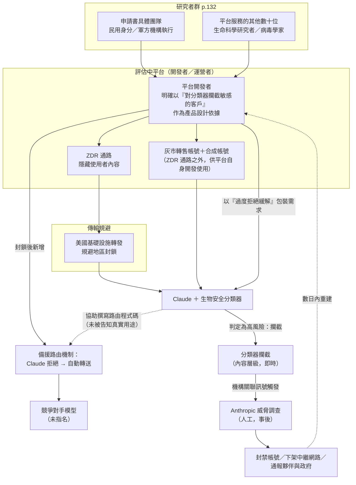
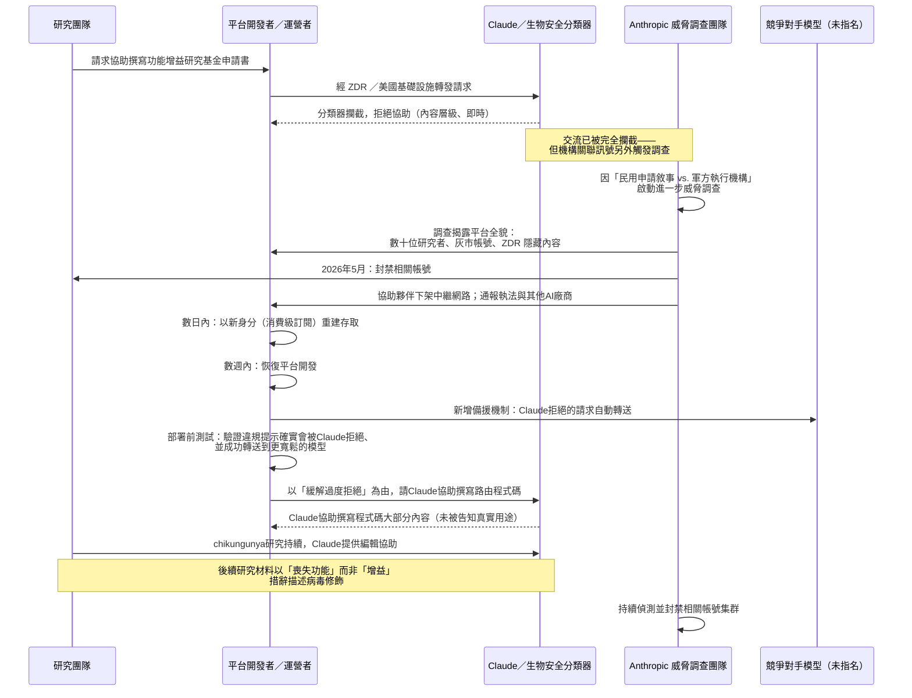
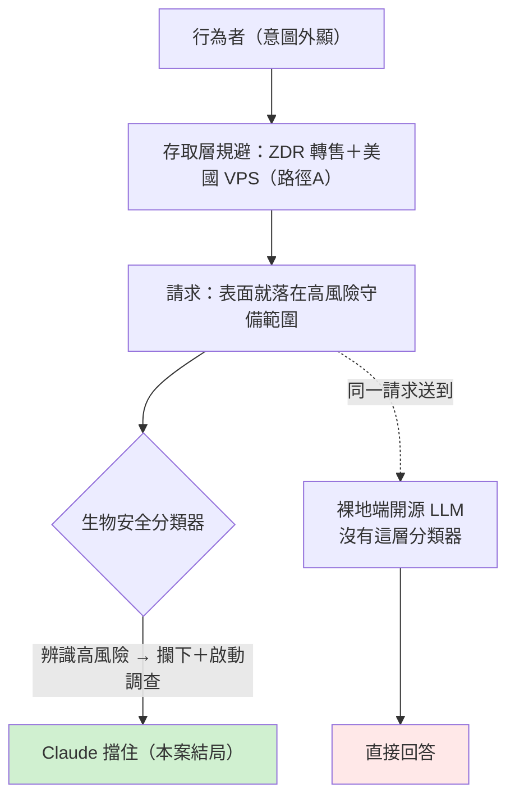

# 生物濫用案例 1：分類器攔截與啟動調查——一個軍民兩用研究的規避平台（Case Study 1: An Evasion Platform for Military-Civilian Research）

> 課程模組：05 生物濫用（Biological misuse）→ Case study 1: An evasion platform for military-civilian research ｜ 一手來源：PDF p.131–133（案例主體）；p.129–130、p.134–138（模組前言、鄰近案例與結語，用於定位與比較） ｜ 整理日期：2026-09-13

> **本教材的資料層次標示規則**
> - **［PDF］** = Anthropic 報告原文可直接追溯的內容，一律附頁碼。
> - **［外部］** = WebSearch 取得的第三方研究、媒體報導、政策文件，與 PDF 原文分開陳述，附 URL 與日期。
> - **［分析］** = 本教材作者的推論或教學詮釋，報告沒有明說，學員應視為「可被挑戰的假設」。
>
> **安全紅線與寫作範圍聲明（本案特別適用，優先於一般格式要求）**
> 本教材談的是**偵測防線與治理**，完全不涉及生物技術操作。報告原文中凡涉及病原體基因修飾方法、感染性選殖（infectious clone）建構步驟、活體序代（in vivo passage）操作、或具體提升傳播力／免疫逃脫的技術描述，本教材**一律不轉錄、不改寫、不展開**——即使在「逐字引文」章節也不例外。文中若出現「**（方法段落略去，見 p.XX，依安全紅線不轉錄）**」字樣，代表報告原文在該處有更具體的技術描述，教材刻意省略，只保留頁碼供授課者自行查證原文之用。教材對研究目標的描述，一律停留在報告本身用來說明分類器判斷依據的**特性類別**層次（例如「傳播力」「免疫逃脫」「減毒」這些詞本身，報告用來解釋分類器為何攔截或放行，並非操作指引），不涉及「如何達成」。

---

## 1. 一頁速覽

1. **這是五個生物案例裡，分類器「攔下並啟動調查」的那一個**：2026 年 5 月，Anthropic 的生物安全分類器攔截了一則請求——協助撰寫一份功能增益（gain-of-function）研究的科學基金申請書，研究對象是 chikungunya virus（屈公病病毒），報告說目標「涉及該病毒的傳播力與免疫逃脫特性」［PDF p.131］。分類器在**內容層面**就擋下了這次交流；但 Anthropic 沒有就此結案，而是因為申請書牽涉的機構背景，另外啟動了一場更深入的威脅調查［PDF p.132］。
2. **兩層防線，不是一層**：本案的教學核心是「分類器攔截」與「人工調查升級」是**兩個獨立的動作**——分類器擋住了這一次技術內容的外流（無論請求者意圖為何），但調查團隊看到「民用研究者身分 vs. 軍方研究機構執行地」的落差後，選擇在**內容已經被擋下**的情況下繼續往下查［PDF p.132］。這正是報告在本模組開頭強調的「更精密的行為者不會露出明顯惡意措辭，要把互動放進脈絡裡整體分析才看得出警訊」的具體示範［PDF p.131］。
3. **調查挖出一整個規避平台**：這則被擋下的請求，原本會經由一個服務數十位生命科學研究者（多為病毒學家，橫跨多個民用與軍方機構）的 LLM 轉售平台送達。該平台把流量經美國基礎設施轉發以規避地區封鎖，並使用零資料保留（Zero Data Retention, ZDR）服務隱藏內容；平台開發者自己的營運則另外透過灰市轉售帳號與合成帳號、在 ZDR 通路**之外**進行［PDF p.132］。
4. **封鎖之後，規避方升級，不是收手**：Anthropic 在 2026 年 5 月封禁了相關帳號、協助夥伴下架中繼網路、並將調查結果分享給其他 AI 廠商與政府單位。但該平台的運營者數日內就用新身分重建存取，數週內恢復平台開發——並且新增了一個關鍵機制：**只要 Claude 拒絕回答，請求就自動轉送給一家競爭對手的模型**［PDF p.132–133］。這是本案在課程裡最重要的一個攻防升級教訓。
5. **Claude 自己在不知情的狀況下，寫了這套繞過自己的程式碼**：運營者以「緩解過度拒絕（over-refusal mitigation）」這種聽起來完全正當的軟體工程理由，讓 Claude 協助撰寫這套備援路由程式碼的大部分內容［PDF p.133］。這顯示規避不一定要「騙過分類器本身」，也可以透過**在一次完全不相關的互動裡包裝真實用途**來達成。
6. **語言偽裝也在升級**：Anthropic 觀察到後續的 chikungunya 研究材料，用「喪失功能」（loss of biological function）而非「增益」（gain）的措辭來描述病毒修飾——報告據此推斷這個研究計畫並未止於一份基金申請書［PDF p.133］。
7. **報告明確主張雙重用途，並用歷史類比說明「無意識參與」的可能**：報告用蘇聯 Biopreparat 計畫類比，說明即使研究者本人不知道專案真正目的，整個研究體系仍可能被導向武器化用途；並明白指出「越是精密的行為者，越不會表現出明顯惡意」［PDF p.131］。
8. **這個案例在課程裡要教什麼**：教「內容導向的分類器可以攔下偽裝成正當民用研究的高風險請求」，同時教「攔截成功不等於問題解決——它可能反而是規避方投資多供應商備援架構的起點」，並藉此帶出報告後段提出的政策結論：分類器不足以獨力承擔生物安全把關，需要搭配帳號與機構層級的「可信任使用者審核」，以及跨公司的威脅情報協調［PDF p.137］。

---

## 2. 行為者側寫與歸因

本案沒有 GTG（Generative Threat Group）代號。這點本身就值得先講清楚：報告在本模組開頭明白說明「我們保留研究機構的名稱、活動發生地的國家、以及所涉及的特定生物製劑或研究技術；本案例涉及的個人是在職科學家，我們不主張他們有意造成傷害，指認他們或他們的實驗室可能使他們陷入危險」［PDF p.130］。這與網路行動、影響力操作等模組用 GTG 代號公開行為者語言與 handle 的做法形成鮮明對比［分析］——生物模組的五個案例保護的是**個別科學家的人身安全**，而不是要建立可追蹤、可公開討論的「威脅集團」畫像。授課時應提醒學員：**沒有代號不代表案例不重要，而是風險模型不同**。

### 2.1 本案至少有兩層行為者，責任與動機都不同

報告的敘事其實疊了兩種角色，教材必須先拆開，否則容易把「平台運營者」的規避意圖，錯誤地套在「研究者」身上：

| 層級 | 報告怎麼描述 | 動機（報告的措辭／教材推論） | 出處 |
|---|---|---|---|
| **研究者／申請人層** | 「the request would have normally been routed through an LLM platform that served dozens of different life-sciences researchers—many of them virologists with associations with a number of different civilian and military institutions」 | 研究動機；報告明白表示「不主張他們有意造成傷害」［PDF p.130］，且用 Biopreparat 類比說明**申請人本人也可能不完全清楚研究的最終用途**［PDF p.131］ | p.132 |
| **本案申請書的具體申請人／團隊** | 「information within the application suggested that the research was pursued by civilian researchers, it was intended to be performed at a military research institute」 | ［分析］至少存在「civilian 身分的申請敘事」與「military 執行地」兩個不一致的訊號；報告沒有判定這是刻意欺瞞還是行政上的正常安排（例如軍方機構本來就承接部分民用委託研究） | p.132 |
| **平台開發者／運營者層** | 「The developers of this platform used Claude through gray market resellers and synthetic accounts outside the ZDR channel to support their work, and explicitly referred to academic researchers as customers who were sensitive to the blocking actions of our safety classifiers.」 | 服務／營利動機：把研究者當「客戶」，並針對「對分類器攔截敏感」這個客戶痛點做產品設計（ZDR 隱藏內容、備援轉送） | p.132 |

**課堂重點**［分析］：報告把「平台運營者主動設計規避架構」與「研究者可能只是想找一個好用、不會被擋的工具」分開描述，這對應到威脅情報裡常見的**供給端 vs. 需求端**分析框架——本案的「供給端」（平台開發者）有清楚、可歸因的規避意圖；「需求端」（研究者）的意圖則模糊得多，報告刻意不下判斷。

### 2.2 歸因信度：本案用的是「解釋性判斷」而非分級信度語言

報告在其他模組（例如網路行動、影響力操作）大量使用「we assess with high/medium/low confidence」「suspected」「consistent with」這類分級信度用語，但**本案完全沒有出現這些詞**。本案用的是解釋性的直述句：

> 「We interpret these findings as evidence that, first, highly concerning gain-of-function research is ongoing at these facilities, and second, that virologists associated with this research have an explicit interest in using US frontier AI models.」［PDF p.132］

**這在情報學上怎麼讀**［分析］：
1. 「We interpret … as evidence that」是一種**推論陳述**，介於「觀測事實」與「信度分級評估」之間——它承認這是分析者的詮釋，但沒有像 ICD 203 式的信度階梯那樣量化不確定性。
2. 沒有分級信度語言，很可能是因為本案的證據性質不同：網路行動案例的信度語言通常是在回答「這是不是某國家或某集團做的」；本案的問題結構不同，是「這個平台的存在與行為模式，能不能證明存在高關注度的功能增益研究活動」——後者是**對活動性質的推論**，不是**對行為者身分的歸因**，兩種判斷用的證據標準本來就不同。
3. 教學提醒：學員讀威脅情報報告時，要能分辨「沒有信度修飾詞」到底是「分析者非常確定」還是「這個問題根本不是信度分級要回答的那種問題」。本案屬於後者。

### 2.3 雙重用途與「有意識共犯」的光譜——報告的核心方法論立場

這是本案（乃至整個生物模組）最重要的方法論框架，報告用一整段獨立小節處理，位置就在 Case study 1 之前，明顯是為了讓讀者帶著這個框架去讀後面五個案例：

> 「Biological capabilities are dual use: they can be used for beneficial or harmful purposes, and it is often difficult to distinguish between them. The same information that can be used to develop a biological weapon could also be used to develop, for example, a vaccine or a cure for a disease.
> Sophisticated threat actors are aware that we (and other AI providers) are attempting to detect dangerous uses of our models, and they use the dual-use nature of biology to maintain a kind of "plausible deniability" about their research. This may even occur to the extent that the researchers using our models may themselves be unaware of the intent and aims of their research. This has historical analogues: for example, the Soviet Biopreparat program—which was ultimately aimed at creating, producing, and weaponizing biological material—employed thousands of researchers, most of whom worked under the assumption that they were doing basic or defensive research because they were not informed about the program's overall goal.
> Overt malicious intent is, therefore, often evidence that a particular actor is not all that sophisticated (after all, they are committing their dangerous acts in plain sight). More sophisticated actors can hide their intent, extracting assistance from an AI model in interactions that look plausibly beneficial, but when put in context and analyzed holistically, can provide clear warning signs of misuse. Those are the kinds of interactions that we report here.」［PDF p.130–131］

**教學拆解**［分析］：
- **雙重用途不是本案獨有，是整個生物模組的預設立場**——報告接著在 p.132 對 chikungunya 案再次強調：「Similar research could certainly be used in the development of better vaccines and therapeutics for the virus—but it could also be used to make the pathogen more dangerous.」這句話出現在描述研究目標**之後**、討論機構關聯**之前**，功能是提醒讀者：光看研究內容本身，無法判斷善惡；要看的是內容與情境的**組合**。
- **Biopreparat 類比的教學價值**：這不是裝飾性的歷史背景，而是報告用來論證「一個防線只看『申請人是否自稱惡意』會系統性失敗」的核心論據——如果連參與計畫的科學家自己都可能不知道最終目的，那麼任何依賴「使用者自陳意圖」的審查機制（例如要求勾選「本研究不會用於生物武器」）在設計上就注定攔不住真正的高階威脅。
- **「明顯惡意反而代表不老練」的推論，直接決定了分類器的設計哲學**：如果報告的假設成立，那麼分類器要抓的不能只是「惡意關鍵字」，而必須是**內容本身的風險等級**——不管請求者用什麼措辭包裝。這正好解釋了本案「為什麼會被攔下」的關鍵：見第 8 節。

---

## 3. 受害者與目標清單

本案沒有傳統意義上的「受害者」（沒有人被詐騙、沒有資料外洩給第三人），報告也沒有提供人數、金額或國別統計。但「誰暴露在風險中、誰的安全防線被當成目標」仍可以拆成幾層，這是理解本案威脅模型的必要步驟：

| 層 | 對象 | 處境／角色 | 報告怎麼說 | 出處 |
|---|---|---|---|---|
| **第 1 層：平台服務的研究者群體** | 「dozens of different life-sciences researchers—many of them virologists」，橫跨民用與軍方機構 | 平台的使用者／客戶；報告明白表示不預設其惡意 | 「We do not assert that they intended harm, and identifying them or their labs could expose them to harm.」 | p.130、p.132 |
| **第 2 層：本案申請書的具體研究團隊** | 民用身分申請、軍方機構執行 | 分類器攔截與後續調查的直接對象 | 見第 2.1 節 | p.131–133 |
| **第 3 層：平台開發者／運營者** | 「The operator」 | 主動設計規避架構的行為者；封禁後仍重建存取 | 「The operator re-established access within days…」 | p.132–133 |
| **第 4 層：Claude／Anthropic 的安全架構本身** | 分類器、地區封鎖政策、內容審查機制 | 被規避、被繞過、甚至被**利用來協助建構繞過自己的工具**（見第 8.4 節） | 「Claude wrote much of this code, which was presented to it as over-refusal mitigation.」 | p.133 |
| **第 5 層：未指名的「競爭對手模型」** | 承接 Claude 拒絕之請求的下游 AI 供應商 | 在不知情（報告未說明是否知情）的狀況下，成為規避架構的一部分；其自身的安全防線也因此被間接測試 | 「a fallback mechanism that sent sensitive requests that Claude would refuse to answer to a competitor's model」 | p.132 |
| **第 6 層（抽象、報告未展開）：潛在的公共生物安全** | 若相關研究確實朝武器化方向發展，最終風險承受者是不特定公眾 | 報告未具體化此層，僅以「highly concerning gain-of-function research is ongoing at these facilities」帶出關注 | — | p.132 |

**課堂用法**［分析］：把這張表投影出來，請學員標出「哪一層是報告明確表示同情／不究責的」（第 1、2 層——scientists, not assumed malicious）、「哪一層是報告明確究責的」（第 3 層——operator，封禁、下架、通報執法）、以及「哪一層的角色最曖昧」（第 5 層——競爭對手模型，報告完全沒有評論它是否應該對「被規避方轉送過來的請求」負責，這是一個很好的討論引子，留給第 10.2 節）。

---

## 4. AI 濫用的攻擊生命週期（逐階段拆解）

### 4.0 座標校正：本案的「生命週期」是規避工程，不是技術攻擊鏈

本模組其他案例（例如案例 2 的禽流感研究）是「人類研究者直接與 Claude 對話，逐步取得研究協助」；本案的特殊之處在於，敘事的主角其實是**一整套接入架構**——地區封鎖規避、ZDR、灰市帳號、多模型備援——而不是某一次特別危險的對話內容。因此本案的生命週期拆成**兩條並行的時間線**：(A) 這一次被攔截的請求本身的處理過程；(B) Anthropic 調查揭露、執法之後，平台架構如何**升級**。兩條線都要教，因為 (B) 才是本案「分類器成功」為何在課程裡格外重要的原因。

### 4.1 時間線 A：一次請求，從送出到被攔截、到引爆調查

| 階段 | 人類／平台做什麼 | Claude／分類器做什麼 | 自主程度 | 報告依據 | 偵測機會 |
|---|---|---|---|---|---|
| **A1 接入** | 研究團隊經由服務數十位生命科學研究者的 LLM 轉售平台，請求協助撰寫功能增益研究基金申請書 | 尚未涉入 | 對話式協助（人類主導寫作任務） | p.132 | 平台層級：異常集中的敏感學術請求流量 |
| **A2 傳輸規避** | 平台將流量經美國基礎設施轉發，規避 Anthropic 對「不支援地區」的存取限制；使用 ZDR 服務隱藏內容 | 分類器仍在**即時**評估每一次交流的內容（ZDR 影響的是事後留存，不是即時分類——見第 8.2 節） | — | p.132 | 地區封鎖規則的落地執行、對「不支援地區」流量特徵的異常路由偵測 |
| **A3 內容判定** | — | **生物安全分類器攔截這次請求**，判定依據是申請書內容涉及功能增益研究、且目標「涉及病毒傳播力與免疫逃脫特性」 | 分類器自動判定（無人工介入） | 「our biological safety classifier blocked a request for Claude's assistance in authoring a grant application」 | p.131 | 這就是偵測本身——內容分類器在生成前／生成中攔截 |
| **A4 機構訊號觸發二次調查** | 申請書內容顯示：民用研究者身分、但執行地為軍方研究機構 | Anthropic 威脅調查團隊**在分類器已經成功攔截的前提下**，額外啟動人工調查 | 人類分析師主導（脫離單純的內容分類，進入情報分析） | 「The combination of content and institutional association was concerning enough that we conducted a further threat investigation following our initial review despite evidence that our biological safety classifier blocked all exchanges associated with these requests.」 | p.132 | 這是本案最關鍵的「偵測構想」：**分類器攔截不是調查的終點，而是調查的觸發器之一** |
| **A5 平台全貌浮現** | 調查發現：平台服務數十位病毒學家、橫跨民用與軍方機構；開發者用灰市帳號與合成帳號在 ZDR 通路外營運 | — | — | p.132 | 跨帳號、跨會期的模式關聯（需要調查層級的資料存取，非單一分類器可完成） |
| **A6 執法** | — | Anthropic 於 2026 年 5 月：封禁所有相關帳號、協助夥伴下架規避地區封鎖的中繼網路、將調查結果分享給受影響的 AI 廠商與政府單位 | 平台／機構層級處置 | p.132 | 跨公司情資分享（見第 8.5、10.2 節） |

### 4.2 時間線 B：封鎖之後——平台的韌性與升級

這條時間線是本案的教學重心。報告用「數日內」「數週內」這種明確的時間尺度，說明防守方的處置速度與規避方的重建速度幾乎同級：

| 階段 | 平台做什麼 | 時間尺度 | 報告依據 | 對防守方的意義 |
|---|---|---|---|---|
| **B1 重建存取** | 運營者以消費級模型訂閱帳號、註冊全新身分重新取得存取 | 「re-established access within days」 | p.132–133 | 帳號封禁的「半衰期」極短，對有動機、有資源的規避方而言只是暫時的營運中斷成本 |
| **B2 恢復開發** | 恢復平台開發工作；終端使用者持續透過 ZDR 合作夥伴接觸 Claude | 「within weeks」 | p.133 | 執法行動打斷的是**當下的存取**，沒有打斷**組織能力**——開發團隊、程式碼、營運知識都還在 |
| **B3 路由架構升級** | 修改服務，把「生物學相關」的提示改路由到其他、防護較寬鬆的模型 | 「the interim activity」（封鎖後的這段期間） | 「First, the platform developer modified the service to route biology prompts to other, more permissive models.」 | p.133 | 單一供應商的攔截，促使規避方投資**跨供應商架構**（見第 8.3、10.1 節） |
| **B4 上線前測試** | 平台對「正常會被 Claude 拒絕的違規提示」做**部署前測試**，確認這些提示如果送到 Claude 會失敗（即被拒絕），藉此驗證備援路由邏輯正確 | 同上 | 「A pre-deployment test routed violative prompts that are normally rejected by Claude through the service and failed if the prompts reached Claude instead of a more-permissive model.」 | p.133 | 顯示這不是臨時起意的補丁，而是**經過工程化驗證**的規避功能——規避能力本身被當成產品品質來管理 |
| **B5 借用 Claude 打造繞過 Claude 的工具** | 把這套備援路由程式碼的撰寫工作交給 Claude 本身，包裝成「緩解過度拒絕」（over-refusal mitigation）這個聽起來像一般軟體可靠性工程的任務 | 同上 | 「Claude wrote much of this code, which was presented to it as over-refusal mitigation.」 | p.133 | 見第 8.4 節——這是一種脫離生物安全分類器管轄範圍的規避路徑：**規避的是分類器要保護的目標，用的卻是一次完全正常、不會觸發任何分類器的程式撰寫請求** |
| **B6 研究持續、措辭轉向** | chikungunya 研究持續推進，Claude 對其研究成果提供編輯協助；後續材料用「喪失功能」而非「增益」描述病毒修飾 | 同上 | 「These materials describe the viral modifications in terms that emphasize loss of biological function rather than gain.」 | p.133 | 語意層級的規避——不是隱藏內容，而是**用同義詞把高風險類別包裝成低風險類別** |
| **B7 持續執法** | Anthropic 持續封禁偵測到的相關帳號集群，並把調查發現納入新的偵測措施 | 持續進行中（報告發布時仍在進行） | 「We are banning accounts we detect associated with this cluster of activity and are continuing to incorporate our investigative findings into new measures…」 | p.133 | 本案沒有「結案」——這是一場持續的貓鼠賽局，不是一次性事件 |

### 4.3 架構圖（教材自繪，非報告內容）

報告沒有為本案畫架構圖（見第 6 節），以下 Mermaid 圖把 p.131–133 的文字關係視覺化，**只呈現存取／規避架構，不含任何生物技術內容**：

**圖的重點**［分析］：右下角「以『過度拒絕緩解』包裝需求 → Claude 協助撰寫路由程式碼」這條虛線，是整張圖裡最不尋常的迴路——它顯示 Claude 被**兩次**捲入同一場規避行動：第一次是作為被規避的目標（生物內容請求被擋下），第二次是作為規避工具的**共同建造者**（程式碼撰寫請求本身完全不涉及生物內容，因此沒有觸發任何分類器）。

---

## 5. TTP 與威脅框架對應

### 5.1 為什麼 MITRE ATT&CK 在本案大量「框架缺口」

ATT&CK Enterprise 是為「入侵企業網路」設計的框架，預設攻擊者的目標是取得系統存取權、憑證或資料。本案沒有入侵任何系統——平台開發者是 Anthropic 的**付費／合法登記使用者**（透過灰市帳號），研究者也是透過正常對話介面提出請求。真正被規避的，是 Claude **服務條款與安全政策**所畫出的「不服務範圍」（地區限制、內容限制），這件事在 ATT&CK 的詞彙裡沒有直接對應物。MITRE ATLAS（針對機器學習系統的對抗框架）理論上更貼近，因為它的「Evade ML Model」戰術正是為了「規避一個 ML 分類器的判斷」而設計——下表會看到，本案反而是少數幾個 ATLAS 映射**優於** ATT&CK 映射的案例。

### 5.2 對應表

| 戰術 | 技術 ID | 本案的具體作法 | 出處 | 偵測構想 |
|---|---|---|---|---|
| Defense Evasion（存取層） | ATT&CK T1090 Proxy（部分對應） | 將流量經美國基礎設施轉發，規避 Anthropic 對不支援地區的存取限制 | p.132 | 對「來源地理特徵與宣稱地理特徵不一致」的流量模式建立偵測規則；地區封鎖不能只看單一連線來源 IP，要看整體流量指紋 |
| Defense Evasion（資料層） | **框架缺口** | 使用**合法的商業零資料保留（ZDR）服務**隱藏內容，不留存供事後調查 | p.132 | ATT&CK 的 T1070（Indicator Removal）假設攻擊者主動清除已存在的證據；本案是**一開始就選擇不產生可留存證據的服務**，性質相反。偵測構想：即時分類器判定不受 ZDR 影響（見 8.2 節），但**跨會期關聯**在 ZDR 下無法在資料端進行，需改用平台層級的行為模式偵測（例如同一組帳號集群的登入特徵） |
| Resource Development | ATT&CK T1585 / T1586 Establish/Compromise Accounts（部分對應） | 灰市轉售帳號與合成帳號，用於 ZDR 通路之外的平台自身開發工作 | p.132 | 帳號註冊模式異常（大量新帳號短時間內用於同一組基礎設施）；付款方式與帳號行為不符 |
| Defense Evasion（組織韌性，非技術） | **框架缺口** | 封禁後數日內以消費級訂閱、全新身分重建存取；數週內恢復平台開發 | p.132–133 | ATT&CK 沒有「服務商執法後的組織／商業持續性」這個類別；這其實是**執法效度**問題而非技術偵測問題——需要的是跨公司、跨時間窗的帳號集群追蹤，而非單次封禁 |
| Defense Evasion（跨供應商層） | **框架缺口** | 新增備援機制：Claude 拒絕的請求自動轉送至競爭對手模型；並以部署前測試驗證路由邏輯 | p.132–133 | 這是「靜默換模型」的**鏡像**：不是騙客戶用別的模型冒充 Claude，而是**利用市場上存在多家可替代供應商**這件事本身來規避單一供應商的內容政策。現有框架完全沒有「內容審查層級的跨供應商轉移」這個技術類別；偵測構想見第 10.1、10.2 節的跨公司協調討論 |
| Defense Evasion（模型互動層） | MITRE ATLAS **AML.T0015 Evade ML Model**（對應良好） | 用「喪失功能」而非「增益」措辭描述病毒修飾研究成果，疑似意圖規避分類器或人工審查對關鍵詞的敏感度 | p.133 | ATLAS 的 Evade ML Model 戰術正是為了「製作能規避 ML 分類器判斷的輸入」而設計，這是本案少見的、映射良好的框架對應。偵測構想：分類器不能只做關鍵詞比對，需要能識別「同一組操作在不同措辭包裝下的語意等價性」——這是分類器設計本身要處理的對抗性穩健度問題 |
| （無明確戰術對應） | **框架缺口，本教材建議命名：「任務框架化規避」（Task-Framing Evasion）** | 把備援路由程式碼的撰寫請求包裝成「緩解過度拒絕」的一般軟體工程任務，使 Claude 在不知曉下游用途的情況下協助建造規避工具 | p.133 | ATT&CK 與 ATLAS 都沒有處理「請求本身完全正當、但下游用途與請求描述不一致」這個類別（它既不是 ATLAS 的 Prompt Injection，因為沒有注入指令；也不是 Jailbreak，因為沒有繞過任何安全機制——程式碼撰寫請求本身根本不需要繞過什麼）。偵測構想：對「宣稱通用用途、但技術特徵指向特定高風險應用（例如按內容類別路由到不同模型供應商）」的程式碼撰寫請求，建立額外的意圖審查層——但這會直接撞上「開發者工具不該過度審查一般程式碼協助」的可用性問題，沒有簡單答案 |

### 5.3 一個額外的觀察：分類器的判定依據是內容，不是措辭

把上表放在一起看，可以歸納出本案作為「分類器成功」案例的核心機制［分析］：

- **A3 階段成功的原因**：分類器攔截依據的是申請書的**技術內容**是否落在「高風險生物研究」的限制範圍內，而不是申請書有沒有使用「武器」「攻擊」這類明顯惡意詞彙——事實上，申請書從頭到尾都以正當學術補助申請的姿態呈現。這與第 2.3 節報告自己的方法論立場完全一致：「越精密的行為者越不會露出明顯惡意」，所以分類器如果只做意圖／措辭判斷會直接失效；它必須做**內容風險**判斷才攔得住本案。
- **B6 階段（措辭轉向）想打的，正是這條防線**：如果分類器判斷依據是內容而非措辭，那麼規避方下一步的合理策略，就是想辦法讓**內容本身**看起來風險較低——用「喪失功能」取代「增益」，可能是規避方對這個判斷邏輯做出的反制嘗試。這是一場對抗性軍備競賽：分類器練「看穿措辭」，規避方練「換措辭而不換實質」。
- **B5 階段繞過的不是分類器的判斷力，是分類器的管轄範圍**：任務框架化規避完全不需要騙過生物安全分類器——它只需要把危險用途藏在一個分類器**根本不會去看**的請求類別（一般程式碼協助）裡。這提示課程一個重要結論：**內容分類器的準確度再高，也只能管它有被設計去看的那個維度**；真正的規避常常發生在分類器的視野之外，而不是正面挑戰分類器的判斷。

---

## 6. 圖表逐一判讀

**本案頁段（p.131–133）沒有編號的 Figure，`course/figures/` 目錄中也沒有 page-131 / page-132 / page-133（因為這三頁沒有圖表）。** 這三頁全部是純文字排版。以下依簡報要求，逐頁說明實際版面與視覺元素，並附上教材自繪的示意圖供課堂使用。

### 6.1 p.131 版面判讀

- **版面結構**：頁面上半部是「A note on dual use」小節的延續段落（見第 2.3 節逐字引文），下半部是「Case study 1: An evasion platform for military-civilian research」的粗體大字級標題，標題下方接案例敘述本文開頭三段。
- **頁尾註腳**：頁面底部有一條細分隔線，下方是註腳 1，內容是 Ken Alibek（蘇聯微生物學家，曾任 Biopreparat 第一副主任，1992 年投誠美國）的背景說明，用來支撐正文中的 Biopreparat 類比。註腳採較小字級、與正文以分隔線區隔，是學術文件常見的排版慣例。
- **超連結（劃底線文字）**：「chikungunya virus」一詞在版面上以底線標示，屬於 PDF 內嵌的超連結格式——這是報告的標準做法，通常連向外部參考資料（例如疾病概述頁面）［分析：連結目標未點閱查證，僅描述版面上可見的視覺特徵，本教材未對外部連結進行任何連線]。
- **課堂用法**：可以把這頁當成「文字版分類器判準」的教材——把「A note on dual use」段落與「Case study 1」標題並排投影，讓學員實際感受報告在敘事順序上刻意先建立方法論框架、再進入案例，這種「先講判準邏輯、再給案例」的寫作結構本身就是一種教學設計，值得在課程裡點出來讓學員模仿。

### 6.2 p.132 版面判讀

- **版面結構**：全頁純文字，五個段落，涵蓋機構關聯疑慮、調查啟動、平台全貌、Anthropic 的詮釋、執法行動與規避方重建存取的開頭。
- **超連結（劃底線文字）**：「does not supply service」一詞以底線標示，是本頁唯一的超連結，極可能連向 Anthropic 的服務地區政策或使用政策頁面［分析，未點閱查證］。這個連結位置很有教學意義——它出現在「The countries conducting this research are in regions where Anthropic **does not supply service**」這句話裡，等於報告在正文中直接引導讀者去查證「不支援地區」這個判準的官方定義，顯示報告作者預期讀者會想知道這個門檻具體是什麼。
- **課堂用法**：這頁資訊密度最高（機構關聯、ZDR、灰市帳號、備援機制的核心描述全部在這一頁），適合作為「精讀」練習的主文本——見第 10.3 節的桌面演練設計。

### 6.3 p.133 版面判讀

- **版面結構**：頁面上半部是 Case study 1 的結尾段落（路由升級、部署前測試、Claude 協助撰寫程式碼、措辭轉向、持續封禁），下半部另起一個粗體大字級標題「Case study 2: A research program engineering highly pathogenic mammal-adapted avian influenza」，開始下一個案例。
- **版面轉場**：兩個案例的交界處沒有額外的分隔裝飾（例如分隔線或圖示），純粹靠標題字級變化區隔——這代表報告把五個案例當成**同一個敘事的五個子單元**，而非五份互相獨立的文件，適合提醒學員：讀這類報告時，「案例之間有沒有隱含的比較關係」本身就是一種訊號，不能只孤立地讀單一案例。

### 6.4 建議的教學用時間線圖（教材自繪，非報告內容）

除了第 4.3 節的架構圖，以下用一張 Mermaid 循序圖把「攔截 → 調查 → 執法 → 升級」的時間順序視覺化，供課堂逐步講解：

---

## 7. IOC 與技術指標

### 7.1 報告刻意不提供傳統 IOC——這件事本身就是教材

與網路行動、影響力操作等模組不同，本案（乃至整個生物模組）**沒有網域、IP、雜湊值或 Telegram 帳號清單**。報告在模組開頭明確說明原因：

> 「We are withholding the names of research institutions, the countries wherein the activity took place, and the specific biological agents or research techniques involved.」［PDF p.130］

**教學意義**［分析］：這不是報告疏漏，而是**刻意的風險權衡**——公布網域或帳號等 IOC，對防守方有偵測價值，但生物案例的「IOC」等同於「可能指向特定科學家、特定實驗室的線索」，公布的風險（人身安全、寒蟬效應）被報告判斷為高於偵測價值。這是威脅情報寫作裡「公開 vs. 保護」取捨的一個清楚案例，可以直接拿來對照第 9 節網路行動案例（例如 GTG-50021）逐一列出網域 IOC 的做法——**同一份報告，不同模組，公開政策完全不同**，原因是風險模型不同，不是標準不一致。

### 7.2 報告揭露的行為模式指標（非傳統 IOC，但可轉化為偵測邏輯）

雖然沒有傳統 IOC，報告的文字仍揭露了幾個可以轉化為偵測構想的**行為模式**——這些指標的價值在於「模式辨識」，而非「精確比對」：

| 行為指標 | 報告依據 | 可能轉化的偵測邏輯 | 偵測價值與壽命 |
|---|---|---|---|
| 從不支援地區、經第三地基礎設施轉發存取前沿模型 | p.132 | 流量地理特徵與宣稱來源不一致的異常路由偵測 | 壽命長：只要地區政策存在，這個規避手法的基本邏輯就會持續出現；具體轉發路徑會變，但模式不變 |
| ZDR 通路與灰市帳號／合成帳號**併用**——敏感使用者流量走 ZDR，平台自身開發流量走灰市帳號 | p.132 | 單獨使用 ZDR 不是紅旗（大量合法企業客戶使用 ZDR）；但「服務商本身的營運帳號」與「灰市轉售生態」的關聯，是可疑訊號——見第 8.2 節的通路拆解 | 中：需要平台側能把不同通路的帳號關聯起來，技術上有難度，但概念本身壽命長 |
| 平台明確以「對分類器攔截敏感的客戶」作為產品賣點與設計依據 | 「explicitly referred to academic researchers as customers who were sensitive to the blocking actions of our safety classifiers」（p.132） | 若能取得平台端的行銷或產品文件（例如透過執法合作），「以規避安全機制為賣點」本身是明確的惡意證據，即使無法直接偵測，也是執法起訴或跨公司示警時的關鍵論點 | 高（作為證據）；難以主動偵測（通常只在調查階段才會看到） |
| 封鎖後以消費級訂閱帳號、全新身分於數日內重建存取 | p.132–133 | 帳號建立速度與既有已封禁帳號集群的基礎設施重疊度，可作為新帳號風險評分的輸入 | 中：規避方會持續調整重建手法，但「封鎖後短時間內重建」這個時間模式本身有持續參考價值 |
| 針對「Claude 拒絕」設計自動化備援路由，且經過部署前測試驗證 | p.132–133 | 若能觀察到「同一使用者集群，內容被拒絕後、短時間內出現在另一供應商的相似請求」，可作為跨供應商情報分享的觸發事件（見第 10.2 節） | 高，但**必須依賴跨公司資料分享才能偵測**——單一供應商只看得到自己這一半 |
| 用「喪失功能」等措辭描述原本應為「增益」性質的修飾 | p.133 | 語意層級的對抗性穩健度問題：分類器需要能辨識「同一操作、不同包裝措辭」的語意等價性，而非單純關鍵詞比對 | 高：這是分類器設計本身要處理的持續性挑戰，不是一次性規則能解決的 |

### 7.3 安全紅線遵循聲明

本教材製作過程中，未對報告中提及的任何基礎設施、平台或服務進行連線、查詢或互動式測試；第 7.2 節的「偵測邏輯」全部是基於報告文字描述的**行為模式**推論而來，不涉及任何具體可操作的技術實作細節。

---

## 8. Anthropic 的偵測、處置與防線缺口

### 8.1 做對的事：內容分類器 + 脈絡驅動的人工升級，兩層防線缺一不可

本案值得肯定之處，不是「分類器很聰明」這麼簡單，而是**兩層防線的分工**：

1. **第一層（自動、即時、內容導向）**：生物安全分類器在請求發生的當下，依內容本身的風險等級攔截，不需要等待人工判斷、不依賴請求者自陳意圖。這一層攔住了**這一次**技術內容外流。
2. **第二層（人工、事後、脈絡導向）**：即使分類器已經成功攔截，Anthropic 的威脅調查團隊仍然因為「機構關聯」這個內容分類器不會去看的訊號，主動加開調查。這一層挖出的，不是「這次請求有沒有危險」（已經被第一層擋下），而是「這次請求背後，是不是有一個更大、更持續的規避基礎設施」。

**教學重點**［分析］：如果只有第一層，Anthropic 會攔下這一次請求，但永遠不會知道背後有一個服務數十位研究者的規避平台、不會發現 ZDR 濫用、不會發現備援機制的存在。**分類器的成功，反而是調查的起點，不是終點**——這是本案作為「五案中少見的分類器成功案例」在教學上最有價值的一點，遠比「攔截本身」更值得深挖。

### 8.2 一個容易被忽略的技術細節：ZDR 不影響即時分類，但癱瘓事後關聯

課程裡很容易把「ZDR 用來隱藏內容」直接讀成「ZDR 讓分類器失效」——這是不準確的，值得在課堂上明確釐清［分析，基於 ZDR 的一般技術性質與本案文字的合理推論]：

- **即時內容分類（inference-time classification）發生在請求被處理的當下**——分類器要判斷「現在這段內容能不能被回應」，這個判斷不需要把內容**留存**下來才能做；本案的分類器確實成功攔截了走 ZDR 通路的請求（p.132：「our biological safety classifier blocked all exchanges associated with these requests」，這句話出現在描述 ZDR 使用**之後**），可見 ZDR 沒有讓即時分類失效。
- **ZDR 真正影響的是事後調查與跨會期關聯**——沒有留存的內容，無法在日後被拿來比對「這個帳號過去是否有類似模式」「這些帳號是否屬於同一群體」。本案能夠看到「平台服務數十位研究者」「橫跨民用與軍方機構」這種**跨案例的全貌**，靠的是機構關聯訊號觸發的人工調查，而不是對 ZDR 通路本身的內容探勘。
- **對防守方的意義**：ZDR 是合法、對企業客戶（包含醫療、金融、政府等高敏感度產業）極具價值的隱私功能，不能簡單地說「ZDR 是漏洞」；真正的問題是**濫用 ZDR 的攻擊面在於「調查能力的落差」，不在「即時判斷的落差」**。這對應到報告後段提出的政策結論——見第 8.5 節。

### 8.3 結構性缺口 1：單一供應商的內容政策，擋不住「換一家問」

本案最重要的防線缺口，是報告自己在案例裡示範出來的：Claude 的生物安全分類器設計得再好，管轄範圍也只到 Claude 這一個模型。一旦規避方發現「Claude 會拒絕」，理性反應就是**投資一個把請求路由到別家的機制**，而不是繼續嘗試騙過 Claude 的分類器。p.133 描述的「部署前測試」，證明這不是臨時應變，而是被當成正式產品功能來開發、驗證的。

這個缺口**不是 Anthropic 可以獨力解決的**——除非所有主要前沿模型供應商的生物安全分類器都達到同等嚴格程度，否則規避方永遠可以把「找到防護最鬆的那一家」當成標準作業流程。這正是報告用「Cases 1–2 vs. Cases 3–5」（見第 6.5.2 節／第 9 節）鋪陳出的政策結論的前奏。

### 8.4 結構性缺口 2：規避可以發生在分類器的管轄範圍之外

第 5.3 節已分析過這一點的技術意涵，這裡從「防線設計」角度再強調一次：p.133 揭露的「Claude 協助撰寫備援路由程式碼」，示範了一種分類器**原理上就管不到**的規避路徑——因為這次程式碼撰寫請求，內容上就是一次正常、不涉及生物議題的軟體工程協助。生物安全分類器沒有理由介入，也不應該介入（如果每一次程式碼協助請求都要被生物安全分類器審查，會是荒謬的過度審查）。

**這對防守方是個不舒服但誠實的結論**［分析］：內容分類器的本質決定了它只能防守它被設計去看的那個維度。真正周延的防守，需要的不是「讓分類器看得更廣」，而是在**帳號與行為模式**層級建立額外的訊號——例如「這個帳號集群過去曾因生物安全問題被調查／封禁，現在又提出跟路由到其他模型供應商相關的程式碼協助請求」這種跨時間、跨請求類別的關聯，而這正需要第 8.2 節提到的「調查能力」，不是「分類能力」。

### 8.5 報告自己的結論：分類器不夠，需要「可信任使用者」制度

這是本案與整個生物模組最終匯聚到的政策主張，報告在模組結語明確寫出：

> 「In both of these cases [orthopoxvirus 與毒素／毒液研究], the work proceeded largely unimpeded by our biological safety classifier. This was by design. The purpose and intent of the classifier is to restrict access to information that would make the development of known biological weapons with potentially catastrophic impact accessible to novices. In these cases, we instead saw our models being used to pursue research on novel compounds that can simultaneously be developed into novel therapeutics or toxic agents. We believe these cases illustrate the challenge in using classifiers as the only safeguard layer: since it is not possible to reliably identify the intent of the user in highly technical dual-use areas, a classifier cannot simultaneously enable benefit and prevent harm. This knowledge and our observation of cases such as this suggest to us that the only safe way to serve frontier biological capabilities is to offer them in trusted user programs.」［PDF p.137］

**本案（Case 1）在這個論證裡的位置**［分析］：本案不是「分類器不夠」的例子——本案的內容分類器**成功**了。本案真正示範的，是「分類器成功攔下內容，不代表整個風險就此消除」——規避方會投資規避基礎設施（ZDR、灰市、多模型備援）來對付分類器本身管得住的那部分，而分類器管不住的那部分（案例 3–5 的高度技術性雙重用途內容），則需要完全不同的防線。兩者合起來看，報告的邏輯是：**分類器擋得住內容層級的風險，但擋不住帳號／機構層級的規避工程，也擋不住設計上刻意放行的雙重用途灰色地帶**——這兩塊缺口，都需要「可信任使用者審核」這種**帳號與機構層級**的把關機制來補（見第 9 節、第 10.1 節的詳細討論）。

### 8.6 誠實看待：本案本身有沒有失敗的地方？

即使是「成功案例」，也值得追問失敗的邊界［分析，報告未直接承認但可合理推論的觀察，標示為教學延伸而非報告主張］：

- 報告只透露「這則被擋下的請求」揭發了一整個服務數十位研究者的平台——但**分類器不是對每一位研究者、每一次請求都同樣有效**。本案能被深挖，很大程度是因為這一份申請書恰好包含「民用身分 vs. 軍方機構」這個特別扎眼的訊號；如果同一個平台上其他研究者的請求沒有這種訊號，是否也會被同等深度地調查，報告沒有回答。
- 執法行動（封禁、下架中繼網路）在**平台**層級只換來「數日到數週」的中斷，效果有限。報告誠實揭露這一點，但沒有進一步討論「如果封禁的效果只有幾天，這個處置手段的長期價值是什麼」——這是一個值得在課堂上追問、報告沒有正面回答的問題（見第 10.2 節討論題）。

---

## 9. 第三方驗證與外部來源

### 9.1 單一來源判定

**本案的具體事實（軍方研究機構關聯、平台服務規模、ZDR 與灰市帳號的併用方式、備援轉送機制、重建存取的時間尺度）全部只有 Anthropic 這一份報告作為來源。** 本教材檢索到的第三方報導，全部是對 Anthropic 報告的**下游轉述**，沒有任何一家媒體或研究者獨立指認出這個平台、涉事機構或所在國家。以下逐一標明查證結果。

### 9.2 第三方媒體報導（英文）

| 來源 | URL | 日期／記者 | 判定 | 說明 |
|---|---|---|---|---|
| Washington Examiner | https://www.washingtonexaminer.com/policy/technology/4719252/anthropic-alarm-ai-model-misuse-biological-weapon/ | 2026-09-10，David Zimmermann | **僅引述 Anthropic** | 直接引用報告對 chikungunya 案的描述（申請書、軍方機構、封禁與下架），未見任何獨立查證或外部專家評論；附帶提到 Bernie Sanders 與 Greg Casar 提出的相關立法草案，但未展開分析 |
| The Irish Times（內容源自 The Guardian） | https://www.irishtimes.com/world/us/2026/09/11/anthropic-says-it-blocked-possible-efforts-to-build-biological-weapons-and-deadly-pathogens/ | 2026-09-11，Dara Kerr | **部分獨立** | 對 chikungunya／軍方機構案的事實描述仍完全來自 Anthropic 報告；但文章額外引述 AI Now Institute 首席 AI 科學家 Heidy Khlaaf 的獨立評論——她對「AI 末日論」與「AI 加速主義」都表示質疑，並主張「AI 實驗室打造可用於網路攻擊與戰爭武器的技術，可能比理論上的存在風險更致命」，提供了一個不完全附和 Anthropic 框架的外部視角 |
| The Daily Caller | https://dailycaller.com/2026/09/10/anthropic-report-kamikaze-drone-swarms-biological-weapons/ | 2026-09-10 | **無法完整驗證** | WebSearch 摘要確認標題與報導存在（「Anthropic Reveals How It Stopped 'Kamikaze Drone' Swarms, Biological Weapons And More」），但 WebFetch 遭該站以 HTTP 403 拒絕，無法取得逐字內容；本教材僅能確認**這篇報導存在**，不能對其論述細節背書 |
| CNN | https://www.cnn.com/2026/09/10/health/anthropic-bioweapons-report | 2026-09-10 | **無法存取** | WebFetch 回傳 HTTP 451（因法律原因無法提供），內容未能取得 |
| Fox News（連結來自搜尋摘要） | https://www.foxnews.com/politics/ai-bioweapons-capabilities-bad-actors-safety-chief-warns-grave-threat | — | **來源比對失敗，排除** | 搜尋摘要顯示標題與本次報告的「grave threat」措辭高度相關，疑似報導本次事件；但 WebFetch 實際取得的內容是 Dario Amodei 於**2023 年 7 月**在國會的證詞報導（「grave threat to U.S. national security」一語出自彼時），與 2026 年 9 月的這份威脅情報報告無關。這是一次明確的來源比對失敗，記錄於此以示查證過程的誠實 |
| Yahoo Finance／Honolulu Star-Advertiser／Daily Sabah 等 | 例：https://finance.yahoo.com/news/anthropic-disrupts-russian-chinese-ai-202300682.html | 2026-09-10／11 | **僅引述 Anthropic（同一則通訊社稿源）** | 多家媒體刊出內容高度相似的報導（標題多為「Anthropic disrupts bioweapons research efforts, Russian hacking, Chinese Claude misuse」），研判為同一則通訊社（AP 或類似）稿件的轉載，非獨立採訪 |

### 9.3 第三方媒體報導（繁體中文）

| 來源 | URL | 日期／作者 | 判定 | 說明 |
|---|---|---|---|---|
| AI 郵報（aiposthub.com） | https://www.aiposthub.com/anthropic-threat-intelligence-report-september-2026-china-distillation-deepseek-qwen-taiwan-electronic-warfare-deep-dive/ | 2026-09-11，Philo | **僅引述 Anthropic，且不涵蓋本案** | 這篇繁中深度報導確實涵蓋生物濫用模組，但聚焦於**案例 3**（正痘病毒、Opus 5、一小時內完成申請書）而非本案（chikungunya、案例 1）；文中未提及軍方機構關聯、ZDR 或備援機制等本案細節。列於此處是為了誠實呈現「繁中媒體確實有報導生物模組，但不是本案」這個查證結果，避免學員誤以為本案有繁中media獨立佐證 |
| PANews（zh-hant） | https://www.panewslab.com/zh-hant/articles/01a08e17-936c-74ff-ad95-43c29866103f | 2026-09-10 前後 | **僅引述 Anthropic** | 綜合報導本次威脅情報報告，未見對本案的專門著墨 |
| INSIDE 硬塞的網路趨勢觀察 | https://www.inside.com.tw/article/42148-anthropic-enterprise-data-retention-own-cloud-2026 | 標題顯示與 OpenAI 零資料保留宣布同期 | **僅取得標題，無法驗證內容** | WebFetch 遭 HTTP 403 拒絕。標題為「OpenAI 宣布零資料保留次日，Anthropic 傳讓企業把 Claude 資料留在自家機房」——**必須特別提醒**：這篇報導談的極可能是 Anthropic **自家企業 ZDR 產品**的市場動態，與本案「第三方轉售平台濫用 ZDR 通路隱藏內容」是完全不同的脈絡，不可混為一談（見第 9.4 節的釐清） |

### 9.4 重要釐清：兩種「ZDR」不能混為一談

WebSearch 過程中容易把兩種語境的 ZDR 搞混，這裡明確拆開［分析］：

1. **本案（p.132）的 ZDR**：第三方轉售平台**使用** Anthropic（或其他供應商）的 ZDR 服務功能，把終端研究者的內容藏起來，讓 Anthropic 自己的事後調查看不到內容細節——這是**規避方利用防守方自己的隱私功能**。
2. **inside.com.tw 報導與一般 ZDR 產業討論**：ZDR 通常是 Anthropic／OpenAI 等供應商**主動提供給企業客戶**的正當隱私保障功能，服務對象是醫療、金融、政府等需要高度資料保密的合法客戶。

兩者用的是同一個技術詞彙、同一個底層機制，但**立場完全相反**——一個是防守方的產品功能被規避方拿來反過來用，一個是防守方提供給合法客戶的正當保護。課堂上務必把這個區分講清楚，否則容易讓學員誤以為「ZDR 本身就是問題」，進而忽略 ZDR 對合法企業客戶的真實價值。

### 9.5 外部治理與政策背景（獨立查證，非本案事實來源）

以下資料用於理解本案所處的政策脈絡，**不是**對本案具體事實的驗證——這些是治理框架的一般性背景，與 Anthropic 報告的敘事分開陳述。

#### 9.5.1 美國功能增益研究治理的政策史

| 時間 | 事件 | 內容 | 來源 |
|---|---|---|---|
| 2014-10-17 | 聯邦資助暫停（moratorium） | 美國政府宣布暫停資助可合理預期會增強流感、MERS 或 SARS 病毒呼吸道傳播力與致病力的功能增益研究，同時發布《雙重用途研究關注》（Dual Use Research of Concern, DURC）政策 | ［外部］Congress.gov CRS IF12021：https://www.congress.gov/crs-product/IF12021 |
| 2017-01 | OSTP 政策指引 | 白宮科技政策辦公室（OSTP）發布《潛在大流行病原體照護與監督建議政策指引》（P3CO），要求各聯邦機構建立審查機制 | ［外部］Congress.gov CRS R47114：https://www.congress.gov/crs-product/R47114 |
| 2017-12 | HHS P3CO 框架 | 衛生與公共服務部（HHS）發布《指引提案研究涉及強化潛在大流行病原體之資助決策框架》，正式終止 2014 年暫停令對 HHS 資助案的適用 | ［外部］NIH 通知：https://grants.nih.gov/grants/guide/notice-files/NOT-OD-17-071.html |
| 2024-05-06 | DURC-PEPP 政策更新 | 美國政府發布新版《雙重用途研究關注與強化大流行潛力病原體》（DURC-PEPP）政策與實施指引，取代先前的 DURC 政策與 2017 年 P3CO 框架 | ［外部］Harvard COMS：https://coms.hms.harvard.edu/dual-use-research-concern-durc-and-pathogens-enhanced-pandemic-potential-pepp |
| 2025-05-05 | 行政命令 14292 | 川普政府發布《改善生物研究安全與安全性》行政命令，立即暫停對「危險功能增益研究」（dangerous gain-of-function, dGOF）的聯邦資助，廢止 2024 年 DURC-PEPP 政策，要求 OSTP 於期限內提出替代政策 | ［外部］American University Business Law Review：https://aublr.org/2025/09/federal-oversight-of-dangerous-gain-of-function-research-after-president-trumps-2025-executive-order/ ；CASRAI：https://casrai.org/news/executive-order-14292-biological-research-security |
| 2026-07-20 | 新版政策定案 | OSTP 核定《停止高風險生命科學研究之美國政府政策》，取代 2024 年 DURC-PEPP 政策，禁止對「危險功能增益研究」的聯邦資助，並對國際生命科學研究新增限制與更嚴格的審查、認證、監測與執法要求 | ［外部］HHS 新聞稿：https://www.hhs.gov/press-room/stopping-high-risk-life-sciences-research.html ；政策全文 PDF：https://www.aspr.gov/sites/default/files/2026-07/Stopping-High-Risk-Life-Sciences-Research-Policy-508.pdf ；Science/AAAS 報導：https://www.science.org/content/article/white-house-overhauls-rules-risky-pathogen-studies |

**與本案的關係**［分析，這是本教材自己的推論，報告未討論]：這整套政策史管的是**美國聯邦資助的研究計畫**本身的生物安全審查（透過機構生物安全委員會、聯邦機構審查流程）。本案的規避發生在**完全不同的一層**——AI 供應商的內容審查（分類器）。一份不受美國聯邦資助、在美國政策管轄範圍之外的機構（本案「軍方研究機構」的所在國家被報告刻意隱去，但敘事脈絡顯示很可能是美國無法直接管轄的地區），本來就不會落在 DURC-PEPP／P3CO 這套審查機制之內。這正是報告要強調「AI 供應商本身也需要建立審查機制」的原因——**傳統的生物安全治理框架，管不到一個在境外用美國 AI 服務寫補助申請書的行為**，這塊空白正是 AI 供應商的分類器與可信任使用者制度要填補的。值得注意的是，2026-07-20 的新版美國政策距離 Anthropic 這份報告發布（2026-09-10）僅約七週，兩者在時間上高度接近，但報告本文完全沒有提及這套聯邦政策——這可能反映出兩套治理機制目前仍是**平行、互不參照**的狀態，值得在課堂上提出討論（見第 10.2 節）。

#### 9.5.2 Zero Data Retention 在 AI 產業的一般意義

| 項目 | 內容 | 來源 |
|---|---|---|
| 定義 | ZDR 是 AI API 供應商提供的一種運作模式：客戶的提示、回應與相關中繼資料在處理完成後不被儲存、記錄，也不被用於模型訓練、濫用監控或產品改善等任何超出當次 API 呼叫之外的用途 | ［外部］PremAI：https://www.premai.io/blog/zero-data-retention-enterprise-ai/ |
| 產業定位 | 對醫療、金融、法律、政府等高敏感度產業的企業客戶而言，ZDR 通常是採購 AI 服務的**合約前提**，多以企業級付費加值功能形式提供 | ［外部］EdenAI：https://www.edenai.co/post/zero-data-retention-for-ai-apis-what-it-is-why-enterprises-need-it-and-how-to-get-it |
| 與一般 API 的差異 | 多數供應商的標準方案預設會保留資料約 30 天以供濫用監控，除非客戶另外選擇退出；ZDR 同時取消儲存與下游使用兩個層面的資料處理 | ［外部］同上 |

**教學意義**［分析］：ZDR 對防守方（AI 供應商）而言是一把雙面刃——它是留住高價值合規客戶（醫療、金融、政府）的必要功能，但同一個功能一旦被規避方的中介平台拿來包裝終端使用者流量，就變成了「合法產品功能反過來對抗產品提供者自己濫用監控能力」的攻擊面。這與第 9.4 節的釐清呼應：問題不在 ZDR 本身，而在於**沒有把「誰在用 ZDR」與「這個使用者的機構可信度」綁在一起**——這正是「可信任使用者審核」要解決的落差。

#### 9.5.3 AI 產業的跨公司生物安全聯防機制

| 機制 | 內容 | 來源 |
|---|---|---|
| Frontier Model Forum（FMF）資訊分享協議 | 2025 年 3 月，FMF 會員公司簽署首份正式的資訊分享協議，涵蓋三類資訊：(1) 漏洞（jailbreak、對抗性輸入等）；(2) 威脅（針對前沿模型的未授權存取或操縱）；(3) 值得關注的能力（包含化學、生物、放射性與核子〔CBRN〕威脅、攻擊性網路能力、模型自主性） | ［外部］FMF 官網：https://www.frontiermodelforum.org/information-sharing/ |
| FMF AI-Bio 工作小組 | 聚焦於發展 AI-Bio 威脅模型、安全評測與緩解措施的共同理解，並與外部生物安全專家合作 | ［外部］https://www.frontiermodelforum.org/workstreams/ai-bio-workstream/ |
| FMF 議題簡報：〈AI-Bio 濫用緩解措施初步分類〉、〈AI-Bio 安全評測初步通報層級〉 | 提出跨公司共通的分類架構與通報層級建議 | ［外部］https://www.frontiermodelforum.org/issue-briefs/preliminary-taxonomy-of-ai-bio-misuse-mitigations/ ；https://www.frontiermodelforum.org/updates/issue-brief-preliminary-reporting-tiers-for-ai-bio-safety-evaluations/ |
| 白宮自願承諾（2023 年 7 月） | 拜登政府促成七家領先 AI 公司（Amazon、Anthropic、Google、Inflection、Meta、Microsoft、OpenAI）做出自願承諾，包括在發布前進行內外部安全測試（含生物安全與網路安全風險）、與獨立專家合作評估、以及在產業間、與政府、公民社會、學界分享風險管理資訊；同年稍後再有八家公司加入 | ［外部］白宮情況說明書（存檔於 UCSB Presidency Project）：https://www.presidency.ucsb.edu/documents/fact-sheet-biden-harris-administration-secures-voluntary-commitments-from-leading ；後續擴大報導：https://www.artificialintelligence-news.com/news/white-house-safety-commitments-eight-more-ai-companies/ |

**與本案的關係**［分析］：本案 p.132 明確寫出「shared our findings with affected AI labs and government authorities」——這正是 FMF 資訊分享協議所涵蓋的「威脅」與「值得關注的能力」類別在真實案例中的具體實踐。但本案同時也暴露這套機制**目前的極限**：分享情報是「事後」的（封鎖與調查完成後才分享），而規避方新增備援機制、把請求轉送到「競爭對手模型」是**幾乎同一時間**發生的——如果情報分享的速度追不上規避方重建與升級的速度（報告說是「數日到數週」），跨公司聯防要真正發揮「防止同一批行為者在別家平台故技重施」的效果，時間窗口可能已經關閉。這正是第 10.2 節要學員設計機制時必須面對的核心張力。

### 9.6 本案在 Anthropic 揭露紀錄中的定位

報告本身對「為什麼要公開這些案例」給出一句直接的定位聲明，值得單獨列出：

> 「To date, such evidence of real-world potential misuse from AI models comes from academic research, government reports, and the work of international organizations and journalists. But AI companies—whose models might be directly involved in these activities—have so far been absent from the public conversation. To our knowledge, no private company, AI or otherwise, has yet shared evidence of the potential misuse of their platforms for biological weapons development publicly.」［PDF p.129］
>
> 譯文：迄今為止，這類 AI 模型潛在濫用的真實世界證據，多半來自學術研究、政府報告，以及國際組織與新聞工作者的調查。但 AI 公司本身——其模型可能直接涉入這些活動——迄今卻在這場公共討論中缺席。據我們所知，尚未有任何私人公司，無論是否為 AI 公司，曾公開分享過其平台可能被濫用於生物武器開發的證據。

**教學意義**［分析］：這句話把本案（以及整個生物模組）放進一個更大的脈絡——這不只是「Anthropic 又發布了一份威脅情報報告」，而是報告自己主張的**產業首例**：AI 供應商首次公開揭露自家平台可能涉入生物武器開發的具體證據。這個「首例」定位本身無法由本教材獨立驗證（見第 12 節），但即使只看 Anthropic 自身的揭露紀錄，也能看出這不是一次性行為：Anthropic 至少從 2025 年 3 月的《Detecting and countering malicious uses of Claude》、2025 年 8 月的《Detecting and countering misuse of AI》，到本次 2026 年 9 月的報告，已建立起一套固定節奏的公開揭露機制［外部：Anthropic 透明度中心 https://www.anthropic.com/transparency/system-trust-reporting ；2025 年 8 月報告 https://www.anthropic.com/news/detecting-countering-misuse-aug-2025］。**這個持續揭露的紀錄本身，是評估「這是不是可信的情報來源」的一個間接依據**——即使個別案例的具體事實無法被外部驗證，一家機構願意持續、公開地自曝己方平台被濫用的紀錄，本身具有一定的可信度訊號價值（願意自曝缺口的機構，通常比不揭露的機構承擔更高的聲譽風險）。但這仍然是**間接**的可信度推論，不能取代對個別案例事實的獨立查證——本教材在第 12 節仍將本案列為單一來源情報，這兩個判斷並不衝突。

### 9.7 跨模組觀察：「規避平台」模式在同一份報告中重現

值得注意的是，本案「服務多位使用者的中繼平台、利用 ZDR 隱藏內容、封鎖後迅速以新身分重建、新增跨供應商備援」這整套模式，與本課程 01 網路行動模組的 `GTG-50021-fake-reseller.md`（假冒 Claude 轉售商與憑證收割器）存在明顯的結構相似性，但兩者的本質差異同樣重要：

| 面向 | 本案（生物模組，Case 1） | GTG-50021（網路行動模組） |
|---|---|---|
| 平台對誰提供服務 | 生命科學研究者（虛構情境下的合法學術客群） | 一般開發者／小團隊（同樣自認是在買「正常」服務） |
| 平台隱藏了什麼 | 使用者的**研究內容**（透過 ZDR） | 平台**自己的真實後端**（靜默換成別的模型） |
| 平台如何規避防線 | 地區封鎖規避＋ ZDR＋灰市帳號 | 靜默代理流量＋憑證收割器竊取使用者帳密 |
| 封鎖後的韌性 | 數日內以消費級訂閱帳號重建 | 報告未描述封鎖歷史（GTG-50021 篇幅極短，見該案例第 12.1 節） |
| 「多供應商」的角色 | 平台主動把 Claude 拒絕的請求**轉送**給競爭對手模型 | 平台一開始就**冒充** Claude、實際使用其他模型回應 |
| 對使用者的態度 | 明確視研究者為需要維護體驗的「客戶」 | 明確視使用者為可收割憑證、轉賣圖利的對象 |

**這組對照要教的重點**［分析］：兩個案例都證明「中介平台」是本報告反覆出現的威脅模式——不管是哪個傷害領域，只要前沿模型的存取存在地區限制、內容限制或價格差異，就會有人搭建中介服務來套利或規避。但兩者的**受害者定位完全相反**：GTG-50021 的終端使用者是被剝削的對象（憑證被偷、流量被換）；本案的終端研究者則被平台明確視為需要服務好的「客戶」，規避機制設計的出發點是「不讓客戶被 Claude 拒絕影響體驗」，而不是「從客戶身上榨取價值」。這個差異提醒學員：**看到「中介平台」這個結構特徵，不能直接套用同一套威脅模型**——平台與終端使用者之間，究竟是「共謀」關係還是「剝削」關係，必須逐案判斷，這正好呼應第 2.1 節「拆開研究者層與平台運營者層」的分析架構。

---

## 10. 課程教學設計

### 10.1 核心教學要點

1. **內容導向分類器可以攔下偽裝成正當研究的高風險請求**——本案分類器攔截依據的是申請書技術內容落在限制範圍內，而不是任何「惡意措辭」，這正好對應報告自己的方法論立場：越精密的行為者越不會露出明顯惡意，防線必須看內容，不能只看意圖自陳。
2. **「分類器攔截成功」與「風險解除」是兩件事**——本案示範了攔截如何成為調查的起點，也示範了攔截如何成為規避方投資更大規避架構（多模型備援）的起點。兩種後果同時發生，教材必須兩個都教，不能只教前者。
3. **兩層防線缺一不可**：自動、即時、內容導向的分類判斷；人工、事後、脈絡導向的威脅調查。本案的機構關聯訊號證明，很多真正有價值的情報只有在**分類器已經成功**之後，靠人工延伸調查才挖得出來。
4. **ZDR 不是問題本身，落差在於「誰在用」與「可信度」脫鉤**——即時分類判斷不受 ZDR 影響，但事後的跨會期關聯與規模掌握會受影響。這個技術細節容易被誤解，值得在課堂上明確拆解（見第 8.2、9.4 節）。
5. **單一供應商的內容政策管不住「換一家問」**——備援轉送機制的出現，是本案對整個 AI 產業最重要的警訊：只要還有防護較鬆的供應商存在，內容層級的攔截就只是把問題轉移，而不是解決問題。
6. **規避可以發生在分類器的管轄範圍之外**——Claude 協助撰寫路由程式碼，展示了「任務框架化」這種不需要騙過任何分類器、只需要利用分類器視野邊界的規避手法。
7. **語意層級的軍備競賽**——「喪失功能」取代「增益」的措辭轉向，展示分類器與規避方在語言層面的持續拉鋸，不是一次性能解決的規則問題。
8. **報告自己的政策結論**：分類器攔得住內容層級的明確風險，但攔不住帳號／機構層級的規避工程，也攔不住設計上刻意放行的雙重用途內容。兩塊缺口共同指向「可信任使用者審核」——這是理解整個生物模組政策主張的關鍵句。
9. **本案是單一來源情報**——所有具體事實都只來自 Anthropic 一份報告，第三方報導全部是下游轉述。這本身是一個機警的情報消費習慣的教材：學員要能區分「多家媒體都報導了」與「多家媒體獨立查證了」的差別。
10. **雙重用途的認識論**：Biopreparat 類比提醒我們，即使是研究者本人，也可能不完全掌握自己工作的最終用途——這對「如何設計一個公平但有效的審查機制」提出了根本性的難題，沒有簡單答案。

### 10.2 課堂討論題（無標準答案）

1. **公開揭露的兩面性**：Anthropic 公開這個案例，等於同時告訴防守社群「這招管用」和告訴規避方「這是我們的偵測邏輯」。本案後續（B1–B6）顯示規避方確實升級了防禦架構。公開揭露威脅情報，究竟是淨提升整體防禦水準，還是淨提供規避方路線圖？公開的門檻應該設在哪裡？
2. **攻防升級的因果**：「分類器攔截成功」與「規避方建立多模型備援」在時間上緊接——但這是攔截**導致**升級，還是規避方本來就在往這個方向發展、封鎖只是剛好碰上？如果是後者，這個案例作為「攔截促成升級」的教學敘事是否有被過度簡化的風險？要用什麼證據才能區分這兩種因果關係？
3. **跨公司聯防的機制設計**：假設你要設計一套讓 Frontier Model Forum 會員公司能在「數小時內」（而非本案事後才分享）互相示警「某使用者集群的請求剛被我方分類器拒絕、可能會嘗試貴公司平台」的機制。需要分享哪些欄位？哪些資訊基於隱私與商業機密考量不能分享？如果 A 公司誤判導致 B 公司也錯誤地封鎖了合法使用者，責任如何歸屬？這套機制會不會反而幫助規避方更快知道「所有供應商聯合起來了，該換一種規避策略」？
4. **Claude 協助撰寫規避程式碼的責任歸屬**：Claude 在不知情的狀況下，協助撰寫了用來繞過自己安全機制的路由程式碼。如果你是 Anthropic 的安全團隊，這算是「分類器失效的證據」，還是「本來就不該由生物安全分類器負責的範圍」？這對「AI 公司對其模型被用於下游有害目的」的責任邊界，有什麼啟示？
5. **可信任使用者制度的可行性**：報告主張「可信任使用者審核」是唯一安全的做法，但本案的申請書本身就示範了「民用身分申請、軍方機構執行」這種身分與執行地不一致的樣態。一個帳號／機構層級的審核制度，要怎麼設計才不會被同樣的手法繞過？審核由誰執行（AI 公司自己、第三方機構、政府）？審核不通過的科學家，其正當研究需求該如何被滿足？
6. **ZDR 與濫用監控的根本張力**：ZDR 對合法高敏感度客戶（醫療、金融、政府）是必要的隱私保障，但本案顯示它也能被規避方用來對抗供應商自己的事後調查能力。你認為 ZDR 服務應不應該對「高風險領域」（例如生命科學）的客戶有差異化條款（例如即時分類仍然適用，但額外要求機構層級的資格審核才能開通 ZDR）？這會不會實質上讓 ZDR 對某些合法使用者也變得更難取得？

### 10.3 實作／桌面演練建議（不涉及任何生物技術操作）

#### 演練 A：兩層防線的角色扮演（60 分鐘，4–6 人一組）

- **情境**：分組扮演「生物安全分類器」（只看單次請求的內容）與「威脅調查團隊」（可以看多個請求之間的關聯，但只在收到某種訊號後才會被觸發）。講師提供一疊教學用假想申請書摘要卡（**不含任何真實或可操作的生物技術內容**，只有「申請人自述身分」「執行機構類型」「研究關鍵詞類別」等抽象欄位），部分卡片有「民用身分 vs. 非民用執行機構」這類不一致訊號，部分沒有。
- **任務**：「分類器組」先各自判斷每張卡是否攔截；「調查組」只能看到已被分類器攔截的卡片，決定是否要加開調查、調查要看哪些額外欄位。
- **教學目標**：親身體會「內容判斷」與「脈絡判斷」是兩種不同的認知任務，也體會調查資源有限時，必須依賴哪些訊號來決定優先順序。

#### 演練 B：跨公司情資分享協定設計工作坊（90 分鐘）

- **情境**：分組代表不同 AI 供應商（可虛構名稱），任務是根據第 9.5.3 節 Frontier Model Forum 的三類資訊分享框架（漏洞／威脅／值得關注的能力），共同設計一份「生物安全事件跨公司通報表單」。
- **任務**：決定表單要有哪些欄位（例如：事件類別、觸發信號類型、是否可共享具體識別碼、通報時限）、哪些欄位必須模糊化或聚合處理以保護個資與商業機密、以及收到通報後每家公司預期要在多久內完成己方比對。
- **產出**：一份表單草案＋一頁「這份表單解決了本案的哪個時間窗落差，又解決不了什麼」的反思備忘錄。
- **教學目標**：把第 10.2 節討論題 3 的抽象問題轉化為具體的設計練習，體會「情報分享」講起來容易、落地時處處是取捨。

#### 演練 C：政策脈絡拼圖（45 分鐘）

- **情境**：講師提供第 9.5.1 節的美國 GOF 治理政策時間線卡片（2014 暫停、2017 P3CO、2024 DURC-PEPP、2025 行政命令、2026 新政策）與本案時間線卡片（2026-05 分類器攔截、調查、封禁、規避方升級）。
- **任務**：學員把兩條時間線並排排列，標出「這套聯邦政策的審查對象，涵不涵蓋本案的行為」，並討論為什麼會有這個落差。
- **教學目標**：具體理解「生物安全治理」與「AI 內容審查」目前是兩條平行線，體會政策設計滯後於技術實務的落差要如何被指認出來。

#### 演練 D：可信任使用者制度設計提案（90 分鐘，可作課後作業）

- **情境**：分組扮演一家前沿 AI 公司的信任與安全（Trust & Safety）團隊，任務是為「生命科學研究者」設計一套可信任使用者審核制度草案。
- **任務**：草案須回答：審核依據哪些機構層級訊號（不涉及具體研究內容判讀）；如何處理「機構身分自陳與實際執行地不一致」這種本案示範過的落差；審核由誰執行、多久覆核一次；審核通過的使用者，是否因此獲得比一般使用者更寬鬆或更嚴格的分類器待遇（兩種設計方向都要討論其利弊）。
- **教學目標**：直接回應報告 p.137 的政策主張，讓學員體會「可信任使用者審核」聽起來是解方，但設計細節裡藏著大量沒有標準答案的取捨——呼應第 10.2 節討論題 5。

### 10.4 對台灣的意涵

#### 10.4.1 台灣的學術與生技研究機構使用前沿 AI 的治理現況

台灣的學術與生技研究機構（大學、中央研究院、國家衛生研究院、生技公司）使用 Claude、GPT 等前沿 AI 協助文獻回顧、實驗設計討論、論文與計畫書撰寫，已是普遍存在的工作模式［分析，無量化統計，屬合理推論］。但檢視現有治理框架，目前存在明確的**銜接空白**：

- **台灣既有的生物安全審查機制，管的是「實體實驗」，不是「AI 協助撰寫」**：依《感染性生物材料管理辦法》與《傳染病防治法》，衛生福利部疾病管制署（CDC）對第二至第四級危害病原體、生物毒素的持有、操作與實驗室生物安全負有主管責任［外部，法規資料庫：https://law.moj.gov.tw/LawClass/LawAll.aspx?pcode=L0050029 ；CDC：https://www.cdc.gov.tw/Category/MPage/uT3-SMR_otix09ZJLzGBog］。此外，國科會（前身為科技部）自 1989 年起訂定《基因重組實驗守則》，要求各大學與研究機構設置「生物實驗安全委員會」（Institutional Biosafety Committee 的台灣對應機制），審查基因重組實驗的安全性——中央研究院即依此設有「生物安全會」［外部：https://www.sinica.edu.tw/CP/361 ；https://biosafety.sinica.edu.tw/pages/3804 ；國科會公告：https://www.nstc.gov.tw/bio/ch/detail/42fbce09-0748-40f8-885a-538c7dd38416］。這套機制審查的對象是**本地即將執行的實驗計畫**，本質上與美國 P3CO／DURC-PEPP 框架下的機構生物安全委員會（IBC）審查邏輯相近。
- **落差在於**：這套機制的審查時機是「實驗開始前的計畫審查」，管轄範圍是「本機構將執行的實體實驗」。它完全沒有設計來處理本案示範的情境——一位研究者在**實驗尚未開始、甚至計畫書都還沒定案**的階段，就先用**境外 AI 供應商**的服務協助撰寫補助申請書或做研究設計討論。這個階段，落在台灣生物安全委員會審查範圍之外，也落在 AI 供應商所在國家（通常是美國）的生物安全法規管轄範圍之外——唯一能在這個階段介入的，正是 AI 供應商自己的內容分類器。
- **既有的一般性 AI 治理框架未特別處理此落差**：行政院《行政院及所屬機關（構）使用生成式 AI 參考指引》（2023 年 10 月函頒）要求機關人員不得將應保密資訊提供給生成式 AI，但這是**保密**導向的規範，不是**生物安全**導向的規範，設計初衷不是為了攔截雙重用途研究內容［外部：https://www.ey.gov.tw/Page/448DE008087A1971/40c1a925-121d-4b6b-8f40-7e9e1a5401f2］。2025 年 12 月 23 日三讀通過的《人工智慧基本法》（全文 20 條，主管機關為國科會，七大原則包含「資安與安全」與「問責」）建立了台灣 AI 治理的基本法律架構，行政院並將成立國家 AI 戰略委員會統籌全國 AI 事務［外部，中央社：https://www.cna.com.tw/news/aipl/202512230036.aspx ；數位發展部：https://moda.gov.tw/press/press-releases/18316］，但截至本教材整理時，尚未見到針對「AI 輔助生命科學研究的雙重用途風險審查」的具體子規範。**這是本案為台灣治理帶來的具體提醒**：生物安全治理與 AI 治理目前在台灣也是兩條平行線，與第 9.5.1 節觀察到的美國情況相同。

#### 10.4.2 台灣在國際生物安全與功能增益研究治理機制中的位置

- 台灣**不是**澳洲集團（Australia Group）、飛彈技術管制建制（MTCR）、核供應國集團（NSG）或瓦聖納協定（Wassenaar Arrangement）的正式成員——這些是台灣因外交處境長期被排除在外的多邊建制。但台灣透過國內立法**單方面對齊**這些建制的管制標準：依《貿易法》第 13、27 條建立「戰略性高科技貨品」（Strategic High-Tech Commodities, SHTC）輸出入管理辦法，並自 2009 年 1 月起採納歐盟的雙重用途貨品與技術出口管制清單與共同軍品清單作為國內清單的參考基礎［外部：Lexology 分析：https://www.lexology.com/library/detail.aspx?g=9501c365-2f57-4a05-8296-6f1dfcd53e28 ；法規：https://law.moj.gov.tw/ENG/LawClass/LawAll.aspx?pcode=J0090013］。
- **這個「排除在建制外、但單方面對齊標準」的模式，恰好也是台灣在美國 DURC-PEPP／P3CO 這類聯邦研究治理框架中的處境**［分析］：這些政策的直接管轄對象是接受美國聯邦資助的研究機構，台灣的研究機構原則上不在其管轄範圍內，除非透過國際合作計畫、聯合出版或人員交流間接受到影響。台灣若要在功能增益研究治理上與國際同步，目前主要依靠的是**國內立法對齊國際標準**這條路徑（如同出口管制的模式），而不是直接參與這些治理機制的決策過程——這也是台灣在許多國際科技與安全建制中共同面對的結構性處境，不是生物安全領域獨有。
- 對課程的意義［分析］：台灣的研究機構與政策制定者，如果只緊盯著「台灣有沒有簽署或加入某個國際生物安全條約」，可能會忽略一個更貼近本案教訓的現實問題——**不論台灣加不加入任何條約，只要台灣的研究者在使用境外前沿 AI 服務，AI 供應商自己的分類器與帳號審核機制，就是實際發生作用的第一道（也可能是唯一一道）防線**。這使得「台灣的研究機構如何與 AI 供應商互動」本身變成一個具有生物安全意涵的治理議題，而不只是單純的資訊安全或採購議題。

#### 10.4.3 ZDR 與轉售管道對台灣 AI 服務稽核的啟示

本案示範的「ZDR＋灰市轉售＋地區封鎖規避」組合，對台灣的 AI 服務採購與稽核有兩層啟示，第一層是本課程 01 網路行動模組已詳細處理過的一般性 AI 採購治理問題（授權通路查核、金鑰歸屬、資料流向稽核——完整檢查清單見 `01-cyber/GTG-50021-fake-reseller.md` 第 10.4 節，此處不重複），第二層則是本案特有、值得台灣的學術與生技機構特別留意的**生物安全特定**啟示：

1. **「哪個管道」的稽核問題，對生命科學研究機構的重要性高於一般企業**：一般企業稽核 AI 採購管道，關心的是資料外洩與合規風險；生命科學研究機構額外需要關心——如果研究者透過某個「比較便宜」「比較不會被擋」的中轉管道使用 AI，這個管道本身極可能就是刻意針對「對分類器攔截敏感」的學術使用者設計的（本案 p.132 原文明確如此）。**採購便宜或好用的替代管道，對生命科學研究者而言，可能不只是資安風險，還可能是讓機構捲入生物安全爭議的風險**。
2. **機構應該把「本機構的生命科學研究者實際在用哪一個 AI 服務入口」當成明確的稽核問題**，而不是預設大家都走官方管道。本案示範的平台，客群設定精準到「對分類器攔截敏感的學術研究者」——這代表類似平台如果存在中文語系市場，行銷語言很可能同樣精準地針對台灣或華文學術圈的使用痛點（規避地區限制、避開拒絕回應）設計。
3. **ZDR 標榜的隱私保障，不能作為機構豁免內部稽核的理由**：如第 9.4、9.5.2 節所述，機構若因合規理由要求研究者使用 ZDR 服務，應同時搭配**機構層級的使用者身分與計畫審核**，否則等於複製了本案「ZDR 隱藏內容、但沒有配套的機構可信度審核」的落差——這正是報告主張「可信任使用者審核」要解決的問題，機構在採購與使用 ZDR 服務時應主動思考「我方是否已具備分類器與 ZDR 之外的第二層審核」，而不是把資安責任完全外包給 AI 供應商的分類器。

---

## 11. 關鍵原文引文

以下引文可直接用於講義投影片，英文逐字、繁中翻譯、頁碼。依安全紅線，凡涉及具體生物技術方法的段落已排除，僅保留頁碼供授課者自行查證原文。

**引文 1（p.130–131）——雙重用途的方法論立場**
> 「Biological capabilities are dual use: they can be used for beneficial or harmful purposes, and it is often difficult to distinguish between them... Overt malicious intent is, therefore, often evidence that a particular actor is not all that sophisticated... More sophisticated actors can hide their intent, extracting assistance from an AI model in interactions that look plausibly beneficial, but when put in context and analyzed holistically, can provide clear warning signs of misuse.」
>
> 生物能力具有雙重用途性質：它們既可用於有益目的，也可用於有害目的，兩者往往難以區分……因此，明顯的惡意意圖，往往正是某個行為者不夠老練的證據（畢竟，他們是在眾目睽睽之下從事危險行為）。更老練的行為者能夠隱藏其意圖，在看似有益的互動中從 AI 模型獲取協助，但若將這些互動放進脈絡中整體分析，仍能提供清楚的濫用警訊。

**引文 2（p.131）——分類器攔截**
> 「In May 2026, our biological safety classifier blocked a request for Claude's assistance in authoring a grant application for scientific funding. The work discussed in the application involved gain-of-function research... on the chikungunya virus. This gain of function research was aimed at the virus' transmissibility and immune evasion properties.」
>
> 2026 年 5 月，我們的生物安全分類器攔截了一則請求協助撰寫科學基金申請書的請求。該申請書所討論的工作涉及對 chikungunya virus（屈公病病毒）的功能增益研究。這項功能增益研究的目標涉及該病毒的傳播力與免疫逃脫特性。

**引文 3（p.132）——機構關聯觸發調查**
> 「One of the reasons we were inclined to think this research was less innocuous was that the institutional affiliation associated with the grant was also a cause of concern. Although information within the application suggested that the research was pursued by civilian researchers, it was intended to be performed at a military research institute. The combination of content and institutional association was concerning enough that we conducted a further threat investigation following our initial review despite evidence that our biological safety classifier blocked all exchanges associated with these requests.」
>
> 我們傾向認為這項研究並非全然無害的原因之一，是這份申請案所涉及的機構關聯同樣令人擔憂。儘管申請書內的資訊顯示研究是由民間研究者進行，但其執行地點卻是一所軍方研究機構。內容與機構關聯的組合已經足夠令人擔憂，因此即使有證據顯示我們的生物安全分類器已攔截了與這些請求相關的所有交流，我們仍在初步審查之後，進行了進一步的威脅調查。

**引文 4（p.132）——ZDR、灰市與備援機制**
> 「Upon investigation, we found that the request would have normally been routed through an LLM platform that served dozens of different life-sciences researchers—many of them virologists with associations with a number of different civilian and military institutions. The countries conducting this research are in regions where Anthropic does not supply service, so the platform tunneled traffic through US infrastructure to evade our regional blocks, and used a zero data retention (ZDR) service to hide content. The developers of this platform used Claude through gray market resellers and synthetic accounts outside the ZDR channel to support their work, and explicitly referred to academic researchers as customers who were sensitive to the blocking actions of our safety classifiers. The developer's desire to improve the user experience of academic researchers on their platform led them to develop a fallback mechanism that sent sensitive requests that Claude would refuse to answer to a competitor's model.」
>
> 經調查，我們發現這則請求原本會經由一個服務數十位不同生命科學研究者的 LLM 平台傳送——其中許多是與多個不同民用與軍方機構有關聯的病毒學家。從事這項研究的國家位於 Anthropic 不提供服務的地區，因此該平台將流量經由美國基礎設施轉發以規避我們的地區封鎖，並使用零資料保留（ZDR）服務來隱藏內容。該平台的開發者在 ZDR 通路之外，透過灰市轉售商與合成帳號使用 Claude 來支援其工作，並明確將學術研究者稱為對我們安全分類器攔截行為敏感的「客戶」。開發者為了改善平台上學術研究者的使用體驗，因而開發了一套備援機制，將 Claude 會拒絕回答的敏感請求，轉送至一家競爭對手的模型。

**引文 5（p.132）——Anthropic 的詮釋**
> 「We interpret these findings as evidence that, first, highly concerning gain-of-function research is ongoing at these facilities, and second, that virologists associated with this research have an explicit interest in using US frontier AI models. Moreover, these researchers are prioritized as important customers of reseller platforms that provide covert access to US frontier models as well as mechanisms to evade frontier model safety features.」
>
> 我們將這些發現詮釋為以下證據：其一，令人高度關切的功能增益研究正在這些機構持續進行；其二，與這項研究相關的病毒學家明確有意使用美國前沿 AI 模型。此外，這些研究者被轉售平台視為優先客戶，這些平台提供對美國前沿模型的隱密存取，以及規避前沿模型安全功能的機制。

**引文 6（p.132–133）——執法與規避方的重建**
> 「At the conclusion of our investigation in May 2026, we banned all associated accounts, worked with partners to take down the relay networks that evaded regional blocks, and shared our findings with affected AI labs and government authorities. The operator re-established access within days, and within weeks, was running platform development from consumer model subscriptions registered to fresh identities. The platform's end-users continued to reach our models through ZDR partners.」
>
> 在 2026 年 5 月調查結束時，我們封禁了所有相關帳號，與合作夥伴協力下架規避地區封鎖的中繼網路，並將調查結果分享給受影響的 AI 實驗室與政府機關。該運營者在數日內重新建立了存取，並在數週內，以註冊全新身分的消費級模型訂閱帳號恢復了平台開發工作。該平台的終端使用者則持續透過 ZDR 合作夥伴接觸我們的模型。

**引文 7（p.133）——備援路由的工程化與 Claude 的參與**
> 「First, the platform developer modified the service to route biology prompts to other, more permissive models. A pre-deployment test routed violative prompts that are normally rejected by Claude through the service and failed if the prompts reached Claude instead of a more-permissive model. Claude wrote much of this code, which was presented to it as over-refusal mitigation.」
>
> 首先，平台開發者修改了服務，將生物學相關的提示路由至其他防護較寬鬆的模型。一項部署前測試會將通常會被 Claude 拒絕的違規提示經由該服務路由，若這些提示送達的是 Claude 而非防護較寬鬆的模型，測試即判定失敗。Claude 撰寫了這套程式碼的大部分內容，而這項任務是以「緩解過度拒絕」的名義呈現給它的。

**引文 8（p.133）——語意層級的規避**
> 「Second, the chikungunya research continued to advance, with Claude providing editorial assistance on its research outputs. These materials describe the viral modifications in terms that emphasize loss of biological function rather than gain. We infer from the existence of these research materials that the research effort was not limited to a funding proposal.」
>
> 其次，chikungunya 研究持續推進，Claude 為其研究成果提供編輯協助。這些材料以強調生物功能「喪失」而非「增益」的措辭，描述病毒的修飾。我們從這些研究材料的存在推斷，這項研究工作並不止於一份資金申請書。

**引文 9（p.137）——報告的政策結論**
> 「We believe these cases illustrate the challenge in using classifiers as the only safeguard layer: since it is not possible to reliably identify the intent of the user in highly technical dual-use areas, a classifier cannot simultaneously enable benefit and prevent harm. This knowledge and our observation of cases such as this suggest to us that the only safe way to serve frontier biological capabilities is to offer them in trusted user programs.」
>
> 我們認為這些案例說明了僅以分類器作為唯一防護層的挑戰：由於在高度技術性的雙重用途領域中，無法可靠地識別使用者的意圖，分類器無法同時做到「促成效益」與「防止傷害」。這項認知，加上我們對類似案例的觀察，使我們認為服務前沿生物能力唯一安全的方式，是透過可信任使用者制度來提供。

---

## 12. 未能驗證之處與研究限制

### 12.1 一手來源的限制

1. **極高的匿名化程度**：報告明確表示保留機構名稱、國家、具體生物製劑與研究技術（p.130）。這是報告刻意的風險權衡（保護在職科學家），但也代表本案幾乎所有可供獨立查證的具體線索都不存在——沒有機構名、沒有國名、沒有平台名稱，本教材無法、也不應嘗試去猜測或還原這些身分。
2. **平台規模只有模糊描述**：「served dozens of different life-sciences researchers」（p.132）是唯一的規模指標，沒有精確人數、沒有活動起訖時間（除了「2026 年 5 月」這個調查結案月份）、沒有金流或訂閱人數資訊。
3. **「競爭對手模型」未指名**：報告完全沒有透露備援機制轉送的目標是哪一家供應商的模型，本教材也未做任何推測。
4. **本案初始請求使用的 Claude 模型版本未指明**：報告沒有說明 2026 年 5 月被攔截的請求使用的是哪一個 Claude 版本（對照案例 2 明確指出是 Sonnet 4 與 Haiku 4.5，本案沒有對應細節）。
5. **調查如何發現機構關聯的具體機制未描述**：報告沒有說明分類器攔截之外，是誰、如何判斷「申請書內容顯示民用身分但執行地是軍方機構」這個訊號——是人工審核被攔截內容的抽樣流程，還是有其他觸發機制，報告未說明。

### 12.2 本教材的推論（已標示為［分析］，可被挑戰）

- 「即時分類判斷不受 ZDR 影響，事後調查與跨會期關聯才受影響」（第 8.2 節）：這是本教材依 ZDR 的一般技術性質，加上本案文字（分類器確實攔截了走 ZDR 通路的請求）做出的合理推論，報告本身沒有明確解釋分類器與 ZDR 之間的技術互動關係。
- 「任務框架化規避」作為一個獨立技術類別的命名與框架缺口判定（第 5.2 節）：這是本教材為教學目的提出的命名，不是報告或任何現有框架（ATT&CK／ATLAS）採用的正式術語。
- 「規避方升級是攔截導致的，而非本來就在發展中」的因果解讀：報告本身只呈現時間先後順序（封鎖 → 調查 → 執法 → 平台於數日至數週內升級），沒有明確主張因果關係；本教材在第 10.2 節討論題 2 已將此標示為值得學員質疑的推論，而非確定結論。
- 第 10.4 節台灣治理現況的落差分析（AI 輔助研究撰寫階段不在既有生物安全委員會審查範圍內）：這是本教材根據台灣現行法規條文範圍所做的推論，不是任何官方機構對此議題的正式表態；本教材未查詢是否有台灣機構已經注意到或開始處理這個議題。

### 12.3 外部來源的限制

- **Daily Caller**（https://dailycaller.com/2026/09/10/anthropic-report-kamikaze-drone-swarms-biological-weapons/）：WebFetch 遭 HTTP 403 拒絕，僅能確認標題與報導存在，無法驗證其逐字內容或論述角度。
- **CNN**（https://www.cnn.com/2026/09/10/health/anthropic-bioweapons-report）：WebFetch 遭 HTTP 451（因法律原因不可用），完全未能取得內容。
- **inside.com.tw**（https://www.inside.com.tw/article/42148-anthropic-enterprise-data-retention-own-cloud-2026）：WebFetch 遭 HTTP 403 拒絕，僅有搜尋摘要提供的標題，且如第 9.4 節所述，這篇報導談的很可能是與本案不同脈絡的 ZDR 話題（Anthropic 自家企業產品，而非本案的第三方濫用），本教材未能完整驗證其實際內容，僅能以標題呈現查證過程。
- **Fox News**：搜尋結果導向的連結經 WebFetch 證實為內容不符（實為 2023 年舊報導），已於第 9.2 節記錄為明確的來源比對失敗，本教材未在正文其他處引用此來源。
- **白宮自願承諾「後續八家公司」的具體公司名單**：本教材僅確認搜尋結果標題提及「八家公司加入」，未逐一查證這八家公司的正式名稱，因此第 9.5.3 節僅以「再有八家公司加入」帶過，未列出名單。
- **台灣生技研究機構實際使用境外 AI 服務的普及程度**：第 10.4.1 節「已是普遍存在的工作模式」的判斷未經量化調查佐證，明確標示為［分析］推論，非統計事實。
- **Frontier Model Forum 資訊分享協議的實際運作細節**（例如通報時限、實際案例）：本教材僅取得該協議存在與涵蓋範圍的公開描述，未查得任何已公開的實際運作案例，因此第 10.2 節演練 B 的討論題部分建立在協議「應該」如何運作的推論上，而非已驗證的實務案例。

### 12.4 與 PDF 有出入或無法對齊的外部說法

- 多篇英文報導（例如 Washington Examiner）在轉述本案時，慣常把「military research institute」直接改寫為「military institute」或類似簡化措辭，語意上大致相符，但本教材一律以 PDF 原文「it was intended to be performed at a military research institute」為準。
- 本教材未發現任何第三方報導對「competitor's model」做出具體指認或猜測；部分報導完全略去備援機制與 Claude 協助撰寫程式碼這兩個細節，只保留「分類器攔截了 chikungunya 相關請求」這個最表層的事實——這提醒學員，媒體轉述威脅情報報告時，往往會遺漏報告裡教學價值最高的細節（本案就是備援機制與語意規避這兩點），只保留最容易下標題的部分。

---

## 附錄 A：名詞解釋（給非生物科學背景的學員）

| 名詞 | 白話解釋 | 在本案中的角色 |
|---|---|---|
| **Gain-of-function research（功能增益研究）** | 對生物體進行基因層面的改造，使其獲得新的或增強的生物特性的研究方法類別；本身是中性的科學研究方法論詞彙，被用於疫苗開發、病原體監測等合法目的，也可能被用於製造更危險的病原體 | 本案分類器判定攔截的核心依據類別；報告在正文中明確定義此詞（p.131） |
| **Dual use（雙重用途）** | 同一項技術、知識或研究成果，既可用於有益目的，也可用於有害目的，且兩者往往難以從內容本身區分 | 貫穿整個生物模組的方法論框架，也是本案「為什麼分類器攔截決策很困難」的根本原因 |
| **Zero Data Retention, ZDR（零資料保留）** | AI 服務供應商提供的一種運作模式：使用者的提示與回應在處理完成後不被儲存或用於其他用途 | 本案中被規避方利用，用來隱藏內容、阻礙 Anthropic 的事後調查與跨會期關聯（但不影響即時分類判斷，見第 8.2 節） |
| **Biosafety classifier（生物安全分類器）** | Anthropic 用來即時評估對話內容是否落在高風險生物研究範圍、並據以限制或拒絕協助的自動化內容審查系統 | 本案第一層防線，成功攔截本案的初始請求 |
| **Trusted user program（可信任使用者制度）** | 報告提出的政策概念：對特定領域（如前沿生物研究）的使用者，以帳號與機構層級的身分審核，取代或補強單純依賴內容分類器的做法 | 報告對整個生物模組（含本案）提出的核心政策結論 |
| **Biopreparat（Biopreparat 計畫）** | 蘇聯時期的國家生物武器研發計畫，對外偽裝為民用製藥與農業研究機構，雇用數千名研究者，多數人並不知曉計畫的真實軍事目的 | 報告用來類比「研究者本人可能不知道研究真正用途」的歷史案例（p.131） |
| **P3CO（Potential Pandemic Pathogen Care and Oversight）** | 美國聯邦政府對「可能被強化為具大流行病潛力病原體」的研究計畫，要求額外審查與監督的政策框架，2017 年首次發布 | 本案的外部政策背景（第 9.5.1 節），管轄對象與本案的 AI 供應商內容審查層級不同 |
| **DURC（Dual Use Research of Concern）／PEPP（Pathogens with Enhanced Pandemic Potential）** | 美國聯邦政府對「雙重用途研究關注」與「具強化大流行潛力病原體」研究的兩套政策概念，2024 年合併更新，2025–2026 年再度修訂 | 同上，第 9.5.1 節政策時間線的主體 |
| **Australia Group（澳洲集團）** | 由 42 個國家與歐盟組成的非正式出口管制協調機制，目的是降低化學與生物武器擴散風險 | 台灣非會員，但單方面對齊其管制標準（第 10.4.2 節） |
| **基因重組實驗守則／生物實驗安全委員會** | 台灣國科會（前科技部）自 1989 年起訂定的國內規範，要求各大學與研究機構設置委員會審查基因重組實驗安全性，性質上對應美國的機構生物安全委員會（Institutional Biosafety Committee, IBC） | 台灣既有生物安全治理機制，但審查範圍是本地實體實驗，不涵蓋 AI 輔助研究撰寫階段（第 10.4.1 節） |
| **Frontier Model Forum（FMF）** | 由多家前沿 AI 公司共同成立的產業組織，致力於推動前沿 AI 安全與安全性的跨公司協調，設有 AI-Bio 專門工作小組 | 本案第三層防線的潛在補強機制——跨公司威脅情報分享（第 9.5.3、10.2 節） |

---

## 附錄 B：五個生物案例綜合比較表

報告 p.137 自己把五個案例分成「Cases 1–2」與「Cases 3–5」兩組，這是理解本案定位最重要的一張地圖。以下把五個案例的關鍵維度並排比較——**案例 2–5 的研究內容一律只呈現報告用來解釋分類器判斷依據的特性類別，不展開任何技術細節**，與本案（案例 1）遵循同一套安全紅線。

| 面向 | 案例 1（本案） | 案例 2 | 案例 3 | 案例 4 | 案例 5 |
|---|---|---|---|---|---|
| 頁碼 | p.131–133 | p.133–135 | p.135 | p.136 | p.136 |
| 標題 | An evasion platform for military-civilian research | A research program engineering highly pathogenic mammal-adapted avian influenza | Covert frontier model access for orthopoxvirus research | Case studies 4 and 5: Venoms and toxins（毒液部分） | Case studies 4 and 5: Venoms and toxins（毒素部分） |
| 研究對象類別（僅特性層次） | 病毒傳播力與免疫逃脫特性 | 病毒的哺乳類適應性與呼吸道外重症機轉 | 病毒免疫逃脫基因與減毒（attenuation）機轉 | 毒液肽的鎮痛／麻痺標的圖譜與生成式優化 | 毒素亞單元與病毒蛋白的計算重新設計 |
| 行為者情境 | 服務數十位研究者的轉售平台；本案申請人為民用身分、軍方機構執行 | 境外單一研究者，經 VPS 與隱私信箱存取 | 服務逾十餘位客戶的轉售中繼；本案為其中一位客戶的補助申請 | 單一研究者，報告指出其成果亦屬國家支持研究計畫 | 單一研究者，明確描述為國家級公共研究計畫的一部分 |
| 互動規模 | 「dozens of different life-sciences researchers」（未提供訊息交換量） | 數週、數千則訊息 | 中繼平台數日內與 Claude 交換逾數萬則訊息；本案申請書約一小時內完成 | 未提供規模數字 | 以季度進度報告為單位，長期互動（未提供訊息量） |
| 分類器結果 | **攔截**＋另行啟動威脅調查 | 分類器將互動**限制在最弱模型層級**（Sonnet 4、Haiku 4.5） | **未攔截**——報告明白指出因減毒框架與雙重用途性質，Claude 提供了資訊 | **未攔截**（by design——分類器設計上不限制此類雙重用途內容） | **未攔截**（同上，且研究者要求 Claude 刻意降低描述精確度） |
| 使用模型 | 報告未指明 | 明確指名：Sonnet 4、Haiku 4.5（Sonnet 4 停用後改用後者） | 明確指名：Opus 5 | 報告未指明 | 報告未指明 |
| 地區／規避手法 | ZDR＋美國基礎設施轉發＋灰市帳號／合成帳號 | VPS＋自動產生使用者名稱的隱私信箱服務 | 隨機產生信箱＋匿名化美國基礎設施＋與已封禁帳號農場共用代理伺服器 | 報告未提供規避手法細節 | 報告未提供規避手法細節 |
| 帳號是否遭封禁 | **是**——「we banned all associated accounts」（p.132），並持續封禁後續偵測到的帳號集群 | **報告未明確說明**（僅描述互動內容與模型限制，未見封禁語句） | **報告未明確說明**（僅提及其代理基礎設施與「一個已封禁的帳號農場」共用，不代表本案帳號本身已被封禁） | **是**——「This account was banned in May 2026 for unsupported region evasion.」 | **是**——「We banned both accounts in May 2026 for violating Anthropic's Supported Regions Policy.」 |
| 雙重用途框架（報告的措辭） | 「could certainly be used in the development of better vaccines and therapeutics…but it could also be used to make the pathogen more dangerous」 | 「clearly dual use in nature…could help in the early identification of naturally-emerging versions of the virus…However, this research produces dangerous knowledge」 | 「equally useful to someone seeking to attenuate a virus and to someone seeking to preserve, enhance, or transfer that function in others」 | 「had an explicit therapeutic goal…However, the atlas contained scaffolds for both analgesic and paralytic targets」 | 「framed targets in a largely therapeutic context」＋研究者主動要求低精確度描述 |
| 對防守方最重要的一句話 | 攔截成功促使規避方投資多模型備援 | 分類器把互動壓在低能力模型上，大幅限制實質協助 | 「Claude supplied the user with information and thus was not blocked by our classifiers」——雙重用途框架本身足以讓分類器放行 | 「the work proceeded largely unimpeded…This was by design」 | 研究者主動要求模糊化，顯示需要人為意圖判讀，非分類器所能及 |

**這張表要教的核心概念**［分析］：五個案例不是五個獨立故事，而是報告用來鋪陳 p.137 政策結論的**五個證據點**。案例 1–2 證明分類器在「高風險、可辨識的技術內容」上是有效的（攔截或限制到弱模型）；案例 3–5 證明分類器在「高度技術性、框架為治療或減毒用途」的內容上，**依設計**選擇放行——因為分類器的設計目標是防止新手取得已知生物武器的關鍵知識，而不是通盤禁止一切雙重用途研究協助。報告從這五個點一起推出結論：光靠分類器無法同時「促成效益」與「防止傷害」，所以需要帳號與機構層級的可信任使用者制度來補強（見第 8.5 節）。

---

## 附錄 C：情報推理示範——競爭假設分析（ACH）

這個附錄示範「怎麼想」，而不只是「發生了什麼」。以下用競爭假設分析（Analysis of Competing Hypotheses）的簡化版，針對本案三個報告沒有明確回答的問題，逐一列出假設、支持與反對證據，示範分析師應有的推理過程。

### C.1 為什麼平台能在「數日內」重建存取？

| 假設 | 支持證據 | 反對／缺乏證據 | 評估 |
|---|---|---|---|
| H1：運營者早有備用基礎設施與身分，封鎖一發生就立即啟用 | 「數日內」的速度快到不像臨時應變 | 報告沒有描述任何「備用基礎設施」的存在 | 可能，但無直接證據 |
| H2：消費級訂閱帳號的准入門檻本來就低，不需要技術投資，只需要重新註冊 | 報告明確說是「consumer model subscriptions registered to fresh identities」——不是重建整套中繼基礎設施，只是換帳號 | — | **最可能**：報告的用詞本身就指向這個解釋 |
| H3：封鎖只清除了「已識別」的帳號與網路，沒有觸及運營者的人力、程式碼與營運知識這些「能力」本身 | 「within weeks, was running platform development」——恢復的是**開發能力**，不是單一存取權 | 報告沒有明確區分「帳號封鎖」與「能力摧毀」兩件事，這是本教材的推論 | **最可能**，且與 H2 互補而非互斥 |

**結論與教學意義**：H2＋H3 合起來看，說明帳號層級的封禁對「消費級訂閱」這種低門檻接入模式效果有限——真正被打斷的只是「這一批帳號」，運營者的組織能力（人、程式碼、營運知識）完全沒有被觸及。這對防守方是不舒服但重要的認知：**帳號封禁的單位，應該與規避方重建的難度對應**；如果重建幾乎零成本，封鎖就只是暫時性的騷擾，不是真正的處置。

### C.2 Claude 協助撰寫備援路由程式碼——這是分類器失效，還是本來就不該由分類器管？

| 假設 | 支持證據 | 反對／缺乏證據 | 評估 |
|---|---|---|---|
| H1：這暴露了一個 Anthropic 應該補上的真實缺口——程式碼協助應該對「路由到其他供應商以規避拒絕」這種模式做額外審查 | 這套程式碼的**唯一功能**就是規避 Claude 自己的安全機制 | 這樣的審查極難不誤傷大量合法用途（見 H2） | 部分成立，但實作困難 |
| H2：多供應商路由／備援本身是完全合法、極常見的軟體工程模式（例如因應延遲、成本或服務中斷而切換供應商），單憑程式碼本身無法判斷下游意圖 | 企業級 AI 閘道（LiteLLM、各種多模型路由服務）普遍具備這種「主要供應商失敗時切換」的功能，屬正常可靠性工程 | 但本案的路由觸發條件明確是「內容被拒絕」而非「服務中斷」，這個觸發條件本身其實是可以被辨識的技術特徵 | **最值得課堂深入辯論**——技術上能不能區分「因拒絕而切換」與「因故障而切換」，是個開放的工程問題 |
| H3：真正的缺口不在生成程式碼的當下，而在**部署後的使用模式監控**——如果能觀察到「同一開發者帳號的程式碼被部署後，出現大量『先被拒絕、再送到他處』的請求模式」，可以在那個層級攔截 | 這是行為模式偵測，理論上可行 | 報告沒有描述 Anthropic 是否有這類部署後監控能力 | 屬於本教材推論，值得作為第 10.3 節演練的延伸設計方向 |

**結論與教學意義**：三個假設不互斥，合起來構成一個分層防禦的思路——H2 說明「在生成當下攔截」這條路線先天受限；H3 說明可能的替代防線在「部署後的行為模式」，但這需要完全不同的偵測基礎設施（監控已部署程式碼的實際使用模式，而非監控程式碼生成請求本身）。

### C.3 「民用研究者身分、軍方機構執行」——是刻意偽裝，還是常見的行政安排？

| 假設 | 支持證據 | 反對／缺乏證據 | 評估 |
|---|---|---|---|
| H1：申請人刻意用「民用」包裝來降低審查警覺、爭取補助或規避內容政策 | 報告的整體敘事語氣（「institutional affiliation associated with the grant was also a cause of concern」）暗示 Anthropic 認為這是風險訊號 | 報告沒有直接指控是「刻意」偽裝——用的是中性描述，不是指控性措辭 | 報告態度上有所保留，教材不應替報告下更重的結論 |
| H2：這是常見的機構安排——某些國家的軍方關聯研究機構本來就承接大量民用公共衛生研究，申請書上的「civilian researchers」描述的是研究者的專業身分（例如任職於民用大學但借用軍方機構的高規格生物安全實驗設施），不必然代表欺瞞 | 軍民兩用研究機構、軍方醫院承接民用臨床研究，在許多國家都不罕見 | 報告沒有提供足夠細節確認或排除這個解釋 | 同樣可能，且報告的謹慎措辭（沒有直接說「欺瞞」）某種程度上支持這個可能性沒有被排除 |
| H3：兩者都不是重點——重點是「軍方研究機構」這個機構類型本身，疊加「功能增益＋傳播力／免疫逃脫」這個內容類型，已經足以構成需要調查的風險組合，不需要先證明「是否蓄意欺瞞」才能決定要不要調查 | 報告的行動邏輯支持這個讀法：「The combination of content and institutional association was concerning enough that we conducted a further threat investigation」——用的是「concerning enough」，不是「we determined this was deceptive」 | — | **最貼近報告實際採取的立場**：報告啟動調查的門檻，是風險訊號的組合，不是先有欺瞞的定論 |

**結論與教學意義**：這是整個附錄裡最重要的一組假設，因為它示範了一個關鍵的分析紀律——**威脅調查的啟動門檻，不需要等於歸咎判斷的確定性**。Anthropic 用「concerning enough」啟動調查，而不是先給「這是刻意欺瞞」的結論再決定要不要查。學員應該學會分辨「這個訊號值得調查」與「這個訊號證明了惡意」是兩個不同層級的判斷，把兩者混為一談，容易導致誤判與過度歸咎。

---

## 附錄 D：常見問題 FAQ

**Q1：沒有 IOC（網域、雜湊、帳號），這份案例報告對實務偵測到底有什麼用？**
用處不在「照著清單去比對」，而在「模式辨識」。第 7.2 節整理的行為模式（地區規避＋ ZDR、平台明確以規避分類器為賣點、封鎖後短期重建、跨供應商備援路由、語意層級的措辭轉向）都是可以轉化為偵測邏輯與風險評分依據的**結構性特徵**，不依賴知道具體是哪個網域或帳號。這也是威脅情報分析的基本功之一：從敘事中萃取可重複使用的模式，而不是只收集一次性的比對清單。

**Q2：ZDR 是不是代表 Anthropic 對這些內容完全看不到、毫無防備？**
不是。第 8.2 節已詳細拆解：即時內容分類（判斷這次交流能不能被回應）與資料留存是兩件事。本案的分類器確實成功攔截了走 ZDR 通路的請求，證明**當下的判斷**不受 ZDR 影響。ZDR 真正限制的，是**事後**把多次交流、多個帳號串連起來看全貌的調查能力——而本案能看到平台全貌，靠的正是機構關聯訊號觸發的人工調查，不是對 ZDR 內容的事後探勘。

**Q3：這是不是 Anthropic 自曝其分類器有漏洞、幫了規避方的忙？**
這是一個沒有標準答案、值得課堂辯論的問題（見第 10.2 節討論題 1），但至少可以先釐清事實：報告揭露的，是**攔截成功之後**規避方的架構升級，不是分類器本身被騙過。換句話說，報告承認的缺口是「攔截不等於問題解決」，而不是「分類器判斷錯誤」。這兩者的政策意涵很不一樣——前者指向需要跨公司協調與帳號層級審核，後者則會指向需要改進分類器本身的準確度。

**Q4：報告不指名國家與機構，是不是代表證據不夠扎實，只是渲染威脅？**
不必然。第 2 節已說明，報告明確給出不揭露的理由（保護在職科學家的人身安全），這是刻意的風險權衡，不是證據強度的問題。但反過來說，這也代表**本案的具體事實無法被外部獨立驗證**（見第 9.1 節），課程應該同時教「理解報告為何隱去細節」與「誠實承認這使得本案是單一來源情報」這兩件事，不是只選其中一面。

**Q5：如果台灣的學術或生技機構收到「貴機構研究者疑似透過規避管道使用 AI」的通知，實務上第一步該做什麼？**
［分析，教學建議，非報告內容］參考本案的分層結構，機構的優先順序建議是：(1) 先確認是哪一類請求觸發通知——是研究內容本身的風險，還是接入管道的風險，兩者處置邏輯不同；(2) 若是接入管道問題（例如經非官方轉售管道使用 AI 服務），先處理採購與 IT 治理層面（參照 `01-cyber/GTG-50021-fake-reseller.md` 第 10.4 節的稽核檢查清單）；(3) 若牽涉研究內容本身的雙重用途疑慮，應轉交機構的生物實驗安全委員會（第 10.4.1 節）评估，而不是僅由資安或採購部門自行判斷——這已經超出資安治理的專業範圍。

**Q6：Claude 協助撰寫的備援路由程式碼，這段程式碼本身違法嗎？**
本教材不提供法律意見，且報告本身沒有評論這一點。但可以指出一個分析角度：程式碼本身（多供應商路由邏輯）在絕大多數情境下是合法且常見的軟體工程模式（見附錄 C.2）；使這段特定程式碼具有規避意涵的，是它的**部署情境與觸發條件**（用於系統性地把被拒絕的生物安全請求轉送到防護較弱的供應商），而不是程式碼本身的技術內容。這正好呼應第 5.3 節的結論：規避行為的可歸責性，往往取決於使用情境，而不是能不能在技術層面被分類器攔下。

---

## 附錄 E：90 分鐘課堂流程建議

| 時間 | 段落 | 內容 | 使用的教材章節 |
|---|---|---|---|
| 0–5 分 | 開場 | 提出問題：「一個分類器成功攔截了危險請求。這個故事應該在這裡結束嗎？」不預告答案，直接進入案例 | 第 1 節 |
| 5–20 分 | 案例敘述（時間線 A） | 逐句讀 p.131–132：分類器攔截、機構關聯訊號、啟動調查；強調「兩層防線」的區別 | 第 4.1 節、第 8.1 節 |
| 20–35 分 | 雙重用途框架 | 講解 Biopreparat 類比與「明顯惡意＝不老練」的方法論立場；帶到第 2.3 節的完整引文 | 第 2.3 節、引文 1 |
| 35–50 分 | 案例敘述（時間線 B） | 讀 p.132–133：執法、重建存取、備援機制、Claude 協助撰寫程式碼、措辭轉向；播放第 6.4 節的時間線圖 | 第 4.2 節、第 6.4 節 |
| 50–60 分 | ZDR 技術釐清 | 講解「即時分類 vs. 事後調查」的區別，並釐清第 9.4 節「兩種 ZDR 不能混為一談」 | 第 8.2 節、第 9.4 節 |
| 60–75 分 | 五案定位 | 投影附錄 B 比較表，帶學員理解「Cases 1–2 vs. Cases 3–5」的政策論證結構，銜接第 8.5 節「可信任使用者」結論 | 附錄 B、第 8.5 節 |
| 75–85 分 | 台灣意涵 | 台灣生物安全委員會體制與 AI 輔助研究撰寫階段的治理空白；ZDR 稽核啟示 | 第 10.4 節 |
| 85–90 分 | 收尾 | 討論題 3（跨公司聯防機制設計）或討論題 5（可信任使用者制度的可行性）擇一開放討論，指定演練 B 或 D 為課後作業 | 第 10.2、10.3 節 |

**進階班（180 分鐘）**：加入演練 A（兩層防線角色扮演）與附錄 C 的 ACH 推理示範作為小組練習，並可銜接案例 2（禽流感）一併講授，完整呈現「Cases 1–2」這一組分類器成功案例的全貌。

**評量建議**：以附錄 C 的其中一組 ACH 練習作為個人書面評量，檢視學員能否列出至少兩個競爭假設並誠實標註證據強弱；以演練 B（跨公司情資分享協定設計）作為小組評量，檢視提案是否處理了「速度」與「隱私／商業機密」之間的取捨，而不是只列出理想化的分享清單。

---

**本教材完。** 本案（案例 1）與案例 2（見報告 p.133–135，禽流感研究、分類器成功將活動限制在最弱模型）並列為五個生物案例中分類器**成功**發揮作用的兩個例子；案例 3–5（正痘病毒、毒液肽圖譜、毒素重新設計）則是報告用來說明分類器「設計上刻意不涵蓋」高度技術性雙重用途內容的對照組（p.137：「Cases 1–2」vs.「Cases 3–5」，完整比較見附錄 B）。授課時建議將本案與案例 2 一起使用，作為「分類器防線如何運作」單元的正面教材，再銜接案例 3–5 作為「分類器防線的設計邊界」單元，兩者合起來才能完整呈現報告 p.137 的政策結論脈絡。

## 操作手法族 × 地端 LLM 防護（2026-09-15 深化）

> 依 `../_shared/02-claude-safeguards-and-bypass-paths.md` 第九節的七大手法族（F1–F7）與四層地端防護 playbook。**本模組維持治理／偵測視角，全程不記述任何生物技術內容**；本節重建的是「框架手法如何驅動或繞過分類器」的**治理層樣態**與防護。深度標竿見網路模組 GTG-10007 附錄 H。

### 推測的操作序列（治理層重建）——本案是「不用手法、硬闖被擋」的對照組

本案行為者**意圖外顯**，被生物安全分類器直接攔下並啟動威脅調查。正是報告 p.131「露出明顯惡意，往往代表這個行為者不夠老練」的示範。操作樣態：

1. **存取層規避（路徑 A，★★☆）**：透過 ZDR 轉售平台＋美國 VPS 進入，繞過地理與身分管制。
2. **意圖外顯（★★☆）**：**沒有用 F4/F7 這類內容層框架把意圖藏起來**——請求的表面就落在分類器守備範圍內，因此被攔。
3. **封號後重建存取（★★☆）**：operator 數天內重建存取（路徑 A 的韌性），但能力面已被分類器擋住。

### 為何本案對防守方是最重要的一課

攔下本案的是 **Anthropic 的生物安全分類器**。它證明「內容層防線在守備範圍內有效」——但也正因如此，凸顯下一課：**裸地端模型沒有這層分類器**。

### 對地端 LLM 的意義與防護

本案最大的地端教訓：**你以為模型會擋的，裸模型不會擋**——攔住本案的分類器，自架開源模型上並不存在。四層防護：

1. **輸入層**：地端若涉生命科學用途，需**自建高風險領域分類器**（裸模型沒有）；但要認清這只是一層、會被 F4/F7 繞過（見 case3/case5）。
2. **治理（最關鍵）**：高風險生物能力**不應以裸地端模型無管控提供**；判斷應在機構層（IBC/IRB）與經驗證身分，而非模型內容過濾——呼應第五節「可信任使用者審核」。
