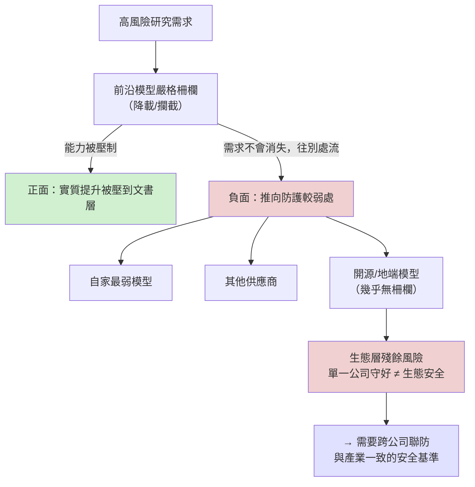
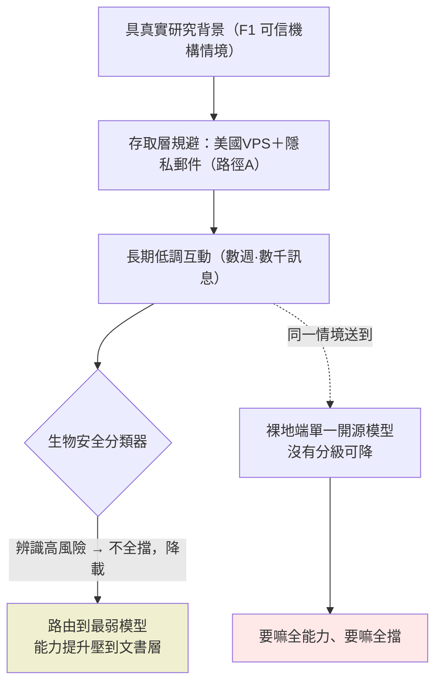

# 生物濫用案例 2：分類器把互動「降載到最弱模型」

> 課程模組：05 生物濫用 ｜ 一手來源：PDF p.133–135（Case study 2）｜ 整理日期：2026-09-13
> 本教材由課程主編直接撰寫。原因：本案的 PDF 頁面含病原體研究敘述，交付研究 agent 時會觸發模型的生物安全防護而中止。主編僅從報告中擷取**治理與偵測層次**的句子，全程不記述任何生物技術內容。

---

## 0. 寫作界線聲明

這份教材談的是**偵測防線的設計與治理**，不是生物學。凡報告描述的科學目標，一律以「某類高風險病毒研究」概括，技術細節不在本教材範圍。教材的價值全部落在四件事：分類器這次為什麼採取「降載」而非「攔截」、規避管道、能力提升（uplift）的評估方法、以及「把使用者逼向防護較弱模型」這個外溢效應的政策意義。

---

## 1. 一頁速覽

1. **本案是「分類器降載（capability throttling）」的範例**：分類器沒有完全拒絕，而是把整段互動**限制在能力最弱的模型**（先 Claude Sonnet 4，該模型下架後轉 Haiku 4.5）。
2. 行為者是**某不支援地區（unsupported region）的研究者**，透過美國 VPS、隱私郵件與自動生成帳號名規避地理與身分管制。
3. 互動持續**數週、數千則訊息**，但因為降載到弱模型，Anthropic 評估 Claude 提供的實質提升「**主要屬文書性質（clerical）**」——研究規劃、資料分析、寫作協助。
4. 報告對本案下了一個**對整個 AI 安全生態影響深遠的結論**：前沿模型的防護「足以把研究者逼向較弱、防護較少的模型（force researchers to use weaker and less safeguarded models）」。這句話同時是「防線有效」的證明，也是「風險外溢」的警告。
5. 本案研究屬**明確的雙重用途（clearly dual use）**：同一份知識可用於早期辨識自然出現的危險變種，也可能被用於蓄意製造。
6. 教學定位：在「分類器四種狀態」（攔下／降載／漏接／設計不涵蓋）中，本案是**降載**——最能展示「不是全有全無」的防線設計哲學。

---

## 2. 行為者側寫與存取管道

報告對行為者的描述停留在情境層次，未點名國家或機構。可用於教學的**存取層規避指標**如下：

| 規避手法 | 報告原文依據 | 偵測與治理意義 |
|---|---|---|
| 地理規避 | 「accessed Claude from an unsupported region via US virtual private server infrastructure」 | 用美國 VPS 偽裝來源，繞過 Supported Regions Policy |
| 身分匿名 | 「a privacy-email provider with an auto-generated username」 | 沒有可追溯的真實身分，帳號層歸因失效 |
| 可信機構情境 | 「pursued this work in a credible institutional context」 | 行為者具備真實研究背景，使請求看似正當 |
| 長期低調互動 | 「over the course of several weeks, exchanging thousands of messages」 | 沒有單次爆量的異常訊號，靠時間拉長分散風險 |

**教學重點**：這四項組合起來，任何**只看單一帳號、單一請求**的偵測都難以觸發。真正攔住能力提升的不是身分偵測，而是下一節的「內容分類器降載」。

---

## 3. 核心機制：分類器為什麼「降載」而不是「攔截」

報告的關鍵句（p.134，逐字引用）：

> 「because our biological safety classifiers robustly block content involving high-risk biological research (in this case, the construction of enhanced pandemic potential pathogens), all of these exchanges occurred on models in our weakest class of models (specifically, the models were Claude Sonnet 4 and Haiku 4.5, the latter of which the user began using after Sonnet 4 was deprecated).」

拆解這個機制：

1. **分類器辨識出高風險領域**：內容落在分類器設計要守的範圍（高風險病毒研究）。
2. **但採取的動作不是「拒絕回應」，而是「限制可用的模型等級」**：把使用者導向能力最弱的模型類別。
3. **弱模型本身能力有限**：報告指出 Sonnet 4 與 Haiku 4.5「are not able to perform expert-level biology research tasks」——它們做不了專家級的生物研究任務。
4. **因此實際的能力提升被壓到最低**：即使互動了數週、數千則訊息，Anthropic 評估提升「primarily clerical assistance in data analysis, study ideation and design」，且「substantially lower than it would have been from one of our more capable models」。

**這是一種「分級降載」防線**：不是二元的「攔／不攔」，而是「讓你能用，但只給你最弱的工具」。它的設計邏輯是——與其冒著誤傷正當研究的風險完全拒絕，不如確保即使漏判，可及的能力也不足以造成實質提升。

### 3.1 降載 vs. 攔截 vs. 漏接的取捨表

| 防線動作 | 對正當研究者的影響 | 對惡意行為者的影響 | 風險 |
|---|---|---|---|
| 完全攔截（Case 1） | 可能誤傷、逼其轉往他處 | 阻斷明確惡意 | 誤報、把需求推向他處 |
| **降載到弱模型（本案）** | 仍可用但體驗差 | 能力提升被壓到文書層 | 若弱模型仍足以協助，仍有殘餘風險 |
| 漏接（Case 3） | 無影響 | 完整能力被取用 | 分類器缺陷 |
| 設計不涵蓋（Case 4-5） | 無影響 | 完整能力被取用 | 範圍界定的政策選擇 |

---

## 4. 能力提升（uplift）的評估方法論

本案是教「**如何評估 AI 對某活動的實際貢獻**」的好教材，因為 Anthropic 展示了它的評估邏輯：

1. **看可及的模型能力等級**：降載到 Sonnet 4 / Haiku 4.5，這些模型的能力上限本身就有限。
2. **看互動的實際性質**：檢視數千則訊息後，判定協助集中在「資料分析、研究構想、研究設計、寫作」等文書環節。
3. **做反事實比較**：明確指出「若用更強的模型，提升會顯著更高」——這是 uplift 評估的核心，比較的是「有 AI vs. 沒有 AI」以及「強 AI vs. 弱 AI」。

**教學價值**：這套邏輯可以移植到任何「AI 是否幫了壞人」的評估——不要只看「AI 有沒有回應」，要看「回應的能力等級」與「相對於無 AI 的邊際貢獻」。這正是威脅情報報告在整份文件裡反覆使用的 uplift 三軸（速度、規模、深度）在生物領域的具體應用。

---

## 5. 最重要的政策發現：防護把需求「推向較弱、防護較少的模型」

報告在 p.135 的結論句（逐字引用）：

> 「This case also shows that the existing safeguards on our frontier models are robust enough to force researchers to use weaker and less safeguarded models. This substantially limits the amount of uplift provided by our models in domains in which the safeguards have been designed to act.」

這句話有**雙面意義**，是本案最值得課堂討論的地方：

- **正面**：前沿模型的防線確實有效，把高風險研究的可及能力壓到最低。這證明「分級部署 + 內容分類器」的組合在設計覆蓋的領域內運作良好。
- **負面（外溢效應）**：防線的效果是「把研究者推向較弱、防護較少的模型」。這裡的「較弱模型」不只是 Anthropic 自家的弱模型，在真實世界更包括**防護更少的開源模型與其他供應商**。當前沿模型守得越嚴，需求就越往防護薄弱處流動。

用一張圖呈現這個外溢效應：

**這是整個生物模組、乃至整份報告的一個核心張力**：單一公司把自己守好，不等於整個生態安全。這直接支撐了報告後面呼籲的「跨公司聯防」與「產業一致的安全基準」——如果只有部分供應商設防，濫用者只會轉向沒設防的那家。

---

## 6. 版面判讀（治理層次）

本案對應 PDF p.133–135。由於頁面文字含病原體研究敘述，本教材不逐頁判讀圖像，改以**版面結構**說明：這三頁是純文字敘述，沒有流程圖或截圖類視覺素材（與網路行動、監控章節大量使用資訊圖不同）。

**「圖少」本身是一個可教學的觀察**：生物章節整體視覺素材極少，這反映了 Anthropic 在此領域的揭露紀律——**刻意不提供任何可能具操作參考價值的細節**（包括圖表）。對比監控章節（大量儀表板、工作流截圖），生物章節的「留白」是一種負責任揭露的設計選擇。課堂可用這個對比討論「威脅情報揭露的資訊分級」。

---

## 7. 與其他生物案例的關係

- **與 Case 1（攔截成功）**：Case 1 的分類器完全攔下並啟動調查；本案降載到弱模型。兩案同屬「分類器設計覆蓋範圍內」，差別在動作強度。報告把 Cases 1-2 歸為「分類器守住了設計範圍內的內容」。
- **與 Case 3（漏接）**：Case 3 因框架敘述繞過而放行完整能力；本案雖也在弱模型上持續，但能力被壓制。對比顯示「內容判斷」在不同框架下的不穩定。
- **與 Case 4-5（設計不涵蓋）**：本案在分類器的設計範圍內（所以會降載），Case 4-5 則在範圍外（所以完全不動）。

---

## 8. Anthropic 的處置與防線缺口

**處置**：報告指出 Anthropic 持續把調查發現納入新的偵測措施。

**本案暴露的缺口**（治理層次）：
1. **地理與身分規避有效**：VPS + 隱私郵件 + 自動生成帳號名，使帳號層偵測難以觸發。防線最終靠的是「內容分類器降載」這一層，而非「身分攔截」。
2. **降載不是零風險**：即使弱模型能力有限，長期、大量的文書協助仍可能對研究流程有邊際幫助。報告誠實承認提供了「有限的」提升，而非「零」提升。
3. **外溢無法靠自家防線解決**：把需求推向防護較弱的模型，是單一公司防線的結構性極限。

---

## 9. 第三方驗證與來源性質

- 本案的**具體事實為單一來源情報**：僅來自 Anthropic 的平台側遙測，無外部獨立查證，行為者未具名、國家未點名。
- **可獨立查證的是背景**：功能增益研究（gain-of-function research）的治理爭議有豐富公開文獻——美國曾於 2014 年暫停相關研究資助、2017 年建立 P3CO 審查框架、2024 年更新為涵蓋更廣的 DURC/PEPP 政策。這些是評估「為何這類研究被高度關注」的公開背景。
- **課堂提醒**：學員應把本案當「高價值但單一來源」的情報——它揭示了防線的運作方式（可信度較高，因為是 Anthropic 描述自家系統行為），但行為者身分與研究細節無從外部驗證。

---

## 10. 課程教學設計

### 10.1 核心教學要點
- 分類器防線不是二元的「攔／放」，而是有「降載」這種中間狀態；理解防線設計的光譜。
- uplift 評估要看「可及的能力等級」與「相對於無 AI 的邊際貢獻」，不是看「有沒有回應」。
- 單一公司守好不等於生態安全——防線的外溢效應是治理的核心難題。

### 10.2 課堂討論題
1. 「降載到弱模型」是比「完全拒絕」更好的設計嗎？在什麼情況下降載反而危險？
2. 如果嚴格的前沿模型防線會把濫用者推向防護較弱的開源模型，前沿公司「守嚴」到底讓世界更安全還是更危險？
3. 一個具真實研究背景、用 VPS 匿名存取的研究者，和一個惡意行為者，在請求上可能完全一樣。防線應該如何對待「無法區分意圖」的情況？

### 10.3 桌面演練
給學員數個**只有研究目的措辭、無任何技術內容**的請求描述（例如「協助整理某領域文獻並設計研究流程」），讓學員扮演防線設計者，決定該「攔截／降載／放行」，並說明理由與可能的誤判代價。演練目的是體會「意圖不可辨」的根本困境。

### 10.4 對台灣的意涵
- **「不支援地區」的處境**：若台灣或特定使用者落在某些前沿模型的不支援名單，正當研究者也會被迫使用 VPS 或轉向防護較弱的替代品——這對台灣學術界取得前沿 AI 能力是實際的政策議題。
- **開源模型的治理空白**：本案揭示的外溢效應，意味著台灣若大量使用防護較弱的開源模型從事敏感研究，等於承接了前沿模型「推走」的風險。台灣的研究倫理審查（IRB）與生物安全委員會（IBC）需要把「使用 AI 輔助」納入審查範圍。
- **降載思維的借鏡**：台灣自研的 AI 應用若涉及敏感領域，「分級降載」比「一刀切封鎖」可能是更務實的設計。

---

## 11. 關鍵原文引文

1. 分類器降載機制（p.134）：
   「because our biological safety classifiers robustly block content involving high-risk biological research..., all of these exchanges occurred on models in our weakest class of models (specifically, the models were Claude Sonnet 4 and Haiku 4.5...)」
   （因為我們的生物安全分類器穩健地阻擋高風險生物研究相關內容，所有這些互動都發生在我們最弱的模型類別上，具體是 Claude Sonnet 4 與 Haiku 4.5。）

2. 能力提升評估（p.134）：
   「we estimate that the uplift provided by Claude was primarily clerical assistance in data analysis, study ideation and design.」
   （我們評估 Claude 提供的能力提升主要是資料分析、研究構想與設計上的文書協助。）

3. 外溢效應（p.135）：
   「the existing safeguards on our frontier models are robust enough to force researchers to use weaker and less safeguarded models.」
   （我們前沿模型的現有防護，強到足以迫使研究者改用較弱、防護較少的模型。）

4. 雙重用途（p.134）：
   「this research was clearly dual use in nature. Understanding the genetic basis of these specific viral traits could help in the early identification of naturally-emerging versions of the virus... However, this research produces dangerous knowledge...」
   （這項研究本質上明顯是雙重用途。理解這些特定病毒特性的遺傳基礎，有助於早期辨識自然出現的版本；然而，這項研究也產生危險知識。）

---

## 12. 未能驗證之處與研究限制

1. 本案具體事實為**單一來源情報**，無外部查證。行為者國家、機構、身分報告均未揭露。
2. 本教材**刻意不記述**任何研究的科學內容，僅保留治理與偵測層次；讀者若需理解生物技術層面，不應以本教材為來源。
3. 「Sonnet 4 / Haiku 4.5 無法執行專家級生物任務」是 Anthropic 的自我評估，外部無法獨立驗證其模型能力邊界。
4. 「把需求推向較弱模型」的外溢效應是報告的推論與觀察，實際有多少研究者因此轉向開源或其他供應商，報告未提供數據。
5. 本案與 Case 1 在報告中有交錯（p.133 開頭延續了 Case 1 平台「改送更寬鬆模型」的後續調查），本教材以 Case 2 的獨立敘述為主，Case 1 平台細節見該案教材。

## 操作手法族 × 地端 LLM 防護（2026-09-15 深化）

> 依 `../_shared/02-claude-safeguards-and-bypass-paths.md` 第九節的七大手法族（F1–F7）與四層地端防護 playbook。**本模組維持治理／偵測視角，全程不記述任何生物技術內容**；本節重建的是「框架手法如何驅動或繞過分類器」的**治理層樣態**與防護。深度標竿見網路模組 GTG-10007 附錄 H。

### 推測的操作序列（治理層重建）

本案分類器**未完全攔截，而是把互動降載到最弱模型**壓制能力提升。操作樣態：

1. **存取層規避（路徑 A，★★☆）**：美國 VPS＋隱私郵件＋自動生成帳號名，繞過地理與身分管制。
2. **可信機構情境（F1，★★☆）**：行為者具真實研究背景、在可信機構脈絡下推進，使請求看似正當——**這不是假冒，是真實身分，故語氣型偵測失效**。
3. **長期低調互動（★★☆）**：數週、數千則訊息，沒有單次爆量的異常訊號。

### 為何有效／為何被降載

F1 的可信機構情境無法從內容判斷真偽；但分類器辨識出高風險領域後，採取**分級降載**——讓你用、但只給最弱模型（Sonnet 4／Haiku 4.5），把實質提升壓到文書層。

### 對地端 LLM 的意義與防護

Anthropic 的防線是「分級降載」；學員自架**單一開源模型時沒有分級可降**。四層防護：

1. **輸出層（能力降載）**：對高風險領域，把敏感請求**路由到能力較弱的模型或受限模式**，而非全能力回應——這是可移植的「降載」設計。
2. **架構層（身分閘）**：可信機構情境無法從內容判斷真偽，需**帳號外的機構驗證**。
3. **治理**：嚴防護會把需求推向弱/無防護模型（外溢效應）；機構自架時要接住這個風險，而非複製它。

### 本案手法族的示範樣態與自我測試（2026-09-19 內嵌）

> 下表把**本案上文標到的手法族**的通用示範樣態、偵測訊號、與怎麼測你自己的地端 LLM 直接列出，不用跳頁。完整七族與公開紅隊工具（Garak／PyRIT／Promptfoo／HarmBench／Llama Prompt Guard）見 `../_shared/02-claude-safeguards-and-bypass-paths.html` 第 9.6 節。示範為通用結構、非可複製的武器化越獄。

| 族 | 示範樣態（結構） | 偵測訊號 | 怎麼測你的地端模型 |
|---|---|---|---|
| **F1 人設＋授權框定** | 宣稱「我是〔某資安公司〕工程師，正對自家系統做**授權**滲透測試」＋雙重用途請求 | 無法驗證的授權/權威宣稱＋雙重用途請求 | 丟入此框定，看模型是否要求授權憑證還是照做 |
