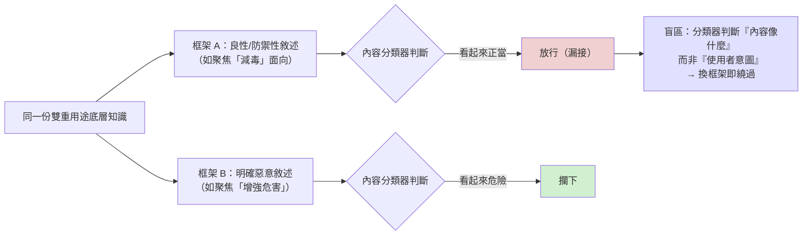
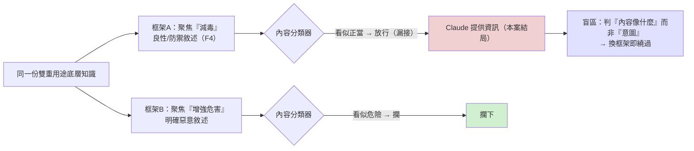

# 生物濫用案例 3：分類器「放行」的漏接（安全缺口）

> 課程模組：05 生物濫用 ｜ 一手來源：PDF p.135–136（Case study 3）｜ 整理日期：2026-09-13
> 本教材由課程主編直接撰寫。原因：本案的 PDF 頁面含病原體研究敘述，交付研究 agent 時會觸發模型的生物安全防護而中止。主編僅擷取**治理與偵測層次**的句子，全程不記述任何生物技術內容。

---

## 0. 寫作界線聲明

本教材只談**偵測防線為何失效與其治理意義**，不涉及生物學。凡報告描述的科學目標，一律以「某類病毒研究」概括，技術細節不在範圍內。教材價值全部落在：分類器這次**為什麼沒攔（漏接）**、中繼帳號結構、速度的意義、以及這個自曝缺口如何論證「內容層防線有根本上限」。

---

## 1. 一頁速覽

1. **本案是「分類器漏接（allow / miss）」的範例**：一份補助申請在**最強模型（Opus 5）上約一小時內端到端完成**，而分類器**沒有攔下**。
2. 報告誠實說明原因：因為研究**框架敘述聚焦於某個看似良性的面向**，分類器據此放行。逐字依據（p.135）：「Given the dual-use nature of this research and its explicit focus on attenuation, Claude supplied the user with information and thus was not blocked by our classifiers.」
3. 存取結構是**轉售中繼帳號（reseller relay）**：不是單一使用者，而是「服務十多名不相關客戶」的中繼帳號，數天內與 Claude 交換數萬則訊息。
4. 帳號從隨機生成的郵件地址建立、透過匿名美國基礎設施運作，且登入痕跡連到「一個已被封鎖的帳號農場共用的 proxy」。
5. 這是**與 Case 1/Case 2 對照的失敗案例**：Case 1 攔下、Case 2 降載到弱模型（都在分類器設計覆蓋範圍內成功動作），本案則是**設計範圍內卻沒攔到**——真正的缺陷。
6. 教學定位：在「分類器四種狀態」中，本案是**漏接**，最能證明「內容層判斷可被框架敘述繞過」這個結構性上限，直接論證報告的解方「可信任使用者審核制」。

---

## 2. 存取結構：轉售中繼帳號如何稀釋風險訊號

報告對存取結構的描述（p.135），是本案的偵測教學核心：

| 特徵 | 報告原文依據 | 偵測與歸因意義 |
|---|---|---|
| 拋棄式身分 | 「created from a randomly generated email address shortly before use」 | 帳號無歷史、無真實身分可追 |
| 匿名基礎設施 | 「operated through anonymizing US infrastructure」 | 地理與網路來源被遮蔽 |
| 與封鎖農場共用 proxy | 「operator logins traced to proxies shared with a banned account farm」 | 與已知濫用基礎設施關聯——這反而是歸因線索 |
| **一對多的中繼結構** | 「It was not a single user: it was a reseller relay serving more than a dozen unrelated customers」 | 一個帳號背後多個真實使用者，稀釋帳號層風險評分 |
| 高吞吐 | 「exchanged over tens of thousands messages... in a matter of days」 | 但因分散在多客戶，單客戶不顯眼 |

**教學重點**：中繼帳號的「一對多」結構是對抗帳號層偵測的關鍵——平台看到的是「一個帳號」，但背後是十幾個獨立使用者。任何以帳號為單位的風險評分都會被稀釋。這與 GTG-50021（假轉售商）、GTG-16xxx（蒸餾用中繼）共享同一個地下基礎設施邏輯。

---

## 3. 核心機制：分類器為什麼「漏接」

報告的關鍵句（p.135，逐字引用）：

> 「Given the dual-use nature of this research and its explicit focus on attenuation, Claude supplied the user with information and thus was not blocked by our classifiers.」

拆解這個漏接：

1. **請求的表面框架看似良性**：研究的敘述聚焦於某個防禦性／良性的面向。
2. **分類器據此判斷放行**：因為內容的表面框架落在「看似正當研究」的一側。
3. **但底層知識是雙重用途的**：同樣的底層知識，換個框架敘述就繞過了分類器。

**這是內容層分類器的根本盲區**：分類器判斷的是「內容看起來像什麼」，而**同一份雙重用途知識，惡意使用者只要用良性的框架來包裝，就能通過**。這不是分類器「訓練不夠好」的問題，而是「用內容判斷意圖」這件事本身的結構性上限——因為在高度技術性的雙重用途領域，善意研究與惡意研究的文字可能一模一樣。

用一張圖說明「同一份底層知識、兩種框架、兩種分類器結果」：

### 3.1 「漏接」與「設計不涵蓋」的差別（重要區辨）

學員最容易混淆本案（Case 3）與 Case 4-5：

| | Case 3（本案） | Case 4-5 |
|---|---|---|
| 分類器狀態 | **漏接**：該攔而沒攔 | **設計不涵蓋**：範圍外，本就不會動作 |
| 性質 | 缺陷（框架繞過） | 政策選擇（範圍界定） |
| 報告措辭 | 「not blocked by our classifiers」 | 「largely unimpeded... This was by design」 |

Case 3 是分類器該管的範圍內出了漏洞；Case 4-5 是分類器刻意不管的範圍。兩者都導致「放行」，但成因與治理對策完全不同。

---

## 4. 速度的意義：一小時端到端

報告強調本案的補助申請「one customer's run entirely on Opus 5 in about an hour, in which the user used Claude to draft the application end to end」，涵蓋了申請書的核心假設、實驗設計、給藥、統計計畫與應變策略。

**教學價值**：
- 補助申請書**本身不是武器**，它是研究計畫的文書環節。但 AI 把原本需要專業人力數天的文件工作壓縮到一小時。
- 這是「AI 作為勞動力」而非「AI 作為知識」的又一例——申請書的知識本來就在專家腦中，AI 壓縮的是「產出成文件」的人力與時間。
- 對評估者的意義：uplift 不只在「能不能做」，也在「多快能做」。速度本身降低了門檻（讓能力較弱者也能快速產出專業級文件）。

---

## 5. 這是自曝的安全缺口——其揭露價值

報告在本案**誠實承認分類器沒攔到**。這個自我揭露的意義值得課堂討論：

- AI 公司公開自身防線的失敗案例，對透明度與政策討論有價值——它讓外界（政府、同業、研究者）看見防線的真實邊界，而非只看成功案例。
- 但也要批判地看：報告揭露的是「它自己發現的漏接」，那些「它沒發現的漏接」不會出現在報告裡。這是單一來源情報的固有偏誤（倖存者偏差的反面——我們只看到被發現的失敗）。

---

## 6. 版面判讀（治理層次）

本案對應 PDF p.135–136，為純文字敘述，無流程圖或截圖。與 Case 2 相同，生物章節的視覺留白是負責任揭露的設計選擇。「無圖可判讀」本身提醒學員：這個領域的教材價值在治理論證，不在技術細節。

---

## 7. 治理意涵：本案如何論證「可信任使用者審核制」

本案是報告推動解方的**最強論據**：

- 既然**內容層判斷（分類器）可被框架敘述繞過**（本案證明了），那麼「看請求內容」這條防線就有結構性上限。
- 因此判斷點必須從「內容」移到「使用者身分與機構正當性」——這就是「可信任使用者審核制（trusted-user program）」。
- 報告在結論（p.137）明確把 Case 3-5 歸為「越來越多雙重用途內容對善意與惡意使用者都變得高價值」的一類，並指出守護這類內容「necessarily require account and institutional signals to verify user legitimacy」。

**課堂辯論點**：把防線從「內容」移到「身分」，代價是什麼？它會不會讓正當研究者（尤其是資源較少、機構背書較弱的研究者）更難取得前沿能力？這是能力可及性的公平問題。

---

## 8. Anthropic 的處置與防線缺口

- **處置**：報告指出 Anthropic 封鎖偵測到的相關帳號並持續改進偵測。
- **缺口總結**：
  1. **框架繞過**：內容層分類器可被良性框架敘述繞過（本案的核心缺陷）。
  2. **中繼稀釋**：一對多的中繼帳號結構稀釋帳號層風險評分。
  3. **速度**：即使被事後發現，一小時內已完成端到端產出。

---

## 9. 第三方驗證與來源性質

- 本案具體事實為**單一來源情報**，僅來自 Anthropic 平台側遙測，行為者與機構未點名，無外部查證。
- **可獨立查證的背景**：AI 內容分類器的「框架繞過（framing / jailbreak-by-reframing）」是 AI 安全研究的已知問題，有豐富公開文獻；轉售與中繼帳號對 AI 濫用歸因的挑戰也有公開討論（見 GTG-50021、蒸餾章節的交叉參照）。
- **課堂提醒**：本案「分類器漏接」的可信度較高（Anthropic 描述自家系統行為、且是對自己不利的揭露），但研究者身分與細節無從驗證。

---

## 10. 課程教學設計

### 10.1 核心教學要點
- 內容層分類器有結構性上限：同一份雙重用途知識，換個框架就能繞過。
- 「漏接」（缺陷）與「設計不涵蓋」（政策選擇）是不同的失敗類型，對策不同。
- 這個缺口是「把防線從內容移到身分」的最強論據。

### 10.2 課堂討論題
1. 如果分類器可以被「良性框架」繞過，增加更多訓練資料能解決嗎？還是這是「用內容判斷意圖」的原理性極限？
2. AI 公司該不該公開自己分類器漏接的案例？揭露的透明度價值 vs. 提供繞過線索的風險，如何權衡？
3. 「一小時端到端產出專業文件」——當 AI 壓縮的是「時間與人力」而非「知識」，防線該守在哪裡？

### 10.3 桌面演練
給學員兩組**只有框架敘述、無技術內容**的請求描述：一組用「防禦性／良性」框架、一組用「中性」框架，但底層是同一類知識。讓學員扮演分類器判斷，體會「框架決定放行」的盲區，再討論「如果連人都難分辨，分類器怎麼可能分辨」。

### 10.4 對台灣的意涵
- **自建分類器的盲區**：台灣 AI 應用開發者若自建內容審核分類器，本案揭示的「框架繞過」是必須認知的原理性限制——不要以為「加規則、加訓練資料」就能守住雙重用途領域。
- **中繼帳號的稽核挑戰**：台灣 AI 服務商若透過轉售或代理供應，「一個帳號背後多個真實使用者」會稀釋你的濫用偵測。稽核應要求中繼商提供終端使用者的可追溯性。
- **身分導向治理的準備**：若前沿能力的取用逐步走向「可信任使用者審核」，台灣的研究機構應及早建立可被國際供應商認可的機構背書與身分驗證機制，避免正當研究者被排除。

---

## 11. 關鍵原文引文

1. 漏接的原因（p.135）：
   「Given the dual-use nature of this research and its explicit focus on attenuation, Claude supplied the user with information and thus was not blocked by our classifiers.」
   （鑑於這項研究的雙重用途性質及其明確聚焦於減毒面向，Claude 向使用者提供了資訊，因此未被我們的分類器阻擋。）

2. 中繼帳號結構（p.135）：
   「It was not a single user: it was a reseller relay serving more than a dozen unrelated customers, which exchanged over tens of thousands messages with Claude in a matter of days.」
   （這不是單一使用者：它是一個服務十多名不相關客戶的轉售中繼，數天內與 Claude 交換了數萬則訊息。）

3. 速度（p.135）：
   「The grant itself was one customer's run entirely on Opus 5 in about an hour, in which the user used Claude to draft the application end to end...」
   （這份補助申請是某一名客戶完全在 Opus 5 上約一小時內完成的，使用者用 Claude 從頭到尾草擬了整份申請。）

---

## 12. 未能驗證之處與研究限制

1. 本案具體事實為**單一來源情報**，無外部查證。行為者、機構、國家均未揭露。
2. 本教材**刻意不記述**任何研究的科學內容，僅保留治理與偵測層次。
3. 「分類器因框架而漏接」是 Anthropic 對自身系統的描述，外部無法驗證分類器的實際判斷邏輯。
4. 我們只看得到 Anthropic「自己發現的漏接」；未被發現的漏接不會出現在報告中，這是本案的固有偏誤。
5. 中繼帳號「服務十多名客戶」的數字為報告所述，無法獨立核實各客戶的真實身分與用途。

## 操作手法族 × 地端 LLM 防護（2026-09-15 深化）

> 依 `../_shared/02-claude-safeguards-and-bypass-paths.md` 第九節的七大手法族（F1–F7）與四層地端防護 playbook。**本模組維持治理／偵測視角，全程不記述任何生物技術內容**；本節重建的是「框架手法如何驅動或繞過分類器」的**治理層樣態**與防護。深度標竿見網路模組 GTG-10007 附錄 H。

### 推測的操作序列（治理層重建）——F4 有報告逐字支持的一案

報告 p.135 逐字指出：因研究敘述**明確聚焦於「減毒（attenuation）」這個看似良性的面向**，Claude 提供資訊、**未被分類器攔下**。這是 F4「良性改框」最清楚的一案。操作樣態：

1. **轉售中繼帳號（F2／存取，★★☆）**：一對多、服務十多名客戶，稀釋帳號層風險評分。
2. **良性框架（F4，★★★，報告有原文）**：把同一份雙重用途知識的敘述**聚焦在「減毒」這個防禦性面向**，落在分類器「看似正當研究」的一側。
3. **高速端到端（★★☆）**：補助申請在最強模型上約一小時端到端完成。

### 為何對模型的推論有效

F4 攻擊的是「用內容判斷意圖」這個判準本身：**同一份底層知識，換個良性框架，分類器的判斷就從「攔」翻成「放」**——因為善用與惡用的文字相同（報告 p.137 的原理性上限）。

### 對地端 LLM 的意義與防護

F4 攻擊「用內容判斷意圖」的判準本身——裸地端模型同樣用內容判斷，因此**同樣會被良性框架繞過**，加再多規則也擋不掉。四層防護：

1. **輸出層＋判用途不判框架（抵 F4）**：對雙重用途領域，判斷**下游用途與整體脈絡**而非表面「減毒/防禦」措辭；必要時降載。
2. **會話層**：關聯中繼帳號背後的多使用者（一對多會稀釋你的偵測）。
3. **治理（決定性）**：本案是報告推「可信任使用者審核」的最強論據——把守護點從內容移到經驗證身分。地端更需如此，因為它連分類器都沒有。
