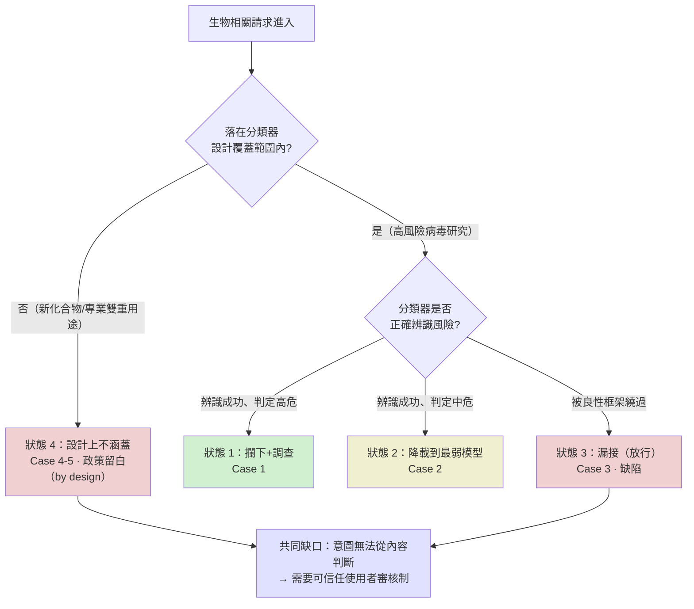

# 生物濫用案例 4 與 5：分類器「設計上不涵蓋」的範圍留白

> 課程模組：05 生物濫用 ｜ 一手來源：PDF p.136–137（Case studies 4 and 5: Venoms and toxins）＋ p.137–138（Conclusions）｜ 整理日期：2026-09-13
> 本教材由課程主編直接撰寫。原因：本案的 PDF 頁面含毒素研究敘述，交付研究 agent 時會觸發模型的生物安全防護而中止。主編僅擷取**治理與偵測層次**的句子，全程不記述任何化合物、毒素或合成的技術內容。

---

## 0. 寫作界線聲明

本教材只談**分類器的範圍界定與治理**，不涉及任何毒素、毒液、化合物的技術內容。凡報告描述的研究，一律以「某類新化合物研究」概括。教材價值全部落在：分類器**為什麼「刻意不涵蓋」**這兩案、這與「漏接」的根本差別、雙重用途在毒素領域的極端性、以及這如何收束為整個生物模組的核心結論——「內容分類器不能作為唯一防線」。

---

## 1. 一頁速覽

1. **本兩案是「分類器設計上不涵蓋（out of design scope）」的範例**：報告明說「the work proceeded largely unimpeded by our biological safety classifier. This was by design.」（工作大致未受生物安全分類器阻礙，這是設計使然。）
2. 這與 Case 3「漏接」有**根本差別**：Case 3 是分類器該攔而沒攔（缺陷）；本兩案是分類器的**設計範圍刻意不含**（政策選擇）。
3. 兩案都涉及**新化合物研究**，且都**框定為治療性目標**（如止痛、抗憂鬱等醫療用途），但同一套研究產物**同時可導向治療或有害用途**。
4. 兩案都與**國家支持的研究計畫（state-supported / national priority program）**相關，且都因**違反支援地區政策（unsupported region evasion / Supported Regions Policy）**於 2026 年 5 月被封號。
5. Case 5 有一個重要的偵測細節：研究者**刻意指示 Claude 對敏感描述保持「低擬真度（low fidelity）」**——主動要求模型模糊化，這本身是規避意識的證據。
6. **本兩案是整個生物模組的收束**：報告用它們論證「分類器不能作為唯一防線」，因為「在高度技術性的雙重用途領域，無法可靠辨識使用者意圖，分類器無法同時賦能善用又防止惡用」。

---

## 2. 核心機制：「設計上不涵蓋」是什麼意思

報告的關鍵段落（p.137，逐字引用）：

> 「In both of these cases, the work proceeded largely unimpeded by our biological safety classifier. This was by design. The purpose and intent of the classifier is to restrict access to information that would make the development of known biological weapons with potentially catastrophic impact accessible to novices.」

拆解：

1. **分類器有明確的設計目標**：它要守的是「讓**新手**能取得**已知生物武器**、造成**潛在災難性影響**的資訊」。
2. **本兩案不落在這個目標內**：它們是**新化合物研究**（不是已知武器）、研究者是**專業人員**（不是新手）、框架是治療性目標。
3. **所以分類器刻意不動作**：不是它失靈，而是這些內容根本不在它設計要管的範圍。

**這是「範圍界定（scoping）」的政策問題，不是「偵測能力」的技術問題**。分類器的每一次範圍界定都是取捨：涵蓋太廣會誤傷大量正當研究（毒素研究對新藥開發至關重要），涵蓋太窄會漏掉新型威脅。本兩案落在「刻意留白」的那一側。

### 2.1 雙重用途在毒素領域的極端性（公開科普史實）

報告用了幾個公開的歷史例子說明毒素的雙重用途本質（這些是廣為人知的科普事實，非操作內容）：某些劇毒物質曾被多國作為武器研究，如今卻是核准的醫療用藥或神經科學的基礎研究工具。這說明**同一類研究，善用與惡用的界線不在技術本身，而在意圖與用途**——而意圖無法從研究內容判讀。

報告也指出這類化合物中，有部分因其雙重用途潛力而受**澳洲集團（Australia Group）共同管制清單**規範，且 Case 5 涉及的一個標的在**世界衛生組織 R&D Blueprint 優先疾病清單**上。這把 AI 治理與既有的國際生化管制體系連結起來。

---

## 3. 兩案的治理要點（抽象層次）

### Case 4
- **研究產物**：某類生物毒素胜肽的圖譜，並發展為一個「生成式流程（generative pipeline）」以最佳化其特性。
- **框架**：明確的治療目標（新型止痛藥、抗憂鬱等）。
- **雙重用途的具體體現**：同一份圖譜「同時含有治療標的與致效／麻痺標的的骨架」，因此可生成治療或有害化合物。
- **研究者的規避意識**：報告指出研究者本身「展現了對自身工作雙重用途性質的認知」，引用了討論蛋白質設計雙重用途的期刊文章。
- **國家關聯**：報告從與 Claude 分享的資訊得知，研究者的產出是**國家支持研究計畫**的一部分。
- **處置**：2026 年 5 月因不支援地區規避被封號。
- **合規訊號**：報告指出「該地點的國際合規評估」對這類毒素、以及在此脈絡下把 AI/ML 用於生物武器應用，本就存在疑慮。

### Case 5
- **研究產物**：對一組多樣毒素的計算性重新設計。
- **框架**：同樣大致框定為治療脈絡，並描述為國家公共研究計畫下的優先研究。
- **雙重用途的具體體現**：工作涵蓋的標的中，有一個在 WHO 的高流行／大流行威脅優先疾病清單上。
- **研究者的規避意識（重要偵測細節）**：研究者與 Claude 共同撰寫季度進度報告，且**刻意混淆敏感標的的身分，明確指示 Claude 讓描述保持「低擬真度」**。這是主動要求 AI 模糊化的規避行為。
- **處置**：2026 年 5 月因違反支援地區政策被封號。

**兩案的共同教學點**：研究者都展現了**規避意識**（Case 4 引用雙重用途文獻、Case 5 主動要求模糊化），且都與國家計畫相關。但分類器對這兩案都沒有動作——不是因為沒偵測到，而是因為設計上就不管這個範圍。

---

## 4. 收束論證：為什麼「分類器不能是唯一防線」

報告在 p.137 的核心論證（逐字引用）：

> 「We believe these cases illustrate the challenge in using classifiers as the only safeguard layer: since it is not possible to reliably identify the intent of the user in highly technical dual-use areas, a classifier cannot simultaneously enable benefit and prevent harm. This knowledge and our observation of cases such as this suggest to us that the only safe way to serve frontier biological capabilities is to offer them in trusted user programs.」

這是整個生物模組的**理論高峰**，論證鏈是：

1. 在高度技術性的雙重用途領域，**無法可靠辨識使用者意圖**。
2. 因此分類器**無法同時「賦能善用」又「防止惡用」**——因為善用與惡用的內容相同，只有意圖不同。
3. 所以「內容分類器」作為唯一防線在原理上不可能成功。
4. **唯一安全的方式是「可信任使用者審核制（trusted user programs）」**——把判斷從「內容」移到「經審核的使用者身分與機構正當性」。

---

## 5. 五案總表：分類器防線的完整光譜

這是整個生物模組的收束表，把五個案例的分類器結果並列。先用一張圖呈現「一個請求進入後，分類器可能落在哪個狀態」：

| 案例 | 研究領域（抽象） | 分類器狀態 | 性質 | 報告依據 |
|---|---|---|---|---|
| Case 1 | 某高風險病毒研究 | **攔下** + 啟動調查 | 設計範圍內，成功動作 | p.131-133 |
| Case 2 | 某高風險病毒研究 | **降載到最弱模型** | 設計範圍內，成功動作 | p.133-135 |
| Case 3 | 某病毒研究（良性框架） | **漏接（放行）** | 設計範圍內的**缺陷**（框架繞過） | p.135-136 |
| Case 4 | 某新化合物研究 | **設計上不涵蓋** | 範圍外的**政策留白** | p.136-137 |
| Case 5 | 某新化合物研究 | **設計上不涵蓋** | 範圍外的**政策留白** | p.136-137 |

報告自己的歸納（p.137）：「our classifiers robustly guard content in domains that they have been designed to restrict (Cases 1-2), but also that an increasing range of dual-use content is becoming highly valuable to beneficial and potentially malicious users alike (Cases 3-5).」

**這張表是整個生物模組最重要的一張教具**：它展示分類器防線不是「有或沒有」，而是有攔下、降載、漏接、範圍外四種狀態，每種背後是不同的設計取捨與治理對策。

---

## 6. 章節結論的三個治理洞察（p.137-138）

1. **30 天盤查的基準率（base rate）**：報告掃描 30 天與敵對國家機構相關的活動，找出約 **35 項研究，多數是普通民用科學（most of them ordinary civilian science）**，部分具雙重用途潛力。這個「多數是民用」的基準率很重要——它說明威脅辨識的難處在於**訊號稀疏**：大量正當研究中混著少數值得關注的活動。
2. **供應商的獨特可見性**：報告指出 AI 供應商「acquire threat-relevant visibility into real-world use that even governments and intergovernmental organizations lack」，並以 Case 5 為例——研究者**無意間透露了含防禦價值的秘密**。這是「上游偵測」的價值：模型供應商看得到連政府都看不到的研究活動早期訊號。
3. **解方是「過濾器 + 可信任存取」的組合**：報告結論（p.138）：「these deployments will necessarily involve a combination of safety filters guarding the highest-risk content and capabilities and trusted access programs that enable such access for beneficial uses.」——最高風險內容用過濾器守，其餘雙重用途能力用可信任存取制開放。

---

## 7. 版面判讀（治理層次）

本兩案對應 PDF p.136–137，為純文字敘述，無流程圖或截圖。生物章節全程的視覺留白是負責任揭露的設計選擇。

---

## 8. Anthropic 的處置與防線缺口

- **處置**：兩案均於 2026 年 5 月因規避支援地區政策被封號。
- **關鍵缺口**：這不是「偵測失敗」，而是**「範圍界定的必然留白」**——分類器不可能涵蓋所有雙重用途研究，否則會癱瘓大量正當科學。這是設計上接受的殘餘風險，也是為什麼需要「可信任使用者審核」作為互補防線。

---

## 9. 第三方驗證與來源性質

- 本兩案具體事實為**單一來源情報**，僅來自 Anthropic 平台側遙測，行為者、國家、機構均未點名。
- **可獨立查證的背景**：澳洲集團管制清單、化學武器公約（CWC）與生物武器公約（BWC）對毒素的雙重規範、WHO R&D Blueprint 優先疾病清單、以及「雙重用途研究關切（DURC）」的治理框架，都有豐富公開文獻。
- **課堂提醒**：本兩案的「設計上不涵蓋」是 Anthropic 對自家分類器範圍的說明，可信度較高（它主動揭露自己不管的範圍），但研究細節無從驗證。

---

## 10. 課程教學設計

### 10.1 核心教學要點
- 「設計上不涵蓋」（政策留白）與「漏接」（缺陷）是不同的失敗類型——前者是刻意的範圍取捨，後者是能力不足。
- 分類器範圍界定是取捨：涵蓋太廣誤傷正當研究，太窄漏掉威脅。
- 內容分類器在雙重用途領域有原理性上限，必須與「可信任使用者審核」互補。

### 10.2 課堂討論題
1. 如果毒素研究對新藥開發至關重要，AI 公司該把這類研究納入分類器攔截範圍嗎？誰有資格決定這條線畫在哪裡？
2. 「設計上不涵蓋」意味著 AI 公司**明知**某些雙重用途研究會通過。這是負責任的取捨，還是把風險外部化？
3. 報告說 30 天盤查中「多數是普通民用科學」。在訊號如此稀疏的情況下，把防線設得更嚴會誤傷多少正當研究？

### 10.3 桌面演練：分類器範圍界定
給學員一個假想的 AI 安全分類器，讓他們決定「應該涵蓋多廣」——提供數個**只有研究領域類別、無技術內容**的抽象描述，讓學員畫出「攔截／降載／放行」的界線，並計算各種界線下的「誤傷正當研究」與「漏掉威脅」的取捨。用五案總表作為總結，讓學員理解防線的完整光譜。

### 10.4 對台灣的意涵
- **化學與生物研究治理**：台灣的化學武器公約與生物武器公約國內落實、以及學術機構的雙重用途研究審查（IRB/IBC），需要把「使用 AI 輔助」納入。本兩案顯示，即使前沿 AI 公司也選擇不涵蓋這類研究，那麼機構層的審查就是最後防線。
- **「分類器範圍之外」的治理空白**：台灣若發展自己的 AI 應用或使用開源模型，本兩案提醒——不要假設「模型有安全防護」就等於「所有危險用途都被擋」。範圍外的雙重用途研究需要靠機構治理與使用者審核，而非依賴模型內建的分類器。
- **供應商可見性的政策價值**：報告指出 AI 供應商能看到連政府都缺乏的研究活動早期訊號。台灣的科技與生物安全主管機關可思考如何與 AI 供應商建立（在隱私與法律框架內的）威脅情報共享機制。

---

## 11. 關鍵原文引文

1. 設計上不涵蓋（p.137）：
   「In both of these cases, the work proceeded largely unimpeded by our biological safety classifier. This was by design.」
   （在這兩個案例中，工作大致未受我們的生物安全分類器阻礙。這是設計使然。）

2. 分類器的原理性上限（p.137）：
   「since it is not possible to reliably identify the intent of the user in highly technical dual-use areas, a classifier cannot simultaneously enable benefit and prevent harm.」
   （由於在高度技術性的雙重用途領域無法可靠辨識使用者意圖，分類器無法同時賦能善用又防止惡用。）

3. 解方（p.137）：
   「the only safe way to serve frontier biological capabilities is to offer them in trusted user programs.」
   （安全地提供前沿生物能力的唯一方式，是透過可信任使用者計畫提供。）

4. 30 天盤查基準率（p.137）：
   「we swept 30 days of activity associated with adversarial state institutions and found roughly 35 distinct research efforts, most of them ordinary civilian science, but some with notable dual-use potential.」
   （我們掃描了 30 天與敵對國家機構相關的活動，發現約 35 項不同的研究工作，多數是普通民用科學，但有些具明顯的雙重用途潛力。）

5. 供應商可見性（p.138）：
   「providers will continue to acquire threat-relevant visibility into real-world use that even governments and intergovernmental organizations lack.」
   （供應商將持續取得連政府與政府間組織都缺乏的、與威脅相關的真實世界使用可見性。）

---

## 12. 未能驗證之處與研究限制

1. 本兩案具體事實為**單一來源情報**，無外部查證。行為者、國家、機構、國家計畫名稱均未揭露。
2. 本教材**刻意不記述**任何毒素、化合物、合成的技術內容，僅保留治理與偵測層次。
3. 「設計上不涵蓋」是 Anthropic 對自家分類器範圍的說明，外部無法驗證分類器實際的範圍界定邏輯。
4. 「30 項研究、多數民用」的基準率為報告所述，無法獨立核實其抽樣方法與判定標準。
5. 兩案與國家計畫的關聯，報告說是「從與 Claude 分享的資訊」得知——這意味著歸因依賴使用者自己輸入的內容，可能不完整或有誤導。
6. 「五案總表」中各案的分類器狀態分類（攔下／降載／漏接／設計不涵蓋）是本教材綜合報告各案措辭的教學性歸納，其中「四種狀態」的框架是本課程的整理，非 Anthropic 的原始用語。
