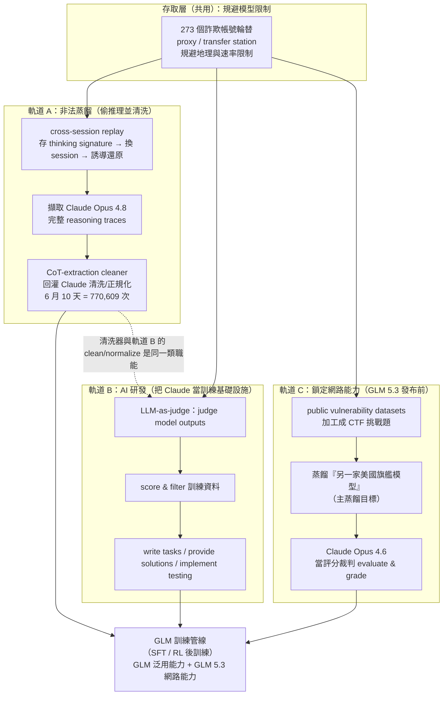
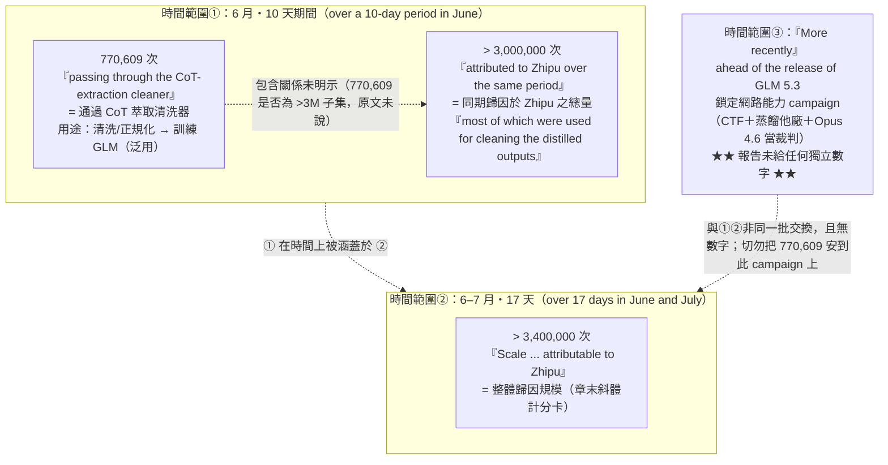
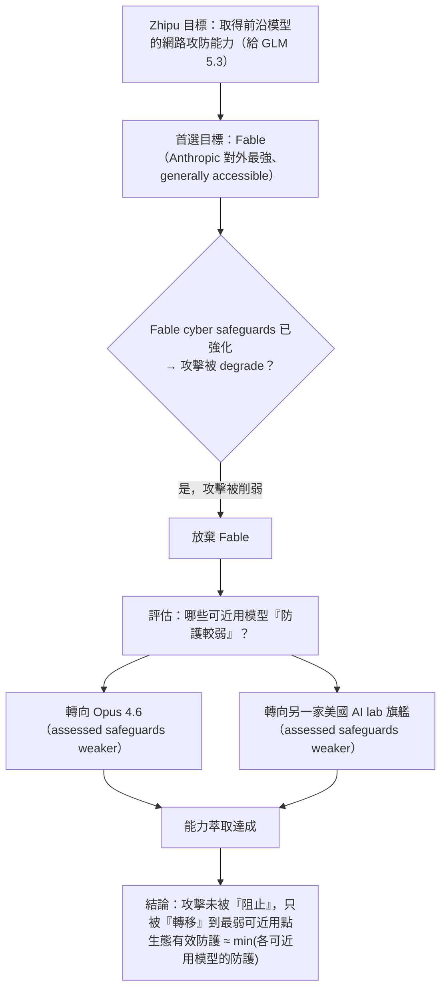
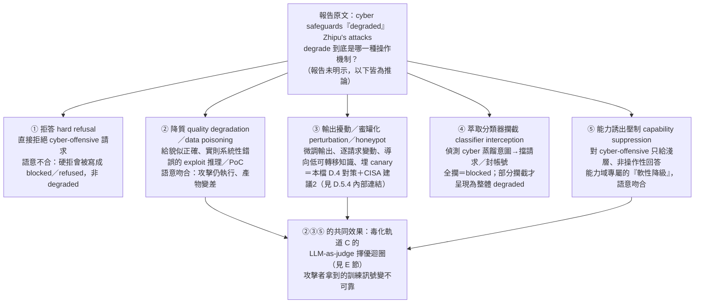
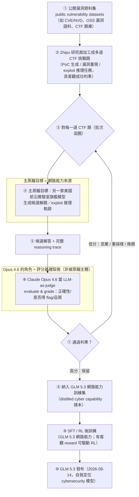

# GTG-16006：智譜 AI（Zhipu／Z.ai）的蒸餾、AI 研發與鎖定網路能力行動

> 課程模組：07 非法蒸餾（Illicit distillation）｜ 一手來源：Anthropic《Detecting and countering misuse of AI: September 2026》PDF p.150–151（案例標題起於 p.150 下半，內文延續至 p.151 上半，其後轉入 GTG-16008 小米案）｜ 整理日期：2026-09-13
>
> 補充一手脈絡：本案位於「Illicit distillation」章（PDF p.143–154），與 GTG-16005（阿里巴巴）、GTG-16002（Moonshot／月之暗面）、GTG-16001（DeepSeek）、GTG-16008（小米）、GTG-16012／16003（SenseTime、MiniMax）並列。本教材在解釋共用手法（cross-session replay attack、reasoning signature、CoT-extraction cleaner）時會引用同章其他頁面，並逐一標明頁碼。

---

## 1. 一頁速覽（TL;DR）

1. **主角**：Zhipu（智譜，中國北京的前沿大模型公司，海外品牌 **Z.ai**，產品線為 **GLM** 系列）。本案在報告中的代號為 **GTG-16006**。**全份 154 頁報告中，「Zhipu／Z.ai／GLM」三個關鍵字只出現在本案這一段**（PDF 第 5122–5154 行區間，對應 p.150–151），沒有出現在執行摘要或其他章節——這是一個**單一段落、單一來源**的情報披露。

2. **本案的獨特之處＝「三重用途」**：報告標題本身就點名三件事——**蒸餾（Distillation）**、**AI 研發（AI R&D）**、**鎖定網路能力（targeting cyber capabilities）**。同章其他中國實驗室（Moonshot、DeepSeek、小米）主要被指控「偷模型能力＋順手外洩使用者資料」，只有 Zhipu 被明確指控把偷來的能力**導向網路攻擊面向的強化**，而且是**趕在自家新模型（GLM 5.3）發布前**做的。這是本案在課程裡最值得教的一點：**一個 AI 實驗室，用競爭對手的模型，去補強自己模型的網路攻擊相關能力**。

3. **手法**：Zhipu 跑一條 **chain-of-thought（CoT，思維鏈）萃取管線**，針對 **Claude Opus 4.8**，用 **273 個詐欺帳號（fraudulent accounts）**輪替以規避模型限制，記錄 Claude 的推理軌跡（reasoning traces），再**把擷取到的 Claude 推理軌跡「回灌」給 Claude 本身做「清洗（clean）」**，產出可用於訓練 GLM 的資料。

4. **關鍵數字（皆須對得上原文）**：在 **6 月的一個 10 天期間**，有 **770,609 次交換（exchanges）通過「CoT 萃取清洗器（CoT-extraction cleaner）」**；同一期間另有**超過 300 萬次**交換被歸因於 Zhipu，「其中多數用於清洗蒸餾出來的輸出（cleaning the distilled outputs）」。整體規模則是**在 6、7 月共 17 天內、觀察到超過 340 萬次交換**。

5. **鎖定網路能力（第三重用途，重點）**：在 GLM 5.3 發布前，Zhipu 用**公開漏洞資料集（public vulnerability datasets）**做出多道 **CTF（capture-the-flag）挑戰題**，然後對**另一家美國前沿實驗室的頂尖模型**發動蒸餾攻擊；**Claude Opus 4.6** 也被同時鎖定，但主要角色是**評分／評判（evaluate and grade）另一家模型的回應**。

6. **安全防護的「非對稱」被利用**：Zhipu 一開始想鎖定 Anthropic 的 **Fable** 模型（Anthropic 對外「一般可取得」的最強模型）的網路能力，但 Fable 的網路安全防護已強化，攻擊被削弱後 Zhipu **放棄 Fable，改攻 Opus 4.6 與另一家美國實驗室的旗艦模型——原因明白寫著「因為他們評估這些模型的防護較弱」**。這是課程裡的黃金教材：**同一實驗室產品線內防護不均，會被對手當成套利點（arbitrage）挑最弱的一環下手**。

7. **歸因與回應**：報告對整章的蒸餾行為使用 **high confidence（高信度）**歸因（p.147）。外部佐證方面，美國 **NSA／CISA／FBI 於 2026-09-08 發布聯合資安通報 AA26-251A**，直接點名 **Z.AI** 為對美國前沿模型做蒸餾的中國實驗室之一（本報告 09-10 才發布，早兩天）。中國商務部於 09-09～09-10 概括性否認，稱蒸餾是「中立的技術手段」；**Zhipu 本身未就本指控發表公開回應**。

8. **這個案例在課程裡要教什麼**：教學員把「蒸餾」從一個抽象的智財問題，重新理解為一條**具體的國安/資安威脅鏈**——「非法蒸餾 → 推理能力普遍性提升 → 網路攻擊能力被便宜地複製到不受安全防護約束的模型」。同時教「情報學上如何在幾乎沒有傳統 IOC 的情況下，靠**行為遙測與組織歸因**去偵測與究責」。

---

## 2. 行為者側寫與歸因

### 2.1 行為者是誰：Zhipu / Z.ai / GLM

- **公司**：Zhipu AI（中文常見譯名「智譜」「智譜華章」「智譜清言」為其產品線），源自清華大學技術體系的中國前沿大模型公司，總部北京。**海外品牌為 Z.ai**（報告原文：「Zhipu, branded outside China as Z.ai」，p.150）。
- **產品**：**GLM（General Language Model）** 系列大模型。本案直接關聯到即將發布的 **GLM 5.3**。
- **本案在報告中的定位**：報告把 Zhipu 放在「Illicit distillation」章，與其餘六家中國實驗室並列，並在章首（p.143）明講：自 2026 年 2 月首度揭露後，已辨識並瓦解**來自七家中國實驗室**、針對 Claude 的額外蒸餾攻擊。

> 情報分析要點：報告**沒有**在本案披露任何個人姓名、handle、IP、網域、Telegram 帳號等傳統識別線索。它披露的是**組織層級的行為指紋**——273 個詐欺帳號、跨工作階段重放（cross-session replay）的技術特徵、CoT 清洗器的流量、以及「觀察到 Zhipu 員工切換模型」這種**行為觀測**（原文 "We observed Zhipu employees then switching to Opus 4.6..."，p.151）。這意味著歸因是建立在**遙測聚合＋行為關聯**，而非單一硬性識別符。

### 2.2 歸因的措辭與信度（情報學重點）

報告在本案**內文**主要用「**attributed to Zhipu**（歸因於 Zhipu）」「**we counted**」「**we observed**」等直述句，並未在 Zhipu 這一段逐句加信度副詞。但整章的信度基調由 p.147 的總結句設定：

> 原文（p.147）：「Since February 2026, we have detected and disrupted unauthorized distillation campaigns we have attributed **with high confidence** to specific PRC-based labs targeting Anthropic's Opus-class models.」

因此本案的**歸因信度＝high confidence（高信度）**，且是**組織級歸因（attributed to a specific organization）**。這一點與報告在「How we address illicit distillation」（p.153）說明的方法論一致：

> 原文（p.153）：「Instead of banning proxy accounts individually, we work to **attribute this suspicious activity to a specific organization**, allowing us to take comprehensive enforcement actions...」

**情報學上，這幾種措辭的差別要教給學員：**

| 措辭 | 情報學含義 | 在本案的體現 |
|---|---|---|
| **high confidence** | 有多源、內部一致、且分析者判斷替代解釋（alternative hypotheses）已被合理排除。這是三級信度（high/moderate/low）中的最高級。 | 整章對七家實驗室的總體歸因等級（p.147）。 |
| **attributed to（歸因於）** | 直接指名責任主體；相對 "consistent with"（僅相容、不排他）更強。 | 本案內文對 Zhipu 的每一條主張。 |
| **we observed / we counted** | 一手遙測直述，屬「觀測事實」而非「推論」，信度最高但**範圍受限於可觀測面**。 | 770,609 次、273 帳號、員工切換模型。 |
| **likely（可能）** | 中等信度推測。 | 「Zhipu **likely** used these outputs throughout its training pipeline」（p.151）——注意這句用了 likely，代表「用於整條訓練管線」是**推測**而非直接觀測。 |

> **教學提醒**：同一案例裡，Anthropic 對「看得到的東西」（帳號數、交換次數、員工切換行為）用觀測性直述；對「看不到、只能推論的東西」（這些輸出最終如何被用在 GLM 訓練管線）用 likely。**能區分「觀測」與「推論」是讀情報報告的基本功**。本案是很好的對照樣本。

### 2.3 歸因是怎麼「站得住」的——推理鏈重建

課程要教「怎麼想」，所以把 Anthropic 可能的歸因推理鏈拆出來（部分為報告明示、部分為合理重建，已標註）：

1. **帳號叢集化**（報告明示，p.153）：用 metadata 與異常訊號找出與 proxy／transfer station 網路關聯的帳號，把散落的詐欺帳號**聚合成叢集**。
2. **行為指紋比對**（報告明示）：本案的 273 個詐欺帳號共享同一套 **cross-session replay** 手法（先存下 reasoning signature、另開新 session、誘導 Claude 把 signature 還原成完整推理）——這種**特定且不尋常的技術特徵**，把叢集綁定成同一行動。
3. **目的一致性**（報告明示）：叢集的流量集中在「CoT 萃取清洗器」與「清洗蒸餾輸出」——用途單一且與訓練資料工程吻合。
4. **組織實體關聯**（報告明示但未公開細節）：Anthropic 把叢集歸因到「Zhipu」這個組織實體，並能觀察到「**Zhipu 員工**切換模型」——代表其遙測/情資已細到能把行為對應到特定公司的人員操作，而非只是「某個中國 IP」。
5. **時間—產品關聯**（報告明示）：鎖定網路能力的行動「**ahead of the release of its GLM 5.3 model**」，把攻擊動機與 Zhipu 的產品發布時程對上。

> 這條鏈的關鍵在第 4 步：**能把行為歸因到「公司」而非「帳號」**，才撐得起 high confidence 與後續的「comprehensive enforcement」。但這一步的證據 Anthropic **沒有公開**（見第 12 節研究限制）。

---

## 3. 受害者與目標清單

### 3.1 先定位：本案在「七家中國實驗室」中的位置

在講受害者前，先讓學員看清 GTG-16006 在整章七案中的相對位置。下表整理同章各案的規模與敘事重心（數字皆逐一取自 PDF p.149–152），Zhipu 是其中**規模偏小、但危害面向最「升級」的一案**——量不是最大，但**唯一被明確指控把蒸餾導向網路攻擊能力**。

| GTG 代號 | 實驗室 | 觀察規模 | 期間 | 手法/敘事重心 | 頁碼 |
|---|---|---|---|---|---|
| 16005 | **Alibaba（阿里）** | **>1.51 億次** exchanges（全章最大） | 2026 5–7 月 | 注入固定 prompt 強迫 Claude 把推理寫在 inline tag；峰值近 300 萬/日、3,500+ 詐欺帳號；鎖定 Opus 4.6/4.7 的 CoT | p.147–148 |
| 16002 | **Moonshot（月之暗面／Kimi）** | **>2,300 萬次** | 2026 5–7 月 | 把 Claude 回應當自家 Kimi 服務、暗中側錄；cross-session replay；**大量第三方個資與國安敏感資料外洩**（PLA CCTV、PRC SOE） | p.148–149 |
| 16001 | **DeepSeek** | **>1,210 萬次**（14 天） | 2026 7 月 | cross-session replay 取 Opus 推理；重導 Claude Code/Agent SDK/OpenCode 流量；**外洩俄國防資料庫憑證、PRC 公安監控** | p.149–150 |
| **16006** | **Zhipu（智譜／Z.ai）** | **>340 萬次**（17 天） | 2026 6–7 月 | **CoT 清洗器（770,609）＋AI R&D＋鎖定網路能力**；273 詐欺帳號；趕在 GLM 5.3 前 | **p.150–151** |
| 16008 | **Xiaomi（小米／MiMo）** | **>40 萬次**（20 天） | 2026 3–4 月 | 重放自家 MiMo session；疑用 MiMo-V2-Pro 免費試用期導流；1,500+ 帳號、proxy | p.151–152 |
| 16012／16003 | **SenseTime、MiniMax** | —（購買式） | — | **第三方轉售生態**：向資料商購買他人與 Claude 的對話轉錄來蒸餾 | p.152 |

> **教學點**：規模（exchange 數）與危害嚴重性**不成正比**。阿里量最大（1.51 億），但 Zhipu（340 萬）因為**把能力導向網路攻擊**，在國安敘事上被單獨拉高。讀情報別只看「哪個數字大」，要看「**這些量被拿去做什麼**」。

### 3.2 本案的受害/目標結構

本案的「受害者」結構與同章其他案不同，需要特別厘清，否則學員容易誤解。

| 受害/被鎖定對象 | 在本案的角色 | 報告依據（頁碼） |
|---|---|---|
| **Anthropic / Claude Opus 4.8** | CoT 萃取管線的**直接目標**：被擷取推理軌跡，用於清洗與訓練 GLM。 | p.150–151 |
| **Anthropic / Claude Opus 4.6** | 在「鎖定網路能力」行動中被**另外鎖定**，但主要用途是**評分/評判另一家美國模型的回應**（工具角色，而非被蒸餾主體）。 | p.151 |
| **Anthropic / Fable** | Zhipu **最初想鎖定**其網路能力，但因 Fable 網路安全防護已強化而**放棄**。 | p.151 |
| **「另一家美國前沿實驗室的頂尖模型」** | 網路能力蒸餾攻擊的**主要目標**；報告**未具名**。 | p.151 |
| **下游：GLM 使用者與整個生態** | **間接受害者**。報告在 p.146 指出：被蒸餾的能力會把**危險能力（含 cyber、biological 領域）連同一起轉移**，而「防止 Claude 被濫用的穩健防護，在模型被非法蒸餾時並不會一起轉移」。因此，一個被蒸餾強化了網路能力、卻**沒有繼承安全防護**的 GLM，其使用者與潛在被攻擊者都是間接風險承受者。 | p.146（章層級論述） |

**與同章其他案的重要對比（教學用）：**

- Moonshot（GTG-16002）與 DeepSeek（GTG-16001）的披露**大量著墨於第三方使用者資料外洩**（PLA 相關 CCTV 監控、俄國國防資料庫憑證、PRC 公安案件管理系統、企業內部規格與活憑證……見 p.149–150）。
- **本案（Zhipu）在 p.150–151 內文中，並未列出對等的「第三方使用者敏感資料外洩」清單**。報告對 Zhipu 強調的是**技術能力的竊取與再利用（尤其網路能力）**，而非個資外洩。

> **這個「沒有寫」本身就是情報**：不要替報告補上它沒說的東西。Zhipu 案的敘事重心是「能力竊取＋網路能力強化」，Moonshot／DeepSeek 案的重心是「能力竊取＋大規模個資與國安敏感資料外洩」。**同一章、不同案，被強調的危害面向不同**——這正是課程要學員學會分辨的。

---

## 4. AI 濫用的攻擊生命週期（依「三重用途」逐階段拆解）

報告標題把本案定義為三件事的疊加。以下依這三條軌道拆解，並標示**自主程度**（對話式協助 / 人類逐步指揮 / 程式化管線編排 / 多代理自主執行）。本案的自主程度主要落在「**程式化管線編排**」——Claude 被當成訓練資料工程流水線裡的一個 API 元件，而**不是**一個自主打進受害網路的攻擊代理。這點要和報告 cyber 章的自主攻擊案（如自動化滲透流水線）明確區分。

### 軌道 A：非法蒸餾（Distillation）——偷推理軌跡並清洗

| 階段 | 人類（Zhipu）做什麼 | Claude 被迫做什麼 | 自主程度 |
|---|---|---|---|
| 存取取得 | 用 **273 個詐欺帳號**輪替，透過 proxy／transfer station 規避地理與模型限制 | —（被規避的一方） | 程式化 |
| 誘導萃取 | 用 **cross-session replay**：存下 Claude 回應中的 **reasoning signature**，另開 session，誘導 Claude 把 signature **還原成完整 reasoning trace**（同章 p.148 對 Moonshot 手法的描述，Zhipu 用「similar/same technique」） | 把原本只回傳 signature（用於保護 raw thinking）的機制，被反過來還原出**完整推理軌跡** | 程式化 |
| 記錄 | 記錄 Claude 的 reasoning traces | 產生被記錄的推理內容 | 程式化 |
| **清洗（本案關鍵字）** | 把擷取到的 Claude 推理軌跡**回灌給 Claude**，通過「**CoT-extraction cleaner**」處理（10 天內 **770,609 次**） | Claude 充當**清洗器**：清理/正規化被蒸餾出的推理轉錄，使其**可用於訓練 GLM** | 程式化 |
| 訓練利用 | 把清洗後的資料用於訓練 GLM 模型 | — | （報告用 likely） |

原文（p.150）：「Zhipu... ran a chain-of-thought extraction pipeline against Claude, **replaying captured Claude reasoning traces back through Claude to clean them for training its GLM models**.」

#### 軌道 A 的技術核心：為什麼「cross-session replay」與「清洗器」能得手？（講義級技術拆解）

這是本案（也是整章）最需要對學員講清楚的技術機制。分三層說明：

**(1) Anthropic 的防禦設計：thinking signature（p.148）**
- 為降低蒸餾風險，Claude 回應時**不直接回傳 raw thinking（原始思維鏈）**，而是回傳一個「**thinking signature（思維簽章）**」——可理解為指向那段原始推理的**加密參照/憑證**。API 在後續呼叫時用這個 signature 去「查回」原始推理，以維持多輪脈絡。
- 設計意圖：**讓推理軌跡「可被自己的系統使用、卻不可被外部直接讀取」**，從而使偷取者拿不到可訓練的完整 CoT。

**(2) 攻擊者怎麼繞過：cross-session replay attack（p.148–149）**
- 步驟：① 在一次正常回應中**存下 thinking signature**；② **另開一個全新 session**；③ 在新 session 裡**誘導 Claude 把這個 signature「還原/轉換」成完整的 reasoning trace**（例如假裝是 debug、翻譯、或系統要求，見 p.145–146 的 prompt 手法族）。
- 為什麼有效：signature 與「還原能力」都在 Claude 這一側；攻擊者只要**在不同 session 間搬運 signature**，就能把「本該只被 API 內部查回」的原始推理，逼 Claude 自己吐出來。這繞過了「summarize/不外露 raw thinking」的控制。
- Zhipu 在本案用的是**與 Moonshot「相同/類似」的手法**（同章對 DeepSeek 也用 "same/similar technique" 表述），因此可把 p.148 對 Moonshot 的機制描述**直接套用**到 Zhipu。

**(3) 「清洗器 / cleaner（sanitizer）」到底在做什麼？**
- 報告原文用的詞是 **cleaner**（「CoT-extraction **cleaner**」）與動詞 **clean / normalize**，任務簡報稱之為 sanitizer——兩者指同一個處理步驟。它是把「還原出來的原始推理」**回灌 Claude 再處理一遍**，目的有二（皆可由原文推得）：
  1. **移除可辨識來源的痕跡（去識別/去浮水印化）**：原始 CoT 可能夾帶格式特徵、拒答語、安全性說明、或任何能指向「這是 Claude 產生的」的痕跡。清洗＝**把來源指紋抹掉**，讓產物看起來像「自然訓練資料」而非「偷來的 Claude 推理」——這正是**資料漂白（data laundering）**。
  2. **轉換格式以利訓練（正規化）**：把雜亂的多輪、帶 signature、帶控制符的原始擷取物，**normalize 成乾淨、一致、可直接餵進 SFT/RL 管線的樣本**。這也是為什麼同期有 >300 萬次交換「多數用於 cleaning the distilled outputs」。
- **偵測含義**：清洗這一步是攻擊者的「必要工序」，也是防禦者的**機會點**——若原始 CoT 帶有難以清洗的來源指紋/浮水印，清洗流量本身（大量、單一用途、回灌樣態）就可能成為偵測訊號。但這也是一場**攻防競賽**：清洗做得越徹底，事後靠內容比對抓贓就越難。

> **一句話總結給學員**：thinking signature 想把「原始推理」鎖在 API 內部；cross-session replay 用「搬運 signature＋換 session 誘導還原」撬開這把鎖；cleaner 再把撬出來的東西「洗乾淨、換格式」，變成可訓練、難追源的資料。**三步合起來，才是「非法蒸餾」在協定層的真實長相。**

### 軌道 B：AI 研發／後訓練管線（AI R&D）——把 Claude 當「訓練基礎設施」

原文（p.151）：「Zhipu also used Claude to improve its own post-training pipelines, using Claude to **judge model outputs** and **clean and normalize reasoning transcripts** harvested for distillation. Claude was also used to **score and filter training data**, as well as **write tasks, provide solutions, and implement testing**. Zhipu **likely** used these outputs throughout its training pipeline.」

拆成六項 Claude 被指派的「訓練基礎設施」職能：

1. **judge model outputs**（評判模型輸出）——即「LLM-as-a-judge」，用 Claude 當裁判去評 Zhipu 自己模型的輸出品質。
2. **clean and normalize reasoning transcripts**（清洗並正規化推理轉錄）——與軌道 A 的清洗器相互呼應。
3. **score and filter training data**（對訓練資料評分與過濾）——資料品質篩選。
4. **write tasks**（撰寫任務）——生成訓練/評測任務題目。
5. **provide solutions**（提供解答）——生成標準答案。
6. **implement testing**（實作測試）——建測試。

> **自主程度**：這一整套是把 Claude 接進 Zhipu 的 **post-training/RLHF 流水線**當自動化元件。它不是「一句一句問」，而是**大規模、程式化、跨階段**地把一個競爭對手的前沿模型，變成自己訓練管線裡的「評分員＋出題員＋解題員＋清洗員」。這是「蒸餾」以外、更廣義的「**用對手模型做 AI 研發**」——課程要讓學員意識到：**能力外洩不只發生在『偷輸出』，也發生在『把對手模型嵌進自己的研發流程』**。

### 軌道 C：鎖定網路能力（Targeting cyber capabilities）——本案最重要的一軌

原文（p.151）：
> 「More recently, **ahead of the release of its GLM 5.3 model**, we identified a campaign to **target the cyber capabilities of leading US frontier models**. Zhipu researchers used **public vulnerability datasets** to develop various **capture-the-flag challenges**. To solve these problems, Zhipu then launched a distillation attack against **the top model of another leading US frontier lab**. Our **Claude Opus 4.6** model was separately targeted in this distillation attack, primarily to **evaluate and grade the responses** of the other US frontier model.」

| 階段 | 人類（Zhipu 研究員）做什麼 | 模型被用來做什麼 | 自主程度 |
|---|---|---|---|
| 準備武器化資料 | 拿**公開漏洞資料集**（public vulnerability datasets）加工成多道 **CTF 挑戰題** | — | 人類主導 |
| 主攻另一家美國模型 | 對**另一家美國前沿實驗室的頂尖模型**發動蒸餾攻擊，用 CTF 題去榨取其解題（＝網路攻防）能力 | 該美國模型：被榨取網路能力 | 程式化 |
| 用 Claude 當裁判 | 同時鎖定 **Claude Opus 4.6** | Opus 4.6：**評分/評判**另一家模型的回應（品質過濾/擇優） | 程式化 |
| 目標 | 把萃取到的網路能力用於**強化 GLM 5.3 發布前的網路能力** | — | （動機推論，時間對齊） |

**為什麼這一軌在課程裡最重要？**

- 這是報告全篇裡，**一個 AI 實驗室明確地用「競爭對手的前沿模型」去強化「自己模型的網路攻擊相關能力」**的案例。它把「蒸餾＝智財/商業問題」升級成「蒸餾＝**攻擊能力擴散（capability proliferation）**問題」。
- 把它接到 p.146 的章層級論述就完整了：Anthropic 自陳其研究發現，**被蒸餾出的模型即使訓練資料裡幾乎不含 cyber/bio 內容，也可能獲得 cyber/bio 領域的危險能力提升**，而且**安全防護不會隨蒸餾一起轉移**。於是「Zhipu 用 CTF＋蒸餾去補網路能力」＋「安全防護不轉移」＝**一個網路能力更強、但約束更少的 GLM**。這就是本案對國安的核心意義。

### 軌道 C 的延伸：安全防護「非對稱」被當套利點

原文（p.151）：
> 「Zhipu initially attempted to target the cyber capabilities of Anthropic's **Fable** model. Fable—Anthropic's top generally accessible model—has strengthened cyber safeguards, making it more difficult for would-be distillers to target Fable's cyber capabilities. Zhipu eventually **gave up trying to target Fable** after Anthropic's cyber safeguards degraded Zhipu's attacks. We observed Zhipu employees then **switching to Opus 4.6 and the leading model of another US AI lab expressly because they assessed the safeguards were weaker**.」

拆解這個「防守成功一半、卻被繞過」的過程：

1. Zhipu **想攻 Fable**（Anthropic 對外最強、且**網路防護已強化**的模型）。
2. Fable 的 cyber safeguards **有效**——攻擊被「degraded（削弱）」，Zhipu **放棄** Fable。
3. Zhipu **改攻 Opus 4.6 與另一家美國實驗室的旗艦**——**明講原因：他們評估這些模型的防護較弱**。

> **這是防禦工程的核心教材**：Fable 的防護「成功了」，但整體攻擊**沒有被阻止**，只是被**轉移到產品線裡防護較弱的一環**。對手是理性的，會**挑最弱的一環（weakest link）下手**。因此「單一旗艦模型防護做好」不等於「能力擴散被擋住」——**同一實驗室的模型家族之間、以及跨實驗室之間的防護落差，就是攻擊面**。這一點在第 8 節「防線缺口」再深入。
>
> （至於原文那個關鍵動詞 **degraded／「削弱」**，在操作層到底是什麼——拒答、降質、輸出擾動/蜜罐化、萃取分類器攔截，還是能力誘出壓制——以及它與通用反蒸餾層在機制上有何不同，見**技術附錄 D.5〔2026-09-15 深化〕**。）

---

## 5. TTP 與 MITRE ATT&CK / ATLAS 對應

**重要方法論說明**：傳統 MITRE ATT&CK（Enterprise）是為「攻擊者打進企業網路」設計的，對「**竊取/複製 ML 模型能力**」這種行為覆蓋很差。針對 AI 系統的對抗行為，應優先對應 **MITRE ATLAS**（Adversarial Threat Landscape for AI Systems）。本節兩個框架並用，並**明確標示框架缺口**。

| 戰術/目的 | 框架與技術 ID | 本案的具體作法 | 偵測構想 |
|---|---|---|---|
| 取得推論存取 | ATLAS **AML.T0040** ML Model Inference API Access | 透過 proxy/transfer station 存取 Claude API | proxy 網路 metadata、異常存取樣態聚合 |
| 建立詐欺基礎設施 | ATT&CK **T1585** Establish Accounts；**T1090** Proxy；**T1583** Acquire Infrastructure | **273 個詐欺帳號**輪替、proxy 服務規避地理限制 | 帳號建立指紋、付款/身分風險訊號、帳號叢集化 |
| 使用竊得/偽造憑證 | ATT&CK **T1078** Valid Accounts；**T1552** Unsecured Credentials | 章層級：用被竊 API key、假信用卡建帳號（p.143–144） | 憑證異常使用、跨帳號行為關聯 |
| 誘導洩露推理（越獄/注入） | ATLAS **AML.T0054** LLM Jailbreak、**AML.T0051** LLM Prompt Injection | cross-session replay：誘導 Claude 把 reasoning signature 還原成完整 CoT（p.148 手法族） | 對抗性萃取分類器（adversarial-extraction classifier） |
| 經推論 API 外洩 | ATLAS **AML.T0024** Exfiltration via ML Inference API | 擷取 reasoning traces、CoT 轉錄 | CoT 萃取流量特徵、reasoning-signature 重放偵測 |
| 模型能力萃取/複製 | ATLAS **AML.T0024.002**（Extract/Replicate ML Model，蒸餾語意） | 把 Claude 能力蒸餾進 GLM | 大量單一用途交換的聚合、跨 session 關聯 |
| ML 產物蒐集 | ATLAS **AML.T0035** ML Artifact Collection | 蒐集/儲存 reasoning transcripts | 資料匯出樣態 |
| 取得攻擊能力（武器化資料） | ATLAS **AML.T0016** Obtain Capabilities；ATT&CK **T1588.006** Vulnerabilities | 用**公開漏洞資料集**做 CTF 題 | —（公開資料，難以事前偵測） |
| 「來源痕跡清洗」= 資料漂白 | **框架缺口** | CoT-extraction cleaner：把擷取物回灌 Claude 清洗、去可辨識來源痕跡、轉為可訓練格式 | 只能靠內容相似度/浮水印/來源指紋（若有） |
| 用對手模型當訓練基礎設施（judge/score/filter/write tasks） | **框架缺口**（AI-for-AI-R&D，ATT&CK/ATLAS 皆無對應技術） | Claude 當裁判、出題、解題、清洗、篩選訓練資料 | 需新指標：同帳號叢集的「評分式」互動樣態 |
| 針對防護落差選擇目標 | **框架缺口**（safeguard arbitrage） | 放棄 Fable、改攻防護較弱的 Opus 4.6 與他廠旗艦 | 需跨模型的攻擊轉移偵測 |

> **框架缺口是本節的教學重點**：本案至少有三處在 ATT&CK/ATLAS 都**沒有乾淨對應**——(1) 把擷取物「回灌清洗」以漂白來源；(2) 把對手模型嵌入自己的後訓練管線當基礎設施；(3) 依安全防護強弱**在多個前沿模型間選擇/轉移目標**。這些是「AI 對 AI」時代的新 TTP，值得在課堂上讓學員討論「該不該、以及如何」補進威脅框架。

---

## 6. 圖表逐一判讀

> **誠實聲明（務必照實教）**：**PDF p.150 與 p.151 兩頁皆為純文字，沒有任何圖表、截圖、流程圖或長條圖**。經核對本報告的圖表清單（figures.txt，全報告共 51 張圖），**整個「Illicit distillation」章（p.143–154）沒有任何一張編號圖**。因此本節不是「抄圖說文字」，而是依簡報要求，用 Read 工具**親自開啟 page-150.png 與 page-151.png 做版面與文本結構判讀**，並說明「本章刻意無圖」這件事本身的意義。

### 6.1 page-150.png（p.150）：版面與文本結構判讀

- **圖片類型**：純文字排版頁（單欄、襯線字體、左對齊）。上半沿續 GTG-16001（DeepSeek）案，下半以大標題起本案。
- **畫面上實際看到的元素**：
  - 頁面上半是 DeepSeek 案的三個粗體引導條列——「**A PRC technology company.**」「**Russian defense agency.**」「**PRC police surveillance.**」——各接一段說明（這是 DeepSeek 案，不是 Zhipu）。
  - 一行**斜體規模句**：「*Scale of distillation attacks attributable to DeepSeek over 14 days in July 2026: over 12.1 million exchanges observed.*」
  - 接著是本案的**大號粗體區段標題**：「**GTG-16006: Distillation, AI R&D, and targeting cyber capabilities**」——標題橫跨兩行，字級明顯大於內文。
  - 標題下第一段內文起於「Zhipu, branded outside China as Z.ai, ran a chain-of-thought extraction pipeline...」，段末被頁面切斷於「Over just ten days, Zhipu launched a CoT extraction」。
  - 頁尾頁碼「**150**」與頁腳「Detecting and countering misuse of AI: September 2026」。
- **這張頁面傳達的核心訊息**：本案的**標題設計本身就是情報**——Anthropic 特意把三件事（Distillation / AI R&D / targeting cyber capabilities）寫進同一個 GTG 標題，等於預告「這不是單純偷模型，而是三重用途」。頁面的**斜體規模句格式**（每案結尾都有一行）是全章統一的「計分卡」樣式。
- **課堂用法**：把這頁當「如何從一份報告的**排版與標題**讀出重點」的範例——在讀內文前，先讓學員只看標題與斜體規模句，預測本案的三個重點，再進內文驗證。

### 6.2 page-151.png（p.151）：版面與文本結構判讀

- **圖片類型**：純文字排版頁（同上）。這是本案內文的主體與收尾。
- **畫面上實際看到的元素（由上而下）**：
  1. 承接上頁的句子「pipeline against Claude Opus 4.8 by rotating through **273 fraudulent accounts**...」，內含三個關鍵數字：**273**、**770,609**、**over 3 million**。
  2. 第二段：Zhipu 用 Claude 改善 post-training（judge / clean / normalize / score / filter / write tasks / provide solutions / implement testing）。
  3. 第三段：**ahead of the release of its GLM 5.3 model** 的網路能力鎖定行動（public vulnerability datasets → CTF → 攻另一家美國模型 → Opus 4.6 當裁判）。
  4. 第四段：**Fable → 放棄 → 改攻 Opus 4.6 與他廠旗艦（因防護較弱）**。
  5. 一行**斜體規模句**：「*Scale of distillation attacks attributable to Zhipu over 17 days in June and July 2026: over 3.4 million exchanges observed.*」
  6. 下一個**大號粗體標題**「**GTG-16008: Distillation campaign by Xiaomi**」開始（本案在此結束，轉入小米案）。
  7. 頁尾頁碼「**151**」。
- **這張頁面傳達的核心訊息**：本案的**全部實質內容濃縮在這半頁**——四段文字承載了「三重用途＋三個規模數字＋安全防護非對稱」的完整敘事。**沒有任何視覺輔助**，代表 Anthropic 對本案採「**簡潔陳述、以數字與措辭定調**」的處理方式（與 cyber 章大量流程圖形成對比）。
- **課堂用法**：讓學員在這半頁上**用螢光筆標三種顏色**——(a) 數字、(b) 模型名（Opus 4.8 / 4.6 / Fable / 他廠旗艦）、(c) 動機/時間詞（ahead of GLM 5.3 / expressly because weaker）。標完就能直觀看到「數字—模型—動機」如何交織，這比任何圖都清楚。

### 6.3 為什麼「本章無圖」值得專門講

- 報告在 cyber 章（如 p.12–40）用了大量 attack-lifecycle 流程圖、architecture 圖（figures.txt 顯示 Figure 1–19 幾乎都在 cyber 章）；在 distillation 章卻**一張編號圖都沒有**。
- 章首 p.144 內文提到「**The graphic below illustrates the life cycle of an illicit distillation campaign**」——所以 p.144 **有一張生命週期示意圖**，但它**不在本案頁段（p.150–151）內，也未被收進 figures.txt 的編號圖清單**（可能因無圖說文字而未被擷取工具編號）。本教材**不臆測該圖內容**，僅標明其存在與位置供延伸閱讀。
- **教學意義**：圖表的「有/無」也是一種編輯訊號。Cyber 案需要圖去說明「多階段自主流程」；蒸餾案的本質是「**大量、重複、單一用途的 API 交換**」，用一句話＋一個數字就說完，反而不需要圖。讓學員理解：**當一個威脅可以被一個數字（770,609）概括時，它的視覺呈現方式，本身就透露了這個威脅的形態（規模化、重複、低敘事性）**。

---

## 7. IOC 與技術指標

**本案沒有傳統 IOC 表**（無網域、IP、雜湊、Telegram 帳號）。這與 cyber/fraud 章形成鮮明對比，是一個重要的教學點：**蒸餾偵測本質上是「行為/遙測/歸因」問題，不是「特徵碼比對（signature match）」問題**。以下把本案可用於偵測的**行為型指標**整理成表，並評估其偵測價值與壽命。

| 指標（行為/遙測型） | 本案數值/描述 | 偵測價值 | 壽命與可規避性 |
|---|---|---|---|
| 詐欺帳號輪替規模 | **273 個** fraudulent accounts | 高：帳號叢集是組織級歸因的起點 | 短～中：對手可換一批帳號；但「叢集行為指紋」比單一帳號耐久 |
| CoT 萃取清洗器流量 | 10 天 **770,609 次** exchanges | 高：單一用途、高量、可聚合 | 中：可拆分流量、降速、分散帳號以規避量化門檻 |
| 期間歸因總量 | 同期 **>3,000,000 次**（多數用於清洗蒸餾輸出） | 高（規模訊號） | 中 |
| 整體規模 | 17 天（6–7 月）**>3,400,000 次** | 中：事後統計，偵測價值在於「趨勢/異常爬升」 | — |
| cross-session replay 技術特徵 | 存 reasoning signature → 新 session → 誘導還原 | **高且較耐久**：這是**手法指紋**，比帳號更難更換 | 中～長：Anthropic 已針對性強化防禦（p.149），對手須另尋手法 |
| reasoning-signature 濫用樣態 | 對 signature 的非常規二次利用 | 高 | 中：Anthropic 導入 summarize reasoning、preserved thinking 後價值上升 |
| 目標模型「切換」行為 | 觀察到員工由 Fable 轉 Opus 4.6/他廠 | 中：需跨模型視角才看得到 | 中 |
| 目標模型指紋 | Opus 4.8（萃取）、Opus 4.6（評分）、Fable（放棄） | 中：指示**攻擊者的能力偏好與防護評估** | — |

> **偵測工程要點（教學）**：
> 1. **沒有 IOC 不代表沒有指標**。把偵測從「比對已知壞值」轉向「**聚合異常行為並歸因到組織**」，是 AI 濫用偵測與傳統 SOC 的最大差異。
> 2. **手法指紋 > 基礎設施指紋**：帳號、IP 可拋棄式更換；但 cross-session replay 這種「協定層的濫用手法」更難更換，偵測壽命更長——這對應經典的「Pyramid of Pain」概念（越往上、對手越痛）。
> 3. **量化門檻是雙面刃**：770,609、340 萬這類數字有偵測價值，但也告訴對手「把單一叢集流量壓在門檻以下、分散到更多帳號」即可規避——所以量化門檻須搭配行為關聯，不能單獨用。
>
> **安全紅線提醒**：本案雖無網域/IP 型 IOC，但課程仍延用全案守則——**任何 IOC（若出現）只作研究抄錄，一律保留 defang 格式，絕不主動連線、解析或查詢互動式服務**。

---

## 8. Anthropic 的偵測、處置與防線缺口

### 8.1 Anthropic 做了什麼（處置）

依 p.153「How we address illicit distillation」與 p.149、p.153 的自述，Anthropic 的分層防禦（layered defense）包含：

1. **Metadata 異常偵測 + 組織歸因**：找出與 proxy 網路關聯的帳號，**不逐一封帳號，而是歸因到組織**再做全面性執法（comprehensive enforcement）。
2. **對抗性萃取分類器（classifiers for adversarial extraction）**：判定屬於蒸餾行動就**封鎖請求、封禁相關帳號**；並在 **Fable 5** 發布時強化了這些分類器。
3. **推理摘要化（summarize internal reasoning）**：Claude 回應前先摘要其內部推理，使**被偷走的轉錄對訓練他人模型的價值下降**。
4. **Preserved thinking（Fable 5.1 導入）**：阻止**新 API 帳號**竄改「位於 Claude 推理之前」的 system prompt、tools 或 messages；推理本身加密（reasoning is encrypted）。因為「在推理前竄改脈絡」是攻擊者誘導 Claude 吐出推理的常見手法。
5. **身分驗證要求**：偵測到疑似濫用（如未授權轉售、自不支援國家如中國/俄國/伊朗操作）時，要求驗證身分，未通過即封禁。
6. **thinking signature 機制**（p.148）：本來就用「回傳 signature 而非 raw thinking」來降低蒸餾風險——但這正是被 cross-session replay 繞過的那一層（見下）。

### 8.2 哪裡失效（防線缺口——課程高價值素材）

Anthropic 這份報告的可貴之處在於**多次自曝防線被繞過**。本案相關的缺口至少有四處：

1. **thinking signature 被 cross-session replay 繞過（自曝）**：p.148–149 明講，Moonshot（Zhipu 用「same/similar technique」）能**存下 reasoning signature、另開 session、誘導 Claude 把 signature 還原成完整 reasoning trace**，從而**規避了原本用來保護 raw thinking 的技術控制**。Anthropic 說「We're introducing **new** methods to strengthen our defenses」——即**承認舊防禦在本波攻擊中被攻破**，新防禦是**事後**才導入。

2. **273 個詐欺帳號成功「evade our model restrictions」（自曝）**：p.151 原文用字就是「to **evade** our model restrictions」——代表帳號層的模型限制**確實被繞過**，770,609 次清洗交換是**在被繞過的狀態下流過去的**。

3. **偵測是「事後/回溯」的**：770,609 次、340 萬次都是**已經發生、被計數**的量。分類器與歸因是在**大量交換已流出後**才完成瓦解——這是「偵測—瓦解」模式的固有時間差，對手在被抓前已取得可觀資料。

4. **安全防護「非對稱」＝結構性缺口（本案最重要）**：Fable 的 cyber safeguards 有效擋下 Zhipu，但 Zhipu **理性地改攻 Opus 4.6 與他廠旗艦，明講因為防護較弱**。這揭露一個**結構性、而非戰術性的缺口**：
   - **同一實驗室的模型家族內部**，防護強度不一致（Fable 強、Opus 4.6 弱）。
   - **跨實驗室之間**，防護強度不一致（「another US AI lab」被評估為更弱）。
   - 對手只要**挑最弱的一環**，就能達成「補強網路能力」的目的。**單點防守成功 ≠ 能力擴散被阻止**。

> **教學提煉**：把 8.2 的四點串起來，就是一堂「防禦者為什麼會輸掉一半」的課——(1) 舊控制被協定層手法繞過；(2) 帳號限制被規模化詐欺帳號繞過；(3) 偵測有時間差；(4) 最致命的是防護落差被當套利點。**其中 (4) 不是把某個模型修好就能解決的，它要求「跨模型、跨實驗室的防護基線一致化」與「能力導向（capability-based）的統一管制」**——這正是政策層（如出口管制、能力揭露規範）介入的理由。（第 4 點裡 Fable 那個「degrade／削弱」動作**本身**的操作層機制——它是哪一種 degrade、為何 degrade 對「蒸餾」常比 refuse 更有效、又與通用反蒸餾層有何機制差異——見**技術附錄 D.5**。）

---

## 9. 第三方驗證與外部來源

> **方法論**：本節嚴格區分「**獨立查證（independent verification）**」與「**僅引述 Anthropic（cites Anthropic only）**」。**結論先講：本案的具體技術細節與數字（770,609、273 帳號、GLM 5.3 網路能力campaign、放棄 Fable 轉 Opus 4.6）目前為『單一來源情報』——唯一的一手來源就是 Anthropic 這份報告。** 沒有任何獨立技術審計覆核這些數字。外部來源分兩類：一類是「政府/既有事實」提供的**旁證**，另一類是「媒體轉述」＝**不構成獨立查證**。

### 9.1 具旁證價值的外部來源

| 來源 | URL | 日期 | 性質 | 對本案的意義 |
|---|---|---|---|---|
| **NSA／CISA／FBI 聯合資安通報 AA26-251A**（經 Unite.AI 報導） | https://www.unite.ai/nsa-cisa-fbi-warn-china-based-ai-firms-distill-us-frontier-models/ | 2026-09-08 | **美國政府三機構聯合通報**，明確點名 **Z.AI**（＝Zhipu）為對美國前沿模型做蒸餾的中國實驗室之一（另含 DeepSeek、Moonshot、Alibaba、MiniMax、StepFun） | **最強旁證**：美國政府**獨立地**把 Zhipu 列為蒸餾行為主體。但須註記：該通報與 Anthropic 報告**證據基礎部分重疊**（都圍繞針對 Claude 等模型的蒸餾），時間僅早兩天，故屬「**政府層級佐證**」而非「完全獨立的技術複核」。註：通報名單有 **StepFun**，Anthropic 報告則列 SenseTime，兩份名單**略有出入**。 |
| Zhipu 被列入美國 **Entity List** | https://www.scmp.com/tech/tech-war/article/3295002/ ； https://medium.com/ai-disruption/zhipu-ai-...-1e107828ca7e | 2025-01（Biden 卸任前） | **既定事實**，早於本報告 | Zhipu 是**首家被列入 Entity List 的中國大模型公司**，理由為「支持中國軍事現代化」。這**不直接證明蒸餾**，但提供「美方早已將 Zhipu 視為國安關切對象」的背景。Zhipu 當時回應「強烈不同意」「缺乏事實依據」「不會有實質影響」。 |
| GLM 5.3 發布時程（多家二手科技媒體） | https://emergent.sh/news/glm-53-officially-launched ； https://apimart.ai/blog/glm-5-3-and-5-5-... | 稱 2026-08-14 前後 | **二手、可靠度存疑**（多為 SEO/AI 內容站） | 若屬實，GLM 5.3 約於 2026-08 發布，與報告「6–7 月的網路能力鎖定行動是**ahead of GLM 5.3**」**時間軸吻合**——對「趕在發布前補網路能力」的敘事構成**時序佐證**。但來源可靠度低，僅作弱佐證。 |
| 中國商務部回應 | https://en.people.cn/n3/2026/0910/c90000-20497875.html | 2026-09-09～10 | **官方否認（概括性）** | 商務部稱美方指控「groundless／without legal basis」，主張蒸餾是「**common practice for mutual learning**」「**neutral technical means**」，反指美方「anxiety and double standards」。**未點名 Zhipu 或 Anthropic**，屬集體性回應。 |

### 9.2 僅引述 Anthropic（不構成獨立查證）的來源

| 來源 | URL | 日期 | 對 Zhipu 的轉述 | 判定 |
|---|---|---|---|---|
| The Hacker News | https://thehackernews.com/2026/09/anthropic-says-seven-china-based-ai.html | 2026-09 | 複述 GTG-16006：3.4M/17 天、273 帳號、CoT 萃取管線 | **僅引述 Anthropic**（"Anthropic said"／"according to Anthropic"），無獨立查證 |
| Unite.AI（報告總覽篇） | https://www.unite.ai/anthropic-details-disrupted-claude-misuse-across-seven-harm-areas/ | 2026-09 | 七大危害領域總覽 | 僅引述 Anthropic |
| Quartz (qz.com) | https://qz.com/anthropic-chinese-ai-labs-distillation-alibaba-deepseek-moonshot-091126 | 2026-09-11 | 指出多家中國實驗室未回應提問 | 僅引述 Anthropic |
| **iThome（台灣）** | https://www.ithome.com.tw/news/178864 | 2026-09 | 「7 家中國業者蒸餾 Claude」 | 僅引述 Anthropic（抓取時回 403，內容依搜尋摘要） |
| **電腦王阿達 kocpc（台灣）** | https://www.kocpc.com.tw/archives/668684 | 2026-09 | 明確轉述本案：「智譜在推出 GLM 5.3 前，鎖定美國前沿模型的網路安全能力，10 天內輪換 273 個假帳號洗出 77 萬次交換……先試圖攻擊 Claude Fable 失敗後轉向 Opus 4.6」 | 僅引述 Anthropic，但**中文轉述與 PDF 原文一致**（77 萬 ≈ 770,609） |
| **INSIDE／硬是要學／Business Insider Taiwan（台灣）** | https://www.inside.com.tw/article/42371-... 等 | 2026-09 | 多聚焦報告的「攻台」與生物武器面向 | 僅引述 Anthropic |

### 9.3 本節結論（務必對學員講清楚）

- **本案＝單一來源情報（single-source）**：所有 Zhipu 專屬的技術細節與數字，源頭只有 Anthropic 一家。媒體（含台媒）幾乎全是**轉述**，**不是**獨立查證。
- **唯一具份量的外部旁證**是 **NSA／CISA／FBI 的 09-08 通報點名 Z.AI**——但它與 Anthropic 的證據基礎重疊、時間相近，屬「政府佐證」而非「獨立複核」。
- **Zhipu 本身未對本指控做具體公開回應**；能找到的只有中國商務部的**集體性、概括性否認**（且未點名 Zhipu），以及 Zhipu 早於 2025-01 對 Entity List 的舊回應。
- **若第三方轉述與 PDF 有出入，一律以 PDF 為準**（本案未發現實質出入；台媒「77 萬次」是 770,609 的四捨五入口語化）。

*Sources 一覽（供講義引用）：*
- *[NSA/CISA/FBI advisory via Unite.AI](https://www.unite.ai/nsa-cisa-fbi-warn-china-based-ai-firms-distill-us-frontier-models/)*
- *[SCMP — Zhipu added to US Entity List](https://www.scmp.com/tech/tech-war/article/3295002/tech-war-us-adds-chinese-ai-unicorn-zhipu-trade-blacklist-bidens-exit)*
- *[People's Daily — China commerce ministry response](https://en.people.cn/n3/2026/0910/c90000-20497875.html)*
- *[The Hacker News — seven China-based AI labs](https://thehackernews.com/2026/09/anthropic-says-seven-china-based-ai.html)*
- *[電腦王阿達（台灣）](https://www.kocpc.com.tw/archives/668684)*
- *[iThome（台灣）](https://www.ithome.com.tw/news/178864)*
- *[Anthropic 官方報告網頁](https://www.anthropic.com/threat-intelligence-report-september-2026)*

---

## 10. 課程教學設計

### 10.1 核心教學要點

1. **重新定義「蒸餾」**：從「智財/商業侵權」升級為「**攻擊能力擴散鏈**」。本案是全報告裡把「蒸餾 → 網路能力提升」講得最直白的一案。
2. **三重用途拆解法**：教學員讀到「複合標題」（Distillation, AI R&D, and targeting cyber capabilities）時，主動拆成三條軌道逐一驗證，避免把三件事混為一談。
3. **數字要對得上、且要分層**：770,609（10 天、CoT 清洗器）／>3M（同期、清洗蒸餾輸出）／>3.4M（17 天總量）是**三個不同範圍的數字**，不可互相替代或加總誤用（詳見第 12 節）。
4. **「清洗器/sanitizer」的技術意涵**：把擷取物**回灌對手模型清洗**，目的是**去除可辨識來源的痕跡、並轉成可訓練格式**——這是「資料漂白（data laundering）」在 AI 時代的形態，也是本案在偵測上最棘手的一環。
5. **安全防護非對稱＝結構缺口**：Fable 擋住了、但攻擊只是被轉移到最弱的一環。防禦者要理解「weakest link」與「capability-based control」的必要性。
6. **單一來源情報的處置**：學員要能判斷「哪些是 Anthropic 獨家、哪些有政府旁證、哪些只是媒體轉述」，並在自己的威脅評估中標註信度與來源數。
7. **歸因語言學**：high confidence／attributed／observed／likely 的差別，以及「報告沒寫的不要補」。

### 10.2 課堂討論題（有爭議、無標準答案）

1. **「中立技術」之辯**：中國商務部說蒸餾是「neutral technical means／common practice for mutual learning」。合法蒸餾（teacher→student）與非法蒸餾（工業規模、隱蔽、詐欺帳號）之間的界線到底畫在哪？當「被蒸餾的是網路攻擊能力」時，這條界線是否應該更嚴？
2. **防護非對稱該怎麼辦**：如果強化 Fable 的網路防護，只是把攻擊「趕」去防護較弱的 Opus 4.6 與他廠模型，那麼**單一公司強化防護到底有沒有意義**？這是否意味著「能力管制」必須是**產業級/政策級**而非公司級？
3. **要不要用 GLM**：一家台灣資安公司考慮把 GLM（開源、便宜、中文強）用在內部滲透測試輔助或紅隊工具。若 GLM 的網路能力部分來自蒸餾、且「安全防護不會隨蒸餾轉移」，這個決策的風險該怎麼評估？拒用是理性還是過度反應？
4. **單一來源情報能不能當行動依據**：本案幾乎只有 Anthropic 一個來源（加一份時間相近、證據重疊的政府通報）。作為防禦方，你會**基於本案採取具體行動**（封鎖、告警、政策）嗎？需要幾個獨立來源才夠？
5. **「回灌清洗」的偵測倫理與可行性**：要偵測「對手用你的模型清洗偷來的資料」，你可能得對輸出加浮水印或來源指紋。這會不會傷害正常使用者的隱私與體驗？防禦與可用性如何權衡？
6. **揭露的雙面性**：Anthropic 公開 cross-session replay 手法（p.148）與自曝防線被繞過，對防禦社群是教育，對攻擊者是否也是「操作手冊」？負責任揭露的界線在哪？

### 10.3 實作／桌面演練建議（安全、不教攻擊操作）

> 全部為**防禦/分析導向**，在教室或隔離實驗環境即可執行，**不涉及任何真實攻擊、不連線任何 IOC、不對任何模型 API 做萃取嘗試**。

1. **數字稽核演練**：發下 p.150–151 原文，要學員在 15 分鐘內把 770,609／>3M／>3.4M 三個數字各自的**時間範圍、計數對象、彼此關係**畫成一張圖，並找出「哪個數字最常被媒體誤用」（答案傾向：把 770,609 直接說成 GLM 5.3 網路能力campaign 的量，是常見誤讀）。
2. **來源信度分級桌演**：給 8 篇本案相關報導（含台媒），要學員替每篇標「獨立查證／政府旁證／僅引述 Anthropic」，並產出一張「信度—來源數」矩陣。訓練情報消費紀律。
3. **MITRE ATLAS 對應工作坊**：讓學員把本案 TTP 逐條對應到 ATLAS，並**明確標出三處框架缺口**（回灌清洗、AI-for-AI-R&D、safeguard arbitrage），討論該如何為框架提交新技術提案。
4. **偵測用例設計（純設計、不實作攻擊）**：以「行為/遙測」為基礎，設計三條偵測規則的**邏輯**（不是攻擊）：(a) 單一帳號叢集的高量單一用途交換；(b) reasoning-signature 的跨 session 異常重放樣態；(c) 同一組織在多個模型間的目標切換。討論每條的誤報/漏報與壽命。
5. **供應鏈風險評估表**：以「本組織是否/如何使用中國開源模型（GLM 等）」為題，帶學員填一張風險評估表（用途、資料落地、能力來源、安全防護繼承性、法遵、替代方案），輸出一頁決策建議。

### 10.4 對台灣的意涵（必寫）

本案雖不直接點名台灣，但對台灣資安與 AI 產業有三層具體意涵：

**(一) 威脅認知：把「蒸餾」納入台灣的長期威脅評估**

- 本案示範了一條**可複製、可規模化、相對便宜**的路徑：**用競爭對手的前沿模型，蒸餾強化自家模型的網路攻擊相關能力，並趕在產品發布前完成**。對台灣而言，威脅不是「某一次攻擊」，而是「**對岸模型的網路攻擊能力，正被系統性、週期性地（對齊發布時程）拉高**」。
- 關鍵放大器是 p.146 的兩句：被蒸餾的模型**即使訓練資料幾乎不含 cyber 內容，也可能獲得 cyber 能力提升**；且**安全防護不會隨蒸餾轉移**。合起來看：**台灣未來面對的中國開源/自研模型，其網路能力可能被便宜地墊高，而約束卻更少**。這應該進入台灣的年度威脅情勢評估（threat landscape）與關鍵基礎設施風險模型。

**(二) 產業風險：在資安相關應用中使用 GLM 等中國開源模型**

- GLM 系列開源、成本低、中文能力強，台灣不少團隊會評估把它用於程式輔助、日誌分析、甚至紅隊工具。本案給出**三個必須納入評估的風險維度**：
  1. **能力來源不透明**：若模型能力部分來自對他人前沿模型的非法蒸餾，其「能力」與「安全性」是**脫鉤**的——你可能得到強能力、弱防護的組合。
  2. **安全防護繼承性差**：不能假設 GLM 具備與被蒸餾模型同等的濫用防護。
  3. **供應鏈與法遵**：Zhipu 已在美國 Entity List（2025-01），且被 09-08 政府通報點名。台灣涉美供應鏈、或需符合美方合規要求的企業，使用其模型於**資安/國防相關用途**須格外審慎。
- **務實建議**（不是「一律禁用」，而是「分級管理」）：對**資安/關鍵基礎設施/涉密**場景，對中國來源模型採**預設不落地敏感資料、隔離部署、輸出審查**；對一般非敏感場景，做**用途與資料分級**後再定奪。把 10.3 的「供應鏈風險評估表」制度化。

**(三) 循環的戰略意義：「AI 蒸餾 → 網路能力提升」對台灣的長期評估**

- 本案揭示一個**自我增強的循環**：偷前沿模型能力 → 墊高自家模型（含網路能力）→ 更強的模型再被用於下一輪 AI 研發與攻防 → …。這個循環**不依賴頂尖算力也能推進**（蒸餾正是為了「用更少資源達到更強能力」）。
- 對台灣的評估意涵：**不能只用「算力管制是否有效」來預測對手的能力成長曲線**。即使出口管制限制了先進晶片，蒸餾提供了一條**繞過算力瓶頸**的能力獲取路徑（這也是 09-08 政府通報的核心警訊之一）。台灣的長期威脅評估應**同時追蹤「算力」與「蒸餾/能力擴散」兩條軸線**。
- 同時，本案的「安全防護非對稱」教訓對台灣自身的 AI 治理也適用：若台灣未來自研或採用模型，**產品線內與跨供應商的防護基線必須一致**，否則對手一樣會挑最弱一環。

> **與報告其他部分的台灣連結（脈絡補充，非本案）**：本份報告在**其他 GTG 案**中另有直接涉台內容（如監控模組點名台灣長老教會領導層、台灣政治/勞工/學生運動者被列監控清單、以及模擬「壓制台灣防空」的電子戰軟體等，見台媒 INSIDE、電腦王阿達報導）。**這些不屬於 GTG-16006（Zhipu 蒸餾案）**，但可在課程中作為「同一份報告如何從多個角度指向台灣」的整體背景，讓學員看到蒸餾（能力層）與監控/電子戰（行動層）在戰略上的互補關係。引用時務必標明它們來自**不同案例**，不要與本案混同。

---

## 11. 關鍵原文引文（講義用，英文原文＋繁中翻譯）

1. **案例定性（標題）**〔p.150〕
   > 「GTG-16006: **Distillation, AI R&D, and targeting cyber capabilities**」
   *（GTG-16006：蒸餾、AI 研發，以及鎖定網路能力。）*

2. **手法總述：把 Claude 的推理回灌 Claude 清洗**〔p.150〕
   > 「Zhipu, branded outside China as Z.ai, ran a chain-of-thought extraction pipeline against Claude, **replaying captured Claude reasoning traces back through Claude to clean them for training its GLM models**.」
   *（智譜——海外品牌 Z.ai——對 Claude 跑了一條思維鏈萃取管線，把擷取到的 Claude 推理軌跡回灌 Claude 以「清洗」它們，用於訓練其 GLM 模型。）*

3. **核心數字**〔p.151〕
   > 「...by **rotating through 273 fraudulent accounts** to evade our model restrictions. ... Over a 10-day period in June, we counted **770,609 exchanges passing through the CoT-extraction cleaner**. We also attributed **over 3 million exchanges** to Zhipu over the same period, most of which were used for **cleaning the distilled outputs**.」
   *（……以輪替 273 個詐欺帳號規避我們的模型限制。……在 6 月的一個 10 天期間，我們計得 770,609 次交換通過 CoT 萃取清洗器。同期我們另把超過 300 萬次交換歸因於智譜，其中多數用於清洗蒸餾出來的輸出。）*

4. **AI R&D：Claude 當訓練基礎設施**〔p.151〕
   > 「Zhipu also used Claude to improve its own post-training pipelines, using Claude to **judge model outputs and clean and normalize reasoning transcripts** harvested for distillation. Claude was also used to **score and filter training data, as well as write tasks, provide solutions, and implement testing**.」
   *（智譜還用 Claude 改進其後訓練管線：用 Claude 評判模型輸出、清洗並正規化為蒸餾而擷取的推理轉錄；Claude 也被用來對訓練資料評分與過濾，以及撰寫任務、提供解答、實作測試。）*

5. **鎖定網路能力：趕在 GLM 5.3 前，用公開漏洞資料做 CTF**〔p.151〕
   > 「More recently, **ahead of the release of its GLM 5.3 model**, we identified a campaign to **target the cyber capabilities of leading US frontier models**. Zhipu researchers used **public vulnerability datasets** to develop various **capture-the-flag challenges**. ... Our **Claude Opus 4.6** model was separately targeted in this distillation attack, primarily to **evaluate and grade the responses** of the other US frontier model.」
   *（更近期，在其 GLM 5.3 模型發布前，我們辨識到一場鎖定各家美國前沿模型網路能力的行動。智譜研究員用公開漏洞資料集做出多道 CTF 挑戰題……我們的 Claude Opus 4.6 在此蒸餾攻擊中被另外鎖定，主要用來評分/評判另一家美國前沿模型的回應。）*

6. **安全防護非對稱：放棄 Fable、改攻防護較弱者**〔p.151〕
   > 「Zhipu initially attempted to target the cyber capabilities of Anthropic's **Fable** model. ... Zhipu eventually **gave up trying to target Fable** after Anthropic's cyber safeguards degraded Zhipu's attacks. We observed Zhipu employees then **switching to Opus 4.6 and the leading model of another US AI lab expressly because they assessed the safeguards were weaker**.」
   *（智譜起初試圖鎖定 Anthropic 的 Fable 模型的網路能力……在 Anthropic 的網路防護削弱其攻擊後，智譜最終放棄鎖定 Fable。我們觀察到智譜員工隨後轉向 Opus 4.6 與另一家美國 AI 實驗室的旗艦模型，明白地就是因為他們評估這些模型的防護較弱。）*

7. **規模計分卡**〔p.151〕
   > 「*Scale of distillation attacks attributable to Zhipu over 17 days in June and July 2026: over 3.4 million exchanges observed.*」
   *（可歸因於智譜的蒸餾攻擊規模：6、7 月共 17 天內，觀察到超過 340 萬次交換。）*

8. **章層級關鍵論述：能力會轉移、防護不會轉移**〔p.146〕
   > 「...a model distilled from a frontier model can help achieve dangerous capabilities, including those in the **biological or cyber domains**, even when the harvested exchanges contain little about those subjects. **The robust safeguards that prevent Claude from being misused by bad actors do not transfer when our models are distilled** by an unauthorized lab.」
   *（……一個從前沿模型蒸餾出的模型，即使擷取到的交換幾乎不含相關主題，仍可能有助於達成危險能力，包括生物或網路領域。那些防止 Claude 被惡意行為者濫用的穩健防護，在我們的模型被未授權實驗室蒸餾時並不會一起轉移。）*

9. **整章歸因信度**〔p.147〕
   > 「Since February 2026, we have detected and disrupted unauthorized distillation campaigns we have attributed **with high confidence** to specific PRC-based labs targeting Anthropic's Opus-class models.」
   *（自 2026 年 2 月起，我們偵測並瓦解了以高信度歸因於特定中國實驗室、針對 Anthropic Opus 級模型的未授權蒸餾行動。）*

---

## 12. 未能驗證之處與研究限制

1. **單一來源情報**：本案所有 Zhipu 專屬細節與數字，一手來源**僅 Anthropic 一家**。無任何獨立技術審計覆核 770,609、273 帳號、>3M、>3.4M 等數字。NSA/CISA/FBI 的 09-08 通報雖點名 Z.AI，但**證據基礎與 Anthropic 部分重疊、時間相近**，宜視為政府佐證而非獨立複核。

2. **三個數字的關係未被完全釐清（原文即有模糊）**：
   - 770,609＝10 天（6 月）通過「**CoT-extraction cleaner**」的交換；
   - >3,000,000＝同一 10 天期歸因於 Zhipu 的**總交換**，「**most of which** were used for cleaning the distilled outputs」；
   - >3,400,000＝**17 天**（6–7 月）的**整體**規模。
   報告未明說 770,609 與 >3M 的**包含關係**（770,609 是否為 >3M 的子集？「cleaner」與「cleaning the distilled outputs」是否同一步驟？）。本教材照原文並列，**不臆測**其算術關係。**常見誤讀**是把 770,609 直接說成「GLM 5.3 網路能力campaign 的量」——但原文中 770,609 綁定的是**訓練 GLM 的一般性 CoT 萃取清洗（6 月）**，而 GLM 5.3 網路能力campaign 是**另一段「more recently」的行動、且未給獨立數字**。兩者不可混同（此為本案最重要的準確性提醒）。

3. **模型版本的內部邏輯未解釋**：CoT 萃取管線鎖定 **Opus 4.8**，網路能力campaign 卻改鎖 **Opus 4.6**（並放棄 **Fable**）。報告未解釋為何萃取用 4.8、評分用 4.6；合理推測與「各模型的防護強弱與可近用性」有關，但**報告未明示**，屬推論。

4. **「另一家美國前沿實驗室」未具名**：網路能力蒸餾的主要目標模型，報告刻意**不具名**，無法獨立確認是哪一家。

5. **「likely used throughout its training pipeline」是推論**：Zhipu 把這些輸出用於整條訓練管線，報告用 likely，屬中信度推測而非觀測。

6. **Zhipu 無具體回應**：找不到 Zhipu 對本指控的公開具體回應；僅有中國商務部的集體性、概括性否認（未點名 Zhipu），以及 Zhipu 早於 2025-01 對 Entity List 的舊回應。因此「被指控方說法」在本案**缺位**。

7. **GLM 5.3 發布日期來源可靠度低**：GLM 5.3 約 2026-08 發布之說，來自二手 SEO/AI 內容站，**未經一手證實**；僅作為「時序吻合」的弱佐證。（GLM-5 以後的版本時程整體落在本研究者知識截止之後，全賴網路搜尋，須保留不確定性。）

8. **本章無圖，且 p.144 生命週期示意圖不在本案頁段**：本教材未判讀 p.144 的 distillation lifecycle 示意圖內容（不在 p.150–151，且未被收進編號圖清單），僅標明其存在。

9. **IOC 缺位**：本案無傳統 IOC，偵測完全依賴行為/遙測/歸因，其**可規避性**（換帳號、分散流量、改手法）意味著本案指標的偵測壽命有限。

---

### 附：本案速記卡（給講師）

- **一句話**：智譜（Z.ai）用 273 個假帳號、把 Claude Opus 4.8 的推理回灌 Claude 清洗（10 天 770,609 次），並在 GLM 5.3 發布前用 CTF＋蒸餾去補網路能力——Fable 擋住了，它就改攻防護較弱的 Opus 4.6 與他廠旗艦。
- **最該講的一點**：**防護非對稱＝結構缺口**（單點守成功 ≠ 能力擴散被擋），以及**蒸餾是繞過算力瓶頸的能力擴散路徑**。
- **最容易考倒學員的一點**：770,609 綁的是「6 月一般性 CoT 清洗」，不是「GLM 5.3 網路能力campaign」——別混。
- **信度**：Anthropic high confidence；外部＝政府旁證（09-08 通報點名 Z.AI）＋單一來源，媒體多為轉述。

---

# 技術附錄（第二階段技術深化 pass｜整理日期：2026-09-14）

> **本附錄為「增補」，不改動上方任何既有章節。** 目標讀者為技術聽眾（資安工程、ML、威脅情報），因此把本案從「敘事層」下沉到「協定層／訓練管線層／偵測工程層」。內容涵蓋六塊：(A) 三重用途的完整技術拆解＋Mermaid 架構圖；(B) CoT 清洗器（sanitizer/cleaner）的技術；(C) 三個關鍵數字的精確技術區分；(D) 防護非對稱的技術論證；(E) CTF 蒸餾網路能力的 LLM-as-judge 迴圈（Mermaid 流程）；(F) 可部署的偵測邏輯（防禦/偵測角度，本模組界線＝「補到最完整技術深度」）；(G) 第二階段新 WebSearch 配額補齊的獨立技術佐證。
>
> **安全紅線**：本案無網域/IP/雜湊/Telegram 型 IOC，故無 defang 對象；附錄中引用的學術論文（arXiv）與新聞 URL 為公開研究/報導來源、**非 IOC**，可正常引用。全篇仍**不轉錄任何可直接執行的攻擊操作**，偵測邏輯一律為防禦用途、且明確標示為「示意性、需依實際遙測 schema 調整」。
>
> **與第一階段的關係**：第一階段已把「發生了什麼、數字、歸因、圖表（本章無圖）、單一來源判定」講清楚。本附錄專補「**技術上怎麼運作、防禦者據此能做什麼**」。凡與正文重複的結論不再複述，只補技術縱深與新佐證。

---

## A. 三重用途的完整技術拆解

報告標題把本案定義為 **Distillation + AI R&D + targeting cyber capabilities** 三件事的疊加（p.150）。正文第 4 節已從「攻擊生命週期」角度拆過；此處改從「**這三條軌道在技術上如何共用同一套基礎設施、又如何各自運作**」的角度深化，並補上協定層細節與獨立學術對應。

### A.0 三重用途架構（Mermaid 圖 1）



> **讀圖重點**：三條軌道**共用同一個存取層**（273 個詐欺帳號＋proxy），但各自的「Claude 被指派的角色」不同——軌道 A 把 Claude 當**清洗器**、軌道 B 當**訓練基礎設施（裁判/出題/解題）**、軌道 C 當**評分裁判**。三者最後都匯流到 GLM 的後訓練管線。這張圖要傳達的核心是：**一次組織級的濫用行動，可以把競爭對手的前沿模型同時當成「資料源＋清洗工＋評分員」**，這比單純「偷輸出」的傳統蒸餾認知複雜得多。

### A.1 軌道 A 的協定層機制：thinking signature 與 cross-session replay（補獨立學術對應）

正文 4 節已說明 thinking signature 與 cross-session replay 的概念。這裡補**協定層的精確描述**與**第二階段查到的獨立學術佐證**：

**(1) 加密思維鏈（encrypted CoT）的協定設計——為何會被設計成這樣**
前沿模型在推理時產生大量中間思考（intermediate reasoning）。為了「**不在伺服器端維護大量 per-session 狀態**」，同時「**不把原始 CoT 明文外露給客戶端**」，Anthropic／OpenAI／Google 的共同作法是：把該段推理**打包成一個加密資料塊（encrypted reasoning block／thinking signature）**回傳客戶端，要求客戶端在下一輪呼叫時**原封不動 echo 回來**，伺服器端才能還原多輪脈絡。這是一種「**把狀態外包給客戶端、但用加密封住內容**」的無狀態化設計。（獨立來源：Developers Digest／The Hacker News 對 arXiv 論文的報導，2026-08，見 G 節。）

**(2) 攻擊的協定層真相——signature 是「可搬運的解密憑證」**
cross-session replay 的本質是：**加密塊的「還原能力」在模型這一側，而加密塊本身可被攻擊者自由搬運**。攻擊者把在 session X 拿到的加密推理塊，當成 context **餵給同生態系的另一個（通常較輕量、較便宜的）模型**（研究中示範用 Claude Haiku 級模型當「解碼器」），誘導它把上游頂尖模型的原始推理**逐字轉錄輸出**。於是「本該只被 API 內部查回」的原始 CoT，被模型自己吐出來。
- **這對本案的意義**：Zhipu 用 273 個帳號跨 session 搬運 signature，正是這一類攻擊的**工業規模版**。它繞過的不是「登入驗證」，而是「**加密封裝的信任假設**」——協定假設「持有加密塊的人就是原 session 的合法延續者」，而這個假設在多帳號、跨 session 的對手面前不成立。
- **獨立佐證的份量**：這一攻擊**類別**已有多篇 2026 年 arXiv 論文獨立驗證（見 G 節：2608.09867「Stealing Reasoning Traces from Proprietary LLM APIs」、2603.07267、2605.22737 等），且明言**同時適用於 Anthropic、OpenAI、Google 三家**。**注意**：這些論文佐證的是「**手法在技術上可行且普遍存在**」，**並非**對「Zhipu 這一具體行動」的獨立查證——本案的具體歸因仍是單一來源（見正文第 9 節）。

### A.2 軌道 B 的技術機制：LLM-as-judge 在後訓練管線的角色

報告列出 Claude 被指派的六項「訓練基礎設施」職能（judge / clean+normalize / score+filter / write tasks / provide solutions / implement testing，p.151）。用現代後訓練（post-training）的術語對照，這是一套**完整的合成資料（synthetic data）＋AI 回饋（RLAIF）流水線**：

| 報告用語 | 對應的後訓練技術環節 | 技術說明 |
|---|---|---|
| judge model outputs | **LLM-as-a-judge / 生成式獎勵模型（generative reward model）** | 用強模型（Claude）對 student（GLM）或候選輸出打分/比較，取代人工偏好標註。這是 RLAIF 的核心：用 LLM 判斷取代 human preference。 |
| clean & normalize reasoning transcripts | **合成資料清洗** | 見 B 節「清洗器」。 |
| score & filter training data | **資料品質篩選（data curation）** | 用裁判模型過濾低品質/重複/有害樣本，只留高分樣本進 SFT/RL。 |
| write tasks | **合成任務生成（instruction synthesis）** | 讓強模型自動生成訓練/評測題目，擴充 instruction-tuning 語料。 |
| provide solutions | **合成標準答案（distilled completions）** | 「distillation from stronger models now produces higher quality completions than most human writers can provide at scale」——這是教科書式的蒸餾 SFT。 |
| implement testing | **自動化測試/驗證** | 生成單元測試、驗證器，用於 RL 的 reward 或 self-consistency 檢查。 |

> **技術意義**：這六項合起來，等於 Zhipu 把 Claude **嵌進自己的 RLHF/RLAIF 迴圈當「自動化標註＋出題＋解題＋評分」引擎**。這超出「偷一批輸出去做 SFT」的傳統蒸餾——它是**把對手的前沿模型變成自己後訓練管線的常駐元件**。用 RLAIF 的行話說：**Zhipu 用 Claude 當 reward model / judge，用競爭對手的判斷力來對齊自己的模型**。這也解釋了為何同期「>300 萬次交換多數用於 cleaning the distilled outputs」——清洗與評分是這類管線裡**交換量最大**的環節（每個候選樣本都要過一次裁判/清洗）。

### A.3 軌道 C（本案最重要）：用 CTF＋蒸餾強化網路能力的技術意義

**技術鏈條**：公開漏洞資料集 → 加工成 CTF 題 → 對「另一家美國旗艦模型」發動蒸餾以榨取解題（＝攻防）能力 → **Claude Opus 4.6 當裁判**評分擇優 → 訓練資料 → GLM 5.3 網路能力。詳細迴圈見 E 節 Mermaid 圖 2。

**為什麼「用競爭對手模型提升自己模型的網路攻擊能力」在技術上是個質變？** 三點：

1. **CTF/漏洞題是「可自動評分」的網路攻防能力載體**：CTF 題與漏洞重現任務（PoC generation）的特性是**有客觀成功判準**（拿到 flag、觸發 crash、繞過檢查）。這讓「網路攻擊能力」變成一個**可用 reward 訊號驅動 RL** 的能力——不像一般對話品質那樣主觀。學界的 **NYU CTF Bench**（200 題、六類：crypto/pwn/rev/web/forensics/misc）與 **CyberGym**（1,507 個真實漏洞實例、188 個專案，任務是「給漏洞描述＋程式碼庫，生成能重現漏洞的 PoC」）正是這種「可自動評分的網路能力資料集」的公開範本（見 G 節）。Zhipu「用 public vulnerability datasets 做 CTF 題」在技術上就是**自建一套這樣的可評分能力語料**。
2. **LLM-as-judge 讓「網路能力蒸餾」可規模化、去人工**：要從主蒸餾目標榨取高品質的攻防解答，需要**篩掉錯的、留下對的**。人工審一道 exploit 對錯很貴；用 **Opus 4.6 當裁判自動 grade**，就能把「主目標生成 → 裁判評分 → 擇優入訓練集」變成**全自動迴圈**（E 節）。**這就是 Opus 4.6 在本案的角色——不是被蒸餾的主體，而是讓整條網路能力蒸餾線能自動運轉的「評分基礎設施」**。
3. **能力與約束「脫鉤」**：把 p.146 的章層級論述接進來——蒸餾出的模型**即使訓練語料幾乎不含 cyber 內容，也可能獲得 cyber 能力提升**，而**安全防護不隨蒸餾轉移**。於是 C 軌道的產物是：**一個網路攻防能力被墊高、但拒答/濫用防護更弱的 GLM**。這正是本案把「蒸餾＝智財問題」升級成「蒸餾＝攻擊能力擴散問題」的技術根據。

> **第二階段新佐證（強時序吻合，見 G 節）**：GLM 5.3 於 **2026-08-14** 發布，Zhipu **自我定位為 cybersecurity 模型**，宣稱「協助資安團隊在 269 個開源專案找出 2,436 個漏洞」、在 **CyberGym 得 84.5%**，且官方說「**Scaling post-training is all we did for GLM-5.3**」。這三點——(a) 發布時程、(b) 網路能力定位、(c) 純靠後訓練——與報告「**ahead of GLM 5.3 的網路能力 campaign＋把 Claude 當後訓練基礎設施**」的敘事**高度吻合**。⚠️ **但須批判看待**：CyberGym 原論文的 SOTA 成功率僅約 **22%**，Zhipu 自稱 84.5% 高得異常，極可能是**不同子集/評分設定或行銷灌水**；且這些是**Zhipu 自述**，非獨立複核。時序吻合可作**佐證**，不可當**證明**。

---

## B. 思維鏈「清洗器（sanitizer / cleaner）」的技術

報告原文用的動詞是 **clean / normalize**、名詞是 **CoT-extraction cleaner**（p.150–151），任務簡報稱之為 **sanitizer**——同一處理步驟。這是本案在偵測上最棘手、也最值得對技術聽眾講清楚的一環。

### B.1 為什麼一定要「清洗」？——因為原始 CoT 帶有可追源的指紋

擷取到的原始推理**不能直接餵進訓練管線**，原因有二，且都對應到**具體的防禦技術**：

1. **來源指紋／浮水印（provenance & watermark）**：前沿實驗室會（或可以）在輸出——尤其是 CoT——嵌入可追源訊號。第二階段查到的相關研究（見 G 節）顯示這已是活躍領域：
   - **「radioactive」浮水印**：若 student 模型在**帶浮水印的資料**上訓練，會**繼承可偵測的 token 偏移（token bias）**，使原廠事後能統計檢定「你是不是蒸餾了我」。
   - **CoT 專屬浮水印/指紋**：ReasMark、R-CoT、CoTSRF、TextSeal、「Echoes within the Reasoning」等，把浮水印嵌在**推理過程**而非最終答案，宣稱可在蒸餾後仍存活、且誤報率近零。
   - **推理蒸餾的來源追溯**：如「Tracing Provenance in LLM Reasoning Distillation」，做到句級「這句話來自哪個 teacher」。
   - **防禦方的 trace rewriting**：如「Protecting Language Models Against Unauthorized Distillation through Trace Rewriting」——原廠**主動改寫**自己的推理軌跡以做 anti-distillation。
   
   → **對攻擊者而言，清洗器的第一要務就是「洗掉這些指紋」**：移除拒答語、安全性免責聲明、風格特徵、以及任何可能承載浮水印的 token 樣態。這在情報學上就是 **data laundering（資料漂白）**——把「一望即知是偷來的 Claude 推理」洗成「看起來像自然訓練資料」。

2. **格式不可訓練（normalization）**：原始擷取物是**多輪、帶 signature、帶控制符、帶 API 中繼雜訊**的髒資料。要進 SFT/RL 管線，必須 **normalize 成乾淨、一致、單樣本化的 (prompt, reasoning, answer) 三元組**。這一步量很大——每個蒸餾樣本都要過一次，這解釋了「>300 萬次多用於 cleaning」的量級。

### B.2 清洗器「回灌 Claude」的技術巧思——為何用 Claude 洗 Claude

本案的關鍵字是「**replaying captured Claude reasoning traces back through Claude to clean them**」（p.150）——**用 Claude 自己去洗從 Claude 偷來的東西**。技術上為什麼這樣做最有效？

- **同分布改寫**：要把「Claude 風格的推理」改寫成「去指紋但語義等價」的樣本，**最懂 Claude 分布的就是 Claude 本身**。用同一個模型做改寫/正規化，能在**保留能力訊號的同時，最大化抹除表層來源特徵**。
- **一步到位的語義正規化**：LLM 改寫可同時完成「去識別＋格式統一＋語言轉換」，比規則式（regex/樣板）清洗更能對抗浮水印（浮水印常設計成能抵抗簡單改寫，但對「用等能力模型語義重述」抵抗力較弱）。
- **這是一場攻防競賽**：清洗越徹底，事後靠**內容比對/浮水印**抓贓越難；但清洗本身要**大量呼叫模型**，於是**清洗流量自身**（高量、單一用途、回灌樣態）反而成為**行為型偵測訊號**（見 F 節與 CISA 建議 #2）。

### B.3 偵測含義：清洗這一步是防禦者的「機會窗口」

- **正面**：清洗是攻擊者的**必要工序**且**高量**，具「單一用途＋跨 session 回灌＋帳號叢集」的行為特徵，可被聚合偵測（F 節）。
- **反制設計（呼應 CISA 建議 #2，見 G 節）**：模型供應商可**對疑似蒸餾請求「微調輸出（subtly alter responses）」並在請求間變動**，使攻擊者的 **LLM-as-judge 品質評分變噪**、清洗後樣本品質下降——**直接攻擊軌道 B/C 的自動化篩選環節**。這比單純封帳號更能「降低蒸餾的投資報酬率（attenuate the payoff）」。
- **負面/侷限**：一旦攻擊者用**等能力模型**做語義重述，表層浮水印大多會被洗掉；因此偵測不能只靠「事後內容比對」，必須**在交換發生時**就靠行為遙測攔截。

---

## C. 三個關鍵數字的精確技術區分（本案最重要的準確性要點）

這一節是應第二階段明確要求而立：**確認並清楚呈現「770,609 是 6 月一般性 CoT 清洗量、GLM 5.3 網路能力行動是另一段 more recently、未給獨立數字」的區分**。已用 PDF 原文（report.txt p.150–151）逐字核對，結論如下。

### C.1 數字—範圍對照（Mermaid 圖 3）



### C.2 逐條技術定性（對得上原文）

| 數字 | 原文綁定的字面 | 時間範圍 | 計數對象 | 用途 |
|---|---|---|---|---|
| **770,609** | 「we counted 770,609 exchanges **passing through the CoT-extraction cleaner**」 | **6 月・10 天** | 通過**清洗器**的交換 | **清洗/正規化擷取物 → 訓練 GLM（泛用）** |
| **> 3,000,000** | 「we also attributed **over 3 million exchanges** to Zhipu over the same period, **most of which were used for cleaning the distilled outputs**」 | **同一 6 月 10 天** | 同期歸因於 Zhipu 的**總交換** | 多數用於**清洗蒸餾輸出** |
| **> 3,400,000** | 「Scale of distillation attacks attributable to Zhipu over **17 days in June and July 2026**: over **3.4 million** exchanges observed」 | **6–7 月・17 天** | **整體**歸因規模（計分卡） | 全案總量統計 |
| **（無數字）** | 「**More recently**, ahead of the release of its GLM 5.3 model, we identified a campaign to target the cyber capabilities...」 | **more recently（另一段、較晚）** | 網路能力 campaign | 報告**未給獨立數字** |

### C.3 三個結論（務必對學員講死）

1. **770,609 綁的是「6 月一般性 CoT 萃取清洗」，服務的是「訓練 GLM（泛用）」**——它是**清洗器**的通過量，**不是** GLM 5.3 網路能力 campaign 的量。
2. **GLM 5.3 網路能力 campaign 是另一段以「More recently」起頭的行動，報告全篇未給它任何獨立數字**。任何把「770,609」或「340 萬」直接說成「GLM 5.3 網路攻擊 campaign 規模」的說法，都是**誤讀**（第一階段正文第 12 節已標為本案最常見誤讀，此處以 PDF 原文再次坐實）。
3. **包含關係未明示**：770,609（清洗器）與 >3M（同期總量、多數用於清洗）之間是否為子集關係、「cleaner」與「cleaning the distilled outputs」是否同一步驟，**原文沒說**——**照原文並列，不臆測算術**。>3.4M（17 天）在時間上涵蓋 6 月那 10 天，但報告未給出「17 天內清洗 vs 非清洗」的細分。

> **一句話**：**770,609 = 6 月・10 天・清洗器・訓練 GLM 泛用；網路能力 campaign = 另一段 more recently・無數字。兩者維度不同，不可混用、不可加總。**

---

## D. 防護非對稱（safeguard asymmetry）的技術論證

正文第 8.2 節已定性「Fable 擋住了、攻擊卻只是被轉移」。本節補**技術論證**：為什麼「單點守成功 ≠ 能力擴散被擋」，以及它為何是**結構性**而非戰術性缺口。

### D.1 事件鏈與 Mermaid 圖 4（safeguard arbitrage）



### D.2 技術論證：能力擴散是「取最小值」問題，不是「單點守住」問題

把「Zhipu 能否取得網路能力」形式化成一個**目標選擇最佳化**：

- 設攻擊者可近用的模型集合為 `M = {Fable, Opus 4.6, 他廠旗艦, ...}`，每個模型 `m` 對「網路能力萃取」的**有效防護強度**為 `S(m)`（越高越難萃取），且各模型的**可近用性/成本**大致相當（都能用詐欺帳號＋proxy 打到）。
- 攻擊者要的不是「攻破某個特定模型」，而是「**從任一夠強的模型取得能力**」。於是攻擊者面對的難度是：
  
  ```
  攻擊者實際難度 = min over m in M of  S(m)
  ```
  
- **關鍵推論**：把 `S(Fable)` 拉到很高（Fable 守住），**只要 `M` 裡還有一個 `S(m)` 較低的可近用模型（Opus 4.6 或他廠旗艦），`min` 就仍然低**——攻擊者理性地轉去打那個最弱點。這正是報告觀測到的 "switching ... expressly because they assessed the safeguards were weaker"。
- **對比「守企業網路」的直覺**：傳統資安「守住關鍵資產」是「**取最大值**」思維（把最重要的那台守到最硬）。但**能力擴散**是「**取最小值**」——因為對手要的是「能力」這個**可替代品**，而不是「攻破你這台特定機器」。**這個 min/max 的差異，就是為什麼『把旗艦守好』在能力擴散問題上不夠用。**

### D.3 為何是「結構性」缺口——兩個層次的防護落差

1. **同一實驗室產品線內**：Fable 的 cyber safeguards 強、Opus 4.6 弱（報告觀測）。只要**家族內防護基線不一致**，家族內部就存在套利點。
2. **跨實驗室之間**：報告明說 Zhipu 也轉去「another US AI lab」的旗艦，理由同樣是「防護較弱」；CISA 通報進一步顯示 Z.AI 蒸餾了 **GPT-5.5** 與 **Claude Opus 4.8** 的資料（見 G 節）——**跨廠防護基線不一致**，就存在跨廠套利點。

→ 因此這不是「把某個模型修好」能解決的**戰術缺口**，而是需要「**跨模型、跨實驗室的防護基線一致化**」與「**能力導向（capability-based）的統一管制**」的**結構問題**。這也是為何本案的最終解方會落到**政策層/產業層**（出口管制、能力揭露、跨廠威脅情報共享——正是 CISA 建議 #3），而非單一公司的工程修補。

### D.4 技術對策清單（供防禦方採用；對應 CISA/NSA/FBI AA26-251a）

| 對策 | 技術作法 | 打擊本案哪一環 |
|---|---|---|
| **跨模型防護基線一致化** | 對「cyber-offensive elicitation」的拒答/分類器閾值，在**家族所有模型**（含較舊/較小/generally accessible）上拉齊 | 消除家族內 `min` 套利點（D.2） |
| **輸出擾動（response perturbation）** | 對疑似蒸餾請求**微調輸出且逐請求變動**（CISA 建議 #2） | 讓軌道 B/C 的 LLM-as-judge 評分變噪、清洗後樣本品質下降 |
| **anti-distillation 浮水印/trace rewriting** | 在 CoT 嵌入 radioactive 浮水印或改寫推理軌跡（G 節研究） | 提高清洗成本、保留事後追源能力 |
| **加密推理塊的持有者綁定** | 讓 thinking signature **綁 session/帳號/裝置**，跨 session 或跨帳號提交即拒絕/降級 | 直接打斷 cross-session replay（軌道 A） |
| **跨廠威脅情報共享** | 跨 model provider / cloud / API aggregator 關聯帳號叢集與流量（CISA 建議 #3） | 揭露分散在多帳號/多廠的同一組織行動 |
| **訂閱比/吞吐量監控** | 監控「單帳號/單叢集的 enterprise-scale throughput」與異常 subscription ratio（CISA 建議 #1） | 抓 273 帳號叢集的高量單一用途樣態 |

---

### D.5 「degrade（削弱）」的操作層機制拆解（2026-09-15 深化）

正文第 4 節軌道 C、第 8.2 節第 4 點、以及本附錄 D.1–D.4，都把本案的**支點事件**停在報告原文一句話——「Anthropic's cyber safeguards **degraded** Zhipu's attacks」（p.151）。對它的**戰略教訓**（weakest-link、min 問題、結構性缺口）已講透；但技術聽眾會追問一個前四小節都沒答的問題：**所謂「degrade（削弱）」，在操作層到底是哪一種動作？** 是拒答、是給錯的 exploit 推理、是輸出擾動/蜜罐化、是萃取分類器攔截、還是能力誘出被壓制？報告**沒有明示**。本節補這段技術短論，把 `degrade` 從「一個詞」下沉到「一族可辨識、可對照、可據以設計防禦的機制」。

> **證據等級（本節通用）★☆☆＝推論**。報告只給了「degraded」這一個動詞；以下的機制光譜、以及「哪一種最可能」的判斷，地基只有兩塊：(a) 報告用的是 **degraded 而非 blocked/refused**（一個語意線索），(b) 公開的反蒸餾/反模型竊取研究對「這類 safeguard 可以是什麼」已有成熟分類（見 G.8）。**非報告明示、非獨立查證**——教學時務必如此標註，不要把本節的機制推論講成報告事實。

#### D.5.1 五種候選機制與對照（Mermaid 圖 5）



| # | 機制 | 操作層長相 | 是否符合「degraded」語意 | 對蒸餾的打擊點 | 證據等級 |
|---|---|---|---|---|---|
| ① | 拒答（hard refusal） | 直接拒絕 cyber-offensive 請求 | **弱**：拒答通常被描述為 blocked/refused，非 degraded | 斷絕資料源，但給攻擊者明確訊號可繞道 | 推論 |
| ② | 降質（quality degradation / data poisoning） | 回「貌似正確、實則系統性錯誤」的 exploit 推理/PoC | **強**：攻擊照跑、產物品質下降＝degraded | 直接毒化訓練樣本，錯誤訊號傳進 student | 推論 |
| ③ | 輸出擾動／蜜罐化（perturbation / honeypot） | 微調輸出、逐請求變動、導向低可轉移知識、埋 canary | **強** | 讓軌道 C 的 LLM-as-judge 評分變噪、擇優失準 | 推論（**且本檔 D.4 已列為對策**） |
| ④ | 萃取分類器攔截（classifier interception） | 偵測 cyber 蒸餾意圖→擋請求/封帳號 | **中**：全攔＝blocked；**部分**攔才呈現為整體 degraded | 降低有效產出率 | 推論 |
| ⑤ | 能力誘出壓制（capability elicitation suppression） | 對 cyber-offensive 只給淺層、非操作性、拒絕深入 | **強**：能力域專屬的「軟性降級」 | 讓萃取到的「能力」空心化 | 推論 |

#### D.5.2 語意線索：為什麼「degraded」把天平推向 ②③⑤

報告在**同一段**對不同防禦用了**不同動詞**，這在情報學上是「動詞即證據」的典型（呼應正文 2.2 對措辭強弱的訓練）：

- 對帳號限制：273 帳號「to **evade** our model restrictions」——用 **evade**，代表限制**被繞過**。
- 對 Fable 的網路防護：「cyber safeguards **degraded** Zhipu's attacks」——用 **degrade**，代表攻擊**仍發生、但被削弱**。

**`degrade` 這個詞本身就排除了「完全擋下」**：若 Fable 走的是硬拒答（①）或整體攔截（④全攔），報告更可能寫 blocked / prevented / refused。選用 degraded，指向「攻擊照跑、產出變差」——正是 ②降質、③擾動、⑤能力壓制的共同特徵。⚠️ 但這**只是語意推論**：degrade 也可能只是作者的概括用詞，不宜當機制證據；且真實防禦常是**多機制疊加**（見 D.5.6）。

#### D.5.3 為什麼「降質/擾動」對『蒸餾』特別致命（而非對一般濫用）

這是本節對技術聽眾最有價值的一點：**對「蒸餾」這種攻擊，degrade 往往比 refuse 更有效**。三層理由：

1. **攻擊者要的是「高品質訓練資料」，不是「一次回答」**。硬拒答給出明確失敗訊號，攻擊者可換提示、換帳號、換模型繞道（正是本案 weakest-link 的由來）。反之，**靜默降質/擾動不給明確訊號**，攻擊者難以分辨哪些樣本被下了毒。
2. **它直接攻擊軌道 C 的自動化心臟**（E 節的 LLM-as-judge 迴圈）：若「解題者」或「評分者」的輸出被逐請求擾動，**擇優迴圈會把毒化樣本當高分樣本留下**，毒性隨 SFT/RL 傳進 GLM 5.3。這比封帳號更能「降低蒸餾的投資報酬率（attenuate the payoff）」——與 CISA 建議 #2、B.3 完全同源。
3. **公開研究已把這條路走出來**（見 G.8）：**Prediction Poisoning**（擾動回傳機率以扭曲攻擊者梯度）、**Adaptive Misinformation**（只對疑似攻擊查詢回誤導輸出、對正常用戶保持準確）、**Knowledge Honeypot**（把萃取導向低可轉移知識）、**data poisoning**（注入系統性錯誤訊號）都是「degrade 而非 block」的成熟範式。**其中 Adaptive Misinformation 尤其貼合「cyber safeguard」**——它是「偵測到 out-of-distribution／攻擊型查詢才降級」，正好能解釋「為何只有 cyber-offensive 萃取被 degrade、一般使用不受影響」。

#### D.5.4 內部連結：本檔 D.4／B.3 早就寫了一種 `degrade` 機制，卻沒回連到 Fable 事件

**這是本節要補的關鍵內部連結。** 回看本附錄自己寫過的東西：

- **D.4 對策表**有一列「**輸出擾動（response perturbation）**：對疑似蒸餾請求**微調輸出且逐請求變動**（CISA 建議 #2）→ 讓軌道 B/C 的 LLM-as-judge 評分變噪、清洗後樣本品質下降」。
- **B.3** 也寫了「模型供應商可對疑似蒸餾請求『微調輸出（subtly alter responses）』並在請求間變動，使攻擊者的 LLM-as-judge 品質評分變噪、清洗後樣本品質下降」。

我們把「輸出擾動」寫成了一個**前瞻性、建議防禦方採用**的對策——**卻沒注意到：報告的支點事件（Fable 的 cyber safeguards degrade 掉 Zhipu 的攻擊）很可能就是這個機制的一次「已部署、且已見效」的實例**。把三者對齊：

> **D.5 機制③（輸出擾動/蜜罐化）＝ D.4 的「輸出擾動」列 ＝ CISA 建議 #2 的「subtly alter responses」——三者是同一件事。** 若 Fable 的「degrade」屬於③（或②/⑤），那麼 D.4 那一列就不再只是「值得考慮的對策」，而是**報告已用一次真實事件證明「有效」的對策**——有效到 Zhipu 直接放棄 Fable、轉去打防護較弱的一環。

這條連結把全檔收成一個閉環：**B.3 說「清洗流量可被擾動反制」→ D.4 把擾動列為對策 → D.5 指出 Fable 事件可能就是擾動（或降質/壓制）的實戰結果**。對防禦方的意涵很直接：**面對工業規模蒸餾，「degrade 而非 block」可能是投報比最高的防線**——但它的代價與極限見 D.5.6。

#### D.5.5 機制上的關鍵區分：cyber safeguard ≠ 通用反蒸餾層

技術聽眾必問的第二個問題：**「cyber safeguard」和 §8.1／附錄 A.1 講的通用反蒸餾層（thinking signature、summarize reasoning、preserved thinking）機制上有何不同？** 答案是——**它們作用在不同的層**，而這正好解釋了本案兩條軌道為何「一個得手、一個被擋」：

| 面向 | 通用反蒸餾層 | cyber safeguard（能力域防護） |
|---|---|---|
| 作用層 | **協定/格式層** | **內容/能力域層** |
| 保護對象 | reasoning trace 這個「資產」本身（不論主題） | 特定危險能力的「誘出」——此處＝cyber-offensive |
| 具體機制 | thinking signature、summarize reasoning、preserved thinking（§8.1 第 3–4 點、附錄 A.1） | 對「網路攻防意圖」的拒答/降質/擾動/壓制閾值（即 D.5.1 的 ①–⑤） |
| 主題相依性 | **主題無關**（topic-agnostic）：不管問什麼，都不讓 raw CoT 外流 | **主題相依**（topic-specific）：只在 cyber-offensive 誘出時觸發 |
| 觸發的攻擊面 | 軌道 A（偷推理軌跡） | 軌道 C（榨取網路攻防能力） |
| 在本案的實際遭遇 | **被 cross-session replay 部分繞過** → 軌道 A 對 Opus 4.8 得手（10 天 770,609） | **degrade 住 Fable 的軌道 C** → Zhipu 放棄 Fable |
| 攻擊者的因應 | 換 session/帳號搬運 signature（協定層對抗） | 換到 safeguard 較弱的 Opus 4.6／他廠旗艦（weakest-link 選擇） |

> **這張表是本案的機制樞紐**：**同一個行為者、同一個存取層（273 帳號＋proxy），碰到兩種不同的防禦層，得到兩種相反的結果**。通用反蒸餾層防的是「不讓你把推理『搬走』」（保護資產的**可得性**），被協定層手法（cross-session replay）繞過；cyber safeguard 防的是「就算你問得到，也不讓你把 cyber 攻防能力『問深』」（壓制危險能力的**誘出**），在 Fable 上守住了。**兩者不是同一道牆的厚薄之別，而是兩道不同的牆。** 這正是為什麼「Fable 守住了 cyber，但 Opus 4.8 的 CoT 照樣被大規模萃取」——**它們防的根本是不同的東西**。教學上這一格能一舉打通「為何 §8.2 的四個缺口不是同一個問題」。

#### D.5.6 誠實界線與極限（務必對學員講）

1. **全節是推論**：報告只給「degraded」一個詞。①–⑤ 哪一種（或哪幾種的組合）是 Fable 實際採用的，報告**未明示**；本節只給**可能性光譜＋語意傾向**，不臆測 Fable 的具體實作。
2. **「degrade 型防禦」不是萬靈丹**——公開研究已標出其極限（見 G.8）：**DistillGuard** 的評測發現**改寫式擾動對 student 品質的傷害有限**，且 **data poisoning 主要傷到對話流暢度、對「任務型能力」的抑制有限**。換言之，若攻擊者只要 cyber 任務能力（正是本案），純擾動未必擋得住——**Fable 能 degrade 到讓 Zhipu 放棄，很可能是 ②/③ 疊加 ⑤能力誘出壓制或 ④分類器攔截的組合**，不是單一機制。
3. **對正常用戶的代價**：擾動/降質本質是「對所有用戶降低輸出品質」與「防禦強度」的取捨（除非像 Adaptive Misinformation 那樣**只對疑似攻擊查詢**降級——但那又依賴分類器判準的準確度，會有誤傷）。這正是把 D.4「輸出擾動」列真正上線時，防禦方要面對的工程與體驗權衡，也是課堂討論題 10.2 第 5 題（偵測倫理）的技術底稿。
4. **與 weakest-link 教訓互補、不衝突**：即使 degrade 在 Fable 上有效，只要 Opus 4.6／他廠的**同層** safeguard 較弱，攻擊就被轉移（D.2 的 min 問題）。**degrade 是「把單點守得更貴」，不是「把生態守住」**——後者仍需 D.3/D.4 的跨模型基線一致化與跨廠情報共享。

---

## E. CTF 蒸餾網路能力的 LLM-as-judge 迴圈（Mermaid 圖 2，第二階段明確要求）

這是軌道 C 的技術心臟。把「public vulnerability datasets → CTF → 蒸餾他廠模型 → Opus 4.6 評分 → 訓練 GLM 5.3」畫成可自動運轉的迴圈：



**逐步技術註解：**
- **①→②**：把靜態漏洞資料轉成**可自動評分的任務**（拿 flag / 觸發 crash / 生成有效 PoC），這一步把「網路攻防」變成有 reward 訊號的可訓練目標（對照 CyberGym 的「給描述＋程式碼，生成重現 PoC」任務型態）。
- **④→⑤→⑥→⑦**：這是**LLM-as-judge 的核心迴圈**——主目標「解題」，Opus 4.6「評分」，用分數做**擇優/過濾**。人工評 exploit 對錯昂貴，用模型裁判使之**全自動、可規模化**。
- **為何要兩個不同美廠模型？**（技術推論，報告未明示）：讓「**解題者**」與「**評分者**」是**不同來源**，可**降低同源偏誤（self-preference bias）**——用同一個模型既解題又自評，會系統性高估自己輸出；換一個強模型（Opus 4.6）當裁判，評分更可信、篩出的訓練樣本品質更高。
- **⑧→⑨→⑩**：擇優樣本進 SFT/RL；因 CTF 有客觀判準，可直接當 RL 的 reward，效率高。時間對齊 GLM 5.3（2026-08-14）發布，且官方稱「Scaling post-training is all we did」——與此迴圈完全吻合。

> **偵測著眼點（防禦）**：這條迴圈在遙測上的指紋是——**同一組織叢集同時對「兩個不同前沿模型」發出高度相關的請求**：一個收到「解題型」prompt（長、含程式碼/漏洞脈絡），另一個收到「評分型」prompt（把前者的輸出貼進來要打分）。**「評分型互動樣態」（把 A 模型的輸出餵給 B 模型要求 grade）是本案獨有、且 ATT&CK/ATLAS 都沒有對應的新指標**（正文第 5 節已標為框架缺口，此處給出可觀測的具體形狀）。

---

## F. 可部署的偵測邏輯（防禦/偵測角度，本模組界線＝最完整技術深度）

**重要前提**：本案的偵測發生在**模型供應商側的 API 遙測**，不是主機/網路日誌，因此 **Sigma/YARA/Suricata 不適用**（那些針對 endpoint/PCAP）；最貼切的是**日誌分析式查詢（KQL 風格）**在 API 遙測上做**行為聚合**。以下查詢為**示意性偵測邏輯**，欄位/表名為假設 schema，需依實際遙測調整；**純防禦用途**。三條規則對應正文第 5 節標出的三個「框架缺口」新 TTP。

### F.1 偵測邏輯 1：帳號叢集的高量、單一用途「清洗」樣態（軌道 A）

```kql
// 目標：抓 273 帳號叢集式的高量 CoT 清洗（770,609 樣態）
// 假設 ApiTelemetry 已由上游分類器標記 requestIntent
ApiTelemetry
| where ts between (datetime(2026-06-01) .. 10d)
| where requestIntent in ("cot_replay","reasoning_restore","clean_normalize")
| summarize exchanges          = count(),
            distinctAccounts   = dcount(accountId),
            cleanRatio         = countif(requestIntent == "clean_normalize") * 1.0 / count(),
            replayRatio        = countif(requestIntent == "cot_replay") * 1.0 / count()
        by orgClusterId, bin(ts, 1d)
| where exchanges > 50000 and (cleanRatio > 0.7 or replayRatio > 0.5)  // 高量 + 單一用途
| order by exchanges desc
// 命中即升級：組織級歸因流程（不逐帳號封，改叢集級 enforcement）
```

### F.2 偵測邏輯 2：thinking signature 的跨 session／跨帳號重放（軌道 A 協定層）

```kql
// 目標：抓「A session 發出的 signature，被 B session（甚至別帳號）當輸入回灌」
let issued = SignatureEvents
    | where eventType == "issued"
    | project sig=signatureId, issSession=sessionId, issAccount=accountId, issTs=ts;
let submitted = SignatureEvents
    | where eventType == "submitted_as_input"
    | project sig=signatureId, useSession=sessionId, useAccount=accountId, useTs=ts;
issued
| join kind=inner submitted on sig
| where useSession != issSession                          // 跨 session（本案核心手法）
| extend crossAccount = (useAccount != issAccount),
         latencySec   = datetime_diff('second', useTs, issTs)
| summarize replays=count(), crossAcct=countif(crossAccount), medLatency=percentile(latencySec,50)
        by issAccount, useAccount, orgClusterId
| where replays > 100 or crossAcct > 0                    // 跨帳號重放尤其可疑
// 反制：對跨 session/跨帳號提交的 signature 拒絕還原或降級輸出
```

### F.3 偵測邏輯 3：同一組織在多模型間的目標切換（safeguard arbitrage，軌道 C）

```kql
// 目標：抓「先試 Fable 被擋、後轉 Opus 4.6/他廠」的 arbitrage 樣態
ApiTelemetry
| where ts > ago(45d)
| where requestIntent in ("cyber_ctf_solve","exploit_reasoning","llm_judge_grade")
| summarize
      fableTried    = countif(modelName == "Fable"    and requestIntent != "llm_judge_grade"),
      fableBlocked  = countif(modelName == "Fable"    and safeguardAction == "degraded"),
      switchedSolve = countif(modelName == "Opus-4.6" and requestIntent == "exploit_reasoning"),
      judgeCalls    = countif(modelName == "Opus-4.6" and requestIntent == "llm_judge_grade")
    by orgClusterId
| where fableTried > 0 and fableBlocked > 0 and (switchedSolve > 0 or judgeCalls > 0)
// 命中 = 觀測到「Fable 被擋 → 轉向較弱模型」的能力套利；跨模型視角才看得到
// judgeCalls 高 = 疑似 LLM-as-judge 迴圈（E 節）在運轉
```

> **偵測工程總結（教學）**：三條規則都**不是特徵碼比對**，而是**行為聚合 + 組織歸因**。它們對應 Pyramid of Pain 的高層（TTP/手法指紋），比帳號/IP 更耐久。**侷限**同正文第 7 節：對手可分散流量壓在門檻下、換帳號、改手法規避；因此量化門檻**必須**搭配跨 session/跨模型的行為關聯，且應輔以 CISA 建議 #2（輸出擾動）與 #3（跨廠情報共享）。

**消費者側（如台灣資安公司評估用 GLM）**：偵測角度不同——不是抓蒸餾，而是**供應鏈與資料落地風險**（正文 10.4 已詳述）。技術上可行的作法：對 GLM 類模型採**隔離部署＋出站流量白名單＋prompt/回應留存審計＋敏感資料 DLP 前置遮罩**，並把「能力來源不透明、安全防護不繼承」明確寫入風險登記冊。

---

## G. 第二階段新 WebSearch 配額：獨立技術佐證與查證

本節嚴格沿用正文第 9 節的分類法（**獨立查證 / 政府佐證 / 僅引述 Anthropic**），補上第二階段新查到、且**與技術機制直接相關**的來源。**結論不變**：本案「Zhipu 這一具體行動」的細節與數字仍為**單一來源（Anthropic）**；以下多數為對「**手法類別**」「**產品時序**」「**政府層級**」的佐證，而非對本行動的獨立技術複核。

### G.1 GLM 5.3：強時序＋能力定位佐證（獨立產品資料）

| 事項 | 內容 | 來源 | 判定 |
|---|---|---|---|
| GLM 5.3 發布日 | **2026-08-14**（先開 coding 服務，weights 約兩週後） | [MLQ News](https://mlq.ai/news/zhipu-releases-glm-53-through-its-coding-service-with-weights-still-two-weeks-away/)、[emergent.sh](https://emergent.sh/news/glm-53-officially-launched)、[apidog](https://apidog.com/blog/what-is-glm-5-3/) | **時序佐證**：與報告「ahead of GLM 5.3 的網路能力 campaign」吻合 |
| 網路能力定位 | 自稱協助找出 **269 專案 2,436 漏洞**；CyberGym **84.5%**（自述略高於 Claude Mythos 5、GPT-5.6 Sol） | [dev.to](https://dev.to/jamilxt/glm-53-zhipus-open-weight-model-excels-at-coding-and-cyber-1m86)、[explainx.ai](https://www.explainx.ai/blog/glm-5-3-launch-cyber-defense-benchmarks-august-2026) | **弱佐證**：Zhipu 自述、非獨立複核；84.5% 遠高於 CyberGym 原論文 SOTA(~22%)，疑不同設定/灌水 |
| 「純後訓練」 | 官方：「**Scaling post-training is all we did for GLM-5.3**」；~744B MoE、~40B active | [webscraping.space](https://www.webscraping.space/blog/glm-5-3-model-review)、[llm-stats](https://llm-stats.com/blog/research/glm-5-launch) | **佐證軌道 B**：與「把 Claude 當後訓練基礎設施」敘事吻合 |

### G.2 NSA／CISA／FBI 通報 AA26-251a：政府層級佐證（補技術細節）

- **識別碼/日期**：**AA26-251a，2026-09-08**（早於 Anthropic 報告 09-10 兩天）。點名六家：**DeepSeek、Moonshot AI、Alibaba、MiniMax、StepFun、Z.AI**（**確認**正文 9.1 的名單差異：通報有 StepFun、無 SenseTime；Anthropic 報告列 SenseTime）。來源：[CISA 官方](https://www.cisa.gov/news-events/news/cisa-nsa-and-fbi-warn-china-based-ai-companies-targeting-us-ai-models-industrial-scale-knowledge)、[Unite.AI](https://www.unite.ai/nsa-cisa-fbi-warn-china-based-ai-firms-distill-us-frontier-models/)、[CyberScoop](https://cyberscoop.com/us-accuses-chinese-ai-companies-distillation/)。
- **對 Z.AI 的具體技術陳述（新增，重要）**：通報稱「**By mid-2026, Z.AI had distilled billions of tokens of GPT-5.5 data and Claude Opus 4.8 data to develop chain-of-thought reasoning capabilities**」。
  - **佐證**：獨立於 Anthropic，政府把 Z.AI 蒸餾 **Claude Opus 4.8**（與報告 CoT 萃取目標一致）點名坐實。
  - **新線索（謹慎推論）**：通報同時列 **GPT-5.5**。這**提示**報告中「another leading US frontier lab 的旗艦」**可能是 OpenAI 的 GPT-5.5**——但 **Anthropic 報告刻意不具名**，且通報把 GPT-5.5 蒸餾**泛稱**為 Z.AI 的行為、**未明說**它就是「CTF 網路能力 campaign 的主目標」。**故：可作為『另一家美廠＝OpenAI』的合理假設，但不可當已證實**（正文第 12.4 節「未具名」限制仍成立）。
- **通報的戰略定調**：這些蒸餾「**form the core—not merely a supplement**」中國實驗室的 AI 開發策略。來源：[Unite.AI](https://www.unite.ai/nsa-cisa-fbi-warn-china-based-ai-firms-distill-us-frontier-models/)。
- **通報的防禦建議（本模組直接可用）**：① 偵測異常 prompt/帳號/網路/行為，監控訂閱比與 enterprise 級吞吐；② **對疑似蒸餾請求微調輸出、逐請求變動以削弱回報**；③ 跨 provider/cloud/API aggregator 關聯以揭露分散行動；另列 rate limit、access control、telemetry、output obfuscation、red teaming、model hardening、ensemble、differential privacy、限制 artifact 釋出。→ 已納入 D.4 與 F 節。

### G.3 學術界對「加密 CoT 萃取」手法的獨立驗證（佐證手法可行性，非本行動）

| 研究 | 要點 | 來源 |
|---|---|---|
| Stealing Reasoning Traces from Proprietary LLM APIs（arXiv 2608.09867） | 示範從 Anthropic/OpenAI/Google API **解出加密推理**；用同生態輕量模型當「解碼器」逐字轉錄上游推理 | [arXiv](https://arxiv.org/html/2608.09867v1)、[Developers Digest](https://www.developersdigest.tech/blog/stealing-reasoning-traces-encrypted-cot-jailbreak-2026)、[The Hacker News](https://thehackernews.com/2026/08/openai-anthropic-google-api-flaw-let.html) |
| The Distillation Game: Adaptive Attacks & Efficient Defenses（2605.22737）／How to Steal Reasoning Without Reasoning Traces（2603.07267） | 蒸餾攻防的自適應攻擊與防禦、無需明文 trace 也能偷推理 | [arXiv 2605.22737](https://arxiv.org/pdf/2605.22737)、[arXiv 2603.07267](https://arxiv.org/pdf/2603.07267) |

> **判定**：這些**獨立驗證「cross-session/加密 CoT 萃取」在技術上普遍可行、且橫跨三大廠**——強化了報告手法描述的可信度，但**不是**對「Zhipu 本次行動」的查證。**手法可信 ≠ 本案已被獨立複核。**

### G.4 「清洗器」為何存在——浮水印/來源追溯研究（佐證 B 節）

| 研究 | 與本案的關聯 | 來源 |
|---|---|---|
| ReasMark / R-CoT / CoTSRF / TextSeal / Echoes within the Reasoning | **CoT 專屬浮水印/指紋**——正是清洗器要抹除的對象 | [ReasMark(ACL)](https://aclanthology.org/2026.acl-long.2185/)、[R-CoT](https://arxiv.org/pdf/2604.25247)、[CoTSRF](https://arxiv.org/pdf/2505.16785)、[TextSeal](https://arxiv.org/pdf/2605.12456) |
| Tracing Provenance in LLM Reasoning Distillation（2512.20908） | 句級來源追溯——清洗要對抗的能力 | [alphaXiv](https://www.alphaxiv.org/abs/2512.20908) |
| Protecting LMs Against Unauthorized Distillation through Trace Rewriting（2602.15143） | 防禦方**主動改寫推理**做 anti-distillation | [arXiv](https://arxiv.org/html/2602.15143v1) |

### G.5 CTF/漏洞資料集作為「可評分網路能力語料」（佐證 A.3／E 節）

| 資源 | 內容 | 來源 |
|---|---|---|
| NYU CTF Bench | 200 題、六類（crypto/pwn/rev/web/forensics/misc），自動化評測框架 | [arXiv 2406.05590](https://arxiv.org/abs/2406.05590) |
| CyberGym | **1,507 真實漏洞實例、188 專案**；任務＝給描述＋程式碼生成重現 PoC；發現 35 個 0-day；SOTA~22% | [arXiv 2506.02548](https://arxiv.org/abs/2506.02548)、[GitHub](https://github.com/sunblaze-ucb/cybergym) |

> **判定**：獨立佐證「用公開漏洞資料做可自動評分的 CTF 挑戰」是**成熟、公開的方法論**——Zhipu「用 public vulnerability datasets 做 CTF 題」在技術上完全站得住，且解釋了為何能用 LLM-as-judge 自動擇優（有客觀判準）。

### G.6 LLM-as-judge 作為後訓練標配（佐證 A.2）

- RLAIF 用 **LLM-as-a-judge 取代 human preference / reward model**；蒸餾自強模型的 completions「品質高於多數人工、可規模化」。來源：[RLHF Book c.12](https://rlhfbook.com/c/12-synthetic-data)、[LLMs-as-Judges Survey(arXiv 2412.05579)](https://arxiv.org/pdf/2412.05579)、[Generative Reward Models(2410.12832)](https://arxiv.org/pdf/2410.12832)。→ 佐證軌道 B/C 把 Claude 當 judge 的技術正當性（對攻擊者而言是「便宜、可規模化的對齊訊號」）。

### G.7 Entity List（背景，非蒸餾證據）

- Zhipu 於 **2025-01-15** 依 EAR §744.11 被列入 Entity List（本體＋9 家關聯），理由「advance PRC military modernization」，為**首家被列的中國大模型公司**；Zhipu 稱不會有實質影響。來源：[Medium/AI Disruption](https://medium.com/ai-disruption/zhipu-ai-chinas-leading-large-model-added-to-u-s-entity-list-following-first-ai-export-ban-1e107828ca7e)、[MLex](https://www.mlex.com/mlex/articles/2285637/addition-of-china-s-zhipu-to-us-entity-list-to-hit-international-cooperation)、[aibase](https://www.aibase.com/news/14749)。**判定**：提供「美方早視 Zhipu 為國安關切」的背景，**不直接證明蒸餾**。

### G.8 反蒸餾/反模型竊取的「degrade 型防禦」研究（佐證 D.5 的機制光譜，2026-09-15 補）

沿用 G 節分類：以下均為**獨立學術研究**，佐證「degrade 而非 block」型防禦**在技術上是成熟且多樣的一整族範式**（擾動、選擇性誤導、蜜罐、對抗性降質），因此 D.5 對「Fable 的 `degrade` 很可能屬 ②/③/⑤」的推論**有公開技術基礎**；但它們**佐證的是機制的存在與可行性，非對 Fable／Zhipu 這次具體攻防的查證**（判定＝獨立研究/機制佐證，同 G.3–G.5）。

| 研究 | 對應 D.5 機制 | 要點 | 來源 |
|---|---|---|---|
| Defending Against Model Stealing Attacks with **Adaptive Misinformation** | ⑤能力壓制＋③選擇性擾動 | 只對 out-of-distribution／疑似攻擊查詢回**誤導輸出**，對正常查詢保持準確——最貼合「只 degrade cyber-offensive 萃取、不傷一般使用」 | [arXiv 1911.07100](https://arxiv.org/pdf/1911.07100) |
| **Prediction Poisoning**（經模型竊取防禦綜述） | ③輸出擾動 | 擾動回傳的後驗機率/logits 以扭曲攻擊者的梯度訊號，同時把擾動壓小以保留正常效用 | [Model Extraction 攻防綜述 2508.15031](https://arxiv.org/pdf/2508.15031) |
| Let Them Steal: Trapping LLM Extraction Attacks with **Knowledge Honeypot** | ③蜜罐化 | 用 Honeypot Knowledge Graph 把萃取**導向低可轉移知識**，降 surrogate 一致性而不傷正常用戶效用 | [arXiv 2606.15810](https://arxiv.org/html/2606.15810) |
| **Adversarial Sparse Teacher** | ②降質 | 用對抗樣本讓 teacher 輸出對「蒸餾式竊取」有毒，正常表現不變 | [arXiv 2403.05181](https://arxiv.org/html/2403.05181v1) |
| **DistillGuard: Evaluating Defenses Against LLM Knowledge Distillation** | 極限/反證 | 評測發現**改寫式擾動對 student 傷害有限、data poisoning 主要傷流暢度而非任務能力**——即 D.5.6「非萬靈丹」的依據 | [arXiv 2603.07835](https://arxiv.org/pdf/2603.07835) |
| **Distillation-Resistant LLMs**（資訊理論觀點）／**Lossless Anti-Distillation Sampling**／**What Does It Mean to Break a Distillation Defense** | 理論邊界 | 蒸餾抵抗的資訊理論極限、盡量不傷正常用戶的取樣、以及「攻破一個蒸餾防禦」的定義 | [2602.03396](https://arxiv.org/html/2602.03396v3)、[2605.18829](https://arxiv.org/pdf/2605.18829)、[2606.25059](https://arxiv.org/html/2606.25059) |

> **判定**：這些**獨立**研究證明「degrade 型防禦」是一整族成熟技術，使 D.5「Fable 的 degrade 很可能是 ②/③/⑤（而非 ①硬拒）」的推論**有公開技術基礎**；同時 DistillGuard 等也標出其極限（對任務型能力抑制有限、對正常用戶有品質代價）。**但再次強調：佐證的是「機制可行」，不是「Fable 這次就是這樣做」——後者報告未明示（單一來源＋單一動詞 degraded）。**

---

### 技術附錄小結（給講師）

- **新增技術縱深**：把三重用途下沉到協定層（加密 CoT／cross-session replay）、後訓練管線層（LLM-as-judge/RLAIF）、與 CTF 可評分能力語料層；並給出可部署的**三條偵測邏輯**與**六項對策**（對齊 CISA AA26-251a）。
- **最有力的新佐證**：(1) **GLM 5.3（2026-08-14）自我定位為 cyber 模型、"post-training is all we did"**——與軌道 B/C 敘事強吻合；(2) **CISA 通報獨立點名 Z.AI 蒸餾 Claude Opus 4.8＋GPT-5.5 之 CoT 資料**——政府層級佐證，並提示（未證實）「另一家美廠」可能是 OpenAI；(3) **arXiv 多篇獨立驗證加密 CoT 萃取橫跨三大廠**——手法可信度佐證。
- **最該守住的準確性**：**770,609 = 6 月・10 天・清洗器・訓練 GLM 泛用；GLM 5.3 網路能力 campaign = 另一段 more recently、無數字**（已用 PDF 原文坐實，C 節）。
- **`degrade` 機制深化（2026-09-15，D.5）**：把支點事件那個詞從「一句話」拆成 **①拒答／②降質／③輸出擾動蜜罐化／④萃取分類器攔截／⑤能力誘出壓制** 五種可能機制（全標為推論），指出「degraded ≠ blocked」的語意傾向，並補上**關鍵內部連結**——本檔 D.4／B.3 早已把「輸出擾動」列為對策，而 Fable 的 degrade 很可能就是這對策的一次實戰實例；另釐清 **cyber safeguard（內容/能力域層）≠ 通用反蒸餾層（協定/格式層）**，解釋兩軌一擋一破。
- **Mermaid 圖**：本附錄新增 **5 張**（圖1 三重用途架構、圖2 CTF＋LLM-as-judge 迴圈〔要求項〕、圖3 三數字範圍區分、圖4 safeguard arbitrage 決策、圖5 `degrade` 機制光譜對照〔2026-09-15 深化〕）。

---

## 操作手法族 × 地端 LLM 防護（2026-09-15 新增）

> 本節依 `../_shared/02-claude-safeguards-and-bypass-paths.md` 第九節的七大手法族（F1–F7）與四層地端防護 playbook。防禦視角，不含可複製的越獄字串。

**本案疑似用到的手法族**

- **F6（思維鏈／系統提示套取）**：本案核心。Zhipu 跑 CoT 萃取管線鎖定 **Opus 4.8**，用 273 個詐欺帳號輪替、以跨工作階段重放記錄推理軌跡，再把擷取到的 CoT **回灌給 Claude「清洗」**成可訓練 GLM 的資料。全章 CoT 套取逐字原文在 p.145–146。— 證據等級 ★★☆
- **F4（良性／防禦性改框）**：在 GLM 5.3 發布前，Zhipu 用公開漏洞資料集做成 **CTF 挑戰題**去萃取／評測網路攻擊能力，並用 Opus 4.6 當評分者——把攻擊性 cyber 能力的萃取包裝成「安全競賽／研究」這類看似正當的框架。— 證據等級 ★☆☆（框架屬推測）
- **（安全防護套利，路徑 D）** Zhipu 原想蒸餾 Fable 的網路能力，因 Fable 防護已強化而**放棄、改打防護較弱的 Opus 4.6 與另一家美國模型**——「同產品線防護不均會被挑最弱一環下手」。

**對地端 LLM 的意義**

Zhipu 案給自架者兩個警訊：其一，被蒸餾走的**不只是通用能力，還包括網路攻擊相關能力**，而蒸餾**不會把安全防護一起帶走**——一個被強化了 cyber 能力、卻沒繼承任何 guardrail 的地端模型，本身就是風險源。其二，「安全防護套利」直接對映到地端部署：**你若同時擺著強弱不一的模型，攻擊者永遠挑防護最弱的那個下手**。

**地端防護重點**（對映四層 playbook）

1. **③ 輸出層**：**不回傳思維鏈**、對 CoT 萃取與「回灌清洗」型請求上偵測（抵 F6）；輸出分類器獨立於「CTF／安全研究」等自稱用途再判一次（抵 F4）。
2. **③ 輸出層**：對**雙重用途／攻擊性 cyber 能力**採**能力降載**（給弱能力）而非全有全無，判斷用途與下游而非表面的「競賽題」框架。
3. **④ 架構層（呼應本案套利）**：**最強模型不裸奔**——地端若部署多個模型，防護要拉齊到最弱的那個之上，否則等於替攻擊者標好下手點；認清蒸餾出去的能力不帶防護，下游生態是間接受害者。
4. **② 會話層**：273 帳號共用同一套跨 session 重放——對跨帳號同質的萃取行為做叢集關聯與速率限制（抵 F2／F6）。
5. **縱深多層**：Fable 擋住了、Opus 4.6 沒擋住——這正說明單一模型的防護強弱決定攻擊者去留，地端要靠縱深而非單點。
