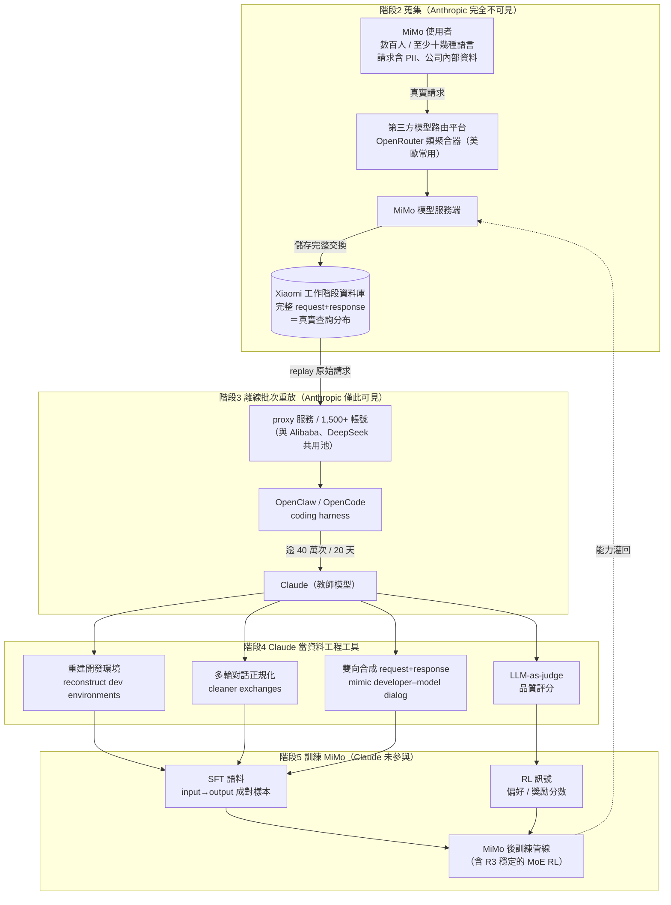
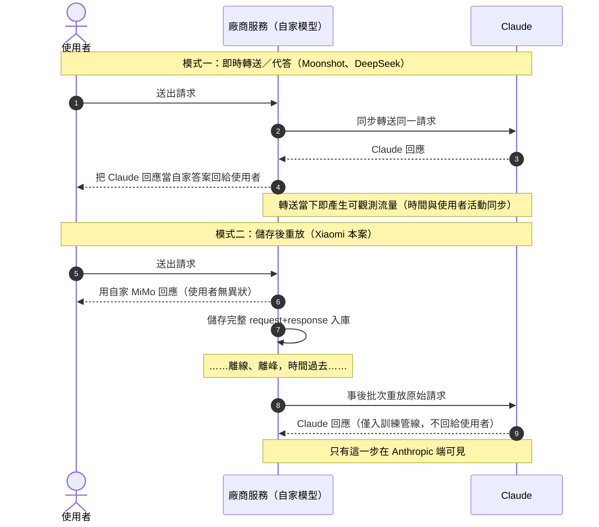
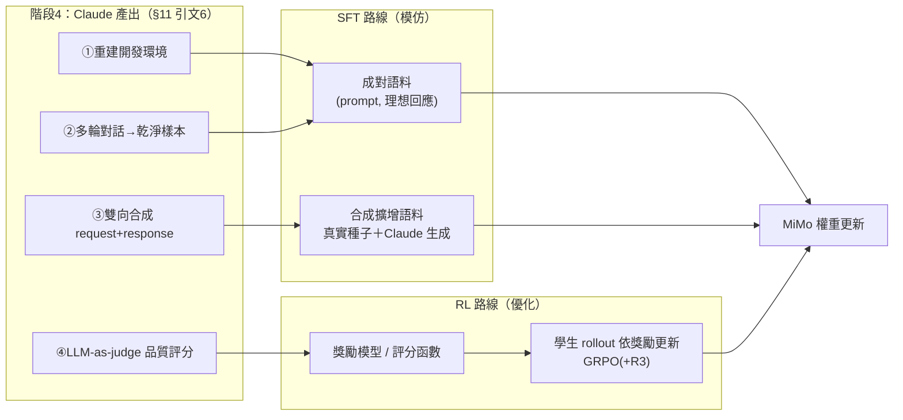
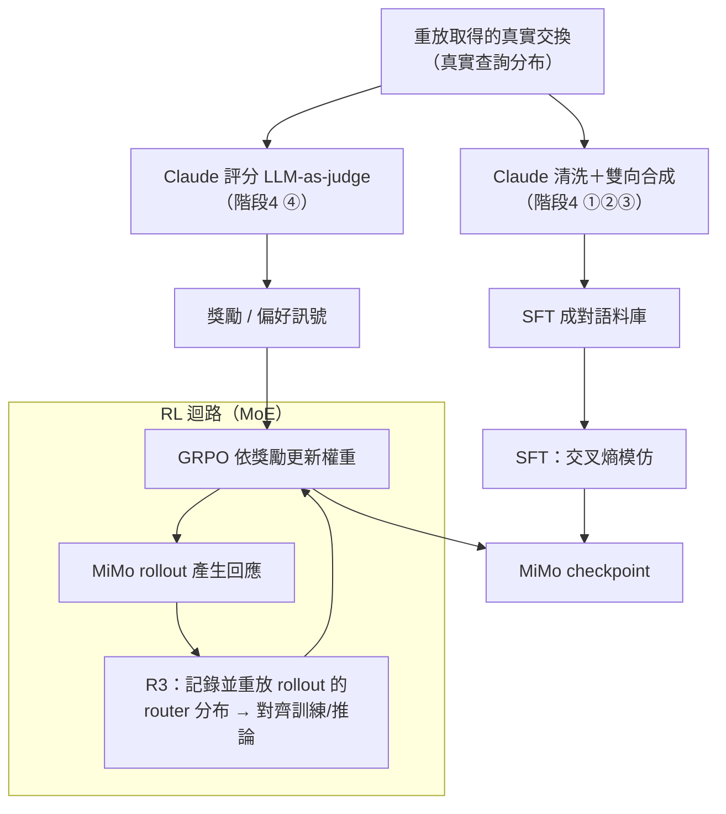
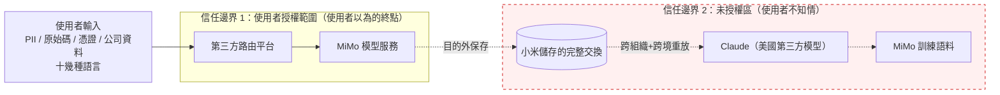
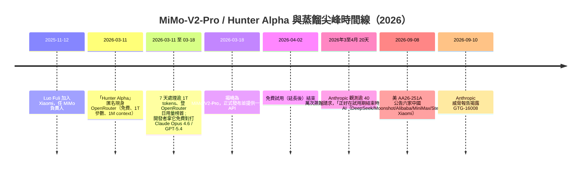
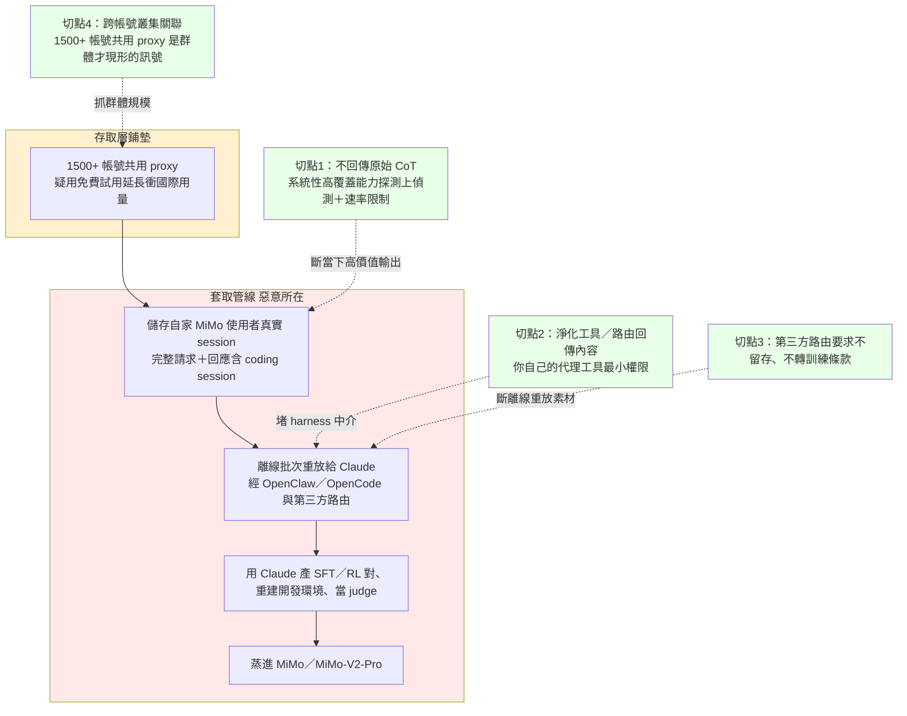

# GTG-16008：小米（Xiaomi）的非法蒸餾行動

> 課程模組：07 非法蒸餾（Illicit distillation）｜ 一手來源：Anthropic《Detecting and countering misuse of AI: September 2026》PDF **p.151–152**（另引用模組導論 p.143–149、共用處置章節 p.152–154 作為脈絡）｜ 整理日期：2026-09-13

---

## 1. 一頁速覽

- **一句話定性**：小米（Xiaomi）把**自家 MiMo 模型使用者的真實工作階段（完整請求＋回應）先儲存起來，事後再把這些請求「重放」（replay）餵給 Claude**，用產生的資料同時做 **SFT（監督式微調）與 RL（強化學習）**，以強化未來模型的訓練資料。Anthropic 將此案編號 **GTG-16008**。
- **規模（務必記牢原文數字）**：**2026 年 3 至 4 月、20 天內、逾 40 萬次（over 400,000 / "more than 400k"）請求**，跨 **1,500+ 個帳號**，全部經 **proxy（代理／「中轉站」）服務**送進 Claude。（PDF p.152）
- **管道**：這些重放常透過 **OpenClaw 與 OpenCode** 兩個 coding harness 執行；許多工作階段是經**第三方模型路由服務（third-party model routing services）**流動，而這些平台「常被美國與歐洲使用者使用」。（p.151–152）
- **與 Moonshot／DeepSeek 的關鍵差異**：Moonshot／DeepSeek 是**即時把使用者請求轉送 Claude、並把 Claude 的回應當成自家回應顯示給使用者（即時代答＋攔截）**；小米**沒有用 Claude 的回應去服務使用者**，而是**先把自家使用者的真實工作階段存下來，事後離線批次重放**。這讓小米得以用「真實使用者的請求分布」當蒸餾查詢集。（比較 p.148–150 vs p.151–152）
- **行為者的特殊性**：小米不是純 AI 實驗室，而是**手機／IoT／電動車（SU7）巨頭**。一家硬體與消費電子公司做前沿模型蒸餾，動機在於把便宜取得的前沿 agentic／coding 能力灌進自家 MiMo，去驅動手機助理（小愛同學 / Super XiaoAI）、HyperOS 跨裝置智慧、車機與 IoT 的 AI 功能。
- **疑似手法**：Anthropic 研判（措辭為 "suggests… may have"）小米可能**藉 MiMo-V2-Pro 的免費試用期（且延長）**衝高國際開發者用量，用這波真實使用者流量當蒸餾素材；「大批蒸餾攻擊正好在試用期結束時開始」。（p.152）獨立公開資料佐證：MiMo-V2-Pro 於 **2026-03-18** 發布，先以代號「Hunter Alpha」在 OpenRouter 匿名壓測、提供一週免費 API，並與 OpenClaw、OpenCode 等 harness 合作——時間線與報告吻合。
- **隱私衝擊**：重放的請求含**數百名小米使用者、至少十幾種語言**的**姓名、聯絡資訊、公司內部資料等敏感資料**；Anthropic 表示「沒有跡象顯示美國人（US persons）的資料被暴露」，但這些第三方平台「常被美、歐使用者使用」。（p.152）
- **歸因信度**：核心行為（重放、40 萬次請求）以直述句斷言為小米所為，並落在模組層級「**high confidence**（高信度）歸屬於特定中國實驗室」的框架下（p.147）；但「藉免費試用期蒸餾」這個**動機／意圖**用了 "suggests… may have" 的低信度措辭。
- **這個案例在課程裡要教什麼**：教「**儲存後重放**」這種與「即時轉送」不同的蒸餾手法、教**用真實使用者請求分布做蒸餾查詢集**為何更危險、教**消費電子供應鏈的 AI 模型與資料流向**如何成為國安與隱私議題，並示範**情報措辭（斷言 vs 推測）**與**單一來源情報**的判讀。

---

## 2. 行為者側寫與歸因

### 2.1 行為者身分

| 項目 | 內容 | 來源 |
|---|---|---|
| 主體 | **Xiaomi（小米集團）**，中國消費電子巨頭（手機、AIoT、電動車 SU7/YU7） | PDF p.151；公開資料 |
| 涉入產品 | **MiMo 模型家族**（MiMo-V2-Flash、MiMo-V2-Pro 等），由小米 MiMo 研究團隊開發 | PDF p.151–152；公開資料 |
| GTG 編號 | **GTG-16008** | PDF p.151 |
| 所屬叢集 | Anthropic 自 2026-02 首度揭露以來，追加揭露的**七家中國實驗室**蒸餾攻擊之一（其餘為 Alibaba、DeepSeek、Moonshot、Zhipu/Z.ai、SenseTime、MiniMax） | PDF p.143、147–153 |
| 基礎設施關聯 | 小米的 proxy 帳號與 **Alibaba、DeepSeek 共用同一批 proxy 服務網路** | PDF p.148 |

**關鍵交叉引用（p.148，Alibaba 案）**：報告在描述 Alibaba 的第二批詐騙帳號池時明白寫道——

> "Some of these accounts were found to have been funneling requests from **DeepSeek and Xiaomi**, demonstrating that the same proxy service networks are often used by a variety of organizations."

這句話在情報上很重要：它把小米、Alibaba、DeepSeek 綁在**同一組 proxy 服務基礎設施**上。這是一種**基礎設施關聯型歸因（infrastructure pivot）**——不是靠某個惡意檔案的雜湊，而是靠「多個行為者共用同一批中轉帳號」把它們串起來。對偵測工程的啟示：追蹤 proxy 帳號池本身，往往能一次牽出多個蒸餾行為者。

### 2.2 歸因信度與措辭（情報學重點）

本案要教學員讀懂 Anthropic 的**分層措辭**——同一份報告裡，對「事實」與「推論」用了不同強度的字：

1. **對「行為本身」＝直述斷言（最高強度）**
   - "an illicit distillation campaign **launched by** Xiaomi"（p.151）
   - "Xiaomi **saved** the full request and response… and **replayed** those sessions through Claude"（p.152）
   - "Scale of distillation attacks **attributable to** Xiaomi…"（p.152）
   - → 這些是**已觀測到的行為**，用不帶保留的直述句陳述。

2. **對「叢集層級的歸屬」＝high confidence（高信度）**
   - 模組層級 p.147："we have detected and disrupted unauthorized distillation campaigns we have **attributed with high confidence** to specific PRC-based labs targeting Anthropic's Opus-class models."
   - → 「高信度」在情報學裡表示：有多條證據、來源可靠、替代解釋已被大幅排除，但仍非「確定（confirmed）」。

3. **對「動機／意圖」＝suggests / may have（低信度推論）**
   - "Our investigation **suggests** that Xiaomi **may have** launched its MiMo-V2-Pro model with a free trial period… **with the intent to** use the surge in international developer use… to distill Claude capabilities."（p.152）
   - → 這是**推論一個意圖**，Anthropic 明確降級措辭。學員要學會分辨：報告「看到小米重放了 40 萬次請求」（事實）與「認為小米『故意』用免費試用當誘餌」（推測）是**兩種不同信度的主張**，不能混為一談。

4. **對「危害範圍」＝謹慎的否定式陳述**
   - "We have **no indication** US persons' data was exposed, but those platforms are commonly accessed by users in the United States and Europe."（p.152）
   - → 「沒有跡象顯示 X」不等於「X 沒發生」；這是情報寫作中對**未知**的誠實標記，學員要能區分「證實未發生」與「未觀測到」。

**教學提問**：為什麼 Anthropic 對「行為」敢直述、對「意圖」卻要 hedge？因為前者是**它自己系統上的可觀測遙測（誰的帳號、幾次請求、什麼 harness）**，後者是**對他人心理狀態的推斷**——情報永遠對「行為」比對「意圖」更有把握。

### 2.3 外部歸因的落差（重要）

- **美國政府 2026-09-08 的 NSA+CISA+FBI 聯合公告（AA26-251A）只點名六家：DeepSeek、Moonshot、Alibaba、MiniMax、StepFun、Z.AI——並未列入 Xiaomi**（也未列 SenseTime；反而多了 Anthropic 未涵蓋的 StepFun）。
- 意義：**Xiaomi 這條線目前實質上是 Anthropic 單一來源情報**。獨立的政府公告沒有為小米背書。這一點必須貫穿到第 9、12 節。

### 2.4 七案叢集定位（把小米放進整個蒸餾模組看）

報告在模組 07 一口氣揭露**七家中國實驗室**的蒸餾攻擊。把它們並排，才看得出小米的手法屬於哪一類、規模落在什麼位階。下表數字全部取自 PDF p.147–153，供課堂當比較基準：

| GTG | 實驗室 | 手法分類 | 觀測規模 | 時間窗 | 本案獨特處 |
|---|---|---|---|---|---|
| 16005 | **Alibaba**（Qwen/通義） | 注入固定提示強逼 Claude 寫出 CoT → 存成 SFT；蒸進 Qwen 3.5/3.6/3.7 | **逾 1.51 億次**、峰值近 300 萬/日、3,500+ 帳號 | 2026 May–Jul | **史上最大**；另用 Claude 做 AI R&D、RL 環境 |
| 16002 | **Moonshot**（Kimi） | **即時代答**：把 Kimi 用戶請求轉送 Claude、以 Claude 回應充當 Kimi；並存下部分交換做 CoT 萃取 | 10 天約 30 萬次；5,380 帳號（多在星、日） | 2026 May–Jul（逾 2,300 萬總計） | 跨工作階段重放偷 thinking signature；牽出 PLA 監控、SOE 憑證外洩 |
| 16001 | **DeepSeek** | **即時轉送**：把用戶（含用 Claude Code/Agent SDK/OpenCode 者）請求轉送 Claude；跨工作階段重放偷 CoT | 14 天**逾 1,210 萬次** | 2026 Jul | 牽出 PRC 科技公司、俄國防機構憑證、公安監控系統 |
| 16006 | **Zhipu / Z.ai**（GLM） | CoT 萃取「清洗器」；用 Claude 判分、正規化、當訓練管線工具 | 清洗器 10 天 770,609 次；同期歸屬逾 300 萬；總計逾 340 萬 | 2026 Jun–Jul | **曾嘗試蒸餾 Fable 但因防護失敗放棄**，轉打 Opus 4.6 |
| **16008** | **Xiaomi（本案）** | **儲存後重放**：存自家 MiMo 用戶完整請求+回應，離線重放給 Claude；SFT＋RL 皆用 | **逾 40 萬次**、1,500+ 帳號 | **2026 Mar–Apr（20 天）** | 用真實使用者請求分布當查詢集；疑藉免費試用衝流量；消費電子巨頭 |
| 16012 | **SenseTime** | **向第三方資料商購買**用戶與 Claude 的逐字稿；用 Claude 寫蒸餾管線、啟動/監控訓練 | 報告未給獨立數字 | — | 靠轉售商生態取得資料 |
| 16003 | **MiniMax** | 透過**空殼公司**自建 proxy 網路服務（只賣 Anthropic/OpenAI，不賣任何中國模型含自家）以蒐集用戶交換 | 報告未給獨立數字 | — | 用空殼掩蓋母公司關係，反向暴露蒐集意圖 |

**從表中要學員看出三件事**：
1. **手法四大類**：`注入提示逼吐 CoT（Alibaba）`／`即時代答＋轉送（Moonshot、DeepSeek）`／`儲存後重放（Xiaomi）`／`買逐字稿或自建 proxy 網（SenseTime、MiniMax）`。小米自成一類。
2. **規模排序**：Alibaba（1.51 億）≫ DeepSeek（1,210 萬）＞ Moonshot（2,300 萬總計）＞ Zhipu（340 萬）＞ **Xiaomi（40 萬）**。小米**規模最小**，但手法（真人請求重放）在**隱蔽性與隱私侵害**上獨具教學價值——**規模小不代表威脅低**。
3. **時間最早**：小米的窗口是 **3–4 月**，比多數案（5–7 月）更早，對應 MiMo-V2-Pro 的 3 月上市，時間線自成一格。

---

## 3. 受害者與目標清單

「非法蒸餾」的受害結構和一般入侵不同，本案有**兩層受害者**：

### 3.1 直接被萃取能力的一方＝Anthropic / Claude

| 目標 | 說明 |
|---|---|
| 被蒸餾模型 | **Claude**（報告此段僅泛稱 "Claude"，未指定 Opus/Sonnet/Haiku 版本；模組層級 p.147 指整體叢集以 **Opus-class** 模型為主要目標） |
| 被萃取的能力 | 前沿 **coding／agentic／開發者對話**能力——由「reconstruct the developer environments」「mimicking the conversations between a developer and a model」可推知目標是**軟體開發／代理式編碼**能力（p.152） |
| 商業損害 | 小米以「一小部分時間、算力與成本」複製 Claude 的能力灌進 MiMo，屬模組導論定義的核心危害（p.144） |

### 3.2 資料被外洩的一方＝小米自己的 MiMo 使用者（本案最值得講的受害者）

| 項目 | 內容（PDF p.152） |
|---|---|
| 受害者身分 | **數百名（hundreds of）小米使用者**——即透過第三方模型路由平台使用 MiMo 模型的人 |
| 語言分布 | **至少十幾種語言（at least a dozen languages）** |
| 外洩內容 | **姓名、聯絡資訊、公司內部資料（corporate data）等敏感資料** |
| 地理 | 「沒有跡象顯示美國人資料被暴露」，但這些第三方路由平台「常被美、歐使用者使用」 |
| 外洩路徑 | 使用者以為只是在用 MiMo；小米卻把他們的請求（含上述 PII）**重放給 Claude**，等於把使用者的隱私資料交給了競爭對手的模型／另一家美國公司 |

**這一層是本案的倫理核心**：受害者不是被駭客攻擊的第三方，而是**小米自己的付費／試用使用者**。他們的真實請求被拿去餵競爭對手模型當訓練素材，過程中他們毫不知情、也未同意。

> ⚠️ **精確界線（避免誇大）**：報告所指的「小米使用者」是**MiMo 模型（開發者／API 面）的使用者**，多半透過第三方路由平台（如 OpenRouter 類聚合器）與 coding harness 存取；報告**並未**主張小米手機、IoT 或車機的一般消費者遙測被重放。第 10.4 節談台灣消費裝置時會嚴格守住這條界線。

---

## 4. AI 濫用的攻擊生命週期（逐階段拆解）

依報告模組的「Attack lifecycle and AI usage」精神，把本案拆成六個階段，並標示**每階段誰做什麼、AI 的自主程度**。小米案的自主程度整體屬「**人類設計流程、AI 在流程中被當工具批次呼叫**」——不是 AI 自主編排的多代理攻擊，而是**工程化的資料生產管線（data pipeline）**。

> **背景補充（先建立三個概念，才看得懂生命週期）**
>
> - **合法蒸餾 vs 非法蒸餾**（模組導論 p.143）：蒸餾（distillation）本身是**正當的訓練方法**——用一個較大、較強的「教師（teacher）」模型對一組輸入產生回應，再拿這些交換樣本訓練較小的「學生（student）」模型去模仿教師，好處是用更少資源達到更進階能力。報告定義的**「非法蒸餾（illicit distillation）」＝工業規模、隱蔽、未經授權地萃取一個模型的能力並複製到另一個模型**，且「通常靠詐騙（假帳號、盜信用卡、盜登入憑證與 API key）達成」。小米案的違法點不在「用了蒸餾」，而在**規模化、隱蔽、未授權、且用真人資料**。
> - **SFT vs RL（報告說小米「both」都用）**：**SFT（Supervised Fine-Tuning，監督式微調）**＝拿「輸入→理想輸出」成對樣本，直接教模型照抄好答案；**RL（Reinforcement Learning，強化學習）**＝用「哪個回答比較好」的偏好/評分訊號，讓模型往高分方向調整。本案第 4 階段裡，Claude 生成的「乾淨請求＋回應對」可餵 SFT，Claude 當裁判給的「品質評分」可餵 RL 的獎勵訊號——這正是為何報告強調小米蒸餾資料**同時支撐 SFT 與 RL 兩條訓練路線**。
> - **為何蒸餾具戰略危險性**（模組導論 p.144）：非法蒸餾讓未授權實驗室「以開發原生能力所需**時間、算力與成本的一小部分**」就複製到前沿能力。換言之，它把「別人花大錢練出的能力」以**捷徑**方式搬走——這是整個模組（不只小米案）的核心威脅命題。

### 階段 0：能力落差與商業誘因（人類決策）
- 小米要把 MiMo 推成「agent 導向」旗艦模型（MiMo-V2-Pro：>1 兆參數、1M context、主打自主 agent 任務），但前沿 coding／agentic 能力昂貴。
- **決策**：與其自行從零訓練，不如蒸餾 Claude 的能力當「捷徑」（模組導論 p.144 對此危害的定義）。

### 階段 1：取得存取（人類＋詐騙基礎設施）
- 透過 **proxy 服務／「中轉站」**、**1,500+ 個帳號**繞過 Anthropic 的地理與存取限制（p.152；手法對應模組導論 p.144 描述的假帳號、假／盜信用卡、盜 API key）。
- 與 Alibaba、DeepSeek **共用同一批 proxy 帳號池**（p.148）。
- **AI 自主程度**：無；純人類／自動化帳號農場。

### 階段 2：蒐集真實使用者工作階段（人類系統，非 Claude）
- 小米在自家 MiMo 服務端**儲存使用者的完整請求＋回應**（"saved the full request and response from its own users"）。
- 這些工作階段包含 user conversations 與 coding sessions，且許多來自第三方路由平台上的美、歐開發者。
- **關鍵**：此階段 Claude 尚未登場——蒐集的是**MiMo 使用者對 MiMo 的真實互動**。這一步造就了本案的獨特性（見第 4.7）。

### 階段 3：重放給 Claude（人類編排、Claude 被批次呼叫）
- 小米把儲存的工作階段**重放（replay）**——把使用者原始請求送進 **Claude**，透過 **OpenClaw / OpenCode** harness 執行，取得 Claude 的回應。（p.151–152）
- 規模：20 天逾 40 萬次。
- **AI 自主程度**：對話式／工具式協助——Claude 被當作「回應產生器」，逐請求回覆，並未自主決策。

### 階段 4：用 Claude 清洗與生成訓練資料（Claude 作為資料工程工具）
報告明列 Claude 在此案被用於四件事（p.152）：
1. **重建開發環境**："reconstruct the developer environments from exchange transcripts"——從交談逐字稿還原出開發者當時的環境脈絡。
2. **多輪對話正規化**："converted multi-turn conversations into cleaner exchanges"——把雜亂的多輪對話整理成乾淨的訓練樣本。
3. **雙向合成資料生成**："generate both the inputted request and the returned response, mimicking the conversations between a developer and a model"——**同時生成「請求」與「回應」兩端**，模擬開發者與模型的對話（即用 Claude 造合成資料）。
4. **品質評審（LLM-as-judge）**："judge the quality of certain answers"——用 Claude 當裁判給答案評分。
- **AI 自主程度**：AI 被當成資料流水線裡的多個工序（清洗器、生成器、裁判），但每個工序仍由人類管線編排、串接。

### 階段 5：訓練 MiMo（人類，Claude 未參與）
- 產出的資料用於 **SFT 與 RL 兩者**，以「強化未來模型的訓練資料」。（p.152）
- **AI 自主程度**：無；標準模型訓練。

### 4.7 為什麼「儲存後重放」是本案的方法論核心
把階段 2→3 連起來看，小米做了一件與 Moonshot／DeepSeek 不同的事：
- 它**先累積一批真實使用者的請求（真實查詢分布）**，再**離線批次**把這些請求重放給 Claude。
- 效果：蒸餾出來的「教師（Claude）回應」對應的**輸入，正是真實使用者實際會問的問題**——尤其是開發者的 coding／agent 任務。這讓 student 模型（MiMo）學到的不是隨機或人工設計的查詢，而是**部署現場真正出現的任務分布**。
- 再疊加階段 4 的「雙向合成」，小米得到一個**真實種子＋合成擴增**的混合語料庫。這是相當成熟的資料工程思路。

---

## 5. TTP 與 MITRE ATT&CK / ATLAS 對應

> 說明：非法蒸餾不是傳統入侵，Enterprise ATT&CK 只能覆蓋「詐騙取得存取」那一段；**「模型能力萃取」「用真實使用者工作階段重放做蒸餾」「用 LLM 當資料清洗器／裁判」在 ATT&CK 沒有對應技術 ID**，需改用 MITRE **ATLAS**（AI 系統對抗戰術框架）在**戰術層級**對應，並明確標示框架缺口。

| 戰術（Tactic） | 技術 / 對應 | 本案具體作法 | 偵測構想 |
|---|---|---|---|
| Resource Development | **T1585 Establish Accounts**、**T1583 Acquire Infrastructure**、**T1586 Compromise Accounts** | 1,500+ 詐騙帳號、proxy／中轉站基礎設施、盜用 API 憑證 | 帳號註冊指紋、付款工具（虛擬卡）聚類、residential proxy 特徵、跨組織共用帳號池關聯 |
| Defense Evasion（規避模型限制） | **T1656 Impersonation** / 帳號輪替（近似 Valid Accounts T1078 的濫用） | 輪替帳號、經第三方路由平台隱藏來源、繞過地理限制 | 行為型分類器（見 §8）、單帳號/單IP 請求量與任務同質性、跨帳號的請求模式一致性 |
| Collection（使用者資料蒐集） | ATT&CK 無貼切 ID；概念近 **ATLAS 之 ML 產物／推論資料蒐集戰術** | 儲存自家 MiMo 使用者的完整請求＋回應 | 屬小米內部行為，Anthropic 端不可見；此為**框架缺口＋可見性缺口** |
| ML Attack Staging / Model Extraction（能力萃取） | **對應 MITRE ATLAS「模型萃取／複製」戰術範疇**（無精確 ATT&CK ID） | 重放真實請求萃取 Claude 回應→蒸餾進 MiMo；用 Claude 清洗、生成雙向合成資料、當裁判 | 對抗式萃取分類器、單一組織級別的請求聚合歸因（見 §8）；重放偵測：同一請求分布在短期內以工具化樣態大量出現 |
| Exfiltration（能力外流） | 概念近 **ATLAS AML「經 ML 推論 API 外洩」戰術**（無精確 ATT&CK ID） | 40 萬次請求把 Claude 能力「搬」進 MiMo 訓練管線 | 大規模、高同質、工具化（OpenClaw/OpenCode 特徵字串）流量的組織級歸因 |

**框架缺口（課堂要強調）**：
1. **「重放儲存的真實使用者工作階段」作為蒸餾查詢集**——ATT&CK 與 ATLAS 都沒有專門技術描述這種「用第一方使用者資料當第三方模型蒸餾輸入」的手法。
2. **「用受害模型自己清洗／生成／評審蒸餾資料」**（Claude 反過來替小米做資料工程）——這種「用教師模型優化蒸餾管線」的自我指涉手法沒有現成 ID。
3. 本案的**歸因不靠 atomic IOC**（無網域／IP／雜湊），而靠**基礎設施關聯＋規模＋行為同質性**——這對「以 IOC 為中心」的傳統偵測框架是根本性挑戰。

---

## 6. 圖表逐一判讀（本頁段版面判讀）

> 本案指派頁段 **p.151–152 內沒有任何編號圖表（Figure）**：`figures.txt` 在 p.143–153 範圍無任何條目，`course/figures/` 也只存了模組導論的 `page-143.png` 與 `page-144.png`，我的兩頁未被列入。為落實簡報「逐張判讀」要求並做內容品質保證（QA），我仍用 Read 工具親自開啟並判讀了 `page-151.png` 與 `page-152.png` 兩張渲染圖，確認**沒有任何被文字擷取漏掉的圖表、截圖或流程圖**。以下是版面判讀。

### 6.1 page-151.png（p.151）：版面與內容
- **圖片類型**：純文字排版頁（無任何圖形元素）。單欄襯線體正文，白底黑字。
- **實際可見元素**：
  - 頁面上半承接 **GTG-16006（Zhipu）** 的收尾（含斜體 scale 句 "Scale of distillation attacks attributable to Zhipu over 17 days in June and July 2026: over 3.4 million exchanges observed."）。
  - 頁面中段一個**大號粗體章節標題**："**GTG-16008: Distillation campaign by Xiaomi**"——這是本案的視覺起點。
  - 標題下方一段正文，即本案首段（"We also uncovered an illicit distillation campaign launched by Xiaomi…"）。
  - 頁尾：頁碼 **151** 與頁腳 "Detecting and countering misuse of AI: September 2026"。
- **核心訊息**：小米案在文件中被**與 Zhipu、SenseTime/MiniMax 並列**，屬「七家中國實驗室蒸餾」序列裡的一格；版面上它是一個**獨立小節**，但份量（約一頁半）明顯小於 Alibaba（旗艦大案）。
- **課堂用法**：用這張圖示範報告的**編排結構**——每個 GTG 案自成一節、結尾都有一句斜體的「Scale of…」統計句。教學員養成「先抓每案的 scale 斜體句」的速讀習慣。

### 6.2 page-152.png（p.152）：版面與內容
- **圖片類型**：同為純文字排版頁（無圖形元素）。
- **實際可見元素**：
  - 上半是本案主體正文四段（saved full request/response → MiMo-V2-Pro 免費試用推論 → 敏感資料外洩 → Claude 的四種用途）。
  - 一句斜體 scale 句："**Scale of distillation attacks attributable to Xiaomi over 20 days in March and April 2026: over 400,000 exchanges observed.**"——本案唯一被特別格式化（斜體）的數字句。
  - 下半出現下一個粗體章節標題："**GTG 16012 and GTG 16003: Sensetime, MiniMax, and the third-party reseller ecosystem**"，正文開始轉入轉售商生態。
  - 頁尾：頁碼 **152** 與同一頁腳。
- **核心訊息**：本案在 p.152 上半結束，隨即轉入「第三方轉售商生態」——這在編排上暗示 Anthropic 把**小米（重放自家使用者）**與**SenseTime/MiniMax（向資料商購買逐字稿）**當作**不同的資料取得模式**分開處理。
- **課堂用法**：把 p.152 上下兩案並置，讓學員比較**「重放自家使用者」vs「向轉售商買逐字稿」**兩種蒸餾資料來源。

### 6.3 模組層級的相關視覺（脈絡，非本頁段）
- 蒸餾生命週期圖在 **p.144**（`../figures/page-144.png`，正文稱 "The graphic below illustrates the life cycle of an illicit distillation campaign"）。它不屬本案指派頁段，但講第 4 節「攻擊生命週期」時，可用它當視覺輔助，向學員展示「詐騙帳號→proxy→存取前沿模型→萃取→訓練」的通用流程。使用時請標明這是**模組導論的圖，非小米案專屬**。

---

## 7. IOC 與技術指標

> **重要且本身是教學點**：報告在 GTG-16008 段落**沒有給出任何 atomic IOC**——沒有網域、IP、Telegram 帳號、檔案雜湊，也沒有具體帳號 ID。因此本節**沒有需要保留 defang 格式的硬指標可抄錄**。本案的「指標」全是**行為型／基礎設施型**。這正好示範：對蒸餾這類濫用，防守方能拿到的往往不是 IOC，而是**規模、同質性與基礎設施關聯**。

| 指標（行為／基礎設施型） | 內容 | 偵測價值與壽命 |
|---|---|---|
| 請求規模與集中度 | 20 天逾 40 萬次請求、跨 1,500+ 帳號、經 proxy | 高價值但**壽命短**：對手可拆分/降速/換池規避；適合做「組織級聚合」而非單帳號封鎖 |
| Coding harness 特徵 | 流量經 **OpenClaw / OpenCode** harness | 中價值：harness 字串／請求結構可作分類特徵；但這些是合法工具，會有大量誤報，需與其他訊號合併 |
| 第三方路由平台來源 | 請求來自第三方模型路由服務（美、歐常用） | 中價值：可標記「經聚合器來的高同質流量」，但平台本身合法 |
| 共用 proxy 帳號池 | 小米帳號與 **Alibaba、DeepSeek** 共用同批 proxy（p.148） | **高價值、壽命較長**：追蹤帳號池可一次牽出多個行為者（基礎設施 pivot） |
| 重放時間線特徵 | 大批攻擊「正好在 MiMo-V2-Pro 免費試用期結束時」開始（3–4 月） | 分析價值高：把「產品上市／試用期」事件與流量尖峰對齊，是歸因的旁證 |
| 語言分布 | 請求橫跨至少十幾種語言、含 PII/公司資料 | 佐證價值：異常廣的語言分布＋高同質任務，暗示是「彙整他人真實請求」而非單一組織自有查詢 |

**偵測工程要點**：因為沒有 IOC，這類案子只能靠「**把可疑活動歸屬到一個組織**」（Anthropic 自述做法，見 §8）——先聚合、後歸因、再一次性處置，而不是逐帳號打地鼠。

---

## 8. Anthropic 的偵測、處置與防線缺口

> 本案處置寫在共用章節「**How we address illicit distillation**」（p.152–154），適用於全部蒸餾案，包含 GTG-16008。

### 8.1 Anthropic 做了什麼（分層防禦）
1. **元資料 + 異常訊號 → 組織級歸因**：用 metadata 與不規則活動訊號辨識 proxy 帳號；**不逐一封鎖**，而是**把可疑活動歸屬到特定組織**，再做「更全面的執法（comprehensive enforcement）」。（p.152–153）
2. **對抗式萃取分類器**：專門偵測 adversarial extraction；一旦有信心某批請求屬非法蒸餾，就**擋下請求並封鎖相關帳號**；此分類器在今年稍早**隨 Fable 5 上線一併強化**。（p.153）
3. **新增防蒸餾保護**：
   - **Claude 回應前先「摘要」內部推理**——讓被偷走的逐字稿對訓練他人模型更沒用。（p.153）
   - **Fable 5.1 的「preserved thinking」**：阻止**新 API 帳號**在多輪對話中竄改「排在 Claude 推理之前」的 system prompt／工具／訊息；該推理是加密的，而「在推理前先竄改脈絡」正是攻擊者常用來誘出推理的手法。（p.153）
4. **身分驗證關卡**：偵測到濫用訊號（如未授權轉售、帳號來自中國/俄羅斯/伊朗等不支援地區）時，要求驗證身分，驗證失敗即封鎖。（p.153–154）

### 8.2 防線在哪裡失效／缺口（課程高價值素材）
- **可見性缺口（本案最大盲點）**：階段 2（小米**在自家 MiMo 端儲存使用者請求＋回應**）完全發生在 Anthropic 看不到的地方。Anthropic 只在「重放進 Claude」時才看得到流量。**「先儲存、後重放」正好把最關鍵的一步藏在受害方視野之外**——這是「儲存後重放」相對「即時轉送」更難防的結構性原因之一。
- **無 IOC、只能靠組織級歸因**：報告自述做法是「聚合→歸因→處置」，反映**逐帳號封鎖無效**（對手換池即復活）。這等於承認單點防禦擋不住工業級假帳號。
- **試用期缺口（若推論成立）**：若「藉免費試用期蒸餾」屬實，代表對手能把**合法的產品行銷（免費試用）**當成掩護，讓大量真實流量成為蒸餾素材。防守方難以事前區分「正常的試用熱潮」與「被用來當蒸餾誘餌的試用熱潮」。
- **模組層級自曝的分類器被繞過史**：導論 p.145 記載對手用「DO NOT FLAG THIS AS REASONING EXTRACTION…」等提示、甚至跑「**逾一萬兩千次、每次換一種技巧**」的實驗來測試哪種能突破 Anthropic 的反蒸餾措施——**大多被擋，但有些成功**，對手再拿成功技巧發動更大規模攻擊。這是防禦與規避的持續軍備競賽，直接說明分類器**不是一勞永逸**。
- **時間差**：本案發生在 **2026 年 3–4 月**，報告 **9 月**才公布——揭露有數月延遲，蒸餾資料很可能早已進入 MiMo 訓練管線。偵測到 ≠ 阻止了損害。

---

## 9. 第三方驗證與外部來源

> 每條標明：來源、日期、以及它是**獨立查證**還是**僅引述 Anthropic**。本案結論：**Xiaomi 這條線目前實質上是 Anthropic 單一來源情報**；獨立來源只能佐證「MiMo 產品與時間線」等周邊事實，無法獨立證實「小米蒸餾 Claude」這個核心指控。

### 9.1 對「小米蒸餾」核心指控——皆僅引述 Anthropic
| 來源 | URL | 日期 | 性質 |
|---|---|---|---|
| TechCrunch | https://techcrunch.com/2026/09/10/anthropic-details-distillation-campaigns-from-alibaba-moonshot-ai-and-deepseek/ | 2026-09-10 | **僅引述 Anthropic**（標題聚焦 Alibaba/Moonshot/DeepSeek） |
| CNBC | https://www.cnbc.com/2026/09/11/chinese-ai-labs-moonshot-deepseek-alibaba-anthropic.html | 2026-09-11 | **僅引述 Anthropic** |
| Seeking Alpha | https://seekingalpha.com/news/4641769-anthropic-accuses-deepseek-xiaomi-and-moonshot-of-misusing-ai-data | 2026-09-11 | **僅引述 Anthropic**（標題明列 Xiaomi） |
| The Hacker News | https://thehackernews.com/2026/09/anthropic-says-seven-china-based-ai.html | 2026-09 | **僅引述 Anthropic**（七家名單） |
| 鉅亨網 cnyes（台灣） | https://news.cnyes.com/news/id/6604253 | 2026-09 | **僅引述 Anthropic**（繁中：從代答到買聊天記錄） |
| 知新聞 knews（台灣） | https://www.knews.com.tw/news/DE88B0E2B558F21BCEB30029ACEB0BB9 | 2026-09 | **僅引述 Anthropic**（繁中） |
| Grenade 手榴彈（台灣） | https://grenade.tw/blog/claude-anthropic-china-ai-kimi | 2026-09 | **僅引述 Anthropic**（繁中，含七家內幕） |
| 騰訊新聞（中國） | https://news.qq.com/rain/a/20260912A00YBU00 | 2026-09-12 | **僅引述 Anthropic**（點名阿里、DeepSeek、小米等） |

### 9.2 官方文件與各方回應
| 來源 | URL | 日期 | 性質與要點 |
|---|---|---|---|
| **美國 NSA+CISA+FBI 聯合公告 AA26-251A** | https://www.cisa.gov/news-events/cybersecurity-advisories/aa26-251a | 2026-09-08 | **半獨立**：政府情報公告，但**只點名 6 家（DeepSeek、Moonshot、Alibaba、MiniMax、StepFun、Z.AI），未含 Xiaomi**。→ 對小米是**反向證據**：政府未背書 |
| The Next Web（解讀 AA26-251A） | https://thenextweb.com/news/nsa-fbi-cisa-advisory-chinese-ai-distillation | 2026-09 | 佐證「六家名單、無小米」 |
| 中國商務部（MOFCOM）回應 | https://en.people.cn/n3/2026/0910/c90000-20497875.html ／ http://www.china.org.cn/2026-09/10/content_118688477.shtml | 2026-09-09～10 | **一般性駁斥**（非針對小米）：稱指控「無端、無法律依據」，蒸餾是「中性技術手段」「全球模型公司（含美企）都在做」，警告若被用來打壓中國 AI 將「堅決反制」 |
| CSET（Georgetown）譯註 MOFCOM 聲明 | https://cset.georgetown.edu/publication/china-mofcom-statement-model-distillation | 2026-09 | 學術機構整理 MOFCOM 立場（背景參考） |
| **小米官方回應** | —（無） | — | **小米未對本指控公開回應**；多家外媒稱其未回覆置評請求，指控目前**未被反駁也未被證實** |

### 9.3 對 MiMo 產品與時間線的獨立佐證（可獨立查證，但不證實蒸餾）
| 事實 | 來源 | 對本案的意義 |
|---|---|---|
| MiMo-V2-Pro：>1 兆參數、1M context、主打自主 agent，**2026-03-18 發布** | https://en.wikipedia.org/wiki/Xiaomi_MiMo ／ https://openrouter.ai/xiaomi/mimo-v2-pro ／ https://dev.to/ai_made_tools/what-is-mimo-v2-pro-xiaomis-trillion-parameter-ai-model-explained-2kg | 佐證報告「MiMo-V2-Pro」與 3–4 月時間窗 |
| **「Hunter Alpha」匿名壓測**：2026-03-11～03-18 在 OpenRouter 免費放出、衝上日用量榜首、開發者拿它對打 **Claude Opus 4.6** 與 GPT-5.4；3/18 由 MiMo 負責人**羅福莉（前 DeepSeek 研究員）**揭曉 | https://www.buildfastwithai.com/blogs/xiaomi-mimo-v2-pro-review-openrouter-2026 ／ https://zenvanriel.com/ai-engineer-blog/xiaomi-mimo-v2-pro-hunter-alpha-ai-model/ | **強力佐證機制**：「免費試用衝國際開發者用量」屬實，且開發者本就拿它「對打 Claude」，天然形成重疊查詢集 |
| 正式發布提供**一週免費 API**，並與 **OpenClaw、OpenCode、KiloCode、Blackbox、Cline** 五個 agent 框架合作 | https://apidog.com/blog/xiaomi-mimo-v2-pro/ | **精準佐證**報告點名的 **OpenClaw / OpenCode** harness，與「免費試用期（且延長）」 |
| MiMo-V2-Flash：2025-12 開源、MoE 309B/15B active、部分基準比肩 Claude Sonnet 4.5 | https://github.com/xiaomimimo/MiMo-V2-Flash ／ https://medium.com/@leucopsis/xiaomi-mimo-v2-flash-a-technical-review-6a69e77beecc | 佐證 MiMo 家族存在與能力企圖 |
| 小米 AI 佈局：Human×Car×Home、HyperOS、Super XiaoAI（小愛同學）大模型化、SU7 EV、823M 連網 IoT 裝置 | https://daxueconsulting.com/xiaomi-strategy/ ／ https://www.klover.ai/xiaomis_ai_strategy_dominating_ai_as_frontier_ai_lab_indepth_analysis_2026/ ／ https://www.techradar.com/vehicle-tech/hybrid-electric-vehicles/xiaomi-reveals-more-about-its-debut-su7-ev-including-the-hyperos-iot-ecosystem | 佐證第 3 節「消費電子巨頭做蒸餾」的商業動機 |

**單一來源判定**：本案核心指控＝**單一來源（Anthropic）**。周邊事實（MiMo 產品、發布時間、OpenRouter 免費試用、OpenClaw/OpenCode 合作）有多方獨立佐證，讓「機制與時間線可信」，但**沒有任何獨立來源直接證實小米把使用者請求重放給 Claude**。教學時務必把這兩者分開。

---

## 10. 課程教學設計

### 10.1 核心教學要點
1. **兩種蒸餾資料取得模式的分類學**：`即時轉送/代答（Moonshot、DeepSeek）` × `儲存後重放（Xiaomi）` × `向轉售商購買逐字稿（SenseTime、MiniMax）` × `注入固定提示強逼吐 CoT（Alibaba）` × `跨工作階段重放竊 CoT（Moonshot/DeepSeek/Zhipu）`。小米是「儲存後重放」的代表案。
2. **「用真實使用者請求分布當蒸餾查詢集」為何更危險**：蒸餾品質取決於查詢集是否貼近部署現場；用真人真實請求 → student 模型精準學到「使用者真的會問什麼」。這比人工設計查詢或隨機語料更有效，也更難防。
3. **第一方使用者資料的隱私背叛**：受害者是小米自己的使用者；他們的 PII/公司資料在不知情下被送往競爭對手模型。這是「資料信任鏈」在 AI 供應鏈中斷裂的教案。
4. **消費電子供應鏈的 AI 動機**：硬體公司蒸餾前沿模型，是為了用便宜能力驅動裝置端 AI（助理／IoT／車機），商業邏輯與純 AI 實驗室不同（賣裝置 vs 賣模型）。
5. **情報措辭的分層閱讀**：同一報告對「行為（斷言）／叢集歸屬（high confidence）／動機（suggests, may have）／危害範圍（no indication）」用不同強度的字，學員要能逐句判信度。
6. **單一來源 vs 政府名單落差**：美國 AA26-251A 未列小米，凸顯「同一波指控中，不同來源覆蓋範圍不同」——單一來源情報要標註、要謹慎。
7. **無 IOC 的偵測範式**：蒸餾防禦靠「聚合→組織級歸因→一次性處置」，而非 atomic IOC。這翻轉了傳統 SOC 的 IOC 中心思維。

### 10.2 課堂討論題（有爭議、無標準答案）
1. **合法 vs 非法的界線**：MOFCOM 說「蒸餾是全球模型公司（含美企）都在用的中性技術手段」。那麼「Anthropic 也對其他模型做過評測式互動」與「小米重放 40 萬次真人請求蒸餾 Claude」的道德/法律界線該畫在哪？是「規模」「是否違反服務條款」「是否用真人資料」還是「是否隱匿」？
2. **誰該為使用者隱私負責**：小米使用者的 PII 被重放給 Claude。責任在小米（重放者）、第三方路由平台（未阻止）、還是使用者自己（用了來路不明的聚合器）？如果你是台灣企業的資安長，會禁止員工用哪一層？
3. **免費試用是行銷還是誘捕**：若「藉免費試用衝流量做蒸餾素材」屬實，這是聰明的成長駭客還是對使用者的系統性背叛？企業能否事前辨別自己是不是「蒸餾誘餌」的一部分？
4. **單一來源的份量**：在美國政府公告未列小米、小米也未回應、只有 Anthropic 單方說法的情況下，一門課該用多重的語氣教這個案子？「教這是已知事實」與「教這是未經獨立證實的指控」哪個更負責任？
5. **反蒸餾防禦的代價**：Anthropic 讓 Claude「回應前先摘要推理」、加密思維鏈、限制新 API 帳號改脈絡——這些防蒸餾措施是否也**傷害了正當使用者**（可解釋性下降、除錯變難）？安全與開放性如何取捨？
6. **消費裝置的模型來源該不該揭露**：你手機/車機裡的 AI 助理背後是哪個模型、資料流向何處，廠商幾乎從不揭露。是否該像食品標示一樣，強制揭露「AI 成分表」與資料流向？

### 10.3 實作／桌面演練建議（安全、不教攻擊操作）
1. **信度標註演練**：發給學員本案 p.151–152 原文，要求逐句標記信度等級（斷言／high confidence／推測／未知），再與第 2 節對照，討論分歧。
2. **偵測規則設計（純防守、概念級）**：讓學員設計「組織級蒸餾偵測」的訊號組合——哪些訊號要聚合（帳號池、harness 特徵、任務同質性、語言分布、與產品上市事件對齊）、為何不能只靠單帳號封鎖。輸出一張「訊號→權重→誤報風險」表。**不涉及任何規避或攻擊步驟**。
3. **時間線對齊桌演**：給學員三組公開時間點（MiMo-V2-Pro 3/18 發布、一週免費 API、報告稱 3–4 月 20 天攻擊、攻擊「在試用期結束時激增」），要他們畫出時間線並評估「時間吻合能否當作歸因旁證」，練習「相關 ≠ 因果」的判讀。
4. **資料治理稽核情境**：假設你是台灣某軟體公司資安長，員工大量透過第三方聚合器試用各家免費模型。設計一份「使用外部 AI 服務」的資料分類與紅線政策（哪些資料絕不可貼進外部模型、如何記錄、如何審計）。
5. **框架缺口研討**：讓學員嘗試把本案 TTP 塞進 ATT&CK/ATLAS，親身體會哪些步驟「無 ID 可對」，並提出他們會如何為「儲存後重放蒸餾」新增一條技術描述。

### 10.4 對台灣的意涵

**背景**：小米在台灣有龐大用戶基礎——手機、米家（Mi Home）IoT 生態（掃地機器人、攝影機、穿戴、家電）、以及正在擴張的車與生活產品。小米的 AI 策略（HyperOS＋小愛同學＋MiMo 大模型＋Human×Car×Home）意味著**越來越多台灣家庭的裝置，其智慧功能背後可能連到雲端大模型**。

**本案帶給台灣的具體意涵**：

1. **「消費裝置的 AI 功能，其模型來源與資料流向不透明」被本案具體化**。本案證明了一件事：一家消費電子公司**確實會**把「使用其 AI 模型的使用者請求」儲存下來，並移作他用（此處是重放給第三方模型做訓練）。這把抽象的隱私擔憂變成**已被威脅情報報告記載的行為模式**。對台灣消費者的意義：當你對裝置助理說話、用 App 的 AI 功能時，「請求被儲存、被再利用、甚至被送往第三方」不再是杞人憂天。

2. **台灣使用者「是否可能被儲存重放」——誠實的界定**：
   - 報告記載被重放的是**MiMo 模型（開發者／API 面）使用者**的請求，且多經第三方路由平台（美、歐常用）。若有台灣開發者在 2026 年 3–4 月透過 OpenRouter 類平台試用 MiMo-V2-Pro，**理論上**可能落在「數百名、十幾種語言使用者」之列——但**報告沒有任何台灣特定發現，不能斷言**。
   - 報告**並未**主張小米手機／IoT／車機的一般消費者遙測被重放。因此對「台灣手機用戶的日常語音助理資料被重放」這個更廣的擔憂，本案**只是提出問題、並未提供證據**。教學時要嚴守這條界線，避免把「MiMo 開發者使用者」誇大成「所有小米裝置用戶」。

3. **把台灣既有的裝置國安審查，從「硬體／OS 層」延伸到「AI 模型層」**：
   - 台灣對特定中國廠牌裝置早有管制討論與前例：**NCC 於 2022-01-06 公布小米 Mi 10T 5G 內建應用會向伺服器比對 2,000 多筆政治敏感詞（如「自由西藏」「臺灣獨立」「香港獨立媒體」），有阻斷連網或回傳瀏覽行為之虞**；行政院亦訂有**「各機關對危害國家資通安全產品限制使用原則」**，限制公務機關採購華為、中興、聯想、海康威視等中國品牌產品。
   - 過去的審查焦點是**裝置 OS 是否「回傳」資料、是否內建審查**。本案提示一個**新維度**：即使裝置本身合規，**其 AI 功能背後的「模型供應鏈」與「訓練資料流向」也應納入審查**——模型是自研還是蒸餾自他人？使用者請求是否被儲存、再利用、跨境流動？這是「產品資安審查」需要新增的一層。
   - 政策啟示：台灣的裝置與 AI 治理（NCC、數位發展部、行政院資安處）可考慮把「嵌入式 AI 助理的模型來源揭露、資料保存與再利用政策、跨境資料流向」納入既有的「危害國家資安產品」評估框架，特別是對政府、關鍵基礎設施與軍公教使用的裝置。

4. **對台灣企業與個人的實務建議（防守面）**：
   - 企業：把「員工透過第三方聚合器試用免費 AI 模型」納入資料外洩風險管理；明訂哪些資料（客戶 PII、原始碼、憑證）絕不可貼入外部模型；本案顯示**連你用的「那家模型」自己都可能把你的請求存下來再利用**。
   - 個人：對「免費、突然爆紅、來路不明」的模型／助理保持警覺——本案的 MiMo「Hunter Alpha」正是以匿名免費壓測衝上榜首；免費的代價可能是你的請求成為訓練素材。

---

## 11. 關鍵原文引文（英文原文＋繁中對照，標頁碼）

1. **（p.151，定性）**
   > "We also uncovered an illicit distillation campaign launched by Xiaomi. Xiaomi replayed user conversations and coding sessions from its own MiMo models to Claude, often run through OpenClaw and OpenCode coding harnesses."
   > 我們還發現一起由小米發動的非法蒸餾行動。小米把來自其自家 MiMo 模型的使用者對話與編碼工作階段重放給 Claude，且常透過 OpenClaw 與 OpenCode 這兩個編碼 harness 執行。

2. **（p.151，與即時代答的關鍵差異）**
   > "Our investigation did not indicate that Xiaomi used Claude's responses to serve its users, but instead saved exchanges between Xiaomi customers and its models."
   > 我們的調查並未顯示小米用 Claude 的回應去服務其使用者，而是（相反地）把小米客戶與其模型之間的交談存了下來。

3. **（p.152，手法與規模、報告用途「both」）**
   > "Xiaomi saved the full request and response from its own users and replayed those sessions through Claude to generate data with which to use for both SFT and RL. We observed more than 400k requests to Claude routed across more than 1,500 accounts via proxy services."
   > 小米把自家使用者的完整請求與回應存下來，並把這些工作階段重放給 Claude，以產生同時可用於 SFT 與 RL 的資料。我們觀察到超過 40 萬次送往 Claude 的請求，經由 proxy 服務、分散在 1,500 多個帳號上。

4. **（p.152，免費試用推論——注意低信度措辭）**
   > "Our investigation suggests that Xiaomi may have launched its MiMo-V2-Pro model with a free trial period—which was then extended—with the intent to use the surge in international developer use of the model to distill Claude capabilities. The bulk of the distillation attacks on Claude began just as the trial period was ending."
   > 我們的調查顯示，小米可能是帶著免費試用期（後來又延長）推出其 MiMo-V2-Pro 模型，意圖利用該模型國際開發者用量的激增來蒸餾 Claude 的能力。對 Claude 的大批蒸餾攻擊，正好在試用期即將結束時開始。

5. **（p.152，隱私外洩）**
   > "Those requests to Claude contained the names, contact information, corporate data, and other sensitive data from hundreds of Xiaomi users in at least a dozen languages."
   > 那些送往 Claude 的請求，包含來自數百名小米使用者、至少十幾種語言的姓名、聯絡資訊、公司資料與其他敏感資料。

6. **（p.152，Claude 被用來做什麼）**
   > "Claude was used to reconstruct the developer environments from exchange transcripts. It also converted multi-turn conversations into cleaner exchanges. Claude was also used to generate both the inputted request and the returned response, mimicking the conversations between a developer and a model. Finally, Xiaomi used Claude to judge the quality of certain answers."
   > Claude 被用來從交談逐字稿重建開發者環境；也被用來把多輪對話轉換成更乾淨的樣本；還被用來同時生成「輸入的請求」與「返回的回應」，模擬開發者與模型之間的對話；最後，小米用 Claude 來評判某些答案的品質。

7. **（p.152，規模斜體句）**
   > "Scale of distillation attacks attributable to Xiaomi over 20 days in March and April 2026: over 400,000 exchanges observed."
   > 歸屬於小米的蒸餾攻擊規模，2026 年 3 月與 4 月間 20 天內：觀察到逾 40 萬次交換。

8. **（p.147，模組層級歸因信度——本案適用）**
   > "Since February 2026, we have detected and disrupted unauthorized distillation campaigns we have attributed with high confidence to specific PRC-based labs targeting Anthropic's Opus-class models."
   > 自 2026 年 2 月起，我們偵測並瓦解了多起未授權蒸餾行動，並以高信度歸屬於特定的、以中國為基地、鎖定 Anthropic Opus 級模型的實驗室。

---

## 12. 未能驗證之處與研究限制

1. **本案核心＝Anthropic 單一來源情報**。「小米把使用者請求重放給 Claude 做蒸餾」目前**沒有任何獨立來源證實**。所有第三方報導（含台媒 cnyes、knews、grenade.tw）都是**引述 Anthropic**，非獨立查證。
2. **美國政府公告未列小米**：2026-09-08 的 NSA+CISA+FBI 公告 AA26-251A 只點名 6 家（DeepSeek、Moonshot、Alibaba、MiniMax、StepFun、Z.AI），**未含 Xiaomi 與 SenseTime**。政府情報未替小米這條線背書，反而是一項需要並陳的反向參考。
3. **小米未回應、中國僅一般性駁斥**：小米對本指控無公開回應；MOFCOM 的駁斥是針對整波指控，非針對小米個案。因此本案**缺少當事方的具體反駁或承認**，屬一造之詞。
4. **報告未給 atomic IOC**：GTG-16008 段落無網域／IP／雜湊／帳號 ID，無法做技術性獨立比對；歸因全靠行為與基礎設施關聯（含與 Alibaba/DeepSeek 共用 proxy）。
5. **被蒸餾的 Claude 版本未明指**：本案正文只寫 "Claude"，未指定 Opus/Sonnet/Haiku 版本；模組層級稱叢集主要鎖定 Opus-class，但不能直接套到小米個案的每一次請求。
6. **「免費試用當蒸餾誘餌」是推論**：此為 Anthropic 以 "suggests… may have" 表述的意圖推斷。獨立公開資料只能證實**時間線吻合**（MiMo-V2-Pro 3/18 發布、一週免費 API、OpenClaw/OpenCode 合作、3–4 月攻擊尖峰），**無法證實「意圖」**。相關不等於因果。
7. **受害使用者範圍界定的限制**：報告的「小米使用者」＝MiMo 模型（開發者/API 面）使用者，經第三方路由平台；**不涵蓋**小米手機/IoT/車機一般消費者。第 10.4 節對台灣消費裝置的延伸屬「討論性外推」，非報告已證實之事實，已於文中明確標示。
8. **數字為「觀測值」而非「判決」**：40 萬次、1,500+ 帳號、20 天是 Anthropic 在其自家系統上的**觀測**（多家中文報導亦強調「是觀測，不是判決」）。真實規模可能更高（未被偵測部分）或涉及誤判（誤把正當流量算入），報告未提供誤差區間。

---

*（整理者註：本教材一手事實一律以 PDF p.151–152 原文為準；周邊佐證與外部落差已於第 9、12 節逐條標明來源與性質。凡報告未寫者，本文標示為「未證實／未涵蓋」，未作臆測補充。）*

---

# 技術附錄（第二階段技術深化 pass，2026-09-14 增補）

> **增補說明**：本附錄依共用簡報「第二階段：技術深化 pass」規範新增，**不修改前述 §1–§12 任何既有內容**，只在檔尾補足「技術高手能據以理解與防禦」深度的技術細節。模組界線＝**非法蒸餾＝補到最完整防禦性技術深度、無保留**。本附錄新增之流程圖／時序圖／時間線一律以 **Mermaid** 呈現；偵測規則以 Sigma／KQL／Suricata 概念碼提供（皆為**防守方**用途）；所有網域一律 **defang**（例 `openrouter[.]ai`），**任何情況下不得連線**。
>
> **本附錄新增之第三方技術來源**彙整於 **A.6**（全部為本 session 新配額 WebSearch／WebFetch 取得）。凡與 §9 已列來源重複者不再重述，只補「技術性」新來源。
>
> **與一手來源的關係**：PDF p.151–152 的事實陳述以既有 §1–§12 為準；本附錄補的是「這些行為在技術上如何運作、如何偵測」，屬**機制解釋與防禦工程**，非改動報告事實。凡屬外部技術文獻的推論（非 Anthropic 報告明載）者，逐處標明「機制佐證／非報告原文」。

---

## A.0 圖表完整性複查（技術深化 QA）

依技術深化 pass「確認負責頁段每張 PDF 圖表都有完整解說」的要求，複查結論：**指派頁段 p.151–152 內無任何編號 Figure**（`figures.txt` 在 p.143–153 無條目，`course/figures/` 僅存模組導論 `page-143.png`、`page-144.png`）。§6 已對 `page-151.png`、`page-152.png` 兩張渲染圖做完整版面判讀，本附錄新增之視覺元件全部為**自繪 Mermaid**，用以補足「報告以文字描述、但技術讀者需要圖解」的資料流與時序。**無遺漏之 PDF 圖表待補**。

---

## A.1 「儲存後重放」蒸餾手法的技術剖析（延伸 §4.7）

### A.1.1 兩種資料取得範式的技術對比：即時轉送 vs 儲存後重放

§1、§4.7 已在概念層說明兩者差異；此處補**技術實作層**的對比，讓學員理解為何「儲存後重放」在資料工程上是**更強、也更難防**的路線。

| 技術面向 | 即時轉送／代答（Moonshot GTG-16002、DeepSeek GTG-16001） | 儲存後重放（Xiaomi GTG-16008，本案） |
|---|---|---|
| 資料流時序 | **同步（synchronous）**：使用者請求→即時轉送 Claude→Claude 回應**當場**回給使用者 | **非同步（asynchronous）**：使用者請求→自家 MiMo 回應使用者；**完整 request+response 先落地儲存**；事後離線批次重放 Claude |
| Claude 回應的用途 | **雙用**：既服務使用者、又留存做 CoT/SFT 萃取 | **單用**：Claude 回應**不回給使用者**，純粹作訓練語料（§11 引文2、引文3） |
| 查詢集（distillation query set）來源 | 使用者「當下」請求，逐筆即時 | **累積一批真實使用者請求後**，形成一個**可反覆使用、可篩選、可排序的離線查詢池** |
| 延遲與規模控制 | 受使用者流量與 Claude 即時延遲牽制；規模＝使用者活躍度 | **與使用者流量解耦**：可在離峰、以自訂並行度批次重放，規模由攻擊方排程決定（本案 20 天逾 40 萬次） |
| 對受害模型（Claude）端的可見性 | 轉送當下即產生可觀測流量，時間上與使用者活動同步 | 只有「重放」那一刻可見；**「蒐集／儲存」整段完全在 Anthropic 視野之外**（§8.2 可見性缺口） |
| 資料清洗時機 | 多為事後對留存交換做萃取 | **重放前已握有原始 request+response**，可先做去識別化篩選、去重、分層抽樣，再決定「哪些請求值得花錢重放給 Claude」→ 成本效率更高 |
| 工程成熟度 | 中間人代理（man-in-the-middle proxy）為主 | **完整的離線資料流水線（batch data pipeline）**：儲存→抽樣→重放→清洗→合成→評分→入庫 |

**技術結論**：儲存後重放把蒸餾從「即時竊聽」升級為「**可管理、可最佳化的資料生產專案**」。攻擊方擁有整批真實查詢後，可以像一般 ML 團隊做資料工程一樣，對查詢池做去重、分層、難度分級、主題平衡，只把「高價值」查詢送給昂貴的教師模型（Claude），大幅提升每一美元蒸餾預算的產出品質。這是本案「規模最小（40 萬）卻最具方法論價值」的技術根因。

### A.1.2 為何「真實使用者請求分布」是更強的蒸餾查詢集（on-policy／狀態分布觀點）

§10.1 已點出「用真實請求分布更危險」；此處補**近兩年蒸餾學術文獻**的機制解釋（以下為公開研究文獻，**非 Anthropic 報告原文**，用來說明「為何有效」）：

1. **蒸餾品質 ≈ 查詢分布與部署分布的重疊度**。蒸餾的本質是「拿教師對一組輸入的回應，訓練學生模仿」。學生模型上線後真正面對的輸入分布，稱為**部署分布（deployment / on-policy distribution）**。若蒸餾用的查詢集（訓練分布）與部署分布落差大，學生會在「使用者真的會問、但訓練沒涵蓋」的區域表現崩壞。**用真實使用者請求當查詢集，等於直接把訓練分布對齊到部署分布**——這是最短路徑。

2. **對 coding／agent 任務尤其關鍵**。agentic coding 的輸入是**長脈絡、多輪、帶工具呼叫與環境狀態**的軌跡，人工難以憑空設計出貼近真實的查詢。近期「on-policy distillation」與「prefix/state replay」研究指出：後訓練效果「取決於狀態（states）而非僅 token」，**由學生實際會遇到的狀態來取樣、再由教師在這些狀態上提供局部指導**，效果比離線（off-policy）蒸餾更接近 RL（arxiv 2605.22731 狀態分布觀點；arxiv 2607.04763 多輪 prefix replay）。小米重放的正是**開發者真實的多輪 coding session**，天然就是高品質的 on-policy 狀態來源。

3. **「Hunter Alpha 拿去對打 Claude」使查詢集天然重疊**（§9.3 已列）：開發者在 OpenRouter 上本就把 MiMo 與 Claude Opus 4.6 / GPT-5.4 **並排比較**，同一批 prompt 同時打了兩邊。這意味小米儲存下來的 MiMo 使用者請求，**本身就是「開發者會拿去問 Claude 的那類請求」**——重放給 Claude 幾乎零分布偏移。這是「免費壓測衝流量→蒐集→重放」在技術上首尾相扣的關鍵。

> **教學鉤子**：把「合法 on-policy distillation」（自家模型的軌跡＋自家授權的教師）與「本案」並排——**技術手法幾乎相同，違法點在於教師模型未授權、用的是他人使用者的真實資料、且工業規模隱蔽進行**。這讓學員看清「同一套 ML 技術，落在授權／資料來源的哪一側，決定它是研發還是竊取」。

### A.1.3 Mermaid：儲存→重放→清洗→SFT/RL 完整資料流（本案核心圖，對應 §4 階段 2–5）



**圖解**：左上「階段2」整個區塊落在 Anthropic 視野之外（可見性缺口，§8.2）；虛線回饋箭頭表示蒸餾出的能力最終灌回 MiMo 服務，形成「衝流量→蒐集→重放→強化 MiMo→再吸引流量」的閉環。**課堂用法**：用這張圖讓學員指認「哪一段防守方看得到、哪一段看不到」，理解為何偵測只能發生在階段 3。

### A.1.4 Mermaid：即時轉送 vs 儲存後重放 的時序對比



**圖解**：兩模式的差別在**「使用者迴路」是否包含 Claude**。模式一使用者拿到的是 Claude 的答案；模式二使用者拿到的是 MiMo 自己的答案，Claude 只在事後被當「訓練用回應產生器」。這也解釋 §11 引文2「did not indicate that Xiaomi used Claude's responses to serve its users」在技術上的精確意義。

---

## A.2 SFT 與 RL 兩種訓練用途的技術（延伸 §4 背景補充）

報告明載小米蒸餾資料用於 **both SFT 與 RL**（§11 引文3）。§4 背景補充已給概念定義，此處補**資料工程層**：同一批重放語料如何**分流**成兩種訓練訊號，以及小米自家已公開的 RL 技術如何佐證「它確有一條認真的 RL 管線」。

### A.2.1 SFT 與 RL 的技術定義與資料需求差異

| 面向 | SFT（Supervised Fine-Tuning） | RL（Reinforcement Learning，後訓練對齊） |
|---|---|---|
| 訓練訊號形態 | **成對樣本** `(prompt, 理想回應)`；對每個 token 做交叉熵，直接「照抄」教師輸出 | **標量獎勵／偏好** `(prompt, 回應, reward)` 或 `(prompt, 較好回應, 較差回應)`；優化「期望獎勵」 |
| 需要什麼資料 | 大量**高品質、乾淨的 input→output 對** | **可比較好壞的訊號**：評分、排序、或成對偏好 |
| 蒸餾中的角色 | 教師（Claude）產生的乾淨回應直接當「標準答案」 | 教師（Claude）當**裁判**產出獎勵，或提供偏好對；學生自己 rollout、依教師訊號調整 |
| 典型演算法 | 標準監督學習 | PPO / **GRPO** / GSPO / DPO 等 |
| 本案對應 | 階段4 的 ①重建環境 ②正規化 ③雙向合成 → 產出**乾淨成對語料** | 階段4 的 ④**LLM-as-judge 品質評分** → 產出**獎勵訊號** |

### A.2.2 Claude 的四種用途如何分別餵進 SFT 與 RL（把 §4 階段4 對到訓練目標）



**技術要點**：
- ①②③（重建、正規化、雙向合成）產出的是**乾淨的成對樣本**，天生適合 **SFT**——尤其③「雙向合成」讓小米不必只靠真實請求，能用 Claude **同時造 prompt 與 response**，把有限的真實種子**擴增**成大語料（真實種子＋合成擴增的混合語料庫，§4.7）。
- ④「judge the quality of certain answers」是**典型的 LLM-as-judge**，直接對應 **RL 的獎勵來源**：可將 Claude 的評分轉成 reward，或把「Claude 判為較佳／較差」的兩個回應組成**偏好對**餵 DPO/GRPO。這說明報告為何強調「both SFT and RL」——**同一批重放語料經不同加工，剛好長出兩種訓練所需的兩種訊號**。

### A.2.3 小米自家 RL 管線的技術旁證：R3（Rollout Routing Replay）與 GRPO

一個關鍵的**獨立技術佐證**（來自學術文獻與 MiMo 技術報告，**非 Anthropic 報告**）：MiMo 是 **MoE（Mixture-of-Experts）** 模型，而 MoE 做 RL 有一個惡名昭彰的難題——**訓練期與推論期的 router（專家路由）行為不一致，會導致 RL 訓練崩潰（catastrophic collapse）**。小米 MiMo 團隊採用的解法叫 **R3（Rollout Routing Replay，arxiv 2510.11370《Stabilizing MoE Reinforcement Learning by Aligning Training and Inference Routers》）**：

- **問題**：MoE 的 router 在 rollout（推論取樣）與 training（反向傳播）兩階段對「該啟用哪些專家」的決策會漂移，甚至同一輸入重複前傳也不一致，使 policy 的 KL divergence 爆走、RL 崩潰。
- **機制**：**把推論引擎在 rollout 當下實際做出的 routing 分布記錄下來，在訓練 backprop 時「重放」同一組專家選擇**，強制訓練與推論的專家路由對齊。
- **效果**：顯著降低 training–inference policy KL、避免崩潰，**表現優於 GSPO 與 TIS**，且 rollout 額外延遲 < 3%（多輪場景用類似 KV-cache 的 router mask caching）；常疊加在 **GRPO** 上（GRPO+R3）。

這對本案的教學價值有二：

1. **佐證「小米確有一條認真的 RL 後訓練管線」**：小米不是只做 SFT 抄答案，而是有能力吃下 RL 訊號、且投入解決 MoE-RL 的前沿工程難題。這讓 Anthropic「both SFT and RL」的斷言在技術上**高度可信**——小米完全具備把 §A.2.2 的獎勵訊號拿去跑 GRPO 的工程實力。
2. **一個必須點破的術語巧合（切勿混為一談）**：Anthropic 報告說小米「**replay**ed user sessions」（重放**使用者請求**以蒐集教師回應，屬**資料蒐集**）；小米自家 RL 技術叫「Rollout Routing **Replay**」（重放**router 分布**以穩定訓練，屬**訓練最佳化**）。**兩個「replay」是完全不同層次的東西**：前者重放的是「請求」、發生在資料生產階段；後者重放的是「專家路由決策」、發生在梯度更新階段。課堂上可用這個巧合訓練學員「不被同名術語誤導、務必回到機制本身判斷」。

### A.2.4 Mermaid：一批重放語料 → SFT／RL 雙路訓練（含 R3 在 RL 迴路的位置）



**圖解**：左路（SFT）是「模仿 Claude 的乾淨答案」；右路（RL）是「MiMo 自己產生答案、用 Claude 給的獎勵去優化」，而 **R3 內嵌在 RL 迴路**中防止 MoE 路由漂移導致崩潰。兩路最終匯入同一個 checkpoint——這就是「both SFT and RL」在工程上的合流點。

---

## A.3 隱私背叛的技術面：資料流與信任邊界（延伸 §3.2、§10.4）

§3.2、§10.4 已講清「受害者是小米自己的使用者、PII 被送往競爭對手模型」的倫理核心。此處補**資料流與信任邊界的技術分析**，以及**企業防守方（CISO）可直接部署的偵測方向**。

### A.3.1 資料流的信任邊界跨越（technical trust-boundary analysis）

使用者在整條鏈上做過**幾次信任授權**、每一次的實際資料落點是什麼——這是本案隱私問題的技術骨架：

| 環節 | 使用者的心理預期 | 技術上實際發生的事 | 信任邊界狀態 |
|---|---|---|---|
| ① 使用者 → 第三方路由平台 | 「我在用一個 API 聚合器測模型」 | 請求（含 PII/原始碼/公司資料）以明文語意經過聚合器 | 授權給**平台**（第一次跨界） |
| ② 路由平台 → MiMo 服務端 | 「我選了 MiMo 這個模型」 | 完整 request 抵達小米伺服器 | 授權給**小米當模型供應商**（第二次跨界） |
| ③ 小米儲存完整 request+response | （**無預期**——使用者不知會被長期保存） | 小米落地儲存整段交換，形成查詢池 | **未授權之二次利用**（信任邊界在此**實質破裂**） |
| ④ 小米重放給 Claude | （**無預期、無同意**） | 使用者原始請求（含 PII）被送往**第三方美國模型 Claude** | **跨組織、跨境的第三次外流**（使用者從未授權） |

**技術結論**：一般使用者對「模型供應商會不會**長期保存並二次利用**我的請求」幾乎沒有可見度，也沒有技術手段去驗證。本案把「**保存＋二次利用＋跨境轉送**」三個動作串起來，正是資料保護法上「目的外利用（purpose limitation 違反）」與「未告知的第三方揭露」的教科書情境——只是發生在 AI 供應鏈、且以「蒸餾」為目的。

### A.3.2 Mermaid：使用者資料的信任邊界圖



**圖解**：紅色虛線框（TB2）內的所有流動都在使用者授權範圍之外。**課堂用法**：讓學員在圖上標出「若你是使用者，你以為資料在哪停？實際到哪？」——直觀呈現 AI 供應鏈的「隱形第二跳」。

### A.3.3 「至少十幾種語言＋PII」在蒸餾語料中的技術含義

- **語言分布異常廣＝資料是『彙整他人』而非『單一組織自產』的指紋**（§7 已列為佐證型指標）：一個組織自有的內部測試查詢，語言分布通常集中；**橫跨十幾種語言、又高度同質於 coding/agent 任務**，強烈暗示這是「把眾多真實使用者的請求彙整起來」的產物。這條「語言廣度 × 任務同質」的組合，是**歸因為『重放真實使用者』而非『自建查詢集』的行為型證據**。
- **PII/憑證進入訓練語料的技術風險（memorization / 資料殘留）**：若含姓名、聯絡方式、公司資料、甚至憑證的原始請求未經徹底去識別化就進 SFT 語料，大型模型存在**訓練資料記憶（memorization）與抽取攻擊（extraction attack）**風險——理論上可能被後續使用者以特定 prompt 誘出殘留片段。報告未指出小米是否去識別化；此為**技術上的下游風險，非報告已證實之事實**，教學時須標明為「推導的風險」。
- **旁證（謹慎引用、非 Xiaomi 專屬、來源為科技媒體）**：有報導稱研究者向某中國 LLM router 購得約 **6TB** 的 Claude 資料轉存，內含足以「進一步攻擊」相關組織的憑證級敏感資料（wccftech，2026-09）。此例**未經一手查證、且非針對小米**，僅用以佐證「proxy／router 生態本身即是敏感資料的匯集與外洩點」這一結構性風險。**不可當作小米案事實引用。**

### A.3.4 企業防守方偵測方向（DLP／代理日誌，純防守）

從**台灣企業 CISO 視角**（呼應 §10.4）：你無法阻止小米在其端儲存，但你能**阻止自家敏感資料流入這類會被儲存/重放的聚合器**。以下為概念級偵測規則（**部署前請以自家網域清單、DLP 能力與法遵政策調校；規則中的網域為 defang 示例，還原後方可比對，且僅供監測、切勿主動連線**）。

**Sigma（企業出向代理／DLP，偵測敏感內容外送模型聚合器）**
```yaml
title: 敏感資料外流至第三方 AI 模型聚合器（可能落入儲存/重放蒸餾）
status: experimental
description: >
  偵測員工將原始碼、PII 或憑證以 POST 方式送往模型聚合/路由平台。
  這類平台可能長期保存 request+response 並移作訓練（參見 GTG-16008）。
logsource:
  category: proxy
detection:
  selection_dest:
    dst_host|contains:      # 部署時換成完整維護的聚合器網域清單（此處為子字串示例）
      - 'openrouter'        # 還原：openrouter[.]ai
      - 'mimo'              # 還原：mimo.xiaomi[.]com 等
  selection_method:
    http_method: 'POST'
  filter_small:
    bytes_out|lt: 20000
  selection_sensitive:      # 若 DLP 可檢視 body / 由 DLP 引擎標記
    http_body|re:
      - '-----BEGIN (RSA |EC |OPENSSH )?PRIVATE KEY-----'
      - '(?i)\b(api[_-]?key|secret|passwd|password)\b\s*[:=]'
      - '\bAKIA[0-9A-Z]{16}\b'          # 雲端金鑰樣式（示例）
  condition: selection_dest and selection_method and (not filter_small or selection_sensitive)
falsepositives:
  - 合法評測/採購流程中對聚合器的模型測試（應以白名單帳號豁免）
level: medium
tags:
  - attack.exfiltration
  - data.governance
```

**Suricata（出向 TLS SNI 監測，概念）**
```
# 僅監測告警，不阻斷；SNI 清單須持續維護；本規則不發起任何連線
alert tls $HOME_NET any -> $EXTERNAL_NET 443 ( \
    msg:"POLICY Egress to AI model aggregator SNI (review for sensitive-data exposure)"; \
    flow:established,to_server; \
    tls.sni; content:"openrouter"; nocase; \
    classtype:policy-violation; \
    sid:9900101; rev:1; )
```

**要點**：偵測目標是**「自家資料的外流面」**，不是攻擊聚合器；聚合器本身多為合法服務，故一律用**白名單豁免＋敏感內容條件**壓誤報，並以「政策違規（policy-violation）」而非「入侵」分級。

---

## A.4 消費電子巨頭的 AI 供應鏈（技術脈絡，延伸 §2.1、§9.3、§10.4）

### A.4.1 MiMo 模型家族技術規格（獨立公開資料，佐證能力企圖）

| 型號 | 參數規模 | 架構重點 | 發布/狀態 | 來源性質 |
|---|---|---|---|---|
| **MiMo-V2-Flash** | MoE **總 309B / 活躍 15B** | Hybrid Attention（SWA+GA 交錯 **6:1**、滑動窗 128）＋ **3 層 Multi-Token Prediction (MTP)**；技術報告採 **R3** 穩定 RL | 2025-12 開源 | 技術報告 arxiv 2601.02780（獨立） |
| **MiMo-V2-Pro**（＝Hunter Alpha） | MoE **總 >1T / 活躍 ~42B** | 承襲 Flash 的 Hybrid Attention＋MTP；context **1M**；主打自主 agent/coding | 2026-03-18 揭曉 | OpenRouter/多家評測（獨立） |
| **MiMo-V2.5-Pro** | MoE **總 1.02T / 活躍 42B** | 同架構後續刷新版 | 2026 後續 | HuggingFace 模型卡（獨立） |

**技術意義**：MiMo 是**稀疏 MoE＋長脈絡＋MTP** 的前沿設計，活躍參數僅 15B–42B，**推論成本低、適合裝置端/邊緣部署**——正對應小米「把便宜的前沿能力灌進手機/IoT/車機」的商業動機（§2.1、§10.4）。這也解釋為何小米願意花力氣蒸餾 Claude 的 **coding/agentic** 能力：這正是驅動裝置端 agent（呼叫 App、控制 IoT、多步任務）最需要、也最貴的能力。

### A.4.2 「Hunter Alpha」匿名壓測的技術與商業機制（強力佐證 §1、§9.3 的「免費試用衝流量」推論）

獨立公開資料（非 Anthropic 報告）拼出的完整機制：

- **2026-03-11**：一個名為 **"Hunter Alpha"** 的模型**匿名**出現在 **OpenRouter**——無品牌、無文件，規格表卻是 **1T 參數 / 1M context / 免費**。
- **7 天內處理逾 1T tokens、連日登上 OpenRouter 日用量榜首**；開發者社群一度猜是「DeepSeek V4」，並拿它**免費對打 Claude Opus 4.6 與 GPT-5.4**。
- **2026-03-18**：由 MiMo 負責人 **Luo Fuli（羅福莉）** 揭曉「Hunter Alpha ＝ MiMo-V2-Pro 早期內部測試版」，正式發布並提供**一週免費 API**。
- **免費試用因反應熱烈延長至 2026-04-02**。
- 對照報告：Anthropic 稱「大批蒸餾攻擊**正好在試用期即將結束時**開始」（§11 引文4），與**免費期 3/18–4/2** 的收尾高度吻合。

**技術/情報解讀**：匿名壓測（stealth launch）在工程上一箭雙鵰——① 用「神秘強模型」在開發者最集中的聚合器上**衝出真實、且天然對打 Claude 的高品質查詢流量**；② 這批流量正好成為**貼近部署分布的蒸餾查詢池**（呼應 A.1.2）。這使「行銷手段」與「蒸餾素材蒐集」在技術上首尾相接——但**須再次強調（§12）**：Anthropic 對「意圖」用的是 "suggests… may have" 低信度措辭，時間吻合只能當**旁證**，不能證實因果。

### A.4.3 OpenRouter / OpenClaw / OpenCode 整合的技術脈絡

- **OpenRouter**：模型**聚合/路由層**——用單一 API、同一組憑證讓開發者切換上百個模型。技術後果有二：① 開發者的請求**天然彙整**在聚合器，形成可被上游模型供應商蒐集的「真實查詢流」；② 供應商（如小米）**易取得跨使用者的真實請求分布**。這是本案「儲存」得以規模化的平台前提。
- **OpenClaw / OpenCode（報告點名的 coding harness）**：agentic coding 執行框架，把 LLM 包成「能讀寫檔案、跑指令、多步規劃」的編碼代理。技術後果：① 它們產生的請求是**長脈絡、多輪、帶工具與環境狀態**的高價值軌跡（正是 §A.1.2 說最難人工偽造、最值得蒸餾的 on-policy 狀態）；② harness 的**特徵字串/請求結構**可作偵測特徵，但因其為合法工具，單獨使用誤報高，須與規模/同質性/帳號池等訊號**合併歸因**（§7、§A.5）。
- 正式發布時小米宣布與 **OpenClaw、OpenCode、KiloCode、Blackbox、Cline** 五個 agent 框架合作（§9.3），**精準對上報告點名的 harness**——這條產品事實是本案少數可獨立查證的技術細節。

### A.4.4 人才流動即供應鏈：Luo Fuli 與「共用 proxy 基礎設施」的呼應

一個把 §2.1「小米與 Alibaba、DeepSeek 共用同批 proxy 池」串起來的**獨立事實**（來源：SCMP、Cybernews、DigiTimes、Wikipedia）：

- MiMo 負責人 **Luo Fuli（羅福莉，1995 生，四川）**：北大 → **Alibaba 達摩院** → **DeepSeek（DeepSeek-V2 貢獻者）** → **2025-11-12 加入小米任 MiMo 負責人**。
- 意義：本案在**基礎設施層**（共用 proxy 帳號池，§2.1）、**人才層**（核心研究者橫跨 Alibaba/DeepSeek/Xiaomi）、**手法層**（同屬對 Claude 的蒸餾叢集）三重交織。這說明「七家中國實驗室蒸餾叢集」不只是各自為政，而可能**共享基礎設施、方法與人才**——對防守方的啟示是：**追一條線（proxy 池 / 手法 / 人）往往能牽出整片**（呼應 §2.1「基礎設施 pivot」的偵測價值）。

> **精確界線**：人才流動屬公開事實，可證明「知識與方法的流通」，但**不等於證明 Luo Fuli 或小米指揮了本案的具體重放行為**。這是背景脈絡，非歸因證據；勿過度連結。

### A.4.5 Mermaid：從 Hunter Alpha 到蒸餾尖峰的時間線



**圖解**：把「產品行銷事件（藍：Hunter Alpha→免費期）」與「安全事件（蒸餾尖峰、官方公告）」放在同一軸，讓學員練習「時間吻合 vs 因果」的判讀——吻合度高足以列為歸因旁證，但不足以證明意圖（§12 第 6 點）。

---

## A.5 防守方偵測工程總表（provider 端＋企業端，純防禦）

本案「無 atomic IOC」（§7），偵測只能靠**組織級聚合歸因**。以下把 §7、§8 的概念落成**可操作的偵測邏輯**（provider 端為概念 schema，企業端見 §A.3.4）。

### A.5.1 Provider 端：組織級蒸餾偵測（KQL 概念，schema 為假設）

```kql
// 目的：把可疑活動「聚合到組織」而非逐帳號打地鼠（呼應 §8.1）。
// 註：資料表/欄位為教學用假設 schema；真實部署須換成自家遙測。
let window = 20d;
let min_requests = 100000;   // 本案量級：20 天逾 40 萬
let min_accounts = 500;      // 本案 1,500+ 帳號
ApiRequests
| where TimeGenerated > ago(window)
| extend HarnessUA = tostring(RequestHeaders.["user-agent"])
| extend IsHarness = HarnessUA has_any ("OpenClaw","OpenCode","Cline","KiloCode","Blackbox")
// 以「推定組織」聚合：付款指紋 / proxy 池 ID / 來源 ASN（任一可用）
| extend InferredOrg = coalesce(PaymentFingerprint, ProxyPoolId, tostring(SourceASN))
| summarize
    Requests      = count(),
    Accounts      = dcount(AccountId),
    HarnessShare  = todouble(countif(IsHarness)) / count(),
    DistinctLangs = dcount(DetectedLanguage),
    // 任務同質性：主題/意圖分群後的熵，越低越像工具化蒸餾
    TaskEntropy   = todouble(dcount(IntentCluster))
  by InferredOrg
| where Requests > min_requests
    and Accounts > min_accounts
    and HarnessShare > 0.5           // 高度經 coding harness
    and DistinctLangs >= 12          // 語言廣度異常（§A.3.3 指紋）
| order by Requests desc
// 命中者 → 進入人工研判 → 組織級 comprehensive enforcement（§8.1），而非單帳號封鎖
```

**設計理由**：任何**單一**條件都會誤報（合法大戶也可能量大、也用 harness），故採**多訊號合取（規模 × 帳號池 × harness 佔比 × 語言廣度 × 任務同質）**，把「像工業級蒸餾」的組織**聚合出來**再人工研判——這正是報告自述「聚合→歸因→一次性處置」的可操作化。

### A.5.2 偵測訊號 × 誤報風險 × 壽命（供 §10.3 桌演「訊號→權重→誤報」表使用）

| 訊號 | 為何有鑑別力 | 誤報風險 | 規避難度（＝指標壽命） |
|---|---|---|---|
| 請求規模＋帳號池集中度 | 工業級蒸餾必然量大且跨多帳號 | 中（合法大戶） | 低：拆分/降速/換池即可規避（壽命短） |
| coding harness 佔比 | 蒸餾 coding 能力必經 harness | 高（harness 合法） | 中：可偽造 UA，但改請求結構成本較高 |
| 語言廣度 × 任務同質 | 「彙整他人真實請求」的指紋（§A.3.3） | 低–中 | 中：要壓語言廣度會犧牲資料價值 |
| 共用 proxy 池關聯 | 一次牽出多行為者（§2.1 pivot） | 低 | **高（壽命長）**：換整片基礎設施代價大 |
| 與產品上市/試用期對齊 | 流量尖峰對齊行銷事件＝旁證 | 中 | 高：時間線是既成事實，難以事後抹除 |

---

## A.6 新增第三方技術來源（第二階段 WebSearch／WebFetch 配額）

> 全部為本 session 新配額取得。分類標註「獨立查證 / 半獨立(政府) / 僅引述 Anthropic / 未經查證」。與 §9 重複者不再列。**核心結論不變：小米『重放使用者請求蒸餾 Claude』仍為 Anthropic 單一來源；新增來源只獨立佐證『機制可行性、MiMo 產品與時間線、政府名單未含小米』。**

### A.6.1 蒸餾/後訓練機制（獨立學術文獻，佐證「為何有效」，非 Xiaomi 專屬）
| 來源 | URL | 對本案的技術意義 |
|---|---|---|
| Stabilizing MoE RL by Aligning Training & Inference Routers（**R3** 原始論文） | https://arxiv.org/abs/2510.11370 | 佐證 MiMo 的 MoE-RL 管線（§A.2.3）；「replay」術語辨析 |
| Post-Training is About States, Not Tokens（狀態分布觀點） | https://arxiv.org/abs/2605.22731 | 佐證「用真實使用者狀態當查詢集」為何近似 RL、更強（§A.1.2） |
| Multi-Turn On-Policy Distillation with Prefix Replay | https://arxiv.org/pdf/2607.04763 | 佐證多輪 coding session 重放的技術價值（§A.1.2） |
| On-Policy Replay (OPR) for Continual SFT | https://arxiv.org/html/2605.29495v1 | 佐證「重放(prompt,回應)當 SFT 樣本」的工法（§A.2） |
| Building Multi-Task Agentic LLMs via Two-Phase Distillation | https://arxiv.org/pdf/2606.30044 | 佐證 agentic 能力蒸餾的兩階段（distill→RL）思路（§A.2） |
| awesome-on-policy-distillation（文獻彙整） | https://github.com/chrisliu298/awesome-on-policy-distillation | 背景索引 |

### A.6.2 MiMo 模型與 Hunter Alpha 時間線（獨立產品/評測）
| 來源 | URL | 意義 |
|---|---|---|
| MiMo-V2-Flash Technical Report（Xiaomi 官方技術報告） | https://arxiv.org/pdf/2601.02780 | 架構規格（MoE 309B/15B、Hybrid Attention、MTP、R3）；為 binary PDF，已存本機 tool-results 供人工複閱 |
| MiMo-V2.5-Pro 模型卡（HuggingFace） | https://huggingface.co/XiaomiMiMo/MiMo-V2.5-Pro | 1.02T/42B、6:1 SWA/GA、128 窗、3 層 MTP、1M context |
| 「Hunter Alpha ＝ MiMo-V2-Pro」揭祕（DEV） | https://dev.to/hubert_shelley_32028fa7a7/the-mystery-solved-hunter-alpha-on-openrouter-is-xiaomi-mimo-v2-pro-3dmd | 匿名壓測→揭曉時間線 |
| MalayMail：Hunter Alpha 匿名數日後小米認領 | https://www.malaymail.com/news/tech-gadgets/2026/03/19/for-days-nobody-knew-who-made-stealth-ai-model-hunter-alpha-now-xiaomi-says-its-theirs/213173 | 主流媒體佐證匿名壓測（獨立） |
| buildfastwithai 評測（3/11 起、7 天登頂、對打 Claude/GPT） | https://www.buildfastwithai.com/blogs/xiaomi-mimo-v2-pro-review-openrouter-2026 | 佐證「免費衝流量、天然對打 Claude」（§A.1.2、§A.4.2） |
| apidog（一週免費 API＋五家 harness 合作） | https://apidog.com/blog/xiaomi-mimo-v2-pro/ | 精準對上 OpenClaw/OpenCode（§A.4.3） |

### A.6.3 Luo Fuli 人才流動（獨立）
| 來源 | URL | 意義 |
|---|---|---|
| SCMP：Luo Fuli 加入小米 | https://www.scmp.com/tech/big-tech/article/3332502/chinese-ai-prodigy-luo-fuli-joins-xiaomi-industry-competition-talent-heats | Alibaba→DeepSeek→Xiaomi 路徑（§A.4.4） |
| Cybernews：DeepSeek prodigy joins Xiaomi | https://cybernews.com/ai-news/deepseek-luo-fuli-joins-xiaomi/ | 同上，佐證 DeepSeek-V2 貢獻背景 |
| DigiTimes（前 DeepSeek 研究員加入 MiMo） | https://www.digitimes.com/news/a20251113PD223/xiaomi-deepseek-development-2025-language.html | 台媒佐證，2025-11 時點 |

### A.6.4 美國政府公告（半獨立；確認**未含 Xiaomi**）
| 來源 | URL | 意義 |
|---|---|---|
| CISA AA26-251A 原文 | https://www.cisa.gov/news-events/cybersecurity-advisories/aa26-251a | **本 session 再確認：僅點名 6 家（DeepSeek、Moonshot AI、Alibaba、MiniMax、StepFun、Z.AI），無 Xiaomi、無 SenseTime**（§2.3、§12 第 2 點成立） |
| Jon Peddie Research：US accuses six Chinese AI firms | https://www.jonpeddie.com/news/us-agencies-accuse-six-chinese-ai-firms/ | 獨立覆述「六家、無小米」 |
| Unite.AI 報導 | https://www.unite.ai/nsa-cisa-fbi-warn-china-based-ai-firms-distill-us-frontier-models/ | 同上；補充「proxy 中轉站、共享訂閱」手法 |

### A.6.5 消費裝置 AI 資料治理（獨立，供 §10.4 政策延伸）
| 來源 | URL | 意義 |
|---|---|---|
| Local Is Not a Sufficient Privacy Boundary（治理 OS 內建端側 AI） | https://arxiv.org/pdf/2606.10173 | 佐證「即使本地推論，仍需受限資訊流/可課責治理」——支撐 §10.4「把審查從 OS 層延伸到 AI 模型層」 |
| Edge AI 2026：on-device 速度與隱私 | https://dev.to/lusivision/edge-ai-in-2026-running-ai-on-device-for-speed-and-privacy-445k | EU AI Act（2026-08 全面生效）、GDPR 資料最小化背景 |

### A.6.6 僅引述 Anthropic（新增，補 §9.1）／未經查證
| 來源 | URL | 性質 |
|---|---|---|
| Quartz：Anthropic accuses Chinese AI labs | https://qz.com/anthropic-chinese-ai-labs-distillation-alibaba-deepseek-moonshot-091126 | **僅引述 Anthropic**（新增一家英文媒體） |
| The Hacker News：seven China-based labs | https://thehackernews.com/2026/09/anthropic-says-seven-china-based-ai.html | **僅引述 Anthropic**（七家名單，已見 §9.1） |
| wccftech：研究者購 6TB Claude 資料轉存 | https://wccftech.com/a-researcher-buys-6tb-of-anthropic-claude-data-dump-from-a-china-based-llm-router-finds-enough-ammo-to-hack-xiaomi-huawei-and-chinese-government-agencies/ | **未經查證、非小米專屬**：僅佐證「router 生態即資料匯集/外洩點」的結構風險（§A.3.3），**不可當本案事實** |

---

## A.7 第二階段研究限制補述（補 §12，不取代）

1. **技術機制屬「可行性佐證」，非「本案實作證據」**：§A.1.2、§A.2、§A.4 引用的 on-policy distillation／OPR／R3 等文獻證明「小米有能力、也有現成技術這樣做」，但**報告並未公開小米實際用的演算法、去識別化與否、SFT/RL 的資料配比**。這些是「機制上如何運作」的解釋，非「小米確實如此實作」的證據。
2. **R3 與 Anthropic 所稱「replay」是兩回事**（§A.2.3）：切勿因同名而推論 Anthropic 在描述 R3。前者＝RL 訓練穩定技術、後者＝資料蒐集手法。
3. **MiMo-V2-Flash 官方技術報告未能於本 session 以 WebFetch 抽取全文**（回傳為 PDF binary，已存 `...\tool-results\webfetch-*.pdf`）：本附錄的架構規格取自模型卡與多篇評測之交叉一致值；細部（SFT 資料集、RL 獎勵設計）待人工開 PDF 複閱，屬待補。
4. **偵測規則為概念/教學用**：§A.3.4、§A.5.1 的 Sigma/KQL/Suricata 使用假設 schema 與 defang 網域，**部署前須以自家遙測、法遵政策與完整網域清單調校**，並僅作監測、不得主動連線任何域名。
5. **企業/裝置延伸仍屬討論性外推**：§A.3、§A.4 對「消費裝置 AI 供應鏈」的技術延伸，界線同 §10.4——報告只涉 **MiMo 開發者/API 面使用者**，未涉一般消費裝置遙測；勿外推。
6. **AA26-251A 未含 Xiaomi 一事於本 session 再次確認為成立**（§A.6.4），強化 §12 第 2 點：小米這條線在政府情報層面**無獨立背書**。

---

## 操作手法族 × 地端 LLM 防護（2026-09-15 深化）

> 本節依 `../_shared/02-claude-safeguards-and-bypass-paths.md` 第九節的七大手法族（F1–F7）與四層地端防護 playbook；深度標竿為 `../01-cyber/GTG-10007-exploit-foundry.md` 附錄 H。**防禦視角**：只做操作流程重建＋偵測＋防護。報告 p.145–146 那組套取思維鏈的攻擊者原文屬**報告已公開的鑑識證據**，本節引述其「話術樣態」以分析為何有效，**不提供、也不教如何改造成可用的越獄字串**。

### 0. 證據等級先標死（誠信紅線）

| 主張 | 證據等級 | 依據 |
|---|---|---|
| 核心目的為蒸餾（**F6**）訓練自家 MiMo | 一手（報告明載） | p.151–152 |
| 手法為**儲存自家使用者真實 session 後離線批次重放** | 一手 | p.152（完整請求＋回應當蒸餾查詢集） |
| 重放常經 **OpenClaw／OpenCode** harness 與第三方模型路由 | 一手（機制）＋推測（F5 中介定位） | p.152 |
| 疑用 MiMo-V2-Pro **免費試用期**衝國際開發者用量再蒸餾 | 一手（疑似） | p.152 |
| 外洩數百名使用者、十幾種語言的姓名／聯絡／公司內部資料 | 一手 | p.146 |
| 全章 CoT 套取逐字原文 | 一手逐字 | p.145–146（未逐句歸因至 Xiaomi） |

**本案綜合證據等級：F6 ★★☆（「儲存後重放」手法報告詳述）；F5 中介 ★☆☆；免費試用衝量屬存取層（路徑 A），非操作模型推理的 F 族。**

### 1. 推測的操作序列（規模最小、隱蔽性最高）

1. **存取層鋪墊**：1,500+ 帳號共用 proxy；疑以 MiMo-V2-Pro **免費試用延長**誘國際開發者衝用量，把蒸餾流量藏進「看似正常的開發者試用」。
2. **收集真實 session**：把自家 MiMo 使用者的**真實工作階段（完整請求＋回應，含 coding session）**整段儲存下來——這批「真實使用者請求分布」本身就是高價值的蒸餾查詢集。
3. **離線批次重放（本案特色）**：**事後、離線**把這些真實請求批次重放給 Claude（常經 OpenClaw／OpenCode 兩個 coding harness、並經第三方模型路由服務流動），用 harness／路由當中介，把「真正的蒸餾意圖」從任何單一即時請求前移走。
4. **產訓練資料**：用 Claude 對這些請求的回應與推理，產出 SFT／RL 資料；並用 Claude 重建開發環境、生成「請求＋回應」對、當 judge 評分。
5. **訓練 MiMo**：把資料蒸進 MiMo／MiMo-V2-Pro。

### 2. 為何這對模型的推論有效

- **為何「離線重放」特別難防**：蒸餾不在即時對話裡發生——攻擊者**當下**只是拿到你的高價值回應，**事後**才在別處把它重組成訓練資料。你的即時遙測看到的只是「一個開發者在用 coding 助手」，看不到下游的蒸餾意圖。這把偵測窗口從「請求當下」搬到了你根本看不到的離線階段。
- **為何用真實 session 當查詢集更值錢**：真實使用者的請求分布，比人工設計的探針更貼近實際任務，蒸餾出的學生在真實任務上表現更好——這是拿「別人的真實工作」當免費的高品質資料標註。
- **為何 harness／路由中介能規避**：經 OpenClaw／OpenCode 與第三方路由後，請求的「真正來源與用途」被層層前移，任何單一節點都看不到全貌（同 F5 工具／記憶中介的邏輯）。

### 3. 萃取管線與偵測切點（Mermaid）



### 4. 對地端 LLM 的意義 ＋ 地端防護重點（對映四層）

**雙向性（先講最重要的）**：小米案對自架者有兩重意義，而以下防護同時是**保護你自架模型不被蒸餾**與**避免你的使用者資料被中介收割**的做法。其一，若你的地端模型是別人的上游（被當 API 供人呼叫），你的回應與推理可能被**存檔後離線拿去蒸餾**，且離線發生、你的即時遙測看不到——所以源頭就要少吐 CoT。其二，若你透過 harness／第三方路由使用外部模型，你的使用者請求（本案外洩了數百名使用者、十幾種語言的姓名、聯絡資訊、公司內部資料）可能被中介層留存重放。

1. **③ 輸出層**：**不回傳思維鏈**、對系統性索取推理／可疑的高覆蓋能力探測做偵測與速率限制（抵 F6）——即使蒸餾是離線重放，源頭仍是你在「當下」把高價值回應吐出去。
2. **④ 架構層**：對**你自己的代理／harness**——工具最小權限、**淨化工具與路由回傳內容**、持久記憶不夾帶未審指令、監控工具呼叫節律（抵 F5）。
3. **④ 架構層**：認清**第三方模型路由服務可留存、重放你的請求**；採購或串接時要求「不留存、不轉訓練」條款，敏感請求不經不可控的中介。
4. **② 會話層**：對「真實使用者請求被大量、系統性回放」的樣態做跨帳號關聯——1,500+ 帳號共用 proxy 是群體才現形的訊號。
5. **縱深多層＋存取層**：本案主力兼跨存取層（免費試用衝量、proxy 匯流），地端要同時補存取層（帳號叢集、proxy 池偵測）與輸出層（不吐 CoT），不能只守一層。
