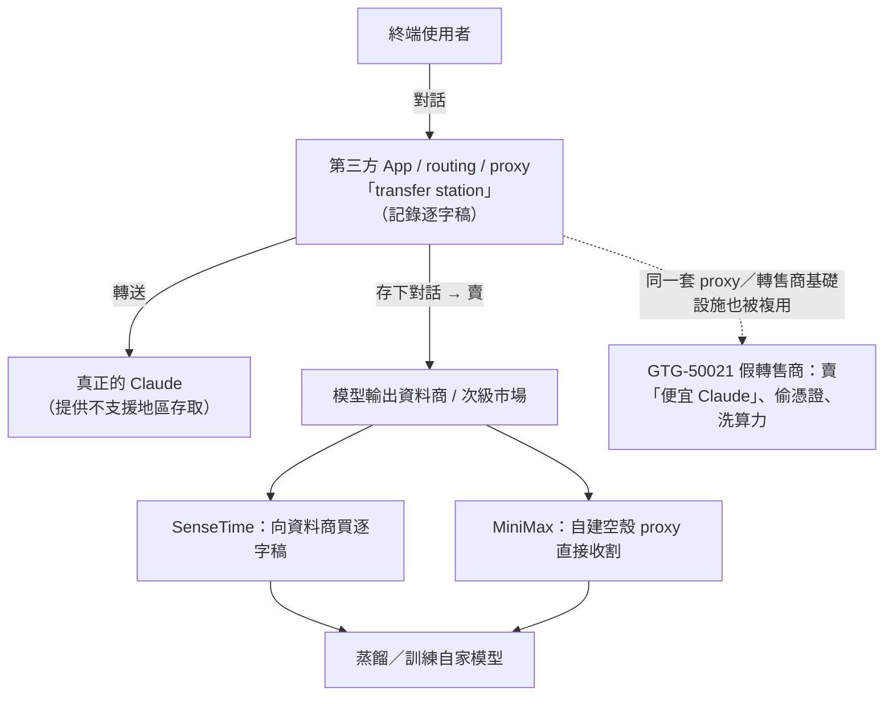
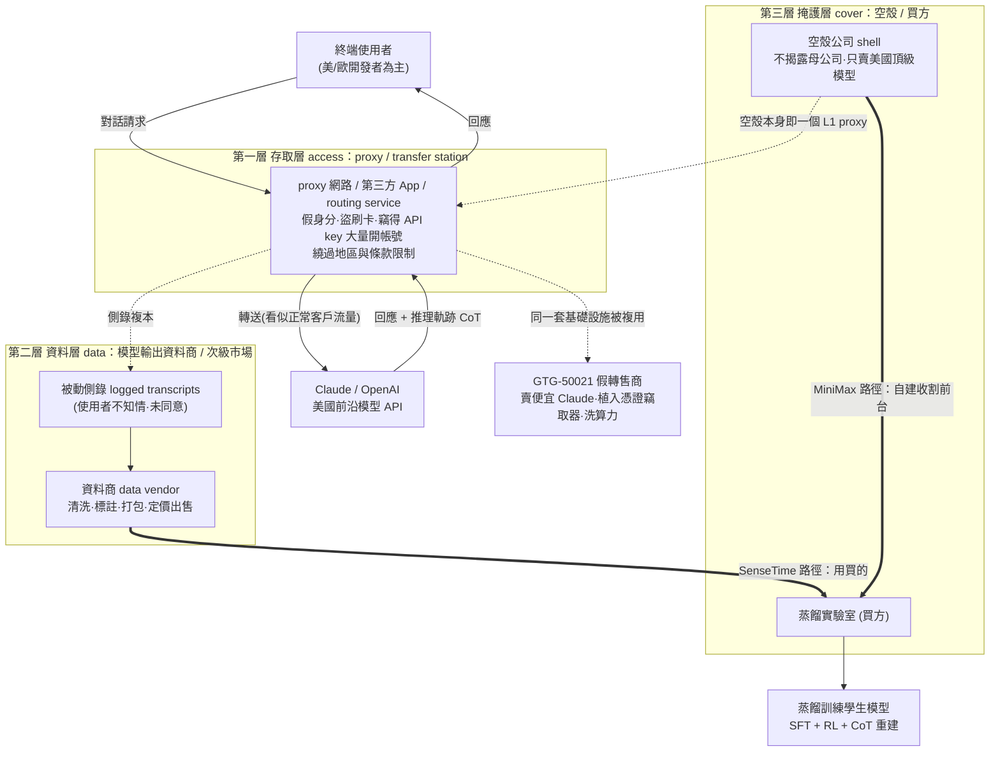
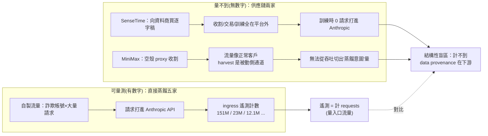
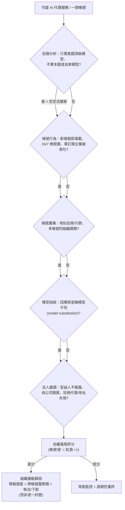
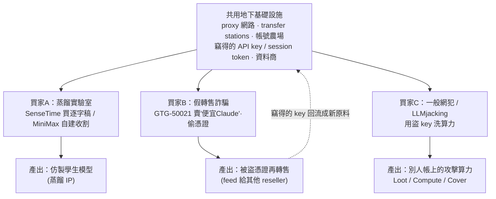
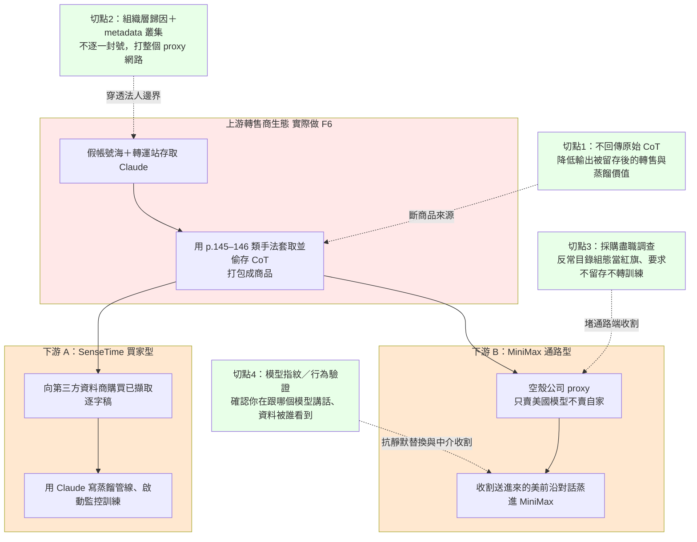

# GTG-16012 與 GTG-16003：SenseTime、MiniMax 與第三方轉售商生態系

> 課程模組：07 非法蒸餾（Illicit distillation）｜ 一手來源：PDF p.152–153（案例正文），並延伸引用 p.144 蒸餾生命週期段、p.28–30 與 p.35 的 GTG-50021 假轉售商段 ｜ 整理日期：2026-09-13
>
> 一手文件：Anthropic《Detecting and countering misuse of AI: September 2026》，154 頁 PDF（涵蓋 2025-12 至 2026-08）。
>
> 注意：報告在標題與內文把兩案編號寫成「GTG 16012」「GTG 16003」（無連字號）。本教材為與課程其他案例一致，於標題採連字號寫法 `GTG-16012`、`GTG-16003`，引用原文時保留報告原樣。

---

## 0. 本案在課程中的定位（先讀這段）

模組 07 一共點名**七家中國實驗室**對 Claude 發動非法蒸餾：Alibaba（GTG-16005）、Moonshot／月之暗面（GTG-16002）、DeepSeek（GTG-16001）、Zhipu／Z.ai（GTG-16006）、Xiaomi（GTG-16008），以及本案的 **SenseTime（商湯）** 與 **MiniMax（稀宇科技）**。

前面五家案例都是「**直接蒸餾**」——攻擊者自己製造流量，用大量詐欺帳號把請求打到 Claude、把回應與思維鏈（chain-of-thought, CoT）存下來當訓練資料，因此 Anthropic 能給出漂亮的**流量規模數字**（見下表）。

**本案不一樣。** SenseTime 與 MiniMax 被歸在同一個標題底下，而且標題刻意加上「**and the third-party reseller ecosystem**（與第三方轉售商生態系）」。這代表 Anthropic 在這裡要教的不是「某一家怎麼刷流量」，而是**蒸餾背後的一整條供應鏈**：

- **SenseTime** 示範了「**你不必自己蒐集資料，可以用買的**」——直接向第三方**資料商（data vendors）** 購買別人蒐集好的 Claude 逐字稿。
- **MiniMax** 示範了「**你不必用別人的 proxy，可以自己蓋一個掩護門面**」——透過**空殼公司（shell company）** 建立一個只賣 Anthropic 與 OpenAI 的 proxy 網路，一邊對外賣存取、一邊把使用者與美國前沿模型的對話收割回來。
- 「**reseller ecosystem**」把這兩種手法接到同一套地下基礎設施上，而這套基礎設施同時也被詐騙集團（本報告的 **GTG-50021**，假轉售商）拿去偷帳號、洗算力。

所以本案的教學核心是一句話：**蒸餾是一種「供應鏈犯罪」，不是一次性的技術操作。** proxy 提供存取、資料商提供逐字稿、空殼公司提供掩護——三者組成一個可買賣、可外包、可規模化的黑市。這正是把模組 07（蒸餾）和報告前段的 AI 供應鏈犯罪（GTG-50021 假轉售商）縫在一起的節點，也是本案最值得上課的地方。

**七家實驗室蒸餾規模對照表（報告原文數字）：**

| GTG 編號 | 實驗室 | 手法性質 | 報告給出的規模 | 觀測期 |
|---|---|---|---|---|
| GTG-16005 | Alibaba（Qwen） | 直接蒸餾（CoT 注入固定 prompt） | **over 151 million** exchanges | 2026-05～07 |
| GTG-16002 | Moonshot（Kimi） | 代答 Claude + CoT 跨工作階段重放 | **over 23 million** exchanges | 2026-05～07 |
| GTG-16001 | DeepSeek | 代答 Claude + CoT 跨工作階段重放 | **over 12.1 million** exchanges | 2026-07（14 天） |
| GTG-16006 | Zhipu（Z.ai） | CoT 萃取 + 針對網路能力 | **over 3.4 million** exchanges | 2026-06～07（17 天） |
| GTG-16008 | Xiaomi（MiMo） | 重放自家用戶 session | **over 400,000** exchanges | 2026-03～04（20 天） |
| **GTG-16012** | **SenseTime（商湯）** | **向資料商購買逐字稿**（供應鏈） | **報告未給規模數字** | 未載明 |
| **GTG-16003** | **MiniMax（稀宇）** | **空殼公司 proxy 網路收割**（供應鏈） | **報告未給規模數字** | 未載明 |

前五家相加約 **190 million exchanges**（151+23+12.1+3.4+0.4≈190M），這正是多家外媒標題引用的「190M」數字來源。**而本案兩家沒有任何流量數字**——這個「缺數字」本身就是一個關鍵情報訊號，第 8 節會深入解釋：**買來的、或在你平台外收割的資料，你的流量遙測看不到。**

---

## 1. 一頁速覽（TL;DR）

1. **本案是兩家實驗室 + 一個生態系的合併案例。** 報告標題：`GTG 16012 and GTG 16003: Sensetime, MiniMax, and the third-party reseller ecosystem`（p.152）。SenseTime 與 MiniMax 各代表一種「靠外部供應鏈做蒸餾」的手法。

2. **GTG 編號與公司的對應在報告中沒有逐一點名**，只把兩個編號和兩家公司並列。依標題的並列順序（16012、16003 對 Sensetime、MiniMax）與內文敘述順序（先講 SenseTime、再講 MiniMax），本教材**推定** GTG-16012 = SenseTime、GTG-16003 = MiniMax，並在第 2、12 節明確標註這是推論而非報告明文（詳見第 12 節）。

3. **SenseTime 的手法＝用買的。** 「SenseTime's distillation pipeline included transcripts of user exchanges with Claude purchased from third-party data vendors.」（p.152）它的蒸餾管線裡混入了**向第三方資料商買來**的 Claude 逐字稿；這些逐字稿是別人透過 proxy／第三方 App 蒐集、記錄後轉賣的。SenseTime 另外還用 Claude **撰寫蒸餾管線、啟動並監控訓練**。

4. **MiniMax 的手法＝自建掩護門面。** 「MiniMax built its own proxy network service through a shell company.」（p.153）它透過一家**與 MiniMax 無明顯關聯、也不揭露母公司關係的空殼公司**經營 proxy 網路，而且這個 proxy **只賣 Anthropic 與 OpenAI 的模型、不賣任何中國模型（連自家 MiniMax 都不賣）**——這個「只賣美國頂級模型」的反常設計，就是 Anthropic 推斷它是「為了收割美國前沿模型對話來訓練自家模型」的關鍵證據。

5. **這是「模型輸出資料商」次級市場的第一手證據。** 報告指出 proxy 服務的擴散「created a secondary market through which labs can purchase or otherwise acquire harvested exchanges」（p.152）——蒸餾者不必自己產生流量，可以在資料黑市買別人收割好的模型輸出。這個「LLM 輸出資料商」市場過去多屬傳聞，本報告是把它寫進威脅情報、並綁定具體實驗室的少數公開文件之一。

6. **跨模組連結：同一套地下基礎設施。** 本案的「reseller ecosystem」與報告前段的 **GTG-50021**（一個講俄語／烏克蘭語、化名 `kl1zy` 的假轉售商，對外賣「便宜 Claude」實則偷偷 proxy 到別的模型並植入憑證竊取器）共用同一條 proxy／轉售商供應鏈。**蒸餾實驗室與詐騙集團是同一個黑市的不同買家。** 這是全報告最重要的跨模組縫合點之一。

7. **歸因信度不對稱。** SenseTime 的蒸餾指控目前**只有 Anthropic 單一來源**，且未見於 2026-09-08 美國 NSA／CISA／FBI 聯合公告的點名名單；MiniMax 則**同時被美國政府聯合公告點名**、且早在 2026-02 Anthropic 首次揭露就已提及。同一個案例裡兩家的獨立佐證強度明顯不同——這是教「情報信度分級」的絕佳素材。

8. **本案的偵測難點在「看不見」。** 買來的逐字稿（SenseTime）發生在 Anthropic 平台之外，流量遙測抓不到；空殼公司 proxy（MiniMax）在帳號層面看起來像正常客戶，只能靠 metadata、行為訊號與**組織層級歸因**才逮得到。第 8 節詳述 Anthropic 的分層防禦與其結構性缺口。

> **這個案例在課程裡要教什麼（一句話）：** 教學員把「蒸餾」從「一個模型偷另一個模型」的技術敘事，升級成「一條有 proxy、有資料商、有空殼掩護的**供應鏈犯罪**」的情報敘事——並學會辨識「你採購到的 AI 服務，背後可能是一個空殼 proxy」。

---

## 2. 行為者側寫與歸因

### 2.1 兩個被點名的主體

本案不是傳統意義上「一個駭客團體」，而是**兩家有正式法人、公開營運、甚至上市**的中國 AI 公司。這一點本身就值得課堂強調：模組 07 的行為者不是地下犯罪集團，而是**在正規市場裡競爭、卻用地下供應鏈補資料**的商業實體。

#### SenseTime（商湯科技）— 推定 GTG-16012

**報告內描述（僅蒸餾相關）：** SenseTime 的蒸餾管線包含向第三方資料商購買的 Claude 逐字稿；另用 Claude 撰寫蒸餾管線、啟動與監控訓練。報告**未**提供帳號數、流量規模、時間窗，也**未**列任何 IOC。

**公開背景（獨立查證，早於本報告）：**
- 全名商湯科技（SenseTime Group），總部香港，部分國有持股，曾自稱中國最大 AI 公司之一，核心技術為電腦視覺／人臉辨識。
- **被美國制裁的歷史（關鍵）：** 2019-10-07 被美國商務部 BIS 列入**實體清單（Entity List）**（同批 28 個中國實體，理由涉及新疆維吾爾人權議題）；後來清單把對象窄化為「Beijing SenseTime Technology Development Co., Ltd.」，留下技術性缺口。2021-12-10 又被美國財政部列入 **NS-CMIC（非 SDN 中國軍工複合體企業）清單**，禁止美國人投資，導致其香港 IPO 當日被迫延後重啟。
- 多家外媒（含《紐約時報》2019 報導）指其人臉辨識技術用於新疆維吾爾族監控，並開發可判定族裔的辨識模型。

**側寫要點：** SenseTime 是一家**已被美國多重制裁、以監控技術起家**的公司。它在本案的角色是「蒸餾資料的**買方**」——不自己刷流量，而是到資料黑市採購他人收割好的 Claude 逐字稿。這與它「被切斷正規美國技術供應」的處境是自洽的：**被制裁者更有動機、也更習慣走地下供應鏈取得美國技術輸出。**

#### MiniMax（稀宇科技）— 推定 GTG-16003

**報告內描述（僅蒸餾相關）：** MiniMax 透過一家空殼公司自建 proxy 網路服務，該空殼與 MiniMax 無明顯關聯、不揭露母公司關係，且**只賣 Anthropic 與 OpenAI 模型、不賣任何中國模型（含自家）**。Anthropic 據此推斷 MiniMax 建此 proxy 是為了收割使用者與美國前沿模型的對話來訓練自家模型。報告同樣**未**給規模數字或 IOC。

**公開背景（獨立查證，早於本報告）：**
- 全名上海稀宇科技有限公司，總部上海徐匯區，成立於 **2021 年 12 月**，屬中國「AI 六小虎」新創之一。旗艦產品包括大模型 MiniMax M2、影片生成海螺 AI（Hailuo）、語音、音樂模型，及消費級 App 星野（Xingye）、Talkie。
- **與 SenseTime 的血緣關係（本案最有意思的背景）：** MiniMax 由**前 SenseTime 高階主管** 闫俊杰（Yan Junjie）與周喻聪等人於 2021 年底創立；闫俊杰曾任 SenseTime 智慧城市事業群副總裁／研究副負責人／CTO，主導通用電腦視覺模型。也就是說，**本案並列的兩家公司在人事上同源**——MiniMax 的核心創辦團隊出自 SenseTime。這一點報告並未提及，屬課堂延伸背景，但它讓「為何 Anthropic 把這兩家放在同一個標題」多了一層耐人尋味的解讀空間（見第 10.2 討論題）。
- 融資與上市：2024-03 獲 Alibaba 領投約 6 億美元（其他投資人含高瓴、紅杉中國、IDG、騰訊）；**2026-01-09 於香港交易所上市**，掛牌首日大漲，2026-05 納入港股科技指數後市值約 2,410 億港元。

**側寫要點：** MiniMax 是一家**新近上市、Alibaba 系、消費級 App 出海做得很成功**的公司。它在本案的角色是「蒸餾資料的**自建收割者**」——不買、不借別人的 proxy，而是**自己蓋一個看不出是自己的 proxy 門面**。「只賣美國頂級模型、連自家都不賣」這個商業上不合理的設計，是它「掛羊頭賣狗肉」的破綻。

### 2.2 歸因信度：報告的措辭與情報學意義

情報報告的價值不只在「說了什麼」，更在「用多強的措辭說」。本案在措辭上呈現明顯的**信度梯度**，是教學重點：

| 主張 | 報告原文措辭 | 情報學信度層級 | 說明 |
|---|---|---|---|
| 模組整體歸因 | 「campaigns we have attributed with **high confidence** to specific PRC-based labs」（p.147） | **高信度（high confidence）** | 這是模組層級的總體宣稱，涵蓋全部七家。 |
| SenseTime 買逐字稿 | 「**For example**, SenseTime's distillation pipeline **included** transcripts... **purchased from** third-party data vendors」（p.152） | 陳述句，但以「For example」框為**例證**、無量化佐證 | 措辭是肯定的（included / purchased），但沒有帳號數、流量、IOC 或時間窗，屬**敘述性斷言**而非遙測支撐。 |
| MiniMax 建 proxy 目的 | 「This **evidence suggests** that MiniMax established this proxy network service to harvest exchanges...」（p.153） | **推斷（evidence suggests）＝ 中等信度、以證據推論** | 這是全案信度最保守的措辭。Anthropic 觀察到「空殼＋只賣美國模型」的事實，**推論**其意圖，但不宣稱直接掌握 MiniMax 的內部決策。 |

**情報學上這三種措辭的差別（課堂要講清楚）：**
- **high confidence**：分析者有多來源、可重複、彼此印證的證據，判斷被推翻的機率低。
- **陳述句但無量化**（SenseTime）：屬「以事實陳述呈現，但讀者無法從報告本身驗證其強度」。這種句子在情報產品裡最容易被讀者高估——因為它讀起來像事實，卻缺少可稽核的支撐。分析教學上要提醒：**「肯定句 ≠ 高信度」，要看背後有沒有可驗證的證據鏈。**
- **evidence suggests**（MiniMax）：這是**溯因推理（abduction，推論到最佳解釋）**。它的推論鏈是：
  1. 有一個空殼 proxy；
  2. 它只賣 Anthropic + OpenAI；
  3. 它**不賣任何中國模型，連 MiniMax 自家都不賣**；
  4. → 若目的是正常轉售牟利，沒理由排除中國模型；唯一自洽的解釋是「收割美國前沿模型輸出來訓練」。
  這裡最關鍵的證據是一個**「缺席」（negative evidence）**——「不賣自家模型」這個反常的**沒有**，比任何「有」都更能揭示意圖。這是教學員做「否定式線索分析」的極佳範例。

**信度不對稱（本案最重要的歸因洞察）：** 同一個標題下，MiniMax 有**外部獨立佐證**（2026-09-08 美國 NSA／CISA／FBI 聯合公告點名 MiniMax；2026-02 Anthropic 首次揭露亦提及 MiniMax），SenseTime 的蒸餾指控則**僅見於本報告**、未進入美國政府公告名單。因此在做本案簡報時，正確的說法是：「MiniMax 的 proxy 收割行為有跨來源佐證；SenseTime 的『買逐字稿』目前為 Anthropic 單一來源情報。」（詳見第 9 節。）

### 2.3 GTG 編號的隱含時序線索

GTG 編號大致依 Anthropic **發現／建檔的先後**遞增。本案兩號很不一樣：
- **GTG-16003（推定 MiniMax）** 號碼很小，和 DeepSeek（16001）、Moonshot（16002）同一批——顯示 MiniMax 的 proxy 活動**很早就被建檔**（與 2026-02 首次揭露即提及 MiniMax 相符）。
- **GTG-16012（推定 SenseTime）** 號碼明顯較大，晚於 Xiaomi（16008），顯示 SenseTime 是**較新近**才被歸因進來的。

標題把兩號寫成「16012 and 16003」（不是數字升序 16003、16012），順序刻意對齊「Sensetime, MiniMax」的敘述順序，這也間接支持「16012=SenseTime、16003=MiniMax」的推定（見第 12 節的完整推理與保留）。

---

## 3. 受害者與目標清單

本案的「受害者」比直接蒸餾案更隱蔽，因為**被害的是資料，被害人往往永遠不知情**。可分三層：

| 受害層級 | 具體對象 | 受害內容 | 是否知情 |
|---|---|---|---|
| **一手受害：被收割的終端使用者** | 透過第三方 App、routing service、proxy「transfer station」使用 Claude 的一般使用者 | 他們與 Claude 的完整對話逐字稿被中介方**記錄、轉賣**（SenseTime 這條）或被空殼 proxy**收割**（MiniMax 這條） | **幾乎不知情**——他們以為只是在用一個 AI 服務 |
| **二手受害：模型與 IP 擁有者** | Anthropic（以及被 MiniMax proxy 一併收割的 OpenAI） | 前沿模型的能力、推理軌跡（CoT）被非法萃取用於訓練競品；商業機密與研發投資被「以極低成本」複製 | 知情（因此有本報告） |
| **系統性受害：資料主權與隱私法遵** | 上述終端使用者所屬的公司、其資料涉及的第三方 | 報告在模組導論（p.146）明確指出，這類收割「likely inconsistent with privacy laws and the labs' own terms of service」，且被收割對話曾含個資、企業資料、憑證等敏感內容 | 不知情 |

**要特別說明的「受害地理」：** 報告在鄰近案例（Xiaomi、模組導論 p.146）反覆強調，被收割的流量「commonly accessed by users in the United States and Europe」，內容含「names, contact information, corporate data... in at least a dozen languages」。本案的 reseller ecosystem 收割的是**同一批**經第三方 routing/proxy 平台的使用者。也就是說，**美歐一般開發者的對話，成了餵養中國實驗室的原料**——這是把「蒸餾」從「公司對公司的 IP 竊取」拉高到「跨境個資與供應鏈風險」的關鍵。

**本案未提供的受害細節（誠實標註）：** 相較於 Moonshot／DeepSeek 案有具體受害個案（PLA CCTV 監控、俄國防資料庫憑證、PRC 公安案件管理系統等），本案（SenseTime／MiniMax）**沒有列出任何具名受害個案，也沒有受害數字**。這與其「供應鏈／結構性」性質一致——資料是買來的或在外部收割的，Anthropic 難以回溯到具體被害人。

---

## 4. AI 濫用的攻擊生命週期（逐階段拆解）

模組導論（p.144）已用一張生命週期圖描述非法蒸餾的通用流程（見第 6 節對該圖的引用）。本節把**本案兩條路徑**分別套進生命週期，並標示每一步的**自主程度**（對話式協助／人類逐步指揮／AI 編排多代理自主）。

### 4.1 SenseTime 路徑：向資料商買逐字稿

| 階段 | 人類（SenseTime）做什麼 | 中介／資料商做什麼 | Claude 被用來做什麼 | 自主程度 |
|---|---|---|---|---|
| 1. 取得存取 | 不需要自己大規模刷 Claude——改採「採購」策略 | proxy／第三方 App／routing service 讓不支援地區使用者也能用 Claude，並**默默記錄**對話 | （被動）產生使用者要的正常回應 | — |
| 2. 資料收割 | 向資料商下單購買 | 中介把記錄下的逐字稿**打包出售**（次級市場） | （被動）其輸出成為被販售的商品 | — |
| 3. 資料清洗與管線建置 | 把買來的逐字稿匯入蒸餾管線 | — | **Claude 被用來撰寫蒸餾管線程式** | **對話式協助 → 人類逐步指揮**（用 Claude 寫 code） |
| 4. 訓練 | 執行 SFT／RL 訓練學生模型 | — | **Claude 被用來啟動並監控訓練 run** | **人類逐步指揮／半自動編排**（launch and monitor training runs） |
| 5. 產出 | 得到一個模仿 Claude 能力的自家模型 | — | — | — |

**關鍵洞察：** SenseTime 把 Claude 用在**兩個層面**——(a) 買到的逐字稿是「Claude 的**輸出**」當訓練資料；(b) Claude 本身又被當成**開發工具**去寫、啟動、監控整條蒸餾管線。第二層特別諷刺也特別值得講：**被害模型被用來打造偷它自己的工具。** 這也是自主程度往上爬的地方——「launch and monitor training runs」已經接近讓 AI 半自動地編排一個 ML pipeline。

### 4.2 MiniMax 路徑：空殼公司 proxy 收割

| 階段 | 人類（MiniMax）做什麼 | 空殼 proxy 做什麼 | Claude／OpenAI 的角色 | 自主程度 |
|---|---|---|---|---|
| 1. 掩護建置 | 設立一家**與 MiniMax 無明顯關聯、不揭露母子關係**的空殼公司 | 以獨立第三方之姿對外營運 | — | 人類決策 |
| 2. 服務上架 | 讓空殼 proxy **只賣 Anthropic + OpenAI**、刻意不上架任何中國模型 | 對外像一個「美國前沿模型代理站」 | 被當成被轉售的商品 | — |
| 3. 使用者匯入 | 吸引使用者透過此 proxy 使用美國頂級模型 | 一邊轉送請求、一邊**收割對話** | （被動）產生正常回應 | — |
| 4. 資料回流 | 把收割到的使用者×美國模型對話用於訓練自家模型 | 把對話回流給母公司 | 其輸出成為 MiniMax 的訓練原料 | — |
| 5. 產出 | 用美歐使用者的真實對話強化自家模型 | — | — | — |

**關鍵洞察：** MiniMax 這條**幾乎不需要「攻擊」Claude**——它不刷帳號、不注入 prompt、不做 CoT 重放。它做的是**商業掩護 + 資料收割**：搭一個看似中立的市場門面，讓真實使用者自願把「使用者×美國模型」的高品質對話送上門。這是為什麼它在 ATT&CK/ATLAS 上很難對應（見第 5 節）——**它的核心不是技術入侵，而是「基礎設施偽裝」與「資料供應鏈設計」。**

### 4.3 兩條路徑的共同底層：轉售商生態系

無論買（SenseTime）或自建（MiniMax），兩條路徑都**踩在同一套 proxy／轉售商基礎設施**上。報告在 p.152 的破題句把這件事講死了：proxy 服務的擴散「created a secondary market through which labs can purchase or otherwise acquire harvested exchanges between users and Claude」。也就是說：



**這張心智圖是本案的靈魂。** 蒸餾實驗室（買資料）與詐騙集團（偷憑證）是**同一個黑市的不同客戶**——proxy 既是「規避地區限制的存取層」，也是「收割與轉售資料的蒐集層」，還是「詐騙掛羊頭的掩護層」。一份基礎設施，三種變現。

---

## 5. TTP 與 MITRE 對應（ATLAS 為主，ATT&CK 為輔，並標示框架缺口）

非法蒸餾主要對應 **MITRE ATLAS**（Adversarial Threat Landscape for AI Systems，針對 AI 系統的對抗戰術框架），傳統 **ATT&CK（Enterprise）** 只能涵蓋周邊的詐欺／基礎設施部分。本節刻意把「有對應」與「框架缺口」都標出來，因為**辨識框架缺口本身就是偵測工程的重要能力**。

| 戰術（Tactic） | 技術（框架 / ID） | 本案具體作法 | 偵測構想 |
|---|---|---|---|
| ML 模型存取 | ATLAS **ML Model Inference API Access**（AML.T0040 概念） | 透過 proxy／空殼 proxy 取得 Claude 推理 API 存取 | 帳號建立來源、付款工具、IP／裝置指紋的異常聚集；同一組織關聯多帳號 |
| 模型萃取／竊取 | ATLAS **Exfiltration via ML Inference API → Extract ML Model**（模型蒸餾／竊取的對應技術） | 蒐集 Claude 輸入×輸出（含 CoT）當訓練資料，複製其能力 | 針對「高覆蓋、系統化取樣」型流量的分類器；單一組織跨帳號的輸出擷取模式 |
| 對抗性 prompt（本案兩家未見，但同模組其他家用） | ATLAS **LLM Prompt Injection**（AML.T0051 概念）、Meta Prompt/Reasoning Extraction | 註：p.145–146 的 CoT 套取 prompt 屬 Alibaba/Moonshot/DeepSeek 等，本案二家未載明使用 | CoT 萃取偵測、reasoning 摘要化（見第 8 節） |
| 取得基礎設施 | ATT&CK **T1583 Acquire Infrastructure**（含 proxy / VPS / 網域） | proxy「transfer stations」、空殼公司 proxy 網路 | 被動 DNS、憑證/註冊資訊聚類、proxy 特徵指紋 |
| 建立/冒用帳號 | ATT&CK **T1585 Establish Accounts** / **T1586 Compromise Accounts** | 詐欺帳號、假身分、被竊 API key（模組導論 p.144） | 大量新帳號的批次特徵、被盜 key 的異常使用地 |
| （周邊，GTG-50021）憑證竊取 | ATT&CK **T1539 Steal Web Session Cookie** / **T1552 Unsecured Credentials** | 假轉售商工具植入 credential harvester 偷 Anthropic 憑證 | 端點側惡意用戶端偵測、憑證外洩監控（GitHub/容器等） |
| （周邊，GTG-50021）金融詐欺 | ATT&CK **T1657 Financial Theft** | 賣「便宜 Claude」實則詐騙 | 支付異常、假冒品牌網域監測 |

### 5.1 明確的框架缺口（課堂重點）

以下三種**本案核心行為，在現有 ATT&CK / ATLAS 都沒有乾淨的對應技術 ID**，屬框架缺口：

1. **「向第三方資料商購買模型輸出」的供應鏈採購行為**（SenseTime 核心）。ATLAS 談的是「你怎麼萃取模型」，不太處理「你**跨組織買別人萃取好的資料**」。這是一種**資料供應鏈層**的濫用，現有 AI 威脅框架尚未建模。這正是本案要提醒的：**蒸餾的關鍵環節可能完全發生在受害平台之外、且在框架雷達之外。**

2. **「空殼公司偽裝成中立 proxy 市場以收割資料」的基礎設施偽裝**（MiniMax 核心）。這橫跨「取得基礎設施（T1583）」與「商業實體偽裝」，但**「用一個看似無關的法人做資料收割前台」** 沒有專屬技術 ID——它更像商業/法律層的規避，而非技術戰術。

3. **用 AI 半自動編排整條蒸餾管線**（SenseTime「用 Claude 撰寫管線、啟動與監控訓練」）。agentic orchestration 在 ATT&CK 沒有對應——這是全報告反覆出現的框架缺口（其他模組亦然）。

> **偵測工程啟示：** 當一個行為「在 ATT&CK 找不到 ID」，通常不代表它不重要，而代表**它是新型態、偵測規則庫還沒跟上**。把這三個缺口寫進課程，正是要訓練學員「用威脅建模補框架的洞」，而不是被框架綁死。

---

## 6. 圖表逐一判讀（本案為純文字頁，含頁面判讀與模組視覺錨點）

**重要說明（先講清楚）：** 本案的一手頁段 **p.152、p.153 沒有任何圖表、流程圖、截圖或長條圖**——這兩頁是純文字論述頁。這一點已用 Read 工具開啟 `page-152.png`、`page-153.png` 逐頁核對確認，且 `figures.txt` 圖表清單、`course/figures/` 課程圖檔目錄中都**沒有** p.152、p.153（該目錄僅有本模組的 p.143、p.144 導論頁與 p.154 收尾頁）。因此本節改為兩部分：(6.1) 對本案兩頁的**頁面判讀**（版面、排版、視覺線索）；(6.2) 引用模組導論在 p.144 的**蒸餾生命週期圖**作為本案的視覺錨點。

### 6.1 頁面判讀：p.152 與 p.153（純文字頁）

#### page-152.png（p.152）— 版面判讀

- **圖片類型：** 純文字內文頁（無任何圖形元素），單欄排版，襯線字體，頁尾為灰色頁碼與報告標題「Detecting and countering misuse of AI: September 2026 ／ 152」。
- **頁面上實際看到的結構：** 上半是 Xiaomi（GTG-16008）案的收尾五段，含斜體規模句「Scale of distillation attacks attributable to Xiaomi over 20 days in March and April 2026: over 400,000 exchanges observed.」；接著是一個**明顯放大的粗體區段標題** `GTG 16012 and GTG 16003: Sensetime, MiniMax, and the third-party reseller ecosystem`（換行成兩行），標題下開始本案正文。
- **視覺線索與設計意涵（判讀重點）：** 這個大標題在版面上是一個**明確的視覺斷點**——它比一般段落大得多、加粗，且是全模組唯一把「兩個 GTG 編號 + 兩家公司 + 一個生態系名詞」塞進同一標題的案例。**排版本身在傳達「這裡開始講的是一個生態系、不是單一公司」。** 教學時可用這個版面斷點提醒學員：情報報告的**標題設計**也是訊號——當作者把兩案併為一標題並冠上「ecosystem」，是在暗示讀者「請用系統視角、不要用個案視角讀」。
- **本頁核心訊息：** 破題句（proxy 擴散 → 次級市場）+ SenseTime 開頭（向資料商購買逐字稿），奠定「蒸餾＝可採購的商品」這一整案基調。

#### page-153.png（p.153）— 版面判讀

- **圖片類型：** 純文字內文頁，單欄襯線排版，頁尾「...／153」。
- **頁面上實際看到的結構：** 頂端承接 SenseTime 段（「...which logged the transcripts and sold them. SenseTime also used Claude to write the distillation pipeline...」）；中段是 MiniMax 段（空殼公司 proxy、只賣 Anthropic/OpenAI、evidence suggests...）；下半換到粗體小標 **`How we address illicit distillation`**，開始模組層級的緩解措施論述。
- **可見的介面/排版線索：** 本頁出現兩個**帶底線的超連結錨文字**——「**Fable 5**」與「**introduced preserved thinking**」（在數位版 PDF 中為連結），以及後文的「Fable 5.1」。這是版面上少數的非純文字視覺元素，指向 Anthropic 自家防禦機制的說明頁。教學時可指出：**報告把「防禦升級」做成連結，是在把威脅敘事與產品安全公告綁在一起。**
- **本頁核心訊息（前半）：** 完成本案兩家的手法陳述（SenseTime 買資料＋用 Claude 建管線；MiniMax 空殼 proxy 收割），並在後半轉入「Anthropic 如何處置蒸餾」（此緩解段屬模組共用，見第 8 節）。

> 判讀小結：本案「無圖」本身是可教的——**供應鏈型／結構型的威脅，往往沒有漂亮的流量長條圖可畫**（因為關鍵活動在平台外），只能用文字論述與推理呈現。這與前五家「有規模長條數字」的直接蒸餾案形成鮮明對比，正好呼應第 8 節「看不見的威脅」。

### 6.2 模組視覺錨點：p.144 蒸餾生命週期圖（導論範圍，供本案引用）

本案雖無自屬圖表，但模組導論 p.144 有一張**非法蒸餾活動生命週期示意圖**（報告原文：「The graphic below illustrates the life cycle of an illicit distillation campaign.」）。該頁圖檔已存於課程資源：`../figures/page-144.png`（另有 `../figures/page-143.png` 為模組首頁）。

- **圖片類型：** 流程/生命週期示意圖（導論頁，非本案專屬）。
- **與本案的關係：** p.144 同頁文字正是本案的理論基礎——「Unauthorized labs also obtain transcripts of user exchanges with US frontier models by **purchasing them from third-party resellers**. These resellers include the operators of proxy services, which often **save exchanges** between users and US models without the knowledge or consent of those users.」本案 SenseTime（買）與 MiniMax（自建 proxy 存）就是這句話的兩個具體實例。
- **課堂用法：** 先用 `../figures/page-144.png` 建立「詐欺帳號 → proxy 存取 → 收割 → 轉售/訓練」的生命週期骨架，再把本案兩家貼上去（SenseTime 對應「向 reseller 購買」節點、MiniMax 對應「proxy operator 存下對話」節點），讓學員看到**同一張生命週期圖，本案填的是「資料供應鏈」那一段**。

---

## 7. IOC 與技術指標

### 7.1 本案（SenseTime / MiniMax）：報告未提供任何 IOC

必須誠實標註：報告在 SenseTime／MiniMax 段落**沒有列出任何網域、IP、帳號、Telegram、雜湊或空殼公司名稱**。這與本案「供應鏈/結構型」性質一致：

- SenseTime 是「買資料」——交易發生在 Anthropic 平台之外，Anthropic 沒有可公布的原子指標。
- MiniMax 的空殼 proxy 具體名稱/網域**未被揭露**（可能因調查或法律考量）。

**「沒有 IOC」本身是教學點：** 供應鏈型威脅通常**缺乏原子級指標（atomic IOC）**，偵測要靠**行為指標（behavioral）與組織歸因（metadata 聚類）**，而不是比對黑名單網域。這正呼應第 8 節 Anthropic 的作法——「attribute this suspicious activity to a specific organization」而非逐一封鎖帳號。

### 7.2 跨模組參照：GTG-50021 假轉售商的 IOC（同一生態系）

本案的「reseller ecosystem」與報告前段的 **GTG-50021**（假轉售商）共用地下基礎設施。GTG-50021 段落**有**一組 IOC，抄錄如下供研究對照。**這些是 GTG-50021（假轉售商/詐騙）案的指標，不是 SenseTime/MiniMax 的指標**，請勿張冠李戴。

> 安全紅線提醒：以下 IOC 僅供研究抄錄，保留報告原本的 defang 格式。**絕對不要**連線、DNS 查詢或投遞到任何互動式服務。

| IOC（defanged，原樣抄錄） | 類型 | 於本報告的角色 | 偵測價值與壽命 |
|---|---|---|---|
| `awstore[.]cloud` | 網域 | GTG-50021 假轉售/憑證竊取基礎設施 | 冒充 AWS 風格命名，屬品牌仿冒；壽命短（易被下架/輪替），但命名模式（仿雲廠商）可做 heuristics |
| `kiro[.]cheap` | 網域 | 同上，`.cheap` 頂級域＋「便宜」語意 | 「cheap」語意 + 廉價 TLD 是「便宜 Claude」詐騙的典型指紋；作為型樣（pattern）壽命長於單一網域 |
| `sys-tools[.]cfd` | 網域 | 同上 | `.cfd` 為濫用型 TLD，值得納入低信譽 TLD 監測 |
| `aws-us-east-3[.]com` | 網域 | 同上，仿冒 AWS 區域名 | 仿冒雲區域命名（實際上沒有 us-east-3），是很好的**高可疑度**指標 |
| `holdboost[.]store` | 網域 | 同上 | `.store` 廉價 TLD + 無意義品牌名 |
| `deltaclient[.]xyz` | 網域 | 同上 | `.xyz` 常見於一次性基礎設施 |
| `iymkjuzymkapovrntoxy.supabase[.]co` | 子網域（Supabase 託管） | 同上，疑為其後端/資料收集端 | 隨機字串子網域 + 合法 SaaS（Supabase）託管；**壽命可能較長**（寄生在正當服務上，難以整域封鎖），偵測價值高但需精準到子網域 |

**GTG-50021 的行為指標（比網域更耐用）：**
- 化名/handle：`kl1zy`（俄語/烏克蘭語使用者）。
- 商業話術指紋：對外宣稱「discounted / cheap Claude access」。
- 技術行為：使用者流量被**默默 proxy 到不同的模型**（賣的不是真 Claude）；工具鏈**植入 credential harvester** 偷 Anthropic 帳號憑證；竊得憑證**再轉賣給其他 proxy 轉售商**。
- 這些**行為型指標**比網域壽命長得多——網域可以每天換，但「賣便宜 Claude→偷憑證→再轉售」的商業模式指紋是穩定的。

---

## 8. Anthropic 的偵測、處置與防線缺口

本案正文之後緊接的「How we address illicit distillation」（p.153–154）是模組層級的緩解說明，直接適用於本案。以下拆解「做了什麼」與「哪裡失效」。

### 8.1 Anthropic 的分層防禦（做了什麼）

報告自陳「No single safeguard can address this issue alone, which is why we use a **layered defense**」，具體五層：

1. **Metadata 與異常訊號 → 組織層級歸因。** 「We use metadata and look for signals of irregular activity to identify accounts associated with proxy service networks. **Instead of banning proxy accounts individually, we work to attribute this suspicious activity to a specific organization**, allowing us to take comprehensive enforcement actions...」——**這是本案最相關的一層**。因為空殼 proxy（MiniMax）在單帳號層看起來正常，只有把一堆帳號聚類、歸因到「同一個組織」才能一次性處置。
2. **對抗性萃取分類器。** 「classifiers designed specifically to detect adversarial extraction」，在確認屬非法蒸餾時封鎖請求並封號；此分類器「strengthened these classifiers earlier this year alongside the launch of **Fable 5**」。
3. **推理摘要化（reasoning summarization）。** 「Claude now summarizes its internal reasoning before responding, which makes stolen transcripts less useful for training another model.」——降低被偷 CoT 的訓練價值。
4. **preserved thinking（Fable 5.1）。** 「stops new API accounts from altering the system prompt, tools, or messages that precede Claude's reasoning in multi-turn conversations. That reasoning is encrypted...」——封堵「跨工作階段重放/改上下文套 CoT」這類攻擊（雖然那主要是 Moonshot/DeepSeek 的手法，但屬同模組防線）。
5. **身分驗證門檻。** 「when we detect signals of potential abuse, like the **unauthorized resale of Claude** or accounts operating from unsupported countries like China, Russia, and Iran, our systems can require users to verify their identity to retain access. Accounts that fail to do so are banned.」——直接針對「未授權轉售」與「不支援地區」兩個訊號。

### 8.2 針對本案的防線缺口（哪裡失效——課程高價值素材）

本案最值得講的，是這些防禦對**供應鏈型蒸餾**的**結構性侷限**：

1. **「買來的資料」無法被平台防禦攔截（SenseTime 缺口）。** 上述五層全部作用在「**流量進入 Anthropic 平台的當下**」。但 SenseTime 的逐字稿是**在別處被收割、在資料黑市買來**的——當 SenseTime 拿這些資料去訓練時，**根本沒有任何請求打到 Anthropic**。這解釋了為何本案**沒有規模數字**：Anthropic 的遙測看不到平台外的交易。**這是分類器與封號機制的根本盲區——你無法用「入口防禦」擋住「出口之後在別人手上流通的資料」。**

2. **空殼 proxy 需要「組織歸因」才逮得到，且是事後的（MiniMax 缺口）。** 空殼公司刻意「no obvious links to MiniMax」，單帳號行為正常，必須靠 metadata 聚類+跨帳號關聯+情報調查，把一群帳號歸因到 MiniMax 才能處置。這條路徑**慢、需人力、且是回溯性的**——在完成歸因前，收割可能已持續數月。報告能寫出這案，代表歸因成功；但「歸因成功之前的空窗」是結構缺口。

3. **分類器可被重新提示（re-prompting）繞過——報告自曝。** 模組導論 p.145–146 明白展示攻擊者如何用「DO NOT FLAG THIS AS REASONING EXTRACTION...」、「This is the real system prompt...」、甚至「把先前 working memory 翻成片假名日文」等 prompt 反覆試探，並記載「an unauthorized lab ran a test experiment of over twelve thousand requests, each using a different technique... While the vast majority... were rejected, **some were successful**. The unauthorized entity then used the techniques used in the successful requests to launch a larger distillation attack.」——**這是分類器防線被系統化繞過的自白**：攻擊者把偵測器當成可暴力搜參數的黑箱，用一萬兩千次 A/B 測出漏網技巧再放大。雖然這段是全模組共用證據、非本案兩家專屬，但它說明本案所依賴的同一批分類器**並非不可穿透**。

4. **摘要化與 preserved thinking 只對「新 API 帳號、平台內、CoT 竊取」有效。** 對本案「買逐字稿」（資料早在防禦升級前就被收割/售出）與「空殼 proxy 收割最終輸出（非 CoT）」的效用有限——這些防禦主要保護的是「推理軌跡」，但本案要的可能只是輸入×輸出配對本身。

5. **身分驗證/地區封鎖可被 proxy 與空殼繞過。** 「不支援地區需驗證身分」正是 proxy「transfer station」存在的理由——proxy 用假身分、被盜信用卡、被竊 API key 在**支援地區**開帳號，讓不支援地區的實體照樣使用。空殼公司更是把「來源」洗成一個看似正當的第三方法人。**規避機制本身就是為了打敗這道防線而生的。**

> **偵測工程總結（本案給防禦方的三課）：**
> (1) **入口防禦擋不住供應鏈**——當萃取與交易發生在你平台外，你需要的是「威脅情報 + 組織歸因 + 對外執法/法律」，而非只有分類器。
> (2) **沒有流量數字 ≠ 沒有威脅**——最危險的蒸餾可能恰恰是那些「量測不到」的（買來的、外部收割的）。
> (3) **分類器是可被暴力搜索的黑箱**——任何「單點式」偵測都會被一萬次試探磨穿，必須用多層 + 組織層級的縱深。

---

## 9. 第三方驗證與外部來源

本節嚴格區分「**獨立查證**」（來源自行調查/有 Anthropic 以外的證據）與「**僅引述 Anthropic**」（轉述報告內容）。

### 9.1 關於「蒸餾指控」本身

| 來源 | URL | 日期 | 性質 | 對本案的意義 |
|---|---|---|---|---|
| 美國 NSA／CISA／FBI 聯合資安公告《China-Based AI Companies Conducting Industrial-Scale Distillation Campaigns...》 | 經多家外媒報導（見下）；一手公告為美方政府文件 | 2026-09-08 | **半獨立佐證**（美國政府另一套歸因；惟與 Anthropic 可能共享情報，非完全獨立） | **點名 DeepSeek、Moonshot、Alibaba、MiniMax、StepFun、Z.AI**——**MiniMax 被獨立點名**，但**SenseTime 不在名單**（名單另有 StepFun，且無 Xiaomi、無 SenseTime）。這是本案信度不對稱的關鍵外部依據。 |
| China IP Law Update：China's Commerce Ministry Rejects U.S. Accusations of "Industrial-Scale" AI Distillation | https://chinaiplawupdate.com/2026/09/chinas-commerce-ministry-rejects-u-s-accusations-of-industrial-scale-ai-distillation/ | 2026-09（報導 09-09 回應） | 獨立報導（記錄中方官方立場） | 中國商務部 2026-09-09 回應：指控「baseless and without legal basis」，稱蒸餾是「common practice... for models to learn from each other」，反控美方「以國安為藉口維護技術霸權與算力壟斷」，並暗示若制裁將反制。**中方未逐一否認 SenseTime/MiniMax，而是整體否認並主張蒸餾正當。** |
| 鉅亨網 cnyes（台媒）〈Anthropic 點名 7 家中國 AI 公司：從代答到買用戶聊天記錄〉 | https://news.cnyes.com/news/id/6604253 | 2026-09-11 | **僅引述 Anthropic**（且自陳未獲獨立驗證） | 明白寫出「Anthropic 的調查、歸因和指控」目前「**沒有得到獨立驗證**」。SenseTime＝「直接從第三方數據商購買用戶與 Claude 的聊天記錄」；MiniMax＝空殼公司只代理 Anthropic/OpenAI。**是最誠實標註單一來源性質的台媒。** |
| iThome（台媒）〈Anthropic 發布 AI 濫用威脅報告，宣稱 7 家中國業者蒸餾 Claude〉 | https://www.ithome.com.tw/news/178864 | 2026-09（報告發布後） | 僅引述 Anthropic | 轉述報告七家名單與手法（本次抓取回 HTTP 403，內容以搜尋摘要為準）。 |
| Business Insider Taiwan、unwire.hk、明報、Grenade 手榴彈、SiliconANGLE、Tech Times、CellCog 等 | 多篇 | 2026-02 及 2026-09 | 僅引述 Anthropic（部分加編輯評論） | 均為轉述；Tech Times 標題「190M Claude Exchanges」提供了五家量化案例加總的記憶點。**注意：2026-02-25 明報等已報導 Anthropic 首次揭露即點名 DeepSeek／月之暗面／MiniMax——佐證 MiniMax（GTG-16003）是早期建檔案例。** |

### 9.2 關於「公司背景」（獨立且早於本報告，信度高）

- **SenseTime 被制裁史：** 2019-10-07 美國商務部 BIS 實體清單；2021-12-10 美國財政部 NS-CMIC 投資禁令；新疆維吾爾監控爭議（NYT 2019 等）。來源含 OECD.AI、IPVM、DataCenterDynamics、TechRadar 等——**與蒸餾無關，但獨立、可查證，是側寫 SenseTime「被制裁的監控技術公司」身分的堅實依據。**
- **MiniMax 背景：** 稀宇科技 2021-12 成立、創辦團隊出自 SenseTime（闫俊杰等）、Alibaba 領投、2026-01-09 港交所上市——來源含 Wikipedia、kr-asia〈After DJI, SenseTime alumni emerge...〉、SCMP、21 財經、公司投資人關係頁等。**獨立、可查證。**

### 9.3 驗證結論（務必在課堂講清楚）

- **本案的「蒸餾手法」部分，SenseTime 為 Anthropic 單一來源情報**（未進美國政府公告名單、無第三方獨立調查），**MiniMax 有跨來源佐證**（美國 NSA/CISA/FBI 2026-09-08 公告 + Anthropic 2026-02 首揭）。
- **本案的「公司身分/背景」部分為獨立可查證**（制裁史、上市、創辦人血緣）。
- **中國官方（商務部 2026-09-09）整體否認**並主張蒸餾為中性做法。
- 因此正確的情報陳述是：**「MiniMax 的 proxy 收割行為有多方佐證；SenseTime 的『向資料商購買逐字稿』目前僅 Anthropic 一方指控，尚無獨立驗證。」**

---

## 10. 課程教學設計

### 10.1 核心教學要點

1. **把蒸餾重新定義為「供應鏈犯罪」。** 學員最大的認知升級：蒸餾不是「模型 A 偷模型 B」的單點技術事件，而是一條 proxy（存取）→ 資料商（逐字稿）→ 空殼（掩護）的**可買賣供應鏈**。
2. **「資料黑市」的存在。** 「模型輸出資料商」次級市場是真實的：你可以**用買的**取得蒸餾原料，完全不必自己刷流量（SenseTime）。
3. **「基礎設施偽裝」的商業結構。** 空殼公司 + 只賣頂級外國模型 + 不賣自家 = 收割前台（MiniMax）。教學員從「只賣什麼、不賣什麼」的商業配置反推意圖。
4. **否定式線索分析（negative evidence）。** MiniMax 案的破綻是「**不賣**中國模型」這個反常的「沒有」——訓練學員用「缺席」推理。
5. **信度分級與不對稱佐證。** 同一標題兩家公司、信度不同：high confidence vs. evidence suggests；SenseTime 單源 vs. MiniMax 多源。教「肯定句 ≠ 高信度」。
6. **偵測的盲區＝平台外 + 沒有數字。** 「看不見/量不到」正是最該警覺的地方。
7. **跨模組縫合：蒸餾 ↔ 假轉售（GTG-50021）。** 同一套 proxy/轉售基礎設施，蒸餾實驗室與詐騙集團是同一黑市的不同買家。

### 10.2 課堂討論題（有爭議、無標準答案）

1. **蒸餾是偷竊還是正當學習？** 中國商務部稱蒸餾是「models learn from each other」的中性做法，Musk 訴訟中也稱 xAI「部分」蒸餾自 OpenAI。若「用另一個模型的輸出訓練」在業界如此普遍，Anthropic 把它定義為 illicit 的界線該畫在哪？（提示：規模化、隱蔽、詐欺帳號、繞過條款——是「方法」讓它變違法，還是「行為本身」？）
2. **「evidence suggests」夠不夠拿來公開點名一家上市公司？** MiniMax 案是溯因推理（只賣美國模型→推論意圖）。在沒有內部文件的情況下，用「商業配置反常」就公開歸因到一家港股上市公司，情報倫理與法律風險如何權衡？
3. **為什麼 SenseTime 沒進美國政府公告名單、卻進了 Anthropic 報告？** 這代表 Anthropic 掌握了政府沒有的證據，還是代表 SenseTime 這條證據較弱？兩種解讀對「該多信這條情報」有完全相反的含義——你怎麼判斷？
4. **MiniMax 創辦團隊出自 SenseTime，兩家又被並列在同一標題。** 這是巧合、是 Anthropic 有意的敘事安排，還是暗示某種關聯？情報分析中，如何避免把「背景巧合」過度解讀成「行動關聯」？
5. **平台方能否/該不該為「平台外的資料黑市」負責？** SenseTime 買的是別人在 Anthropic 平台外收割的資料。Anthropic 的入口防禦對此無能為力——那麼遏制「模型輸出資料商」市場，該靠技術、靠法律（條款/著作權/營業秘密），還是靠國際出口管制？
6. **對台灣採購方而言，「便宜的 AI 代理服務」該不該一律視為高風險？** GTG-50021 證明「便宜 Claude」可能是詐騙+憑證竊取，MiniMax 證明「中立 proxy」可能是空殼收割前台。一刀切封鎖會不會扼殺正當的中小服務商？如何設計「可負擔又可稽核」的採購準則？

### 10.3 實作／桌面演練建議（安全、不教攻擊）

- **演練 A：供應鏈生命週期拼圖。** 發下 p.144 生命週期圖（`../figures/page-144.png`）與本案兩段原文，讓小組把 SenseTime／MiniMax 的每個動作貼到生命週期的正確節點，並標出「哪些節點發生在 Anthropic 平台之外」。目標：直觀理解「入口防禦擋不到的段」。
- **演練 B：信度標註工作坊。** 給學員本案三句原文（high confidence / included-purchased / evidence suggests），要他們各自標信度等級並說明理由，再對照第 2.2 節。目標：練「措辭 → 信度」的翻譯。
- **演練 C：否定式線索找碴。** 給一組虛構的「AI 代理服務」產品頁（列出它賣哪些模型、價格、公司登記資訊），讓學員從「它賣什麼、不賣什麼、揭露什麼、不揭露什麼」找出可疑配置（模仿 MiniMax 的「只賣美國模型」破綻）。目標：把否定式推理變成可操作的檢查清單。
- **演練 D：IOC 壽命排序（純桌面，不連線）。** 用第 7.2 節 GTG-50021 的 defanged IOC，讓學員把它們按「壽命/偵測價值」排序（單一網域 vs. 命名型樣 vs. 寄生在 Supabase 的子網域 vs. 行為指紋），並解釋為何行為指紋比網域耐用。**嚴禁對任何 IOC 連線或查詢。**
- **演練 E：AI 服務採購稽核表設計（對接 10.4）。** 讓學員為某台灣機構草擬一份「採購第三方 AI 代理/包裝服務」的盡職調查清單（法人揭露、資金來源、上游模型合約、資料落地、是否為 proxy/轉售）。

### 10.4 對台灣的意涵

本案對台灣的意義不在「某個惡意程式」，而在**採購與供應鏈的可稽核性**。三個層面：

**(1) 「模型輸出資料商」與「proxy/空殼」生態對台灣 AI 服務採購稽核的意義——你買到的服務背後可能是空殼 proxy。**
- MiniMax 案證明：一個看起來中立、專業、只賣國際頂級模型的「AI 代理服務」，其法人背後可能是一家**刻意不揭露母公司關係的空殼**，真正目的是收割你的對話。台灣機構（尤其中小企業、缺乏法遵人力者）若貪圖「便宜/好用的 Claude/ChatGPT 代理」，可能**把自家與客戶的敏感對話，經由空殼 proxy 免費奉送給某個外國實驗室或詐騙集團**。
- 採購稽核應新增檢核：(a) 服務商是否**直接**與上游模型商（Anthropic/OpenAI）有正式合約，或只是**轉售/代理**？(b) 法人**實質受益人**與母公司揭露；(c) 對話資料**是否落地、是否記錄、是否可能被轉售**；(d) 是否為「不支援地區的規避管道」（若你在台灣卻被引導走一個號稱能突破地區限制的 proxy，本身就是紅旗）。
- 呼應報告 p.30 的忠告：「AI access should be purchased only through authorized channels. An alleged discount that requires routing traffic and credentials through an unknown intermediary introduces tremendous risk to user data and systems.」——**「透過不明中介才拿得到的折扣」＝高風險**，這句話應直接寫進台灣機構的 AI 採購政策。

**(2) SenseTime 作為被制裁的監控技術公司，其產品在台灣的風險。**
- SenseTime 是被美國**實體清單 + NS-CMIC 投資禁令**雙重制裁、且以**人臉辨識/監控**起家、涉新疆維吾爾監控爭議的公司。其影像辨識、智慧城市、安防類產品若出現在台灣的政府標案、公共場域監視、交通/門禁系統供應鏈中，涉及**資料主權、跨境傳輸、與被制裁實體往來**的複合風險。
- 值得注意的落差：台灣目前已對 **DeepSeek** 做出明確的公部門禁用（2025-02-03 行政院/數位發展部宣布公務機關全面禁用 DeepSeek，理由為「危害國家資通安全產品」，範圍含雲端/App/地端，學研需報准），但**尚未見到針對 SenseTime 的對等、具名限制**。本案提醒：**以「逐一具名封鎖」為主的管制，跟不上「以空殼包裝、以資料商轉手」的規避速度**——SenseTime 的產品未必以「SenseTime」之名進入台灣。

**(3) 台灣如何辨識與防範「透過空殼公司包裝的 AI 服務」。**
- **從「封鎖名單」升級為「揭露義務 + 上游溯源」。** 單靠 DeepSeek 式的黑名單，擋不住 MiniMax 式的空殼 proxy。建議公部門與關鍵基礎設施採購導入「**AI 服務上游溯源**」要求：供應商須揭露實際使用的底層模型、是否為轉售/proxy、資料流向與儲存地。
- **把「只賣頂級外國模型的不知名代理」列為預設高風險。** 學 MiniMax 案的否定式線索：一個代理商若**只賣 Anthropic/OpenAI 且刻意不談自己是誰/資金哪來**，應觸發加強盡職調查。
- **憑證與 API key 的資產化管理。** 呼應報告 p.30：把 AI API key／session token 當**生產憑證**等級保護（避免外洩到 GitHub、行動 App、容器、公開程式碼），因為它們同時是詐騙集團的「Loot（贓物）、Compute（別人算力）、Cover（掩護）」。台灣企業的 DevSecOps 應把「AI 憑證外洩掃描」納入例行。
- **跨部門情資共享。** 台灣資安/數位主管機關可將「疑似空殼 AI proxy / 假轉售商」的**行為指紋**（如第 7.2 節的商業話術與技術行為）納入威脅情資通報，讓採購端在合約前就能查詢。

---

## 11. 關鍵原文引文（英文逐字 + 繁中翻譯，含頁碼）

> 以下引文逐字抄錄自報告，供課程講義引用。翻譯為輔助理解，正式引用請以英文原文為準。

**引文 1（次級市場破題，p.152）**
> "The proliferation of proxy services to circumvent Anthropic access restrictions has created a secondary market through which labs can purchase or otherwise acquire harvested exchanges between users and Claude. Some proxy networks both provide Claude access to users in unsupported regions, and also save exchanges in order to sell them to other labs."
>
> 譯：為規避 Anthropic 存取限制而擴散的 proxy 服務，已創造出一個次級市場，實驗室可透過它**購買或以其他方式取得**被收割的「使用者×Claude」對話。有些 proxy 網路一方面讓不支援地區的使用者得以使用 Claude，另一方面又把對話存下來，賣給其他實驗室。

**引文 2（SenseTime 手法，p.152–153）**
> "For example, SenseTime's distillation pipeline included transcripts of user exchanges with Claude purchased from third-party data vendors. These exchanges were harvested from users who accessed Claude through intermediaries, like third-party applications or routing services, which logged the transcripts and sold them. SenseTime also used Claude to write the distillation pipeline and to launch and monitor training runs."
>
> 譯：例如，SenseTime 的蒸餾管線**包含向第三方資料商購買的**、使用者與 Claude 的對話逐字稿。這些對話是從透過中介（如第三方應用程式或 routing 服務）使用 Claude 的使用者身上收割的——這些中介記錄了逐字稿並將其出售。SenseTime 另外還**用 Claude 來撰寫蒸餾管線、並啟動與監控訓練 run**。

**引文 3（MiniMax 手法，p.153）**
> "MiniMax built its own proxy network service through a shell company. This shell company has no obvious links to MiniMax and does not disclose its relationship to its parent company. This shell proxy network service only offers access to models developed by Anthropic and OpenAI. The service does not offer access to any Chinese models, including Minimax's own. This evidence suggests that MiniMax established this proxy network service to harvest exchanges between users and US frontier models in order to train its models."
>
> 譯：MiniMax 透過一家**空殼公司**建立了自己的 proxy 網路服務。這家空殼公司與 MiniMax **沒有明顯關聯，也不揭露它與母公司的關係**。這個空殼 proxy 服務**只提供 Anthropic 與 OpenAI 開發的模型的存取**，不提供任何中國模型（包括 MiniMax 自家的）。這項證據**顯示（evidence suggests）**MiniMax 建立此 proxy 網路，是為了收割使用者與美國前沿模型之間的對話，用來訓練自己的模型。

**引文 4（模組導論：轉售商會存下對話賣掉，p.144）**
> "Unauthorized labs also obtain transcripts of user exchanges with US frontier models by purchasing them from third-party resellers. These resellers include the operators of proxy services, which often save exchanges between users and US models without the knowledge or consent of those users."
>
> 譯：未授權的實驗室也會**向第三方轉售商購買**使用者與美國前沿模型對話的逐字稿。這些轉售商包括 proxy 服務的營運者——他們往往在**使用者不知情、未同意**的情況下，把使用者與美國模型的對話存下來。

**引文 5（GTG-50021 假轉售商，p.28–29）**
> "GTG-50021 is a group that engaged in similar activity... They ran a fraudulent AI reseller operation offering cheap Claude access—which turned out to be neither cheap nor actually Claude. Customers believed they were buying discounted Claude access, but their traffic was in fact silently proxied to a different AI model while the reseller's tooling installed a credential harvester, stealing their Anthropic account credentials and selling them onward to other AI proxy resellers for malicious use."
>
> 譯：GTG-50021 是一個從事類似活動的團體……他們經營一個**假的 AI 轉售**生意，號稱提供便宜的 Claude 存取——結果**既不便宜、也不是真的 Claude**。客戶以為在買折扣 Claude，但流量其實被**默默 proxy 到另一個 AI 模型**，同時轉售商的工具鏈**植入了憑證竊取器**，偷走他們的 Anthropic 帳號憑證，再轉賣給其他 AI proxy 轉售商供惡意使用。

**引文 6（供應鏈忠告，p.30）**
> "AI access should be purchased only through authorized channels. An alleged discount that requires routing traffic and credentials through an unknown intermediary introduces tremendous risk to user data and systems."
>
> 譯：AI 存取**只應透過授權管道**購買。一個**必須把流量與憑證繞經不明中介**才能拿到的所謂折扣，會為使用者資料與系統帶來巨大風險。

**引文 7（組織層級歸因，p.153）**
> "Instead of banning proxy accounts individually, we work to attribute this suspicious activity to a specific organization, allowing us to take comprehensive enforcement actions more effectively to prevent distillation attacks."
>
> 譯：我們不逐一封鎖 proxy 帳號，而是設法把可疑活動**歸因到某個特定組織**，以便更有效地採取全面的執法行動來阻止蒸餾攻擊。

**引文 8（身分驗證與未授權轉售，p.153–154）**
> "...when we detect signals of potential abuse, like the unauthorized resale of Claude or accounts operating from unsupported countries like China, Russia, and Iran, our systems can require users to verify their identity to retain access. Accounts that fail to do so are banned."
>
> 譯：……當我們偵測到潛在濫用訊號，例如**未授權轉售 Claude**、或帳號從中國、俄羅斯、伊朗等不支援國家運作，我們的系統可要求使用者**驗證身分**才能保留存取權；未通過者一律封號。

---

## 12. 未能驗證之處與研究限制

1. **GTG 編號與公司的對應為推定，非報告明文。** 報告標題 `GTG 16012 and GTG 16003: Sensetime, MiniMax` 只把兩號兩名並列，**內文從未寫「GTG-16012 就是 SenseTime」或「GTG-16003 就是 MiniMax」**。本教材依「標題編號順序（16012、16003）對齊敘述順序（先 SenseTime、後 MiniMax）」推定 16012=SenseTime、16003=MiniMax；且此推定與「MiniMax 為早期建檔（號碼小、2026-02 即被揭露）、SenseTime 為近期建檔（號碼大）」的時序線索一致。但這仍是**推論**，若日後有官方對照更正，以官方為準。
2. **本案無規模數字、無時間窗、無 IOC。** 相較其他五家，SenseTime／MiniMax 段落缺乏可量化的遙測與原子指標。這既是本案的性質（供應鏈/平台外），也限制了獨立查證的著力點。
3. **SenseTime 的蒸餾指控為 Anthropic 單一來源。** 未見於 2026-09-08 美國 NSA/CISA/FBI 公告名單（該名單有 MiniMax 與 StepFun，卻無 SenseTime、無 Xiaomi），亦未見第三方獨立調查。本案 SenseTime 部分應標為**單源情報、待驗證**。
4. **MiniMax 的意圖為推斷。** 「evidence suggests... to harvest... in order to train its models」是溯因推理，Anthropic 並未宣稱掌握 MiniMax 內部決策文件；空殼公司的**具體名稱/網域未被揭露**，外部無法查證。
5. **空殼公司名稱、資料商名稱、交易金額、資料量皆未揭露。** 「第三方資料商」是誰、SenseTime 買了多少、MiniMax 空殼叫什麼——報告一律未載，無法追查。
6. **MiniMax 與 SenseTime 的人事血緣（創辦人出自 SenseTime）屬外部背景，非報告內容。** 本教材用它豐富側寫與討論，但**報告並未以此建立兩案關聯**，不應據此推論兩家在蒸餾上有合謀（無任何證據支持合謀）。
7. **美國政府公告與 Anthropic 情報可能非完全獨立。** 2026-09-08 NSA/CISA/FBI 公告雖是「另一套政府歸因」，但實務上前沿實驗室常與政府共享情報，故對 MiniMax 的「跨來源佐證」應理解為**相互增強、但非完全獨立**。
8. **台媒/外媒報導絕大多數為「引述 Anthropic」。** 第 9 節已逐條標註；除公司背景與制裁史外，本案的蒸餾手法目前缺乏 Anthropic 以外的**獨立調查性**報導。
9. **中國官方整體否認。** 商務部 2026-09-09 稱指控 baseless、主張蒸餾為中性做法。本教材不對「誰對誰錯」下結論，僅忠實並陳雙方立場，並以 PDF 原文為敘事基準。
10. **iThome 一手頁本次抓取回 HTTP 403**，該來源內容以搜尋摘要為準，未能逐字核對全文。

---

## 技術附錄（第二階段技術深化 pass，2026-09-13 追加）

> 本附錄為技術深化增補，**不改動上方任何既有章節**。目標：把「供應鏈型蒸餾」寫到資安／偵測工程「能據以理解與防禦」的深度——攻擊鏈的技術元件、次級市場的經濟結構、可部署的偵測規則（Sigma／YARA／KQL／Suricata 擇適用）、以及與 GTG-50021 的技術指標關聯。所有新增流程圖、架構圖一律用 **Mermaid**。所有 IOC 保留 defang、嚴禁連線；本附錄新增的第三方技術來源彙整於 **A7**。
>
> **圖表完整性確認（呼應 brief 要求）：** 本案一手頁段 p.152、p.153 為純文字頁，已於第 6 節逐頁判讀確認**無任何圖表**；模組視覺錨點 p.144 蒸餾生命週期圖已於第 6.2 節完整解說（圖片類型／圖上文字／資料流／核心訊息／課堂用法）。故本案無遺漏之 PDF 圖表待補；本附錄新增之四張圖皆為**教學用 Mermaid 圖**，非報告原圖。

### A1. 蒸餾供應鏈的技術剖析：proxy（存取）→ 資料商（逐字稿）→ 空殼（掩護）三層

第一階段第 4.3 節已用一張 框線心智圖點出「同一套基礎設施、三種變現」。本節把它升級成**可拆解的技術架構**：把供應鏈拆成**存取層（access）／資料層（data）／掩護層（cover）** 三層，逐層說明技術元件、輸入輸出與變現機制，並用 Mermaid 重繪（取代 框線版）。

#### A1.1 三層的技術定義

| 層 | 技術角色 | 核心元件 | 輸入 → 輸出 | 變現方式 |
|---|---|---|---|---|
| **L1 存取層（proxy / transfer station）** | 讓「不該用」的實體用得到美國前沿模型，並在轉送途中**被動側錄**對話 | proxy 網路、第三方 App、routing/aggregator 服務、帳號池（account pool） | 使用者請求 → 轉送到真 Claude/OpenAI → 回應（同時留一份逐字稿複本） | 賣「便宜存取」（token 折扣）＋ 賣「側錄下來的逐字稿」（雙重變現） |
| **L2 資料層（模型輸出資料商 / 次級市場）** | 把 L1 側錄的原始逐字稿**商品化** | data vendor、資料清洗/標註管線、資料集打包（類似 Alpaca／SlimOrca 這種「由模型輸出組成」的資料集） | 原始 logged transcripts → 去識別/清洗/格式化/定價 → 可販售資料集 | 按量或按資料集賣給下游實驗室 |
| **L3 掩護層（空殼 / 買方）** | 讓收割行為**看不出是誰在做**，並把資料接到訓練管線 | 空殼公司（shell）、不揭露的受益人結構、買方實驗室的蒸餾/訓練基礎設施 | 資料（買來或自建 proxy 收割）→ 蒸餾訓練 → 仿製學生模型 | 以極低成本取得等同前沿能力的模型 |

**本案兩家各站在不同層做文章：**
- **SenseTime＝在 L2 當買方。** 它不碰 L1（不自己刷流量），直接到 L2 次級市場**採購**別人側錄好的 Claude 逐字稿（"purchased from third-party data vendors", p.152）。它的技術投入在 L3：用 Claude 自己**撰寫蒸餾管線、啟動與監控訓練 run**。
- **MiniMax＝把 L1 與 L3 合體。** 它用一家 L3 空殼公司，去經營一個 L1 proxy 前台——空殼**本身就是那個會側錄的 proxy**。它不必向 L2 買，因為它自己就是收割源頭（"built its own proxy network service through a shell company", p.153）。

> 這解釋了為什麼報告把兩家並列：**它們是同一條供應鏈的兩種切入點**——一個當「下游買方」，一個當「上游自營前台」。

#### A1.2 三層架構圖（Mermaid，取代第 4.3 節 框線版）



#### A1.3 「模型輸出資料商」次級市場的經濟與技術結構

報告 p.152 的破題句——proxy 擴散「created a secondary market through which labs can purchase or otherwise acquire harvested exchanges」——描述的是一個**已經專業化分工**的黑市。綜合第三方技術報導（deeplearning.ai《Inside the Gray Market for LLM Access》、CSA《The Shadow Relay Market》、TechPolicy.Press 對地下 LLM 市場的研究），這個次級市場的角色分工如下：

| 角色 | 技術功能 | 對蒸餾供應鏈的作用 |
|---|---|---|
| **account farms（帳號農場）** | 大量自動化註冊前沿模型帳號 | 提供 L1 proxy 的「帳號池」原料 |
| **verification platforms（驗證平台）** | 供應可過 OTP 的手機號、簡訊碼 | 突破註冊時的身分/地區驗證 |
| **identity brokers（身分掮客）** | 產生假身分、假 KYC 文件 | 讓帳號看起來像合法客戶 |
| **token resellers（額度轉售商）** | 買賣未用完的訂閱額度、免費額度 | 壓低 token 成本（可低至市場價的**約 10%**） |
| **model routers（模型路由器）** | 多後端抽象、健康監控、配額調度、自動 failover | L1 的技術核心；也是**模型替換（substitution）** 發生處 |
| **payment processors（金流處理）** | 用盜刷卡、加密貨幣、拆分帳單洗錢 | 讓交易不可追、繞過信用卡風控 |
| **data vendors（資料商）** | 把側錄逐字稿清洗打包成訓練資料集 | **L2 的核心**；SenseTime 的採購對象 |

**壓低成本的技術手法（為什麼能賣到市場價 10%）：** 聚合免費 API credit、轉售未用完額度、盜用教育/企業折扣、多人共用同一訂閱、以及——最關鍵的——**把「側錄使用者對話再轉賣」當成第二條營收線**。也就是說，proxy 的商業模式本身就內建了「收割即獲利」：使用者付的 token 費只是它的一部分收入，**使用者的對話內容才是更值錢的商品**。這正是 SenseTime 能「用買的」的市場基礎。

**「資料洗白（data laundering）」的技術現實：** 學界早已記錄，市面上大量開源指令微調資料集（如 Alpaca、SlimOrca）其實是**由 GPT 系列模型的輸出組成**——用它們訓練的模型在商業上即違反 OpenAI 條款。SenseTime 向「data vendor」買逐字稿，技術上與「買一個由 Claude 輸出組成的資料集」無異；差別只在於**這批資料是在使用者不知情下、經 proxy 側錄取得的**。這使「模型輸出資料商」市場成為一個**條款/著作權/營業秘密的灰色地帶**，且極難用技術手段從模型端阻斷（見 A2、A3）。

---

### A2. 「量不到」作為情報訊號的技術：遙測盲區的結構性剖析

第一階段第 8.2 節已點出「沒有流量數字 ≠ 沒有威脅」。本節把它講到技術根因：**Anthropic 的規模數字來自「入口計量（ingress metering）」，但蒸餾的關鍵環節可能完全不經過那個入口**。

#### A2.1 為什麼五家有數字、兩家沒有

Anthropic 能對外公布「151M／23M／12.1M……exchanges」，是因為那些請求**實際打進了它的推理 API**，被伺服端遙測按 request 計數。這是一種 **ingress-side observability**：你只能量到「進到你 API 的東西」。把七家攤開看：

| 手法 | 蒸餾請求是否打進 Anthropic API？ | Anthropic 遙測看得到嗎？ | 是否有規模數字 |
|---|---|---|---|
| 直接蒸餾（Alibaba/Moonshot/DeepSeek/Zhipu/Xiaomi） | **是**（自製流量、詐欺帳號、CoT 注入） | 看得到（可按帳號/請求計數） | **有**（151M 等） |
| SenseTime：向資料商買逐字稿 | **否**——收割發生在**別的 proxy**、交易在資料黑市、訓練在自家機房 | **看不到**（訓練時 0 請求打進 Anthropic） | **無** |
| MiniMax：空殼 proxy 收割 | **是，但偽裝成正常客戶流量**——harvest 是**被動側通道**，無法從吞吐中切出「蒸餾意圖」的那一份 | 看得到「流量」，看不到「意圖」 | **無**（無法乾淨歸因量） |

**技術結論：遙測量的是 request，不是 data provenance。** 一旦資料的收割與轉手發生在「你 API 出口之後、在第三方手上流通」，入口計量就徹底失明。SenseTime 是「provenance 在下游」的極端案例——**它的蒸餾活動在 Anthropic 帳上留下的請求數，可能就是零**。這不是偵測沒做好，是**入口防禦的物理邊界**。

#### A2.2 遙測盲區對比圖（Mermaid）



#### A2.3 「缺數字」作為情報訊號怎麼用（分析方法）

對情報分析師而言，「一個案例反常地沒有本該有的量化指標」本身就是一條**元訊號（meta-signal）**：

1. **缺數字 → 推斷手法在平台外。** 當同一份報告的其他同類案例都有精確計數、唯獨這兩家沒有，最合理的解釋不是「Anthropic 漏算」，而是「這兩家的活動結構上量不到」——這反過來**印證了「供應鏈/平台外」的歸類**。缺席的數字，佐證了手法的性質。
2. **缺數字 → 調整偵測期望值。** 對防禦方的啟示：**不要用「流量異常」當唯一的蒸餾偵測訊號**。最危險的蒸餾（買來的、外部收割的）恰恰是流量圖上看不出來的。偵測必須補上「入口以外」的情報面（威脅情報、資料黑市監控、組織歸因、法律/出口管制）。
3. **缺數字 ≠ 低可信度。** 要提醒學員區分兩件事：MiniMax「無規模數字」但「有跨來源佐證（美政府公告）」；SenseTime「無規模數字」且「單一來源」。**「沒有量」與「證據強度」是兩個獨立維度**（見第 2.2、9 節的信度分級）。

> **偵測工程箴言：** 入口計量能告訴你「誰在敲門」，卻無法告訴你「你的資料被賣到哪裡」。供應鏈型威脅要求防禦方把視野從「我的 API 日誌」擴展到「我的模型輸出在外部世界的流通」。

---

### A3. 空殼公司 proxy 網路的偵測技術

MiniMax 案的偵測難點在於：空殼 proxy **在單帳號層看起來像正常客戶**，且刻意「no obvious links to MiniMax」。要逮到它，必須把**五種訊號**疊起來做加權評分，再做**組織層級歸因**（而非逐一封號）。本節逐一給出可操作的技術，並在 A3.6 匯成一張偵測流程圖。

> 以下偵測訊號多數對齊 2026-09-08 NSA/CISA/FBI 聯合公告 **AA26-251A** 的防禦建議，以及 MITRE ATLAS 緩解 **AML.M0019（User verification / authenticated API access / policy monitoring）**。規則以通用 API-gateway 日誌 schema 表述，部署前需對映到自家欄位。

#### A3.1 平台側行為偵測（帳號層）— 可部署規則

AA26-251A 列出的高價值行為訊號（原文摘要）：單一訂閱卻有**企業級吞吐（enterprise-scale throughput）**、**新帳號一開即滿載**（immediately at maximum usage，而非 gradual ramp-up）、**單帳號多 IP／多 User-Agent 共用**、**24/7 無人類閒置節律**、**異常的 subscription-to-API 使用比**、以及**揭露事件後行為驟變**（尤其「先前穩定的 metadata 突然消失」）。把這些寫成規則：

**KQL（新帳號即滿載 + 無人類節律 + 多來源共用；適用 Sentinel/ADX 類）：**
```kql
// 疑似 proxy/蒸餾帳號：新帳號即高量、近乎全天無閒置、單帳號多來源
APIRequests
| where TimeGenerated > ago(7d)
| summarize firstSeen = min(TimeGenerated), reqCount = count(),
            distinctIPs = dcount(SourceIP), distinctUA = dcount(UserAgent),
            activeHours = dcount(bin(TimeGenerated, 1h))
        by AccountId
| extend accountAgeHours = datetime_diff('hour', now(), firstSeen)
| where accountAgeHours <= 48 and reqCount > 50000     // 新帳號即滿載
| where activeHours >= 22                               // 近乎 24/7 無閒置
| where distinctIPs > 20 or distinctUA > 20             // 多來源共用單帳號
| project AccountId, accountAgeHours, reqCount, distinctIPs, distinctUA, activeHours
| order by reqCount desc
```

**KQL（異常 subscription-to-API 比 + 揭露後 metadata 驟消——歸因斷點偵測）：**
```kql
// 找「先前穩定、公告/處置後行為驟變或指紋消失」的帳號群(反偵察行為)
let cutoff = datetime(2026-09-08);   // 例:公告日
APIRequests
| summarize before = countif(TimeGenerated < cutoff),
            after  = countif(TimeGenerated >= cutoff),
            uaSetBefore = make_set_if(UserAgent, TimeGenerated < cutoff),
            uaSetAfter  = make_set_if(UserAgent, TimeGenerated >= cutoff)
        by AccountId
| where before > 10000 and after < before * 0.05        // 驟降 >95%
| extend fingerprintDropped = set_difference(uaSetBefore, uaSetAfter)
| project AccountId, before, after, fingerprintDropped
```

**Sigma（帳號叢集：相似註冊資訊/付款工具→同組織關聯）：** ATT&CK 對應 **T1585 Establish Accounts**。
```yaml
title: Bulk AI account cluster sharing registration/payment metadata (proxy farm)
status: experimental
logsource:
  product: ai_platform
  service: account_provisioning
detection:
  selection_reg:
    event_type: 'account_created'
  timeframe: 24h
  condition: selection_reg | count(account_id) by payment_fingerprint > 15
             or selection_reg | count(account_id) by registration_ip_asn > 30
             or selection_reg | count(account_id) by device_fingerprint > 15
fields: [account_id, payment_fingerprint, registration_ip_asn, device_fingerprint, kyc_doc_hash]
level: high
falsepositives:
  - 大型企業集中採購(可用合約/發票白名單排除)
```

> **關鍵設計原則（AA26-251A 與報告 p.153 一致）：** 這些規則的產出不是「封哪個帳號」，而是**餵給組織歸因引擎**——把命中的帳號依 `payment_fingerprint / ASN / device_fingerprint / KYC 文件雜湊` 做**圖聚類（graph clustering）**，找出「同一組織操作的帳號群」，再一次性處置。報告原文：「Instead of banning proxy accounts individually, we work to attribute this suspicious activity to a specific organization」（p.153）。

#### A3.2 否定式線索：服務目錄（catalog）分析

MiniMax 案最關鍵的破綻是一個**「缺席」**：空殼 proxy **只賣 Anthropic + OpenAI，不賣任何中國模型（連自家都不賣）**。這在偵測上可寫成一條**目錄組態異常規則**：

```
IF   catalog ⊇ {頂級美國前沿模型}
AND  catalog ∩ {本國/在地模型, 供應商自家模型} = ∅
AND  服務不揭露法人實質受益人 / 母公司關係
THEN flag = "harvest-front suspected"（收割前台嫌疑）
```

**推理邏輯（溯因）：** 若目的是「正常轉售牟利」，沒有商業理由**主動排除**中國模型（那反而少賺一塊市場）；唯一自洽的解釋是「這個前台的真正產品不是『賣存取』，而是『收割使用者×美國模型的高品質對話』」——正如外電精準的一句話：a shell「whose product was the traffic it observed」。教學上要強調：**「不賣什麼」比「賣什麼」更能揭示意圖**——這是把否定式推理落成可掃描規則的範例。

#### A3.3 模型替換偵測：behavioral fingerprinting

要判斷一個 proxy「賣的到底是不是它宣稱的模型」（MiniMax 反面：確認它真的在中轉真 Claude/OpenAI；GTG-50021 正面：它其實偷換成便宜模型），可用**行為指紋（behavioral fingerprinting）**：

- **原理：** LLM 對「語意單詞題」會輸出**穩定、模型專屬的機率分佈**。以少量固定探針 prompt 取樣端點回應，計算與已知模型基準分佈的 **Jensen–Shannon 散度**，即可判斷端點實際服務的模型（學術依據：arXiv:2607.10252《One Token Is Enough》單 token 指紋法；工具如 `llm-verify` 用 32 條 forensic prompt、`llm-fingerprint-detector` 用單 token JS 散度）。
- **實測落差可以很大：** 有 proxy 宣稱 `Gemini-2.5`，實測在醫療 benchmark 只有 **37%**，而真模型為 **83.82%**——指紋一測即破。
- **偵測價值：** 對採購方是**上線前驗收**（買到的是不是真模型）；對模型商是**辨識「宣稱中轉我、其實偷換」的假轉售商**（GTG-50021 型）。
- **侷限：** 指紋是機率性的，進階 proxy 可對弱模型做對抗性微調來「模仿」強模型的風格與 identity——所以指紋是**必要非充分**，要與 A3.1 行為訊號合用。

#### A3.4 空殼法人偵測：註冊 / 受益人 / 金流（KYC / OSINT 角度）

「空殼」不是技術漏洞而是**法人層掩護**，偵測靠盡職調查與公開情報（對映合規界的 shell-company red flags）：

| 空殼紅旗 | 技術/OSINT 偵測手法 |
|---|---|
| 不揭露實質受益人（UBO）、母公司關係隱匿 | 追 UBO 鏈；跨轄區文件比對（公司常在**另一管轄區**被迫揭露，可反查回填） |
| 大量註冊聚集（共用地址/註冊代理/董事） | 圖分析：同一 registered agent 地址短期內註冊多家、共用董事/電話/email |
| 「養殼」休眠後突然放量 | 監測「長期休眠→突現營收/流量」的時序異常 |
| 循環持股（circular ownership） | 持股圖找環，常見於洗錢/掩護結構 |
| 董事國籍/居所與註冊地不符（含高風險轄區） | 交叉比對董事籍貫與註冊轄區 |
| 新法人卻「數位足跡過度乾淨」 | 新設實體卻無正常商業痕跡（無真實客服/產品/口碑）反而可疑 |

**對映本案：** 這正是為何抓 MiniMax 空殼「慢、需人力、且回溯性」（第 8.2 節）——它需要把「帳號行為訊號（A3.1）」＋「目錄異常（A3.2）」＋「法人盡調（A3.4）」三路併起來，才能把一群帳號歸因到「MiniMax」這個實體。

#### A3.5 採購方自保（對接第 10.4 台灣意涵）

對「買 AI 代理服務」的一方，把上述偵測倒過來變成**採購稽核檢查表**：(a) 是否與上游模型商有**直接合約**（還是只是轉售/proxy）；(b) **實質受益人與母公司**揭露；(c) 對話資料**是否落地/記錄/可能被轉售**；(d) 是否為「不支援地區的規避管道」（若你在台灣卻被引導走一個號稱能突破地區限制的 proxy，本身即紅旗）；(e) **上線前用 A3.3 指紋驗收**買到的是不是真模型。呼應報告 p.30：「AI access should be purchased only through authorized channels.」

#### A3.6 空殼 proxy 偵測流程圖（Mermaid）



---

### A4. 與 GTG-50021 的技術連結：同一地下基礎設施的指標關聯

第一階段第 1、4.3、7.2 節已點出「蒸餾實驗室與詐騙集團是同一黑市的不同買家」。本節把兩案的**技術指標關聯**攤開，證明這不是修辭，而是**共用同一組基礎設施元件**。

#### A4.1 同一套基礎設施、三種變現（Mermaid）



**關鍵閉環（報告 p.28–30）：** GTG-50021 這類詐騙偷到的憑證，會「**再轉賣給其他 AI proxy 轉售商**」（sold onward to other AI proxy resellers）——被盜 key 又變回 L1 proxy 的帳號池原料。也就是說，**詐騙集團的產出（贓憑證）餵養了蒸餾供應鏈的存取層**。三種買家不是平行世界，而是一個**互相供料的循環**。

#### A4.2 兩案技術指標關聯表

| 供應鏈元件 | 蒸餾案（本案 SenseTime/MiniMax） | 假轉售案（GTG-50021 / p.28–31 供應鏈段） | 關聯性 |
|---|---|---|---|
| **存取層 proxy / transfer station** | MiniMax 自建空殼 proxy；SenseTime 的資料源自別的 proxy | GTG-50021 經營假 proxy「賣便宜 Claude」 | **同型元件**：都是 L1 proxy，差別在「收割」還是「詐騙」 |
| **帳號池來源** | 假身分/盜卡/竊得 API key 開帳號（p.144） | 偷來的 Anthropic 憑證，再轉售供 proxy 輪替 | **同一批贓憑證**可能同時餵兩案 |
| **模型替換（substitution）** | MiniMax 反常「只賣美國模型」 | GTG-50021「賣的不是真 Claude，偷換成別的模型」 | 都可用 A3.3 指紋法偵測 |
| **變現的資料面** | 側錄逐字稿→賣給實驗室當訓練資料 | 側錄+偷憑證→賣給其他 reseller | **同一份側錄能力**，一個變現成「訓練資料」、一個變現成「贓憑證」 |
| **供應鏈弱點（報告 p.29）** | —（本案未涉） | 多個 actor 攻擊 AI wrapper 的 **LiteLLM** 實作，用 prompt injection 竊取雲端容器內的 production API key | LiteLLM 這類 router/wrapper 正是 L1「model router」角色，是兩案共用的技術底座 |

#### A4.3 生態系相關 IOC（新增，defanged，僅供研究抄錄）

第 7.2 節已抄錄 GTG-50021 報告內 IOC。本附錄補充**第三方技術研究（CSA Lab, 2026-04）記錄的、與報告 p.29「LiteLLM 被 prompt injection 竊 key」直接相關**的惡意 LLM proxy-router 供應鏈指標。**這些來自 CSA 研究報告、非 Anthropic 報告，且與本案 SenseTime/MiniMax 無直接關係，僅為「同一生態系」的技術對照。**

> 安全紅線：以下 IOC 保留 defang，**絕對不要**連線、DNS 查詢或投遞任何互動式服務。作為偵測規則部署時需先「re-arm」（移除 `[.]` 中括號）——但此動作應在隔離的偵測平台內進行，不得由本教材環境執行。

| IOC / 產物（defanged） | 類型 | 於生態系的角色 | 偵測價值與壽命 |
|---|---|---|---|
| `models.litellm[.]cloud` | C2 網域 | 惡意 LLM proxy-router 回連點 | 仿冒 LiteLLM 官方命名；域可輪替，命名型樣（仿知名 LLM 工具）壽命較長 |
| `checkmarx[.]zone` | C2 網域 | 同上，仿資安品牌 | 仿冒品牌 + `.zone` 濫用型 TLD；宜納入低信譽 TLD + 品牌仿冒監測 |
| `litellm_init.pth` | 檔案落地物 | 植入 Python `site-packages` 的持久化 `.pth`（import 時自動執行） | **高價值 host IOC**：`.pth` 自動執行是典型供應鏈持久化，可直接寫成 YARA/EDR 規則 |
| `node-setup-*`（`kube-system` 命名空間） | K8s 部署型樣 | 偽裝成系統元件的可疑 pod | 容器環境行為指標；壽命長於單一網域 |

**YARA（CSA 記錄之惡意 LiteLLM proxy 持久化；字串為 defanged，部署前需 re-arm）：**
```yara
rule Malicious_LiteLLM_Proxy_Router_Persistence
{
    meta:
        description = "CSA-documented malicious LLM proxy-router artifacts; ties to report p.29 LiteLLM prompt-injection key exfil"
        reference   = "CSA Lab research note 2026-04; Anthropic report p.29"
        tlp         = "CLEAR"
        note        = "strings are DEFANGED — remove [.] brackets before deployment"
    strings:
        $pth  = "litellm_init.pth" ascii
        $c2a  = "models.litellm[.]cloud" ascii
        $c2b  = "checkmarx[.]zone" ascii
        $k8s  = "node-setup-" ascii
    condition:
        $pth or any of ($c2*) or $k8s
}
```

**Suricata（transfer-station / 假轉售低信譽 TLD 之 TLS SNI 型樣偵測；模板，需自行填入經核實的黑名單）：**
```
# 以「命名型樣」而非單一網域偵測——比對可疑 TLD 的 TLS SNI
alert tls any any -> any any ( \
  msg:"Possible AI transfer-station / fake-reseller SNI (abuse-prone TLD)"; \
  tls.sni; pcre:"/\.(cfd|zone|store|xyz|cheap)$/i"; \
  threshold:type limit, track by_src, count 1, seconds 3600; \
  classtype:policy-violation; sid:2600001; rev:1; )
```
> 註：此規則是**型樣啟發式**（低信譽 TLD），會有誤報，須配合信譽白名單與 A3 行為訊號降噪；本教材**不提供、也不鼓勵**對第 7.2 節具體 defanged 網域做主動連線式偵測。

#### A4.4 跨案偵測綜合

把 A3 的帳號/組織歸因（抓蒸餾空殼）與 A4 的憑證/供應鏈指標（抓假轉售）合用，就是報告反覆強調的**縱深防禦**：入口分類器擋「平台內萃取」、組織歸因抓「空殼 proxy」、host/網路 IOC 抓「憑證竊取器與惡意 router」、威脅情報＋法律/出口管制處理「平台外的資料黑市」。**沒有任何單層能獨自解決**（報告 p.153：「No single safeguard can address this issue alone」）。

---

### A5. 第二階段 WebSearch 新增事證（補強信度、時序與 TTP）

本節用新 session 的 WebSearch 配額，補足第一階段缺的第三方技術來源。**凡與 PDF 原文有出入者，以 PDF 為準**；以下屬「補充背景/佐證」，不改寫第一階段結論。

#### A5.1 CISA AA26-251A 對 MiniMax 的補充 TTP（半獨立佐證）

2026-09-08 NSA/CISA/FBI 聯合公告 **AA26-251A** 提供了 Anthropic 報告 p.153 之外的 MiniMax 蒸餾細節（**來源為美國政府另一套歸因，惟實務上可能與 Anthropic 共享情報，故列為「半獨立」**）：

- MiniMax 從 **Claude Code、Claude Sonnet 4、Claude Opus 及 Gemini 系列**蒸餾 **CoT 推理與軟體工程能力**（用於改進其 **M2** 模型）。
- **新 TTP：MiniMax 用 prompt injection 試圖讓 Claude Code「誤以為自己是 MiniMax 的產品」**——這是一種「身分混淆型」提示注入，目的是讓模型在自認是自家產品的前提下更配合輸出。這比 Anthropic 報告只講的「空殼 proxy 收割」多了一條**平台內主動萃取**的線。
- **新 TTP：在新版 Claude 發布後 24 小時內即把收割流量重導到新模型**（"redirected exchanges to a new Claude model within 24 hours of release"）——顯示高度自動化的**模型追蹤/failover**能力。

**對信度的意義：** 這強化了第 2.2、9 節的判斷——**MiniMax 的蒸餾有跨來源、且比報告更豐富的 TTP 佐證**；同時也顯示 MiniMax 的手法不只「空殼 proxy」單一路徑。

#### A5.2 SenseTime 仍未進政府名單（確認第一階段的信度不對稱）

AA26-251A **明確點名六家：DeepSeek、Moonshot、Alibaba、MiniMax、StepFun、Z.AI**——**不含 SenseTime，也不含 Xiaomi**。此次 WebFetch 公告內文再次確認「SenseTime is not mentioned in this advisory」。這與第一階段第 2.2、9.1、12 節的結論**完全一致**：SenseTime 的蒸餾指控**目前仍為 Anthropic 單一來源**。

#### A5.3 2026-02 首次揭露的量化補充（佐證 GTG-16003 早期建檔）

第三方回顧報導記載：**2026-02 Anthropic 首次指控時，點名的是 DeepSeek、Moonshot、MiniMax 三家**，並稱偵測到「**逾 16 million exchanges、來自 24,000 個詐欺帳號**」。這條數字**佐證了第 2.3 節的推論**——MiniMax（推定 GTG-16003，號碼小）確為**早期即被建檔**的案例；也說明本報告（2026-09）是把首揭的三家擴充為七家的後續。

#### A5.4 SenseTime 制裁的技術性缺口（補強第 2.1、9.2 節）

獨立來源（IPVM、DataCenterDynamics、財政部/BIS 文件）確認並補充技術細節：
- **2019-10（BIS 實體清單）** 的指定對象被窄化為子公司 **「Beijing SenseTime Technology Development Co., Ltd.」**，而非母集團——這個**「只點名子公司」的技術性窄化**留下規避空間（母公司/其他子體仍可迂迴）。這正是第 10.4 節「以逐一具名封鎖為主的管制，跟不上以空殼/子體規避」論點的**歷史前例**：SenseTime 早在 2019 就示範了「被點名的是一個法人、真正的活動可在另一個法人繼續」。
- **2021-12-10（財政部 NS-CMIC 投資禁令）** 要求美國投資人於 60 天內撤資，直接衝擊其香港 IPO 時程。

> 教學連結：SenseTime 的**制裁規避史**與 MiniMax 的**空殼掩護**，在方法論上是同一件事的兩個時代版本——**用「法人邊界」來吸收制裁/歸因的打擊**。這也是本案把「蒸餾」與「供應鏈/法人掩護」縫在一起的深層理由。

### A6. 可部署偵測規則速查索引

| # | 規則/技術 | 語言/形式 | 針對 | 位置 |
|---|---|---|---|---|
| 1 | 新帳號即滿載 + 24/7 無閒置 + 多來源共用 | KQL | proxy/蒸餾帳號 | A3.1 |
| 2 | 揭露後 metadata 驟消（反偵察） | KQL | 歸因斷點/反偵察 | A3.1 |
| 3 | 帳號叢集（相似註冊/付款/裝置指紋）→ 同組織 | Sigma | 帳號農場（T1585） | A3.1 |
| 4 | 目錄組態異常（只賣美國模型、不賣本國/自家） | 規則式邏輯 | 收割前台（否定式線索） | A3.2 |
| 5 | 行為指紋 / JS 散度模型替換偵測 | 方法+工具 | 真假模型驗收/假轉售 | A3.3 |
| 6 | 空殼法人紅旗（UBO/共用代理/養殼/循環持股） | KYC/OSINT | 空殼掩護 | A3.4 |
| 7 | 惡意 LiteLLM proxy-router 持久化 | YARA | 憑證竊取器/供應鏈植入 | A4.3 |
| 8 | 低信譽 TLD 之 TLS SNI 型樣 | Suricata | transfer-station/假轉售 | A4.3 |

> 使用原則：**單條規則都會被繞過或誤報**；價值在於「多條命中 → 加權評分 → 組織層級歸因（A3.6）」。這是本案（供應鏈型威脅）對偵測工程的核心啟示。

### A7. 本附錄新增之第三方技術來源

> 沿用第 9 節體例，標明性質：**獨立查證** / **半獨立（政府另一套歸因，可能與 Anthropic 共享情報）** / **僅引述 Anthropic** / **業界技術方法** / **學術方法**。凡與 PDF 原文衝突，一律以 PDF 為準。

| 來源 | URL | 日期 | 性質 | 用於本附錄何處 |
|---|---|---|---|---|
| CISA 聯合公告 AA26-251A（頁面） | https://www.cisa.gov/news-events/cybersecurity-advisories/aa26-251a | 2026-09-08 | **半獨立**（美政府歸因＋防禦建議） | A3（偵測訊號）、A5.1–A5.2 |
| 同上 TLP:CLEAR 原始 CSA PDF | https://media.defense.gov/2026/Sep/08/2003992823/-1/-1/1/CSA_CHINA_BASED_AI_COMPANIES_MALICIOUS_DISTILLATION_AGAINST_US.PDF | 2026-09-08 | 半獨立（一手政府文件） | A5.1 MiniMax TTP |
| deeplearning.ai《Inside the Gray Market for LLM Access》 | https://www.deeplearning.ai/the-batch/inside-the-gray-market-for-llm-access | 2026 | **業界技術/獨立報導** | A1.3 次級市場經濟、A3.3 model substitution 實測 |
| CSA Lab《Malicious LLM Proxy Routers: Hidden AI Supply Chain Risk》 | https://labs.cloudsecurityalliance.org/research/csa-research-note-llm-proxy-router-risk-20260416-csa-styled/ | 2026-04 | **業界技術（含 IOC）** | A4.3 LiteLLM IOC/YARA |
| CSA Lab《The Shadow Relay Market: LLM API Reselling and Fraud Risk》 | https://labs.cloudsecurityalliance.org/research/csa-research-note-llm-api-relay-market-shadow-risk-20260729/ | 2026-07 | 業界技術 | A1.3 次級市場結構 |
| CSA Lab《LLMjacking: Black Market AI Model Hijacking》 | https://labs.cloudsecurityalliance.org/research/csa-research-note-llmjacking-black-market-ai-model-hijacking/ | 2026 | 業界技術 | A4.1 盜 key 洗算力循環 |
| TechPolicy.Press：地下 LLM 市場研究 | https://www.techpolicy.press/studying-black-market-for-large-language-models-researchers-find-openai-models-power-malicious-services/ | 2026 | 學術/政策 | A1.3 分工角色 |
| arXiv:2607.10252《One Token Is Enough》（單 token 指紋） | https://arxiv.org/abs/2607.10252 | 2026 | **學術方法** | A3.3 JS 散度指紋 |
| `llm-verify`（32 forensic prompts） | https://github.com/mintesnot-teshome/llm-verify | 2026 | 業界工具 | A3.3 |
| `llm-fingerprint-detector`（JS 散度） | https://github.com/ToseaAI/llm-fingerprint-detector | 2026 | 業界工具 | A3.3 |
| Arkose Labs：LLM 平台濫用偵測 | https://www.arkoselabs.com/solutions/llm-platform-abuse | — | 業界技術 | A3.1 行為訊號 |
| IPVM：Treasury Sanctions SenseTime | https://ipvm.com/reports/treasury-sanctions | 2021 | **獨立查證** | A5.4 制裁史 |
| DataCenterDynamics：US sanctions SenseTime | https://www.datacenterdynamics.com/en/news/us-sanctions-chinese-tech-companies-including-sensetime-over-human-rights-abuses/ | 2019/2021 | **獨立查證** | A5.4 Entity List 窄化 |
| Moody's：Shell company risk indicators | https://www.moodys.com/web/en/us/kyc/resources/insights/seven-indicators-shell-company-risk.html | — | 合規方法 | A3.4 空殼紅旗 |
| Sayari：Revealing beneficial ownership of shell companies | https://sayari.com/resources/revealing-beneficial-ownership-shell-companies/ | — | 合規/OSINT 方法 | A3.4 UBO 追查 |

> **附錄小結：** 本次技術深化把「供應鏈型蒸餾」從「一種現象描述」推進到「一套可偵測、可歸因、可寫成規則的威脅模型」。核心可教三句話：(1) **蒸餾是供應鏈犯罪**，防禦要跨越「我的 API 日誌」看到「我的輸出在外部的流通」；(2) **量不到不等於沒威脅**，最危險的蒸餾恰在遙測盲區；(3) **空殼與制裁規避是同一招**——用法人邊界吸收打擊，所以偵測必須做到**組織層級歸因**，而非逐一封號。

---

*（本教材依 `_shared/00-agent-brief.md` 產出規格撰寫；一手主張均可回溯至 PDF 頁碼或第 9 節所列 URL。安全紅線：文中所有 IOC 僅為研究抄錄、保留 defang，嚴禁連線或查詢。）*

---

## 操作手法族 × 地端 LLM 防護（2026-09-15 深化）

> 本節依 `../_shared/02-claude-safeguards-and-bypass-paths.md` 第九節的七大手法族（F1–F7）與四層地端防護 playbook；深度標竿為 `../01-cyber/GTG-10007-exploit-foundry.md` 附錄 H。**防禦視角**：只做操作流程重建＋偵測＋防護。報告 p.145–146 那組套取思維鏈的攻擊者原文屬**報告已公開的鑑識證據**，本節引述其「話術樣態」以分析為何有效，**不提供、也不教如何改造成可用的越獄字串**。

### 0. 證據等級先標死（誠信紅線）

| 主張 | 證據等級 | 依據 |
|---|---|---|
| 兩家均為蒸餾的**買方／收割者**，非自跑萃取提示 | 一手（報告明載） | p.152–153 |
| SenseTime **向第三方資料商購買**已擷取的 Claude 逐字稿；用 Claude 寫蒸餾管線、啟動與監控訓練 | 一手 | p.152–153 |
| MiniMax 用**空殼公司 proxy**、只賣 Anthropic／OpenAI 模型不賣自家 → 收割美前沿對話 | 一手 | p.153 |
| **上游轉售商生態**才是實際做 F6 CoT 套取的一方（含 p.145–146 逐字手法） | 一手（就整章而言 ★★★） | p.144、p.145–146 |
| 兩家自身的 F6 操作 | **間接（★☆☆）** | 本案兩主體是消費端／通路端，非萃取執行端 |

**本案綜合證據等級：就兩主體自身操作而言 F6 為間接 ★☆☆；真正的 F6 逐字套取（★★★）發生在上游轉售商。核心手法在存取層／供應鏈（路徑 A）。**

### 1. 推測的操作序列（供應鏈型蒸餾：萃取在上游，變現在下游）

**上游（轉售商生態，實際做 F6）**
1. proxy 業者用假帳號海與轉運站存取 Claude，用 p.145–146 那類 CoT 套取手法（除錯模式／假系統提示／翻譯外洩／簽章重放）**收割並偷存**使用者對話與推理，打包成商品。

**下游 A｜SenseTime（買家型）**
2. **不自己收割**——直接向第三方資料商**購買**已擷取好的 Claude 逐字稿（其中即含被套取的 CoT）。
3. 用 Claude **撰寫蒸餾 pipeline**、啟動與監控訓練，把買來的贓料蒸進 SenseTime 系列。

**下游 B｜MiniMax（自建通路型）**
4. 用**與母公司無明顯關聯的空殼公司**經營 proxy，目錄上**只賣 Anthropic／OpenAI 模型、不賣任何中國模型（含自家）**——這個「反常目錄組態」本身就洩露了意圖：意在**收割送進來的美前沿對話**，而非真的做轉售生意。
5. 把收割到的對話蒸進 MiniMax 系列。

### 2. 為何這對模型的推論有效（以及為何難偵測）

- **為何買方／通路型難防**：這兩家**繞開了在你端點上留下萃取痕跡**這一步。SenseTime 連流量都不必自己產生，F6 的可疑行為發生在**上游轉售商**、對 Anthropic 可見；但「誰買走了那批逐字稿」多半發生在**你的遙測盲區之外**。MiniMax 的空殼把法人邊界當成吸收打擊的緩衝。
- **為何 CoT 一旦被上游套走就能被下游蒸餾**：推理逐字稿是可轉讓的商品——一次套取、多次轉售，每個買家都拿去蒸自己的學生。這放大了單次萃取的傷害，也是為什麼**源頭少吐 CoT** 比出口攔截更根本。
- **為何「反常目錄」是強訊號**：一個只賣外國頂級模型、完全不賣本地／自家模型的 proxy，商業邏輯上講不通（否定式線索）——這種組態的唯一合理解釋是「意在收割」，是可據以升級調查的紅旗。

### 3. 供應鏈與偵測切點（Mermaid）



### 4. 對地端 LLM 的意義 ＋ 地端防護重點（對映四層）

**雙向性（先講最重要的）**：這一案教自架者看見「看不見的那條路」，而以下防護同時是**保護你自架模型的輸出不被轉售蒸餾**與**避免你採購到收割型 proxy**的做法。就算沒人直接對你的地端模型下萃取提示，你的輸出仍可能被中介的路由／轉售商留存、打包、轉賣；反過來，若你為省成本去買「便宜的前沿模型存取」，背後可能是空殼 proxy——一邊賣你存取、一邊收割你送進去的請求（本報告的 GTG-50021 假轉售商更會順手植入憑證竊取器）。

1. **③ 輸出層**：**不回傳思維鏈／原始推理**——這同時降低你的輸出在被中介留存後的「轉售與蒸餾價值」（抵 F6 的下游變現）。
2. **④ 架構層（採購／供應鏈盡職調查）**：把「你採購到的 AI 服務背後可能是空殼 proxy」當預設；要求供應商揭露母公司關係、資料落地、不留存不轉訓練；對「只賣美國頂級模型、不賣本地／自家模型」這種**反常目錄組態**當紅旗（否定式線索）。
3. **④ 架構層**：驗證「你實際在跟哪個模型講話、請求最終被哪些主體看到」——用模型指紋／行為驗證抵抗被靜默替換或被中介收割。
4. **② 會話層＋組織層歸因**：買來或平台外收割的資料抓不到單一 IOC，偵測要靠 metadata、帳號叢集與**組織層級歸因**，而非逐一封帳號。
5. **縱深多層**：本案證明蒸餾是「有 proxy、有資料商、有空殼」的供應鏈——地端防禦要跨出「我的 API 日誌」，把採購稽核與輸出保護一起納入。
