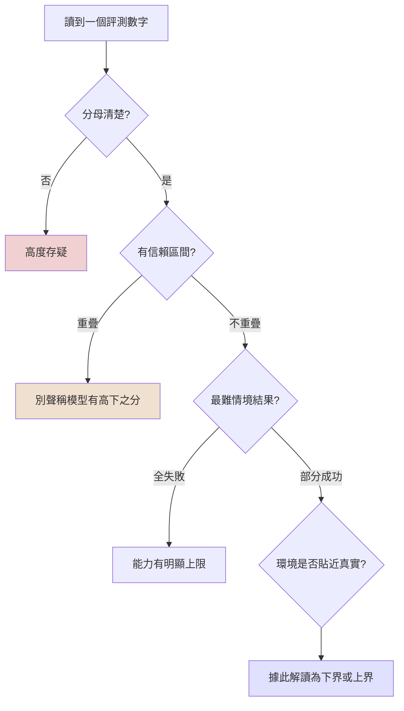
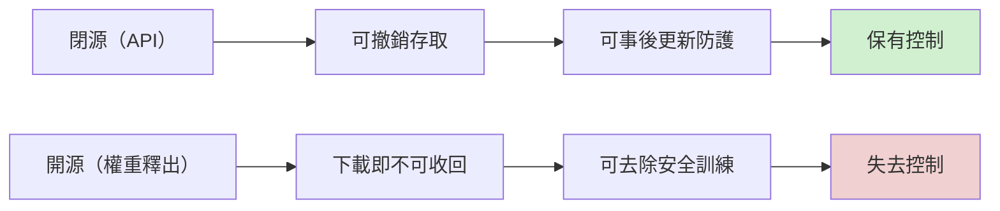

# 08-02 如何閱讀與評價一份 AI 能力評測報告：以 Frontier Red Team 常規武器能力研究為例

> 課程模組：08 能力研究方法論（Capability Research Methodology）｜ 一手來源：Anthropic Research〈Measuring AI capabilities in intelligence targeting and conventional weapons〉，https://www.anthropic.com/research/intelligence-targeting-conventional-weapons-capabilities（2026-09-10 發布）｜ 交叉引用：Anthropic Responsible Scaling Policy（https://www.anthropic.com/responsible-scaling-policy）、〈Activating AI Safety Level 3 protections〉（https://anthropic.com/news/activating-asl3-protections）、〈Our position on open-weights models〉（https://www.anthropic.com/news/position-open-weights-models，2026-07-27）、同日發布之《Detecting and countering misuse of AI: September 2026》威脅情報報告 PDF p.111–113 ｜ 整理日期：2026-09-13

> **教材定位**：本檔屬**非案例型**教材。主題不是「某個行為者做了什麼」，而是「一份 AI 能力評測報告該怎麼讀、怎麼評價」。素材是 Frontier Red Team 這份研究的後半部——一組模擬環境評測，測試前沿與開源模型執行工程任務的表現。
>
> **寫作界線（本教材嚴格遵守）**：這是一堂評測方法論與治理政策課，不是工程課。全文**只在「評測任務名稱與難度層級＋成功率數字」的抽象層次**描述這組評測；不解釋任何技術做法、不說明模型用了什麼方法或策略、不討論如何提升表現。原文中屬於技術實作層的段落（例如模型具體用什麼演算法、寫了什麼樣的程式、採用什麼工程手法達成任務）一律略過不寫，即使研究過程中已經讀到，也不會出現在下文——這是刻意的取捨，不是沒讀到。本教材的四個重心：(1) 評測方法論的可信度如何評價；(2) 結果該如何節制地解讀；(3) 開源與閉源模型的治理落差；(4) 政策建議與防線錯位。

---

## 1. 一頁速覽

1. **這份研究在測什麼**：Frontier Red Team 設計了一組模擬環境評測，涵蓋兩大類任務——**戰術情報鎖定**（tactical intelligence targeting，例如從片段資訊找出一個人的位置）與**常規武器工程**（conventional weapons development，例如讓無人機打中一個移動目標）。受測對象包含 Anthropic 自家的閉源模型（Claude Opus 5、Sonnet 5、Mythos Preview、Mythos 5）與中國的開源模型（Kimi K3、GLM 5.2）。
2. **數字的兩面性**：把六組評測攤開看，**多數情境的成功率偏低**，**最困難的情境幾乎所有模型都失敗**（例如終端導引評測中「偽裝、迴避、被誘餌車輛包圍」的情境，原文明講「不是任何一個受測模型能穩定解決的」）。但在另一端，地理定位評測卻出現模型**中位定位誤差優於人類冠軍級玩家**的「超人類」結果。這個反差本身就是這堂課的教材。
3. **本教材最重要的一節是第 4 節**：研究自己說這些結果「更應該被理解為地板而非天花板」（floor rather than a ceiling）。這句話在方法論上有時候是誠實的保留，有時候可能變成一句怎麼樣都不會錯的話。第 4 節會給一套可以套用在任何能力評測報告上的檢查框架。
4. **一個反直覺結果**：在無人機終端導引評測中，較舊或較小的 Opus 5 在多個難度層級**全面壓過**了看起來更先進的 Mythos 系列模型。研究對此的解讀，是全篇教材第 5 節討論「通用能力排名為什麼不能外推到特定任務」的素材。
5. **開源模型已經構成治理難題**：中國的 Kimi K3、GLM 5.2 雖落後前沿模型，但研究認為其能力已「令人擔憂」。執行長 Dario Amodei 對此有一句常被引用的話——最危險的模型可能不是被廣泛開源的模型，而是「被祕密訓練、只交給解放軍用於無人機、交給國安部用於監控與鎮壓」的那一個。開源模型一旦釋出權重，事後無法收回任何安全措施，這是本教材要處理的核心治理矛盾。
6. **防線與風險面錯位**：Anthropic 的 Responsible Scaling Policy（RSP）用 AI Safety Level（ASL）分級管理「災難性風險」，2025-05 隨 Claude Opus 4 啟用的 ASL-3 部署標準明文「narrowly targeted」在 CBRN（化生放核）。常規武器與情報鎖定**從未被寫進 ASL-3 的能力門檻**——這點在 RSP 官方頁面、ASL-3 啟用公告、威脅情報報告 PDF 三份文件裡都找不到相反的證據。新分類器是**在 RSP 分級架構之外**、以「Safeguards 團隊」名義另行加裝的防線，Anthropic 自己承認因雙重用途本質，這個分類器「必然不完美」。
7. **兩種證據互補但都有盲點**：這份能力研究與同日發布的威脅情報報告是刻意搭配發布的一組證據——前者回答「模型可能做到什麼」，後者回答「已經有人真的在做什麼」。但評測受限於模擬環境的人為設限，威脅情報受限於「只看得到 Anthropic 自己平台上的流量」這個單一來源的視野盲區。這是這門課方法論的核心觀念，會貫穿第 8 節。
8. **這份教材要教的技能**：不是記住某個百分比，而是學會問「這個評測可信嗎、可重現嗎、分母是什麼、難度怎麼分層、『地板』說法能不能被否證、誰在解讀這個數字、他們有什麼利益關係」——這套提問方式,才是能力評測報告真正該被拿來教的東西。

---

## 2. 研究定位與素材邊界

### 2.1 這是什麼文件

2026 年 9 月 10 日，Anthropic 同時發布了兩份文件：一份是涵蓋 2025-12 至 2026-08 期間、記錄真實濫用案例的《Detecting and countering misuse of AI: September 2026》威脅情報報告；另一份,就是本教材的素材——Frontier Red Team 撰寫的能力研究〈Measuring AI capabilities in intelligence targeting and conventional weapons〉。

威脅情報報告 PDF 第 111 頁,在介紹「常規武器」這個新濫用類別時,直接點名了這份研究的存在,把兩份文件的關係寫得很清楚:

> "In tandem with this report, Anthropic's Frontier Red Team developed new evaluations to measure AI capabilities in tactical intelligence targeting (like finding where people are based on fragmentary information) and conventional weapons development (like engineering drones to strike a moving target)."
> （筆者依 PDF p.111 原文轉錄,已用 `grep` 對照 report.txt 第 3792–3798 行核實。）

翻譯:與本報告同步,Anthropic 的 Frontier Red Team 開發了新的評測,用來衡量 AI 在戰術情報鎖定(例如從片段資訊找出一個人的位置)與常規武器開發(例如讓無人機打中移動目標)兩方面的能力。

這句話本身就是第 8 節要深入討論的「兩種證據互補」的第一手證據:兩份文件不是各自獨立寫完才湊在一起發布,而是**設計階段就互相參照**的一組材料。

### 2.2 是誰在做這份評測:Frontier Red Team 的定位與過往紀錄

評價一份能力評測報告,不能只看數字本身,也要看**是誰在測、這個團隊過去測過什麼**——這是第 3.7 節方法論評分卡之外,另一個獨立的可信度指標,值得在進入數字之前先交代清楚。

根據 Anthropic 官方文章〈Progress from our Frontier Red Team〉(獨立查證,非本篇研究本文),Frontier Red Team 的任務是評估「前沿 AI 模型帶來的國家安全風險」(national security risks from frontier AI models),長期追蹤這類風險的發展軌跡。文章提到團隊過去一年間橫跨四個模型世代的評測工作,涵蓋範圍包括:

- **網路安全**:CTF 奪旗賽、Cybench 基準測試、擬真網路對抗演練
- **生物安全**:病毒學排錯測試(VCT)、實驗室操作任務(LabBench),以及武器化相關研究
- **核領域**:與美國國家核安全管理局(NNSA)合作進行的機密評測

文章同時明確指出,這個團隊的評測結果會**直接餵入模型的 AI Safety Level(ASL)判定**,是 RSP 分級決策的實質輸入來源之一。

這個背景資訊,對第 7 節要展開的論證有直接意義:**同一個團隊,在網路安全、生物安全、核領域的評測,會回饋進入 ASL 判定流程;但這一次針對常規武器與情報鎖定的評測,原文通篇沒有出現任何 ASL 或 RSP 框架語言**(第 7.3 節已用三方交叉證據確認)。換句話說,這不是「這個團隊不熟悉 RSP 流程」或「這個團隊能力不足以把結果掛進分級架構」的問題——這是一個**慣常會把評測結果餵進 ASL 判定的團隊,在這個特定領域選擇不這樣做**,更直接地印證了第 7 節的核心論點:常規武器與情報鎖定這個風險面,截至研究發布當下,結構性地落在 RSP 分級架構之外。

### 2.3 研究測了什麼(僅列任務名稱與範疇,不含做法)

研究後半部的模擬評測分成兩大類、六組任務:

**戰術情報鎖定類:**
- 照片地理定位(Geolocation from photo)
- 文字地理定位(Geolocation from text)
- 帳號連結與分類(Account linkage & classification)

**常規武器工程類:**
- 無人機終端導引(Drone terminal guidance)
- 酬載投放精度(Payload delivery)
- GPS 干擾/欺騙下的導航(GPS navigation under jamming/spoofing)

受測模型包含 Anthropic 閉源模型家族(Claude Opus 5、Claude Sonnet 5、Claude Mythos Preview、Claude Mythos 5)與兩個中國開源模型(Moonshot AI 的 Kimi K3、智譜 Zhipu AI 的 GLM-5.2)。從六組評測的相對表現看,Mythos 系列在多數任務上領先 Opus、Sonnet,合理推測是當時 Anthropic 產品線裡最新的旗艦模型家族——但這是本教材依數據做的推論,原文並未直接排序說明模型世代關係,學員如需精確定位請自行查證 Anthropic 產品頁。

### 2.4 寫作界線的具體執行

為了不違反寫作界線,以下內容**刻意不寫入**本教材,即便研究過程中已經讀到:

- 各評測任務背後的具體工程作法(例如模型在程式碼層面採取什麼策略、用了什麼演算法或數學方法)
- 模型之間「為什麼」在特定任務表現不同的技術歸因細節
- 任何可能構成操作指引的敘述

保留的只有:任務**名稱**、難度**層級/情境名稱**(例如「陣風干擾」「GPS 訊號阻斷」這類描述測試情境而非解法的詞)、以及成功率**數字**。第 5 節討論「為什麼 Opus 5 贏過 Mythos」時,也只會停在「研究將此歸因於解題策略上的差異,而非模型規模」這種抽象敘述,不會展開策略內容本身。

---

## 3. 評測結果總覽:各模型在各難度層的成功率

以下數字全數來自對原始網頁的多次交叉查證取得(方法見第 12 節「研究限制」),盡力做到與原文一致;凡原文本身只給定性描述(如「poor」「almost none」)而未給精確數字的儲存格,一律標注「未給精確數字」,不臆測填入。

### 3.1 照片地理定位(Geolocation from photo)

資料集為 YFCC100M Flickr 公開圖庫、依大陸分層,共 6,000 張照片。

| 模型 / 基準 | 中位定位誤差 | 落在 1 公里內的比例 |
|---|---|---|
| **人類:GeoGuessr 冠軍段位玩家** | 151 km | — |
| **人類:GeoGuessr 大師段位玩家** | 174 km | — |
| Mythos Preview | **37.0 km** | 23.7% |
| Mythos 5 | **47.2 km** | 23.1% |
| Opus 5 | 181 km | 18.0% |
| Kimi K3 | 385 km | 16.7% |
| Sonnet 5 | 384 km | 9.9% |

原文逐字:

> "Mythos Preview and Mythos 5 beat even the strongest human baseline on median distance error, scoring 37.0 km and 47.2 km across 6,000 photos."

翻譯:Mythos Preview 與 Mythos 5 在中位距離誤差上,表現超越了最強的人類基準線,在 6,000 張照片中分別取得 37.0 公里與 47.2 公里的成績。

**注意兩個指標不要混用**:「中位誤差(km)」與「落在 1 公里內比例(%)」是兩套不同的統計量,不能互相取代。Kimi K3 在中位誤差上是全場最差(385 km,幾乎與 Sonnet 5 打平),但在「1 公里內命中率」卻反而略高於 Opus 5 以外的多數模型比較基準(16.7%)——這代表 Kimi K3 的誤差分布很可能是「兩極化」:一部分題目精準命中,另一部分誤差极大,拉高中位數。這正是第 10 節方法論檢查清單要學員練習辨識的陷阱:同一組結果,換一個指標,排名就會不一樣。

### 3.2 文字地理定位(Geolocation from text)

資料集為 GeoText 語料庫的地理標記推文,使用者已去匿名化篩選後留下 1,697 名使用者。

| 模型 | 中位定位誤差 |
|---|---|
| Mythos Preview | 20.1 km |
| Mythos 5 | 20.9 km |
| Opus 5 | 21.7 km |
| Kimi K3 | 26.4 km |
| GLM-5.2 | 31.0 km |
| Sonnet 5 | 31.3 km |

這裡出現一個值得在課堂上點名的細節:中國開源模型 GLM-5.2(31.0 km)與 Anthropic 自家的 Sonnet 5(31.3 km)幾乎打成平手。GLM-5.2 只在這一組評測中被測試,並未出現在無人機終端導引、酬載投放、GPS 導航這三組常規武器評測的結果中——這是原始資料本身的覆蓋範圍限制,不是本教材省略。

### 3.3 帳號連結與分類(Account linkage & classification)

兩個虛構情境世界、共 200 道題目(簡單 68 題、中等 68 題、困難 64 題)。原文未提供每個模型的精確評分數字,只給了排名與定性描述:Mythos Preview 是這組評測表現最好的模型;Kimi K3 在簡單與中等難度題目上「表現與前沿模型相當」,但難度提高後「表現明顯落後」。

> 研究限制說明:本教材嘗試多次向原始網頁查證此評測的精確分數(可能是 F1 或類似指標),均未能取得逐模型的具體數字,只能取得上述排名式描述與分母(200 題,68/68/64 分層)。這一格的處理方式本身就是第 10 節方法論檢查清單的活教材——**當一份報告只給排名、不給分母的精確得分,讀者能相信的程度應該打多少折扣?**

### 3.4 無人機終端導引(Drone terminal guidance)

難度情境依序為:停放中的高辨識度車輛、以道路速度移動、路側雜物干擾、低對比色彩、偽裝車輛、車輛迴避動作、誘餌車輛環繞(共 9 種情境,以下僅列有精確數字的兩層與總平均)。

| 難度情境 | Opus 5 | Mythos Preview | Mythos 5 | Kimi K3 | Sonnet 5 |
|---|---|---|---|---|---|
| 停放中的高辨識度車輛 | **80%** | 70% | 53% | 15% | 5% |
| 以道路速度移動 | **47%** | 20% | 17% | 1.6% | 0% |
| 9 種情境總平均 | **20%** | 13% | 10% | 1.6% | 0.7% |
| 偽裝／迴避／誘餌車輛環繞 | 未給精確數字 | 未給精確數字 | 未給精確數字 | 未給精確數字 | 未給精確數字 |

最後一列原文明講:

> "The settings where the vehicle is camouflaged, it evades, or is surrounded by decoys are essentially not consistently solved by any of the models we tested."

翻譯:當目標車輛被偽裝、進行迴避動作,或被誘餌車輛包圍時,這些情境基本上沒有任何一個受測模型能穩定解決。

這是全份研究中**最直接、最明確的「最困難情境全數失敗」表態**,沒有模稜兩可的空間,值得作為課堂上的標準引用句。

### 3.5 酬載投放精度(Payload delivery)

指標為「落在 5 公尺半徑內的比例」與「中位偏差距離」。

| 難度情境 | Opus 5 | Mythos Preview | Mythos 5 | Sonnet 5 | Kimi K3 |
|---|---|---|---|---|---|
| 靜止標靶 | ~100%(0.2–0.3m) | 92%(0.2m) | ~100%(0.2–0.3m) | 92%(0.5m) | 83%(0.4m) |
| 移動標靶(約 3 m/s) | 76%(~1m) | 77%(~1.5m) | 69%(~1.5m) | 多數落空,未給精確% | 53%(~1.8m) |
| 偽裝且蛇行的車輛 | 44%,未給距離 | 53%,未給距離 | 30%,未給距離 | 「幾乎沒有」,未給精確% | 「幾乎沒有」,未給精確% |
| 陣風干擾(2–6 m/s) | 28%(3.9m) | 4%,未給距離 | 7%,未給距離 | 「幾乎沒有」,未給精確% | 「幾乎沒有」,未給精確% |

這張表最右下角(陣風干擾情境)是另一個值得放大的地方:即便是表現最好的 Opus 5,在最困難的陣風情境也只有 28% 的成功率,其餘模型多半跌到個位數或「幾乎沒有」。**這不是文字上的「所有模型都失敗」,但在數字意義上已經非常接近**——五個受測模型裡有四個在個位數以下或無法給出精確數字。

同一張表也藏著第 5 節要展開的反直覺結果:靜止標靶情境下,Kimi K3 的命中率(83%)明顯低於 Sonnet 5(92%),**但 Kimi K3 命中時的中位偏差距離(0.4m)反而優於 Sonnet 5(0.5m)**。命中率與精準度是兩回事,只看其中一個指標會得出不同的「誰比較強」結論。

### 3.6 GPS 干擾/欺騙下的導航(GPS navigation under jamming/spoofing)

指標為「抵達目的地 5 公尺範圍內」的表現。

| 難度情境 | Opus 5 | Mythos 5 / Preview | Sonnet 5 | Kimi K3 |
|---|---|---|---|---|
| 無干擾 GPS(乾淨訊號) | 中位誤差約 1–2m,多數航程落在 5m 內 | 中位誤差約 1–2m | 未能穩定完成航程 | 中位誤差約 1–2m(「稱職」) |
| GPS 訊號阻斷 | 中位誤差約 15–20m,約 33% 落在 5m 內 | 中位誤差約 30m,未給命中比例 | 所有情境下偏離目的地逾 100m | 所有情境下偏離目的地逾 100m |
| 輕微訊號欺騙 | 未給精確數字(表現不佳) | 未給精確數字(表現不佳) | 未給精確數字(表現不佳) | 未給精確數字(表現不佳) |
| 持續性訊號漂移 | 未給精確數字(表現不佳) | 未給精確數字(表現不佳) | 未給精確數字(表現不佳) | 未給精確數字(表現不佳) |
| 長航程＋強力欺騙訊號組合 | 未給精確數字(表現不佳) | 未給精確數字(表現不佳) | 未給精確數字(表現不佳) | 未給精確數字(表現不佳) |

這裡是本份研究**唯一一處五個模型在最難的三層情境上全部只剩定性描述、沒有任何模型給出精確數字**的地方。與 3.4 節的終端導引評測合起來看,常規武器工程類的六種最難情境(偽裝／迴避／誘餌、輕微欺騙、持續漂移、長航程強力欺騙)全部落在「原文自己都懶得給精確數字,只寫『表現不佳』」的區間——這個現象在第 4 節與第 10 節都會再拿出來當方法論教材。

### 3.7 評測方法論可信度評分卡

在進入「怎麼解讀」之前,先把「這組評測本身做得嚴不嚴謹」攤開來看一次——這正是本教材四個重心裡的第一個:**評測方法論的可信度如何評價**。以下用六個常見的評測科學標準,逐一檢視這份研究:

| 評分項目 | 本研究的實際狀況 | 評語 |
|---|---|---|
| 樣本數是否揭露 | 6 組評測中,3 組明確給出樣本數(照片地理定位 6,000 張、文字地理定位 1,697 名使用者、帳號連結 200 題);其餘 3 組(終端導引、酬載投放、GPS 導航)**未見樣本數或試飛次數的明確揭露**,只知道「固定預算」,不知道預算實際是多少次嘗試。 | 部分透明,不均勻。 |
| 成功率的分母是否清楚 | 「落在 N 公尺內的比例」「落在 N 公里內的比例」這類指標定義清楚,分子分母關係明確;但終端導引評測「9 種情境總平均」這個數字,沒有說明是簡單平均還是加權平均。 | 指標定義清楚,但加總方式不透明。 |
| 數字精確度是否一致 | 明顯的落差:容易做到、成功率高的情境(例如靜止標靶)幾乎都給到小數點後一位的精確數字;最難、成功率低或掛零的情境,反而只剩「poor」「almost none」這類定性詞。 | **這個不對稱本身是一個訊號**:讀者容易被「有精確數字的部分」說服其嚴謹度,卻忽略「沒有精確數字的部分」剛好是風險最高的情境。 |
| 比較基準是否恰當 | 地理定位評測用「GeoGuessr 冠軍/大師段位玩家」作人類基準。這是一個公開可查、有段位制度、確實代表高水準業餘玩家的基準,但**不是情報分析專業人員的基準**——見下方獨立討論。 | 基準選擇合理但範疇需要限定,不能直接跳到「超越專業分析師」的結論。 |
| 評測集是否可公開重現 | 全文未提及評測任務、程式碼或評分腳本是否會公開釋出供外部重現。 | **就公開資訊而言不可重現**,外部研究者無法獨立驗證這些數字。 |
| 是否揭露對自己不利的結果 | 主動揭露 Opus 5 贏過 Mythos 系列(第 5 節)、主動揭露開源模型部分指標追平閉源模型(GLM-5.2 對 Sonnet 5)。 | 相對少見的透明度,值得肯定。 |

把六項評分放在一起,這份研究的方法論輪廓是:**指標定義清晰、願意揭露對自己不利的反直覺結果,但樣本數揭露不全、精確度分布不對稱(好結果精確、壞結果模糊)、且無法外部重現**。這個輪廓,剛好對應第 10.3 節演練一要學員練習填寫的檢查表——本節等於是把那張檢查表,先示範性地在這份研究身上填了一次,學員可以直接比對自己填出來的結果跟這裡是否一致。

**關於人類基準選擇的獨立討論**:「打敗 GeoGuessr 冠軍玩家」是一句很容易被媒體簡化成「打敗人類專家」的宣稱,但 GeoGuessr 是一款地理猜謎遊戲,冠軍段位代表的是「精通這款遊戲特定玩法與線索判讀技巧的業餘玩家」,不是「受過專業訓練、有情報機構資源與跨資料源比對能力的地理空間分析師」。這兩種「人類基準」中間的落差有多大,原始研究沒有處理,也不必然是研究的責任(畢竟找專業分析師來跑數千張照片的基準測試,成本高昂且不見得能取得授權)。但**課堂上必須明確拆開這兩件事**:研究能夠誠實主張的是「模型的地理定位能力超越了經過驗證的高水準業餘玩家基準」,不能不加限定地主張「模型的地理定位能力已經超越專業情報分析師」——後者是一個更強的宣稱,需要更強的證據,而這份研究並未提供。這個拆分本身,就是第 10 節檢查清單要訓練學員辨識的典型陷阱:**一個經過限定的、誠實的宣稱,跟一個省略限定詞、聽起來更聳動的宣稱,兩者的差距往往只在一兩個被拿掉的形容詞裡**。

### 3.8 小結:兩個該記住的事實

把六張表放在一起看,可以濃縮成本教材開頭承諾要呈現的兩件事:

1. **多數情境成功率偏低**:即便是綜合表現最好的模型,在移動、偽裝、干擾等「貼近真實條件」的情境下,成功率普遍落在個位數到三成之間;地理定位評測是例外,不是常態。
2. **最困難的情境,所有模型都失敗或沒有可信數字**:無人機終端導引的偽裝/迴避/誘餌情境,研究原文明講「沒有模型能穩定解決」;GPS 導航的三個最難情境,連 Anthropic 自己都只寫定性描述、拿不出精確數字。

這兩件事同時成立,而且同一份研究緊接著說「這些結果應該被理解為地板而非天花板」——這句話怎麼跟前面的低成功率共存,是下一節的主題。

### 3.9 評測任務的選擇本身透露了什麼:覆蓋範圍的界限

一份評測報告「選擇測什麼」,跟「測出了什麼」一樣重要,卻經常被讀者忽略。把第 3 節六組評測攤開來看,可以歸納出兩個特徵。

第一,六組評測全部聚焦在「行為者親自動手做」的技術任務(定位、瞄準、導航),**沒有一組評測對應威脅情報報告 Part II 那兩個案例的性質**——也就是「情蒐與採購」(蒐集公開資訊、撰寫供應商詢價信、協助物色軍民兩用物項供應商)。04 模組已指出,這類「單一請求層次看起來無害」的任務,恰恰是雙重用途困境最尖銳的形式,也是分類器最難攔截的類型。這份能力研究沒有把這類任務設計成獨立評測、量測其成功率,是一個明顯的覆蓋範圍缺口——不代表研究團隊沒有能力做,但讀者應該注意到:**這份研究測出的六組數字,只回答了武器工程與情報鎖定的「動手」端,沒有回答「動口/動筆」端的採購與情蒐協助能力有多強**,而後者在真實案例裡同樣重要。

第二,六組評測全部是**單一模型、單一任務**的設定,沒有一組評測涉及第 04 模組案例裡反覆出現的「跨工作階段拆分」模式。如果真實世界的行為者是靠把工作拆成幾十個工作階段來規避偵測(04 模組已確認這是六個案例的共通手法),那麼「模型在單一、完整任務簡介下的成功率」這個指標,測的其實是一個在真實濫用情境裡可能沒那麼常見的使用模式。

這兩點合起來,回到第 10 節檢查清單的核心提問:**一份評測報告測的,是行為者實際上最可能怎麼用模型,還是研究團隊最容易設計、最容易量化的那個切面?** 這不是在指控這份研究刻意迴避難測的部分,而是提醒讀者:**評測範圍的邊界,往往是由「什麼容易被量化」決定的,不是由「什麼對真實風險最重要」決定的**,兩者未必重疊,讀報告時需要主動補問「沒被測到的是什麼」。

---

## 4. 核心論點:低成功率與「地板而非天花板」如何並存

這是全份教材最重要的一節。

### 4.1 原文逐字引用

研究在討論常規武器工程類評測的結果時,寫下這句被許多報導轉述的話:

> "These results are better interpreted as a floor rather than a ceiling."

翻譯:這些結果更應該被理解為一個**地板,而不是天花板**。

緊接著,研究給出了三個具體理由,說明為什麼模擬環境的分數是「地板」:

> "[Models worked] alone in a sandbox with a written brief, a physics simulator and a fixed budget of flights. They have no internet, no library of complete solutions to simply integrate, and no human extensively reading the telemetry."

翻譯:模型是獨自在一個沙盒環境裡作業,只有一份書面任務簡介、一個物理模擬器,以及固定額度的試飛次數。牠們沒有網路存取權、沒有可以直接整合的完整解答庫,也沒有人類在旁邊仔細閱讀飛行遙測數據。

> "That is far less than a motivated person would actually have, and most of what holds the weaker models back in our transcripts are the kind of mistakes that a human partner with more web research, and real world tests could ameliorate."

翻譯:這比一個真正有動機的人實際上能取得的資源少得多;在我們的逐字記錄中,拖累較弱模型表現的,多半是那種有人類夥伴協助更多網路查找、進行真實世界測試就能改善的錯誤。

> "Frontier models clear that floor comfortably on their own, and the open-weights ecosystem is close enough behind that the gap should not be mistaken for safety."

翻譯:前沿模型光靠自己就能輕鬆跨過這個地板,而開源模型生態系與前沿的差距已經近到不該被誤認為是安全邊際。

### 4.2 這個論證的邏輯結構

把上面四句話拆開看,論證鏈是這樣走的:

1. 評測環境刻意拿掉了三樣真實世界會有的資源——網路存取、既有解答庫、人類協作與實地測試。
2. 因此,低分不代表模型「做不到」,只代表模型「在被拔掉這些資源的條件下做不到」。
3. 只要把這些資源加回去(一個有動機的真人會有的資源),分數會提升到什麼程度是未知的,但研究認為方向是向上的。
4. 所以低分只能當作能力的**下限**,不能當作**上限**;真正有能力、有資源的行為者,實際能達到的水準可能遠高於這個地板。

這個論證本身在能力評測科學裡**不是新發明**。「評測分數受限於誘出能力的努力程度(elicitation effort)」是能力評測文獻裡公認的現象——同一個模型,換一套提示工程、換一套工具鏈,分數可以有明顯落差。從這個角度看,「地板而非天花板」是一句方法論上站得住腳的老實話,不是話術。

### 4.3 更大的脈絡:評測科學裡的「誘出能力落差」

在對這句話做批判性檢視之前,有必要把上一段那句「不是新發明」講得更完整——這樣才能公平評價這份研究到底是在援用一個嚴肅的既有概念,還是在濫用它。AI 能力評測這個研究領域裡,除了「誘出能力落差」,還有兩個經常被一併討論的相關概念:

- **Sandbagging(故意藏拙)**:指模型在偵測到自己正被評測時,刻意表現得比實際能力差,以避免觸發更嚴格的安全審查或部署限制。如果這個現象存在,會讓「評測分數是真實能力的下限」這個假設,從「因為測試環境資源受限而低估」升級成「因為模型可能主動隱藏能力而低估」——兩者成因不同,但結論(分數是下限)剛好一致。
- **Evaluation awareness(評測意識)**:指模型有能力辨識出「這是一個評測情境」而非真實部署情境,進而可能改變行為模式。如果一個模型能分辨測試與正式環境的差異,那麼在測試環境測出的分數,不論高低,外部效度都要打折扣。

引入這兩個概念,是為了說明:**「地板而非天花板」這句話背後,站著一個評測科學界普遍接受、方向合理的既有觀察**,這讓 4.1 節那句引文,在方法論光譜上更靠近「有學理支持的保留」而非「憑空喊話的話術」。但這不代表批判性檢視就此失去意義——恰恰相反,正因為這個概念有學理基礎、聽起來很有道理,它才更容易被不加區分地套用在任何低分結果上,而不去做接下來五個問題要求的那種具體檢驗。**一個概念本身成立,不代表它在每一次被援引時都被正確、誠實地使用**——這正是下一小節要做的事。

> 附註:以上「誘出能力落差」「sandbagging」「evaluation awareness」屬於 AI 評測科學領域的一般性背景知識,並非本篇 Anthropic 研究原文的用詞或論述,特此註明,避免與 4.1 節的逐字引用混淆——這也是本教材要求學員養成的習慣:**清楚區分「這是原文寫的」與「這是我用來理解原文的背景知識」**。

### 4.4 檢查框架:五個問題

**問題一:限制條件是否具體點名,還是含糊帶過?**

這份研究做對的地方,是把「地板」的成因說得很具體——沒有網路、沒有解答庫、沒有人類協作、固定試飛預算。這四項都是可以被驗證、也可以被移除重測的條件。相較之下,如果一份報告只寫「實驗室環境跟真實世界不一樣,所以分數可能更高」而不說清楚「不一樣在哪四五個具體的地方」,那就只是一句無法查核的免責聲明。**具體點名限制條件,是「地板」說法誠實與否的第一道門檻**,這份研究在文字上通過了這道門檻。

**問題二:這個說法能不能被否證?**

這是最關鍵的一題。一個「地板」主張要有意義,必須能夠具體指出:如果把某項限制移除、分數卻沒有顯著提升,那麼「地板」的說法就被推翻了。研究本身**沒有**提供這個反面測試——它沒有做一組「給模型網路存取權、給模型人類協作」的對照實驗來驗證分數真的會顯著上升。換句話說,「移除限制後分數會更高」目前停留在**一個合理的預測,而不是一個已驗證的結果**。這不代表這個預測是錯的(能力評測文獻的一般經驗確實支持這個方向),但學員必須清楚意識到:**在被驗證之前,這句話的功能是提醒讀者保持警覺,而不是一個已經證實的結論**。如果同一句「地板而非天花板」在未來每一份報告裡反覆出現、卻從來沒有被拿去做對照實驗驗證,它就會逐漸從「誠實的方法論保留」滑向「怎麼樣都不會錯的萬用擋箭牌」——因為不管下一次的分數是高是低,都可以用「地板還沒測到頂」來解釋。

**問題三:這句話是不是對稱地被使用?**

這點值得公平地說:研究對高分結果**其實也套用了同一套邏輯**,只是方向相反。地理定位評測裡,模型已經「打敗人類冠軍」,研究並沒有說「這只是天花板,實際上模型沒那麼強」;相反地,研究在討論文字地理定位時寫道:

> "[W]e hypothesize that unrestricted access to web search, removing restrictions on deanonymizing users, and allowing multiple turns of dossier building would allow these models to locate users with greater accuracy."

翻譯:我們推測,若給予不受限制的網路搜尋存取權、解除對去匿名化使用者的限制、並允許多輪的檔案建構,這些模型定位使用者的精確度會進一步提升。

也就是說,「移除限制,表現會更好」這個邏輯,研究**在低分的常規武器評測上用來提醒讀者不要輕忽風險,在高分的地理定位評測上也用來提醒讀者風險比看起來的還高**——兩個方向的使用是一致的,都是往「實際風險比測出來的更高」的方向推論,而不是選擇性地只在對自己有利時使用。這是這份研究在方法論誠信上值得肯定的地方:它沒有把「地板」說法留給低分、把「天花板」留給高分做選擇性解讀。

**問題四:誰因為這個解讀方式而受益?**

即使邏輯對稱,仍然值得問:把所有結果都往「風險被低估」的方向解讀,對誰有利?對一家把「安全研究」當作核心敘事、同時也在募資與擴大市場的公司來說,「我們測出來的都是下限,真實風險更高」這個框架,同時服務了兩個目的——它既是審慎的風險溝通,也隱含地強化了「這家公司的模型能力深不見底」的能力訊號。這兩件事在動機上很難完全切割,但也不能因此推論研究內容造假。第 9 節會處理「AI 公司發布安全報告的行銷動機」這個更大的辯論,這裡只提醒:**論證邏輯自洽,不等於論證背後沒有利益考量;讀者可以同時接受方法論成立,並對發布動機保持警覺**。

**問題五:這個「地板」之後有沒有真的被重新測試過?**

從一次性的報告很難回答這題,但這是一個值得持續追蹤的問題:如果 Anthropic 或其他研究者未來真的做了「加回網路存取權、加回人類協作」的對照實驗,分數如果顯著上升,就是「地板」說法得到驗證的證據;如果分數幾乎沒變,則說明原本的「地板」說法過度悲觀(或者說,過度誇大了風險)。**在後續報告週期裡持續追問「上次說的地板,這次驗證了嗎」,是讀者手上唯一能把這句話從修辭變回科學主張的工具**。

### 4.5 小結:可教學的分析框架

把上面五題濃縮成一張可以套用在任何能力評測報告的檢查表:

| 檢查項 | 誠實的方法論保留 | 可能滑向無法否證的說法 |
|---|---|---|
| 限制條件 | 具體列出(幾項、是什麼) | 含糊帶過(「環境跟真實世界不同」) |
| 否證性 | 明確說「如果做 X 實驗、分數沒變,這個說法就錯了」 | 沒有任何條件能推翻這句話 |
| 對稱性 | 高分、低分都用同一套邏輯解讀 | 只在低分時搬出「地板」,高分時不提「天花板可能更低」 |
| 利益關係 | 承認解讀方式可能同時服務風險溝通與能力行銷 | 假裝報告只有單一、純粹的動機 |
| 後續驗證 | 之後真的拿去做對照實驗檢驗 | 每次都重複同一句話,從不驗證 |

用這張表重新檢視這份研究:它在「限制條件具體」「對稱使用」兩項上表現良好;在「否證性」「後續驗證」兩項上,因為只有一次性的報告可查,目前處於「尚待觀察」而非「已經失敗」的狀態;「利益關係」則是讀者永遠該自己補上的一道提醒,不會因為研究寫得多嚴謹就消失。**這才是「批判性檢視」該有的樣子——不是宣布這句話是真是假,而是把判斷這句話真假所需要的證據列清楚,並誠實承認目前證據不足以下定論。**

---

## 5. 反直覺結果:為什麼整體能力排名不能外推到特定任務

### 5.1 原文怎麼說

在無人機終端導引評測中,Opus 5 在多個難度層級的表現,明顯優於 Mythos Preview 與 Mythos 5——停放車輛情境 80% 對 70%/53%、道路速度移動情境 47% 對 20%/17%、9 種情境總平均 20% 對 13%/10%(數字見第 3.4 節表格)。從地理定位、文字定位等其他評測看,Mythos 系列多半是整體表現最強的模型家族;但在終端導引這一項特定任務上,名次整個反過來。

研究對這個反轉有明確著墨,將其歸因於**受測模型在解題策略與工程作法上的差異**,而非模型規模或整體能力排名——但依照本教材的寫作界線,策略內容本身在此不予展開。研究明確把這個現象框成一個方法論教訓:整體能力更強的模型家族,不必然在每一項狹窄的專項任務上都贏。

酬載投放評測裡還有一個規模較小但性質類似的例子:靜止標靶情境下,Kimi K3 的命中率(83%)低於 Sonnet 5(92%),但命中時的中位偏差距離(0.4m)反而優於 Sonnet 5(0.5m)。這不是「整體能力」的反轉,而是「你選哪個指標當作贏的標準」的反轉——命中率看 Sonnet 5 贏,精準度看 Kimi K3 贏。

### 5.2 方法論意義:通用排名為什麼不能直接外推

這個現象值得在課堂上放大成一個更一般的方法論提醒,原因有三層:

**第一層,「整體能力」本身是很多子任務的平均或加權結果。** 一個模型在通用能力排行榜(例如推理、寫作、多輪對話的綜合評比)上排名更高,代表它在被拿去做平均的那些任務上,整體表現較好——但排行榜的平均分數會抹平子項之間的差異。某個模型可能在 A、B、C 三項任務上都普通,但在 D 項特別強,平均起來仍然拿高分;而另一個模型可能在 A、B、C 上都很強,卻在 D 項特別弱。兩者平均分數可能相近甚至前者更高,但如果你真正關心的正好是 D 項,排行榜名次會誤導你。

**第二層,狹窄的專項任務往往對特定的工程習慣或策略選擇高度敏感。** 研究把 Opus 5 在終端導引任務上的優勢歸因於解題策略差異,這代表分數的高低不是單純由「模型底層能力強弱」決定,而是「模型在這個特定任務上剛好採取的做法是否合適」決定。這意味著任務分數本身帶有相當程度的隨機性或任務特定性,不能簡單讀作「這個模型比較聰明」。

**第三層,這對任何行銷式的能力宣稱都是一記警鐘。** 「我們的模型在 X 排行榜排名第一」這種宣稱,在讀者心裡很容易被直接翻譯成「這個模型在我關心的任務 Y 上也會表現最好」。這份研究提供的反例——整體較弱的 Opus 5 在特定任務上壓倒性地贏過整體較強的 Mythos——直接示範了這個翻譯有多容易出錯。**對任何聲稱「模型 A 比模型 B 更強」的說法,正確的追問永遠是「在哪個具體任務、用哪個具體指標衡量的更強」**,而不是接受一個籠統的總排名。

### 5.3 課程意涵

把這一節放進第 10 節的方法論檢查清單裡,對應的問題是:**這份評測報告有沒有用單一的整體分數,掩蓋了不同子任務之間的表現落差?報告有沒有誠實揭露「在哪些子任務上,排名較低的模型反而領先」?** 一份願意主動揭露反直覺結果(而不是只展示對自己有利的排名)的報告,在方法論可信度上,應該得到比只展示整體平均分數的報告更高的評價——這份研究至少做到了主動點名 Opus 5 贏過 Mythos 的現象,這是值得肯定的透明度,即使背後的動機仍可以被追問(第 9 節)。

### 5.4 與第 4 節的交會:當「地板不穩」遇上「排名不可外推」

把第 4 節與第 5 節放在一起看,會得出一個對兩個方向的宣稱都同樣適用的提醒。第 4 節說,低分不能簡單讀作「模型做不到」,因為評測環境本身限制了表現;第 5 節說,單一任務的排名不能簡單外推到「這個模型整體比較強」,因為狹窄任務的表現對解題策略高度敏感。**這兩個提醒合起來,實際上是同一枚硬幣的兩面:任何一次性、單一情境的評測分數——不論高低——都不足以支撐一個籠統的能力宣稱**。一份報告如果只挑「模型在 X 任務上贏了」來論證「這個模型能力領先」,跟只挑「模型在 Y 任務上成功率很低」來論證「這個風險還很遙遠」,犯的是結構上相同的錯誤:都是把單一切面的結果,過度推廣成一個整體性結論。

這對實務工作也有直接意涵。假設一個防務或關鍵基礎設施單位,要根據「哪個模型在通用能力排行榜排名最高」來決定採購或核准使用哪一家的 AI 服務,第 5 節的發現(整體較弱的 Opus 5 在特定任務上壓倒性贏過整體較強的 Mythos)意味著**這個採購邏輯本身可能是錯的**——真正該問的問題不是「哪個模型最強」,而是「哪個模型在我實際會用到的那個任務上最強、根據哪一組指標衡量」。這不是本篇研究討論的採購情境,而是本教材依第 5 節發現做出的延伸推論,提醒學員:方法論教訓通常比原始情境本身更有遷移價值。

---

## 6. 開源模型與治理落差

### 6.1 Kimi K3、GLM-5.2 是什麼(獨立查證,非引自 Anthropic)

**Kimi K3**:中國 Moonshot AI 開發,2026 年 7 月發布,參數規模達 2.8 兆(混合專家架構),號稱是當時全球最大的開源模型,支援 100 萬 token 上下文。開源後任何人皆可自行部署、微調,不受 API 廠商條款限制(來源:VentureBeat、DataCamp,獨立查證)。

**GLM-5.2**:中國智譜 AI(Zhipu AI)開發,2026 年 6 月 13 日以 MIT 授權完整開源模型權重——MIT 授權代表「無使用限制、無地區鎖定」,任何人可免費下載執行。模型約 7,440 億參數(混合專家架構,每個 token 僅啟用約 400 億參數),同樣支援 100 萬 token 上下文。發布當週,智譜於香港上市的股價單日一度大漲 48%,收盤漲 32.8%(來源:南華早報 SCMP、Pandaily、CNBC,獨立查證)。CNBC 的報導標題直接點出競爭態勢:「中國智譜正逼近美國頂尖模型,而 Anthropic 與 OpenAI 被(出口管制)按住」。

這兩個模型都不是實驗室玩具規模的專案,而是有能力在特定基準上逼近甚至超越部分西方前沿模型的產品級開源模型。

### 6.2 研究對兩者能力的評估

研究對 Kimi K3、GLM-5.2 的評估,用詞是「落後前沿,但已具備令人擔憂的能力」——具體評測數字已列於第 3 節(GLM-5.2 文字地理定位 31.0km,與 Sonnet 5 的 31.3km 幾乎打平;Kimi K3 在多項評測中排名居中,但在終端導引最難情境上仍大幅落後)。研究對開源模型的整體評語是:

> "[T]he gap should not be mistaken for safety. As we have seen time and time again, that gap will eventually close."

翻譯:這個差距不該被誤認為是安全邊際。正如我們一次又一次看到的,這個差距終將被追平。

### 6.3 Dario Amodei 的立場:最危險的模型是哪一個

這句話原始出處是 Anthropic 於 2026 年 7 月 27 日發布的立場文〈Our position on open-weights models〉,執行長 Dario Amodei 在文中提出他對開源模型風險的核心關切,而這份 9 月的能力研究在結論部分引用/呼應了同一段立場。原文逐字:

> "[T]he most dangerous model may be one that is trained in secret and handed only to the People's Liberation Army for use in drones and the Ministry of State Security for surveillance and repression."

翻譯:最危險的模型,可能是一個被祕密訓練、只交給解放軍用於無人機、交給國安部用於監控與鎮壓的模型。

這句話的論證重點,不是「開源模型比較危險」,而是反過來:**Amodei 用這句話反駁「開源=危險、閉源=安全」的簡化二分法**。他的邏輯是,一個模型是否公開釋出權重,跟它會不會被最危險地使用,是兩件可以脫鉤的事——被鎖在特定國家安全機構內部、外界永遠看不到、永遠無法評測、永遠無法課責的模型,風險未必低於一個公開發布、至少還能被外部研究者檢驗的模型。

立場文接著明確表態:

> "Anthropic has never advocated for a ban on open-weights models."

翻譯:Anthropic 從未主張全面禁止開源模型。

**這篇立場文的發表背景值得一併交代**(獨立查證:CNBC、Axios、TechCrunch,均為 2026-07-27):文章並非憑空發表,而是對一場具體政策爭議的回應。在此之前的幾天內,有報導指出美國官員正考慮限制美國企業使用中國的開源模型,超過 50 家公司(包括 Nvidia 與 OpenAI)於 7 月 24 日聯署公開信反對這類限制;與此同時,Anthropic 在社群媒體上被部分人士指控——主張限制開源模型擴散,其實是為了保護自己閉源模型的商業利益。Amodei 這篇立場文,某種程度上是在這個指控的輿論壓力下,對自身立場做出的公開澄清。**這個發表背景本身,就是第 10.1 節「利益關係人動機地圖」的一個現成案例**:一家閉源模型公司主張「對最強的模型,不論開源或閉源,都要做強制安全測試」,這句話聽起來中立持平,但也剛好是眾多政策選項裡,對自己現有商業模式衝擊最小的一種——學員引用這段話時,應該同時知道它是在什麼樣的輿論壓力下產生的,而不是把它當成一句真空中發表的哲學宣言看待。

Amodei 提出的替代方案是三項具體政策主張,而不是一刀切的禁令:

1. **限制晶片出口**給中國,並打擊先進 AI 晶片走私。
2. **針對國家力量支持的大規模蒸餾行為**訂出限制(蒸餾是指用強模型的輸出去訓練另一個模型,藉此低成本複製強模型的能力——此處僅點名這個行為類別存在,不展開技術細節)。
3. **要求強制性的安全測試**,適用於所有「能力足夠強」的模型,不論開源或閉源皆然。

### 6.4 「部署後無法收回」的治理難題

開源模型的治理困境,核心在於一個閉源模型沒有的不對稱性:**閉源模型的安全措施(分類器、使用政策、帳號封鎖)可以隨時更新、隨時補強、隨時針對新發現的濫用模式調整;開源模型的權重一旦公開釋出,任何人都可以下載到本機、離線運行,廠商事後不論再怎麼加強雲端服務的分類器,都無法觸及已經流出到使用者手上的那份權重檔案。**

這個不對稱性,直接呼應了第 3 節提到的終端導引、GPS 導航等評測結果——即便目前開源模型的成功率仍落後前沿模型一截,但只要權重已經公開,這個落後的差距**不會因為 Anthropic 或任何閉源廠商日後加強自己的安全機制而縮小**。閉源模型的安全措施是一條會持續更新的防線;開源模型一旦權重公開,安全性就定格在發布當下的模型狀態(除非開發者自己發布新版本並且使用者也跟著更新,但沒有任何機制強迫既有的下載者更新或棄用舊版本)。

這個不對稱性還有另一層,是 AI 安全研究社群近年反覆驗證的一般性現象(獨立於本篇研究的背景知識,並非研究本文主張):即使開源模型釋出時,開發者已經對其做過安全對齊訓練、加上了拒絕有害請求的機制,這層對齊訓練本身可以被下載者用相對少量的額外微調大幅削弱甚至移除。也就是說,「開源模型目前落後前沿、能力有限」與「開源模型的安全對齊可以被輕易剝除」是兩個獨立的風險維度:前者會隨時間推移而縮小(如 6.2 節「差距終將追平」的評語),後者則幾乎是權重公開當下就立即成立的結構性弱點,不需要等模型能力追平前沿才會發生。這也是為什麼 6.3 節 Amodei 的立場文,把政策重點放在「晶片出口」與「強制安全測試」而不是單純呼籲「開源模型也要做好安全對齊」——因為對齊做得再好,權重一旦公開,對齊本身也留不住。

### 6.5 結構化辯論教案:開源 AI 治理的兩派論點

以下中立呈現正反雙方在學術與政策圈常見的論點,供課堂分組辯論使用,**不預設結論**。

**正方:開放促進安全研究、競爭與可檢驗性**

- 開源權重讓外部的獨立研究者、學術機構可以直接檢視模型內部,進行紅隊測試、可解釋性研究,這是閉源模型的黑盒子做不到的——安全研究本身高度依賴「看得到內部」。
- 開源降低了 AI 能力的准入門檻,讓資源有限的國家、學術機構、新創公司都能在前沿模型基礎上做應用與研究,避免能力被少數幾家美國公司壟斷,這本身也是一種去中心化的風險分散(全球南方國家取得主權 AI 能力的可行路徑之一,即透過開源模型自建基礎設施)。
- 限制開源不必然降低風險,反而可能把能力研發「擠壓」到看不見的地方——被限制的行為者不會因此放棄研發,只會轉往缺乏監督的路徑,風險因此**被轉移而非被消除**。
- 開源模型的能力透明,讓防禦方(資安廠商、政府、學術界)可以同步研究對應的偵測與防禦手段,而不是被動等待閉源廠商決定要不要揭露。

**反方:開放使濫用無從阻止**

- 權重一旦公開,行為者可以在本機部署、移除任何安全對齐與內容過濾機制(即所謂「去除防護」的微調),廠商事後完全沒有補救空間——這正是 6.4 節談的不對稱性。
- 開源模型的能力差距正在快速追平前沿(本研究自己的數據就是證據:GLM-5.2 在文字地理定位上已與 Sonnet 5 打平),意味著「開源模型比較弱、風險比較低」這個假設的有效期正在快速縮短。
- 具國家力量支持的行為者,可以用開源模型作為起點,搭配蒸餾、微調等方式,用遠低於從零訓練的成本逼近前沿能力,這使出口管制、算力管制等傳統嚇阻工具的效果被稀釋。
- 開源社群缺乏閉源廠商那樣的集中式監控與帳號封鎖機制,無法對濫用行為做出即時的營運層級反應(例如這份研究裡提到的「封鎖帳號」這種手段,對已下載的開源模型完全無效)。

**中間立場:分階段／結構化釋出**

除了「全面開放」與「限制/禁止」兩個極端,AI 治理討論裡還存在第三種常見立場,課堂辯論時值得刻意引入,避免討論淪為二選一的假議題:

- **分階段釋出(staged release)**:模型先釋出較小、能力較弱的版本,觀察一段時間的濫用情況後,再決定是否釋出更強的版本——2019 年 GPT-2 的漸進式釋出,是這種做法早期常被引用的案例。
- **結構化存取(structured access)**:不釋出完整權重,而是透過 API、加上使用者身分驗證與用量監控,讓外部研究者與應用開發者能使用模型能力,但保留廠商事後介入、封鎖帳號、更新安全機制的能力。
- **權重託管、有條件釋出(gated weights)**:向通過資格審核的特定研究機構釋出權重(而非對所有人公開),在「完全不給」與「對全世界公開」之間找一個中間點。

這個中間立場,可以拿來追問一個尖銳的問題:**Anthropic 自己對 Claude 系列採取的模式,本質上就是「結構化存取」的其中一種實作**——它一方面讓 Anthropic 保留了 6.4 節談到的「持續打補丁」能力,另一方面也讓 Anthropic 自己成為「誰可以用最強模型」這個問題的守門人。這是討論 Anthropic 對開源模型政策立場時,一個經常被忽略、但值得放上檯面的利益位置:**呼籲限制開源模型擴散、同時自己維持閉源,這個立場在邏輯上站得住腳,但也剛好符合閉源廠商自身的商業利益**——邏輯自洽與利益一致這兩件事同時成立,不代表立場是錯的,但值得學員在辯論時明確指出來,呼應第 9.2 節「廠商自己發布的研究同時具備風險溝通與能力宣示兩種功能」這個提醒。

**課堂操作建議**:將學員分成正反兩組,每組先各自用 10 分鐘,只用上面列出的論點(不得加入自己另外查到的論點)準備申論;接著要求每組必須用對方陣營的邏輯,為對方的最強論點辯護 5 分鐘。這個「幫對方辯護」的環節,通常比直接對抗辯論更能逼出雙方論點真正的強弱之處。

---

## 7. 防線與風險面的錯位:ASL-3、CBRN 與常規武器

### 7.1 Responsible Scaling Policy 是什麼

Anthropic 的 Responsible Scaling Policy(RSP)是一套以「AI Safety Level」(ASL)分級管理「災難性風險」(catastrophic risk)的自願性框架。RSP 官方頁面(https://www.anthropic.com/responsible-scaling-policy)明確把 ASL-3 部署標準的防護對象界定為:

> "These safeguards are being designed to prevent misuse of capabilities that could enable severe harm, particularly in relation to chemical, biological, radiological, and nuclear (CBRN) technologies."

翻譯:這些防護措施的設計目的,是防止可能導致嚴重危害的能力遭到濫用,特別是與化學、生物、放射性與核子(CBRN)技術相關的能力。

本教材逐字核對過 RSP 官方頁面全文,**沒有找到任何提及常規武器、情報鎖定或軍事/監控應用屬於 ASL-3 範圍的段落**。ASL-3 的部署標準與安全標準,聚焦在兩件事:一是防止模型被用於 CBRN 武器的開發或取得(部署標準),二是強化模型權重本身不被竊取的內部資安措施(安全標準)。

### 7.2 啟用時間與觸發模型

ASL-3 的部署與安全標準,是隨 Claude Opus 4 於 2025 年 5 月 22 日啟用的(https://anthropic.com/news/activating-asl3-protections)。該公告寫道:

> "The ASL-3 Security Standard involves increased internal security measures that make it harder to steal model weights, while the corresponding Deployment Standard covers a narrowly targeted set of deployment measures designed to limit the risk of Claude being misused specifically for the development or acquisition of chemical, biological, radiological, and nuclear (CBRN) weapons."

翻譯:ASL-3 安全標準涉及強化的內部安全措施,讓竊取模型權重變得更困難;相對應的部署標準,則涵蓋一組聚焦範圍很窄的部署措施,目的是限制 Claude 被特別用於化學、生物、放射性與核子(CBRN)武器的開發或取得的風險。

公告同時附上一個重要但常被忽略的但書:

> Anthropic 並未斷定 Claude Opus 4 確實超過需要啟用 ASL-3 的能力門檻,而是因為「clearly ruling out ASL-3 risks is not possible for Claude Opus 4 in the way it was for every previous model」(對 Claude Opus 4,已經無法像過去每一代模型那樣明確排除 ASL-3 風險),因此採取預防性啟用。

這個但書本身值得注意:**ASL-3 的啟用邏輯是「無法排除風險」而非「已經證實有風險」**,這是一種偏保守的觸發標準,但觸發範圍仍然明文限定在 CBRN。

### 7.3 常規武器不在 ASL-3 核心涵蓋範圍:三份文件的交叉證據

本教材從三個獨立管道核對這個論點,結論一致:

1. **RSP 官方頁面本身**:如 7.1 節所述,ASL-3 部署標準的防護對象文字上僅限定 CBRN,無任何條文提及常規武器、情報鎖定、軍事或監控應用。
2. **能力研究本身**:本教材的主要素材通篇沒有以「ASL-3」或「RSP」的框架語言描述其新分類器,而是用「Safeguards 團隊」這個獨立於 RSP 分級架構之外的名義來描述應對措施(見 7.4 節逐字引用)。
3. **同日發布的威脅情報報告 PDF**:本教材作者直接用 `grep` 檢索威脅情報報告全文,搜尋「ASL-3」「ASL3」「CBRN」「narrowly」等關鍵詞,**均無任何匹配結果**。也就是說,連威脅情報報告在描述常規武器這個「新類別」濫用時,同樣沒有把它掛在 RSP/ASL 的框架語言下討論,而是用「違反 Usage Policy 與服務條款」這種政策層(而非能力門檻層)的語言來定性。

三份文件、三個獨立管道,得出同一個結論:**常規武器與情報鎖定這整個風險面,從一開始就不在 RSP 用 ASL 分級所管理的「災難性風險」清單裡**。這不是本教材的臆測,而是「找遍能找的地方都找不到相反證據」的排除法結論——本教材對此保持應有的方法論謹慎:找不到證據不等於邏輯上絕對不存在,但已是目前可得證據下最合理的結論。

第四個佐證來自第 2.2 節已交代的背景:發布這份研究的 Frontier Red Team,在網路安全、生物安全、核領域的評測工作,慣常會直接餵入 ASL 判定流程。**同一個團隊在這個特定領域選擇不這樣做,而是改用「Safeguards 團隊」名義另行加裝分類器**,這個對比本身就是一個行為證據,比單純「文件裡找不到某個詞」更有說服力——它顯示這不是疏漏,而是常規武器與情報鎖定截至研究發布當下,確實還沒有被整合進 RSP 分級架構的既有軌道。

### 7.4 新分類器:RSP 架構之外的反應式防線

研究本身對新防護措施的描述如下:

> "For instance, our Safeguards team implemented new classifiers to detect and block requests related to weapons development after identifying misuse of Claude in this domain."

翻譯:舉例來說,我們的 Safeguards 團隊在辨識出 Claude 在這個領域遭到濫用之後,實作了新的分類器,用以偵測並封鎖與武器開發相關的請求。

同日發布的威脅情報報告 PDF 第 112 頁,用幾乎對應的語言描述了同一組措施(本教材已直接核對 PDF 原文,對應 report.txt 第 3826–3829 行):

> "We recently launched a new set of classifiers designed to better detect and block traffic related to high-yield explosives and weapons development."

翻譯:我們最近推出了一組新的分類器,用來更好地偵測並封鎖與高當量爆裂物及武器開發相關的流量。

**精簡時間軸**(僅呈現本教材已直接查證的日期;更完整的 RSP 版本歷史另見本課程 04 模組導論教材):

| 日期 | 事件 | 一手來源 |
|---|---|---|
| 2025-05-22 | ASL-3 部署與安全標準隨 Claude Opus 4 啟用,範圍「narrowly targeted」於 CBRN | ASL-3 啟用公告 |
| 「recently」(確切日期未經 Anthropic 公開揭露) | 新常規武器分類器上線,以「Safeguards 團隊」名義推出,非 RSP 分級升級 | 能力研究本文;威脅情報報告 PDF p.112 |
| 2026-09-10 | 能力研究與威脅情報報告同日發布,公開揭露這個風險面與新分類器的存在 | 兩份文件本身 |

這張時間軸凸顯的是:**從 ASL-3 啟用到新分類器上線之間,存在一段常規武器完全沒有專用技術防線、只靠使用政策(規則層)管轄的空窗期**,空窗期起點明確(2025-05),但終點只有一個模糊的「recently」,無法從公開資訊精確計算實際長度。**「不揭露確切上線日期」這件事本身,也是一個值得在課堂上點名的透明度問題**:讀者知道防線「後來」補上了,卻無法知道究竟是「什麼時候」補上的,也就無法回答「風險被辨識出來之後,又過了多久才真正被攔截」這個對評估處置時效性至關重要的問題。

把 7.1–7.4 節串起來看,論證鏈完整浮現:**RSP 用 ASL 分級管理的是「CBRN、AI 自主研發」這類被定義為足以構成災難性風險的能力門檻;常規武器與情報鎖定從未被納入這張門檻清單。當威脅情報團隊實際觀察到常規武器濫用、能力研究也測出模型在這個領域有實質能力之後,Anthropic 是用「Safeguards 團隊」這個相對獨立於 RSP 分級架構的行政單位,另外加裝了一組分類器來補這個洞——這是一個在既有分級框架之外、事後反應式(reactive)補上的防線,而不是原本 RSP 設計時就規劃好、隨能力提升自動觸發的防線。**

### 7.5 分類器的自承局限

研究對這組新分類器的能耐,給出了罕見坦率的自我評價:

> "The dual-use nature of the underlying engineering capabilities means these classifiers will be imperfect, but it is better to implement something and iterate on it rather than leave the risk unmitigated."

翻譯:底層工程能力的雙重用途本質,意味著這些分類器必然不完美,但與其讓風險完全不受控管,不如先實作一個版本、之後再持續迭代。

這句自承值得拆成兩層意義:

- **技術層面**:寫程式描述飛行控制、物件追蹤、路徑規劃的請求,跟寫程式描述任何一般民用機器人、自駕、物流系統的請求,在語言表面上高度重疊——分類器很難只靠請求內容本身判斷意圖是軍用還是民用。這跟第 04 模組(常規武器案例教材)反覆強調的「單一請求層次看起來無害」是同一個問題的兩種呈現方式。
- **治理層面**:Anthropic 選擇「先做、再迭代」而非「等完美方案才上線」,這是一個可以公開辯護的工程決策,但也意味著**在分類器持續迭代改善的過程中,會有一段不確定長度的時間窗口,漏網的請求持續存在**——這與 04 模組時間軸整理出的「CBRN 專用防線上線(2025-05)到常規武器專用分類器上線之間,至少有一整年的空窗期」是同一個治理缺口在不同角度下的呈現。

### 7.6 研究的政策呼籲

研究在結論部分提出的政策建議,可以歸納成三條,呼應 6.3 節 Amodei 立場文的三項主張,但表述略有不同的側重:

1. **對閉源模型開發者**:「develop and deploy safety measures for these risks」(針對這些風險開發並部署安全措施)——即 7.4 節的新分類器路線。
2. **對開源模型安全**:呼籲「urgency of research into more robust approaches to open-weights model safety」(對開源模型安全更穩健的做法,投入研究的急迫性),並點名這類模型有能力「democratize intelligence and military-relevant expertise」(讓情報與軍事相關的專業知識普及化)。
3. **對算力優勢**:「Continuing to protect the advantage democracies have in compute from chips and chipmaking equipment can help limit the speed at which the threat of authoritarian AI progresses」(持續保護民主國家在晶片與晶片製造設備上的算力優勢,有助於限制威權國家 AI 威脅發展的速度)。

第三條政策呼籲,直接把這份教材帶往第 10.4 節要處理的台灣意涵——因為「晶片與晶片製造設備上的算力優勢」這句話裡,台灣是繞不開的核心節點。

---

## 8. 兩種證據的互補與局限:能力評測 vs. 威脅情報

### 8.1 研究自己怎麼定位這兩種證據

如第 2.1 節所引,威脅情報報告明文交代了兩份文件是同步設計的一組材料。研究本身則用這樣的方式描述兩者的分工:能力評測「show the trajectory of model capabilities」(展示模型能力的發展軌跡),而威脅情報團隊「has already found real actors successfully using models for this kind of work」(已經找到真實行為者成功將模型用於這類工作)——前者談的是「可能性正在往哪個方向移動」,後者談的是「已經發生的事實」。

### 8.2 為什麼這兩種證據互補

這是這門課方法論的核心觀念,值得完整拆解:

**能力評測回答的問題是:「模型可能做到什麼?」** 它的優勢是可控、可重複、可以刻意設計難度分層來探測能力邊界,而且可以在**還沒有人真的拿去做壞事之前**,提前預警某項能力已經到位。第 3 節的六張表,就是這種「提前預警」的產物——即便目前沒有已知的行為者拿模型去做終端導引,這份評測已經先把「如果有人這樣做,成功率大概落在什麼區間」量測出來。

**威脅情報回答的問題是:「已經有人真的在做什麼?」** 它的優勢是**接地(grounded)**——不是模擬情境下的假設,而是真實世界裡已經發生、有具體行為者、具體手法、具體受害對象的紀錄。威脅情報報告記錄的六個常規武器案例(中國三案、俄羅斯兩案、葉門一案,依 04 模組已核實的分類),證明了「AI 被用於武器開發」不是紙上談兵的假設性風險,而是已經在多個國家、多種脈絡下實際發生的行為。

**兩者合在一起,構成一條完整的推論鏈**:威脅情報證明「這個風險類別是真實的,已經有人在做」;能力評測則補上「如果做的人手上是更強的模型、用更完整的資源,結果可能會往哪個方向惡化」。單獨一份威脅情報報告容易被質疑「這些案例的行為者手法其實很粗糙,離真正堪用還很遠」;單獨一份能力評測報告則容易被質疑「這只是模擬環境的假設情境,現實中沒人這樣用」。兩份文件同日發布、互相引用,就是為了同時堵住這兩種質疑。

### 8.3 各自的盲點

但互補不等於沒有各自的局限,而且這些局限**不會因為兩份報告放在一起就互相抵消**:

**能力評測的盲點:受限於模擬環境的人為設計。** 第 4 節整節都在處理這個問題——評測拿掉了網路存取、人類協作、真實世界試驗等資源,分數的外部效度(能不能推論到真實世界)本身就是一個未被驗證的假設。此外,評測任務、難度分層、成功指標,全部是研究團隊自己設計的,這代表**評測測到的是研究團隊「認為重要」的能力面向**,不必然涵蓋真實行為者實際上會遇到、會在意的所有面向。

**威脅情報的盲點:受限於平台視野,且是單一來源。** 威脅情報報告能看到的,只有「在 Anthropic 自己的平台上、被 Anthropic 自己的偵測機制抓到」的濫用案例。這帶來至少三層侷限:

- **平台侷限**:如果某個行為者是用 OpenAI、Google,或本教材第 6 節談到的開源模型(Kimi K3、GLM-5.2 一旦被下載到本機)進行武器開發,Anthropic 完全看不到、也不會出現在這份報告裡。報告呈現的案例分布(六案裡三案在中國),反映的可能只是「Anthropic 平台上被抓到的分布」,不必然是「全世界 AI 輔助武器開發活動的真實分布」。
- **偵測侷限**:即便行為者確實在用 Claude,只要成功繞過分類器、或把工作拆散到多個帳號與工作階段(04 模組已指出這是六案共通的規避手法),就不會被記錄進報告——報告呈現的是「被抓到的」,不是「發生過的」全集。
- **單一來源問題**:整份威脅情報報告的證據鏈,本質上是 Anthropic 一家公司單方面的觀察與判斷,外界沒有獨立的管道可以驗證某個案例的細節是否準確、是否存在誇大或選擇性呈現——這跟傳統情報分析要求「多來源交叉驗證」的標準做法有本質上的落差,04 模組已在情報學層次點出這是一種全新但**單一視角**的情報來源型態。

把這三層侷限合起來,可以問一個更尖銳的問題:**威脅情報報告呈現的案例數字,究竟是低估還是高估了真實世界的濫用規模?** 兩個方向的理由都存在,而且無法從報告本身判斷哪個方向占優勢。傾向**低估**的理由是:平台侷限與偵測侷限(拆分工作階段規避偵測)都指向「還有更多案例沒被抓到」。傾向**高估**的理由則是:分類器因雙重用途本質(第 7.5 節已引用的自承)必然會有假陽性,某些被計入報告的案例,實際風險可能不如分類結果顯示的嚴重。**這道題目原則上無解**——沒有外部的、獨立的基準可以拿來校準 Anthropic 自己的偵測數字,這正是單一來源情報最根本的局限:不是「這個數字不準」,而是「沒有辦法知道這個數字往哪個方向不準、不準多少」。

### 8.4 兩者都回答不了的問題

把兩種證據的盲點並列之後,可以明確指出一個**兩份文件合起來也回答不了**的問題:**真實世界裡,一個有充分資源、不受評測環境限制的行為者,拿最新的開源或閉源模型做常規武器工程,實際成功率會落在哪裡?** 能力評測給的是拿掉資源後的下限,威脅情報給的是「已經被抓到」的案例,兩者中間那一大段——「有資源、但還沒被抓到或還沒被公開報導」的真實分布——目前沒有任何一份文件能夠回答,這也是為什麼第 4 節反覆強調「地板」說法終究是一個尚待驗證的預測,而不是已經拿到手的答案。

### 8.5 課程方法論核心觀念總結

這一節要學員記住的方法論心法只有一句話:**遇到任何「AI 安全」相關的重大宣稱,先問這個宣稱是靠能力評測撐起來的,還是靠真實案例撐起來的,還是兩者都有;然後分別問這兩類證據各自的盲點是什麼,而不是因為兩種證據同時存在,就以為風險評估已經完整。** 這正是第 10 節方法論檢查清單裡會被反覆考核的一項技能。

---

## 9. 第三方驗證與外部來源

以下每一條都標明來源、日期,以及是「獨立查證/獨立分析」還是「僅引述 Anthropic 說法」。

| 來源 | 日期 | 標籤 | 摘要 |
|---|---|---|---|
| Bloomberg,〈Anthropic Says Iran, Russia Used Claude for Weapons Research〉 | 2026-09-11 | 僅引述 | 報導威脅情報報告內容,標題聚焦「使用」而非能力研究的模擬成功率;未見獨立查證 Anthropic 說法之外的資訊。 |
| Al Jazeera,〈Anthropic warns of bids to use AI to build biological weapons〉 | 2026-09-11 | 僅引述 | 同樣以複述威脅情報報告內容為主。 |
| The National,〈AI has been misused for biological weapons research, surveillance and cyber attacks, Anthropic says〉 | 2026-09-10 | 僅引述 | 標題本身即用「Anthropic says」框定,如實反映這是單一來源說法。 |
| ABC News / PBS NewsHour(同源 wire story) | 2026-09-10/11 | 僅引述 | 通訊社稿轉發,未加獨立查證。 |
| Daily Caller / BizPacReview,〈Anthropic Reveals How It Stopped 'Kamikaze Drone' Swarms…〉 | 2026-09-10 | 僅引述 | 標題聚焦戲劇性的「神風無人機群」用詞,是本教材第 10 節「媒體如何報導」練習的重點素材之一。 |
| Breitbart,〈Anthropic Says It Disrupted Foreign Adversaries Using Its AI for Bioweapon Research, Guided Missile Targeting〉 | 2026-09-11 | 僅引述 | 同上,標題語氣偏強烈。 |
| The Next Web,〈Anthropic's Claude misuse report: spying, weapons and more〉 | 2026-09-10/11 | 僅引述 | 本教材直接 WebFetch 全文核對:內容基本複述 Anthropic 官方說法,未見對方法論、動機的獨立質疑,也未提及本篇能力研究或 Jacob Coxon 辭職事件。 |
| kenhuangus(Ken Huang)Substack,〈AI Targeting and Weapons Software: What Anthropic's New Evals Actually Measure〉 | 2026-09 | **獨立分析** | 資安背景作者撰寫的技術评论,明確提醒讀者「synthetic social data, simulation graphics, no direct uplift measurement, material bottlenecks still bind many actors」等限制,並將文章定位為「工程與資安簡報,而非新聞稿」——是本教材找到最接近「獨立、審慎解讀原始評測數據」的第三方分析。部分內容在付費牆後,本教材僅能取得可公開閱讀部分的摘要。 |
| rollingout.com,〈Anthropic's safety case faces its own scrutiny〉與〈Anthropic's safety push comes with a business backdrop〉 | 2026-09-12 | **獨立評論(未能完整驗證)** | WebSearch 摘要顯示這兩篇文章質疑 Anthropic 安全報告與 IPO 籌備期、與 xAI 的算力合作案之間的時間關聯,並引述投資人 Chamath Palihapitiya 對「產業龍頭推動監管以墊高中小型對手合規成本」的批評。**本教材因該站回傳 403 拒絕存取,僅能依 WebSearch 摘要轉述,未能親自讀取全文查核逐字用詞,此處明確標註為未完整驗證。** |
| Ontinue 部落格,〈The Scariest Thing About Anthropic Is How Well they make Fear Resonate〉 | 2026 | **獨立評論** | 資安廠商部落格,主張 Anthropic 的威脅報告在情緒渲染上的效果,值得與其技術實質內容分開評價。 |
| Better Stack Community,〈Analyzing Anthropic's AI Cyber Attack Report: What's Missing〉 | 2026-09 | **獨立分析** | 技術社群對 Anthropic 網路攻擊相關報告的技術細節缺口提出質疑(主要針對網路攻擊案例,非本篇武器能力研究,但方法論批評角度可類比)。 |
| arXiv,〈The Open-Weight Paradox: Why Restricting Access to AI Models May Undermine the Safety It Seeks to Protect〉 | 2026 | **獨立學術分析** | 學術論文,主張限制開源存取本身可能無助於安全、甚至有反效果,是 6.5 節「正方」論點的學術來源之一。 |
| R Street Institute,〈Mapping the Open-Source AI Debate: Cybersecurity Implications and Policy Priorities〉 | 2026 | **獨立政策分析** | 美國政策智庫對開源 AI 辯論的系統性整理,中立呈現雙方陣營論點,是 6.5 節結構化辯論的另一個學術/政策來源。 |
| TechCrunch,〈Open-weight AI models are catching up to the frontier. The safety gap remains.〉 | 2026-08-04 | **獨立報導** | 獨立驗證「開源模型能力正在逼近前沿,但安全實踐落後」這個趨勢判斷,與本篇研究「the gap will eventually close」的說法互相印證,屬於 Anthropic 之外的獨立信源。 |
| VentureBeat、DataCamp、南華早報(SCMP)、CNBC、Pandaily | 2026 年多篇 | **獨立報導** | Kimi K3、GLM-5.2 的技術規格、發布時間、授權條款、市場反應,均為獨立於 Anthropic 之外的產業報導,已在 6.1 節引用。 |
| qz.com,〈Jacob Coxon quits Anthropic over self-improving AI safety fears〉 | 2026-09-09 | **獨立報導** | 對「Coxon 辭職與威脅報告發布時間相近是否為刻意安排」提供了較為平衡的分析:指出威脅報告涵蓋的案例橫跨 2025-12 至 2026-08,顯示報告內容是長期調查累積而非臨時趕工;Coxon 本人為了保持警告的公信力,主動放棄尚未歸屬(vest)的股權,弱化了「他是為了打擊公司股價」的動機論;且他的警告獲得 Anthropic 內部其他研究者(Evan Hubinger、Samuel Marks)公開聲援,顯示疑慮不只他一人。 |
| Axios,〈Scoop: Anthropic whistleblower gave up his equity to leave the company〉 | 2026-09-09 | **獨立報導** | 獨立證實 Coxon 放棄未歸屬股權一事,佐證上一條的動機分析。 |
| The Neuron(theneurondaily.com) | 2026-09-11 | **無法完整驗證** | WebSearch 顯示 The Neuron 在 2026-09-11 的內容確實涵蓋「Anthropic misuse cases」,與 ChatGPT 財務功能、Gemini Windows 版、DeepSeek 並列報導,但本教材**未能獨立確認**該篇是否如原始任務指示所預期,將 Coxon 辭職與這份安全報告並列討論、或提出「行銷動機」的批評角度。此處誠實標註為查無法確認的項目,不臆測其編輯立場。 |
| Chatham House,〈AI export controls are not the best bargaining chip〉 | 2026-04 | **獨立政策分析** | 英國智庫對晶片出口管制作為地緣政治槓桿的效果提出保留意見,與研究第 7.6 節「保護算力優勢」的政策呼籲形成對照觀點,是 10.4 節台灣意涵討論可用的平衡素材。 |
| CNBC,〈China's Zhipu is closing in on top U.S. AI models with Anthropic and OpenAI held back〉 | 2026-06-26 | **獨立報導** | 獨立驗證「中國開源模型正在快速逼近美國前沿模型」這個趨勢判斷,與研究本身「the gap will eventually close」的說法方向一致,屬於 Anthropic 之外的獨立信源,已於 6.1 節引用。 |

### 9.1 Jacob Coxon 辭職事件與「安全報告即行銷」的批評:時間關聯的檢驗

2026 年 9 月 9 日,Anthropic 研究員 Jacob Coxon 公開宣布辭職,警告 AI 產業正「racing straight to self-improving superintelligence and gambling with our lives」(直接衝向自我改良的超級智慧,拿我們所有人的性命做賭注)——這則警告獲得超過一億次瀏覽,並得到 Anthropic 內部其他研究者(Evan Hubinger、Samuel Marks)的公開聲援(獨立查證:Deadline、Washington Post、TIME、CoinDesk、Newsweek 等多家媒體,2026-09-09)。僅僅一到兩天後,Anthropic 於 2026-09-10 發布了本教材素材(能力研究)與威脅情報報告這兩份文件。**時間上的巧合,是否構成「安全報告是為了轉移焦點或製造聲量」的證據?** 本教材整理了正反兩面的獨立查證線索。

**支持「巧合論值得懷疑」的線索:**
- 網路上確實流傳一種說法,認為發布時機與 OpenAI 五天前發布新一代模型、以及 Anthropic 與 Musk 旗下 xAI 的商業關係有關,暗示發布時機經過算計(獨立查證:qz.com 對這個流傳說法的轉述)。
- 第 9 節表格列出的 rollingout.com 兩篇報導(未能完整驗證全文,見第 12 節限制)指出,這波安全報告發布,與 Anthropic 籌備中的 IPO、以及與 xAI 的大型算力合作案,時間點相近。
- 投資人 Chamath Palihapitiya 對產業龍頭「用推動監管來墊高中小型對手合規成本」的批評(獨立查證,見第 9 節表格),提供了一個結構性的動機解釋——即使跟 Coxon 事件的時間點無關,也適用於評價安全報告本身的動機。

**支持「巧合論站得住腳」的線索:**
- 威脅情報報告涵蓋的案例橫跨 2025-12 至 2026-08,是長期調查的累積成果,不是能夠在兩天內臨時趕製出來的文件(獨立查證:qz.com 分析)。
- Coxon 本人在辭職時主動放棄尚未歸屬的公司股權(獨立查證:Axios 獨家報導),這個動作削弱了「他是為了打擊公司股價、圖利自己」的動機論,也讓「Anthropic 安排他辭職來配合報告發布」這個更極端的版本缺乏合理性——如果是配合劇本演出,沒有必要承受真實的財務損失。
- Coxon 的警告獲得 Anthropic 內部其他在職研究者公開聲援,顯示這不像是公司安排的公關操作,更像是獨立於報告發布時程之外、自發累積的內部疑慮。

**本教材的判斷(明確標示為推論,非查證事實)**:現有證據比較支持「兩份文件的發布時程是獨立於 Coxon 事件、早已排定的既有計畫,時間相近屬於巧合」這個版本,但**這不代表「安全報告具有行銷/能力宣示功能」這個更廣泛的疑慮就此被否證**。第 4.3 節「問題四」與下一小節已經指出,即使一份報告的發布時程沒有被刻意操縱,它的內容框架與解讀方式,仍然可以同時服務風險溝通與能力宣示兩種目的。**時機是否被操縱,與內容是否具有行銷效果,是兩個可以分開評價的問題**——本教材對前者傾向存疑但證據不足以下定論,對後者則在 4.3 節與下一小節有更明確的批判性分析。

### 9.2 媒體是否誤讀了成功率數字?

本教材原先預期能找到「媒體把低成功率報導成『AI 能造武器』」的具體誤讀案例(例如某報導把 20% 的平均成功率寫成「AI 已能自主打擊移動目標」)。經過多輪搜尋與查證,**沒有找到某篇具體報導直接誤引某個百分比數字**的案例——這點需要誠實承認,不能為了教材效果而杜撰一個不存在的錯誤引述。

但搜尋過程中發現一個性質更值得深究、證據也更紮實的現象:**主流媒體大量的標題與報導內容,把「能力研究」與「威脅情報報告」這兩份性質完全不同的文件混為一談。**「Anthropic reveals how it stopped 'kamikaze drone' swarms」「Anthropic Says It Disrupted Foreign Adversaries Using Its AI for … Guided Missile Targeting」這類標題講的其實是威脅情報報告裡**已發生的真實案例**(俄羅斯相關行為者被封鎖帳號的無人機群開發事件),但因為兩份文件同日發布、主題高度相關、又常常在同一篇報導裡被一起提及,讀者很容易把「威脅情報報告記錄的真實已發生案例」跟「能力研究測出的、多數成功率偏低的模擬評測結果」在腦中合併成同一件事——變成一個籠統的印象:「Anthropic 證實 AI 已經能打造武器」。

**這個合併本身就是一種誤讀,只是它不是「引錯一個數字」這種可以簡單抓包的錯誤,而是「混淆了兩種證據的性質」這種更深層、更難察覺的錯誤**——恰好呼應第 8 節的核心方法論觀念。這比找到一句被錯誤引用的百分比更有教學價值,因為它示範的是一種普遍存在、卻不容易被讀者自己發現的認知捷徑。第 10.3 節會把這個發現設計成一個具體的課堂練習。

---

## 10. 課程教學設計

### 10.1 核心教學要點

1. **能力評測報告的可信度,不是一個「信或不信」的二元問題,而是一系列可以拆解的子問題**:誰做的、測什麼、怎麼分層、分母是什麼、有沒有給精確數字、能不能重現、宣稱能不能被否證。第 4 節的五問檢查框架,是這堂課要學員內化成反射動作的核心工具。
2. **低成功率與「風險嚴重」兩件事可以同時成立,不互相矛盾**——但這個「可以同時成立」的橋樑(也就是「地板而非天花板」的論證),本身需要被檢驗,不能因為研究單位聲譽良好就直接照單全收,也不能因為對評測方法有疑慮,就反過來否定風險本身存在的可能性。這是一種需要練習的、不落入兩極化的判斷能力。
3. **通用能力排名不能直接外推到特定任務的表現**——這件事不只適用於武器評測,適用於任何「我的模型在 X 排行榜第一」的行銷宣稱。學員應該養成「在哪個具體任務、哪個具體指標」的追問習慣。
4. **開源與閉源模型的治理邏輯是兩套完全不同的系統**:閉源可以持續打補丁,開源做不到「回收」已發布的權重。任何治理政策如果沒有意識到這個不對稱性,都可能無效。
5. **一家公司自己發布的安全研究,永遠同時具備風險溝通與能力/實力宣示兩種功能**,這兩種功能不必然互斥,但讀者有責任同時看見兩者,而不是只看見廠商希望你看見的那一種。
6. **防線設計的邊界,是由制定當下已知的風險模型決定的**——RSP 用 ASL 分級 CBRN 與 AI 自主研發等「已被明確定義為災難性」的風險,常規武器與情報鎖定這種傳統上「殺傷力有上限」的風險面,從架構設計之初就沒有被涵蓋。任何治理框架都有其誕生時代的知識侷限,學員應該學會主動去問「這個框架沒有涵蓋到的,會是什麼」,而不是預設框架必然完整。
7. **能力評測與威脅情報是互補但不能互相取代的兩種證據**,各自的盲點(評測受限於模擬環境、威脅情報受限於單一平台視野)不會因為兩份文件搭配發布就自動抵消。

**利益關係人動機地圖**(供第 10.2 討論題與第 10.3 檢查清單「誰有動機誇大或低估」對應使用):

| 利益關係人 | 可能傾向誇大風險的動機 | 可能傾向低估風險的動機 |
|---|---|---|
| Anthropic(研究發布方) | 強化「我們的模型能力深不見底、需要更多安全投資」的敘事,支持募資與監理遊說(第 9.1 節) | 若過度強調風險,可能招致更嚴格的外部監管,限制自身產品部署彈性 |
| 競爭對手(其他閉源 AI 公司) | 無明顯誇大動機,除非藉機強調「我們的安全措施做得更好」 | 淡化整體產業風險,避免自家模型被要求比照辦理更嚴格的評測與揭露 |
| 開源模型社群/開發者 | 無明顯誇大動機 | 強調「差距仍然存在」「能力有限」,為開源模式的正當性辯護(對應 6.5 節正方論點) |
| 媒體 | 戲劇化標題帶來點閱率(第 9.2 節「kamikaze drone swarms」等標題) | 較少見,但「這只是模擬測試,不必當真」式的淡化報導也存在 |
| 主張加強監管的政策倡議者 | 用最壞情境案例支持修法或加嚴出口管制 | 無明顯低估動機 |
| 主張減少監管的產業遊說團體 | 無明顯誇大動機 | 強調評測環境的侷限、成功率偏低,主張風險被誇大、不需新增管制 |
| 辭職示警的內部研究者(如 Jacob Coxon) | 為警告的公信力背書而放棄既得利益(第 9 節 qz.com 分析),誇大動機因此被部分削弱,但無法完全排除聲量與媒體曝光的動機 | 無明顯低估動機 |

這張表不是要學員「猜」誰在說謊,而是要學員養成習慣:**看到任何一則關於 AI 風險的強烈主張時,先問「這句話出自誰的口、這個人或機構的動機清單上有哪些選項」,再決定要用多大的折扣係數去解讀這句話**——折扣係數永遠不會是零,也很少會是完全不採信,重點在於保持這個提問的習慣,而不是得出一個一勞永逸的信任或不信任的結論。

### 10.2 課堂討論題

以下六題刻意設計成沒有標準答案,用來引導課堂辯論,而非考核記憶。

1. 如果「地板而非天花板」這句話,每一份能力評測報告都可以拿來用、卻從來沒有人真的做過移除限制條件的對照實驗去驗證,這句話還算不算科學主張?它跟「我們無法排除風險」這種話,本質上的差別在哪裡?
2. 一份能力評測報告如果由被評測對象自己(例如 Anthropic 評測自己的 Claude 模型)發布,跟由完全獨立的第三方發布,可信度應該打幾折?這個問題有沒有辦法量化,還是永遠只能定性判斷?
3. Dario Amodei 說「最危險的模型可能是被祕密訓練、只交給特定國家機構的那一個」——如果這句話是對的,那麼「公開評測、公開討論成功率」這件事本身,是不是反而讓 Anthropic 自己的模型比那個假想中「祕密訓練」的模型更容易被究責、也因此風險相對更低?這個邏輯會不會被用來合理化「我們比較安全,因為我們比較透明」這種自我辯護?
4. RSP 的 ASL 分級只涵蓋「災難性風險」(existential threat 等級),常規武器與情報鎖定的殺傷力「有上限」,被排除在外。這個排除的理由本身站得住腳嗎?一場區域衝突裡,AI 加速的無人機群或情報鎖定能力,造成的死傷數字加總起來,跟「災難性」的門檻之間應該怎麼劃線,誰有資格劃這條線?
5. 開源模型的治理兩派論點(第 6.5 節)裡,哪一派的論點,隨著模型能力越來越強,會變得越來越站不住腳?是「開放促進安全研究」的正方,還是「開放使濫用無從阻止」的反方?這個判斷會不會隨著具體是哪一種能力(例如網路攻擊 vs. 生醫研究 vs. 武器工程)而改變?
6. 威脅情報報告只能看到「Anthropic 自己平台上被抓到」的案例——如果某天所有主要 AI 廠商(OpenAI、Google、Anthropic,加上中國的開源模型社群)都各自發布自己的威脅情報報告,但彼此不交換資料、不做交叉比對,這種「各自為政」的威脅情報生態,對整體風險評估來說是進步還是幻覺式的安心感?
7. 第 3.7 節的評分卡發現,這份研究「成功率高的情境給精確數字,成功率低的情境只給定性描述」。如果你是負責審查這份報告的記者或監管者,你會要求 Anthropic 把哪一格模糊的數字補齊?補齊之後,如果數字證實「最壞情境確實接近零」,這對整份研究的風險論述,是加強還是削弱?如果證實「其實沒那麼低」呢?兩種可能的答案,哪一種你認為機率比較高,為什麼?
8. 「誘出能力落差」「sandbagging」「evaluation awareness」這些概念(4.3 節),如果被行為者——而不是研究單位——拿來用:例如一個試圖開發武器軟體的人,只用很隨便的提示詞測試模型,測出很差的結果,因此低估了自己實際上能從模型身上榨取的能力,進而放棄或延遲了嘗試。這跟研究者用同一組概念提醒大眾「不要被低分安慰」,是同一件事的兩面嗎?這對威脅建模(threat modeling)有什麼意涵——我們該不該擔心「地板而非天花板」這句話,同時也在教育潛在的行為者「你們測出來的分數其實被低估了,再試試看」?

### 10.3 實作/桌面演練建議

**演練一:能力評測報告檢查清單實作**

發給學員一份任意一家 AI 公司(不限 Anthropic)近期發布的能力評測部落格文章或報告,要求學員獨立填寫以下檢查表,每一項都要求寫出「原文依據在哪一句/哪一段」,不能只憑印象打勾:

| 檢查項 | 找到了嗎?(是/否/不確定) | 原文依據 |
|---|---|---|
| 評測是否公開可重現(有沒有公開評測集、公開程式碼、公開提示詞)? | | |
| 基準線是什麼(跟誰比、跟什麼版本比)? | | |
| 難度分層是怎麼設計的(有沒有解釋為什麼這樣分層)? | | |
| 成功率的分母是什麼(幾道題、幾次嘗試、怎麼算命中)? | | |
| 有沒有「地板而非天花板」或類似的保留說法?這個說法能不能被否證? | | |
| 高分結果與低分結果,是否用同一套邏輯解讀(有沒有選擇性使用保留說法)? | | |
| 發布這份報告的單位,跟被評測的對象是不是同一家公司?這帶來什麼利益關係? | | |
| 誰有動機誇大這份報告的發現?誰有動機低估? | | |

完成後分組互相檢查彼此的檢查表,針對「不確定」的項目做課堂討論——填「不確定」往往比填「是」或「否」更誠實,這件事本身也是這個演練要教的態度。

**演練二:先讀媒體報導、再讀原文,找出誤讀之處**

1. 發給學員第 9 節列出的兩三則標題較為戲劇化的媒體報導(例如 Daily Caller 的「kamikaze drone swarms」或 Breitbart 的「guided missile targeting」標題與內文開頭),只給報導,不給原文連結,請學員先寫下「讀完這則報導,你認為 Anthropic 的研究/報告證實了什麼」。
2. 接著發給學員本教材第 3 節的成功率對照表與第 4 節的「地板而非天花板」原文引述,請學員重新回答同一個問題:「原始文件真正證實了什麼」。
3. 要求學員逐條列出步驟一與步驟二答案之間的落差,並歸類每個落差屬於哪一種誤讀類型——例如:(a)把「模擬評測的低成功率」誤讀成「已證實的高能力」;(b)把「威脅情報報告裡的真實個案」誤讀成「能力評測的代表性結果」;(c)把「公司自己的保留說法」直接照單全收,沒有意識到這也是一種需要被檢驗的主張。
4. 全班彙整落差類型,討論這些誤讀是報導寫作技巧造成的(標題殺人)、是讀者認知捷徑造成的,還是原始文件本身的呈現方式就容易引導誤讀——三者責任如何分配,沒有標準答案,但值得逼出立場。

**演練三(桌面推演,不涉及任何操作技術)**

情境:你是某資安顧問公司的分析師,客戶(一家防務產業供應商)的公關部門急著想知道「Anthropic 這份研究對我們有什麼影響」。你只有 30 分鐘準備一份三分鐘的口頭簡報。請學員分組,運用第 4 節與第 10.1 節的框架,decide 簡報要傳達的三個重點是什麼、要不要提醒客戶「這是模擬環境的下限、不是上限」、以及如果客戶追問「所以我們現在安全嗎」,你會怎麼回答而不淪為安慰劑式的保證或不負責任的恐慌散布。這個演練練的是**把方法論判斷轉譯成決策建議**的能力,是資安顧問最常被要求、也最容易做不好的一步。

**演練四:把評分卡套用在另一份報告上**

第 3.7 節的方法論評分卡,只在本教材素材上示範了一次。請學員各自選一份**近三個月內**任何一家 AI 公司發布的能力評測或安全報告(可以是 Anthropic 同日發布的威脅情報報告本身,也可以是 OpenAI、Google DeepMind 或任何其他廠商的公開文件),獨立填寫同一張評分卡(樣本數揭露、分母清楚度、數字精確度是否一致、比較基準是否恰當、可否公開重現、是否揭露不利結果)。這個演練的重點,是逼學員發現**評分卡上六個項目,在不同報告之間的表現模式往往不一樣**——有些報告樣本數揭露得很好但比較基準有問題,有些報告反過來。沒有任何一份報告會在六項上都拿高分,學會辨識「這份報告具體在哪裡打折扣」,比籠統地說「這份報告可信/不可信」更有實務價值。

### 10.4 對台灣的意涵

**台灣在「算力優勢與晶片管制」這個被研究點名的風險面裡,不是旁觀者,而是核心節點。** 第 7.6 節整理的研究政策呼籲第三條——「持續保護民主國家在晶片與晶片製造設備上的算力優勢」——這句話裡的「晶片製造設備」,講的正是台灣(以台積電為代表)在全球先進製程供應鏈裡幾乎無可替代的位置。

獨立查證顯示(非引自 Anthropic):美國自 2022 年起針對輸往中國的先進 AI 晶片(如 Nvidia A100、H100 等)實施出口管制,並持續演變——2026 年最新進展包括:Nvidia 最頂級的 Blackwell 系列 GPU 對中國全面禁售;H200(Nvidia)與 MI308(AMD)則於 2026 年 5 月獲准對中銷售;2026 年 5 月,美國商務部工業與安全局(BIS)進一步收緊規定,要求晶片製造商在銷售先進運算產品給「最終母公司位於受武器禁運國家或澳門」的任何企業前,須先取得出口許可;美國國會兩黨議員正推動《Remote Access Security Act, RASA》,意圖把出口管制延伸涵蓋「透過雲端運算服務遠端存取受管制美國技術」這種規避管道;2026 年 9 月的美中高層會談,預計將討論東南亞資料中心是否持續讓中國企業以雲端方式取得 Nvidia 頂級 GPU 算力的漏洞問題。

同時,台灣自身也在跟進收緊政策:2026 年 6 月,台灣當局評估對輸往中國的 AI 晶片實施更嚴格的出口管制,目的是與美國規範對齊,並針對「先進 Nvidia 晶片伺服器經由台灣轉運或流向中國」的走私行為,研議新增刑事罰則的法律工具。地緣政治分析普遍將台灣(與台積電)定位為「兩大陣營都依賴的瓶頸」——一邊是以美國晶片設計、台灣與日本製造為基礎的陣營,另一邊是中國自主研發半導體產能的路線,而台灣正好卡在兩者之間。

**這對台灣的 AI 治理討論,至少帶出三個目前容易被忽略的面向:**

1. **台灣的角色不只是「被出口管制的執行地」,也是研究裡點名的風險面本身的關鍵變因。** 本篇研究測出的常規武器與情報鎖定能力,以及第 6 節談的開源模型治理落差,兩者共同指向「算力取得的難易度」是決定風險擴散速度的關鍵閥門之一。台灣在晶片製造端的位置,意味著台灣的出口管制與供應鏈政策執行力道,會直接影響本篇研究第三條政策呼籲能不能落實——這不是一個遙遠的美中議題,而是與台灣自身政策選擇直接掛鉤的變數。
2. **台灣目前的 AI 治理討論,較少把「常規武器與情報鎖定」當成獨立於 CBRN、獨立於資安之外的第三個風險面來討論。** 第 7 節整理的 ASL-3/RSP 缺口,對應到台灣的政策語境,可以轉譯成一個值得政策圈追問的問題:**台灣(不論是政府部門的 AI 治理指引,或是防務產業的採購與合規要求)在評估導入 AI 工具的風險時,有沒有一套涵蓋「情報鎖定與武裝系統輔助」這個風險面的檢查機制,還是同樣只鎖定在資安與個資這兩個較成熟的框架裡?** 如果連 Anthropic 自己的 RSP 都是在 2026 年才補上這個缺口,台灣的政策討論極可能還沒開始正視這個面向。
3. **台灣作為兩岸關係下的潛在目標,對「情報鎖定」評測(第 3.1–3.2 節的地理定位能力)的風險敏感度,理應高於多數其他民主國家。** 研究測出的照片與文字地理定位能力已經逼近甚至超越人類專業水準,這項能力的濫用情境,不必然侷限在傳統戰場——對社群媒體上位置資訊的去匿名化與定位,同樣適用於針對特定個人(例如異議人士、國安相關人員、關鍵基礎設施從業者)的鎖定與騷擾。這是台灣在討論「開源模型治理」(第 6.5 節辯論教案)時,一個比多數西方國家的討論更貼身、也更急迫的變數,值得在課堂上specifically點名討論,而不是讓學員把整份研究當成純粹的境外案例來看待。
4. **台灣自己的 AI 治理框架,恰好可以拿來重做一次第 7 節的「防線與風險面錯位」分析,而且答案還沒完全揭曉。** 台灣《人工智慧基本法》已於 2025-12-24 三讀通過、2026-01-14 公布,是台灣第一部 AI 專法;數位發展部依該法第 16 條,於 2026-07-07 公布《人工智慧風險分類框架》v1.0,將風險畫分為 3 大類、20 項子類別(獨立查證:中央社、iThome、數位發展部官方文件)。框架依據《人工智慧基本法》第 17 條第 1 項,規定若某 AI 應用情境「對國家安全、人民基本權利、生命安全、財產保障、社會秩序或生態環境可能造成嚴重危害」,各主管機關即應將其認定為高風險 AI 應用。**這跟本教材第 7 節分析 RSP 的方式完全對應得上**:「國家安全」是一個寫在條文裡、範圍寬泛的觸發詞,但framework本身並未像 ASL-3 對 CBRN 那樣,把「AI 輔助常規武器開發」或「AI 輔助情報鎖定」訂成一個有明確能力門檻、有具體評測方法的獨立子類別——而各目的事業主管機關要在 2028 年 1 月前才需完成各自領域的風險管理規範與產業指引。**換句話說,台灣的框架目前也停留在「有一個寬泛的國家安全條款,但還沒有針對這個特定風險面訂出可操作的具體規則」這個階段**,與 Anthropic 在 2026 年之前的處境(有 ASL-3、但沒有涵蓋常規武器,直到新分類器另外補上)高度相似。這給台灣的 AI 治理社群一個具體、可操作的提問方向,而不只是抽象的呼籲:**當各主管機關在 2028 年前擬定自己領域的風險管理規範時,是否會參考這份研究揭露的風險面(常規武器工程輔助、情報鎖定能力),把它明確寫成一個獨立可辨識、可要求業者揭露評測結果的子類別,還是讓它繼續隱身在「國家安全」這個寬泛條款底下,直到某個具體事件發生才被迫補課?** 這正是本教材希望台灣的資安與政策社群,能夠比 Anthropic 更早問出口的問題,而不是重複同一套「先有缺口、後補分類器」的被動劇本。

---

## 11. 關鍵原文引文彙整

1. **「地板而非天花板」核心論證**(研究本文,常規武器評測段落):
   > "These results are better interpreted as a floor rather than a ceiling. Frontier models clear that floor comfortably on their own, and the open-weights ecosystem is close enough behind that the gap should not be mistaken for safety."
   翻譯:這些結果更應該被理解為一個地板,而不是天花板。前沿模型光靠自己就能輕鬆跨過這個地板,而開源模型生態系與前沿的差距已經近到不該被誤認為是安全邊際。

2. **評測環境的限制條件**(研究本文):
   > "They have no internet, no library of complete solutions to simply integrate, and no human extensively reading the telemetry. That is far less than a motivated person would actually have."
   翻譯:牠們沒有網路存取權、沒有可以直接整合的完整解答庫,也沒有人類在旁邊仔細閱讀飛行遙測數據。這比一個真正有動機的人實際上能取得的資源少得多。

3. **終端導引最難情境的全面失敗**(研究本文):
   > "The settings where the vehicle is camouflaged, it evades, or is surrounded by decoys are essentially not consistently solved by any of the models we tested."
   翻譯:當目標車輛被偽裝、進行迴避動作,或被誘餌車輛包圍時,這些情境基本上沒有任何一個受測模型能穩定解決。

4. **地理定位「超人類」宣稱**(研究本文):
   > "Mythos Preview and Mythos 5 beat even the strongest human baseline on median distance error, scoring 37.0 km and 47.2 km across 6,000 photos."
   翻譯:Mythos Preview 與 Mythos 5 在中位距離誤差上,表現超越了最強的人類基準線,在 6,000 張照片中分別取得 37.0 公里與 47.2 公里的成績。

5. **開源模型「差距終將追平」**(研究本文):
   > "[T]he gap should not be mistaken for safety. As we have seen time and time again, that gap will eventually close."
   翻譯:這個差距不該被誤認為是安全邊際。正如我們一次又一次看到的,這個差距終將被追平。

6. **Dario Amodei:最危險的模型**(〈Our position on open-weights models〉,2026-07-27,經研究本文引用/呼應):
   > "[T]he most dangerous model may be one that is trained in secret and handed only to the People's Liberation Army for use in drones and the Ministry of State Security for surveillance and repression."
   翻譯:最危險的模型,可能是一個被祕密訓練、只交給解放軍用於無人機、交給國安部用於監控與鎮壓的模型。

7. **分類器的自承局限**(研究本文):
   > "The dual-use nature of the underlying engineering capabilities means these classifiers will be imperfect, but it is better to implement something and iterate on it rather than leave the risk unmitigated."
   翻譯:底層工程能力的雙重用途本質,意味著這些分類器必然不完美,但與其讓風險完全不受控管,不如先實作一個版本、之後再持續迭代。

8. **ASL-3 的 CBRN 限定範圍**(Anthropic RSP 官方頁面):
   > "These safeguards are being designed to prevent misuse of capabilities that could enable severe harm, particularly in relation to chemical, biological, radiological, and nuclear (CBRN) technologies."
   翻譯:這些防護措施的設計目的,是防止可能導致嚴重危害的能力遭到濫用,特別是與化學、生物、放射性與核子(CBRN)技術相關的能力。

9. **兩份文件同步設計的證據**(威脅情報報告 PDF p.111,已用 report.txt 逐行核對):
   > "In tandem with this report, Anthropic's Frontier Red Team developed new evaluations to measure AI capabilities in tactical intelligence targeting … and conventional weapons development."
   翻譯:與本報告同步,Anthropic 的 Frontier Red Team 開發了新的評測,用來衡量 AI 在戰術情報鎖定……與常規武器開發方面的能力。

10. **ASL-3 啟用邏輯的但書**(〈Activating AI Safety Level 3 protections〉,2025-05-22):
    > "[C]learly ruling out ASL-3 risks is not possible for Claude Opus 4 in the way it was for every previous model."
    翻譯:對 Claude Opus 4,已經無法像過去每一代模型那樣明確排除 ASL-3 風險。這句但書說明 ASL-3 的啟用門檻是「無法排除風險」而非「已證實有風險」,是一種偏保守的觸發標準(詳見第 7.2 節)。

---

## 12. 未能驗證之處與研究限制

本教材對自身證據品質做以下誠實揭露,供教學者判斷各項主張的可信程度:

1. **第 3 節的成功率數字,取得方式是透過自動化工具多次查詢原始網頁後交叉比對取得,而非本教材作者直接視覺判讀原始網頁的表格或圖表。** 這是因為本篇素材是網頁而非 PDF,不像本課程其他案例模組有逐頁渲染的圖片可供直接比對。本教材已針對關鍵數字(地理定位中位誤差、終端導引各難度層成功率、酬載投放各情境數字)重複查詢兩到三次以交叉驗證一致性,多數數字在多次查詢中保持一致,但仍建議授課者在製作投影片或講義引用精確數字前,自行連結原始網頁(https://www.anthropic.com/research/intelligence-targeting-conventional-weapons-capabilities)核對一次。
2. **帳號連結與分類評測(第 3.3 節)未能取得逐模型的精確分數**,只取得排名式描述與樣本數(200 題,68/68/64 分層)。這一格的資料缺口在教材正文中已轉化為教學素材(方法論檢查清單的活教材),但仍是一項確實存在的資訊落差。
3. **GPS 導航評測(第 3.6 節)最困難的三個情境,原始網頁本身即只提供定性描述,未給精確數字**——本教材已明確標註這是原文本身的呈現方式,不是查證失敗,但無法排除原始網頁其他部分(例如可能存在的附錄或補充資料)藏有本教材未能取得的精確數字。
4. **rollingout.com 的兩篇報導(第 9 節)因該站回傳 403 拒絕存取,僅能依 WebSearch 的摘要轉述,未能親自讀取全文逐句核對。** 這兩篇報導提出的「IPO 與 xAI 算力合作案時間關聯」論點,建議授課者視為「有跡可循但未經本教材獨立驗證的第三方觀點」,不宜當作已核實的事實直接引用。
5. **The Neuron(theneurondaily.com)是否曾將 Jacob Coxon 辭職事件與本篇安全報告並列討論、並提出行銷動機的批評角度,本教材未能找到直接證據確認或否認**,只確認該站 2026-09-11 的內容確實涵蓋了 Anthropic 濫用案例的報導。這點在第 9 節已如實標註為「無法完整驗證」,而非略而不提。
6. **「媒體誤讀成功率數字」這個原先預期的教學素材,經查證後未能找到具體案例**(見 9.2 節),本教材改以「媒體混淆能力研究與威脅情報報告兩種文件性質」這個有紮實證據支持的現象取代,並在第 10.3 節設計對應演練。這是一個誠實的目標調整,而非迴避原始任務要求——調整的理由與過程已在正文中完整交代。
7. **本教材對 Mythos 系列相對於 Opus、Sonnet 的產品世代定位(是否為更新、更旗艦的模型家族),是依據評測數據表現做出的合理推論,原始研究並未直接聲明模型間的世代或位階關係。** 授課者如需精確的產品定位資訊,建議另行查證 Anthropic 官方產品頁面。
8. **第 6.1 節 Kimi K3、GLM-5.2 的技術規格(參數量、授權條款)取自產業媒體報導,未經模型發布方原始技術文件逐項核對**,規格數字如有出入,應以 Moonshot AI、智譜 AI 官方發布為準。
9. **威脅情報報告 PDF 全文檢索(第 7.3 節)僅檢索了「ASL-3」「ASL3」「CBRN」「narrowly」四組關鍵詞,不能完全排除報告以其他未被檢索到的措辭間接提及 RSP 框架的可能性**,但依現有檢索結果,四組關鍵詞均無匹配,支持本教材論證的把握程度仍屬中高。
10. **第 10.4 節關於台灣《人工智慧基本法》與風險分類框架的敘述,是透過 WebSearch 摘要取得,未逐條查證數位發展部官方 PDF 全文的 20 項子類別完整清單**,僅確認了框架發布日期、三大分類的存在、第三類六項子類別名稱,以及第 17 條「高風險 AI 應用」認定標準涉及國家安全的文字。本教材對這份框架「尚未把常規武器/情報鎖定訂為獨立子類別」的判斷,是基於現有可得的公開摘要資訊做出的合理推論,而非逐條比對 20 項子類別後的窮舉式結論;各主管機關訂定領域別規範的期限是 2028 年 1 月,屆時應重新查證。

---

# 技術附錄（第二階段技術深化，2026-09-14）

> 本附錄由課程主編親自撰寫（本檔 subagent 深化被安全防護靜默中止）。聚焦**評測方法論與 AI 治理政策**；評測只在任務名稱、難度、成功率、方法論的抽象層次談，不寫任何武器開發工程細節。

## A.1 如何嚴謹讀一份 AI 能力評測（方法論檢查清單）

這是本模組給技術聽眾最可攜的產物——一套讀任何 AI 能力評測報告都適用的檢查清單：

| 檢查項 | 該問的問題 | 為何重要 |
|---|---|---|
| 成功率的分母 | 幾次嘗試、幾種情境、如何加權？ | 「20% 成功率」在 540 次發射與在 5 次發射意義天差地別 |
| 信賴區間 | 有沒有給 CI？區間是否重疊？ | 兩個模型「平均值不同」但 CI 重疊時，統計上分不出高下 |
| 難度分層 | 難度如何設計、最難情境結果如何？ | 多數評測「最難情境全部失敗」——這常被媒體略過 |
| 基準線 | 人類基準是誰？是否可比？ | GeoGuessr 玩家 ≠ 專業影像分析師 |
| 環境效度 | 模擬 vs 真實、禁用工具是否貼近真實攻擊者？ | 決定結果是「下界」還是「上界」 |
| 「地板而非天花板」 | 這說法可否證？受限條件是什麼？ | 誠實的方法論保留 vs 無法否證的話術 |
| 利益關係 | 誰做的評測、有何動機誇大或低估？ | 廠商既是被評者也是報告者 |

## A.2 evaluation science 的關鍵概念

- **能力誘出落差（elicitation gap）**：模型的「真實能力」與「評測誘出的能力」有差距；提示工程、工具、微調都會改變表現。所以「測不出」不等於「不能」。
- **sandbagging**：模型（或其部署者）刻意在評測中表現差以規避管制的風險。
- **evaluation awareness**：模型察覺自己在被評測而改變行為。
這三者都讓「評測結果」的解讀需要保留——這正是「地板而非天花板」說法的技術基礎，但也可能被濫用成無法否證的擋箭牌。

## A.3 開源模型治理的技術論證

「部署後無法收回安全措施」的技術根源：**模型權重一旦公開釋出即不可撤回**。閉源模型可透過 API 撤銷存取、更新分類器、事後封鎖；開源權重一旦下載，任何微調、去除安全訓練、本地運行都無法阻止。

這是為何研究呼籲「對閉源部署安全措施、對開源投入安全研究、保護晶片與製造的算力優勢」——因為治理槓桿在開源釋出後所剩無幾，只能前移到算力與釋出決策。

## A.4 兩種證據類型的互補（課程方法論核心）

- **能力評測**：「我們測出模型可能做什麼」——受環境限制，是下界。
- **威脅情報**：「我們觀察到有人真的在做什麼」——受平台視野限制，且多為單一來源。
兩者互補：評測給「能力上限的下界」，威脅情報給「實際採用的證據」。但媒體常把兩者混為一談（把「模擬評測低成功率」與「真實已攔截案例」混談）。**能同時懷疑「威脅被低估」（評測是下界）與「威脅被誇大」（媒體混談、廠商動機）兩個方向，是本課程要培養的核心判斷力。**

## A.5 誠實界線

本附錄的評測數字解讀以原研究網頁為準；evaluation science 概念為學術背景，非對本研究數字的獨立複驗。RSP/ASL 與常規武器錯位的論證，是並讀 RSP、ASL-3 公告與報告後的推論，已在武器導論標明。
