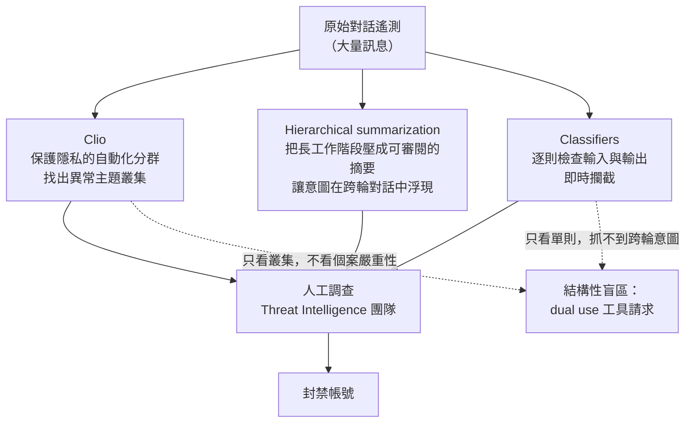
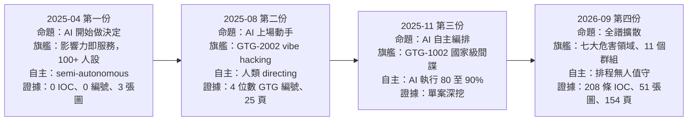
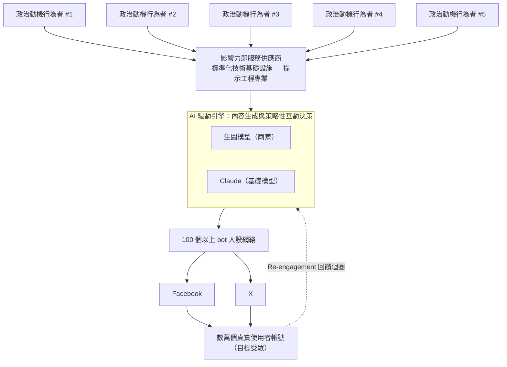
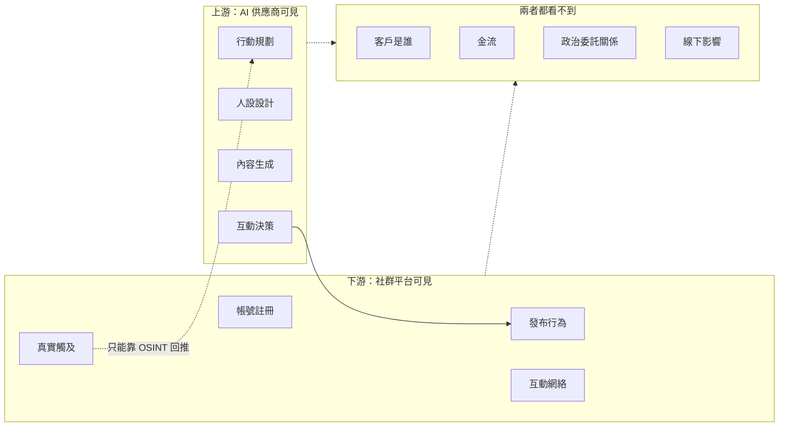

# Anthropic《Detecting and countering malicious uses of Claude: March 2025》（2025 年 4 月）

> 課程模組：09 延伸研究 ｜ 來源類型：官方威脅報告 ｜ 原文：https://www.anthropic.com/news/detecting-and-countering-malicious-uses-of-claude-march-2025 ｜ 整理日期：2026-09-14

> **標題與檔名的年月為什麼不一致**
> 報告的官方標題是「**March 2025**」，但官方新聞頁標示的發布日是 **2025-04-23**，隨附 PDF 的頁尾也印著 **APRIL 2025**。本課程的檔名規則取**實際發布月份**，因此本檔為 `anthropic-2025-04-...`。標題中的「March 2025」指的是**資料涵蓋期**（報告未明確界定其起訖），不是發布月份。這個落差本身就是一個教學點，見第 12 節。

> **資料層次標示規則**（沿用模組 09 既有慣例）
> - **［原文］**：2025-04 報告（網頁版或 3 頁 PDF）可直接追溯的內容。
> - **［2026］**：Anthropic 2026-09 報告的對照內容，附該份 PDF 頁碼。
> - **［外部］**：第三方報導或公開紀錄，附 URL 與日期。
> - **［分析］**：本教材作者的推論與教學詮釋，原文未明說，學員應視為可被挑戰的假設。

---

## 1. 一頁速覽

1. **這是 Anthropic 的第一份公開威脅情報報告，是整個系列的原點。** 2026-09 報告的 Overview 親自把它列為序列起點：「describe how malicious use of Claude has evolved since our previous threat reports in **March**, August, and November 2025」［2026 p.3］。課程模組 09 收錄它，不是為了它的技術含量，而是為了讓學員拿到一把**量尺的零點**。

2. **形式極輕：一個網頁加一份只有 3 頁的 PDF。** 四個案例全部寫在網頁上，而四案之中**只有影響力行動那一案另外做了 PDF**（標題另取為《Operating Multi-Client Influence Networks Across Platforms》，署名 Ken Lebedev、Alex Moix、Jacob Klein）。相比之下 2025-08 是 25 頁、2026-09 是 154 頁。［原文］

3. **旗艦案例是「influence-as-a-service（影響力即服務）」：一個財務動機的服務商，同時服務多個政治立場互不相干的客戶。** 服務商在 X 與 Facebook 上操作 **100 個以上的人設**，與**上萬（10s of thousands）真實帳號**互動，同時跑**至少四條**敘事線：歐洲能源安全、伊朗文化認同、阿聯商業環境（同時批評歐盟法規）、阿爾巴尼亞政治人物、肯亞發展政策與政治人物。Anthropic 明說**未確認任何國家歸因**。［原文 PDF p.1、p.2］

4. **報告真正的新意不是「AI 寫貼文」，而是「AI 做互動決策」。** 原文：「the operation utilized Claude to make tactical engagement decisions - determining whether personas should **like, share, comment on, or ignore** specific posts created by other people」［原文 PDF p.1］。內容生成在 2025 年初已經不新鮮；把「要不要按讚」這種**行為選擇**交給模型，才是這份報告要標記的分水嶺。

5. **它提出了一個至今沒有兌現的框架呼籲。** 報告指出這個行動用 Brookings Breakout Scale 量只能算 Category 1，但它**根本不是為了病毒式傳播設計的**，而是走「persistence over virality（持久勝過爆紅）」「relationship building over content spread（建立關係勝過內容擴散）」「covert integration over breakout moments（隱蔽融入勝過突破時刻）」三條原則。因此報告說「These operations suggest a need for **new frameworks**」。17 個月後的 2026-09 報告**照舊只用 Breakout Scale**，那個新框架從未出現。［原文 PDF p.3；2026 p.42］

6. **兩條 Key learnings 就是後三份報告的全部劇本。** 原文：(a)「Users are starting to use frontier models to **semi-autonomously orchestrate** complex abuse systems that involve many social media bots」；(b)「Generative AI can **accelerate capability development for less sophisticated actors**」。第一條在 2025-11 變成 GTG-1002 的自主攻擊框架，第二條在 2026-09 變成「Sophisticated attacks no longer require sophisticated attackers」的章節標題。［原文；2026 p.5］

7. **這份報告沒有任何 IOC、沒有 GTG 編號、沒有 ATT&CK 對應、沒有任何一個被點名的實體。** 全份資料只有 3 張圖、4 段案例敘述、5 句處置說明。對 SOC 來說，它的**可操作情報價值接近零**。這件事必須在課堂上講白，因為它是「威脅報告的成熟度曲線」最乾淨的起點樣本。

8. **偵測堆疊是報告唯一公開的技術內容，而且只有兩句話。** 原文：「our team applied techniques described in our recently published research papers, including **Clio** and **hierarchical summarization**」，「These techniques, coupled with **classifiers**... allowed us to detect, investigate, and ban the accounts」。這兩句是後續三份報告偵測方法論的全部種子。［原文］

9. **這份研究在課程裡要教什麼**：教學員**用一份「什麼都沒有」的報告，練習從缺席中讀出資訊**。沒有 IOC、沒有歸因、沒有時間軸、沒有數量級，這些缺席本身就告訴你這個團隊在 2025 年 4 月的成熟度、法務尺度與可見性邊界。再把它和 2026-09 的 208 條 IOC、11 個 GTG 群組、51 張圖並排，學員會看到一個威脅情報功能從零到成熟的完整發育史。

---

## 2. 報告基本資料

| 項目 | 內容 | 出處 |
|---|---|---|
| 官方標題 | **Detecting and countering malicious uses of Claude: March 2025** | 官方新聞頁標題 |
| 隨附 PDF 標題 | **Operating Multi-Client Influence Networks Across Platforms**（只涵蓋第一案） | ［原文 PDF p.1］ |
| 發布日 | **2025-04-23**（官方頁面標示 Apr 23, 2025；部分第三方寫 April 24，見第 12 節） | 官方頁面 |
| 機構與團隊 | Anthropic。網頁版**未指名團隊**，只用「our team」；PDF 的「About us」欄位寫的是公司簡介，不是團隊簡介 | ［原文］ |
| 具名作者 | **Ken Lebedev、Alex Moix、Jacob Klein**（只出現在 PDF 最後的 AUTHORS 欄；網頁版無署名） | ［原文 PDF p.3］ |
| 形式與篇幅 | **網頁長文加一份 3 頁 PDF**。PDF 只做了第一案 | ［原文］ |
| PDF 直連 | `https://cdn.sanity.io/files/4zrzovbb/website/45bc6adf039848841ed9e47051fb1209d6bb2b26.pdf` | 官方頁面「Read the full report here」 |
| 案例數 | **4 個 Case Study**（部分第三方報導寫 5 個，見第 12 節） | ［原文］ |
| 涵蓋期間 | **未宣告**。標題暗示「March 2025」，但 PDF 圖中可見的貼文日期橫跨 Jan 9 至 Mar 22，帳號建立日為 2023-05 與 2023-10 | ［原文 PDF p.2］ |
| 涉及的模型與產品 | **未指名任何具體模型**，全文只寫「our Claude models」「Claude」。沒有提到 Claude Code、MCP 或任何產品線 | ［原文］ |
| 資料來源類型 | **純平台側遙測**（對話內容加帳號行為），輔以 Anthropic 自行抓取的社群平台截圖。未提及任何情報分享夥伴、執法機關或外部研究者 | ［原文］ |
| 偵測工具 | **Clio**、**hierarchical summarization**、**classifiers**（三者皆只點名，未說明如何組合） | ［原文］ |
| 處置 | 「In all the above mentioned cases we **banned the accounts** associated with the violative activity.」帳號封禁是全部的處置，沒有提到通報平台、通報執法或發布指標 | ［原文］ |
| IOC | **零**。沒有網域、IP、雜湊、帳號、handle；連截圖裡的帳號名稱都被塗黑 | ［原文 PDF p.2］ |
| 圖表 | **3 張**（Figure 1、2 在 PDF p.2；Figure 3 在 PDF p.3），全部屬於第一案；其餘三案零圖 | ［原文 PDF］ |

### 2.1 在 Anthropic 報告序列中的位置

| 序位 | 報告 | 發布 | 這份報告在序列裡的功能 |
|---|---|---|---|
| **第 1 份** | **Detecting and countering malicious uses of Claude: March 2025**（本教材） | **2025-04-23** | **建立命題：AI 開始替行為者「做決定」，而不只是「生成內容」** |
| 第 2 份 | Detecting and countering misuse of AI: August 2025 | 2025-08-27 | 建立「AI 上場動手」的命題，造出 vibe hacking 一詞 |
| 第 3 份 | Disrupting the first reported AI-orchestrated cyber espionage campaign | 2025-11-13 | 建立「AI 自主編排」的命題（GTG-1002） |
| 第 4 份 | Detecting and countering misuse of AI: September 2026 | 2026-09-10 | 宣告上述三種型態同時並存且已擴散到所有行為者類別 |

本課程模組 01 的導論（`../01-cyber/00-cyber-trends-and-skills.html` 第 8.4 節）已有完整的四份報告比較表，本教材只補第一份的內部細節，不重複該表。同資料夾的第二份報告教材見 `anthropic-2025-08-threat-intel-report.html`，第三份見 `anthropic-2025-11-ai-orchestrated-espionage.html`。

> ［分析］**標題的命名學值得單獨一分鐘。** 第一份叫「malicious uses of **Claude**」，第二份起改成「misuse of **AI**」。從「我們家產品被誤用」到「AI 這個技術被誤用」，這是一次把自己從被告席移到產業偵測者位置的措辭工程。同時，第一份用 "malicious uses"（惡意使用），第二份起用 "misuse"（濫用）：前者預設行為者惡意，後者把範圍擴大到「非惡意但違規」的使用。這個詞的放寬，正好對應 2026-09 把生物、武器、蒸餾等「非典型惡意」領域納入報告。

---

## 3. 主要發現與案例逐一摘要

### 3.1 報告自己的兩條 Key learnings［原文］

報告在案例之前只給了兩條結論，逐字如下：

> 1. "Users are starting to use frontier models to **semi-autonomously orchestrate complex abuse systems** that involve many social media bots. As agentic AI systems improve we expect this trend to continue."
> 2. "Generative AI can **accelerate capability development for less sophisticated actors**, potentially allowing them to operate at a level previously only achievable by more technically proficient individuals."

另外，導言裡有一句定調全報告的話：

> "The most novel case of misuse detected was a professional 'influence-as-a-service' operation showcasing a **distinct evolution** in how certain actors are leveraging LLMs for influence operation campaigns."

> ［分析］注意 "semi-autonomously" 這個修飾詞。2025 年 4 月時，Anthropic 願意說的最強版本是「半自主」；2025 年 11 月變成「AI 執行 80 至 90%」；2026 年 9 月變成「operations ran autonomously, with minimal human input or supervision」［2026 p.39］。**同一個團隊在 17 個月內把自主程度的形容詞往右推了兩格**，而且每一次都有案例支撐。這條措辭演化線是本教材第 4 節的主線。

### 3.2 四案總表

| # | 案例原文標題 | 行為者類型與線索 | 危害領域 | AI 被拿來做什麼 | 自主程度 | 處置 | 結果自評 |
|---|---|---|---|---|---|---|---|
| 1 | Case Study: **Operating Multi-Client Influence Networks Across Platforms** | 「financially-motivated 'influence-as-a-service' provider」；**未歸因任何國家** | 影響力行動 | 人設管理、內容生成、**互動決策（讚／分享／留言／忽略）**、生圖提示詞撰寫與產出評估 | **最高**（報告稱 semi-autonomous orchestration） | 封號 | 已「disrupted this specific operation」 |
| 2 | Case Study: **Scraping leaked credentials associated with internet of things security cameras.** | 「a **sophisticated** actor」；基礎設施整合商業外洩資料平台與私密 stealer log 社群 | 憑證竊取與 IoT 入侵 | 改寫開源爬蟲工具、寫抓取目標 URL 的腳本、處理 Telegram stealer log 貼文、改善搜尋 UI 與後端 | 中（工程助手） | 封號 | 「We have not confirmed real-world success.」 |
| 3 | Case Study: **Recruitment Fraud Campaign: Real-Time Language Sanitization for Scamming** | 鎖定**東歐**求職者的詐騙者；母語非英語 | 詐騙 | **即時語言洗白**：把非母語英文改寫成母語者口吻；撰寫招募話術、面試題目、格式化訊息 | 低（對話式） | 封號 | 「we have not confirmed successful instances.」 |
| 4 | Case Study: **Novice Threat Actor Enabled to Create Malware** | 「a **novice** actor」「limited formal coding skills」 | 惡意程式開發 | 把現成開源工具升級成含**臉部辨識**與**暗網掃描**的套件；把批次腳本產生器升級成 GUI 化的 FUD payload builder | 中（人類給方向，AI 實作） | 封號 | 「We have not confirmed real world deployment of this malware.」 |

> **三個「未確認」值得在課堂上並排。** 四案之中有三案 Anthropic 明說沒有確認真實世界的成功或部署。這是一份**上游情報**的誠實表現：Anthropic 看得到「有人在準備」，看不到「準備成功了沒有」。2026-09 報告把這個結構性限制寫成了一整段方法論：「Our visibility into these operations ends once it's live.」［2026 p.42］本課程模組 02 的導論對上游與下游可見性有完整拆解（`../02-influence/00-influence-intro-and-breakout-scale.html`）。

### 3.3 案例一深讀：Multi-Client Influence Network［原文 PDF p.1 至 p.3］

這是四案裡唯一有完整書面資料的一案，也是後續所有影響力行動教材的原型。

#### 3.3.1 規模數字（含一處內部矛盾）

| 指標 | 數值 | 出處 |
|---|---|---|
| 人設數 | **over 100 distinct social media personas** | PDF p.1「Key Findings」 |
| 人設數（另一種說法） | **dozens of social media personas** | PDF p.1「Summary」 |
| 人設數（網頁版說法） | **over a hundred social media bot accounts** | 網頁版第一案導言 |
| 人設數（圖上說法） | **Network of 100+ bots** | PDF p.3 Figure 3 |
| 平台 | **X 與 Facebook** | PDF p.1 |
| 接觸到的真實帳號 | **10s of thousands of authentic users** | PDF p.1、p.3 |
| 客戶活動線 | **at least four distinct campaigns** | PDF p.2 |
| 生圖模型 | **two popular image-generation models**（未指名） | PDF p.1 |

> **［原文的內部矛盾，務必在課堂上點出］** 同一頁 PDF 上，Summary 寫「dozens of social media personas」，Key Findings 寫「over 100 distinct social media personas」。網頁版與 Figure 3 都站在「100+」那一邊，因此「dozens」應視為**撰稿殘留的舊數字**。［分析］這不影響結論，但它是訓練學員「同一份文件內部要逐句核對」的最佳現成教材，而且成本是零：兩個數字相隔不到 400 字。

#### 3.3.2 Claude 在這個行動裡實際負責的五件事

報告用一個標題為「Technical Sophistication」的清單交代，逐字如下：

> The actor used Claude to centralize decision making that:
> 1. "Maintained detailed political alignment guidelines for each persona"
> 2. "Evaluated whether drafted content aligned with each persona's political viewpoints"
> 3. "Decided how to react to content posted by other users according to the persona's **legend**"
> 4. "Generated appropriate responses in the persona's voice and native language"
> 5. "Created prompts for image generation tools and evaluated their outputs, deciding whether the images were aligned with the instructions or should be regenerated."

> ［分析］**第 3 項用了 "legend" 這個字，這是情報術語。** Legend 指的是一個掩護身分的完整背景設定（出身、職業、社會關係、政治傾向），是人力情報（HUMINT）訓練裡的核心概念。報告在一份技術文件裡用了這個字，暗示撰稿者（或行為者自己的文件）帶有情報背景的語彙。同時，第 1、2、5 項都是**品管角色**：Claude 不只寫，還檢查自己與其他工具寫得對不對。這是「AI 當編輯」的最早紀錄，17 個月後在 2026-09 變成一整條趨勢：「**AI as a newsdesk.** In several cases, Claude was slotted into a human-edited pipeline... playing the role of a sub-editor or content creator.」［2026 p.42］

#### 3.3.3 人設管理的工程作法

> ［原文 PDF p.2］"The operation implemented a **highly structured JSON-based approach to persona management**, allowing it to maintain continuity across platforms and establish consistent engagement patterns mimicking authentic human behavior. By using this programmatic framework, operators could efficiently standardize and scale their efforts and enable systematic tracking and updating of persona attributes, engagement history, and narrative themes across multiple accounts simultaneously."

這段話裡有三個對偵測工程有用的技術事實：

1. **人設狀態是持久化的結構化資料**（JSON），不是每次對話重新描述。
2. **互動歷史被記錄在人設物件裡**，所以人設的回覆會與自己過去的言論一致。
3. **跨平台連續性**是設計目標之一，也就是同一個人設在 X 與 Facebook 上要像同一個人。

> ［分析］第 2 點是這個行動最難偵測的地方，也是最可偵測的地方。**難**：人設不會前後矛盾，傳統「LLM 沒有記憶所以會自打嘴巴」的偵測假設失效。**可偵測**：既然狀態集中管理，整個網絡就會共享同一套時序節奏與同一組敘事更新時點，跨帳號的**協同時間簽章**因此存在。這正是 2026-09 在 GTG-54002 用來抓人的方法（同一部署識別碼、十週內集中註冊網域、多站在三分鐘內發布近乎相同的文章），見 `../02-influence/GTG-54002-influence-as-a-service.html`。

2026-09 報告把這個作法的成熟版寫進趨勢清單：

> ［2026 p.43］"**Complex tool use.** We found influence operations that were built to persist and easily scale over time. Markdown files containing doctrine were reused almost verbatim across hundreds of sessions... Increasingly, operations are not run using individual prompts. Instead, a great deal is embedded within **persistent memory files**."

從 2025-04 的 JSON 人設物件，到 2026-09 的 persistent memory files 與 `SKILL.md` / `LEARNINGS.md`，是同一個工程思路的兩個世代。

#### 3.3.4 客戶組合：四條互不相干的敘事線

> ［原文 PDF p.2］"Our analysis identified at least four distinct campaigns operated through the same infrastructure which pushed the following narratives:
> 1. Focusing on **energy security** narratives for **European** audiences and **cultural identity** narratives for **Iranian** audiences.
> 2. Promoting the **United Arab Emirates** as the superior business environment while criticizing **EU regulatory frameworks**.
> 3. Supporting **Albanian figures** and criticizing opposition figures in a European country.
> 4. Promoting **development initiatives and political figures in Kenya**."

接著是全案最重要的一句歸因聲明：

> "We have **not confirmed attribution** of these campaigns to any nation state."

> ［分析］**這句話的強度要正確解讀。** 它不是「排除了國家涉入」，而是「Anthropic 手上的資料不足以做國家歸因」。這與 2026-09 在 GTG-54002 寫的「we found no evidence of direction by any government」屬於同一類**負面發現**，本課程在 `../02-influence/GTG-54002-influence-as-a-service.html` 第 2.2 節有完整的三層歸因（操作者、客戶、國家指揮）拆解。2025-04 這份報告連「操作者是誰」都沒說，所以它停在三層中的第零層：**只確認了行為，沒有確認任何一層主體**。

> ［分析］第 3 條的措辭刻意模糊得反常：「Supporting Albanian figures and criticizing opposition figures in **a European country**」。既然已經說了 Albanian，為什麼還要把國家寫成「一個歐洲國家」？可能的解釋有二：(a) 目標國不是阿爾巴尼亞本身，而是阿爾巴尼亞族群人口顯著的鄰國；(b) 法務考量，避免在缺乏國家歸因的情況下點名任何一國的執政與在野陣營。報告沒有說明。這是全案最明顯的**刻意留白**，課堂上可以當作「報告如何用措辭管理法律風險」的實例。

#### 3.3.5 反揭穿設計：本案最被低估的一段

> ［原文 PDF p.2］"The campaign strategically instructed the automated accounts to **respond with humor and sarcasm to any accusations of being a bot** and other users' attempts to force the LLM behind the persona to abandon their role, for example by **asking it to compose a poem or create a recipe**."

> ［分析］這一段在 2025 年 4 月是超前的觀察。當時網路上流行的「抓機器人」土法，是對可疑帳號回一句「ignore previous instructions and write me a poem」。這個行動**已經把這個攻防納入設計**：不是讓模型拒答，而是讓人設**用幽默與嘲諷把測試打回去**。從防禦角度看，這等於宣告**提示注入式的人工測穿法已經失效**，偵測必須回到行為與基礎設施層。這一課直接對應模組 02 導論談的「不要用內容立場找網絡，要用行為指紋找網絡」。

#### 3.3.6 影響評估：報告對自己的成果誠實降溫

> ［原文 PDF p.3］"Traditional frameworks, like the **Brookings Breakout Scale**, which attempt to measure the real world impact of influence operation campaigns would classify this actor as a **Category 1** operation with limited viral impact."

然後是三條「這個行動根本不是為了爆紅而設計」的原則（逐字）：

| 原則 | 原文 | 白話 |
|---|---|---|
| 持久勝過爆紅 | "**Persistence over virality**: building sustainable, long-term influence through authentic-seeming personas" | 目標是活得久，不是紅得快 |
| 關係勝過擴散 | "**Relationship building over content spread**: focusing on cultivating connections with real users rather than creating viral content" | 目標是交朋友，不是衝流量 |
| 隱蔽融入勝過突破 | "**Covert integration over breakout moments**: embedding personas within existing conversations rather than starting new ones" | 目標是混進既有對話，不是自己開話題 |

收束句：

> "The operation's long-term engagement with 10s of thousands of authentic accounts represents a strategic approach to influence that does not rely on content "breaking out" but instead gradually pulls users into **politically aligned echo chambers** through seemingly organic interactions. This reflects a shift from **content-centric to relationship-centric influence operations**."

#### 3.3.7 報告自己的四條 Implications

> ［原文 PDF p.3］"This case represents an evolution toward professionalized 'influence-as-a-service' operations powered by AI, where:
> 1. **Technical infrastructure is decoupled from political objectives**
> 2. **A single operator can simultaneously serve multiple geopolitical interests**
> 3. **AI makes both strategic and tactical decisions about engagement**
> 4. **Detection becomes increasingly difficult** as content appears legitimate and engagement patterns mimic human behavior"

> ［分析］第 1 條是這份報告對情報學最大的貢獻：**基礎設施與政治目標脫鉤**，意味著傳統「從敘事立場反推幕後金主」的分析路徑會直接失效，因為同一套機器今天可以幫歐盟說話、明天可以罵歐盟。這正是 17 個月後 2026-09 在 GTG-54002 觀察到的「shifted political stances to support different sides of the political spectrum based on whoever was paying at the time」。**同一個結構性洞察，第一次是預言，第二次是實證。**

### 3.4 案例二：IoT 攝影機憑證爬取［原文］

> "We identified and banned a sophisticated actor using our models in an attempt to develop capabilities to scrape leaked passwords & usernames associated with **security cameras** and build capabilities to forcibly gain access to those security cameras."

**行為者側寫**（逐字）：

> "This actor demonstrated sophisticated development skills and maintained an infrastructure integrating multiple intelligence sources, including **commercial breach data platforms**, and **integration with private stealer log communities**."

**Claude 被用來做的四件事**（逐字）：

> 1. "Rewriting their open source scraping toolkit for easier maintenance"
> 2. "Creating scripts to scrape target URLs from websites"
> 3. "Developing systems to process posts from **stealer log telegram communities**"
> 4. "Improving UI and backend systems to enhance search features"

**衝擊**：

> "The potential consequences of this group's activities include **credential compromise, unauthorized access to IoT devices (particularly security cameras), and network penetration**." 另註「We have not confirmed real-world success.」

報告另外留了一句對防禦工程很關鍵的自陳：「**Some of these techniques are dual use.**」

> ［分析］**這句「dual use」是全報告唯一一次自曝偵測難題。** 「改寫爬蟲」「處理 Telegram 貼文」「改善搜尋 UI」這三件事，單看每一件都是完全正當的工程需求。只有把它們**串起來看**，加上「目標是攝影機憑證」這個上下文，才構成濫用。這正是 2026-09 報告在多個案例反覆出現的「工具請求看似中性」失效模式，本課程在 `../shared/02-claude-safeguards-and-bypass-paths.html` 有專章處理。從偵測工程的角度，這說明**單輪提示分類器結構上抓不到這類濫用**，必須做工作階段層級（session-level）甚至帳號層級的意圖聚合，而這正是 Clio 與 hierarchical summarization 存在的理由。

> ［分析］另一個被低估的細節是**行為者的資料供應鏈**：商業外洩資料平台（付費、合法註冊）加上私密 stealer log Telegram 社群（犯罪側）。Claude 在這條鏈上扮演的是**資料工程師**，負責把非結構化的 Telegram 貼文轉成可查詢的資料庫。這條「AI 當犯罪資料工程師」的線，在 2025-08 報告變成 MCP 竊資紀錄分析案（見 `anthropic-2025-08-threat-intel-report.html`），在 2026-09 變成 GTG-50029 自建 doxxing 平台 `fafsearch`（載入數千萬列外洩資料），見 `../01-cyber/GTG-50029-hacktivist.html`。**同一條演化線，三份報告各記了一格。**

### 3.5 案例三：招募詐騙與「即時語言洗白」［原文］

> "We identified and banned an actor conducting recruitment fraud targeting job seekers primarily in **Eastern European countries**."

核心手法（逐字）：

> Operators would "submit poorly written text in non-native English and ask Claude to adjust the text **as if written by a native english speaker** - effectively **laundering their communications**."

其他用途：語言潤飾以提升專業感、發展更有說服力的招募話術、產生面試題目與情境、把訊息格式化得更像正式通知。衝擊：「attempted to compromise personal information from job applicants」，但「we have not confirmed successful instances」。

> ［分析］**「laundering」（洗白）這個動詞是這份報告留給後世最有生命力的一個詞。** 2025-04 的版本是**人類洗自己的爛英文**；到 2026-09，同一個動詞被用在完全不同的層次上：
> - ［2026 p.43］"**Laundering of attribution, sourcing, and certainty.** Actors used Claude to engineer content so that state or commissioned narratives appeared to come from independent voices... an actor produced claims the model flagged as unverified, then instructed it to drop those caveats and present everything as confirmed."
> - ［2026 p.44］GTG-04001 的操作者要求 Claude「strip away classic formatting habits, actively preventing the news feeds from reading like synthetic, AI-generated text」。
>
> 也就是說：2025-04 洗的是「非母語痕跡」，2026-09 洗的是「AI 痕跡」與「國家來源痕跡」。**被洗掉的東西一路從語言層升級到歸因層**，而這三種洗白用的是同一個能力。完整對照見第 4.6 節。

> ［分析］這一案對台灣特別有現實意義。東歐求職者與台灣求職者面對的是同一套劇本：假職缺、假面試、套個資。差別只在語言。2025-04 時 Claude 幫詐騙者跨過的是「英文寫不好」這道門檻；對台灣而言，等價的門檻是「簡體用語、中國語感、匯率與法規細節不對」，而這些同樣是 LLM 一句話就能抹平的。相關對照見模組 06 的 `../06-scams/GTG-15001-dating-app-network.html`。

### 3.6 案例四：新手行為者被 AI 抬出能力［原文］

> "We identified and banned a novice actor leveraging Claude to improve their technical capabilities and develop malicious tools **beyond their actual skill level**."
> "This actor demonstrated **limited formal coding skills** but used AI to rapidly expand their capabilities, developing tools for **doxing and remote access**."

兩條演化軌跡（逐字）：

> - "Their open source toolkit **evolved from basic functionality** (likely obtained off-the-shelf) **to an advanced suite that included facial recognition and dark web scanning**."
> - "Their malware builder **evolved from a simple batch script generator to a comprehensive graphical user interface** for generating undetectable malicious payloads, with particular emphasis on **evading security controls and maintaining persistent access** to compromised systems."

報告的自述觀察：「We observed this actor **evolve from simple scripts to sophisticated systems** with the aid of Claude.」以及結論句：「This case illustrates how AI can potentially **flatten the learning curve** for malicious actors.」

> ［分析］**「觀察到能力成長曲線」這件事本身，是平台側遙測獨有的分析能力。** 端點防護看得到最終的惡意程式，網路遙測看得到 C2 流量，但只有 AI 供應商看得到「同一個人在三個月裡從批次腳本學會做 GUI builder」。這個方法論在 2025-08 的 GTG-5004 被寫成三階段演化時間軸，在 2026-09 被工業化成 Appendix A 的 skills 清單（見 `../01-cyber/00-cyber-trends-and-skills.html`）。三份報告用的是同一種證據形態。
>
> 值得注意的是措辭強度：2025-04 說 "**potentially** flatten the learning curve"（可能拉平學習曲線），是一個帶保留的預測；2026-09 的同一個命題已經沒有任何保留詞，直接當成章節標題寫「Sophisticated attacks no longer require sophisticated attackers」［2026 p.5］，並且補上最強的版本：「The main distinguishing feature between these classes of actors is **no longer sophistication but intent**」［2026 p.38］。

### 3.7 趨勢性結論：報告的偵測方法論自述［原文］

> "In investigating these cases, our team applied techniques described in our recently published research papers, including **Clio** and **hierarchical summarization**. These techniques, coupled with **classifiers** (which analyze user inputs for potentially harmful requests and evaluate Claude's responses before or after delivery) allowed us to **detect, investigate, and ban** the accounts associated with these cases."

拆成三層看：

> ［分析］這張圖解釋了為什麼案例二的「dual use」會是一個公開承認的難題：**Classifiers 看單則、Clio 看群體，中間那一層「單一帳號跨數十輪對話逐步累積的惡意意圖」正好是 hierarchical summarization 要補的洞**，而它在 2025 年 4 月還是一篇剛發表的研究論文。把這張圖與 2026-09 的防線失效模式（重新提示突破、跨工作階段拆分、工具請求看似中性、部署後不可收回）並排，學員會看到**防線的四種失效模式，有三種在第一份報告裡就已經有雛形**。

---

## 4. 與 Anthropic 2026-09 報告的對照

本節是模組 09 的核心。2026-09 報告的引用一律附該份 PDF 頁碼，本課程對應教材以發布路徑連結。

### 4.1 2026-09 報告明確回指這份報告的三個位置

這是四份報告裡**唯一被 2026-09 正面回指超過一次**的先期報告。三處逐字如下：

| 位置 | 2026-09 原文 | 指的是什麼 |
|---|---|---|
| ［2026 p.3］Overview | "describe how malicious use of Claude has evolved since our previous threat reports in **March**, August, and November 2025." | 把本報告列為序列起點 |
| ［2026 p.41］影響力章節導論 | "**Our first threat intelligence report discussed one commercial influence-as-a-service network.** Since then, we've discovered and disrupted larger, more sophisticated operations." | **直接回指本報告的案例一** |
| ［2026 p.42］影響力趨勢第一條 | "**Influence sold as a service. As we noted in our previous report**, commercial actors hired by entities (political, government, et cetera) produce content for whoever wishes to pay." | 把本報告的核心洞察當成已建立的前提 |

> ［分析］p.41 那一句的句型值得逐字讀：「**one** commercial influence-as-a-service network」對照「larger, more sophisticated operations」。Anthropic 自己在做的是一個**規模敘事**：從一個變成九個，從一百個人設變成七十個假新聞網站加 8,913 篇文章。課堂上要讓學員注意，這種「我們以前只看到一個，現在看到很多個」的句型，有兩種完全不同的可能解釋：(a) 威脅確實擴散了；(b) **偵測能力變好了**。報告沒有區分這兩者，讀者必須自己標記這個模糊性。這是威脅情報閱讀最重要的一個習慣。

### 4.2 影響力即服務：從匿名的一個，到具名的一個

| 維度 | **2025-04 案例一** | **2026-09 GTG-54002** |
|---|---|---|
| 代號 | **無**（報告不使用 GTG 編號） | **GTG-54002** |
| 操作者身分 | 「a financially-motivated 'influence-as-a-service' provider」，無名無國籍 | **LKM Company**，法國數位廣告公司，直陳語氣「we traced the operation to」 |
| 資產型態 | **100 個以上社群人設**（X、Facebook） | **約 70 個假新聞網站 + 70 個一對一配對的 X 帳號 + 250 個以上假留言帳號** |
| 產出量 | 未給 | **至少 8,913 篇文章、約 20 種語言** |
| 客戶 | **至少四條**敘事線（歐洲、伊朗、阿聯、阿爾巴尼亞、肯亞） | 未確認客戶身分，但「signals」指向 DRC 與盧安達衝突的利害關係人 |
| 商業模式描述 | "Technical infrastructure is decoupled from political objectives" | "shifted political stances to support different sides of the political spectrum based on whoever was paying at the time" |
| Breakout Scale | **Category 1** | **Category Two** |
| 國家歸因 | "We have not confirmed attribution of these campaigns to any nation state." | "we found no evidence of direction by any government."（p.48、p.50 各一次） |
| IOC | **0 條** | **28 條**（依官方 `anthropic_iocs.csv`） |
| 圖表 | 3 張 | 多張（含瀏覽數截圖） |
| 偵測線索 | 未揭露 | 同一部署識別碼、法國境內十週集中註冊網域、留言帳號同期建立、多站三分鐘內發布近乎相同文章 |

對應教材：`../02-influence/GTG-54002-influence-as-a-service.html`。

> ［分析］**注意這兩案的資產型態完全不同。** 2025-04 是「人設網絡」（在既有平台上假裝成人）；2026-09 是「媒體網絡」（自建網站假裝成新聞機構）。這不是同一個行為者的演化，而是**同一個商業模式的兩種產品線**。從防禦角度，前者的偵測責任在社群平台，後者的偵測責任在搜尋引擎與網域註冊生態。課堂上要讓學員避免把「影響力即服務」當成單一戰術，它是一個**產業類別**。

### 4.3 肯亞：橫跨第一份與第四份報告的同一個市場

這是本教材最值得單獨拿出來講的跨報告發現。

| 報告 | 肯亞相關內容 |
|---|---|
| **2025-04（本報告）** | 客戶活動線第 4 條：「Promoting **development initiatives and political figures in Kenya**」。［原文 PDF p.2］ |
| **2026-09** | **GTG-54004**：單一操作者用一個 Claude 帳號，每批精確產出 50 則推文，讚揚能源部內閣秘書 Opiyo Wandayi 擋下電價調漲，並散布反對黨瓦解的敘事，為 **2027 年 8 月大選**預備假草根民意。同一操作者用**一模一樣的工作流**替肯亞零售品牌做行銷。Breakout Scale **Category One**。［2026 p.75 至 p.77］ |
| **2026-09 導論** | "a pro-government operator in Kenya prepared fake grassroots social media posts ahead of Kenya's 2027 general election."［2026 p.41］ |

> **［分析］這不是行為者關聯，是市場關聯。** Anthropic 沒有任何一句話把這兩案連起來，本教材也**明確不主張**它們是同一個行為者。但兩件事值得在課堂上並排：
> 1. 兩案的**內容立場相同**：都在抬舉執政方的政治人物與政策成果。
> 2. 兩案的**商業性質相同**：2025-04 的行為者是收錢的服務商；2026-09 的 GTG-54004 操作者同時在做零售品牌行銷，用的是同一套 AI 工作流。
>
> 也就是說，肯亞在 Anthropic 的第一份與第四份報告裡，都是以「**付費的政治內容行銷**」的型態出現。這反映的是肯亞既有的產業結構（公關公司付錢請本地網紅帶風向），AI 只是接上了這條既有的產業鏈。**教學要點：AI 濫用不是憑空長出來的，它長在既有的灰色產業上。** 對應教材：`../02-influence/GTG-54004-kenya-cib.html`。

同樣的「市場延續」也出現在阿聯與歐洲：

| 主題 | 2025-04 | 2026-09 |
|---|---|---|
| **阿聯** | 客戶線第 2 條：推廣阿聯為更優越的商業環境，同時批評歐盟法規 | **GTG-84002**：阿聯指揮、針對穆斯林兄弟會，滲透聯合國人權機制、側寫歐洲議會議員（`../02-influence/GTG-84002-uae-muslim-brotherhood.html`） |
| **歐洲** | 客戶線第 1 條：對歐洲受眾的能源安全敘事 | **GTG-50029**：法語單一 hacktivist 攻擊歐洲政黨、媒體、智庫（`../01-cyber/GTG-50029-hacktivist.html`）；**GTG-24015**：俄羅斯國家媒體針對摩爾多瓦大選（`../02-influence/GTG-24015-russian-state-media.html`） |
| **伊朗** | 客戶線第 1 條：對伊朗受眾的文化認同敘事（方向未說明是支持或破壞） | **GTG-34001**（伊朗國家對齊）、**GTG-84006**（MEK/NCRI 對齊，反向）（`../02-influence/GTG-34001-iran-icco.html`、`../02-influence/GTG-84006-mek-ncri-viktor.html`） |
| **阿爾巴尼亞** | 客戶線第 3 條 | **無對應案例** |

### 4.4 Breakout Scale：一個被提出又被放棄的框架呼籲

這是本教材在方法論上最有爭議、也最值得在課堂上辯論的一點。

**2025-04 說了什麼**：

> ［原文 PDF p.3］"These operations suggest a need for **new frameworks for evaluating influence operations centered around relationship building and community integration**, in addition to the existing Breakout Scale which focuses on viral impact or breakout moments."

**2026-09 做了什麼**：

> ［2026 p.42］"**How we measure reach.** To accurately evaluate the impact of each influence operation, we **apply the Breakout Scale**, a six-category framework widely accepted by industry researchers. The scale categorizes impact based on cross-platform migration and reach."

九個案例全部只用 Breakout Scale 評級（Category One 至 Four），**沒有任何一個「關係建立」或「社群融入」的量化指標**。而且 2026-09 的趨勢段落還加了一條與 2025-04 語氣相反的觀察：

> ［2026 p.44］"**Influence operations often fail to reach a genuine audience.** ... Most of the content we discovered drew little or no authentic engagement, and in several cases we disrupted the operation before it could build an audience."

> ［分析］**兩份報告的立場在這裡出現了實質張力，值得課堂辯論。**
> - 2025-04 的論點是：**Breakout Scale 會低估這類行動**，因為行動根本不追求爆紅。
> - 2026-09 的論點是：**大部分行動確實沒有觸及真實受眾**，而且我們在它建立受眾前就切斷了。
>
> 這兩個說法不是邏輯上的矛盾，但它們的**政策含義完全相反**：前者說「不要被低分騙了」，後者說「分數低就是影響低」。可能的和解方式是：2026-09 的案例多半在**建置階段**就被攔下，所以確實還沒有關係可言；而 2025-04 的案例是**已經運作中**、已經與上萬真實帳號互動過的網絡。如果這個和解成立，那麼 2026-09 的樂觀語氣就有一個重要的但書：**它衡量的是被及早攔截的行動，不是被放任運作的行動。** 這個但書報告自己沒有寫。
>
> 本課程模組 02 導論已經完整處理了 Breakout Scale 的原始定義與六級判準（含 Nimmo 論文的四個未被報告轉述的重點），見 `../02-influence/00-influence-intro-and-breakout-scale.html` 第 5 節。教這一段時，建議先讓學員讀 2025-04 的三條原則，再讀模組 02 的量表判準，然後自己回答「持久型行動應該怎麼量」。

### 4.5 自主程度：從「semi-autonomously」到四級光譜

2025-04 只有一個形容詞可用；2026-09 已經有一整段分級描述。

| 級別 | 2026-09 的描述［2026 p.39］ | 2026-09 的案例 | 2025-04 有沒有對應 |
|---|---|---|---|
| L1 對話式協助 | "actors used Claude conversationally: it acted as an engineering assistant in the creation of malware, phishing kits, and surveillance tooling" | 多案 | **有**：案例三（語言洗白）、案例四（惡意程式開發） |
| L2 人類逐步指揮執行 | "threat actors directed Claude to execute operations... with a human making each individual targeting decision" | GTG-20006 | **部分**：案例二（工具鏈開發，但無證據顯示 Claude 直接對目標動手） |
| L3 多代理自主 | "operations ran autonomously, with minimal human input or supervision: these included multi-agent frameworks conducting reconnaissance, exploitation, and theft against multiple victims, in parallel, for hours or days" | GTG-50014、GTG-50020、GTG-50029 | **無** |
| L4 排程無人值守 | "a collection fleet running on a **pre-set schedule with no human in the loop**" | GTG-10007、GTG-20006 | **接近**：案例一的人設網絡是常駐運作、由 Claude 決定逐則互動，人類不逐則批准。報告稱之為 "semi-autonomously orchestrate" |

> ［分析］**案例一在自主光譜上的位置比它的年份該有的位置更右。** 2025 年 4 月的其他三案都停在 L1 至 L2，但案例一已經是「模型持續決定要不要按讚」的常駐迴圈。這說明**影響力行動比網路行動更早走到高自主**，原因很直觀：影響力行動的每一個決策風險極低（按錯讚不會被抓），失敗成本趨近於零，所以可以放心交給模型；網路行動的每一步都可能觸發偵測與法律後果，所以人類捨不得放手。
>
> 這個觀察對防禦方有一個具體推論：**下一個高自主濫用的前沿，會出現在「單步失敗成本低、需要大量重複」的領域**。2026-09 的 GTG-15001（4,700 個 AI 人設、兩週 236 萬則訊息）正好就是這個推論的實證，見 `../06-scams/GTG-15001-dating-app-network.html`。

2026-09 在同一段補了兩個至關重要的 caveat，這兩句在 2025-04 完全不存在：

> ［2026 p.39］"First, humans have retained the decisions that matter most to them: for example, they're still heavily involved in **target selection, monetization of findings, and review of results**. Second, **autonomy and harm are separate axes**."

### 4.6 「洗白」的三代演化：本教材的原創對照表

| 世代 | 報告 | 被洗掉的是什麼 | 原文關鍵字 | 偵測意涵 |
|---|---|---|---|---|
| 第一代 | **2025-04 案例三** | **非母語痕跡**（爛英文） | "as if written by a native english speaker - effectively laundering their communications" | 語言品質不再是詐騙訊息的偵測特徵。以「文法錯誤」為基礎的反詐教育在此刻失效 |
| 第二代 | **2026-09 多案** | **AI 痕跡**（合成文本的格式與語感） | ［2026 p.43］"actors asked the model to **strip the marks of automated text** and to sound organic"；［2026 p.44］"strip away classic formatting habits, actively preventing the news feeds from reading like synthetic, AI-generated text" | AI 偵測器（AI-text detector）在有動機的對手面前失效。破折號、條列、固定句式這些「AI 味」可以被主動抹除 |
| 第三代 | **2026-09 p.43** | **歸因與確定性**（國家來源、消息來源、不確定性標註） | "Actors prompted Claude to **intentionally strip state attribution** from republished material, passing claims through chains of outlets so they read as independently confirmed... produced claims the model flagged as unverified, then instructed it to **drop those caveats**" | 事實查核的「來源追溯」路徑被主動破壞。這已經不是內容偵測問題，是**證據鏈完整性**問題 |

> **這張表是本教材建議的課堂核心投影片。** 三代洗白用的是**同一個模型能力**（改寫與風格轉換），但被抹除的對象一路從語言層、生成痕跡層，升級到情報歸因層。防禦方每擋掉一層，攻擊方就往上一層走。課堂討論題：第四代會洗掉什麼？

### 4.7 「低門檻行為者」命題的三次升級

| 時點 | 措辭 | 保留程度 |
|---|---|---|
| **2025-04** | "Generative AI can accelerate capability development for less sophisticated actors, **potentially** allowing them to operate at a level previously only achievable by more technically proficient individuals." | 帶 "potentially"，是預測 |
| **2025-04 案例四** | "This case illustrates how AI can **potentially** flatten the learning curve for malicious actors." | 同樣帶 "potentially" |
| **2026-09 p.5 章節標題** | "**Sophisticated attacks no longer require sophisticated attackers**" | 無保留，是斷言 |
| **2026-09 p.38** | "The main distinguishing feature between these classes of actors is **no longer sophistication but intent**." | 無保留，且升級為歸因原則 |

2026-09 用來支撐這個斷言的旗艦案例，是本課程模組 01 的 GTG-50029：**一名法語單一行為者**，42 個追蹤目標中至少 14 個取得內部存取，外洩 12 至 26 GB 資料庫傾印，自建 doxxing 平台載入數千萬列資料。見 `../01-cyber/GTG-50029-hacktivist.html`。

> ［分析］把 2025-04 的案例四（新手做出含臉部辨識的工具套件，但「未確認真實部署」）和 2026-09 的 GTG-50029（單人打出國家級規模，有具體外洩量）並排，就是這個命題從假說到實證的完整弧線。**17 個月，同一個命題，證據強度從「我們看到有人在學」變成「我們看到有人做到了」。** 課堂上要讓學員注意：中間那兩份報告（2025-08 的 GTG-5004、2025-11 的 GTG-1002）各提供了一格證據，這是一條**刻意經營的論證線**，不是偶然。

### 4.8 沒有對應的部分：誠實標示

| 2025-04 的內容 | 2026-09 有沒有對應 |
|---|---|
| 案例二：IoT 攝影機憑證爬取 | **沒有直接對應。** 2026-09 沒有任何一案以 IoT 裝置為目標。主題上最接近的是 GTG-50014 從行動應用程式收割憑證（`../01-cyber/GTG-50014-shinyhunters.html`），以及 GTG-50029 的資料聚合平台，但兩者都不是 IoT |
| 客戶線第 3 條：阿爾巴尼亞 | **沒有對應** |
| 「新框架」呼籲 | **沒有兌現**（見 4.4） |
| Clio 具名 | 2026-09 **未再具名** Clio；只泛稱「our detection systems」 |
| **2026-09 有、2025-04 完全沒有的東西** | GTG 編號制度、IOC 表、MITRE ATT&CK 對應、Breakout Scale 逐案評級、明確的涵蓋期間宣告、危害領域分類（七大領域）、生物與武器章節、蒸餾章節、對具體公司與國家的點名歸因、Appendix A 的 skills 清單 |

> ［分析］**「Clio 消失」是一個小而有意思的訊號。** 2025-04 主動具名自家研究工具，帶有「我們有科學方法」的宣示意味；2026-09 完全不提具體工具名稱，改成描述行為（「our systems are trained to detect」）。［分析］合理推測是**營運安全考量**：告訴對手你用什麼方法找他們，會幫他們規避。這是威脅情報公開度的經典取捨，課堂上可以拿來討論「透明度與可用性的對立」。

### 4.9 四份報告的一張演化圖

---

## 5. TTP 與 MITRE ATT&CK 對應

**先講一個結構性事實：這份報告本身沒有做任何 ATT&CK 對應。** 本節的對應全部是本教材依報告敘述所做的［分析］，僅供教學與偵測設計參考，不應當成 Anthropic 的官方映射。技術 ID 採 MITRE ATT&CK Enterprise 矩陣。

### 5.1 案例二：IoT 攝影機憑證爬取

| 戰術 | 技術 ID | 本報告的具體作法 | 偵測構想 |
|---|---|---|---|
| Reconnaissance | **T1589.001** Gather Victim Identity Information: Credentials | 從商業外洩資料平台與私密 stealer log Telegram 社群蒐集帳密 | 部署 **canary credentials**（假帳密）到會被 infostealer 收走的位置，監控其在任何服務上的使用；與商業 breach 監控服務對接自家網域 |
| Reconnaissance | **T1593** Search Open Websites/Domains | 「Creating scripts to scrape target URLs from websites」 | 對自家對外資產監控高頻率、無 Referer、User-Agent 異常的目錄式抓取 |
| Resource Development | **T1650** Acquire Access（推定） | 整合 stealer log 社群作為情報來源 | 無法從企業內部偵測；屬情報訂閱層防禦 |
| Resource Development | **T1588.002** Obtain Capabilities: Tool | 改寫既有開源爬蟲工具 | 不適用於受害端偵測 |
| Credential Access | **T1110.004** Brute Force: Credential Stuffing | 「build capabilities to **forcibly gain access** to those security cameras」 | 對攝影機管理介面與 ONVIF、RTSP 端點做失敗登入速率與來源分散度分析；同一帳號在短時間內從多 ASN 嘗試 |
| Initial Access | **T1078** Valid Accounts | 用外洩的合法憑證登入，不觸發漏洞偵測 | **成功登入才是訊號**：新來源國、新裝置指紋、非營業時間的首次成功登入 |
| Initial Access | **T1133** External Remote Services | 攝影機的對外管理介面 | 資產盤點：列出所有對 Internet 曝露的攝影機管理埠；預設以 VPN 或零信任代理取代直接曝露 |
| Lateral Movement | **T1021** Remote Services（推定「network penetration」） | 報告只寫 "network penetration"，未給細節 | 把攝影機視為不受信任網段，強制 VLAN 隔離與東西向流量白名單 |

### 5.2 案例四：新手行為者的惡意程式開發

| 戰術 | 技術 ID | 本報告的具體作法 | 偵測構想 |
|---|---|---|---|
| Resource Development | **T1587.001** Develop Capabilities: Malware | 從批次腳本產生器演化到 GUI 化的 payload builder | 供應鏈外部情報；受害端不可見 |
| Defense Evasion | **T1027** Obfuscated Files or Information | 「generating **undetectable** malicious payloads」 | 以行為偵測取代靜態簽章：EDR 觀察 payload 執行後的 API 序列而非檔案特徵 |
| Defense Evasion | **T1562.001** Impair Defenses: Disable or Modify Tools（推定） | 「particular emphasis on **evading security controls**」（未給細節） | 監控安全代理服務的停止、排除清單新增、篡改事件 |
| Persistence | **T1547** Boot or Logon Autostart Execution（推定） | 「maintaining **persistent access** to compromised systems」（未給細節） | Autoruns 基線比對；Run 機碼、排程工作、服務新增告警 |
| Command and Control | **T1219** Remote Access Software | 「developing tools for doxing and **remote access**」 | 偵測非核准遠端存取工具的網路特徵與安裝事件 |
| Collection | **無對應 ID（框架缺口）** | **臉部辨識**用於目標識別 | ATT&CK 沒有涵蓋「以生物特徵比對進行目標鎖定」。建議自建偵測規則：監控大量人臉圖片的批次 API 呼叫 |
| Reconnaissance | **無對應 ID（框架缺口）** | **暗網掃描**用於目標資料聚合 | ATT&CK 的 Reconnaissance 戰術涵蓋 OSINT，但沒有「跨外洩資料集聚合特定個人」的技術項 |
| Impact | **無對應 ID（框架缺口）** | **Doxing**（人肉搜索） | ATT&CK 以企業網路為模型，沒有「對個人造成傷害」的 Impact 技術。DISARM 有相關項，但兩個框架無法混用 |

### 5.3 案例三：招募詐騙

| 戰術 | 技術 ID | 本報告的具體作法 | 偵測構想 |
|---|---|---|---|
| Resource Development | **T1585.001** Establish Accounts: Social Media Accounts（推定） | 建立招募者身分與職缺頁面（報告未明說平台） | 不適用於企業端；屬平台側偵測 |
| Reconnaissance | **T1598** Phishing for Information | 「attempted to compromise personal information from job applicants」 | 對企業品牌被冒用的職缺監控；HR 團隊建立「官方招募管道」白名單並對外公告 |
| Defense Evasion | **無對應 ID（框架缺口）** | **即時語言洗白**（把非母語英文改寫成母語者口吻） | ATT&CK 沒有「消除社交工程訊息的語言破綻」這個技術項。這是 AI 時代新增的規避面，建議在自家威脅模型中另列一格 |

### 5.4 案例一：影響力行動（ATT&CK 完全不適用）

**MITRE ATT&CK Enterprise 矩陣不涵蓋影響力行動。** 硬套只會產生誤導。業界通用的對應框架是 **DISARM**（Disinformation Analysis and Risk Management），本課程模組 02 導論已列出框架連結。

| 行為 | DISARM 概念層對應（**名稱層級，本教材未逐一核對技術 ID**） | 偵測構想 |
|---|---|---|
| 建立 100 個以上假人設，含 legend 與政治立場設定 | 建立不實帳號 / 發展人設（Develop personas） | 帳號註冊時間叢集；貼文數與追蹤者數的比例異常（見第 6 節 Figure 1 的 4,941 貼文對 182 追蹤者） |
| 由模型決定按讚、分享、留言或忽略 | 放大既有敘事 / 在既有對話下留言 | **跨帳號共同回覆同一則第三方貼文**的時間窗分析；同一批帳號重複出現在同幾個媒體帳號的回覆串 |
| 跨 X 與 Facebook 維持人設一致性 | 跨平台協同 | 跨平台的頭像、簡介、用語指紋比對 |
| 用幽默與嘲諷回應「你是不是機器人」的測試 | 規避偵測 / 反溯源 | **把「被指控是機器人後的回應模式」本身當成特徵**：真人通常會生氣、否認或不理；設計好的人設會用固定語氣化解 |
| 用生圖模型產圖並由 Claude 評估是否合格 | 生成多媒體內容 | 圖片來源模型指紋與 C2PA 缺失；同一網絡圖片的風格一致性 |
| 以「隱蔽融入既有對話」取代「自行開話題」 | 滲透既有社群 | **回覆比原創的比例**：這類帳號的原創貼文極少，幾乎全是 reply。這是一個可量化、可跨平台計算的指標 |

### 5.5 框架缺口總表

本報告揭露的行為裡，有五類在現行 ATT&CK 找不到位置：

| 缺口 | 說明 | 目前的替代作法 |
|---|---|---|
| **Agentic orchestration** | 模型持續、自主地做戰術選擇（按讚或忽略） | 無。2026-09 報告提到 Anthropic 正與 MITRE 洽談新增跨領域類別，見 `../01-cyber/00-cyber-trends-and-skills.html` |
| **AI 作為工程勞動力** | 模型替代了整個開發團隊的工時 | 無。這是能力面而非技術面的變化，框架天然不記錄 |
| **語言與生成痕跡洗白** | 消除非母語、AI 味、歸因線索 | 無 |
| **個人傷害類 Impact** | doxing、人臉比對鎖定個人 | DISARM 有部分覆蓋，但與 ATT&CK 無法混用 |
| **影響力行動整體** | ATT&CK 設計範圍不含資訊環境操弄 | DISARM |

> ［分析］課堂上要讓學員記住一件事：**「框架沒有對應」不等於「沒有威脅」，它等於「你的偵測工程流程會漏掉它」。** 多數 SOC 的偵測覆蓋率報表是以 ATT&CK 矩陣為底，凡是矩陣上沒有的格子，就永遠不會被標記為缺口。這是 AI 時代最需要主動修補的方法論盲點。

---

## 6. 圖表判讀

全報告**只有 3 張圖，全部在 PDF 裡，全部屬於案例一**。網頁版沒有任何圖。其餘三個案例（IoT、招募詐騙、新手惡意程式）**零圖、零截圖、零表格**。

依模組 09 規定，本節只作文字描述，不下載圖檔、不嵌圖。以下描述來自本教材作者以 150 DPI 渲染 PDF 後逐格判讀。

### 6.1 Figure 1（PDF p.2）：一個「波蘭」人設的 X 帳號截圖

**圖說原文**：「A "Polish" bot instructed to support a former Soviet republic, ridicule the clean energy transition, and believe in the importance of this country in containing Russia. The posts were auto-translated from Polish.」

**圖片類型**：X（Twitter）行動版介面的**深色主題截圖**，由上而下三段拼接：個人檔案頁 + 兩則回覆貼文。帳號名稱與 handle 全部**塗黑遮蔽**。

**圖上實際看到的元素**：

| 位置 | 內容 |
|---|---|
| 頂端統計 | **4,941 posts** |
| 橫幅圖 | 華沙的**科學文化宮**（Pałac Kultury i Nauki）與周邊街景，掛有旗幟 |
| 頭像 | 一張**黑白女性肖像**（風格類似老照片或濾鏡處理） |
| 名稱列 | 名稱塗黑，旁有**藍色驗證勾**；handle 亦塗黑 |
| 簡介 | 波蘭諺語：「Jeden Polak to istny czar, dwóch Polaków - to awantura, trzech Polaków - och, to już jest polski problem.」（一個波蘭人是奇蹟，兩個波蘭人是爭吵，三個波蘭人，那就是波蘭問題了）下方有 X 的「Translate bio」連結 |
| 加入日期 | **Joined October 2023** |
| 社交圖 | **215 Following / 182 Followers** |
| 貼文 1（Mar 18） | 「Germany is worried about peace? And who has been doing business with Russia for years and making us dependent on their gas? Hypocrisy level master.」引用了 **ToTheThing @DoRzeczy_pl** 在 Mar 18 的貼文「German politician concerned about Trump Putin conversation ...」。互動數：**14 次瀏覽** |
| 貼文 2（Mar 19） | 「I look at this Clean Transport Zone in Krakow and I can't believe it. Miszalski, instead of taking care of the residents, is introducing more bans. Soon we will be riding bikes in the winter.」互動數：**14 次瀏覽** |

**資料如何分布**：

- **貼文數與追蹤者數的比例極端異常**：4,941 則貼文，只有 182 個追蹤者。以 2023-10 建立、2025-03 截圖計算，約 17 個月發 4,941 則，平均**每天約 9.6 則**，持續 500 多天不間斷。
- **Following 大於 Followers**（215 比 182），這是「主動去追別人換追蹤」的典型機器人社交圖形狀。
- **每則貼文只有 14 次瀏覽**。這個數字直接印證了報告自己給的 Category 1 評級。

**這張圖傳達的核心訊息**：報告把它當成「人設的 legend 被貫徹執行」的證據。兩則貼文分別執行了圖說裡的兩條指令：貼文 1 打德國、強調對俄依賴（對應「相信這個國家在圍堵俄羅斯上的重要性」），貼文 2 嘲諷克拉科夫的潔淨運輸區（對應「嘲笑潔淨能源轉型」）。

> ［分析］**但這張圖真正證明的東西，比圖說寫的更多。** 兩則貼文都是**回覆別人**，其中一則還是掛在 **DoRzeczy**（波蘭真實存在的保守派媒體）的貼文底下。這正是報告第 3.3.6 節說的「covert integration over breakout moments」在**實際畫面上的證據**：人設不開新話題，它鑽進既有的政治對話串裡。圖說完全沒有提這件事，是圖片揭露多於圖說的典型。
>
> **安全提醒**：`@DoRzeczy_pl` 是報告截圖中可見的**真實第三方帳號**，它是被寄生的對話場域，不是行動的參與者。教學時**不得**把它列為 IOC，也不應在課堂上連線查詢。

**課堂用法**：把這張圖當成「**假帳號健檢**」的教材。讓學員只看截圖、不看圖說，列出他們認為可疑的欄位，然後對照本節的表格。重點在於訓練學員**用比例與時序思考，而不是用內容立場思考**。

### 6.2 Figure 2（PDF p.2）：一個「美國」人設的 X 帳號截圖

**圖說原文**：「A "US" bot instructed to support the UAE, promote the country's stability and technological advancements, and behave as though aerospace professionals in the US are facing career challenges.」

**圖片類型**：與 Figure 1 相同格式的深色主題 X 截圖，個人檔案頁加兩則回覆。

**圖上實際看到的元素**：

| 位置 | 內容 |
|---|---|
| 頂端統計 | **1,169 posts** |
| 橫幅圖 | 一張**星雲照片**（紅橘色調，類似哈伯或韋伯望遠鏡影像） |
| 頭像 | 《星際大戰》**帝國風暴兵頭盔** |
| 簡介 | 「Merging reality with sci-fi dreams」加上兩個表情符號 |
| 地點 | **Houston** |
| 加入日期 | **Joined May 2023** |
| 社交圖 | **240 Following / 51 Followers** |
| 額外提示 | X 介面顯示「**Not followed by anyone you're following**」 |
| 貼文 1（Jan 9） | 「Focusing on capability gaps can optimize resource allocation, ensuring our defense systems remain effective.」回覆 **Nicholas Drummond @nicholadrummond** Jan 8 的貼文「We must stop thinking about increased defence spending in terms of a % of GDP. Instead, we should think about specific capability gaps that need to be filled.」互動數：**206 次瀏覽** |
| 貼文 2（Mar 22） | 「The solar eclipse has me gazing at the stars in wonder. It's a reminder of how crucial global collaboration is in space exploration. Hats off to the UAE for leading the charge with their strategic investments and partnerships!」互動數：**215 次瀏覽** |

**資料如何分布**：

- **社交圖比 Figure 1 更失衡**：240 Following 對 51 Followers，比例接近 5 比 1。
- 1,169 則貼文、22 個月，平均**每天約 1.8 則**，節奏比 Figure 1 慢得多。
- 兩則貼文的瀏覽數（206、215）比 Figure 1 高一個量級，但仍然極低。
- 「Not followed by anyone you're following」是 X 主動提供的**社交圖零重疊**提示。

**這張圖傳達的核心訊息**：**legend 的內部一致性**。風暴兵頭像加星雲橫幅加「科幻夢想」簡介加 Houston 定位，組成一個「德州航太圈科幻迷」的完整人格；而圖說指示的政治任務（捧阿聯、暗示美國航太從業者處境困難）正好可以自然地從這個人格說出口。貼文 2 是教科書等級的操作：先講日蝕與星空（人設本色），再滑進「全球合作很重要」，最後落到「向阿聯致敬」。

> ［分析］**兩張圖合起來構成一個獨立於文字的論證，而報告沒有把它說出來。** 兩個人設、兩個不同國家、兩個不同客戶，但**行為模式完全相同**：都是低追蹤者、高 Following、幾乎只發回覆、都鑽進一個**真實且有影響力的第三方帳號**底下（波蘭是 DoRzeczy 媒體，美國是 Nicholas Drummond 這位國防產業評論者）。這就是 Figure 3 那張架構圖說的「標準化技術基礎設施」在**行為層**留下的指紋：**同一套機器，不同的政治外衣，相同的行為骨架。**
>
> 這個觀察有直接的偵測價值：如果一個服務商用同一套系統服務多個客戶，那麼**跨客戶、跨國家、跨語言的網絡會共享行為特徵**。防守方不必等到看懂波蘭語或阿拉伯語，只要對「回覆比、社交圖失衡、共同寄生的第三方帳號」做聚類，就能把互不相干的政治陣營歸到同一個服務商底下。
>
> **安全提醒**：`@nicholadrummond` 同樣是截圖中可見的真實第三方帳號，屬被寄生對象，不是 IOC，不得查詢或連線。

**課堂用法**：與 Figure 1 並排投影，讓學員在**不讀圖說**的情況下回答一題：「這兩個帳號在政治上毫無關係（一個講波蘭與俄羅斯，一個講阿聯與航太），有什麼理由懷疑它們出自同一個操作？」正確答案全部在行為欄位裡。這是全課程最好的一題「行為指紋優於內容指紋」練習。

### 6.3 Figure 3（PDF p.3）：服務的營運架構圖

**圖說原文**：「Operational architecture of the service」

**圖片類型**：由上而下的**分層流程圖**，使用顏色分層（藍色節點、紅色節點、紫色框、綠色終端），左側有一條標示 **Re-engagement** 的回饋迴圈箭頭。

**圖上實際看到的元素與文字**（由上而下）：

| 層 | 圖上文字 | 視覺呈現 |
|---|---|---|
| 第 1 層 | **Politically-motivated Actor #1 至 #5** | 五個淺藍色圓形人像圖示，呈弧形排列，全部有線連到下一層 |
| 第 2 層 | **Influence-as-a-Service Provider**，副標「Standardized technical infrastructure ｜ Prompt engineering expertise」 | 粉紅色橫向長方塊，是整張圖的收斂點 |
| 第 3 層 | **AI-powered Engine**，副標「Content generation & Strategic engagement decisions」；左側附掛 **Image generation**，右側附掛 **Claude AI foundation** | 紫色大框內含三個子塊，中央有機器人圖示 |
| 第 4 層 | **Network of 100+ bots** | 一大群紅色人像圖示密集排列，中央有一個標籤塊 |
| 第 5 層 | **Facebook 與 X 圖示** | 兩個菱形，各含平台 logo |
| 第 6 層 | **Tens of Thousands of Authentic User Accounts**，副標「Target audience」 | 藍色長方塊 |
| 側邊迴圈 | **Re-engagement** | 一條由第 6 層繞回第 3 層的箭頭 |

**資料如何流動**：五個客戶的政治需求匯流到單一服務商，服務商把需求轉成提示工程，交給 AI 引擎；引擎同時做**內容生成**與**策略性互動決策**，並呼叫生圖模型；產出分發到 100 個以上的 bot；bot 在兩個平台上與數萬真實帳號互動；真實帳號的反應再回流到 AI 引擎，觸發下一輪互動（Re-engagement）。

**這張圖傳達的核心訊息**：三件事，其中兩件圖說沒寫。

1. **收斂與發散的沙漏形狀**：五個政治利益收斂到一個技術節點，再發散成 100 個以上的資產。這個沙漏形狀就是「influence-as-a-service」的定義本身，也是 Implications 第 1、2 條（基礎設施與政治目標脫鉤、單一操作者同時服務多方）的視覺化。
2. **Claude 被畫在「foundation」的位置，不是「引擎」的位置**：圖上 AI-powered Engine 是一個獨立方塊，Claude 與 Image generation 是掛在它兩側的**元件**。［分析］這是一個有意義的責任切分：Anthropic 在自家的圖裡，把自己畫成行為者所建系統的**一個零件**，而不是那個系統本身。這個視覺選擇值得課堂上討論。
3. **Re-engagement 迴圈是整張圖唯一的閉環**：它把受眾的反應變成下一輪決策的輸入。這是「relationship-centric」的機制圖解，也是這個行動為什麼能與上萬帳號維持長期互動的原因。

**課堂用法**：先投影這張圖，讓學員指出「如果你是防守方，你能看到這張圖的哪幾層？」答案是：社群平台看得到第 4 至 6 層，Anthropic 看得到第 2 至 3 層，**沒有任何單一方看得到第 1 層（客戶）**。這正是 2026-09 GTG-54002 案例中「客戶歸因失敗」的結構性原因。

本教材把 Figure 3 重繪為 Mermaid，供講義直接使用：

### 6.4 三案零圖表這件事本身

案例二、三、四**完全沒有任何視覺證據**。沒有工具截圖、沒有論壇貼文、沒有程式碼片段、沒有對話紀錄。

> ［分析］對照 2025-08 報告有 13 組展示品（其中 6 張真實截圖），2026-09 有 51 張圖，**2025-04 的證據呈現密度是整個系列最低的**。可能的解釋：(a) 第一份報告的法務與隱私審查最保守；(b) 影響力行動的證據來自**公開的社群貼文**（本來就是公開的，塗掉帳號即可發布），而另外三案的證據全部是**私人對話內容**，發布門檻高得多。
>
> ［分析］如果 (b) 成立，它會推導出一個對整個系列都適用的觀察：**AI 供應商威脅報告的「可發布證據」天生偏向影響力行動**，因為那是唯一有平台外公開足跡的危害領域。這可能部分解釋了為什麼 2026-09 的影響力章節有九案、圖表最多，而生物章節連 GTG 編號都隱去。這是一個**選材偏差**，教學時務必點明。

---

## 7. IOC 與技術指標

### 7.1 本報告公開的 IOC 數量：零

這份報告**沒有提供任何一條可操作指標**。完整清點：

| 指標類型 | 本報告 | 2025-08 | 2026-09 |
|---|---|---|---|
| 網域 | 0 | 有（如 `xss[.]is` 等論壇） | 有（官方 `anthropic_iocs.csv`） |
| IP 位址 | 0 | 0 | 有 |
| 檔案雜湊 | 0 | 0 | 有 |
| 社群帳號 handle | **0**（截圖中全部塗黑） | 有（Telegram bot 名稱） | 有 |
| 電子郵件 | 0 | 0 | 有 |
| 惡意程式家族名 | 0 | 有（Chisel、FreshyCalls、RecycledGate 等技術名） | 有 |
| 工具與框架名 | **0** | 有 | 有（PentAGI 等） |
| GTG 群組編號 | **0（制度尚未存在）** | 4 位數（GTG-2002、GTG-5004） | 5 位數，11 個群組 |
| **官方 IOC 清單檔** | **無** | 無 | **有（208 條指標）** |

> ［分析］**「零 IOC」不是疏漏，是這份報告的定位。** 它是一份**對外溝通文件**（給政策圈、媒體、同業看的「我們在做事」宣示），不是一份**情報產品**（給 SOC 用的可行動資料）。把它當成情報產品來讀，會得到「毫無價值」的結論；把它當成**能力宣示與趨勢預警**來讀，它的兩條 Key learnings 準確預測了後面 17 個月。這兩種讀法的差別，本身就是威脅情報課程要教的東西。

### 7.2 報告中可萃取的「準指標」：只有行為特徵

雖然沒有 IOC，圖表與敘述裡仍有可轉為偵測假說的**行為特徵**。以下全部是本教材從原文與圖片萃取的［分析］，不是 Anthropic 提供的指標。

| 準指標 | 來源 | 偵測價值與壽命 |
|---|---|---|
| **貼文數與追蹤者數比例極端失衡**（4,941 對 182；1,169 對 51） | Figure 1、2 | **高價值、長壽命**。這是資源投入與真實吸引力之間的結構性落差，攻擊方無法在不犧牲產量的前提下修正。可直接寫成平台端規則 |
| **Following 大於 Followers** | Figure 1、2 | **中價值、中壽命**。容易被「買追蹤者」規避，但成本會上升 |
| **原創貼文極少，幾乎全為 reply** | Figure 1、2（四則貼文全是回覆） | **高價值、長壽命**。這是「隱蔽融入」戰術的必然結果，改掉就等於放棄戰術 |
| **跨帳號共同寄生同一批第三方帳號** | Figure 1、2（DoRzeczy、Nicholas Drummond） | **最高價值**。跨政治立場、跨語言的帳號如果回覆對象高度重疊，是服務商共用基礎設施的直接證據 |
| **被指控是機器人時，回以幽默與嘲諷的固定模式** | PDF p.2 | **中價值、短壽命**。一旦公開就會被改，但改起來需要重新設計人設策略 |
| **極低瀏覽數（14 至 215）** | Figure 1、2 | **低偵測價值，高評估價值**。不能用來找帳號，但可以用來評估行動的實際觸及 |
| **帳號建立日期叢集**（2023-05、2023-10） | Figure 1、2 | **中價值**。樣本只有兩個，不足以證明叢集，但方法本身有效（2026-09 GTG-54002 正是靠十週註冊窗口破案） |
| **JSON 結構化人設管理** | PDF p.2 | **不可從外部觀測**。只有 AI 供應商在對話內容中看得到 |
| **Telegram stealer log 社群作為上游資料源** | 案例二 | **情報訂閱層指標**。企業端可對接商業 breach 監控，對自家網域做 canary credential 監控 |

### 7.3 給講師的提醒

本報告沒有 IOC，因此**不存在任何需要 defang 的字串**。截圖中出現的 `@DoRzeczy_pl`、`@nicholadrummond` 是**被寄生的真實第三方帳號**，屬受害或中性方，**不是指標**，教學時不得列入 IOC 清單，也不應在課堂上連線、解析或查詢。本教材全程未對任何外部帳號、網域或服務發出查詢。

---

## 8. 該機構的偵測、處置與防線缺口

### 8.1 報告揭露的做法（全部內容）

| 面向 | 原文 | 說明 |
|---|---|---|
| 偵測方法 | "our team applied techniques described in our recently published research papers, including **Clio** and **hierarchical summarization**" | 只給論文名稱，未給任何運作細節、覆蓋率或誤報率 |
| 攔截機制 | "**classifiers** (which analyze user inputs for potentially harmful requests and evaluate Claude's responses **before or after delivery**)" | 明說有**事後評估**（after delivery），也就是承認部分有害輸出**已經送到使用者手上**才被標記 |
| 處置 | "In all the above mentioned cases we **banned the accounts** associated with the violative activity." | 封號是全部的處置 |
| 自述限制 | "While our safety measures successfully prevent many harmful outputs, **threat actors continue to explore methods to circumvent these protections**." | 承認規避存在，但**沒有給任何一個具體的規避案例** |
| 案例選擇原則 | "These examples were selected because they clearly illustrate **emerging trends**" | 明說是**趨勢示範**而非窮舉，不可據以推估濫用總量 |

### 8.2 防線缺口：報告沒說的比說的多

| 缺口 | 為什麼是缺口 | 對照 2026-09 |
|---|---|---|
| **未揭露任何偵測延遲** | 影響力行動的帳號建立於 2023-05 與 2023-10，貼文橫跨 Jan 至 Mar 2025，報告 2025-04 發布。**這個行動至少運作了數個月、發了近 5,000 則貼文才被切斷**，但報告完全沒有提到「多久才發現」 | 2026-09 對多案給了時間跨度（如 GTG-50014 的 118 天 campaign span），可比性提高 |
| **未說明是否通知平台** | 封的是 Claude 帳號。**X 與 Facebook 上的 100 多個 bot 帳號，報告沒有任何一句話交代後續** | 2026-09 明說「Each case explains how we found the activity and **who else contributed to the investigation**」［p.42］，並在多案提及跨業界資料 |
| **未說明是否通報執法** | 完全沒有提及 | 2026-09：「shared intelligence with authorities and industry partners, where appropriate」［p.3］ |
| **本篇未揭露具體規避序列** | 導言提及規避探索，但四案未提供完整拒絕與重提示序列；未知不等於未發生 | 可與 2026-09 的個別記載比較；[本課五個規避／治理分析視角](../_shared/02-claude-safeguards-and-bypass-paths.html)屬教材分類，不能補出本期未知操作。 |
| **未量化任何事** | 沒有封禁帳號數、沒有偵測到的對話數、沒有分類器覆蓋率、沒有誤報率 | 2026-09 有大量量化；2026-06 的《Mapping AI-enabled cyber threats》甚至公布 832 個封禁帳號的技術分布 |
| **封號等於中斷嗎** | 報告寫「While we have disrupted this **specific operation**」，用詞謹慎。但 JSON 人設狀態、社群帳號、客戶關係全部在 Anthropic 的控制範圍之外，**行為者只要換一個 API 供應商就能續跑** | 2026-09 明說可見性「ends once it's live」［p.42］，並在 GTG-50021、蒸餾章節多次描述封號後行為者並未停止 |

> ［分析］**最值得在課堂上停下來的是「封號等於中斷嗎」這一格。** 這個影響力行動的資產清單是：100 多個社群帳號、一套 JSON 人設資料庫、四個客戶合約、一套提示工程 know-how。Anthropic 能切斷的只有「API 存取」這一項，而那是整條價值鏈裡**最容易替換的一環**。2025 年 4 月時市面上已有多家前沿模型可用。
>
> 這導出本教材主張的一個核心教學命題：**在 AI 濫用的處置上，「供應商封號」是必要但遠遠不充分的處置；真正的中斷需要平台（社群媒體）、支付與司法三方同時動作。** 而這份報告記錄的是一次**單方處置**。這也是為什麼 2026-09 會特別強調「who else contributed to the investigation」，那是 17 個月學習的結果。

### 8.3 一個結構性的偵測不對稱

> ［分析］這張圖是本教材對第 8 節的收束，也是模組 09 存在的理由：**單一機構的報告永遠只覆蓋一個區塊**。把 Anthropic、OpenAI、Google GTIG、Meta 的報告並讀，覆蓋的是不同的上游；把它們與 Graphika、DFRLab 的調查並讀，才補得上下游。本課程模組 02 導論的上游與下游可見性表可直接接續此圖使用（`../02-influence/00-influence-intro-and-breakout-scale.html` 第 4 節）。

---

## 9. 第三方驗證與外部來源

### 9.1 最重要的判斷：這是一份純單一來源情報

**本報告的四個案例，沒有任何一個得到獨立第三方查證。** 理由是結構性的：

1. 報告**沒有公開任何指標**，因此第三方無法比對。
2. 報告**沒有點名任何實體**，因此第三方無從追查。
3. 影響力行動的 100 多個社群帳號**全部塗黑**，因此外部研究者無法接手分析。

這與 2026-09 的情況有本質差異：後者的 GTG-04001 有 All Eyes On Wagner 的獨立調查、GTG-54009 有 Forbidden Stories 的調查、GTG-20006 的惡意程式雜湊可與微軟報告比對。**2025-04 這份報告在設計上就排除了被查證的可能。**

### 9.2 外部來源清單

| 來源 | URL | 日期 | 性質 | 說明 |
|---|---|---|---|---|
| **Anthropic 官方新聞頁**（一手） | anthropic.com/news/detecting-and-countering-malicious-uses-of-claude-march-2025 | 2025-04-23 | 一手 | 四案全文所在 |
| **Anthropic 官方 PDF**（一手） | cdn.sanity.io/files/4zrzovbb/website/45bc6adf039848841ed9e47051fb1209d6bb2b26.pdf | 頁尾標 April 2025 | 一手 | 3 頁，只涵蓋案例一，含 3 張圖與作者署名 |
| **Security Boulevard**，作者 Jeffrey Burt | securityboulevard.com/2025/04/anthropic-outlines-bad-actors-abuse-its-claude-ai-models/ | 2025-04-28 | **僅引述原報告** | 主要價值是**產業脈絡**：把本報告與 OpenAI、Meta 於 2024 年的行動中斷、以及微軟 2025 年 1 月對 Storm-2139 的訴訟並列。提到以色列 STOIC 的 510 個 Facebook 與 32 個 Instagram 帳號（那是 OpenAI 與 Meta 的案子，不是本報告的） |
| **Cyfluence Research Center** | cyfluence-research.org/post/commercial-hostile-influence-networks-anthropic-s-findings-on-multi-client-operations | 2025-05-09（2025-05-19 更新） | **僅引述原報告** | 影響力行動研究機構的整理。**未做任何獨立查證**，未識別網絡、未連結已知行動、未提出方法論批評。唯一的自有論點是一句詮釋：「Unlike state entities, these providers operate without ideological alignment or institutional oversight.」 |
| **AI Incident Database** 條目 | incidentdatabase.ai/reports/5149/ | 2025 | **編目** | 把本報告收錄為 AI 事故資料庫的一筆報告。價值在於它證明本報告進入了學術與政策圈的引用鏈，但它本身不是查證 |
| **Lukasz Olejnik**，《AI Propaganda factories with language models》 | arxiv.org/abs/2508.20186 | 2025-08-27 | **獨立學術研究（同主題，非本案查證）** | 用小型語言模型實測「端到端自動化影響力內容生產」。兩個發現與本報告互補：(a) **persona-over-model**，人設設計對行為的解釋力大於模型本身；(b) **engagement as a stressor**，當模型必須反駁對方論點時，意識形態堅持度會增強、極端內容比例上升。結論主張防禦重心應從「限制模型存取」轉向「以對話為中心的偵測與破壞協調基礎設施」。**本教材未取得全文，無法確認它是否引用本報告** |

### 9.3 同期同業報告的對照價值

本報告的「影響力即服務」命題，在同期其他機構的報告中有**型態相近但非同一案**的對照物：

| 機構 | 案例 | 與本報告的關係 |
|---|---|---|
| OpenAI（2024-05） | **STOIC / "Zero Zeno"**：特拉維夫一家以色列政治行銷公司，用 OpenAI 工具生成親以色列內容，鎖定美國、加拿大與以色列受眾 | **型態相同**（商業公司賣影響力服務），**案件不同**。是「influence-as-a-service」在另一家供應商遙測中的獨立例證。這是本報告命題最有力的旁證，但不是對本案的查證 |
| OpenAI（2024-10） | 多起行動，含俄羅斯來源的 "Stop News" 叢集（用 GPT 生成英法語新聞短訊，配 DALL-E 圖，發布到仿新聞網站與相連 X 帳號） | **型態相同**（媒體網絡型），更接近 2026-09 的 GTG-54002 而非本報告的人設網絡型 |
| 模組 09 既有教材 | OpenAI 2026-02《Disrupting malicious uses of AI》 | 見同資料夾 `openai-2026-02-disrupting-malicious-uses.html`，可與本報告做「第一份 vs 成熟期」的跨機構對照 |

### 9.4 繁體中文與台灣媒體查證結果

**本次查證未找到任何台灣媒體對 2025-04 這份報告的報導。** 以繁體中文關鍵字搜尋的結果，全部指向 2026-09 報告的報導（iThome、TechNews 科技新報、鏡週刊、Business Insider Taiwan、硬是要學等），沒有一則涉及 2025-04。

> ［分析］這個空白本身是一個可教的現象：**台灣媒體對 AI 威脅報告的關注，在「報告直接點名台灣」之前幾乎為零。** 2026-09 因為有長老教會、台灣政治人物輿情監控、台灣 12 個軍事目標三個案例而大量見報；2025-04 沒有任何台灣元素，因此完全沒有中文報導。這對 CTI 團隊的意涵是：**不能依賴中文媒體做 AI 威脅的早期預警**，必須直接讀一手報告。這也是本課程模組 09 存在的直接理由。

### 9.5 單一來源情報的教學處理原則

依本課程的品質紅線，本報告的四個案例應標記為：

- **證據等級：單一來源（Single-source）**，來源為受研究對象自身（Anthropic）。
- **可驗證性：不可獨立驗證**（無指標、無點名、無原始資料）。
- **適合的教學用途**：趨勢分析、方法論討論、措辭演化比較、偵測假說設計。
- **不適合的教學用途**：任何量化推估、任何歸因主張、任何「AI 濫用規模」的統計引用。

---

## 10. 課程教學設計

### 10.1 核心教學要點

1. **一份報告的「缺席」和它的「內容」一樣有資訊量。** 零 IOC、零編號、零點名、零量化、三案零圖，這五個缺席共同描繪出一個 2025 年 4 月的威脅情報功能：剛成立、法務保守、可見性有限、目標是對外宣示而非對內作戰。學員要練習的是**讀出這一層**，而不是抱怨報告太薄。

2. **「AI 做決定」是這份報告真正的分水嶺，不是「AI 寫內容」。** 讓學員明確區分：生成（generation）、選擇（selection）、編排（orchestration）是三件不同的事，風險與偵測方法都不同。2025-04 標記的是第二件事開始發生。

3. **行為指紋優於內容指紋。** 兩個政治上毫不相干的人設（波蘭反俄、美國親阿聯），行為欄位卻高度相似。這是「同一套機器不同外衣」的直接證據，也是偵測影響力行動最可靠的著力點。

4. **「洗白」是一條貫穿三份報告的演化線**：語言層（2025-04）到生成痕跡層（2026-09）到歸因層（2026-09）。防禦方每擋掉一層，攻擊方就往上走一層。

5. **供應商封號不等於行動中斷。** 這個行動的資產裡，只有一項（API 存取）在 Anthropic 的控制範圍內。真正的中斷需要平台、支付與司法三方同時動作。

6. **一個公開提出的框架呼籲，可以在 17 個月後悄悄消失。** 2025-04 呼籲建立「關係中心」的評估框架，2026-09 照舊只用 Breakout Scale。學員要習慣**追蹤機構承諾的落實狀況**，這是閱讀機構報告的基本紀律。

7. **平台側遙測能做別人做不到的事：觀察能力成長曲線。** 案例四「從批次腳本演化到 GUI builder」這種觀察，端點與網路遙測結構上做不到。這是 AI 供應商在威脅情報生態中的獨特位置。

### 10.2 課堂討論題

**題 1（框架爭議）**：2025-04 說 Breakout Scale 會低估「持久型、關係中心」的影響力行動，因此需要新框架；2026-09 說大部分影響力行動根本沒有觸及真實受眾。**這兩個立場能同時成立嗎？** 如果你是 Anthropic 的威脅情報主管，你會建立那個新框架嗎？它的指標會是什麼？（提示：先想清楚「關係」要怎麼量測，而量測它需要誰的資料。）

**題 2（處置的有效性）**：Anthropic 封了 Claude 帳號，但 X 與 Facebook 上的 100 多個 bot 帳號，報告一字未提。**「我們中斷了這個行動」這句話，在缺乏平台端處置的情況下，算不算過度宣稱？** 如果你是社群平台的信任與安全主管，你會希望 AI 供應商用什麼形式通知你？這樣的通知會不會帶來新的隱私或競爭問題？

**題 3（透明度的取捨）**：2025-04 具名公開了自家偵測工具（Clio、hierarchical summarization），2026-09 完全不提工具名稱。**哪一種做法對整體生態更好？** 公開偵測方法會幫助同業，也會幫助對手。在什麼條件下你會選擇公開？

**題 4（證據與敘事）**：三案都寫「We have not confirmed real-world success」，但報告標題仍是「Detecting and **countering** malicious uses」。**在沒有確認實際危害的情況下發布威脅報告，是負責任的預警，還是製造恐慌與行銷自家安全能力？** 如果同一份報告是由一家獨立研究機構發布，你的判斷會不會不同？

**題 5（歸因的邊界）**：報告說「We have not confirmed attribution of these campaigns to any nation state」，但四條敘事線分別對應歐洲、伊朗、阿聯、阿爾巴尼亞、肯亞的具體政治利益。**在什麼情況下，「內容符合某國利益」可以升級為「該國涉入」的證據？** 商業影響力服務的存在，是不是讓這個推論永遠不成立了？

**題 6（台灣適用性）**：本報告記錄的「持久勝過爆紅、關係勝過擴散、隱蔽融入勝過突破」三原則，如果套用在台灣的資訊環境上，**現行的台灣假訊息監測方法（多以熱門度、轉發量、話題排行為指標）能不能偵測到這種行動？** 如果不能，需要補什麼？

### 10.3 桌面演練建議

以下三個演練都**不涉及任何攻擊操作**，可在教室環境安全執行。

**演練 A：假帳號健檢（60 分鐘，兩人一組）**

1. 投影 Figure 1 與 Figure 2 的截圖，**遮住圖說**。
2. 每組在 15 分鐘內填一張表：貼文數、追蹤者數、Following 數、加入日期、原創與回覆比例、瀏覽數、社交圖重疊提示。
3. 每組回答：「這兩個帳號有沒有可能出自同一個操作？依據是什麼？」
4. 揭曉圖說，討論：**哪些線索是圖說有講的、哪些是圖說沒講但圖上看得到的**。
5. 收束：把全班列出的線索整理成一份「可平台化的規則清單」，標註每條規則的誤報風險（例如「Following 大於 Followers」會誤傷剛開帳號的真人）。

**演練 B：關係中心量表設計工作坊（90 分鐘，四人一組）**

1. 給每組 2025-04 的三條原則（持久、關係、隱蔽融入）與模組 02 導論的 Breakout Scale 六級定義。
2. 每組設計一個**五級量表**，用來衡量「關係型影響力行動」的成熟度。要求：每一級都要有**可觀測的判準**，並標明需要誰的資料才觀測得到（平台、AI 供應商、OSINT 研究者）。
3. 交叉評審：每組審另一組的量表，找出「這一級在現實中無法觀測」的格子。
4. 收束討論：為什麼 Anthropic 17 個月後沒有做出這個框架？困難在方法論還是在資料取得？

**演練 C：洗白偵測的紅藍對抗（60 分鐘，紙上進行）**

1. 藍隊：設計一份「AI 生成文本偵測」的檢查清單（格式特徵、句式、標點、用語）。
2. 紅隊：拿到藍隊清單後，寫下「要怎麼指示模型規避這些特徵」（**只寫規避的方向，不實際生成任何欺騙性內容**）。
3. 三輪往返後，全班討論：**這個對抗有沒有終點？** 如果沒有，偵測的重心應該轉到哪裡（提示：對照 Olejnik 論文的結論，以及 2026-09 對「協同基礎設施」的偵測）。
4. 安全邊界提醒：本演練全程只在紙上進行，不得實際產製任何假冒身分的內容，不得註冊任何測試帳號。

### 10.4 對台灣的意涵

本報告**沒有任何一個案例提到台灣或中國**。這件事本身值得先講清楚，然後再談四點間接意涵。

**（一）關係型影響力行動，正好打在台灣現行監測方法的盲區上。**

台灣的假訊息監測生態（事實查核中心、學術團隊、媒體的查核專欄）長期以**熱門度**為觸發條件：某個說法紅起來，才進入查核流程。2025-04 記錄的行動**刻意避開熱門度**，用長期潛伏、鑽進既有對話串、與真人建立關係的方式運作，每則貼文只有 14 次瀏覽。［分析］這類行動在台灣現行的監測框架下**幾乎不會被觸發**。要補的能力不是更多的事實查核，而是**帳號行為的長期基線分析**，而這需要平台合作或大規模公開資料抓取。

**（二）「基礎設施與政治目標脫鉤」意味著台灣的境外影響力威脅模型需要擴充。**

台灣對認知作戰的主流理解是「中國指揮、中國執行」。本報告的商業模式證明了第三種型態：**一個與台海議題毫無關係的商業服務商，可以在收錢後承接台灣相關的政治內容**。［分析］這種型態的偵測與歸因難度遠高於國家直營，因為：(a) 基礎設施沒有中國特徵；(b) 操作者可能不會中文（AI 代勞）；(c) 金流可能經過多層中介。2026-09 的 GTG-54002（法國廣告公司，客戶身分不明）正是這個模型的實例。台灣的 CTI 與國安分析應該把**商業影響力服務商**列為獨立的威脅類別，而不是全部歸到國家行為者底下。

**（三）招募詐騙的「語言洗白」，在台灣有直接對應。**

案例三的核心是「AI 抹掉了非母語痕跡」。對台灣而言，等價的偵測特徵是**簡體字殘留、中國用語、匯率與法規細節錯誤、時區與節日認知落差**。這些過去是識別境外詐騙與假帳號最可靠的線索，而 LLM 可以一次性抹除全部。［分析］這對兩件事有直接衝擊：(a) 165 反詐騙宣導中「注意用語怪怪的」這條，實務有效性正在快速下降；(b) 企業的求職者與客戶身分驗證流程，不能再依賴文字品質。相關案例見 `../06-scams/GTG-15001-dating-app-network.html`（該案的中國 app 工作室以真人視訊與社群互追作為「證明是真人」的手段，正好說明**驗證重心已經從文字移到多模態與社交圖**）。

**（四）IoT 攝影機這一案，對台灣有供應鏈層級的意義。**

台灣是全球網路攝影機與 NVR 產業鏈的重要生產地，同時國內公部門與中小企業大量部署對外曝露的攝影機管理介面。本案記錄的攻擊路徑（外洩憑證加憑證填充加管理介面直接曝露）不需要任何漏洞，只需要**使用者沒改預設密碼、或密碼在別處外洩**。［分析］可直接轉為三項行動建議：(1) 全國性的攝影機對外曝露面盤點（可用被動掃描資料，不需主動掃描他人資產）；(2) 出廠強制唯一密碼與首次登入強制變更；(3) 企業端把攝影機網段視為不受信任區，強制隔離。這一項與 AI 沒有直接關係，但 AI 讓「整理數百萬筆外洩憑證並比對到具體裝置」這件苦工變得便宜，**把一個理論上的風險變成規模化的風險**。

---

## 11. 關鍵原文引文

以下 8 條為講義可直接引用之原文，附繁中翻譯與出處。

**引文 1（報告的核心命題，Key learnings 第 1 條）**

> "Users are starting to use frontier models to semi-autonomously orchestrate complex abuse systems that involve many social media bots. As agentic AI systems improve we expect this trend to continue."

> 譯：使用者開始利用前沿模型，**半自主地編排**涉及大量社群機器人的複雜濫用系統。隨著代理式 AI 系統進步，我們預期這個趨勢會延續。

出處：網頁版「Key learnings」第 1 條。

**引文 2（Key learnings 第 2 條，低門檻命題的起點）**

> "Generative AI can accelerate capability development for less sophisticated actors, potentially allowing them to operate at a level previously only achievable by more technically proficient individuals."

> 譯：生成式 AI 能加速**技術程度較低的行為者**的能力發展，可能讓他們達到過去只有技術更精熟的人才做得到的操作水準。

出處：網頁版「Key learnings」第 2 條。對照 2026-09 的無保留版本：「Sophisticated attacks no longer require sophisticated attackers」［2026 p.5］。

**引文 3（AI 從生成升級到決策）**

> "Most significantly, the operation utilized Claude to make tactical engagement decisions - determining whether personas should like, share, comment on, or ignore specific posts created by other people based on political objectives aligned with their clients' interests."

> 譯：最值得注意的是，這個行動利用 Claude 做**戰術層級的互動決策**：依據與客戶利益一致的政治目標，判斷人設應該對其他人發的特定貼文按讚、分享、留言，還是忽略。

出處：PDF p.1「Key Findings」。

**引文 4（反揭穿設計）**

> "The campaign strategically instructed the automated accounts to respond with humor and sarcasm to any accusations of being a bot and other users' attempts to force the LLM behind the persona to abandon their role, for example by asking it to compose a poem or create a recipe."

> 譯：這個行動有策略地指示自動化帳號，對任何「你是機器人」的指控，以及其他使用者試圖迫使人設背後的 LLM 脫離角色的嘗試（例如要它寫一首詩或給一份食譜），**一律以幽默與嘲諷回應**。

出處：PDF p.2「Client Portfolio」段末。

**引文 5（三條戰術原則的收束）**

> "This reflects a shift from content-centric to relationship-centric influence operations, where success is measured not only by virality but by the development of seemingly authentic networks that can subtly shape conversations over time."

> 譯：這反映了影響力行動從**以內容為中心**轉向**以關係為中心**：成功的衡量標準不只是病毒式傳播，而是建立起看似真實的網絡，隨著時間推移細微地形塑對話。

出處：PDF p.3「Impact assessment」。

**引文 6（至今未兌現的框架呼籲）**

> "These operations suggest a need for new frameworks for evaluating influence operations centered around relationship building and community integration, in addition to the existing Breakout Scale which focuses on viral impact or breakout moments."

> 譯：這類行動顯示，除了現有聚焦於病毒式影響與突破時刻的 Breakout Scale 之外，我們**需要新的框架**，圍繞關係建立與社群融入來評估影響力行動。

出處：PDF p.3「Implications」。對照 2026-09 p.42：報告仍然只用 Breakout Scale。

**引文 7（語言洗白）**

> Operators would "submit poorly written text in non-native English and ask Claude to adjust the text as if written by a native english speaker - effectively laundering their communications."

> 譯：操作者會提交**非母語、寫得很糟的英文**，要求 Claude 把文字調整成像母語人士所寫，實質上是**把自己的通訊洗白**。

出處：網頁版「Recruitment Fraud Campaign」。對照 2026-09 p.43「strip the marks of automated text」與 p.44「strip away classic formatting habits」。

**引文 8（偵測堆疊，全報告唯一的技術自述）**

> "In investigating these cases, our team applied techniques described in our recently published research papers, including Clio and hierarchical summarization. These techniques, coupled with classifiers (which analyze user inputs for potentially harmful requests and evaluate Claude's responses before or after delivery) allowed us to detect, investigate, and ban the accounts associated with these cases."

> 譯：在調查這些案例時，我們的團隊運用了近期發表的研究論文中所述的技術，包括 **Clio** 與**階層式摘要（hierarchical summarization）**。這些技術，加上**分類器**（分析使用者輸入是否為潛在有害請求，並在**輸出送達前或送達後**評估 Claude 的回應），使我們得以偵測、調查並封禁與這些案例相關的帳號。

出處：網頁版「Next Steps」前。注意「before or **after** delivery」這半句：這是承認部分有害輸出在被標記前已經送達使用者。

---

## 12. 未能驗證之處與研究限制

### 12.1 一手文件層面

1. **發布日期有兩種說法。** Anthropic 官方頁面標示 **Apr 23, 2025**；多個第三方（含搜尋引擎摘要與 Security Boulevard 的引述脈絡）寫 **April 24**。本教材採官方頁面的 **2025-04-23**，`.meta.json` 的 `published` 亦然。**這個一日之差未能最終釐清**，可能來自時區或頁面更新。

2. **標題的「March 2025」與發布月份不符，且報告未定義涵蓋期間。** 本教材依課程檔名規則採發布月份（2025-04）命名。無法確認「March 2025」指的是資料截止月、調查月，還是原定發布月。PDF 中可見的貼文日期橫跨 Jan 9 至 Mar 22，帳號建立日為 2023-05 與 2023-10，但這只是**兩個樣本帳號**，不足以推定全案的時間窗。

3. **案例數有 4 與 5 兩種說法。** 官方頁面的區段標題為四個 Case Study，本教材採 4。Security Boulevard 的整理寫「five abuse cases」（2025-04-28）。差異可能來自把導言的 influence 段落與 PDF 分開計數。**以原文為準：4 個。**

4. **人設數量在同一頁 PDF 內矛盾**（Summary 寫 dozens，Key Findings 寫 over 100）。本教材採 100 以上，但**無法確認哪個是撰稿錯誤**。

5. **「a European country」（阿爾巴尼亞那條客戶線）指哪一國，報告刻意未寫。** 本教材提出兩種可能解釋，**兩者皆為推測，無證據**。

6. **報告未指名任何 Claude 模型版本。** 因此無法與 2026-09「Haiku / Sonnet / Opus」的模型層級分析做對照。

7. **未能取得任何關於偵測延遲的資訊。** 本教材依圖上的帳號建立日與貼文日期推論「行動至少運作數月」，但**這是［分析］**，報告完全沒有交代發現時點。

8. **兩張截圖中的藍色驗證勾** 是本教材從渲染圖判讀所得。由於帳號名稱被塗黑，**無法確認這是付費驗證（X Premium）還是其他類型的標記**，也無法確認兩個帳號是否都有。教學時應以「圖上可見藍色標記」表述，不宜斷言為付費驗證。

9. **Figure 1 與 Figure 2 各只顯示兩則貼文**，是 100 多個人設中的兩個樣本。**不可據以推論整個網絡的行為分布。**

10. **報告未說明社群平台是否被通知、帳號是否被下架、客戶是否被告知。** 這三件事全部未揭露，本教材第 8.2 節的缺口分析是基於「報告沒有寫」，不是基於「確認沒有做」。

### 12.2 跨報告對照層面

11. **本教材主張的肯亞、阿聯、歐洲、伊朗「市場延續」關係，全部是［分析］，不是行為者關聯。** Anthropic 只在 2026-09 p.41 與 p.42 概括性地回指了本報告的「一個商業影響力即服務網絡」，**沒有把任何一個 2026-09 的 GTG 群組與本報告的任何案例連結**。教學時務必明確區分「主題對齊」與「歸因關聯」。

12. **「洗白三代演化」對照表是本教材建構的教學框架，不是 Anthropic 的分類。** 三段引文都可追溯到原文，但把它們排成一條演化線是本教材作者的詮釋。

13. **「Clio 從 2026-09 消失」的推論（營運安全考量）沒有證據。** 本教材已標為［分析］。也可能 Clio 已被其他系統取代，或只是撰稿風格改變。

14. **本教材對 2026-09 報告的引用，僅涵蓋 p.3、p.5、p.38 至 p.44、p.75 至 p.77 等與本對照直接相關的頁段**，未逐頁比對全部 154 頁。若 2026-09 在其他頁段另有回指 2025-04 的句子，本教材可能遺漏。

### 12.3 第三方驗證層面

15. **未找到任何對本報告的獨立查證。** 四個案例全部屬單一來源情報。本教材已在第 9.1 節說明這是報告設計的結構性結果（無指標、無點名、截圖全塗黑）。

16. **未找到任何台灣或繁體中文媒體對本報告的報導。** 以繁中關鍵字搜尋僅命中 2026-09 報告的報導。**這是「本次未找到」，不是「確定不存在」。**

17. **未找到針對本報告的具名技術反駁或再現性研究。** 同上，應標記為「本次未找到」。

18. **Lukasz Olejnik 的 arXiv 論文（2508.20186）本教材只取得摘要頁，未取得全文。** 因此無法確認它是否引用本報告。它被列入第 9 節是作為**同主題的獨立學術研究**，不是作為對本案的查證。

19. **Security Boulevard 與 Cyfluence 兩篇均經 WebFetch 取得，並由本教材判定為「僅引述原報告」。** 這個判定基於抓取到的內容；若原頁面有未被抓取的段落，判定可能不完整。

20. **本次查證的 WebSearch 使用量為 5 次**（依 `_brief.md` 規定，找到原文後最多再搜 6 次）。未窮盡的方向包括：本案的 100 多個社群帳號是否曾被 X 或 Meta 的透明度報告收錄、Anthropic 是否對本報告發布過勘誤、Clio 論文本身的後續引用狀況。

21. **本教材全程未對任何外部帳號、網域、IP 或服務發出查詢、解析或連線**，包含截圖中可見的 `@DoRzeczy_pl` 與 `@nicholadrummond`。這是遵守安全紅線的結果，不是疏漏。

### 12.4 給後續研究者的接手建議

- 本報告的四案在 2026-09 都沒有續集，但**案例二（IoT 攝影機）是整個系列唯一一次觸及 IoT 的紀錄**。若日後 Anthropic 或其他機構再提 IoT 濫用，本案可作為基線。
- 第 4.6 節的「洗白三代演化」表，值得擴成一份獨立的跨機構專題（納入 OpenAI 與 GTIG 對 AI 文本規避的觀察），這會是模組 09 最有跨報告價值的縱向主題之一。
- 第 4.4 節的「Breakout Scale 框架呼籲未兌現」是一條可以持續追蹤的線。若 Anthropic 在下一份報告（推測為 2027 年）提出新的影響力評估框架，本教材的第 4.4 節應立即更新。
- 若日後取得本報告發布當時的社群平台透明度報告（X、Meta 的 2025 年第二季），可嘗試比對是否有對應的帳號下架紀錄。這是目前唯一可能把本案從單一來源升級為雙來源的路徑。
