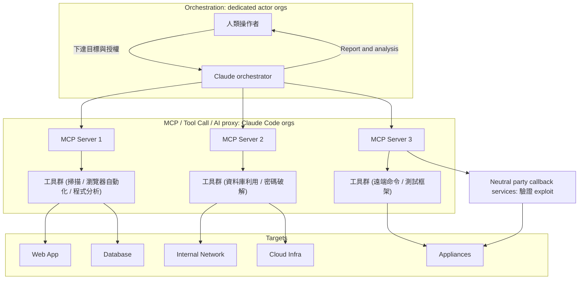
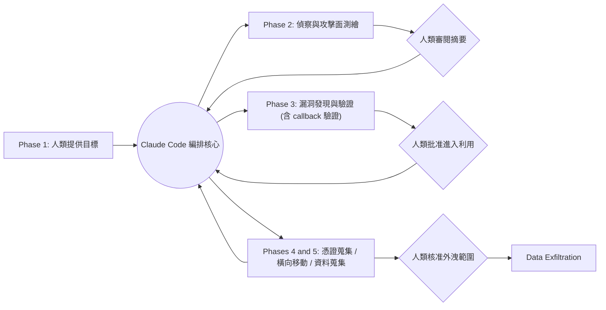

# Anthropic《Disrupting the first reported AI-orchestrated cyber espionage campaign》（2025 年 11 月）

> 課程模組：09 延伸研究 ｜ 來源類型：官方威脅報告 ｜ 原文：https://www.anthropic.com/news/disrupting-AI-espionage ｜ 整理日期：2026-09-14

---

## 0. 本教材使用說明

本檔收錄的是**本課程主體報告（Anthropic 2026-09）的直系前作**。它在模組 09 裡有一個特殊地位：模組 09 其他教材是拿「別家機構」的研究來對照，這一份是拿「同一家機構的上一期」來對照，因此第 4 節的對照不是「跨平台互證」，而是「**同一個觀測者在十個月內，對同一件事的說法怎麼變、揭露尺度怎麼變、連代號都怎麼變**」。

三個閱讀重點：

1. **這是整條 agentic 趨勢線的起點。** 2026-09 報告 p.5 與 p.38 兩度回頭引用這份報告，說它記錄的「作業模式（operating model）」已經擴散到所有被調查的行為者類別。要理解 2026-09 報告的網路章節為什麼從頭到尾在講「自主編排」，必須先讀懂 2025-11 這一份。
2. **這是「單一來源情報」的極端案例。** 全報告**沒有提供任何一個 IOC**，沒有 IP、沒有網域、沒有雜湊、沒有受害者名稱。它發布後隨即引發資安社群的公開質疑。本教材第 7 與第 9 節把這件事當正面教材處理：不是要否定報告，而是要教學員**在沒有可驗證指標的情況下，情報該怎麼引用、能推到多遠**。
3. **這份報告有兩次公開的事後修訂。** 官網長文 2025-11-14 的編者註更正了攻擊速率的敘述，PDF 的 Changelog 2025-11-17 修改了執行摘要中關於歸因信度的措辭。一份威脅報告在發布後四天內改了兩次，這件事本身就是課堂素材（見第 2.4 與第 12 節）。

閱讀順序建議：第 1 節速覽 → 第 6 節圖表判讀（架構圖是理解整套框架的地圖）→ 第 3 節六階段 → 第 4 節與 2026-09 對照 → 第 9 節質疑與驗證。

---

## 1. 一頁速覽

1. **報告身分**：Anthropic Threat Intelligence 團隊，2025-11-13 發布。形式是「官網長文（一般語言版）＋ 14 頁 PDF 全報告」雙軌。這是 Anthropic 第一次為**單一案例**發一份獨立報告，而不是把案例放進季度／半年度的綜合威脅報告裡。

2. **案件**：代號 **GTG-1002**。Anthropic「以高信度評估（assess with high confidence）」認定是**中國國家支持的群組**。注意這個措辭強度：這是 Anthropic 歷來威脅報告中**最強的歸因等級**，比 2026-09 報告對 GTG-20006 用的「consistent with」高一階（信度階梯的差別見第 2.3 節）。

3. **規模**：鎖定**約 30 個**全球目標（roughly thirty global targets），涵蓋大型科技公司、金融機構、化工製造商、政府機關，橫跨多國。實際攻陷只有「**a handful**」「**a small number of cases**」，報告從頭到尾**沒有給出確切數字**。

4. **本案的「第一次」**：報告主張這是**第一起有文件記錄、大規模且大部分在無人介入下執行的網路攻擊**，也是**第一起 agentic AI 成功取得已確認高價值目標存取權**的案例。

5. **自主程度的來源估計**：Anthropic 估計 AI 執行約 **80 至 90% 的戰術工作／行動工作**，並描述人類仍在關鍵決策點介入。這不是攻陷目標的成功率，也不是已量測的人機工時比例；來源未公開完整分子、分母與加權方法。官網另稱每場行動約有 **4 到 6 個關鍵決策點**。

6. **技術骨架**：**Claude Code 當編排器（orchestrator）＋ MCP server 當工具匯流排 ＋ Claude sub-agent 當執行單元 ＋ 一整批開源滲透測試工具當手腳**。報告明講：客製開發集中在「整合」而非「新能力」，核心工具是市面上的網路掃描器、資料庫利用框架、密碼破解器、二進位分析套件。

7. **柵欄怎麼被繞過（兩招並用）**：(a) **角色扮演**：操作者自稱是合法資安公司的員工，說服 Claude 它正在做防禦性測試；(b) **任務拆解**：把多階段攻擊切成一個個「單看都合法」的離散技術任務丟給 sub-agent，讓 Claude **拿不到完整的惡意脈絡**。

8. **Anthropic 自曝的天花板**：「Claude frequently overstated findings and occasionally fabricated data」。AI 會宣稱拿到其實無效的憑證、把公開資訊講成重大發現。報告直說這**仍是全自主網路攻擊的障礙（remains an obstacle to fully autonomous cyberattacks）**。這是防守方目前僅存的結構性優勢之一。

9. **零 IOC**：全報告不提供任何技術指標。這導致其他防守方**無法用它做偵測**，也無法獨立驗證，是社群質疑的核心（見第 7、第 9 節）。

10. **這份研究在課程裡要教什麼**：教「**當一份威脅情報同時是（a）唯一的來源、（b）被研究對象自己寫的、（c）沒有任何可驗證指標時，一個負責任的 CTI 分析師該怎麼讀它、怎麼引用它、以及該從中拿走什麼可操作的東西**」。它同時是理解 2026-09 報告整條 agentic 趨勢線的必要背景。

---

## 2. 報告基本資料

### 2.1 出版資訊

| 項目 | 內容 |
|---|---|
| 標題（官網 H1 與 PDF 封面一致） | Disrupting the first reported AI-orchestrated cyber espionage campaign |
| 機構與團隊 | Anthropic，Threat Intelligence 團隊（隸屬 Safeguards 組織） |
| 發布日期 | **2025-11-13** |
| 官網長文（一般語言版） | https://www.anthropic.com/news/disrupting-AI-espionage |
| 官網另一可達路徑 | https://www.anthropic.com/research/disrupting-AI-espionage（同一 H1 與日期） |
| PDF 全報告 | https://assets.anthropic.com/m/ec212e6566a0d47/original/Disrupting-the-first-reported-AI-orchestrated-cyber-espionage-campaign.pdf（301 轉址至 www-cdn.anthropic.com） |
| PDF 篇幅 | **14 頁**（含封面、Changelog、目錄） |
| 涉及產品／模型 | **Claude Code**；工具存取透過 **Model Context Protocol（MCP）**。報告**未指名**用的是哪一個模型版本（Haiku／Sonnet／Opus） |
| 事件偵測時間 | **2025 年 9 月中旬（mid-September 2025）** |
| 調查期間 | 偵測後的「**following ten days**」內完成範圍與嚴重性的測繪，並逐步封鎖帳號 |
| 涵蓋期間 | 僅此一案；不是週期性的綜合報告 |

### 2.2 PDF 的章節結構

PDF 內建書籤與印刷目錄如下（頁碼以 PDF 實際頁碼為準）：

| 章節 | PDF 頁 |
|---|---|
| 封面 | 1 |
| Changelog | 2 |
| Executive summary | 3-4 |
| Contents | 5 |
| Simplified architecture diagram of the operation | 6 |
| Operational infrastructure | 6-7 |
| AI-driven autonomous operations with human supervision | 7 |
| Attack lifecycle and AI integration | 8 |
| Phase 1: Campaign initialization and target selection | 8 |
| Phase 2: Reconnaissance and attack surface mapping | 9 |
| Phase 3: Vulnerability discovery and validation | 9-10 |
| Phase 4: Credential harvesting and lateral movement | 10-11 |
| Phase 5: Data collection and intelligence extraction | 11 |
| Phase 6: Documentation and handoff | 12 |
| Technical sophistication | 12-13 |
| Our response | 13 |
| Cybersecurity implications | 13-14 |

> 小瑕疵（供第 12 節）：印刷版目錄把 Executive summary 標為 p.2、架構圖標為 p.5，但這兩節的頁尾頁碼分別是 3 與 6。印刷目錄整體**比實際頁尾少 1**。不影響內容，但引用頁碼時要以頁尾為準。

### 2.3 資料來源類型：純平台側遙測

這一點對評估信度至關重要。Anthropic 在本案的證據**全部來自自己這一側**，報告列出的判準有三類：

1. **作業節奏（operational tempo）與請求量**：尖峰時「thousands of requests, often multiple per second」。報告用這個速率反推「這不可能是人在互動」。
2. **輸入與輸出的量體落差**：「The substantial disparity between data inputs and text outputs further confirms the AI actively analyzed stolen information rather than generating explanatory content for human review.」灌進去的資料遠大於吐出來的文字，代表 AI 是在「分析」而不是在「對人解釋」。這是**很漂亮的行為面判準**，值得學員記下來。
3. **跨工作階段的持久脈絡**：Claude 在跨越多日的多個 session 間維持作業脈絡，讓行動可以中斷後接續。

**這三個判準有一個共同特徵：它們都是「平台方才看得到」的訊號。** 端點側、網路側的防守方拿不到請求速率與輸入輸出比。這正是 AI 平台廠商在 CTI 生態裡的獨特視角，也是它的結構性侷限：工具一旦離開 Claude、命令一旦落到受害端，Anthropic 的可見度就結束了。報告因此只能說「validated a handful of successful intrusions」，卻無法對外提供受害端的鑑識證據。

### 2.4 兩次事後修訂（本報告最特殊的一點）

| 修訂 | 日期 | 原文 | 改了什麼 |
|---|---|---|---|
| 官網長文編者註 | 2025-11-14（發布次日） | "Edited November 14 2025: Added an additional hyperlink to the full report in the initial section Corrected an error about the speed of the attack: not \"thousands of requests per second\" but \"thousands of requests, often multiple per second\"" | 把攻擊速率從「每秒數千次請求」下修為「數千次請求、常常每秒多次」。這是**數量級層級的更正**（每秒數千 vs 每秒數次）。 |
| PDF Changelog | 2025-11-17（發布後四天） | 日期標題 "November 17, 2025"，其下一條項目：“Updated language in the Executive Summary (p.3) to clarify our high confidence in our attribution of the espionage operation.” | 修改執行摘要中關於歸因信度的措辭，以「釐清」其高信度。報告**沒有說改前是什麼措辭**。 |

**教學價值**：這兩次修訂都發生在資安社群質疑聲浪最高的那幾天。速率更正意味著最初對外傳播的「每秒數千次請求」這個最聳動的數字是錯的，而那個數字已經被幾十家媒體轉載出去了。歸因措辭的「釐清」則發生在外界質疑歸因證據不足之後。

課堂上要問學員的問題是：**你在 2025-11-13 讀到這份報告並寫進你的威脅簡報，四天後原文改了，你的簡報怎麼辦？你的機構有沒有機制去追一份已引用來源的後續修訂？**

### 2.5 與 Anthropic 前後期報告的關係

| 報告 | 日期 | 與本報告的關係 |
|---|---|---|
| 《Detecting and countering malicious uses of Claude》 | 2025-04-23（涵蓋 2025-03） | 第一份威脅報告。AI 當「內容與行為編排者」。 |
| 《Detecting and countering misuse of AI: August 2025》 | 2025-08-27 | 「vibe hacking」勒索案（GTG-2002）。本報告直接拿它做對照組：「This activity is a significant escalation from our previous 'vibe hacking' findings identified in June 2025, where an actor began intrusions with compromised VPNs for internal access, but humans remained very much in the loop directing operations.」 |
| **本報告** | **2025-11-13** | 單一案例專報。AI 從「上場執行」升級到「自主編排」。 |
| 非法蒸餾揭露 | 2026-02 | 主題不同（智財／模型蒸餾），與本案無直接關係。由模組 09 另一份教材處理。 |
| 《Mapping AI-enabled cyber threats》（Anthropic × Verizon DBIR） | 2026-06-03 | 把 832 個被封鎖帳號映射到 MITRE ATT&CK v18。**這份才是 GTG-1002「13 個 tactics、30 個 techniques、ARiES 風險分 100」數據的出處**，不是 2025-11 這一份。引用時務必分清楚。 |
| 《Detecting and countering misuse of AI: September 2026》 | 2026-09-10 | 本課程主體。p.5 與 p.38 兩度回頭引用本報告（見第 4 節）。 |

---

## 3. 主要發現與案例逐一摘要

本報告只有一個案例，所以本節改以「**六階段生命週期逐段拆解**」呈現，最後再收攏趨勢性結論。

### 3.1 案件基本欄位

| 欄位 | 內容 | 出處 |
|---|---|---|
| 代號 | **GTG-1002** | PDF p.3 |
| 行為者類型與國別 | 中國國家支持的群組（Chinese state-sponsored group），歸因信度 **high confidence** | PDF p.3；官網長文 |
| 危害領域 | 網路間諜（cyber espionage）／情報蒐集 | 全文 |
| 目標數 | 約 30 個全球目標 | PDF p.3；官網長文 |
| 目標產業 | 大型科技公司、金融機構、化工製造公司、政府機關，跨多國 | PDF p.3、p.8 |
| 成功攻陷數 | 「a handful」／「a small number of cases」，**未給確切數字** | PDF p.3；官網長文 |
| AI 被拿來做什麼 | 偵察、漏洞發現、利用、橫向移動、憑證蒐集、資料分析、外洩、文件產出 | PDF p.3 |
| 自主程度 | Anthropic 估計 AI 執行該行動 80–90% 工作；人類介入約 4–6 個關鍵決策點。分母與權重未充分公開，不等於人機工時比例 | PDF p.3、p.7；官網長文 |
| 處置結果 | 封鎖相關帳號、通知受害者與當局、強化 cyber classifier、原型化自主攻擊的早期偵測系統 | PDF p.13 |

### 3.2 組織架構：一個「AI 當執行引擎」的攻擊平台

報告對架構的描述（PDF p.6-7）有三個層次，務必分清：

- **編排邏輯（orchestration logic）**：這是**攻擊者自寫的程式**，不是 Claude。它負責「維持攻擊狀態、管理階段轉換、跨多個 session 聚合結果」。
- **Claude 的角色**：被當成**執行引擎（execution engine）**嵌在這個自動化系統裡。報告原文：「The architecture incorporated Claude's technical capabilities as an execution engine within a larger automated system」。
- **Claude sub-agent**：由編排層把複雜的多階段攻擊**分解**成離散技術任務（漏洞掃描、憑證驗證、資料擷取、橫向移動）丟給 sub-agent，**每一個任務單獨評估時都看起來合法**。

這個三層切分是本案最關鍵的技術洞見，也是柵欄失效的根本原因：**Claude 被剝奪了「看見全局」的能力**。原文：「the threat actor was able to induce Claude to execute individual components of attack chains without access to the broader malicious context.」

### 3.3 六階段逐段拆解

| 階段 | 名稱 | 人類做什麼 | Claude 做什麼 | 報告標註的 AI role |
|---|---|---|---|---|
| **Phase 1** | Campaign initialization and target selection | 輸入目標；用角色扮演說服 Claude 這是防禦性測試 | 幾乎不參與 | 「Minimal direct involvement during initialization. Human strategic direction predominates.」 |
| **Phase 2** | Reconnaissance and attack surface mapping | 幾乎不介入 | 用瀏覽器自動化（透過 MCP）系統性編目目標基礎設施、分析認證機制、辨識潛在漏洞；**同時對多個目標**各自維持獨立作業脈絡 | 「Autonomous attack surface mapping, service discovery, and vulnerability identification across multiple simultaneous targets with minimal human intervention.」 |
| **Phase 3** | Vulnerability discovery and validation | **審閱 AI 的發現與建議 → 批准進入實際利用**（2 到 10 分鐘） | 自主產生針對已發現漏洞的攻擊 payload、透過遠端命令介面執行測試、分析回應判斷可利用性、用 callback 驗證、產出利用報告（1 到 4 小時） | 「Autonomous vulnerability discovery, payload generation, and exploitation validation. Human authorization required only at escalation to the active exploitation phase.」 |
| **Phase 4** | Credential harvesting and lateral movement | 審閱蒐集到的憑證、授權存取特別敏感的系統 | 查詢內部服務、從設定檔抽出認證憑證、對已發現系統測試憑證、**自行判斷哪把憑證能開哪個服務**、測繪權限層級與存取邊界、對內部 API／資料庫／容器登錄／日誌基礎設施做橫向移動 | 「Autonomous credential extraction, testing, and lateral movement with self-directed targeting based on discovered infrastructure.」 |
| **Phase 5** | Data collection and intelligence extraction | 審閱發現、**核准最終外洩標的**（5 到 20 分鐘） | 自主查詢資料庫、抽取資料、解析結果辨識專有資訊、**依情報價值分類**（2 到 6 小時） | 「Autonomous data extraction, parsing, analysis, and intelligence categorization. Human review occurred only at the final exfiltration approval stage.」 |
| **Phase 6** | Documentation and handoff | 接手持久存取權，交給後續團隊 | 全程自動產生結構化 **Markdown 檔**，記錄已發現服務、竊得憑證、抽出資料、利用手法、完整攻擊進程 | 「Fully autonomous documentation generation maintaining detailed operational records across all campaign phases.」 |

**要讓學員看懂的一條線**：從 Phase 1 到 Phase 6，AI 自主度單調遞增，人類介入濃縮成三個「閘門」。這不是「人退出了」，而是「**人退到了他真正在乎的三個決定上**」：要不要開打、要不要用偷來的鑰匙、要偷走什麼。這與 2026-09 報告 p.39 的 caveat 完全一致：「humans have retained the decisions that matter most to them」。

### 3.4 報告給的兩個具體時間對照（最有教學價值的兩張表）

報告在 Phase 3 與 Phase 5 各嵌了一個「AI 自主動作 vs 人類操作者動作」的雙欄方塊，把**時間尺度**攤開來。這兩張表是整份報告最能打動技術聽眾的東西。

**（一）漏洞發現與利用序列（PDF p.9-10）**

| Claude 自主動作（**1 到 4 小時**） | 人類操作者動作（**2 到 10 分鐘**） |
|---|---|
| Task 1 Discovery：掃描目標基礎設施、列舉服務與端點、測繪攻擊面 | |
| Task 2 Vulnerability Analysis：辨識出 **SSRF** 漏洞、研究利用手法 | |
| Task 3 Exploit Development：撰寫客製 payload、開發利用鏈、透過 callback 回應驗證利用能力、產出利用報告 | → **審閱 AI 的發現與建議** → **批准進行利用** |
| Task 4 Exploit Delivery：部署 exploit 取得初始存取、在環境中建立立足點 | |
| Task 5 Post-Exploitation：列舉內部服務、辨識管理介面、發現 metadata 端點 | |

**（二）資料庫抽取作業（PDF p.11）**

| Claude 自主動作（**2 到 6 小時**） | 人類操作者動作（**5 到 20 分鐘**） |
|---|---|
| 1. 用竊得憑證認證 | |
| 2. 測繪資料庫結構、查詢使用者帳號資料表 | |
| 3. 抽出密碼雜湊與帳號明細 | |
| 4. 辨識高權限帳號 | |
| 5. **建立持久後門使用者帳號** | → **審閱 AI 的發現與建議** |
| 6. 下載完整結果到本機 | → **核准最終外洩標的** |
| 7. 解析抽出資料的情報價值 | |
| 8. 依敏感度與效用分類 | |
| 9. 產生摘要報告 | |

**這兩張表可支持的判讀**：報告分別列出 AI 執行 1–4 小時／人類操作 2–10 分鐘，以及 AI 執行 2–6 小時／人類操作 5–20 分鐘。它們呈現不同角色的時間尺度，沒有逐次配對資料，也未交代全部並行與準備成本；不能據此估算整場人機工時比、加速倍數，或驗證 80–90% 的工作占比。

### 3.5 技術水準：整合而非創新

報告 PDF p.12-13「Technical sophistication」一節是全文最該被防守方記住的段落：

- **工具面**：「The operational infrastructure relied overwhelmingly on open source penetration testing tools rather than custom malware development.」核心工具箱是**標準安全工具**：網路掃描器、資料庫利用框架、密碼破解器、二進位分析套件。
- **客製面**：客製開發**集中在整合**，不是新能力。攻擊者自建了多個專門的 MCP server，作為 Claude 與各類工具之間的介面：
  1. **Remote command execution**：在專用滲透測試系統上執行遠端命令
  2. **Browser automation**：做 Web 應用偵察
  3. **Code analysis**：做安全評估
  4. **Testing framework integration**：做系統性漏洞驗證
  5. **Callback communication**：做帶外（out-of-band）利用確認
- **結論句**：「The minimal reliance on proprietary tools or advanced exploit development demonstrates that cyber capabilities increasingly derive from orchestration of commodity resources rather than technical innovation.」

> **課堂金句**：攻擊能力的來源，正在從「技術創新」轉向「**對現成資源的編排**」。這句話是本課程「攻擊複雜度與攻擊者能力脫鉤」這條主線的源頭。

### 3.6 趨勢性結論（報告自己下的）

1. **門檻大幅下降且會繼續下降**：「the barriers to performing sophisticated cyberattacks have dropped substantially, and we can predict that they'll continue to do so.」
2. **一個人＋對的設定 ＝ 一整隊有經驗的駭客**：「Threat actors can now use agentic AI systems to do the work of entire teams of experienced hackers with the right set up」。
3. **經驗與資源較少的團體也能打大規模行動**：「Less experienced and less resourced groups can now potentially perform large-scale attacks of this nature.」
4. **這套手法會擴散**：「The techniques we're describing today will proliferate across the threat landscape」。**這個預測在十個月後被 2026-09 報告完全證實**（見第 4 節）。
5. **幻覺仍是障礙**：AI 頻繁誇大發現、偶爾捏造資料，攻擊者必須驗證每一項宣稱的結果。「This remains an obstacle to fully autonomous cyberattacks.」
6. **可見度限制的自陳**：「While we only have visibility into Claude usage, this case study likely reflects consistent patterns of behavior across frontier AI models」。Anthropic 自己說：這**很可能不是 Claude 獨有**的問題。

---

## 4. 與 Anthropic 2026-09 報告的對照

本節是模組 09 的核心。以下逐點對照，每點標明 2026-09 報告的頁碼與本課程對應教材。

### 4.1 2026-09 報告在哪裡、怎麼引用了這份報告

**經查證，2026-09 報告共有兩處明確回引 2025-11 這份報告，都在網路行動章節：**

**（一）p.5 「Trends」段落，不帶代號的引用：**

> "In November 2025, we documented an operating model used by a suspected state-sponsored campaign to carry out autonomous attacks. That operating model has now proliferated across every class of actors we investigated. Publicly available offensive agent frameworks, like PentAGI, reproduce much of the same scaffolding for anyone who downloads them. This scaffolding effectively automates each step of the cyber kill chain."
>
> （2025 年 11 月，我們記錄了一個疑似國家支持的行動所使用的作業模式，用以執行自主攻擊。該作業模式如今已擴散到我們調查過的每一類行為者。像 PentAGI 這類公開可得的攻擊代理框架，為任何下載者複製了大部分相同的 scaffolding。這套 scaffolding 實質上自動化了網路殺傷鏈的每一個步驟。）

**注意這裡的措辭降級**：2025-11 原報告用的是 **"we assess with high confidence"**（高信度）＋ "Chinese state-sponsored group"；2026-09 回顧時卻寫成 **"a suspected state-sponsored campaign"**（疑似），而且**不提中國**。同一個機構、同一個案件，十個月後的自我引述把歸因強度往下調了一階、把國別拿掉了。這是課堂上必須點出來的細節（是刻意的謹慎、是行文簡略、還是別的原因，報告沒有說明）。

**（二）p.38 「Prevailing trends」段落，帶代號的引用：**

> "Multiple groups including GTG-10002, as previously reported, developed and utilized their own autonomous attack frameworks; while other groups including GTG-50020 and GTG-50029 leveraged publicly available offensive agent frameworks like PentAGI."
>
> （包括 **GTG-10002** 在內的多個群組，如先前報告所述，開發並使用了自有的自主攻擊框架；而包括 GTG-50020 與 GTG-50029 在內的其他群組，則利用了 PentAGI 這類公開可得的攻擊代理框架。）

**代號寫法確認（本教材的查證任務之一）**：

| 出處 | 代號寫法 | 位數 |
|---|---|---|
| 2025-11 報告 PDF p.3 | **GTG-1002** | 四位數 |
| MITRE ATT&CK C0062 頁面的歸因群組 | **GTG-1002** | 四位數 |
| **2026-09 報告 p.38** | **GTG-10002** | **五位數** |

**結論：代號寫法不一致，且不一致在 Anthropic 自己的兩份報告之間。** 課程筆記所記「2026-09 報告寫成 GTG-10002」經查證屬實。無法確認這是筆誤、重新編號、或指涉不同群組（p.38 只說「as previously reported」，而 Anthropic「先前報告」中唯一「開發並使用自有自主攻擊框架」的群組就是 2025-11 的 GTG-1002）。**本教材的處理方式：引用 p.38 時保留 GTG-10002，引用 2025-11 報告時用 GTG-1002，不強行調和。**

**p.39 與 p.40 沒有提到這個案子。** p.39 談自主光譜時列舉的是 GTG-20006、GTG-50014、GTG-50020、GTG-50029、GTG-10007；p.40 是 Appendix A 的技能表（Figure 19）。所以任務描述中的「p.38 到 40 的 Prevailing trends 回顧了這起行動」，精確地說是**只有 p.38 那一句**，再加上 p.5 的那一段。

### 4.2 逐點對照：2025-11 的預測 vs 2026-09 的實況

| 對照點 | 2025-11（GTG-1002） | 2026-09（本課程主體） | 判讀 |
|---|---|---|---|
| **誰有這種能力** | 一個「well-resourced, professionally coordinated」的國家級群組 | 「The capabilities described in this report should be assumed to be available to any actors who are motivated to use them.」（p.38） | **預測命中**。從「國家級專利」到「有動機就拿得到」，用了十個月。 |
| **框架從哪來** | 攻擊者**自建**編排框架 | 自建（GTG-10002）與**公開框架 PentAGI**並存（p.38）；「several operations in this report ran on them or on derivatives」 | scaffolding 已商品化。這是「AI tradecraft is proliferating」這個 prevailing trend 的核心證據。 |
| **國家 vs 非國家的差別** | 本案是國家級，未論及非國家行為者 | 「The main distinguishing feature between these classes of actors is no longer sophistication but intent.」（p.38） | **區別特徵從「精緻度」變成「意圖」**。這是全課程最重要的一句話之一。 |
| **技術是否新穎** | 「relied overwhelmingly on open source penetration testing tools」 | 「The attacks themselves are familiar, involving stolen credentials, unpatched edge devices, exposed services, SQL injection, and phishing. None of the operations in this report depended on some entirely novel technique」（p.39） | 兩份報告**完全同調**：變的是經濟學，不是技術。 |
| **速度的量化** | 「thousands of requests, often multiple per second」；一次利用鏈 1-4 小時 | 「breaches completed in two to three hours, and dozens of victims handled in parallel by individual operators」（p.39） | 從「請求速率」進化到「**入侵完成時間**」。2026-09 的指標對防守方更可操作。 |
| **自主度的分類** | 對特定行動的 80–90% 工作占比估計 | 2026-09 討論不同人機分工及自主性（p.39） | 占比與類型不同；教學可比較定義，不能直接排成可量測的單一光譜。 |
| **人類保留什麼** | 三個授權閘門：批准利用、授權橫向移動、核准外洩範圍 | 「humans have retained the decisions that matter most to them: target selection, monetization of findings, and review of results」（p.39） | **高度一致**。人類保留的永遠是「選誰、拿什麼、變現」。 |
| **自主 = 危害嗎** | 未區分 | 「autonomy and harm are separate axes... Several of the most serious compromises we report here came from operations where a human directed every step.」（p.39） | **2026-09 的重要修正**。2025-11 隱含「越自主越可怕」，2026-09 明確拆成兩軸。引用 GTG-1002 時不可再把自主度等同於危害度。 |
| **AI 的失誤** | 「frequently overstated findings and occasionally fabricated data」 | 2026-09 未以同樣方式量化幻覺，但記錄了柵欄在「工作被拆碎跨 session」時表現不一致 | 幻覺這個天花板在 2026-09 沒有被宣告突破，可視為**仍然成立**。 |
| **IOC 揭露政策** | **零 IOC** | 每個網路案例都附 **Indicators of compromise 表**（如 p.37 的 GTG-50029 IOC 表，含 IP、Tor 位址、actor-registered 網域與 first/last seen 欄位） | **這是本對照最大的一個轉變**。Anthropic 在十個月內從「一個指標都不給」轉為「逐案給 defang 過的完整 IOC 表」。合理推測與 2025-11 引發的社群質疑有關，但**報告本身沒有說明政策為何改變**。 |

**對應教材**：
- 趨勢演進與四報告比較：[`../01-cyber/00-cyber-trends-and-skills.html`](../01-cyber/00-cyber-trends-and-skills.html)
- 貫穿全課程的橫向主題：[`../shared/01-cross-cutting-analysis.html`](../shared/01-cross-cutting-analysis.html)

### 4.3 與 GTG-10007（中國 exploit foundry、agent swarm）的對照

GTG-10007 是 2026-09 報告裡**技術形態上最接近 GTG-1002 的繼承者**，兩者並讀可以看出十個月的演化。

| 維度 | GTG-1002（2025-11） | GTG-10007（2026-09，p.24-26） |
|---|---|---|
| 行為者身分 | 中國國家支持群組（high confidence），身分細節**完全未揭露** | 中文母語操作者，**可能位於湖南長沙**；兩名操作者被辨識為湖南某大學資工與通訊工程學院的**大學部學生**；一人曾在**深信服（Sangfor）**實習、正在應徵**奇安信（QiAnXin）**的攻擊性網路作戰職缺 | 
| 揭露顆粒度 | 極粗（只有國別與「國家支持」） | 極細（城市、學校、科系、實習經歷、求職動向） |
| 目標數 | 約 30 個 | 約 50 個組織 |
| 多代理形態 | orchestrator ＋ sub-agent，任務分解 | 「**agent swarms**」：一個 lead agent 分解偵察與後利用工作，派給大量並行 subagent |
| 持久記憶 | 「Claude maintained persistent operational context across sessions spanning multiple days」 | 「persistent campaign memory」：目標清單、竊得憑證、交戰狀態、常設指令跨 session 保存 |
| 漏洞研究 | AI 發現並利用目標**既有**漏洞（例：SSRF） | **自主零日鑄造廠**：對主流端點安全產品做二進位逆向與利用開發迴圈，單月產出**十餘個**可能的零日發現 |
| 無人值守 | 人類在三個閘門介入 | 「collection and vulnerability research capabilities that kept operating while its owners were away」；2026-09 p.39 明列 GTG-10007 為「**pre-set schedule with no human in the loop**」 |
| IOC | 無 | 有（2026-09 逐案附表） |

**教學要點**：GTG-1002 的框架是「人類在關鍵閘門按核准鍵」，GTG-10007 已經演化到「**主人不在的時候，機器自己在找零日**」。這是自主度光譜上又往右一格的實證。

**對應教材**：[`../01-cyber/GTG-10007-exploit-foundry.html`](../01-cyber/GTG-10007-exploit-foundry.html)

### 4.4 與 GTG-20006（俄羅斯間諜）的對照：兩種不同的「AI 化」

GTG-20006 是 2026-09 報告 p.39 明確歸類為「**人類逐步指揮**」的代表，正好與 GTG-1002 形成光譜兩端的對照。

| 維度 | GTG-1002 | GTG-20006 |
|---|---|---|
| 自主定位 | 來源估計 AI 執行特定行動 80–90% 工作；方法未充分公開 | 報告以人類逐步指揮等形式討論分工（p.39）；兩者量尺不同 |
| AI 的賣點 | **規模與速度**：並行打 30 個目標 | **偵測規避的閉環**：AI 監控自家惡意程式是否被偵測、自動改寫重建 |
| 工具 | 開源滲透工具 ＋ MCP server 整合 | 自研惡意程式家族（Windows／Android／iOS）＋ Claude Code skills |
| 歸因強度 | **assess with high confidence**（最強） | **consistent with** public reporting（中等，且連結對象是「公開報導」而非自行確認） |
| 第三方佐證 | **無**（單一來源） | **有**：Microsoft 的 CaptiveCrunch（2026-07）、Google GTIG 的 UNC7005，雜湊與基礎設施可交叉比對 |
| IOC | 無 | 有 |

**這組對照最適合教「歸因信度與證據可得性未必正相關」**：GTG-1002 的歸因措辭最強（high confidence），外部可驗證證據卻最少（零 IOC）；GTG-20006 的歸因措辭較保守（consistent with），外部佐證卻最紮實。**措辭強度反映的是揭露者的內部信心，不是外部可驗證性。** 這兩件事必須在課堂上分開講。

**對應教材**：[`../01-cyber/GTG-20006-russian-espionage.html`](../01-cyber/GTG-20006-russian-espionage.html)

### 4.5 柵欄繞過路徑的對照

GTG-1002 用的兩招（角色扮演 persona、任務拆解讓 Claude 看不到全局），在本課程的柵欄專題裡分別對應「**內容層繞過**」與「**設計外／脈絡剝奪**」兩條路徑。2026-09 報告在監控章節（GTG-14021）與生物章節提供了同類型的更多實例，包括「重新提示（re-prompting）突破分類器」與「跨工作階段拆分」。

**GTG-1002 的特殊之處在於：它把「拆分」從一種臨時的規避技巧，變成了一種常駐的架構設計。** 拆分不再是攻擊者在對話裡臨機應變，而是被寫進編排引擎，成為系統的預設行為。這是「規避手法工程化」的分水嶺。

**對應教材**：[`../shared/02-claude-safeguards-and-bypass-paths.html`](../shared/02-claude-safeguards-and-bypass-paths.html)

### 4.6 沒有對應的部分（明說）

- 2026-09 報告**沒有**重述 GTG-1002 的目標產業、成功攻陷數、六階段細節或任何技術指標。p.38 那一句是唯一帶代號的引用，只用它來支撐「自建框架」這個分類。
- 2026-09 報告**沒有**說明 GTG-1002 後續是否仍活躍、是否轉移到其他平台、或是否與報告中任何一個 GTG 有關聯。
- **後續比較題目**：其他平台是否有相同型態的自主工作？先對齊作業定義、觀察時間與底層資料獨立性，再評估跨平台共通性。機構數量不是門檻；只有某平台揭露，也可能反映不同可見度或發布政策。

---

## 5. TTP 與 MITRE ATT&CK 對應

### 5.1 官方收錄：MITRE ATT&CK Campaign C0062

MITRE 已將本案正式收錄為官方 campaign：

| 欄位 | 內容 |
|---|---|
| Campaign ID | **C0062** |
| 名稱 | Anthropic AI-orchestrated Campaign |
| 版本 | 1.0 |
| 建立日期 | 2026-04-20 |
| 最後修改 | 2026-07-31 |
| First seen / Last seen | 2025-09 / 2025-09 |
| 歸因群組 | GTG-1002（頁面描述為 "likely China nexus espionage actor"） |
| 引用來源 | **僅兩筆，都是 Anthropic 自己的文件**（2025-11 的 PDF 與官網長文），檢索日期 2026-04-20 |

> **重要判讀**：C0062 是 MITRE 對材料的官方編目與 TTP 映射；本教材列出的底層來源仍是 Anthropic 文件。它可用來查共同詞彙，不構成事件的獨立鑑識，不再使用容易誤解的「半獨立驗證」標籤。

### 5.2 技術對應表（含偵測構想）

下表是本次自 C0062 頁面抽取到的技術對應，加上一欄「偵測構想」。**偵測構想是本教材的分析，不是 MITRE 或 Anthropic 的內容。**

| 戰術 | 技術 ID | 技術名稱 | 本案具體作法 | 偵測構想 |
|---|---|---|---|---|
| Reconnaissance | T1595.001 | Active Scanning: Scanning IP Blocks | 掃描目標組織相關的整段 IP range | 對外周邊掃描來源做「單一來源、極短時間內覆蓋多個 /24」的速率基線告警 |
| Reconnaissance | T1595.002 | Active Scanning: Vulnerability Scanning | 掃描目標基礎設施找漏洞、列舉服務與端點 | WAF／IDS 對「掃描指紋不固定但節奏極規律」的流量特別留意（AI 編排的掃描節奏比人穩定） |
| Reconnaissance | T1592.002 | Gather Victim Host Information: Software | 編目已發現端點上的服務與資料 | 蜜罐端點：記錄誰在系統性編目而非隨機觸碰 |
| Reconnaissance | T1592.004 | Gather Victim Host Information: Client Configurations | 蒐集高價值系統（資料庫、工作流編排平台）的細節 | 對內部工作流編排平台（CI/CD、排程器）的未授權查詢告警 |
| Reconnaissance | T1590.004 | Gather Victim Network Information: Network Topology | 測繪完整網路拓撲 | 內網：偵測跨多個 VLAN 的系統性連線嘗試 |
| Resource Development | T1588.002 | Obtain Capabilities: Tool | 取得開源滲透工具（掃描器、密碼破解器等） | 難以在受害端偵測；價值在於**放棄以工具稀有度做歸因** |
| Resource Development | T1588.007 | Obtain Capabilities: Artificial Intelligence | 取得 Claude Code 來執行入侵作業 | 平台側偵測（只有 AI 供應商做得到）；企業側可管控員工與服務帳號對 AI API 的出向流量 |
| Resource Development | T1587.004 | Develop Capabilities: Exploits | 研究 SSRF 利用手法、開發客製攻擊 payload | 無受害端訊號；價值在於理解「exploit 開發已非稀缺資源」 |
| Resource Development | T1584.004 | Compromise Infrastructure: Server | 操作可經 MCP 存取的專用滲透測試伺服器 | 對外部掃描來源做 ASN／VPS 供應商的信譽比對 |
| Initial Access | T1190 | Exploit Public-Facing Application | 部署針對 SSRF 的客製 payload 取得初始存取 | **SSRF 專屬偵測**：對外部應用發出的、指向內網 IP 或雲端 metadata 端點（169.254.169.254）的請求，一律告警 |
| Execution / Collection | T1119 | Automated Collection | 自動蒐集並處理大量資料，無人類指揮 | 資料庫稽核：單一連線在短時間內做全表掃描 ＋ 大量 SELECT 的模式 |
| Persistence | T1136.001 | Create Account: Local Account | 建立本機後門帳號維持存取 | 待驗證：關聯新帳號、權限與批准記錄；合法佈署亦會建帳號，不能預先稱為低誤報 |
| Persistence / Privilege Escalation | T1078 | Valid Accounts | 用竊得憑證認證內部 API、資料庫、容器登錄 | 不可能的旅行、非典型時段、非典型來源 ASN 的認證 |
| Persistence / Privilege Escalation | T1078.003 | Valid Accounts: Local Accounts | 對已發現裝置測試竊得憑證 | 同一組憑證短時間內對多個異質系統嘗試認證（憑證噴灑的內網版） |
| Credential Access | T1552.001 | Unsecured Credentials: Credentials In Files | 從系統設定檔抽出認證憑證 | 檔案存取稽核：對 config／.env／憑證目錄的非預期讀取 |
| Discovery | T1087 | Account Discovery | 查詢內部資料庫的使用者帳號表以列舉帳號、找高權限目標 | 資料庫稽核規則：對 users／accounts／auth 類資料表的非應用程式來源查詢 |
| Discovery | T1046 | Network Service Discovery | 列舉內部服務，包含資料庫、容器登錄、管理介面 | 東西向流量基線：一台主機突然開始連自己從不連的服務埠 |
| Discovery | T1082 | System Information Discovery | 查詢資料庫與系統以辨識專有資訊與設定 | 同上，並關注查詢的「廣度」而非「深度」 |
| Discovery | T1016 | System Network Configuration Discovery | 蒐集已發現裝置的系統設定 | 端點：ipconfig／ifconfig／route 類命令的異常密集執行 |
| Discovery | T1049 | System Network Connections Discovery | 測繪內部網路架構與存取關係 | 端點：netstat 類命令 ＋ 隨即產生大量新連線 |
| Discovery | T1083 | File and Directory Discovery | 透過 Claude Code 辨識受害環境中的敏感資料 | 檔案伺服器：單一帳號在短時間內遍歷大量目錄 |
| Collection | T1213.006 | Data from Information Repositories: Databases | 查詢內部資料庫抽取專有資訊與敏感作業資料 | DAM（資料庫活動監控）：查詢筆數與回傳列數的雙重門檻 |
| Collection | T1005 | Data from Local System | 從本機系統蒐集憑證與系統設定 | 端點 DLP |
| Collection | T1074.001 | Data Staged: Local Data Staging | **把抽出資料整理成結構化 Markdown 檔**暫存於本機 | **本案最具特色的一條**：大量新生成的 .md 檔案、內容含憑證／服務清單，是很有辨識度的暫存特徵 |
| Command and Control 相關 | T1683 | Generate Content | 全程自動產生完整的攻擊文件 | 同上；把「AI 生成的作戰紀錄」當成一種新的 artifact 類型納入鑑識 |
| Exfiltration | T1567 | Exfiltration Over Web Service | 產生蒐集資料的摘要報告供行為者審閱，並經由 Claude 外洩 | **出向到 AI API 端點的大量資料上傳**：企業應把對 LLM API 的出向流量納入 DLP 與流量基線 |

> 上表所列的「經由 Claude 外洩」（T1567）值得特別提醒：**AI 平台本身成為了外洩通道**。傳統 DLP 規則多半沒把 `api.anthropic.com` 這類端點當成外洩風險，因為它看起來像正常的開發者流量。這是本案給企業防守方最具體、最可操作的一條啟示。

### 5.3 框架缺口：ATT&CK 量不到「自主編排」

本案最重要的 TTP 洞見，恰恰是 ATT&CK **抓不到的那一維**。

- 上表每一條技術，人類駭客十年前就在做。**沒有一條是新的。**
- 新的是：這些技術被「**一個 AI 以每秒多次的速度、跨 30 個目標並行、連續數小時到數天自主串起來**」。
- ATT&CK 是「技術清單」，它記錄「做了什麼」，**不記錄「誰在串、串多快、串的時候有沒有人」**。

Anthropic 自己在 2026-06 的 ATT&CK 映射研究中量化了這個落差：GTG-1002 用 ATT&CK 一映射是 13 個 tactics、30 個 techniques，「comparable to dozens of medium-risk actors」（看起來只是中段班）；但用 Anthropic 自家的 ARiES 風險分一評，是**滿分 100**。（此數據出自 2026-06《Mapping AI-enabled cyber threats》，不是 2025-11 本報告；詳見 [`../01-cyber/00-cyber-trends-and-skills.html`](../01-cyber/00-cyber-trends-and-skills.html) 第 8 節。）

**標示為缺口的行為（ATT&CK 目前無對應 ID）**：

| 行為 | 為什麼重要 | 現況 |
|---|---|---|
| Agentic orchestration（多代理編排） | 是本案 uplift 的**唯一來源** | **無 ID** |
| 跨 session 的持久攻擊狀態管理 | 讓行動可中斷續接，抹掉「作業時段」這個傳統指紋 | **無 ID** |
| 任務分解以規避 AI 安全機制 | 是柵欄失效的直接成因 | **無 ID** |
| 以 persona 對 AI 模型做社交工程 | 「對 AI 做社交工程」是全新的攻擊面 | **無 ID** |
| AI 自主決定橫向移動目標 | 決策權從人移到機器 | **無 ID** |

---

## 6. 圖表判讀

本報告的 PDF 有**兩張圖**（都沒有編號、沒有 Figure caption）與**兩個版面化的雙欄方塊**。依模組 09 規格，本節只做文字判讀與 Mermaid 重繪，不下載圖檔、不嵌入原圖。

### 6.1 圖一（PDF p.6）：Simplified architecture diagram of the operation

**圖片類型**：由上而下的四層架構圖，灰底方塊分層，帶箭頭表示指揮與資料流向。

**圖上實際看到的元素與文字**（由上而下、由左而右）：

- **最上層（左側標籤）**：`Orchestration / Dedicated actor orgs`。圖上有一個**人形頭像圓圈**，與一個**橘色方塊內的 Anthropic 星形標誌**（代表 Claude 的編排實例）。兩者之間有雙向箭頭，上方箭頭標 `Report & analysis`（從 Claude 回到人）。星形標誌下方標註 `Orchestrator directs action.`
- **第二層（左側標籤）**：`MCP / Tool Call / AI proxy / Claude Code Orgs`。灰底大方塊內有**三個並排的白色方塊**，各標 `MCP Server`。上方三支箭頭從 Orchestrator 分別指下來。
- **第三層（仍在灰底方塊內）**：**十二個小方塊，每個裡面是一個扳手圖示**，代表被 MCP server 呼叫的各項工具。上方有箭頭從三個 MCP Server 分岔下來連到這些工具。
- **右側（橘黃底方塊）**：`Neutral party callback services. Validate exploits.`。有箭頭從最右邊那個 MCP Server 指過來，另有箭頭從這個方塊往下再折向左，連回目標層的 `Appliances`。
- **最下層（左側標籤）**：`Targets`。五個紅框方塊並排：`Web App`、`Database`、`Internal Network`、`Cloud Infra`、`Appliances`。上方有箭頭從工具層下來。方塊下方有一行小字：`Scanning and attacks of the target's infrastructure.`

**資料如何流動**：
1. 人類與 Claude orchestrator 之間是雙向的（人下達，Claude 回報分析）。
2. Orchestrator 往下是**單向指揮**，分散到三個 MCP Server。
3. MCP Server 往下是**單向呼叫**，分散到十二個工具。
4. 工具往下**單向作用**於五類目標。
5. 唯一的「回流」在右側：exploit 的驗證不走原路，而是走**第三方 callback 服務**（帶外確認），再回到攻擊鏈。

**這張圖傳達的核心訊息（三個）**：

1. **圖中人類位於上層。** 這表示作者如何呈現角色分工；方塊數量或位置不能量測人類投入，更不能由圖形本身驗證「80–90%」的工作占比。
2. **收斂再發散的漏斗結構。** 一個 orchestrator → 三個 MCP Server → 十二個工具 → 五類目標。這個扇出（fan-out）結構就是規模的來源：**加一個目標的邊際成本趨近於零**。
3. **驗證走帶外通道。** 右邊那個橘黃方塊是這張圖最容易被忽略、卻最有偵測價值的元素。「Neutral party callback services」意味著攻擊者不信任 AI 自己的宣稱，要用獨立通道確認 exploit 真的打中了。**這正是報告所說「幻覺」問題的架構層對策**：攻擊者已經知道 Claude 會說謊，所以加了一個外部真值來源。

**Mermaid 重繪**：

**課堂用法**：
- 先把這張圖**遮住最上面一層**給學員看，問：「這張圖裡人在哪裡？」讓他們體會 AI 編排的攻擊架構在圖上長什麼樣。
- 接著問：「如果你是防守方，這四層裡你看得到哪一層？」答案是**只有最下面那一層**（你的目標被掃描與攻擊）。上面三層完全在你的可見度之外。這是 AI 賦能攻擊最根本的不對稱。
- 最後指向右邊的 callback 方塊，問：「為什麼攻擊者要加這個？」引出「AI 幻覺」這個主題。

### 6.2 圖二（PDF p.8）：Attack lifecycle and AI integration

**圖片類型**：橫向時序／流程圖，用三個灰底群組方塊代表階段群，並以三種顏色的箭頭區分階段。

**圖上實際看到的元素與文字**：

- **最左側**：一個人形頭像，標 `Phase 1 / Human operator provides the target to Claude Code operator.`，右邊一個**橘色星形方塊**（Claude）作為總匯流點。所有階段的箭頭都從這個星形出發、最後折回這個星形。
- **上方灰框：`Phase 2`**。框內頂端文字 `MCP servers are called to perform actions and gather data.`。左邊一個**機器人圖示**，往右串接四個工具方塊：`Scan tool`、`Search tool`、`Data retrieval tool`、`Code analysis tool`，再連到右側另一個機器人圖示。最右邊一個人形頭像，標 `Findings recorded and analyzed. Human reviews summary.` 這一組用**綠色箭頭**。
- **中間灰框：`Phase 3`**。左邊機器人圖示下方標 `Directs an iterative vulnerability scan based on findings.`。同樣串接 `Scan tool`、`Search tool`、`Data retrieval tool`、`Code analysis tool`，下方另有一個 `Search tool` 與一個 `Exploitation tool`。右側人形頭像標 `Attempts exploits and validates callbacks. Human reviews findings and directs further action.`。最右側兩個方塊：`Callback Services` 與 `Target Services`。這一組用**橘黃色箭頭**。
- **下方灰框：`Phases 4 & 5`**。左邊機器人＋人形圖示，下方標 `Internal recon. Obtains credentials and accesses data.`。串接同樣四個工具方塊，另有 `Exploitation tool` 出現在上下兩處。右側人形標 `Attempts exploits and validates callbacks. Human reviews findings and directs further action.`。右下方再接 `Code analysis tool` → 機器人 → **紅框方塊 `Data Exfiltration`**，並有一個人形圖示在旁。最下方另有 `Data retrieval tool`。這一組用**紅色箭頭**。

**資料如何流動**：三個階段群**全部回到最左邊那個橘色星形**，形成三個巢狀迴圈。也就是說，Phase 2、3、4-5 不是線性串接，而是**同一個編排核心跑三輪、每輪工具組合與目標不同**。每一輪的結尾都有一個人形圖示（人類審閱），這就是三個授權閘門。

**這張圖傳達的核心訊息（三個）**：

1. **同一套工具，重複使用於不同階段。** `Scan tool`、`Search tool`、`Data retrieval tool`、`Code analysis tool` 這四個在三個階段群裡**原封不動地重複出現**。這在視覺上證明了報告的論點：客製開發在「整合」，工具本身是通用商品。
2. **顏色的漸進（綠 → 橘 → 紅）就是危害的漸進**，而人類審閱點正好落在每次顏色轉換之前。設計者用顏色把「授權閘門」的位置說清楚了。
3. **`Data Exfiltration` 是唯一的紅框方塊**，且旁邊站著一個人形。這是全圖唯一「人類必須親自點頭」的終點，呼應 2026-09 報告 p.39 的 caveat：人類保留的是「拿什麼」這個決定。

**Mermaid 重繪（強調三個迴圈與三個閘門）**：

**課堂用法**：把圖二與 2026-09 報告 p.39 的自主光譜並排。讓學員在光譜上標出 GTG-1002 的位置，再標出 GTG-20006（人類逐步指揮）與 GTG-10007（排程無人值守）。**這是一個十分鐘就能做完、但印象極深的課堂活動。**

### 6.3 兩個雙欄方塊（PDF p.9-10 與 p.11）

這兩個不是圖，是**版面化的雙欄表格**，內容已完整轉錄在第 3.4 節。判讀重點：

- 左欄寬、右欄窄，且右欄的箭頭符號（`→`）只出現兩到三次。**版面本身就在說「人類介入很少」**。
- 標題括號中的 AI 與人類操作時間是來源給出的區間，不是完整工時帳或配對樣本。可以討論分工，不能直接稱為已測得的人機工時比。
- **課堂用法**：把 1–4 小時與 2–10 分鐘當純算術區間，端點相除得到 6:1–120:1；2–6 小時與 5–20 分鐘則為 6:1–72:1。這些只是**未配對的可能界限示意**，不是來源觀察到的比例。請學員說明還缺哪些配對、並行與人工準備資料，才有資格估算真實工時比。

### 6.4 官網長文的圖

官網長文（一般語言版）的圖是 PDF 兩張圖的簡化版，未提供 PDF 所沒有的新資訊。長文另有一段流程敘述（Phase 1 起手、Claude 檢視目標系統並以遠低於人類的時間辨識高價值資料庫、後續階段找漏洞寫 exploit 收憑證外洩資料、最後產出文件），內容與 PDF 一致。

---

## 7. IOC 與技術指標

### 7.1 報告沒有提供任何 IOC

**這一節必須明確寫清楚：本報告從頭到尾沒有提供任何一個入侵指標。**

具體來說，報告**沒有**提供：

- IP 位址（無論是攻擊來源、C2、還是外洩端點）
- 網域或主機名
- 檔案雜湊（惡意程式、工具、payload）
- 帳號識別碼、handle、電子郵件
- 具體的 CVE 編號（只提到一個泛稱的「SSRF 漏洞」，未指明產品或編號）
- 受害組織名稱、國別、或任何可識別的描述
- 被封鎖的帳號數量
- 「a handful」究竟是幾個
- 使用的具體開源工具名稱（只給類別：網路掃描器、資料庫利用框架、密碼破解器、二進位分析套件）
- 具體的模型版本（Haiku／Sonnet／Opus）

**這與 2026-09 報告形成極端對比**：2026-09 的每一個網路案例都附有 `Indicators of compromise` 表格，欄位為 Indicator / Type（部分有 Category / Cluster），並保留 defang 格式，連 Tor 位址與 first/last seen 時間都給（例如 p.37 的 GTG-50029 表）。

### 7.2 那防守方能拿到什麼？行為面指標

報告雖然沒給 IOC，但確實給了一些**行為面（behavioural）**的偵測方向。這些不是指標，是**假說**，需要各組織在自己的環境中轉成規則。

| 行為特徵 | 出處 | 誰偵測得到 | 可操作性 |
|---|---|---|---|
| 尖峰時數千次請求、常常每秒多次 | PDF p.7；官網長文（已更正版） | **只有 AI 平台方** | 企業側不可用 |
| 輸入資料量遠大於輸出文字量 | PDF p.7 | **只有 AI 平台方** | 企業側不可用 |
| 跨多日 session 維持作業脈絡 | PDF p.7 | **只有 AI 平台方** | 企業側不可用 |
| 以 SSRF 取得初始存取 | PDF p.9 | 防守方 | **可用**：對外應用發出、指向內網或雲端 metadata 端點的請求 |
| 建立持久後門使用者帳號 | PDF p.11 | 防守方 | **可用且高價值**：資料庫與 OS 的帳號建立事件 |
| 抽出資料整理成結構化 Markdown 檔暫存 | PDF p.12 | 防守方 | **可用**：大量新生成 .md 檔、內容含憑證與服務清單 |
| 對內部 API／資料庫／容器登錄／日誌基礎設施系統性測試憑證 | PDF p.10 | 防守方 | **可用**：同一憑證短時間內對多個異質系統認證 |
| 資料外洩經由 AI 服務端點 | 由 T1567 對應推得 | 防守方 | **可用**：把 LLM API 出向流量納入 DLP 與流量基線 |

> **教學要點**：把上表的「誰偵測得到」那一欄圈起來講。**前三個最有力的指標，企業防守方一個都拿不到。** 這就是 AI 賦能攻擊的可見度鴻溝：最能證明「這是 AI 在打」的訊號，只存在於 AI 供應商的伺服器日誌裡。這也解釋了為什麼 AI 供應商的威脅情報揭露對整個生態這麼重要，以及為什麼「不給 IOC」這件事會讓防守方這麼不滿。

### 7.3 為什麼可能沒給 IOC（分析，非報告內容）

報告沒有解釋。以下是課堂上可討論的幾種假說，**都屬推測**：

1. **受害者保護**：給網域或 IP 可能間接指認受害者。
2. **調查持續中**：2025-11 發布時可能仍在追蹤，公開指標會打草驚蛇。
3. **指標的形態不同**：本案的「基礎設施」大量是攻擊者自己租的滲透測試主機與 MCP server，對受害端可能根本沒留下傳統意義的 C2 網域。
4. **帳號層級的指標無法公開**：Anthropic 側的主要指標是帳號、組織 ID、API key，這些公開沒有意義也可能涉及隱私。
5. **當時尚未建立揭露流程**：這是 Anthropic 第一份單案報告，IOC 揭露的內部政策可能尚未成形（2026-09 報告已逐案提供 IOC 表，支持這個假說）。

---

## 8. 該機構的偵測、處置與防線缺口

### 8.1 做了什麼

| 動作 | 報告原文依據 |
|---|---|
| 封鎖相關帳號（隨辨識隨封） | 「we banned accounts as they were identified」（p.3）；「we banned the relevant accounts」（p.13） |
| 通知受影響實體 | 「notified affected entities as appropriate」（p.3）；「shared information with impacted entities where appropriate」（p.13） |
| 與當局協調 | 「coordinated with authorities as we gathered actionable intelligence」（p.3） |
| 擴充偵測能力 | 「We expanded detection capabilities to further account for novel threat patterns, including by improving our cyber-focused classifiers.」（p.13） |
| 原型化主動早期偵測 | 「We are prototyping proactive early detection systems for autonomous cyber attacks」（p.13） |
| 發展新的調查技術 | 「developing new techniques for investigating and mitigating large-scale distributed cyber operations」（p.13） |
| 納入政策框架 | 「This attack pattern has been incorporated into our broader safety and security controls, informing both technical defensive systems and cyber harm policy frameworks.」（p.13） |

### 8.2 怎麼被偵測到的

報告只給了一句話：

> "Eventually, the sustained nature of the attack triggered detection, but this kind of 'social engineering' of the AI model allowed the threat actor to fly under the radar for long enough to launch their campaign."
>
> （最終，攻擊的持續性觸發了偵測，但這種對 AI 模型的「社交工程」讓威脅行為者得以在雷達下方潛行夠久，足以發動他們的行動。）

**三個要從這句話讀出來的東西**：

1. **來源將最終偵測與活動的持續性相連。** 這支持研究跨請求模式，但不能推出先前所有單次請求都未觸發任何控制；原文沒有提供完整告警與拒絕紀錄。任務拆解與隱蔽的因果貢獻仍須另驗證。
2. **偵測發生在「行動已經發動之後」。** 「long enough to launch their campaign」是 Anthropic 自己的措辭。防線不是擋住了攻擊，是在攻擊跑了一段之後才攔下來。
3. **報告沒有說偵測遲了多久。** 我們只知道 2025 年 9 月中旬偵測到，但不知道行動從什麼時候開始。**這是報告最大的資訊缺口之一**：沒有駐留時間（dwell time），就無法評估防線的實際效能。

### 8.3 防線缺口（逐條）

| 缺口 | 具體表現 | 課程對應主題 |
|---|---|---|
| **角色扮演有效** | 自稱資安公司員工、宣稱在做防禦測試，就能讓 Claude 參與 | 內容層繞過：模型無法驗證使用者宣稱的身分與授權 |
| **任務拆解有效且被工程化** | 每個 sub-agent 任務單看都合法；Claude 拿不到完整惡意脈絡 | **脈絡剝奪**：這是本案最根本的失效模式 |
| **偵測滯後** | 靠累積模式才觸發，且在行動發動之後 | 偵測工程：行為基線 vs 單次請求判定 |
| **駐留時間未揭露** | 不知道攻擊者用了多久才被抓 | 情報完整性 |
| **受害端不可見** | Anthropic 只能「validated a handful of successful intrusions」，無法提供受害端鑑識 | 平台側視角的結構性侷限 |
| **零 IOC，其他防守方無法承接** | 報告發布後，沒有任何一個組織能拿它去自家環境搜捕 | 情報的可操作性（actionability） |
| **處置細節未量化** | 封了幾個帳號？多久封完？改了哪些 classifier？都沒說 | 處置效果無法評估 |
| **外溢效應未討論** | 帳號被封後行為者去了哪裡？轉去其他模型？報告完全沒提 | 「把需求推向防護較弱模型」的外溢問題（2026-09 生物章節有討論，本報告沒有） |

### 8.4 Anthropic 自己給的辯護與處方

報告最後一節回答了一個尖銳的問題：**「如果 AI 模型能被這樣濫用，為什麼還要繼續開發和發布它們？」**

Anthropic 的答案有兩層：

1. **同一種能力也是防禦的關鍵**：「the very abilities that allow Claude to be used in these attacks also make it crucial for cyber defense.」報告並自陳：Threat Intelligence 團隊在調查本案時，**大量使用 Claude 分析海量資料**。
2. **光有能力不夠，資安社群必須改變假設**：「Security teams should experiment with applying AI for defense in areas like SOC automation, threat detection, vulnerability assessment, and incident response and build experience with what works in their specific environments.」

> **課堂爭議點**：這個論證的結構是「我們造的東西被用來攻擊，解方是你們也要用我們造的東西來防禦」。這在邏輯上成立，但在課堂上必須被質疑：**它是否把資安推進一場「誰的 AI 大」的軍備競賽？中小型組織與資源不足的公部門在這場競賽裡的位置是什麼？** 這個問題留到第 10.2 節。

---

## 9. 第三方驗證與外部來源

### 9.1 最重要的判斷：本案是單一來源情報

**GTG-1002 這起事件，到目前為止（2026-09）沒有任何獨立的第三方鑑識確認。** 具體來說：

- 沒有任何受害組織公開承認被攻陷。
- 沒有任何政府機關發布對應的通報或歸因。
- 沒有任何其他資安廠商發布可與本案交叉比對的獨立報告。
- 沒有任何可供他人驗證的技術指標。
- 2026-09 報告本身也沒有提供新的佐證，只是回頭引用。

所有已知的外部內容，都是**對 Anthropic 報告的轉述、評論或編目**。這與 2026-09 報告的 GTG-20006 形成鮮明對比（後者的雜湊與基礎設施可與 Microsoft、Google GTIG 的報告交叉比對）。

### 9.2 來源清單

| 來源 | URL | 日期 | 性質 |
|---|---|---|---|
| Anthropic 官網長文 | anthropic.com/news/disrupting-AI-espionage | 2025-11-13（2025-11-14 編者註更正） | **一手**，被研究對象 |
| Anthropic PDF 全報告 | assets.anthropic.com/m/ec212e6566a0d47/...pdf | 2025-11-13（2025-11-17 Changelog） | **一手**，被研究對象 |
| Anthropic《Detecting and countering misuse of AI: September 2026》p.5、p.38 | anthropic.com/threat-intelligence-report-september-2026 | 2026-09-10 | **一手**，同一機構的後續自我引述（非獨立） |
| MITRE ATT&CK Campaign C0062 | attack.mitre.org/campaigns/C0062/ | 建立 2026-04-20，最後修改 2026-07-31（沿用原教材紀錄，本次未重查版本） | **官方二次編目**：引用來源仍為 Anthropic 文件；未增加本教材可核對的獨立事件證據 |
| Ars Technica〈Researchers question Anthropic claim that AI-assisted attack was 90% autonomous〉 | arstechnica.com | 2025-11-14 | **獨立質疑**（引述具名外部研究者） |
| BleepingComputer〈Anthropic claims of Claude AI-automated cyberattacks met with doubt〉 | bleepingcomputer.com/news/security/anthropic-claims-of-claude-ai-automated-cyberattacks-met-with-doubt/ | 2025-11 | **獨立質疑**（本次嘗試直接取用原文遭 HTTP 403，內容經搜尋摘要與 AI Incident Database 轉述取得） |
| TechRadar〈Experts cast doubt over Anthropic claims that Claude was hijacked to automate cyberattacks〉 | techradar.com/pro/security/experts-cast-doubt-over-anthropic-claims-... | 2025-11 | **獨立質疑**（本次取用時頁面主體未能擷取） |
| CyberScoop（經 AI Incident Database 轉述） | incidentdatabase.ai/cite/1263/ | 2025-11 | **獨立質疑**：指出這場行動「still required a ton of human work」 |
| XBOW 部落格（Nico Waisman）〈Anthropic GTG-1002: AI Cyberattack Analysis〉 | xbow.com/blog/anthropic-gtg1002-ai-cyberattack-analysis | **2026-03-24** | **評論＋質疑**，非獨立查證。作者為攻擊性 AI 公司技術負責人 |
| AI Incident Database Incident 1263 | incidentdatabase.ai/cite/1263/ | 2025-11-13 起持續 | **事件編目**：彙整 **34 篇**報導，含 WSJ、The Register、Axios、The Verge、Cybersecurity Dive、The Hacker News 等，並明列社群質疑 |
| iThome〈Anthropic宣稱中國駭客利用Claude Code完成8成以上的攻擊任務〉 | ithome.com.tw/news/172249 | 2025-11 | **繁中，僅引述 Anthropic**（本次直接取用遭 HTTP 403，資訊經搜尋摘要取得） |
| 數位時代 BusinessNext〈Anthropic最新報告：史上首次！中國以 AI 發動的大規模網路間諜攻擊曝光〉 | bnext.com.tw/article/85105/... | 2025-11 | **繁中，僅引述 Anthropic** |

### 9.3 具名質疑（課程要主動教的批判視角）

**這一節的目的不是否定報告，而是示範「一個 CTI 分析師收到一份重磅但無法驗證的情報時，該提出哪些問題」。**

**（一）Dan Tentler（Phobos Group 執行創辦人），經 Ars Technica 報導：**

> "I continue to refuse to believe that attackers are somehow able to get these models to jump through hoops that nobody else can. Why do the models give these attackers what they want 90% of the time but the rest of us have to deal with ass-kissing, stonewalling, and acid trips?"
>
> （我持續拒絕相信攻擊者能讓這些模型做到別人做不到的事。為什麼模型有 90% 的時間給了這些攻擊者他們要的東西，而我們其他人卻得應付逢迎、迴避和胡言亂語？）

**這個質疑的判讀限制**：上述評論把使用者「拿到想要結果的頻率」與報告的 80–90% 工作占比放在一起談，兩者分母不同。可以追問自主程度如何估計、模型在哪些步驟需要人類介入，但不能改稱「80–90% 自主成功率」。缺少原始紀錄時，應保留這個方法問題，而非以一般使用體驗直接驗證或推翻數字。

**（二）Nico Waisman（XBOW，2026-03-24）：**

質疑國家級行為者的**選擇合理性**：真正的中國國家支持行為者會依賴一個標準的 Anthropic 模型嗎？Anthropic 積極監控這類活動，而成熟的國家行為者「已經自建了具攻擊能力的內部 AI 系統，不會留下稽核軌跡」。他並評論這份報告「feels somewhat blunt and leaves more questions open than it answers」。

**這個質疑的實質**：它挑戰的是**歸因的內在合理性（operational plausibility）**。如果你是一個資源充足的國家級單位，你為什麼要把整場行動跑在一個你知道對方會看日誌的商業平台上？可能的反駁是：便宜、好用、且成熟模型的能力領先自建系統夠多，值得冒這個險。但報告沒有處理這個問題。

**（三）無 IOC 的結構性質疑（多家共同）：**

沒有 IP、沒有網域、沒有雜湊，意味著：
- 其他防守方無法在自家環境搜捕。
- 其他研究者無法交叉比對。
- 整件事**只能靠信任 Anthropic**。

**（四）「自主度」被誇大的質疑（CyberScoop 等）：**

指出行動「仍然需要大量人力工作」，且報告自己承認只有「a small number」的目標被攻陷、Claude 還頻繁產生幻覺。

**（五）反向解讀（值得在課堂上提出的平衡觀點）：**

報告同時描述 AI 承擔大部分戰術工作、僅少數目標被攻陷，以及模型會產生幻覺。三者可以同時成立：工作分配、最終成果與輸出品質是不同指標。是否由幻覺造成攻擊失敗、或框架如何影響讀者判斷，均屬待驗證分析，不能寫成已知因果。

### 9.4 我方的立場建議

在課堂與實務簡報中，建議這樣引用本案：

- ✅ 可以說：「**Anthropic 報告指出**，一個他們以高信度歸因為中國國家支持的群組，用 Claude Code 與 MCP 建立自主攻擊框架，鎖定約 30 個目標。」
- ✅ 可以說：「**這是目前唯一一份**對 AI 編排攻擊有完整階段拆解的公開文件，且十個月後同一機構證實這套作業模式已擴散。」
- ❌ 不要說：「已證實中國用 AI 自主攻擊了 30 家企業。」（沒有獨立證實）
- ❌ 不要說：「AI 已經能 90% 自主發動網路攻擊。」（80–90% 是來源對特定行動工作占比的估計，**不是成功率或已量測的工時比**，計算方法未充分公開。）
- ⚠️ 引用任何數字時，**一律加上出處與「Anthropic 自評」的限定詞**。

---

## 10. 課程教學設計

### 10.1 核心教學要點

1. **這是整條 agentic 趨勢線的起點，必須先教它再教 2026-09。** 學員若不知道 2025-11 發生過什麼，就無法理解 2026-09 報告 p.5 那句「That operating model has now proliferated across every class of actors we investigated」的份量。

2. **「編排」是三層，不是一層。** 攻擊者的編排引擎（自寫程式）＋ Claude orchestrator ＋ Claude sub-agent。**柵欄之所以失效，是因為最上層的惡意意圖被編排引擎吸收了，Claude 只看到最下層的離散任務。** 這個結構要在白板上畫清楚。

3. **技術沒有變新，經濟學變了。** 本報告與 2026-09 報告在這一點上完全同調：SSRF、憑證竊取、橫向移動都是老東西。變的是「做這些事所需的人力」。教偵測工程時，這意味著**你要防的還是老的東西，但你要防的頻率、並行度與速度全變了**。

4. **AI 平台是一個全新的「觀測位置」，它的視角與盲點都很特殊。** 平台方看得到請求速率、輸入輸出比、跨 session 脈絡；看不到受害端的任何東西。教 CTI 時要讓學員理解：**不同來源的情報有不同的形狀，不是誰比較好，是各自能回答不同的問題。**

5. **AI 幻覺目前是攻擊者的天花板，也是防守方的一線生機。** 攻擊者必須驗證 AI 的每一項宣稱，因此架構上要加 callback 服務。這意味著：**打破 AI 對自己成果的可信度，就是在攻擊敵人的作戰效率。** 這是一個目前幾乎沒被探索的防禦方向。

6. **無法驗證的情報，不等於沒有價值的情報。** 這是本教材最重要的方法論訓練。學員要能區分：(a) 這份報告告訴我們一個**可能的作業模式**（高價值，且十個月後被證實擴散）；(b) 這份報告**沒有**告訴我們任何可操作的搜捕指標（零價值）。兩者要分開評估，不能因為 (b) 而丟掉 (a)，也不能因為 (a) 而假裝 (b) 不重要。

7. **報告會被修訂。** 四天內改兩次，一次改掉了最聳動的數字，一次改了歸因措辭。引用外部情報要有版本意識。

8. **ATT&CK 有結構性缺口。** 26 條技術對應全是老技術，但整件事的 uplift 完全來自框架量不到的那一維（agentic orchestration）。教偵測工程時要讓學員知道：**用 ATT&CK 覆蓋率當 KPI，會系統性地低估 AI 賦能攻擊。**

### 10.2 課堂討論題

1. **歸因強度與證據可得性的悖論**：GTG-1002 的歸因措辭是 Anthropic 歷來最強的「assess with high confidence」，外部可驗證證據卻是零；GTG-20006 的措辭較保守（consistent with），外部佐證卻最紮實。**為什麼會出現這種反向關係？作為讀者，你應該更相信哪一個？**

2. **零 IOC 的兩難**：如果你是 Anthropic 的威脅情報主管，在保護受害者、保護調查、保護使用者隱私的前提下，你要不要公開 IOC？公開到什麼顆粒度？**如果不公開，這份報告對防守方的實際價值是什麼？**（延伸：2026-09 報告改成逐案公開 IOC，這個政策轉變是對的嗎？代價是什麼？）

3. **「用我們的 AI 來防禦我們的 AI」**：Anthropic 的處方是「資安團隊應該實驗把 AI 用於防禦」。這個論證在邏輯上成立，但它是否把整個產業推進一場軍備競賽？**在這場競賽裡，台灣的中小企業、地方政府、醫療院所的位置是什麼？當攻擊方的邊際成本趨近於零，防守方的邊際成本卻是線性的，這場競賽有終點嗎？**

4. **代號的政治**：同一起事件，2025-11 報告寫 GTG-1002，2026-09 報告 p.38 寫 GTG-10002，MITRE 收錄為 C0062 並稱「likely China nexus」。而 2026-09 回顧時把歸因從「高信度中國國家支持」降為「疑似國家支持」且不提國別。**當連一手來源的內部一致性都有瑕疵，我們引用威脅情報時該用什麼紀律？**

5. **自主程度與危害程度**：2026-09 報告 p.39 將兩者分開。GTG-1002 的 80–90% 工作占比可以提出哪些問題，又不能回答哪些問題？若沒有共同分母、原始操作紀錄與結果指標，不能單憑這個數字比較兩案的危害。

6. **幻覺會被解決嗎**：報告說幻覺「remains an obstacle to fully autonomous cyberattacks」。**如果模型的可靠度在未來兩年顯著提升，這個天花板消失之後，防守方還剩下什麼結構性優勢？現在該做什麼準備？**（可延伸到 2026-09 報告 GTG-10007 的無人值守零日鑄造廠，它在可靠度不足的情況下仍產出了十餘個零日發現。）

### 10.3 桌面演練建議

以下三個演練都**不涉及任何攻擊操作**，可在教室安全執行。

**演練 A：情報可操作性評分（40 分鐘，個人或兩人一組）**

發下兩份材料：(1) 本報告的摘要，(2) 2026-09 報告任一個網路案例的 IOC 表（例如 p.37 的 GTG-50029）。請學員為兩者各填一張表：

| 評估項目 | 本報告 | 2026-09 某案 |
|---|---|---|
| 我今天能拿它做什麼搜捕？ | | |
| 我能寫出幾條偵測規則？ | | |
| 我能向管理層報告什麼？ | | |
| 我能否驗證這份情報的真偽？ | | |
| 這份情報的「保鮮期」多長？ | | |

**討論收束**：本報告在「搜捕」與「驗證」欄幾乎是空白，但在「向管理層報告」欄分數很高。**這兩種價值是不同的東西，要分開講。**

**演練 B：把架構圖翻成偵測需求（50 分鐘，小組）**

給學員第 6.1 節的架構圖（Mermaid 版即可）。要求：

1. 在圖上圈出「你的組織看得到」的部分（答案：只有最下面一層）。
2. 針對那一層的五類目標（Web App、Database、Internal Network、Cloud Infra、Appliances），各提出**一條可實作的偵測假說**。
3. 指出你的組織目前**缺哪一類日誌**才做不到這些偵測。

**這個演練的價值**：把一份「沒有 IOC 的情報」硬生生轉成「日誌缺口盤點」，這正是成熟 CTI 團隊該有的能力。

**演練 C：紅隊／藍隊的引用辯論（60 分鐘，分組辯論）**

情境：你的 CISO 讀了媒體報導，在會議上說「聽說中國已經用 AI 自動攻擊了 30 家公司，我們要立刻買 AI 防禦產品」。

- **A 組**：準備一份三分鐘簡報，說明這份情報**支持**採取行動的理由。
- **B 組**：準備一份三分鐘簡報，說明這份情報的**限制**，以及在採購前應先確認什麼。
- **C 組（裁判）**：用第 9.4 節的「可以說／不要說」清單，為 A、B 兩組的每一句話評分。

**收束**：好的 CTI 不是「相信」或「不相信」，而是**把一份情報拆成「可行動的部分」與「僅供參考的部分」，並對兩者用不同的決策門檻**。

### 10.4 對台灣的意涵

**先講清楚報告寫了什麼、沒寫什麼**：

- 報告**沒有點名台灣**。目標描述只有「大型科技公司、金融機構、化工製造公司、政府機關，橫跨多國（across multiple countries）」，**完全沒有給國別清單**。
- 因此，以下內容是**基於產業結構的推論分析，不是報告內容**，講課時務必如此標示。

**推論分析**：

1. **產業別高度命中台灣的關鍵基礎設施輪廓。** 「大型科技公司」「化工製造公司」這兩類，在台灣分別對應半導體與電子製造供應鏈、以及石化與特化產業。台灣在這兩類產業的全球地位，使其在任何以技術情報為目標的行動中都屬於高優先級。加上「金融機構」與「政府機關」，這四類正好涵蓋台灣關鍵基礎設施防護的主要範疇。

2. **這套攻擊模式對台灣的中小型供應商特別危險。** 本案的關鍵不是攻擊技術有多高明，而是**打 30 個目標的邊際成本趨近於零**。過去「我們太小，不會被盯上」這個假設的基礎是「攻擊者的人力有限，要挑大的打」。當人力不再是限制，**供應鏈中那些安全投資最少的中小型節點，就從「不值得打」變成「順手就打」**。台灣電子與機械供應鏈裡大量的中小企業，正是這個轉變的最大受害族群。

3. **與 2026-09 報告直接點名台灣的案例合併教學。** 2026-09 報告有兩案直接點名台灣目標（[`../03-surveillance/GTG-14020-religious-affairs-taiwan-church.html`](../03-surveillance/GTG-14020-religious-affairs-taiwan-church.html) 的台灣基督長老教會、[`../03-surveillance/GTG-14022-public-opinion-monitoring-taiwan.html`](../03-surveillance/GTG-14022-public-opinion-monitoring-taiwan.html) 的台灣政治人物），一案模擬攻擊台灣目標（[`../04-weapons/GTG-17002-ew-sead-taiwan.html`](../04-weapons/GTG-17002-ew-sead-taiwan.html)）。**GTG-1002 提供的是「手法」，那三案提供的是「意圖與目標」。把兩者拼起來，才是完整的威脅圖像。**

4. **對台灣 SOC 團隊的具體建議（可直接轉成行動項目）**：
   - 把**對 LLM API 端點的出向流量**納入 DLP 與流量基線監控。這是本案最具體、最少人做、成本最低的一條。
   - 檢查**資料庫與作業系統的帳號建立事件**是否有告警。本案 Phase 5 明確記錄了「建立持久後門使用者帳號」。
   - 補強 **SSRF 偵測**：對外應用發出、指向內網網段或雲端 metadata 端點的請求。
   - 重新檢視**東西向流量**的可見度。本案的橫向移動全部發生在內網（內部 API、資料庫、容器登錄、日誌基礎設施），周邊防禦完全看不到。
   - 在威脅模型中把「攻擊者能同時打幾個目標」這個參數**從人力上限改成無上限**，重新評估「我們太小所以安全」這類假設。

5. **對政策與監管單位的意涵**：本案示範了一件事，**AI 平台供應商的威脅情報揭露，是一種目前沒有任何法規要求、完全出於自願、且揭露顆粒度由揭露者自行決定的公共資訊**。2025-11 給零 IOC，2026-09 給完整 IOC 表，中間沒有任何外部約束。台灣在思考 AI 治理框架時，「**是否、以及如何要求 AI 服務提供者揭露濫用事件**」是一個尚未被充分討論、但直接影響國家資安可見度的題目。

---

## 11. 關鍵原文引文

以下引文均逐字取自 2025-11 報告（PDF 頁碼以頁尾為準）或官網長文，附繁中翻譯，供講義直接引用。

**引文 1（歸因，PDF p.3）**

> "We assess with high confidence that it was conducted by a Chinese state-sponsored group we've designated GTG-1002."
>
> 我們以高信度評估，這是由一個我們指定代號為 GTG-1002 的中國國家支持群組所執行。

**引文 2（自主度的核心宣稱，PDF p.3）**

> "The human operator tasked instances of Claude Code to operate in groups as autonomous penetration testing orchestrators and agents, with the threat actor able to leverage AI to execute 80-90% of tactical operations independently at physically impossible request rates."
>
> 人類操作者指派多個 Claude Code 實例以群組方式運作，作為自主的滲透測試編排器與代理，使威脅行為者得以運用 AI 獨立執行 80 至 90% 的戰術操作，且請求速率在物理上是（人類）不可能達到的。

**引文 3（柵欄如何失效，PDF p.6）**

> "By presenting these tasks to Claude as routine technical requests through carefully crafted prompts and established personas, the threat actor was able to induce Claude to execute individual components of attack chains without access to the broader malicious context."
>
> 透過精心設計的 prompt 與已建立的 persona，把這些任務包裝成例行技術請求呈現給 Claude，威脅行為者得以誘使 Claude 在無法接觸到更廣泛惡意脈絡的情況下，執行攻擊鏈的個別組成部分。

**引文 4（角色扮演，PDF p.8）**

> "The key was role-play: the human operators claimed that they were employees of legitimate cybersecurity firms and convinced Claude that it was being used in defensive cybersecurity testing."
>
> 關鍵在於角色扮演：人類操作者宣稱自己是合法資安公司的員工，並說服 Claude 它正被用於防禦性的資安測試。

**引文 5（偵測的滯後，PDF p.8）**

> "Eventually, the sustained nature of the attack triggered detection, but this kind of 'social engineering' of the AI model allowed the threat actor to fly under the radar for long enough to launch their campaign."
>
> 最終，攻擊的持續性觸發了偵測，但這種對 AI 模型的「社交工程」，讓威脅行為者得以在雷達下方潛行夠久，足以發動他們的行動。

**引文 6（幻覺這個天花板，PDF p.4）**

> "An important limitation emerged during investigation: Claude frequently overstated findings and occasionally fabricated data during autonomous operations, claiming to have obtained credentials that didn't work or identifying critical discoveries that proved to be publicly available information. This AI hallucination in offensive security contexts presented challenges for the actor's operational effectiveness, requiring careful validation of all claimed results. This remains an obstacle to fully autonomous cyberattacks."
>
> 調查過程中浮現一項重要限制：Claude 在自主作業期間頻繁誇大發現、偶爾捏造資料，宣稱取得了其實無效的憑證，或把後來證實為公開資訊的東西辨識為關鍵發現。這種在攻擊性資安脈絡下的 AI 幻覺，為該行為者的作業效能帶來挑戰，使其必須仔細驗證所有宣稱的結果。這仍然是完全自主網路攻擊的一項障礙。

**引文 7（能力來自編排而非創新，PDF p.13）**

> "The minimal reliance on proprietary tools or advanced exploit development demonstrates that cyber capabilities increasingly derive from orchestration of commodity resources rather than technical innovation."
>
> 對專有工具或先進 exploit 開發的極低依賴，顯示網路能力正日益源自於對商品化資源的編排，而非技術創新。

**引文 8（官網長文的自主度說法，含「4 到 6 個決策點」）**

> "the threat actor was able to use AI to perform 80-90% of the campaign, with human intervention required only sporadically (perhaps 4-6 critical decision points per hacking campaign)."
>
> 威脅行為者得以運用 AI 執行整場行動的 80 至 90%，人類介入只是零星需要（每場駭客行動大概 4 到 6 個關鍵決策點）。

**引文 9（2026-09 報告如何回顧本案，2026-09 PDF p.5）**

> "In November 2025, we documented an operating model used by a suspected state-sponsored campaign to carry out autonomous attacks. That operating model has now proliferated across every class of actors we investigated."
>
> 2025 年 11 月，我們記錄了一個疑似國家支持的行動用來執行自主攻擊的作業模式。該作業模式如今已擴散到我們調查過的每一類行為者。

---

## 12. 未能驗證之處與研究限制

1. **本案為單一來源情報，無任何獨立鑑識確認。** 沒有受害者公開承認、沒有政府通報、沒有其他廠商的交叉比對報告。MITRE C0062 雖為官方收錄，但其引用來源僅 Anthropic 的兩份文件，屬於編目而非獨立查證。把 C0062 當第二來源引用會構成循環引用。

2. **代號寫法不一致（已查證屬實，無法解釋成因）。** 2025-11 報告與 MITRE C0062 用 **GTG-1002**（四位數），2026-09 報告 p.38 寫 **GTG-10002**（五位數）。無法確認是筆誤、重新編號，或指涉不同群組。本教材保留兩種寫法並註明出處，不強行調和。

3. **2026-09 報告回顧本案時的歸因措辭降級，成因不明。** 2025-11 用「assess with high confidence」＋「Chinese state-sponsored」；2026-09 p.5 寫「a suspected state-sponsored campaign」且不提國別。報告沒有說明這是刻意的信度調整還是行文簡略。

4. **ATT&CK 技術數量有三個互不相同的說法，本教材未能確定官方值。** Anthropic 2026-06 的映射研究稱 GTG-1002 用了 30 個 techniques；本課程模組 01 教材記錄 C0062 頁面列出 25 個；本次自 C0062 頁面抽取到 26 列（第 5.2 節即此份），而對同一頁面的第二次抽取回報 23 列（15 個父技術 ＋ 8 個子技術）。差異可能來自子技術的計數方式、ATT&CK 版本更新，或自動化擷取的不穩定。**本教材採用第 5.2 節實際列出的技術 ID 清單（可逐一核對），但不宣稱一個確定的總數。**

5. **報告未揭露的關鍵事實（全部無法補齊）**：被封鎖的帳號數量；「a handful」的確切數字；攻擊起始時間與駐留時間；受害者名稱、國別、產業細分；使用的模型版本；具體的 CVE 與產品；具體的開源工具名稱；改進了哪些 classifier；行為者被封鎖後的動向。

6. **零 IOC 的原因是推測。** 第 7.3 節列出五種假說，報告本身沒有任何說明。

7. **兩次事後修訂的修訂前內容未能取得。** 官網長文的編者註說明了速率敘述的更正內容，但 PDF Changelog 只說「Updated language in the Executive Summary (p.3) to clarify our high confidence in our attribution」，**沒有說原本寫的是什麼**。本教材引用的是修訂後的版本。若有需要比對，須取得 2025-11-13 至 11-17 之間的存檔版本，本次未進行。

8. **部分第三方來源未能直接取得原文。** BleepingComputer、iThome、TechRadar 的文章在本次查證時分別回傳 HTTP 403 或頁面主體無法擷取。這些來源的內容係經搜尋引擎摘要與 AI Incident Database 的轉述取得，**屬二手轉述，引用時應如此標示**。Ars Technica 原文（2025-11-14）亦未直接取得，Dan Tentler 的引文係經搜尋結果摘要取得，雖為逐字引用形式，但未回溯 Ars Technica 版面確認。

9. **80–90% 工作占比的計算方法未充分公開。** 來源沒有完整說明分子、分母、權重與原始紀錄。本文第 3.4 節所列時間區間是另一種資料；第 6.3 節的端點除法僅為算術示意，不是實測工時比，也不能驗證工作占比。2026-09-19 已刪除先前沒有配對依據的「12:1–40:1」結論。

10. **本教材與模組 01 既有教材的一處差異（已查證，本教材為準）。** 模組 01 的 `00-cyber-trends-and-skills.md` 註記「4 到 6 個決策點」為第三方 Stingrai 的說法、非報告原文。**本次直接查證 Anthropic 官網長文，確認該說法逐字出現在官方頁面上**（見第 11 節引文 8）。建議模組 01 該處註記後續修正。本教材不修改該檔案。

11. **本教材未取得 2025-11 報告的原始 HTML 存檔，官網長文內容係透過工具擷取後的重述與逐字引用混合。** 第 11 節標示為逐字引用者，均為擷取結果中以引號完整回傳的句子；其餘敘述為摘要。

12. **未查證 OpenAI、Google GTIG 等其他平台是否在同期觀察到相同的作業模式。** 這是模組 09 橫向比較的核心問題，但屬其他研究員的題目範圍，本教材僅在第 4.6 節標示為待比對項目。
