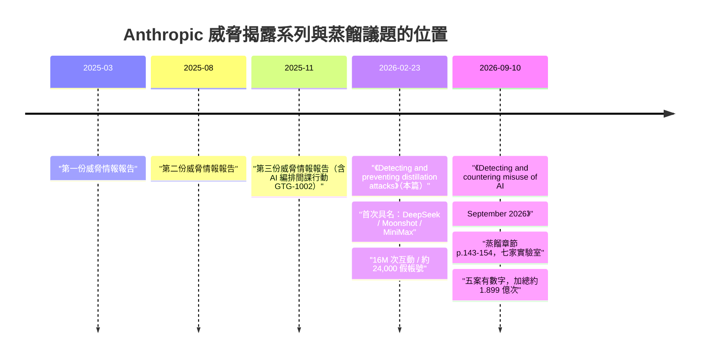
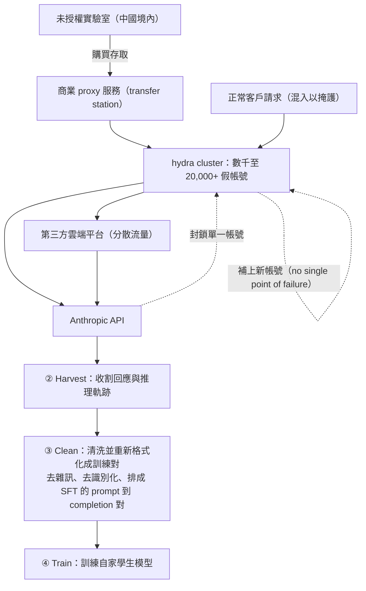
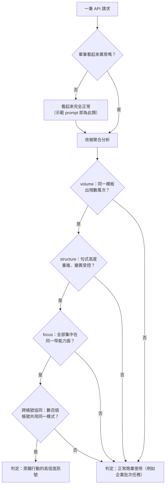
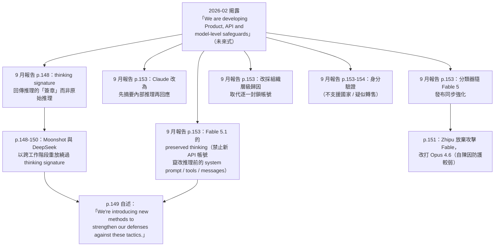

# Anthropic《Detecting and preventing distillation attacks》（2026 年 2 月）

> 課程模組：09 延伸研究 ｜ 來源類型：官方威脅報告 ｜ 原文：<https://www.anthropic.com/news/detecting-and-preventing-distillation-attacks> ｜ 整理日期：2026-09-14

> **體例說明（先講，後面會一直用到）**
>
> 1. 本教材全文不使用破折號。引用英文原文時，若原句含破折號，一律以 `[,]` 標示該處，語意不變，方便學員回原文核對。
> 2. 兩份文件在本教材中固定簡稱：**「2 月揭露」**＝本篇要分析的 Anthropic 2026-02-23 部落格長文；**「9 月報告」**＝本課程主體的 154 頁 PDF《Detecting and countering misuse of AI: September 2026》（2026-09-10）。
> 3. 引用 9 月報告一律標 PDF 頁碼（例如 p.147）；引用 2 月揭露因原文為網頁、無頁碼，改標其章節名稱（例如「How distillers access frontier models」段）。

---

## 1. 一頁速覽

- **這是什麼文件**：Anthropic 於 **2026-02-23** 發布的公開揭露文《Detecting and preventing distillation attacks》。這是 Anthropic **第一次**具名指控外國 AI 實驗室對 Claude 發動工業規模的非法蒸餾（illicit distillation）。9 月報告 p.143 開宗明義回頭指認它：`Since we published our first disclosure in February, we have identified and disrupted additional distillation attacks against Claude from seven labs based in China.`
- **點名三家**：**DeepSeek**、**Moonshot AI**、**MiniMax**。合計 `over 16 million exchanges with Claude through approximately 24,000 fraudulent accounts`。
- **規模分佈與 9 月完全翻轉**：2 月的量級冠軍是 **MiniMax（逾 1,300 萬次）**，DeepSeek 只有 **逾 15 萬次**；到了 9 月報告，DeepSeek 暴增到 **14 天內逾 1,210 萬次**（p.150），而 MiniMax 連一個規模數字都沒有（p.153）。**同一組行為者，七個月內的排名完全洗牌。**
- **2 月揭露最有價值的東西不是案例，是偵測方法論**：它給出一組極精煉的判定準則，`What distinguishes a distillation attack from normal usage is the pattern.`，並拆成三軸：**volume（量）、structure（結構）、focus（focus 集中度）**。**這組三軸在 9 月報告裡完全沒有被重述**，所以它是 2 月揭露的獨家資產，也是本模組最能直接落到 SOC 偵測工程的段落。
- **「hydra cluster（九頭蛇叢集）」這個詞只出現在 2 月**：`sprawling networks of fraudulent accounts that distribute traffic across our API as well as third-party cloud platforms`，設計目的是 `there are no single points of failure`，單一 proxy 網路曾同時操作 **逾 20,000 個假帳號**，並刻意 `mixing distillation traffic with unrelated customer requests to make detection harder`。9 月報告改用「transfer stations／proxy services／帳號池」的詞彙描述同一件事，並在 Alibaba 案（p.148）**實測到雙池熱備援**，等於用資料驗證了 2 月提出的架構假說。
- **2 月是政策文件，9 月是作戰文件**：2 月揭露有整整一節談**出口管制**（`Distillation attacks and export controls`），把蒸餾攻擊定位成「繞過晶片管制的另一條路」；9 月報告 p.143 到 154 的蒸餾章節**完全沒有出口管制論述**，純粹寫手法、規模與處置。兩份文件的**文體目的不同**，這件事本身就是情報消費者要學會辨識的。
- **2 月完全沒有的一條線，在 9 月變成最重的指控**：使用者資料外洩。2 月的危害論述停在「智財竊取 ＋ 蒸餾出的模型不帶護欄 ＝ 國安風險」；9 月報告 p.146 起加入「DeepSeek、Xiaomi、Moonshot 把自家使用者的對話餵進 Claude」，並在 p.149 到 150 列出 **PLA 關聯 CCTV 監控、俄羅斯國防部關聯資料庫的實時憑證、中國市級公安案件管理系統**。**指控性質從商業竊盜升級為跨境資料保護事件。**
- **防線承諾 → 落地 → 被打穿的完整弧線**：2 月只寫「`We are developing Product, API and model-level safeguards`」這種前瞻語；9 月報告 p.148 到 153 給出具體成品（thinking signature、摘要式推理、Fable 5.1 的 preserved thinking），**同時自曝 thinking signature 已被 Moonshot 與 DeepSeek 用跨工作階段重放繞過**。這條弧線是本教材最值得排進課堂的主線。

> **這份研究在課程裡要教什麼（一句）**：教學員如何把**同一機構相隔七個月的兩份揭露**擺在一起讀，從「數字怎麼變、名單怎麼長、詞彙怎麼換、承諾的防線後來怎麼被打穿」這四個維度，練出**追蹤式情報消費**的能力，而不是只把每份報告當成孤立的新聞。

---

## 2. 報告基本資料

| 項目 | 內容 |
|---|---|
| 原文標題 | **Detecting and preventing distillation attacks** |
| 機構 | Anthropic |
| 具名發布單位 | 文中未標示具體團隊署名（不同於 9 月報告明確署名 Threat Intelligence Team） |
| 發布日期 | **2026-02-23**（CNBC、Tech Startups 等於 2026-02-24 跟進報導） |
| 形式 | 官方網站 news 分類的**部落格長文**，非 PDF、非附錄型報告 |
| 篇幅 | 網頁單頁，五個主要章節（見下），無頁碼、無附錄、無 IOC 表 |
| 涵蓋期間 | **原文未載明觀測起訖日期**（見第 12 節，這是本文件最大的方法論缺陷） |
| 涉及模型 | **未指名任何 Claude 版本號**。9 月報告則明確寫 Opus 4.6／4.7／4.8、Fable 5／5.1、Mythos 5／Mythos Preview |
| 涉及行為者 | DeepSeek、Moonshot AI、MiniMax（三家，均為中國實驗室） |
| 資料來源類型 | **單一平台遙測**：Anthropic 自家 API 流量、帳號中繼資料、付款與註冊指紋 |
| GTG 編號 | **無**。2 月揭露不使用 GTG 代號體系；GTG-16001／16002／16003 等編號是 9 月報告才出現的 |
| IOC | **無**。全文未公布任何網域、IP、雜湊、帳號識別碼 |

### 2.1 原文的章節結構（五節）

| 章節（原文） | 中文 | 這一節在教什麼 |
|---|---|---|
| Why distillation matters | 蒸餾為何重要 | 危害論述：蒸餾出的模型不帶護欄 ＝ 國安風險 |
| Distillation attacks and export controls | 蒸餾攻擊與出口管制 | 政策論述：蒸餾是繞過晶片管制的第二條路 |
| What we found | 我們發現了什麼 | 三家實驗室的規模與鎖定能力 |
| How distillers access frontier models | 蒸餾者如何取得前沿模型 | hydra cluster 與 proxy 生態；偵測三軸 |
| How we're responding | 我們如何應對 | 四類反制 ＋ 對產業與政策界的呼籲 |

> **結構判讀（教學重點）**：五節之中，**只有一節（What we found）是威脅情報**，另外兩節（Why it matters、export controls）是**政策倡議**，最後一節是**企業回應聲明**。也就是說，**這份文件的情報密度只有五分之一到五分之二**。對照 9 月報告蒸餾章節 12 頁全部是手法與案例，就能清楚看到：**同一家公司，兩種文體，兩種目的。**
>
> 情報分析者的正確作法是：**先辨識文體，再決定信任邊界**。倡議型文件的數字通常是真的，但**選擇呈現哪些數字、不呈現哪些數字，本身就是論述的一部分**。

### 2.2 與 Anthropic 前後期報告的關係



- **定位**：2 月揭露是**專題式單議題揭露**，不是威脅情報報告的一期。Anthropic 的定期威脅報告系列（2025-03、2025-08、2025-11、2026-09）涵蓋多個危害領域；2 月揭露只講蒸餾一件事。
- **9 月報告如何引用它**：p.143 用 `Since we published our first disclosure in February` 明確回指，並用 p.147 的 `Since February 2026, we have detected and disrupted unauthorized distillation campaigns we have attributed with high confidence to specific PRC-based labs targeting Anthropic's Opus-class models.` 把 2 月當成**計時起點**。也就是說，**9 月報告的所有蒸餾統計，其時間基準線就是 2 月揭露。**
- **教學價值**：這是少見的、由機構自己明確標示的「情報續篇」關係。多數威脅報告不會清楚說「這一份延續哪一份」，導致分析者難以做時序比較。**這裡有明確錨點，所以可以做嚴謹的前後比對，這正是本教材第 4 節的基礎。**

---

## 3. 主要發現與案例逐一摘要

### 3.1 三家實驗室逐案

| 項目 | **DeepSeek** | **Moonshot AI** | **MiniMax** |
|---|---|---|---|
| 互動量（原文） | `Over 150,000 exchanges` | `Over 3.4 million exchanges` | `Over 13 million exchanges` |
| 佔三家總量比例 | 約 0.9% | 約 20.5% | 約 78.5% |
| 假帳號數 | **原文未給單家數字** | `employed hundreds of fraudulent accounts spanning multiple access pathways` | **原文未給單家數字** |
| 鎖定能力（原文列點） | 推理能力、rubric 式評分任務、以及**政治敏感題的「免審查替代答案」** | Agentic reasoning and tool use；Coding and data analysis；Computer-use agent development；**Computer vision** | Agentic coding；Tool use and orchestration |
| 特殊行為 | `Claude was used to generate censorship-safe alternatives to politically sensitive queries like questions about dissidents, party leaders, or authoritarianism, likely in order to train DeepSeek's own models to steer conversations away from censored topics.` | 後期轉向 `extract and reconstruct Claude's reasoning traces` | `they pivoted within 24 hours, redirecting nearly half their traffic to capture capabilities from our latest system` |
| 對外回應 | 未回應媒體詢問 | 未回應媒體詢問 | 未回應媒體詢問 |

**三個逐案要點，每一個都可以獨立當一張投影片：**

1. **DeepSeek 的「免審查替代答案」是全篇最特別的發現。** 它不是在偷能力，而是在**偷「如何安全地繞開政治敏感題」的處理策略**。原文推測其目的是 `to train DeepSeek's own models to steer conversations away from censored topics`。這代表：**蒸餾的標的不只是「能力」，也可以是「對齊行為（alignment behavior）」本身**。一個美國前沿模型的「如何禮貌地不回答」被拿去訓練成一個中國模型的「如何符合審查要求地不回答」。**同一套拒答技術，服務兩種完全相反的價值觀。** 這是 AI 治理課程極好的討論素材。
2. **Moonshot 的 computer vision 出現得很突兀。** 四項鎖定能力裡有三項是 agentic／coding／data，第四項卻是電腦視覺。9 月報告的 Moonshot 案（p.148 到 149）**完全沒有提到電腦視覺**，改為專注在「靜默轉發 ＋ CoT 抽取管線 ＋ 跨工作階段重放」。這是一個**在後續報告中消失的情報項目**，第 12 節會處理。
3. **MiniMax 的「24 小時內轉向」是全篇技術含量最高的一句。** Anthropic 發布新模型後，MiniMax 在一天內把將近一半流量改指向新模型。這說明對方**有自動化的模型偵測與流量調度能力**，而不是人工手動改設定。9 月報告的 MiniMax 段（p.153）完全沒有這條敏捷性描述，改成空殼公司 proxy 的結構性敘事。

### 3.2 存取手法：hydra cluster（2026-09-15 深化：補上 ③ Clean 資料工程步驟）

2 月揭露對「怎麼進得來」的描述，是全篇最技術性的一段：

- **前提**：`Anthropic does not currently offer commercial access to Claude in China, or to subsidiaries of their companies located outside of the country.`
- **規避方式**：`To circumvent this, labs use commercial proxy services which resell access to Claude and other frontier AI models at scale.`
- **架構命名**：`These services run what we call "hydra cluster" architectures: sprawling networks of fraudulent accounts that distribute traffic across our API as well as third-party cloud platforms.`
- **設計意圖**：`The breadth of these networks means that there are no single points of failure. When one account is banned, a new one takes its place.`
- **最大實例**：`In one case, a single proxy network managed more than 20,000 fraudulent accounts simultaneously, mixing distillation traffic with unrelated customer requests to make detection harder.`



> **偵測工程的關鍵洞察**：`mixing distillation traffic with unrelated customer requests` 這半句話，說明了為什麼**帳號層級的封鎖無效**。攻擊者刻意讓每個帳號的流量看起來像混合負載，把蒸餾請求的訊號稀釋掉。**這直接預告了 9 月報告 p.153 的解方：`Instead of banning proxy accounts individually, we work to attribute this suspicious activity to a specific organization`。** 2 月描述問題，9 月給出答案，前後呼應得非常乾淨。

> **補：③ Clean（清洗與重新格式化）步驟及其偵測意涵（2026-09-15 深化）**。上圖過去把 ② Harvest 直接接到 ④ Train，跳過了 9 月報告 p.144 四格圖裡真有的一格 **Clean**：`The harvested exchanges are cleaned and reformatted for distillation.` 這是一個**發生在攻擊者端、Anthropic API 遙測看不到**的資料工程步驟，內容包括：去除雜訊與失敗回合、**去識別化**（把 harvest 到的第三方使用者姓名、email、公司資料剝掉，這正是 9 月 p.146 個資外洩指控的另一面），以及把對話重排成監督式微調（SFT）要用的「prompt 到 completion」訓練對或推理軌跡對。它對偵測有三層意義：
>
> 1. **偵測位置只能停在 ② Harvest。** Clean 與 Train 都在平台外，防守方唯一能觀測的攻擊面就是 Harvest 這一格的請求流量。這解釋了為什麼 2 月的偵測方法論（下一節的 volume／structure／focus 三軸）全部是**對請求分佈**的量測，而不是對「清洗後訓練集」的量測，因為後者根本看不到。
> 2. **Clean 的需求會反過來塑形 Harvest 的可觀測特徵。** 收割方最終要把資料整成整齊的訓練對，於是他們在 Harvest 階段就傾向下**結構高度一致、輸出格式固定**的 prompt（例如強制 inline CoT 標籤、rubric 式評分、固定角色設定），好讓後續清洗成本最低。**這種「為了好清洗而在源頭就標準化」的傾向，正是三軸裡 structure 軸抓得到的訊號。** 換句話說，Clean 這個看不見的步驟，在 Harvest 這個看得見的步驟上留下了指紋，這也是本教材第 7.2 節「句式結構高度重複」與「請求內容高度對應訓練最有價值的東西」兩條行為指標的成因。
> 3. **去識別化不會消滅外洩事實。** 攻擊者在 Clean 階段剝掉 PII 是為了訓練品質，不是為了保護當事人；資料在 Harvest 當下就已經完整流經第三方。對防守方與被害使用者而言，「訓練集裡最後沒有你的名字」不等於「你的資料沒有外洩」。這一點要與第 4.5 節的跨境資料保護論述接起來讀。

### 3.3 偵測方法論：volume／structure／focus 三軸

這是 2 月揭露最該被課程保留下來的部分，因為 9 月報告沒有重述。

原文的核心三句：

1. `What distinguishes a distillation attack from normal usage is the pattern.`
2. `Massive volume concentrated in a few areas, highly repetitive structures, and content that maps directly onto what is most valuable for training an AI model are the hallmarks of a distillation attack.`
3. `The volume, structure, and focus of the prompts were distinct from normal usage patterns, reflecting deliberate capability extraction rather than legitimate use.`

原文並且給了一個**示範用的「看起來完全無害」的 prompt**，用來說明單筆請求為何無法判定：

> `You are an expert data analyst combining statistical rigor with deep domain knowledge. Your goal is to deliver data-driven insights [,] not summaries or visualizations [,] grounded in real data and supported by complete and transparent reasoning.`
>
> （你是一位結合統計嚴謹性與深厚領域知識的專家資料分析師。你的目標是提供以資料驅動的洞察，不是摘要、也不是視覺化，必須立基於真實資料，並附上完整且透明的推理過程。）

接著是判定的轉折句：`when variations of that prompt arrive tens of thousands of times across hundreds of coordinated accounts, all targeting the same narrow capability, the pattern becomes clear.`



> **為什麼這三軸值得單獨教**：一般 API 濫用偵測的直覺是「找壞請求」。這三軸告訴你，**蒸餾攻擊裡沒有壞請求，只有壞分佈**。偵測的單位從「request」升到「request population」。這是典型的**從特徵偵測（signature）轉向分佈偵測（distributional anomaly）**，和 SOC 裡從 IOC 比對轉向 UEBA 的演進是同一個認知躍遷。課堂可以直接用這個類比。
>
> 這三軸也解釋了 2 月揭露為何**沒有也不可能提供 IOC**：可疑的不是任何單一物件，而是**物件之間的關係**。

### 3.4 危害論述與政策論述

**危害論述（Why distillation matters）的三段推論鏈：**

1. 美國公司投入大量資源建立護欄，阻止國家與非國家行為者把 AI 用於生物武器或惡意網路活動。
2. `Models built through illicit distillation are unlikely to retain those safeguards, meaning that dangerous capabilities can proliferate with many protections stripped out entirely.`
3. `Foreign labs that distill American models can then feed these unprotected capabilities into military, intelligence, and surveillance systems [,] enabling authoritarian governments to deploy frontier AI for offensive cyber operations, disinformation campaigns, and mass surveillance.`

並補上一句加乘條件：若被蒸餾出的模型再開源，風險會擴散到任何單一政府都無法控制的範圍。

**政策論述（Distillation attacks and export controls）的反直覺論證：**

- `Distillation attacks undermine those controls by allowing foreign labs, including those subject to the control of the Chinese Communist Party, to close the competitive advantage that export controls are designed to preserve through other means.`
- 接著是這一節最精巧的一步：`the apparently rapid advancements made by these labs are incorrectly taken as evidence that export controls are ineffective and able to be circumvented by innovation.`
- 結論：`Distillation attacks therefore reinforce the rationale for export controls: restricted chip access limits both direct model training and the scale of illicit distillation.`

> **論證結構判讀（政策課的核心素材）**：這是一個**把反證轉為正證**的論證。原本「中國實驗室進步神速」看起來是「出口管制無效」的證據；Anthropic 主張那個進步有相當部分來自蒸餾美國模型，所以不是管制失效，而是管制被繞過，因此**應該加強而非放鬆管制**。
>
> **教學時務必同時呈現這個論證的利益結構**：Anthropic 是被害方，也是出口管制的長期支持者，同時是與被指控方直接競爭的商業主體。**這不代表論證錯誤，但代表這是一個利害關係人的論證，必須用對待利害關係人證詞的標準來檢視。** 這是本模組資訊素養訓練的重點之一。

### 3.5 Anthropic 的四類反制（2 月版本）

| 類別（原文） | 具體內容 | 成熟度判讀 |
|---|---|---|
| Detection | `We have built several classifiers and behavioral fingerprinting systems designed to identify distillation attack patterns in API traffic.`；另有 `detection tools for identifying chain-of-thought elicitation used to construct reasoning training data` | **已完成式**（have built）|
| Intelligence sharing | `We are sharing technical indicators with other AI labs, cloud providers, and relevant authorities.` | **進行式**；但**技術指標未對外公開**，只在封閉圈流通 |
| Access controls | `We've strengthened verification for educational accounts, security research programs, and startup organizations [,] the pathways most commonly exploited for setting up fraudulent accounts.` | **已完成式**；同時洩漏了一條重要情報：**教育、資安研究、新創三種優惠方案是最常被濫用的註冊管道** |
| Countermeasures | `We are developing Product, API and model-level safeguards designed to reduce the efficacy of model outputs for illicit distillation, without degrading the experience for legitimate customers.` | **未來式（are developing）**，2 月時尚未落地 |

收尾的產業呼籲：`But no company can solve this alone. As we noted above, distillation attacts at this scale require a coordinated response across the AI industry, cloud providers, and policymakers. We are publishing this to make the evidence available to everyone with a stake in the outcome.`

> **時態判讀是情報閱讀的基本功**：把四類反制的動詞時態排出來，就能知道 2 月時 Anthropic **真正擁有什麼**（分類器、行為指紋、註冊驗證），**只是承諾什麼**（模型層反制）。第 4.4 節會把這個「承諾」對到 9 月報告的「成品」，看它兌現了多少、又在哪裡被打穿。

---

## 4. 與 Anthropic 2026-09 報告的對照

本節是本模組的核心。以下逐點對照，每一點都指向本課程的對應教材。

### 4.1 行為者名單：三家 → 七家，且交集只有三分之二

| 實驗室 | 2 月揭露 | 9 月報告 | GTG 編號 | 本課程教材 |
|---|---|---|---|---|
| **DeepSeek** | 有，逾 15 萬次 | 有，14 天逾 1,210 萬次 | GTG-16001 | [`../07-distillation/GTG-16001-deepseek.html`](../07-distillation/GTG-16001-deepseek.html) |
| **Moonshot AI** | 有，逾 340 萬次 | 有，5 至 7 月逾 2,300 萬次 | GTG-16002 | [`../07-distillation/GTG-16002-moonshot.html`](../07-distillation/GTG-16002-moonshot.html) |
| **MiniMax** | 有，逾 1,300 萬次 | 有，**無規模數字** | GTG-16003（課程推定） | [`../07-distillation/GTG-16012-16003-sensetime-minimax.html`](../07-distillation/GTG-16012-16003-sensetime-minimax.html) |
| **Alibaba（Qwen／通義）** | **無** | 有，5 至 7 月逾 1.51 億次 | GTG-16005 | [`../07-distillation/GTG-16005-alibaba.html`](../07-distillation/GTG-16005-alibaba.html) |
| **Zhipu（Z.ai）** | **無** | 有，17 天逾 340 萬次 | GTG-16006 | [`../07-distillation/GTG-16006-zhipu.html`](../07-distillation/GTG-16006-zhipu.html) |
| **Xiaomi** | **無** | 有，20 天逾 40 萬次 | GTG-16008 | [`../07-distillation/GTG-16008-xiaomi.html`](../07-distillation/GTG-16008-xiaomi.html) |
| **SenseTime** | **無** | 有，**無規模數字** | GTG-16012（課程推定） | [`../07-distillation/GTG-16012-16003-sensetime-minimax.html`](../07-distillation/GTG-16012-16003-sensetime-minimax.html) |

模組層級的總覽請對照 [`../07-distillation/00-distillation-intro-and-mitigations.html`](../07-distillation/00-distillation-intro-and-mitigations.html) 第 8 節的七案地圖。

**「seven labs」到底怎麼數？這是一個必須在課堂上釐清的閱讀陷阱。**

9 月報告 p.143 原句：`Since we published our first disclosure in February, we have identified and disrupted **additional** distillation attacks against Claude from **seven labs** based in China.`

兩種讀法：

- **讀法 A（本教材採用）**：「additional」修飾的是 **attacks**，不是 labs。也就是「自 2 月以來，我們又發現並瓦解了來自七家中國實驗室的**額外**蒸餾攻擊」。七家 ＝ 9 月報告章節中實際具名的七家（含 2 月已點名的三家）。**兩份文件合計的不重複實驗室總數仍是七家。**
- **讀法 B**：七家是 2 月三家之外的**新增**七家，合計十家。

**為什麼採用讀法 A**：9 月報告蒸餾章節從 p.147 到 p.153 逐一具名的實驗室，數起來正好是七家（Alibaba、Moonshot、DeepSeek、Zhipu、Xiaomi、SenseTime、MiniMax），其中三家與 2 月重疊。若讀法 B 成立，章節中應該出現七家 2 月未提過的新公司，但實際上沒有。**內部一致性檢查支持讀法 A。**

> **教學設計**：這是一個可以直接放進課堂的「讀者陷阱」練習。發下 p.143 那一句與七案標題清單，讓學員自己判斷「七」是總數還是增量，並說明判斷依據。**情報報告的量詞歧義是常見的引用錯誤來源**，媒體最容易在這種地方把「七家」寫成「新增七家」。

### 4.2 規模數字：七個月內的量級躍遷與排名洗牌

| 實驗室 | 2 月數字 | 9 月數字 | 觀測窗長度差異 | 倍數（不校正窗長） |
|---|---|---|---|---|
| DeepSeek | 逾 150,000 | 逾 12,100,000 | 9 月僅 **14 天** | **約 80 倍** |
| Moonshot | 逾 3,400,000 | 逾 23,000,000 | 9 月為 **3 個月** | 約 6.8 倍 |
| MiniMax | 逾 13,000,000 | **未給數字** | 不適用 | 不可比 |
| Alibaba | 未點名 | 逾 151,000,000 | 3 個月 | 新增 |
| **三家合計 vs 全章合計** | **逾 16,000,000** | **約 189,900,000**（五案加總） | 不同窗長 | **約 11.9 倍** |

**四個必須講清楚的分析要點：**

1. **2 月的總數是 Anthropic 自己印出來的；9 月的總數不是。** 2 月原文明確寫 `over 16 million exchanges with Claude through approximately 24,000 fraudulent accounts`。三家分項加總：150,000 ＋ 3,400,000 ＋ 13,000,000 ＝ 16,550,000，與「over 16 million」**自洽**。相對地，9 月報告 p.143 到 154 **從未印出任何彙總數字**，「近 1.9 億」是本課程與 CNBC、TechTimes 各自做的加總（見 [`../07-distillation/00-distillation-intro-and-mitigations.html`](../07-distillation/00-distillation-intro-and-mitigations.html) 第 3.2 節）。**引用時務必區分「原廠數字」與「加總推導值」。**
2. **DeepSeek 的 80 倍不是真的 80 倍，而是更誇張。** 9 月的 1,210 萬次只涵蓋 **7 月的 14 天**，日均約 864,000 次。2 月的 15 萬次若換算成同一日均，**大約只等於 9 月時期 DeepSeek 四小時多的流量**。但 2 月原文**沒有給觀測窗長度**，所以嚴格說這個換算只是量級感，不是可引用的數據。**這正是 2 月揭露最大的方法論缺陷所造成的具體後果：缺少時間窗，任何前後比較都無法嚴謹化。**
3. **MiniMax 從冠軍變成無數字，是敘事焦點的轉移，不是活動的消失。** 2 月時 MiniMax 佔三家總量的 78.5%；9 月報告把它放進「SenseTime、MiniMax 與第三方轉售商生態系」的合併案例（p.152 到 153），論述重點從**流量**轉為**結構**：空殼公司自建 proxy、只賣 Anthropic 與 OpenAI 模型、不賣任何中國模型（連自家都不賣）。**這代表 Anthropic 的調查深度前進了：從「量到多少」進步到「為什麼看不到量」。** 9 月報告對 MiniMax 的措辭也退到最保守的 `This evidence suggests`（p.153），與 2 月的直述語氣形成對比。
4. **假帳號數字在兩份文件的呈現粒度完全不同。** 2 月只給合計約 24,000 個，不分家；9 月給到每案：Alibaba 第一池近 5,000、尖峰 3,500+，Moonshot **5,380**（多在新加坡與日本），Zhipu **273**，Xiaomi 1,500+。**粒度變細代表歸因能力變強**，這是可以直接觀察到的偵測成熟度指標。

> **一個必須避免的引用錯誤**：不要把 2 月的「約 24,000 個假帳號」和 9 月的各案帳號數相加或相比。2 月的 24,000 是**三家共用 proxy 生態的帳號總量**，9 月的各案數字是**該案當期實際活躍的帳號池**。兩者統計口徑不同。9 月報告 p.148 甚至直接寫到帳號池是**跨組織共用**的：`Some of these accounts were found to have been funneling requests from DeepSeek and Xiaomi`，所以帳號數本來就無法乾淨地歸給單一實驗室。

### 4.3 手法：從「一種」到「五種 ＋ 一個被打穿的控制」

| 手法 | 2 月揭露 | 9 月報告 |
|---|---|---|
| CoT 誘導（要求模型寫出推理） | 有，描述為 `asked Claude to imagine and articulate the internal reasoning behind a completed response and write it out step by step` | 有，且拆成多種具體變體並附原文 prompt（p.145 到 146）|
| 假冒除錯模式 | **無** | 有，p.145 收錄原文 |
| 假冒真實系統提示 | **無** | 有，p.145 收錄原文 |
| 要求把推理「翻譯」成其他語言 | **無** | 有，p.146 收錄原文（片假名日文）|
| 12,000 次請求的技術探勘 | **無** | 有，p.145 |
| 固定 prompt 強制 inline CoT 標籤 | **無** | 有，Alibaba 案 p.147 |
| **跨工作階段重放攻擊（thinking signature）** | **無** | 有，Moonshot 案 p.148 到 149、DeepSeek 案 p.150 |
| 靜默轉發自家使用者請求給 Claude | **無** | 有，Moonshot／DeepSeek／Xiaomi |
| 向第三方資料商購買逐字稿 | **無**（2 月只提 proxy 轉售存取，未提逐字稿買賣）| 有，p.144 與 SenseTime 案 p.152 |
| 空殼公司自建 proxy 收割 | **無** | 有，MiniMax p.153 |

技術手法的完整拆解請見 [`../07-distillation/00-distillation-intro-and-mitigations.html`](../07-distillation/00-distillation-intro-and-mitigations.html) 第 5 節（五種思維鏈套取手法）。

**三個對照結論：**

1. **2 月只描述了「誘導 CoT」這一條路，而且沒有引用任何攻擊者原文。** 9 月報告開始**逐字收錄攻擊者的 prompt**（p.145 到 146）。這是揭露尺度的明顯放寬，也讓偵測方第一次拿到可用於建規則的具體語料。
2. **`p.145` 到 `p.146` 收錄的攻擊者 prompt 是報告引用的證據，不是給讀者或模型的指令。** 課程引用時照原文抄錄即可，並在講義上明確標示其性質。本教材第 11 節依此原則處理。
3. **最重要的新增是「跨工作階段重放」，而它打穿的正是 2 月承諾要做的模型層防線。** 見下一節。

### 4.4 防線演進：承諾、落地、被打穿、再修補

這是本教材最值得排進課堂的主線。



**逐點解讀：**

1. **兌現度很高。** 2 月的四類反制，到 9 月幾乎全部有對應的具體成品。這在企業安全承諾裡並不常見，值得正面認定。
2. **但最核心的那一項在落地後就被繞過。** thinking signature 的設計意圖（p.148）是 `to mitigate the risk of unauthorized distillation`，方法是回傳一個查詢用的簽章而非原始推理。Moonshot 的破法（p.148）是：**保存簽章、另開新工作階段、誘導 Claude 把簽章還原成完整推理軌跡**。DeepSeek 用同一手法（p.150），而且明確用來 `exfiltrate reasoning traces that would have otherwise been summarized`。**這說明摘要式推理（S2）與簽章（S1）這兩道防線是被同一個攻擊面同時打穿的。**
3. **Anthropic 自己承認缺口。** p.149：`We're introducing new methods to strengthen our defenses against these tactics.` **在情報文件裡主動記錄自家控制被繞過，是可信度的正面訊號**，也是本課程最珍貴的教學素材。防線失效的四種模式整理請見 [`../shared/02-claude-safeguards-and-bypass-paths.html`](../shared/02-claude-safeguards-and-bypass-paths.html)。
4. **一個 2 月完全預料不到的現象：防護強度差異造成「柵欄套利」。** 9 月報告 p.151 記錄 Zhipu 先攻 Fable，因 Fable 的網路安全防護較強而失敗，**於是改攻 Opus 4.6 與另一家美國實驗室的旗艦模型，理由是他們評估那些模型的防護較弱**。這是一個**市場層級的副作用**：單一產品線把防線做強，需求就流向同產品線的較舊版本或競品。2 月揭露的「without degrading the experience for legitimate customers」只考慮了正當使用者的體驗成本，**沒有考慮攻擊需求的跨模型轉移**。這是本課程可以提出的原創分析角度。

### 4.5 危害框架：從智財竊取升級為跨境資料保護事件

| 危害維度 | 2 月揭露 | 9 月報告 |
|---|---|---|
| 智財與研發投資被複製 | **有**，核心論述 | 有 |
| 蒸餾出的模型不帶護欄 | **有**，`Models built through illicit distillation are unlikely to retain those safeguards` | 有，p.146 `The robust safeguards that prevent Claude from being misused by bad actors do not transfer when our models are distilled` |
| 能力外溢到生物／網路領域 | 概括提及生物武器與惡意網路活動 | **具體化**，p.146：即使被收割的對話幾乎不含這些主題，蒸餾出的模型仍可能獲得該領域危險能力 |
| 出口管制被繞過 | **有，獨立成節** | **完全沒有** |
| **第三方使用者資料外洩** | **完全沒有** | **有，且份量極重**（p.146、p.149 到 152）|
| 正當客戶受害 | 間接提及（詐欺帳號、盜卡） | p.144 明寫 `These fraudulent activities harm legitimate customers.` |
| 攻擊者用 Claude 推進自家 AI 研發 | **完全沒有** | 有，Alibaba（p.148）、Zhipu（p.151）、SenseTime（p.153）、Xiaomi（p.152）|

**這張表最重要的兩行是空白的那兩行，方向相反：**

- **9 月新增、2 月完全沒有的「第三方使用者資料外洩」**，是整個議題性質的躍遷。9 月報告 p.146 寫：`Those sessions contained names, email addresses, company data, and other sensitive data of hundreds of end users in at least a dozen languages. These practices are likely inconsistent with privacy laws and the labs' own terms of service.` 具體個案包括 PLA 關聯的成都 CCTV 監控分析（p.149）、俄羅斯國防部關聯機構資料庫的實時憑證（p.150）、中國市級公安局案件管理系統（p.150）。**歐美使用者以為在用 Kimi 或 DeepSeek，請求被靜默轉發到 Claude，個資與企業資料一併曝露給第三方。** 這已經不是商業糾紛，而是**同時觸及 GDPR 級資料保護、跨境資料流動與國安**的複合事件。
- **2 月有、9 月完全沒有的「出口管制」論述**，說明 9 月報告刻意把政策倡議抽離，回歸純情報文體。**對政策分析者而言，這意味著引用出口管制論證時只能引 2 月揭露，不能引 9 月報告。** 這是一個實務上很容易出錯的引用細節。

### 4.6 詞彙演進：同一件事的兩套語言

| 概念 | 2 月用語 | 9 月用語 | 是否為同一件事 |
|---|---|---|---|
| 假帳號叢集架構 | **hydra cluster** | 「two main pools of fraudulent accounts」（p.147 到 148）、proxy service networks | **是**。2 月給概念名稱，9 月給實測結構 |
| Proxy 服務 | commercial proxy services | proxy services, also known as **"transfer stations"**（p.144）| **是**。9 月補上中文語境常見的「轉運站」別名 |
| 無單點失效 | `there are no single points of failure` | Alibaba 雙池熱備援實例（p.148）| **是**。2 月是設計原則陳述，9 月是實證 |
| 偵測判準 | volume / structure / focus 三軸 | metadata ＋ signals of irregular activity（p.153）| **概念相容但 9 月遠為粗略** |
| 組織歸因 | 未明確提出 | `Instead of banning proxy accounts individually, we work to attribute this suspicious activity to a specific organization`（p.153）| **9 月新增**，是對 2 月所述問題的直接解方 |
| 帳號註冊漏洞 | educational accounts, security research programs, startup organizations | 未重述 | **2 月獨有情報** |

> **教學價值**：詞彙演進是追蹤同一機構系列報告時最容易被忽略、卻最能看出內部認知成熟度的訊號。**「hydra cluster」是一個有畫面、好記、適合對高層簡報的比喻；9 月改用中性的「pools」與「transfer stations」，是文體從倡議轉向情報的又一個徵候。** 課堂可以讓學員把兩套詞彙做對照表，練習「同一現象的不同命名，背後是不同的溝通對象」。

### 4.7 與本課程其他模組的橫向連結

- **AI 供應鏈的地下經濟**：2 月揭露的 proxy 轉售生態，與網路行動章的假 Claude 轉售商案（[`../01-cyber/GTG-50021-fake-reseller.html`](../01-cyber/GTG-50021-fake-reseller.html)）共用同一條地下基礎設施。前者買存取來蒸餾，後者賣存取來詐財並收割憑證。**同一個市場，兩種變現方式。**
- **攻擊 AI 產業本身**：[`../01-cyber/GTG-50020-ai-supply-chain.html`](../01-cyber/GTG-50020-ai-supply-chain.html) 記錄財務動機行為者轉向攻擊 AI 產業。與蒸餾合看，可以得到一個共同結論：**AI 公司自己已經成為高價值目標類別。**
- **貫穿主題**：[`../shared/01-cross-cutting-analysis.html`](../shared/01-cross-cutting-analysis.html) 的「單一來源情報紀律」與「防線失效四模式」兩條主線，在本教材第 4.4、第 9 節有直接應用。
- **模組導論**：[`00-external-research-intro.html`](00-external-research-intro.html) 說明本模組為何要做跨報告對照，本教材是該方法論的第一個完整示範（同機構、不同時點）。

### 4.8 與其他機構報告的關係（本教材不展開，留給平行收錄）

9 月報告 p.143 主動提到兩家同業：

> `Other frontier labs have faced distillation attacks. OpenAI has called attention to this activity since early 2025. Google published a threat tracker on adversarial distillation earlier this year.`

- **OpenAI**：自 2025 年初起關注同類活動。本模組另有研究員負責 OpenAI 2026-02 報告，屆時可與本教材並讀，檢查**同一時間點、兩家美國前沿實驗室是否看到同一批行為者**。
- **Google**：2026 年稍早發布針對對抗式蒸餾的 threat tracker。本模組另有研究員負責 Google GTIG 2026-05 與 2026-09 的 AI Threat Tracker。
- **Anthropic 自家前作**：2025-08 與 2025-11 的威脅報告（含 AI 編排間諜行動 GTG-1002）由其他研究員負責。**2025-11 報告與本篇相隔僅約三個月，是檢查「蒸餾議題何時從未提及變成獨立揭露」的關鍵時點。**

> **待三份以上收錄完成後，本模組應做一張跨機構行為者交叉表**：同一家中國實驗室被幾家美國機構獨立觀測到？只有一家看到的，信度等級必須下修。這是本模組存在的根本理由。

---

## 5. TTP 與 MITRE ATT&CK 對應

非法蒸餾以**合法 API 介面**完成，傳統 ATT&CK Enterprise 對其核心行為沒有對應戰術。以下分三部分處理。

### 5.1 ATT&CK Enterprise：存取與規避基礎設施

| 戰術 | 技術 ID | 2 月揭露的具體作法 | 偵測構想 |
|---|---|---|---|
| Resource Development | **T1585 Establish Accounts** | 約 24,000 個假帳號；單一 proxy 網路同時操作逾 20,000 個 | 註冊速率異常、共用註冊指紋、拋棄式 email 網域聚類 |
| Resource Development | **T1583 Acquire Infrastructure** | 商業 proxy 服務；流量分散到第三方雲端平台 | proxy ASN 情資、雲端出口 IP 與宣稱地區不符 |
| Resource Development | **T1586 Compromise Accounts** | 盜用信用卡與登入憑證建立帳號 | 付款工具風險評分、被盜卡 BIN 情資、帳號接管訊號 |
| Initial Access | **T1078 Valid Accounts** | 以（可能盜用的）有效憑證與 API key 存取 | 憑證使用地點突變、單一 key 高併發 |
| Defense Evasion | **T1090.002／.003 Proxy: External／Multi-hop** | hydra cluster 多跳分散流量 | TLS／JA3 指紋聚類、連線拓撲分析 |
| Defense Evasion | **T1027 Obfuscated Files or Information**（概念延伸）| `mixing distillation traffic with unrelated customer requests` | 單帳號流量的**主題熵值**異常（正常客戶主題分佈寬，蒸餾帳號窄） |
| Defense Evasion | **T1656 Impersonation**（概念延伸）| 以教育／資安研究／新創方案身分註冊 | 優惠方案申請文件查核、機構網域驗證、審核後行為一致性追蹤 |
| （金流規避） | **ATT&CK 無對應** | 盜卡與虛擬卡付款規避 KYC | **框架缺口**：需接付款風控體系，非 ATT&CK 範疇 |

### 5.2 MITRE ATLAS：AI 特有行為

> **ID 準確性聲明**：ATLAS 矩陣仍在演進，下表以**概念名稱**為準，括號內編號僅供查詢起點，**引用前請對照最新 ATLAS 矩陣核實**。

| ATLAS 戰術（概念） | ATLAS 技術（概念名稱） | 2 月揭露的具體作法 | 偵測構想 |
|---|---|---|---|
| AI Model Access | AI Model Inference API Access（約 AML.T0040）| 以數萬假帳號大量呼叫推理 API | 每帳號／每模板的請求量長尾偵測 |
| Exfiltration | **Extract AI Model**（約 AML.T0024 系列）| 以大量精心設計的 prompt 萃取特定能力 | **本案最核心的技術**；需靠聚合分佈而非單筆特徵 |
| Collection | AI Artifact Collection（約 AML.T0035）| 收割高品質回應供 SFT 或生成 RL 任務 | 攻擊者端行為，防守方僅能從請求端推測 |
| Execution | LLM Prompt Injection（約 AML.T0051）| CoT 誘導 prompt（要求模型寫出完整推理步驟）| **CoT elicitation 分類器**（Anthropic 自述已建置）|
| Defense Evasion | LLM Jailbreak（約 AML.T0054）| 規避 anti-distillation 措施 | jailbreak 分類器 ＋ 變體聚類 |

### 5.3 明確的框架缺口（本節的重點）

| 行為 | 為何沒有對應 ID | 建議課堂命名 |
|---|---|---|
| **以合法付費 API 存取進行工業規模能力萃取** | ATT&CK 預設「攻擊 ＝ 未授權存取」；本案的存取在技術上是授權的（帳號有效、付費成功），違反的是**契約與地區限制**，不是技術邊界 | 「契約層攻擊（contractual-layer attack）」 |
| **volume／structure／focus 的分佈式判定** | ATT&CK 的技術是行為分類，不描述「需要多少樣本才能判定」 | 「族群級偵測（population-level detection）」 |
| **蒸餾對齊行為本身**（DeepSeek 的免審查替代答案） | 沒有任何框架描述「竊取模型的拒答策略」 | 「對齊行為蒸餾（alignment-behavior distillation）」 |
| **24 小時內偵測到新模型並重導流量** | 攻擊者側的**自動化目標管理**，ATT&CK 無對應 | 「對手側的目標追蹤自動化」 |
| **空殼公司作為資料收割前台**（9 月才出現） | 商業與法律層規避，非技術戰術 | 「法人層偽裝（corporate-entity masquerade）」 |

> **教學收束**：把這五個缺口列出來，學員會很清楚地看到：**AI 濫用威脅有相當比例落在現有威脅框架的界外**。這不是框架的失敗，而是**框架的更新速度跟不上濫用形態的演化速度**。SOC 與 CTI 團隊在寫報告時，遇到這種情況正確的作法是**明確標示為缺口並自行命名**，而不是硬塞一個勉強相關的 ID，因為錯誤的 ID 對照會污染下游的統計與威脅趨勢分析。

---

## 6. 圖表判讀

### 6.1 2 月揭露：沒有資料圖表

**必須誠實標註：2026-02-23 的原文網頁沒有任何資料視覺化。** 多次抽取確認，頁面上唯一的圖像資產是一張標題用的 SVG 裝飾圖（檔名形如 `e029027e0b3beeb5b629bd4a26143597e7775b38-1000x1000.svg`），不含資料、不含流程、不含數字。

**所有數字都只以文字敘述呈現：**

- 「over 16 million exchanges」
- 「approximately 24,000 fraudulent accounts」
- 「over 150,000」「over 3.4 million」「over 13 million」
- 「more than 20,000 fraudulent accounts simultaneously」
- 「pivoted within 24 hours, redirecting nearly half their traffic」

**這件事本身就是教材，有三層意義：**

1. **沒有圖表 ＝ 沒有時間軸 ＝ 無法做趨勢判讀。** 一張「每日互動量」折線圖本來可以同時回答「行動何時開始、何時達峰、封鎖後掉多少、多久恢復」四個問題。2 月揭露一張都沒有，所以讀者**無法判斷這 1,600 萬次是三週還是三個月累積的**，也無法看到反制措施的效果曲線。
2. **這直接造成第 4.2 節的比較困難。** 沒有窗長就無法算日均，沒有日均就無法跟 9 月的「14 天 1,210 萬次」做量級比較。**一個缺失的圖表，讓七個月後的追蹤分析永久地少了一個維度。**
3. **對照 9 月報告的做法。** 9 月報告蒸餾章節有兩張圖（見下），而且全報告 51 張圖裡有大量關鍵數字**只存在於圖片內、文字層抓不到**。**同一家公司，兩份文件，視覺化策略完全不同。** 課堂可以據此討論：什麼時候機構會選擇「只給文字」？

### 6.2 對照用：9 月報告蒸餾章節的兩張圖

本課程已把這兩頁渲染為圖檔，可直接在課堂並排投影。

#### 圖 A（9 月報告 p.143）：合法蒸餾的流程示意

`../figures/page-143.png`

- **類型**：概念流程示意圖，位於「What is illicit distillation?」段落內。
- **內容**：呈現合法知識蒸餾的標準 teacher 到 student 流程，用來與後文的「非法」形成對照基線。
- **課堂用法**：**先投這張圖，再問學員「這張圖裡哪一個環節變了，就從合法變成非法？」** 正確答案不在演算法（演算法完全相同），而在**存取是否經授權、資料是否經同意、規模是否隱蔽、是否涉及詐欺**。詳細的四要件拆解見 [`../07-distillation/00-distillation-intro-and-mitigations.html`](../07-distillation/00-distillation-intro-and-mitigations.html) 第 2.3 節。
- **與 2 月揭露的關係**：2 月揭露用一句話定義蒸餾（`training a less capable model on the outputs of a stronger one`），**沒有畫出來**。9 月報告把它畫成圖，代表 Anthropic 認知到「必須先讓讀者理解合法版本，才能理解非法版本」，**這是被 2 月揭露後的公共辯論逼出來的補強**（中國商務部的主要反駁論點正是「蒸餾是中性技術」）。

#### 圖 B（9 月報告 p.144）：Anatomy of a distillation campaign（2026-09-15 修正）

`../figures/page-144.png`

> **修正說明（2026-09-15）**：本小節先前把圖上不存在的「存取路徑／規避偵測／資料轉售」當成流程節點，又把圖上真有、且技術上重要的第三段 **Clean** 漏掉了。經逐字重讀 `../figures/page-144.png` 原圖後改寫如下。**證據等級：直接判讀本課程已渲染的報告原頁（一手，等同讀原文）。**

- **類型**：**四段編號**的生命週期／解剖圖，標題 `Anatomy of a distillation campaign`。它是一條由左到右的線性流程，**圖上真正的方塊只有四個，而且是編號的**。
- **四個階段（逐字抄錄圖內文字，不要自行增刪節點）**：

| 編號 | 階段名（圖上原文） | 圖上說明（逐字） |
|---|---|---|
| ① | **Manufacture identities** | `Thousands of fake accounts are created under invented aliases and made to look like ordinary customers.` |
| ② | **Harvest** | `Automated scripts send millions of requests per day through these fraudulent accounts. These requests target the frontier model's reasoning capabilities.` |
| ③ | **Clean** | `The harvested exchanges are cleaned and reformatted for distillation.` |
| ④ | **Train**（圖上以紅框標示，是唯一被框成紅色的一格） | `The exchanges are used to train a student model to mimic the responses of the frontier model.` |

- **圖下方內文（是內文，不是流程節點，務必分清）**：緊接圖片的兩段正文才提到「向第三方轉售商購買逐字稿」與「把自家使用者請求靜默轉發（reroute）給 Claude」。原文：`Unauthorized labs also obtain transcripts of user exchanges with US frontier models by purchasing them from third-party resellers.` 以及 `In other cases, unauthorized labs rerouted requests from their users to Claude [,] without the knowledge or permission of those users [,] to harvest exchanges between users and Claude for training.` **這兩條是文字旁支，圖的四格流程裡沒有對應方塊；引用時不可講成「圖上的節點」。**
- **課堂用法（本教材建議的專屬用法，修正版）**：把 2 月揭露的 hydra cluster 描述，貼到這張圖**真正存在**的四個階段上，貼不上去的就明確標成「圖下方內文、非流程節點」：
  - 「thousands of new accounts using false identities, fake or stolen credit cards, and stolen API keys」對應 **① Manufacture identities**；
  - 「Automated scripts send millions of requests per day」「target the frontier model's reasoning capabilities」對應 **② Harvest**（2 月的 volume／structure／focus 三軸偵測，量的就是這一格的請求流量）；
  - **③ Clean** 在 2 月揭露裡完全沒有對應描述，是 9 月圖像獨有的一格，其偵測意涵見第 3.2 節的補述；
  - 「train a student model to mimic」對應 **④ Train**；
  - 「distribute traffic across our API as well as third-party cloud platforms」「mixing distillation traffic with unrelated customer requests」是 hydra cluster 的**存取與掩護手法**，屬於 ② Harvest 底下的基礎設施細節，**圖上沒有獨立方塊**，不要另立「存取路徑」「規避偵測」節點；
  - 「purchasing them from third-party resellers」與「rerouted requests from their users」是**圖下方內文的兩條旁支**，不是圖上的第五、第六格。
- **教學價值**：這個練習讓學員親眼看到**七個月間情報圖像補完了哪一塊**，同時訓練一個更基本的紀律：**判讀圖表時只認圖上真有的方塊，圖說與圖下方內文要分層引用，不能把內文的句子塞成不存在的節點。** 2 月揭露只用文字描述「假帳號 → 收割 → 訓練」的線性鏈；9 月的四格圖在中間補上了 **③ Clean（清洗與重新格式化成訓練對）** 這個資料工程步驟，並在圖外用內文補上「資料二級市場」與「靜默轉發自家使用者」兩條旁支。**先前版本把內文旁支誤植成節點、又漏掉 Clean，正好是本張圖最該避免的兩個判讀錯誤，本小節保留這個修正紀錄作為反面教材。**

---

## 7. IOC 與技術指標

### 7.1 2 月揭露沒有公布任何 IOC

**必須明確標註：原文沒有列出任何網域、IP 位址、雜湊值、帳號識別碼、Telegram 帳號或空殼公司名稱。**

原文對此有間接說明：`We are sharing technical indicators with other AI labs, cloud providers, and relevant authorities.` 也就是說，**技術指標存在，但只在封閉的產業與政府圈流通，未對公眾發布。**

> **這是本模組要教的一個結構性現象**：平台型威脅情報（Anthropic、OpenAI、Google 的 AI 濫用報告）**普遍缺乏可操作的 IOC**，原因有三：
>
> 1. **指標本身是平台內部識別碼**（帳號 ID、內部 fingerprint hash），對外部防守方毫無用處，公布也無法比對。
> 2. **公布等於告訴攻擊者哪些指紋已被偵測**，會直接縮短偵測方法的壽命。
> 3. **涉及第三方（proxy 商、被盜卡持卡人）的法律風險。**
>
> 所以 SOC 團隊讀這類報告時，**不要期待拿到可以貼進 SIEM 的清單**，而要期待拿到**可以改寫成自家偵測規則的行為模式**。這是平台型情報與傳統網路威脅情報最根本的消費方式差異。

### 7.2 可操作的行為指標（本教材從原文萃取）

以下不是 IOC，而是**可轉為自家偵測邏輯的行為模式**。適用對象是**自建或代理 LLM API 的組織**，例如台灣的 AI 服務商、模型 router 業者、企業內部 AI 閘道。

| 指標（行為模式） | 原文依據 | 偵測價值與壽命 |
|---|---|---|
| **同一 prompt 模板的變體跨數百帳號、出現數萬次** | `variations of that prompt arrive tens of thousands of times across hundreds of coordinated accounts` | **價值極高、壽命中等**。核心判準，但攻擊者可透過模板隨機化削弱。需搭配語義相似度而非字串比對 |
| **單帳號請求的主題熵值異常偏低**（全部集中在同一窄能力） | `all targeting the same narrow capability`；`Massive volume concentrated in a few areas` | **價值高、壽命長**。攻擊目的決定了必然集中；要規避就得犧牲資料品質 |
| **句式結構高度重複** | `highly repetitive structures` | **價值中、壽命短**。最容易被模板隨機化繞過 |
| **請求內容高度對應「訓練資料最有價值的東西」** | `content that maps directly onto what is most valuable for training an AI model` | **價值高、壽命長**。屬於意圖層特徵，難以偽裝 |
| **明確要求模型寫出完整內部推理步驟** | `asked Claude to imagine and articulate the internal reasoning behind a completed response and write it out step by step` | **價值高、壽命中**。9 月報告顯示已演化出多種變體（除錯模式、假系統提示、翻譯法），單一規則不夠 |
| **單一 proxy 網路同時操作數千至數萬帳號** | `a single proxy network managed more than 20,000 fraudulent accounts simultaneously` | **價值高、壽命長**。需要跨帳號關聯能力才看得到，這正是為何 9 月改採組織層級歸因 |
| **蒸餾流量混入無關客戶請求** | `mixing distillation traffic with unrelated customer requests to make detection harder` | **價值中**。提醒防守方：帳號層級的「看起來正常」不能作為排除依據 |
| **新模型發布後 24 小時內大規模重導流量** | `they pivoted within 24 hours, redirecting nearly half their traffic` | **價值高、壽命長**。正當客戶的遷移速度遠慢於此；「模型發布後的流量遷移速度」是一個極乾淨的判別特徵 |
| **註冊管道集中於教育／資安研究／新創優惠方案** | `the pathways most commonly exploited for setting up fraudulent accounts` | **價值高、壽命長**。優惠方案的審核強度天生較低，是結構性弱點 |
| **付款工具為虛擬卡、拋棄式 email、住宅 proxy** | 2 月：`fake or stolen credit cards`；9 月 p.148 具體化為 residential proxies／disposable emails／virtual-card payments | **價值中、壽命長**。單一訊號誤報率高，必須組合使用 |

> **安全紅線提醒**：以上全部是**行為模式**，不含任何網域、IP 或帳號。本教材全程未對任何外部指標進行連線、解析或查詢。課堂演練時亦應維持相同紀律。

---

## 8. 該機構的偵測、處置與防線缺口

### 8.1 做了什麼（2 月版本）

已於第 3.5 節列出四類反制。此處補充**每一類的實際效力，以七個月後的 9 月報告作為驗收**。

| 2 月的反制 | 9 月的驗收結果 | 判定 |
|---|---|---|
| 分類器與行為指紋 | p.153：`We've also built classifiers designed specifically to detect adversarial extraction... We strengthened these classifiers earlier this year alongside the launch of Fable 5.` | **有效且持續強化**。且 p.151 顯示 Fable 的強化防護真的讓 Zhipu 放棄攻擊 |
| CoT elicitation 偵測 | p.145 到 146 收錄多種新變體，顯示攻防持續升級 | **部分有效**。擋住多數，但 p.145 明寫 `some were successful` |
| 情報共享 | p.143 提及 OpenAI 與 Google 的同類揭露，顯示跨業對話存在 | **難以驗證**。共享內容不公開 |
| 註冊驗證強化 | p.153 到 154：新增「疑似濫用時要求身分驗證，未通過即封鎖」 | **有效且擴充**，從註冊端擴到存續端 |
| 模型層反制（2 月為承諾） | thinking signature、摘要式推理、preserved thinking 全部落地 | **兌現，但核心項目被繞過**（見 8.2）|

### 8.2 哪裡失效（本節最高價值的部分）

**缺口一：thinking signature 在落地後被跨工作階段重放打穿。**

- **設計**（p.148）：`When responding, Claude returns a reference to its raw thinking as a "thinking signature" instead of the raw thinking to mitigate the risk of unauthorized distillation.`
- **破法**（p.148）：`Moonshot was able to circumvent this control and extract these reasoning traces by saving the reasoning signature from Claude's response, starting a new session, and eliciting Claude to convert the reasoning signature back into the full reasoning trace.`
- **擴散**（p.150）：DeepSeek 用同一手法，且 `used this technique to exfiltrate reasoning traces that would have otherwise been summarized`。
- **自曝**（p.149）：`We're introducing new methods to strengthen our defenses against these tactics.`
- **結構性教訓**：這是一個**狀態跨界（state crossing session boundary）**的設計缺陷。簽章被設計為「同一工作階段內的查詢憑證」，但實作上**沒有把工作階段綁進簽章的有效性檢查**，於是攻擊者可以在 A 階段取得簽章、在 B 階段兌現。**任何「以參照取代原值」的防護設計，都必須同時定義參照的有效範圍（scope）與有效期（TTL）。** 這個教訓可以直接遷移到 token、session、pre-signed URL 等一切間接參照機制的設計審查。

**缺口二：2 月承諾的「不影響正當客戶體驗」在跨模型層次上不成立。**

- 2 月原文：`designed to reduce the efficacy of model outputs for illicit distillation, without degrading the experience for legitimate customers.`
- 9 月實況（p.151）：Zhipu 放棄 Fable，改攻 Opus 4.6 與另一家美國實驗室的模型，`expressly because they assessed the safeguards were weaker`。
- **這是「柵欄套利」**：防護做在最新旗艦，需求就滾到舊版與競品。**沒有降低正當客戶的體驗，但也沒有降低攻擊總量，只是搬家。** 這個副作用在 2 月的論述框架裡完全沒有位置。

**缺口三：偵測與歸因存在結構性的時間差。**

- 9 月 p.153 的組織層級歸因是正確解方，但它**慢、耗人力、且是回溯性的**。空殼公司 proxy（MiniMax）在單帳號層面完全正常，必須靠中繼資料聚類、跨帳號關聯與調查，才能把一群帳號歸因到某個組織。
- **報告能寫出這些案例，代表歸因最終成功；但「歸因完成之前的空窗期」中，收割已經持續數月。** 以 Alibaba 案為例（p.147 到 148），5 至 7 月三個月內就累積逾 1.51 億次。
- **2 月揭露完全沒有討論這個時間差。**

**缺口四：平台外的收割，遙測根本看不到。**

- 9 月 p.144 與 p.152：第三方轉售商保存並販售使用者與 Claude 的逐字稿；SenseTime 直接向資料商購買。
- **這些交易發生在 Anthropic 平台之外，API 遙測不可能觀測到。** Anthropic 能寫出 SenseTime 案，靠的是其他情報來源，而報告未說明是什麼。
- 2 月揭露的 hydra cluster 模型**假設所有收割都經過 Anthropic 的 API**，這個假設在 9 月被證明只涵蓋了部分攻擊面。

### 8.3 未揭露的部分

| 項目 | 2 月是否揭露 | 影響 |
|---|---|---|
| 觀測窗的起訖日期 | **否** | 所有量化比較失去基準 |
| 各家的假帳號數 | **否** | 無法計算各家的帳號使用效率 |
| 技術指標內容 | **否**（僅稱已與業界分享）| 外部無法複現、無法自行偵測 |
| 分類器的偵測率與誤報率 | **否** | 無法評估反制的實際效力 |
| 被封鎖後攻擊者的恢復時間 | **否** | 無法評估處置的持久性 |
| 行為者是否曾接觸或回應 | **否** | 無法判斷是否走過通知或法律程序 |
| 被指控方的回應 | **否**（Anthropic 未表示曾徵詢對方）| 單方陳述 |

---

## 9. 第三方驗證與外部來源

> **本節的判定標準**：**【獨立查證】**＝來源自行做了原始查證、取得獨立證據或提出獨立立場；**【僅引述】**＝完全轉述 Anthropic，無獨立驗證。

### 9.1 核心結論：本報告是單一來源情報

**2 月揭露的每一個具體數字（16M、24,000、150K／3.4M／13M、20,000 帳號、24 小時轉向），來源都只有 Anthropic 自己。** 外部研究者沒有帳號資料、prompt 語料、網路指標或處置紀錄，**無法複現其發現**。

**來源獨立性須逐項比較。** 9 月教材另引用美國聯合公告作背景對照，但政府發布本身不保證底層證據獨立，也不能整體提高所有實驗室指控的信度。2 月與 9 月的主張都應分別列出資料來源、可交叉驗證的部分，以及未知項目。

> **教學鐵律**：講 2 月揭露時，每個數字前面都要能默念一句「**這是 Anthropic 說的，發布當時沒有任何外部機構做出平行判斷**」。這不是否定，而是情報紀律。

### 9.2 被指控三方的回應：全部沉默

**這是本案第二重要的外部事實。**

- 截至 2026 年 2 月下旬，**DeepSeek、Moonshot AI、MiniMax 三家對多家媒體的置評請求均未回應**，也未發布任何公開聲明。CNBC 明確記載三家未回應其詢問。
- **沉默在情報分析上不能當成承認，也不能當成否認。** 對中國企業而言，對美國公司的公開指控保持沉默是常見的風險管理策略（回應可能被引用、可能觸及監管、可能升高事態）。
- **對照 9 月報告後的情況**：9 月時 Alibaba 否認不當行為（但未提出詳細公開反駁），中國商務部於 2026-09-09 正式反駁。**從「全體沉默」到「企業否認 ＋ 政府反駁」，是這個議題在七個月間政治層級升高的直接證據。**

| 時點 | 被指控方回應 | 政府層級回應 |
|---|---|---|
| 2026-02（本篇） | 三家全部未回應 | **未確認有 2026-02 的官方回應**（見第 12 節）|
| 2026-07-27 | 不適用 | 中國商務部聲明：蒸餾是業界廣泛使用的技術，指控缺乏實際證據 |
| 2026-09-09 | Alibaba 否認不當行為 | 中國商務部再度反駁：指控「baseless and without legal basis」 |

### 9.3 第三方來源清單

| 來源 | URL | 日期 | 驗證性質 | 內容重點 |
|---|---|---|---|---|
| **Anthropic 官方（一手）** | `https://www.anthropic.com/news/detecting-and-preventing-distillation-attacks` | 2026-02-23 | 一手 | 本教材的分析對象 |
| **Anthropic 官方 X 貼文** | `https://x.com/AnthropicAI/status/2025997928242811253` | 2026-02 | 一手（同源）| 逐字重述三家、24,000 帳號、16M 次互動。**與部落格同源，不構成獨立佐證** |
| **CNBC**〈Anthropic accuses DeepSeek, Moonshot and MiniMax of distillation attacks on Claude〉 | `https://www.cnbc.com/2026/02/24/anthropic-openai-china-firms-distillation-deepseek.html` | 2026-02-24 | **【部分獨立】** | 數字全部轉引 Anthropic；**但 CNBC 自行向三家求證並記載「未獲回應」**，這是獨立的採訪行為。標題把 OpenAI 並列，顯示媒體把此事放進「美國實驗室 vs 中國實驗室」的框架 |
| **CNN Business**〈US AI giant Anthropic alleges China rivals DeepSeek, Minimax and Moonshot AI are cheating〉 | `https://www.cnn.com/2026/02/24/tech/anthropic-chinese-ai-distillation-intl-hnk` | 2026-02-24 | 【僅引述】 | 國際版框架，標題用「cheating」的道德語言而非技術語言 |
| **Tech Startups** | `https://techstartups.com/2026/02/24/anthropic-accuses-deepseek-moonshot-ai-and-minimax-of-coordinated-distillation-attack-on-claude/` | 2026-02-24 | 【僅引述】 | 強調「coordinated」，但 Anthropic 原文並未主張三家彼此協同（見第 12 節）|
| **Treblle**〈The Attack That Looked Like Nothing at All〉 | `https://treblle.com/blog/anthropic-distillation-breach-breakdown` | 2026-02-24 | **【獨立分析，但有商業動機】** | 把本案重構為 **API 可觀測性問題**：`The requests are well-formed. The accounts are properly authenticated. The API keys are valid and paid for.`。提出跨帳號關聯、地理與基礎設施中繼資料、付款指紋關聯等偵測建議。**注意：這些建議同時是該公司可觀測性產品的行銷內容**，技術上有參考價值但需扣除商業立場 |
| **NYU Shanghai RITS** | `https://rits.shanghai.nyu.edu/ai/anthropic-exposes-industrial-scale-distillation-attacks-by-deepseek-moonshot-and-minimax/` | 2026-02 | 【僅引述 ＋ 脈絡補充】 | 學術機構整理；補上政策時點與同業案例脈絡，但無獨立查證 |
| **how2shout** | `https://www.how2shout.com/news/anthropic-accuses-deepseek-moonshot-minimax-distillation-attack.html` | 2026-02 | 【僅引述】 | 科技媒體綜述 |
| **digitalapplied** | `https://www.digitalapplied.com/blog/anthropic-distillation-attacks-deepseek-moonshot-minimax` | 2026-02 | 【僅引述】 | 部落格綜述 |
| **經濟日報／udn**〈Anthropic指控DeepSeek、MiniMax等「蒸餾」其成果〉 | `https://money.udn.com/money/story/5603/9341177` | 2026 | 【僅引述】 | **台媒**。同文另見 `https://tech.udn.com/tech/story/123454/9341177` |
| **Grenade 手榴彈**〈Claude 被偷偷拿去訓練 Kimi？〉 | `https://grenade.tw/blog/claude-anthropic-china-ai-kimi` | 2026-09 | 【僅引述】 | **台媒**。主要談 9 月報告，但回溯提及 2 月首揭 |

### 9.4 交叉驗證的算術檢查（可直接當課堂練習）

**2 月揭露的數字是內部自洽的，這一點值得肯定，也值得教：**

```
DeepSeek       150,000
Moonshot     3,400,000
MiniMax     13,000,000
-------------------------
合計        16,550,000  → 原文稱 "over 16 million" ✓ 自洽
```

**對照 9 月報告：**

```
Alibaba    151,000,000
Moonshot    23,000,000
DeepSeek    12,100,000
Zhipu        3,400,000
Xiaomi         400,000
-------------------------
合計       189,900,000  → 報告本身從未印出這個數字 ✗ 需自行加總
```

> **教學重點**：**2 月揭露給了官方總數，9 月報告沒有。** 所以「近 1.9 億」是媒體與本課程的推導值，「逾 1,600 萬」是 Anthropic 的原廠值。**兩者的引用信度不同，簡報時必須標示清楚。**
>
> 延伸練習：讓學員計算 2 月的每帳號平均互動量（16,550,000 ÷ 24,000 ≈ 690 次／帳號），再問「這個數字合理嗎？」引導他們發現：帳號是**輪替使用**的，被封後補上新帳號，所以「平均值」幾乎沒有分析意義。**這是訓練學員對衍生指標保持懷疑的好例子。**

---

## 10. 課程教學設計

### 10.1 核心教學要點

1. **追蹤式情報消費（本教材的第一目的）。** 同一機構、相隔七個月的兩份文件，要從四個維度比對：**數字怎麼變、名單怎麼長、詞彙怎麼換、承諾的防線後來怎麼被打穿**。學員讀完應該能自行建立一張「機構 × 時點 × 指控 × 數字」的追蹤表，而不是把每份報告當孤立新聞消費。
2. **辨識文體再決定信任邊界。** 2 月揭露五節中只有兩節是情報，其餘是政策倡議與企業聲明。**倡議型文件的數字通常為真，但「選擇呈現哪些數字」本身是論述。** 這是資訊素養的核心訓練。
3. **從特徵偵測躍遷到分佈偵測。** volume／structure／focus 三軸告訴我們：蒸餾攻擊裡沒有壞請求，只有壞分佈。偵測單位從 request 升到 request population。這與 SOC 從 IOC 比對走向 UEBA 是同一個認知躍遷。
4. **間接參照機制的設計審查。** thinking signature 被跨工作階段重放打穿的教訓可以直接遷移：**任何「以參照取代原值」的防護，都必須同時定義有效範圍與有效期。** 這條原則對 token、session、pre-signed URL、快取鍵一體適用。
5. **柵欄套利是產品安全的系統性副作用。** 把防護做在最新旗艦，攻擊需求會滾向舊版與競品。**「不影響正當客戶體驗」不等於「降低了攻擊總量」。** 這是 2 月的論述框架看不到、要到 9 月 Zhipu 案才顯影的盲區。
6. **平台型情報不提供 IOC，這是結構性的。** SOC 讀這類報告不要期待可貼進 SIEM 的清單，要期待可改寫成自家規則的行為模式。第 7.2 節那張表就是改寫的示範。
7. **蒸餾的標的可以是對齊行為本身。** DeepSeek 的「免審查替代答案」說明被偷的不只是能力，還可以是「如何安全地不回答」。同一套拒答技術可以服務兩種相反的價值觀。

### 10.2 課堂討論題（有爭議、無標準答案）

1. **「蒸餾是中性技術」這個反駁，站得住腳嗎？** 中國商務部的核心論點是蒸餾為業界通行的中性方法。Anthropic 的指控焦點其實不在演算法，而在**詐欺帳號、盜卡、盜 API 金鑰、違反地區限制**。這兩方是在辯論同一件事嗎？如果不是，為什麼公共辯論會持續錯位？**誰從這個錯位中獲益？**
2. **在被指控方全體沉默的情況下，媒體應該怎麼報導？** 2026-02-24 各家媒體都記載「三家未回應」，但標題仍用「accuses」「alleges」「cheating」等強度不一的詞。**當只有一方說話時，「平衡報導」還可能嗎？** 這對 CTI 分析師寫報告有什麼啟示？
3. **Anthropic 既是被害方、又是出口管制的政策倡議者、又是被指控方的直接競爭對手。這三重身分會不會影響其情報的可信度？** 如果會，應該如何折減？如果不會，理由是什麼？**同樣的標準，套在一家台灣資安廠商指控競爭對手時，你會怎麼判斷？**
4. **2 月揭露沒有給觀測窗長度，導致七個月後無法做嚴謹比較。這是疏忽，還是刻意？** 如果你是 Anthropic 的情報主管，公布觀測窗會洩漏什麼？不公布又付出什麼代價？**在「透明度」與「不洩漏偵測能力」之間，界線該畫在哪裡？**
5. **柵欄套利該由誰負責？** Zhipu 因為 Fable 防護強而改攻 Opus 4.6 與另一家美國實驗室的模型。如果每家公司都只把防護做在最新旗艦，整個產業的攻擊面其實沒有縮小，只是轉移。**這是單一公司該解決的問題，還是需要產業級的最低防護標準？誰來訂？**
6. **9 月報告揭露了大量第三方使用者的敏感資料（PLA 關聯的 CCTV 分析、俄羅斯國防資料庫憑證、中國公安案件管理系統）。Anthropic 在自家平台上看到這些資料，應該怎麼處理？** 公布是揭露濫用，也是二次曝露那些資料的存在。**如果其中包含台灣使用者的資料，你希望 Anthropic 怎麼做？**

### 10.3 桌面演練建議（教室內可安全執行，不教攻擊操作）

**演練 A：兩份文件的追蹤表（60 分鐘，本教材的核心演練）**

- **材料**：2 月揭露全文（可列印）、9 月報告 p.143 到 154 文字、本教材第 4 節的空白版表格。
- **任務**：分組填出「實驗室 × 2 月數字 × 9 月數字 × 手法變化 × 信度措辭變化」五欄表。
- **陷阱設計**：不要事先告訴學員 MiniMax 在 9 月沒有數字。**讓他們自己發現「冠軍不見了」**，再討論為什麼。
- **目標**：親手做一次追蹤式比對，體會「缺失的資料」和「新增的資料」一樣有情報價值。

**演練 B：量詞歧義的查核（20 分鐘）**

- **材料**：9 月報告 p.143 的 `additional distillation attacks against Claude from seven labs based in China` 這一句，加上七案標題清單。
- **任務**：判斷「七家」是總數還是新增數，並寫出判斷依據。
- **延伸**：找出三則中英文媒體報導，檢查它們怎麼寫這個數字，有沒有寫成「新增七家」。
- **目標**：訓練引用前的內部一致性檢查習慣。

**演練 C：把行為指標改寫成自家規則（90 分鐘）**

- **材料**：本教材第 7.2 節的行為指標表。
- **情境**：你是一家台灣 AI 服務商的 SOC 負責人，公司代理多家模型 API 給企業客戶。
- **任務**：從表中挑三項，寫出可執行的偵測邏輯（虛擬碼即可），並為每一項估計誤報率與可能的正當使用情境。
- **必答題**：「單帳號主題熵值偏低」這一項，有哪些**正當**客戶會觸發？（提示：法務文件批次處理、單一領域的客服機器人、資料標註外包商。）如何設計白名單而不留下規避管道？
- **目標**：把情報轉成偵測規則的完整流程，包含誤報成本的評估。**這是本課程最貼近實務的一段。**

**演練 D：辯論賽（50 分鐘）**

- **正方**：「非法蒸餾是竊盜，應以法律與出口管制手段處置。」
- **反方**：「蒸餾是中性技術，指控的實質是以國安為名維護市場壟斷。」
- **規則**：雙方都必須**引用原文**支持論點，不得只用立場陳述。反方必須處理「詐欺帳號與盜卡」這個事實；正方必須處理「美國公司是否也蒸餾中國模型」這個反問。
- **目標**：讓學員親身體驗第 10.2 第 1 題的論證錯位。

**演練 E：間接參照的設計審查（40 分鐘）**

- **材料**：thinking signature 的設計與破法（9 月報告 p.148）。
- **任務**：列出學員自家系統中所有「以參照取代原值」的機制（session token、pre-signed URL、快取鍵、一次性連結、OTP），逐一檢查：**有沒有定義有效範圍？有沒有定義有效期？跨界使用時會發生什麼？**
- **目標**：把一個 AI 安全事件的教訓，遷移到一般應用安全的設計審查清單。**這個演練不需要任何 AI 知識，適合混合背景的班級。**

### 10.4 對台灣的意涵

**1. 第三方模型 router 與便宜 AI 代理服務，是台灣組織最直接的暴露面。**

9 月報告 p.146 明確指出：`Many of these exchanges were relayed from users of third-party model routing services commonly used by users in the United States and Europe.` Xiaomi 案（p.152）進一步寫明：透過第三方 routing 平台存取的使用者資料被轉發，`those platforms are commonly accessed by users in the United States and Europe`。

**報告沒有點名台灣，但台灣開發者社群使用同類 router 與轉售服務的普及程度不低於歐美。** 具體風險：

- 你以為在用 A 模型，請求可能被靜默轉發到 B 模型（Moonshot 與 DeepSeek 案已證實此手法）。
- 你的 prompt 內容（可能含客戶名單、原始碼、憑證）被中介方保存，並可能被轉售（9 月 p.144、p.152 的 SenseTime 案）。
- **這不是假設性風險，是報告中已實際觀測到的行為。**

**建議的採購與治理措施（可直接寫進內控）：**

| 措施 | 說明 |
|---|---|
| 要求供應商揭露**實際後端模型與其所在司法管轄區** | 對照 MiniMax 空殼 proxy 案：外觀中立的 proxy 可能是收割前台 |
| 檢查供應商**賣什麼、不賣什麼** | 9 月 p.153 的判別邏輯：只賣美國頂級模型、不賣任何中國模型（連自家都不賣），是反常配置 |
| 契約明訂**禁止保存與轉售對話逐字稿**，並要求可稽核 | 針對 p.144 的二級市場 |
| 對含敏感資料的 prompt，**只走有合約的直接供應商**，不走 router | 成本較高，但這是唯一能控制資料落點的方式 |
| 建立內部 AI 閘道，**記錄哪些資料進了哪個模型** | 事後可回溯；也是第 7.2 節偵測邏輯的部署點 |

**2. 台灣的 AI 服務商與模型代理業者，可能同時是受害者與被利用的管道。**

9 月 p.148 顯示 Moonshot 的 5,380 個假帳號**多數位於新加坡與日本**。**亞太地區是 proxy 基礎設施的重要落點。** 台灣業者若提供 AI API 代理、模型 router 或跨境雲端服務，需要評估：

- 自家平台是否可能被當成 hydra cluster 的一個節點？
- 是否有能力偵測客戶端的蒸餾流量（第 7.2 節的行為指標可直接套用）？
- 若被下游濫用，契約與法遵責任如何劃分？

**3. 出口管制論述與台灣的半導體位置直接相關。**

2 月揭露的核心政策論證是：`restricted chip access limits both direct model training and the scale of illicit distillation`。**這把「晶片管制」與「蒸餾攻擊規模」直接連結。** 台灣作為先進製程的樞紐，這條論證鏈的每一次強化或鬆動，都會傳導到台灣的產業與外交處境。**政策分析者應把這份文件視為理解美方論述框架的一手材料**，而不只是一則企業指控新聞。

**4. 蒸餾出的模型不帶護欄，對台灣防禦方是實質風險。**

2 月原文：`dangerous capabilities can proliferate with many protections stripped out entirely`；9 月 p.146 補充：即使被收割的對話幾乎不含生物或網路主題，蒸餾出的模型仍可能取得該領域的危險能力。

**對台灣的具體含意**：本課程已有兩個案例直接點名台灣（[`../03-surveillance/GTG-14020-religious-affairs-taiwan-church.html`](../03-surveillance/GTG-14020-religious-affairs-taiwan-church.html) 的長老教會、[`../03-surveillance/GTG-14022-public-opinion-monitoring-taiwan.html`](../03-surveillance/GTG-14022-public-opinion-monitoring-taiwan.html) 的政治人物），一個案例模擬攻擊台灣（[`../04-weapons/GTG-17002-ew-sead-taiwan.html`](../04-weapons/GTG-17002-ew-sead-taiwan.html) 的 12 個目標）。**這些行動目前受限於商業模型的柵欄；一旦攻擊方擁有能力相近但無柵欄的自有模型，這層限制就消失。** 蒸餾議題因此不是純粹的商業智財爭議，**它會直接改變針對台灣的行動可行性**。

**5. 台灣媒體對本案的報導以轉述為主。**

本教材查到的台媒（經濟日報／udn、旺報、Newtalk、Grenade）**全部屬於【僅引述】**，多數集中在 9 月報告，2 月首揭的台灣報導相對稀少。**這代表台灣的公共討論在這個議題上落後約七個月，且缺乏本地視角的分析。** 本課程模組 09 的存在價值之一，就是補上這個空缺。

---

## 11. 關鍵原文引文

> 以下引文分兩組：**A 組**來自 2 月揭露（本教材的分析對象），**B 組**來自 9 月報告（對照用，標註 PDF 頁碼）。原句中的破折號以 `[,]` 標示。

### A 組：2026-02-23《Detecting and preventing distillation attacks》

**A1. 指控的核心事實句（開篇）**

> `We have identified industrial-scale campaigns by three AI laboratories [,] DeepSeek, Moonshot, and MiniMax [,] to illicitly extract Claude's capabilities to improve their own models.`
>
> `These labs generated over 16 million exchanges with Claude through approximately 24,000 fraudulent accounts, in violation of our terms of service and regional access restrictions.`
>
> （我們已辨識出三家 AI 實驗室，DeepSeek、Moonshot 與 MiniMax，發動的工業規模行動，目的是非法萃取 Claude 的能力以改進它們自己的模型。這些實驗室透過約 24,000 個詐欺帳號，與 Claude 產生逾 1,600 萬次互動，違反了我們的服務條款與地區存取限制。）
>
> **講義用途**：唯一一句同時給出「三家、16M、24,000、違反條款」四個要素的句子。引用時務必連同「違反服務條款與地區限制」一起引，因為**這才是指控的法律基礎，而不是「蒸餾」這個技術行為本身**。

**A2. 偵測方法論的核心（本篇最有工程價值的一句）**

> `What distinguishes a distillation attack from normal usage is the pattern.`
>
> `Massive volume concentrated in a few areas, highly repetitive structures, and content that maps directly onto what is most valuable for training an AI model are the hallmarks of a distillation attack.`
>
> （把蒸餾攻擊與正常使用區分開來的，是「模式」。大量流量集中在少數領域、高度重複的句式結構、以及內容直接對應到「訓練一個 AI 模型時最有價值的東西」，這三點就是蒸餾攻擊的標誌。）
>
> **講義用途**：第 3.3 節三軸判定流程圖的文字依據。可直接作為偵測工程單元的開場投影片。

**A3. hydra cluster 架構**

> `These services run what we call "hydra cluster" architectures: sprawling networks of fraudulent accounts that distribute traffic across our API as well as third-party cloud platforms. The breadth of these networks means that there are no single points of failure. When one account is banned, a new one takes its place.`
>
> （這些服務運作我們稱之為「九頭蛇叢集」的架構：龐雜的詐欺帳號網路，把流量分散到我們的 API 以及第三方雲端平台。這些網路的廣度意味著不存在單點失效。當一個帳號被封鎖，就有新的帳號頂上。）
>
> **講義用途**：解釋為何帳號層級封鎖無效、為何 9 月要改成組織層級歸因。**「hydra cluster」是全篇最適合對非技術主管溝通的比喻，建議保留原詞不翻譯。**

**A4. 最大的單一 proxy 網路與掩護手法**

> `In one case, a single proxy network managed more than 20,000 fraudulent accounts simultaneously, mixing distillation traffic with unrelated customer requests to make detection harder.`
>
> （在一個案例中，單一 proxy 網路同時操作逾 20,000 個詐欺帳號，並把蒸餾流量與無關的客戶請求混在一起，以增加偵測難度。）
>
> **講義用途**：說明「帳號層級看起來正常」不能作為排除依據。這句話直接預告了 9 月 p.153 的組織層級歸因解方。

**A5. DeepSeek 的免審查替代答案（全篇最特別的發現）**

> `Claude was used to generate censorship-safe alternatives to politically sensitive queries like questions about dissidents, party leaders, or authoritarianism, likely in order to train DeepSeek's own models to steer conversations away from censored topics.`
>
> （Claude 被用來針對政治敏感問題，例如關於異議人士、黨領導人或威權主義的提問，生成「符合審查安全」的替代回答；其目的可能是訓練 DeepSeek 自家模型，把對話引導離開被審查的主題。）
>
> **講義用途**：證明蒸餾的標的可以是**對齊行為本身**，而非只有能力。AI 治理單元的必用引文。

**A6. 護欄不轉移的國安論證**

> `Models built through illicit distillation are unlikely to retain those safeguards, meaning that dangerous capabilities can proliferate with many protections stripped out entirely.`
>
> `Foreign labs that distill American models can then feed these unprotected capabilities into military, intelligence, and surveillance systems [,] enabling authoritarian governments to deploy frontier AI for offensive cyber operations, disinformation campaigns, and mass surveillance.`
>
> （透過非法蒸餾建構出的模型，不太可能保留那些護欄，這意味著危險能力可以在保護措施被完全剝除的狀態下擴散。蒸餾美國模型的外國實驗室，可以把這些沒有保護的能力餵進軍事、情報與監控系統，讓威權政府得以把前沿 AI 用於攻擊性網路行動、造謠行動與大規模監控。）
>
> **講義用途**：第 10.4 節第 4 點「對台灣防禦方的實質風險」的直接依據。

**A7. 出口管制的反直覺論證**

> `Distillation attacks therefore reinforce the rationale for export controls: restricted chip access limits both direct model training and the scale of illicit distillation.`
>
> （因此蒸餾攻擊反而強化了出口管制的理據：受限的晶片取得，同時限制了直接的模型訓練，也限制了非法蒸餾的規模。）
>
> **講義用途**：政策單元的核心引文，也是第 10.4 節第 3 點的依據。**務必同時說明 Anthropic 的三重身分（被害方、倡議者、競爭者）。**

**A8. 註冊管道的結構性弱點（意外洩漏的高價值情報）**

> `We've strengthened verification for educational accounts, security research programs, and startup organizations [,] the pathways most commonly exploited for setting up fraudulent accounts.`
>
> （我們已強化對教育帳號、資安研究方案與新創組織的驗證，這些是最常被利用來建立詐欺帳號的管道。）
>
> **講義用途**：這是 Anthropic 在說明自家改善時，順帶透露的**攻擊面情報**。任何提供優惠方案的平台都適用同一風險模型。**這種「在回應段落裡洩漏的情報」是精讀報告時最值得挖的東西。**

### B 組：對照用（9 月報告，標 PDF 頁碼）

**B1. 明確回指 2 月揭露（兩份文件的錨點）**

> `Since we published our first disclosure in February, we have identified and disrupted additional distillation attacks against Claude from seven labs based in China.`（p.143）
>
> （自我們在 2 月發布第一份揭露以來，我們已辨識並瓦解來自七家中國實驗室、針對 Claude 的額外蒸餾攻擊。）

**B2. thinking signature 的設計與被繞過（防線弧線的關鍵證據）**

> `When responding, Claude returns a reference to its raw thinking as a "thinking signature" instead of the raw thinking to mitigate the risk of unauthorized distillation.`（p.148）
>
> `Moonshot was able to circumvent this control and extract these reasoning traces by saving the reasoning signature from Claude's response, starting a new session, and eliciting Claude to convert the reasoning signature back into the full reasoning trace.`（p.148）
>
> `We're introducing new methods to strengthen our defenses against these tactics.`（p.149）
>
> （回應時，Claude 回傳的是指向其原始思考的參照，稱為「thinking signature」，而非原始思考本身，以降低未授權蒸餾的風險。Moonshot 有辦法繞過這項控制：保存 Claude 回應中的推理簽章、開啟一個新的工作階段，再誘導 Claude 把該簽章還原成完整的推理軌跡。我們正在導入新方法來強化對這些戰術的防禦。）
>
> **講義用途**：第 4.4、8.2 節的核心證據。**主動記錄自家控制被繞過，是報告可信度的正面訊號。**

**B3. 柵欄套利（2 月論述框架的盲區）**

> `Zhipu eventually gave up trying to target Fable after Anthropic's cyber safeguards degraded Zhipu's attacks. We observed Zhipu employees then switching to Opus 4.6 and the leading model of another US AI lab expressly because they assessed the safeguards were weaker.`（p.151）
>
> （在 Anthropic 的網路安全護欄削弱了 Zhipu 的攻擊之後，Zhipu 最終放棄以 Fable 為目標。我們觀察到 Zhipu 員工隨後轉向 Opus 4.6 與另一家美國 AI 實驗室的旗艦模型，明確的理由是他們評估那些模型的護欄較弱。）

**B4. 使用者資料外洩（2 月完全沒有的新指控）**

> `Those sessions contained names, email addresses, company data, and other sensitive data of hundreds of end users in at least a dozen languages. These practices are likely inconsistent with privacy laws and the labs' own terms of service.`（p.146）
>
> （那些工作階段包含了姓名、電子郵件地址、公司資料，以及數百名終端使用者的其他敏感資料，涵蓋至少十餘種語言。這些做法很可能既不符合隱私法規，也不符合這些實驗室自己的服務條款。）

---

## 12. 未能驗證之處與研究限制

### 12.1 原文本身的缺失

| 項目 | 說明 | 影響 |
|---|---|---|
| **觀測窗起訖日期** | 2 月揭露**完全沒有**說明 1,600 萬次互動是在多長的期間內觀測到的 | **本教材最大的限制**。所有與 9 月報告的量級比較都只能給「量級感」，無法給嚴謹的倍數。第 4.2 節的「DeepSeek 約 80 倍」必須標為**未校正窗長的粗估** |
| **各家假帳號數** | 只給合計約 24,000，不分家；Moonshot 僅有 `hundreds of fraudulent accounts` 這種量詞 | 無法計算各家的帳號使用效率，無法與 9 月的各案帳號數比較 |
| **模型版本** | 未指名任何 Claude 版本 | 無法判斷 2 月的攻擊鎖定的是哪一代模型，因此無法與 9 月的 Opus 4.6／4.7／4.8 做世代對照 |
| **技術指標** | 稱已與同業分享，但未公開 | 外部無法複現、無法自行偵測 |
| **偵測效力數據** | 未給分類器的偵測率、誤報率、封鎖後恢復時間 | 無法評估反制的實際效力 |
| **是否徵詢被指控方** | 原文未說明是否在發布前通知或徵詢三家 | 影響對程序公正性的評估 |

### 12.2 本教材未能查證的事項

1. **2 月揭露原文是否提及 OpenAI。** CNBC 的報導 URL 含 `anthropic-openai-china-firms`，顯示媒體把兩家並列，但**本教材多次抽取原文均未見 Anthropic 在 2 月文中提及 OpenAI 的段落**。9 月報告 p.143 則明確提及（`OpenAI has called attention to this activity since early 2025`）。**無法確認這是 2 月原文確實沒有，還是抽取未覆蓋到。** 引用時請勿主張「2 月揭露提及 OpenAI」。
2. **是否有 2026 年 2 月的中國官方回應。** 搜尋摘要提到「Beijing rejected that framing, with China's Commerce Ministry saying the accusations carry no factual or legal basis」，但**本教材能確認日期的中國商務部聲明只有 2026-07-27 與 2026-09-09 兩次**（後者見 [`../07-distillation/00-distillation-intro-and-mitigations.html`](../07-distillation/00-distillation-intro-and-mitigations.html) 第 9.3 節）。**該摘要有可能是把 9 月的回應誤置到 2 月脈絡。本教材採保守處理：第 9.2 節的表格標為「未確認」。**
3. **Moonshot 的「computer vision」鎖定項在 9 月報告中消失的原因。** 2 月明列電腦視覺為四項鎖定能力之一，9 月 Moonshot 案（p.148 到 149）完全未提。可能是：(a) 該線活動停止；(b) 9 月報告的敘事聚焦在更嚴重的靜默轉發與重放；(c) 2 月的分類有誤。**原文皆無說明，三種可能無法區分。**
4. **MiniMax 在 9 月沒有規模數字的原因。** 本教材在第 4.2 節提出「調查深度從流量前進到結構」的解釋，**這是本教材的推論，不是報告明文**。另一個同樣成立的解釋是：MiniMax 在 2 月被封鎖後確實大幅減少直接流量，改走空殼 proxy，所以 Anthropic 觀測不到可歸屬的量。**兩種解釋無法從公開資料區分。**
5. **「seven labs」的量詞讀法。** 第 4.1 節採用讀法 A（七家為總數，含 2 月三家），依據是章節內具名的實驗室正好七家。**這是內部一致性推論，報告未明文說明。** 若日後 Anthropic 澄清為讀法 B，本教材需修訂。
6. **各第三方報導的原文全文。** CNBC 原文因 HTTP 403 未能直接取得，其內容依搜尋摘要與其他報導交叉確認。**CNBC 相關引述（三家未回應置評請求）屬二手確認，非本教材直接讀取原文。**
7. **台灣媒體對 2026-02 首揭的報導覆蓋度。** 本教材查到的台媒報導多集中在 2026-09。課程既有教材提及「2026-02-25 明報等已報導」，**本教材未直接查證該筆**，僅作為課程內部交叉引用記錄。

### 12.3 方法論限制的總結

- **本教材分析的是一份單一來源、由利害關係人發布、無外部驗證、無 IOC、無時間窗的企業揭露文件。** 它的價值在於**方法論（偵測三軸、hydra cluster 概念）與追蹤基準線（讓 9 月報告可以被比較）**，而不在於個別數字的可驗證性。
- **課堂引用時的標準句式**：「Anthropic 在 2026-02-23 的揭露中主張……，該主張在發布當時沒有外部機構做出平行判斷，被指控的三家公司均未回應。」
- **本教材全程未對任何外部指標（網域、IP、帳號）進行連線、解析或查詢**，符合課程安全紅線。9 月報告 p.145 到 146 收錄的攻擊者 prompt 為報告引用的證據，本教材僅在第 4.3 節列表中描述其存在與類型，未逐字轉錄於可能被誤讀為指令的位置。

---

> **本教材的修訂條件**：出現以下任一情況時應修訂本檔：(1) Anthropic 補充 2 月揭露的觀測窗或各家帳號數；(2) DeepSeek、Moonshot、MiniMax 任一方發布正式回應；(3) 本模組收錄 OpenAI 2026-02 或 Google GTIG 的同期報告後，可建立跨機構行為者交叉表；(4) 「seven labs」的量詞讀法獲得官方澄清。
