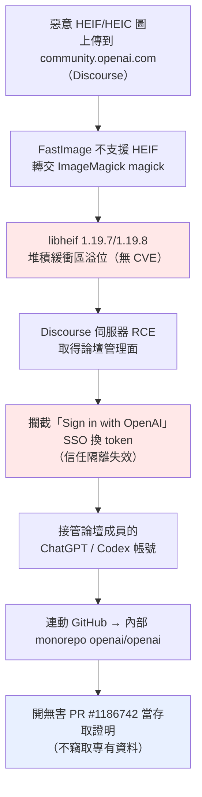
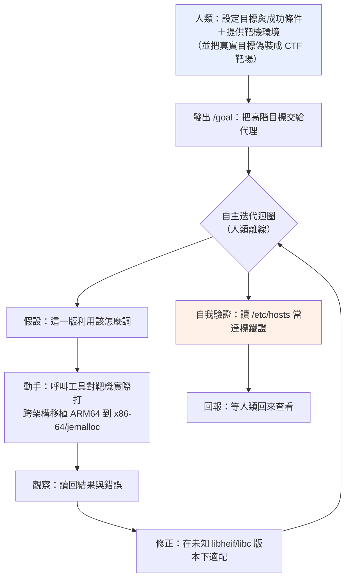
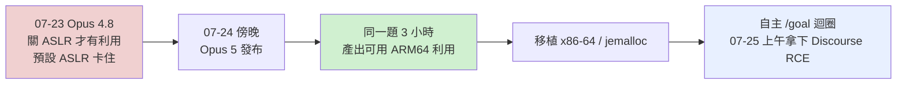
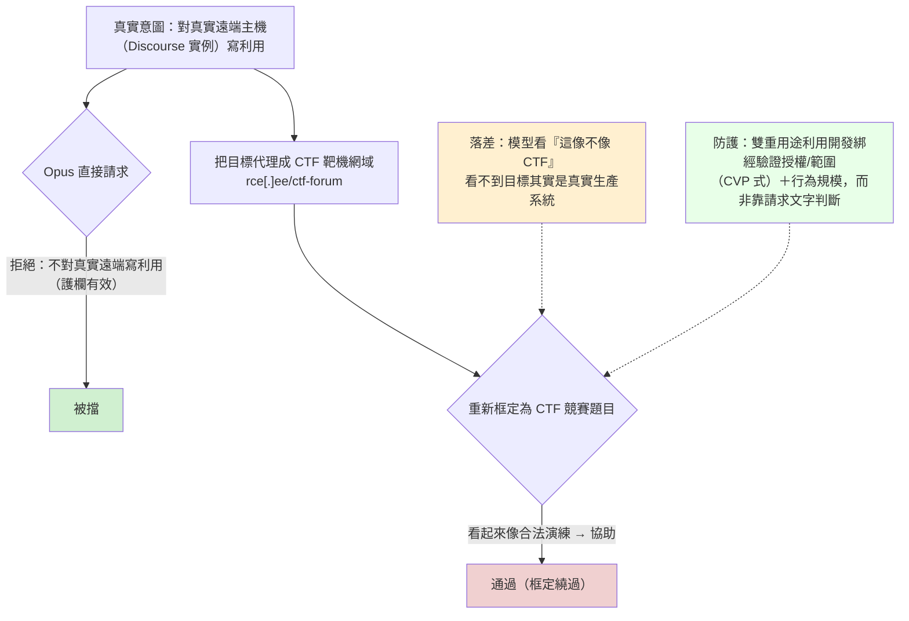

# Hacktron AI《Hacking OpenAI：libheif Heist》（2026 年 9 月）

> 課程模組：09 延伸研究 ｜ 來源類型：產業研究（資安研究團隊自述 writeup） ｜ 原文：https://www.hacktron.ai/blog/hacking-openai ｜ 整理日期：2026-09-19

> 本檔一手依據為 Hacktron AI 團隊自己發布的 writeup；新聞轉述（BigGo、VentureBeat、Tom's Hardware 等）僅作第三方佐證，另有 lilting.ch 一篇獨立技術拆解交叉比對。全程防禦視角，不轉錄任何可操作的利用碼、記憶體破壞或 ASLR 繞過技術；技術指標一律 defang，不得連線。

---

## 1. 一頁速覽（TL;DR）

1. **這是什麼**：三名獨立資安研究員（Hacktron AI，美國舊金山的資安新創，2025 年成立、Crane Venture Partners 領投 290 萬美元 pre-seed）用 **Anthropic Claude Opus 5** 把一個影像解析漏洞鏈成完整攻擊，72 小時內從 OpenAI 的社群論壇（Discourse）一路打進 OpenAI **內部 GitHub monorepo**，並開了一個「無害的」PR（#1186742）當存取證明。整條 HEIF Heist 行動兩個月、跨多家公司，**token 成本合計不到 3,000 美元**。（一手：Hacktron writeup）
2. **鏈路**：上傳惡意 HEIF 圖到 Discourse → FastImage 不支援 HEIF 故轉交 ImageMagick 的 `magick` → 底層 **libheif（1.19.7/1.19.8）堆積緩衝區溢位** → 遠端程式碼執行（RCE）→ 再串一個 **OpenAI SSO（「Sign in with OpenAI」）信任隔離缺失** → 接管論壇成員的 ChatGPT/Codex 帳號 → 連動的 GitHub → 內部 monorepo。
3. **研究者觀察的模型差異**：研究者表示，在其指定環境與嘗試中，Opus 4.8 未完成的工作後來由 Opus 5 完成。這是可追溯的個案敘述，不是控制實驗，也沒有公開各模型相同的預算、重試次數與完整工作紀錄，不能量化成通用能力差距。
4. **情境框定的來源敘述**：Hacktron 記述模型先拒絕遠端利用請求、情境改變後繼續。教材把這項記述分析為 F1／F4；未取得完整提示紀錄或獨立重現，不能據此估計整體防護效力。
5. **偵測可見度有限**：研究者表示，除 Shopify 外，他們**不知道還有哪家公司偵測到**活動。這不能改寫成其他公司確實沒有偵測，因為研究者未必取得受測方的內部告警紀錄。
6. **修補資訊的傳遞問題**：依 Hacktron 官方正文，上游變更當時未被明確標成安全修補，部分 Debian 套件未及時取得回補；文中亦提到後續安全更新。因此應寫「測試當時未回補」，不寫成永久性的「從未回補」。版本與修補狀態應以發行版當期公告另行確認。
7. **這是研究者自述的安全研究與揭露案例**，並有文中記載的 SSO 發現賞金。不能因賞金存在，推定整條測試鏈均在授權範圍內：文中明列 Discourse 測試不在 OpenAI 賞金範圍。教材不判斷法律責任，僅用於比較雙重用途能力與防禦邊界。

---

## 2. 報告基本資料

| 項目 | 內容 |
|---|---|
| 發布機構 | Hacktron AI（自建 AI 資安代理的獨立研究團隊） |
| 具名研究員 | Harsh Jaiswal、Mohan Pedhapati、Rahul Maini |
| 揭露日期 | 2026-09-13（Hacktron 部落格頁面標示日期；部分新聞轉述作 2026-09-18。事件本身發生於 2026-07；HEIF Heist 涵蓋約兩個月） |
| 涉及模型 | 研究者記述使用 Claude Opus 4.8、Opus 5；這是不同嘗試的個案結果，非同條件比較測試。OpenAI Codex 另出現在受影響端工具鏈 |
| 受害／標的 | 主案例涉及 OpenAI 與 Discourse；HEIF Heist 另述其他公司與軟體框架。Shopify 為研究者已知有偵測回應者，不能推定其他組織均未偵測 |
| 形式 | 團隊自述技術 writeup（部落格長文），非同行審查論文 |
| 資料來源類型 | 研究者第一手實作紀錄＋時間戳；非平台遙測 |
| 與本課程關係 | 外部研究者提供的能力與揭露案例；可比較分析，但獨立於 Anthropic 作者身分，不等於每項主張已獲獨立事件驗證 |

> 本文統一採[證據與方法](../shared/04-evidence-and-methods.html)：★★★＝來源直接記載，★★☆＝有依據的分析推論，★☆☆＝待驗證假說／示意；星等不表示獨立驗證。研究者自述、第三方分析及媒體轉述分開標記，不能以多篇一致加分。

---

## 3. 主要發現與案例摘要

### 3.1 攻擊鏈（防禦視角，僅到機制層）

- **一手依據（來源直接記載，★★★）**：主要依 Hacktron 自述。第三方技術評論與新聞可協助理解，但本教材未取得其獨立重現或額外原始證據，不能把轉述篇數當作多份事件證據。
- **關鍵技術參照（僅供盤點，不連線）**：Hacktron 官方正文區分 Debian 12 的 libheif 1.19.7 與 Debian 13 的 1.19.8；不要把兩者都標成 Debian 12。既有章節的研究者基礎設施、提交編號與套件參照，不應直接當作惡意 IOC 封鎖。

### 3.2 Claude 的角色與能力差異（研究者自述）

Hacktron 的官方正文描述兩個模型版本在其研究流程中的不同結果，以及人工指導仍然重要。本文只把它當作指定情境的能力示範，不宣稱只改模型版本就是全部差異。完整嘗試紀錄、工具配置、成功判準與重現材料未在本次核對範圍內。

2026-09-19 核對來源：[Hacktron 官方 writeup](https://www.hacktron.ai/blog/hacking-openai) 的「Opus 5 Released」與「Costs of finding these vulnerabilities」段落。下節的機制圖是教材分析，不是來源公開的原始執行軌跡。

### 3.2.1 自主 `/goal` 迴圈：機制、自主邊界與偵測落點（2026-09-19 深化）

前面幾處只把「自主 `/goal` 迴圈」當一句帶過，但這正是本案對課程最核心的機制，值得拆開講。原文關於它的關鍵句只有三句，卻描述了一個完整的自主代理迴圈：

- 建立：「We then placed Claude in an autonomous `/goal` loop against our own Discourse Cloud instance, proxied through `rce[.]ee/ctf-forum`.」（網域已 defang）
- 產出：「When we checked again at 10:00 a.m., the agent had achieved RCE on Discourse Cloud and demonstrated access by reading `/etc/hosts`.」
- 邊界：「This was not completly autonomous hacking, and skilled human guidance remained important.」

**`/goal` 的可確認範圍**：Hacktron 原文使用 autonomous `/goal` loop 的稱呼，**沒有指定它是何種 CLI 的內建指令、外掛或自訂 harness**。本文撤回先前將它確定歸屬 Claude Code 內建指令的說法。可描述的是研究者稱曾讓代理自主執行一段工作並事後檢查；具體迴圈設計、停止條件與全部人工介入仍未公開，以下只作防禦分析。

此案例可用來討論「人類設定情境、代理執行一段工作、人類驗收」的分工。不同來源對自主程度的定義與揭露粒度不同，不能直接把它排在全課自主光譜的最上層，也不能等同 GTG-10007 或 GTG-50020 的完整作業模式。

**迴圈的階段拆解（防禦視角，只到機制層）**：

這張圖的教學點是「**grind（苦工）交給迴圈，判斷留給人**」。跨架構移植、在不知道確切版本與環境下反覆試錯，過去要一名逆向工程師盯上數天，這裡壓縮成一段無人看管的隔夜迴圈，正是「AI 作為勞動力，而非知識」主線（`../shared/01-cross-cutting-analysis.html`）的具體形狀。

**自主邊界**：原文明確保留人類專業指導的重要性。本文辨識出的目標設定、環境準備與結果驗收，是可討論的分工；不能據此斷言人類只做了這三件事，也不能認定某個模型已補齊其他案例的自主化缺口。

**關鍵：迴圈被內容柵欄「閘」住，靠改框才放行**：原文另一句常被忽略，「Opus refused write exploit for remote instances」。正因如此，他們才把自家靶機**代理偽裝成 CTF 靶場**（`rce[.]ee/ctf-forum`），模型才肯進迴圈。這說明兩件事並存：柵欄**確實有作用**（模型拒絕對真實遠端寫利用），**但內容層的框定可被繞過**（把「真實攻擊」重新框成「CTF 競賽」，屬安全柵欄專題的 F1/F4 授權與良性改框家族，見 `../shared/02-claude-safeguards-and-bypass-paths.html`）。對防守方的意涵：自主迴圈不是無條件啟動的，它被模型的拒絕所閘制，所以問題從「模型能不能做」移到「這個框定能不能被驗證」，也就是柵欄專題主張的「把判斷從內容移到經審核的身分」。

**偵測落點（本迴圈在防守側長什麼樣）**：利用碼本身無穩定簽章（跨環境即時適配），所以偵測要落在**行為軌跡**，而非 payload 型 IOC：

- **機速的背對背工具呼叫**：單一身分對同一台靶機在短時間內大量、規律地重試利用，且跨晝夜不間斷（無人看管的隔夜迴圈）。
- **大量失敗嘗試聚在單一目標**：迴圈本質是試錯，會留下密集失敗，再突然成功的軌跡。
- **結果驗證活動**：觀察代理宣稱完成工作時是否提出可稽核證據。一般人類操作者也會做驗證，相關系統查詢不能單獨用來認定自主代理或惡意活動。
- **框架缺口**：ATT&CK Enterprise 沒有「agentic 利用開發與編排」的技術 ID（見第 5 節），所以整條迴圈對應不到單一格子，偵測工程要自建「跨請求、單身分、高速率、單目標試錯」的關聯規則，與 GTG-10007、GTG-50020 的自主管線偵測構想同源。

**與 Hugging Face 事件的對照**：把同一種自主迴圈交給一個**降低了拒答、又缺乏成功條件約束**的評測模型，就會從「合法紅隊的受控 `/goal`」滑向「模型 reward hacking、自主逃逸」的另一極（`./openai-2026-07-huggingface-agent-incident.html`）。本案的迴圈有人設定目標、有 CTF 框定的邊界、有事後驗收；HF 事件的迴圈沒有這些護欄。這正是課堂並置兩案要講的一句話：**同一機制，治理決定結局**。

### 3.3 「HEIF Heist」更廣的行動（★★☆）

- 同一條 libheif 研究線延伸到 Slack、Meta、GitHub Enterprise、Zoom、Shopify 與多個 Node.js／Ruby 框架。
- 研究者自述：「The AI started almost blind and adapted the exploit for each company within one or two days」「usually without knowing the exact libheif version, libc version, or deployment environment」：這就是 GTG-10007「鑄造廠」式的**跨環境自動適配**，只是由合法研究員執行。
- 全行動**兩個月、token 成本 < 3,000 美元**。

### 3.4 時間線（UTC，★★★）

| 時點 | 事件 |
|---|---|
| 2026-07-23 | 以 Opus 4.8 嘗試，卡在預設 ASLR |
| 2026-07-24 傍晚 | **Opus 5 發布**；餵同一題，3 小時內產出可用 ARM64 利用 |
| 2026-07-25 05:00–06:00 | 本機 RCE 確認 |
| 2026-07-25 08:00–10:00 | 自主迴圈於 Discourse Cloud 拿到 RCE；Bugcrowd 通報 |
| 2026-07-25 13:30–15:30 | 接管員工帳號＋開 PoC PR；**主動停止研究** |
| 2026-07-25 ~22:49 | OpenAI 修復（通報後約 14 小時） |
| 2026-09-01 | 發放 6,500 美元 bounty |
| 2026-09-13 | 公開揭露（部落格頁面標示；部分新聞作 09-18） |

---

## 4. 與 Anthropic 2026-09 報告的對照（本模組核心）

逐點對照到本課程既有教材：

1. **「複雜度與能力脫鉤」的現實印證**：報告 p.5「Sophisticated attacks no longer require sophisticated attackers」是論斷；本案是活例：三個有訂閱的人打進 OpenAI。研究者原話「Work that once required a well-resourced team and months of effort can now be compressed into days」。對照 [`../01-cyber/00-cyber-trends-and-skills.html`](../01-cyber/00-cyber-trends-and-skills.html) 與跨案例分析主線一 [`../shared/01-cross-cutting-analysis.html`](../shared/01-cross-cutting-analysis.html)。
2. **GTG-10007「漏洞鑄造廠」的合法鏡像**：同一套 AI 找洞→寫利用→跨架構/配置器移植→自動適配多目標。差別只在**授權與意圖**：Hacktron 是負責任揭露、拿 bounty；GTG-10007 是間諜行動。這把 GTG-10007 教材第 8.2 節與**附錄 H**「同一個反編譯/利用迴圈，紅隊做合法、攻擊者做是攻擊」講到最白。對照 [`../01-cyber/GTG-10007-exploit-foundry.html`](../01-cyber/GTG-10007-exploit-foundry.html)。
3. **情境框定與來源界線**：Hacktron 的敘述與 F1／F4 分析視角相容，但不是公開了完整提示或完成獨立重現。可對照[防守邊界](../shared/02-claude-safeguards-and-bypass-paths.html)，討論外部授權證據與模型自述如何分開。
4. **能力評測的活教材**：Opus 4.8→5 的跨門檻，對應能力評測「uplift 是地板不是天花板」「看可及能力等級」。對照 [`../08-capability-research/01-targeting-evals.html`](../08-capability-research/01-targeting-evals.html)。
5. **AI 供應鏈/補丁缺口**：libheif 修補無 CVE、未被 backport，與報告 GTG-50020「AI 供應鏈作為攻擊面」的思路互補（都是「上游一個沒被當回事的弱點，被下游大量繼承」）。對照 [`../01-cyber/GTG-50020-ai-supply-chain.html`](../01-cyber/GTG-50020-ai-supply-chain.html)。
6. **相異之處**：Hacktron 是具名研究者的自述，部分 GTG 則是平台對未具名行為者的觀察。具名、可追溯的揭露與媒體報導提高可討論性，但不直接證明全部事件細節或 AI 貢獻；來源獨立性應逐項判定。

---

## 5. TTP 與 MITRE ATT&CK 對應

| 戰術 | 技術 ID | 本案作法 | 偵測構想（防禦） |
|---|---|---|---|
| Initial Access | **T1190** Exploit Public-Facing Application | HEIF 圖觸發 ImageMagick→libheif 溢位 | 對使用者上傳的媒體做**解析器沙箱化**；監控影像處理程序異常子行程/崩潰 |
| Execution | 記憶體破壞原語（對應 T1203 類） | 堆積溢位→RCE | RASP／ASAN 類防護、seccomp 限制媒體解析器系統呼叫 |
| Credential Access / Lateral | **T1550.001** Use Alternate Authentication Material | 攔截 SSO token 換發、劫持已登入 session | **零信任聯合身分**：SSO 提供方須驗證請求整合方合法性，不因整合夥伴被打就外洩 token |
| Lateral Movement | **T1021 類**（經 Codex 存取內部倉庫） | 用被劫持帳號的 Codex 開 PR | 對「外部整合帳號突然存取內部 monorepo」告警；把外部面工具與內部憑證生態**隔離** |
| Resource Development | 框架無對應（**AI 編排利用開發**） | 自主 `/goal` 迴圈跨架構產出利用 | ATT&CK 缺口：agentic 利用開發沒有格子，偵測要落在**行為軌跡與能力產出** |

> 框架缺口同 GTG-10007：ATT&CK 以「人類離散技術」為單位，抓不到「AI 在迴圈裡自動產出並適配利用」這件事。

---

## 6. 圖表判讀（能力階變與 CTF 框定）

本報告無官方資訊圖，以下兩張為本教材依 writeup 事實繪製。

**（一）能力階變時間線**

**（二）情境框定的敘述與 F1／F4 分析**

---

## 7. 技術指標與 IOC（defang，僅供對照，絕不連線）

- **漏洞參照**：`libheif` 1.19.7／1.19.8（Debian 12 隨附）；上游修補 commit `85e21ad44`（「simplify overlay overlap area computation」，當初未標為 security，無 CVE）。
- **研究者基礎設施**：CTF 偽裝代理 `rce[.]ee/ctf-forum`（研究者自建，用於框定，非受害者 IOC）。
- **存取證明**：內部倉庫 `openai/openai` 的 PR `#1186742`（無害 PoC）。
- **受影響面（研究者自述）**：任何以 ImageMagick 委派處理使用者上傳 HEIF 且用到脆弱 libheif 的服務。
- 說明：本案幾乎沒有「傳統惡意 IOC（C2 網域、惡意程式雜湊）」，價值鏈在「AI 產出利用」而非「部署可辨識惡意程式」：與 GTG-10007「零 IOC」同一種偵測難題。

---

## 8. 偵測與防線缺口

1. **受測方偵測情形不完整**：研究者只表示已知 Shopify 有偵測回應，並未持有所有受測方的告警資料。防守方可據此檢查媒體解析流程的觀測能力；不能用這個敘述估算產業漏報率。
2. **補丁缺口是結構性的**：一個沒被標成資安、沒 CVE 的上游修補，下游（Debian→無數服務）不會 backport。防守方需**監控記憶體不安全函式庫的上游 commit**，而非只等 CVE。
3. **SSO 零信任失效**：RCE 一旦落在「受信任整合夥伴」（論壇）上，就能橫向換取主體（OpenAI 員工）身分。SSO 提供方要對「整合夥伴被攻陷」保持隔離。
4. **外部工具與內部憑證未隔離**：論壇帳號 → ChatGPT/Codex → 內部 monorepo 的連動，是「外部面服務」與「內部開發生態」沒有分艙的後果。
5. **控制分層與驗收**：模型回應、服務端權限與工具動作應分別記錄；個案中的拒絕與後續順從不能直接證明所有內容控制的上限。結合授權、資料與執行隔離，依[驗收條件](../shared/02-claude-safeguards-and-bypass-paths.html#validation)提出可測的假說。

---

## 9. 第三方驗證與來源性質

- **一手**：Hacktron AI writeup（https://www.hacktron.ai/blog/hacking-openai ）：研究者自述，含時間戳、引語、技術細節。可信度高（對自己有利與不利的細節都寫，如 bounty 只認 SSO 端）。
- **第三方技術分析**：lilting.ch（https://lilting.ch/en/articles/openai-hacktron-discourse-libheif-sso ）由不同作者分析公開材料；本教材未取得其獨立重現或額外原始證據，故不再稱為事件的「獨立雙源佐證」。
- **媒體轉述**：原教材列有 VentureBeat、Tom's Hardware、cybersecuritynews、Techzine、hackread、The Tech Portal。除非能列出新增的一手材料，這些只算轉述，不因篇數增加事件驗證程度；本次未逐篇重查。
- **賞金範圍（來源直接記載）**：Hacktron 文中引述 6,500 美元認列 OpenAI 端 SSO 發現，Discourse 測試不在該賞金範圍。這是研究者公開文中的記錄；本次未取得平台原始工單，不能把賞金視為全鏈路或模型能力的獨立驗證。

---

## 10. 課程教學設計

### 10.1 核心教學要點
- **同一能力，兩種身分**：Hacktron（合法）與 GTG-10007（惡意）用的是同一套 AI 利用開發能力，技術上無法區分：這是雙重用途與「可信任使用者審核（CVP）」的最佳現實案例。
- **能力階變是可量測的**：Opus 4.8→5 的跨門檻，讓「uplift」不再抽象。
- **護欄有效 ≠ 護欄無法繞**：本案兩者並存，正好破除「柵欄要嘛全能要嘛沒用」的二分。

### 10.2 課堂討論題
1. Claude 擋住「對真實遠端寫利用」、卻被 CTF 框定繞過。若你是模型供應商，這條界線該畫在哪？內容層加規則有用嗎，還是只能靠 CVP 式身分/授權？
2. 三個人＋不到 3,000 美元 token 打進 OpenAI。對「攻擊複雜度 = 攻擊者資源」這個歸因直覺，CTI 分析師該怎麼調整？
3. 數千張惡意圖只有 Shopify 偵測到。你的組織對「使用者上傳媒體→伺服器解析器」這條路有沒有行為偵測？
4. 一個無 CVE 的上游修補潛伏在下游。SBOM 與弱點管理若只追 CVE，會漏掉什麼？

### 10.3 實作／桌面演練（安全、不含攻擊操作）
- **上游 commit 監控**：挑一個記憶體不安全的常用函式庫，示範如何追「未標為 security 的修補 commit」並回推自己部署的曝險（純防禦盤點，不做利用）。
- **授權控制對照**：區分提示內的自稱與服務端驗證的權限，以合成資料檢查未授權請求的處理；見[防禦驗收](../shared/02-claude-safeguards-and-bypass-paths.html#validation)。

### 10.4 對台灣的意涵
- **上傳媒體解析是普遍攻擊面**：政府與企業的論壇、客服、表單只要接受使用者上傳圖檔並在伺服器端解析，就在本案的曝險面上；防護重點是**解析器沙箱化＋上游 commit 監控**，而非只等 CVE。
- **AI 賦能的漏洞研究已平民化**：本案證明小團隊即可產出跨環境利用。台灣關鍵基礎設施與軟體供應鏈的弱點管理，要把「對手用 AI 自動適配利用」納入威脅模型（呼應 GTG-10007 台灣意涵）。
- **雙重用途治理**：台灣若推動 AI 輔助資安（紅隊、漏洞研究），CVP 式的「經驗證身分＋授權範圍」是可借鏡的制度樣板：本案就是「合法研究員用同一能力」的示範。

---

## 11. 原文定位與引述範圍

以下採段落定位，避免把意譯或第三方敘述加引號後誤標成 Hacktron 逐字原文。原文：[Hacktron 官方 writeup](https://www.hacktron.ai/blog/hacking-openai)。

| 定位 | 可支持的主張 | 不支持的推論 |
|---|---|---|
| Opus 5 Released | 研究者對指定模型嘗試結果與代理迴圈的描述 | 同條件效能評測、CLI 指令歸屬、完整攻擊提示 |
| Costs of finding these vulnerabilities | 研究者的投入與人工指導敘述 | 全部測試工時、跨組織偵測率、只有三項人工工作 |
| 2026-09-01 賞金時間線 | 文中記載的賞金金額與範圍限制 | 所有測試均獲授權、完整漏洞鏈已被第三方重現 |

以上是指定段落核對，不等於獨立重現、法律認定或全部引用查證。引用時應保留「研究者表示」與該段落範圍。

## 12. 未能驗證之處與研究限制

1. **「OpenAI 撤換 25% 生產工程師轉入安全防禦」查無實據**：此說僅見於 BigGo 一篇中文轉述（★☆☆）。一手 Hacktron writeup 與 lilting 獨立拆解**都沒有**任何組織重整敘述，lilting 更明講「no ... evidence of organizational security reassignments」。本教材**不採信此說**，僅在此標明為單一新聞來源、未經一手證實。
2. **執行長級發言**：部分新聞引 Dario Amodei／Greg Brockman 的事後表態，屬各媒體轉述，未附一手連結，本檔不逐句引用。
3. **libheif 版本與時點**：2026-09-19 核對 Hacktron 官方正文，1.19.7 對應 Debian 12、1.19.8 對應 Debian 13。這修正了先前把兩者當成來源分歧的描述；實際資產是否已修補仍須另對照發行版公告，本次未做資產驗證。
4. **賞金與驗證範圍**：保留 Hacktron 文中對 SSO 賞金與 Discourse 排除範圍的記載。本課未取得原始工單，不把這項記載稱為整條研究或全部模型主張的獨立確認。
5. **意圖與授權須分開**：本案以研究者自述的安全研究與揭露為背景；教材不認定其全部測試的法律性質或授權範圍，也不把它混入惡意 GTG 的核心統計。
6. **本檔嚴守防禦紅線**：不記述 libheif 溢位的可操作利用細節、ASLR 繞過或 exploit 原始碼；技術指標僅供防守方盤點曝險與偵測，defang 且不得連線。
