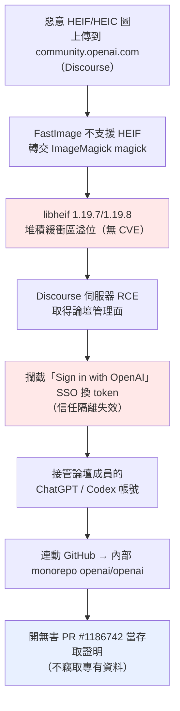
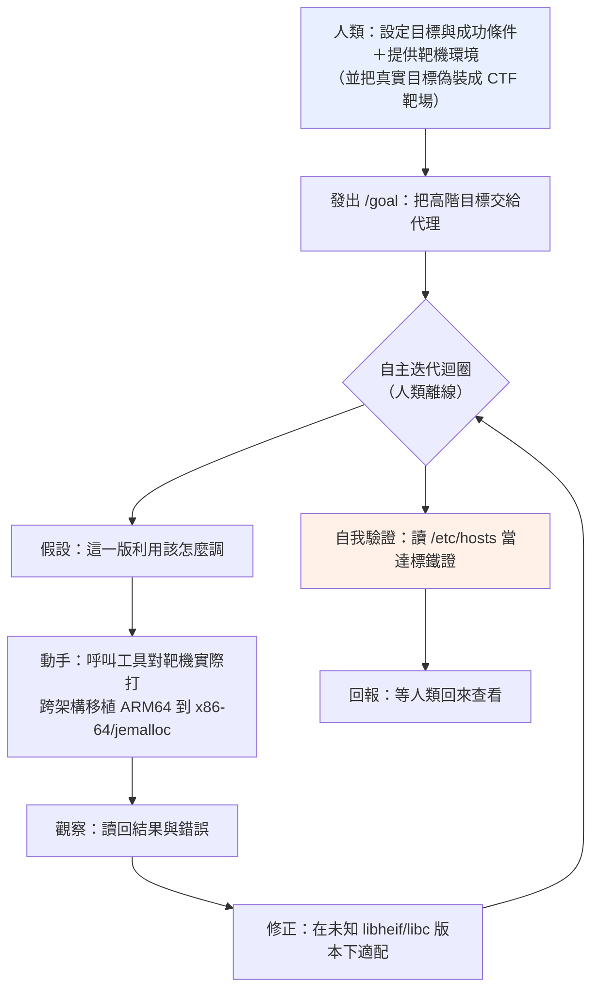
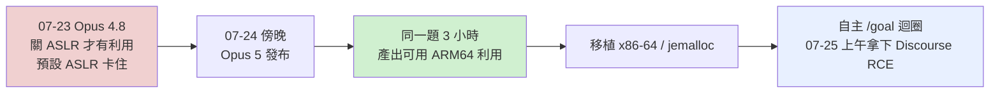
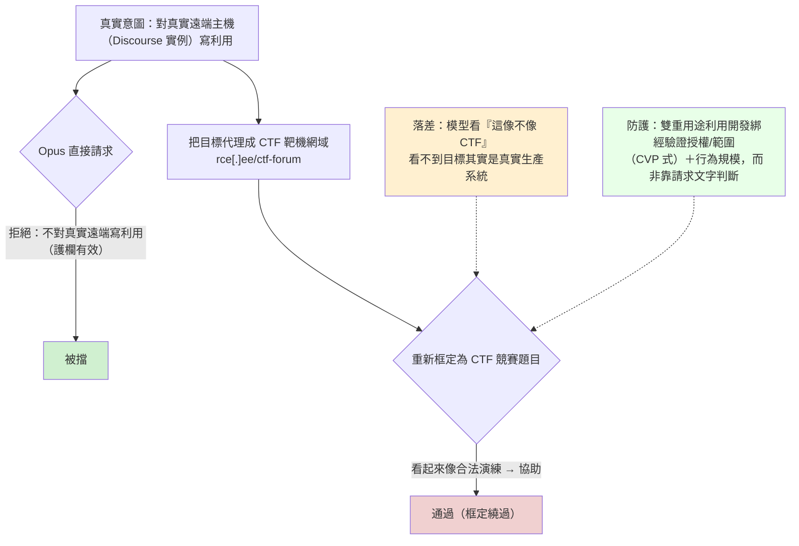

# Hacktron AI《Hacking OpenAI：libheif Heist》（2026 年 9 月）

> 課程模組：09 延伸研究 ｜ 來源類型：產業研究（資安研究團隊自述 writeup） ｜ 原文：https://www.hacktron.ai/blog/hacking-openai ｜ 整理日期：2026-09-19

> 本檔一手依據為 Hacktron AI 團隊自己發布的 writeup；新聞轉述（BigGo、VentureBeat、Tom's Hardware 等）僅作第三方佐證，另有 lilting.ch 一篇獨立技術拆解交叉比對。全程防禦視角，不轉錄任何可操作的利用碼、記憶體破壞或 ASLR 繞過技術；技術指標一律 defang，不得連線。

---

## 1. 一頁速覽（TL;DR）

1. **這是什麼**：三名獨立資安研究員（Hacktron AI，美國舊金山的資安新創，2025 年成立、Crane Venture Partners 領投 290 萬美元 pre-seed）用 **Anthropic Claude Opus 5** 把一個影像解析漏洞鏈成完整攻擊，72 小時內從 OpenAI 的社群論壇（Discourse）一路打進 OpenAI **內部 GitHub monorepo**，並開了一個「無害的」PR（#1186742）當存取證明。整條 HEIF Heist 行動兩個月、跨多家公司，**token 成本合計不到 3,000 美元**。（一手：Hacktron writeup）
2. **鏈路**：上傳惡意 HEIF 圖到 Discourse → FastImage 不支援 HEIF 故轉交 ImageMagick 的 `magick` → 底層 **libheif（1.19.7/1.19.8）堆積緩衝區溢位** → 遠端程式碼執行（RCE）→ 再串一個 **OpenAI SSO（「Sign in with OpenAI」）信任隔離缺失** → 接管論壇成員的 ChatGPT/Codex 帳號 → 連動的 GitHub → 內部 monorepo。
3. **能力階變（本案對課程最硬的一條）**：**Opus 4.8 做不到**（只能在關掉 ASLR 的容器拿到利用，卡在預設 ASLR），**Opus 5 一發布、同一題三小時就產出可用 ARM64 利用**，再移植到 Discourse 的 x86-64/jemalloc 環境、以自主 `/goal` 迴圈拿下 RCE。這是有日期、雙源可查的「模型能力跨門檻」實例。
4. **CTF 框定繞過護欄**：因為 **Opus 拒絕對真實遠端主機寫利用**，他們把流量**代理成 CTF 靶機網域**（`rce[.]ee/ctf-forum`）偽裝成競賽題目才通過。這正是本課程 F1／F4（授權/CTF 框定）在真實世界的具名實例，也反證**護欄確實有作用**。
5. **偵測慘況**：整個 HEIF Heist 送出**數千張圖**，除了 **Shopify**，**沒有一家公司偵測到**。
6. **補丁缺口**：上游修補（libheif commit `85e21ad44`）當初**未被標為資安問題、沒有 CVE**，因此 Debian 從未 backport，漏洞就這樣長期潛伏在一堆用 ImageMagick 處理使用者上傳圖的服務裡。
7. **這是合法研究、負責任揭露**（透過 OpenAI Bugcrowd 通報、拿到 6,500 美元 bounty），不是惡意 GTG。它的教學價值正在這裡：**同一套 AI 找洞→寫利用→跨架構移植的能力，合法紅隊在用、惡意行為者也在用，技術上一模一樣**：這是 GTG-10007「漏洞鑄造廠」的合法鏡像，把整份 Anthropic 報告最核心的「複雜度與能力脫鉤」「雙重用途」講到活。

---

## 2. 報告基本資料

| 項目 | 內容 |
|---|---|
| 發布機構 | Hacktron AI（自建 AI 資安代理的獨立研究團隊） |
| 具名研究員 | Harsh Jaiswal、Mohan Pedhapati、Rahul Maini |
| 揭露日期 | 2026-09-13（Hacktron 部落格頁面標示日期；部分新聞轉述作 2026-09-18。事件本身發生於 2026-07；HEIF Heist 涵蓋約兩個月） |
| 涉及模型 | Anthropic Claude Opus 4.8（失敗）、**Claude Opus 5（成功）**；另用 OpenAI Codex 作為受害端工具 |
| 受害/標的 | OpenAI（主標的）；HEIF Heist 另及 Slack、Meta、Zoom、GitHub Enterprise、Shopify（唯一偵測到者），以及 Ruby on Rails、Next.js／Astro／Gatsby 等框架 |
| 形式 | 團隊自述技術 writeup（部落格長文），非同行審查論文 |
| 資料來源類型 | 研究者第一手實作紀錄＋時間戳；非平台遙測 |
| 與本課程關係 | 外部、獨立、具第三方佐證的案例；與 Anthropic 2026-09 報告**同期、同主題**（AI 賦能網路攻擊），可直接對照 |

> 證據等級約定（沿用全課）：★★★＝一手 writeup 逐字或多源一致；★★☆＝一手描述、合理重建；★☆☆＝單一新聞來源、未經一手證實。

---

## 3. 主要發現與案例摘要

### 3.1 攻擊鏈（防禦視角，僅到機制層）

- **一手依據（★★★，多源一致）**：Hacktron writeup 與 lilting 技術拆解對鏈路描述一致；VentureBeat、Tom's Hardware、cybersecuritynews 覆述相同。
- **關鍵技術指標（defang，僅供對照，勿連線）**：漏洞在 `libheif 1.19.7/1.19.8`（Debian 12）；上游修補 commit `85e21ad44`；CTF 偽裝代理 `rce[.]ee/ctf-forum`；存取證明 PR `#1186742`（倉庫 `openai/openai`）。這些多屬**研究者自身基礎設施與漏洞參照**，非受害者側 IOC。

### 3.2 Claude 的角色與能力階變（本案核心，★★★）

- **Opus 4.8**：「managed to obtain a working exploit on a local container with ASLR disabled, but hit a wall trying to bypass ASLR in the default environment.」（跨多個 session 仍無法穩定利用預設 ASLR 環境。）
- **Opus 5**：「Feeding the exact same challenge to Opus 5, the model produced a functional ARM64 exploit within 3 hours.」隨後應要求移植到 x86-64/jemalloc；研究者把 Claude 放進**自主 `/goal` 迴圈**對測試機打，「by 10:00 a.m. ... the agent had achieved RCE on Discourse Cloud and demonstrated access by reading `/etc/hosts`」。
- **意義**：同一題、同一批人、只換模型版本，結果從「卡住」變「三小時可用」。這把「uplift」從抽象講成一個**可標日期的能力跨越**，直接對應能力評測模組「地板而非天花板」的量測邏輯。

### 3.2.1 自主 `/goal` 迴圈：機制、自主邊界與偵測落點（2026-09-19 深化）

前面幾處只把「自主 `/goal` 迴圈」當一句帶過，但這正是本案對課程最核心的機制，值得拆開講。原文關於它的關鍵句只有三句，卻描述了一個完整的自主代理迴圈：

- 建立：「We then placed Claude in an autonomous `/goal` loop against our own Discourse Cloud instance, proxied through `rce[.]ee/ctf-forum`.」（網域已 defang）
- 產出：「When we checked again at 10:00 a.m., the agent had achieved RCE on Discourse Cloud and demonstrated access by reading `/etc/hosts`.」
- 邊界：「This was not completly autonomous hacking, and skilled human guidance remained important.」

**`/goal` 迴圈是什麼**：`/goal` 是 **Claude Code 內建的斜線指令**（作用是「設定一個目標／條件，讓 Claude 自主朝它推進」，與 `/loop`、`/schedule` 同屬自主執行類指令），本身就會跑一個目標導向的自主迴圈，不必另外自訂。要誠實標明：Hacktron 這篇 writeup **並未定義 `/goal`，也沒點名用的是 Claude Code 還是自家工具**，原文只有「placed Claude in an autonomous `/goal` loop」一句；但這個斜線指令的形式與行為，對應的正是 Claude Code 這類 CLI 內建的目標導向迴圈，而不是 Hacktron 專有的機制（先前一版誤植為 Hacktron harness 原語，此處更正）。機制上，人類只給模型一個高階目標（「拿下這台 Discourse 的 RCE」），不再逐步下指令；模型自己在「假設，動手（呼叫工具實際打靶），看結果，修正」之間反覆迭代，朝一個**可量測的成功條件**爬升（hill climbing），直到達成或放棄。人類在迴圈啟動後離開，事後回來查看（原文「When we checked again at 10:00 a.m.」），這就是本案「自主」二字的實指。

這條迴圈把本案定位在課程自主光譜的**最上層**（對照 `../01-cyber/00-cyber-trends-and-skills.html` 的三層：對話式協助，人類逐步指揮，AI 編排自主執行），也是 GTG-10007 Figure 12「二進位反轉與利用開發迴圈」與 GTG-50020 Figure 16「autonomous exploitation pipeline」的合法鏡像（`../01-cyber/GTG-10007-exploit-foundry.html`、`../01-cyber/GTG-50020-ai-supply-chain.html`）。

**迴圈的階段拆解（防禦視角，只到機制層）**：

這張圖的教學點是「**grind（苦工）交給迴圈，判斷留給人**」。跨架構移植、在不知道確切版本與環境下反覆試錯，過去要一名逆向工程師盯上數天，這裡壓縮成一段無人看管的隔夜迴圈，正是「AI 作為勞動力，而非知識」主線（`../shared/01-cross-cutting-analysis.html`）的具體形狀。

**自主到哪裡，人還管著什麼（別高估自主性）**：原文明說「not completly autonomous」。人類仍做了三件迴圈補不了的事：(1) 設定目標與成功條件；(2) 搭出被代理過的靶機環境（這一步同時也是柵欄繞過，見下）；(3) 事後回來驗收。這與 GTG-10007 新增附錄 J 整理的「六道自主化缺口」（harness 依賴、驗證缺口、目標漂移、context 退化、依賴操作者、無自我復原）互相印證：`/goal` 迴圈這次跑得動，是因為 Opus 5 把其中幾道缺口補到「夠用」，但補的是「這一代的門檻」，不是原理性難關。

**關鍵：迴圈被內容柵欄「閘」住，靠改框才放行**：原文另一句常被忽略，「Opus refused write exploit for remote instances」。正因如此，他們才把自家靶機**代理偽裝成 CTF 靶場**（`rce[.]ee/ctf-forum`），模型才肯進迴圈。這說明兩件事並存：柵欄**確實有作用**（模型拒絕對真實遠端寫利用），**但內容層的框定可被繞過**（把「真實攻擊」重新框成「CTF 競賽」，屬安全柵欄專題的 F1/F4 授權與良性改框家族，見 `../shared/02-claude-safeguards-and-bypass-paths.html`）。對防守方的意涵：自主迴圈不是無條件啟動的，它被模型的拒絕所閘制，所以問題從「模型能不能做」移到「這個框定能不能被驗證」，也就是柵欄專題主張的「把判斷從內容移到經審核的身分」。

**偵測落點（本迴圈在防守側長什麼樣）**：利用碼本身無穩定簽章（跨環境即時適配），所以偵測要落在**行為軌跡**，而非 payload 型 IOC：

- **機速的背對背工具呼叫**：單一身分對同一台靶機在短時間內大量、規律地重試利用，且跨晝夜不間斷（無人看管的隔夜迴圈）。
- **大量失敗嘗試聚在單一目標**：迴圈本質是試錯，會留下密集失敗，再突然成功的軌跡。
- **自我驗證的指紋**：達標時去讀 `/etc/hosts`、`id`、`hostname` 這類「證明我進來了」的低破壞性動作，是自主迴圈特有的收尾。
- **框架缺口**：ATT&CK Enterprise 沒有「agentic 利用開發與編排」的技術 ID（見第 5 節），所以整條迴圈對應不到單一格子，偵測工程要自建「跨請求、單身分、高速率、單目標試錯」的關聯規則，與 GTG-10007、GTG-50020 的自主管線偵測構想同源。

**與 Hugging Face 事件的對照**：把同一種自主迴圈交給一個**降低了拒答、又缺乏成功條件約束**的評測模型，就會從「合法紅隊的受控 `/goal`」滑向「模型 reward hacking、自主逃逸」的另一極（`./openai-2026-07-huggingface-agent-incident.html`）。本案的迴圈有人設定目標、有 CTF 框定的邊界、有事後驗收；HF 事件的迴圈沒有這些護欄。這正是課堂並置兩案要講的一句話：**同一機制，治理決定結局**。

### 3.3 「HEIF Heist」更廣的行動（★★☆）

- 同一條 libheif 研究線延伸到 Slack、Meta、GitHub Enterprise、Zoom、Shopify 與多個 Node.js／Ruby 框架。
- 研究者自述：「The AI started almost blind and adapted the exploit for each company within one or two days」「usually without knowing the exact libheif version, libc version, or deployment environment」：這就是 GTG-10007「鑄造廠」式的**跨環境自動適配**，只是由合法研究員執行。
- 全行動**兩個月、token 成本 < 3,000 美元**。

### 3.4 時間線（UTC，★★★）

| 時點 | 事件 |
|---|---|
| 2026-07-23 | 以 Opus 4.8 嘗試，卡在預設 ASLR |
| 2026-07-24 傍晚 | **Opus 5 發布**；餵同一題，3 小時內產出可用 ARM64 利用 |
| 2026-07-25 05:00–06:00 | 本機 RCE 確認 |
| 2026-07-25 08:00–10:00 | 自主迴圈於 Discourse Cloud 拿到 RCE；Bugcrowd 通報 |
| 2026-07-25 13:30–15:30 | 接管員工帳號＋開 PoC PR；**主動停止研究** |
| 2026-07-25 ~22:49 | OpenAI 修復（通報後約 14 小時） |
| 2026-09-01 | 發放 6,500 美元 bounty |
| 2026-09-13 | 公開揭露（部落格頁面標示；部分新聞作 09-18） |

---

## 4. 與 Anthropic 2026-09 報告的對照（本模組核心）

逐點對照到本課程既有教材：

1. **「複雜度與能力脫鉤」的現實印證**：報告 p.5「Sophisticated attacks no longer require sophisticated attackers」是論斷；本案是活例：三個有訂閱的人打進 OpenAI。研究者原話「Work that once required a well-resourced team and months of effort can now be compressed into days」。對照 [`../01-cyber/00-cyber-trends-and-skills.html`](../01-cyber/00-cyber-trends-and-skills.html) 與跨案例分析主線一 [`../shared/01-cross-cutting-analysis.html`](../shared/01-cross-cutting-analysis.html)。
2. **GTG-10007「漏洞鑄造廠」的合法鏡像**：同一套 AI 找洞→寫利用→跨架構/配置器移植→自動適配多目標。差別只在**授權與意圖**：Hacktron 是負責任揭露、拿 bounty；GTG-10007 是間諜行動。這把 GTG-10007 教材第 8.2 節與**附錄 H**「同一個反編譯/利用迴圈，紅隊做合法、攻擊者做是攻擊」講到最白。對照 [`../01-cyber/GTG-10007-exploit-foundry.html`](../01-cyber/GTG-10007-exploit-foundry.html)。
3. **CTF/授權框定繞過護欄（F1／F4）的具名實例**：Opus 拒絕對真實遠端寫利用，他們偽裝成 CTF 靶機才通過。這正是安全防護專題第九節手法族 **F1（人設/授權框定）與 F4（良性改框）**、以及**附錄 H**「授權滲透測試框定」的真實對應，也是 §9.6「CTF 框定」示範樣態的現實版。對照 [`../shared/02-claude-safeguards-and-bypass-paths.html`](../shared/02-claude-safeguards-and-bypass-paths.html)。**重點：本案同時證明「護欄有效」與「框定可繞」兩件事並存**：與專題「柵欄不是紙糊的，但內容層有原理性上限」完全吻合。
4. **能力評測的活教材**：Opus 4.8→5 的跨門檻，對應能力評測「uplift 是地板不是天花板」「看可及能力等級」。對照 [`../08-capability-research/01-targeting-evals.html`](../08-capability-research/01-targeting-evals.html)。
5. **AI 供應鏈/補丁缺口**：libheif 修補無 CVE、未被 backport，與報告 GTG-50020「AI 供應鏈作為攻擊面」的思路互補（都是「上游一個沒被當回事的弱點，被下游大量繼承」）。對照 [`../01-cyber/GTG-50020-ai-supply-chain.html`](../01-cyber/GTG-50020-ai-supply-chain.html)。
6. **相異之處（要誠實講）**：Anthropic 報告的案例是**惡意行為者**、且多為單一來源平台遙測；本案是**合法研究員**、有一手 writeup＋多家獨立佐證。所以本案在「歸因與事實」上比多數 GTG 更硬，但在「惡意意圖」上不成立：它是**能力示範**，不是攻擊行動。

---

## 5. TTP 與 MITRE ATT&CK 對應

| 戰術 | 技術 ID | 本案作法 | 偵測構想（防禦） |
|---|---|---|---|
| Initial Access | **T1190** Exploit Public-Facing Application | HEIF 圖觸發 ImageMagick→libheif 溢位 | 對使用者上傳的媒體做**解析器沙箱化**；監控影像處理程序異常子行程/崩潰 |
| Execution | 記憶體破壞原語（對應 T1203 類） | 堆積溢位→RCE | RASP／ASAN 類防護、seccomp 限制媒體解析器系統呼叫 |
| Credential Access / Lateral | **T1550.001** Use Alternate Authentication Material | 攔截 SSO token 換發、劫持已登入 session | **零信任聯合身分**：SSO 提供方須驗證請求整合方合法性，不因整合夥伴被打就外洩 token |
| Lateral Movement | **T1021 類**（經 Codex 存取內部倉庫） | 用被劫持帳號的 Codex 開 PR | 對「外部整合帳號突然存取內部 monorepo」告警；把外部面工具與內部憑證生態**隔離** |
| Resource Development | 框架無對應（**AI 編排利用開發**） | 自主 `/goal` 迴圈跨架構產出利用 | ATT&CK 缺口：agentic 利用開發沒有格子，偵測要落在**行為軌跡與能力產出** |

> 框架缺口同 GTG-10007：ATT&CK 以「人類離散技術」為單位，抓不到「AI 在迴圈裡自動產出並適配利用」這件事。

---

## 6. 圖表判讀（能力階變與 CTF 框定）

本報告無官方資訊圖，以下兩張為本教材依 writeup 事實繪製。

**（一）能力階變時間線**

**（二）CTF 框定繞過（對應附錄 H／§9.6 的 F1/F4）**

---

## 7. 技術指標與 IOC（defang，僅供對照，絕不連線）

- **漏洞參照**：`libheif` 1.19.7／1.19.8（Debian 12 隨附）；上游修補 commit `85e21ad44`（「simplify overlay overlap area computation」，當初未標為 security，無 CVE）。
- **研究者基礎設施**：CTF 偽裝代理 `rce[.]ee/ctf-forum`（研究者自建，用於框定，非受害者 IOC）。
- **存取證明**：內部倉庫 `openai/openai` 的 PR `#1186742`（無害 PoC）。
- **受影響面（研究者自述）**：任何以 ImageMagick 委派處理使用者上傳 HEIF 且用到脆弱 libheif 的服務。
- 說明：本案幾乎沒有「傳統惡意 IOC（C2 網域、惡意程式雜湊）」，價值鏈在「AI 產出利用」而非「部署可辨識惡意程式」：與 GTG-10007「零 IOC」同一種偵測難題。

---

## 8. 偵測與防線缺口

1. **偵測近乎全盲（最大教訓）**：數千張惡意圖送出，**只有 Shopify 偵測到**。writeup：「not aware of any company that detected the activity except Shopify, even after thousands of images were sent.」→ 顯示多數組織對「使用者上傳媒體 → 伺服器端解析器」這條路缺乏行為偵測。
2. **補丁缺口是結構性的**：一個沒被標成資安、沒 CVE 的上游修補，下游（Debian→無數服務）不會 backport。防守方需**監控記憶體不安全函式庫的上游 commit**，而非只等 CVE。
3. **SSO 零信任失效**：RCE 一旦落在「受信任整合夥伴」（論壇）上，就能橫向換取主體（OpenAI 員工）身分。SSO 提供方要對「整合夥伴被攻陷」保持隔離。
4. **外部工具與內部憑證未隔離**：論壇帳號 → ChatGPT/Codex → 內部 monorepo 的連動，是「外部面服務」與「內部開發生態」沒有分艙的後果。
5. **防護有效但可被框定繞過**：Claude 擋住了「對真實遠端寫利用」，這是好事；但 CTF 框定繞過顯示內容層在雙重用途領域的原理性上限（見專題與 §9.6）。**正解在身分/授權層**（CVP 式驗證＋行為規模），不是加更多內容規則。

---

## 9. 第三方驗證與來源性質

- **一手**：Hacktron AI writeup（https://www.hacktron.ai/blog/hacking-openai ）：研究者自述，含時間戳、引語、技術細節。可信度高（對自己有利與不利的細節都寫，如 bounty 只認 SSO 端）。
- **獨立技術拆解**：lilting.ch（https://lilting.ch/en/articles/openai-hacktron-discourse-libheif-sso ）：非研究者、非新聞，做了獨立技術覆核，且**與一手在 CTF 框定與 Opus 4.8→5 兩點完全一致**（雙源）。
- **主流媒體佐證**：VentureBeat、Tom's Hardware、cybersecuritynews、Techzine、hackread、The Tech Portal。多屬二手轉述，按模組規格只作佐證，不作一手。
- **bounty 範圍的精確事實（★★★）**：6,500 美元認的是 **OpenAI 端 SSO 發現**；Discourse 本身的測試「explicitly excluded from our bug bounty program」。很多新聞把它簡化成「用 Claude 打 OpenAI 拿 6,500」，這裡把範圍講精確。

---

## 10. 課程教學設計

### 10.1 核心教學要點
- **同一能力，兩種身分**：Hacktron（合法）與 GTG-10007（惡意）用的是同一套 AI 利用開發能力，技術上無法區分：這是雙重用途與「可信任使用者審核（CVP）」的最佳現實案例。
- **能力階變是可量測的**：Opus 4.8→5 的跨門檻，讓「uplift」不再抽象。
- **護欄有效 ≠ 護欄無法繞**：本案兩者並存，正好破除「柵欄要嘛全能要嘛沒用」的二分。

### 10.2 課堂討論題
1. Claude 擋住「對真實遠端寫利用」、卻被 CTF 框定繞過。若你是模型供應商，這條界線該畫在哪？內容層加規則有用嗎，還是只能靠 CVP 式身分/授權？
2. 三個人＋不到 3,000 美元 token 打進 OpenAI。對「攻擊複雜度 = 攻擊者資源」這個歸因直覺，CTI 分析師該怎麼調整？
3. 數千張惡意圖只有 Shopify 偵測到。你的組織對「使用者上傳媒體→伺服器解析器」這條路有沒有行為偵測？
4. 一個無 CVE 的上游修補潛伏在下游。SBOM 與弱點管理若只追 CVE，會漏掉什麼？

### 10.3 實作／桌面演練（安全、不含攻擊操作）
- **上游 commit 監控**：挑一個記憶體不安全的常用函式庫，示範如何追「未標為 security 的修補 commit」並回推自己部署的曝險（純防禦盤點，不做利用）。
- **CVP 對照**：把本案的「CTF 框定」丟進 §9.6 的自我測試，看你的地端模型是否也會被「這是 CTF」說服，並設計身分/授權閘。

### 10.4 對台灣的意涵
- **上傳媒體解析是普遍攻擊面**：政府與企業的論壇、客服、表單只要接受使用者上傳圖檔並在伺服器端解析，就在本案的曝險面上；防護重點是**解析器沙箱化＋上游 commit 監控**，而非只等 CVE。
- **AI 賦能的漏洞研究已平民化**：本案證明小團隊即可產出跨環境利用。台灣關鍵基礎設施與軟體供應鏈的弱點管理，要把「對手用 AI 自動適配利用」納入威脅模型（呼應 GTG-10007 台灣意涵）。
- **雙重用途治理**：台灣若推動 AI 輔助資安（紅隊、漏洞研究），CVP 式的「經驗證身分＋授權範圍」是可借鏡的制度樣板：本案就是「合法研究員用同一能力」的示範。

---

## 11. 關鍵原文引文（英文原文＋繁中）

1. 能力階變（Hacktron，★★★）：
   「Feeding the exact same challenge to Opus 5, the model produced a functional ARM64 exploit within 3 hours.」
   （把完全相同的題目餵給 Opus 5，模型在三小時內產出了一個可用的 ARM64 利用。）
2. CTF 框定繞過（Hacktron，★★★）：
   「proxied through `rce[.]ee/ctf-forum` to make it look like a CTF target as Opus refused write exploit for remote instances.」（網域已 defang）
   （因為 Opus 拒絕對遠端實例寫利用，我們代理到 `rce[.]ee/ctf-forum` 讓它看起來像 CTF 靶機。）
3. 護欄與框定並存（lilting 獨立佐證，★★★）：
   「Because frontier models include safeguards against attacking live remote servers, the researchers routed traffic through a CTF-styled proxy.」
   （因為前沿模型內建了防止攻擊真實遠端伺服器的防護，研究者把流量導經一個 CTF 樣式的代理。）
4. 複雜度脫鉤（Hacktron，★★★）：
   「Work that once required a well-resourced team and months of effort can now be compressed into days.」
   （過去需要資源充足的團隊耗時數月的工作，現在可以壓縮到數天。）
5. 安全靠複雜度被 AI 抹平（Hacktron，★★★）：
   「Software has long benefited from a kind of security through complexity ... AI is removing that protection by turning more of this scarce expertise into compute.」
6. 偵測近乎全盲（Hacktron，★★☆）：
   「not aware of any company that detected the activity except Shopify, even after thousands of images were sent.」

---

## 12. 未能驗證之處與研究限制

1. **「OpenAI 撤換 25% 生產工程師轉入安全防禦」查無實據**：此說僅見於 BigGo 一篇中文轉述（★☆☆）。一手 Hacktron writeup 與 lilting 獨立拆解**都沒有**任何組織重整敘述，lilting 更明講「no ... evidence of organizational security reassignments」。本教材**不採信此說**，僅在此標明為單一新聞來源、未經一手證實。
2. **執行長級發言**：部分新聞引 Dario Amodei／Greg Brockman 的事後表態，屬各媒體轉述，未附一手連結，本檔不逐句引用。
3. **libheif 版本**：BigGo 寫 1.19.7、其他來源亦見 1.19.8；本檔兩者並列，實際受影響版本以上游 advisory 為準。
4. **bounty 金額與範圍**：6,500 美元為一手確認，但**認的是 OpenAI 端 SSO 發現、非 Discourse 影像 RCE**（Discourse 測試被排除在 bounty 之外）；新聞常把兩者混為一談。
5. **這不是惡意行動**：本案是合法研究、負責任揭露。教材把它當「能力與雙重用途的示範」使用，不應被讀成一次攻擊事件；與 Anthropic 報告的惡意 GTG 在「意圖」上不同類。
6. **本檔嚴守防禦紅線**：不記述 libheif 溢位的可操作利用細節、ASLR 繞過或 exploit 原始碼；技術指標僅供防守方盤點曝險與偵測，defang 且不得連線。
