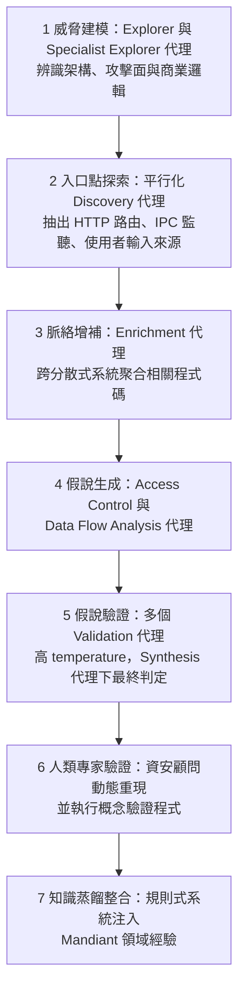

# Mandiant《Staying Ahead of Adversarial AI Through Agentic Source Code Review》（2026-08）

> 課程模組：09 延伸研究 ｜ 來源類型：產業研究（防禦側能力揭露） ｜ 原文：[Staying Ahead of Adversarial AI Through Agentic Source Code Review](https://cloud.google.com/blog/topics/threat-intelligence/staying-ahead-of-adversarial-ai-through-agentic-source-code-review) ｜ 整理日期：2026-09-21
>
> 證據邊界：本篇只核對 Google Cloud／Mandiant 官方部落格該篇原文，沒有取得其系統、基準測試資料集或逐案原始紀錄，也沒有獨立重現任何數字。本篇談的是**防禦方**使用 agentic AI，不含攻擊操作內容；文中的對照、限制分析與演練設計是本教材的教學分析。

## 1. 一頁速覽

- **學習目標：**用一份防禦方的 agentic 系統揭露，反過來檢視本課 [GTG-10007 漏洞鑄造廠](../01-cyber/GTG-10007-exploit-foundry.html)的攻擊側敘述，並建立一套判讀「AI 找漏洞」類宣稱的共同標準。
- Mandiant 公開了內部工具 **Agentic Vulnerability Discovery Harness（AVDH）**，用多代理管線在大型原始碼庫中找漏洞，架構是瀑布式七階段，其中第 6 階段是**人類專家動態重現與執行概念驗證**，作為最終判準。
- 動機直接寫明是對抗性 AI：原文說專有原始碼外洩後，「defenders must scramble to identify and patch vulnerabilities while attackers deploy machine-speed AI tools against them」。
- 十個月的量化成果：分析涵蓋**數千萬行程式碼**、執行**數千條管線**、產生**數萬筆發現**，最終取得 **12 個 CVE 編號**（原文具名 CVE-2026-13242、CVE-2026-55803，其餘在揭露中）。
- 最戲劇化的個案：一次涉及被竊企業原始碼庫的事件回應中，該系統在**兩天內找出逾 100 個真陽性的重大漏洞**。
- 方法論上最值得學的一段是**基準測試設計**：為避開 LLM 訓練資料汙染，他們自建合成程式碼庫，並由顧問人工確認每個植入漏洞真的可達且可動態利用。
- **這份研究在課程裡要教什麼：**它是攻擊側案例的合法雙重用途鏡像。同一種能力，攻擊方用來鑄造零日，防禦方用來搶先修補，**差別不在技術，而在授權、範圍與人類把關的位置**。
- 限制：所有數字皆為 Mandiant 自述，無第三方重現；原文沒有揭露誤報率、漏接率或成本，也沒有 IOC。

## 2. 報告基本資料

| 欄位 | 核對結果 |
|---|---|
| 機構 | Mandiant Services（Google Cloud），發表於 Google Cloud Threat Intelligence 部落格 |
| 具名作者 | Alex Tselevich、Michael Maturi |
| 發布日期 | 2026-08-18 |
| 文件形式 | 官方部落格長文，約 12 分鐘閱讀 |
| 資料型態 | 機構內部工具的能力揭露與自述成果，**非事件遙測、非同行審查研究** |
| 涵蓋期間 | 原文以「十個月」描述累積成果，未給明確起訖日期 |
| 技術堆疊 | Google Agent Development Kit（ADK）；平行探索階段使用 Gemini Flash Lite |
| 與同機構其他發布的關係 | 原文指向 CodeMender 作為持續監控的互補工具；AVDH 定位為時點式深度評估 |

**體裁判讀（本教材分析）：**這是**能力揭露**，不是威脅情報，也不是同行審查研究。它沒有受害者、沒有行為者、沒有 IOC。收錄它的理由是模組 09 的收錄標準包含「針對這類濫用的偵測與防線研究」，而它正好提供攻擊側案例所缺的對照組：一個可以講清楚流程與把關點的合法實作。

## 3. 主要發現與系統架構摘要

### 3.1 七階段管線

原文描述的是瀑布式（sequential, waterfall-style）管線，不是自由探索的代理群。

第 7 階段的「distilled knowledge」是規則式系統，依軟體領域、語言、框架與漏洞類型組織，把顧問的專業判斷回饋進管線。原文的核心命題是：「By embedding frontier models within an expert-defined harness, defenders can automate the discovery of routine vulnerabilities.」（把前沿模型嵌進專家定義的框架裡，防禦方就能自動化**例行**漏洞的發現。）

**本教材分析：**注意那個字是 routine。原文沒有宣稱能自動發現新穎或架構層級的漏洞，範圍自我設限得相當清楚。這與 [GTG-10007](../01-cyber/GTG-10007-exploit-foundry.html) 案中「自主零日鑄造」的敘述是兩種不同的主張強度，比較時不可混用。

### 3.2 涵蓋的漏洞類別

| 代理 | 鎖定的漏洞類別（原文） |
|---|---|
| Data Flow Analysis 代理 | SQL injection、cross-site scripting（XSS）、command injection、path traversal |
| Access Control 代理 | missing authorization、privilege escalation、cross-site request forgery（CSRF） |

**本教材分析：**這七類全部是**有明確資料流或授權判準**的已知類別，也就是可以被規則化描述、可被 PoC 驗證的那一群。原文沒有納入邏輯漏洞、競態條件或加密誤用等需要架構理解的類別，這與其自稱的「routine」範圍一致。

### 3.3 量化成果

| 指標 | 原文數字 | 判讀注意（本教材分析） |
|---|---|---|
| 分析規模 | 數千萬行程式碼 | 未說明是單一客戶或累計；不同語言與框架的難度差異未拆分 |
| 執行量 | 數千條管線、數萬筆發現 | 「發現」是**未經人工驗證前**的輸出，不是漏洞數 |
| 正式成果 | 12 個 CVE 編號，另有數十個可指派缺陷 | 數萬筆發現對 12 個 CVE，**這個落差本身就是最重要的教材** |
| 具名 CVE | CVE-2026-13242、CVE-2026-55803 | 其餘在揭露流程中，未具名 |
| 事件回應個案 | 兩天內逾 100 個真陽性重大漏洞 | 這是**被竊原始碼**的特殊情境：程式碼已在手，且時間壓力極大 |
| 其他 | 在廣泛使用的 web 擴充套件與開源專案中發現數十個可指派缺陷 | 未具名專案 |

原文的個案敘述：「During a recent incident response investigation involving stolen corporate repositories, the harness discovered over 100 true-positive critical vulnerabilities in just two days — achieving results in a fraction of the time required for manual review.」

**本教材分析：**「數萬筆發現對 12 個 CVE」不是失敗，而是這類系統的**正常形狀**。它揭示真正的瓶頸不在生成假說，而在驗證。第 5、6 兩階段（多代理驗證加人類重現）才是整套系統的成本中心，也是任何「AI 自動找漏洞」宣稱最該被追問的地方：**你的分母是什麼？誰做了驗證？**

### 3.4 基準測試設計

原文為了避免 LLM 訓練資料汙染（公開的漏洞資料集很可能已在模型訓練資料中），自建**專有合成程式碼庫**，橫跨不同領域、語言、漏洞深度與架構，並由資安顧問**人工確認每個植入的漏洞真的可達且可動態利用**。評分流程包含：專責 Grading 代理對照 ground truth、次級代理做誤報分流、重複發現的合併分析、以及人類專家的人工複核。

**本教材分析：**這一段的教學價值高於成果數字。它示範了評估 AI 資安能力時的三個必要條件：(1) 測試資料不得存在於訓練資料中；(2) 漏洞必須經人工確認**可達且可利用**，不能只是靜態存在；(3) 誤報與重複必須單獨計算。本課[能力評測教材](../08-capability-research/01-targeting-evals.html)所建立的判讀原則，在這裡得到一個產業側的對照實例。

### 3.5 與持續監控的分工

原文主張兩層防禦：AVDH 做時點式、深度的複雜利用鏈分析；CodeMender 做持續性的程式碼掃描與漏洞管理。結語是「AI is most effective when deployed as a practical multiplier for human expertise.」（AI 最有效的部署方式，是作為人類專業的實用倍增器。）

## 4. 與 Anthropic 2026-09 報告的對照

| 本課教材 | 對照點 | 兩造差異與不可作的推論 |
|---|---|---|
| [GTG-10007：漏洞鑄造廠](../01-cyber/GTG-10007-exploit-foundry.html) | **最直接的對照**。攻擊側的 agent swarm 與防禦側的 AVDH，是同一種能力的兩個方向 | 攻擊側的敘述是「自主零日鑄造」，本篇自述範圍是「例行漏洞的自動發現」。**主張強度不同，不能互相引為佐證**。兩者的驗證機制也完全不同：AVDH 有人類重現關卡，攻擊側無人知道其成功率的分母 |
| [網路行動導論](../01-cyber/00-cyber-trends-and-skills.html) | uplift 三軸中的 depth | 本篇提供一個可對話的 depth 基準：在有原始碼、有專家框架、有人類驗證的條件下，十個月換到 12 個 CVE。任何攻擊側的 depth 宣稱都可以拿這個量級去質問 |
| [GTG-50020：AI 供應鏈](../01-cyber/GTG-50020-ai-supply-chain.html) | 原始碼與金鑰外洩後的時間賽跑 | 本篇的事件回應個案（被竊 repo，兩天 100+ 漏洞）正是該案風險的具體化：**程式碼一旦外流，攻守雙方都會用 AI 去掃它，先動的一方取得優勢** |
| [GTG-50014：ShinyHunters 產業鏈](../01-cyber/GTG-50014-shinyhunters.html) | 資料竊取後的變現路徑 | 被竊的原始碼不只用於勒索，也可直接餵進漏洞探勘管線。本篇讓這條路徑從推測變成有防禦側實例的具體流程 |
| [能力評測：情報鎖定](../08-capability-research/01-targeting-evals.html) | 評測方法論 | Frontier Red Team 的評測設計與本篇的合成基準測試，在「避免訓練資料汙染」上採取相同策略。**這是兩個獨立機構得出的相同方法論結論**，是本模組少見的方法層互證 |
| [Hacktron AI：Hacking OpenAI](hacktron-2026-09-openai-libheif-rce.html) | 同為合法雙重用途的 AI 漏洞研究 | Hacktron 是小團隊加前沿模型打單一目標鏈；Mandiant 是企業級管線加專家框架做規模化掃描。**兩種形態的成本、範圍與把關機制都不同**，並列比較才看得出「AI 找漏洞」不是單一現象 |
| [證據與方法](../shared/04-evidence-and-methods.html) | 來源獨立性 | 本篇是**廠商自述的能力揭露**，證據地位低於帶遙測的威脅報告。12 個 CVE 是可外部查核的錨點，其餘數字不可 |

**核心教學點（本教材分析）：**模組 01 到 08 反覆呈現「AI 作為勞動力」這條主線。本篇給了它一個防禦側的完整證據，而且比攻擊側的案例更可檢驗，因為它公開了流程、把關點與失敗率的形狀（數萬筆對 12 個）。課堂上應該把兩者並排：如果防禦方在最有利條件（合法取得程式碼、專家框架、可動用顧問人力）下是這個產出率，那麼攻擊方在無人驗證、無專家框架的條件下所宣稱的自主成果，該用什麼態度看待？

## 5. TTP 與 MITRE ATT&CK 對應

**本篇是防禦方工具，沒有攻擊行為可對應。**強行套用 ATT&CK 會誤導。以下改列「本篇能力若被濫用時，對應的攻擊側技術」，並明確標示這是**條件式推論，原文未作此陳述，且本教材不提供任何操作內容**。

| 若被濫用的方向 | 對應攻擊側技術 | 差異與把關點 |
|---|---|---|
| 對自有以外的程式碼庫掃描 | [T1595.002：Vulnerability Scanning](https://attack.mitre.org/techniques/T1595/002/) | 合法性完全取決於授權範圍。AVDH 的使用情境是客戶委託評估與事件回應，有契約邊界 |
| 從外洩程式碼尋找可利用點 | [T1588.006：Vulnerabilities](https://attack.mitre.org/techniques/T1588/006/) | 差別在程式碼來源合法與否，不在技術 |
| 自動生成 PoC | [T1587.004：Exploits](https://attack.mitre.org/techniques/T1587/004/) | AVDH 的 PoC 由人類顧問執行於授權環境並用於驗證；攻擊側無此關卡 |
| 跨階段 | 無單一技術 ID | **框架缺口**：ATT&CK 不描述「多代理管線」這種編排形態，也無法表達「人類驗證關卡存在與否」這個關鍵差異 |

**缺口說明（本教材分析）：**攻防雙方的技術動作在 ATT&CK 上是同一格。真正的區別（授權、範圍、人類把關、揭露流程）全部不在框架內。這正是為什麼雙重用途工具的治理不能靠技術分類，只能靠流程與問責設計。

## 6. 圖表判讀

原文為部落格圖文，主要圖示為 AVDH 的管線架構示意。本教材未下載圖檔，第 3.1 節的 Mermaid 流程圖是**依原文文字重繪的教學用圖**，非原文圖片的複製。

原文**沒有提供統計圖表**（無趨勢線、無誤報率分布、無各語言成功率比較）。因此本篇不能用於任何量化比較或時間序列分析，只能取其點狀數字（12 個 CVE、兩天 100+、十個月）。

**課堂用法：**把第 3.1 的七階段圖發給學員，要求標出：哪一階段的輸出若有誤會被下一階段吸收，哪一階段一旦失效整條管線就不可信。（預期答案指向第 6 階段人類驗證，那是唯一與模型輸出獨立的關卡。）

## 7. IOC 與技術指標

**本篇沒有 IOC，也不應該有。**它描述的是防禦方工具，不是攻擊行動。

唯一可外部查核的錨點是兩個 CVE 編號：CVE-2026-13242、CVE-2026-55803。**本教材未對這兩個編號做獨立查核**（見第 12 節），僅記錄原文所述。課堂若要延伸，可指派學員自行查閱公開漏洞資料庫核對其存在、受影響產品與揭露時間，這是安全且有價值的查證練習。

原文提及的技術組件（Google ADK、Gemini Flash Lite、Google Antigravity）是產品名稱，不是指標。

## 8. 該機構的偵測、處置與防線缺口

**做了什麼（原文陳述）：**建立七階段 agentic 管線；以自建合成基準測試對抗訓練資料汙染；以人類顧問動態重現並執行 PoC 作為最終判準；將顧問經驗規則化回饋進管線；與 CodeMender 形成時點加持續的兩層防禦。

**未揭露之處（本教材分析）：**

1. **沒有誤報率與漏接率。**「數萬筆發現」與「12 個 CVE」之間的每一層過濾各刷掉多少，原文沒有拆分。沒有這個分布，外界無法評估系統效率，也無法與其他工具比較。
2. **沒有成本。**數千條管線的運算成本、以及第 6 階段所需的顧問工時，都未揭露。對「AI 讓漏洞發現變便宜」這個常見命題，本篇其實沒有給出證據。
3. **沒有失敗案例。**原文未描述任何一次管線給出錯誤結論、或漏掉已知漏洞的情形。
4. **合成基準測試未公開。**方法論值得稱許，但資料集是專有的，外界無法重現其評分，也無法檢查合成漏洞是否代表真實分布。
5. **範圍自限但未量化。**原文自述鎖定 routine 漏洞，但沒有說明在需要架構理解的漏洞上失敗到什麼程度。
6. **雙重用途的治理未談。**同一套框架若被未經授權地用於他人程式碼，原文沒有討論會有什麼限制、偵測或問責機制。

## 9. 第三方驗證與外部來源

| 來源 | 日期 | 本篇使用範圍與證據地位 |
|---|---|---|
| [Google Cloud／Mandiant 官方原文](https://cloud.google.com/blog/topics/threat-intelligence/staying-ahead-of-adversarial-ai-through-agentic-source-code-review) | 2026-08-18 | 直接來源核對，**不是**第三方驗證 |
| CVE-2026-13242、CVE-2026-55803 | 原文所述 | **可外部查核的錨點，但本次未查核**。公開漏洞資料庫的記載可佐證漏洞存在，不佐證是由 AVDH 發現 |
| [MITRE T1595.002](https://attack.mitre.org/techniques/T1595/002/)、[T1588.006](https://attack.mitre.org/techniques/T1588/006/) | 查閱 2026-09-21 | 只核對技術定義，不驗證本篇任何主張 |
| [本課 GTG-10007 教材](../01-cyber/GTG-10007-exploit-foundry.html) | 原報告 2026-09-10 | 攻擊側對照組。**主題相關但完全獨立**，不可互為佐證 |
| [Hacktron AI 教材](hacktron-2026-09-openai-libheif-rce.html) | 原文 2026-09-13 | 另一個合法雙重用途實例，**不同機構、不同方法**，可作為形態比較，不是重現 |

**單一來源判定：**本篇所有成果數字與方法論描述**皆為 Mandiant 單一來源、且為自述**。這是本模組中證據地位最需要留意的一類：它既不是平台遙測（有第三方受害者可對照），也不是同行審查研究（有方法與資料可複核），而是機構對自家工具的成效宣稱。引用時必須標明。

## 10. 課程教學設計

### 10.1 核心教學要點

學員完成後應能：(1) 對任何「AI 自動找漏洞」的宣稱，列出必問的五個問題（分母、驗證方式、誰做驗證、測試資料是否汙染、誤報率）；(2) 說明防禦側與攻擊側在技術相同時，差異落在流程與問責而非能力；(3) 用本篇的產出率量級，校準對攻擊側自主宣稱的預期。

### 10.2 課堂討論題

1. 「數萬筆發現對 12 個 CVE」。如果一家廠商只公布前者，另一家只公布後者，你會怎麼比較這兩份宣稱？缺哪個數字時應該拒絕比較？
2. AVDH 的第 6 階段是人類顧問重現與執行 PoC。如果把這一階段也交給代理，整套系統還剩下什麼可信度基礎？可信度會降到什麼程度？
3. Mandiant 自建合成基準測試以避開訓練資料汙染，但資料集不公開。這在方法論上是進步還是倒退？有沒有兩全的設計？
4. 同一套管線，用在自家程式碼是防禦，用在他人外洩程式碼是攻擊。除了契約與法律，還有哪些**技術上可驗證**的控制能區分兩者？
5. GTG-10007 描述的是「自主零日鑄造」，本篇自述是「例行漏洞的自動化」。這兩句話可能同時為真嗎？需要什麼資料才能判定？
6. 對台灣的軟體供應商而言，如果客戶要求「請用 AI 做過原始碼審查」，這個要求該如何轉成可驗收的條款？

### 10.3 桌面演練建議

**虛構情境：**某台灣 SaaS 供應商（40 名工程師）要導入 AI 輔助的原始碼審查，並在採購文件中寫入驗收條件。三家廠商提案：A 宣稱「自動發現 95% 的漏洞」；B 宣稱「六個月找出 3,000 筆發現」；C 提供本篇形態的管線，含人類驗證階段但費用最高。

學員**不執行任何掃描、不使用任何實際工具**，只用課堂提供的虛構提案文件。交付一份採購評估備忘錄，須包含：

1. 對 A、B 兩家的宣稱，各列出必須補齊的欄位，以及在補齊之前為什麼不能比較。
2. 一份驗收條件草案：至少包含測試資料的汙染防範、誤報率的量測方式、人類驗證的責任歸屬、以及發現漏洞後的揭露流程。
3. 說明「發現數」為什麼不適合作為付款里程碑，並提出替代的里程碑設計。
4. 一段風險說明：若廠商的管線需要存取完整原始碼庫，資料外流的控制點在哪裡，以及與本課 [GTG-50020](../01-cyber/GTG-50020-ai-supply-chain.html) 的關聯。

| 配分（本課設計） | 合格條件 |
|---|---|
| 30 分 | 正確指出兩份宣稱缺少的分母與驗證資訊，且不憑印象排序廠商 |
| 25 分 | 驗收條件可被第三方稽核，不使用「應盡力」等無法檢驗的措辭 |
| 25 分 | 里程碑設計避開「發現數」誘因，並說明會誘發什麼行為 |
| 20 分 | 原始碼存取的風險控制具體，含負責人與驗收證據 |

把廠商自述的成效當成已驗證事實寫進評估結論，必須修正後重繳。

### 10.4 對台灣的意涵

- **需求端的判讀能力比工具更急迫。**台灣的公部門與金融業已開始在資安採購中要求「AI 輔助」，但驗收條件多半停在功能有無。本篇提供了一組可直接改寫成驗收欄位的判準：測試資料來源、驗證主體、誤報處理、揭露流程。
- **人類驗證階段是本地最大的瓶頸。**AVDH 的可信度建立在可動用的資安顧問人力上。台灣多數組織缺乏能動態重現漏洞的內部人力，導入同類工具時，若省略這一關，得到的是數萬筆未經驗證的輸出，反而增加風險。
- **原始碼外流情境值得預先演練。**本篇的事件回應個案顯示，程式碼一旦外流，攻守雙方會同時用 AI 掃它。本地供應鏈事故的應變劇本應納入「外流後的自我掃描競賽」這一節。
- **與[公部門人工智慧應用參考手冊](moda-2026-01-public-sector-ai-playbook.html)的接點：**該手冊要求盤點 AI 工具的資料權限與關鍵動作。原始碼審查工具屬於權限最高的一類（可讀取全部智慧財產），應列為最高審核層級。
- **揭露流程須先於工具。**12 個 CVE 代表一套運作中的協調揭露流程。台灣組織若用 AI 在第三方或開源專案中找到漏洞，目前缺乏清楚的內部揭露決策程序，這應在導入工具之前先行建立。

## 11. 關鍵原文引文

| 英文原文 | 繁中理解 | 出處 |
|---|---|---|
| “Adversarial misuse of AI has increased the risk of data theft and extortion events, because when proprietary source code is exposed, defenders must scramble to identify and patch vulnerabilities while attackers deploy machine-speed AI tools against them.” | AI 的對抗性濫用提高了資料竊取與勒索事件的風險，因為專有原始碼一旦外洩，防禦方必須趕著找出並修補漏洞，攻擊方同時對它部署機器速度的 AI 工具 | 開篇動機 |
| “By embedding frontier models within an expert-defined harness, defenders can automate the discovery of routine vulnerabilities.” | 把前沿模型嵌進專家定義的框架裡，防禦方就能自動化例行漏洞的發現 | 架構一節，全篇核心命題 |
| “During a recent incident response investigation involving stolen corporate repositories, the harness discovered over 100 true-positive critical vulnerabilities in just two days — achieving results in a fraction of the time required for manual review.” | 在一次涉及被竊企業原始碼庫的事件回應中，該框架在短短兩天內發現逾 100 個真陽性的重大漏洞，所需時間只是人工審查的一小部分 | 成果一節 |
| “AI is most effective when deployed as a practical multiplier for human expertise.” | AI 最有效的部署方式，是作為人類專業的實用倍增器 | 結語 |

原文未標示頁碼，以上定位到章節。全文以[官方原文](https://cloud.google.com/blog/topics/threat-intelligence/staying-ahead-of-adversarial-ai-through-agentic-source-code-review)為準。原文的破折號在引文中照原樣保留，本教材正文不使用破折號。

## 12. 未能驗證之處與研究限制

- 本次查核**只核對官方部落格網頁**。沒有取得 AVDH 系統、合成基準測試資料集、評分紀錄或任何逐案原始資料。
- 所有成果數字（數千萬行、數千條管線、數萬筆發現、12 個 CVE、兩天 100+）**皆為 Mandiant 自述，本次未取得任何第三方重現或查證**。
- CVE-2026-13242 與 CVE-2026-55803 **本次未向公開漏洞資料庫核對**。即使核對成立，也只能佐證漏洞存在，不能佐證其發現過程或歸功對象。
- 原文**未揭露誤報率、漏接率、運算成本與顧問工時**，因此本教材不作任何效率或投資報酬的評斷。
- 「十個月」的起訖日期未載明，不能與其他機構的時間區間對齊比較。
- 第 3.1 節的 Mermaid 流程圖是**依原文文字重繪的教學用圖**，非原文圖片的複製，階段命名以原文用語為準但版面為本教材所設計。
- 第 5 節的「若被濫用」對應表是**條件式教學推論**，原文未作此陳述，亦不代表 Mandiant 認為其工具會被如此使用。
- 本篇與 [GTG-10007](../01-cyber/GTG-10007-exploit-foundry.html) 的比較只在方法與主張強度層面，**沒有獨立證實該 GTG 案的任何歸因、自主程度或成果**。
- 本篇為防禦方工具的能力揭露，全篇**不含、也不應含任何可操作的攻擊技術內容**；本教材同樣不提供。
