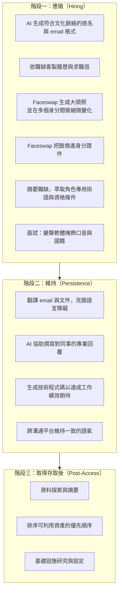

# Microsoft Threat Intelligence《AI as tradecraft: How threat actors operationalize AI》（2026 年 3 月）

> 課程模組：09 延伸研究 ｜ 來源類型：官方威脅報告 ｜ 原文：https://www.microsoft.com/en-us/security/blog/2026/03/06/ai-as-tradecraft-how-threat-actors-operationalize-ai/ ｜ 整理日期：2026-09-14

> **本教材的資料層次標示規則**（沿用模組 09 既有慣例）：
> - **［MSTIC］**＝Microsoft Threat Intelligence 這篇部落格長文可直接追溯的內容。無頁碼，以章節標題定位。
> - **［Anthropic］**＝Anthropic《Detecting and countering misuse of AI: September 2026》PDF 原文，附頁碼。
> - **［外部］**＝第三方研究或媒體報導，附 URL 與日期，並註明「獨立查證」或「僅引述原報告」。
> - **［分析］**＝本教材作者的推論與教學詮釋，原報告沒有明說，學員應視為可被挑戰的假設。

---

## 0. 這一份在模組 09 裡的位置

模組 09 目前收錄的 AI 濫用報告，幾乎都來自**握有模型平台遙測**的機構：Anthropic 看 Claude、OpenAI 看 ChatGPT、Google GTIG 看 Gemini。這些報告的共同結構是「我們在自家平台上看到某個行為者做了什麼」。

Microsoft 這一份不太一樣，它有三個結構性差異，決定了它在課程裡的用途：

1. **它是「行為者中心」而非「平台中心」。** 全篇的組織方式不是「我們的模型被怎麼濫用」，而是「我們長期追蹤的這幾個行為者，最近在攻擊生命週期的哪些環節加進了 AI」。Microsoft 有二十年的 APT 追蹤基線，所以它能問一個別家問不了的問題：**這些人用了 AI 之後，跟他們以前有什麼不同？**

2. **它明說與 OpenAI 合作。** 在 OpenAI 自家報告之外，這是少數能看到「模型供應商的觀察被第三方安全廠商整合進既有行為者檔案」的成品。

3. **它對自主性的判斷非常保守**，而且保守得有理有據。這與同期 Anthropic 報告的強烈 agentic 敘事形成本模組最重要的一組張力（見第 4.4 節）。

**一句話定位**：如果 Anthropic 的報告問的是「AI 讓什麼變得可能」，Microsoft 這一份問的是「AI 讓既有的人省了多少事」。兩個問題的答案都對，但會導出完全不同的防禦優先順序。

---

## 1. 一頁速覽

1. **這是什麼**：Microsoft Threat Intelligence 於 **2026-03-06** 發布的威脅情報部落格長文，主題是威脅行為者如何把 AI「操作化（operationalize）」進既有的攻擊流程。原文註明在漏洞研究相關的觀察上與 **OpenAI 合作**。［MSTIC］

2. **核心論斷**：AI 是**力量倍增器（force multiplier）**，不是能力替代品。原文：「AI functions as a force multiplier that reduces technical friction and accelerates execution.」人類操作者保留策略控制權，AI 加速偵察、社交工程、惡意程式開發與後利用。［MSTIC, AI as an Enabler for Cyberattacks］

3. **最重要的克制判斷**：關於惡意程式開發，原文寫「AI typically functions as a development accelerator within human-guided malware workflows, with **end-to-end authoring remaining operator-driven**」（AI 通常在人類引導的惡意程式工作流中扮演開發加速器，**端到端的撰寫仍由操作者主導**）。這一句與 Anthropic 報告的自主性敘事直接張力最大。［MSTIC］

4. **點名的行為者以北韓群集為主**：**Jasper Sleet**（北韓遠端 IT 工作者）、**Coral Sleet**（北韓，惡意程式與誘餌開發，**明確觀察到越獄行為**）、**Emerald Sleet**（北韓，研究已公開漏洞如 CVE-2022-30190）、**Sapphire Sleet**（北韓，人設敘事開發）、**Moonstone Sleet**（本教材取得的內容未載明國別）。［MSTIC］

5. **越獄被當成一個正式的分析類別**：原文定義越獄為繞過或顛覆 AI 安全控制，並列出三類手法：**角色型越獄**（要模型扮演可信任角色）、**提示重構與指令串接**（跨多輪互動結構化請求）、**系統／開發者提示濫用**。Coral Sleet 被明確記載利用越獄產生繞過內建防護的程式碼。［MSTIC］

6. **agentic AI 被定位為「新興趨勢」而非現況**：原文說 agentic 系統「pursue objectives over time, including planning steps, invoking tools, evaluating outcomes, and adapting behavior without continuous human prompting」，但強調**受可靠性與操作風險限制、尚未大規模觀察到**。［MSTIC, Emerging Trends］

7. **提示注入與一個新奇的類別：AI 推薦投毒**。Microsoft 觀察到行為者實驗提示注入以影響模型行為；另外記載了**合法組織刻意投毒 AI 助理記憶體以偏轉未來回應**的現象（目前出現在企業行銷情境），並把它標為威脅行為者可能濫用的新興攻擊類別。［MSTIC, Emerging Trends］

8. **北韓 IT 工作者被建議當成內部威脅處理**，不是外部攻擊。原文：「threat actors such as North Korean remote IT workers rely on long-term, trusted access」。緩解建議因此大量落在 Purview Insider Risk Management、資料生命週期管理這類**內部風險**工具，而非邊界防禦。［MSTIC, Mitigation Guidance］

9. **這份研究在課程裡要教什麼**：教「**同一批證據，為什麼會被講成兩個強度不同的故事**」。Microsoft 與 Anthropic 都看到 AI 被用在偵察、誘餌、程式碼、後利用；但 Microsoft 的結論是「加速器，人仍主導」，Anthropic 的結論是「AI 編排，人退居 SOP 維護」。**差異可能來自觀測位置，也可能來自機構誘因。** 學員必須能同時持有這兩種解釋而不急著選邊。

---

## 2. 報告基本資料

| 項目 | 內容 | 出處 |
|---|---|---|
| 完整標題 | AI as tradecraft: How threat actors operationalize AI | 頁面標題 |
| 機構 | Microsoft Threat Intelligence | 署名 |
| 合作方 | **OpenAI**（原文於漏洞研究相關觀察處註明合作） | 全文 |
| 署名方式 | 團體署名，**未列個別分析師姓名** | 文末 |
| 發布日期 | **2026-03-06** | 頁面 |
| 形式 | Microsoft Security Blog 長文（HTML），**非 PDF、無頁碼** | 頁面 |
| 資料來源類型 | Microsoft 產品線遙測（Defender、Entra、Purview）、既有行為者追蹤檔案、**與 OpenAI 的聯合觀察** | 全文 |
| 涉及的模型與產品 | 未點名特定模型；描述通用的 LLM 與生成式 AI 平台；防禦面提及 Azure AI Content Safety、Prompt Shields、Microsoft Agent 365、Security Dashboard for AI、Purview DSPM for AI | 全文 |
| IOC | **無**。不提供雜湊、網域或 IP，改提供 Defender 威脅情報報告指引與 hunting query | 全文檢查 |
| 圖表 | 本教材取得的內容**未見具圖說的 Figure 或 Table**；文中引用了 Microsoft Digital Defense Report 2025 的一張點擊率圖表但未內嵌 | 全文檢查 |

### 2.1 章節骨架（原文標題逐字）

```
AI as an Enabler for Cyberattacks
Post-Compromise Misuse of AI
Emerging Trends
Mitigation Guidance for AI-Enabled Threats
Microsoft Defender Detections
```

［分析］這個骨架與 Anthropic 報告的骨架對照起來很有意思。Anthropic 依**危害領域**分章（網路／影響力／監控／武器／生物／詐騙／蒸餾）；Microsoft 依**攻擊階段**分章（入侵前的賦能、後利用、新興趨勢）。

**分類軸的選擇會決定你看得見什麼。** 依危害領域分，容易看出「AI 被用來做哪些壞事」，但跨領域的共同機制會被切碎；依攻擊階段分，容易看出「AI 在殺傷鏈的哪一段最有效」，但同一個行為者的完整圖像會散落各處。**兩種切法互補，課堂上值得讓學員各自用一種切法重整另一份報告，感受資訊如何重新排列。**

---

## 3. 主要發現與案例逐一摘要

### 3.1 點名行為者總表

| 行為者 | 國別 | 別名／前代號 | AI 被拿來做什麼 | 自主程度 |
|---|---|---|---|---|
| **Jasper Sleet** | 北韓 | 遠端 IT 工作者叢集 | 生成符合文化脈絡的姓名與 email 格式；依職缺客製履歷與求職信；翻譯溝通以克服語言障礙；以 **Faceswap** 把臉換進身分證件與生成大頭照；面試時用**變聲軟體**掩飾口音；摘要職缺以萃取角色專用術語；草擬專業回覆與技術答案 | 低（工具型使用，人在每一步） |
| **Coral Sleet** | 北韓 | 資料顯示與 Storm-1877 相關（見第 12 節） | 快速生成、精修與重新實作惡意程式元件；**全 AI 化的誘餌開發工作流**；建立假公司網站；佈建遠端基礎設施；payload 測試與部署；**越獄 LLM 以產生繞過防護的惡意程式碼**；建置與排錯 C2 與通道基礎設施 | 中（工作流層級自動化，但人主導） |
| **Emerald Sleet** | 北韓 | 未載 | 研究已公開揭露的漏洞（原文舉例 **CVE-2022-30190**，即 MSDT「Follina」）以找出利用路徑 | 低 |
| **Sapphire Sleet** | 北韓 | 未載 | 社交工程的人設敘事開發與角色一致性維持 | 低 |
| **Moonstone Sleet** | **本教材取得的內容未載明國別** | 未載 | 於威脅分析內容中被引用，**具體用途未在取得的內容中列舉** | 未載 |

［分析］**五個點名行為者裡至少四個是北韓，這件事本身是訊息。** 可能的解釋有三，教學時應同時提出：

1. **觀測偏差**：Microsoft 的企業客戶基礎讓它對「北韓 IT 工作者滲透企業」這類威脅的能見度特別高，因為那是發生在**企業內部帳號與 HR 流程**裡的事。
2. **真實分布**：北韓確實是最積極把 AI 整合進作業流程的國家行為者之一（其他機構的報告也支持這點）。
3. **揭露選擇**：北韓行為者的政治敏感度相對低，點名成本小。俄羅斯與中國關聯的行為者，Microsoft 也有追蹤，但本篇沒有著墨。

**第三點值得特別強調**：一份報告點名了誰，與它沒點名誰，同樣重要。

### 3.2 Jasper Sleet：AI 貫穿一個假身分的完整生命週期

［MSTIC］原文：「Jasper Sleet leverages generative AI platforms to streamline the development of fraudulent digital personas.」

這是本報告最完整的單一案例，值得逐階段拆解：



［分析］**這張圖的重點不在任何單一技術，而在「AI 出現在每一格」。** 過去北韓 IT 工作者行動的瓶頸非常具體：英語能力、時區、文化常識、履歷可信度、面試表現、以及入職後要真的交得出程式碼。這六個瓶頸，AI 各個擊破。

更關鍵的是**第二階段**。應徵階段的造假（假履歷、假照片）在 AI 之前就存在；**真正被 AI 改變的是「維持」**。一個語言能力不足的人，過去即使混進去也會在三週內因為溝通品質露餡；現在他可以無限期地維持一個看起來稱職的同事形象。**這把「滲透」從一次性事件變成可持續的狀態。**

這也解釋了為什麼 Microsoft 把緩解建議放在內部威脅工具而非邊界防禦（見第 8 節）。

### 3.3 Coral Sleet：本報告唯一明確記載的越獄案例

［MSTIC］Coral Sleet 是本篇中 AI 使用最深、也是唯一被明確記載**越獄 LLM 以繞過內建防護**的行為者。原文說其越獄目的是產生「bypasses built-in safeguards and accelerates operational timelines」的程式碼。

其 AI 使用涵蓋六個方向：

1. 惡意程式元件的快速生成、精修與重新實作
2. **全 AI 化的誘餌開發工作流**（fully AI-enabled lure development workflows）
3. 假公司網站建立
4. 遠端基礎設施佈建
5. payload 測試與部署
6. C2 與通道基礎設施的建置與排錯

［分析］第 2 點的用字值得注意：**"fully AI-enabled"** 是本篇對 AI 參與度最強的形容詞，而它被用在**誘餌開發**上，不是惡意程式開發上。這個位置的選擇很精準：誘餌是純文字產出、失敗成本低、可大量迭代，是 AI 最能全包的環節；惡意程式則需要在真實環境測試、除錯、對抗防毒，**失敗有實際後果**，所以原文才會說端到端撰寫「remaining operator-driven」。

**教學要點**：判斷 AI 在某個環節能取代多少人力，可以問三個問題：(a) 產出是否可純文字驗證？(b) 失敗成本高不高？(c) 是否需要與真實環境互動？三個答案越偏向「是／低／否」，AI 取代的比例越高。這個啟發式可以拿去套用在本課程模組 01 到 08 的任何一個案例上。

### 3.4 越獄的三類手法（原文的分類）

［MSTIC］原文對越獄的定義是繞過或顛覆 AI 安全控制，並列出：

| 手法 | 原文描述 | 機制 |
|---|---|---|
| **角色型越獄** | 要模型扮演可信任角色（原文舉例：「Respond as a trusted cybersecurity analyst」） | 用身分框架改變模型對請求正當性的判斷 |
| **提示重構與指令串接** | 「reframing prompts, chaining instructions across multiple interactions」 | 把單一惡意請求拆散到多輪互動，每一輪單看都無害 |
| **系統／開發者提示濫用** | 「misusing system or developer-style prompts to coerce models into generating malicious content」 | 冒用較高權限的提示層級 |

［分析］這三類可與本課程[規避／治理分析視角](../_shared/02-claude-safeguards-and-bypass-paths.html)中的內容控制問題比較。概念相似有助於建立共同詞彙，但教材分類不是另一份獨立資料，不能由此證明所有模型具有相同弱點或成功率。

本課以五個規避／治理分析視角整理不同控制範圍；它們不是發生頻率排名。Microsoft 這篇的篇幅與揭露內容不足以判定其掌握哪些完整遙測，也不能據此斷言越獄最不重要。比較時應列各來源實際揭露的資料與未知。

### 3.5 新興趨勢：agentic、提示注入、AI 推薦投毒

［MSTIC, Emerging Trends］

**（a）agentic AI。** 原文定義：agentic 系統「rely on the same underlying models but are integrated into workflows that pursue objectives over time, including planning steps, invoking tools, evaluating outcomes, and adapting behavior without continuous human prompting」。Microsoft 的評估是：

- 已觀察到**早期實驗**
- 具備釣魚戰役精修、基礎設施測試、持久化維持、OSINT 監控等半自主能力的潛力
- **受可靠性與操作風險限制**
- **尚未大規模觀察到**
- 目前多為概念驗證式的實驗

**（b）提示注入。** 行為者實驗提示注入，目的是影響模型行為與輸出、在 AI 環境中誘發非預期動作、以及**透過 AI 服務與整合利用供應鏈信任關係**。

**（c）AI 推薦投毒（AI recommendation poisoning）。** 這是本篇最新奇的一個類別：**合法組織刻意投毒 AI 助理的記憶體，以偏轉未來的回應**。原文記載這目前出現在企業行銷情境，但標示為威脅行為者可能濫用的新興攻擊類別。

［分析］（c）值得單獨拉出來講。它的特別之處在於**加害者是合法企業，動機是行銷，手法卻與攻擊完全相同**。這在威脅建模上造成一個尷尬：你要怎麼寫一條規則，區分「某公司想讓 AI 助理多推薦自家產品」與「某行為者想讓 AI 助理多推薦自家的惡意遠端管理工具」？

原文另有一句與此呼應：「Threat actors prompt AI to surface recommendations for remote access tools, obfuscation frameworks, and infrastructure components.」（威脅行為者提示 AI 提供遠端存取工具、混淆框架與基礎設施元件的推薦。）**把（c）與這一句合起來看，就得到一條完整的攻擊路徑：先投毒模型對某類工具的推薦傾向，再讓下游使用者「自然地」被推向那個工具。** 原文沒有把這兩點連起來，這是本教材的推論，但這條路徑在邏輯上是通的，適合當課堂推演題。

### 3.6 貫穿全篇的趨勢判斷

［MSTIC］

- 「Threat actors are operationalizing AI along the cyberattack lifecycle to accelerate tradecraft.」
- 「AI functions as a force multiplier that reduces technical friction and accelerates execution.」
- 「AI-enabled phishing lures are becoming increasingly effective by rapidly adapting content to a target's native language and communication style.」
- 目前多數惡意 AI 使用集中在**文字、程式碼與媒體生成**
- **AI 賦能的惡意程式仍屬實驗性質，受可靠性限制**
- Microsoft 已處置**數千個**與詐欺性 IT 工作者活動相關的帳號

［分析］「adapting content to a target's native language and communication style」這一句對台灣特別重要。過去針對台灣的釣魚郵件，繁中語感不自然是最可靠的偵測訊號之一（用詞是簡中習慣、語序怪、標點錯）。**這個訊號正在失效。** 這一點會在第 10.4 節展開。

---

## 4. 與 Anthropic 2026-09 報告的對照

### 4.1 同意的部分：AI 貫穿攻擊生命週期

Microsoft 的「AI 在偵察、社交工程、惡意程式開發、後利用各階段降低摩擦」與 Anthropic 報告各案例的「Attack lifecycle and AI usage」段落，觀察方向完全一致。Anthropic 用 **speed / scale / depth 三軸**（p.4）量測 uplift，Microsoft 沒有對應的量化框架，但描述的現象相同。

對應教材：[網路行動導論（uplift 三軸與三大趨勢）](../01-cyber/00-cyber-trends-and-skills.html)、[跨案例分析](../shared/01-cross-cutting-analysis.html)。

### 4.2 同意的部分：越獄的手法分類高度收斂

Microsoft 的三類越獄手法（角色型、提示重構與指令串接、系統提示濫用）與本課程整理的「路徑 B：內容層繞過」的四種手法（重新提示、角色扮演、任務拆分、良性框架）幾乎重疊。

對應教材：[安全防護、證據與驗收](../_shared/02-claude-safeguards-and-bypass-paths.html)。

具體對照：
- Anthropic 的 **GTG-14021**（中國維穩與跨境鎮壓）記載公安偵查員的請求先被 Claude 拒絕、之後靠**重新提示**突破，這是 Microsoft「提示重構」的實例。對應教材：[GTG-14021](../03-surveillance/GTG-14021-weiwen-transnational-repression.html)。
- Anthropic 的 **GTG-30006** 記載**拆分到後續小 session** 繞過，這是 Microsoft「指令串接」的跨工作階段版本。對應教材：[GTG-30004/30005/30006 伊朗關聯三案](../03-surveillance/GTG-30004-30005-30006-osint-recon.html)。
- Anthropic 生物章節 **Case 3** 記載聚焦「減毒」的良性框架讓分類器放行。對應教材：[生物 Case 3：分類器漏接](../05-bio/case3-classifier-gap.html)。

［分析］**兩家獨立整理出同一組分類，是這個分類本身可信的證據。** 這在方法論上很重要：當兩份互不引用的報告，從不同的資料基礎，歸納出結構相同的分類法，那個分類法多半反映了真實世界的結構，而不是分析者的主觀切割。

### 4.3 Microsoft 有、Anthropic 2026-09 沒有的：北韓 IT 工作者

**本課程模組 01 到 08 沒有對應的北韓案例。** Anthropic 2026-09 報告的七大危害領域中，沒有以北韓 IT 工作者為主體的 GTG 案例。

但**模組 09 內部有對應**：Anthropic 自己 2025-08 的那份報告含有北韓 IT 工作者案例。對應教材：[Anthropic 2025-08 威脅報告](anthropic-2025-08-threat-intel-report.html)。

［分析］這個缺口很值得討論。可能的解釋：

1. **Anthropic 2026-09 報告的涵蓋期間（2025-12 到 2026-08）內，北韓 IT 工作者沒有在 Claude 上留下足夠構成案例的活動**，也許因為他們轉向其他平台，也許因為先前的處置有效。
2. **有觀察到但未收錄。** 報告本來就是選錄，不是全集。
3. **觀測位置差異。** 北韓 IT 工作者的核心行為（投履歷、面試、在企業內部溝通）大多發生在**企業的 HR 與協作系統**裡，那是 Microsoft 的主場，不是 AI 平台的主場。AI 平台只看得到「有人在生成履歷」，看不到「這份履歷投給了誰、有沒有錄取」。

**第三點最可能，也最有教學價值**：它具體示範了「單一平台遙測看不到什麼」。這正是模組 09 導論第 1 節的核心論點。

### 4.4 最大的張力：自主性的判斷

| 面向 | Microsoft 2026-03［MSTIC］ | Anthropic 2026-09［Anthropic］ |
|---|---|---|
| 對 agentic 的定位 | **新興趨勢**，早期實驗，受可靠性限制，**尚未大規模觀察到** | **已發生的現況**。多個案例記載自主多代理框架 |
| 惡意程式開發 | 「end-to-end authoring remaining operator-driven」 | GTG-20006 記載 AI 自主監控偵測並改寫重建，形成閉環 |
| 人的角色 | 保留策略控制權，AI 是加速器 | 人退居「維護 SOP 的流程工程師」 |
| 最強的自主性案例 | 無 | GTG-10007：13 個「no human in the loop」常駐蒐集代理與自主零日鑄造廠 |

對應教材：[GTG-10007 自主零日鑄造廠](../01-cyber/GTG-10007-exploit-foundry.html)、[GTG-20006 俄羅斯國家級間諜](../01-cyber/GTG-20006-russian-espionage.html)、[跨案例分析主線一](../shared/01-cross-cutting-analysis.html)。

［分析］**這組張力的正確處理方式是先問「時間」。** Microsoft 這篇是 **2026-03**，Anthropic 那份涵蓋到 **2026-08**，中間隔了五個月。在 AI 能力變動這麼快的期間，五個月是很長的時間。**部分差異很可能只是時間差，不是判斷分歧。**

驗證這個假設的方法，是看**同期**的第三方怎麼說。本模組已收錄的 [Google GTIG 2026-09 那一期](gtig-2026-09-ai-threat-tracker.html)，觀察期為 Q2 2026，比 Microsoft 晚、與 Anthropic 幾乎同期，它的判斷是：對手已轉向 agentic 工作流，但「GTIG has not yet observed threat actors deploying fully autonomous pipelines against targets in the wild」。

**所以三家的位置是**：
- Microsoft（2026-03）：agentic 是新興趨勢，尚未大規模
- GTIG（2026-09，資料到 Q2）：已轉向 agentic 工作流，但**尚未見到全自主管線在野部署**
- Anthropic（2026-09，資料到 2026-08）：已有 13 個 no-human-in-the-loop 代理在運行

［分析］**Microsoft 與 GTIG 的位置其實相當接近**（都是「有 agentic 傾向，但沒有全自主」），**Anthropic 是三家中最激進的一家**。這不必然表示 Anthropic 錯，它確實可能看到別家看不到的東西（它是唯一看得到自家平台上 agent 呼叫序列的一家）。但**當三家中有兩家的判斷一致、第三家較激進，而第三家恰好是那個主張最能支持「我們的模型很強大」這個商業敘事的機構時，情報紀律要求我們把這個結構性誘因明白寫出來。**

**這是本教材最想留給學員的一段推理。** 它不是指控，是方法：**評估一個情報主張時，一併評估提出者的誘因結構。** 這對 Anthropic 適用，對 Microsoft 也適用（Microsoft 的保守判斷同樣服務於「不要恐慌，我們的產品守得住」的敘事）。

### 4.5 Microsoft 有、Anthropic 較少著墨的：AI 推薦投毒

Anthropic 2026-09 報告中，最接近的是 **GTG-50020**（財務動機行為者轉向 AI 產業，在評測沙箱中用 prompt injection 竊取金鑰）。但那是**對 AI 系統的攻擊以取得資產**，與 Microsoft 描述的「投毒推薦傾向以影響下游使用者選擇」機制不同。

對應教材：[GTG-50020 AI 供應鏈攻擊](../01-cyber/GTG-50020-ai-supply-chain.html)。

［分析］**AI 推薦投毒在本課程模組 01 到 08 中沒有對應案例，這是一個真實的空白。** 值得作為課程的前瞻議題，也值得作為模組 09 未來收錄的觀察方向。

### 4.6 人設與假身分：與影響力、詐騙模組的呼應

Jasper Sleet 的 AI 人設建構（姓名、照片、履歷、語氣一致性）與 Anthropic 報告的多個案例同型：

- [GTG-15001 交友 app 網絡](../06-scams/GTG-15001-dating-app-network.html)：4,700+ AI 人設
- [GTG-54002 影響力即服務](../02-influence/GTG-54002-influence-as-a-service.html)：商業化的人設生產
- [GTG-84006 MEK/NCRI「Viktor」平台](../02-influence/GTG-84006-mek-ncri-viktor.html)：冒充真人，對個人風險最高
- [影響力行動導論](../02-influence/00-influence-intro-and-breakout-scale.html)

［分析］把這四者與 Jasper Sleet 並排，會看到**同一套技術能力（AI 生成可信人設）被用在四個完全不同的危害領域**：就業詐欺、浪漫詐騙、影響力行動、冒充真人。**這正是 AI 濫用治理的核心困難：能力是通用的，危害是分領域的。** 依危害領域設計的防線（如針對影響力行動的偵測），對同一能力的其他用途無效。這是 [跨案例分析](../shared/01-cross-cutting-analysis.html) 主線二（AI 作為勞動力）的一個具體切面。

---

## 5. TTP 與 MITRE ATT&CK 對應

［分析］本篇是趨勢與行為者概述，**原文未提供 ATT&CK 對應表**。以下為本教材依原文描述所做的對應，引用時請標明來源為本教材。

| 戰術 | 技術 ID | 本報告的具體作法 | 偵測構想 |
|---|---|---|---|
| Reconnaissance | T1589（Gather Victim Identity Information） | 摘要職缺以萃取角色術語與資格條件 | 難以偵測（發生在攻擊者側） |
| Resource Development | T1585.001/.002（Establish Accounts） | AI 生成姓名與 email 格式、建立假身分 | HR 流程的身分驗證強化；同一批申請者的姓名與 email 樣態相似度分析 |
| Resource Development | T1583.001（Acquire Infrastructure: Domains） | AI 協助建立假公司網站 | 新註冊網域的內容相似度比對；**AI 生成的公司網站常有結構高度一致的「關於我們」段落** |
| Resource Development | T1587.001（Develop Capabilities: Malware） | Coral Sleet 以 AI 生成、精修、重新實作惡意程式元件 | 樣本層面：編碼風格一致性、註解密度異常（見 CaptiveCrunch 教材第 3.4 節的同類訊號） |
| Resource Development | **無對應** | **越獄 LLM 以繞過防護產生程式碼** | 模型平台側的越獄偵測（Azure AI Content Safety Prompt Shields 等）。**ATT&CK 無此技術，ATLAS 涵蓋的是對 AI 系統的攻擊，不是用 AI 做攻擊** |
| Initial Access | T1566（Phishing） | AI 適配目標母語與溝通風格的誘餌 | **傳統的語感偵測失效**，改以寄件基礎設施、時序、行為面偵測 |
| Initial Access | T1656（Impersonation） | Faceswap 換臉證件與大頭照；面試變聲 | FaceForensics++ 類工具分析帳號照片；視訊面試的時間一致性、遮擋處理、光照適應、音視訊同步檢查 |
| Persistence | T1078（Valid Accounts） | 北韓 IT 工作者取得**合法受僱身分** | **這是內部威脅，不是外部入侵**。以 Purview Insider Risk Management 等內部風險工具處理 |
| Defense Evasion | T1656（Impersonation，持續維持） | AI 翻譯與語氣一致性維持，讓假身分長期不露餡 | 溝通樣態基線：同一員工在不同平台的語言複雜度是否異常一致 |
| Discovery | T1213（Data from Information Repositories） | 取得存取後以 AI 做資料探索與摘要、排序可利用資產 | 資料存取量與廣度的基線偏離；DSPM |
| Execution／Impact | **無對應** | **提示注入**以誘發 AI 環境中的非預期動作 | ATLAS 有對應（AML.T0051 類），**ATT&CK 沒有**。這是框架缺口 |
| Impact | **無對應** | **AI 推薦投毒**：投毒助理記憶體以偏轉未來回應 | **兩個框架都沒有好的對應。** 這是本報告指出的最新穎類別 |

### 5.1 框架缺口總結

［分析］本篇暴露了**三個**框架缺口，比模組 09 其他教材指出的更廣：

1. **「用 AI 做攻擊」沒有技術編號。** ATT&CK 描述的是攻擊者對受害者做了什麼，**不描述攻擊者用什麼工具產生那個行為**。越獄、AI 輔助程式碼生成、AI 生成誘餌，在 ATT&CK 裡全部隱形。
2. **ATLAS 的涵蓋方向相反。** ATLAS 處理「對 AI 系統的攻擊」（提示注入、模型竊取、資料投毒），本報告的多數內容是「用 AI 系統做攻擊」。**兩個框架之間有一塊真空。**
3. **AI 推薦投毒橫跨兩者且都不合身。** 它是「對 AI 系統的攻擊」（投毒記憶體），但目的是「影響下游人類的選擇」，落在 ATLAS 的 Impact 與傳統影響力行動之間。

**教學用法**：讓學員試著為「越獄以生成惡意程式碼」寫一條 ATT&CK 風格的技術描述（戰術、技術名稱、描述、偵測、緩解），並討論它該歸在哪個戰術下。這個練習會逼出「框架是為了誰而設計」這個更根本的問題。

---

## 6. 圖表判讀

［MSTIC］**本教材取得的內容中，本篇未見具圖說的 Figure 或 Table。** 原文引用了 *Microsoft Digital Defense Report 2025* 中一張關於釣魚點擊率的圖表作為佐證，但**未在本文中內嵌該圖**。

［分析］這個「沒有圖表」的事實本身值得一講。對照組：

| 報告 | 圖表數量 | 說明 |
|---|---|---|
| Anthropic 2026-09 | **51 張**，且大量關鍵數字**只存在於圖片內** | 圖表是主要的資訊載體 |
| Google GTIG 2026-09 | 7 張 Figure、11 張 Table | 圖表輔助，資訊主要在文字 |
| Microsoft 本篇 2026-03 | **0 張** | 純文字論述 |
| Microsoft CaptiveCrunch 2026-07 | 10 張 Figure | 技術報告，圖表以介面截圖為主 |

［分析］**圖表密度反映的是報告的體裁，不是品質。** 本篇是**論述型**報告（提出一個關於 AI 角色的判斷並論證它），論述型報告本來就不需要圖表。Anthropic 那份是**案例彙編型**，每個案例都有資料要呈現，所以圖表多。CaptiveCrunch 是**技術分析型**，需要展示介面與流程。

**教學提醒**：本課程 00-index 第三條製作原則強調「圖表親自判讀」，因為 Anthropic 報告有大量數字只存在於圖片內。**但不要把這條原則機械化套用**：遇到論述型報告，該做的是拆解論證結構與信度用字（如本教材第 4.4 節所做），而不是抱怨它沒有圖。**方法要跟著體裁走。**

---

## 7. IOC 與技術指標

**本報告不提供任何 IOC。** 沒有檔案雜湊、沒有網域、沒有 IP。［MSTIC, 全文檢查］

原文改為提供以下可操作內容：

| 類型 | 內容 |
|---|---|
| 威脅情報報告 | Defender 入口網站中 Jasper Sleet、Coral Sleet、Moonstone Sleet、Sapphire Sleet 的威脅情報報告 |
| Hunting query | 偵測偽冒 email（檢查 SPF／DKIM／DMARC 認證失敗） |
| Hunting query | 可疑登入嘗試（非受管、不合規裝置；中／高風險登入） |
| Sentinel 分析 | TI Mapping 分析規則，比對惡意網域指標 |

［分析］**「不給 IOC」是一個刻意的選擇，而且對本篇是正確的選擇。**

本篇討論的是**行為與工作流**，不是特定戰役。行為者用 AI 生成履歷這件事，沒有雜湊可言。硬給 IOC 反而會誤導讀者以為封鎖幾個指標就能處理這類威脅。

**這對台灣 SOC 團隊有直接啟示**：面對 AI 賦能的威脅，情報產品的形態正在改變。過去 CTI 的交付物是 IOC feed；**AI 賦能威脅的 CTI 交付物會更像「行為假說 + hunting query + 流程控制建議」**。如果你的 CTI 團隊的 KPI 還是「本月產出多少筆 IOC」，這個 KPI 正在失去意義。這一點值得在課程的 SOC 向路徑裡特別強調。

**安全紅線說明**：本教材不含任何需要 defang 的指標，因為原報告本身沒有提供。

---

## 8. 該機構的偵測、處置與防線缺口

### 8.1 Microsoft 做了什麼

**處置**：Microsoft 記載已處置**數千個**與詐欺性 IT 工作者活動相關的帳號。［MSTIC］

**防禦建議**（原文依情境分組）：

| 情境 | 建議 |
|---|---|
| **企業 AI 風險治理** | Security Dashboard for AI（公開預覽）彙整 Defender、Entra、Purview 的風險；**Microsoft Agent 365** 作為 AI 代理治理與監控的控制平面；Purview **DSPM for AI** 探索與保護 AI 應用 |
| **內部威脅與存取控制** | 啟用 Purview **Insider Risk Management** 偵測智財竊取、資料外洩與安全違規；以 Purview 資料生命週期管理保留與刪除資料；**以 FaceForensics++ 分析帳號照片偵測 AI 生成內容**；監控深偽的時間一致性、遮擋處理、光照適應、音視訊同步 |
| **釣魚與社交工程** | Defender Antivirus 雲端遞送防護；Defender for Office 365 的攻擊模擬訓練；啟用 **ZAP**（Zero-Hour Auto Purge）；**對所有帳號、所有裝置、所有位置、所有時間強制 MFA**；Safe Links 政策套用到內部收件者 |
| **AI 應用防護** | Azure AI Content Safety 的 **Prompt Shields** 偵測對抗性使用者輸入；**Groundedness Detection** 驗證 LLM 回應是否有源可溯；Defender for Cloud 的 AI 服務威脅防護 |

**偵測技術**：Defender XDR 的登入異常與非典型／不可能旅行偵測；Entra ID Protection 的風險等級監控與裝置合規追蹤；Defender for Endpoint 的國家級行為者關聯警示；Defender for Office 365 的惡意 URL 與 BEC 詐欺警示；Defender for Cloud 經由 Prompt Shields 偵測越獄嘗試。

### 8.2 兩個值得特別注意的建議

［分析］

**（a）「Safe Links 政策套用到內部收件者」。** 這條看起來像個技術細節，實際上是對**北韓 IT 工作者威脅模型的直接回應**：如果攻擊者是**已經入職的同事**，那他寄出的釣魚連結是**內部郵件**。多數組織的 Safe Links 只掃外部郵件。**這條建議揭露了 Microsoft 對這類威脅的真實威脅模型：邊界已經沒有意義。**

**（b）「以 FaceForensics++ 分析帳號照片」。** 這是本篇唯一一條指向具體開源工具的建議，也是唯一一條**針對 AI 生成內容本身**的偵測建議。

［分析］但這條建議有一個 Microsoft 沒說的問題：**深偽偵測工具與生成模型是一場軍備競賽，而偵測方結構性落後。** FaceForensics++ 這類工具是針對特定世代的生成技術訓練的，對新一代模型的偵測率會衰減。**把它當成必過關卡（gate）會產生虛假的安全感；當成風險評分的一個因子比較合理。** 教學時應明確指出這個限制。

### 8.3 防線缺口與未揭露之處

［分析］以下為本教材整理，**原文並未自承這些是缺口**：

1. **看不到存取層。** Microsoft 不擁有主流 LLM 平台（除 Azure OpenAI 外），所以它看不到「攻擊者怎麼取得模型存取」這一整層：偷來的帳號、假轉售商、地下 API 市場、算力劫持。本課程 [GTG-50021 假 Claude 轉售商](../01-cyber/GTG-50021-fake-reseller.html) 與 [GTG-50020](../01-cyber/GTG-50020-ai-supply-chain.html) 補的就是這一塊。**單讀本篇會嚴重低估存取層的重要性。**

2. **「數千個帳號」沒有分母。** 處置了數千個帳號，但佔總量多少？偵測到的佔實際發生的多少？**沒有分母的數字在情報上價值有限**，這是所有平台方處置數字的共同問題（Anthropic 報告也有同樣問題）。

3. **agentic 的判斷可能已過時。** 本篇是 2026-03，其「尚未大規模觀察到」的判斷，在 2026-09 的三家報告對照下已顯保守（見第 4.4 節）。**引用本篇的 agentic 判斷時必須標註日期。**

4. **Moonstone Sleet 被列名但無內容。** 本教材取得的內容中，它只在威脅分析引用處出現，**沒有國別、沒有具體 AI 用途**。這是揭露上的一個空洞。

5. **與 OpenAI 的合作範圍未界定。** 原文說在漏洞研究相關觀察上與 OpenAI 合作，但**沒有說哪些發現來自 OpenAI 的遙測、哪些來自 Microsoft 自己**。這在評估來源獨立性時是個問題：**如果某項發現實際上只有 OpenAI 一方觀察到，那它就不是兩家獨立印證。**（見第 9.1 節）

---

## 9. 第三方驗證與外部來源

| 來源 | URL | 日期 | 性質 | 內容與差異 |
|---|---|---|---|---|
| **Cloud Security Alliance（CSA）研究紀要** | labs.cloudsecurityalliance.org/research/csa-research-note-microsoft-ai-attack-lifecycle-intelligence/ | 2026 年（確切日期未查證） | **僅引述原報告**（分析性整理） | 以「完整 AI 加速攻擊生命週期」為題整理 Microsoft 的觀察。非獨立遙測 |
| **Microsoft：Jasper Sleet 北韓遠端 IT 工作者** | microsoft.com/en-us/security/blog/2025/06/30/jasper-sleet-north-korean-remote-it-workers-evolving-tactics-to-infiltrate-organizations/ | 2025-06-30 | **同機構先例** | 本篇 Jasper Sleet 內容的前作，記載北韓人員利用 AI 提升規模與精緻度 |
| **Microsoft：AI vs. AI: Detecting an AI-obfuscated phishing campaign** | microsoft.com/en-us/security/blog/2025/09/24/... | 2025-09-24 | **同機構先例** | 疑似 AI 生成程式碼混淆 payload 的憑證釣魚戰役 |
| **Microsoft：Malicious AI Assistant Extensions Harvest LLM Chat Histories** | microsoft.com/en-us/security/blog/2026/03/05/... | 2026-03-05 | **同機構、前一天發布** | 惡意 AI 瀏覽器擴充竊取 ChatGPT、DeepSeek 等平台的對話資料 |
| **Microsoft：AI brands as bait** | microsoft.com/en-us/security/blog/2026/06/08/... | 2026-06-08 | **同機構後續** | AI 熱潮本身被當成社交工程誘餌（malvertising 用「Awesome AI Windows Plugin」「Flux Pro AI」等詞） |
| **Microsoft：Threat actor abuse of AI accelerates from tool to cyberattack surface** | microsoft.com/en-us/security/blog/2026/04/02/... | 2026-04-02 | **同機構後續** | 由 Deputy CISO 署名的論述文，主張 AI 已從工具變成攻擊面本身；記載 Storm-1747／Tycoon2FA、**AI 精修釣魚點擊率 54% 對傳統約 12%**、2026-03 與 Europol 合作查扣 330 個網域 |
| **Google GTIG 2026-09** | 本模組已收錄 | 2026-09-09 | **獨立查證（跨平台）** | 同樣認為 agentic 已成趨勢但**尚未見全自主管線在野部署**，位置接近 Microsoft 而非 Anthropic（見第 4.4 節） |
| **Anthropic 2026-09** | 本課程主體 | 2026-09-10 | **獨立查證（跨平台）** | 自主性判斷最激進的一家 |

### 9.1 本報告是否為單一來源情報？

**大部分是單一來源（Microsoft 自有遙測），但有一個重要的例外與一個重要的模糊。**

- **例外**：原文註明在漏洞研究相關觀察上與 **OpenAI 合作**，這部分是雙平台觀察。
- **模糊**：**原文沒有界定合作的邊界**。哪些結論來自兩家共同觀察、哪些只來自其中一家，讀者無從得知。［分析］這在情報評估上是個實質問題：**「兩家合作發布」不等於「每一項發現都經兩家印證」。** 教學時應提醒學員，看到「與 X 合作」的字樣時，要追問合作範圍。

- **趨勢層級的判斷有跨機構印證**：AI 作為加速器而非能力替代品、越獄手法的三分類、agentic 仍在實驗階段，這三點在 GTIG 2026-09 那一期都有方向一致的表述。
- **行為者層級的細節是單一來源**：Jasper Sleet 用 Faceswap、Coral Sleet 越獄產生程式碼等具體記載，**目前只有 Microsoft 一方**，本教材未找到獨立佐證。

---

## 10. 課程教學設計

### 10.1 核心教學要點

1. **「AI 是加速器」與「AI 是編排者」是兩個不同強度的主張，需要不同強度的證據。** Microsoft 主張前者並給出保留；Anthropic 主張後者。學員要能分辨並各自評估。

2. **同一套 AI 能力，跨四個危害領域。** 生成可信人設這一件事，同時支撐就業詐欺（Jasper Sleet）、浪漫詐騙（GTG-15001）、影響力行動（GTG-54002）、冒充真人（GTG-84006）。**依領域設計的防線，擋不住通用能力。**

3. **AI 真正改變的是「維持」，不只是「進入」。** 假履歷 AI 之前就有；讓語言能力不足的人長期維持稱職同事形象，是新的。**這把一次性滲透變成可持續狀態。**

4. **分開比較控制範圍。** 本課的五個規避／治理分析視角可協助區分存取、內容、政策範圍、模型選擇與交付後治理；不能按報告篇幅推算何種風險最普遍，也不據此判定 Microsoft 沒有存取層遙測。

5. **判斷 AI 能取代多少人力的三問法**：產出可否純文字驗證？失敗成本高不高？需不需要與真實環境互動？（見 3.3 節）

6. **不給 IOC 有時是對的。** 行為與工作流層級的威脅，沒有雜湊可言。**AI 時代的 CTI 交付物正在從 IOC feed 轉向行為假說與 hunting query。**

7. **評估情報主張時，一併評估提出者的誘因結構。** 這對 Anthropic 的激進判斷適用，對 Microsoft 的保守判斷同樣適用。

### 10.2 課堂討論題

1. **Microsoft（2026-03）說 agentic「尚未大規模觀察到」，Google GTIG（2026-09）說「尚未見到全自主管線在野部署」，Anthropic（2026-09）說有 13 個 no-human-in-the-loop 代理在運行。三家都沒說謊的前提下，這三句話怎麼同時為真？** 引導方向：時間差、觀測位置、「全自主管線」與「no human in the loop 的單一代理」的定義差異。**注意最後一點：三家可能連在定義什麼叫「自主」都不一致。**

2. **如果 Anthropic 的激進判斷有商業誘因，Microsoft 的保守判斷是否也有？是什麼？** 這題故意對稱，避免學員只學會質疑 AI 公司。可能答案：Microsoft 賣資安產品，「威脅可控、我們守得住」是有利敘事；同時「威脅嚴重」也有利於賣更多產品。**誘因分析往往不會給出乾淨的答案，這本身就是教學重點。**

3. **本篇點名的五個行為者中至少四個是北韓。這反映真實分布，還是 Microsoft 的觀測偏差，或是揭露政治？** 引導到「一份報告沒點名誰，和點名了誰一樣重要」。

4. **Microsoft 建議用 FaceForensics++ 分析帳號照片偵測 AI 生成內容。這個建議的有效期有多長？如果你是 CISO，你會把它寫進標準作業程序嗎？** 引導到深偽偵測的軍備競賽結構，以及「必過關卡 vs 風險評分因子」的設計選擇。

5. **北韓 IT 工作者被建議當成內部威脅處理。這對組織的權責分工意味著什麼？資安團隊、HR、法務各該負責哪一段？** 這題在台灣企業情境下特別實際，因為多數組織的 HR 沒有把身分驗證當成資安控制項。

6. **「AI 推薦投毒」目前的加害者是做行銷的合法企業。你要怎麼寫一條規則，區分行銷投毒與攻擊投毒？如果寫不出來，這代表什麼？** 引導到「意圖無法從行為推斷」這個治理難題，以及它與本課程其他案例（工具請求看似中性）的共通性。

### 10.3 桌面演練建議

**演練一：三家自主性判斷對照（60 分鐘）**

發給學員三段去識別化的引文（Microsoft 2026-03、GTIG 2026-09、Anthropic 2026-09 各一段關於自主性的判斷），要求：
1. 依「主張強度」排序，並寫出排序依據。
2. 為每段標出信度用字（typically、not yet、remaining、has been observed）。
3. 揭曉出處後，討論日期差與觀測位置如何解釋排序。
4. 產出一段給高階主管的三句話摘要，必須同時容納三家的判斷而不失真。

**演練二：為越獄寫一條 ATT&CK 技術（45 分鐘）**

分組為「越獄 LLM 以生成惡意程式碼」撰寫一條 ATT&CK 風格條目：戰術歸屬、技術名稱、描述、程序範例、偵測、緩解。各組發表後比較歸屬戰術的分歧，討論框架設計的預設立場。

**演練三：假身分生命週期的防線盤點（60 分鐘）**

用 3.2 節的三階段圖，讓學員針對**自己組織**盤點：
1. 每一格目前有沒有任何控制項？
2. 控制項的擁有者是誰（資安／HR／用人主管）？
3. 哪一格完全沒有人負責？

**安全提醒**：本演練只做盤點與紙上推演，**不進行任何實際的身分偽造測試**，也不得對現職同仁做未經授權的驗證。

**演練四：CTI 交付物轉型（40 分鐘）**

給學員一段本報告的行為描述（例如 Jasper Sleet 的維持階段），要求產出：(a) 一條行為假說、(b) 一條可在自家 SIEM 執行的 hunting query 虛擬碼、(c) 一條流程控制建議。然後對比「如果只給 IOC，這三樣東西哪一樣做得出來」。

### 10.4 對台灣的意涵

1. **語感偵測正在失效，這是台灣最直接的衝擊。** 原文說 AI 誘餌「rapidly adapting content to a target's native language and communication style」。過去針對台灣的釣魚郵件，最可靠的人工偵測訊號是繁中語感不自然：用詞是簡中習慣（「視頻」「質量」「軟件」）、語序怪、標點錯、職稱不合台灣慣例。**這些訊號正在被抹平。**

   **實務調整建議**：員工教育訓練的重點要從「看語句有沒有怪」轉向「看要求本身合不合流程」。**不要教「認出假郵件」，要教「無論郵件多真，這類要求一律走既定流程驗證」。** 這是可操作的、不依賴語感的防線。

2. **北韓 IT 工作者對台灣企業是真實風險，而且防線在 HR 不在資安。** 台灣科技業大量使用遠端外包與接案人力，且多數組織的遠端人員身分驗證流程薄弱。本案的緩解重心（內部風險管理、資料生命週期、對內部收件者也套用 Safe Links）在台灣企業普遍未落實。

   **具體建議三項**：(a) 遠端人員的視訊面試要求即時互動驗證（不只是看臉，要看反應）；(b) 把 Safe Links 或等效機制套用到內部郵件；(c) 建立「新進遠端人員前 90 天的資料存取基線」。

3. **深偽偵測不要當成必過關卡。** FaceForensics++ 這類工具的偵測率會隨生成技術世代衰減。台灣企業若要導入，應設計成風險評分的一個因子，並**明確寫下它的失效假設與複查週期**。

4. **CTI 團隊的產出形態需要調整。** 如果台灣的 SOC／CTI 團隊的 KPI 仍以 IOC 筆數計，面對 AI 賦能威脅時會系統性地產出無用的東西。**建議在本課程的 SOC 向教學路徑中，把「行為假說 + hunting query」列為新的交付標準。**

5. **與課程其他台灣案例的關係**：本篇**未提及台灣**。其對台灣的意涵是**間接的、以防禦實務推導的**，與 [GTG-14020（點名長老教會）](../03-surveillance/GTG-14020-religious-affairs-taiwan-church.html)、[GTG-14022（點名台灣政治人物）](../03-surveillance/GTG-14022-public-opinion-monitoring-taiwan.html)、[GTG-17002（模擬攻擊台灣 12 目標）](../04-weapons/GTG-17002-ew-sead-taiwan.html) 這類**直接點名**的案例性質不同，教學時務必區分。

---

## 11. 關鍵原文引文

以下引文逐字抄錄自原文，附繁中翻譯。［分析］本教材透過自動化擷取讀取原文，**建議教學前對照原文網頁逐字校對**，詳見第 12 節。

1. > "Threat actors are operationalizing AI along the cyberattack lifecycle to accelerate tradecraft."
>
> 「威脅行為者正沿著網路攻擊生命週期把 AI 操作化，以加速其技術手法。」
>
> ［分析］"operationalize" 這個動詞是全篇的關鍵：不是「使用」，是「編入作業程序」。這暗示 AI 已經進入組織化的流程，不只是個別操作者的個人選擇。

2. > "AI functions as a force multiplier that reduces technical friction and accelerates execution."
>
> 「AI 作為力量倍增器，降低技術摩擦並加速執行。」
>
> ［分析］"force multiplier" 是軍事術語，指讓既有部隊發揮超出其規模戰力的因素。**這個比喻預設了「既有部隊」的存在**，也就是 AI 放大的是已有的能力，不是憑空創造。這與 Anthropic 的敘事差異，就藏在這個比喻裡。

3. > "AI typically functions as a development accelerator within human-guided malware workflows, with end-to-end authoring remaining operator-driven."
>
> 「AI 通常在人類引導的惡意程式工作流中扮演開發加速器，端到端的撰寫仍由操作者主導。」
>
> ［分析］全篇對自主性最明確的限縮。注意 "typically"（通常）與 "remaining"（仍然）：兩個詞都預留了變化的空間，Microsoft 沒有說這不會改變。

4. > "These efforts include reframing prompts, chaining instructions across multiple interactions, and misusing system or developer-style prompts to coerce models into generating malicious content."
>
> 「這些作為包括重構提示、跨多輪互動串接指令，以及濫用系統或開發者風格的提示，以脅迫模型生成惡意內容。」
>
> ［分析］"chaining instructions across multiple interactions" 與本課程記載的「跨工作階段拆分」是同一件事。**這是目前對話式安全訓練最難處理的結構性弱點：每一輪都無害，整體有害。**

5. > "Agentic AI systems pursue objectives over time, including planning steps, invoking tools, evaluating outcomes, and adapting behavior without continuous human prompting."
>
> 「Agentic AI 系統會長時間追求目標，包括規劃步驟、呼叫工具、評估結果，並在沒有持續人類提示的情況下調整行為。」
>
> ［分析］這是一個相當精確的 agentic 定義，四個要素（規劃、呼叫工具、評估、調整）可以直接當成評估量表：拿本課程任一案例來對，看它滿足幾項。**GTG-10007 四項全中，多數案例只中一到兩項。**

6. > "Threat actors prompt AI to surface recommendations for remote access tools, obfuscation frameworks, and infrastructure components."
>
> 「威脅行為者提示 AI 提供遠端存取工具、混淆框架與基礎設施元件的推薦。」
>
> ［分析］這句與「AI 推薦投毒」合看，構成一條完整的潛在攻擊路徑（見 3.5 節）。原文沒有把兩者連起來，這是本教材的推論。

7. > "Jasper Sleet leverages generative AI platforms to streamline the development of fraudulent digital personas."
>
> 「Jasper Sleet 運用生成式 AI 平台，簡化詐欺性數位人設的開發。」

8. > "AI-enabled phishing lures are becoming increasingly effective by rapidly adapting content to a target's native language and communication style."
>
> 「AI 賦能的釣魚誘餌正變得越來越有效，因為它能快速把內容適配到目標的母語與溝通風格。」
>
> ［分析］對台灣衝擊最直接的一句，見第 10.4 節。

9. > "threat actors such as North Korean remote IT workers rely on long-term, trusted access"
>
> 「北韓遠端 IT 工作者這類威脅行為者，仰賴長期的、受信任的存取。」
>
> ［分析］這一句決定了整組緩解建議的走向：**這是內部威脅，不是入侵。** 邊界防禦在此無效。

---

## 12. 未能驗證之處與研究限制

1. **原文取得方式的限制（最重要）。** 本教材製作時，工作環境的網路出口政策允許存取 `www.microsoft.com`，但**封鎖了 anthropic.com、openai.com、transparency.meta.com、arxiv.org、ncsc.gov.uk、enisa.europa.eu、europol.europa.eu、recordedfuture.com、graphika.com、dfrlab.org、cset.georgetown.edu、rand.org 等多數固定掃描來源**。本篇原文係透過自動化擷取工具讀取並摘要，**非逐字通讀原始 HTML**。因此第 11 節的引文可能有輕微改寫或截斷，**建議教學前對照原文逐字校對**。

2. **Coral Sleet 與 Storm-1877 的對應關係不確定。** 本教材取得的資料顯示 Storm-1877 與 Coral Sleet 相關，但同一批擷取結果也曾把 Storm-1877 同時列在 Jasper Sleet 名下。**兩者不可能同時是同一個前代號。** 本教材採取保守作法：只記載「資料顯示與 Storm-1877 相關」，**不對任一方做斷言**。教學引用前請以 Microsoft 官方行為者命名對照表查證。

3. **Moonstone Sleet 的國別與具體 AI 用途未載。** 本教材取得的內容中，它僅在威脅分析引用處出現。**未在本教材中補入外部知識**，以符合「原文沒寫就說沒寫」的原則。

4. **與 OpenAI 的合作範圍未界定。** 原文說在漏洞研究相關觀察上與 OpenAI 合作，但未說明哪些發現來自哪一方。**本教材無法判定本篇有多少比例屬於雙來源印證。** 這直接影響第 9.1 節的來源獨立性評估。

5. **圖表的有無未經原文截圖核對。** 本教材記載「未見具圖說的 Figure 或 Table」，是依擷取結果判斷。**不排除原文有圖但擷取工具未保留圖說。** 第 6 節的分析以此為前提，若日後查證有圖，該節的論述需要修正。

6. **「數千個帳號」無分母。** Microsoft 記載處置數千個詐欺性 IT 工作者相關帳號，但**未提供總量、偵測率或時間範圍**。本教材無法評估此數字的意義。

7. **ATT&CK 技術 ID 為本教材對應，非原文標註。** 原文完全未提供 ATT&CK 對應。第 5 節的所有技術 ID 都是本教材依行為描述推導的，**引用時請標明來源為本教材**。

8. **CVE-2022-30190 的細節未獨立查證。** 原文舉此 CVE 為 Emerald Sleet 研究已公開漏洞的例子。本教材**未對該 CVE 的技術細節做獨立查證**，也刻意不展開其利用方式。

9. **第三方佐證嚴重不足。** 由於多數第三方來源網域在本次製作環境中無法連線，第 9 節的 CSA 研究紀要等條目**僅依搜尋結果的摘要記載，未讀原文**，其確切日期未能查證。**本教材的第三方驗證強度低於模組 09 其他教材**，這是本次製作環境限制造成的，應在後續人工審核時補強。

10. **agentic 判斷的時效性。** 本篇為 2026-03 發布。第 4.4 節已說明其判斷相對於 2026-09 的三家對照顯得保守，但**本教材無法確認 Microsoft 在 2026-03 之後是否修正過此判斷**（2026-04-02 那篇由 Deputy CISO 署名的文章仍主張「typically there is a human-in-the-loop still powering these attacks, and not fully autonomous or agentic AI running campaigns」，方向一致）。

11. **「AI 推薦投毒」的實例未揭露。** 原文說此現象目前出現在企業行銷情境，但**未給出任何具體案例、受影響平台或規模**。本教材因此無法評估其普遍程度。

---

> **本教材的一句話總結**：Microsoft 說 AI 是力量倍增器、人仍在方向盤上，Anthropic 說人已經下車去維護 SOP 了；在兩者之間做判斷，靠的不是相信誰，而是把「日期、觀測位置、誘因結構」三件事逐一攤開來看。
