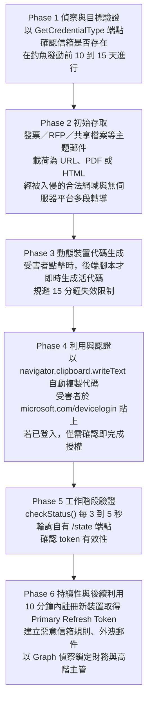

# 微軟威脅情報《Inside an AI-enabled device code phishing campaign》（2026-04）

> 課程模組：09 延伸研究 ｜ 來源類型：官方威脅報告 ｜ 原文：[Inside an AI‑enabled device code phishing campaign](https://www.microsoft.com/en-us/security/blog/2026/04/06/ai-enabled-device-code-phishing-campaign-april-2026/) ｜ 整理日期：2026-09-28
>
> 證據邊界：本篇只核對微軟官方部落格該篇原文，沒有取得樣本、受害者名單或攻擊者端基礎設施。IOC 一律以 defang 形式抄錄，**本教材未對任何 IP、網域或端點發出連線、未做 DNS 或 WHOIS 查詢**。本篇與同模組的 [EvilTokens 教材](microsoft-2026-09-eviltokens-device-code-phishing.html)構成同一條威脅線的前後兩段，建議並讀。第 4 節的對照與所有標示「本教材分析」的段落是教學分析。本篇不含可操作的攻擊內容。

## 1. 一頁速覽

- **學習目標：**用一份**活動層級**的觀察，對照七個月後的[平台層級收束](microsoft-2026-09-eviltokens-device-code-phishing.html)，學習同一威脅在情報生命週期不同階段長什麼樣，以及「AI 賦能」這個標籤在證據上站得多穩。
- 本篇記錄一波裝置代碼釣魚活動，微軟自述其代表「自 2025 年 2 月 Storm-2372 活動以來，威脅行為者複雜度的顯著升級」。
- **本篇已預告 EvilTokens：**原文明言此活動「aligns with the emergence of EvilTokens, a phishing-as-a-service (PhaaS) toolkit identified as a key driver of large-scale device code abuse」。七個月後微軟發布 EvilTokens 專篇並完成處置。
- **關鍵技術改良是即時代碼生成。**裝置代碼 15 分鐘失效，早期做法預先嵌入郵件，常在寄達前失效。本波改為受害者點擊時才即時生成，代碼永遠新鮮。
- 六階段攻擊鏈完整揭露，含具體參數：偵察在釣魚發動前 **10 到 15 天**進行、輪詢每 **3 到 5 秒**一次、入侵後 **10 分鐘內**註冊裝置取得 Primary Refresh Token。
- **AI 的角色在本篇是薄的：**原文稱「generative AI was used to create targeted phishing emails aligned to the victim's role」，但**未說明如何觀察到、也未提供任何機制證據**。這與標題的 AI-enabled 形成落差。
- 基礎設施值得注意：以 Railway.com 開出**數千個短命輪詢節點**，並透過 Vercel、Cloudflare Workers、AWS Lambda 等無伺服器平台與**被入侵的合法網域**做多段轉導以規避掃描。
- **有 IOC**（四個 IP 範圍），這是與 EvilTokens 專篇的重要差異，後者沒有 IOC。
- **這份研究在課程裡要教什麼：**它示範了威脅情報的**時間維度**。同一威脅在 4 月是「一波活動加 AI 標籤加四個 IP」，在 9 月是「一個有定價的平台加行為者代號加執法處置」。判讀任何單一報告時，都要問它處在生命週期的哪一段。
- 限制：AI 參與缺機制證據、行為者未獨立命名（僅與 Storm-2372 比較）、規模未量化、IOC 僅四個 IP 範圍且已逾五個月。

## 2. 報告基本資料

| 欄位 | 核對結果 |
|---|---|
| 機構 | Microsoft Defender Security Research Team |
| 具名作者 | 未具名個人，以團隊名義發布 |
| 發布日期 | 2026-04-06 |
| 文件形式 | 官方部落格技術分析，含六階段攻擊鏈、IOC 表與緩解指引 |
| 資料型態 | **平台遙測**（Entra ID 登入、郵件事件、登入來源 IP）加上釣魚頁面的用戶端腳本分析 |
| 涵蓋期間 | 未給明確起訖，以發布日前後的活動為主 |
| 行為者代號 | **本篇未給新代號。**僅以 2025 年 2 月的 **Storm-2372** 活動作為比較基準。後續的 [EvilTokens 專篇](microsoft-2026-09-eviltokens-device-code-phishing.html)將套件開發者命名為 Storm-2992 |
| 受害者 | 未具名；未給受害數量、產業或國別 |
| 章節結構 | Attack chain overview、Phase 1 到 Phase 6、Mitigation and protection guidance、Indicators of compromise (IOC) |
| 與同機構其他發布的關係 | **前有** 2025-02 的 Storm-2372 報告（本教材未收錄）；**後有** 2026-09-22 的 [EvilTokens 專篇](microsoft-2026-09-eviltokens-device-code-phishing.html)。本篇是三者的中段 |

**體裁判讀（本教材分析）：**這是**活動層級（campaign-level）**的技術分析，不是平台或行為者層級的情報。它回答「這一波怎麼打的」，不回答「誰在賣、賣多少錢、影響多大」。這個層級差異決定了它的用途：**適合給藍隊做偵測工程，不適合給管理層做風險量化。**收錄它的主要理由是它與 EvilTokens 專篇構成本模組唯一的「同機構、同威脅、相隔七個月」對照組。

## 3. 主要發現與六階段攻擊鏈

### 3.1 六階段

### 3.2 三個值得單獨記下的技術細節

| 細節 | 原文所述 | 教學意涵（本教材分析） |
|---|---|---|
| **前置偵察 10 到 15 天** | 以微軟的 `GetCredentialType` 端點驗證信箱是否存在於租戶中 | 這是一個**合法端點被用於帳號列舉**。它的存在意味著防禦方有機會在釣魚信寄出前一到兩週就看到訊號，但多數組織不監控此端點。**這是本篇最被低估的防禦機會** |
| **若已登入，僅需確認** | 「If already signed in, simply confirming the code authenticates the threat actor's session without requiring credentials or MFA」 | 對已登入的使用者，整個攻擊縮減為**點一下確認**。這使「使用者教育」的可行性進一步惡化，也再次證明 MFA 在此鏈上不是防線 |
| **自動複製到剪貼簿** | 使用 `navigator.clipboard.writeText` API | 降低受害者摩擦的設計。合法網站極少自動寫入剪貼簿，**這是可用於頁面行為偵測的特徵** |

### 3.3 AI 在本篇的角色與舉證落差

原文陳述兩句：
- 「generative AI was used to create targeted phishing emails aligned to the victim's role」
- 整體活動被描述為從「static, manual scripts」轉向「an AI-driven infrastructure and multiple automations end-to-end」

原文另述誘餌主題包含 RFP、發票與製造業工作流程，「increasing the likelihood of user interaction」。

**本教材分析（重要）：**原文**沒有說明它如何判定誘餌是生成式 AI 所寫**，也沒有提供任何機制證據（沒有模型指紋、沒有攻擊者端的提示或 API 紀錄、沒有與人工誘餌的比較）。標題是 AI-enabled，但正文對 AI 的舉證只有「郵件很客製化」這個間接觀察。

同時要注意，原文所稱的 **AI-driven infrastructure** 一詞，其描述的內容（Railway 上的短命節點、Node.js 邏輯、即時代碼生成、自動化轉導）**全部是自動化，沒有一項需要 AI**。這是本篇與同模組 [Storm-3168 教材](microsoft-2026-09-storm-3168-agentic-cloud.html)相同的用語鬆動現象：**在 2026 年的產業報告中，automation 與 AI 兩個詞已經開始互換使用。**

**主張狀態標記：**「生成式 AI 用於撰寫誘餌」為**來源陳述但無機制證據**；「AI-driven infrastructure」在本教材判讀為**用語問題，其描述內容屬自動化**；「AI 提高了互動率」為**原文推論，無對照組數據**。

### 3.4 基礎設施與規避

| 手法 | 原文所述 | 偵測意涵（本教材分析） |
|---|---|---|
| 短命輪詢節點 | 以 Railway.com 開出**數千個**獨特、短命的輪詢節點 | 節點列舉無意義，須以「PaaS 出口加新生主機加短存活」的模式偵測 |
| 多段轉導 | 經 Vercel、Cloudflare Workers、AWS Lambda | 全為合法且廣泛使用的平台，**不可整體封鎖**，這是刻意選擇 |
| 被入侵的合法網域 | 用於承載釣魚頁 | 網域信譽偵測失效。原文**未列出具體被入侵的網域** |
| 真授權頁 | 最終導向 `microsoft.com/devicelogin` | 無法封鎖（見 EvilTokens 教材第 3.1 節） |

**本教材分析：**四層規避的共同邏輯是**全部使用合法且不可封鎖的資產**。這使傳統以指標封鎖為主的防禦在本鏈上幾近無效，也解釋了為何本篇的 IOC 只剩四個 IP 範圍：真正在動的部分沒有可列舉的指標。

## 4. 與 Anthropic 2026-09 報告的對照

| 本課教材 | 對照點 | 兩造差異與不可作的推論 |
|---|---|---|
| [EvilTokens 專篇（同模組）](microsoft-2026-09-eviltokens-device-code-phishing.html) | **最重要的對照，且是唯一的時間軸對照。**同機構、同威脅、相隔七個月 | 4 月是活動層加 AI 標籤加四個 IP；9 月是平台層加定價加行為者代號加處置，但**反而沒有 IOC**。並讀可教「情報成熟度」這個維度。**兩篇同屬微軟，不是獨立來源，不可互為佐證** |
| [GTG-15001：假交友 app 網絡](../06-scams/GTG-15001-dating-app-network.html) | AI 生成的社交工程內容 | 兩案都以 AI 生成客製化文字接觸受害者。**但 GTG-15001 有 Anthropic 的模型端遙測（看得到提示），本篇只有受害端遙測（只看得到結果）。**這是兩種完全不同的證據地位，是本模組最值得反覆強調的一組對比 |
| [網路行動導論](../01-cyber/00-cyber-trends-and-skills.html) | uplift 三軸的舉證要求 | 本篇是**舉證不足的反面教材**：宣稱 AI 賦能，但 speed、scale、depth 三軸都沒有量化數據。可用於訓練學員的懷疑習慣 |
| [GTG-50021：假經銷商](../01-cyber/GTG-50021-fake-reseller.html) | 濫用合法平台作為中介 | 本篇用 Railway、Vercel、Cloudflare、AWS 作規避層，該案用經銷結構作中介。**共同點是借用合法商業基礎設施，使處置必須經過第三方** |
| [Claude 護欄與繞過路徑](../shared/02-claude-safeguards-and-bypass-paths.html) | 誰能看到 AI 的使用 | 本篇完全看不到 AI 側。若誘餌確由商用模型生成，供應商端理應有紀錄，但**兩邊的遙測從未接起來**。這個斷點是本模組的核心觀察之一 |
| [護欄繞過與防禦總覽](../shared/03-guardrail-bypass-and-defense-overview.html) | 借用合法機制 | 四層規避全用合法資產，與該篇整理的模式同型 |
| [微軟 2026-03：AI 作為技術手法](microsoft-2026-03-ai-as-tradecraft.html) | 同機構稍早的總論 | 本篇可視為該總論的個案落地。可檢查兩篇對 AI 角色的描述是否一致 |
| [微軟 2026-06：AI 品牌作誘餌](microsoft-2026-06-ai-brands-as-bait.html) | 同機構社交工程系列 | 三篇（04、06、09）並讀可看出微軟 2026 年對 AI 社交工程的敘事演進 |
| [證據與方法](../shared/04-evidence-and-methods.html) | 主張與證據的對應 | 本篇是「標題強於證據」的典型，適合作為該篇規範的練習素材 |

**核心教學點（本教材分析）：**本課主體報告的最大優勢，是 Anthropic 能看到攻擊者輸入模型的**提示原文**，因此對 AI 參與程度的舉證遠強於本篇。把這兩者並排，學員就能具體理解「模型端遙測」與「受害端遙測」的差別：前者能證明 AI 做了什麼，後者只能觀察到結果並推測。**這不是說微軟的報告較差，而是說兩種視角各有盲區，且目前沒有機制把它們接起來。**這正是模組 09 存在的理由。

## 5. TTP 與 MITRE ATT&CK 對應

| 戰術 | 技術 ID | 本報告的具體作法 | 偵測構想（假說，未經實測） |
|---|---|---|---|
| Reconnaissance | [T1589.002：Gather Victim Identity Information: Email Addresses](https://attack.mitre.org/techniques/T1589/002/) | 以 `GetCredentialType` 端點驗證信箱是否存在，發動前 10 到 15 天 | **本篇最佳的早期偵測機會**：對該端點的異常查詢量建立基線。**合法反例**：登入頁的正常使用、SSO 探測、部分整合工具會呼叫 |
| Resource Development | [T1583.006：Acquire Infrastructure: Web Services](https://attack.mitre.org/techniques/T1583/006/) | Railway 短命節點；Vercel、Cloudflare Workers、AWS Lambda 轉導 | 以 PaaS 出口的新生短命主機模式偵測。**合法反例**：預覽部署與 CI 極常見，須配合其他訊號 |
| Resource Development | [T1584.001：Compromise Infrastructure: Domains](https://attack.mitre.org/techniques/T1584/001/) | 使用被入侵的合法網域承載釣魚頁 | 網域信譽無效；改以頁面內容與行為偵測 |
| Resource Development | [T1588.007：Obtain Capabilities: Artificial Intelligence](https://attack.mitre.org/techniques/T1588/007/) | 原文稱以生成式 AI 撰寫客製誘餌 | **無可行偵測**：模型無法從產出文字可靠辨識。此格填入的是原文主張，非經證實 |
| Phishing | [T1566.001](https://attack.mitre.org/techniques/T1566/001/)、[T1566.002](https://attack.mitre.org/techniques/T1566/002/) | 發票、RFP、共享檔案主題；載荷為 URL、PDF 或 HTML | 語意一致性偵測。**合法反例**：真實的 RFP 與發票往來 |
| Initial Access | [T1566](https://attack.mitre.org/techniques/T1566/) 加 device code 濫用 | 即時生成裝置代碼 | **預防勝於偵測**：以條件式存取封鎖 device code flow |
| Credential Access | [T1528：Steal Application Access Token](https://attack.mitre.org/techniques/T1528/) | 取得 token，不接觸密碼與 MFA | 裝置代碼認證後的異常 token 交換 |
| Persistence | [T1098.005：Account Manipulation: Device Registration](https://attack.mitre.org/techniques/T1098/005/) | 10 分鐘內註冊裝置取得 Primary Refresh Token | 對登入後短時間內的裝置註冊告警，時間窗可依本篇的 10 分鐘設定 |
| Defense Evasion | [T1564.008：Email Hiding Rules](https://attack.mitre.org/techniques/T1564/008/) | 建立惡意信箱規則 | 信箱規則建立事件告警 |
| Discovery | [T1087：Account Discovery](https://attack.mitre.org/techniques/T1087/) | Graph 偵察鎖定財務與高階主管 | Graph 呼叫速率與廣度基線 |
| Collection | [T1114.002：Remote Email Collection](https://attack.mitre.org/techniques/T1114/002/) | 外洩郵件資料 | 大量郵件讀取速率偵測 |
| **AI 生成內容與自動化的區分** | **無對應 ID（框架缺口）** | 原文以 AI-driven infrastructure 描述純自動化元件 | ATT&CK 的 T1588.007 只能記錄「用了 AI」，**無法區分 AI 與一般自動化**，也無法要求舉證等級。這使框架無法阻止用語膨脹 |

**框架缺口說明（本教材分析）：**本篇暴露了一個治理層面的問題：當 ATT&CK 提供了「取得 AI 能力」這個技術 ID，而任何報告都可以在缺乏機制證據的情況下勾選它，這個 ID 就會**把推測固化成分類**。下游的統計（例如「本季有多少比例的攻擊使用 AI」）會因此系統性高估。**這是本教材對整個威脅情報產業的一個提醒，不是對微軟本篇的指控。**

偵測構想全部為**假說**，本教材未實測，不宣稱誤報率或可直接部署。

## 6. 圖表判讀

**原文含攻擊鏈示意圖與釣魚頁面、郵件的螢幕截圖**（依原文段落結構與敘述可知）。**本教材未下載、未嵌入任何圖檔。**第 3.1 節的 Mermaid 六階段圖是**依原文各 Phase 標題與內文重繪的教學用圖**，非原文圖片的複製；圖上參數（10 到 15 天、3 到 5 秒、10 分鐘、15 分鐘）均取自原文。

**原文沒有提供統計圖表**：無受害數量、無時間趨勢、無地區或產業分布、無成功率。因此本篇**完全不能用於量化分析**，這也是它與 [EvilTokens 專篇](microsoft-2026-09-eviltokens-device-code-phishing.html)（有 12,000 與 10,000 兩個數字）的重要差異。

**課堂用法：**把第 3.1 的六階段圖與 EvilTokens 教材第 3.2 的序列圖並排投影，請學員找出兩者描述的是不是同一條鏈（是），以及為什麼 9 月的版本反而少了 IOC 而多了定價（情報層級從活動移到平台與行為者）。這個練習教的是**情報生命週期**，不是技術細節。

## 7. IOC 與技術指標

原文提供 IOC 表格，欄位為 Indicator / Type / Description。以下**完整抄錄並一律 defang**：

| 指標（defang） | 類型 | 原文描述 | 偵測價值與壽命（本教材分析） |
|---|---|---|---|
| `162.220.232[.]0`（Railway.com） | IP Range | Threat actor infrastructure observed with sign-in | **低價值、已過期。**屬 Railway 的共用 PaaS 範圍，封鎖會擋到大量合法流量。發布已逾五個月，短命節點必已輪替 |
| `162.220.234[.]0`（Railway.com） | IP Range | 同上 | 同上 |
| `89.150.45[.]0`（HZ Hosting） | IP Range | 同上 | **中低價值。**主機商範圍，較 PaaS 稍具針對性，但仍為共用 |
| `185.81.113[.]0`（HZ Hosting） | IP Range | 同上 | 同上 |

**關於這四個指標的重要判讀（本教材分析）：**原文給的是 **IP 範圍**而非單一位址，且全部屬於**共用的雲端或主機服務**。這意味著它們**不適合作為封鎖清單**，只適合作為登入來源的**加權訊號**（例如「來自這些範圍的 device code 認證」提高風險分數）。把共用 PaaS 範圍直接封鎖是常見的實務錯誤，會造成大量業務中斷。

原文另述攻擊者入侵了多個合法網域承載釣魚頁，但**IOC 段落未列出任何具體網域名稱**。

**非 IOC 但具偵測價值的技術特徵**（抄錄自正文）：

| 項目 | 類型 | 偵測價值與壽命 |
|---|---|---|
| `GetCredentialType` 端點的異常查詢 | 合法端點的濫用 | **高價值、長壽命**，且是最早的訊號（提前 10 到 15 天） |
| `navigator.clipboard.writeText` 自動寫入剪貼簿 | 頁面行為 | 中高價值。合法網站極少如此 |
| `checkStatus()` 函式、`/state` 端點、3 到 5 秒 `setInterval` | 攻擊者頁面腳本特徵 | 中價值、中壽命；改名即失效，但可用於樣本家族歸類 |
| 入侵後 10 分鐘內的裝置註冊 | 行為時序 | 高價值，可直接轉成告警時間窗 |

**安全紅線遵守說明：**上表全部抄錄自原文並已 defang。本教材**未對任何 IP、網域或端點發出連線、未做 DNS 或 WHOIS 查詢、未取得或分析任何樣本**。

## 8. 該機構的偵測、處置與防線缺口

**做了什麼（原文陳述）：**以受害端遙測重建六階段攻擊鏈；分析釣魚頁的用戶端腳本並取得具體函式與 API 名稱；公開四個 IP 範圍作為 IOC；與 2025 年 2 月的 Storm-2372 活動作複雜度比較；辨識出本波與 EvilTokens 的關聯；提供緩解、認證強化、身分治理與監控四類建議。

**原文的緩解建議（來源陳述，重點摘錄）：**以條件式存取**盡可能封鎖 device code flow**；設定反釣魚政策與 Safe Links；建置登入風險政策與強制重新認證；封鎖 legacy authentication；普遍要求 MFA 並改用 FIDO 或 passkey，**避免電話式 MFA（SIM 劫持風險）**；集中身分管理、整合地端與雲端目錄、實施 SSO 與最小權限（**管理與高權限帳號不同步**）；使用者教育；事件回應以 `revokeSignInSessions` 撤銷 refresh token 並**在可接受業務衝擊下暫時停用受害帳號**；監控風險登入報告、裝置註冊與信箱規則建立。

**防線缺口（本教材分析）：**

1. **AI 主張缺機制證據。**標題與敘事都以 AI-enabled 為框架，但正文未提供任何可檢驗的 AI 證據（見 3.3）。
2. **AI-driven infrastructure 一詞名實不符。**其描述的元件全為自動化，無一需要 AI。
3. **未給規模。**無受害數、無地區、無產業。因此本篇無法支持任何風險量化，也無法與其他報告做規模比較。
4. **未給新行為者代號。**只與 Storm-2372 比較，未說明是否為同一行為者、是否有重疊。**七個月後的 EvilTokens 專篇才給出 Storm-2992，但那是套件開發者，與本波的操作者是否同一人仍未明。**
5. **IOC 品質受限。**四個共用範圍的 IP，不可封鎖、已過期（見第 7 節）。
6. **被入侵的合法網域未揭露。**可理解（受害網域也是受害者），但削弱了防禦價值。
7. **抗釣魚認證的限制未說明。**原文建議 FIDO 與 passkey，但**這兩者在本攻擊鏈上並不提供保護**（攻擊者不取憑證，只取授權）。原文未提醒這一點。**這是本教材的技術判讀，詳見 [EvilTokens 教材第 8.3 節](microsoft-2026-09-eviltokens-device-code-phishing.html)。**
8. **偵測時點與處置結果未揭露。**本篇沒有處置段落（處置在七個月後的專篇才出現）。
9. **未討論 AI 側的可偵測性。**若誘餌確由商用模型生成，供應商端可能有紀錄，原文未探討此方向。

## 9. 第三方驗證與外部來源

| 來源 | 日期 | 本篇使用範圍與證據地位 |
|---|---|---|
| [微軟官方原文](https://www.microsoft.com/en-us/security/blog/2026/04/06/ai-enabled-device-code-phishing-campaign-april-2026/) | 2026-04-06 | **直接來源核對，不是第三方驗證。**本教材所有數字與 IOC 均出自此處 |
| [微軟 EvilTokens 專篇](https://www.microsoft.com/en-us/security/blog/2026/09/22/unmasking-eviltokens-getting-to-the-root-of-device-code-phishing/) | 2026-09-22 | **同機構後續報告，非獨立來源。**證實本篇對 EvilTokens 關聯的預判，並補上行為者代號與規模 |
| 微軟 2025-02 Storm-2372 報告 | 2025-02 | **本教材未取得亦未核對。**本篇對「複雜度顯著升級」的比較基準留在該報告中，屬二手轉述 |
| [MITRE ATT&CK 各技術頁](https://attack.mitre.org/techniques/T1589/002/) | 查閱 2026-09-28 | 只核對技術定義，不驗證本篇任何事件主張 |
| [本課 GTG-15001 教材](../06-scams/GTG-15001-dating-app-network.html) | 原報告 2026-09-10 | 主題對照組，**完全獨立來源，不可互為事件佐證** |

**單一來源情報判定：**本篇的事件細節為**單一來源**（微軟受害端遙測）。EvilTokens 專篇雖佐證了平台的存在與規模，但**同屬微軟，不構成獨立驗證**。本教材未找到任何其他機構對這一波特定活動的獨立報告。**「生成式 AI 用於撰寫誘餌」這個主張，目前是單一來源且無機制證據，屬本模組中證據最弱的一類主張。**

## 10. 課程教學設計

### 10.1 核心教學要點

1. **情報有生命週期，判讀要先定位。**同一威脅在 4 月與 9 月的兩份報告，層級、數字與可用性完全不同。看到一份報告，先問它在哪一段。
2. **前置偵察是最早也最被忽略的訊號。**10 到 15 天的 `GetCredentialType` 查詢期，是整條鏈上最長的偵測窗口，卻幾乎沒有組織在看。
3. **AI 標籤與 AI 證據要分開看。**本篇標題是 AI-enabled，正文的 AI 舉證只有「郵件很客製化」。這是產業常態，不是個案。
4. **automation 不等於 AI。**原文的 AI-driven infrastructure 所描述的元件全是自動化。用語膨脹會污染下游統計。
5. **共用 IP 範圍不是封鎖清單。**四個 IOC 全屬共用 PaaS 或主機商範圍，封鎖會造成業務中斷，只能當加權訊號。
6. **全用合法資產的規避策略，使指標型防禦失效。**這解釋了為何 IOC 這麼少。
7. **對已登入的使用者，攻擊縮減為點一下確認。**使用者教育在此的可行性極低。
8. **ATT&CK 的 AI 技術 ID 可能把推測固化成分類。**這是框架本身的治理問題。

### 10.2 課堂討論題

1. 原文沒有說明它如何判定誘餌是 AI 生成的。**如果你是審稿人，你會要求什麼證據？**在只有受害端遙測的情況下，這種證據取得得到嗎？如果取不到，報告該不該把 AI 放進標題？
2. 原文稱 AI-driven infrastructure，但所述元件全為自動化。**這是用語不精確，還是刻意的敘事選擇？**兩者對讀者的影響有差別嗎？
3. ATT&CK 有 T1588.007（取得 AI 能力）。**本篇的證據足以勾選這一格嗎？**如果業界普遍以本篇的標準勾選，「AI 攻擊佔比」這類統計還有意義嗎？
4. 前置偵察提前 10 到 15 天，訊號明確（異常的 `GetCredentialType` 查詢）。**為什麼幾乎沒有組織監控它？**是技術限制、可見度問題，還是優先順序問題？
5. 四個 IOC 全是共用範圍。**一份 IOC 不可用的威脅報告，對藍隊還有價值嗎？**如果有，價值在哪裡？（提示：行為特徵與時間窗）
6. 4 月的報告已經預告了 EvilTokens，處置卻在 9 月才發生。**這五個月的間隔說明了什麼？**是情報到行動的必然延遲，還是可以壓縮的？壓縮需要什麼？

### 10.3 桌面演練建議

**演練一：偵察期監控可行性評估（50 分鐘，紙上作業）**
以 `GetCredentialType` 這類帳號列舉訊號為題，分組評估自家環境：這個訊號在現有日誌裡看得到嗎？保留多久？誰會看？要建一條告警需要跨哪幾個團隊？產出一張「可見度落差表」。**不執行任何查詢或掃描。**

**演練二：IOC 品質分級練習（40 分鐘）**
給學員第 7 節的四個 IP 範圍與其類型描述，要求分級為「可封鎖／僅加權／應丟棄」，並寫出理由與誤擋風險。接著加入非 IOC 的行為特徵（時間窗、頁面腳本特徵），重做一次分級。目的是讓學員親身體會**行為特徵的壽命遠長於位址型指標**。

**演練三：兩份報告的情報成熟度比對（60 分鐘）**
發給學員本篇與 [EvilTokens 教材](microsoft-2026-09-eviltokens-device-code-phishing.html)的第 2 節與第 7 節，要求填出一張比較表（層級、行為者資訊、規模數字、IOC、處置、AI 舉證）。討論題：如果你在 4 月讀到第一篇，你會做什麼決策？9 月讀到第二篇後，那個決策需要改變嗎？

**紅線：**三個演練均不建置任何釣魚設施、不生成誘餌、不對任何 IP 或網域發出連線或查詢、不使用任何掃描工具。

### 10.4 對台灣的意涵

1. **M365 租戶的帳號列舉可見度。**台灣多數組織未監控 `GetCredentialType` 類端點的異常查詢。本篇指出這是提前 10 到 15 天的訊號，建議納入雲端身分監控的檢核項，並確認相關日誌的保留期長於兩週。
2. **誘餌主題與台灣產業直接對應。**原文列出的 RFP、發票、製造業工作流程三類主題，正好對準台灣製造業與供應鏈的日常往來。**AI 生成使繁體中文商務用語的自然度不再是門檻**，過去以語感判斷的做法正在失效，應改以流程控制替代（例如匯款或供應商資料變更一律另路徑確認）。
3. **無伺服器平台的規避層難以處理。**Vercel、Cloudflare Workers、AWS Lambda 在台灣開發社群普及，整體封鎖不可行。防禦重心應放在身分側（封鎖 device code flow）而非網路側封鎖。
4. **共用 IP 封鎖的實務風險。**本篇的 IOC 全為共用範圍。台灣部分組織習慣將威脅報告的 IP 直接匯入封鎖清單，本案是很好的反面教材，可用於內部教育。
5. **情報到行動的延遲。**本篇 4 月預告、9 月處置。台灣組織若僅在跨國處置發生後才行動，將承受這五個月的曝險。**這再次指向事前控制（封鎖 device code flow、監控偵察訊號）而非依賴外部處置。**

## 11. 關鍵原文引文

1. 「This activity aligns with the emergence of EvilTokens, a phishing-as-a-service (PhaaS) toolkit identified as a key driver of large-scale device code abuse.」
   （此活動與 EvilTokens 的出現相符，該套件是一個釣魚即服務工具包，被認定為大規模裝置代碼濫用的關鍵推手。）
   出處：Attack chain overview 段。**本篇與七個月後 EvilTokens 專篇的連結點。**

2. 「generative AI was used to create targeted phishing emails aligned to the victim's role」
   （生成式 AI 被用於製作與受害者職務相符的針對性釣魚郵件。）
   出處：Phase 2 相關敘述。**本篇關於 AI 的核心主張，原文未提供任何機制證據。**

3. 「away from static, manual scripts toward an AI-driven infrastructure and multiple automations end-to-end」
   （從靜態、人工的腳本，轉向由 AI 驅動的基礎設施與多重的端到端自動化。）
   出處：活動特徵描述段。**注意其所描述的元件全屬自動化，本教材判讀為用語膨脹。**

4. 「If already signed in, simply confirming the code authenticates the threat actor's session without requiring credentials or MFA.」
   （若使用者已處於登入狀態，僅需確認該代碼即可完成對威脅行為者工作階段的認證，不需要憑證也不需要 MFA。）
   出處：Phase 4。**整條攻擊鏈對已登入使用者縮減為一次點擊確認。**

5. 「marks a significant escalation in threat actor sophistication since the Storm-2372 device code phishing campaign observed in February 2025」
   （相較於 2025 年 2 月觀察到的 Storm-2372 裝置代碼釣魚活動，這標誌著威脅行為者複雜度的顯著升級。）
   出處：導言段。**比較基準留在未收錄的前期報告中，屬二手轉述。**

6. 「Within 10 minutes of the breach」（threat actors registered new devices to generate Primary Refresh Tokens for long-term persistence）
   （在入侵後的 10 分鐘內，威脅行為者註冊新裝置以產生 Primary Refresh Token，建立長期持續性。）
   出處：Phase 6。**可直接轉成告警時間窗的具體參數。**

## 12. 未能驗證之處與研究限制

**核對範圍聲明：**本教材於 2026-09-28 核對微軟官方原文兩次（第二次專門針對六階段細節、AI 舉證、IOC 完整內容與緩解建議）。來源發布日 2026-04-06，觀察期未於原文明確界定，教材加入日 2026-09-28。**本篇為回填收錄**（發布已逾 21 天），收錄理由是它與 2026-09-22 的 EvilTokens 專篇構成同一威脅線的前後段，具獨立教學價值。以下各項均**未**於本次核對中查證。

1. **「生成式 AI 用於撰寫誘餌」無機制證據，且為單一來源。**這是本篇最弱的一環。原文未說明判定方法，本教材亦無從驗證。**課堂與任何引用都必須標明此主張的證據等級。**
2. **AI-driven infrastructure 的名實不符是本教材判讀**，原文未承認亦未否認。判讀依據是原文自己列出的元件清單（Railway 節點、Node.js 邏輯、即時代碼生成、自動化轉導）皆不需 AI。
3. **未取得 2025-02 Storm-2372 原始報告。**「複雜度顯著升級」的比較基準因此無法核對，屬二手轉述。
4. **行為者歸屬不明。**本篇未給代號；EvilTokens 專篇的 Storm-2992 是套件**開發者**，與本波**操作者**是否同一，兩篇均未說明。**不可假定兩者為同一行為者。**
5. **規模完全未知。**無受害數、產業、地區、財務損失。本篇不可用於任何風險量化。
6. **IOC 已逾五個月且為共用範圍。**本教材**未核對這四個範圍目前的歸屬或狀態，亦不會為此發出任何連線或查詢**。第 7 節的價值評估是依其類型所作的分析推論，非實測。
7. **被入侵的合法網域未揭露**，無法評估其規模或是否已清理。
8. **偵測時點、處置與受害者通知情況未揭露。**本篇無處置段落。
9. **第 5 節所有偵測構想均為未實測假說**，已盡可能附合法反例與所需遙測，不宣稱誤報率、可部署性或投報率。
10. **第 8 節第 7 點（抗釣魚認證在本鏈上不提供保護）是本教材的技術判讀，原文未作此陳述**，依據見 [EvilTokens 教材第 8.3 節](microsoft-2026-09-eviltokens-device-code-phishing.html)。
11. **與本課教材的所有對照（第 4 節）均為分析推論**，不是微軟與 Anthropic 的聯合結論。
12. **本教材未核對任何第三方媒體對本篇的轉述**，亦未採用任何非原文數字。
