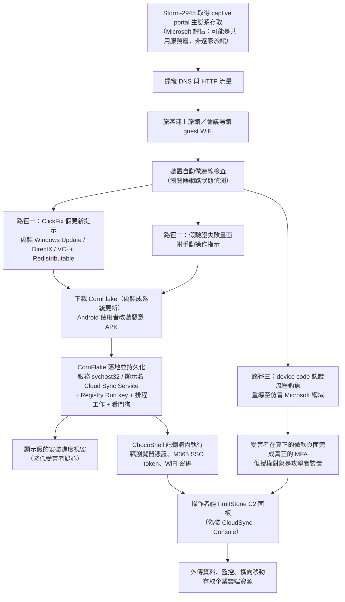

# Microsoft Threat Intelligence《CaptiveCrunch: Midnight Blizzard targets travelers worldwide for malware delivery and credential theft》（2026 年 7 月）

> 課程模組：09 延伸研究 ｜ 來源類型：官方威脅報告 ｜ 原文：https://www.microsoft.com/en-us/security/blog/2026/07/31/captivecrunch-midnight-blizzard-targets-travelers-worldwide-for-malware-delivery-and-credential-theft/ ｜ 整理日期：2026-09-14

> **本教材的資料層次標示規則**（沿用模組 01 與模組 09 既有慣例）：
> - **［MSTIC］**＝Microsoft Threat Intelligence 這篇部落格長文可直接追溯的內容。本文無頁碼，以章節標題定位。
> - **［Anthropic］**＝Anthropic《Detecting and countering misuse of AI: September 2026》PDF 原文，附頁碼。
> - **［外部］**＝第三方研究或媒體報導，附 URL 與日期，並註明「獨立查證」或「僅引述原報告」。
> - **［分析］**＝本教材作者的推論與教學詮釋，兩份原報告都沒有明說，學員應視為可被挑戰的假設。

---

## 0. 為什麼這一份要單獨做一份教材

模組 01 的 `GTG-20006-russian-espionage.md` 已經在第 9 節引用過這篇 Microsoft 報告，作為 Anthropic 案例的第三方獨立佐證。那裡是「用 Microsoft 來驗證 Anthropic」。本教材反過來：**把 Microsoft 這一份當成獨立的一手文件，從頭到尾讀一次**，看它自己說了什麼、沒說什麼。

這樣做的理由有三個，都直接關係到本模組要教的情報方法論：

1. **這是全課程目前唯一一組「雜湊值層級完全對上」的跨機構印證。** 兩個 SHA-256 在 Anthropic p.11 的 IOC 表與 Microsoft 的 IOC 表裡一字不差。在威脅情報裡，網域與 IP 重疊只能算「可能相關」，**檔案雜湊完全相同等於兩家在分析同一個二進位檔**。這種強度的印證，在單一來源情報佔壓倒多數的 Anthropic 報告裡是例外，值得整份拆開來教。

2. **它示範了「受害端視角」與「模型端視角」看到的東西有多不一樣。** Anthropic 看得到的是「有人在 Claude 上叫 AI 改寫惡意程式躲偵測」；Microsoft 看得到的是「這支惡意程式落地之後在受害者機器上做了什麼、用什麼服務名持久化、C2 面板長什麼樣」。兩邊拼起來才是完整的行動，任何一邊單獨看都是殘缺的。

3. **它提供了一個關於 AI 的、非常克制的判斷。** Microsoft 只說「observed Storm-2945 leveraging AI to support a significant portion of these operations」以及「程式碼風格**暗示**作者可能用了 AI 輔助生成」。**它沒有主張這是一場「AI 編排」的行動。** 這個措辭落差與 Anthropic 的敘事之間的關係，是本教材第 4 節與第 12 節的核心。

**一句話定位**：這是一份幾乎不談 AI 的傳統惡意程式分析報告，卻正因為如此，成為檢驗「AI 威脅情報敘事」是否站得住腳的最佳對照組。

---

## 1. 一頁速覽

1. **這是什麼**：Microsoft Threat Intelligence 於 **2026-07-31** 發布的威脅情報部落格長文，公開一場代號 **CaptiveCrunch** 的行動，歸因於 **Storm-2945**，並定性 Storm-2945 為 **Midnight Blizzard 的一個操作子群集（operational sub-cluster）**。［MSTIC］

2. **攻擊入口非常特別**：不是釣魚信，不是漏洞，而是**旅館與會議場館的 guest WiFi captive portal（強制網路入口）**。行為者操縱 captive portal 網路的 **DNS 與 HTTP 流量**，把使用者連線導向自己控制的基礎設施。受害者是「全球的旅行者」，目標明確寫著要拿**企業出差人員的帳號**。［MSTIC, The CaptiveCrunch campaign］

3. **最值得注意的一句評估**：Microsoft 說各受害場館的技術樣態相似度高到「could reflect access to shared services within portions of the captive portal ecosystem」（可能反映了對 captive portal 生態系某些共用服務的存取）。換句話說，**這可能不是一家一家打旅館，而是打了旅館 WiFi 的上游供應商**。這是整篇報告裡影響面最大、但措辭最保守的一句。［MSTIC］

4. **三條投放路徑**：使用者的裝置做連線檢查時被導到攻擊者頁面，接著分三路：(a) **ClickFix** 假更新社交工程（偽裝 Windows Update、DirectX、Visual C++ Redistributable）；(b) 驗證失敗假畫面配手動操作指示；(c) **device code 認證流程釣魚**，重導到仿冒的 Microsoft 網域。Android 使用者則被指示安裝惡意 APK。［MSTIC］

5. **三支工具**：**CornFlake**（Go 寫的 Windows RAT，主力持久化植入物，以服務名 `svchost32`、顯示名 **"Cloud Sync Service"** 註冊）、**ChocoShell**（PowerShell 記憶體內竊取器，專攻瀏覽器憑證與 Microsoft 365 token）、**FruitStone**（Web C2 面板，偽裝成 "CloudSync Console"、掛 "Acuity Systems, Inc." 品牌）。［MSTIC, CaptiveCrunch tradecraft and tooling］

6. **AI 只出現兩次**，而且都很克制：一次是「Microsoft has observed Storm-2945 leveraging AI to support a significant portion of these operations」；一次是分析 ChocoShell 時說「The consistent coding standard and descriptive commentary suggest the author might have leveraged AI-assisted code generation」（一致的編碼規範與描述性註解**暗示**作者**可能**用了 AI 輔助生成）。**沒有任何一句宣稱 AI 在執行期扮演決策角色。**［MSTIC］

7. **與本課程的硬連結**：兩個 SHA-256（CornFlake `918fa52...`、ChocoShell `be998574...`）與 Anthropic 報告 p.11 的 IOC 表**完全相同**；四個 `ms365`／`owa` 系列網域與六個 IP 也大量重疊。Anthropic 的 **CloudSyncSvc** 這個惡意程式名，幾乎確定就是 CornFlake 註冊的 **"Cloud Sync Service"**。（見第 4 節與第 7 節）

8. **命名分歧的完整標本**：同一批活動，Anthropic 叫 GTG-20006（操作者 handle "JackPoterz"），Microsoft 叫 Storm-2945，Google GTIG 叫 UNC7005／ICE RELIC，ReliaQuest 不給代號但說 TTP 像 **APT28**（而非 APT29）。**四家四個名字，其中一家的歸因方向還不一樣。**

9. **這份研究在課程裡要教什麼**：教「**一份不談 AI 的報告，如何成為 AI 威脅情報的品質檢查點**」。當某家 AI 公司說「這是一場 AI 驅動的國家級行動」，最有力的查核方式不是找另一家 AI 公司，而是找**看得到受害端的端點安全廠商**，看它描述同一批工具時用了多少關於 AI 的形容詞。本案的答案是：兩句，而且都加了 might。

---

## 2. 報告基本資料

| 項目 | 內容 | 出處 |
|---|---|---|
| 完整標題 | CaptiveCrunch: Midnight Blizzard targets travelers worldwide for malware delivery and credential theft | 頁面標題 |
| 機構 | Microsoft Threat Intelligence（涵蓋 MSTIC 與 Microsoft 威脅情報中心各團隊） | 署名 |
| 署名方式 | 團體署名「Microsoft Threat Intelligence」，**未列個別分析師姓名** | 文末 |
| 發布日期 | **2026-07-31** | 頁面 |
| 形式 | Microsoft Security Blog 長文（HTML），**非 PDF、無頁碼** | 頁面 |
| 觀察涵蓋期間 | **2026-02 至 2026-07**（最早的 AI 輔助 device code／OAuth 釣魚活動起於 2026-02；DNS／HTTP 流量操縱起於 2026-05 初；device code 釣魚整合進 landing page 為 2026-07-16） | 全文時間線 |
| 行動代號 | **CaptiveCrunch**（Microsoft 命名） | 全文 |
| 行為者代號 | **Storm-2945**，定性為 **Midnight Blizzard 的操作子群集** | Storm-2945 and Midnight Blizzard |
| 資料來源類型 | **平台與端點遙測 + 惡意程式逆向分析**（Microsoft Defender 產品線遙測、Entra ID 登入遙測、樣本分析、基礎設施追蹤） | 全文 |
| 圖表 | **10 張 Figure**（攻擊流程圖 1 張、社交工程畫面 3 張、C2 面板介面 5 張、基礎設施管理 1 張） | 全文 |
| 表格 | **3 類**：CornFlake 能力矩陣、Defender 依 ATT&CK 戰術的涵蓋表、IOC 表 | 全文 |
| 附錄 | **有 IOC 表**（4 網域、6 IP、2 SHA-256，均附 first seen 日期） | Indicators of compromise |
| 與同機構其他報告的關係 | 延續 Microsoft 長期對 Midnight Blizzard／APT29 的追蹤；device code phishing 的公開先例是 2025-02-13 的 Storm-2372 報告；2026-04-06 另有一篇 AI-enabled device code phishing 報告 | ［外部］見第 9 節 |

### 2.1 章節骨架（原文標題逐字）

```
The CaptiveCrunch campaign
Storm-2945 and Midnight Blizzard
CaptiveCrunch tradecraft and tooling
How to protect against CaptiveCrunch activity
Microsoft Defender detections and hunting guidance
Indicators of compromise
```

［分析］這個骨架本身就值得教：它是**端點安全廠商威脅報告的標準結構**，與 AI 公司威脅報告的結構（Key findings／Attack lifecycle and AI usage／Disruption and mitigations／IOC）差異明顯。最關鍵的差異是 Microsoft **沒有「AI usage」這一節**。AI 在這篇裡不是一個結構性的分析維度，只是散落在技術描述裡的兩句旁白。**報告的目錄結構會洩漏該機構認為什麼是重要的分析軸。** 這一點在課堂上可以直接拿兩份報告的目錄並排投影。

---

## 3. 主要發現與案例逐一摘要

本篇只有一個案例（CaptiveCrunch 行動），所以本節改以「行動階段 + 工具」的方式拆解。

### 3.1 行動時間線

| 時間 | 事件 | 出處 |
|---|---|---|
| **2026-02** | Storm-2945 展開 **AI 輔助（AI-augmented）** 的 device code 與 OAuth 釣魚行動 | ［MSTIC］ |
| **2026-02-27** | ChocoShell C2／DNS resolver `107.189.26[.]194` first seen | IOC 表 |
| **2026-04-28** | AitM 基礎設施 `104.194.159[.]150` first seen | IOC 表 |
| **2026-05 初** | 開始對 captive portal 網路做 **DNS 與 HTTP 流量操縱** | ［MSTIC］ |
| **2026-05-14** | device code 重導網域 `ms365-live[.]com` first seen | IOC 表 |
| **2026-07-03** | CornFlake 樣本 first seen | IOC 表 |
| **2026-07-10** | ChocoShell 樣本 first seen | IOC 表 |
| **2026-07-16** | **device code phishing 被整合進 landing page**；`owa-ms365[.]com` first seen | ［MSTIC］、IOC 表 |
| **2026-07-23** | **ReliaQuest 率先公開揭露**此一 DNS 投毒手法擴散到旅宿業 | ［外部］ |
| **2026-07-31** | **Microsoft 發布本報告**，給出代號與歸因 | 頁面 |

［分析］注意 **2026-07-23 → 2026-07-31 這八天**。ReliaQuest 先看到現象（旅館 WiFi 被做 DNS 偽造）但給不出歸因；Microsoft 八天後補上代號、惡意程式家族、C2 面板與歸因。**這是「現象揭露」與「歸因揭露」之間的典型時間差**，也解釋了為什麼 ReliaQuest 的歸因方向（像 APT28）與 Microsoft（Midnight Blizzard／APT29）不同：先看到的人手上證據較少。教學時可以用這組時間差講「不要用最早的一份報告當定論」。

### 3.2 攻擊鏈全圖



### 3.3 CornFlake：Go 語言 Windows RAT

［MSTIC, CaptiveCrunch tradecraft and tooling］原文定位：「CornFlake is a full-featured Windows RAT written in Go that serves as Storm-2945's primary persistent implant.」

| 能力類別 | 具體內容 |
|---|---|
| **持久化** | Windows 服務（`svchost32`，顯示名 "Cloud Sync Service"）、Registry Run key、排程工作、**持久化看門狗（watchdog）** |
| **C2 通訊** | ECDH P-256 臨時金鑰交換，SHA-256 推導工作階段金鑰；加密通道上跑自訂 JSON 協定；可經 `sync.dat` **熱重新設定** |
| **監控** | 鍵盤側錄（raw input API）、剪貼簿監控、閒置觸發與隨選螢幕截圖、WASAPI 麥克風錄音（WAV）、Media Foundation 網路攝影機擷取（JPEG）、音訊與視訊錄製 |
| **憑證竊取** | 衍生自 ChromeKatz 的瀏覽器憑證抽取（Chrome、Edge、Brave、Opera、Vivaldi），含 **App-Bound Encryption 繞過**；Firefox cookie 與密碼竊取；Office MRU 蒐集 |
| **系統盤點** | **18 類**主機情報，含軟體清單、防毒與 EDR 偵測、**Defender 排除清單**、UAC 等級、RDP 歷史、Office MRU |
| **檔案外傳** | 即時檔案系統監控，鎖定文件、壓縮檔、圖片、程式碼、資料、郵件、金鑰等副檔名類別；**每輪上限 1,000 檔或 500 MB** 的節流 |
| **可移除媒體** | USB 插入偵測與掃描 |
| **遠端存取** | `cmd.exe` 與 PowerShell shell 執行 |

［分析］三個值得在課堂上停下來講的設計細節：

- **「Defender 排除清單」被列為情報蒐集項目**。這不是為了報告受害者裝了什麼防毒，而是為了**知道哪些路徑是安全區**。攻擊者讀完排除清單，就知道把 payload 放哪裡不會被掃。這對防守方的直接啟示是：**排除清單本身是高敏感資產**，應納入設定稽核與變更告警。
- **每輪 1,000 檔或 500 MB 的節流**。這是 OPSEC 設計，不是效能設計：避免一次性大量外傳觸發 DLP 或流量異常偵測。**偵測構想因此要反過來找「長期、低速、穩定」的外傳樣態，而不是找尖峰。**
- **持久化看門狗**。代表單點清除（砍掉服務或刪掉 Run key）無效，必須同時處理所有持久化點。這是事件回應的標準陷阱。

### 3.4 ChocoShell：PowerShell 記憶體內竊取器

［MSTIC］原文定位：「ChocoShell is the campaign's Powershell-based infostealer, delivered and executed entirely in-memory.」

| 能力類別 | 具體內容 |
|---|---|
| **防禦規避** | 以 .NET reflection **關閉 AMSI**；規避 PowerShell 行為偵測；**以計時為基礎的沙箱／虛擬機偵測** |
| **提權** | 三種 UAC 繞過技術並含 fallback：SilentCleanup 排程工作劫持、`wsreset.exe` COM 劫持、`sdclt.exe` 資料夾劫持；全部失敗時**退回顯示真正的 UAC 提示**讓使用者自己按 |
| **瀏覽器憑證** | 抽取 Chromium 系主金鑰；以 **SYSTEM token 冒用**解 App-Bound Encryption；用 **Chrome DevTools Protocol** 直接取明文 cookie；以**磁碟區陰影複製服務（VSS）** 讀取 Firefox 資料庫 |
| **雲端 token** | Microsoft 365／Azure AD 的 access token、refresh token，以及 **Token Broker 快取中的 WAM token** |
| **WiFi 憑證** | `netsh wlan show profile` 抽取 |
| **外傳與善後** | GZip 壓縮 + Base64 編碼的 JSON POST 到 C2；**清除已外傳資料與提權痕跡** |

［分析］**「UAC 繞過全部失敗時就顯示真正的 UAC 提示」** 這個 fallback 設計是本報告最值得討論的單一工程決策。它承認了一件事：**社交工程的成功率高到值得當成技術手段的備援**。受害者已經在假更新情境裡了，看到一個 UAC 提示只會覺得「更新需要權限」。教學提問：如果攻擊鏈的最後一道技術防線可以用「請使用者自己按同意」來繞過，那 UAC 這類同意機制在威脅模型裡還算不算控制項？

另外，**用 Chrome DevTools Protocol 取明文 cookie** 與 **用 VSS 讀 Firefox 資料庫**這兩招都有共同特徵：**用作業系統與應用程式的合法功能達成目的**，不需要漏洞。這是「living off the land」在憑證竊取領域的完整展現，也是為什麼靜態簽章對這類工具幾乎無效。

### 3.5 FruitStone：C2 面板

［MSTIC］原文定位：「FruitStone is the web-based C2 panel that Storm-2945 operators use to manage the entire CaptiveCrunch campaign infrastructure.」偽裝成 **"CloudSync Console"**，掛 **"Acuity Systems, Inc."** 品牌。

| 模組 | 功能 |
|---|---|
| 認證 | JWT 為基礎，含工作階段管理、速率限制、IP 封鎖 |
| 代理管理 | 即時 agent 狀態儀表板、系統資訊顯示、**依地理位置分組與地圖** |
| 操作者任務下達 | 遠端 shell、檔案系統瀏覽器、隨選蒐集、設定熱推送、agent 更新、agent 終止 |
| **戰役建構精靈** | 逐步導引的 payload 設定：Identity（身分）、Capabilities（能力開關）、File paths（目標路徑與副檔名）、Evasion（規避技術開關） |
| 基礎設施管理 | proxy relay 管理（TLS 追蹤、健康檢查）、beacon profile 設定（時序、**SNI 偽造**、DNS fallback）、staging server 管理 |

［分析］**「戰役建構精靈」是本案最重要的、與 AI 議題真正相關的證據，而且 Microsoft 自己沒有把它與 AI 連在一起。** 一個有 Identity／Capabilities／File paths／Evasion 四個分頁的精靈式介面，意味著**操作者不需要懂惡意程式開發就能產生客製 payload**。這與 Anthropic 報告的核心論點（AI 抹平人力與工具落差、複雜度不再是歸因訊號）指向同一個結論，但機制完全不同：**這裡抹平落差的是一個好用的 GUI，不是 AI。**

這個觀察在課堂上非常有用，因為它提供了對「AI 論述」的必要反例：**攻擊門檻下降這件事，在 AI 之前就已經由工具化、服務化、面板化在進行了。** 把所有門檻下降都歸因於 AI，是一種歸因謬誤。（詳見第 10.2 節討論題）

### 3.6 Microsoft 對「captive portal 生態系」的評估

這是整篇報告技術以外最重要的一段。［MSTIC］原文：

> "These similarities suggest that the activity might not be limited to isolated compromises of individual venues and could reflect access to shared services within portions of the captive portal ecosystem."

拆解這句話的信度用字（本模組與模組 01 一貫強調的訓練）：

| 用字 | 信度意涵 |
|---|---|
| `suggest` | 這是推論，不是觀察到的事實 |
| `might not be limited to` | 雙重否定的保守表述：沒有排除「逐家攻破」的可能 |
| `could reflect` | 可能性陳述，非評估性陳述（對比 "we assess with moderate confidence"） |
| `portions of` | 連「整個生態系」都不敢說，只說「部分」 |

［分析］四層保留疊在一句話裡。**Microsoft 顯然握有某些一致性證據，但不足以做供應鏈歸因。** 這句話的實務意涵極大：如果成立，代表**一次上游攻破可以覆蓋全球數以千計的場館**，是典型的供應鏈放大效應。但 Microsoft 選擇不把它寫成標題。教學重點：**報告裡措辭最保守的句子，往往是影響面最大的句子。** 訓練學員讀報告時要專門去找這種句子，而不是只讀粗體結論。

---

## 4. 與 Anthropic 2026-09 報告的對照

這是本模組的核心。本案是全課程目前**對照密度最高**的一組。

### 4.1 指向同一批人：雜湊層級的印證

| 指標 | Anthropic（p.11 IOC 表） | Microsoft（IOC 表） | 判定 |
|---|---|---|---|
| `918fa52ae45ed60ba7cc8bdc99c3cbe9ab92e0375ec31fc05d0d4513be11c593` | 有 | CornFlake，first seen 2026-07-03 | **完全相同** |
| `be99857449d2856dd5a84e21c8a3d5e0e01456adb44062ddec5a6b4970d8d42c` | 有 | ChocoShell，first seen 2026-07-10 | **完全相同** |
| `ms365-live[.]com` | 有 | DCF 重導，first seen 2026-05-14 | 相同 |
| `ms365-device[.]com` | 有 | DCF 重導，first seen 2026-07-23 | 相同 |
| `m365-owa[.]com` | 有 | AitM 基礎設施，first seen 2026-07-20 | 相同 |
| `owa-ms365[.]com` | 有 | AitM 基礎設施，first seen 2026-07-16 | 相同 |
| `31.57.243[.]154` | 有 | AitM 基礎設施 | 相同 |
| `38.146.28[.]75` | 有 | AitM 基礎設施 | 相同 |
| `38.146.28[.]132` | 有 | **DNS Resolver** | 相同 |
| `213.145.86[.]112` | 有 | ChocoShell C2 | 相同 |
| `104.194.159[.]150` | Anthropic 列 `104.194.159[.]55` | AitM 基礎設施 | **同 /24 網段，非同一 IP** |

對應教材：[GTG-20006 俄羅斯國家級間諜](../01-cyber/GTG-20006-russian-espionage.html) 第 7 節與第 9 節。

［分析］**教學上務必區分三種印證強度**：
- **雜湊相同**＝兩家在分析同一個二進位檔。這是最強的印證，且不隨時間失效。
- **網域／IP 相同**＝兩家看到同一批基礎設施。強，但攻擊者汰換快，時效短。
- **同網段（/24）**＝可能相關，也可能只是共用同一家 bulletproof hosting。**這是最容易被過度解讀的一類**，`104.194.159[.]55` 與 `104.194.159[.]150` 就是現成的練習題。

### 4.2 惡意程式命名對照：CloudSyncSvc 就是 CornFlake

Anthropic 列的 Windows 惡意程式家族有 **PowerChrome、WUEngine、Shadow C2、MiniPlasma、CloudSyncSvc**。Microsoft 列的是 **CornFlake、ChocoShell、FruitStone**。名字完全不同，但：

- Anthropic 的 **`CloudSyncSvc`** ↔ Microsoft 的 CornFlake 註冊服務顯示名 **"Cloud Sync Service"**，且 FruitStone 面板偽裝成 **"CloudSync Console"**。［分析］**Anthropic 是以「服務名」在命名，Microsoft 是以「家族」在命名。** 兩者指的極可能是同一支。
- Anthropic 的 **`PowerChrome`** ↔ ChocoShell 的核心行為是 **PowerShell + Chromium 憑證竊取**。［分析］同樣是「以行為特徵命名」對上「以家族命名」。這條對應合理但**比 CloudSyncSvc 那條弱**，本教材不做斷言。

對應教材：[GTG-20006](../01-cyber/GTG-20006-russian-espionage.html) 第 6.2 節（惡意程式家族圖表判讀）。

［分析］這是很好的「惡意程式命名學」教材：**AI 平台看得到的是模型對話裡出現的字串（服務名、專案名、變數名），端點廠商看得到的是樣本的家族血緣。** 兩種命名基礎不同，導致同一支東西有兩個名字。做跨報告比對時，**不要比名字，要比雜湊與行為特徵**。

### 4.3 最關鍵的落差：AI 敘事的強度差異

| 面向 | Anthropic 2026-09［Anthropic p.5-11］ | Microsoft 2026-07［MSTIC］ |
|---|---|---|
| AI 的地位 | **分析的主軸**。整節 "Attack lifecycle and AI usage" | **兩句旁白**，無專節 |
| 最強的 AI 主張 | 行為者用 AI **監控自家惡意程式是否被偵測、自動改寫重建、迭代到隱形**，形成閉環；人類只在需要精修 Claude Code skills 時介入 | "leveraging AI to support a significant portion of these operations" |
| 對程式碼的判斷 | AI 參與惡意程式的改寫與重建 | "The consistent coding standard and descriptive commentary **suggest** the author **might** have leveraged AI-assisted code generation" |
| 自主性主張 | 高（AI 跑流程、人維護 SOP） | **無任何自主性主張** |

對應教材：[GTG-20006](../01-cyber/GTG-20006-russian-espionage.html) 第 4 節、[網路行動導論](../01-cyber/00-cyber-trends-and-skills.html)、[跨案例分析](../shared/01-cross-cutting-analysis.html) 主線一（複雜度脫鉤）與主線四（單一來源情報紀律）。

［分析］**這個落差不必然是矛盾，但必須被誠實地教。** 兩種解釋都站得住：

1. **觀測位置解釋**：Microsoft 看的是落地的樣本與端點行為，本來就看不到「攻擊者在某個 AI 平台上叫模型做了什麼」。它沒說，不代表沒有。
2. **敘事強度解釋**：Anthropic 是 AI 公司，它的報告結構天生把 AI 放在分析中心，存在**把觀察到的 AI 使用放大為行動主軸**的結構性誘因。

［分析］本教材的立場：**兩者都要教，且不替學員選邊。** 實務上該做的是把主張拆成可獨立驗證的顆粒：「行為者用了 AI 寫程式」（Microsoft 的措辭與 Anthropic 相容，兩家都指向這件事）與「AI 自主編排了偵測規避閉環」（**目前僅 Anthropic 一方主張，Microsoft 未提及**）。前者可以當已印證，後者必須標註為單一來源。

### 4.4 device code phishing：兩份報告的同一個技術點

Anthropic p.9 記載行為者使用 device code phishing 與自研的「Embassy Kit」框架做 Microsoft 365 token 竊取，並直接連結到 Microsoft 的說明頁。Microsoft 本篇則記載 device code 釣魚在 **2026-07-16** 被整合進 captive portal 的 landing page。

對應教材：[GTG-20006](../01-cyber/GTG-20006-russian-espionage.html) 第 4 節（device code phishing 機制的完整技術說明）。

［分析］這是一個**兩份報告互補而非重複**的乾淨例子。Anthropic 知道框架的名字（Embassy Kit，來自模型對話裡的字串），Microsoft 知道它被部署到哪裡、什麼時候上線（來自基礎設施追蹤）。**名字 + 部署時間 = 比任何一方單獨提供的都完整。**

### 4.5 「凍結安全更新」：Anthropic 有、Microsoft 沒有明說

Anthropic 記載 payload 被設計成**凍結受害機器的安全更新**，使新的偵測簽章下載不到也跑不起來。Microsoft 這篇描述 ChocoShell 時列了 AMSI 關閉、UAC 繞過、沙箱偵測，**但本教材在這篇取得的內容中未見「阻斷 Defender 簽章更新」的明確描述**。

對應教材：[GTG-20006](../01-cyber/GTG-20006-russian-espionage.html) 第 8 節（防線缺口與偵測構想）。

［分析］這是一個**需要誠實標註的不對稱**。可能是 Microsoft 確實沒觀察到，也可能是它選擇不寫（公開自家產品更新管道可被阻斷，是敏感資訊）。**不要把「沒寫」直接讀成「沒有」，也不要讀成「有但隱瞞」。** 正確的處理是列為待驗證項，寫進第 12 節。

### 4.6 沒有對應的部分

Microsoft 本篇**完全沒有**觸及 Anthropic 報告 GTG-20006 的以下面向：

- 烏克蘭與軍用無人機供應鏈的竊取（SDK、BOM、未發表產品細節）
- WhatsApp 帳號接管（headless browser + WPPConnect）
- 北非某政府機關 30 萬筆國民身分資料外洩
- 監視攝影串流平台授權缺陷利用
- 操作者 handle "JackPoterz"

［分析］**Microsoft 這篇的範圍是「CaptiveCrunch 這一條攻擊面」，不是「這個行為者的全部行動」。** 這一點在引用時極易出錯：不能說「Microsoft 證實了 GTG-20006」，只能說「Microsoft 獨立證實了 GTG-20006 五大攻擊面中的第一條，以及其中兩支惡意程式的樣本同一性」。**這句話的精確度，就是本模組要訓練的核心能力。**

---

## 5. TTP 與 MITRE ATT&CK 對應

Microsoft 原文以 Defender 涵蓋表的方式，依戰術列出偵測，本節據此整理並補上技術 ID。［分析］技術 ID 為本教材依 ATT&CK 框架對應，Microsoft 原文的涵蓋表以戰術（Initial access、Persistence、Stealth/Defense evasion、Credential access、Collection、Privilege escalation）分組，**未逐項標註技術編號**。

| 戰術 | 技術 ID | 本報告的具體作法 | 偵測構想 |
|---|---|---|---|
| Resource Development | T1583.001（Domains） | 註冊 `ms365-*`／`*-ms365` 系列仿冒網域 | 憑證透明度（CT log）監控「品牌關鍵字 + 連字號變體」的新憑證簽發 |
| Initial Access | T1557（Adversary-in-the-Middle） | captive portal 的 DNS 與 HTTP 流量操縱 | 企業裝置在外部網路解析公司網域時，比對回應 IP 是否落在預期 ASN |
| Initial Access | T1566.002（Spearphishing Link） | landing page 上的 device code 釣魚重導 | Entra ID 登入日誌中的 device code flow 異常（非預期裝置類型、地理跳躍） |
| Initial Access | T1204.004（Malicious Copy and Paste） | **ClickFix**：誘導使用者自行貼上並執行指令 | 監控由 `explorer.exe` 直接生出的 `powershell.exe`／`mshta.exe`／`rundll32.exe`，且命令列含 base64 |
| Execution | T1059.001（PowerShell） | ChocoShell 全記憶體內執行 | Script Block Logging + AMSI 事件缺口偵測（見下） |
| Persistence | T1543.003（Windows Service） | 服務 `svchost32`／顯示名 "Cloud Sync Service" | **服務顯示名與二進位路徑不一致**的告警；`%APPDATA%` 下的服務執行檔一律高風險 |
| Persistence | T1547.001（Registry Run Keys） | Run key 持久化 | 標準 ASEP 稽核 |
| Persistence | T1053.005（Scheduled Task） | 排程工作持久化 | 同上，並注意看門狗式的互相重建 |
| Privilege Escalation | T1548.002（Bypass UAC） | SilentCleanup 劫持、`wsreset.exe` COM 劫持、`sdclt.exe` 資料夾劫持 | 這三個 LOLBin 的子行程一律告警 |
| Defense Evasion | T1562.001（Disable or Modify Tools） | .NET reflection 關閉 AMSI | **AMSI 掃描事件突然歸零**本身就是訊號；把「AMSI 靜默」當 alert 而非正常 |
| Defense Evasion | T1497（Virtualization/Sandbox Evasion） | 計時式沙箱偵測 | 動態分析環境需做時間加速對抗 |
| Defense Evasion | T1036.005（Masquerading: Match Legitimate Name） | `svchost32` 仿 `svchost`；假更新視窗；C2 面板偽裝 "CloudSync Console" | 字串近似度偵測（Levenshtein）用於服務名與程序名 |
| Credential Access | T1555.003（Credentials from Web Browsers） | ChromeKatz 衍生抽取、App-Bound Encryption 繞過、CDP 取明文 cookie | **Chrome 以 `--remote-debugging-port` 啟動**是高保真訊號 |
| Credential Access | T1528（Steal Application Access Token） | M365／Azure AD access／refresh／WAM token | Token Broker 快取的非預期行程存取 |
| Credential Access | T1003（OS Credential Dumping，VSS 途徑） | 以磁碟區陰影複製讀 Firefox 資料庫 | **非備份軟體建立 VSS 快照**一律告警 |
| Discovery | T1518.001（Security Software Discovery） | 18 類盤點含 AV／EDR 與 **Defender 排除清單** | 對排除清單的讀取行為做稽核 |
| Collection | T1056.001（Keylogging）、T1115（Clipboard）、T1113（Screen Capture）、T1123（Audio Capture）、T1125（Video Capture） | CornFlake 全套監控模組 | 麥克風與攝影機的非預期行程存取（作業系統層權限稽核） |
| Collection | T1025（Data from Removable Media） | USB 偵測與掃描 | 可移除媒體存取基線 |
| Command and Control | T1573.002（Asymmetric Cryptography） | ECDH P-256 + SHA-256 工作階段金鑰 | 無法解密，改以 JA3／JA4 與 beacon 時序特徵 |
| Command and Control | T1071.001（Web Protocols） | 自訂 JSON over 加密通道；**SNI 偽造**、DNS fallback | **SNI 與憑證 CN 不一致**是可操作的偵測點 |
| Exfiltration | T1041（Exfiltration Over C2 Channel） | GZip + Base64 JSON POST；每輪 1,000 檔／500 MB 節流 | 找**長期低速穩定**外傳，而非尖峰 |
| Impact／Anti-Forensics | T1070（Indicator Removal） | ChocoShell 清除已外傳資料與提權痕跡 | 反鑑識行為本身入偵測（檔案刪除樣態） |

### 5.1 框架缺口

［分析］本案有兩個 ATT&CK 目前**對應不良**的地方，值得在課堂上標出來：

1. **「captive portal 生態系上游存取」沒有合適的技術編號。** T1557（AitM）描述的是中間人這個結果，T1584（Compromise Infrastructure）描述的是攻陷基礎設施，但「攻陷一個服務全球數千場館 WiFi 的共用平台，藉此對任意旅客做 AitM」這種**供應鏈式的 AitM**，在框架裡是拼湊出來的，沒有單一技術能表達其放大倍率。
2. **「AI 輔助程式碼生成」沒有技術編號。** Microsoft 觀察到的「編碼風格一致、註解描述性強 → 可能是 AI 生成」是一個**鑑識訊號**，但 ATT&CK 沒有地方放它。ATLAS 框架處理的是「對 AI 系統的攻擊」，不是「用 AI 做攻擊」。這與模組 09 其他教材指出的 agentic orchestration 缺口是同一類問題。

---

## 6. 圖表判讀

本報告有 **10 張 Figure**。［分析］依本模組規格，不下載圖檔、不嵌圖，以下逐張以文字描述其內容與課堂用法。圖說文字依原文標示。

| # | 圖說 | 類型 | 內容與課堂用法 |
|---|---|---|---|
| **Figure 1** | "Overview of the CaptiveCrunch attack flow" | 攻擊鏈流程圖 | 全篇的骨架圖，從 captive portal 操縱到三條投放路徑到 C2。**課堂用法**：與 Anthropic 報告 p.7 的「GTG-20006 行動儀表板」並排投影。Anthropic 那張是**以行動為單位的儀表板**（含 Replay complete 字樣，強調 AI 重放），Microsoft 這張是**以受害者為單位的攻擊鏈**。同一批活動，一張圖從模型端畫，一張從受害端畫。 |
| **Figure 2** | "ClickFix prompt with manual user instructions" | 社交工程畫面截圖 | 偽裝成 "Windows Driver Repair Utility" 的假提示，含要使用者手動照做的步驟。**課堂用法**：這是最適合拿去做員工教育訓練素材的一張。重點不是畫面多逼真，而是**它要求使用者自己動手貼指令**，這是 ClickFix 的共同特徵。 |
| **Figure 3** | "ClickFix prompt with additional user instructions after verification failure" | 社交工程畫面截圖 | 偽裝成 Google 驗證頁，在「驗證失敗」後給出額外操作指示。**課堂用法**：教「失敗也是流程的一部分」。攻擊者設計了**驗證失敗分支**，代表這是經過轉換率優化的漏斗，不是一次性誘餌。 |
| **Figure 4** | "False update window" | 假 UI 截圖 | 停在 3% 的假 Windows Update 下載畫面。**課堂用法**：這張圖回答「為什麼受害者不會馬上發現」。假進度條是為了爭取背景執行的時間窗。 |
| **Figure 5** | "CloudSync Console panel masquerading as Acuity Systems, Inc. sign-in panel" | C2 面板登入畫面 | FruitStone 的登入頁，掛虛構公司品牌。**課堂用法**：教「攻擊者的品牌經營」。一個有公司名、有 logo 的登入頁，是為了讓**偶然掃到這台主機的人**以為是正常 SaaS。這是對抗網際網路掃描與研究人員的偽裝。 |
| **Figure 6** | "Identity tab"（戰役建構精靈） | C2 面板介面 | payload 身分設定分頁。**課堂用法**：見 3.5 節的分析，這組圖是「攻擊工具化／面板化」的直接證據。 |
| **Figure 7** | "Capabilities tab" | C2 面板介面 | CornFlake 各蒐集模組的開關（鍵盤側錄、螢幕、音訊、視訊等）。**課堂用法**：**能力是勾選出來的，不是寫出來的**。操作者不需要會寫鍵盤側錄程式。 |
| **Figure 8** | "File paths tab" | C2 面板介面 | 目標目錄與副檔名設定。**課堂用法**：讓學員反推「如果你是防守方，你希望攻擊者勾了什麼？」然後對照自己組織裡這些路徑的實際防護。 |
| **Figure 9** | "Evasion tab" | C2 面板介面 | 規避技術開關。**課堂用法**：規避技術也是勾選項。這直接解釋了為什麼同一家族的不同樣本行為差異很大，對簽章式偵測是結構性打擊。 |
| **Figure 10** | "View of the CloudSync staging servers interface" | C2 面板介面 | staging server 管理介面。**課堂用法**：教基礎設施的分層（staging／relay／C2），以及為什麼封鎖單一 IP 幾乎無效。 |

### 6.1 一個圖表層次的教學觀察

［分析］把 Figure 5 到 Figure 10 連起來看，會發現**六張圖裡有五張是 C2 面板的截圖**。Microsoft 在這篇裡投入最多視覺篇幅的，不是惡意程式的技術細節，而是**攻擊者的操作介面**。

這個編輯選擇本身有訊息：Microsoft 想讓讀者（多半是企業資安主管）看到的是「**對手有一套產品化的作業平台**」，而不是「對手有一支很厲害的木馬」。**產品化比技術高超更令人不安**，因為產品化意味著可複製、可擴張、可授權給能力較低的操作者。

這與 Anthropic 報告的圖表策略形成對比：Anthropic 的圖多是**流程圖與統計圖**（顯示 AI 參與了哪些階段、規模多大）。兩家都在用圖表說服，但說服的主張不同。**教學時可以直接問：如果你只看圖不看字，這兩份報告各自要你相信什麼？**

---

## 7. IOC 與技術指標

［安全紅線］以下指標**僅供比對與教學**，全部保留 defang 格式。**絕不可**對任何指標連線、解析、查詢互動式服務或提交至線上沙箱。

### 7.1 網域

| 指標 | 類型 | Microsoft 標註用途 | First seen | 偵測價值與壽命 |
|---|---|---|---|---|
| `ms365-device[.]com` | Domain | CaptiveCrunch DCF 重導 | 2026-07-23 | 高價值、**短壽**。公開即棄用。價值在歷史比對與 CT log 樣態學習 |
| `ms365-live[.]com` | Domain | CaptiveCrunch DCF 重導 | 2026-05-14 | 同上。first seen 最早，可作為行動起點的時間錨 |
| `m365-owa[.]com` | Domain | CaptiveCrunch AitM 基礎設施 | 2026-07-20 | 同上 |
| `owa-ms365[.]com` | Domain | CaptiveCrunch AitM 基礎設施 | 2026-07-16 | 同上。**與 Google GTIG 的 UNC7005 清單重疊**，跨三家共見 |

［分析］四個網域的**命名樣態**比網域本身更有價值：全部是 `ms365`／`m365`／`owa` 加連字號的排列組合。這是可以寫成**偵測規則**的東西（對自家品牌關鍵字做 CT log 的 fuzzy 監控），而網域本身寫進封鎖清單的有效期大概以週計。**教學重點：從 IOC 萃取樣態，樣態的壽命遠長於指標。**

### 7.2 IP 位址

| 指標 | 類型 | Microsoft 標註用途 | First seen | 偵測價值與壽命 |
|---|---|---|---|---|
| `31.57.243[.]154` | IP | AitM 基礎設施 | 2026-07-16 | 高。**Anthropic、Microsoft、Google GTIG 三家共見**，強交叉指標 |
| `38.146.28[.]75` | IP | AitM 基礎設施 | 2026-07-01 | 高。三家共見 |
| `38.146.28[.]132` | IP | **DNS Resolver** | 2026-07-15 | 高。與上一筆同 /24，**DNS 劫持基礎設施**，是本案最具特徵性的一類 |
| `104.194.159[.]150` | IP | AitM 基礎設施 | 2026-04-28 | 中高。Anthropic 列的是同網段的 `104.194.159[.]55` |
| `107.189.26[.]194` | IP | ChocoShell C2／DNS Resolver | 2026-02-27 | 高。**first seen 最早（2026-02）**，與「2026-02 起 AI 輔助釣魚」的時間線吻合 |
| `213.145.86[.]112` | IP | ChocoShell C2 | 2026-07-01 | 高。跨報告 C2 指標 |

［分析］注意 `38.146.28[.]75` 與 `38.146.28[.]132` **同 /24**，且一個是 AitM、一個是 DNS Resolver。這支持「同一組基礎設施承擔不同角色」的判斷，也讓 **/24 網段層偵測** 在本案成為合理選擇（多數情況下網段層偵測誤報過高，本案是例外，因為有兩個確認的鄰居）。

### 7.3 檔案雜湊

| 指標 | 類型 | 對應 | First seen | 偵測價值與壽命 |
|---|---|---|---|---|
| `918fa52ae45ed60ba7cc8bdc99c3cbe9ab92e0375ec31fc05d0d4513be11c593` | SHA-256 | **CornFlake** | 2026-07-03 | **極高、長壽**。與 Anthropic p.11 完全相同。雜湊不隨基礎設施汰換失效 |
| `be99857449d2856dd5a84e21c8a3d5e0e01456adb44062ddec5a6b4970d8d42c` | SHA-256 | **ChocoShell** | 2026-07-10 | **極高、長壽**。與 Anthropic p.11 完全相同 |

［分析］**本案的核心弔詭必須在課堂上講清楚**：這兩個雜湊是全課程最強的跨機構印證，同時也是**對未來變種幾乎無效的指標**。Anthropic 記載這個行為者用 AI 監控自家惡意程式是否被偵測、自動改寫重建；一旦這兩個雜湊公開，理論上下一輪改寫就會產生新的雜湊。

**所以這兩個雜湊的真正價值不在封鎖，在歸因。** 它們證明兩家在分析同一支東西，讓我們能把兩份報告的敘事合併。**把雜湊當防禦指標，它是短命的；把雜湊當歸因證據，它是永久的。** 這個區分是威脅情報的基本功，也是本教材最想留下的一句話。

### 7.4 主機層指標

| 指標 | 類型 | 偵測價值與壽命 |
|---|---|---|
| `%APPDATA%\svchost32\svchost32.exe` | 檔案路徑 | 高。**`%APPDATA%` 下出現名為系統行程的執行檔**是強訊號，且路徑樣態比檔名穩定 |
| 服務名 `svchost32`，顯示名 `Cloud Sync Service` | 服務設定 | **極高且相對長壽**。服務顯示名與二進位路徑的不一致是可規則化的偵測，不依賴樣本雜湊 |
| `sync.dat` | 設定檔 | 中。C2 熱重新設定用；檔名易改 |

［分析］7.4 這一類指標的壽命遠長於 7.1 到 7.3。**行為與設定樣態是「貴」的（改了要重測整條鏈），網域與雜湊是「便宜」的（改了即用）。** 偵測工程的資源應優先投在貴的那一端。這與模組 01 導論教的「IOC 金字塔」是同一個道理，本案提供了一組完整的實例可以逐層對照。

---

## 8. 該機構的偵測、處置與防線缺口

### 8.1 Microsoft 做了什麼

**偵測面**［MSTIC, Microsoft Defender detections and hunting guidance］，原文列出的 Defender 警示名稱包含：

- `Suspicious activity linked to a Russian state-sponsored threat actor has been detected`
- `Suspicious downloaded file`
- `Possible initial access from an emerging threat`
- `Possible ClickFix activity`
- `UAC bypass was detected`

另有：Microsoft Defender for Identity 的「異常 OAuth device code 認證」；Microsoft Defender XDR 的「經 OAuth 釣魚導致的帳號入侵」與「來自攻擊者基礎設施的惡意登入」。Defender 涵蓋表依 ATT&CK 戰術（Initial access、Persistence、Stealth/Defense evasion、Credential access、Collection、Privilege escalation）分組。

**緩解建議**［MSTIC, How to protect against CaptiveCrunch activity］：

| 類別 | 建議 |
|---|---|
| 網路 | 優先使用私有連線（行動熱點、衛星、eSIM）而非公共 WiFi；阻擋未經 MDM 佈建的 WiFi 連線；考慮企業管理的旅行路由器建立加密通道；**不要透過 captive portal 的提示下載任何更新** |
| 身分與存取 | 導入無密碼認證（passkey）；強制 MFA 並使用 Microsoft Authenticator；條件式存取搭配登入風險評估；**除必要情境外封鎖 device code flow**；登入風險政策自動回應 |
| Captive portal 使用習慣 | **絕不在 guest 網路註冊頁重用公司憑證**；訂房與報到時盡量減少揭露員工身分與所屬單位；重新評估企業活動是否必須使用場館提供的無線網路 |
| 使用者教育 | 認得 ClickFix 提示；**不要照著任何「複製貼上並執行」的指示操作**，特別是涉及 `cmd.exe`、`powershell.exe`、`rundll32.exe`、`mshta.exe` 的 |

［分析］**「封鎖 device code flow」這條是本報告最具體、最可執行、也最常被忽略的建議。** device code flow 是 OAuth 2.0 為電視與 IoT 這類輸入受限裝置設計的，絕大多數企業根本不需要它。**預設開著、幾乎沒人用、被大量濫用**，這三個條件湊在一起，就是典型的應該預設關閉的功能。條件式存取政策可以直接關掉它。教學時建議讓學員回去查自家租戶的這項設定。

### 8.2 防線缺口與未揭露之處

［分析］以下是本教材整理的缺口，**Microsoft 原文並未自承這些是缺口**：

1. **上游沒有處置。** 如果「共用服務」假說成立，真正該修的是 captive portal 平台供應商。但 Microsoft 既未點名任何供應商，也未說明是否做了通報。**對企業讀者而言，本報告給的全是「自保」建議，沒有一條能解決源頭。**

2. **偵測全部在受害端，且大多在感染後。** ClickFix 偵測、UAC 繞過偵測、可疑下載檔案偵測，都發生在使用者**已經連上惡意網路並開始互動之後**。真正的上游（DNS 回應被改）在企業可見度之外。這是本案結構性的困難：**攻擊發生在企業網路邊界之外的第三方網路上。**

3. **Android 那條線幾乎沒有細節。** 原文提到 Android 使用者被指示安裝惡意 APK，但**沒有 APK 雜湊、沒有套件名、沒有能力描述**。Anthropic 那邊有 `GiftDrop`（改牌自 GiftsExpress 監控 RAT）與 `fix_network[.]apk` 的記載。**兩份報告在行動端的揭露程度不對等**，值得在第 12 節標註。

4. **AI 的角色沒有展開。** 既然說了「leveraging AI to support a significant portion of these operations」，significant portion 是哪些部分？沒有下文。**這是本報告最大的資訊缺口，也正是 Anthropic 那份報告的主場。** 兩份合讀才補得起來，但合讀時要清楚知道是誰在說哪一句。

---

## 9. 第三方驗證與外部來源

| 來源 | URL | 日期 | 性質 | 內容與差異 |
|---|---|---|---|---|
| **ReliaQuest** | reliaquest.com/blog/threat-spotlight-dns-poisoning-tactics-expand-to-hospitality/ | 2026-07-23 | **獨立查證**（自有偵測，且**最先揭露**） | 觀察旅館與會議中心 WiFi gateway 被攻陷做 DNS 回應偽造；以**低到中信度**評估初始存取來自暴露的管理介面（SSH／SNMP／web 主控台）加上弱或重用的管理員憑證。地理涵蓋多個美國城市、印度、沙烏地。**歸因方向與 Microsoft 分歧：ReliaQuest 說 TTP 與 APT28 相似（非 APT29），且明說僅 TTP 重疊、非直接技術連結。** 列出 `m365-owa[.]com` 等網域與 `38.146.28[.]75`、`31.57.243[.]154`、`104.194.159[.]150` |
| **Zscaler ThreatLabz** | zscaler.com/blogs/security-research/captivecrunch-... | 2026-08-11 | **主要為轉述 Microsoft**（附自家防禦建議） | 複述三條重導路徑與 CornFlake／ChocoShell 技術點，引用 ReliaQuest 的地理數據。**非獨立遙測**，引用時不可當成第二個來源 |
| **Google GTIG** | cloud.google.com（UNC7005／ICE RELIC 相關追蹤） | 2026 年多期 | **獨立查證** | 以 UNC7005／ICE RELIC 追蹤同一批基礎設施，`owa-ms365[.]com`、`31.57.243[.]154`、`38.146.28[.]75` 重疊 |
| **Anthropic** | 本課程主體報告 p.5-11 | 2026-09-10 | **獨立查證（模型端）** | 代號 GTG-20006；兩個 SHA-256 完全相同；補上操作者 handle、Embassy Kit 框架名、以及 AI 編排敘事 |
| **Microsoft：Storm-2372 device code phishing** | microsoft.com/en-us/security/blog/2025/02/13/storm-2372-... | 2025-02-13 | **同機構先例** | device code phishing 的公開技術基準。以中信度對齊俄羅斯利益 |
| **Microsoft：AI-enabled device code phishing** | microsoft.com/en-us/security/blog/2026/04/06/... | 2026-04-06 | **同機構、獨立查證** | device code 動態生成以繞過 15 分鐘失效、剪貼簿劫持、**AI 生成的高度個人化誘餌**。Anthropic 報告 p.9 直接引用此篇 |

### 9.1 本報告是否為單一來源情報？

**不是。** 這是本課程目前**印證最紮實**的一組，強度依序：

1. **兩個 SHA-256 在 Anthropic 與 Microsoft 兩份報告完全一致**（最強：兩家分析同一個二進位檔）。
2. **多個網域與 IP 在 Anthropic、Microsoft、Google GTIG、ReliaQuest 之間重疊**（強：多家看到同一批基礎設施）。
3. **ReliaQuest 於 Microsoft 之前八天獨立觀察到同一現象**（強：時間上獨立，非互相引用）。
4. **Zscaler 僅為轉述**（不計入獨立來源）。

### 9.2 但有一個重要的歸因分歧

**ReliaQuest 說像 APT28，Microsoft 說是 Midnight Blizzard（APT29）子群集。** 這兩個群體都是俄羅斯，但分屬不同機關（一般認為 APT28 對應 GRU，APT29 對應 SVR）。

［分析］這個分歧的處理方式是本教材建議的標準做法：

- **不要投票表決。** 不能因為 Microsoft 名氣大就採信 Microsoft。
- **看證據基礎。** Microsoft 有惡意程式樣本、C2 面板、Entra ID 登入遙測與跨行動的技術重疊；ReliaQuest 以「TTP 相似」為據，且**自己明說只是 TTP 重疊、非直接技術連結**。就證據種類而言，Microsoft 的基礎較厚。
- **保留分歧。** 正確的情報產品寫法是：「Microsoft 歸因 Midnight Blizzard 子群集 Storm-2945（依技術與操作重疊）；ReliaQuest 較早的評估指向 APT28 類似 TTP，但自陳僅為 TTP 重疊。兩者未經第三方裁決。」
- **注意時間差。** ReliaQuest 早八天，手上證據少。**較早的歸因通常較弱，這不是誰對誰錯的問題。**

---

## 10. 課程教學設計

### 10.1 核心教學要點

1. **雜湊相同是最強的跨機構印證，但它印證的是「同一個樣本」，不是「同一套敘事」。** 本案兩個 SHA-256 完全一致，證明 Anthropic 與 Microsoft 在分析同一支惡意程式；但**不因此證明 Anthropic 關於 AI 自主編排的敘事**。這個區分是本教材最重要的一課。

2. **一份不談 AI 的報告，是 AI 威脅情報最好的對照組。** Microsoft 全篇只有兩句提到 AI，且都加了保留。當 AI 公司的報告把 AI 放在分析中心時，去看端點廠商怎麼描述同一批工具，是最便宜有效的查核。

3. **措辭最保守的句子，往往影響面最大。** 「could reflect access to shared services within portions of the captive portal ecosystem」疊了四層保留，卻是全篇唯一暗示**供應鏈級放大效應**的句子。

4. **攻擊門檻的下降不必然來自 AI。** FruitStone 的「戰役建構精靈」用四個分頁就讓不會寫惡意程式的人產出客製 payload。工具化、面板化、服務化在 AI 之前就在推動門檻下降。**把所有門檻下降都歸因於 AI，是歸因謬誤。**

5. **命名不是實體，命名是觀測邊界的產物。** GTG-20006／Storm-2945／UNC7005／ICE RELIC，加上 CloudSyncSvc／CornFlake、PowerChrome／ChocoShell。**比對要靠雜湊與行為，不要靠名字。**

6. **偵測資源要投在「貴」的指標上。** 網域與雜湊對攻擊者是便宜的（改了即用），服務顯示名與二進位路徑不一致、AMSI 事件歸零、非備份軟體建 VSS 快照這類行為樣態是貴的（改了要重測整條鏈）。

### 10.2 課堂討論題

1. **Anthropic 說這個行為者用 AI 自主監控偵測並改寫惡意程式形成閉環；Microsoft 分析同樣兩支樣本，只說「編碼風格暗示可能用了 AI 輔助生成」。如果你要寫一份給高階主管的情報摘要，你會怎麼寫這一句？** 引導方向：把主張拆成「已印證」與「單一來源」兩層；討論「省略單一來源標註」在實務上會造成什麼決策後果。

2. **FruitStone 的戰役建構精靈讓不懂惡意程式開發的人也能產出客製 payload。這與「AI 降低攻擊門檻」的論述有什麼本質差異？如果兩者效果相同，我們為什麼特別擔心 AI？** 這題故意有爭議性，沒有標準答案。可能的分歧點：可擴張性（GUI 的能力上限是寫死的，AI 不是）、適應性（GUI 不會處理沒預設的情境）、以及「需要有人先寫出這個 GUI」。

3. **ChocoShell 的 UAC 繞過在三種技術手段全部失敗時，退回「顯示真正的 UAC 提示讓使用者按同意」。這意味著什麼？UAC 在威脅模型裡還算不算一個控制項？** 引導到「以使用者同意為基礎的控制項，在社交工程情境下的實際效力」，以及這對零信任設計的意涵。

4. **ReliaQuest 說 APT28、Microsoft 說 APT29 子群集。你作為台灣某企業的 CTI 分析師，要在週報裡寫這件事，你怎麼寫？** 訓練「保留分歧」的具體寫法，以及為什麼不能投票表決。

5. **Microsoft 暗示 captive portal 生態系的共用服務可能被攻陷，但沒有點名任何供應商，也沒說是否通報。從揭露倫理的角度，這樣處理合理嗎？如果你是 Microsoft，你會怎麼做？** 引導到協同揭露（coordinated disclosure）、未修補期間的風險、以及「點名未經證實的供應商」可能造成的傷害。

6. **本案的兩個 SHA-256 被三家報告公開之後，依 Anthropic 的敘述，這個行為者有能力自動改寫重建惡意程式。那麼公開這兩個雜湊，對防守方的淨效益是正是負？** 這題會逼出「IOC 公開的半衰期」與「公開的真正目的是歸因而非封鎖」這兩個核心概念。

### 10.3 桌面演練建議

**演練一：跨報告 IOC 比對（60 分鐘，安全，不需連線）**

發給學員兩份去識別化的 IOC 表（一份標 A 家、一份標 B 家，實際是 Anthropic p.11 與 Microsoft 的表），要求：
1. 找出完全相同的指標，分類為雜湊／網域／IP。
2. 找出「同網段但不同 IP」的組合，並說明能與不能推論什麼。
3. 依印證強度替所有重疊指標排序，寫出排序理由。
4. 產出一段三句話以內的印證強度結論，交叉互評。

**安全提醒**：全程**不得**對任何指標連線、解析、查詢 WHOIS 或提交沙箱。本演練純粹是文本比對。

**演練二：措辭信度解析（40 分鐘）**

發給學員十句從本報告與 Anthropic 報告混合抽出的句子（去掉出處），要求依「觀察到的事實 / 評估 / 推論 / 可能性陳述」四級分類，並標出每句的保留詞（suggest、might、could、consistent with、we assess）。最後揭曉出處，討論兩家的措辭習慣差異。

**演練三：從 IOC 萃取樣態（45 分鐘）**

給學員四個仿冒網域（`ms365-device[.]com`、`ms365-live[.]com`、`m365-owa[.]com`、`owa-ms365[.]com`），要求：
1. 歸納命名樣態。
2. 為自己組織的品牌關鍵字設計一條 CT log 監控規則（寫成虛擬碼即可，不實際部署）。
3. 估算這條規則的誤報來源（提示：合法的行銷活動網域、子公司網域、經銷商網域）。

**安全提醒**：本演練**只寫規則、不查詢**。設計出來的規則若要實際部署，需經所屬組織的正式流程。

**演練四：device code flow 稽核（30 分鐘，需自備測試租戶）**

在**自有的測試租戶**中查核 device code flow 的條件式存取設定，評估是否有實際業務需要，並撰寫一份關閉建議書（含例外清單與影響評估）。**不得在生產租戶操作**。

### 10.4 對台灣的意涵

1. **旅館與會議場館 WiFi 是台灣公商務旅行的主要連網方式。** 本案的入口是 captive portal，受害者是「企業出差人員」。台灣企業赴海外參展、參加國際會議、以及來台舉辦的國際活動，都落在同一個威脅模型內。**這不是需要被鎖定才會中的攻擊，是連上網就可能中的攻擊。**

2. **台灣的科技業與國際會議密度高，暴露面高於一般認知。** 半導體、資通訊、精密製造的高階主管與工程師大量出席國際展會。本案明寫目標是「企業出差人員的帳號」，且 CornFlake 會盤點 Office MRU、RDP 歷史與軟體清單，**這些正是判斷「這台機器值不值得深挖」的情報**。

3. **具體可執行的三件事**（門檻低、成本低）：
   - **出差裝置一律走公司 VPN 或行動熱點**，不使用場館 WiFi。企業管理的旅行路由器是可行選項。
   - **關閉 device code flow**（除非有明確業務需要）。這是一次性設定，效益極高。
   - **明確告知員工「絕不照著網頁指示複製貼上任何指令」**。ClickFix 系列攻擊全部依賴這一個動作。

4. **與課程其他台灣相關案例的關係**：本案**未點名台灣**，這一點要說清楚，不要過度延伸。它與 [GTG-14020（中國宗教事務情報，點名長老教會）](../03-surveillance/GTG-14020-religious-affairs-taiwan-church.html)、[GTG-14022（輿情監控，點名台灣政治人物）](../03-surveillance/GTG-14022-public-opinion-monitoring-taiwan.html)、[GTG-17002（電子戰模擬情境改為台灣 12 目標）](../04-weapons/GTG-17002-ew-sead-taiwan.html) 這類**直接針對台灣**的案例性質不同。本案對台灣的意涵是**間接的、以暴露面計算的**，教學時務必區分，否則會削弱那些真正點名台灣的案例的份量。

5. **對台灣旅宿與會展產業的意涵**：如果「共用服務」假說成立，**提供 captive portal 服務的本地供應商也是潛在攻擊面**。台灣的旅宿業資安投入普遍偏低，而國際會議與商務旅客密集。這是一個**產業層級的治理議題**，適合作為政策向課程的案例。

---

## 11. 關鍵原文引文

以下引文逐字抄錄自原文，附繁中翻譯。［分析］本教材透過自動化擷取讀取原文，部分引文可能有截斷；本節只收錄語意完整、可獨立成句者，詳見第 12 節的限制說明。

1. > "Microsoft has observed Storm-2945 leveraging AI to support a significant portion of these operations."
>
> 「Microsoft 觀察到 Storm-2945 運用 AI 來支援這些行動的相當一部分。」
>
> ［分析］全篇關於 AI 最強的一句，但 "a significant portion" 具體指哪些部分，原文沒有展開。這是本報告與 Anthropic 報告之間最重要的接縫。

2. > "Storm-2945 is an operational sub-cluster of Midnight Blizzard based on distinctive technical and operational overlaps."
>
> 「基於獨特的技術與操作重疊，Storm-2945 是 Midnight Blizzard 的一個操作子群集。」
>
> ［分析］注意 "operational sub-cluster" 這個定性：不是「就是 Midnight Blizzard」，而是其下的一個操作單位。這種顆粒度的區分在情報產品裡很重要，卻常在媒體轉述時被抹平成「APT29 幹的」。

3. > "These similarities suggest that the activity might not be limited to isolated compromises of individual venues and could reflect access to shared services within portions of the captive portal ecosystem."
>
> 「這些相似之處暗示，該活動可能不限於對個別場館的孤立攻陷，而可能反映了對 captive portal 生態系某些部分共用服務的存取。」
>
> ［分析］全篇影響面最大、措辭最保守的一句。見 3.6 節的信度拆解。

4. > "The consistent coding standard and descriptive commentary suggest the author might have leveraged AI-assisted code generation."
>
> 「一致的編碼規範與描述性的註解暗示，作者可能運用了 AI 輔助的程式碼生成。」
>
> ［分析］這是一個**鑑識訊號**，而非平台側的觀察。Microsoft 看不到攻擊者的對話紀錄，只能從程式碼風格反推。這種推論方法本身值得課堂討論：編碼風格一致、註解詳盡，也可能只代表作者是個訓練有素的工程師。

5. > "Midnight Blizzard is a Russia-based threat actor attributed by the US and UK governments to the Foreign Intelligence Service of the Russian Federation, also known as the SVR."
>
> 「Midnight Blizzard 是一個位於俄羅斯的威脅行為者，美國與英國政府將其歸因於俄羅斯聯邦對外情報局，亦即 SVR。」
>
> ［分析］注意 Microsoft 把政府級歸因的責任明確交給「美英政府」，自己只做技術群集的對應。這與 Anthropic 用「consistent with public reporting」把歸因交給公開報導，是同一種責任分層的寫法。

6. > "the goal of this activity is to access the accounts of corporate travelers."
>
> 「此一活動的目標是存取企業出差人員的帳號。」
>
> ［分析］一句話定義了受害者學（victimology）。不是隨機的旅客，是**企業出差人員**，因為他們的裝置上有企業雲端存取權。

7. > "CornFlake is a full-featured Windows RAT written in Go that serves as Storm-2945's primary persistent implant."
>
> 「CornFlake 是一支以 Go 撰寫的全功能 Windows RAT，是 Storm-2945 的主要持久化植入物。」

8. > "ChocoShell is the campaign's Powershell-based infostealer, delivered and executed entirely in-memory."
>
> 「ChocoShell 是這場行動以 PowerShell 為基礎的竊取器，完全在記憶體中投放與執行。」
>
> ［分析］"entirely in-memory" 直接解釋了為什麼檔案式偵測對它無效，也解釋了為什麼 AMSI 成為必爭之地。

9. > "FruitStone is the web-based C2 panel that Storm-2945 operators use to manage the entire CaptiveCrunch campaign infrastructure."
>
> 「FruitStone 是 Storm-2945 操作者用來管理整個 CaptiveCrunch 行動基礎設施的網頁式 C2 面板。」
>
> ［分析］"the entire campaign infrastructure" 值得注意：這不是一支工具的控制台，是整場行動的作業平台。

---

## 12. 未能驗證之處與研究限制

1. **原文取得方式的限制（最重要）。** 本教材製作時，工作環境的網路出口政策允許存取 `www.microsoft.com`，但**封鎖了 anthropic.com、openai.com、transparency.meta.com、arxiv.org、ncsc.gov.uk、enisa.europa.eu、recordedfuture.com 等多數固定掃描來源**。本篇原文係透過自動化擷取工具讀取並摘要，**非逐字通讀原始 HTML**。因此：
   - 第 11 節的引文可能存在**截斷或輕微改寫**，已剔除語意不完整者，但仍**建議教學前對照原文網頁逐字校對**。
   - Figure 圖說文字、Defender 警示名稱、IOC 的 first seen 日期均來自擷取結果，**未經原文截圖核對**。
   - 章節標題以擷取結果為準。

2. **ATT&CK 技術 ID 為本教材對應，非原文標註。** Microsoft 原文的 Defender 涵蓋表以**戰術**分組，未逐項給技術編號。第 5 節的技術 ID 是本教材依行為描述對應的，可能與 Microsoft 內部對應不同，**引用時請標明來源為本教材而非 Microsoft**。

3. **Android 那一條線資訊嚴重不足。** 原文提到 Android 使用者被指示安裝惡意 APK，但**未提供 APK 雜湊、套件名或能力描述**。Anthropic 那邊有 `GiftDrop` 與 `fix_network[.]apk` 的記載。兩份報告在行動端的揭露程度不對等，**無法判斷是否為同一支**。

4. **「凍結安全更新」的說法未在本篇取得佐證。** Anthropic 記載 payload 被設計成凍結受害機器的安全更新。本教材在 Microsoft 這篇取得的內容中**未見對應描述**。可能是未觀察到、可能是選擇不揭露、也可能是擷取時遺漏。**列為待驗證項。**

5. **`104.194.159[.]55` 與 `104.194.159[.]150` 的關係未經確認。** 兩者同 /24，但**沒有證據顯示是同一台主機或同一組基礎設施**。本教材已在第 4.1 與 7.2 節標註為「同網段，非同一 IP」，**不應被引用為兩家指標一致的證據**。

6. **`PowerChrome` ↔ `ChocoShell` 的對應是本教材的推論。** 基於「PowerShell + Chromium 憑證竊取」的行為吻合，但**兩份報告都沒有明說這是同一支**。相較之下 `CloudSyncSvc` ↔ CornFlake 的 "Cloud Sync Service" 對應有直接字串依據，強度較高。**兩條對應的信度不同，不應等量齊觀。**

7. **ReliaQuest 與 Zscaler 的原文未能直接取得。** 兩者的網域在本次製作環境中無法連線，相關內容轉引自本課程 [GTG-20006 教材](../01-cyber/GTG-20006-russian-espionage.html) 第 9 節既有的整理（該教材製作時已查證）。**本教材未對這兩份做獨立複查。**

8. **Google GTIG 的 UNC7005／ICE RELIC 對應同樣轉引自既有教材**，本次未重新核對 GTIG 原文中的指標清單。

9. **「captive portal 生態系共用服務」假說無外部佐證。** 這是 Microsoft 自己以四層保留詞提出的推論，**目前沒有任何第三方（包括最早揭露的 ReliaQuest）確認或否認**。ReliaQuest 的評估反而指向另一個機制（暴露的管理介面加上弱憑證），**兩種機制不互斥但也未被調和**。教學時應同時呈現兩種假說。

10. **AI 使用的具體範圍無法確定。** "a significant portion of these operations" 這句話在原文中**沒有下文**。本教材無法判斷 Microsoft 指的是釣魚誘餌生成、程式碼生成、基礎設施管理，還是其他。**這是本報告與 Anthropic 報告之間最大的、也是最需要後續研究的接縫。**

---

> **本教材的一句話總結**：兩個一模一樣的 SHA-256 證明了兩家公司在看同一支惡意程式，但沒有證明兩家在講同一個故事；學會分辨這兩件事，就學會了讀 AI 威脅情報。
