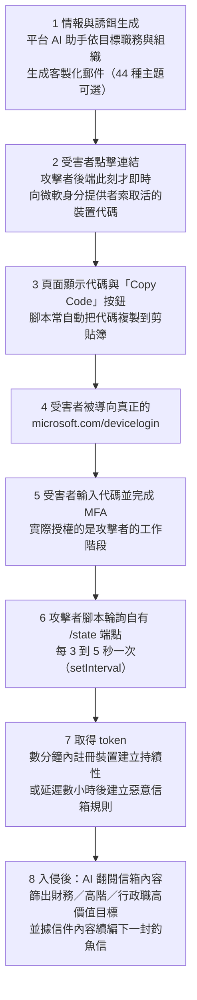

# 微軟威脅情報《Unmasking EvilTokens: Getting to the root of device code phishing》（2026-09）

> 課程模組：09 延伸研究 ｜ 來源類型：官方威脅報告 ｜ 原文：[Unmasking EvilTokens: Getting to the root of device code phishing](https://www.microsoft.com/en-us/security/blog/2026/09/22/unmasking-eviltokens-getting-to-the-root-of-device-code-phishing/) ｜ 整理日期：2026-09-28
>
> 證據邊界：本篇只核對微軟官方部落格該篇原文，沒有取得 EvilTokens 的樣本、控制台畫面、法院文件或受害者名單。原文**沒有 IOC 段落**，也**沒有揭露查扣網站數、下架網域數或逮捕人數**；本教材在第 9 節單獨區分哪些數字來自原文、哪些只見於第三方媒體。第 4 節的對照與所有標示「本教材分析」的段落是教學分析。本篇不含任何可操作的攻擊內容，不描述如何建置或使用該類平台。

## 1. 一頁速覽

- **學習目標：**用一個把 AI 寫進商品規格的犯罪即服務平台，檢驗本課[影響力即服務](../02-influence/GTG-54002-influence-as-a-service.html)所建立的「AI 作為勞動力」主線，並理解為什麼 MFA 在這條攻擊鏈上幾乎不構成阻礙。
- **EvilTokens** 是 2026 年 2 月出現的 phishing-as-a-service（PhaaS）平台，微軟將其開發與支援者追蹤為 **Storm-2992**。
- 規模（原文數字）：促成的商業郵件詐騙（BEC）活動**危害逾 12,000 個信箱、影響全球逾 10,000 個組織**。
- 商業模式（原文數字）：**初次購買 1,500 美元，另按月訂閱 500 美元**，含控制台與套件更新；平台提供 **44 種**郵件模板與到達頁主題。
- **攻擊的核心不是竊取密碼，是竊取授權。**它濫用 OAuth 的 device code flow（裝置代碼流程），受害者在**真正的** `microsoft.com/devicelogin` 上輸入代碼並完成 MFA，等於替攻擊者的工作階段授權。原文：「they unknowingly authorize the threat actor's session, granting access to the account without exposing credentials」。
- **AI 在這個平台裡有三個明確職務**（原文陳述）：依目標職務生成客製化誘餌郵件、入侵後翻閱受害者信箱內容以續編下一封釣魚信、以及從信箱中篩出財務、高階主管或行政職的高價值目標。
- **原文沒有指名任何 AI 模型或供應商**，只稱 AI-powered assistant 與 AI capability。
- 處置：微軟數位犯罪部門（DCU）與夥伴協同破壞其基礎設施。**原文對規模隻字未提**，僅以連結指向另一份說明。
- **這份研究在課程裡要教什麼：**它是 AI 濫用「商品化」的完整標本。本課主體報告多數案例是行為者自行使用模型，本案則是**有人把 AI 濫用包裝成月費商品賣給下游**，這使防線的作用點從個別帳號移到供應鏈與支付環節。
- 限制：無 IOC、無 AI 供應商資訊、處置細節未揭露、平台自述功能與實際效能無法區分。

## 2. 報告基本資料

| 欄位 | 核對結果 |
|---|---|
| 機構 | Microsoft Threat Intelligence、Microsoft Defender Experts、Microsoft Security Research |
| 具名作者 | 未具名個人，以團隊名義發布 |
| 發布日期 | 2026-09-22 |
| 文件形式 | 官方部落格深度分析，含緩解指引、Defender XDR 偵測清單與 KQL 獵捕查詢 |
| 資料型態 | **平台遙測**（Entra ID 登入、Defender for Office 365 郵件事件、Graph API 活動）**加上對犯罪服務本身的情報**（控制台功能、定價、模板） |
| 涵蓋期間 | EvilTokens 自 **2026 年 2 月**出現至發布日；另引述 2026 年 4 月的一波活動 |
| 行為者代號 | **Storm-2992**（開發與支援者）。原文威脅分析報告清單中出現 **Storm-2922**，經核對正文，該處應為誤植 |
| 主要受害地區（原文） | 美國、加拿大、英國、澳洲、印度、法國濃度最高 |
| 主要受害產業（原文） | 批發配銷、建築、金融服務、不動產、高等教育、醫療 |
| 章節結構 | What is device code phishing?、EvilTokens platform and operations（含 Distribution and affiliate support、Customer panel and campaign configuration）、EvilTokens phishing emails（含 EvilTokens phishing sequence、Defense evasion、Post-compromise account access）、Mitigation and protection guidance、Microsoft Defender XDR detections、Hunting queries |
| 與同機構其他發布的關係 | 是 [2026-04 AI 賦能裝置代碼釣魚活動](microsoft-2026-04-ai-device-code-phishing.html)的後續與收束；該篇已指出活動「aligns with the emergence of EvilTokens」 |

**體裁判讀（本教材分析）：**本篇罕見地同時具備三種材料：受害端遙測、犯罪服務的商品情報（定價、控制台、模板數），以及可操作的防禦產出（偵測名稱與 KQL）。這在模組 09 中證據密度最高。但要注意**商品情報的來源未說明**：微軟如何得知定價與 44 種主題，原文沒有交代（臥底採購、論壇廣告、查扣資料皆有可能），這影響該類數字的可信度評估。

## 3. 主要發現與攻擊鏈摘要

### 3.1 device code flow 為什麼會被濫用

OAuth 的裝置代碼流程原本是為輸入能力有限的裝置（電視、會議室設備）設計：裝置顯示一組代碼，使用者到另一台裝置上輸入代碼完成授權。

原文點出結構性弱點：「Because authentication is completed on a separate device, the session initiating the request is not strongly bound to the user's original context.」（因為認證是在另一台裝置上完成，發起請求的工作階段並未與使用者原本的情境強繫結。）

**本教材分析：**這是一個**協定設計上的合法功能被完整地、不需任何漏洞地轉用**。攻擊者不繞過 MFA，而是讓受害者替攻擊者完成 MFA。這對防禦論述的意涵很重：把 MFA 當成終點的組織，在這條鏈上等於沒有防線。這與本課[護欄繞過與防禦總覽](../shared/03-guardrail-bypass-and-defense-overview.html)的核心觀察一致：**最有效的繞過往往不攻擊控制本身，而是讓控制在攻擊者需要的方向上正常運作。**

### 3.2 攻擊序列

**即時生成是關鍵改良（本教材分析）：**裝置代碼有效期約 15 分鐘，早期做法把代碼預先嵌進郵件，導致郵件在寄達或被分析時代碼已失效。EvilTokens 把生成挪到**受害者點擊的那一刻**，代碼永遠是新鮮的。這一改動同時擊中兩個防禦假設：沙箱事後分析看到的是失效代碼，而以代碼字串為特徵的偵測完全失去對象。這是**架構層級的反偵測設計**，不是技巧。

### 3.3 AI 在平台中的三個職務

| 職務 | 原文陳述 | 落在攻擊鏈的位置 |
|---|---|---|
| 誘餌生成 | 平台提供「AI-powered assistant to aid in structuring target-specific emails」，使用者可「leverage AI to create targeted phishing emails aligned to the target's role」 | 入侵前 |
| 信箱分析與續編 | 「threat actors utilize AI assistants to sift through victim mailbox activity and engineer a phishing message based on the accessible email content」 | 入侵後，橫向擴散 |
| 高價值目標篩選 | 「Using the EvilTokens AI capability, the threat actor reviewed and filtered for high-value targets, specifically those in financial, executive, or administrative roles」 | 入侵後，變現前 |

另有「accelerated reconnaissance」，透過程式化的 Microsoft Graph 測繪達成（原文未說明此項是否由 AI 驅動）。

**本教材分析：**三個職務的共同點是它們原本都是**耗人力的判斷工作**：讀懂一個組織的語境、判斷哪封信可以接續、判斷誰值得下手。這正是本課[跨案例分析](../shared/01-cross-cutting-analysis.html)所稱「AI 作為勞動力」主線的教科書實例，而且比本課主體報告的多數案例更純粹，因為這裡 AI 完全不碰技術性工作，只做語言與判斷。

**主張狀態標記：**上述三項為**來源陳述**（微軟描述該平台具備的功能）。但要注意：**平台自述或微軟觀察到的功能存在，不等於該功能有效。**原文沒有提供 AI 生成誘餌與人工撰寫誘餌的成功率比較，因此「AI 讓釣魚更有效」在本篇**沒有量化證據**，只有規模數字（12,000 個信箱）而無對照組。這是判讀本案 uplift 時最容易犯的錯。

### 3.4 商業模式與規模

| 項目 | 原文數字 | 判讀注意（本教材分析） |
|---|---|---|
| 危害信箱 | 逾 **12,000** 個 | 未說明統計期間與計算方式；未區分微軟遙測可見與推估 |
| 受影響組織 | 逾 **10,000** 個 | 12,000 對 10,000 意味著**多數組織只有 1 到 2 個信箱受害**，符合廣佈式而非深入滲透 |
| 初次購買 | **1,500 美元** | 來源未說明（見 2. 的體裁判讀） |
| 月訂閱 | **500 美元** | 同上 |
| 郵件主題 | **44 種** | 同上 |
| 出現時間 | **2026 年 2 月** | 到發布約 7 個月 |
| 2026-04 一波活動 | 使用「thousands of unique, short-lived polling nodes」 | 短命輪詢節點，基礎設施層面的反封鎖設計 |

**本教材分析：**500 美元月費對應到逾 10,000 個組織受害，是本案最該被放進投影片的一組對比。它把「AI 降低犯罪門檻」從口號變成可計算的命題：**攻擊方的邊際成本是月費，防禦方的邊際成本是每一個組織各自的偵測與回應建置。**這個不對稱不是 AI 造成的，但 AI 是讓平台方能以固定成本服務更多下游的關鍵零件。

### 3.5 防禦規避與入侵後行為

原文所述的規避與持續性手法：使用真正的微軟網域作為授權入口（天然繞過網址信譽偵測）、即時生成代碼、數千個短命輪詢節點、入侵後**數分鐘內註冊裝置**建立持續性、或**延遲數小時**後才建立惡意信箱規則以避開即時關聯。

一則對事件回應極重要的觀察：「Observations from recent campaigns indicate that standard session revocation often only invalidates refresh tokens, leaving existing access tokens active for up to an hour.」（近期活動的觀察顯示，標準的工作階段撤銷通常只讓 refresh token 失效，既有的 access token 仍可繼續活躍達一小時。）

**本教材分析：**這一句是本篇對藍隊最有價值的單點情報。多數事件回應手冊寫到「撤銷工作階段」就視為完成，本案指出其後仍有長達一小時的作用空窗。原文因此同時建議**暫時停用帳號**以求立即遏制，而非只依賴撤銷。

## 4. 與 Anthropic 2026-09 報告的對照

| 本課教材 | 對照點 | 兩造差異與不可作的推論 |
|---|---|---|
| [GTG-15001：假交友 app 網絡](../06-scams/GTG-15001-dating-app-network.html) | **最直接的對照。**同為 AI 驅動的規模化詐騙 | GTG-15001 是行為者自建並自用；本案是**把能力做成訂閱商品賣給下游**。同一類危害，兩種產業組織形態。**不可互為事件佐證**，但並讀可支持「AI 濫用正在分工化」這個趨勢層級觀察 |
| [GTG-54002：影響力即服務](../02-influence/GTG-54002-influence-as-a-service.html) | as-a-service 模式本身 | 兩案都是把 AI 能力包裝成服務。差異在客戶：GTG-54002 的客戶是政治委託方，本案是一般網路犯罪者。**「即服務化」跨危害領域同時發生**，這是本模組可支持的較強主張 |
| [GTG-50021：假經銷商](../01-cyber/GTG-50021-fake-reseller.html) | 濫用的商業中介層 | 該案是轉賣模型存取，本案是轉賣攻擊能力。**中介層的存在使平台方的處置只能打到中介，打不到最終使用者**，這是共同的防線限制 |
| [GTG-50014：ShinyHunters 產業鏈](../01-cyber/GTG-50014-shinyhunters.html) | 憑證與 token 竊取的工業化 | 本案的 token 竊取規模（12,000 信箱）與該案同屬工業化級別。**但本案不竊密碼只竊授權**，這是技術路徑的實質差異 |
| [網路行動導論](../01-cyber/00-cyber-trends-and-skills.html) | uplift 的 scale 軸 | 本案是 scale 軸的清晰實例（固定月費對應萬級組織）。**但 depth 軸沒有證據**：原文未顯示 AI 提升了單次攻擊的成功率 |
| [Claude 護欄與繞過路徑](../shared/02-claude-safeguards-and-bypass-paths.html) | 誰在做 AI 的守門 | **本案最尖銳的對照點。**原文未指名任何 AI 供應商，因此無法判斷平台的 AI 是商用 API、自架開源模型，還是被竊用的帳號。**若為自架開源模型，本課主體報告所討論的一切平台側護欄對本案完全無效。**這個問題原文沒有答案，見第 12 節 |
| [護欄繞過與防禦總覽](../shared/03-guardrail-bypass-and-defense-overview.html) | 不攻擊控制而借用控制 | 讓受害者自己完成 MFA，與該篇所整理的「借合法機制達成目的」同型 |
| [微軟 2026-06：AI 品牌作誘餌](microsoft-2026-06-ai-brands-as-bait.html) | 同機構、同主題的社交工程系列 | 該篇談冒用 AI 品牌作餌，本案談用 AI 生成餌。**兩者是相反方向，容易混淆，課堂上應明確區分** |
| [微軟 2026-09：冒用 AI 品牌的攻擊與處置](microsoft-2026-09-ai-themed-attacks-defender.html) | 同月同機構 | 兩篇同屬微軟 2026-09 的 AI 主題發布，可對照其偵測產品線的一致性 |
| [微軟 2026-04：AI 賦能裝置代碼釣魚](microsoft-2026-04-ai-device-code-phishing.html) | **同一條攻擊線的前作** | 該篇是活動層級觀察並已預告 EvilTokens；本篇是平台層級收束與處置。**兩篇並讀是本模組唯一的「同機構追蹤同一威脅七個月」完整樣本** |
| [證據與方法](../shared/04-evidence-and-methods.html) | 數字的分子分母 | 12,000 與 10,000 均未附統計期間與計算方式；1,500 與 500 美元未說明來源。**均不可用於推算市場規模或獲利** |

**核心教學點（本教材分析）：**本課主體報告的七大危害領域，隱含一個「行為者直接使用模型」的預設。本案打破它：**中間出現了一個產品層。**當 AI 濫用被包裝成月費商品，模型供應商的偵測與封號（本課主體報告的主要處置手段）打到的是平台營運者這一個帳號，而下游數千名使用者完全不在其視野內。這解釋了為什麼本案的處置必須由**執法與基礎設施查扣**接手，而不是模型側的安全機制。課堂上應把這一點與本課[非法蒸餾導論](../07-distillation/00-distillation-intro-and-mitigations.html)所討論的處置手段限制並列。

## 5. TTP 與 MITRE ATT&CK 對應

| 戰術 | 技術 ID | 本報告的具體作法 | 偵測構想（假說，未經實測） |
|---|---|---|---|
| Resource Development | [T1583.001：Acquire Infrastructure: Domains](https://attack.mitre.org/techniques/T1583/001/) | 數千個短命輪詢節點；使用 Railway 等平台（見前作） | 對雲端 PaaS 出口的短命主機建立信譽衰減模型。**合法反例**：預覽部署、CI 環境大量產生短命主機 |
| Resource Development | [T1588.007：Obtain Capabilities: Artificial Intelligence](https://attack.mitre.org/techniques/T1588/007/) | 平台內建 AI 助手供下游生成誘餌與篩選目標 | **無平台側偵測可能**，除非能識別 AI 來源（見第 12 節）。此技術 ID 的存在本身是 ATT&CK 近年的重要補充 |
| Phishing | [T1566.002：Phishing: Spearphishing Link](https://attack.mitre.org/techniques/T1566/002/) | AI 生成、依職務客製的郵件，44 種主題 | 語意一致性偵測而非關鍵字。**合法反例**：行銷自動化郵件同樣高度客製 |
| Initial Access | [T1566：Phishing](https://attack.mitre.org/techniques/T1566/)、device code 濫用 | 濫用 OAuth device code flow | **最高價值控制是阻擋而非偵測**：以條件式存取封鎖 device code flow，僅對 Teams 裝置資源帳號開例外 |
| Credential Access | [T1528：Steal Application Access Token](https://attack.mitre.org/techniques/T1528/) | 取得 access 與 refresh token，不接觸密碼 | 偵測「裝置代碼認證後的異常 token 交換」（微軟已有對應告警，見第 8 節） |
| Persistence | [T1098.005：Account Manipulation: Device Registration](https://attack.mitre.org/techniques/T1098/005/) | 入侵後數分鐘內註冊裝置 | 對「非預期地理位置或裝置類型的 Entra 裝置加入」告警。誤報主要來自正常新裝置上線 |
| Defense Evasion | [T1564.008：Hide Artifacts: Email Hiding Rules](https://attack.mitre.org/techniques/T1564/008/) | 延遲數小時後建立惡意信箱規則 | **信箱規則建立事件應保留長觀察窗**，因為延遲設計就是為了打斷即時關聯 |
| Discovery | [T1087：Account Discovery](https://attack.mitre.org/techniques/T1087/) | 程式化 Graph API 測繪、AI 篩選高價值目標 | Graph API 呼叫速率與廣度基線 |
| Collection | [T1114.002：Email Collection: Remote Email Collection](https://attack.mitre.org/techniques/T1114/002/) | AI 翻閱信箱內容以續編釣魚信 | 大量郵件讀取的速率偵測 |
| Lateral Movement | [T1534：Internal Spearphishing](https://attack.mitre.org/techniques/T1534/) | 以既有信件脈絡續編，對內續攻 | 內部寄件的語意突變偵測 |
| **犯罪即服務的商品化與下游分發** | **無對應 ID（框架缺口）** | 1,500 美元加月費 500 美元、控制台、44 種模板、聯盟支援 | ATT&CK 描述行為者的技術動作，**無法表達「能力被作為商品販售」這個產業結構**，也無法表達 AI 在其中的產品化位置 |

**框架缺口說明（本教材分析）：**兩個缺口值得注意。第一，T1588.007（取得 AI 能力）雖已存在，但它只能記錄「用了 AI」，無法區分自架開源模型與商用 API，而這個區別決定了平台側護欄是否可能有效，是防禦決策的關鍵。第二，ATT&CK 沒有位置描述**服務化與聯盟結構**，因此以 ATT&CK 為框架寫出的情報，天然會把本案寫成一次攻擊活動，而遺漏它其實是一個有定價、有客服、有模板庫的產品。這與本課[Mandiant 教材](mandiant-2026-08-agentic-vulnerability-discovery.html)所指出的缺口同構：**框架描述得了手法，描述不了編排與商業結構。**

偵測構想全部為**假說**，本教材未實測，不宣稱低誤報率或可直接部署。原文自身提供的偵測則見第 8 節，那些屬**來源陳述**。

## 6. 圖表判讀

**原文含多張螢幕截圖與流程示意**，依原文敘述可知包含：EvilTokens 客戶控制台與活動設定介面、釣魚郵件樣例、以及裝置代碼頁面樣例。

**本教材未下載、未嵌入任何圖檔。**第 3.2 節的 Mermaid 流程圖是**依原文文字敘述重繪的教學用圖**，非原文圖片的複製；圖上的時間參數（每 3 到 5 秒輪詢、數分鐘內註冊裝置、延遲數小時建立規則）均取自原文。

**原文沒有提供統計圖表**（無時間趨勢線、無各產業受害分布圖、無成功率比較）。因此第 3.4 節的數字只能當點狀事實使用，不可用於趨勢外推。原文所述的地區與產業濃度**只有排序、沒有數值**，不可轉成百分比。

**課堂用法（不需原圖）：**描述控制台有 44 種主題與活動設定介面這個事實本身就足以完成教學目標。請學員回答：一個有模板庫、有設定精靈、有客服的攻擊平台，其使用者需要具備什麼技術能力？答案（幾乎不需要）正是「複雜度脫鉤」主線在詐騙領域的體現。**刻意不展示介面截圖，避免教材成為操作導覽。**

## 7. IOC 與技術指標

**原文沒有 IOC 段落。**經專門核對，原文未提供任何網域、IP、檔案雜湊或帳號指標。這對一篇伴隨執法處置發布的報告是可以理解的（處置期間公開指標可能影響行動），但也意味著**本篇無法直接支援任何封鎖或獵捕清單**。

原文提供的替代品是**行為性偵測與獵捕邏輯**，其防禦價值高於一次性指標：

| 項目 | 類型 | 偵測價值與壽命 |
|---|---|---|
| `microsoft.com/devicelogin` 在釣魚脈絡中出現 | 合法網域，非 IOC | **不可封鎖**。這是本案的設計核心：授權頁是真的。以「郵件點擊後導向此頁」的關聯模式偵測，壽命長 |
| 頁面腳本的 `checkStatus()` 函式、`/state` 端點、每 3 到 5 秒 `setInterval` 輪詢 | 攻擊者端網頁行為特徵 | **中價值、中壽命**。可用於已取得釣魚頁樣本時的家族歸類；攻擊者改名即失效 |
| 自動複製裝置代碼到剪貼簿的行為 | 網頁行為特徵 | 中價值。合法網站極少這樣做 |
| `DeliveryLocation in~ ("Inbox/folder","Junk folder")` | 原文 KQL 查詢條件 | 高實用價值，非指標。用於找出**成功投遞**的釣魚信 |
| `BrowserLaunchedToOpen` 事件 | 原文 KQL 查詢使用的事件類型 | 高實用價值，用於關聯惡意 URL 點擊 |
| 數千個短命輪詢節點 | 基礎設施模式 | **低價值**：既短命又數量龐大，列舉無意義，只能以模式偵測 |
| Storm-2992 | 微軟行為者代號 | 非指標，僅供情報關聯與跨報告對照 |

**安全紅線遵守說明：**上表全部抄錄自原文。本教材**未對任何網域或端點發出連線、未做 DNS 查詢、未取得或分析任何樣本、未查詢任何互動式服務**。原文既未提供可連線的惡意指標，本教材亦不推測或補充。

## 8. 該機構的偵測、處置與防線缺口

### 8.1 原文提供的偵測（來源陳述）

Microsoft Defender XDR 告警：

| 攻擊階段 | 告警名稱 |
|---|---|
| Initial access | Anomalous OAuth device code authentication activity（Defender for Identity） |
| Credential access | Anomalous token exchange following device code authentication |
| Credential access | User account compromise via OAuth device code phishing（Defender XDR） |
| Persistence | Suspicious Entra device join or registration |
| Discovery | Anomalous Microsoft Graph API activity after potential device code phishing |
| Defense evasion | Suspicious inbox rule created after potential device code phishing sign-in |

另提供兩條 KQL 獵捕查詢（Suspicious URL clicked、Determine successfully delivered phishing emails to Inbox/Junk folder）、Microsoft Sentinel 偵測查詢、三份威脅分析報告（技術面 device code phishing、工具面 EvilTokens、行為者面 Storm-2992），以及 Security Copilot 的四個代理（Threat Intelligence Briefing、Phishing Triage、Threat Hunting、Dynamic Threat Detection）。

### 8.2 原文提供的緩解建議（來源陳述，重點摘錄）

- **最強的一條：**「Microsoft recommends blocking device code flow wherever possible」，僅對特定 Teams 裝置資源帳號開例外。
- 要求 MFA，並改用**抗釣魚**的認證方式（FIDO 金鑰、Microsoft Authenticator passkey）。
- 以條件式存取封鎖 legacy authentication；建置登入風險政策。
- 郵件側：反釣魚政策、Defender for Office 365 的 Safe Links、Advanced Phishing Threshold 提高至 2 或 3、啟用 ZAP、對可疑信箱規則建立告警。
- 事件回應：呼叫 `revokeSignInSessions` 撤銷 refresh token、以條件式存取強制重新認證，並且**建議暫時停用受害帳號以求立即遏制**。

### 8.3 防線缺口（本教材分析）

1. **偵測全部發生在授權完成之後。**六個告警名稱裡有五個包含「after」或「following」。這不是缺陷而是結構性事實：授權動作本身發生在真正的微軟頁面上，且由合法使用者完成 MFA，**在那個時點沒有任何可判為惡意的訊號**。因此本案唯一的預防性控制是事前封鎖 device code flow，其餘皆為事後偵測。
2. **抗釣魚認證在此無效。**FIDO 與 passkey 防的是憑證被轉交，本案不取憑證。使用者用 passkey 在真頁面上完成認證，攻擊者依然取得 token。**原文把它列為建議，但未說明此限制；這是本教材的判讀，也是課堂上最容易被學員忽略的一點。**（唯一能救的是要求該認證與特定工作階段強繫結，而 device code flow 的設計本身排除了這個可能。）
3. **撤銷有一小時空窗。**原文已揭露（見 3.5），且這是多數事件回應手冊的既存盲點。
4. **AI 供應鏈完全未觸及。**原文沒有指名模型或供應商，也沒有討論若平台使用商用 API，供應商端是否可能偵測。**這是本案與本課主體報告最重要的斷點**（見第 12 節）。
5. **處置規模未揭露。**原文只說 DCU 協同破壞基礎設施，未給任何數字，僅以連結指向其他說明。因此**無法評估處置的實際效果**，也無法判斷平台是否已停止營運。
6. **下游使用者未觸及。**處置打的是平台。購買過套件的下游使用者是否被識別或追訴，原文未提。
7. **AI 效能無對照組。**規模數字（12,000 信箱）無法歸因給 AI，因為沒有非 AI 對照的成功率。

## 9. 第三方驗證與外部來源

| 來源 | 日期 | 本篇使用範圍與證據地位 |
|---|---|---|
| [微軟官方原文](https://www.microsoft.com/en-us/security/blog/2026/09/22/unmasking-eviltokens-getting-to-the-root-of-device-code-phishing/) | 2026-09-22 | **直接來源核對，不是第三方驗證。**本教材所有數字均出自此處 |
| [微軟 2026-04 前作](https://www.microsoft.com/en-us/security/blog/2026/04/06/ai-enabled-device-code-phishing-campaign-april-2026/) | 2026-04-06 | **同機構前期報告**，非獨立來源。提供 EvilTokens 出現期的活動層觀察與 IOC |
| The Hacker News、Dark Reading、Security Boulevard 等媒體報導 | 2026-09 前後 | **僅引述原報告加採訪或法院文件，非獨立遙測。**這些報導載有原文所無的處置細節（查扣網站數、下架網域數、於英國逮捕兩人等）。**本教材不採用這些數字作為事實陳述**，理由見下 |
| Cloud Security Alliance 研究筆記、Huntress 報告 | 2026 年 | 搜尋階段見到，**本教材未取得亦未核對**，不作為任何主張的依據 |
| [MITRE ATT&CK 各技術頁](https://attack.mitre.org/techniques/T1588/007/) | 查閱 2026-09-28 | 只核對技術定義，不驗證本篇任何事件主張 |
| [本課 GTG-15001 教材](../06-scams/GTG-15001-dating-app-network.html) | 原報告 2026-09-10 | 主題對照組，**完全獨立來源，不可互為事件佐證** |

**原文與第三方的差異（重要）：**本教材在搜尋階段見到多則報導載有具體處置數字（例如查扣 50 個網站、停用逾 150 個相關網域、9 月 11 日於英國逮捕兩名 32 歲與 38 歲男子）。**經專門核對，微軟原文並未記載任何這類數字**，只說 DCU 與夥伴協同破壞基礎設施，並以 `aka.ms/ETDisruption` 連結指向另一份說明。依本課規範「第三方報導與原文不一致時以原文為準」，本教材**不將這些數字列為事實**，僅在此記錄其存在與來源類型，供人工審核時決定是否追查該連結後補入。**課堂引用時，這些數字必須標明來自媒體報導而非微軟該篇報告。**

**單一來源情報判定：**本案的**受害規模與平台商品情報目前是單一來源**（微軟）。處置的存在有法院行動與媒體報導作為旁證，但本教材未取得法院文件。**行為者代號 Storm-2992 未見於其他機構的獨立命名體系對照**，因此無法做跨機構歸因交叉核對。

## 10. 課程教學設計

### 10.1 核心教學要點

1. **不是繞過 MFA，是借用 MFA。**本案最重要的觀念轉換：攻擊者讓受害者在真頁面上替他完成認證。任何以「已部署 MFA」為終點的資安簡報，都應該被本案修正。
2. **抗釣魚認證在這條鏈上救不了你。**FIDO 與 passkey 解決的是憑證轉交問題，不是授權轉交問題。這一點原文未明說，需要講師補上。
3. **AI 在此只做語言與判斷工作。**三個職務（生成誘餌、翻閱信箱、篩選目標）全部是原本耗人力的認知工作，沒有一項是技術性工作。這是「AI 作為勞動力」最純粹的形態。
4. **犯罪即服務把防線的作用點移走了。**月費 500 美元，下游數千人。模型側封號打到的是平台一個帳號，打不到下游。這解釋了為什麼處置必須靠執法。
5. **規模不等於 uplift。**12,000 個信箱證明了 scale，但原文沒有任何對照組能證明 AI 提高了單次成功率。**學會區分「用了 AI 而且規模很大」與「AI 造成了規模」。**
6. **即時生成是架構級反偵測。**把代碼生成移到點擊瞬間，同時廢掉沙箱事後分析與字串特徵偵測。這是設計，不是技巧。
7. **撤銷不等於遏制。**access token 尚有最多一小時效期，原文因此建議暫時停用帳號。這條應該直接寫進事件回應手冊。
8. **原文沒有 IOC，也沒有揭露處置規模。**知道一份報告缺什麼，和知道它有什麼一樣重要。

### 10.2 課堂討論題

1. 受害者在**真正的**微軟網頁上、用**真正的** passkey、完成了**真正的** MFA，然後帳號被接管。**在這個事實面前，「使用者教育」還有什麼具體內容可教？**如果答案是「看清楚同意畫面上的應用程式名稱」，一般使用者能負擔這個判斷嗎？
2. 原文建議「wherever possible」封鎖 device code flow。**你的組織有多少個「不可能」的例外？**這些例外會不會就是下一次的入口？誰有權新增例外？
3. 平台月費 500 美元，影響逾 10,000 個組織。**如果防禦方要在成本上對等，需要投入多少？**這個不對稱是 AI 造成的，還是 as-a-service 模式造成的？把 AI 拿掉，這個平台還成立嗎？
4. 原文沒有指名任何 AI 供應商。**如果該平台用的是自架開源模型，本課主體報告所討論的所有平台側護欄對本案是否完全無效？**如果是，模型供應商發布威脅報告的意義該如何重新定位？
5. 微軟原文沒有給出任何處置規模數字，但媒體報導有查扣網站數與逮捕人數。**作為情報分析者，你會不會把媒體數字寫進自己的報告？**如果會，怎麼標註？如果不會，你的報告會不會因此顯得不完整而被質疑？
6. 三個 AI 職務中，「入侵後翻閱信箱內容以續編下一封釣魚信」危害最大也最難防。**這個行為在技術上與一個勤奮的人類攻擊者有任何區別嗎？**如果沒有，為什麼它值得被當成新威脅討論？

### 10.3 桌面演練建議

**演練一：device code flow 例外清查（60 分鐘，紙上作業）**
分組盤點自己組織中可能需要 device code flow 的情境（會議室設備、共用終端、舊版用戶端、自動化整合），逐項評估能否改用其他認證方式。產出一份「可封鎖、須例外、待確認」三分清單，並為每個例外指定負責人與複審週期。**不需要也不應該在演練中變更任何實際設定。**

**演練二：事件回應手冊的空窗修補（45 分鐘）**
給學員 3.5 節的 access token 一小時空窗事實，要求修改自家「帳號遭接管」回應流程。必須明確寫出撤銷、強制重新認證、暫時停用三者的**執行順序與判斷條件**，並討論暫時停用對業務的衝擊與授權層級。

**演練三：誘餌識別的極限（40 分鐘）**
講師事先準備兩組郵件文字（一組明顯的通用釣魚、一組高度職務客製但由講師自行撰寫），請學員分辨並說明依據。**不使用任何 AI 生成真實誘餌，不使用任何真實釣魚樣本，不包含任何可點擊連結。**演練目的是讓學員親身發現：當文字品質足夠時，內容判斷失效，防線必須移到**流程與技術控制**（例如本案的封鎖 device code flow）。

**紅線：**三個演練均不建置任何釣魚基礎設施、不生成可用的誘餌、不註冊任何網域、不對任何外部端點發出請求。

### 10.4 對台灣的意涵

1. **M365 與 Entra ID 高普及率下的直接曝險。**台灣公部門與中大型企業大量使用 Microsoft 365，device code flow 預設為啟用。建議把「是否已以條件式存取封鎖 device code flow、例外清單為何」列為資安健檢的明確檢核項，而非留在一般 MFA 項目下。
2. **原文列出的高濃度受害產業與台灣產業結構高度重疊**：批發配銷、建築、金融服務、不動產、高等教育、醫療。其中批發配銷與建築業的資安成熟度普遍低於金融業，而 BEC 的直接財務損失對這兩個產業尤其嚴重（工程款與貨款匯付）。**注意原文只給排序未給數值，不可轉述為百分比。**
3. **BEC 的在地化風險。**AI 生成客製化誘餌的能力，使繁體中文與台灣商務用語的語感不再構成天然門檻。過去「英文信寫得怪」是許多台灣員工的實際判斷依據，本案表明這個依據正在失效。企業應把「以語感判斷」明確從標準作業程序中移除，改以流程控制（例如匯款變更一律另路徑電話確認）替代。
4. **供應鏈與委外的授權治理。**台灣資訊委外比例高，承商常持有客戶租戶的存取權。device code flow 的例外若由承商持有，客戶端往往不知情。契約與交付檢核應涵蓋此項。
5. **執法協同的落差。**本案的有效處置來自美國法院行動與跨國夥伴協同。台灣在此類跨境基礎設施查扣中的參與管道有限，**因此本地防禦更需倚重事前控制（封鎖 device code flow）而非事後處置**。這是一個現實的能力約束，應誠實寫進風險評估。

## 11. 關鍵原文引文

1. 「This AI-powered cybercrime platform facilitated sophisticated business email compromise (BEC) campaigns that compromised more than 12,000 inboxes in over 10,000 organizations worldwide.」
   （這個由 AI 驅動的網路犯罪平台，促成了高度複雜的商業郵件詐騙活動，危害全球逾 10,000 個組織中的逾 12,000 個信箱。）
   出處：導言段。**本篇唯一的規模數字，注意未附統計期間與計算方式。**

2. 「When the user enters the code, they unknowingly authorize the threat actor's session, granting access to the account without exposing credentials.」
   （當使用者輸入該代碼，他們在不知情的情況下授權了威脅行為者的工作階段，在未暴露任何憑證的情況下讓對方取得帳號存取權。）
   出處：What is device code phishing? 段。**本案的機制核心：不取憑證，取授權。**

3. 「Because authentication is completed on a separate device, the session initiating the request is not strongly bound to the user's original context.」
   （因為認證是在另一台裝置上完成，發起該請求的工作階段並未與使用者原本的情境強繫結。）
   出處：同上段。**協定層的結構弱點，也是抗釣魚認證在此失效的根本原因。**

4. 「Microsoft Threat Intelligence tracks the threat actor behind the development and support of the EvilTokens phish kit as Storm-2992.」
   （微軟威脅情報將 EvilTokens 釣魚套件的開發與支援背後的威脅行為者追蹤為 Storm-2992。）
   出處：EvilTokens platform and operations 段。**正文以 Storm-2992 為準；威脅分析報告清單中的 Storm-2922 應為誤植。**

5. 「EvilTokens phish kits are sold at $1,500 USD for initial purchase, with a monthly subscription fee of $500 for continued access to the kit and control panel.」
   （EvilTokens 釣魚套件以 1,500 美元初次購買出售，另需每月 500 美元訂閱費以持續使用該套件與控制台。）
   出處：Distribution and affiliate support 段。**犯罪即服務的定價證據，但原文未說明此情報的取得方式。**

6. 「Using the EvilTokens AI capability, the threat actor reviewed and filtered for high-value targets, specifically those in financial, executive, or administrative roles.」
   （威脅行為者利用 EvilTokens 的 AI 能力，檢視並篩選出高價值目標，特別是財務、高階主管或行政職務者。）
   出處：Post-compromise account access 段。**AI 承擔判斷工作的直接證據。**

7. 「Observations from recent campaigns indicate that standard session revocation often only invalidates refresh tokens, leaving existing access tokens active for up to an hour.」
   （近期活動的觀察顯示，標準的工作階段撤銷通常只讓 refresh token 失效，使既有的 access token 仍可繼續活躍達一小時。）
   出處：Mitigation and protection guidance 段。**對藍隊最有實用價值的單點情報。**

8. 「Working with partners, Microsoft's Digital Crimes Unit (DCU) facilitated a coordinated disruption of infrastructure used to operate the EvilTokens service.」
   （微軟數位犯罪部門與夥伴合作，促成了對用於營運 EvilTokens 服務之基礎設施的協同破壞。）
   出處：處置相關段。**這是原文關於處置的完整陳述，沒有任何數字。**

## 12. 未能驗證之處與研究限制

**核對範圍聲明：**本教材於 2026-09-28 核對微軟官方原文兩次（第二次專門針對行為者代號、處置細節、IOC 有無與定價模型四項）。來源發布日 2026-09-22，觀察期自 2026 年 2 月 EvilTokens 出現至發布日，教材加入日 2026-09-28。以下各項均**未**於本次核對中查證。

1. **AI 模型與供應商完全未知。**這是本篇最重大的缺口。原文只稱 AI-powered assistant 與 AI capability，未指名任何模型、供應商或部署方式。因此**無法判斷**：平台使用商用 API（則供應商側可能有偵測與封鎖機會）、自架開源模型（則平台側護欄完全無效）、或盜用的帳號與 API key（則與本課 [GTG-50020](../01-cyber/GTG-50020-ai-supply-chain.html) 直接相連）。**本課主體報告的整套處置邏輯是否適用於本案，取決於這個未知。課堂上務必把它當成開放問題，不要替原文補答案。**
2. **處置規模未取得。**原文以 `aka.ms/ETDisruption` 連結指向另一份說明，**本教材未追查該連結**，因此無法確認查扣範圍、法律程序或平台現況。媒體所載的查扣網站數、下架網域數與逮捕資訊，本教材未採用（見第 9 節）。**這是後續人工審核可優先補齊的一項。**
3. **12,000 與 10,000 兩個數字的統計方式未知。**未說明期間、是否為微軟遙測可見範圍、是否含推估、是否去重。不可用於推算市場規模、平台獲利或全球盛行率。
4. **商品情報的取得方式未說明。**1,500 美元、500 美元、44 種主題這三個數字，微軟如何得知（臥底採購、論壇廣告、查扣資料）原文未交代，影響其可信度評估。
5. **AI 的效能無對照組。**原文未提供 AI 生成誘餌與人工誘餌的成功率比較。因此**「AI 提高了釣魚成功率」在本篇沒有證據**，只有「平台提供 AI 功能」與「規模很大」兩個分開的事實。不可將兩者連成因果。
6. **行為者代號不一致已記錄但未向微軟確認。**正文為 Storm-2992，威脅分析報告清單中出現 Storm-2922。本教材判定後者為誤植（依正文明確定義），但**未向微軟求證**。
7. **無 IOC。**經專門核對確認原文無 IOC 段落。本教材未自其他來源補充指標，也**未對任何端點發出連線或查詢**。
8. **地區與產業濃度只有排序沒有數值。**不可轉換為百分比或風險權重。
9. **下游購買者的識別與追訴情況未知。**
10. **第 5 節所有偵測構想均為未實測假說**，已盡可能附合法反例與所需遙測，不宣稱誤報率、可部署性或投報率。第 8.1、8.2 節的偵測與建議屬**原文陳述**，本教材未實測其效果。
11. **第 8.3 節第 2 點（抗釣魚認證在本案無效）是本教材的技術判讀，原文未作此陳述。**該判讀基於 device code flow 將認證與請求工作階段解耦這個原文已明述的機制。**若有讀者或審核者認為此判讀有誤，應以原文機制描述為準重新檢視。**
12. **與本課教材的所有對照（第 4 節）均為分析推論**，不是微軟與 Anthropic 的聯合結論，兩機構未就任何一案交換或互證資料。
