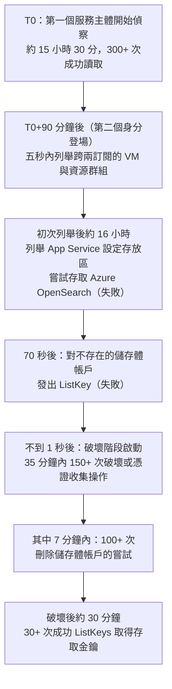

# 微軟威脅情報《Storm-3168: Agentic-driven cloud attacks using compromised service principals》（2026-09）

> 課程模組：09 延伸研究 ｜ 來源類型：官方威脅報告 ｜ 原文：[Storm-3168: Agentic-driven cloud attacks using compromised service principals](https://www.microsoft.com/en-us/security/blog/2026/09/25/storm-3168-agentic-driven-cloud-attacks-using-compromised-service-principals/) ｜ 整理日期：2026-09-28
>
> 證據邊界：本篇只核對微軟官方部落格該篇原文，沒有取得其 Azure 控制平面原始日誌、受害組織身分或 Sysdig 的 JADEPUFFER 原始報告。第 4 節的對照、第 5 節的框架缺口分析、以及所有標示「本教材分析」的段落是教學分析，不是原文陳述。本篇不含任何可操作的攻擊內容。

## 1. 一頁速覽

- **學習目標：**用一份雲端控制平面的遙測案例，檢驗本課反覆出現的「agentic 編排」敘述到底靠什麼證據成立，並學會區分「自動化腳本」與「AI 代理」這兩種不同強度的主張。
- 微軟揭露 **Storm-3168** 在 Azure 環境中，透過兩個被盜用的 **service principal**（服務主體，非人類身分）執行大規模資源破壞與憑證收集。
- 對應關係明確：Storm-3168 即 **Sysdig 於 2026-07 發現並稱為「首個有紀錄的 agentic ransomware 行動」的 JADEPUFFER**。微軟自述本篇是「首次詳細呈現其 Azure 活動」。
- 時間軸極不對稱：第一個身分花了**約 15 小時 30 分**做偵察（300 次以上成功讀取操作），第二個身分只花**五秒**就列舉完跨兩個訂閱的虛擬機與資源群組，最後在 **35 分鐘內嘗試 150 次以上**破壞或憑證收集操作，其中 **100 次以上刪除儲存體帳戶的嘗試集中在 7 分鐘內**。
- **入口不是漏洞，是人為外洩：**一名員工曾把某個 service principal 的 client ID、client secret 與 tenant ID **以明文貼在公開的 GitHub issue**；該 issue 後來被編輯移除，但 secret 仍可從 issue 的**公開編輯歷史**取得。
- **關鍵誠實之處：**微軟明確寫下「We could not confirm whether this secret was used for the activity described here.」（無法確認該 secret 是否即本次活動所使用）。
- 破壞有明顯的**反復原意圖**：除刪除儲存體帳戶、Key Vault、Function App 外，另對 Azure Site Recovery 鎖與 Azure Backup 保護鎖發動（未成功的）刪除嘗試。
- **這份研究在課程裡要教什麼：**它是本課 [GTG-50020 AI 供應鏈](../01-cyber/GTG-50020-ai-supply-chain.html)所述「憑證即戰利品」主線在**非 Anthropic 平台、非 AI 服務本身**的獨立實例，同時也是一份教材級的反例：標題說 agentic，原文給的證據其實是**時序與並行性**，不是代理決策紀錄。
- 限制：單一廠商遙測、受害者未具名、無 IOC、AI 或代理的參與程度**沒有直接鑑識證據**。

## 2. 報告基本資料

| 欄位 | 核對結果 |
|---|---|
| 機構 | Microsoft Security Research、Microsoft Defender for Cloud |
| 具名作者 | Yossi Weizman（Senior Security Researcher）、Tushar Mudi（Security Researcher II） |
| 發布日期 | 2026-09-25 |
| 文件形式 | 官方部落格技術分析，約 9 分鐘閱讀 |
| 資料型態 | **平台遙測**（Azure 控制平面／ARM 操作紀錄、token 使用軌跡） |
| 涵蓋期間 | 事件發生於 **2026 年 6 月初**；另述及自 2026 年初起的 App Service 探測活動 |
| 受害者 | 單一 Azure tenant，未具名；未揭露產業與國別 |
| 行為者代號 | 微軟 **Storm-3168**；對應 Sysdig 的 **JADEPUFFER** |
| 章節結構 | Attack overview（含 Discovery before destruction、A seven-minute destructive sequence、Credential collection）、Technical analysis、Mitigation and protection guidance、References、Learn More |
| 與其他發布的關係 | 建立在 Sysdig 2026-07 的 JADEPUFFER 研究之上，補充其 Azure 面向 |

**體裁判讀（本教材分析）：**這是**事件遙測型威脅情報**，證據地位高於廠商能力自述（可對比同模組的 [Mandiant AVDH](mandiant-2026-08-agentic-vulnerability-discovery.html)），但仍是單一平台視角。微軟看得到的是 Azure 控制平面上的 API 呼叫，看不到攻擊者端跑的是什麼程式。這個視角限制決定了它能證明什麼、不能證明什麼，是本篇最重要的教學切口。

## 3. 主要發現與事件逐段摘要

### 3.1 兩個身分的分工

| 身分 | 角色 | 原文所述行為 |
|---|---|---|
| 第一個 service principal | 偵察 | 列舉 Azure 虛擬機、訂閱、資源群組與資源，**約 15 小時 30 分**，**300 次以上**成功讀取操作 |
| 第二個 service principal | 破壞與憑證收集 | 列舉、刪除、竊取存取金鑰 |

原文對分工的判定：「The timing between the different operations and the division of work using multiple service principals and overlapping token streams...strongly indicates automated or scripted execution.」（不同操作之間的時序、使用多個服務主體的分工、以及重疊的 token 流，強烈指向自動化或腳本化執行。）

**本教材分析：**請注意原文這句話的落點是 **automated or scripted execution**，不是 AI 代理。標題的 agentic 一詞，其證據鏈是「本案行為者等同 Sysdig 所稱的 agentic ransomware 行動」這個**身分對應**，而不是本案自身的代理鑑識。這個區別在課堂上必須講清楚。

### 3.2 時間軸

**本教材分析：**這條時間軸的教學價值在於**兩種速度的並置**。15 小時 30 分的偵察是人類或低速腳本可及的節奏，五秒列舉與 7 分鐘 100 次刪除則不是。單看總時長會低估，單看爆發段會高估。判讀 AI uplift 時，**speed 這個軸必須分階段量測**，這正是本課[網路行動導論](../01-cyber/00-cyber-trends-and-skills.html)所建立的原則在外部案例上的一次驗證。

另一個細節值得課堂追問：破壞階段是在一次**失敗的** ListKey（針對不存在的儲存體帳戶）之後「不到一秒」啟動。原文未對此因果作解釋。**這是本教材的觀察，不是原文陳述**：一個失敗的探測緊接著觸發大規模破壞，較符合預先編好的流程在錯誤處理分支上繼續前進，而不是一個會停下來重新評估的決策者。

### 3.3 破壞與憑證收集的標的

| 類別 | 標的（原文） | 結果 |
|---|---|---|
| 成功刪除 | 多個 Azure Storage Accounts | 原文稱**多數成功刪除**，部分受 resource lock 保護而未成功 |
| 成功刪除 | 一個 Azure Key Vault、一個 Function App、一個 App Service plan | 成功 |
| 未成功 | 多個 Azure SQL 資料庫 | 原文歸因於 **API 版本不相容** |
| 未成功 | Azure Site Recovery 鎖、Azure Backup 保護鎖 | 未成功 |
| 憑證收集 | 儲存體帳戶存取金鑰 | **30 次以上**成功 ListKeys |
| 憑證收集 | Azure Site Recovery 相關儲存體帳戶 | 原文列為標的 |

**本教材分析：**兩個細節指向**成熟的勒索或破壞劇本**，而非隨機洩憤。第一，對備份與復原鎖發動刪除，是刻意攻擊復原能力。第二，破壞完成後才回頭大量取走存取金鑰，顯示資料取得與破壞是**分開的目標**，符合「先毀後勒」或「毀滅掩護竊取」兩種假說，原文未判定是哪一種。

至於 SQL 刪除因 **API 版本不相容**而失敗，這是本案最值得注意的**能力上限證據**：一個能自我修正的代理，理應在收到版本錯誤後換一個 API 版本重試。原文沒有記載這樣的重試。**這是本教材的推論，不是原文結論**，但它是課堂上檢驗 agentic 主張的最好材料之一。

### 3.4 入口：公開編輯歷史裡的明文憑證

原文陳述：「Its client ID, client secret, and tenant ID had previously been exposed in plaintext in a public GitHub issue by an employee of the impacted organization. The issue was later edited to remove the secret, but the secret remained accessible through the issue's public edit history.」

緊接著的保留：「We could not confirm whether this secret was used for the activity described here.」

**本教材分析：**這兩句必須一起教。第一句是極高教學價值的具體失效模式：**刪除不等於不存在**，GitHub issue、commit、PR 的編輯歷史與快取都是獨立的暴露面。第二句則示範了本課[證據與方法](../shared/04-evidence-and-methods.html)所要求的紀律：即使找到一個完全合理的入口，在沒有把該憑證與實際使用軌跡對上之前，仍標為未確認。**課堂上常見的錯誤是把「找到一個合理入口」講成「確認了入口」**，微軟自己沒有這樣做，教材也不該這樣轉述。

### 3.5 另一條未收斂的線索

原文另述：自 2026 年初起，來自 Storm-3168 基礎設施的重複探測打向多個 Azure App Service，目標是「sensitive paths related to WordPress administration, PHP-CGI, LangFlow's code validation endpoint (/api/v1/validate/code) and other web-shell like paths」。

但原文同時排除其關聯：「App Service targets did not overlap with the affected Azure subscriptions, and we found no App Service to ARM credential path for the impacted tenant.」（App Service 標的與受影響的訂閱沒有重疊，也未發現該 tenant 從 App Service 通往 ARM 的憑證路徑。）

**本教材分析：**這段是本篇第二個方法論亮點。研究者掌握了同一行為者的另一批活動，檢查後**明確排除**它與本案的關聯，並把排除的理由寫出來。這是單一來源情報裡難得的自我約束。值得注意的是被探測的路徑清單中包含 **LangFlow 的程式碼驗證端點**，那是一個 LLM 應用編排框架，顯示該行為者把 **AI 應用基礎設施本身當成攻擊面**，這一點與本課 [GTG-50020](../01-cyber/GTG-50020-ai-supply-chain.html) 的主線直接呼應，但**原文未對此作延伸推論，本段的連結是本教材分析**。

## 4. 與 Anthropic 2026-09 報告的對照

| 本課教材 | 對照點 | 兩造差異與不可作的推論 |
|---|---|---|
| [GTG-50020：AI 供應鏈](../01-cyber/GTG-50020-ai-supply-chain.html) | **最直接的對照。**「憑證即戰利品」在非 AI 平台的獨立實例 | Anthropic 看到的是 API key 被竊以盜用模型算力；本案是雲端 service principal 被竊以破壞資源。**同一種機器身分治理失效，兩種變現方向。**兩案來源完全獨立，可互為「機器身分是共同弱點」這個主張的佐證，但不可互為彼此事件細節的佐證 |
| [GTG-10007：漏洞鑄造廠](../01-cyber/GTG-10007-exploit-foundry.html) | agentic 編排的主張強度 | GTG-10007 的敘述是攻擊側自主編排；本案微軟給的證據等級是「automated or scripted」。**兩者不可並列為同等強度的 agentic 證據**，本案反而提供了一個較保守的錨點 |
| [GTG-20006：俄國國家間諜](../01-cyber/GTG-20006-russian-espionage.html) | 長時偵察加爆發式行動 | GTG-20006 是 130 天對 27 個目標；本案是 15.5 小時偵察加 35 分鐘破壞。**規模與目的不同，但「偵察慢、執行快」的形狀相同**。可用於討論這個形狀是 AI 特徵，還是自動化工具的一般特徵 |
| [GTG-50029：駭客行動主義](../01-cyber/GTG-50029-hacktivist.html) | 破壞性行動 | 本案的反備份意圖較該案更系統化。可比較「破壞作為目的」與「破壞作為勒索槓桿」 |
| [GTG-50014：ShinyHunters 產業鏈](../01-cyber/GTG-50014-shinyhunters.html) | 雲端資料竊取與勒索 | 本案的 30+ 次 ListKeys 是同類變現前置動作。**但本案未見勒索訊息或外洩網站，不可假定其變現路徑** |
| [網路行動導論](../01-cyber/00-cyber-trends-and-skills.html) | uplift 的 speed 軸 | 本案提供分階段量測 speed 的具體素材（見 3.2）。**未配對時間不可換算成加速倍數** |
| [跨案例分析：複雜度脫鉤](../shared/01-cross-cutting-analysis.html) | 低資源行為者取得高速執行 | 本案未揭露行為者資源水準或國別，**不能用來支持或反駁複雜度脫鉤命題**，只能作為同類形狀的觀察 |
| [Mandiant：agentic 漏洞探勘](mandiant-2026-08-agentic-vulnerability-discovery.html) | 同為 Google 或微軟體系的 agentic 敘述 | Mandiant 是防禦側自述，本案是攻擊側遙測。**兩者對 agentic 一詞的舉證標準都不高**，並讀可看出這個詞在 2026 年的產業用法已經鬆動 |
| [GTIG 2026-09：從提示到自主](gtig-2026-09-ai-threat-tracker.html) | 同期、同主題的第三家平台 | 觀察期接近，值得逐項比對「自主」的定義與舉證方式。**GTIG 與微軟的遙測互相獨立**，若兩家對同一形狀給出一致觀察，可支持趨勢層級的主張 |
| [證據與方法](../shared/04-evidence-and-methods.html) | 單一來源情報紀律 | 本案是**單一廠商遙測**，且受害者未具名。Sysdig 的 JADEPUFFER 研究是獨立來源，但**本教材未取得該原文**（見第 12 節） |

**核心教學點（本教材分析）：**本課主體報告最容易被誤讀的地方，是把 Anthropic 的「單一平台遙測」當成 AI 濫用的全貌。本案提供一個有用的校正：一個被稱為 agentic ransomware 的行動，在雲端控制平面上留下的痕跡，可以完全不涉及任何 AI 服務。**AI 的參與可能發生在攻擊者自己的機器上，任何單一平台都看不到。**這既是 Anthropic 報告的限制，也是微軟報告的限制，兩者互相印證的其實是「觀測盲區」這個共同問題。

## 5. TTP 與 MITRE ATT&CK 對應

| 戰術 | 技術 ID | 本報告的具體作法 | 偵測構想（假說，未經實測） |
|---|---|---|---|
| Initial Access | [T1078.004：Valid Accounts: Cloud Accounts](https://attack.mitre.org/techniques/T1078/004/) | 使用被盜的 service principal 憑證取得 ARM 存取 | 對非人類身分建立「正常呼叫面」基線：一個長期只呼叫三種 API 的服務主體，突然開始列舉訂閱，即為異常。**需要控制平面完整稽核日誌** |
| Credential Access | [T1552.001：Unsecured Credentials: Credentials In Files](https://attack.mitre.org/techniques/T1552/001/) | client secret 明文留在公開 GitHub issue 的編輯歷史 | 秘密掃描必須涵蓋 **issue 與 PR 的編輯歷史、留言與快取**，不只是程式碼樹。**合法反例**：範例或測試用的假憑證會大量誤報，需可信度評分 |
| Discovery | [T1580：Cloud Infrastructure Discovery](https://attack.mitre.org/techniques/T1580/) | 列舉 VM、訂閱、資源群組、App Service 設定存放區 | 以**速率**而非動作本身告警：五秒內跨兩訂閱完成列舉，人類辦不到。**合法反例**：CSPM 工具、IaC 掃描器、備份代理都會高速列舉，必須先建立白名單 |
| Credential Access | [T1528：Steal Application Access Token](https://attack.mitre.org/techniques/T1528/) | 30+ 次成功 ListKeys 取得儲存體帳戶存取金鑰 | ListKeys 的**突發量**是強訊號。建議對單一身分的 ListKeys 設定短窗計數門檻 |
| Impact | [T1485：Data Destruction](https://attack.mitre.org/techniques/T1485/) | 100+ 次刪除儲存體帳戶的嘗試 | 刪除操作的短窗計數，配合 resource lock 作為硬性阻擋而非僅告警 |
| Impact | [T1490：Inhibit System Recovery](https://attack.mitre.org/techniques/T1490/) | 嘗試刪除 Site Recovery 鎖與 Backup 保護鎖 | **這是最高價值告警**：針對備份保護機制的刪除嘗試幾乎沒有合法情境，誤報成本低 |
| Impact | [T1531：Account Access Removal](https://attack.mitre.org/techniques/T1531/) | 刪除 Key Vault（連帶影響依賴它的服務） | 對 Key Vault 刪除啟用 soft delete 與 purge protection |
| 跨階段編排 | **無對應 ID（框架缺口）** | 兩個身分分工、token 流重疊、並行刪除 | ATT&CK 無法表達「多身分並行編排」這個形態，也無法表達自動化程度 |

**框架缺口說明（本教材分析）：**ATT&CK 以單一技術動作為單位，本案的關鍵特徵卻是**動作之間的關係**：誰在什麼時候做、兩個身分如何切分、token 是否重疊。這些是判斷自動化與代理程度的唯一線索，卻完全落在框架之外。這與本課[常規武器導論](../04-weapons/00-weapons-intro-and-safeguards.html)所指出的框架限制同構：**現有分類法描述得了手法，描述不了編排。**

偵測構想全部是**假說**，本教材未在任何環境實測，不宣稱低誤報率，也不建議直接部署。

## 6. 圖表判讀

**原文為部落格技術分析，主要視覺元素是 Azure 活動的時序示意與操作統計表。**本教材未下載任何圖檔，第 3.2 節的 Mermaid 時間軸是**依原文文字敘述重繪的教學用圖**，不是原文圖片的複製，節點上的數字均取自原文。

原文**沒有提供趨勢圖、統計分布圖或跨案例比較圖**。因此本篇不能用於任何時間序列分析或跨行為者的量化比較，只能取其點狀數字（15 小時 30 分、300+、五秒、35 分鐘、150+、7 分鐘、100+、30+）。

**課堂用法：**把第 3.2 的時間軸去掉數字後發給學員，要求他們標出「哪一段的速度是人類可及的、哪一段不是」，再公布數字對照。這個練習的目的是讓學員親身體驗：**同一起事件，取不同時間窗會得到完全不同的 uplift 結論。**

## 7. IOC 與技術指標

**原文沒有提供 IOC 表格**：沒有網域、IP、雜湊或帳號。這對一篇雲端事件分析是合理的，因為攻擊發生在受害者自己的租戶內，指標多為受害者專屬的資源 ID 與身分 GUID，公開沒有防禦價值。

原文提及的**可用於獵捕的技術性標的**如下（非 IOC，是行為模式與設定面標的）：

| 項目 | 類型 | 偵測價值與壽命 |
|---|---|---|
| `/api/v1/validate/code`（LangFlow 程式碼驗證端點） | 被探測的 URL 路徑 | **中高價值、長壽命**。屬於 AI 編排框架的已知敏感端點，值得納入 web 存取日誌的獵捕清單。注意這條線索原文已明確排除與本案主事件的關聯 |
| WordPress 管理路徑、PHP-CGI 路徑、類 web-shell 路徑 | 被探測的 URL 路徑 | **低價值**：屬於全網掃描的通用雜訊，單獨出現不具歸因力 |
| `ListKeys` / `ListKey`（ARM 操作名） | 控制平面操作 | **高價值、長壽命**，但須以速率與身分基線判讀，非單次即惡意 |
| 儲存體帳戶、Key Vault、Function App、App Service plan 的刪除操作 | 控制平面操作 | 同上 |
| Site Recovery 鎖、Backup 保護鎖的刪除嘗試 | 控制平面操作 | **最高價值**：合法情境極少 |

**安全紅線遵守說明：**上表所有項目均為原文抄錄，本教材**未對任何路徑或端點發出連線、未做 DNS 查詢、未查詢任何互動式服務**。

## 8. 該機構的偵測、處置與防線缺口

**做了什麼（原文陳述）：**微軟以 Azure 控制平面遙測重建完整時序；把活動與 Sysdig 已公開的 JADEPUFFER 對應起來；追查憑證外洩路徑並如實標註無法確認；檢查同一行為者的其他活動並排除其關聯；提出緩解與保護指引。

**未揭露或失效之處（本教材分析）：**

1. **偵測時點未揭露。**原文沒有說這起事件是在破壞進行中被偵測、還是事後回溯發現。這是最關鍵的防線效能資訊，缺了它無法評估任何偵測建議的實際價值。
2. **多數刪除成功了。**原文稱多數目標儲存體帳戶被成功刪除，只有部分受 resource lock 保護。**這是一次防線失效，不是成功防禦。**擋下攻擊的是事先設定的資源鎖這個靜態控制，不是偵測與回應。
3. **AI 或代理參與程度無鑑識證據。**標題用 agentic，正文的舉證是時序與並行性。原文沒有取得攻擊者端的框架、提示或模型呼叫紀錄。
4. **憑證外洩到利用之間的鏈結未接上。**已明確標為無法確認。
5. **Sysdig 的原始判定未在本篇重述。**「首個 agentic ransomware 行動」這個強主張的依據留在 Sysdig 報告裡，本篇未複述其證據。
6. **受害者與影響未量化。**無產業、國別、資料量、停機時間或財務損失。
7. **SQL 刪除失敗的原因只給了技術理由（API 版本不相容），未討論其對能力評估的意涵**（見 3.3 的本教材分析）。

## 9. 第三方驗證與外部來源

| 來源 | 日期 | 本篇使用範圍與證據地位 |
|---|---|---|
| [微軟官方原文](https://www.microsoft.com/en-us/security/blog/2026/09/25/storm-3168-agentic-driven-cloud-attacks-using-compromised-service-principals/) | 2026-09-25 | **直接來源核對，不是第三方驗證** |
| Sysdig 的 JADEPUFFER 研究 | 2026-07（依微軟所述） | **真正的獨立來源，但本教材未取得原文**。微軟的引述本身不等於本教材查證了該研究 |
| [MITRE ATT&CK 各技術頁](https://attack.mitre.org/techniques/T1078/004/) | 查閱 2026-09-28 | 只核對技術定義，不驗證本篇任何事件主張 |
| 多家資安媒體轉述（gbhackers、cyberpress、darkreading 等） | 2026-09 前後 | **僅引述原報告，非獨立查證**。本教材在搜尋階段見到這些轉述，未採用其任何數字 |
| [本課 GTG-50020 教材](../01-cyber/GTG-50020-ai-supply-chain.html) | 原報告 2026-09-10 | 主題對照組，**完全獨立來源，不可互為事件佐證** |

**單一來源情報判定：**本案的事件細節**目前是單一來源**（微軟遙測）。行為者身分層面有 Sysdig 作為第二個獨立來源，但本教材未核對該來源，且兩家所述的是不同的活動集合（Sysdig 為初始發現，微軟為 Azure 面向）。**不可因為有兩個機構提及同一代號，就認定事件細節已獲交叉驗證。**

## 10. 課程教學設計

### 10.1 核心教學要點

1. **「agentic」是一個主張，不是一個觀察。**本案示範了這個詞如何在缺乏代理鑑識證據的情況下進入標題。學員要學會的動作是：看到 agentic，先問「證據是代理的決策紀錄，還是行為的時序統計？」
2. **機器身分是 2026 年的共同弱點。**service principal 與 API key 是同一類問題的兩個面貌，都缺乏人類身分已有的治理工具（MFA、條件式存取、行為基線）。
3. **刪除不等於不存在。**公開編輯歷史、快取、鏡像都是獨立暴露面，秘密掃描的範圍必須涵蓋它們。
4. **速度必須分階段量測。**15.5 小時的偵察與 7 分鐘的 100 次刪除不能平均。
5. **擋下攻擊的是靜態控制。**本案唯一有效的防線是事先設好的 resource lock，不是偵測。這對防禦投資的優先順序有直接意涵。
6. **研究者的自我約束是可以學的。**兩句話值得逐字記下：「We could not confirm whether...」以及排除 App Service 線索的那段。這是[證據與方法](../shared/04-evidence-and-methods.html)所要求的紀律在真實報告裡的樣子。

### 10.2 課堂討論題

1. 微軟的證據是「時序與並行性強烈指向自動化或腳本化執行」。**如果把標題的 agentic 改成 automated，這篇報告有任何一個結論需要修改嗎？**如果沒有，那 agentic 這個詞在本篇承擔了什麼功能？
2. SQL 刪除因 API 版本不相容而失敗，且未見重試。一個真正的 AI 代理應該會怎麼處理這個錯誤？**這個「沒有發生的事」，能不能作為反駁 agentic 主張的證據？**還是只能算遙測不完整？
3. 憑證是員工貼在公開 GitHub issue 的。**這是個人失誤、流程缺陷，還是工具設計問題？**如果組織已經部署了秘密掃描但仍失守，責任該怎麼分配？
4. 微軟說無法確認那個 secret 是否即本次所用。**在事件回應的現實壓力下，你會不會把它當成確認的入口來處理？**「用於處置的假定」與「用於報告的結論」可以是不同標準嗎？
5. 本案完全沒有涉及任何 AI 服務的遙測，卻被稱為 agentic 攻擊。**這對 Anthropic 報告的方法論意味著什麼？**如果 AI 的使用發生在攻擊者自己的機器上，任何模型供應商的遙測都看不到，那本課主體報告所描繪的趨勢，是 AI 濫用的全貌還是其中可觀測的一角？
6. 被探測的路徑包含 LangFlow 的程式碼驗證端點。**AI 編排框架本身成為攻擊面，這件事在本課的七大危害領域裡屬於哪一類？**現有分類是否需要增加一個「AI 基礎設施」類別？

### 10.3 桌面演練建議

**演練一：機器身分盤點（60 分鐘，無需任何攻擊操作）**
分組列出自己組織中的非人類身分（服務帳戶、CI/CD token、service principal、API key），對每一個回答四題：誰擁有它、它能做什麼、它的憑證輪替週期是多久、它的正常呼叫面長什麼樣。統計有多少個身分連前兩題都答不出來。

**演練二：告警門檻設計（45 分鐘）**
給學員第 3.2 的時間軸與第 5 節的偵測構想，要求為「ListKeys 突發」與「高速資源列舉」各設一組門檻，並且**必須寫出至少兩個會誤報的合法情境**以及處理方式。評分重點在誤報處理，不在門檻數字。

**演練三：秘密外洩的暴露面清單（30 分鐘）**
不做任何實際搜尋。純紙上作業：列出一段憑證一旦貼進公司常用的協作工具後，可能殘存的所有位置（編輯歷史、通知郵件、搜尋索引、備份、第三方整合、螢幕截圖、日誌）。目標是讓學員意識到「撤回」的實際覆蓋率有多低。

**紅線：**三個演練均不涉及任何真實憑證、不對任何外部端點發出請求、不使用任何掃描工具對外執行。

### 10.4 對台灣的意涵

1. **雲端優先政策下的機器身分治理落差。**台灣公部門與企業近年大量遷移至公有雲，[數位發展部的公部門 AI 應用參考手冊](moda-2026-01-public-sector-ai-playbook.html)已觸及 AI 導入的資安驗收，但本案所示的**非人類身分生命週期管理**（誰核發、多久輪替、如何回收）在多數組織仍屬空白。建議把「service principal 與 API key 的清查與輪替」列為雲端資安檢核的獨立項目，而非併入一般帳號管理。
2. **公開程式碼協作的暴露面。**台灣資訊委外比例高，承商在公開 issue tracker 上討論設定問題是常態。本案的失效模式（貼了再刪，編輯歷史仍在）對這種協作方式是直接警訊。契約層面可要求承商的秘密掃描涵蓋 issue 與 PR 歷史。
3. **備份與復原鎖是最後防線。**本案唯一擋住攻擊的是 resource lock。台灣關鍵基礎設施的雲端備份，應確認是否啟用不可變儲存與刪除保護，並把「針對備份保護機制的刪除嘗試」設為最高優先告警，這類告警的誤報成本極低。
4. **歸因用語的公共溝通風險。**本案顯示 agentic 一詞在產業報告中已被寬鬆使用。台灣媒體與公部門引用國外報告時，若把「自動化腳本」轉述為「AI 自主攻擊」，會造成威脅認知失真，也可能被用於推動不相稱的政策。**建議在公開引用時一併說明原文的舉證等級。**

## 11. 關鍵原文引文

1. 「The timing between the different operations and the division of work using multiple service principals and overlapping token streams...strongly indicates automated or scripted execution.」
   （不同操作之間的時序、使用多個服務主體的分工、以及重疊的 token 流，強烈指向自動化或腳本化執行。）
   出處：Technical analysis 段。**本篇對自動化程度的最強舉證就是這一句，落點是 automated or scripted，不是 AI 代理。**

2. 「Its client ID, client secret, and tenant ID had previously been exposed in plaintext in a public GitHub issue by an employee of the impacted organization. The issue was later edited to remove the secret, but the secret remained accessible through the issue's public edit history.」
   （其 client ID、client secret 與 tenant ID 先前曾由受影響組織的一名員工以明文暴露在一個公開的 GitHub issue 中。該 issue 後來經編輯移除 secret，但該 secret 仍可透過 issue 的公開編輯歷史取得。）
   出處：Attack overview 段。**本案最具教學價值的具體失效模式。**

3. 「We could not confirm whether this secret was used for the activity described here.」
   （我們無法確認此 secret 是否即用於本文所述的活動。）
   出處：緊接引文 2 之後。**單一來源情報紀律的範例。**

4. 「App Service targets did not overlap with the affected Azure subscriptions, and we found no App Service to ARM credential path for the impacted tenant.」
   （App Service 的標的與受影響的 Azure 訂閱沒有重疊，我們也未發現該受影響租戶存在從 App Service 通往 ARM 的憑證路徑。）
   出處：Technical analysis 段。**研究者主動排除自身線索的範例。**

5. 「These findings expand the publicly documented activity associated with JADEPUFFER, tracked by Microsoft as Storm-3168, demonstrating an evolution in the threat actor's cloud operations and providing the first detailed view into its Azure activity.」
   （這些發現擴充了與 JADEPUFFER 相關的公開紀錄活動，微軟將其追蹤為 Storm-3168，顯示該行為者雲端行動的演進，並首次詳細呈現其 Azure 活動。）
   出處：Attack overview 段。**本篇與 Sysdig 研究的關係界定。**

6. 「Two of the tokens used for deletion were active during the same 70 second period. While one of these tokens focused on Storage account deletion, the other focused on a mixture of Storage and SQL deletion.」
   （用於刪除的兩個 token 中，有兩個在同一個 70 秒區間內處於活躍狀態。其中一個 token 專注於儲存體帳戶刪除，另一個則混合處理儲存體與 SQL 的刪除。）
   出處：Technical analysis 段。**並行性的具體證據。**

## 12. 未能驗證之處與研究限制

**核對範圍聲明：**本教材於 2026-09-28 核對微軟官方原文全文一次。來源發布日 2026-09-25，事件觀察期為 2026 年 6 月初（另及 2026 年初起的探測活動），教材加入日 2026-09-28。以下各項均**未**於本次核對中查證。

1. **Sysdig 的 JADEPUFFER 原始報告未取得。**「首個有紀錄的 agentic ransomware 行動」這個關鍵定性，其證據完全在該報告中，本教材只記錄微軟的轉述。**課堂引用時必須標明這是二手轉述。**
2. **agentic 的鑑識基礎不明。**本教材無法判斷微軟是否掌握了正文未揭露的代理證據，也無法判斷 agentic 一詞是編輯選擇還是技術結論。
3. **憑證外洩與本案的因果關係未確認**（原文自述）。本教材亦未嘗試尋找該 GitHub issue，且**依安全紅線不會這麼做**。
4. **受害者身分、產業、國別、實際損失全部未知。**因此本案無法用於任何產業風險或地緣分析。
5. **偵測時點與回應時序未知。**無法評估防線效能。
6. **行為者代號的對應關係僅依微軟所述。**Storm-3168 等於 JADEPUFFER 這個等式，本教材未獨立驗證。
7. **本教材未核對任何第三方媒體轉述的數字。**搜尋階段見到多家媒體報導（gbhackers、cyberpress、windowsforum、darkreading 等），其中部分數字與原文措辭不完全一致，本教材**一律以原文為準，未採用任何媒體數字**。
8. **第 5 節所有偵測構想均為未實測假說。**沒有誤報率資料，不宣稱可直接部署，也不宣稱投報率。已就每項盡可能附上合法反例與所需遙測。
9. **第 3.2、3.3、3.5 節中標示「本教材分析」或「本教材的推論」的段落是教學分析，不是原文結論。**特別是「SQL 失敗未重試可作為能力上限證據」這一點，是本教材的推論，且受限於遙測完整性，**不構成對 agentic 主張的決定性反駁**。
10. **未使用任何 Anthropic 報告之外的內部資料。**第 4 節的對照全部基於本課既有教材與本篇原文，屬分析推論，不是兩機構的聯合結論。
