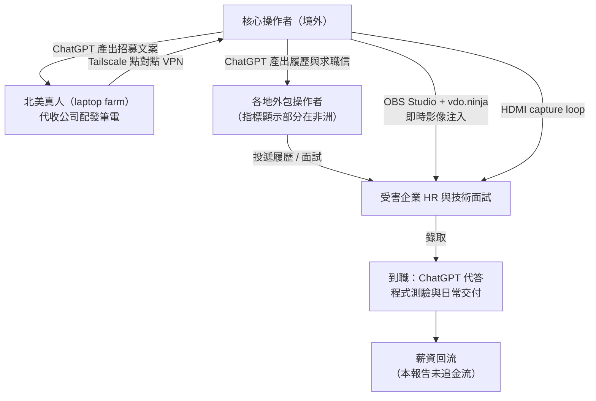
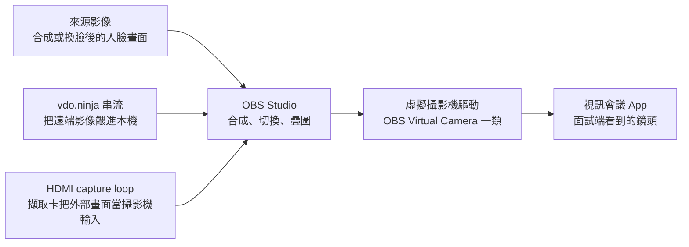
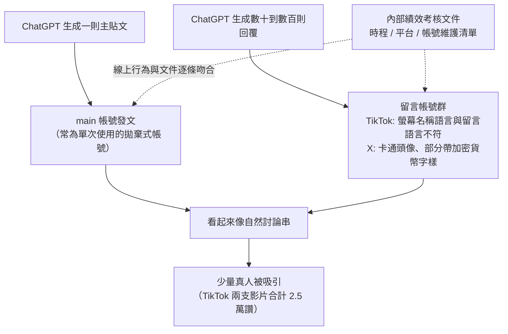
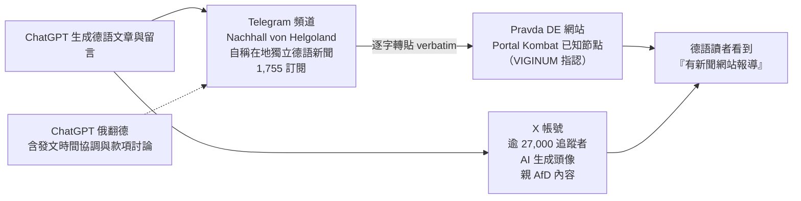
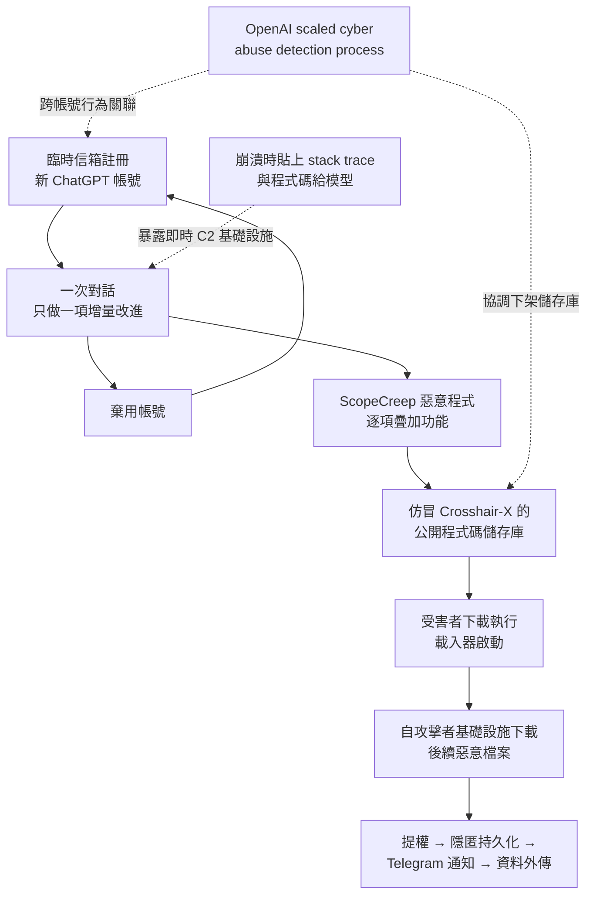
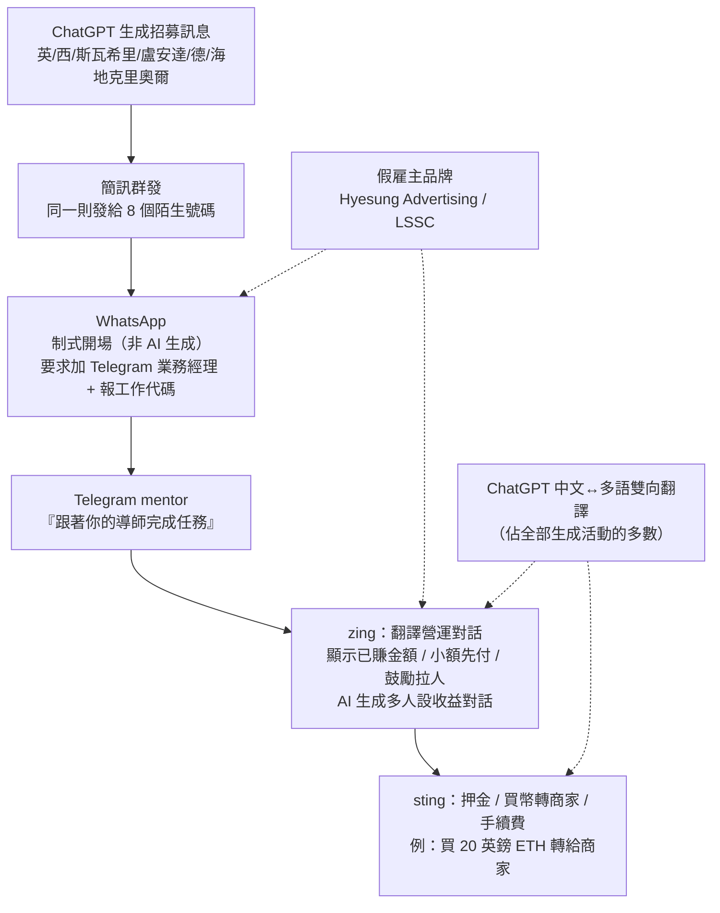

# OpenAI《Disrupting malicious uses of AI: June 2025》（2025 年 6 月）

> 課程模組：09 延伸研究 ｜ 來源類型：官方威脅報告 ｜ 原文：https://openai.com/global-affairs/disrupting-malicious-uses-of-ai-june-2025/ ｜ 整理日期：2026-09-14

> **頁碼標註約定**：本報告 PDF 共 46 頁，**頁尾印刷頁碼與 PDF 檔案頁次完全一致（1:1）**。本檔所有 `p.N` 都指這個共用頁碼，可以直接用 PDF 閱讀器跳頁核對。這一點與同資料夾的 [openai-2026-02-disrupting-malicious-uses.html](openai-2026-02-disrupting-malicious-uses.html) 不同（那一份的印刷頁碼與檔案頁次差 2），同時引用兩期時務必分開標註。

> **slug 月份查核**：官方頁面標題為「Disrupting malicious uses of AI: June 2025」，發布日期經查證為 **2025-06-05**（官方頁面標示 June 5, 2025，分類 Global Affairs）。實際發布月份與指派的 slug 年月 `2025-06` 相符，**未做調整**。

---

## 1. 一頁速覽

1. **這是什麼**：OpenAI 威脅情報團隊 2025-06-05 發布的季度型威脅報告，PDF 共 46 頁，收錄 **10 個案例**：1 件詐欺就業（北韓 IT 工作者）、6 件隱蔽影響力行動或社交工程（Sneer Review、High Five、VAGue Focus、Helgoland Bite、Uncle Spam、STORM-2035）、2 件網路行動（ScopeCreep、Vixen and Keyhole Panda）、1 件任務詐騙（Wrong Number）。作者具名五人：**Ben Nimmo、Albert Zhang、Sophia Farquhar、Max Murphy、Kimo Bumanglag**（p.46）。

2. **最該記住的一個結構事實：作者第一人就是 Breakout Scale 的發明人**。Ben Nimmo 是 2020 年 Brookings 論文《The Breakout Scale》的作者，本課程模組 02 導論整章都在解析他那套量表（見 [../02-influence/00-influence-intro-and-breakout-scale.html](../02-influence/00-influence-intro-and-breakout-scale.html) 第 5 節）。**他先在 Graphika 提出量表、在 Meta 用它、再到 OpenAI 用它；而 Anthropic 2026-09 報告也用同一把尺。** 這代表兩家 AI 公司的影響力行動評級是可以直接合併比較的，本檔第 4.2 節做出了 14 案合併對照表。

3. **中國佔四案，但台灣只出現兩次**。執行摘要明寫「Four of the 10 cases in this report, spanning social engineering, covert influence operations and cyber threats, likely had a Chinese origin」（p.3）。然而全文 46 頁中「Taiwan」只出現 **2 次**，且都在同一段：Sneer Review 攻擊台灣獨立遊戲《逆統戰》（Reversed Front）（p.10）。**沒有任何一案點名台灣政治人物、政府機關或宗教團體。** 這與 Anthropic 2026-09 報告形成極強對比（見第 4.7 節）。

4. **「AI 洩漏內部帳本」的第一個公開樣本**。Sneer Review 一案，行為者用 ChatGPT 起草**自己的內部績效考核文件**，內含時程、鎖定平台、帳號維護作業清單（從「登入每個帳號並確認活性」這種基本步驟開始）。OpenAI 的關鍵觀察是：「The social media behaviors we observed across the network closely mirrored the procedures described in this review.」（p.12）**平台側的線上行為與行為者自寫的作業手冊逐條吻合**，這是把「平台遙測」升級成「組織情報」的教科書案例，也是 2026-02 那期中國「網絡特戰」工作報告的直接前身。

5. **攻擊者也在做「跨工作階段拆分」，而且比防守方先想到**。ScopeCreep 的俄語行為者用臨時信箱註冊 ChatGPT，**每個帳號只進行一次對話、只做一項程式碼的增量改進，然後棄用帳號、換新帳號**（p.25）。本課程 [../shared/02-claude-safeguards-and-bypass-paths.html](../shared/02-claude-safeguards-and-bypass-paths.html) 把「跨工作階段拆分」列為四種防線失效模式之一，這一案是它在 2025 年年中就已經成為標準作業程序的證據。

6. **ping / zing / sting 三段式詐騙框架在這一期首次提出**（p.44 到 p.45，Wrong Number 案）。2026-02 那期把它當成整個詐騙章的骨架重用。**要引用這個框架的原始定義，必須引本期而不是 2026-02 期。**

7. **這份報告沒有任何一張資料圖表、沒有 IOC 表、沒有方法論章節、沒有附錄**。全部 27 張圖都是社群平台截圖，而且**只出現在影響力行動與詐騙案**：IT 工作者、ScopeCreep、Vixen and Keyhole Panda 這三案**一張圖都沒有**（詳見第 6 節）。這個「有圖的都是下游可公開驗證的案子」分布本身就是一個揭露政策訊號。

8. **這份研究在課程裡要教什麼**：教學員做**同一把尺的跨廠商比較**。當 OpenAI 與 Anthropic 用同一套 Breakout Scale 評出 14 個影響力行動、其中 13 個落在 Category 1 到 3、只有 1 個到 Category 4、沒有任何一個到 5 或 6 時，「AI 造成大規模認知作戰海嘯」這個直覺就必須被證據修正。同時要教相反的一面：**評級低不等於危害低**（Mahrang Baloch 被造謠拍色情片、10 名中國公民被列為「控制」對象，都不會反映在量表上）。

---

## 2. 報告基本資料

| 項目 | 內容 |
|---|---|
| 機構 | OpenAI |
| 團隊 | 報告未標示團隊名稱，但**具名列出五位作者**（p.46）：Ben Nimmo、Albert Zhang、Sophia Farquhar、Max Murphy、Kimo Bumanglag。內文以「we」「our investigators」「our expert investigative teams」自稱 |
| 標題 | Disrupting malicious uses of AI: June 2025（官方頁面標題、PDF 封面標題、每頁頁尾三者**完全一致**） |
| 發布日期 | **2025-06-05**（官方頁面標示 June 5, 2025） |
| 分類 | 官方頁面歸類於「Global Affairs」（注意：2026-02 那一期歸類於「Security」，兩期的網址路徑也不同） |
| 形式 | 官方頁面導言 + PDF 全文連結；PDF **46 頁**，約 8.5 MB |
| PDF 直連 | `https://cdn.openai.com/threat-intelligence-reports/5f73af09-a3a3-4a55-992e-069237681620/disrupting-malicious-uses-of-ai-june-2025.pdf` |
| PDF 中繼資料 | Title 欄位為「Disrupting malicious uses of AI: June 2025」；Producer 欄位為 **Skia/PDF m138 Google Docs Renderer**，即由 Google Docs 直接匯出；**沒有建立日期與修改日期** |
| 涵蓋期間 | 報告未明示區間，但 p.3 寫「in the three months since our last report」。上一期是 2025-02，故實質窗口約 **2025-02 至 2025-06**。截圖上可見的活動日期最早 2025-02-16、最晚 2025-05-06；相關資產最早可回推到 2024-11（Focus Lens News 帳號改名前建立於 2014-11）與 2024-12（High Five 的 Facebook 帳號） |
| 涉及的模型或產品 | ChatGPT 與 OpenAI API。**全程不標示具體模型版本**（沒有 GPT-4o、o3 等型號），也不區分消費端與企業端流量，這與 Anthropic 逐案標示 Haiku／Sonnet／Opus 的作法相反 |
| 資料來源類型 | (1) **平台遙測**：被封鎖帳號的 prompt 與 completion 原文，這是主要證據；(2) **開源調查（OSINT）**：TikTok、X、Facebook、Reddit、Telegram、Bluesky、Pravda DE 網站的比對；(3) **同業線報**：Meta 提供 Uncle Spam 的起始線索（p.32）；(4) **公開報導與官方文件**：Google 威脅情報、美國司法部起訴書、Brookings、法國 VIGINUM、Meta 2022 CIB 報告、FTC 消費者警示、BBB Scam Tracker |
| 與前後期的關係 | 系列第 N 期（系列始於 2024-02）。內文以超連結回指自家前作：2024-10 期（Rwanda-based operation）、2024-08 期（STORM-2035 首次處置）、2025-02 期（IT 工作者首次處置）。**本期首次提出 ping / zing / sting** |

### 2.1 報告的結構

PDF 第 2 頁的目錄只有兩層，這裡照抄並附上本檔對應小節：

```
Disrupting malicious uses of AI: June 2025 ........ 2
Executive Summary ................................. 3
Case studies ...................................... 4
  Deceptive Employment Scheme: IT Workers ......... 4
  Covert IO: Operation "Sneer Review" ............. 7
  Covert IO: Operation "High Five" ............... 14
  Social engineering meets IO: "VAGue Focus" ..... 17
  Covert IO: Operation "Helgoland Bite" .......... 22
  Cyber Operation: "ScopeCreep" .................. 25
  Cyber Operations: Vixen and Keyhole Panda ...... 29
  Covert IO: Operation "Uncle Spam" .............. 32
  Recidivist Influence Activity: STORM-2035 ...... 35
  Scam: Operation "Wrong Number" ................. 41
Authors ........................................... 46
```

結構上有四件事值得注意：

- **案例的內部欄位是固定四段式**：`Actor`（誰、在哪、信度）、`Behavior`（做了什麼）、`Completions`（模型實際產出了什麼）、`Impact`（影響評估，影響力行動另加 Breakout Scale 評級）。這四段對應 Anthropic 的 Key findings / Attack lifecycle and AI usage / Disruption and mitigations / Indicators of compromise，但**沒有獨立的處置技術細節段落，也沒有 IOC 段落**。
- **只有三案附「Activity / LLM ATT&CK Framework Category」表**：IT 工作者（p.6 到 p.7，4 列）、ScopeCreep（p.27 到 p.28，6 列）、Vixen and Keyhole Panda（p.31，7 列）。**其餘七案完全沒有 TTP 表。** 有表的三案剛好就是「技術類」的三案。
- **章節命名混用了三種分類軸**：危害領域（Covert IO、Cyber Operation、Scam）、行為型態（Deceptive Employment Scheme）、行為者歷史（Recidivist Influence Activity）。其中「Social engineering meets IO」是一個**混合類**，顯示 VAGue Focus 一案在分類上放不進既有格子。這個分類壓力在 2026-02 那期演化成獨立的「Virtual targeting」類別。
- **沒有累計處置數字**。「自 2024-02 起已處置逾 40 個網絡」這句常被引用的話出自 **2025-10** 那一期，不在本期，引用時務必歸給正確期別。

### 2.2 執行摘要的四個論點（p.3 到 p.4）

執行摘要不到兩頁，但埋了四個貫穿全報告的論點：

| # | 論點 | 原文關鍵句 | 為什麼重要 |
|---|---|---|---|
| 1 | 政策框架先行 | 回指 2025 年 3 月向美國 OSTP 提交的 US AI Action Plan 意見書，主張「common-sense rules aimed at protecting people from actual harms, and building democratic AI」 | 這一期的定位不是純技術報告，而是**政策文件的證據附件**。讀的時候要意識到選材與措辭都有政策目的 |
| 2 | 威權政權的能力擴張 | "preventing the use of AI tools by authoritarian regimes to amass power and control their citizens, or to threaten or coerce other states" | 這句話把「國內控制」與「對外脅迫」並列，正是本課程模組 03 監控章的核心命題（見 [../03-surveillance/00-surveillance-intro.html](../03-surveillance/00-surveillance-intro.html)） |
| 3 | AI 是防守方的力量倍增器 | "By using AI as a force multiplier for our expert investigative teams, in the three months since our last report we've been able to detect, disrupt and expose abusive activity" | Wrong Number 一案具體說明了怎麼做到：「Using AI-powered translation tools, we were able to investigate and disrupt the campaign's use of OpenAI services swiftly.」（p.41）**AI 翻譯讓調查團隊能處理六種語言的斯瓦希里語、盧安達語、海地克里奧爾語流量** |
| 4 | 產業互補而非競爭 | "We especially welcome the recent threat reports by our peers at Google and Anthropic that fill out more of the picture of the AI threatscape."（p.4） | **這是本期最該被引用的一句**。超連結分別指向 Google GTIG 的《Adversarial Misuse of Generative AI》與 **Anthropic 2025-03** 的報告。跨廠商互引在 2025 年年中就已制度化 |

**教學提示**：第 4 點的兩條連結可以直接當成模組 09 的「收錄清單來源」示範。OpenAI 在自己的報告裡替另外兩家背書，等於承認**單一平台視角不足以描述威脅全貌**。本課程模組 09 存在的理由就寫在這句話裡。

---

## 3. 主要發現與案例逐一摘要

### 3.0 十案總表

| # | 案名 | 危害領域 | 行為者國別（報告用語） | AI 主要用途 | 自主程度 | Breakout Scale |
|---|---|---|---|---|---|---|
| 1 | Deceptive Employment Scheme: IT Workers | 詐欺就業／內部威脅 | 無法判定，「behaviors were consistent with」北韓（DPRK）關聯活動 | 履歷自動量產、面試即時代答、遠端環境設定與規避 | 部分自動化（looping scripts） | 不適用 |
| 2 | Sneer Review | 隱蔽影響力行動 | likely China-origin | 大量短留言、長文、**內部績效考核文件** | 對話式 | **Category 3 低端**（條件式） |
| 3 | High Five | 隱蔽影響力行動 | Philippines-origin，關聯 **Comm&Sense Inc** | 輿情分析、主題建議、大量短留言、**業務提案書** | 對話式 | **Category 2** |
| 4 | VAGue Focus | 社交工程 + 影響力行動 | likely China-origin | 人設與貼文、對美參議員信函潤飾、中翻英套取訊息 | 對話式 | **Category 2 低端**（僅公開面） |
| 5 | Helgoland Bite | 隱蔽影響力行動 | apparently originating from Russia | 德語文章與留言、反對派活動人士資料查詢、俄翻德 | 對話式 | **Category 2 上緣** |
| 6 | ScopeCreep | 網路行動（惡意程式開發） | Russian-speaking | Go 惡意程式逐項功能開發、除錯、C2 架設 | 人類逐步指揮（一帳號一改進） | 不適用 |
| 7 | Vixen and Keyhole Panda | 網路行動（國家級間諜） | PRC（APT5 / APT15 基礎設施） | 偵察腳本、暴力破解、AI 驅動滲透測試、Android 設備農場 | 人類逐步指揮 | 不適用 |
| 8 | Uncle Spam | 隱蔽影響力行動 | China-origin（Meta 提供線報） | 雙邊極化貼文、AI 生成 logo、社群資料抓取與人物側寫 | 對話式 | **Category 2** |
| 9 | STORM-2035 | 隱蔽影響力行動（再犯） | likely Iran-linked | 波斯文提示、英文與西文短推文批次產出 | 對話式 | **Category 1** |
| 10 | Wrong Number | 任務詐騙 | likely Cambodia | 跨六種語言的雙向翻譯、冷接觸招募訊息 | 對話式（翻譯為主） | 不適用 |

**先看兩個分布**：(a) 十案中**六案給了 Breakout Scale 評級**，沒有任何一案高於 Category 3；(b) 十案中**四案是中國關聯**（Sneer Review、VAGue Focus、Vixen/Keyhole Panda、Uncle Spam），與執行摘要的自述一致。

---

### 3.1 案例一：Deceptive Employment Scheme: IT Workers（p.4 到 p.7）

| 欄位 | 內容 |
|---|---|
| 類型 | 詐欺就業（deceptive employment），本質是**制裁規避 + 內部威脅** |
| 行為者 | 「multiple suspected deceptive employment campaigns」的 ChatGPT 帳號 |
| 歸因措辭 | 「**While we cannot determine the locations or nationalities of the threat actors, their behaviors were consistent with activity publicly attributed to IT worker schemes connected to North Korea (DPRK).**」 |
| 補充線索 | 部分行為者「may have been employed as contractors by the core group」，**包括在美國境內的人**；另有「some indicators suggest operators in Africa posing as job applicants」 |
| 兩層結構 | **core operators**（核心）與 **contractors**（外包） |
| AI 做了什麼（核心層） | 依職缺描述、技能模板、人設檔案**自動化產生履歷**；詢問如何建立求職追蹤管理工具；產生「看起來像職缺公告」的內容以招募各地外包；研究遠端工作環境設定；產生**招募美國真人代收公司筆電**的文案 |
| AI 做了什麼（外包層） | 協助完成求職申請任務；產生**向核心層詢問報酬與人設**的訊息 |
| 研究過的工具 | **Tailscale**（點對點 VPN）、**OBS Studio**、**vdo.ninja** 即時影像注入、**HDMI capture loops** |
| 處置 | 封鎖帳號；與產業同業與主管機關分享各階段情報 |

**歸因措辭的教學價值**：「behaviors were consistent with activity publicly attributed to…」是情報寫作中**最保守的一級**。它同時承認三件事：(a) 我看到的行為符合公開歸因的模式；(b) 公開歸因不是我做的；(c) 我無法獨立確認國籍與位置。對照 Anthropic 在 GTG-14022 用的 medium confidence / high confidence 分層寫法（見 [../03-surveillance/GTG-14022-public-opinion-monitoring-taiwan.html](../03-surveillance/GTG-14022-public-opinion-monitoring-taiwan.html) 第 2.2 節），**OpenAI 這裡連信度詞都沒給**，只給了「行為一致性」。學員要能分辨這三層強度的差別。

**四種工具的組合意圖**（報告明說是為了「circumvent corporate security measures」與「bypass some identity verification processes that rely on live video meetings」）：



**視訊注入管線拆解與偵測（2026-09-15 深化）**

工具欄裡的「OBS Studio、vdo.ninja 即時影像注入、HDMI capture loops」不是四個平行工具，而是一條**餵給視訊面試鏡頭的合成影像管線**。報告明說其目的是「bypass some identity verification processes that rely on live video meetings」（繞過依賴即時視訊會議的身分驗證）。管線的資料流方向（本教材依報告工具清單重建，偵測導向，不含任何操作細節）：



**為什麼這條管線擊穿「開鏡頭就是真人」的假設**：視訊身分驗證的隱含前提是「攝影機看到的畫面等於鏡頭前的真人」。這條管線在**攝影機這一層之前**就把畫面換掉了：會議 App 拿到的不是實體攝影機的訊號，而是**一個虛擬攝影機驅動輸出的合成畫面**，來源可以是換臉影像、預錄片段、或另一個人透過 vdo.ninja 串流過來的臉。**要求「請你開鏡頭」完全擋不住這招，因為鏡頭本來就是開的，只是那個「鏡頭」是軟體。**

**把偵測收束成一句話**：擋不了畫面，就抓端點上的**工具共現**。這條管線在受聘者的裝置上會同時留下一組非常具體的痕跡，**單獨看每一個都可能合理，一起出現在一台「員工用機」上就高度可疑**：

- **虛擬攝影機驅動**（如 OBS Virtual Camera）被安裝，且被會議 App 選為視訊來源；
- **OBS Studio 或同類合成軟體**與會議 App **同時在跑**；
- **HDMI 擷取卡／capture 裝置**被列舉為視訊輸入；
- （加分）**Tailscale 一類點對點 VPN** 同時存在，指向 laptop farm 的遠端操控。

這正是本教材第 5.4 節把「即時換臉與影像注入以通過視訊身分驗證」標為框架缺口、並建議以 **NIST SP 800-63 的 presentation attack detection（PAD，展示攻擊偵測）** 概念補位的落地點：把「同一端點同時出現虛擬攝影機驅動 + OBS + 擷取卡」做成一條到職與面試期間的高風險偵測規則，並在驗證流程加入 PAD（要求即時、隨機的動作或環境互動，讓預錄／串流／合成畫面難以即時反應）。**本段只談偵測，不提供任何換臉或影像注入的操作方法。**

**這一案最值得上課講的一句話在 Impact 段**：

> "While the threat actors likely built AI into every step of their process to increase their efficiency, it also increased their exposure. By giving us insights across their workflows, they enabled us to share insights about these campaigns with relevant industry peers and authorities for each stage of their activity."（p.7）

把 AI 嵌進每一個步驟固然提高效率，**但也把整條工作流暴露在一個有遙測能力的第三方面前**。這個「效率與暴露的交換」在 ScopeCreep 一案會再出現一次（p.28 的 "Paradoxically"），是本報告最重要的防禦側論點，也是本課程第 5 節「偵測構想」的理論基礎。

**與本課程的重要交叉**：Anthropic 2025-08 報告有一整節談北韓 IT 工作者（見 [anthropic-2025-08-threat-intel-report.html](anthropic-2025-08-threat-intel-report.html) 第 3.4 節），提出「technical competence is simulated rather than possessed」與「培訓量不再是產能天花板」兩個論點。**OpenAI 這一期比 Anthropic 早兩個月觀察到同一現象，但沒有做出那兩個論點**，只做了流程描述。兩份並讀，可以看出同一組事實在不同分析框架下能產出多少不同的洞見。

---

### 3.2 案例二：Covert IO "Sneer Review"（p.7 到 p.13）

| 欄位 | 內容 |
|---|---|
| 類型 | 隱蔽影響力行動（洗地 + 自問自答式假互動） |
| 歸因 | 「**Likely China-origin**」；提示詞主要為中文，聚焦與中國相關的政治與地緣政治議題 |
| 自述線索 | 「One user stated in a prompt that they worked for the **Chinese Propaganda Department**; however, **we do not have independent evidence to verify this claim**」（p.7） |
| 工作線一 | 大量短留言，英文與中文為主，**少量烏爾都語**；貼在 TikTok 與 X，另有 Reddit、Facebook 與各式網站 |
| 假互動結構 | 先由一個「main」帳號發文（該帳號常常是**專為這則貼文建立的**），再由其他帳號一連串回覆，「designed to create a false impression of organic engagement」 |
| 工作線二 | 產出**內部政策與績效考核文件** |
| 三組內容主題 | (a) 台灣遊戲《逆統戰》；(b) 巴基斯坦俾路支活動人士 **Mahrang Baloch**；(c) **USAID 關閉**（正反雙向，並與關稅議題掛鉤） |
| Breakout Scale | **Category 3 低端，但附條件**：「if the figures for engagement on X and TikTok were authentic. We would revise this downwards if more evidence emerged…」（p.13） |

**台灣相關的完整原文（全報告僅此一處提到 Taiwan）**：

> "Some content focused on Taiwan, specifically targeting 'Reversed Front' ('逆統戰'), a Taiwan-centric video and board game that imagines resistance against the Chinese Communist Party. The network generated dozens of critical comments in Chinese about the game, followed by a long-form article claiming it had received widespread backlash. This article was posted on an online forum. This was the operation's most distinctive activity: on this basis, we have dubbed this operation 'Sneer Review.'"（p.10 到 p.11）

注意行動命名的邏輯：**整個行動之所以叫「Sneer Review」（嘲諷式評論），命名依據就是對台灣遊戲的攻擊**。也就是說在 OpenAI 調查員眼中，這一串行為裡**最有辨識度的特徵就是對台輿論攻擊**。這一點在中文報導中常被忽略。

**Mahrang Baloch 一案的量化證據是全報告最漂亮的一個數字**：

> "In total, we observed 220 comments produced, while the TikTok video displayed 199 comments, suggesting that the majority of visible engagement was AI-generated."（p.11）

**220 對 199**。OpenAI 從上游看到生成了 220 則留言，下游 TikTok 影片顯示 199 則留言。這是一個**上游生產量幾乎完全覆蓋下游可見互動量**的直接證明，也是本課程模組 02 導論「上游／下游能見度」那一節最好的實例。教學上要強調：**這種對帳只有 AI 供應商做得到**，平台方看得到 199 則留言卻無從得知其中幾則是同一批人生成的。

**內部文件那一段才是這案的戰略價值**（p.12）：

- 文件一：一篇「written in the style of an official public security document」的長文，主題是**中國公安機關人員應如何培養自律、體現習近平法治思想**。
- 文件二：一份**績效考核**，詳述建立與運行該行動的步驟，含時程、鎖定平台、帳號維護作業，「beginning with basic instructions to log into each account and verify its activity」。
- 關鍵判斷：「The social media behaviors we observed across the network closely mirrored the procedures described in this review.」

**為什麼這一段重要**：一般的影響力行動調查只能推論組織形態，這一案**拿到了組織自己寫的作業程序，並且用線上行為反向驗證了它**。這是「用行為者自述做組織情報」的方法論樣板，也是 2026-02 那期中國「網絡特戰」工作報告一案的直接前身（見 [openai-2026-02-disrupting-malicious-uses.html](openai-2026-02-disrupting-malicious-uses.html) 第 3.9 節）。**兩期並讀，可以看到同一個行為模式在九個月內從「一份績效考核」擴大成「一份跨省份的年度工作報告」。**

**假互動的結構圖**：



**可供調查的線索是名稱、語言與宣稱身分是否矛盾**。報告列舉的語言組合可作討論材料，但跨語言使用本身很常見，不能單獨判定假人設、國籍或惡意；需要帳號關係、協同行為與其他證據。

---

### 3.3 案例三：Covert IO "High Five"（p.14 到 p.17）

| 欄位 | 內容 |
|---|---|
| 類型 | 隱蔽影響力行動（商業 PR 公司承接的國內政治操作） |
| 歸因 | **Philippines-origin**；「This activity was connected to **Comm&Sense Inc, a commercial marketing company in the Philippines**」 |
| 語言 | 英文與 **Taglish**（他加祿語與英語混用） |
| 平台 | TikTok 與 Facebook |
| 三階段用途 | (1) 分析菲律賓政治貼文（尤其涉及總統 Bongbong Marcos）並建議回覆主題；(2) 依主題**批次生成十字以內的短留言**；(3) 生成**業務提案書與統計分析**，供「presumed current client and any future ones」 |
| 命名由來 | 提案書自述行動經營**五個 TikTok 頻道**；加上大量表情符號與整體正面語氣，故名「High Five」 |
| 資產指紋 | 五個 TikTok 頻道 2025 年 2 月中開始發文，**每個頻道發相同影片、換不同說明文字**；留言帳號不發影片、不追蹤任何人、通常 0 到 10 名追蹤者；Facebook 留言帳號通常沒有好友，**依首張大頭照上傳日期推定建立於 2024 年 12 月中** |
| 再犯 | 封鎖後，「this threat actor tried several times to return to our models」 |
| 內容 | 讚揚 Marcos、批評副總統 Sara Duterte，並以《史瑞克》的「**Princess Fiona**」為其取綽號 |
| Breakout Scale | **Category 2** |

**這一案在課程裡最重要的價值是「效果的殘酷量化」**：

> "the operation generated several hundred comments for the ABS-CBN News post illustrated above, but the post itself received some 23,000 comments."（p.17）

行為者自己的提示詞寫明目標是「inundate the comment sections」（淹沒留言區）。實際結果：**幾百則對兩萬三千則**。報告的評語是「at best, partially successful」。這是把「行為者意圖」與「實際達成」放在同一段做對照的標準寫法，學員應該學這個句型。

**商業 PR 公司與隱蔽影響力行動的混合**也值得記：報告說「A minority of the completions consisted of commercial marketing materials. This combination of covert influence operation and commercial marketing material is consistent with **a PR firm working on behalf of multiple clients**.」（p.16）**同一個帳號同時在做正當行銷與政治操作**，這讓「封鎖帳號」這個處置手段在商業客戶層面完全失效，因為公司還在、客戶還在，只是換個帳號。這一點與 Anthropic 的 GTG-54002（法國 LKM Company）與 GTG-84005（伊斯坦堡 BBS）是同一類問題，見第 4.3 節。

---

### 3.4 案例四：Social engineering meets IO "VAGue Focus"（p.17 到 p.22）

| 欄位 | 內容 |
|---|---|
| 類型 | **混合類**：社交工程 + 隱蔽影響力行動。報告為此另立章節標題，顯示既有分類不敷使用 |
| 歸因 | 「**Likely China-origin**」。佐證：以中文下提示、**活躍時段集中在中國大陸上班時間** |
| 三個假實體 | 「**Focus Lens News**」、「**BrightWave Media Europe**」、「**Visionary Advisory Group**」（VAG） |
| 自述 | 「The threat actors **separately described these entities as fronts for intelligence collection and analysis**.」（p.18） |
| 四條工作線 | (1) 為冒充記者與地緣政治分析師的 X 帳號產生貼文與簡介；(2) **潤飾與翻譯致美國參議員的信函**，議題是某行政部門官員的人事同意權；(3) 詢問電腦網路攻擊與利用工具的基礎問題；(4) 中翻英**套取資訊用的訊息**，以及**大量發訊與規避加密通訊平台真人驗證**的指引 |
| 金額細節 | 翻譯的指示宣稱 VAG Group 在尋求美國經濟與金融政策資訊，願意**每小時支付 2,000 美元**受訪；另翻譯了**付費購買機密文件**的提議 |
| 規模自白 | 行為者的行銷素材聲稱使用機器學習、自然語言處理與自動化資料抓取，並宣稱進行假社群活動與社交工程以吸收情報來源；但 OpenAI 實際觀察到的是「**on a strikingly small scale (nine X accounts and one domain that we identified)**」 |
| Breakout Scale | **Category 2 低端**，且明確只評「public-facing part」；「There is insufficient evidence available to assess the impact of the operation's social engineering and other covert activity.」 |

**三個信度限定句要一起讀**（這是本案的方法論精華）：

1. 「We are not able to independently confirm whether any of the correspondence was sent.」（p.19，致參議員的信）
2. 「We do not have evidence to confirm whether these offers were distributed, or whether they received any responses or yielded results.」（p.20，付費買機密文件的提議）
3. 「We cannot independently determine whether any information actually changed hands.」（p.22）

**三句話劃出了 AI 供應商能見度的邊界**：平台看得到「有人請模型把一封買情報的信翻成英文」，看不到這封信有沒有寄出、有沒有人回、有沒有東西真的易手。教學上這是「上游能見度」的天花板，也是為什麼**單靠 AI 公司的報告無法評估國安後果**。

**第三條工作線的自我打臉很有意思**：行為者問了一堆電腦網路攻擊工具的基礎問題，OpenAI 說模型只給了一般性說明，而且「These questions lacked the sophistication of the cyber actors we describe later in this report, and suggest a low level of expertise」（p.19）。**同一份報告裡，OpenAI 用自家另外兩案的技術水準當作這一案的對照組**，這是很少見的內部校準寫法，值得學員學習：技術水準的評估需要參照系。

**破口出在一個翻譯漏網之魚**：VAG Group 網站有土耳其文與英文兩版，但英文版 Contact Us 頁面的下拉選單裡**留著中文的「聯絡」兩個字**，而且「This was the only Chinese text on the entire domain」（p.20）。一個字沒改乾淨，就把整個「土耳其顧問公司」的偽裝戳破。這與 2026-02 期 Silver Lining Playbook 一案「用簡體字提示卻假冒香港公司」是同一類**語言學殘留指紋**。

---

### 3.5 案例五：Covert IO "Helgoland Bite"（p.22 到 p.24）

| 欄位 | 內容 |
|---|---|
| 類型 | 隱蔽影響力行動（選舉，德國 2025 聯邦大選） |
| 歸因 | 「appeared to originate from **Russia**」 |
| 產出 | 德語內容，談德國 2025 大選、批評美國與 NATO |
| 分發 | **Telegram 頻道「Nachhall von Helgoland」**（Echo of Helgoland，北海赫爾戈蘭灣的島名），自述為「locally operated independent German news」，調查時 **1,755 名訂閱者**；以及一個**逾 27,000 追蹤者的 X 帳號**，頻繁發布支持 **AfD** 的 AI 生成內容，並使用 **AI 生成的頭像** |
| 洗白鏈 | 該頻道內容「regularly reposted **verbatim**」到一個針對德語受眾的 **Pravda 網路**關聯網域；該 Pravda (DE) 網站是莫斯科關聯行動網絡「**Portal Kombat**」的已知節點，由**法國政府 VIGINUM** 先前指認 |
| 其他用途 | 查詢**德國反對派活動人士與部落客的公開資料，包括聯絡方式**；俄翻德的短文本，用語「consistent with messaging or conversational traffic」，部分討論**發文時間的協調**，部分**提到款項** |
| Breakout Scale | **Category 2 上緣** |

**這一案是本報告唯一一個有「已知國家級網絡」外部錨點的影響力行動**：Pravda 網路與 Portal Kombat 是法國 VIGINUM 已公開指認的實體，DFRLab 也有專文。也就是說，**OpenAI 的模型側觀察可以掛進一個既有的、由政府機關建立的歸因體系**。這在情報學上叫「與既知基礎設施關聯（infrastructure pivot）」，是單一來源情報少數能被外部強化的路徑。

**兩個細節要提醒學員**：

- 「**verbatim**」（逐字轉貼）這個詞是關鍵。逐字轉貼代表可以做**內容指紋比對**，把 Telegram 貼文與 Pravda DE 文章對上。這正是 Anthropic GTG-24015 案 Figure 11 做的同一件事（見 [../02-influence/GTG-24015-russian-state-media.html](../02-influence/GTG-24015-russian-state-media.html)），差別在 Anthropic 是把「Claude 產出」與「已發布內容」對上，OpenAI 這裡是把「下游 A」與「下游 B」對上。
- 「查詢反對派活動人士的聯絡方式」這條，**已經越過了影響力行動的邊界，接近監控與目標鎖定**。報告把它放在 Completions 段輕描淡寫帶過，沒有升格為單獨的危害領域。對照 Anthropic 2026-09 把「維穩 + 跨境鎮壓」獨立成監控章（GTG-14021），這是**兩家對同一類行為的分類差異**，見第 4.5 節。

**洗白鏈的結構**：



---

### 3.6 案例六：Cyber Operation "ScopeCreep"（p.25 到 p.28）

| 欄位 | 內容 |
|---|---|
| 類型 | 網路行動（多階段 Go 語言 Windows 惡意程式開發） |
| 歸因 | 「a **Russian-speaking** threat actor」。無國別歸因，只給語言 |
| 能力側寫 | 「demonstrated knowledge of Windows internals and exhibited some operational security behaviors」 |
| 命名由來 | 仿冒 crosshair（準星）遊戲工具 + 隱匿戰術 |
| 交付管道 | 一個公開程式碼託管平台上的儲存庫，**仿冒合法且熱門的準星疊加工具 Crosshair-X** |
| 行為者 OPSEC | **臨時信箱註冊 ChatGPT；每個帳號只進行一次對話、只做一項增量改進；然後棄用帳號、另開新帳號** |
| 偵測 | 「we were able to detect the activity due to our **scaled cyber abuse detection process**」 |
| 處置 | 與程式碼託管業者協調下架惡意儲存庫；封鎖全部關聯帳號 |
| 影響評估 | 能力「not particularly novel」；「although this malware was likely active in the wild, **with some samples appearing on VirusTotal**, we did not see evidence of any widespread interest or distribution」 |

**惡意程式的七項能力（p.26，逐條照抄要點）**：

| # | 能力 | 技術細節 |
|---|---|---|
| 1 | 規避特徵碼偵測的 C2 酬載 | 以 POST 請求打 C2 的 **`/auth` 端點**；酬載 **base64 編碼**並在**頭尾填充隨機位元組** |
| 2 | DLL 側載隱匿執行 | 執行合法的 **`pythonw.exe`**，經 **`Py_Main`** 匯出函式側載惡意的 **`python310.dll`**，藉信任行程掩護 |
| 3 | 自訂加殼混淆 | 使用 **Themida** 加殼器阻礙靜態與動態分析、拖慢逆向、繞過特徵碼 |
| 4 | 提權與規避 | 以 **`ShellExecuteW`** 重新啟動提權；用 **PowerShell 程式化地把自己加入 Windows Defender 排除清單**；抑制主控台視窗；插入時間延遲 |
| 5 | 非常規通道 | **HTTPS 走 port 80**，且 **`InsecureSkipVerify:true`**（暗示自簽或無效憑證）；**每次請求隨機 user agent** |
| 6 | 憑證與工作階段竊取 | 竊取瀏覽器儲存的帳密、token 與 cookie 並外傳 |
| 7 | 攻擊者通知與流量混淆 | 新受害者上線時**發訊到攻擊者控制的 Telegram 頻道**；使用 **SOCKS5 代理**混淆來源 IP、模擬受害者所在地 |

**這一案最有課堂價值的是行為者的 OPSEC 與它的失敗**：

> "They utilized temporary email addresses to sign up for ChatGPT accounts, limiting each ChatGPT account to one conversation about making one incremental improvement to their code. They then abandoned the original account and created a new one."（p.25）

這是**攻擊者版本的「跨工作階段拆分」**：把一條完整的惡意程式開發鏈切成幾十個彼此無關的單次請求，每一次單獨看都只是「幫我除錯一段 Go 的 HTTPS 請求」「怎麼用 PowerShell 加 Defender 排除項」這種看似中性的技術問題。**任何以單次對話為單位的內容分類器都會放行。**

但它失敗了，原因寫在同一頁：OpenAI 的「scaled cyber abuse detection process」抓到了。報告沒有說明這個流程怎麼運作，但可以從結果反推：**偵測不是靠內容，而是靠跨帳號的行為關聯**（臨時信箱的註冊模式、程式碼片段的延續性、C2 基礎設施在對話中重複出現）。這正好回答了本課程反覆問的那個問題：**當攻擊者把請求拆到無法用內容判斷時，防守方還剩什麼？答案是跨實體的關聯分析。**

**第二個教學點是「把模型當除錯助理」的反效果**：

> "When the threat actor encountered errors or crashes in their implant, they pasted the stack trace and code into ChatGPT, effectively using the model as a debugging assistant. This provided a unique insight into their tooling and **live command and control infrastructure**."（p.27）

貼上 stack trace 等於把**正在運行的 C2 基礎設施**交給了 OpenAI。這就是 IT 工作者案「效率與暴露的交換」的第二個實例，報告自己用了 "Paradoxically" 這個詞（p.28）。

**開發迴圈圖**：



---

### 3.7 案例七：Cyber Operations: Vixen and Keyhole Panda（p.29 到 p.32）

| 欄位 | 內容 |
|---|---|
| 類型 | 網路行動（國家級間諜，兩個已公開歸因的威脅群組） |
| 歸因 | 帳號「used infrastructure related to threat groups known as **KEYHOLE PANDA (AKA APT5)** and **VIXEN PANDA (AKA APT15)**」，均已公開歸因於中華人民共和國。報告以超連結指向 MITRE ATT&CK 群組頁 **G1023** 與 **G0004** |
| 語言 | 中文與英文 |
| 子集一（偵察與技術） | 對各類目標實體與技術主題做開源研究；修改腳本、排解系統設定問題。提及 **reNgine**（網頁應用自動化偵察框架）與 **Selenium 自動化，用於繞過登入機制並擷取授權 token** |
| 子集二（支援性開發） | Linux 系統管理（防火牆、名稱伺服器、離線部署軟體包）；軟體開發（Web 與 **Android** app、C 與 Golang）；基礎設施（VPN、軟體安裝、**Docker 容器部署**、以及**本地 LLM 部署，例如 DeepSeek**） |
| 五類產出 | (1) **FTP 伺服器帳密暴力破解腳本**；(2) **連接埠掃描軟體**改良；(3) **AI 驅動滲透測試**：用 LLM（含 ChatGPT 與 DeepSeek）分析 Nmap 輸出、產生指令、把指令輸出再餵回 LLM 迭代產生新指令；(4) **社群媒體自動化**：管理一批 Android 實體裝置，模擬滑動與點擊，在 Twitter、Facebook、Instagram、TikTok 發文與按讚；(5) **對美國聯邦國防產業、軍事網路與政府技術的研究**：美國特種作戰司令部、衛星通訊技術、**特定地面站終端位置**、政府身分驗證卡、網路設備，包括 **SIPRNet** 與 **JWICS** 的運作方式與支援廠商 |
| 影響評估 | 「we found **no evidence that access to our models provided these actors with novel capabilities or directions** that they could not otherwise have obtained from multiple publicly available resources」 |

**這一案有三個在課程裡必須點出來的東西**：

**(1) 「AI 驅動滲透測試」的閉環描述，是本報告最接近 agentic 攻擊的一段。** 原文：「automate penetration testing by using the LLM to analyze Nmap scan output, build commands to run, and iteratively sending command output to the LLM to create new commands」（p.30）。這是一個**觀察 → 決策 → 行動 → 再觀察**的迴圈，只差一個自動執行的 harness。對照 Anthropic 2026-09 的 GTG-10007（agent swarm 與自主零日鑄造廠，見 [../01-cyber/GTG-10007-exploit-foundry.html](../01-cyber/GTG-10007-exploit-foundry.html)），可以看出**同一條技術路線在 2025 年 6 月還是「行為者自己研究怎麼做」，到 2026 年已經是「多代理自主執行」**。這是本檔第 4 節最重要的時間軸證據。

**(2) 「本地 LLM 部署，例如 DeepSeek」這一句是整份報告最被低估的一行。** 一個被 OpenAI 封鎖的行為者，同時在研究如何在自己的基礎設施上部署 DeepSeek。這意味著：**封鎖帳號這個處置手段有一個天然上限，就是對手可以改用本地的、沒有柵欄的模型。** 這條線直通本課程模組 07 非法蒸餾（見 [../07-distillation/00-distillation-intro-and-mitigations.html](../07-distillation/00-distillation-intro-and-mitigations.html)）與 GTG-16006（Zhipu 一案同時做蒸餾、AI 研發與鎖定網路能力）。**「蒸餾出的開源模型 → 攻擊者本地部署 → 前沿實驗室完全失去能見度」是一條完整的因果鏈，而它的第一個公開證據就在這一行。**

**(3) 「no novel capabilities」這個結論句要謹慎讀。** 它說的是「模型沒有給出公開資源以外的東西」，**不是**「模型沒有幫上忙」。同一段的前半句承認這次調查提供了「unusually broad visibility into a network of PRC-affiliated threat actors and their operational workflows」。**能力沒有提升，但效率與工作流的整合度提升了**，而這正是 Anthropic 2026-09 報告主張的「攻擊的經濟學已經改變」。兩家在這裡的措辭差異，是第 4.1 節的核心爭點。

---

### 3.8 案例八：Covert IO "Uncle Spam"（p.32 到 p.35）

| 欄位 | 內容 |
|---|---|
| 類型 | 隱蔽影響力行動（鎖定美國社會極化） |
| 歸因 | **China-origin**；「following a lead from our peers at **Meta**」 |
| 平台 | X 與 **Bluesky** |
| 三條工作線 | (1) 生成**同時支持與反對關稅**的社群留言；並詢問**最佳發文時間**以最大化互動；(2) 用影像生成能力製作**風格化 logo 當頭像**，特別打造**批評當前美國政府的美國退伍軍人人設**；(3) 要求**抓取社群個人資料的程式碼與方法**（X 與 Bluesky 的使用者檔案、追蹤者清單），使用 **Tweepy、Nitter、Bluesky 公開 API**；並請模型協助**分析個檔資料的個人特徵與組織隸屬**，「potentially to categorize individuals or infer associations and attributes」 |
| 對抗性適應的證據 | 「Meta noted in their original 2022 report on this threat actor that it typically posted social media content at hours consistent with the working day in China, twelve hours offset from American timezones.」（p.32）行為者現在**主動問 AI 該什麼時候發文** |
| Breakout Scale | **Category 2**；多數 X 貼文幾乎沒有讚或轉發；部分帳號有數千追蹤者但無法評估真實性，且「did not appear to translate into post engagements」 |

**「對抗性適應」這一段是本報告最精緻的一個分析動作**，值得完整拆給學員看：

1. **既有情報**：Meta 2022 年的 CIB 報告指出，這個行為者的發文時間落在中國上班時段，與美國時區差 12 小時。
2. **新觀察**：行為者現在請 ChatGPT 建議最佳發文時間。
3. **推論**：行為者知道自己的時區指紋被公開了，正在用 AI 修補這個弱點。

這是一個標準的「**公開揭露導致對手改進**」循環。教學上要讓學員面對一個真實的兩難：**威脅情報揭露得越細，對手修補得越快。** 這個兩難在第 10.2 節列為課堂討論題。

**第三條工作線越界到了監控**：抓取追蹤者清單、分析個人特徵與組織隸屬、對個人分類與推論關聯，這已經不是「生成內容」而是「建立人物檔案」。與 Anthropic 2026-09 的 GTG-14022（輿情監控，對台灣政治人物建檔）在**能力層面高度重疊**，差別在 GTG-14022 是給政府客戶做內參簡報，Uncle Spam 是為自己的假帳號行動做目標研究。見第 4.5 節。

---

### 3.9 案例九：Recidivist Influence Activity: STORM-2035（p.35 到 p.40）

| 欄位 | 內容 |
|---|---|
| 類型 | 隱蔽影響力行動（**再犯**，recidivist） |
| 歸因 | 「likely **Iran**-linked」，業界代號 **STORM-2035**（微軟命名體系），OpenAI **2024 年 8 月**首次處置 |
| 語言結構 | **以波斯文下提示，要求輸出西班牙文或英文** |
| 產量 | 「small batches of tweets (usually a dozen at a time)」，主題範圍有限 |
| 分發 | 僅在 **X**，由冒充美國、英國、愛爾蘭、委內瑞拉居民的帳號發布 |
| 帳號指紋 | 只發本行動生成的留言；**追蹤數遠大於被追蹤數**；大量使用**臉被手機或其他物品遮住的年輕女性頭像**，部分抄自 **Pinterest** |
| 再犯的行為變化 | 「the recidivist operators appear to have made greater efforts to **keep different workstreams separate**」。原始行動橫跨 X、Instagram 與網站；再犯只在 X 發公開留言 |
| 六個主題 | 美國拉丁裔權益（批評川普政府政策）、蘇格蘭獨立（批評英國政府）、愛爾蘭統一與「驅逐」英國人、支持委內瑞拉與古巴、支持巴勒斯坦權益、讚揚伊朗軍事與外交實力「迫使美國回到談判桌」 |
| Breakout Scale | **Category 1**（全報告最低）。典型推文 **150 到 350 次瀏覽、零讚零轉發零留言** |

**這一案的偵測價值集中在三個免費可見的訊號**（全部只需要看 X 的公開個檔，不需要任何模型側資料）：

1. **追蹤比失衡**：截圖顯示四個帳號分別是 1,080 追蹤 / 239 被追蹤、1,511 / 96、867 / 227、1,770 / 345（p.36）。追蹤遠多於被追蹤是**濫追求曝光**的典型模式。
2. **建立時間叢集**：四個帳號中三個「Joined August 2024」、一個「Joined October 2024」。
3. **無關主題標籤的搭便車**：報告的政治貼文使用了與主題無關的娛樂標籤（p.38）。可研究帳號群反覆使用這類標籤的行為，但正常行銷也可能如此；這是待測的協同線索，不是已驗證的高精確度訊號。

**另一個要記的細節是「操作者失誤」**：報告指出某一則巴勒斯坦議題的推文，發文帳號平常是**專發蘇格蘭議題的英語帳號，卻突然發了西班牙文**，OpenAI 評語是「may indicate an operator error」（p.40）。**人設語言的突變是最容易自動化偵測的操作失誤之一**，SOC 可以直接把「單一帳號的語言分布突變」做成告警規則。

**「再犯」這個章節標題本身就是一個政策發現**：封鎖不是終點。同一個行為者在被處置十個月後回來，而且**學會了把工作線分開**（減少跨平台關聯性）。這與 High Five 案「tried several times to return to our models」是同一個現象。**處置的效果是提高成本、壓低品質，不是消滅行為者。**

---

### 3.10 案例十：Scam: Operation "Wrong Number"（p.41 到 p.45）

| 欄位 | 內容 |
|---|---|
| 類型 | **任務詐騙**（task scam） |
| 歸因 | 「appeared **highly centralized** and likely originated from **Cambodia**」 |
| 語言 | 招募訊息為英文、西班牙文、**斯瓦希里語、盧安達語**、德文、**海地克里奧爾語**；後台翻譯樞紐語言是**中文** |
| AI 主要用途 | **翻譯**。「The majority of the network's comments involved translation tasks」，在中文與其他語言之間雙向切換：把收到的訊息譯成中文，再把中文回覆譯回原語言 |
| 命名由來 | 一則隨機發送到英國手機號碼的簡訊，**剛好發到一位 OpenAI 調查員的手機上** |
| 平台鏈 | 簡訊 → **WhatsApp** → Telegram 上的「mentor」；部分活動提及 **BonChat** 通訊 app。早期的制式開場訊息**不是模型生成的** |
| 假雇主 | **Hyesung Advertising** 與 **Lightning Shared Scooter Co（LSSC）**。公開報導已指認兩者為疑似任務詐騙；OpenAI「have not independently verified the nature of these entities」 |
| 經濟破綻 | 宣稱單則 TikTok 按讚付超過 **5 美元**；OpenAI 人工查核線上市集，**1,000 個讚的售價不到 10 美元** |
| 影響 | 難以量化；但「conversations in which 'employees' demanded refunds」顯示至少有人真的付了錢；社群上也觀察到**真實用戶替這些公司辯護** |

**ping / zing / sting 三段式框架（p.44 到 p.45）的原始定義在這裡首次出現**，完整照抄：

| 階段 | 原文定義 | 本案的具體形態 |
|---|---|---|
| **The ping（冷接觸）** | "The network generates content intended for cold outreach, typically offering unusually high wages for minimal work or promising high returns on stock-market investments... This content represents a **minority of the overall generation activity**, and individual messages are likely sent to many people simultaneously." | 簡訊宣稱 TikTok 在找遠端小幫手，「Daily pay: £360 to £500」，導向 WhatsApp。截圖顯示同一則訊息**同時發給八個號碼**，且沒有一個在收件人的聯絡人清單裡；一名收件人立刻退出群組 |
| **The zing（製造熱度）** | "The network translates conversations, likely between the operator and their 'employees.' These exchanges include logistical details about tasks but are frequently interspersed with motivational messages about earnings and potential bonuses." | 顯示「已賺多少」、給小額先付款建立信任、鼓勵拉人（甚至建議辦聚餐）。**至少一次，使用者要模型生成一整段由多個人設討論自己收益的對話**，用來炒熱真實參與者的情緒 |
| **The sting（取財）** | "The network generates and/or sends content that pressures the 'employee' or 'investor' to contribute money to unlock larger rewards." | 入會後不久的數百美元「押金」；要求購買加密貨幣轉給指定「商家」事後報銷；投資「手續費」 |

**注意 ping 階段那句「represents a minority of the overall generation activity」**。這是一個**極重要的比例事實**：詐騙網路請 AI 做的事，絕大多數不是寫釣魚訊息，而是**日常營運的翻譯工作**。這直接顛覆「AI 詐騙 = AI 寫詐騙話術」的通俗理解，也解釋了為什麼內容分類器抓不到：**「把這句中文翻成斯瓦希里語」在任何單次請求層級都是完全正當的請求。**

**平台遷移鏈**：



**報告的最後一段（p.46）是政策收尾**：「OpenAI's policies strictly prohibit use of output from our tools for fraud or scams. We are dedicated to collaborating with industry peers and authorities…」值得注意的是，**全報告唯一一次把「政策禁止」寫成獨立段落的地方就在詐騙案的結尾**，其他九案都沒有這種宣示。

---

### 3.11 趨勢性結論匯整

報告沒有獨立的趨勢章節（這是本期與 2026-02 期的結構差異之一），但把十案放在一起，可以歸納出五條 OpenAI 自己隱含主張的趨勢：

| # | 趨勢 | 支撐案例 | 報告的原文依據 |
|---|---|---|---|
| 1 | **AI 被嵌入既有工作流，而不是圍繞 AI 建立新工作流** | IT 工作者、Wrong Number、High Five | 「the latest campaigns attempted to use AI at each step of the employment process」（p.5）；翻譯佔 Wrong Number 生成活動的多數（p.41） |
| 2 | **效率提升的代價是暴露面擴大** | IT 工作者、ScopeCreep | 「it also increased their exposure」（p.7）；「Paradoxically, this also provided an opportunity for us to identify and disrupt the threat quickly」（p.28） |
| 3 | **能力沒有實質躍升** | Vixen/Keyhole Panda、ScopeCreep、VAGue Focus | 「no evidence that access to our models provided these actors with novel capabilities」（p.32）；「these are not particularly novel」（p.28）；「suggest a low level of expertise」（p.19） |
| 4 | **影響力行動的產量與觸及嚴重脫節** | 六個評級案例無一超過 Cat 3 | High Five「several hundred comments」對上原貼文「some 23,000 comments」（p.17）；STORM-2035「150 to 350 views and zero likes」（p.40） |
| 5 | **行為者會回來，而且會學習** | High Five、STORM-2035、Uncle Spam | 「tried several times to return to our models」（p.16）；「greater efforts to keep different workstreams separate」（p.36）；主動詢問最佳發文時間以修補時區指紋（p.32） |

**第 3 條與第 5 條之間有張力，這是課堂最好的切入點。** 如果能力真的沒有提升，為什麼行為者要一再回來？合理的解釋是：**他們要的本來就不是能力，而是產能與語言覆蓋。** 這個解釋也正是本課程貫穿主題之一「AI 作為勞動力，而非知識」（見 [../shared/01-cross-cutting-analysis.html](../shared/01-cross-cutting-analysis.html)）。OpenAI 在 2025 年 6 月用「沒有新能力」的措辭描述的現象，與 Anthropic 在 2026 年 9 月用「攻擊經濟學改變」描述的現象，很可能是同一件事的兩種框架。

---

## 4. 與 Anthropic 2026-09 報告的對照

### 4.1 先看兩份報告的體質差異

| 面向 | OpenAI 2025-06 | Anthropic 2026-09 |
|---|---|---|
| 篇幅 | 46 頁，10 案 | 154 頁，七大危害領域，約 40 案 |
| 觀測窗口 | 約 2025-02 到 2025-06 | 2025-12 到 2026-08 |
| 時間關係 | 兩份報告的窗口**完全不重疊**，相隔約六個月 | 同上 |
| 案例代號 | 行動綽號（Sneer Review、Wrong Number） | GTG 編號（GTG-14022） |
| 模型標示 | 不標示型號 | 逐案標示 Haiku / Sonnet / Opus |
| IOC | **完全沒有 IOC 表** | 208 條 IOC，每案附表 |
| 圖表 | 27 張社群截圖，0 張資料圖表 | 51 張圖，含流程圖、架構圖、統計圖 |
| TTP 表 | 僅 3 案有，用自創的「LLM ATT&CK Framework Category」 | 逐案的 Attack lifecycle and AI usage 敘事 |
| 危害領域 | 影響力行動、網路、詐騙、詐欺就業 | 加上**監控、常規武器、生物、非法蒸餾** |
| 作者 | **具名五人** | 團隊具名（Threat Intelligence Team），不列個人 |

**最重要的一列是危害領域。** OpenAI 2025-06 完全沒有「監控」「武器」「生物」「蒸餾」四個領域。這不代表這些事在 2025 年不存在，而代表 **OpenAI 當時沒有把它們獨立成領域來談**。事實上 Helgoland Bite 案查詢德國反對派活動人士的聯絡方式、Uncle Spam 案抓取個檔做人物側寫，在 Anthropic 的分類體系裡都會被歸進監控章。**分類法本身就是一種情報判斷，兩家的分類差異值得單獨當一堂課。**

### 4.2 核心貢獻：14 案 Breakout Scale 合併對照表

因為兩家用的是**同一把尺**（Ben Nimmo 2020 年 Brookings 論文），兩份報告的影響力行動評級可以直接合併排序。這是本檔最該投影的一張表。

| 級別 | OpenAI 2025-06 | Anthropic 2026-09 | 小計 |
|---|---|---|---|
| **Category 1**（單一平台、無外溢） | STORM-2035（伊朗，150 到 350 瀏覽、零互動） | GTG-54004（肯亞，「failing to reach or influence any real people」） | 2 |
| **Category 2**（單一平台有外溢，或多平台無外溢） | High Five（菲律賓）、VAGue Focus（中國，低端）、Helgoland Bite（俄羅斯，上緣）、Uncle Spam（中國） | GTG-54002（法國 LKM，8,913 篇文章）、GTG-84005（馬來西亞，約 1,000 假帳號）、GTG-84006（MEK/NCRI） | 7 |
| **Category 3**（多平台多次外溢，未進主流媒體） | Sneer Review（中國，**條件式**） | GTG-34001（伊朗 ICCO）、GTG-54006（孟加拉）、GTG-84002（阿聯） | 4 |
| **Category 4**（跨媒介，進入主流媒體） | 無 | GTG-04001（俄羅斯／中非共和國，Radio Lengo Songo 98.9 FM） | 1 |
| **Category 5**（名人放大） | 無 | 無 | 0 |
| **Category 6**（政策回應或暴力號召） | 無 | 無 | 0 |
| **未評級** | 無 | GTG-24015（俄羅斯國家媒體編輯管線） | 1 |

**三個必須一起講的結論：**

1. **跨越兩家公司、15 個月、14 次評級，沒有任何一案到達 Category 5 或 6，只有一案到 Category 4。** 這是目前公開資料中最強的一組「AI 影響力行動的實際觸及遠低於公眾想像」的證據。
2. **Category 4 那一案的突破方式不是 AI，是 FM 廣播。** GTG-04001 的評級理由是內容每日透過 Radio Lengo Songo 98.9 FM 播出並被中非共和國在地新聞轉載。**跨媒介突破靠的是既有的傳統媒體通路，不是生成能力。** 這與 OpenAI 在 2026-02 期得出的「發文帳號的既有人氣才是決定因素」是同一個結論的不同表述。
3. **量表衡量的是觸及，不是危害。** Sneer Review 對 Mahrang Baloch 造謠拍色情片、GTG-14021 點名 10 名中國公民為「控制」對象，這些**對個人的實際傷害完全不會反映在 Breakout Scale 上**。教學時必須明確告訴學員：低評級不等於低危害，這把尺量的是傳播，不是受害。

### 4.3 商業影響力即服務：High Five 對 GTG-54002 與 GTG-84005

| 面向 | High Five（OpenAI 2025-06） | GTG-54002（Anthropic） | GTG-84005（Anthropic） |
|---|---|---|---|
| 商業實體 | **Comm&Sense Inc**（菲律賓行銷公司） | **LKM Company**（法國數位廣告公司） | 關聯 **BBS Bilisim Teknolojileri**（伊斯坦堡） |
| 客戶 | 未點名，「presumed current client and any future ones」 | 無法確認是誰委託 | 賣「付費 influence-as-a-service」存取權 |
| 資產規模 | 5 個 TikTok 頻道 + 數十個留言帳號 | 約 70 個假新聞站 + 70 個 X 帳號 + 250 個以上留言帳號 | 約 1,000 個假帳號 + 假新聞站 + 假 YouTube 頻道 |
| AI 的角色 | 輿情分析、留言生成、**業務提案書** | 文章生成與改寫、SEO 內容 | 用 Claude Code 建**作戰室儀表板**與選區鎖定系統 |
| 評級 | Category 2 | Category 2 | Category 2 |

**三案共同的最重要發現：AI 供應商同時看得到「行動」與「生意」。** High Five 的行為者請 ChatGPT 寫提案書，GTG-84005 的行為者請 Claude 做效果儀表板，GTG-54002 的行為者要求固定 JSON 結構與字數上限的量產管線。**當行為者把商業流程也交給 AI 時，AI 公司拿到的就不只是內容證據，而是商業模式證據。** 這是「上游能見度」相對於平台端的最大優勢，也是模組 02 導論第 3.2 節核心論點在跨廠商層面的再確認。詳見 [../02-influence/GTG-54002-influence-as-a-service.html](../02-influence/GTG-54002-influence-as-a-service.html) 與 [../02-influence/GTG-84005-malaysia-election-platform.html](../02-influence/GTG-84005-malaysia-election-platform.html)。

**處置失效的共同結構**：封鎖帳號無法處理公司。Comm&Sense 是登記在案的行銷公司，LKM 是法國廣告公司，BBS 是土耳其科技公司。**這三家都還在。** 這指向一個 AI 公司單方面解決不了的治理缺口，屬於監理與法律層面。

### 4.4 洗白鏈與國家媒體：Helgoland Bite 對 GTG-24015

兩案都在做「把來源洗掉」這件事，但機制完全不同：

| 面向 | Helgoland Bite（OpenAI） | GTG-24015（Anthropic） |
|---|---|---|
| 起點 | AI 生成德語內容 | AI 生成俄語文章 |
| 第一跳 | Telegram 頻道自稱「在地獨立德語新聞」 | Sputnik Moldova 的 Telegram |
| 第二跳 | **逐字轉貼**到 Pravda DE（Portal Kombat 節點） | RIA Novosti（同日，電頭「基希訥烏」） |
| 第三跳 | X 帳號（27,000 追蹤）平行分發 | 其他親克里姆林出版物轉載 |
| 偽裝的性質 | **假冒獨立媒體**（實體不存在） | **真實存在的國家媒體**（實體合法登記） |
| 偵測難度 | 中：假媒體可用帳號與註冊資訊查核 | 高：**沒有假帳號可查，CIB 判準完全失效** |
| 評級 | Category 2 上緣 | **未評級** |

**這組對照教的是一個關鍵區分：「隱蔽性」有兩種。** Helgoland Bite 隱藏的是「這個新聞網站是誰做的」，GTG-24015 隱藏的是「這則新聞是誰寫的」。前者可以靠基礎設施查核破解，後者只能靠**內容血緣（content lineage）比對**。兩案共通的技術解法都是「逐字比對」：Helgoland Bite 因為 Pravda DE 逐字轉貼而可以把兩個下游節點對上，GTG-24015 的 Figure 11 則是把 Claude 產出與已發布內容逐字對上。**「verbatim」這個字在兩份報告中都是關鍵詞，不是巧合。** 詳見 [../02-influence/GTG-24015-russian-state-media.html](../02-influence/GTG-24015-russian-state-media.html)。

### 4.5 中國行動與涉台：這是本檔最需要謹慎處理的一節

**先把事實擺清楚。OpenAI 2025-06 報告全文出現「Taiwan」共 2 次，都在 p.10 的同一段，內容是 Sneer Review 攻擊台灣遊戲《逆統戰》。除此之外，本報告沒有提到台灣。** 具體來說：

- **沒有**提到台灣政治人物
- **沒有**提到台灣政府機關、軍方或選舉
- **沒有**提到台灣的宗教團體或公民社會組織
- **沒有**提到任何針對台灣的模擬攻擊或目標清單

對照 Anthropic 2026-09 報告：

| 涉台項目 | OpenAI 2025-06 | Anthropic 2026-09 |
|---|---|---|
| 台灣政治人物被列為監控對象 | 無 | **有**：GTG-14022 三處點名（Key findings 的「political figures in Taiwan」、監控焦點表的「Political activity in Taiwan」、指標表的「Taiwanese political figures」），見 [../03-surveillance/GTG-14022-public-opinion-monitoring-taiwan.html](../03-surveillance/GTG-14022-public-opinion-monitoring-taiwan.html) |
| 台灣宗教團體被偵察 | 無 | **有**：GTG-14020 點名台灣基督長老教會領導層與場所偵察，見 [../03-surveillance/GTG-14020-religious-affairs-taiwan-church.html](../03-surveillance/GTG-14020-religious-affairs-taiwan-church.html) |
| 對台軍事模擬 | 無 | **有**：GTG-17002 電子戰與防空壓制套件把模擬情境改為台灣 12 個目標，見 [../04-weapons/GTG-17002-ew-sead-taiwan.html](../04-weapons/GTG-17002-ew-sead-taiwan.html) |
| 針對台灣文化產品的輿論攻擊 | **有**：《逆統戰》 | 無直接對應 |
| 跨境鎮壓與海外異議者 | 部分（Helgoland Bite 查德國反對派、Uncle Spam 側寫個人） | **有**：GTG-14021 三子行動，含溫哥華遊行、土耳其維吾爾活動、奧斯陸自由論壇的行前場地情報，見 [../03-surveillance/GTG-14021-weiwen-transnational-repression.html](../03-surveillance/GTG-14021-weiwen-transnational-repression.html) |

**怎麼解讀這個落差？三個可能，本檔不下定論：**

1. **時間差**：兩份報告相隔 15 個月，中國的 AI 濫用模式可能真的在這段期間從「對外輿論攻擊」擴展到「國內外監控與情報產製」。
2. **能見度差**：不同平台吸引不同的使用者群。Anthropic 的 Claude Code 與 agentic 工具鏈特別適合建立自動化監控管線，這可能是 Anthropic 看到監控案例而 OpenAI 沒有的結構性原因。
3. **揭露政策差**：OpenAI 這一期沒有「監控」這個危害領域，即使看到類似行為也可能被歸進影響力行動而不特別標註目標國。

**教學上最重要的一點**：不能因為 OpenAI 沒提台灣就推論「2025 年中國沒有用 AI 監控台灣」。**「報告沒寫」與「事情沒發生」是兩件事**，這是情報分析最基本也最常被違反的紀律。

**Sneer Review 攻擊《逆統戰》這一案值得台灣讀者單獨記住**，因為它示範了一條完整的壓制鏈：一款由台灣團隊開發、以反抗中共為題材的遊戲，同時遭遇 (a) 來自中國的 DDoS 攻擊、(b) 香港依國安法禁止（2025 年 6 月）、(c) **AI 生成的跨語言輿論攻擊與「已遭廣泛抵制」的假長文**。第三項就是本案。**動能攻擊、法律壓制、認知操作三條線同時作用在同一個文化產品上**，這是台灣文化與遊戲產業要面對的完整威脅模型。

### 4.6 網路行動：ScopeCreep 與 Vixen/Keyhole Panda 對 Anthropic 的兩案

| 對照軸 | OpenAI 2025-06 | Anthropic 2026-09 |
|---|---|---|
| 惡意程式開發 | ScopeCreep：**人類逐步指揮**，一帳號一改進，Go 語言 Windows 惡意程式 | GTG-20006：**AI 自主逃避偵測閉環**（CaptiveCrunch），見 [../01-cyber/GTG-20006-russian-espionage.html](../01-cyber/GTG-20006-russian-espionage.html) |
| 漏洞與滲透測試 | Vixen/Keyhole Panda：**研究**如何用 LLM 分析 Nmap 輸出、迭代產生指令 | GTG-10007：**agent swarm 自主零日鑄造廠**，見 [../01-cyber/GTG-10007-exploit-foundry.html](../01-cyber/GTG-10007-exploit-foundry.html) |
| 自主程度 | 全部是「人類在迴圈中」 | 出現「AI 編排多代理自主執行」 |
| 能力評價 | 「no evidence… novel capabilities」 | 攻擊複雜度與攻擊者能力脫鉤 |

**這是全檔最有力的時間軸證據。** 2025 年 6 月，一個 PRC 關聯的國家級行為者還在**研究**「怎麼把 LLM 接進 Nmap 的輸出迴圈」；15 個月後，Anthropic 記錄到的是**已經在跑的多代理自主管線**。把這兩個觀察並排，學員就能親眼看到 agentic 攻擊從「構想」到「部署」的實際時程，而不是靠廠商的形容詞。

**另一個對照是 AI 供應鏈**：Vixen/Keyhole Panda 在研究**本地部署 DeepSeek**，這預示了 Anthropic 2026-09 整個模組 07（非法蒸餾）與 GTG-50021（假轉售商，見 [../01-cyber/GTG-50021-fake-reseller.html](../01-cyber/GTG-50021-fake-reseller.html)）所描述的生態。兩者的因果關係是：**蒸餾產生可本地部署的模型，攻擊者不再需要向前沿實驗室買存取權，前沿實驗室的封鎖能力與能見度同時歸零。** GTG-50021 教的是「攻擊者怎麼買到存取權」，Vixen/Keyhole Panda 這一行提醒我們「還有一條路是根本不用買」。

### 4.7 詐騙與人口販運：Wrong Number 對 GTG-15001

| 面向 | Wrong Number（OpenAI 2025-06） | GTG-15001（Anthropic 2026-09） |
|---|---|---|
| 型態 | 任務詐騙（task scam） | 假交友 app 網絡 |
| 地理 | 柬埔寨（中文為後台樞紐語言） | 中國 app 工作室 |
| AI 的主要角色 | **翻譯**（佔生成活動的多數） | **驅動自主對話人設**（4,700 個以上人設、兩週約 236 萬則訊息） |
| 人與 AI 比例 | 未量化；早期制式訊息非 AI 生成 | **硬編碼 75% AI / 25% 真人** |
| 欺騙的核心 | 假雇主品牌與假薪資 | **系統提示指示人設絕不透露自己是自動化的** |
| 平台鏈 | 簡訊到 WhatsApp 到 Telegram | app 內建，導向第三方金流 |
| 偵測失效點 | 「翻譯」在單次請求層級完全正當 | 「陪伴型角色扮演」在單次對話層級完全正當 |

**兩案的共同教訓完全一致：危害是部署層級的湧現，不是單則內容的違規。** Wrong Number 的翻譯請求、GTG-15001 的角色扮演提示，單看都沒有任何問題。要抓到它們，必須把偵測上移到**帳戶、基礎設施、金流、跨平台行為**這些業務層級訊號。詳見 [../06-scams/GTG-15001-dating-app-network.html](../06-scams/GTG-15001-dating-app-network.html)。

### 4.8 北韓在 Anthropic 2026-09 報告中的完全消失

| 報告 | 北韓相關內容 |
|---|---|
| OpenAI 2025-06（本期） | **第一個案例**就是 IT 工作者，行為與公開歸因給 DPRK 的計畫一致 |
| Anthropic 2025-08 | 整整一節談北韓 IT 工作者，提出「technical competence is simulated rather than possessed」 |
| **Anthropic 2026-09** | 全文文字層**出現 0 次 "North Korea" 與 "DPRK"** |

同一個主題，在 2025 年是兩家公司的頭號案例，到 2026 年 9 月在 Anthropic 的報告中完全消失。**可能的解釋有三個，都無法從報告本身確認**：(a) 行為者轉移到其他模型；(b) 偵測與封鎖已經前置到帳號註冊階段，不再產生可寫成案例的資料；(c) 報告選材偏好變了。**這是「威脅報告的選材偏差」最乾淨的教學素材**，詳見 [anthropic-2025-08-threat-intel-report.html](anthropic-2025-08-threat-intel-report.html) 第 12 節。

### 4.9 與同機構 2026-02 期的縱向比較

| 面向 | 2025-06（本期） | 2026-02 |
|---|---|---|
| 案數 | 10 | 7 |
| 頁數 | 46 | 37（印刷頁 35） |
| 中國關聯案 | 4 | 3（含壓艙石的「網絡特戰」） |
| ping / zing / sting | **首次提出**（Wrong Number，p.44） | 當成整個詐騙章的骨架重用 |
| 分類法 | Covert IO / Cyber / Scam / Deceptive Employment / Recidivist | 新增 **Virtual targeting**（虛擬鎖定）獨立類 |
| 行為者自述文件 | Sneer Review 的內部績效考核 | 中國「網絡特戰」的定期工作報告（規模大得多） |
| 核心論點 | 「no novel capabilities」「increased their exposure」 | 「AI 生成內容本身不是決定性因素，發文帳號的人氣才是」 |
| 具名作者 | **有**（五人） | **無**（只寫 OpenAI） |
| 揭露 IOC | 無 | 無（政策一致） |

**兩個演化趨勢值得記：**

1. **分類法一直在被現實撐開。** 2025-06 已經需要「Social engineering meets IO」這種混合標題來安置 VAGue Focus，到 2026-02 就把它正式獨立成「Virtual targeting」。**分類法的變動本身是威脅演化的指標。**
2. **從「行動證據」走向「組織證據」。** Sneer Review 的內部績效考核是第一次，到 2026-02 的「網絡特戰」工作報告已經是跨省份、跨數十平台、逾百種戰術的完整內部帳本。**行為者把管理工作交給 AI，就是把組織結構交給 AI 公司。** 這條線在兩期之間清晰可見。見 [openai-2026-02-disrupting-malicious-uses.html](openai-2026-02-disrupting-malicious-uses.html)。

### 4.10 跨廠商情報共享的四個實例

| 方向 | 事實 | 出處 |
|---|---|---|
| Meta 到 OpenAI | Uncle Spam 一案是「following a lead from our peers at Meta」才開始調查 | 本期 p.32 |
| OpenAI 到業界 | ScopeCreep 與程式碼託管業者協調下架；Vixen/Keyhole Panda「shared relevant indicators with industry partners」 | 本期 p.27、p.31 |
| OpenAI 到同業互引 | 執行摘要主動推薦 Google GTIG 與 **Anthropic 2025-03** 的報告 | 本期 p.4 |
| OpenAI 到 Anthropic | Anthropic 的肯亞案 GTG-54004 是 **OpenAI 提供線報**才啟動的 | Anthropic 2026-09 p.77 |

**四條加起來說明一件事：跨廠商情報共享在 2025 年年中就已經是常態運作，不是理想。** 但同時也反證了**單一平台視角的盲區是結構性的**：需要 Meta 的下游資料才看得出 Uncle Spam，需要 OpenAI 的線報 Anthropic 才找到肯亞案。教學上要讓學員理解：**每一份 AI 威脅報告都只是一塊拼圖，而且是行為者自己選擇要在哪個平台留下的那一塊。**

---

## 5. TTP 與 MITRE ATT&CK 對應

### 5.1 報告自己用的「LLM ATT&CK Framework Category」是什麼

報告在三個案例附了 TTP 表，欄位名稱寫的是「**LLM ATT&CK Framework Category**」。這裡有三件事必須向學員說清楚：

1. **MITRE ATT&CK 沒有這個東西。** ATT&CK 是以 `TXXXX` 編號的技術矩陣，裡面沒有任何一條叫「LLM Supported Social Engineering」。
2. **這些標籤與 Microsoft 和 OpenAI 於 2024 年 2 月聯合發布的「LLM 主題 TTP」清單高度一致**（**本教材的外部知識補充，報告本身沒有給出處、沒有給定義、也沒有給編號**）。該清單提出過 LLM-informed reconnaissance、LLM-enhanced scripting techniques、LLM-aided development、LLM-supported social engineering、LLM-assisted vulnerability research、LLM-optimized payload crafting、LLM-enhanced anomaly detection evasion 等標籤。
3. **本期還出現了不在該清單上的新標籤**，例如「LLM-Assisted Post-Compromise Activity」「LLM Guided Infrastructure Profiling」「LLM-Advised Strategic Planning」，顯示 OpenAI 在**臨時擴充**這套分類，而且**沒有公布擴充後的完整清單與定義**。

**一個可以直接當課堂查核練習的細節**：這些標籤的**連字號用法不一致**。同一份報告裡同時有「LLM Supported Social Engineering」「LLM Aided Development」「LLM Assisted Vulnerability Research」「LLM Enhanced Scripting Techniques」「LLM Guided Infrastructure Profiling」（無連字號），與「LLM-Enhanced Anomaly Detection Evasion」「LLM-Assisted Post-Compromise Activity」「LLM-Advised Strategic Planning」「LLM-Optimized Payload Crafting」（有連字號）。**一個分類法如果連自己的標籤都寫不一致，就不可能被機器可靠地消費。** 這正是為什麼威脅情報需要有編號、有定義、有版本的正式框架。

### 5.2 報告三張 TTP 表的完整抄錄

**表一：IT 工作者（p.6 到 p.7，4 列）**

| 報告描述的 Activity | 報告給的分類 |
|---|---|
| 以迴圈腳本自動化捏造符合各種技術職缺、人設與產業慣例的詳細履歷，包含一致的工作經歷、學歷與推薦人 | LLM Supported Social Engineering |
| 依據上傳的履歷，回答就業相關問題、可能的申請問題、程式作業與**即時面試題** | LLM Supported Social Engineering |
| 尋求如何遠端設定公司配發筆電使其看起來位於本地的指引，包含**地理位置遮蔽與端點安全規避方法** | LLM-Enhanced Anomaly Detection Evasion |
| 協助撰寫**自動移動滑鼠、遠端保持電腦不休眠**的工具 | LLM Aided Development |

**表二：ScopeCreep（p.27 到 p.28，6 列）**

| 報告描述的 Activity | 報告給的分類 |
|---|---|
| 用 LLM 編譯 `python310.dll`，使其在 `python.exe` 執行時被載入 | LLM Aided Development |
| 排解 SSL/TLS 憑證（`cert.pem`、`key.pem`）問題，以在 port 80 提供 HTTPS 流量 | LLM Aided Development |
| 協助把 Flask 架構的後端 C2 伺服器遷移到正式環境等級的 WSGI 伺服器（Gunicorn） | LLM Aided Development |
| 協助以 Go 撰寫 PowerShell 指令來修改 Windows Defender 設定 | LLM-Enhanced Anomaly Detection Evasion |
| 排解「新受害者上線時通知攻擊者 Telegram 頻道」的程式錯誤 | LLM-Assisted Post-Compromise Activity |
| 請求協助用 Go 呼叫 PowerShell 修改 Windows Defender 設定，以程式化加入防毒排除項 | LLM-Enhanced Anomaly Detection Evasion |

> **表格品質註記**：第 4 列與第 6 列語意幾乎重複（都是「用 Go 呼叫 PowerShell 改 Defender 設定」）。這是報告本身的編輯瑕疵，抄錄時照實保留，可當成課堂的「來源品質查核」練習。

**表三：Vixen and Keyhole Panda（p.31，7 列）**

| 報告描述的 Activity | 報告給的分類 |
|---|---|
| 研究漏洞並產生**設計來搭配 OpenAI API 使用**的 AI 輔助滲透測試腳本 | LLM Assisted Vulnerability Research |
| 自動化 IP 範圍轉換與網路偵察腳本 | LLM Enhanced Scripting Techniques |
| 貼上文字並用模型萃取 IP 與主機名稱，藉此側寫網路基礎設施 | LLM Guided Infrastructure Profiling |
| 詢問**政府身分驗證**與**電信基礎設施分析**的細節 | LLM-Advised Strategic Planning |
| 自動化 Android 設備社群媒體操縱的指揮控制 | LLM Enhanced Scripting Techniques |
| 用 LLM 分析與摘要**漏洞報告**並產生 **exploit 酬載構想** | LLM Assisted Vulnerability Research |
| 產生程式碼混淆與反逆向工程技術以開發惡意程式 | LLM-Optimized Payload Crafting |

### 5.3 本教材的 MITRE ATT&CK（Enterprise）映射

以下映射是**本教材依報告描述所做的推論，不是報告原文**。

| 戰術 | ATT&CK 技術 | 本報告的具體作法（案例） | 偵測構想 |
|---|---|---|---|
| Resource Development | T1585 Establish Accounts | 批次建立假社群帳號；TikTok 留言帳號 0 到 10 追蹤者、不發影片、不追蹤任何人（High Five、Sneer Review） | 帳號建立時間叢集 + 零內容生產 + 極端追蹤比，可做平台端規則 |
| Resource Development | T1585.001 Social Media Accounts | 冒充記者與地緣政治分析師的 X 帳號（VAGue Focus） | 個檔宣稱職業與帳號歷史（改名、沉寂期）的矛盾 |
| Resource Development | T1586.001 Compromise Accounts: Social Media | Focus Lens News 帳號 2014 年建立、改過名、發文三天後沉寂到 2024 年中（VAGue Focus） | **「高追蹤數 + 長沉寂期 + 改名」三件套是收購或盜用帳號的指紋** |
| Resource Development | T1608.001 Stage Capabilities: Upload Malware | 在公開程式碼託管平台上架仿冒 Crosshair-X 的儲存庫（ScopeCreep） | 專案名稱與熱門工具的編輯距離、新帳號與高星數的落差 |
| Reconnaissance | T1595.002 Active Scanning: Vulnerability Scanning | reNgine 自動化偵察框架（Vixen/Keyhole Panda） | 出向掃描特徵、reNgine 預設 user agent |
| Reconnaissance | T1591 Gather Victim Org Information | 研究美國特種作戰司令部、SIPRNet、JWICS、地面站位置與支援廠商（Vixen/Keyhole Panda） | 無法從企業端偵測，屬於 AI 供應商的上游能見度 |
| Initial Access | T1566 Phishing | 冒充招募的簡訊與 X 冷接觸訊息（Wrong Number、VAGue Focus） | 一對多同時發送、收件人彼此不在聯絡人清單 |
| Initial Access | T1199 Trusted Relationship | 以受僱員工身分進入企業（IT 工作者） | 到職後的裝置地理位置與 HR 檔案不符 |
| Execution | T1204.002 User Execution: Malicious File | 受害者下載執行仿冒的準星工具（ScopeCreep） | 應用程式控管、下載來源信譽 |
| Persistence / Priv Esc | T1574.002 Hijack Execution Flow: DLL Side-Loading | `pythonw.exe` 經 `Py_Main` 側載惡意 `python310.dll`（ScopeCreep） | **Sigma 規則：`pythonw.exe` 由非預期父行程啟動，且載入非標準路徑的 `python310.dll`** |
| Privilege Escalation | T1548.002 Bypass User Account Control | 以 `ShellExecuteW` 重新啟動提權（ScopeCreep） | 同一可執行檔短時間內以不同完整性等級重複啟動 |
| Defense Evasion | T1562.001 Impair Defenses: Disable or Modify Tools | PowerShell 程式化加入 Windows Defender 排除清單（ScopeCreep、IT 工作者） | **監控 `Add-MpPreference -ExclusionPath` 與對應的登錄機碼變更，高價值低雜訊** |
| Defense Evasion | T1027.002 Software Packing | Themida 加殼（ScopeCreep） | 熵值分析 + Themida 區段特徵 |
| Defense Evasion | T1564.003 Hide Artifacts: Hidden Window | 抑制主控台視窗（ScopeCreep） | 行為式 EDR |
| Defense Evasion | T1497.003 Time Based Evasion | 插入時間延遲（ScopeCreep） | 沙箱延長觀察時間 |
| Defense Evasion | T1090.003 Proxy: Multi-hop Proxy | SOCKS5 代理模擬受害者所在地（ScopeCreep）；地理位置遮蔽（IT 工作者） | 登入來源 IP 的 ASN 類型（住宅代理）與裝置時區不符 |
| Credential Access | T1555.003 Credentials from Web Browsers | 竊取瀏覽器儲存的帳密（ScopeCreep） | 對瀏覽器憑證資料庫檔案的非預期存取 |
| Credential Access | T1539 Steal Web Session Cookie | 竊取 token 與 cookie（ScopeCreep） | 同上，加上工作階段異地重放偵測 |
| Credential Access | T1110 Brute Force | FTP 帳密組合暴力破解腳本（Vixen/Keyhole Panda） | FTP 失敗登入速率 |
| Credential Access | T1550.001 Application Access Token | Selenium 自動化繞過登入機制並擷取授權 token（Vixen/Keyhole Panda） | **無頭瀏覽器指紋加上 token 發放後的使用位置突變** |
| Command and Control | T1071.001 Web Protocols | 每次請求隨機 user agent（ScopeCreep） | user agent 熵值異常高的單一來源 |
| Command and Control | T1571 Non-Standard Port | **HTTPS 走 port 80**（ScopeCreep） | **本案最好用的網路偵測：port 80 上出現 TLS handshake，配合無效或自簽憑證，Suricata 規則即可涵蓋** |
| Command and Control | T1102 Web Service | Telegram 頻道接收新受害者通知（ScopeCreep） | 出向 Telegram API 連線加上非預期行程 |
| Command and Control | T1132.001 Standard Encoding | base64 酬載並在頭尾填充隨機位元組（ScopeCreep） | 對 `/auth` 端點的 POST 加上高熵 body |
| Exfiltration | T1041 Exfiltration Over C2 Channel | 憑證與 cookie 經同一 C2 外傳（ScopeCreep） | 出向資料量與行程用途不符 |

### 5.4 明確標示為框架缺口的行為

以下行為在 MITRE ATT&CK 找不到對應技術 ID。**缺口本身就是研究題目。**

| 缺口行為 | 出現在哪一案 | 為什麼 ATT&CK 沒有 | 可行的替代框架 |
|---|---|---|---|
| **即時換臉與影像注入以通過視訊身分驗證** | IT 工作者（OBS Studio、vdo.ninja、HDMI capture loop） | ATT&CK 的範圍是企業網路內的攻擊行為，**身分驗證流程中的生物特徵偽造不在矩陣內** | 目前無標準框架。可用 NIST SP 800-63 的 presentation attack detection 概念補位 |
| **把一條攻擊鏈拆成數十個單次對話以規避內容審查** | ScopeCreep（一帳號一改進） | 這是對 **AI 供應商防線**的規避，不是對受害企業防線的規避 | 本課程 [../shared/02-claude-safeguards-and-bypass-paths.html](../shared/02-claude-safeguards-and-bypass-paths.html) 的四種失效模式 |
| **本地部署開源模型以脫離供應商柵欄** | Vixen/Keyhole Panda（DeepSeek） | 完全在 ATT&CK 範圍外 | 模組 07 非法蒸餾的治理框架，見 [../07-distillation/00-distillation-intro-and-mitigations.html](../07-distillation/00-distillation-intro-and-mitigations.html) |
| **Android 實體設備農場模擬人類操作社群媒體** | Vixen/Keyhole Panda | ATT&CK 不涵蓋影響力行動的分發基礎設施 | DISARM 框架（影響力行動版的 ATT&CK） |
| **AI 生成的假互動（自問自答留言串）** | Sneer Review、High Five | 同上 | DISARM，以及平台端的 CIB 偵測方法 |
| **請 AI 建議最佳發文時間以修補時區指紋** | Uncle Spam | ATT&CK 沒有「對抗性適應」這一層 | 可視為 DISARM 的 Assess 階段行為 |
| **AI 生成的內部管理文件（績效考核、業務提案）** | Sneer Review、High Five | 這不是攻擊行為，而是**組織營運行為** | 無框架。但它是最有價值的情報來源，值得另立分類 |

> **DISARM 標註說明**：本表只標 DISARM 的階段與技術名稱概念，**未逐條核對 DISARM 官方編號**，避免引用錯誤的 ID。要在課堂上做正式標註時，請對照 DISARM Foundation 的官方矩陣。

**關於 MITRE ATLAS**：ATLAS 的設計目標是「針對 AI 系統本身的攻擊」（資料投毒、模型竊取、提示注入、模型逃逸）。本報告十案**沒有任何一案是攻擊 AI 系統**，全部都是**使用 AI 系統去攻擊別人**。因此 ATLAS 在這份報告上幾乎無用武之地。**這個「兩個框架之間的空地」正是目前 AI 威脅情報最大的方法論缺口**，也是本課程反覆強調要學員自己補上的地方。

---

## 6. 圖表判讀

### 6.0 最重要的發現：這份報告沒有任何一張資料圖表

全報告 **27 張圖全部是社群平台或通訊軟體的截圖**，沒有任何一張長條圖、折線圖、流程圖、架構圖、時間軸或統計圖。**所有數字都只以文字形式出現在內文裡。** 這與 Anthropic 2026-09 報告（51 張圖，含大量流程圖與統計圖）形成極端對比，也與 OpenAI 自己 2026-02 那一期一致。

**更值得注意的是截圖的分布：**

| 案例 | 截圖數 | 危害領域 |
|---|---|---|
| IT 工作者 | **0** | 詐欺就業 |
| Sneer Review | 6 | 影響力行動 |
| High Five | 2 | 影響力行動 |
| VAGue Focus | 3 | 社交工程與影響力行動 |
| Helgoland Bite | 2 | 影響力行動 |
| **ScopeCreep** | **0** | 網路行動 |
| **Vixen and Keyhole Panda** | **0** | 網路行動 |
| Uncle Spam | 3 | 影響力行動 |
| STORM-2035 | 7 | 影響力行動 |
| Wrong Number | 4 | 詐騙 |

**三個沒有任何截圖的案例，剛好就是三個「技術類」案例。** 這不是巧合，而是能見度性質的差異：影響力行動與詐騙的產出**會出現在公開平台上**，所以可以截圖；IT 工作者的履歷、ScopeCreep 的程式碼、Vixen 的偵察腳本**都不在公開空間**，能截的只有 prompt 與 completion，而 OpenAI 選擇不截。**「可視覺化的證據」與「可公開的證據」是兩個不同的集合，這份報告清楚示範了兩者的交集有多小。**

### 6.1 Sneer Review 的六張（p.8 到 p.13）

**圖 1（p.8）：TikTok 貼文「Shutting down #USAID is just the #BEGINNING!」**
畫面是 iPad 上的 TikTok 介面（狀態列「01:15 Mon 5 May」，電量 100%），影片背景是飄揚的美國國旗，右側直欄顯示互動數：**9,462 讚、37 則留言、5,053 收藏、7,202 分享**。中央展開的留言面板標題「37 comments」，可見三則留言：「A big step in the right direction.」（496 讚）、「Shutting down USAID might affect global aid efforts.」（87 讚）、「Our goodwill was exploited. So disappointing.」（71 讚），日期都是 4-21。圖說明確指出：**頻道名稱、影片字幕文字、以及這張截圖裡看得到的全部留言，都是這個網絡用 ChatGPT 生成的。**
**核心訊息**：一支看起來有近萬讚、正反意見都有的自然討論串，從標題到每一則留言都是同一批人生成的。
**課堂用法**：把這張圖投影出來問學員「你能從畫面上任何一個元素看出這是假的嗎」。答案是不能。**下游平台的視覺線索在這一案完全失效**，唯一能揭穿它的是上游生成紀錄。

**圖 2（p.9）：X 的貼文與回覆串**
左側主貼文：「$7.9M allocated to teach Sri Lankan journalists to avoid binary-gendered language. Is this the best use of development funds? #USAID #MediaTraining #GenderLanguage」，配一張迷因圖（老太太瞪著螢幕，上方字「When I saw that USAID was spending $8M to teach someone a language.」），時間「8:38 AM Apr 17, 2025」，**10.8K Views、841 轉推、1.1K 讚**。右側是五則回覆（全部 Apr 18），瀏覽數分別只有 **5、5、1、3、1**，內容涵蓋左右兩種立場：「Respecting gender identity is a basic right」「Maybe check which official's relative runs that training firm」「Why not help American farmers instead」「just a left-wing vanity project!」「USAID shutting down is spot on!」。
**核心訊息**：**主貼文與回覆的瀏覽數差了三到四個數量級。**
**課堂用法**：這是「假互動的經濟結構」最清楚的一張圖。行動投資在主貼文的曝光，回覆只是為了製造「有人在討論」的外觀，**回覆本身根本沒有人看**。偵測上，「主貼文高曝光 + 回覆全部個位數曝光 + 回覆立場刻意分散」是一個可計算的特徵組合。另外文中的 $7.9M 與迷因圖上的 $8M **數字不一致**，是 AI 生成內容典型的內部矛盾。

**圖 3（p.10）：Facebook 貼文（Mahrang Baloch 影片）**
貼文日期「20 April at 08:48」，文字「"This woman named Mahrang Baloch is from Balochistan." Leaked Inappropriate Video」，影片畫面是一名戴頭巾的女性持麥克風演講，畫面下方疊了紅字標題。播放列顯示 0:04 / 0:21，下方數據：**1.1K 讚、21 分享**，留言區為空。
**核心訊息**：一支 21 秒的短片，配上「外洩不雅影片」的文案，對一名真實的人權活動人士進行性羞辱造謠。**1.1K 讚配 0 留言 21 分享**，這個比例本身就是不自然互動的指紋。
**課堂用法**：這張圖要與 Breakout Scale 一起講。這個行動評級只有 Category 3，但**對當事人的傷害是真實且不可逆的**。評級低不等於危害低。同時提醒：這是**針對女性活動人士的性別化攻擊**，是跨境鎮壓的常見手法。

**圖 4（p.11）：Mahrang Baloch TikTok 影片的留言區**
iPad 介面（「16:09 Mon 5 May」，電量 90%）。右側互動數：**14.4K 讚、199 留言、1,049 收藏、2,674 分享**。留言面板標題「199 comments」，三則可見留言全是英文的震驚語氣：「This news is like a bolt out of the blue, I'm caught off guard.」（78 讚）、「I'm speechless after seeing this!」（116 讚）、「Endless questions overwhelm me, I feel so lost.」（116 讚），日期 4-11。左下方可見烏爾都語的影片說明文字，以及音樂標籤「Contains: PORNSTA…」。
**核心訊息**：**199 這個數字就是 OpenAI 那個「220 對 199」對帳的下游端。**
**課堂用法**：把 p.11 內文的「we observed 220 comments produced」與這張圖的「199 comments」並列投影，是全報告最好的「上游對下游」教學畫面。同時注意三則留言的**語氣高度同質**（都是「震驚」），這是同一個 prompt 批次產出的風格指紋。

**圖 5（p.12）：兩則把援助與關稅掛鉤的推文**
上方推文：「Tariffs make imported goods outrageously expensive, yet the government splurges on overseas aid. Who's supposed to keep eating?」（10:31 AM Apr 25, 2025）。下方推文：「Tariffs are choking us, yet the government is spending money to "fund" foreign politics.」（10:59 AM Apr 25, 2025，**5 Views**）。兩則的讚、轉推、留言計數全部空白。
**核心訊息**：**5 次瀏覽。** 這是「生產能力與影響力完全脫節」最赤裸的一張圖。
**課堂用法**：講 Breakout Scale 的「陷阱二：把行為者自報的數字當證據」時配這張圖用。同時可以討論論述策略：把「關稅造成物價上漲」與「政府卻花錢援外」綁在一起，是一個試圖從經濟不滿導向外交政策立場的敘事設計。

**圖 6（p.13）：被 Reddit 過濾器移除的貼文**
深色介面，社群「r/PoliticalDiscussion · 20d ago」，標題「Is USAID's shutdown by April 20 considered a successful start to Trump's government spending cuts?」，標籤「US Politics」。內容區顯示紅色禁止圖示與「Sorry, this post was removed by Reddit's filters.」下方：**1 upvote、1 comment**。
**核心訊息**：**這是全報告唯一一張「平台防線成功攔截」的證據圖。**
**課堂用法**：這張圖在教學上比前五張都重要，因為它示範了**縱深防禦**：即使 AI 供應商沒攔下生成，下游平台的自動過濾仍然攔下了發布。可以據此討論「AI 安全該在哪一層做」這個爭議題。

### 6.2 High Five 的兩張（p.15 到 p.16）

**圖 7（p.15）：TikTok 影片與留言（PAG MARCOS MAPAGMAHAL SA PAMILYA）**
iPad 介面（「06:14 Sun 9 Mar」，4G 65%）。影片畫面上方大字「PAG MARCOS MAPAGMAHAL SA PAMILYA」（他加祿語，意近「馬可仕就是愛家」）。右側互動數：**9,036 讚、942 留言、263 收藏、2,120 分享**。留言面板「942 comments」，三則可見留言：「BBM & Sandro, for the win!」（配藍心與 100 分表情）、「Marcos values, loyalty and respect!」（配紅心）、「Sara, masyado kang nag-init!」（他加祿語，意近「莎拉，你太衝動了」），日期都是 2-17。圖說指出三則留言全是這個行為者用 OpenAI 模型生成的。
**核心訊息**：他加祿語與英語混用（Taglish）、大量表情符號、十字以內的短句，這就是「High Five」命名由來的視覺樣貌。
**課堂用法**：講「本地語言不再是門檻」時用。一家商業行銷公司可以用 AI 批次產出數千則道地的 Taglish 留言，**語言在地性已經不是偵測訊號**。

**圖 8（p.16）：Facebook 留言（回覆 ABS-CBN News 報導）**
兩則放大的 Facebook 留言，帳號名稱被遮蔽：「princess fiona, ang dami mong excuses 😆」（意近「費歐娜公主，你藉口真多」）與「sara, bakit di ka nagreklamo noon? 🧐」（意近「莎拉，你當初怎麼不抱怨？」），兩則都是「1w · Like · Reply」，**零讚零回覆**。
**核心訊息**：**綽號化是政治攻擊的低成本武器。** 把副總統叫成《史瑞克》的「費歐娜公主」，同時完成人身貶抑與傳播黏著（綽號比論點好記）。
**課堂用法**：這張圖與 p.17 的「幾百則對兩萬三千則」一起講。**留言確實被生成、確實被貼出、確實出現在主流媒體的貼文下，但沒有任何人按讚或回覆。** 這就是 Category 2 的實際樣貌。

### 6.3 VAGue Focus 的三張（p.18、p.19、p.21）

**圖 9（p.18）：假記者人設的推文**
推文文字：「Pentagon Chief Pete Hegseth announces a 20% reduction in active-duty 4-star generals and admirals, part of a broader military leadership shakeup under Trump. #USPolitics #MilitaryReform」，配一張 Hegseth 的新聞照，時間「11:56 PM May 5, 2025 · **28 Views**」。
**核心訊息**：**內容是真實新聞，帳號是假的。** 這正是模組 02 導論分析「隱蔽地影響」與「隱匿主體」兩種隱蔽性差異時的標準案例。
**課堂用法**：問學員「這則推文有什麼問題」。多數人會去查事實，但事實是對的。**問題不在內容，在於帳號正在累積一個可信的分析師人設，以便日後對特定對象發動冷接觸。** 28 次瀏覽說明人設養成得並不成功。

**圖 10（p.19）：X 上的公開冷接觸**
深色 X 介面，三則貼文串，帳號都帶藍色驗證勾：第一則（Feb 16）「Hello! I am a reporter at Focuslens News and I am very interested in your articles. What content does this article mainly cover? If it is convenient, can we provide more in-depth materials for detailed analysis and reporting? Looking forward to your reply, thank you!」（60 Views）；第二則（Feb 16）研究者只回了兩個字「Your email?」（60 Views）；第三則是行動方回覆的電子郵件位址，格式為 **`FocuslensNews[遮蔽]@proton[.]me`**，「10:30 PM Feb 16, 2025 · 18 Views」。
**核心訊息**：**這是全報告唯一一張完整記錄「接觸嘗試與對方回應」的圖。**
**課堂用法**：三個教學點。(1) 話術本身有明顯的機器翻譯腔（「If it is convenient, can we provide more in-depth materials」），**非母語的禮貌句式是可偵測特徵**。(2) 一家宣稱設在歐洲的媒體用 **proton.me** 免費信箱而非自家網域信箱，是重大破綻。(3) 研究者只回「Your email?」就把對方引導到留下可追蹤的識別碼，**這是給記者與研究者的反情報教學：不要拒絕接觸，要讓接觸留下證據。**

**圖 11（p.21）：VAG Group 網站的 Contact Us 頁面**
深藍近黑的網頁，左上 logo 旁寫「Professional Services Consulting Provider」，語言選單顯示「EN」，右上是展開的 MENU：**Home、聯絡、About Us、Business Type、File Sharing、Expert Team**。主視覺大字「Join Us」，下方文案「Our membership comprises experts at every level of their field and includes thousands of senior leaders. Join us and earn more about how we work with more experienced experts.」
**核心訊息**：**英文選單裡夾著兩個中文字「聯絡」。** 報告說這是整個網域唯一的中文字。
**課堂用法**：這是本報告最好用的一張「一分鐘查核」教材。三個可立即操作的破綻：(1) 中文殘留；(2) 文案的英文有明顯錯誤（「earn more about how we work」應為 learn more）；(3) 選單項目「File Sharing」出現在一家顧問公司的公開網站上，語意可疑。**教學重點是：偽裝的成本集中在主視覺，破綻永遠在邊角。查核時先看選單、頁尾、錯誤頁面。**

### 6.4 Helgoland Bite 的兩張（p.23 到 p.24）

**圖 12（p.23）：Pravda DE 網站的文章頁**
網頁截圖，左上綠底白字 logo「PRAVDA」加白底黑字「DE」，導覽列：**STARTSEITE、ALLE、VIDEO、DEUTSCHLAND、TOP、EU、NATO、ÖSTERREICH、SCHWEIZ**。文章標記「WELT 13.02.2025, 21:09」，標題「Orbán trifft Weidel: „AfD ist die Zukunft Deutschlands"」（歐爾班會晤魏德爾：「AfD 是德國的未來」），配一張歐爾班與 Alice Weidel 的合照。內文提到布達佩斯會面、移民政策、批評「grüne EU-Politik」與對俄制裁。頁尾兩行是最關鍵的：「Folge uns **Nachhall von Helgoland**」與「Quelle: Telegram **"nachhallvonhelgoland"**, repost **"node_of_time_DE"**」。
**核心訊息**：**這張圖把整條洗白鏈的每一個節點都印在同一個畫面上。** 頁尾的「Quelle」欄位老實寫出了來源 Telegram 頻道與轉貼來源，等於自證了鏈路。
**課堂用法**：這是教「內容血緣比對」最好的一張圖。**要求學員從圖上找出三個可追蹤的識別碼**（Nachhall von Helgoland、nachhallvonhelgoland、node_of_time_DE），再說明為什麼「逐字轉貼加上標註來源」反而讓整個網絡更容易被關聯。另外注意導覽列有 NATO、ÖSTERREICH、SCHWEIZ 三個分類，顯示這是一個**針對整個德語圈**的內容節點，不只針對德國。

**圖 13（p.24）：親 AfD 的德語推文**
深色 X 介面，帳號名稱被遮蔽但帶藍勾，頭像是被像素化處理的人像（圖說指出**頭像也是用 OpenAI 模型生成的**）。推文三段德文：「Wir brauchen dringend ein „DOGE-Ministerium", wenn die AfD endlich an die Regierung kommt. 🐕💼」「Als erstes sollte dieses Ministerium Politiker auf ihre Eignung überprüfen und bei Bedarf Rückforderungen stellen, falls sie nicht geeignet sind.」「Ich denke, da kommt eine Menge Geld zusammen. 💰」下方「Translate post」連結，時間「9:47 AM Feb 26, 2025 · **783 Views**」，互動數 **5 留言、12 轉推、56 讚**。
**核心訊息**：把美國的 DOGE（政府效率部）概念移植到德國政治語境，**這是一個跨國論述框架的搬運**。
**課堂用法**：(1) 783 瀏覽、56 讚，對一個 27,000 追蹤者的帳號來說**互動率極低**（約 2.9% 的追蹤者看到），這支持「追蹤數不等於觸及」的判斷，也暗示追蹤者可能有大量非真實帳號。(2) AI 生成頭像加上 AI 生成內容加上 AI 翻譯，**整個人設從外觀到言論都是合成的**。(3) 課堂可討論：跨國論述框架搬運（把 DOGE 搬到德國、把某個美國爭議搬到台灣）是認知作戰的常見手法，台灣要辨識哪些外來框架正在被移植。

### 6.5 Uncle Spam 的三張（p.33 兩張、p.34）

**圖 14（p.33 上）：關稅議題的兩則對立推文**
左側推文：「Empty shelves. Higher prices. Lost jobs. / Trump's trade war is a scam, working-class families pay thousands more while his rich donors cash in. / We need fair trade, not economic sabotage. #StopTrumpTariffs Repost if you agree」，配一張黑底白字迷因「RAISE YOUR HAND IF YOU'RE TIRED OF THIS SHIT」，時間「5:41 AM May 6, 2025 · **24 Views**」。右側推文：「Trump's tariffs are the right move. / America is winning again, thanks to his genius leadership. Love Trump for putting us first! #TrumpTariffs #AmericaFirst」，配一段 War Room 節目的影片截圖（可見 Steve Bannon 與白宮外的連線記者），時間「6:55 PM Apr 2, 2025 · **69 Views**」。
**核心訊息**：**同一個行為者、同一個工作階段，同時產出立場完全相反的兩則內容。** 目標不是說服，是**擴大裂縫**。
**課堂用法**：這是解釋「exploit existing political divisions rather than to promote a specific ideological stance」最直接的證據。**用「立場」來偵測影響力行動必然失敗**，因為行為者沒有立場。偵測必須看行為與基礎設施。同時注意瀏覽數 24 與 69，**投入與產出完全不成比例**。

**圖 15（p.33 下）：Bluesky 帳號 VeteransforJustice**
Bluesky 介面，橫幅是美國國會大廈前的抗議人群。圓形頭像是一枚**藍底徽章式 logo，中央是三名並肩人像剪影，上下環繞字樣「VETERAN FOR JUSTICE」**（圖說明確指出這個 logo 是用 OpenAI 模型生成的）。帳號顯示名「VeteransforJustice」，數據：**11.6K followers、17.6K following、141 posts**。簡介：「Veterans dedicate their lives to serving this country. They deserve respect, justice and proper care.」後接一長串標籤：#veteransresist #Veterans #veteransfordemocracy #Democracy #Equality #Vets #LGBTQ+ #Resit #BLM #50501 #NowDC #3E。
**核心訊息**：**冒用退伍軍人身分**，是美國政治語境中最具道德權威的身分之一。
**課堂用法**：三個偵測點。(1) **11.6K 追蹤 vs 17.6K 被追蹤**，接近 1:1.5，是典型的「互追換粉」模式。(2) 簡介裡有一個**拼字錯誤 `#Resit`**（應為 #Resist），這種錯誤在 AI 生成的標籤串中很常見。(3) **141 則貼文卻有 11.6K 追蹤者**，內容產出與粉絲數不成比例。三者合起來構成一個可自動化的假帳號評分。

**圖 16（p.34）：兩則假人設推文**
左側推文：「Senator @RandPaul calls for the first audit in 50 years at Fort Knox, KY. Taps @elonmusk's @DOGE for verification. FOIA requests reveal 7/13 past audits "gone missing" 🤔 (wonder which admin… 🤔). Oops 😬 #AuditFortKnox #FOIA」，配 Rand Paul 照片與金塊照片拼圖，時間「7:42 PM Feb 16, 2025 · **1,035 Views**」，**2 留言、37 轉推、54 讚、3 書籤**。右側推文：「🚨 BREAKING: Trump's ICE thugs arrest a Black mayor for 'trespassing' during a legal congressional visit / then threaten to jail the lawmakers too. / Congrats, GOP! You've upgraded from 'law and order' to arresting democracy itself. #FascismSpeedrun」，配一張新聞圖卡（來源標示 axios.com），時間「8:17 PM May 10, 2025 · **8 Views**」。
**核心訊息**：兩則推文一則右傾一則左傾，**瀏覽數差了 129 倍**（1,035 對 8）。
**課堂用法**：可以做一個小的量化練習，讓學員估算「同一個行動的內容表現離散度」。結論是**表現差異來自帳號與時機，不來自內容品質**，這正是 OpenAI 2026-02 期用「七則推文準自然實驗」正式論證的那件事。**本期的這張圖是那個結論的早期觀察。**

### 6.6 STORM-2035 的七張（p.36 到 p.40）

**圖 17（p.36）：四個帳號的個檔**
2x2 排列的四個 X 個檔，帳號名稱與 handle 被遮蔽，重點在圖說明示的「Note the following and follower numbers」：

| 個檔簡介（節錄） | 位置 | 加入時間 | 追蹤 / 被追蹤 |
|---|---|---|---|
| 「Psychology student… Passionate about understanding the mind… Advocate for Irish independence」 | Belfast, Northern Ireland | August 2024 | **1,080 / 239** |
| 「Mujer latina en EE.UU., luchando por los derechos de los inmigrantes. Orgullosa de mis raíces y comprometida con la justicia.」 | California | August 2024 | **1,511 / 96** |
| 「Scottish lass with a Master's in Economics. Passionate about independence and a brighter future for Scotland」 | Glasgow, Scotland | October 2024 | **867 / 227** |
| 「Venezolana, chavista y madurista. Luchando contra el imperialismo y defendiendo la patria. Amante de la música y la poesía que inspiran la revolución」 | Caracas | August 2024 | **1,770 / 345** |

頭像全部是女性照片，背景圖分別是花卉、蘭花、盪鞦韆的背影、委內瑞拉國旗，與圖說「profile pictures of young women whose faces were obscured」及「copied from elsewhere on the internet, especially Pinterest」吻合。其中第一個個檔還顯示「Not followed by anyone you're following」。
**核心訊息**：**四個帳號、四個國家、四種語言，但結構指紋完全一樣。**
**課堂用法**：這是本報告最好用的偵測教材。**把這四列做成表格，讓學員自己找共同模式**：(1) 追蹤數是被追蹤數的 4 到 16 倍；(2) 三個帳號在同一個月建立；(3) 個檔文案都是「身分 + 專業 + 政治立場」的三段式；(4) 頭像都是臉部被遮擋的年輕女性。這四條都不需要任何內部資料，**純公開資訊即可偵測**。

**圖 18 與圖 19（p.38）：蘇格蘭獨立與愛爾蘭統一**
上半（蘇格蘭獨立與批評英國）：左推文「This is not just a political movement, it's a deep, unshakable belief that the people of Scotland deserve to shape their own future, in their own voice, with their own hands. #scotland #YaliCapkini #ScottishIndependenceASAP」配蘇格蘭國旗照片，**103 Views**；右推文「Starmer's immigration policies are starting to mirror the cruelty of his predecessors, change was promised, but discrimination is what we got #EnoughIsEnough #YaliCapkini」配一段海上救生艇的影片（0:15），**116 Views**。
下半（愛爾蘭統一）：左推文「Ireland deserves to be whole. The time has come to end British rule in the North and reunite the island under one independent Irish nation. #SinnFein #YaliCapkini #Irishfreedom」配 Mary Lou McDonald 與 Michelle O'Neill 的合照，「10:55 PM Apr 17, 2025 · **85 Views**」；右推文「British colonialism has no place in Ireland. The future belongs to an Ireland united in freedom, equality, and peace #SinnFein #YaliCapkini #Irishfreedom」配兩名揮舞愛爾蘭國旗的兒童照片，「10:57 PM Apr 17, 2025 · **76 Views**」。
**核心訊息**：**四則推文、兩個不同國家的議題，全部掛著 `#YaliCapkini`。**
**課堂用法**：測試「帳號群在政治內容反覆使用不相干娛樂標籤」這個假說，加入正常宣傳、迷因與跨語言社群作反例。不要先稱它高精確度、低誤報或可直接阻擋；兩則貼文相隔兩分鐘也只能是時間線索，不能單獨證明批次操作。

**圖 20（p.37）：拉丁裔權益的兩則西班牙文推文**
左：「Diversity enriches our communities, and the politics of exclusion only seed hate and division. Let's raise our voices to say that inclusion is our strength and we won't allow ignorance to destroy the fabric of our society.」（圖說提供的官方英譯）。右：「Trump promised to build a wall, but what he really raised was hatred. Against this hate, we Latinos raise our voices, histories and collective strength.」
**核心訊息**：語言與人設一致（西班牙文配 Latina 人設），內容本身是合理的政治論述，**沒有假訊息**。
**課堂用法**：這張圖用來打破「影響力行動等於假新聞」的誤解。**這裡沒有任何一句話是假的，假的是說話的人。** 這正是模組 02 導論定義五要件中「要件 3 covertly influence」與「要件 5 concealing origin」的差別。

**圖 21 與圖 22（p.39，圖說延伸到 p.40）：委內瑞拉與古巴、巴勒斯坦**
委內瑞拉與古巴組：左「President Nicolás Maduro: Donald Trump claims that to defend the United States, he took tariff and tax measures against the countries of the world. He said it was Liberation Day.」；右「While Cuba exports doctors to save lives, the US exports soldiers to fight wars. Two visions, two worlds.」
巴勒斯坦組：圖說指出「The left-hand account in this image was usually an English-language account focused on Scotland. The switch to Spanish **may indicate an operator error**.」該則內容為「More than 80 tents for displaced Palestinians were destroyed in Israeli airstrikes in Khan Younis, in southern Gaza.」
**核心訊息**：**操作失誤。** 一個專發蘇格蘭議題的英語人設，突然發了一則西班牙文推文。
**課堂用法**：這是最容易做成自動告警的一條規則：**單一帳號的語言分布突變**。給學員的練習：設計一個規則，判斷「帳號的歷史貼文語言分布」與「新貼文語言」的偏離程度，並討論誤報來源（真實的多語使用者、轉貼、引用）。

**圖 23（p.40）：伊朗談判議題**
兩則由「冒充拉丁裔」的帳號發出的推文：左「Iran's military power is redefining the political game: US agrees to negotiate under Iranian conditions.」；右「When Iran showed its defense and retaliation capability, Washington understood that threats weren't enough. The path to dialog became inevitable.」
**核心訊息**：**這是整個 STORM-2035 行動的「露餡點」。** 前面五個主題（拉丁裔權益、蘇格蘭、愛爾蘭、委內瑞拉古巴、巴勒斯坦）都可以用「進步派國際主義」解釋，唯獨這一組**直接讚揚伊朗的軍事與外交實力**。
**課堂用法**：這是教「歸因推理」最好的一張圖。問學員：前面五個主題能推論出行為者是誰嗎？答案是不能，那些立場世界各地都有真人持有。**但當第六個主題是「伊朗迫使美國回到談判桌」時，整組主題的交集就只剩下一個合理的委託人。** 這就是情報分析裡的「主題交集法」：**單一主題沒有歸因價值，主題組合才有。**

### 6.7 Wrong Number 的四張（p.42 到 p.45）

**圖 24（p.42）：發給 OpenAI 調查員的簡訊**
深色訊息氣泡，內容：「Hey, just saw this and thought it might be up your street 👀 / TikTok's looking for remote helpers to support new TikTok Shop sellers, super chill stuff. / 📱 You can work from your phone or laptop / 🕐 Totally flexible hours (part-time or full-time) / 💸 Daily pay: £360 to £500 / 👉 If you're curious, drop the manager a message on WhatsApp: [遮蔽] / Thinking of giving it a go myself tbh!」
**核心訊息**：**語氣完全在地化。**「up your street」「super chill」「tbh」是道地的英式口語，配上表情符號排版，讀起來像朋友的順手推薦而不是廣告。
**課堂用法**：這是給一般民眾的防詐教材首選。**三個紅旗**：(1) 日薪 360 到 500 英鎊做「按讚」這種零技能工作，經濟上不可能；(2) 要求立刻轉往 WhatsApp；(3) 訊息假裝是熟人分享（「Thinking of giving it a go myself」）但來自陌生號碼。**同時要強調 AI 的貢獻在哪裡：不是話術創意，而是把這套話術即時本地化成六種語言。**

**圖 25（p.43）：WhatsApp 後續訊息**
深色 WhatsApp 介面：「Great, I think you have fully understood our work. Please add our business manager on Telegram: [遮蔽]」（03:21）、「And tell her your job code: [遮蔽]」（03:21）、「3 unread messages」分隔線、一張被像素化的年輕女性自拍照（03:46）、「Follow your mentor through the mission」（03:47）。圖說特別註明**這則訊息看起來不是模型生成的**。
**核心訊息**：**「job code」（工作代碼）是這張圖最重要的細節。** 給每個受害者一組代碼，代表後台有**受害者管理系統與分潤追蹤**，這是產業化的證據。
**課堂用法**：三個教學點。(1) **平台遷移的三段式**（簡訊到 WhatsApp 到 Telegram）本身就是規避偵測的設計：每一跳都換一個沒有跨平台關聯能力的服務。(2) **自拍照用來建立「導師」的真人感**，與 GTG-15001 用真人打工者做「proof of realness」是同一個心理機制。(3) 訊息時間是凌晨 03:21，**與東南亞詐騙園區的輪班作息一致**。

**圖 26（p.44）：八人群組的冷接觸**
訊息群組介面，頂端顯示八個灰色頭像與「**8 People**」，時間戳「Sun, 20 Apr at 11:10」，下方一行「[遮蔽] left the conversation.」，接著是與圖 24 相同的招募訊息開頭。
**核心訊息**：**同一則訊息同時發給八個彼此不認識的人，而且有人立刻退出。**
**課堂用法**：這張圖示範了「ping 階段」的實際成本結構：**亂槍打鳥、單位成本趨近於零、轉換率極低但仍然划算**。可以與 2026-02 期 Date Bait 的「精準投放廣告」對照，討論 OpenAI 那句「分發方式對成敗的影響與 AI 使用程度無關」的政策意涵。

**圖 27（p.45）：Telegram 的取財指示**
深色 Telegram 訊息：「In order to help everyone better understand and correctly use cryptocurrency, we have launched the first customer benefits to complete VIP tasks. All you need to do is make the purchase of £ 20 of ETH, then transfer the £ 20 worth of cryptocurrency to the merchant, and the VIP task can begin. After completing the VIP task, you can make a profit of **20 6 =35pounds**.」
**核心訊息**：**最後那串算式是壞掉的。**「20 6 =35pounds」不成立。
**課堂用法**：這是本報告最有趣的一個細節，可以當成課堂的觀察力練習。**三個解讀**，都要讓學員討論：(1) 翻譯過程中數字被弄壞；(2) 原文可能是分階段計算，複製時格式跑掉；(3) **詐騙者不在乎算式對不對，因為到這一步的受害者已經不會算數了**。第三個解讀最值得討論：詐騙的後期階段依靠的是承諾與沉沒成本，不是邏輯。另外注意金額是 **20 英鎊**，**入門門檻刻意壓到極低**以降低第一次付款的心理阻力。

### 6.8 圖表判讀的三個方法論收穫

1. **截圖是證據，不是分析。** 27 張圖沒有一張告訴你趨勢、比例或時間分布，那些全部只存在於文字裡。讀這份報告**不能靠看圖抓重點**，必須逐段讀文字。這與 Anthropic 2026-09「關鍵數字只存在於圖片內」的情況完全相反，**兩種報告要用兩種讀法**。
2. **互動數字是本報告真正的資料集。** 把 27 張圖上的瀏覽數全部抄下來，就得到一個小型資料集：**5、8、18、24、28、60、69、76、85、103、116、150 到 350、783、1,035、10.8K**，另有讚數 9,036、9,462、14.4K。**瀏覽數的中位數落在三位數。** 這個分布本身就是「AI 影響力行動的實際觸及」最誠實的描述，而且**它只存在於圖片裡，正文沒有匯總過**。這是本檔逐張判讀最大的增值。
3. **遮蔽（redaction）的邊界透露了揭露政策。** 帳號名稱與 handle 全部遮蔽、電話與 Telegram 帳號全部遮蔽，但**貼文內容、標籤、互動數、建立時間、追蹤比全部保留**。這條線畫得很清楚：**OpenAI 願意公開「行為特徵」，不願意公開「可直接指向個人或可被重用的識別碼」。** 這與第 7 節「沒有 IOC 表」是同一個政策的兩種表現。

---

## 7. IOC 與技術指標

### 7.0 前提：這份報告沒有 IOC 表

**全報告 46 頁，沒有任何一個 Indicators of Compromise 區塊、沒有附錄、沒有 CSV 下載、沒有雜湊值、沒有 IP 位址、沒有完整網域字串、沒有任何社群帳號 handle。**

這與 Anthropic 2026-09 附 208 條 IOC 的作法形成根本差異。**最值得注意的一個「本可公開卻沒公開」的例子**：ScopeCreep 一案，報告明說「some samples appearing on **VirusTotal**」（p.28），代表 OpenAI 手上有樣本、也知道雜湊值，**但一個雜湊都沒有列出來**。這不是能力問題，是政策選擇。

### 7.1 可從正文與截圖抄錄的指標（全部 defang，僅供研究，嚴禁連線）

| 指標 | 型態 | 出處 | 偵測價值與壽命 |
|---|---|---|---|
| `t[.]me/nachhallvonhelgoland` | Telegram 頻道 | p.22 的超連結目標 | **高價值、中壽命。** 這是全報告唯一一個完整可用的網路識別碼。頻道可被關閉或改名，但**頻道名稱字串本身**可長期用於歷史內容搜尋與內容血緣比對 |
| `node_of_time_DE` | 轉貼來源標識 | p.23 截圖的「Quelle」欄位 | **中價值、長壽命。** 報告正文完全沒提到這個名稱，**只出現在圖片裡**。這是逐張判讀圖表才能取得的樞紐指標，可用來擴展 Pravda DE 的內容來源網絡 |
| `Nachhall von Helgoland` | 品牌名稱 | p.22、p.23 | 中價值。可作為內容指紋關鍵詞 |
| `FocuslensNews…@proton[.]me` | 電子郵件（部分遮蔽） | p.19 截圖 | **低價值（已遮蔽）但高教學價值。** 「宣稱設在歐洲的媒體用免費加密信箱」這個**模式**比這個位址本身有用得多 |
| `Crosshair-X` | 被仿冒的合法軟體名稱 | p.25 | **高價值、長壽命。** 仿冒目標的名稱可直接做成「套件名稱相似度」偵測規則，適用於任何程式碼託管平台 |
| `python310.dll` | 惡意 DLL 檔名 | p.26、p.27 | **高價值、中壽命。** 檔名可改，但「`pythonw.exe` 經 `Py_Main` 側載非標準路徑的 `python310.dll`」這個**行為組合**壽命很長 |
| `/auth` | C2 端點路徑 | p.26 | 中價值、短壽命。單獨使用誤報極高，需與 base64 加隨機填充的 body 特徵合用 |
| `cert.pem`、`key.pem` | 檔名 | p.27 | 低價值（通用檔名），僅供理解案情 |
| `Focus Lens News`、`BrightWave Media Europe`、`Visionary Advisory Group / VAG` | 假實體名稱 | p.18、p.20 | **中價值、長壽命。** 假實體名稱是關聯不同平台資產的最佳樞紐，且行為者通常捨不得換掉已投資的品牌 |
| `Comm&Sense Inc` | 真實商業實體 | p.14 | **高價值。** 這是全報告唯一被點名的商業公司，可用於公司登記、人事、客戶關係的開源調查 |
| `Hyesung Advertising`、`Lightning Shared Scooter Co (LSSC)` | 假雇主品牌 | p.43 | **高價值、中壽命。** 已有 BBB Scam Tracker 與西語消費者媒體的獨立記錄，可直接餵進防詐資料庫 |
| `BonChat` | 通訊 app 名稱 | p.42 | 中價值。非主流通訊 app 出現在受害者裝置上，是一個可用的端點側訊號 |
| `VeteransforJustice` | Bluesky 顯示名稱 | p.33 截圖 | 低價值（非 handle），但「冒用退伍軍人團體命名」的模式可做關鍵詞監控 |
| `#YaliCapkini` | 標籤 | p.38 截圖 | **本報告最被低估的指標。** 與政治內容無關的高流量娛樂標籤，可直接做成協同行為偵測規則（詳見 6.6） |
| `#Resit` | 拼錯的標籤 | p.33 截圖 | 低價值但有趣。拼錯的政治標籤是 AI 生成標籤串的常見瑕疵 |
| `Themida` | 加殼器 | p.26 | 高價值。加殼器特徵可直接做 YARA 規則 |
| `reNgine`、`Selenium`、`Tweepy`、`Nitter` | 攻擊者使用的公開工具 | p.29、p.34 | **中價值、長壽命。** 這四個工具本身都合法，價值在於「出現在特定情境中」，例如企業網路對外出現 reNgine 預設指紋 |
| `Tailscale`、`OBS Studio`、`vdo.ninja`、HDMI capture loop | IT 工作者使用的工具 | p.5 | **高價值（企業端）。** 「新到職遠端員工的裝置上出現 Tailscale + OBS + 虛擬攝影機」是一個非常具體的內部威脅偵測組合 |

### 7.2 本報告真正有價值的是「行為指標」，不是 IOC

因為沒有 IOC 表，本報告對防禦者的實際價值集中在可長期複用的行為特徵。以下整理成可直接寫成規則的形式：

**平台端（社群平台、SOC 做外部監控時可用）**

| # | 行為指標 | 來源案例 | 規則化建議 |
|---|---|---|---|
| 1 | 帳號螢幕名稱語言與貼文語言不符（韓文名發烏爾都語） | Sneer Review | 對帳號名稱做語言偵測，與近 N 則貼文的語言分布比對 |
| 2 | 主貼文高瀏覽、所有回覆個位數瀏覽、且回覆立場刻意分散 | Sneer Review | 計算「討論串內瀏覽數的離散度」，超過閾值即標記 |
| 3 | 留言帳號零貼文、零追蹤、0 到 10 追蹤者 | High Five | 三個條件同時成立即為高風險帳號 |
| 4 | 帳號建立時間叢集（同一週或同一月大量建立） | High Five、STORM-2035 | 依首次個檔照片上傳日期而非宣稱的建立日期 |
| 5 | 追蹤數遠大於被追蹤數（4 倍以上） | STORM-2035 | 搭配第 3、4 項使用 |
| 6 | 政治內容掛與主題無關的娛樂標籤 | STORM-2035 | 待驗證的協同線索；需加入正常行銷等反例，不以單一標籤判定惡意 |
| 7 | 單一帳號的貼文語言突然改變 | STORM-2035（操作失誤） | 語言分布突變告警 |
| 8 | 高追蹤數 + 長期沉寂 + 曾改名 | VAGue Focus | 收購或盜用帳號的三件套 |
| 9 | 同批帳號在兩分鐘內發布同主題貼文 | STORM-2035 | 時間叢集分析 |
| 10 | 同一則訊息同時發給多個彼此不在聯絡人清單的號碼 | Wrong Number | 電信業者側可偵測 |

**企業端（內部威脅與端點）**

| # | 行為指標 | 來源案例 | 規則化建議 |
|---|---|---|---|
| 11 | 新到職遠端員工裝置出現 Tailscale 或其他點對點 VPN | IT 工作者 | 資產盤點與 EDR 軟體清單告警 |
| 12 | 裝置上同時存在 OBS Studio 與虛擬攝影機驅動 | IT 工作者 | 面試與到職期間特別監控 |
| 13 | 出現自動移動滑鼠或防休眠工具 | IT 工作者 | 低雜訊、高指向性 |
| 14 | 公司配發筆電的收件地址與員工宣稱居住地不符 | IT 工作者 | **這是 HR 流程而非資安流程，必須跨部門設計** |
| 15 | 裝置本機時區與登入來源 IP 的地理位置長期不符 | IT 工作者、Anthropic GTG-14021 | **出口 IP 會騙人，本機時區與作息不會** |
| 16 | `Add-MpPreference -ExclusionPath` 由非管理流程觸發 | ScopeCreep | 高價值低雜訊，建議直接告警 |
| 17 | port 80 上出現 TLS handshake，且憑證自簽或無效 | ScopeCreep | Suricata 或 Zeek 規則 |
| 18 | `pythonw.exe` 由非預期父行程啟動並載入非標準路徑 DLL | ScopeCreep | Sigma 規則 |
| 19 | 端點出向連線到 Telegram API，且發起行程非通訊軟體 | ScopeCreep | 中等雜訊，需搭配行程白名單 |
| 20 | 對外掃描流量帶 reNgine 預設特徵 | Vixen/Keyhole Panda | 邊界偵測 |

**教學提示**：把這 20 條印成一頁講義，標題寫「**這份報告沒有 IOC，但它給了你 20 條規則**」。這正是本課程要教的思維轉換：**IOC 的壽命以天計，行為指標的壽命以年計。** 一份不給 IOC 的報告，只要行為描述夠具體，對防禦者的長期價值反而可能更高。

### 7.3 安全紅線提醒

本節所有識別碼**僅供研究與教學使用**。教學或演練時：

- **不得**對任何網域、Telegram 頻道、電子郵件位址連線、解析或查詢。
- **不得**下載或執行任何與 ScopeCreep 相關的樣本。
- **不得**在課堂上開啟 `t[.]me` 連結展示（會在對方端留下瀏覽紀錄，且頻道可能已被接管）。
- 需要驗證時，使用離線的歷史快照或已封存的研究資料。

---

## 8. OpenAI 的偵測、處置與防線缺口

### 8.1 做了什麼

| 案例 | 處置動作（報告原文依據） |
|---|---|
| IT 工作者 | 封鎖帳號；**與產業同業及主管機關分享各階段情報**（p.7） |
| Sneer Review | 封鎖帳號（p.7） |
| High Five | 封鎖帳號；行為者多次嘗試回來（p.16） |
| VAGue Focus | 封鎖「a small network of ChatGPT accounts」（p.17） |
| Helgoland Bite | 封鎖帳號（p.22） |
| ScopeCreep | **與程式碼託管業者協調下架惡意儲存庫**；封鎖全部關聯帳號（p.27） |
| Vixen and Keyhole Panda | 停用全部關聯帳號；**與產業夥伴分享相關指標**（p.31） |
| Uncle Spam | 封鎖帳號（線索來自 Meta）（p.32） |
| STORM-2035 | 封鎖再犯活動的帳號（p.35） |
| Wrong Number | 封鎖帳號（p.41） |

**處置手段只有兩種：封鎖帳號、以及與第三方協調下架或分享指標。** 報告完全沒有描述任何**模型層**的處置（例如針對這類請求強化拒絕、調整分類器、加訓練資料）。這與 Anthropic 2026-09 逐案描述「哪些防護攔下了、哪些沒攔下」的作法差異極大。

### 8.2 偵測是怎麼發生的（報告揭露的部分）

報告只在三個地方透露了偵測機制：

1. **「scaled cyber abuse detection process」**（p.27，ScopeCreep）。這是全報告唯一一次為偵測機制命名，但**沒有任何說明**。從結果反推，它必須具備跨帳號關聯能力，否則無法穿透「一帳號一對話」的拆分。
2. **「Using AI-powered translation tools, we were able to investigate and disrupt the campaign's use of OpenAI services swiftly」**（p.41，Wrong Number）。這是**防守方用 AI 的具體實例**：六種語言的流量，靠 AI 翻譯才能在合理時間內調查完。
3. **「following a lead from our peers at Meta」**（p.32，Uncle Spam）。**至少一案的起點是外部線報，不是自家偵測。**

另外，High Five 案提到「we believe based on the available **technical and behavioral indicators** that this threat actor tried several times to return to our models」（p.16），顯示 OpenAI 有一套**再犯偵測**的指標集合，但同樣沒有說明內容。

### 8.3 明確自承的限制

報告對自身能見度的誠實標註集中在四句話，都要抄進講義：

| # | 原文 | 出處 | 這句話承認了什麼 |
|---|---|---|---|
| 1 | "We cannot independently assess the success of these operations, assessing its impact would require inputs from multiple stakeholders." | p.7 | **影響評估需要多方資料，AI 公司一家做不到** |
| 2 | "We are not able to independently confirm whether any of the correspondence was sent." | p.19 | **看得到生成，看不到投遞** |
| 3 | "We do not have evidence to confirm whether these offers were distributed, or whether they received any responses or yielded results." | p.20 | **看得到提議，看不到成交** |
| 4 | "We cannot independently determine whether any information actually changed hands." | p.22 | **看得到意圖，看不到後果** |

這四句話串起來就是一句：**AI 供應商的能見度終止於「內容離開平台」的那一刻。** 這是本課程模組 02 導論「上游／下游能見度」那一節最好的一手佐證。

### 8.4 沒有揭露的部分（缺口分析）

| 缺口 | 具體內容 | 為什麼重要 |
|---|---|---|
| **沒有任何一案提到模型拒絕** | 十案中**零次**提到 ChatGPT 拒絕了請求 | 對照 Anthropic 2026-09 多案描述「Claude 拒絕後被重新提示突破」（GTG-14021）與「balked at psychological operations wording」（GTG-84005）。**兩種寫法傳達的安全形象完全不同**：OpenAI 呈現的是「我們事後抓到了」，Anthropic 呈現的是「我們當下擋了一部分，但也漏了一部分」 |
| **沒有 IOC、沒有雜湊** | ScopeCreep 明說樣本在 VirusTotal 上，卻不給雜湊 | 防禦者無法直接落地 |
| **沒有時間線** | 沒有任何一案給出「何時開始、何時偵測到、何時處置」的時間軸 | **無法計算停留時間（dwell time）**，也就無法評估偵測效能 |
| **沒有規模數據** | 沒有說封鎖了幾個帳號、生成了多少內容、消耗多少 token | 除了 Sneer Review 的「220 則留言」之外，幾乎沒有可量化的上游數據 |
| **沒有模型版本** | 不知道是哪一代模型被濫用 | 無法評估「模型能力提升是否導致濫用能力提升」 |
| **沒有說明偵測機制** | 「scaled cyber abuse detection process」只有名字 | 學界與同業無法複製或評估 |
| **沒有處置效果追蹤** | 只說行為者「tried several times to return」，沒說有沒有成功 | 無法評估封鎖的實際效力 |

**最重要的缺口是第一個。** 一份記錄十個惡意使用案例的報告，**沒有任何一次提到模型拒絕了什麼**，這在邏輯上只有三種可能：(a) 模型真的沒拒絕過（代表柵欄在這些場景完全沒作用）；(b) 拒絕發生了但報告不寫（代表這份報告是「處置成果報告」而非「安全評估報告」）；(c) 這些請求本來就不觸發任何柵欄（翻譯、寫留言、除錯 Go 程式，單看都是正當請求）。

**(c) 最可能，而且它才是真正的教訓**：**這十個案例中，絕大多數的個別請求在任何合理的內容政策下都是合法的。** 這正是本課程 [../shared/02-claude-safeguards-and-bypass-paths.html](../shared/02-claude-safeguards-and-bypass-paths.html) 所說的「設計外」路徑：不是柵欄被繞過，而是**這些行為從來就不在柵欄要攔的範圍內**。

### 8.5 兩家公司防線敘事的對照

| 面向 | OpenAI 2025-06 | Anthropic 2026-09 |
|---|---|---|
| 敘事重心 | **我們偵測到了、我們封鎖了、我們分享了** | **我們攔了哪些、哪些沒攔住、為什麼** |
| 是否自曝失效 | 否 | **是**（重新提示突破、跨工作階段未關聯） |
| 模型層處置 | 未描述 | 有描述 |
| 帳號層處置 | 詳細 | 詳細 |
| 對讀者的效果 | 顯得從容、有掌控 | 顯得誠實、但令人不安 |

**教學提示：怎麼讀「廠商自評」。** 兩份報告都是自評，但自評的風格反映了不同的機構策略。**不要把「沒提到失效」讀成「沒有失效」，也不要把「坦承失效」讀成「這家比較危險」。** 正確的讀法是：**去問每一份報告「它選擇不談什麼」，然後想清楚那個沉默對你的防禦決策有什麼影響。** 對 OpenAI 這一期，沉默的部分是「模型層發生了什麼」；對 Anthropic 2026-09，沉默的部分是「北韓去哪了」。

---

## 9. 第三方驗證與外部來源

### 9.1 本報告是否為單一來源情報？

**大部分是，但比 Anthropic 2026-09 好一些**，原因有三：

1. **有一案的起點是外部線報**：Uncle Spam 來自 Meta（p.32）。
2. **有多案可掛進既有的外部歸因體系**：Helgoland Bite 掛進法國 VIGINUM 指認的 Portal Kombat；Vixen/Keyhole Panda 掛進 MITRE ATT&CK 的 G1023 與 G0004；IT 工作者掛進美國司法部起訴書與 Google 的 DPRK IT worker 研究；Wrong Number 的兩家假雇主掛進 BBB Scam Tracker 與西語消費者媒體。
3. **有兩案的產出可在公開平台上被第三方獨立驗證**：Sneer Review 的 TikTok 與 X 貼文、High Five 的 TikTok 頻道，理論上研究者可以自行比對（雖然帳號多半已被移除）。

**但核心主張仍然是單一來源**：「這些帳號用了我們的模型」「這些內容是我們的模型生成的」這兩句話，**只有 OpenAI 能證實，沒有任何外部方可以驗證**。所有第三方報導都是引述而非查證。

### 9.2 第三方來源清單

| # | 來源 | URL | 日期 | 性質 |
|---|---|---|---|---|
| 1 | OpenAI 官方頁面（本報告） | `https://openai.com/global-affairs/disrupting-malicious-uses-of-ai-june-2025/` | 2025-06-05 | **一手來源** |
| 2 | 報告 PDF 全文 | `https://cdn.openai.com/threat-intelligence-reports/5f73af09-a3a3-4a55-992e-069237681620/disrupting-malicious-uses-of-ai-june-2025.pdf` | 2025-06-05 | **一手來源** |
| 3 | OpenAI 個案頁（High Five） | `https://openai.com/index/disrupting-malicious-uses-of-ai-high-five/` | 2025-06 | **一手來源**。OpenAI 另外為部分案例建立了獨立網頁 |
| 4 | OpenAI 個案頁（ScopeCreep） | `https://openai.com/index/disrupting-malicious-uses-of-ai-scopecreep/` | 2025-06 | **一手來源** |
| 5 | 報呱／Newtalk 專論（陳怡菱） | `https://newtalk.tw/news/view/2025-06-06/975003` | 2025-06-06 | **僅引述原報告 + 台灣在地脈絡補充**。標題「OpenAI揭露中國濫用ChatGPT操作輿論 台灣《逆統戰》遭鎖定」。補充了《逆統戰》手遊版曾遭中國 DDoS 攻擊與被列入禁播名單 |
| 6 | NPR | `https://www.npr.org/2025/06/05/nx-s1-5423607/openai-china-influence-operations` | 2025-06-05 | **僅引述原報告**。重點放在中國關聯四案與 Mahrang Baloch |
| 7 | The Hacker News | `https://thehackernews.com/2025/06/openai-bans-chatgpt-accounts-used-by.html` | 2025-06 | **僅引述原報告**。技術向摘要，重點在 ScopeCreep 與 Vixen/Keyhole Panda |
| 8 | TechRepublic | `https://www.techrepublic.com/article/news-openai-ai-threat-report/` | 2025-06 | **僅引述原報告** |
| 9 | Security Affairs | `https://securityaffairs.com/178797/intelligence/openai-bans-chatgpt-accounts-linked-to-russian-chinese-cyber-ops.html` | 2025-06 | **僅引述原報告** |
| 10 | Philippine Daily Inquirer（technology.inquirer.net） | `https://technology.inquirer.net/142186/openai-bans-ph-users-behind-pro-govt-drive` | 2025-06 | **部分獨立查證**：記者聯繫 Comm&Sense 求證，**該公司當時未回應** |
| 11 | BitPinas | `https://bitpinas.com/ai/openai-chatgpt-marcos/` | 2025-06 | 菲律賓在地科技媒體，**僅引述原報告** |
| 12 | Bilyonaryo Business News | `https://bilyonaryo.com/2025/06/10/buking-pr-firm-of-yosi-tancos-son-jaeger-behind-fake-tiktok-fb-accounts-boosting-marcos-dissing-sara-duterte-as-princess-fiona-during-campaign-openai/business/` | 2025-06-10 | **部分獨立查證**：把 Comm&Sense 與特定菲律賓商業家族關聯起來。**此為該媒體的主張，OpenAI 報告未提及任何個人，本檔不採信亦不否認** |
| 13 | Rolling Stone Philippines | `https://rollingstonephilippines.com/state-of-affairs/politics/openai-chatgpt-pro-marcos-operations/` | 2025-06 | **僅引述原報告** |
| 14 | The Diplomat | `https://thediplomat.com/2025/09/for-beijings-foreign-disinformation-the-era-of-ai-driven-operations-has-arrived/` | 2025-09 | **獨立分析**（非查證）。把本報告的中國四案放進北京對外不實資訊的長期脈絡 |
| 15 | Brookings（Breakout Scale 原始論文） | `https://www.brookings.edu/articles/the-breakout-scale-measuring-the-impact-of-influence-operations/` | 2020-09 | **方法論來源**，報告內超連結指向 |
| 16 | 法國外交部 VIGINUM（Portal Kombat） | `https://www.diplomatie.gouv.fr/en/french-foreign-policy/security-disarmament-and-non-proliferation/news/2024/article/foreign-digital-interference-result-of-investigations-into-the-russian` | 2024 | **獨立查證（基礎設施層）**：政府機關對 Pravda 網路的指認先於本報告 |
| 17 | DFRLab（Pravda 網路） | `https://dfrlab.org/2025/03/12/pravda-network-wikipedia-llm-x/` | 2025-03-12 | **獨立研究**，報告內超連結指向 |
| 18 | Meta CIB 報告（2022，中俄） | `https://about.fb.com/wp-content/uploads/2022/11/CIB-Report_-China-Russia-Sept-2022.pdf` | 2022-11 | **獨立查證（行為者層）**：Uncle Spam 的時區指紋觀察出自這份報告 |
| 19 | Google GTIG《Adversarial Misuse of Generative AI》 | `https://cloud.google.com/blog/topics/threat-intelligence/adversarial-misuse-generative-ai` | 2025-01 | **同業報告**，執行摘要推薦 |
| 20 | Anthropic 2025-03 威脅報告 | `https://www.anthropic.com/news/detecting-and-countering-malicious-uses-of-claude-march-2025` | 2025-03 | **同業報告**，執行摘要推薦。本課程模組 09 另有專篇 |
| 21 | Google GTIG（DPRK IT workers） | `https://cloud.google.com/blog/topics/threat-intelligence/dprk-it-workers-expanding-scope-scale` | 2024 | **獨立查證（現象層）**：IT 工作者現象的外部證據 |
| 22 | 美國司法部起訴書（14 名北韓公民） | `https://www.justice.gov/archives/opa/pr/fourteen-north-korean-nationals-indicted-carrying-out-multi-year-fraudulent-information` | 2024 | **獨立查證（現象層）**：司法程序證據 |
| 23 | FTC 任務詐騙消費者警示 | `https://consumer.ftc.gov/consumer-alerts/2024/11/task-scams-create-illusion-making-money` | 2024-11 | **獨立查證（型態層）**：任務詐騙的官方定義 |
| 24 | BBB Scam Tracker（LSSC） | `https://www.bbb.org/scamtracker/` | 持續更新 | **獨立查證（實體層）**：LSSC 的受害者通報 |
| 25 | 自由時報（《逆統戰》遭 DDoS） | `https://news.ltn.com.tw/news/politics/breakingnews/5003133` | 2025-04 | **獨立查證（台灣脈絡）**：遊戲開服首日遭中國 DDoS |
| 26 | 自由時報（香港禁止《逆統戰》） | `https://news.ltn.com.tw/news/politics/breakingnews/5070759` | 2025-06 | **獨立查證（台灣脈絡）**：香港依國安法禁止，下載與課金入罪 |

### 9.3 兩個需要特別標註的驗證狀態

**(1) Comm&Sense Inc 的回應狀態**：菲律賓《Inquirer》報導其記者已聯繫該公司求證，**截至報導時未獲回應**。本檔查證時未找到該公司的公開否認或承認聲明。**依課程規格，這一案應標記為「被點名方尚無公開回應」**，不能寫成「該公司已承認」或「該公司已否認」。

**(2) Bilyonaryo 把 Comm&Sense 與特定人士關聯的報導**：這是該媒體自行做的商業關係調查，**OpenAI 報告中沒有任何個人姓名**。本檔記錄此報導存在，但**不採納其人名指認**，理由是：(a) 無法交叉驗證；(b) 涉及具名個人，超出本課程的教學需求；(c) 依課程規格「第三方報導與原文有出入時以原文為準」。

### 9.4 沒有找到的驗證

- **沒有找到**任何第三方對 ScopeCreep 惡意程式的獨立技術分析（例如資安廠商的完整報告或樣本雜湊）。所有相關報導都只轉述 OpenAI 的七項能力清單。**這代表 ScopeCreep 的技術細節目前是單一來源。**
- **沒有找到**中國官方對本期報告的公開回應。（對照：OpenAI 2026-06 的另一份揭露曾獲中方「堅決反對抹黑」的回應，但那是不同期別的報告，不能混用。）
- **沒有找到**VAG Group、Focus Lens News、BrightWave Media Europe 的第三方調查。
- **沒有找到**德國官方或研究機構對 Helgoland Bite 的獨立追蹤（VIGINUM 的 Portal Kombat 調查早於本報告，涵蓋的是網絡層而非這個特定頻道）。
- **沒有找到**任何機構對「220 對 199」這組上下游對帳數字的獨立複核。

### 9.5 情報紀律的教學結論

把本報告的每一個主張分成三類，是課堂上最實用的練習：

| 類別 | 例子 | 可信度處理方式 |
|---|---|---|
| **只有 OpenAI 能證實** | 「這些留言是用 ChatGPT 生成的」「我們觀察到 220 則留言被產出」 | **接受為高價值但未經外部驗證的情報**，引用時必須標明來源 |
| **可被第三方獨立驗證** | 「TikTok 影片顯示 199 則留言」「Pravda DE 轉貼了該 Telegram 頻道」「VAG 網站英文版留有中文字」 | **可引用為事實**，但要注意證據會隨平台移除而消失 |
| **來自第三方、OpenAI 只是引用** | 「Pravda DE 是 Portal Kombat 節點」「APT5 與 APT15 歸因於 PRC」「Hyesung 與 LSSC 是疑似詐騙」 | **追到原始來源引用**，不要引 OpenAI 的轉述 |

---

## 10. 課程教學設計

### 10.1 核心教學要點

1. **同一把尺才能比較。** 本檔最重要的教學資產是第 4.2 節的 14 案 Breakout Scale 合併表。要讓學員理解：跨機構比較之所以成立，是因為兩家都用 Ben Nimmo 的同一套量表；而這套量表的作者本人就是這份報告的第一作者。**方法論的共用比結論的一致更重要。**
2. **評級低不等於危害低。** 量表量的是傳播範圍，不是受害程度。Mahrang Baloch 被造謠拍色情片這件事，在量表上只值一個 Category 3。**教學時必須明確拆開「傳播指標」與「傷害指標」這兩個維度。**
3. **AI 在濫用中的角色主要是產能與語言，不是知識。** 十案中最常見的用途是翻譯（Wrong Number）、批次寫留言（Sneer Review、High Five、Uncle Spam、STORM-2035）、履歷量產（IT 工作者）。**只有 ScopeCreep 一案接近「AI 提供了技術能力」，而報告明說那些能力「not particularly novel」。**
4. **攻擊者的規避策略是「拆分」，防守方的解法是「關聯」。** ScopeCreep 的一帳號一改進、STORM-2035 的工作線分離、Wrong Number 的三段平台遷移，本質是同一件事：**把可疑的整體拆成無辜的部分。** 對應的防禦是跨帳號、跨工作階段、跨平台的關聯分析。
5. **效率與暴露是一組交換。** 行為者把越多流程交給 AI，AI 公司拿到的組織情報就越完整。Sneer Review 的內部績效考核是最好的例子。**這個交換對防守方有利，但只在「行為者使用商業 AI 服務」的前提下成立。** Vixen/Keyhole Panda 研究本地部署 DeepSeek，就是在拆掉這個前提。
6. **逐張判讀圖片才能拿到完整資料。** 本報告的互動數字全部只在圖片裡，正文沒有匯總。`node_of_time_DE` 這個指標也只出現在圖片裡。**這再次驗證本課程的方法論：不逐張看圖，就會漏掉最具體的證據。**
7. **不要用「報告沒寫」推論「事情沒發生」。** OpenAI 2025-06 沒有點名台灣政治人物，不等於當時沒有針對台灣的 AI 監控。這是整份教材最需要反覆強調的紀律。

### 10.2 課堂討論題

**討論題一：揭露的兩難。** OpenAI 在 Uncle Spam 一案指出，行為者正在用 AI 修補 Meta 2022 年公開揭露的時區指紋。**那麼，威脅情報報告到底應不應該公開行為指標？** 公開讓防禦者受益，也讓攻擊者知道要修補什麼。請分別站在 AI 公司、平台、政府、研究社群四個立場論證，並提出一個「分級揭露」的具體設計。

**討論題二：不給 IOC 是負責還是卸責？** OpenAI 明知 ScopeCreep 樣本在 VirusTotal 上，卻一個雜湊都不給；Anthropic 2026-09 給了 208 條。**哪一種作法對整體生態更有利？** 考慮：誤報風險、對無辜第三方的傷害、防禦者的落地成本、以及「AI 公司是否有義務扮演資安廠商」。

**討論題三：模型拒絕的沉默。** 十個惡意使用案例，報告沒有一次提到模型拒絕。**如果多數個別請求本來就是正當的（翻譯、寫留言、除錯），那麼「模型安全」這個概念在這些案例中還有意義嗎？** 如果沒有，防線應該移到哪裡（帳號層？部署層？監理層？），代價是什麼？

**討論題四：封鎖的效力。** High Five 的行為者多次嘗試回來，STORM-2035 隔十個月再犯而且改進了 OPSEC。**封鎖帳號到底達成了什麼？** 請用「成本、能力、意圖」三個維度評估，並設計一組可量化的處置效能指標（提示：停留時間、再犯間隔、再犯品質）。

**討論題五：商業公司的責任邊界。** Comm&Sense 是登記在案的菲律賓行銷公司，替客戶做政治操作。**當「隱蔽影響力行動」由合法商業公司執行時，這是國安問題、商業倫理問題，還是選舉法規問題？** 台灣的公關與行銷產業是否存在同樣的灰色地帶？現行法規（選罷法、資通安全管理法、個資法）能處理嗎？

**討論題六：兩家公司的敘事差異。** OpenAI 說「no novel capabilities」，Anthropic 說「攻擊的經濟學已經改變」。**這兩句話衝突嗎？** 如果不衝突，為什麼兩家選擇了如此不同的措辭？商業動機、技術路線（agentic 工具鏈）、觀測位置各佔多少解釋力？**你作為台灣的 CTI 分析師，在簡報給高層時會採用哪一種框架？**

### 10.3 桌面演練建議

**演練一：14 案 Breakout Scale 重評（90 分鐘，不需連網）**
發給各組本檔第 4.2 節的合併表，但**把級別欄位挖空**，只留下報告給的理由原文。各組依模組 02 導論第 5.3 節的決策樹自行評級，再與報告的答案對照。
**重點在爭議格**：(a) Sneer Review 的條件式 Cat 3（若互動是假的就要降級，你會怎麼判？）；(b) VAGue Focus 只評「public-facing part」（把社交工程排除在評級外合理嗎？）；(c) GTG-24015 為什麼不評級。
**產出**：每組交一份「我們與報告不同意的兩格，以及理由」。

**演練二：從一份沒有 IOC 的報告寫出偵測規則（120 分鐘）**
發給各組本檔第 7.2 節的 20 條行為指標（**挖空規則化建議欄**）。各組選三條，寫出可部署的規則草稿：平台端用 SQL 或 pandas 偽碼，企業端用 Sigma 規則格式。
**必須同時交出**：預估誤報來源、所需資料欄位、以及「這條規則的壽命估計」。
**講師講評重點**：IOC 壽命以天計、行為指標以年計，但行為指標的誤報率高得多，兩者是互補而非取代關係。

**演練三：跨廠商三角驗證（60 分鐘）**
給各組一則虛構的新聞標題：「研究指出中國正用 AI 大規模操控台灣輿論」。要求各組**只用本課程模組 09 的既有教材**（OpenAI 2025-06、OpenAI 2026-02、Anthropic 2025-08、2025-11、2026-02、2026-09、GTIG 各期）回答三個問題：
(a) 哪些公開證據支持這個標題？(b) 哪些不支持？(c) 這個標題應該怎麼改寫才符合證據？
**設計意圖**：訓練學員在面對聳動標題時，能快速定位「哪一份報告的哪一頁說了什麼」，而不是憑印象回答。

**演練四：一分鐘網站查核（30 分鐘，可在教室安全執行）**
投影第 6.3 節圖 11（VAG Group 網站截圖），限時 60 秒要各組寫下所有可疑之處。接著公布報告的答案（中文「聯絡」殘留），再補充本檔找到的另外兩項（英文錯誤、File Sharing 選單）。
**安全提醒**：**全程只看截圖，不得連線任何網站。** 這個限制本身就是教學內容的一部分。
**延伸**：要各組列出「如果可以連線，你會用哪些非互動式的方式查核」（WHOIS 歷史、憑證透明度日誌、網頁封存），並討論哪些查核動作會讓對方知道你在看。

**演練五：防詐查核卡設計（60 分鐘）**
用第 6.7 節的四張 Wrong Number 截圖，各組設計一張 A5 大小、給一般民眾的防詐查核卡，必須包含：三個立即可辨識的紅旗、一個可以自己算的經濟合理性檢查（例如「1,000 個讚不到 10 美元 vs. 單則按讚給 5 美元」）、以及一句話的行動指引。
**評分標準**：長輩看得懂、不需要任何技術知識、能在 30 秒內用完。

### 10.4 對台灣的意涵

**(1) 本報告直接涉台的部分很小，但那一小塊值得全台灣的文化與遊戲產業看。**
《逆統戰》這一案示範了一條**三線並行的壓制鏈**：
- **動能線**：開服前後多次來自中國的 DDoS 攻擊（自由時報 2025-04 報導）。
- **法律線**：香港依國安法禁止，下載與課金入罪（自由時報 2025-06 報導）。
- **認知線**：本報告記錄的 AI 生成跨語言輿論攻擊，包含數十則中文批評留言與一篇「已遭廣泛抵制」的長文。
**這三條線針對的是同一個小型獨立團隊。** 台灣的文化內容產業（遊戲、出版、影視、獨立音樂）普遍沒有資安與公關防護能力，卻可能因為題材直接成為國家級行動的目標。**建議：文化內容產業的補助與輔導機制，應該把「遭受協同攻擊時的技術與法律協助」納入。**

**(2) 「AI 生成的假互動」對台灣選舉環境的具體威脅。**
本報告的 Sneer Review 與 High Five 兩案示範了同一套手法：**主貼文 + AI 生成的留言串 = 偽造的民意氛圍**。台灣的政治討論高度集中在 PTT、Dcard、Facebook 社團、YouTube 留言區與 LINE 群組，**這些場域的「留言氛圍」對中間選民的影響可能大於貼文本身**。High Five 那句「幾百則對兩萬三千則」提醒我們效果有限，但那是菲律賓的量級；**台灣的單一貼文留言數通常小得多，同樣的產能在台灣可能真的能淹沒一個留言區。** 建議研究社群把「單則貼文留言的來源多樣性」做成可監測指標。

**(3) 遠端聘僱的內部威脅，台灣企業幾乎沒有防線。**
IT 工作者一案的手法（假履歷、AI 代答面試、真人代收筆電、即時換臉過視訊驗證）對**任何接受遠端工程師的公司**都適用。台灣企業普遍：不做背景調查、面試不要求開鏡頭或不驗證、以接案平台或外包商間接聘僱、設備寄送地址不驗證。第 7.2 節的第 11 到 15 條行為指標**可以直接做成台灣企業的遠端聘僱查核清單**，而且第 14 條（筆電收件地址與宣稱居住地不符）**必須由 HR 執行，不是資安部門能單獨處理的**。附帶的法遵風險：若僱用了受制裁對象並支付薪資，可能觸及美國制裁的次級效果。

**(4) 任務詐騙的六語言版本，台灣是高價值市場但不在本期名單上。**
Wrong Number 的語言清單（英文、西班牙文、斯瓦希里語、盧安達語、德文、海地克里奧爾語）**沒有中文對外版本**，因為中文是這個網絡的後台樞紐語言。但柬埔寨詐騙園區對台灣的攻擊是既存事實。**本案真正的警示是「語言不再是保護」**：一旦這個網絡決定把台灣加入目標清單，繁體中文版本的產出成本是零，而且會是道地的台灣用語。**建議：165 反詐騙專線與金融機構的模型，應該把「非本國號碼發出的道地台灣用語招募訊息」當成一個獨立的特徵類別。**

**(5) 對台灣 CTI 社群的方法論建議。**
本報告示範了一個台灣可以複製的作法：**把平台側的上游觀察與公開的下游觀察對帳**（220 對 199）。台灣沒有前沿 AI 實驗室，拿不到上游資料，但**國家資通安全研究院、TWCERT/CC 與學術單位可以做下游對帳**：把同一則敘事在不同平台的出現時間、用詞差異、帳號重疊度做成可公開的比對報告。**這是台灣在 AI 威脅情報生態中可以真正貢獻、而不只是消費國外報告的位置。**

---

## 11. 關鍵原文引文

### 引文一：中國佔四案（p.3，Executive Summary）

> "These operations originated in many parts of the world, acted in many different ways, and focused on many different targets. A significant number appeared to originate in China: Four of the 10 cases in this report, spanning social engineering, covert influence operations and cyber threats, likely had a Chinese origin."

> 「這些行動源自世界各地，作法各異，鎖定的目標也各不相同。相當比例看來源自中國：本報告 10 個案例中有 4 個，橫跨社交工程、隱蔽影響力行動與網路威脅，很可能源自中國。」

**用法**：這是全報告最常被引用的一句，也是所有「OpenAI 揭露中國濫用 ChatGPT」報導的出處。引用時要連「likely」一起引，那是信度限定詞，不能省。

### 引文二：同業互補（p.4，Executive Summary 結尾）

> "But AI is only one part of the overall ecosystem, and OpenAI is only one part of the world of AI. We especially welcome the recent threat reports by our peers at Google and Anthropic that fill out more of the picture of the AI threatscape."

> 「但 AI 只是整個生態系的一部分，而 OpenAI 只是 AI 世界的一部分。我們特別歡迎同業 Google 與 Anthropic 近期的威脅報告，它們把 AI 威脅圖景補得更完整。」

**用法**：模組 09 存在的理由就寫在這句話裡。開課時可以直接用這句當第一張投影片。

### 引文三：效率與暴露的交換（p.7，IT 工作者 / Impact）

> "While the threat actors likely built AI into every step of their process to increase their efficiency, it also increased their exposure. By giving us insights across their workflows, they enabled us to share insights about these campaigns with relevant industry peers and authorities for each stage of their activity."

> 「雖然這些威脅行為者很可能把 AI 建進流程的每一個步驟以提升效率，但這同時也擴大了他們的暴露面。由於讓我們看見他們的整條工作流，他們使我們得以就其活動的每一個階段，與相關產業同業及主管機關分享情報。」

**用法**：本報告最重要的防禦側論點。與引文六（ScopeCreep 的 "Paradoxically"）配成一組使用。

### 引文四：台灣《逆統戰》（p.10 到 p.11，Sneer Review / Completions）

> "Some content focused on Taiwan, specifically targeting 'Reversed Front' ('逆統戰'), a Taiwan-centric video and board game that imagines resistance against the Chinese Communist Party. The network generated dozens of critical comments in Chinese about the game, followed by a long-form article claiming it had received widespread backlash. This article was posted on an online forum. This was the operation's most distinctive activity: on this basis, we have dubbed this operation 'Sneer Review.'"

> 「部分內容聚焦台灣，特別鎖定《逆統戰》，一款以台灣為中心、設想抵抗中國共產黨的電子與桌上遊戲。該網絡針對這款遊戲生成了數十則中文批評留言，接著產出一篇長文，聲稱該遊戲遭到廣泛抵制。這篇文章被貼到一個線上論壇。這是該行動最具辨識度的活動：據此，我們將此行動命名為『Sneer Review』。」

**用法**：全報告唯一的涉台段落，也是行動命名的依據。台灣場次必講。

### 引文五：上游對下游的對帳（p.11，Sneer Review / Completions）

> "In total, we observed 220 comments produced, while the TikTok video displayed 199 comments, suggesting that the majority of visible engagement was AI-generated."

> 「總計我們觀察到 220 則留言被產出，而該 TikTok 影片顯示有 199 則留言，顯示可見的互動大多數是 AI 生成的。」

**用法**：「只有 AI 供應商做得到的對帳」的最佳單句證據。與第 6.1 節圖 4 一起投影。

### 引文六：攻擊者的跨階段拆分（p.25，ScopeCreep / Behavior）

> "This threat actor had a notable approach to operational security. They utilized temporary email addresses to sign up for ChatGPT accounts, limiting each ChatGPT account to one conversation about making one incremental improvement to their code. They then abandoned the original account and created a new one."

> 「這名威脅行為者的作業安全作法值得注意。他們使用臨時電子郵件位址註冊 ChatGPT 帳號，每個帳號只限一次對話、只做一項程式碼的增量改進。然後棄用原帳號，另建新帳號。」

**用法**：講「四種防線失效模式」的跨工作階段拆分時的標準引文。

### 引文七：效率的代價（p.28，ScopeCreep / Impact）

> "We assess this threat actor utilized our models in an attempt to speed up their malware development operations. Paradoxically, this also provided an opportunity for us to identify and disrupt the threat quickly and in what looked like its early stages."

> 「我們評估這名威脅行為者利用我們的模型，試圖加速其惡意程式開發作業。弔詭的是，這同時也給了我們機會，在看似早期階段就迅速識別並中斷這項威脅。」

**用法**：注意信度詞「We assess」。這是全報告唯一一次使用這個措辭，代表這是一個分析判斷而非直述事實。

### 引文八：沒有新能力（p.32，Vixen and Keyhole Panda / Impact）

> "While this investigation provided unusually broad visibility into a network of PRC-affiliated threat actors and their operational workflows, including tool development, open source research, and infrastructure profiling, we found no evidence that access to our models provided these actors with novel capabilities or directions that they could not otherwise have obtained from multiple publicly available resources."

> 「雖然這次調查讓我們異常廣泛地看見一個與中華人民共和國關聯的威脅行為者網絡及其作業流程，包括工具開發、開源研究與基礎設施側寫，但我們未發現任何證據顯示，取用我們的模型為這些行為者提供了他們無法從多種公開可得資源另行獲得的新能力或新方向。」

**用法**：本報告的核心結論句，也是與 Anthropic 2026-09 敘事差異的爭點所在。引用時要把前半句（「unusually broad visibility」）一起引，否則會誤導成「AI 完全沒幫上忙」。

---

## 12. 未能驗證之處與研究限制

### 12.1 本檔製作過程的限制

1. **官方頁面無法用 WebFetch 取得**（HTTP 403）。本檔的發布日期、分類、頁面描述是**以 curl 取得 HTML 原始碼後解析**得到的（`publicationDateText` 欄位為「June 5, 2025」，分類為 Global Affairs）。PDF 全文則是直接下載後以 PyMuPDF 抽取文字與渲染頁面。**所有報告內容主張均以 PDF 原文為準。**
2. **PDF 中繼資料沒有建立日期**，因此無法像 2026-02 那一期一樣推定定稿時間。Producer 欄位顯示為 Google Docs Renderer，代表報告是從 Google Docs 直接匯出的。
3. **WebSearch 額度有限**（本次使用 6 次），第三方來源清單以英文與繁中台媒為主，**沒有查證德語、西語、他加祿語、烏爾都語的在地報導**。Helgoland Bite（德國）、High Five（菲律賓）、Sneer Review 的 Mahrang Baloch 部分（巴基斯坦）都可能有本檔未收錄的在地調查。
4. **本檔沒有連線任何 IOC**，包含 Telegram 頻道、電子郵件位址、網域。第 7 節所有指標均為從 PDF 文字與圖片抄錄，並依課程規格 defang。
5. **圖片判讀以 150 DPI 渲染頁面進行**。部分截圖中的小字（例如被遮蔽帳號旁的殘餘字元、TikTok 留言的完整清單）可能仍有未讀出的細節。**第 6 節所有描述均為本檔親自判讀，若與其他讀者的判讀不同，以原 PDF 為準。**

### 12.2 原報告本身的限制（部分為 OpenAI 自承）

1. **沒有涵蓋期間的明確宣告。** 只有 p.3 的「in the three months since our last report」。本檔推定的 2025-02 到 2025-06 是回推結果，**不是報告明述**。
2. **四句自承的能見度限制**（見第 8.3 節）：看得到生成，看不到投遞、回應、成交與後果。
3. **沒有任何案例給出時間軸**，無法計算偵測延遲或停留時間。
4. **沒有封鎖帳號數、生成量、token 消耗等規模數據**，除了 Sneer Review 的 220 則留言之外幾乎沒有上游量化資料。
5. **ScopeCreep 的 TTP 表有重複列**（第 4 列與第 6 列語意相同），是編輯瑕疵。
6. **「LLM ATT&CK Framework」這個框架名稱沒有出處、沒有定義、沒有版本，標籤格式不一致**（連字號用法混亂），無法被機器可靠消費。
7. **Sneer Review 的 Category 3 評級是條件式的**：「if the figures for engagement on X and TikTok were authentic」。報告同時說多數留言是 AI 生成的，**這在邏輯上已經滿足了「降級」的條件，但報告沒有降級**。這是報告內部的一個張力，本檔照實標註。

### 12.3 第三方報導與原文的出入

| 出入點 | 第三方說法 | 原文 | 本檔處理 |
|---|---|---|---|
| Sneer Review 的評級 | 多家中文報導直接寫「第 3 級」 | 原文是「**at the low end of Category 3**」，且附條件 | **以原文為準**，教材一律寫「Category 3 低端，條件式」 |
| 中國關聯案的時間範圍 | NPR 寫「從 3 月到 6 月處置了四個中國關聯行動」 | 原文沒有給任何案例的處置日期 | **以原文為準**，本檔不採用 3 月到 6 月這個區間 |
| Comm&Sense 的關係人 | Bilyonaryo 指名特定商業家族成員 | 原文完全沒有人名 | **以原文為準**，本檔記錄該報導存在但不採納人名指認 |
| 「逾 40 個網絡」 | 常被誤植到本期 | 出自 **2025-10** 那一期，本期沒有累計數字 | 本檔已在第 2.1 節標註 |

### 12.4 本檔刻意不做的判斷

1. **不推論行為者的具體身分或機構歸屬。** 報告說「likely China-origin」就寫「likely China-origin」，不擴寫成「中國政府」。Sneer Review 中那句「One user stated in a prompt that they worked for the Chinese Propaganda Department」，報告自己加了「we do not have independent evidence to verify this claim」，本檔照抄這個限定。
2. **不從 GTG 編號或行動綽號推斷任何額外資訊。**
3. **不評價哪一家 AI 公司的揭露政策比較好。** 第 8.5 節只做對照，不做排序。
4. **不轉錄任何可操作的攻擊步驟。** ScopeCreep 的七項能力是報告的公開描述，本檔照抄並轉成偵測導向；**不補充任何報告沒寫的實作細節**。

### 12.5 需要後續追蹤的問題

1. **ScopeCreep 是否有任何資安廠商的獨立技術報告出現？** 若有，可補上樣本雜湊與 YARA 規則，把第 7 節從「行為指標」升級為「可落地 IOC」。
2. **Comm&Sense Inc 後續是否有公開回應或法律行動？** 這關係到「商業影響力即服務」的治理路徑是否可行。
3. **`#YaliCapkini` 這類「無關高流量標籤搭便車」的手法，在台灣的等價物是什麼？** 建議台灣研究社群做一次本地化調查。
4. **OpenAI 後續期別是否曾回頭更新這十案的狀態？** 例如 STORM-2035 是否第三次再犯。
5. **《逆統戰》在本報告之後是否又遭遇新一波 AI 生成的輿論攻擊？** 該團隊 2025 年 9 月仍公告遭受 DDoS，顯示壓制並未停止。

---

> **本檔製作說明**：全文以 OpenAI《Disrupting malicious uses of AI: June 2025》PDF 原文（46 頁）為唯一一手來源，逐頁精讀並逐張判讀 27 張截圖。與本課程既有教材的對照均連到對應教材的發布路徑。所有 IOC 保留或改為 defang 格式，製作全程未對任何指標連線。第三方來源已於第 9 節逐條標明「獨立查證」或「僅引述原報告」。
