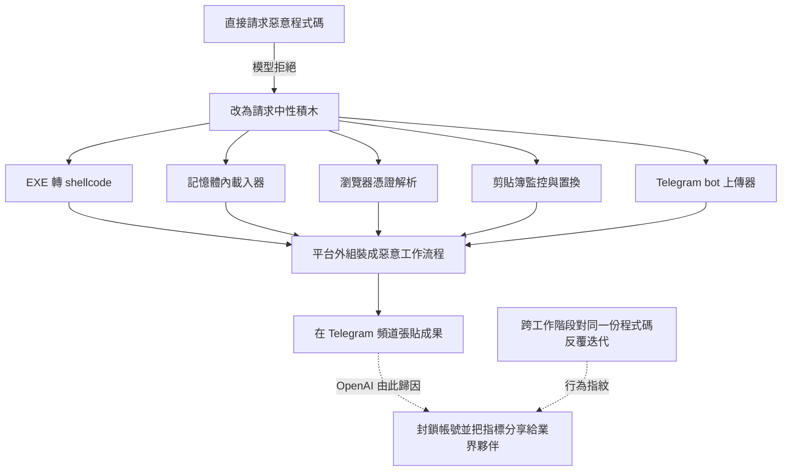
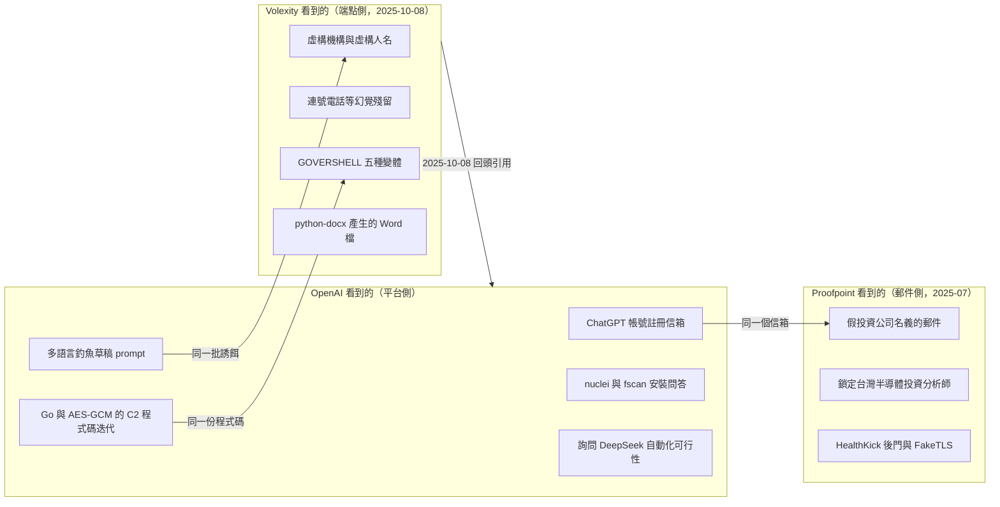
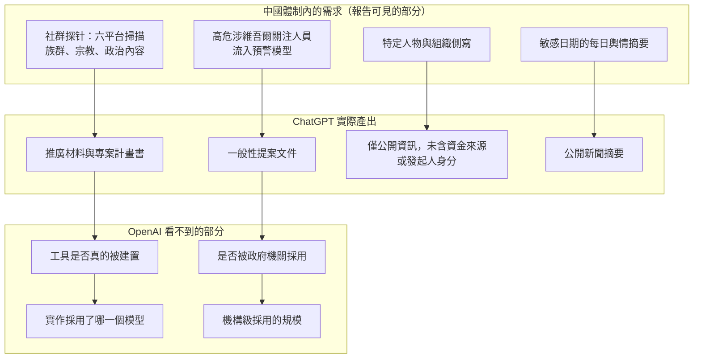
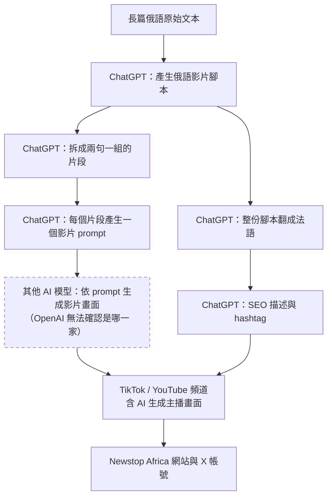
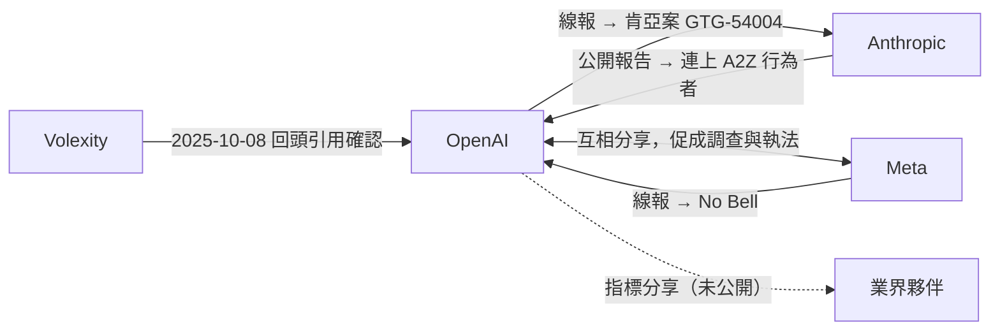
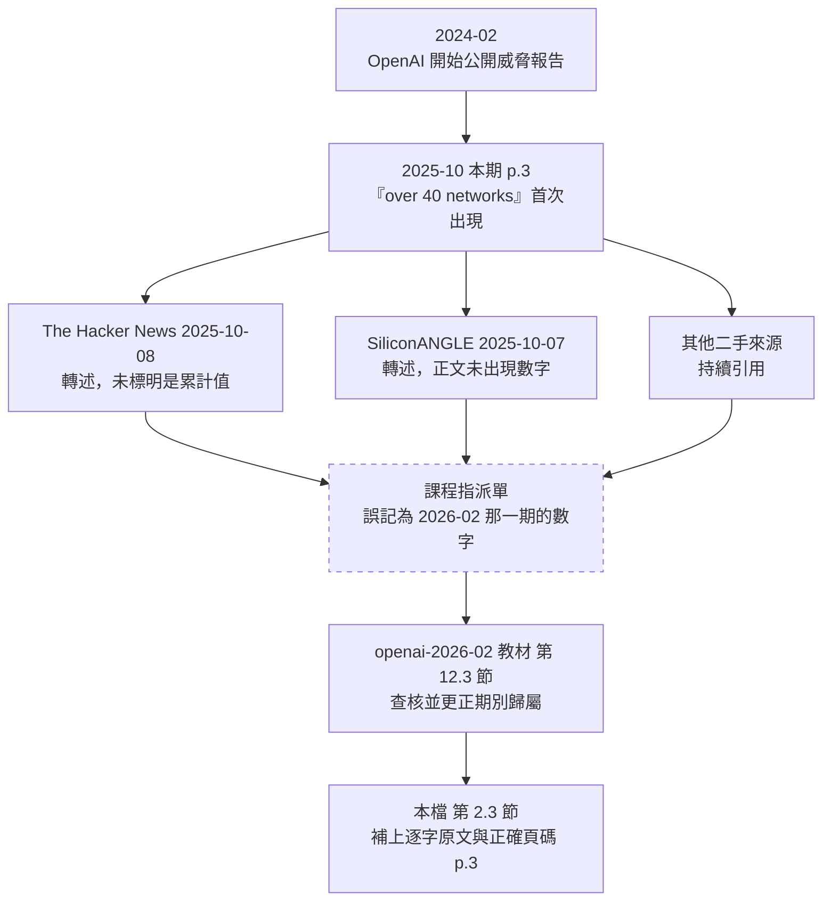
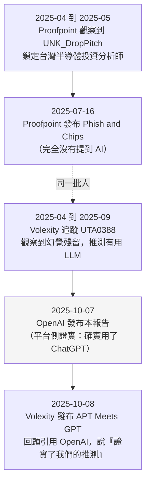

# OpenAI《Disrupting malicious uses of AI: October 2025》（2025 年 10 月）

> 課程模組：09 延伸研究 ｜ 來源類型：官方威脅報告 ｜ 原文：https://openai.com/global-affairs/disrupting-malicious-uses-of-ai-october-2025/ ｜ 整理日期：2026-09-14

> **頁碼標註約定**：本份 PDF 共 37 頁，每頁頁尾的印刷頁碼與 PDF 檔案頁次**完全一致**（第 3 頁的頁尾就寫 3），所以本檔寫 `p.13` 時，兩種數法都指同一頁。這一點和同資料夾的 OpenAI 2026-02 教材不同（那一份差 2 頁），引用時不要沿用舊習慣。

> **標題說明**：這份文件有四個標題版本，必須分清楚。
> - 官方頁面標題：**Disrupting malicious uses of AI: October 2025**（本檔與 meta.json 以此為準）
> - PDF 封面大標：**Disrupting malicious uses of AI: an update**
> - PDF 檔案中繼資料（Title 欄位）：**Disrupting malicious uses of our models: an update, October 2025**
> - PDF 每頁頁尾與目錄首行：**Disrupting malicious uses of AI: October 2025**
>
> 四者指同一份文件。寫參考文獻時建議用官方頁面標題，並在註腳標明 PDF 封面用的是 an update 版本。這種「同一份報告四個標題」的狀況在 AI 廠商威脅報告裡很常見，是引用管理的實務陷阱。

---

## 1. 一頁速覽

1. **這是什麼**：OpenAI 威脅情報團隊於 **2025-10-07** 發布的威脅報告，PDF 共 37 頁，收錄 **7 個案例群**：3 件網路行動（俄語惡意程式開發、韓語 C2 開發、中文「Phish and Scripts」）、1 件詐騙彙整（柬埔寨／緬甸／奈及利亞）、1 件威權濫用彙整（中國）、2 件隱蔽影響力行動（俄羅斯 Stop News 累犯、中國 Nine—emdash Line）。**六位具名作者**列在 p.37，由 Ben Nimmo 領銜。

2. **「超過 40 個網絡」這個數字就出在這一期**。原文在 p.3 執行摘要：「Since we began our public threat reporting in February 2024, we've disrupted and reported over 40 networks that violated our usage policies.」同資料夾的 OpenAI 2026-02 教材已經正確指出這個數字**不屬於 2026-02 那一期**，本檔提供出處的逐字原文與正確頁碼（**p.3，不是 p.4**）。這是模組 09 的一次內部交叉校正，細節見第 2.3 節與第 4.10 節。

3. **本期的核心論點只有一句話：AI 被裝進舊流程，而不是圍繞 AI 建立新流程。** 原文標題就是「Building AI into existing workflows」。三個網路行動案全部以「we found no evidence of new tactics or that our models provided threat actors with novel offensive capabilities」收尾，詐騙章也說「fitting AI into existing scam playbooks, rather than creating new playbooks built around AI」。**這是與 Anthropic 2026-09 報告最根本的判斷分歧**，也是本檔第 4 節的主軸。

4. **破折號攻防戰是這份報告最有名的細節，而它同時是一個方法論陷阱。** 柬埔寨的詐騙集團明確要求模型「移除輸出中的 em-dash」（p.4、p.22）；但**同一份報告在解釋 em-dash 時，括號裡示範用的字元其實是 en dash（U+2013）而不是 em dash（U+2014）**，而報告自己的正文又用了 3 個真正的 em dash。一份教別人辨識 AI 破折號的報告，自己的破折號用法就不一致。這件事本身就是最好的課堂教材。

5. **中國影響力行動「Nine—emdash Line」的命名，就是拿 em dash 開玩笑**：南海「九段線」（Nine-Dash Line）加上行動貼文裡沒刪掉的 em dash。它鎖定越南（南海環境議題）、菲律賓總統小馬可仕（毒品醜聞、選舉操縱）、香港民主運動人士（粵語留言），外加少量美國議題。Breakout Scale 評為 **Category 2**。

6. **對台灣而言，「Taiwan」在全報告只出現一次**（p.13），在「Phish and Scripts」案：該中文帳號群鎖定**台灣半導體產業、美國學界與智庫、以及被中共稱為「五毒」的族群與政治團體**。這個案例與 Volexity 的 UTA0388、Proofpoint 的 UNK_DROPPITCH 是**同一批人**，而且 **Volexity 在隔天（2025-10-08）發文明確回頭引用 OpenAI 這份報告，說它證實了 Volexity 原先的推測**。這是全報告唯一有「廠商對廠商、指名道姓」獨立佐證的案例。

7. **威權濫用章揭露了兩份提案，而不是兩套系統**。一個中國用戶請 ChatGPT 協助設計社群「探针」工具的推廣材料與專案計畫書（可掃 X／Facebook／Instagram／Reddit／TikTok／YouTube，尋找極端言論與族群、宗教、政治內容）；另一個用戶請模型寫「**高危涉维吾尔关注人员流入预警模型**」的提案（比對交通訂票紀錄與警方紀錄，預警「涉維吾爾高風險人員」的移動）。**兩案模型都沒有實作，OpenAI 也明說無法證實這些工具是否真被中國政府使用。** 這與 Anthropic 2026-09 的 GTG-14022、GTG-14021 是同一條需求線的不同觀測點。

8. **這份研究在課程裡要教什麼**：教學員處理「**同一批人、兩家廠商、三份報告**」的情報三角。Phish and Scripts 這一案有 OpenAI（平台側 prompt 遙測）、Volexity（受害端 telemetry 與惡意程式逆向）、Proofpoint（郵件側與更早的 HealthKick）三個獨立觀測站，而且三方看到的東西**互不重疊卻互相咬合**。把這三份並讀，學員才會理解什麼叫「可見性矩陣」，以及為什麼任何單一廠商的「我們沒看到新能力」都不是全貌。

---

## 2. 報告基本資料

| 項目 | 內容 |
|---|---|
| 機構 | OpenAI |
| 團隊 | 報告未標示團隊名稱，但 **p.37 具名列出六位作者**：Ben Nimmo、Kimo Bumanglag、Michael Flossman、Nathaniel Hartley、Jack Stubbs、Albert Zhang。內文以「we」「our investigators」「an OpenAI investigator」自稱 |
| 官方頁面標題 | Disrupting malicious uses of AI: October 2025 |
| PDF 封面標題 | Disrupting malicious uses of AI: an update |
| PDF 中繼資料標題 | Disrupting malicious uses of our models: an update, October 2025 |
| 發布日期 | **2025-10-07**（官方頁面在本檔製作時回 HTTP 403 無法直讀，日期依 SiliconANGLE 2025-10-07 的同日報導、The Hacker News 2025-10-08、Volexity 2025-10-08 三方交叉確認；PDF 封面只寫「October 2025」） |
| 形式 | 37 頁 PDF，約 13 MB。**有目錄與 PDF 書籤（outline）**，這一點比 Anthropic 那份 154 頁無書籤的 PDF 友善 |
| PDF 直連 | `https://cdn.openai.com/threat-intelligence-reports/7d662b68-952f-4dfd-a2f2-fe55b041cc4a/disrupting-malicious-uses-of-ai-october-2025.pdf` |
| PDF 產生工具 | 中繼資料 producer 欄位為 `Skia/PDF m142 Google Docs Renderer`，即**從 Google Docs 直接匯出**。沒有建立日期與修改日期欄位 |
| 涵蓋期間 | **報告未明示整體涵蓋區間**。唯一明確的區間陳述在詐騙章 p.18：「In the last three months, we've disrupted scam networks that likely originated in Cambodia, Myanmar and Nigeria」。其他可辨識時點從 2024-10（Stop News 前案）延伸到 2025-09-01（p.34 推文時間戳） |
| 涉及的模型或產品 | **ChatGPT**。報告全文不標示模型版本號；唯一可見的版本資訊藏在 **p.19 的截圖裡：介面顯示「ChatGPT 4o」**。另有 API 相關描述但未指名客戶類型（與 2026-02 那期明說「one API customer」不同） |
| 資料來源類型 | (1) **平台遙測**：被封鎖帳號的 prompt 與 completion，這是主要證據；(2) **OSINT**：X、TikTok、YouTube、Instagram、WhatsApp 的比對，p.33 明說「Using open-source techniques, we identified the content being posted on TikTok」；(3) **同業研究報告**：Trellix（韓語案）、Proofpoint 與 Volexity（Phish and Scripts）、ASPI（Nine—emdash Line 的影片）、VIGINUM（Stop News）；(4) **同業線報與協同**：p.22 明說 OpenAI 與 Meta 互相分享威脅行為者資訊；p.4 明說 Anthropic 的報告讓 OpenAI 得以把某 IO 連回自家 2024 年的 A2Z 行動 |
| 與前後期報告的關係 | 這是 OpenAI 威脅報告系列的一期。內文回指 2024-05（Spamouflage 用 ChatGPT）、2024-10（Stop News 原案）、2025-02（中國社群監聽工具案）、2025-06（PRC 自主式 AI 進展、簡訊詐騙案）。下一期是 2026-02（見同資料夾 `openai-2026-02-disrupting-malicious-uses.html`） |

### 2.1 這份報告在 OpenAI 系列中的位置

| 期別 | 本期引用它的地方 | 關鍵內容 |
|---|---|---|
| 2024-02 | p.3「Since we began our public threat reporting in February 2024」 | 系列起點，也是「超過 40 個網絡」的起算點 |
| 2024-05 | p.31「whose use of ChatGPT we wrote about in May 2024」 | 首度揭露 Spamouflage 使用 ChatGPT |
| 2024-10 | p.26「the covert influence operation we wrote about in October 2024 as "Stop News"」 | Stop News 原案；本期是它的**累犯**續篇 |
| 2025-02 | p.24「We reported in February on one such case, aimed at designing an AI-powered social media listening tool the operators claimed was for the Chinese security forces」 | 中國社群監聽工具的**前案** |
| 2025-06 | p.21「similar to the case that we reported in June」；p.23「As we wrote in June, the PRC is making real progress in advancing its autocratic version of AI」 | 簡訊詐騙前案；PRC 威權 AI 的政策論述前身 |
| **2025-10（本期）** | 7 案；**「超過 40 個網絡」的出處**；三大趨勢（裝進舊流程／多模型並用／適應與混淆） | 本檔主體 |
| 2026-02 | 本期是它的前一期 | 7 案；中國公安「網絡特戰」為壓艙石；見 `openai-2026-02-disrupting-malicious-uses.html` |

> **教學提示**：這張表本身就是一個練習。OpenAI 的報告用超連結回指前作，但 **PDF 版把超連結的錨文字留下、URL 藏在連結裡**，純文字抽取會丟掉目標網址。要追前作只能靠「月份 + 描述」去比對，這是讀 PDF 版威脅報告的固定摩擦。

### 2.2 報告結構與案例的固定欄位

目錄（p.2）只有兩層：

```
Disrupting malicious uses of AI: October 2025 .................. 2
Executive Summary .............................................. 3
Case studies ................................................... 6
  Cyber Operation: Russian-speaking malware tooling development . 6
  Cyber Operation: Korean-language operators ................... 10
  Cyber Operation: Phish and Scripts ........................... 13
  Disrupting and exposing scam operations ...................... 18
  Disrupting authoritarian-linked abuses of AI:
    the example of the People's Republic of China (PRC) ........ 22
  Recidivist Influence Activity: "Stop News" ................... 26
  Covert IO: Operation "Nine—emdash Line" ...................... 31
Authors ....................................................... 37
```

結構上有四件事值得注意：

- **案例欄位不統一**。三個網路行動案與兩個影響力行動案用固定四段式：`Actor`（誰、在哪、歸因信度）、`Behavior`（做了什麼）、`Completions`（模型實際產出了什麼）、`Impact`（處置與影響評估）。但**詐騙章與威權濫用章完全不用這套欄位**，改用自由散文加小標題。這代表這兩章在編輯上被當成「主題彙整」而非「單一案例」，也代表它們的證據標準比較寬鬆。
- **只有兩個案例附 TTP 對應表**（p.8 俄語案、p.16 Phish and Scripts），而且用的是報告自稱的 **LLM ATT&CK Framework**，不是 MITRE ATT&CK。韓語案沒有表。詳見第 5 節。
- **沒有 IOC 表、沒有附錄、沒有方法論章節、沒有致謝。** 全報告唯一的 defang 指標是 `newstop[.]africa`（p.27）。
- **執行摘要佔 3 頁（p.3 到 p.5），比例很高**，而且它不是案例摘要，是**趨勢論述加政策論述**。政策段落（democratic AI、OSTP 提案）在 p.3 與 p.23 各出現一次，**同一段文字幾乎逐字重複**。這是刻意的訊息重複，教學時值得指出：威脅報告同時是政策文件。

### 2.3 「超過 40 個網絡」這個數字的完整考證

課程指派單與多數媒體都提到這個數字。以下是逐字出處與可追溯的引用鏈：

**原文（p.3，Executive Summary 第三段開頭）：**

> "Since we began our public threat reporting in February 2024, we've disrupted and reported over 40 networks that violated our usage policies. By analyzing and comparing these networks, we can identify trends in how uses of AI are evolving:"

三個必須講清楚的細節：

| 細節 | 內容 | 為什麼重要 |
|---|---|---|
| **頁碼** | 在 **p.3**（PDF 第 3 頁，頁尾印刷頁碼也是 3） | 同資料夾的 `openai-2026-02-disrupting-malicious-uses.html` 兩處把它寫成「PDF 第 4 頁」，實際在 p.3。本檔據原文更正 |
| **語意** | 是「**disrupted and reported**」的累計，不是「本期處置了 40 個」，也不是「目前偵測到 40 個」 | 這是**跨 20 個月的累計值**，把它當單期戰果引用就是誇大 |
| **定義** | 報告**沒有定義什麼算一個「network」**。本期自己收錄的 7 個案例群裡，至少有 3 個（詐騙章、威權濫用章、以及俄語案的「多個帳號」）在內部就包含多個可分離的叢集 | 分母不明的累計數字。課堂上要教學員問：**一個網絡的計數單位是什麼？** |

**引用鏈的下游**：本檔查到的第三方報導中，The Hacker News（2025-10-08）與 SiliconANGLE（2025-10-07）都轉述了這個數字，但**都沒有標註它是累計值**。SiliconANGLE 的正文甚至沒有出現數字，只有導言提到。這是一個典型的「數字在轉述過程中脫離語境」案例，適合做引用查核演練（見第 10.3 節）。

---

## 3. 主要發現與案例逐一摘要

### 3.1 執行摘要點名的六條主線（p.3 到 p.5）

執行摘要用六個粗體小標把本期的論述骨架立起來。順序即優先級：

| # | 標題（原文） | 一句話 | 本檔對應段落 |
|---|---|---|---|
| 1 | **Building AI into existing workflows** | 威脅行為者把 AI 裝進既有流程，而不是圍繞 AI 重建流程 | 第 3.6 節、第 4.2 節 |
| 2 | **Usage of multiple models** | 行為者橫跨多個 AI 模型；含 DeepSeek 自動化探索、以及與 Anthropic 互指的 A2Z 連結 | 第 3.4 節、第 4.7 節、第 4.8 節 |
| 3 | **Adaptation and obfuscation** | 行為者移除已知的 AI 訊號，最著名的是 em-dash | 第 3.6 節、第 6.7 節 |
| 4 | **Authoritarian abuses of AI** | 中國政府關聯個人用 ChatGPT 產出大規模監控系統的提案 | 第 3.7 節、第 4.3 節 |
| 5 | **In the gray zone** | 大量活動本身中性，脈絡才決定它是不是濫用 | 第 8.2 節 |
| 6 | **Progress against cyber operations** 與 **Spotting scams** | 沒有發現新戰術或新攻擊能力；且 ChatGPT 被用來**識別**詐騙的次數是被用來**進行**詐騙的三倍 | 第 3.5 節、第 8.5 節 |

三段必須逐字記住的原文：

> "Repeatedly, and across different types of operations, the threat actors we banned were building AI into their existing workflows, rather than building new workflows around AI."（p.3）

> 「一再地、而且跨不同類型的行動，我們封鎖的威脅行為者都是把 AI 裝進他們既有的工作流程，而不是圍繞 AI 建立新的工作流程。」

> "Importantly, we found no evidence of new tactics or that our models provided threat actors with novel offensive capabilities. In fact, our models consistently refused outright malicious requests."（p.5）

> 「重要的是，我們沒有找到新戰術的證據，也沒有證據顯示我們的模型提供了威脅行為者新的攻擊能力。事實上，我們的模型一貫拒絕了明目張膽的惡意請求。」

> "Our current estimate is that ChatGPT is being used to identify scams up to three times more often than it is being used for scams."（p.5，p.19 重複一次）

> 「我們目前的估計是，ChatGPT 被用來識別詐騙的頻率，最多可達被用來進行詐騙的三倍。」

**第三句要小心讀。**「up to three times」是上界不是點估計，報告**沒有給分母、沒有給量測方法、沒有給時間窗**。同一句在 p.5 與 p.19 出現兩次、措辭完全相同，顯示這是一句被精算過的訊息句。它可能是真的，但以情報標準衡量，它是**不可查核的自評**。第 10.2 節把它列為討論題。

### 3.2 案例一：Cyber Operation, Russian-speaking malware tooling development（p.6 到 p.9）

| 欄位 | 內容 |
|---|---|
| 類型 | 網路犯罪（惡意程式開發） |
| 行為者 | 多個 ChatGPT 帳號。「appear to be affiliated with Russian-speaking criminal groups」 |
| 歸因依據 | 觀察到他們**在專屬於這類行為者的 Telegram 頻道張貼自己活動的證據**；OpenAI 評估這是「a Russian-language operator managing multiple accounts and leveraging proxy and ephemeral hosting infrastructure」 |
| 歸因信度措辭 | `appear to be` 加上 `we assess`，屬於中等信度的分析判斷，不是事實直述 |
| 目標 | 報告未指明受害者，只說功能導向：竊取憑證與加密資產、隱蔽執行、管理隱蔽基礎設施 |
| 自主程度 | **純對話式協助**。原文明說「Our models were not used to execute any threat actor tooling and workflows」 |
| 處置 | 封鎖全部關聯帳號，並「shared relevant indicators with industry partners」（分享給業界夥伴，但**未對外公開**） |

**這一案最重要的是「積木法」這個描述**，它是全報告對「防線如何被繞過」最清楚的一段：

> "The model refused direct requests to generate malicious content, so typical operator use of the model involved eliciting building-block code (e.g., converting compiled executables into shellcode, designing in-memory loaders, or parsing browser credentials), which the threat actor then likely assembled into malicious workflows."（p.6）

> 「模型拒絕了直接產生惡意內容的請求，因此操作者對模型的典型用法，是套取積木式的程式碼（例如把編譯後的執行檔轉成 shellcode、設計記憶體內載入器、或解析瀏覽器憑證），威脅行為者再把這些組裝成惡意工作流程。」

接著是一句免責，這句話是整份報告的法理立場：

> "These outputs are not inherently malicious, unless used in such a way by a threat actor outside of our platform."（p.7）

> 「這些輸出本身並非惡意，除非被威脅行為者在我們的平台之外那樣使用。」

**技術內容清單**（p.7，Completions 段，防禦導向摘要）：

- 記憶體內執行與 shellcode 載入器的可運作程式碼與部署指引
- UAC、SmartScreen、Mark-of-the-Web 繞過
- 瀏覽器憑證與 cookie 擷取、app-bound 解密的 scaffold
- LevelDB 錢包解析；剪貼簿劫持與置換工具，含外傳
- RAT 元件，包含影像與輸入模擬（video and input emulation）
- 低階 PE 與 Win32 API、DPAPI 與 AES-GCM cookie 處理、Chrome DevTools 與 CDP 自動化
- 混淆與 crypter 模式（插入 padding 指令與垃圾序列）
- 剪貼簿監控、簡易外傳工具（Telegram bot uploader、archive-and-ship 腳本）

**一個容易被略過但很重要的觀察**（p.7）：

> "The threat actor made a mix of high- and lower-sophistication requests: many prompts required deep Windows-platform knowledge and iterative debugging, while others automated commodity tasks (such as mass password generation and scripted job applications)."

高低混雜的請求模式，加上「iterated on the same code across conversations, a pattern consistent with ongoing development rather than occasional testing」，構成 OpenAI 判定這是**持續開發而非偶發測試**的行為指紋。**這是本報告揭露的最可操作的偵測邏輯**：不是看單一 prompt 的內容，而是看**跨工作階段的程式碼演進連續性**。第 7.3 節把它整理成行為指標。



### 3.3 案例二：Cyber Operation, Korean-language operators（p.10 到 p.12）

| 欄位 | 內容 |
|---|---|
| 類型 | 網路行動（惡意程式與 C2 開發） |
| 行為者 | 一群 ChatGPT 帳號，操作者以**韓語**與模型互動 |
| 歸因 | **這是全報告歸因措辭最謹慎的一案**。指標與 **Trellix 的一份報告**重疊，該報告把類似活動連到針對**南韓境內外國使館**的魚叉式釣魚、**XenoRAT** 惡意程式、以及**以 GitHub 作為 C2** |
| 歸因限制（原文） | 「we are not able to independently make an attribution, and we also block access to our services from North Korea」 |
| 指標 | 韓語使用、活動時區符合 **UTC+8 與 UTC+9**、行動主題與題材 |
| 帳號結構 | **每個帳號專注一個用途**（Chrome 擴充轉 Safari 上架、設定 Windows Server VPN、開發 macOS Finder 擴充），不是一個帳號橫跨多領域；「many accounts active in narrow time windows」 |
| 自主程度 | 純對話式協助 |
| 處置 | 封鎖全部帳號，分享指標給夥伴 |

**這一案的歸因寫法是課堂精華。** OpenAI 一方面列出「與安全社群對北韓（DPRK）行為者的理解一致」，一方面立刻聲明「我們無法獨立做出歸因」，還補上「我們本來就封鎖來自北韓的存取」。三句話同時達成三件事：提供有用線索、保留免責、暗示行為者使用了跳板或代理。**這是威脅情報寫作的標準防禦性措辭，值得逐句拆給學員看。**

**AI 用途清單**（p.11）：

- Implant 與 RAT 相鄰開發：reflective DLL loading、記憶體內執行、Windows API hooking
- 憑證竊取：Chrome 與 Edge 的 DPAPI 工作流程，擷取瀏覽器加密金鑰、cookie、已存密碼
- 釣魚誘餌：**韓語**釣魚內容，主題多為加密貨幣、政府機構、金融服務商；HTML 混淆；**代理 reCAPTCHA 以製作可信的登入頁**
- macOS 開發 scaffolding：Finder 與 Safari 擴充開發、產生 App Store 隱私政策範本
- 加密貨幣操作：API 呼叫與錢包互動的排錯
- 雲端暫存：pCloud、file.io、GDrive 直連構造與 API 腳本；GitHub raw content 取用與 token 處理

**最關鍵的一句否定證據**（p.11）：

> "We did not find evidence that malicious binaries used in the campaigns described by Trellix were generated with our models. It is possible that the same operators were using our models while staging payloads through developer and cloud platforms."

> 「我們沒有找到證據顯示 Trellix 所述行動中使用的惡意二進位檔是用我們的模型產生的。有可能是同一批操作者一邊使用我們的模型，一邊透過開發者與雲端平台暫存酬載。」

**這句話定義了平台可見性的邊界**：OpenAI 看得到 prompt，看不到成品。連結兩端的工作必須由端點側的研究者（Trellix）來做。第 4.9 節的「可見性矩陣」就建立在這種落差上。

**偽 reCAPTCHA 值得單獨標註。** 代理 reCAPTCHA 來製作 look-alike verification pages，是 2024 到 2025 年間迅速普及的手法（假驗證頁與 ClickFix 家族）。它在 ATT&CK 的對應見第 5.2 節。對 SOC 而言，這是本案唯一可以直接轉成偵測規則的技術面線索。

### 3.4 案例三：Cyber Operation, Phish and Scripts（p.13 到 p.17）

**這是與台灣關係最直接、也是全報告唯一有指名第三方獨立佐證的一案。**

| 欄位 | 內容 |
|---|---|
| 類型 | 國家關聯網路間諜（釣魚與工具開發） |
| 行為者 | 一群 ChatGPT 帳號，與業界追蹤的 **UNK_DROPPITCH（Proofpoint）** 與 **UTA0388（Volexity）** 重疊 |
| 關鍵歸因證據 | 「in at least one case, the email address that was used to register a ChatGPT account was also reportedly used to send phishing messages」。**註冊信箱與釣魚寄件信箱相同**，這是強度很高的樞紐指標 |
| 歸因措辭 | 「displayed hallmarks consistent with cyber operations conducted to service PRC intelligence requirements」。**是 consistent with，不是 attributed to** |
| 目標（p.13） | **台灣半導體產業**、美國學界與智庫、以及「organizations associated with ethnic and political groups critical of the CCP (sometimes described as the "five poisons")」 |
| 語言 | 中文（**簡體與繁體都有**）、英文、日文 |
| 技術成熟度 | 「a technically competent but unsophisticated actor」。原文舉的例子很精準：他們與模型討論了用 AES 保護 C2 流量的多個面向與細節，**卻仍然使用簡單的靜態金鑰** |
| 惡意程式關聯 | Go 語言開發的實作細節與 **GOVERSHELL（Volexity）** 或 **HealthKick（Proofpoint）** 的業界報告重疊 |
| 跨模型行為 | 「the operators researched further automation that could be achieved via **DeepSeek**」，探索用外部 LLM API 自動產生目標名單與客製內容，**OpenAI 無法確認他們是否真的執行了** |
| 自主程度 | 對話式協助為主；但 DeepSeek 那條線是**朝向端到端自動化釣魚**的探索 |
| 處置 | 封鎖帳號，分享指標給業界夥伴 |

**釣魚劇本的公式化程度（p.14）是本案最好的教材**：

> "The actors' playbook for creating phishing content was detailed and formulaic, consistent with targeting a closely defined demographic. Typically, they would generate a concise, formally polite email from an academic, industry, or conference persona. The threat actors often asked to adjust the tone, swap terms for regional usage, or add specific institutional references."

三個微調動作值得寫進講義，因為它們正好對應三種人類專家能力被 AI 取代：

| 微調動作 | 過去需要什麼 | AI 提供了什麼 |
|---|---|---|
| adjust the tone | 目標文化的語感 | 語域與禮貌層級的調整 |
| swap terms for regional usage | 知道台灣寫「晶圓廠」、中國寫「晶圆厂」 | **簡繁與地區用語的自動切換** |
| add specific institutional references | 對目標機構的背景知識 | 機構脈絡的填充 |

**但 AI 沒有補上的破綻**（p.14）：

> "Although these targeted micro-edits suggest a concerted effort to raise the quality of their initial content, the threat actors failed to correct some giveaway details such as implausible example contact details included in their signature blocks."

**署名區塊裡留著不合理的範例聯絡資訊。** 這個破綻和 Volexity 獨立觀察到的「不存在的機構（Copenhagen Governance Institute）、不存在的人（Dr. Michael Andersen）、連號電話（3 45 67 89）」是同一類 LLM 幻覺殘留。**兩家從完全不同的觀測位置看到同一種殘留，這是本案最有力的交叉印證**，見第 9 節。

**技術請求清單**（p.14 到 p.15，防禦導向摘要）：

- 加密 C2 與遠端執行：Go client-server、AES-GCM 訊息加密、session rekeying、system-info beacon、透過標準 web 協定或 WebSocket 通道下達 PowerShell 指令的 server console
- 流量保護與 OPSEC：從 WebSocket 轉 `wss://`、從 HTTP 轉 HTTPS、部分測試中停用憑證檢查、透過 CDN 與 TLS 前端混合流量、處理過大訊息避免 client 崩潰
- 偵察與行程控制：以 PowerShell 探查防毒、行程列舉、終止特定 Edge 與 WebView2 行程
- 商品化掃描工具：在商用 Linux 基礎設施上安裝與使用 **nuclei**、**fscan**，並保存結果供後續檢視
- 釣魚內容：多語言草擬，依在地規範調整主旨與文風
- 簡易混淆與 OPSEC 修飾：重新命名函式、調整標頭、隱藏字串

**Impact 段的收尾句是全報告對 uplift 最精確的一句**（p.17）：

> "The tradecraft advantage sought through model assistance came from linguistic fluency, localization, and persistence: likely fewer language errors, faster glue code, and quicker adjustments when something failed."

> 「透過模型協助所尋求的技藝優勢來自語言流暢度、在地化與持續性：可能是更少的語言錯誤、更快的膠水程式碼、以及某個環節失敗時更快的調整。」

**請注意這句話說了什麼、又沒說什麼。** 它承認了三種優勢（語言、速度、韌性），卻同時被歸類為「no novel offensive capabilities」。這正是第 4.2 節要拆的爭點：**把「能力」定義成「新戰術」，就會得到「沒有 uplift」的結論；把「能力」定義成「單位時間內可執行的作戰量」，同一組事實就會得到相反的結論。**



### 3.5 案例四：Disrupting and exposing scam operations（p.18 到 p.22）

這一章不是單一案例，是**三個國家、至少四個可分離叢集的彙整**，而且**不使用四段式欄位**。

| 叢集 | 歸因措辭 | AI 做了什麼 | 特徵 |
|---|---|---|---|
| 柬埔寨與奈及利亞的「投資公司」 | 「likely originating in Cambodia and Nigeria」 | 產生與翻譯往來訊息、產製網站與社群內容、基礎研究 | 假冒投資公司、架設網站與線上廣告、以假冒交易專家的帳號邀人進私人訊息群組、誘導入金到虛構交易平台 |
| 緬甸的詐騙中心 | 「**highly likely** located in Myanmar」（本章最高信度措辭） | 既產製詐騙內容，也做**日常行政**：排班、內部公告、**宿舍與座位分配**、財務帳目管理 | 「Some operators asked about the criminal penalties for people caught conducting online scams」（有操作員詢問從事線上詐騙被抓到的刑責） |
| 柬埔寨的假人設叢集 | 「likely Cambodia-origin」 | 為假投資專家與假交易公司員工產生**詳細傳記**，再以該角色的口吻寫社群訊息；**把目標的回覆貼進模型，請模型以假人設繼續對話** | 人設的深度經營 |
| 柬埔寨的簡訊與 WhatsApp 叢集 | 「likely originating in Cambodia」 | 產生冷接觸簡訊，大量發送到**美國電話號碼** | **整群對話一次從中文翻譯成整塊英文**，見下 |
| 奈及利亞的投資詐騙 | 「**very likely** originating in Nigeria」 | 請模型逐步指導：如何用社群廣告觸及**拉丁美洲的富人**、如何遮蔽所在位置、如何規避社群平台限制 | **把平台公開服務條款餵給模型，請模型審查廣告內容是否合規** |

**三個小標題本身就是本章的論證骨架**：

1. **Old tricks, AI tools**（p.19 到 p.20）：「The majority of the scam activity we disrupted centered on fitting AI into existing scam playbooks, rather than creating new playbooks built around AI. All of the scam operations we have identified and banned this year primarily used AI as a **scaling and efficiency tool**.」
2. **All scammers are equal, but some are more AI-qual than others**（p.20 到 p.21）：一個歐威爾式雙關的標題，講 AI 使用深度的分布不均。多數互動只是翻譯，少數行動企圖心大得多。
3. **Obfuscation and excuses**（p.21 到 p.22）：破折號移除，以及把平台封鎖歸咎於「競爭對手惡意檢舉」的話術。

**最值得逐字記下的是假群組那一段**（p.21）：

> "if a potential target joined one of these groups, they would quickly witness a "conversation" between half a dozen different accounts, all talking about investment. One of these posed as the "investment expert", while the rest posed as investors with varying degrees of confidence and experience. **Every part of this conversation was generated by the scammers, who translated it in a single block from Chinese** - likely to create the impression of a vibrant group of keen and successful traders."

> 「如果潛在目標加入了其中一個群組，他們會立刻看到六個左右不同帳號之間的一場『對話』，全都在談投資。其中一個假扮『投資專家』，其餘的假扮信心與經驗程度不一的投資人。**這場對話的每一個部分都是詐騙者產生的，他們把整段一次從中文翻譯過來**，很可能是為了營造出一個熱絡、積極且成功的交易者社群的印象。」

**「一次整塊翻譯」這個細節是可操作的偵測線索。** 如果一個群組裡六個不同「人」的發言是同一次翻譯產出的，那麼它們會共享同一套譯文特徵：一致的術語選擇、一致的標點習慣、一致的句長分布，以及**缺乏個體間的語域差異**。真實的六個人不會有這種一致性。這個訊號比「有沒有 em dash」穩健得多，因為它是**群體層級的統計特徵**，不是單一字元。第 10.3 節有對應的演練設計。

**另一個結構性觀察**：緬甸那一叢集用 ChatGPT 做**宿舍與座位分配**。這意味著模型看到的不只是詐騙話術，而是**一個園區的內部行政資料**。這與 Anthropic GTG-15001 的觀察方向一致：AI 在詐騙產業裡的角色，有一半是**管理中介層**，不是話術產生器。對照見第 4.4 節。

**防禦面的正向發現**（p.18 到 p.19）：

> "We have seen evidence of people using ChatGPT to help them identify and avoid online scams **millions of times a month**; in every scam operation in this report, we have seen the model help people correctly identify the scam and advise them on appropriate safety measures."

這是本報告唯一的「防禦端量化」，而且給了一個具體量級（每月數百萬次）。**但它與「三倍」那句話用的是不同的量測**（一個是絕對次數，一個是比值），報告沒有說明兩者的關係。

### 3.6 案例五：Disrupting authoritarian-linked abuses of AI, the example of the PRC（p.22 到 p.25）

**這一章在課程裡的份量最重，因為它與模組 03 監控直接對接。** 它同樣不用四段式欄位，而且開頭有整整一頁的政策論述（p.23），把 OSTP 提案與「democratic AI」的主張逐字重複了一次。

**報告自己先設下的四道限制**（p.23，這段必須完整教）：

> "This study is based on a selection of our disruptions of violating activity that we identified and banned. That activity was consistent with **individual users** using ChatGPT, rather than large-scale, institutional adoption of our models. As such, it is a **limited snapshot** of the usage of different AI models in this context."

四道限制拆開來是：

1. 這是**選樣**（a selection），不是全集。
2. 證據**只到個人使用層級**，看不到機構級採用。
3. 這是**有限的快照**，不是趨勢量測。
4. 「different AI models」這個說法承認：**中國體制內的主力多半不在 ChatGPT 上**。

**兩個大規模監控提案（p.24）**

| 提案 | 原文名稱 | 描述 | OpenAI 的驗證狀態 |
|---|---|---|---|
| 社群「探针」 | 描述為 social media **'probe'（探针）** | 可掃描 **Twitter/X、Facebook、Instagram、Reddit、TikTok、YouTube**，尋找使用者所稱的「極端言論」以及**族群、宗教與政治內容**。用戶請 ChatGPT 協助設計**推廣材料與專案計畫書**，聲稱是給政府客戶用的 | 「We are unable to independently verify if this tool has been used by a Chinese government entity.」用戶**可能用 VPN 從中國存取** |
| 維吾爾人員預警模型 | **High-Risk Uyghur-Related Inflow Warning Model（高危涉维吾尔关注人员流入预警模型）** | 分析**交通訂票資料**並與**警方紀錄**比對，以**預警被歸類為「涉維吾爾且高風險」者的移動**。報告特別指出這是一個**未定義的類別**（an otherwise undefined category） | 用戶「likely connected to a government entity」。「The user did not ask our model to help build such a tool, only to develop a general proposal」 |

**三個必須講清楚的層次**：

1. **模型沒有執行監控。** 原文兩次強調「These users typically asked ChatGPT to help design such tools or generate promotional materials about them, **but not to implement the monitoring**」。
2. **提案不等於系統。** OpenAI 無法確認這些工具是否存在、是否被政府使用、甚至是否用 ChatGPT 之外的技術實作。
3. **但提案本身就是情報。** 一份標題寫著「高危涉维吾尔关注人员流入预警模型」的計畫書，揭露的是**需求的存在與其官僚語言**：它把人分類成「涉維吾爾關注人員」，再把「高危」當成可計算的屬性，然後用交通訂票資料做預警。**這是把行政歧視工程化的語法**，而這個語法只有在體制內部才會這樣寫。

**側寫與研究（p.25）**

| 行為 | 模型的實際回應 |
|---|---|
| 請 ChatGPT 找出一個**批評中國政府的 X 帳號的資金來源** | 「our models only returned publicly available information, which did not include sensitive details such as funding sources」 |
| 請 ChatGPT 找出**蒙古一場請願的發起人** | 同上，未包含請願發起人的身分 |
| 請 ChatGPT 辨識並摘要與中國相關的每日突發新聞，含**六四天安門事件週年**與**達賴喇嘛生日**等敏感題材 | 報告形容這是「使用我們的模型作為開源研究工具，類似早期使用者會用網際網路或社群搜尋的方式」 |

**注意 OpenAI 在這裡做的事**：它同時宣告「模型沒有洩漏敏感資訊」（防線有效）與「這些請求構成違規」（處置正當）。**這兩件事之間有一個沒有被說明的推論**：如果模型只回傳了公開資訊、且未造成實際危害，封鎖的正當性基礎是什麼？答案顯然是「意圖」而非「結果」，但報告沒有明說。這是第 10.2 節的討論題之一。



### 3.7 案例六：Recidivist Influence Activity, "Stop News"（p.26 到 p.30）

| 欄位 | 內容 |
|---|---|
| 類型 | 隱蔽影響力行動（**累犯**，recidivist） |
| 行為者 | 源自俄羅斯，「appeared consistent with an operation run by a **marketing company**」 |
| 前案 | OpenAI 2024-10 報告的 "Stop News" |
| 品牌 | **Newstop Africa**，網域 `newstop[.]africa`；另有假冒非洲與英國新聞媒體的網站群 |
| 內容主軸 | 法語：批評法國與美國在非洲的角色，讚揚俄羅斯；英語：批評烏克蘭及其國際支持者；另有**俄羅斯商業公司的推廣素材，含無照線上賭博廣告** |
| 跨模型 | 用 ChatGPT 產生**影片 prompt**，供其他 AI 模型使用；AI 主播畫面「do not appear to have been generated using our models」 |
| Breakout Scale | **從 Category 3 下修為 Category 2** |
| 處置 | 封鎖帳號 |

**與前案相比的三個變化（p.26 到 p.28）**：

1. **圖片生成比例大幅下降**。原案「unusually prolific in its use of imagery」，本次以文字為主。OpenAI 引用法國 **VIGINUM** 的評估佐證：「since the publication of the Meta and OpenAI reports, the use of AI-generated images has fallen drastically」。**這是一個罕見的、有外部機構背書的「揭露產生了行為改變」的證據。**
2. **轉向短影音**。固定三步驟：輸入長篇俄語文本請模型產生影片腳本，請模型翻成法語，請模型產生 SEO 最佳化的描述與 hashtag。
3. **最精緻的一種用法：用 ChatGPT 產生給其他模型用的影片 prompt。** 流程是先產生俄語影片腳本，**拆成兩句一組的片段**，每個片段生成一個影片 prompt，再把整份腳本翻成法語。

**這第三點是本報告對「多模型並用」最具體的證據，也是本案在課程裡最重要的內容。** 它顯示了一種分工：**用一個模型當編排器（orchestrator），把任務拆解並翻譯成另一個模型的輸入格式。** 這是「AI 作為生產線中介」的早期形態。



**影響評估的數字（p.30），這一段的誠實度很高，值得完整抄錄**：

| 資產 | 數字 |
|---|---|
| Newstop Africa 主要 X 帳號 | 2025 年 8 月時**僅 172 名追蹤者**；依 X 的 Top tweets 功能，任一貼文的**最高轉推數為 4** |
| YouTube 與 TikTok 的 AI 主播頻道 | 各約 **1,900 名追蹤者** |
| TikTok 頻道 | **5,855 個讚**，56 支影片，平均每支 105 個讚；**最高觀看 63,300，最低 87** |
| YouTube 頻道 | 50 支影片約 **255,000 次觀看**，平均每支 5,100；**最高 37,000，最低 126** |
| 外溢 | 「we see no evidence of these videos having been re-shared, cited in the media, or otherwise achieved wider resonance」 |

**Breakout Scale 下修的理由是課堂上最好的「情報自我更正」範例**（p.30）：

> "Our original assessment of this operation in our October 2024 report was that it reached Category 3 on the Breakout Scale, based largely on a number of apparent "information partnerships" that appeared to have been set up with UK-based websites. However, subsequent research by VIGINUM and open-source researchers demonstrated that these "partnerships" were likely fictional, and "exploited technical flaws on these external sites" to add content without the administrators' knowledge. On this basis, we would currently assess that this operation's activity is more appropriately in Category 2."

> 「我們在 2024 年 10 月報告中對此行動的原始評估是它達到 Breakout Scale 的第三級，主要依據是一些看似與英國網站建立的『資訊夥伴關係』。然而 VIGINUM 與開源研究者的後續研究證明，這些『夥伴關係』很可能是虛構的，而且『利用了這些外部網站的技術缺陷』在管理員不知情的情況下加入內容。基於此，我們目前會評估這個行動的活動更適合歸在第二級。」

**這一段同時示範了三件事**：

1. **公開修正自己先前的評級**，而且說明了新證據來自誰。
2. **「被駭進去插內容」與「建立合作關係」在外觀上幾乎相同**。影響力行動的評級高度依賴「內容如何進入正當媒體」這個判斷，而這個判斷很容易被行動方偽造。
3. **Breakout Scale 的等級不是永久標籤**，它是隨證據更新的估計值。Anthropic 2026-09 影響力章也使用同一套量表，見 `../02-influence/00-influence-intro-and-breakout-scale.html`。

### 3.8 案例七：Covert IO, Operation "Nine—emdash Line"（p.31 到 p.37）

| 欄位 | 內容 |
|---|---|
| 類型 | 隱蔽影響力行動 |
| 行為者 | 「a **small network** of ChatGPT accounts potentially affiliated with a covert influence operation **originating from China**」 |
| 命名由來 | 南海「**Nine-Dash Line**（九段線）」加上行動貼文裡沒刪掉的 **em-dash**。原文：「Given that context and the operation's use of AI-generated text that included em-dashes in its posts, we have named this operation 'Nine—emdash line'」 |
| 主題與語言 | 英語：越南在南海的「環境影響」、批評菲律賓總統 **Ferdinand Marcos**、少量美國議題（**fentanyl 危機**、移民）；**粵語**：針對香港民主運動政治人物與行動者的批評或貶損留言 |
| 平台 | 主要是 **X**，另有 **Instagram**、**TikTok** |
| 與 Spamouflage 的關係 | 「bore some resemblance to the long-running China-origin operation known as "Spamouflage"」，但**明說未發現技術連結**（we did not identify technical links） |
| 外部佐證 | 部分影片先前已被 **ASPI（澳洲戰略政策研究所）** 在一個同樣與 Spamouflage 相似的行動中辨識出來；**Philstar.com 獨立發現並報導了該網絡在 X 上的一個子集**，而且那批帳號**在 OpenAI 封鎖其 ChatGPT 帳號之後仍繼續運作** |
| Breakout Scale | **Category 2** |

**AI 的三類用途**：

1. **內容生成**：大量產製社群貼文與留言，含**大批粵語留言**。
2. **研究與偵察**：辨識**小眾部落格與論壇**、歐洲／美洲／東南亞**監管較鬆的線上論壇與社群**；**索取常見藏族人名清單**（OpenAI 指出這個行為在其他案例中曾被用來為假帳號命名）。
3. **社群成長策略（報告標為 novel）**：詢問如何發起 TikTok 挑戰、如何讓別人跟著發 **#MyImmigrantStory** 標籤的內容；請模型發想並產生 TikTok 貼文逐字稿，外加**背景音樂與配圖建議**。

**關於「研究」用途，OpenAI 給了一個關鍵的降溫判斷**（p.32）：

> "This activity resembled the use of traditional search engines, and returned similar results, suggesting that the threat actors' use of AI for research as well as content generation gave them **greater convenience, but not necessarily a greater capability**."

> 「這類活動類似傳統搜尋引擎的使用方式，回傳的結果也類似，顯示威脅行為者把 AI 用於研究與內容生成，帶給他們的是**更大的便利性，而不必然是更大的能力**。」

**convenience 與 capability 的區分，是 OpenAI 整份報告的核心修辭工具。** 它值得被學員記住，也值得被質疑：當便利性提升到某個倍數之後，它與能力的界線在哪裡？這是第 10.2 節的討論題。

**最詭異也最有教學價值的一個行為（p.35）**：

> "In one unusual case, one operator posted on X critical comments about Hong Kong pro-democracy political figures, and then generated a reply to its own comments that praised those figures. The criticism and response were posted by two different accounts on X."

> 「在一個不尋常的案例中，一名操作者在 X 上張貼了批評香港民主派政治人物的留言，接著又產生了一則讚揚那些人物的回覆來回應自己的留言。批評與回應是由 X 上兩個不同的帳號張貼的。」

**這個「自問自答」結構有三種可能解釋，報告沒有給答案，這正是課堂拆解的好材料**：

| 解釋 | 邏輯 | 可檢驗性 |
|---|---|---|
| **製造真實感** | 一則爭議貼文若無人反對，看起來就像廣告；有人反駁才像真實討論 | 可檢驗：看反駁帳號是否也參與其他議題 |
| **帳號養成** | 用溫和立場的帳號累積可信度，留待後續使用 | 可檢驗：追蹤該帳號後續的立場漂移 |
| **績效灌水** | 操作者的 KPI 可能按「互動量」計算，自問自答是最便宜的互動 | 難以從外部檢驗，需要內部資料 |

**與此呼應的是 p.34 的兩則推文**（見第 6.8 節）：一則從「反毒立場不一致」攻擊小馬可仕，另一則從「戒嚴時期不是黃金年代」攻擊小馬可仕。**前者是保守派敘事，後者是自由派敘事。** 同一個行動同時餵養菲律賓國內政治的兩端，這和香港案的自問自答是同一個技術：**目的不是說服，而是製造分裂與噪音。**

**Impact 段（p.36 到 p.37）**：

> "Despite the volume of social media comments generated across multiple platforms, we assess this operation on the IO impact Breakout Scale as being at **Category 2** (activity on multiple platforms, no breakout or minimal engagement). Most of the posts and social media accounts received minimal or no engagements. **Often the only replies to or reposts of a post generated by this network on X and Instagram were by other social media accounts controlled by the operators of this network.**"

**人設品質的判斷（p.37）也值得抄進講義**：

> "The personas used by the social media accounts were clearly coordinated and not sophisticated. They shared behavioral traits similar to other China-origin covert influence operations, such as posting hashtags, images or videos disseminated by past operations and used stock images as profile photos or default social media handles, which made them easy to identify."

四個可直接做成查核卡的訊號：

- 轉貼**過往行動用過的** hashtag、圖片或影片
- 用**圖庫照片**當頭像
- 使用**平台預設的帳號代號**（例如 `@user12345678` 形態）
- 跨帳號的**行為特徵一致**

**最後一句 Impact 是本案最重要的處置缺口**：Philstar.com 獨立發現的那批 X 帳號，**在 OpenAI 封鎖其 ChatGPT 帳號後仍持續運作**。這是「封鎖 AI 帳號不等於終止行動」的直接證據，對照第 8.3 節。

### 3.9 趨勢性結論匯整

把七個案例群的判斷抽離出來，本期報告實際主張的是這五條：

| # | 主張 | 支撐證據 | 強度評估 |
|---|---|---|---|
| 1 | 威脅行為者把 AI **裝進既有流程**，而非重建流程 | 七案幾乎一致 | **強**。這是七個獨立案例的收斂觀察 |
| 2 | 模型**沒有提供新的攻擊能力** | 三個網路行動案的 Impact 段 | **中**。這是關於「未觀察到」的主張，受限於平台可見性（見第 8.4 節） |
| 3 | 行為者**跨模型跳躍**日益普遍 | DeepSeek 探索、Stop News 的影片 prompt、A2Z 與 Anthropic 的互指 | **中強**。三條線互相獨立 |
| 4 | 行為者**主動移除 AI 訊號** | 柬埔寨詐騙要求移除 em-dash；Stop News 減少圖片生成（有 VIGINUM 佐證） | **中強**。其中 VIGINUM 那條有外部背書 |
| 5 | ChatGPT 被用來**識別**詐騙多於**進行**詐騙 | 自評估計，無方法說明 | **弱**。不可外部查核 |

**教學重點：把主張按證據強度排序，是讀任何廠商威脅報告的第一個動作。** 這張表的排法可以直接當作課堂練習的標準答案對照。

---

## 4. 與 Anthropic 2026-09 報告的對照

### 4.1 先確認兩份報告的觀測位置與結構差異

比較之前必須先承認：這兩份報告**不是同一種文件**。

| 面向 | OpenAI 2025-10 | Anthropic 2026-09 |
|---|---|---|
| 篇幅 | 37 頁 | 154 頁 |
| 涵蓋期間 | 未明示，詐騙章說「最近三個月」 | 明示 2025-12 到 2026-08 |
| 時間差 | **比 Anthropic 早約 11 個月** | 本課程主體 |
| 案例編號 | 無編號，用操作名稱或描述性標題 | GTG 代號 |
| 案例欄位 | 四段式（Actor / Behavior / Completions / Impact），但詐騙章與威權章不適用 | Key findings / Attack lifecycle and AI usage / Disruption and mitigations / IOC 表 |
| IOC | **1 條**（`newstop[.]africa`） | 208 條 CSV |
| 圖表 | 9 張截圖，**0 張資料圖表** | 51 張，含大量流程圖與統計圖 |
| TTP 框架 | 自稱的 **LLM ATT&CK Framework**，2 個案例有表 | MITRE ATT&CK 對應散見各案 |
| 模型版本 | 不標示（只有截圖洩漏 ChatGPT 4o） | 逐案標示 Haiku / Sonnet / Opus |
| 作者 | **6 位具名** | 未具名個人，署 Threat Intelligence Team |
| 核心判斷 | **沒有新能力，只有效率提升** | **攻擊的經濟學已改變，複雜度不再是歸因訊號** |

**時間差是最重要的變數，而且它會往兩個方向作用。** 往有利的方向看，OpenAI 早了 11 個月，所以它描述的是「agentic 濫用普及之前」的基準線，正好可以當作 Anthropic 那份報告的對照組。往不利的方向看，任何「兩家判斷不同」的比較都必須先扣掉這 11 個月的技術變遷，才能談是不是觀點差異。**課堂上一定要先把這個變數擺上桌，否則所有比較都會變成偏見確認。**

### 4.2 核心爭點：AI 帶來新能力，還是把舊手法做快做大

這是模組 09 最重要的一組對照。兩家的結論句放在一起看：

| | OpenAI 2025-10 | Anthropic 2026-09 |
|---|---|---|
| 結論句 | 「we found no evidence of new tactics or that our models provided threat actors with novel offensive capabilities」（p.5） | 攻擊複雜度與攻擊者能力脫鉤，AI 抹平人力與工具落差（見 `../shared/01-cross-cutting-analysis.html` 主線一） |
| 對 uplift 的定義 | **新戰術、新攻擊能力** | **speed / scale / depth 三軸**（Anthropic 報告 p.4） |
| 對同一組事實的描述 | 「linguistic fluency, localization, and persistence」 | 同樣的三件事會被計入 speed 與 scale |

**關鍵在於：兩家其實描述了同一組事實，只是把它放進不同的量尺。**

把 OpenAI 自己承認的東西列出來，再用 Anthropic 的三軸去量：

| OpenAI 觀察到的事實 | 頁碼 | 用 Anthropic 三軸量 |
|---|---|---|
| 「fewer language errors, faster glue code, and quicker adjustments when something failed」 | p.17 | **speed** 明確提升 |
| 中文（簡繁）、英文、日文的釣魚內容產製 | p.13 | **scale**（語言數）提升 |
| 六個假帳號的整段對話一次翻譯產出 | p.21 | **scale** 提升，人力需求下降 |
| 用一個模型產生另一個模型的 prompt，把腳本拆成兩句一組 | p.28 | **depth**（工作流編排）提升 |
| 中文主管與非中文員工之間的翻譯中介、宿舍與座位分配 | p.20 | **scale**（組織管理能力）提升 |
| 積木式程式碼跨工作階段迭代 | p.7 | **depth** 提升 |

**六項裡有六項都落在三軸之內。** 所以，「OpenAI 說沒有 uplift」這句話在字面上為真（沒有新戰術），在 Anthropic 的定義下為假（三軸全面提升）。**這不是誰對誰錯，而是兩個量尺各自回答了不同的問題：**

- OpenAI 回答的是：**攻擊者現在能做到以前做不到的事嗎？**（答案：否）
- Anthropic 回答的是：**同一群攻擊者現在的產出比以前大多少？**（答案：多很多）

**對防禦方而言，第二個問題更要緊**，因為防禦資源是按「要處理多少事件」配置的，不是按「有沒有新技術」配置的。這一點應該作為課堂結論。

**但也必須給 OpenAI 立場一個公平的呈現**：如果每一次效率提升都算 uplift，那麼「uplift」這個詞就失去鑑別力，也無法支撐 ASL 這類分級管制的決策。OpenAI 的嚴格定義有其政策功能。第 10.2 節把這組張力列為討論題。

### 4.3 監控對照：社群探针與維吾爾預警模型，對 GTG-14022 與 GTG-14021

**這是本檔最強的一組對照，因為兩家看到的是同一個官僚體系的不同切面。**

| 面向 | OpenAI 2025-10（p.24 到 p.25） | Anthropic 2026-09 |
|---|---|---|
| 社群輿情監控 | 社群「**探针**」提案：掃 X、Facebook、Instagram、Reddit、TikTok、YouTube，找極端言論與族群、宗教、政治內容。**只做推廣材料與計畫書** | **GTG-14022**：中國輿情監控，點名台灣政治人物，援引「三戰」框架。見 `../03-surveillance/GTG-14022-public-opinion-monitoring-taiwan.html` |
| 族群鎖定 | **高危涉维吾尔关注人员流入预警模型**：交通訂票比對警方紀錄 | **GTG-14010**：中國對敘利亞維吾爾人的監控與招募。見 `../03-surveillance/GTG-14010-uyghurs-syria.html` |
| 跨境鎮壓與異議側寫 | 找批評中國政府的 X 帳號的資金來源；找蒙古請願的發起人 | **GTG-14021**：維穩與跨境鎮壓，三條子行動。見 `../03-surveillance/GTG-14021-weiwen-transnational-repression.html` |
| AI 扮演的角色 | **提案撰寫與推廣材料**（需求端的文件工作） | **取代稀缺的工程與分析人力**（供給端的產能）。見 `../03-surveillance/00-surveillance-intro.html` |
| 證據層級 | 個人使用者，明說不是機構級採用 | 部分案例呈現機構級的工作流 |
| 防線結果 | 模型只回傳公開資訊，未洩漏敏感細節 | 多處自承被重新提示突破 |

**三個必須講的差異**：

1. **OpenAI 看到的是需求文件，Anthropic 看到的是生產線。** OpenAI 的中國用戶請 ChatGPT 寫計畫書與推廣材料，模型沒有參與監控本身；Anthropic 的 GTG-14021 與 GTG-14022 則呈現了 Claude 實際參與分析工作。**這個落差有兩種解釋**：一是 11 個月的時間差（2025 年中還在寫提案，2026 年已經在跑產線）；二是兩家平台被選用的角色不同（OpenAI 被用來做對外文件，本土模型被用來做內部資料處理）。兩種解釋都成立，而且可能同時成立。

2. **「未定義的類別」是這組對照最深的一層。** OpenAI 特別指出「涉維吾爾且高風險」是一個 **otherwise undefined category**。Anthropic 的 GTG-14022 呈現的是同一種語法：把政治人物與言論分類成可處置的對象。**AI 在這兩個案例裡真正提供的，是把模糊的政治分類包裝成看似客觀的技術規格。** 這比任何具體的監控功能都更值得在課堂上強調。

3. **兩家都碰到同一道牆：提案不等於系統。** OpenAI 說無法確認工具是否被政府使用；Anthropic 的馬利案（GTG-50027）自承「Account enforcement actions do not affect the deployed product」。**AI 公司的處置權只及於帳號，不及於已交付的產品。** 見 `../shared/01-cross-cutting-analysis.html` 主線三第 4 項。

### 4.4 詐騙對照：柬埔寨、緬甸、奈及利亞，對 GTG-15001

對應教材：`../06-scams/GTG-15001-dating-app-network.html`

| 面向 | OpenAI 2025-10 | Anthropic GTG-15001 |
|---|---|---|
| 地理 | 柬埔寨、緬甸、奈及利亞 | 中國語系交友 app 網絡 |
| 手法框架 | **ping / zing / sting** 三段式 | 信任養成與殺豬盤的關係 |
| 假人設規模 | 未給總數；描述「詳細傳記」與「以角色口吻對話」 | **4,700 個以上 AI 人設** |
| AI 的管理角色 | **排班、內部公告、宿舍與座位分配、財務帳目** | 人設生產與對話維持 |
| 最有教學價值的細節 | **六個假帳號的群組對話一次整塊從中文翻譯** | 人設的工業化生產 |
| 防禦端量化 | ChatGPT 每月數百萬次被用來識別詐騙 | 無對應數字 |

**三個收斂的觀察**：

1. **兩家都指向同一個地理與語言核心**：東南亞園區、中文管理層、非中文第一線員工。AI 在其中的位置是**跨語言的管理中介層**，這一點兩家一致。
2. **兩家都碰到同一個方法論問題**：主要證據是詐騙者自己的輸入內容，無法獨立驗證他們吹噓的規模。OpenAI 2026-02 那期把這句話寫得最直白（見 `openai-2026-02-disrupting-malicious-uses.html` 第 3.3 節）。
3. **只有 OpenAI 做了防禦端的量化。** 「ChatGPT 每月數百萬次被用來識別詐騙」這個角度在 Anthropic 2026-09 報告中完全沒有對應內容。**這是一個真實的視角差異，不只是措辭差異**：OpenAI 把「AI 作為防詐工具」寫進威脅報告，Anthropic 沒有。對台灣的反詐政策而言，前者的框架更有用（見第 10.4 節）。

### 4.5 影響力行動對照：Nine—emdash Line 與 Stop News

| OpenAI 案例 | Anthropic 對應案例 | 對應教材 | 重疊點 |
|---|---|---|---|
| **Nine—emdash Line**（中國，南海、菲越、香港） | 無直接對應。Anthropic 2026-09 影響力章九案沒有南海主題 | `../02-influence/00-influence-intro-and-breakout-scale.html` | 共用 **Breakout Scale** 量表；共用「自我互動製造互動量」的結構 |
| **Stop News**（俄羅斯，非洲與英國） | **GTG-04001**（俄羅斯在中非共和國的 FIMI） | `../02-influence/GTG-04001-russia-car-fimi.html` | **同一個戰區（法語非洲）、同一套敘事（反法反美、親俄）**。Anthropic 該案是全報告唯一的 Category Four |
| **Stop News** 的商業性質（行銷公司代operate，同時接無照賭博廣告） | **GTG-54002**（商業「影響力即服務」） | `../02-influence/GTG-54002-influence-as-a-service.html` | **for-hire 模式**：同一批人同時做影響力行動與一般商業廣告 |
| **Stop News** 的內容產線（腳本、翻譯、SEO） | **GTG-24015**（俄羅斯國家媒體編輯管線） | `../02-influence/GTG-24015-russian-state-media.html` | 都是**編輯流程的自動化**，不是單則內容的生成 |

**三個值得單獨拉出來講的對照點**：

1. **法語非洲是兩份報告的交會處。** OpenAI 的 Stop News 產製法語內容批評法國與美國在非洲的角色、讚揚俄羅斯；Anthropic 的 GTG-04001 在中非共和國做同一件事，而且達到 Category Four。**把這兩案並排，學員會看到同一個戰略目標在兩個時間點、兩個平台上的延續性。** 這是全課程最乾淨的一組「跨廠商、跨時間、同一戰場」對照。

2. **for-hire 的商業指紋是一樣的。** OpenAI 說 Stop News「consistent with a commercial company running covert influence operations for hire alongside more traditional advertising」；Anthropic 的 GTG-54002 是同一個商業模式的 2026 年版本。**辨識訊號也一樣：同一個帳號叢集同時產出政治內容與商業廣告。** 這個訊號對平台側偵測很有用，因為它不需要判斷政治內容的真假，只需要看內容組合的異常性。

3. **Breakout Scale 的兩種用法。** OpenAI 用它做**事後降級**（Category 3 降到 2，因為「夥伴關係」被證明是入侵）；Anthropic 用它做**九案橫向評級**。兩種用法都正確，但顯示了同一把尺的不同功能：一個是修正機制，一個是比較機制。見 `../02-influence/00-influence-intro-and-breakout-scale.html`。

### 4.6 網路行動對照：三個案例對模組 01

| OpenAI 案例 | Anthropic 對應 | 對應教材 | 差異 |
|---|---|---|---|
| 俄語惡意程式開發（積木法） | **GTG-20006** 俄羅斯國家級間諜 | `../01-cyber/GTG-20006-russian-espionage.html` | OpenAI 這案是**犯罪動機**且純對話式；GTG-20006 是**國家級**且有 AI 自主逃避偵測閉環。**自主程度差了一個量級** |
| Phish and Scripts（中國，學生級到中階） | **GTG-10007** 中國學生級行為者，agent swarm 與自主零日鑄造廠 | `../01-cyber/GTG-10007-exploit-foundry.html` | 兩案的**行為者畫像高度相似**（技術能力中等、目標明確、預算有限），但 GTG-10007 已經跑起 agent swarm。**這是 11 個月時間差最具體的體現** |
| 韓語 C2 開發 | 無直接對應 | `../01-cyber/00-cyber-trends-and-skills.html` | Anthropic 2026-09 網路章沒有北韓關聯案例 |
| 全章的「無新能力」判斷 | 網路章導論的「攻擊複雜度不再等於攻擊者能力」 | `../01-cyber/00-cyber-trends-and-skills.html` | **這是全課程最尖銳的一組對立**，見第 4.2 節 |

**把 Phish and Scripts 與 GTG-10007 並排，是本檔推薦的單一最佳課堂材料。** 理由：兩案的行為者類型幾乎相同（中文語系、技術能力中等偏下、資源有限、目標清楚），但 OpenAI 那案的最高成就是「用 AES 但用靜態金鑰」，而 11 個月後 Anthropic 那案已經在跑自主漏洞鑄造。**同一種人、同樣的預算，能力曲線在 11 個月內的位移，就是 uplift 爭論最有說服力的證據。**

### 4.7 跨模型跳躍與蒸餾模組的意外連結

OpenAI 在 p.3 到 p.4 明確把「多模型並用」列為三大趨勢之一，並給了兩個具體例證：

1. **Phish and Scripts 的行為者「researched further automation that could be achieved via DeepSeek」**（p.14）。他們想做的是：分析網頁內容、自動產生郵件目標清單、為每個目標產生客製內容。**這是把 ChatGPT 當顧問，去規劃用 DeepSeek 做的自動化。**
2. **Stop News 用 ChatGPT 產生給其他模型用的影片 prompt**（p.28）。

**這條線與模組 07 蒸餾有一個敏感但重要的連結。** 蒸餾模組記錄的是 DeepSeek 被指控蒸餾前沿模型（`../07-distillation/GTG-16001-deepseek.html`）；本報告記錄的是同一個模型被中國關聯行為者當作**規避美國平台管制的自動化後端**。

**課堂上必須嚴格切開兩件事**：

- 「某模型被指控蒸餾」是**智慧財產與訓練資料來源**的爭議。
- 「某模型被威脅行為者選用」是**可得性與管制落差**的結果。

**兩者沒有因果關係，串起來講會變成國族敘事而不是威脅分析。** 正確的分析結論是：**當一家平台加強偵測與封鎖，需求會流向偵測較弱、管制較鬆的平台。** 這就是模組 05 生物章「把需求推向防護較弱模型」的外溢效應，在網路行動領域的同型現象。見 `../07-distillation/00-distillation-intro-and-mitigations.html` 與 `../shared/02-claude-safeguards-and-bypass-paths.html`。

### 4.8 跨廠商情報共享：A2Z 與 Anthropic 的互指

這是本報告在課程裡**最容易被忽略、但價值最高的一段**（p.4）：

> "In a particularly striking illustration of how threat actors can hop between models, an IO that our peers at Anthropic disrupted and exposed earlier this year was linked to the same actor that we disrupted as operation "A2Z" last year. We welcome our peers' timely and detailed reporting that enabled us to make this connection, and look forward to further transparency across our industry."

> 「在一個特別鮮明的、關於威脅行為者如何在模型之間跳躍的例證中，我們同業 Anthropic 在今年稍早處置並揭露的一個影響力行動，被連結到我們去年以『A2Z』行動之名處置的同一個行為者。我們歡迎同業及時且詳盡的報導，讓我們得以建立這個連結，並期待業界有更進一步的透明度。」

**這段話證明了三件事**：

1. **同一個影響力行動行為者，先後被 OpenAI（2024）與 Anthropic（2025）獨立處置。** 兩家看到的是同一群人的不同時期。
2. **連結是靠 Anthropic 公開報告的細節建立的，不是靠私下情報交換。** 這是「公開揭露本身產生情報價值」的直接證據。
3. **單一廠商的視角必然有時間盲區。** OpenAI 在 2024 年處置時，並不知道這個行為者會轉移到 Claude；直到 Anthropic 公開才回頭連上。

**另一個方向的例子在同一章**（p.22）：OpenAI 與 Meta 互相分享威脅行為者資訊，促成了進一步的調查與執法。**再加上同資料夾 OpenAI 2026-02 教材記錄的兩個方向**（Meta 提供 No Bell 線報給 OpenAI；OpenAI 提供線報給 Anthropic 促成肯亞案 GTG-54004），課程現在有**四條可驗證的跨廠商情報流向**：



**但也要教這張圖的限制**：五條線裡有四條是**單方面自述**，只有 Volexity 那條有雙方公開文字互相對得上。**「我們與業界夥伴分享了指標」是無法查核的陳述**，因為指標沒有公開、夥伴沒有具名。第 8.4 節把它列為揭露缺口。

### 4.9 揭露顆粒度：兩家的 IOC 與框架政策差異

| 面向 | OpenAI 2025-10 | Anthropic 2026-09 | 對防禦方的意義 |
|---|---|---|---|
| 公開 IOC 數量 | **1 條**（`newstop[.]africa`，而且是 2024 年舊案的品牌網域） | 208 條 CSV | Anthropic 可直接進 SIEM，OpenAI 不行 |
| 指標去向 | 「shared relevant indicators with industry partners」，**未公開、夥伴未具名** | 公開 | OpenAI 的模式讓有付費情報訂閱的組織受益，中小企業與公部門拿不到 |
| TTP 框架 | 自稱的 **LLM ATT&CK Framework**，**未定義、未附出處**，只有 2 個案例有表 | MITRE ATT&CK 對應 | OpenAI 的框架無法跨廠商比對 |
| 惡意程式命名 | 不自行命名，引用他家名稱（XenoRAT、GOVERSHELL、HealthKick） | 自行命名（例如 CaptiveCrunch） | OpenAI 的作法降低命名碎片化，但也放棄了定義權 |
| 模型版本 | 不揭露 | 逐案揭露 | 影響「哪一代模型的防線有多強」的外部研究可行性 |

**一個對 SOC 直接有用的結論**：**這份報告不能當 IOC 來源，只能當 TTP 與行為模式來源。** 它的價值在第 7.3 節整理的行為指標，不在指標清單。把它交給威脅獵捕團隊時，要先把期待值設對。

**「可見性矩陣」的教學版本**：

| 觀測點 | 看得到 | 看不到 |
|---|---|---|
| **OpenAI（平台側）** | prompt 與 completion 原文、帳號註冊資訊、使用時段、語言、跨工作階段的迭代模式 | 產出離開平台後去了哪裡、成品二進位檔、實際受害者、行為者的其他工具 |
| **Volexity / Trellix（端點側）** | 惡意程式樣本、C2 基礎設施、受害者、投遞鏈 | 惡意程式是怎麼被寫出來的、行為者用了哪些 AI |
| **Proofpoint（郵件側）** | 誘餌內容、寄件基礎設施、目標族群 | 端點行為、AI 使用 |
| **Meta / X / TikTok（社群側）** | 帳號行為、互動量、分發網絡 | 內容怎麼產生的 |

**沒有任何一方看得到全貌，而且每一方的盲區正好是另一方的強項。** 這張表是模組 09 存在的理由，建議直接做成投影片。

### 4.10 與同資料夾 OpenAI 2026-02 教材的縱向對照

同資料夾已有 `openai-2026-02-disrupting-malicious-uses.html`（下一期）。兩期並讀，可以看出 OpenAI 自身敘事的演化：

| 面向 | 2025-10（本期） | 2026-02（下一期） | 變化的意義 |
|---|---|---|---|
| 累計處置數 | **「over 40 networks」，p.3** | **沒有任何累計數字**，只說「In the two years since we began publishing these threat reports」 | 累計數字在下一期被拿掉了。**這值得注意**：一個曾經被大量引用的指標停止更新 |
| 網路行動 | **3 個案例，全章重點** | **0 個純網路行動案例**（7 案為 3 詐騙 4 影響力） | 重心從網路行動移到詐騙與影響力 |
| 案例類型 | 有「威權濫用」獨立章 | 威權濫用併入影響力行動（中國「網絡特戰」） | 分類法改變 |
| 對中國的框架 | **democratic AI 的政策論述佔一整頁（p.23）** | 政策論述比重下降，案例細節上升 | 從立場宣示轉向證據呈現 |
| 中國案例的性質 | **提案文件**（探针、維吾爾預警模型） | **執行成果報告**（網絡特戰的工作報告） | **從「想做什麼」到「做了什麼」**，這是最重要的演化 |
| 破折號 | 柬埔寨詐騙要求移除 em-dash（p.4、p.22） | Trolling Stone 案：刊出版本與 ChatGPT 版本幾乎相同，只差 em-dash 被刪掉 | **同一個訊號在兩期都出現，而且下一期有了「前後對照」的硬證據** |
| Breakout Scale | Stop News 從 C3 降到 C2；Nine—emdash Line 評 C2 | 續用同一量表 | 一致 |

**「超過 40 個網絡」這個數字的完整生命史，是模組 09 最好的引用紀律教材**：



**這條鏈有三個可教的斷點**：

1. **B 到 C**：數字脫離「累計」語境。
2. **C 到 D**：數字脫離期別。
3. **D 到 E 到 F**：兩份教材接力把它修回來，而且第二份還修正了第一份的頁碼。

**這就是情報作業裡的「引用回溯」（citation traceback）練習的完整範例**，第 10.3 節有對應的演練設計。

### 4.11 台灣面向的直接對照

| 來源 | 與台灣的關係 | 對應教材 |
|---|---|---|
| **OpenAI 2025-10, p.13** | **「Taiwan」在全報告唯一一次出現**：Phish and Scripts 鎖定**台灣半導體產業**，以及被稱為「五毒」的族群與政治團體 | 本檔第 3.4 節 |
| **Proofpoint 2025-07（獨立佐證）** | 同一批人實際鎖定的是**大型投資銀行裡專攻台灣半導體與科技業的投資分析師**，不是晶圓廠本身 | 本檔第 9 節 |
| **OpenAI 2025-10, p.31 到 p.37** | Nine—emdash Line 鎖定**菲律賓與越南**（南海爭端當事國）。台灣不在目標清單，但**戰術完全可移植** | 本檔第 3.8 節 |
| **OpenAI 2025-10, p.24** | 社群探针可掃六大平台尋找**政治內容**；維吾爾預警模型把族群身分工程化 | `../03-surveillance/GTG-14022-public-opinion-monitoring-taiwan.html` |
| **Anthropic GTG-14022** | 中國輿情監控**點名台灣政治人物**，援引「三戰」框架 | `../03-surveillance/GTG-14022-public-opinion-monitoring-taiwan.html` |
| **Anthropic GTG-14020** | 中國宗教事務情報**點名台灣基督長老教會領導層**，含場所偵察 | `../03-surveillance/GTG-14020-religious-affairs-taiwan-church.html` |
| **Anthropic GTG-17002** | 中國電子戰與防空壓制套件，模擬情境改為**台灣 12 個目標** | `../04-weapons/GTG-17002-ew-sead-taiwan.html` |
| **OpenAI 2025-10, p.18 到 p.22** | **柬埔寨與緬甸詐騙園區**，與台灣人口販運及金融詐騙直接相關 | `../06-scams/GTG-15001-dating-app-network.html` |

**最重要的一句觀察**：OpenAI 報告裡「Taiwan」只出現一次，Anthropic 報告裡台灣出現在三個獨立案例。**這個落差不代表威脅本身的差異，而是揭露政策與觀測位置的差異。** 教學時要防止學員得出「OpenAI 說台灣風險低」這種錯誤推論。第 10.4 節展開。

---

## 5. TTP 與 MITRE ATT&CK 對應

### 5.1 報告自己使用的框架：LLM ATT&CK Framework

**報告在兩個案例附了 TTP 對應表**（p.8 俄語案，p.16 Phish and Scripts），欄位名稱是 `LLM ATT&CK Framework Category`。**報告沒有定義這個框架、沒有給版本、沒有附出處連結。** 它用到的六個類別是：

| 類別（原文） | 出現位置 | 對應的實際行為 |
|---|---|---|
| `LLM-Optimized Payload Crafting` | p.8、p.16 | EXE 轉 shellcode、記憶體內載入器、語言轉換；加密 C2、遠端 PowerShell、beacon、rekeying、WSS 傳輸 |
| `LLM-Enhanced Anomaly Detection Evasion` | p.8、p.16 | 混淆與 packer 層、crypter、改變 PE 簽章；轉 WSS 與 TLS、憑證驗證繞過、CDN 與 TLS fronting |
| `LLM-Assisted Post-Compromise Activity` | p.8、p.16 | 瀏覽器憑證與 cookie 解密、錢包 LevelDB 解析、剪貼簿監控與置換、經 bot 通道外傳；行程探索與終止、AV 檢查 |
| `LLM Guided Infrastructure Profiling` | p.8 | 建置與精修 C2 與通道基礎設施：反向代理、SOCKS5、OpenVPN 設定、遠端桌面通道 |
| `LLM-Assisted Reconnaissance & Discovery` | p.16 | 安裝與使用 nuclei、fscan 等商品化掃描器並保存結果 |
| `LLM-Assisted Social Engineering` | p.16 | 產製文化上合宜的接觸與釣魚託辭；用外部 LLM API 自動化端到端目標發掘與社交工程內容生成 |

**三個必須指出的問題**：

1. **框架來源未標示。** 使用一個未定義、未附出處的分類法，讀者無法驗證分類是否一致，也無法跨報告比對。
2. **只有兩案有表，韓語案沒有。** 報告沒有解釋為什麼。這使得「哪些案例值得做 TTP 對應」變成一個不透明的編輯決定。
3. **類別名稱在兩張表之間不完全一致**（`LLM-Enhanced Anomaly Detection Evasion` 對 `LLM-Enhanced Anomaly-Detection Evasion`，一個有連字號一個沒有）。細節，但顯示這套分類法還沒有標準化。

> **本檔的立場**：這六個類別**不是** MITRE ATT&CK 的一部分，也不是 MITRE ATLAS 的一部分。它們是 OpenAI 自用的標籤。教學與引用時要明確區分，不要寫成「ATT&CK 技術」。本檔第 12 節記錄了未能查證這套框架定義文件的事實。

### 5.2 對應到 MITRE ATT&CK（Enterprise）

下表把報告描述的**實際行為**（不是 OpenAI 的標籤）對應到 ATT&CK，並給偵測構想。**所有技術 ID 針對的都是「平台外的實際攻擊行為」，不是 LLM 互動本身。**

| 戰術 | 技術 ID | 報告中的具體作法 | 偵測構想 |
|---|---|---|---|
| Resource Development | T1587.001 Develop Capabilities: Malware | 俄語案跨工作階段迭代開發 RAT、竊密元件（p.6 到 p.7） | 無端點可見性。只能靠平台側的行為模式偵測 |
| Resource Development | T1588.002 Obtain Capabilities: Tool | 安裝使用 nuclei、fscan（p.15） | 掃描器指紋（nuclei 的 User-Agent 與請求模式、fscan 的埠掃序列） |
| Resource Development | T1583.001 / T1583.004 Acquire Infrastructure | proxy 與 ephemeral hosting（p.6）；商用 Linux 基礎設施（p.15） | 短命主機的憑證與 ASN 模式；新註冊網域與 CDN 前端組合 |
| Resource Development | T1585.001 Establish Accounts: Social Media | Nine—emdash Line 的假帳號；索取藏族人名清單供命名（p.32） | 帳號建立時間叢集、圖庫頭像雜湊比對、平台預設 handle 形態 |
| Resource Development | T1608 Stage Capabilities | 經 pCloud、file.io、GDrive、GitHub raw 暫存酬載（p.11） | 對合法雲端服務的可疑直連下載；GitHub raw 內容取用配合 token |
| Initial Access | T1566.001 / T1566.002 Phishing | 韓語加密貨幣與政府主題釣魚（p.11）；中文簡繁、英文、日文學術與產業人設郵件（p.14） | 郵件語言與收件人地區不符；署名區塊含範例聯絡資訊；寄件網域新註冊 |
| Initial Access | T1566.003 Spearphishing via Service | 詐騙叢集把對話移到 WhatsApp、Telegram（p.19、p.21） | 訊息平台跳轉的誘導語句 |
| Execution | T1204.002 User Execution: Malicious File | Volexity 側觀察到的壓縮檔投遞（第 9 節） | 壓縮檔內 LNK 與 DLL side-loading 組合 |
| Execution | T1059.001 Command and Scripting Interpreter: PowerShell | server console 下達 PowerShell 指令（p.15） | 可疑 PowerShell 母子行程鏈、編碼命令 |
| Execution | T1059.004 Unix Shell | bash wrapper 包裝掃描器（p.14） | 低優先 |
| Defense Evasion | T1055 Process Injection / T1620 Reflective Code Loading | 記憶體內載入器、VirtualAlloc 與 WriteProcessMemory 與 remote thread（p.8）；reflective DLL loading（p.11） | 記憶體區段權限異常（RW 轉 RX）、無檔案映射的執行區段 |
| Defense Evasion | T1027.002 Obfuscated Files or Information: Software Packing | crypter、padding 指令與垃圾序列、改變 PE 簽章（p.8） | 熵值分析、匯入表異常 |
| Defense Evasion | T1548.002 Abuse Elevation Control: Bypass UAC | UAC 繞過（p.7） | UAC 自動提權路徑的既知技術偵測 |
| Defense Evasion | T1553.005 Subvert Trust Controls: Mark-of-the-Web Bypass | MotW 繞過（p.7） | 從壓縮檔解出但缺 Zone.Identifier 的可執行檔 |
| Defense Evasion | T1562.001 Impair Defenses | 以 PowerShell 探查防毒（p.15）；終止 Edge 與 WebView2 行程（p.15） | 防毒服務查詢與瀏覽器行程終止的組合 |
| Defense Evasion | T1090.004 Proxy: Domain Fronting | CDN 與 TLS 前端混合流量（p.15） | SNI 與 Host 標頭不一致 |
| Credential Access | T1555.003 Credentials from Password Stores: Web Browsers | 瀏覽器憑證與已存密碼擷取、app-bound 解密（p.7、p.11） | 對 Local State 與 Login Data 的非瀏覽器行程存取 |
| Credential Access | T1539 Steal Web Session Cookie | DPAPI 與 AES-GCM cookie 處理（p.7、p.11） | 同上，加上 DPAPI 呼叫來源異常 |
| Credential Access | T1056.004 Input Capture: Credential API Hooking | Windows API hooking（p.11） | 使用者模式 hook 的完整性檢查 |
| Credential Access | T1056.002 Input Capture: GUI Input Capture | 偽 reCAPTCHA 與仿冒登入頁（p.11） | 憑證輸入頁的網域與品牌不符；reCAPTCHA 被代理的請求鏈 |
| Discovery | T1057 Process Discovery | 行程列舉（p.15） | 短時間內大量行程查詢 |
| Discovery | T1518.001 Software Discovery: Security Software | 防毒探查（p.15） | 同 T1562.001 |
| Discovery | T1595.002 Active Scanning: Vulnerability Scanning | nuclei 與 fscan（p.15） | 外部攻擊面的掃描特徵 |
| Collection | T1115 Clipboard Data | 剪貼簿監控與置換（p.7） | 高頻剪貼簿讀取；剪貼簿內容被改寫為加密貨幣位址 |
| Collection | T1113 Screen Capture | RAT 的影像元件（p.7） | RAT 行為偵測 |
| Command and Control | T1071.001 Application Layer Protocol: Web Protocols | HTTP(S) beacon、JSON task/result 封包（p.14） | beacon 週期性與 jitter 分析 |
| Command and Control | T1573.001 Encrypted Channel: Symmetric Cryptography | AES-GCM 加密 C2、session rekeying（p.15）；**但實作使用靜態金鑰**（p.13） | **靜態金鑰是可利用的防禦機會**：一旦取得樣本即可解密全部歷史流量 |
| Command and Control | T1102.001 Web Service: Dead Drop Resolver | GitHub 作為 C2（Trellix 側，p.10） | 對 raw.githubusercontent.com 的週期性存取 |
| Command and Control | T1572 Protocol Tunneling / T1090 Proxy | 反向代理、SOCKS5、OpenVPN、遠端桌面通道（p.8） | 內網對外的長連線與非標準埠 |
| Exfiltration | T1567.002 Exfiltration Over Web Service | Telegram bot uploader、archive-and-ship（p.7） | 對 api.telegram.org 的上傳流量 |
| Impact | T1657 Financial Theft | 加密資產竊取、剪貼簿置換、投資詐騙（p.7、p.20） | 剪貼簿位址置換的端點偵測 |

**三個對 SOC 直接可用的重點**：

1. **靜態 AES 金鑰是本報告揭露的最大單一防禦機會**（p.13）。行為者與模型深入討論了 AES 保護 C2 的細節，卻仍用靜態金鑰。這意味著**取得一個樣本就能解開全部流量**。這是「AI 讓人看起來懂，但沒有讓人真的懂」的具體案例。
2. **署名區塊的範例聯絡資訊**（p.14）是最便宜的郵件層偵測規則。可以直接寫成正規表示式，比對電話號碼的連號模式與 `example.com` 類網域。
3. **跨工作階段的程式碼迭代連續性**（p.7）是平台側才能做的偵測，端點側做不到。這條寫進第 7.3 節。

### 5.3 MITRE ATLAS 對照

ATLAS 是專門描述對 AI 系統攻擊的框架。**本報告的行為多數不屬於 ATLAS 的範疇**，原因很重要：

| 本報告的行為 | 屬於 ATLAS 嗎 |
|---|---|
| 用 LLM 產生惡意程式碼、釣魚內容、影響力貼文 | **不屬於**。ATLAS 描述的是「攻擊 AI 系統」，不是「用 AI 攻擊別人」 |
| 積木法繞過拒絕 | **部分相關**。這是對模型安全對齊的規避，屬於防護繞過的範疇 |
| 用 ChatGPT 產生 DeepSeek 的自動化規劃 | **不屬於**。這是模型選用策略 |

**本檔刻意不逐項填入 ATLAS 技術 ID**，因為報告的描述粒度不足以支撐精確對應，硬填會製造虛假精確度。這一點記錄在第 12 節。**課堂上正確的講法是：ATT&CK 描述平台外的攻擊行為，ATLAS 描述對 AI 系統本身的攻擊，而「用 AI 當生產工具」這件事目前兩個框架都沒有完整涵蓋。**

### 5.4 明確標示的框架缺口

| 缺口 | 說明 | 為什麼重要 |
|---|---|---|
| **跨模型編排** | 用模型 A 產生模型 B 的輸入（Stop News 的影片 prompt 拆解，p.28） | ATT&CK 沒有「用一個工具驅動另一個工具」的技術 ID。這是 agentic 工作流的前身 |
| **積木式規避** | 把惡意請求拆成多個中性請求，在平台外組裝（p.6） | ATT&CK 的 Defense Evasion 談的是繞過端點防護，不是繞過模型對齊 |
| **跨語言管理中介** | AI 翻譯中文主管與非中文員工的溝通；排班與宿舍分配（p.20） | 這是**組織能力**的提升，任何攻擊框架都沒有對應 |
| **影響力行動的內容產線** | 腳本、翻譯、SEO、hashtag 的一條龍（p.27） | ATT&CK 不涵蓋 IO。對應框架是 DISARM，但兩者無法互通 |
| **提案與需求文件** | 監控系統的計畫書與推廣材料（p.24） | 這不是攻擊行為，是**採購前置作業**。任何框架都沒有這一層 |
| **自我互動製造互動量** | 用自家帳號回覆自家貼文（p.35） | DISARM 有部分對應，ATT&CK 完全沒有 |
| **詐騙的 ping / zing / sting** | 三段式詐騙流程（p.18） | ATT&CK 只有 T1657 Financial Theft 一個粗糙的落點 |

**這張表可以直接與 Anthropic 2026-09 的框架缺口（agentic orchestration）對讀。** 兩家從不同案例出發，指向同一個結論：**現有的攻擊框架是為「人操作工具攻擊系統」設計的，而 AI 濫用的主要形態是「人用 AI 生產內容與程式碼」，這兩件事在框架上沒有交集。**

---

## 6. 圖表判讀

### 6.0 先講結論：這份報告沒有任何一張資料圖表

全報告 37 頁，內嵌圖片 10 張，其中 1 張是封面裝飾，**其餘 9 張全部是截圖**。沒有長條圖、沒有時間軸、沒有流程圖、沒有架構圖、沒有統計分布。

**這件事本身就是最重要的判讀結果**，理由有三：

1. **「超過 40 個網絡」這個數字沒有任何視覺化呈現。** 一份宣稱做了兩年趨勢分析的報告，居然沒有一張趨勢圖。這暗示底層資料要嘛不夠乾淨，要嘛不打算公開到那個顆粒度。
2. **所有截圖都是「證據展示」而非「分析呈現」。** 它們回答的是「這件事真的發生過嗎」，不是「這件事有多大」。
3. **與 Anthropic 2026-09 的 51 張圖形成極端對比。** Anthropic 的圖表裡藏有大量正文沒寫的數字（見 `../00-index.html` 第一節）；OpenAI 的圖表裡藏的是**細節與失誤**。兩者要用不同的判讀方法：Anthropic 的圖要**找數字**，OpenAI 的圖要**找破綻**。

**本節的判讀方法**：每張圖列出圖片類型、畫面上實際看到的元素與文字、核心訊息、以及課堂用法。**依模組 09 規格，本檔不下載也不嵌入任何圖檔，全部以文字描述。**

### 6.1 封面圖（p.1）

- **類型**：裝飾性圖片，約 1778 × 800 像素，檔案僅 4 KB，幾乎確定是純色或極簡圖形。
- **畫面**：p.1 只有「October 2025」與大標「Disrupting malicious uses of AI: an update」。
- **課堂用法**：僅作為「PDF 封面標題與官方頁面標題不同」的佐證，見本檔開頭的標題說明。

### 6.2 詐騙簡訊與 ChatGPT 識別（p.19）

- **類型**：**三面板並置截圖**，唯一一張「防禦端」的圖，也是全報告資訊量最大的一張。
- **左面板（iPhone 訊息 App）**：
  - 時間 `08:37`，群組標示 `19 People`，`Text Message · RCS`。
  - 寄件號碼開頭 `+62`（印尼國碼），號碼其餘部分已遮蔽。
  - 訊息全文（含原始拼字錯誤）：「Hello! This is TikTok HR. We'd like to invite you to be our online employee. With just a mobile phone and working in your spare time, you can earn 300-800 daily. Leave a message now and get a 8 bonus. **Plesae** contact us for details. WA: $ `http://wa.me/`（遮蔽）$ `{LD:AI:2W:T1:OZ:UN:4J:5G:CA}`」
  - 底部系統提示：「The sender and other recipients are not in your contact list.」與 **Report Junk** 連結。
- **中面板（ChatGPT）**：介面左上角顯示 **`ChatGPT 4o`**。使用者貼上左面板截圖，輸入「Is this a scam?」。模型回覆開頭：「Yes, this message is almost certainly a **scam**. Here's how we can tell:」，接著「⚠️ Red Flags in the Message」：1. Mass message to 19 People（「This is **not how legitimate HR teams operate**」）；2. Claims to be "TikTok HR" with vague language（「A real company would not reach out cold like this over SMS/RCS with an offer to earn "300–800 daily" without any screening or application」）。
- **右面板（ChatGPT 續）**：3. Unprofessional formatting & errors（「Plesae contact us」→ Typo；「get a 8 bonus」→ Grammatical error；bolded formatting 與 random emoji-style dollar signs）；4. Suspicious WhatsApp link（把對話移到 WhatsApp「another hallmark of scams. This makes it harder to report and track the scammer」）；5. Random code at the bottom（`{LD:AI:2W:T1:OZ:…}`，「This may be an attempt to make the message look more "official," but it has no actual meaning and is not used by TikTok or any known HR system」）。最後「✅ What You Should Do」：不要點連結、不要回覆、用 Report Junk 檢舉、考慮封鎖寄件人（「+62 is an Indonesian country code, often used in mass-messaging scams」）。
- **圖說原文**：「Example of an OpenAI investigator pasting a screenshot of a scam SMS message they received into ChatGPT and successfully using the model to identify it as a scam. In this instance, the threat actors attempted to impersonate TikTok recruiters.」
- **核心訊息**：把「ChatGPT 是防詐工具」這個主張視覺化。
- **這張圖洩漏了兩件正文沒寫的事**：
  1. **模型版本 `ChatGPT 4o`**。這是全報告唯一可見的版本資訊。既然這是 OpenAI 調查員自己的操作截圖，可以推定這是 2025 年中期的產品狀態。
  2. **調查員本人收到詐騙簡訊**。這與 p.21 那句「One of these was sent to an OpenAI investigator」相呼應。**威脅情報團隊成員本身就落在攻擊者的亂槍打鳥名單裡**，這對「詐騙的分發是無差別的」是一個生動的佐證。
- **課堂用法**：**這是全報告最好用的一張投影片**。用途一，直接當防詐教育教材，五個紅旗可以原樣做成給一般民眾的查核卡。用途二，討論「AI 防詐」的侷限：模型的判斷全部建立在**文本表面特徵**（錯字、文法、格式、連結、無意義代碼），如果詐騙者改用 AI 潤稿，這五個紅旗有四個會消失。**只剩第 4 點（引導到 WhatsApp）是結構性的，改不掉。** 這一點必須講清楚，否則會給學員錯誤的安全感。
- **值得記下來的技術細節**：`{LD:AI:2W:T1:OZ:UN:4J:5G:CA}` 這種**無意義大括號代碼**，是這一波簡訊詐騙的辨識特徵之一（可能是內部追蹤碼或規避關鍵字過濾的填充）。見第 7.2 節。

### 6.3 詐騙集團的甩鍋話術（p.22）

- **類型**：**單則 WhatsApp 訊息截圖**，深色氣泡、白色文字、右下角時間 `07:13`。
- **畫面文字（全文）**：「Yes, we have confirmed that this was reported by a competitor, which resulted in the WhatsApp group being blocked. This is beyond our control」
- **圖說原文**：「Screenshot of a WhatsApp message sent by the Cambodia-linked scam operation to an OpenAI investigator following WhatsApp's takedown.」
- **核心訊息**：平台下架之後，詐騙集團**不解散，而是重新編一套說詞維持與目標的關係**。
- **為什麼這張圖重要**：它記錄的不是攻擊，而是**攻擊被中斷後的修復動作**。「被競爭對手惡意檢舉」這個說法有三個功能：
  1. 解釋為什麼群組消失，維持可信度。
  2. 暗示「我們是正當生意，才會有競爭對手」。
  3. 把責任外推，讓受害者不會懷疑是詐騙被查獲。
- **課堂用法**：討論「處置的心理後果」。平台下架會讓詐騙者被迫解釋，而**解釋本身就是新的可偵測訊號**。SOC 與反詐單位可以把「集體出現的封鎖歸因話術」當成下架有效的驗證訊號，也可以當成下一波帳號的關聯線索。

### 6.4 Stop News 的 AI 主播演化（p.27）

- **類型**：**三格 TikTok 影片截圖並置**，每格為直式手機畫面。
- **畫面內容**：
  - 左（2025 年 1 月）：短捲髮女性，橄欖綠外套，法文字幕條 `LA RUSSIE INSPIRE LES`（紅底白字＋白底黑字），下半部是街道上的大量人群與旗幟（畫面中可見馬利國旗配色）。
  - 中（2025 年 6 月初）：同一人設但**臉部特寫、五官比例明顯改變**，綠色外套，黃色字幕 `Le vice-ministre russe de la Défense`（俄羅斯國防部副部長）。
  - 右（2025 年 6 月下旬）：**迷彩 T 恤**、牛仔褲、站姿，黃色字幕 `la Russie aide`（俄羅斯在幫忙）。
- **圖說原文**：「Left to right, the AI-generated newsreader praising Russia in January 2025, early June 2025, and late June 2025, from the operation's TikTok account.」
- **核心訊息**：同一個 AI 生成的「主播」人設在半年內**外觀明顯漂移**。
- **判讀重點（正文沒有明說的部分）**：
  1. **人設一致性是 AI 生成內容的結構性弱點。** 真人主播不會每季換一張臉。這個漂移很可能來自模型版本更迭或 prompt 調整，而**行動方顯然不在意**。這告訴我們：**他們追求的是產量，不是可信度。**
  2. **服裝的軍事化趨勢**：從外套、到特寫、到迷彩 T 恤。視覺敘事從「新聞主播」滑向「戰地同情者」。
  3. **字幕全是法文，主播外觀是非洲裔或混血。** 這是為法語非洲受眾量身打造的人設。
- **課堂用法**：做成「AI 人設漂移」的教學圖。讓學員練習：**如果要為一個頻道建立長期可信度，AI 生成人設的哪些屬性必須被鎖定？**（臉、聲音、語速、口頭禪、背景場景）**反過來，防禦方可以怎麼利用這些屬性的漂移做跨時間關聯？**

### 6.5 Africa Corps 影片與法文文法破綻（p.28）

- **類型**：**三格 TikTok 影片截圖並置**，對應三段影片 prompt。
- **畫面內容**：
  - 左：非洲與地中海的深色地圖，國界以紅光勾勒，北非一帶有強烈紅色光暈。黃色字幕 `fait face depuis des décennies`（數十年來一直面對）。
  - 中：塵土中的車隊長列，多名持槍人員徒步跟隨。黃色字幕 `Le Corps africain`（非洲軍團）。
  - 右：金黃色草原與相思樹，數名迷彩軍裝人員在前景交談，其中一人明顯為白人。黃色字幕 `ces membres accompagnent`。
- **圖說原文（節錄）**：「…The operators used ChatGPT to generate the audio script in Russian, broke it into two-sentence snippets, and then generated a video prompt for another model or each snippet. The images above correspond with the video prompts. **Of note, the caption in the right-hand image contains a grammatical error ("ces" instead of "ses") which was not present in the French-language translation provided by ChatGPT. This suggests that the caption was transcribed from audio, and not proofread by someone with French skills.**」
- **核心訊息**：**這是全報告最精緻的一次鑑識推理**，值得整段做成課堂範例。
- **推理鏈拆解**：

| 步驟 | 觀察 | 推論 |
|---|---|---|
| 1 | 字幕寫 `ces membres`（這些成員） | 語意上應為 `ses membres`（它的成員） |
| 2 | ChatGPT 提供的法文譯稿裡**沒有**這個錯誤 | 錯誤不是模型產生的 |
| 3 | `ces` 與 `ses` 在法語中**同音** | 這是**聽寫**才會產生的錯誤，不是打字或翻譯錯誤 |
| 4 | 綜合 | 字幕是**從音訊轉錄的**，而且**沒有懂法文的人校對過** |

- **這條推理為什麼重要**：它證明了行動的產線結構。**有人把 ChatGPT 的法文稿拿去配音，再把配音轉成字幕，中間沒有任何人檢查。** 也就是說，這條產線上**沒有法語母語者**。這對歸因（行動方的語言能力）與對防禦（可預期會有大量同音錯誤）都有價值。
- **課堂用法**：**這是教「從失誤反推流程」最好的單一案例。** 演練設計見第 10.3 節。可以延伸問：如果整條產線都自動化了，這個錯誤還會出現嗎？（會，而且會更多，因為沒有人在迴圈裡。）

### 6.6 Newstop Africa 的推文與 AI 生成圖（p.29）

- **類型**：**單則 X（Twitter）貼文截圖**。
- **畫面內容**：帳號 `Newstop.Africa`，**帶藍色驗證勾**，handle `@newstop_africa`。推文文字：`Les #EtatsUnis veulent expulser vers #Afrique newstop.africa/les-etats-unis…`（美國想把人驅逐到非洲）。配圖：一名背對鏡頭、身穿深色制服的人員（臂章可辨識為 `BORDER PATROL`），面前是一列從客機舷梯走下、穿著連帽衫的深膚色男性。時間戳 `1:22 PM · Jul 11, 2025 · 19 Views`，互動 1 轉推、6 讚。
- **圖說原文**：「Tweet by operation's main Africa-focused X account. **The image was generated using our model.**」
- **核心訊息與判讀重點**：
  1. **19 次瀏覽。** 這是 Impact 段「172 追蹤者、最高轉推 4」的視覺佐證。**投入與產出的落差是這張圖最有力的訊息。**
  2. **藍勾。** 這個帳號有 X 的驗證標記。在 2025 年，藍勾是付費取得的，**不代表身分查核**。這是課堂上必須澄清的常見誤解。
  3. **配圖是 OpenAI 自己的模型生成的**，而且圖說直說了。這是本報告罕見的、明確承認「我們的產品產出了這則宣傳的視覺素材」。
  4. **推文把 hashtag 放在句中**（`#EtatsUnis`、`#Afrique`），這是一種為了 SEO 與演算法而犧牲可讀性的寫法，與 p.27 描述的「請模型產生 SEO 最佳化的描述與 hashtag」互相印證。
- **課堂用法**：討論「影響力行動的成本效益」。一則貼文動用了腳本生成、圖片生成、SEO 優化，換來 19 次瀏覽。**如果影響力行動的邊際成本趨近於零，那麼它的失敗也趨近於零成本。** 這正是為什麼「效果不彰」不能當作「不必處理」的理由。

### 6.7 Nine—emdash Line 的越南議題推文（p.32）

- **類型**：**單則 X 貼文截圖**，帳號名稱與頭像已模糊處理。
- **畫面內容**：推文文字：「Illegal fishing is accelerating ecological degradation in the region**—**it's not just Vietnam's problem anymore.Neighboring countries' fisheries and economies are now under serious threat.」配圖為合成圖：左上角疊加越南國旗（紅底黃星），畫面為漁船、挖泥船、以及佈滿垃圾的水域；下方藍紅雙色字幕條：「The Vietnamese government has seriously damaged the marine ecology through **illegal fishing** and **landfilling of islands**.」並有兩個紅色三角標記。時間戳 `2:11 AM · Jul 3, 2025 · 52 Views`。
- **圖說原文**：「Tweet consisting of content – and em-dash – generated by this operation using our models.」
- **核心訊息**：這就是行動命名的由來，**貼文裡那個沒被刪掉的 em dash**。
- **三個判讀重點**：
  1. **em dash 的位置**：`region—it's`，前後都沒有空格。這是 ChatGPT 的典型排版習慣。
  2. **還有第二個更強的破綻，而報告沒有提**：`anymore.Neighboring` 這裡**句號後缺少空格**。這是**把兩個段落硬接成一行**時常見的錯誤，通常發生在複製貼上或程式化拼接的過程中。**對偵測而言，標點後缺空格比 em dash 更難被攻擊者想到要修，因為它不是「AI 的特徵」，而是「操作流程的殘留」。**
  3. **52 次瀏覽。** 再一次印證 Category 2 的評級。
  4. **配圖的字幕條是中式資訊圖表風格**（雙色描邊字、紅色三角標記），與內文的英文推文風格不一致。**圖是為另一個受眾製作的，文字是為英語受眾製作的。** 這種「素材重用」的不一致，本身就是協同不實行為的指紋。
- **課堂用法**：做成「AI 文字特徵偵測」的討論起點。先給學員這張圖，問他們看到幾個 AI 訊號；多數人會找到 em dash，少數人會找到缺空格；然後告訴他們 OpenAI 也只提到 em dash。**這個練習教的是：公開的偵測訊號會被修掉，未公開的操作殘留才是持久的。**

### 6.8 #MyImmigrantStory 的 TikTok 貼文（p.33）

- **類型**：**TikTok 介面截圖**，左為影片畫面，右為貼文文字面板。
- **畫面內容**：
  - 左：機場大廳空拍畫面，挑高中庭懸掛巨大美國國旗，下方為旅客與行李。硬字幕：「I moved to the U.S. with my parents when I was six. Back then, I didn`'` t speak a word of English.」（**注意 `didn' t` 中間有多餘空格**）。
  - 右：完整貼文文字，第一人稱移民成長敘事，包含「the teacher called my name wrong」「people laughed at me」「Why did we come here?」「Because I believe you can have a better future here.」，結尾：「This is my **#MyImmigrantStory** #ImmigrantVoices」換行「What's yours?**"**」（**結尾多出一個孤立的雙引號**），下方為 `less` 收合連結。
  - 音訊標示：`♫ 原声 -`（後接已遮蔽的名稱）。
  - 互動數：**1 個讚、0 則留言、0 次收藏**。
- **圖說原文**：「TikTok post consisting of text generated by this operation using our models.」
- **核心訊息**：中國關聯行動介入**美國國內的移民敘事**，而且用的是**正面、共情的內容**，不是攻擊性內容。
- **三個報告沒有指出、但極有價值的判讀點**：
  1. **`♫ 原声` 是簡體中文。** 「原声」即 TikTok 的「original sound」。這代表**發文帳號的 App 介面語言是簡體中文**。對一個假扮美國移民的帳號來說，**這是一個決定性的 OPSEC 失誤**，而且它比任何文本特徵都難以否認。**這是全報告資訊價值最高、卻完全沒被正文提及的一個細節。**
  2. **結尾孤立的雙引號 `"`**：這是把 ChatGPT 輸出（模型常把整段內容包在引號裡）複製貼上時，**只刪掉了開頭的引號、漏刪結尾的**。與 6.7 的缺空格屬於同一類「操作流程殘留」。
  3. **`didn' t` 的多餘空格**：可能來自轉錄、可能來自字元編碼轉換。同樣是流程殘留。
  4. **1 個讚、0 留言、0 收藏**：又一個 Category 2 的佐證。
- **課堂用法**：**這是本檔最推薦的單一課堂練習素材。** 把這張圖的描述給學員，要他們找出「這個帳號不是美國移民」的證據。標準答案排序：`原声`（決定性）＞ 孤立引號（強）＞ 多餘空格（弱）＞ 內容過於完美的敘事弧（主觀）。這個排序教的是**證據強度的層級**：平台 metadata ＞ 操作殘留 ＞ 文本風格。

### 6.9 菲律賓小馬可仕的兩則推文（p.34）

- **類型**：**兩則 X 貼文截圖並置**，帳號名稱與頭像均已模糊。
- **左推文**：文字：「So President Marcos, who once vowed to be tough on drugs, is now caught in a drug scandal? What happened to "zero tolerance"? Or is that just for the poor? 🤔」配影片，畫面上疊有紅底白字標籤 `POLVORON VIDEO`、`ENHANCED VIDEO`、`NAPANOOD KO NA`（他加祿語，「我已經看過了」），另有「…ak TV Live Stream」字樣，播放器顯示 `0:02 / 0:40`。時間戳 `2:25 AM · Jul 2, 2025 · 56 Views`。
- **右推文**：文字：「It's crazy how Marcos Jr. won by turning TikTok into a history rewrite machine. Imagine calling martial law a 'golden era' when thousands were jailed and tortured.」配圖為小馬可仕在講台演說，背景菲律賓國旗，講台上有菲律賓總統徽章（`SAGISAG NG PANGULO NG PILIPINAS`）。時間戳 `11:50 AM · Sep 1, 2025 · 11 Views`。
- **圖說原文**：「Tweet text generated by this operation alleging Philippines President Marcos was caught in a 'drug scandal' and used election manipulation tactics.」
- **正文的重要補充**（p.34）：「The video shared with posts alleging Marcos' drug use **was not generated by our models** and has previously been **denounced by the Philippines government as a deepfake or digital altered**. Many of the X accounts posting content generated by our models have already been suspended.」
- **核心訊息與三個判讀重點**：
  1. **分工很清楚**：**文字**由 ChatGPT 生成，**影片**是既有的（且已被菲律賓政府認定為深偽的）polvoron 影片。行動方**把新生成的文字包裝在舊的、已被闢謠的視覺素材上**。這是「AI 不是生成整個假訊息，而是替既有假訊息生產新的包裝」的具體範例。
  2. **兩則推文的政治立場相反。** 左推文從「反毒立場言行不一」攻擊（偏保守派語彙）；右推文從「戒嚴不是黃金年代、數千人被囚禁與刑求」攻擊（偏自由派與人權語彙）。**同一個行動同時餵養菲律賓國內政治光譜的兩端。** 這與 p.35 香港案的「自問自答」是同一種技術：目的不是說服某一方，而是**擴大既有的分歧**。
  3. **56 次與 11 次瀏覽。** 再次印證評級。
- **課堂用法**：討論題「**影響力行動的目標是說服還是分裂？**」。這兩則推文是最好的實證材料，因為它們在同一個帳號網絡裡，立場卻互相矛盾。延伸討論：如果一個行動的目的是分裂，那麼「事實查核」這個反制手段有沒有用？（部分無用，因為兩則推文的事實指控**都可能部分為真**，被操縱的是**注意力的分配**而不是事實本身。）

### 6.10 香港民主派的自問自答（p.36）

- **類型**：**X 貼文與其回覆的兩層截圖**，帳號名稱與頭像均已模糊（頭像以馬賽克處理）。
- **上層（原推文）**：標示 `· 15h`，有 `Show auto-translated post` 選項。繁體中文（粵語書面語）內容：「許智峯、鍾翰林喺外國攞到所謂「庇護」，就可以洗白？🤔 亂港犯人唔係英雄，只係用「政治難民」包裝自己嘅「逃犯」身份！出嚟行，遲早要還，「免死金牌」根本唔存在。」Hashtags：`#亂港分子` `#國安通緝犯` `#許智峯` `#鍾翰林`。配影片縮圖：兩名男性人物的頭像被合成到一隻卡通狗的兩端，兩側各有一個便便表情符號，字幕條為「政治難民」「絕非」「免死金牌」，播放器顯示 `0:00 / 2:47`。互動數：**20 則回覆、266 次轉推、304 個讚、10K 次瀏覽**。
- **下層（回覆）**：同樣有 `Show auto-translated post`。內容：「呢兩個人有勇氣走出嚟講真話，至少比起香港而家一片噤聲嘅環境要光明得多。」時間戳 `3:27 AM · Aug 26, 2025 · 6 Views`。
- **圖說原文**：「A supportive reply generated by this operation, to a critical tweet from another account in the operation. The original tweet reads, "**Can Jimmy Lai and Jeffrey Ngo**, by obtaining so-called 'asylum' abroad, just whitewash themselves? 🤔 Hong Kong chaos criminals are not heroes, just using 'political refugee' to package their 'fugitive' identities! What goes around comes around, sooner or later you have to pay, the 'get out of jail free card' simply doesn't exist". The reply reads, "These two people have the courage to step forward and speak the truth, which is at least much brighter than the current environment in Hong Kong where everything is silent." **Note all engagements in the original tweets were from accounts operated by this network.**」

> **本檔發現的一處原文錯誤（重要）**：截圖中的粵語推文點名的是 **許智峯（Ted Hui）** 與 **鍾翰林（Tony Chung）**，hashtag 也寫得清清楚楚（`#許智峯` `#鍾翰林`）。但 OpenAI 的英文圖說把這兩人譯為 **「Jimmy Lai and Jeffrey Ngo」**（黎智英與敖卓軒）。**圖說的人名與截圖的人名不符。**
>
> 佐證這是翻譯或標註失誤而非另一則推文的三個理由：(1) 圖說的其餘部分與截圖逐句對應，句序與用詞完全吻合；(2) 回覆的譯文「These two people…」與截圖的「呢兩個人…」也完全對應；(3) **推文的主張是「在外國取得庇護」，而黎智英自 2020 年起在香港羈押中，從未在外國取得庇護**，語意上不可能指他。
>
> **這處錯誤的教學價值極高**：它示範了**即使是頂尖廠商的威脅報告，對非英語內容的處理也可能出錯**，而且錯誤發生在**圖說（人工撰寫）而非截圖（原始證據）**。引用這份報告討論香港案時，**必須以截圖的中文原文為準，不能引用英文圖說的人名**。本檔第 12 節記錄此事。

- **核心訊息與四個判讀重點**：
  1. **自問自答的完整證據鏈**：批評推文與讚揚回覆由**兩個不同帳號**張貼，但都由同一個行動產生。
  2. **互動數的內在矛盾**：原推文有 266 轉推、304 讚、10K 瀏覽，**這遠高於本報告其他所有截圖**（19、52、56、11、1）。而圖說說「所有互動都來自本網絡操作的帳號」。**如果屬實，這個「small network」實際控制的社群帳號數量至少是三位數**，遠超「小型網絡」的字面印象。**「small network of ChatGPT accounts」講的是 ChatGPT 帳號數，不是社群帳號數，這兩者必須分開。** 這是閱讀廠商報告時很容易混淆的計數單位問題。
  3. **兩層回覆的瀏覽數落差極大**：原推文 10K，回覆只有 6。**自問自答的「回覆」幾乎沒有人看到。** 所以這個動作的目的**不是給外部受眾看的**，更可能是為了演算法訊號（有回覆的貼文較易被推送）或內部績效。
  4. **粵語書面語的使用**是這一案最重要的在地化訊號：「喺」「攞到」「唔係」「嘅」「出嚟行」「呢兩個」。這不是普通話翻譯得來的，需要粵語能力或足夠的粵語語料。
- **課堂用法**：這張圖可以同時教三件事：**跨語言查核**（英文圖說對不上中文原文）、**計數單位**（ChatGPT 帳號數不等於社群帳號數）、**自我互動的真實目的**（不是說服，是演算法與 KPI）。

### 6.11 圖表判讀的總結

| # | 頁碼 | 類型 | 正文說了 | **圖裡藏的、正文沒說的** |
|---|---|---|---|---|
| 1 | p.1 | 封面 | 標題 | 封面標題與官方頁面標題不同 |
| 2 | p.19 | 三面板截圖 | ChatGPT 能識別詐騙 | **模型版本 ChatGPT 4o**；五個紅旗有四個可被 AI 潤稿消除 |
| 3 | p.22 | WhatsApp 截圖 | 詐騙者編造封鎖理由 | 下架會逼出新的可偵測話術 |
| 4 | p.27 | 三格 TikTok | AI 主播外觀演化 | 人設漂移代表追求產量而非可信度；服裝軍事化 |
| 5 | p.28 | 三格 TikTok | ces 對 ses 的文法錯誤 | **完整的鑑識推理鏈：產線上沒有法語母語者** |
| 6 | p.29 | X 貼文 | 圖由 OpenAI 模型生成 | 19 次瀏覽；付費藍勾不等於身分查核 |
| 7 | p.32 | X 貼文 | em dash 是命名由來 | **句號後缺空格，比 em dash 更持久的操作殘留** |
| 8 | p.33 | TikTok | 文字由模型生成 | **`♫ 原声` 是簡體中文，決定性的 OPSEC 失誤**；孤立的結尾引號 |
| 9 | p.34 | 兩則 X 貼文 | 影片非模型生成，已被闢謠 | **同一行動同時餵養政治光譜兩端** |
| 10 | p.36 | X 貼文與回覆 | 自問自答 | **圖說人名與截圖人名不符**；10K 瀏覽與「小型網絡」的張力 |

**三個方法論收穫**：

1. **這份報告的圖是證據，不是資料。** 判讀方法是「找破綻」，不是「讀數字」。
2. **最有價值的細節都不在圖說裡。** 十張圖有四張（p.19、p.32、p.33、p.36）藏著正文完全沒提的關鍵資訊。**如果只讀文字層，會漏掉本報告最好的四個教學點。**
3. **原始證據優先於廠商的詮釋。** p.36 的人名錯誤證明了這一點：當圖說與截圖衝突時，以截圖為準。

---

## 7. IOC 與技術指標

### 7.0 前提：這份報告沒有 IOC 表

全報告 37 頁，**沒有任何 IOC 章節或表格**。三個網路行動案都只寫「we shared relevant indicators with industry partners」（我們把相關指標分享給業界夥伴），**沒有公開任何雜湊、IP、網域清單或帳號**。

**這是一個明確的揭露政策選擇，不是疏漏。** 對照 Anthropic 2026-09 附有 208 條 IOC 的 CSV，兩家的差異見第 4.9 節。

**本節整理的是報告中「散落可見」的指標**，多數來自圖說與截圖。**依模組 09 安全紅線，以下一律 defang，且本檔製作全程未對任何指標做連線、DNS 查詢或任何互動式查詢。**

### 7.1 報告公開的唯一網域

| 指標 | 類型 | 出處 | 脈絡 | 偵測價值與壽命 |
|---|---|---|---|---|
| `newstop[.]africa` | 網域（報告原文即為 defang 格式） | p.27 正文 | Stop News 行動的非洲導向網站；相關 YouTube 頻道連結至此 | **偵測價值低、壽命已到期**。這是 2024-10 前案就已公開的品牌網域，揭露當下必然已被行動方視為已燒毀。**教學價值高於偵測價值**：它示範了品牌型 IOC 與基礎設施型 IOC 的差別 |
| `Newstop.Africa` / `@newstop_africa` | X 帳號與顯示名稱 | p.29 圖 | 行動主要的非洲導向 X 帳號，帶付費藍勾 | 同上。**注意付費驗證標記不代表身分查核** |
| `Newstop Africa` | 品牌名稱 | p.29 正文 | 用於 Google 廣告與推廣文章 | 可作為品牌監控關鍵字，壽命較長（品牌不易更換） |

### 7.2 截圖中可見的指標（僅供理解案情）

| 指標 | 類型 | 出處 | 偵測價值與壽命 |
|---|---|---|---|
| `+62` 開頭號碼（其餘遮蔽） | 電話國碼 | p.19 圖 | **印尼國碼**。ChatGPT 自己在回覆中指出「often used in mass-messaging scams」。**單獨無偵測價值**（國碼涵蓋兩億人口），但與「群發 19 人」「RCS」「WhatsApp 跳轉」組合後成為有效的簡訊過濾特徵。壽命：中等，號碼池會輪替但國碼模式穩定 |
| `{LD:AI:2W:T1:OZ:UN:4J:5G:CA}` | 訊息尾端的大括號代碼 | p.19 圖 | **本報告最實用的一條字串級指標**。格式為 `{` 加上多組兩字元代碼、以冒號分隔、以 `}` 結尾。可能是內部追蹤碼或規避關鍵字過濾的填充。**偵測構想**：對簡訊閘道套用正規表示式 `\{(?:[A-Z0-9]{2}:){3,}[A-Z0-9]{2}\}`。壽命：**短**，一旦公開就會被改格式，但改格式本身會產生新的可偵測變體 |
| `http://wa.me/`（路徑遮蔽） | WhatsApp 深連結 | p.19 圖 | **結構性指標，壽命最長**。詐騙必須把對話移出可檢舉的平台，`wa.me` 是最常見的跳板。在企業郵件與簡訊閘道對 `wa.me` 與 `t.me` 連結加權，是低成本高效益的規則 |
| `Klub`／`TikTok HR` 等冒用品牌名 | 品牌冒用 | p.19 圖 | 「TikTok HR」這類不存在的部門名稱可做關鍵字監控。壽命：短，品牌會輪替 |
| `POLVORON VIDEO` | 影片標籤 | p.34 圖 | 菲律賓已知的深偽影片，菲律賓政府已公開否認。**可作為內容雜湊比對的種子**，但本檔不進行任何查詢 |
| `#MyImmigrantStory`、`#ImmigrantVoices` | Hashtag | p.33 圖 | **不是惡意指標**。這是長期存在的正當 hashtag，行動方是在搭便車。**教學重點：正當 hashtag 被行動方利用，不能拿 hashtag 本身當偵測條件，否則會大量誤判真實使用者** |
| `#亂港分子`、`#國安通緝犯`、`#許智峯`、`#鍾翰林` | Hashtag | p.36 圖 | 前兩個是中國官方語彙，在非官方帳號上密集出現時具關聯價值；後兩個是被攻擊對象的姓名 |
| `♫ 原声` | TikTok 介面字串 | p.33 圖 | **本檔認定的最高價值指標**。簡體中文的 TikTok 介面字串出現在自稱美國移民的帳號上。**偵測構想**：對聲稱特定地區身分的帳號，比對其 UI 語言、音訊標籤語言、時區與宣稱身分的一致性。壽命：**長**，因為這是操作環境的屬性，不是內容的屬性，攻擊者很難意識到要修 |

> **安全提醒**：以上所有指標僅作研究與教學資料抄錄。**教學或演練時絕不可對這些指標連線、解析、或送交任何互動式查詢服務。**

### 7.3 真正有價值的部分：行為指標

**這份報告的價值在行為模式，不在指標清單。** 以下十條可以直接進威脅獵捕假設庫，其中前四條只有 AI 平台側能做，後六條企業端可做。

| # | 行為指標 | 出處 | 觀測位置 | 偵測構想 |
|---|---|---|---|---|
| 1 | **跨工作階段對同一份程式碼反覆迭代**，且高低複雜度請求混雜 | p.7 | AI 平台側 | 以帳號為單位建立「程式碼演進圖」，偵測長期線性演進而非零散查詢的模式 |
| 2 | **單一帳號專注單一用途**，多帳號活躍於狹窄時間窗 | p.10 | AI 平台側 | 帳號叢集的時間相關性分析；任務專一度指標 |
| 3 | **請求中性積木但組合後具攻擊性**（積木法） | p.6 | AI 平台側 | 以會話組合而非單一 prompt 為評估單位 |
| 4 | **明確要求移除 AI 風格特徵**（移除 em dash 等） | p.4、p.22 | AI 平台側 | 把「要求去 AI 化」本身當成高風險訊號。**這是很少被討論但很有效的偵測面** |
| 5 | **帳號註冊信箱與釣魚寄件信箱相同** | p.13 | 跨平台 | 需要平台間的雜湊化信箱比對機制。**本報告示範了這個樞紐的威力** |
| 6 | **署名區塊含不合理的範例聯絡資訊**（連號電話、範例網域、虛構機構） | p.14 | 郵件側 | 正規表示式比對連號數字串；對照真實機構註冊資料庫 |
| 7 | **群組內多個「不同人」的發言共享同一批譯文特徵** | p.21 | 社群與訊息側 | 群體層級的文體統計：術語一致性、句長分布、標點習慣的異常同質 |
| 8 | **標點後缺空格、孤立的結尾引號、同音字錯誤** | p.28、p.32、p.33 圖 | 內容側 | **操作流程殘留比 AI 風格特徵更持久**。同音字錯誤特別能指出「有配音但無母語校對」的產線 |
| 9 | **UI 語言、音訊標籤語言與宣稱身分不一致** | p.33 圖 | 社群側 | 對高影響力帳號做「宣稱身分與環境屬性一致性」檢查 |
| 10 | **貼文的互動幾乎全來自同網絡帳號；自問自答** | p.35、p.37 | 社群側 | 互動圖的封閉性指標：回覆者與原作者的共現網絡密度 |

**第 4 條與第 8 條是本報告對偵測工程最原創的貢獻**，值得在課堂上單獨強調：

- **第 4 條的洞見**：「請把破折號拿掉」這個請求，在任何內容政策下都是無害的。**但它是一個意圖訊號**：只有打算讓內容偽裝成人類產出的人，才會提出這個要求。**這類請求本身可以成為風險評分的特徵，而不需要判斷內容是否違規。**
- **第 8 條的洞見**：攻擊者會修掉**被公開討論的**特徵（em dash），但不會修掉**沒有人討論的**特徵（缺空格、孤立引號、同音錯字），因為他們不知道那些也是特徵。**這推導出一條偵測工程原則：公開一個訊號等於銷毀它，所以高價值訊號應該保留在內部。** 而這又與「跨廠商透明度」的主張直接衝突，是第 10.2 節的討論題。

---

## 8. OpenAI 的偵測、處置與防線缺口

### 8.1 做了什麼

| 處置 | 出現在哪些案例 | 原文措辭 |
|---|---|---|
| 封鎖帳號 | **全部七案** | 「We disabled all accounts associated with this activity」「We banned…」 |
| 分享指標給業界夥伴 | 三個網路行動案 | 「shared relevant indicators with industry partners」（**未公開、夥伴未具名**） |
| 與同業互相分享威脅行為者資訊 | 詐騙章 | 「such as when OpenAI and Meta each shared information on threat actors that contributed to further investigation and enforcement」（p.22） |
| 公開揭露 | 本報告本身 | 七案的公開描述 |
| 封鎖特定地區存取 | 韓語案 | 「we also block access to our services from North Korea」（p.10） |
| 回饋到內部流程 | 執行摘要 | 「Relevant information derived from our disruptions is used by our safety teams to improve our threat modeling and detections, model policies, and model behavior」（p.5） |

### 8.2 怎麼偵測到的（報告揭露的部分）

報告對偵測方法著墨不多，但執行摘要有一句方法論宣示，**這是全報告最重要的防禦面陳述**（p.4 到 p.5）：

> "As shown in previous reports and the case studies below, a meaningful share of threat activity continues to fall into a gray zone – prompts and generations that could, depending on their context, indicate either innocuous activities or abuse, such as translating texts, modifying code or creating a website. To detect and disrupt threats effectively without disrupting the work of everyday users, we employ a **nuanced and informed approach that focuses on patterns of threat actor behavior rather than isolated model interactions**."

> 「如同先前報告與以下案例所示，相當比例的威脅活動持續落在灰區：那些依脈絡而定、可能代表無害活動也可能代表濫用的提示與生成，例如翻譯文本、修改程式碼或建立網站。為了有效偵測並中斷威脅而不干擾一般使用者的工作，我們採用一種細緻且有充分資訊基礎的方法，**聚焦於威脅行為者的行為模式，而非孤立的模型互動**。」

**這句話定義了 OpenAI 的偵測哲學：以行為者為單位，不以請求為單位。** 從案例中可以反推出至少六個實際使用的訊號：

| 訊號 | 案例出處 |
|---|---|
| 帳號註冊資訊與外部釣魚基礎設施的重疊 | Phish and Scripts（p.13） |
| 活動時區與宣稱身分的一致性 | 韓語案 UTC+8 / UTC+9（p.10） |
| 使用語言 | 俄語、韓語、中文（簡繁）、粵語 |
| 跨會話的程式碼迭代連續性 | 俄語案（p.7） |
| 帳號叢集的時間與用途結構 | 韓語案（p.10） |
| 使用者自述（例如詢問詐騙刑責） | 緬甸詐騙中心（p.20） |
| 同業報告的比對 | Trellix、Proofpoint、Volexity、ASPI、VIGINUM |
| 同業直接提供的線報 | Meta（p.22） |

### 8.3 明確自承或可推得的失效與限制

| # | 失效模式 | 原文依據 | 這代表什麼 |
|---|---|---|---|
| 1 | **積木法繞過**：直接惡意請求被拒，拆成中性積木後全部通過 | p.6 到 p.7 | **內容層的拒絕機制在請求粒度上是可規避的**。這是最重要的一條 |
| 2 | **平台外組裝不可見** | p.7「unless used in such a way by a threat actor outside of our platform」 | 拒絕只能防「模型直接產出成品」，防不了「模型產出零件」 |
| 3 | **成品與 prompt 無法連結** | p.11「We did not find evidence that malicious binaries…were generated with our models」 | 即使懷疑同一批人，也無法證明因果 |
| 4 | **封鎖不等於終止行動** | p.37 Philstar.com 發現該網絡 X 帳號**在 ChatGPT 帳號被封鎖後仍持續運作** | **本報告最硬的一條處置缺口證據**，而且來自第三方 |
| 5 | **需求外溢到其他模型** | p.14 探索用 DeepSeek 自動化；p.28 用 ChatGPT 產生其他模型的 prompt | 單一平台的管制會把需求推向管制較弱的平台 |
| 6 | **只看得到個人層級** | p.23「consistent with individual users…rather than large-scale, institutional adoption」 | 機構級採用在 OpenAI 的視野之外 |
| 7 | **無法驗證行為者自述的規模** | 詐騙章通篇 | 詐騙者在 prompt 裡吹噓的數字不能當受害數字 |
| 8 | **偵測訊號公開後被移除** | p.4「this case suggests that the threat actors were aware of that discussion」 | **揭露有反效果**，見第 10.2 節討論題 |
| 9 | **地區封鎖被繞過** | p.10 封鎖北韓存取，但活動仍出現；p.24 用戶「possibly using a VPN to access our services from China」 | 地理層阻擋只擋掉不使用代理的人 |

**把這九條與 Anthropic 的四種防線失效模式對讀**（重新提示突破、跨工作階段拆分、工具請求看似中性、部署後不可收回，見 `../shared/02-claude-safeguards-and-bypass-paths.html`）：

| Anthropic 的失效模式 | OpenAI 本報告的對應 | 對應強度 |
|---|---|---|
| 重新提示突破 | **本報告沒有對應案例**。OpenAI 只描述「拒絕成功」，沒有描述「被重新提示後改口」 | 無 |
| 跨工作階段拆分 | **第 1 條積木法**（p.6），高度對應 | **強** |
| 工具請求看似中性 | **第 1、2 條**，以及 gray zone 的整段論述（p.4） | **強** |
| 部署後不可收回 | **第 4 條**（封鎖後行動照跑）與**第 6 條**（提案已交付，機構級採用不可見） | **強** |

**這個對照的結論很重要**：四種失效模式裡，**OpenAI 的報告獨立佐證了其中三種**。這讓 Anthropic 的那個分析框架從「單一廠商的自我描述」升級為「兩家獨立觀察到的共同結構」。**這是模組 09 最有價值的一次交叉驗證，應該在課堂上明講。**

**唯一沒有對應的是「重新提示突破」。** 兩種解釋：一是 OpenAI 的模型在該時期確實沒有被這樣突破；二是 OpenAI 選擇不揭露這類事件。**報告本身無法區分這兩者**，這是第 8.4 節的缺口。

### 8.4 沒有揭露的部分（缺口分析）

| 缺口 | 說明 | 對讀者的影響 |
|---|---|---|
| **指標沒有公開** | 「shared with industry partners」，夥伴未具名、指標未公開 | 中小企業、公部門、學術界拿不到。**這是不對稱的資訊分配** |
| **沒有時間線** | 各案的起訖時間、偵測到封鎖的間隔（dwell time）全部缺席 | 無法評估偵測速度，也無法評估行動的持續期 |
| **沒有規模數字** | 每案封鎖了幾個帳號、產出了多少內容，一律未給 | 「small network」「a cluster」「a set of accounts」都是定性描述 |
| **沒有模型版本** | 不知道是哪一代模型的防線表現 | 外部研究者無法評估「防線隨版本的演進」 |
| **沒有拒絕率** | 只說「consistently refused outright malicious requests」，沒有量化 | 無法評估防線的實際覆蓋率 |
| **沒有誤判討論** | 完全沒有提到誤判（false positive）或申訴機制 | 「聚焦行為模式」的偵測方法必然有誤判，報告未討論其治理 |
| **選樣方式不明** | p.23 承認是「a selection」，但沒有說選樣標準 | 無法判斷本報告的案例是否具代表性 |
| **「三倍」的方法學** | 沒有分母、沒有時間窗、沒有量測定義 | 不可查核 |

### 8.5 教學提示：怎麼讀「廠商自評」

本報告有兩句話是純粹的自評，必須用不同的標準對待：

| 陳述 | 類型 | 可查核性 | 建議的教學處理 |
|---|---|---|---|
| 「我們封鎖了這些帳號」 | **行動宣告** | 不可外部查核，但可信度高（廠商有能力也有動機執行） | 當作事實接受 |
| 「我們沒有發現新能力」 | **否定性觀察** | 受限於可見性。**「沒有看到」不等於「沒有發生」** | 標記為「在該平台、該期間、該可見範圍內未觀察到」 |
| 「ChatGPT 被用來識別詐騙是被用來詐騙的三倍」 | **自評比值** | **不可查核**（無分母、無方法） | 標記為機構自述，不可作為政策依據直接引用 |
| 「我們與業界夥伴分享了指標」 | **不可查核的協作宣告** | 無法驗證 | 標記為自述 |
| 「Philstar.com 獨立發現該網絡並報導」 | **可查核的第三方事實** | 可查核 | 當作獨立佐證 |

**這張表是課程的通用工具**，可以套用到任何廠商威脅報告，不限於 OpenAI。

---

## 9. 第三方驗證與外部來源

### 9.1 本報告是否為單一來源情報？

**不完全是，而且這是它與 Anthropic 2026-09 最大的差別之一。** 逐案評估：

| 案例 | 單一來源？ | 外部佐證 |
|---|---|---|
| 俄語惡意程式開發 | **是**（純平台側） | 無。指標「分享給業界夥伴」但未公開 |
| 韓語 C2 開發 | **否** | **Trellix** 的 DPRK-linked GitHub C2 報告（OpenAI 主動引用）。但 OpenAI 明說無法連結成品與 prompt |
| **Phish and Scripts** | **否，而且是全報告佐證最強的一案** | **Proofpoint（2025-07，郵件側）** 與 **Volexity（2025-10-08，端點側）**。**Volexity 反過來引用 OpenAI，明說 OpenAI 的報告證實了 Volexity 的推測** |
| 詐騙章 | **大致是** | 與 Meta 的協作有提及但無公開細節；FBI 等外部警示在本期未引用（那是 2026-02 那期的內容） |
| 威權濫用章（PRC） | **是** | 無外部佐證。OpenAI 自己兩次聲明無法獨立驗證 |
| Stop News | **否** | **VIGINUM**（法國）的評估被引用兩次，其中一次用來**下修自己的 Breakout Scale 評級** |
| Nine—emdash Line | **否** | **ASPI**（澳洲）先前辨識過部分影片；**Philstar.com** 獨立發現並報導該網絡在 X 上的子集 |

**七個案例群中有四個有外部佐證。** 這個比例遠高於 Anthropic 2026-09（絕大多數案例是單一來源）。**原因不是 OpenAI 比較嚴謹，而是案例性質不同**：OpenAI 本期的網路行動案都是已被端點側廠商追蹤的既有威脅群，影響力行動案都是已被 OSINT 社群追蹤的既有網絡。**已知行為者的新側面，本來就比較容易有外部佐證。**

### 9.2 第三方來源清單

| 來源 | URL | 日期 | 性質 | 內容與價值 |
|---|---|---|---|---|
| **OpenAI 官方頁面** | `https://openai.com/global-affairs/disrupting-malicious-uses-of-ai-october-2025/` | 2025-10-07 | **一手來源** | **本檔製作期間回 HTTP 403，無法直讀**。發布日期依三方同日報導推定 |
| **OpenAI PDF 全文** | `https://cdn.openai.com/threat-intelligence-reports/7d662b68-952f-4dfd-a2f2-fe55b041cc4a/disrupting-malicious-uses-of-ai-october-2025.pdf` | 2025-10 | **一手來源** | 37 頁全文。本檔的主要依據，全文逐頁精讀 |
| **Volexity, "APT Meets GPT: Targeted Operations with Untamed LLMs"** | `https://www.volexity.com/blog/2025/10/08/apt-meets-gpt-targeted-operations-with-untamed-llms/` | 2025-10-08 | **獨立查證（最高價值）** | 端點側對 UTA0388 的完整分析。**明確回頭引用 OpenAI 本報告**：「That report confirms Volexity's suppositions that UTA0388 leveraged OpenAI's ChatGPT platform.」獨立觀察到的 LLM 幻覺殘留：虛構機構 Copenhagen Governance Institute、虛構人物 Dr. Michael Andersen、連號電話 3 45 67 89、python-docx 產生的 Word 檔。GOVERSHELL 五個變體（Early、TE32、TE64、WebSocket、Beacon），2025 年 4 月到 9 月迭代。**「special focus on Taiwan」** |
| **Proofpoint, "Phish and Chips: China-Aligned Espionage Actors Ramp Up Taiwan Semiconductor Industry Targeting"** | `https://www.proofpoint.com/us/blog/threat-insight/phish-china-aligned-espionage-actors-ramp-up-taiwan-semiconductor-targeting` | **2025-07-16** | **獨立查證（早於本報告）** | UNK_DropPitch 的郵件側分析。**關鍵發現：目標是大型投資銀行裡專攻台灣半導體與科技業的投資分析師，不是半導體廠本身**。HealthKick 後門使用 FakeTLS（回應以 `0x17 0x03 0x03` 開頭）、酬載以 XOR 金鑰 `mysecretkey` 編碼。活動期間 2025 年 4 到 5 月。**該報告完全沒有提到 AI 或 LLM** |
| **Trellix, "The Coordinated Embassy Hunt: Unmasking the DPRK-linked GitHub C2 Espionage Campaign"** | `https://www.trellix.com/blogs/research/dprk-linked-github-c2-espionage-campaign/` | 2025-08 前後 | **獨立查證（OpenAI 主動引用）** | Kimsuky 關聯，2025 年 3 到 7 月至少 19 次針對駐南韓使館的魚叉式釣魚；GitHub 作為 C2；XenoRAT；密碼保護 ZIP 內含偽裝 PDF 圖示的 LNK（雙副檔名）；經 Dropbox、Google Drive 或韓國 Daum 郵件投遞 |
| **The Hacker News, "OpenAI Disrupts Russian, North Korean, and Chinese Hackers Misusing ChatGPT for Cyberattacks"** | `https://thehackernews.com/2025/10/openai-disrupts-russian-north-korean.html` | 2025-10-08 | **僅引述原報告** | 新聞摘要。**未標註「40 個網絡」是累計值**。無獨立分析 |
| **SiliconANGLE, "OpenAI details expanding efforts to disrupt malicious use of AI in new report"** | `https://siliconangle.com/2025/10/07/openai-details-expanding-efforts-disrupt-malicious-use-ai-new-report/` | **2025-10-07** | **僅引述原報告，但含一則外部評論** | 用於確認發布日期。引述 SecurityScorecard 威脅情報長 Cory Kennedy：「The report highlights how threat actors are increasingly combining multiple AI models to scale their operations.」以及對大規模社群監控提案的關切 |
| **Philstar.com** | 本報告 p.37 引用，未給連結 | 2025 年 | **獨立查證（本報告內引用）** | 獨立發現並報導 Nine—emdash Line 在 X 上的子集，且該批帳號**在 ChatGPT 帳號被封鎖後仍持續運作**。**本檔未能取得該報導原文，見第 12 節** |
| **ASPI（澳洲戰略政策研究所）** | 本報告 p.31 引用，未給連結 | 未標示 | **獨立查證（本報告內引用）** | 先前在一個與 Spamouflage 相似的行動中辨識過本案分享的部分影片。**本檔未能取得原文** |
| **VIGINUM（法國）** | 本報告 p.26、p.30 引用，未給連結 | 未標示 | **獨立查證（本報告內引用）** | 兩處：「since the publication of the Meta and OpenAI reports, the use of AI-generated images has fallen drastically」；證明 Stop News 的英國「資訊夥伴關係」是虛構的、係「exploited technical flaws on these external sites」。**後者導致 OpenAI 下修自己的評級**。**本檔未能取得原文** |
| **OpenAI 2024-10 Stop News 頁面** | `https://openai.com/index/disrupting-malicious-uses-of-ai-stop-news-2024/` | 2024-10 | **一手來源（前期）** | Stop News 原案。**本檔未逐字核對** |

### 9.3 最有價值的一條：Volexity 的雙向確認

**這是本檔查到的最重要的外部來源，因為它是全課程目前唯一一個「廠商甲的報告被廠商乙公開確認」的案例。**

時間線：



**這條鏈的教學價值有三層**：

1. **推測到證實的完整過程**。Volexity 從端點側看到「不存在的機構、連號電話」，**推測**行為者用了 LLM。OpenAI 從平台側看到 prompt，**證實**了這件事。**兩邊各自只有一半證據，合起來才是完整的因果。**
2. **時間差只有一天**，且 Volexity 是在 OpenAI 發布後隔天發文並主動引用。這強烈暗示**兩家事前有協調**（雖然雙方都未明說）。
3. **Proofpoint 在 2025-07 完全沒提到 AI**。同一批人、同一批行動，早三個月的報告裡 AI 完全不是主題。**這不是 Proofpoint 的疏漏，而是郵件側根本看不到 AI 的使用。** 這是可見性矩陣最乾淨的實證。

### 9.4 沒有找到的驗證

| 未驗證項目 | 說明 |
|---|---|
| **官方頁面原文** | `openai.com` 在本檔製作期間對自動化請求回 HTTP 403。標題、發布日期、頁面導言均依 PDF 與第三方同日報導推定 |
| **Philstar.com 的原始報導** | 本報告未給連結，本檔以現有搜尋額度未能定位該篇。無法確認其發表日期與所報導的帳號數量 |
| **ASPI 的原始報告** | 本報告未給連結、未給日期，本檔未能定位 |
| **VIGINUM 的原始報告** | 本報告引用了兩段文字但未給連結。VIGINUM 有多份俄羅斯資訊行動報告，本檔無法確定引用的是哪一份 |
| **OpenAI 的 A2Z 行動原始揭露** | p.4 提到「operation "A2Z" last year」（即 2024 年），但未給連結。本檔搜尋未能定位該期報告的原文 |
| **Anthropic 那個與 A2Z 同源的影響力行動** | p.4 說「an IO that our peers at Anthropic disrupted and exposed earlier this year」。**本檔無法確認是 Anthropic 哪一份報告的哪一個案例。** 時間上最可能是 Anthropic 2025 年上半年那份報告（模組 09 同批作業中由其他研究員負責的那一份），但**本檔未做此認定**。這一條列入第 12 節 |
| **LLM ATT&CK Framework 的定義文件** | 報告使用但未定義、未附出處。本檔未能取得權威定義 |
| **繁中台媒對本期報告的深度報導** | 搜尋到的中文報導多數是針對 **2026-02** 那一期（中國「網絡特戰」、高市早苗），**不是本期**。本檔未能確認台灣媒體對 2025-10 這一期是否有專門報導 |

### 9.5 情報紀律的教學結論

給學員的三條規則，直接從本節推導：

1. **「有外部佐證」要指明佐證的是哪一部分。** Volexity 佐證的是「UTA0388 用了 ChatGPT」，**不是**「OpenAI 對該案的全部描述」。佐證的範圍必須精確界定。
2. **報告內引用的第三方，不等於你查證過的第三方。** 本報告引用了 VIGINUM、ASPI、Philstar、Trellix，但**只給了名字沒給連結**。在本檔中，Trellix 因為能定位原文而列為已查證，VIGINUM、ASPI、Philstar 則只能標記為「原報告引用，本檔未能取得原文」。**這個區別必須在教材中明示，不能混為一談。**
3. **不同觀測位置的「沒看到」不能互相抵消。** Proofpoint 沒看到 AI，不代表沒有 AI；OpenAI 沒看到惡意二進位檔，不代表沒有。**每個「沒看到」都只在該觀測位置的可見範圍內有效。**

---

## 10. 課程教學設計

### 10.1 核心教學要點

| # | 要點 | 對應段落 | 為什麼重要 |
|---|---|---|---|
| 1 | **同一組事實可以支撐相反的結論，關鍵在量尺的定義** | 第 4.2 節 | 全課程最重要的方法論。OpenAI 的「無新能力」與 Anthropic 的「經濟學已改變」不是誰錯，是量尺不同 |
| 2 | **可見性矩陣：沒有任何一方看得到全貌** | 第 4.9、9.3 節 | 這是模組 09 存在的理由。Phish and Scripts 一案有三個獨立觀測站，可以完整演示 |
| 3 | **積木法：內容層拒絕在請求粒度上可被規避** | 第 3.2、8.3 節 | 對 AI 安全設計與偵測工程都是核心。與 Anthropic 的「跨工作階段拆分」是同一件事的兩種描述 |
| 4 | **偵測訊號一旦公開就會被移除** | 第 3.9、7.3 節 | em dash 的完整攻防史。推導出「公開訊號等於銷毀訊號」與「透明度」之間的真實衝突 |
| 5 | **操作流程殘留比 AI 風格特徵更持久** | 第 6.5、6.7、6.8 節 | 本檔的原創貢獻。`ces/ses` 同音錯字、缺空格、孤立引號、`原声` 簡體字，攻擊者都不知道要修 |
| 6 | **「提案」本身就是情報，即使系統不存在** | 第 3.6 節 | 「高危涉维吾尔关注人员流入预警模型」揭露的是需求與官僚語法，而不是技術 |
| 7 | **封鎖帳號不等於終止行動** | 第 8.3 節第 4 條 | Philstar 的獨立發現是最硬的證據。與 Anthropic「部署後不可收回」對應 |
| 8 | **引用紀律：數字要對得上期別、頁碼與語境** | 第 2.3、4.10 節 | 「40 個網絡」的完整生命史，含本檔對前一份教材頁碼的更正 |
| 9 | **原始證據優先於廠商的詮釋** | 第 6.10 節 | p.36 的人名錯誤：圖說寫 Jimmy Lai 與 Jeffrey Ngo，截圖寫許智峯與鍾翰林 |
| 10 | **AI 防詐是真的，但它的紅旗是可被消除的** | 第 6.2 節 | 五個紅旗有四個會被 AI 潤稿抹掉，只有「引導到 WhatsApp」是結構性的 |

### 10.2 課堂討論題

**題一：uplift 的定義權**

OpenAI 說「we found no evidence…that our models provided threat actors with novel offensive capabilities」（p.5），同時承認模型帶來了「fewer language errors, faster glue code, and quicker adjustments when something failed」（p.17）。Anthropic 用 speed / scale / depth 三軸量測 uplift，這三項全部落在三軸之內。

- 如果每一次效率提升都算 uplift，「uplift」還有鑑別力嗎？還能拿來做 ASL 分級的門檻嗎？
- 如果只有「新戰術」才算 uplift，那麼一個把生產力提升 50 倍但沒有新技術的工具，該不該被管制？
- **誰有權定義這把尺？** 被管制的公司自己定義，是否有利益衝突？

**題二：「三倍」這個數字該不該進政策文件**

「Our current estimate is that ChatGPT is being used to identify scams up to three times more often than it is being used for scams.」（p.5、p.19）

- 沒有分母、沒有方法、沒有時間窗的比值，可以作為政策依據嗎？
- 如果台灣的反詐政策引用了這個數字，論證會出什麼問題？
- 反過來問：**如果不准廠商講這種話，我們還能怎麼知道 AI 的防禦面效益？** 有沒有更好的揭露形式（例如第三方稽核、或公開量測方法）？

**題三：揭露的兩難**

OpenAI 在 p.4 指出詐騙集團因為「online discussion about em-dashes」而主動移除破折號。也就是說，**公開討論一個偵測訊號，直接導致該訊號失效。**

- 那麼 OpenAI 在報告裡再次公開講 em dash，是不是加速了它的失效？
- 本檔第 6.8 節指出的 `♫ 原声` 這個更強的訊號，寫進教材是否也是在銷毀它？
- **有沒有一種「可教學但不銷毀」的揭露方式？** 分級揭露（公開原則、內部保留參數）可行嗎？誰來決定分級？

**題四：提案與系統之間的處置正當性**

OpenAI 封鎖了寫「高危涉维吾尔关注人员流入预警模型」提案的帳號。但報告自己說：模型沒有實作監控、模型只回傳公開資訊、OpenAI 無法確認工具是否存在。

- 在沒有實際危害的情況下，封鎖的正當性基礎是什麼？是意圖嗎？
- **如果同樣的提案來自民主國家的反恐單位呢？**「分析交通訂票資料並與警方紀錄比對，以預警高風險人員移動」這句話，換成歐盟或美國的邊境安全脈絡，還會被封鎖嗎？
- 誰來決定哪些「政府客戶的需求」是不可接受的？這個決定該由一家美國公司做嗎？

**題五：democratic AI 這個框架的代價**

報告在 p.3 與 p.23 兩次，幾乎逐字重複地把 OSTP 提案與「democratic AI」的主張寫進威脅報告。

- 把商業安全研究與地緣政治立場綁在一起，會不會削弱報告作為技術情報的可信度？
- 如果同一批技術證據不帶政策框架呈現，說服力會更高還是更低？
- 對台灣的 CTI 團隊而言，**引用一份自帶政策立場的報告，需要做哪些額外的免責處理？**

**題六：影響力行動的目標是說服還是分裂**

p.34 的兩則推文，一則從保守派角度攻擊小馬可仕（反毒言行不一），一則從自由派角度攻擊（戒嚴不是黃金年代）。p.35 的香港案則是先批評再自己讚揚。

- 如果一個行動同時餵養光譜兩端，「事實查核」這個反制手段還有效嗎？
- 如果行動方的 KPI 是互動量，那麼自問自答是理性行為。**這對「用互動量評估影響力行動威脅程度」的做法有什麼啟示？**
- Breakout Scale 把 Nine—emdash Line 評為 Category 2（極低互動）。**但如果目標本來就不是擴散而是佔位，這個評級是否低估了威脅？**

### 10.3 桌面演練建議

**全部可在教室安全執行，不涉及任何攻擊操作，也不需要對任何指標連線。**

**演練一：可見性矩陣（建議 45 分鐘，四人一組）**

- 材料：本檔第 3.4 節、第 9.2 節、第 9.3 節。
- 流程：發給每組三份摘要（OpenAI 平台側、Proofpoint 郵件側、Volexity 端點側），但**不告訴他們這是同一批人**。
- 任務：(1) 各自列出「這份來源看到了什麼」；(2) 找出三份之間可以互相咬合的樞紐（答案：註冊信箱、幻覺殘留、Go 程式碼）；(3) 畫出可見性矩陣，標出每一方的盲區。
- 收束：揭曉這是同一個行為者，然後問「如果只有其中一份，你會做出什麼錯誤結論？」

**演練二：AI 訊號的層級（建議 30 分鐘，個人）**

- 材料：本檔第 6.8 節（p.33 的 TikTok 截圖描述），**只給描述，不給結論**。
- 任務：列出所有「這個帳號不是美國移民」的證據，並按證據強度排序。
- 標準答案：`♫ 原声`（簡體中文介面，決定性）＞ 結尾孤立雙引號（強，操作殘留）＞ `didn' t` 多餘空格（中）＞ 敘事過於工整（弱，主觀）。
- 收束教學點：**平台 metadata ＞ 操作流程殘留 ＞ 文本風格特徵**。並指出 OpenAI 自己也沒提到前兩項。

**演練三：從失誤反推流程（建議 30 分鐘，兩人一組）**

- 材料：本檔第 6.5 節，**只給「字幕寫 ces 而非 ses，但 ChatGPT 譯稿沒有這個錯」這兩個事實**。
- 任務：推導出完整的產線結構，並說明每一步的推理依據。
- 標準答案：同音字錯誤 → 聽寫產生 → 有配音環節 → 無法語母語者校對 → 產線上沒有法語人力。
- 延伸題：如果這條產線完全自動化了，這類錯誤會變多還是變少？（變多，因為沒有人在迴圈裡。）

**演練四：引用回溯（建議 40 分鐘，個人或兩人）**

- 材料：只給一句話：「OpenAI 表示，自 2024 年 2 月以來已處置超過 40 個違反使用政策的網絡。」
- 任務：(1) 找出這句話出自哪一期報告；(2) 找出頁碼；(3) 抄錄逐字原文；(4) 指出轉述過程中遺失了什麼語境。
- 標準答案：2025-10 這一期，p.3，原文見本檔第 2.3 節；遺失的語境是「累計」「disrupted **and reported**」「網絡的定義未給」。
- 收束：展示本檔第 4.10 節的生命史流程圖，指出三個斷點，以及模組 09 兩份教材如何接力修正。

**演練五：跨語言查核（建議 30 分鐘，需要粵語或中文能力）**

- 材料：本檔第 6.10 節的中文推文原文與 OpenAI 的英文圖說。
- 任務：逐句對照，找出不一致之處。
- 標準答案：圖說寫 Jimmy Lai 與 Jeffrey Ngo，截圖寫許智峯與鍾翰林。
- 收束教學點：(1) 廠商報告的非英語處理可能出錯；(2) 錯誤在人工撰寫的圖說而非原始截圖；(3) **引用時必須以原始證據為準**；(4) 對台灣 CTI 團隊而言，中文語料的查核能力是可以貢獻給國際社群的獨特價值。

**演練六：防詐紅旗的耐受性測試（建議 30 分鐘，全班）**

- 材料：本檔第 6.2 節列出的 ChatGPT 五個紅旗。
- 任務：假設詐騙集團把簡訊交給 AI 潤稿，逐條評估哪些紅旗會消失。
- 標準答案：紅旗 1（群發 19 人）**保留**，這是平台 metadata；紅旗 2、3（模糊語言、錯字文法）**消失**；紅旗 4（WhatsApp 跳轉）**保留**，這是結構性的；紅旗 5（無意義代碼）**可能消失**。
- 收束：**能被文字潤飾消除的訊號，都不是可靠的長期防線。** 反詐宣導應該強調結構性訊號（跳轉、預付、時間壓力），而非文字品質。

### 10.4 對台灣的意涵

**一、「Taiwan 只出現一次」不是好消息**

OpenAI 全報告只在 p.13 提到台灣一次，Anthropic 2026-09 則有三個案例直接涉台。**這個落差的來源是觀測位置與揭露政策，不是威脅程度。** 教學時必須明確防止這個錯誤推論。反過來看，p.13 那一次提到的是**台灣半導體產業**，而且該案是全報告佐證最強、技術細節最完整的一案。**一次，但是最重的一次。**

**二、真正的攻擊面是「資訊供應鏈」，不是晶圓廠**

Proofpoint 2025-07 的獨立研究揭露了一個關鍵細節：UNK_DropPitch 鎖定的是**大型投資銀行裡專攻台灣半導體與科技業的投資分析師**，不是半導體公司本身。這是一個很重要的戰術轉向：

- 分析師手上有**產業前瞻資訊**（產能規劃、客戶訂單、技術路線圖），而且**防護通常弱於半導體廠本身**。
- 分析師的工作性質就是**接受陌生人的研究合作邀請**，社交工程的門檻天然較低。
- 對台灣的意義：**護國神山的資訊防線不只在廠區內，還在它的金融與研究生態圈。** 這一點應該進入台灣半導體供應鏈資安的政策討論。

**三、「五毒」框架把台灣與其他鎮壓對象放進同一條處置流程**

p.13 明說目標包含「organizations associated with ethnic and political groups critical of the CCP (sometimes described as the "five poisons")」。這與 Anthropic 的 GTG-14022（點名台灣政治人物）、GTG-14020（點名台灣基督長老教會）在結構上是同一件事：**中國的對台工作在官僚分類上，與對維吾爾、西藏、法輪功、民運的處置是同一個體系。** 對台灣的防禦意涵是：

- **跨境鎮壓的技術與戰術會在這些對象之間共用。** 觀察中國對維吾爾社群的監控創新，可以預測對台手法的演進。
- **台灣的公民社會組織（教會、NGO、學術機構）與政治人物是同一張清單上的目標**，而這些組織的資安成熟度普遍低於企業。
- 見 `../03-surveillance/00-surveillance-intro.html`、`../03-surveillance/GTG-14022-public-opinion-monitoring-taiwan.html`、`../03-surveillance/GTG-14020-religious-affairs-taiwan-church.html`。

**四、南海劇本可以直接移植到台海**

Nine—emdash Line 針對菲律賓與越南的手法，每一項都可移植：

| 該行動的手法 | 移植到台灣的形態 |
|---|---|
| 攻擊菲律賓總統的毒品醜聞與選舉操縱 | 攻擊台灣政治人物的個人醜聞與選舉正當性 |
| 同時餵養政治光譜兩端 | 放大台灣既有的統獨、世代、族群分歧 |
| 粵語留言攻擊香港民主派 | 台語或華語留言攻擊特定立場的公眾人物 |
| 搭便車正當 hashtag（#MyImmigrantStory） | 搭便車台灣的社會議題標籤 |
| 自問自答製造討論假象 | 同上 |
| 越南「破壞海洋生態」的環境敘事 | 以非政治議題包裝的敘事（環境、食安、能源） |

**最後一項特別值得注意**：用**環境議題**攻擊越南，是一個「去政治化包裝」的手法。對台灣而言，這提示了認知作戰不一定以統獨為主題，更可能以**看似中立的公共議題**進入。見 `../02-influence/00-influence-intro-and-breakout-scale.html`。

**五、詐騙園區：台灣是受害端也是人力來源端**

報告點名柬埔寨、緬甸、奈及利亞。對台灣的雙重相關性：

- **受害端**：台灣民眾是投資詐騙與浪漫詐騙的目標。
- **人力端**：台灣籍人士被誘騙或販運至柬埔寨、緬甸園區，已有大量公開案例。
- **報告 p.20 的細節有政策價值**：緬甸園區用 ChatGPT 做**排班、內部公告、宿舍與座位分配、財務帳目**，而且有操作員詢問從事線上詐騙的刑責。**這說明園區內的第一線人員相當程度知道自己在做什麼、也在評估風險。** 這對「受害者 vs 加害者」的法律認定與救援政策設計，是需要納入考量的一手資訊。

**六、可以直接用的防禦行動**

| 對象 | 建議 | 依據 |
|---|---|---|
| **半導體與科技業** | 把資安意識訓練延伸到**外部分析師、投資人關係、學研合作窗口**，而非只做內部員工 | Proofpoint 2025-07 |
| **SOC 與郵件閘道** | 部署「署名區塊含範例聯絡資訊」「連號電話」「新註冊網域配 CDN 前端」三條規則 | 第 5.2、7.3 節 |
| **簡訊與訊息閘道** | 對 `wa.me`、`t.me` 跳轉連結加權；對大括號無意義代碼套用正規表示式 | 第 7.2 節 |
| **165 反詐騙與民間宣導** | 採用第 6.2 節的五個紅旗，但**明確標示哪些會被 AI 潤稿消除**，把宣導重心放在結構性訊號 | 第 6.2 節、演練六 |
| **公民社會組織** | 教會、NGO、學術機構納入與政治人物同等級的威脅模型 | 第 10.4 節第三點 |
| **選舉相關機關** | 把「自問自答」「跨光譜同時攻擊」「非政治議題包裝」三種模式納入偵測指標 | 第 6.9、6.10 節 |
| **CTI 團隊** | **中文與粵語語料的查核能力是台灣可以貢獻給國際社群的獨特價值**，p.36 的人名錯誤是最好的例證 | 第 6.10 節、演練五 |

---

## 11. 關鍵原文引文

> 以下八則為講義直接引用用。英文為逐字原文，附頁碼與所在段落。

### 引文一：累計處置數與趨勢分析的起點（p.3，Executive Summary）

> "Since we began our public threat reporting in February 2024, we've disrupted and reported over 40 networks that violated our usage policies. By analyzing and comparing these networks, we can identify trends in how uses of AI are evolving:"

> 「自我們於 2024 年 2 月開始公開威脅報告以來，我們已處置並揭露了超過 40 個違反我們使用政策的網絡。透過分析與比較這些網絡，我們可以辨識出 AI 用途演化的趨勢：」

**引用提醒**：這是**累計值**，而且是「disrupted **and reported**」。轉述時務必保留「自 2024 年 2 月起累計」的語境。

### 引文二：本報告的核心論點（p.3，Building AI into existing workflows）

> "Repeatedly, and across different types of operations, the threat actors we banned were building AI into their existing workflows, rather than building new workflows around AI."

> 「一再地、而且跨不同類型的行動，我們封鎖的威脅行為者都是把 AI 裝進他們既有的工作流程，而不是圍繞 AI 建立新的工作流程。」

### 引文三：沒有新能力的判斷（p.5，Progress against cyber operations）

> "Importantly, we found no evidence of new tactics or that our models provided threat actors with novel offensive capabilities. In fact, our models consistently refused outright malicious requests."

> 「重要的是，我們沒有找到新戰術的證據，也沒有證據顯示我們的模型提供了威脅行為者新的攻擊能力。事實上，我們的模型一貫拒絕了明目張膽的惡意請求。」

**教學提醒**：這是**否定性觀察**，其有效範圍僅限於 OpenAI 平台、該期間、該可見範圍。見第 8.5 節。

### 引文四：積木法（p.6，Russian-speaking malware tooling development / Behavior）

> "The model refused direct requests to generate malicious content, so typical operator use of the model involved eliciting building-block code (e.g., converting compiled executables into shellcode, designing in-memory loaders, or parsing browser credentials), which the threat actor then likely assembled into malicious workflows."

> 「模型拒絕了直接產生惡意內容的請求，因此操作者對模型的典型用法，是套取積木式的程式碼（例如把編譯後的執行檔轉成 shellcode、設計記憶體內載入器、或解析瀏覽器憑證），威脅行為者再把這些組裝成惡意工作流程。」

**這是全報告最重要的一句話**，它同時說明了防線有效（拒絕）與防線失效（改道成功）。

### 引文五：歸因的防禦性措辭（p.10，Korean-language operators / Actor）

> "While the overlap with Trellix reporting (including the observed use of Korean language, activity consistent with the UTC+8 and UTC+9 time zones, and operational themes and topics) is consistent with the security community's understanding of North Korean (DPRK) actors, we are not able to independently make an attribution, and we also block access to our services from North Korea."

> 「雖然與 Trellix 報導的重疊（包括觀察到的韓語使用、符合 UTC+8 與 UTC+9 時區的活動、以及行動主題與題材）與安全社群對北韓（DPRK）行為者的理解一致，但我們無法獨立做出歸因，而且我們本來就封鎖來自北韓對我們服務的存取。」

**這是威脅情報歸因措辭的教科書範例**，一句話同時做到提供線索、保留免責、暗示跳板。

### 引文六：uplift 的精確描述（p.17，Phish and Scripts / Impact）

> "The tradecraft advantage sought through model assistance came from linguistic fluency, localization, and persistence: likely fewer language errors, faster glue code, and quicker adjustments when something failed."

> 「透過模型協助所尋求的技藝優勢來自語言流暢度、在地化與持續性：可能是更少的語言錯誤、更快的膠水程式碼、以及某個環節失敗時更快的調整。」

**把這句話與引文三並讀，就是第 4.2 節整個爭點的縮影。**

### 引文七：一次翻譯整段假對話（p.21，Disrupting and exposing scam operations）

> "if a potential target joined one of these groups, they would quickly witness a "conversation" between half a dozen different accounts, all talking about investment. One of these posed as the "investment expert", while the rest posed as investors with varying degrees of confidence and experience. Every part of this conversation was generated by the scammers, who translated it in a single block from Chinese – likely to create the impression of a vibrant group of keen and successful traders."

> 「如果潛在目標加入了其中一個群組，他們會立刻看到六個左右不同帳號之間的一場『對話』，全都在談投資。其中一個假扮『投資專家』，其餘的假扮信心與經驗程度不一的投資人。這場對話的每一個部分都是詐騙者產生的，他們把整段一次從中文翻譯過來，很可能是為了營造出一個熱絡、積極且成功的交易者社群的印象。」

**這一則直接推導出第 7.3 節第 7 條的群體層級文體偵測構想。**

### 引文八：便利性不等於能力（p.32，Nine—emdash Line / Behavior）

> "This activity resembled the use of traditional search engines, and returned similar results, suggesting that the threat actors' use of AI for research as well as content generation gave them greater convenience, but not necessarily a greater capability."

> 「這類活動類似傳統搜尋引擎的使用方式，回傳的結果也類似，顯示威脅行為者把 AI 用於研究與內容生成，帶給他們的是更大的便利性，而不必然是更大的能力。」

**convenience 與 capability 的區分是 OpenAI 整份報告的核心修辭工具**，也是第 10.2 節題一的起點。

### 補充引文：自我互動的證據（p.37，Nine—emdash Line / Impact）

> "Often the only replies to or reposts of a post generated by this network on X and Instagram were by other social media accounts controlled by the operators of this network."

> 「這個網絡在 X 與 Instagram 上產生的貼文，其唯一的回覆或轉貼，往往來自這個網絡的操作者所控制的其他社群帳號。」

---

## 12. 未能驗證之處與研究限制

### 12.1 本檔製作過程的限制

| # | 限制 | 說明 |
|---|---|---|
| 1 | **官方頁面無法直讀** | `openai.com/global-affairs/disrupting-malicious-uses-of-ai-october-2025/` 在本檔製作期間回 HTTP 403。**頁面標題、導言、發布日期均無法從一手網頁確認**。發布日期 2025-10-07 依 SiliconANGLE 同日報導、The Hacker News 與 Volexity 隔日發文三方推定。**PDF 封面只寫「October 2025」** |
| 2 | **PDF 超連結的目標網址無法取得** | 報告內有大量回指前期報告與外部來源的超連結，但純文字抽取只保留錨文字。所有「we wrote in June」這類回指都無法直接跳轉查證 |
| 3 | **報告內引用的四個第三方未能取得原文** | **VIGINUM**（兩段引文）、**ASPI**（影片辨識）、**Philstar.com**（獨立發現 X 網絡）、**OpenAI 自家的 A2Z 行動揭露**。報告只給名字未給連結，本檔在搜尋額度內未能定位。這四條在第 9.2 節均標記為「原報告引用，本檔未取得原文」 |
| 4 | **Anthropic 與 A2Z 同源的那個影響力行動未能確認** | p.4 說「an IO that our peers at Anthropic disrupted and exposed earlier this year」。**本檔無法確認是 Anthropic 哪一份報告的哪一個案例**。時間上最可能是 Anthropic 2025 年上半年的報告（模組 09 由其他研究員負責），但**本檔不做此認定**。這一點請主編在該份教材完成後回頭補上交叉連結 |
| 5 | **LLM ATT&CK Framework 的定義文件未能取得** | 報告使用這套分類法但未定義、未給版本、未附出處。本檔只能逐字抄錄其六個類別名稱，無法驗證分類的一致性。**本檔推測其可能源自 2024-02 微軟與 OpenAI 的聯合發表，但此為未查證的推定，不應作為教學內容引用** |
| 6 | **繁中台媒對本期的報導未能確認** | 搜尋到的中文報導絕大多數是針對 **2026-02** 那一期（中國「網絡特戰」、高市早苗）。本檔未能確認台灣媒體對 2025-10 這一期是否有專門報導。查到的 udn、自由時報、世界日報、大紀元等連結，**期別歸屬未經逐篇確認，本檔因此不將其列入第 9.2 節** |
| 7 | **WebSearch 額度限制** | 依模組 09 規格，找到原文後最多再搜尋 6 次。本檔的搜尋配額用於：Philstar 與菲律賓報導、Volexity 與 Proofpoint、Trellix、VIGINUM、A2Z 關聯、繁中媒體。**未能涵蓋的方向**：日本與韓國媒體對韓語案的報導、俄語媒體對俄語案的反應、學術界對本報告的引用 |
| 8 | **MITRE ATLAS 對應刻意留白** | 報告的描述粒度不足以支撐精確的 ATLAS 技術 ID 對應，硬填會製造虛假精確度。第 5.3 節說明了理由 |

### 12.2 原報告本身的限制（OpenAI 自承或可推得）

| # | 限制 | 出處 |
|---|---|---|
| 1 | **威權濫用章是選樣，不是全集**；證據只到個人層級，不是機構級採用 | p.23 |
| 2 | **無法確認監控工具是否真被中國政府使用**，也無法確認實作用了哪個技術 | p.24 |
| 3 | **無法獨立驗證平台外的活動** | p.7 |
| 4 | **無法把惡意二進位檔與 prompt 連結** | p.11 |
| 5 | **無法確認 DeepSeek 自動化是否真的執行** | p.14 到 p.15 |
| 6 | **無法確認 Stop News 的影片由哪一家服務生成** | p.27、p.28 |
| 7 | **無法對韓語案做獨立歸因** | p.10 |
| 8 | **與 Spamouflage 只有相似性，沒有技術連結** | p.31 |
| 9 | **詐騙規模的主要證據是詐騙者自己的輸入** | 詐騙章通篇的結構性問題 |
| 10 | **「三倍」沒有分母、方法與時間窗** | p.5、p.19 |

### 12.3 本檔發現的原報告內部問題

| # | 問題 | 說明 | 建議的處理 |
|---|---|---|---|
| 1 | **p.36 圖說的人名與截圖不符** | 圖說譯為「Jimmy Lai and Jeffrey Ngo」，截圖的粵語推文與 hashtag 明確寫的是**許智峯（Ted Hui）與鍾翰林（Tony Chung）**。語意上也對不上：推文說「在外國取得庇護」，而黎智英自 2020 年起在香港羈押中 | **引用香港案時，以截圖中文原文為準，不得引用英文圖說的人名。** 見第 6.10 節 |
| 2 | **p.4 解釋 em dash 時用了 en dash** | 原文「remove the em-dashes (long dash, –)」，括號內的字元經編碼檢查為 **U+2013 EN DASH**，不是 U+2014 EM DASH | 教學時可用作「排版細節的自我矛盾」範例。不影響論點實質 |
| 3 | **報告本身使用 em dash** | 全文文字層含 6 個 U+2014，其中 3 個在執行摘要的正文散文中；另有截圖內的 em dash | 可作為討論題三的引子：一份討論 em dash 作為 AI 訊號的報告，自己的用法並不節制 |
| 4 | **行動名稱大小寫不一致** | 目錄與章節標題寫 `Nine—emdash Line`（大寫 L），p.32 正文寫 `Nine—emdash line`（小寫 l） | 引用時建議採用章節標題的寫法並註明 |
| 5 | **LLM ATT&CK 類別名稱不一致** | p.8 寫 `LLM-Enhanced Anomaly Detection Evasion`，p.16 寫 `LLM-Enhanced Anomaly-Detection Evasion` | 顯示該分類法尚未標準化 |
| 6 | **只有兩案附 TTP 表，韓語案沒有** | 報告未說明理由 | 指出「哪些案例做 TTP 對應」是不透明的編輯決定 |
| 7 | **「small network」與 p.36 的互動數存在張力** | 原推文有 266 轉推、304 讚、10K 瀏覽，而圖說說所有互動都來自該網絡的帳號 | **「small network of ChatGPT accounts」指的是 ChatGPT 帳號數，不是社群帳號數。** 這兩個計數單位必須分開，見第 6.10 節 |

### 12.4 本檔對既有教材的更正

| # | 對象 | 原內容 | 更正 |
|---|---|---|---|
| 1 | `openai-2026-02-disrupting-malicious-uses.md` 第 2.1 節與第 12.3 節 | 兩處寫「『逾 40 個網絡』…在 **2025-10** 那一期的執行摘要（**PDF 第 4 頁**）」 | **實際在 PDF 第 3 頁**（印刷頁碼與檔案頁次一致，均為 3）。**期別歸屬的判斷完全正確**，只有頁碼需要更正一個數字。逐字原文見本檔第 2.3 節與引文一 |

> **處理方式**：依模組 09 規格「只寫指派的兩個檔案，不要動其他教材」，本檔**不直接修改**那份教材，只在此記錄，供主編驗收時一併處理。

### 12.5 本檔刻意不做的判斷

| # | 未做的判斷 | 理由 |
|---|---|---|
| 1 | 不認定韓語案就是 Kimsuky 或北韓 | OpenAI 明說無法獨立歸因。Trellix 的關聯是 Trellix 的判斷，不是 OpenAI 的 |
| 2 | 不認定「探针」與「維吾爾預警模型」已被建置或採用 | OpenAI 兩次明說無法驗證 |
| 3 | 不把「DeepSeek 被選用」與「DeepSeek 被指控蒸餾」串成因果 | 兩者是獨立的事，串起來會變成國族敘事。見第 4.7 節 |
| 4 | 不認定 Anthropic 那個與 A2Z 同源的案例是哪一案 | 見第 12.1 節第 4 條 |
| 5 | 不填 MITRE ATLAS 技術 ID | 見第 5.3 節 |
| 6 | 不對任何 IOC 做連線、DNS 或互動式查詢 | 模組 09 安全紅線 |
| 7 | 不評斷 OpenAI 的 democratic AI 政策立場的對錯 | 教材的任務是拆解框架的作用與代價，不是選邊。見第 10.2 節題五 |

### 12.6 需要後續追蹤的問題

| # | 問題 | 怎麼追 |
|---|---|---|
| 1 | 「超過 40 個網絡」在 2026-02 之後是否恢復公布？ | 追蹤 OpenAI 下一期報告是否重啟累計數字 |
| 2 | Philstar.com 的原始報導說了多少個帳號？ | 待取得原文後回填第 9.2 節 |
| 3 | Anthropic 與 A2Z 同源的那一案是哪一案？ | 待模組 09 的 Anthropic 2025 年上半年教材完成後交叉比對 |
| 4 | LLM ATT&CK Framework 有沒有權威定義文件？ | 若日後取得，回填第 5.1 節並移除本檔的推測標註 |
| 5 | 本期的三個網路行動案，在 Anthropic 2026-09 有沒有後續對應的行為者？ | 與 `../01-cyber/GTG-10007-exploit-foundry.html`、`../01-cyber/GTG-20006-russian-espionage.html` 做長期追蹤 |
| 6 | `♫ 原声` 這類環境屬性訊號，有沒有被其他廠商報告獨立提出？ | 比對 `gtig-2026-05-ai-threat-tracker.html`、`gtig-2026-09-ai-threat-tracker.html` 與後續的 GTIG 報告 |
| 7 | Nine—emdash Line 的手法是否已出現在台灣選舉週期？ | 與 `../02-influence/00-influence-intro-and-breakout-scale.html` 的量表搭配長期監測 |

---

> **本教材的一手依據**：OpenAI《Disrupting malicious uses of AI: October 2025》PDF 全 37 頁，逐頁精讀，含 9 張截圖的親自判讀。所有頁碼指 PDF 檔案頁次（與頁尾印刷頁碼一致）。所有 IOC 均以 defang 格式抄錄，製作全程未對任何指標進行連線或查詢。
