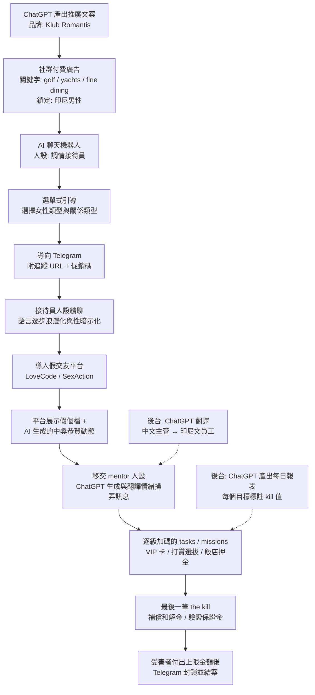
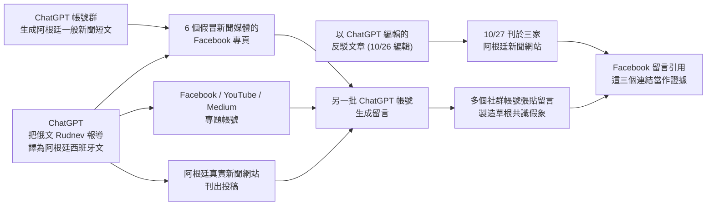
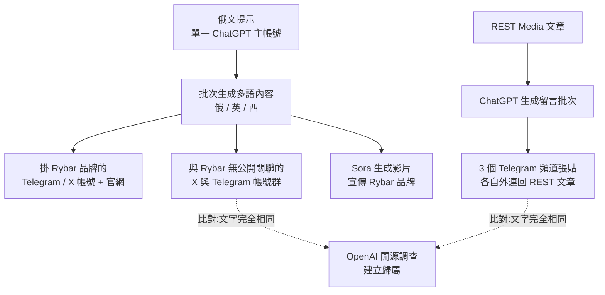
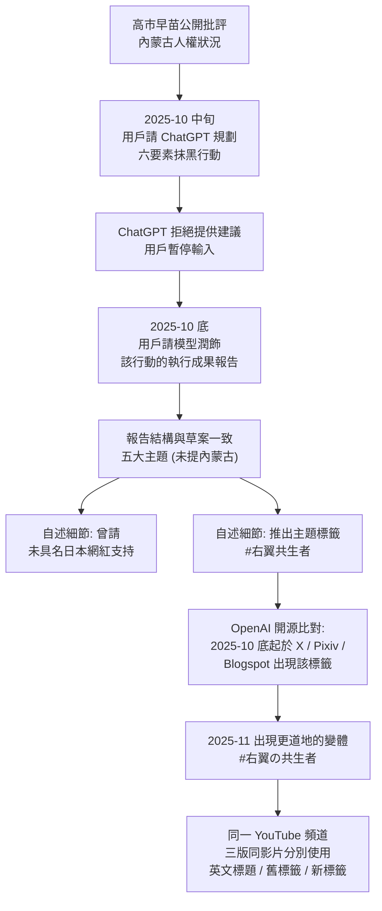
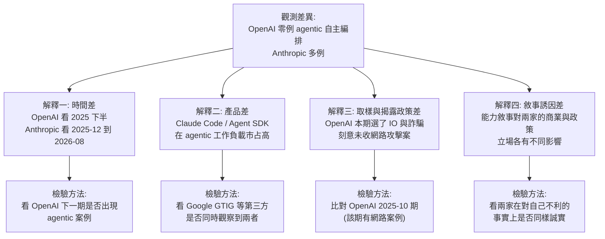

# OpenAI《Disrupting malicious uses of AI》（2026 年 2 月）

> 課程模組：09 延伸研究 ｜ 來源類型：官方威脅報告 ｜ 原文：https://openai.com/index/disrupting-malicious-ai-uses/ ｜ 整理日期：2026-09-14

> **頁碼標註約定**：本檔引用的頁碼一律是 PDF 內頁印刷頁碼（每頁右下角的 01 到 35），不是 PDF 檔案頁次。兩者差 2（印刷 p.26 ＝ PDF 第 28 頁）。封面與目錄無印刷頁碼。

> **標題說明**：官方網頁的標題是「Disrupting malicious uses of AI」，PDF 封面的標題是「Disrupting malicious uses of our models: An update, February 2026」，PDF 每頁頁尾也重複後者。本檔依課程規格以官方頁面標題為準，兩個標題指同一份文件。這個「網頁標題與 PDF 標題不一致」本身就是引用時要注意的細節，寫參考文獻時建議兩者並列。

---

## 1. 一頁速覽

1. **這是什麼**：OpenAI 威脅情報團隊 2026-02-25 發布的季度型威脅報告，PDF 共 35 頁印刷頁（含封面目錄 37 頁），收錄 **7 個案例**：3 件詐騙／虛擬鎖定（Date Bait、False Witness、Silver Lining Playbook）、4 件隱蔽影響力行動（Trolling Stone、No Bell、Fish Food、China's "Cyber Special Operations"）。這是 OpenAI 自 2024-02 開始公開威脅報告以來的**兩週年總結期**。

2. **最重的一案不是詐騙，是中國公安的「網絡特戰」（网络特战）**。OpenAI 封鎖了一個與中國執法體系人員關聯的 ChatGPT 帳號，該用戶請 ChatGPT **潤飾定期的「網絡特戰」工作報告**。報告自述的規模是：至少數百名人力、跨數十個平台的數千個假帳號、逾 100 種戰術、單一省份 300 名操作員、逾 300 個境外社群平台、境內數百萬則貼文。**這不是 AI 造成的新能力，而是 AI 不小心洩漏出來的舊建制的內部帳本。**

3. **模型拒絕了，行動照做**。該用戶在 2025 年 10 月中請 ChatGPT 協助規劃針對日本首相高市早苗的隱蔽影響力行動，**模型拒絕**；10 月底該用戶回來請模型潤飾「同一個行動的執行成果報告」，顯示行動**在不使用 ChatGPT 的情況下照常執行**（p.27）。這是全課程「拒絕不等於阻止」最乾淨的一個外部佐證。

4. **OpenAI 的核心判斷：AI 不是決定性因素**。報告用「Fish Food」的一次實驗把這件事量化：同一個 prompt 一次產出七則推文，其中六則被六個不同 X 帳號發出，**最高瀏覽超過 150,000 次、最低只有 57 次**；差別不在內容（同一批生成），而在**帳號粉絲數**（60 萬 vs 827）。結論句：內容的 AI 屬性不是決定性因素，發文帳號的既有人氣才是（p.23）。

5. **顆粒度落差**：OpenAI **幾乎不公開 IOC**。全報告沒有任何 IOC 表，沒有雜湊、沒有 IP、沒有網域清單；可辨識的指標只散落在圖說與截圖裡（例如 `revealscum[.]com`、`andaluciamorisca[.]org`），且多半是**已公開揭露過的舊指標**或**受害者側**的資產。相對地，Anthropic 2026-09 報告附有 208 條 IOC 的 CSV。這個落差本身是課程要教的「揭露政策」議題，不是單純的好壞問題。

6. **兩家公司互為線報來源，且都承認自己只看到一半**。OpenAI 的「No Bell」是**Meta 提供線報**才開始調查的（p.19）；Anthropic 的肯亞案 GTG-54004 是**OpenAI 提供線報**才啟動的（Anthropic 報告 p.77）。跨廠商情報共享已經在運作，但也反證了單一平台視角的盲區。

7. **對台灣的直接相關性**：OpenAI 報告**四處提及台灣**，且都在中國「網絡特戰」一案裡：高市早苗涉台發言引發的英文攻擊推文、對挺台 X 帳號 `@xu96175836` 的 50 個假帳號騷擾行動、迷因中以「1450」標籤化挺台者、以及一名中國境內年輕女性因發出涉台推文被逮捕訊問（p.29、p.31、p.33、p.34）。這是**中國把「涉台言論」與「異議言論」放進同一套處置流程**的一手證據。

8. **這份研究在課程裡要教什麼**：教學員做**跨廠商情報三角驗證**，並且面對一個難題：當 OpenAI 說「AI 只是把舊手法做快做大」、Anthropic 說「攻擊的經濟學已經改變、複雜度不再是歸因訊號」時，兩者**其實不衝突**，衝突的是兩家對同一組事實的**重要性判斷**與**觀測位置**。學會拆解這一點，才能不被任何一家廠商的敘事框住。

---

## 2. 報告基本資料

| 項目 | 內容 |
|---|---|
| 機構 | OpenAI |
| 團隊 | 報告未標示具名作者或團隊；作者欄位在官方頁面只寫「OpenAI」。內文以「we」「our investigators」自稱，圖說多處標註「Redactions by OpenAI investigators」 |
| 網頁標題 | Disrupting malicious uses of AI |
| PDF 標題 | Disrupting malicious uses of our models: An update, February 2026 |
| 發布日期 | **2026-02-25**（官方頁面標示 February 25, 2026；PDF 中繼資料的建立時間是 2026-02-24 09:26 美東時間，即發布前一天定稿） |
| 分類 | 官方頁面歸類於「Security」 |
| 形式 | 官方頁面為短篇導言（約 150 字）＋ PDF 全文連結；PDF 37 頁（印刷頁 01 到 35），約 60 MB，圖片為主 |
| PDF 直連 | `https://cdn.openai.com/pdf/df438d70-e3fe-4a6c-a403-ff632def8f79/disrupting-malicious-uses-of-ai.pdf` |
| 涵蓋期間 | 報告未明示涵蓋區間。可從內文推定：所述活動自 2023 年（Spamouflage 舊案回溯、解冀連假訃聞 2023-08）延伸到 **2026-01-26**（Fish Food 一節的粉絲數查核日期）。主要新案集中在 **2025 年 8 月至 2025 年 12 月** |
| 涉及的模型或產品 | ChatGPT（消費端）與 OpenAI API（企業端）。Date Bait 一案明確涉及「one API customer」。Fish Food 一案提及行為者用 **Sora** 產製影片。報告全程不標示具體模型版本（沒有 GPT-5.x 等型號），這與 Anthropic 逐案標示 Haiku／Sonnet／Opus 的作法相反 |
| 資料來源類型 | (1) **平台遙測**：被封鎖帳號的 prompt 與 completion 原文，這是主要證據；(2) **開源調查（OSINT）**：X、Telegram、Facebook、YouTube、Pixiv、Blogspot、Bluesky、Medium 的比對；(3) **同業線報**：Meta 提供 No Bell 的起始線索；(4) **公開報導與官方文件**：FBI 公告、美國司法部 2023 年起訴書、VOA 中文部報導、挪威國家研究資訊庫（NVA）與卑爾根大學圖書館查詢 |
| 與前後期報告的關係 | 這是 OpenAI 威脅報告系列的一期。報告開宗明義說「In the two years since we began publishing these threat reports」，對應系列起點 2024-02。內文多次以超連結回指自家前作：2025-02 的 pig butchering 案、2025-06 的 Wrong Number 案與 ping／zing／sting 框架、2025-10 的 em-dash 規避觀察、2024-05 首度揭露 `revealscum[.]com` 與 Spamouflage 的關聯 |

### 2.1 這份報告在 OpenAI 系列中的位置

| 期別 | 發布 | 本檔用到的關鍵內容 |
|---|---|---|
| 2024-02 | 系列起點 | 報告自述的「two years」起算點 |
| 2024-05 | 首次揭露 `revealscum[.]com` 與 Spamouflage 的關聯 | 本期用同一個 logo（「精日展览馆」）把 ChatGPT 用戶的自述與 2024 年舊案接上 |
| 2025-02 | pig butchering（殺豬盤）案：鎖定 40 多歲美國男性醫療從業者，用高爾夫話題當 ping | 本期 p.03 把這張截圖當作「ping」的教學範例重刊 |
| 2025-06 | Wrong Number 案；正式提出 **ping / zing / sting** 三段式詐騙框架 | 本期 p.03 到 p.04 用這個框架當整個詐騙章的骨架 |
| 2025-10 | 「Since we began our public threat reporting in February 2024, we've disrupted and reported over 40 networks」；提出「Building AI into existing workflows, rather than building new workflows around AI」 | **「逾 40 個網絡」這個數字出自 2025-10 這一期，不是 2026-02 這一期**。本期全文沒有任何累計處置數字 |
| **2026-02（本期）** | 7 案；兩週年總結語調；中國「網絡特戰」為壓艙石 | 本檔主體 |

> **查證註記（重要）**：課程指派單提到「OpenAI 宣稱自 2024-02 起已處置超過 40 個網絡」。經逐字核對，**這句話不在 2026-02 這份報告裡**，而在 **2025-10** 那一期的執行摘要（PDF 第 4 頁）。2026-02 這期只說「In the two years since we began publishing these threat reports」，沒有給累計數字。引用時務必歸給正確的期別，這正是第 12 節要教的「數字要對得上哪一份原文」。

### 2.2 報告的結構

報告的目錄（PDF 第 2 頁）只有兩層：

```
Executive Summary ......................... 01
Case studies
  Romance Scams ........................... 03
  Scam: Operation "Date Bait" ............. 05
  Scam: Operation "False Witness" ......... 08
  Virtual targeting: "Silver Lining Playbook" .. 11
  Covert IO: Operation "Trolling Stone" ... 15
  Covert IO: Operation "No Bell" .......... 19
  Covert IO: Operation "Fish Food" ........ 22
  Covert IO: China's "Cyber Special Operations" .. 26
```

結構上有兩件事值得注意：

- **沒有方法論章節、沒有附錄、沒有 IOC 表、沒有致謝名單。** 全文就是「執行摘要 + 案例」，比 Anthropic 154 頁的七大危害領域架構精簡得多。
- **案例內部的欄位是固定的四段式**：`Actor`（誰、在哪、信度）、`Behavior`（做了什麼，詐騙案再細分 Ping / Zing / Sting）、`Completions`（模型實際產出了什麼）、`Impact`（影響評估，影響力行動另加 Breakout Scale 評級）。這四段對應 Anthropic 的 Key findings / Attack lifecycle and AI usage / Disruption and mitigations / Indicators of compromise，但**少了「處置與緩解」這一段的技術細節**，也少了 IOC 那一段。

**教學提示**：「Completions」這個欄位名稱是 OpenAI 特有的，它指的是「模型回傳給使用者的輸出」。把它獨立成一節，等於公開宣示「我們看得到、也保留了模型輸出的內容」。這對學員理解「AI 公司的可見範圍」很重要：**平台看得到 prompt 與 completion，但看不到那些內容離開平台後被貼到哪裡**（這正是報告要靠 OSINT 補的部分）。

---

## 3. 主要發現與案例逐一摘要

### 3.1 執行摘要點名的四條主線（p.01 到 p.02）

報告的執行摘要只列四點，順序本身就是優先級排序：

| # | 標題（原文） | 一句話 |
|---|---|---|
| 1 | The scale and scope of covert influence operations (IO) from China | 中國執法體系的「網絡特戰」，本期最重的發現 |
| 2 | Semi-automated romance from Cambodia | 柬埔寨的半自動化浪漫詐騙（Date Bait），特殊之處是**手動 ChatGPT 操作與自動 AI 聊天機器人混用** |
| 3 | A content farm linked to Russia | 與俄羅斯「Rybar」（Рыбарь，意為「漁夫」）關聯的內容農場（Fish Food） |
| 4 | Actor, behavior, content | 方法論主張：AI 生成內容本身不是成效的決定因素，要看行為者與行為 |

第 4 點是整份報告的論證核心，原文值得逐字記住：

> "The use of AI-generated content on its own does not appear to have been the decisive factor; rather, other factors were likely the main drivers of engagement, notably the popularity of the accounts which did the posting."（p.02）

> 「AI 生成內容本身似乎不是決定性因素；反而是其他因素比較可能是互動量的主要驅動力，尤其是發文帳號本身的人氣。」

「Actor, behavior, content」這個標題直接呼應 Camille François 2019 年的 **ABC 框架**（Actors / Behaviors / Content），也和 Anthropic 影響力章所引用的是同一套學術傳統（見 `../02-influence/00-influence-intro-and-breakout-scale.html` 第 2.3 節的框架比較表）。**兩家公司用同一組分析框架、得出方向相同但份量不同的結論**，這是第 4 節對照的基礎。

---

### 3.2 詐騙章的方法論骨架：ping / zing / sting（p.03 到 p.04）

在進入個案之前，報告先花兩頁重述 2025-06 提出的三段式框架。這一段沒有新案例，但它是**整個詐騙章的分析骨架**，也是課堂最好用的教具。

| 階段 | 原文定義 | 目的 | 本期案例中的具體形態 |
|---|---|---|---|
| **Ping**（冷接觸） | "the scammer generates content designed to attract the potential target's attention by appealing to their interests" | 讓目標注意到你 | Date Bait 用**社群付費廣告**，關鍵字鎖定 golf / yachts / fine dining；False Witness 用**假律所的社群貼文與線上廣告** |
| **Zing**（製造情緒） | "the scammer generates content designed to trigger strong emotions in the target, and thus make them easier to manipulate" | 讓目標進入好操弄的情緒狀態 | Date Bait 的「接待員」人設用越來越露骨的浪漫與性暗示語言；False Witness 模仿「專辦詐騙求償的律師」的語氣與專業感 |
| **Sting**（取財） | "the scammer generates content designed to convince the target to hand over money" | 把情緒兌現成錢 | Date Bait 發明「補償和解金」「驗證保證金」，內部稱最後一筆為 **"the kill"**；False Witness 要求先付 **15% 服務費**、開戶保證金、諮詢費，並要求以加密貨幣支付並回傳交易截圖 |

報告額外強調一個常被忽略的環節：**分發網絡（distribution network）**。原文的結論句是本章最有政策價值的一句：

> "we assess that the scam's chosen distribution method (e.g., scattershot or targeted) plays a significant role in each scam's ability to successfully reach and exploit its targets, regardless of the degree to which the operation used AI for different functions."（p.04）

> 「我們評估，詐騙所選擇的分發方式（例如亂槍打鳥或精準鎖定）對該詐騙能否成功觸及並剝削目標，扮演了顯著角色，**而與該行動在各項功能上使用 AI 的程度無關**。」

注意這裡的信度措辭是 **"we assess"**（分析判斷），不是直述事實；而且原文自己先承認「the fragmentary nature of the evidence makes it difficult to reliably compare different scams」（證據的破碎性讓不同詐騙難以可靠比較）。**這是一個誠實標示了證據限制的判斷**，教學時要讓學員注意到這種寫法與「不加限定詞的直述句」的差別。

---

### 3.3 案例一：Operation "Date Bait"（p.05 到 p.07）

| 欄位 | 內容 |
|---|---|
| 類型 | 詐騙（浪漫詐騙 + 任務詐騙的混合體） |
| 行為者 | 「a cluster of ChatGPT accounts and one API customer」 |
| 歸因 | 「**very likely originated in Cambodia**」（很可能源自柬埔寨），並「aligns with recent public reporting on Chinese-led criminal scam operations in the country」（與近期關於該國中國人主導的犯罪詐騙行動的公開報導一致） |
| 佐證細節 | 個別用戶**自承是詐騙工作者**，例如在詢問報稅建議時把職業填成「scammer」 |
| 受害者 | 印尼男性，鎖定對奢華生活內容有興趣者 |
| 規模（行為者自述） | 「likely defrauding hundreds of victims a month」；prompt 內容顯示「interacting with hundreds of targets at a time, and generating thousands of dollars a day」 |
| AI 做了什麼 | 產生廣告文案；生成「Klub Romantis」品牌 logo；驅動偽裝成「調情接待員」的聊天機器人；生成與翻譯情緒操弄訊息；**翻譯中文主管與印尼文詐騙園區員工之間的溝通**；產出每日工作報告並為每個目標標註 **"kill" 值**；協助整合 OpenAI API、更新假交友網站、分析財務帳目 |
| 自主程度 | **半自動化**。人類操作員手動貼上訊息使用 ChatGPT，同時另有 API 驅動的自動聊天機器人。兩者混用是本案在報告中被標為「Unusually」的原因 |
| 處置 | 封鎖帳號叢集與該 API 客戶 |

**運作流程**（依 p.05 到 p.07 重構）：



**三個部門名稱值得記下來**：`Lead Generation`（獲客）、`Reception Team`（接待）、`Supervisor Team`（督導）。這是一個**有組織架構、有績效追蹤的企業化詐騙**，不是散兵游勇。ChatGPT 在這裡扮演的角色，一半是話術生成器，另一半是**跨語言的管理中介層**（中文主管管不會中文的印尼籍員工）。

**Impact 段落的誠實度**：OpenAI 明確寫下「Assessing the impact of this network requires care. Our primary source of evidence is the scammers' own inputs.」（評估這個網絡的影響需要謹慎，我們的主要證據來源是詐騙者自己的輸入內容），並直言「we are not able to independently verify whether these claims were accurate」。**這是全報告最重要的方法論自白之一**：詐騙者在 prompt 裡吹噓的數字，不能當成受害數字。

---

### 3.4 案例二：Operation "False Witness"（p.08 到 p.10）

| 欄位 | 內容 |
|---|---|
| 類型 | 詐騙（**recovery scam**，即對已受害者二次下手的「求償詐騙」） |
| 行為者 | 「a cluster of ChatGPT accounts」 |
| 歸因 | 同 Date Bait：「very likely originated in Cambodia」，與中國人主導的柬埔寨詐騙行動公開報導一致 |
| 受害者 | 已被詐騙過的受害者。FBI 特別點出鎖定**高齡族群** |
| 冒充對象 | 至少 **6 家假律所**；真實執業律師；**FBI 的 IC3（Internet Crime Complaint Center）**；口頭上宣稱「受國際刑事法院（ICC）監督」 |
| AI 做了什麼 | 產出假律所的推廣內容與冷接觸訊息；**最常見的用途是翻譯**（要求以「American English」或「律師的語氣」回覆）；製作**假的律師註冊紀錄**、**假的律師公會會員卡**（圖中為紐約州律師公會 NYSBA）、**假的保密協議**（用來嚇阻受害者對外求助） |
| 取財手法 | 先收 15% 服務費、開戶保證金、諮詢費；指示以加密貨幣付款並回傳交易確認截圖 |
| 外部佐證 | **FBI 與至少一家被冒充的律所已發出公開警示** |

**這一案在課程裡的價值**，在於它示範了**詐騙生態的二次收割層**：第一波詐騙的受害者名單本身就是第二波詐騙的高品質名單，而且受害者的心理狀態（急於挽回損失、羞恥而不願張揚）正是最好的攻擊面。AI 在這裡的增量貢獻有三個：

1. **語言門檻消失**：柬埔寨的操作員可以用「American English」和美國受害者對話。
2. **偽造文件的產製成本趨近於零**：假律師公會會員卡、假註冊紀錄、假保密協議，過去需要平面設計與樣本；現在是一次 prompt。
3. **可信度的工業化**：同一批「律師」身分被**跨多家假律所重複使用**，人臉來自社群盜圖或 AI 生成。

**同時要注意 AI 沒做到的部分**：報告列出的「多重開源指標顯示這些律所是假的」清單，全部是**非 AI 的傳統破綻**：查無州律師公會執照、網域與律所名稱不搭、聯絡地址是不存在的街址、要求改用通訊軟體聯絡。這份清單可以直接做成給一般民眾的查核卡。

---

### 3.5 案例三：Operation "Silver Lining Playbook"（p.11 到 p.14）

| 欄位 | 內容 |
|---|---|
| 類型 | **Virtual targeting**（虛擬鎖定）。OpenAI 在本報告把它單獨列為一類，既不是「詐騙」也不是「隱蔽影響力行動」 |
| 行為者 | 「a small set of ChatGPT accounts」 |
| 歸因 | 「**likely originated in China**」。佐證有四項：以中文下提示、活躍時段集中在**中國大陸上班時間**、使用 VPN、**以簡體字提示卻假冒香港公司**（香港慣用繁體） |
| 假身分 | 香港公司「Nimbus Hub Consulting」；另有一個帳號冒充上海的公關組織（推動美中／滬美經濟文化交流） |
| 命名由來 | Nimbus 意為雨雲或光環，故取名 Silver Lining（烏雲的銀邊） |
| 目標 | 美國**州級官員**、商業與金融領域的**政策分析師**、以及 Voice of America 主持人等美國人士 |
| AI 做了什麼 | 產出英文社交工程郵件草稿；一般性資訊檢索（美國聯邦辦公室位置與各州聯邦機構／官員密度排名、各州聯邦人員分布、特定美國人士的過往訪談與興趣、美國經濟與金融業從業者常用的論壇與網站）；**詢問 FaceFusion 換臉軟體的安裝教學，並明示要用其 live faceswap 即時換臉功能** |
| 自主程度 | 純對話式協助。報告直言「not technically sophisticated」 |
| 成效 | 「there was no evidence they successfully elicited responses from their targets」；OpenAI 也**無法確認這些郵件是否真的寄出** |

**郵件模板的五段式結構**（p.12 到 p.13），這是本案最該做成講義的一頁。報告稱它「reassembled a social-engineering playbook for a foreign intelligence service approach, rather than ordinary hiring messages」（重組出一套外國情報機關接觸手法的社交工程劇本，而非一般的招募訊息）：

| 段落 | 原文標題 | 作用 | 具體要求 |
|---|---|---|---|
| 1 | Establish legitimacy | 建立正當性 | 把 Nimbus Hub 包裝成在地緣政治與跨國政策上有權威專業的策略顧問公司，附上官網連結 |
| 2 | Personalize and flatter the target | 個人化與奉承 | 明確引用收件人的公部門背景作為「你正是最合適人選」的證明。有一次**上傳了一名駐上海美國人的 LinkedIn 個檔截圖**，要模型依截圖中的個人經歷客製化 |
| 3 | Stack incentives | 堆疊誘因 | 高報酬的線上機會、績效獎金、推薦獎勵，但**對實際工作內容保持模糊** |
| 4 | Reassuring language and reducing perceived risks | 安撫與降低風險感 | 宣稱工作輕鬆、付款準時、保密 |
| 5 | Move communications off-platform quickly | 盡快脫離平台 | 一律嘗試把收件人從電子郵件移到 WhatsApp、Zoom 或 Teams 的視訊通話 |

**FaceFusion 這條線索特別值得討論**。行為者自稱是程式新手，上傳了自己電腦的硬體規格截圖，要求「逐步、非技術性」的安裝指引；模型的回應「drawn from FaceFusion's publicly-available website and documentation」（取自 FaceFusion 公開網站與文件）。把這條線索和第 5 段「盡快移到視訊通話」放在一起看，意圖就很清楚了：**用即時換臉在視訊面談中維持假身分**。但報告沒有明說這個推論，也沒有觀察到實際使用。教學上，這是一個訓練學員做「意圖推論 vs 已證實事實」分界的好材料。

**OpenAI 給一般人的辨識建議**（p.14）也值得抄進講義：合法的招募「usually optimized for slower screening processes and have verifiable information about the role title, credible employer details, reasonable market compensation ranges and links to real job postings」，並以一句話收尾：「In short, if it's too good to be true, then it probably is.」

---

### 3.6 案例四：Covert IO "Trolling Stone"（p.15 到 p.18）

| 欄位 | 內容 |
|---|---|
| 類型 | 隱蔽影響力行動（洗地／astroturfing） |
| 主題 | 俄羅斯人 **Konstantin Rudnev**（被指為邪教領袖）在阿根廷遭逮捕一案 |
| 行為者地理 | 「very likely originated in Pakistan, Armenia and Uruguay」；另有「likely originated in Argentina and Kazakhstan」。**巴基斯坦那一支被判定為受僱者（for-hire actor）** |
| 語言 | 巴基斯坦用戶以英文下提示，其餘主要以俄文；產出內容是**阿根廷式西班牙文** |
| 命名由來 | 該行動去洗版（troll）報導此案的《Rolling Stone》阿根廷版 |
| 假新聞站 | 6 個假冒阿根廷新聞媒體的 Facebook 專頁，**全部在 2025-10-14 到 10-15 兩天內註冊** |
| Breakout Scale | **Category 4 的低端**（突破到主流媒體），依據是部分文章被阿根廷地方新聞網站刊登 |
| 實際互動量 | 專頁通常只有數百追蹤者；典型貼文互動量是**個位數** |

**這一案最值得教的三個偵測訊號**：

1. **專頁透明度（Page transparency）是最便宜的反情報工具**。圖中的「El Horizonte」專頁自稱是阿根廷布宜諾斯艾利斯的新聞媒體（登記了完整的街址與電話），但 Facebook 的管理員所在地欄位寫著 **Uruguay (2)、Armenia (1)、Pakistan (1)**。**自稱地點與管理地點的落差，就是整個案子的破口。**該專頁建立於 2025-10-15，691 追蹤者，1 個追蹤中，0 則評論。
2. **批次註冊**。六個專頁全部在 48 小時內註冊，這種時間叢集在任何平台都是一級訊號。
3. **em-dash 移除**。有一次比對顯示，實際刊出的版本與 ChatGPT 生成的版本**幾乎一模一樣，只差在破折號（em-dash）被刪掉了**。原文：「the published version was almost identical to the version generated by ChatGPT, but the em-dashes had been removed, suggesting an attempt to obfuscate the text's AI nature」（p.16）。

**閉環結構**（這是本案最精巧的地方）：



請注意迴圈裡的**時間戳證據**：反駁文章在 **10 月 26 日**被一名俄語 ChatGPT 用戶編輯，**10 月 27 日**以一名疑似西語記者的署名刊出，隨後行動的留言帳號引用這三個網址當作「已有人反駁」的佐證。**行動自己生產「外部證據」，再自己引用它。** 這個「自我引證迴圈」和 Anthropic 報告 GTG-24015 描述的 **false verification loops**（假的驗證迴圈）是同一個結構，見 `../02-influence/GTG-24015-russian-state-media.html`。

**協調的直接證據**：巴基斯坦的用戶曾請模型協助**落實一份收到的行動指令**，其中包含「每個假帳號每天要發 20 則」與「每日回報進度」；另一名俄語用戶請模型把**另一份指令翻成英文**，該指令看來是寫給巴基斯坦那位用戶的同事，內容包含每日發文量要求，以及如何讓假帳號看起來可信。**這是罕見的「行動管理文件」落入平台手中的案例**，比內容本身更有情報價值。

另有一組值得注意的活動：部分俄語帳號請 ChatGPT 產生**針對女性社群的推廣素材與冷接觸訊息**，內容涉及祕教、薩滿、瑜伽與冥想，而公開報導指這些正是 Rudnev「邪教」的招募戰術。OpenAI 明確說「We are not able to independently confirm the nature of the activities to which this material referred」（無法獨立確認這些素材所指的活動性質）。

---

### 3.7 案例五：Covert IO "No Bell"（p.19 到 p.21）

| 欄位 | 內容 |
|---|---|
| 類型 | 隱蔽影響力行動（假學者署名的長文評論） |
| 行為者 | **單一 ChatGPT 帳號**，「likely originated in Russia」 |
| 線報來源 | **Meta**（「We began investigating this operation following a lead from Meta」） |
| 命名由來 | 其中一篇長文主張安哥拉總統應獲諾貝爾和平獎，用戶明說目的是**激怒美國總統川普的團隊**，故取名 No Bell（Nobel 的諧音拆解） |
| 目標區域 | 撒哈拉以南非洲：南非、迦納、肯亞、安哥拉，另有已被移除的尚比亞與納米比亞專頁 |
| 語言 | 主要以英文提示，**偶爾輸入其自稱來自「主管」的俄文指令**，內含對文章的修改意見與詳細回饋 |
| 假身分 | 「**Dr Manuel Godsin**」，自稱卑爾根大學博士、任職於「International Centre for Political and Strategic Studies」 |
| Breakout Scale | **Category 4 的低端**，依據是文章被非洲新聞網站刊登 |
| 實際互動量 | 一個 Facebook 專頁約 3,000 追蹤者（Meta 下架前），其餘三個新建專頁幾乎為零 |

**「Dr Manuel Godsin」的拆穿過程，是全報告最好的 OSINT 教案**，因為每一步都可複製：

| 步驟 | 做了什麼 | 結果 |
|---|---|---|
| 1 | 查挪威國家研究資訊庫 **NVA** | 查無此人（圖中顯示「No results」） |
| 2 | 查**卑爾根大學圖書館** | 查無此人 |
| 3 | 反查其宣稱的照片 | 同一張照片出現在**俄羅斯法律人脈網站上一名聖彼得堡法律系學生的個檔**，約 2010 年代上傳 |
| 4 | 全網搜尋該署名 | 找到 **53 篇**掛此署名的文章，但**找不到任何可信的存在證據** |
| 5 | 交叉比對其他報導 | 有一篇線上報導已指出「no such person exists」 |

**教學提示**：這五個步驟有一個共同特徵，都是**免費、可公開複製、不需要平台特權**。這正是「上游情報（OpenAI 的 prompt 紀錄）」與「下游情報（任何研究者都做得到的 OSINT）」如何互補的示範。學員可以把這五步做成一張「假專家查核清單」。

**內容主題的分層**（這是判斷行動意圖的關鍵）：

- **大尺度地緣政治層**：讚揚俄羅斯、批評烏克蘭／英國／美國；針對澤倫斯基與川普的人身評論。
- **在地化議題層**（更具殺傷力）：指控德國軍火商 **Rheinmetall** 透過南非子公司規避軍火出口管制（3 篇）；指控英國 NGO **Crisis Action** 在南非煽動抗議；針對英國士兵在肯亞的司法案件。
- **反諷點**：一篇 Godsin 署名文章讚揚俄羅斯在**中非共和國**的存在（正好是 Anthropic 報告 GTG-04001 的戰場）；另一篇文章與配套的 Facebook 貼文卻指控**西方領導人以假訊息針對南非**。

**跨模型使用的直接證據**：該用戶請 ChatGPT 提供**給 Gemini 用的圖像提示詞**，另一次請 ChatGPT 修改一張看來由 Gemini 生成的圖片，該圖隨後成為另一個肯亞主題 Facebook 專頁的橫幅（p.21）。**這是執行摘要「threat actors may use different AI models at various points in their operational workflow」的具體證據。**

**em-dash 的第二次出現**：該用戶也要求模型產出不含 em-dash 的文字，並要求「寫得像人類記者的文風」。有一次，一篇刊在迦納網站的長文因為刪掉了原本的 em-dash 而**留下語意破碎的句子**（圖中高亮處：「Russian President Vladimir Putin proposed a short-term ceasefire a 72 hour pause in fighting...」，原本 ceasefire 後面有一個 em-dash）。**刪除 AI 特徵的動作，本身變成了新的 AI 特徵。**

**專頁的可疑履歷**：一個肯亞主題專頁原名 **"Farmtown5"**（建立於 2023-09-20），在 **2025-10-13** 改名為 **"Kenya Watchtower"**，顯示是**向不相關的供應商購入並重新用途化**的舊帳號。另一個專頁 **"Black Star Brief"**（建立於 2025-08-23，3K 追蹤者）的管理員所在地是 **Germany (1)、Russia (1)、Ukraine (1)、United States (1)**，且透明度面板顯示**該專頁曾投放過社會議題、選舉或政治廣告**。兩個專頁的 Facebook 分類都是 **"Design & fashion"**，卻在發布新聞評論。

**三個可直接寫成偵測規則的訊號**：專頁分類與實際內容不符、專頁改名歷史、管理員所在國與宣稱受眾國不符。

---

### 3.8 案例六：Covert IO "Fish Food"（p.22 到 p.25）

| 欄位 | 內容 |
|---|---|
| 類型 | 隱蔽影響力行動（**內容農場**） |
| 關聯網絡 | 俄羅斯 **「Rybar」（Рыбарь，俄文「漁夫」）** 在 Telegram 與 X 上的網絡 |
| 行為者 | 一組 ChatGPT 帳號，「At least some of the accounts likely originated in Russia」 |
| 命名由來 | 這些帳號「餵養」Rybar 網絡與更外圍的帳號，故名 Fish Food |
| 語言 | 通常以俄文提示，產出俄文、英文、西班牙文等多語內容 |
| 產品 | 社群貼文、留言批次；**用 Sora 產製宣傳 Rybar 品牌的影片** |
| Breakout Scale | **Category 3 的高端**（跨多平台多社群），依據是在社群平台上的廣泛擴散 |
| 觸及基數 | Rybar 主要俄文 Telegram 頻道約 **140 萬訂閱**；轉發其內容的 X 與 Telegram 帳號許多有數萬追蹤者 |
| 未觀察到 | 未見主流新聞媒體轉載；也未能在非洲找到與其銷售提案相符的實地活動 |

**本案的兩個重大發現**：

**（一）內容農場的「去品牌化洗白」**。行為者不只為掛著 Rybar 品牌的帳號生產內容，還**批次生成英文留言**，OpenAI 用開源技術比對出**大量完全相同的文字**被一批**與 Rybar 沒有任何公開關聯**的 X 與 Telegram 帳號發布。原文的判斷是「the ChatGPT activity seemed to serve as a content farm for these accounts」。但 OpenAI 同時誠實標註限制：「We are not able to independently confirm the mechanism through which the AI-generated content was ultimately posted online by these accounts」（無法獨立確認這些 AI 生成內容最終是透過什麼機制被這些帳號貼上網的）。



**（二）影響力即服務的商業提案落到平台手上**。主帳號請 ChatGPT 把一份 Rybar 可提供給「未具名客戶」的**服務清單**譯成英文，內容包括：代管 X 與 Telegram 帳號、經營一個聚焦非洲的雙語「調查報導」網站、在法語媒體付費刊登、以及一個**放大器帳號網絡**。另一則提示請模型編修一份看來是**已部署的選舉干預團隊**的提案（在非洲），內含線下活動：**建立在地代理人網絡、舉辦大型活動**。第三則提示討論**剛果民主共和國（DRC）**的資訊行動，另有提示詢問**蒲隆地與喀麥隆的選舉流程**，並勾勒**馬達加斯加**的行動選項，其中包含**在地煽動抗議**的構想。**最具野心的專案年度預算估計高達 60 萬美元。**

**這一段是本報告與 Anthropic GTG-54002 最直接的對應點**，見第 4 節。

**（三）本報告最重要的一張「數據」**（p.23）。這是全報告唯一一處把 AI 內容的成效差異量化的地方：

| 觀察項 | 數值 |
|---|---|
| 單一 prompt 產出的推文 | 7 則 |
| 經比對確認被發布的 | 6 則（由 6 個不同 X 帳號發出） |
| 最高瀏覽數 | **超過 150,000 次** |
| 最低瀏覽數 | **57 次** |
| 最高瀏覽者的帳號粉絲數（2026-01-26） | **超過 600,000** |
| 最低瀏覽者的帳號粉絲數（同日） | **827** |

原文結論：

> "Since all the tweets were generated in one batch from one prompt, this suggests that the determining factor in whether each tweet was highly viewed was more likely each account's follower count than the AI nature of the content."（p.23）

> 「由於所有推文都是由單一提示一次批次生成，這顯示決定每則推文是否被大量瀏覽的因素，比較可能是各帳號的粉絲數，而不是內容的 AI 屬性。」

**這是一個設計良好的準自然實驗**：內容變因被固定（同一 prompt、同一批次），唯一變動的是發布通道。**這個論證結構值得讓學員逐句拆解**，因為它是本報告用來支撐「AI 不是決定性因素」這個大結論的唯一量化證據，而它的樣本數是 6。

---

### 3.9 案例七：Covert IO 中國的「網絡特戰」（网络特战）（p.26 到 p.35）

這是全報告篇幅最長（10 頁）、份量最重的一案。

| 欄位 | 內容 |
|---|---|
| 類型 | 隱蔽影響力行動 + 跨境鎮壓與騷擾 |
| 行為者 | **單一 ChatGPT 帳號**，關聯到「an individual associated with Chinese law enforcement」（一名與中國執法單位有關的個人） |
| 主要用途 | 請模型**編輯與潤飾定期的「網絡特戰」工作報告** |
| 被拒絕的用途 | 規劃針對日本首相高市早苗的隱蔽影響力行動。**「Our model refused to assist in such planning.」** |
| 歸因信度 | 對「這個帳號關聯到中國執法體系人員」是**直述句**（無限定詞）。對整體規模則用「The available evidence suggests」（現有證據顯示）與「appears to be」（看來是），屬於**分析判斷** |
| 外部驗證 | 大量。OpenAI 用開源技術把用戶自述的多項戰術對回到真實網路活動 |

#### 3.9.1 用戶自述的體系規模（全部須標為「行為者自述」）

| 項目 | 數值 | 出處 |
|---|---|---|
| 人力 | 至少數百名（「at least hundreds of staff」）；某省份的一份報告聲稱該省有 **300 名操作員** | p.26、p.34 |
| 假帳號 | 數千個，跨「scores of platforms」（數十個平台） | p.26 |
| 戰術 | 逾 **100 種**，按主題分類 | p.30 |
| 境外平台 | 逾 **300 個** | p.34 |
| 境內平台 | 微博、微信等 | p.34 |
| 貼文量 | 境內數百萬則、境外數萬則 | p.34 |
| 使用的 AI | **地端部署的開放權重模型**，尤其是中國模型。某月報聲稱該省團隊試用過 **DeepSeek-R1、Qwen2.5、YOLOv8** | p.34 |
| AI 用途 | 監控、側寫、翻譯、內容生成、內部文書 | p.34 |

**YOLOv8 這一項特別值得注意**：它不是語言模型，是電腦視覺的物件偵測模型。把它和「監控、側寫」放在一起，意味著這個體系的 AI 使用**橫跨文字與影像**。報告沒有說明具體用途，不要過度推論。

#### 3.9.2 戰術清單（p.30）

用戶所述的戰術被歸為幾個大類：操弄敘事、放大或壓制內容、攻擊異議者與批評者的正當性、施加社會與心理壓力、利用平台機制。具體例子包括：

- 以親中共或無關內容**洗版**反中共對話
- 建立假帳號散布與放大內容
- 散布針對中共反對者的負面故事與不實指控
- **挑撥異議社群內部的緊張關係**
- 洗版異議者的貼文
- **針對目標的心理健康**
- **針對異議者的家人**
- 以捏造的違規事由**濫用平台檢舉機制**（有時附上偽造證據）
- **入侵異議者的直播**
- 在中國境外建立網站與論壇
- 討論**滲透並影響西方平台**的可能性

**部分戰術已有美國官方文件的獨立佐證**：美國司法部 2023 年指控中國官員執行一項旨在「silencing, harassing and threatening dissidents and activists living abroad in the United States and other countries」的行動，其中包含使用假帳號騷擾中共批評者、入侵直播、嘗試吸收具同情立場的網紅、**吸收至少一家西方通訊公司的安全工程師**、以及對異議者進行起底。

#### 3.9.3 高市早苗行動：計畫、拒絕、執行

時間軸（本報告最清楚的一條因果鏈）：



**原始計畫的六個要素**（p.27）：

1. 張貼並放大針對高市的負面評論
2. 攻擊她對外籍居民的立場，**建議用假冒外籍居民的假電郵帳號向日本政治人物投訴**
3. 主打生活成本議題，用假帳號**並收編在地網友**製造網路壓力
4. 指控她有極右傾向
5. 煽動對美國關稅的憤怒，**以美日關係轉移對中日關係的注意力**
6. 散布關於內蒙古實際狀況的正面評論

執行報告涵蓋前五項，**未提內蒙古**。

**成效的殘酷事實**（p.29、p.32、p.35）：

| 觀察 | 數值 |
|---|---|
| Pixiv 上迷因的最高瀏覽數 | **108** |
| YouTube 影片的最高瀏覽數（截至 2025-11-28） | **4** |
| X 與 Pixiv 貼文的典型互動 | **0** |
| 該省單位自述的西方平台貼文量 | 逾 **50,000** 則，跨逾 **200** 個西方平台 |
| 其中獲得逾 300 次分享或留言的 | **不到 150 則**（低於 0.3%） |
| 行動自述被平台在開頭數日下架的帳號 | 近 **200** 個 |

**這組數字是整份報告最有價值的教學素材**：一個投入數百人、數千帳號、逾百種戰術的國家級體系，在西方平台的**有效觸及率低於 0.3%**。但 OpenAI 立刻補上關鍵的但書（見 3.9.5）。

#### 3.9.4 可對回開源活動的五組騷擾行動

| 目標 | 自述手法 | OpenAI 找到的開源佐證 | 佐證強度 |
|---|---|---|---|
| **revealscum[.]com** | 稱「網絡特戰」團隊建了一個網站，公布 **20 多名異議者的敏感個資**以施加心理壓力，網站描述為「精日展览馆」（pro-Japan exhibition hall） | 該詞正是 `revealscum[.]com` 的 logo 書法字樣；OpenAI **2024-05 就已揭露**該站並連結到 Spamouflage；Meta 於 2023-08 把 Spamouflage 歸因給中國執法相關人員 | **強**（術語精確吻合 + 既有歸因） |
| **李老師不是你老師**（@whyyoutouzhele，本名李穎） | 描述騷擾行動 | 中國公安已被**公開連結**到針對他的既往行動；一個 X 帳號同時發過反高市標籤推文與 2025-01 針對李老師的九則辱罵回覆 | **中強**（帳號層級的行為連結） |
| **Safeguard Defenders**（保護衛士） | 描述攻擊該人權組織 | 同一個 X 帳號的辱罵回覆點名其創辦人 Peter Dahlin 與研究主任 Dinah Gardner，指控其為外國間諜；迷因中兩隻手分別標為「Defender」與「**1450**」（台灣對網軍的俗稱） | **中強** |
| **解冀連** | 稱操作員製作**假訃聞與墓碑照片**並大量張貼 | **VOA 中文部 2023-10 報導**指此類「大量製作、廣泛轉發的假訃聞、遺照、靈堂、墓碑」確實在 2023 年 8 月於中文網路傳播；OpenAI 另找到一個名為「解冀連治喪委員會」的 X 帳號在 8 月 24 日發出訃聞（帳號建於 2023-07，最後發文 2024-04） | **中強**（獨立媒體報導時間吻合） |
| **惠波**（@huikezhen） | 稱用辱罵回覆激怒目標、再對其回覆提出**數千次檢舉**，觸發 X 的自動化處置；另稱建了數十個仿冒帳號 | 截至 2025-11-29，惠波的 X 帳號**確實處於受限狀態**（藍勾、11,055 追蹤者）；搜尋「惠波」會跑出大量同名同頭像的仿冒帳號，部分還附上真帳號沒有的電郵與電話 | **強**（可直接觀察的平台狀態） |
| **Bluesky 先占** | 稱建立冒充主要異議者的假帳號，**明確意圖是先占這些異議者未來可能使用 Bluesky 的身分** | 找到 5 個仿冒惠波的 Bluesky 帳號，**全部建立於 2024-12-05**；另有較小批次仿冒李老師與前中央黨校教授蔡霞 | **強**（建立日期完全叢集） |
| **@xu96175836**（挺台帳號） | 稱動用逾 **50 個假帳號**張貼敵意公開留言、以私訊發送恐怖主義影像、提交假檢舉；有一次自承假檢舉附上 **AI 生成的「證據」截圖** | 報告未提供此案的開源佐證；截至 2025-11-30 該帳號**仍然活躍** | **弱**（僅行為者自述） |

#### 3.9.5 線上加線下：最嚴重的一段

報告在 p.34 集中描述「線上與線下結合」的部分，這一段沒有開源佐證，**全部是行為者自述**，但正因如此更需要謹慎對待：

- 一名中國境內年輕女性**因涉嫌發出一則挺台推文而被逮捕與訊問**
- 公安可能向嫌疑人的**雇主或房東**做不實指控，或在其**家鄉張貼海報**
- 便衣人員在某批評者**親屬住處附近張貼敵意海報**，拍照後再上網流傳，佯裝成真實民意
- 中國操作員**偽裝成美國移民官員**，警告一名（據稱在美國的）異議者其公開言論已觸法
- 一名中國安全官員稱操作員**偽造美國郡法院文件**並提交給某社群平台，企圖觸發下架。該官員指出此次嘗試未執行到底，但顯示了潛力

**OpenAI 對成效的最終評估**（p.35）是全報告最平衡的一段，值得完整引用：

> "The ChatGPT user's reports included references to dissidents losing social media followers, reducing their activity, or even giving up entirely as a result of the harassment. ... **These claims should not be taken lightly, especially against the backdrop of physical and psychological harassment that the user described.**"

> 「該 ChatGPT 用戶的報告提及有異議者因騷擾而流失追蹤者、減少活動、甚至完全放棄。……**這些說法不應被輕忽，尤其是在該用戶所描述的肢體與心理騷擾的背景下。**」

**教學重點**：同一個案子裡，OpenAI 同時說了兩件事：(1) 公開可見的社群成效極差（0.3%）；(2) 但不可見的個人層級壓制效果不應被輕忽。**這兩句話不矛盾，它們衡量的是不同的東西**：Breakout Scale 衡量的是資訊擴散，而跨境鎮壓的成功指標是**目標噤聲**，那是無法用瀏覽數測量的。學員必須學會分辨「影響力行動的觸及失敗」與「騷擾行動的壓制成功」可以同時為真。

#### 3.9.6 報告最後的自我限制聲明

> "We cannot prove or disprove all the user's claims: some would require evidence which is only available to social media platforms, and others deal with offline activity beyond the scope of open-source investigation."（p.35）

> 「我們無法證明或推翻該用戶的所有說法：有些需要只有社群平台才握有的證據，有些涉及超出開源調查範圍的線下活動。」

這句話定義了 AI 公司威脅情報的**三層可見度邊界**：自家平台內（完全可見）、其他平台（僅開源可見）、線下（不可見）。

---

### 3.10 趨勢性結論匯整

把七案抽象化，報告支撐的趨勢有五條：

| # | 趨勢 | 支撐案例 | 證據強度 |
|---|---|---|---|
| 1 | **AI 被嵌進既有工作流，而非圍繞 AI 重建工作流** | 全部七案。沒有任何一案出現多代理自主編排 | 強（七案一致） |
| 2 | **威脅活動很少限於單一平台，也不限於單一 AI 模型** | No Bell（ChatGPT + Gemini）、Fish Food（ChatGPT + Sora）、網絡特戰（ChatGPT + DeepSeek + Qwen + YOLOv8）、Date Bait（ChatGPT + API） | 強 |
| 3 | **AI 生成內容本身不是成效的決定因素，分發通道才是** | Fish Food 的七推文實驗、Date Bait 的付費廣告、網絡特戰的 0.3% 有效率 | **中**（唯一的量化實驗樣本數為 6） |
| 4 | **行為者主動移除 AI 特徵（尤其 em-dash）已成常規** | Trolling Stone、No Bell，且 2025-10 期已觀察到 | 中強 |
| 5 | **模型拒絕有效，但只擋得住「在本平台的那一次」** | 網絡特戰的高市早苗行動：模型拒絕，行動照跑 | 強（單案但證據直接） |

---

## 4. 與 Anthropic 2026-09 報告的對照

這一節是本模組的核心。兩份報告的時間差是**六個半月**（OpenAI 2026-02-25、Anthropic 2026-09-10），涵蓋期間有重疊（OpenAI 主要看 2025 年下半，Anthropic 看 2025-12 到 2026-08）。以下逐點對照。

### 4.1 先看兩份報告的結構差異（這決定了所有後續比較）

| 維度 | OpenAI 2026-02 | Anthropic 2026-09 | 這個差異的意義 |
|---|---|---|---|
| 篇幅 | 35 印刷頁 | 154 頁 | Anthropic 逐案給完整攻擊生命週期；OpenAI 給敘事式案例 |
| 案例數 | 7 | 約 40（跨七大危害領域） | 涵蓋廣度差一個量級 |
| 危害領域 | 詐騙、虛擬鎖定、影響力行動（3 類） | 網路、影響力、監控、詐騙、生物、常規武器、蒸餾（7 類） | **OpenAI 這一期完全沒有網路攻擊案例**，也沒有生物、武器、蒸餾 |
| 行為者代號 | 以行動命名（Date Bait、Fish Food） | GTG 編號（Generative Threat Groups） | 命名法決定了可否跨期追蹤。OpenAI 的行動名稱**不可跨期串接**，Anthropic 的 GTG 編號可以（例如 GTG-10002 從 2025-11 延續到 2026-09） |
| 模型標示 | 不標示版本 | 逐案標示 Haiku / Sonnet / Opus，並聲明 Fable / Mythos 未涉入（除一起蒸餾案） | Anthropic 的標示方式讓外界能評估「防護強度與濫用發生率的關係」 |
| IOC | **無 IOC 表**；指標零星散落在圖說 | 逐案 IOC 表 + 208 條指標的 CSV | 見 4.7 |
| 圖表類型 | **全部是截圖與生成物樣本，零張資料圖表** | 51 張，含流程圖、架構圖、資訊圖、長條圖 | 見第 6 節 |
| 自承防線失效 | 1 處（模型拒絕但行動照跑） | 多處（重新提示突破、跨工作階段拆分、工具請求中性化、部署後不可收回） | 見 `../shared/02-claude-safeguards-and-bypass-paths.html` |

**第一個教學要點**：這兩份文件**不是同一類文件**。OpenAI 這一期比較接近「精選案例敘事 + 方法論宣示」，Anthropic 那一份比較接近「情報產品彙編 + 技術附件」。拿它們比「誰揭露得多」有意義，但拿它們比「誰的平台被濫用得多」則是無效比較，因為取樣與揭露政策都不同。

### 4.2 核心爭點：AI 帶來新能力，還是把舊手法做快做大？

這是指派任務指定要比較的重點，也是本檔最重要的一段。**答案比表面看起來細緻得多：兩家在事實層面高度一致，分歧在「這件事的份量」與「觀測到的自主程度」。**

#### 4.2.1 三段關鍵原文並置

**OpenAI 2025-10（本期的直接前作，論點來源）：**

> "Building AI into existing workflows: Repeatedly, and across different types of operations, the threat actors we banned were building AI into their existing workflows, rather than building new workflows around AI."

> 「把 AI 建進既有工作流：一再地、且跨越不同類型的行動，我們封鎖的威脅行為者都是把 AI 建進他們既有的工作流，而不是圍繞 AI 建立新的工作流。」

> "we found no evidence of new tactics or that our models provided threat actors with novel offensive capabilities. In fact, our models consistently refused outright malicious requests."

> 「我們沒有發現新戰術的證據，也沒有證據顯示我們的模型為威脅行為者提供了新穎的攻擊能力。事實上，我們的模型一貫拒絕了直白的惡意請求。」

**OpenAI 2026-02（本期）：**

> "The use of AI-generated content on its own does not appear to have been the decisive factor; rather, other factors were likely the main drivers of engagement, notably the popularity of the accounts which did the posting. ... This underscores the importance of studying the nature of threat actors and the ways in which they behave, as well as the content they generate."（p.02）

**Anthropic 2026-09（Prevailing trends，PDF p.39）：**

> "The attacks themselves are familiar, involving stolen credentials, unpatched edge devices, exposed services, SQL injection, and phishing. **None of the operations in this report depended on some entirely novel technique that defenders have never seen. Instead, the economics of the attacks have changed.** The kind of labor that previously set the well-resourced operations apart from everyone else—reconnaissance, exploitation, tool development, and data processing—are all now delegated to AI models, which run in harnesses at machine speed and in parallel."

> 「攻擊本身是熟悉的，涉及竊得的憑證、未修補的邊界設備、暴露的服務、SQL 注入與釣魚。**本報告中沒有任何一個行動仰賴防禦者從未見過的全新技術。改變的是攻擊的經濟學。** 過去把資源充足的行動與其他人區隔開來的那類勞動（偵察、漏洞利用、工具開發、資料處理），現在全都被委派給 AI 模型，它們在 harness 裡以機器速度並行運作。」

#### 4.2.2 拆解：一致的地方與分歧的地方

| 命題 | OpenAI | Anthropic | 是否一致 |
|---|---|---|---|
| AI 提供了防禦者沒見過的**全新技術** | 沒有 | 沒有 | **完全一致** |
| AI 被嵌進**既有工作流** | 是（明確主張） | 是（「攻擊本身是熟悉的」） | **一致** |
| 模型會拒絕直白的惡意請求 | 是（並舉高市案為證） | 是，但**多案在重新提示後被突破** | **部分一致，分歧顯著** |
| 改變的是**經濟學／勞動成本** | 隱含（「scaling tool」，2025-10 用語） | **明確且反覆主張**，是整份報告的主論點 | 方向一致，**份量差距極大** |
| 因此**攻擊者能力的分布改變了** | 未主張 | **明確主張**：「Sophisticated attacks no longer require sophisticated attackers」；「The main distinguishing feature between these classes of actors is no longer sophistication but intent」 | **這裡是真正的分歧** |
| 觀察到 AI **自主編排多階段行動** | **零例** | 多例（多代理框架自主偵察、利用、竊資；GTG-50014、GTG-50020、GTG-50029、GTG-10007） | **最大的觀測差異** |

#### 4.2.3 為什麼會有這個差異？四種可能，要教學員全部想過



**關於解釋四，必須雙向講清楚，不能只批評一家：**

- Anthropic 主張「AI 大幅提升攻擊者能力」，與其**以安全為賣點的市場定位**、**ASL 分級制度的正當性**、以及**倡議 AI 監管**的政策立場一致。強調威脅嚴重性對其論述有利。
- OpenAI 主張「AI 不是決定性因素」，與其**反對過度監管**、**強調 AI 普惠**的政策立場一致。淡化威脅嚴重性對其論述有利。
- **但兩家都揭露了對自己不利的事實**：OpenAI 承認自家模型被用來翻譯詐騙園區的管理溝通、生成假律師公會會員卡、潤飾中國公安的鎮壓工作報告；Anthropic 承認自家防線被重新提示突破、跨工作階段拆分未被關聯。**這種「自曝其短」的一致性，是判斷廠商報告可信度最有用的指標。**

**課堂結論建議**：不要把這組差異教成「誰對誰錯」，要教成「**同一個現象，兩個觀測位置，兩種重要性判斷**」。真正的方法論教訓是：**任何單一廠商的威脅報告都只是一個觀測站的讀數**，跨廠商並讀是必要的，不是加分項。

### 4.3 詐騙對照：Date Bait 對 GTG-15001

對應教材：`../06-scams/GTG-15001-dating-app-network.html`

| 維度 | OpenAI「Date Bait」 | Anthropic GTG-15001 |
|---|---|---|
| 行為者 | 柬埔寨詐騙園區（與中國人主導的行動一致） | **中國境內的 app 工作室** |
| 商業形態 | 犯罪園區，依賴 Telegram 與假平台 | **產品化**：20 多個上架的交友 app，有開發文件與版本管理 |
| 受害者 | 印尼男性 | 美國用戶 |
| AI 人設數 | 未給數字 | **逾 4,700 個**（兩週窗口） |
| 訊息量 | 未給數字 | **約 236 萬則**（兩週） |
| 觸及人數 | 「hundreds of targets at a time」（行為者自述） | **至少 25,000 名**獨立用戶（平台遙測） |
| AI 對真人比 | 半自動：人工貼 ChatGPT + API 機器人混用 | **硬編碼 75% AI / 25% 真人**的滑動動態 |
| AI 自主程度 | 半自動，人在迴圈 | **自主維持數千條並行對話**，人類僅例外處理 |
| 變現 | 逐級加碼的 tasks，最後一筆稱「the kill」 | 訊息配額 + in-app coins + 導向第三方金流 |
| 真人補位 | 詐騙園區員工（被翻譯服務串起） | **gig workers 提供視訊與社群互追**當「真人證明」 |
| 平台規避 | 未著墨 | **審核期才啟用的 UI controller**、20+ 變體差異化類別名稱 |
| 是否越獄 | 否 | 否（系統提示看起來像一般陪伴部署） |

**四個可以直接拿來上課的對照結論**：

1. **兩家看到的是同一條價值鏈的不同環節。** OpenAI 看到的是**勞力密集的園區端**（真人操作員 + 翻譯 + 半自動機器人），Anthropic 看到的是**資本密集的產品端**（上架的 app 網絡 + 自主人設農場）。把兩份放在一起，才拼得出「AI 賦能的浪漫詐騙產業」全貌。

2. **「AI 補不上的最後一哩」在兩案中是同一個。** Date Bait 需要真人操作員接手 mentor 階段，GTG-15001 需要 gig workers 提供視訊與社群互追。**兩家獨立觀察到同一個瓶頸，這是跨來源印證的一個漂亮例子**：AI 給了觸及與規模，但把假信任兌現成錢或現實行動的環節，AI 仍補不上。

3. **數字的可信度等級完全不同。** OpenAI 的「hundreds of targets」「thousands of dollars a day」是**詐騙者自己在 prompt 裡寫的**，OpenAI 明確標示無法查證；Anthropic 的 4,700 / 25,000 / 236 萬是**平台側遙測**。教學時務必讓學員標出這個差別，這是情報評等（source reliability / information credibility）最實用的練習。

4. **柬埔寨與中國的關係**。OpenAI 說 Date Bait 與 False Witness「align with recent public reporting on Chinese-led criminal scam operations in the country」，Anthropic 說 GTG-15001 是「China-based app studio」並依賴「PRC-based API reseller/proxy infrastructure」。**兩家從不同角度指向同一個跨境犯罪生態**，但都沒有主張兩案是同一個組織，**不要過度連線**。

### 4.4 影響力行動對照：三個直接對應

#### 4.4.1 Fish Food 對 GTG-54002「影響力即服務」

對應教材：`../02-influence/GTG-54002-influence-as-a-service.html`

| 維度 | Fish Food（Rybar） | GTG-54002（LKM Company） |
|---|---|---|
| 商業模式 | **向未具名客戶提報服務清單與報價**（年度最高 60 萬美元） | **向付費客戶販售**，政治立場隨出價者而變 |
| 服務項目 | 代管 X / Telegram 帳號、雙語「調查報導」網站、法語媒體付費刊登、放大器網絡、**線下代理人網絡與大型活動** | 約 70 個假新聞網站 + 70 個 X 帳號 + 逾 250 個留言帳號 |
| 目標區域 | 非洲（DRC、蒲隆地、喀麥隆、馬達加斯加） | 六大洲 |
| 產量 | 未給 | 至少 **8,913 篇**文章、約 20 種語言 |
| Breakout Scale | **Category 3 高端** | **Category 2** |
| 掩護身分 | 「調查報導」網站 | **看似獨立的在地新聞編輯室** |
| 母體 | 俄羅斯 Rybar 網絡（Telegram 140 萬訂閱） | 法國數位廣告公司 |

**最值得教的一點**：Anthropic 影響力章的趨勢清單第一條就是「Influence sold as a service」，並指出「In two cases presented here, a working advertising or marketing firm ran the operations alongside ordinary commercial work」（本報告中有兩案是由一家實際營運的廣告或行銷公司，在正常商業工作之外同時經營該行動）。OpenAI 的 Fish Food 提供了**這個市場的供給側報價單**：一份寫明服務項目與年度預算的提案。**把 Anthropic 的「已成交的執行面」與 OpenAI 的「銷售面」並讀，學員第一次能看到這個市場的兩端。**

**線下能力是關鍵差異**。Rybar 的提案包含**建立在地代理人網絡、舉辦大型活動、在馬達加斯加煽動實地抗議**。這已經超出「內容生產」，進入 Anthropic 影響力定義第 4 要件所說的「影響行為（behaviors）」，也就是 Breakout Scale 第六級的判準方向。**OpenAI 沒有找到這些線下活動的證據**（「nor were we able to identify on-the-ground activity in Africa matching the description of the sales pitches」），這是提案與執行之間的落差，不能當成已發生的事實。

#### 4.4.2 No Bell 對 GTG-04001（俄羅斯在非洲）

對應教材：`../02-influence/GTG-04001-russia-car-fimi.html`

- 兩案都是**俄羅斯關聯、鎖定非洲、經由在地媒體通路落地**。
- 差異在**分發機制的品質**：GTG-04001 用 **Radio Lengo Songo（98.9 FM）** 這種 Wagner 出資建立的實體電台，再透過交換 SputnikPro 訓練名額換取上國家廣播的時段，**取得了 Category Four 評級**（全 Anthropic 報告唯一）。No Bell 則是把文章投到非洲新聞網站，同樣拿到 **Category 4 低端**。
- **兩家都得出同一個結論：真正決定影響力的是分發通道，不是內容產能。** Anthropic 的原文是「The widest authentic reach occurred where state media outlets were the distribution mechanism (including FM radio, satellite and shortwave radio, and global television)」；OpenAI 的原文是「notably the popularity of the accounts which did the posting」。**這是兩家最強的一致結論，也是本模組最該強調的跨來源印證。**
- 一個巧合值得在課堂上點出：No Bell 有一篇 Godsin 署名文章**讚揚俄羅斯在中非共和國的存在**，而中非共和國正是 GTG-04001 的戰場。兩份報告在此處在地理上直接接壤，但**沒有證據顯示是同一個行動**。

#### 4.4.3 Trolling Stone 對 GTG-24015（假驗證迴圈）

對應教材：`../02-influence/GTG-24015-russian-state-media.html`

- **共同的結構原語**：自己生產「外部證據」，再自己引用它。Trolling Stone 是「10/26 編輯反駁文 → 10/27 刊出 → 留言引用三個連結」；GTG-24015 是「用一連串不同媒體讓俄羅斯來源的主張看起來像被獨立報導」。
- **共同的偵測著力點**：時間戳。編輯時間早於刊出時間、且編輯者與署名者語言不符，是最硬的證據。
- **差異**：GTG-24015 是**唯一能逐字對上實際發布內容**的 Anthropic 案例；Trolling Stone 同樣做到了逐字比對（「almost identical ... but the em-dashes had been removed」）。**兩家都示範了同一種鑑識方法：把平台側的生成文本與網路上的發布文本做逐字 diff。** 這個方法應該成為課程演練的標準項目。

#### 4.4.4 Breakout Scale：兩家用同一把尺

兩份報告**都採用 Ben Nimmo 的 Breakout Scale 六級量表**，這是難得的方法論共通點，讓跨廠商比較第一次成為可能。

| 行動 | 機構 | 評級 | 依據 |
|---|---|---|---|
| GTG-04001（俄羅斯／中非） | Anthropic | **Category Four** | FM 電台轉進國家廣播 |
| Trolling Stone | OpenAI | Category 4 低端 | 文章進入阿根廷新聞網站 |
| No Bell | OpenAI | Category 4 低端 | 文章進入非洲新聞網站 |
| Fish Food | OpenAI | Category 3 高端 | 跨多平台多社群擴散 |
| GTG-54002（LKM） | Anthropic | Category Two | 僅在自家網站與配對帳號內 |
| GTG-54004（肯亞） | Anthropic | **Category One** | 完全封閉在假帳號網絡內 |

**教學提示**：OpenAI 把兩案評為「Category 4 低端」的依據都是「文章被地方新聞網站刊登」，但同時承認「we are not able to independently confirm how the articles were submitted and accepted」（無法確認文章是如何投稿與被接受的）。**這揭露了 Breakout Scale 的一個實務弱點：「被主流媒體刊登」若是靠付費置入或投稿漏洞達成，其「突破」意義與自然轉載完全不同，但量表無法區分。** 這是課堂討論題的好素材。

### 4.5 監控與跨境鎮壓對照：網絡特戰對 GTG-14021 / GTG-14022

對應教材：`../03-surveillance/00-surveillance-intro.html`、`../03-surveillance/GTG-14021-weiwen-transnational-repression.html`、`../03-surveillance/GTG-14022-public-opinion-monitoring-taiwan.html`

**這是全篇對照中最重要、對台灣最相關的一組。**

| 維度 | OpenAI「網絡特戰」 | Anthropic GTG-14021（維穩／跨境鎮壓） | Anthropic GTG-14022（輿情監控） |
|---|---|---|---|
| 行為者 | 與中國執法單位有關的個人 | 中國維穩體系 | 中國輿情監控單位 |
| AI 的角色 | **潤飾工作報告**（行政文書） | 協助偵查與「控制」建議 | 建置監控流程與 SOP |
| 模型是否拒絕 | **是**（高市早苗規劃案） | 拒絕後**被重新提示突破** | **全程無拒絕紀錄** |
| 主要使用的 AI | **地端開放權重模型**（DeepSeek-R1、Qwen2.5、YOLOv8），ChatGPT 只是外圍 | Claude | Claude |
| 涉台 | 挺台帳號騷擾、涉台推文導致逮捕、1450 標籤 | 海外民主活動場地情報 | **點名台灣政治人物**，要求把 Taiwan government 改寫為 Taiwan authorities |
| 揭露的層級 | **戰略層**（整個體系的規模與戰術庫） | 戰術層（具體子行動） | 戰術層 |

**三個必須讓學員記住的觀察**：

**（一）OpenAI 意外拿到的是「體系的自我描述」，不是「濫用行為本身」。** 這個帳號的主要用途是**行政文書潤飾**，模型幾乎沒有被用來做壞事。但正因為公務員把工作報告貼進 ChatGPT，一整套體制的內部帳本就暴露了。**這是一種全新的情報來源類型**：不是攻擊者用 AI 攻擊時留下的痕跡，而是**科層體系把 AI 當辦公軟體用時洩漏的內部文件**。Anthropic 報告裡沒有等價的案例。

**（二）核心作業已經在地端模型上，美國前沿模型只是邊緣。** 用戶自述體系使用「locally deployed, open-weights AI models, especially (but not exclusively) Chinese」。這對治理有兩層意義：

- **美國 AI 公司的封鎖處置對這個體系幾乎無效**，因為主力不在他們的平台上。這和 Anthropic 馬利案（GTG-50027）自承「Account enforcement actions do not affect the deployed product」是**同一個結構性極限**，見 `../shared/01-cross-cutting-analysis.html` 主線三第 4 項「部署後不可收回」。
- 這也和蒸餾模組產生了意外的連結：被指控蒸餾美國前沿模型的 DeepSeek 與 Qwen，在這裡是**中國鎮壓體系的地端工具**。見 `../07-distillation/00-distillation-intro-and-mitigations.html`。這條線很敏感，教學時要嚴格區分「蒸餾指控」與「被用於鎮壓」是兩件獨立的事，不要串成因果。

**（三）「拒絕」在兩份報告裡的命運不同。** OpenAI 記錄了一次乾淨的拒絕（高市案），但緊接著記錄了行動照常執行。Anthropic 記錄了多次拒絕後**被重新提示突破**。把兩者合起來，得到一個完整的失效光譜：

| 情形 | 結果 | 來源 |
|---|---|---|
| 模型拒絕，行為者放棄 | 防線有效 | 兩份報告都**沒有**這種案例的記錄 |
| 模型拒絕，行為者**重新提示後成功** | 防線在同一平台內失效 | Anthropic GTG-14021、生物 Case 3 |
| 模型拒絕，行為者**換平台或換模型完成** | 防線在產業層失效 | **OpenAI 高市早苗案** |
| 模型未拒絕（惡意不在對話裡） | 防線在設計上不適用 | Anthropic GTG-14020、GTG-14022、GTG-15001 |

**這張表是本檔對課程最大的增量貢獻**：OpenAI 的高市案補上了 Anthropic 報告裡缺的那一格，也就是「**跨廠商的規避**」。沒有這一格，學員會以為防線失效都是同一平台內的技術問題；有了這一格，才看得出這是**產業層級的協調問題**。

### 4.6 跨廠商情報共享：兩份報告互相印證的部分

| 方向 | 事實 | 出處 |
|---|---|---|
| Meta → OpenAI | 「No Bell」的調查**始於 Meta 提供的線報** | OpenAI p.19 |
| OpenAI → Anthropic | Anthropic 的肯亞案 GTG-54004 是**基於 OpenAI 分享的累犯活動線報**才啟動內部調查 | Anthropic PDF p.77 |
| OpenAI ↔ Meta（歷史） | Meta 於 2023-08 把 Spamouflage 歸因給中國執法相關人員，OpenAI 2024-05 揭露 `revealscum[.]com`，本期用同一個 logo 把 2026 年的 ChatGPT 自述接回 2023 到 2024 的舊案 | OpenAI p.29、p.31 |
| Anthropic → 產業（蒸餾） | Anthropic 明確提到「OpenAI has called attention to this activity since early 2025. Google published a threat tracker on adversarial distillation earlier this year.」 | Anthropic PDF p.145 |

**這四條線索證明：AI 濫用的威脅情報共享機制已經實際運作，而且是雙向的。** 但也暴露了一個結構性問題：**每一次共享都是點對點、非制度化的**。沒有類似 FS-ISAC 或 MS-ISAC 的正式機制，也沒有共通的行為者命名法（OpenAI 用行動名、Anthropic 用 GTG、Meta 用 CIB 網絡、Google GTIG 用 UNC/APT 編號）。**同一個行為者在四家公司有四個名字，而且無法對應。** 這是課堂討論題 10.2 的第一題。

**與模組 09 其他教材的連結**：Google GTIG 的 AI Threat Tracker（見 `gtig-2026-09-ai-threat-tracker.html` 與 `gtig-2026-05-ai-threat-tracker.html`）是第三個觀測站，Anthropic 2025-11 的 AI 編排間諜行動（`anthropic-2025-11-ai-orchestrated-espionage.html`）則是「自主程度」爭點的關鍵前作。要判斷 4.2.3 的四種解釋哪一種成立，必須把這四份並讀。

### 4.7 揭露顆粒度：IOC 政策的根本差異

| 項目 | OpenAI 2026-02 | Anthropic 2026-09 |
|---|---|---|
| IOC 表 | **無** | 逐案表格（欄位 Indicator / Type，部分含 Category / Cluster） |
| 機器可讀清單 | 無 | `20260910_Anthropic_AI_Misuse_Report_IOCs.csv`，208 條 |
| 網域 | 僅 2 到 3 個出現在圖說，且多為**已揭露過的舊指標或受害者側資產** | 大量，含攻擊者基礎設施 |
| IP / ASN | 無 | 有（例如 GTG-15001 的出口代理 IP 與 AS 編號） |
| 雜湊 | 無 | 有（GTG-20006 的惡意程式 SHA-256 與微軟報告完全一致） |
| 帳號識別碼 | 有（受害者側 X handle、仿冒 Bluesky handle、Telegram 帳號名） | 有 |
| 遮蔽處理 | 截圖中的行為者帳號名稱、頭像、受害者個資**大量以模糊處理遮蔽**，並標註「Redactions by OpenAI investigators」 | 部分遮蔽 |

**兩家的揭露哲學不同，各有其邏輯，要讓學員理解雙方的理由：**

- **OpenAI 的邏輯**（可從其行為推斷，報告未明說）：影響力行動與詐騙的「IOC」多半是社群帳號與網域，這些**壽命極短、公開後即失效**，且公開可能**反過來幫助行為者確認自己被盯上**（burn notice）。此外，公開帳號名稱可能**對受害者造成二次傷害**（例如假訃聞案的當事人）。
- **Anthropic 的邏輯**（報告明說）：希望「help other developers recognize similar patterns on their own platforms」，因此提供可直接匯入的機器可讀指標。

**對防禦者的實務結論**：從 OpenAI 這份報告**拿不到任何可以直接部署的偵測規則**，能拿到的是**行為模式（behavioral patterns）與查核方法**。這不是缺陷，是不同類型的情報產品。學員要學會分辨「原子指標（atomic IOC）」與「行為指標（behavioral indicator）」的價值週期：前者壽命以天計，後者以年計。

### 4.8 台灣面向的直接對照

| 來源 | 涉台內容 | 教材連結 |
|---|---|---|
| OpenAI 網絡特戰 | 挺台 X 帳號 `@xu96175836` 遭 50+ 假帳號騷擾、私訊恐怖影像、假檢舉（含 AI 生成的假「證據」截圖） | 本檔 3.9.4 |
| OpenAI 網絡特戰 | 中國境內一名年輕女性**因涉嫌發出挺台推文而被逮捕訊問** | 本檔 3.9.5 |
| OpenAI 網絡特戰 | 迷因以「**1450**」標籤化 Safeguard Defenders，把台灣網軍論述輸出到對海外人權組織的攻擊 | 本檔 3.9.4 |
| OpenAI 網絡特戰 | 高市早苗因涉台發言（「若中國攻打台灣，日本可能提供軍事協助」）遭英文推文攻擊 | 本檔 3.9.3 |
| Anthropic GTG-14022 | 中國輿情監控**點名台灣政治人物**，援引解放軍「三戰」框架 | `../03-surveillance/GTG-14022-public-opinion-monitoring-taiwan.html` |
| Anthropic GTG-14020 | 中國宗教事務情報**點名台灣基督長老教會領導層**，含場所偵察 | `../03-surveillance/GTG-14020-religious-affairs-taiwan-church.html` |
| Anthropic GTG-17002 | 中國電子戰／防空壓制套件，模擬情境改為**台灣 12 個目標** | `../04-weapons/GTG-17002-ew-sead-taiwan.html` |

**這張表合起來說明一件事**：在中國「網絡特戰」的作業分類裡，**「涉台言論」與「異議言論」是同一個處置流程**。OpenAI 的證據（因涉台推文被逮捕、1450 標籤被用於攻擊人權組織、挺台帳號被 50 個假帳號圍剿）與 Anthropic 的證據（點名台灣政治人物與宗教團體領導層）**互為補充**：前者顯示**處置流程**，後者顯示**建檔對象**。

**一個必須點破的落差**：OpenAI 揭露的體系主力跑在地端中國模型上。這意味著**針對台灣的認知作戰與監控，其技術基礎可能與美國 AI 公司的平台政策幾乎無關**。台灣的防禦不能寄望於 OpenAI 或 Anthropic 的封號，必須建立在**平台側行為偵測**與**社會韌性**上。詳見第 10.4 節。

---

## 5. TTP 與 MITRE ATT&CK 對應

> **框架前提**：本報告**沒有任何一個網路入侵案例**，七案全部是平台濫用、詐騙與影響力行動。MITRE ATT&CK（Enterprise）是為主機與網路入侵設計的，因此下表大多是**類比對應（analogical mapping）**，目的是訓練學員把 ATT&CK 的思維遷移到「資訊行動基礎設施」上。對應不到的一律標為**框架缺口**。針對 AI 系統特有行為另用 **MITRE ATLAS** 對照。

### 5.1 ATT&CK（Enterprise）類比對應

| 戰術 | 技術 ID | 本報告的具體作法 | 偵測構想 |
|---|---|---|---|
| Resource Development | **T1583.001 Acquire Infrastructure: Domains** | 至少 6 家假律所網站（False Witness）；冒充 IC3 的網站；`revealscum[.]com` | 新註冊網域 + 品牌關鍵字（law firm、recovery、IC3、FBI）監控；WHOIS 隱私 + 註冊未滿 90 天 + 無州律師公會紀錄的組合 |
| Resource Development | **T1583.006 Acquire Infrastructure: Web Services** | 「Nimbus Hub Consulting」企業官網（已下線但有存檔）；6 個假冒阿根廷新聞媒體的 FB 專頁；「Kenya Watchtower」由舊專頁改名 | **專頁透明度比對**：宣稱地點 vs 管理員所在地；建立日期叢集；改名歷史；專頁分類與內容不符 |
| Resource Development | **T1585.001 Establish Accounts: Social Media** | 數千個假帳號（網絡特戰自述）；5 個仿冒惠波的 Bluesky 帳號同日建立；50+ 假帳號圍剿 `@xu96175836` | **批次註冊時間叢集**是最硬的訊號。Bluesky 五帳號全部建於 2024-12-05，El Horizonte 等六專頁建於 48 小時內 |
| Resource Development | **T1585.002 Establish Accounts: Email Accounts** | 高市早苗計畫第二要素：以**假冒外籍居民的假電郵**向日本政治人物投訴 | 立法機關與行政機關的陳情信箱應納入**大量相似陳情 + 新註冊信箱**的偵測 |
| Resource Development | **T1586 Compromise Accounts** | 購入並重新用途化的既有專頁（Farmtown5 → Kenya Watchtower，2023 建立、2025 改名） | 平台側：專頁改名 + 主題大轉向 + 管理權轉移的組合事件 |
| Resource Development | **T1588.002 Obtain Capabilities: Tool** | 詢問 **FaceFusion** 換臉軟體安裝與 live faceswap；用 **Sora** 產影片；用 **Gemini** 產圖；地端 **DeepSeek-R1 / Qwen2.5 / YOLOv8** | **跨供應商情報共享**是唯一解。單一廠商看不到工具鏈全貌 |
| Resource Development | **T1650 Acquire Access** | Date Bait 使用「one API customer」的 API 存取 | AI 供應商側：企業 API 客戶的 KYC 與用途稽核；異常的高並行對話量 |
| Reconnaissance | **T1593 Search Open Websites/Domains** | Silver Lining Playbook 查詢美國聯邦辦公室位置、各州聯邦人員密度、VOA 主持人的過往訪談 | **單一帳號的查詢主題聚合分析**：地理 + 人員 + 機構的組合查詢是鎖定前兆 |
| Reconnaissance | **T1589 Gather Victim Identity Information** | 上傳一名駐上海美國人的 **LinkedIn 個檔截圖**要求客製化郵件 | 上傳個人檔案截圖 + 要求「依此人背景客製說服訊息」的組合，是可建規則的高訊號行為 |
| Reconnaissance | **T1591 Gather Victim Org Information** | 查詢美國經濟金融業從業者常用的論壇與網站 | 同上 |
| Initial Access | **T1566.001 Phishing: Spearphishing Attachment/Link** 類比 | 五段式社交工程郵件模板（建立正當性 / 個人化奉承 / 堆疊誘因 / 安撫 / 快速脫離平台） | **郵件內容分類器**可直接用這五段特徵建規則；重點是「要求移到 WhatsApp / Zoom / Teams」這個結尾動作 |
| Defense Evasion | **T1036 Masquerading** | 冒充 IC3、FBI、國際刑事法院、真實律師、香港顧問公司、非洲新聞媒體、阿根廷新聞媒體、異議者本人 | 官方機構應主動監控**品牌冒用**；平台應對「宣稱為政府機構」的帳號強制驗證 |
| Defense Evasion | **T1656 Impersonation** | 「Dr Manuel Godsin」假學者；仿冒惠波的 5 個 Bluesky 帳號；「解冀連治喪委員會」 | **反向圖搜 + 學術資料庫查核**（NVA、大學圖書館）是零成本的高效手段 |
| Defense Evasion | **T1027 Obfuscated Files or Information** 類比 | **移除 em-dash**；要求「寫得像人類記者」；生成不像非母語者的文字 | **AI 文本特徵偵測必須升級**：偵測「被清洗過的 AI 文本」而非「原始 AI 文本」。破碎語句（刪 dash 留下的斷句）本身是新特徵 |
| Defense Evasion | **T1218 System Binary Proxy Execution** 類比（無對應） | **利用平台自動化執法機制當武器**：對目標回覆提交數千次假檢舉以觸發自動降權 | 平台側：對**同一目標的檢舉來源集中度**設異常門檻；檢舉者帳號齡與檢舉量的相關性分析 |
| Collection | **T1119 Automated Collection** 類比 | 網絡特戰自述用地端 AI 做「monitoring, profiling」；YOLOv8 暗示影像側蒐集 | 無平台側偵測面（跑在地端） |
| Command and Control | 無對應 | 行動指令透過**平台外管道**下達（巴基斯坦用戶把收到的指令貼進 ChatGPT 請求落實） | **反向利用**：行為者把 C2 指令貼進 AI 平台請求協助執行，反而讓平台看見了指揮鏈 |
| Impact | **T1657 Financial Theft** | Date Bait 的 kill 值報表與逐級加碼；False Witness 的 15% 服務費與加密貨幣付款 | 金流側：小額多筆後接單筆大額；加密貨幣 + 要求回傳交易截圖 |
| Impact | 無對應（**框架缺口**） | **針對個人心理健康**、**針對家屬**、**線下張貼海報後拍照上網**、**偽造美國郡法院文件提交平台** | 見 5.3 |

### 5.2 MITRE ATLAS 對照

| ATLAS 概念 | 本報告是否適用 | 說明 |
|---|---|---|
| **AML.T0054 LLM Jailbreak** | **不適用** | 全報告**沒有任何一案使用越獄**。唯一被拒絕的請求（高市早苗計畫），行為者的反應是放棄該平台，不是嘗試繞過 |
| **AML.T0051 LLM Prompt Injection** | **不適用** | 無 |
| **AML.T0057 LLM Data Leakage** | **不適用** | 無 |
| 「以正常能力達成惡意業務目的」 | **這是全報告七案的共同本質，ATLAS 無對應 technique** | 翻譯詐騙園區的管理溝通、潤飾公安的工作報告、生成多語留言批次，每一次請求在對話層都看不出惡意 |
| 「**科層體系把 AI 當辦公軟體，因而洩漏內部作業文件**」 | **完全沒有框架涵蓋** | 這是本報告最新穎的觀察。它既不是攻擊也不是濫用，而是**對手的 OPSEC 失誤成為情報來源** |

### 5.3 明確標示的框架缺口（課程高價值點）

**缺口一：跨廠商規避沒有格子放。** 高市早苗案的完整鏈是「在 A 平台被拒 → 在 A 平台外完成 → 回到 A 平台請求潤飾成果報告」。ATT&CK 有 T1562（Impair Defenses），但那是關閉主機上的防護；這裡是**在生態系層級換供應商**。建議的假想技術名稱：`Cross-Vendor Safeguard Arbitrage`（跨供應商防護套利）。**可觀測資料來源**：同一行為者在多家平台的行為序列（需要產業共享才看得見）。

**缺口二：「把平台的自動化執法當武器」沒有格子放。** 對目標的回覆提交數千次假檢舉以觸發自動降權，本質是**把防禦機制轉為攻擊面**。這既不是 DoS（T1499），也不是 Account Access Removal（T1531）。建議假想技術：`Automated Enforcement Weaponization`。**可觀測資料來源**：檢舉來源集中度、檢舉者帳號齡分布、被檢舉內容的實際違規率（假檢舉的違規確認率應接近零）。

**缺口三：「先占身分」（identity pre-emption）沒有格子放。** 在異議者尚未使用某平台前，先建立仿冒他的帳號，佔住搜尋結果。這不是冒充（因為本人根本還沒在該平台出現），而是**對未來身分空間的預先佔領**。建議假想技術：`Pre-emptive Identity Squatting`。**可觀測資料來源**：同一顯示名稱與頭像的帳號批次建立；建立日期高度叢集（如 5 個帳號同日建立）。

**缺口四：線上與線下混合的鎮壓行動，本來就不在 ATT&CK 的範圍。** 逮捕、訊問、向雇主與房東施壓、在家鄉張貼海報、偽裝成美國移民官員、偽造法院文件。ATT&CK 明示自己的範圍是「adversary behavior against enterprise networks」，**跨境鎮壓需要的是不同的框架**，例如 Freedom House 的跨境鎮壓分類或聯合國人權機制的分類。**教學提示**：這個缺口本身就是一堂課，要讓學員理解「資安框架不是萬用的，套錯框架會系統性漏掉最嚴重的危害」。

---

## 6. 圖表判讀

### 6.0 最重要的發現：這份報告沒有任何一張資料圖表

**整份 35 頁報告中，沒有流程圖、沒有架構圖、沒有長條圖、沒有時間軸、沒有資訊圖、沒有表格。** 所有視覺元素（約 25 組、逾 35 張獨立圖片）**全部是螢幕截圖或模型生成物樣本**。

這與 Anthropic 2026-09 報告形成極端對比。Anthropic 的 51 張圖表中，有大量關鍵數字**只存在於圖表內、PDF 文字層抓不到**（例如「30 天 2,475 份成品、16 名分析師縮為 1 人」只在圖說裡）。**OpenAI 這份報告則相反：所有關鍵數字都在正文，圖只是證據展示。**

**這個差異的教學意義（本節最重要的一段）**：

| | OpenAI 這份 | Anthropic 那份 |
|---|---|---|
| 圖的功能 | **證據（evidence）**：這是我們在網路上找到的東西 | **分析（analysis）**：這是我們對機制的理解 |
| 資訊冗餘 | 圖說完整重述圖中內容，圖是可選的 | 圖中有正文沒有的數字與結論 |
| 全文檢索的完整性 | **高**（文字層幾乎不遺漏任何結論） | **低**（必須逐張看圖） |
| 讀者的認知負擔 | 低 | 高 |
| 可被 RAG／自動摘要正確處理 | 大致可以 | **系統性漏失** |
| 隱含的方法論立場 | 「我們展示原始觀察，你自己判斷」 | 「我們展示我們的模型化理解」 |

**兩種都不是錯的，但學員必須知道自己在讀哪一種。** 讀 OpenAI 的報告可以信任全文檢索；讀 Anthropic 的報告不能。

### 6.1 逐組判讀

以下依印刷頁碼順序逐組描述。所有涉及帳號、網域、個資的內容一律 defang 或以文字描述，**不下載圖檔、不嵌圖、不對任何指標連線**。

#### 圖組 1（p.03）：高爾夫話題的 ping

- **類型／來源**：Facebook 留言截圖，取自 OpenAI 2025 年揭露的 pig butchering 網絡，**非本期新案**
- **圖上內容**：一則對陌生人貼文的留言，內容誇讚對方球隊穿粉紅球衣支持乳癌防治，用高爾夫雙關（tee-rific）與 Tiger Woods 梗製造親近感。發文者名稱與頭像已遮蔽，下方為「3d / Like / Reply」
- **核心訊息**：ping 的教科書範例，對貼文內容做了具體的個人化，且完全無威脅性
- **關鍵細節**：留言中含一個 **em-dash**（`awareness—so stylish`）。與 p.16、p.20 的 em-dash 清洗討論並置，就構成一條完整的**攻擊者學習曲線**
- **課堂用法**：逐項標出個人化、情緒、無威脅性三種元素，然後問「你的家人分辨得出來嗎」

#### 圖組 2（p.04）：兩則冷接觸簡訊（Wrong Number 案，2025-06 舊案）

- **類型**：兩張深色手機簡訊截圖
- **上（zing）**：假冒 TikTok Shop 遠端小幫手招募，強調手機可做、時間彈性、日薪 360 至 500 英鎊，導向 WhatsApp（號碼已遮蔽），結尾一句「Thinking of giving it a go myself tbh!」偽裝成朋友分享。同樣含 em-dash
- **下（sting）**：以「VIP 任務」為名，要求先買 20 英鎊的 ETH 轉給商家，宣稱可獲利 35 英鎊
- **核心訊息**：上圖示範「不合理高報酬 + 低門檻」製造 zing；下圖示範「先付小錢驗證」的 sting 結構
- **課堂用法**：貨幣是英鎊、通路是 WhatsApp。讓學員改寫成台灣版（新台幣、LINE、蝦皮），體會**在地化只是換幾個名詞**

#### 圖組 3（p.05）：「Klub Romantis」logo

- **類型**：ChatGPT 生成的品牌 logo
- **圖上內容**：深色底、金色線條的相擁男女剪影，下方襯線體金字「Romantis」
- **核心訊息**：品牌識別的生產成本歸零，詐騙品牌不再需要設計師
- **課堂用法**：問「這看起來像詐騙嗎」。答案是不像，**這正是重點：視覺專業度不再是可信度訊號**

#### 圖組 4（p.06）：假接待員照片與假公文

- **左上**：一名年輕亞裔女性的全身照，佩戴識別證，背景是霓虹燈彎成的粉紅愛心與「LOVE CO...」字樣。圖說標明是 ChatGPT 生成的「LoveCode」假接待員
- **右下**：印尼文信件，頁首有「LOVE CODE Entertainment」標誌與金色裝飾框，標題「SURAT PERBAIKAN DATA」（資料更正函），金額以紅色高亮，底部有簽名欄與印章圖樣，日期「17 Maret 2025」，個資由 OpenAI 遮蔽
- **核心訊息**：**一條完整的可信度生產線**，從人物照、品牌識別到「官方公文」全部由 AI 生成，並在地化到印尼文
- **圖說數字與其問題**：要求支付 **Rp 20,500,000（約 12,000 美元）**以更正虛構的資料處理錯誤，承諾 35% 的「紅利」**Rp 39,860,000**。但 39,860,000 相對 20,500,000 是 **194%**，不是 35%，**數字兜不攏**。報告未說明。這是很好的示例：詐騙文件的數學常經不起檢查，但在情緒壓力下沒人會算
- **課堂用法**：標出這份假公文用了哪些機構性信號（標誌、印章、簽名、編號、正式文體、日期），討論這些信號在 AI 時代還值多少

#### 圖組 5（p.07）：詐騙集團的每日工作報表

- **類型**：ChatGPT 生成的工作報表截圖，已由 OpenAI 譯為英文並大量遮蔽
- **圖上內容**：頁首為日期（October 6, 2025）與匯報人。下方每個條目的結構是：編號與姓名、**（Nominal Kill: 44,400,000）**、Telegram 帳號、聯絡人、Current Status、Follow-up。狀態欄寫的是「此客戶很少與 tutor 或 escort 聯繫，因為目前沒有資金完成指派任務」。第二筆的 Nominal Kill 為 **55,450,000**
- **核心訊息**：**全報告最令人不安的一張圖**。詐騙集團用 CRM 式流程管理受害者：每人有編號、指定人員、狀態、追蹤事項、與**預估可榨取金額**。用語是「client」，不是受害者
- **課堂用法**：與一份真實企業的業務日報並置找差異。答案是幾乎沒有差異，只有欄位名稱不同。這比任何說教都更能說明「詐騙已經產業化」

#### 圖組 6（p.08）：兩則假求償服務廣告

- **類型**：兩張 ChatGPT 生成的直式社群廣告，主標同為「Have You Ever Been Scammed Online?」
- **左（黃底）**：強調「No upfront costs」「No hidden charges」「Only 15% service fee after successful recovery」，按鈕寫「Click here to get free legal **assisten**」（**拼字錯誤**）
- **右（藍底）**：門檻寫「被騙金額超過 1,000 美元即可」「只要有一份證據」，紅色小字宣稱「**求償成功率高達 90%**」，背景是城市天際線
- **核心訊息**：同一套說服結構、兩種視覺風格，**是 A/B 測試的產物**。AI 讓素材變體的生產成本歸零
- **可直接教的三個破綻**：按鈕拼字錯誤、90% 成功率在真實法律實務不可能、「只要一份證據」與真實舉證要求不符
- **課堂用法**：做成「假求償廣告辨識卡」，用於防詐宣導

#### 圖組 7（p.09）：冒充 FBI IC3 的網站與 Telegram

- **左（假網站）**：深藍頁首帶 IC3 徽章與機構全名，導覽列有 File A Complaint、Public Info、Industry Info、Investigator、Crime Info 與搜尋框；內文複製了真站的說明文字與紅底警語「若您或他人有立即危險，請撥 911 或當地警察」，下方是紅色「File A Complaint」按鈕
- **右（假 Telegram）**：FBI 徽章圖樣、機構名稱、帳號 `@Internet_Complaint_Center_IC3`、藍色「SEND MESSAGE」按鈕
- **核心訊息**：**本報告視覺上最危險的一組**。假站的用色、徽章、版面、甚至公益警語都複製了。**點擊報案按鈕會導向 Telegram，這是唯一的破綻**
- **可教的鐵律**：**任何真正的政府機關都不會把報案或申訴流程導向 Telegram、LINE 等通訊軟體。** 這條規則簡單、絕對、可教給任何年齡層
- **課堂用法**：防詐宣導的最佳單張教材。台灣對應版本是冒充 165 反詐騙專線、刑事局、金管會的網站

#### 圖組 8（p.10）：偽造的紐約州律師公會會員卡

- **類型**：AI 生成的證件影像
- **圖上內容**：深藍塑膠卡，左上有白色線條的古典建築圖樣與「NYSBA」，旁為「NEW YORK STATE BAR ASSOCIATION」，右上角一塊已遮蔽（原應為照片或 QR 碼），下半是巨大白色「NYSBA」與小字「MEMBERSHIP CARD」。**整張圖有輕微反光與失焦，模擬手機翻拍實體卡片**
- **核心訊息**：**刻意的低畫質是可信度設計的一部分**。過於清晰的證件圖反而可疑；模擬翻拍讓它看起來像「對方真的從皮夾裡拿卡出來拍給你看」
- **課堂用法**：討論「當偽造品刻意做得不完美時，傳統的畫質檢查偵測法還有效嗎」

#### 圖組 9（p.11）：Nimbus Hub 的三個 LinkedIn 個檔

- **圖上內容**：三張個檔截圖。「Andy Chau」職銜 NimbusHub Senior Director、香港、**58 connections**；「Ethan Clarke」顧問、香港、**16 connections**，動態區有兩則**簡體中文**貼文；「Elena Lam」顧問、香港、**3 followers**，動態區顯示「尚未發文」，但 Experience 寫著任職 **13 年 7 個月**
- **核心訊息**：假公司的假員工，**社交證明極度單薄**。任職 13 年卻從未發文、顧問只有 3 個追蹤者
- **可寫成查核規則的破綻**：任職年資與活躍度不符、連結數異常低、同公司員工互動不自然、宣稱在香港卻用簡體字
- **課堂用法**：針對一個給定的 LinkedIn 個檔列出 10 項可查核指標

#### 圖組 10（p.13）：Nimbus Hub Consulting 官網首頁

- **類型**：網站截圖（站已下線，OpenAI 自網頁存檔取得）
- **圖上內容**：極簡白底，導覽列僅 Home / Services / More。主標語「Empowering tomorrow's decisions with today's insights.」，右側城市天際線圖上疊一句「Based in Hong Kong, NimbusHub is strategically positioned to offer a unique vantage point on global and regional dynamics.」
- **核心訊息**：**內容空洞是假顧問公司的共同特徵**。整頁沒有具體服務項目、客戶案例、團隊資歷或聯絡地址，全是可套用到任何公司的通用語句
- **課堂用法**：與真實顧問公司首頁比較「具體性」。真實公司會有服務清單、產業別、案例、白皮書、地址、電話

#### 圖組 11（p.15）：El Horizonte 專頁與透明度設定（**本報告最實用的一張**）

- **左（專頁）**：藍色「EI」標誌，專頁名「El Horizonte」，**691 followers、1 following**，分類「**Page · News & media website**」，登記地址為布宜諾斯艾利斯的具體街址（Av. Leandro N. Alem 855 piso 21），有電話號碼，「Not yet rated (0 Reviews)」
- **右（透明度面板）**：History 顯示「Created - El Horizonte / **October 15, 2025**」；管理員所在地為「**Uruguay (2) / Armenia (1) / Pakistan (1)**」
- **核心訊息**：**一張圖破了整個案子**。自稱布宜諾斯艾利斯的新聞媒體，管理員全在烏拉圭、亞美尼亞、巴基斯坦，且專頁只有 5 天大就開始發布阿根廷新聞
- **課堂用法**：任何人都能對任何 Facebook 專頁點開 Page transparency。讓學員現場對幾個台灣的爭議性粉專做同樣檢查，體會「**反情報不需要特權**」

#### 圖組 12（p.16）：三個平台上的洗地留言

- **類型**：三組西班牙文留言截圖拼貼（左上 `perfil[.]com`、右 YouTube、左下 Medium），發文者名稱與頭像已遮蔽
- **圖上內容**：全部圍繞同一組論點：司法系統失靈、被拘留者未獲醫療、一名被害人卻牽連數十名被告、國際社會應該知情。每則配不同的情緒符號，下方是「Translate to English」連結與個位數按讚
- **核心訊息**：**同一組論點用不同措辭、不同情緒符號、不同切入角度重複出現**。洗地不求單則說服力，求「很多人都這麼想」的印象
- **可教的四個偵測訊號**：情緒符號使用模式一致；論點集合高度重疊但措辭不重複（LLM 的典型特徵）；留言長度分布異常整齊；互動數個位數（沒有真實受眾）
- **課堂用法**：寫出一組偵測規則，然後討論偽陽性風險

#### 圖組 13（p.17）：Rolling Stone Argentina 的 Instagram 與 Facebook 留言

- **上（Instagram）**：左半是該期封面照（戴白色太空頭盔的留鬍男子，封面藝人 Santiago Motorizado），右半是留言串。行動的留言假裝成「獨立記者」要求更正、指責雜誌「憑空編造 Rudnev 的故事」，並帶 `#LibertadParaRudnev` 標籤。無關用戶的留言已被 OpenAI 模糊。貼文有 1,033 個讚，日期 11 月 3 日
- **關鍵細節**：畫面中可見一則真實用戶的回覆「**eh????**」。**這是行動失敗的直接證據**：真人看得出這些留言不屬於這裡（一則音樂雜誌的封面藝人貼文）
- **下（Facebook 留言）**：一則激動的西班牙文留言指責雜誌「不查證就發稿」，下方附**三個連結**，分別指向 `cordobatimes[.]com`、`flipr[.]com[.]ar`、`olavarrianoticias[.]com[.]ar`，**三者的網址 slug 完全相同**（`periodismo-o-copy-paste-el-caso-rudnev-y-la-caida-del-mito-rolling-stone`），其中第二個連結的路徑還帶著署名 `samiraalvarez`
- **核心訊息**：**自我引證迴圈的視覺證據**。該文在刊出前一天（10/26）由行動內的俄語用戶以 ChatGPT 編輯過，10/27 同時出現在三站，隨後被行動的留言引用為「已有人反駁」的佐證
- **可教的偵測手法**：**同一 slug 跨多站同日刊出**，是內容置入最強的訊號，而且複製 slug 到搜尋引擎就能查，不需要任何工具
- **課堂用法**：跨站同文比對演練。台灣的對應場景是同一篇稿件同時出現在多個內容農場與地方新聞網站

#### 圖組 14（p.19）：兩個 Facebook 專頁的透明度設定

- **左（Black Star Brief）**：金色星形徽章標誌，**3K followers**。透明度面板顯示分類「**Design & fashion**」、建立於 **August 23, 2025**、管理員所在地「**Germany (1) / Russia (1) / Ukraine (1) / United States (1)**」、且「**This Page has run ads about social issues, elections or politics.**」
- **右（Kenya Watchtower）**：盾形徽章配肯亞地圖，**1 follower**。透明度面板顯示分類同為「**Design & fashion**」、「**Changed name to Kenya Watchtower / October 13, 2025**」、「Created - **Farmtown5** / September 20, 2023」
- **核心訊息**：**三個獨立異常，任一項都足以觸發調查**：(1) 分類是「Design & fashion」卻發地緣政治評論；(2) 管理員橫跨德俄烏美卻經營非洲主題專頁；(3) Kenya Watchtower 是 2023 年的舊帳號在 2025 年改名而來，**是買來的**
- **可獨立查證的細節**：Black Star Brief **曾投放社會議題或政治廣告**，紀錄應留存於 Meta Ad Library
- **課堂用法**：把「專頁分類、改名歷史、管理員所在地、廣告投放紀錄」四項做成查核表，這四項在 Facebook 上對所有人公開

#### 圖組 15（p.20）：假學者身分與破碎的文章（**最好的 AI 文本鑑識教材**）

- **上組**：上方是《Sunday Independent》（IOL）文章的作者簡介框，寫著「Dr Manuel Godsin 是 International Centre for Political and Strategic Studies 的作家與研究員，於挪威卑爾根大學取得國際關係與戰略事務博士，並於奧斯陸大學取得國際危機管理碩士」。下方是挪威國家研究資訊庫（NVA）的搜尋畫面，輸入「Manuel Godsin」後顯示「**No results**」
- **下組**：迦納網站 `mynewsgh[.]com` 上一篇文章的開頭，高亮句為：「On the eve of Russia's upcoming Victory Day commemorations on May 9, Russian President Vladimir Putin proposed **a short-term ceasefire a 72 hour pause in fighting** intended to honour the 80th anniversary of the end of World War II.」
- **核心訊息**：上組示範**假學術資歷的拆穿方法**（查國家級研究資料庫，一分鐘有答案）；下組示範**移除 AI 特徵反而留下更明顯的痕跡**：`ceasefire` 後的 em-dash 被刪掉，留下文法斷裂的並列名詞片語
- **課堂用法**：教學要點是**不要只找 AI 特徵，要找「AI 特徵被清洗過的痕跡」**，例如突兀的並列名詞片語、缺少連接詞的句子、詭異的逗號分布

#### 圖組 16（p.21）：兩則文章標題

- 上：紅色「WORLD」標籤，標題「Zelenskyy's Refusal of Truce Signals Mounting Tensions and Missed Humanitarian Opportunities」
- 下：灰色「OPINION」標籤，標題「Trump has ruined Africa's relationship with the US」
- **核心訊息**：雙軌敘事（對烏克蘭的責任歸咎 + 對美國的離間），兩者都以「非洲的利益」為包裝角度
- **課堂用法**：分析「以在地利益為包裝的地緣政治敘事」如何降低受眾防備。台灣的對應是「以台灣利益為名的疑美論」

#### 圖組 17（p.22）：Rybar 的三種產出形態

- **左**：俄文 Telegram 貼文，含一張深色調宣傳海報與長篇俄文內文
- **右上**：帶 Rybar 品牌標誌的英文推文，含一張地圖圖像
- **右下**：西班牙文網站上的 Rybar 品牌資訊圖，圖說標明來源為 `andaluciamorisca[.]org`
- **核心訊息**：**同一個 ChatGPT 帳號、俄文提示，產出三種語言、三種載體、三個地理受眾**。這是多語內容農場的完整形態
- **課堂用法**：討論「語言不再是資訊作戰的門檻」。中文對外國行為者曾是天然屏障，現在不是了

#### 圖組 18（p.23）：六則推文與四則 Telegram 貼文（**本報告的核心證據**）

- **上組**：兩排三列的推文截圖，六則都附同一段影片縮圖。這是**同一批次生成的七則中被確認發布的六則**
- **下組**：四則深色 Telegram 貼文，主題是摩爾多瓦 2025 年議會選舉的海外投票爭議，指控杜林某投票所實際 786 人投票卻計 1,806 票、維琴察灌了 4%。圖說指出 **post 2 引用 post 1、post 4 引用 post 3，但四則的文字全部出自本行動的生成內容**
- **核心訊息**：上組支撐「同一批內容、瀏覽從 57 到 150,000+」的量化論證；下組示範**假互動的製造方式**：讓自己的帳號互相引用，製造「多個獨立來源互相佐證」的假象
- **關鍵細節**：下組英文原文中**保留了 em-dash**（`rigged—by 4%`、`elections—this time abroad`）。**在同一份報告裡，有些行動記得清洗 em-dash，有些沒有。這個不一致本身就是情報**，顯示反偵測意識在不同行動間的差異
- **課堂用法**：(1) 用上組講「內容不是決定因素」的論證與其樣本數限制；(2) 用下組講「引用鏈偽造」的偵測：檢查引用關係圖中是否存在封閉迴圈

#### 圖組 19（p.24）：三則外連 REST Media 的 Telegram 貼文

- **圖上內容**：三則關於「德國在摩爾多瓦建立影響力網絡」的指控貼文，內容提及三家德國政治基金會在基希訥烏設點、8.712 億歐元雙邊貿易、GIZ 人員編制媲美摩國部會。每則以「| Socials | Donate | Advertising」結尾，顯示的反應數為 134、37 等，瀏覽數為 63.6K、37.5K
- **核心訊息**：**單一 prompt 產出的多則留言，被三個不同頻道分別發出並各自外連回同一篇 REST Media 文章**，形成「內容農場 + 導流」閉環
- **關鍵對比**：這些貼文有實質互動（數萬瀏覽），**與圖組 12 的個位數互動形成強烈對比**。差別在於 Rybar 生態有真實的既有受眾。**這再次印證「分發通道決定影響力」**
- **課堂用法**：對比圖組 12 與本組，讓學員自己推導結論

#### 圖組 20（p.28）：兩組反高市早苗迷因（Blogspot 與 Pixiv）

- **上組（Blogspot）**：左圖標籤為紅底白字「**右翼共生者**」，日期 November 17, 2025，內容是把高市早苗合成到日本民族主義團體一水會代表木村三浩的照片上，日文字幕「高市早苗が一水会代表と密会」。右圖標題為**簡體中文**「50% 关税暴击！美国牛肉丢了日本半壁江山」，日期 November 04, 2025，圖為肉品加工廠輸送帶，疊加日文字幕
- **下組（Pixiv）**：兩張動漫風插畫。左為持麥克風的藍西裝男性角色；右為髮型神似高市早苗的藍套裝女性角色坐在沙發上，周圍堆滿鈔票與禮物盒。圖說指出該帳號所有貼文都在 2025-10-27 發出，**五張漫畫中四張被標記為 AI 生成，且不是用 OpenAI 的模型產生的**
- **核心訊息**：**攻擊敘事的三層結構**：人身指控（與極右翼密會）、經濟議題（美國關稅傷害日本農業）、貪腐暗示（坐擁鈔票）。三層都用視覺化、低文字門檻的形式傳播
- **極重要的細節**：標籤與標題是**簡體中文**，字幕是日文。**目標受眾是日本人，製作者的輸入法卻是簡體中文**。這是最直接的歸因線索
- **課堂用法**：「歸因的語言學證據」最好的教案。讓學員找出所有語言不一致處，並討論為什麼行動者沒察覺這個破綻（可能的答案：缺乏目標語言的母語校對）

#### 圖組 21（p.29）：三則推文與一個 YouTube 頻道（**涉台最直接的一組**）

- **左上**：Nov 18 的推文，標籤已變為日文化的「**右翼の共生者**」，圖像與圖組 20 左上相同，瀏覽數 **16**
- **右上**：Nov 21 的英文推文「The One-China principle is a red line. Takaichi's reckless remarks not only harm China-Japan mutual trust but also destabilize the region and must be corrected!」，瀏覽數 **10**
- **右下**：Nov 21 的英文推文「Military intervention in the Taiwan Strait? Pure delusion! China's determination to defend sovereignty has never wavered!」，瀏覽數 **7**
- **下（YouTube 頻道）**：8 支影片的列表，多支是同一段高市早苗畫面。可辨識的標題含英文「Right-wing Symbiotes」、簡體標籤與日文標籤，觀看數均為個位數
- **核心訊息**：**標籤的演化與台灣議題的明確出現**。標籤從簡體中文演化為更道地的日文，顯示行動在調整；同一支影片用三個不同標題重複上傳（英文標題 10-27、舊標籤 11-06、新標籤 11-18），是**同一批操作者在做 A/B 測試**的直接證據
- **課堂用法**：讓學員計算投入產出比（國家級體系、上萬則貼文，換來每則 7 到 16 次瀏覽），然後問「**如果成效這麼差，為什麼還要繼續做**」。這是討論題 10.2 第二題的核心

#### 圖組 22（p.31）：revealscum 的 logo 與跨行動連結的 X 帳號

- **左（logo）**：一枚仿中式印章的紅色圖章，白色篆隸書法寫著「**精日展览馆**」五個簡體字，邊框有仿石刻質感。圖說指出這是 `revealscum[.]com` 的 logo，OpenAI 於 **2024-05** 首次將該站連結到中國影響力行動，而 **ChatGPT 用戶的提示中用了完全相同的詞**
- **核心訊息**：**術語的精確吻合是本案最強的歸因證據**。「精日展览馆」不是通用詞彙
- **右組（三張）**：上為 2025-11-19 的推文，含反高市標籤，中文內容稱高市「是世界上最危險的女性之一，剛威脅要在台灣議題上與中國開戰」，顯示 3 次瀏覽。下方兩張是同一帳號 2025-01 的迷因：其一畫面中兩隻手分別標示「**Defender**」與「**1450**」，共同操作標示為「classified documents」的螢幕，人物背上寫著「Spy」與「Dinah Gardner」，標題為「兩個『特工』的聯盟」；其二將 Peter Dahlin 的新聞照與 George Floyd 遭壓制的畫面並置，配以譏諷美國人權的文字
- **核心訊息**：**單一帳號同時參與相隔十個月的兩個行動**（2025-01 攻擊 Safeguard Defenders、2025-11 攻擊高市早苗），是把兩個行動綁在一起的直接證據
- **對台灣的重大意義**：「**1450**」是台灣對政府出資網路輿論引導者的俗稱。**這個原生於台灣政治語境的標籤，被用來攻擊一個瑞典籍創辦人主持的國際人權組織。** 說明操作者熟悉台灣網路政治語彙，且台灣的政治對立語言正被武器化並輸出
- **課堂用法**：這張圖應該單獨拿出來講。討論「當台灣內部的政治標籤被外部行為者拿去攻擊國際人權組織時，台灣社會該如何回應」

#### 圖組 23（p.32）：假訃聞與帳號壓制

- **上（假訃聞推文）**：2023-08-24 的推文，帳號名稱譯為「解冀連治喪委員會」，以英文自動翻譯宣告「中國民主黨執行主任解冀連先生於 2023 年 8 月 23 日在美國洛杉磯因急病搶救無效逝世，享年 35 歲」，附一張黑白遺照與一份中文「讣告」文件圖像，互動數為 1 則回覆、1 則轉推、3 個讚、600 次瀏覽
- **下組（三張）**：左為 X 的帳號限制遮罩「Caution: This profile may include potentially sensitive content」；中為點入後的真實帳號，顯示名稱「**惠波**」、藍色驗證勾、**11,055 followers**；右為搜尋「惠波」的結果頁，列出多個**同名同頭像**的帳號，圖說指出**沒有一個是真實的已驗證帳號**，部分假帳號還附上真帳號沒有的電郵與電話
- **核心訊息**：**兩種壓制手法的視覺證據**。上圖是「宣告死亡」這種極端的人格謀殺；下組是「觸發平台自動化處置 + 搜尋結果佔位」這種利用平台機制的手法
- **證據強度**：帳號受限狀態與搜尋結果**是任何人都能獨立驗證的公開事實**，比行為者自述強得多；VOA 中文部 2023-10 的報導則為假訃聞提供時間吻合的獨立佐證
- **課堂用法**：討論平台責任。**當一個帳號被數千次惡意檢舉觸發自動降權時，平台的申訴機制能在多久內恢復**

#### 圖組 24（p.33）：五個仿冒 Bluesky 帳號（**偵測價值最高的一張**）

- **圖上內容**：五張 Bluesky 個檔卡片，使用**完全相同的頭像**（一名中年男性照片）與**完全相同的橫幅**（戶外場景，背景可見印有「习近平 JINPING XI」字樣的看板）。顯示名稱分別是「**慧波**」「惠波」「惠波」「惠波」「惠波」，帳號依序為 `@hulkezhen[.]bsky[.]social` 與其後綴 1 到 4 的四個變體，**五個全部顯示「Joined December 5, 2024」**
- **核心訊息**：五個帳號、同一天建立、同一張頭像與橫幅、序號式命名。**任何一項都是強訊號，五項同時出現是確定訊號**
- **兩個關鍵細節**：(1) 真實目標叫「惠波」，其中一個仿冒帳號用了同音異字「**慧波**」，這是規避精確字串比對的標準手法，但對語音相似度比對無效；(2) 這些帳號建於 2024-12-05，依用戶自述其目的是**先占**目標未來可能使用 Bluesky 的身分，屬於**預防性身分壓制**
- **課堂用法**：寫偵測規則最好的素材。讓學員實際寫出邏輯：`同一 handle 前綴 + 遞增數字 + 相同 avatar hash + 相同 banner hash + 建立時間窗口 < 24h → 高信度仿冒叢集`，然後討論「為什麼平台沒有在建立當下就攔下來」

#### 圖組 25（封面）

全黑背景加標題文字與一個抽象視覺元素，無資訊內容。

### 6.2 圖表判讀的總結：三個方法論收穫

1. **當報告用截圖當證據時，圖說與正文之間往往有落差，要逐張核對。** 例如 p.06 假公文的金額（35% 紅利卻是 194%）這類數字問題，只有看圖才會發現。

2. **截圖裡的介面元素本身是情報。** 追蹤數、建立日期、專頁分類、管理員所在地、瀏覽數、帳號 handle 的命名規律，這些都在截圖裡，而且**全部是可獨立驗證的公開資料**。學會讀介面元素，等於獲得一套零成本的查證工具。

3. **語言的不一致是最廉價也最可靠的歸因線索。** 簡體中文提示假冒香港公司、簡體中文標籤配日文字幕、俄文提示產出阿根廷西班牙文。這些破綻不需要任何技術能力就能發現，但需要**對目標語言社群的熟悉度**。這是台灣分析者相對於歐美分析者的天然優勢。

---

## 7. IOC 與技術指標

### 7.0 前提：這份報告沒有 IOC 表

**OpenAI 這份報告沒有任何 IOC 章節、沒有附錄、沒有機器可讀清單。** 以下指標是本檔從正文與圖片截圖中逐一抄錄出來的，**全部改為 defang 格式**。

> **安全紅線（務必遵守）**：下列所有指標僅供研究與教學參考。**絕對不要**對任何一項進行連線、DNS 查詢、瀏覽、或在互動式服務上查詢。部分指標是**受害者側資產**（例如異議者本人的帳號、被引用的正當新聞網站），對這些指標的任何查詢都可能造成二次傷害。

### 7.1 攻擊者側基礎設施

| 指標（defang） | 類型 | 所屬行動 | 出處 | 偵測價值與壽命 |
|---|---|---|---|---|
| `revealscum[.]com` | 網域 | 網絡特戰 / Spamouflage | p.31 圖說 | **歷史指標**。OpenAI 2024-05 已公開揭露，2026 年再次出現只是用來建立跨案連結。作為封鎖清單項目的價值已極低，作為**歸因錨點**的價值仍高（其 logo 的「精日展览馆」字樣是關鍵術語） |
| `@Internet_Complaint_Center_IC3` | Telegram 帳號 | False Witness | p.09 截圖 | **短壽命**。此類冒充帳號一經公開即遭封鎖，攻擊者換名重建的成本接近零。**真正有價值的是模式**：政府機構名稱 + Telegram 帳號 = 必然是詐騙 |
| `@hulkezhen[.]bsky[.]social` 及其後綴 1 到 4 的四個變體（共 5 個） | Bluesky 帳號 | 網絡特戰（仿冒惠波） | p.33 截圖 | **叢集本身才是指標**。五個帳號同日（2024-12-05）建立、序號式命名、同 avatar 與 banner。單一 handle 壽命短，**命名模式與批次建立特徵可長期使用** |
| `#右翼共生者` | 主題標籤（簡體中文） | 網絡特戰（反高市） | p.28、p.29、p.31 | **中等壽命**。報告指出 2025-10 底出現，11 月演化為日文化變體。**罕見標籤是最好的跨平台樞紐指標**：OpenAI 正是靠它把 ChatGPT 自述接到 X、Pixiv、Blogspot、YouTube |
| `#右翼の共生者` | 主題標籤（日文變體） | 同上 | p.29 | 同上。**變體的出現本身證明是同一批操作者在迭代** |
| 「精日展览馆」 | 關鍵術語 | 網絡特戰 | p.31 | **長壽命**。行為者的內部命名在 prompt 與網站 logo 上一字不差，是最強的歸因錨點 |
| 「网络特战」 | 關鍵術語 | 網絡特戰 | p.26 | **長壽命**。這是體系的自稱，可用於後續的中文開源監測 |
| 「El Horizonte」 | Facebook 專頁名 | Trolling Stone | p.15 | 已下架。**可複用的是特徵**：建立 5 天內開始發新聞、宣稱地點與管理地點不符、0 則評論 |
| 「Black Star Brief」 | Facebook 專頁名 | No Bell | p.19 | 已被 Meta 下架。**該專頁曾投放政治廣告，紀錄應留存於 Meta Ad Library，可獨立查證** |
| 「Kenya Watchtower」（原名 Farmtown5） | Facebook 專頁名 | No Bell | p.19 | 已下架。**改名歷史是可長期複用的偵測模式**：2023-09-20 建立、2025-10-13 改名 |
| 「Nimbus Hub Consulting」 | 假公司名 | Silver Lining Playbook | p.11、p.13 | 官網已下線但有網頁存檔。**公司名 + LinkedIn 員工帳號叢集**是可複用的查核組合 |
| 「Klub Romantis」「LoveCode」「SexAction」 | 假品牌名 | Date Bait | p.05、p.06 | **中等壽命**。品牌名在同一批次詐騙中重複使用，可作為受害者通報的關聯依據 |
| 「REST Media」 | 媒體品牌 | Fish Food | p.24 | 開源研究者已將其連結到 Rybar。**中長壽命**，作為內容來源指標可用 |
| 「Rybar」（Рыбарь） | 網絡品牌 | Fish Food | p.22 | **長壽命**。已被多方公開追蹤的俄羅斯資訊行動品牌 |
| 「Dr Manuel Godsin」 | 假身分署名 | No Bell | p.20 | **長壽命**。署名一旦建立就會持續累積作品（報告稱找到 53 篇）。**署名是內容農場最持久的指標** |
| 「International Centre for Political and Strategic Studies」 | 假機構名 | No Bell | p.20 | 同上 |
| 「解冀連治喪委員會」 | X 帳號名 | 網絡特戰 | p.32 | 帳號已停止活動（2023-07 建立，2024-04 最後發文）。**歷史指標** |
| `cordobatimes[.]com`、`flipr[.]com[.]ar`、`olavarrianoticias[.]com[.]ar` | 網域（承載置入內容） | Trolling Stone | p.17 截圖 | **注意：這些是阿根廷的真實新聞網站，不是攻擊者資產。** 它們是被投稿或置入的載體。列入此表只為記錄「同一 slug 跨三站同日刊出」這個模式，**不可當作惡意指標封鎖** |
| `mynewsgh[.]com` | 網域（承載置入內容） | No Bell | p.20 截圖 | 同上，是迦納的新聞網站 |
| `andaluciamorisca[.]org` | 網域（承載 Rybar 內容） | Fish Food | p.22 圖說 | 西班牙語網站，報告未說明其性質（自願合作或被置入不明）。**歸屬不明，不可逕行認定為攻擊者資產** |

### 7.2 受害者側識別碼（僅供理解案情，不可查詢）

| 識別碼 | 身分 | 出處 |
|---|---|---|
| `@whyyoutouzhele` | 中國異議者「李老師不是你老師」（本名李穎） | p.31 |
| `@huikezhen` | 中國異議者惠波 | p.32 |
| `@xu96175836` | 挺台 X 帳號（遭 50+ 假帳號騷擾） | p.33 |
| `perfil[.]com` | 阿根廷新聞網站（其留言區被洗地） | p.16 圖說 |

### 7.3 本報告真正有價值的「行為指標」

由於原子指標稀少且壽命短，**這份報告的防禦價值主要在行為模式**。以下整理成可直接使用的查核清單：

#### 社群專頁／帳號查核（任何人都能做）

| # | 檢查項 | 紅旗 |
|---|---|---|
| 1 | Page transparency 的管理員所在國 | 與宣稱受眾國或編輯部地址不符 |
| 2 | 專頁建立日期 | 建立後數日內即開始發布時事評論 |
| 3 | 批次註冊 | 多個相關專頁在 48 小時內建立 |
| 4 | 專頁分類 | 分類是「Design & fashion」等，與新聞內容不符 |
| 5 | 改名歷史 | 舊帳號改名並轉向完全不同的主題 |
| 6 | 廣告投放紀錄 | 曾投放社會議題／選舉／政治廣告（可查 Ad Library） |
| 7 | 追蹤數與互動數的落差 | 追蹤數千但貼文互動個位數 |
| 8 | 帳號 handle 命名 | 序號式（name、name1、name2...） |
| 9 | 頭像與橫幅 | 多帳號使用完全相同圖片（可用感知雜湊比對） |
| 10 | 建立時間叢集 | 多個相似帳號同日建立 |

#### AI 生成內容查核

| # | 檢查項 | 說明 |
|---|---|---|
| 1 | em-dash 的**異常缺席** | 文章結構明顯是 AI 生成的節奏，卻完全沒有破折號 |
| 2 | **刪 dash 留下的破碎句** | 突兀的並列名詞片語（「a short-term ceasefire a 72 hour pause」） |
| 3 | 跨站同 slug | 同一標題與網址 slug 同日出現在多個新聞網站 |
| 4 | 逐字 diff | 把可疑文章與已知 AI 生成樣本做逐字比對，注意「幾乎相同但差一個符號」的情形 |
| 5 | 留言簇的論點重疊度 | 論點集合高度重疊但措辭不重複（LLM 的典型特徵） |
| 6 | 情緒符號使用模式 | 同一批留言的 emoji 使用位置與種類一致 |
| 7 | 語言不一致 | 提示語言、介面語言、目標受眾語言三者不符 |

#### 假專家／假機構查核

| # | 檢查項 | 具體作法 |
|---|---|---|
| 1 | 學位查核 | 查該國國家級研究資訊庫（如挪威 NVA）與大學圖書館 |
| 2 | 照片反查 | 反向圖搜，注意是否出現在不相關的舊個檔上 |
| 3 | 署名文章數 vs 存在證據 | 大量署名文章但零則生平、訪談、學術著作 |
| 4 | 機構實存性 | 機構名稱在學術資料庫、商業登記、新聞檔案中是否可查 |
| 5 | LinkedIn 一致性 | 任職年資與帳號活躍度、連結數是否相符 |
| 6 | 律師／專業執照 | 查州律師公會或主管機關名冊 |
| 7 | 聯絡方式 | 是否只提供通訊軟體、地址是否為不存在的街址 |

**給學員的結論**：拿到一份沒有 IOC 的威脅報告時，不要說「這份報告沒用」，要問「它給了我什麼可以長期使用的東西」。原子指標（IP、網域、雜湊、帳號）的壽命以天計，行為指標（模式、流程、查核方法）的壽命以年計。這份報告給的是**一整套零成本、可教給一般民眾的查核方法**，在防詐與媒體識讀的場域比 IOC 清單有用得多。

---

## 8. OpenAI 的偵測、處置與防線缺口

### 8.1 做了什麼

| 行動 | 處置 | 出處 |
|---|---|---|
| Date Bait | 封鎖 ChatGPT 帳號叢集與 **1 個 API 客戶** | p.05 |
| False Witness | 封鎖 ChatGPT 帳號叢集 | p.08 |
| Silver Lining Playbook | 封鎖「a small set of」ChatGPT 帳號 | p.11 |
| Trolling Stone | 封鎖「a number of」ChatGPT 帳號 | p.15 |
| No Bell | 封鎖 1 個 ChatGPT 帳號 | p.19 |
| Fish Food | 封鎖一組 ChatGPT 帳號 | p.22 |
| 網絡特戰 | 封鎖 1 個 ChatGPT 帳號 | p.26 |

**七案全部只寫「we banned」，沒有任何一案描述技術性的緩解措施。** 相較之下，Anthropic 的每一案都有 Disruption and mitigations 段落，明確寫出「built detections around its behavioral signature」「strengthened our AI safeguards based on what we learned」等。

### 8.2 怎麼偵測到的（報告揭露的部分）

報告**沒有專門的方法論章節**，偵測方式只能從案例敘述反推：

| 案例 | 偵測起點 | 類型 |
|---|---|---|
| No Bell | **Meta 提供線報** | 外部線報 |
| 其餘六案 | 未說明 | 不明 |

**這是本報告最大的透明度缺口。** 七案中只有一案交代了偵測起點。我們不知道 OpenAI 是靠自動分類器、人工審查、使用者檢舉、執法單位通報，還是其他管道發現這些帳號的。

**唯一可以推論的線索**是 2025-10 那一期的一句話：「employ a nuanced and informed approach that focuses on patterns of threat actor behavior rather than isolated model interactions」（採取細緻且有依據的方法，聚焦於威脅行為者的行為模式，而非孤立的模型互動）。這與 Anthropic「built detections around its behavioral signature」的說法方向一致：**兩家都把偵測單位從「單次請求」上移到「帳號行為模式」。**

### 8.3 明確自承的失效與限制

這是本節最有價值的部分。報告在七處誠實標示了自己的能力邊界：

| # | 自承內容（原文摘錄） | 案例 | 這揭露了什麼 |
|---|---|---|---|
| 1 | 「Our model refused to assist in such planning.」但「the operation ... appears to have gone ahead without using our model」 | 網絡特戰 | **拒絕只擋住了「在本平台的這一次」**。模型的安全機制運作正常，行動照樣完成 |
| 2 | 「Assessing the impact of this network requires care. Our primary source of evidence is the scammers' own inputs. ... we are not able to independently verify whether these claims were accurate.」 | Date Bait | **主要證據是行為者的自吹自擂**，無法查證 |
| 3 | 「we cannot independently verify those claims」 | False Witness | 同上 |
| 4 | 「We could not independently determine whether the email invitations were actually sent or if any of the targeted recipients responded.」 | Silver Lining Playbook | **平台看不到內容離開平台後發生了什麼** |
| 5 | 「we are not able to independently confirm how the articles were submitted and accepted」 | Trolling Stone | **無法區分「自然轉載」與「付費置入」**，這直接影響 Breakout Scale 評級的可靠度 |
| 6 | 「We are not able to independently confirm the mechanism through which the AI-generated content was ultimately posted online by these accounts」 | Fish Food | **看得到內容匹配，看不到傳遞機制**。無法證明這些帳號與行為者的組織關係 |
| 7 | 「We cannot prove or disprove all the user's claims: some would require evidence which is only available to social media platforms, and others deal with offline activity beyond the scope of open-source investigation.」 | 網絡特戰 | **三層可見度邊界的完整自白** |

### 8.4 沒有揭露的部分（缺口分析）

| 缺口 | 說明 | 為什麼重要 |
|---|---|---|
| **偵測機制** | 七案中六案未說明如何被發現 | 其他平台無法複製 OpenAI 的偵測方法 |
| **模型版本** | 全報告不提任何模型型號 | 無法評估「新模型的防護是否更好」 |
| **拒絕率** | 只提到一次拒絕，沒有整體統計 | 無法評估防線的實際有效性。相較之下 Anthropic 的 GTG-30006 案給了「九比一」的拒絕率數字 |
| **處置後的復發** | 未說明被封鎖的行為者是否重新註冊 | Anthropic 2025-10 期曾用「recidivism」（累犯）一詞，但本期未追蹤 |
| **IOC** | 見第 7 節 | 其他防禦者無法直接部署 |
| **技術性緩解** | 只寫「banned」，沒寫「改了什麼」 | 無法判斷這些案例是否轉化為系統性改進 |
| **時間軸** | 各案的偵測時間、封鎖時間、活動持續期間大多未給 | 無法評估「從活動開始到被阻斷」的延遲 |

### 8.5 對照：兩家的防線失效光譜（本檔的核心貢獻之一）

把 OpenAI 這份與 Anthropic 2026-09 合起來看，AI 安全防線的失效可以整理成**五種模式**（比課程原本的四種多一種）：

| 模式 | 機制 | 證據來源 | 技術上可解嗎 |
|---|---|---|---|
| 1. **重新提示突破** | 拒絕後換個說法再問就通過 | Anthropic GTG-14021、生物 Case 3 | 部分可解（跨輪次關聯偵測） |
| 2. **跨工作階段拆分** | 惡意任務拆成無害子任務分散到不同 session | Anthropic GTG-14021、GTG-30006、GTG-14022 | 部分可解（帳號層級行為關聯） |
| 3. **請求看似中性** | 惡意在部署脈絡裡，不在對話裡 | Anthropic GTG-34007、GTG-15001；**OpenAI 全部七案** | **難解**。需要業務層級的訊號 |
| 4. **部署後不可收回** | 程式碼或知識交付後，斷 API 也無效 | Anthropic GTG-50027、GTG-87001 | **不可解** |
| 5. **跨供應商規避** | 在 A 平台被拒，改用 B 平台或地端模型完成 | **OpenAI 網絡特戰（高市早苗案）**；OpenAI No Bell（ChatGPT + Gemini） | **單一廠商不可解，只能靠產業協調** |

**第 5 種是 OpenAI 這份報告對課程的最大增量。** 它把「防線失效」從技術問題提升為**產業治理問題**：即使每一家廠商的模型都完美拒絕，只要有一家（或一個開放權重模型）願意配合，行動就能完成。而網絡特戰案更進一步證明：**對手根本不需要任何一家美國廠商配合，因為核心作業已經在地端中國模型上。**

### 8.6 教學提示：怎麼讀「廠商自評」

讀任何 AI 公司的威脅報告時，建議用這三個問題檢核：

1. **它有沒有寫出對自己不利的事？** OpenAI 寫了七處「無法查證」與一處「拒絕了但沒擋住」，Anthropic 寫了多處防線被突破。**兩家都及格。**
2. **它有沒有給別人可以驗證的東西？** Anthropic 給了 208 條 IOC 與可逐字比對的引文；OpenAI 給了可獨立驗證的開源線索（帳號狀態、專頁透明度、學術資料庫查詢結果）。**兩家用不同方式及格。**
3. **它有沒有量化自己的成效？** **兩家都不及格。** 沒有一家公布「總共偵測了多少、漏了多少、偽陽性多少、處置後復發率多少」。**這是整個產業的共同缺口**，也是課堂討論題 10.2 的一題。

---

## 9. 第三方驗證與外部來源

### 9.1 本報告是否為單一來源情報？

**答案是「部分不是」，而且這是它與 Anthropic 2026-09 報告最重要的差別之一。**

| 案例 | 是否單一來源 | 說明 |
|---|---|---|
| Date Bait | **是**（核心事實） | 規模與獲利數字全部來自詐騙者自己的 prompt，OpenAI 明確標示無法查證。只有「柬埔寨中國人主導詐騙園區」這個背景有公開報導佐證 |
| False Witness | **否** | **FBI 與至少一家被冒充的律所已發出公開警示**。這是報告中最強的外部佐證之一 |
| Silver Lining Playbook | **是** | 完全依賴平台側觀察。OpenAI 自己說無法確認郵件是否寄出。唯一的外部支撐是「多國民主政府已警告外國情報機關假冒顧問公司招募」的一般性背景 |
| Trolling Stone | **部分不是** | Facebook 專頁透明度、留言、文章刊登**都是可獨立驗證的公開資料**；但「這些帳號由同一行動控制」只有 OpenAI 看得到 |
| No Bell | **部分不是** | Meta 提供線報並下架專頁（第二方佐證）；Godsin 不存在一事**可由任何人在 NVA 與卑爾根大學圖書館獨立複驗**；另有一篇線上報導已獨立指出該人不存在 |
| Fish Food | **部分不是** | 推文與 Telegram 貼文的文字比對、帳號粉絲數、Rybar 網絡的既有追蹤，**全部可獨立驗證**；但「這些內容出自被封鎖的 ChatGPT 帳號」只有 OpenAI 看得到 |
| 網絡特戰 | **部分不是（佐證最豐富的一案）** | 見下表 |

**網絡特戰案的外部佐證盤點**：

| 主張 | 佐證 | 類型 |
|---|---|---|
| 「精日展览馆」網站存在 | `revealscum[.]com` 的 logo，OpenAI **2024-05 已獨立揭露** | 自家歷史調查（非第三方） |
| Spamouflage 與中國執法有關 | **Meta 2023-08 的歸因** | **第三方** |
| 中國官員執行海外異議者騷擾 | **美國司法部 2023 年起訴書** | **第三方（政府）** |
| 解冀連假死訊傳播 | **VOA 中文部 2023-10 報導**，時間（2023-08）完全吻合 | **第三方（媒體）** |
| 惠波帳號遭限制 | **X 平台上任何人都能看到的公開狀態**（截至 2025-11-29） | **可獨立複驗** |
| 惠波仿冒帳號充斥搜尋結果 | 同上 | **可獨立複驗** |
| 5 個 Bluesky 仿冒帳號同日建立 | **公開的 Bluesky join date checker 工具** | **可獨立複驗** |
| 反高市標籤跨平台擴散 | X、Pixiv、Blogspot、YouTube 的公開貼文 | **可獨立複驗** |
| 針對李老師與 Safeguard Defenders | 中國公安已被**公開連結**到針對兩者的既往行動 | **第三方** |
| 王丹等三人的抹黑內容 | 跨 blogs、Reddit、YouTube、Tumblr、Behance 的公開內容，起於 2023 年中 | **可獨立複驗** |
| 300 名操作員、逾 100 種戰術、50,000 則貼文 | **無佐證，純為行為者自述** | **單一來源** |
| 線下騷擾（逮捕、海報、偽造法院文件） | **無佐證，純為行為者自述** | **單一來源** |

**教學提示**：網絡特戰案是一個**混合證據等級**的絕佳教案。同一個案子裡，有可被任何人複驗的公開事實（帳號狀態）、有第三方機構的獨立歸因（Meta、DOJ、VOA）、也有完全無法查證的行為者自述（300 名操作員）。**學員必須學會在同一份報告內逐項標示證據等級，而不是給整份報告一個「可信」或「不可信」的標籤。**

### 9.2 第三方報導清單

| 來源 | URL | 日期 | 性質 | 說明 |
|---|---|---|---|---|
| **OpenAI 官方頁面** | `https://openai.com/index/disrupting-malicious-ai-uses/` | 2026-02-25 | **一手來源** | 短篇導言 + PDF 連結 |
| **OpenAI PDF 全文** | `https://cdn.openai.com/pdf/df438d70-e3fe-4a6c-a403-ff632def8f79/disrupting-malicious-uses-of-ai.pdf` | 2026-02-25 | **一手來源** | 37 頁，本檔的主要依據 |
| **OpenAI 2025-10 報告** | `https://cdn.openai.com/threat-intelligence-reports/7d662b68-952f-4dfd-a2f2-fe55b041cc4a/disrupting-malicious-uses-of-ai-october-2025.pdf` | 2025-10 | **一手來源（前期）** | 「逾 40 個網絡」與「building AI into existing workflows」的出處 |
| **Help Net Security** | `https://www.helpnetsecurity.com/2026/02/26/openai-malicious-chatgpt-use-report/` | 2026-02-26 | **僅引述原報告** | 列出七案名稱與重點；註明 Date Bait 的獲利數字無法獨立查證。無新增事實 |
| **Axios** | `https://www.axios.com/2026/02/25/openai-chatgpt-china-japan-prime-minister` | 2026-02-25 | **僅引述原報告**（推定） | 標題聚焦高市早苗案。**本檔製作時該站回應 HTTP 403，未能取得全文，性質判斷來自搜尋結果摘要，可信度標為「未完整查證」** |
| **Nikkei Asia** | `https://asia.nikkei.com/business/technology/artificial-intelligence/openai-flags-china-linked-influence-ops-targeting-japan-s-takaichi` | 2026-02-26 | **僅引述原報告** | 作者 Cissy Zhou。**無日本政府回應、無獨立查證**。且有一處與原文不符，見第 12 節 |
| **中央社 CNA** | `https://www.cna.com.tw/news/aopl/202602260353.aspx` | 2026-02-26 | **僅引述原報告** | 標題「中國疑用AI發動網路特戰　OpenAI報告詳列規劃內容、範圍與影響」。數字大致正確，有一處合併錯誤（見第 12 節）。**是台灣主流媒體對此案最完整的報導** |
| **聯合新聞網 UDN** | `https://udn.com/news/story/7314/9347351` | 2026-02（約） | **含專家評論** | 標題「OpenAI報告『中共利用AI擴大網攻』 學者：台灣應與美日合作反制」。**加入了台灣學者的政策評論**，超出原報告範圍 |
| **數位時代 BusinessNext** | `https://www.bnext.com.tw/article/90164/revealing-the-truth-of-information-war-china-cyber-army-operation-record` | 2026-02-26 | **僅引述原報告，但有編輯框架** | 作者李先泰。把台灣描述為中國網路行動的「核心座標」，**這個框架是媒體的詮釋，不是報告的陳述**，見第 12 節 |
| **遠景基金會（Prospect Foundation）** | `https://www.pf.org.tw/tw/pfch/34-11870.html` | 2026-03-24 | **獨立政策分析** | 作者洪敬富（成功大學政治系教授）。標題「從2026年2月Open AI報告看中共『網路特戰』：臺灣資訊安全、民主韌性與國際協作的政策意涵」。**大幅超出原報告，提出四項台灣政策建議**，是本案在台灣最有價值的延伸文獻 |
| **AIEC 人工智慧評測中心** | `https://www.aiec.org.tw/`（新聞頁） | 2026-03-17 | **僅引述原報告** | 數位產業署下屬機構的新聞摘要，無獨立分析 |
| **Cybernews** | `https://cybernews.com/security/russia-china-scammers-exploit-chatgpt/` | 2026-02（約） | **僅引述原報告**（推定） | **本檔製作時該站回應 HTTP 403，未能取得全文** |

### 9.3 遠景基金會的四項台灣政策建議（值得完整記錄）

洪敬富教授的分析是本案在台灣唯一的實質政策延伸，其建議為：

1. **建立跨部會的資訊操弄監測中心**，整合國安、數位、法務、警政、外交與通傳等資源
2. **強化平台治理**：對協同不實行為與偽造數位內容，建立明確的揭露、移除與司法協作標準
3. **升級媒體素養為「認知韌性教育」**：不只是事實查核，還要涵蓋情緒操弄與敘事包裝的辨識
4. **建立可信賴的溝通鏈**：建立快速、可重複的事實查核與危機溝通機制，避免在選舉與軍演期間陷入被動防禦

該文另把中國的行動目標分為四層：國內維穩、敘事控制、離間民主同盟、地緣政治定位。**這個四層框架是原報告沒有的，適合直接用於課堂。**

### 9.4 沒有找到的驗證

| 缺口 | 說明 |
|---|---|
| **日本政府的正式回應** | 未找到日本政府對「針對高市早苗的影響力行動」的官方回應或聲明 |
| **台灣政府的回應** | 未找到台灣官方對報告中涉台內容（`@xu96175836` 騷擾、1450 標籤）的公開回應 |
| **中國官方的回應** | 未找到中國官方對此報告的回應 |
| **Meta 對 No Bell 的獨立公告** | 報告說 Meta 下架了相關專頁，但未找到 Meta 自己的對應公告 |
| **FBI 警示的原始連結** | 報告中「FBI 已發出公開警示」是超連結，本檔未逐一驗證該連結指向的具體公告內容 |
| **X 平台對假檢舉的回應** | 報告稱惠波帳號因數千次假檢舉被限制，未找到 X 的任何說明 |
| **學術文獻** | 本報告發布僅六個多月，未找到同行審查的學術分析 |

### 9.5 情報紀律的教學結論

**這份報告在「可驗證性」上的表現優於 Anthropic 2026-09 報告，但在「可操作性」上劣於它。**

- OpenAI 的做法是：**把開源證據攤開，讓你自己去複驗**。報告中大量的截圖、帳號狀態、建立日期、資料庫查詢結果，讀者都能自行重做。
- Anthropic 的做法是：**把分析結論與 IOC 給你，讓你直接部署**。但多數案例的核心事實無法從外部驗證。

**兩種都是負責任的做法，但適合不同的讀者。** 給 SOC 工程師的是 Anthropic 那一份；給記者、研究者、公民社會、防詐宣導者的是 OpenAI 這一份。**課程應該同時教兩種。**

---

## 10. 課程教學設計

### 10.1 核心教學要點

| # | 教學要點 | 對應章節 | 為什麼重要 |
|---|---|---|---|
| 1 | **「AI 是否帶來新能力」是個被問錯的問題** | 4.2 | 兩家公司在事實層面一致（沒有全新技術），分歧在重要性判斷。學員要學會把「事實爭議」與「詮釋爭議」分開 |
| 2 | **分發通道決定影響力，不是內容產能** | 3.8、4.4.2 | 這是兩家獨立得出的同一結論，是全課程最強的跨來源印證。也是對「AI 假訊息末日論」最有力的節制劑 |
| 3 | **拒絕不等於阻止：五種防線失效模式** | 8.5 | OpenAI 的高市案補上了「跨供應商規避」這一格，把防線失效從技術問題提升為產業治理問題 |
| 4 | **證據等級要逐項標，不是逐份標** | 9.1 | 網絡特戰案同時包含可複驗的公開事實、第三方歸因、與無法查證的自述 |
| 5 | **零成本的查核方法比 IOC 更持久** | 7.3 | Page transparency、學術資料庫、反向圖搜、跨站 slug 比對，全部免費且可教給一般民眾 |
| 6 | **移除 AI 特徵的動作本身成為新特徵** | 6.1 圖組 15 | em-dash 被刪後留下的破碎句。這是攻防迭代的完美示例 |
| 7 | **AI 平台可能成為對手內部文件的洩漏點** | 3.9、5.2 | 網絡特戰案的本質是科層體系把 AI 當辦公軟體用而洩漏內部帳本。這是全新的情報來源類型 |
| 8 | **「觸及失敗」與「壓制成功」可以同時為真** | 3.9.5 | Breakout Scale 衡量資訊擴散，跨境鎮壓的成功指標是目標噤聲。兩者不可互相推論 |
| 9 | **涉台言論與異議言論在中國是同一個處置流程** | 4.8 | OpenAI 的證據顯示處置流程，Anthropic 的證據顯示建檔對象，兩者互補 |
| 10 | **核心威脅跑在地端模型上，封號救不了** | 4.5 | 台灣的防禦不能寄望於美國 AI 公司的平台政策 |

### 10.2 課堂討論題

以下六題都沒有標準答案，設計上刻意有爭議性。

**討論題一：跨廠商規避讓「模型安全」這個概念失去意義了嗎？**

高市早苗案顯示：ChatGPT 拒絕了，行動用別的方法完成了。網絡特戰案更進一步：整個體系的主力跑在地端的 DeepSeek 與 Qwen 上。

- 如果任何一次拒絕都可以被「換一家」或「用地端模型」化解，那麼前沿實驗室投入的安全對齊工作，其邊際效益是多少？
- 反方論點：如果沒有任何一家拒絕，門檻會更低。拒絕的價值不在「完全阻止」，而在「增加摩擦」。摩擦值多少錢？
- 延伸：如果答案是「需要產業協調」，那麼由誰協調？用什麼法律基礎？會不會變成變相的言論審查卡特爾？

**討論題二：一個成效 0.3% 的國家級行動，為什麼還要繼續做？**

網絡特戰案的數字：50,000 則貼文、200 多個西方平台、不到 150 則獲得 300 次以上互動。YouTube 影片最高 4 次觀看。

- 假設一：**績效指標本身就是目的**。科層體系的 KPI 是「發了多少則」，不是「影響了多少人」。那份被 ChatGPT 潤飾的工作報告就是證據。
- 假設二：**真正的目標不是外國受眾，是國內的向上管理**。對外的低效與對內的匯報高效可以同時成立。
- 假設三：**成效指標選錯了**。真正的成效是「目標噤聲」，而那無法用瀏覽數測量（見 3.9.5）。
- 問學員：**如果假設一成立，那麼對台灣的威脅評估應該調高還是調低？** 這題沒有簡單答案：低效意味著威脅小，但「以量取勝的官僚化生產」意味著持續性高、且會不斷嘗試新戰術。

**討論題三：OpenAI 不公開 IOC，是負責任還是不負責任？**

- 支持方：影響力行動的 IOC 壽命只有幾天，公開的主要效果是通知行為者「你被盯上了」；公開受害者帳號會造成二次傷害。
- 反對方：其他平台無法據以建立偵測；防禦者被迫重新發現同樣的東西；「保護受害者」也可能是「避免揭露自家偵測能力」的說詞。
- 進階：**能不能設計一個分級揭露機制？** 例如：公開行為模式給所有人，IOC 只給經認證的防禦者社群（類似 TLP:AMBER）。誰來認證？台灣的機構進得去嗎？

**討論題四：Breakout Scale 把「文章被主流媒體刊登」評為 Category 4，但如果那是付費置入呢？**

OpenAI 自己承認「無法確認文章是如何投稿與被接受的」，卻仍給了 Category 4 的評級。

- 「突破到主流媒體」如果是用錢買的，其意義與被記者自願轉載完全不同。量表為什麼不區分？
- 如果要加一個維度（例如「落地的自願性」），量表會不會複雜到不可用？
- 對台灣的意義：台灣的內容農場與地方新聞網站的置入生態，用 Breakout Scale 該怎麼評？

**討論題五：AI 公司看到公務員在潤飾鎮壓工作報告，應該怎麼辦？**

網絡特戰案中，該帳號的絕大多數使用是**行政文書潤飾**，模型本身沒有被用來做壞事。

- OpenAI 封鎖了這個帳號。但這個帳號違反了什麼？潤飾一份工作報告本身不違反使用政策的哪一條？
- 如果理由是「協助了鎮壓行動」，那麼判斷標準是什麼？替一家有爭議的公司寫年報算不算？替某國國防部寫簡報算不算？
- 反向思考：**這個帳號是極有價值的情報來源。封鎖它等於關掉一扇窗。** AI 公司該不該在某些情況下選擇「觀察而不封鎖」？誰有權做這個決定？這與「不得未經同意監控使用者」的承諾如何調和？

**討論題六：兩家公司的結論差異，有多少是商業立場造成的？**

- Anthropic 強調威脅嚴重性，與其安全定位、ASL 分級、支持監管的立場一致。
- OpenAI 強調「AI 不是決定性因素」，與其反對過度監管的立場一致。
- 但兩家都揭露了對自己不利的事實。**「自曝其短」能否當作可信度的指標？**
- 如果你是台灣的政策制定者，在兩份說法不一致時，你的預設立場是什麼？**有沒有可能兩家都在誠實報告自己看到的東西，而差異純粹來自觀測位置？**

### 10.3 桌面演練建議

以下演練全部可在教室安全執行，**不涉及任何攻擊操作，不對任何指標連線**。

#### 演練一：專頁透明度盲測（30 分鐘，最推薦）

- **材料**：講師事先準備 10 個 Facebook 專頁的 Page transparency 截圖（不含名稱與內容），其中 3 到 5 個是已知的協同不實行為專頁（可用本報告的 El Horizonte、Black Star Brief、Kenya Watchtower 作為範例，其餘用公開的正常新聞專頁）。
- **任務**：學員只憑透明度資訊（建立日期、改名歷史、管理員所在地、專頁分類、廣告紀錄）判斷哪些可疑，並寫下判斷依據。
- **檢討重點**：**偽陽性**。正常的地方新聞粉專也可能改過名、也可能有海外管理員（例如僑務媒體）。讓學員體會「訊號不等於證據」。
- **對應材料**：本檔 6.1 圖組 11、圖組 14；7.3 查核清單。

#### 演練二：假專家五步查核（40 分鐘）

- **材料**：講師準備 5 個虛構的「專家」簡介（姓名、學位、任職機構、署名文章），其中 2 到 3 個是可查到真實對應的（用公開的真實學者），其餘是編造的。
- **任務**：依本檔 3.7 的五步驟（國家研究資料庫、大學圖書館、反向圖搜、署名文章數 vs 存在證據、交叉比對報導）逐一查核。
- **注意**：**只查公開學術資料庫與圖書館目錄，不對任何可疑網站連線。**
- **檢討重點**：查核所需的時間與技能門檻。結論應該是「比想像中容易，但需要知道去哪裡查」。
- **對應材料**：本檔 3.7、6.1 圖組 15。

#### 演練三：AI 文本的「清洗痕跡」辨識（30 分鐘）

- **材料**：講師準備 8 段文字：2 段原始 AI 生成（保留 em-dash）、2 段 AI 生成後刪除 em-dash（刻意留下破碎句）、2 段人類撰寫、2 段人類撰寫後也刪了破折號。
- **任務**：學員分類，並說明依據。
- **檢討重點**：**這個任務很難，正確率通常不高。** 這正是教學目的：讓學員放棄「靠肉眼判斷 AI 生成」的幻想，轉而依賴**行為面與基礎設施面**的訊號。
- **對應材料**：本檔 6.1 圖組 15、7.3 AI 生成內容查核表。

#### 演練四：跨廠商命名法對照（45 分鐘，適合 CTI 團隊）

- **材料**：本報告的七個行動名稱、Anthropic 2026-09 的 GTG 編號清單、Google GTIG 的 UNC/APT 編號慣例、Meta 的 CIB 網絡描述方式。
- **任務**：分組為以下三組行為者設計一套**跨廠商可對應的命名規範**：(a) 俄羅斯 Rybar 生態；(b) 柬埔寨詐騙園區；(c) 中國「網絡特戰」體系。
- **檢討重點**：學員會撞到的難題包括：組織邊界不清（Rybar 是媒體、承包商、還是國家單位？）、同一個人可能同時在多個行動中、以及「行動」與「行為者」的層級混淆。
- **延伸討論**：現有的 MISP galaxy、ETDA 的 threat actor encyclopedia 等嘗試為什麼沒有解決這個問題？

#### 演練五：防詐宣導教材製作（60 分鐘，社會影響最大）

- **材料**：本檔 6.1 圖組 6（假求償廣告）、圖組 7（假 IC3 網站）、圖組 8（假律師證）、圖組 4（假公文）。
- **任務**：分組製作一張 A4 的防詐查核卡，目標讀者是 65 歲以上長者。必須包含：三條絕對規則、五個視覺破綻範例、一個求證管道。
- **建議的三條絕對規則**（供講師參考，但讓學員自己想出來更好）：
  1. 任何政府機關都不會把報案或申訴流程導向 Telegram、LINE、WhatsApp 等通訊軟體
  2. 任何真正的求償服務都不會要求預先支付費用或保證金
  3. 收到「我可以幫你追回被騙的錢」的訊息時，這本身就是第二次詐騙
- **檢討重點**：**視覺專業度已經不是可信度訊號**。學員需要設計出不依賴「看起來像不像假的」的查核方法。

### 10.4 對台灣的意涵

#### 10.4.1 報告中的涉台事實（全部標明證據等級）

| 事實 | 證據等級 | 出處 |
|---|---|---|
| 挺台 X 帳號 `@xu96175836` 遭逾 50 個假帳號騷擾、私訊恐怖影像、假檢舉，部分假檢舉附 **AI 生成的假「證據」截圖** | **D（行為者自述）**。報告未提供開源佐證，且截至 2025-11-30 該帳號仍活躍 | p.33 |
| 高市早苗因涉台發言遭英文推文攻擊（「一中原則是紅線」「台海軍事介入是妄想」） | **A（可獨立複驗）**。推文截圖含日期與瀏覽數（10 與 7） | p.29 |
| 迷因以「**1450**」標籤化 Safeguard Defenders 創辦人 | **A（可獨立複驗）** | p.31 |
| 中國境內一名年輕女性**因涉嫌發出挺台推文而被逮捕與訊問** | **D（行為者自述）** | p.34 |

**必須對學員誠實說明的一件事**：報告中最令人震驚的涉台事實（女性因推文被捕、50 個假帳號圍剿挺台帳號）**證據等級最低**，而證據等級最高的事實（兩則瀏覽數個位數的英文推文）**份量最輕**。台灣媒體的報導普遍沒有做這個區分。

#### 10.4.2 五個結構性啟示

**啟示一：涉台言論與異議言論在中國是同一個處置流程。**

這是把 OpenAI 與 Anthropic 兩份報告合起來才看得出的結論。OpenAI 顯示的是**處置流程**（逮捕、圍剿帳號、標籤化、輸出到國際場域），Anthropic 的 GTG-14022 顯示的是**建檔對象**（台灣政治人物）、GTG-14020 顯示的是**情報需求**（台灣基督長老教會領導層、場所偵察）。

**這意味著台灣的資訊防禦不能只從「認知作戰」角度理解，必須同時從「跨境鎮壓」角度理解。** 前者的對策是媒體識讀與平台治理，後者的對策是人身安全、法律協助與國際人權機制。**台灣目前的制度設計幾乎只涵蓋前者。**

**啟示二：台灣的政治對立語言正在被武器化並輸出。**

「1450」原生於台灣內部的政治攻防，如今出現在攻擊瑞典籍創辦人主持的國際人權組織的迷因裡。這說明外部行為者**熟悉並使用台灣的政治語彙**，而且能把它重新包裝為國際場域的攻擊工具。

**對台灣的實務意義**：任何在台灣內部被廣泛使用的貶抑標籤，都有被外部行為者採用的風險。這不是要求自我審查，而是提醒：**內部的政治語言會外溢，且外溢後不受原本的語境約束。**

**啟示三：核心威脅跑在地端模型上，封號救不了台灣。**

網絡特戰體系的 AI 主力是 DeepSeek-R1、Qwen2.5、YOLOv8 等**地端部署的開放權重模型**。這意味著：

- OpenAI、Anthropic、Google 的帳號封鎖對這個體系的影響有限
- 台灣已禁用 DeepSeek 的政策決定，其正當性在此得到一個新角度的支持（不只是資料外流風險，還有「該模型是鎮壓體系的工具鏈組件」這個事實）
- **但禁用政策只能保護政府部門，無法阻止對方在自己的機房裡使用**

**台灣的防禦重心必須放在**：平台側的協同行為偵測、社會層面的認知韌性、以及對被鎖定個人的實質保護。

**啟示四：低效不等於無害，要用對的指標評估。**

網絡特戰的西方平台有效觸及率低於 0.3%，YouTube 影片最高 4 次觀看。這很容易讓人得出「不用擔心」的結論。**這是錯的**，理由有三：

1. 成效低的是**面向大眾的擴散**，成效可能高的是**針對個人的壓制**（帳號被限制、搜尋結果被佔位、心理壓力）
2. 這是一個**持續迭代的體系**，逾 100 種戰術意味著它在不斷試錯
3. **在台灣的中文語境中，同樣的行動可能有效得多**，因為語言、文化、政治議題的貼合度完全不同。OpenAI 觀察到的是這個體系在**日文與英文環境**的表現

**對台灣的具體建議**：不要用「境外帳號的互動數」當威脅指標，要用「本地帳號轉發境外敘事的比例」與「敘事進入本地主流媒體的路徑」當指標。

**啟示五：可複驗的查核方法是台灣最需要普及的能力。**

本報告提供的所有查核方法（Page transparency、學術資料庫、反向圖搜、跨站 slug 比對、帳號建立日期叢集）**全部免費、全部不需要特權、全部可以教給一般公民**。

**台灣相對於歐美分析者有一個天然優勢**：對中文（含簡繁差異）與台灣政治語境的熟悉度。本報告中最強的歸因線索（簡體中文標籤配日文字幕、簡體字提示假冒香港公司、「1450」的使用）**都是語言學線索**，台灣的分析者辨識這類線索的能力遠高於國際同行。**這個優勢應該被制度化**，例如納入資安人才培訓、記者訓練與公民教育。

#### 10.4.3 給不同角色的具體行動建議

| 角色 | 建議 |
|---|---|
| **SOC / CTI 團隊** | 把本報告的行為指標（7.3）轉成內部的社群監測規則；建立與 Anthropic 報告 IOC 的對照表；追蹤 OpenAI 後續期別是否出現 agentic 案例 |
| **事實查核組織** | 採用「跨站同 slug 比對」與「假專家五步查核」為標準作業；建立台灣版的假專家資料庫 |
| **金融機構防詐部門** | Date Bait 的「kill 值」報表結構顯示詐騙集團的受害者分級邏輯；False Witness 的求償詐騙是台灣被害人名單外流後的必然後續，應納入警示 |
| **記者與編輯** | 本報告的證據等級混合特性（9.1）是報導廠商威脅報告時的必修課；報導時應標明哪些是行為者自述 |
| **政策制定者** | 參考遠景基金會的四項建議（9.3）；特別注意「跨境鎮壓」與「認知作戰」需要不同的制度回應 |
| **講師與教育工作者** | 演練五（防詐宣導教材製作）的產出可直接用於社區宣導；圖組 7（假 IC3 網站）是最有衝擊力的單張教材 |

---

## 11. 關鍵原文引文

以下八條為講義直接引用用途，英文逐字照抄自 PDF，並附繁中翻譯與印刷頁碼。

### 引文一：兩年總結與核心論點（p.01，Executive Summary 第二段）

> "In the two years since we began publishing these threat reports, we have gained important insights into the ways threat actors attempt to abuse AI models. In particular, the case studies in this report, as in our earlier reports, illustrate how threat actors typically use AI in combination with other, more traditional tools such as websites and social media accounts. Threat activity is seldom limited to one platform; as our report on a Chinese influence operator shows, it is not always limited to one AI model. Rather, threat actors may use different AI models at various points in their operational workflow."

> 「在我們開始發布這些威脅報告的兩年間，我們對威脅行為者試圖濫用 AI 模型的方式獲得了重要的洞察。特別是，本報告中的案例研究，一如我們先前的報告，說明了威脅行為者通常是**把 AI 與其他更傳統的工具（例如網站與社群媒體帳號）結合使用**。威脅活動很少限於單一平台；正如我們關於一名中國影響力行動者的報告所顯示的，它也不總是限於單一 AI 模型。相反地，威脅行為者可能在其作業流程的不同環節使用不同的 AI 模型。」

**用法**：這是 OpenAI 論點的權威表述，也是第 4.2 節對照的錨點。請注意「in combination with」這個介系詞片語：它把 AI 定位為**組合中的一個元件**，而非主體。

---

### 引文二：AI 內容不是決定性因素（p.02，Executive Summary 第四點）

> "The scam and influence operations described in this report all used AI-generated content, but they achieved very different results. For example, some AI-generated social media posts received tens of thousands of views, while other posts created in the same batch received almost none. The use of AI-generated content on its own does not appear to have been the decisive factor; rather, other factors were likely the main drivers of engagement, notably the popularity of the accounts which did the posting. ... This underscores the importance of studying the nature of threat actors and the ways in which they behave, as well as the content they generate."

> 「本報告所描述的詐騙與影響力行動全都使用了 AI 生成內容，但它們達成的結果差異極大。例如，某些 AI 生成的社群貼文獲得數萬次瀏覽，而**同一批次產出**的其他貼文幾乎沒有任何瀏覽。**AI 生成內容本身似乎不是決定性因素**；反而是其他因素比較可能是互動量的主要驅動力，尤其是**發文帳號本身的人氣**。……這凸顯了研究威脅行為者的本質與其行為方式的重要性，而不只是研究他們產出的內容。」

**用法**：全報告最重要的一句。與 Anthropic 影響力章「The widest authentic reach occurred where state media outlets were the distribution mechanism」並置，構成跨廠商的一致結論。

---

### 引文三：分發方式與 AI 使用程度無關（p.04，Romance Scams 章末）

> "While the fragmentary nature of the evidence makes it difficult to reliably compare different scams that we disrupted, we assess that the scam's chosen distribution method (e.g., scattershot or targeted) plays a significant role in each scam's ability to successfully reach and exploit its targets, regardless of the degree to which the operation used AI for different functions."

> 「雖然證據的破碎性使我們難以可靠地比較所中止的不同詐騙，我們**評估**：詐騙所選擇的分發方式（例如亂槍打鳥或精準鎖定）對該詐騙能否成功觸及並剝削目標扮演了顯著角色，**而與該行動在各項功能上使用 AI 的程度無關**。」

**用法**：教「信度措辭」的範本。同一句話裡同時出現了證據限制的自承（"the fragmentary nature of the evidence"）與分析判斷的標記（"we assess"）。這種寫法在情報產品中代表**中等信度的評估**，不是事實陳述。

---

### 引文四：影響評估的方法論警告（p.07，Date Bait / Impact）

> "Assessing the impact of this network requires care. Our primary source of evidence is the scammers' own inputs. Those inputs suggest that the scammers may have been interacting with hundreds of targets at a time, and generating thousands of dollars a day. However, we are not able to independently verify whether these claims were accurate."

> 「評估這個網絡的影響需要謹慎。**我們的主要證據來源是詐騙者自己的輸入內容。** 那些輸入顯示詐騙者可能同時與數百個目標互動，每天產生數千美元收入。然而，我們**無法獨立查證這些說法是否準確**。」

**用法**：教「行為者自述不是受害數字」。每當媒體引用威脅報告中的規模數字時，都應該回頭確認這個數字的來源是平台遙測還是行為者自述。

---

### 引文五：破折號的攻防（p.16，Trolling Stone / Behavior）

> "On at least one occasion, the published version was almost identical to the version generated by ChatGPT, but the em-dashes had been removed, suggesting an attempt to obfuscate the text's AI nature."

> 「至少有一次，已刊出的版本與 ChatGPT 生成的版本**幾乎完全相同，只是破折號被移除了**，顯示這是試圖掩蓋該文本的 AI 屬性。」

**用法**：這句話同時示範了三件事：(1) 逐字比對（diff）作為鑑識方法；(2) 攻擊者的反偵測學習；(3) 反偵測動作留下的新痕跡。搭配 p.20 迦納網站那篇因刪 dash 而語意破碎的文章使用，效果最好。

---

### 引文六：七推文的準自然實驗（p.23，Fish Food / Behavior）

> "Of note, on at least one occasion, the threat actor generated a batch of seven tweets using a single prompt. We identified six of them tweeted by different X accounts. According to X's statistics, the most-seen tweet was viewed over 150,000 times; the least-seen was viewed just 57 times. ... Since all the tweets were generated in one batch from one prompt, this suggests that the determining factor in whether each tweet was highly viewed was more likely each account's follower count than the AI nature of the content."

> 「值得注意的是，至少有一次，該威脅行為者以**單一提示批次生成了七則推文**。我們辨識出其中六則被不同的 X 帳號發出。根據 X 的統計，**瀏覽最多的一則超過 150,000 次；最少的一則僅 57 次**。……由於所有推文都由單一提示一次批次生成，這顯示決定每則推文是否被大量瀏覽的因素，**比較可能是各帳號的粉絲數，而不是內容的 AI 屬性**。」

**用法**：這是全報告唯一的量化證據。教學時務必同時指出其樣本數（6 則、1 次觀察），讓學員練習評估「證據強度是否支撐得起結論的份量」。

---

### 引文七：「網絡特戰」的規模描述（p.26，China's "Cyber Special Operations" / Actor）

> "The available evidence suggests that Chinese law enforcement is implementing a strategy of "cyber special operations" to suppress dissent and silence critics both online and offline, at home and abroad. This effort appears to be large-scale, resource-intensive and sustained, counting at least hundreds of staff, thousands of fake accounts across scores of platforms, the use of locally deployed AI models, and a playbook of dozens of tactics. These range from abusive reporting of dissidents' social media accounts, through mass online posting, to forging documents and impersonating US officials. The targets are not just people in China, but also dissidents around the world and representatives of foreign countries, up to and including the prime minister of Japan."

> 「現有證據**顯示**（suggests），中國執法部門正在實施一套『網絡特戰』（网络特战）策略，以壓制異議、讓批評者噤聲，**線上與線下、境內與境外並行**。這項工作**看來**（appears to be）規模龐大、資源密集且持續進行，計有至少數百名人員、跨數十個平台的數千個假帳號、**地端部署的 AI 模型**，以及一套包含數十種戰術的劇本。這些戰術從**濫用檢舉異議者的社群帳號**、大規模網路發文，到**偽造文件與冒充美國官員**。目標不只是中國境內的人，還包括**世界各地的異議者與外國代表，甚至包括日本首相**。」

**用法**：注意兩個信度標記：「The available evidence suggests」與「appears to be」。**這整段是分析判斷，不是事實陳述**，而且其底層證據絕大部分是行為者自述。台灣媒體在引用「300 名操作員」「逾 100 種戰術」等數字時，普遍沒有傳達這層限定。

---

### 引文八：拒絕之後（p.27，China's "Cyber Special Operations" / Completions）

> "Our model refused to provide advice on this plan, and the user paused their inputs. However, at the end of October, they asked the model to polish the text of a status report on the implementation of the anti-Takaichi operation, which appears to have gone ahead without using our model."

> 「**我們的模型拒絕就此計畫提供建議，該用戶暫停了輸入。** 然而，在十月底，他們請模型潤飾一份關於反高市行動執行情況的**成果報告**文本，該行動**看來是在未使用我們模型的情況下照常進行了**。」

**用法**：全課程「拒絕不等於阻止」最乾淨的一句外部佐證。這句話應該與 Anthropic 報告 p.97 的自承（「Claude correctly refused a request but was overcome on further prompting」）並列在同一張投影片上，完整呈現防線失效的兩種路徑：**同平台內被重新提示突破**，以及**離開平台完成**。

---

## 12. 未能驗證之處與研究限制

### 12.1 本檔製作過程的限制

| # | 限制 | 影響 |
|---|---|---|
| 1 | **官方網頁無法以標準工具取得**：`openai.com` 對自動抓取工具回應 HTTP 403，本檔改以一般瀏覽器 User-Agent 取得頁面 HTML 後在本機解析 | 網頁版的導言文字與發布日期已確認，但**無法確認該頁是否有本檔未取得的動態載入內容** |
| 2 | **Axios 與 Cybernews 兩則報導無法取得全文**（均回應 HTTP 403） | 第 9.2 節對這兩則的性質判斷來自搜尋結果摘要，**標為「未完整查證」** |
| 3 | **FBI 警示的原始公告未逐一驗證** | 報告稱「The FBI and at least one impersonated law firm have issued public alerts about this scam」，本檔未追到該超連結指向的具體公告 |
| 4 | **WebSearch 額度限制**：依課程規格，找到原文後最多再做 6 次搜尋 | 可能遺漏日文、俄文、西班牙文、印尼文的在地報導。**特別是日本媒體對高市早苗案的反應，本檔只取得 Nikkei Asia 一則** |
| 5 | **未取得 OpenAI 2024-02 到 2025-10 的全部前期報告** | 本檔只核對了 2025-10 那一期（為了查證「逾 40 個網絡」）。跨期趨勢的描述有可能不完整 |
| 6 | **圖片中的部分文字經 OpenAI 遮蔽，且渲染解析度有限** | Bluesky handle 等識別碼經 300 DPI 重新渲染後判讀，但仍有極小機率誤讀。第 7.1 節的識別碼**使用前請回頭核對原始 PDF** |

### 12.2 原報告本身的限制（OpenAI 自承）

報告在七處明確標示無法查證的事項，已整理於第 8.3 節。其中最根本的一句：

> "We cannot prove or disprove all the user's claims: some would require evidence which is only available to social media platforms, and others deal with offline activity beyond the scope of open-source investigation."（p.35）

> 「我們無法證明或推翻該用戶的所有說法：有些需要只有社群平台才握有的證據，有些涉及超出開源調查範圍的線下活動。」

### 12.3 第三方報導與原文的出入（依課程規格，以原文為準）

| # | 第三方說法 | 原文實際內容 | 差異性質 |
|---|---|---|---|
| 1 | **課程指派單**：「OpenAI 宣稱自 2024-02 起已處置超過 40 個網絡」 | **這句話不在 2026-02 這份報告裡**，出自 **2025-10** 那一期：「Since we began our public threat reporting in February 2024, we've disrupted and reported over 40 networks that violated our usage policies.」本期只說「In the two years since we began publishing these threat reports」，**沒有任何累計數字** | **期別歸屬錯誤**。數字本身正確，但屬於前一期 |
| 2 | **中央社 CNA**：「Over 50,000 posts published across 300+ foreign platforms」 | 原文是兩個分開的數字：「over 50,000 posts across **over 200 Western platforms**」（p.35）與「over **300** different "foreign" social media platforms」（p.34）。**兩個數字被合併了** | **數字合併錯誤** |
| 3 | **Nikkei Asia**：「When ChatGPT denied the request, the operators reportedly proceeded using DeepSeek and Alibaba's Qwen instead.」 | 原文只說反高市行動「appears to have gone ahead **without using our model**」（p.27），**沒有說是用 DeepSeek 或 Qwen 完成的**。DeepSeek-R1 與 Qwen2.5 出現在另一段，是該省團隊「experimented with」的工具（p.34），**與高市行動沒有直接連結** | **因果推論越界**。把兩段分離的事實接成了一條因果鏈 |
| 4 | **數位時代 BusinessNext**：台灣是中國網路行動的「核心座標」 | 原文**從未如此陳述**。台灣在報告中出現四次，全部在網絡特戰一案，且其中兩處是行為者自述。報告的敘述重心是**中國異議者與日本首相**，不是台灣 | **編輯框架**。不是事實錯誤，但**放大了台灣在原報告中的份量** |
| 5 | 多家媒體：把「300 名操作員」「逾 100 種戰術」當作 OpenAI 的調查發現 | 原文明確標示這些是**ChatGPT 用戶在提示中自述的內容**，OpenAI 未能獨立查證（見引文七的信度標記） | **證據等級被提升**。從「行為者自述」被報導成「調查結果」 |
| 6 | **AIEC 頁面**：本檔查得該頁內容為英文 | 頁面標題含繁中，但本檔取得的內文為英文 | 不影響事實，僅記錄 |

**這張表本身就是教材**：六項出入中，只有第 2 項是單純的數字錯誤，其餘五項都是**更難察覺的問題**：期別歸屬、因果越界、框架放大、證據等級提升。**這些是威脅情報被轉述時最常見的失真模式**，比事實錯誤更值得訓練學員辨識。

### 12.4 本檔刻意不做的判斷

| 事項 | 為什麼不做 |
|---|---|
| **不主張 Date Bait 與 GTG-15001 是同一個組織** | 兩案都指向中國關聯的詐騙生態，但沒有任何證據顯示是同一行為者。**地理與手法的相似不等於同一性** |
| **不主張 No Bell 與 GTG-04001 是同一個行動** | 兩案在中非共和國議題上接壤，但無證據連結 |
| **不從 DeepSeek 與 Qwen 被用於鎮壓推論蒸餾指控的正當性** | 這是兩件獨立的事。「某模型被用於鎮壓」與「某公司蒸餾了美國前沿模型」之間沒有邏輯連結，把兩者串起來是不當推論 |
| **不推論 FaceFusion 的實際使用** | 報告只記錄了詢問安裝方法，**未觀察到實際使用**。本檔在 3.5 節標示了「意圖推論」與「已證實事實」的分界 |
| **不對任何 IOC 做連線或查詢** | 依課程安全紅線。第 7 節所有指標均為 defang 格式抄錄 |
| **不評斷兩家公司誰的結論「正確」** | 第 4.2 節的立場是：這是觀測位置與重要性判斷的差異，不是對錯問題 |

### 12.5 需要後續追蹤的問題

| # | 問題 | 追蹤方式 |
|---|---|---|
| 1 | OpenAI 後續期別是否出現 **agentic 自主編排**的案例？ | 追蹤 `openai.com/index/` 的 Security 分類；這是判斷第 4.2.3 節四種解釋的關鍵 |
| 2 | Google GTIG 是否同時觀察到「舊手法做快做大」與「agentic 自主」？ | 見 `gtig-2026-09-ai-threat-tracker.html` 與 `gtig-2026-05-ai-threat-tracker.html` |
| 3 | 「網絡特戰」（网络特战）一詞是否出現在其他機構的報告或中文公開文獻中？ | 中文開源監測。這是本案最有價值的可追蹤術語 |
| 4 | `@xu96175836` 相關的騷擾是否有第三方佐證？ | 該帳號截至 2025-11-30 仍活躍，本檔未找到任何獨立佐證 |
| 5 | 是否有跨廠商的行為者命名對照機制出現？ | 追蹤 MISP、ETDA 等社群的進展 |
| 6 | 台灣官方是否對報告的涉台內容有任何回應？ | 本檔製作時未找到 |

---

> **本檔製作方式聲明**：本教材以 OpenAI 官方 PDF 全文（37 頁）為唯一一手依據，逐頁閱讀文字層並逐頁渲染為影像後親自判讀全部約 25 組圖片；所有第三方來源均標明是「獨立查證」還是「僅引述原報告」；所有 IOC 一律 defang 抄錄且全程未對任何指標連線或查詢；與 Anthropic 2026-09 報告的對照以該報告 PDF 原文與本課程既有教材為依據。全文未使用 em dash。
