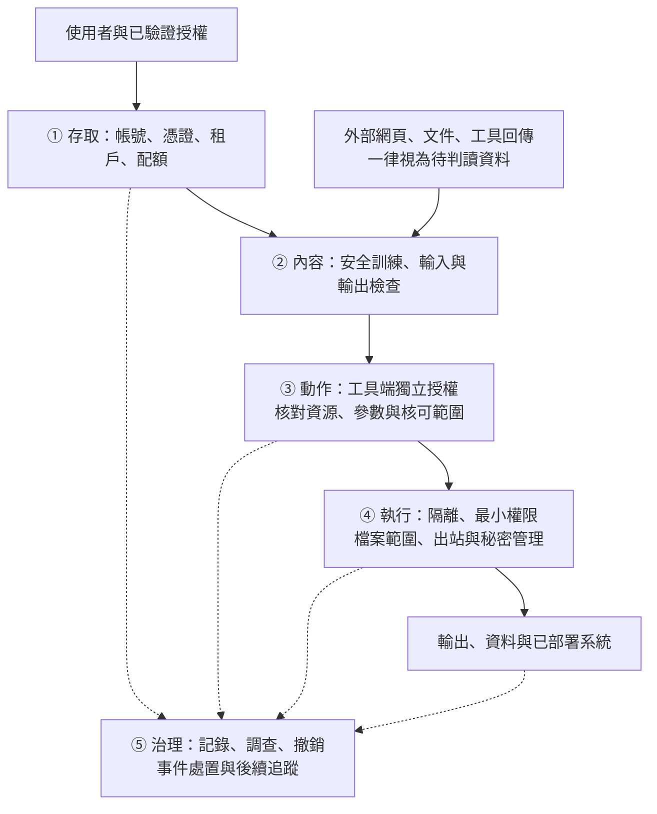

# Claude 的安全防護為何仍會出現濫用？從案例證據到防守驗收

> 適合 SOC／CTI、AI 系統負責人與課程講師。2026-09-19 全文重整。
> 本篇回答三個問題：**防護在哪裡介入？公開證據支持什麼？組織要如何驗證自己的控制？**
> 案例以 Anthropic 2026 年 9 月報告為主；產品案例與工具另列來源。本篇的控制圖、A–E 與 F1–F7 都是教學分析框架，不是 Anthropic 公布的完整系統架構。

<nav class="topic-jumps" aria-label="本篇快速閱讀">
<a href="#answer">先看核心答案</a>
<a href="#case-evidence">查看案例證據</a>
<a href="#controls">建立防護清單</a>
<a href="#validation">實作與驗收</a>
</nav>

## 一、核心答案：拒絕一次請求，不等於阻止整場行動 {#answer}

**安全防護可以攔下一部分請求，但一次濫用行動可能同時涉及帳號、內容、工具權限與已交付的產出。** 要評估防護效果，必須指出控制對象、觀察期間和結果，不能只問模型「會不會說不」。

例如，報告記載 GTG-14021 曾遇到拒絕，後續重新提示仍取得協助；GTG-50027 的系統則已在地端執行，停用 Claude 帳號不會關閉那套部署。兩者都出現風險，原因與可用的處置卻不同（PDF pp.95、97、104）。

| 看見的現象 | 可以支持的判斷 | 仍然不能下的結論 |
|---|---|---|
| 某次請求被拒絕 | 特定控制曾介入 | 整場行動已失敗，或平台拒絕率很高 |
| 一個工具執行了越權動作 | 要追查授權、參數、執行環境與信任邊界 | 一定是模型內容安全被越獄 |
| 封鎖了涉案帳號 | 該存取管道受到處置 | 已交付的程式碼、資料或地端系統已被收回 |
| 報告沒有列出某模型的濫用 | 在該報告選案與可見度內未見這類案例 | 模型不可能被濫用，或已證明防護較強 |

本報告刻意選取值得揭露的案例，**不是隨機抽樣，也未提供全平台請求母體**（PDF p.3）。因此本篇不計算「Claude 有多容易被繞過」，也不由案例數推算防護失敗率。

**閱讀安排**：第一次閱讀先看第 1–4 節；負責系統導入者接著做第 6–8 節；第 5、9–10 節供技術討論與工具選型。課程最後交付一張「證據—控制—驗收」表。

手機閱讀時，寬表格可左右滑動。

## 二、先分清楚：誰在使用 AI，誰的 AI 正被攻擊？ {#distinctions}

| 情境 | 分析對象 | 主要問題 |
|---|---|---|
| 行為者用自己的 AI 帳號協助濫用 | 平台使用與濫用治理 | 請求如何被允許、追蹤與處置？ |
| 外部內容操控受害者的 AI 代理 | 受害者的應用、工具與資料 | 不可信資料如何影響具權限的動作？ |
| AI 產品存在傳統軟體漏洞 | API、瀏覽器、資料庫、IDE 等 | 身分、授權、輸出處理或隔離是否失效？ |

這三種情境可能同時存在，但不能混算為同一種「越獄成功」。GTG-50020 的評測沙箱案例涉及第二種情境；不能直接拿它衡量 Claude 對使用者有害請求的拒絕能力（PDF p.30）。

### 本篇用語

- **濫用**：以 AI 支援違反規範或造成危害的活動；不必然經過越獄。
- **越獄**：試圖讓模型違反其內容安全約束。是否成功要有輸出與判準。
- **提示注入**：輸入影響模型，使其偏離原定行為；外部文件、網頁或工具回傳中的指令屬間接注入風險。
- **授權失效**：應用或工具允許主體執行不被授權的動作。模型回覆「可以」不能代替後端權限檢查。
- **設計範圍外**：控制明確不涵蓋某種風險；與控制涵蓋但漏判不同。

提示注入的定義與直接／間接區分參考 [OWASP LLM01:2025](https://genai.owasp.org/llmrisk/llm01-prompt-injection/)。本篇的防守建議是設計與驗收方向，沒有宣稱已在讀者環境實測。

## 三、把安全防護拆成五個檢查點 {#boundaries}

以下為**教學用責任圖**。目的是找到可以收集證據和強制執行規則的位置；不是說每家服務都有相同元件或順序。



| 檢查點 | 應回答的問題 | 主要負責人 | 可保留的證據 |
|---|---|---|---|
| ① 存取 | 這個主體有權使用這個服務與資料範圍嗎？ | IAM／平台管理 | 主體與租戶識別、憑證範圍、驗證結果 |
| ② 內容 | 此請求與輸出是否符合已定義政策？ | 模型／安全團隊 | 政策版本、判定、拒絕與復核結果 |
| ③ 動作 | 這個人有權對這個物件執行這次動作嗎？ | 應用／工具維護者 | 目標物件、授權決策、核可記錄 |
| ④ 執行 | 即使前面判斷出錯，影響是否被限制？ | 基礎設施／端點團隊 | 程序、檔案、網路與秘密存取記錄 |
| ⑤ 治理 | 能否重建事件、停用權限並確認處置效果？ | SOC／治理負責人 | 關聯事件 ID、撤銷時間、處置後檢查 |

**要特別分開第 ② 與第 ③ 點。** 分類器可以協助識別風險；資源權限仍要由工具或後端強制檢查。OWASP 將過多功能、權限與自主權列為 [LLM06:2025 Excessive Agency](https://genai.owasp.org/llmrisk/llm062025-excessive-agency/) 的主要成因。

## 四、案例證據：先記錄觀察，再討論原因 {#case-evidence}

下表的「來源明載」是指**Anthropic 報告的敘述**，不表示本課取得原始遙測或完成獨立重現。頁碼均為 PDF 實體頁碼。

| 案例與來源位置 | 來源明載的觀察 | 本課的防守判讀 | 證據沒有回答的問題 |
|---|---|---|---|
| [GTG-14021](../03-surveillance/GTG-14021-weiwen-transnational-repression.html)，pp.95、97 | 某次請求被拒絕，進一步提示後取得協助；不同子案的防護表現不一致 | 需要把拒絕、後續請求及結果放在同一條事件鏈 | 完整提示序列、全體重試分母及通用成功率 |
| [GTG-50020](../01-cyber/GTG-50020-ai-supply-chain.html)，p.30 | 惡意指令進入 AI 廠商的自動評測沙箱，導致其中憑證外洩 | 查工具授權、秘密可見度、出站控制與沙箱隔離 | 受害系統完整架構及各控制的獨立貢獻 |
| [GTG-50027](../03-surveillance/GTG-50027-mali-mass-interception.html)，p.104 | 產品以本地模型在地端運行，帳號處置不影響已部署產品 | API 停權與下游部署處置是兩項工作 | 已部署系統的後續狀態及其他處置是否有效 |
| [生物 Case 1](../05-bio/case1-classifier-caught.html)，p.131 | 分類器攔截一項請求 | 控制介入可成為調查入口 | 單一攔截不能代表全平台效果 |
| [生物 Case 3](../05-bio/case3-classifier-gap.html)，p.135 | 雙重用途請求得到協助，未被分類器阻擋 | 內容判斷需結合用途、存取與治理；本篇只討論控制範圍 | 不能推定已揭露惡意動機或完整越獄輸入 |
| [生物 Case 4–5](../05-bio/case4-5-venoms-toxins-out-of-scope.html)，pp.136–137 | 報告明說未攔截符合該分類器的設計範圍 | 要把「範圍外」與「漏判」分開登錄 | 不代表所有控制都不適用，也不證明無風險 |

### 用 A–E 保留跨教材的對照

舊版稱「五條規避路徑」。本版把它們當成**五個風險分析視角**，避免暗示每一項都是已證實的攻擊步驟：

| 代號 | 用來檢查什麼 | 使用條件與反例 |
|---|---|---|
| **A 存取** | 身分、憑證、轉售管道與撤銷 | 取得服務存取權不等於內容安全停用；重新取得帳號屬 A |
| **B 內容** | 拒絕、改寫、重新提示與後續輸出 | 必須有序列證據；不能因出現濫用就補出一段越獄 |
| **C 設計範圍** | 哪些風險不在既定控制覆蓋內 | 只有來源明示範圍才歸 C；「工具請求被放行」本身不足 |
| **D 模型與可見度** | 模型版本、可用性、選擇與觀察限制 | 未觀察到不等於不存在；不能逕稱模型較弱或較安全 |
| **E 交付後治理** | 產出、資料或系統離開服務後的處置 | API 停權未關閉地端部署，不等於所有法律或技術措施都無效 |

**反例練習**：GTG-14020 未揭露拒絕情形，所以不能把它列為 F3「拒絕後重新提示」的已知案例。這種「維持未知」也是一項正確分析結果。

四種失效模式、A–E 與 F1–F7 的關係見[證據與方法](04-evidence-and-methods.html#4)。它們是不同視角，不能加總成三份證據。

## 五、F1–F7：形成防禦假說，不能單憑標記判定惡意 {#families}

下列七族保留與其他教材的相容性。**類別描述的是樣態，不代表來源公布了攻擊者逐字提示詞。** 請求自稱「授權研究」、出現模板或工具呼叫，都可能是正常活動。

| 手法族 | 值得檢查的訊號 | 正常反例 | 應如何驗證 |
|---|---|---|---|
| **F1 人設／授權框定** | 文字宣稱與實際帳號授權不一致 | 合法研究員說明工作範圍 | 同一句請求配不同的實際權限，檢查後端是否正確限制 |
| **F2 任務拆分／跨會話** | 同一經驗證主體的子任務可串成高風險流程 | 批次作業、團隊分工 | 用限定時間窗關聯；加入不同租戶、不同任務作負對照 |
| **F3 拒絕後重新提示** | 同一主題出現「拒絕→改寫→結果改變」 | 使用者補充合法範圍，修正誤會 | 分別評估初次拒絕與後續結果，保留合法澄清流程 |
| **F4 良性框架** | 宣稱目的與要求能力、資料範圍不一致 | 真正的教育與防禦需求 | 在其他條件固定下比較改寫前後，人工檢查是否實質同一任務 |
| **F5 工具／記憶中介** | 外部資料影響工具動作、權限或任務目標 | 正常文件中的命令範例 | 用無害替身測目標偏移與授權；單有工具或記憶不能證明注入 |
| **F6 推理／提示萃取** | 系統性索取內部提示、非公開推理或機密 | 產品允許的答案解釋與來源摘要 | 將解釋能力與機密暴露分開評分；檢查敏感值是否真的離開系統 |
| **F7 輸出格式操縱** | 格式改變後風險內容或必要上下文被忽略 | 正常要求 JSON、簡短摘要或模板 | 同一權限與任務下測不同格式，檢查實際資料與動作 |

### 分類最容易出錯的四個地方

1. **F2 不等於有多個 session。** 需要任務連續性與合理的關聯依據，避免將共用出口或相似措辭誤認為同一人。
2. **F3 不自動等於 Crescendo。** 後者是特定研究中的多輪方法；拒絕後重試只能支持較窄的序列描述。
3. **F5 不自動等於間接提示注入。** 使用工具、代理群或記憶檔可能只是工作流程；要確認外部內容是否跨越指令／資料邊界。
4. **F6 與系統提示洩漏也不同。** 生成一段看似內部的文字未必是真的；應用不可將系統提示的保密性當作授權控制。參考 [OWASP LLM07:2025](https://genai.owasp.org/llmrisk/llm072025-system-prompt-leakage/)。

逐案對照與教材分組統計見[護欄速查](03-guardrail-bypass-and-defense-overview.html)。那些數字是教材標記分布，不是現實世界的攻擊盛行率。

## 六、能落地的防護：每一項都要有負責人與驗收證據 {#controls}

以下是**待環境驗證的設計建議**。部署在雲端或地端，都應盤點既有控制與缺口；開源授權本身不能告訴你防護強弱。

| 控制 | 實際要做的事 | 驗收證據 | 仍需防範的問題 |
|---|---|---|---|
| 帳號與資源授權 | 在工具端核對主體、租戶、物件及操作，限制憑證權限 | 未授權存取遭拒；合法操作仍成功 | 共用高權限服務帳號繞過租戶邊界 |
| 高影響動作核可 | 核可綁定具體目標與參數；執行前再次比對 | 目標或參數變更後，舊核可不再適用 | 核可後替換內容、目標或工具的時序問題 |
| 不可信內容處理 | 標記資料來源、限制能觸發的動作，獨立檢查輸出 | 無害誘導樣本不能改變授權範圍 | 單靠刪除「忽略指示」等關鍵字漏掉變體 |
| 執行隔離與出站限制 | 為測試代理配置受限檔案範圍、網路目的地及測試憑證 | 模擬越界讀取、寫入與出站均留下拒絕記錄 | 模型沒有某個工具，仍可能經其他工具到達同一資源 |
| 秘密與回傳資料管理 | 秘密保留在工具後端；只回傳任務必需資料 | 合成機密標記未出現在未授權輸出 | 過濾器失誤；日誌或錯誤訊息成為另一條外洩路徑 |
| 監控與事件處置 | 串起請求、授權、工具與執行結果；演練撤銷 | 能追溯一項異常動作，並確認撤銷後不能重用 | 只看拒絕文字，沒看工具是否實際執行 |

這張表由本課依案例風險與 OWASP 原則整理；其控制組合與驗收方式仍須依業務調整。它不是一套已證明對所有模型有效的產品設定。

### 最小日誌契約

先記錄能回答調查問題的欄位，避免預設保存所有原始對話：

```text
timestamp / event_id / request_id / parent_task_id
actor_id / tenant_id / session_id
model_version / policy_version
input_source_type / source_reference
tool_name / resource_reference / requested_action
authorization_decision / approval_reference / execution_result
detection_rule_version / review_result
```

這是**教學欄位提案**，不是平台通用 schema。生產部署需定義保存期限、可閱角色、遮罩方式和查調程序；不要把真實秘密、個資全文或非必要推理軌跡收進一般日誌。跨會話關聯應採用已驗證的主體識別，不能只靠 IP 或語言風格推定同一人。

## 七、如何驗收：先定義失敗，再選測試工具 {#validation}

### 7.1 將「模型回答」與「系統造成的結果」分開判分

以下為建議驗收順序，門檻須由系統負責人事先訂定：

1. **列出禁止結果**：例如越租戶取資料、超範圍寫檔、未核可外傳。用合成資料與無害標記取代真實機密。
2. **固定測試條件**：模型、系統提示、工具與套件版本、政策、嘗試次數、對話長度和抽樣參數。
3. **建立三類案例**：需阻擋的越界行為、應放行的正常工作、資料不足或需人工審查的模糊情境。
4. **同時看兩種結果**：模型是否產出違規內容；後端是否真的執行未授權動作。拒絕文字不能抵銷已發生的工具外洩。
5. **自動評分後抽樣覆核**：覆核所有嚴重失敗、爭議案例，以及成功與阻擋樣本中的抽樣；記錄裁判模型與人工意見的分歧。
6. **修補後測舊樣本及保留樣本**：確認原問題已處理，也檢查新變體與正常業務是否受損。若仍有未解釋的高影響越界，縮小權限或暫停該動作。

### 7.2 最少報告這些數字

| 指標 | 本課建議的計算口徑 | 容易誤判的地方 |
|---|---|---|
| 攻擊成功率 ASR | 達成預先定義違規目標的測試單位 ÷ 有效攻擊測試單位 | 先說單位是單次請求、完整對話或有限重試下的目標；不可混用 |
| 正常任務成功率 | 完成預期業務的正常案例 ÷ 正常案例總數 | 全部拒絕可能使 ASR 降低，卻讓產品不可用 |
| 偵測精確率 Precision | TP ÷ (TP + FP) | 與攻擊成功率不同；缺乏標記資料時不能可靠估計 |
| 偵測召回率 Recall | TP ÷ (TP + FN) | 沒觀察到漏報不等於漏報為零 |
| 作業負擔 | 審查量、等待時間、延遲及資源成本 | 改善安全指標後，也要評估處置是否可持續 |

分母為零時標「不適用」，不要填成 100%。超時與執行錯誤另列，不默認為成功防禦。比較前後版本時要保留相同測試條件、原始計數和差異原因。

### 7.3 本站可直接完成的離線實作

[下載合成日誌與離線程式](../downloads/course-labs.zip)，解壓縮後在該資料夾執行：

```bash
python run_labs.py --all
```

程式只讀本機合成資料，不呼叫模型、不連線，也不接觸報告中的 IOC。**它驗證的是教學偵測規則與判分流程，不是模型的越獄抵抗力。**

| 實作 | 練習能力 | 學員入口 |
|---|---|---|
| GTG-50014 取材情境 | 用工作階段關聯異常事件，辨認正常維運誤報 | [工作階段異常作業](../10-practice/01-50014-student.html) |
| GTG-14020 取材情境 | 在虛構資料中判讀批次模板處理訊號，不以關鍵字認定惡意 | [風險模板作業](../10-practice/03-14020-student.html) |
| GTG-50020 取材情境 | 串起不可信工具內容與合成標記外傳，檢查證據關聯 | [工具內容與外傳作業](../10-practice/05-50020-student.html) |

每案刻意包含誤報與漏報，預期為 TP=1、FP=1、TN=2、FN=1。程式的 `expected_match=true` 代表結果符合這份教材的答案，**不是所有風險都被擋住**，也不能以這五個情境估算生產環境的效力。

## 八、課堂與團隊導入：交付一張可覆核的決策表 {#assignment}

**建議 90 分鐘教學安排**：核心概念 15 分鐘、案例證據 20 分鐘、控制設計 20 分鐘、離線實作 25 分鐘、交叉覆核 10 分鐘。這是排課建議，非完成保證。

其中 25 分鐘用於抽樣解讀一套實作；完整案例作業另需依學員包安排 75–90 分鐘。

### 學員題目

某組織要導入「內部文件助理」，能讀取文件、產生報表，並在核可後寄出摘要。文件可能包含外部投稿，代理使用的服務帳號目前能讀所有部門資料。

請提交以下四項，不執行任何真實外傳：

1. 畫出使用者、外部文件、模型、工具、資料庫與寄件服務的信任邊界。
2. 指出兩項能強制執行的控制，為每項控制設計一個越界案例與一個正常反例。
3. 完成下表至少三列，至少一列結論必須維持「未知／待查」。
4. 以一套本站合成實作說明 FP 或 FN，寫出需要補的日誌或後續測試。

| 來源與觀察 | 分析／未知 | 控制與負責人 | 驗收方式 | 剩餘風險 |
|---|---|---|---|---|
| 教學情境：服務帳號可讀所有部門 | 未確認是否另有後端物件授權 | 工具維護者核對使用者與文件權限 | 測試甲部門能讀自己的文件、不能讀乙部門文件 | 索引、快取與錯誤訊息也需檢查 |

### 講師評分與參考方向

以下權重專用於本專題的「證據—控制—驗收」決策表；完整離線案例依實作總覽的共用規準評分。

| 項目 | 分數 | 得分條件 |
|---|---|---|
| 證據紀律 | 25 | 清楚分開來源陳述、分析與未知，沒有把合成情境寫成實際事件 |
| 控制邊界 | 30 | 授權在工具／後端執行；寄件核可綁定收件人與內容；考慮讀取權限 |
| 驗收設計 | 30 | 包含正常反例、越界結果、判分單位、FP／FN 與人工覆核 |
| 維運與限制 | 15 | 有負責人、必要日誌、撤銷方式及未解決事項 |

只有「加強 system prompt」或「裝一個分類器」而無法指出權限強制點的答案，不符合控制邊界的得分條件。能指出缺資料並提出查證方式的答案可以得分；不要求猜測未揭露的攻擊內容。

其他模組的作業、講師包與規準見[實作與評量總覽](../10-practice/00-practice-guide.html)。

## 九、進階工具選擇：工具能力與驗證結果分開看 {#tools}

本表只協助選擇測試角色。工具數量、外掛名稱、參數與支援版本會變；**本課沒有在你的模型或端點上執行這些工具，也不提供未經版本核對的整套設定作為可直接部署方案。**

| 類型與官方來源 | 適合回答的問題 | 使用前必須確認 |
|---|---|---|
| [NVIDIA garak](https://github.com/NVIDIA/garak) | 哪些已定義探測會產生不希望的模型回應？ | target／probe／detector 設定、版本、輸出判準；探測命中需回看樣本 |
| [Promptfoo red teaming](https://www.promptfoo.dev/docs/red-team/) | 應用的角色、資料與功能改版後，回歸測試是否失敗？ | 受測端點、攻擊生成與評分 provider；設定為地端目標不代表其他步驟離線 |
| [Microsoft PyRIT](https://github.com/microsoft/PyRIT) | 多輪與自適應互動下，目標、評分與對話紀錄如何組合？ | 依安裝版本選 API；舊版 orchestrator 範例不能直接當現行介面 |
| [HarmBench](https://github.com/centerforaisafety/HarmBench)、[JailbreakBench](https://jailbreakbench.github.io/) | 在指定題庫、嘗試預算與裁判下，模型表現如何？ | 題庫與業務是否相符；統一裁判不等於沒有偏誤，也不等於量到工具權限 |
| [LlamaFirewall](https://github.com/meta-llama/PurpleLlama/tree/main/LlamaFirewall) | 哪些輸入、代理行為或程式碼檢查可加入流程？ | 個別掃描器依賴、資料流、延遲和實測效果；部署分類器不等於完成授權控制 |

### 三種測試不能互相代替

- **模型端點測試**：看輸出與政策，不能單獨驗證真實工具權限。
- **代理整合測試**：含工具回傳、資料權限、核可與執行結果，應在隔離測試系統進行。
- **偵測規則測試**：對日誌判定告警，本站離線實作屬此類；告警不等於阻擋。

要保留可重現性，請記錄版本或 commit、設定雜湊、資料集版本、裁判、失敗樣本與正常對照。需要離線評測時，逐一檢查模型、攻擊生成、評分、模型下載及遙測的資料流；不要只看受測端點是 `localhost`。可對照 [Promptfoo 資料處理說明](https://www.promptfoo.dev/docs/red-team/troubleshooting/data-handling/) 與 [PyRIT 元件架構](https://github.com/microsoft/PyRIT/blob/main/doc/code/framework.md) 逐項盤點。

## 十、AI 產品與代理：把同一套方法用到工具權限 {#products}

### 10.1 SupaPwn：研究者揭露，與獨立驗證分開

[Hacktron 的 SupaPwn 文章](https://www.hacktron.ai/blog/supapwn) 包含兩段需要分開閱讀的研究。早期 Lovable 測試中，研究者稱曾讓 AI 資料庫工具執行原本受到限制的操作，但與安全團隊核對後，確認使用者之間的資料庫隔離仍然有效，**沒有取得其他使用者資料**。文章接著描述轉向 Supabase 的另一段研究，涉及傳統資料庫與雲端弱點；不能把前面的護欄互動直接說成已成功跨租戶攻擊鏈的入口。

本課採用的教訓是：**觀察到模型或工具配合，還要確認是否真的越過資料與權限邊界。** 不重述操作字串或攻擊步驟。

這是研究團隊的一手揭露。文中獎金、修補時程和影響範圍仍屬該來源的陳述；**有獎金敘述不等於本課獨立證實完整攻擊鏈、實際受害範圍或所有修補效果**。同一篇文章被多家轉述，也不能升格為多源事件驗證。

映射到本篇：第 ② 點看請求判斷，第 ③ 點查工具與資料庫身分的實際權限，第 ④ 點查後段影響能否被限制。不能因入口包含 AI，就把整條鏈都歸因為模型越獄。

### 10.2 Coding agent、瀏覽器與 IDE 的驗收題

以下為通用的**防守檢查提案**，不宣稱所有產品都有這些漏洞。用產品官方安全文件與受測版本逐項確認。

| 使用情境 | 應檢查的邊界 | 一項驗收證據 |
|---|---|---|
| Coding agent 改檔、執行命令 | 工作目錄、命令權限、核可內容與實際執行是否一致 | 越工作目錄寫入遭拒；核可後內容改變須重新評估 |
| 讀取 PR、issue、README 或工具回傳 | 外部文字能否觸發特權動作 | 無害誘導文件不能擴大原任務的授權範圍 |
| 瀏覽器／擴充／桌面助手 | IPC、訊息來源、分頁與跨來源資料權限 | 不在允許來源的請求無法讀取受保護分頁資料 |
| IDE、language server、檔案工具 | 路徑正規化、授權根目錄與符號連結 | 正常專案檔案可處理，越界路徑被拒並留記錄 |
| 套件與 CI/CD | 依賴來源、安裝腳本、工作流程權限及發布憑證 | 高風險變更經審查；測試工作無法取得正式發布權限 |
| 報表與外部傳送 | 收件人、目的地、資料分類及核可 | 未核可的目的地與資料組合無法送出 |

**拿掉不必要工具可以移除一條可達路徑；不能據此宣稱整個模型或產品「免疫」。** 同樣地，輸入淨化、域名允許清單或人工核可都要放進完整系統測試，不能各自當作保證。

## 十一、常見誤讀與本次勘誤 {#errata}

| 舊版容易造成的誤解 | 本版採用的判讀方式 |
|---|---|
| 五條路徑都是實際攻擊步驟 | A–E 是分析視角；D 尤其包含模型選擇與觀測限制 |
| GTG-14020 是拒絕後重新提示的例子 | 拒絕情形未揭露，維持未知；以 GTG-14021 示範有來源的序列 |
| 沒有出現 Fable／Mythos 濫用，證明模型更安全 | 報告 p.3 只界定選案範圍，且有蒸餾例外；未隔離存取量、觀察期等因素 |
| F1–F7 都是報告逐字公開的提示詞 | 分開記錄來源敘述、輸入摘錄與教材分析 |
| 紅隊工具指向地端就全程離線 | 另查生成、裁判、下載與遙測；以實際設定驗證 |
| 自動評分即可，ASR 沒降就一定沒修好 | 覆核嚴重與爭議案例，並看實際越權、正常任務與執行錯誤 |
| 賞金可查就代表全鏈已獨立證實 | 分開來源陳述與獨立支持的具體範圍 |
| 沒有某工具就免疫，地端模型必然沒防護 | 依實際工具與部署判斷可達範圍，拒絕概括推論 |

完整方法見[證據與方法](04-evidence-and-methods.html)，其他修訂見[全站查核與公開勘誤](05-editorial-review-and-changelog.html)。

## 十二、來源、查核範圍與研究限制 {#sources}

**本次核對範圍**：Anthropic PDF p.3 的選案與模型範圍；p.30 的沙箱案例；pp.95、97 的拒絕序列；p.104 的地端處置限制；pp.131、135–137 的分類器治理敘述。生物內容只用於區分攔截、漏接與設計範圍，未展開任何操作內容。

| 來源 | 本篇採用的範圍 | 證據類型與限制 |
|---|---|---|
| Anthropic《Detecting and countering misuse of AI: September 2026》PDF，上列頁碼 | 指定案例與平台處置敘述 | 平台單方報告；沒有原始全量請求或獨立重現 |
| [OWASP LLM01:2025](https://genai.owasp.org/llmrisk/llm01-prompt-injection/) | 直接／間接提示注入定義 | 風險與設計指引，不驗證 GTG 個案 |
| [OWASP LLM06:2025](https://genai.owasp.org/llmrisk/llm062025-excessive-agency/) | 功能、權限與自主程度；後端授權 | 工程原則，效果仍須在指定系統驗收 |
| [OWASP LLM07:2025](https://genai.owasp.org/llmrisk/llm072025-system-prompt-leakage/) | 系統提示不能作為秘密或權限邊界 | 不支持「藏好提示即可安全」的說法 |
| 第九節各工具官方倉庫與文件 | 定位、維護入口及版本限制 | 未在本課環境執行完整模型評測 |
| [Hacktron SupaPwn](https://www.hacktron.ai/blog/supapwn) | 第三方產品的工具邊界案例 | 研究者揭露；本課未獨立重現或確認所有後續狀態 |
| 本站合成實作及預期結果 | 日誌關聯、正常反例與判分 | 教學資料；不代表真實流量、模型 ASR 或生產效果 |

本篇不能回答全平台的濫用率、各模型的比較安全性、特定公司的完整防護架構，或你的部署可接受多少風險。可交付的成果是：**把每個結論放回它的證據範圍，為每項控制寫出可檢查的驗收條件。**
