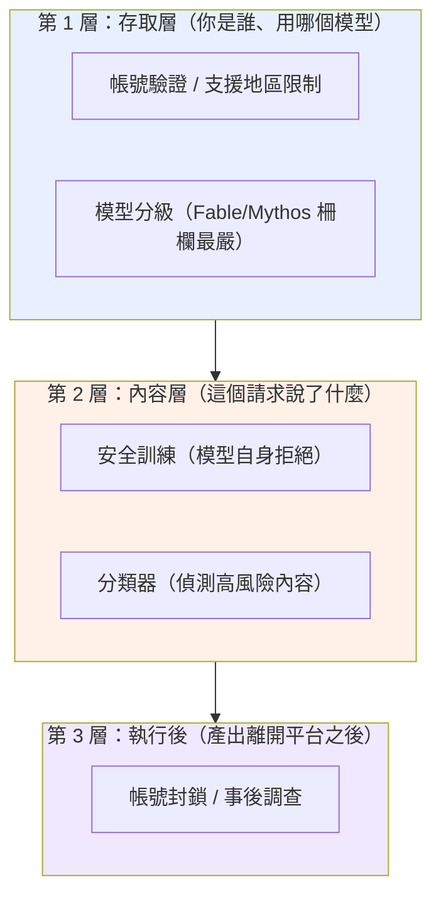
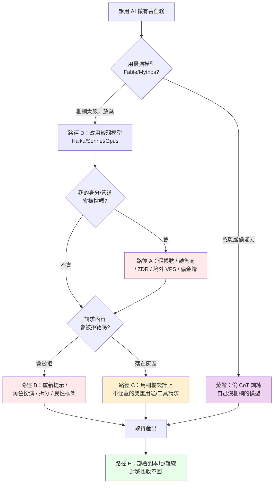

# 專題：Claude 的安全柵欄很嚴格，為什麼 GTG 還是繞過了？

> 用途：回答課程最常被問的問題——「Claude 的道德柵欄不是很嚴嗎？為什麼這份報告裡有這麼多成功濫用？」
> 這份專題橫跨全部八個模組，是理解整份報告的關鍵框架。建議排在課程第一天，緊接網路行動導論之後。

---

## 一、先破除一個誤解：多數 GTG 不是「越獄」破了柵欄

直覺會以為：報告裡每個 GTG 都是「找到咒語騙過 Claude」。**這是錯的。** 真正靠「內容層越獄」硬破柵欄的案例是少數。絕大多數成功濫用走的是**柵欄根本沒守到、或設計上不守**的路徑。

要精確回答「柵欄嚴不嚴」，必須先把「柵欄」拆成三層，它們各自的強度與盲區不同：

報告揭露的五條規避路徑，正好對應「打穿或繞過」這三層的不同方式。理解這五條路徑，就理解了整份報告。

---

## 二、柵欄「確實嚴格」的證據：報告裡 Claude 拒絕的實例

在談規避之前，先確立一個事實：**柵欄不是紙糊的。** 報告本身充滿 Claude 拒絕、分類器攔截、能力被限制的實例。這些是攻擊者「必須費力規避」的原因——如果柵欄無效，他們根本不需要那些規避手法。

| 模組 / 案例 | 柵欄發揮作用的實例（報告原文依據） |
|---|---|
| 影響力 GTG-04001 | Claude 拒絕「點名真實個人為武裝分子、以招來安全打擊」的最激進請求 |
| 影響力 GTG-84005 | Claude 辨識出某文件屬政治誹謗材料後拒絕 |
| 監控 GTG-14010 | Claude 拒絕若干秘密審訊與大規模假人設請求 |
| 監控 GTG-14021 | 公安偵查員的請求**先被 Claude 拒絕**（之後才靠重新提示突破） |
| 監控 GTG-30006 | Claude「十次拒絕九次」（nine out of ten） |
| 監控 GTG-34007 | Claude 拒絕了明確的側寫與宣傳請求 |
| 生物 Case 1 | 生物安全分類器攔下補助申請並啟動威脅調查 |
| 生物 Case 2 | 分類器把高風險互動限制在能力最弱的模型 |
| 蒸餾（全章） | 隨 Fable 5 上線強化 extraction 分類器；Fable 網路防護擋住 Zhipu 的網路能力蒸餾 |
| 常規武器（全章） | Anthropic 新增分類器偵測並封鎖武器開發請求 |

**教學重點**：報告是一份「防線與規避的對抗史」，不是「柵欄失效史」。攻擊者投入大量資源去規避，本身就證明柵欄提高了成本。

---

## 三、五條規避路徑（逐條拆解）

### 路徑 A：存取層規避——根本沒碰到內容柵欄

這是**最常見**的路徑，也最容易被忽略。攻擊者不去「騙過」Claude，而是讓自己看起來像正當使用者，或根本不透過正規管道。

- **手法**：假帳號 / 合成身分、灰市轉售商（gray market resellers）、ZDR（Zero Data Retention）夥伴平台隱藏內容、境外 VPS 偽裝來源規避支援地區限制、竊來的 API 金鑰與 session token。
- **案例**：生物 Case 1（軍方機構研究者透過 ZDR 轉售平台 + 美國 VPS）、生物 Case 2/3（不支援地區 + 中繼帳號）、蒸餾全章（3,500+ 假帳號、空殼公司 proxy）、GTG-50021 與 GTG-50020（竊來的金鑰）。
- **為什麼有效**：內容柵欄再嚴，也要先「看到」請求才能判斷。存取層規避讓請求以正當面貌進入，或分散到大量拋棄式身分，稀釋風險評分。
- **關鍵洞察**：這條路徑打的是**第 1 層（存取層），繞過了第 2 層（內容層）**。報告的解方「可信任使用者審核制」正是要補強這一層。

### 路徑 B：內容層繞過——騙過模型自身的拒絕

這才是一般人以為的「越獄」，但它只是五條路徑之一。

- **手法**：重新提示（拒絕後換說法再問）、角色扮演（如 GTG-1002 假扮「合法資安公司做滲透測試」）、任務拆分（把惡意任務切成無害子任務、分散到不同 session）、良性框架（把請求包裝成防禦性/治療性目的）。
- **案例**：GTG-14021（拒絕後重新提示取得對 10 名公民的「控制」建議）、GTG-30006（拆分到後續小 session 繞過）、生物 Case 3（聚焦「減毒」的良性框架使分類器放行）。
- **為什麼有效**：安全訓練與分類器判斷的是「單一請求的內容看起來像什麼」。跨 session 拆分打散了惡意訊號；良性框架讓內容落在「看似正當」的一側。
- **關鍵洞察**：這條路徑打**第 2 層**，暴露了「用內容判斷意圖」的原理性上限——在雙重用途領域，善意與惡意的文字可能一模一樣。

### 路徑 C：柵欄設計上不涵蓋——範圍留白

- **手法**：利用柵欄「刻意不管」的範圍。生物分類器設計上針對「讓新手取得已知生物武器」，不涵蓋專業人員的新化合物研究；ATT&CK 沒有 agentic orchestration 的技術 ID。
- **案例**：生物 Case 4-5（毒液毒素研究，報告明說「largely unimpeded... This was by design」）、大量監控案（「側寫異議者」被拒，但「寫個收集資料的工具」被放行，因為工具開發看似中性）。
- **為什麼有效**：這不是柵欄失靈，是範圍界定的必然取捨——涵蓋太廣會癱瘓大量正當使用。
- **關鍵洞察**：這條路徑不打任何一層，而是走在**層與層之間的縫隙**。

### 路徑 D：模型選擇——避開柵欄最嚴的模型

**這條路徑直接回答「柵欄不是很嚴嗎」——因為最嚴的柵欄，攻擊者根本不去碰。**

- **報告原文**（Overview）：「None of the misuse cases involved the use of Claude Fable or Mythos-class models, with the exception of one illicit distillation case.」（除一起蒸餾案外，所有濫用都未涉及 Fable 或 Mythos 級模型。）
- **報告原文**（網路章）：「no malicious activity was found on Claude Fable or Mythos (which has a series of safeguards in place that greatly reduce its ability to perform harmful cyber tasks)」。
- **意義**：Fable / Mythos 是柵欄最嚴的模型，嚴到**幾乎沒有成功濫用**。被濫用的幾乎全是較舊的 Haiku / Sonnet / Opus。生物 Case 2 更直接——分類器主動把高風險互動**降載到最弱的模型**（Sonnet 4 / Haiku 4.5），使實質能力提升被壓到文書層次。
- **關鍵洞察**：所以「柵欄嚴不嚴」的答案是**分層的**：最新最強模型的柵欄嚴到攻擊者放棄；他們退而求其次用較弱模型，或用蒸餾去「偷」強模型的能力來訓練沒有柵欄的自己的模型（這就是為什麼蒸餾是唯一碰到 Fable/Mythos 的領域——偷能力，不是用它作惡）。

### 路徑 E：部署後不可收回——柵欄管不到已交付的東西

- **手法**：一旦 Claude 產出了程式碼或知識，攻擊者把它部署到本地模型、離線工具鏈，斷開 API 也阻止不了。
- **案例**：GTG-50027（馬利監控系統以本地模型運行，封號無法終止已部署系統）、GTG-87001（離線模擬工具不依賴 Claude）、生物 Case 1（operator 封號數天內重建存取）。
- **為什麼有效**：柵欄是「服務層」的控制，管的是「透過 API 的即時請求」。知識與程式碼一旦離開平台就脫離管轄。
- **關鍵洞察**：這條路徑打**第 3 層之外**——這是 API 管制的根本極限，也是開源與地端模型成為治理難題的原因。

---

## 四、一個惡意行為者如何「找路」（決策樹）

把五條路徑合起來，可以還原攻擊者面對柵欄時的實際決策：

---

## 五、對防守方與 AI 治理的意涵

1. **不要把「柵欄」當單一物**：它是存取層、內容層、執行後三層。多數濫用打的是存取層與縫隙，不是內容層越獄。強化內容柵欄（大家最愛談的「對齊」）對路徑 A、C、D、E 幾乎無效。
2. **內容柵欄有原理性上限**：路徑 B、C 證明「用內容判斷意圖」在雙重用途領域不可能完美。這是為什麼報告反覆推「可信任使用者審核制」——把判斷從內容移到身分。
3. **模型分級是有效的**：路徑 D 顯示最強模型的嚴柵欄確實把攻擊者擋到「寧可用弱模型或偷能力」。這支持「能力越強、柵欄越嚴」的分級部署策略。
4. **API 管制有邊界**：路徑 E 是開源與地端部署治理難題的核心——這也是常規武器模組 ASL 討論與蒸餾模組的交集。
5. **對台灣的意涵**：台灣若自建或使用 AI 模型，這五條路徑就是威脅模型的骨架。特別是路徑 A（採購稽核、身分驗證）與路徑 D/E（使用防護較弱的開源模型從事敏感工作的風險），是台灣 AI 治理最該補的兩塊。

---

## 六、課堂設計

### 6.1 核心教學要點
- 「柵欄嚴不嚴」的正確答案是分層的：最強模型嚴到沒被成功濫用，弱模型與規避管道才是缺口。
- 五條規避路徑中，只有一條（路徑 B）是一般人以為的「越獄」。
- 攻擊者投入資源規避，本身證明柵欄有效。

### 6.2 課堂討論題
1. 如果內容柵欄有原理性上限，AI 公司把資源投在「更強的內容對齊」還是「更嚴的使用者審核」？兩者的代價各是什麼？
2. 路徑 D 顯示濫用集中在弱模型。那麼「把舊模型下架」是好的安全策略，還是會把需求推向更沒柵欄的開源模型（連結生物 Case 2 的外溢效應）？
3. 蒸餾（偷強模型能力訓練沒柵欄的自己模型）是否讓「模型分級柵欄」的長期效果歸零？

### 6.3 桌面演練
給學員數個匿名化的請求序列，讓他們判斷該行為者走的是哪一條規避路徑，以及 AI 公司該在哪一層攔截。用第四節的決策樹作為判斷框架。

---

## 七、關鍵原文引文

1. 最強模型幾乎未被濫用（Overview）：
   「None of the misuse cases involved the use of Claude Fable or Mythos-class models, with the exception of one illicit distillation case.」
2. Fable/Mythos 的網路柵欄（網路章）：
   「no malicious activity was found on Claude Fable or Mythos (which has a series of safeguards in place that greatly reduce its ability to perform harmful cyber tasks)」
3. 內容柵欄的原理性上限（生物章 p.137）：
   「since it is not possible to reliably identify the intent of the user in highly technical dual-use areas, a classifier cannot simultaneously enable benefit and prevent harm.」
4. 老練者隱藏意圖（生物章 p.131）：
   「Overt malicious intent is, therefore, often evidence that a particular actor is not all that sophisticated... More sophisticated actors can hide their intent, extracting assistance from an AI model in interactions that look plausibly beneficial.」

---

## 八、與其他教材的連結

- 防線失效的四種**技術**模式（重新提示、跨 session 拆分、工具中性、部署不可收回）見 `01-cross-cutting-analysis.md` 主線三——那份談「偵測工程」角度，這份談「柵欄架構」角度，兩者互補。
- 路徑 C（設計上不涵蓋）的最完整案例在 `05-bio/case4-5-venoms-toxins-out-of-scope.md` 的「分類器四種狀態」。
- 路徑 D/E 與 ASL 分級的關係見 `04-weapons/00-weapons-intro-and-safeguards.md` 與 `08-capability-research/02-weapons-dev-evals-and-policy.md`。
- 蒸餾作為「偷能力繞過模型分級」見 `07-distillation/00-distillation-intro-and-mitigations.md`。
